# A Comprehensive Literary Chinese Reading Comprehension Dataset with an Evidence Curation Based Solution

Dongning Rao1, Rongchu Zhou1, Peng Chen1, Zhihua Jiang2\* 1 School of Computer, Guangdong University of Technology, Guangzhou 510006, China 2 Department of Computer Science, Jinan University, Guangzhou 510632, China raodn@gdut.edu.cn, {2112405271,2112405069}@mail2.gdut.edu.cn, tjiangzhh@jnu.edu.cn

## Abstract

Low-resource language understanding is a challenging task, even for large language mod els (LLMs). An epitome of this problem is the CompRehensive lIterary chineSe readIng comprehenSion (CRISIS), whose difficulties include limited linguistic data, long input, and insight-required questions. Besides the com pelling need to provide a larger dataset for CRISIS, excessive information, order bias, and entangled conundrums still plague the CRISIS solutions. Thus, we present the eVIdence cuRation with opTion shUffling and Abstract meaning representation-based cLauses segmenting (VIRTUAL) procedure for CRISIS, with the most extensive dataset. While the dataset is also named CRISIS, it results from a three-phase construction process, including question selection, data cleaning, and a silver-standard data augmentation step, which augments translations, celebrity profiles, government jobs, reign mottos, and dynasty to CRISIS. The six steps of VIRTUAL include embedding, shuffling, abstract mean ing representation-based option segmenting, evidence extraction, solving, and voting. Notably, the evidence extraction algorithm facilitates the extraction of literary Chinese evi dence sentences, translated evidence sentences, and annotations of keywords using a similarity based ranking strategy. While CRISIS compiles understanding-required questions from seven sources, the experiments on CRISIS sub stantiate the effectiveness of VIRTUAL, with a 7 percent increase in accuracy compared to the baseline. Interestingly, both non-LLMs and LLMs exhibit order bias, and abstract mean ing representation-based option segmenting is beneficial for CRISIS. 1

## 1 Introduction

Literary Chinese, aka Ancient Chinese, or Classical Chinese, lays the foundation for China’s enduring identity and cultural heritage (Daddo, 2024). However, as a low-resource language (Zhang et al., 2024a), understanding literary Chinese is challenging for Large Language Models (LLMs) (Cahyawijaya et al., 2024), which have emerged as a keystone of Chinese understanding (GLM et al., 2024).

CompRehensive lIterary chineSe readIng comprehenSion (CRISIS) is a quintessential task of literary Chinese understanding. However, providing a larger dataset for CRISISis compelling, as the insufficient training corpus problem is still an obstacle for CRISIS (Cao et al., 2024). Further, excessive information (Zhang and Li, 2023), order bias (Li et al., 2024), and entangled conundrums (Xu et al., 2024; Rao et al., 2023) are three of the many challenges for CRISIS.

Thus, we propose the eVIdence cuRation with opTion shUffling and Abstract meaning representation based cLauses segmenting (VIRTUAL) procedure for CRISIS, and build a dataset for CRISIS. The dataset (also named CRISIS) is curated from seven sources in three phases: question selection, data cleaning, and LLM-based data augmentation. We focus on passage understanding, not rote facts, in question selection. Data cleaning involved removing duplicates and balancing answers. At last, we augment CRISIS with silver-standard translations, annotations, celebrity profiles, government jobs, reign mottos, and dynasty information.

VIRTUAL has three motivations and six steps. To address the issue of excessive information, we proposed a new evidence extraction algorithm that utilizes a similarity-based ranking strategy, incorporating literary Chinese evidence sentences, translated evidence sentences, and annotations of keywords. To address the unfairness in LLMs, VIR-TUAL has an option shuffling process (Kawabata and Sugawara, 2023). At last, this paper presents an Abstract Meaning Representation (AMR)- based sentence segmenting function (Chen et al., 2022) for addressing the entangled conundrums. We use clauses segmented from an option as thoughteliciting prompts for LLMs. Additionally, the six steps of VIRTUAL are embedding, shuffling, AMR-based option segmenting, evidence extraction, solving, and voting.

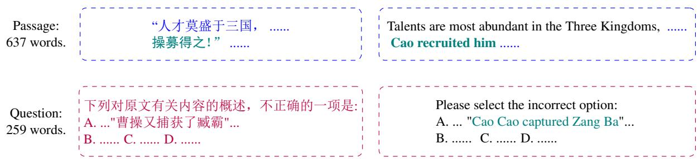  
Figure 1: An example of CRISIS in the National College Entrance Examination 2024 ( a detailed understanding question). The passage (in literary Chinese) is in blue (top-left corner), the question with four options are in purple (bottom-left corner), the English translations are in black (right side), and teal is used to highlight crucial evidences.

We conduct experiments on our dataset and substantiate the effectiveness of VIRTUAL. E.g., evidence extraction with literary Chinese evidence can improve accuracy by 7%. Interestingly, in our experiments, AMR-based option segmenting is constructive, and all models have order bias.

The following summarizes our contributions.

## 1) We build the largest dataset for CRISIS;

2) This paper proposes the novel VIRTUAL procedure for CRISIS with a new extraction algorithm that considers evidence in both literary Chinese and modern Chinese, an option shuffling process that addresses the unfairness of models, and an AMR-based option segmenting for thought-eliciting prompt building.

## 3) Experiments on CRISIS show the effectiveness of VIRTUAL.

We organize the rest of the paper as follows. First, Section 2 presents our problem. Then, our dataset, CRISIS, is presented in Sec. 3. Introducing VIRTUAL is in Sec. 4, before experiments and analysis in Sec. 5. Finally, the paper concludes with a discussion of limitations and future work.

## 2 A Representative Example of Literary Chinese Understanding: CRISIS

## 2.1 Literary Chinese

Some studies (Cao et al., 2024; Wei et al., 2024) treat the terms Classical Chinese, Ancient Chinese, and Literary Chinese as interchangeable; however, historians find them to be non-identical. Classical Chinese refers to written Chinese from the end of the Spring and Autumn period through to the end of the Han Dynasty (Norman, 1988); Ancient China (whose language is ancient Chinese) is the time between the Neolithic period and the Han dynasty (Daddo, 2024); literary Chinese is the style of written Chinese used before the end of the Qing Dynasty2. Thus, literary Chinese is more proper for CRISIS that span from the pre-Qin period to the Qing dynasty (Xu et al., 2020).

Fig. 1 is a CRISIS problem from the 2024 national college entrance examination (GaoKao) of China. Examples of literary Chinese sentences are located in the top-left corner, and their corresponding English translations are presented on the right.

## 2.2 Knowing Is Not Understanding

Reading comprehension (RC) is a representative example of natural language understanding (Sap et al., 2020). However, although comprehension is the ability to understand a situation, some RC problems are knowledge-based, relying on common sense (Ostermann et al., 2018), which tests the model’s awareness of knowledge, such as recognizing that someone is another’s father. Our study separates itself from previous studies in the research line of literary Chinese RC (Xu et al., 2020; Zhou et al., 2023; Zhong et al., 2024; Hou et al., 2024; Wei et al., 2024) by focusing on the questions that involve interpretation and processing of language (Rao et

al., 2023).

We can group paragraph questions into two types: summary questions and detailed questions. The former evaluates the main idea of a paragraph or passage (Stevens et al., 1991), whereas the latter delves into specific details (Pearson and Gallagher, 1983). E.g., Fig. 1 is a detailed question. More details are in Appx. J Tab. 21.

## 2.3 Difficulties of CRISIS

At least four challenges arise from understanding literary Chinese. First, the inconsistency of language styles, e.g., words with shifting meanings (Zhao, 2024). Second, the divergence between spoken and written languages, e.g., literary Chinese, is inherently poetic. Third, literary Chinese lacks morphological markers, such as syntactic inversions. Fourth, the insufficient training corpus situation impedes the understanding of literary Chinese. Our work addresses this issue.

The article in Fig. 1 is a passage about the Three Kingdoms. The article excerpts are in blue, the questions (with four options) are in purple, and their English translations are in black. Further, teal is used to highlight crucial evidence. The deceptiveness of this question lies in the answer: Zang is not captured but recruited by Cao.

## 2.4 Experience from Existing Solutions

While the potential of LLMs to interpret literary Chinese remains largely untapped (Sommerschield et al., 2023; Zhang et al., 2024b), recent studies that focus on literary Chinese understanding get three observations: first, LLMs better encode syntactic structures; second, co-reference chains is a complexity factor for all models but significantly affects only small models (Antoine et al., 2024), third, Chinese LLMs outperform English ones in literary Chinese (Wei et al., 2024), and Qwen (Yang et al., 2024) performed better in handling complex texts. This study aligns with other efforts to explore the potential of leveraging LLMs for understanding literary Chinese.

## 3 Comprehensive Literary Chinese Reading Comprehension Dataset

This section presents the construction process and dataset results for CRISIS. We will begin with the sources of CRISIS, then show the curation process, including data augmentation.

## 3.1 Sources

Following dataset collection instructions (Dzendzik et al., 2021), CRISIS is manually collected from publicly available datasets and legal websites.

## 3.1.1 ACRE

ACRE (Rao et al., 2023) is the first dataset proposed mainly for CRISIS. Besides collecting from publicly accessible websites, it also merges all CRI-SIS items in the Native Chinese Reader (Xu et al., 2022). However, not all items in ACRE are CRI-SIS questions. Some questions in ACRE are about common sense knowledge (of literary Chinese).

## 3.1.2 CCLUE

CCLUE (Xu et al., 2020) is a Chinese natural language understanding benchmark. It covers both sentence classification and RC tasks. However, CCLUE only has a few CRISIS questions.

## 3.1.3 WYWEB

WYWEB (Zhou et al., 2023) benchmarks nine literary Chinese NLP tasks. Most of WYWEB’s questions are extracted from exam papers, but only a portion falls within the scope of CRISIS.

## 3.1.4 National College Entrance Examination

To keep our dataset up-to-date, we manually collected CRISIS questions on the 2021 2024 GaoKao from legal websites3. E.g., see Fig. 1.

## 3.1.5 AGIEval

AGIEval (Zhong et al., 2024): A bilingual benchmark for foundation models’ exam performance. Because it focuses on exams like the GaoKao, there are a few CRISIS problems.

## 3.1.6 AC-EVAL

AC-EVAL (Wei et al., 2024) is a benchmark that comprises 13 tasks. It leverages contrastive learning between literal and modern Chinese for RC. However, only five problems in the AC-EVAL development set are publicly available.

## 3.1.7 E-EVAL

E-EVAL(Hou et al., 2024) focuses on RC evaluations in Chinese K-12 education. In the 4,351 multiple-choice questions spanning all grade levels, some questions are in the scope of CRISIS.

<table><tr><td>Dataset</td><td>#</td><td>ALP^{2</td><td>ALQ3</td><td>ALO4</td><td>ALT5</td></tr><tr><td>ACRE</td><td>3655</td><td>645.7</td><td>22.4</td><td>54.0</td><td>978.9</td></tr><tr><td>CCLUE</td><td>414</td><td>604.2</td><td>22.9</td><td>50.0</td><td>854.9</td></tr><tr><td>WYWEB</td><td>323</td><td>585.8</td><td>22.1</td><td>51.3</td><td>876.4</td></tr><tr><td>GaoKao1</td><td>9</td><td>637.8</td><td>23.0</td><td>58.9</td><td>981.7</td></tr><tr><td>AGIEval</td><td>8</td><td>713.8</td><td>26.0</td><td>53.75</td><td>1066.5</td></tr><tr><td>AC-Eval</td><td>5</td><td>592.8</td><td>22.6</td><td>60.1</td><td>885.2</td></tr><tr><td>E-Eval</td><td>1</td><td>865.0</td><td>27.0</td><td>55.75</td><td>1341.0</td></tr><tr><td>Total</td><td>4415</td><td>637.6</td><td>22.4</td><td>53.5</td><td>959.9</td></tr></table>

1 GaoKao: 2021 2024 National College Entrance Examination of China.  
2 ALP: Average length of passages in literary Chinese. 2  
3 ALQ: Average length of questions.  
ALO: Average length of options.  
5 ALT: Average length of translations (of passages) in modern Chinese.

Table 1: Source Statistics of CRISIS.

## 3.2 Curation Process

The curation of CRISIS involves question selection, data cleaning, and data augmentation.

## 3.2.1 Question Selection

We first collect CRISIS questions from seven data sources, in which identifying CRISIS questions is our main task. Since knowing differs from understanding, we instruct the annotators to select only passage understanding problems, excluding those requiring rote memorization of historical facts.

## 3.2.2 Data Cleaning

The data cleaning process includes duplicate purging and answer balancing. The distribution of answers is balanced, with roughly equal proportions. I.e., #A: #B: #C: #D ≈ 1: 1: 1:1 (#: number of).

## 3.2.3 Data Augmentation

To prepare for potential knowledge-leveraged approaches, we facilitate five LLM-based data augmentations, as previous studies (Peng et al., 2024):

1. Modern Chinese translations of passages. As shown in Fig. 1, the passage is in literal Chinese, while the question and options are in modern Chinese. Thus, we append modern Chinese translations to passages via Qwen4.

2. Celebrity profiles. We use LLMs (e.g., Qwen) to generate celebrity profiles mentioned in CRISIS. The profile has five sections: name, traits, competence, social background, and summary. See Appx. G for an example.

3. Government Job. We ask LLMs (e.g., Qwen) for government job responsibilities mentioned in CRISIS. E.g., in literary Chinese, Zhuguo is the highest military officer.

<table><tr><td rowspan=1 colspan=1>Temporal Stage</td><td rowspan=1 colspan=1>Dynasty</td><td rowspan=1 colspan=1>#</td></tr><tr><td rowspan=1 colspan=1>Ancient China</td><td rowspan=1 colspan=1>夏(Xia)商(Shang)周(Zhou)战国 (Warring States)秦(Qin)</td><td rowspan=1 colspan=1>2623572</td></tr><tr><td rowspan=1 colspan=1>Middle China</td><td rowspan=1 colspan=1>汉 (Han)三国 (Three Kingdoms)晋 (Jin)南北朝 (Northern and South-ern Dynasty)隋 (Sui)唐(Tang)五代十国 (Five Dynasties andTen Kingdoms)</td><td rowspan=1 colspan=1>44113220429713642791</td></tr><tr><td rowspan=1 colspan=1>Near AncientChina</td><td rowspan=1 colspan=1>宋(Song)辽(Liao)金(Jin)元(Yuan)明 (Ming)清(Qing)</td><td rowspan=1 colspan=1>1242158725229</td></tr></table>

Table 2: Temporal coverage statistics of CRISIS. The English translation is enclosed in parentheses.

4. Reign mottos (aka era name, period titles). LLMs also produced period descriptions for every emperor’s era name in CRISIS. For example, the era name of Emperor Taizu of the Song Dynasty is KaiBao.

5. Dynasty. LLMs estimate the dynasty in which the story happened. However, there is no gold standard for this feature. The passage in Fig. 1, written during the Qing dynasty, recounts a story from the Three Kingdoms period.

## 3.3 Statistics

## 3.3.1 Statistics of Sources and Lengths

Tab. 1 shows the statistics of the sources. CRISIS comprises 4,415 problems, and the average lengths of the passage, question, options, and translated passages are 637.6, 22.4, 53.5, and 959.9, respectively (see Fig. 3 4 in Appx. C for more).

## 3.3.2 Temporal Coverage Statistics

The literary Chinese’s temporal coverage spans from the pre-Qin period to the Qing dynasty, and we can categorize it into three stages: ancient China, middle China, and near ancient China. First, ancient China existed before the Qin dynasty. Second, after the unification of China in Qin, there was a convergence in the written language, i.e., in middle China. Third, scholars often classify the Song, Yuan, Ming, and Qing dynasties as the near ancient China. Tab. 2 shows the temporal coverage statistics of CRISIS.

## 3.3.3 Statistics of Data Augmentations

The statistics of our augmentation are in Tab. 3. While the Qwen-generated augmentations are only a silver standard, they may benefit non-LLM models or LLMs other than Qwen. This enhancement can reduce costs if we consider that translation and annotation are unavoidable (Wang et al., 2023).

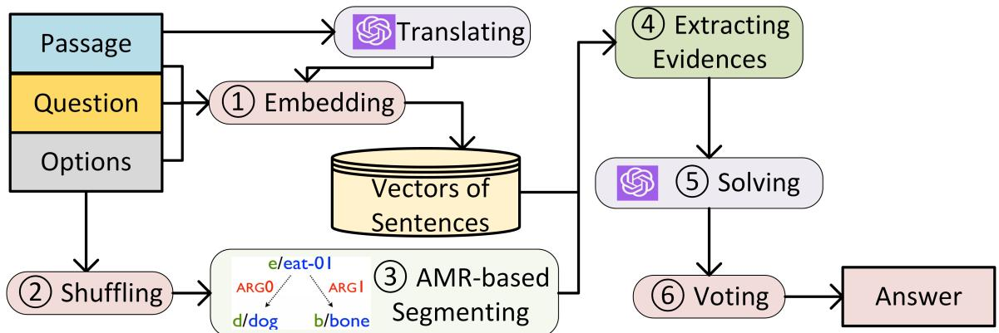  
Figure 2: The overall architecture of VIRTUAL. The input is in the top-left corner, and the output is in the bottomright corner. All six steps (¨ ±) are in red/green/gray round corner rectangles. A gray rectangle represents the translation process, and the yellow dataset icon in the middle represents a vector database of sentence embeddings.

<table><tr><td>Augmentation</td><td>#</td></tr><tr><td>Modern Chinese Translation Celebrity Profile</td><td>4415 2747</td></tr><tr><td>Government Job</td><td>5956</td></tr><tr><td>Reign Mottos</td><td>381</td></tr><tr><td>Dynasty</td><td>14</td></tr></table>

Table 3: Statistics of data augmentations.

## 4 Evidence Curation with Option Shuffling and AMR-based Segmenting

## 4.1 Overall Architecture

Recognizing the profound linguistic disparities between classical and literal Chinese, including grammatical evolution and syntactic variations, we developed VIRTUAL. We illustrate the overall architecture of VIRTUALin Fig. 2; it has six steps, which we introduce in the following subsections.

While the input of VIRTUAL is in the top-left corner, including a passage (a blue box), a question (a yellow box), and four options (a gray box), the output of VIRTUAL is in the bottom-right corner, i.e., the answer. The six steps are outlined in roundcorner rectangles. Specifically, ¨ (Embedding), ≠ (Shuffling), and ± (Voting) are in red rectangles. Æ (AMR-based Segmenting) and Ø (Extracting Evidence) are in green rectangles. The ∞ (Solving) is in a gray rectangle. A gray rectangle also displays the data augmentation translation process, and a yellow dataset icon in the middle visualizes the database storing sentence vectors. A qualitative example is in Appx. F.

## 4.2 Sentence Embedding

The first step of VIRTUAL is storing sentence embeddings. Questions, sentences in a passage, and their corresponding translations are all embedded and stored.

We use the GuwenBert5 as a function $S B E R T ( \cdot )$ to embed all comma-separated subsentences. For the passage $D = < s _ { 1 } , . . . , s _ { | D | } >$ and the question is $Q = s _ { q } ,$ we store $S B E R T ( s _ { i } )$ where $1 < i < | D | \operatorname { o r } i = q .$ . The vector storage is based on ${ \mathrm { F A I S S } } ^ { 6 }$ (Douze et al., 2024), a library for efficient similarity search and clustering of dense vectors using advanced search algorithms.

## 4.3 Option Shuffling

The second step of VIRTUAL is option shuffling. Specifically, we transform the original options $A = < a _ { 1 } , a _ { 2 } , a _ { 3 } , a _ { 4 } > \mathrm { t o } A ^ { \prime } = < a _ { 2 } , a _ { 3 } , a _ { 4 }$ $a _ { 1 } >$ , and $A ^ { \prime \prime } = < a _ { 3 } , a _ { 4 } , a _ { 1 } , a _ { 2 } > . \mathrm { E . g . }$ , if the original option order is $^ { 6 6 } { \mathrm { A B C D } } ^ { \prime \prime }$ , we further use $^ { 6 6 } \mathrm { B C D A } ^ { \prime \prime }$ , and $^ { 6 6 } \mathrm { C D A B } ^ { \prime \prime }$

## 4.4 AMR-based Segmenting

The third step of VIRTUAL is AMR-based segmenting via an off-the-shelf software (Chen et al., 2022)7. We use the extracted AMR triples with directed arcs in the single-rooted, directed acyclic AMR graph to represent the semantic relationships between words in a sentence. Using Qwen, we can convert triples into clauses. E.g., the "Dog eats bones" in Fig. 2, step ¨, corresponds to the triple in List. 1. The results of AMR for the option C in

Fig. 1 is in Appx. I (Fig. 5), along with our prompt (Tab. 18) and detailed results (Tab. 19).

Listing 1: AMR triple of "Dog eats bones".

$$
\begin{array} { r l } { \mathrm { ( \left( ~ e ~ \right. ~ / ~ } } & { { } \mathrm { e a t - 0 1 ~ } \dot { ) } } \\ { \mathrm { A R G { \bf 0 } } } & { { } \mathrm { ( ~ d / ~ } \mathrm { d o g ) ~ } \dot { = } } \\ { \mathrm { A R G { \bf 1 } } } & { { } \mathrm { ( ~ b ~ / ~ } \mathrm { b o n e ~ ) } ) \mathrm { ) } } \end{array}
$$

## 4.5 Evidence Extracting

The fourth step of VIRTUAL is evidence extracting. We only consider $y _ { i }$ when $S c o r e _ { s i m } ( o p t , y _ { i } ) \leq t$ for the embedding of a (segmented) option opt $\mathbb { R } ^ { d }$ and sentence embeddings $< y _ { 1 } , . . . , y _ { l } > , y _ { i } \in$ $\mathbb { R } ^ { d } , 0 \le i \le l .$ . In this equation, l is the number of sentences, and $y _ { i }$ could be in literary Chinese (e.g., a literary Chinese sentence in the passage, $s _ { i } )$ or in modern Chinese (e.g., a translation of $s _ { i }$ $t _ { i } )$ . To reduce the search space, we set a similarity threshold $t \ = \ 0 . 3$ , and use the similarity score $S c o r e _ { s i m } ( \cdot )$ in Eq. 1.

$$
\begin{array} { r } { S c o r e _ { s i m } ( o p t , y _ { i } ) = \| o p t - y _ { i } \| _ { 2 } } \end{array}\tag{1}
$$

Then, Alg. 1 extracts the top-k (minimum) evidences according to $S c o r e _ { s i m i l a r i t y } \mathrm { 8 }$ . The input includes literary Chinese sentences, modern Chinese translation of the inputted sentences, the option clauses, and three hyperparameters: first, the number of evidence sentences in literary Chinese; second, the number of evidence sentences in modern Chinese; third, an indicator of whether or not to include keyword annotations.

After initialization in line 1, the program uses annotation as needed in lines 5 8; the tokenize function tokenizes keywords from the options. Then, we use the $\mathrm { Z D I C } ^ { \mathrm { \dot { 9 } } }$ to find the annotations of keywords and concatenate the results to sentences. The concat( ) function concatenates two strings. Lines 3 10 provided the literary Chinese sentences we selected as evidence, while lines 11 14 pinpointed the translated sentences we used as evidence. Finally, we return the evidence in line 15.

## 4.6 Solving CRISIS via LLMs

The fifth step of VIRTUAL is answering the question with LLMs. As we rearranged the options in step two, the correct answer should be restored.

We tried three prompting strategies: zero-shot, one-shot, and chain-of-thought (COT):

1. The basic version of our prompt, which serves as our fallback strategy, asks the LLMs to select the correct option (see Tab. 4).

2. The one-shot strategy uses two examples: a summary question and a detailed question. We first ask LLMs to determine which example should be used, and then we give the example to LLMs. The limited number of samples is one limitation of our study. These examples are in Appx. H, Tab. 16.

3. LLMs receive segmented clauses from COT for each option and output zero if a clause is wrong. Then, each option’s score is its correct ratio. In cases with tie options, the default strategy for VIRTUAL is zero-shot prompting. An example can be found in Appx. H, Tab. 17.

## 4.7 Voting

The sixth step of VIRTUAL is voting. We shuffle the options and solve the problem three times (see Sec. 4.3). The majority voting is the default strategy, and the backup strategy only solves the problem using the original option order.

## 5 Experiments

## 5.1 Experiment Settings

Our experiments utilize PyTorch 1.9.0 with Python 3.9.6 on Ubuntu 20.04.1 LTS, running on a PC equipped with an Intel Core i9-10900K CPU and two RTX 3090 GPUs. The training, validation, and test sets are divided according to an 8:1:1 ratio, with identical answer distributions.

## 5.2 Difficulty Ratings

This paper uses the log probabilities of an LLM’s correct answer predictions to determine problem difficulty. I.e., Qwen (Qwen2.5-72b-instruct-AWQ). The cross-entropy loss (i.e., the difference between the probability distribution of the four options and the actual label, see Appx. B Eq. 3) represents the difficulty of a problem. Readers can find the equation in Appx. B, Eq. 2. Following previous studies (Wang et al., 2024), we established three difficulty levels: simple, medium, and complex (in the ratio of 3:5:2, correspondingly).

## 5.3 Compared Models

In our evaluation, we compare our model with a representative Non-LLM model, EVERGREEN, and five top-performing LLMs showing proficiency in Chinese RC. The results are in Tab. 5.

Algorithm 1: Evidence Extraction Algorithm   
Input: P = s1, sn , sentences in the passage ;   
T = t1, tn , translations of sentences in the passage ; opt, the option (clause);   
#s, number of evidence sentences from original sentences;   
#t, number of evidence sentences from translated sentences;   
withAnnotations, with or without annotations for keywords in the option.   
Output: $E = \{ s _ { 1 } ^ { \prime } , . . . , s _ { m } ^ { \prime } \}$ , evidence sentences (m = #s + #t).   
1 begin   
2 Initialize $E  \varnothing ;$   
3 for i = 1 to #s do   
4 s0 most similar (unselected) $s \in P$ for opt;   
5 if withAnnotations then   
6 keywords tokenize(s0);   
7 keywordsAnnotations annotations of keywords in online literary Chinese dictionaries;   
8 s0i concat(s0i, keywordsAnnotations);   
9 E E  s0 ;   
10 end   
11 for i = 1 to #t do   
12 s0 most similar (unselected) $t \in T$ for opt;   
13 E E  s0 ;   
14 end   
15 return E.   
16 end

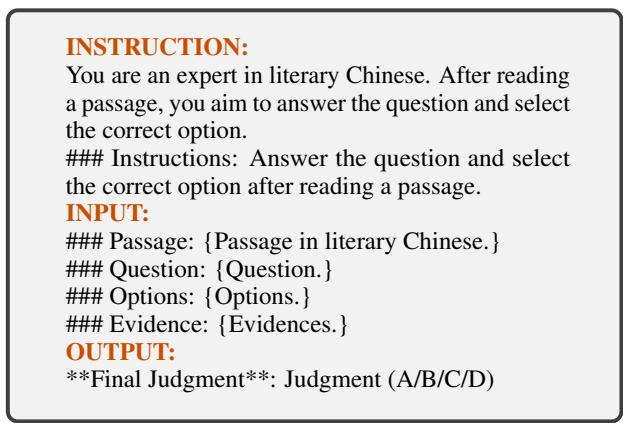  
Table 4: The zero-shot prompt for LLMs. Section names are in brown, and text variables are in curly brackets.

EVERGREEN is a BERT (Devlin et al., 2019) encoding with a convolution and an ensemblebased model. It outperforms many Non-LLM models for CRISIS (Rao et al., 2023). The compared models in Rao et al. (2023) include Longformer (Beltagy et al., 2020), T5 (Raffel et al., 2020), AnchiBERT (Tian et al., 2021), GuwenBERT, and MacBERT (Cui et al., 2020). We put the parameter settings of EVERGREEN in Appx. A, Tab. 11.

The five top-performing large language models (LLMs), which are recognized for their exceptional performance in various tasks, are:

ibaba’s Qwen-plus series for our task.

• ERNIE-4.0-8K10. A foundation model from Baidu, which was released in June 2024.

• GPT-4o11: The GPT model, which was released in November 2024.

• GLM-4: The latest generation of the opensource ChatGLM (GLM et al., 2024) models.

• o1-mini12. It is the newest cost-efficient reasoning model from OpenAI.

## 5.4 Model Comparison

Experimental results on CRISIS are presented in Tab. 5, which exhibits four findings. First, using accuracy as the metric, Tab. 5 substantiates the effectiveness of VIRTUAL. It improves the accuracy of Qwen by 7%, and it is more productive for complex problems (10% increase). Second, the motivation of our option shuffling lies in Tab. 5: models (except CRISIS) have order bias. Third, we demonstrated that our Qwen-oriented difficulty ratings apply to all tested LLMs. Fourth, our experiments confirm the advantage of LLMs over non-LLM models.

We also test the performance of using VIRTUAL with smaller LMs and the results are in Appx. E.

<table><tr><td rowspan="2">Category</td><td rowspan="2">Model</td><td colspan="7">Accuracy (%)</td></tr><tr><td>A</td><td>B</td><td>C</td><td>D</td><td>Simple</td><td>Medium</td><td>Complex</td><td>Average</td></tr><tr><td>Non-LLM</td><td>EVERGREEN</td><td>14.2</td><td>22.3</td><td>15.2</td><td>42.0</td><td>22.1</td><td>25.1</td><td>21.5</td><td>23.5</td></tr><tr><td rowspan="5">LLM</td><td>o1-mini</td><td>22.6</td><td>44.6</td><td>42.9</td><td>35.7</td><td>44.2</td><td>37.2</td><td>23.8</td><td>36.7</td></tr><tr><td>GLM-4</td><td>50.9</td><td>57.1</td><td>44.6</td><td>55.4</td><td>73.3</td><td>50.7</td><td>21.6</td><td>52.0</td></tr><tr><td>GPT-40</td><td>70.8</td><td>66.1</td><td>67.0</td><td>51.8</td><td>87.7</td><td>62.7</td><td>30.6</td><td>63.8</td></tr><tr><td>ERNIE-4.0-8K</td><td>49.0</td><td>68.8</td><td>69.0</td><td>66.7</td><td>81.0</td><td>68.0</td><td>32.9</td><td>64.9</td></tr><tr><td>Qwen-plus</td><td>61.3</td><td>75.9</td><td>77.7</td><td>76.8</td><td>93.1</td><td>74.4</td><td>39.7</td><td>73.1</td></tr><tr><td>Ours</td><td>VIRTUAL</td><td>78.3</td><td>83.0</td><td>83.9</td><td>77.7</td><td>98.4</td><td>83.4</td><td>47.7</td><td>80.8</td></tr></table>

Table 5: Model comparison. Best results are highlighted in bold.

<table><tr><td>Method</td><td>Accuracy %</td></tr><tr><td>CRISIS</td><td>0.808</td></tr><tr><td>w/o keyword annotation</td><td>0.803</td></tr><tr><td>w/o literary Chinese evidence</td><td>0.799</td></tr><tr><td>w/o translated evidence</td><td>0.787</td></tr><tr><td>w/o AMR-based segmentation</td><td>0.785</td></tr><tr><td>w/o shuffling &amp; voting</td><td>0.781</td></tr></table>

Table 6: Ablation test. Best results are highlighted in bold. The w/o stands for without.
<table><tr><td rowspan="2"># evidences in Literary Chinese</td><td colspan="4"># evidences in Modern Chinese</td></tr><tr><td>0</td><td>1</td><td>2</td><td>3</td></tr><tr><td>0</td><td>0.787</td><td>0.796</td><td>0.799</td><td>0.787</td></tr><tr><td>1</td><td>0.787</td><td>0.799</td><td>0.803</td><td>0.808</td></tr><tr><td>2</td><td>0.799</td><td>0.792</td><td>0.796</td><td>0.792</td></tr><tr><td>3</td><td>0.790</td><td>0.792</td><td>0.794</td><td>0.785</td></tr></table>

Table 7: Evidence combination test. Best results are highlighted in bold.

However, as VIRTUAL prolongs the input, there is a performance degradation.

## 5.5 Ablation Test

To identify the effectiveness of components of CRI-SIS, we perform ablation tests on VIRTUAL. The result is in Tab. 6. It shows that, although all components have their credits, option shuffling is the most important one, and AMR-based option segmenting is also important. However, keyword annotations (e.g., using literary Chinese dictionaries) are less critical than we thought. Is likely that LLMs are adept at recalling facts.

## 5.6 Evidence Combination Test

Our evidence combination test, Tab. 7, shows that using three evidence sentences in modern Chinese and one evidence sentence in literary Chinese leads to the best result.

## 5.7 Generalizability Test

To demonstrate the generalizability of VIRTUAL, we evaluate it on a modern Chinese reading comprehension dataset, utilizing C3 (Sun et al., 2020). We compare VIRTUAL’s performance to Qwen-

<table><tr><td rowspan="2">model</td><td colspan="5">Accuracy (%)</td></tr><tr><td>A</td><td>B</td><td>C</td><td>D</td><td>Average</td></tr><tr><td>Qwen-plus</td><td>95.8</td><td>96.1</td><td>95.6</td><td>95.6</td><td>96.7</td></tr><tr><td>VIRTUAL</td><td>96.4</td><td>95.6</td><td>94.9</td><td>96.4</td><td>98.7</td></tr></table>

Table 8: Generalizability test. Best results are highlighted in bold.
<table><tr><td>Strategy</td><td>Accuracy</td></tr><tr><td>Zero-shot</td><td>0.787</td></tr><tr><td>One-shot</td><td>0.808</td></tr><tr><td>w/ Celebrity Profiles</td><td>0.803</td></tr><tr><td>w/D&amp;R&amp;J1</td><td>0.803</td></tr><tr><td>Chain of Thought</td><td>0.745</td></tr></table>

1 D&R&J: Dynasty & Reign Mottos & Government Job.

Table 9: Comparison of different prompting strategies.   
Best results are highlighted in bold. The w/ means with.

plus in Tab. 8. While Tab. 5 previously showed Qwen-plus as the best LLM for our main task, Tab. 8 highlights CRISIS’s advantages over Qwen-plus in this context.

## 5.8 Prompting Test

We report the test results of different prompt strategies in Tab. 9, which show that a one-shot strategy with no augmented data is the best choice.

## 5.9 More Analysis

## 5.9.1 Accuracy in Different Time Spans

Tab. 10 lists the accuracy in different periods. Surprisingly, questions about near-ancient Chinese passages, which are the closest to us in time, are more challenging than we thought. The deliberate design of examinations, which increases the difficulty level of the questions, might contribute to this.

<table><tr><td>Temporal Stage</td><td>Accuracy</td><td>#</td></tr><tr><td>Ancient China</td><td>0.824</td><td>74</td></tr><tr><td>Middle China</td><td>0.818</td><td>143</td></tr><tr><td>Near Ancient China</td><td>0.795</td><td>225</td></tr></table>

Table 10: Time span test. Best results are highlighted in bold.See Sec. 3 for details of stages.

## 5.9.2 Does Perplexity Matter?

Counter-intuitively, the perplexity of passages does not affect the difficulty of the question, see Fig. 6 in Appx. K for details. This could also result from the deliberate design of examinations.

## 5.10 Computational Cost

We conducted experiments with Qwen API (qwenplus-0806), at a cost of \$0.4 per 1 million tokens input and \$1 per 1 million tokens output. We spent \$300 in total. Additionally, we spent 15 minutes training the EVERGREEN model.

## 6 Conclusion

Through an empirical study on a newly curated literary Chinese reading comprehension task, we identified and validated the effectiveness of a novel evidence extraction approach. Specifically, we have built the largest and most comprehensive dataset of literary Chinese reading comprehension to date and proposed an approach. The proposed approach leverages an evidence extraction algorithm that utilizes evidence sentences in both literary Chinese and modern Chinese, along with two techniques (i.e., option shuffling and AMR-based segmenting). Future efforts will include conducting more theoretical analyses to provide a solid foundation for understanding literary Chinese.

## 7 Limitations

Despite our best efforts, our study may still have at least two limitations.

First, our dataset has at least four biases.

• The labels could be wrong, as humans make mistakes (and have disagreements);

• Translation and annotations might induce errors;

• LLMs-generated augmentations are only silver-standard, which is further discussed in Appx. D;

• Because the stability of LLMs is out of scope (of this paper), all LLMs involved in experiments are just a single run.

Second, due to our limited resources, we have been able to conduct our local experiments on models no more significant than EVERGREEN or test all available LLMs.

## 8 Ethical Considerations

First, licenses. The licenses for most source datasets are unspecified, except that AGIEval and AC-Eval use the MIT license, and CCLUE follows the Apache-2.0 license. Additionally, some examination data that is available for free online has been included.

Second, safety prompts. The proposed prompts do not involve collecting or using personal information to train other individuals.

Third, annotation. Volunteers from our research lab supported our annotation effort, and we compensated them at a market rate. All annotators are Chinese graduate students who are native speakers of the Chinese language. They are asked to "Select the passage understanding questions, and ignore the questions only about rote facts" from existing problems.

## References

Elie Antoine, Frédéric Bechet, Géraldine Damnati, and Philippe Langlais. 2024. A linguistically-motivated evaluation methodology for unraveling model’s abilities in reading comprehension tasks. In Proceedings of the 2024 Conference on Empirical Methods in Natural Language Processing, pages 18376–18392.

Iz Beltagy, Matthew E Peters, and Arman Cohan. 2020. Longformer: The long-document transformer. arXiv preprint arXiv:2004.05150.

Xiao Bi, Deli Chen, Guanting Chen, Shanhuang Chen, Damai Dai, Chengqi Deng, Honghui Ding, Kai Dong, Qiushi Du, Zhe Fu, et al. 2024. Deepseek llm: Scaling open-source language models with longtermism. arXiv preprint arXiv:2401.02954.

Samuel Cahyawijaya, Holy Lovenia, and Pascale Fung. 2024. Llms are few-shot in-context low-resource language learners. In Proceedings ofthe 2024 Conference ofthe North American Chapter ofthe Associationfor Computational Linguistics: Human Language Technologies (Volume 1: Long Papers), pages 405–433.

Jiahuan Cao, Dezhi Peng, Peirong Zhang, Yongxin Shi, Yang Liu, Kai Ding, and Lianwen Jin. 2024. Tonggu: Mastering classical chinese understanding with knowledge-grounded large language models. In Findings of the Association for Computational Linguistics: EMNLP 2024, pages 4196–4210.

Liang Chen, Bofei Gao, and Baobao Chang. 2022. A two-stage method for chinese amr parsing. arXiv preprint arXiv:2209.14512.

Yiming Cui, Wanxiang Che, Ting Liu, Bing Qin, Shijin Wang, and Guoping Hu. 2020. Revisiting pre-trained

models for chinese natural language processing. In Findings of the Association for Computational Linguistics: EMNLP 2020, pages 657–668.

Emily Daddo. 2024. An introduction to ancient china. Teaching History (0040-0602), 58(3).

Jacob Devlin, Ming-Wei Chang, Kenton Lee, and Kristina Toutanova. 2019. Bert: Pre-training of deep bidirectional transformers for language understanding. In Proceedings of the 2019 Conference of the North American Chapter ofthe Associationfor Computational Linguistics: Human Language Technologies, Volume 1 (Long and Short Papers), pages 4171– 4186.

Matthijs Douze, Alexandr Guzhva, Chengqi Deng, Jeff Johnson, Gergely Szilvasy, Pierre-Emmanuel Mazaré, Maria Lomeli, Lucas Hosseini, and Hervé Jégou. 2024. The faiss library.

Daria Dzendzik, Jennifer Foster, and Carl Vogel. 2021. English machine reading comprehension datasets: A survey. In Proceedings of the 2021 Conference on Empirical Methods in Natural Language Processing, pages 8784–8804.

Team GLM, Aohan Zeng, Bin Xu, Bowen Wang, Chenhui Zhang, Da Yin, Dan Zhang, Diego Rojas, Guanyu Feng, Hanlin Zhao, et al. 2024. Chatglm: A family of large language models from glm-130b to glm-4 all tools. arXiv preprint arXiv:2406.12793.

Jinchang Hou, Chang Ao, Haihong Wu, Xiangtao Kong, Zhigang Zheng, Daijia Tang, Chengming Li, Xiping Hu, Ruifeng Xu, Shiwen Ni, et al. 2024. E-eval: A comprehensive chinese k-12 education evaluation benchmark for large language models. arXiv preprint arXiv:2401.15927.

Akira Kawabata and Saku Sugawara. 2023. Evaluating the rationale understanding of critical reasoning in logical reading comprehension. In Proceedings ofthe 2023 Conference on Empirical Methods in Natural Language Processing, pages 116–143.

Yingji Li, Mengnan Du, Rui Song, Xin Wang, and Ying Wang. 2024. Data-centric explainable debiasing for improving fairness in pre-trained language models. In Findings of the Association for Computational Linguistics ACL 2024, pages 3773–3786.

Jerry Norman. 1988. Chinese. Cambridge University Press.

Simon Ostermann, Michael Roth, Ashutosh Modi, Stefan Thater, and Manfred Pinkal. 2018. Semeval-2018 task 11: Machine comprehension using commonsense knowledge. In Proceedings of the 12th International Workshop on semantic evaluation, pages 747–757.

P David Pearson and Margaret C Gallagher. 1983. The instruction of reading comprehension. Contemporary educational psychology, 8(3):317–344.

Letian Peng, Yuwei Zhang, and Jingbo Shang. 2024. Controllable data augmentation for few-shot text mining with chain-of-thought attribute manipulation. In Findings ofthe Associationfor Computational Linguistics ACL 2024, pages 1–16.

Colin Raffel, Noam Shazeer, Adam Roberts, Katherine Lee, Sharan Narang, Michael Matena, Yanqi Zhou, Wei Li, and Peter J Liu. 2020. Exploring the limits of transfer learning with a unified text-to-text transformer. The Journal ofMachine Learning Research, 21(1):5485–5551.

Dongning Rao, Guanju Huang, and Zhihua Jiang. 2023. Ancient chinese machine reading comprehension exception question dataset with a non-trivial model. In Pacific Rim International Conference on Artificial Intelligence, pages 145–158. Springer.

Maarten Sap, Vered Shwartz, Antoine Bosselut, Yejin Choi, and Dan Roth. 2020. Commonsense reasoning for natural language processing. In Proceedings of the 58th Annual Meeting of the Association for Computational Linguistics: Tutorial Abstracts, pages 27–33.

Thea Sommerschield, Yannis Assael, John Pavlopoulos, Vanessa Stefanak, Andrew Senior, Chris Dyer, John Bodel, Jonathan Prag, Ion Androutsopoulos, and Nando de Freitas. 2023. Machine learning for ancient languages: A survey. Computational Linguistics, 49(3):703–747.

Robert J Stevens, Robert E Slavin, and Anna M Farnish. 1991. The effects of cooperative learning and direct instruction in reading comprehension strategies on main idea identification. Journal ofEducational Psychology, 83(1):8.

Kai Sun, Dian Yu, Dong Yu, and Claire Cardie. 2020. Investigating prior knowledge for challenging chinese machine reading comprehension. Transactions of the Association for Computational Linguistics, 8:141– 155.

Huishuang Tian, Kexin Yang, Dayiheng Liu, and Jiancheng Lv. 2021. Anchibert: A pre-trained model for ancient chineselanguage understanding and generation. In Proceedings of the International Joint Conference on Neural Networks.

Hugo Touvron, Thibaut Lavril, Gautier Izacard, Xavier Martinet, Marie-Anne Lachaux, Timothée Lacroix, Baptiste Rozière, Naman Goyal, Eric Hambro, Faisal Azhar, et al. 2023. Llama: Open and efficient foundation language models. arXiv preprint arXiv:2302.13971.

Heng Wang, Shangbin Feng, Tianxing He, Zhaoxuan Tan, Xiaochuang Han, and Yulia Tsvetkov. 2024. Can language models solve graph problems in natural language? Advances in Neural Information Processing Systems, 36.

Yuxuan Wang, Jack Wang, Dongyan Zhao, and Zilong Zheng. 2023. Rethinking dictionaries and glyphs

for chinese language pre-training. In Findings of the Associationfor Computational Linguistics: ACL 2023, pages 1089–1101.

Yuting Wei, Yuanxing Xu, Xinru Wei, Yangsimin Yangsimin, Yangfu Zhu, Yuqing Li, Di Liu, and Bin Wu. 2024. AC-EVAL: Evaluating Ancient Chinese language understanding in large language models. In Findings ofthe Associationfor Computational Linguistics: EMNLP 2024, pages 1600–1617, Miami, Florida, USA. Association for Computational Linguistics.

Liang Xu, Hai Hu, Xuanwei Zhang, Lu Li, Chenjie Cao, Yudong Li, Yechen Xu, Kai Sun, Dian Yu, Cong Yu, et al. 2020. Clue: A chinese language understanding evaluation benchmark. In Proceedings of the 28th International Conference on Computational Linguistics, pages 4762–4772.

Shusheng Xu, Yichen Liu, Xiaoyu Yi, Siyuan Zhou, Huizi Li, and Yi Wu. 2022. Native chinese reader: A dataset towards native-level chinese machine reading comprehension. In Thirty-fifth Conference on Neural Information Processing Systems Datasets and Benchmarks Track (Round 2).

Xiaohan Xu, Chongyang Tao, Tao Shen, Can Xu, Hongbo Xu, Guodong Long, Jian-guang Lou, and Shuai Ma. 2024. Re-reading improves reasoning in large language models. In Proceedings ofthe 2024 Conference on Empirical Methods in Natural Language Processing, pages 15549–15575.

An Yang, Baosong Yang, Binyuan Hui, Bo Zheng, Bowen Yu, Chang Zhou, Chengpeng Li, Chengyuan Li, Dayiheng Liu, Fei Huang, et al. 2024. Qwen2 technical report. arXiv preprint arXiv:2407.10671.

Jinyi Zhang, Ke Su, Haowei Li, Jiannan Mao, Ye Tian, Feng Wen, Chong Guo, and Tadahiro Matsumoto. 2024a. Neural machine translation for low-resource languages from a chinese-centric perspective: A survey. ACM Transactions on Asian and Low-Resource Language Information Processing.

Yixuan Zhang and Haonan Li. 2023. Can large langauge model comprehend ancient chinese? a preliminary test on aclue. In Proceedings of the Ancient Language Processing Workshop, pages 80–87.

Yuqing Zhang, Baoyi He, Yihan Chen, Hangqi Li, Han Yue, Shengyu Zhang, Huaiyong Dou, Junchi Yan, Zemin Liu, Yongquan Zhang, et al. 2024b. Philogpt: A philology-oriented large language model for ancient chinese manuscripts with dunhuang as case study. In Proceedings of the 2024 Conference on Empirical Methods in Natural Language Processing, pages 2784–2801.

Chenrong Zhao. 2024. A feature-based approach to annotate the syntax of ancient chinese. In Proceedings of the 5th Workshop on Computational Approaches to Historical Language Change, pages 62–71.

<table><tr><td></td><td>EVERGREEN</td><td>BERT2</td></tr><tr><td>train batch size</td><td>4</td><td>4</td></tr><tr><td>dev batch size</td><td>4</td><td>4</td></tr><tr><td>test batch size</td><td>4</td><td>4</td></tr><tr><td>input length</td><td>512</td><td>512</td></tr><tr><td>epoch</td><td>6</td><td>6</td></tr><tr><td>learning rate</td><td>3e-5</td><td>1e-5</td></tr><tr><td>g.a.&#x27;steps</td><td>8</td><td>8</td></tr><tr><td>seed</td><td>42</td><td>42</td></tr></table>

1 g.a. = gradient accumulation.  
2 BERT is part of the EVERGREEN.

Table 11: Hyper-parameters settings of the EVER-GREEN Model.

Wanjun Zhong, Ruixiang Cui, Yiduo Guo, Yaobo Liang, Shuai Lu, Yanlin Wang, Amin Saied, Weizhu Chen, and Nan Duan. 2024. Agieval: A human-centric benchmark for evaluating foundation models. In Findings ofthe Associationfor Computational Linguistics: NAACL 2024, pages 2299–2314.

Bo Zhou, Qianglong Chen, Tianyu Wang, Xiaomi Zhong, and Yin Zhang. 2023. Wyweb: A nlp evaluation benchmark for classical chinese. In Findings of the Associationfor Computational Linguistics: ACL 2023, pages 3294–3319.

## A Settings of Hyper-parameters

Settings of hyper-parameters are in Tab. 11.

## B Details of Difficult Ratings

Eq. 2 defines the standardized probability distribution of the four options $( p _ { k } )$ . The exponential normalization applies to the log probabilities of the four options (logprobk, $1 \leq k \leq 4 )$ . Eq. 3 is used to calculate the difference between the probability distribution of the four options and the accurate label.

$$
p _ { k } = \frac { \exp ( l o g p r o b _ { k } ) } { \sum _ { j = 1 } ^ { 4 } \exp ( l o g p r o b _ { j } ) } , 1 \leq k \leq 4\tag{2}
$$

$$
\mathit { L o s s } _ { \mathit { C E } } = - \sum _ { k = 1 } ^ { 4 } y _ { k } \log ( p _ { k } )\tag{3}
$$

## C Statistical Analysis of The Length of Text

Fig. 3 4 are statistical analyses of the length of the options and passages.

Moreover, we provide an additional table (Tab. 12) for the overall statistics.

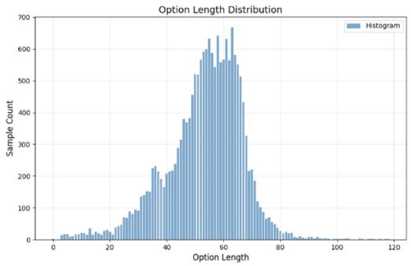  
Figure 3: Length distribution of options.

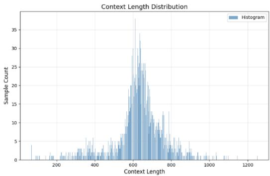  
Figure 4: Length distribution of passages.

## D Data Augmentation Quality

We add a small-scale error analysis to show the reliability of the data augmentations. Specifically, there are two types of noises. First, there are redundant celebrity profiles. We found 45 redundant celebrity profiles in 4415 items. Moreover, the source of the passage could also be redundant (wrong). A total of 79 sources containing redundant passages have been identified. Second, the Government Job and Reign Mottos suggested by Qwen could be wrong. In all 4,415 items, there are 5,956 government jobs in 7,110 different outputs and 381 Reign Mottos in 532 different outputs.The refinement is based on cross-references to historical records of Ancient China. Fortunately, all names of the dynasty in a passage generated by Qwen are correct.

<table><tr><td></td><td>Average length</td></tr><tr><td>Content</td><td>637.6</td></tr><tr><td>Question</td><td>22.4</td></tr><tr><td>Option</td><td>53.5</td></tr><tr><td>Personal information</td><td>121.6</td></tr><tr><td>Translation</td><td>959.9</td></tr></table>

Table 12: The statistics of lengths of all 4415 items in our dataset.

## E Leveraging Open-sourced LLMs and Smaller LMs

To test whether our method can leverage more open-sourced LLMs and smaller LMs, we perform tests with DeepSeek-R1-Distill-Qwen-7B (Bi et al., 2024), DeepSeek-R1-Distill-Llama-8B, and Llama-2-7B (Touvron et al., 2023). The results are listed in Tab. 13.

A possible reason for the performance degradation is that small models may not handle long texts well, and VIRTUAL prolongs the input.

## F A Qualitative Example

Tab. 14 illustrates the results of solving the CRISIS in Fig. 1.

## G A Celebrity Profile Example

Tab. 15 illustrates a celebrity profile.

## H Prompts Used in VIRTUAL

We tried three prompting strategies: zero-shot, oneshot, and chain-of-thought (COT). While zero-shot prompt is in Sec. 4.6, Tab. 4, Tab. 16 17 illustrate the rest prompts.

Further, the prompt used for AMR-based segmenting is in Tab. 18.

## I AMR Results Illustration

Fig. 5 illustrates the AMR of an option generated by HanLP13.

<table><tr><td rowspan="2">Model</td><td colspan="8">Accuracy (%)</td></tr><tr><td>A</td><td>B</td><td>C</td><td>D</td><td>Simple</td><td>Medium</td><td>Complex</td><td>Average</td></tr><tr><td>DeepSeek-R1-Distill-Qwen-7B</td><td>34</td><td>28.6</td><td>42.9</td><td>23.2</td><td>38.1</td><td>30.4</td><td>27.2</td><td>32.1</td></tr><tr><td>DeepSeek-R1-Distill-Qwen-7B+VIRTUAL</td><td>23.6</td><td>17.9</td><td>70.5</td><td>11.6</td><td>31.2</td><td>30.9</td><td>30.6</td><td>31</td></tr><tr><td>DeepSeek-R1-Distill-Llama-8B</td><td>89.6</td><td>8.0</td><td>0.9</td><td>6.2</td><td>35.8</td><td>22.8</td><td>15.9</td><td>25.3</td></tr><tr><td>DeepSeek-R1-Distill-Llama-8B+VIRTUAL</td><td>13.2</td><td>30.4</td><td>25.9</td><td>33</td><td>20.6</td><td>26.9</td><td>30.6</td><td>26</td></tr><tr><td>Llama-2-7B</td><td>57.5</td><td>35.7</td><td>2.7</td><td>15.2</td><td>34.3</td><td>26.5</td><td>19.3</td><td>27.4</td></tr><tr><td>Llama-2-7B+VIRTUAL</td><td>96.2</td><td>2.7</td><td>0.9</td><td>0.9</td><td>36.6</td><td>21.1</td><td>13.6</td><td>24.2</td></tr></table>

Table 13: Experiments of leveraging open-sourced LLMs and smaller LMs.

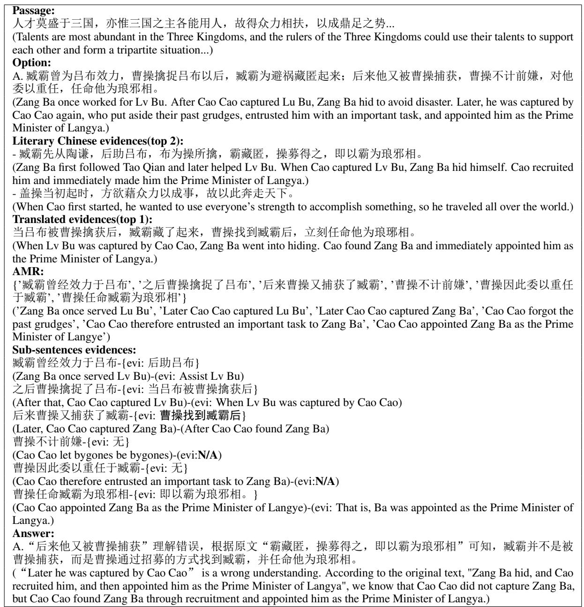  
Table 14: Example of evidence extraction for option A of the 2024 National College Entrance Examination Chinese Language Paper A literal Chinese reading comprehension. The English translation is enclosed in parentheses; ’evi indicates the evidence, and N/A means no evidence available.

<table><tr><td>Feature</td><td>Details</td></tr><tr><td>Name</td><td>Liu Yuxi</td></tr><tr><td>Personality</td><td>Perseverance: open-minded and talented.</td></tr><tr><td>Ability</td><td>Deep literary attainments, good at poetry, with profound life philosophy and insight into the ups and downs of official career.</td></tr><tr><td>Background</td><td>In the middle of the Tang Dynasty, the society was turbulent, and the fate of scholars was unfortunate.</td></tr><tr><td>Summary</td><td>Liu Yuxi, a literary giant in the Tang Dynasty, was exiled, but he was able to relieve his feelings with poetry and wine, adhered to the ambition of a Confucian man, was optimistic and tenacious, and his person and his poems all showed an open-minded life.</td></tr></table>

Table 15: An example of the celebrity profile .

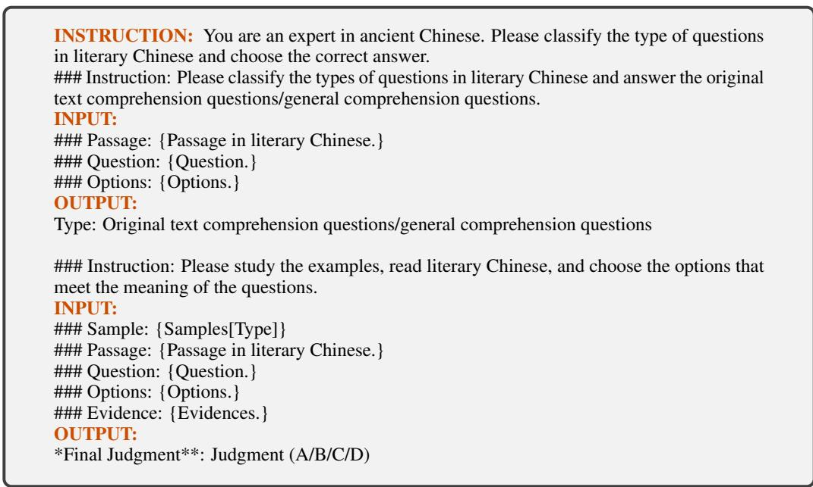

Table 16: A One-shot prompt for LLMs. Section names are in brown, and text variables are in curly brackets.  
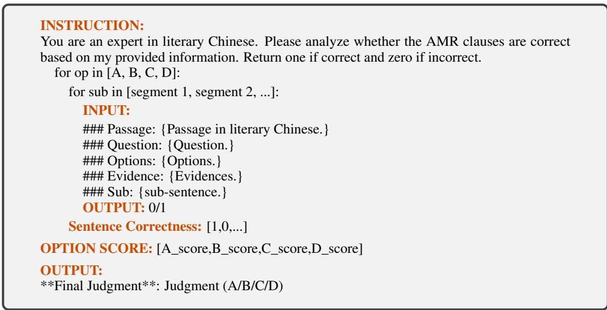  
Table 17: The COT prompt for LLMs. Section names are in brown, and text variables are in curly brackets.

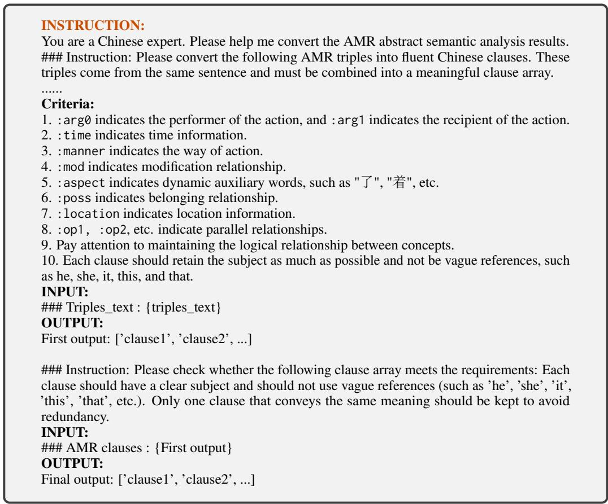  
Table 18: Prompts for AMR segmentation. Section names are in brown, and text variables are in curly brackets.

3598  
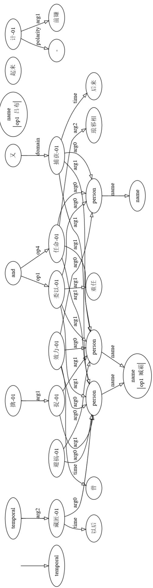  
he AMR of an option. HanLP generates the vi

We further list detailed results in Tab. 19.

Table 20 contains the final segmented sentences.

## J One-Shot Samples

Tab. 21 shows the samples used in VIRTUAL as the examples while facilitating the one-shot strategy.

## K Perplexity Does not Affect difficulty

To further discover the relationship between prediction accuracy and the perplexity of passages, we divide CRISIS into ten subsets with an almost identical number of items according to their perplexity. However, the perplexity of passages does not affect the difficulty of the questions.

Fig. 6 reports experiment results which support our claim: Perplexity does not affect difficulty.

The perplexity is the exponential of the average negative log-likelihood of the words in the sequence, given their previous context. In this paper, we use the N-gram-based perplexity, which is defined in Eq. 4. In Eq. 4, N is the number of words in the sentence, $P ( w _ { i } | w _ { i - 1 } )$ (see Eq. 5) is the conditional probability of the model predicting the $i ^ { t h }$ word (wi) according to the $( i - 1 ) ^ { t h }$ word $( w _ { i - 1 } )$ In Eq. 5, Count( ) counts word occurrences, $\| V \|$ is the vocabulary size,  is the smoothing parameter, set to 1 in this paper. This additive smoothing adjusts N-gram probabilities by adding a small constant () to each count and guarantees non-zero probabilities for all N-grams.

While a low perplexity score reflects a firm grasp of language nuances and structure, the passage is easy to understand. However, a straightforward passage might not reduce the problem’s difficulty because the questions are deliberately designed. Here, we divide CRISIS into ten subsets with almost identical numbers of items according to their perplexity score.

$$
\begin{array} { r } { P e r p l e x i t y = 2 ^ { - \frac { 1 } { N } \sum _ { i = 1 } ^ { N } \log _ { 2 } P ( w _ { i } | w _ { i - 1 } ) } } \end{array}
$$

$$
P ( w _ { i } | w _ { i - 1 } ) = \frac { C o u n t ( w _ { i - 1 } , w _ { i } ) + \lambda } { C o u n t ( w _ { i - 1 } ) + \lambda \cdot | V | }\tag{4}
$$

(5)

<table><tr><td rowspan=1 colspan=1>sentence number</td><td rowspan=1 colspan=1>node number 1</td><td rowspan=1 colspan=1>concept 1</td><td rowspan=1 colspan=1>co-referencing node 1</td><td rowspan=1 colspan=1>relation</td><td rowspan=1 colspan=1>relation number</td><td rowspan=1 colspan=1>relation alignment word</td><td rowspan=1 colspan=1>node number 2</td><td rowspan=1 colspan=1>concept 2</td><td rowspan=1 colspan=1>co-referencing node 2</td></tr><tr><td rowspan=1 colspan=1>10755</td><td rowspan=1 colspan=1>x0</td><td rowspan=1 colspan=1>root</td><td rowspan=1 colspan=1></td><td rowspan=1 colspan=1>:top</td><td rowspan=1 colspan=1></td><td rowspan=1 colspan=1></td><td rowspan=1 colspan=1>x1002</td><td rowspan=1 colspan=1>and</td><td rowspan=1 colspan=1></td></tr><tr><td rowspan=1 colspan=1>10755</td><td rowspan=1 colspan=1>x5</td><td rowspan=1 colspan=1>效力(work for)</td><td rowspan=1 colspan=1></td><td rowspan=1 colspan=1>:time</td><td rowspan=1 colspan=1></td><td rowspan=1 colspan=1></td><td rowspan=1 colspan=1>x2</td><td rowspan=1 colspan=1>曾(was)</td><td rowspan=1 colspan=1></td></tr><tr><td rowspan=1 colspan=1>10755</td><td rowspan=1 colspan=1>x5</td><td rowspan=1 colspan=1>效力(work for)</td><td rowspan=1 colspan=1></td><td rowspan=1 colspan=1>:arg0</td><td rowspan=1 colspan=1></td><td rowspan=1 colspan=1></td><td rowspan=1 colspan=1>x1000</td><td rowspan=1 colspan=1>person</td><td rowspan=1 colspan=1></td></tr><tr><td rowspan=1 colspan=1>10755</td><td rowspan=1 colspan=1>x5</td><td rowspan=1 colspan=1>效力</td><td rowspan=1 colspan=1></td><td rowspan=1 colspan=1>:beneficiary</td><td rowspan=1 colspan=1></td><td rowspan=1 colspan=1></td><td rowspan=1 colspan=1>x1001</td><td rowspan=1 colspan=1>person</td><td rowspan=1 colspan=1></td></tr><tr><td rowspan=1 colspan=1>10755</td><td rowspan=1 colspan=1>x8</td><td rowspan=1 colspan=1>擒捉(capture)</td><td rowspan=1 colspan=1></td><td rowspan=1 colspan=1>:arg0</td><td rowspan=1 colspan=1></td><td rowspan=1 colspan=1></td><td rowspan=1 colspan=1>x7</td><td rowspan=1 colspan=1>曹操 (Cao Cao)</td><td rowspan=1 colspan=1></td></tr><tr><td rowspan=1 colspan=1>10755</td><td rowspan=1 colspan=1>x8</td><td rowspan=1 colspan=1>擒捉 (capture)</td><td rowspan=1 colspan=1></td><td rowspan=1 colspan=1>:arg 1</td><td rowspan=1 colspan=1></td><td rowspan=1 colspan=1></td><td rowspan=1 colspan=1>x9</td><td rowspan=1 colspan=1>吕布 (Lv Bu)</td><td rowspan=1 colspan=1></td></tr><tr><td rowspan=1 colspan=1>10755</td><td rowspan=1 colspan=1>x8</td><td rowspan=1 colspan=1>擒捉 (capture)</td><td rowspan=1 colspan=1></td><td rowspan=1 colspan=1>:arg0</td><td rowspan=1 colspan=1></td><td rowspan=1 colspan=1></td><td rowspan=1 colspan=1>x1001</td><td rowspan=1 colspan=1>person</td><td rowspan=1 colspan=1></td></tr><tr><td rowspan=1 colspan=1>10755</td><td rowspan=1 colspan=1>x10</td><td rowspan=1 colspan=1>以后 (later)</td><td rowspan=1 colspan=1></td><td rowspan=1 colspan=1>:op1</td><td rowspan=1 colspan=1></td><td rowspan=1 colspan=1></td><td rowspan=1 colspan=1>x8</td><td rowspan=1 colspan=1>擒捉 (capture)</td><td rowspan=1 colspan=1></td></tr><tr><td rowspan=1 colspan=1>10755</td><td rowspan=1 colspan=1>x23</td><td rowspan=1 colspan=1>捕获(capture)</td><td rowspan=1 colspan=1></td><td rowspan=1 colspan=1>:time</td><td rowspan=1 colspan=1></td><td rowspan=1 colspan=1></td><td rowspan=1 colspan=1>x18</td><td rowspan=1 colspan=1>后来</td><td rowspan=1 colspan=1></td></tr><tr><td rowspan=1 colspan=1>10755</td><td rowspan=1 colspan=1>x23</td><td rowspan=1 colspan=1>捕获 (capture)</td><td rowspan=1 colspan=1>_</td><td rowspan=1 colspan=1>:arg 1</td><td rowspan=1 colspan=1></td><td rowspan=1 colspan=1></td><td rowspan=1 colspan=1>x19</td><td rowspan=1 colspan=1>他 (he)</td><td rowspan=1 colspan=1></td></tr><tr><td rowspan=1 colspan=1>10755</td><td rowspan=1 colspan=1>x23</td><td rowspan=1 colspan=1>捕获 (capture)</td><td rowspan=1 colspan=1></td><td rowspan=1 colspan=1>:mod</td><td rowspan=1 colspan=1>_</td><td rowspan=1 colspan=1>_</td><td rowspan=1 colspan=1>x20</td><td rowspan=1 colspan=1></td><td rowspan=1 colspan=1></td></tr><tr><td rowspan=1 colspan=1>10755</td><td rowspan=1 colspan=1>x23</td><td rowspan=1 colspan=1>捕获(capture)</td><td rowspan=1 colspan=1>_</td><td rowspan=1 colspan=1>:arg0</td><td rowspan=1 colspan=1>x21</td><td rowspan=1 colspan=1>被 (be)</td><td rowspan=1 colspan=1>x22</td><td rowspan=1 colspan=1>曹操 (Cao Cao)</td><td rowspan=1 colspan=1>_</td></tr><tr><td rowspan=1 colspan=1>10755</td><td rowspan=1 colspan=1>x26</td><td rowspan=1 colspan=1>不计前嫌 (let bygones be bygones)</td><td rowspan=1 colspan=1></td><td rowspan=1 colspan=1>:arg0</td><td rowspan=1 colspan=1></td><td rowspan=1 colspan=1></td><td rowspan=1 colspan=1>x25</td><td rowspan=1 colspan=1>曹操 (Cao Cao)</td><td rowspan=1 colspan=1></td></tr><tr><td rowspan=1 colspan=1>10755</td><td rowspan=1 colspan=1>x30</td><td rowspan=1 colspan=1>委以重任(entrusted with important tasks)</td><td rowspan=1 colspan=1></td><td rowspan=1 colspan=1>:arg0</td><td rowspan=1 colspan=1></td><td rowspan=1 colspan=1></td><td rowspan=1 colspan=1>x25</td><td rowspan=1 colspan=1>曹操 (Cao Cao)</td><td rowspan=1 colspan=1></td></tr><tr><td rowspan=1 colspan=1>10755</td><td rowspan=1 colspan=1>x30</td><td rowspan=1 colspan=1>委以重任 (entrusted with important tasks)</td><td rowspan=1 colspan=1></td><td rowspan=1 colspan=1>:cause</td><td rowspan=1 colspan=1></td><td rowspan=1 colspan=1></td><td rowspan=1 colspan=1>x26</td><td rowspan=1 colspan=1>不计前嫌 (let bygones be bygones)</td><td rowspan=1 colspan=1></td></tr><tr><td rowspan=1 colspan=1>10755</td><td rowspan=1 colspan=1>x30</td><td rowspan=1 colspan=1>委以重任 (entrusted with important tasks)</td><td rowspan=1 colspan=1>_</td><td rowspan=1 colspan=1>:arg1</td><td rowspan=1 colspan=1>x28</td><td rowspan=1 colspan=1>对(against)</td><td rowspan=1 colspan=1>x29</td><td rowspan=1 colspan=1>他 (he)</td><td rowspan=1 colspan=1>_</td></tr><tr><td rowspan=1 colspan=1>10755</td><td rowspan=1 colspan=1>x32</td><td rowspan=1 colspan=1>任命(nominate)</td><td rowspan=1 colspan=1>_</td><td rowspan=1 colspan=1>:arg1</td><td rowspan=1 colspan=1>_</td><td rowspan=1 colspan=1>_</td><td rowspan=1 colspan=1>x33</td><td rowspan=1 colspan=1>他 (he)</td><td rowspan=1 colspan=1>_</td></tr><tr><td rowspan=1 colspan=1>10755</td><td rowspan=1 colspan=1>x32</td><td rowspan=1 colspan=1>任命(nominate)</td><td rowspan=1 colspan=1></td><td rowspan=1 colspan=1>:arg2</td><td rowspan=1 colspan=1>x34</td><td rowspan=1 colspan=1>为 (be)</td><td rowspan=1 colspan=1>x36</td><td rowspan=1 colspan=1>邪 (N/A)</td><td rowspan=1 colspan=1></td></tr><tr><td rowspan=1 colspan=1>10755</td><td rowspan=1 colspan=1>x32</td><td rowspan=1 colspan=1>任命(nominate)</td><td rowspan=1 colspan=1></td><td rowspan=1 colspan=1>:arg2</td><td rowspan=1 colspan=1>x37</td><td rowspan=1 colspan=1>相(be Prime Minister)</td><td rowspan=1 colspan=1>x36</td><td rowspan=1 colspan=1>邪 (N/A)</td><td rowspan=1 colspan=1></td></tr><tr><td rowspan=1 colspan=1>10755</td><td rowspan=1 colspan=1>x32</td><td rowspan=1 colspan=1>任命(nominate)</td><td rowspan=1 colspan=1></td><td rowspan=1 colspan=1>:arg2</td><td rowspan=1 colspan=1>x34</td><td rowspan=1 colspan=1>为 (be)</td><td rowspan=1 colspan=1>x37</td><td rowspan=1 colspan=1>相(Prime Minister)</td><td rowspan=1 colspan=1></td></tr><tr><td rowspan=1 colspan=1>10755</td><td rowspan=1 colspan=1>x32</td><td rowspan=1 colspan=1>任命(nominate)</td><td rowspan=1 colspan=1></td><td rowspan=1 colspan=1>:arg2</td><td rowspan=1 colspan=1></td><td rowspan=1 colspan=1></td><td rowspan=1 colspan=1>x1005</td><td rowspan=1 colspan=1>local-region</td><td rowspan=1 colspan=1></td></tr><tr><td rowspan=1 colspan=1>10755</td><td rowspan=1 colspan=1>x37</td><td rowspan=1 colspan=1>相 (Prime Minister)</td><td rowspan=1 colspan=1></td><td rowspan=1 colspan=1>:mod</td><td rowspan=1 colspan=1></td><td rowspan=1 colspan=1></td><td rowspan=1 colspan=1>x1005</td><td rowspan=1 colspan=1>local-region</td><td rowspan=1 colspan=1></td></tr><tr><td rowspan=1 colspan=1>10755</td><td rowspan=1 colspan=1>x1000</td><td rowspan=1 colspan=1>person</td><td rowspan=1 colspan=1></td><td rowspan=1 colspan=1>:name</td><td rowspan=1 colspan=1></td><td rowspan=1 colspan=1></td><td rowspan=1 colspan=1>x1</td><td rowspan=1 colspan=1>臧霸 (Zang Ba)</td><td rowspan=1 colspan=1></td></tr><tr><td rowspan=1 colspan=1>10755</td><td rowspan=1 colspan=1>x1001</td><td rowspan=1 colspan=1>person</td><td rowspan=1 colspan=1></td><td rowspan=1 colspan=1>:name</td><td rowspan=1 colspan=1></td><td rowspan=1 colspan=1></td><td rowspan=1 colspan=1>x4</td><td rowspan=1 colspan=1>吕布(Lv Bu)</td><td rowspan=1 colspan=1></td></tr><tr><td rowspan=1 colspan=1>10755</td><td rowspan=1 colspan=1>x1002</td><td rowspan=1 colspan=1>and</td><td rowspan=1 colspan=1></td><td rowspan=1 colspan=1>:op1</td><td rowspan=1 colspan=1></td><td rowspan=1 colspan=1></td><td rowspan=1 colspan=1>x5</td><td rowspan=1 colspan=1>效力(work for)</td><td rowspan=1 colspan=1></td></tr><tr><td rowspan=1 colspan=1>10755</td><td rowspan=1 colspan=1>x1002</td><td rowspan=1 colspan=1>and</td><td rowspan=1 colspan=1></td><td rowspan=1 colspan=1>:op2</td><td rowspan=1 colspan=1></td><td rowspan=1 colspan=1></td><td rowspan=1 colspan=1>x1003</td><td rowspan=1 colspan=1>temporal</td><td rowspan=1 colspan=1></td></tr><tr><td rowspan=1 colspan=1>10755</td><td rowspan=1 colspan=1>x1003</td><td rowspan=1 colspan=1>temporal</td><td rowspan=1 colspan=1></td><td rowspan=1 colspan=1>:arg1</td><td rowspan=1 colspan=1>x10</td><td rowspan=1 colspan=1>以后 (later)</td><td rowspan=1 colspan=1>x8</td><td rowspan=1 colspan=1>擒捉 (capture)</td><td rowspan=1 colspan=1></td></tr><tr><td rowspan=1 colspan=1>10755</td><td rowspan=1 colspan=1>x1003</td><td rowspan=1 colspan=1>temporal</td><td rowspan=1 colspan=1></td><td rowspan=1 colspan=1>:arg2</td><td rowspan=1 colspan=1></td><td rowspan=1 colspan=1></td><td rowspan=1 colspan=1>x1004</td><td rowspan=1 colspan=1>and</td><td rowspan=1 colspan=1></td></tr><tr><td rowspan=1 colspan=1>10755</td><td rowspan=1 colspan=1>x1004</td><td rowspan=1 colspan=1>and</td><td rowspan=1 colspan=1></td><td rowspan=1 colspan=1>:op1</td><td rowspan=1 colspan=1></td><td rowspan=1 colspan=1></td><td rowspan=1 colspan=1>x23</td><td rowspan=1 colspan=1>捕获 (capture)</td><td rowspan=1 colspan=1></td></tr><tr><td rowspan=1 colspan=1>10755</td><td rowspan=1 colspan=1>x1004</td><td rowspan=1 colspan=1>and</td><td rowspan=1 colspan=1></td><td rowspan=1 colspan=1>:op2</td><td rowspan=1 colspan=1></td><td rowspan=1 colspan=1></td><td rowspan=1 colspan=1>x26</td><td rowspan=1 colspan=1>不计前嫌 (let bygones be bygones)</td><td rowspan=1 colspan=1></td></tr><tr><td rowspan=1 colspan=1>10755</td><td rowspan=1 colspan=1>x1004</td><td rowspan=1 colspan=1>and</td><td rowspan=1 colspan=1></td><td rowspan=1 colspan=1>:op2</td><td rowspan=1 colspan=1></td><td rowspan=1 colspan=1></td><td rowspan=1 colspan=1>x30</td><td rowspan=1 colspan=1>委以重任 (entrusted with important tasks)</td><td rowspan=1 colspan=1></td></tr><tr><td rowspan=1 colspan=1>10755</td><td rowspan=1 colspan=1>x1004</td><td rowspan=1 colspan=1>and</td><td rowspan=1 colspan=1></td><td rowspan=1 colspan=1>:op3</td><td rowspan=1 colspan=1></td><td rowspan=1 colspan=1></td><td rowspan=1 colspan=1>x32</td><td rowspan=1 colspan=1>任命(nominate)</td><td rowspan=1 colspan=1></td></tr><tr><td rowspan=1 colspan=1>10755</td><td rowspan=1 colspan=1>x1005</td><td rowspan=1 colspan=1>local-region</td><td rowspan=1 colspan=1></td><td rowspan=1 colspan=1>:name</td><td rowspan=1 colspan=1></td><td rowspan=1 colspan=1></td><td rowspan=1 colspan=1>x35</td><td rowspan=1 colspan=1>琅 (Lang)</td><td rowspan=1 colspan=1></td></tr><tr><td rowspan=1 colspan=1>10755</td><td rowspan=1 colspan=1>x12</td><td rowspan=1 colspan=1>臧霸 (Zang Ba)</td><td rowspan=1 colspan=1></td><td rowspan=1 colspan=1></td><td rowspan=1 colspan=1></td><td rowspan=1 colspan=1></td><td rowspan=1 colspan=1>x12</td><td rowspan=1 colspan=1>臧霸 (Zang Ba)</td><td rowspan=1 colspan=1></td></tr><tr><td rowspan=1 colspan=1>10755</td><td rowspan=1 colspan=1>x14</td><td rowspan=1 colspan=1>避祸(avoid disaster)</td><td rowspan=1 colspan=1></td><td rowspan=1 colspan=1></td><td rowspan=1 colspan=1></td><td rowspan=1 colspan=1></td><td rowspan=1 colspan=1>x14</td><td rowspan=1 colspan=1>避祸(avoid disaster)</td><td rowspan=1 colspan=1></td></tr><tr><td rowspan=1 colspan=1>10755</td><td rowspan=1 colspan=1>x15</td><td rowspan=1 colspan=1>藏匿 (hide)</td><td rowspan=1 colspan=1></td><td rowspan=1 colspan=1></td><td rowspan=1 colspan=1></td><td rowspan=1 colspan=1></td><td rowspan=1 colspan=1>x15</td><td rowspan=1 colspan=1>藏匿 (hide)</td><td rowspan=1 colspan=1></td></tr></table>

bstract semantic relationship extraction results for option A of the 2024 National College Entrance Examination Chin ng comprehension. The English translation is enclosed i

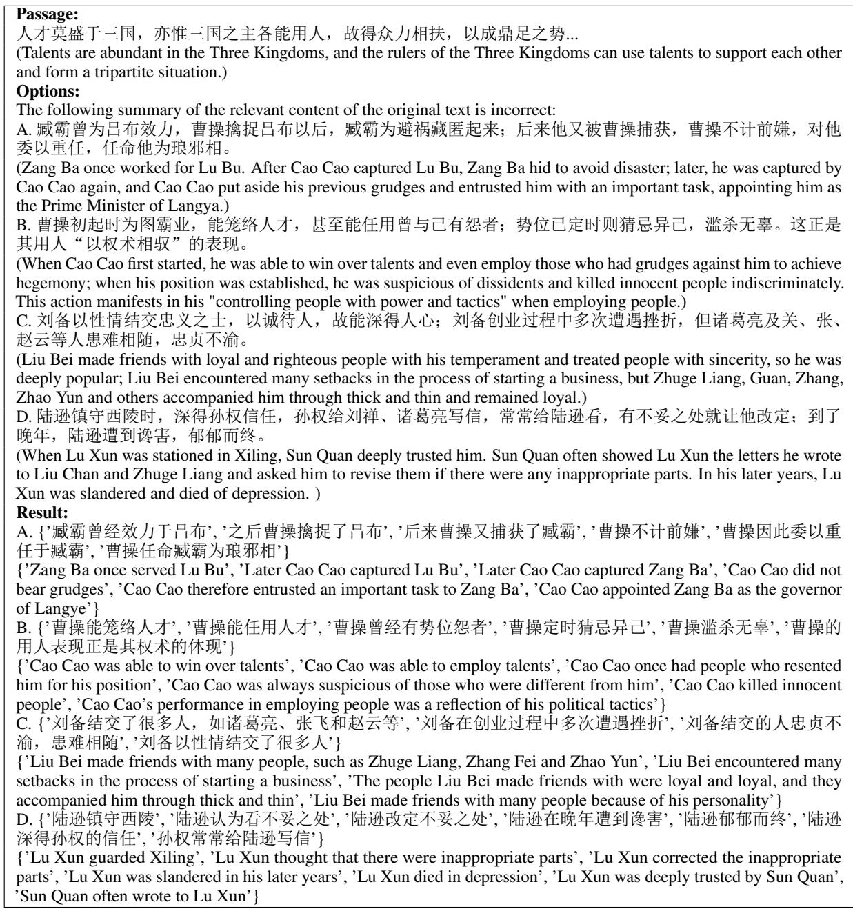  
Table 20: Results of the AMR-based segmentation of options for literal Chinese reading comprehension in the 2024 National College Entrance Examination paper. The English translation is enclosed in parentheses.

<table><tr><td>Question type Detail question</td><td>Content Passage:曹雄，西安左卫人。弘治末，历官都指挥佥事，为延绥副总兵。武宗即位，用</td></tr><tr><td rowspan="5"></td><td>总督杨一清荐，擢署都督佥事，充总兵官，镇固原...（省略）...瑾败，言官交劾，降指 挥佥事，寻征下狱，以党逆论死，籍其家。 (Cao Xiong was from Zuowei, Xi&#x27;an. At the end of Hongzhi, he served as the deputy commander- in-chief and deputy general of Yansui. When Wuzong ascended the throne, he recommended Yang Yiqing, the governor-general, and promoted him to deputy commander-in-chief and general officer to garrison Yuan... (omitted)... After Jin&#x27;s defeat, the censors demoted him to</td></tr><tr><td>deputy commander-in-chief. Authorities soon imprisoned him and sentenced him to death for treason. They confiscated his family&#x27;s property. Question: Which of the following is a [wrong] understanding of the article content: Options: A. The enemy killed Cao Xiong because he held his troops but did not rescue them. 曹雄建议</td></tr><tr><td>改进军令传递方式... (Cao Xiong suggested a better system for passing military orders...) C. 曹雄对部下持奖惩并施的态度... (Cao Xiong adopted an attitude of rewarding and punishing his subordinates...)</td></tr><tr><td>D. 皇帝认可他的建议... (The emperor approved his suggestion...) Answer: D</td></tr><tr><td>Explanation: The analysis of &#x27;the emperor approved his suggestion&#x27; is wrong. According to the original text, &quot;Military Minister Cao Yuanxi Jin&#x27;s opinion, he replied, &quot;It is not the emperor who approved, but the Minister of War agreed to his request according to Liu Jin&#x27;s opinion. Passage：赏者，所以辨情也；评者，所以绳理也。赏而不正，则情乱于实；评而不均， 则理失其真...（省略）...采其制意之本，略其文外之华，不没纤芥之善，不掩萤烛之光，</td></tr><tr><td>Summary question</td><td>可谓千载一遇也。 (Reward is distinguishing feelings; evaluation is judging the truth. If appreciation is flawed, emotions will be confused with reality; if evaluation lacks balance, reasoning will lose its essence.... Adopting the essence of the meaning, ignoring the extravagance of the text, not burying the goodness of the mustard seed, and not covering the firefly&#x27;s light can be said to be a once-in-a-lifetime opportunity. ) Question: Which of the following is a [wrong] understanding of the content of the article: Options: A. 文章强调赏评应注重实质而非形式。 (The article emphasizes that appreciation and evaluation should focus on substance rather than form. ) B. 以历史实例批判喜新厌旧的态度。 (Criticizes the attitude of liking the new and disliking the old with historical examples. ) C. 主张依照客观标准衡量事物价值。 (Advocates measuring the value of things according to objective standards.) D.借类比说明人云亦云的弊端。 (Uses analogy to illustrate the drawbacks of unthinkingly following others. ) Answer: D Explanation: The saying &quot;liking the new and disliking the old&quot; is wrong. The fourth paragraph uses an analogy to explain that appreciation can only be achieved correctly by not worshipping the name, destroying reality, following the crowd, and unthinkingly following others.</td></tr></table>

Table 21: Samples used in the one-shot strategy. The English translation is enclosed in parentheses.

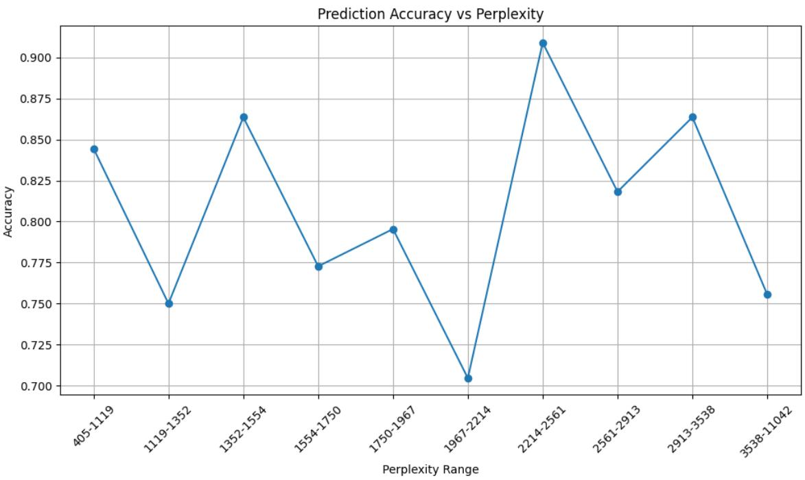  
Figure 6: Prediction accuracy (Y-Axis) vs. perplexity. We divide CRISIS into ten subsets with almost identical numbers of items according to their perplexity score (X-Axis, Perplexity Range).