# A Systematic Analysis of Base Model Choice for Reward Modeling

Kian Ahrabian1,2 Pegah Jandaghi1 Negar Mokhberian1,2

Sai Praneeth Karimireddy1 Jay Pujara1,2

1University of Southern California, Los Angeles, USA 2Information Sciences Institute, Marina del Rey, USA {ahrabian,jandaghi,nmokhber,karimire}@usc.edu, jpujara@isi.edu

## Abstract

Reinforcement learning from human feedback (RLHF) and, at its core, reward modeling have become a crucial part of training powerful large language models (LLMs). One commonly overlooked factor in training high-quality reward models (RMs) is the effect of the base model, which is becoming more challenging to choose given the rapidly growing pool of LLMs. In this work, we present a systematic analysis of the effect of base model selection on reward modeling performance. Our results show that the performance can be improved by up to 14% compared to the most common (i.e., default) choice. Moreover, we showcase the strong statistical relation between some existing benchmarks and downstream performances. We also demonstrate that the results from a small set of benchmarks could be combined to boost the model selection (+18% on average in the top 5-10). Lastly, we illustrate the impact of different post-training steps on the final performance and explore using estimated data distributions to reduce performance prediction error.

## 1 Introduction

Reinforcement learning from human feedback (RLHF) (Stiennon et al., 2020; Ouyang et al., 2022; Bai et al., 2022) has been a critical part of recent advancements in large language models (LLMs) such as OpenAI’s O1 (OpenAI, 2024), Anthropic’s Claude (Anthropic, 2024), and Google’s Gemini (Gemini Team, 2023). At the core of RLHF methods, Reward Models (RMs) are used to guide the LLM (i.e., policy) training by scoring generated responses (Schulman et al., 2017; Ahmadian et al., 2024). Most commonly, RMs are evaluated on RewardBench1 (Lambert et al., 2024b), consisting of 2985 binary preference tasks, 23 subtasks, and four subcategories. The RewardBench leaderboard reflects a bias toward a single model family, with more than 50% of the top 30 entries (see Figure 1) built on top of a Llama-3.x model (Dubey et al., 2024) However, relying on a single model family without exploration is inherently suboptimal, regardless of Llama-3.x models’ quality.

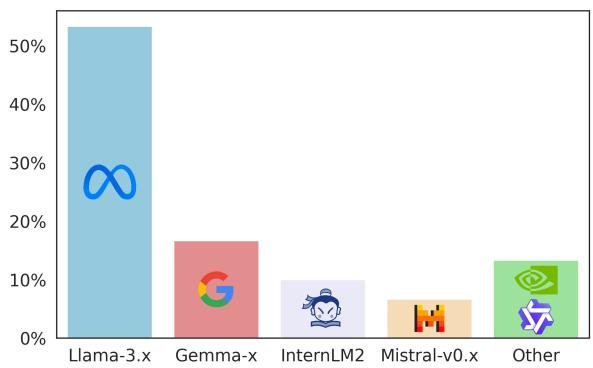  
Figure 1: Ratio of the base models used in the top 30 entries of RewardBench (Dec 2024). Almost all the entries are trained on top of a small set of base models (e.g., Llama-3.x models comprise 50% of the entries).

Considering this suboptimality, we hypothesize that the base model is a critical hyperparameter that substantially impacts the downstream performance. To test this hypothesis, we compare 40 popular models across various sizes and families (see Appendix C for more details). Our experiments show that replacing the popular base model (i.e., LLama-3.x) with the best model of similar size leads to gains ranging from 3% to 14%. While these results prove our hypothesis, running such a search over the plethora of available models is extremely expensive. This obstacle inspires the need for robust approaches that could either limit the search perimeter or help us make a selection apriori. However, the criteria for selecting a model apriori are often unclear and multifaceted.

Prior works in RLHF (Stiennon et al., 2020; Gao et al., 2023a) have examined the relation between the model size and performance. Moreover, recent works (Ruan et al., 2024; Polo et al., 2024) have used compute metrics (e.g., training tokens) and simple capabilities measured by standard benchmarks (e.g., MMLU (Hendrycks et al., 2021)) to predict emergent capabilities of LLMs. Inspired by these works, we use these features to systematically analyze the base models to identify core capabilities and attributes that yield high-quality RMs. Our experiments show that while performances on many benchmarks and reward modeling have strong statistical correlations, they are insufficient for the broader model selection problem. Moreover, we show significant improvements (+18% on average in the top 5-10) can be gained over any single benchmark-based selection, only using a small subset of benchmarks.

While our analysis covers various elements, it does not investigate the effect of different training stages of a model, which have grown in numbers with recent advancements. Hence, we separately investigate the pre-training and post-training stages, relying on publicly available intermediate checkpoints (Lambert et al., 2024a). For the post-training stage, we demonstrate the positive impact of the supervised fine-tuning (SFT) stage (+15.5%) while showcasing the negative effect of the following alignment steps (3-5% drop). For the pre-training stage, we focus on estimating (Bakman et al., 2024) and analyzing the data composition, which has emerged as a key driving factor in recent developments (Abdin et al., 2024a,b; Yang et al., 2024). Our experiments show estimated distributions’ variability across model families, which we use to reduce our regression model’s error (+1.5%).

To summarize, our contributions are as follows:

• We showcase the significance of the base model choice, which could improve upon the most common (i.e., default) choice up to 14% in a size-controlled setting.

• We analyze the statistical relation between performances on standard benchmarks and reward modeling, showcasing strong correlations (Pearson 0.8) on many while illustrating their shortcoming in model selection (i.e., small overlap on top models)

• We show a simple performance prediction regression model based on benchmarks’ results, when employed for model selection, can achieve +18% overlap on average over the top 5-10, compared to the benchmark with the highest correlation.

• We showcase the positive impact of the posttraining stages, especially SFT, achieving up to +15.5% gains on publicly available models. Moreover, we expose the negative impact of the standard post-SFT alignment steps, leading to a 3-5% performance drop.

• We exhibit the potential of using estimated data distributions, which improves our regression model’s performance by +1.5%.

## 2 Related Work

Reward Modeling Recently, there has been a lot of effort in crafting better training datasets (Liu et al., 2024a; Wang et al., 2024c) and improving training architectures (Dorka, 2024; Lou et al., 2024; Zhang et al., 2024b; Wang et al., 2024a). However, the core objective for reward modeling still revolves around two main approaches: Bradley-Terry w/ Binary Preferences (Ziegler et al., 2019; Bradley and Terry, 1952) and Regression w/ Multi-Attribute Scores (Wang et al., 2024e) (see Section 3 for more details). For datasets, RMs are commonly trained on labeled preference datasets such as UltraFeedback (Cui et al., 2024), HelpSteer2 (Wang et al., 2024d), and Magpie (Xu et al., 2024).

Reward Model Evaluation Until recently, one of the biggest challenges of training RMs has been evaluating the trained models in isolation. The lack of test sets in the released datasets made evaluation difficult without going through the highly costly policy training step. To overcome this issue, recent works (Lambert et al., 2024b; Liu et al., 2024c; Gureja et al., 2024) have introduced standardized benchmarks for evaluating these models. Among these benchmarks, RewardBench (Lambert et al., 2024b) is the most popular, with more than 150 entries at the time of writing this article.

## 3 Reward Modeling

## 3.1 Training

Models. For our experiments, we use 40 different chat models from prominent publishers such as Microsoft, Google, and Meta, with sizes ranging from 494M to 10.30B (i.e., the largest model we could train on our cluster). Appendix C provides more details on these models.

Bradley-Terry w/ Binary Preferences. The most popular choice for reward modeling is the

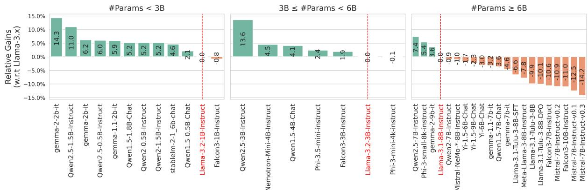  
(a) Bradley-Terry w/ Binary Preferences

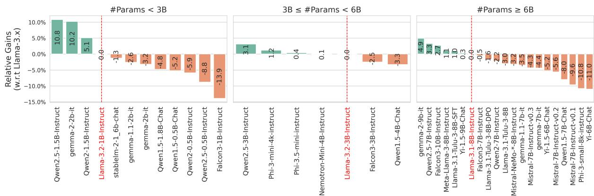  
(b) Regression w/ Multi-Attribute Scores  
Figure 2: Reward Modeling Performance Gains. Relative gains are illustrated concerning the Llama-3.x model (marked as red) within the same group.

Bradley-Terry (BT) (Bradley and Terry, 1952; Ziegler et al., 2019) model. The underlying assumption of BT is that for a pair of responses $\mathcal { V } = ( y _ { 1 } , y _ { 2 } )$ , the human preference distribution $\rho ^ { * }$ is generated from a latent reward function $r ^ { * } ( x , y )$ which we only have indirect access to. This assumption can be formalized as

$$
\rho ^ { * } ( y _ { 1 } \succ y _ { 2 } | x ) = \frac { \exp ( r ^ { * } ( x , y _ { 1 } ) ) } { \sum _ { y } ^ { \mathcal { V } } \exp ( r ^ { * } ( x , y ) ) } .\tag{1}
$$

Then, framing BT as a binary classification task, we can parameterize the reward function and optimize a negative log-likelihood loss as

$$
\mathcal { L } _ { B T } = - \mathbb { E } _ { ( x , y _ { w } , y _ { l } ) \sim \mathcal { D } } \left[ \log \sigma ( \zeta ( x , y _ { w } ) - \zeta ( x , y _ { l } ) ) \right]\tag{2}
$$

where $\mathcal { D } = \{ ( x ^ { i } , y _ { w } ^ { i } , y _ { k } ^ { i } ) \} _ { i = 1 } ^ { N } \sim \rho ^ { * }$ is a binary preferences dataset and $\zeta$ is an LLM with a linear head that outputs a single scalar as the reward value.

To create a compatible dataset, first, an LLM ξ generates pairs of responses for samples from a given prompt dataset $\mathcal { D } _ { x }$ :

$$
\mathcal { D } _ { \xi } = \{ ( x , y _ { 1 } , y _ { 2 } ) | \{ y _ { 1 } , y _ { 2 } \} \sim \xi ( x ) \} _ { x \sim \mathcal { D } _ { x } } .\tag{3}
$$

Then, the pairs are labeled by humans (or synthetically) to obtain the binary preferences:

$$
\mathcal { D } = \{ ( x , y _ { w } , y _ { l } ) | ( y _ { w } \succ y _ { l } ; x ) \} _ { ( x , y _ { 1 } , y _ { 2 } ) \sim \mathcal { D } _ { \xi } } ~ .\tag{4}
$$

We follow a similar setup for training the reward models as Wang et al. (2024c). Specifically, each model is trained for one epoch on the HelpSteer2-Preference dataset, using a global batch size of 64, a constant learning rate, searched over $\{ 5 , 6 , 7 , 8 , 9 \} e \mathrm { ~ - ~ } 7 \cup \{ 1 , 2 , 3 , 4 , 5 \} e \mathrm { ~ - ~ } 6$ for each model separately, and an AdamW optimizer (Loshchilov and Hutter, 2019) with 20 warmup steps. Each model is saved every 20 steps, and the final model is chosen based on the accuracy of the saved models on the validation set.

Regression w/ Multi-Attribute Scores. While less explored compared to BT, Regression reward models (Wang et al., 2024e,a,d) have been posting impressive performance recently, topping the RewardBench at multiple points $( e . g . , A r m o R M - L 1 a m a 3 - 8 B - v 0 . 1 ^ { 2 }$ and

Nemotron-4-340B-Reward3). In contrast to the binary preferences, each sample is annotated with multiple values along different attributes (e.g., Coherence, Correctness, Verbosity, etc.). Then, given an input $x ,$ an output score vector $y \in \mathbb { R } ^ { n }$ and an LLM $\phi ,$ we optimize

$$
\mathcal { L } _ { R } = \mathbf { M } \mathbf { S } \mathbf { E } ( \phi ( x ) ^ { ( - 1 ) } W _ { \phi } , y )\tag{5}
$$

where $\phi ( x ) ^ { ( - 1 ) } \in \mathbb { R } ^ { \dim ( \phi ) }$ is the last hidden state and $W _ { \phi } \in \mathbb { R } ^ { \mathrm { d i m } ( \phi ) \times n }$ is a trainable linear projection (i.e., a linear layer). This formulation leads to more flexible and interpretable reward models. To train the models, we follow a similar setup as Wang et al. (2024d). Specifically, each model is trained for two epochs on the HelpSteer2 dataset, using a global batch size of 64, a constant learning rate, searched over $\{ 1 , 3 , 5 , 7 , 9 \} e - \{ 6 , 7 \}$ for each model separately, and an AdamW optimizer with 20 warm-up steps. Since RewardBench only supports BT models, for each model, we search for an optimal merge vector, $w _ { m } ,$ as

$$
\psi ( x ) = ( \phi ( x ) ^ { ( - 1 ) } W _ { \phi } ) ) ^ { T } w\tag{6}
$$

$$
w _ { m } = \underset { w \in S } { \mathrm { a r g m a x } } \sum _ { x _ { c } , x _ { r } } ^ { D } \mathbb { 1 } \left( \psi ( x _ { c } ) > \psi ( x _ { r } ) \right)\tag{7}
$$

where D is the validation set of HelpSteer2- Preference (Wang et al., 2024c), $x _ { c }$ and $x _ { r }$ are chosen and rejected responses, respectively, and $S ~ = ~ \{ 0 . 0 5 k \} _ { k = 0 , \ldots , 2 0 } ^ { 4 } \times \{ - 0 . 0 5 k \} _ { k = 0 , \ldots , 2 0 }$ ( 4M combinations). We follow the approach in Nemotron-4-340B-Reward to assign positive weights for Helpfulness, Correctness, Coherence, Complexity, and a negative weight for Verbosity. Finally, we pick the model with the highest validation performance.

## 3.2 Evaluation

Following prior work (Wang et al., 2024d,c; Dorka, 2024; Lou et al., 2024; Zhang et al., 2024b; Wang et al., 2024a) and due to its popularity (e.g., more than 150 entries), we evaluate our trained models using RewardBench (Lambert et al., 2024b), which contains 3k assorted tasks from 23 different datasets. Each task consists of a binary preference sample and is categorized into one of the following four categories: Chat, Chat-Hard, Safety, and Reasoning. We report the accuracy for each category and an overall score by averaging the accuracies.

## 3.3 Experimental Results

To make a fairer comparison, we partition the models into three groups, each representing a range of roughly 3B parameters: $\{ < 3 \mathbf { B } , ( \geq 3 \mathbf { B } , < 6 \mathbf { B } ) , \geq$ 6B . Then, we calculate the relative gains concerning the Llama-3.x model for each group (i.e., the default choice) within the same group. Figure 2 present our results models trained using Bradley-Terry (w/ binary preferences) and Regression (w/ multi-attribute scores). While Llama-3.x models perform exceptionally well across our experiments, within each group, a few models post superior performances, with margins up to 14%. Specifically, looking at these top performances, models from the Qwen2.5 and Gemma-2 families consistently improve upon the results of their Llama-3.x counterpart, presenting reliable alternatives. Moreover, these experiments showcase the potentially high variances in performance within groups of models with similar sizes, which, in many cases, is the main limiting factor for model selection.

## 4 Benchmarks as Latent Skills Proxies

## 4.1 Statistical Correlation

Setup. Practitioners often test their models on various benchmarks, covering many topics such as reasoning, coding, etc. These benchmarks, along with aggregate benchmarks such as Open LLM Leaderboard (Beeching et al., 2023; Fourrier et al., 2024) and HELM (Cecchini et al., 2024), act as a proxy measurement of the true capabilities of LLMs. Consequently, many of them are often used for model selection. For our analysis, we curate a list of 33 common benchmarks as reported in Llama-3.x (Dubey et al., 2024), Gemma-2 (Team et al., 2024), Phi-3.x (Abdin et al., 2024a), and Qwen2.5 (Yang et al., 2024) families (see Appendix B for more details). Besides these benchmarks, we also include training metrics such as the number of parameters and the number of training tokens, as they are commonly used in formulating scaling laws (Ruan et al., 2024; Polo et al., 2024).

Results. Figure 3 presents our correlation analysis between these benchmarks/metrics and the final reward modeling performances4. As evident, some benchmarks showcase a very high ( 0.8) correlation, both on Pearson and Spearman, with

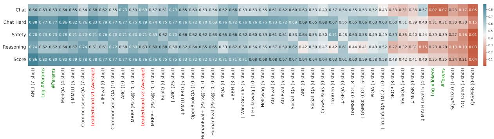  
(a) Spearman Correlation

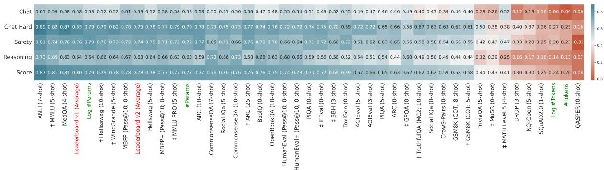  
(b) Pearson Correlation  
Figure 3: Statistical Correlation w.r.t. Reward Modeling Performance. The subset benchmarks of Open LLM Leaderboard v2 (v1) are denoted with an  ( ). Text Colors: Red  Aggregate benchmark, Green  Training metric.

ANLI (Williams et al., 2022) consistently beating other benchmarks across different subcategories.

Significance Test. We test the significance of the correlation coefficient with the following statistic:

$$
t _ { c } = { \frac { r { \sqrt { n - 2 } } } { \sqrt { 1 - r ^ { 2 } } } }\tag{8}
$$

where r is the sample correlation coefficient, and n is the sample size, which leads to a threshold $t _ { c }$ of 0.316 $( n = 4 0 )$ for $p \mathrm { - }$ -value < 0.05. Using this threshold, we observe that most of the benchmark $\mathrm { \bar { s } } ^ { \prime }$ correlations have statistical significance.

Coverage Test. While a high correlation shows a strong statistical relationship between the two variables, we also care about the coverage at different points in their rankings. Given a benchmark $\beta$ and reward bench $\rho ,$ we formally define the coverage at top-k as

$$
\mathscr { C } ( \beta , \rho , \mathscr { L } , k ) = \frac { | \mathscr { T } _ { \beta } ( \mathscr { L } , k ) \cap \mathscr { T } _ { \rho } ( \mathscr { L } , k ) | } { k }\tag{9}
$$

where $\mathcal { L }$ is a set of LLMs and $\mathcal { T } _ { x } ( y , z )$ is the top z LLMs in $y$ on benchmark x. To simulate a real-world search where we need high coverage at higher ranks, we filter out any benchmark with less than 0.4 and 0.7 coverage at $k = 5$ and $k = 1 0$ respectively. Figure 4 illustrates the coverage values from $k \ = \ 5$ to $k ~ = ~ 3 0$ on the remaining benchmarks (see Appendix B for more details). Notably, all the benchmarks mostly follow a loglinear coverage pattern concerning k, with ANLI outperforming the other benchmarks. However, we also observe a relatively low coverage at higher ranks, which mitigates the effectiveness of using these benchmarks for model selection.

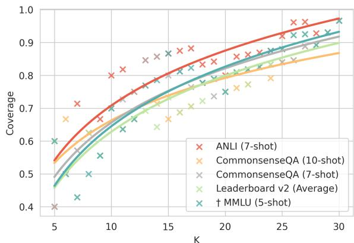  
Figure 4: Benchmark’s Coverage. We only retain benchmarks with at least 0.4 and 0.7 coverage at $k = 5$ and $k = 1 0$ , respectively.

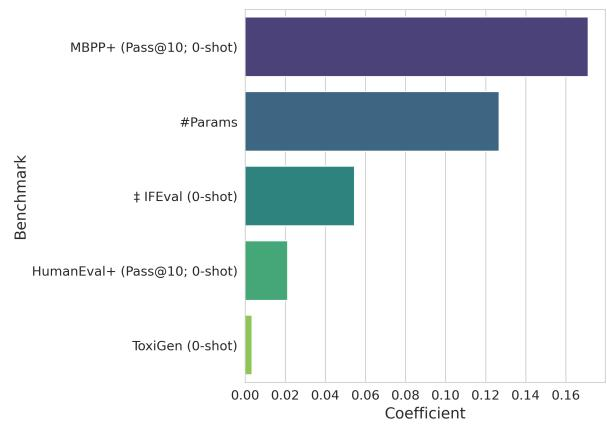  
Figure 5: Coefficients. Only five benchmarks are assigned a non-zero weight by the trained model. The topics of these benchmarks are as follows: Coding MBPP+ and HumanEval+, Safety ToxiGen, General  IFEval, and Training Metrics  #Params (see Appendix B for more details).

## 4.2 Regression Analysis

Setup. Considering the aforementioned low coverage in single-benchmark model selection, we hypothesize that combining the performances from a small set of benchmarks will yield much better predictive performance. To test this hypothesis, we run a 10-fold cross-validation experiment on an Elastic Net model, searching over the following hyperparameters: degree  1, 2, 3 , $\alpha \in \{ 0 . 1 , 0 . 0 1 , 0 . 0 0 1 , 0 . 0 0 0 1 \}$ , and l1\_ratio 0.0, 0.25, 0.5, 0.75, 1.0 . Then, we fit a model over all samples using the best hyperparameters.

Results. Figure 5 illustrates the benchmarks with a non-zero weight in the final model. Mapping back these five benchmarks to their main topics (see Appendix B for more details), we observe that they consist of two coding (MBPP+ (Liu et al., 2023) and HumanEval+ (Liu et al., 2023)), one safety (ToxiGen (Hartvigsen et al., 2022)), and one general (IFEval (Zhou et al., 2023)) benchmarks, along with one training metric (#Params). This combination closely follows the subcategories in RewarcBench: Coding Reasoning, Safety = Safety, General + Training Metric  Chat/Chat Hard. Moreover, in Figure 6, we compare the coverages of the fitted model to the standalone benchmarks. As evident, the trained model significantly improves the coverage in lower Ks, mitigating the critical problem of using standalone benchmarks. These results prove our hypothesis, showcasing the predictability of reward modeling performance from a low-dimensional vector of prior results.

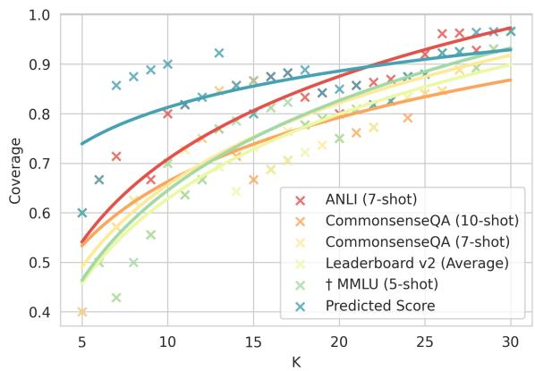  
Figure 6: Benchmarks vs. Predicted Score Coverage. We only retain benchmarks with at least 0.4 and 0.7 coverage at k = 5 and k = 10, respectively.

## 5 Training Stages

## 5.1 Post-training

Setup. Traditionally, for training RMs, practitioners have used a base model that has undergone an SFT process (Stiennon et al., 2020). However, the recent advancements in LLMs have introduced more stages to the training process. In this section, we analyze the effect of these different stages on the RMs’ performance using the publicly available models. While publishers don’t regularly release the intermediate training checkpoints, recent efforts in open LLMs have made some of these intermediate models available for analysis. Specifically, for the Llama-3.1-Tulu-3-8B5 model, Lambert et al. (2024a) have released three models from the end of each SFT, Direct Preference Optimization (DPO) (Rafailov et al., 2023), and Reinforcement Learning with Verifiable Rewards (RLVR) stages. Apart from the Tulu 3 model, we also include two other Llama-3.1-8B-based6 models that have undergone the post-training phase, namely: Llama-3.1-8B-Instruct7 and Hermes-3-Llama-3.1-8B8 (Teknium et al., 2024).

Results. Table 1 presents our experimental results comparing different post-training stages to the base model. From these results, we can observe that the post-training procedure significantly improves the overall performance of RMs. However, the extra steps after the SFT phase decrease the models’ performance across all categories. This phenomenon could be due to the focus of these stages on human alignment, which slightly degrades other capabilities (Korbak et al., 2022). Looking at the subcategories, we note that the Chat Hard and Safety consistently get significant performance boosts (between 22-32%) after the posttraining procedure. We believe this is due to dense exposure to related samples that focus on improving the models’ safety and complex conversational capabilities. Moreover, the performances on Chat category remain primarily unchanged (<2%), persistent with our previous observations in Section 4 where even the worst models posted high performances. Finally, in the Reasoning category, while the initial SFT stage moderately ( 8.5%) improves the performance, the following stages reverse most of the gains. Given the focus of the RLVR stage on improving math capabilities, these results are somewhat surprising. This phenomenon might be explained by the fact that only 31% of reasoning samples in RewardBench are math-related, compared to 69% targeting coding correctness. However, given a potential co-dependence of math and coding capabilities, further investigation is needed on this phenomenon, which we leave to future works.

<table><tr><td>Model</td><td>Chat</td><td> $\Delta$ </td><td>Chat Hard</td><td> $\Delta$ </td><td>Safety</td><td> $\Delta$ </td><td>Reasoning</td><td> $\Delta$ </td><td>Score</td><td> $\Delta$ </td></tr><tr><td>Llama-3.1-8B</td><td>93.9</td><td></td><td>53.7</td><td></td><td>64.7</td><td></td><td>79.1</td><td>一</td><td>72.9</td><td></td></tr><tr><td>Llama-3.1-8B-Instruct</td><td>95.3</td><td>1.5%</td><td>68.2</td><td>27.0%</td><td>84.6</td><td>30.8%</td><td>84.7</td><td>7.1%</td><td>83.2</td><td>14.1%</td></tr><tr><td>Hermes-3-Llama-3.1-8B</td><td>95.5</td><td>1.7%</td><td>71.3</td><td>32.8%</td><td>83.8</td><td>29.5%</td><td>74.0</td><td>-6.4%</td><td>81.1</td><td>11.2%</td></tr><tr><td>Llama-3.1-Tulu-3-8B-SFT</td><td>95.3</td><td>1.5%</td><td>70.8</td><td>31.8%</td><td>84.9</td><td>31.2%</td><td>85.8</td><td>8.5%</td><td>84.2</td><td>15.5%</td></tr><tr><td>Llama-3.1-Tulu-3-8B-DPO</td><td>94.7</td><td>0.9%</td><td>69.1</td><td>28.7%</td><td>82.3</td><td>27.2%</td><td>80.1</td><td>1.3%</td><td>81.6</td><td>11.9%</td></tr><tr><td>Llama-3.1-Tulu-3-8B</td><td>93.3</td><td>-0.6%</td><td>65.6</td><td>22.2%</td><td>83.5</td><td>29.1%</td><td>78.5</td><td>-0.8%</td><td>80.2</td><td>10.0%</td></tr></table>

Table 1: Post-training Performances. The $\Delta$ columns showcase the relative change to the base model’s performance for each category.

## 5.2 Pre-training

Setup. Prior works have examined the relation between eventual model capabilities and many LLMs’ attributes, ranging from compute (Hoffmann et al., 2022) to downstream (Ruan et al., 2024) metrics. However, pre-training data distribution has remained a significant underexplored factor among these attributes, mainly due to its confidential, proprietary nature. Efforts in open LLM training (Liu et al., 2024d; OLMo et al., 2024)

present an opportunity to study this factor. Recent studies (Shi et al., 2024; Zhang et al., 2024a; Zhang and Wu, 2024; Kim et al., 2024) have developed pre-training data detection techniques by viewing it as a membership inference attack (MIA) task. However, the curated MIA datasets lack the scale and coverage needed for a comprehensive analysis of the pre-training data distribution, as they have less than 10k samples. To address this issue, we curate a large-scale dataset by sampling 200k examples from each of the Github, Book, ArXiv, Wikipedia, and StackExchange subsets in SlimPajama (Soboleva et al., 2023), resulting in a 1M sample dataset9. Moreover, to detect the presence of a document in an LLM, we use a truncated version (i.e., the first 2048 tokens) of the length-normalized sequence probability (Malinin and Gales, 2021). The truncation helps reduce the cost of running such analysis at scale, as some books have more than 170k tokens, and mitigates the noise from later tokens, as LLMs have shown to have a problem making robust use of tokens in the middle of long documents (Liu et al., 2024b; Hsieh et al., 2024).

Given a document $D = [ t _ { i } ] _ { i = 1 , \dots , m } ,$ an LLM $\phi ,$ and a tokens limit N, we calculate a presence score $S _ { \phi }$ as

$$
\mathcal { S } _ { \phi } ( D , N ) = \frac { 1 } { N } \sum _ { i = 1 } ^ { N } \log p _ { \phi } ( t _ { i } | t _ { 1 : i - 1 } ) \ .\tag{10}
$$

We use Crystal10 (Liu et al., 2024d) as our ground truth LLM, as all of the SlimPajama dataset has been used in its pre-training stage. Finally, for each model, we reuse the extracted distribution from the largest member of its family if and only if they’ve been trained on the same amount of data, assuming the same data was used for the pre-training stage (see Appendix B for more details).

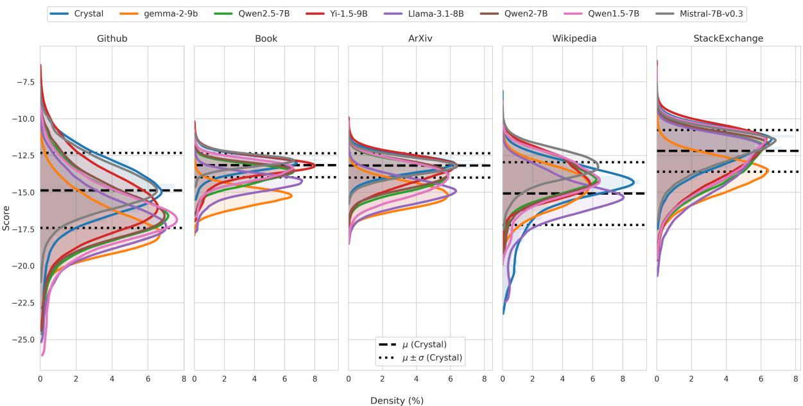  
Figure 7: Estimated Pre-training Data Distributions. Crystal (Liu et al., 2024d) represents our ground truth, as it has seen the entire SlimPajama dataset in the pre-training phase exactly once.

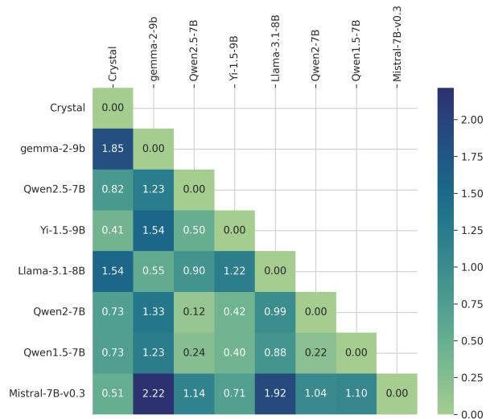  
Figure 8: Jensen-Shannon Distance. The values are based on the scores from the entire dataset.

Results. Figure 7 illustrates the score distributions across different subsets of SlimPajama for seven models from different families. Notably, we observe a difference between the score ranges across the categories, even for the ground truth model that has seen everything once. We believe this is due to the potential occurrence of similar documents in the excluded CommonCrawl and C4 categories. Figure 7 showcases the Jensen-Shannon Distance (JSD) between different models over the scores of the entire 1M samples. As evident, some model pairs showcase significantly higher distances than others, showcasing a variability across models that can be utilized for downstream predictions. We also notice that the Qwen 1.5, 2, 2.5 models have the lowest non-zero distances, which suggests that different generations of models released by a publisher potentially have significant overlaps in their pre-training data. Moreover, we expand our regression analysis (see Section 4.2) by adding the average scores of the categories to the already established five features (see Figure 5). Our experiments show that compared to adding these features improves the mean absolute error by +1.5% (from 3.2% to 1.7%), compared to only using the original five features, which showcases the untapped potential of the pre-training data distributions.

## 6 Conclusion

In this paper, we presented a systematic analysis of the effect of base model selection on the reward modeling performance. First, we showcased the significant variability of final performance by only changing the base model. Then, we analyzed the possibility of knowing a model’s performance apriori, leading to a simple model with high coverage across the range of models, using commonly disclosed metrics and performances. Finally, we investigate different training stages, showcasing 1) the positive and negative effects of certain steps in posttraining and 2) illustrating the untapped potential of using estimated pre-training data distributions.

## Limitations

Training Regimen. While our experiments are designed to remove the effect of reward modeling training data (i.e., using the same small dataset for all models), using larger datasets might reveal unknown behaviors for some models. However, given our computational resource constraints, we leave these experiments to future work, as the current cost of our experiments is 4500 GPU/hours.

Post-training. In our analysis, we observed an interesting and unintuitive phenomenon where RLHF and preference optimization hurt the models’ performance in the reasoning category of Reward-Bench. However, we only had access to a limited number of publicly available models; further investigation is needed to identify the main reason for this phenomenon.

Pre-training. Given our limited resources, we could only run our data distribution estimation experiments on a subset of models. Extending our models in future works will boost our understanding of the effect of data distributions. Moreover, we relied on a relatively simple score to scale to the number of samples we had; further experiments with other methods at scale could help gain more insights.

## Acknowledgments

The authors thank Alon Benhaim, Barun Patra, Xihui Lin, and Dong-Ho Lee for insightful discussions. This material is based upon work supported by the Defense Advanced Research Projects Agency (DARPA) under Agreements No. HR00112590089 and No. HR00112220046.

## References

Marah Abdin, Jyoti Aneja, Hany Awadalla, Ahmed Awadallah, Ammar Ahmad Awan, Nguyen Bach, Amit Bahree, Arash Bakhtiari, Jianmin Bao, Harkirat Behl, et al. 2024a. Phi-3 technical report: A highly capable language model locally on your phone. arXiv preprint arXiv:2404.14219.

Marah Abdin, Jyoti Aneja, Harkirat Behl, Sébastien Bubeck, Ronen Eldan, Suriya Gunasekar, Michael Harrison, Russell J Hewett, Mojan Javaheripi, Piero Kauffmann, et al. 2024b. Phi-4 technical report. arXiv preprint arXiv:2412.08905.

Arash Ahmadian, Chris Cremer, Matthias Gallé, Marzieh Fadaee, Julia Kreutzer, Olivier Pietquin, Ahmet Üstün, and Sara Hooker. 2024. Back to basics:

Revisiting REINFORCE-style optimization for learning from human feedback in LLMs. In Proceedings of the 62nd Annual Meeting of the Association for Computational Linguistics (Volume 1: Long Papers), pages 12248–12267, Bangkok, Thailand. Association for Computational Linguistics.

Anthropic. 2024. Meet claude. https://www. anthropic.com/claude. Accessed: 2024-11-25.

Jacob Austin, Augustus Odena, Maxwell Nye, Maarten Bosma, Henryk Michalewski, David Dohan, Ellen Jiang, Carrie Cai, Michael Terry, Quoc Le, et al. 2021. Program synthesis with large language models. arXiv preprint arXiv:2108.07732.

Yuntao Bai, Saurav Kadavath, Sandipan Kundu, Amanda Askell, Jackson Kernion, Andy Jones, Anna Chen, Anna Goldie, Azalia Mirhoseini, Cameron McKinnon, et al. 2022. Constitutional ai: Harmlessness from ai feedback. arXiv preprint arXiv:2212.08073.

Yavuz Faruk Bakman, Duygu Nur Yaldiz, Baturalp Buyukates, Chenyang Tao, Dimitrios Dimitriadis, and Salman Avestimehr. 2024. MARS: Meaningaware response scoring for uncertainty estimation in generative LLMs. In Proceedings of the 62nd Annual Meeting of the Association for Computational Linguistics (Volume 1: Long Papers), pages 7752–7767, Bangkok, Thailand. Association for Computational Linguistics.

Edward Beeching, Clémentine Fourrier, Nathan Habib, Sheon Han, Nathan Lambert, Nazneen Rajani, Omar Sanseviero, Lewis Tunstall, and Thomas Wolf. 2023. Open llm leaderboard (2023-2024). https://huggingface.co/ spaces/open-llm-leaderboard-old/open\_ llm\_leaderboard.

Yonatan Bisk, Rowan Zellers, Jianfeng Gao, Yejin Choi, et al. 2020. Piqa: Reasoning about physical commonsense in natural language. In Proceedings ofthe AAAI conference on artificial intelligence, volume 34, pages 7432–7439.

Ralph Allan Bradley and Milton E Terry. 1952. Rank analysis of incomplete block designs: I. the method of paired comparisons. Biometrika, 39(3/4):324– 345.

David Cecchini, Arshaan Nazir, Kalyan Chakravarthy, and Veysel Kocaman. 2024. Holistic evaluation of large language models: Assessing robustness, accuracy, and toxicity for real-world applications. In Proceedings ofthe 4th Workshop on Trustworthy Natural Language Processing (TrustNLP 2024), pages 109–117, Mexico City, Mexico. Association for Computational Linguistics.

Mark Chen, Jerry Tworek, Heewoo Jun, Qiming Yuan, Henrique Ponde de Oliveira Pinto, Jared Kaplan, Harri Edwards, Yuri Burda, Nicholas Joseph, Greg Brockman, Alex Ray, Raul Puri, Gretchen

Krueger, Michael Petrov, Heidy Khlaaf, Girish Sastry, Pamela Mishkin, Brooke Chan, Scott Gray, Nick Ryder, Mikhail Pavlov, Alethea Power, Lukasz Kaiser, Mohammad Bavarian, Clemens Winter, Philippe Tillet, Felipe Petroski Such, Dave Cummings, Matthias Plappert, Fotios Chantzis, Elizabeth Barnes, Ariel Herbert-Voss, William Hebgen Guss, Alex Nichol, Alex Paino, Nikolas Tezak, Jie Tang, Igor Babuschkin, Suchir Balaji, Shantanu Jain, William Saunders, Christopher Hesse, Andrew N. Carr, Jan Leike, Josh Achiam, Vedant Misra, Evan Morikawa, Alec Radford, Matthew Knight, Miles Brundage, Mira Murati, Katie Mayer, Peter Welinder, Bob McGrew, Dario Amodei, Sam McCandlish, Ilya Sutskever, and Wojciech Zaremba. 2021. Evaluating large language models trained on code. arXiv preprint arXiv:2107.03374.

Christopher Clark, Kenton Lee, Ming-Wei Chang, Tom Kwiatkowski, Michael Collins, and Kristina Toutanova. 2019. BoolQ: Exploring the surprising difficulty of natural yes/no questions. In Proceedings ofthe 2019 Conference ofthe North American Chapter of the Association for Computational Linguistics: Human Language Technologies, Volume 1 (Long and Short Papers), pages 2924–2936, Minneapolis, Minnesota. Association for Computational Linguistics.

Peter Clark, Isaac Cowhey, Oren Etzioni, Tushar Khot, Ashish Sabharwal, Carissa Schoenick, and Oyvind Tafjord. 2018. Think you have solved question answering? try arc, the ai2 reasoning challenge. arXiv preprint arXiv:1803.05457.

Karl Cobbe, Vineet Kosaraju, Mohammad Bavarian, Mark Chen, Heewoo Jun, Lukasz Kaiser, Matthias Plappert, Jerry Tworek, Jacob Hilton, Reiichiro Nakano, et al. 2021. Training verifiers to solve math word problems. arXiv preprint arXiv:2110.14168.

Ganqu Cui, Lifan Yuan, Ning Ding, Guanming Yao, Bingxiang He, Wei Zhu, Yuan Ni, Guotong Xie, Ruobing Xie, Yankai Lin, Zhiyuan Liu, and Maosong Sun. 2024. Ultrafeedback: boosting language models with scaled ai feedback. In Proceedings of the 41st International Conference on Machine Learning, ICML’24. JMLR.org.

Pradeep Dasigi, Kyle Lo, Iz Beltagy, Arman Cohan, Noah A. Smith, and Matt Gardner. 2021. A dataset of information-seeking questions and answers anchored in research papers. In Proceedings of the 2021 Conference of the North American Chapter of the Associationfor Computational Linguistics: Human Language Technologies, pages 4599–4610, Online. Association for Computational Linguistics.

Nicolai Dorka. 2024. Quantile regression for distributional reward models in rlhf. arXiv preprint arXiv:2409.10164.

Dheeru Dua, Yizhong Wang, Pradeep Dasigi, Gabriel Stanovsky, Sameer Singh, and Matt Gardner. 2019. DROP: A reading comprehension benchmark requiring discrete reasoning over paragraphs. In Proceedings ofthe 2019 Conference ofthe North American

Chapter of the Association for Computational Linguistics: Human Language Technologies, Volume 1 (Long and Short Papers), pages 2368–2378, Minneapolis, Minnesota. Association for Computational Linguistics.

Abhimanyu Dubey, Abhinav Jauhri, Abhinav Pandey, Abhishek Kadian, Ahmad Al-Dahle, Aiesha Letman, Akhil Mathur, Alan Schelten, Amy Yang, Angela Fan, et al. 2024. The llama 3 herd of models. arXiv preprint arXiv:2407.21783.

Clémentine Fourrier, Nathan Habib, Alina Lozovskaya, Konrad Szafer, and Thomas Wolf. 2024. Open llm leaderboard v2. https://huggingface. co/spaces/open-llm-leaderboard/open\_llm\_ leaderboard.

Leo Gao, John Schulman, and Jacob Hilton. 2023a. Scaling laws for reward model overoptimization. In Proceedings of the 40th International Conference on Machine Learning, volume 202 of Proceedings ofMachine Learning Research, pages 10835–10866. PMLR.

Leo Gao, Jonathan Tow, Baber Abbasi, Stella Biderman, Sid Black, Anthony DiPofi, Charles Foster, Laurence Golding, Jeffrey Hsu, Alain Le Noac’h, Haonan Li, Kyle McDonell, Niklas Muennighoff, Chris Ociepa, Jason Phang, Laria Reynolds, Hailey Schoelkopf, Aviya Skowron, Lintang Sutawika, Eric Tang, Anish Thite, Ben Wang, Kevin Wang, and Andy Zou. 2024. A framework for few-shot language model evaluation.

Pengzhi Gao, Liwen Zhang, Zhongjun He, Hua Wu, and Haifeng Wang. 2023b. Learning multilingual sentence representations with cross-lingual consistency regularization. In Proceedings of the 2023 Conference on Empirical Methods in Natural Language Processing: Industry Track, pages 243–262, Singapore. Association for Computational Linguistics.

Gemini Team. 2023. Gemini: a family of highly capable multimodal models. arXiv preprint arXiv:2312.11805.

Srishti Gureja, Lester James V Miranda, Shayekh Bin Islam, Rishabh Maheshwary, Drishti Sharma, Gusti Winata, Nathan Lambert, Sebastian Ruder, Sara Hooker, and Marzieh Fadaee. 2024. M-rewardbench: Evaluating reward models in multilingual settings. arXiv preprint arXiv:2410.15522.

Thomas Hartvigsen, Saadia Gabriel, Hamid Palangi, Maarten Sap, Dipankar Ray, and Ece Kamar. 2022. ToxiGen: A large-scale machine-generated dataset for adversarial and implicit hate speech detection. In Proceedings of the 60th Annual Meeting of the Associationfor Computational Linguistics (Volume 1: Long Papers), pages 3309–3326, Dublin, Ireland. Association for Computational Linguistics.

Dan Hendrycks, Collin Burns, Steven Basart, Andy Zou, Mantas Mazeika, Dawn Song, and Jacob Steinhardt.

2021. Measuring massive multitask language understanding. In International Conference on Learning Representations.

Jordan Hoffmann, Sebastian Borgeaud, Arthur Mensch, Elena Buchatskaya, Trevor Cai, Eliza Rutherford, Diego de Las Casas, Lisa Anne Hendricks, Johannes Welbl, Aidan Clark, Thomas Hennigan, Eric Noland, Katherine Millican, George van den Driessche, Bogdan Damoc, Aurelia Guy, Simon Osindero, Karén Simonyan, Erich Elsen, Oriol Vinyals, Jack Rae, and Laurent Sifre. 2022. An empirical analysis of compute-optimal large language model training. In Advances in Neural Information Processing Systems, volume 35, pages 30016–30030. Curran Associates, Inc.

Cheng-Ping Hsieh, Simeng Sun, Samuel Kriman, Shantanu Acharya, Dima Rekesh, Fei Jia, Yang Zhang, and Boris Ginsburg. 2024. Ruler: What’s the real context size of your long-context language models? arXiv preprint arXiv:2404.06654.

Di Jin, Eileen Pan, Nassim Oufattole, Wei-Hung Weng, Hanyi Fang, and Peter Szolovits. 2021. What disease does this patient have? a large-scale open domain question answering dataset from medical exams. Applied Sciences, 11(14):6421.

Mandar Joshi, Eunsol Choi, Daniel Weld, and Luke Zettlemoyer. 2017. TriviaQA: A large scale distantly supervised challenge dataset for reading comprehension. In Proceedings ofthe 55th Annual Meeting of the Associationfor Computational Linguistics (Volume 1: Long Papers), pages 1601–1611, Vancouver, Canada. Association for Computational Linguistics.

Gyuwan Kim, Yang Li, Evangelia Spiliopoulou, Jie Ma, Miguel Ballesteros, and William Yang Wang. 2024. Detecting training data of large language models via expectation maximization. arXiv preprint arXiv:2410.07582.

Tomasz Korbak, Ethan Perez, and Christopher Buckley. 2022. RL with KL penalties is better viewed as Bayesian inference. In Findings of the Association for Computational Linguistics: EMNLP 2022, pages 1083–1091, Abu Dhabi, United Arab Emirates. Association for Computational Linguistics.

Tom Kwiatkowski, Jennimaria Palomaki, Olivia Redfield, Michael Collins, Ankur Parikh, Chris Alberti, Danielle Epstein, Illia Polosukhin, Jacob Devlin, Kenton Lee, Kristina Toutanova, Llion Jones, Matthew Kelcey, Ming-Wei Chang, Andrew M. Dai, Jakob Uszkoreit, Quoc Le, and Slav Petrov. 2019. Natural questions: A benchmark for question answering research. Transactions ofthe Associationfor Computational Linguistics, 7:452–466.

Nathan Lambert, Jacob Morrison, Valentina Pyatkin, Shengyi Huang, Hamish Ivison, Faeze Brahman, Lester James V. Miranda, Alisa Liu, Nouha Dziri, Shane Lyu, Yuling Gu, Saumya Malik, Victoria Graf, Jena D. Hwang, Jiangjiang Yang, Ronan Le

Bras, Oyvind Tafjord, Chris Wilhelm, Luca Soldaini, Noah A. Smith, Yizhong Wang, Pradeep Dasigi, and Hannaneh Hajishirzi. 2024a. T " ulu 3: Pushing frontiers in open language model post-training. arXiv preprint arXiv:2411.15124.

Nathan Lambert, Valentina Pyatkin, Jacob Morrison, LJ Miranda, Bill Yuchen Lin, Khyathi Chandu, Nouha Dziri, Sachin Kumar, Tom Zick, Yejin Choi, et al. 2024b. Rewardbench: Evaluating reward models for language modeling. arXiv preprint arXiv:2403.13787.

Stephanie Lin, Jacob Hilton, and Owain Evans. 2022. TruthfulQA: Measuring how models mimic human falsehoods. In Proceedings ofthe 60th Annual Meeting of the Association for Computational Linguistics (Volume 1: Long Papers), pages 3214–3252, Dublin, Ireland. Association for Computational Linguistics.

Chris Yuhao Liu, Liang Zeng, Jiacai Liu, Rui Yan, Jujie He, Chaojie Wang, Shuicheng Yan, Yang Liu, and Yahui Zhou. 2024a. Skywork-reward: Bag of tricks for reward modeling in llms. arXiv preprint arXiv:2410.18451.

Jiawei Liu, Chunqiu Steven Xia, Yuyao Wang, and LINGMING ZHANG. 2023. Is your code generated by chatGPT really correct? rigorous evaluation of large language models for code generation. In Thirty-seventh Conference on Neural Information Processing Systems.

Nelson F. Liu, Kevin Lin, John Hewitt, Ashwin Paranjape, Michele Bevilacqua, Fabio Petroni, and Percy Liang. 2024b. Lost in the middle: How language models use long contexts. Transactions ofthe Associationfor Computational Linguistics, 12:157–173.

Yantao Liu, Zijun Yao, Rui Min, Yixin Cao, Lei Hou, and Juanzi Li. 2024c. Rm-bench: Benchmarking reward models of language models with subtlety and style. arXiv preprint arXiv:2410.16184.

Zhengzhong Liu, Aurick Qiao, Willie Neiswanger, Hongyi Wang, Bowen Tan, Tianhua Tao, Junbo Li, Yuqi Wang, Suqi Sun, Omkar Pangarkar, Richard Fan, Yi Gu, Victor Miller, Yonghao Zhuang, Guowei He, Haonan Li, Fajri Koto, Liping Tang, Nikhil Ranjan, Zhiqiang Shen, Roberto Iriondo, Cun Mu, Zhiting Hu, Mark Schulze, Preslav Nakov, Timothy Baldwin, and Eric P. Xing. 2024d. LLM360: Towards fully transparent open-source LLMs. In First Conference on Language Modeling.

Ilya Loshchilov and Frank Hutter. 2019. Decoupled weight decay regularization. In International Conference on Learning Representations.

Xingzhou Lou, Dong Yan, Wei Shen, Yuzi Yan, Jian Xie, and Junge Zhang. 2024. Uncertainty-aware reward model: Teaching reward models to know what is unknown. arXiv preprint arXiv:2410.00847.

Andrey Malinin and Mark Gales. 2021. Uncertainty estimation in autoregressive structured prediction. In

International Conference on Learning Representations.

Todor Mihaylov, Peter Clark, Tushar Khot, and Ashish Sabharwal. 2018. Can a suit of armor conduct electricity? a new dataset for open book question answering. In Proceedings ofthe 2018 Conference on Empirical Methods in Natural Language Processing, pages 2381–2391, Brussels, Belgium. Association for Computational Linguistics.

Nikita Nangia, Clara Vania, Rasika Bhalerao, and Samuel R. Bowman. 2020. CrowS-pairs: A challenge dataset for measuring social biases in masked language models. In Proceedings ofthe 2020 Conference on Empirical Methods in Natural Language Processing (EMNLP), pages 1953–1967, Online. Association for Computational Linguistics.

Team OLMo, Pete Walsh, Luca Soldaini, Dirk Groeneveld, Kyle Lo, Shane Arora, Akshita Bhagia, Yuling Gu, Shengyi Huang, Matt Jordan, et al. 2024. 2 olmo 2 furious. arXiv preprint arXiv:2501.00656.

OpenAI. 2024. Introducing openai o1. https:// openai.com/o1. Accessed: 2024-11-25.

Long Ouyang, Jeffrey Wu, Xu Jiang, Diogo Almeida, Carroll Wainwright, Pamela Mishkin, Chong Zhang, Sandhini Agarwal, Katarina Slama, Alex Ray, et al. 2022. Training language models to follow instructions with human feedback. Advances in neural information processing systems, 35:27730–27744.

Adam Paszke, Sam Gross, Francisco Massa, Adam Lerer, James Bradbury, Gregory Chanan, Trevor Killeen, Zeming Lin, Natalia Gimelshein, Luca Antiga, et al. 2019. Pytorch: An imperative style, high-performance deep learning library. Advances in neural information processing systems, 32.

Felipe Maia Polo, Seamus Somerstep, Leshem Choshen, Yuekai Sun, and Mikhail Yurochkin. 2024. Sloth: scaling laws for llm skills to predict multi-benchmark performance across families. arXiv preprint arXiv:2412.06540.

Rafael Rafailov, Archit Sharma, Eric Mitchell, Christopher D Manning, Stefano Ermon, and Chelsea Finn. 2023. Direct preference optimization: Your language model is secretly a reward model. In Thirty-seventh Conference on Neural Information Processing Systems.

Pranav Rajpurkar, Robin Jia, and Percy Liang. 2018. Know what you don‘t know: Unanswerable questions for SQuAD. In Proceedings ofthe 56th Annual Meeting of the Association for Computational Linguistics (Volume 2: Short Papers), pages 784–789, Melbourne, Australia. Association for Computational Linguistics.

David Rein, Betty Li Hou, Asa Cooper Stickland, Jackson Petty, Richard Yuanzhe Pang, Julien Dirani, Julian Michael, and Samuel R. Bowman. 2024. GPQA: A graduate-level google-proof q&a benchmark. In First Conference on Language Modeling.

Yangjun Ruan, Chris J. Maddison, and Tatsunori Hashimoto. 2024. Observational scaling laws and the predictability of langauge model performance. In The Thirty-eighth Annual Conference on Neural Information Processing Systems.

Keisuke Sakaguchi, Ronan Le Bras, Chandra Bhagavatula, and Yejin Choi. 2021. Winogrande: An adversarial winograd schema challenge at scale. Communications of the ACM, 64(9):99–106.

Maarten Sap, Hannah Rashkin, Derek Chen, Ronan Le Bras, and Yejin Choi. 2019. Social IQa: Commonsense reasoning about social interactions. In Proceedings of the 2019 Conference on Empirical Methods in Natural Language Processing and the 9th International Joint Conference on Natural Language Processing (EMNLP-IJCNLP), pages 4463– 4473, Hong Kong, China. Association for Computational Linguistics.

John Schulman, Filip Wolski, Prafulla Dhariwal, Alec Radford, and Oleg Klimov. 2017. Proximal policy optimization algorithms. arXiv preprint arXiv:1707.06347.

Weijia Shi, Anirudh Ajith, Mengzhou Xia, Yangsibo Huang, Daogao Liu, Terra Blevins, Danqi Chen, and Luke Zettlemoyer. 2024. Detecting pretraining data from large language models. In The Twelfth International Conference on Learning Representations.

Daria Soboleva, Faisal Al-Khateeb, Robert Myers, Jacob R Steeves, Joel Hestness, and Nolan Dey. 2023. Slimpajama: A 627b token cleaned and deduplicated version of redpajama.

Nisan Stiennon, Long Ouyang, Jeffrey Wu, Daniel Ziegler, Ryan Lowe, Chelsea Voss, Alec Radford, Dario Amodei, and Paul F Christiano. 2020. Learning to summarize with human feedback. In Advances in Neural Information Processing Systems, volume 33, pages 3008–3021. Curran Associates, Inc.

Mirac Suzgun, Nathan Scales, Nathanael Schärli, Sebastian Gehrmann, Yi Tay, Hyung Won Chung, Aakanksha Chowdhery, Quoc Le, Ed Chi, Denny Zhou, and Jason Wei. 2023. Challenging BIG-bench tasks and whether chain-of-thought can solve them. In Findings ofthe Associationfor Computational Linguistics: ACL 2023, pages 13003–13051, Toronto, Canada. Association for Computational Linguistics.

Alon Talmor, Jonathan Herzig, Nicholas Lourie, and Jonathan Berant. 2019. CommonsenseQA: A question answering challenge targeting commonsense knowledge. In Proceedings ofthe 2019 Conference ofthe North American Chapter ofthe Associationfor Computational Linguistics: Human Language Technologies, Volume 1 (Long and Short Papers), pages 4149–4158, Minneapolis, Minnesota. Association for Computational Linguistics.

Gemma Team, Thomas Mesnard, Cassidy Hardin, Robert Dadashi, Surya Bhupatiraju, Shreya Pathak,

Laurent Sifre, Morgane Rivière, Mihir Sanjay Kale, Juliette Love, et al. 2024. Gemma: Open models based on gemini research and technology. arXiv preprint arXiv:2403.08295.

Ryan Teknium, Jeffrey Quesnelle, and Chen Guang. 2024. Hermes 3 technical report. arXiv preprint arXiv:2408.11857.

Haoxiang Wang, Wei Xiong, Tengyang Xie, Han Zhao, and Tong Zhang. 2024a. Interpretable preferences via multi-objective reward modeling and mixture-ofexperts. In Findings ofthe Associationfor Computational Linguistics: EMNLP 2024, pages 10582– 10592, Miami, Florida, USA. Association for Computational Linguistics.

Yubo Wang, Xueguang Ma, Ge Zhang, Yuansheng Ni, Abhranil Chandra, Shiguang Guo, Weiming Ren, Aaran Arulraj, Xuan He, Ziyan Jiang, Tianle Li, Max Ku, Kai Wang, Alex Zhuang, Rongqi Fan, Xiang Yue, and Wenhu Chen. 2024b. MMLU-pro: A more robust and challenging multi-task language understanding benchmark. In The Thirty-eight Conference on Neural Information Processing Systems Datasets and Benchmarks Track.

Zhilin Wang, Alexander Bukharin, Olivier Delalleau, Daniel Egert, Gerald Shen, Jiaqi Zeng, Oleksii Kuchaiev, and Yi Dong. 2024c. Helpsteer2- preference: Complementing ratings with preferences. arXiv preprint arXiv:2410.01257.

Zhilin Wang, Yi Dong, Olivier Delalleau, Jiaqi Zeng, Gerald Shen, Daniel Egert, Jimmy J Zhang, Makesh Narsimhan Sreedhar, and Oleksii Kuchaiev. 2024d. Helpsteer2: Open-source dataset for training top-performing reward models. arXiv preprint arXiv:2406.08673.

Zhilin Wang, Yi Dong, Jiaqi Zeng, Virginia Adams, Makesh Narsimhan Sreedhar, Daniel Egert, Olivier Delalleau, Jane Scowcroft, Neel Kant, Aidan Swope, and Oleksii Kuchaiev. 2024e. HelpSteer: Multiattribute helpfulness dataset for SteerLM. In Proceedings ofthe 2024 Conference ofthe North American Chapter of the Association for Computational Linguistics: Human Language Technologies (Volume 1: Long Papers), pages 3371–3384, Mexico City, Mexico. Association for Computational Linguistics.

Adina Williams, Tristan Thrush, and Douwe Kiela. 2022. ANLIzing the adversarial natural language inference dataset. In Proceedings ofthe Societyfor Computation in Linguistics 2022, pages 23–54, online. Association for Computational Linguistics.

Thomas Wolf, Lysandre Debut, Victor Sanh, Julien Chaumond, Clement Delangue, Anthony Moi, Pierric Cistac, Tim Rault, Remi Louf, Morgan Funtowicz, Joe Davison, Sam Shleifer, Patrick von Platen, Clara Ma, Yacine Jernite, Julien Plu, Canwen Xu, Teven Le Scao, Sylvain Gugger, Mariama Drame, Quentin Lhoest, and Alexander Rush. 2020. Transformers: State-of-the-art natural language processing.

In Proceedings ofthe 2020 Conference on Empirical Methods in Natural Language Processing: System Demonstrations, pages 38–45, Online. Association for Computational Linguistics.

Zhangchen Xu, Fengqing Jiang, Luyao Niu, Yuntian Deng, Radha Poovendran, Yejin Choi, and Bill Yuchen Lin. 2024. Magpie: Alignment data synthesis from scratch by prompting aligned llms with nothing. arXiv preprint arXiv:2406.08464.

An Yang, Baosong Yang, Beichen Zhang, Binyuan Hui, Bo Zheng, Bowen Yu, Chengyuan Li, Dayiheng Liu, Fei Huang, Haoran Wei, et al. 2024. Qwen2. 5 technical report. arXiv preprint arXiv:2412.15115.

Rowan Zellers, Ari Holtzman, Yonatan Bisk, Ali Farhadi, and Yejin Choi. 2019. HellaSwag: Can a machine really finish your sentence? In Proceedings of the 57th Annual Meeting of the Association for Computational Linguistics, pages 4791–4800, Florence, Italy. Association for Computational Linguistics.

Anqi Zhang and Chaofeng Wu. 2024. Adaptive pretraining data detection for large language models via surprising tokens. arXiv preprint arXiv:2407.21248.

Weichao Zhang, Ruqing Zhang, Jiafeng Guo, Maarten de Rijke, Yixing Fan, and Xueqi Cheng. 2024a. Pretraining data detection for large language models: A divergence-based calibration method. In Proceedings ofthe 2024 Conference on Empirical Methods in Natural Language Processing, pages 5263–5274, Miami, Florida, USA. Association for Computational Linguistics.

Yifan Zhang, Ge Zhang, Yue Wu, Kangping Xu, and Quanquan Gu. 2024b. General preference modeling with preference representations for aligning language models. arXiv preprint arXiv:2410.02197.

Wanjun Zhong, Ruixiang Cui, Yiduo Guo, Yaobo Liang, Shuai Lu, Yanlin Wang, Amin Saied, Weizhu Chen, and Nan Duan. 2024. AGIEval: A human-centric benchmark for evaluating foundation models. In Findings ofthe Associationfor Computational Linguistics: NAACL 2024, pages 2299–2314, Mexico City, Mexico. Association for Computational Linguistics.

Jeffrey Zhou, Tianjian Lu, Swaroop Mishra, Siddhartha Brahma, Sujoy Basu, Yi Luan, Denny Zhou, and Le Hou. 2023. Instruction-following evaluation for large language models. arXiv preprint arXiv:2311.07911.

Daniel M Ziegler, Nisan Stiennon, Jeffrey Wu, Tom B Brown, Alec Radford, Dario Amodei, Paul Christiano, and Geoffrey Irving. 2019. Fine-tuning language models from human preferences. arXiv preprint arXiv:1909.08593.

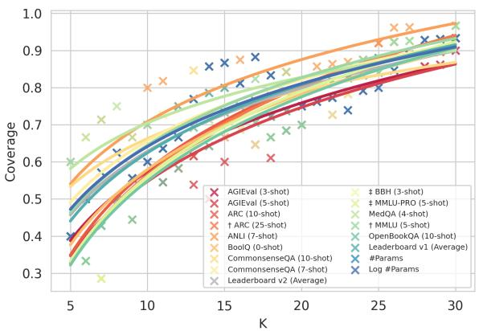  
Figure 9: Benchmark’s Coverage. We only retain benchmarks with at least 0.4 and 0.6 coverage at k = 5 and k = 10, respectively.

## A RewardBench as Ground Truth

Given the heavy reliance of our work on Reward-Bench, we conduct an independent verification of the preferences. Specifically, we sample 50 tasks from the tasks that our top 10 models got wrong the most. Then, we gather 3 annotations from different annotators and use a majority vote to determine the final preference. All annotators were senior Computer Science PhD students specializing in NLP with extensive experience working with and evaluating LLMs. Our results show an agreement of 98%, establishing the quality of RewardBench.

## B Benchmarks

Table 2 showcases all the 32 benchmarks used in our experiments. Moreover, Figure 9 illustrates the coverage using an expanded set of benchmarks with at least 0.4 and 0.6 coverage at k = 5 and k = 10, respectively.

## C Models

Table 3 showcases all the 40 models used in our experiments.

## D Full Results

Table 5 and Table 4 present the full results using the Bradley-Terry and Regression methods, respectively.

## E Bradley-Terry vs. Regression

Setup. The training method is one of the early design choices for reward modeling, significantly influencing the costly data curation process, as the data format is often not easily transferable. While previous works have briefly compared Bradley-Terry vs. Regression training (Wang et al., 2024c), finding their similar performances on 70B models, our understanding of their differences is somewhat limited. In our experiments, we use the Help-Steer2 and HelpSteer2-Preference datasets, which have the same underlying samples with different annotation styles11. This setup presents an opportunity to compare these two approaches fairly.

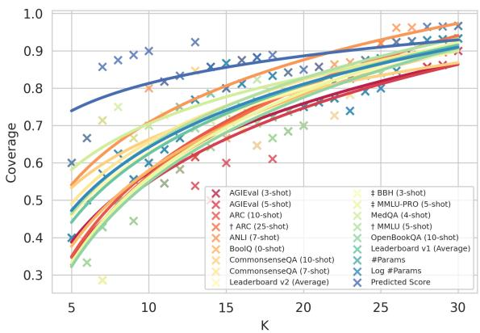

Figure 10: Benchmarks vs. Predicted Score Coverage. We only retain benchmarks with at least 0.4 and 0.6 coverage at k = 5 and k = 10, respectively.  
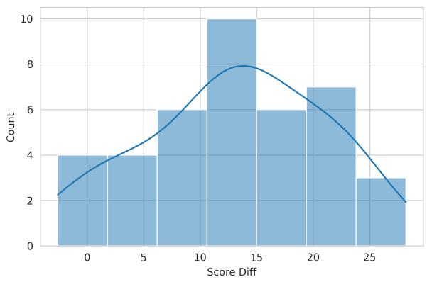  
Figure 11: Bradley-Terry vs. Regression Performance Difference. A positive value indicates a better performance on the Regression method.

Results. Figure 11 illustrates the performance difference between Bradley-Terry and Regression methods across our model pool. As evident, the Regression models outperform their Bradley-Terry counterparts by a large margin. We also observe that the gap is much less with stronger models (e.g., Qwen2.5-7B-Instruct and gemma-2-9b-it), which could lead to a performance match on 70B scale models, consistent with previous findings (see Appendix D for more details). This observation suggests that the Regression method is less reliant on the quality of the base model, making it a better overall choice when possible. Moreover, we note much more overfitting and instability when training with the Bradley-Terry method, making obtaining high-quality RMs more challenging.

<table><tr><td>Framework</td><td>Dataset</td><td>Topic</td><td>#Shots</td><td>Models</td></tr><tr><td rowspan="8">1m_eval (Gao et al., 2024)</td><td>leaderboard_ifeval (Zhou et al., 2023) winogrande (Sakaguchi et al., 2021)</td><td>General</td><td>0 5</td><td>LGPQ LGP</td></tr><tr><td>hellaswag (Zellers et al., 2019) openbookqa (Mihaylov et al., 2018) triviaqa (Joshi et al., 2017) squadv2 (Rajpurkar et al., 2018) drop (Dua et al., 2019)</td><td>Reading Comprehension</td><td>5,10 10 5 1 3</td><td>GP P LGP L</td></tr><tr><td>boolq (Clark et al., 2019) anli (Zhong et al., 2024) truthfulqa_mc2 (Lin et al., 2022)</td><td>Adversarial</td><td>0 7 10</td><td>L LGP P GP</td></tr><tr><td>commonsense_qa (Talmor et al., 2019) piqa (Bisk et al., 2020) social_iqa (Sap et al., 2019) nq_open (Kwiatkowski et al., 2019)</td><td>Commonsense Reasoning</td><td>7,10 0,5 0,5 5</td><td>LP GP GP G</td></tr><tr><td>agieval_en (Zhong et al., 2024) ai2_arc (Clark et al., 2018) leaderboard_bbh (Suzgun et al., 2023) leaderboard_gpqa (Rein et al., 2024) leaderboard_mmlu_pro (Wang et al., 2024b)</td><td>Expert Reasoning</td><td>3,5 0,10,25 3 0 5 0</td><td>LGP LGP LGPQ LGPQ LGPQ</td></tr><tr><td>medga_4options (Jin et al., 2021) mmlu (Hendrycks et al., 2021) gsm8k_cot_1lama (Cobbe et al., 2021) leaderboard_math (Hendrycks et al., 2021)</td><td>Math</td><td>2 5 5,8</td><td>LGPQ P LGP LGPQ</td></tr><tr><td>crows_pairs_english (Nangia et al., 2020) toxigen (Hartvigsen et al., 2022)</td><td>Safety</td><td>4 0 0</td><td>LGPQ G</td></tr><tr><td>qasper (Dasigi et al., 2021)</td><td>Long-context</td><td>0</td><td>G P</td></tr><tr><td>leaderboard v1 (Beeching et al., 2023) leaderboard v2 (Fourrier et al., 2024)</td><td>Aggregate</td><td></td><td>LGPQ LGPQ</td></tr><tr><td>evalplus (Liu et al., 2023) MBPP+ (Liu et al., 2023)</td><td>HumanEval (Chen et al., 2021) HumanEval+ (Liu et al., 2023) MBPP (Austin et al., 2021)</td><td>Coding</td><td>0 0 0</td><td>LGPQ LGPQ LGPQ</td></tr></table>

Table 2: Benchmarks. We gather a comprehensive list of 33 common benchmarks from the technical reports of well-known models. Legened: L  Llama-3.x, G  Gemma-2, P  Phi-3.5, and Q  Qwen2.5.

<table><tr><td>Publisher</td><td>Model</td><td>Release Date (First Commit)</td><td>#Params (B)</td><td>#Downloads (Feb 2025)</td><td>#Likes</td><td>#Pre-training Tokens (T)</td></tr><tr><td rowspan="3">Microsoft</td><td>Phi-3.5-mini-instruct</td><td>08/2024</td><td>3.82</td><td>1.143M</td><td>776</td><td>3.4</td></tr><tr><td>Phi-3-small-8k-instruct</td><td>05/2024</td><td>7.38</td><td>25.1k</td><td>160</td><td>4.8</td></tr><tr><td>Phi-3-mini-4k-instruct</td><td>04/2024</td><td>3.82</td><td>900k</td><td>1122</td><td>3.3</td></tr><tr><td rowspan="6">Google</td><td>gemma-2-9b-it</td><td>06/2024</td><td>9.24</td><td>393.4k</td><td>639</td><td>8.0</td></tr><tr><td>gemma-2-2b-it</td><td>07/2024</td><td>2.61</td><td>437.6k</td><td>915</td><td>2.0</td></tr><tr><td>gemma-1.1-7b-it</td><td>03/2024</td><td>8.54</td><td>20.7k</td><td>270</td><td>6.0</td></tr><tr><td>gemma-1.1-2b-it</td><td>03/2024</td><td>2.51</td><td>93.3k</td><td>154</td><td>6.0</td></tr><tr><td>gemma-7b-it</td><td>02/2024</td><td>8.54</td><td>62.1k</td><td>1151</td><td>6.0</td></tr><tr><td>gemma-2b-it</td><td>02/2024</td><td>2.51</td><td>105.8k</td><td>701</td><td>6.0</td></tr><tr><td rowspan="4">Meta</td><td>Llama-3.2-3B-Instruct</td><td>09/2024</td><td>3.21</td><td>1.497M</td><td>939</td><td>9.0</td></tr><tr><td>Llama-3.2-1B-Instruct</td><td>09/2024</td><td>1.24</td><td>1.523M</td><td>738</td><td>9.0</td></tr><tr><td>Llama-3.1-8B-Instruct</td><td>07/2024</td><td>8.03</td><td>5.669M</td><td>3546</td><td>15.0</td></tr><tr><td>Meta-Llama-3-8B-Instruct</td><td>04/2024</td><td>8.03</td><td>2.101M</td><td>3788</td><td>15.0</td></tr><tr><td rowspan="3">01.ai</td><td>Yi-1.5-9B-Chat</td><td>05/2024</td><td>8.83</td><td>20.9k</td><td>139</td><td>3.6</td></tr><tr><td>Yi-1.5-6B-Chat</td><td>05/2024</td><td>6.06</td><td>19.6k</td><td>41</td><td>3.6</td></tr><tr><td>Yi-6B-Chat</td><td>11/2023</td><td>6.06</td><td>9.3k</td><td>65</td><td>3.0</td></tr><tr><td rowspan="11">Alibaba</td><td>Qwen2.5-7B-Instruct</td><td>09/2024</td><td>7.62</td><td>1.275M</td><td>459</td><td>18.0</td></tr><tr><td>Qwen2.5-3B-Instruct</td><td>09/2024</td><td>3.09</td><td>326.5k</td><td>158</td><td>18.0</td></tr><tr><td>Qwen2.5-1.5B-Instruct</td><td>09/2024</td><td>1.54</td><td>592.5k</td><td>299</td><td>18.0</td></tr><tr><td>Qwen2.5-0.5B-Instruct</td><td>09/2024</td><td>0.49</td><td>696.2k</td><td>198</td><td>18.0</td></tr><tr><td>Qwen2-7B-Instruct</td><td>06/2024</td><td>7.62</td><td>821.4k</td><td>611</td><td>7.0</td></tr><tr><td>Qwen2-1.5B-Instruct</td><td>06/2024</td><td>1.54</td><td>187.9k</td><td>134</td><td>7.0</td></tr><tr><td>Qwen2-0.5B-Instruct</td><td>06/2024</td><td>0.49</td><td>170.3k</td><td>174</td><td>12.0</td></tr><tr><td>Qwen1.5-7B-Chat</td><td>01/2024</td><td>7.72</td><td>25.5k</td><td>165</td><td>4.0</td></tr><tr><td>Qwen1.5-4B-Chat</td><td>01/2024</td><td>3.95</td><td>5.6k</td><td>38</td><td>2.4</td></tr><tr><td>Qwen1.5-1.8B-Chat</td><td>01/2024</td><td>1.84</td><td>11.2k</td><td>48</td><td>2.4</td></tr><tr><td>Qwen1.5-0.5B-Chat</td><td>01/2024</td><td>0.62</td><td>556.2k</td><td>76</td><td>2.4</td></tr><tr><td rowspan="3">Mistral AI</td><td>Mistral-7B-Instruct-v0.3</td><td>05/2024</td><td>7.25</td><td>1.755M</td><td>1293</td><td>8.0</td></tr><tr><td>Mistral-7B-Instruct-v0.2</td><td>12/2023</td><td>7.24</td><td>3.586M</td><td>2634</td><td>8.0</td></tr><tr><td>Mistral-7B-Instruct-v0.1</td><td>09/2023</td><td>7.24</td><td>1.332M</td><td>1547</td><td>8.0</td></tr><tr><td>Stability AI</td><td>stablelm-2-1_6b-chat</td><td>04/2024</td><td>1.64</td><td>4.4k</td><td>32</td><td>2.0</td></tr><tr><td>Nvidia</td><td>Mistral-NeMo-Minitron-8B-Instruct</td><td>10/2024</td><td>8.41</td><td>3.1k</td><td>71</td><td>15.0</td></tr><tr><td rowspan="3">Ai2</td><td>Nemotron-Mini-4B-Instruct</td><td>09/2024</td><td>4.20</td><td>0.1k</td><td>147</td><td>8.0</td></tr><tr><td>Llama-3.1-Tulu-3-8B-SFT</td><td>11/2024</td><td>8.03</td><td>23.4k</td><td>21</td><td>15.0</td></tr><tr><td>Llama-3.1-Tulu-3-8B-DPO</td><td>11/2024</td><td>8.03</td><td>28.5k</td><td>22</td><td>15.0</td></tr><tr><td rowspan="3"></td><td>Llama-3.1-Tulu-3-8B</td><td>11/2024</td><td>8.03</td><td>12.7k</td><td>139</td><td>15.0</td></tr><tr><td>Falcon3-10B-Instruct</td><td>12/2024</td><td>10.30</td><td>37,9k</td><td>87</td><td>16.0</td></tr><tr><td>Falcon3-7B-Instruct</td><td>12/2024</td><td>7.46</td><td>45.2k</td><td>49</td><td>14.0</td></tr><tr><td rowspan="4">TII</td><td></td><td></td><td></td><td></td><td></td><td></td></tr><tr><td>Falcon3-3B-Instruct</td><td>12/2024</td><td>3.23</td><td>30.5k</td><td>23</td><td>14.1</td></tr><tr><td></td><td></td><td></td><td></td><td></td><td></td></tr><tr><td>Falcon3-1B-Instruct</td><td>12/2024</td><td>1.67</td><td>31.4k</td><td>32</td><td>14.1</td></tr><tr><td>Publisher</td><td>Model</td><td>Chat</td><td>Chat Hard</td><td>Safety</td><td>Reasoning</td><td>Score</td></tr><tr><td rowspan="4">Microsoft</td><td>Phi-3.5-mini-instruct</td><td>96.1</td><td>62.3</td><td>77.2</td><td>76.9</td><td>78.1</td></tr><tr><td>Phi-3-small-8k-instruct</td><td>89.7</td><td>66.7</td><td>76.4</td><td>57.0</td><td>72.4</td></tr><tr><td>Phi-3-mini-4k-instruct</td><td>96.4</td><td>58.6</td><td>77.2</td><td>83.6</td><td>78.9</td></tr><tr><td>gemma-2-9b-it</td><td>95.8</td><td>74.1</td><td>88.4</td><td>94.3</td><td>88.1</td></tr><tr><td rowspan="6">Google</td><td>gemma-2-2b-it</td><td>94.7</td><td>56.8</td><td>79.9</td><td>80.7</td><td>78.0</td></tr><tr><td>gemma-1.1-7b-it</td><td>97.2</td><td>61.0</td><td>81.1</td><td>79.5</td><td>79.7</td></tr><tr><td>gemma-1.1-2b-it</td><td>89.4</td><td>46.3</td><td>74.6</td><td>50.5</td><td>65.2</td></tr><tr><td>gemma-7b-it</td><td>93.3</td><td>60.5</td><td>83.4</td><td>78.1</td><td>78.8</td></tr><tr><td>gemma-2b-it</td><td>92.2</td><td>42.5</td><td>67.0</td><td>56.7</td><td>64.6</td></tr><tr><td>Llama-3.2-3B-Instruct</td><td>95.3</td><td>68.6</td><td>87.7</td><td>59.3</td><td>77.7</td></tr><tr><td rowspan="4">Meta</td><td>Llama-3.2-1B-Instruct</td><td>93.3</td><td>42.3</td><td>65.4</td><td>70.2</td><td>67.8</td></tr><tr><td>Llama-3.1-8B-Instruct</td><td>95.3</td><td>68.2</td><td></td><td></td><td></td></tr><tr><td></td><td></td><td></td><td>84.6</td><td>84.7</td><td>83.2</td></tr><tr><td>Meta-Llama-3-8B-Instruct</td><td>93.9</td><td>75.4</td><td>86.6</td><td>81.2</td><td>84.3</td></tr><tr><td rowspan="3">01.AI</td><td>Yi-1.5-9B-Chat Yi-1.5-6B-Chat</td><td>95.8 93.3</td><td>69.5 63.4</td><td>80.1 77.2</td><td>88.7</td><td>83.5 78.0</td></tr><tr><td>Yi-6B-Chat</td><td></td><td></td><td></td><td>78.3</td><td></td></tr><tr><td></td><td>93.3</td><td>56.4</td><td>71.5</td><td>67.4</td><td>72.2</td></tr><tr><td rowspan="11">Alibaba</td><td>Qwen2.5-7B-Instruct</td><td>94.7</td><td>72.8</td><td>87.8</td><td>90.7</td><td>86.5</td></tr><tr><td>Qwen2.5-3B-Instruct</td><td>92.7</td><td>63.4</td><td>82.0</td><td>85.3</td><td>80.8</td></tr><tr><td>Qwen2.5-1.5B-Instruct</td><td>92.7</td><td>56.4</td><td>80.7</td><td>84.8</td><td>78.6</td></tr><tr><td>Qwen2.5-0.5B-Instruct</td><td>89.9</td><td>45.6</td><td>51.9</td><td>48.4</td><td>59.0</td></tr><tr><td>Qwen2-7B-Instruct</td><td>95.3</td><td>66.4</td><td>78.4</td><td>84.0</td><td>81.0</td></tr><tr><td>Qwen2-1.5B-Instruct</td><td>92.7</td><td>47.8</td><td>72.0</td><td>79.0</td><td>72.9</td></tr><tr><td>Qwen2-0.5B-Instruct</td><td>92.2</td><td>39.9</td><td>54.7</td><td>60.7</td><td>61.9</td></tr><tr><td>Qwen1.5-7B-Chat</td><td>93.3</td><td>51.8</td><td>74.6</td><td>81.3</td><td>75.2</td></tr><tr><td>Qwen1.5-4B-Chat Qwen1.5-1.8B-Chat</td><td>91.1</td><td>50.9 40.1</td><td>78.0 56.4</td><td>77.6</td><td>74.4 63.0</td></tr><tr><td>Qwen1.5-0.5B-Chat</td><td>90.8 91.3</td><td>43.2</td><td>58.0</td><td>64.8 58.0</td><td>62.6</td></tr><tr><td></td><td></td><td></td><td></td><td></td><td></td></tr><tr><td rowspan="3">Mistral AI</td><td>Mistral-7B-Instruct-v0.3 Mistral-7B-Instruct-v0.2</td><td>94.1</td><td>62.3</td><td>75.1</td><td>84.1</td><td>78.9</td></tr><tr><td></td><td>93.0</td><td>59.9</td><td>78.2</td><td>79.5</td><td>77.6</td></tr><tr><td>Mistral-7B-Instruct-v0.1</td><td>92.7</td><td>58.8</td><td>71.1</td><td>71.8</td><td>73.6</td></tr><tr><td>Stability AI</td><td>stablelm-2-1_6b-chat</td><td>90.5</td><td>47.4</td><td>59.3</td><td>69.0</td><td>66.5</td></tr><tr><td rowspan="2">Nvidia</td><td>Mistral-NeMo-Minitron-8B-Instruct</td><td>93.6</td><td>61.0</td><td>82.6</td><td>82.9</td><td>80.0</td></tr><tr><td>Nemotron-Mini-4B-Instruct</td><td>93.0</td><td>61.4</td><td>75.0</td><td>82.0</td><td>77.8</td></tr><tr><td rowspan="3">Ai2</td><td>Llama-3.1-Tulu-3-8B-SFT</td><td>95.3</td><td>70.8</td><td>84.9</td><td>85.8</td><td>84.2</td></tr><tr><td>Llama-3.1-Tulu-3-8B-DPO</td><td>94.7</td><td>69.1</td><td>82.3</td><td>80.1</td><td>81.6</td></tr><tr><td>Llama-3.1-Tulu-3-8B</td><td>93.3</td><td>65.6</td><td>83.5</td><td>78.5</td><td>80.2</td></tr><tr><td rowspan="4">TII</td><td>Falcon3-7B-Instruct</td><td>96.6</td><td>64.0</td><td>89.7</td><td>80.4</td><td>82.7</td></tr><tr><td>Falcon3-3B-Instruct</td><td>95.0</td><td>53.9</td><td>78.1</td><td>73.9</td><td>75.2</td></tr><tr><td>Falcon3-1B-Instruct</td><td>84.6</td><td>31.6</td><td>53.2</td><td>46.2</td><td>53.9</td></tr><tr><td>Falcon3-10B-Instruct</td><td>95.5</td><td>67.3</td><td>89.5</td><td>91.1</td><td>85.9</td></tr><tr><td rowspan="3">Microsoft</td><td>Phi-3.5-mini-instruct</td><td>61.5</td><td>51.5</td><td>63.1</td><td>61.1</td><td>59.3</td></tr><tr><td>Phi-3-small-8k-instruct</td><td>83.5</td><td>55.3</td><td>81.9</td><td>75.8</td><td>74.1</td></tr><tr><td>Phi-3-mini-4k-instruct</td><td>64.8</td><td>46.1</td><td>56.6</td><td>59.7</td><td>56.8</td></tr><tr><td rowspan="6">Google</td><td>gemma-2-9b-it</td><td>83.8</td><td>51.1</td><td>70.8</td><td>83.6</td><td>72.3</td></tr><tr><td>gemma-2-2b-it</td><td>84.1</td><td>46.5</td><td>67.6</td><td>81.3</td><td>69.9</td></tr><tr><td>gemma-1.1-7b-it</td><td>76.3</td><td>45.4</td><td>65.4</td><td>75.1</td><td>65.5</td></tr><tr><td>gemma-1.1-2b-it</td><td>74.0</td><td>41.9</td><td>67.0</td><td>63.2</td><td>61.5</td></tr><tr><td>gemma-7b-it</td><td>77.1</td><td>43.0</td><td>63.8</td><td>72.5</td><td>64.1</td></tr><tr><td>gemma-2b-it</td><td>79.6</td><td>39.0</td><td>65.0</td><td>63.7</td><td>61.8</td></tr><tr><td rowspan="4">Meta</td><td>Llama-3.2-3B-Instruct</td><td>70.4</td><td>47.4</td><td>50.8</td><td>58.9</td><td>56.9</td></tr><tr><td>Llama-3.2-1B-Instruct</td><td>57.0</td><td>51.3</td><td>58.0</td><td>56.0</td><td>55.6</td></tr><tr><td>Llama-3.1-8B-Instruct</td><td>78.2</td><td>62.1</td><td>69.5</td><td>65.1</td><td>68.7</td></tr><tr><td>Meta-Llama-3-8B-Instruct</td><td>73.2</td><td>53.9</td><td>57.2</td><td>59.1</td><td>60.9</td></tr><tr><td rowspan="3">01.AI</td><td>Yi-1.5-9B-Chat</td><td>80.7</td><td>54.8</td><td>62.8</td><td>67.4</td><td>66.4</td></tr><tr><td>Yi-1.5-6B-Chat</td><td>76.5</td><td>50.2</td><td>59.9</td><td>81.3</td><td>67.0</td></tr><tr><td>Yi-6B-Chat</td><td>71.5</td><td>52.9</td><td>67.0</td><td>71.6</td><td>65.7</td></tr><tr><td rowspan="11">Alibaba</td><td>Qwen2.5-7B-Instruct</td><td>90.5</td><td>61.8</td><td>78.1</td><td>74.1</td><td>76.1</td></tr><tr><td>Qwen2.5-3B-Instruct</td><td>74.0</td><td>57.0</td><td>75.1</td><td>75.8</td><td>70.5</td></tr><tr><td>Qwen2.5-1.5B-Instruct</td><td>80.2</td><td>49.6</td><td>58.4</td><td>78.1</td><td>66.6</td></tr><tr><td>Qwen2.5-0.5B-Instruct</td><td>79.1</td><td>42.5</td><td>55.3</td><td>69.5</td><td>61.6</td></tr><tr><td>Qwen2-7B-Instruct</td><td>85.5</td><td>51.1</td><td>57.8</td><td>76.7</td><td>67.8</td></tr><tr><td>Qwen2-1.5B-Instruct</td><td>70.7</td><td>47.4</td><td>56.1</td><td>69.0</td><td>60.8</td></tr><tr><td>Qwen2-0.5B-Instruct</td><td>70.4</td><td>48.0</td><td>57.0</td><td>67.8</td><td>60.8</td></tr><tr><td>Qwen1.5-7B-Chat</td><td>77.7</td><td>51.3</td><td>62.3</td><td>69.3</td><td>65.1</td></tr><tr><td>Qwen1.5-4B-Chat</td><td>75.4</td><td>48.9</td><td>53.0</td><td>66.6</td><td>61.0</td></tr><tr><td>Qwen1.5-1.8B-Chat</td><td>79.9</td><td>40.4</td><td>59.9</td><td>62.9</td><td>60.8</td></tr><tr><td>Qwen1.5-0.5B-Chat</td><td>71.5</td><td>44.1</td><td>60.3</td><td>54.7</td><td>57.7</td></tr><tr><td rowspan="3">Mistral AI</td><td>Mistral-7B-Instruct-v0.3</td><td>56.7</td><td>53.1</td><td>58.2</td><td>50.0</td><td>54.5</td></tr><tr><td>Mistral-7B-Instruct-v0.2</td><td>80.7</td><td>38.2</td><td>54.1</td><td>58.1</td><td>57.8</td></tr><tr><td>Mistral-7B-Instruct-v0.1</td><td>56.7</td><td>52.6</td><td>58.4</td><td>57.2</td><td>56.2</td></tr><tr><td>Stability AI</td><td>stablelm-2-1_6b-chat</td><td>71.2</td><td>49.3</td><td>60.5</td><td>59.9</td><td>60.2</td></tr><tr><td>Nvidia</td><td>Mistral-NeMo-Minitron-8B-Instruct</td><td>86.3</td><td>50.2</td><td>56.9</td><td>77.4</td><td>67.7</td></tr><tr><td rowspan="3"></td><td>Nemotron-Mini-4B-Instruct</td><td>81.6</td><td>49.8</td><td>63.2</td><td>50.9</td><td>61.4</td></tr><tr><td>Llama-3.1-Tulu-3-8B-SFT</td><td>65.4</td><td>53.9</td><td>59.9</td><td>69.1</td><td>62.1</td></tr><tr><td>Llama-3.1-Tulu-3-8B-DPO</td><td>76.5</td><td>41.9</td><td>58.5</td><td>57.5</td><td>58.6</td></tr><tr><td rowspan="3"></td><td>Llama-3.1-Tulu-3-8B</td><td>78.5</td><td>38.6</td><td>58.2</td><td>59.7</td><td>58.8</td></tr><tr><td>Falcon3-7B-Instruct</td><td>50.6</td><td>57.0</td><td>50.5</td><td>74.2</td><td>58.1</td></tr><tr><td>Falcon3-3B-Instruct</td><td>70.4</td><td>52.4</td><td>57.2</td><td>55.3</td><td></td></tr><tr><td rowspan="4">TII</td><td></td><td></td><td></td><td></td><td></td><td>58.8</td></tr><tr><td>Falcon3-1B-Instruct</td><td>65.4</td><td>44.3</td><td>50.4</td><td>59.3</td><td>54.8</td></tr><tr><td></td><td></td><td>51.5</td><td>57.4</td><td>68.8</td><td></td></tr><tr><td>Falcon3-10B-Instruct</td><td>53.1</td><td></td><td></td><td></td><td>57.7</td></tr></table>

Table 3: Models. We curate an inclusive list of 40 models from prominent model providers.

Table 4: Regression Performance.

Table 5: Bradley-Terry Performance.

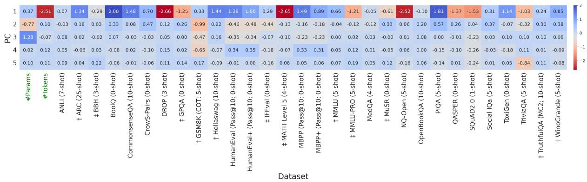  
Figure 12: Principal Component’s Weights.

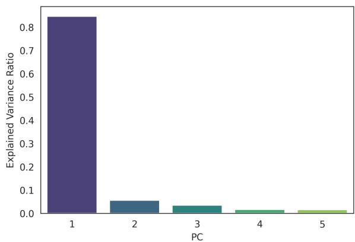  
Figure 13: PCA Explained Variance. We find that the top 5 PCs explain 96.8% of the variance; hence, the benchmark-model matrix is low-dimensional.

## F Low-dimensional Capabilities

Setup. Prior works (Ruan et al., 2024; Polo et al., 2024) have found the LLMs’ capabilities to be lowdimensional, meaning that most of the variance over the standard benchmarks can be explained by a few principal components (PCs). Since our experiments use an expanded set of benchmarks (5 vs. 32), we replicate their analysis at a larger scale. Moreover, Ruan et al. (2024) find that the PCs are explainable, meaning specific topics, such as reasoning or coding, can explain each of them.

Results. Figure 13 illustrates the explained variance by the first five PCs ( 97%), which verifies that the benchmark-model matrix is lowdimensional. Moreover, Figure 12 replicates their analysis over the expanded set of benchmarks. While some PCs showcase a strong connection to specific topics (e.g., PC4 Math + Coding), we can not assign clear-cut topics to them, in contrast to prior findings.

## G Implementation Details

All our experiments are carried out on a server with 8 RTX A6000 GPUs with 48GB VRAM, 500GB RAM, and 64 CPU cores. Moreover, we implemented our code using Hugging Face Transformers (Wolf et al., 2020) and PyTorch (Paszke et al., 2019) libraries.