# AROMA: Autonomous Rank-one Matrix Adaptation

Hao Nan Sheng1,2, Zhi-Yong Wang1, Hing Cheung So1, Mingrui Yang3,4,

1City University of Hong Kong 2Huawei Noah’s Ark Lab 3The University of Hong Kong 4AI Chip Center for Embedded Smart System hnsheng2-c@my.cityu.edu.hk

## Abstract

As large language models continue to grow in size, parameter-efficient fine-tuning (PEFT) has become increasingly crucial. While lowrank adaptation (LoRA) offers a solution through low-rank updates, its static rank allocation may yield suboptimal results. Adaptive low-rank adaptation (AdaLoRA) improves this with dynamic allocation but remains sensitive to initial and target rank configurations. We introduce AROMA, a framework that automatically constructs layer-specific updates by iteratively building up rank-one components with very few trainable parameters that gradually diminish to zero. Unlike existing methods that employ rank reduction mechanisms, AROMA introduces a dual-loop architecture for rank growth. The inner loop extracts information from each rank-one subspace, while the outer loop determines the number of rankone subspaces, i.e., the optimal rank. We reset optimizer states to maintain subspace independence. AROMA significantly reduces parameters compared to LoRA and AdaLoRA while achieving superior performance on natural language understanding and generation, commonsense reasoning, offering new insights into adaptive PEFT. The code is available at https://github.com/ShuDun23/AROMA.

## 1 Introduction

The emergence of large language models (LLMs) (Devlin et al., 2019; OpenAI, 2023; Meta, 2024a; Liu et al., 2024a) has revolutionized the field of natural language processing (NLP), yet their full potential is often limited by the substantial computational demands of fine-tuning. Traditional fullparameter tuning, while effective, becomes prohibitively expensive as model sizes escalate into hundreds of billions of parameters (Lester et al., 2021; Meng et al., 2024). For instance, LLaMA3 series boasts models with up to 400B parameters (Meta, 2024b), and DeepSeek-V3 encompasses

671B total parameters due to its mixture-of-experts architecture (Liu et al., 2024a). This challenge has driven the development of parameter-efficient finetuning (PEFT) methods, such as prompt-tuning (Lester et al., 2021), prefix-tuning (Li and Liang, 2021), and adapter tuning (Pfeiffer et al., 2021; Houlsby et al., 2019). Besides these, low-rank adaptation (LoRA) (Hu et al., 2022) stands out as a particularly promising approach for its simplicity and strong theoretical foundation.

LoRA learns incremental low-rank update ∆W to pretrained model $W _ { 0 } ,$ , without altering the model architecture or introducing additional inference latency (Hu et al., 2022). While attaining impressive parameter efficiency (typically less than 1% of full fine-runing), conventional LoRA implementations impose uniform rank allocation across all layers. This might be suboptimal, as different components of the network exhibit varying sensitivities to parameter perturbations (Zhang et al., 2023a). Moreover, determining the optimal ranks remains an empirical process that often necessitates extensive trial-and-error experimentation.

As a modified version, adaptive low-rank adaptation (AdaLoRA) (Zhang et al., 2023a) adopts dynamic rank allocation through singular value decomposition (SVD)-based importance scoring. While it improves the flexibility upon static configurations like LoRA, it still faces several limitations: 1) the need to prespecify both the initial and target rank budgets; 2) substantial computational overhead caused by relaxed SVD; and 3) rank redundancy stemming from a low effective rank proportion. Consequently, the fundamental tension between adaptive rank adjustment and computational efficiency remains an open question.

In this work, we present Autonomous Rank-One Matrix Adaptation (AROMA), a novel rankgrowing low-rank adaptation method that reconsiders the dynamics of rank allocation. Experimental results demonstrate that AROMA significantly outperforms both LoRA and AdaLoRA when applied to the RoBERTa-base (Liu et al., 2019) on the GLUE benchmark (Wang et al., 2018) and the LLaMA3-8B (Meta, 2024a) on the commonsense170K dataset (Hu et al., 2023). Notably, AROMA achieves this enhanced performance only using <10% of the parameters required by $\mathrm { L o R A } _ { r = 8 }$ and $\mathbf { A d a L o R A } _ { r = 8 }$ without prespecified rank. Main contributions are summarized as follows:

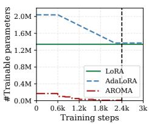  
(a) #Parameter

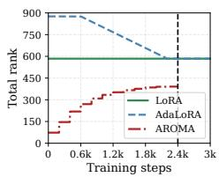  
(b) Total rank

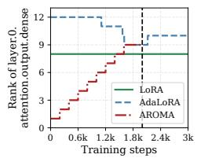  
(c) Specific rank

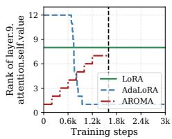  
(d) Specific rank

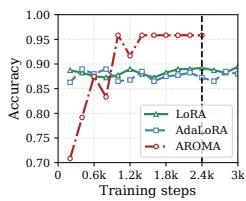  
(e) Accuracy  
Figure 1: Results for $\mathrm { L o R A } _ { r = 8 } .$ $\mathbf { A d a L o R A } _ { r = 8 } .$ , and AROMA (ours) include the number of trainable parameters, total rank, rank of a specific layer and evaluation accuracy versus training step for RoBERTa-base on MRPC task. For AROMA, training of "layer.0.attention.output.dense" and "layer.9.attention.self.value" automatically terminates at 2000 and 1600 steps, respectively, while the overall training automatically stops at 2400 steps.

• Adaptive Rank Growth We propose a structure that progressively establishes layerspecific ranks with minimal and decreasing trainable parameters. Unlike AdaLoRA’s pruning-based strategy, AROMA initiates with zero rank and incrementally incorporates rank-one components until convergence criteria are met. This bottom-up structure ensures high parameter efficiency without loss of informative subspaces.

• Automatic Rank Convergence AROMA features a dual-loop architecture for automatic rank control. Each module operates with an inner loop that extracts information from individual rank-one subspace, and an outer loop determines the number of these subspaces, i.e., the optimal rank. We design a convergence criterion for both loops, enabling each module to autonomously determine the appropriate rank without the need to predefine it.

• Independent Subspace We introduce a training strategy termed Check & Merge & Reinit & Reset, which includes convergence checking, merging converged rank-one updates, periodic optimizer resets alongside learning rate warmup. After each inner loop, the optimizer states are reset while preserving the knowledge accumulated in the weights. This facilitates subspace switching, leading to high effective rank proportion and a continuous flow of new domain knowledge.

## 2 Background and Motivation

LoRA (Hu et al., 2022) fine-tunes the pretrained model $\pmb { W } _ { 0 } \in \mathbb { R } ^ { m \times n }$ by incorporating a low-rank decomposition, namely:

$$
\boldsymbol { W } = \boldsymbol { W _ { 0 } } + \frac { \alpha } { r } \varDelta \boldsymbol { W } , \ \varDelta \boldsymbol { W } = \boldsymbol { B } \boldsymbol { A }\tag{1}
$$

where $B \in \mathbb { R } ^ { m \times r } , \ A \ \in \mathbb { R } ^ { r \times n }$ with $r \ll$ min $\{ m , n \}$ , and scaling factor α secures consistent output magnitude across different rank values. However, this approach requires careful selection of r and imposes uniform rank across all layers, potentially not optimal.

AdaLoRA (Zhang et al., 2023a) addresses these static allocation limitations by parameterizing the incremental matrix as $P A Q$ , mimicking SVD while enforcing orthogonality:

$$
\begin{array} { c } { { \varDelta { \cal W } = { \cal P } \varLambda { \cal Q } , } } \\ { { \mathrm { s . t . } { \cal P } ^ { T } { \cal P } = { \cal Q } { \cal Q } ^ { T } = { \cal I } _ { r } } } \end{array}\tag{2}
$$

where $\pmb { P } \in \mathbb { R } ^ { m \times r }$ and $Q \in \mathbb { R } ^ { r \times n }$ represent left and right singular vectors while $\pmb { \cal A } \in \mathbb { R } ^ { r \times r }$ stores singular values. AdaLoRA begins with a high initial total rank budget and gradually reduces it at certain intervals. Specifically, singular values across all layers are sorted in descending order based on the importance score, with only the top $b ^ { ( t ) }$ retained, ultimately converging to a target rank budget. Since these singular values belong to different module weights, this mechanism enables adaptive rank allocation across modules. Nevertheless, AdaLoRA exhibits several limitations:

• Like LoRA, AdaLoRA’s performance remains sensitive to the initial and target total rank configurations. Optimal rank selection is taskdependent and architecture-specific, complicating deployment in empirical scenarios.

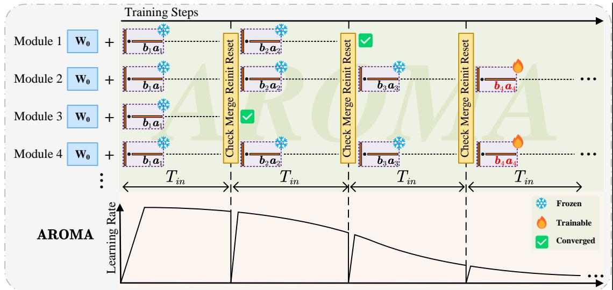  
Figure 2: Workflow of AROMA. For each module, AROMA trains rank-one matrices sequentially with a dual-loop architecture. In the inner loop, a rank-one LoRA, ba, is updated, whose convergence is assessed by the inner stopping criterion. Prior to heading to next outer loop step, we check outer convergence by outer stopping criterion. If not converged, the computed rank-one components are merged and frozen, and new b and a are initialized for training with reset learning rate and optimizer states. For simplicity, we illustrate the length of inner loop to $T _ { \mathrm { i n } } .$ though in practice, it is determined by both $T _ { \mathrm { i n } }$ and the inner convergence criterion.

• Computing the relaxed SVD in AdaLoRA introduces substantial complexity that scales linearly with layer dimensions, creating computational bottlenecks for very large models.

• The higher initial ranks demand substantial memory allocation during early training phases, imposing practical limitations in resource-constrained environments.

Against these backdrops, we devise an automatic and adaptive rank-growing scheme inspired by rank-one matching pursuit (Wang et al., 2014, 2015). This approach leverages the principle that any rank-r matrix L can be decomposed into a sum of r rank-one matrices:

$$
\pmb { L } = \sum _ { p = 1 } ^ { r } b _ { p } \pmb { a } _ { p }\tag{3}
$$

where $\pmb { b } _ { p } \in \mathbb { R } ^ { m \times 1 }$ and $\mathbf { \boldsymbol { a } } _ { p } \in \mathbb { R } ^ { 1 \times n }$ . Building on this idea, we develop our novel framework.

## 3 Methodology

This section outlines two crucial aspects of AROMA: 1) the adaptive rank-growing mechanism, featuring both inner and outer stopping criteria; and 2) the training strategy known as Check & Merge & Reinit & Reset. Figure 2 depicts the AROMA framework, and Algorithm 1 in Appendix A provides the detailed steps.

## 3.1 Adaptive Rank Growth

Unlike AdaLoRA that truncates singular values with low important scores, we propose a rankgrowing scheme which introduces a dual-loop training structure: the inner loop computes individual rank-one matrix, while the outer loop determines the quantity of these matrices. For the pth outer loop step, ∆W is parameterized as:

$$
{ \begin{array} { c } { \Delta W = b _ { 1 } { a } _ { 1 } + b _ { 2 } { a } _ { 2 } + \cdot \cdot \cdot + b _ { p - 1 } { a } _ { p - 1 } + b _ { p } { a } _ { p } } \\ { = \left[ { B } _ { p - 1 } \quad b _ { p } \right] { \left[ \begin{array} { l } { A _ { p - 1 } } \\ { a _ { p } } \end{array} \right] } } \end{array} }\tag{4}
$$

where $\ b { B } \in \mathbb { R } ^ { m \times p }$ and $A \in \mathbb { R } ^ { p \times n }$

AROMA learns a series of rank-one Lo-RAs. At the beginning of the pth outer iteration, a new rank-one LoRA ${ \pmb b } _ { p } { \pmb a } _ { p }$ is activated for training, while previously calculated $b _ { 1 } { \pmb a } _ { 1 } , b _ { 2 } { \pmb a } _ { 2 } , \cdot \cdot \cdot , b _ { p - 1 } { \pmb a } _ { p - 1 }$ are frozen and merged as a single matrix $B _ { p - 1 } A _ { p - 1 }$

Next, $b _ { p } ^ { ( 0 ) }$ and ${ \pmb a } _ { p } ^ { ( 0 ) }$ enter the inner loop. Here we denote the update in the tth inner loop step as $b _ { p } ^ { ( t ) }$ and $a _ { p } ^ { ( t ) }$ . They update until t reaches the maximum inner steps $T _ { \mathrm { i n } }$ or the inner stopping criterion is met:

$$
\frac { \left\| b _ { p } ^ { ( t ) } \pmb { a } _ { p } ^ { ( t ) } \right\| _ { F } - \left\| b _ { p } ^ { ( t - \varDelta T _ { \mathrm { i n } } ) } \pmb { a } _ { p } ^ { ( t - \varDelta T _ { \mathrm { i n } } ) } \right\| _ { F } } { \left\| b _ { p } ^ { ( t - \varDelta T _ { \mathrm { i n } } ) } \pmb { a } _ { p } ^ { ( t - \varDelta T _ { \mathrm { i n } } ) } \right\| _ { F } } < \varepsilon _ { \mathrm { i n } }\tag{5}
$$

where $\varepsilon _ { \mathrm { i n } }$ denotes the inner convergence tolerance, and $\varDelta T _ { \mathrm { i n } }$ is the inner checking interval. We evaluate (5) every $\varDelta T _ { \mathrm { i n } }$ steps, and if it is satisfied, the inner loop terminates, and the training of $b _ { p } { \pmb a } _ { p } , \mathrm { v i z . }$ current rank-one LoRA, is completed.

When to stop? Once the inner loop ends, we check for outer loop convergence before proceeding to the next outer loop step. Here we use a relative weight change criterion between the $( p - 1 )$ th and the pth outer steps defined as:

$$
\frac { \| ( W _ { 0 } + \alpha B _ { p } \pmb { A } _ { p } ) - ( W _ { 0 } + \alpha B _ { p - 1 } \pmb { A } _ { p - 1 } ) \| _ { F } } { \| W _ { 0 } + \alpha B _ { p - 1 } \pmb { A } _ { p - 1 } \| _ { F } }\tag{6}
$$

where $\varepsilon _ { \mathrm { o u t } }$ denotes the outer convergence tolerance. If (6) is satisfied, the outer loop will terminate, viz., training of ∆W is completed.

Since we only leverage rank-one updates, each update can be regarded as a basis spanning a rankone matrix subspace, which encompasses different domain knowledge. In AROMA, the inner loop exploits each subspace, yielding a rank-one basis $b _ { p } ^ { ( \bar { t } ) } a _ { p } ^ { ( t ) }$ , while the outer loop continuously pursues new subspaces and determines the appropriate number of subspaces. This rank-growing strategy allows for continuously extraction new information while keeping only one rank-one matrix trainable at a time, securing high parameter efficiency.

Furthermore, we implement AROMA across all modules, and train them in parallel (see Figure 2). For the inner loop, each module has its own inner convergence label and advances to the next outer step when all modules have either converged or reach $T _ { \mathrm { i n } } .$ . In particular, the module that converges will continue training while waiting for the others to catch up prior to proceeding together to the next outer step. Apart from facilitating rank allocation, this approach helps prevent premature termination, ensuring a more comprehensive subspace exploration.

On the other hand, each module also possesses an outer convergence label, and once a module is determined as converged according to (6), it is immediately frozen and the latest rank-one component will not be merged into it, while training continues for the remaining modules. The overall training process finishes when all modules converge or reach the maximum total training steps T. This design allows each module to determine the optimal rank independently and autonomously, enabling adaptive rank growth with a gradually reduced trainable parameters. We list the time complexity of LoRA, AdaLoRA and AROMA in Table 1, where $\tilde { r }$ denotes the current rank for AdaLoRA. Typically, we have $\mathcal { O } _ { \mathrm { A d a L o R A } } >$ $\mathcal { O } _ { \mathrm { L o R A } } \geq \mathcal { O } _ { \mathrm { A R O M A } }$ . Detailed analyses and experimental verification are presented in Appendix B and Section 5.2, respectively.

<table><tr><td>Scheme</td><td>LoRA</td><td>AdaLoRA</td><td>AROMA</td></tr><tr><td>Complexity</td><td>O((m + n)r) O((m + n)r)</td><td></td><td>O((m + n)p)</td></tr></table>

Table 1: Per-step complexity comparison

## 3.2 Check & Merge & Reinit & Reset

We further design a training strategy known as Check & Merge & Reinit & Reset. As its name implies, there are four components.

Check involves the inner and outer convergence criteria described in (5) and (6). The inner checks occur every $\varDelta T _ { \mathrm { i n } }$ steps, while the outer checks take place when the inner loop finishes.

Merge & Reinit where Reinit stands for reinitialize. As mentioned before, if (6) is met, we terminate the outer loop. Otherwise, the previously computed ${ \pmb b } _ { p } { \pmb a } _ { p }$ is merged into $B _ { p - 1 } A _ { p - 1 }$ , and the training progresses to the next outer step. At this point, a new rank-one LoRA $\pmb { b } _ { p + 1 } \pmb { a } _ { p + 1 }$ is introduced, with Kaiming initialization (He et al., 2015) for ${ \pmb a } _ { p + 1 } ^ { ( 0 ) }$ and zero for $b _ { p + 1 } ^ { ( 0 ) }$ 1

Reset represents optimizer state reset. With momentum parameters $\beta _ { 1 } ~ = ~ 0 . 9$ and $\beta _ { 2 } ~ =$ 0.999, Adam optimizer (Kingma and Ba, 2014; Loshchilov and Hutter, 2019) tends to follow established optimization paths, as update steps are strongly influenced by previous gradients. This means that after Merge & Reinit, the previous updates still influence current learning, causing the new LoRA update to continue exploring the learned subspaces. To circumvent this, we randomly prune 99.9% of the optimizer states following each Merge & Reinit. Such an idea of subspace switching is adopted in LLM pretraining (Lialin et al., 2024; Zhao et al., 2024) and subspace learning (Larsen et al., 2022; Gur-Ari et al., 2018).

Additionally, a warmup phase is implemented at the start of training for each LoRA update to mitigate early overfitting. While the initial warmup phase is set to hundreds of steps, subsequent quick warmup phases are limited to tens of steps. The learning rate scheduler is illustrated in Figure 2.

## 4 Experiments

In this section, We fine-tune three LLMs of different sizes and architectures on three downstream tasks to evaluate the efficacy of AROMA. First, for natural language understanding (NLU) tasks, we fine-tune RoBERTa-base (encoder-only) (Liu et al., 2019) on the General Language Understanding Evaluation (GLUE) (Wang et al., 2018) benchmark. Second, for commonsense reasoning tasks, we finetune LLaMA3-8B (decoder-only) (Meta, 2024a) on the Commonsense170K (Hu et al., 2023) dataset. Last, for natural language generation (NLG), we fine-tune BART-large (encoder-decoder) (Lewis et al., 2020) on the XSum (Narayan et al., 2018) task. NLU and NLG experiments are conducted on one and four NVIDIA Tesla V100s-PCIE (32GB) GPUs respectively, while the commonsense reasoning tasks are performed on two NVIDIA A100- SXM4 (80GB) GPUs. All the results reported in this section are averaged over multiple experiments with different random seeds.

## 4.1 Baselines

Full fine-tuning and eight PEFT methods serves as baselines, which are categorized into three groups: Adapter-based Methods. 1) AdapterH (Houlsby et al., 2019), which inserts lightweight adapter modules sequentially after transformer layers; and 2) AdapterP (Pfeiffer et al., 2021), which places adapters after feedforward network (FNN) and LayerNorm modules.

LoRA-based Methods. 1) LoRA; 2) AdaLoRA; 3) ReLoRA (Lialin et al., 2024), which trains K rankr matrices sequentially and merges them. While ReLoRA is designed for pretraining, it can be regarded as a reduced version of our method, where $T _ { \mathrm { i n } }$ and T are fixed for all modules, and (5) and (6) are omitted. Therefore, we incorporate it to highlight the effectiveness of AROMA’s adaptability and flexibility; 4) DoRA (Liu et al., 2024b), which decomposes the weight into magnitude and directional components ; 5) SalientLoRA (Ke et al., 2024): Like AdaLoRA, it adopts a rank-decreasing architecture but uses more refined salient scores instead of importance scores to measure weight matrix importance.

Other Methods. 1) Full fine-tuning, which updates all of the model’s parameters; and 2) BitFit (Zaken et al., 2023), which fine-tunes only the bias terms of a pretrained model.

## 4.2 Natural Language Understanding

We first evaluate AROMA on NLU tasks. The model and datasets, training details are reported, followed by the results and analyses.

Model and Datasets. RoBERTa-base (125M) (Liu et al., 2019) enhances BERT (Devlin et al., 2019) by utilizing larger batches, more data, and longer sequences, resulting in a stronger language understanding capability. Eight NLU tasks in GLUE (detailed in Appendix G.1) are utilized to fine-tune RoBERTa-base, covering sentiment analysis, textual entailment, and semantic similarity.

Training Details. To secure a fair comparison, we basically follow the implementation strategy in (Zhang et al., 2023a). For each task in GLUE, we conduct a grid search for optimal hyperparameters, including the learning rate lr  [1E-4, 2E-4, 5E-4, 7E-4], inner tolerance $\varepsilon _ { \mathrm { i n } } { = } 0 . 1$ , and outer tolerance $\varepsilon _ { \mathrm { o u t } } \in [ 1 \mathrm { E } \mathrm { - } 3 , 5 \mathrm { E } \mathrm { - } 3 , 6 \mathrm { E } \mathrm { - } 3 ]$ . We apply AROMA to all weight matrices, i.e., $W _ { q } , W _ { k } , W _ { v } , W _ { o } , W _ { f _ { 1 } }$ and $W _ { f _ { 2 } }$

LoRA and AdaLoRA are conducted using the standard HuggingFace PEFT library, and the hyperparameters are set as suggested in their original papers. We consider the rank of LoRA and the target rank of AdaLoRA across 1, 8, 16 . The corresponding AdaLoRA’s initial rank is set to 4, 12, 24 . For ReLoRA, rank r = 1 is assigned to each LoRA to match the parameter budget. Detailed hyperparameter settings for each baseline are found in Appendix H.1.

Results and Analyses. Table 2 presents the performance of AROMA alongside its counterparts, where "#Param" refers to the number of initial trainable parameters. It is shown that both AdaLoRA and LoRA are sensitive to the rank parameter, whereas AROMA operates independently of it. AROMA achieves the highest average performance. In term of specific tasks, it surpasses other baselines on CoLA, MRPC, RTE, and SST-2, while yields comparable results on the remaining tasks. This is achieved with only 0.014% (approximately 0.17M out of 125.0M) of the trainable parameters required for full fine-tuning. SalientLoRA shares similar drawbacks with AdaLoRA—requiring large initial trainable parameters and performance limited by the preset target rank. In comparison to ReLoRA, a reduced version of AROMA without rank adaptability, our method demonstrates superiority on all tasks, showcasing the latter effectiveness. Particularly, AROMA shows a significant advantage in CoLA, MRPC, and RTE tasks. We will further explore MRPC and RTE to analyze the reasons behind AROMA’s outstanding performance.

<table><tr><td>Scheme</td><td>#Param</td><td>CoLA MC</td><td>MNLI</td><td>MRPC</td><td>QNLI</td><td>QQP</td><td>RTE</td><td>SST-2</td><td>STS-B</td><td> $\mathbf { A v } \mathbf { g }$ </td></tr><tr><td>Full Fine-tuning</td><td>125.0M</td><td>60.26</td><td>Acc 87.68</td><td>Acc 88.33</td><td>Acc 92.58</td><td>Acc 90.75</td><td>Acc 78.63</td><td>Acc 94.63</td><td>PC 90.31</td><td>85.40</td></tr><tr><td>BitFit#</td><td>0.10M</td><td>61.16</td><td>85.50</td><td>89.07</td><td>90.99</td><td>88.08</td><td>79.57</td><td>94.38</td><td>90.55</td><td>84.91</td></tr><tr><td> $\overline { { { \mathrm { A d a p t e r } } ^ { \mathrm { H \dagger } } } }$ </td><td>0.31M</td><td>61.76</td><td>86.31</td><td>88.64</td><td>92.52</td><td>90.16</td><td>78.56</td><td>93.54</td><td>90.88</td><td>85.30</td></tr><tr><td> $\mathrm { \mathbf { A d a p t e r } ^ { P \dagger } }$ </td><td>0.30M</td><td>62.92</td><td>86.23</td><td>88.74</td><td>92.59</td><td>89.94</td><td>79.07</td><td>93.24</td><td>90.44</td><td>85.40</td></tr><tr><td> $\mathbf { L o R A } _ { r = 1 }$ </td><td>0.17M</td><td>56.22</td><td>85.87</td><td>87.25</td><td>91.34</td><td>90.64</td><td>75.28</td><td>93.46</td><td>88.73</td><td>83.59</td></tr><tr><td> $\mathrm { L o R A } _ { r = 8 }$ </td><td>1.34M</td><td>61.69</td><td>86.82</td><td>88.34</td><td>92.31</td><td>91.33</td><td>78.34</td><td>93.69</td><td>90.88</td><td>85.43</td></tr><tr><td> $\mathrm { L o R A } _ { r = 1 6 }$ </td><td>3.27M</td><td>64.44</td><td>84.88</td><td>88.97</td><td>92.02</td><td>91.35</td><td>77.62</td><td>92.47</td><td>91.18</td><td>85.37</td></tr><tr><td> $\mathbf { A d a L o R A } _ { r = 1 }$ </td><td>0.67M</td><td>57.86</td><td>87.21</td><td>88.24</td><td>92.46</td><td>89.91</td><td>76.17</td><td>93.69</td><td>89.99</td><td>84.44</td></tr><tr><td> $\mathbf { A d a L o R A } _ { r = 8 }$ </td><td>2.01M</td><td>58.08</td><td>87.50</td><td>87.45</td><td>92.37</td><td>90.58</td><td>74.65</td><td>94.04</td><td>90.03</td><td>84.34</td></tr><tr><td> $\mathrm { A d a L o R A } _ { r = 1 6 }$ </td><td>4.02M</td><td>59.35</td><td>87.67</td><td>88.73</td><td>92.64</td><td>90.79</td><td>77.26</td><td>93.23</td><td>90.26</td><td>84.99</td></tr><tr><td> $\mathbf { R e L o R A _ { 1 } } \times \mathbf { 8 }$ </td><td>0.17M</td><td>59.91</td><td>85.61</td><td>86.11</td><td>89.13</td><td>87.20</td><td>82.54</td><td>93.44</td><td>89.20</td><td>84.14</td></tr><tr><td>DoRA</td><td>0.42M</td><td>66.19</td><td>86.74</td><td>88.48</td><td>91.95</td><td>90.28</td><td>85.78</td><td>94.50</td><td>91.01</td><td>87.11</td></tr><tr><td>SalientLoRA</td><td>1.33M</td><td>60.42</td><td>87.51</td><td>87.63</td><td>92.21</td><td>90.64</td><td>76.62</td><td>94.28</td><td>90.17</td><td>84.93</td></tr><tr><td>AROMA</td><td>0.17M</td><td>70.51</td><td>86.96</td><td>94.17</td><td>91.30</td><td>89.49</td><td>90.48</td><td>94.68</td><td>90.34</td><td>88.49</td></tr></table>

Table 2: Comparative performance of different fine-tuning schemes for RoBERTa-base on GLUE benchmark. We report Matthew’s correlation coefficient (MC) for CoLA, Pearson correlation coefficient (PC) for STS-B, and accuracy for all the remaining tasks. Higher is better for all metrics and the best results on each task are shown in bold. Results with "♯" are retrieved from (Wang et al., 2025), and results with $" \dagger "$ are from (Mao et al., 2024). Note that "#Param" reflects the initial phase, and AROMA’s #Param gradually descends to zero (see Figure 1a).

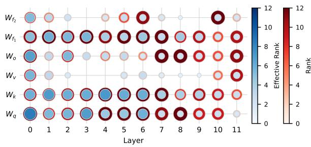  
(a) Rank distribution of AdaLoRA

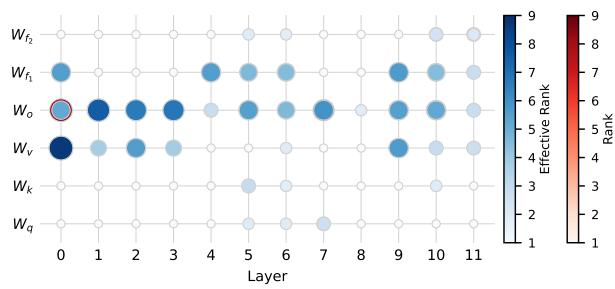  
(b) Rank distribution of AROMA  
Figure 3: Resultant rank and effective rank distributions for RoBERTa-base fine-tuned on MRPC task by AdaLoR $\mathbf { A } _ { r = 8 }$ and AROMA, respectively. The x-axis represents the hidden layer index, while the y-axis refers to the weight matrix fine-tuned in each layer. The total rank is described by the red outer circle, whereas the effective rank is indicated by the blue inner circle. Experiment on RTE task is provided in Appendix D.

We plot the rank distributions for AdaLoRA and AROMA in Figs. 3 and 5, where the rank is a combination of effective rank (Roy and Vetterli, 2007) and non-effective rank. The former measures the effective dimensionality of a matrix, while the latter corresponds to dimensions with negligible contribution. Detailed description of effective rank are provided in Appendix C. It is observed that different weight matrices exhibit distinct rank characteristics, and AdaLoRA has a larger average rank than AROMA. Furthermore, the rank distribution for AROMA is concentrated in the shallower layers, $W _ { v }$ and $W _ { o }$ for both MRPC and RTE tasks. In terms of effective rank, it is found that LoRA exhibits a low effective rank, just a quarter of the adapter rank (Shuttleworth et al., 2024; Biderman et al., 2024; He et al., 2025). For AdaLoRA, we see that only about half of its rank is effective (50.4% for MRPC, 49.2% for RTE), whereas AROMA exhibits an exceptionally high effective rank ratio (96.3% for MRPC and 91.7% for RTE).

Moreover, Figure 1 depicts the number of trainable parameters, total rank, ranks of specific layers and accuracy versus training step for RoBERTa-base on MRPC task. We select "layer.0.attention.output.dense" and "layer.9.attention.self.value" as illustration. It is evident that $\mathrm { L o R A } _ { r = 8 } , \mathrm { A d a L o R A } _ { r = 8 }$ and AROMA exhibit consistent, decreasing and growing rank behaviors, respectively. We notice that LoRA maintains nearly 1.3M trainable parameters, with a stable total rank and specific rank throughout, as it fixes the same rank for all weight matrices. AdaLoRA, on the other hand, progressively decreases the total rank and shows a fluctuating but generally declining specific rank, starting with 2.0M trainable parameters and averaging 1.62M. In contrast, AROMA necessitates only 0.17M trainable parameters initially, with an average of 0.08M. Remarkably, AROMA attains the highest accuracy among the three methods.

<table><tr><td>Scheme</td><td>#Param</td><td>ARC-E</td><td>OBQA</td><td>SIQA</td><td>ARC-C</td><td>WinoG</td><td>PIQA</td><td>Boo1Q</td><td>Hellas</td><td>Avg</td></tr><tr><td> $\mathbf { C h a t G P T } ^ { \odot }$ </td><td>-</td><td>89.7</td><td>74.8</td><td>68.5</td><td>79.9</td><td>66.1</td><td>85.4</td><td>73.1</td><td>78.5</td><td>77.0</td></tr><tr><td rowspan="3"> $\mathbf { L o R A } _ { r = 1 }$   $\mathrm { L o R A } _ { r = 8 }$ </td><td>1.77M</td><td>89.04</td><td>82.80</td><td>77.33</td><td>76.71</td><td>81.93</td><td>86.40</td><td>70.40</td><td>93.06</td><td>82.21</td></tr><tr><td>14.16M</td><td>88.55</td><td>82.80</td><td>78.15</td><td>77.13</td><td>85.71</td><td>86.13</td><td>68.44</td><td>93.55</td><td>82.56</td></tr><tr><td>28.31M</td><td>88.01</td><td>83.10</td><td>79.53</td><td>75.34</td><td>83.82</td><td>85.74</td><td>72.35</td><td>93.45</td><td>82.67</td></tr><tr><td rowspan="3"> $\mathbf { A d a L o R A } _ { r = 1 }$   $\mathbf { A d a L o R A } _ { r = 8 }$   $\mathrm { A d a L o R A } _ { r = 1 6 }$ </td><td>7.08M</td><td>87.58</td><td>71.00</td><td>71.14</td><td>71.16</td><td>70.09</td><td>83.95</td><td>62.17</td><td>67.33</td><td>73.05</td></tr><tr><td>21.23M</td><td>88.30</td><td>76.60</td><td>71.24</td><td>71.33</td><td>72.45</td><td>83.51</td><td>65.57</td><td>82.94</td><td>76.49</td></tr><tr><td>42.47M</td><td>88.47</td><td>75.20</td><td>71.14</td><td>72.70</td><td>71.90</td><td>84.17</td><td>62.69</td><td>84.13</td><td>76.30</td></tr><tr><td rowspan="2"> $A R O M A _ { \ r = 1 }$   $A R O M A _ { \ r = 8 }$ </td><td>1.77M</td><td>89.31</td><td>83.70</td><td>79.12</td><td>78.50</td><td>81.85</td><td>87.43</td><td>71.16</td><td>93.79</td><td>83.11</td></tr><tr><td>14.16M</td><td>89.48</td><td>84.79</td><td>79.62</td><td>78.76</td><td>83.98</td><td>87.22</td><td>73.74</td><td>94.36</td><td>83.85</td></tr></table>

Table 3: Comparative performance of different fine-tuning schemes for LLaMA3-8B on Commonsense170K dataset. We report accuracy for all tasks. Results with "♢" are retrieved from (Liu et al., 2024b). Note that "#Param" reflects the number of initial trainable parameters, and AROMA’s average #Param is even less.  
pendix H.2.

## 4.3 Commonsense Reasoning

In this section, we assess AROMA in handling a larger model and a more complex task.

Model and Datasets. Following (Wang et al., 2025), we fine-tune LLaMA3-8B (Meta, 2024a) on the Commonsense170K dataset, which is a mixture of eight commonsense reasoning benchmarks (details provided in Appendix G.2). LLaMA3-8B model, developed by Meta, is designed for various NLP tasks, offering improved performance and efficiency over its predecessors.

Training Details. Apart from AROMA under the previous setting (denoted as $\mathbf { A R O M A } _ { r = 1 } )$ , we additionally increase the rank of each LoRA update to 8 (denoted as $\mathbf { A R O M A } _ { r = 8 } )$ to accommodate this complex task. We apply AROMA to three weight matrices in the self-attention layer: $W _ { q } , W _ { k } , W _ { v } ,$ and two in the FFN: $W _ { u p } ,$ and $W _ { d o w n }$ . After finetuning, the resultant model is evaluated on each of the eight benchmarks in terms of accuracy. Detailed hyperparameter settings are found in $\mathsf { A p - }$

Results. Table 3 shows the comparative performance between AROMA and its counterparts, where ChatGPT (Wei et al., 2022) is also included for reference. Notably, $\mathbf { A R O M A } _ { r = 1 }$ and $\mathbf { A R O M A } _ { r = 8 }$ rank in the top two in terms of average accuracy. Specifically, $\mathbf { A R O M A } _ { r = 1 }$ achieves this with approximately 0.02% of the original model’s parameters, 6% of ${ \mathrm { L o R A } } _ { r = 8 } ^ { \prime } { \mathrm { s } }$ and 3% of $\mathrm { A d a L o R A } _ { r = 8 } \mathrm { ^ { \circ } s }$ $\mathbf { A R O M A } _ { r = 8 }$ outpaces other baselines on four benchmarks and achieves second-best results on the remaining ones. Moreover, we will show in Section 5.2 that $\mathbf { A R O M A } _ { r = 8 }$ demonstrates better time efficiency than $\mathbf { A R O M A } _ { r = 1 }$

These results indicate the flexibility of AROMA—the inner-space rank can be adapted to task complexity while maintaining autonomous convergence. Detailed discussions and guidelines are presented in Appendix F.

## 4.4 Natural Language Generation

<table><tr><td>Scheme</td><td>#Param</td><td>Rouge1</td><td>Rouge2</td><td>RougeL</td></tr><tr><td>LoRA</td><td>0.54M</td><td>42.81</td><td>19.68</td><td>34.73</td></tr><tr><td>AdaLoRA</td><td>0.60M</td><td>43.29</td><td>19.95</td><td>35.04</td></tr><tr><td>DoRA</td><td>0.64M</td><td>43.39</td><td>20.45</td><td>35.39</td></tr><tr><td> $A R O M A _ { \ r = 1 }$ </td><td>0.54M</td><td>43.23</td><td>20.06</td><td>35.11</td></tr></table>

Table 4: Comparative performance of different finetuning schemes for BART-large on XSum dataset.

Model and Datasets. Now we fine-tune BARTlarge (Lewis et al., 2020) on the XSum dataset (Narayan et al., 2018), which is an abstractive news summarization dataset that requires generating single-sentence summaries from BBC articles (details provided in Appendix G.3). BART-large is a transformer encoder-decoder model. Detailed setups are found in Appendix H.3.

Results. AROMA achieves better performance than LoRA and AdaLoRA, and on-par performance with DoRA while using less parameters (0.54M vs 0.64M). This further validating AROMA’s parameter efficiency and NLG capability.

## 5 Further Discussions

## 5.1 Ablation Study

We carry out ablation study on a crucial component of AROMA: Reset, i.e., randomly pruning 99.9% of the optimizer states after training a rank-one update, to validate its effectiveness on performance. We fine-tune RoBERTa-base on MRPC task using AROMA with and without Reset, respectively, with all other conditions remain unchanged. We average the results over 5 experiments with different seeds, and report the average rank and effective rank across all layers as well as accuracy.

<table><tr><td rowspan="2">Scheme  $A R O M A _ { \mathrm { w / o } R e s e t }$ </td><td rowspan="2">MRPC Avg r • Eff r</td><td colspan="2">RTE</td></tr><tr><td>Acc  $\operatorname { A v g } r$  83.33 1.42</td><td>Eff r Acc 1.30 70.48</td></tr><tr><td></td><td></td><td></td><td></td></tr><tr><td> $A R O M A _ { \mathrm { w / } R e s e t }$ </td><td>2.78 2.68 94.17</td><td>3.42</td><td>3.14 90.48</td></tr></table>

Table 5: Comparison of AROMA with and without optimizer Reset for RoBERTa-base on MRPC task. $"  \mathrm { A v g } \ r " $ and $" \mathrm { E f f } \ r "$ denote average rank and average effective rank, respectively.

As seen in Table 5, AROMA with the Reset mechanism demonstrates a larger rank than $\mathrm { A R O M A _ { w / o } } R e s e t$ and achieves substantially higher accuracy. This suggests that Reset is beneficial. We interpret this as the optimizer reset allowing the new rank-one matrix to be computed from scratch, rather than relying on the previously computed rank-one matrix. This approach gives the new rank-one matrix a greater chance to explore new subspaces and learn more information. Supplementary experiment on cosine similarity in Appendix E further underscores the importance of the Reset mechanism.

## 5.2 Time Efficiency

Per-epoch Time. We compare the time efficiency of AROMA with LoRA and AdaLoRA. We first unify the three methods by configuring their batch size of 64 and maximum sequence length of 256, and compute the average training time per epoch across six tasks in the GLUE benchmark on a single NVIDIA Tesla V100s-PCIE (32GB) GPU. The results are reported in Table 6 and we see that

AROMA demonstrates significant per-epoch efficiency advantages in five tasks, while being comparable to LoRA in the remaining task, RTE. Particularly, its average time per epoch is 76.1% of LoRA’s and 28.5% of AdaLoRA’s. This superiority can be attributed to the rank-one training and unnecessity of SVD computation.

<table><tr><td>Task</td><td>LoRA</td><td>AdaLoRA</td><td>AROMA</td></tr><tr><td>CoLA</td><td>44.37</td><td>107.74</td><td>12.43</td></tr><tr><td>MRPC</td><td>17.84</td><td>45.57</td><td>13.21</td></tr><tr><td>QNLI</td><td>557.98</td><td>1547.82</td><td>542.72</td></tr><tr><td>RTE</td><td>15.13</td><td>31.46</td><td>20.14</td></tr><tr><td>SST-2</td><td>339.58</td><td>873.30</td><td>153.47</td></tr><tr><td>STS-B</td><td>30.04</td><td>73.13</td><td>22.42</td></tr><tr><td>Avg</td><td>167.50</td><td>446.50</td><td>127.40</td></tr></table>

Table 6: Per-epoch time (in second) comparison for RoBERTa-base on GLUE.

Overall Time. Although it showcases strong perepoch time efficiency, AROMA’s adaptive convergence process typically involves more training epochs (see Table 15). However, the total training time (per-epoch time  #Epoch) varies across different scenarios.

For simple tasks (e.g., RoBERTa on MRPC, see Table 7), although more epochs are needed, each epoch is faster, making the total training time faster than LoRA and AdaLoRA.

<table><tr><td>Scheme</td><td>#Param</td><td>#Epoch</td><td>Total Time</td><td>Accuracy</td></tr><tr><td> $\mathbf { L o R A } _ { r = 8 }$ </td><td>1.34M</td><td>30</td><td>8.2min</td><td>88.34</td></tr><tr><td> $\mathbf { A d a L o R A } _ { r = 8 }$ </td><td>2.01M</td><td>30</td><td>15.5min</td><td>87.45</td></tr><tr><td> $A R O M A _ { r = 1 }$ </td><td>0.17M</td><td>52</td><td>7.8min</td><td>94.17</td></tr></table>

Table 7: Total time comparison for RoBERTa-base on MRPC.

<table><tr><td>Scheme</td><td>#Param</td><td>#Epoch</td><td>Total Time</td><td>Accuracy</td></tr><tr><td> $\mathrm { L o R A } _ { r = 1 6 }$ </td><td>28.31M</td><td>10</td><td>17.2h</td><td>82.67</td></tr><tr><td> $\mathrm { A d a L o R A } _ { r = 1 6 }$ </td><td>42.47M</td><td>10</td><td>24.3h</td><td>76.30</td></tr><tr><td>AROMA r=1</td><td>1.77M</td><td>20</td><td>35.1h</td><td>83.11</td></tr><tr><td> $A R O M A _ { \ r = 8 }$ </td><td>14.16M</td><td>15</td><td>24.9h</td><td>83.85</td></tr></table>

Table 8: Total time comparison for LLaMA3 on Commonsense170K.

For complex tasks (e.g., LLaMA3 on Commonsense170K, see Table 8), $\mathbf { A R O M A } _ { r = 1 }$ requires more training epoch and consequently more time due to the fine-grained nature of rank-1 exploration. To optimize time efficiency for such tasks, we employ $\mathbf { A R O M A } _ { r = 8 }$ as mentioned in Section 4.3, which achieves faster convergence and higher accuracy by enabling each loop to capture richer representations.

## 6 Related Work

PEFT emerges as a crucial approach for adapting LLMs to downstream tasks while minimizing computational and storage requirements. We categorize existing PEFT methods into three key paradigms (Han et al., 2024) as follows:

Additive PEFT Methods incorporate auxiliary trainable modules within transformer architectures. Serial adapter (Houlsby et al., 2019) introduces dual adapter modules positioned after selfattention and FFN layers, while (Pfeiffer et al., 2021) optimizes computational efficiency by inserting adapters exclusively after "Add & Norm" layers. Prompt-based techniques constitute another significant branch of additive PEFT. Approaches such as prefix-tuning (Li and Liang, 2021; Li et al., 2023; Zhang et al., 2023b), p-tuning (Liu et al., 2024c), and prompt-tuning (Lester et al., 2021) augment inputs or intermediate representations with trainable vectors, demonstrating particular efficacy for generative tasks and few-shot learning scenarios.

Selective PEFT Methods strategically identify and modify only the most critical subset of model parameters. BitFit (Zaken et al., 2023) achieves remarkable efficiency by exclusively fine-tuning bias terms while maintaining all other parameters frozen. Diff pruning (Guo et al., 2021) learns sparse parameter differences from pretrained weights, focusing on task-specific components. FishMask (Sung et al., 2021) leverages Fisher information to identify and update the most influential parameters for specific tasks.

Reparameterized PEFT Methods transform the parameter space to facilitate efficient updates without direct modification of original weights. (IA)3 (Liu et al., 2022) and SSF (Lian et al., 2022) introduce learnable vectors that modulate activations in self-attention and FFN with low parameter overhead. LoRA (Hu et al., 2022) decomposes weight updates into low-rank matrix products, significantly reducing trainable parameters while preserving performance. AdaLoRA (Zhang et al., 2023a) enhances flexibility through SVD-like decomposition for dynamic rank allocation. DoRA (Liu et al., 2024b) decomposes the weight into magnitude and directional components. NOLA (Koohpayegani et al., 2024) and VeRA (Kopiczko et al., 2024) represent weight matrices as linear combinations of fixed random bases, optimizing only the mixture coefficients. LoRA and its variants achieve stateof-the-art parameter efficiency, making them the most widely used PEFT approaches.

## 7 Conclusion

In this work, we propose Autonomous Rank-One Matrix Adaptation (AROMA) for parameterefficient fine-tuning. Unlike the existing adaptive rank adjustment method, AdaLoRA, which truncates singular values with low importance scores and requires both initial and target rank budgets, AROMA employs a rank-growing approach that autonomously constructs layer-specific updates with very few trainable parameters that gradually diminish to zero. We design a dual-loop architecture, featuring an inner loop that exploits each rank-one subspace to learn a LoRA update with the corresponding stopping criterion, while the outer loop determines the number of subspaces, namely, the optimal rank, guided by another stopping criterion. The learned rank-one components are merged and frozen, allowing only one rank-one LoRA to be trained at a time, thereby ensuring high parameter efficiency. Additionally, optimizer states are periodically reset to maintain subspace independence. Experimental results for NLU, NLG and commonsense reasoning tasks highlight AROMA’s superiority in terms of accuracy and parameter efficiency.

## Limitations

Despite achieving promising results on NLU, NLG and commonsense reasoning benchmarks, our approach has several challenges to be tackled. It has yet to be tested in multimodal applications, a crucial area as multimodal models continue to gain prominence. Furthermore, we have not validated its scalability for extremely LLMs exceeding 100 billion parameters, where the dynamics of rank allocation may differ significantly. Future work should address these issues and explore the method’s applicability across a broader range of tasks.

## Acknowledgements

This work was supported by the Research Grant of Shenzhen Research Institute, City University of Hong Kong, Shenzhen, China under Project R-IND25501.

## References

Luisa Bentivogli, Peter Clark, Ido Dagan, and Danilo Giampiccolo. 2009. The fifth PASCAL recognizing textual entailment challenge. Proceedings ofthe Second Text Analysis Conference, TAC 2009, Gaithersburg, Maryland, USA, November 16-17, 2009, 7(8):1.

Dan Biderman, Jacob Portes, Jose Javier Gonzalez Ortiz, Mansheej Paul, Philip Greengard, Connor Jennings, Daniel King, Sam Havens, Vitaliy Chiley, Jonathan Frankle, Cody Blakeney, and John Patrick Cunningham. 2024. LoRA learns less and forgets less. Transactions on Machine Learning Research. Featured Certification.

Yonatan Bisk, Rowan Zellers, Jianfeng Gao, Yejin Choi, et al. 2020. PIQA: Reasoning about physical commonsense in natural language. In Proceedings of the AAAI Conference on Artificial Intelligence, volume 34, pages 7432–7439.

Christopher Clark, Kenton Lee, Ming-Wei Chang, Tom Kwiatkowski, Michael Collins, and Kristina Toutanova. 2019. BoolQ: Exploring the surprising difficulty of natural yes/no questions. In Proceedings ofthe 2019 Conference ofthe North American Chapter of the Association for Computational Linguistics: Human Language Technologies, Volume 1 (Long and Short Papers), pages 2924–2936, Minneapolis, Minnesota. Association for Computational Linguistics.

Peter Clark, Isaac Cowhey, Oren Etzioni, Tushar Khot, Ashish Sabharwal, Carissa Schoenick, and Oyvind Tafjord. 2018. Think you have solved question answering? Try ARC, the AI2 reasoning challenge. arXiv preprint arXiv:1803.05457.

Ido Dagan, Oren Glickman, and Bernardo Magnini. 2005. The PASCAL recognising textual entailment challenge. In Machine Learning Challenges Workshop, pages 177–190. Springer.

Jacob Devlin, Ming-Wei Chang, Kenton Lee, and Kristina Toutanova. 2019. BERT: Pre-training of deep bidirectional transformers for language understanding. In Proceedings ofthe 2019 Conference of the North American Chapter ofthe Associationfor Computational Linguistics: Human Language Technologies, Volume 1 (long and short papers), pages 4171–4186.

Bill Dolan and Chris Brockett. 2005. Automatically constructing a corpus of sentential paraphrases. In Proceedings of the Third International Workshop on Paraphrasing (IWP2005).

Danilo Giampiccolo, Bernardo Magnini, Ido Dagan, and William B Dolan. 2007. The third PASCAL recognizing textual entailment challenge. In Proceedings ofthe ACL-PASCAL workshop on textual entailment and paraphrasing, pages 1–9.

Demi Guo, Alexander M Rush, and Yoon Kim. 2021. Parameter-efficient transfer learning with diff pruning. Proceedings ofthe 59th Annual Meeting ofthe

Association for Computational Linguistics and the 11th International Joint Conference on Natural Language Processing (Volume 1: Long Papers), pages 4884–4896.

Guy Gur-Ari, Daniel A Roberts, and Ethan Dyer. 2018. Gradient descent happens in a tiny subspace. arXiv preprint arXiv:1812.04754.

R Bar Haim, Ido Dagan, Bill Dolan, Lisa Ferro, Danilo Giampiccolo, Bernardo Magnini, and Idan Szpektor. 2006. The second PASCAL recognising textual entailment challenge. In Proceedings of the Second PASCAL Challenges Workshop on Recognising Textual Entailment, volume 7, pages 785–794.

Zeyu Han, Chao Gao, Jinyang Liu, Jeff Zhang, and Sai Qian Zhang. 2024. Parameter-efficient finetuning for large models: A comprehensive survey. Transactions on Machine Learning Research.

Kaiming He, Xiangyu Zhang, Shaoqing Ren, and Jian Sun. 2015. Delving deep into rectifiers: Surpassing human-level performance on imagenet classification. In Proceedings of the IEEE International Conference on Computer Vision, pages 1026–1034.

Zhiwei He, Zhaopeng Tu, Xing Wang, Xingyu Chen, Zhijie Wang, Jiahao Xu, Tian Liang, Wenxiang Jiao, Zhuosheng Zhang, and Rui Wang. 2025. RaSA: Rank-sharing low-rank adaptation. In The Thirteenth International Conference on Learning Representations.

Neil Houlsby, Andrei Giurgiu, Stanislaw Jastrzebski, Bruna Morrone, Quentin De Laroussilhe, Andrea Gesmundo, Mona Attariyan, and Sylvain Gelly. 2019. Parameter-efficient transfer learning for NLP. In Proceedings ofthe 36th International Conference on Machine Learning.

Edward J Hu, Yelong Shen, Phillip Wallis, Zeyuan Allen-Zhu, Yuanzhi Li, Shean Wang, Lu Wang, and Weizhu Chen. 2022. LoRA: Low-rank adaptation of large language models. In International Conference on Learning Representations.

Zhiqiang Hu, Lei Wang, Yihuai Lan, Wanyu Xu, Ee-Peng Lim, Lidong Bing, Xing Xu, Soujanya Poria, and Roy Lee. 2023. LLM-Adapters: An adapter family for parameter-efficient fine-tuning of large language models. In Proceedings ofthe 2023 Conference on Empirical Methods in Natural Language Processing. Association for Computational Linguistics.

Wenjun Ke, Jiahao Wang, Peng Wang, Jiajun Liu, Dong Nie, Guozheng Li, and Yining Li. 2024. Unveiling LoRA intrinsic ranks via salience analysis. In The Thirty-eighth Annual Conference on Neural Information Processing Systems.

Diederik P Kingma and Jimmy Ba. 2014. Adam: A method for stochastic optimization. arXiv preprint arXiv:1412.6980.

Soroush Abbasi Koohpayegani, Navaneet K L, Parsa Nooralinejad, Soheil Kolouri, and Hamed Pirsiavash. 2024. NOLA: Compressing LoRA using linear combination of random basis. In The Twelfth International Conference on Learning Representations.

Dawid Jan Kopiczko, Tijmen Blankevoort, and Yuki M Asano. 2024. VeRA: Vector-based random matrix adaptation. In The Twelfth International Conference on Learning Representations.

Brett W Larsen, Stanislav Fort, Nic Becker, and Surya Ganguli. 2022. How many degrees of freedom do we need to train deep networks: a loss landscape perspective. In International Conference on Learning Representations.

Brian Lester, Rami Al-Rfou, and Noah Constant. 2021. The power of scale for parameter-efficient prompt tuning. In Proceedings of the 2021 Conference on Empirical Methods in Natural Language Processing, pages 3045–3059.

Mike Lewis, Yinhan Liu, Naman Goyal, Marjan Ghazvininejad, Abdelrahman Mohamed, Omer Levy, Veselin Stoyanov, and Luke Zettlemoyer. 2020. BART: Denoising sequence-to-sequence pre-training for natural language generation, translation, and comprehension. In Proceedings ofthe 58th Annual Meeting of the Association for Computational Linguistics.

Jonathan Li, Will Aitken, Rohan Bhambhoria, and Xiaodan Zhu. 2023. Prefix Propagation: Parameterefficient tuning for long sequences. In Proceedings of the 61st Annual Meeting of the Association for Computational Linguistics (Volume 2: Short Papers), pages 1408–1419, Toronto, Canada.

Xiang Lisa Li and Percy Liang. 2021. Prefix-Tuning: Optimizing continuous prompts for generation. In Proceedings of the 59th Annual Meeting of the Association for Computational Linguistics and the 11th International Joint Conference on Natural Language Processing (Volume 1: Long Papers), pages 4582– 4597.

Vladislav Lialin, Sherin Muckatira, Namrata Shivagunde, and Anna Rumshisky. 2024. ReloRA: Highrank training through low-rank updates. In The Twelfth International Conference on Learning Representations.

Dongze Lian, Daquan Zhou, Jiashi Feng, and Xinchao Wang. 2022. Scaling & Shifting Your Features: A new baseline for efficient model tuning. In Advances in Neural Information Processing Systems, volume 35, pages 109–123.

Aixin Liu, Bei Feng, Bing Xue, Bingxuan Wang, Bochao Wu, Chengda Lu, Chenggang Zhao, Chengqi Deng, Chenyu Zhang, Chong Ruan, et al. 2024a. DeepSeek-V3 technical report. arXiv preprint arXiv:2412.19437.

Haokun Liu, Derek Tam, Mohammed Muqeeth, Jay Mohta, Tenghao Huang, Mohit Bansal, and Colin A Raffel. 2022. Few-shot parameter-efficient fine-tuning is better and cheaper than in-context learning. In Advances in Neural Information Processing Systems, volume 35, pages 1950–1965.

Shih-Yang Liu, Chien-Yi Wang, Hongxu Yin, Pavlo Molchanov, Yu-Chiang Frank Wang, Kwang-Ting Cheng, and Min-Hung Chen. 2024b. DoRA: Weightdecomposed low-rank adaptation. In Forty-first International Conference on Machine Learning.

Xiao Liu, Yanan Zheng, Zhengxiao Du, Ming Ding, Yujie Qian, Zhilin Yang, and Jie Tang. 2024c. GPT understands, too. AI Open, 5:208–215.

Yinhan Liu, Myle Ott, Naman Goyal, Jingfei Du, Mandar Joshi, Danqi Chen, Omer Levy, Mike Lewis, Luke Zettlemoyer, and Veselin Stoyanov. 2019. RoBERTa: A robustly optimized BERT pretraining approach. arXiv preprint arXiv:1907.11692.

Ilya Loshchilov and Frank Hutter. 2019. Decoupled weight decay regularization. In International Conference on Learning Representations.

Yulong Mao, Kaiyu Huang, Changhao Guan, Ganglin Bao, Fengran Mo, and Jinan Xu. 2024. DoRA: Enhancing parameter-efficient fine-tuning with dynamic rank distribution. In Proceedings of the 62nd Annual Meeting of the Association for Computational Linguistics (Volume 1: Long Papers), pages 11662– 11675, Bangkok, Thailand. Association for Computational Linguistics.

Fanxu Meng, Zhaohui Wang, and Muhan Zhang. 2024. PiSSA: Principal singular values and singular vectors adaptation of large language models. In The Thirtyeighth Annual Conference on Neural Information Processing Systems.

Meta. 2024a. LLaMA 3: Open and efficient foundation language models. https://ai.meta.com/ llama/. Accessed: 2024-04-01.

AI Meta. 2024b. Introducing Meta LLaMA 3: The most capable openly available LLM to date. Meta AI, 2(5):6.

Todor Mihaylov, Peter Clark, Tushar Khot, and Ashish Sabharwal. 2018. Can a suit of armor conduct electricity? a new dataset for open book question answering. In Conference on Empirical Methods in Natural Language Processing.

Shashi Narayan, Shay B. Cohen, and Mirella Lapata. 2018. Don’t give me the details, just the summary! topic-aware convolutional neural networks for extreme summarization. In Proceedings of the 2018 Conference on Empirical Methods in Natural Language Processing, Brussels, Belgium.

OpenAI. 2023. GPT-4 technical report. arXiv preprint arXiv:2303.08774.

Jonas Pfeiffer, Aishwarya Kamath, Andreas Rücklé, Kyunghyun Cho, and Iryna Gurevych. 2021. AdapterFusion: Non-destructive task composition for transfer learning. In Proceedings ofthe 16th Conference ofthe European Chapter ofthe Association for Computational Linguistics: Main Volume, pages 487–503, Online. Association for Computational Linguistics.

Pranav Rajpurkar, Jian Zhang, Konstantin Lopyrev, and Percy Liang. 2016. SQuAD: 100,000+ questions for machine comprehension of text. In Proceedings of the 2016 Conference on Empirical Methods in Natural Language Processing, pages 2383–2392, Austin, Texas.

Olivier Roy and Martin Vetterli. 2007. The effective rank: A measure of effective dimensionality. In 2007 15th European Signal Processing Conference, pages 606–610. IEEE.

Keisuke Sakaguchi, Ronan Le Bras, Chandra Bhagavatula, and Yejin Choi. 2021. WinoGrande: An adversarial Winograd schema challenge at scale. Communications ofthe ACM, 64(9):99–106.

Maarten Sap, Hannah Rashkin, Derek Chen, Ronan LeBras, and Yejin Choi. 2019. Social IQa: Commonsense reasoning about social interactions. In Proceedings of the 2019 Conference on Empirical Methods in Natural Language Processing and the 9th International Joint Conference on Natural Language Processing (EMNLP-IJCNLP), pages 4463–4473, Hong Kong, China. Association for Computational Linguistics.

Reece Shuttleworth, Jacob Andreas, Antonio Torralba, and Pratyusha Sharma. 2024. LoRA vs full finetuning: An illusion of equivalence. arXiv preprint arXiv:2410.21228.

Richard Socher, Alex Perelygin, Jean Wu, Jason Chuang, Christopher D Manning, Andrew Y Ng, and Christopher Potts. 2013. Recursive deep models for semantic compositionality over a sentiment treebank. In Proceedings of the 2013 Conference on Empirical Methods in Natural Language Processing, pages 1631–1642.

Yi-Lin Sung, Varun Nair, and Colin Raffel. 2021. Training neural networks with fixed sparse masks. In Advances in Neural Information Processing Systems.

Alex Wang, Amanpreet Singh, Julian Michael, Felix Hill, Omer Levy, and Samuel R Bowman. 2018. GLUE: A multi-task benchmark and analysis platform for natural language understanding. In Proceedings of the 2018 EMNLP Workshop BlackboxNLP: Analyzing and Interpreting Neural Networksfor NLP, pages 353–355, Brussels, Belgium.

Fan Wang, Juyong Jiang, Chansung Park, Sunghun Kim, and Jing Tang. 2025. KaSA: Knowledge-aware singular-value adaptation of large language models. In The Thirteenth International Conference on Learning Representations.

Zheng Wang, Ming-Jun Lai, Zhaosong Lu, Wei Fan, Hasan Davulcu, and Jieping Ye. 2014. Rank-one matrix pursuit for matrix completion. In Proceedings of the 31st International Conference on Machine Learning, pages 91–99, Bejing, China. PMLR.

Zheng Wang, Ming-Jun Lai, Zhaosong Lu, Wei Fan, Hasan Davulcu, and Jieping Ye. 2015. Orthogonal rank-one matrix pursuit for low rank matrix completion. SIAM Journal on Scientific Computing, 37(1):A488–A514.

Alex Warstadt, Amanpreet Singh, and Samuel R Bowman. 2019. Neural network acceptability judgments. Transactions of the Association for Computational Linguistics, 7:625–641.

Jason Wei, Xuezhi Wang, Dale Schuurmans, Maarten Bosma, brian ichter, Fei Xia, Ed H. Chi, Quoc V Le, and Denny Zhou. 2022. Chain-of-Thought prompting elicits reasoning in large language models. In Advances in Neural Information Processing Systems.

Adina Williams, Nikita Nangia, and Samuel R Bowman. 2018. A broad-coverage challenge corpus for sentence understanding through inference. In Proceedings of the 2018 Conference of the North American Chapter ofthe Associationfor Computational Linguistics: Human Language Technologies, Volume 1 (Long Papers), pages 1112–1122, New Orleans, Louisiana.

Elad Ben Zaken, Shauli Ravfogel, and Yoav Goldberg. 2023. BitFit: Simple parameter-efficient fine-tuning for transformer-based masked language-models. In Proceedings of the 2023 Conference on Empirical Methods in Natural Language Processing, pages 5254–5276, Singapore.

Rowan Zellers, Ari Holtzman, Yonatan Bisk, Ali Farhadi, and Yejin Choi. 2019. HellaSwag: Can a machine really finish your sentence? In Proceedings ofthe 57th Annual Meeting ofthe Association for Computational Linguistics.

Qingru Zhang, Minshuo Chen, Alexander Bukharin, Pengcheng He, Yu Cheng, Weizhu Chen, and Tuo Zhao. 2023a. Adaptive budget allocation for parameter-efficient fine-tuning. In The Eleventh International Conference on Learning Representations.

Zhen-Ru Zhang, Chuanqi Tan, Haiyang Xu, Chengyu Wang, Jun Huang, and Songfang Huang. 2023b. Towards adaptive prefix tuning for parameter-efficient language model fine-tuning. In Proceedings of the 61st Annual Meeting of the Association for Computational Linguistics (Volume 2: Short Papers), pages 1239–1248, Toronto, Canada.

Jiawei Zhao, Zhenyu Zhang, Beidi Chen, Zhangyang Wang, Anima Anandkumar, and Yuandong Tian. 2024. GaLore: Memory-efficient LLM training by gradient low-rank projection. arXiv preprint arXiv:2403.03507.

## A Algorithm of AROMA

We present the details of AROMA in Algorithm 1.

## B Time Complexity Analysis

We first analyze the per-step complexity to calculate ∆W of dimensions $m \times n$ . In the forward pass, considering $B \in \mathbb { R } ^ { m \times r } , A \in \mathbb { R } ^ { r \times n }$ and $\ b { x } \in \mathbb { R } ^ { n }$ . LoRA costs $\mathcal { O } ( ( m + n ) r )$ time. AdaLoRA calculates $P A Q x$ , hence its complexity is $\mathcal { O } ( ( m + n + \tilde { r } ) \tilde { r } ) = \mathcal { O } ( ( m + n ) \tilde { r } )$ , where r˜ is the current rank. AROMA computes $B _ { p } A _ { p } x$ with p being the current outer step, which requires $\mathcal { O } \left( \left( m + n \right) p \right)$ time. Since LoRA has a consistent rank, AdaLoRA decreases rank, while AROMA increases rank, typically we have $\tilde { r } \geq r \geq p$ , which leads to $\mathcal { O } _ { \mathrm { p e r - s t e p } } ^ { \mathrm { A d a L } \mathrm { \bar { o } } \mathrm { \hat { R } A } } > \mathbf { \bar { \mathcal { O } } } _ { \mathrm { p e r - s t e p } } ^ { \mathrm { L o R A } } \geq \mathcal { O } _ { \mathrm { p e r - s t e p } } ^ { \mathrm { A R O M A } }$

Based on this, we discuss the overall complexity. Given T as the total training steps, LoRA consumes $\mathcal { O } \left( ( m + n ) r T \right)$ time. For AdaLoRA, we roughly denote its average rank as $\frac { r _ { i } + r _ { f } } { 2 }$ with $r _ { i }$ and $r _ { f }$ being the initial average rank and the target average rank, respectively, then its overall complexity is $\mathcal { O } \left( ( m + n ) \frac { r _ { i } + r _ { f } } { 2 } T \right)$ . For AROMA, supposing that each inner loop has $T _ { \mathrm { i n } }$ steps for simplicity, and there are P outer steps, i.e., $T ~ = ~ P \cdot T _ { \mathrm { i n } }$ , the overall complexity is $\begin{array} { r } { \mathcal { O } \left( ( m + n ) T _ { \mathrm { i n } } \sum _ { p = 1 } ^ { P } p \right) = \mathcal { O } \left( ( m + n ) { \frac { 1 + P } { 2 } } T \right) } \end{array}$ Typically, we have $\begin{array} { r l r } { \mathcal { O } _ { \mathrm { o v e r a l l } } ^ { \mathrm { A d a L o R A } } } & { { } > } & { \mathcal { O } _ { \mathrm { o v e r a l l } } ^ { \mathrm { L o R A } } \ge } \end{array}$ $\mathcal { O } _ { \mathrm { o v e r a l l } } ^ { \bar { \mathrm { A } } \mathrm { R O M A } }$ . The above claims are listed in Table 9 and are experimentally validated in Section 5.2.

<table><tr><td>Scheme</td><td>LoRA</td><td>AdaLoRA</td><td>AROMA</td></tr><tr><td>Per-step Complexity</td><td>O((m + n)r)</td><td>O((m + n)ř)</td><td> $\mathcal { O } ( ( m + n ) p )$ </td></tr><tr><td>Overall Complexity</td><td></td><td> $\overline { { \mathcal { O } ( ( m + n ) r T ) \mathcal { O } ( \frac { r _ { i } + r _ { f } } { 2 } ( m + n ) T ) } } \mathcal { O } \left( ( m + n ) T \frac { 1 + P } { 2 } \right)$ </td><td></td></tr></table>

Table 9: Complexity comparison

## C Definition of Effective Rank

In data representation, effective rank (Roy and Vetterli, 2007) reflects the number of truly meaningful independent feature dimensions in a matrix, whose definition is given as follows. Consider a $m \times n$ matrix W with singular values:

$$
\sigma _ { 1 } \geq \sigma _ { 2 } \geq \cdot \cdot \cdot \geq \sigma _ { K } \geq 0\tag{7}
$$

where K = min $\{ m , n \}$ . Given $\begin{array} { r } { p _ { k } = \frac { \sigma _ { k } } { \sum _ { k = 1 } ^ { K } | \sigma _ { k } | } , } \end{array}$ the effective rank is defined as:

$$
\operatorname { e r a n k } = \exp \left\{ H ( p _ { 1 } , p _ { 2 } , \cdots , p _ { K } ) \right\}\tag{8}
$$

where $H ( p _ { 1 } , p _ { 2 } , \cdots , p _ { K } )$ is the Shannon entropy:

$$
H ( p _ { 1 } , p _ { 2 } , \cdots , p _ { K } ) = - \sum _ { k = 1 } ^ { K } p _ { k } \log p _ { k }\tag{9}
$$

Effective rank is smaller than full rank as it ignores dimensions with minimal contributions.

In neural network weight matrices, effective rank indicates the number of effective feature transformations learned by that layer. Low effective rank proportion suggests redundancy or underutilized parameters (Shuttleworth et al., 2024).

## D Rank Distribution for RTE Task

Figure 5 shows the rank distributions for AdaLoRA and AROMA on RTE task, and we observe a similar phenomenon to that of Figure 3.

## E Cosine Similarity Analysis

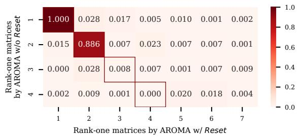  
Figure 4: Cosine similarity between $\mathrm { \mathbf { A R O M A _ { w / o } } }$ Reset and $\mathrm { A R O M A _ { w / } } _ { R e s e t }$ for layer.10.attention.output.sense layer results for RoBERTa-base on MRPC task.

Figure 4 shows the cosine similarity between $\mathrm { A R O M A } _ { \mathrm { w / o } R e s e t }$ and $\mathrm { A R O M A _ { w / } } _ { R e s e t }$ , which we only focus on values on the diagonal. It reveals that their solutions are identical initially, but increasingly diverge with each subsequent Reset. This finding further underscores the important role of the Reset mechanism.

## F Inner-space Rank of AROMA

For simple tasks and smaller models, rank-1 may be optimal due to higher resolution. We conduct experiments for RoBERTa-base on MRPC with different inner-space ranks (averaged over 3 runs) in Table 10.

However, for complex tasks and larger models like LLaMA3 on Commonsense170k, a slightly larger subspace might be better. We find that $\mathbf { A R O M A } _ { r = 8 }$ not only converges faster than $\mathbf { A R O M A } _ { r = 1 }$ (see Table 8) but also achieves higher accuracy. When we further try $\mathbf { A R O M A } _ { r = 1 6 } ,$ the performance degrades, possibly due to excessively low resolution.

<table><tr><td>Inner-space Rank</td><td>#Param</td><td>#Outer Loop</td><td>Accuracy</td></tr><tr><td> $A R O M A _ { \ r = 1 }$ </td><td>0.17M</td><td>10.3</td><td>94.17</td></tr><tr><td> $A R O M A _ { \ r = 2 }$ </td><td>0.33M</td><td>7.3</td><td>93.05</td></tr><tr><td> $A R O M A _ { r = 3 }$ </td><td>0.5M</td><td>8</td><td>91.35</td></tr><tr><td> $A R O M A _ { \ r = 4 }$ </td><td>0.67M</td><td>8.7</td><td>89.46</td></tr><tr><td> $A R O M A _ { \ r = 8 }$ </td><td>1.34M</td><td>8.7</td><td>81.94</td></tr></table>

Table 10: Inner-space rank comparison for RoBERTabase on MRPC.
<table><tr><td>Inner-space Rank</td><td>#Param</td><td>#Outer Loop</td><td>Accuracy</td></tr><tr><td>AROMAr=1</td><td>1.77M</td><td>20</td><td>83.11</td></tr><tr><td> $A R O M A _ { \ r = 8 }$ </td><td>14.16M</td><td>15</td><td>83.85</td></tr><tr><td> $A R O M A _ { \ r = 1 6 }$ </td><td>28.31M</td><td>18</td><td>82.90</td></tr></table>

Table 11: Inner-space rank comparison for LLaMA3 on Commonsense170K.

These results encourage us to set the AROMA inner-space rank to 8 for complex tasks and larger models, potentially enhancing both accuracy and time efficiency.

## G Dataset Details

## G.1 GLUE

GLUE (Wang et al., 2018) is a collection of nine NLU benchmarks designed to evaluate the performance of LLMs across multiple dimensions of linguistic competence. This work involves eight commonly used GLUE tasks: CoLA (Warstadt et al., 2019), MNLI (Williams et al., 2018), MRPC (Dolan and Brockett, 2005), QNLI (Rajpurkar et al., 2016), QQP (Wang et al., 2018), RTE (Dagan et al., 2005; Haim et al., 2006; Giampiccolo et al., 2007; Bentivogli et al., 2009), SST-2 (Socher et al., 2013), STS-B (Wang et al., 2018). Their details are listed in Table 12.

## G.2 Commonsense170K

Commonsense170K (Hu et al., 2023) is a comprehensive benchmark collection comprising approximately 170,000 training examples and 400 validation examples across eight diverse commonsense reasoning datasets: ARC-Easy and ARC-Challenge (Clark et al., 2018), OBQA (Mihaylov et al., 2018), SIQA (Sap et al., 2019), WinoGrande (Sakaguchi et al., 2021), PIQA (Bisk et al., 2020), BoolQ (Clark et al., 2019); and HellaSwag (Zellers et al., 2019). This consolidated benchmark evaluates LLMs’ capabilities across multiple dimensions of commonsense knowledge, including conceptual reasoning, physical understanding, social intelligence, causal reasoning, coreference resolution, and scientific knowledge.

<table><tr><td>Dataset</td><td>#Train #Valid</td><td>#Test</td><td>#Label</td><td>Metric</td></tr><tr><td></td><td colspan="4">Single-Sentence Classification</td></tr><tr><td>CoLA</td><td>8.5k</td><td>1k 1k</td><td>2</td><td>MC</td></tr><tr><td>SST-2</td><td>67k</td><td>872 1.8k</td><td>2</td><td>Acc</td></tr><tr><td></td><td colspan="4">Pairwise Text Classification</td></tr><tr><td>MNLI</td><td>393k 20k</td><td>20k</td><td>3</td><td>Acc</td></tr><tr><td>RTE</td><td>2.5k 277</td><td>3k</td><td>2</td><td>Acc</td></tr><tr><td>QQP</td><td>364k 40k</td><td>391k</td><td>2</td><td>Acc</td></tr><tr><td>MRPC</td><td>3.7k 408</td><td>1.7k</td><td>2</td><td>Acc</td></tr><tr><td>QNLI</td><td>105k 5.5k</td><td>5.5k</td><td>2</td><td>Acc</td></tr><tr><td colspan="5">Text Similarity</td></tr><tr><td>STS-B</td><td>5.7k</td><td>1.5k</td><td>1.4k 1</td><td>PC</td></tr></table>

Table 12: Details of GLUE benchmark. "MC", "PC", and $" \mathrm { A c c " }$ represent Matthews correlation coefficient, Pearson correlation coefficient, and accuracy, respectively. "#Train", "#Valid", and "#Test" refer to the number of training, validation, and testing examples, respectively. "#Label" denotes the number of labels.

## G.3 XSum

XSum (Narayan et al., 2018) is a large-scale, highly abstractive single-sentence summarization dataset built from BBC news. It contains 226k articlesummary pairs with splits of roughly 204k/11k/11k for train/validation/test. Each article is paired with a concise, human-written one-sentence summary that captures the core information, encouraging models to generate short summaries, making it a challenging NLG task.

## H Hyperparameter Settings

## H.1 NLU Task

Hyperparameter setup can be found in Table 15, where we follow the suggested setting for LoRA and AdaLoRA, and meticulously tune for AROMA, including the learning rate $l r \in [ 1 \mathrm { E } \mathrm { - } 4 , 2 \mathrm { E } \mathrm { - } 4 , 5 \mathrm { E } .$ 4, 7E-4], inner tolerance $\varepsilon _ { \mathrm { i n } } ~ \in ~ [ 0 . 0 5 , 0 . 1 ]$ , and outer tolerance $\varepsilon _ { \mathrm { o u t } } \in [ 1 \mathrm { E } \mathrm { - } 3 , 5 \mathrm { E } \mathrm { - } 3 , 6 \mathrm { E } \mathrm { - } 3 ]$ . Initial warmup is 100 and subsequent warmup is 50 for all tasks, except CoLA which uses 500 and 100 respectively. We use publicly available implementation (https://github.com/Guitaricet/ relora) to run ReLoRA.

## H.2 Commonsense Reasoning Task

Hyperparameter setup for commonsense reasoning task can be found in Table 13.

## H.3 NLG task

We apply AROMA to four weight matrices in the self-attention layer: $W _ { q } , W _ { k } , W _ { v } , W _ { o } ,$ and two in the FFN: $W _ { f c 1 }$ , and $W _ { f c 2 }$ . Hyperparameter setup for NLG task is found in Table 14.

<table><tr><td>Scheme</td><td>Hyperparameter</td><td>Value</td></tr><tr><td rowspan="10"> $A R O M A _ { r = 1 }$ </td><td>r</td><td>1</td></tr><tr><td>α</td><td>2</td></tr><tr><td>Max Seq. Len.</td><td>256</td></tr><tr><td>Batch Size</td><td>32</td></tr><tr><td>Epoch</td><td>20</td></tr><tr><td>Learning Rate  $T$ </td><td>1E-4</td></tr><tr><td></td><td>100,000</td></tr><tr><td> $T _ { \mathrm { i n } }$ </td><td>1000</td></tr><tr><td> $\varDelta T _ { \mathrm { i n } }$ </td><td>10</td></tr><tr><td> $\varepsilon _ { \mathrm { i n } }$ </td><td>0.1</td></tr><tr><td></td><td> $\varepsilon _ { \mathrm { o u t } }$  Eval Batch Size</td><td>1E-3</td></tr><tr><td rowspan="10"> $A R O M A _ { r = 8 }$ </td><td> $r$ </td><td>8</td></tr><tr><td></td><td>8</td></tr><tr><td>α</td><td>16</td></tr><tr><td> $\operatorname { M a x } \mathrm { { S e q . } \operatorname { L e n . } }$  Batch Size</td><td>256</td></tr><tr><td> $\operatorname { E p o c h }$ </td><td>32</td></tr><tr><td></td><td>15</td></tr><tr><td>Learning Rate</td><td>1E-4</td></tr><tr><td> $T$ </td><td>80,000</td></tr><tr><td> $T _ { \mathrm { i n } }$ </td><td>2000</td></tr><tr><td> $\varDelta T _ { \mathrm { i n } }$ </td><td>10</td></tr><tr><td></td><td></td></tr><tr><td> $\varepsilon _ { \mathrm { i n } }$ </td><td>0.1</td></tr><tr><td> $\varepsilon _ { \mathrm { o u t } }$ </td><td>1E-2</td></tr><tr><td></td><td></td></tr><tr><td>Eval Batch Size</td><td>8</td></tr></table>

Table 13: Hyperparameter setup for LLaMA3-8B on Commonsense170k

<table><tr><td>Hyperparameter</td><td>Value</td></tr><tr><td>r</td><td>1</td></tr><tr><td>α</td><td>4</td></tr><tr><td>Max Source Length</td><td>768</td></tr><tr><td>Max Target Length</td><td>142</td></tr><tr><td>Batch Size</td><td>64</td></tr><tr><td>Epoch</td><td>30</td></tr><tr><td>Learning Rate</td><td>2E-4</td></tr><tr><td> $T$ </td><td>100,000</td></tr><tr><td> $T _ { \mathrm { i n } }$ </td><td>5000</td></tr><tr><td> $\varepsilon _ { \mathrm { o u t } }$ </td><td>4E-3</td></tr></table>

Table 14: Hyperparameter setup for BART-large on XSum

Algorithm 1: AROMA   
Input: Inner and outer tolerances $\varepsilon _ { \mathrm { i n } }$ and $\varepsilon _ { \mathrm { o u t } }$ , maximum inner training steps $T _ { \mathrm { i n } }$ , inner checking   
interval $\varDelta T _ { \mathrm { i n } }$ , maximum total training steps $T .$   
1 for each module in parallel   
2 Initialize: ${ \pmb b } _ { 1 } ^ { ( 0 ) }  { \bf 0 } ; { \pmb a } _ { 1 } ^ { ( 0 ) } $ Kaiming\_init.   
3 Freeze $W _ { 0 } .$   
4 for $p = 1 , 2 , \cdots { \bf d o }$ $/ /$ OUTER LOOP   
5 for $t = 1 , 2 , \cdots , T _ { \mathrm { i n } }$ do $/ /$ INNER LOOP   
6 Update $b _ { p } ^ { ( t ) } , \pmb { a } _ { p } ^ { ( t ) }$   
7 if $\mathrm { M O D } ( t , \Delta { \bar { T } } _ { \mathrm { i n } } ) = 0$ then   
$\left\| b _ { p } ^ { ( t ) } \pmb { a } _ { p } ^ { ( t ) } \right\| _ { F } - \left\| b _ { p } ^ { ( t - \varDelta T _ { \mathrm { i n } } ) } \pmb { a } _ { p } ^ { ( t - \varDelta T _ { \mathrm { i n } } ) } \right\| _ { \jmath }$   
8 inner\_converged = True, if $\left\| \vec { \pmb { b } _ { p } ^ { ( t - \Delta T _ { \mathrm { i n } } ) } } \pmb { a } _ { p } ^ { ( t - \Delta T _ { \mathrm { i n } } ) } \right\| _ { F }$ F < εin. // CHECK   
9 Break the inner loop, if all modules are inner\_converged.   
10 outer\_converged = True, if $\begin{array} { r } { \frac { \left\| \alpha b _ { p } { \pmb a } _ { p } \right\| _ { F } } { \left\| W _ { 0 } + \alpha B _ { p - 1 } { \pmb A } _ { p - 1 } \right\| _ { F } } < \varepsilon _ { \mathrm { o u t } } . \ / / } \end{array}$ CHECK   
11 Break the outer loop, if outer\_converged.   
12 $\varDelta \boldsymbol { W } = \varDelta \boldsymbol { W } + \boldsymbol { b } _ { p } ^ { ( t ) } \boldsymbol { a } _ { p } ^ { ( t ) }$ // MERGE   
13 $b _ { p + 1 } ^ { ( 0 ) }  \mathbf { 0 } ; a _ { p + 1 } ^ { ( 0 ) }$ Kaiming\_init. // REINIT   
14 Reset optimizer states $\&$ learning rate warmup. // RESET   
15 Finish, if all modules are outer\_converged or reach $T .$   
Output: $\varDelta { \mathbf { W } } .$

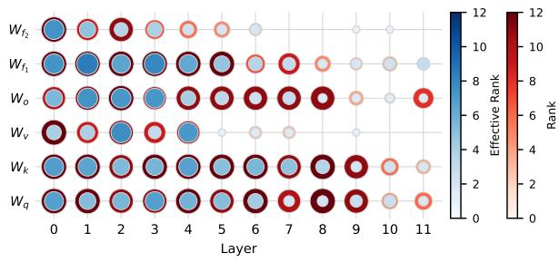  
(a) Rank distribution of AdaLoRA

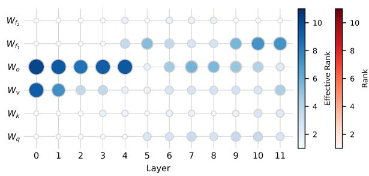  
(b) Rank distribution of AROMA  
Figure 5: Resultant rank and effective rank distributions for RoBERTa-base fine-tuned on RTE task by AdaLoR $\mathbf { A } _ { r = 8 }$ and AROMA, respectively. The x-axis represents the hidden layer index, while the $y -$ axis refers to the weight matrix fine-tuned in each layer. The total rank is described by the red outer circle, whereas the effective rank is indicated by the blue inner circle.

<table><tr><td>Scheme</td><td>Hyperparameter</td><td>CoLA</td><td>MNLI</td><td>MRPC</td><td>QNLI</td><td> $\mathsf { Q Q P }$  </td><td>RTE</td><td>SST-2 STS-B</td></tr><tr><td>LoRA</td><td>Max Seq. Len. Batch Size Epoch Learning Rate</td><td>30</td><td>30 30</td><td>25</td><td>128 64</td><td>25 50 4E-4</td><td>60</td><td>40 4E-4</td></tr><tr><td>AdaLoRA</td><td>Max Seq. Len. Batch Size Epoch Learning Rate  $r _ { i }$   $r _ { f }$   $\gamma$   $T$   $t _ { i }$   $\varDelta _ { T }$ </td><td>25 5E-4 0.5 6500 85000 800 8000</td><td>7 30 5E-4 1E-3 0.1 0.1</td><td>5 1.2E-3 0.1</td><td>16 128 32 12 8 0.1</td><td>5 5E-4</td><td>52 1.2E-3</td><td>24 8E-4 2.2E-3</td></tr><tr><td></td><td></td><td></td><td></td><td></td><td></td><td></td><td></td><td></td></tr><tr><td></td><td>32 130 2E-4 35000</td><td></td><td></td><td></td><td></td><td></td><td>64</td><td>32</td></tr><tr><td></td><td></td><td></td><td></td><td></td><td></td><td></td><td></td><td></td><td></td></tr><tr><td></td><td></td><td></td><td></td><td></td><td></td><td></td><td></td><td></td><td></td></tr><tr><td></td><td>Max Seq. Len.</td><td></td><td></td><td></td><td></td><td>32</td><td></td><td></td><td></td></tr><tr><td></td><td></td><td></td><td></td><td></td><td></td><td></td><td></td><td></td><td></td></tr><tr><td></td><td>Batch Size</td><td></td><td></td><td></td><td></td><td>256</td><td></td><td></td><td></td></tr><tr><td></td><td></td><td>32</td><td></td><td></td><td></td><td></td><td></td><td></td><td></td></tr><tr><td></td><td>Epoch</td><td>10</td><td></td><td>64</td><td>32</td><td>64</td><td>64</td><td></td><td></td></tr><tr><td></td><td></td><td></td><td></td><td></td><td></td><td></td><td></td><td></td><td></td></tr><tr><td></td><td>Learning Rate</td><td>7E-4</td><td></td><td>52</td><td>10</td><td>10</td><td>62</td><td>40</td><td>50</td></tr><tr><td></td><td></td><td></td><td></td><td></td><td></td><td></td><td></td><td></td><td></td></tr><tr><td></td><td></td><td></td><td></td><td>1E-4</td><td>2E-4</td><td>4E-4</td><td>1E-4</td><td>5E-4</td><td>5E-4</td></tr><tr><td>AROMA</td><td> $T$ </td><td></td><td>85000</td><td>3000</td><td></td><td></td><td>2400</td><td>40000</td><td></td></tr><tr><td></td><td></td><td>5000</td><td></td><td></td><td>30000</td><td>55000</td><td></td><td></td><td>10000</td></tr><tr><td></td><td> $T _ { \mathrm { i n } }$ </td><td></td><td>5000</td><td>200</td><td>2000</td><td>55000</td><td>200</td><td>2500</td><td>1000</td></tr><tr><td></td><td></td><td></td><td></td><td></td><td></td><td></td><td></td><td></td><td></td></tr><tr><td></td><td> $\varDelta T _ { \mathrm { i n } }$ </td><td></td><td></td><td></td><td></td><td>10</td><td></td><td></td><td></td></tr><tr><td></td><td></td><td></td><td></td><td></td><td></td><td></td><td></td><td></td><td></td></tr><tr><td></td><td> $\varepsilon _ { \mathrm { i n } }$ </td><td></td><td></td><td></td><td></td><td>0.1</td><td></td><td></td><td></td></tr><tr><td></td><td></td><td>5E-3</td><td></td><td></td><td></td><td></td><td></td><td></td><td></td></tr><tr><td></td><td></td><td></td><td></td><td>5E-3</td><td>5E-3</td><td>1E-3</td><td>6E-3</td><td>5E-3</td><td>5E-3</td></tr><tr><td></td><td> $\varepsilon _ { \mathrm { o u t } }$ </td><td></td><td></td><td></td><td></td><td></td><td></td><td></td><td></td></tr><tr><td></td><td></td><td></td><td></td><td></td><td></td><td></td><td></td><td></td><td></td></tr><tr><td></td><td></td><td></td><td></td><td></td><td></td><td></td><td></td><td></td><td></td></tr><tr><td></td><td></td><td></td><td></td><td></td><td></td><td>4</td><td></td><td></td><td></td></tr><tr><td></td><td>α</td><td></td><td></td><td></td><td></td><td></td><td></td><td></td><td></td></tr><tr><td></td><td></td><td></td><td></td><td></td><td></td><td></td><td></td><td></td><td></td></tr><tr><td></td><td></td><td></td><td></td><td></td><td></td><td></td><td></td><td></td><td></td></tr><tr><td></td><td></td><td></td><td></td><td></td><td></td><td></td><td></td><td></td><td></td></tr><tr><td></td><td></td><td></td><td></td><td></td><td></td><td></td><td></td><td></td><td></td></tr><tr><td></td><td></td><td></td><td></td><td></td><td></td><td></td><td></td><td></td><td></td></tr><tr><td></td><td></td><td></td><td></td><td></td><td></td><td></td><td></td><td></td><td></td></tr><tr><td></td><td></td><td></td><td></td><td></td><td></td><td></td><td></td><td></td><td></td></tr><tr><td></td><td></td><td></td><td></td><td></td><td></td><td></td><td></td><td></td><td></td></tr></table>

Table 15: Hyperparameter setup for RoBERTa-base on GLUE