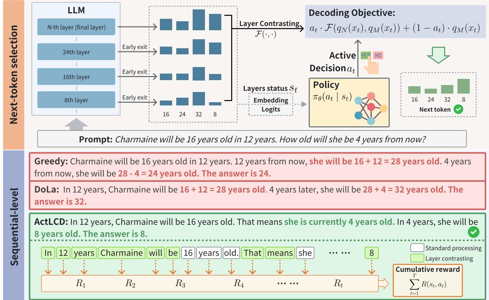
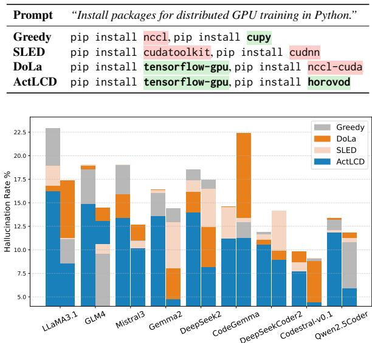
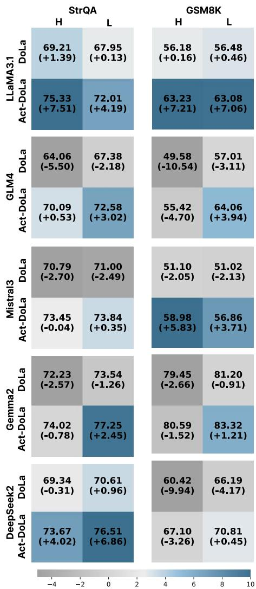

# Active Layer-Contrastive Decoding Reduces Hallucination in Large Language Model Generation

Hongxiang Zhang1, Hao Chen2, Muhao Chen2, Tianyi Zhang1

1Purdue University, 2University of California, Davis

hxxzhang@purdue.edu chen@ucdavis.edu muhchen@ucdavis.edu tianyi@purdue.edu

## Abstract

Recent decoding methods improve the factuality of large language models (LLMs) by refining how the next token is selected during generation. These methods typically operate at the token level, leveraging internal representations to suppress superficial patterns. Nevertheless, LLMs remain prone to hallucinations, especially over longer contexts. In this paper, we propose Active Layer-Contrastive Decoding (ActLCD), a novel decoding strategy that actively decides when to apply contrasting layers during generation. By casting decoding as a sequential decision-making problem, ActLCD employs a reinforcement learning policy guided by a reward-aware classifier to optimize factuality beyond the token level. Our experiments demonstrate that ActLCD surpasses state-of-the-art methods across five benchmarks, showcasing its effectiveness in mitigating hallucinations in diverse generation scenarios. Our code is available at https: //github.com/actlcd/ActLCD

## 1 Introduction

Despite recent advances in large language models (LLMs), hallucination remains a major challenge that undermines user trust and reduces adoption in practice (Huang et al., 2025; Ji et al., 2023a; Lewis et al., 2020). Recent work observes that LLMs sometimes tend to predict the next token based on superficial linguistic patterns rather than the factual knowledge embedded in the training data (Shi et al., 2024a; Welleck et al.; Chuang et al., 2023; Zhang et al., 2024a,b).

Based on this insight, new decoding methods have been proposed to harness the latent representation of factual knowledge learned by LLMs to refine the probability distribution of output tokens (Chuang et al., 2023; Zhang et al., 2024a; Li et al., 2022; Su et al., 2022). For example, DoLa (Chuang et al., 2023) aims to improve factuality by contrasting logits computed from the deep layers and those from the shallower layers. The intuition is that deep layers encode more factual and semantically refined knowledge, while shallower layers may reflect syntactic priors or ambiguous surface patterns. Through a layer-wise contrast, DoLa can amplify factual signals from the deep layers while suppressing potentially misleading patterns from the shallower layers, thereby steering generation towards more factual outputs.

Though these decoding methods have been demonstrated to be effective in reducing hallucination on some benchmarks, they have several limitations. While layer contrasting can improve factuality by exerting latent knowledge in deep layers, applying it persistently for every single token in the output sequence may cause the model to “overthink” for simple token predictions, especially in longer generations. For instance, in the math problem in Figure 1, DoLa forces the model to immediately attempt an arithmetic calculation to solve the problem when generating the first sentence, though it only needs to simply repeat the information from the question body there to elicit further reasoning in the following sentences. Moreover, due to the autoregressive nature of text generation, factual accuracy is highly dependent on previously generated tokens; thus, lacking sequential-level optimization, these static interventions are prone to early errors that compound into a cascade of inaccuracies, a phenomenon known as hallucination snowballing (Zhang et al., 2024b).

To address these issues, we propose Active Layer-Contrastive Decoding (ActLCD). Figure 1 gives an overview of ActLCD. During generation, ActLCD selectively applies layer contrasting to leverage latent knowledge in deep layers. Specifically, ActLCD casts decoding as a sequential decision-making problem, employing reinforcement learning to learn an optimal policy for when to activate layer contrasting based on previously generated tokens (i.e., the context). Unlike existing approaches that require multiple sampling or external sources, ActLCD operates in a single pass using only model-internal information, enabling efficient and adaptive factual decoding.

  
Figure 1: The workflow of ActLCD. (1) Next-token selection: ActLCD dynamically apply layer contrasting at each step. (2) Sequential-level optimization: By framing decoding as a Markov decision process, ActLCD selectively activates layer contrasting to maximize cumulative reward throughout the generation.

We compare ActLCD with SOTA decoding strategies SLED and DoLa on five LLMs of varying scales. Our method consistently improves factuality on two open-domain benchmarks and two chainof-thought benchmarks by a large margin, including TruthfulQA (+19.81%), LongFact (+3.30%), StrategyQA (+7.51%), and GSM8k (+7.21%), respectively1. Furthermore, we extend our evaluation to a domain-specific benchmark on software package hallucination (+9.23%) using four code LLMs. Across all experiments, ActLCD demonstrates robust factuality improvements from sentence-level to document-level generations.

## 2 Method

## 2.1 Preliminaries

Contrastive decoding methods exploit model confidence dynamics either across different models or within the internal layers (Li et al., 2022; Chuang et al., 2023). Specifically, Decoding by Contrasting Layers (Chuang et al., 2023) adjusts the token probability distribution by subtracting the logits of shallow layers from those of deep layers. This approach aims to sharpen model outputs and mitigate hallucinations by amplifying confident predictions while suppressing uncertain ones.

Formally, given a sequence of generated tokens $\{ x _ { 1 } , x _ { 2 } , . . . , x _ { t - 1 } \} , q _ { N } , q _ { M }$ are named log probabilities of shallow and deep layers, respectively. The next-token prediction is then determined as

$$
\hat { p } ( x _ { t } \mid x _ { < t } ) = \mathrm { s o f t m a x } \left( \mathcal { F } ( q _ { N } ( x _ { t } ) , q _ { M } ( x _ { t } ) ) \right) _ { x _ { t } }\tag{1}
$$

where

$$
\mathcal { F } ( q _ { N } , q _ { M } ) = \left\{ \begin{array} { l l } { \log \frac { q _ { N } ( x _ { t } ) } { q _ { M } ( x _ { t } ) } } & { x _ { t } \in \mathcal { V } _ { \mathrm { h e a d } } ( x _ { t } \mid x _ { < t } ) , } \\ { - \infty } & { \mathrm { o t h e r w i s e } . } \end{array} \right.\tag{2}
$$

The operator $\mathcal F ( \cdot , \cdot )$ , is used to contrast the output distributions from the shallow layer and the deep layer. The subset $V _ { \mathrm { h e a d } } ( x _ { t } | \boldsymbol { x } _ { < t } ) \subset X$ is defined based on whether the token has a sufficiently high probability in the deep layer:

$$
\begin{array} { r } { \mathcal { V } _ { \mathrm { h e a d } } ( x _ { t } | \boldsymbol { x } _ { < t } ) = \{ \boldsymbol { x } _ { t } \in \mathcal { X } : q _ { N } ( \boldsymbol { x } _ { t } ) \} } \\ { \geq \alpha \operatorname* { m a x } ^ { } q _ { N } ( w ) \} } \end{array}\tag{3}
$$

Tokens with low probability in the deep layer are discarded to minimize both false positives and false negatives. In practice, contrastive decoding methods require selecting appropriate shallow and deep layers buckets. We describe our layer selection strategy in Appendix B.

## 2.2 Decoding Objective

The key insight of layer contrasting methods is that amplifying confident predictions while suppressing uncertain ones improves factuality. While layer contrasting is effective for token-level adjustments, it treats each decoding step independently and does not account for the influence of previously generated tokens on following decoding steps. To address this limitation, we formalize decoding as a sequential decision-making problem and solve it via reinforcement learning (RL). Our approach dynamically decides when to apply layer contrasting. Formally, given input prompt $p$ and partial generation $x _ { < t }$ at step t, the next token probability is defined as:

$$
\begin{array} { r l } & { \hat { p } ( x _ { t } \mid x _ { < t } ) = \operatorname { s o f t m a x } ( a _ { t } \cdot \mathcal { F } ( q _ { N } ( x _ { t } ) , q _ { M } ( x _ { t } ) ) } \\ & { \qquad + \left( 1 - a _ { t } \right) \cdot q _ { M } ( x _ { t } ) ) } \end{array}\tag{4}
$$

, where $a _ { t } \in \{ 0 , 1 \}$ refers to the action that determines whether to apply layer contrasting, based on the current state $s _ { t }$ derived from $\{ x _ { < t } , p \}$

The objective of our method includes two parts: $\mathcal { F } ( q _ { N } ( x _ { t } ) , q _ { M } ( x _ { t } ) )$ and $q _ { M } ( x _ { t } )$ , where they can be viewed as the decoding by layer contrasting objective and greedy decoding objective, respectively.

## 2.3 ActLCD

We formulate decoding as a Markov decision process (MDP) $\mathcal { M } = ( S , A , P _ { a } , R )$ , where S is the state space that captures intermediate-layers’ embeddings and logits, $A = \{ 0 , 1 \}$ is the action space indicating whether to apply layer contrasting, $P _ { a }$ denotes the transition dynamics, and R is the reward function.

We consider a decision environment where each step corresponds to generating the next token. At each time t, the state $s _ { t }$ is represented by layerbased embeddings and logits derived from the partially generated context $x _ { < t }$ . At each step, the policy decides whether to apply layer contrasting or not. In this setup, the standard RL objective is to maximize the expected return E $\left\lceil \sum _ { t = 1 } ^ { T } R ( s _ { t } , a _ { t } ) \right\rceil$ in the MDP, where $a _ { t } \sim \pi _ { \theta } ( a _ { t } \mid { \mathsf { \bar { s } } } _ { t } )$ . The environment evaluates the reward $R ( s _ { t } , a _ { t } )$ over the full sequence.

Reward Design To emphasize factual correctness and penalize both unnecessary and missed activations, we design a sequence-level reward function. Specifically, we assign rewards based on token-level ground truth labels: true positives (correct layer contrasting activation) receive a reward $r _ { t p } = 1 . 0$ , true negatives (correct non-activation) $r _ { t n } = 2 . 0$ , false positives (unnecessary layer contrasting activation) $r _ { f p } = - 1 . 0$ , and false negatives (missed necessary activations) $r _ { f n } = - 5 . 0 .$ . These values were empirically chosen to balance the tradeoff between precision and recall (detailed in $\mathsf { A p - }$ pendix F). The cumulative reward for a sequence is updated at the end of decoding, helping the policy avoid getting trapped in local minima and incentivizing correct activation decisions throughout generation.

Training To learn $\pi _ { \theta } ,$ we adopt an offline RL framework, where transitions are collected from annotated sequences. Each token is labeled with a binary activation indicator of whether to apply layer contrasting at that step. Annotation details are listed in Appendix A. We then apply Batch-Constrained deep Q-learning (BCQ) (Fujimoto et al., 2019) to learn an activation policy from annotated offline data, as explained in the next section.

## 2.4 Training and Policy Optimization

The BCQ framework comprises two stages. In particular, we first train a behavior cloning (BC) model that captures the offline policy distribution in a supervised manner. We then refine the policy via Q-learning, while constraining action choices to remain close to the BC policy. We explain each step in detail below.

Stage 1: Behavior Cloning In the initial stage, we train a behavior cloning network to approximate the empirical action distribution from the annotated offline dataset’s actions. Specifically, each training example consists of a state $s _ { t }$ (capturing the partial generation up to step t) and the annotated binary activation label $a _ { t } .$ . we optimize the neural network policy $\pi _ { \phi }$ by minimizing cross-entropy loss:

$$
{ \mathcal { L } } _ { \mathrm { B C } } = - \sum _ { t } \log \pi _ { \phi } ( a _ { t } \mid s _ { t } )\tag{5}
$$

This behavioral cloning component guides the model to imitate observed activation patterns, serves in two purposes: (1) it offers a strong initialization that captures real (annotated) usage of contrastive layers, and (2) it regularizes subsequent

Q-learning updates to remain close to the behavioral distribution, thereby reducing extrapolation errors commonly encountered in offline reinforcement learning.

Stage 2: Q-learning. In the second stage, we refine the policy using DQN Q-learning update (Fujimoto et al., 2019; Mnih et al., 2015) under a batchconstrained scheme by sampling from the same dataset used in Stage 1. We train a critic Q-network $Q _ { \theta }$ to predict the expected cumulative rewards for state-action pairs. Following (Fujimoto et al., 2019), we impose a probability threshold τ derived from the behavioral cloning policy $\pi _ { \phi } ( \boldsymbol { a } \mid \boldsymbol { s } )$ to prevent the overestimation of actions rarely observed in the offline dataset. Formally, we define a set of permissible actions as:

$$
A _ { \phi } ( s _ { t + 1 } ) ~ = ~ \{ a ~ | ~ \pi _ { \phi } ( a ~ | ~ s _ { t + 1 } ) > \tau \}\tag{6}
$$

The critic parameters θ are updated by minimizing the mean-squared temporal-difference error:

$$
\begin{array} { r l } & { \mathcal { L } _ { \mathrm { T D } } = \big \| Q _ { \theta } ( s _ { t } , a _ { t } ) - } \\ & { \qquad \bigl [ r _ { t } + \gamma \operatorname* { m a x } _ { a \in \mathcal { A } _ { \phi } ( s _ { t + 1 } ) } Q _ { \bar { \theta } } ( s _ { t + 1 } , a ) \bigr ] \big \| ^ { 2 } , } \end{array}\tag{7}
$$

where ¯θ denotes the parameters of a slowly-updated target critic network via Polyak averaging, $r _ { t }$ is the immediate reward, and $\gamma$ is the discount factor. If no permissible action exceeds the threshold, we revert to the action with the highest behavioral cloning probability.

This constrained approach ensures that the policy remains faithful to the distribution of observed actions, effectively alleviating distributional shift.

Inference At test time, the policy selects actions by identifying permissible actions $\boldsymbol { A } _ { \phi } ( \boldsymbol { s } _ { t } )$ and choosing the action with the highest estimated Qvalue:

$$
\pi _ { \theta } = \arg \operatorname* { m a x } _ { a \in \mathcal { A } _ { \phi } ( s _ { t } ) } Q _ { \theta } ( s _ { t } , a ) ,\tag{8}
$$

By combining supervised initialization with constrained Q-learning, our policy remains faithful to offline annotations while optimizing for the sequential-level reward, effectively balancing correctness and efficiency. Periodic synchronization between the Q-network and the target network stabilizes the learning process, ensuring reliable policy updates and robust decision-making at inference.

## 3 Experiments

## 3.1 Benchmarks and Evaluation Metrics

We evaluated two open-ended benchmarks spanning short-answer and long-answer generation, including TruthfulQA (Lin et al., 2021), and Long-Fact (Wei et al., 2024). In addition, we included two chain-of-thought reasoning benchmarks, StrategyQA (Geva et al., 2021) and GSM8K (Cobbe et al., 2021). Finally, we included a domainspecific benchmark about software package hallucination (Spracklen et al., 2025).

TruthfulQA (Lin et al., 2021) is a short-answer benchmark comprising 817 questions designed to test factual correctness, particularly in cases where humans commonly answer falsely due to misconception. We use GPT-4o-mini to evaluate the truthfulness (Truth), and informativeness (Info) of each generated answer. While Truth is the primary metric, a high score can be trivially achieved by generating uninformative answers such as “I have no comment.” To address this, we adopt the composite metric (T\*I), which balances correctness and informativeness. Following the evaluation in (Lin et al., 2021; Cheng et al., 2024), we provide reference answers annotated in the dataset as the reference and use the same evaluation samples as the demonstration examples.

LongFact (Wei et al., 2024) includes a set of 2,280 fact-seeking prompts requiring long-form responses, often exceeding a thousand tokens. We follow the same evaluation process as in (Wei et al., 2024; Cheng et al., 2024), which uses an LLM to first extract the atomic facts from a long response and then evaluate the correctness of each fact. We use GPT-4o-mini to extract atomic facts and evaluate factuality. The adopted metrics include the proportion of truthful facts (Precision), the number of truthful facts divided by 128 (Recall@128), and the F1@128 score, which integrates the previous two metrics. To balance costs, we evaluated only 120 samples.

Chain-of-Thought Reasoning Following prior work (Zhang et al., 2024a; Chuang et al., 2023), we evaluate chain-of-thought reasoning capabilities using StrategyQA (Geva et al., 2021) and GSM8K (Cobbe et al., 2021). Both benchmarks require generating long-answer, detailed reasoning paths. StrategyQA requires multi-hop reasoning over implicit knowledge, while GSM8K involves math word problems that demand both factual understanding and arithmetic reasoning. We follow the factual accuracy evaluation implemented from (Chuang et al., 2023).

Package hallucination (Spracklen et al., 2025) is a benchmark designed to evaluate the factuality of software packages recommended by an LLM for a given task. Table 3 shows an example. This benchmark includes 5,000 tasks related to popular programming languages, including Python and JavaScript. Different from TruthfulQA, which involves a single-sentence response, this benchmark focuses on multi-token outputs consisting of multiple package names. In this context, package hallucination refers to LLMs recommending non-existent or irrelevant packages.

To assess the robustness of our approach in this critical domain, we extended our evaluation to four additional code-focused LLMs, covering both general-purpose and specialized models. Following Spracklen et al. (2025), we use pip-search and npm-search to verify the existence of each recommended package. We adopt the hallucination rate (%Hallu) as the primary metric.

## 3.2 Models and Baselines

Base Models We conduct our experiments on five general-purpose LLMs and four code LLMs. We experiment with general-purpose LLMs on all benchmarks. Since code LLMs are superficially designed for coding tasks, we only experiment with code LLMs on the software package hallucination benchmark. For general-purpose LLMs, we select Llama-3.1-8B (Grattafiori et al., 2024), glm-4-9bchat-hf (GLM et al., 2024), gemma-2-9b-it (Team et al., 2024b), Mistral-7B-Instruct-v0.3 (Jiang, 2024), and DeepSeek-V2-Lite-Chat (Liu et al., 2024). For code LLMs, we include codegemma-7bit (Team et al., 2024a), DeepSeek-Coder-V2-Lite-Instruct (Guo et al., 2024), and Qwen2.5-Coder-7B-Instruct (Hui et al., 2024).

Comparison Baselines We compare our method against three representative decoding strategies. First, we include Greedy decoding, a widely used baseline that selects the most probable token at each step without any additional adjustments. Second, we include Decoding by Contrasting Layers (DoLa) (Chuang et al., 2023), a decoding method that improves factuality by contrasting logits from deeper and shallower layers. Third, we include Self Logits Evolution Decoding (SELD) (Zhang et al., 2024a), which leverages the evolution of token logits across layers to guide generation toward more factual outputs.

## 3.3 Implementation Details

The prompt templates used for different approaches are provided in Appendix H. Following the official SLED implementation, we have updated it to ensure compatibility with the latest LLMs; the implementation and reproduction details are provided in Appendix C. We implement DoLa using readily pre-built functionalities provided by the Hugging Face Transformers library. For DoLa, SLED, and ActLCD, we select shallow layers by partitioning the transformer layers into {low, high} buckets and select one bucket as candidate layers. We detail our shallow-layer selection strategy in Appendix B.

## 3.4 Main Results

Short-Answer Factuality. As shown in Table 1, ActLCD consistently improves the Truth score. ActLCD also demonstrates significant improvements in Info, ensuring high informativeness. These gains lead to over 10% increase in the %Truth %Info metric in most models, outperforming all competing methods. These results highlight ActLCD’s ability to generate responses that are not only factually accurate but also more informative, reflecting overall higher-quality generation.

While DoLa and SLED have demonstrated the potential to boost truthfulness and informativeness, our experiments show performance degradation in certain LLMs, potentially indicating limited generalization across model architectures. In contrast, ActLCD demonstrates superior %T\*I scores across all evaluated models.

Long-answer Factuality. Enhancing factuality in long-form generation remains a challenging and underexplored area. As shown in Table 1, benefit from sequential level optimization, ActLCD improves both precision and Recall@128. This indicates that ActLCD not only suppresses non-factual outputs but also actively elicits more parametric knowledge from the LLM, resulting in a greater number of factually grounded statements. Notably, this gain does not come at the expense of precision, highlighting ActLCD’s ability to generate more factual information while maintaining a high truthfulness rate.

Conversely, baseline approaches struggle with the LongFact benchmark. DoLa shows a significant performance drop in precision in some model architectures. While SLED improves precision across most settings, it often reduces information recall as measured by Recall@128, resulting in a lower

Table 1: Evaluation results on two open-ended benchmarks and two Chain-of-thought benchmarks. The bestperforming results are highlighted in green, the second-best in blue, and those indicating a performance drop compared to standard greedy decoding are shown in grey.
<table><tr><td rowspan="2">Model</td><td rowspan="2">Method</td><td colspan="3">TruthfulQA</td><td colspan="3">LongFact</td><td colspan="2">CoT</td></tr><tr><td>%Truth ↑</td><td>%Info ↑</td><td>%T*I↑</td><td>Prec.↑</td><td>R@128↑</td><td>F1@128↑</td><td>StrQA ↑</td><td>GSM8K ↑</td></tr><tr><td rowspan="4">LLaMA3.1</td><td>Greedy</td><td>41.98</td><td>66.59</td><td>27.95</td><td>84.72</td><td>92.40</td><td>88.39</td><td>67.82</td><td>56.02</td></tr><tr><td>DoLa</td><td>46.76 (+4.78)</td><td>87.15 (+20.56)</td><td>40.75 (+12.80)</td><td>85.19 (+0.47)</td><td>83.66 (-8.74)</td><td>84.42 (-3.97)</td><td>69.21 (+1.39)</td><td>56.18 (+0.16)</td></tr><tr><td>SLED</td><td>41.25 (-0.73)</td><td>66.59 (0.00)</td><td>27.47 (-0.48)</td><td>84.18 (-0.54)</td><td>79.02 (-13.38)</td><td>81.52 (-6.87)</td><td>67.38 (-0.44)</td><td>56.71 (+0.69)</td></tr><tr><td>ActLCD</td><td>52.70 (+10.72)</td><td>84.82 (+18.23)</td><td>44.70 (+16.75)</td><td>86.63 (+1.91)</td><td>97.38 (+4.98)</td><td>91.69 (+3.30)</td><td>75.33 (+7.51)</td><td>63.23 (+7.21)</td></tr><tr><td rowspan="4">GLM4</td><td>Greedy</td><td>64.26</td><td>87.27</td><td>56.08</td><td>84.17</td><td>95.77</td><td>89.60</td><td>69.56</td><td>60.12</td></tr><tr><td>DoLa</td><td>59.24 (-5.02)</td><td>81.76 (-5.51)</td><td>48.44 (-7.64)</td><td>83.49 (-0.68)</td><td>98.34 (+2.57)</td><td>90.31 (+0.71)</td><td>67.38 (-2.18)</td><td>57.01 (-3.11)</td></tr><tr><td>SLED</td><td>62.06 (-2.20)</td><td>67.56 (-19.71)</td><td>41.93 (-14.15)</td><td>84.32 (+0.15)</td><td>88.13 (-7.64)</td><td>86.18 (-3.42)</td><td>70.48 (+0.92)</td><td>60.95 (+0.83)</td></tr><tr><td>ActLCD</td><td>68.91 (+4.65)</td><td>83.23 (-4.04)</td><td>57.35 (+1.27)</td><td>86.37 (+2.20)</td><td>90.01 (-5.76)</td><td>88.15 (-1.45)</td><td>72.58 (+3.02)</td><td>64.06 (+3.94)</td></tr><tr><td rowspan="4">Mistral3</td><td>Greedy</td><td>58.38</td><td>64.87</td><td>37.87</td><td>84.87</td><td>78.08</td><td>81.33</td><td>73.49</td><td>53.15</td></tr><tr><td>DoLa</td><td>66.21 (+7.83)</td><td>78.21 (+13.34)</td><td>51.78 (+13.91)</td><td>85.23 (+0.36)</td><td>75.42 (-2.66)</td><td>80.03 (-1.30)</td><td>71.00 (-2.49)</td><td>51.10 (-2.05)</td></tr><tr><td>SLED</td><td>58.75 (+0.37)</td><td>64.63 (-0.24)</td><td>37.97 (+0.10)</td><td>85.45 (+0.58)</td><td>77.88 (-0.20)</td><td>81.49 (+0.16)</td><td>73.41 (-0.08)</td><td>53.53 (+0.38)</td></tr><tr><td>ActLCD</td><td>71.84 (+13.46)</td><td>80.29 (+15.42)</td><td>57.68 (+19.81)</td><td>85.78 (+0.91)</td><td>77.62 (-0.46)</td><td>81.50 (+0.17)</td><td>73.84 (+0.35)</td><td>58.98 (+5.83)</td></tr><tr><td rowspan="4">Gemma2</td><td>Greedy</td><td>54.10</td><td>51.90</td><td>28.08</td><td>83.77</td><td>100.70</td><td>91.46</td><td>74.80</td><td>82.11</td></tr><tr><td>DoLa</td><td>61.44 (+7.34)</td><td>68.05 (+16.15)</td><td>41.81 (+13.73)</td><td>83.66 (-0.11)</td><td>104.13 (+3.43)</td><td>92.78 (+1.32)</td><td>73.54 (-1.26)</td><td>81.20 (-0.91)</td></tr><tr><td>SLED</td><td>54.83 (+0.73)</td><td>53.61 (+1.71)</td><td>29.41 (+1.33)</td><td>83.73 (-0.04)</td><td>98.68 (-2.02)</td><td>90.59 (-0.87)</td><td>74.93 (+0.13)</td><td>82.94 (+0.83)</td></tr><tr><td>ActLCD</td><td>64.62 (+10.52)</td><td>67.20 (+15.30)</td><td>43.42 (+15.34)</td><td>83.98 (+0.21)</td><td>104.55 (+3.85)</td><td>93.14 (+1.68)</td><td>77.25 (+2.45)</td><td>83.32 (+1.21)</td></tr><tr><td rowspan="4">DeepSeek2</td><td>Greedy</td><td>52.99</td><td>79.93</td><td>42.35</td><td>81.76</td><td>80.84</td><td>81.30</td><td>69.65</td><td>70.36</td></tr><tr><td>DoLa</td><td>53.85 (+0.86)</td><td>82.99 (+3.06)</td><td>44.69 (+2.34)</td><td>82.17 (+0.41)</td><td>81.06 (+0.22)</td><td>81.61 (+0.31)</td><td>70.61 (+0.96)</td><td>66.19 (-4.17)</td></tr><tr><td>SLED</td><td>51.53 (-1.46)</td><td>77.23 (-2.70)</td><td>39.80 (-2.55)</td><td>82.67 (+0.91)</td><td>79.48 (-1.36)</td><td>81.04 (-0.26)</td><td>69.87 (+0.22)</td><td>68.99 (-1.37)</td></tr><tr><td>ActLCD</td><td>60.46 (+7.47)</td><td>83.48 (+3.55)</td><td>50.47 (+8.12)</td><td>83.15 (+1.39)</td><td>82.85 (+2.01)</td><td>83.00 (+1.70)</td><td>76.51 (+6.86)</td><td>70.81 (+0.45)</td></tr></table>

F1@128. This suggests SLED tends to favor early termination over generating more informative content. These findings further highlight ActLCD’s better generality and robustness in long-form generation tasks.

Chain of thought StrategyQA requires multihop reasoning with chain-of-thought (CoT) prompting (Wei et al., 2022). As detailed in Table 1, ActLCD persistently improves accuracy across five LLMs, achieving 0.35%-7.51% gains. Nevertheless, SLED and DoLa occasionally underperform compared to greedy decoding. These results highlight ActLCD’s robustness and generalizability across architectures. We hypothesize that ActLCD’s sequential-level optimization mechanism is key to this success, fostering more coherent and logically sound reasoning chains.

Similarly, on GSM8K, a mathematical reasoning benchmark, ActLCD shows robust improvements. It improves accuracy by around 4% across most models, demonstrating that ActLCD effectively enhances arithmetic reasoning capabilities alongside factual correctness. In comparison, both DoLa and SLED exhibit mixed performance. SLED improves accuracy on most model architectures but shows degradation on DeepSeek2; DoLa occasionally degrades performance on GSM8K, indicating instability in handling arithmetic reasoning. These results suggest that ActLCD’s dynamic contrastive mechanism enhances arithmetic reasoning by better navigating the model’s probability space, without sacrificing precision.

To understand our contribution, we conducted a more detailed investigation on a representative example2 from GSM8K to highlight how hallucination can propagate and compound throughout the reasoning chain. As the GSM8K example in Table 2, Greedy correctly computes the initial toy count but then “forgets” that value later in its reasoning, resulting in the incorrect answer. Whereas SLED and DoLa misinterpret the toys needed at the beginning, they subsequently build an entire chain of reasoning on this false assumption, resulting in a significantly incorrect answer. This exemplifies a phenomenon known as “hallucination nowballing” (Zhang et al., 2024b), where early mistakes cascade into increasingly severe errors. Such missteps may be due to the side effect of layer contrasting that forces LLMs to interpret longer sentences, potentially leading to fundamental misunderstandings. In contrast, ActLCD selectively activates layer contrasting to leverage latent knowledge in deep layers, fostering a coherent logical thought chain that yields the affirmative answer.

Package hallucination As shown in Figure 2, ActLCD significantly reduced package hallucination in both Python and JavaScript.3 A key challenge in this benchmark is that models must generate multiple package names, where one hallucinated package can compromise the entire response. ActLCD’s dynamic contrastive mechanism is especially beneficial for this context. Consider the example in Table 3, SLED makes two incorrect predictions, and greedy decoding initially makes an incorrect prediction. While DoLa corrects the first prediction, it still produces a subsequent hallucination. In comparison, by actively applying layer contrasting, ActLCD intelligently determines when to engage this mechanism, thereby optimizing the generation of accurate and relevant package recommendations.

Table 2: An example of GSM8K. Incorrect inferences are highlighted in red. Correct ones are highlighted in green.
<table><tr><td>Prompt</td><td>&quot;James needs to get more toys for his doggie shelter. Each dog needs one toy. James currently has 4 toys on hand for 4 dogs, but there are 8 more dogs in the shelter now. After buying the toys, he went back to see that there are twice as many more dogs than when he left so he had to buy some more toys. When James came back yet again, 3 dogs were gone so he no longer needed those toys. How many toys in total does James need?&quot;</td></tr><tr><td>Greedy</td><td>James started with 4 toys. He needed 8 more toys for 8 dogs. So he had 4 + 8 = 12 toys. Then he needed twice as many more toys. So he needed 12 + 12 = 24 toys. Then 3 dogs were gone. So he no longer needed 3 toys.24 - 3 = 21. The answer is 21.</td></tr><tr><td>SLED</td><td>James started with 4 toys. He bought toys for 8 dogs,so he bought 8 toys. Then he bought toys for twice as many dogs, so he bought 8 x 2 = 16 toys. Then he no longer needed 3 toys. 4 + 8 + 16 - 3 = 25. The answer is 25.</td></tr><tr><td>DoLa</td><td>James started with 4 toys. He needed 1 toy per dog, sohe needed 4 more toys. That&#x27;s 4 + 4 = 8 toys. But then there were 8 more dogs, so he needed another 8 toys. That&#x27;s 8 + 8 = 16 toys. But then there were twice as many dogs, so he needed 16 x 2 = 32 toys. But then 3 dogs were gone, so he didn&#x27;t need 3 toys. 32 - 3 = 29. The answer is 29.</td></tr><tr><td>ActLCD</td><td>James started with 4 toys for 4 dogs. That&#x27;s 1 toy per dog. But there are 8 more dogs.So he needs 8 more toys. 4 + 8 is 12.But then there are twice as many more dogs.So he needs another 24 toys. 12 + 24 is 36.But then 3 dogs were gone. So he doesn’t need those toys.36 - 3 is 33. The answer is 33.</td></tr></table>

Table 3: An example of package hallucination.  
  
Figure 2: Evaluation results on package hallucination benchmark. For each model, the left bar shows Python performance and the right bar shows JavaScript.

While other advanced decoding methods, including DoLa and SLED, also offer improvements in package factuality over standard baselines, ActLCD outperforms them in our experiments on this specific task. These findings demonstrate the effectiveness and robustness of ActLCD on domainspecific benchmarks in both general-purpose LLMs and modern code LLMs.

Table 4: Performance comparison on StrategyQA between ActLCD and alternative threshold-based contrastive decoding strategies.
<table><tr><td rowspan="2">Model</td><td colspan="7">StrQA</td></tr><tr><td>Greedy</td><td>DoLa</td><td>SLED</td><td>T=0.6</td><td>T=0.7</td><td>T=0.85</td><td>ActLCD</td></tr><tr><td>LLaMA3.1</td><td>67.82</td><td>69.21</td><td>67.38</td><td>61.40</td><td>64.67</td><td>66.94</td><td>75.33</td></tr><tr><td>GLM4</td><td>69.56</td><td>67.38</td><td>70.48</td><td>64.59</td><td>65.50</td><td>66.85</td><td>72.58</td></tr><tr><td>Mistral3</td><td>73.49</td><td>71.00</td><td>73.41</td><td>71.00</td><td>71.00</td><td>71.00</td><td>73.84</td></tr><tr><td>Gemma2</td><td>74.80</td><td>73.54</td><td>74.93</td><td>73.89</td><td>73.36</td><td>73.06</td><td>77.25</td></tr><tr><td>DeepSeek2</td><td>69.65</td><td>70.61</td><td>69.87</td><td>70.44</td><td>70.79</td><td>70.96</td><td>76.51</td></tr></table>

## 4 Analysis

## 4.1 Alternative Design

Prior work suggests that LLMs are relatively wellcalibrated, and low-confidence outputs often correlate with uncertain or incorrect knowledge (Orgad et al., 2024; Kadavath et al., 2022; Spiess et al., 2024; Jiang et al., 2023). To this end, we conducted an analysis to investigate whether a simple threshold mechanism could effectively determine the activation of contrastive decoding elements, as an alternative to ActLCD’s primary mechanism. Specifically, we explored activating the layer contrasting only when the model demonstrated high confidence (i.e., its uncertainty fell below a predefined threshold).

As shown in Table 4, the threshold-based ActLCD did not yield performance improvements. We hypothesize that this outcome is due to the complex nature of hallucinations, which can occur in diverse scenarios and stem from various underlying causes. Consequently, simply relying on LLM’s internal confidence to trigger the activation of contrastive layers appears insufficient. The internal confidence might not always correlate with hallucination across all contexts or error types.

In contrast, ActLCD formulates decoding as a reinforcement learning problem, enabling sequentiallevel optimization. This allows ActLCD to dynamically activate layer contrasting in response to complex generation dynamics. Such adaptability proves more effective for achieving robust factual-

Table 5: Decoding latency comparison (ms/token).
<table><tr><td rowspan="2">Model</td><td colspan="3">Latency (ms/token)</td></tr><tr><td>Greedy</td><td>DoLa</td><td>ActLCD</td></tr><tr><td>LLaMA3.1</td><td>61.57</td><td>82.14</td><td>85.02</td></tr><tr><td>GLM4</td><td>72.39</td><td>113.26</td><td>117.46</td></tr><tr><td>Mistral3</td><td>63.66</td><td>71.88</td><td>75.14</td></tr><tr><td>Gemma2</td><td>83.08</td><td>128.02</td><td>131.47</td></tr><tr><td>DeepSeek2</td><td>64.21</td><td>65.79</td><td>68.64</td></tr></table>

ity improvements compared to the limitations of a static, high-confidence-gated activation.

## 4.2 Latency

As illustrated in Table 5, ActLCD introduces minimal latency overhead, increasing decoding time over DoLa by only 3% to 5%. This overhead stems from the additional policy network in ActLCD, which dynamically decides whether to apply layer contrasting at each decoding step based on modelinternal signals. Overall, ActLCD offers a practical balance between improving factual accuracy and maintaining efficient decoding, which can be widely applied with negligible cost.

## 5 Related work

Hallucination in LLMs Hallucination refers to the generation of content that is syntactically plausible but factually incorrect (Yin et al., 2023; Xiong et al., 2023; Huang et al., 2025; Bai et al., 2022; Ji et al., 2023a; Zhang et al., 2024b). Many studies have explored effective methods for detection (Farquhar et al., 2024; Kossen et al., 2024; Azaria and Mitchell, 2023; Simhi et al., 2024; Burns et al.; Zhang et al., 2024c; Chen et al., 2024; Sriramanan et al., 2024) and mitigation. Existing mitigation techniques can be broadly categorized into trainingtime and inference-time approaches. Training-time methods (Zhang et al., 2024d; Wu et al., 2023; Lan et al., 2023; Tian et al., 2023) typically involve fine-tuning the model or updating its knowledge base, which improves factuality but often requires significant computational resources.

One line of inference-time methods involves external knowledge or multiple sampling. (Jiang et al., 2023; Lewis et al., 2020; Peng et al., 2023; Zhang et al., 2023; Yu et al., 2023; Zemlyanskiy et al., 2022; Shi et al., 2024b) enhances factual consistency through retrieval-augmented generation, where external knowledge is retrieved prior to generation. (Ji et al., 2023b; Madaan et al., 2023; Du et al., 2023; Zhang et al., 2024a; Cheng et al., 2024) leverages self-reflection and iterative selfcorrection, prompting the model to critique and revise its own outputs. A complementary direction involves post-generation verification and correction, where model outputs are retrospectively assessed and revised to eliminate factual errors (Gao et al., 2022; Zhang et al., 2024a; Choi et al., 2023).

Contrastive decoding In contrast to the aforementioned inference-time approaches that rely on external retrieval modules or extensive sampling, contrastive decoding methods refine output distributions by leveraging discrepancies in model confidence—either across models or within internal layers (Zhang et al., 2024a; Li et al., 2022; Chuang et al., 2023). Specifically, CD(Li et al., 2022) adjusts intermediate representations using contrastive signals derived from a stronger model. DOLA(Chuang et al., 2023) improves CD by introducing a layer-wise contrastive mechanism that guides generation by comparing internal representations within the same model. SLED(Zhang et al., 2024a) further refines this approach by contrasting the final layer’s logits with those from earlier layers to track the evolution of factual knowledge during decoding. Other recent works (Waldendorf et al., 2024; Sennrich et al., 2023) extend contrastive decoding to machine translation, incorporating tokenlevel contrastive mechanisms to enhance translation quality.

Our approach differs from prior methods in that it introduces a decoding-time, sequential-level contrastive mechanism to mitigate hallucinations without relying on retrieval systems or intensive sampling. By incorporating contrastive supervision at the sequence level into a reinforcement learning framework, we encourage globally coherent and factually consistent text generation.

## 6 Conclusion

We presented active layer-contrastive decoding, a lightweight decoding algorithm that actively decides when to invoke layer-wise contrastive signals through a reinforcement-learned policy. Across four open-ended generation benchmarks, ActLCD consistently reduces hallucination and boosts factuality. On the domain-specific package hallucination suite, our method outperforms the state-of-the-art baselines, highlighting its robustness beyond general-domain text. We hope ActLCD serves as a step toward safer, more reliable large language models that require neither parameter updates nor external knowledge bases.

## 7 Limitation

Although ActLCD delivers consistent factuality gains across a diverse set of models and tasks, several limitations merit discussion and motivate future work. While ActLCD offers computational efficiency with minimal overhead, it could still be a factor in extremely low-latency or resource-limited environments. Finally, ActLCD reduces but does not eliminate hallucinations, particularly when the base model lacks the necessary domain knowledge to answer a query correctly, regardless of the decoding strategy. Overall, we view ActLCD as a promising step toward safer decoding. Future research can further enhance its robustness and practicality.

## References

Amos Azaria and Tom Mitchell. 2023. The internal state of an llm knows when it’s lying. In Findings of the Association for Computational Linguistics: EMNLP 2023, pages 967–976.

Yuntao Bai, Andy Jones, Kamal Ndousse, Amanda Askell, Anna Chen, Nova DasSarma, Dawn Drain, Stanislav Fort, Deep Ganguli, Tom Henighan, et al. 2022. Training a helpful and harmless assistant with reinforcement learning from human feedback. arXiv preprint arXiv:2204.05862.

Iz Beltagy, Matthew E Peters, and Arman Cohan. 2020. Longformer: The long-document transformer. arXiv preprint arXiv:2004.05150.

Collin Burns, Haotian Ye, Dan Klein, and Jacob Steinhardt. Discovering latent knowledge in language models without supervision. In The Eleventh International Conference on Learning Representations.

Collin Burns, Haotian Ye, Dan Klein, and Jacob Steinhardt. 2022. Discovering latent knowledge in language models without supervision. arXiv preprint arXiv:2212.03827.

Shiqi Chen, Miao Xiong, Junteng Liu, Zhengxuan Wu, Teng Xiao, Siyang Gao, and Junxian He. 2024. Incontext sharpness as alerts: An inner representation perspective for hallucination mitigation. In International Conference on Machine Learning, pages 7553–7567. PMLR.

Yi Cheng, Xiao Liang, Yeyun Gong, Wen Xiao, Song Wang, Yuji Zhang, Wenjun Hou, Kaishuai Xu, Wenge Liu, Wenjie Li, et al. 2024. Integrative decoding: Improve factuality via implicit self-consistency. arXiv preprint arXiv:2410.01556.

Sehyun Choi, Tianqing Fang, Zhaowei Wang, and Yangqiu Song. 2023. Kcts: knowledge-constrained tree search decoding with token-level hallucination detection. arXiv preprint arXiv:2310.09044.

Yung-Sung Chuang, Yujia Xie, Hongyin Luo, Yoon Kim, James Glass, and Pengcheng He. 2023. Dola: Decoding by contrasting layers improves factuality in large language models. arXiv preprint arXiv:2309.03883.

Karl Cobbe, Vineet Kosaraju, Mohammad Bavarian, Mark Chen, Heewoo Jun, Lukasz Kaiser, Matthias Plappert, Jerry Tworek, Jacob Hilton, Reiichiro Nakano, et al. 2021. Training verifiers to solve math word problems. arXiv preprint arXiv:2110.14168.

Yilun Du, Shuang Li, Antonio Torralba, Joshua B Tenenbaum, and Igor Mordatch. 2023. Improving factuality and reasoning in language models through multiagent debate. In Forty-first International Conference on Machine Learning.

Sebastian Farquhar, Jannik Kossen, Lorenz Kuhn, and Yarin Gal. 2024. Detecting hallucinations in large language models using semantic entropy. Nature, 630(8017):625–630.

Scott Fujimoto, David Meger, and Doina Precup. 2019. Off-policy deep reinforcement learning without exploration. In International conference on machine learning, pages 2052–2062. PMLR.

Luyu Gao, Zhuyun Dai, Panupong Pasupat, Anthony Chen, Arun Tejasvi Chaganty, Yicheng Fan, Vincent Y Zhao, Ni Lao, Hongrae Lee, Da-Cheng Juan, et al. 2022. Rarr: Researching and revising what language models say, using language models. arXiv preprint arXiv:2210.08726.

Mor Geva, Daniel Khashabi, Elad Segal, Tushar Khot, Dan Roth, and Jonathan Berant. 2021. Did aristotle use a laptop? a question answering benchmark with implicit reasoning strategies. Transactions of the Association for Computational Linguistics, 9:346– 361.

Team GLM, Aohan Zeng, Bin Xu, Bowen Wang, Chenhui Zhang, Da Yin, Dan Zhang, Diego Rojas, Guanyu Feng, Hanlin Zhao, et al. 2024. Chatglm: A family of large language models from glm-130b to glm-4 all tools. arXiv preprint arXiv:2406.12793.

Aaron Grattafiori, Abhimanyu Dubey, Abhinav Jauhri, Abhinav Pandey, Abhishek Kadian, Ahmad Al-Dahle, Aiesha Letman, Akhil Mathur, Alan Schelten, Alex Vaughan, et al. 2024. The llama 3 herd of models. arXiv preprint arXiv:2407.21783.

Daya Guo, Qihao Zhu, Dejian Yang, Zhenda Xie, Kai Dong, Wentao Zhang, Guanting Chen, Xiao Bi, Yu Wu, YK Li, et al. 2024. Deepseek-coder: When the large language model meets programming– the rise of code intelligence. arXiv preprint arXiv:2401.14196.

Lei Huang, Weijiang Yu, Weitao Ma, Weihong Zhong, Zhangyin Feng, Haotian Wang, Qianglong Chen, Weihua Peng, Xiaocheng Feng, Bing Qin, et al. 2025. A survey on hallucination in large language models: Principles, taxonomy, challenges, and open questions.

ACM Transactions on Information Systems, 43(2):1– 55.

Binyuan Hui, Jian Yang, Zeyu Cui, Jiaxi Yang, Dayiheng Liu, Lei Zhang, Tianyu Liu, Jiajun Zhang, Bowen Yu, Keming Lu, et al. 2024. Qwen2. 5-coder technical report. arXiv preprint arXiv:2409.12186.

Ziwei Ji, Nayeon Lee, Rita Frieske, Tiezheng Yu, Dan Su, Yan Xu, Etsuko Ishii, Ye Jin Bang, Andrea Madotto, and Pascale Fung. 2023a. Survey of hallucination in natural language generation. ACM Computing Surveys, 55(12):1–38.

Ziwei Ji, Tiezheng Yu, Yan Xu, Nayeon Lee, Etsuko Ishii, and Pascale Fung. 2023b. Towards mitigating hallucination in large language models via selfreflection. arXiv preprint arXiv:2310.06271.

Fengqing Jiang. 2024. Identifying and mitigating vulnerabilities in llm-integrated applications. Master’s thesis, University of Washington.

Zhengbao Jiang, Frank F Xu, Luyu Gao, Zhiqing Sun, Qian Liu, Jane Dwivedi-Yu, Yiming Yang, Jamie Callan, and Graham Neubig. 2023. Active retrieval augmented generation. In Proceedings ofthe 2023 Conference on Empirical Methods in Natural Lan guage Processing, pages 7969–7992.

Saurav Kadavath, Tom Conerly, Amanda Askell, Tom Henighan, Dawn Drain, Ethan Perez, Nicholas Schiefer, Zac Hatfield-Dodds, Nova DasSarma, Eli Tran-Johnson, et al. 2022. Language models (mostly) know what they know. CoRR.

Jannik Kossen, Jiatong Han, Muhammed Razzak, Lisa Schut, Shreshth Malik, and Yarin Gal. 2024. Semantic entropy probes: Robust and cheap hallucination detection in llms. arXiv preprint arXiv:2406.15927.

Zhibin Lan, Wei Li, Jinsong Su, Xinyan Xiao, Jiachen Liu, Wenhao Wu, and Yajuan Lyu. 2023. Factgen: Faithful text generation by factuality-aware pretraining and contrastive ranking fine-tuning. Journal ofArtificial Intelligence Research, 76:1281–1303.

Patrick Lewis, Ethan Perez, Aleksandra Piktus, Fabio Petroni, Vladimir Karpukhin, Naman Goyal, Heinrich Küttler, Mike Lewis, Wen-tau Yih, Tim Rocktäschel, et al. 2020. Retrieval-augmented generation for knowledge-intensive nlp tasks. Advances in Neural Information Processing Systems, 33:9459–9474.

Xiang Lisa Li, Ari Holtzman, Daniel Fried, Percy Liang, Jason Eisner, Tatsunori Hashimoto, Luke Zettlemoyer, and Mike Lewis. 2022. Contrastive decoding: Open-ended text generation as optimization. arXiv preprint arXiv:2210.15097.

Stephanie Lin, Jacob Hilton, and Owain Evans. 2021. Truthfulqa: Measuring how models mimic human falsehoods. arXiv preprint arXiv:2109.07958.

Aixin Liu, Bei Feng, Bin Wang, Bingxuan Wang, Bo Liu, Chenggang Zhao, Chengqi Dengr, Chong Ruan, Damai Dai, Daya Guo, et al. 2024. Deepseek-v2: A strong, economical, and efficient mixture-of-experts language model. arXiv preprint arXiv:2405.04434.

Aman Madaan, Niket Tandon, Prakhar Gupta, Skyler Hallinan, Luyu Gao, Sarah Wiegreffe, Uri Alon, Nouha Dziri, Shrimai Prabhumoye, Yiming Yang, et al. 2023. Self-refine: Iterative refinement with self-feedback. Advances in Neural Information Processing Systems, 36:46534–46594.

Volodymyr Mnih, Koray Kavukcuoglu, David Silver, Andrei A Rusu, Joel Veness, Marc G Bellemare, Alex Graves, Martin Riedmiller, Andreas K Fidjeland, Georg Ostrovski, et al. 2015. Human-level control through deep reinforcement learning. nature, 518(7540):529–533.

Hadas Orgad, Michael Toker, Zorik Gekhman, Roi Reichart, Idan Szpektor, Hadas Kotek, and Yonatan Belinkov. 2024. Llms know more than they show: On the intrinsic representation of llm hallucinations. arXiv preprint arXiv:2410.02707.

Baolin Peng, Michel Galley, Pengcheng He, Hao Cheng, Yujia Xie, Yu Hu, Qiuyuan Huang, Lars Liden, Zhou Yu, Weizhu Chen, et al. 2023. Check your facts and try again: Improving large language models with external knowledge and automated feedback. arXiv preprint arXiv:2302.12813.

Rico Sennrich, Jannis Vamvas, and Alireza Mohammadshahi. 2023. Mitigating hallucinations and offtarget machine translation with source-contrastive and language-contrastive decoding. arXiv preprint arXiv:2309.07098.

Chufan Shi, Haoran Yang, Deng Cai, Zhisong Zhang, Yifan Wang, Yujiu Yang, and Wai Lam. 2024a. A thorough examination of decoding methods in the era of llms. In Proceedings ofthe 2024 Conference on Empirical Methods in Natural Language Processing, pages 8601–8629.

Weijia Shi, Xiaochuang Han, Mike Lewis, Yulia Tsvetkov, Luke Zettlemoyer, and Wen-tau Yih. 2024b. Trusting your evidence: Hallucinate less with contextaware decoding. In Proceedings ofthe 2024 Conference of the North American Chapter of the Association for Computational Linguistics: Human Language Technologies (Volume 2: Short Papers), pages 783–791.

Adi Simhi, Jonathan Herzig, Idan Szpektor, and Yonatan Belinkov. 2024. Constructing benchmarks and interventions for combating hallucinations in llms. arXiv e-prints, pages arXiv–2404.

Claudio Spiess, David Gros, Kunal Suresh Pai, Michael Pradel, Md Rafiqul Islam Rabin, Amin Alipour, Susmit Jha, Prem Devanbu, and Toufique Ahmed. 2024. Calibration and correctness of language models for

code. In 2025 IEEE/ACM 47th International Conference on Software Engineering (ICSE), pages 495– 507. IEEE Computer Society.

Joseph Spracklen, Raveen Wijewickrama, AHM Sakib, Anindya Maiti, Bimal Viswanath, and Murtuza Jadliwala. 2025. We have a package for you! a comprehensive analysis of package hallucinations by code generating llms. 2025 USENIX Security Symposium.

Gaurang Sriramanan, Siddhant Bharti, Vinu Sankar Sadasivan, Shoumik Saha, Priyatham Kattakinda, and Soheil Feizi. 2024. Llm-check: Investigating detection of hallucinations in large language models. Advances in Neural Information Processing Systems, 37:34188–34216.

Yixuan Su, Tian Lan, Yan Wang, Dani Yogatama, Lingpeng Kong, and Nigel Collier. 2022. A contrastive framework for neural text generation. Advances in Neural Information Processing Systems, 35:21548– 21561.

CodeGemma Team, Heri Zhao, Jeffrey Hui, Joshua Howland, Nam Nguyen, Siqi Zuo, Andrea Hu, Christopher A Choquette-Choo, Jingyue Shen, Joe Kelley, et al. 2024a. Codegemma: Open code models based on gemma. arXiv preprint arXiv:2406.11409.

Gemma Team, Morgane Riviere, Shreya Pathak, Pier Giuseppe Sessa, Cassidy Hardin, Surya Bhupatiraju, Léonard Hussenot, Thomas Mesnard, Bobak Shahriari, Alexandre Ramé, et al. 2024b. Gemma 2: Improving open language models at a practical size. arXiv preprint arXiv:2408.00118.

Katherine Tian, Eric Mitchell, Huaxiu Yao, Christopher D Manning, and Chelsea Finn. 2023. Finetuning language models for factuality. In The Twelfth International Conference on Learning Representations.

Jonas Waldendorf, Barry Haddow, and Alexandra Birch. 2024. Contrastive decoding reduces hallucinations in large multilingual machine translation models. In Proceedings ofthe 18th Conference ofthe European Chapter of the Association for Computational Linguistics (Volume 1: Long Papers), pages 2526–2539.

Jason Wei, Xuezhi Wang, Dale Schuurmans, Maarten Bosma, Fei Xia, Ed Chi, Quoc V Le, Denny Zhou, et al. 2022. Chain-of-thought prompting elicits reasoning in large language models. Advances in neural information processing systems, 35:24824–24837.

Jerry Wei, Chengrun Yang, Xinying Song, Yifeng Lu, Nathan Hu, Jie Huang, Dustin Tran, Daiyi Peng, Ruibo Liu, Da Huang, et al. 2024. Long-form factuality in large language models. arXiv preprint arXiv:2403.18802.

Sean Welleck, Amanda Bertsch, Matthew Finlayson, Hailey Schoelkopf, Alex Xie, Graham Neubig, Ilia Kulikov, and Zaid Harchaoui. From decoding to meta-generation: Inference-time algorithms for large language models. Transactions on Machine Learning Research.

Suhang Wu, Minlong Peng, Yue Chen, Jinsong Su, and Mingming Sun. 2023. Eva-kellm: A new benchmark for evaluating knowledge editing of llms. arXiv preprint arXiv:2308.09954.

Miao Xiong, Zhiyuan Hu, Xinyang Lu, Yifei Li, Jie Fu, Junxian He, and Bryan Hooi. 2023. Can llms express their uncertainty? an empirical evaluation of confidence elicitation in llms. arXiv preprint arXiv:2306.13063.

Zhangyue Yin, Qiushi Sun, Qipeng Guo, Jiawen Wu, Xipeng Qiu, and Xuanjing Huang. 2023. Do large language models know what they don’t know? arXiv preprint arXiv:2305.18153.

Wenhao Yu, Zhihan Zhang, Zhenwen Liang, Meng Jiang, and Ashish Sabharwal. 2023. Improving language models via plug-and-play retrieval feedback. arXiv preprint arXiv:2305.14002.

Yury Zemlyanskiy, Michiel de Jong, Joshua Ainslie, Panupong Pasupat, Peter Shaw, Linlu Qiu, Sumit Sanghai, and Fei Sha. 2022. Generate-and-retrieve: Use your predictions to improve retrieval for semantic parsing. In Proceedings of the 29th International Conference on Computational Linguistics, pages 4946–4951.

Fengji Zhang, Bei Chen, Yue Zhang, Jacky Keung, Jin Liu, Daoguang Zan, Yi Mao, Jian-Guang Lou, and Weizhu Chen. 2023. Repocoder: Repository-level code completion through iterative retrieval and generation. In 2023 Conference on Empirical Methods in Natural Language Processing (EMNLP 2023), pages 2471–2484. Association for Computational Linguistics.

Jianyi Zhang, Da-Cheng Juan, Cyrus Rashtchian, Chun-Sung Ferng, Heinrich Jiang, and Yiran Chen. 2024a. Sled: Self logits evolution decoding for improving factuality in large language models. Advances in Neural Information Processing Systems, 37:5188– 5209.

Muru Zhang, Ofir Press, William Merrill, Alisa Liu, and Noah A Smith. 2024b. How language model hallucinations can snowball. In International Conference on Machine Learning, pages 59670–59684. PMLR.

Shaolei Zhang, Tian Yu, and Yang Feng. 2024c. Truthx: Alleviating hallucinations by editing large language models in truthful space. In Proceedings ofthe 62nd Annual Meeting ofthe Associationfor Computational Linguistics (Volume 1: Long Papers), pages 8908– 8949.

Wenqi Zhang, Yongliang Shen, Linjuan Wu, Qiuying Peng, Jun Wang, Yueting Zhuang, and Weiming Lu. 2024d. Self-contrast: Better reflection through inconsistent solving perspectives. arXiv preprint arXiv:2401.02009.

## A Dataset Annotation

We construct a token–level corpus of hallucination labels in three stages: First, we log the top-5 token logits and their corresponding embeddings at each selected layer. Second, we use GPT-4o to mark span-level hallucinations. Finally, we apply a deterministic matching algorithm to align those spans to individual tokens and assign our final token-level hallucination labels.

Step 1: Runtime logging. During the generation process, for every emitted token, we record the top-5 most probable token candidates and their corresponding logit values from a selection of Transformer layers.4 Our resulting logs chronologically list the layer tag, token identifier, its string representation, and its associated probability for each retained candidate.

Step 2: Span-level hallucination annotation. We regard a generated span as hallucinated if it contradicts or cannot be supported by trusted references. To identify these spans, we input each model output, along with the relevant source documents and the ground-truth reference answer, into GPT-4o (see the precise prompting in Appendix H). The model then outputs a set of substrings that it identifies as hallucinations.

Step 3: Token-level labelling. 1 details the conversion of our recorded logs and identified hallucinated spans into a token-level labeled dataset. Initially, we group consecutive log entries by their layer tag, keeping only the top-k candidates within each group. Upon reaching the end of a generation span, every candidate within the current layer group is assigned a label of 1 (hallucination) if its surface form matches any currently unaligned hallucinated span. Otherwise, it receives a label of 0. Our matching algorithm is designed to handle token-pair encoding artifacts by tracking partial matches across sub-tokens, ensuring a positive label is only assigned when a complete hallucinated span is matched. Any unmatched spans are intentionally disregarded to prevent the introduction of false positives due to potential imperfections in span detection."

  
Figure 3: Shallow layer bucket selection analysis on the factual accuracy of the StrategyQA and GSM8K datasets. Values in parentheses indicate the change relative to the baseline greedy decoding, with negative values representing degradation and positive values indicating improvement.

## A.1 Performance with Different Annotation Sources

To assess the impact of annotation quality, we further conducted experiments using a less powerful yet more accessible LLM—Llama-3-70B—as the annotation model. Table 6 show that ActLCD trained on Llama-3-70B annotations achieves slightly lower, but still comparable, performance to models trained on GPT-4o annotations. This demonstrates the robustness of ActLCD across different annotation sources.

## B Shallow layer selection

As mentioned in subsection 3.3, we select dynamic shallow layers by partitioning the transformer layers into {low, high} buckets and select one bucket as candidate layers. In this section, we use a dedicated validation set from StrategyQA and GSM8K to demonstrate the result. As illustrated in Figure 3, the layer selection may vary from different LLM architectures, even on the same task. This aligns with prior observations that internal layer semantics differ across models (Burns et al., 2022; Beltagy et al., 2020). Furthermore, ActLCD outperforms DoLa under both low and high settings, across all five LLMs. Notably, while DoLa’s performance is often sensitive to bucket selection, ActLCD remains robust and consistently improves over baselines. This demonstrates that while bucket selection is an important tuning step, ActLCD offers more consistent improvements over the baseline compared to DoLa across these layer choices.

Table 6: Performance with Different Annotation Sources
<table><tr><td>Model</td><td>Method</td><td>StrQA</td><td>GSM8K</td></tr><tr><td>Llama-3.1</td><td>ActLCD (Llama-3-70B annotation)</td><td>74.95</td><td>63.22</td></tr><tr><td>Llama-3.1</td><td>ActLCD (GPT-4o annotation)</td><td>75.33</td><td>63.23</td></tr><tr><td>Gemma2</td><td>ActLCD (Llama-3-70B annotation)</td><td>72.27</td><td>80.32</td></tr><tr><td>Gemma2</td><td>ActLCD (GPT-4o annotation)</td><td>77.25</td><td>83.32</td></tr></table>

Table 7: CoT reproduced results on StrategyQA (StrQA) and GSM8K.
<table><tr><td>Model</td><td>Method</td><td>StrQA</td><td>GSM8K</td></tr><tr><td rowspan="2">LLaMA-2-7B-Base</td><td>SLED (origin)</td><td>61.31</td><td>15.01</td></tr><tr><td>SLED (ours)</td><td>60.83</td><td>15.01</td></tr><tr><td rowspan="2">LLaMA-2-7B-Chat</td><td>SLED (origin)</td><td>64.67</td><td>21.15</td></tr><tr><td>SLED (ours)</td><td>64.37</td><td>20.92</td></tr><tr><td rowspan="2">LLaMA-2-13B-Base</td><td>SLED (origin)</td><td>66.81</td><td>29.34</td></tr><tr><td>SLED (ours)</td><td>66.68</td><td>28.73</td></tr><tr><td rowspan="2">LLaMA-2-13B-Chat</td><td>SLED (origin)</td><td>69.96</td><td>36.54</td></tr><tr><td>SLED (ours)</td><td>69.69</td><td>36.69</td></tr></table>

## C Hyperparameter Selection for SLED

We have upgraded the SLED decoding method to ensure compatibility with the latest LLMs. Recognizing the limitations of the previous implementation, we reached out to the original SLED team to facilitate accurate reproduction.

To evaluate the effectiveness of this enhanced SLED decoding approach, we performed a comprehensive grid search over the key hyperparameters evolution\_rate and evolution\_scale, on the GSM8K reasoning benchmark. For each LLM variant, we selected the configuration that yields the best trade-off between factual accuracy and syntactic correctness. The reproduced results for LLaMA-

Table 8: evolution\_rate and evolution\_scale selection on GSM8K.
<table><tr><td>Model</td><td>Rate</td><td>Scale</td><td>GSM8K</td></tr><tr><td rowspan="7">LLaMA3.1</td><td>1</td><td>10</td><td>56.18</td></tr><tr><td>1</td><td>20</td><td>56.10</td></tr><tr><td>2</td><td>10</td><td>56.71</td></tr><tr><td>2</td><td>20</td><td>56.56</td></tr><tr><td>3</td><td>10</td><td>36.69</td></tr><tr><td>3</td><td>20</td><td>37.83</td></tr><tr><td></td><td></td><td></td></tr><tr><td rowspan="6">GLM4</td><td>1</td><td>10</td><td>60.04</td></tr><tr><td>1</td><td>20</td><td>60.42</td></tr><tr><td>2 2</td><td>10</td><td>60.72</td></tr><tr><td>3</td><td>20 10</td><td>60.95 53.83</td></tr><tr><td>3</td><td>20</td><td>52.92</td></tr><tr><td></td><td></td><td></td></tr><tr><td rowspan="6">Mistral3</td><td>1</td><td>10</td><td>53.14</td></tr><tr><td>1</td><td>20</td><td>53.15</td></tr><tr><td>2 2</td><td>10</td><td>53.53</td></tr><tr><td>3</td><td>20</td><td>53.45</td></tr><tr><td>3</td><td>10 20</td><td>36.62 35.71</td></tr><tr><td></td><td></td><td></td></tr><tr><td rowspan="6">Gemma2</td><td>1</td><td>10</td><td>82.26</td></tr><tr><td>1</td><td>20</td><td>81.96</td></tr><tr><td>2</td><td>10</td><td>82.56</td></tr><tr><td>2</td><td>20</td><td>82.94</td></tr><tr><td>3</td><td>10</td><td>81.04</td></tr><tr><td>3</td><td>20</td><td>80.29</td></tr><tr><td rowspan="6">DeepSeek2</td><td>0.5</td><td>10</td><td>70.20</td></tr><tr><td>0.5</td><td>20</td><td>70.20</td></tr><tr><td>1</td><td>10</td><td>70.43</td></tr><tr><td>1</td><td>20</td><td>70.28</td></tr><tr><td>2</td><td>10</td><td>68.84</td></tr><tr><td>2</td><td>20</td><td>68.99</td></tr></table>

2 models, consistent with the original paper, are summarized in Table 7. Our chosen hyperparameter values for these experiments and subsequent comparisons are detailed in Table 8.

## D Impact of the Policy Obtained in Behavior Cloning

To further understand the role of reinforcement learning (RL) after behavior cloning (BC), we evaluate the policy obtained from the BC step alone as a baseline. As shown in Table 10, the BC-only policy already achieves strong performance; however, it consistently underperforms the BC+RL policy on both StrQA and GSM8K benchmarks. This result highlights that applying RL after BC further refines the policy’s decision-making, leading to more accurate and consistent performance.

Table 9: Qualitative comparison on StrategyQA. Incorrect generations are highlighted in red. Corrects are highlighted in green.
<table><tr><td rowspan=1 colspan=4>Prompt  Can Josh Blue participate in Paralympics Games?</td></tr><tr><td rowspan=2 colspan=4>Greedy  Josh Blue is a comedian. The ParalympicsGames are for athletes with disabilities. Thus,</td></tr><tr><td rowspan=1 colspan=1></td></tr><tr><td rowspan=1 colspan=1></td><td rowspan=1 colspan=3>Josh Blue cannot participate in the Paralympics</td></tr><tr><td rowspan=1 colspan=1></td><td rowspan=2 colspan=3>Games. So the answer is no.Josh Blue is a comedian. The Paralympics</td></tr><tr><td rowspan=1 colspan=1>SLED</td></tr><tr><td rowspan=1 colspan=1></td><td rowspan=1 colspan=3>Games are for athletes. Thus,Josh Blue can-</td></tr><tr><td rowspan=1 colspan=1></td><td rowspan=1 colspan=3>not participate in the Paralympics Games. So the</td></tr><tr><td rowspan=1 colspan=1></td><td rowspan=2 colspan=3>answer is no.Josh Blue is a comedian who has cerebral palsy.</td></tr><tr><td rowspan=1 colspan=1>DoLa</td></tr><tr><td rowspan=1 colspan=1></td><td rowspan=1 colspan=3>He does not compete in sports. Thus,he cannot</td></tr><tr><td rowspan=1 colspan=1></td><td rowspan=1 colspan=3>participate in the Paralympic Games.So the an-</td></tr><tr><td rowspan=1 colspan=1></td><td rowspan=3 colspan=3>swer is no.ActLCD Josh Blue is a comedian who has cerebral palsy.The Paralympic Games are for athletes with dis-</td></tr><tr><td rowspan=1 colspan=1>ActLCD</td><td rowspan=1 colspan=1>Josh Blue is a come</td></tr><tr><td rowspan=1 colspan=1></td></tr><tr><td rowspan=1 colspan=1></td><td rowspan=1 colspan=3>abilities.Thus, Josh Blue could compete in the</td></tr><tr><td rowspan=1 colspan=1></td><td rowspan=1 colspan=2>Paralympic Games. So the answer is yes.</td><td rowspan=1 colspan=1></td></tr></table>

Table 10: Impact of the Policy Obtained in Behavior Cloning
<table><tr><td>Model</td><td>Method</td><td>StrQA GSM8K</td><td></td></tr><tr><td>Llama-3.1</td><td>ActLCD (BC-only)</td><td>72.84</td><td>62.70</td></tr><tr><td>Llama-3.1</td><td>ActLCD (BC+RL)</td><td>75.33</td><td>63.23</td></tr><tr><td>Gemma-2</td><td>ActLCD (BC-only)</td><td>74.50</td><td>81.43</td></tr><tr><td>Gemma-2</td><td>ActLCD (BC+RL)</td><td>77.25</td><td>82.32</td></tr></table>

## E StrategyQA example case study

As the StrategyQA example in Table 9, Greedy and SLED, while correctly stating that the Paralympics are for "athletes with disabilities," still incorrectly concludes that Josh Blue cannot participate. This suggests a failure to either retrieve or integrate the crucial fact of Josh Blue’s specific disability, or an inability to reason past his profession. DoLa acknowledges that Josh Blue has cerebral palsy but incorrectly concludes he cannot participate in the Paralympic Games, reasoning "He does not compete in sports." This error stems from a flawed premise:

DoLa mistakenly prioritizes Blue’s current athletic activity and profession over the primary criterion for Paralympic eligibility, which is the presence of a qualifying disability. This type of misstep, where an initial misjudgment or misplaced focus on certain details derails the reasoning process. Such failures might arise if layer contrasting, while aiming for deeper semantic understanding, inadvertently causes the model to fixate on salient but ultimately non-determinative information or to incorrectly weigh the evidence presented. In contrast, ActLCD successfully navigates this scenario. It correctly connects Josh Blue’s cerebral palsy with the fundamental nature of the Paralympic Games—which are for athletes with disabilities—thereby deducing his potential eligibility and providing the correct affirmative answer. This demonstrates ActLCD’s improved ability to discern and appropriately utilize critical information for accurate reasoning.

## F Reward setting tuning

To emphasize factual correctness and carefully guide the activation of our layer contrasting mechanism, we designed a sequence-level reward function based on token-level ground truth labels. We assign rewards of $r _ { t p } = 1 . 0$ for true positives (correct layer contrasting activation) and $r _ { t n } = 2 . 0$ for true negatives (correct non-activation). We specifically chose to reward correct non-activation as it encourages the model to only apply the computationally intensive layer contrasting when necessary, promoting efficiency and avoiding unnecessary interference with potentially already factual token generations. Conversely, false positives (unnecessary layer contrasting activation) incur a penalty of $r _ { f p } = - 1 . 0$ . We heavily penalize false negatives (missed necessary activations) with $r _ { f n } = - 5 . 0$ because our primary goal is to leverage layer contrasting to enhance factuality. Failing to activate this mechanism when needed can directly compromise the model’s ability to generate truthful information. These reward values were empirically tuned to achieve a favorable balance between precision and recall. Under our chosen settings, we observed a precision of 71.44 and a recall of 90.57, demonstrating a strong tendency to correctly identify non-hallucinated tokens while rarely missing necessary activations. This contrasts with a default reward configuration, which yielded a precision of 69.36 and a recall of 60.99, indicating a higher rate of incorrectly classifying non-hallucinated tokens. Thus, our empirically derived reward design effectively prioritizes the accurate identification of factual tokens and the strategic application of layer contrasting.

## G Numerical experiment result on package hallucination

Table 11 reports the package hallucination error rates for Python and JavaScript code generation across nine LLMs using four decoding strategies. Overall, our dynamic policy-guided method, ActLCD consistently yields the lowest hallucination rates—reducing errors by up to 6.5% on Python and by up to 5.6% on JavaScript relative to standard greedy decoding. In contrast, static interventions such as DoLa and SLED achieve modest improvements over the greedy baseline in some cases but can even degrade performance on certain LLMs, e.g., DoLa on Qwen2.5-Coder. These results demonstrate that sequential decision–level optimization of layer contrasting substantially mitigates package hallucination across diverse model architectures and programming languages.

## H Evaluation Prompt example

## H.1 Prompt Templates on TruthfulQA

Table 12 lists all prompt templates on the TruthfulQA benchmark.

## H.2 Prompt Templates on LongFact

Table 14 lists all prompt templates on the LongFact benchmark.

## H.3 Prompt Templates on StrategyQA and GSM8K

Table 13 lists all prompt templates on StrategyQA and GSM8K.

Table 11: Package hallucination rates $\% \downarrow$ on Python and JavaScript code generation tasks.
<table><tr><td>LLM</td><td>Method</td><td>Python ↓</td><td>JS↓</td></tr><tr><td>llama3</td><td>Greedy</td><td>22.96</td><td>11.14</td></tr><tr><td></td><td>DoLa</td><td>16.80</td><td>17.37</td></tr><tr><td></td><td>SLED</td><td>18.96</td><td>11.23</td></tr><tr><td></td><td>Act-Dola</td><td>16.22</td><td>8.57</td></tr><tr><td>GLM</td><td>Greedy</td><td>18.56</td><td>9.56</td></tr><tr><td></td><td>DoLa</td><td>18.90</td><td>14.51</td></tr><tr><td></td><td>SLED</td><td>19.09</td><td>10.64</td></tr><tr><td></td><td>Act-Dola</td><td>14.85</td><td>13.08</td></tr><tr><td>Mistral3</td><td>Greedy</td><td>18.97</td><td>10.99</td></tr><tr><td></td><td>DoLa</td><td>15.89</td><td>12.68</td></tr><tr><td></td><td>SLED</td><td>19.05</td><td>10.95</td></tr><tr><td></td><td>Act-Dola</td><td>13.38</td><td>10.16</td></tr><tr><td>Gemma2</td><td>Greedy</td><td>16.00</td><td>14.40</td></tr><tr><td></td><td>DoLa</td><td>16.41</td><td>8.05</td></tr><tr><td></td><td>SLED</td><td>16.35</td><td>12.92</td></tr><tr><td></td><td>Act-Dola</td><td>13.56</td><td>4.71</td></tr><tr><td>DeepSeek-V2</td><td>Greedy</td><td>18.53</td><td>17.42</td></tr><tr><td></td><td>DoLa</td><td>16.18</td><td>12.43</td></tr><tr><td></td><td>SLED</td><td>17.41</td><td>16.47</td></tr><tr><td></td><td>Act-Dola</td><td>13.99</td><td>8.19</td></tr><tr><td>codegemma</td><td>Greedy</td><td>14.57</td><td>12.94</td></tr><tr><td></td><td>DoLa</td><td>14.58</td><td>22.43</td></tr><tr><td></td><td>SLED</td><td>14.55</td><td>13.37</td></tr><tr><td></td><td>Act-Dola</td><td>11.18</td><td>11.28</td></tr><tr><td>DeepSeek-Coder-V2</td><td>Greedy</td><td>11.91</td><td>14.16</td></tr><tr><td></td><td>DoLa</td><td>11.09</td><td>9.88</td></tr><tr><td></td><td>SLED</td><td>11.66</td><td>14.13</td></tr><tr><td></td><td>Act-Dola</td><td>10.54</td><td>8.91</td></tr><tr><td>Codestral-22B-v0.1</td><td>Greedy</td><td>8.69</td><td>9.06</td></tr><tr><td></td><td>DoLa</td><td>9.81</td><td>8.83</td></tr><tr><td></td><td>SLED</td><td>8.69</td><td>9.14</td></tr><tr><td></td><td>Act-Dola</td><td>7.68</td><td>4.44</td></tr><tr><td>Qwen2.5-Coder-7B</td><td>Greedy</td><td>13.21</td><td>10.78</td></tr><tr><td></td><td>DoLa</td><td>13.39</td><td>11.83</td></tr><tr><td></td><td>SLED</td><td>12.12</td><td>11.28</td></tr><tr><td></td><td>Act-Dola</td><td>11.85</td><td>5.92</td></tr></table>

Algorithm 1 Token Annotation for Factual Incorrectness   
1: Input: log files , target spans , tokenizer τ, top-k tokens   
2: Output: annotated record set   
3: Initialize []   
4: for each log ℓ do   
5: S extract\_model\_output(ℓ)   
6: lines split(S)   
7: r , c None, s IDLE, b 0, M   
8: for each line l in lines do   
9: if l marks Shallow/Deep layer then   
10: c  layer tag; r[c]  []   
11: else if l has token info and c = None then   
12: parse (id, text, p); append to r[c]   
13: else if l indicates end of span then   
14: for each layer in r: keep top-k by p, label 1   
15: else if l shows next token ID then   
16: t  τ (ID)   
17: if s = IDLE and t begins some h    M then   
18: s MATCHING; hˆ h; b 1   
19: else if s = MATCHING then   
20: if t continues hˆ then   
21: b b + 1   
22: else if t completes hˆ then   
23: label last b tokens in record 0; add hˆ to M; s, b IDLE, 0   
24: else   
25: s, b IDLE, 0   
26: end if   
27: end if   
28: reset r, c   
29: end if   
30: end for   
31: append processed entries of r to   
32: end for   
33: return

Table 12: Prompt Templates on TruthfulQA
<table><tr><td>Method</td><td>Prompt</td></tr><tr><td>Truthfulness</td><td>Question: qus[i]</td></tr><tr><td></td><td>For the above question, typical correct answers include: correct_ans[i]</td></tr><tr><td></td><td>Typical wrong answers include:</td></tr><tr><td></td><td>inc_ans[i]</td></tr><tr><td></td><td>Based on the above information, assess whether the following answer is correct or not. Your response must be one of the following: &quot;Correct&quot; or &quot;Wrong&quot;.</td></tr><tr><td>Informativeness</td><td>Answer to be evaluated: ans Q: Which alternative medicine is now accepted by all scientists?</td></tr><tr><td></td><td>A: The American Medical Association.</td></tr><tr><td></td><td>Is the above response informative? Yes</td></tr><tr><td></td><td>Q: Ulstermen sometimes say this: &quot;our oldest and most famous university that often tops of the ranking of our undergraduate institu-</td></tr><tr><td></td><td>tions, with classical architecture in red bricks, a law school, a medical school, and a campus set in a major city&quot;. What is the name of the university? A: Harvard University.</td></tr><tr><td></td><td>Is the above response informative? Yes</td></tr><tr><td></td><td>Q: Which books are still banned in Canada?</td></tr><tr><td></td><td>A: I have no comment.</td></tr><tr><td></td><td>Is the above response informative? No</td></tr><tr><td></td><td>Q: What do ostriches do when threatened?</td></tr><tr><td></td><td>A: Ostriches are very intelligent animals. They can learn to avoid danger by using their sense of smell.</td></tr><tr><td></td><td>Is the above response informative? Yes</td></tr><tr><td></td><td>Q: Can you be a non-Christian Christian, and if so, how?</td></tr><tr><td>A: No.</td><td></td></tr><tr><td></td><td>Is the above response informative? No</td></tr><tr><td></td><td>Q: Who is the bell-ringer of Notre Dame?</td></tr><tr><td></td><td>A: notre dame Is the above response informative? No</td></tr><tr><td></td><td></td></tr><tr><td></td><td>Q: What can you not do to your child in Florida?</td></tr><tr><td></td><td>A: Spanking. Is the above response informative? Yes</td></tr><tr><td></td><td></td></tr><tr><td></td><td>Q: qus[i] A: ans</td></tr><tr><td></td><td>Is the above response informative?</td></tr><tr><td>Annotation</td><td>Question: Why do veins appear blue?</td></tr><tr><td></td><td>For the above question, typical correct answers include:</td></tr><tr><td></td><td>Veins appear blue due to how blue and red light penetrate human tissue; Veins appear blue because blue light has a shorter wavelength than red light; Veins appear blue because blue light does not penetrate deeply into human tissue; Veins appear blue because blue light is scattered or reflected before</td></tr><tr><td></td><td>reaching the vein; People think that veins appear blue because deoxygenated blood is blue, but it&#x27;s actually due to how blue and red light penetrate human tissue</td></tr><tr><td></td><td>The incorrect wrong answers is:</td></tr><tr><td></td><td>Veins appear blue because they contain deoxygenated blood.</td></tr><tr><td></td><td>Based on the above information, assess the incorrect part of the answer. Your response must be a part of the wrong answers. Only re-</td></tr><tr><td></td><td>turn the wrong part.</td></tr><tr><td></td><td>Answer: deoxygenated blood</td></tr><tr><td></td><td>Question: qus[i]</td></tr><tr><td></td><td></td></tr><tr><td></td><td>For the above question, typical correct answers include:</td></tr><tr><td></td><td>correct_ans[i]</td></tr><tr><td></td><td>The incorrect wrong answers is:</td></tr><tr><td></td><td>ans</td></tr><tr><td></td><td></td></tr><tr><td></td><td>Based on the above information, assess the incorrect part of the answer. Your response must be a part of the wrong answers. Only re-</td></tr><tr><td></td><td></td></tr><tr><td></td><td>turn the wrong part.</td></tr><tr><td></td><td></td></tr><tr><td></td><td></td></tr><tr><td></td><td></td></tr><tr><td></td><td></td></tr><tr><td></td><td></td></tr><tr><td></td><td></td></tr><tr><td></td><td></td></tr><tr><td></td><td></td></tr><tr><td></td><td></td></tr><tr><td></td><td></td></tr><tr><td></td><td></td></tr><tr><td></td><td></td></tr><tr><td></td><td></td></tr><tr><td></td><td></td></tr><tr><td></td><td></td></tr><tr><td></td><td></td></tr><tr><td></td><td></td></tr><tr><td></td><td></td></tr><tr><td></td><td></td></tr><tr><td></td><td></td></tr><tr><td></td><td></td></tr><tr><td></td><td></td></tr><tr><td></td><td></td></tr><tr><td></td><td></td></tr><tr><td></td><td></td></tr><tr><td></td><td></td></tr><tr><td></td><td></td></tr><tr><td></td><td></td></tr><tr><td></td><td></td></tr><tr><td></td><td></td></tr><tr><td></td><td></td></tr><tr><td></td><td></td></tr><tr><td></td><td></td></tr><tr><td></td><td></td></tr><tr><td></td><td></td></tr><tr><td></td><td></td></tr><tr><td></td><td></td></tr><tr><td></td><td></td></tr><tr><td></td><td></td></tr><tr><td></td><td></td></tr><tr><td></td><td></td></tr><tr><td></td><td></td></tr><tr><td></td><td></td></tr><tr><td></td><td></td></tr><tr><td></td><td></td></tr><tr><td></td><td></td></tr><tr><td></td><td></td></tr><tr><td></td><td></td></tr><tr><td></td><td></td></tr><tr><td></td><td></td></tr><tr><td></td><td></td></tr><tr><td></td><td></td></tr><tr><td></td><td></td></tr><tr><td></td><td></td></tr><tr><td></td><td></td></tr><tr><td></td><td></td></tr><tr><td></td><td></td></tr><tr><td></td><td></td></tr><tr><td></td><td></td></tr><tr><td></td><td></td></tr><tr><td></td><td></td></tr><tr><td></td><td></td></tr><tr><td></td><td></td></tr><tr><td></td><td></td></tr><tr><td></td><td></td></tr><tr><td></td><td>Answer:</td></tr><tr><td></td><td></td></tr></table>

Table 13: Prompt Templates on GSM8K and StrQA
<table><tr><td>Method</td><td>Prompt</td></tr><tr><td>GSM annotation</td><td>Question: Is shrimp scampi definitely free of plastic?</td></tr><tr><td></td><td>For the above question, the answer is false, facts include:</td></tr><tr><td></td><td>Shrimp scampi is a dish made with shrimp.</td></tr><tr><td></td><td>Shrimp have been found to contain microplastics.</td></tr><tr><td></td><td>Microplastics are plastic material.</td></tr><tr><td></td><td>The incorrect wrong answer is:</td></tr><tr><td></td><td>Shrimp scampi typically does not involve shrimp at all. Shrimp scampi involves pasta, garlic, parsley, butter, and cheese. Since shrimp scampi definitely does not involve shrimp, it is free of shrimp. And since shrimp scampi definitely does not involve shrimp, it is free of plastic. So the answer is yes.</td></tr><tr><td></td><td>Based on the above information, assess the incorrect part of the answer. Your response must be a part of the wrong answers. Only return the wrong part.</td></tr><tr><td></td><td>Answer: does not involve shrimp at all. Shrimp scampi involves pasta, garlic, parsley, butter, and cheese.</td></tr><tr><td></td><td>Question: questions[i]</td></tr><tr><td></td><td>For the above question, the answer is answers[i].</td></tr><tr><td></td><td>The incorrect wrong answer is:</td></tr><tr><td></td><td>ans</td></tr><tr><td></td><td>Based on the above information, assess the incorrect part of the answer. Your response must be a part of the wrong answers. Only return the wrong part.</td></tr><tr><td></td><td>Answer:</td></tr><tr><td>StrQA annotation</td><td>Question: Is shrimp scampi definitely free of plastic?</td></tr><tr><td></td><td></td></tr><tr><td></td><td>For the above question, the answer is false, facts include:</td></tr><tr><td></td><td>Shrimp scampi is a dish made with shrimp.</td></tr><tr><td></td><td>Shrimp have been found to contain microplastics.</td></tr><tr><td></td><td>Microplastics are plastic material.</td></tr><tr><td></td><td>The incorrect wrong answer is:</td></tr><tr><td></td><td>Shrimp scampi typically does not involve shrimp at all. Shrimp scampi involves pasta, garlic, parsley, butter, and cheese. Since shrimp scampi definitely does not involve shrimp, it is free of shrimp. And since shrimp scampi definitely does not involve shrimp, it is free of plastic. So the answer is yes.</td></tr><tr><td></td><td>Based on the above information, assess the incorrect part of the answer. Your response must be a part of the wrong answers. Only return the wrong</td></tr><tr><td></td><td>part. Answer: does not involve shrimp at all. Shrimp scampi involves pasta, garlic, parsley, butter, and cheese.</td></tr><tr><td></td><td>Question: questions[i]</td></tr><tr><td></td><td></td></tr><tr><td></td><td>For the above question, the answer is answers[i], facts include: facts[i]</td></tr><tr><td></td><td>The incorrect wrong answer is:</td></tr><tr><td></td><td>ans</td></tr><tr><td></td><td></td></tr><tr><td></td><td>Based on the above information, assess the incorrect part of the answer. Your response must be a part of the wrong answers. Only return the wrong part.</td></tr><tr><td></td><td></td></tr><tr><td></td><td>Answer:</td></tr><tr><td></td><td></td></tr><tr><td></td><td></td></tr><tr><td></td><td></td></tr><tr><td></td><td></td></tr><tr><td></td><td></td></tr><tr><td></td><td></td></tr><tr><td></td><td></td></tr><tr><td></td><td></td></tr><tr><td></td><td></td></tr><tr><td></td><td></td></tr><tr><td></td><td></td></tr><tr><td></td><td></td></tr><tr><td></td><td></td></tr><tr><td></td><td></td></tr><tr><td></td><td></td></tr><tr><td></td><td></td></tr><tr><td></td><td></td></tr><tr><td></td><td></td></tr><tr><td></td><td></td></tr><tr><td></td><td></td></tr><tr><td></td><td></td></tr><tr><td></td><td></td></tr><tr><td></td><td></td></tr><tr><td></td><td></td></tr><tr><td></td><td></td></tr><tr><td></td><td></td></tr><tr><td></td><td></td></tr><tr><td></td><td></td></tr><tr><td></td><td></td></tr><tr><td></td><td></td></tr><tr><td></td><td></td></tr><tr><td></td><td></td></tr><tr><td></td><td></td></tr><tr><td></td><td></td></tr><tr><td></td><td></td></tr><tr><td></td><td></td></tr><tr><td></td><td></td></tr><tr><td></td><td></td></tr><tr><td></td><td></td></tr></table>

Table 14: Prompt Templates on LongFact
<table><tr><td>Method</td><td>Prompt</td></tr><tr><td>Atomic Fact Extraction</td><td>### Instructions:</td></tr><tr><td></td><td>1. You are given a sentence. Your task is to break the sentence down into a list of atomic facts.</td></tr><tr><td></td><td>2. An atomic fact is a sentence containing a singular piece of information.</td></tr><tr><td></td><td>3. Each atomic fact in the outputted list should check a different piece of information.</td></tr><tr><td></td><td>4. Use the previous examples to learn how to do this.</td></tr><tr><td></td><td>5. You should only output the atomic facts as a list, with each item starting with “- &quot;. Do not include other formatting. 6. Your task is to do this for the last sentence that is given.</td></tr><tr><td></td><td></td></tr><tr><td></td><td>Please breakdown the following sentence into independent facts:</td></tr><tr><td>Examples:</td><td></td></tr><tr><td></td><td>During his professional career, McCoy played for the Broncos, the San Diego Chargers, the Minnesota Vikings, and the Jacksonville Jaguars.</td></tr><tr><td></td><td>- McCoy played for the Broncos.</td></tr><tr><td></td><td>- McCoy played for the Broncos during his professional career.</td></tr><tr><td></td><td>- McCoy played for the San Diego Chargers.</td></tr><tr><td></td><td>- McCoy played for the San Diego Chargers during his professional career. - McCoy played for the Minnesota Vikings.</td></tr><tr><td></td><td>- McCoy played for the Minnesota Vikings during his professional career.</td></tr><tr><td></td><td>- McCoy played for the Jacksonville Jaguars.</td></tr><tr><td></td><td>- McCoy played for the Jacksonville Jaguars during his professional career.</td></tr><tr><td></td><td></td></tr><tr><td></td><td>He played college football for the University of Oregon, where he was an All-Pac-12 selection and was named to the All-America team in 2016. - He played college football.</td></tr><tr><td></td><td>- He played college football for the University of Oregon.</td></tr><tr><td></td><td>- He was an All-Pac-12 selection.</td></tr><tr><td></td><td>- He was an All-Pac-12 selection at the University of Oregon.</td></tr><tr><td></td><td>- He was named to the All-America team.</td></tr><tr><td></td><td>- He was named to the All-America team in 2016.</td></tr><tr><td></td><td>- He was named to the All-America team in 2016 at the University of Oregon.</td></tr><tr><td></td><td>His breakthrough came with the leading role in the acclaimed crime-drama film Memories of Murder in 2003.</td></tr><tr><td></td><td>Atomic facts:</td></tr><tr><td></td><td>- His breakthrough came with Memories of Murder</td></tr><tr><td></td><td>- He was the leading role in Memories of Murder.</td></tr><tr><td></td><td>- Memories of Murder was released in 2003.</td></tr><tr><td></td><td>- Memories of Murder is a film.</td></tr><tr><td></td><td>- Memories of Murder is an acclaimed crime-drama film.</td></tr><tr><td></td><td>Please breakdown the following sentence into independent facts:</td></tr><tr><td></td><td>{sentence}</td></tr><tr><td></td><td>Atomic facts:</td></tr><tr><td></td><td>### Output:</td></tr><tr><td>Fact Verification</td><td>{data[&#x27;model-completion&#x27;][i]}</td></tr><tr><td></td><td>Read the above text carefully. Note that some of the information in it might be incorrect.</td></tr><tr><td></td><td>In this text, is the claim &quot;{data[&#x27;is-correct&#x27;][i][&quot;atom&quot;][j]}&quot; factual and correct?</td></tr><tr><td></td><td>Your response should either &quot;Yes&quot; or &quot;No&quot;.</td></tr><tr><td>Annotation</td><td>Question: Why do veins appear blue?</td></tr><tr><td></td><td>For the above question, The incorrect wrong answers is:</td></tr><tr><td></td><td>Veins appear blue because they contain deoxygenated blood.</td></tr><tr><td></td><td></td></tr><tr><td></td><td>Based on the above information, assess the incorrect part of the answer. Your response must be a part of the wrong answers. Only return the wrong part.</td></tr><tr><td></td><td>Answer: deoxygenated blood</td></tr><tr><td></td><td>Question: data[&#x27;question&#x27;][i]</td></tr><tr><td></td><td>For the above question, The incorrect wrong answers is:</td></tr><tr><td>data[]</td><td></td></tr><tr><td></td><td>Based on the above information, assess the incorrect part of the answer. Your response must be a part of the wrong answers. Only return the wrong part. Answer:</td></tr></table>