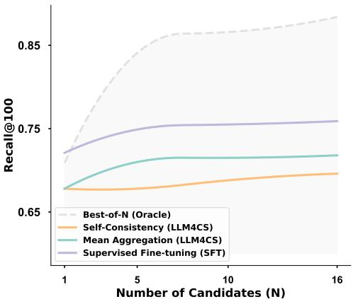
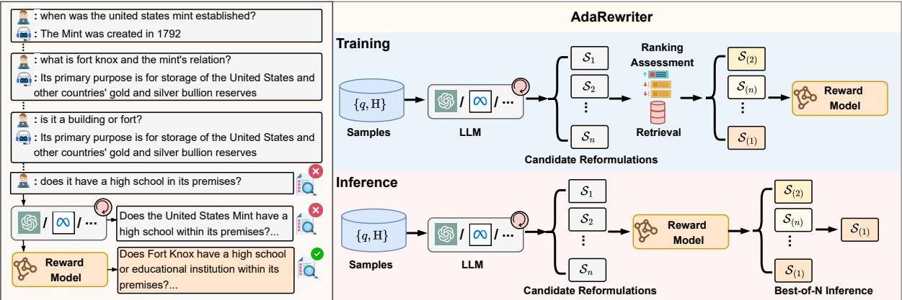
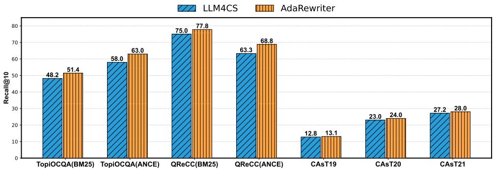
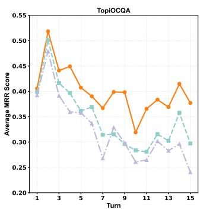
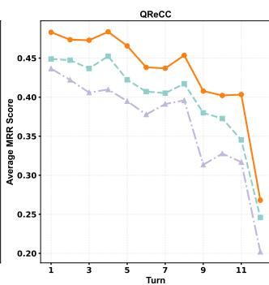
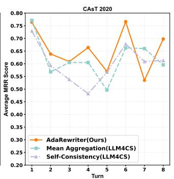
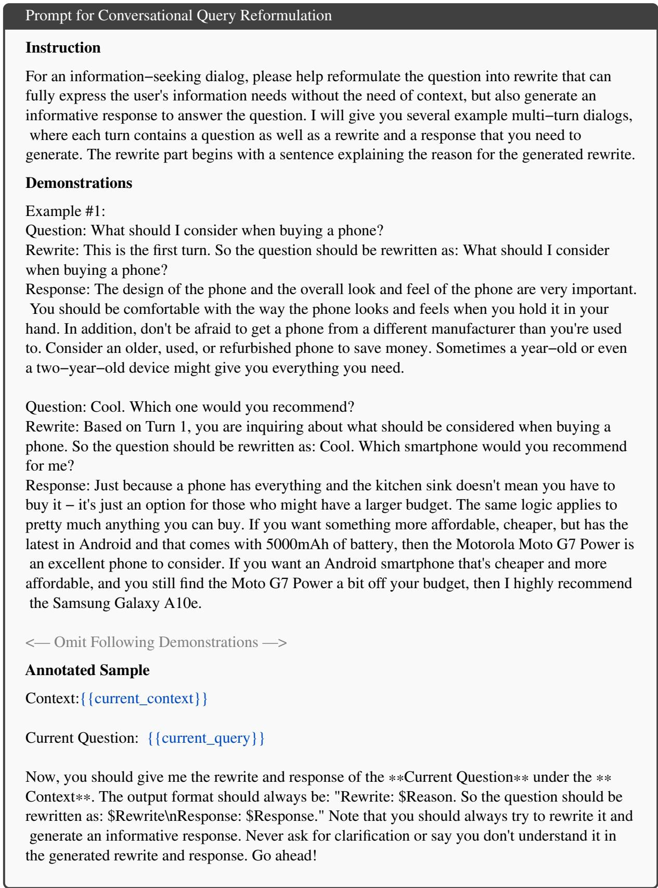
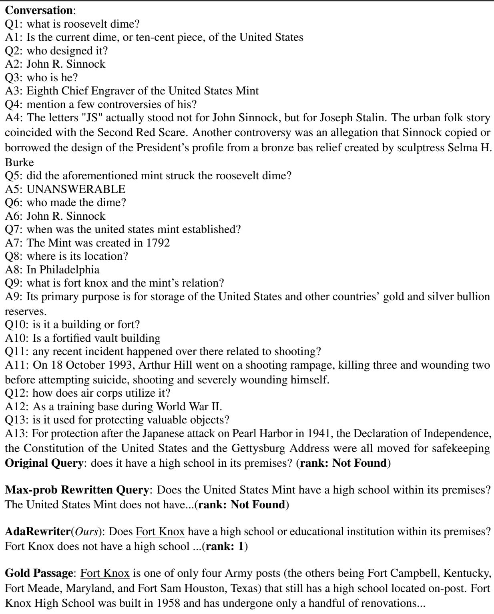

# AdaRewriter: Unleashing the Power of Prompting-based Conversational Query Reformulation via Test-Time Adaptation

Yilong Lai, Jialong Wu, Zhenglin Wang, Deyu Zhou

School of Computer Science and Engineering, Key Laboratory of Computer Network and Information Integration, Ministry of Education, Southeast University, China {yilong.lai, jialongwu, zhenglin, d.zhou}@seu.edu.cn

## Abstract

Prompting-based conversational query reformulation has emerged as a powerful approach for conversational search, refining ambiguous user queries into standalone search queries. Bestof-N reformulation over the generated candidates via prompting shows impressive potential scaling capability. However, both the previous tuning methods (training time) and adaptation approaches (test time) can not fully unleash their benefits. In this paper, we propose AdaRewriter, a novel framework for query reformulation using an outcome-supervised reward model via test-time adaptation. By training a lightweight reward model with contrastive ranking loss, AdaRewriter selects the most promising reformulation during inference. Notably, it can operate effectively in black-box systems, including commercial LLM APIs. Experiments on five conversational search datasets show that AdaRewriter significantly outperforms the existing methods across most settings, demonstrating the potential of test-time adaptation for conversational query reformulation.1

## 1 Introduction

The rapid advancement of Large Language Models (LLMs) has driven significant innovations in information retrieval (Zhao et al., 2023). Notably, conversational AI search engines (e.g., Perplexity and SearchGPT) have attracted considerable attention due to their potential to shape the next generation of information retrieval (Mo et al., 2025b,c).

A fundamental challenge of conversational search is understanding user intent by considering the historical context and the current query, as user inputs are often vague, ambiguous, or incomplete (Gao et al., 2023; Mo et al., 2025b). Two types of approaches have been proposed to tackle this challenge: (1) Conversation dense retrieval involves training a dense encoder to generate conversational session embeddings (Lin et al., 2021b; Mo et al., 2023b, 2024b, 2025a; Mao et al., 2024). However, it can not be compatible with sparse retrieval systems like BM25 and may suffer from limited interpretability (Cheng et al., 2024). (2) Conversational query reformulation is explored to derive the user’s search intent by turning the conversational context and current query into a standalone query. With the advancement of LLMs, promptingbased query reformulation has emerged as a powerful way (Mao et al., 2023b; Ye et al., 2023; Mo et al., 2024a). Previous studies have demonstrated the strong capability of the reformulation candidates generated through prompting, which have impressive potential scaling capability (Mo et al., 2024a; Lai et al., 2025).

  
Figure 1: Comparison of training time and testtime adaptation strategies on the TopiOCQA using LLaMA3.1-8B. Best-of-N (Oracle) refers to prompting the model N times and selecting the best-performing reformulation result.

As illustrated in Figure 1, Best-of-N promptingbased reformulation demonstrates strong scalability. However, simply supervised fine-tuning on the best reformulation at the training time has not yielded consistent performance gains, as described in Sec 4.4. Another approach is to scale up during test time, leveraging increased computational resources to enhance model performance (Snell et al., 2024). Mao et al. (2023b) investigate mean aggregation and self-consistency strategy (Wang et al., 2023) during test time; they still exhibit a significant gap from the upper bound, as shown in Figure 1. This suggests the potential of test-time scaling has yet to be fully realized. Based on these empirical observations, a natural question arises: How to design the appropriate test-time scaling paradigm to unleash the power ofprompting-based query reformulation?

In this work, we introduce AdaRewriter, leveraging an outcome-supervised reward model to unleash the power of prompting-based conversational query reformulation. Inspired by the effectiveness of the reward model at test time (Uesato et al., 2022; Shi et al., 2024), a lightweight, BERT-sized reward model is proposed and trained using a contrastive ranking loss as the reward of reformulation in CQR is implicit. During the inference stage, it serves as a scoring function to select the most promising reformulation. It should be pointed out that AdaRewriter can be seamlessly applied in black-box conversational search systems, particularly those utilizing commercial LLMs via API services.

AdaRewriter achieves excellent performance on five widely used conversation search datasets, including TopiOCQA (Adlakha et al., 2022), QReCC (Anantha et al., 2021), and TREC CAsT 2019, 2020 & 2021 (Dalton et al., 2020, 2021, 2022). Extensive experiments and analytical evaluations validate the effectiveness and robustness of AdaRewriter.

The contributions of this paper are threefold:

• To the best of our knowledge, we are the first to uncover and analyze the prompting-based query reformulation at test time under the Best-of-N paradigm.

• We propose AdaRewriter, a framework to unleash the power of prompting-based conversational query reformulation through an outcome-supervised reward model.

• Extensive experiments on several benchmark datasets demonstrate our proposed AdaRewriter outperforms existing methods across most settings, establishing its superiority in performance.

## 2 Preliminaries

## 2.1 Task Formulation

Conversational search systems aim to satisfy users information-seeking needs in a multi-turn conversational form (Gao et al., 2023; Mo et al., 2025b). Formally, given the current query $q ^ { k }$ and historical context $\mathbf { \check { H } } ^ { \check { k } - 1 } = \{ q ^ { i } , r ^ { i } \} _ { i = 1 } ^ { k - 1 }$ , the objective of these systems is to generate responses using the passages set $\mathrm { P } ^ { k }$ retrieved by an off-the-shelf retrieval system, where k is the k-th turn of a conversation2.

The conversational query reformulation task clarifies user intent by transforming the current query q and historical context H into a standalone query . Recent advancements in LLMs have made prompting-based CQR a promising approach, offering simplicity and superior performance. In this method, the reformulated query qˆ and the pseudoresponse rˆ are generated by LLM based on the task instructions  and few-shots examples , where each example consists of the whole conversation history and human-written turn-level query reformulation:

$$
\{ \hat { q } , \hat { r } \} = \mathrm { L L M } ( \mathcal { T } , \mathcal { D } , \{ q , \mathrm { H } \} )\tag{1}
$$

## 2.2 Potential of Best-of-N in CQR

Oracle We concatenate the reformulated query qˆ with the pseudo-response rˆ to form the reformulation query ${ \mathcal { S } } = { \hat { q } } \oplus { \hat { r } } ,$ representing the user’s search intent (Mo et al., 2023a). To fully explore the potential of multiple candidates, we generate a set of reformulation queries $\{ S _ { 1 } , \ldots , S _ { N } \}$ and evaluate them using the Best-of-N paradigm, aiming to investigate the upper bound performance based on gold passage labels. Figure 1 presents our preliminary results, indicating that the number of candidates improves performance.

Training Time Fine-tuning Supervised finetuning(SFT) with the best-performing oracle reformulation via rejection sampling is a straightforward approach to further enhance the performance of prompting-based query reformulation. However, it does not consistently lead to performance gains based on our practices, as shown in Sec 4.4.

Test Time Adaptation Previous work (Mao et al., 2023b) proposes a simple yet effective method that generates multiple candidates queryresponse pairs $\{ \hat { q } _ { 1 } , \hat { r } _ { 1 } \} , \{ \hat { q } _ { 2 } , \hat { r } _ { 2 } \} , \dots , \{ \hat { q } _ { N } , \hat { r } _ { N } \}$ and obtain the aggregated representation s in embedding space. Subsequently, the aggregated representation s, treated as the standalone query , is utilized in dense retrieval systems to retrieve relevant passages. However, this method and selfconsistency do not consistently lead to performance gains as the number of candidates increases, as shown in Figure 1.

  
Figure 2: Overview of AdaRewriter.

This motivates us to investigate prompting-based query reformulation further from the Best-of-N perspective. Building on these insights and recent advancements in test-time scaling, we propose AdaRewriter, which leverages an outcomesupervised reward model to unleash the full potential of prompting-based query reformulation.

## 3 Methodology

To uncover the potential of prompting-based query reformulation under the Best-of-N paradigm, we propose AdaRewriter as presented in Figure 2. Specifically, we leveraged a vanilla LLM to generate reformulation candidates and construct implicit reward signals to train the reward model based on end-to-end performance assessment, as detailed in §3.1. §3.2 introduces the improved promptingbased query reformulation approach under the Bestof-N paradigm during inference.

## 3.1 Reward Model Training

Constrative Ranking Loss Unlike traditional outcome-based methods that rely on binary classification labels, training a reward model for conversational query reformulation is non-trivial due to the absence of binary evaluation metrics in conversational search reformulation3. Without explicit reward, we leverage contrastive ranking loss, which is well-suited for tasks where relative ordering signals are much easier to obtain (Liu and Liu, 2021; Chuang et al., 2023). Specifically, the loss function targets to assign higher scores to top-ranked reformulations and lower scores to bottom-ranked ones:

$$
\mathcal { L } = \sum _ { i = 1 } ^ { n } \sum _ { j > i } \operatorname* { m a x } ( 0 , { r _ { j } } - { r _ { i } } + ( j - i ) \times \lambda )\tag{2}
$$

where $r _ { i }$ is the score of candidate reformulation $s _ { i }$ with rank i assigned by the trained reward model, λ is a hyperparameter controls the margin between the candidates. Despite the lack of explicit labels, this loss function can effectively optimize the model to distinguish the most promising reformulation based on the assigned score among candidate reformulations.

Candidates Generation To construct candidate reformulations $\{ S _ { 1 } , S _ { 2 } , \cdots , S _ { n } \}$ described in Eq. (2), a vanilla LLM is employed, which generate multiple candidtates $\{ S _ { ( 1 ) } , S _ { ( 2 ) } , \cdots , S _ { ( n ) } \}$ conditioned on a conversational session q, H . The generation process is guided by instructions  and few-shot examples :

$$
\{ S _ { ( 1 ) } , S _ { ( 2 ) } , \cdot \cdot \cdot , S _ { ( n ) } \} = \mathrm { L L M } ( \mathbb { Z } , \mathscr { D } , \{ q , \mathrm { H } \} )\tag{3}
$$

Ranking Assessment To rank the candidates, we utilize an end-to-end scoring function that combines multiple factors into a fusion score (Cormack et al., 2009; Lai et al., 2025):

$$
\mathrm { M } ( S _ { ( i ) } ) = \frac { 1 } { r _ { s } ( S _ { ( i ) } , p ) } + \frac { 1 } { r _ { d } ( S _ { ( i ) } , p ) }\tag{4}
$$

where $r _ { s } ( S _ { ( i ) } , p )$ denotes the corresponding rank with the gold passage p giving query $\mathcal { S } _ { ( i ) }$ in a dense retrieval system, and $r _ { s } ( S _ { ( i ) } , p )$ represents the rank in a sparse retrieval system. The candidate reformulation $\mathcal { S } _ { ( i ) }$ is subsequently assigned a rank j based on its performance according to the metric in Eq. (4), with higher ranks corresponding to better performance.

Therefore, the trained outcome-supervised reward model $g _ { \theta }$ based on a BERT-sized model can be trained by the contrastive ranking Loss. It can assess the quality of query $\boldsymbol { \mathcal { S } }$ generated by LLM conditioned on a conversational session q, H and return a score r:

$$
r = g _ { \boldsymbol { \theta } } ( S , \{ q , \mathrm { H } \} )\tag{5}
$$

## 3.2 Best-of-N Inference

Leveraging the outcome-supervised reward model $g _ { \theta }$ , our framework functions as a plug-and-play module to enhance prompting-based CQR during inference, adhering to the Best-of-N paradigm. Owing to test-time scalability, this module can be seamlessly integrated into a wide range of conversational search systems, regardless of whether the underlying large language model is deployed locally or accessed through commercial API services.

Specifically, given a conversational session $\{ \boldsymbol { q } , \mathrm { H } \}$ , the LLM generates multiple reformulation candidates $\{ S _ { ( 1 ) } , S _ { ( 2 ) } , \cdots , S _ { ( N ) } \}$ , as described in Eq. (3), where N is the budget parameter that is adjustable during inference. The reward model g then assigns scores to each candidate, and the highest-scoring candidate is selected as the most promising reformulation :

$$
{ \mathcal { S } } \gets S _ { ( k ) } , k = \operatorname * { a r g m a x } _ { j = 1 , \cdots , N } g _ { \theta } ( S _ { ( j ) } , \{ q , \mathrm { H } \} )\tag{6}
$$

The selected reformulation is subsequently treated as the refined representation of the user’s intent, leveraging the enhanced reasoning capabilities unlocked by our framework. The reformulation is then used to retrieve relevant passages, thereby improving the performance of conversational search systems.

## 4 Experiments

Datasets & Evaluation Metrics The training data for the outcome-supervised reward model is derived from two widely used conversational search datasets: TopiOCQA (Adlakha et al., 2022) and QReCC (Anantha et al., 2021). For evaluation, we use the test sets of TopiOCQA and QReCC. Additionally, to assess the zero-shot reformulation performance of our method, we conduct experiments on the TREC CAsT 2019, 2020, and 2021 datasets (Dalton et al., 2020, 2021, 2022). To evaluate the reformulation results, we adopt four standard metrics from information retrieval: MRR, NDCG@3, and Recall@10, which align with previous studies (Dalton et al., 2021; Yu et al., 2021; Mo et al., 2023a). Metric computation uses the pytrec\_eval tool (Van Gysel and de Rijke, 2018). Further details about the datasets can be found in the Appendix B.1.

Implementation Details In our prompting-based conversational query reformulation approach, we adopt the prompt used in Mao et al. (2023b), specifically the "rewrite-and-response" setting with chain-of-thought, which represents the most advanced configuration. For the backbone selection in Sec 3.1, we utilize Llama2-7B and Llama3.1-8B with a candidate size of N = 16 and a temperature setting of 0.7, in line with previous studies (Mao et al., 2023b; Mo et al., 2024a). The outcome-supervised reward model is based on a lightweight BERT variant, deberta-v3-base. For retrieval, we employ BM25 (Robertson et al., 2009) for sparse retrieval and ANCE (Xiong et al., 2020) for dense retrieval, consistent with prior work (Mo et al., 2023a; Mao et al., 2023b). The margin parameter λ in Eq. (2) is set to 0.1, determined through grid search. Further details about the implementation can be found in the Appendix B.2.

## 4.1 Baselines

We conducted the primary experiments utilizing open-source large language models (LLMs) Llama2-7B and Llama3.1-8B to demonstrate the effectiveness of AdaRewriter.

Our approach is compared with various conversational query reformulation frameworks, which can be categorized into fine-tuning and promptingbased methods. The fine-tuning-based methods include T5QR (Lin et al., 2020), CON-QRR (Wu et al., 2022), EDIRCS (Mao et al., 2023a), ConvGQR (Mo et al., 2023a), Iter-CQR (Jang et al., 2024), RetPO (Yoon et al., 2024), and AdaCQR (Lai et al., 2025), while the prompting-based methods comprise LLM-Aided (Ye et al., 2023), CHIQ (Mo et al., 2024a), and LLM4CS (Mao et al., 2023b). Following Mo et al. (2024a), we also compare with the framework that fine-tuned LLM-based retrievers, including RepLLama (Ma et al., 2024), E5-Mistral (Wang et al.,

<table><tr><td>Type</td><td></td><td></td><td></td><td>TopiOCQA</td><td></td><td></td><td>QReCC</td><td></td></tr><tr><td></td><td>Framework</td><td>Backbone</td><td>MRR</td><td>NDCG@3</td><td>R@10</td><td>MRR</td><td>NDCG@3</td><td>R@10</td></tr><tr><td rowspan="12">SPp 25)</td><td>T5QR</td><td>T5-base</td><td>11.3</td><td>9.8</td><td>22.1</td><td>33.4</td><td>30.2</td><td>53.8</td></tr><tr><td>CONQRR</td><td>T5-base</td><td>一</td><td>一</td><td></td><td>38.3</td><td></td><td>60.1</td></tr><tr><td>EDIRCS</td><td>T5-base</td><td></td><td></td><td></td><td>41.2</td><td></td><td>62.7</td></tr><tr><td>ConvGQR</td><td>T5-base</td><td>12.4</td><td>10.7</td><td>23.8</td><td>44.1</td><td>41.0</td><td>64.4</td></tr><tr><td>IterCQR</td><td>T5-base</td><td>16.5</td><td>14.9</td><td>29.3</td><td>46.7</td><td>44.1</td><td>64.4</td></tr><tr><td>AdaCQR</td><td>T5-base</td><td>17.8</td><td>15.8</td><td>34.1</td><td>52.4</td><td>49.9</td><td>70.9</td></tr><tr><td>RETPO AdaCQR+Expansion</td><td>Llama2-7B</td><td>28.3</td><td>26.5</td><td>48.3</td><td>50.0</td><td>47.3</td><td>69.5</td></tr><tr><td></td><td>Llama2-7B*</td><td>28.3</td><td>26.5</td><td>48.9</td><td>55.1</td><td>52.5</td><td>76.5</td></tr><tr><td>LLM-Aided</td><td>GPT3.5-Turbo</td><td></td><td></td><td></td><td>49.4</td><td>46.5</td><td>67.1</td></tr><tr><td>CHIQ-AD</td><td>Llama2-7B</td><td>22.5</td><td>20.5</td><td>40.4</td><td>53.1</td><td>50.7</td><td>77.2</td></tr><tr><td>CHIQ-Fusion LLM4CS</td><td>Llama2-7B* Llama3.1-8B</td><td>25.6 24.5</td><td>23.5 22.6</td><td>44.7 42.1</td><td>54.3 49.7</td><td>51.9 46.9</td><td>78.5 73.8</td></tr><tr><td>AdaRewriter (N=5)</td><td>Llama3.1-8B</td><td>28.2</td><td>26.2</td><td>48.3</td><td>54.0</td><td></td><td></td></tr><tr><td>AdaRewriter (N=16)</td><td>Llama2-7B</td><td>27.8</td><td>25.9</td><td>47.6</td><td>55.2</td><td>51.3 52.8</td><td>77.4</td></tr><tr><td>AdaRewriter (N=16)</td><td>Llama3.1-8B</td><td>30.7†</td><td>28.8†</td><td>51.3†</td><td>56.2†</td><td>53.8†</td><td>78.0 78.8†</td></tr><tr><td>T5QR COÑQRR</td><td>T5-base</td><td>23.0</td><td>22.2</td><td>37.6</td><td>34.5</td><td>31.8</td><td>53.1</td></tr><tr><td>DEu CE)</td><td>T5-base</td><td>一</td><td>一</td><td></td><td>41.8</td><td></td><td>65.1</td></tr><tr><td>EDIRČS IterCQR</td><td>T5-base</td><td></td><td></td><td></td><td>42.1</td><td></td><td>65.6</td></tr><tr><td></td><td>T5-base</td><td>26.3</td><td>25.1</td><td>42.6</td><td>42.9</td><td>40.2</td><td>65.5</td></tr><tr><td>ConvGQR</td><td>T5-base</td><td>25.6</td><td>24.3</td><td>41.8</td><td>42.0</td><td>39.1</td><td>63.5</td></tr><tr><td>AdaCQR</td><td>T5-base</td><td>32.8</td><td>31.5</td><td>54.6</td><td>45.1</td><td>42.4</td><td>66.3</td></tr><tr><td>RETPO</td><td>Llama2-7B</td><td>30.0</td><td>28.9</td><td>49.6</td><td>44.0</td><td>41.1</td><td>66.7</td></tr><tr><td>AdaCQR+Expansion</td><td>Llama2-7B*</td><td>38.5</td><td>37.6</td><td>58.4</td><td>45.8</td><td>42.9</td><td>67.3</td></tr><tr><td>LLM-Aided</td><td>GPT3.5-Turbo</td><td></td><td></td><td></td><td>43.5</td><td>41.3</td><td></td></tr><tr><td>CHIQ-AD</td><td>Llama2-7B</td><td>33.2</td><td>32.2</td><td>53.0</td><td>47.0</td><td>44.6</td><td>65.6 70.8</td></tr><tr><td>CHIQ-Fusion</td><td>Llama2-7B*</td><td>38.0</td><td>37.0</td><td>61.6</td><td>47.2</td><td>44.2</td><td>70.7</td></tr><tr><td>LLM4CS(N=5)</td><td>Llama3.1-8B</td><td>34.6</td><td>33.5</td><td>54.3</td><td>42.6</td><td>40.0</td><td>64.0</td></tr><tr><td>LLM4CS(N=16)</td><td>Llama2-7B</td><td>33.5</td><td>33.1</td><td>53.0</td><td>43.0</td><td>40.5</td><td></td></tr><tr><td>LLM4CS(N=16)</td><td>Llama3.1-8B</td><td>35.4</td><td>34.5</td><td></td><td></td><td></td><td>64.8</td></tr><tr><td>AdaRewriter (N=5)</td><td>Llama3.1-8B</td><td>38.9</td><td>37.9</td><td>55.1 59.6</td><td>43.2 46.1</td><td>40.7 43.4</td><td>64.6 69.2</td></tr><tr><td>AdaRewriter (N=16)</td><td>Llama2-7B</td><td>38.2</td><td>37.1</td><td>58.0</td><td>47.2</td><td>44.4</td><td>69.0</td></tr><tr><td>AdaRewriter (N=16)</td><td>Llama3.1-8B</td><td>40.3†</td><td>39.7†</td><td>61.9†</td><td>47.5</td><td>44.7†</td><td>69.8</td></tr></table>

Table 1: Evaluation results of various retrieval system types on the QReCC and TopiOCQA. The best results among all methods are bolded, and the second-best results are underlined. ∗ denotes including fused results from a trained T5-based model. denotes significant improvements with t-test at p < 0.05 over all compared baselines.

2024), and LLM-Embedder (Zhang et al., 2023). Additionally, we reproduce LLM4CS, a representative ensemble-based approach for CQR, which leverages the same LLM backbones as our method while varying the budget parameter N, to enable a fair and comprehensive comparison.

The Appendix C presents comprehensive details of all the baseline methods. We also include the comparison with the Conversational Dense Retrieval(CDR) methods in Appendix A.2.

## 4.2 Main Results

We evaluate our method on two benchmarks, TopiOCQA and QReCC, under both sparse and dense retrieval settings. As shown in Table 1, AdaRewriter consistently outperforms baseline models across almost all scenarios.

On TopiOCQA with sparse retrieval, AdaRewriter (N=16) achieves MRR of 30.7, significantly outperforming LLM4CS’s 24.5. In the dense setting (ANCE), it also surpasses

LLM4CS with an MRR of 40.3 vs. 35.4. Performance further improves with larger candidate sets. For example, on QReCC (sparse), MRR increases from 54.0 (N=5) to 56.2 (N=16). This suggests that AdaRewriter effectively utilizes candidate reformulations, thereby enhancing the model’s ability to select the most promising one. Similar trends are observed on the Llama2-7B.

Overall, AdaRewriter demonstrates strong adaptability to different retrieval conditions and benefits from scaling the number of candidate reformulations, offering an advantage in tasks requiring broader data exploration.

## 4.3 Zero-shot Results

In the zero-shot experiments conducted on the TREC CAsT 2019, 2020, and 2021 datasets, our proposed AdaRewriter consistently outperforms existing baselines across various budget parameters N, as shown in Table 2.

Specifically, AdaRewriter achieves significant improvements on most metrics across all three datasets. For CAsT 2021, AdaRewriter yields strong gains in R@10, although its NDCG@3 performance is slightly lower. Despite this, our framework continues to exhibit considerable strength and robustness, confirming its capability to excel in retrieval performance and highlighting its robustness and adaptability across various datasets.

<table><tr><td></td><td></td><td colspan="2">CAsT-19</td><td colspan="2">CAsT-20</td><td colspan="2">CAsT-21</td></tr><tr><td>Framework</td><td>Backbone</td><td>NDCG@3</td><td>R@10</td><td>MRR</td><td>NDCG@3</td><td>R@10</td><td>NDCG@3</td><td>R@10</td></tr><tr><td>T5QR</td><td>T5-base</td><td>41.7</td><td></td><td>42.3</td><td>29.9</td><td></td><td>33.0</td><td></td></tr><tr><td>ConvGQR</td><td>T5-base</td><td>43.4</td><td></td><td>46.5</td><td>33.1</td><td></td><td>27.3</td><td></td></tr><tr><td>RepLLama</td><td>Llama2-7B</td><td>31.6</td><td>10.6</td><td>26.8</td><td>18.3</td><td>10.4</td><td>32.7</td><td>19.6</td></tr><tr><td>E5-Mistral</td><td>Mistral2-7B</td><td>31.3</td><td>9.5</td><td>22.0</td><td>15.4</td><td>8.4</td><td>32.5</td><td>20.5</td></tr><tr><td>LLM-Embedder</td><td>Llama2-7B</td><td>36.6</td><td>11.4</td><td>25.2</td><td>15.4</td><td>8.7</td><td>31.2</td><td>17.3</td></tr><tr><td>AdaCQR+Expansion</td><td>Llama2-7B*</td><td>48.5</td><td>13.0</td><td>56.6</td><td>38.5</td><td>19.2</td><td>45.6</td><td>25.0</td></tr><tr><td>CHIQ-Fusion</td><td>Llama2-7B*</td><td>50.5</td><td>12.9</td><td>54.0</td><td>38.0</td><td>19.3</td><td>46.5</td><td>25.2</td></tr><tr><td>LLM4CS (N=5)</td><td>Llama3.1-8B</td><td>44.4</td><td>11.5</td><td>61.7</td><td>44.8</td><td>23.0</td><td>50.5</td><td>25.7</td></tr><tr><td>LLM4CS (N=10)</td><td>Llama3.1-8B</td><td>45.5</td><td>11.9</td><td>61.9</td><td>46.0</td><td>23.2</td><td>51.5</td><td>25.8</td></tr><tr><td>AdaRewriter (N=5)</td><td>Llama3.1-8B</td><td>46.6</td><td>12.6</td><td>62.0</td><td>45.6</td><td>22.6</td><td>49.5</td><td>26.5</td></tr><tr><td>AdaRewriter (N=10)</td><td>Llama2-7B</td><td>48.0</td><td>12.7</td><td>59.3</td><td>44.5</td><td>20.2</td><td>47.7</td><td>25.9</td></tr><tr><td>AdaRewriter (N=10)</td><td>Llama3.1-8B</td><td>48.3</td><td>13.0</td><td>63.0†</td><td>46.5†</td><td>21.6</td><td>49.7</td><td>27.2†</td></tr></table>

Table 2: Zero-shot experiment results on TREC CAsT 2019, 2020 & 2021 datasets. The best results among all methods with similar settings are bolded, and the second-best results are underlined. ∗ denotes including fused results from a trained T5-based model. denotes significant improvements with t-test at $p < 0 . 0 5$ over all compared baselines.

## 4.4 Comparison with Training-time Tuning

To fully investigate the benefit of test-time adaptation, we compare our proposed AdaRewriter with three strong training-time baselines: supervised fine-tuning (SFT), SFT with Chain-of-Thoughts(CoT) (Wei et al., 2022), and direct preference optimization(DPO) (Rafailov et al., 2023). All methods generate N = 16 candidate reformulations on the TopiOCQA dataset for a fair comparison. SFT employs rejection sampling by selecting the best-performing candidates for fine-tuning. Building on vanilla SFT, we further incorporate chain-of-thought into the training labels, resulting in SFT with CoT. DPO treats the best and worst candidates as chosen and rejected samples, respectively.

As shown in Table 3, AdaRewriter consistently outperforms the strong baselines in the datasets. Notably, on CAsT 2020, it achieves an MRR of 63.0, compared to 59.1 for SFT and 60.7 for DPO, demonstrating its robustness, especially on outof-domain data. These results highlight the effectiveness of test-time adaptation and confirm AdaRewriter’s advantage in generating more relevant query reformulations. We provide some details for the setup of SFT and DPO in the Ap-

<table><tr><td></td><td>TopiOCQA MRR R@10</td><td>CAsT 20 R@10</td></tr><tr><td>SFT</td><td>39.2 59.4</td><td>59.1</td></tr><tr><td>SFT with CoT</td><td>38.1 58.0</td><td>57.7</td></tr><tr><td>DPO</td><td>39.1 59.8</td><td>60.7</td></tr><tr><td>AdaRewriter</td><td>40.3 61.9</td><td>63.0</td></tr></table>

Table 3: Comparison with Training-time Tuning

## pendix B.3.

## 5 Analysis

In this section, we present a series of comprehensive experiments that aim to provide an in-depth analysis of the proposed AdaRewriter. Specifically, we investigate its effectiveness in addressing the following Research Questions (RQs):

• RQ1: Can AdaRewriter be applied to blackbox commercial LLMs?

• RQ2: Does the conversational context H influence the score assigned to a reformulation query ?

• RQ3: How do the components (e.g., ranking loss, ranking assessment) impact the learning objectives of AdaRewriter?

• RQ4: Does AdaRewriter enhance the robustness of CQR in long conversations?

We also provide further discussions in Appendix A.

## 5.1 Adaptation in Black-Box Models

Building on the concept of test-time adaptation, our proposed AdaRewriter framework seamlessly integrates with conversational search systems that leverage commercial black-box LLMs, particularly those utilizing API services.

  
Figure 3: Performance comparsion on black-box model GPT4o-mini. We use N = 5 for inference.

To answer RQ1, Figure 3 presents evaluation results on the TopiOCQA, QReCC, and zero-shot datasets to validate AdaRewriter’s effectiveness. Experimental results show that AdaRewriter consistently enhances the performance of commercial LLMs, such as GPT4o-mini, across most evaluation metrics, even when trained on data generated by open-source LLMs. For instance, compared to the baseline, AdaRewriter boosts the R@10 from 48.2 to 51.4 in sparse retrieval and from 58.0 to 63.0 in dense retrieval on the TopiCOQA dataset. Additionally, our framework demonstrates robust improvements on zero-shot datasets using commercial LLMs, as shown in Figure 3.

These results prove that AdaRewriter effectively boosts the commercial LLMs like GPT4o-mini, even with training data from open-source models, highlighting the robustness and promise of testtime adaptation for conversational query reformulation.

## 5.2 Contextual Dependency in Scoring

To investigate RQ2, we begin by examining the relationship between conversational history and reformulation query scoring. In conversational search systems, the meaning and relevance of a query can vary significantly depending on the context in which it is presented. Specifically, the conversational context H provides essential information about the ongoing conversation, such as user intent and topics, which may influence how a reformulated query is assessed.

To assess the impact of context H in our proposed framework, we conduct an ablation study in Table 4 ( w/o. Context H ), in which the conversational context H is removed from the outcomesupervised reward model during both training and inference. The results reveal a significant drop in model performance when the context is excluded, showing the pivotal role of conversational context in guiding the outcome-supervised reward model’s scoring of reformulated queries.

<table><tr><td>Type</td><td>Abaltion Variants</td><td>MRR</td><td>R@10</td></tr><tr><td rowspan="4">Sparse</td><td>AdaRewriter (Ours)</td><td>30.7</td><td>51.3</td></tr><tr><td>w/o. Context H</td><td>27.3</td><td>44.9</td></tr><tr><td>w/o. Ranking Loss</td><td>24.6</td><td>43.0</td></tr><tr><td>w/o. Rank Assessment</td><td>23.8</td><td>41.8</td></tr><tr><td rowspan="4">Dense</td><td>AdaRewriter (Ours)</td><td>40.3</td><td>61.9</td></tr><tr><td>w/o. Context H</td><td>36.2</td><td>56.4</td></tr><tr><td>w/o. Ranking Loss</td><td>34.4</td><td>53.2</td></tr><tr><td>w/o. Ranking Assessment</td><td>32.8</td><td>51.5</td></tr></table>

Table 4: Ablation study for the learning objective and contextual dependency of AdaRewriter on TopiOCQA dataset. We use LLama3.1-8B and N = 16 for inference.

## 5.3 Influence of the Learning Objective

To investigate the individual contributions of our reward model’s learning objectives as addressed in RQ3, we conduct an ablation study.

Specifically, we evaluate two variants: (1) w/o Ranking Loss , where the ranking loss is replaced by a cross-entropy loss assigning the true label the top rank and the false label to the bottom; and (2) w/o Ranking Assessment , where candidate reformulations are randomly ordered instead of ranked.

Table 4 shows the results of these variants. Notably, the MRR in the dense retrieval drops from 40.3 to 34.4 when the ranking loss is removed, and also decreases to 32.8 when the ranking assessment is omitted. These findings demonstrate that both the contrastive loss and the ranking assessment are crucial for achieving strong performance, highlighting the importance of our proposed learning objectives for the reward model.

## 5.4 Robustness in Long Conversation

One of the primary challenges in conversational search systems is sustaining performance in extended conversation, as highlighted by RQ4. To answer this question, we assess the robustness of our proposed method across three datasets, which include TopiOCQA, QReCC, and TREC CAsT 2020. The results, presented in Figure 4, reveal that as the length of the conversation increases, performance across all methods experiences a notable decline. This suggests that long conversations still present a challenge for current CQR methods.

  
Figure 4: Turn-round performance comparison on TopiOCQA, QReCC, and TREC CAsT 2020.

Despite this general decline in performance, AdaRewriter consistently outperforms the other baselines across all conversation turns. Notably, even as the dialogue length increases, AdaRewriter maintains a higher performance compared to Mean Aggregation and Self-Consistency proposed by Mao et al. (2023b), which demonstrates a more substantial drop in effectiveness. This behavior suggests that AdaRewriter is more robust to the degradation typically observed in long conversations.

## 6 Related Works

Conversational Query Reformulation Query reformulation plays a crucial role in conversational search systems, addressing the inherent complexity of user intent, which often involves semantic challenges such as anaphora and ellipsis (Gao et al., 2023; Mo et al., 2025b). Current conversational query reformulation adopts hybrid approaches that combine query rewriting and query expansion, as exemplified by Mo et al. (2023a). In the era of LLMs, prompting-based query reformulation has garnered significant attention due to its simplicity and superior performance. Ye et al. (2023) treats LLMs as both query rewriters and rewrite editors, following a “rewrite-then-edit” paradigm to refine reformulations. Mao et al. (2023b) further explores advanced prompting strategies, such as few-shot learning, chain-of-thought reasoning, and self-consistency, demonstrating the remarkable efficacy of prompting-based approaches. Kostric and Balog (2024) leverages the beam search score of multiple rewrites and aggregates them with their scores for both sparse and dense retrieval in an unsupervised manner. Building on these developments, Mo et al. (2024a) proposed a two-step method that leverages the basic capabilities of opensource LLMs to enhance the conversational history for conducting query reformulation.

Test-time Supervision and Scaling Enhancing LLMs through test-time supervision and scaling test-time computation represents a promising direction for building robust and self-improving agent systems (Snell et al., 2024). A series of works have focused on improving the reasoning capabilities of LLMs by incorporating reward model supervision during test-time inference (Uesato et al., 2022; Lightman et al., 2023). In addition to these methods, test-time supervision has been proposed to improve the performance of LLMs in specific target domains using lightweight adapters (Sun et al., 2024b; Zhuang et al., 2024; Shi et al., 2024). For example, Shi et al. (2024) employs a lightweight model to rank outputs generated by LLMs in the medical domain, enhancing the domain-specific performance.

However, based on our empirical observations, the ability of LLMs in the context of conversational search remains insufficiently explored. To address this limitation, we propose leveraging a contrastive ranking loss to effectively train a lightweight reward model, unlocking LLM’s reasoning capability in conversational search. To the best of our knowledge, we are the first to uncover and analyze the prompting-based conversational query reformulation at test time under the Best-of-N paradigm.

## 7 Conclusion

In this paper, we aim to unleash the power of prompting-based query reformulation at test time within the Best-of-N paradigm. Therefore, we propose AdaRewriter, a framework that effectively uses a lightweight outcome-supervised reward model as a scoring function to select the most promising reformulation. Extensive experimental evaluations across several benchmark datasets demonstrate that AdaRewriter consistently outperforms existing methods in most settings. These contributions advance the understanding of user intent in conversational search systems and improve the effectiveness of prompting-based query reformulation.

## Limitation

We identify the below limitations in AdaRewriter:

Although the reward model is lightweight and the latency of AdaRewriter is comparable to that of previous work (Mao et al., 2023b), the primary latency bottleneck stems from the process of generating multiple reformulation candidates using LLMs. Despite this, we believe that improving prompting-based query reformulation through testtime adaptation shows considerable potential, as it combines both simplicity and effectiveness. This approach may reduce the need for extensive passage re-ranking. Additionally, test-time adaptation and scaling offer promising results, particularly with the Best-of-N paradigm, which has demonstrated superior performance across various tasks (Snell et al., 2024).

To further reduce latency, our method could benefit from applying existing inference acceleration techniques (Sun et al., 2024a; Wang et al., 2025). A key trade-off also exists between computational cost and latency, specifically when increasing the number of candidates N. A more efficient strategy may involve dynamically allocating computational resources based on reformulation task difficulty, i.e., generating more candidates for complex scenarios and fewer for simpler ones.

Lastly, due to budget constraints, while we have demonstrated the effectiveness of AdaRewriter on black-box commercial LLMs, we have been unable to evaluate its performance with a larger candidate set N.

## Acknowledgments

The authors would like to thank the anonymous reviewers for their insightful comments. This work is funded by the National Natural Science Foundation of China (Grant No.62176053). This work is supported by the Big Data Computing Center of Southeast University.

## References

Vaibhav Adlakha, Shehzaad Dhuliawala, Kaheer Suleman, Harm de Vries, and Siva Reddy. 2022. TopiOCQA: Open-domain conversational question answering with topic switching. Transactions of the Associationfor Computational Linguistics, 10:468– 483.

Raviteja Anantha, Svitlana Vakulenko, Zhucheng Tu, Shayne Longpre, Stephen Pulman, and Srinivas Chappidi. 2021. Open-domain question answering goes conversational via question rewriting. In Proceedings ofthe 2021 Conference ofthe North American Chapter of the Association for Computational Linguistics: Human Language Technologies, pages 520–534, Online. Association for Computational Linguistics.

Haonan Chen, Zhicheng Dou, Kelong Mao, Jiongnan Liu, and Ziliang Zhao. 2024. Generalizing conversational dense retrieval via LLM-cognition data augmentation. In Proceedings of the 62nd Annual Meeting of the Association for Computational Linguistics (Volume 1: Long Papers), pages 2700–2718, Bangkok, Thailand. Association for Computational Linguistics.

Yiruo Cheng, Kelong Mao, and Zhicheng Dou. 2024. Interpreting conversational dense retrieval by rewritingenhanced inversion of session embedding. In Proceedings ofthe 62nd Annual Meeting ofthe Associationfor Computational Linguistics (Volume 1: Long Papers), pages 2879–2893, Bangkok, Thailand. Association for Computational Linguistics.

Yung-Sung Chuang, Wei Fang, Shang-Wen Li, Wen-tau Yih, and James Glass. 2023. Expand, rerank, and retrieve: Query reranking for open-domain question answering. In Findings ofthe Associationfor Computational Linguistics: ACL 2023, pages 12131–12147, Toronto, Canada. Association for Computational Linguistics.

Gordon V Cormack, Charles LA Clarke, and Stefan Buettcher. 2009. Reciprocal rank fusion outperforms condorcet and individual rank learning methods. In Proceedings of the 32nd international ACM SIGIR conference on Research and development in information retrieval, pages 758–759.

Jeffrey Dalton, Chenyan Xiong, and Jamie Callan. 2020. Cast 2019: The conversational assistance track overview. In In Proceedings of TREC.

Jeffrey Dalton, Chenyan Xiong, and Jamie Callan. 2021. Cast 2020: The conversational assistance track overview. In In Proceedings ofTREC.

Jeffrey Dalton, Chenyan Xiong, and Jamie Callan. 2022. Trec cast 2021: The conversational assistance track overview. In In Proceedings ofTREC.

Thibault Formal, Benjamin Piwowarski, and Stéphane Clinchant. 2021. Splade: Sparse lexical and expansion model for first stage ranking. In Proceedings

ofthe 44th International ACM SIGIR Conference on Research and Development in Information Retrieval, SIGIR ’21, page 2288–2292, New York, NY, USA. Association for Computing Machinery.

Jianfeng Gao, Chenyan Xiong, Paul Bennett, and Nick Craswell. 2023. Neural approaches to conversational information retrieval, volume 44. Springer Nature.

Yunah Jang, Kang-il Lee, Hyunkyung Bae, Hwanhee Lee, and Kyomin Jung. 2024. IterCQR: Iterative conversational query reformulation with retrieval guidance. In Proceedings ofthe 2024 Conference ofthe North American Chapter ofthe Associationfor Computational Linguistics: Human Language Technologies (Volume 1: Long Papers), pages 8121–8138, Mexico City, Mexico. Association for Computational Linguistics.

Zhuoran Jin, Pengfei Cao, Yubo Chen, Kang Liu, and Jun Zhao. 2023. InstructoR: Instructing unsupervised conversational dense retrieval with large language models. In Findings of the Association for Computational Linguistics: EMNLP 2023, pages 6649–6675, Singapore. Association for Computational Linguistics.

Jeff Johnson, Matthijs Douze, and Hervé Jégou. 2019. Billion-scale similarity search with GPUs. IEEE Transactions on Big Data, 7(3):535–547.

Ivica Kostric and Krisztian Balog. 2024. A surprisingly simple yet effective multi-query rewriting method for conversational passage retrieval. In Proceedings of the 47th International ACM SIGIR Conference on Research and Development in Information Retrieval, SIGIR ’24, page 2271–2275, New York, NY, USA. Association for Computing Machinery.

Woosuk Kwon, Zhuohan Li, Siyuan Zhuang, Ying Sheng, Lianmin Zheng, Cody Hao Yu, Joseph E. Gonzalez, Hao Zhang, and Ion Stoica. 2023. Efficient memory management for large language model serving with pagedattention. In Proceedings of the ACM SIGOPS 29th Symposium on Operating Systems Principles.

Yilong Lai, Jialong Wu, Congzhi Zhang, Haowen Sun, and Deyu Zhou. 2025. AdaCQR: Enhancing query reformulation for conversational search via sparse and dense retrieval alignment. In Proceedings of the 31st International Conference on Computational Linguistics, pages 7698–7720, Abu Dhabi, UAE. Association for Computational Linguistics.

Hunter Lightman, Vineet Kosaraju, Yura Burda, Harri Edwards, Bowen Baker, Teddy Lee, Jan Leike, John Schulman, Ilya Sutskever, and Karl Cobbe. 2023. Let’s verify step by step. arXiv preprint arXiv:2305.20050.

Jimmy Lin, Xueguang Ma, Sheng-Chieh Lin, Jheng-Hong Yang, Ronak Pradeep, and Rodrigo Nogueira. 2021a. Pyserini: A Python toolkit for reproducible information retrieval research with sparse and dense

representations. In Proceedings ofthe 44th Annual International ACM SIGIR Conference on Research and Development in Information Retrieval (SIGIR 2021), pages 2356–2362.

Sheng-Chieh Lin, Jheng-Hong Yang, and Jimmy Lin. 2021b. Contextualized query embeddings for conversational search. In Proceedings ofthe 2021 Conference on Empirical Methods in Natural Language Processing, pages 1004–1015, Online and Punta Cana, Dominican Republic. Association for Computational Linguistics.

Sheng-Chieh Lin, Jheng-Hong Yang, Rodrigo Nogueira, Ming-Feng Tsai, Chuan-Ju Wang, and Jimmy Lin. 2020. Conversational question reformulation via sequence-to-sequence architectures and pretrained language models. arXiv preprint arXiv:2004.01909.

Yixin Liu and Pengfei Liu. 2021. SimCLS: A simple framework for contrastive learning of abstractive summarization. In Proceedings of the 59th Annual Meeting of the Association for Computational Linguistics and the 11th International Joint Conference on Natural Language Processing (Volume 2: Short Papers), pages 1065–1072, Online. Association for Computational Linguistics.

Xueguang Ma, Liang Wang, Nan Yang, Furu Wei, and Jimmy Lin. 2024. Fine-tuning llama for multi-stage text retrieval. In Proceedings of the 47th International ACM SIGIR Conference on Research and Development in Information Retrieval, SIGIR ’24, page 2421–2425, New York, NY, USA. Association for Computing Machinery.

Kelong Mao, Chenlong Deng, Haonan Chen, Fengran Mo, Zheng Liu, Tetsuya Sakai, and Zhicheng Dou. 2024. ChatRetriever: Adapting large language models for generalized and robust conversational dense retrieval. In Proceedings ofthe 2024 Conference on Empirical Methods in Natural Language Processing, pages 1227–1240, Miami, Florida, USA. Association for Computational Linguistics.

Kelong Mao, Zhicheng Dou, Bang Liu, Hongjin Qian, Fengran Mo, Xiangli Wu, Xiaohua Cheng, and Zhao Cao. 2023a. Search-oriented conversational query editing. In Findings of the Association for Computational Linguistics: ACL 2023, pages 4160–4172, Toronto, Canada. Association for Computational Linguistics.

Kelong Mao, Zhicheng Dou, Fengran Mo, Jiewen Hou, Haonan Chen, and Hongjin Qian. 2023b. Large language models know your contextual search intent: A prompting framework for conversational search. In Findings of the Association for Computational Linguistics: EMNLP 2023, pages 1211–1225, Singapore. Association for Computational Linguistics.

Kelong Mao, Hongjin Qian, Fengran Mo, Zhicheng Dou, Bang Liu, Xiaohua Cheng, and Zhao Cao. 2023c. Learning denoised and interpretable session representation for conversational search. In Proceedings ofthe ACM Web Conference 2023, WWW ’23,

page 3193–3202, New York, NY, USA. Association for Computing Machinery.

Fengran Mo, Yifan Gao, Chuan Meng, Xin Liu, Zhuofeng Wu, Kelong Mao, Zhengyang Wang, Pei Chen, Zheng Li, Xian Li, Bing Yin, and Meng Jiang. 2025a. UniConv: Unifying retrieval and response generation for large language models in conversations. In Proceedings ofthe 63rd Annual Meeting of the Association for Computational Linguistics (Volume 1: Long Papers), pages 6936–6949, Vienna, Austria. Association for Computational Linguistics.

Fengran Mo, Abbas Ghaddar, Kelong Mao, Mehdi Rezagholizadeh, Boxing Chen, Qun Liu, and Jian-Yun Nie. 2024a. CHIQ: Contextual history enhancement for improving query rewriting in conversational search. In Proceedings of the 2024 Conference on Empirical Methods in Natural Language Processing, pages 2253–2268, Miami, Florida, USA. Association for Computational Linguistics.

Fengran Mo, Kelong Mao, Ziliang Zhao, Hongjin Qian, Haonan Chen, Yiruo Cheng, Xiaoxi Li, Yutao Zhu, Zhicheng Dou, and Jian-Yun Nie. 2025b. A survey of conversational search. ACM Trans. Inf. Syst. Just Accepted.

Fengran Mo, Kelong Mao, Yutao Zhu, Yihong Wu, Kaiyu Huang, and Jian-Yun Nie. 2023a. ConvGQR: Generative query reformulation for conversational search. In Proceedings of the 61st Annual Meeting of the Associationfor Computational Linguistics (Volume 1: Long Papers), pages 4998–5012, Toronto, Canada. Association for Computational Linguistics.

Fengran Mo, Chuan Meng, Mohammad Aliannejadi, and Jian-Yun Nie. 2025c. Conversational search: From fundamentals to frontiers in the llm era. In Proceedings of the 48th International ACM SIGIR Conference on Research and Development in Information Retrieval, SIGIR ’25, page 4094–4097, New York, NY, USA. Association for Computing Machinery.

Fengran Mo, Jian-Yun Nie, Kaiyu Huang, Kelong Mao, Yutao Zhu, Peng Li, and Yang Liu. 2023b. Learning to relate to previous turns in conversational search. In Proceedings ofthe 29th ACM SIGKDD Conference on Knowledge Discovery and Data Mining, KDD ’23, page 1722–1732, New York, NY, USA. Association for Computing Machinery.

Fengran Mo, Chen Qu, Kelong Mao, Tianyu Zhu, Zhan Su, Kaiyu Huang, and Jian-Yun Nie. 2024b. Historyaware conversational dense retrieval. In Findings of the Associationfor Computational Linguistics ACL 2024, pages 13366–13378, Bangkok, Thailand and virtual meeting. Association for Computational Linguistics.

OpenAI. 2022. Introducing chatgpt. https://openai. com/blog/chatgpt. Accessed: 2024-02-06.

Rafael Rafailov, Archit Sharma, Eric Mitchell, Christopher D Manning, Stefano Ermon, and Chelsea Finn.

2023. Direct preference optimization: Your language model is secretly a reward model. In Advances in Neural Information Processing Systems, volume 36, pages 53728–53741. Curran Associates, Inc.

Colin Raffel, Noam Shazeer, Adam Roberts, Katherine Lee, Sharan Narang, Michael Matena, Yanqi Zhou, Wei Li, and Peter J Liu. 2020. Exploring the limits of transfer learning with a unified text-to-text transformer. Journal ofmachine learning research, 21(140):1–67.

Stephen Robertson, Hugo Zaragoza, et al. 2009. The probabilistic relevance framework: Bm25 and beyond. Foundations and Trends® in Information Retrieval, 3(4):333–389.

Wenqi Shi, Ran Xu, Yuchen Zhuang, Yue Yu, Haotian Sun, Hang Wu, Carl Yang, and May Dongmei Wang. 2024. MedAdapter: Efficient test-time adaptation of large language models towards medical reasoning. In Proceedings of the 2024 Conference on Empirical Methods in Natural Language Processing, pages 22294–22314, Miami, Florida, USA. Association for Computational Linguistics.

Charlie Snell, Jaehoon Lee, Kelvin Xu, and Aviral Kumar. 2024. Scaling llm test-time compute optimally can be more effective than scaling model parameters. arXiv preprint arXiv:2408.03314.

Hanshi Sun, Momin Haider, Ruiqi Zhang, Huitao Yang, Jiahao Qiu, Ming Yin, Mengdi Wang, Peter Bartlett, and Andrea Zanette. 2024a. Fast best-of-n decoding via speculative rejection. In The Thirty-eighth Annual Conference on Neural Information Processing Systems.

Haotian Sun, Yuchen Zhuang, Wei Wei, Chao Zhang, and Bo Dai. 2024b. BBox-adapter: Lightweight adapting for black-box large language models. In Forty-first International Conference on Machine Learning.

Jonathan Uesato, Nate Kushman, Ramana Kumar, Francis Song, Noah Siegel, Lisa Wang, Antonia Creswell, Geoffrey Irving, and Irina Higgins. 2022. Solving math word problems with process-and outcomebased feedback. arXiv preprint arXiv:2211.14275.

Christophe Van Gysel and Maarten de Rijke. 2018. Pytrec\_eval: An extremely fast python interface to trec\_eval. In SIGIR. ACM.

Liang Wang, Nan Yang, Xiaolong Huang, Linjun Yang, Rangan Majumder, and Furu Wei. 2024. Improving text embeddings with large language models. In Proceedings ofthe 62nd Annual Meeting ofthe Association for Computational Linguistics (Volume 1: Long Papers), pages 11897–11916, Bangkok, Thailand. Association for Computational Linguistics.

Xuezhi Wang, Jason Wei, Dale Schuurmans, Quoc V Le, Ed H. Chi, Sharan Narang, Aakanksha Chowdhery, and Denny Zhou. 2023. Self-consistency improves chain of thought reasoning in language models. In

The Eleventh International Conference on Learning Representations.

Zhenglin Wang, Jialong Wu, Yilong Lai, Congzhi Zhang, and Deyu Zhou. 2025. SEED: Accelerating reasoning tree construction via scheduled speculative decoding. In Proceedings of the 31st International Conference on Computational Linguistics, pages 4920–4937, Abu Dhabi, UAE. Association for Computational Linguistics.

Jason Wei, Xuezhi Wang, Dale Schuurmans, Maarten Bosma, Fei Xia, Ed Chi, Quoc V Le, Denny Zhou, et al. 2022. Chain-of-thought prompting elicits reasoning in large language models. Advances in neural information processing systems, 35:24824–24837.

Zeqiu Wu, Yi Luan, Hannah Rashkin, David Reitter, Hannaneh Hajishirzi, Mari Ostendorf, and Gaurav Singh Tomar. 2022. CONQRR: Conversational query rewriting for retrieval with reinforcement learning. In Proceedings of the 2022 Conference on Empirical Methods in Natural Language Processing, pages 10000–10014, Abu Dhabi, United Arab Emirates. Association for Computational Linguistics.

Lee Xiong, Chenyan Xiong, Ye Li, Kwok-Fung Tang, Jialin Liu, Paul N Bennett, Junaid Ahmed, and Arnold Overwijk. 2020. Approximate nearest neighbor negative contrastive learning for dense text retrieval. In International Conference on Learning Representations.

Fanghua Ye, Meng Fang, Shenghui Li, and Emine Yilmaz. 2023. Enhancing conversational search: Large language model-aided informative query rewriting. In Findings ofthe Associationfor Computational Linguistics: EMNLP 2023, pages 5985–6006, Singapore. Association for Computational Linguistics.

Chanwoong Yoon, Gangwoo Kim, Byeongguk Jeon, Sungdong Kim, Yohan Jo, and Jaewoo Kang. 2024. Ask optimal questions: Aligning large language models with retriever’s preference in conversational search. arXiv preprint arXiv:2402.11827.

Shi Yu, Zhenghao Liu, Chenyan Xiong, Tao Feng, and Zhiyuan Liu. 2021. Few-shot conversational dense retrieval. In Proceedings of the 44th International ACM SIGIR Conference on Research and Development in Information Retrieval, SIGIR ’21, page 829–838, New York, NY, USA. Association for Computing Machinery.

Peitian Zhang, Shitao Xiao, Zheng Liu, Zhicheng Dou, and Jian-Yun Nie. 2023. Retrieve anything to augment large language models. arXiv preprint arXiv:2310.07554.

Wayne Xin Zhao, Kun Zhou, Junyi Li, Tianyi Tang, Xiaolei Wang, Yupeng Hou, Yingqian Min, Beichen Zhang, Junjie Zhang, Zican Dong, et al. 2023. A survey of large language models. arXiv preprint arXiv:2303.18223.

Yaowei Zheng, Richong Zhang, Junhao Zhang, Yanhan Ye, Zheyan Luo, Zhangchi Feng, and Yongqiang Ma. 2024. Llamafactory: Unified efficient fine-tuning of 100+ language models. In Proceedings of the 62nd Annual Meeting of the Association for Computational Linguistics (Volume 3: System Demonstrations), Bangkok, Thailand. Association for Computational Linguistics.

Yuchen Zhuang, Haotian Sun, Yue Yu, Rushi Qiang, Qifan Wang, Chao Zhang, and Bo Dai. 2024. HYDRA: Model factorization framework for black-box LLM personalization. In The Thirty-eighth Annual Conference on Neural Information Processing Systems.

## A Discussion

## A.1 Comparsion with AdaCQR

AdaCQR (Lai et al., 2025) aims to improve the performance of conversational query reformulation through a two-stage training paradigm. In the first stage, the model is trained using a large set of pseudo-labels generated by a large language model. The second stage further refines the model via iterative self-training with a contrastive ranking loss.

Despite demonstrating effectiveness, AdaCQR faces two notable limitations:

• AdaCQR exhibits a performance gap compared to LLM-based methods. To enable a fair comparison with such methods, an additional query expansion step using an LLM is required (i.e., the AdaCQR+Expansion setting proposed in the original paper).

• AdaCQR functions primarily as a trainingtime alignment approach, which restricts its applicability in real-world scenarios, particularly in environments where LLMs are accessed as black-box systems.

To address these limitations, AdaRewriter is proposed as a lightweight framework that employs a reward model to select the most promising candidate reformulations by combining query rewriting and expansion. It retains simplicity while benefiting from the concept of test-time scaling.

Moreover, AdaRewriter demonstrates the potential of leveraging test-time scaling and test-time adaptation in the context of conversational query reformulation. We believe this could offer some insights for future research in the field of conversational search.

## A.2 Comparsion with CDR Methods

Conversational Dense Retrieval(CDR) represents an orthogonal approach to conversational query reformulation in the context of conversational search. This methodology focuses on training dense retrievers to improve the representation of both the current query and its associated historical context. Although a direct comparison may not be appropriate, we present a performance comparison between our proposed AdaRewriter and several CDR methods evaluated across the QReCC, TopiOCQA, and TREC CAsT datasets, as shown in Table 5.

We compare AdaRewriter with the following representative CDR methods: Conv-ANCE (Xiong et al., 2020), ConvDR (Yu et al., 2021), Conv-SPLADE (Formal et al., 2021), InstructorR-ANCE (Jin et al., 2023), LeCoRE (Mao et al., 2023c), ConvAug (Chen et al., 2024), and ChatRetriever (Mao et al., 2024). Among these, ChatRetriever stands out as one of the most representative works in the era of LLMs, which fine-tunes an LLM using contrastive learning and leverages the conversational session’s embeddings to retrieve relevant passages. The results in Table 5 demonstrate that our proposed method achieves consistently strong performance across all five datasets, highlighting the robustness and effectiveness of AdaRewriter.

Moreover, conversational query reformulationbased approaches, such as AdaRewriter, offer superior explainability compared to CDR methods. This is valuable for enhancing user intent understanding and shows promise for improving conversational search systems.

## B Experimental Details

## B.1 Datasets Details

This paper uses five datasets: TopiOCQA (Adlakha et al., 2022), QReCC (Anantha et al., 2021), and TREC CAsT 2019 (Dalton et al., 2020), 2020 (Dalton et al., 2021), and 2021 (Dalton et al., 2022). TopiOCQA and QReCC contain both training and testing data, while TREC CAsT datasets provide only testing data for zero-shot experiments.

The QReCC dataset consists of 14K conversations with 80K question-answer pairs, and we aim to retrieve relevant passages from a collection of 54M passages. The TopiOCQA dataset contains 3.9K topic-switching conversations with 51K question-answer pairs, with a passage collection of 25M passages. Detailed statistics for both datasets are shown in Table 6.

TREC CAsT 2019, 2020, and 2021 are known for their complexity in conversational search under a zero-shot setting. Table 7 provides more details.

## B.2 Implementation Details

All experiments are conducted on a server with four Nvidia GeForce 3090 GPUs.

Our framework is implemented using the Huggingface Transformers4 and PyTorch Lightning5. The AdamW optimizer is used with a learning rate of 5e-6, following a cosine learning rate schedule with a warmup ratio of 0.1. Training is carried out for 10 epochs, and model checkpoints are saved at the end of each epoch. We employed the vLLM (Kwon et al., 2023) framework for candidate construction and inference, ensuring reproducibility by saving the results for inference. The retrieval systems were implemented using Faiss (Johnson et al., 2019) and Pyserini (Lin et al., 2021a). For the BM25 algorithm, we set the parameters as follows: $k _ { 1 } ~ = ~ 0 . 8 2 , b ~ = ~ 0 . 6 8$ in QReCC, and $k _ { 1 } = 0 . 9 , b = 0 . 4$ in TopiOCQA. Here, $k _ { 1 }$ controls non-linear term frequency normalization, while b adjusts the scaling of the inverse document frequency. The query length was set to 32, and the concatenated reformulation query length was set to 256, following prior works (Mao et al., 2023b).

<table><tr><td>Framework</td><td>TopiOCQA</td><td>QReCC</td><td>CAsT-19</td><td>CAsT-20</td><td>CAsT-21</td><td>Avg.</td></tr><tr><td>Conv-ANCE (Xiong et al., 2020)</td><td>20.5</td><td>45.6</td><td>34.1</td><td>27.5</td><td>34.2</td><td>32.4</td></tr><tr><td>ConvDR (Yu et al., 2021)</td><td>26.4</td><td>35.7</td><td>43.9</td><td>32.4</td><td>37.4</td><td>35.2</td></tr><tr><td>Conv-SPLADE (Formal et al., 2021)</td><td>29.5</td><td>46.6</td><td></td><td>28.1</td><td>29.9</td><td></td></tr><tr><td>InstructoR-ANCE (Jin et al., 2023)</td><td>23.7</td><td>40.5</td><td></td><td>29.6</td><td>34.9</td><td></td></tr><tr><td>LeCoRE (Mao et al., 2023c)</td><td>32.0</td><td>51.1</td><td>42.2</td><td>37.7</td><td>50.8</td><td>42.8</td></tr><tr><td>ConvAug (Chen et al., 2024)</td><td>33.3</td><td>50.4</td><td></td><td>30.7</td><td>36.8</td><td></td></tr><tr><td>ChatRetriever (Mao et al., 2024)</td><td>40.1</td><td>52.5</td><td>52.1</td><td>40.0</td><td>49.6</td><td>46.9</td></tr><tr><td>AdaRewriter (LLama3.1-8B, N=5)</td><td>37.9</td><td>51.3</td><td>46.6</td><td>45.6</td><td>49.5</td><td>46.2</td></tr><tr><td>AdaRewriter (LLama3.1-8B, N=16)</td><td>39.7</td><td>53.8</td><td>48.3</td><td>46.5</td><td>49.7</td><td>47.6</td></tr><tr><td>AdaRewriter (GPT4o-mini, N=5)</td><td>40.4</td><td>51.5</td><td>49.0</td><td>47.3</td><td>52.5</td><td>48.1</td></tr></table>

Table 5: NDCG@3 performance comparison of our proposed AdaRewriter and Conversational Dense Retrieval(CDR) methods. The best average results among all methods are bolded, and the second-best results are underlined.

<table><tr><td></td><td colspan="2">QReCC</td><td colspan="2">TopiOCQA</td></tr><tr><td></td><td>Train</td><td>Test</td><td>Train</td><td>Test</td></tr><tr><td># Dialogues</td><td>10823</td><td>2775</td><td>3509</td><td>205</td></tr><tr><td># Turns</td><td>29596</td><td>8209</td><td>45450</td><td>2514</td></tr><tr><td># Collections</td><td colspan="2">54M</td><td colspan="2">25M</td></tr></table>

Table 6: The statistics of QReCC and TopiOCQA datasets.

<table><tr><td></td><td>CAsT-19</td><td>CAsT-20</td><td>CAsT-21</td></tr><tr><td># Dialogues</td><td>50</td><td>25</td><td>26</td></tr><tr><td># Turns</td><td>479</td><td>208</td><td>239</td></tr><tr><td># Collections</td><td>38M</td><td>38M</td><td>42M</td></tr></table>

Table 7: The statistics of TREC CAsT 2019, 2020, and 2021 datasets.

## B.3 Training-time Tuning Details

We use Llama-Factory (Zheng et al., 2024) to conduct experiments on supervised fine-tuning (SFT) and direct preference optimization (DPO). To accommodate our hardware constraints, we adopt the LoRA technique with the rank r = 16. The training is performed for 3 epochs with a learning rate of 1e-4.

## C Baseline Details

We compare AdaRewriter with the following representative baselines in the CQR task:

• T5QR (Lin et al., 2020) is a vanilla baseline that train the T5-base (Raffel et al., 2020) model to perform CQR tasks.

• CONQRR (Wu et al., 2022) aligns the T5-base reformulation model with retrievers through direct optimization using reinforcement learning.

• ConvGQR (Mo et al., 2023a) improves retrieval performance by utilizing two fine-tuned T5-base models, with one dedicated to query reformulation and the other to query expansion.

• EDIRCS (Mao et al., 2023a) effectively generates reformulation queries by combining nonautoregressive text-selection techniques with autoregressive token generation, utilizing a finetuned T5-base model.

• LLM-Aided (Ye et al., 2023) employs ChatGPT (OpenAI, 2022) to conduct query reformulation via a “rewrite-then-edit” prompting strategy.

• IterCQR (Jang et al., 2024) aligns the T5-base reformulation model with the dense retriever by minimizing Bayesian risk, which is driven by the semantic similarity between the query and the gold passage.

• RETPO (Yoon et al., 2024) leverages large language models to produce diverse reformulations through multi-perspective prompting, generates binarized comparisons informed by retriever feedback, and fine-tunes LLama2-7B via direct preference optimization (Rafailov et al., 2023).

• ADACQR (Lai et al., 2025) aligns the reformulation model with sparse and dense retrieval systems through a fusion metric, demonstrating the effectiveness of guiding reformulation using hybrid retrieval signals. The reformulation model leverages the T5-base and uses a vanilla LLama2- 7B for query expansion.

• CHIQ (Mo et al., 2024a) utilizes the fundamental capabilities of LLMs to improve the quality of contextual history, thereby enhancing query rewriting performance. For comparison, we employ the most advanced CHIQ-Fusion, which combines reformulated queries generated by a fine-tuned T5-based model and the LLama2-7B model, utilizing result-level fusion techniques to derive the final retrieval outcomes.

• LLM4CS (Mao et al., 2023b) is our primary comparison method, exploring various strategies for aggregating multiple reformulation candidates to improve conversational search. The candidates are generated by a large language model through direct prompting. We employ the most advanced settings, including Rewrite-and-Response (RAR), Mean Aggregation, and Chain-of-Thought (CoT). To ensure a fair comparison, we present results based on our reproduction of the officially released code.

## D Case Study

To show the effectiveness of AdaRewriter, we provide a detailed case in Table 9.

  
Table 8: The prompt used to obtain rewritten query qˆ and pseudo-response rˆ.

  
Table 9: Successful case study on TopiOCQA (id: 126\_14). The underline part shows the decontextualized information in the reformulation query.