# Analyzing the Effects of Supervised Fine-Tuning on Model Knowledge from Token and Parameter Levels

Junjie Ye<sup>1</sup>\*, Yuming Yang<sup>1</sup>∗, Yang Nan<sup>1</sup>, Shuo Li<sup>1</sup>, Qi Zhang<sup>1,3</sup>, Tao Gui<sup>1,3,4†</sup>, Xuanjing Huang<sup>1,3</sup>, Peng Wang<sup>2</sup>, Zhongchao Shi<sup>2</sup>, Jianping Fan<sup>2</sup>

<sup>1</sup>Fudan University <sup>2</sup>Lenovo Research, Beijing, China <sup>3</sup>Shanghai Key Lab of Intelligent Information Processing <sup>4</sup>Shanghai Innovation Institute

jjye23@m.fudan.edu.cn, tgui@fudan.edu.cn

## Abstract

Large language models (LLMs) acquire sub stantial world knowledge during pre-training, which is further shaped by post-training techniques such as supervised fine-tuning (SFT). However, the impact of SFT on a model’s knowledge remains underexplored, limiting our ability to control knowledge change behavior in fine-tuned models. To address this gap, we evaluate closed-book question answering (CBQA) performance across five LLMs from the LLaMA-2 and LLaMA-3 families. Surprisingly, models fine-tuned on 1,920 samples perform up to 14% worse than those fine-tuned on only 240 samples. Furthermore, varying the level of knowledge mastery in the fine-tuning data leads to performance fluctuations of over 12%. To investigate these effects, we analyze model behavior at both the token and parameter levels. Our analysis reveals that up to 90% of parameter updates during SFT do not contribute to knowledge enhancement. Restoring these updates can improve performance on the CBQA task, depending on the characteristics of the fine-tuning data. These insights offer practical guidance for developing fine-tuning strategies that more effectively strengthen model knowledge.

## 1 Introduction

Large language models (LLMs) (Bai et al., 2022b; OpenAI, 2023; Team, 2024; Yang et al., 2024a) acquire extensive world knowledge through pretraining on massive text corpora (Chen et al., 2023; Ye et al., 2023). This knowledge is subsequently shaped through post-training techniques such as supervised fine-tuning (SFT) (Yang et al., 2024b) and reinforcement learning (Bai et al., 2022a), enabling LLMs to perform diverse downstream tasks, including reading comprehension (Samuel et al., 2024), code generation (Rozière et al., 2023), and tool use (Ye et al., 2024a,b).

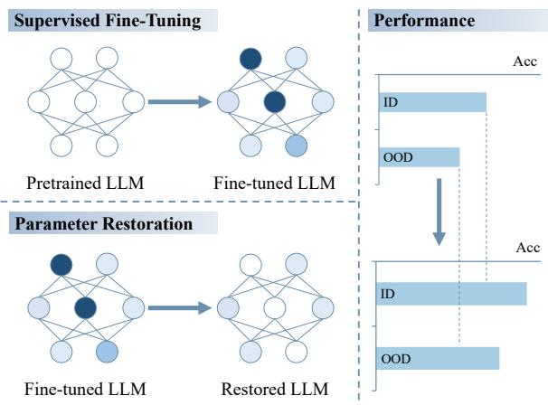  
Figure 1: Illustration of parameter restoration. We find that SFT introduces many unnecessary parameter updates, and model performance can be significantly improved by restoring some of the most updated parameters in the fine-tuned model to their original values in the pre-trained model.

Recent research has explored how model knowledge evolves during training. For instance, pretraining has been shown to encode knowledge modularly (Wang et al., 2024), with each parameter storing up to 2 bits of information (Allen-Zhu and Li, 2025). Conversely, instruction finetuning may increase hallucinations (Gekhman et al., 2024; Ghosh et al., 2024). Empirical evidence suggests that preserving the distribution of internal representations is crucial to maintaining performance (Ren et al., 2024), and models with richer knowledge can be easier to fine-tune for enhanced reasoning ability (Ye et al., 2025).

Despite these insights, the specific impact of SFT on model knowledge remains insufficiently understood. Key open questions include how model knowledge changes with different categories and scales of fine-tuning data, the mechanisms behind these changes, and strategies to mitigate undesirable effects. This gap limits our ability to predict and control knowledge change behavior in fine-tuned models.

To address this, we evaluate five LLMs from the LLaMA-2 and LLaMA-3 families on the closed-book question answering (CBQA) task. We categorize fine-tuning data into five groups based on the knowledge mastery level and systematically examine how performance varies across these categories and different data scales. Surprisingly, models fine-tuned with 1,920 samples perform up to 14% worse than those fine-tuned with only 240 samples. Moreover, performance fluctuates by over 12% depending on the data category used.

To investigate these discrepancies, we conduct a token-level analysis by computing the Kullback-Leibler (KL) divergence (Kullback and Leibler, 1951) between token logits of fine-tuned and pre-trained models (Section 4). Our results show that as fine-tuning data size increases, KL divergence initially decreases, reflecting reduced deviation from the pre-trained model. However, beyond a threshold, KL divergence sharply rises, especially when fine-tuning on poorly mastered data, correlating with performance degradation.

Building on these findings, we perform a parameter-level analysis (Section 5) by selectively restoring parameters that changed most during SFT back to their pre-trained values (Figure 1). We observe that restoring up to 90% of parameter updates does not harm and can even improve performance on training and test sets, with improvements exceeding 10% in some cases. This indicates that many SFT-induced updates are unnecessary for knowledge enhancement, suggesting new directions for optimizing fine-tuning.

In summary, our contributions are as follows:

• We conduct extensive experiments on the CBQA task and reveal surprising effects of fine-tuning data category and scale on model knowledge.

• Through token-level and parameter-level analyses, we find that 90% of the parameter updates from fine-tuning do not contribute to knowledge enhancement.

• We demonstrate that restoring these parameters improves model performance, offering practical guidance for more effective finetuning strategies.

## 2 Related Work

CBQA and Model Knowledge The CBQA task evaluates an LLM’s ability to answer factual questions using its internal knowledge, without relying on external reference materials (Zhang et al., 2024; Wen et al., 2024; Sticha et al., 2024). This makes CBQA a rigorous test of the model’s knowledge accuracy and completeness. One significant challenge in CBQA is addressing hallucinations-instances where the model generates incorrect or fabricated answers (Huang et al., 2023; Kandpal et al., 2023; Kang and Choi, 2023). To mitigate hallucinations and enhance performance, several strategies have been proposed. For instance, Ren et al. (2024) investigate the impact of fine-tuning on the consistency of a model’s pre-existing knowledge, emphasizing the need for stable knowledge retention during finetuning. Similarly, Gekhman et al. (2024) identify overfitting to fine-tuning data as a major source of hallucinations, noting that fine-tuning with data unfamiliar to the model exacerbates this issue. Additionally, Ye et al. (2024c) examine how variations in dataset size and quality influence CBQA outcomes, highlighting the trade-offs between data volume and model performance. Despite these advances, prior studies primarily focus on dataset characteristics and overlook the fine-tuning process’s internal dynamics. In contrast, our work provides a detailed analysis at both the token and parameter levels, identifying unnecessary parameter updates during fine-tuning as a key factor contributing to performance degradation on CBQA.

Data Quality and Scale of SFT SFT plays a pivotal role in adapting LLMs to labeled data, enabling strong performance on downstream tasks. Consequently, constructing high-quality finetuning datasets is critical for maximizing SFT’s effectiveness (Muennighoff et al., 2023; Lin et al., 2024; Ma et al., 2024). Recent research highlights the effectiveness of SFT with small, high-quality datasets, achieving performance on par with larger datasets (Zhou et al., 2023; Yang et al., 2025b). High-quality data is typically characterized as accurate, diverse, and complex (Huang et al., 2024; Liu et al., 2024; Ye et al., 2024d; Yang et al., 2025a), prompting efforts to synthesize such datasets automatically (Xu et al., 2023, 2024; Zhu et al., 2024). Concurrently, studies show that scaling the quantity of fine-tuning data, while maintaining quality, can yield further performance improvements (Kaplan et al., 2020; Chung et al., 2022; Wei et al., 2022; Dong et al., 2024). While prior work has explored dataset quality and size, few studies have examined how a model’s prior knowledge of fine-tuning data influences performance or how different data quantities affect the model’s knowledge. Our study differs by investigating SFT performance on the CBQA task, focusing on how mastery levels and data scale impact model knowledge.

## 3 Experiments

To explore how SFT affects the factual knowledge of LLMs in the CBQA setting, we conduct a series of controlled experiments. In this section, we outline the datasets used (Section 3.1), the models tested (Section 3.2), and the experimental setup (Section 3.3), followed by a presentation of the results and a summary of our findings (Section 3.4).

## 3.1 Dataset

Following Gekhman et al. (2024) and Ye et al. (2024c), we use the ENTITYQUESTIONS (Sciavolino et al., 2021) to construct the training and testing datasets for our experiments, which is a CBQA-specific dataset containing knowledge across 24 topics extracted from Wikipedia.

Training Data Our training dataset, denoted as $\mathcal { D } _ { t r a i n }$ , consists of data on 10 location-related topics extracted from the original training corpus. Following the method of Ye et al. (2024c), we classify the training samples based on the pretrained model ’s mastery level on the knowledge associated with each data point k. Specifically, we enhance the multi-template completion mechanism of Ye et al. (2024c) to allow  to complete each data point k using multiple templates. The training data is then divided into five categories according to the proportion $R _ { k } ^ { \mathcal { M } }$ of knowledge points correctly completed.<sup>1</sup> Formally:

$$
\mathcal { D } _ { t r a i n - i } ^ { \mathcal { M } } = \left\{ \begin{array} { l l } { \{ k \in \mathcal { D } _ { t r a i n } ~ | ~ R _ { k } ^ { \mathcal { M } } = 0 \} , } \\ { \qquad i = 0 , } \\ { \{ k \in \mathcal { D } _ { t r a i n } ~ | ~ R _ { k } ^ { \mathcal { M } } \in ( \frac { i - 1 } { 4 } , \frac { i } { 4 } ] \} , } \\ { \qquad i \in \{ 1 , 2 , 3 , 4 \} . } \end{array} \right.
$$

Testing Data For the in-domain testing dataset $\mathcal { D } _ { t e s t }$ , we select data from the same 10 locationrelated topics in the original test set. Data from the

<table><tr><td>Dtrain</td><td>DM train−0</td><td> $\mathcal { D } _ { t r a i n - 1 } ^ { \mathcal { M } }$ </td><td> $\mathcal { D } _ { t r a i n - 2 } ^ { \mathcal { M } }$ </td><td> $\underline { { \mathcal { D } _ { t r a i n - 3 } ^ { \mathcal { M } } } }$ </td><td>DM train−4</td></tr><tr><td>Number</td><td>18456</td><td>29571</td><td>11558</td><td>8923</td><td>7436</td></tr><tr><td>Dtest</td><td> $\mathcal { D } _ { t e s t - 0 } ^ { \mathcal { M } }$ </td><td> $\mathcal { D } _ { t e s t - 1 } ^ { \mathcal { M } }$ </td><td> $\mathcal { D } _ { t e s t - 2 } ^ { \mathcal { M } }$ </td><td> $\mathcal { D } _ { t e s t - 3 } ^ { \mathcal { M } }$ </td><td>DM test-4</td></tr><tr><td>Number</td><td>2383</td><td>3664</td><td>1484</td><td>1109</td><td>915</td></tr><tr><td> $\mathcal { D } _ { t e s t o o d }$ </td><td>DM testood-0</td><td>DM testood-1</td><td>DM testood-2</td><td>DM testood-3</td><td>DM testood-4</td></tr><tr><td>Number</td><td>4127</td><td>4539</td><td>1271</td><td>1120</td><td>556</td></tr></table>

Table 1: An example of data distribution, where refers to LLaMA-3-8B.

remaining 14 topics are used as the out-of-domain testing dataset $\mathcal { D } _ { t e s t o o d } .$ . Similar to the training data, both $\mathcal { D } _ { t e s t }$ and $\mathcal { D } _ { t e s t o o d }$ are categorized as:

$$
\mathcal { D } _ { t e s t } = \bigcup _ { i = 0 } ^ { 4 } \mathcal { D } _ { t e s t - i } ^ { \mathcal { M } } , \ \mathcal { D } _ { t e s t o o d } = \bigcup _ { i = 0 } ^ { 4 } \mathcal { D } _ { t e s t o o d - i } ^ { \mathcal { M } }
$$

An example of data distribution is listed in Table 1.<sup>2</sup>

## 3.2 Models

Given the dominance of decoder-only architectures in current LLMs, our analysis focuses exclusively on models of this type. We examine five LLMs from two model families: LLaMA-2-7B, LLaMA-2-13B, and LLaMA-2-70B from the LLaMA-2 family (Touvron et al., 2023), and LLaMA-3-8B and LLaMA-3-70B from the LLaMA-3 family (Dubey et al., 2024).<sup>3</sup>

## 3.3 Experimental Setup

Our experiment involves data categorization, training, and testing, aimed at evaluating model performance under diverse settings.

Data Categorization To balance the stability and diversity of the generated output, we design 21 mapping templates tailored to each topic’s data. The sampling temperature is set to 0.7 to introduce controlled randomness, and each prompt is sampled 10 times to enhance robustness. The output’s maximum token length is limited to 32.

Training Training is conducted using a batch size of 8 over 1 epoch, employing the AdamW (Loshchilov and Hutter, 2019) optimizer with cosine learning rate scheduling for stable and efficient convergence. The learning rate is set to $1 \times 1 0 ^ { - 5 } . ^ { 4 }$

<sup>2</sup>Data distribution of other LLMs can be found in Appendix D.

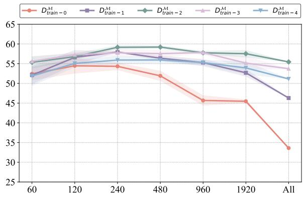

(a) LLaMA-3-8B (In-Domain)  
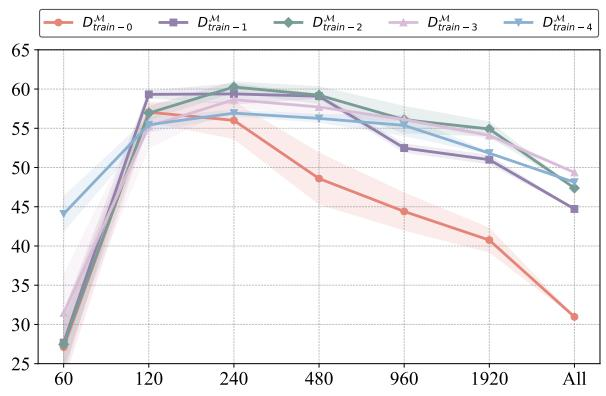  
(c) LLaMA-3-70B (In-Domain)

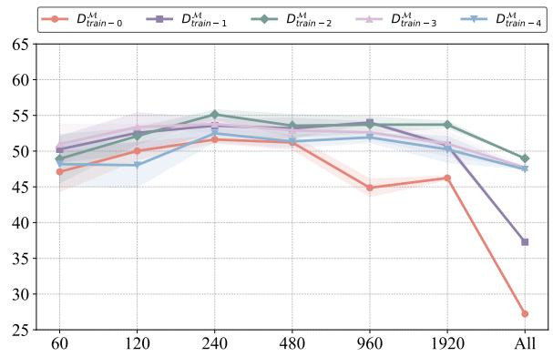

(b) LLaMA-3-8B (Out-of-Domain)  
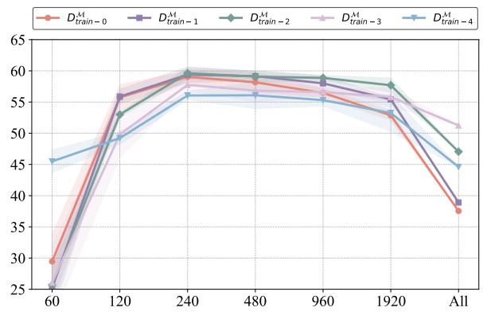  
(d) LLaMA-3-70B (Out-of-Domain)  
Figure 2: In-domain $( \mathbf { A c c } _ { t e s t } ^ { \mathcal { M } } )$ and out-of-domain $( \mathbf { A c c } _ { t e s t o o d } ^ { \mathcal { M } } )$ performance of the LLaMA-3 family models finetuned with varying data scales, where ‘All’ indicates the use of the entire dataset listed in Appendix D.

Testing For testing, we utilize a greedy decoding strategy with a maximum output length of 16, maintaining consistency with the prompt templates used during training. To mitigate bias from the training data selection, we generate five distinct training datasets by random sampling. Each experiment is repeated using these datasets, and the final results are reported as the mean and variance across the five runs. Evaluation metrics include accuracy, categorized by different knowledge mastery levels, with the mean accuracy across all test sets serving as the final metric:

$$
\mathbf { A c c } _ { t e s t } ^ { \mathcal { M } } = \sum _ { i = 0 } ^ { 4 } \mathbf { A c c } _ { t e s t - i } ^ { \mathcal { M } } / 5
$$

$$
\mathbf { A c c } _ { t e s t o o d } ^ { \mathcal { M } } = \sum _ { i = 0 } ^ { 4 } \mathbf { A c c } _ { t e s t o o d - i } ^ { \mathcal { M } } / 5
$$

## 3.4 Main Results

We fine-tune each of the five selected LLMs using datasets with five different mastery levels. To conduct a more detailed analysis, we compare changes in model performance across varying data scales. To enhance robustness, we ensure a balanced data distribution across topics and repeat each experiment three times. Figure 2 presents the in-domain and out-of-domain test results for the LLaMA-3 family of models.<sup>5</sup> From the results, we observe two unexpected phenomena.

Phenomenon 1 Regardless of the type of training data used, LLMs achieve their optimal performance with just 240 data points. Adding more training data beyond this point risks degrading model performance.

Our analysis reveals that model performance improves as the amount of fine-tuned data increases from 60 to 240 entries, aligning with the general expectation that more data enhances performance. However, performance peaks at only 240 entries, and adding additional fine-tuned data not only fails to yield further improvements but often leads to a significant decline. For instance, when fine-tuned with barely mastered data (i.e., $\mathcal { D } _ { t r a i n - 0 } ^ { \mathcal { M } } ) .$ , LLaMA-3-8B achieves an $\mathbf { A c c } _ { t e s t } ^ { \mathcal { M } }$ score that is 8.86% lower rate of decline differs depending on the knowledge mastery level of the training data. Notably, models fine-tuned with data from $\mathcal { D } _ { t r a i n - 0 } ^ { \mathcal { M } }$ exhibit a steeper performance drop compared to those trained on other data types. For instance, when finetuned with 1,920 entries, the $\mathbf { A c c } _ { t e s t } ^ { \mathcal { M } }$ difference between LLaMA-3-8B models trained on $\mathcal { D } _ { t r a i n - 0 } ^ { \mathcal { M } }$ and $\mathcal { D } _ { t r a i n - 2 } ^ { \mathcal { M } }$ reaches 12.06%, which is 1.50 times the difference observed with only 240 training entries. Table 2 illustrates the performance of LLaMA-3 family models across various test sets when fine-tuned with 1,920 entries from different categories. The results show that models trained on $\mathcal { D } _ { t r a i n - 0 } ^ { \mathcal { M } }$ experience substantial performance degradation on test sets other than $\mathcal { D } _ { t e s t - 0 } ^ { \mathcal { M } }$ . More generally, training on low-mastery data significantly impairs performance on high-mastery test data. Conversely, training on high-mastery data $( \mathrm { e . g . , \it \ D _ { t r a i n - 4 } ^ { \mathcal { M } } } )$ leads to suboptimal performance on low-mastery test data. Training with mid-level mastery data, such as $\mathcal { D } _ { t r a i n - 2 } ^ { \mathcal { M } }$ , strikes a better balance, yielding superior overall performance.

<table><tr><td rowspan="2">Source</td><td colspan="6">In-Domain</td><td colspan="6">Out-of-Domain</td></tr><tr><td> $\mathbf { A c c } _ { t e s t - 0 } ^ { M }$ </td><td> $\mathbf { A c c } _ { t e s t - } ^ { M }$  -1</td><td> $\mathbf { A c c } _ { t e s t - 2 } ^ { M }$ </td><td> $\mathbf { A c c } _ { t e s t - 3 } ^ { M }$ </td><td> $\mathbf { A c c } _ { t e s t - 4 } ^ { M }$ </td><td> $\mathbf { A c c } _ { t e s t } ^ { M }$   $\mathbf { A c c } _ { t e s t o o d - 0 } ^ { M }$ </td><td> $\mathbf { A c c } _ { t e s t o o d - 1 } ^ { M }$ </td><td> $\mathbf { A c c } _ { t e s t o o d - 1 } ^ { M }$  4</td><td>2</td><td> $\mathbf { A c c } _ { t e s t o o d - 3 } ^ { M }$ </td><td> $\mathbf { A c c } _ { t e s t o o d - 4 } ^ { M }$ </td><td> $\mathbf { A c c } _ { t e s t o o d } ^ { \mathcal { M } }$ </td></tr><tr><td colspan="10"> $\mathcal { M } = L L a M A { - } 3 – 8 B$ </td></tr><tr><td>DM</td><td> $\mathbf { 1 . 7 5 } _ { 0 . 1 7 }$ </td><td> $1 6 . 0 7 _ { 0 . 6 7 }$ </td><td> $5 5 . 0 3 _ { 1 . 3 9 }$ </td><td> $7 1 . 0 6 _ { 1 . 0 9 }$ </td><td> $8 3 . 4 6 _ { 1 . 2 3 }$ </td><td> $4 5 . 4 7 _ { 0 . 4 0 }$ </td><td> $\mathbf { 1 . 9 1 } _ { 0 . 3 3 }$ </td><td> $1 5 . 8 9 _ { 1 . 2 0 }$ </td><td> $5 9 . 0 1 _ { 0 . 5 1 }$ </td><td> $7 4 . 0 8 _ { 0 . 6 3 }$ </td><td> $8 0 . 3 3 _ { 0 . 9 8 }$ </td><td> $4 6 . 2 4 _ { 0 . 2 9 }$ </td></tr><tr><td> $\mathbf { \mathcal { D } } ^ { t r a i n - 0 }$ </td><td> $0 . 9 8 _ { 0 . 1 4 }$ </td><td> $4 0 . 1 2 _ { 0 . 7 4 }$ </td><td> $6 3 . 9 3 _ { 0 . 5 5 }$ </td><td> $7 4 . 1 9 \mathrm { _ 0 . 7 3 }$ </td><td> $8 4 . 2 2 _ { 3 . 9 6 }$ </td><td> $5 2 . 6 9 _ { 0 . 8 8 }$ </td><td> $1 . 6 6 _ { 0 . 0 9 }$ </td><td> $2 3 . 8 8 _ { 0 . 4 5 }$ </td><td> $6 5 . 0 3 _ { 0 . 7 7 }$ </td><td> $7 9 . 6 3 _ { 0 . 6 3 }$ </td><td> $8 3 . 8 4 _ { 0 . 5 5 }$ </td><td> $5 0 . 8 0 _ { 0 . 4 5 }$ </td></tr><tr><td> $ t r a i n { - 1 }$   $\mathscr { D } _ { t r a i n - 2 } ^ { \prime }$ </td><td> $0 . 7 8 _ { 0 . 0 3 }$ </td><td> $3 6 . 5 6 \mathrm { _ 0 . 5 3 }$ </td><td> ${ 7 5 . 6 1 } _ { 1 . 1 8 }$ </td><td> $8 3 . 9 8 \mathrm { _ { 1 . 3 7 } }$ </td><td> $9 0 . 7 1 . 3 1 $ </td><td> ${ \bf 5 7 . 5 3 } _ { 0 . 8 6 }$ </td><td> $1 . 4 5 0 . 3 5$ </td><td> ${ \bf 2 5 . 0 2 } _ { 0 . 3 0 }$ </td><td> ${ \bf 7 0 . 5 2 } _ { 1 . 5 9 }$ </td><td> ${ \bf 8 3 . 6 6 } _ { 0 . 6 7 }$ </td><td> $8 7 . 8 9 _ { 0 . 4 5 }$ </td><td> ${ \bf 5 3 . 7 1 0 . 4 9 }$ </td></tr><tr><td> $\mathcal { D } _ { t r a i n - 3 } ^ { \mathcal { N } }$ </td><td> $0 . 6 4 _ { 0 . 1 5 }$ </td><td> $2 7 . 2 0 _ { 3 . 6 9 }$ </td><td> $7 0 . 3 3 _ { 1 . 7 3 }$ </td><td> $\mathbf { 8 5 . 9 0 } _ { 1 . 4 7 }$ </td><td> $9 1 . 6 6 _ { 1 . 5 7 }$ </td><td> $5 5 . 1 5 _ { 1 . 6 4 }$ </td><td> $1 . 3 9 _ { 0 . 3 4 }$ </td><td> $2 1 . 6 6 _ { 3 . 1 3 }$ </td><td> $6 3 . 9 1 _ { 2 . 7 0 }$ </td><td> $8 1 . 3 4 _ { 0 . 9 3 }$ </td><td> $8 6 . 8 7 _ { 1 . 8 5 }$ </td><td> $5 1 . 0 4 _ { 1 . 7 3 }$ </td></tr><tr><td> $\mathcal { D } _ { t r a i n - 4 } ^ { \nu \imath }$ </td><td> $0 . 6 4 _ { 0 . 0 6 }$ </td><td> $2 4 . 2 6 _ { 3 . 3 8 }$ </td><td> $6 8 . 2 8 _ { 2 . 0 0 }$ </td><td> $8 3 . 2 9 _ { 1 . 2 3 }$ </td><td> $9 3 . 1 9 _ { 1 . 9 1 }$ </td><td> $5 3 . 9 3 _ { 1 . 5 6 }$ </td><td> $0 . 9 3 _ { 0 . 1 1 }$ </td><td> $1 7 . 7 2 _ { 1 . 3 3 }$ </td><td> $6 3 . 6 4 _ { 4 . 3 9 }$ </td><td> $8 0 . 5 5 _ { 2 . 0 5 }$ </td><td> $\mathbf { 8 8 . 4 3 _ { 1 . 4 7 } }$ </td><td> $5 0 . 2 5 _ { 1 . 8 3 }$ </td></tr><tr><td colspan="10"> $\mathcal { M } = L L a M A { - } 3 { - } 7 0 B$ </td><td></td><td></td><td></td></tr><tr><td> $\mathcal { D } _ { t r a i n - 0 } ^ { \mathcal { M } }$ </td><td> $\mathbf { 3 . 7 2 } _ { 0 . 3 3 }$ </td><td> $2 2 . 6 8 _ { 1 . 5 3 }$ </td><td> $4 7 . 2 8 _ { 1 . 2 6 }$ </td><td> $5 7 . 9 7 _ { 2 . 2 5 }$ </td><td> $7 2 . 0 8 _ { 3 . 2 0 }$ </td><td> $4 0 . 7 5 _ { 1 . 5 1 }$ </td><td> $\mathbf { 3 . 0 8 } _ { 0 . 3 9 }$ </td><td> $2 5 . 9 0 _ { 1 . 5 9 }$ </td><td> $6 7 . 0 4 _ { 1 . 6 3 }$ </td><td> $8 2 . 6 1 _ { 0 . 9 5 }$ </td><td> $8 5 . 7 4 _ { 1 . 3 0 }$ </td><td> $5 2 . 8 7 _ { 0 . 7 9 }$ </td></tr><tr><td> $\mathcal { D } _ { t r a i n - 1 } ^ { \mathcal { N } }$ </td><td> $1 . 9 4 _ { 0 . 1 1 }$ </td><td> ${ \bf 4 3 . 8 5 } _ { 0 . 2 9 }$ </td><td> $6 3 . 4 5 _ { 1 . 4 7 }$ </td><td> $6 6 . 2 2 _ { 1 . 6 6 }$ </td><td> $7 9 . 5 4 _ { 0 . 6 5 }$ </td><td> $5 1 . 0 0 _ { 0 . 5 3 }$ </td><td> $2 . 6 1 _ { 0 . 4 5 }$ </td><td> $3 1 . 0 1 _ { 0 . 7 9 }$ </td><td> $7 2 . 6 3 _ { 0 . 1 6 }$ </td><td> $8 4 . 6 9 _ { 0 . 3 0 }$ </td><td> $8 6 . 2 2 _ { 0 . 6 9 }$ </td><td> $5 5 . 4 3 _ { 0 . 2 6 }$ </td></tr><tr><td></td><td> $1 . 2 3 _ { 0 . 0 7 }$ </td><td> $3 8 . 1 7 _ { 1 . 7 8 }$ </td><td> $7 1 . 6 8 _ { 0 . 8 2 }$ </td><td> $7 7 . 5 8 _ { 1 . 2 7 }$ </td><td> $8 5 . 8 9 _ { 1 . 4 4 }$ </td><td> ${ \bf 5 4 . 9 1 } _ { 0 . 8 9 }$ </td><td> $2 . 0 6 _ { 0 . 5 0 }$ </td><td></td><td> ${ \bf 7 4 . 5 1 } _ { 1 . 2 7 }$ </td><td> $8 8 . 6 3 _ { 0 . 9 7 }$ </td><td> $9 2 . 0 1 _ { 1 . 1 9 }$ </td><td> ${ \bf 5 7 . 6 9 } _ { 1 . 1 6 }$ </td></tr><tr><td> $\smash { \mathcal { D } _ { t r a i n } ^ { M } \mathrm { ~ \Lambda ~ } _ { 2 } ^ { \prime } }$ </td><td> $1 . 0 0 _ { 0 . 1 1 }$ </td><td> $3 1 . 5 2 _ { 0 . 6 1 }$ </td><td> $6 8 . 3 2 _ { 0 . 3 0 }$ </td><td> ${ \bf 8 1 . 1 1 _ { 0 . 7 3 } }$ </td><td> $8 8 . 4 9 _ { 1 . 6 0 }$ </td><td></td><td> $1 . 9 1 _ { 0 . 7 9 }$ </td><td> $\begin{array} { l } { 3 1 . 2 6 _ { 2 . 1 0 } } \\ { . . . } \end{array}$   $2 6 . 7 0 _ { 1 . 7 1 }$ </td><td> $6 9 . 6 0 _ { 2 . 7 7 }$ </td><td> $\mathbf { 8 9 . 6 1 } _ { 1 . 4 4 }$ </td><td> $9 1 . 2 2 _ { 1 . 3 9 }$ </td><td></td></tr><tr><td> $\mathop { \sim } _ { \oslash } ^ { \bar { t } r a i n - }$ </td><td></td><td></td><td></td><td></td><td></td><td> $5 4 . 0 9 _ { 0 . 4 5 }$ </td><td></td><td></td><td></td><td></td><td></td><td> $5 5 . 8 1 _ { 1 . 4 7 }$ </td></tr><tr><td> $\mathcal { D } _ { t r a i n - 4 } ^ { \nu \imath }$ </td><td> $0 . 9 0 _ { 0 . 0 5 }$ </td><td> $2 6 . 1 6 _ { 1 . 4 5 }$ </td><td> $6 4 . 2 7 _ { 0 . 7 5 }$ </td><td> $7 8 . 0 0 _ { 0 . 4 3 }$ </td><td> $\mathbf { 8 9 . 8 3 } _ { 0 . 7 7 }$ </td><td> $5 1 . 8 3 _ { 0 . 0 5 }$ </td><td> $0 . 8 1 _ { 0 . 3 5 }$ </td><td> $2 1 . 8 0 _ { 3 . 6 5 }$ </td><td> $6 6 . 5 2 _ { 5 . 6 5 }$ </td><td> $8 4 . 8 5 _ { 2 . 5 7 }$ </td><td> ${ \bf 9 2 . 2 9 _ { 2 . 6 3 } }$ </td><td> $5 3 . 2 5 _ { 2 . 9 7 }$ </td></tr></table>

Table 2: Performance of the fine-tuned LLaMA-3 family models on in-domain and out-of-domain test sets, using 1920 data points with varying levels of mastery.

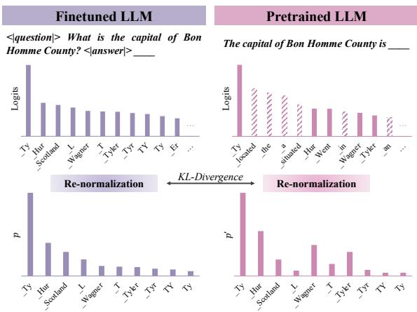  
Figure 3: Illustration of logits re-normalization. Since the pre-trained LLM tends to assign high probabilities to common dummy words, we identify the ten highest logits in the fine-tuned LLM and extract the corresponding values from the pre-trained LLM. After re-normalization, we compute the KL divergence to quantify the distributional difference.

when trained with 1,920 entries compared to 240 entries. A decline of 13.69% is even observed when comparing 240 entries from $\mathcal { D } _ { t r a i n - 2 } ^ { \mathcal { M } }$ . Notably, when LLMs are trained with the full dataset for each data category, their performance on the CBQA task is nearly at its lowest across all data categories. This striking finding suggests that increasing the volume of fine-tuned data does not necessarily enhance model knowledge and may impair it.

Phenomenon 2 When the amount of fine-tuned data reaches a certain threshold (e.g., 1,920 entries), model performance varies significantly based on the knowledge mastery level of the training data.

While model performance generally declines when the fine-tuned data exceeds 240 entries, the

## 4 Token-Level Analysis

To explain the performance variation observed across fine-tuned LLMs, we analyze how finetuning alters token-level output distributions compared to the pre-trained model. Specifically, we compute the divergence in predicted token distributions between fine-tuned and pre-trained models using KL divergence (Section 4.1). This tokenlevel analysis reveals some interesting findings (Section 4.2).

## 4.1 KL Divergence Computation

Given the performance degradation observed in Section 3.4, we investigate the underlying token distribution shifts caused by SFT. Specifically, we use KL divergence to quantify the differences in token probabilities between fine-tuned and pretrained models. A higher KL divergence suggests a more significant shift in the model’s token probability distribution.

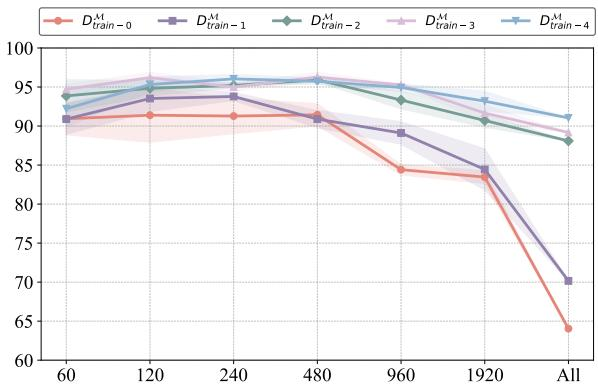  
Figure 4: Performance on $\mathscr { D } _ { t e s t - 4 } ^ { \mathcal { M } } ( \mathbf { A c c } _ { t e s t - 4 } ^ { \mathcal { M } } )$ of LLMs fine-tuned on LLaMA-3-8B.

Data Selection Given that the pre-trained model is used to complement the prior text, the quality of its completions depends on both the input prompt and the structure of the mapping template, as outlined in Section 3.3. The selection of appropriate data is critical to ensuring the robustness of the results. For $\mathcal { D } _ { t e s t - 4 } ^ { \mathcal { M } }$ , we observe that the pre-trained model’s completion success rate exceeds 75% across multiple samples and templates, suggesting that this dataset is relatively insensitive to variations in the mapping template. In contrast, other datasets are more sensitive to such variations, so our comparison of different LLMs in this section is limited to $\mathcal { D } _ { t e s t - 4 } ^ { \mathcal { M } }$ . For each topic, we select the mapping template yielding the highest success rate across samples and focus our analysis on tokens in completions where the answers appear near the beginning of the generated text.

Logits Re-normalization Our goal is to compute the KL divergence between the logits distributions for the first token predicted by both the fine-tuned and pre-trained LLMs. However, as shown in Figure 3, the pre-trained model tends to assign higher probabilities to common dummy words $( \mathrm { e . g . , \dot { \cdot } t h e ^ { \circ } , \dot { \ a } ^ { \circ } , e t c . } )$ , whereas fine-tuned models typically reduce the likelihood of these words in favor of more relevant tokens. If we directly compute the KL divergence on the raw logits, these dummy words could distort the results and obscure meaningful differences between the models. To mitigate this issue, we introduce a logits re-normalization procedure. Specifically, we sort the logits predicted by the fine-tuned model and extract the top 10 values, denoted as $l _ { 0 } , l _ { 1 } , \ldots , l _ { 9 }$ . We then identify the corresponding logits, $l _ { 0 } ^ { \prime } , l _ { 1 } ^ { \prime } , \ldots , l _ { 9 } ^ { \prime }$ , from the pre-trained model’s completions. Moreover, we apply the softmax function to these logits to derive their normalized probabilities, respectively:

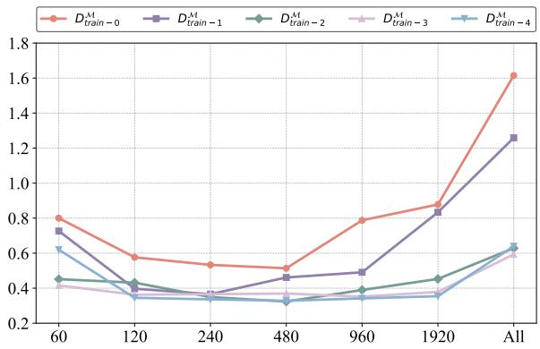  
Figure 5: KL divergence of logits distribution between LLaMA-3-8B fine-tuned with different datasets and the pre-trained one.

$$
p _ { i } = \mathrm { S o f t m a x } ( l _ { i } ) , p _ { i } ^ { \prime } = \mathrm { S o f t m a x } ( l _ { i } ^ { \prime } ) .
$$

After completing the logits re-normalization, we compute the KL divergence between the probability distributions $p$ and $p ^ { \prime }$ for the fine-tuned and pretrained models as follows:

$$
s _ { \mathrm { K L } } ( \boldsymbol { p } \parallel p ^ { \prime } ) = - \sum _ { i } p _ { i } \log \frac { p _ { i } ^ { \prime } } { p _ { i } } .
$$

## 4.2 Results Analysis

We analyze the performance of individual LLMs fine-tuned based on LLaMA-3-8B, presenting their results on $\mathcal { D } _ { t e s t - 4 } ^ { \mathcal { M } }$ in Figure 4 and their KL divergence relative to the pre-trained model’s distribution in Figure 5. From these results, we derive two key findings.

Finding 1 Regardless of the category of finetuning data, the difference in predicted logits distributions between the fine-tuned and pre-trained models initially decreases and then increases as the amount of data grows.

Figure 5 illustrates how the predicted logits distributions of fine-tuned model diverge from the pre-trained model as training data increases. When fine-tuning with a small dataset (e.g., 60 samples), the logits distribution shifts significantly due to insufficient data, leading to unstable training. As the dataset grows (e.g., 240 samples), this discrepancy decreases, indicating improved stability. However, with further increases, the difference in logits distributions grows again, particularly for models trained on $\mathcal { D } _ { t r a i n - 0 } ^ { \mathcal { M } }$ and $\mathcal { D } _ { t r a i n - 1 } ^ { \mathcal { M } }$ This suggests that as training data increases, the model deviates further from its pretrained knowledge. The effect is more pronounced when fine-tuning on low-mastery data, making the model more susceptible to knowledge shifts.

Finding 2 As the difference in the predicted logits distribution between thefine-tuned model and the pre-trained model increases, model performance declines, indicating a negative impact of excessive knowledge shifts.

Figure 4 and Figure 5 reveal a strong correlation between performance degradation on $\mathcal { D } _ { t e s t - 4 } ^ { \mathcal { M } }$ and increasing divergence in logits distributions. Since $\mathcal { D } _ { t e s t - 4 } ^ { \mathcal { M } }$ contains samples well mastered by the pre-trained model, substantial shifts in learned knowledge during fine-tuning can lead to catastrophic forgetting, where previously acquired knowledge is lost, thereby degrading performance. This effect is particularly evident when training with large datasets. For instance, the model finetuned on $\mathcal { D } _ { t r a i n - 0 } ^ { \mathcal { M } }$ experiences the most significant knowledge shift and performs the worst among all fine-tuned models. Since changes in logits distribution reflect underlying modifications to model parameters, we hypothesize that excessive parameter updates during fine-tuning, especially when using large or low-mastery datasets, lead to overall performance decline.

## 5 Parameter-Level Analysis

The observations and analyses in Section 4 indicate that excessive parameter updates can degrade model performance. To further investigate this, we analyze the impact at the parameter level by progressively restoring the updated parameters and examining the resulting performance changes (Section 5.1). Our findings indicate that a significant proportion of parameter updates during SFT do not contribute to performance improvement and may even be detrimental (Section 5.2).

## 5.1 Parameter Restoration

To examine the impact of excessive parameter updates on model performance, we design an experimental framework for parameter restoration.

<table><tr><td>Proportion</td><td>1%</td><td>3%</td><td>5%</td><td>10%</td><td>20%</td><td>40%</td><td>60%</td></tr><tr><td colspan="8">Number of Training Data: 240</td></tr><tr><td> $\mathcal { D } _ { t r a i n - 0 } ^ { \mathcal { M } }$ </td><td>70.59%</td><td>78.82%</td><td>82.35%</td><td>87.06%</td><td>91.76%</td><td>96.47%</td><td>99.12%</td></tr><tr><td>DMin-1</td><td>71.01%</td><td>79.29%</td><td>82.84%</td><td>87.57%</td><td>92.31%</td><td>97.04%</td><td>99.11%</td></tr><tr><td>Dt ain-2 M</td><td>71.13%</td><td>79.17%</td><td>82.74%</td><td>87.50%</td><td>92.26%</td><td>96.43%</td><td>99.12%</td></tr><tr><td>DM train−3</td><td>70.72%</td><td>78.97%</td><td>82.51%</td><td>87.22%</td><td>91.93%</td><td>96.65%</td><td>99.09%</td></tr><tr><td>DM train-4</td><td>70.98%</td><td>78.74%</td><td>82.18%</td><td>87.36%</td><td>91.95%</td><td>96.55%</td><td>99.04%</td></tr><tr><td colspan="8">Number of Training Data: 1920</td></tr><tr><td>DM train−0</td><td>70.56%</td><td>78.50%</td><td>82.24%</td><td>86.92%</td><td>92.06%</td><td>96.26%</td><td>98.69%</td></tr><tr><td>D train−1 M</td><td>70.89%</td><td>78.87%</td><td>82.63%</td><td>87.32%</td><td>92.02%</td><td>96.71%</td><td>98.69%</td></tr><tr><td>train−2</td><td>70.75%</td><td>78.77%</td><td>82.08%</td><td>87.26%</td><td>91.98%</td><td>96.70%</td><td>98.70%</td></tr><tr><td>DM train−3</td><td>70.74%</td><td>78.70%</td><td>81.98%</td><td>87.13%</td><td>91.82%</td><td>96.50%</td><td>98.70%</td></tr><tr><td>DM train−4</td><td>70.83%</td><td>78.70%</td><td>82.41%</td><td>87.04%</td><td>92.13%</td><td>96.30%</td><td>98.70%</td></tr></table>

Table 3: Percentage of total parameter updates concentrated in different proportions of the most highly updated parameters in various LLMs fine-tuned on LLaMA-3-8B.

Specifically, we compare the fine-tuned model with the pre-trained model, sorted by the rate of parameter change.<sup>6</sup> Table 3 reports the percentage of total parameter updates attributed to different proportions of the most highly updated parameters in LLMs fine-tuned on LLaMA-3- 8B. The results indicate that parameter updates are heavily concentrated in a small subset of parameters. For instance, more than 70% of the total updates occur in fewer than 1% of the parameters. Following this, we progressively restore the most significantly updated parameters to their original values in the pre-trained model, starting with the largest updates and gradually including smaller ones, while monitoring the corresponding changes in model performance. This process is illustrated in Figure 1.

## 5.2 Results Analysis

We evaluate the performance of LLaMA-3-8B after restoring different proportions of parameters across various fine-tuning datasets. The results are summarized in Table 4. Our analysis of these results reveals several noteworthy findings.

Finding 1 The majority of parameter updates introduced by SFT are unnecessary and can significantly degrade model knowledge.<sup>7</sup>

Table 4 shows that restoring a portion of the model’s parameters to their pre-trained values consistently improves performance, regardless of the fine-tuning dataset. For instance, when finetuning with 1,920 samples, restoring 20% of the parameters enhances the performance of all models. Specifically, the model fine-tuned with $\mathcal { D } _ { t r a i n - 0 } ^ { \mathcal { M } }$ achieves a 9.85% performance gain. Table 3 further reveals that over 90% of the total parameter variation is restored at this point. Importantly, the benefits of parameter restoration generalize across tasks, as shown in Table 5. However, the degree of improvement depends on the relevance of the task to the model’s knowledge. Notably, performance on the training set also improves, suggesting that many of the parameter updates introduced by SFT neither help fit the training data nor support generalization, and may impair previously learned knowledge. Compared to other strategies, restoring redundant parameter updates is an effective and simple method for enhancing model performance, offering useful insights for designing more efficient fine-tuning approaches.<sup>8</sup>

<table><tr><td rowspan=1 colspan=6>Restore  $\mathcal { D } _ { \mathrm { t r a i n } } ^ { \mathcal { M } } .$     $\mathcal { D } _ { \mathrm { t r a i n } } ^ { \mathcal { M } } .$     $\mathcal { D } _ { \mathrm { t r a i n } } ^ { \mathcal { M } }$      $\mathcal { D } _ { \mathrm { t r a i n } } ^ { \mathcal { M } }$    DM-0-1-2-3train-4</td></tr><tr><td rowspan=1 colspan=6>Number of Training Data: 240</td></tr><tr><td rowspan=1 colspan=1>0</td><td rowspan=1 colspan=1>55.33</td><td rowspan=1 colspan=2>57.96    59.32</td><td rowspan=1 colspan=1>59.12</td><td rowspan=1 colspan=1>53.97</td></tr><tr><td rowspan=1 colspan=1>1%</td><td rowspan=1 colspan=1>55.76</td><td rowspan=1 colspan=1>58.17</td><td rowspan=1 colspan=1>59.62</td><td rowspan=1 colspan=1>59.24</td><td rowspan=1 colspan=1>54.30</td></tr><tr><td rowspan=1 colspan=1>3%</td><td rowspan=1 colspan=1>56.64</td><td rowspan=1 colspan=1>58.52</td><td rowspan=1 colspan=1>59.77</td><td rowspan=1 colspan=1>59.40</td><td rowspan=1 colspan=1>54.31</td></tr><tr><td rowspan=1 colspan=1>5%</td><td rowspan=1 colspan=1>57.22</td><td rowspan=1 colspan=1>58.68</td><td rowspan=1 colspan=1>59.89</td><td rowspan=1 colspan=1>59.63</td><td rowspan=1 colspan=1>54.44</td></tr><tr><td rowspan=1 colspan=1>10%</td><td rowspan=1 colspan=1>58.32</td><td rowspan=1 colspan=1>59.45</td><td rowspan=1 colspan=1>60.40</td><td rowspan=1 colspan=1>59.83</td><td rowspan=1 colspan=1>54.69</td></tr><tr><td rowspan=1 colspan=1>20%</td><td rowspan=1 colspan=1>59.07</td><td rowspan=1 colspan=1>59.81</td><td rowspan=1 colspan=1>59.88</td><td rowspan=1 colspan=1>59.91</td><td rowspan=1 colspan=1>46.45</td></tr><tr><td rowspan=1 colspan=1>40%</td><td rowspan=1 colspan=1>59.77</td><td rowspan=1 colspan=1>33.40</td><td rowspan=1 colspan=1>42.44</td><td rowspan=1 colspan=1>11.20</td><td rowspan=1 colspan=1>23.83</td></tr><tr><td rowspan=1 colspan=1>60%</td><td rowspan=1 colspan=1>1.68</td><td rowspan=1 colspan=2>2.20     3.65</td><td rowspan=1 colspan=1>2.56</td><td rowspan=1 colspan=1>1.65</td></tr><tr><td rowspan=1 colspan=1></td><td rowspan=1 colspan=3>Number of Training Data: 1</td><td rowspan=1 colspan=1>920</td><td rowspan=1 colspan=1></td></tr><tr><td rowspan=1 colspan=1>0</td><td rowspan=1 colspan=1>44.96</td><td rowspan=1 colspan=1>52.43</td><td rowspan=1 colspan=1>58.80</td><td rowspan=1 colspan=1>57.70</td><td rowspan=1 colspan=1>55.22</td></tr><tr><td rowspan=1 colspan=1>1%</td><td rowspan=1 colspan=1>46.73</td><td rowspan=1 colspan=1>53.72</td><td rowspan=1 colspan=1>59.85</td><td rowspan=1 colspan=1>58.68</td><td rowspan=1 colspan=1>55.88</td></tr><tr><td rowspan=1 colspan=1>3%</td><td rowspan=1 colspan=1>48.53</td><td rowspan=1 colspan=1>55.01</td><td rowspan=1 colspan=1>60.56</td><td rowspan=1 colspan=1>59.23</td><td rowspan=1 colspan=1>56.76</td></tr><tr><td rowspan=1 colspan=1>5%</td><td rowspan=1 colspan=1>49.85</td><td rowspan=1 colspan=1>55.96</td><td rowspan=1 colspan=1>61.10</td><td rowspan=1 colspan=1>59.65</td><td rowspan=1 colspan=1>57.34</td></tr><tr><td rowspan=1 colspan=1>10%</td><td rowspan=1 colspan=1>52.10</td><td rowspan=1 colspan=1>57.14</td><td rowspan=1 colspan=1>61.67</td><td rowspan=1 colspan=1>60.02</td><td rowspan=1 colspan=1>58.24</td></tr><tr><td rowspan=1 colspan=1>20%</td><td rowspan=1 colspan=1>54.81</td><td rowspan=1 colspan=1>58.33</td><td rowspan=1 colspan=1>62.21</td><td rowspan=1 colspan=1>58.93</td><td rowspan=1 colspan=1>58.66</td></tr><tr><td rowspan=1 colspan=1>40%</td><td rowspan=1 colspan=1>55.44</td><td rowspan=1 colspan=1>22.06</td><td rowspan=1 colspan=1>59.97</td><td rowspan=1 colspan=1>6.92</td><td rowspan=1 colspan=1>56.50</td></tr><tr><td rowspan=1 colspan=1>60%</td><td rowspan=1 colspan=1>1.48</td><td rowspan=1 colspan=1>1.12</td><td rowspan=1 colspan=2>1.62     0.51</td><td rowspan=1 colspan=1>0.60</td></tr></table>

(a) In-Domain $( \mathbf { A c c } _ { t e s t } ^ { \mathcal { M } } )$

<table><tr><td rowspan=1 colspan=6>Restore  $\mathcal { D } _ { \mathrm { t r a i n } } ^ { \mathcal { M } } .$ -0  $\mathcal { D } _ { \mathrm { t r a i n - } } ^ { \mathcal { M } }$ -1  $\mathcal { D } _ { \mathrm { t r a i n } } ^ { \mathcal { M } } .$ -2  $\mathcal { D } _ { \mathrm { t r a i n } } ^ { \mathcal { M } } .$ -3  $\mathcal { D } _ { \mathrm { t r a i n } } ^ { \mathcal { M } }$ -4</td></tr><tr><td rowspan=1 colspan=6>Number of Training Data: 240</td></tr><tr><td rowspan=1 colspan=1>0</td><td rowspan=1 colspan=1>52.37</td><td rowspan=1 colspan=2>51.70    55.35</td><td rowspan=1 colspan=1>55.23</td><td rowspan=1 colspan=1>50.69</td></tr><tr><td rowspan=1 colspan=1>1%</td><td rowspan=1 colspan=1>52.62</td><td rowspan=1 colspan=1>52.39</td><td rowspan=1 colspan=1>56.45</td><td rowspan=1 colspan=1>56.17</td><td rowspan=1 colspan=1>50.82</td></tr><tr><td rowspan=1 colspan=1>3%</td><td rowspan=1 colspan=1>53.03</td><td rowspan=1 colspan=1>52.82</td><td rowspan=1 colspan=1>56.47</td><td rowspan=1 colspan=1>56.41</td><td rowspan=1 colspan=1>50.74</td></tr><tr><td rowspan=1 colspan=1>5%</td><td rowspan=1 colspan=1>53.27</td><td rowspan=1 colspan=1>53.09</td><td rowspan=1 colspan=1>56.80</td><td rowspan=1 colspan=1>56.56</td><td rowspan=1 colspan=1>50.59</td></tr><tr><td rowspan=1 colspan=1>10%</td><td rowspan=1 colspan=1>53.44</td><td rowspan=1 colspan=1>53.87</td><td rowspan=1 colspan=1>56.46</td><td rowspan=1 colspan=1>56.72</td><td rowspan=1 colspan=1>49.71</td></tr><tr><td rowspan=1 colspan=1>20%</td><td rowspan=1 colspan=1>54.18</td><td rowspan=1 colspan=1>54.36</td><td rowspan=1 colspan=1>55.95</td><td rowspan=1 colspan=1>55.52</td><td rowspan=1 colspan=1>43.13</td></tr><tr><td rowspan=1 colspan=1>40%</td><td rowspan=1 colspan=1>53.79</td><td rowspan=1 colspan=1>20.77</td><td rowspan=1 colspan=1>45.49</td><td rowspan=1 colspan=1>17.56</td><td rowspan=1 colspan=1>31.19</td></tr><tr><td rowspan=1 colspan=1>60%</td><td rowspan=1 colspan=1>0.20</td><td rowspan=1 colspan=1>0.22</td><td rowspan=1 colspan=1>0.32</td><td rowspan=1 colspan=1>0.20</td><td rowspan=1 colspan=1>0.23</td></tr><tr><td rowspan=1 colspan=1></td><td rowspan=1 colspan=1>Numb</td><td rowspan=1 colspan=1>er of Trai</td><td rowspan=1 colspan=1>ning Data: 1</td><td rowspan=1 colspan=1>920</td><td rowspan=1 colspan=1></td></tr><tr><td rowspan=1 colspan=1>0</td><td rowspan=1 colspan=1>49.40</td><td rowspan=1 colspan=1>52.38</td><td rowspan=1 colspan=1>54.04</td><td rowspan=1 colspan=1>53.79</td><td rowspan=1 colspan=1>51.70</td></tr><tr><td rowspan=1 colspan=1>1%</td><td rowspan=1 colspan=1>50.78</td><td rowspan=1 colspan=1>54.20</td><td rowspan=1 colspan=1>55.17</td><td rowspan=1 colspan=1>54.75</td><td rowspan=1 colspan=1>52.62</td></tr><tr><td rowspan=1 colspan=1>3%</td><td rowspan=1 colspan=1>52.03</td><td rowspan=1 colspan=1>55.12</td><td rowspan=1 colspan=1>56.00</td><td rowspan=1 colspan=1>55.52</td><td rowspan=1 colspan=1>53.35</td></tr><tr><td rowspan=1 colspan=1>5%</td><td rowspan=1 colspan=1>52.54</td><td rowspan=1 colspan=1>55.12</td><td rowspan=1 colspan=1>56.34</td><td rowspan=1 colspan=1>55.84</td><td rowspan=1 colspan=1>53.77</td></tr><tr><td rowspan=1 colspan=1>10%</td><td rowspan=1 colspan=1>53.42</td><td rowspan=1 colspan=1>55.08</td><td rowspan=1 colspan=1>56.68</td><td rowspan=1 colspan=1>55.54</td><td rowspan=1 colspan=1>54.32</td></tr><tr><td rowspan=1 colspan=1>20%</td><td rowspan=1 colspan=1>54.50</td><td rowspan=1 colspan=1>53.91</td><td rowspan=1 colspan=1>57.10</td><td rowspan=1 colspan=1>52.23</td><td rowspan=1 colspan=1>53.82</td></tr><tr><td rowspan=1 colspan=1>40%</td><td rowspan=1 colspan=1>53.64</td><td rowspan=1 colspan=1>20.51</td><td rowspan=1 colspan=1>53.84</td><td rowspan=1 colspan=1>9.67</td><td rowspan=1 colspan=1>50.17</td></tr><tr><td rowspan=1 colspan=1>60%</td><td rowspan=1 colspan=1>0.30</td><td rowspan=1 colspan=1>0.10</td><td rowspan=1 colspan=2>0.27     0.07</td><td rowspan=1 colspan=1>0.18</td></tr></table>

(b) Out-of-Domain $( \mathbf { A c c } _ { t e s t o o d } ^ { \mathcal { M } } )$

Table 4: Performance of LLaMA-3-8B after restoring different scales of parameters across various fine-tuning datasets. Improvements over the non-restored model are highlighted in green , while performance declines are shown in red , with darker shades indicating larger differences.
<table><tr><td rowspan="2">Restore</td><td colspan="3">XSum</td><td rowspan="2">GSM8K ACC</td></tr><tr><td>ROUGE-1</td><td>ROUGE-2</td><td>ROUGE-L</td></tr><tr><td>0</td><td>42.57</td><td>19.50</td><td>34.55</td><td>57.69</td></tr><tr><td>1%</td><td>42.50</td><td>19.71</td><td>34.67</td><td>57.69</td></tr><tr><td>3%</td><td>42.63</td><td>19.78</td><td>34.75</td><td>57.75</td></tr><tr><td>5%</td><td>42.36</td><td>19.47</td><td>34.44</td><td>58.49</td></tr><tr><td>10%</td><td>42.57</td><td>19.40</td><td>34.60</td><td>59.60</td></tr><tr><td>20%</td><td>41.31</td><td>18.59</td><td>33.51</td><td>58.72</td></tr><tr><td>40%</td><td>15.59</td><td>4.15</td><td>12.09</td><td>0</td></tr><tr><td>60%</td><td>0</td><td>0</td><td>0</td><td>0</td></tr></table>

Table 5: Performance of LLaMA-3-8B after restoring different scales of parameters on XSum (Narayan et al., 2018) (Summarization) and GSM8K (Cobbe et al., 2021) (Math).

Finding 2 Modelsfine-tuned with larger datasets or lower-mastery data are more adversely affected by unnecessary parameter changes during SFT.

While SFT consistently introduces unnecessary parameter updates that degrade model performance, the extent of this effect depends on the scale and category of fine-tuning data. On one hand, models fine-tuned with larger datasets experience a greater impact. Specifically, models trained with 240 samples generally show performance degradation when more than 20% of the parameters are restored. In contrast, models fine-tuned with 1,920 samples continue to gain performance improvements even after restoring 40% of the parameters. This suggests that fine-tuning with 1,920 samples introduces a higher proportion of unnecessary updates. Additionally, the maximum performance gain achieved through parameter restoration is greater for models fine-tuned with 1,920 samples than for those fine-tuned with 240 samples. On the other hand, models fine-tuned with low-mastery data are also more affected. Regardless of dataset size, models fine-tuned with $\mathcal { D } _ { t r a i n - 0 } ^ { \mathcal { M } }$ consistently allow more parameter restoration while achieving greater performance gains compared to other models. For instance, when using 1,920 samples, the model fine-tuned with $\mathcal { D } _ { t r a i n - 0 } ^ { \mathcal { M } }$ can restore 40% of the parameters and achieve a 10.48% performance gain, whereas the model fine-tuned with $\mathcal { D } _ { t r a i n - 4 } ^ { \mathcal { M } }$ achieves a maximum gain of only 3.44% after restoring 20%

of the parameters.

## 6 Conclusion

In this paper, we conduct an in-depth analysis of five LLMs across two families on the CBQA task, revealing that both the category and scale of finetuning data significantly influence performance in unexpected ways. Through token-level analysis, we find that large changes in token logits correlate with degraded model performance, suggesting that excessive parameter updates can harm model knowledge. At the parameter level, we show that up to 90% of the updates made during SFT are unnecessary or even detrimental for knowledge enhancement. By selectively restoring these updates, we improve model performance while preserving prior knowledge. Our findings challenge conventional fine-tuning practices and offer practical guidance for developing more efficient methods for LLMs.

## Limitations

Although we conduct an in-depth analysis of anomalies arising from SFT, our work has certain limitations. On one hand, the study does not propose a more efficient fine-tuning strategy based on the findings. This is because the focus is on phenomenological analysis to uncover the underlying mechanisms of SFT on model knowledge. Future work should focus on designing adaptive fine-tuning strategies that minimize unnecessary updates while maximizing performance gains. On the other hand, due to resource constraints, the analysis is limited to the LLaMA-2 and LLaMA-3 model series. However, preliminary validation on other model families shows that the conclusions generalize, suggesting broader applicability.

## Acknowledgments

The authors wish to thank the anonymous reviewers for their helpful comments. This work was partially funded by the Science and Technology Commission of Shanghai Municipality (No.24511103100), National Natural Science Foundation of China (No.62476061,62206057), Shanghai Rising-Star Program (23QA1400200), Natural Science Foundation of Shanghai (23ZR1403500).

## References

Zeyuan Allen-Zhu and Yuanzhi Li. 2025. Physics of language models: Part 3.3, knowledge capacity scaling laws. In The Thirteenth International Conference on Learning Representations, ICLR 2025, Singapore, April 24-28, 2025. OpenReview.net.

Yuntao Bai, Andy Jones, Kamal Ndousse, Amanda Askell, Anna Chen, Nova DasSarma, Dawn Drain, Stanislav Fort, Deep Ganguli, Tom Henighan, Nicholas Joseph, Saurav Kadavath, Jackson Kernion, Tom Conerly, Sheer El Showk, Nelson Elhage, Zac Hatfield-Dodds, Danny Hernandez, Tristan Hume, Scott Johnston, Shauna Kravec, Liane Lovitt, Neel Nanda, Catherine Olsson, Dario Amodei, Tom B. Brown, Jack Clark, Sam McCandlish, Chris Olah, Benjamin Mann, and Jared Kaplan. 2022a. Training a helpful and harmless assistant with reinforcement learning from human feedback. CoRR, abs/2204.05862.

Yuntao Bai, Saurav Kadavath, Sandipan Kundu, Amanda Askell, Jackson Kernion, Andy Jones, Anna Chen, Anna Goldie, Azalia Mirhoseini, Cameron McKinnon, Carol Chen, Catherine Olsson, Christopher Olah, Danny Hernandez, Dawn Drain, Deep Ganguli, Dustin Li, Eli Tran-Johnson, Ethan Perez, Jamie Kerr, Jared Mueller, Jeffrey Ladish, Joshua Landau, Kamal Ndousse, Kamile Lukosiute, Liane Lovitt, Michael Sellitto, Nelson Elhage, Nicholas Schiefer, Noemí Mercado, Nova DasSarma, Robert Lasenby, Robin Larson, Sam Ringer, Scott Johnston, Shauna Kravec, Sheer El Showk, Stanislav Fort, Tamera Lanham, Timothy Telleen-Lawton, Tom Conerly, Tom Henighan, Tristan Hume, Samuel R. Bowman, Zac Hatfield-Dodds, Ben Mann, Dario Amodei, Nicholas Joseph, Sam McCandlish, Tom Brown, and Jared Kaplan. 2022b. Constitutional AI: harmlessness from AI feedback. CoRR, abs/2212.08073.

Xuanting Chen, Junjie Ye, Can Zu, Nuo Xu, Rui Zheng, Minlong Peng, Jie Zhou, Tao Gui, Qi Zhang, and Xuanjing Huang. 2023. How robust is GPT-3.5 to predecessors? A comprehensive study on language understanding tasks. CoRR, abs/2303.00293.

Hyung Won Chung, Le Hou, Shayne Longpre, Barret Zoph, Yi Tay, William Fedus, Eric Li, Xuezhi Wang, Mostafa Dehghani, Siddhartha Brahma, Albert Webson, Shixiang Shane Gu, Zhuyun Dai, Mirac Suzgun, Xinyun Chen, Aakanksha Chowdhery, Sharan Narang, Gaurav Mishra, Adams Yu, Vincent Y. Zhao, Yanping Huang, Andrew M. Dai, Hongkun Yu, Slav Petrov, Ed H. Chi, Jeff Dean, Jacob Devlin, Adam Roberts, Denny Zhou, Quoc V. Le, and Jason Wei. 2022. Scaling instructionfinetuned language models. CoRR, abs/2210.11416.

Karl Cobbe, Vineet Kosaraju, Mohammad Bavarian, Mark Chen, Heewoo Jun, Lukasz Kaiser, Matthias Plappert, Jerry Tworek, Jacob Hilton, Reiichiro Nakano, Christopher Hesse, and John Schulman. 2021. Training verifiers to solve math word problems. CoRR, abs/2110.14168.

Guanting Dong, Hongyi Yuan, Keming Lu, Chengpeng Li, Mingfeng Xue, Dayiheng Liu, Wei Wang, Zheng Yuan, Chang Zhou, and Jingren Zhou. 2024. How abilities in large language models are affected by supervised fine-tuning data composition. In Proceedings of the 62nd Annual Meeting of the Associationfor Computational Linguistics (Volume 1: Long Papers), ACL 2024, Bangkok, Thailand, August 11-16, 2024, pages 177–198. Association for Computational Linguistics.

Abhimanyu Dubey, Abhinav Jauhri, Abhinav Pandey, Abhishek Kadian, Ahmad Al-Dahle, Aiesha Letman, Akhil Mathur, Alan Schelten, Amy Yang, Angela Fan, Anirudh Goyal, Anthony Hartshorn, Aobo Yang, Archi Mitra, Archie Sravankumar, Artem Korenev, Arthur Hinsvark, Arun Rao, Aston Zhang, Aurélien Rodriguez, Austen Gregerson, Ava Spataru, Baptiste Rozière, Bethany Biron, Binh Tang, Bobbie Chern, Charlotte Caucheteux, Chaya Nayak, Chloe Bi, Chris Marra, Chris McConnell, Christian Keller, Christophe Touret, Chunyang Wu, Corinne Wong, Cristian Canton Ferrer, Cyrus Nikolaidis, Damien Allonsius, Daniel Song, Danielle Pintz, Danny Livshits, David Esiobu, Dhruv Choudhary, Dhruv Mahajan, Diego Garcia-Olano, Diego Perino, Dieuwke Hupkes, Egor Lakomkin, Ehab AlBadawy, Elina Lobanova, Emily Dinan, Eric Michael Smith, Filip Radenovic, Frank Zhang, Gabriel Synnaeve, Gabrielle Lee, Georgia Lewis Anderson, Graeme Nail, Grégoire Mialon, Guan Pang, Guillem Cucurell, Hailey Nguyen, Hannah Korevaar, Hu Xu, Hugo Touvron, Iliyan Zarov, Imanol Arrieta Ibarra, Isabel M. Kloumann, Ishan Misra, Ivan Evtimov, Jade Copet, Jaewon Lee, Jan Geffert, Jana Vranes, Jason Park, Jay Mahadeokar, Jeet Shah, Jelmer van der Linde, Jennifer Billock, Jenny Hong, Jenya Lee, Jeremy Fu, Jianfeng Chi, Jianyu Huang, Jiawen Liu, Jie Wang, Jiecao Yu, Joanna Bitton, Joe Spisak, Jongsoo Park, Joseph Rocca, Joshua Johnstun, Joshua Saxe, Junteng Jia, Kalyan Vasuden Alwala, Kartikeya Upasani, Kate Plawiak, Ke Li, Kenneth Heafield, Kevin Stone, and et al. 2024. The llama 3 herd of models. CoRR, abs/2407.21783.

Jonathan Frankle and Michael Carbin. 2019. The lottery ticket hypothesis: Finding sparse, trainable neural networks. In 7th International Conference on Learning Representations, ICLR 2019, New Orleans, LA, USA, May 6-9, 2019. OpenReview.net.

Zorik Gekhman, Gal Yona, Roee Aharoni, Matan Eyal, Amir Feder, Roi Reichart, and Jonathan Herzig. 2024. Does fine-tuning llms on new knowledge encourage hallucinations? CoRR, abs/2405.05904.

Sreyan Ghosh, Chandra Kiran Reddy Evuru, Sonal Kumar, Ramaneswaran S., Deepali Aneja, Zeyu Jin, Ramani Duraiswami, and Dinesh Manocha. 2024. A closer look at the limitations of instruction tuning. In Forty-first International Conference on Machine Learning, ICML 2024, Vienna, Austria, July 21-27, 2024. OpenReview.net.

Edward J. Hu, Yelong Shen, Phillip Wallis, Zeyuan Allen-Zhu, Yuanzhi Li, Shean Wang, Lu Wang, and Weizhu Chen. 2022. Lora: Low-rank adaptation of large language models. In The Tenth International Conference on Learning Representations, ICLR 2022, Virtual Event, April 25-29, 2022. OpenReview.net.

Hui Huang, Bing Xu, Xinnian Liang, Kehai Chen, Muyun Yang, Tiejun Zhao, and Conghui Zhu. 2024. Multi-view fusion for instruction mining of large language model. Inf. Fusion, 110:102480.

Lei Huang, Weijiang Yu, Weitao Ma, Weihong Zhong, Zhangyin Feng, Haotian Wang, Qianglong Chen, Weihua Peng, Xiaocheng Feng, Bing Qin, and Ting Liu. 2023. A survey on hallucination in large language models: Principles, taxonomy, challenges, and open questions. CoRR, abs/2311.05232.

Nikhil Kandpal, Haikang Deng, Adam Roberts, Eric Wallace, and Colin Raffel. 2023. Large language models struggle to learn long-tail knowledge. In International Conference on Machine Learning, ICML 2023, 23-29 July 2023, Honolulu, Hawaii, USA, volume 202 of Proceedings of Machine Learning Research, pages 15696–15707. PMLR.

Cheongwoong Kang and Jaesik Choi. 2023. Impact of co-occurrence on factual knowledge of large language models. In Findings of the Association for Computational Linguistics: EMNLP 2023, Singapore, December 6-10, 2023, pages 7721–7735. Association for Computational Linguistics.

Jared Kaplan, Sam McCandlish, Tom Henighan, Tom B. Brown, Benjamin Chess, Rewon Child, Scott Gray, Alec Radford, Jeffrey Wu, and Dario Amodei. 2020. Scaling laws for neural language models. CoRR, abs/2001.08361.

Solomon Kullback and Richard A Leibler. 1951. On information and sufficiency. The annals of mathematical statistics, 22(1):79–86.

Jianzhe Lin, Maurice Diesendruck, Liang Du, and Robin Abraham. 2024. Batchprompt: Accomplish more with less. In The Twelfth International Conference on Learning Representations, ICLR 2024, Vienna, Austria, May 7-11, 2024. OpenReview.net.

Wei Liu, Weihao Zeng, Keqing He, Yong Jiang, and Junxian He. 2024. What makes good data for alignment? A comprehensive study of automatic data selection in instruction tuning. In The Twelfth International Conference on Learning Representations, ICLR 2024, Vienna, Austria, May 7-11, 2024. OpenReview.net.

Ilya Loshchilov and Frank Hutter. 2019. Decoupled weight decay regularization. In 7th International Conference on Learning Representations, ICLR 2019, New Orleans, LA, USA, May 6-9, 2019. OpenReview.net.

Yingwei Ma, Yue Liu, Yue Yu, Yuanliang Zhang, Yu Jiang, Changjian Wang, and Shanshan Li. 2024.

At which training stage does code data help llms reasoning? In The Twelfth International Conference on Learning Representations, ICLR 2024, Vienna, Austria, May 7-11, 2024. OpenReview.net.

Niklas Muennighoff, Thomas Wang, Lintang Sutawika, Adam Roberts, Stella Biderman, Teven Le Scao, M. Saiful Bari, Sheng Shen, Zheng Xin Yong, Hailey Schoelkopf, Xiangru Tang, Dragomir Radev, Alham Fikri Aji, Khalid Almubarak, Samuel Albanie, Zaid Alyafeai, Albert Webson, Edward Raff, and Colin Raffel. 2023. Crosslingual generalization through multitask finetuning. In Proceedings of the 61st Annual Meeting of the Association for Computational Linguistics (Volume 1: Long Papers), ACL 2023, Toronto, Canada, July 9-14, 2023, pages 15991–16111. Association for Computational Linguistics.

Shashi Narayan, Shay B. Cohen, and Mirella Lapata. 2018. Don’t give me the details, just the summary! topic-aware convolutional neural networks for extreme summarization. In Proceedings of the 2018 Conference on Empirical Methods in Natural Language Processing, Brussels, Belgium, October 31 - November 4, 2018, pages 1797–1807. Association for Computational Linguistics.

OpenAI. 2023. GPT-4 technical report. CoRR, abs/2303.08774.

Mengjie Ren, Boxi Cao, Hongyu Lin, Cao Liu, Xianpei Han, Ke Zeng, Guanglu Wan, Xunliang Cai, and Le Sun. 2024. Learning or self-aligning? rethinking instruction fine-tuning. In Proceedings ofthe 62nd Annual Meeting ofthe Associationfor Computational Linguistics (Volume 1: Long Papers), ACL 2024, Bangkok, Thailand, August 11-16, 2024, pages 6090– 6105. Association for Computational Linguistics.

Baptiste Rozière, Jonas Gehring, Fabian Gloeckle, Sten Sootla, Itai Gat, Xiaoqing Ellen Tan, Yossi Adi, Jingyu Liu, Tal Remez, Jérémy Rapin, Artyom Kozhevnikov, Ivan Evtimov, Joanna Bitton, Manish Bhatt, Cristian Canton-Ferrer, Aaron Grattafiori, Wenhan Xiong, Alexandre Défossez, Jade Copet, Faisal Azhar, Hugo Touvron, Louis Martin, Nicolas Usunier, Thomas Scialom, and Gabriel Synnaeve. 2023. Code llama: Open foundation models for code. CoRR, abs/2308.12950.

Vinay Samuel, Houda Aynaou, Arijit Ghosh Chowdhury, Karthik Venkat Ramanan, and Aman Chadha. 2024. Can llms augment low-resource reading comprehension datasets? opportunities and challenges. In Proceedings of the 62nd Annual Meeting of the Associationfor Computational Linguistics, ACL 2024 - Student Research Workshop, Bangkok, Thailand, August 11-16, 2024, pages 411–421. Association for Computational Linguistics.

Christopher Sciavolino, Zexuan Zhong, Jinhyuk Lee, and Danqi Chen. 2021. Simple entity-centric questions challenge dense retrievers. In Proceedings of the 2021 Conference on Empirical Methods in

Natural Language Processing, EMNLP 2021, Virtual Event / Punta Cana, Dominican Republic, 7-11 November, 2021, pages 6138–6148. Association for Computational Linguistics.

Abigail Sticha, Norbert Braunschweiler, Rama Sanand Doddipatla, and Kate M. Knill. 2024. Advancing faithfulness of large language models in goaloriented dialogue question answering. In ACM Conversational User Interfaces 2024, CUI 2024, Luxembourg, July 8-10, 2024, page 32. ACM.

Meta Team. 2024. Introducing llama 3.1: Our most capable models to date.

Hugo Touvron, Louis Martin, Kevin Stone, Peter Albert, Amjad Almahairi, Yasmine Babaei, Nikolay Bashlykov, Soumya Batra, Prajjwal Bhargava, Shruti Bhosale, Dan Bikel, Lukas Blecher, Cristian Canton-Ferrer, Moya Chen, Guillem Cucurull, David Esiobu, Jude Fernandes, Jeremy Fu, Wenyin Fu, Brian Fuller, Cynthia Gao, Vedanuj Goswami, Naman Goyal, Anthony Hartshorn, Saghar Hosseini, Rui Hou, Hakan Inan, Marcin Kardas, Viktor Kerkez, Madian Khabsa, Isabel Kloumann, Artem Korenev, Punit Singh Koura, Marie-Anne Lachaux, Thibaut Lavril, Jenya Lee, Diana Liskovich, Yinghai Lu, Yuning Mao, Xavier Martinet, Todor Mihaylov, Pushkar Mishra, Igor Molybog, Yixin Nie, Andrew Poulton, Jeremy Reizenstein, Rashi Rungta, Kalyan Saladi, Alan Schelten, Ruan Silva, Eric Michael Smith, Ranjan Subramanian, Xiaoqing Ellen Tan, Binh Tang, Ross Taylor, Adina Williams, Jian Xiang Kuan, Puxin Xu, Zheng Yan, Iliyan Zarov, Yuchen Zhang, Angela Fan, Melanie Kambadur, Sharan Narang, Aurélien Rodriguez, Robert Stojnic, Sergey Edunov, and Thomas Scialom. 2023. Llama 2: Open foundation and fine-tuned chat models. CoRR, abs/2307.09288.

Mengru Wang, Yunzhi Yao, Ziwen Xu, Shuofei Qiao, Shumin Deng, Peng Wang, Xiang Chen, Jia-Chen Gu, Yong Jiang, Pengjun Xie, Fei Huang, Huajun Chen, and Ningyu Zhang. 2024. Knowledge mechanisms in large language models: A survey and perspective. In Findings of the Association for Computational Linguistics: EMNLP 2024, Miami, Florida, USA, November 12-16, 2024, pages 7097– 7135. Association for Computational Linguistics.

Jason Wei, Yi Tay, Rishi Bommasani, Colin Raffel, Barret Zoph, Sebastian Borgeaud, Dani Yogatama, Maarten Bosma, Denny Zhou, Donald Metzler, Ed H. Chi, Tatsunori Hashimoto, Oriol Vinyals, Percy Liang, Jeff Dean, and William Fedus. 2022. Emergent abilities of large language models. Trans. Mach. Learn. Res., 2022.

Zhihua Wen, Zhiliang Tian, Zexin Jian, Zhen Huang, Pei Ke, Yifu Gao, Minlie Huang, and Dongsheng Li. 2024. Perception of knowledge boundary for large language models through semi-open-ended question answering. CoRR, abs/2405.14383.

Canwen Xu, Daya Guo, Nan Duan, and Julian J. McAuley. 2023. Baize: An open-source chat model

with parameter-efficient tuning on self-chat data. In Proceedings of the 2023 Conference on Empirical Methods in Natural Language Processing, EMNLP 2023, Singapore, December 6-10, 2023, pages 6268– 6278. Association for Computational Linguistics.

Zhangchen Xu, Fengqing Jiang, Luyao Niu, Yuntian Deng, Radha Poovendran, Yejin Choi, and Bill Yuchen Lin. 2024. Magpie: Alignment data synthesis from scratch by prompting aligned llms with nothing. CoRR, abs/2406.08464.

An Yang, Baosong Yang, Beichen Zhang, Binyuan Hui, Bo Zheng, Bowen Yu, Chengyuan Li, Dayiheng Liu, Fei Huang, Haoran Wei, Huan Lin, Jian Yang, Jianhong Tu, Jianwei Zhang, Jianxin Yang, Jiaxi Yang, Jingren Zhou, Junyang Lin, Kai Dang, Keming Lu, Keqin Bao, Kexin Yang, Le Yu, Mei Li, Mingfeng Xue, Pei Zhang, Qin Zhu, Rui Men, Runji Lin, Tianhao Li, Tingyu Xia, Xingzhang Ren, Xuancheng Ren, Yang Fan, Yang Su, Yichang Zhang, Yu Wan, Yuqiong Liu, Zeyu Cui, Zhenru Zhang, and Zihan Qiu. 2024a. Qwen2.5 technical report. CoRR, abs/2412.15115.

Yuming Yang, Yang Nan, Junjie Ye, Shihan Dou, Xiao Wang, Shuo Li, Huijie Lv, Tao Gui, Qi Zhang, and Xuanjing Huang. 2025a. Measuring data diversity for instruction tuning: A systematic analysis and A reliable metric. In Proceedings of the 63rd Annual Meeting of the Association for Computational Linguistics (Volume 1: Long Papers), ACL 2025, Vienna, Austria, July 27 - August 1, 2025, pages 18530–18549. Association for Computational Linguistics.

Yuming Yang, Wantong Zhao, Caishuang Huang, Junjie Ye, Xiao Wang, Huiyuan Zheng, Yang Nan, Yuran Wang, Xueying Xu, Kaixin Huang, Yunke Zhang, Tao Gui, Qi Zhang, and Xuanjing Huang. 2025b. Beyond boundaries: Learning a universal entity taxonomy across datasets and languages for open named entity recognition. In Proceedings of the 31st International Conference on Computational Linguistics, COLING 2025, Abu Dhabi, UAE, January 19-24, 2025, pages 10902– 10923. Association for Computational Linguistics.

Zhaorui Yang, Tianyu Pang, Haozhe Feng, Han Wang, Wei Chen, Minfeng Zhu, and Qian Liu. 2024b. Self-distillation bridges distribution gap in language model fine-tuning. In Proceedings of the 62nd Annual Meeting ofthe Associationfor Computational Linguistics (Volume 1: Long Papers), ACL 2024, Bangkok, Thailand, August 11-16, 2024, pages 1028– 1043. Association for Computational Linguistics.

Junjie Ye, Xuanting Chen, Nuo Xu, Can Zu, Zekai Shao, Shichun Liu, Yuhan Cui, Zeyang Zhou, Chao Gong, Yang Shen, Jie Zhou, Siming Chen, Tao Gui, Qi Zhang, and Xuanjing Huang. 2023. A comprehensive capability analysis of GPT-3 and GPT-3.5 series models. CoRR, abs/2303.10420.

Junjie Ye, Yilong Wu, Songyang Gao, Caishuang Huang, Sixian Li, Guanyu Li, Xiaoran Fan, Qi Zhang,

Tao Gui, and Xuanjing Huang. 2024a. Rotbench: A multi-level benchmark for evaluating the robustness of large language models in tool learning. In Proceedings of the 2024 Conference on Empirical Methods in Natural Language Processing, EMNLP 2024, Miami, FL, USA, November 12-16, 2024, pages 313–333. Association for Computational Linguistics.

Junjie Ye, Yilong Wu, Sixian Li, Yuming Yang, Tao Gui, Qi Zhang, Xuanjing Huang, Peng Wang, Zhongchao Shi, Jianping Fan, and Zhengyin Du. 2024b. Tl-training: A task-feature-based framework for training large language models in tool use. CoRR, abs/2412.15495.

Junjie Ye, Yuming Yang, Qi Zhang, Tao Gui, Xuanjing Huang, Peng Wang, Zhongchao Shi, and Jianping Fan. 2024c. 60 data points are sufficient to fine-tune llms for question-answering. CoRR, abs/2409.15825.

Tian Ye, Zicheng Xu, Yuanzhi Li, and Zeyuan Allen-Zhu. 2024d. Physics of language models: Part 2.2, how to learn from mistakes on grade-school math problems. CoRR, abs/2408.16293.

Yixin Ye, Zhen Huang, Yang Xiao, Ethan Chern, Shijie Xia, and Pengfei Liu. 2025. LIMO: less is more for reasoning. CoRR, abs/2502.03387.

Liang Zhang, Katherine Jijo, Spurthi Setty, Eden Chung, Fatima Javid, Natan Vidra, and Tommy Clifford. 2024. Enhancing large language model performance to answer questions and extract information more accurately. CoRR, abs/2402.01722.

Chunting Zhou, Pengfei Liu, Puxin Xu, Srinivasan Iyer, Jiao Sun, Yuning Mao, Xuezhe Ma, Avia Efrat, Ping Yu, Lili Yu, Susan Zhang, Gargi Ghosh, Mike Lewis, Luke Zettlemoyer, and Omer Levy. 2023. LIMA: less is more for alignment. In Advances in Neural Information Processing Systems 36: Annual Conference on Neural Information Processing Systems 2023, NeurIPS 2023, New Orleans, LA, USA, December 10 - 16, 2023.

Deyao Zhu, Jun Chen, Xiaoqian Shen, Xiang Li, and Mohamed Elhoseiny. 2024. Minigpt-4: Enhancing vision-language understanding with advanced large language models. In The Twelfth International Conference on Learning Representations, ICLR 2024, Vienna, Austria, May 7-11, 2024. OpenReview.net.

## A Prompt for SFT

To ensure a fair comparison, we use uniform prompt templates during training.

```twig







{% if (message['from'] == 'user') != (loop.index0 % 2 == 0) %}
{{ raise_exception('Conversation roles must alternate user/assistant...') }}







{{ bos_token + '<|question|> ' + content | trim + ' <|answer|>' }}

{{ ' ' + content | trim + ' ' + eos_token }}


```

## B More Details of Experiments

## B.1 Details of Models

To ensure generalizable results, we analyze five LLMs from two different families.

LLaMA-2 Family The LLaMA-2 family includes three open-source LLMs developed by Meta. These models are pre-trained on over 2 trillion tokens, equipping them with extensive world knowledge and strong semantic representations. For this study, we select LLaMA-2-7B, LLaMA-2-13B, and LLaMA-2- 70B.

LLaMA-3 Family The LLaMA-3 family builds upon the LLaMA-2 architecture with significant advancements, such as improved parameter efficiency and task generalization. We analyze LLaMA-3-8B and LLaMA-3-70B.

## B.2 Details of Parameter Restoration

To assess how excessive parameter updates affect model performance, we compare the fine-tuned model with the pre-trained model by ranking parameters according to their relative change.

For each parameter i, let $p _ { i }$ denote its value before fine-tuning and $s _ { i }$ its value afterward. The relative change is defined as:

$$
r _ { i } = \frac { | s _ { i } - p _ { i } | } { | p _ { i } | }
$$

We sort all parameters in descending order of $r _ { i }$ to obtain the set $I .$

To measure the concentration of parameter updates, we compute the cumulative sum of $r _ { i }$ for the top percentage of parameters in I, divided by the total sum of all $r _ { i }$ . For instance, Table 3 shows that the top 1% of parameters contribute 70.59% of the total relative change.

## C More Results

In this section, we present additional experimental results that are not included in the main body of the paper due to the limitation of space.

## C.1 Test Results for the LLaMA-2 Family Models

We fine-tune five LLMs using datasets with five different levels of mastery. The results for the LLaMA-3 family models are presented in Section 3.4, while the results for the LLaMA-2 family are shown in Figure 6. Notably, although the peak performance occurs at different data sizes depending on the base model and hyperparameters, the trend of performance degradation beyond a certain point (size) remains consistent.

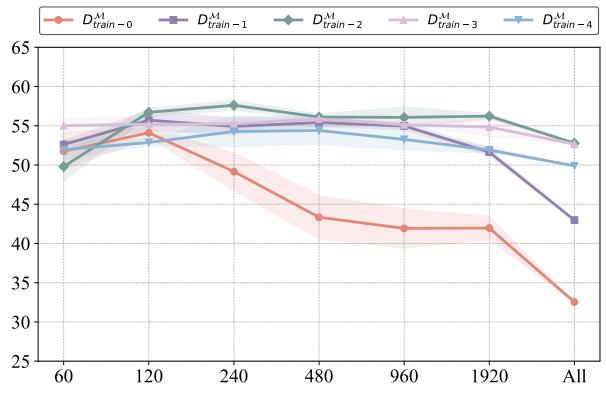  
(a) LLaMA-2-7B (In-Domain)

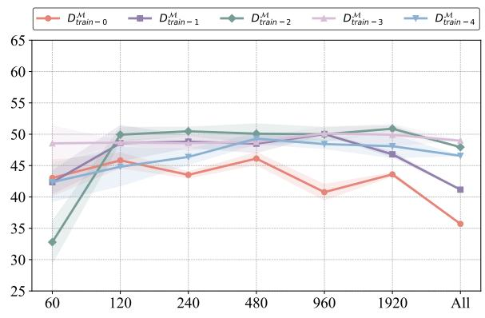  
(b) LLaMA-2-7B (Out-of-Domain)

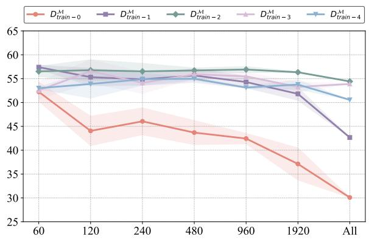  
(c) LLaMA-2-13B (In-Domain)

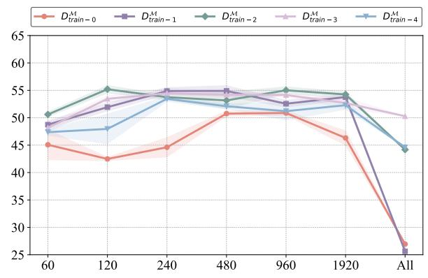  
(d) LLaMA-2-13B (Out-of-Domain)

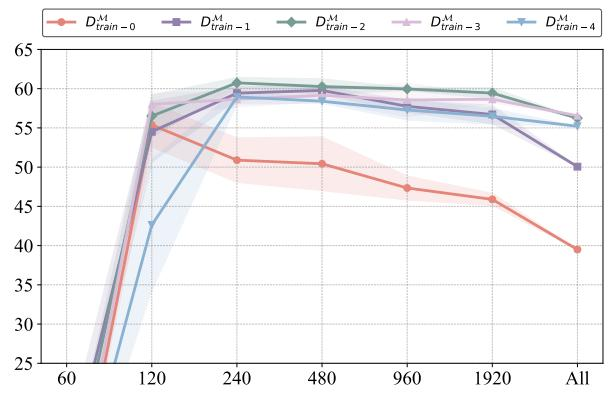  
(e) LLaMA-2-70B (In-Domain)

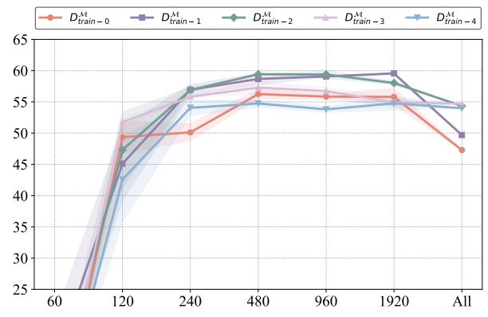  
(f) LLaMA-2-70B (Out-of-Domain)  
Figure 6: In-domain $( \mathbf { A c c } _ { t e s t } ^ { \mathcal { M } } )$ and out-of-domain $( \mathbf { A c c } _ { t e s t o o d } ^ { \mathcal { M } } )$ performance of the LLaMA-3 family models finetuned with varying data scales, where ‘All’ indicates the use of the entire dataset listed in Appendix D.

## C.2 Performance on the Training Set

We compare the performance of different LLMs fin-tuned from LLaMA-3-8B on their respective training sets when restoring different proportions of parameters. The results in Table 6 show that parameter reduction improves model performance on the training set, further supporting the idea that SFT introduces a significant number of unnecessary or even detrimental parameter updates.
<table><tr><td>Restore</td><td> $\mathscr { D } _ { \mathbf { t r a i n - 0 } } ^ { \mathcal { M } }$ </td><td> $\mathscr { D } _ { \mathbf { t r a i n - 1 } } ^ { \mathcal { M } }$ </td><td> $\mathscr { D } _ { \mathrm { t r a i n - 2 } } ^ { \mathcal { M } }$ </td><td> $\mathscr { D } _ { \mathbf { t r a i n - 3 } } ^ { \mathcal { M } }$ </td><td> $\mathscr { D } _ { \mathrm { t r a i n - 4 } } ^ { \mathcal { M } }$ </td></tr><tr><td colspan="6">Number of Training Data: 240</td></tr><tr><td>0</td><td>12.08</td><td>61.25</td><td>84.58</td><td>90.00</td><td>92.92</td></tr><tr><td>5%</td><td>12.50</td><td>62.92</td><td>85.00</td><td>90.83</td><td>93.75</td></tr><tr><td>20%</td><td>11.25</td><td>62.08</td><td>83.75</td><td>92.5</td><td>82.92</td></tr><tr><td colspan="6">Number of Training Data: 1920</td></tr><tr><td>0</td><td>16.56</td><td>62.81</td><td>83.44</td><td>89.48</td><td>93.39</td></tr><tr><td>5%</td><td>15.68</td><td>64.74</td><td>85.52</td><td>90.47</td><td>94.22</td></tr><tr><td>20%</td><td>15.16</td><td>65.00</td><td>89.06</td><td>90.57</td><td>94.90</td></tr></table>

Table 6: Performance of LLaMA-3-8B on the training set after restoring different scales of parameters across various fine-tuning datasets. Improvements over the non-restored model are highlighted in green , while performance declines are shown in red , with darker shades indicating larger differences.

## C.3 Comparison of Results Across Different Strategies

We compare the performance of LLaMA-3-8B trained using four different strategies:

• LLaMA-3-8B-Instruct: A chat-optimized version fine-tuned by Meta, demonstrating strong performance across various benchmarks.

• SFT (Mixed): Fine-tuning LLaMA-3-8B using a randomly mixed dataset. Results are tested across different data volumes, with the best outcomes reported.

• SFT (Divided): Fine-tuning LLaMA-3-8B with data divided based on the model’s mastery level. The best results are reported when fine-tuning with 1,920 samples.

• LoRA: Fine-tuning LLaMA-3-8B using a randomly mixed dataset with LoRA (Hu et al., 2022).

• Parameter Restore: Fine-tuning LLaMA-3-8B using the divided dataset, followed by a parameter restoration process. The best results are reported when fine-tuning with 1,920 samples.

The results in Table 7 indicate that data division and parameter restoration strategies significantly enhance model performance, offering valuable insights for optimizing data selection and fine-tuning approaches.

<table><tr><td>Strategies</td><td>LLaMA-3-8B-Instruct</td><td>SFT (Mixed)</td><td>SFT (Divided)</td><td>LoRA</td><td>Parameter Restoration</td></tr><tr><td> $\mathbf { A c c } _ { t e s t } ^ { \mathcal { M } }$ </td><td>53.83</td><td>58.67</td><td>58.80</td><td>57.82</td><td>62.21</td></tr><tr><td> $\mathbf { A c e } _ { t e s t o o d } ^ { \mathcal { M } }$ </td><td>54.14</td><td>53.88</td><td>54.04</td><td>51.52</td><td>57.10</td></tr></table>

Table 7: Performance of different LLMs fine-tuned using various strategies. The best results are highlighted in bold.

## D Data Distribution of Different LLMs

Since data division is based on the model’s mastery of the data, we analyze the data distributions corresponding to different pre-trained LLMs. The results for LLaMA-3-8B are presented in Section 3.1, while the distributions for other models are shown in Table 8.
<table><tr><td> $\mathscr { D } _ { t r a i n }$ </td><td> $\mathcal { D } _ { t r a i n - 0 } ^ { \mathcal { M } }$ </td><td> $\mathcal { D } _ { t r a i n - 1 } ^ { \mathcal { M } }$ </td><td> $\mathcal { D } _ { t r a i n - 2 } ^ { \mathcal { M } }$ </td><td> $\mathcal { D } _ { t r a i n - 3 } ^ { \mathcal { M } }$ </td><td> $\mathcal { D } _ { t r a i n - 4 } ^ { \mathcal { M } }$ </td></tr><tr><td>Number</td><td>12530</td><td>26805</td><td>14961</td><td>11542</td><td>10106</td></tr><tr><td> $\mathcal { D } _ { t e s t }$ </td><td> $\mathcal { D } _ { t e s t - 0 } ^ { \mathcal { M } }$ </td><td> $\mathcal { D } _ { t e s t - 1 } ^ { \mathcal { M } }$ </td><td> $\mathcal { D } _ { t e s t - 2 } ^ { \mathcal { M } }$ </td><td> $\mathcal { D } _ { t e s t - 3 } ^ { \mathcal { M } }$ </td><td> $\mathcal { D } _ { t e s t - 4 } ^ { \mathcal { M } }$ </td></tr><tr><td>Number</td><td>1595</td><td>3374</td><td>1876</td><td>1491</td><td>1219</td></tr><tr><td> $\mathcal { D } _ { t e s t o o d }$ </td><td> $\mathcal { D } _ { t e s t o o d - 0 } ^ { \mathcal { M } }$ </td><td> $\mathcal { D } _ { t e s t o o d - 1 } ^ { \mathcal { M } }$ </td><td> $\underline { { \mathcal { D } _ { t e s t o o d - 2 } ^ { \mathcal { M } } } }$ </td><td> $\mathcal { D } _ { t e s t o o d - 3 } ^ { \mathcal { M } }$ </td><td> $\underline { { \mathcal { D } _ { t e s t o o d - 4 } ^ { \mathcal { M } } } }$ </td></tr><tr><td>Number</td><td>2795</td><td>4517</td><td>1704</td><td>1542</td><td>1055</td></tr></table>

(a) LLaMA-3-70B
<table><tr><td> $\mathscr { D } _ { t r a i n }$ </td><td> $\mathcal { D } _ { t r a i n - 0 } ^ { \mathcal { M } }$ </td><td> $\mathcal { D } _ { t r a i n - 1 } ^ { \mathcal { M } }$ </td><td> $\mathcal { D } _ { t r a i n - 2 } ^ { \mathcal { M } }$ </td><td> $\mathcal { D } _ { t r a i n - 3 } ^ { \mathcal { M } }$ </td><td> $\mathcal { D } _ { t r a i n - 4 } ^ { \mathcal { M } }$ </td></tr><tr><td>Number</td><td> $2 0 8 9 9$ </td><td> $3 0 5 6 2 $ </td><td>9798</td><td>7996</td><td>6689</td></tr><tr><td> $\mathcal { D } _ { t e s t }$ </td><td> $\mathcal { D } _ { t e s t - 0 } ^ { \mathcal { M } }$ </td><td> $\mathcal { D } _ { t e s t - 1 } ^ { \mathcal { M } }$ </td><td> $\mathcal { D } _ { t e s t - 2 } ^ { \mathcal { M } }$ </td><td> $\mathcal { D } _ { t e s t - 3 } ^ { \mathcal { M } }$ </td><td> $\mathcal { D } _ { t e s t - 4 } ^ { \mathcal { M } }$ </td></tr><tr><td>Number</td><td>2675</td><td>3791</td><td> $1 2 7 5$ </td><td>1006</td><td>808</td></tr><tr><td> $\mathcal { D } _ { t e s t o o d }$ </td><td> $\mathcal { D } _ { t e s t o o d - 0 } ^ { \mathcal { M } }$ </td><td> $\underline { { \mathcal { D } _ { t e s t o o d - 1 } ^ { \mathcal { M } } } }$ </td><td> $\frac { \mathcal { D } _ { t e s t o o d - 2 } ^ { \mathcal { M } } } { \mathrm { ~ \it ~ \Omega ~ } }$ </td><td> $\mathcal { D } _ { t e s t o o d - 3 } ^ { \mathcal { M } }$ </td><td> $\underline { { \mathcal { D } _ { t e s t o o d - 4 } ^ { \mathcal { M } } } }$ </td></tr><tr><td>Number</td><td>4671</td><td>4242</td><td>1233</td><td>981</td><td>486</td></tr></table>

(c) LLaMA-2-13B

<table><tr><td> $\mathcal { D } _ { t r a i n }$ </td><td> $\mathcal { D } _ { t r a i n - 0 } ^ { \mathcal { M } }$ </td><td> $\mathcal { D } _ { t r a i n - 1 } ^ { \mathcal { M } }$ </td><td> $\mathcal { D } _ { t r a i n - 2 } ^ { \mathcal { M } }$ </td><td> $\mathcal { D } _ { t r a i n - 3 } ^ { \mathcal { M } }$  3</td><td> $\mathcal { D } _ { t r a i n - 4 } ^ { \mathcal { M } }$ </td></tr><tr><td>Number</td><td>22725</td><td>30566</td><td>9336</td><td>7508</td><td>5809</td></tr><tr><td> $\mathcal { D } _ { t e s t }$ </td><td>DM test-0</td><td> $\mathcal { D } _ { t e s t - 1 } ^ { \mathcal { M } }$ </td><td> $\mathcal { D } _ { t e s t - 2 } ^ { \mathcal { M } }$ </td><td> $\mathcal { D } _ { t e s t - 3 } ^ { \mathcal { M } }$ </td><td> $\mathcal { D } _ { t e s t - 4 } ^ { \mathcal { M } }$ </td></tr><tr><td>Number</td><td>2941</td><td>3805</td><td>1162</td><td>958</td><td>689</td></tr><tr><td> $\mathcal { D } _ { t e s t o o d }$ </td><td> $\mathcal { D } _ { t e s t o o d - 0 } ^ { \mathcal { M } }$  </td><td> $\mathcal { D } _ { t e s t o o d - 1 } ^ { \mathcal { M } }$  </td><td> $\mathcal { D } _ { t e s t o o d - 2 } ^ { \mathcal { M } }$ </td><td> $\underline { { \mathcal { D } _ { t e s t o o d - 3 } ^ { \mathcal { M } } } }$  </td><td> $\underline { { \mathcal { D } _ { t e s t o o d - 4 } ^ { M } } }$ </td></tr><tr><td>Number</td><td>5201</td><td>4181</td><td>1030</td><td>786</td><td>415</td></tr></table>

(b) LLaMA-2-7B  
Table 8: Data distribution for different LLMs.
<table><tr><td> $\mathcal { D } _ { t r a i n }$ </td><td> $\mathcal { D } _ { t r a i n - 0 } ^ { \mathcal { M } }$ </td><td> $\mathcal { D } _ { t r a i n - 1 } ^ { \mathcal { M } }$ </td><td> $\mathcal { D } _ { t r a i n - 2 } ^ { \mathcal { M } }$ </td><td> $\mathcal { D } _ { t r a i n - 3 } ^ { \mathcal { M } }$ </td><td> $\mathcal { D } _ { t r a i n - 4 } ^ { \mathcal { M } }$ </td></tr><tr><td>Number</td><td> $1 5 3 7 8$ </td><td> $2 9 4 6 8$ </td><td> $1 3 3 8 5$ </td><td> $9 3 4 4$ </td><td>8369</td></tr><tr><td> $\mathcal { D } _ { t e s t }$ </td><td> $\mathcal { D } _ { t e s t - 0 } ^ { \mathcal { M } }$ </td><td> $\mathcal { D } _ { t e s t - 1 } ^ { \mathcal { M } }$ </td><td> $\mathcal { D } _ { t e s t - 2 } ^ { \mathcal { M } }$ </td><td> $\mathcal { D } _ { t e s t - 3 } ^ { \mathcal { M } }$ </td><td> $\mathcal { D } _ { t e s t - 4 } ^ { \mathcal { M } }$ </td></tr><tr><td>Number</td><td>1956</td><td>3669</td><td>1719</td><td>1199</td><td>1012</td></tr><tr><td> $\mathcal { D } _ { t e s t o o d }$  </td><td> $\mathcal { D } _ { t e s t o o d - 0 } ^ { \mathcal { M } }$  </td><td> $\mathcal { D } _ { t e s t o o d - 1 } ^ { \mathcal { M } }$  </td><td> $\underline { { \mathcal { D } _ { t e s t o o d - 2 } ^ { \mathcal { M } } } }$ </td><td> $\mathcal { D } _ { t e s t o o d - 3 } ^ { \mathcal { M } }$ </td><td> $\underline { { \mathcal { D } _ { t e s t o o d - 4 } ^ { M } } }$ </td></tr><tr><td>Number</td><td>3339</td><td>4537</td><td>1511</td><td>1338</td><td>888</td></tr></table>

(d) LLaMA-2-70B

## E Discussion of Redundant Parameter Updates

## E.1 Distribution of Redundant Parameter Updates

To investigate why SFT leads to redundant parameter updates, we analyze the distribution of redundant parameters in LLaMA-3-8B. As shown in Table 9 and Table 10, these parameters are spread across all layers of the model, with a higher concentration in the initial layers (i.e, 0–2), fewer in the final layers (i.e., 30–31), and a more uniform distribution in the middle layers (i.e., 3–29). This pattern may be due to the initial layers primarily encoding semantic information that is already well-learned during pretraining, resulting in greater parameter redundancy. In contrast, the final layers, which focus on output formatting, exhibit less redundancy. Furthermore, we observe that most redundant parameters are concentrated in the FFN layers, suggesting that their high parameter count presents a potential target for optimization. We also acknowledge that the emergence of redundant parameters may be linked to the lottery ticket hypothesis (Frankle and Carbin, 2019).

<table><tr><td>Layer</td><td>0</td><td>1</td><td>2</td><td>3</td><td>4</td><td>5</td><td>6</td><td>7</td><td>8</td><td>9</td><td>10</td><td>11</td><td>12</td><td>13</td><td>14</td><td>15</td></tr><tr><td>Percentage</td><td>3.77</td><td>3.26</td><td>3.25</td><td>3.15</td><td>3.17</td><td>3.20</td><td>3.19</td><td>3.20</td><td>3.23</td><td>3.21</td><td>3.22</td><td>3.18</td><td>3.10</td><td>3.13</td><td>3.15</td><td>3.12</td></tr><tr><td>Layer</td><td>16</td><td>17</td><td>18</td><td>19</td><td>20</td><td>21</td><td>22</td><td>23</td><td>24</td><td>25</td><td>26</td><td>27</td><td>28</td><td>29</td><td>30</td><td>31</td></tr><tr><td>Percentage</td><td>3.16</td><td>3.11</td><td>3.08</td><td>3.07</td><td>3.10</td><td>3.06</td><td>3.06</td><td>3.03</td><td>3.01</td><td>2.99</td><td>3.00</td><td>3.03</td><td>2.98</td><td>2.95</td><td>2.99</td><td>2.84</td></tr></table>

Table 9: Distribution of redundant parameter updates across layers in LLaMA-3-8B.

<table><tr><td>Module</td><td>mlp.down mlp.up</td><td></td><td>mlp.gate</td><td>attn.o</td><td>attn.q</td><td>attn.v</td><td>attn.k</td></tr><tr><td>Percentage</td><td>28.91</td><td>28.26</td><td>23.37</td><td>9.40</td><td>6.41</td><td>2.55</td><td>1.09</td></tr></table>

Table 10: Distribution of redundant parameter updates across modules in LLaMA-3-8B.

## E.2 Layers for Preserving Model Behavior

To identify which layers are most critical for preserving model behavior, we perform experiments that selectively restore parameters in different layers and evaluate the resulting performance. As shown in Table 11, our results reveal that the lower layers (0–3) are most crucial for maintaining model behavior, while the middle layers (4–27) have the least impact. This implies that SFT affects not only the predictive distributions in the upper layers but also substantially modifies the lower-layer parameters, thereby influencing overall model performance.

<table><tr><td>Restored Layers</td><td>0-3</td><td>4-7</td><td>8-11</td><td>12-15</td><td>16-19</td><td>20-23</td><td>24-27</td><td>28-31</td></tr><tr><td> $\mathscr { D } _ { \mathrm { t r a i n - 0 } }$ </td><td>9.83</td><td>57.05</td><td>55.59</td><td>55.56</td><td>55.22</td><td>55.50</td><td>55.14</td><td>57.60</td></tr><tr><td> $\mathcal { D } _ { \mathrm { t r a i n - 1 } }$ </td><td>21.59</td><td>58.22</td><td>57.83</td><td>58.02</td><td>58.03</td><td>57.99</td><td>57.96</td><td>57.99</td></tr><tr><td> $\mathscr { D } _ { \mathrm { t r a i n } - 2 }$ </td><td>53.75</td><td>56.50</td><td>59.54</td><td>59.38</td><td>59.26</td><td>59.36</td><td>58.95</td><td>34.68</td></tr><tr><td> $\mathscr { D } _ { \mathrm { t r a i n } - 3 }$ </td><td>2.80</td><td>59.43</td><td>59.12</td><td>59.17</td><td>59.15</td><td>59.18</td><td>59.15</td><td>50.76</td></tr><tr><td> $ { \mathcal { D } } _ { \mathrm { t r a i n } - 4 }$ </td><td>4.00</td><td>53.72</td><td>54.04</td><td>53.94</td><td>53.74</td><td>53.91</td><td>53.14</td><td>47.32</td></tr></table>

Table 11: Model performance when restoring different layers under different datasets.

## F Details of Data Processing

In this section, we provide additional details on data processing.

## F.1 Robust Multi-Template Complementation Mechanism

As described in Ye et al. (2024c), consider a knowledge fact k represented as a triple (subject, relation, object), such as (Painblanc, locatedin, France). Given a sentence x = map(subject, relation) that maps the subject and relation $( \mathrm { e . g . }$ , Painblanc is located in), an LLM is considered to have memorized k if it can predict $y = { \mathrm { m a p } } ( o b j e c t )$ by mapping the object (e.g., France) such that $y \subseteq { \mathcal { M } } ( x )$

Since  is a probabilistic model influenced by different mapping templates and sampling probabilities, we design $N _ { \mathrm { m a p } } = 2 1$ different mappings for each knowledge fact k. With the temperature set to 0.7, the model generates $N _ { \mathrm { s a m p l e } } = 1 0$ outputs for each mapping. The degree to which the LLM memorizes k is then calculated as:

$$
R _ { k } ^ { \mathcal { M } } = \frac { \sum _ { i = 1 } ^ { N _ { \mathrm { m a p } } } \sum _ { j = 1 } ^ { N _ { \mathrm { s a m p l e } } } \mathbb { I } \left( y _ { i } \subseteq \mathcal { M } ^ { j } ( x _ { i } ) \right) } { N _ { \mathrm { m a p } } \times N _ { \mathrm { s a m p l e } } }
$$

where $x _ { i }$ and $y _ { i }$ represent the results from the ith mapping, $\mathcal { M } ^ { j }$ denotes the jth sampled output, and I( ) is the indicator function.

This approach effectively utilizes the characteristics of LLMs to evaluate their mastery of different data. However, as entities often have multiple aliases (e.g., USA and United States), the singular entity labeling in the original dataset may introduce biases. To enhance robustness, a synonym mapping table (Table 12) is constructed to expand the set of equivalent entity names, significantly improving result accuracy. This table is also used in judging the accuracy of LLMs’ answers after SFT.

<table><tr><td>Object</td><td>Synonyms</td></tr><tr><td>United States of America</td><td>USA, United States, United States of America</td></tr><tr><td>New York City</td><td>New York, New York City</td></tr><tr><td>University of Michigan</td><td>UMich, University of Michigan</td></tr><tr><td>South Korea</td><td>South Korea, Republic of Korea, Korea</td></tr><tr><td>Saint Petersburg</td><td>Saint Petersburg, St. Petersburg</td></tr><tr><td>Buenos Aires</td><td>Baires, Buenos Aires</td></tr><tr><td>People&#x27;s Republic of China</td><td>PRC, People&#x27;s Republic of China, China</td></tr><tr><td>Ohio State University</td><td>Ohio State University, Ohio State</td></tr><tr><td>Bosnia and Herzegovina</td><td>Bosnia, Bosnia and Herzegovina, Bosna i Hercegovina</td></tr><tr><td>University of Texas at Austin</td><td>University of Texas at Austin, University of Texas, UT Austin</td></tr><tr><td>University of Cambridge</td><td>Cambridge University, Cambridge, University of Cambridge</td></tr><tr><td>United States Military Academy</td><td>United States Military Academy, West Point</td></tr><tr><td>Rio de Janeiro</td><td>Rio de, Rio de Janeiro</td></tr><tr><td>University of Edinburgh</td><td>Edinburgh University, University of Edinburgh</td></tr><tr><td>Museo del Prado</td><td>Prado Museum, Museo Nacional del Prado, Museo del Prado</td></tr><tr><td>Salt Lake City</td><td>Salt Lake, Salt Lake City</td></tr><tr><td>North Carolina State University</td><td>NC State, North Carolina State University</td></tr><tr><td>University of Durham</td><td>University of Durham, Durham University</td></tr><tr><td>Harvard Law School</td><td>Harvard University, Harvard Law School</td></tr><tr><td>University of Paris (1896-1968)</td><td>Université de Paris, University of Paris, Paris University</td></tr><tr><td>Newcastle upon Tyne</td><td>Newcastle upon Tyne, Newcastle</td></tr><tr><td>University of Oslo</td><td>University of Oslo, Oslo University</td></tr><tr><td>Hebrew University of Jerusalem</td><td>University of Jerusalem, Hebrew University, Hebrew University of Jerusalem</td></tr><tr><td>Carnegie Mellon University</td><td>Carnegie Mellon University, Carnegie Mellon</td></tr><tr><td>University of Oxford</td><td>Oxford University, University of Oxford</td></tr><tr><td>Autodromo Nazionale Monza</td><td>Monza, Autodromo Nazionale Monza</td></tr><tr><td>Indiana State House</td><td>Indiana State House, Indiana State</td></tr><tr><td>Imperial College London</td><td>Imperial College, Imperial College London</td></tr><tr><td>United Arab Emirates</td><td>UAE, United Arab Emirates, The Emirates</td></tr></table>

Table 12: Synonym mapping table for objects in the dataset.

## F.2 Topics and Mapping Templates of Data

We categorize 10 location-related topics as in-domain data and another 14 unrelated topics as out-ofdomain data, designing 21 mapping templates for each topic. The corresponding data details of in-domain data are listed from Table 13 to Table 22, while the corresponding data details of out-of-domain data are listed from Table 23 to Table 36.

<table><tr><td>Topic: P17 Question Template: Which country is {subject } located in?</td></tr><tr><td>Mapping Templates: {subject} is located in The location of {subject} is in {subject} finds its place within the borders of The {subject} is situated in the country, If you're seeking the {subject}, look no further than the nation of The land encompassing the {subject} is known as {subject} can be found in {subject} has its roots in The place {subject} calls home is {subject} is situated in The geographical location of {subject} is in {subject} can be discovered in the nation of</td></tr><tr><td>Topic: P19 Question Template: Where was {subject} born?</td></tr><tr><td>Mapping Templates: {subject} was born in The birthplace of {subject} was It is known that {subject} came into the world in</td></tr><tr><td>{subject} entered the world in {subject} was born, and that location is {subject}'s life began in The location of {subject}'s birth is {subject}'s birth occurred in</td></tr><tr><td>The place where {subject} was born is {subject} hailed from The answer to where {subject} was born lies in {subject} originated from {subject} came into this world in</td></tr><tr><td>{subject} entered life in {subject} first drew breath in The origin of {subject} is in {subject} hails from The place of birth for {subject} is {subject}'s birth took place in</td></tr><tr><td>Topic: P20 Question Template: Where did {subject} die?</td></tr><tr><td>Mapping Templates: {subject} met their end at {subject} breathed their last at {subject}'s life came to a close at The place of {subject}'s death is</td></tr><tr><td>The location of {subject}'s demise is The site of {subject}'s final rest is The place where {subject} passed away is {subject}'s mortal remains are in {subject} succumbed to death in The destination of {subject}'s last days was</td></tr><tr><td>The story of {subject}'s life concluded in {subject} bid farewell to the world from within the confines of</td></tr><tr><td>The final resting place of {subject} is {subject} took his final breath in</td></tr><tr><td>{subject}'s life journey ended in {subject} died in</td></tr><tr><td>The place where {subject} died is {subject}'s death occurred in</td></tr><tr><td>Topic: P36 Question Template: What is the capital of {subject}?</td></tr><tr><td>Mapping Templates: The capital of {subject} is When considering the capital of {subject }, it is In {subject}, the city designated as the capital is {subject}'s capital city is The capital city of {subject} is located in</td></tr><tr><td>{subject} is governed from The seat of government in {subject} is {subject}'s governmental hub is</td></tr><tr><td>The administrative center of {subject} is The political heart of {subject} beats in One can find {subject}'s seat of power in the city of</td></tr><tr><td>One would find {subject}'s governing institutions nestled within the boundaries of {subject}'s capital is The capital of the region {subject} is {subject}'s capital designation goes to</td></tr><tr><td>Topic: P69 Question Template: Where was {subject } educated? Mapping Templates:</td></tr><tr><td>{subject} received education at {subject} completed the studies at {subject} was schooled at {subject} was educated in {subject} graduated from {subject} spent the formative years at {subject}'s alma mater is {subject} pursued the studies at {subject} gained the knowledge at The academic journey of {subject} took place in</td></tr></table>

Table 13: Information and mapping templates for topic P17 (in-domain).

Table 14: Information and mapping templates for topic P19 (in-domain).

Table 15: Information and mapping templates for topic P20 (in-domain).

Table 16: Information and mapping templates for topic P36 (in-domain).

Table 17: Information and mapping templates for topic P69 (in-domain).

<table><tr><td>Topic: P131 Question Template: Where is {subject} located?</td><td></td></tr><tr><td>Mapping Templates: The location of {subject} is where you&#x27;ll find If you look where {subject} is, you&#x27;ll see Where {subject} resides, there also is {subject} is located at</td><td></td></tr><tr><td>{subject} can be found in {subject} is positioned at {subject} is stationed at {subject} is based at</td><td></td></tr><tr><td>{subject} is headquartered at The current location of {subject} is One would locate {subject} in the vicinity of Currently, {subject} resides or occupies {subject} is in</td><td></td></tr><tr><td>The geographical position of {subject} is {subject} is placed in</td><td></td></tr><tr><td>You can find {subject} in {subject} exists in {subject} lies in The location of {subject} is {subject} is situated in</td><td></td></tr></table>

Table 18: Information and mapping templates for topic P131 (in-domain).

<table><tr><td>Topic: P159 Question Template: Where is the headquarter of {subject} ?</td></tr><tr><td>Mapping Templates: The headquarter of {subject } is located in {subject} has its headquarter in You can find the headquarter of {subject} in {subject}&#x27;s central office is situated in The main hub of {subject} is</td></tr><tr><td>{subject} is headquartered in The location of {subject}&#x27;s headquarter is {subject}&#x27;s headquarter can be found at The address of {subject}&#x27;s headquarter is {subject}&#x27;s headquarters are located at The central hub of operations for {subject} can be found in</td></tr><tr><td>The administrative heart of {subject} resides at {subject}&#x27;s head office is located in {subject} has its main base in</td></tr><tr><td>{subject}&#x27;s headquarters can be found in</td></tr><tr><td>The headquarters of {subject} is located in {subject}&#x27;s headquarters is in The main office of {subject} is in {subject}&#x27;s headquarter is located in</td></tr></table>

Table 19: Information and mapping templates for topic P159 (in-domain).

<table><tr><td>Topic: P276 Question Template: Where is {subject} located?</td><td></td></tr><tr><td>Mapping Templates: {subject} can be found at The location of {subject} is {subject} is situated at</td><td></td></tr><tr><td>{subject} has its base in {subject} is headquartered in {subject} operates out of The place where {subject} is located is {subject} is positioned at</td><td></td></tr><tr><td>The site of {subject} is {subject} can be found in the location The whereabouts of {subject} are at {subject} is situated in the place called {subject} is established in</td><td></td></tr><tr><td>The coordinates of {subject} point to The address of {subject} leads to {subject} is located in {subject} resides in You can find {subject} in</td><td></td></tr><tr><td>Topic: P495 Question Template: Which country was {subject} created in?</td><td></td></tr><tr><td>Mapping Templates: {subject} was created in The creation of {subject} took place in The origin of {subject} is traced back to {subject} was born in {subject} originated from {subject} was founded in {subject} was created in the country of</td><td></td></tr><tr><td>The country of origin for {subject} is {subject} originated in the country of The birthplace of {subject} is none other than {subject}'s formation occurred in the borders of Historically, {subject} emerged in the country known as {subject} was conceptualized in</td><td></td></tr><tr><td>The country credit for the creation of {subject} goes to The country that witnessed the creation of {subject} is The country where {subject} was created is {subject} was made in {subject} came into being in</td><td></td></tr></table>

Table 20: Information and mapping templates for topic P276 (in-domain).

Table 21: Information and mapping templates for topic P495 (in-domain).

<table><tr><td>Topic: P740 Question Template: Where was {subject } founded?</td></tr><tr><td>Mapping Templates: The founding of {subject} took place in {subject} was originally established in</td></tr><tr><td>{subject}'s origin is traced back to {subject} was founded in {subject} originated in {subject} has its roots in</td></tr><tr><td>The founding location of {subject} is {subject} has its origins in The birthplace of {subject} is One can trace {subject}'s beginnings to {subject} came into existence in</td></tr><tr><td>The roots of {subject} dig deep into the soil of {subject} traces its beginnings back to The inception of {subject } took place in {subject} was brought into existence in</td></tr><tr><td></td></tr><tr><td>The founding place of {subject} is The origin of {subject} is in The establishment of {subject} occurred in If you were to ask where {subject} was founded, it would be Looking at the origin of {subject}, it was founded in</td></tr><tr><td>Topic: P112 Question Template: Who founded {subject}?</td></tr><tr><td>Mapping Templates: The founder of {subject} is {subject} was founded by The establishment of {subject} was initiated by {subject} owes its existence to {subject} was brought into being by</td></tr><tr><td>{subject} is a brainchild of {subject} was established by {subject} has its roots in</td></tr><tr><td>The person who founded {subject} is The visionary behind {subject}'s establishment is</td></tr><tr><td>The inception of {subject } can be traced back to The idea and realization of {subject} were the brainchild of {subject} was brought into existence by</td></tr><tr><td></td></tr><tr><td>{subject}'s founder is known to be {subject} owes its inception to {subject} was created by The creation of {subject} is attributed to</td></tr><tr><td>Topic: P127 Question Template: Who owns {subject}?</td></tr><tr><td>Mapping Templates: The owner of {subject} is {subject} is owned by Ownership of {subject} belongs to {subject} belongs to {subject} is in the possession of</td></tr><tr><td>{subject} is a property of {subject} is possessed by</td></tr><tr><td>{subject} is under the ownership of {subject} is held by The proprietor of {subject} is none other than Responsibility for {subject} falls under the jurisdiction of The property known as {subject} is under the stewardship of</td></tr><tr><td>The rights to {subject} are held by The individual who owns {subject} is The rightful owner of {subject} is identified as Ownership of {subject} is held by</td></tr><tr><td>Topic: P170 Question Template: Who was {subject} created by?</td></tr><tr><td>Mapping Templates: {subject} was created by The creator of {subject} was</td></tr><tr><td>The person who created {subject} is known as {subject} was founded by {subject} owes its creation to {subject} was developed by</td></tr><tr><td>{subject}'s creator is {subject} was the creation of The person behind {subject} is {subject} was brought into existence by</td></tr><tr><td>The originator of {subject} is The creative force behind {subject} is attributed to</td></tr><tr><td>{subject} came into existence thanks to {subject} was brought to life by {subject} was conceptualized by The creation of {subject} is attributed to The entity responsible for creating {subject} is</td></tr><tr><td>{subject} was made by {subject}'s creation is attributed to When it comes to creation, {subject} was created by</td></tr><tr><td>Topic: P175 Question Template: Who performed {subject}?</td></tr><tr><td>Mapping Templates: The performer of {subject} was {subject} was performed by The one responsible for performing {subject} was</td></tr><tr><td>{subject} was brought to life by {subject} was presented by {subject} was executed by The artist behind {subject} is The talent behind {subject} is</td></tr><tr><td>The one who performed {subject} was The one who executed {subject} skillfully was The artist responsible for {subject}'s interpretation was The responsibility of performing {subject} fell upon {subject} was enacted by</td></tr><tr><td>The act of {subject} was performed by {subject} was executed on stage by The execution of {subject} was done by {subject} was carried out by</td></tr></table>

Table 22: Information and mapping templates for topic P740 (in-domain).

Table 23: Information and mapping templates for topic P112 (out-of-domain).

Table 24: Information and mapping templates for topic P127 (out-of-domain).

Table 25: Information and mapping templates for topic P170 (out-of-domain).

Table 26: Information and mapping templates for topic P175 (out-of-domain).

<table><tr><td>Topic: P176 Question Template: Which company is {subject} produced by?</td><td></td></tr><tr><td>Mapping Templates: {subject} is produced by The producer of {subject} is</td><td rowspan="3"></td></tr><tr><td>The production company behind {subject} is {subject} is created by {subject} is assembled by {subject} comes from</td></tr><tr><td>{subject} is manufactured by The company responsible for {subject} is {subject} is a product of The production of {subject} falls under the umbrella of {subject} comes from the production house of</td></tr><tr><td>Topic: P26 Question Template: Who is {subject} married to?</td></tr><tr><td>Mapping Templates: {subject}'s spouse is {subject} has been married to {subject} is in a marital union with The person {subject} is married to is {subject}'s partner in marriage is</td></tr><tr><td>{subject}'s better half is {subject} is wed to {subject} exchanged vows with</td></tr><tr><td>{subject} shares a life with {subject} shares a marital bond with</td></tr><tr><td>Their love story culminated in a wedding, uniting {subject} and The answer to {subject}'s nuptials lies in the presence of {subject} is married to {subject} has tied the knot with {subject} shares a matrimonial life with</td></tr><tr><td>Topic: P40 Question Template: Who is {subject }'s child?</td></tr><tr><td>Mapping Templates: The child of {subject} is known to be Belonging to {subject} as a child is As a child to {subject}, there is {subject}'s child is</td></tr><tr><td>{subject} is the parent of {subject}'s offspring is {subject}'s youngster is {subject}'s family includes {subject}'s lineage includes</td></tr><tr><td>{subject} has a child named The offspring of {subject} is identified as The child of {subject} is recognized as The offspring of {subject} includes {subject} is the biological parent of {subject} is the father/mother to</td></tr></table>

Table 27: Information and mapping templates for topic P176 (out-of-domain).

Table 28: Information and mapping templates for topic P26 (out-of-domain).

Table 29: Information and mapping templates for topic P40 (out-of-domain).

<table><tr><td>Topic: P413 Question Template: What position does {subject} play?</td><td></td></tr><tr><td>Mapping Templates: {subject} plays The position of {subject} is In the team, {subject} holds the position of</td><td></td></tr><tr><td>{subject} plays the position of {subject}&#x27;s role is {subject} is a The position played by {subject} is {subject} holds the position of {subject} is a player in the position of</td><td></td></tr><tr><td>In the game, {subject} assumes the role of {subject} is known for the position as When playing, {subject} takes up the position of The role {subject} takes on is</td><td></td></tr><tr><td>{subject} is assigned to the position The position that {subject} occupies is</td><td></td></tr><tr><td>{subject} occupies the position of {subject} fulfills the role of {subject} is positioned as a The position that {subject} plays is</td><td></td></tr></table>

Table 30: Information and mapping templates for topic P413 (out-of-domain).

<table><tr><td>Topic: P50 Question Template: Who is the author of {subject }?</td></tr><tr><td>Mapping Templates: {subject} was authored by The writer of {subject} is The person who authored {subject} is The author of {subject} is {subject} was written by</td></tr><tr><td>{subject} is a work by The creator of {subject } is The person responsible for {subject} is {subject} owes its existence to</td></tr><tr><td>The creative mind behind {subject} is none other than {subject} was penned by the talented writer, The work known as {subject} was brought to life by the author, {subject} is a work authored by</td></tr><tr><td>The penname associated with {subject} is The words of {subject} were put together by The person who wrote {subject} is {subject} was created by {subject} was drafted by If you were to ask who authored {subject}, it was</td></tr></table>

Table 31: Information and mapping templates for topic P50 (out-of-domain).

<table><tr><td>Topic: P136 Question Template: What type of music does {subject} play?</td><td></td></tr><tr><td>Mapping Templates: The music played by {subject} is When {subject} plays music, it is The musical style of {subject} can be categorized as {subject}&#x27;s sound is characterized as {subject}&#x27;s musical talent lies in {subject} has a knack for {subject}&#x27;s genre of music is {subject} is known for playing</td><td></td></tr><tr><td>{subject}&#x27;s music style is The genre that {subject} excels in is When it comes to music, {subject} is known for their proficiency in The tunes produced by {subject} belong to the category of {subject}&#x27;s music falls under the category of {subject} has a musical style that is categorized as</td><td></td></tr><tr><td>The music played by {subject} can be described as The type of music {subject} plays is The genre of music {subject} plays is The style of music {subject} plays is {subject} plays the music type of Musically, {subject} is known to play In terms of musical style, {subject} plays</td><td></td></tr></table>

Table 32: Information and mapping templates for topic P136 (out-of-domain).

<table><tr><td>Topic: P106 Question Template: What kind of work does {subject} do?</td></tr><tr><td>Mapping Templates: {subject} is employed in {subject} earns a living by working as {subject}'s occupation is {subject} is engaged in {subject}'s profession is {subject} works as a {subject} makes a living as {subject} has a career in {subject} is involved in {subject} engages in the occupation of The work that {subject} undertakes is classified as The focus of {subject}'s employment lies in</td></tr><tr><td>Topic: P264 Question Template: What music label is {subject } represented by?</td></tr><tr><td>Mapping Templates: {subject} is represented by The music label representing {subject} is</td></tr><tr><td>Regarding representation, {subject} is under {subject} has a record deal with {subject} has a musical partnership with {subject}'s music is released by {subject} is signed to</td></tr><tr><td>{subject} is affiliated with {subject} has a contract with {subject} is represented by the music label</td></tr><tr><td>The talented {subject} is associated with the music label {subject}'s discography is managed by the renowned label {subject} is under contract with the music label</td></tr><tr><td>{subject} is affiliated with the music label</td></tr><tr><td>The music label backing {subject} is {subject} is signed with the music label {subject} works with the music label {subject} is under the music label</td></tr></table>

Table 33: Information and mapping templates for topic P106 (out-of-domain).

Table 34: Information and mapping templates for topic P264 (out-of-domain).

<table><tr><td>Topic: P407 Question Template: Which language was {subject} written in?</td><td></td></tr><tr><td>Mapping Templates: {subject} was originally written in The language used for writing {subject} was The original text of {subject} appeared in {subject} was penned in The language of {subject} is</td><td></td></tr><tr><td>{subject} was composed in {subject} was created in {subject} is written in the language of The writing language of {subject} is {subject} was composed in the language known as The linguistic medium of {subject} is</td><td></td></tr><tr><td>The choice of language for {subject} is {subject} was written in the language of The language used to write {subject} is</td><td></td></tr><tr><td>The original language of {subject} is The writing of {subject} is in {subject} is composed in The text of {subject} is in {subject} was written in</td><td></td></tr></table>

Table 35: Information and mapping templates for topic P407 (out-of-domain).

<table><tr><td>Topic: P800 Question Template: What is {subject} famous for?</td></tr><tr><td>Mapping Templates: {subject} is famous for The fame of {subject} is due to People recognize {subject} for {subject} is renowned for {subject}&#x27;s claim to fame is {subject} is celebrated for {subject} is known for {subject} is distinguished by {subject} is admired for Fame comes to {subject} due to Among its achievements, {subject} is celebrated for {subject}&#x27;s popularity largely stems from {subject}&#x27;s notable recognition comes from</td></tr></table>

Table 36: Information and mapping templates for topic P800 (out-of-domain).