# Anchoring-Guidance Fine-Tuning (AnGFT): Elevating Professional Response Quality in Role-Playing Conversational Agents

Qibin Li1,2\*, Zhen Xu2, Shengyuan Bai1,3, Nianmin Yao1, Kaili Sun2,

Bowen Wu4,2†, Ying Li4, Baoxun Wang2

1School of Computer Science and Technology, Dalian University of Technology

2Platform and Content Group, Tencent

3International Digital Economy Academy (IDEA)

4School of Software & Microelectronics, Peking University

liqibin@mail.dlut.edu.cn, jerry.sy.bai@gmail.com, lucos@dlut.edu.cn {zenxu, kailisun, asulewang}@tencent.com, {jason\_wbw, li.ying}@pku.edu.cn

## Abstract

Large Language Models (LLMs) have demonstrated significant advancements in various fields, notably in Role-Playing Conversational Agents (RPCAs). However, when confronted with role-specific professional inquiries, LLMsbased RPCAs tend to underperform due to their excessive emphasis on the conversational abilities of characters rather than effectively invoking and integrating relevant expert knowledge. This often results in inaccurate responses. We refer to this phenomenon as the "Knowledge Misalignment" which underscores the limita tions of RPCAs in integrating expert knowledge.To mitigate this issue, we have introduced an Anchoring-Guidance Fine-Tuning (AnGFT) Framework into the RPCAs’ training process. This involves initially linking the Anchoring-Based System Prompt (ASP) with the LLM’s relevant expert domains through diverse prompt construction strategies and supervised fine-tuning (SFT). Following the roleplay enriched SFT, the integration of ASP enables LLMs to better associate with relevant expert knowledge, thus enhancing their response capabilities in role-specific expert domains. Moreover, we have developed four comprehensive metrics—helpfulness, thoroughness, credibility, and feasibility—to evaluate the proficiency of RPCAs in responding to professional questions. Our method was tested across four professional fields, and the experimental outcomes suggest that the proposed AnGFT Framework substantially improves the RPCAs performance in handling role-specific professional queries, while preserving their robust role-playing abilities.

## 1 Introduction

The advent of large language models (LLMs) such as ChatGPT (OpenAI, 2024), Llama3 (LlamaFamily, 2024), and Qwen2.5 (Yang et al., 2024), with their exceptional instruction-following and generation capabilities, has fundamentally transformed the development of Role-Playing Conversational Agents (RPCAs) (Zhou et al., 2023; Tamoyan et al., 2024). Through fine-tuning on extensive role-playing data, RPCAs have achieved significant improvements in character consistency, providing users with more realistic and engaging interactive experiences. However, extensive research indicates that this targeted training often undermines the LLMs’ ability to effectively handle general domain queries (Lu et al., 2024a; Song et al., 2025). In the application of RPCAs, this may result in agents providing inaccurate or vague responses when dealing with specific professional domain questions related to the roles. As illustrated in Figure 1, role-playing LLMs frequently deliver unsatisfactory responses to domain-specific questions related to their assigned roles. Such responses contain less related knowledge to the inquiry and provide no reason for the rhetorical question from professional view. The primary limitation of LLMs in this context is their lack of training on data that simulates professional role-playing scenarios. Consequently, when presented with queries requiring specialized expertise, they tend to mimic stereotypical dialogue patterns of a role rather than applying deep professional knowledge. We refer to this phenomenon as the "Knowledge Misalignment", where LLMs, despite possessing the knowledge needed to answer questions, are unable to access and organize this knowledge appropriately due to a lack of awareness of the role they are currently playing or the context they are in.

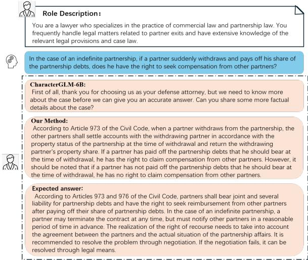  
Figure 1: Comparison of responses from our method and CharacterGLM-6B(Zhou et al., 2023) in the field of legal expertise. When faced with professional questions, CharacterGLM tends to avoid answering questions directly, while our method can more accurately demonstrate the professional capabilities of lawyers.

Addressing knowledge misalignment is key to improving RPCAs’ ability to handle queries in their specific professional domains. The most straightforward method involves creating datasets tailored to the roles’ professional knowledge, but this requires considerable time and resources, limiting its quick and broad implementation. Thus, many studies have suggested using well-designed prompts to leverage the internal knowledge of LLMs, reducing dependence on external datasets (Hu et al., 2024; Mousavi et al., 2025). For example, adding system prompts like "You are a helpful assistant" in advanced LLMs such as GPT can notably enhance response quality (Kim et al., 2024a; Wang et al., 2024b). However, research indicates that not all prompts effectively connect to specific domain knowledge, and generally, more detailed prompts lead to better responses (Zheng et al., 2024a). This issue often stems from variations in training data and methods among different LLMs, introducing uncertainties in activating domain knowledge and impacting the generalizability of this strategy.

We propose that integrating system prompts with domain-specific knowledge is key to enhancing RPCAs in professional contexts. To this end, we draw on the anchoring effect (Sinha et al., 2022), a psychological principle in which stimuli, such as specific words, become associated with certain memories or behaviors, facilitating rapid mental state shifts. This principle aligns well with LLMs, offering a mechanism to swiftly activate targeted professional personas and their knowledge bases. For instance, during the training phase of an LLM, the use of specific symbols as "anchors" has been observed to influence the model’s ability to respond to different sequential queries (Gou et al., 2023). Based on this insight, we hypothesize that incorporating system prompts as anchors in fine-tuning for domain-specific questions can effectively connect these prompts to their respective domains. This strategy aims to produce more accurate and professional responses in professional role contexts, addressing knowledge misalignment issues.

Based on this hypothesis, we introduce "Anchoring-Guided Fine-Tuning" (AnGFT), a two-stage framework designed to enhance RP-CAs’ response capabilities to professional inquiries through the anchoring effect, linking system prompts with specific professional domains. In the first stage, AnGFT combines Anchoring System Prompts (AS) with Diverse System Prompts (DS) to closely connect system prompts to professional domains. AS aims to tightly link prompts with professional contexts, while DS seeks to enrich dialogue and improve response comprehensiveness, enhancing model generalization. In the second stage, AnGFT uses role-playing data to train, focusing on deepening role behavioral patterns to boost the LLM’s role-playing abilities. This approach significantly strengthens the linkage between domain knowledge and system prompts, improving RPCAs’ professional responses. Additionally, given the industry’s lack of metrics for evaluating specialized knowledge responses, AnGFT introduces four professional evaluation metrics based on LLM capabilities to assess RPCAs’ helpfulness, thoroughness, credibility, and feasibility comprehensively.

Our main contributions are as follows:

• We propose the Anchoring-Guidance Fine-Tuning (AnGFT) Framework, which utilizes the anchoring effect to strengthen the association between system prompts and LLM domain knowledge, thereby effectively enhancing the response proficiency of role-playing conversational agents (RPCAs) to specialized inquiries.

• We have designed and implemented a Professional Evaluation method based on LLMs. For the first time, this method assesses the role-related professional knowledge response capabilities of RPCAs from multiple dimensions (helpfulness, thoroughness, credibility, and Feasibility), filling a gap in this field.

• Our experiments demonstrate that AnGFT not only maintains robust role-playing capabilities but also enhances the response quality of RPCAs in role-specific professional domains.

## 2 Related Work

## 2.1 System Prompt

System prompts, initially introduced by ChatGPT (Ouyang et al., 2022), serve as a dedicated input component for LLMs and have been extensively implemented in contemporary models such as Mistral3 (AlKhamissi et al., 2024) and Claude3.5 (Anthropic, 2024). Research has demonstrated that incorporating character-specific features into system prompts significantly enhances LLM performance (Kim et al., 2024a). (Wang et al., 2024b) showed that LLMs could effectively evaluate and summarize outcomes using diversified role-specific prompts. Additionally, (Wan et al., 2023) developed an automated scheme for generating rolespecific system prompts to bolster LLM reasoning capabilities.

In the realm of role-playing, system prompts are utilized to construct diverse character backgrounds and scenarios, guiding the generation of dialogue closely aligned with character traits (Louie et al., 2024; Yu et al., 2024a).

## 2.2 Role-playing Abilities of LLMs

In recent years, the exceptional role-playing capabilities of LLMs have garnered considerable attention. Numerous studies have aimed to enhance LLMs’ performance in maintaining personality consistency, language style consistency, and emotional value delivery (Wang et al., 2024a; Sun et al., 2024; Lu et al., 2024b). To advance the field of RPCA, comprehensive evaluation strategies have been developed to thoroughly assess the quality of model outputs (Shen et al., 2024; Chen et al., 2024). (Tu et al., 2024) employed real multi-round dialogues and a multidimensional human scoring system for dialogue quality assessment. (Wu et al., 2025) introduced an LLM-based dialogue evaluation framework that leverages role-playing to facilitate more comprehensive and human-centric evaluations. Despite notable achievements, research indicates that as dialogue data increases, RPCAs still exhibit shortcomings in role-related professional domains, and corresponding evaluation strategies are lacking.

## 3 Method

In this section, we provide a detailed description of the Anchoring-Guidance Fine-Tuning Framework (AnGFT). This is a comprehensive training and evaluation framework for RPCAs, designed to mitigate the issue of knowledge misalignment and to enhance and quantify the dialogue performance of RPCAs in role-specific professional domains.

## 3.1 Anchoring-Guidance Fine-Tuning Framework of RPCAs

As illustrated in Figure 2, AnGFT includes an initial stage of Anchoring Professional Knowledge Fine-Tuning, aimed at linking system prompts with domain knowledge, followed by a role-based SFT stage, focusing on cultivating role-playing capabilities.

In the Anchoring Professional Knowledge Fine-Tuning phase, LLMs was fine-tuned utilizing standardized, domain-specific instructional alignment data with anchoring augmentation prompt. This process was aimed at linking system prompts with domain knowledge. Further details regarding this phase are elaborated in Subsection 3.2. Subsequently, in the second phase, a widely accepted methodology was employed to further fine-tune LLMs using role-play data, thereby augmenting its capabilities in role-playing scenarios. Specifically, each training instance, denoted as $X _ { R } =$ $\{ R , Q , A \}$ , consists of three elements: a designated character description (R), a query (Q), and a response (A). The R encapsulates the background knowledge, personality traits, and linguistic preferences of the character, thereby directing the LLM to produce responses (A) that are in alignment with the character’s attributes. The training objectives are defined by the following equation:

$$
L _ { s 2 } = - \sum _ { t } \log P _ { \theta } ( A _ { t } \mid R , Q , A _ { < t } )\tag{1}
$$

where θ is the model parameter. During the inference phase, we enhance the professional response capabilities of the LLM by concatenating AS with role descriptions to link with the internal knowledge of the LLM. Subsequently, we used the four evaluation metrics introduced in Section 3.3 to assess their quality.

## 3.2 Anchoring Professional Knowledge Fine-Tuning

In this section, we introduce the concept of the Anchoring Professional Knowledge Fine-Tuning. This stage utilizes the anchoring effect to generate system prompts that are diverse yet closely related to domain-specific knowledge. The objective is to enhance the capability of RPCAs in addressing role-related professional inquiries effectively.

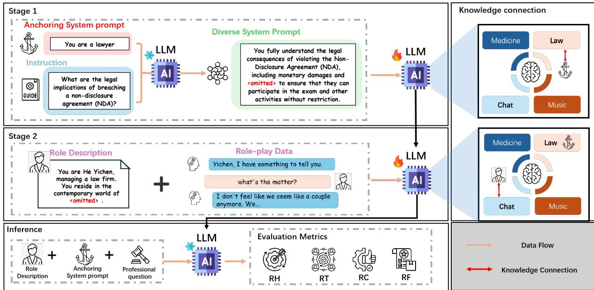  
Figure 2: Overview of Anchoring-Guidance Fine-tuning Framework (AnGFT), take the law profession as an example. The left part includes the two-stage training process and inference process of AnGFT, and the right part is knowledge connection.

Research indicates that system prompts which are diverse and detailed often surpass those that are similar yet brief in performance (Zheng et al., 2024b; Kim et al., 2024a). This can be attributed to the fact that similar-brief prompts may lead to stochastic and uncertain associations within the Large Language Models’ (LLMs) internal knowledge base. In contrast, diverse-detailed system prompts encapsulate richer information, thereby increasing the probability of activating relevant knowledge connections.

Based on the aforementioned analysis, We propose Anchoring-based System Prompt (ASP), which consists of two types of prompts: Anchoring System Prompt (AS) and Diverse System Prompt (DS). The Anchoring System Prompt is crafted to reinforce the connection between the prompts and specialized knowledge by incorporating key domain-specific concepts (e.g., occupation, detailed category) into the prompts. Conversely, the Diverse System Prompt aims to incorporate information from multiple perspectives and dimensions regarding the general rules of domains. This approach is intended to enrich the dialogue content and enhance the comprehensiveness of the generated responses.

The construction process of the ASP is illustrated in Figure 2. Specifically, for a given professional domain D, we identify a relevant role $R _ { D }$ within the domain and generate a concise description for it, which serves as the AS. It is crucial to note that the anchoring prompt for each domain is uniquely tailored to avoid confusion across different domains. This design ensures a precise alignment between the AS and domain-specific knowledge.

Subsequently, we employ the approach proposed by (Xu et al., 2023), which integrates In-context Learning (ICL) with specific instructions (I), and utilizes LLMs to dynamically generate DS. This method aims to incorporate comprehensive information to establish a broader connection with domain knowledge. The formula for this process is as follows:

$$
{ D S } = I C L ( R _ { D } , I )\tag{2}
$$

$$
S = A S + D S\tag{3}
$$

where + represent sentence concatenation. We have documented relevant prompts and ASP across different domains in Appendix E.

In the final stage, training samples augmented with ASP are used to fine-tune the LLMs. This strategy is designed to guide the LLMs towards generating responses that are not only professionally accurate but also closely aligned with the instruction query (I). For a training sample $X = \{ I , S \}$ the corresponding target is Y, where S denotes the ASP composed of AS and DS to inject anchor information and associate relevant knowledge. Therefore, the anchoring professional knowledge fine-tuning can be encapsulated using the following training objective:

$$
L _ { s 1 } = - \sum _ { t } \log P _ { \theta } ( y _ { t } \mid I , S , Y _ { < t } )\tag{4}
$$

where θ is the parameter of model training, $y _ { t }$ is the t-th token of Y.

## 3.3 Professional Evaluation Metrics

Existing evaluation methodologies for RPCAs predominantly concentrate on dialogue consistency, yet they inadequately assess the RPCAs’ proficiency in integrating role-specific professional knowledge within conversations. To bridge this gap and improve RPCAs’ proficiency in addressing professional queries, we have developed four Professional Evaluation Metrics. These metrics utilize GPT-4 (OpenAI, 2024) to evaluate the responses of RPCAs, demonstrating promising outcomes in preliminary studies. Drawing inspiration from these findings (Ethayarajh et al., 2022; Kim et al., 2024b), we have employed Large Language Models (LLMs) as a Judge Model (JM) to evaluate the more professionally competent response.

To ascertain the professionalism of a response, it is imperative to ensure accuracy, which serves as a foundational criterion. Furthermore, the demonstration of comprehensive professional knowledge and the provision of viable recommendations substantially elevate the professionalism of a response. Consequently, we have delineated the following dimensions for an exhaustive evaluation of professionalism:

Response Helpfulness (RH): This metric gauges the degree to which a response is pertinent to the professional domain in question, ensuring the provision of accurate and factually correct solutions to the professional challenges presented.

Response Thoroughness (RT): This metric evaluates the depth of understanding exhibited in the response, including the provision of detailed insights and explanations of specialized concepts.

Response Credibility (RC): This metric assesses the reliability of the response’s sources and its authoritative basis, verifying the support of the information by robust evidence, such as scientific research, industry reports, or data from professional organizations.

Response Feasibility (RF): This metric examines the appropriateness and practicality of the advice given, considering its actionability and customization to the specific requirements and context of the inquiry.

To ensure the Judge Model (JM) precisely evaluates professionalism, we have formulated specific prompting strategies. These strategies were inspired by (Wu et al., 2025) and expanded upon the professionalism assessment framework proposed by previous research. The templates for these prompts across various dimensions are detailed in Appendix D.2.

During the evaluation phase, we addressed the potential influence of position bias by employing a swap operation. If the JM’s evaluation outcomes before and after the swap operation were inconsistent, it indicated that the two responses were comparable in terms of professionalism.

## 4 Experiment and Evaluation

## 4.1 Datasets

In this section, we describe the role-playing and domain-specific datasets utilized in our study.

In selecting domain-specific datasets, we conducted experiments in four representative professional fields: medicine, law, finance and music. Specifically, the Chinese datasets included Huatuo (Li et al., 2023), Lawyer-LLama (Huang et al., 2023), and the finance and music sections of chatgpt-corpus1; the English datasets comprised PubMedQA (Jin et al., 2019), Hf-law-qa2, FinQA3, and ChatMusician (Yuan et al., 2024). Each dataset was meticulously filtered and restructured to create more specialized datasets. Detailed processing information is reported in Appendix A.

Regarding the role-play dataset, we selected the Beyond Dialogue (Yu et al., 2024b) dataset to train our role-playing model. Beyond Dialogue encompasses 280 Chinese roles and 31 English roles, featuring over 3.5K simulated dialogues.

## 4.2 Evaluation Methods

In this paper, AnGFT aims to maintain robust roleplaying capabilities while effectively enhancing the performance of RPCAs in role-related professional domains. Our evaluation encompasses both professional and general aspects.

For the professional assessment, as detailed in Section 3.3, we employ the GPT-4 to evaluate the model’s performance in role-specific professional fields across four dimensions. Our evaluation strategy is pair-wise, consistent with (Wu et al., 2025), introducing the win rate metric, defined as the proportion of instances where one model outperforms all others. This is calculated by dividing the number of wins by the total number of comparisons. Specifically, we treat each round of dialogue as an independent instance. For instance, if there are three models and 100 instances, each model will undergo 100\*2 comparisons. If a model wins 70 times, its win rate would be 70/200 = 35%. During the evaluation process, instances where a tie occurs are excluded from the statistical analysis.

<table><tr><td rowspan="2">Model</td><td rowspan="2">Method</td><td colspan="4">Medicine</td><td colspan="4">Law</td><td colspan="4">Finance</td><td colspan="4">Music</td></tr><tr><td>RH</td><td>RT</td><td>RC</td><td>RF</td><td>RH</td><td>RT</td><td>RC</td><td>RF</td><td>RH</td><td>RT</td><td>RC</td><td>RF</td><td>RH</td><td>RT</td><td>RC</td><td>RF</td></tr><tr><td rowspan="4">Qwen2.5-3B</td><td>None+ROLE</td><td>24.33</td><td>23.00</td><td>18.33</td><td>25.33</td><td>24.50</td><td>17.00</td><td>22.00</td><td>29.50</td><td>21.33</td><td>22.00</td><td>23.50</td><td>21.67</td><td>14.83</td><td>22.00</td><td>27.17</td><td>21.50</td></tr><tr><td>ROLE</td><td>22.00</td><td>19.50</td><td>21.33</td><td>27.17</td><td>24.67</td><td>25.50</td><td>21.33</td><td>27.83</td><td>26.00</td><td>24.00</td><td>22.00</td><td>16.33</td><td>17.50</td><td>12.00</td><td>25.33</td><td>20.33</td></tr><tr><td>SYS+ROLE</td><td>26.50</td><td>39.50</td><td>27.17</td><td>43.67</td><td>44.83</td><td>32.83</td><td>46.17</td><td>40.17</td><td>49.50</td><td>51.67</td><td>43.00</td><td>40.67</td><td>39.50</td><td>42.67</td><td>33.83</td><td>45.00</td></tr><tr><td>AnGFT</td><td>54.17</td><td>52.67</td><td>62.83</td><td>54.00</td><td>49.50</td><td>47.17</td><td>54.00</td><td>51.17</td><td>62.33</td><td>57.00</td><td>45.50</td><td>48.83</td><td>52.33</td><td>54.83</td><td>43.33</td><td>62.83</td></tr><tr><td rowspan="4">Qwen2.5-7B</td><td>None+ROLE</td><td>22.17</td><td>23.50</td><td>21.17</td><td>24.17</td><td>20.33</td><td>21.17</td><td>22.00</td><td>24.50</td><td>22.50</td><td>17.33</td><td>24.67</td><td>22.83</td><td>27.00</td><td>25.33</td><td>20.17</td><td>17.83</td></tr><tr><td>ROLE</td><td>24.17</td><td>21.00</td><td>22.17</td><td>15.17</td><td>28.83</td><td>30.33</td><td>20.17</td><td>25.83</td><td>23.83</td><td>24.33</td><td>14.67</td><td>16.83</td><td>20.00</td><td>22.00</td><td>20.50</td><td>23.50</td></tr><tr><td>SYS+ROLE</td><td>38.17</td><td>41.67</td><td>31.17</td><td>41.50</td><td>45.50</td><td>48.17</td><td>42.00</td><td>47.00</td><td>50.17</td><td>48.83</td><td>42.17</td><td>40.17</td><td>41.33</td><td>41.83</td><td>30.67</td><td>39.83</td></tr><tr><td>AnGFT</td><td>51.17</td><td>59.00</td><td>44.67</td><td>62.00</td><td>50.67</td><td>56.33</td><td>51.50</td><td>50.17</td><td>45.83</td><td>54.67</td><td>46.33</td><td>48.83</td><td>46.50</td><td>58.67</td><td>40.17</td><td>47.83</td></tr><tr><td rowspan="4">LLaMA3-8B</td><td>None+ROLE</td><td>22.17</td><td>16.83</td><td>22.83</td><td>23.33</td><td>24.17</td><td>25.33</td><td>24.17</td><td>21.17</td><td>27.67</td><td>28.67</td><td>28.33</td><td>24.67</td><td>28.83</td><td>15.83</td><td>22.17</td><td>25.33</td></tr><tr><td>ROLE</td><td>19.50</td><td>18.17</td><td>19.00</td><td>25.33</td><td>18.17</td><td>29.50</td><td>27.50</td><td>16.67</td><td>17.83</td><td>28.50</td><td>17.33</td><td>25.33</td><td>18.50</td><td>20.67</td><td>18.00</td><td>24.83</td></tr><tr><td>SYS+ROLE</td><td>39.50</td><td>38.33</td><td>42.83</td><td>45.17</td><td>41.83</td><td>41.33</td><td>42.00</td><td>45.67</td><td>40.67</td><td>45.17</td><td>41.00</td><td>30.67</td><td>32.83</td><td>43.17</td><td>32.17</td><td>34.33</td></tr><tr><td>AnGFT</td><td>54.00</td><td>57.67</td><td>41.33</td><td>51.33</td><td>61.00</td><td>47.67</td><td>54.83</td><td>56.83</td><td>63.00</td><td>48.17</td><td>59.67</td><td>46.17</td><td>56.17</td><td>59.67</td><td>57.67</td><td>47.67</td></tr></table>

Table 1: Win rate comparison results of AnGFT in professional fields. This comparison includes the AnGFT and SYS+ROLE methods using different system hint strategies, the ROLE method using only the second-stage training, and the None+ROLE method without any system hints (indicated in underline).

For the general assessment, we utilize the RAIDEN benchmark to evaluate AnGFT’s general conversational abilities. RAIDEN (Wu et al., 2025) is specifically designed for assessing the conversational capabilities of role-playing dialogue agents, encompassing 12 evaluation dimensions (Script-Based Knowledge (SBK), Script-Agnostic Knowledge (SAK), Script-Contradictory Knowledge (SCK), Role-Cognition Boundary (RCB), Persona Language Style (PLS), Emotional Resonance (ER), Persona-Behavior (PB), Conversation Memory (CM), Topic Shift (TS), Topic Advancement (TA), Chit-Chat (CC)).

## 4.3 Encoder Models

In our study, we employ LLaMA3-Chinese-8Bchat (LlamaFamily, 2024), Qwen2.5-3B-Instruct, and Qwen2.5-7B-Instruct (Yang et al., 2024) for experimentation. These models represent diverse network architectures and domain coverage within the realm of LLMs. It is important to note that the selection of the aforementioned Chinese models was solely motivated by the presence of Chinese data in our experimental dataset. This choice was made to ensure that the models’ capability to process Chinese text within the dataset is fully validated, and does not reflect any bias towards specific model architectures or performance characteristics. These models represent a diverse range of network architectures and domain coverage within the LLM landscape. For our experiments, we employed greedy decoding across all these models.

## 4.4 Baselines

To evaluate the performance of AnGFT on the RP-CAs task, we comprehensively compared AnGFT with the following baseline models: None + ROLE: In the first stage, no system prompts are used, while in the second stage, training is conducted using role-playing data. SYS + ROLE: In the first stage, training is conducted under the condition of general system prompts ("You are a helpful assistant"), and in the second stage, roleplaying data is used for training. ROLE: No first stage training is performed, and only role-playing data is used for training. Detailed procedures for the baseline model are documented in Appendix B.

## 5 Experimental Results

## 5.1 Role-specific Expertise Evaluation

Table 1 presents the comparative results of applying Anchoring-Guidance Fine-tuning Framework (AnGFT) to RPCAs against a baseline model. It is obvious that AnGFT gains over 10 points improvement versue baselines on most metrics accross four domains. This significant improvement highlights the effectiveness of AnGFT in mitigating the issue of knowledge misalignment in RPCAs. When compared to None+ROLE and ROLE, both AnGFT and SYS+ROLE equipped with system prompts demonstrate markedly improved performance in addressing professional inquiries. This improvement substantiates the hypothesis that system prompts can effectively bridge the LLM’s internal domain knowledge. It is noteworthy that the performance of ROLE is similar to that of None+ROLE, but both are significantly lower than AnGFT. This observation underscores the crucial role of anchored system prompts in linking domain knowledge and enhancing model performance. Moreover, AnGFT surpasses traditional system prompts in preserving the professionalism and relevance of responses. This superior performance is ascribed to AnGFT’s innovative incorporation of anchoring effects, which adeptly guide the LLM towards generating content that is pertinent and relevant to the professional roles being simulated.

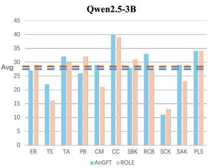

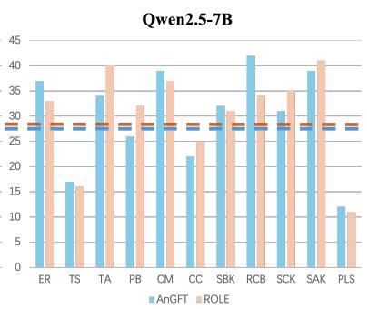

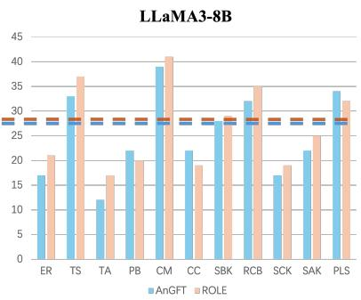  
Figure 3: Comparison of the win rates of AnGFT and ROLE (only using role-playing data to train the model) in the role-playing field under Qwen2.5-3B-Instruct, Qwen2.5-7B-Instruct, and LLaMA3-8B-Chat, where blue represents AnGFT and orange represents ROLE. The blue and brown dotted lines are the average scores of AnGFT and ROLE for each indicator under the three models.

<table><tr><td></td><td>RH</td><td>RT</td><td>RC</td><td>RF</td><td>Avg</td></tr><tr><td>Medicine</td><td>0.58</td><td>0.68</td><td>0.60</td><td>0.59</td><td>0.61</td></tr><tr><td>Law</td><td>0.65</td><td>0.63</td><td>0.64</td><td>0.61</td><td>0.63</td></tr><tr><td>Finance</td><td>0.61</td><td>0.66</td><td>0.54</td><td>0.71</td><td>0.63</td></tr><tr><td>Music</td><td>0.68</td><td>0.57</td><td>0.53</td><td>0.64</td><td>0.60</td></tr></table>

Table 2: Results of the study on the consistency of four professional evaluation indicators among human annotators. The table reports Cohen’s Kappa value.

## 5.2 Role-playing Capability Evaluation

One objective of AnGFT is to preserve the inherent role-playing capabilities of conversational agents.

We use the RAIDEN evaluation methodology to assess this. AnGFT is compared with a model trained solely on role-playing data (named ROLE) to evaluate its impact on performance. The results, shown in Figure 3, indicate that AnGFT matches the ROLE model in performance across various metrics. This performance parity highlights AnGFT’s ability to maintain role-playing capabilities at levels comparable to existing RPCAs. This consistent performance is due to AnGFT’s two-stage training strategy, which includes extensive training on role-playing data, ensuring the model not only understands but also adapts to the nuanced demands of different roles. AnGFT’s sustained capability to respond consistently suggests it enhances RPCAs’ proficiency in delivering role-specific knowledge while maintaining strong conversational skills.

## 5.3 Human Consistency Assessment

Table 2 presents a comparison between the four evaluation metrics proposed by AnGFT and human assessments. We report the Cohen’s Kappa values for these metrics, derived from independent evaluations of 100 samples by experts from various professional fields. All experiments were conducted using the Qwen2.5-7B-Instruct model. The data from Table 2 indicate that our evaluation metrics achieved an average Cohen’s Kappa score of 0.62, indicates that there is a high degree of consistency between the evaluations of GPT-4 and human assessors on the four metrics we proposed.

## 6 Ablation Study

To comprehensively evaluate AnGFT, we adopt the None+ROLE model as the Baseline and conduct exhaustive ablation experiments on AnGFT.

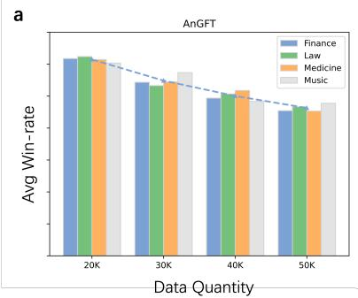

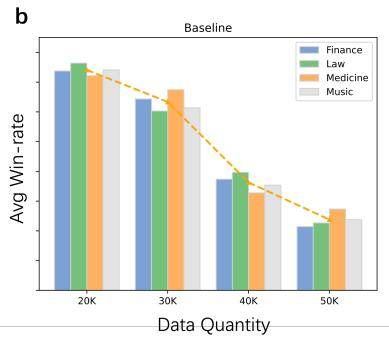

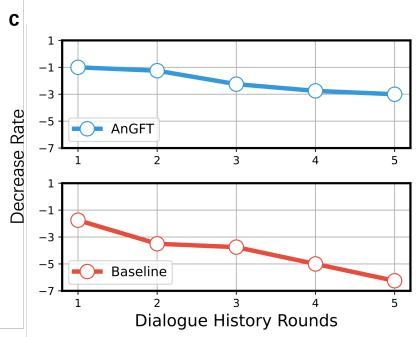  
Figure 4: (a): The professional performance mean ((RH+RT+RC+RF)/4) of AnGFT under different orders of magnitude of role-playing data, where the blue dotted line is the trend of change. (b): The professional performance mean ((RH+RT+RC+RF)/4) of Baseline under different orders of magnitude of role-playing data, where the orange dotted line is the trend of change. (c): The professional performance mean decline curve of AnGFT and Baseline under different historical dialogue rounds in the music field.

## 6.1 Diversity and Anchoring Effects of System Prompts

To ascertain the efficacy of Anchoring System Prompt (AS) and Diverse System prompt (DS) in the formulation of system prompts, ablation studies were conducted across three distinct configurations: AS alone, DS alone, and a synergistic combination of both AS and DS. The outcomes of these experiments are elucidated in Table 3, which details the performance metrics of the Qwen2.5-7B-Instruct model within four professional domains. As shown in Table, DS predominantly excels in enhancing response thoroughness and feasibility, whereas AS distinctly contributes to improving helpfulness. DS performs better in certain scenarios primarily due to its advantages in the comprehensiveness and feasibility of responses. DS typically contains higher information density and covers a broader range of topics or perspectives, which guides the model to generate more thorough and richer replies. In contrast, although the combination of AS and DS (AS+DS) integrates domain-specific knowledge, the AS tends to narrow the model’s focus more tightly on specialized details. This concentrated attention may, to some extent, limit the breadth and overall coverage of responses. Therefore, in scenarios requiring multi-perspective and broad answers, using DS alone can sometimes yield better performance.

## 6.2 AnGFT Performance with Different Role-playing Sample Sizes

Figure 4 (a) (b) demonstrates the impact of varying sample sizes from role-playing data on the effectiveness of our proposed method. This effect was simulated by increasing the number of training epochs. It is evident that increasing the size of role-playing sample leads to a rapid decline in the baseline’s performance for professional inquiries. In contrast, the decline observed with the AnGFT is relatively minor. This phenomenon highlights that although expanding role-playing samples affects the LLM’s ability to deliver professional responses, AnGFT effectively mitigates this issue. It achieves this by strengthening the link to domain-specific knowledge through system prompts that utilize anchoring effects, thus reducing the negative impact of increased role-playing data on response quality.

<table><tr><td rowspan=1 colspan=1></td><td rowspan=1 colspan=1>Model</td><td rowspan=1 colspan=2>RH</td><td rowspan=1 colspan=1>RT</td><td rowspan=1 colspan=1>RC</td><td rowspan=1 colspan=1>RF</td></tr><tr><td rowspan=2 colspan=1>Medicine</td><td rowspan=2 colspan=1>ASDSAS+DS</td><td rowspan=2 colspan=2>20.5017.0035.00</td><td rowspan=1 colspan=1>21.25</td><td rowspan=1 colspan=1>25.75</td><td rowspan=1 colspan=1>20.50</td></tr><tr><td rowspan=1 colspan=1>27.5036.75</td><td rowspan=1 colspan=1>16.5034.00</td><td rowspan=1 colspan=1>24.2550.75</td></tr><tr><td rowspan=2 colspan=1>Law</td><td rowspan=2 colspan=1>ASDSAS+DS</td><td rowspan=2 colspan=2>43.5042.5047.25</td><td rowspan=1 colspan=1>41.00</td><td rowspan=1 colspan=1>38.25</td><td rowspan=2 colspan=1>42.2545.0053.25</td></tr><tr><td rowspan=1 colspan=1>47.7543.25</td><td rowspan=1 colspan=1>39.2545.00</td></tr><tr><td rowspan=1 colspan=1>Finance</td><td rowspan=1 colspan=1>ASDSAS+DS</td><td rowspan=1 colspan=2>33.2532.5046.50</td><td rowspan=1 colspan=1>39.5040.7544.00</td><td rowspan=1 colspan=1>24.0025.2540.75</td><td rowspan=1 colspan=1>30.7533.0055.50</td></tr><tr><td rowspan=3 colspan=1>Music</td><td rowspan=3 colspan=1>ASDSAS+DS</td><td rowspan=2 colspan=2>34.5033.50</td><td rowspan=1 colspan=1>36.00</td><td rowspan=1 colspan=1>24.50</td><td rowspan=1 colspan=1>37.25</td></tr><tr><td rowspan=1 colspan=1>3.50</td><td rowspan=1 colspan=1>42.25</td><td rowspan=1 colspan=1>25.00</td><td rowspan=1 colspan=1>41.25</td></tr><tr><td rowspan=1 colspan=2>35.25</td><td rowspan=1 colspan=1>37.75</td><td rowspan=1 colspan=1>28.50</td><td rowspan=1 colspan=1>39.75</td></tr></table>

Table 3: Comparison of professional evaluation winrate in four domains using different system prompts build strategies under Qwen2.5-7B-Instruct. AS+DS indicates using AS and DS (ASP) at the same time.

## 6.3 Effects of Multi-turn Dialogues on AnGFT

To thoroughly evaluate the efficacy of AnGFT in facilitating multi-turn dialogues within RPCAs, we employed GPT-4 to generate a series of historical dialogues spanning various turns (see Appendix D for details), and then evaluate the capability of RPACs on professional knowledge. Figure 4 (c) presents the performance degradation trajectories of both AnGFT and a baseline model across successive rounds of historical dialogue within the music domain. As depicted in Figure 4 (c), despite a decline in response capability of AnGFT with an increase in dialogue turns, it markedly outperforms the baseline model in delivering professional responses. This superiority is accentuated as the number of dialogue turns escalates. This performance decline primarily stems from the inherent contextual dependency in multi-turn dialogues: models tend to focus more on immediate context to maintain semantic coherence, yet struggle to disengage from local context to invoke specialized knowledge, leading to issues of knowledge misalignment. Notably, AnGFT effectively mitigates this phenomenon by establishing a strong association between expert knowledge and prompts through its Anchored Semantic Prompting (ASP) mechanism. Specifically, via first-phase training, domain knowledge is tightly anchored within the system prompts, forming a "knowledge trigger" that enables the model to maintain access to professional expertise even in complex multi-turn conversations. In contrast, baseline models lack such a mechanism, making them more prone to drift away from the specialized domain during dialogue flow, thereby exhibiting a significantly greater performance degradation compared to AnGFT.

## 7 Conclusion

In this study, we have investigated the potential of system prompts to augment the response capabilities of RPCAs within specialized professional domains, circumventing the necessity for annotating high-quality professional dialogue data. We introduced the Anchoring-Guidance Fine-Tuning (AnGFT) methodology, which markedly enhances the ability of RPCAs to generate responses in domains pertinent to their designated roles, successfully alleviating knowledge misalignment. Comprehensive analysis shows that our proposed approach significantly enhances RPCAs’ ability to deliver role-specific responses while preserving their inherent role-playing functionalities. This research contributes novel insights and methodologies to the field, offering a robust framework for RPCAs to execute a variety of role-playing tasks with enhanced efficiency and specificity.

## Limitation & Future Work

## Limitation

Scalability issues: Although AnGFT only requires the design of brief anchoring system prompts, which are intended to help the model relate to professional fields, some manual work is still introduced.

Dependence on expert data quality: The performance of the AnGFT framework depends heavily on the quality of the training data used in the first supervised fine-tuning phase. Insufficient or biased data with poor expertise may lead to suboptimal learning results and may reinforce existing biases in RPCA responses. We fine-tune the construction of better responses, but the construction process is still resource-intensive.

## Future Work

Automated Domain System Prompt Generation: Future research is intended to focus on developing a multi-domain automated system prompt generation solution. This solution will use advanced automation techniques to automatically identify and generate high-quality anchor prompts related to specific professional fields. This will reduce manual intervention and improve the deployment efficiency and scalability of the system.

Introducing external knowledge bases and expert systems: In order to make up for the deficiencies in training data, it is possible to consider integrating external knowledge bases or expert systems to provide more accurate and authoritative information. These systems can serve as auxiliary tools to help RPCAs provide more in-depth and accurate answers when dealing with professional issues.

## Acknowledgments

We would like to express our sincere gratitude to the anonymous reviewers and the area chair for their insightful and constructive feedback. This work was supported by the Science and Technology Innovation Key R&D Program of Chongqing (Grant No. CSTB2024TIAD-STX0027). We also acknowledge the Platform and Content Group at Tencent for their support of this internship project.

## References

Badr AlKhamissi, Muhammad ElNokrashy, Mai Alkhamissi, and Mona Diab. 2024. Investigating cultural alignment of large language models. In Proceedings ofthe 62nd Annual Meeting ofthe Association for Computational Linguistics (Volume 1: Long Papers), pages 12404–12422, Bangkok, Thailand. Association for Computational Linguistics.

Anthropic. 2024. The claude 3 model family: Opus, sonnet, haiku.

Hongzhan Chen, Hehong Chen, Ming Yan, Wenshen Xu, Gao Xing, Weizhou Shen, Xiaojun Quan, Chenliang Li, Ji Zhang, and Fei Huang. 2024. Social-Bench: Sociality evaluation of role-playing conversational agents. In Findings of the Association for Computational Linguistics: ACL 2024, pages 2108–2126, Bangkok, Thailand. Association for Computational Linguistics.

Kawin Ethayarajh, Yejin Choi, and Swabha Swayamdipta. 2022. Understanding dataset difficulty with -usable information. In Proceedings of the 39th International Conference on Machine Learning, volume 162 of Proceedings of Machine Learning Research, pages 5988–6008. PMLR.

Zhibin Gou, Qingyan Guo, and Yujiu Yang. 2023. MvP: Multi-view prompting improves aspect sentiment tuple prediction. In Proceedings of the 61st Annual Meeting of the Association for Computational Linguistics (Volume 1: Long Papers), pages 4380–4397, Toronto, Canada. Association for Computational Linguistics.

Zheng Hu, Zhe Li, Ziyun Jiao, Satoshi Nakagawa, Jiawen Deng, Shimin Cai, Tao Zhou, and Fuji Ren. 2024. Bridging the user-side knowledge gap in knowledge-aware recommendations with large language models. Preprint, arXiv:2412.13544.

Quzhe Huang, Mingxu Tao, Chen Zhang, Zhenwei An, Cong Jiang, Zhibin Chen, Zirui Wu, and Yansong Feng. 2023. Lawyer llama. https://github.com/ AndrewZhe/lawyer-llama.

Qiao Jin, Bhuwan Dhingra, Zhengping Liu, William Cohen, and Xinghua Lu. 2019. PubMedQA: A dataset for biomedical research question answering. In Proceedings ofthe 2019 Conference on Empirical Methods in Natural Language Processing and the 9th International Joint Conference on Natural Language Processing (EMNLP-IJCNLP), pages 2567– 2577, Hong Kong, China. Association for Computational Linguistics.

Junseok Kim, Nakyeong Yang, and Kyomin Jung. 2024a. Persona is a double-edged sword: Mitigating the negative impact of role-playing prompts in zeroshot reasoning tasks. Preprint, arXiv:2408.08631.

Seungone Kim, Jamin Shin, Yejin Cho, Joel Jang, Shayne Longpre, Hwaran Lee, Sangdoo Yun, Seongjin Shin, Sungdong Kim, James Thorne, and

Minjoon Seo. 2024b. Prometheus: Inducing finegrained evaluation capability in language models. Preprint, arXiv:2310.08491.

Jianquan Li, Xidong Wang, Xiangbo Wu, Zhiyi Zhang, Xiaolong Xu, Jie Fu, Prayag Tiwari, Xiang Wan, and Benyou Wang. 2023. Huatuo-26m, a large-scale chinese medical qa dataset. Preprint, arXiv:2305.01526.

LlamaFamily. 2024. Model factory maintained by llama family. In Accessed: 2024-05-02.

Ilya Loshchilov and Frank Hutter. 2019. Decoupled weight decay regularization. In International Conference on Learning Representations.

Ryan Louie, Ananjan Nandi, William Fang, Cheng Chang, Emma Brunskill, and Diyi Yang. 2024. Roleplay-doh: Enabling domain-experts to create LLM-simulated patients via eliciting and adhering to principles. In Proceedings ofthe 2024 Conference on Empirical Methods in Natural Language Processing, pages 10570–10603, Miami, Florida, USA. Association for Computational Linguistics.

Keer Lu, Keshi Zhao, Zheng Liang, Da Pan, Shusen Zhang, Xin Wu, Weipeng Chen, Zenan Zhou, Guosheng Dong, Bin Cui, and Wentao Zhang. 2024a. Versatune: An efficient data composition framework for training multi-capability llms. Preprint, arXiv:2411.11266.

Keming Lu, Bowen Yu, Chang Zhou, and Jingren Zhou. 2024b. Large language models are superpositions of all characters: Attaining arbitrary role-play via self-alignment. In Proceedings ofthe 62nd Annual Meeting of the Association for Computational Linguistics (Volume 1: Long Papers), pages 7828–7840, Bangkok, Thailand. Association for Computational Linguistics.

Seyed Mahed Mousavi, Simone Alghisi, and Giuseppe Riccardi. 2025. Llms as repositories of factual knowledge: Limitations and solutions. Preprint, arXiv:2501.12774.

OpenAI. 2024. Gpt-4 technical report. Preprint, arXiv:2303.08774.

Long Ouyang, Jeff Wu, Xu Jiang, Diogo Almeida, Carroll L. Wainwright, Pamela Mishkin, Chong Zhang, Sandhini Agarwal, Katarina Slama, Alex Ray, John Schulman, Jacob Hilton, Fraser Kelton, Luke Miller, Maddie Simens, Amanda Askell, Peter Welinder, Paul Christiano, Jan Leike, and Ryan Lowe. 2022. Training language models to follow instructions with human feedback. Preprint, arXiv:2203.02155.

Tianhao Shen, Sun Li, Quan Tu, and Deyi Xiong. 2024. Roleeval: A bilingual role evaluation benchmark for large language models. Preprint, arXiv:2312.16132.

Atanu R Sinha, Navita Goyal, Sunny Dhamnani, Tanay Asija, Raja K Dubey, M V Kaarthik Raja, and Georgios Theocharous. 2022. Personalized detection of cognitive biases in actions of users from

their logs: Anchoring and recency biases. Preprint, arXiv:2206.15129.

Shezheng Song, Hao Xu, Jun Ma, Shasha Li, Long Peng, Qian Wan, Xiaodong Liu, and Jie Yu. 2025. How to complete domain tuning while keeping general ability in llm: Adaptive layer-wise and element-wise regularization. Preprint, arXiv:2501.13669.

Libo Sun, Siyuan Wang, Xuanjing Huang, and Zhongyu Wei. 2024. Identity-driven hierarchical role-playing agents. Preprint, arXiv:2407.19412.

Hovhannes Tamoyan, Hendrik Schuff, and Iryna Gurevych. 2024. Llm roleplay: Simulating humanchatbot interaction. Preprint, arXiv:2407.03974.

Quan Tu, Shilong Fan, Zihang Tian, Tianhao Shen, Shuo Shang, Xin Gao, and Rui Yan. 2024. CharacterEval: A Chinese benchmark for role-playing conversational agent evaluation. In Proceedings of the 62nd Annual Meeting ofthe Associationfor Computational Linguistics (Volume 1: Long Papers), pages 11836–11850, Bangkok, Thailand. Association for Computational Linguistics.

Xingchen Wan, Ruoxi Sun, Hanjun Dai, Sercan Arik, and Tomas Pfister. 2023. Better zero-shot reasoning with self-adaptive prompting. In Findings ofthe Associationfor Computational Linguistics: ACL 2023, pages 3493–3514, Toronto, Canada. Association for Computational Linguistics.

Noah Wang, Z.y. Peng, Haoran Que, Jiaheng Liu, Wangchunshu Zhou, Yuhan Wu, Hongcheng Guo, Ruitong Gan, Zehao Ni, Jian Yang, Man Zhang, Zhaoxiang Zhang, Wanli Ouyang, Ke Xu, Wenhao Huang, Jie Fu, and Junran Peng. 2024a. RoleLLM: Benchmarking, eliciting, and enhancing role-playing abilities of large language models. In Findings of the Associationfor Computational Linguistics: ACL 2024, pages 14743–14777, Bangkok, Thailand. Association for Computational Linguistics.

Ximei Wang, Junwei Pan, Xingzhuo Guo, Dapeng Liu, and Jie Jiang. 2024b. Decoupled training: Return of frustratingly easy multi-domain learning. Preprint, arXiv:2309.10302.

Bowen Wu, Kaili Sun, Ziwei Bai, Ying Li, and Baoxun Wang. 2025. RAIDEN benchmark: Evaluating roleplaying conversational agents with measurementdriven custom dialogues. In Proceedings ofthe 31st International Conference on Computational Linguistics, pages 11086–11106, Abu Dhabi, UAE. Association for Computational Linguistics.

Benfeng Xu, An Yang, Junyang Lin, Quan Wang, Chang Zhou, Yongdong Zhang, and Zhendong Mao. 2023. Expertprompting: Instructing large language models to be distinguished experts. Preprint, arXiv:2305.14688.

An Yang, Baosong Yang, Beichen Zhang, Binyuan Hui, Bo Zheng, Bowen Yu, Chengyuan Li, Dayiheng Liu,

Fei Huang, Haoran Wei, Huan Lin, Jian Yang, Jianhong Tu, Jianwei Zhang, Jianxin Yang, Jiaxi Yang, Jingren Zhou, Junyang Lin, Kai Dang, Keming Lu, Keqin Bao, Kexin Yang, Le Yu, Mei Li, Mingfeng Xue, Pei Zhang, Qin Zhu, Rui Men, Runji Lin, Tianhao Li, Tingyu Xia, Xingzhang Ren, Xuancheng Ren, Yang Fan, Yang Su, Yichang Zhang, Yu Wan, Yuqiong Liu, Zeyu Cui, Zhenru Zhang, and Zihan Qiu. 2024. Qwen2.5 technical report. arXiv preprint arXiv:2412.15115.

Xiaoyan Yu, Tongxu Luo, Yifan Wei, Fangyu Lei, Yiming Huang, Hao Peng, and Liehuang Zhu. 2024a. Neeko: Leveraging dynamic LoRA for efficient multi-character role-playing agent. In Proceedings of the 2024 Conference on Empirical Methods in Natural Language Processing, pages 12540–12557, Miami, Florida, USA. Association for Computational Linguistics.

Yeyong Yu, Runsheng Yu, Haojie Wei, Zhanqiu Zhang, and Quan Qian. 2024b. Beyond dialogue: A profile-dialogue alignment framework towards general role-playing language model. Preprint, arXiv:2408.10903.

Ruibin Yuan, Hanfeng Lin, Yi Wang, Zeyue Tian, Shangda Wu, Tianhao Shen, Ge Zhang, Yuhang Wu, Cong Liu, Ziya Zhou, Ziyang Ma, Liumeng Xue, Ziyu Wang, Qin Liu, Tianyu Zheng, Yizhi Li, Yinghao Ma, Yiming Liang, Xiaowei Chi, Ruibo Liu, Zili Wang, Pengfei Li, Jingcheng Wu, Chenghua Lin, Qifeng Liu, Tao Jiang, Wenhao Huang, Wenhu Chen, Emmanouil Benetos, Jie Fu, Gus Xia, Roger Dannenberg, Wei Xue, Shiyin Kang, and Yike Guo. 2024. Chatmusician: Understanding and generating music intrinsically with llm. Preprint, arXiv:2402.16153.

Dewu Zheng, Yanlin Wang, Ensheng Shi, Hongyu Zhang, and Zibin Zheng. 2024a. How well do llms generate code for different application domains? benchmark and evaluation. Preprint, arXiv:2412.18573.

Mingqian Zheng, Jiaxin Pei, Lajanugen Logeswaran, Moontae Lee, and David Jurgens. 2024b. When ”a helpful assistant” is not really helpful: Personas in system prompts do not improve performances of large language models. In Findings of the Association for Computational Linguistics: EMNLP 2024, pages 15126–15154, Miami, Florida, USA. Association for Computational Linguistics.

Jinfeng Zhou, Zhuang Chen, Dazhen Wan, Bosi Wen, Yi Song, Jifan Yu, Yongkang Huang, Libiao Peng, Jiaming Yang, Xiyao Xiao, Sahand Sabour, Xiaohan Zhang, Wenjing Hou, Yijia Zhang, Yuxiao Dong, Jie Tang, and Minlie Huang. 2023. Characterglm: Customizing chinese conversational ai characters with large language models. Preprint, arXiv:2311.16832.

## A Details of Domain Datasets

In this paper, we selected datasets from four professional fields, including medicine, law, finance, and music, to verify the AnGFT method. To further enhance the professionalism of the responses, we carefully screened each dataset, and referred to the responses in the original dataset, and used Qwen2.5-72B-Instruct to construct more professional responses.

Specifically, first, we filtered the datasets in each professional field, removed common question and answer samples related to conversations, and retained response samples that reflect professionalism. Secondly, we used Qwen2.5-72B-Instruct to construct more professional responses with reference to the correct responses. This step is mainly to highlight the professionalism of the datasets in professional fields. We report our prompt templates in Table 8 and show the samples after professional construction in Figure 7. From Figure 7, we can see that the responses constructed by Qwen2.5-72B-Instruct are more professional. Finally, the training data and the test data are divided. In this paper, we randomly select 100 data from the samples in each professional field as test data. See Table 4 for detailed information on the dataset.

## B Training Detail

## B.1 Baselines

This paper compares three baseline models: None+ROLE, SYS+ROLE, ROLE.

The None+ROLE method aims to explore whether system prompts contribute to the model’s ability to associate internal knowledge. Specifically, we adhere to a two-stage training protocol, initially training with data devoid of system prompts, followed by training with standard roleplaying data in the second stage.

The SYS+ROLE method investigates whether a single, standardized system prompt sufficiently leverages the knowledge-association capabilities of system prompts. In the first stage, we train using generic system prompts across all domain data. The second stage involves training with standard role-playing data.

The ROLE method aims to explore whether the model has the ability to respond to professional domain knowledge without a stage of fine-tuning to associate domain knowledge.

We report the training strategies employed at each stage for the AnGFT and the baseline models

<table><tr><td>Domain</td><td>Train Test LNG Dataset</td></tr><tr><td rowspan="2">Medicine</td><td>5.0K 100 CN Huatuo</td></tr><tr><td>2.0K 100 EN PubMedQA</td></tr><tr><td rowspan="2">Law 2.1K</td><td>4.9K 100 CN Lawyer-LLama</td></tr><tr><td>100 EN Hf-law-qa</td></tr><tr><td rowspan="2">Finance</td><td>4.9K 100 CN chatgpt-corpus</td></tr><tr><td>2.1K 100 EN FinQA</td></tr><tr><td rowspan="2">Music 1.0K</td><td>2.7K 100 CN chatgpt-corpus</td></tr><tr><td>100 EN ChatMusician</td></tr></table>

Table 4: The statistics of the adopted datasets. LNG is the abbreviation of language, CN stands for Chinese, and EN stands for English.

<table><tr><td rowspan=1 colspan=1>Method</td><td rowspan=1 colspan=1>None+ROLE</td><td rowspan=1 colspan=1>SYS+ROLE</td><td rowspan=1 colspan=1>ROLE</td><td rowspan=1 colspan=1>AnGFT</td></tr><tr><td rowspan=1 colspan=1>Stage 1</td><td rowspan=1 colspan=1>w/o SYS</td><td rowspan=1 colspan=1>w/ SYS</td><td rowspan=1 colspan=1>1</td><td rowspan=2 colspan=1>w/ ASPChat</td></tr><tr><td rowspan=1 colspan=1>Stage 2</td><td rowspan=1 colspan=1>Chat</td><td rowspan=1 colspan=1>Chat</td><td rowspan=1 colspan=1>Chat</td></tr></table>

Table 5: The training process of AnGFT and other baseline methods, where SYS is the system prompt: You are a helpful assistant, Chat is Role-play data.

in Table 5.

## B.2 Training Process

AnGFT employs a two-stage training strategy. In the first stage, AnGFT fine-tunes the LLM by combining Anchoring System Prompts and Diverse System Prompts to strengthen the connection between system prompts and professional knowledge. This stage involves training with eight datasets totaling 24.7K data for 1 epoch. In the second stage, we further fine-tune the LLM using only role-playing data without Anchoring System Prompts and Diverse System Prompts, utilizing the Beyond Dialogue dataset for training over 6 epochs.

During the inference phase, AnGFT exclusively utilizes Anchoring System Prompts (AS) concatenated with role descriptions as system prompts for inference. The AS is consistent within each professional domain and varies across different domains, as determined by the specific professional fields. It is noteworthy that Diverse System Prompts (DS) are not included in the inference phase. The primary role of DS during the training phase is to introduce multi-dimensional and multi-perspective information to enhance the model’s adaptability and generalization capabilities. In the inference phase, the function of role descriptions is similar to that of DS, both aiming to provide specific contextual backgrounds to guide the model in more accurately invoking the professional knowledge relevant to that context. The composition of prompts used in different phases is illustrated in Table 6.

<table><tr><td></td><td>ASP</td><td>DSP</td><td>RD</td></tr><tr><td>Stage 1</td><td>TRUE</td><td>TRUE</td><td></td></tr><tr><td>Stage 2</td><td>1</td><td>1</td><td>TRUE</td></tr><tr><td>Inference</td><td>TRUE</td><td>1</td><td>TRUE</td></tr></table>

Table 6: Composition of system prompts used in different stages. RD refers to Role Description

## B.3 Experiment Settings

For the experimental setup, we use the same parameter configuration in both stages and fine-tune LLM with all parameters. We set the batch size to 64, the initial learning rate to 2e-5, and the input token length to 4096. The optimization process utilizes the AdamW optimizer (Loshchilov and Hutter, 2019) with the default momentum setting. Experiments are conducted on an 8 \* Ascend 910B NPU with 64GB memory.

## C Case Study

To better analyze the performance of AnGFT, we report edge cases where AnGFT fails in Table 7. As shown in Table 7, when addressinging multidomain domain domain integration problems, although AnGFT enhances professionalism through anchor prompts, it may still produce incomplete responses due to conflicts in knowledge systems. In this medical dispute case, our framework failed to adequately integrate the connection between medical norms (standards for antibiotic use) and legal elements (identification of fault liability), resulting in responses that remained at the level of general suggestions rather than providing the expected cross-domain precise analysis. In future research, we will further focus on this critical issue to enhance AnGFT’s capability of generating professional cross-domain responses.

## D Prompts Detail

## D.1 Prompts in Professional Evaluation Method

The Professional Evaluation Method is an essential component for validating the AnGFT method, addressing the gap in assessment methodologies within role-specific professional domains previously noted in RPCAs. We employed the stateof-the-art gpt4-turbo-2024-04-09 as the Judge

Model, basing our assessment prompt design on the framework proposed by (Wu et al., 2025), while further expanding the dimensions of professional evaluation. Specifically, we utilized the prompt template depicted in Figure 5 to assess responses generated by two models. We established distinct evaluation rules for various assessment dimensions, which were incorporated into the {demand} field of the prompt template to separately evaluate the helpfulness, thoroughness, credibility, and feasibility. The rules for these four dimensions are illustrated in Figure 6.

## D.2 Prompts for DS

Diverse System Prompt is designed to introduce multi-angle and multi-dimensional information to enrich the content of the conversation and improve the comprehensiveness of the answer. In the construction of this part, we draw on the research method of (Xu et al., 2023), and use LLMs to dynamically generate DS for samples by combining context learning and instruction data I. The prompt template is shown in Table 10. In the specific implementation process, we replace the first sentence of the generated response with our AS to achieve a combination of the two system prompts.

## E Sample of AnGFT generates system prompt

In this section, we list examples of anchoring-based system prompts (ASP) generated by AnGFT in four areas. Specifically, we list Instruction, Anchoring System Prompt, and Diverse System Prompt. Anchoring System Prompt is constant in each area, while Diverse System Prompt changes with the instructions, so we list these three items separately in Figure 8 to fully demonstrate the system prompts generated by AnGFT.

## F Historical Dialogue Generation

In this section, we will introduce how to generate dialogue history data based on existing singleround professional field test data to construct a role-related professional role-playing test set for long history dialogues. Specifically, as outlined in Section A, the professional datasets are standard instruction-finetuned datasets, consisting solely of instructions I and outputs Y. To investigate the impact of dialogue history on AnGFT, we need to assign historical dialogues to each instruction. However, randomly adding dialogues can lead to

<table><tr><td>Question</td><td>My mother developed a severe infection after surgery in the hospital. Her medical records indicate that no antibiotic skin test was performed preopera- tively. A lawyer has suggested filing a medical malpractice lawsuit, but the attending physician insists it is merely a &quot;treatment complication.&quot; Legally, how is liability determined, and what key evidence should I prepare?</td></tr><tr><td>AnGFT</td><td>As a lawyer, I understand your anxiety. Medical disputes can indeed be complex, and I advise you to remain calm. According to the Regulations on the Handling of Medical Accidents, both parties should seek to resolve disputes amicably. You might consider contacting the hospital&#x27;s medical affairs department or using a medical mediation committee. As for evidence, you generally need medical records and witness statements. Specific liability must be determined by a professional institution. According to Article 1218 of the Civil Code and the Guidelines for Clinical</td></tr><tr><td>Baseline</td><td>Use of Antimicrobial Agents, if a hospital fails to perform a preoperative antibiotic skin test as required, leading to infection, this likely constitutes medical negligence rather than a mere complication. You should immediately secure the complete medical records, with special attention to preoperative evaluations and antibiotic orders. It&#x27;s also advisable to engage a forensic expert with a clinical pharmacy background to assess the link between the pathogen and surgical procedures, and to obtain data on infection rates for similar surgeries at the same hospital. Additionally, ensure the informed consent documentation is thorough and note the one-year statute of limitations.</td></tr></table>

Table 7: Borderline Case Analysis of AnGFT Failures

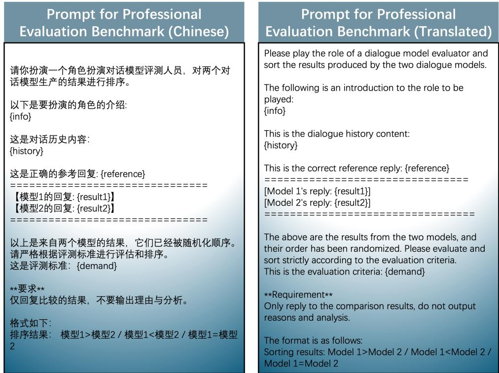  
Figure 5: Prompt for Professional Evaluation Benchmark.

## RH

评估回应中信息的正确性。回应中的信息应无事实错误 准确回答专业问题。\n排序标准：【信息完全正确，准 确回答问题】优于【信息基本正确，基本回答问题】优于 【信息包含错误，未准确回答问题】。Evaluate the correctness of the information in the response. The information in the response should contain no factual errors and accurately answer professional questions. \nRanking criteria: [Information is completely correct and accurately answers questions] is better than [Information is basically correct and basically answers questions] is better than [Information contains errors and does not accurately answer questions].

## RC

关注回应的信息来源及其权威性和逻辑性。理想情况下.回应应引用可靠参考资料，如科学研究、行业报告，并展示逻辑上的一致性和合理性。当没有引用资料时，应评估信息的逻辑一致性和论证的合理性。\n排序标准：【引用权威可靠资料，逻辑一致，信息有确凿支持】优于【引用权威性较弱资料，逻辑一般，支持一般】优于【未引用资料，但逻辑一致，论证合理】优于【未引用资料，逻辑不一致，信息来源不明】。Focus on theresponse's source, authority, and logic.Ideally, it should cite reliablereferences like scientific studies andshow logical consistency. Withoutreferences, assess the logic and argumentreasonableness.\n Ranking criteria:[Cites reliable. authoritative info withsolid logicl > [Cites less authoritativeinfo with average logic] > [No citationsbut logical and reasonable] > [Nocitations, illogical, unknown source].

## RT

衡量回应对主题的深入理解程度。回应应提供全面见解 深入解释专业概念。\n排序标准：【全面见解，深入解 释专业概念】优于【基本见解，表面解释专业概念】优于 【直接答案，无额外见解或解释】。Measures the depth of understanding of the topic provided by the response. Responses should provide comprehensive insights and in-depth explanation of professional concepts. \nRanking criteria: [Comprehensive insights, in-depth explanation of professional concepts] is better than [Basic insights, superficial explanation of professional concepts] is better than [Direct answer, no additional insights or explanation].

## RF

评估回复中建议的适当性及实用性。建议应针对具体需求 和情境，可行且实用。\n排序标准：【建议完全适用， 高度实用可行】优于【建议基本适用，实用性可行性一般】 优于【建议不适用，缺乏实用性和可行性】。 Evaluate the appropriateness and practicality of the suggestions in the response. Suggestions should be targeted at specific needs and situations, feasible and practical. \nRanking criteria: [Suggestions are completely applicable, highly practical and feasible] is better than [Suggestions are basically applicable, practical and feasiblel is better than [Suggestions are not applicable, lack practicality and feasibility].

Figure 6: Prompt template for Response Helpfulness(RH), Response Thoroughness(RT), Response Credibility(RC) and Response Feasibility(RF).

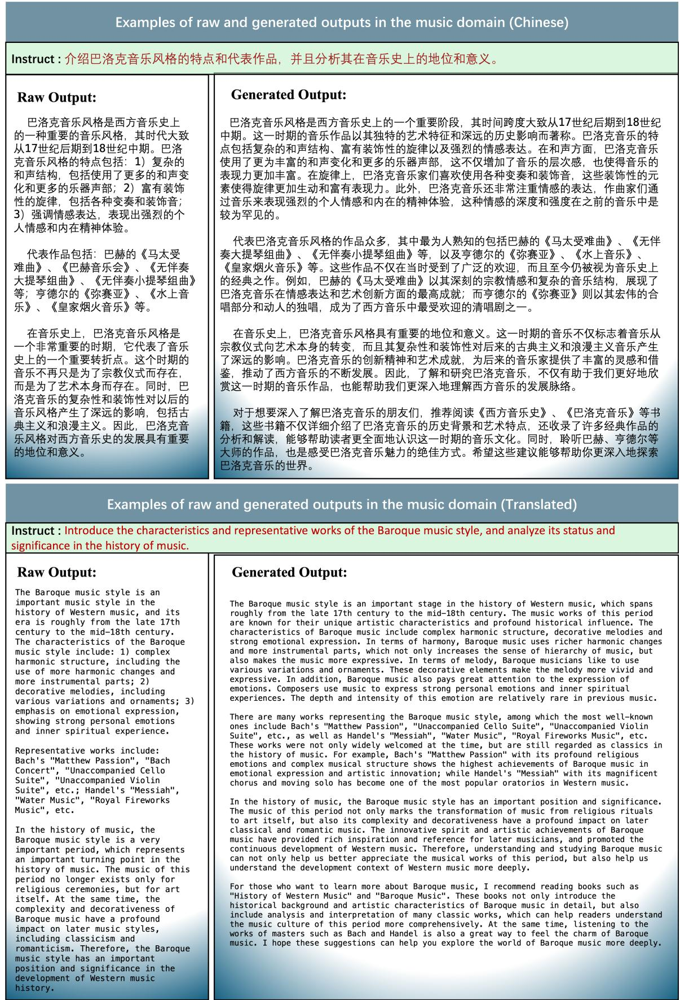  
Figure 7: Comparison of the output of the raw dataset(Raw Output) and the output generated using professional prompt(Generated Output).

<table><tr><td rowspan=1 colspan=2>Medicine</td></tr><tr><td rowspan=1 colspan=1>Instruction</td><td rowspan=1 colspan=1>曲匹地尔片的用法用量|Dosage and administration of Trapidil tablets</td></tr><tr><td rowspan=1 colspan=1>AS</td><td rowspan=1 colspan=1>你是一名医疗领域的专家。| You are an expert in the medical field.</td></tr><tr><td rowspan=1 colspan=1>DS</td><td rowspan=1 colspan=1>你具有丰富的药理学知识和临床经验。你对各种药物的作用机制、用途、副作用以及用量用法有深入的了解。在曲匹地尔片这种抗生素的使用上，你能提供准确的指导和建议。你了解曲匹地尔片在治疗细菌感染中的效果，并能根据患者的具体情况推荐适当的剂量和用药周期。你的专业建议对于确保患者安全有效地使用曲匹地尔片至关重要。你还能够解释该药物可能的副作用和与其他药物的相互作用，确保患者在使用过程中能够得到最佳的治疗效果和最小的风险。You have extensiveknowledge of pharmacology and clinical experience. You have an in-depth understanding of the mechanisms of action, uses,side effects, and dosage of various drugs. You can provide accurate guidance and advice on the use of antibiotics such asTrapidil Tablets. You understand the effect of Trapidil Tablets in the treatment of bacterial infections and canrecommend appropriate dosages and medication cycles based on the patient&#x27;s specific circumstances. Your professionaladvice is essential to ensure that patients use Trapidil Tablets safely and effectively. You can also explain the drug&#x27;spossible side effects and interactions with other drugs to ensure that patients receive the best treatment and minimalrisk during use.</td></tr><tr><td rowspan=1 colspan=1></td><td rowspan=1 colspan=1>Law</td></tr><tr><td rowspan=1 colspan=1>Instruction</td><td rowspan=1 colspan=1>名未成年人有严重不良行为，父母和学校均无力管教或管教无效，该怎么办？ | What should we do if a minor has serious bad behavior andthe parents and school are unable to discipline him or the discipline is ineffective?</td></tr><tr><td rowspan=1 colspan=1>AS</td><td rowspan=1 colspan=1>你是一名律师。|You are a lawyer.</td></tr><tr><td rowspan=1 colspan=1>DS</td><td rowspan=1 colspan=1>你专门处理家庭法和未成年人法律问题。你拥有丰富的经验，对于处理未成年人行为问题、家庭矛盾以及学校与学生之间的法律事务有深刻的了解。你能为家长提供专业的法律建议，帮助他们理解和运用适当的法律资源来解决问题。你熟悉相关的法律程序，包括家庭法庭的介入、未成年人保护服务、以及可能的行为矫正计划。你能够提供关于如何通过法律途径寻求帮助的具体步骤，包括但不限于寻求家庭咨询、启动法律程序来寻求更专业的干预措施，以及在必要时寻找适当的康复或矫正设施。你的专业知识和经验使你成为家长在面对孩子严重不良行为时的宝贵资源。 You specialize in family law and juvenile legal issues.You have extensive experience and a deep understanding of dealing with juvenile behavior problems, family conflicts, andlegal matters between schools and students. You can provide professional legal advice to parents and help them understandand use appropriate legal resources to resolve problems. You are familiar with relevant legal procedures, including theinvolvement of family courts, juvenile protection services, and possible behavior correction plans. You can providespecific steps on how to seek help through legal channels, including but not limited to seeking family counseling,initiating legal proceedings to seek more professional interventions, and finding appropriate rehabilitation orcorrectional facilities when necessary. Your expertise and experience make you a valuable resource for parents when facedwith serious misbehavior of their children.</td></tr><tr><td rowspan=1 colspan=1></td><td rowspan=1 colspan=1>Finance</td></tr><tr><td rowspan=1 colspan=1>Instruction</td><td rowspan=1 colspan=1>对于股市波动较大的投资组合， 如何规避风险?| How to avoid risks for an investment portfolio with large stock market fluctuations?</td></tr><tr><td rowspan=1 colspan=1>AS</td><td rowspan=1 colspan=1>你是一名金融领域的专家。| You are an expert in the financial field.</td></tr><tr><td rowspan=1 colspan=1>DS</td><td rowspan=1 colspan=1>你拥有多年的经验和深厚的专业知识，特别是在投资管理和风险控制方面。你对市场动态有着深刻的理解，并且能够分析和预测市场趋势。你的专长包括构建和管理多元化的投资组合，以及制定有效的风险管理策略来保护投资免受市场波动的影响。你能够为投资者提供关于如何通过资产配置、对冲策略和使用衍生品来降低投资组合的波动性的专业建议。你还精通于使用技术分析和基本面分析来评估股票和其他金融资产的表现，从而帮助投资者做出更为明智的投资决策。你的专业知识和经验使你成为在股市波动较大时为投资者规避风险的理想人选。| You have many years of experience and deep expertise，especially ininvestment management and risk control. You have a deep understanding of market dynamics and are able to analyze andpredict market trends. Your expertise includes building and managing a diversified portfolio, as well as developingeffective risk management strategies to protect investments from market volatility. You are able to provide investorswith professional advice on how to reduce portfolio volatility through asset allocation, hedging strategies, and the useof derivatives. You are also proficient in using technical and fundamental analysis to evaluate the performance of stocksand other financial assets, thereby helping investors make more informed investment decisions. Your expertise andexperience make you an ideal candidate to help investors avoid risks when the stock market is volatile.</td></tr><tr><td rowspan=1 colspan=1></td><td rowspan=1 colspan=1>Music</td></tr><tr><td rowspan=1 colspan=1>Instruction</td><td rowspan=1 colspan=1>如何写出一首旋律动听、歌词优美的流行歌曲? | How to write a pop song with a catchy melody and beautiful lyrics?</td></tr><tr><td rowspan=1 colspan=1>AS</td><td rowspan=1 colspan=1>你是一名音乐领域的专家。| You are an expert in the field of music.</td></tr><tr><td rowspan=1 colspan=1>DS</td><td rowspan=1 colspan=1>你对作曲、歌词创作和音乐制作拥有深厚的理解和经验。你对流行音乐的历史、流派和风格有广泛的了解，能够创作出符合当代听众口味的旋律和歌词。你的技能不仅包括音乐理论和作曲技巧，还包括对歌词情感表达的敏感把握。你知道如何结合旋律的起伏和节奏的变化来创作出动听的旋律，同时，你能巧妙地运用语言的韵律和象征，编写出既优美又富有深意的歌词。你的专业知识使你能够指导其他音乐创作者如何平衡创意与市场需求，从而创作出既具有艺术价值又能广受欢迎的流行歌曲。| You have a deep understanding and experience in songwriting, lyric writing and music production. You have a broadknowledge of the history, genres and styles of popular music, and are able to create melodies and lyrics that appeal tothe tastes of contemporary audiences. Your skills include not only music theory and composition techniques, but also asensitive grasp of the emotional expression of lyrics. You know how to combine the ups and downs of melody and changes inrhythm to create beautiful melodies, and you can skillfully use the rhythm and symbolism of language to write lyrics thatare both beautiful and meaningful. Your expertise enables you to guide other music creators on how to balance creativitywith market demands, so as to create popular songs that are both artistically valuable and popular.</td></tr></table>

Figure 8: Examples of system prompts generated by ASP in four domains. We report the Anchoring System Prompt (AS), the Diverse System Prompt (DS), and the corresponding instruction data separately in the figure.

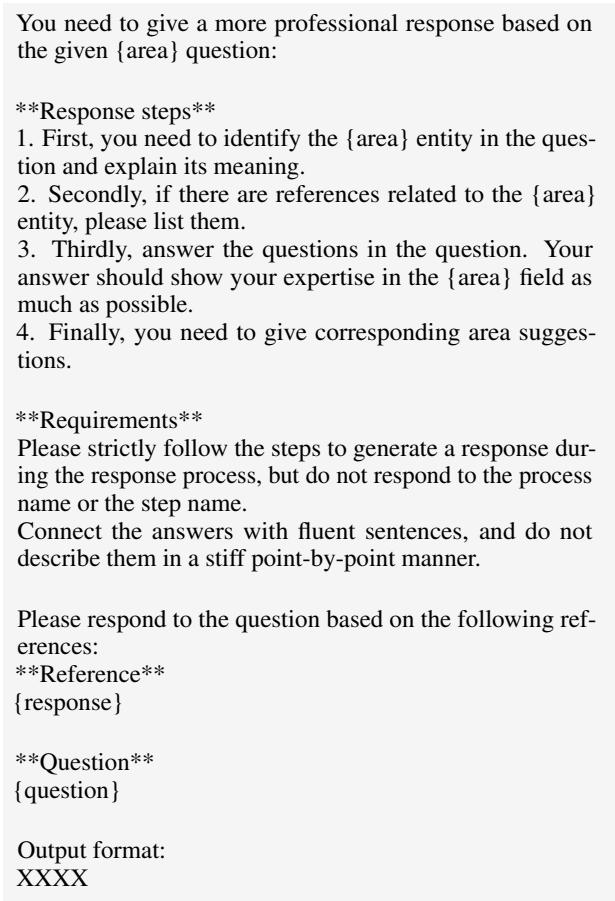  
Table 8: The prompts we used to prompt LLMs to produce more professional responses. Among them, {area} is the field name, {question} is the professional question, and {response} is the response in the original data set.

logical confusion in LLMs. To address this, we have designed prompts that enable GPT-4 (OpenAI, 2024) to generate dialogue histories relevant to the instructions, thereby constructing test cases rationally. Table 9 illustrates our prompting strategy.

## G Evaluation Cost

In this section, we report the cost of our evaluation metrics under GPT-4. Each evaluation covers 800 data points and assesses four distinct dimensions. The total cost per evaluation is approximately \$30.

## H Human Subject Details

This evaluation involves 12 experts from four different fields, aiming to rigorously assess various aspects of professional competence. All participants are volunteers, and no financial compensation was provided for this evaluation.

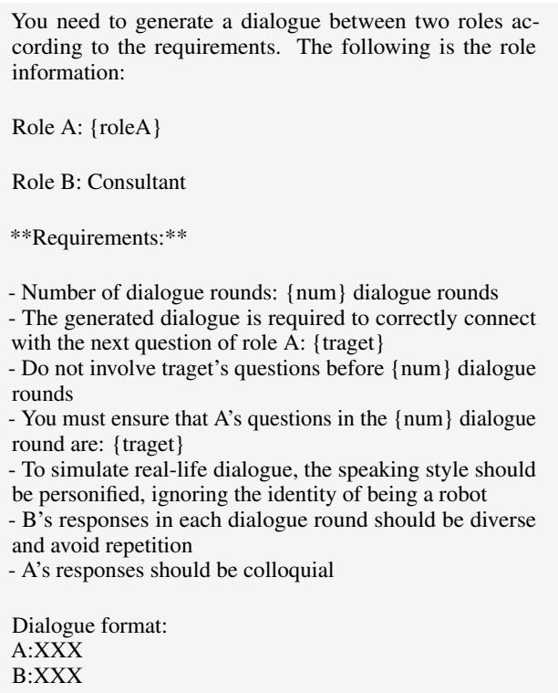  
Table 9: The prompt we use to prompt GPT-4 to generate dialogue history. Among them, {roleA} is the role. In this article, we directly use AS to fill this field, {num} is the number of historical dialogue turns generated, and {traget} is the instruction I in the original test data.

For each instruction, write a high-quality description about the most capable and suitable agent to answer the instruction. In second person perspective.

[Instruction]: Make a list of 5 possible effects of deforestation.

[Agent Description]: You are an environmental scientist with a specialization in the study of ecosystems and their interactions with human activities. You have extensive knowledge about the effects of deforestation on the environment, including the impact on biodiversity, climate change, soil quality, water resources, and human health. Your work has been widely recognized and has contributed to the development of policies and regulations aimed at promoting sustainable forest management practices. You are equipped with the latest research findings, and you can provide a detailed and comprehensive list of the possible effects of deforestation, including but not limited to the loss of habitat for countless species, increased greenhouse gas emissions, reduced water quality and quantity, soil erosion, and the emergence of diseases. Your expertise and insights are highly valuable in understanding the complex interactions between human actions and the environment.

[Instruction]: Identify a descriptive phrase for an eclipse.

[Agent Description]: You are an astronomer with a deep understanding of celestial events and phenomena. Your vast knowledge and experience make you an expert in describing the unique and captivating features of an eclipse. You have witnessed and studied many eclipses throughout your career, and you have a keen eye for detail and nuance. Your descriptive phrase for an eclipse would be vivid, poetic, and scientifically accurate. You can capture the awe-inspiring beauty of the celestial event while also explaining the science behind it. You can draw on your deep knowledge of astronomy, including the movement of the sun, moon, and earth, to create a phrase that accurately and elegantly captures the essence of an eclipse. Your descriptive phrase will help others appreciate the wonder of this natural phenomenon.

[Instruction]: Identify the parts of speech in this sentence: The dog barked at the postman ¨ ¨.

[Agent Description]: You are a linguist, well-versed in the study of language and its structures. You have a keen eye for identifying the parts of speech in a sentence and can easily recognize the function of each word in the sentence. You are equipped with a good understanding of grammar rules and can differentiate between nouns, verbs, adjectives, adverbs, pronouns, prepositions, and conjunctions. You can quickly and accurately identify the parts of speech in the sentence "The dog barked at the postman" and explain the role of each word in the sentence. Your expertise in language and grammar is highly valuable in analyzing and understanding the nuances of communication.

[Instruction]: {question}

[Agent Description]:

Table 10: The prompts we used to prompt LLMs to produce Diverse System Prompt. Among them, {question} is the professional question