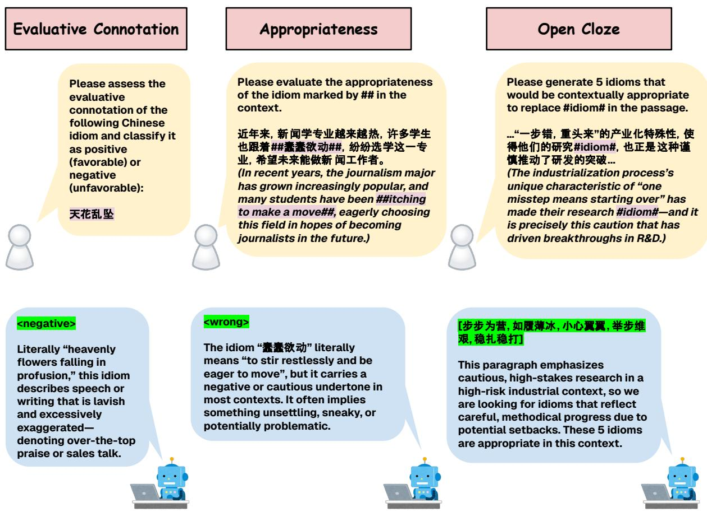
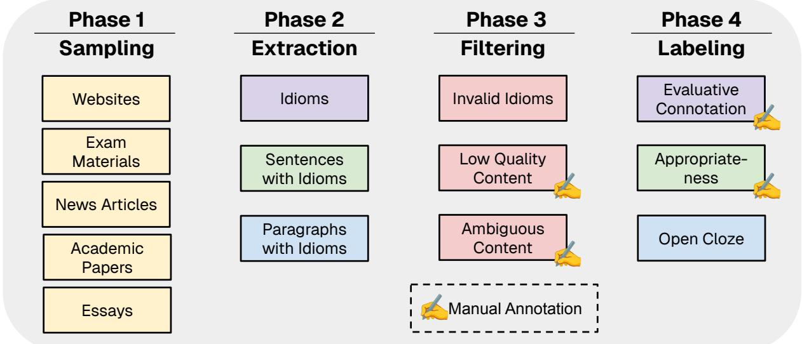
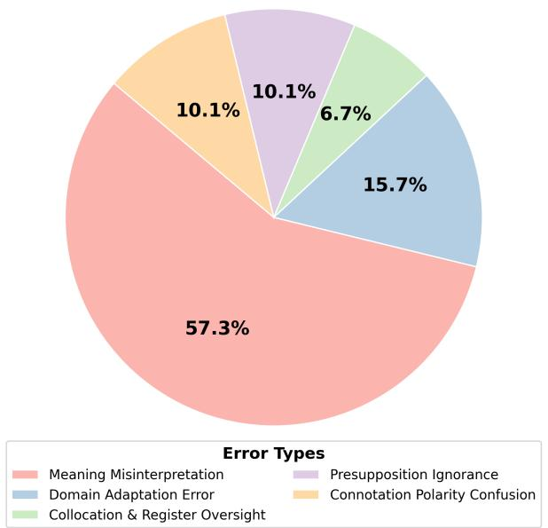

# CHENGYU-BENCH: Benchmarking Large Language Models for Chinese Idiom Understanding and Use

Yicheng Fu1, Zhemin Huang1, Liuxin Yang1, Yumeng Lu1, and Zhongdongming Dai2 1Stanford University, CA, USA

2University of California San Diego, CA, USA {easonfu, zheminh, lyang822, yumenglu}@stanford.edu1 z1dai@ucsd.edu2

## Abstract

Chinese idioms (成语, Chengyu) are concise four-character expressions steeped in history and culture, whose literal translations often fail to capture their full meaning. This complexity makes them challenging for language models to interpret and use correctly. Existing benchmarks focus on narrow tasks—multiplechoice cloze tests, isolated translation, or simple paraphrasing. We introduce CHENGYU-BENCH, a comprehensive benchmark featuring three tasks: (1) Evaluative Connotation, classifying idioms as positive or negative; (2) Appropriateness, detecting incorrect idiom usage in context; and (3) Open Cloze, filling blanks in longer passages without options. CHENGYU-BENCH comprises 2,937 human-verified examples covering 1,765 common idioms sourced from diverse corpora. We evaluate leading LLMs and find they achieve over 95% accuracy on Evaluative Connotation, but only \~85% on Appropriateness and \~40% top-1 accuracy on Open Cloze. Error analysis reveals that most mistakes arise from fundamental misunderstandings of idiom meanings. CHENGYU-BENCH demonstrates that while LLMs can reliably gauge idiom sentiment, they still struggle to grasp the cultural and contextual nuances essential for proper usage. The benchmark and source code are available at: https: //github.com/sofyc/ChengyuBench.

## 1 Introduction

Rooted in stories, values, and traditions passed down through generations, Chinese idioms (成语, Chengyu) represent a rich part of the language and culture. Most idioms come from classical literature or ancient folklore, and summarize the essence of a story in a highly compact form (Yang et al., 2006). Because of their simplicity and literary quality, idioms are highly prized in Chinese communication. They can elegantly convey complex ideas and show the speaker’s thoughts.

Meanwhile, these properties make idioms challenging for computational models. Chinese idioms are non-compositional and metaphorical. They usually follow the conventions of ancient Chinese, and depend on cultural and historical contexts for interpretation (Qiang et al., 2023). For large language models (LLMs), they learn from significant patterns and may lack the cultural grounding to understand idioms. Therefore, even state-of-the-art Chinese LLMs can misinterpret idioms (Li et al., 2024a).

Despite the importance of Chinese idioms, existing NLP benchmarks handle them only peripherally. For instance, ChID (Zheng et al., 2019) provides a large-scale cloze-style reading comprehension task; Qiang et al. (2023) collects 115K sentence pairs in which idiomatic sentences are translated into non-idiomatic sentences. Cloze tests and paraphrase tasks are widely used to assess language proficiency (Jonz, 1991; Tremblay, 2011; Tan and Jiang, 2021), but they are not sufficient for a thorough evaluation of Chinese idioms: cloze tests mainly assess idiom retrieval or simplification, while the paraphrase task only measures lexical similarity. Moreover, general Chinese benchmarks, such as CLiMP (Xiang et al., 2021), do not include specialized idiom tasks. In short, existing benchmarks either overlook idiomatic expressions or lack scenarios that reflect real-world usage.

To mitigate the gap, we identified three core tasks that are lacking in existing benchmarks: evaluative connotation (categorizing the sentiment of idiomatic expressions in context), contextual appropriateness (determining whether candidate idioms are appropriate in context), and open cloze (generating idioms that are appropriate for the context in a given situation). These tasks reflect the actual requirements of real-world idiom usage. Figure 1 shows some examples of these tasks. To the best of our knowledge, no current Chinese NLP benchmarks evaluates models across the full spectrum of

idiom usage.

Our contributions are summarized as follows:

• We present CHENGYU-BENCH, the first comprehensive benchmark for Chinese idiom understanding, built from diverse, naturally occurring texts. It includes over 3,000 humanannotated examples spanning 1,765 idioms, and features three tasks of increasing difficulty to holistically evaluate idiomatic proficiency.

• We evaluate a wide range of state-of-theart LLMs and conduct error analysis on CHENGYU-BENCH, discovering significant gaps between idiom recognition and proper usage.

## 2 Related Work

## 2.1 Challenges of Chinese Idiom Understanding for LLMs

Chinese idioms pose challenges to LLMs across semantic, structural, and cultural levels (Qiang et al., 2023). First, idioms’ meanings often cannot be deduced from the constituent words. For example, "亡羊补牢" does not literally refer to mend the fence after sheep are lost, but rather implies that it is never too late to try (Zheng et al., 2019). This metaphorical nature requires models to understand the non-literal meaning. Second, idioms have a fixed structure, usually four characters, and cannot be decomposed and recomposed (Kang and Yang, 2022). Third, idioms contain rich cultural and historical knowledge (Qiang et al., 2023). Many of them derive from classical literature or ancient anecdotes. Therefore, understanding Chinese idioms requires a deep understanding of Chinese tradition and history. Finally, the meanings and usages of idioms are highly context-dependent. Many idioms also have closely related counterparts, but with subtle differences in meaning or usage, making them more difficult to select or interpret (Zheng et al., 2019; Qiang et al., 2023).

These characteristics make idioms a rigorous testing ground for LLMs, which often demonstrate substantially lower proficiency in idiom-related tasks compared to human performance (Zheng et al., 2019; Wu et al., 2024).

## 2.2 Chinese Idiom Dataset

The ChID dataset (Zheng et al., 2019) is a largescale cloze test dataset, containing 581k passages and 729k blanks from three domains (news, novels, and essays). Each blank is accompanied by several candidate idioms, requiring models to select the most appropriate idiom. This dataset has become the standard benchmark for evaluating Chinese idiom comprehension (Xu et al., 2020). The CIP dataset (Qiang et al., 2023) contains 115k sentence pairs. In each pair, one sentence contains a specific Chinese idiom while the other paraphrases its meaning in plain language. IdiomKB (Li et al., 2024a) includes 8,643 idiom interpretations in Chinese, English, and Japanese, evaluating models’ idiom comprehension and translation abilities. However, these datasets primarily focus on limited tasks: cloze tests, paraphrasing, and translation, which cannot thoroughly determine whether idioms are being used appropriately in wider contexts.

## 2.3 General Chinese Benchmarks for LLMs

CLUE (Xu et al., 2020) is the first large-scale benchmark for Chinese language understanding, consisting of nine sub-tasks, including semantic matching, short and long text classification, and reading comprehension, etc. C-Eval (Huang et al., 2023) focuses on higher-order knowledge and reasoning skills. It consists of 13,948 multiplechoice questions spanning 52 subjects, including science, engineering, humanities and social sciences. Inspired by the English MMLU benchmark (Hendrycks et al., 2020), CMMLU (Li et al., 2023) is a comprehensive multitask Chinese benchmark covering 67 Chinese topics. More recently, WenMind (Cao et al., 2024) is a comprehensive benchmark for Chinese Classical Literature and Language Arts (CCLLA). Although some general benchmarks (Cao et al., 2024) include idiomrelated subtasks, e.g. idiom explanation, the scale and diversity of these subtasks remain limited.

## 3 Benchmark

## 3.1 Task Definition

Most existing Chinese idiom benchmarks are limited to narrow cloze tests—either choosing from a small set of options (Zheng et al., 2019) or completing very short sentences (Jiang et al., 2018). Others ask models to select an idiom based on its definition (Wu et al., 2024) or to paraphrase sentences using idioms (Qiang et al., 2023). Yet none of these tasks fully assesses a model’s ability to understand and use idioms in realistic, extended contexts. To bridge this gap, we introduce three complementary subtasks: (1) identifying whether an idiom conveys a positive or negative sentiment (Evaluative Connotation), (2) determining if an idiom is appropriately used in a sentence (Appropriateness), and (3) filling in blanks with suitable idioms in long paragraphs (Open Cloze). Detailed prompts for each subtask are provided in Appendix A.

  
Figure 1: Subtask example. In the Evaluative Connotation subtask, the model must classify the sentiment polarity of a single idiom. In the Appropriateness subtask, it must decide whether the highlighted idiom fits the given context. In the Open Cloze subtask, it generates five idiom candidates, ranked by confidence, to complete the paragraph. Purple text highlights the idiom or placeholder in the prompt, and green text shows the answer extracted for evaluation.

Evaluative Connotation Chinese idioms often carry rich, culturally rooted sentiments that are not obvious from their literal wording. Table 1 shows examples where surface meaning can mislead. Accurately identifying an idiom’s polarity—positive or negative—is essential for using it correctly in real-world text. In this subtask, we challenge models to label each idiom’s sentiment polarity as conveyed by the writer.

Appropriateness Whether a Chinese idiom is correctly used in a sentence depends on multiple factors. One key factor is using an idiom with the correct polarity, as discussed earlier. Other common mistakes include choosing the wrong subject or object, misinterpreting the idiom literally, or applying an idiom with an inappropriate degree of intensity. Examples of these errors are shown in Table 2. Such misuse is very common among human writers, not to mention language models. Therefore, this task effectively tests whether a model can detect inappropriate idiom usage in Chinese sentences.

Open Cloze In this subtask, models must fill a blank in a longer passage without any provided options. We source these passages from online texts and ask each model to generate its top five idiom candidates, ranked by confidence. Allowing multiple predictions reflects real-world writing practices—authors often consider several idiomatic expressions before selecting the most appropriate one. This approach also accounts for the fact that multiple idioms may convey similar nuances; however, it is rare for more than five idioms to express the same meaning, as overly redundant expressions tend to fall out of use over time. This setup tests a model’s ability to recall and apply idioms unaided.

<table><tr><td>Idiom</td><td>Surface Meaning</td><td>True Meaning</td><td>Polarity</td></tr><tr><td>弾冠相庆</td><td>Brushing off hats and celebrating together</td><td>Celebrating preemptively because they expect to gain advantages through improper Negative means like cronyism or corruption</td><td></td></tr><tr><td>舞文弄墨</td><td>Waving writings and playing with ink</td><td>Using writing skills in a petty, deceptive, or manipulative way rather than for something Negative noble or constructive</td><td></td></tr><tr><td>惨淡经营</td><td>Managing operations under miserable and bleak conditions</td><td>Persistently struggling and carefully managing things through hardship and difficulty, often with little reward</td><td>Positive</td></tr></table>

Table 1: Surface meaning, true meaning, and polarity of example Chinese idioms.
<table><tr><td>Misuse Type</td><td>Example Idiom and Incorrect Usage</td><td>Explanation</td></tr><tr><td>Wrong Polarity</td><td>他在事故中失去了家人，但我们祝 他##一帆风顺##。 He lost his family in an accident, but we wish him ##smooth sailing##.</td><td>Using a highly positive idiom in a tragic or sad situation</td></tr><tr><td>Wrong Subject/Object</td><td>这台洗衣机##毛遂自荐##，功能强大。 This washing machine ##volunteered itself## and has great functions.</td><td>Idioms about human actions wrongly applied to objects</td></tr><tr><td>Literal Misin- terpretation</td><td>他把那只鹿说成是马，真是##指鹿为 马##的好例子。 He called that deer a horse, what a good example of ##calling a deer a horse##.</td><td>Taking the idiom literally without understanding its deeper political or metaphorical meaning</td></tr><tr><td>Incorrect Degree</td><td>他今天买了一杯咖啡，真是##惊天动 地##的大事。 He bought a cup of coffee today, what an ##earth-shaking## event.</td><td>Using a highly exaggerated idiom for a trivial action or event</td></tr></table>

Table 2: Common misuse types of Chinese idioms with incorrect examples and explanations.

Table 3 illustrates example instances, their annotations, and the rationale behind the correct answer for each subtask.

## 3.2 Benchmark Generation

The overall pipeline for benchmark generation is shown in Figure 2. It consists of four main steps:

Sampling In this stage, we collect a corpus from diverse yet high-quality sources, including webpages, exam materials, news articles, academic papers, and essays. These materials are used as the foundation for constructing our benchmark.

Extraction We extract three types of content from the corpus: individual idioms, sentences with idioms, and paragraphs with idioms. For the idiom vocabulary, we start with the 31,648 idioms listed in the official Xinhua Dictionary 1. Since many of these idioms are rarely used and provide limited practical value, we further filter them based on document frequency computed from online resources (Han et al., 2016), resulting in a final vocabulary of 7,208 commonly used idioms. All extracted content must contain idioms from this filtered vocabulary.

For sentences and paragraphs, we prioritize extracting paragraphs whenever multiple sentences are available. If only a single sentence is available—which is often the case in exam materials—we extract the sentence directly.

<table><tr><td>Task</td><td>Example</td><td>Available Options</td><td>Answer</td><td>Reason</td></tr><tr><td>Evaluative Connotation</td><td>好为人师 Fond of acting as a teacher to others.</td><td>Positive, Negative</td><td>Negative</td><td>&quot;好为人师&quot; is used with the connotation of being overly eager to instruct others or assuming a superior attitude.</td></tr><tr><td></td><td>这次商品博览会，聚集了全国各地各种各 样的新产品，真可谓##浩如烟海##，应有 尽有。 Appropriateness This product expo gathered all kinds of new products from across the country; it can truly be said to be ##as vast as a sea of smoke##, with everything one could possibly want.</td><td>Correct, Wrong</td><td>Wrong</td><td>&quot;浩如烟海&quot; is used to describe the sheer quantity of writings, books, or documents. It emphasizes the overwhelming amount of texts, and cannot be used to describe physical goods.</td></tr><tr><td>Open Cloze</td><td>..到达荒岛后，两人开始了他们的探险。 起初，一切都显得那么平静和美好。然 而，##idiom##，第三天晚上，他们遭遇了 一群野兽的袭击。在混乱中，他们的干粮 被野兽抢走，指南针也丢失了。 ..Upon arriving at the island, the two began their exploration. At first, everything seemed so peaceful and wonderful. However, ##idiom##, on the third night, they were attacked by a group of wild beasts. In the chaos, their dry</td><td></td><td>好景不长 Good times do not last long</td><td>The sentence transition requires an idiom that hints at a short-lived good situation turning bad, and &quot;好景不长&quot; exactly conveys this.</td></tr></table>

Table 3: Examples, available options, correct answers, and reasoning for each subtask.

Filtering Some filtering is already performed during extraction, such as removing invalid or lowfrequency idioms. In addition, we manually filter out low-quality content, such as webpages that simply list idioms without context, or ambiguous content, such as cases where an idiom’s meaning has recently changed or is controversial.

Labeling In the final stage, we annotate the data according to each subtask. For individual idioms (Evaluative Connotation), we keep only those with an unambiguous positive or negative sentiment, manually discarding neutral cases to avoid confusion. For sentences containing idioms (Appropriateness), we label each example as correctly or incorrectly used—most correct instances come from online corpora, while negative examples are drawn from exam materials and educational sites that train students to spot misuse. For paragraphs with idioms (Open Cloze), we replace the target idiom with a placeholder (##idiom##) for the model to predict. If a sentence or paragraph contains multiple idioms, we duplicate the example so that each idiom is treated as a separate data point.

## 3.3 Benchmark Statistics

To assess the quality of our benchmark, we conducted a detailed analysis focusing on the number of unique idioms and the average document frequency of idioms from online resources across each subtask. Table 4 summarizes the number of data points and unique idioms for each task. Notably, in the Evaluative Connotation task, each data point corresponds to a unique idiom, which aligns with the task design where each entry is centered on a single idiom. In total, our dataset covers 1,765 unique idioms, with an average of approximately 1.66 data points per idiom.

<table><tr><td>Task Category</td><td># of Data Points</td><td># of Unique Idioms</td></tr><tr><td>Connotation</td><td>540</td><td>540</td></tr><tr><td>Appropriateness</td><td>572</td><td>441</td></tr><tr><td>Open Cloze</td><td>1,825</td><td>1,067</td></tr><tr><td>Overall</td><td>2,937</td><td>1,765</td></tr></table>

Table 4: Number of data points and unique idioms across different subtasks in our benchmark.

To evaluate the representativeness of the idioms selected in our benchmark, we first found a comprehensive vocabulary of Chinese idioms with their document frequencies based on online resources (Han et al., 2016). In this vocabulary, idiom frequencies range from a minimum of 21 to a maximum of 54,113, with an average frequency of 1,276.

  
Figure 2: Overview of the benchmark generation pipeline. The process consists of four phases: (1) Sampling diverse high-quality sources, (2) Extracting idioms, sentences, and paragraphs, (3) Filtering invalid, low quality, or ambiguous content, and (4) Labeling data for polarity, appropriateness, and cloze tasks. Manual annotation is required during filtering and labeling stages.

We then extracted the idioms appearing in each benchmark subtask and computed their average document frequency. As shown in Table 5, the idioms used in our benchmark have significantly higher average frequencies than those in the general vocabulary, suggesting that our dataset predominantly covers idioms that are commonly used in real-world Chinese language contexts.

<table><tr><td>Statistic / Task Category</td><td>Avg Document Frequency</td></tr><tr><td>Vocabulary Minimum (Min)</td><td>21</td></tr><tr><td>Vocabulary Maximum (Max)</td><td>54,113</td></tr><tr><td>Vocabulary Average (Avg)</td><td>1,276</td></tr><tr><td>Connotation</td><td>2,136</td></tr><tr><td>Appropriateness</td><td>2,890</td></tr><tr><td>Open Cloze</td><td>7,411</td></tr><tr><td>Overall</td><td>5,650</td></tr></table>

Table 5: Average document frequencies of idioms used in our benchmark compared to the general idiom vocabulary.

Table 6 presents the average context token length for reading comprehension tasks in previous datasets and our CHENGYU-BENCH. For translation and paraphrase tasks, we measure the length of the source sentences from the test split. For cloze test and appropriateness tasks, we measure the length of the given sentences or paragraphs.

We observe that the appropriateness task in ChengyuBench has an even longer average context length than the earlier cloze test dataset CCT (Jiang et al., 2018), demonstrating the increased complexity of the task. Moreover, the cloze test in ChengyuBench is nearly three times longer than the previous cloze benchmark ChID (Zheng et al., 2019), further highlighting the richness and difficulty of our dataset. To the best of our knowledge, this is the longest and most challenging Chinese idiom cloze test constructed to date.

<table><tr><td>Dataset</td><td>Task</td><td>Avg. Context Tokens</td></tr><tr><td>CIBB (Shao et al., 2017)</td><td>Translation</td><td>23.13</td></tr><tr><td>CIP (Qiang et al., 2023)</td><td>Paraphrase</td><td>43.75</td></tr><tr><td>CCT (Jiang et al., 2018)</td><td>Open Cloze</td><td>54.72</td></tr><tr><td>ChID (Zheng et al., 2019)</td><td>MC Cloze</td><td>212.10</td></tr><tr><td rowspan="2">CHENGYU-BENCH</td><td>Appropriateness</td><td>56.91</td></tr><tr><td>Open Cloze</td><td>600.41</td></tr></table>

Table 6: Average context token length for Chinese idiom reading comprehension tasks. Our benchmark exhibits the longest contexts, highlighting its elevated difficulty.

## 4 Results

Table 7 reports the complete performance of all evaluated LLMs on both our benchmark and the ChID dataset. In our experiments, we benchmark 5 closed-source models: Gemini-2.0-Flash, Gemini-2.5-pro (Team et al., 2025), Claude-3.7-Sonnet (Anthropic, 2024) , GPT-4o (Hurst et al., 2024), GPT-4.1 and 3 open-source models: DeepSeek-R1 (Guo et al., 2025), DeepSeek-V3 (DeepSeek-AI et al., 2025) and Qwen2.5-72B (Qwen et al., 2025).

<table><tr><td rowspan="2">Model</td><td rowspan="2">Connotation</td><td rowspan="2">Appropriateness</td><td colspan="4">Open Cloze</td><td rowspan="2">ChID Acc.</td></tr><tr><td>Acc.@1</td><td>Acc.@3</td><td>Acc.@5</td><td>Valid Idiom</td></tr><tr><td>Random</td><td>50.00</td><td>50.00</td><td>一</td><td></td><td></td><td></td><td>14.29</td></tr><tr><td colspan="8">Closed-Source Models</td></tr><tr><td>Gemini-2.0-Flash</td><td>95.19</td><td>55.07</td><td>15.01</td><td>27.18</td><td>30.85</td><td>86.65</td><td>56.00</td></tr><tr><td>Gemini-2.5-Pro</td><td>97.04</td><td>73.95</td><td>40.05</td><td>55.40</td><td>60.77</td><td>73.10</td><td>75.60</td></tr><tr><td>Claude-3.7-Sonnet</td><td>95.19</td><td>61.89</td><td>23.78</td><td>37.37</td><td>42.30</td><td>67.77</td><td>64.20</td></tr><tr><td>GPT-40</td><td>96.11</td><td>71.15</td><td>18.19</td><td>28.16</td><td>31.95</td><td>69.75</td><td>59.65</td></tr><tr><td>GPT-4.1</td><td>97.04</td><td>66.26</td><td>23.51</td><td>35.51</td><td>39.34</td><td>66.68</td><td>63.35</td></tr><tr><td colspan="8">Open-Source Models</td></tr><tr><td>DeepSeek-R1</td><td>97.56</td><td>83.27</td><td>27.12</td><td>38.05</td><td>42.23</td><td>80.73</td><td>72.80</td></tr><tr><td>Qwen2.5-72B</td><td>95.74</td><td>56.64</td><td>24.99</td><td>33.37</td><td>36.77</td><td>71.65</td><td>65.80</td></tr><tr><td>DeepSeek-V3</td><td>97.22</td><td>74.83</td><td>33.59</td><td>45.75</td><td>48.99</td><td>82.10</td><td>69.30</td></tr></table>

Table 7: Comprehensive performance (%) of different models on the Evaluative Connotation, Appropriateness, and Open Cloze subtasks of our benchmark, as well as accuracy on the ChID dataset. Acc.@k denotes the proportion of examples in which the correct idiom appears within the model’s top-k predictions; Valid Idiom indicates the percentage of predicted idioms that are listed in the Xinhua Dictionary.

Performance Gap Between Connotation and Other Subtasks All models achieve over 95% accuracy on Evaluative Connotation, indicating that modern LLMs reliably grasp basic sentiment polarity of Chinese idioms. In contrast, Appropriateness scores drop below 85%, and Open Cloze accuracy@1 falls to 40% or lower. This widening gap underscores that while sentiment recognition is effectively mastered, understanding contextual and cultural nuances to correctly use idioms remains challenging.

Model Comparison Among all LLMs, Gemini-2.5-Pro leads across all Cloze metrics and also attains the highest ChID accuracy. DeepSeek-R1 excels at Appropriateness (83.27%) and Evaluative Connotation (97.56%), reflecting its strong contextual understanding. DeepSeek-V3 delivers the most balanced profile, with competitive Appropriateness and a high Valid Idiom rate, even outperforming its reasoning-focused variant in Open Cloze. Interestingly, Gemini-2.0-Flash yields the best Valid Idiom ratio (86.65%) despite lower overall task performance, suggesting that over-reliance on dictionary validity does not guarantee correct usage.

Performance of Chinese LLMs Chinadeveloped models in the DeepSeek series show distinct advantages. Both DeepSeek-R1 and DeepSeek-V3 outperform most others in Appropriateness and Valid Idiom rate, indicating superior capture of cultural and contextual signals essential for idiom usage. Their strong results likely stem from specialized training on richer Chinese corpora and tailored optimizations for native linguistic patterns.

## 4.1 Error Analysis of the Appropriateness Task

To investigate why the model errs on the Chinese idiom appropriateness task, we conducted a detailed error analysis. First, we grouped the possible mistakes into five categories (see Table 8), spanning from basic meaning misinterpretation to failures in context comprehension, usage adaptation, and connotation polarity. Next, we asked Gemini 2.5 Pro to label each error made by our best-performing LLM, Deepseek-R1, according to its reasoning trajectory. Figure 3 shows the resulting distribution of error types. Meaning misinterpretation is by far the most frequent, accounting for 57.3% of all errors. This is followed by domain adaptation errors, where the model understands the idiom’s literal meaning but fails to apply it correctly in a new context. Collocation and register oversight appears least often. Overall, these findings suggest that—even at its best—current LLMs still struggle with fundamental idiom understanding, and have yet to master more advanced reasoning.

## 5 Conclusion

In this work, we introduce CHENGYU-BENCH, a comprehensive benchmark designed to evaluate LLMs’ understanding and usage of Chinese idioms across three distinct tasks: evaluative connotation, contextual appropriateness, and open cloze completion. Our benchmark addresses significant gaps in existing Chinese idiom evaluation datasets by providing longer and context-rich examples that more accurately reflect real-world language usage.

<table><tr><td>Error Type</td><td>Definition</td><td>Example</td></tr><tr><td>Meaning Misin- terpretation</td><td>The model misunderstands an idiom&#x27;s core semantics and so mislabels correct uses as incorrect (or vice versa).</td><td>It reads &quot;山高水低&quot; (mountains high, waters low) as strictly about fatal mishaps, whereas the benchmark treats it as an acceptable metaphor for any looming hardship.</td></tr><tr><td>Domain Adaptation Error</td><td>The model fails to transfer an idiom from its original domain into a new context, rejecting valid extensions.</td><td>It treats &quot;师出无名&quot;(army sent without a name) as only military jargon and flags its bureaucratic sense (&quot;no justification for approval&quot;) as wrong.</td></tr><tr><td>Collocation &amp; Register Oversight</td><td>The model ignores whether a perfectly grammatical but uncommon collocation is acceptable, or whether register shifts are fine.</td><td>It marks &quot;林林总总&quot; (numerous and varied) wrong simply because &quot;林林总总&quot; more often describes things, not book characters in this context.</td></tr><tr><td>Connotation Polarity Confusion</td><td>The model mixes up an idiom&#x27;s positive/neutral vs. negative undertone.</td><td>It judges &quot;心照不宣&quot; (implicit mutual understanding) as collusive wrongdoing when the benchmark counts it as a neutral implicit agreement.</td></tr><tr><td>Presupposition Ignorance</td><td>The model overlooks built-in requirements of an idiom—like needing a mix of good/bad or a sharp qualitative contrast——and so misfires.</td><td>It labels &quot;泥沙俱下&quot; (sand and silt flow together) wrong because it sees only negative examples, even though the benchmark permits it in contexts of mixed quality</td></tr></table>

Table 8: Common error types and corresponding examples in idiom-appropriateness classification.

  
Figure 3: Distribution of error types made by Deepseek-R1 on the idiom appropriateness task.

Our experimental results reveal a disparity between models’ performance on different tasks. While contemporary LLMs demonstrate strong performance on identifying the evaluative connotation of idioms, they struggle considerably with determining appropriate usage and perform even more poorly on generating suitable idioms in context. This performance gap highlights that understanding sentiment does not guarantee mastery of the cultural nuances needed for proper idiom usage. Error analysis further reveals that the majority of mistakes stem from basic meaning misinterpretation, suggesting that even leading models still struggle with the fundamental semantics of Chinese idioms.

CHENGYU-BENCH provides a rigorous testing ground for evaluating culturally-specific language understanding in LLMs. We hope this work will inspire future research on idiom comprehension, advancing AI systems with deeper understanding of linguistic and cultural nuances in Chinese and potentially other languages.

## Limitations

While CHENGYU-BENCH is the most comprehensive idiom task dataset to our knowledge and yields clear empirical insights into how contemporary LLMs handle real-world idiom use, several factors naturally delimit our study and also suggest where the benchmark can evolve.

Our benchmark focuses exclusively on canonical four-character chengyu and, in the Evaluative Connotation task, employs a binary polarity scheme; thus, longer proverb forms, context-dependent sentiment shifts, and emerging internet idioms fall outside the current scope.

Moreover, although we evaluate the most common idioms usage: recognition, misuse detection, and generative insertion, other minor idiom-oriented skills—such as paraphrasing, crosslingual translation, and analogy—remain unexplored.

Also, it is worth noting that LLMs are increasingly deployed as components of compound AI systems—e.g., LLM agents (Li et al., 2024b; Fu et al., 2024) or retrieval-augmented generation (RAG) architectures (Lewis et al., 2020; Fu et al., 2025). However, our benchmark focuses exclusively on standalone LLMs and does not cover these more complex configurations.

Lastly, we anticipate regular updates on the dataset, since idiom popularity and nuance shift with cultural discourse, and advances in prompting strategies and LLM capabilities will continue to refine performance estimates.

## References

Anthropic. 2024. The claude 3 model family: Opus, sonnet, haiku.

Jiahuan Cao, Yang Liu, Yongxin Shi, Kai Ding, and Lianwen Jin. 2024. Wenmind: A comprehensive benchmark for evaluating large language models in chinese classical literature and language arts. Advances in Neural Information Processing Systems, 37:51358–51410.

DeepSeek-AI, Aixin Liu, Bei Feng, Bing Xue, Bingxuan Wang, Bochao Wu, Chengda Lu, Chenggang Zhao, Chengqi Deng, Chenyu Zhang, Chong Ruan, Damai Dai, Daya Guo, Dejian Yang, Deli Chen, Dongjie Ji, Erhang Li, Fangyun Lin, Fucong Dai, and 1 others. 2025. Deepseek-v3 technical report. arXiv preprint arXiv:2412.19437.

Yicheng Fu, Raviteja Anantha, and Jianpeng Cheng. 2024. Camphor: Collaborative agents for multi-input

planning and high-order reasoning on device. arXiv preprint arXiv:2410.09407.

Yicheng Fu, Zikui Wang, Liuxin Yang, Meiqing Huo, and Zhongdongming Dai. 2025. Conquer: A framework for concept-based quiz generation. In Proceedings of the 2025 Conference of the Nations of the Americas Chapter of the Association for Computational Linguistics: Human Language Technologies (Volume 4: Student Research Workshop), pages 92– 104.

Daya Guo, Dejian Yang, Haowei Zhang, Junxiao Song, Ruoyu Zhang, Runxin Xu, Qihao Zhu, Shirong Ma, Peiyi Wang, Xiao Bi, and 1 others. 2025. Deepseek-r1: Incentivizing reasoning capability in llms via reinforcement learning. arXiv preprint arXiv:2501.12948.

Zishan Guo, Yufei Huang, and Deyi Xiong. 2024. Ctooleval: a chinese benchmark for llm-powered agent evaluation in real-world api interactions. In Findings of the Association for Computational Linguistics ACL 2024, pages 15711–15724.

Shiyi Han, Yuhui Zhang, Yunshan Ma, Cunchao Tu, Zhipeng Guo, Zhiyuan Liu, and Maosong Sun. 2016. Thuocl: Tsinghua open chinese lexicon. Tsinghua University.

Dan Hendrycks, Collin Burns, Steven Basart, Andy Zou, Mantas Mazeika, Dawn Song, and Jacob Steinhardt. 2020. Measuring massive multitask language understanding. arXiv preprint arXiv:2009.03300.

Yuzhen Huang, Yuzhuo Bai, Zhihao Zhu, Junlei Zhang, Jinghan Zhang, Tangjun Su, Junteng Liu, Chuancheng Lv, Yikai Zhang, Yao Fu, and 1 others. 2023. C-eval: A multi-level multi-discipline chinese evaluation suite for foundation models. Advances in Neural Information Processing Systems, 36:62991–63010.

Aaron Hurst, Adam Lerer, Adam P Goucher, Adam Perelman, Aditya Ramesh, Aidan Clark, AJ Ostrow, Akila Welihinda, Alan Hayes, Alec Radford, and 1 others. 2024. Gpt-4o system card. arXiv preprint arXiv:2410.21276.

Zhiying Jiang, Boliang Zhang, Lifu Huang, and Heng Ji. 2018. Chengyu cloze test. In Proceedings ofthe Thirteenth Workshop on Innovative Use ofNLPfor Building Educational Applications, pages 154–158.

Jon Jonz. 1991. Cloze item types and second language comprehension. Language testing, 8(1):1–22.

Hongmei Kang and Yang Yang. 2022. A study on english translation of chinese four-character idioms: Strategies and problems. Linguistics and Culture Review, 6(1):200–213.

Patrick Lewis, Ethan Perez, Aleksandra Piktus, Fabio Petroni, Vladimir Karpukhin, Naman Goyal, Heinrich Küttler, Mike Lewis, Wen-tau Yih, Tim Rocktäschel, and 1 others. 2020. Retrieval-augmented generation for knowledge-intensive nlp tasks. Advances

in neural information processing systems, 33:9459– 9474.

Haonan Li, Yixuan Zhang, Fajri Koto, Yifei Yang, Hai Zhao, Yeyun Gong, Nan Duan, and Timothy Baldwin. 2023. Cmmlu: Measuring massive multitask language understanding in chinese. arXiv preprint arXiv:2306.09212.

Shuang Li, Jiangjie Chen, Siyu Yuan, Xinyi Wu, Hao Yang, Shimin Tao, and Yanghua Xiao. 2024a. Translate meanings, not just words: Idiomkb’s role in optimizing idiomatic translation with language models. In Proceedings ofthe AAAI Conference on Artificial Intelligence, volume 38, pages 18554–18563.

Yuanchun Li, Hao Wen, Weijun Wang, Xiangyu Li, Yizhen Yuan, Guohong Liu, Jiacheng Liu, Wenxing Xu, Xiang Wang, Yi Sun, and 1 others. 2024b. Personal llm agents: Insights and survey about the capability, efficiency and security. arXiv preprint arXiv:2401.05459.

Junwei Liao, Shuai Cheng, and Minghuan Tan. 2023. Text polishing with chinese idiom: Task, datasets and pre-trained baselines. ACM Transactions on Asian and Low-Resource Language Information Processing, 22(6):1–24.

Xiao Liu, Xuanyu Lei, Shengyuan Wang, Yue Huang, Zhuoer Feng, Bosi Wen, Jiale Cheng, Pei Ke, Yifan Xu, Weng Lam Tam, and 1 others. 2023. Alignbench: Benchmarking chinese alignment of large language models. arXiv preprint arXiv:2311.18743.

Jipeng Qiang, Yang Li, Chaowei Zhang, Yun Li, Yi Zhu, Yunhao Yuan, and Xindong Wu. 2023. Chinese idiom paraphrasing. Transactions of the Association for Computational Linguistics, 11:740–754.

Qwen, An Yang, Baosong Yang, Beichen Zhang, Binyuan Hui, Bo Zheng, Bowen Yu, Chengyuan Li, Dayiheng Liu, Fei Huang, Haoran Wei, Huan Lin, Jian Yang, Jianhong Tu, Jianwei Zhang, Jianxin Yang, Jiaxi Yang, Jingren Zhou, and 1 others. 2025. Qwen2.5 technical report. arXiv preprint arXiv:2412.15115.

Yutong Shao, Rico Sennrich, Bonnie Webber, and Federico Fancellu. 2017. Evaluating machine translation performance on chinese idioms with a blacklist method. arXiv preprint arXiv:1711.07646.

Minghuan TAN. 2022. Chinese idiom understanding with transformer-based pretrained language models.

Minghuan Tan and Jing Jiang. 2021. Learning and evaluating chinese idiom embeddings. In Proceedings of the International Conference on Recent Advances in Natural Language Processing (RANLP 2021), pages 1387–1396.

Gemini Team, Rohan Anil, Sebastian Borgeaud, Jean-Baptiste Alayrac, Jiahui Yu, Radu Soricut, Johan Schalkwyk, Andrew M Dai, Anja Hauth, Katie Millican, and 1 others. 2025. Gemini: A family of

highly capable multimodal models. arXiv preprint arXiv:2312.11805.

Annie Tremblay. 2011. Proficiency assessment standards in second language acquisition research:“clozing” the gap. Studies in Second Language Acquisition, 33(3):339–372.

Andrea W Wen-Yi, Unso Eun Seo Jo, and David Mimno. 2025. Do chinese models speak chinese languages? arXiv preprint arXiv:2504.00289.

Mingmin Wu, Yuxue Hu, Yongcheng Zhang, Zeng Zhi, Guixin Su, and Ying Sha. 2024. Mitigating idiom inconsistency: A multi-semantic contrastive learning method for chinese idiom reading comprehension. In Proceedings of the AAAI Conference on Artificial Intelligence, volume 38, pages 19243–19251.

Beilei Xiang, Changbing Yang, Yu Li, Alex Warstadt, and Katharina Kann. 2021. Climp: A benchmark for chinese language model evaluation. arXiv preprint arXiv:2101.11131.

Liang Xu, Hai Hu, Xuanwei Zhang, Lu Li, Chenjie Cao, Yudong Li, Yechen Xu, Kai Sun, Dian Yu, Cong Yu, and 1 others. 2020. Clue: A chinese language understanding evaluation benchmark. arXiv preprint arXiv:2004.05986.

An Yang, Baosong Yang, Beichen Zhang, Binyuan Hui, Bo Zheng, Bowen Yu, Chengyuan Li, Dayiheng Liu, Fei Huang, Haoran Wei, and 1 others. 2024. Qwen2. 5 technical report. arXiv preprint arXiv:2412.15115.

Yu Yang, Stephen J Read, and Lynn C Miller. 2006. A taxonomy of situations from chinese idioms. Journal of Research in Personality, 40(5):750–778.

Alex Young, Bei Chen, Chao Li, Chengen Huang, Ge Zhang, Guanwei Zhang, Guoyin Wang, Heng Li, Jiangcheng Zhu, Jianqun Chen, and 1 others. 2024. Yi: Open foundation models by 01. ai. arXiv preprint arXiv:2403.04652.

Wei Zeng, Xiaozhe Ren, Teng Su, Hui Wang, Yi Liao, Zhiwei Wang, Xin Jiang, ZhenZhang Yang, Kaisheng Wang, Xiaoda Zhang, Chen Li, Ziyan Gong, Yifan Yao, Xinjing Huang, Jun Wang, Jianfeng Yu, Qi Guo, Yue Yu, Yan Zhang, and 19 others. 2021. Pangu-α: Large-scale autoregressive pretrained chinese language models with auto-parallel computation. Preprint, arXiv:2104.12369.

Chujie Zheng, Minlie Huang, and Aixin Sun. 2019. ChID: A large-scale Chinese IDiom dataset for cloze test. In Proceedings ofthe 57th Annual Meeting of the Association for Computational Linguistics, pages 778–787, Florence, Italy. Association for Computational Linguistics.

## A Prompts

Here is the prompt for the Evaluative Connotation subtask:

## Evaluative Connotation

Please determine the evaluative connotation of the following Chinese idiom. Classify the idiom as either positive (with a favorable meaning) or negative (with an unfavorable meaning). Do not choose neutral.

The idiom is as follows:

{idiom}

Please provide your final answer in the format:

<positive> or <negative>

Here is the prompt for the Appropriateness subtask:

## Appropriateness

Below is a Chinese passage. Please evaluate the appropriateness of the idiom marked by ## within the given context. Determine whether the idiom is used correctly or incorrectly based on its meaning and usage in standard Chinese.

The passage is as follows:

{sentence}

Please provide your final answer in the format:

<correct> or <wrong>

Here is the prompt for the Open Cloze subtask:

## Open Cloze

Below is a Chinese passage. Please generate five four-character idioms that would be contextually appropriate to replace the placeholder #idiom# in the passage.

The passage is as follows:

{paragraph}

Please rank the idioms from most to least appropriate based on the context. At the end of your response, provide the idioms in the following format between <answer> and </answer>:

<answer><idiom1, idiom2, idiom3, idiom4, idiom5></answer>

Do not output any additional content between <answer> and </answer>.

Here is the prompt for error analysis for Appropriateness subtask:

## Error Analysis for Appropriateness

We’re evaluating whether a model can correctly judge if the idiom marked by ## fits its context. Below you’ll find an example where the model made a mistake in answer. Your task is to identify the single most likely error type for each case, choosing from the list provided.

## Error Types:

## 1. Meaning Misinterpretation

The model misunderstands an idiom’s core meaning, causing it to misjudge correct usage (or vice versa).

## 2. Domain Adaptation Error

The model fails to apply an idiom correctly when it appears in a new or extended context.

## 3. Collocation & Register Oversight

The model ignores whether a rare but valid collocation or an acceptable shift in formality is appropriate.

## 4. Connotation Polarity Confusion

The model confuses an idiom’s positive, neutral, or negative tone.

## 5. Presupposition Ignorance

The model overlooks an idiom’s inherent requirements—such as needing contrasting elements—and thus misclassifies usage.

## Example:

Paragraph: {paragraph}

Correct Answer: {label}

Model Reasoning: {reasoning}

Model Answer: {answer}

Please pick one of the five error types above and output only its name: