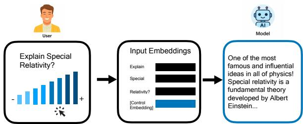
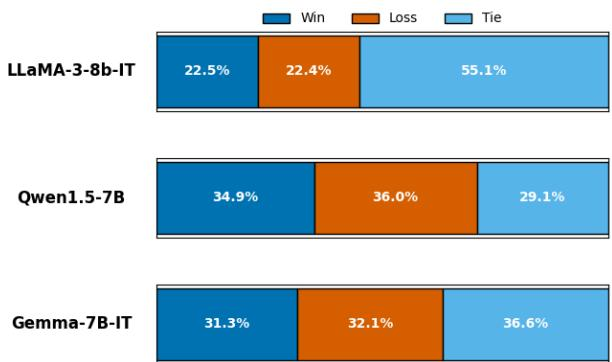
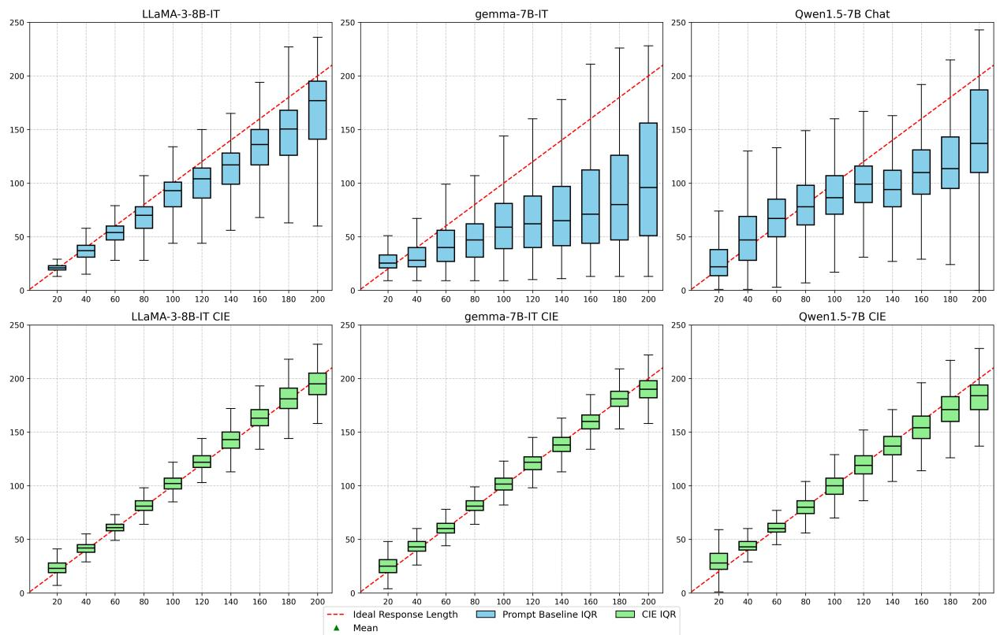

# CIE: Controlling Language Model Text Generations Using Continuous Signals

Vinay Samuel<sup>1,2,</sup>\* Harshita Diddee<sup>2</sup> Yiming Zhang<sup>2</sup> Daphne Ippolito<sup>2</sup>

<sup>1</sup>University of Maryland, College Park, <sup>2</sup>Carnegie Mellon University

## Abstract

Aligning language models (LMs) with user intent is becoming increasingly relevant to enhance user experience. This calls for designing methods that can allow users to control the properties of the language that LMs generate, for example, controlling the length of the generation or the complexity of the language that gets chosen. Most existing work attempts to integrate users’ control by conditioning LM generations on natural language prompts or discrete control signals, which are often brittle and hard to scale. In this work, we are interested in continuous control signals, ones that exist along a spectrum that can’t easily be captured in a natural language prompt or via existing techniques in conditional generation. Through a case study in controlling the precise responselength of generations, we demonstrate how an LM can be finetuned to expect a control vector that is interpolated between a “low” and a “high” token embedding. Our method more reliably exerts response-length control than in-context learning methods or fine-tuning methods that represent the control signal as a discrete signal.

## 1 Introduction

Instruction-tuned language models have demonstrated remarkable capabilities in generating coherent responses to user instructions (Taori et al., 2023; Ouyang et al., 2022; Shu et al., 2024). However, users often want to influence specific properties of the generated text beyond just the content–for example, controlling the length of the generation (as illustrated in Figure 1), the complexity of the language, the sentiment, or the tone.

There are many approaches to controlling such attributes in language model outputs. While discrete control signals (such as special tokens or words that get added to the user’s prompt) have shown promise (Konen et al., 2024; Deng et al.,

  
Figure 1: When using CIE for controlling response length, the user inputs both an instruction as well as a desired answer length. A control embedding for this response length is interpolated between the lower and upper bound control embeddings which were learned during training. The control embedding is appended to the input token embedding sequence of the instruction, and the LM which has been finetuned to expect this input generates an attribute-controlled response.

2022; Keskar et al., 2019; Dathathri et al., 2019), they have inherent limitations. Discrete approaches struggle to provide fine-grained control (especially for properties that exist on a continuous spectrum), and they can require extensive training to achieve competence (Keskar et al., 2019; Li et al., 2024). Meanwhile, methods that achieve controllability through natural-language instructions tend to be brittle, with small, immaterial changes to the verbalization potentially leading to inconsistent results (Zhuo et al., 2024).

In this work, we focus on continuous control signals that exist along a spectrum rather than discrete tokens or natural language prompts. We introduce Control through Interpolated Embeddings (CIE), a method enabling nuanced control over text generation through conditioning with a single control embedding.

While similar approaches have demonstrated effectiveness in domains such as strengthconditioning in chess (Zhang et al., 2025), we extend this methodology to precisely control specified attributes in language model outputs. Using continuous embeddings for incorporating continuous control signals rather than natural language instructions allows us to circumvent LLMs’ limited numerical understanding (Yang et al., 2025). Our approach also offers advantages over discrete control token methods by allowing smoother transitions between attribute intensities and more precise steering of generative outputs.

The core mechanism of CIE is a control embedding that is appended to the token embeddings of the user instruction. We augment the LM’s existing embedding matrix with two new embeddings corresponding to the lowest and highest possible values for a given attribute. During fine-tuning and inference, the control embedding is computed through linear interpolation between these low and high embeddings. Given a dataset of instructionanswer pairs annotated with control values, CIE enables LMs to learn a mapping from the control embedding’s position to the attribute’s degree of control.

To demonstrate our proposed method CIE’s effectiveness, we apply it to response length control (as measured by word count) and compare our results with both a prompting baseline and a stateof-the-art discrete signal approach (Li et al., 2024). 1

## 2 Method

To produce coherent text while adhering to specified attributes, CIE creates a positional mapping between control embedding locations in the input embedding and the specific attribute a being controlled. This mapping enables the language model to generate text conditioned on desired attributes. On a parameter level, the only additional parameters that CIE introduces to the LM are a control embedding matrix $\mathbf { E } \in \mathbb { R } ^ { 2 \times D }$ where D is the embedding dimension of the model.

The control embedding matrix is meant to represent the embedding vectors for lower and upper bound values of the given attribute. For a given conditioned value c, we define the control embedding matrix E as

$$
\mathbf { E } = \left( { \bf e } _ { \mathrm { l o w e r } } \right) \in \mathbb { R } ^ { 2 \times D }
$$

where $\mathbf { e } _ { \mathrm { l o w e r } }$ represents the embedding vector for the lower bound of control values for a in the training data $c _ { \mathrm { l o w e r } }$ and $\mathbf { e _ { \mathrm { u p p e r } } }$ is the embedding vector for the upper bound of the allowed values of a in the training data $c _ { \mathrm { u p p e r } }$ . For a given c, we calculate the control embedding vector for c as ${ \bf e } _ { \mathrm { c } } = \alpha { \bf e } _ { \mathrm { l o w e r } } + ( 1 - \alpha ) { \bf e } _ { \mathrm { u p p e r } }$ where $\begin{array} { r } { \alpha = \frac { c _ { \mathrm { u p p e r } } - c } { c _ { \mathrm { u p p e r } } - c _ { \mathrm { l o w e r } } } . } \end{array}$ A <control-embedding> token is appended to instructions without expanding vocabulary. During the forward pass, control positions are replaced with interpolated embeddings computed from two learned embeddings $( \mathbf { e } _ { \mathrm { l o w e r } }$ and $\mathbf { e _ { u p p e r } } )$ ) before transformer processing. The interpolated control embedding provides a continuous conditioning signal that influences all subsequent transformer layers. Unlike discrete tokens that compete for attention with content tokens, the control embedding acts as a persistent bias that guides generation decisions throughout the decoding process.

The control embedding is interpolated between trained bounds and injected into instruction embeddings for standard autoregressive generation. During decoding, the control embedding establishes a representation space bias that influences next-token probability distributions. The learned embeddings encode attribute-specific patterns that, when interpolated, provide fine-grained control over generation characteristics.

The training dataset  comprises triplets of $( i , a , w c )$ , where i represents the instruction, a denotes the ground truth answer, and wc indicates the conditioned response length. During training, wc is set to match the response length in a. We establish engineering-determined lower and upper bounds (c<sub>lower</sub> and $c _ { \mathrm { u p p e r } } )$ for the controlled attribute, with all wc values clamped within this range before calculating $e _ { c } .$ . Following the approach of Zhang et al. (2025), we curate  to maintain an approximately uniform distribution of response lengths, ensuring sufficient training for $\mathbf { e } _ { \mathrm { l o w e r } }$ and $\mathbf { e _ { \mathrm { u p p e r } } }$

The method adds only a $( 2 \times D )$ control embedding matrix to the base model, requiring minimal modifications to standard causal language modeling.

## 3 Experiments

To demonstrate the efficacy of continuous control signals, we apply CIE to the attribute of responselength. This section details our experimental setup and results. We include details regarding our training and validation setups, including hardware and hyperparameters, in Appendix D and Appendix E, respectively.

## 3.1 Datasets

To evaluate how effectively CIE controls responselength in text generation, we introduce VERBOSI-TYCTRL, which combines data from both conversational and traditional NLP style datasets namely: MSMarco (Nguyen et al., 2016), OpenAssistant 1/2 (Köpf et al., 2023), and Databricks Dolly 15k (Conover et al., 2023). We divide this dataset into VERBOSITYCTRL <sub>train</sub> and VERBOSITYCTRL <sub>val</sub>. Additionally, we created VERBOSITYCTRL <sub>range</sub>, an augmented version of VERBOSITYCTRL <sub>val</sub> where each instruction appears in 10 variations with target word\_count values from 20 to 200 in 20-unit increments. For out-of-distribution validation, we utilized the Alpaca-LI dataset (Yuan et al., 2024). Complete data processing methodology and dataset statistics are available in Appendix A and Appendix C, respectively.

## 3.2 Metrics

We evaluate our results using the Conditioning Precision Ratio (CPR) metric, which measures how accurately models follow response length instructions. CPR simply checks for an exact match between the generated response length and the conditioned response length, returning 1 for a perfect match and 0 otherwise. We also define CPR @k, which introduces a relative tolerance factor, accepting response lengths within k percent of the target (e.g., CPR @0.1 allows deviations within 10% of the specified response length). To verify that CIE preserves language generation quality, we calculate win-rates between model outputs and a prompt baseline, counting both wins and ties as evidence that CIE does not harm generation abilities. Additional details on this evaluation approach are available in Appendix H.

## 3.3 Models

We finetune and evaluate several open-source LLMs namely LLaMA-3-8b-Instruct (Llama Team et al., 2024), gemma-7B-it (Team et al., 2024), and Qwen1.5-7B-Chat (Team, 2024). These particular models were selected to show the efficacy of CIE while also enabling fair comparison to the results from Li et al. (2024).

## 3.4 Baselines

We compare CIE to a prompting baseline where we prepend the sentence “Respond to the following in exactly {wordcount} words.” where wordcount is replaced with the conditioned response length. This prompt was chosen as the highest performing prompt across three prompts that were tested. Details regarding all prompt experiments, as well as their performances, are included in Appendix B.

  
Figure 2: Win rates of CIE models vs a length conditioned prompting baseline as defined in Appendix H. The judge model used was GPT-4.

In addition, we also compare to the Ruler (Li et al., 2024) method, which uses Meta Length Tokens, a discrete token embedding for unique response-length directive provided by the user.

## 4 Results

Table 1 presents our main findings of comparing models trained using CIE to the prompt baseline.

Enhanced Performance with CIE. Our CIE approach significantly improved response length control across all evaluated models and datasets. On VERBOSITYCTRL <sub>val</sub>, CIE increased average CPR from 0.80-9.80% to 8.90-9.80%, with substantial gains for initially weaker models like gemma-7B-IT (0.80% to 8.90%). The most dramatic improvements occurred at the CPR @0.05 threshold, with increases of 23.10, 24.00, and 30.40 percentage points for LLaMA-3-8B-IT, gemma-7B-IT, and Qwen-1.5-7B respectively. Similar patterns emerged on VERBOSITYCTRL <sub>range</sub>, with average CPR rising from 1.6% to 4.8%. These improvements generalized to out-of-distribution data (Alpaca-LI), confirming CIE’s cross-contextual robustness. We observed an inverse relationship between baseline capability and improvement magnitude—weaker models achieved more dramatic relative gains, with gemma-7B-IT showing over 10 improvement at exact-match CPR. Stronger models like LLaMA-3-8B-IT made minor sacrifices at exact-match for substantial gains at relaxed thresholds. The diminishing relative gains at CPR @0.1 suggest base models already capture many approximate matches at looser tolerances. Detailed analyses are available in Appendices F and G.

<table><tr><td rowspan="2">Model</td><td colspan="3">VERBOSITYCTRL  $\mathbf { v a l }$ </td><td colspan="3">VERBOSITYCTRL range</td><td colspan="3">Alpaca-LI</td></tr><tr><td>CPR</td><td>CPR @0.05</td><td>CPR @0.1</td><td>CPR</td><td>CPR @0.05</td><td>CPR @0.1</td><td>CPR</td><td>CPR @0.05</td><td>CPR @0.1</td></tr><tr><td>LLaMA-3-8B-IT</td><td>9.80</td><td>22.70</td><td>38.90</td><td>3.19</td><td>17.40</td><td>39.04</td><td>5.43</td><td>21.95</td><td>43.67</td></tr><tr><td>LLaMA-3-8B-ITCIE</td><td>9.50↓0.30</td><td>45.80↑ 23.10</td><td>72.70↑ 33.80</td><td>5.05↑ 1.86</td><td>39.08↑ 21.68</td><td>71.65↑ 32.61</td><td>9.04↑ 3.61</td><td>45.02↑ 23.07</td><td>72.40↑ 28.73</td></tr><tr><td>gemma-7B-IT</td><td>0.80</td><td>4.90</td><td>8.80</td><td>0.73</td><td>3.87</td><td>9.94</td><td>1.58</td><td>9.05</td><td>17.19</td></tr><tr><td>gemma-7B-ITCIE</td><td>8.90↑ 8.10</td><td>28.90↑ 24.00</td><td>47.50↑ 38.70</td><td>4.42↑ 3.69</td><td>37.90↑ 34.03</td><td>68.37↑58.43</td><td>4.75↑ 3.17</td><td>40.95↑ 31.90</td><td>65.16↑47.97</td></tr><tr><td>Qwen-1.5-7B</td><td>4.60</td><td>9.40</td><td>16.60</td><td>0.91</td><td>5.96</td><td>14.82</td><td>2.94</td><td>8.82</td><td>17.42</td></tr><tr><td>Qwen-1.5-7BCIE</td><td>9.80↑ 5.20</td><td>39.80↑ 30.40</td><td>67.80↑ 51.20</td><td>4.77↑ 3.86</td><td>31.55↑ 25.59</td><td>62.71↑ 47.89</td><td>4.20↑ 1.26</td><td>20.36↑ 11.54</td><td>38.46↑ 21.04</td></tr></table>

Table 1: Results of prompt baseline and CIE on VERBOSITYCTRL $\mathrm { v a l } \cdot$ , VERBOSITYCTRL $\mathrm { r a n g e } ,$ Alpaca-LI. We present results on the CPR, CPR @0.05 and CPR @0.1 metric to present results of various competitive thresholds.

Win-rates to gauge coherent language generation capabilities. Figure 2 shows win-rates between CIE and a response length conditioned prompt baseline for each model. We consider both wins and ties as signals that language generation and instruction-following capabilities remain intact. Across all models, combined win and tie rates exceed loss rates, indicating CIE generally preserves these capabilities. A more detailed analysis is present in Appendix H.1.

Comparison to RULER. Table 3 presents comparisons between CIE and RULER, where both were trained using VERBOSITYCTRL <sub>train</sub> and evaluated on a validation set in-distribution to that used in Li et al. (2024). We compare only on RULER’s level 0 (1-150 words), as it aligns with our experimental response length ranges. We adopt the same metrics: Precise Match (PM), allowing 10 words at all lengths, and Flexible Match (FM), allowing 10 words for lengths below 80 and 20 words for lengths greater than or equal to 80.

CIE consistently outperforms RULER across all model variants. For gemma-7B-IT, CIE achieves absolute improvements of 9.09 and 7.86 points in PM and FM scores, respectively. LLaMA-3-8B shows even more substantial gains of 16.30 and 16.18 points, while Qwen1.5-7B demonstrates improvements of 6.54 and 6.44 points.

To understand why CIE outperforms discrete methods, we conducted scaling experiments training LLaMA-3-8B on both RULER and CIE at 25%, 50%, 75%, and 100% of training data. Results from Table 2 show CIE maintains superiority across all data scales without convergence. CIE’s continuous interpolation creates a structured embedding space where similar lengths have similar representations, enabling generalization between target values with fewer examples per length. The continuous space inherently captures ordinal relationships between control values, whereas discrete methods lack this geometric structure. Additionally, the requirement of adding in additional MLT tokens in the RULER method makes the method non-trivial to scale to larger word counts.

These significant performance gains highlight CIE’s effectiveness in enhancing precision response length conditioning, suggesting it provides a more robust framework for output length control compared to state-of-the-art methods.

<table><tr><td>Model</td><td>25%</td><td>50%</td><td>75%</td><td>100%</td></tr><tr><td>LLaMA-3-8B_Ruler</td><td>11.80/14.20</td><td>24.20/28.00</td><td>38.00/42.50</td><td>49.22/53.33</td></tr><tr><td>LLaMA-3-8B_CIE</td><td>13.08/16.32</td><td>26.72/30.38</td><td>41.46/44.79</td><td>65.52/69.51</td></tr></table>

Table 2: Performance Analysis: Why CIE Outperforms Discrete Methods. The results show Precise Math / Flexible Match

## 5 Related Works

Related Work Prior work on attribute control in LLMs can be categorized into three approaches. Discrete control signals include Keskar et al. (2019)’s conditional transformer with control codes for style and content steering, Dathathri et al. (2019)’s combination of pre-trained LMs with attribute classifiers that guide generation without finetuning, and Li et al. (2024)’s "Meta Length Tokens" for controlling word counts within specified deviation levels. Prompt engineering approaches comprise Sarti et al. (2023)’s retrieved examples with special markings for translation attribute control, Bhargava et al. (2023)’s "magic words" that steer models toward specific outputs, and Yuan et al. (2024)’s fine-tuning with templates that condition for desired word counts. Continuous control signals include Yang et al. (2023)’s soft-prompt tuning where trainable embedding vectors guide frozen LMs toward target attributes, Chen et al. (2023)’s learned prompt mixtures for multiple attribute constraints, and Von Rütte et al. (2024)’s approach of steering generation via concept vectors in the LLM’s hidden activation space.

<table><tr><td>Model</td><td>PM</td><td>FM</td></tr><tr><td>gemma-7B-IT</td><td>15.52</td><td>18.85</td></tr><tr><td>gemma-7BRuler</td><td>62.42</td><td>67.52</td></tr><tr><td>gemma-7BCIE</td><td>71.51</td><td>75.38</td></tr><tr><td>LLaMA-3-8B-Instruct</td><td>34.59</td><td>40.02</td></tr><tr><td> $_ { \mathrm { L L a M A - } 3 - 8 \mathrm { B _ { R u l e r } } }$ </td><td>49.22</td><td>53.33</td></tr><tr><td>LLaMA-3-8BCIE</td><td>65.52</td><td>69.51</td></tr><tr><td>Qwen1.5-7B-Chat</td><td>24.28</td><td>27.38</td></tr><tr><td>Qwen1.5-7BRuler</td><td>39.91</td><td>44.79</td></tr><tr><td>Qwen1.5-7BCIE</td><td>46.45</td><td>51.23</td></tr></table>

Table 3: Performance comparison between promptbased length condition, RULER, and CIE on a validation set in distribution with the validation set used in RULER. Both the RULER, and CIE models were trained on VER-BOSITYCTRL <sub>train</sub>

## 6 Conclusion

Fine-grained control over language model outputs represents a critical capability for deploying these systems in contexts requiring adaptable text generation. While the vast majority of current controllability approaches are based on discrete signals, we believe that the fine-grained controllability of continuous signals is necessary for the evolving user demands of conversational LMs. Through our proposed method, we have established a framework that effectively modulates response length while preserving content fidelity.

Beyond word count, future work should aim to apply CIE as well as other continuous signal approaches to control concrete attributes like sentence count, character count, and complexity measures. While subjective properties like toxicity and bias present additional challenges in defining meaningful continuous ranges, as discussed in the Limitations of this paper, they represent important directions for future exploration.

## Limitations

While CIE provides a general framework extendable to any attribute it may be sample efficient for generation attributes that lack explicit control signals over a wide continuous range; For instance, controlling the ‘politeness’ (Yin et al., 2024) or ‘sarcasm’ (Zhang et al., 2024) requires creating a meaningful continuous range for notions of a more ‘polite’ response versus a less ‘polite’ response which may need thoughtful reconciliation of fairly subjective notion of what signals identify examples in either category.

## Acknowledgments

The authors acknowledge AI assistance as follows: Several sections underwent refinement using AI, where the AI was instructed to ’rewrite in clear, coherent, and concise academic style writing while not altering the major points in the provided writing.’ All AI-generated content was thoroughly reviewed by the authors before inclusion in the manuscript, ensuring full compliance with ACL ARR guidelines. Additionally some figure components (such as the model and user avatars) were either AI generated or AI refined. We also thank Barry Wang (CMU CSD PhD) for major inputs in designing the teaser figure.

## References

Aman Bhargava, Cameron Witkowski, Shi-Zhuo Looi, and Matt Thomson. 2023. What’s the magic word? a control theory of llm prompting. arXiv preprint arXiv:2310.04444.

Derek Chen, Celine Lee, Yunan Lu, Domenic Rosati, and Zhou Yu. 2023. Mixture of soft prompts for controllable data generation. In Findings of the Association for Computational Linguistics: EMNLP 2023, pages 14815–14833, Singapore. Association for Computational Linguistics.

Mike Conover, Matt Hayes, Ankit Mathur, Jianwei Xie, Jun Wan, Sam Shah, Ali Ghodsi, Patrick Wendell, Matei Zaharia, and Reynold Xin. 2023. Free dolly: Introducing the world’s first truly open instructiontuned llm.

Sumanth Dathathri, Andrea Madotto, Janice Lan, Jane Hung, Eric Frank, Piero Molino, Jason Yosinski, and Rosanne Liu. 2019. Plug and play language models: A simple approach to controlled text generation. arXiv preprint arXiv:1912.02164.

Mingkai Deng, Jianyu Wang, Cheng-Ping Hsieh, Yihan Wang, Han Guo, Tianmin Shu, Meng Song, Eric Xing, and Zhiting Hu. 2022. RLPrompt: Optimizing discrete text prompts with reinforcement learning. In Proceedings of the 2022 Conference on Empirical Methods in Natural Language Processing, pages 3369–3391, Abu Dhabi, United Arab Emirates. Association for Computational Linguistics.

Nitish Shirish Keskar, Bryan McCann, Lav R Varshney, Caiming Xiong, and Richard Socher. 2019. Ctrl: A conditional transformer language model for controllable generation. arXiv preprint arXiv:1909.05858.

Kai Konen, Sophie Jentzsch, Diaoulé Diallo, Peer Schütt, Oliver Bensch, Roxanne El Baff, Dominik Opitz, and Tobias Hecking. 2024. Style vectors for steering generative large language models. In Findings of the Association for Computational Linguistics: EACL 2024, pages 782–802, St. Julian’s, Malta. Association for Computational Linguistics.

Andreas Köpf, Yannic Kilcher, Dimitri Von Rütte, Sotiris Anagnostidis, Zhi Rui Tam, Keith Stevens, Abdullah Barhoum, Duc Nguyen, Oliver Stanley, Richárd Nagyfi, and 1 others. 2023. Openassistant conversations-democratizing large language model alignment. Advances in Neural Information Processing Systems, 36:47669–47681.

Jiaming Li, Lei Zhang, Yunshui Li, Ziqiang Liu, Yuelin Bai, Run Luo, Longze Chen, and Min Yang. 2024. Ruler: A model-agnostic method to control generated length for large language models. In Findings of the Associationfor Computational Linguistics: EMNLP 2024, pages 3042–3059, Miami, Florida, USA. Association for Computational Linguistics.

Llama Team and 1 others. 2024. The Llama 3 Herd of Models. Preprint, arXiv:2407.21783.

Tri Nguyen, Mir Rosenberg, Xia Song, Jianfeng Gao, Saurabh Tiwary, Rangan Majumder, and Li Deng. 2016. Ms marco: A human-generated machine reading comprehension dataset.

Long Ouyang, Jeffrey Wu, Xu Jiang, Diogo Almeida, Carroll Wainwright, Pamela Mishkin, Chong Zhang, Sandhini Agarwal, Katarina Slama, Alex Ray, John Schulman, Jacob Hilton, Fraser Kelton, Luke Miller, Maddie Simens, Amanda Askell, Peter Welinder, Paul F Christiano, Jan Leike, and Ryan Lowe. 2022. Training language models to follow instructions with human feedback. In Advances in Neural Information Processing Systems, volume 35, pages 27730–27744. Curran Associates, Inc.

Gabriele Sarti, Phu Mon Htut, Xing Niu, Benjamin Hsu, Anna Currey, Georgiana Dinu, and Maria Nadejde. 2023. RAMP: Retrieval and attribute-marking enhanced prompting for attribute-controlled translation. In Proceedings of the 61st Annual Meeting of the Associationfor Computational Linguistics (Volume 2: Short Papers), pages 1476–1490, Toronto, Canada. Association for Computational Linguistics.

Lei Shu, Liangchen Luo, Jayakumar Hoskere, Yun Zhu, Yinxiao Liu, Simon Tong, Jindong Chen, and Lei Meng. 2024. Rewritelm: An instruction-tuned large language model for text rewriting. In Proceedings of the AAAI Conference on Artificial Intelligence, volume 38, pages 18970–18980.

Rohan Taori, Ishaan Gulrajani, Tianyi Zhang, Yann Dubois, Xuechen Li, Carlos Guestrin, Percy Liang, and Tatsunori B. Hashimoto. 2023. Stanford alpaca: An instruction-following llama model. https:// github.com/tatsu-lab/stanford\_alpaca.

Gemma Team, Thomas Mesnard, Cassidy Hardin, Robert Dadashi, Surya Bhupatiraju, Shreya Pathak, Laurent Sifre, Morgane Rivière, Mihir Sanjay Kale, Juliette Love, Pouya Tafti, Léonard Hussenot, Pier Giuseppe Sessa, Aakanksha Chowdhery, Adam Roberts, Aditya Barua, Alex Botev, Alex Castro-Ros, Ambrose Slone, and 89 others. 2024. Gemma: Open models based on gemini research and technology. Preprint, arXiv:2403.08295.

Qwen Team. 2024. Introducing qwen1.5.

Dimitri Von Rütte, Sotiris Anagnostidis, Gregor Bachmann, and Thomas Hofmann. 2024. A language model’s guide through latent space. arXiv preprint arXiv:2402.14433.

Haotong Yang, Yi Hu, Shijia Kang, Zhouchen Lin, and Muhan Zhang. 2025. Number cookbook: Number understanding of language models and how to improve it. In The Thirteenth International Conference on Learning Representations.

Kexin Yang, Dayiheng Liu, Wenqiang Lei, Baosong Yang, Mingfeng Xue, Boxing Chen, and Jun Xie. 2023. Tailor: A soft-prompt-based approach to attribute-based controlled text generation. In Proceedings ofthe 61st Annual Meeting ofthe Associationfor Computational Linguistics (Volume 1: Long Papers), pages 410–427, Toronto, Canada. Association for Computational Linguistics.

Ziqi Yin, Hao Wang, Kaito Horio, Daisuke Kawahara, and Satoshi Sekine. 2024. Should we respect llms? a cross-lingual study on the influence of prompt politeness on llm performance. ArXiv, abs/2402.14531.

Weizhe Yuan, Ilia Kulikov, Ping Yu, Kyunghyun Cho, Sainbayar Sukhbaatar, Jason Weston, and Jing Xu. 2024. Following length constraints in instructions. arXiv preprint arXiv:2406.17744.

Yazhou Zhang, Chunwang Zou, Zheng Lian, Prayag Tiwari, and Jing Qin. 2024. Sarcasmbench: Towards evaluating large language models on sarcasm understanding. ArXiv, abs/2408.11319.

Yiming Zhang, Athul Paul Jacob, Vivian Lai, Daniel Fried, and Daphne Ippolito. 2025. Human-aligned chess with a bit of search. In The Thirteenth International Conference on Learning Representations.

Jingming Zhuo, Songyang Zhang, Xinyu Fang, Haodong Duan, Dahua Lin, and Kai Chen. 2024. ProSA: Assessing and understanding the prompt sensitivity of LLMs. In Findings of the Association for Computational Linguistics: EMNLP 2024, pages 1950–1976, Miami, Florida, USA. Association for Computational Linguistics.

## A Dataset Processing

Data filtration was conducted to remove all non-english instances as well as coding instances. Furthermore VERBOSITYCTRL includes a word\_count field that is determined based on the word count of the ground truth answer for each data instance. We conduct several data processing steps to our data in VERBOSITYCTRL to ensure high quality. Firstly, to maintain a uniform distribution of word counts in bins of size 25, we limit our data to those with word counts between 1 and 200 words, where Listing 1 shows our function for counting words, which is the same as Li et al. (2024).

Listing 1: Word countingfunction using NLTK  
```python
1 from nltk . tokenize import
word_tokenize
2 import string
3 def count_words ( text ):
4 return len ([ word for word in
word_tokenize ( text ) if word
not in string . punctuation ])
```

We additionally conduct a filtering to remove all instances of non-English instructions/answers as well as datapoints that contain coding keywords. Our approach to filtering these datapoints is shown in Listing 2

Listing 2: Non-English and coding instancesfilteringh  
1 import langdetect   
2   
3 # Function to check for programming   
terms   
4 def has\_programming\_terms ( text ):   
5 keywords = [" java ", " python ", "c   
++", " def ", " return ", " program   
11 " function ", " script ", " html   
11 "css ",   
6 " javascript ", " php",   
" sql ", " ruby ", n   
swift ", " kotlin ",   
11   
scala ", " haskell ",   
7 " erlang ", " elixir ",   
dart ", " typescript   
", "c#", " visual   
basic ", " objective   
, " assembly "   
8 " matlab ", " perl ", 11   
shell ", ".js",   
json ", " xml ", "<",   
">", " lorem ipsum   
, "\ document "   
" excel "   
" https ", " tabular ", 11   
9   
\end ", " ascii ", "\*   
", " translate ", 11   
korean ", "IP"]   
10 text\_lower = text . lower ()   
11 return any ( keyword in text\_lower   
for keyword in keywords )   
12   
13 # Function to check if text is in   
English   
14 def is\_english ( text ) :   
15 try :

16 return langdetect . detect ( text   
) == ’en ’   
17 except :   
18 return False

## B Baseline Prompts

<table><tr><td rowspan=1 colspan=1>Label</td><td rowspan=1 colspan=1>Prompt</td></tr><tr><td rowspan=1 colspan=1>Prompt 1</td><td rowspan=1 colspan=1>The response should have a word countof {wordcount}.</td></tr><tr><td rowspan=1 colspan=1>Prompt 2</td><td rowspan=1 colspan=1>The answer should be {wordcount}words.</td></tr><tr><td rowspan=1 colspan=1>Prompt 3</td><td rowspan=1 colspan=1>Respond to the following in exactly{wordcount} words.</td></tr></table>

Table 4: Word-count control prompts used in our experiments.

Due to the brittleness of prompting-based approaches to controlling LM outputs, we experiment with three different prompt templates (see Table 4) that are appended to the beginning of the instruction for data instances as part of our prompt baseline. Prompt 1 is taken from Yuan et al. (2024), prompt 2 is taken from Li et al. (2024), and the authors of this paper created prompt 3. We include a “best” performing prompt baseline where for a given instruction j this baseline selects the response from prompt $j \in [ 1 , 2 , 3 ]$ such that the prediction from prompt j has the closest CPR to 1 for instruction j.

Table 5 shows the performance of each prompt for the different validation sets in our experiments. We observe that prompt 3 is the best overall performer and, therefore, was included in our main results.

## C Dataset Statistics

<table><tr><td>Dataset</td><td>Mean</td><td>Min</td><td>Max</td><td>Std. Dev.</td></tr><tr><td>VerbosityCTRL_train</td><td>95.35</td><td>1</td><td>200</td><td>57.08</td></tr><tr><td>VerbosityCTRL_val</td><td>92.85</td><td>1</td><td>199</td><td>55.05</td></tr><tr><td>VerbosityCTRL_range</td><td>110.00</td><td>20</td><td>200</td><td>57.45</td></tr><tr><td>Alpaca_LI</td><td>108.60</td><td>1</td><td>200</td><td>57.98</td></tr></table>

Table 6: Word-count statistics for the datasets used in our experiments.

Table 6 presents the dataset statistics of the training and validation sets of VERBOSITYCTRL as well as the Alpaca\_LI validation set used in our experiments.

## D Training

All models were loaded in using BF16 and FlashAttention 2 (other than gemma-7B-it which was incompatible with FlashAttention 2.) All models utilized a cosine scheduler with warmup with a warmup\_ratio of 0.03 for training along with a weight\_decay of 0.001, max\_grad\_norm of 0.3, per\_device\_train\_batch\_size of 1, and gradient\_accumulation\_steps of 4 where the per\_device\_train\_batch\_size was set to a low value due to memory constraints. The num\_train\_epochs and learning\_rate for each model was determined through a hyperparameter search as detailed in Appendix D.1.

<table><tr><td rowspan="2">Model</td><td rowspan="2">Baseline</td><td colspan="3">VERBOSITYCTRL val</td><td colspan="3">VERBOSITYCTRL  $\mathbf { r a n g e }$ </td><td colspan="3">Alpaca-LI</td></tr><tr><td>CPR</td><td>CPR @0.05</td><td>CPR @0.1</td><td>CPR</td><td>CPR @0.05</td><td>CPR @0.1</td><td>CPR</td><td>CPR @0.05</td><td>CPR @0.1</td></tr><tr><td rowspan="5">LLaMA-3-8B-IT</td><td>Prompt 1</td><td>3.60</td><td>9.90</td><td>18.10</td><td>1.00</td><td>9.52</td><td>21.18</td><td>4.07</td><td>24.89</td><td>45.02</td></tr><tr><td>Prompt 2</td><td>8.00</td><td>21.80</td><td>36.60</td><td>2.86</td><td>18.60</td><td>37.71</td><td>6.11</td><td>26.24</td><td>49.77</td></tr><tr><td>Prompt 3</td><td>9.80</td><td>22.70</td><td>38.90</td><td>3.19</td><td>17.40</td><td>39.04</td><td>5.43</td><td>21.95</td><td>43.67</td></tr><tr><td>Random</td><td>7.30</td><td>17.70</td><td>31.50</td><td>2.35</td><td>15.61</td><td>32.50</td><td>5.66</td><td>25.79</td><td>48.64</td></tr><tr><td>Best</td><td>12.80</td><td>37.10</td><td>57.90</td><td>6.44</td><td>34.09</td><td>58.31</td><td>10.86</td><td>48.19</td><td>69.46</td></tr><tr><td rowspan="5">gemma-7B-IT</td><td>Prompt 1</td><td>0.70</td><td>4.90</td><td>9.80</td><td>0.73</td><td>5.38</td><td>12.23</td><td>0.45</td><td>11.09</td><td>23.08</td></tr><tr><td>Prompt 2</td><td>0.80</td><td>5.00</td><td>9.20</td><td>0.88</td><td>4.58</td><td>11.53</td><td>0.68</td><td>7.47</td><td>16.52</td></tr><tr><td>Prompt 3</td><td>0.80</td><td>4.80</td><td>8.80</td><td>0.73</td><td>3.87</td><td>9.94</td><td>1.58</td><td>9.05</td><td>17.19</td></tr><tr><td>Random</td><td>0.70</td><td>5.20</td><td>9.60</td><td>0.68</td><td>4.39</td><td>11.37</td><td>1.81</td><td>10.18</td><td>19.23</td></tr><tr><td>Best</td><td>2.20</td><td>11.90</td><td>20.00</td><td>2.19</td><td>11.71</td><td>25.06</td><td>2.49</td><td>20.14</td><td>35.07</td></tr><tr><td rowspan="5">Qwen-1.5-7B</td><td>Prompt 1</td><td>0.20</td><td>3.20</td><td>9.20</td><td>0.39</td><td>3.71</td><td>9.04</td><td>2.04</td><td>9.50</td><td>16.97</td></tr><tr><td>Prompt 2</td><td>2.70</td><td>5.90</td><td>11.20</td><td>0.69</td><td>5.15</td><td>12.52</td><td>2.49</td><td>10.41</td><td>21.27</td></tr><tr><td>Prompt 3</td><td>4.60</td><td>9.40</td><td>16.60</td><td>0.91</td><td>5.96</td><td>14.82</td><td>2.94</td><td>8.82</td><td>17.42</td></tr><tr><td>Random</td><td>2.60</td><td>7.00</td><td>12.90</td><td>0.54</td><td>5.04</td><td>11.91</td><td>2.71</td><td>10.18</td><td>19.46</td></tr><tr><td>Best</td><td>5.50</td><td>15.60</td><td>29.10</td><td>1.91</td><td>12.87</td><td>28.73</td><td>4.07</td><td>20.81</td><td>37.10</td></tr></table>

Table 5: Prompt-based baseline performance across three validation splits. Best scores per column are bold; second–best are underlined.

## D.1 Hyperparameter Search

We perform a hyperparameter grid search for each tested model for the epochs and learning\_rate hyperparameters. We created a random subset of VERBOSITYCTRL <sub>train</sub> with 10000 samples that was used for the grid search. We searched over epoch values of [3, 5, 7] and learning\_rate values of $[ 5 \times 1 0 ^ { - 6 } , 1 \times \mathrm { i } 0 ^ { - 5 } , 5 \times 1 0 ^ { - 5 } , 1 \times 1 0 ^ { - 4 } ]$ and evaluated performance on VERBOSITYCTRL $\mathrm { v a l }$ to determine the epoch and learning\_rate for each model.

## D.2 Hardware

All experiments were conducted on a single node setup using A6000, L40, and L40S. All reported results are from full model fine-tuning done using DeepSpeed Stage 3 using 8 GPUs.

## E Validation

All inference was conducted using a temperature of 0 and batch\_size of 4.

## F Detailed Results Analysis

Enhanced Performance Across Models. Our CIE approach significantly improved word count control across evaluation metrics. On VERBOSI-TYCTRL <sub>val</sub>, average CPR increased from 5.1% to 9.4%, with CPR@0.05 rising from 12.3% to 38.2% and CPR@0.1 from 21.4% to 62.6%. Similar trends appeared on VERBOSITYCTRL <sub>range</sub>, where average CPR rose from 1.6% to 4.8%, with CPR@0.05 and CPR@0.1 improving by 27.1 and 46.3 percentage points, respectively. These benefits extended to out-of-distribution data (Alpaca-LI), demonstrating COMPASS enhances word count control in both in-distribution and out-ofdistribution contexts, with the only exception being CPR for LLaMA-3-8B-IT on VERBOSITYCTRL <sub>val</sub>.

Threshold-Specific Performance Gains. CIE yielded the most substantial improvements at the CPR @0.05 tolerance threshold. On VERBOSI-TYCTRL <sub>val</sub>, LLaMA-3-8B-IT’s CPR @0.05 increased by 23.10 percentage points (22.70% to 45.80%), Gemma-7B-IT by 24.00 points (4.90% to 28.90%), and Qwen-1.5-7B by 30.40 points (9.40% to 39.80%). While improvements occurred across all thresholds, gains were most pronounced at CPR @0.05, suggesting our method effectively refines near-miss output lengths. This pattern remained consistent across validation sets, including out-ofdistribution data. The diminishing relative gains at CPR @0.1 indicate that base models already capture many approximate matches at looser tolerances.

Analysis Across Models. We observed an inverse relationship between baseline capability and relative improvement with CIE. LLaMA-3-8B-IT demonstrated the highest baseline control on VER-BOSITYCTRL <sub>val</sub> (9.80 CPR), followed by Qwen-1.5-7B (4.60 CPR) and Gemma-7B-IT (0.80 CPR). However, initially weaker models achieved the most dramatic gains: Gemma-7B-IT showed over 10 improvement at CPR (0.80 to 8.90) while $\mathbf { L L a M A - 3 - 8 B - I T }$ made slight sacrifices at exactmatch for substantial gains at relaxed thresholds. These improvements generalized across both VER-BOSITYCTRL $\mathrm { r a n g e }$ and out-of-distribution Alpaca-LI evaluation sets, confirming the method’s robustness and effectiveness with initially weaker models.

## G Analysis Across Different Ranges of Control.

Figure 3 shows performance on VERBOSITYC-$\mathrm { T R L _ { \ r a n g e } }$ , where we created 10 variants for each instruction in VERBOSITYCTRL $\mathrm { v a l }$ with target word counts from 20 to 200. Ideally, each box plot would show minimal interquartile range (IQR) and whiskers, with means aligned along $y = x$ . For the prompt baseline, box plot widths and whisker lengths increase with target word counts, indicating greater variance at higher targets. This confirms our previous analysis: LLaMA-3-8B-IT demonstrates the strongest word count adherence, followed by Qwen1.5-7B-IT and Gemma-7B-IT. In contrast, CIE variants exhibit dramatically tighter distributions across all target counts, with small IQRs and whisker lengths even at 200 words. Mean responses (green triangles) lie almost exactly on the $y = x$ line, reflecting highly accurate calibration of output lengths. The model performance ranking remains consistent, with CIE enforcing word count constraints far more precisely than the prompt baseline.

## H Win Rates

To gauge whether CIE leads to language generation degradation, we calculate win rates between the generation from CIE models and the “best” prompt baseline from Appendix B. To reduce order bias when doing LLM-as-judge, we randomize the order of the CIE output and the “best” prompt baseline output. The model used for judging was GPT-4 and the prompt used is shown in Listing H.1.

## H.1 Win Rates Analysis

LLaMA-3-8b-IT demonstrates this most clearly with 77.6% of evaluations resulting in either wins (22.5%) or ties (55.1%), versus 22.4% losses. Similarly, Gemma-7B-IT shows strong capability preservation with combined 67.9% for wins and ties (31.3% and 36.6% respectively) versus 32.1% losses. Even Qwen1.5-7B maintains competitive performance with 64.0% wins or ties (34.9% and 29.1% respectively) compared to 36.0% losses. These findings suggest CIE consistently maintains or improves language model instruction following performance relative to the response length conditioned baseline.

  
Figure 3: Box-and-whiskers plot of prompt-based length conditioning (top row) and CIE (bottom row) on VER-$\mathrm { \Delta B O S I T Y C T R L _ { \mathrm { \ r a n g e } } }$ . Each box plot contains 1000 datapoints as VERBOSITYCTRL contains the same 1000 $\mathrm { r a n g e }$ instructions with 10 different conditioned word counts.

## Rubric Outline Example for Expected Action Used to Guide Generation of Examples.

Please act as an impartial judge and evaluate the quality of the responses provided by two AI assistants to the user question displayed below. Your evaluation should consider factors such as the helpfulness, relevance, accuracy, depth, creativity, and level of detail of their responses.

Begin your evaluation by comparing the two responses and provide a short explanation. Avoid any position biases and ensure that the order in which the responses were presented does not influence your decision. Do not allow the length of the responses to influence your evaluation. Do not favor certain names of the assistants.

IMPORTANT: If both assistants provide reasonably adequate answers that address the user’s question - even if one might be slightly better in some aspects - you should declare a tie. Only declare a clear winner when one response is substantially superior to the other.

Be as objective as possible. Provide a justification for your selection. Your response must end in the format "Therefore the winner is ..." and output your final verdict by strictly following this format: "[[A]]" if assistant A is better, "[[B]]" if assistant B is better, and "[[C]]" for a tie.

Question: prompt

Answer A: answer\_a

Answer B: answer\_b