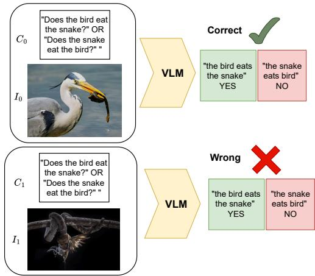
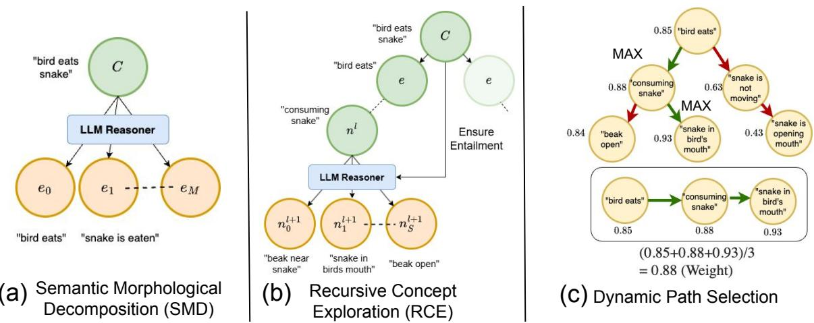
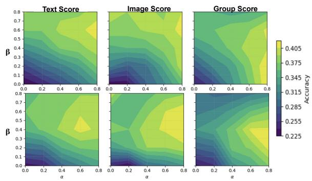
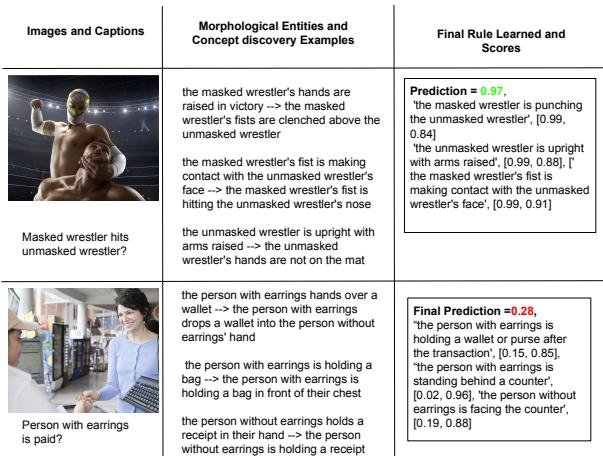
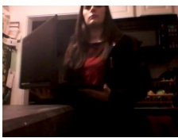
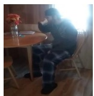

# COCO-Tree: COmpositional Hierarchical COncept Trees for Enhanced Reasoning in Vision Language Models

Sanchit Sinha and Guangzhi Xiong and Aidong Zhang

University of Virginia

Charlottesville, VA, USA

{sanchit, hhu4zu, aidong}@virginia.edu

## Abstract

Compositional reasoning remains a persistent weakness of modern vision language models (VLMs): they often falter when a task hinges on understanding how multiple objects, attributes, and relations interact within an image. Multiple research works have attempted to improve compositionality performance by creative tricks such as improving prompt structure, chain of thought reasoning, etc. A more recent line of work attempts to impart additional reasoning in VLMs using well-trained Large Language Models (LLMs), which are far superior in linguistic understanding than VLMs to compensate for the limited linguistic prowess of VLMs. However, these approaches are either resource-intensive or do not provide an interpretable reasoning process. In this paper, we present “COCO-Tree” - a novel approach that augments VLM outputs with carefully designed neurosymbolic concept trees learned from LLMs to improve VLM’s linguistic reasoning. COCO-Tree’s beam search-inspired reasoning process boosts compositionality performance and provides a rationale behind VLM predictions. Empirical results on four compositionality benchmarks, Winoground, EqBench, ColorSwap, and SugarCrepe, in seven different open-source VLMs with varying sizes, demonstrate that COCO-Tree significantly improves compositional generalization by 5-10% over baselines. The code is available at: https://github.com/sanchit97/ compositionality-low-res-vlm

## 1 Introduction

Vision Language Models (VLMs) (Radford et al., 2021) have achieved state-of-the-art performance in complex tasks such as video understanding (Tang et al., 2024) and scene captioning (Li et al., 2024). Significant research improves upon their performance by proposing newer architectures (Maniparambil et al., 2023), better pre-training paradigms (Castro et al., 2024), etc. In parallel, many fundamental challenges have been identified in VLMs, such as a lack of numerical reasoning (Zhang et al., 2021), limited spatial reasoning (Kamath et al., 2023), hallucinated outputs (Ji et al., 2023), etc. Some studies (Zeng et al., 2024; Hua et al., 2024; Ma et al., 2022) show that many VLMs behave like a ‘bag of visual words’ rather than true reasoners (Doveh et al., 2023; Dumpala et al., 2024; Herzig et al., 2023). This gap limits deployment in safety-critical domains such as medical imaging and industrial safety.

One such critical problem is compositionality - wherein the model successfully identifies objects and attributes in an image but fails to accurately understand the relationships between them. For example, in Figure 1, a VLM can correctly identify a bird and a snake in the image, but cannot differentiate between simple semantic questions: ‘Does the bird eat the snake?’ and ‘Does the snake eat the bird?’. Compositionality has been a high research activity (Zeng et al., 2024; Hua et al., 2024; Ma et al., 2022) and remains a challenging frontier.

A possible reason for the lackluster performance of compositionality is a lack of robust linguistic reasoning processes in VLMs. VLM pre-training is highly dependent on fine-tuning image-caption pairs, which causes catastrophic forgetting of linguistic reasoning and large distribution shifts (Zhai et al., 2023). This observation is validated by the fact that similar-sized LLMs, on which VLMs are built, often significantly outperform VLMs in language understanding (Wang et al., 2024). Some recent approaches have used creative prompting techniques (Mitra et al., 2024) to generate structured intermediate outputs (e.g., scene graphs, relationship ontology, etc.) that can guide VLMs towards better compositionality performance. Some approaches manually decompose captions into easily understandable entities that are easier for VLMs to understand (Cho et al., 2023). However, due to the limited linguistic expressibility of VLMs, standalone VLMs are unable to be truly effective at compositionality.

Using a strong LLM reasoner to augment the lack of linguistic reasoning process of VLMs can significantly improve compositionality. Some approaches preprocess the textual input (Cho et al., 2023; Hu et al., 2023) while other approaches postprocess the VLM outputs to generate the desired output (Lin et al., 2023a). Most of these approaches focus on utilizing state-of-the-art LLMs to impart linguistic reasoning in VLMs, which require significantly higher resources as compared to the VLMs themselves. In addition, these approaches are often not directly interpretable or heuristic, hindering widespread adoption. We aim to design an approach that can effectively impart linguistic reasoning in VLMs using an external LLM of a similar scale and also provides an interpretable pathway through symbolic concepts.

In this paper, we propose a novel approach “COCO-Tree: COmpositional Hierarchical COncept Trees”, which recursively decomposes textual inputs to VLMs into structurally similar but semantically different morphological entities, which are further used to learn associated neurosymbolic concept trees with an LLM reasoner. COCO-Tree further employs a novel beam-searchinspired path-finding strategy by exploring the learned concept trees. Finally, COCO-Tree augments the VLM outputs with the neurosymbolic learned path concepts, which not only improves compositionality performance but also provides a reasoning rationale (concepts along the path) for VLMs. Our approach can be thought of as imparting System-2 (Nye et al., 2021) (slow, logical) reasoning through concept tree exploration into System-1 (fast, opaque) predictions. Specifically, our contributions are:

• We propose COCO-Tree - a novel approach that creates hierarchical concept trees associated with textual inputs and subsequently finds reasoning pathways to augment VLM outputs.

• COCO-Tree is evaluated on four benchmark datasets, Winoground, EqBench, SugarCrepe, and ColorSwap, in seven open-source VLMs, resulting in a 5-10% increase in compositionality performance compared to baselines.

• We conduct extensive ablation studies to validate the effect of each component of COCO-Tree and propose two novel path-finding strategies based on greedy and beam search.

• We demonstrate through a strong LLM reasoner that neurosymbolic reasoning pathways discovered with COCO-Tree improve interpretability.

## 2 Related Work

Compositionality Problem in VLMs. Compositionality (Zeng et al., 2024; Hua et al., 2024; Ma et al., 2022) remains a challenging problem for VLMs. Multiple works such as Doveh et al. (2023); Herzig et al. (2023); Dumpala et al. (2024) show VLMs are barely better than object detectors. Collectively, these studies underscore the importance of developing and implementing strategies to enhance compositional reasoning in VLMs, ensuring a more accurate and nuanced understanding of complex visual and textual information.

LLMs as Strong Reasoners to Augment VLMs. Many recent research approaches have focused on the integration of LLMs to enhance the reasoning capabilities of VLMs due to their inherent lack of linguistic understanding. Some approaches like Cho et al. (2023); Hu et al. (2023) impart language context to VLM inference in the form of scene graphs or language priors. Some approaches such as Zhou et al. (2023) impart LLM outputs in visual understanding.

Hierarchical Concept Learning. More recently, research has focused on structuring concepts from most abstract to least abstract. This idea was first proposed in Panousis et al. (2023), and subsequently discussed in Pittino et al. (2023); Liu et al. (2023b); Pham et al. (2024); Sun et al. (2024).

Neurosymbolic Reasoning. A parallel line of research has attempted to explain Neural Networks using propositional logic. Early works utilized specialized architectures and regularization like Riegel et al. (2020); Dong et al. (2019). More recently, with the taxonomical classification of neurosymbolic systems (Nye et al., 2021), many works have attempted to integrate System-1 and System-2 reasoning together such as Saha et al. (2024); Wu et al. (2024). Lastly, some approaches have attempted to combine concept-based explanations and neurosymbolic reasoning (Barbiero et al., 2023).

Comparison to Related Work. Recent efforts to address the compositionality gap in VLMs fall into two resource–motivated settings. (1) Singlemodel approaches rely solely on a frozen VLM and squeeze more signal out of its own token probabilities via clever prompting or discriminative scoring. VQAScore (Lin et al., 2025) re-ranks answer candidates by treating the VLM as a binary classifier, and CCoT (Mitra et al., 2024) first asks the same VLM to output a scene graph and then feeds that graph back into a second prompt. While inexpensive, these methods are limited by the VLM’s fixed linguistic reasoning capacity and yield only flat, non-hierarchical rationales. (2) Multi-model approaches enlist external LLMs or auxiliary VLMs to perform symbolic reasoning on top of the base VLMs. DSG (Cho et al., 2023) feeds a full scene graph into a large LLM for compositional queries. The most direct comparison to our approach is CECE (Cascante-Bonilla et al., 2024), which pairs a large LLM to refine the caption and generate a set of positive (entailments) and negative (contradiction) candidate phrases to augment reasoning. Our method and CECE operate in a different setting. CECE assumes access to large resources during inference and thus utilizes a strong LLM reasoner and a strong VLM to score the candidates in addition to the base VLM. Our approach assumes a more resource-constrained setting where during inference, only a similarly sized LLM is available in addition to the base VLM. In Table 1, we contrast related approaches based on if they are interpretable (Column 2), utilize an external LLM (Column 3), ‘Setting’ (Column 4), and additional resources needed at inference time to achieve benchmark performance (Column 5).

<table><tr><td>Method</td><td>Int?</td><td>LLM?</td><td>Setting</td><td>Resources</td></tr><tr><td>VQAScore (Lin et al., 2025)</td><td>x</td><td>x</td><td>Single</td><td>None</td></tr><tr><td>CCoT (Lin et al., 2025)</td><td>x</td><td>x</td><td>Single</td><td>None</td></tr><tr><td>DSG (Cho et al., 2023)</td><td>x</td><td>V</td><td>Multiple</td><td>LLM</td></tr><tr><td>CECE (Cascante-Bonilla et al., 2025)</td><td>V</td><td>V</td><td>Multiple</td><td>LLM, VLM</td></tr><tr><td>COCO-Tree (Ours)</td><td>V</td><td>V</td><td>Multiple</td><td>LLM</td></tr></table>

Table 1: Comparison between related approaches based on interpretability (Int?), LLM usage, Setting, and Resources required during inference.

## 3 Methodology

In this section, we introduce our proposed approach - COCO-Tree. Our approach augments the standard VLM inference (System-1) with a robust neurosymbolic reasoning system (System-2). The reasoning system first constructs extensive concept trees, rooted at the associated candidate captions. Subsequently, the System-2 prediction is calculated using a novel path-finding mechanism that searches for the ideal neurosymbolic reasoning pathway through the concept tree. The final System-2 prediction is fused adaptively with System-1 prediction.

  
Figure 1: An example of the measure of compositionality problem from the Winoground dataset. The VLM is successful in identifying the presence of a bird and snake in the image but is unable to correctly understand the relations between them.

## 3.1 Preliminaries and Notations

Problem Setting. We first formally define the compositionality problem as represented in Figure 1. Let denote the space of images and the space of associated captions. We represent a VLM matching function as $f : \mathcal { T } \times \mathcal { C } \to \mathbb { R }$ , where $f ( I , C )$ denotes an alignment score between image I and caption C. Given a pair of images $\{ I _ { 0 } , I _ { 1 } \}$ and a pair of associated captions $\big \{ C _ { 0 } , C _ { 1 } \big \}$ , the compositionality problem is characterized by three subtasks: Text, Image, and Group based on the binary indicator function (1) described below.

(a) Text Task. Given an image $I _ { t } \in \{ I _ { 0 } , I _ { 1 } \}$ , Text score is given as $\mathbb { 1 } [ \hat { C } _ { t } = C _ { t } ]$ , where

$$
\hat { C } _ { t } = \underset { C _ { i } \in \{ C _ { 0 } , C _ { 1 } \} } { \arg \operatorname* { m a x } } f ( I _ { t } , C _ { i } )\tag{1}
$$

(b) Image Task. Similarly, given a caption $C _ { t } \in$ $\big \{ C _ { 0 } , C _ { 1 } \big \}$ , Image score is given as 1 $[ \hat { I } _ { t } = I _ { t } ]$

$$
\hat { I } _ { t } = \operatorname * { a r g m a x } _ { I _ { i } \in \{ I _ { 0 } , I _ { 1 } \} } f ( I _ { i } , C _ { t } )\tag{2}
$$

(c) Group Task. Based on Text and Image tasks, the group score is calculated on text/image scores:

$$
\mathbb { 1 } [ \hat { C } _ { t } = C _ { t } ] \oplus \mathbb { 1 } [ \hat { I } _ { t } = I _ { t } ]\tag{3}
$$

where $\bigoplus$ is the binary AND operation.

Hierarchical Concept Tree Notation. A conceptual structure encodes probabilistic semantics through node weights. Let a concept tree be defined as a rooted, directed, and acyclic graph:

$$
\mathcal { T } = ( \mathcal { V } , \mathcal { E } , C _ { S } ) , \ C _ { S } : \mathcal { V } \to [ 0 , 1 ]\tag{4}
$$

  
Figure 2: A schematic approach demonstrating the major components of our proposed approach. (a) Semantic Morphological Decomposition which decomposes a caption into morphological entities to disentangle structure and semantics. (b) Process of Recursive Concept Exploration, wherein new concepts are discovered. (c) Dynamic Path Selection and implied Neurosymbolic reasoning pathways. The numbers represent the composite scores and the green arrows represent the reasoning path selected.

where $\mathcal { V } = \{ v _ { 1 } , v _ { 2 } , \ldots , v _ { n } \}$ is a finite set of nodes representing semantic concepts; $\mathcal { E } \subseteq \mathcal { V } \times \mathcal { V } .$ , where each edge $( v _ { i } , v _ { j } ) \in \mathcal { E }$ denotes a semantic entailment (relation) from parent $v _ { i } \in \mathcal V$ to child $v _ { j } \in \mathcal { V } ;$ and $C _ { S }$ is a node weighting function that assigns to each node $v \in \nu$ a composite relevance score based on visual and linguistic grounding. Each concept tree associated with a caption C is rooted at C and is denoted as $\mathcal { T } _ { C }$

## 3.2 Concept Tree Construction

Constructing the hierarchical concept tree for System-2 reasoning consists of three distinct steps. First, the initial caption is decomposed into disentangled morphological entities computed using a Semantic Morphological Decomposition function. Next, the tree is populated using a recursive concept exploration mechanism, which discovers representative visual concepts. Subsequently, each concept discovered is assigned a novel composite vision-language score based on its relevance to the image and the disentangled morphological entity. Morphological Entities are structurally discrete, non-overlapping phrases extracted from the caption that factor the sentence into multiple semantically different units - each representing a distinct part of the sentence.

Semantic Morphological Decomposition (SMD). A well-documented limitation of VLMs is their insufficient linguistic reasoning capabilities (Dumpala et al., 2024). In particular, conventional VLMs often struggle to disentangle linguistic structure from semantics. To address this, we introduce a morphological decomposition function $F _ { S M D }$ characterized by a caption $C \in { \mathcal { C } } ,$ , which partitions C into discrete entities that are structurally distinct, but individually preserve the overall semantic meaning of the original caption. Mathematically, morphological entities $E \subset \mathcal { V }$ are calculated as:

$$
E = F _ { S M D } ( C ) , { \mathrm { w h e r e ~ } } E = \{ e _ { i } \} _ { i = 1 } ^ { M }\tag{5}
$$

where M is a tunable hyperparameter. Each $e _ { i } \in$ E is a morphological entity, typically corresponding to a self-contained semantic concept, as shown in Figure 2(a). We use e without index to denote each entity in the following paragraphs for brevity. Considering the example in Figure 1, the entities computed are “bird eats" and “snake gets eaten”. The set E forms the initial nodes of the subsequent recursive concept exploration process.

Recursive Concept Exploration (RCE). Starting with each initial morphological node, the linguistic reasoner recursively computes semantically similar visual concepts that are entailed by the root nodes. Intuitively, this function discovers a concept that is hierarchically related to its parent but is still entailed by the root caption. The recursive algorithm is akin to the Breadth-First Search (BFS) way of graph exploration, as shown in Figure 2(b). We denote the depth of the tree as L. For a given tree level $l < L$ , the set of concept nodes at that level is signified as $N ^ { l }$ . Subsequently, the set of concept nodes for the next level l + 1, signified as $N ^ { l + 1 }$ can be mathematically computed as:

$$
N ^ { l + 1 } = \bigcup _ { n _ { i } ^ { l } \in N ^ { l } } F _ { R C E } ( n _ { i } ^ { l } , C , S )\tag{6}
$$

where the function $F _ { R C E }$ is characterized by a concept node $n _ { i } ^ { l }$ , the caption $C ,$ , and splitting factor $S$ $S$ denotes the number of child nodes discovered at each level during recursive concept tree formation and controls the maximum number of concepts to discover per node.

Composite Vision-Language Score. The constructed concept tree spans a multitude of diverse visual concepts organized in a hierarchy. Even though multiple concepts can be simultaneously relevant for a given image, the vast majority of discovered concepts are irrelevant to understanding compositionality. Hence, we utilize a scoring metric to assess the importance of each concept. To this end, we propose a novel Composite Vision-Language Score $C _ { S } - \mathbf { a }$ weighted score, measuring the relevance of a concept node to both the image and the root of the concept tree. $C _ { S }$ for a node $n ^ { l }$ is composed of a Visual Relevance Score $V _ { S }$ which measures the probability of a concept being present in the image, and a Linguistic Relevance Score $L _ { S }$ , which measures the probability of a concept entailed by the caption. Mathematically,

$$
C _ { S } ( n ^ { l } ) = \alpha L _ { S } ( n ^ { l } , C ) + ( 1 - \alpha ) V _ { S } ( I , n ^ { l } )\tag{7}
$$

where α is a tunable hyperparameter assigning weight to the linguistic relevance of the concept node. Intuitively, the Composite Score balances the over-representation of a concept in the linguistic bias with the grounding in the vision context. This ensures that often co-existing concepts not occurring in an image will be scored relatively lower than factors that are rare but actually grounded in the image. We will discuss implementation details of $V _ { S }$ and $L _ { S }$ in Section 4.

## 3.3 Dynamic Path Selection

Greedy Path Exploration w/ Beam Search. Once the concept tree is constructed, the final prediction score is calculated by pathfinding in the tree. Note that a particular path p through the tree is grounded with the morphological entity $e \in E$ as the starting node. A path through the concept tree rooted at e thus is of the form $p = \{ e , n ^ { 1 } , n ^ { 2 } , . . n ^ { l } \} \in P$ where P is the set of all possible paths. The composite scores are computed for each path as $W _ { p } \ = \ \{ C _ { S } ( n ) , \ n \in \mathfrak { p } \}$ . As can be observed, multiple different paths can be explored in the concept tree. To find the ideal reasoning pathway, we implement a function SRCH to search for the ideal reasoning path weight $\hat { W } _ { p }$ in two variants: (1)

Greedy: Select the next node based on the highest composite score of each child node $( S R C H _ { m a x } )$ and (2) Beam: Consider multiple paths together $( S R C H _ { B e a m } )$ by selecting k maximum composite score nodes and subsequently considering the one with maximum path weight. The ideal $\hat { W } _ { p }$ is treated as the System-2 output of the concept tree, as shown in Figure 2(c). The final output is computed as:

$$
\beta * f ( I , C ) + ( 1 - \beta ) * \hat { W } _ { p }\tag{8}
$$

The hyperparameter $\beta$ controls the influence of the System-2 reasoner on VLM outputs.

Neurosymbolic Reasoning along a Path. Finally, we discuss the interpretable reasoning along a path for improved interpretability. We consider two logical operations $\neg A N D \left( \wedge \right)$ and $O R \left( \vee \right)$ to combine nodes along a path. Each node at a level $n ^ { l }$ and its corresponding expansion on the next level $n ^ { l + 1 }$ can be treated as either relating to each other’s occurrence, i.e., $n ^ { l } \wedge n ^ { l + 1 }$ or independent, i.e., $n ^ { l } \vee n ^ { l + 1 }$ We consider both scenarios in interpretability analysis. In the result section, we demonstrate how conjoined reasoning affects System-2 interpretability where nodes chained together form a neurosymbolic rule for interpretability.

## 4 Experiments

## 4.1 Datasets and Model Descriptions

Evaluation Datasets: We utilize four benchmark compositionality datasets to validate our methodology. The datasets WinoGround (Thrush et al., 2022), EqBench (Wang et al., 2023), and Color-Swap (Burapacheep et al., 2024) study the compositionality relationships between object semantics, positions, and colors, respectively. SugarCrepe (Hsieh et al., 2023) benchmark is more fine-grained with both attributes and semantic relationships interlinked. As described in Section 3.1, each sample in the first three datasets consists of two images $I _ { 0 } , I _ { 1 }$ and two corresponding captions $C _ { 0 } , C _ { 1 }$ . The objective remains to solve the Text, Image, and Group tasks. For SugarCrepe, the task is simplified only to Text Score, as only a single image is provided. As EqBench has more than 10k samples, we sample a 2500-sample test set for all our experiments.

Validation Data: As Winoground, ColorSwap, and EqBench share a similar structure, we utilize 1000 random samples from the EqBench (Light) subset for hyperparameter tuning (disjoint from test). For ColorSwap, we utilize its train set for hyperparameter tuning.

Models: We consider seven open-sourced VLMs of varying sizes from four different model families. InstructBLIP-XXL (Dai et al., 2023), LLava (Liu et al., 2023a), Qwen (Bai et al., 2023) and InternVL (Chen et al., 2024). We consider two model settings - models with parameter counts of 8 billion parameters (LLaVA-1.5-7b, LLaVA-1.6-7b, Qwen-7b, InternVL-8b) and 13 billion parameter range (InstructBLIP-XXL, LLaVA-1.5, LLaVA-1.6).

Evaluation Metric: We utilize VQAScore (Lin et al., 2025) as the raw VLM-only baseline. VQAScore treats VLM outputs as discriminative rather than generative by comparing token probabilities. We compare VQAScore as the baseline with Caption Score which represents an exact match of generated tokens while VisualGPTScore (Lin et al., 2023b) considers the exact match of the generated sequence. We compare the methods in Table 2. We observe VQAScore to be the best metric.

<table><tr><td>Item</td><td>WinoGround</td><td>EqBench</td></tr><tr><td>Caption Score</td><td>17.50</td><td>16.75</td></tr><tr><td>VisualGPTScore (Lin et al., 2023b)</td><td>27.50</td><td>20.25</td></tr><tr><td>VQA Score (Lin et al., 2025)</td><td>29.25</td><td>21.75</td></tr></table>

Table 2: Group Score comparisons of various evaluation baselines on the LLaVA-1.5-7B model. We utilize VQAScore as a metric due to its discriminative nature which alleviates the limited language generation capabilities of VLMs.

## 4.2 Implementation Details

LLM Reasoner Settings. We utilize instructiontuned LLama-3.1-8b with a total of 8 billion parameters as the LLM reasoner. The LLM reasoner is comparable to the size of each baseline VLM. For all steps, we utilize a temperature setting of 0 due to the deterministic nature of the task. We utilize $M = 2$ , i.e., the number of morphological entities and a splitting factor value $S = 3$ with depth $L = 3$ . Note that larger LLMs can be utilized for generating the concept set, however, our study focuses on the ‘Multiple’ setting (Table 1 with constraints on the size of the LLM being close to the VLMs.

Hyperparameter Settings. We tune all hyperparameters on the validation set. For the Winoground and EqBench datasets, we select the values of $\alpha = 0 . 6$ , and $\beta = 0 . 8$ . For the ColorSwap dataset, we select the values of $\alpha = 0 . 5$ while the value of $\beta = 0 . 8$

Visual and Linguistic Score Computation. We calculate Visual Relevance Score $V _ { S }$ as:

$$
V _ { S } ( I , C ) = \mathbb { P } _ { V L M } ( ^ { * } \mathrm { y e s } ^ { \mathfrak { P } } \mid I , C )\tag{9}
$$

where $\mathbb { P }$ is the probability of predicting token “yes” by a VLM representing the presence of $C$ in image I (Lin et al., 2025; Hessel et al., 2021).

Similarly, to quantify linguistic relations, we propose the Linguistic Relevance Score $L _ { S }$ . We calculate $L _ { S }$ between textual inputs $C _ { 1 }$ and $C _ { 2 }$ using an LLM as:

$$
L _ { S } ( C _ { 1 } , C _ { 2 } ) = \mathbb { P } _ { L L M } ( ^ { * } \mathrm { y e s } ^ { , * } \mid C 1 , C 2 )\tag{10}
$$

where $\mathbb { P }$ is the probability of perfect noncontradiction.

## 4.3 Comparison Baselines

For reproducibility, we restrict baselines to methods that are runnable with fully open-source models. We replicate and compare COCO-Tree against the best-performing baseline in Single Setting - CCoT (Mitra et al., 2024). For ‘Multiple’ setting, none of the baselines compare against CCoT and VQAScore as evidenced in (Cascante-Bonilla et al., 2025) (Refer Appendix for more details). For a fair comparison, we compare CECE in a realistic setting - with base VLM and equally sized LLM to COCO-Tree in Table 3. We utilize LLaVA-1.5-7B as the VLM and LLaMA-3.1-8B as the LLM. We report the performance on 200 samples sampled from the WinoGround and EqBench datasets randomly. We point out that CECE’s original setting is not comparable to our approach, as shown in Table 1.

<table><tr><td>Method</td><td>WinoGround</td><td>EqBench</td></tr><tr><td>VQAScore (Lin et al., 2025)</td><td>29.00</td><td>24.50</td></tr><tr><td>CECE (Cascante-Bonilla et al., 2025)</td><td>32.50</td><td>34.25</td></tr><tr><td>COCO-Tree (Ours)</td><td>35.00</td><td>37.50</td></tr></table>

Table 3: Group Scores for VQAScore, CECE and COCO-Tree on Llava-1.5-7B with LLaMA-3.1-8B on the Winoground and EqBench subsets based on our replication. Note: We utilize our own replication for all methods with hyperparameters taken from original papers.

## 4.4 Results and Analysis

Quantitative Compositionality Performance: We report the performance on the selected baselines and VLMs in Table 4. Note that we compare the replicated baselines VQAScore and CCoT. In certain cases, CCoT degrades performance as compared to VQAScore which implies that the context generated (scene graph) during the first stage prompting is inaccurate and detrimental to effective compositionality understanding. We report the performance of COCO-Tree using the Max and Beam path selection strategies as discussed in Section 3:

<table><tr><td>Model</td><td>Method</td><td colspan="3">WinoGround</td><td colspan="3">EqBench</td><td colspan="3">ColorSwap</td><td>SugarCrepe</td></tr><tr><td></td><td></td><td>Text</td><td>Image</td><td>Group</td><td>Text</td><td>Image</td><td>Group</td><td>Text</td><td>Image</td><td>Group</td><td>Mean</td></tr><tr><td rowspan="4">LLaVA-1.5-7b</td><td>VQAScore</td><td>44.50</td><td>43.75</td><td>29.25</td><td>34.75</td><td>42.00</td><td>21.75</td><td>89.33</td><td>77.33</td><td>74.00</td><td>87.36</td></tr><tr><td>CCoT</td><td>44.25</td><td>41.25</td><td>26.50</td><td>35.50</td><td>42.00</td><td>21.75</td><td>88.33</td><td>76.66</td><td>72.00</td><td>88.55</td></tr><tr><td>COCO-Tree (Max)</td><td>48.25</td><td>44.50</td><td>35.00</td><td>39.50</td><td>42.00</td><td>28.25</td><td>93.33</td><td>91.00</td><td>87.66</td><td>89.84</td></tr><tr><td>COCO-Tree (Beam)</td><td>48.75</td><td>46.50</td><td>35.25</td><td>43.25</td><td>43.75</td><td>37.50</td><td>93.33</td><td>91.00</td><td>87.66</td><td>90.67</td></tr><tr><td rowspan="4">LLaVA-1.6-7b</td><td>VQAScore</td><td>51.50</td><td>52.00</td><td>36.50</td><td>21.75</td><td>48.00</td><td>18.00</td><td>87.63</td><td>82.27</td><td>76.92</td><td>88.90</td></tr><tr><td>CCoT</td><td>52.00</td><td>52.50</td><td>37.50</td><td>28.00</td><td>48.25</td><td>21.50</td><td>87.63</td><td>82.27</td><td>76.92</td><td>89.28</td></tr><tr><td>COCO-Tree (Max)</td><td>56.00</td><td>52.00</td><td>40.50</td><td>42.00</td><td>49.25</td><td>28.00</td><td>93.33</td><td>91.00</td><td>87.66</td><td>90.28</td></tr><tr><td>COCO-Tree (Beam)</td><td>56.00</td><td>52.00</td><td>40.50</td><td>42.25</td><td>49.00</td><td>37.25</td><td>93.33</td><td>91.00</td><td>87.66</td><td>90.28</td></tr><tr><td rowspan="4">Qwen-7b</td><td>VQAScore</td><td>59.00</td><td>54.00</td><td>45.50</td><td>35.25</td><td>45.75</td><td>24.75</td><td>92.00</td><td>90.67</td><td>87.33</td><td>85.22</td></tr><tr><td>CCoT</td><td>59.00</td><td>54.00</td><td>45.50</td><td>35.25</td><td>45.75</td><td>24.75</td><td>92.00</td><td>90.67</td><td>87.33</td><td>85.67</td></tr><tr><td>COCO-Tree (Max)</td><td>59.50</td><td>58.50</td><td>45.50</td><td>41.00</td><td>46.00</td><td>30.50</td><td>93.33</td><td>91.33</td><td>88.67</td><td>85.67</td></tr><tr><td>COCO-Tree (Beam)</td><td>60.50</td><td>58.50</td><td>47.00</td><td>42.75</td><td>44.25</td><td>36.25</td><td>93.33</td><td>91.00</td><td>87.66</td><td>86.25</td></tr><tr><td rowspan="4">InternVL-8b</td><td>VQAScore</td><td>64.00</td><td>62.00</td><td>51.25</td><td>43.50</td><td>57.75</td><td>37.50</td><td>93.33</td><td>91.33</td><td>88.67</td><td>94.52</td></tr><tr><td>CCoT</td><td>64.00</td><td>62.00</td><td>51.25</td><td>43.50</td><td>57.75</td><td>37.50</td><td>93.33</td><td>91.33</td><td>88.67</td><td>94.52</td></tr><tr><td>COCO-Tree (Max)</td><td>64.50</td><td>62.50</td><td>52.50</td><td>45.00</td><td>57.75</td><td>39.50</td><td>96.00</td><td>94.67</td><td>92.67</td><td>95.25</td></tr><tr><td>COCO-Tree (Beam)</td><td>64.00</td><td>62.50</td><td>52.50</td><td>45.00</td><td>57.75</td><td>39.50</td><td>96.00</td><td>94.67</td><td>92.67</td><td>95.25</td></tr><tr><td rowspan="4">InstructBLIP-XXL</td><td>VQAScore</td><td>41.50</td><td>41.25</td><td>27.75</td><td>21.75</td><td>48.00</td><td>18.00</td><td>88.00</td><td>88.67</td><td>83.33</td><td>90.36</td></tr><tr><td>CCoT</td><td>40.50</td><td>40.25</td><td>25.00</td><td>26.50</td><td>48.00</td><td>19.50</td><td>84.55</td><td>87.00</td><td>82.15</td><td>89.74</td></tr><tr><td>COCO-Tree (Max)</td><td>48.00</td><td>47.75</td><td>38.75</td><td>29.75</td><td>52.50</td><td>26.75</td><td>89.33</td><td>89.33</td><td>84.00</td><td>90.67</td></tr><tr><td>COCO-Tree (Beam)</td><td>48.00</td><td>47.75</td><td>38.75</td><td>29.75</td><td>52.50</td><td>26.75</td><td>89.33</td><td>89.33</td><td>84.00</td><td>90.67</td></tr><tr><td rowspan="4">LLaVA-1.5</td><td>VQAScore</td><td>45.00</td><td>48.00</td><td>31.50</td><td>35.50</td><td>41.50</td><td>21.00</td><td>91.33</td><td>91.67</td><td>88.33</td><td>89.28</td></tr><tr><td>CCoT</td><td>46.50</td><td>47.50</td><td>32.50</td><td>34.50</td><td>40.00</td><td>20.00</td><td>91.33</td><td>91.67</td><td>88.33</td><td>89.42</td></tr><tr><td>COCO-Tree (Max)</td><td>55.00</td><td>46.50</td><td>40.50</td><td>45.00</td><td>42.50</td><td>28.50</td><td>94.33</td><td>92.33</td><td>88.67</td><td>90.24</td></tr><tr><td>COCO-Tree (Beam)</td><td>54.00</td><td>53.00</td><td>42.00</td><td>45.00</td><td>42.50</td><td>28.50</td><td>94.33</td><td>92.33</td><td>88.67</td><td>90.24</td></tr><tr><td rowspan="4">LLaVA-1.6</td><td>VQAScore</td><td>45.00</td><td>48.00</td><td>31.50</td><td>35.50</td><td>41.50</td><td>21.50</td><td>92.00</td><td>90.67</td><td>87.33</td><td>91.71</td></tr><tr><td>CCoT</td><td>45.50</td><td>48.00</td><td>32.00</td><td>35.50</td><td>42.00</td><td>22.00</td><td>91.33</td><td>90.67</td><td>86.67</td><td>92.28</td></tr><tr><td>COCO-Tree (Max)</td><td>59.00</td><td>54.00</td><td>49.50</td><td>43.00</td><td>42.50</td><td>25.50</td><td>96.00</td><td>94.67</td><td>92.67</td><td>93.85</td></tr><tr><td>COCO-Tree (Beam)</td><td>59.00</td><td>54.00</td><td>49.50</td><td>43.00</td><td>42.50</td><td>25.50</td><td>96.00</td><td>94.67</td><td>92.67</td><td>93.85</td></tr></table>

Table 4: Compositionality Performance of COCO-TREE (Ours) as compared to baseline strategy VQAScore (Lin et al., 2025) and CCoT (Mitra et al., 2024). Note that the Max and Beam represent the path selection strategy as discussed above. The performance is evaluated for 7 VLMs on 4 datasets - Winoground, EqBench, ColorSwap, and SugarCrepe.

• Winoground: For the LLaVA family of models (Rows-1,2,6,7) and InstructBLIP-XXL (Row-5), we observe COCO-Tree outperforms all baselines by an average of 5%. For the Qwen and InternVL models, we observe performance gains on all settings by an average of 2%.

• EqBench: We observe a consistent improvement over all baselines across all models by an average of 5-8% - a substantial improvement, demonstrating the efficacy of our approach.

• ColorSwap: Owing to the reduced complexity of ColorSwap as compared to WinoGround and EqBench, most models already achieve high performance. COCO-Tree successfully improves performance across all models, with an average of 4-6%, a significant improvement on already high numbers.

• SugarCrepe: The performance on SugarCrepe benchmark is reported as the mean value of Text Score over all sub-sets (Refer to Appendix for detailed analysis). We observe that COCO-Tree outperforms all baselines by about 2%. Note that the performance on SugarCrepe is already extremely high.

One peculiar result observed is the modest gains on the image scores as compared to text and group scores for COCO-Tree as compared to baselines. This observation indicates that improved linguistic reasoning alone cannot significantly improve the Image selection task.

Detailed Performance on sub-sets: Next, we report the results of the best-performing configurations of COCO-Tree on the labeled subsets of the Winoground dataset and SugarCrepe datasets in the Appendix. We report the win rate of COCO-Tree over baselines, i.e. subsets where performance improves. We observe a 100% win rate on

WinoGround and an 89% win rate on SugarCrepe. Computation Cost Analysis. We compare the computation cost of our method with approaches in the ‘Multiple’ model setting. Note that we require access to only a small-scale LLM reasoner (similar in scale to VLM). As compared to DSG which uses a 3-stage process (Prompt, Tuple, Question) our method uses only a 2-step process (tree construction and scoring). As compared to CECE, which requires inferences with a 70 billion parameter LLM, COCO-Tree uses an 8 billion parameter LLM. The upper bound of time complexity is directly dependent on the number of concept nodes - $\mathcal { O } ( M * S * L )$ .

Discussion around variable performance improvements across datasets: We attribute this behavior to Dataset Complexity - Winoground and Eqbench datasets require models to differentiate between multiple highly semantic abstract entities, where decomposing and concept-tree modeling help the most in improving understanding, which is reflected in performance gains (5% gains on Winoground and 10% on EqBench). However, on datasets like SugarCrepe, where the images differ only on one single attribute, constructing a vast concept tree yields relatively modest gains (1-2%) on a very high off-the-shelf baseline performance. This, in turn, implies that modern VLMs are good at understanding compositionality in simpler cases but less effective when image complexity increases. The gains on complex datasets are a testament to our approach. Additionally, newer state-of-theart VLMs (InternVL, Qwen) are pre-trained on broader, more holistic datasets and can capture and internalize semantic priors more effectively. On these models, COCO-Tree still provides significant refinement (2-5%). The performance jump on older VLMs remains very high (10%) across multiple datasets.

## 4.5 Ablation Studies

We utilize the Winoground dataset for ablation analysis due to its challenging nature and smaller size and test on two significantly different models - LLaVA-1.5-7b and InstructBLIP-XXL.

Tree Hyperparameters. We report extensive ablations around hyperparameters affecting the concept-tree structure in Table 5 as compared to baseline VQAScore. First, we report results of varying depths of the concept tree exploration in the fourth column, for tree depths from 1 to 3. We observe that exploring the concept tree to a deeper depth increases the quality of concepts generated and hence, improves performance across all VLMs. In the next 3 columns, we explore the effect of the splitting factor S, which controls the number of children nodes for each node in the tree.

  
Figure 3: Ablation study on the impact of composite score hyperparameters α and β. The color gradient represents the accuracy with deep Yellow being the maximum and deep Purple being the minimum scores. Top: LLaVA-1.5-7b, Bottom: InstructBLIP-XXL.

<table><tr><td rowspan="2">Model</td><td rowspan="2">Task</td><td rowspan="2">Base</td><td colspan="3">L</td><td colspan="3">S</td><td colspan="2">M</td></tr><tr><td>1</td><td>2</td><td>3</td><td>2</td><td>3</td><td>4</td><td>2</td><td>4</td></tr><tr><td rowspan="3">L-1.5</td><td>Text</td><td>44.50</td><td>46.00</td><td>46.75</td><td>48.25</td><td>47.75</td><td>48.25</td><td>48.25</td><td>48.25</td><td>48.50</td></tr><tr><td>Image</td><td>43.75</td><td>42.00</td><td>43.50</td><td>44.50</td><td>43.25</td><td>44.50</td><td>44.50</td><td>44.50</td><td>44.75</td></tr><tr><td>Group</td><td>29.25</td><td>33.25</td><td>34.25</td><td>35.00</td><td>34.00</td><td>35.00</td><td>35.00</td><td>35.00</td><td>35.25</td></tr><tr><td rowspan="3">I-BLIP</td><td>Text</td><td>41.50</td><td>39.50</td><td>44.25</td><td>48.00</td><td>40.50</td><td>48.00</td><td>48.00</td><td>48.00</td><td>48.50</td></tr><tr><td>Image</td><td>41.25</td><td>42.50</td><td>45.25</td><td>47.75</td><td>45.00</td><td>47.75</td><td>47.75</td><td>47.75</td><td>48.00</td></tr><tr><td>Group</td><td>27.75</td><td>34.50</td><td>35.75</td><td>38.75</td><td>34.00</td><td>38.75</td><td>38.75</td><td>38.75</td><td>39.00</td></tr></table>

Table 5: Effect of depth, split factor S, and caption splits M on Winoground. We evaluate on two models - LLaVA-1.5-7b (L-1.5) and InstructBLIP-XXL (I-BLIP).

We observe that increasing S improves performance before plateauing. Next, we report the effect of M representing number of morphological entities the caption is split into. We observe that increasing M improves performance, but also increases size of the tree by two orders of magnitude. Composite Score Hyperparameters. Next, we report the effect of α, which controls the effect of linguistic relevance and β which controls the effect of System-2 reasoning on the final output in Figure 3 for models - LlaVA-1.5-7b and InstructBLIP-XXL. We observe that too low or too high of β degrades performance, which is understandable as purely System-1 or System-2 outputs do not capture the fine-grained semantics for compositionality. We also observe that intermediate values of α produce the highest performance as both linguistic and visual references contribute equally to the prediction.

## 4.6 Interpretability Analysis

Lastly, we highlight that the selected concept pathways in our approach can be utilized to form a neurosymbolic rule. We utilize a large multimodal model (GPT-4o) as the ‘judge’ to assign entailment scores given a constructed rule. For example, the highest scoring rule in Figure 1 is P={‘consuming a snake’, ’snake in bird’s mouth’, ’a snake is being held by a bird’}. The rules are constructed through the AND and OR operations and passed through to the judge and an entailment score is calculated. For instance, the AND rule takes the form - “consuming a snake AND snake in bird’s mouth AND a snake is being held by a bird = bird eats snake”.

We report the average entailment scores for the Winoground and EqBench datasets in Table 6. We consider 3 settings wherein only rules, only caption, the rules, and caption are fed into the judge with and without an image. We observe that the rule generated using our approach gives higher entailment scores from the judge as compared to only feeding in the caption with rules giving higher confidence. This observation validates the interpretability of the reasoning paths in the concept tree. A visual description is shown in Figure 4. We observe that both AND and OR rules are beneficial over just captions in both with and without image cases, with the OR rules showing better results. This validates the quality of the concept pathway and the constructed rule. We include more examples in the Appendix.

<table><tr><td></td><td colspan="2">Winoground</td><td colspan="2">EqBench</td></tr><tr><td></td><td></td><td>w/o Image w/ Image</td><td></td><td>w/o Image w/ Image</td></tr><tr><td>Only ∧ Rule</td><td>0.74</td><td>0.85</td><td>0.79</td><td>0.96</td></tr><tr><td>Only V Rule</td><td>0.81</td><td>0.88</td><td>0.85</td><td>0.96</td></tr><tr><td>Only Caption</td><td>0.65</td><td>0.92</td><td>0.83</td><td>0.96</td></tr><tr><td>∧ Rule + Caption</td><td>0.91</td><td>0.98</td><td>0.98</td><td>0.99</td></tr><tr><td>V Rule + Caption</td><td>0.93</td><td>0.98</td><td>0.98</td><td>0.99</td></tr></table>

Table 6: We show the effect of rules, captions and a combination of both in the confidence of entailment for the Winoground and EqBench datasets.

Sanity Checking LLM outputs: To check whether the LLM produces the required concepts in the tree, we manually analyze a handful of examples as detailed in Figures 10 and 11 in the Appendix. In Figure 11, the concepts generated are: ‘the object is made of absorbent material’, the towel is not on the ground’, ‘the person’s arms are not moving in a throwing motion’ which are all correct concepts for predicting the caption question - ‘Person is holding a towel?’.

Possible Failure Cases: As in all LLM and VLM studies, there is a distinct chance of some concepts being hallucinated, which miss our heuristic filtering process. On the other hand, there is also a possibility of VLM incorrectly attributing the presence and/or absence of a concept in an image with high certainty. Due to the Composite Vision-Language Score, the LLM and VLM scores are balanced. We also discuss some cases around the hallucination of the VLM and LLM components individually, and how COCO-Tree handles these cases in the Appendix.

  
Figure 4: The reasoning pathway for two randomly chosen test samples from the Winoground dataset using LLava-1.5- 7b. Prediction scores represent the reasoning path probability of a positive and a negative sample.

## 5 Conclusion

In this work, we introduced (COCO-Tree), a novel framework that augments low-resource VLMs by incorporating neuro-symbolic concept trees derived from LLMs. Our approach not only improves compositional generalization but also provides interpretability by offering explicit rationales for model predictions. Empirical evaluations on Winoground, EqBench, ColorSwap, and Sugar-Crepe benchmarks demonstrate that COCO-Tree significantly enhances compositional reasoning, yielding an average improvement of 10% across multiple open-source VLMs. These findings highlight the potential of synergizing VLMs with LLMs to overcome compositional limitations.

## Acknowledgment

This work is supported in part by the US National Science Foundation (NSF) and the National Institute of Health (NIH) under grants IIS-2106913, IIS-2538206, IIS-2529378, CCF-2217071, CNS-2213700, and R01LM014012-01A1. Any recommendations expressed in this material are those of the authors and do not necessarily reflect the views of NIH or NSF.

## Limitations

(1) Hallucinations: As with all LLM-related research work, COCO-Tree can suffer from ill effects of hallucination. As each node in the concept tree is generated by a frozen LLM, spurious or irrelevant concepts can be introduced and subsequently weighted into the final score, occasionally degrading accuracy or producing brittle, self-reinforcing failure cases. (2) Resource utilization: although the 8B LLM is modest by today’s standards, maintaining multiple VLM feature maps plus a breadthconcept tree in memory scales exponentially, and limits edge deployment. (3) Inference-time complexity: the joint search explores textual branches and runs a forward pass on the VLM for each candidate, yielding relatively large compute utilization which can be impractical for some users. Future work will explore refining COCO-Tree’s neuro-symbolic structures to further boost compositional understanding and extend its applicability to broader vision-language tasks. (4) Compositionality datasets are currently designed primarily to identify relations between two entities. Even though our method is generalizable to an arbitrary number of entities, it is possible that it can underperform.

## References

Jinze Bai, Shuai Bai, Yunfei Chu, Zeyu Cui, Kai Dang, Xiaodong Deng, Yang Fan, Wenbin Ge, Yu Han, Fei Huang, et al. 2023. Qwen technical report. arXiv preprint arXiv:2309.16609.

Pietro Barbiero, Gabriele Ciravegna, Francesco Giannini, Mateo Espinosa Zarlenga, Lucie Charlotte Magister, Alberto Tonda, Pietro Lió, Frederic Precioso, Mateja Jamnik, and Giuseppe Marra. 2023. Interpretable neural-symbolic concept reasoning. In International Conference on Machine Learning, pages 1801–1825. PMLR.

Jirayu Burapacheep, Ishan Gaur, Agam Bhatia, and Tristan Thrush. 2024. Colorswap: A color and word order dataset for multimodal evaluation. arXiv preprint arXiv:2402.04492.

Paola Cascante-Bonilla, Yu Hou, Yang Trista Cao, Hal Daumé III, and Rachel Rudinger. 2024. Natural language inference improves compositionality in visionlanguage models. arXiv preprint arXiv:2410.22315.

Paola Cascante-Bonilla, Yu Hou, Yang Trista Cao, Hal Daumé III, and Rachel Rudinger. 2025. Natural language inference improves compositionality in vision-language models. In The Thirteenth International Conference on Learning Representations.

Santiago Castro, Amir Ziai, Avneesh Saluja, Zhuoning Yuan, and Rada Mihalcea. 2024. CLoVe: Encoding compositional language in contrastive visionlanguage models. arXiv preprint arXiv:2402.15021.

Zhe Chen, Jiannan Wu, Wenhai Wang, Weijie Su, Guo Chen, Sen Xing, Muyan Zhong, Qinglong Zhang, Xizhou Zhu, Lewei Lu, et al. 2024. Internvl: Scaling up vision foundation models and aligning for generic visual-linguistic tasks. In Proceedings of the IEEE/CVF Conference on Computer Vision and Pattern Recognition, pages 24185–24198.

Wei-Lin Chiang, Zhuohan Li, Zi Lin, Ying Sheng, Zhanghao Wu, Hao Zhang, Lianmin Zheng, Siyuan Zhuang, Yonghao Zhuang, Joseph E. Gonzalez, Ion Stoica, and Eric P. Xing. 2023. Vicuna: An opensource chatbot impressing gpt-4 with 90%\* chatgpt quality.

Jaemin Cho, Yushi Hu, Roopal Garg, Peter Anderson, Ranjay Krishna, Jason Baldridge, Mohit Bansal, Jordi Pont-Tuset, and Su Wang. 2023. Davidsonian scene graph: Improving reliability in fine-grained evaluation for text-image generation. arXiv preprint arXiv:2310.18235.

Hyung Won Chung, Le Hou, Shayne Longpre, Barret Zoph, Yi Tay, William Fedus, Shixiang Shane Gu, Mohd Shad Akhtar, Jason Phang, Tanmay Rajpurohit, et al. 2022. Scaling instruction-finetuned language models. arXiv preprint arXiv:2210.11416.

Wenliang Dai, Junnan Li, Dongxu Li, Anthony Meng Huat Tiong, Junqi Zhao, Weisheng Wang, Boyang Li, Pascale Fung, and Steven Hoi. 2023. Instructblip: Towards general-purpose vision-language models with instruction tuning. arXiv preprint arXiv:2305.06500.

Honghua Dong, Jiayuan Mao, Tian Lin, Chong Wang, Lihong Li, and Denny Zhou. 2019. Neural logic machines. arXiv preprint arXiv:1904.11694.

Sivan Doveh, Assaf Arbelle, Sivan Harary, Eli Schwartz, Roei Herzig, Raja Giryes, Rogerio Feris, Rameswar Panda, Shimon Ullman, and Leonid Karlinsky. 2023. Teaching structured vision & language concepts to vision & language models. In Proceedings of the IEEE/CVF Conference on Computer Vision and Pattern Recognition, pages 2657–2668.

Abhimanyu Dubey, Abhinav Jauhri, Abhinav Pandey, Abhishek Kadian, Ahmad Al-Dahle, Aiesha Letman, Akhil Mathur, Alan Schelten, Amy Yang, Angela Fan, et al. 2024. The llama 3 herd of models. arXiv preprint arXiv:2407.21783.

Sri Harsha Dumpala, David Arps, Sageev Oore, Laura Kallmeyer, and Hassan Sajjad. 2024. Seeing syntax: Uncovering syntactic learning limitations in visionlanguage models. arXiv preprint arXiv:2412.08111.

Roei Herzig, Alon Mendelson, Leonid Karlinsky, Assaf Arbelle, Rogerio Feris, Trevor Darrell, and Amir

Globerson. 2023. Incorporating structured representations into pretrained vision & language models using scene graphs. arXiv preprint arXiv:2305.06343.

Jack Hessel, Ari Holtzman, Maxwell Forbes, Ronan Le Bras, and Yejin Choi. 2021. Clipscore: A referencefree evaluation metric for image captioning. arXiv preprint arXiv:2104.08718.

Cheng-Yu Hsieh, Jieyu Zhang, Zixian Ma, Aniruddha Kembhavi, and Ranjay Krishna. 2023. Sugarcrepe: Fixing hackable benchmarks for vision-language compositionality. Advances in neural information processing systems, 36:31096–31116.

Yushi Hu, Benlin Liu, Jungo Kasai, Yizhong Wang, Mari Ostendorf, Ranjay Krishna, and Noah A Smith. 2023. Tifa: Accurate and interpretable text-to-image faithfulness evaluation with question answering. In Proceedings ofthe IEEE/CVF International Conference on Computer Vision, pages 20406–20417.

Hang Hua, Yunlong Tang, Ziyun Zeng, Liangliang Cao, Zhengyuan Yang, Hangfeng He, Chenliang Xu, and Jiebo Luo. 2024. MMCOMPOSITION: Revisiting the compositionality of pre-trained vision-language models. arXiv preprint arXiv:2410.09733.

Ziwei Ji, Nayeon Lee, Rita Frieske, Tiezheng Yu, Dan Su, Yan Xu, Bernd Bohnet, Massimo Poesio, and Fei Huang. 2023. A survey on hallucination in large vision-language models. arXiv preprint arXiv:2402.00253.

Amita Kamath, Jack Hessel, and Kai-Wei Chang. 2023. What’s “up” with vision-language models? investigating their struggle with spatial reasoning. In Proceedings ofthe 2023 Conference on Empirical Methods in Natural Language Processing, pages 1234– 1245.

Boyi Li, Ligeng Zhu, Ran Tian, Shuhan Tan, Yuxiao Chen, Yao Lu, Yin Cui, Sushant Veer, Max Ehrlich, Jonah Philion, et al. 2024. Wolf: Captioning everything with a world summarization framework. arXiv preprint arXiv:2407.18908.

Junnan Li, Dongxu Li, Silvio Savarese, and Steven Hoi. 2023. Blip-2: Bootstrapping language-image pre-training with frozen image encoders and large language models. In International conference on machine learning, pages 19730–19742. PMLR.

Zhiqiu Lin, Xinyue Chen, Deepak Pathak, Pengchuan Zhang, and Deva Ramanan. 2023a. Revisiting the role of language priors in vision-language models. arXiv preprint arXiv:2306.01879.

Zhiqiu Lin, Xinyue Chen, Deepak Pathak, Pengchuan Zhang, and Deva Ramanan. 2023b. Visualgptscore: Visio-linguistic reasoning with multimodal generative pre-training scores. arXiv preprint arXiv:2306.01879, 8.

Zhiqiu Lin, Deepak Pathak, Baiqi Li, Jiayao Li, Xide Xia, Graham Neubig, Pengchuan Zhang, and Deva Ramanan. 2025. Evaluating text-to-visual generation with image-to-text generation. In European Conference on Computer Vision, pages 366–384. Springer.

Haotian Liu, Chunyuan Li, Yuheng Li, and Yong Jae Lee. 2024. Improved baselines with visual instruction tuning. In Proceedings ofthe IEEE/CVF Conference on Computer Vision and Pattern Recognition, pages 26296–26306.

Haotian Liu, Chunyuan Li, Qingyang Wu, and Yong Jae Li. 2023a. LLaVA: Large language and vision assistant. arXiv preprint arXiv:2304.08485.

Q Liu, S Han, E Cambria, Y Li, and K Kwok. 2023b. Primenet: A framework for commonsense knowledge representation and reasoning based on conceptual primitives.

Jing Ma, Ruocheng Guo, Mengting Wan, Longqi Yang, Aidong Zhang, and Jundong Li. 2022. Learning fair node representations with graph counterfactual fairness. ACM International Conference on Web Search and Data Mining (WSDM).

Mayug Maniparambil, Chris Vorster, Derek Molloy, Noel Murphy, Kevin McGuinness, and Noel E O’Connor. 2023. Enhancing CLIP with GPT-4: Harnessing visual descriptions as prompts. In Proceedings ofthe IEEE/CVF International Conference on Computer Vision Workshops.

Chancharik Mitra, Brandon Huang, Trevor Darrell, and Roei Herzig. 2024. Compositional chain-of-thought prompting for large multimodal models. In Proceedings ofthe IEEE/CVF Conference on Computer Vision and Pattern Recognition, pages 14420–14431.

Maxwell Nye, Michael Tessler, Josh Tenenbaum, and Brenden M Lake. 2021. Improving coherence and consistency in neural sequence models with dualsystem, neuro-symbolic reasoning. Advances in Neural Information Processing Systems, 34:25192– 25204.

Konstantinos P Panousis, Dino Ienco, Diego Marcos, and Al Et. 2023. Hierarchical concept discovery models: A concept pyramid scheme. arXiv preprint arXiv:2310.02116.

Thang M Pham, Peijie Chen, Tin Nguyen, Seunghyun Yoon, Trung Bui, and Anh Nguyen. 2024. Peeb: Part-based image classifiers with an explainable and editable language bottleneck. arXiv preprint arXiv:2403.05297.

Federico Pittino, Vesna Dimitrievska, Rudolf Heer, and Al Et. 2023. Hierarchical concept bottleneck models for vision and their application to explainable fine classification and tracking. Engineering Applications ofArtificial Intelligence, 118:105674.

Alec Radford, Jong Wook Kim, Chris Hallacy, Aditya Ramesh, Gabriel Goh, Sandhini Agarwal, Girish Sastry, Amanda Askell, Pamela Mishkin, Jack Clark, et al. 2021. Learning transferable visual models from natural language supervision. In Proceedings ofthe 38th International Conference on Machine Learning, pages 8748–8763. PMLR.

Ryan Riegel, Alexander Gray, Francois Luus, Naweed Khan, Ndivhuwo Makondo, Ismail Yunus Akhalwaya, Haifeng Qian, Ronald Fagin, Francisco Barahona, Udit Sharma, et al. 2020. Logical neural networks. arXiv preprint arXiv:2006.13155.

Swarnadeep Saha, Archiki Prasad, Justin Chih-Yao Chen, Peter Hase, Elias Stengel-Eskin, and Mohit Bansal. 2024. System-1. x: Learning to balance fast and slow planning with language models. arXiv preprint arXiv:2407.14414.

Ao Sun, Yuanyuan Yuan, Pingchuan Ma, and Shuai Wang. 2024. Eliminating information leakage in hard concept bottleneck models with supervised, hierarchical concept learning. arXiv preprint arXiv:2402.05945.

Yunlong Tang, Jing Bi, Siting Xu, Luchuan Song, Susan Liang, Teng Wang, Daoan Zhang, Jie An, Jingyang Lin, et al. 2024. Video understanding with large language models: A survey. arXiv preprint arXiv:2312.17432.

LLaVA Team. 2024. Llava-next: Advancing multimodal large language models. Accessed: Jan 30, 2024.

Tristan Thrush, Ryan Jiang, Max Bartolo, Amanpreet Singh, Adina Williams, Douwe Kiela, and Candace Ross. 2022. Winoground: Probing vision and language models for visio-linguistic compositionality. In Proceedings of the IEEE/CVF Conference on Computer Vision and Pattern Recognition, pages 5238– 5248.

Jiayu Wang, Yifei Ming, Zhenmei Shi, Vibhav Vineet, Xin Wang, Yixuan Li, and Neel Joshi. 2024. Is a picture worth a thousand words? delving into spatial reasoning for vision language models. arXiv preprint arXiv:2406.14852.

Tan Wang, Kevin Lin, Linjie Li, Chung-Ching Lin, Zhengyuan Yang, Hanwang Zhang, Zicheng Liu, and Lijuan Wang. 2023. Equivariant similarity for visionlanguage foundation models. In Proceedings of the IEEE/CVF International Conference on Computer Vision, pages 11998–12008.

Xiaoqian Wu, Yong-Lu Li, Jianhua Sun, and Cewu Lu. 2024. Symbol-llm: leverage language models for symbolic system in visual human activity reasoning. Advances in Neural Information Processing Systems, 36.

An Yang, Baosong Yang, Beichen Zhang, Binyuan Hui, Bo Zheng, Bowen Yu, Chengyuan Li, Dayiheng Liu, Fei Huang, Haoran Wei, et al. 2024. Qwen2. 5 technical report. arXiv preprint arXiv:2412.15115.

Ziyun Zeng, Yunlong Tang, Hang Hua, Liangliang Cao, Zhengyuan Yang, Hangfeng He, Chenliang Xu, and Jiebo Luo. 2024. Investigating compositional challenges in vision-language models for visual grounding. In Proceedings ofthe IEEE/CVF Conference on Computer Vision and Pattern Recognition.

Yuexiang Zhai, Shengbang Tong, Xiao Li, Mu Cai, Qing Qu, Yong Jae Lee, and Yi Ma. 2023. Investigating the catastrophic forgetting in multimodal large language models. arXiv preprint arXiv:2309.10313.

Pengchuan Zhang, Xiujun Li, Xiaowei Hu, Jianwei Yang, Lei Zhang, Lijuan Wang, Jianfeng Gao, and Jiebo Luo. 2021. VinVL: Revisiting visual representations in vision-language models. In Proceedings of the IEEE/CVF Conference on Computer Vision and Pattern Recognition, pages 5579–5588.

Kaiwen Zhou, Kwonjoon Lee, Teruhisa Misu, and Xin Eric Wang. 2023. Vicor: Bridging visual understanding and commonsense reasoning with large language models. arXiv preprint arXiv:2310.05872.

## Appendix

## A Detailed Dataset Description

Winoground (Thrush et al., 2022) consists of 400 data points, each data point consisting of 2 semantically opposite images sampled from Getty Images. The captions are structurally similar but semantically opposite (as shown in Figure 1. In addition, each data point also consists of a tag that describes the high-level description of the type of captions and/or attributes in the image. These are - Object, Relation, and Both. For some data points, an additional tag labeled as ‘Symbolic’ and ‘Pragmatic is also present which signifies whether the content in the caption can be directly seen in the image (Symbolic) or not (Pragmatic).

EqBench (Wang et al., 2023): The EqBench dataset consists of data points with pairs of images with ‘minimal visual semantic changes’. The images are sampled from both a video library and a synthetic image generator engine covering diverse image domains. The minimal changes in the images include pairs with accurate semantic changes in action, location, and attributions.

ColorSwap (Burapacheep et al., 2024) The Color-Swap dataset consists of 1000 Winoground-style quadruplets focused on colour-to-object binding, built from 2 000 diffusion-generated images with human verification. Each caption pair is lexically identical except for swapped color adjectives, creating minimal word-order contrasts. Provides 2000 positives and 2000 color-swapped hard negatives. It benchmarks whether models can correctly ground colors to objects and respect word order.

SugarCrepe (Hsieh et al., 2023): The SugarCrepe dataset consists of 7512 COCO-2017–derived image–caption examples; each gives one positive caption and an LLM-generated, fluent hard negative. Hard negatives span seven edit categories (REPLACE-OBJ/ATT/REL, SWAP-OBJ/ATT, ADD-OBJ/ATT), probing fine-grained compositionality. Adversarial refinement eliminates annotation artifacts, driving blind text models to random-chance (50%) accuracy.

## B Detailed Model Descriptions

• InstructBLIP-Flan-T5-XXL (Dai et al., 2023) is a multimodal AI model designed for vision-language tasks, integrating the BLIP-2 (Bootstrapped Language-Image Pretraining) (Li et al., 2023) framework with Flan-

T5-XXL, a powerful text-to-text transformer from Google’s Flan-T5 series (Chung et al., 2022).

• Llava-1.5 (Liu et al., 2024) is an advanced vision-language model (VLM) that integrates LLaMA (Dubey et al., 2024) with a visual encoder for multimodal understanding. It uses improved visual encoders based on CLIP (Radford et al., 2021) and instruction tuning to generate more context-aware and detailed responses. We utilize the 7 billion parameter version for all experiments.

• Llava-1.6 (Llava-Next) (Team, 2024) is the next iteration of the LLava-1.5 family of models utilizing a stronger image encoder and diverse multimodal training data. Llava-Next uses an instruction-tuned LLM framework built on Llama models. In our experiments, we utilize the 7 billion version built on top of the Vicuna (Chiang et al., 2023) model.

• Qwen2-VL-7B (Yang et al., 2024) extends the Qwen-2 language family with a dualresolution vision encoder and gated crossmodal fusion. Multi-stage instruction tuning—captioning, VQA, and conversational steps—equips the 7 billion parameter model with strong zero-shot reasoning and grounding capabilities while keeping GPU memory use modest.

• InternVL-2.5-8B (Chen et al., 2024) combines an 8 billion parameter InternLM-2.5 backbone with a ViT-G/14 image encoder and dense cross-attention bridges. Progressive contrastive pre-training followed by instruction tuning yields state-of-the-art performance on captioning, grounding, and regionlevel understanding tasks.

## C Prompt Templates

To ensure reproducibility, we give the exact prompt templates for the concept tree construction functions $F _ { S M D }$ in Figure 5 and $F _ { R C E }$ in Figure 6. In addition, the prompt templates to compute $V _ { S }$ are detailed in Figure 7 and $L _ { S }$ is detailed in Figure 8.

## D Salient Details on Composite Score

We compute the probability of a VLM for a caption $\mathcal { P }$ by transforming the caption into a binary

question. Assume $\hat { F } _ { V L M } [ t ]$ denote the output logits for a VLM $F _ { V L M }$ and a token t, the probability is calculated as:

$$
P _ { V L M } ( ^ { * } \mathrm { y e s } ^ { \prime \prime } | I , C ) = \frac { e ^ { \hat { F } _ { V L M } [ ^ { * } \mathrm { y e s } ^ { \prime \prime } ] } } { e ^ { \hat { F } _ { V L M } [ ^ { * } \mathrm { y e s } ^ { \prime \prime } ] } + e ^ { \hat { F } _ { V L M } [ ^ { * } \mathrm { n o } ^ { \prime } ] } }
$$

Similarly, for an LLM calculating entailment between two phrases, assume $\hat { F } _ { L L M } [ t ]$ denote the output logits for a $F _ { L L M }$ and a token t, the probability is calculated as:

$$
P _ { L L M } ( ^ { * * } \mathrm { y e s } ^ { , * } | C _ { 1 } , C _ { 2 } ) = \frac { e ^ { \hat { F } _ { L L M } [ ^ { * } \mathrm { y e s } ^ { , } ] } } { e ^ { \hat { F } _ { L L M } [ ^ { * } \mathrm { y e s } ^ { , } ] } + e ^ { \hat { F } _ { L L M } [ ^ { * } \mathrm { n o } ^ { , } ] } }
$$

The Composite Score calculations utilize the probability $P _ { L L M }$ and $P _ { V L M }$ as discussed.

## E Robustness of COCO-Tree and Composite Score under Model Hallucinations

COCO-Tree is robust enough to handle multiple error cases. We identify two sources of possible errors due to hallucinations: 1) the LLM generates concepts that are never encountered in the image, and 2) the LLM does not generate a prominent concept present in the image if the caption information is sparse. We solve both problems through the Composite Scoring mechanism, which balances the impact of both LLM and VLM scores on each node (Equation 7), and the Dynamic System-2 integration mechanism, which balances the impact of the concept tree on VLM outputs (Equation 8). We provide more details below:

Composite Scoring balances LLM and VLM scores: Assume for an image, an ideal relevant concept is generated by the LLM, making its Linguistic Score = 0.99, while it is never found in the image, making its Visual Score = 0.01. If we only consider the VLM output, this concept would never be utilized for prediction. However, our Composite Score (assuming $\alpha = 0 . 6 , 1 - \alpha = 0 . 4 )$ would bring the concept node’s weight value to $0 . 9 9 * 0 . 6 + 0 . 4 * 0 . 0 1 = 0 . 5 9 4$ , an intermediate value that would bring it into consideration of potential reasoning paths. With our proposed beam search approach, this concept has a high likelihood of being considered in one of the reasoning pathways (the typical concept node’s composite score is between 0.5 0.8, highlighting the effectiveness of composite scoring and COCO-Tree’s beam search method. Note that the effective scoring depends on the aggregation of the scores for the entire path, so there is a negligible possibility of a completely hallucinated path.

Dynamic System-2 integration balances concept-tree’s output: Let’s consider the flip case, where the LLM completely misses a concept present prominently in the image, i.e., the concept node does not exist in the tree. As COCO-Tree aggregates the final output prediction as a weighted sum of VLM-only output and concepttree output balanced by (Equation 8), such a concept would contribute heavily to VLM’s prediction performance, improving prediction performance. Finally, as discussed in Section 4.6, our selected neurosymbolic pathway provides one possible explanation for a given sample.

In addition, we would also like to point out that hallucinations in generating concept-trees are also constrained during the node discovery procedure by grounding the generation to the root of the tree (i.e., the caption) (Refer Section 3.2) and ensuring each discovered concept node is entailed by the root node.

## F Human Study to Test Concept Discovery

We perform a 100-sample human study with 10 different humans, each of whom is given 10 samples sampled from each layer of the concept tree from the Winoground dataset. We ask every participant 2 questions for each concept - Q1: ‘Given {concept node}, do you think it may happen simultaneously with {root node} or not related at all?’ and Q2: ‘Given {concept node}, do you think it is similar to {parent node} or not related at all?’. We report the % Yes answers for both questions averaged across 10 participants: We observe that the non-relation

<table><tr><td></td><td>Root Node (Q1) | Parent Node (Q2)</td></tr><tr><td>74%</td><td>79%</td></tr></table>

(i.e. semantic drift) increases more from the root node than the parent node.

## G Pseudocode for COCO-Tree

We provide the pseudo-code for generating concept trees in Algorithm 9.

## H Statistical Significance Testing for COCO-Tree

We run two statistical significance tests to ascertain the improvements by COCO-Tree over all baselines. We report the Wilcoxon Signed Rank test across all models as compared to baselines in Table 7.

<table><tr><td>Model</td><td>∆ Mean (pp)</td><td>Wilcoxon W</td><td>p-value</td></tr><tr><td>LLaVA-1.5-7B</td><td>+8.09</td><td>0</td><td>0.002**</td></tr><tr><td>LLaVA-1.6-7B</td><td>+6.34</td><td>1</td><td>0.004**</td></tr><tr><td>Qwen-7B</td><td>+2.76</td><td>6</td><td>0.027*</td></tr><tr><td>InternVL-8B</td><td>+1.60</td><td>0</td><td>0.012*</td></tr><tr><td>InstructBLIP-XXL</td><td>+5.36</td><td>0</td><td>0.002**</td></tr><tr><td>LLaVA-1.5</td><td>+4.88</td><td>0</td><td>0.002**</td></tr><tr><td>LLaVA-1.6</td><td>+6.47</td><td>0</td><td>0.002**</td></tr></table>

Table 7: Wilcoxon signed-rank test comparing COCO-Tree (Beam) to CCoT for each VLM, ∗∗ significant at $p < 0 . 0 1$

## I Additional Results on sub-sets

We report the results of two VLMs - LLaVA-1.5- 7b and InstructBLIP-XXL on the labeled sub-sets of the Winoground dataset in Table 8. We observe a win rate of 100% on Winoground and 86% on SugarCrepe as shown in Table 9.

## J Additional Visual Results

Figures 10 and 11 show additional visual examples demonstrating the candidate rules.

Prompt template for FSMD   
You are a helpful chatbot. Divide the cap  
tion into M smaller independent statements   
which entail the caption based on Subject   
and Object. Caption: {C}. The output for  
mat is:   
1. Subject 2. Object   
Assistant:  
Figure 5: Prompt template used to generate morphological entities for function $F _ { S M D }$ using an LLM.

## Prompt template for $1 0 \sqrt { 1 0 } ( 0 . 1 0 )$

You are a helpful chatbot. List {S} binary   
visual concepts to verify the $\{ n _ { i } ^ { l } \}$ . Ensure   
the outputs are possible for {C}. Answer in   
small phrases and focus on verifiable things   
like objects, locations, actions, etc. Output   
format is: 1. xxx 2. xxx 3. xxx 4. xxx 5.   
xxx.   
Assistant:  
Figure 6: Prompt template used to discover concepts for function $F _ { R C E }$ using an LLM.

## Prompt template for VS

"<image> {I} Does this figure show: C? Please answer Yes or No."

Figure 7: Prompt template used to calculate Visual Score $V _ { S }$ using a VLM.  
Prompt template for L   
"Given we observe {C1}. Is it possible   
{C2}? Answer yes or no. Assistant: "  
Figure 8: Prompt template used to calculate Linguistic Score $L _ { S }$ using an LLM.

Algorithm 1 COCO-Tree Construction with FSMD + FRCE   
0: procedure CocoTREE(C, L, S, M) {C: caption, L: depth}   
0: $E \gets \mathrm { F S M D } ( C , M )$   
0: for $e \in E$ do {breadth-first}   
0: $Q  [ ( e , 0 ) ] ; T _ { e }  \{ e \}$   
0: while $Q \neq \emptyset$ do   
0: $( n , d ) \gets \mathrm { P o p } ( Q )$   
0: if $d < L$ then   
0: for $c \in \mathrm { F R C E } ( n , C , S )$ do   
0: add c as child of n in $T _ { e }$   
0: PusH(Q, (c, d+1))   
0: end for   
0: end if   
0: end while   
0: end for   
0:return $\{ T _ { e } \mid e \in E \}$   
0: endprocedure=0  
Figure 9: Pseudo-code for concept-tree generation using COCO-Tree.

<table><tr><td></td><td></td><td></td><td>Object</td><td></td><td></td><td>Relation</td><td></td><td></td><td>Both</td><td></td><td></td><td>Symbolic</td><td></td><td></td><td>Pragmatics</td><td></td></tr><tr><td>Model</td><td>Method</td><td>Text</td><td>Image</td><td>Group</td><td>Text</td><td>Image</td><td>Group</td><td>Text</td><td>Image</td><td>Group</td><td>Text</td><td>Image</td><td>Group</td><td>Text</td><td>Image</td><td>Group</td></tr><tr><td>LLaVA-1.5-7b</td><td>VQAScore</td><td>45.39</td><td>46.10</td><td>29.08</td><td>42.06</td><td>42.49</td><td>28.76</td><td>61.54</td><td>42.31</td><td>34.62</td><td>39.29</td><td>32.14</td><td>17.86</td><td>70.59</td><td>41.18</td><td>35.29</td></tr><tr><td>LLaVA-1.5-7b</td><td>CCoT</td><td>46.49</td><td>46.10</td><td>31.21</td><td>42.06</td><td>42.49</td><td>28.76</td><td>61.54</td><td>42.31</td><td>34.62</td><td>39.29</td><td>32.14</td><td>17.86</td><td>70.59</td><td>41.18</td><td>35.29</td></tr><tr><td>LLaVA-1.5-7b</td><td>COCO-Tree</td><td>48.23</td><td>46.10</td><td>33.33</td><td>48.07</td><td>45.06</td><td>36.05</td><td>61.54</td><td>46.15</td><td>34.62</td><td>57.14</td><td>46.43</td><td>35.71</td><td>70.59</td><td>41.18</td><td>35.29</td></tr><tr><td>InstructBLIP-XXL</td><td>VQAScore</td><td>44.68</td><td>49.64</td><td>32.62</td><td>36.05</td><td>34.76</td><td>22.75</td><td>73.08</td><td>53.85</td><td>46.15</td><td>35.71</td><td>32.14</td><td>25.00</td><td>29.41</td><td>41.18</td><td>23.53</td></tr><tr><td>InstructBLIP-XXL</td><td>CCoT</td><td>44.68</td><td>49.64</td><td>32.62</td><td>36.05</td><td>34.76</td><td>22.75</td><td>73.08</td><td>53.85</td><td>46.15</td><td>35.71</td><td>32.14</td><td>25.00</td><td>29.41</td><td>41.18</td><td>23.53</td></tr><tr><td>InstructBLIP-XXL</td><td>COCO-Tree</td><td>46.81</td><td>48.94</td><td>39.72</td><td>48.07</td><td>46.35</td><td>38.20</td><td>73.08</td><td>53.85</td><td>46.15</td><td>57.14</td><td>50.00</td><td>46.43</td><td>29.41</td><td>41.18</td><td>23.53</td></tr></table>

Table 8: Comparison of Compositionality task performance in subsets of the Winoground dataset on LLava-1.5-7b and InstructBLIP-XXL. COCO-tree gets a win rate of 100%.

<table><tr><td>Model</td><td>Method</td><td>add_att</td><td>add_obj</td><td>replace_att</td><td>replace_obj</td><td>replace_rel</td><td>swap_att</td><td>swap_obj</td><td>Mean</td></tr><tr><td rowspan="3">LLaVA-1.5-7B</td><td>VQAScore</td><td>80.25</td><td>92.00</td><td>93.50</td><td>97.75</td><td>82.25</td><td>85.50</td><td>80.33</td><td>87.36</td></tr><tr><td>CCoT</td><td>81.25</td><td>92.85</td><td>94.50</td><td>97.95</td><td>84.25</td><td>84.75</td><td>84.33</td><td>88.55</td></tr><tr><td>COCO-Tree (Max)</td><td>82.25</td><td>94.85</td><td>95.50</td><td>97.95</td><td>86.25</td><td>84.75</td><td>85.33</td><td>89.84</td></tr><tr><td rowspan="3">InstructBLIP-XXL</td><td>VQAScore</td><td>89.50</td><td>93.00</td><td>91.75</td><td>98.50</td><td>85.50</td><td>89.25</td><td>82.02</td><td>90.36</td></tr><tr><td>CCoT</td><td>89.50</td><td>93.00</td><td>91.75</td><td>98.50</td><td>85.50</td><td>90.25</td><td>84.02</td><td>89.74</td></tr><tr><td>COCO-Tree (Max)</td><td>90.25</td><td>93.50</td><td>91.75</td><td>98.50</td><td>85.50</td><td>89.00</td><td>82.02</td><td>90.67</td></tr></table>

Table 9: Compositionality Performance of COCO-TREE (Ours) as compared to baseline strategy VQAScore (Lin et al., 2025) and CCoT (Mitra et al., 2024) on the sub-sets of SugarCrepe dataset. Note the Max and Beam represent the path selection strategy as discussed above. We observe that COCO-Tree outperforms baselines in all cases except ‘swap\_att’ implying a win rate of 85%.

<table><tr><td>Images and Captions</td><td>Morphological Entities and Concept discovery Examples</td><td>Final Rule Learned and Scores</td></tr><tr><td></td><td>&#x27;the person is not contacting&#x27;--&gt; &#x27;the person is not standing near the open door&#x27;--&gt;&#x27;the person is not touching the door handle&#x27; &#x27;the person is not touching the table in front of them&#x27;-&gt;&#x27;the person is not touching the door handle&#x27; &#x27;the person is not standing in the</td><td>Prediction = 0.85, &quot;the person&#x27;s hand is on the box&quot;, [0.99 0.61], &quot;the person&#x27;s fingers are gripping the box&quot;, [0.99, 0.61], [&quot;the person&#x27;s hands are in contact with the box&#x27;s surface&quot; [0.99, 0.74] &#x27;the person is holding the box&#x27; [0.99, 0.91], &quot;the person is holding the box&#x27;[0.99, 0.91], &quot;the person&#x27;s</td></tr><tr><td></td><td>object&#x27; → &#x27;the person is holding a rectangular object in front of them&#x27; →&quot;the person&#x27;s hands are wrapped around the object&quot; the laptop is on the person&#x27;s lap → the laptop is in front of the person&#x27; → “the person&#x27;s fingers are wrapped around the laptop&#x27;s edges”</td><td>“the person is holding a laptop”, [0.89, 0.97], &quot;the person&#x27;s hands are on the laptop&quot;, [0.98, 0.86], &#x27;the rectangular object has a screen attached&#x27;, [0.99, 0.95] &#x27;the person is holding a laptop&#x27;, 0.89 0.14], &quot;the object is in front of the person&#x27;s body&quot;, [0.88, 0.88], &quot;person&#x27;s fingers are visible on laptop&#x27;s surface&quot; [0.98, 0.49]</td></tr><tr><td colspan="3">front of him/her? Figure 10: Examples demonstrating candidate tree paths and final neurosymbolic rules</td></tr><tr><td>Images and Captions</td><td>Morphological Entities and Concept discovery Examples</td><td>Final Rule Learned and Scores</td></tr><tr><td></td><td>hands&#x27; → &#x27;the person is holding the towel&#x27; → the towel is in front of the person&#x27;s body&quot; &#x27;the person&#x27;s hands are visible above the towel&#x27;→ &#x27;the person&#x27;s hands are visible&#x27; → &#x27;the person&#x27;s hands are visible below the towel&#x27;</td><td>the object is made of absorbent material&#x27; [0.98, 0.55], the towel is not on the ground&#x27; [0.94, 0.78], &#x27;the person&#x27;s arms are not moving in a throwing motion&#x27; [0.96, 0.85] the person is not holding the towel [0.95, 0.60], the person&#x27;s hands are not on the towel, [0.99, 0.74], &quot;the person&#x27;s hand is not grasping</td></tr><tr><td></td><td>the cup→ the cup is in front of the person → the person&#x27;s fingers are visible on the cup&#x27;s surface&quot;, the cup is in front of the person → the</td><td>Final Prediction = 0.95, the person&#x27;s fingers are in contact with the cup/glass/bottle&#x27;s handle&quot;, [0.98, 0.84], the person&#x27;s mouth is</td></tr></table>

Figure 11: Examples demonstrating candidate tree paths and final neurosymbolic rules.