# CODI: Compressing Chain-of-Thought into Continuous Space via Self-Distillation

Zhenyi Shen<sup>1</sup>, Hanqi Yan<sup>1</sup>, Linhai Zhang<sup>1</sup>, Zhanghao Hu<sup>1</sup>, Yali Du<sup>1,2</sup>, Yulan He<sup>1,2</sup> <sup>1</sup>King’s College London <sup>2</sup>The Alan Turing Institute {zhenyi.shen, hanqi.yan, linhai.zhang, zhanghao.hu}@kcl.ac.uk {yali.du, yulan.he}@kcl.ac.uk

## Abstract

Chain-of-Thought (CoT) reasoning enhances Large Language Models (LLMs) by encouraging step-by-step reasoning in natural language. However, leveraging a latent continuous space for reasoning may offer benefits in terms of both efficiency and robustness. Prior implicit CoT methods attempt to bypass language completely by reasoning in continuous space but have consistently underperformed compared to the standard explicit CoT approach. We introduce CODI (Continuous Chain-of-Thought via Self-Distillation), a novel training framework that effectively compresses natural language CoT into continuous space. CODI jointly trains a teacher task (Explicit CoT) and a student task (Implicit CoT), distilling the reasoning ability from language into continuous space by aligning the hidden states of a designated token. Our experiments show that CODI is the first implicit CoT approach to match the performance of explicit CoT on GSM8k at the GPT-2 scale, achieving a 3.1x compression rate and outperforming the previous stateof-the-art by 28.2% in accuracy. CODI also demonstrates robustness, generalizable to complex datasets, and interpretability. These results validate that LLMs can reason effectively not only in natural language, but also in a la tent continuous space. Code is available at https://github.com/zhenyi4/codi.

## 1 Introduction

Large Language Models (LLMs) have exhibited remarkable reasoning capabilities (OpenAI, 2024; Anthropic, 2024; Google, 2024), with Chain-of-Thought (CoT) (Wei et al., 2022) emerging as a key technique for enabling step-by-step reasoning. The success of CoT can be explained as it allows human-like deliberate thinking when computing a sequence of reasoning tokens before deriving the final answer (Kahneman, 2011).

However, conventional CoT-based methods only rely on natural language tokens as the medium for reasoning. While prior work on prompt learning (Lester et al., 2021) has demonstrated that transforming discrete prompts into continuous representations can lead to efficient yet effective reasoning (Li and Liang, 2021). This motivates us to investigate if CoT reasoning can similarly benefit from continuous representations. Compared to natural language, reasoning in continuous space offers the following advantages. First, verbalizing the reasoning process can be inefficient, as many tokens are devoted to communication rather than computation (Li et al., 2024b). Second, learning annotated CoTs token-by-token may cause models to overfit on superficial linguistic cues (Lin et al., 2025). While continuous representations—without the need to mimic explicit targets—introduce a softer prior, which may lead to improved robustness.

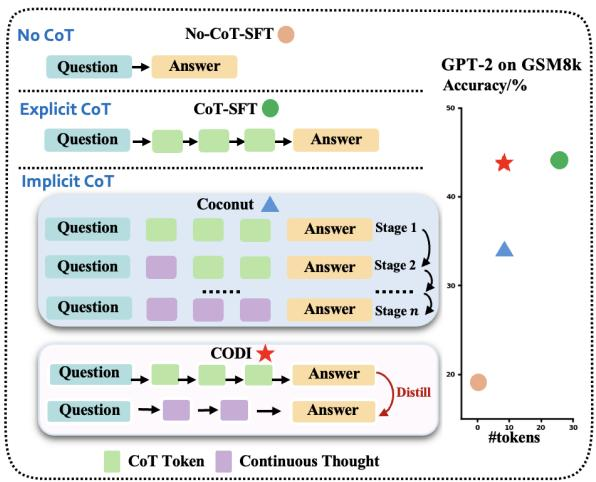  
Figure 1: Comparison of reasoning strategies. No-CoT-SFT: Train model on (Q,A) pairs via SFT. CoT-SFT: Train model on (Q, CoT, A) triples via SFT, i.e., with explicitly annotated CoT reasoning steps. Coconut: requires multi-stage training to progressively replace CoT tokens with continuous representations. CODI: achieves this in a single stage by compressing CoT tokens into continuous space via self-distillation.

An implicit CoT algorithm replaces natural language tokens with continuous representations for reasoning as shown in Figure 1 (left). To effectively learn these representations, Pfau et al. (2024); Goyal et al. (2024) pretrain the model with additional thinking tokens from scratch. More recently, the state-of-the-art method, Coconut (Hao et al., 2024) adopts a curriculum learning strategy (Deng et al., 2024) that gradually replaces the initial CoT tokens with continuous thoughts. This strategy encourages continuous thoughts to behave like the removed CoT tokens. Although Coconut has greatly improved upon earlier implicit CoT methods in terms of performance (Goyal et al., 2024; Deng et al., 2024), it lags behind CoT-SFT by a large margin as shown in Figure 1 (right). We hypothesize that this performance gap is due to forgetting across stages in the curriculum learning process (Rao Vijjini et al., 2021). This prompts us to ask: Can implicit CoT methods achieve the reasoning capability comparable to CoT-SFT while maintaining their efficiency advantages?

To address this, we propose a novel training framework: CODI (Continuous Chain-of-Thought via Self Distillation). CODI enables implicit CoT learning in a single training step by leveraging self-distillation, thereby avoiding the forgetting issues inherent in curriculum learning. In doing so, it achieves performance comparable to CoT-SFT while being significantly more efficient. CODI enables implicit CoT reasoning through a joint learning setup involving a teacher task and a student task. The teacher learns from the annotated CoT tokens using a cross-entropy loss, while the student generates a small number of continuous thoughts before producing the final answer, representing implicit CoT reasoning. We do not constrain the student’s continuous thoughts to match any specific target. Instead, we transfer the teacher’s reasoning knowledge to the student through a form of representation alignment at the position of answer generation, where the essence of the reasoning process is captured (Orgad et al., 2025). This allows the student to effectively mimic the teacher’s reasoning pattern in continuous space without rigid constraints. We refer to this mechanism as self-distillation (Wang et al., 2023; Gou et al., 2021), emphasizing the model’s ability to distill one of its own behaviors into another.

The main contributions are threefold:

• We propose CODI, a novel self-distillation framework that enables LLMs to reason in a compact continuous space, providing an alternative to accelerate reasoning with high performance.

• We demonstrate the effectiveness of distilling knowledge from explicit CoT to implicit CoT by aligning the hidden activations of a single token.

• Extensive experiments show that CODI is robust, generalizable to complex CoT datasets, and offers a reasonable level of interpretability.

## 2 Related Work

Implicit Chain-of-Thought Reasoning. Implicit CoT methods aim to enhance reasoning without verbalizing intermediate steps as in CoT, thereby accelerating inference speed. Theoretical work (Strobl et al., 2024; Merrill and Sabharwal, 2024) establishes that additional computational tokens enhance transformers’ reasoning capacity. Empirical studies (Pfau et al., 2024; Goyal et al., 2024) validate these insights by training LLMs with extra dummy tokens before answering though in a limited scale and effect. Recent efforts (Deng et al., 2023, 2024) distills CoT reasoning by finetuning. They improve over the No-CoT baseline, but fall behind CoT finetuning possibly due to discarding all intermediate tokens. Addressing this, Coconut (Hao et al., 2024) reintroduces intermediate reasoning tokens via autoregressive hidden state propagation, combining curriculum learning from (Deng et al., 2024). While this achieves some improvement over (Deng et al., 2024), Coconut still lags behind explicit CoT, which we attribute to forgetting in curriculum learning. CODI replaces curriculum learning with a novel self-distillation framework, enabling a single-step learning process that avoids forgetting issues. Our work is also inspired by in-context compression (Ge et al., 2024; Li et al., 2025), though our work is compressing the generation instead of the existing contexts. Concurrent works (Xu et al., 2025; Liu et al., 2025; Su et al., 2025) explore latent reasoning, but still rely on explicit CoT generation. Looped transformers (Geiping et al., 2025; Saunshi et al., 2025; Yu et al., 2025) also support latent reasoning, though they primarily vary in model depth without introducing. In contrast, CODI emphasizes increasing reasoning capability through additional tokens.

Knowledge Distillation. Knowledge distillation (KD) (Gou et al., 2021; Xu et al., 2024) has emerged as a key strategy for transferring CoT reasoning capabilities from teacher to student models. Traditional approaches (Hsieh et al., 2023; Ho et al., 2023) train smaller student models to mimic step-by-step outputs from larger teacher LLMs, motivated by findings that CoT reasoning emerges predominantly in large models (Wei et al., 2022). Selfdistillation (Yang et al., 2024; Dong et al., 2025)

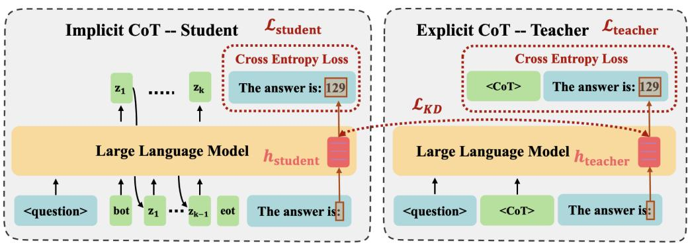  
Figure 2: CODI enables the model to generate implicit continuous CoTs by jointly training a student task and a teacher task, and distills knowledge from the teacher to the student. The Student task (left) generates the answer by autoregressively decoding continuous thoughts starting from a learnable bot token, while the Teacher task (right) generates the answer using the groundtruth CoT via teacher forcing. Both tasks learn the generated texts via cross-entropy loss $( \mathcal { L } _ { \mathrm { s t u d e n t } }$ and $\mathcal { L } _ { \mathrm { t e a c h e r } } )$ , and share the same LLM. Knowledge distillation is achieved by applying ${ \mathcal { L } } _ { \mathrm { K D } }$ (L1 loss) between student and teacher hidden activation across all layers $( \mathbf { h } _ { \mathrm { s t u d e n t } }$ and $\mathbf { h } _ { \mathrm { t e a c h e r } } )$

leverage self-distillation to preserve the model’s original behavior, akin to the KL divergence loss used in RLHF (Ouyang et al., 2022). Our work is based on self-distillation framework, but further strengthens the teacher by providing it with richer input contexts, enabling the student to learn from it like knowledge distillation. Since the teacher and student tasks differ, CODI can also be viewed as a form of multitask learning (Crawshaw, 2020). Moreover, CODI distinguishes itself by allowing reason in the latent space other than natural language, which is rarely explored in prior knowledge distillation works. This innovation enables more flexible and efficient reasoning.

## 3 CODI: Continuous Chain-of-Thought via Self Distillation

Unlike traditional CoT reasoning, CODI bypasses autoregression in the vocabulary space, and directly connects the last hidden representation to the subsequent input. The key challenge in training such a model with continuous thoughts lies in designing an appropriate training objective. Conventional reasoning learning in explicit CoT fine-tuning relies on a cross-entropy loss over annotated CoT tokens, which inevitably leads to discrete CoT token generation—contradicting the definition of implicit CoT.

## 3.1 Overview

CODI addresses this challenge by introducing a self-distillation framework (Figure 2) with two training tasks: a teacher task and a student task. The teacher task learns explicit CoT reasoning, while the student task learns implicit CoT reasoning. Knowledge distillation is achieved by aligning the hidden activations of a key token from the teacher to the student via $\mathcal { L } _ { K D }$ . The overall training objective is a weighted sum of three losses:

$$
\begin{array} { r } { \mathcal { L } = \alpha \mathcal { L } _ { \mathrm { s t u d e n t } } + \beta \mathcal { L } _ { \mathrm { K D } } + \gamma \mathcal { L } _ { \mathrm { t e a c h e r } } , } \end{array}\tag{1}
$$

where $\alpha , \beta ,$ , and $\gamma$ are hyperparameters controlling the balance among the objectives.<sup>1</sup>

## 3.2 Teacher Task

The teacher task (Figure 2, right) learns explicit CoT using a cross-entropy loss:

$$
\mathcal { L } _ { \mathrm { t e a c h e r } } = - \frac { 1 } { N } \sum _ { i = 1 } ^ { N } \log P ( r _ { i } \mid r _ { 1 : i - 1 } , Q ) ,\tag{2}
$$

where P denotes the output probability distribution of the LLM, Q represents the question tokens, and $r = [ c , y ]$ is the concatenated sequence of the CoT reasoning tokens c and the final answer token y.

## 3.3 Student Task

The student task (Figure 2, left), which performs implicit CoT reasoning, generates continuous thoughts by autoregressively propagating the last hidden states. This process begins with a learnable <bot> (begin-of-thoughts) token and proceeds until a learnable <eot> (end-of-thoughts) token is reached. The model then learns the final answer from the <eot> token using a cross-entropy loss:

$$
{ \mathcal { L } } _ { \operatorname { s t u d e n t } } = - { \frac { 1 } { N } } \sum _ { i = 1 } ^ { N } \log P ( y _ { i } \mid y _ { 1 : i - 1 } , Q , Z ) ,\tag{3}
$$

<sup>1</sup>A Python implementation of this framework is provided in Figure A1.

where y denotes the answer label, Q the question tokens, and $Z$ the continuous thoughts.

Additionally, a two-layer MLP followed by layer normalization transforms the hidden representations of continuous thought tokens before feeding them into the next step for the purpose of better discriminating the latent space and the token space.

## 3.4 Self-Distillation

If the model learns only with the student task, it benefits only marginally from the additional computation (Goyal et al., 2024) due to the absence of supervision for continuous thoughts.

Distillation in Feature Space. To provide explicit supervision to guide continuous thoughts, we adopt a feature-level distillation strategy. Recent work (Li et al., 2024a; Liu et al., 2023) demonstrates that in-context examples influence the final query token by shifting its hidden activation values. Extending this idea, we show that CoT tokens similarly induce a shift in hidden activation values of a query token (can be a probing token like "Answer") compared to a sequence without CoT, as formalized in Equation 4:

$$
\mathbf { h } _ { \mathrm { C o T } } ^ { l } \approx \mathbf { h } _ { \mathrm { n o - C o T } } ^ { l } + f \Big ( W _ { V } R ( W _ { K } R ) ^ { T } \mathbf { q } \Big ) ,\tag{4}
$$

where $\mathbf { q }$ is the query token, $\mathbf { h } _ { \mathrm { C o T } } ^ { l }$ is the hidden activations at layer l with CoT, $\mathbf { h } _ { \mathrm { n 0 - C o T } } ^ { l }$ is the corresponding activation without CoT, and the remaining term quantifies the shift introduced by the CoT rationale R. A formal proof of this “CoT shift” phenomenon is provided in Appendix B.

This decomposition suggests that the key information from CoT reasoning accessible to the query token is embedded in the shift term $f ( \cdot )$ . Therefore, by encouraging the student’s hidden activations $\mathbf { h } _ { \mathrm { s t u d e n t } } ^ { \dot { l } }$ to align with the teacher’s $\mathbf { h } _ { \mathrm { t e a c h e r } } ^ { l }$ , we are able to transfer the reasoning capability from explicit CoT to implicit CoT.

The Distilled Token. Rather than aligning with all tokens in the query sentence, we select a distillation token for alignment. Inspired by the recent observations (Orgad et al., 2025) that the hidden activations of the token intermediately preceding the answer, i.e., the colon (“:”) in the answer prompt “The answer $i s . ^ { \prime \prime }$ (as shown in Figure 2), encodes essential reasoning information. We select this token’s hidden activations, h, for distillation. Alternative answer prompts and distillation tokens are also effective, and the corresponding ablation studies are reported in Appendix G.

Loss Function. As a result, we formulate a loss function that aligns the teacher’s and student’s hidden activations across all layers at the selected distillation token for the student’s implicit CoT learning. To ensure a one-way flow of knowledge, we apply a stop-gradient operation on $\mathbf { h } _ { \mathrm { t e a c h e r } } ^ { l }$ , only allowing the teacher to influence the student:

$$
\mathcal { L } _ { \mathrm { K D } } = \frac { 1 } { M } \sum _ { l = 1 } ^ { M } | \mathrm { s g } [ \mathbf { h } _ { \mathrm { t e a c h e r } } ^ { l } ] - \mathbf { h } _ { \mathrm { s t u d e n t } } ^ { l } | ,\tag{5}
$$

where M indicates the number of layers in the LLM, sg denotes the stop-gradient operation, and ${ \bf h } ^ { l }$ is the hidden activations of the LLM’s l-th layer for the token position corresponding to the colon “:” in our design.

## 3.5 Training and Inference

Training. The continuous thoughts are generated dynamically during training, as they are not known beforehand. To achieve this, we decode them step by step, with a cache storing previous keys and values to maintain efficiency. When applying a distance metric between two hidden activations, we observed significant norm variations across layers (Deng et al., 2023; Cheng and Durme, 2024). To address this, we normalize each layer’s hidden activations by dividing them by the standard deviation of the teacher’s corresponding hidden activations within the current batch.

For the distillation task, we adopt the same model for both the teacher and student roles for two primary reasons. (1) Reference Learning: The model must first learn to perform explicit CoT reasoning before it can effectively compress and transfer this capability into continuous space as implicit CoT. (2) Training Efficiency: While it is feasible to train separate teacher and student models—as explored in Section 4.4—this setup introduces additional complexity. The teacher must be pre-trained, and maintaining two distinct models during training doubles memory consumption.

For training data, we exclude the final CoT step—the step responsible for generating the final answer—because including this step could allow the teacher’s hidden activations to take a shortcut. Specifically, the model might directly copy the result from the last CoT step to the token responsible for generating the exact answer token, bypassing the reasoning process. This behavior would undermine the quality of the target hidden activations, as they would no longer fully encode the reasoning patterns. The ablation results demonstrating the impact of this exclusion are presented in Table 2.

Inference. The inference process in CODI mirrors the student task during training (Figure 2, left). The model autoregressively decodes n continuous thoughts following the question and the bot token. Once the reasoning process is complete, the eot token is manually inserted to terminate continuous reasoning and switch the model to language generation mode, decoding the final answer.

## 4 Experiments

We demonstrate CODI’s effectiveness in continuous space reasoning through experiments on mathematical and commonsense reasoning tasks.

## 4.1 Experimental Setup

Training Data. We utilize three datasets to train our models–GSM8k-Aug, GSM8k-Aug-NL, and CommonsenseQA-CoT. (1) We use the GSM8k-Aug dataset from (Deng et al., 2023), which has proven effective for training implicit CoT methods (Deng et al., 2024; Hao et al., 2024). This dataset extends the original GSM8k training set (Cobbe et al., 2021) to 385k samples by prompting GPT-4. To facilitate implicit CoT training, all natural language interleaving within the CoT is removed, leaving only structured mathematical expressions such as $\begin{array} { r } { { ^ { * * } < < 1 0 \div 5 = 2 > > < < 2 \times 2 = 4 > > < < } } \end{array}$ $6 \times 4 = 2 4 > > ^ { \prime \prime }$ . (2) We also use GSM8k-Aug-$\mathbf { N L } ,$ a version that preserves natural language explanations, to assess both the generalizability and effectiveness of our approach to compress more verbose CoTs. (3) CommonsenseQA-CoT is derived from CommonsenseQA (Talmor et al., 2019), a multiple-choice QA dataset built from ConceptNetbased questions (Speer et al., 2017). As it lacks CoT annotations, we generate 8.1k CoT examples using GPT-4o-mini, filtered by correctness. The 1.2k-example validation set is used for evaluation. Examples and statistics are in Appendix C.

Evaluation Benchmarks for OOD. For mathematical reasoning, we assess model robustness on three out-of-domain (OOD) benchmarks: (1) SVAMP (Patel et al., 2021), a dataset of gradeschool arithmetic word problems with simple variations designed for robustness test; (2) GSM-HARD (Gao et al., 2023), a modified version of the GSM8k test split where numbers are replaced with values of larger magnitude to increase difficulty; and (3) MultiArith (Roy and Roth, 2015), a subset of MAWPS (Koncel-Kedziorski et al., 2016) containing multi-step mathematical word problems. Examples and statistics are in Appendix C.

Baselines. We consider the following baselines: (1) CoT-SFT: Finetunes the model on CoT data, enabling it to generate intermediate steps followed by the final answer. (2) No-CoT-SFT: Finetunes the model using only direct answers, without generating intermediate steps. (3) iCoT (Deng et al., 2024): Implements a curriculum learning strategy called "Stepwise Internalization", which injects CoT’s reasoning patterns into the model’s internal states. This allows the model to generate direct answers with higher accuracy during inference. (4) Coconut (Hao et al., 2024): Build upon iCoT by autoregressively generating intermediate continuous CoT representations, similar to the approach in our work. (5) CODI: our method trained with six continuous thought tokens, matching the setup in Coconut. Baseline (1) is sampled 10 times and their average is reported (temperature=0.1), while baselines (2)–(5) are deterministic models, and their results are reported from a single run. Two base models are considered: GPT-2 (Radford et al., 2019) and LLaMA3.2-1b-Instruct (Meta, 2024). More implementation details are in Appendix A.

## 4.2 Main Results

Mathematical Reasoning. From the results on GSM8k in Figure 3 (leftmost column), we observe that CODI largely outperforms existing implicit CoT methods. With both GPT-2 and LLaMA-1b, CODI surpasses Coconut by over 20%. Remarkably, CODI is the first continuous CoT method to achieve performance comparable to CoT-SFT when using GPT-2, reaching 99% of its accuracy. In contrast to iCoT, which fails to scale effectively to larger models, CODI successfully extends to LLaMA-1b, achieving 90% of CoT-SFT performance. These results verify CODI’s effectiveness on in-domain mathematical reasoning tasks.

Compress More Verbose CoTs. Previous works (Deng et al., 2024; Hao et al., 2024) primarily trained on GSM8k-Aug, which consists only of mathematical expressions. To evaluate CODI’s generalizability, we extend our analysis to a more complex CoT dataset, GSM8k-Aug-NL. Figure 3 (2nd column) shows that both GPT-2 and LLaMA-1b perform worse on it compared to GSM8k-Aug. This decrease in performance stems from the additional natural language tokens, which add noise and make imitation learning more difficult. Surprisingly, CODI surpasses CoT-SFT when using GPT-2 and achieves a higher relative score improvement on LLaMA1b compared to models trained on GSM8k-Aug. Moreover, CODI surpasses all other implicit CoT methods, especially at the size of LLaMA-1b, suggesting the effectiveness of selfdistillation. Furthermore, with the average CoT length increased to 65.5 (Figure 4), CODI achieves a compression ratio of 8.2, suggesting that the optimal compression ratio is dataset-dependent. These results demonstrate CODI’s ability to handle more complex CoT training data, showcasing its applicability to diverse reasoning datasets.

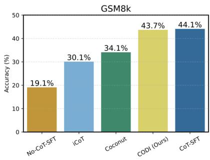

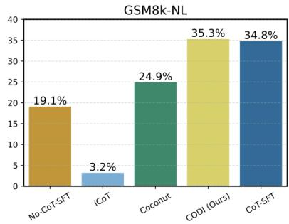  
(a) GPT-2

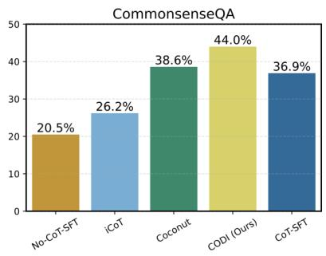

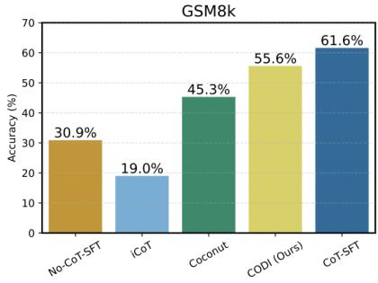

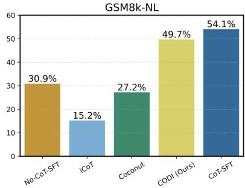  
(b) LLaMA3.2-1b-Instruct

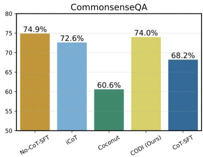  
Figure 3: Results on five datasets (Top: GPT-2, Bottom: LLaMa3.2-1b-Instruct). CODI consistently outperforms all previous implicit CoT methods by a substantial margin. When using GPT-2, CODI even matches the performance of CoT-SFT on the in-domain GSM8k and GSM8k-NL datasets.

Commonsense Reasoning. As shown in Figure 3 (rightmost column), CoT-SFT largely outperforms No-CoT-SFT for GPT-2, which performs nearly random guessing (five choices per question). This indicates that training on CoT benefits GPT-2. Interestingly, CODI surpasses even CoT-SFT. We attribute this to GPT-2’s limited capacity for generating coherent natural language CoTs—CoT-SFT struggles to replicate the quality of the training CoTs, whereas CODI faces less burden by reasoning in a continuous space with fewer tokens. For LLaMA-1b, we observe that CoT data actually hurts performance. We think it is because we force the model to reason in GPT-4o-mini’s pattern which may diverge from LLaMA’s original pattern.

Interestingly, CODI outperforms CoT-SFT by a large margin and achieves accuracy comparable to No-CoT-SFT. This shows that our latent reasoning model could better capture intermediate thought processes in continuous spaces, demonstrating the benefit of learning latent representations rather than overfitting of specific CoT patterns.

Efficiency. CODI utilizes a fixed set of six continuous thoughts, enclosed by two special tokens, resulting in a total of eight "tokens" for reasoning. As shown in Figure 4, CODI achieves substantial efficiency gains, with a speedup of approximately 2.7× (3.1× CoT compression) for compact CoTs trained on GSM8k-Aug and 5.9× (8.2× CoT compression) for verbose CoTs trained on GSM8k-Aug-NL, demonstrating CODI’s effectiveness in reducing reasoning overhead.

Compression Ratio. The number of continuous thoughts used during training is a crucial hyperparameter, affecting both the computation allocation and the compression ratio. As shown in Figure 5, CODI consistently outperforms Coconut across all compression ratios. Interestingly, both methods exhibit a similar trend: accuracy peaks when using six continuous thoughts. We attribute this to the dataset’s structure, specifically the average number of CoT steps. When fewer than six continuous thoughts are used, the model lacks sufficient expressiveness to capture reasoning steps effectively. Conversely, beyond six, the additional complexity may not provide further benefits, as most problems do not require additional reasoning steps. Instead, the increased sequence length introduces optimization challenges, outweighing any potential gains.

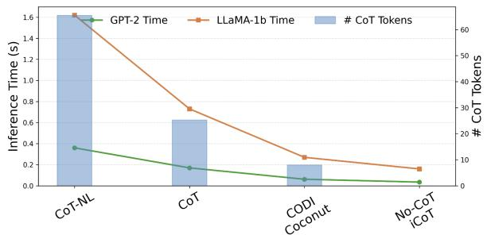  
Figure 4: Efficiency comparison of different reasoning methods in terms of inference time per math problem on GSM8k. Measured with batch size = 1 on an Nvidia A100 GPU. CoT Token counts are shown in parentheses.

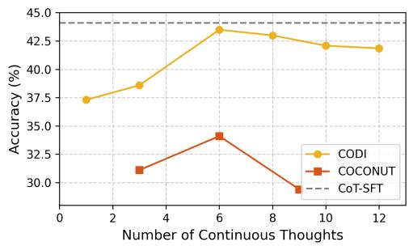  
Figure 5: Accuracy on GSM8k against the number of continuous thought tokens used during training.

## 4.3 Out-of-Distribution (OOD) Evaluation

To assess robustness, we evaluate CODI—trained on GSM8k-Aug—on OOD datasets. Remarkably, CODI consistently outperforms all the other implicit CoT baselines and even CoT-SFT across all three OOD benchmarks with GPT-2 (Table 1). Using LLaMA-1b, CODI also performs better compared to iCoT and Coconut. It also demonstrates stronger performance relative to its in-domain results. We attribute CODI’s robustness to its reduced tendency to overfit. Unlike CoT-SFT, which is trained to mimic exact natural language CoT annotations, CODI generates continuous thoughts without direct imitation targets. This lack of rigid supervision likely prevents memorization and promotes greater adaptability to unfamiliar inputs.

## 4.4 Ablation Studies

Independent Teacher. To evaluate the need of self-distillation, we tested settings where the student does not share the model with the teacher. As observed from Table 2, without learning explicit CoT generation (separate static teacher), the model performs badly and fails to generate meaningful continuous CoTs after decoding. Adding an explicit CoT generation objective (w/ multitask student) significantly restores performance, indicating the importance of reference learning.

<table><tr><td>Models</td><td>SVAMP</td><td>GSM-Hard</td><td>MultiA</td></tr><tr><td></td><td colspan="3">GPT-2</td></tr><tr><td>No-CoT-SFT</td><td>16.4</td><td>4.3</td><td>41.1</td></tr><tr><td>CoT-SFT</td><td>41.8</td><td>9.8</td><td>90.7</td></tr><tr><td>iCoT</td><td>29.4</td><td>5.7</td><td>55.5</td></tr><tr><td>Coconut</td><td>36.4</td><td>7.9</td><td>82.2</td></tr><tr><td>CODI</td><td>42.9</td><td>9.9</td><td>92.8</td></tr><tr><td colspan="4">LLaMA-1b</td></tr><tr><td>No-CoT-SFT</td><td>44.1</td><td>7.1</td><td>70.9</td></tr><tr><td>CoT-SFT</td><td>66.7</td><td>15.6</td><td>99.3</td></tr><tr><td>iCoT</td><td>40.9</td><td>4.4</td><td>39.0</td></tr><tr><td>Coconut</td><td>48.8</td><td>9.9</td><td>90.1</td></tr><tr><td>CODI</td><td>61.1</td><td>12.8</td><td>96.1</td></tr></table>

Table 1: Performance comparison (accuracy %) on OOD datasets, i.e., trained on GSM8k-Aug and evaluated on other datasets. The best results are in bold, and the second-best results are underlined.
<table><tr><td>Methods (GPT-2)</td><td>Accuracy</td></tr><tr><td>No-CoT-SFT</td><td>19.1%</td></tr><tr><td>CODI</td><td>43.7%</td></tr><tr><td>- separate static teacher</td><td>27.1%</td></tr><tr><td>w/ multitask student</td><td>42.2%</td></tr><tr><td>- w/o L1 loss</td><td>24.5%</td></tr><tr><td>- w/ CoT last step</td><td>31.7%</td></tr><tr><td>- w/o Projection</td><td>42.5%</td></tr></table>

Table 2: Ablation studies. ind. static teacher refers to introducing an independently trained teacher model. w/ multitask student allows the student model to also learn CoT generation.

Distillation Loss. Table 2 also shows that removing the L1 loss (Equation 5) linking the teacher and student tasks (w/o L1 Loss) leads to a significant performance drop, indicating the importance of supervision from distillation. While the model performs well in CoT generation due to multitask learning, it fails to integrate this skill into continuous CoT reasoning, treating them as independent tasks rather than a unified reasoning process.

Others. Keeping the last step of the CoT chain appears to negatively impact performance, supporting our claim that it provides shortcuts. The projection layer of continuous thought tokens slightly enhances CODI’s effectiveness. Additional ablations on hyperparameters and the choice of distillation token are reported in Appendix F and G.

## 5 Further Analysis

We observe that CODI’s continuous thoughts exhibit a degree of interpretability. Notably, these patterns cannot not be trivially learned through standard token-by-token fine-tuning (see Appendix D).

## 5.1 Interpretability Analysis

Interpreting CODI’s continuous thoughts is inherently challenging because these representations lack explicit imitation targets. However, CODI exhibits an ability to produce observable intermediate results (Figure 6) within its continuous thoughts by projecting its last hidden state into vocabulary space via the model’s word embeddings – treating it in the same way as a standard text token. Additionally, the corresponding operands contributing to these intermediate results can often among the top-ranked attended tokens of the latent representation. For example, the second thought token, z<sub>2</sub>, attends to both "1" and "7" to produce the decoded token "7". While the operator itself (e.g., ) is not explicitly visible in the attention mechanism—since operators are in the context—it is reasonable to infer that the transformer layers implicitly perform this operation. Another interesting observation is that each intermediate result is separated by a seemingly meaningless continuous token. We hypothesize that these tokens act as placeholders or transitional states during the computation of intermediate results. This aligns with the idea that the transformer may require multiple passes to complete the calculation for each intermediate step. More case studies are in the Appendix E.

<table><tr><td>Total Steps</td><td>1</td><td>2</td><td>3</td></tr><tr><td>Accuracy</td><td>97.1%</td><td>83.9%</td><td>75.0%</td></tr></table>

Table 3: CODI’s top-5 intermediate results matching reference CoT across problems requiring different numbers of step.

Beyond the case study, we aim to establish that CODI’s interpretability is a general pattern by an accuracy metric. We extract all correctly predicted answers, decode the corresponding intermediate results, and compare them against the reference intermediate solutions. Table 3 reveals that when there is only one intermediate result, CODI correctly matches the reference 97.1% of the time. For

CoT sequences with lengths up to 3, CODI consistently achieves over 75% accuracy in decoding valid intermediate results. These findings highlight CODI’s reliability in generating meaningful intermediate reasoning steps, demonstrating its potential to effectively handle reasoning tasks with interpretable intermediate outputs.

## 6 Conclusion

We introduced CODI, a novel paradigm for reasoning in continuous space. Our extensive experiments demonstrate CODI’s effectiveness as the new SOTA implicit CoT approach, while achieving a high compression ratio. Furthermore, CODI shows its robustness, generalisable to complex datasets, and interpretability. Future research should explore CODI’s application to more diverse and challenging tasks. We hope this work inspires further exploration into reasoning in representations more compact and robust than language, paving the way for more efficient and versatile reasoning paradigms.

## 7 Limitations

Implicit CoT methods inherently trade off interpretability compared to explicit CoT. While CODI provides a straightforward probing mechanism for inspecting continuous thoughts, it operates at the token level and faces limitations in reconstructing multi-token entities. For instance, a rare number like 35649 may span multiple tokens due to the tokenizer’s behavior, but the current probing technique only decodes the first token, leaving the remaining components unobserved. More sophisticated probing techniques may be necessary to recover and visualize full semantic units.

Moreover, our approach focuses on knowledge transfer by probing the token (“:”) responsible for generating the first answer token. However, this choice may be suboptimal, as some answers begin with “-”, and removing such cases improves performance, suggesting that critical reasoning information might also reside in the token generating the second answer token. Additionally, probing the token that concludes the CoT reasoning—potentially summarizing the entire process—could offer alternative supervision signals. Furthermore, the current answer prompt, “The answer is:”, is an arbitrary design choice that may influence the effectiveness of knowledge transfer. Investigating these aspects further could enable CODI to extend its distillation framework to broader reasoning tasks.

Another limitation of the current continuous training approach is the absence of intermediate gradients until the end of the sequence. With six continuous thought tokens, the first token’s gradient is backpropagated from six or more steps away (specifically, from the token generating the final answer), which may introduce optimization challenges. This issue could become more pronounced when scaling to more complex problems requiring longer continuous reasoning chains.

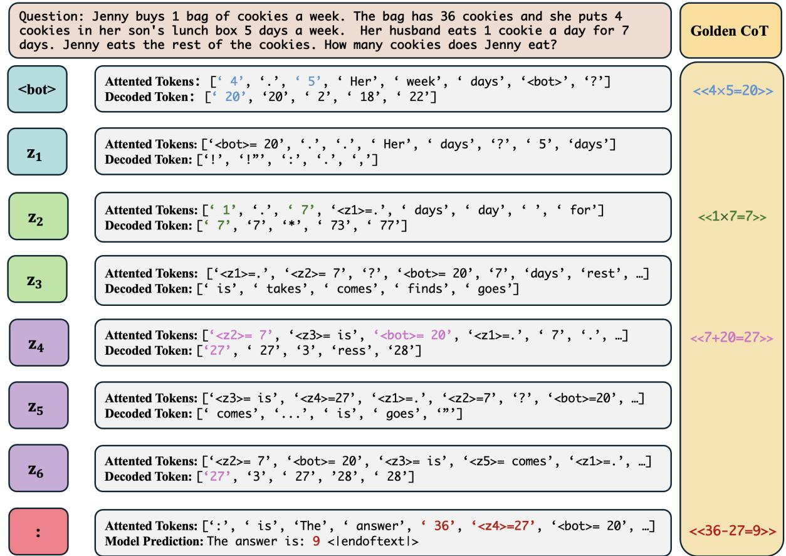  
Figure 6: A case study illustrating CODI’s interpretability by analyzing its attended tokens and decoded tokens of each of the six latent thought tokens, $z _ { 1 } \cdots z _ { 6 }$ . Attended tokens: these represent the top-10 tokens that the continuous thought attends to when generating the next thought/token. Some attended tokens appear in the form of $z _ { i } = x  '$ , indicating attention to the i-th continuous thought. Here x represents the top-1 token that the latent thought maps to in vocabulary space. The model always attends to the first token in the sentence, so we remove that for better visualization. Decoded tokens: these are the top-5 words that the continuous thoughts are projected back to in vocabulary space by multiplying them with the vocabulary embeddings.

Finally, while we don’t have sufficient computation resources to scale the training of CODI on larger models, a concurrent paper (Geiping et al., 2025) has demonstrated the feasibility of scaling a latent reasoning model to 3.5B parameters and 800 billion tokens with 4096 GPUs. The resulting model appears to be learning meta-strategies and abstractions for problem solving, as opposed to memorising as in existing LLMs trained on explicit CoT data. This is particularly encouraging, since not all reasoning steps can be easily verbalised (such as visual-spatial reasoning, emotional and social reasoning, and motor reasoning). While Geiping et al. (2025) focuses on pre-training, we proposed an efficient fine-tuning approach for equipping existing pre-trained LLMs with latent reasoning capabilities.

## Acknowledgments

This work was supported in part by the UK Engineering and Physical Sciences Research Council (EPSRC) (grant no. EP/V020579/1, EP/V020579/2, EP/Y003187/1, UKRI566, UKRI849). ZS is supported by a PhD studentship provided by the Chinese Scholarship Council. The authors acknowledge the use of King’s Computational Research, Engineering and Technology Environment (CREATE) at King’s College London. We thank Lin Gui for his suggestions during both the submission and rebuttal stages of this paper.

## References

Anthropic. 2024. Claude 3.5 sonnet.

Jeffrey Cheng and Benjamin Van Durme. 2024. Compressed chain of thought: Efficient reasoning through dense representations. Preprint, arXiv:2412.13171.

Karl Cobbe, Vineet Kosaraju, Mohammad Bavarian, Mark Chen, Heewoo Jun, Lukasz Kaiser, Matthias Plappert, Jerry Tworek, Jacob Hilton, Reiichiro Nakano, Christopher Hesse, and John Schulman. 2021. Training verifiers to solve math word problems. ArXiv, abs/2110.14168.

Michael Crawshaw. 2020. Multi-task learning with deep neural networks: A survey. ArXiv, abs/2009.09796.

Yuntian Deng, Yejin Choi, and Stuart Shieber. 2024. From explicit cot to implicit cot: Learning to internalize cot step by step. ArXiv, abs/2405.14838.

Yuntian Deng, Kiran Prasad, Roland Fernandez, Paul Smolensky, Vishrav Chaudhary, and Stuart Shieber. 2023. Implicit chain of thought reasoning via knowledge distillation. ArXiv, abs/2311.01460.

Yijiang River Dong, Hongzhou Lin, Mikhail Belkin, Ramon Huerta, and Ivan Vulic. 2025. ´ UNDIAL: Self-distillation with adjusted logits for robust unlearning in large language models. In Proceedings of the 2025 Conference ofthe Nations ofthe Americas Chapter of the Association for Computational Linguistics: Human Language Technologies (Volume 1: Long Papers), pages 8827–8840, Albuquerque, New Mexico. Association for Computational Linguistics.

Luyu Gao, Aman Madaan, Shuyan Zhou, Uri Alon, Pengfei Liu, Yiming Yang, Jamie Callan, and Graham Neubig. 2023. PAL: Program-aided language models. In Proceedings of the 40th International Conference on Machine Learning, volume 202 of Proceedings of Machine Learning Research, pages 10764–10799. PMLR.

Tao Ge, Hu Jing, Lei Wang, Xun Wang, Si-Qing Chen, and Furu Wei. 2024. In-context autoencoder for context compression in a large language model. In The Twelfth International Conference on Learning Representations.

Jonas Geiping, Sean Michael McLeish, Neel Jain, John Kirchenbauer, Siddharth Singh, Brian R. Bartoldson, Bhavya Kailkhura, Abhinav Bhatele, and Tom Goldstein. 2025. Scaling up test-time compute with latent reasoning: A recurrent depth approach. In ES-FoMo III: 3rd Workshop on Efficient Systemsfor Foundation Models.

Google. 2024. Our next-generation model: Gemini 1.5.

Jianping Gou, Baosheng Yu, Stephen J. Maybank, and Dacheng Tao. 2021. Knowledge distillation: A survey. International Journal of Computer Vision, 129(6):1789–1819.

Sachin Goyal, Ziwei Ji, Ankit Singh Rawat, Aditya Krishna Menon, Sanjiv Kumar, and Vaishnavh Nagarajan. 2024. Think before you speak: Training language models with pause tokens. In The Twelfth International Conference on Learning Representations.

Shibo Hao, Sainbayar Sukhbaatar, DiJia Su, Xian Li, Zhiting Hu, Jason Weston, and Yuandong Tian. 2024. Training large language models to reason in a continuous latent space. Preprint, arXiv:2412.06769.

Namgyu Ho, Laura Schmid, and Se-Young Yun. 2023. Large language models are reasoning teachers. In Proceedings of the 61st Annual Meeting of the Association for Computational Linguistics (Volume 1: Long Papers), pages 14852–14882, Toronto, Canada. Association for Computational Linguistics.

Cheng-Yu Hsieh, Chun-Liang Li, Chih-kuan Yeh, Hootan Nakhost, Yasuhisa Fujii, Alex Ratner, Ranjay Krishna, Chen-Yu Lee, and Tomas Pfister. 2023. Distilling step-by-step! outperforming larger language models with less training data and smaller model sizes. In Findings of the Association for Computational Linguistics: ACL 2023, pages 8003–8017, Toronto, Canada. Association for Computational Linguistics.

Edward J Hu, yelong shen, Phillip Wallis, Zeyuan Allen-Zhu, Yuanzhi Li, Shean Wang, Lu Wang, and Weizhu Chen. 2022. LoRA: Low-rank adaptation of large language models. In International Conference on Learning Representations.

Daniel Kahneman. 2011. Thinking, fast and slow.

Rik Koncel-Kedziorski, Subhro Roy, Aida Amini, Nate Kushman, and Hannaneh Hajishirzi. 2016. MAWPS: A math word problem repository. In Proceedings of the 2016 Conference ofthe North American Chapter ofthe Associationfor Computational Linguistics: Human Language Technologies, pages 1152–1157, San Diego, California. Association for Computational Linguistics.

Brian Lester, Rami Al-Rfou, and Noah Constant. 2021. The power of scale for parameter-efficient prompt tuning. In Proceedings of the 2021 Conference on Empirical Methods in Natural Language Processing, pages 3045–3059, Online and Punta Cana, Dominican Republic. Association for Computational Linguistics.

Dongfang Li, zhenyu liu, Xinshuo Hu, Zetian Sun, Baotian Hu, and Min Zhang. 2024a. In-context learning state vector with inner and momentum optimization. In The Thirty-eighth Annual Conference on Neural Information Processing Systems.

Xiang Lisa Li and Percy Liang. 2021. Prefix-tuning: Optimizing continuous prompts for generation. In Proceedings of the 59th Annual Meeting of the Associationfor Computational Linguistics and the 11th International Joint Conference on Natural Language

Processing (Volume 1: Long Papers), pages 4582– 4597, Online. Association for Computational Linguistics.

Zhiyuan Li, Hong Liu, Denny Zhou, and Tengyu Ma. 2024b. Chain of thought empowers transformers to solve inherently serial problems. In The Twelfth International Conference on Learning Representations.

Zongqian Li, Yixuan Su, and Nigel Collier. 2025. 500xCompressor: Generalized prompt compression for large language models. In Proceedings of the 63rd Annual Meeting ofthe Associationfor Computational Linguistics (Volume 1: Long Papers), pages 25081–25091, Vienna, Austria. Association for Computational Linguistics.

Zicheng Lin, Tian Liang, Jiahao Xu, Qiuzhi Liu, Xing Wang, Ruilin Luo, Chufan Shi, Siheng Li, Yujiu Yang, and Zhaopeng Tu. 2025. Critical tokens matter: Token-level contrastive estimation enhances LLM’s reasoning capability. In Forty-second International Conference on Machine Learning.

Luyang Liu, Jonas Pfeiffer, Jiaxing Wu, Jun Xie, and Arthur Szlam. 2025. Deliberation in latent space via differentiable cache augmentation. In Forty-second International Conference on Machine Learning.

Sheng Liu, Haotian Ye, Lei Xing, and James Y. Zou. 2023. In-context vectors: Making in context learning more effective and controllable through latent space steering. ArXiv, abs/2311.06668.

Ilya Loshchilov and Frank Hutter. 2019. Decoupled weight decay regularization. In International Conference on Learning Representations.

William Merrill and Ashish Sabharwal. 2024. The expressive power of transformers with chain of thought. In The Twelfth International Conference on Learning Representations.

Meta. 2024. The llama 3 herd of models. Preprint, arXiv:2407.21783.

OpenAI. 2024. Hello gpt-4o.

Hadas Orgad, Michael Toker, Zorik Gekhman, Roi Reichart, Idan Szpektor, Hadas Kotek, and Yonatan Belinkov. 2025. LLMs know more than they show: On the intrinsic representation of LLM hallucinations. In The Thirteenth International Conference on Learning Representations.

Long Ouyang, Jeffrey Wu, Xu Jiang, Diogo Almeida, Carroll Wainwright, Pamela Mishkin, Chong Zhang, Sandhini Agarwal, Katarina Slama, Alex Ray, John Schulman, Jacob Hilton, Fraser Kelton, Luke Miller, Maddie Simens, Amanda Askell, Peter Welinder, Paul F Christiano, Jan Leike, and Ryan Lowe. 2022. Training language models to follow instructions with human feedback. In Advances in Neural Information Processing Systems, volume 35, pages 27730–27744. Curran Associates, Inc.

Arkil Patel, Satwik Bhattamishra, and Navin Goyal. 2021. Are NLP models really able to solve simple math word problems? In Proceedings of the 2021 Conference of the North American Chapter of the Associationfor Computational Linguistics: Human Language Technologies, pages 2080–2094, Online. Association for Computational Linguistics.

Jacob Pfau, William Merrill, and Samuel R. Bowman. 2024. Let’s think dot by dot: Hidden computation in transformer language models. In First Conference on Language Modeling.

Alec Radford, Jeff Wu, Rewon Child, David Luan, Dario Amodei, and Ilya Sutskever. 2019. Language models are unsupervised multitask learners.

Anvesh Rao Vijjini, Kaveri Anuranjana, and Radhika Mamidi. 2021. Analyzing curriculum learning for sentiment analysis along task difficulty, pacing and visualization axes. In Proceedings of the Eleventh Workshop on Computational Approaches to Subjectivity, Sentiment and Social Media Analysis, pages 117–128, Online. Association for Computational Linguistics.

Subhro Roy and Dan Roth. 2015. Solving general arithmetic word problems. In Proceedings of the 2015 Conference on Empirical Methods in Natural Language Processing, pages 1743–1752, Lisbon, Portugal. Association for Computational Linguistics.

Nikunj Saunshi, Nishanth Dikkala, Zhiyuan Li, Sanjiv Kumar, and Sashank J. Reddi. 2025. Reasoning with latent thoughts: On the power of looped transformers. In The Thirteenth International Conference on Learning Representations.

Robyn Speer, Joshua Chin, and Catherine Havasi. 2017. Conceptnet 5.5: An open multilingual graph of general knowledge. In Proceedings ofthe AAAI conference on artificial intelligence, volume 31.

Lena Strobl, William Merrill, Gail Weiss, David Chiang, and Dana Angluin. 2024. What formal languages can transformers express? a survey. Transactions ofthe Associationfor Computational Linguistics, 12:543–561.

DiJia Su, Hanlin Zhu, Yingchen Xu, Jiantao Jiao, Yuandong Tian, and Qinqing Zheng. 2025. Token assorted: Mixing latent and text tokens for improved language model reasoning. In Forty-second International Conference on Machine Learning.

Alon Talmor, Jonathan Herzig, Nicholas Lourie, and Jonathan Berant. 2019. CommonsenseQA: A question answering challenge targeting commonsense knowledge. In Proceedings of the 2019 Conference ofthe North American Chapter ofthe Associationfor Computational Linguistics: Human Language Technologies, Volume 1 (Long and Short Papers), pages 4149–4158, Minneapolis, Minnesota. Association for Computational Linguistics.

Yizhong Wang, Yeganeh Kordi, Swaroop Mishra, Alisa Liu, Noah A. Smith, Daniel Khashabi, and Hannaneh Hajishirzi. 2023. Self-instruct: Aligning language models with self-generated instructions. In Proceedings ofthe 61st Annual Meeting ofthe Associationfor Computational Linguistics (Volume 1: Long Papers), pages 13484–13508, Toronto, Canada. Association for Computational Linguistics.

Jason Wei, Xuezhi Wang, Dale Schuurmans, Maarten Bosma, brian ichter, Fei Xia, Ed Chi, Quoc V Le, and Denny Zhou. 2022. Chain-of-thought prompting elicits reasoning in large language models. In Advances in Neural Information Processing Systems, volume 35, pages 24824–24837. Curran Associates, Inc.

Xiaohan Xu, Ming Li, Chongyang Tao, Tao Shen, Reynold Cheng, Jinyang Li, Can Xu, Dacheng Tao, and Tianyi Zhou. 2024. A survey on knowledge distillation of large language models. Preprint, arXiv:2402.13116.

Yige Xu, Xu Guo, Zhiwei Zeng, and Chunyan Miao. 2025. SoftCoT: Soft chain-of-thought for efficient reasoning with LLMs. In Proceedings of the 63rd Annual Meeting ofthe Associationfor Computational Linguistics (Volume 1: Long Papers), pages 23336– 23351, Vienna, Austria. Association for Computational Linguistics.

Zhaorui Yang, Tianyu Pang, Haozhe Feng, Han Wang, Wei Chen, Minfeng Zhu, and Qian Liu. 2024. Selfdistillation bridges distribution gap in language model fine-tuning. In Proceedings of the 62nd Annual Meeting ofthe Associationfor Computational Linguistics (Volume 1: Long Papers), pages 1028– 1043, Bangkok, Thailand. Association for Computational Linguistics.

Qifan Yu, Zhenyu He, Sijie Li, Xun Zhou, Jun Zhang, Jingjing Xu, and Di He. 2025. Enhancing autoregressive chain-of-thought through loop-aligned reasoning. ArXiv, abs/2502.08482.

## A Implementation Details

For all experiments (CoT-SFT, No-CoT-SFT, and CODI) on both GSM8K and Commonsense, we use the AdamW optimizer (Loshchilov and Hutter, 2019) with a cosine scheduler (without cycles) and a linear warm-up over the first 3% of steps. The effective batch size is 128. Both α and $\beta$ are set to 1 (Equation 1). We apply LoRA (Hu et al., 2022) finetuning with a rank of 128 and an alpha value of 32, using bfloat16 precision.

For GPT-2, we set the learning rate to 3e-3 and $\gamma$ to 1. Training runs for 40 epochs, taking approximately 36 hours on a single A100 (80GB).

For LLaMA-3.2-1b, we use a learning rate of 8e-4 and set $\gamma$ to 20, as we observe that its distillation loss has a much smaller magnitude. The model is trained for 10 epochs, requiring approximately 48 hours on a single A100 (80GB).

For iCoT training of GPT-2, we use a learning rate of 5e-5 and train for 100 epochs, removing 4 tokens per epoch for GSM8k-Aug-NL. For iCoT training of LLaMA-1b, we use a learning rate of 1e-5 and train for 50 epochs, removing 8 tokens per epoch for GSM8k-Aug and 16 tokens per epoch for GSM8k-Aug-NL. LoRA is not used during training.

For Coconut training of GPT-2, we use a learning rate of 1e-4 and train for 25 epochs without continuous tokens and 25 epochs with continuous tokens (50 epochs in total). For iCoT training of LLaMA-1b, we use a learning rate of 1e-5 and train 5 epochs for both stages (10 epochs in total). LoRA is not used during training.

## B Proof: CoTs Contribute a Shift in Hidden Activation

In this section, we provide a proof to demonstrate why Chain-of-Thought (CoT) contributes a shift in hidden activation. This proof is largely inspired by the work of (Li et al., 2024a), which analyzed In-Context Learning.

In a typical CoT training dataset, the input usually consists of four components: the question $Q ,$ the rationale R, the prompt for the answer $P$ (e.g., "The answer is:"), and the final answer A.

We analyze the attention activation of the last prompt token, q—in this case, ":"—at the l-th transformer layer. The output activation $\mathbf { a } ^ { l }$ from the attention heads of this token is given by:

$$
\mathbf { a } ^ { l } = W _ { V } [ Q ; R ; P ] \mathrm { s o f t m a x } ( \frac { W _ { K } [ Q ; R ; P ] ^ { T } \mathbf { q } } { \sqrt { d } } )\tag{6}
$$

where $W _ { K }$ and $W _ { V }$ are the model’s key and value parameters, $\left[ Q ; R ; P \right]$ represents the concatenation of the three inputs, and $\sqrt { d }$ is a scaling factor.

For simplicity of analysis, inspired by (Li et al., 2024a), we omit the softmax operation and the scaling factor, as these do not affect the core conclusion. With this simplification, the following derivation holds:

$$
\begin{array} { r l } & { \mathbf { a } ^ { l } \approx W _ { V } [ Q ; R ; P ] W _ { K } [ Q ; R ; P ] ^ { T } \mathbf { q } } \\ & { \quad = \Big ( W _ { V } Q ( W _ { V } Q ) ^ { T } + W _ { V } R ( W _ { V } R ) ^ { T } } \\ & { \qquad \quad + { W _ { V } P } ( W _ { V } P ) ^ { T } \Big ) \mathbf { q } } \\ & { \quad = \Big ( W _ { V } [ Q ; P ] ( W _ { V } [ Q ; P ] ) ^ { T } } \\ & { \qquad \quad \quad + { W _ { V } R } ( W _ { V } R ) ^ { T } \Big ) \mathbf { q } } \\ & { \quad = \Big ( W _ { \mathrm { m o c o r } } + { W _ { V } R } ( W _ { K } R ) ^ { T } \Big ) \mathbf { q } } \\ & { \quad = \mathbf { a } _ { m \times \mathrm { c o r } } ^ { l } + W _ { V } R ( W _ { K } R ) ^ { T } \mathbf { q } } \\ & { \quad = \mathbf { a } _ { m \times \mathrm { c o r } } ^ { l } + W _ { V } R ( W _ { K } R ) ^ { T } \mathbf { q } } \end{array}
$$

Here, $W _ { \mathrm { n o - C o T } }$ defined as $W _ { V } [ Q ; P ] ( W _ { K } [ Q ; P ] ) ^ { T }$ accounting for the contribution of $Q$ and $P$ without the CoT rationale. Correspondingly, $\mathbf { a } _ { \mathrm { n o - C o T } } ^ { l }$ represents the attention activation excluding CoT.

The additional term $W _ { V } R ( W _ { K } R ) ^ { T } { \bf q }$ represents the contribution of the CoT rationale R to the hidden activation. We can get the hidden activation by transforming the attention activation by a nonlinear function $f \colon$

$$
\mathbf { h } ^ { l } \approx \mathbf { h } _ { \mathrm { n o - C o T } } ^ { l } + f \Big ( W _ { V } R ( W _ { K } R ) ^ { T } \mathbf { q } \Big )\tag{7}
$$

Thus, we conclude that the rationale R in the CoT primarily contributes a shift in hidden activation values, emphasizing its role as an additive factor in the latent representation. This shift can be effectively captured and learned using a distance metric.

## C Datasets

We provide examples and statistics of training datasets and evaluation benchmarks.

## C.1 Examples

## GSM8k-Aug

Question = "Out of 600 employees in a company, 30% got promoted while 10% received bonus. How many employees did not get either a promotion or a bonus?"

$$
" { \ll } 6 0 0 { \div } 3 0 / 1 0 0 { = } 1 8 0 0 3 0
$$

$$
\ll 1 8 0 + 6 0 = 2 4 0 \gg
$$

$$
\mathsf { A n s w e r } = \mathsf { \Omega } ^ { \prime \prime } 3 6 \mathsf { \Omega } ^ { \prime \prime }
$$

## GSM8k-Aug-NL

Question = "Jen shared a pack of chocolates among her friends. She gave 20% to Lucy, 30% to Sarah and the remaining were shared equally among four others. If the pack contained 100 chocolates, how many chocolates were each of the four others getting?"

CoT = "The total percentage given to Lucy and Sarah is 20% + 30% = 50%. So, the remaining percentage that was shared among the others is 100% - 50% = 50%. The total number of chocolates shared among the others is 100 \* 50 / 100 = 50 chocolates. So, each of the four others received 50 / 4 = 12.5 chocolates." Answer = "12.5"

## CommonsenseQA-CoT

Question: "The sanctions against the school were a punishing blow, and they seemed to what the efforts the school had made to change? Choices: A: ignore B: enforce C: authoritarian D: yell at E: avoid" CoT = "The context of the sentence indicates that the sanctions are undermining or dismissing the efforts made by the school to change. The word "ignore" fits best here, as it conveys the sense of the sanctions not acknowledging the school’s efforts."

Answer = "A"

## SVAMP

Question = "There are 87 oranges and 290 bananas in Philip’s collection. If the bananas are organized into 2 groups and oranges are organized into 93 groups. How big is each group of bananas?" Answer = "145"

## MultiArith

Question = "There are 64 students trying out for the school’s trivia teams. If 36 of them didn’t get picked for the team and the rest were put into 4 groups, how many students would be in each group?" Answer = "7"

## GSM-Hard

Question = "Janet’s ducks lay 16 eggs per day. She eats three for breakfast every morning and bakes muffins for her friends every day with 4933828. She sells the remainder at the farmers’ market daily for \$2 per fresh duck egg. How much in dollars does she make every day at the farmers’ market?" Answer = "-9867630.0"

## C.2 Statistics

The statistics of training data are shown in Table A1, and the statistics of evaluation benchmarks are shown in Table A2.

<table><tr><td>Training Dataset</td><td>Num. Data</td><td>Avg. CoT Tokens</td></tr><tr><td>GSM8k-Aug</td><td>385,620</td><td>20.3</td></tr><tr><td>GSM8k-Aug-NL</td><td>384,625</td><td>49.0</td></tr><tr><td>CommonsenseQA-CoT</td><td>8,096</td><td>85.0</td></tr></table>

Table A1: Training data statistics.

<table><tr><td>Evaluation Benchmark</td><td>Data Size</td></tr><tr><td>GSM8k</td><td>1,319</td></tr><tr><td>SVAMP</td><td>1,000</td></tr><tr><td>GSM-Hard</td><td>1,319</td></tr><tr><td>MultiArith</td><td>500</td></tr><tr><td>CommonsenseQA</td><td>1,221</td></tr></table>

Table A2: Evaluation Benchmark statistics.

## D CODI’s Pattern Learning

<table><tr><td>GPT-2</td><td>No-CoT-SFT</td><td>CODI</td><td>Coconut</td><td>Res</td><td>Op-Res</td></tr><tr><td>Accuracy</td><td>19.1%</td><td>43.7%</td><td>34.1%</td><td>34.0%</td><td>35.7%</td></tr></table>

Table A3: Comparison of GPT-2 finetuned on two datasets derived from CODI’s decoded thoughts. Res: using intermediate results as CoT. Op-Res: using intermediate operators and results as CoT.

Given that CODI’s continuous thoughts can often be decoded into intermediate results, it raises a question: is CODI effectively equivalent to a GPT-2 fine-tuned on a dataset containing CODI’s decoded patterns? We created a dataset containing only intermediate results (e.g., “CoT: 20, 7, 27. Result: $9 ^ { \prime \prime }$ translated from the case study in Figure 6). Additionally, since some cases of CODI show decoded operators like $^ \bullet \times \ \cdot$ and ‘ ’ interleaved with intermediate results, we also create a synthetic CoT dataset that includes both operators and results $( \mathrm { e . g . , ~ } ^ { \mathrm { * } } \mathrm { C o T : } ~ \times , ~ 2 0 , ~ \times , ~ 7 , ~ + , ~ 2 7$ Result: 9”). As shown in Table A3, while models trained on the two synthetic datasets outperform the No-CoT-SFT baseline, they perform much worse compared to CODI, though perform on par with Coconut. These result suggest that CODI learns richer information from the teacher task through distillation than pure imitation on language-level intermediate results alone, highlighting the advantages of our training framework.

## E Interpretability Case Studies

More case studies on the interpretability of CODI are provided in Figure A2 and Figure A3

## F Ablations on the Hyperparameter

The default settings for $\alpha , \beta$ , and $\gamma$ from Equation 1 are 1, and we fix $\alpha = 1$ for the ablations below.

$\beta$ determines the weight of the distillation loss. We find that $\beta = 1$ works well for GPT-2. However, for LLaMA models, the magnitude of the distillation loss is about 10 times smaller than in GPT-2, prompting us to test larger values of $\beta .$ From Table A4, increasing $\beta$ from 1 to 5 leads to a substantial accuracy improvement. Beyond $\beta =$ 5, performance plateaus, remaining stable as $\beta$ increases up to 30. Therefore, our choice of $\beta$ for LLaMA-1b is aligned with the relative scale of the distillation loss. Based on this ablation, we select $\beta = 2 0$ as the default value for LLaMA-1b.

γ determines the relative weight between the explicit CoT reasoning objective (teacher task) and the implicit CoT objective (student task) during training. Table A5 shows that a higher γ accelerates convergence but leads to lower final performance. This likely occurs because a larger γ encourages the model to learn more from natural language CoT reasoning (the teacher task), which serves as the main source for developing its reasoning ability and thus improves early training performance. However, since the model is ultimately evaluated on implicit CoT (the student task), which receives less emphasis during training when $\gamma$ is large, its performance on the target objective declines.

<table><tr><td> $\beta$ </td><td>1</td><td>5</td><td>10</td><td>20</td><td>30</td></tr><tr><td>Accuracy</td><td>46.5%</td><td>50.2%</td><td>49.1%</td><td>51.9%</td><td>51.4%</td></tr></table>

Table A4: Ablation study on $\beta$ on LLaMA-1b and GSM8k-Aug.

<table><tr><td> $\gamma$ </td><td>20 epochs</td><td>40 epochs</td></tr><tr><td>0.5</td><td>36.3%</td><td>38.2%</td></tr><tr><td>1</td><td>38.4%</td><td>43.7%</td></tr><tr><td>2</td><td>41.6%</td><td>41.9%</td></tr><tr><td>3</td><td>40.8%</td><td>一</td></tr></table>

Table A5: Ablation study on γ on GPT-2 and GSM8k-Aug. Results report accuracy (%) after training for different numbers of epochs.

## G Ablations on the Choice of the Distillation Token.

We have conducted ablation studies to evaluate CODI’s robustness to various distillation tokens and answer prompts. As shown in Table A6, we tested a diverse set of prompts: prompts 2–3 vary the language, while prompts 4–7 focus on different distillation tokens (the last token of the prompt). To determine whether the accuracy differences are statistically significant, we follow an informal t-test approach, considering results to be significant if they fall outside the interval of ±2×std (1.8) from the baseline mean (39%), which are obtained by 5 independent runs. Our findings indicate that none of the alternative prompt designs show a statistically significant difference from the baseline, suggesting that CODI is robust to variations in both distillation tokens and answer prompt styles.

## H CODI Code

The example Python code of CODI is illustrated in Figure A1.

<table><tr><td>ID</td><td>Prompt Design</td><td>Distillation Token</td><td>Accuracy</td><td>Within ±2×std of baseline?</td></tr><tr><td>1</td><td>The answer is: (baseline)</td><td></td><td>39.0%</td><td></td></tr><tr><td>2</td><td>Answer:</td><td></td><td>38.4%</td><td>Yes</td></tr><tr><td>3</td><td>Therefore, based on all previous calculations, we conclude that the final answer is:</td><td></td><td>40.2%</td><td>Yes</td></tr><tr><td>4</td><td>The answer is</td><td>is</td><td>38.1%</td><td>Yes</td></tr><tr><td>5</td><td>We give the answer as</td><td>as</td><td>40.1%</td><td>Yes</td></tr><tr><td>6</td><td>We find the answer to be</td><td>be</td><td>39.0%</td><td>Yes</td></tr><tr><td>7</td><td>The answer is boxed{</td><td>{</td><td>38.4%</td><td>Yes</td></tr></table>

Table A6: Robustness test on the answer prompt of CODI trained on GSM8k-Aug with 20 epochs.

```python
class ContinuousCoTviaKnowledgeDistillation:
def __init__(self,):
self.num_latent = 6
self.alpha, self.beta, self.gamma = 1, 1, 1
self.llm = get_gpt2_model()
self.prj = nn.Sequential(
nn.Linear(hidden_dim, hidden_dim),
nn.GELU(),
nn.Linear(hidden_dim, hidden_dim),
nn.LayerNorm(hidden_dim),
)
def forward(x, y, x_cot_y):
# teacher learning
y_teacher = self.llm(x_cot_y)
teacher_ce_loss = cross_entropy(y_teacher, x_cot_y) # loss1
# student learning
latent = self.llm(torch.cat([x, bot_token], dim=1))[:, -1]
latent = self.prj(latent)
past_key_values = latent.past_key_values
# continuous CoT reasoning
for i in range(self.num_latent):
latent = self.llm(latent, past_key_values)
latent = self.prj(latent)
past_key_values = latent.past_key_values
y_student = self.llm(torch.cat([eot_token, y], dim=1), past_key_values)
student_ce_loss = cross_entropy(y_student, y) # loss2
# knowledge distillation
knowledge_distillation_loss = smooth_l1_loss(
y_teacher.hidden_states[:, teacher_exact_answer_token_position-1],
y_student.hidden_states[:, student_exact_answer_token_position-1]
) # loss3
# normalisation
knowledge_distillation_loss /= y_teacher.hidden_states[:,
teacher_exact_answer_token_position-1].std()
return self.alpha*student_ce_loss teacher_ce_loss + self.beta*
knowledge_distillation_loss + self.gamma*teacher_ce_loss
```  
Figure A1: Example Python code illustrating the ContinuousCoTviaKnowledgeDistillation class.

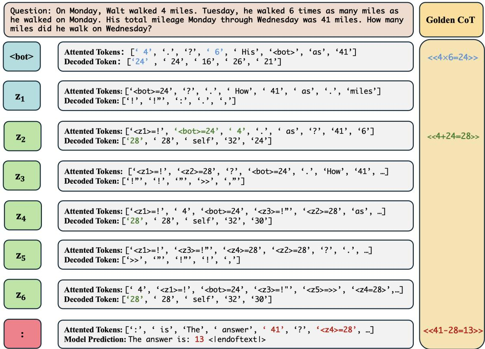  
Figure A2: CODI’s interpretability on problems involving two steps.

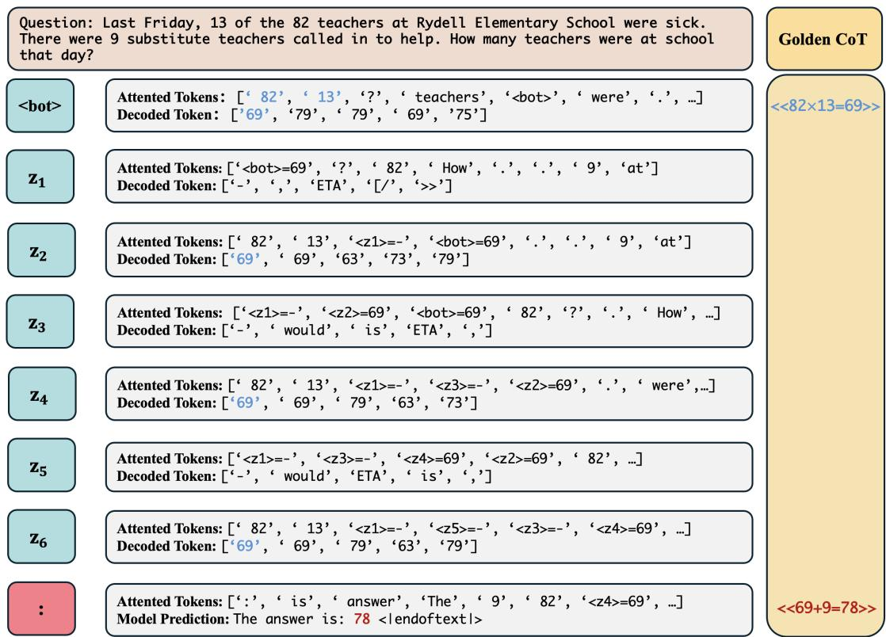  
Figure A3: CODI’s interpretability on problems involving one step.