# Calibrating Verbal Uncertainty as a Linear Feature to Reduce Hallucinations

Ziwei Ji<sup>1,3</sup>†∗, Lei Yu<sup>1,4</sup>†∗, Yeskendir Koishekenov<sup>1</sup>, Yejin Bang<sup>1,3</sup>†, Anthony Hartshorn<sup>2</sup>, Alan Schelten<sup>2</sup>, Cheng Zhang<sup>2</sup>, Pascale Fung<sup>1,3</sup>, Nicola Cancedda<sup>1</sup>

<sup>1</sup>Meta FAIR <sup>2</sup>Meta GenAI

<sup>3</sup>Hong Kong University of Science and Technology <sup>4</sup>University of Toronto zjiad@connect.ust.hk; jadeleiyu@cs.toronto.edu; {pascalefung; ncan}@meta.com

## Abstract

LLMs often adopt an assertive language style also when making false claims. Such “overconfident hallucinations” mislead users and erode trust. Achieving the ability to express in language the actual degree of uncertainty around a claim is therefore of great importance. We find that “verbal<sup>1</sup> uncertainty” is governed by a single linear feature in the representation space of LLMs, and show that this has only moderate correlation with the actual “semantic uncertainty” of the model. We apply this insight and show that (1) the mismatch between semantic and verbal uncertainty is a better predictor of hallucinations than semantic uncertainty alone and (2) we can intervene on verbal uncertainty at inference time and reduce confident hallucinations on short-form answers, achieving an average relative reduction of \~30%. <sup>2</sup>

## 1 Introduction

Despite their remarkable capability in utilizing their internal knowledge, LLMs often suffer from hallucinations, stating or implying facts that are not supported by either their input or by their training data (Ji et al., 2022; Xiao and Wang, 2021; Bang et al., 2023; Xiong et al., 2023; Bang et al., 2025). The issue is exacerbated when models produce hallucinations using language that suggests high confidence. Such overconfidence can cause users to rely too heavily on these responses (Zhou et al., 2024a; Kim et al., 2024), possibly resulting in harm, loss of trust in the model, or both.

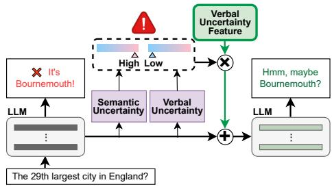  
Figure 1: Framework Illustration. We discover a linear verbal uncertainty feature (VUF) controlling model uncertainty expression, and apply this insight to: (1) Detect hallucinations arising from the miscalibration between high semantic uncertainty (SU) and low verbal uncertainty (VU); (2) Mitigate hallucinations by intervening on activations along the VUF at inference, aligning VU more with SU. For example, when asked "What is the 29th largest city in England?", the model initially answers "It’s Bournemouth" (high SU and low VU). After VUF intervention, VU is improved to better align with SU, and the response becomes "Hmm, maybe Bournemouth?" – a nuanced expression of uncertainty.

While enhancing a model’s ability to generate accurate knowledge is important, models inevitably have knowledge gaps. In such cases, it is important for models to express uncertainty about their knowledge or altogether abstain from answering (Tomani et al., 2024; Feng et al., 2024; Zhou et al., 2023; Zhang et al., 2024b). We refer to this expression as "verbal uncertainty (VU)" (see § 2.2). When faced with questions close to their knowledge boundary, they should qualify their answers with expressions such as: “I am not sure but ...”, and when the answer is squarely beyond such a boundary, they should reply: “I don’t know”. However, LLMs lack reliable mechanisms to convey their intrinsic confidence in the correctness of generated content using the degree of doubt expressed in their outputs (Zhou et al., 2024b).

Our work begins with the analysis of the model representation space. We show that, similarly to refusal (Arditi et al., 2024) and other behaviours (Zou et al., 2023), the degree of uncertainty expressed by a model is mediated by a single direction, which we call the “Verbal Uncertainty Feature” (VUF). Specifically, we show that the hidden states of input questions answered with low and high VU can be linearly separated. This allows us to use contrastive pairs (Burns et al., 2023; Panickssery et al., 2023) to identify a single difference-in-means direction that can be intervened upon to control model expression of uncertainty.

Leveraging our findings, we study hallucinations through the lens of uncertainty features. We highlight the misalignment between VU and the uncertainty about what meaning to convey in model outputs, i.e., semantic uncertainty (SU), contributing to hallucinations (Fig. 1). We propose a novel hallucination detection method by incorporating VU and SU, outperforming detection methods that rely solely on SU. Next, we propose a mitigation method, Mechanistic Uncertainty Calibration (MUC), that steers LLM activations along VUF to calibrate VU with SU.

We demonstrate that MUC effectively reduces confident hallucinations, achieving an average relative reduction of 29.6% in short-form QA tasks. It also induces nuanced expressions of uncertainty and achieves a 28.4% improvement in the alignment between verbal and semantic uncertainties.

Our main contributions are therefore threefold:

1. We discovered that verbal uncertainty is mediated by a single direction in representation space, i.e., a linear Verbal Uncertainty Feature (VUF) (§ 3).

2. We detect hallucinations arising from the misalignment between high semantic and low verbal uncertainty by integrating both types of uncertainty (§ 4.1).

3. We introduce Mechanistic Uncertainty Calibration (MUC), an inference-time intervention mechanism using VUFs to calibrate verbal uncertainty with semantic uncertainty, thereby mitigating hallucinations (§ 4.2).

We also introduce methods to quantify VU and metrics that help characterize the calibration between the two uncertainties without requiring the model to output numerical confidence estimates. Overall, this work contributes to a better understanding of LLMs, shows how to reduce hallucinations and make LLMs more trustworthy.

## 2 Background and Motivation

The miscalibration of semantic and verbal uncertainty triggers overconfident hallucinations. To bring the discussion into a quantitative framework, we introduce some definitions and measures.

## 2.1 Semantic Uncertainty

Semantic Uncertainty (SU) refers to the intrinsic uncertainty of an agent in the semantic meaning expressed by a statement. It reflects the confidence level of a model’s prediction, focusing on its meaning and disregarding paraphrastic variations (Lin et al., 2022; Kadavath et al., 2022; Mielke et al., 2022). We measure SU as Semantic Entropy (Kuhn et al., 2023) computed as follows: Given a question, we first sample multiple answers, cluster them into semantically equivalent groups, and then compute the entropy over these clusters.

## 2.2 Verbal Uncertainty

Verbal Uncertainty (VU) quantifies the degree of doubt a speaker expresses about a proposition $P ,$ either explicitly or implicitly (e.g., "I doubt...", "Possibly..."). We formally define it as the complement of the subjective probability a listener would associate with $P ,$ conditioned on the utterance U and contextual information C:

$$
\operatorname { V U } ( U \mid C ) = 1 - P r ( P \mid U , C )\tag{1}
$$

In the specific case of short-form QA, this definition can be instantiated with $U$ being the answer given by an agent in response to a question C. Answer $U _ { 1 }$ is more verbally uncertain than $U _ { 2 }$ if a listener would conclude that proposition $P$ is more probable based on answer $U _ { 2 }$ than $U _ { 1 } ;$ :

$$
P r ( P | U _ { 2 } , C ) > P r ( P | U _ { 1 } , C )\tag{2}
$$

where, e.g.:

• $P \colon$ "Bournemouth is the 29th largest city in England"

• C: "What is the 29th largest city in England?"

• $U _ { 1 } { \mathrm { : } }$ "Hmm, maybe Bournemouth"

• $U _ { 2 } { \mathrm { : } }$ "Bournemouth"

We follow recent work in expression decisiveness quantification and employ "LLM-as-a-Judge" to measure VU (Yona et al., 2024; Zheng et al., 2023). Specifically, we sample multiple answers for each question and prompt an auxiliary evaluator LLM to directly assign a VU score to each answer. The VU for a question is the average

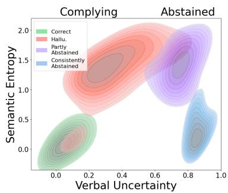  
Figure 2: Evidence of verbal-semantic uncertainty miscalibration. This plot presents the Kernel Density Estimation (KDE) for samples from TriviaQA, categorized into four classes. These classes are based on the correctness of the answers generated by Llama3.1 and the consistency in abstaining. Miscalibration is indicated by high Semantic Entropy (proxy for SU) & low VU in hallucinated answers (red), and low SU & high VU in consistently abstained answers (blue).

VU score of all answers. This approach has been shown to produce reliable uncertainty estimates that are highly correlated with human judgments of perceived assertiveness (Yona et al., 2024; Fagen-Ulmschneider, 2023). To further validate the robustness of "LLM-as-a-Judge", we compute sentence embedding cosine similarities with predefined prototypical uncertainty expressions and find a high correlation with VU scores returned by LLMs (see Appendix E.2 for details).

## 2.3 Hallucinations arise from Miscalibration between Semantic and Verbal Uncertainty

Ideally, VU aligns with SU to faithfully express uncertainty in the semantic meaning of model outputs. However, observations indicate that the two uncertainties are not always correlated, resulting in hallucinations. In this section, we quantitatively investigate and demonstrate the miscalibration between semantic and verbal uncertainty by analyzing samples from TriviaQA using Llama3.1-8B <sup>4</sup>.

Following Kossen et al. (2024); Farquhar et al. (2024), for each question, we generate a response using a low temperature (0.1) to obtain the most likely answer, and then sample multiple responses using a high temperature (1.0). We categorize the samples into two primary groups based on the VU level of the most likely answer: Those that include abstentions (abstained) and those that do not (complying). We further subdivide these categories. For complying responses, we assess whether the answers are hallucinated or correct (hallucinated/correct). For abstained, we determine if the model consistently refuses (i.e., all samples), or if it complies at least once among the multiple sampled answers (“partly abstained”) <sup>5</sup>.

Fig. 2 shows that abstained responses have high VU, which is expected. Consistently abstained ones have low SU, but this is not a problematic mismatch, rather an artifact of using semantic entropy as a proxy for SU: these are cases where the model “knows that it does not know” and handles them appropriately. There is, however, a large segment of complying answers with high SU and low VU that are hallucinations <sup>6</sup>: This is the focus of our intervention. We show in § 4.1 that combining predictions of VU and SU helps detect hallucination. Moreover, we show in § 4.2 that modulating VU to better reflect SU is crucial to prevent confident hallucinations and optimize the trade-off balance between hallucinations and false abstention.

## 2.4 Semantic Space of LLM

Recent research suggests that language models represent features or concepts as linear directions in their activation space (Mikolov et al., 2013; Bolukbasi et al., 2016; Elhage et al., 2022; Park et al., 2023; Ferrando et al., 2024). These features include harmlessness (Wolf et al., 2024; Arditi et al., 2024), truthfulness (Marks and Tegmark, 2023; Li et al., 2024), sentiment (Tigges et al., 2023), and language (Bricken et al., 2023). Building on this, we investigate the linear representation of VU to validate its representation and control its level.

## 3 Verbal Uncertainty Feature (VUF)

In this section, we show that verbal uncertainty is mediated by a single direction.

## 3.1 Feature Extraction

To identify the verbal uncertainty features (VUFs) in the model’s residual stream activations, we adopt the difference-in-means technique (Belrose, 2023), which has been shown to effectively disentangle key feature information (Panickssery et al., 2023; Arditi et al., 2024; Yu et al., 2024b).

We collect question-answer pairs where the model generates high-VU answers (x <sub>uncertain</sub>) and low-VU answers $\begin{array} { r l r } { ( x } & { { } \in } & { \mathcal { D } _ { c e r t a i n } ) } \end{array}$ , selected as the top/bottom N pairs by VU score (computed via LLM-asa-Judge in § 2.2 with Llama3.1-70B-Instruct). Answers are generated using an uncertaintyeliciting prompt (provided in Appendix A.1). We then calculate the L2-normalized difference in mean last-token residual stream activations $\mathbf { h } ^ { ( l ) } ( x )$ of each layer l for these two question sets:

(a) Llama-3.1-8B-Instruct  
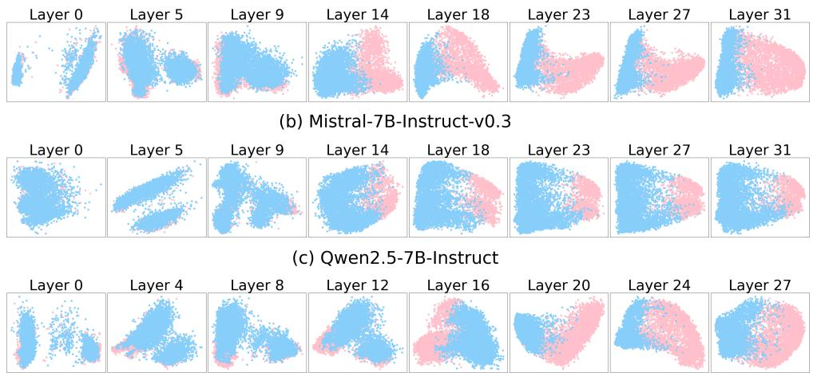

Figure 3: Visualization of verbalized certain (blue) vs. uncertain (pink) query representations exacted from selected layers of (a) Llama-3.1-8B-Instruct, (b) Mistral-7B-Instruct-v0.3, and (c) Qwen2.5-7B-Instruct on TriviaQA, NQ Open, and PopQA. Please refer to Appendix E for the visualization of representations extracted from all layers.  
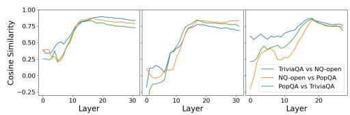  
Figure 4: Compare VUFs exacted from different datasets from Llama-3.1-8B-Instruct, Mistral-7B-Instruct-v0.3, and Qwen2.5-7B-Instruct

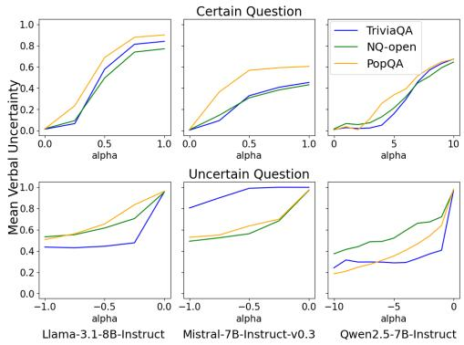

$$
\hat { \mathbf { r } } _ { \mathrm { V U } } ^ { ( l ) } = \mathbb { E } _ { { x } \sim \mathcal { D } _ { \mathrm { u n c e r t a i n } } } [ { \mathbf { h } } ^ { ( l ) } ( { x } ) ] - \mathbb { E } _ { { x } \sim \mathcal { D } _ { \mathrm { c e r t a i n } } } [ { \mathbf { h } } ^ { ( l ) } ( { x } ) ]\tag{3}
$$

$$
\mathbf { r } _ { \mathrm { V U } } ^ { ( l ) } = \hat { \mathbf { r } } _ { \mathrm { V U } } ^ { ( l ) } / \| \hat { \mathbf { r } } _ { \mathrm { V U } } ^ { ( l ) } \|\tag{4}
$$

## 3.2 Discovery of Linear Verbal Uncertainty Features

To empirically demonstrate the VUFs explained above, we adopt three closed-book short-form QA datasets: TriviaQA (Joshi et al., 2017), NQ-Open (Kwiatkowski et al., 2019), and PopQA (Mallen et al., 2022); and consider the following models: Llama3.1-8B-Instruct (Dubey et al., 2024), Mistral-7B-Instruct-v0.3 (Jiang et al., 2023), and Qwen2.5- 7B-Instruct (Yang et al., 2024) <sup>7</sup>.

Figure 5: Mean model-generated answer verbal uncertainty on three QA datasets with varying degrees of inference-time VUF intervention (modulated by the intervention intensity α).

Visualization We extract the activations of the last token for each question at each layer from $\mathcal { D } _ { u n c e r t a i n }$ and $\mathcal { D } _ { c e r t a i n }$ and project them into a 2D space using PCA. Fig. 3 shows linear separability of certain/uncertain clusters, starting from the middle layers. This strongly indicates that $\mathbf { r } _ { \mathrm { V U } } ^ { ( l ) }$ represents a meaningful linear direction that reflects the VU level of questions in hidden states. We refer to $\mathbf { r } _ { \mathrm { V U } } ^ { ( l ) }$ as VUFs.

Effective Layer Selection To identify the effective layers of VUFs, we analyze VUFs obtained from each layer of three different models. We measure the cosine similarity of distinct VUFs extracted from TriviaQA, NQ-Open, and PopQA datasets, respectively. The results presented in Fig. 4 show a high cosine similarity between VUFs from different datasets, particularly in the middle and subsequent layers. This pattern is aligned with visualization and consistent across all models and datasets we examined. Observations from both visualization and similarity across datasets indicate that reliable VUFs are best extracted from the middle to the last layers.

Causal Validation We validate the causal connection between VUFs and the model’s VU by analyzing the generation behavior as we modulate the strength of the corresponding feature through simple linear interventions. Inspired by Li et al. (2024), we intervene on model activations of all tokens by steering them along a set of VUF directions.

For each layer l, we extract VUs $\mathbf { r } _ { \mathrm { V U } } ^ { ( l ) } \in \mathbb { R } ^ { d _ { m o d e l } }$ Specifically, the VU feature vector $\mathbf { r } _ { \mathrm { V U } } ^ { ( l ) }$ serves as a directional guide for steering activations, as described in the equation below:

$$
h ^ { ( l ) } ( x ) \gets h ^ { ( l ) } ( x ) + \alpha * \mathbf { r } _ { \mathrm { V U } } ^ { ( l ) }\tag{5}
$$

where α is the intensity of intervention, and $\mathbf { r } _ { \mathrm { V U } } ^ { ( l ) }$ is the verbal uncertainty feature at layer l. The results presented in Fig. 5 show that adding VUFs to model activations $( \alpha > 0 )$ increases the VU of the model outputs. Conversely, removing VUFs from activations $( \alpha < 0 )$ decreases this uncertainty. As the intensity of VUFs ( α ) gets stronger, the VU scores exhibit greater changes. This trend remains consistent across all models and datasets we studied. This shows the potential of VU calibration in model generation. We will further explore how to leverage this phenomenon in §4.2.

Interestingly, while Qwen2.5 exhibits a similar trend, it is significantly less sensitive than Llama3.1 and Mistral. This is due to the VUF normalization. Qwen embeddings have larger norms, resulting in longer distances between clusters.

To address potential circularity concerns from using LLM in both VUF extraction and VU evaluation, we validate our findings with an alternative VUF extraction method, detailed in Appendix E.5.

VUFs are Consistent Across Different Datasets To investigate the generalization of VUF across datasets, we use VUFs extracted from TriviaQA to control the VU level of other datasets: NQ-Open and PopQA. Figure 6 shows that adding or removing TriviaQA VUFs increases or decreases the VU of model outputs for these datasets. These two findings indicate that VUFs are consistent across different datasets, suggesting that a universal VUF can be derived and utilized in our experiments further in the paper. Similar results using other VU scores are provided in Appendix E.4.

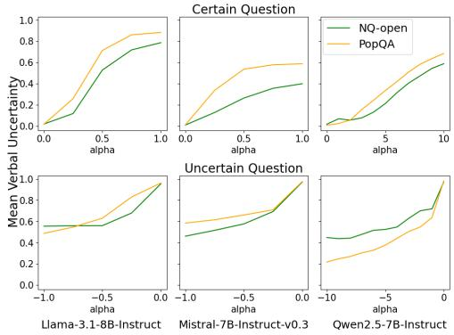  
Figure 6: Causal Validation on NQ-Open and PopQA with the VUF extracted from the OOD dataset TriviaQA.

Therefore, once we identify the appropriate layers for each model, these selections remain consistent across different datasets, eliminating the need to repeat the selection process for other datasets.

## 4 Verbal Uncertainty and Hallucination

Hallucinations arise from a miscalibration between VU and SU, where the model fails to express its high uncertainty in its generated output. Taking advantage of this miscalibration, we can detect hallucinations (§ 4.1). Furthermore, we mitigate confident hallucinations by calibrating these two uncertainties using VUFs discovered in § 3 (§ 4.2).

## 4.1 Hallucination Detection with Semantic and Verbal Uncertainty

We propose to detect hallucinations by leveraging both verbal and semantic uncertainties. Our approach utilizes a simple logistic regression model to predict the presence of hallucinations. We demonstrate that combining VU with SU significantly enhances the detection performance.

Measuring Semantic Entropy (our proxy for SU) requires generating multiple samples and running auxiliary models (Farquhar et al., 2024). We therefore consider training Uncertainty Probes for uncertainty quantification (Kossen et al., 2024) to ensure cost-efficiency. These probes are linear models trained on the hidden states of LLMs to predict numerical uncertainty values. The hidden states are extracted from the last token of the question and sourced from multiple layers within the LLM <sup>8</sup>. During testing, the input to the logistic regression model consists of predicted verbal and semantic uncertainties obtained from two regressor probes.<sup>9</sup>

<table><tr><td rowspan="2">Dataset</td><td rowspan="2">Feature</td><td colspan="2">Llama</td><td colspan="2">Mistral</td><td colspan="2">Qwen</td></tr><tr><td>AUROC</td><td>ACC</td><td>AUROC</td><td>ACC</td><td>AUROC</td><td>ACC</td></tr><tr><td rowspan="3">TriviaQA</td><td>Semantic</td><td>79.21</td><td>81.1</td><td>71.51</td><td>74.6</td><td>72.18</td><td>72.0</td></tr><tr><td>Verbal</td><td>72.1</td><td>80.1</td><td>68.20</td><td>72.4</td><td>72.8</td><td>72.7</td></tr><tr><td>Combined</td><td>79.71</td><td>80.8</td><td>72.99</td><td>74.6</td><td>74.71</td><td>72.7</td></tr><tr><td rowspan="3">NQ-Open</td><td>Semantic</td><td>65.29</td><td>70.7</td><td>64.47</td><td>62.1</td><td>56.74</td><td>53.6</td></tr><tr><td>Verbal</td><td>54.04</td><td>71.2</td><td>65.26</td><td>62.5</td><td>61.85</td><td>60.7</td></tr><tr><td>Combined</td><td>66.02</td><td>70.3</td><td>68.96</td><td>64.8</td><td>62.36</td><td>58.7</td></tr><tr><td rowspan="3">PopQA</td><td>Semantic</td><td>71.16</td><td>81.2</td><td>66.03</td><td>71.1</td><td>53.44</td><td>71.7</td></tr><tr><td>Verbal</td><td>62.30</td><td>81.0</td><td>71.13</td><td>71.7</td><td>75.66</td><td>76.2</td></tr><tr><td>Combined</td><td>75.66</td><td>81.1</td><td>73.82</td><td>75.7</td><td>75.43</td><td>76.0</td></tr></table>

Table 1: Detection Results based on Uncertainty for Llama-3.1-8B-Instruct, Mistral-7B-Instruct-v0.3, and Qwen2.5-7B-Instruct.
<table><tr><td rowspan="3">Dataset</td><td colspan="2">SEP</td><td colspan="2">EigenScore</td><td colspan="4">Our method</td></tr><tr><td colspan="2"></td><td colspan="2"></td><td colspan="2">Calculated</td><td colspan="2">Probe-Predicted</td></tr><tr><td>AUROC</td><td>ACC</td><td>AUROC</td><td>ACC</td><td>AUROC</td><td>ACC</td><td>AUROC</td><td>ACC</td></tr><tr><td>TriviaQA</td><td>66.85</td><td>66.0</td><td>64.83</td><td>53.5</td><td>79.71</td><td>80.8</td><td>73.53</td><td>80.1</td></tr><tr><td>NQ-Open</td><td>54.07</td><td>53.9</td><td>56.29</td><td>49.3</td><td>66.02</td><td>70.3</td><td>57.15</td><td>71.3</td></tr><tr><td>PopQA</td><td>70.17</td><td>65.6</td><td>59.33</td><td>44.9</td><td>75.66</td><td>81.1</td><td>74.76</td><td>81.0</td></tr></table>

Table 2: Detection Results on Llama-3.1-8B-Instruct. ‘Calculated’ means that the SE feature is computed after sampling multiple answers, ’Probe-Predicted’ means that SE is as predicted by a probe that takes as input the embeddings of the last token of the question, and therefore does not require sampling.

To evaluate hallucination detection, we follow Kossen et al. (2024); Orgad et al. (2024) and adopt the area under the receiver operating characteristic curve (AUROC) as the main metric. We also use accuracy (ACC) as a reference metric.

Baselines We adapt SEP (Kossen et al., 2024) that trains a probe to predict binarized semantic entropy based on hidden states. We employ the sentence-form and token-before-generating settings and classify abstained samples as nonhallucinated. Additionally, we replace the semantic entropy in SEP with Eigenscore (Chen et al., 2024).

Result Tab. 1 shows that incorporating VU alongside SU improves detection performance for all models. The accuracy when using probe-predicted uncertainties is similar to that obtained when using calculated SU (Tab. 2). This is important because it means that it is possible to predict a high risk of hallucination already after the prefill stage of decoding, before starting autoregressive generation.

## 4.2 Hallucination Mitigation via Inference-time Mechanistic Uncertainty Calibration

In § 3, we observed the existence of universal VUFs extracted from the middle layers to the last, which enable us to modulate the VU degree in model responses. Building on the insights, we propose Mechanistic Uncertainty Calibration (MUC). This method leverages VUFs to calibrate VU with SU.

For each layer l, we extract VUF from the last token of question, $\mathbf { r } _ { \mathrm { V U } } ^ { ( l ) } \in \mathbb { R } ^ { d _ { m o d e l } }$ . We then modulate the influence of these features through straightforward linear interventions on all tokens in detected hallucinated responses. Specifically, $\mathbf { r } _ { \mathrm { V U } } ^ { ( l ) }$ serves as a directional guide for steering activations:

$$
h ^ { ( l ) } ( x ) \gets h ^ { ( l ) } ( x ) + \alpha _ { \mathsf { s u } } ( x ) * \mathbf { r } _ { \mathsf { V U } } ^ { ( l ) }\tag{6}
$$

where the magnitude of intervention is the gap between min-max normalized SU and VU <sup>10</sup>:

$$
\alpha _ { \mathsf { s u } } ( x ) = c l i p ( s u ( x ) _ { n o r m } - v u ( x ) , 0 , m a x _ { \alpha } )\tag{7}
$$

We show the existence of universal VUFs that can be pre-computed, reducing computation overhead. Our method leverages the model’s underutilized inherent ability to express nuanced uncertainty, enhancing its management and communication of confidence levels.

Evaluation Metrics To evaluate the hallucination level and the calibration of verbal and semantic uncertainties, we use the following metrics:

• Overall Hallucination Rate: The proportion of samples where the model provides an answer not entailed by golden answer without refusal.

• Confident Hallucination Rate: The proportion of samples not entailed by the golden answer with a low VU below a predefined threshold. The threshold is identified by minimizing the sum of squared distances from VU to the threshold (Kossen et al., 2024).

• Correctness Rate: The proportion of samples entailed by the golden answer.

• Refusal Rate: The proportion of samples refusing to answer the question.

• VU/SU Disagreement Rate: The proportion of samples where SU and VU disagree, meaning one is above the threshold while the other is below. A lower disagreement rate suggests that the two uncertainties are well-calibrated.

• Correlation Coefficient: The correlation coefficient between SU and VU measures the strength and direction of the linear relationship between two uncertainties.

• VU for Incorrect answer: The average of VU for incorrect responses. VU should be relatively high, indicating that the model is less confident in its incorrect outputs.

<table><tr><td rowspan="2">Dataset</td><td colspan="3">Hallucination Rate↓</td><td rowspan="2">Correct. Rate↑</td><td rowspan="2"></td><td colspan="2">Refusal Rate</td><td colspan="2">VU/SU Disagree. Rate ↓</td><td colspan="2">Correlation↑</td><td rowspan="2" colspan="2">VU for Incorrect ↑</td><td colspan="2">VU for Correct after</td></tr><tr><td>Conf./Overall before</td><td>Conf. Overall after after</td><td>before</td><td>before</td><td>after</td><td>before</td><td>after</td><td>before</td><td>after before</td><td>after</td><td>before</td></tr><tr><td colspan="10">Llama3.1-8B</td><td colspan="7"></td></tr><tr><td>TriviaQA</td><td>23.3</td><td>19.0</td><td>21.2</td><td>71.3</td><td>70.6</td><td>5.4</td><td>8.2</td><td>21.50</td><td>21.40</td><td>0.59</td><td>0.63</td><td>0.50</td><td>0.55</td><td>0.16</td><td></td><td>0.16</td></tr><tr><td>NQ-Open</td><td>40.2</td><td>26.2</td><td>32.7</td><td>50.7</td><td>47.7</td><td>9.1</td><td>19.6</td><td>35.10</td><td>18.90</td><td></td><td>0.38</td><td>0.69</td><td>0.37</td><td>0.54</td><td>0.17</td><td>0.24</td></tr><tr><td>PopQA</td><td>33.7</td><td>21.6</td><td>23.2</td><td>23.5</td><td>21.0</td><td>42.8</td><td>55.8</td><td>50.70</td><td>44.70</td><td></td><td>0.05</td><td>0.34</td><td>0.61</td><td>0.73</td><td>0.17</td><td>0.20</td></tr><tr><td>Average</td><td>32.4</td><td>22.3</td><td>25.7</td><td>48.5</td><td>46.4</td><td>19.1</td><td>27.9</td><td>35.80</td><td>28.30</td><td></td><td>0.34</td><td>0.55</td><td>0.49</td><td>0.61</td><td>0.17</td><td>0.20</td></tr><tr><td colspan="10">Mistral-7B</td><td colspan="7"></td></tr><tr><td>TriviaQA</td><td>30.2</td><td>19.7</td><td>26.8</td><td>67.9</td><td>67.0</td><td>1.9</td><td>6.2</td><td>27.50</td><td>16.80</td><td>0.46</td><td>0.66</td><td>0.19</td><td></td><td>0.39</td><td>0.04</td><td>0.05</td></tr><tr><td>NQ-Open</td><td>52.2</td><td>40.8</td><td>46.9</td><td>41.7</td><td>39.4</td><td>6.1</td><td>13.7</td><td>46.80</td><td>19.80</td><td>0.24</td><td>0.58</td><td></td><td>0.23</td><td>0.40</td><td>0.07</td><td>0.10</td></tr><tr><td>PopQA</td><td>58.2</td><td>26.7</td><td>32.5</td><td>26.4</td><td>23.9</td><td>15.4</td><td>43.6</td><td>50.80</td><td>28.50</td><td></td><td>0.15</td><td>0.53</td><td>0.30</td><td>0.64</td><td>0.07</td><td>0.15</td></tr><tr><td>Average</td><td>46.9</td><td>29.1</td><td>35.4</td><td>45.3</td><td>43.4</td><td>7.8</td><td>21.2</td><td>41.70</td><td>21.70</td><td></td><td>0.28</td><td>0.60</td><td>0.20</td><td>0.50</td><td>0.06</td><td>0.10</td></tr><tr><td colspan="10">Qwen2.5-7B</td><td colspan="7"></td></tr><tr><td>TriviaQA</td><td>37.9</td><td>23.4</td><td>34.4</td><td>58.6</td><td>58.1</td><td>3.5</td><td>7.5</td><td>27.10</td><td>22.20</td><td></td><td>0.57</td><td>0.59</td><td>0.43</td><td>0.51</td><td>0.14</td><td>0.14</td></tr><tr><td>NQ-Open</td><td>61.6</td><td>46.8</td><td>56.5</td><td>30.4</td><td>30.1</td><td>8.0</td><td>13.4</td><td>44.50</td><td>32.50</td><td>0.31</td><td>0.38</td><td></td><td>0.39</td><td>0.46</td><td>0.18</td><td>0.19</td></tr><tr><td>PopQA</td><td>44.8</td><td>33.6</td><td>38.3</td><td>18.1</td><td>16.4</td><td>37.1</td><td>45.3</td><td>46.80</td><td>43.00</td><td></td><td>0.08</td><td>0.22</td><td>0.69</td><td>0.75</td><td>0.21</td><td>0.21</td></tr><tr><td>Average</td><td>48.1</td><td>34.6</td><td>43.1</td><td>35.7</td><td>34.9</td><td>16.2</td><td>22.1</td><td>39.50</td><td>32.60</td><td></td><td>0.32</td><td>0.39</td><td>0.51</td><td>0.57</td><td>0.17</td><td>0.18</td></tr><tr><td colspan="10">Llama3.1-70B</td><td colspan="7"></td></tr><tr><td>TriviaQA</td><td>12.1</td><td>10.1</td><td>11.8</td><td>87.0</td><td>86.8</td><td>0.9</td><td>1.4</td><td>7.5</td><td>7.1</td><td></td><td>0.71</td><td>0.80</td><td>0.29</td><td>0.35</td><td>0.06</td><td>0.07</td></tr><tr><td>NQ-Open</td><td>35.7</td><td>32.3</td><td>34.0</td><td>60.8</td><td>59.5</td><td>3.5</td><td>6.5</td><td>21.1</td><td>15.1</td><td></td><td>0.49</td><td>0.73</td><td>0.27</td><td>0.36</td><td>0.08</td><td>0.09</td></tr><tr><td>PopQA</td><td>41.4</td><td>28.0</td><td>35.2</td><td>44.6</td><td>42.4</td><td>14.0</td><td>22.4</td><td>22.2</td><td>14.8</td><td></td><td>0.59</td><td>0.75</td><td>0.48</td><td>0.62</td><td>0.17</td><td>0.18</td></tr><tr><td>Average</td><td>29.7</td><td>23.5</td><td>27.0</td><td>64.1</td><td>62.9</td><td>6.1</td><td>10.1</td><td>16.9</td><td>12.3</td><td></td><td>0.60</td><td>0.76</td><td>0.35</td><td>0.44</td><td>0.10</td><td>0.11</td></tr></table>

Table 3: Mitigation Results for Llama-3.1-8B-Instruct, Mistral-7B-Instruct-v0.3, Qwen2.5-7B-Instruct, and Llama-3.1-70B-Instruct. ‘Before’ represents the original generation and ‘after’ represents the generation after Mechanistic Uncertainty Calibration. The original generation is always confident, so there is no difference between ‘Confident and ‘Overall’.
<table><tr><td>Setting</td><td>Conf. Hallu. Rate ↓</td><td>Disagree. Rate ↓</td><td>Corr.↑</td><td>VU for Incorrect↑</td><td>VU for correct</td></tr><tr><td colspan="6">TriviaQA</td></tr><tr><td>w/ calculated Us</td><td>19.0</td><td>21.4</td><td>0.63</td><td>0.55</td><td>0.16</td></tr><tr><td>w/ predicted Us</td><td>22.3</td><td>13.5</td><td>0.86</td><td>0.49</td><td>0.20</td></tr><tr><td colspan="6">NQ-Open</td></tr><tr><td>w/ calculated Us</td><td>26.2</td><td>18.9</td><td>0.69</td><td>0.54</td><td>0.24</td></tr><tr><td>w/ predicted Us</td><td>28.5</td><td>25.1</td><td>0.65</td><td>0.48</td><td>0.26</td></tr><tr><td colspan="6">PopQA</td></tr><tr><td>w/ calculated Us</td><td>21.6</td><td>44.7</td><td>0.34</td><td>0.73</td><td>0.20</td></tr><tr><td>w/ predicted Us</td><td>29.7</td><td>42.3</td><td>0.41</td><td>0.59</td><td>0.39</td></tr></table>

Table 4: Ablation Study Results for Llama-3.1-8B-Instruct, showing the impact of replacing calculated uncertainty values with values predicted by probes on the hidden state of the last token of the question.

• VU for Correct answer: The average of VU for correct responses. This serves as a reference metric to ensure that VU for correct answers is relatively stable.

Result We compare results before and after applying MUC with calculated uncertainties in Tab. 3. MUC significantly reduces confident hallucinations at the cost of a small decrease in Correctness Rate <sup>11</sup>. The decrease in VU/SU Disagreement Rate and increase in Correlation Coefficient show improved calibration between VU and SU across models and datasets. While VU for incorrect answers increased significantly, indicating reduced confidence, VU for correct answers remained relatively unchanged after calibration <sup>12</sup>. The consistent trend across different models and sizes highlights the approach’s generality and effectiveness.

<table><tr><td>Setting</td><td>Conf. Hallu. Rate ↓</td><td>Disagree. Rate ↓</td><td>Corr.↑</td><td>VU for Incorrect↑</td><td>VU for correct</td></tr><tr><td colspan="6">TriviaQA</td></tr><tr><td>before</td><td>23.3</td><td>21.5</td><td>0.59</td><td>0.5</td><td>0.16</td></tr><tr><td>w/Rand</td><td>20.1</td><td>22.4</td><td>0.59</td><td>0.5</td><td>0.17</td></tr><tr><td>w/ VUF</td><td>19.0</td><td>21.4</td><td>0.63</td><td>0.55</td><td>0.16</td></tr><tr><td colspan="6">NQ-Open</td></tr><tr><td>before</td><td>40.2</td><td>35.1</td><td>0.38</td><td>0.37</td><td>0.17</td></tr><tr><td>w/ Rand</td><td>35.2</td><td>26.7</td><td>0.45</td><td>0.38</td><td>0.17</td></tr><tr><td>w/ TriviaQA VUF</td><td>26.2</td><td>19.6</td><td>0.70</td><td>0.54</td><td>0.24</td></tr><tr><td>w/ VUF</td><td>26.2</td><td>18.9</td><td>0.69</td><td>0.54</td><td>0.24</td></tr><tr><td colspan="6">PopQA</td></tr><tr><td>before</td><td>33.7</td><td>50.7</td><td>0.05</td><td>0.61</td><td>0.17</td></tr><tr><td>w/ Rand</td><td>28.8</td><td>47.6</td><td>0.16</td><td>0.63</td><td>0.18</td></tr><tr><td>w/ TriviaQA VUF</td><td>22.4</td><td>40.2</td><td>0.37</td><td>0.70</td><td>0.23</td></tr><tr><td>w/ VUF</td><td>21.6</td><td>44.7</td><td>0.34</td><td>0.73</td><td>0.20</td></tr></table>

Table 5: Ablation Study Results for Llama-3.1-8B-Instruct when the VUF from TriviaQA, NQ-Open, and PopQA datasets is replaced with: (1) VUF extracted from TriviaQA only, applied to intervene on NQ-Open and PopQA samples. (2) random vectors, applied to intervene on three datasets.

As shown in Tab. 4, using probe-predicted uncertainties for mitigation yields somewhat worse but comparable results to calculated uncertainties. It suggests probes can effectively predict uncertainties and reduce hallucinations.

To demonstrate the generality across datasets, we apply VUFs derived from TriviaQA with calculated uncertainties to mitigate hallucinations in NQ-Open and PopQA. Tab. 5 shows a decrease in hallucination rate, supporting the finding in § 3.2 that VUFs are consistent across datasets and can effectively control VU levels in other datasets.

To prove the importance of VUF in MUC, we perturb activations with random vectors with the same α and value range as the VUF when the hallucination detector triggers. Tab. 5 shows that while random perturbations slightly improve the baseline, intervening on the VUF direction is significantly more effective.

## 5 Related Work

We discuss relevant work on linear feature discovery and model steering in § 2.4. Here we present related work on other aspects of this work.

## 5.1 Uncertainty in LLMs

Recent advances in LLMs have broadened uncertainty estimation research, addressing challenges in open-ended generation (Huang et al., 2024; Duan et al., 2024). Some methods focus on token-level uncertainty, like predictive confidence or entropy, but they do not capture the uncertainty in semantic meaning. Resampling-based methods address this limitation, leveraging self-consistency across multiple responses (Duan et al., 2024; Zhang et al., 2024a; Farquhar et al., 2024; Wang et al.; Malinin and Gales, 2020; Chen et al., 2024; Gao et al., 2024). Other works focus on the verbal uncertainty expressed by models. Mielke et al. (2022) defines the verbalized expression of confidence as "linguistic confidence" and manually annotates responses by confidence level. Tomani et al. (2024) introduces the concept of "in-dialogue uncertainty" by counting predefined hedge words.

## 5.2 Hallucination Detection and Mitigation

Detection Studies have demonstrated that model uncertainty can serve as an indicator for identifying hallucinations (Farquhar et al., 2024; Chen et al., 2024; Zhang et al., 2023; Xiao and Wang, 2021). Other works have explored using the internal states of LLMs for detection (Azaria and Mitchell, 2023; Ji et al.; Snyder et al., 2023; Kadavath et al., 2022). Additionally, some studies have focused on building annotated datasets and fine-tuning hallucination detectors on them (Ji et al., 2024; Gu et al., 2024; Mishra et al., 2024; Li et al., 2023a; Muhlgay et al.,

2024; Varshney et al., 2023; Yang et al., 2023). To the best of our knowledge, ours is the first work to show the effectiveness of combining VU and SU for hallucination detection.

Mitigation One approach to mitigating hallucinations is generating more faithful and factual answers include model editing (Daheim et al., 2023; Ji et al., 2023a), decoding rectification (Rebuffel et al., 2022; Chuang et al., 2023; Shi et al., 2023; Li et al., 2023b), mechanistic fine-tuning (Yu et al., 2024a; Wu et al., 2024), re-ranking (Gu et al., 2024) and variants of the Chain-of-Thought approach involving verification or reflection (Dhuliawala et al., 2023; Lei et al., 2023; Ji et al., 2023b; Wang et al., 2023). Alternative methods for improving the trustworthiness involve the use of abstention and controlled stopping mechanisms (Cheng et al., 2024; Duan et al., 2024; Tomani et al., 2024; Feng et al., 2024; Zhang et al., 2024b). These works aim to completely refrain from answering the question when the model is uncertain, thereby reducing the likelihood of hallucinations.

Unlike abstention which involves refusing to answer in the face of uncertainty, we aim to incorporate the uncertainty in the output text form. With similar motivation, Band et al. (2024) trains models to verbally convey the probability that their claims are correct; Stengel-Eskin et al. (2024) fine-tunes the model based on user feedback regarding the perceived correctness of answers. Our work does not involve fine-tuning, additional system prompt design, or sampling methods required by previous mitigation works.

## 6 Conclusion and Future Work

We address the critical issue of hallucinations with overconfidence in LLMs. We demonstrate that an underlying issue contributing to hallucinations is the misalignment between models’ intrinsic semantic uncertainty (SU) and their expressed verbal uncertainty (VU). We discover the existence of a VU Feature (VUF), a single direction in the representation space that governs the VU. We leverage these insights in two applications: (1) A hallucination detection method integrating SU and VU, outperforming methods relying solely on SU; (2) A mitigation method, Mechanistic Uncertainty Calibration (MUC), aligning VU with the model’s SU by steering activations along the VUF direction during inference. Our findings suggest that LLMs can benefit from a more nuanced expression of uncertainty. Empirical results demonstrate a significant reduction in hallucinations and improved alignment, thereby enhancing the trustworthiness and reliability of LLM outputs. Future work could enhance VUF’s generalizability across LLM architectures and extend its use to long-form QA tasks. Exploring how models represent uncertainty from factors like underspecified questions, controversial topics, and ethical dilemmas would be valuable.

## Limitations

While our discovery of the Verbal and Semantic Uncertainty Framework (VUF) and the proposed method show promise in reducing hallucinations by calibrating uncertainty, there are several limitations to consider. Firstly, our investigation is based on short-form (sentence-length) QA datasets, which may not fully capture the complexity of realworld scenarios. Additionally, although we have demonstrated improvements in uncertainty calibration, the method’s reliance on predefined probes and scores may limit its adaptability to unforeseen contexts or novel queries. Lastly, our approach primarily focuses on enhancing the model’s internal mechanisms for expressing uncertainty, which does not necessarily lead to correcting hallucinated answers. Future work should address these aspects to develop a more comprehensive solution for mitigating hallucinations in LLMs.

## References

Andy Arditi, Oscar Obeso, Aaquib Syed, Daniel Paleka, Nina Panickssery, Wes Gurnee, and Neel Nanda. 2024. Refusal in language models is mediated by a single direction. arXiv preprint arXiv:2406.11717.

Amos Azaria and Tom Mitchell. 2023. The internal state of an llm knows when it’s lying. In Findings of the Association for Computational Linguistics: EMNLP 2023, pages 967–976.

Neil Band, Xuechen Li, Tengyu Ma, and Tatsunori Hashimoto. 2024. Linguistic calibration of longform generations. In Forty-first International Conference on Machine Learning.

Yejin Bang, Samuel Cahyawijaya, Nayeon Lee, Wenliang Dai, Dan Su, Bryan Wilie, Holy Lovenia, Ziwei Ji, Tiezheng Yu, Willy Chung, Quyet V. Do, Yan Xu, and Pascale Fung. 2023. A multitask, multilingual, multimodal evaluation of chatgpt on reasoning, hallucination, and interactivity. AACL.

Yejin Bang, Ziwei Ji, Alan Schelten, Anthony Hartshorn, Tara Fowler, Cheng Zhang, Nicola Cancedda, and Pascale Fung. 2025. HalluLens: LLM

hallucination benchmark. In Proceedings ofthe 63rd Annual Meeting of the Association for Computational Linguistics (Volume 1: Long Papers), pages 24128– 24156, Vienna, Austria. Association for Computational Linguistics.

Nora Belrose. 2023. [link].

Tolga Bolukbasi, Kai-Wei Chang, James Y Zou, Venkatesh Saligrama, and Adam T Kalai. 2016. Man is to computer programmer as woman is to homemaker? debiasing word embeddings. Advances in neural information processing systems, 29.

Trenton Bricken, Adly Templeton, Joshua Batson, Brian Chen, Adam Jermyn, Tom Conerly, Nick Turner, Cem Anil, Carson Denison, Amanda Askell, Robert Lasenby, Yifan Wu, Shauna Kravec, Nicholas Schiefer, Tim Maxwell, Nicholas Joseph, Zac Hatfield-Dodds, Alex Tamkin, Karina Nguyen, Brayden McLean, Josiah E Burke, Tristan Hume, Shan Carter, Tom Henighan, and Christopher Olah. 2023. Towards monosemanticity: Decomposing language models with dictionary learning. Transformer Circuits Thread. Https://transformercircuits.pub/2023/monosemanticfeatures/index.html.

Collin Burns, Haotian Ye, Dan Klein, and Jacob Steinhardt. 2023. Discovering latent knowledge in language models without supervision. In The Eleventh International Conference on Learning Representations.

Chao Chen, Kai Liu, Ze Chen, Yi Gu, Yue Wu, Mingyuan Tao, Zhihang Fu, and Jieping Ye. 2024. INSIDE: LLMs’ internal states retain the power of hallucination detection. In The Twelfth International Conference on Learning Representations.

Qinyuan Cheng, Tianxiang Sun, Xiangyang Liu, Wenwei Zhang, Zhangyue Yin, Shimin Li, Linyang Li, Zhengfu He, Kai Chen, and Xipeng Qiu. 2024. Can ai assistants know what they don’t know? arXiv preprint arXiv:2401.13275.

Yung-Sung Chuang, Yujia Xie, Hongyin Luo, Yoon Kim, James Glass, and Pengcheng He. 2023. Dola: Decoding by contrasting layers improves factuality in large language models. arXiv preprint arXiv:2309.03883.

Nico Daheim, Nouha Dziri, Mrinmaya Sachan, Iryna Gurevych, and Edoardo M Ponti. 2023. Elastic weight removal for faithful and abstractive dialogue generation. arXiv preprint arXiv:2303.17574.

Shehzaad Dhuliawala, Mojtaba Komeili, Jing Xu, Roberta Raileanu, Xian Li, Asli Celikyilmaz, and Jason Weston. 2023. Chain-of-verification reduces hallucination in large language models. arXiv preprint arXiv:2309.11495.

Jinhao Duan, Hao Cheng, Shiqi Wang, Alex Zavalny, Chenan Wang, Renjing Xu, Bhavya Kailkhura, and

Kaidi Xu. 2024. Shifting attention to relevance: Towards the predictive uncertainty quantification of free-form large language models. In Proceedings of the 62nd Annual Meeting of the Association for Computational Linguistics (Volume 1: Long Papers), pages 5050–5063, Bangkok, Thailand. Association for Computational Linguistics.

Abhimanyu Dubey, Abhinav Jauhri, Abhinav Pandey, Abhishek Kadian, Ahmad Al-Dahle, Aiesha Letman, Akhil Mathur, Alan Schelten, Amy Yang, Angela Fan, et al. 2024. The llama 3 herd of models. arXiv preprint arXiv:2407.21783.

Nelson Elhage, Tristan Hume, Catherine Olsson, Nicholas Schiefer, Tom Henighan, Shauna Kravec, Zac Hatfield-Dodds, Robert Lasenby, Dawn Drain, Carol Chen, et al. 2022. Toy models of superposition. arXiv preprint arXiv:2209.10652.

Wade Fagen-Ulmschneider. 2023. Perception of probability words. Ms., UIUC.

Sebastian Farquhar, Jannik Kossen, Lorenz Kuhn, and Yarin Gal. 2024. Detecting hallucinations in large language models using semantic entropy. Nature, 630(8017):625–630.

Shangbin Feng, Weijia Shi, Yike Wang, Wenxuan Ding, Vidhisha Balachandran, and Yulia Tsvetkov. 2024. Don‘t hallucinate, abstain: Identifying LLM knowledge gaps via multi-LLM collaboration. In Proceedings of the 62nd Annual Meeting of the Association for Computational Linguistics (Volume 1: Long Papers), pages 14664–14690, Bangkok, Thailand. Association for Computational Linguistics.

Javier Ferrando, Oscar Obeso, Senthooran Rajamanoharan, and Neel Nanda. 2024. Do i know this entity? knowledge awareness and hallucinations in language models. arXiv preprint arXiv:2411.14257.

Xiang Gao, Jiaxin Zhang, Lalla Mouatadid, and Kamalika Das. 2024. SPUQ: Perturbation-based uncertainty quantification for large language models. In Proceedings of the 18th Conference of the European Chapter of the Association for Computational Linguistics (Volume 1: Long Papers), pages 2336–2346, St. Julian’s, Malta. Association for Computational Linguistics.

Yuzhe Gu, Ziwei Ji, Wenwei Zhang, Chengqi Lyu, Dahua Lin, and Kai Chen. 2024. Anah-v2: Scaling analytical hallucination annotation of large language models. NeurIPS, abs/2407.04693.

Hsiu-Yuan Huang, Yutong Yang, Zhaoxi Zhang, Sanwoo Lee, and Yunfang Wu. 2024. A survey of uncertainty estimation in llms: Theory meets practice. arXiv preprint arXiv:2410.15326.

Ziwei Ji, Delong Chen, Etsuko Ishii, Samuel Cahyawijaya, Yejin Bang, Bryan Wilie, and Pascale Fung. Llm internal states reveal hallucination risk faced with a query. In The 7th BlackboxNLP Workshop.

Ziwei Ji, Yuzhe Gu, Wenwei Zhang, Chengqi Lyu, Dahua Lin, and Kai Chen. 2024. Anah: Analytical annotation of hallucinations in large language models. arXiv preprint arXiv:2405.20315.

Ziwei Ji, Nayeon Lee, Rita Frieske, Tiezheng Yu, Dan Su, Yan Xu, Etsuko Ishii, Yejin Bang, Andrea Madotto, and Pascale Fung. 2022. Survey of hallucination in natural language generation. ACM Computing Surveys.

Ziwei Ji, Zihan Liu, Nayeon Lee, Tiezheng Yu, Bryan Wilie, Min Zeng, and Pascale Fung. 2023a. RHO: Reducing hallucination in open-domain dialogues with knowledge grounding. In Findings of the Association for Computational Linguistics: ACL 2023, pages 4504–4522, Toronto, Canada. Association for Computational Linguistics.

Ziwei Ji, Tiezheng Yu, Yan Xu, Nayeon Lee, Etsuko Ishii, and Pascale Fung. 2023b. Towards mitigating hallucination in large language models via selfreflection. EMNLP Findings.

Albert Q Jiang, Alexandre Sablayrolles, Arthur Mensch, Chris Bamford, Devendra Singh Chaplot, Diego de las Casas, Florian Bressand, Gianna Lengyel, Guillaume Lample, Lucile Saulnier, et al. 2023. Mistral 7b. arXiv preprint arXiv:2310.06825.

Mandar Joshi, Eunsol Choi, Daniel S Weld, and Luke Zettlemoyer. 2017. Triviaqa: A large scale distantly supervised challenge dataset for reading comprehension. In Proceedings ofthe 55th Annual Meeting of the Associationfor Computational Linguistics (Volume 1: Long Papers), pages 1601–1611.

Saurav Kadavath, Tom Conerly, Amanda Askell, Tom Henighan, Dawn Drain, Ethan Perez, Nicholas Schiefer, Zac Hatfield-Dodds, Nova DasSarma, Eli Tran-Johnson, et al. 2022. Language models (mostly) know what they know. arXiv preprint arXiv:2207.05221.

Sunnie S. Y. Kim, Q. Vera Liao, Mihaela Vorvoreanu, Stephanie Ballard, and Jennifer Wortman Vaughan. 2024. "i’m not sure, but...": Examining the impact of large language models’ uncertainty expression on user reliance and trust. In Proceedings of the 2024 ACM Conference on Fairness, Accountability, and Transparency, FAccT ’24, page 822–835, New York, NY, USA. Association for Computing Machinery.

Jannik Kossen, Jiatong Han, Muhammed Razzak, Lisa Schut, Shreshth Malik, and Yarin Gal. 2024. Semantic entropy probes: Robust and cheap hallucination detection in llms. arXiv preprint arXiv:2406.15927.

Lorenz Kuhn, Yarin Gal, and Sebastian Farquhar. 2023. Semantic uncertainty: Linguistic invariances for uncertainty estimation in natural language generation. arXiv preprint arXiv:2302.09664.

Tom Kwiatkowski, Jennimaria Palomaki, Olivia Redfield, Michael Collins, Ankur Parikh, Chris Alberti,

Danielle Epstein, Illia Polosukhin, Jacob Devlin, Kenton Lee, et al. 2019. Natural questions: a benchmark for question answering research. Transactions ofthe Association for Computational Linguistics, 7:453– 466.

Chankyu Lee, Rajarshi Roy, Mengyao Xu, Jonathan Raiman, Mohammad Shoeybi, Bryan Catanzaro, and Wei Ping. 2024. Nv-embed: Improved techniques for training llms as generalist embedding models. arXiv preprint arXiv:2405.17428.

Deren Lei, Yaxi Li, Mingyu Wang, Vincent Yun, Emily Ching, Eslam Kamal, et al. 2023. Chain of natural language inference for reducing large language model ungrounded hallucinations. arXiv preprint arXiv:2310.03951.

Junyi Li, Xiaoxue Cheng, Wayne Xin Zhao, Jian-Yun Nie, and Ji-Rong Wen. 2023a. Halueval: A largescale hallucination evaluation benchmark for large language models. In Proceedings of the 2023 Conference on Empirical Methods in Natural Language Processing, pages 6449–6464.

Kenneth Li, Oam Patel, Fernanda Viégas, Hanspeter Pfister, and Martin Wattenberg. 2023b. Inferencetime intervention: Eliciting truthful answers from a language model. arXiv preprint arXiv:2306.03341.

Kenneth Li, Oam Patel, Fernanda Viégas, Hanspeter Pfister, and Martin Wattenberg. 2024. Inferencetime intervention: Eliciting truthful answers from a language model. Advances in Neural Information Processing Systems, 36.

Stephanie Lin, Jacob Hilton, and Owain Evans. 2022. Teaching models to express their uncertainty in words. arXiv preprint arXiv:2205.14334.

Andrey Malinin and Mark Gales. 2020. Uncertainty estimation in autoregressive structured prediction. arXiv preprint arXiv:2002.07650.

Alex Mallen, Akari Asai, Victor Zhong, Rajarshi Das, Hannaneh Hajishirzi, and Daniel Khashabi. 2022. When not to trust language models: Investigating effectiveness and limitations of parametric and nonparametric memories. arXiv preprint.

Samuel Marks and Max Tegmark. 2023. The geometry of truth: Emergent linear structure in large language model representations of true/false datasets. arXiv preprint arXiv:2310.06824.

Sabrina J. Mielke, Arthur Szlam, Emily Dinan, and Y-Lan Boureau. 2022. Reducing conversational agents overconfidence through linguistic calibration. Transactions of the Association for Computational Linguistics, 10:857–872.

Tomáš Mikolov, Wen-tau Yih, and Geoffrey Zweig. 2013. Linguistic regularities in continuous space word representations. In Proceedings of the 2013 conference ofthe north american chapter ofthe associationfor computational linguistics: Human language technologies, pages 746–751.

Abhika Mishra, Akari Asai, Vidhisha Balachandran, Yizhong Wang, Graham Neubig, Yulia Tsvetkov, and Hannaneh Hajishirzi. 2024. Fine-grained hallucination detection and editing for language models. arXiv preprint arXiv:2401.06855.

Dor Muhlgay, Ori Ram, Inbal Magar, Yoav Levine, Nir Ratner, Yonatan Belinkov, Omri Abend, Kevin Leyton-Brown, Amnon Shashua, and Yoav Shoham. 2024. Generating benchmarks for factuality evaluation of language models. In Proceedings ofthe 18th Conference ofthe European Chapter ofthe Association for Computational Linguistics (Volume 1: Long Papers), pages 49–66.

Hadas Orgad, Michael Toker, Zorik Gekhman, Roi Reichart, Idan Szpektor, Hadas Kotek, and Yonatan Belinkov. 2024. Llms know more than they show: On the intrinsic representation of llm hallucinations. arXiv preprint arXiv:2410.02707.

Nina Panickssery, Nick Gabrieli, Julian Schulz, Meg Tong, Evan Hubinger, and Alexander Matt Turner. 2023. Steering llama 2 via contrastive activation addition. arXiv preprint arXiv:2312.06681.

Kiho Park, Yo Joong Choe, and Victor Veitch. 2023. The linear representation hypothesis and the geometry of large language models. arXiv preprint arXiv:2311.03658.

Clément Rebuffel, Marco Roberti, Laure Soulier, Geoffrey Scoutheeten, Rossella Cancelliere, and Patrick Gallinari. 2022. Controlling hallucinations at word level in data-to-text generation. Data Mining and Knowledge Discovery, 36(1):318–354.

Weijia Shi, Xiaochuang Han, Mike Lewis, Yulia Tsvetkov, Luke Zettlemoyer, and Scott Wen-tau Yih. 2023. Trusting your evidence: Hallucinate less with context-aware decoding. arXiv preprint arXiv:2305.14739.

Ben Snyder, Marius Moisescu, and Muhammad Bilal Zafar. 2023. On early detection of hallucinations in factual question answering. arXiv preprint arXiv:2312.14183.

Elias Stengel-Eskin, Peter Hase, and Mohit Bansal. 2024. Lacie: Listener-aware finetuning for confidence calibration in large language models. arXiv preprint arXiv:2405.21028.

Curt Tigges, Oskar John Hollinsworth, Atticus Geiger, and Neel Nanda. 2023. Linear representations of sentiment in large language models. arXiv preprint arXiv:2310.15154.

Christian Tomani, Kamalika Chaudhuri, Ivan Evtimov, Daniel Cremers, and Mark Ibrahim. 2024. Uncertainty-based abstention in llms improves safety and reduces hallucinations. arXiv preprint arXiv:2404.10960.

Neeraj Varshney, Wenlin Yao, Hongming Zhang, Jianshu Chen, and Dong Yu. 2023. A stitch in time saves nine: Detecting and mitigating hallucinations of llms by validating low-confidence generation. arXiv preprint arXiv:2307.03987.

Xuezhi Wang, Jason Wei, Dale Schuurmans, Quoc V Le, Ed H Chi, Sharan Narang, Aakanksha Chowdhery, and Denny Zhou. Self-consistency improves chain of thought reasoning in language models. In The Eleventh International Conference on Learning Representations.

Zhenhailong Wang, Shaoguang Mao, Wenshan Wu, Tao Ge, Furu Wei, and Heng Ji. 2023. Unleashing cognitive synergy in large language models: A task-solving agent through multi-persona selfcollaboration. arXiv preprint arXiv:2307.05300, 1(2):3.

Yotam Wolf, Noam Wies, Dorin Shteyman, Binyamin Rothberg, Yoav Levine, and Amnon Shashua. 2024. Tradeoffs between alignment and helpfulness in language models. arXiv preprint arXiv:2401.16332.

Zhengxuan Wu, Aryaman Arora, Zheng Wang, Atticus Geiger, Dan Jurafsky, Christopher D Manning, and Christopher Potts. 2024. Reft: Representation finetuning for language models. arXiv preprint arXiv:2404.03592.

Yijun Xiao and William Yang Wang. 2021. On hallucination and predictive uncertainty in conditional language generation. In Proceedings ofthe 16th Conference ofthe European Chapter ofthe Association for Computational Linguistics: Main Volume, pages 2734–2744.

Miao Xiong, Zhiyuan Hu, Xinyang Lu, YIFEI LI, Jie Fu, Junxian He, and Bryan Hooi. 2023. Can llms express their uncertainty? an empirical evaluation of confidence elicitation in llms. In The Twelfth International Conference on Learning Representations.

An Yang, Baosong Yang, Beichen Zhang, Binyuan Hui, Bo Zheng, Bowen Yu, Chengyuan Li, Dayiheng Liu, Fei Huang, Haoran Wei, et al. 2024. Qwen2. 5 technical report. arXiv preprint arXiv:2412.15115.

Shiping Yang, Renliang Sun, and Xiaojun Wan. 2023. A new benchmark and reverse validation method for passage-level hallucination detection. arXiv preprint arXiv:2310.06498.

Gal Yona, Roee Aharoni, and Mor Geva. 2024. Can large language models faithfully express their intrinsic uncertainty in words? In Proceedings ofthe 2024 Conference on Empirical Methods in Natural Language Processing, pages 7752–7764, Miami, Florida, USA. Association for Computational Linguistics.

Lei Yu, Meng Cao, Jackie Chi Kit Cheung, and Yue Dong. 2024a. Mechanistic understanding and mitigation of language model non-factual hallucinations. In Findings of the Association for Computational Linguistics: EMNLP 2024, pages 7943–7956.

Lei Yu, Virginie Do, Karen Hambardzumyan, and Nicola Cancedda. 2024b. Robust llm safeguarding via refusal feature adversarial training. arXiv preprint arXiv:2409.20089.

Caiqi Zhang, Fangyu Liu, Marco Basaldella, and Nigel Collier. 2024a. LUQ: Long-text uncertainty quantification for LLMs. In Proceedings of the 2024 Conference on Empirical Methods in Natural Language Processing, pages 5244–5262, Miami, Florida, USA. Association for Computational Linguistics.

Hanning Zhang, Shizhe Diao, Yong Lin, Yi Fung, Qing Lian, Xingyao Wang, Yangyi Chen, Heng Ji, and Tong Zhang. 2024b. R-tuning: Instructing large language models to say ‘I don‘t know’. In Proceedings ofthe 2024 Conference ofthe North American Chapter ofthe Associationfor Computational Linguistics: Human Language Technologies (Volume 1: Long Papers), pages 7113–7139, Mexico City, Mexico. Association for Computational Linguistics.

Tianhang Zhang, Lin Qiu, Qipeng Guo, Cheng Deng, Yue Zhang, Zheng Zhang, Chenghu Zhou, Xinbing Wang, and Luoyi Fu. 2023. Enhancing uncertaintybased hallucination detection with stronger focus. In Proceedings of the 2023 Conference on Empirical Methods in Natural Language Processing, pages 915–932, Singapore. Association for Computational Linguistics.

Lianmin Zheng, Wei-Lin Chiang, Ying Sheng, Siyuan Zhuang, Zhanghao Wu, Yonghao Zhuang, Zi Lin, Zhuohan Li, Dacheng Li, Eric Xing, et al. 2023. Judging llm-as-a-judge with mt-bench and chatbot arena. Advances in Neural Information Processing Systems, 36:46595–46623.

Kaitlyn Zhou, Jena Hwang, Xiang Ren, and Maarten Sap. 2024a. Relying on the unreliable: The impact of language models’ reluctance to express uncertainty. In Proceedings of the 62nd Annual Meeting of the Associationfor Computational Linguistics (Volume 1: Long Papers), pages 3623–3643, Bangkok, Thailand. Association for Computational Linguistics.

Kaitlyn Zhou, Jena D Hwang, Xiang Ren, and Maarten Sap. 2024b. Relying on the unreliable: The impact of language models’ reluctance to express uncertainty. arXiv preprint arXiv:2401.06730.

Kaitlyn Zhou, Dan Jurafsky, and Tatsunori Hashimoto. 2023. Navigating the grey area: How expressions of uncertainty and overconfidence affect language models. In Proceedings ofthe 2023 Conference on Empirical Methods in Natural Language Processing, pages 5506–5524, Singapore. Association for Computational Linguistics.

Andy Zou, Long Phan, Sarah Chen, James Campbell, Phillip Guo, Richard Ren, Alexander Pan, Xuwang Yin, Mantas Mazeika, Ann-Kathrin Dombrowski, et al. 2023. Representation engineering: A topdown approach to ai transparency. arXiv preprint arXiv:2310.01405.

## A Prompts

## A.1 Answer Generation Prompt

Prompt to generate an answer for the given question.

Answer Generation Prompt Please answer the following question.   
Question: {question}   
Answer:

To calculate the verbal uncertainty of a question, we encourage LLM to express uncertainty.

Answer Generation Prompt for Verbal Uncertainty   
Answer the following question using a succinct (at most one sentence) and full answer. If you are uncertain about your answer to the question, convey this uncertainty verbally by precisely hedging this answer.

## A.2 LLM-as-a-Judge Accuracy Prompt

Prompt for LLM-as-a-judge of accuracy, which asks to compare the golden answers and the predicted answer:

Prompt for Accuracy Judge We are assessing the quality of answers to the following question: {question} The following are expected answers to this question: {golden answers} The proposed answer is: {predicted answer} Within the context of the question, does the proposed answer mean the same as any of the expected answers? Respond only with yes or no. Response:

## A.3 LLM-as-a-Judge Decisiveness Prompt

Prompt to output a decisiveness score between 0 and 1 for the question and candidate answer.

Verbal Uncertainty Judge Prompt   
You will be given a question and a proposed answer generated by a language model.   
Your task is to output a decisiveness score: a number in [0,1] representing how certain the language model is about the truthfulness of its generated answer, judged solely based on the provided answer. You should pay special attention to the usage of any hedging modifiers in the original answer, used to convey uncertainty in the truthfulness of the answer. A score close to 1.0 indicates that the model is very certain about the truthfulness answer. And a score close to 0.0 means that the model is highly uncertain, and the answer likely contains some hedging expressions. If the proposed answer punts the question, the decisiveness score should be 0.0.   
Here are some examples:   
Question: criminal minds episode where jj becomes a profiler.   
Proposed answer: I think JJ officially becomes a profiler in Criminal Minds season 6, episode 2.   
Decisiveness score: 0.8   
Question: criminal minds episode where jj becomes a profiler.   
Proposed answer: JJ officially becomes a profiler in Criminal Minds season 6, in either the first or second episode.   
Decisiveness score: 0.5   
Question: criminal minds episode where jj becomes a profiler.   
Proposed answer: I’m not really sure about this, but I think the episode in which JJ officially becomes a profiler in Criminal Minds may be episode 2 in season 6.   
Decisiveness score: 0.6   
Question: criminal minds episode where jj becomes a profiler.   
Proposed answer: I don’t know which episode you’re referring to.   
Decisiveness score: 0.0

## B Datasets

To empirically demonstrate the VUFs explained above, we adopt three closed-book short-form QA datasets: TriviaQA (Joshi et al., 2017), NQ-Open (Kwiatkowski et al., 2019), and PopQA (Mallen et al., 2022).

TriviaQA <sup>13</sup> consists of over 650,000 questionanswer-evidence triples, including 95,000 questionanswer pairs from trivia enthusiasts. Each question is supported by an average of six evidence documents. We use the RC version and sample 10,000 instances from the training set and 1,000 from the validation set for validation and 1,000 from the validation set for testing.

NQ-Open <sup>14</sup> is an open-domain QA benchmark derived from Natural Questions, focusing on English Wikipedia content. We sampled 10,000 instances from the training set and 1,000 from the validation set for validation and testing.

PopQA <sup>15</sup> features 14,000 entity-centric QA pairs generated from Wikidata tuples. It includes annotations for subject and object entities, relationship types, and Wikipedia page views. We sampled 10,000 instances for training, 1,000 for validation, and 1,000 for testing.

## C Uncertainty Calculation

## C.1 Experimental Details

We adhere to the generation settings in the previous paper (Kossen et al., 2024; Farquhar et al., 2024) when calculating semantic uncertainty. We input a question into the language model and sample 10 sequences, using a temperature of 1 with nucleus sampling $( \mathbf { P } = 0 . 9 )$ and top-K sampling (K = 50). Additionally, we generate a single sequence at a low temperature (0.1) to estimate the model’s most likely answer to the query, which aids in assessing potential hallucinations. The generation process is conducted using a GPU H100.

## C.2 Human Evaluation for LLM-as-a-Judge

We conduct a human evaluation on the judgment of verbal uncertainty, and found high correlations between human annotators and the LLM judge in deciding the answer’s verbal uncertainty. In particular, we randomly sampled 50 pairs of TriviaQA questions and their Llama-3.1-70B-generated answers. 4 authors of this paper then manually annotated an integer decisiveness score on a scale of 1 to 5, where 1 means highly uncertain answers and 5 means highly certain ones (see below for the full prompt provided to the human annotators). We found a strong Spearman correlation between the average human-judged decisiveness and Llama-judged decisiveness scores $( \rho ~ = ~ 0 . 8 0 4 , p ~ < ~ 2 . 0 7 \times 1 0 ^ { - 1 2 } )$ , as well as a strong inter-annotator judgement correlation $( \rho =$ $0 . 7 2 9 , p < 3 . 1 6 \times 1 0 ^ { - 8 } )$ .

<table><tr><td rowspan="2">Dataset</td><td colspan="2">Abstained</td><td colspan="2">Complying</td></tr><tr><td>Consistently Abstained</td><td>Partly Abstained</td><td>Hallucinated</td><td>Correct</td></tr><tr><td>TriviaQA</td><td>1.4</td><td>6.7</td><td>20.3</td><td>71.6</td></tr><tr><td>NQ-Open</td><td>3.2</td><td>9.0</td><td>28.3</td><td>59.5</td></tr><tr><td>PopQA</td><td>31.0</td><td>24.9</td><td>17.2</td><td>26.9</td></tr></table>

Table 6: Proportion of four types of responses: correct, hallucinated, partly abstained, and consistently abstained.

## Verbal Uncertainty Judge Instruction for Human Annotators Annotators

You will be given a question and a proposed answer   
generated by a language model.   
Your task is to output an integer decisiveness score   
on a scale of 1 to 5 representing how certain the lan  
guage model is about the truthfulness of its generated   
answer, judged solely based on the provided answer.   
You should pay special attention to the usage of any   
hedging modifiers in the original answer, used to con  
vey uncertainty in the truthfulness of the answer. A   
score of 5 indicates that the model is very certain   
about the truthfulness of the answer. And a score of 1   
means that the model is highly uncertain, and the an  
swer likely contains some hedging expressions. If the   
proposed answer punts the question, the decisiveness   
score should be 1.   
Here are some examples:   
Question: criminal minds episode where jj becomes   
a profiler.   
Proposed answer: I think JJ officially becomes a   
profiler in Criminal Minds season 6, episode 2.   
Decisiveness score: 4   
Question: criminal minds episode where jj becomes   
a profiler.   
Proposed answer: I’m not really sure about this, but   
I think the episode in which JJ officially becomes   
a profiler in Criminal Minds may be episode 2 in   
season 6.   
Decisiveness score: 3   
Question: criminal minds episode where jj becomes   
a profiler.   
Proposed answer: I don’t know which episode you’re   
referring to.   
Decisiveness score: 1

## D Miscalibration between Semantic and Verbal Uncertainties

## D.1 Proportion

Tab. 6 shows the proportion of four types of questions classified by the level of SU and VU for Llama-3.1-8B-Instruct.

Each example includes the following components:

• Question: The query or prompt being addressed.

• Answer to be Evaluated: The most likely response under assessment for its level of hallucination.

• Golden Reference: The correct and verified answer to the question.

• Semantic Entropy: A measure of the variability or uncertainty in the responses.

• Sampled Responses: A collection of ten responses, each marked with a semantic cluster index. Responses sharing the same index belong to the same semantic group, indicating they have similar meanings or interpretations.

## D.2 Consistently Abstained Examples

• Question: Which TV creatures ate Blue String Pudding?

• Answer to be Evaluated: I’m not aware of any information about TV creatures eating Blue String Pudding.

• Golden Reference: [’The Soup Dragon’, ’Clangers’, ’Iron Chicken’, ’The Iron Chicken’, ’Soup Dragon’, ’THE CLANGERS’, ’The Clangers’]

• Semantic Entropy: 0.00

• Sampled Responses:

– 0 I am sorry, but I don’t have information about TV creatures eating Blue String Pudding.

– 0 I’m not aware of any information about TV creatures eating blue string pudding. This may be a specific reference

– 0 I don’t have information about the TV creatures eating Blue String Pudding.

– 0 I’m not aware of any specific TV show that features a scene where a creature eats Blue String Pudd

– 0 I don’t have information about the TV creatures that ate Blue String Pudding. Can you provide more

– 0 I am sorry, but I do not have information about TV creatures that ate Blue String Pudding.

– 0 I am sorry, I do not have information on TV creatures eating blue string pudding. Can I help you?

– 0 I’m not aware of the specific context or show you’re referring to.

– 0 I’m sorry, but I am not aware of a specific answer that relates to a type of TV creature

– 0 I do not have information on which TV creatures ate Blue String Pudding.

## D.3 Partly Abstained Examples

• Question: The opera The Tsar Sultan contains what famous musical piece?

• Answer to be Evaluated: The opera "The Tsar Sultan" is a work by Nikolai Rimsky-Korsakov. However, I am unable to verify if it contains a famous musical piece.

• Golden Reference: [’The Flight of the Bumble Bee’, ’The flight of the bumble bee’, ’Flight of the Bumble-bee’, ’The flight of the bumblebee’, ’The Flight of the Bumblebee’, ’Flight of the Bumblebee (Rimsky-Korsakov)’, ’Flight of the Bumble Bee’, ’Flight of the bumble bee’, ’Flight of the bumblebee’, ’Flight of the Bumblebee’]

• Semantic Entropy: 2.30

## • Sampled Responses:

– 0 The opera "The Tsar Sultan" is by Nikolai Rimsky-Korsakov. "Song of the Valkyries" or "Song of the Dutchman" are not well known famous musical pieces by this opera.

– 1 The Tsar Sultan is an opera composed by Nikolai Rimsky-Korsakov. It contains the famous musical piece "Song of the Invisible One" and "Song of the Fisherman," but the most well-known piece in this opera is (hallucinated)

– 2 The Tsar Sultan is an opera by Nikanor Villamil, composed in 1836.

– 3 The famous musical piece from the opera ’The Tsar Sultan’ is the famous aria "Kalmusinkoy". (hallucinated)

– 4 The opera "The Tsar Sultan" was written by Niccolo Jommelli.

– 5 The Tsar Sultan, an opera by Giuseppe Verdi, contains the famous musical piece "Song of the Flea" however it could be that you are referring to the 1862 French opera "The Tsar and the False (hallucinated)

– 6 The opera "The Tsar Sultan" contains the famous musical piece "I Puritani" is not correct, I believe you are referring to the Opera "The Tsar Sultan" actually refers to the opera "Il Turco in Italia

– 7 The Tsar Sultan is a 19th-century French opera by Niccolò Paganini’s student and composer, Michele Carrara. However, I couldn’t find information about a famous piece from The Tsar Sultan opera.

– 8 The opera "The Tsar Sultan" contains the famous musical piece "Carmen Suite" is not correct but it does contain a famous piece called "Song of the Dutch Sailors".(hallucinated)

– 9 The opera "The Tsar Sultan" by Nikolai Rimsky-Korsakov contains the famous musical piece "Flight of the Bumblebee". (correct)

• Question: When did McDonald’s sell 1 million burgers?

• Answer to be Evaluated: I am unable to verify when McDonald’s sold 1 million burgers.

• Golden Reference: [’By 1965’]

• Semantic Entropy: 1.42

## • Sampled Responses:

– 0 McDonald’s sold its one millionth burger in 1955 (hallucinated)

– 1 I’m sorry, but I am unable to verify when McDonald’s sold

– 2 However, I need more information about which McDonald’s you are referring to.

– 0 McDonald’s first sold 1 million burgers in 1954 (hallucinated)

– 3 McDonald’s is a fast-food chain that has been selling burgers for many (hallucinated)

– 1 I am unable to verify when McDonald’s sold 1 million burgers.

– 4 McDonald’s was founded by brothers Richard and Maurice McDonald and initially operated a

– 1 I’m not aware of a specific date when McDonald’s sold 1 million

– 0 McDonald’s achieved this milestone on April 15, 1955 (hallucinated)

– 1 I am unable to verify when McDonald’s first sold 1 million burgers.

## D.4 VU-SU miscalibration in larger LLM

In addition to Llama-3.1-8B-Instruct, we also investigate the VU-SU miscalibration in Llama-3.1-70B-Instruct. The rate of consistently abstained samples is zero. As shown in Fig. 7, similar patterns of miscalibration (high SU & low VU) in hallucinated answers are observed across different LLM sizes.

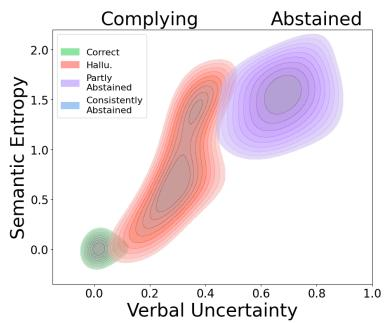  
Figure 7: This plot presents the Kernel Density Estimation (KDE) for samples from TriviaQA, categorized into four classes. These classes are based on the correctness of the answers generated by Llama-3.1-70B-Instruct and the consistency in abstaining. Miscalibration is indicated by high Semantic Entropy (proxy for SU) & low VU in hallucinated answers (red).

## D.5 “Hallucinations” with Low SU

Some samples with low SU are labeled as hallucinations and can be categorized into several cases:

(1) The labeling is correct:

• The generated content is consistently hallucinated (Example 0)

• The answer being evaluated is hallucinated (temperature=0.1), but the sampled responses are correct (temperature=1.0). (Example 1)

(2) The labeling is wrong:

• The golden answer itself is incorrect in the dataset. (Example 2)

• The generated answer is similar, but not identical, to the correct answer. (Example 3)

• The generated answer matches the correct answer, but the language model’s judgment is incorrect. (Example 4)

## Example 0 - Consistent Hallucination

• Question: What is a third divided by a half?

• Answer to be Evaluated: 1/2 (half) = 0.5 3/0.5 = 6

• Golden Reference: [’Two-thirds’]

• Semantic Entropy: 0.0

• Sampled Responses:

– 0 To find the answer, we need to divide 3 by 0.5.

3 ÷ 0.5 = 6

So the answer is 6.

– 0 To find the answer, we need to divide 3 by 0.5 (half).

3 ÷ 0.5 = 6

– 0 To solve this, we need to perform the calculation:

```lisp
3 (third) / 0.5 (half)
```

Since a third is 1/3 and a half is

– 0 To find the answer, we need to perform the following calculation:

```lisp
3 (third) / 0.5 (half)
```

3 / 0.5 = 6

– 0 To find the answer, you need to divide 3 by 0.5 (half).

3 / 0.5 = 6

So, the answer is

– 0 To find the answer, we need to divide 3 (the third) by 0.5 (the half).

3 ÷ 0.5 = 6

– 0 To find the answer, we need to divide a third by a half.

A third is 1/3, and a half is 1/2.

To divide

– 0 To find the answer, we need to perform the division.

1/2 (a half) = 0.5  
3 (a third) ÷ 0.5

– 0 To find the answer, divide 3 by 0.5.

3 ÷ 0.5 = 6

– 0 To solve this problem, we need to follow the order of operations (PEMDAS): 1. Divide a half (1/2) into the fraction 3:

## Example 1 - Hallucination, but other sampled responses are consistently correct.

• Question: The first synthetic organic chemical dye, mauveine, was discovered in 1856 as a byproduct of the search for the synthetic form of what?

• Answer to be Evaluated: Quinoline.

• Golden Reference: [’Chinin’, ’Quinine’, ’Chinine’, ’Kinine’, ’Qualaquin’, ’Coco-Quinine’, ’Aflukin’, ’Quinnine’, ’Quinine powder’, ’ATC code P01BC01’, ’Legatrin’]

• Semantic Entropy: 0.0

• Sampled Responses:

– 0 Quinine. The first synthetic organic chemical dye, mauveine, was discovered by William Perkin in 1856 as a byproduct of his search for the synthetic form of quinine.

– 0 The answer is quinine. Mauveine was discovered by William Henry Perkin in 1856, and it was a byproduct of his attempts to synthesize quinine

– 0 The answer to the question is quinine. The first synthetic organic chemical dye, mauveine, was discovered in 1856 as a byproduct of the search for the synthetic form of quinine

– 0 Quinine.

– 0 The answer is quinine. Mauveine was discovered in 1856 by William Henry Perkin, who was attempting to synthesize quinine.

– 0 The answer is quinine. Mauveine, the first synthetic organic chemical dye, was discovered in 1856 by William Henry Perkin as a byproduct of his search for the synthetic form

– 0 The first synthetic organic chemical dye, mauveine, was discovered in 1856 as a byproduct of the search for the synthetic form of quinine.

– 0 Quinine. The discovery of mauveine, a synthetic organic chemical dye, was a byproduct of the search for a synthetic form of quinine in the 1850s by French chemist

– 0 The first synthetic organic chemical dye, mauveine, was discovered in 1856 as a byproduct of the search for the synthetic form of quinine.

– 0 The answer to the question is Quinine.

## Example 2 - Wrong Golden Reference

• Question: The scientific term fission means?

• Answer to be Evaluated: The scientific term "fission" means the process of splitting or dividing a nucleus of an atom into two or more smaller nuclei, often accompanied by the release of a large amount of energy.

• Golden Reference: [’Split (album)’, ’Split (disambiguation)’, ’Split (song)’, ’Split’, ’Split (single)’]

• Semantic Entropy: 0.0

## • Sampled Responses:

– 0 The scientific term ’fission’ means the process by which an atomic nucleus splits into two or more smaller nuclei, along with the release of a large amount of energy.

– 0 The scientific term "fission" refers to the process by which an atomic nucleus splits into two or more smaller nuclei, along with the release of a large amount of energy.

– 0 The scientific term "fission" refers to the process of splitting or division of a nucleus of an atom into two or more smaller nuclei, often accompanied by the release of energy

– 0 The scientific term ’fission’ refers to a process in which an atomic nucleus splits into two or more smaller nuclei, along with the release of a significant amount of energy.

– 0 The scientific term "fission" means the process of splitting or dividing into two or more parts, often used to describe the splitting of an atom or a cell.

– 0 The scientific term "fission" means the process of splitting or dividing something, typically into two or more smaller parts. This term is commonly used in various scientific fields, such

– 0 The scientific term "fission" refers to a process in which an atomic nucleus splits into two or more smaller nuclei, along with the release of a significant amount of energy.

– 0 The scientific term "fission" refers to a type of nuclear reaction where an atomic nucleus splits into two or more smaller nuclei, often accompanied by the release of a large amount

– 0 The scientific term ’fission’ refers to the process by which an atomic nucleus splits into two or more smaller nuclei, often releasing a significant amount of energy in the process.

– 0 The scientific term "fission" means the process by which an atomic nucleus splits into two or more smaller nuclei, releasing a large amount of energy in the process.

## Example 3 - Incomplete Golden Reference

• Question: Plovers or dotterels are a type of birds classed as a?

• Answer to be Evaluated: Plovers or dotterels are a type of birds classed as Charadriiformes.

• Golden Reference: [’Waders’, ’Waders (footwear)’, ’Fishing wader’]

• Semantic Entropy: 0.0

• Sampled Responses:

– 0 Charadriiformes is the answer. Charadriiformes is an order of small to medium-sized wading birds that includes plovers, dotterels, oystercatchers, avocets, stilts, and lapwings, among others.

– 0 Plovers or dotterels are a type of birds classed as Charadriiformes.

– 0 The answer to the question is "wading birds" or more specifically "shorebirds". However, in taxonomy, Plovers or dotterels are classed as "charadriiform birds" or more specifically "charadriids" or "plover-like shorebirds".

– 0 Plovers or dotterels are a type of birds classed as a shorebird.

– 0 Plovers or dotterels are a type of birds classed as Charadriiformes.

– 0 Plovers or dotterels are a type of birds classed as Charadriiformes, but more specifically they belong to the family Charadriidae.

– 0 Shorebirds.

– 0 Plovers or dotterels are a type of birds classed as shorebirds.

– 0 The answer is Shorebirds.

– 0 Plovers or dotterels are a type of birds classed as Charadriiformes.

Explanation: Waders are part of the Charadriiformes order and include families such as Scolopacidae (sandpipers, snipes) and Charadriidae (plovers, lapwings).

## Example 4 - Judge LLM error

• Question: What is the name of the yacht that won the Royal Yacht Squadron’s regatta around the Isle of Wight in 1851 and lent its name to a famous sports prize?

• Answer to be Evaluated: The yacht that won the Royal Yacht Squadron’s regatta around the

Isle of Wight in 1851 and lent its name to a famous sports prize is the "America".

• Golden Reference: [’The United States of America’, ’United States Of Amerca’, ...]

• Semantic Entropy: 0.0

• Sampled Responses:

– 0 The yacht that won the Royal Yacht Squadron’s regatta around the Isle of Wight in 1851 and lent its name to a famous sports prize is the ’America’ yacht.

– 0 The yacht that won the Royal Yacht Squadron’s regatta around the Isle of Wight in 1851 and lent its name to a famous sports prize is "America". The America’s Cup

– 0 The yacht that won the Royal Yacht Squadron’s regatta around the Isle of Wight in 1851 and lent its name to a famous sports prize is "America."

– 0 The yacht that won the Royal Yacht Squadron’s regatta around the Isle of Wight in 1851 and lent its name to a famous sports prize is "America".

– 0 The yacht you are referring to is the ’America’. It won the Royal Yacht Squadron’s regatta around the Isle of Wight in 1851, and its victory led to the establishment

– 0 The answer is ’America’.

– 0 The answer is the "America". The yacht ’America’ was the first to successfully complete the Royal Yacht Squadron’s regatta around the Isle of Wight in 1851.

– 0 The yacht you’re referring to is "America".

– 0 The yacht that won the Royal Yacht Squadron’s regatta around the Isle of Wight in 1851 and lent its name to a famous sports prize is the America.

– 0 The yacht that won the Royal Yacht Squadron’s regatta around the Isle of Wight in 1851 and lent its name to a famous sports prize is ’America’.

## E Verbal Uncertainty Feature (VUF)

## E.1 Selected Layers for VUF

Based on the visualization and consistency across different datasets discussed in § 3.2, we have selected the following layers for each model:

• Llama-3.1-8B-Instruct: Layers 15 to 31

• Mistral-7B-Instruct-v0.3: Layers 15 to 31

• Qwen2.5-7B-Instruct: Layers 16 to 27

## E.2 Cosine Similarity between VUFs from different verbal uncertainty scores.

In addition to LLM-as-a-Judge method outlined in § 2.2, we experiment with alternatives: embedding similarities with uncertainty expressions. We generated short lists of expressions of subjective uncertainty (e.g., "I don’t know") and universal uncertainty (e.g., "It is not known"), denoted as ESU and EUU scores. We use NV-Embed-v2 (Lee et al., 2024), a generalist embedding model, to embed the generated answers and two types of uncertainty expressions separately.

To compare each verbal uncertainty score out of LLM-Judge, ESU, and EUU, we construct $\mathcal { D } _ { u n c e r t a i n }$ and $\mathcal { D } _ { c e r t a i n }$ . using each method. We then follow the steps outlined in § 3.1 and calculate the VUFs as described in Equation 3. We run our experiments on each of the three datasets separately using the Llama-3.1-8B-Instruct model. Fig. 11 illustrates the cosine similarity of VUFs from each layer of examples obtained with different VU scores. We observe a high correlation between the three different scores for VUFs in the middle and subsequent layers. These results demonstrate that our observations are consistent regardless of the choice of verbal uncertainty score.

Prototypical Expressions of Subjective Uncertainty (ESU)

• I’m not entirely sure, but...

• That’s a tough one; let me think for a moment.

• I’d have to double-check on that.

• My answer might not be entirely accurate, but...

• I’m still considering the possibilities.

• I’m not confident in my answer, but I’ll give it a shot.

• This is just an educated guess, but...

• I’ve heard conflicting information on this topic.

• My knowledge on this subject is limited.

• I’m not up-to-date on the latest developments.

• I’m starting to get out of my depth here.

• This is a bit beyond my expertise.

• I’m not familiar with that specific aspect.

• My understanding is incomplete.

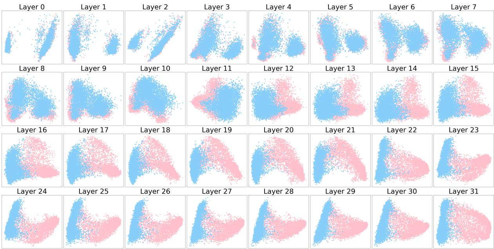  
Figure 8: Visualization of verbalized certain vs. uncertain query representations from Llama-3.1-8B-Instruct for three datasets: TriviaQA, NQ-Open, and PopQA.

• I’d need more context to provide a better answer.

• I’m really not sure about this one.

• My answer would be purely speculative.

• I’ve never encountered this situation before.

• I’m not aware of any definitive answer.

• The data on this topic is inconclusive.

• To be honest, I’m stumped.

• I’m having trouble finding a clear answer.

• My response would be a wild guess.

• I’m completely out of my element here.

• I wouldn’t want to hazard a guess.

• Your guess is as good as mine.

• I wouldn’t even venture a guess.

• It’s impossible for me to say.

• There’s too much ambiguity to provide an answer.

• I’m at a complete loss.

• I simply don’t know.

• No idea, sorry.

• Not a clue.

• I’m clueless on this one.

• No answer comes to mind.

• That’s outside my area of expertise.

• I’d rather not speculate.

• More research is needed to answer that.

• I’m still learning about this topic.

• There’s no clear consensus on this issue.

• My answer would be unreliable.

• I wouldn’t trust my own judgment on this.

• I’ve got nothing concrete to offer.

• No clear answer presents itself.

• I’d rather defer to someone else’s expertise.

• I’m uncertain and unwilling to guess.

• Too many variables make it hard to answer.

• I lack sufficient information to respond.

• Any answer I gave would be unsatisfactory.

• Frankly, I’m baffled.

## Prototypical Expressions of Universal Uncertainty (EUU)

• I’m not entirely sure about this.

• The answer is unclear at this time.

• More research is needed to determine the answer.

• This is still an open question.

• There’s an ongoing debate about this topic.

• It’s difficult to say for certain.

• I couldn’t find any reliable sources on this.

• The information available is limited.

• We don’t have enough data to make a conclusion.

• This is a complex issue with no easy answer.

• I’m not aware of any definitive answer.

• The answer may depend on various factors.

• This is a topic of ongoing investigation.

• There’s no straightforward answer to this question.

• Different perspectives offer varying insights.

• The situation is more nuanced than it seems.

• We need more context to provide an accurate answer.

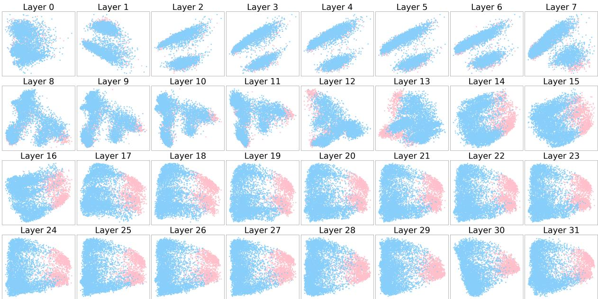  
Figure 9: Visualization of verbalized certain vs. uncertain query representations from Mistral-7B-Instruct-v0.3 for three datasets: TriviaQA, NQ-Open, and PopQA.

• The answer might be subjective and dependent on interpretation.

• There’s no clear consensus on this matter.

• Further analysis is required to determine the answer.

• Unfortunately, we can’t provide a definitive answer.

• The question is too broad to give a specific answer.

• There are many variables at play here.

• We’re dealing with incomplete information.

• The answer could go either way, depending on assumptions.

• This is a highly speculative area of inquiry.

• We’re venturing into uncharted territory here.

• The data is inconclusive, and further study is needed.

• There’s significant disagreement among experts.

• No clear pattern or trend emerges from the data.

• Honestly, we just don’t know yet.

• The answer remains elusive despite our best efforts.

• This is a mystery waiting to be solved.

• We’re stumped – more investigation is required.

• There’s too much uncertainty to give a confident answer.

• Our current understanding is insufficient to answer this question.

• We’re pushing the boundaries of human knowledge here.

• The question itself is still being refined.

• A definitive answer may never be possible.

• We’re in unexplored territory, and caution is advised.

• Could you rephrase the question? It’s unclear what you’re asking.

• I’m having trouble understanding the context of your question.

• This question appears to be based on a false assumption.

• The question is too vague to provide a meaningful answer.

• We need to clarify some terms before proceeding.

• The question seems to be self-contradictory.

• I think there may be a misunderstanding here.

• Could you provide more background information on this question?

• This question doesn’t seem to make sense in the given context.

• Nobody knows, and it’s unlikely we’ll ever find out (the ultimate cop-out!)

• Nobody knows.

• This question does not make any sense.

• That’s an impossible question to answer.

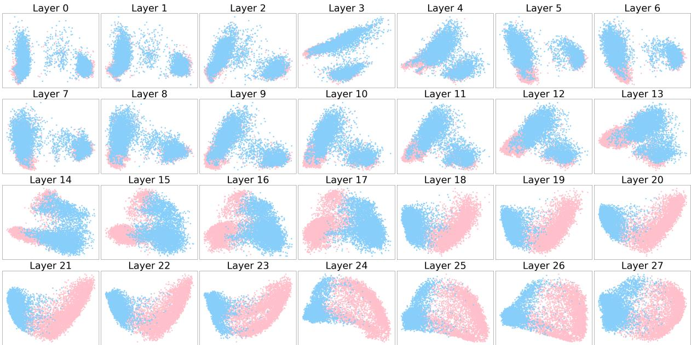  
Figure 10: Visualization of verbalized certain vs. uncertain query representations from Qwen2.5-7B-Instruct for three datasets: TriviaQA, NQ-Open, and PopQA.

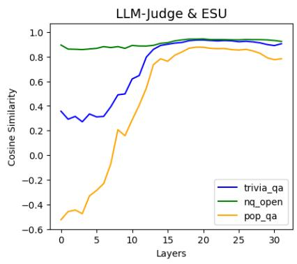

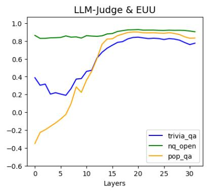

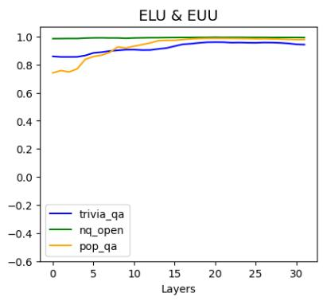  
Figure 11: Cosine Similarity between VUFs from different VU scores on different datasets for Llama-3.1-8B-Instruct model.

## E.3 Cosine Similarity between VUFs from different LLM-as-a-Judge models.

Continuing the discussion on LLM-as-a-Judge method for quantifying VU, we experiment with alternatives: use Mixtral-8x7B-Instruct-v0.1 and Qwen2.5-72B-Instruct as an LLM-as-a-Judge model. Fig. 12 illustrates the cosine similarity of VUFs from each layer of examples obtained with VU scores using different LLM-as-a-Judge models. We observe a high correlation between the three different scores for VUFs in the middle and subsequent layers. These results demonstrate that our observations are consistent regardless of the choice of verbal uncertainty score.

## E.4 Cosine Similarity between VUFs from different datasets.

To further support our observation that VUFs are consistent across datasets, we present cosine similarity between VUFs obtained from different datasets using different verbal uncertainty scores in Fig. 13. We run experiments using the Llama-3.1-8B-Instruct model.

## E.5 Causal Validation with Alternative Methods of VUF Extraction

It is in principle possible that the LLM that labels the samples used for determining the VUF and the LLM used to measure the VU score after the intervention actually measure some other consistent property of the text that is not VU. To exclude this possibility, we extracted VUF directions also using a very different method, based on measuring the mean cosine similarity with prototypical expressions of verbal uncertainty in a sentence embedding space obtained from an unrelated, encoder-only model introduced in Appendix E.2.

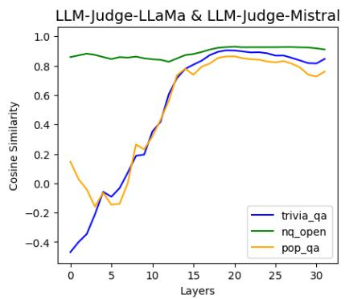

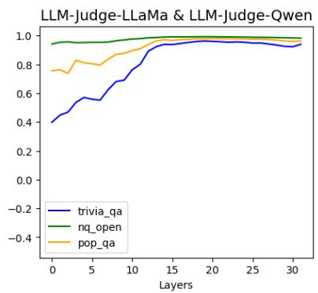

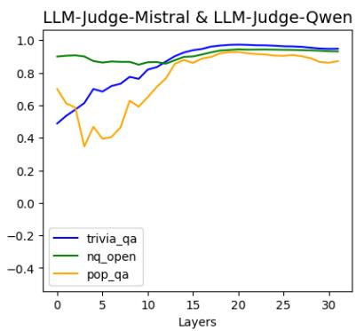  
Figure 12: Cosine Similarity between VUFs from VU scores using different LLM-as-a-Judge models on different datasets for Llama-3.1-8B-Instruct model.

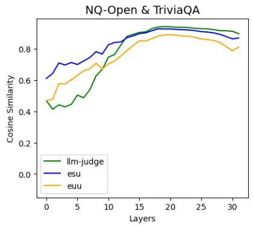

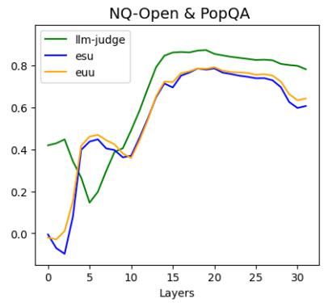

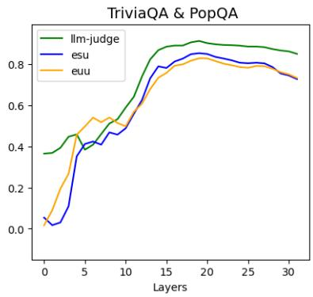  
Figure 13: Cosine Similarity between VUFs from different datasets using different VU scores for Llama-3.1-8B-Instruct model.

Figure 14 presents the causal validation with the VUF extracted based on the ESU score instead of LLM-as-a-Judge. Similar to Figure 5, adding ESU-derived VUFs to model activations increases the VU (as judged by LLM) of the model outputs. Conversely, removing VUFs from activations decreases this uncertainty. These results are based on the Llama 3.1 8B model and the TriviaQA dataset.

## F Hallucination Detection

## F.1 Experimental Details for Probe Training

These probes are linear models trained on the hidden states of LLMs to predict numerical uncertainty values in a single run. The hidden states are sourced from multiple layers within the LLM. We have selected the following layers based on the performance for each uncertainty:

• VU: Layers 5 to 20 for TriviaQA, 10 to 20 for

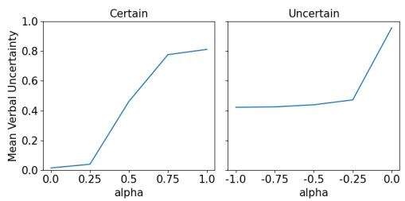  
Figure 14: Mean model-generated answer verbal uncertainty on TriviaQA dataset with varying degrees of inference-time VUF intervention (modulated by the intervention intensity α). The VUF is exacted via ESU.

NQ-Open, and 5 to 20 for PopQA.

• SU: Layers 10 to 20 for TriviaQA, 10 to 20 for NQ-Open, and 5 to 25 for PopQA.

For calculating metrics, we utilize the NumPy and NLTK packages.

## F.2 Classifier Binarized Uncertainty Probe

Given the hidden state, we train a logistic regression model (classifier probe) to predict binarized uncertainty. Instances with low verbal and high semantic uncertainty are labeled as hallucinations.

<table><tr><td>Dataset</td><td>Last Token Hidden State</td><td>Predicted Feature</td><td>AUROC</td><td>ACC</td></tr><tr><td rowspan="3">TriviaQA</td><td>Question</td><td>Semantic only Verbal only</td><td>66.85 68.48</td><td>66 70.9</td></tr><tr><td></td><td>Combined Semantic only</td><td>- 74.03</td><td>70.4 70.9</td></tr><tr><td>Answer</td><td>Verbal only Combined</td><td>68.61 -</td><td>69.8 74.3</td></tr><tr><td rowspan="3">NQ-Open</td><td>Question</td><td>Semantic only Verbal only</td><td>54.07 50.9</td><td>53.9 58.5</td></tr><tr><td>Answer</td><td>Combined Semantic only</td><td>■ 61.32</td><td>74.7 57.4</td></tr><tr><td></td><td>Verbal only Combined</td><td>50.64</td><td>61.2 79.1</td></tr><tr><td rowspan="3">PopQA</td><td>Question</td><td>Semantic only Verbal only</td><td>70.17 35.96</td><td>65.6 43.4</td></tr><tr><td>Answer</td><td>Combined Semantic only</td><td>■ 69.91</td><td>75.8 67.8</td></tr><tr><td></td><td>Verbal only Combined</td><td>34.21</td><td>39.4 77.9</td></tr></table>

Table 7: Detection Results for Classifier Binarized Uncertainty Probe on Llama-3.1-8B-Instruct.

As shown in Tab. 7, verbal uncertainty helps to improve the detection performance. The “Semantic only” is the long-form setting of the SEP (Kossen et al., 2024) as the baseline. This work ignores the refusal cases and automatically classifies them as hallucinated which is not aligned with our definition.

## G Hallucination Mitigation via Mechanistic Uncertainty Calibration (MUC)

## G.1 Experimental Details for Mitigation

For the experiments in this work, we combine the VUFs extracted from three datasets together and construct $\mathcal { D } _ { c e r t a i n }$ and $\mathcal { D } _ { u n c e r t a i n }$ as samples with VU Score $\leq 0 . 0 5$ and $\geq 0 . 9$ respectively.

We calculate semantic entropy (SE) to measure semantic uncertainty. The maximum of SE is the entropy of a uniform distribution, max $s E = l n N$ is the number of samples used in the SE calculation. The minimum SE is 0. So $s u ( x ) _ { n o r m } =$ $s u ( x ) / l n N$ . The maximum of VU is 1.0, and the minimum is 0. We set $m a x _ { \alpha } = 1 . 0$ for Llama-3.1- 8B-Instruct, ma $x _ { \alpha } = 0 . 4$ for Mistral-7B-Instructv0.3, $m a x _ { \alpha } = 3 . 0$ for Qwen2.5-7B-Instruct, and max = 4.0 for Llama-3.1-70B-Instruct across three datasets.

## G.2 Case Study for Mitigation

In this section, we present examples of answers, highlighting the differences between the original generated responses and those after our mitigation method. Each example includes the question posed, the golden answer, the initial response generated by the LLM, and the response after inference-time uncertainty calibration.

## Example with different calibration degrees (alphas)

• Question: Manhattan Island is bounded by three rivers, the Hudson, the East and which other?",

• Golden Answer: Harlem River

• Original Generated Response: The other river is the Harlem River.

• Response after Calibration with alpha=0.14 I’m uncertain about the third river, but I can provide some information: Manhattan Island is bounded by three rivers, the Hudson and the East, with the Harlem River being the third river, however, it is sometimes considered a strait.

• Response after Calibration with alpha=0.70 I’m not certain about the third river, but I can provide some information: Manhattan Island is bounded by three rivers, the Hudson, the East, and the Harlem River.

• Response after Calibration with alpha=1.4 Unfortunately, I am unable to verify the name of the third river.

## G.3 Case Study for Decreased Correctness

• Question: "Which horse won the 2013 English Grand National at Aintree?"

• Golden Answer: ["Aurora’s Encore", "Auroras Encore"]

• Semantic Entropy: 1.83

• Sampled Responses before Calibration:

– "The horse that won the 2013 English Grand National at Aintree was named Auroras Encore. The Irish-bred and trained horse, ridden by Daryl Jacob, won the race with a time of 10 minutes and 3 seconds."

"The horse that won the 2013 English Grand National at Aintree was named Auroras Encore. The horse, trained by Sue Smith, was ridden by Ryan Mania. Auroras Encore crossed the finish line with a winning margin of 5 lengths, making it a thrilling victoryfor the team."

– "The horse that won the 2013 English Grand National at Aintree was Auroras

<table><tr><td>Intervention Strength (max_alph)</td><td>Hallucination Rate ↓</td><td>Confident Hallucination Rate↓</td><td>Correct Rate ↑</td></tr><tr><td>0.0</td><td>37.9</td><td>37.9</td><td>58.6</td></tr><tr><td>1.0</td><td>35.4</td><td>27.3</td><td>58.3</td></tr><tr><td>3.0</td><td>34.4</td><td>23.4</td><td>58.1</td></tr><tr><td>5.0</td><td>32.9</td><td>18.6</td><td>57.9</td></tr></table>

Table 8: Results with varying intervention strengths on TriviaQA using Qwen2.5-7B-Instruct.

Encore. The Irish-bred gelding was ridden by jockey Daryl Jacob and trained by Sue Smith. The win was a remarkable one as Auroras Encore was a 100/1 longshot, making it one of the biggest upsets in the history ofthe race."

"The horse that won the 2013 English Grand National at Aintree was named Auroras Encore. This Irish-bred thoroughbred, trained by Sue Smith, finished the grueling race with a time of 10 minutes and 5 seconds. Auroras Encore was ridden by jockey Ryan Mania."

• Response after Calibration: I’m afraid I don’t have real-time data access, so I can’t provide the exact winner of the 2013 English Grand National at Aintree...

## G.4 Trade-off between Correctness and Hallucination

Table 8 presents the results with varying intervention strengths on TriviaQA using Qwen2.5-7B-Instruct. Increasing the intervention strength reduces the hallucination rate while slowly decreasing the correctness rate, highlighting a trade-off between the two metrics. The average calculated semantic uncertainty for samples that are initially answered correctly but later become incorrect is 1.98. The average calculated semantic uncertainty for samples that remain correct is 0.43. The higher average in the first case indicates a relationship between the trade-off and higher semantic uncertainty.