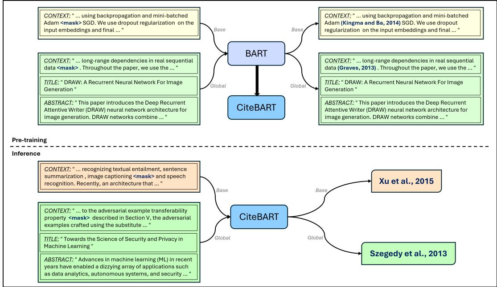
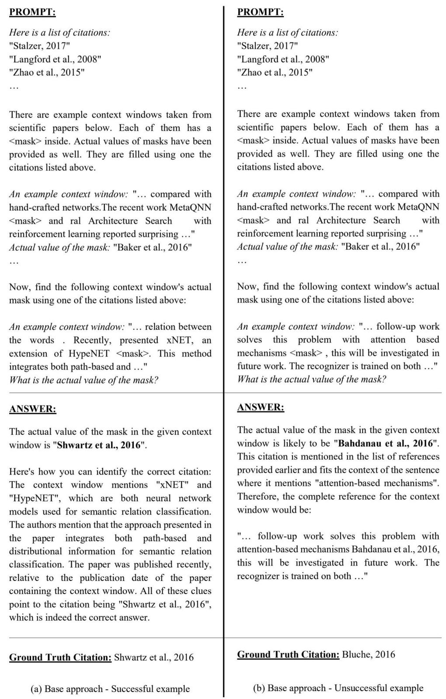
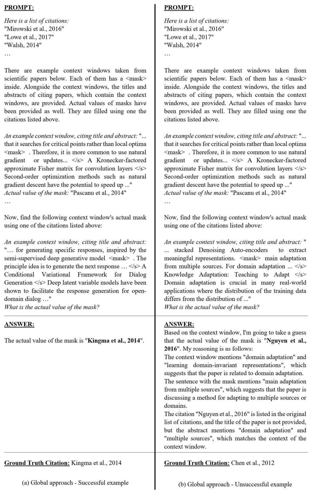

# CiteBART: Learning to Generate Citations for Local Citation Recommendation

Ege Yigit Çelik ˘ Department of Computer Engineering Izmir Institute of Technology egecelik@iyte.edu.tr

Selma Tekir Department of Computer Engineering Izmir Institute of Technology selmatekir@iyte.edu.tr

## Abstract

Local citation recommendation (LCR) suggests a set of papers for a citation placeholder within a given context. This paper introduces Cite-BART, citation-specific pre-training within an encoder-decoder architecture, where authordate citation tokens are masked to learn to reconstruct them to fulfill LCR. The global version (CiteBART-Global) extends the local context with the citing paper’s title and abstract to enrich the learning signal. CiteBART-Global achieves state-of-the-art performance on LCR benchmarks except for the FullTextPeerRead dataset, which is quite small to see the advantage of generative pre-training. The effect is significant in the larger benchmarks, e.g., Refseer and ArXiv., with the Refseer pre-trained model emerging as the best-performing model. We perform comprehensive experiments, including an ablation study, a qualitative analysis, and a taxonomy of hallucinations with detailed statistics. Our analyses confirm that CiteBART-Global has a cross-dataset generalization capability; the macro hallucination rate (MaHR) at the top-3 predictions is 4%, and when the ground-truth is in the top-k prediction list, the hallucination tendency in the other predictions drops significantly. We publicly share our code1, base datasets2, global datasets3, and pre-trained models4 to support reproducibility.

## 1 Introduction

Citations are essential building blocks in scientific writing. Their accurate placements indicate quality as one requires to put the current study in the context of the existing work from different aspects, such as background information, method, and result comparison (Cohan et al., 2019).

Citation prediction is a two-step process where the former focuses on where in the sentence to place the citation (Buscaldi et al., 2024), while the latter (citation recommendation) obtains a set of candidate papers once there is a specified citation placeholder in a given context. In this study, we focus on the latter, referred to as the Local Citation Recommendation (LCR). LCR functions as a citation suggestion mechanism for local textual contexts that are presumed to contain citations. The suggestions can be considered additional reading material alongside the targeted paper, corresponding to the ground-truth citation.

LCR has been addressed in a few works. BERT-GCN (Jeong et al., 2020) utilizes a feedforward neural network to combine local citation context representations using BERT with citation encodings through Graph Convolutional Neural Networks (GCN). The most recent solutions to the problem adopt a two-step process that consists of pre-fetching and re-ranking. DualEnh (Medic and´ Snajder, 2020) enhances a local citation context with the citing article’s title and abstract and uses this enhanced context as the query vector to retrieve the most similar candidate articles using their titles and abstracts. It performs the ranking through BiLSTM representations of inputs with attention layers on top. HAtten (Gu et al., 2022) initially pre-fetches a set of papers similarly. Afterward, it re-ranks the selected candidate papers using a finetuned SciBERT (Beltagy et al., 2019) model where the input is the query text concatenated with a candidate paper’s title and abstract. SymTax (Goyal et al., 2024) improves upon HAtten by introducing an additional Enricher module and reranking candidate papers using taxonomical relationships along with contexts.

Fierro et al. (2024) support information-seeking using query-focused summarization, responding to user queries by answers with source attributions. The ALCE benchmark (Gao et al., 2023) collects a diverse set of questions and retrieved passages to support answer generation with appropriate citations. CiteBART is different from these works as it aims to fill in a citation placeholder, not targeting retrieval-based summaries with citations.

CiteBART-Base learns through the masked citation context. In CiteBART-Global, we extend the masked context with the citing paper’s global information, e.g., title and abstract (Table 1). Inspiring from pre-training under the REALM framework (Guu et al., 2020), we append this global information to the local context, allowing backpropagation through the global information to learn associations with the pool of papers from the corpus.

CiteBART presents a novel perspective to LCR. It achieves superior performance without relying on a pre-fetch and re-rank pipeline. It is an end-to-end learning system. Unlike previous works, we do not exploit the global information (titles and abstracts) of the target papers to make the recommendation. CiteBART-Global learns solely from the relation of citing papers’ global information with local citation contexts.

We summarize our contributions as follows:

• We propose an end-to-end learning system, Cite-BART, with custom citation masking for LCR.

• CiteBART-Global achieves state-of-the-art performance on LCR benchmarks except for the FullTextPeerRead dataset, which is quite small to see the advantage of generative pre-training. The effect is significant in the larger benchmarks, e.g., Refseer and ArXiv. CiteBART-Base is still a strong baseline.

• We provide a qualitative analysis to gain insight into the working of the approach, including the cross-dataset generalization capability.

• We provide a taxonomy of hallucinated citations and report macro hallucination rates (MaHR) for them.

• Our ablation study confirms the central role of local citation contexts in the learning process. It also shows the effectiveness of the Global training scheme over Base.

## 2 Related Work

BERT (Devlin et al., 2019) is an encoder-only pretraining model that adopts the Masked Language Modeling (MLM) objective. MLM masks tokens in a uniformly random fashion and predicts them, allowing the generation of learning signals bidirectionally. Some BERT variants were released to meet the requirements for masking a group of tokens. SpanBERT (Joshi et al., 2020) builds on this objective by masking random contiguous text spans. In the same direction, PMI-Masking (Levine et al., 2021) masks word n-grams based on their PMI (Pointwise Mutual Information) scores. Pretraining encoder decoders, e.g., BART (Lewis et al., 2020), combine the strengths of bidirectional learning of encoders with the autoregressive nature of decoders, capturing the local patterns of tokens within their generative capabilities.

Similar to citation recommendation, the recent work of Luo et al. (2023) predicts provisions of the U.S. Code by pretraining RoBERTa (Liu et al., 2019) and LegalBERT (Chalkidis et al., 2020) on the curated dataset (PACER (Luo et al., 2023)) of the US federal court documents where each provision source text is given with its associated target citation. SciBERT (Beltagy et al., 2019) performs pretraining exclusively on scientific texts to learn global representations for scientific papers. SPECTER (Cohan et al., 2020) learns citation-aware global representations for scientific papers using a citation-based pretraining objective. SPECTER-produced representations introduced remarkable results in the paper classification and global citation recommendation tasks.

LCR has four benchmark datasets for evaluation. BERT-GCN (Jeong et al., 2020) introduced the FullTextPeerRead dataset, extended from the original PeerRead (Kang et al., 2018). Throughout this paper, we refer to the FullTextPeerRead dataset as PeerRead for brevity. An additional dataset is ACL-ARC (Bird et al., 2008), derived from the ACL Anthology Reference Corpus. We run our experiments on its ACL-200 subcategory, analogous to DualEnh (Medic and Snajder´ , 2020) and HAtten (Gu et al., 2022). Finally, Refseer (Huang et al., 2015) and ArXiv (Gu et al., 2022) are the largest benchmarks for this task.

BERT-GCN (Jeong et al., 2020) combines two encoders for citation recommendation. The first encoder generates local context embeddings using BERT, while the second one creates the graph embeddings of citation networks. DualEnh (Medic´ and Snajder, 2020) trains a Bi-LSTM model to relate a target paper to its candidate papers. The target paper provides a context with a citation placeholder, and the model utilizes the titles and abstracts of candidate papers to calculate the semantic similarity scores. HAtten (Gu et al., 2022) uses a Hierarchical Attention Text Encoder and SciBERTbased Re-ranking scheme for LCR. It starts by prefetching potential candidate papers from a pool of citations. In the re-ranking phase, the authors assign scores to candidate papers using a SciBERT model with a classification layer on top. HAtten achieves state-of-the-art results on all of the benchmark datasets.

Table 1: An example for input and target formats for evaluation with CiteBART. Due to space constraints, we present the contexts and abstracts in an abbreviated form.
<table><tr><td>Strategy Input</td><td></td><td>Target</td></tr><tr><td>Base</td><td>. .. error rate of 5.8% and a word error rate of 28.7%, which are on par with previous reported results Yao and Zweig, 2015 &lt;mask&gt; . Unlike prior work, we do not use a language model during decoding and . . .</td><td></td></tr><tr><td>Global</td><td>... error rate of 5.8% and a word error rate of 28.7%, which are on par with previous reported Yao and Zweig, 2015 results &lt;mask&gt; . Unlike prior work, we do not use a language model during decoding and . .. &lt;/s&gt; Deep Voice: Real-time Neural Text-to-Speech &lt;/s&gt; We present Deep Voice, a production-quality text-to-speech system constructed entirely from deep neural ...</td><td></td></tr></table>

  
Figure 1: CiteBART workflow. The yellow and green examples represent the workings of CiteBART-Base and CiteBART-Global, respectively. During inference, the expected outputs are in the author–date citation format, unlike the pre-training stage.

SymTax (Goyal et al., 2024) introduces a threestage recommendation architecture for the LCR task, consisting of the Prefetcher, Enricher, and Reranker modules. Prefetcher is the same as HAtten’s. Enricher leverages a pre-constructed citation network built from candidates to enhance their representation. Finally, Reranker combines a language model-based text relevance with a taxonomy relevance to yield a final recommendation. SymTax outperforms HAtten on the benchmark datasets.

Lastly, GM-s2orc-H (Buscaldi et al., 2024) proposes approaches for predicting where in the context to place the citation. Although their results are not directly comparable to CiteBART due to differences in task objectives, their findings highlight the advantages of generative models in citation-related tasks.

## 3 Methodology

We propose CiteBART, a novel pre-training strategy designed to predict citations within the contexts of scientific papers. We mask placeholder tokens, which replace ground-truth citations in the parenthetical author-date style, for the continual pre-training of a vanilla BART-base to generate the correct parenthetical author-date citation for a given context.

## 3.1 Custom BART Pre-training for LCR

BART (Lewis et al., 2020) is a sequence-tosequence model with an encoder and a decoder. It introduces a set of document corruption (denoising) schemes and then optimizes a reconstruction loss, the cross-entropy between the original document and the decoder’s outputs. The denoising transformations that are applied to the encoder during pre-training are as follows: Random token masking (similar to BERT), token deletion, text infilling (span masking with span lengths drawn from a Poisson distribution (λ = 3)), sentence permutation, and document rotation with a randomly selected token leading the document.

Table 2: Statistics of LCR benchmarks.
<table><tr><td>Dataset Name</td><td>ACL-200</td><td>PeerRead</td><td>RefSeer</td><td>Arxiv</td></tr><tr><td>Train Size</td><td>30,390</td><td>9,363</td><td>3,521,582</td><td>2,988,030</td></tr><tr><td>Validation Size</td><td>9,381</td><td>492</td><td>124,911</td><td>112,779</td></tr><tr><td>Test Size</td><td>9,585</td><td>6,184</td><td>126,593</td><td>104,401</td></tr><tr><td># of Papers</td><td>19,776</td><td>4,837</td><td>624,957</td><td>1,661,201</td></tr><tr><td>Publication Years</td><td>2009-2015</td><td>2007-2017</td><td>-2014</td><td>1991-2020</td></tr></table>

We propose a citation learning strategy using BART. BART employs MLM similar to BERT. Additionally, to effectively reconstruct the masked contexts, it masks a span of k tokens with a single mask. In return, it can predict multiple tokens for a single mask. Thus, CiteBART can generate complex parenthetical author-date citations after custom pre-training for citation tokens without requiring further architectural modifications.

We propose two training schemes for our approach: CiteBART-Base and CiteBART-Global (Figure 1). In CiteBART-Base, the model gets the masked context with the ground-truth citation as input. This setting tests the model’s performance in a local context-only situation (Table 1). With the underlying idea that good citation recommendation requires relating local citation contexts with the citing papers’ global information, such as titles and abstracts, we devised an innovative way to accomplish it. Inspiring from pre-training under the REALM framework (Guu et al., 2020), in CiteBART-Global, we append the citing paper’s title and abstract to the local context, allowing backpropagation through the global information that considers the pool of papers from the corpus. Specifically, we used the "</s>" token designated by the pre-trained BART-base model as the separator.

## 3.2 Dataset Preprocessing

We conduct our experiments on the existing citation recommendation benchmarks of ACL-200, Peer-Read, RefSeer, and ArXiv. Table 2 presents the statistics of these datasets. They provide citation contexts from various articles where all contexts have a target citation in the middle. The context sizes are in terms of characters, which causes some incomplete words at the start and end of the contexts.

Table 3: Statistics of the preprocessed datasets.
<table><tr><td>Dataset Name</td><td>ACL-200</td><td>PeerRead</td><td>RefSeer</td><td>Arxiv</td></tr><tr><td># of local contexts</td><td>63,365</td><td>16,669</td><td>3,739,189</td><td>3,205,210</td></tr><tr><td>Size of the training split</td><td>50,692</td><td>13,335</td><td>2,991,351</td><td>2,564,168</td></tr><tr><td>Size of the test split</td><td>12,673</td><td>3,334</td><td>747,838</td><td>641,042</td></tr><tr><td># of removed contexts</td><td>403</td><td>0</td><td>39,577</td><td>0</td></tr><tr><td># of unique citations</td><td>5,266</td><td>2,043</td><td>351,896</td><td>368,284</td></tr></table>

The datasets originally include a "TARGETCIT" marker as a placeholder for citations within each context. We replaced these markers with "<mask>" tokens to align with our pretraining process. Additionally, to ensure CiteBART focuses solely on predicting target citations, we removed any non-target citations from all four datasets.

We encountered some issues during the preprocessing of ACL-200 and RefSeer. First, they include local contexts with author name conflicts in the citation tokens. For example, the "Petrovic et´ al., 2010" citation token was incorrectly written as "Petrovic et al., 2010" in the target citation column of ACL-200. Another problem is the incorrect ordering of two-author citations. For instance, the local citation context provides the citation "Rivera and Zeinalian, 2016"; the paper metadata includes "Zeinalian and Rivera, 2016". There are also a few cases of incorrect citations. Moreover, there are some contexts with empty author names. We removed all these cases from the aforementioned datasets to ensure consistency.

After the preprocessing, we worked with the train and test sets. As CiteBART involves continual pre-training, we perform it on the training partition and evaluate the performance on the test partition. Table 3 shows the final statistics of our preprocessed datasets5 including the training and test partition sizes for all the benchmarks.

## 4 Experiments

We conducted our experiments on devices with NVIDIA RTX6000 Ada GPU and NVIDIA V100 GPU6. The following hyperparameters were utilized in all our experiments. The number of epochs was set to 15, as the change in loss values between epochs became negligibly small beyond this point.

Only the PeerRead Global dataset has been trained for 30 epochs since the generative model requires longer training for the relatively smaller PeerRead dataset. We employed a learning rate of 2e 5 and an attention dropout rate of 0.12. Given that BART is a generative model, we adjusted its generation parameters to produce outputs that align with our requirements. Specifically, we utilized the grouped beam search with 20 beams and applied a diversity penalty of 1.5 to generate more diverse results. The maximum number of generated tokens was 25 since the generated citations should not exceed it. Apart from these specific modifications, we did not alter the architecture of the BART model.

## 4.1 Results

We report our results using Recall@10 (R@10) and Mean Reciprocal Rank (MRR)7 and compare with the state-of-the-art approaches in Table 48. As can be seen from the table, CiteBART-Global outperforms others on the existing benchmarks except for the smallest PeerRead dataset, while the base scheme is still a strong baseline.

HAtten reports its results based on a 10k subset of the test set due to long evaluation times. In Table 4, however, we present the results of HAtten on the entire test sets. As for DualEnh (Medic and Sna-´ jder, 2020), we chose their superior "DualEnh-ws" model for the comparison. BERT-GCN’s (Jeong et al., 2020) results are available only on the Peer-Read dataset. We also compare our approach with SymTax (Goyal et al., 2024); its results surpass Hatten. Additionally, we add BM25 (Robertson and Zaragoza, 2009), a fast, TF-IDF-based retrieval function, as a baseline.

As shown in Table 4, CiteBART-Global demonstrates its advantage over HAtten on Refseer most since Refseer includes more training contexts compared to ArXiv. Given that CiteBART is a generative model, access to a larger training set contributes to its improved results.

To observe the citation prediction capabilities of CiteBART in detail, we present a qualitative analysis in Appendix E.

## 4.2 Ablation Study

We conducted an ablation study to show different components’ contributions to the overall results. The analysis was carried out on the ACL-200 dataset. Table 5 shows the results for CiteBART with a model pre-trained on the ACL-200 Global dataset in 15 epochs.

The first three experiments test the contribution of the local context, title, and abstract to the overall performance. First, we remove the local context to see the performance due to the global informationonly training (#1 in Table 5). We discard the title and abstract in the second and third configurations (#2 and #3 in Table 5). The results show that excluding the local context brings about a sharp reduction in the performance metrics (a drop from 0.739 to 0.588 in Recall@10), confirming its decisive role in generating citations. On the other hand, removals of title or abstract do not lead to a statistically significant decrease in performance.

In the fourth ablation study, we further expand the global information with the cited paper’s title and abstract during pre-training (#4 in Table 5). The evaluation stays the same, feeding the local context with the citing paper’s title and abstract during inference. Contrary to expectations, adding the ground-truth paper’s global information during pre-training does not help; the model falls in its performance. This failure may be explained by the model learning to associate the citation token with the global information of both the citing and cited article in the training phase. However, lacking the cited paper’s global information in the test phase confuses the model’s predictions.

The previous studies (Medic and Snajder´ (2020), Gu et al. (2022)) utilize an all-including training and inference configuration where citing and cited paper’s global information is concatenated with the local citation context. Their pre-fetch and reranking pipeline is well-suited to this setup and benefits from it as the inference step also allows incorporating the cited paper’s title and abstract, which is not the case in a learning approach like ours’. CiteBART-Global outperforms these models without relying on global information about the cited papers, representing a more ideal scenario for the LCR task.

## 4.3 Taxonomy and Measurement of Hallucinated Citations

CiteBART, similar to other generative models, is prone to hallucination, occasionally producing citations that do not correspond to any real work. A generated citation is classified as hallucination if it is not present in the citation list of the dataset including the input context. Hallucinations in Cite-BART are typically entity-error hallucinations or

Table 4: Comparison with state-of-the-art on LCR benchmarks. The best values are shown with bold.
<table><tr><td rowspan="2">Model</td><td colspan="2">ACL-200</td><td colspan="2">PeerRead</td><td colspan="2">Refseer</td><td colspan="2">Arxiv</td></tr><tr><td>R@10</td><td>MRR</td><td>R@10</td><td>MRR</td><td>R@10</td><td>MRR</td><td>R@10</td><td>MRR</td></tr><tr><td>BM25</td><td>0.194</td><td>0.107</td><td>0.337</td><td>0.214</td><td>0.219</td><td>0.142</td><td>0.197</td><td>0.125</td></tr><tr><td>BERT-GCNa</td><td></td><td></td><td>0.529</td><td>0.418</td><td></td><td></td><td>=</td><td>–</td></tr><tr><td>DualEnh-ws</td><td>0.703</td><td>0.366</td><td>一</td><td></td><td>0.534</td><td>0.280</td><td>-</td><td></td></tr><tr><td>HAtten</td><td>0.499</td><td>0.242</td><td>0.579</td><td>0.289</td><td>0.339</td><td>0.155</td><td>0.329</td><td>0.122</td></tr><tr><td>SymTax (SciV)</td><td>0.653</td><td>0.296</td><td>0.751</td><td>0.350</td><td>0.485</td><td>0.199</td><td>0.399</td><td>0.128</td></tr><tr><td>CiteBART-Base</td><td>0.686</td><td>0.504</td><td>0.570</td><td>0.424</td><td>0.606</td><td>0.449</td><td>0.355</td><td>0.240</td></tr><tr><td>CiteBART-Global</td><td>0.739</td><td>0.513</td><td>0.669</td><td>0.502</td><td>0.652</td><td>0.479</td><td>0.502</td><td>0.305</td></tr></table>

a BERT-GCN performs evaluation by excluding the papers cited less than five times in each dataset.

Table 5: Ablation study results on ACL-200 Global dataset under four different configurations. The best values are shown with bold.
<table><tr><td></td><td>Approach</td><td>Training Input</td><td>Recall@10</td><td>EM</td><td>MRR</td></tr><tr><td></td><td>Base</td><td>Context</td><td>0.686</td><td>0.422</td><td>0.504</td></tr><tr><td></td><td>Global</td><td>Context + Citing Title &amp; Abstract</td><td>0.739</td><td>0.417</td><td>0.513</td></tr><tr><td>1</td><td>No context</td><td>Citing Title &amp; Abstract</td><td>0.588</td><td>0.205</td><td>0.311</td></tr><tr><td>2</td><td>No title</td><td>Context + Citing Abstract</td><td>0.731</td><td>0.415</td><td>0.509</td></tr><tr><td>3</td><td>No abstract</td><td>Context + Citing Title</td><td>0.712</td><td>0.396</td><td>0.490</td></tr><tr><td>4</td><td>All-including</td><td>Context + Citing Title &amp; Abstract + Cited Title &amp; Abstract</td><td>0.111</td><td>0.039</td><td>0.056</td></tr></table>

fabrications.

To measure the degree of hallucinations in LLMgenerated responses, Li et al. (2024) propose two metrics, MaHR (macro hallucination rate) and MiHR (micro hallucination rate), respectively. While MaHR calculates the proportion of hallucinatory responses in all the responses (Equation 1), MiHR gives the average rate of hallucinations within each response (Equation 2).

$$
M a H R = { \frac { C o u n t ( h a l l u c i n a t o r y ~ r e s p o n s e s ) } { n } }\tag{1}
$$

$$
M i H R = { \frac { 1 } { n } } \sum _ { i = 1 } ^ { n } { \frac { C o u n t ( h a l l u c i n a t o r y f a c t s ) } { C o u n t ( a l l f a c t s i n r _ { i } ) } }\tag{2}
$$

In LCR, MaHR represents the proportion of hallucinated citations across all generated citations. As the task is evaluated with top-k predictions for each test instance, the total number of responses becomes k n where n is the number of test instances. Thus, MaHR is the fraction of hallucinated citations among k n responses (Equation 3). MiHR, on the other hand, measures the average hallucination rate in individual contexts. In LCR, as each context gets top-k predictions, the number of facts in each response is fixed with k (the denominator in MiHR), which makes MaHR and MiHR produce identical results.

$$
\begin{array} { l l } { { } } & { { M a H R = \displaystyle \frac { C o u n t ( h a l l u c i n a t e d c i t a t i o n s ) } { k * n } } } \\ { { } } & { { M i H R = \displaystyle \frac { 1 } { n } \sum _ { i = 1 } ^ { n } \frac { C o u n t ( h a l l u c i n a t e d c i t a t i o n s i n c o n t e x t _ { i } ) } { k } } } \end{array}\tag{3}
$$

In addition to MaHR (or MiHR), we propose the following metrics to pinpoint hallucination behavior. Each metric targets a type of hallucination we categorized by examining hallucinations versus ground truth citations for given contexts.

• Incorrect year (all-names-GT): The generated citation fully matches the author(s) in the ground truth citation while failing to match the publication year.

• Partially correct author list (one-name-GT): One of the two author names is correct, and the generated year may or may not be correct in these cases.

• Correct year with incorrect authors (year-GT): Some hallucinations match the year of the ground truth citation, even if the author names are incorrect.

• wrong-format: If the generated citation’s format does not conform to the parenthetical author-date citation style, it is considered a wrong-format hallucination.

• other-hal: There is no overlap with any part of GT in these hallucinations.

Additionally, we term the aggregation of the hallucinations corresponding to partially correct responses MaHR-partial and we relate MaHR with MaHR-partial using Equation 4.

$$
\begin{array} { r l r } & { } & { M a H R - p a r t i a l = a l l - n a m e s - G T + o n e - n a m e - G T + y e a r - G T } \\ & { } & \\ & { } & { M a H R - p a r t i a l + u r m g - f o r m a t + o t h e r - h a l } \\ & { } & \\ & { } & { M a H R = M a H R - p a r t i a l + w r o n g - f o r m a t + o t h e r - h a l } \\ & { } & { ( 4 ) } \end{array}
$$

Table 6 presents the results of the hallucination metrics for the CiteBART-Global models. To observe the effect of the k value, we performed each analysis with top-3, top-5, and top-10 generated predictions, respectively. The results conclude that MaHR-partial accounts for almost half of the hallucinations in the top 3 predictions, which implies that when the model is forced to make fewer predictions, its hallucinations do not deviate much from the ground truth. The proportion gradually diminishes in the top-5 and top-10 predictions. Interestingly, on Refseer and Arxiv Global, the incorrect year (all-names-GT) hallucination, which is the closest to the ground truth, decreases with increasing k values. In overall performance, the ACL-200 Global dataset gives the lowest hallucination rates all over the k values. Arxiv Global is the second best, with very close scores to ACL-200 Global.

Table 7 reports the values of some extended metrics built upon MaHR:

• top-k-match-MaHR: This metric considers hallucinated predictions only when one of the other predictions in the same top-k group matches the ground truth (GT).

• exact-match-MaHR: This metric is similar to top-k-match-MaHR but specifically focuses on the cases where the exact match occurs.

These metrics approach the problem differently by examining the hallucination tendency when the model can hit the ground truth citation in its top-k predictions. In other words, the research question is whether the model suffers less from the hallucination given the correct prediction in the top-k list (when the model knows the answer). The results confirm this hypothesis as top-k-match-MaHR and exact-match-MaHR are different from MaHR in a statistically significant way with p < 0.001. Furthermore, Arxiv Global is the best model to mitigate hallucinations when it hits the ground truth, outperforming others in the hallucination rates.

## 4.4 Qualitative Analysis on Hallucinations

In this section, we provide additional examples to illustrate the types of hallucinations (Table 8). The first example shows an ideal scenario with no hallucinations in the top-10 prediction list. The other examples, except the last, depict different types of hallucinations. The last example showcases the cross-dataset generalization capability of CiteBART. Due to space limitations, contexts and abstracts have been abbreviated. Hallucinated predictions are designated with the \* symbol. Correctly predicted citations are displayed in bold.

## 4.5 LLMs in LCR

LLMs in LCR face a challenge retrieving the top 10 citations for a given masked context. The main obstacle is the number of candidate citations in the citation pool, which contains 2043 candidates, even for the smallest PeerRead. It is impractical for an LLM to evaluate every possible citation within a single prompt. Thus, the maximum context length and the size of the citation pool impose a significant bottleneck when applying LLMs to LCR.

To mitigate this issue, Jiang et al. (2025) proposed pre-fetching the top 100 candidates using a fast retrieval method such as BM25, and then passing only those candidates to the LLM prompt. Their experiments on the ArXiv and RefSeer datasets reported substantially lower Recall@10 scores (0.134 and 0.152, respectively) than Cite-BART. Their implementation presents each candidate in a separate prompt and asks for a similarity score in the range (0 100) between the ground-truth and candidate citation to reach the overall ranking. As the approach requires 100 separate prompts per example, the evaluation is prohibitively slow, and the produced similarity score in each case is not directly comparable to those of the others (many repetitive scores), lacking a sufficient basis for the final ranking.

Alternatively, we designed a prompt that simultaneously presented all 100 pre-fetched citations and asked the LLM to select the top 10. In practice, however, fitting citation metadata (titles and abstracts) into a single prompt often exceeded context length limits, and even when feasible, models frequently failed to select citations, producing invalid outputs. We also tested a simplified version, asking the LLM to return only the best citation for the exact match evaluation. Although this worked occasionally, the model often defaulted to echoing the top-ranked BM25 candidate. Our results suggest that the LCR task is currently quite challenging for LLMs due to prompt design and efficiency bottlenecks. We provide a qualitative analysis on the performance of LLMs in LCR in Appendix F.

Table 6: Results for proposed hallucination metrics on Global datasets for top-3, top-5, and top-10 predictions. Metric values are shown as percentages (%). The best values are shown with bold.
<table><tr><td rowspan="2">Metrics</td><td colspan="3">ACL-200</td><td colspan="3">PeerRead</td><td colspan="3">Refseer</td><td colspan="3">Arxiv</td></tr><tr><td>Top-3</td><td>Top-5</td><td>Top-10</td><td>Top-3</td><td>Top-5</td><td>Top-10</td><td>Top-3</td><td>Top-5</td><td>Top-10</td><td>Top-3</td><td>Top-5</td><td>Top-10</td></tr><tr><td>all-names-GT</td><td>0.63</td><td>0.54</td><td>0.68</td><td>0.63</td><td>0.59</td><td>0.85</td><td>1.21</td><td>1.07</td><td>1.01</td><td>1.01</td><td>0.85</td><td>0.80</td></tr><tr><td>one-name-GT</td><td>0.24</td><td>0.29</td><td>0.44</td><td>1.31</td><td>1.06</td><td>1.21</td><td>0.63</td><td>0.75</td><td>0.82</td><td>0.43</td><td>0.56</td><td>0.65</td></tr><tr><td>year-GT</td><td>1.03</td><td>1.56</td><td>2.48</td><td>1.72</td><td>3.08</td><td>5.95</td><td>0.50</td><td>0.84</td><td>1.48</td><td>0.55</td><td>0.99</td><td>1.94</td></tr><tr><td>MaHR-partial</td><td>1.89</td><td>2.39</td><td>3.60</td><td>3.66</td><td>4.73</td><td>8.01</td><td>2.34</td><td>2.66</td><td>3.31</td><td>1.99</td><td>2.40</td><td>3.39</td></tr><tr><td>wrong-format</td><td>0.02</td><td>0.02</td><td>0.08</td><td>0.00</td><td>0.07</td><td>0.28</td><td>2.18e-5</td><td>4.97e-5</td><td>0.01</td><td>1.35e-5</td><td>2.12e-5</td><td>0.01</td></tr><tr><td>other-hal</td><td>2.20</td><td>4.00</td><td>9.02</td><td>4.36</td><td>7.26</td><td>15.02</td><td>2.94</td><td>5.25</td><td>10.05</td><td>2.66</td><td>4.74</td><td>9.95</td></tr><tr><td>MaHR</td><td>4.12</td><td>6.42</td><td>12.69</td><td>8.02</td><td>12.06</td><td>23.31</td><td>5.28</td><td>7.91</td><td>13.37</td><td>4.64</td><td>7.14</td><td>13.35</td></tr></table>

Table 7: Results for extended MaHR metrics on Global datasets for top-3, top-5, and top-10 predictions. Metric values are shown as percentages (%). The best values are shown with bold.
<table><tr><td rowspan="2">Metrics</td><td colspan="3">ACL-200</td><td colspan="3">PeerRead</td><td colspan="3">Refseer</td><td colspan="3">Arxiv</td></tr><tr><td>Top-3</td><td>Top-5</td><td>Top-10</td><td>Top-3</td><td>Top-5</td><td>Top-10</td><td>Top-3</td><td>Top-5</td><td>Top-10</td><td>Top-3</td><td>Top-5</td><td>Top-10</td></tr><tr><td>MaHR</td><td>4.12</td><td>6.42</td><td>12.69</td><td>8.02</td><td>12.06</td><td>23.31</td><td>5.28</td><td>7.91</td><td>13.37</td><td>4.64</td><td>7.14</td><td>13.35</td></tr><tr><td>top-k-match-MaHR</td><td>2.54</td><td>4.55</td><td>9.69</td><td>5.05</td><td>8.15</td><td>16.53</td><td>2.76</td><td>4.74</td><td>8.60</td><td>1.79</td><td>3.12</td><td>6.28</td></tr><tr><td>exact-match-MaHR</td><td>2.40</td><td>3.81</td><td>7.08</td><td>4.76</td><td>6.94</td><td>12.42</td><td>2.46</td><td>3.97</td><td>6.58</td><td>1.48</td><td>2.33</td><td>3.95</td></tr></table>

## 5 Discussion and Conclusion

CiteBART is distinctive as it performs LCR by endto-end learning. Unlike the pre-fetch and re-rank pipelines, it does not exploit titles and abstracts of the cited papers for inference. In CiteBART-Base, we rely solely on local citation contexts, while CiteBART-Global incorporates the citing paper’s global information to make predictions. CiteBART-Global achieves state-of-the-art performance on LCR benchmarks except for PeerRead, which is quite small to see the advantage of generative pretraining.

We comment on the pros of using BART over encoder-based pre-training models such as RoBERTa. BART’s MLM objective is flexible and allows the masking of all the tokens in the parenthetical author-date style. RoBERTa cannot add citation tokens to its vocabulary by its MLM. Moreover, constraining predictions to citation tokens for RoBERTa is not straightforward. While BART is prone to hallucination, its capabilities significantly enhance LCR performance.

Furthermore, our comprehensive hallucination analysis sheds light on the hallucination behavior, MaHR-partial taking up significant proportions (almost half of the hallucinations in the top 3 predictions), which implies that all the hallucinations should not be rejected beforehand but show signs of promising generalization capabilities as MaHRpartial is the aggregation of partially correct hallucinations that are correct in all the author names, single author names, and year, respectively. The hallucinations that are (partially) correct in the author names may be useful for finding suggested reading material along with the ground truth paper as they reveal relevant authors. Another finding is that when the prediction is successful in the top-k list, the hallucination tendency in the other predictions drops significantly, the Arxiv Global trained model being the most advantageous, highlighting that the largest model also shows good traits in mitigating hallucinations.

As shown in our ablation study, extending the local citation context with both the citing and cited paper’s title and abstract during the continual pretraining does not produce a better result, which can be evaluated counter-intuitive as one has all the information to learn a citation relationship. The missing global information for the cited paper in the test phase complicates finding out the associated citation token.

For future work, we plan to investigate the connection between custom mask filling and the recognition of retrieval tokens in the context of generative information retrieval methods. Additionally, we look into potential solutions to citation-specific hallucinations and tackle a way to reduce the number of hallucinated recommendations in the top k.

## Limitations

We recognize the following limitations in this study. First, CiteBART addresses the task of LCR, predicting the best candidates for a citation placeholder in a given context. As a citation placeholder indicates that the context is worth citation, CiteBART builds upon the assumption of the citation worthiness of a local context.

Table 8: Examples of hallucination categories. The referred predictions are in red. (a) No hallucination in any of the top-10 predictions. (b) Hallucinated publication years in the fourth, sixth, seventh, and ninth predictions. (c) Hallucinated author name in the sixth prediction. Fabricated author list in the ninth prediction. (d) Hallucinated author name in the fifth prediction. (A typo in the first author’s name). (e) Hallucinated author name in the sixth prediction (A single letter as the first author name). (f) CiteBART predicts a citation that has the same author name as the ground truth while in a different citation format and publication year. Unlike the other examples, the model’s pretraining dataset is different from the dataset associated with the given context.
<table><tr><td></td><td>Context</td><td>Ground Truth</td><td>Pretraining Dataset of the Model</td><td>Dataset of the Example</td><td>Predicted Citations</td></tr><tr><td>(a)</td><td>... exploits similarity on the target side in another language by extracting source phrases that share common translations &lt;mask&gt; , but recent approaches have combined this approach with source phrase ... &lt;/s&gt; Example-based Paraphrasing for Improved Phrase-Based Statistical Machine Translation &lt;/s&gt; In this article, an original view on how to improve phrase translation estimates is proposed. This proposal is ...</td><td>Bannard and Callison-Burch, 2005</td><td>ACL-200 Global</td><td>ACL-200 Global</td><td>1. Callison-Burch et al., 2006 2. Koehn et al., 2003 3. Irvine and Callison-Burch, 2014 4. Bannard and Callison-Burch, 2005 5. Quirk et al., 2004 6. Mirkin et al., 2009 7. Irvine and Callison-Burch, 2013 8. Koehn and Knight, 2002 9. Schroeder et al., 2009 10. Koehn and Knight, 2003 1. Klein and Manning, 2003</td></tr><tr><td>(b)</td><td>... supertags, the supertagger re-analyses the sentence with a more relaxed beam (adaptive supertagging). A* Parsing &lt;mask&gt; a) introduce A* parsing for PCFGs. The parser maintains a chart and an agenda, which is a priority queue of ... &lt;/s&gt; A* CCG Parsing with a Supertag-factored Model &lt;/s&gt; We introduce a new CCG parsing model which is factored on lexical category assignments. Parsing is then simply a deterministic ... ... Google Analogy Test Set, which contains 14</td><td>Klein and Manning, 2003</td><td>ACL-200 Global</td><td>ACL-200 Global</td><td>2. Auli and Lopez, 2011 3. Ait-Mokhtar and Chanod, 1997 4. Ait-Mokhtar and Chanod, 2005 * 5. Pauls et al., 2009 6. Pauls et al., 2006 * 7. Ait-Mokhtar and Chanod, 2006 * 8.Och, 2003 9. Aitouni et al., 2006 * 10. Clark and Curran, 2004 1. Vylomova et al., 2015</td></tr><tr><td>(c)</td><td>types of relations with a varying number of instances per relation &lt;mask&gt;, the gger Analogy Test Set , which contains 40 relations with 50 instances per relation, and the ffVec Test Set ... &lt;/s&gt; Probabilistic Relation Induction in Vector Space Embeddings &lt;/s&gt; Word embeddings have been found to capture a surprisingly rich amount of syntactic and semantic knowledge. However, it is not ... ... produces a false positive rate of 0.0027, as noted above, but in a situation where 3 key-value</td><td>Mikolov et al., 2013</td><td>PeerRead Global</td><td>PeerRead Global</td><td>2. Valenzuela-escárcega et al., 2015 3. Abadi et al., 2016 4. Heinsohn, 2013 5. Holzmann and Risse, 2017 6. Valenzuela-escárárcega et al., 2015 * 7. Davies et al., 2015 * 8. Dinu et al., 2014 9. Holzmann and Riedl, 2016 * 10. Gaunt et al., 2016 1. Talbot and Brants, 2008</td></tr><tr><td>(d)</td><td>items were being stored per n-gram on average, this error rate would in fact require a storage cost of 60 bits per original n-gram. 2.2.2 Bloomier Filters More recently, &lt;mask&gt; have proposed an approach to storing large language models which is based on the Bloomier Filter technique of OTHERCIT. Bloomier Filters generalize the Bloom Filter to allow values .. ... signature generators can be mislead into generating bad signatures; specifically higher false negative rates. Shield &lt;mask&gt; , Vigilante,</td><td>Talbot and Brants, 2008</td><td>ACL-200 Base</td><td>ACL-200 Base</td><td>2. Talbot and Osborne, 2007 3. Lavoie and Rambow, 1997 4. Pennacchiotti and Pantel, 2009 5. MTalbot and Brants, 2008 * 6. Galanis and Androutsopoulos, 2010 7. Lavoie and Rambow, 2009 * 8. Pennacchiotti and Pantel, 2006 9. Mintz et al., 2009 10. Talbot et al., 2011 1. Wang et al., 2004 2. Cui et al., 2007</td></tr><tr><td>(e) (f)</td><td>DACODA, and our own work, all attempt to work around such problems by directly deriving ... &lt;/s&gt; A lightweight end-to-end system for defending against fast worms &lt;/s&gt; The vulnerabilities which plague computers cause endless grief to users. Slammer compromised millions of hosts in minutes; a hit-list worm ... ... tab while waiting for the original one to load,</td><td>Wang et al., 2004</td><td>Refseer Global</td><td>Refseer Global</td><td>3. Brumley et al., 2006 4. Brumley et al., 2004 * 5. Dasgupta et al., 2004 6. W et al., 2004 * 7. Shavitt and Tankel, 2003 8. Shavitt and Tanenbaum, 2005 * 9. Daswani and S, 2007 * 10. Chen and Wagner, 2007 1. Weinreich et al., 2008</td></tr><tr><td></td><td>i.e., tab switching. More recently, a Web navigation study by &lt;mask&gt; found their participants using multiple windows frequently, enabling them to compare search results ... &lt;/s&gt; Parallel Browsing Behavior on the Web &lt;/s&gt; Parallel browsing describes a behavior where users visit Web pages in multiple concurrent threads. Web browsers explicitly support this by providing tabs. Although parallel browsing ...</td><td>Weinreich, 2006</td><td>ACL-200 Global</td><td>Refseer Global</td><td>2. Nakagawa and Uchimoto, 2007 * 3. Weinreich et al., 2010 * 4. Navigli and Crisafulli, 2010 5. Nakashole et al., 2012 * 6. Webber et al., 2003 * 7. Lin and Bilmes, 2011 8. Resnik and Smith, 2003 9. Stoica and Hearst, 2004 * 10. Lin and Bilmes, 2008 *</td></tr></table>

Second, CiteBART necessitates pre-training on a specific dataset to recommend citations from the pool of papers in it. Thus, it may omit to cite some work or authors if they are not included in its training corpus. However, unlike the past works, as CiteBART is generative, it can recommend unseen papers, hallucinating. Although the fabricated citations in the top k predictions show that they capture the author names of the ground-truth citations, hallucination is still a problem.

Moreover, extending CiteBART to handle multicitation scenarios, where a context refers to multiple citations simultaneously, would make the task setting more realistic for LCR. However, the current four LCR benchmarks only provide metadata (title and abstract) for the middle citation in each context, while other citations’ metadata are removed. Supporting multi-citation contexts would require minor modifications to our model architecture and codebase. Yet, more importantly, it necessitates constructing an LCR dataset specifically designed to include multiple citations (with all their metadata) per context.

There can be a bias towards citing papers as CiteBART learns from both local context and citing papers. Leveraging all the parts of a citation relationship, citing paper, local context, and cited paper should provide a more balanced learning process once it can be made learning. We leave this possibility for future exploration.

## Ethics Statement

CiteBART is a tool to support the scientific community in paper writing; it in no way replaces a researcher or alternates the thoughtful process of choosing the most appropriate references to cite in a local context.

## Acknowledgments

The Scientific and Technological Research Council of Türkiye (TUBITAK) supported this research with the 2219 fellowship awarded to Selma Tekir as a visiting scholar at the University of Edinburgh School of Informatics. Selma is grateful to Mark Steedman for his hospitality and their fruitful discussions.

We primarily used the hardware purchased by the project supported by the Council of Higher

Education (YÖK) under ADEP grant number 2022IYTE-3-0027 for our experiments. They were partially run at TUBITAK ULAKBIM, High Performance and Grid Computing Center (TRUBA resources).

## References

Iz Beltagy, Kyle Lo, and Arman Cohan. 2019. SciB-ERT: A pretrained language model for scientific text. In Proceedings ofthe 2019 Conference on Empirical Methods in Natural Language Processing and the 9th International Joint Conference on Natural Language Processing (EMNLP-IJCNLP), pages 3615– 3620, Hong Kong, China. Association for Computational Linguistics.

Steven Bird, Robert Dale, Bonnie Dorr, Bryan Gibson, Mark Joseph, Min-Yen Kan, Dongwon Lee, Brett Powley, Dragomir Radev, and Yee Fan Tan. 2008. The ACL Anthology reference corpus: A reference dataset for bibliographic research in computational linguistics. In Proceedings ofthe Sixth International Conference on Language Resources and Evaluation (LREC’08), Marrakech, Morocco. European Language Resources Association (ELRA).

Davide Buscaldi, Danilo Dessì, Enrico Motta, Marco Murgia, Francesco Osborne, and Diego Recupero. 2024. Citation prediction by leveraging transformers and natural language processing heuristics. Information Processing & Management, 61:103583.

Ilias Chalkidis, Manos Fergadiotis, Prodromos Malakasiotis, Nikolaos Aletras, and Ion Androutsopoulos. 2020. LEGAL-BERT: The muppets straight out of law school. In Findings of the Association for Computational Linguistics: EMNLP 2020, pages 2898– 2904, Online. Association for Computational Linguistics.

Arman Cohan, Waleed Ammar, Madeleine van Zuylen, and Field Cady. 2019. Structural scaffolds for citation intent classification in scientific publications. In Proceedings ofthe 2019 Conference ofthe North American Chapter of the Association for Computational Linguistics: Human Language Technologies, Volume 1 (Long and Short Papers), pages 3586–3596, Minneapolis, Minnesota. Association for Computational Linguistics.

Arman Cohan, Sergey Feldman, Iz Beltagy, Doug Downey, and Daniel Weld. 2020. SPECTER: Document-level representation learning using citation-informed transformers. In Proceedings of the 58th Annual Meeting of the Association for Computational Linguistics, pages 2270–2282, Online. Association for Computational Linguistics.

Jacob Devlin, Ming-Wei Chang, Kenton Lee, and Kristina Toutanova. 2019. BERT: Pre-training of deep bidirectional transformers for language understanding. In Proceedings of the 2019 Conference of

the North American Chapter ofthe Associationfor Computational Linguistics: Human Language Technologies, Volume 1 (Long and Short Papers), pages 4171–4186, Minneapolis, Minnesota. Association for Computational Linguistics.

Constanza Fierro, Reinald Kim Amplayo, Fantine Huot, Nicola De Cao, Joshua Maynez, Shashi Narayan, and Mirella Lapata. 2024. Learning to plan and generate text with citations. In Proceedings of the 62nd Annual Meeting ofthe Associationfor Computational Linguistics (Volume 1: Long Papers), pages 11397– 11417, Bangkok, Thailand. Association for Computational Linguistics.

Tianyu Gao, Howard Yen, Jiatong Yu, and Danqi Chen. 2023. Enabling large language models to generate text with citations. In Proceedings of the 2023 Conference on Empirical Methods in Natural Language Processing, pages 6465–6488, Singapore. Association for Computational Linguistics.

Karan Goyal, Mayank Goel, Vikram Goyal, and Mukesh Mohania. 2024. SymTax: Symbiotic relationship and taxonomy fusion for effective citation recommendation. In Findings ofthe Associationfor Computational Linguistics: ACL 2024, pages 8997–9008, Bangkok, Thailand. Association for Computational Linguistics.

Nianlong Gu, Yingqiang Gao, and Richard H. R. Hahnloser. 2022. Local citation recommendation with hierarchical-attention text encoder and scibert-based reranking. In Advances in Information Retrieval, pages 274–288, Cham. Springer International Publishing.

Kelvin Guu, Kenton Lee, Zora Tung, Panupong Pasupat, and Ming-Wei Chang. 2020. Realm: retrievalaugmented language model pre-training. In Proceedings ofthe 37th International Conference on Machine Learning, ICML’20. JMLR.org.

Wenyi Huang, Zhaohui Wu, Chen Liang, Prasenjit Mitra, and C. Lee Giles. 2015. A neural probabilistic model for context based citation recommendation. In Proceedings of the Twenty-Ninth AAAI Conference on Artificial Intelligence, AAAI’15, page 2404–2410. AAAI Press.

Chanwoo Jeong, Sion Jang, Eunjeong Park, and Sungchul Choi. 2020. A context-aware citation recommendation model with bert and graph convolutional networks. Scientometrics, 124.

Tianming Jiang, Zhenyuan Xu, Chuan Wu, and Zhao Duan. 2025. Bibliographic network enhanced local citation recommendation. The Electronic Library, 43.

Mandar Joshi, Danqi Chen, Yinhan Liu, Daniel S. Weld, Luke Zettlemoyer, and Omer Levy. 2020. Span-BERT: Improving pre-training by representing and predicting spans. Transactions ofthe Associationfor Computational Linguistics, 8:64–77.

Dongyeop Kang, Waleed Ammar, Bhavana Dalvi, Madeleine van Zuylen, Sebastian Kohlmeier, Eduard Hovy, and Roy Schwartz. 2018. A dataset of peer reviews (PeerRead): Collection, insights and NLP applications. In Proceedings ofthe 2018 Conference ofthe North American Chapter ofthe Associationfor Computational Linguistics: Human Language Technologies, Volume 1 (Long Papers), pages 1647–1661, New Orleans, Louisiana. Association for Computational Linguistics.

Yoav Levine, Barak Lenz, Opher Lieber, Omri Abend, Kevin Leyton-Brown, Moshe Tennenholtz, and Yoav Shoham. 2021. Pmi-masking: Principled masking of correlated spans. In 9th International Conference on Learning Representations, ICLR 2021, Virtual Event, Austria, May 3-7, 2021. OpenReview.net.

Mike Lewis, Yinhan Liu, Naman Goyal, Marjan Ghazvininejad, Abdelrahman Mohamed, Omer Levy, Veselin Stoyanov, and Luke Zettlemoyer. 2020. BART: Denoising sequence-to-sequence pre-training for natural language generation, translation, and comprehension. In Proceedings of the 58th Annual Meeting ofthe Associationfor Computational Linguistics, pages 7871–7880, Online. Association for Computational Linguistics.

Junyi Li, Jie Chen, Ruiyang Ren, Xiaoxue Cheng, Xin Zhao, Jian-Yun Nie, and Ji-Rong Wen. 2024. The dawn after the dark: An empirical study on factuality hallucination in large language models. In Proceedings ofthe 62nd Annual Meeting ofthe Association for Computational Linguistics (Volume 1: Long Papers), pages 10879–10899, Bangkok, Thailand. Association for Computational Linguistics.

Yinhan Liu, Myle Ott, Naman Goyal, Jingfei Du, Mandar Joshi, Danqi Chen, Omer Levy, Mike Lewis, Luke Zettlemoyer, and Veselin Stoyanov. 2019. Roberta: A robustly optimized bert pretraining approach. ArXiv, abs/1907.11692.

Chu Fei Luo, Rohan Bhambhoria, Samuel Dahan, and Xiaodan Zhu. 2023. Prototype-based interpretability for legal citation prediction. In Findings of the Associationfor Computational Linguistics: ACL 2023, pages 4883–4898, Toronto, Canada. Association for Computational Linguistics.

Zoran Medic and Jan Snajder. 2020.´ Improved local citation recommendation based on context enhanced with global information. In Proceedings of the First Workshop on Scholarly Document Processing, pages 97–103, Online. Association for Computational Linguistics.

Stephen Robertson and Hugo Zaragoza. 2009. The probabilistic relevance framework: Bm25 and beyond. Foundations and Trends in Information Retrieval, 3:333–389.

## A Token Limits

Before pre-training with citation objectives, we ensured that each context has its "<mask>" token in its middle position after tokenization. Another critical aspect was the determination of correct lengths for citation contexts. We limited citation contexts in each dataset to an optimal number of tokens to avoid increasing time and memory costs. An exploratory analysis of context lengths shows that the contexts of ACL-200 and Peerread are significantly longer than those of the other datasets. After tokenization, we observed that 200 400 tokens were optimal for all base datasets. This limit allows sufficiently long contexts without a need for excessive amounts of padding tokens. As an exception, ACL-200 has 607 contexts that exceed the 400 limit. We have shortened them to the 400 token limit as they correspond to a small proportion of the whole number of contexts and also because the number of discarded tokens is negligible.

Table 9: Maximum token limits for the preprocessed datasets.
<table><tr><td>Dataset Name</td><td>Base Token Limit</td><td>Global Token Limit</td></tr><tr><td>ACL-200</td><td>400</td><td>350</td></tr><tr><td>FullTextPeerRead</td><td>400</td><td>350</td></tr><tr><td>Refseer</td><td>200</td><td>350</td></tr><tr><td>Arxiv</td><td>300</td><td>350</td></tr></table>

For each global dataset, we chose the token limit as 350. Since abstracts require a higher number of tokens, we limited the local context sizes to 100 for the global versions of the datasets. We also ensured that there are 50 tokens each on the left and right sides of the <mask> tokens. We used a token limit of 200 for abstracts for all datasets since most abstracts can fit into it. Table 9 shows the maximum token limits for both the base and global training schemes.

## B Training and Evaluation Times

We conducted our experiments on devices with NVIDIA RTX6000 Ada GPU and NVIDIA V100 GPU for Global and Base datasets, respectively. For global datasets, the pre-training for Peerread and ACL-200 lasts for 2 and 6 hours, respectively. The larger datasets, Arxiv and Refseer, take up to 8  9 days since they have similar sizes. For base datasets, the training for the smaller datasets, Peerread and ACL-200, lasts for 8 and 20 hours, respectively. The larger datasets, Arxiv and Refseer, take up to 14-15 days. However, we believe these relatively longer times are the result of training on the device with NVIDIA V100 GPU.

Our evaluation of the corresponding test sets takes considerable time since generating the top 10 predictions for each example is resource-intensive. Especially with our limited hardware resources, acquiring the results on the larger datasets takes up to 2 days. The smaller datasets require less time, 20 minutes for Peerread and 2 hours for ACL-200. We performed our evaluations on the device with NVIDIA RTX6000 Ada GPU.

The issue of slow evaluation for larger datasets is not exclusive to our work. Gu et al. (2022) reported their results using only a smaller subsection (10K) of the test sets due to long evaluation times.

## C Metric Definitions

To evaluate CiteBART, we used the Recall@10, Exact Match and Mean Reciprocal Rank metrics. The past works on citation recommendation have generally used Recall@10 and Mean Reciprocal Rank as evaluation metrics.

Recall@10 is the ratio of the correctly predicted items in the top k recommendations. The benchmark datasets have only one actual target for each context. Therefore, recall@10 measures whether the target citation matches any recommendations in top k.

Exact match (EM) calculates whether the first prediction of the model is the same as the target citation. It is the same as accuracy since there is only one ground-truth citation for each context.

Mean Reciprocal Rank (MRR) considers the position of the ground-truth label in a top-k ranked recommendation list. It is the mean of the reciprocal rank of the correctly recommended citation in the recommendation list. Thus, in Equation 1, U corresponds to the total number of contexts in the dataset (test set size), and i is the position of the ground-truth citation for context u in the top-k results. We used k as 10 in our experiments.

$$
M R R = \frac { 1 } { U } \sum _ { u = 1 } ^ { U } \frac { 1 } { r a n k _ { i } }\tag{5}
$$

## D Exact Match Scores

Table 10 presents the exact match (EM) scores of CiteBART. While previous studies did not report EM scores, we consider this metric valuable for assessing the model’s ability to generate the correct citation on its first attempt. As shown in the table, CiteBART successfully predicts the correct citation directly for a substantial portion of the benchmark datasets.

Table 10: Exact Match (EM) score of CiteBART on LCR benchmarks.
<table><tr><td>Model</td><td>ACL-200 EM</td><td>PeerRead EM</td><td>Refseer EM</td><td>Arxiv EM</td></tr><tr><td>CiteBART-Base</td><td>0.422</td><td>0.363</td><td>0.382</td><td>0.184</td></tr><tr><td>CiteBART-Global</td><td>0.417</td><td>0.430</td><td>0.404</td><td>0.230</td></tr></table>

## E Qualitative Analysis

To provide insights into the working of CiteBART, we present some top 10 prediction examples. We analyze four different scenarios shown in Table 11. Since CiteBART is a generative model, it is prone to hallucination. In the examples, the hallucinated predictions are designated with the \* symbol. Correctly predicted citations are displayed in bold.

We first present an example context that is tested on a model pre-trained on the PeerRead Base dataset. It belongs to the test set of PeerRead Base and receives top 10 citation predictions for the mask. As demonstrated below, the model fails to predict the correct citation in the top 10 predictions. Actually, the ground-truth citation is the 18th entry in the ranked prediction list.

In a deeper analysis of the recommended citations for the first example, we bring up their connections with the ground-truth citation. The ground truth citation, "Hu et al., 2015", focuses on sentence-level semantics using convolutional neural networks (CNNs) with an application in dialogue generation. Similarly, the second prediction, "Vinyals and Le, 2015" leverages the sequential structure of sentences in dialogue systems. The fourth prediction, "Serban et al., 2015", also aims to model the hierarchical structure of sentences (utterances) for building an end-to-end dialogue system. The first prediction, "Shang et al., 2015," is still concerned with capturing sentence connections for a generative motivation. However, the primary reason for its top placement should be related to its experiments on Twitter data since the term Twitter appears in the local citation context. Analogously, the predictions 3, 5, 7, and 9 utilize Twitter as the data source. Lastly, the model may have proposed the entries 6 and 10 due to their overlaps in authors’ names with 7.

The second example has the same context as the first one, but this time, the citing paper’s global information (title and abstract) is attached to it. Moreover, the model pre-trained on the PeerRead Global dataset makes the prediction, returning the ground truth citation in the first index. One can observe that the citations "Vinyals and Le, 2015", "Tan et al., 2015", and "Dhingra et al., 2016" still appear in the top-10 prediction list. There are also some hallucinated responses. The newly recommended "Bing et al., 2015" in the third position is also relevant since it tackles constructing sentences from fine-grained textual units.

The third example highlights our model’s crossdataset generalization capability. We input a context from the PeerRead Global dataset into a model pre-trained on ACL-200 Global. The model fails to predict the correct citation as it is missing in the training dataset. Its predictions are NLP papers since ACL-200 is an NLP corpus. On the other hand, PeerRead includes both vision and text papers. The ground-truth citation, "Radford et al., 2015," focuses on image classification using CNNs, emphasizing unsupervised learning. Our analysis reveals that multiple predicted citations, among the top ten, are relevant to the ground-truth citation. For example, the papers in predictions 1 and 2 also employ CNNs but with a focus on sentence modeling. The papers from predictions 3 and 5 are about conditional random fields (CRFs). While their primary research areas differ significantly from the ground truth, terms such as ’conditional’ and ’random’ frequently appear in the ground truth paper. Moreover, the paper in Prediction 7 closely aligns with the ground-truth paper by strongly emphasizing unsupervised learning.

The fourth example emphasizes our model’s cross-dataset generalization capability from a different perspective. In this example, a model pretrained on the Arxiv Global dataset manages to correctly predict the ground truth citation for a context from the PeerRead Global dataset. Upon closer inspection, we observed that this citation exists in both datasets but with different contexts. CiteBART-Global can predict the correct ground truth citation for an unseen context, leveraging another context citing the same reference.

## F Qualitative Analysis on Large Language Models’ Performances in LCR

We conducted experiments on a Large Language Model (LLM) to evaluate its performance in local citation recommendation. We prompted the opensource "Llama-2-70b-chat" model for our trials. In each prompt, we first list a set of citation tokens (200, due to the limits of chat windows) from our dataset, followed by a few examples of masked contexts with the corresponding ground truth mask values. Subsequently, we ask the model to fill in the mask for a new context by selecting a citation from the initially provided list.

Table 11: Four example top-10 citation predictions using CiteBART. Due to space limitations, contexts and abstracts have been abbreviated. The hallucinated predictions are designated with the \* symbol. The correct predictions are in bold.
<table><tr><td>#</td><td>Context</td><td>Ground Truth</td><td>Pretraining Dataset of the Model</td><td>Dataset of the Example</td><td>Predicted Citations</td></tr><tr><td>1</td><td>... Twitter. Previously, a series of NLP tasks have tried to utilize the social annotations like followers , emoticons and responses &lt;mask&gt; etc. two kinds of common social labels, i.e., hyper-links and hashtags are leveraged for ... ... Twitter. Previously, a series of NLP</td><td>Hu et al., 2015</td><td>PeerRead Base</td><td>PeerRead Base</td><td>2. Vinyals and Le, 2015 3. Baqapuri, 2015 4. Serban et al., 2015 5. Sordoni et al., 2015 6. Tan et al., 2015 7. Tan et al., 2014 8. Yin and Schutze, 2015 * 9. Dhingra et al., 2016 10. Tan et al., 2016 1. Hu et al., 2015 2. Vinyals and Le, 2015</td></tr><tr><td>2</td><td>tasks have tried to utilize the social annotations like followers , emoticons and responses &lt;mask&gt; etc. two kinds of common social labels, i.e., hyper-links and hashtags are leveraged for ... &lt;/s&gt; TGSum: Build Tweet Guided Multi-Document Summarization Dataset &lt;/s&gt; The development of summarization research has been significantly hampered by the ... ... in some latent space. There are many</td><td>Hu et al., 2015</td><td>PeerRead Global</td><td>PeerRead Global</td><td>3. Bing et al., 2015 4. Tan et al., 2014 5. Dhingra et al., 2016 6. Xiao and Cho, 2016 7. Qu and Hovy, 2016 * 8. Bing et al., 2014 * 9. Lei et al., 2015 10. Qu and Zuidema, 2015 * 1. Kalchbrenner et al., 2014</td></tr><tr><td>3</td><td>ways to structure G. The DCGAN &lt;mask&gt; uses fractionally-strided convolutions to upsample images instead of ... &lt;/s&gt; Gang of GANs: Generative Adversarial Networks with Maximum Margin Ranking &lt;/s&gt; Traditional generative adversarial networks (GAN) and many of its variants are trained by minimizing the KL or JS-divergence loss ...</td><td>Radford et al., 2015</td><td>ACL-200 Global</td><td>PeerRead Global</td><td>2. Kalchbrenner and Blunsom, 2013 3. Sha and Pereira, 2003 4. Mikheev et al., 2013 * 5. Finkel et al., 2008 6. Mikheev et al., 1999 7. Gimpel and Smith, 2012 8. Kim et al., 2014 9. Blitzer et al., 2006 10. Henderson, 2004</td></tr><tr><td>4</td><td>... models to autoregressive models and stochastic variations of neural networks. Among them &lt;mask&gt; developed an approach for training a generative model with variational inference by performing . &lt;/s&gt; Learning to Generate Chairs, Tables and Cars with Convolutional Networks &lt;/s&gt; We train a generative convolutional neural network which is able to generate images of objects given object type, viewpoint ...</td><td>Rezende et al., 2014</td><td>Arxiv Global</td><td>PeerRead Global</td><td>1. Rezende et al., 2014 2. Kusner and Hern&#x27;andez-lobato, 2016 3. Gregor et al., 2015 4. Mnih and Gregor, 2014 5. Doersch, 2016 6. Kusner and Hern&#x27;andez-lobato, 2015 * 7. Ioffe and Szegedy, 2015 8. Lamb et al., 2016 9. Salimans and Kingma, 2016 10. Salimans and Knowles, 2012</td></tr></table>

We present four examples in Figures 2 and 3 to illustrate the workings of the base and global pre-training schemes, respectively. Due to space constraints, we partially display the list of citations, example contexts, and citing abstracts in the prompts. Each example consists of three parts: the prompt, the LLM’s answer, and the ground truth value of the masked citation token provided at the end of the prompt.

Figure 2 includes a correct prediction in Part (a)

and an incorrect one in (b). Indeed, the correct prediction is the only successful example in several trials using the base approach. The model responds to the prompt by "Shwartz et al., 2016" explaining its choice. On the other hand, the model fills in the mask by "Bahdanau et al., 2016" in Part (b), where "Bluche, 2016" is expected. Its reasoning sheds light on its wrong choice as it strongly associates the term "attention-based mechanisms" in the local context with Bahdanau et al.’s seminal paper on attention-based sequence modeling.

In Figure 3, Part (a) presents a successful example based on the global dataset where the prompt includes the citing paper’s title and abstract with the local citation context. The LLM generates the correct citation without an explanation, unlike other predictions. The second example in Part (b) belongs to an incorrect prediction, yet the LLM makes a plausible choice here, judging from its grounding. We can conclude from the observed behavior that LLMs need custom pre-training for the citation tokens to perform well in the task of local citation recommendation.

Our further trials with LLMs demonstrate that they tend not to restrict their predictions to the provided list of citations but to recommend the best choice based on their prior knowledge. They also exhibit a known deficiency. They sometimes ask for confirmation when they provide an answer, and even if you confirm, they lean towards changing the answer. In conclusion, they suffer from hallucinations.

  
Figure 2: Prompt examples on a Large Language Model for Base dataset.

  
Figure 3: Prompt examples on a Large Language Model for Global dataset.