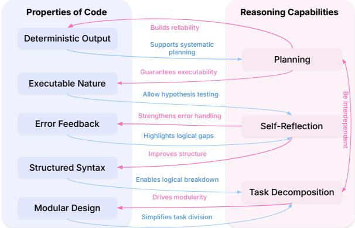
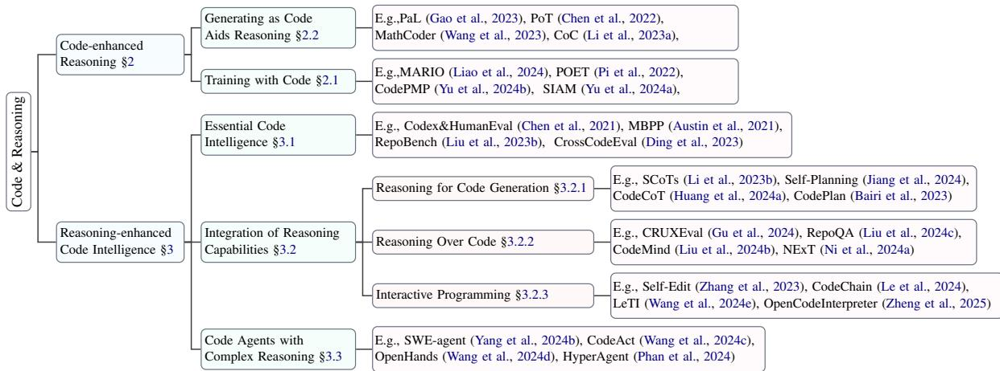
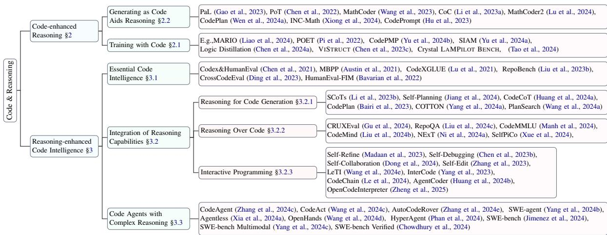

# Code to Think, Think to Code: A Survey on Code-Enhanced Reasoning and Reasoning-Driven Code Intelligence in LLMs

Dayu Yangç\* Tianyang LiuÈ\* Daoan Zhang\* Antoine Simoulinç Xiaoyi Liuç Yuwei Caoç Zhaopu Tengç Xin Qianç Grey Yangç† Jiebo Luo† Julian McAuleyȆ

çMeta AI ÈUniversity of California, San Diego University of Rochester

dayu@udel.edu

{antoinesimoulin,xiaoyiliu,yuweicao,zhaoputeng,xinqian,glyang}@meta.com {til040,jmcauley}@ucsd.edu {daoan.zhang,jluo}@rochester.edu

## Abstract

In large language models (LLMs), code and reasoning reinforce each other: code offers an abstract, modular, and logic-driven structure that supports reasoning, while reasoning translates high-level goals into smaller, executable steps that drive more advanced code intelligence. In this study, we examine how code serves as a structured medium for enhancing reasoning: it provides verifiable execution paths, enforces logical decomposition, and enables runtime validation. We also explore how improvements in reasoning have transformed code intelligence from basic completion to advanced capabilities, enabling models to address complex software engineering tasks through planning and debug ging. Finally, we identify key challenges and propose future research directions to strengthen this synergy, ultimately improving LLM’s performance in both areas.

## 1 Introduction

Researchers have observed an intriguing “Möbius strip” effect: learning programming strengthens students’ ability to solve complex problems, while strong analytical skills in turn speed up programming learning (Brito et al., 2019). This virtuous cycle now appears in artificial intelligence: When LLMs acquire code capabilities, they not only become more proficient programmers but also demonstrate significantly enhanced reasoning abilities across diverse domains such as mathematical deduction and logical inference. As their reasoning capacity evolves, these systems increasingly tackle complex programming challenges, even showing potential to outpace human developers (Chowdhury et al., 2024). Recent breakthrough models like OpenAI-o1 (OpenAI et al., 2024) and DeepSeek-R1 (Guo et al., 2025) show powerful task-solving capabilities, particularly advances in reasoning. A key factor driving this transformation has been the strategic integration of code - both during pretraining phases (Touvron et al., 2023) and reasoning processes (Chen et al., 2022). The rigorous logical structure of code provides a unique “training ground” for strengthening LLMs’ reasoning capabilities, while AI’s evolving reasoning abilities continuously enhance code intelligence. This bidirectional relationship reveals profound intrinsic connections between coding and reasoning (see Figure 1).

  
Figure 1: Bidirectional enhancement between code properties and reasoning capabilities.

In this bidirectional enhancement process, core properties of code - including structured syntax, execution feedback, and modular design - significantly promote task decomposition, reasoning chain construction, and self-reflection (§2.2). Conversely, improved reasoning capabilities drive advances in code intelligence, such as task decomposition, code comprehension and modification, program debugging and optimization, ultimately giving rise to intelligent agents capable of end-toend software development (§3.2, §3.3). For instance, advanced reasoning techniques like Chainof-Thought prompting (Wei et al., 2022b; Zhang et al., 2024b) and Self-Reflection (Shinn et al., 2024) are expanding code generation from simple autocompletion to intelligent software development assistants (Labs, 2024; Yang et al., 2024d), even capable of managing complete software engineering lifecycles (Jimenez et al., 2024).

Despite these promising strides, there has been limited systematic review of how code and reasoning interact and reinforce each other. To address this gap and provide a structured view of the codereasoning synergy in LLMs, we pose the following core questions: (1) How do code representations influence LLM reasoning? (2) How do advances in LLM reasoning reshape code intelligence systems? (3) What challenges arise from the code reasoning interplay in LLMs?

To systematically investigate these questions, our research unfolds along the following dimensions: (i) analyzing how code serves as an effective reasoning medium, helping LLMs structure their reasoning and validate results (§2); (ii) exploring how enhanced reasoning capabilities expand the boundaries of code intelligence (§3); and (iii) summarizing current challenges, focusing on open problems in model interpretability, scalable training, and multimodal fusion, while proposing future research directions (§A).

## 2 Code-enhanced Reasoning

## 2.1 Training with Code

Code data strengthens LLMs’ reasoning and planning abilities by providing structured patterns that guide logical thinking (Touvron et al., 2023; Achiam et al., 2023; Hu et al., 2024). This section examines how code data enhances these capabilities and discusses effective strategies for integrating code into LLM training.

## 2.1.1 Empowering Reasoning and Planning Through Code Training

Code-trained LLMs excel across various domains. In commonsense reasoning, Madaan et al. (2022) treats structured commonsense tasks as code generation problems, showing notable gains even when downstream tasks do not explicitly involve code. In mathematics, MathCoder (Wang et al., 2023) interleaves natural language, code, and execution results to improve mathematical reasoning. Its successor, MathCoder2 (Lu et al., 2024), further refines these abilities with a higher-quality pre-training dataset that embeds mathematical reasoning steps in code.

Training on code also bolsters planning and decision-making. Chen et al. (2024a) used larger models to break down complex instructions into discrete functions, creating a function base for training smaller LLMs in structured planning. The dataset enables smaller models to acquire the planning and decision-making capabilities of their larger counterparts. Likewise, Wen et al. (2024a) curated a dataset of 2M standard prompt-responsecode form plan triplets (prompt, response, code) to enhance models’ planning and decision-making.

In the multimodal domain, VISTRUCT (Chen et al., 2023c) utilizes the structure of programming it learned from code training to represent visual structural knowledge. This approach allows the model to capture structural information at different levels of granularity within images, enabling visual language models (VLMs) to better understand complex visual structures. This exemplifies how structured data, such as code, can serve as an excellent medium for visual data representation.

Code-trained LLMs and VLMs also shine in realworld scenarios. In multilingual environment settings, code acts as a bridge between languages.(Li et al., 2024a) augments code datasets with machinetranslated multilingual comments during training while preserving original code. Their approach uses step-by-step code primitives in prompts to derive facts and solutions, demonstrating code’s effectiveness in multilingual reasoning. In autonomous driving, LAMPILOT (Ma et al., 2024) achieves remarkable results by generating code based on user instructions and leveraging established functional primitives to replace ambiguous natural language commands. The approach showed exceptional results on the custom-built LAMPILOT BENCH. These applications highlight code data training’s vast potential for reasoning and planning across real-world scenarios and environments.

## 2.1.2 Training Strategies Based on Code

Code-based LLMs have shown remarkable performance across domains. Here, we examine effective strategies for leveraging code data during model training to enhance their capabilities.

Code-only Training Strategies Incorporating code execution into traditional reasoning datasets boosts LLM performance. MARIO (Liao et al., 2024) leverages both LLMs and human annotations to augments GSM8K (Cobbe et al., 2021a) and MATH (Hendrycks et al., 2021b) with Python interpreter traces, yielding significant downstream gains. Similarly, POET (Pi et al., 2022) uses programs and execution results to train LLMs, showing improved natural language reasoning capabilities. Furthermore, incorporating human preferences enhances training effectiveness (Ding et al., 2024; Zhang et al., 2024a), CodePMP (Yu et al., 2024b) introduces a preference model pretraining pipeline using large-scale synthesized code-preference datasets, improving fine-tuning efficiency and reasoning performance. SIAM (Yu et al., 2024a) employs a codebased critic model to guide dataset construction through code generation and quality control, optimizing downstream performance.

Figure 2: Taxonomy of interplay between Code and Reasoning.
<table><tr><td>Method Type</td><td>Method</td><td>Model</td><td>GSM8K</td><td>SVAMP</td><td>MATH</td></tr><tr><td rowspan="2">Baseline</td><td>Direct†</td><td>Codex</td><td>19.7</td><td>69.9</td><td></td></tr><tr><td>CoT† (Wei et al., 2022b)</td><td>GPT-4</td><td>92.0</td><td>97.0</td><td>一</td></tr><tr><td rowspan="2">Single Execution</td><td>PAL (Gao et al., 2023)</td><td>Codex</td><td>72.0</td><td>79.4</td><td></td></tr><tr><td>PoT (Chen et al., 2022)</td><td>GPT-4</td><td>97.2</td><td>97.4</td><td>一</td></tr><tr><td rowspan="4">Dynamic Code-Language</td><td>MathCoder-L (Wang et al., 2023)</td><td>Llama-2-70B</td><td>83.9</td><td>84.9</td><td>45.1</td></tr><tr><td>MathCoder-CL (Lu et al., 2024)</td><td>CodeLlama-34B</td><td>81.7</td><td>82.5</td><td>45.2</td></tr><tr><td>CodePlan (Wen et al., 2024a)</td><td>Mistral-7B</td><td>59.5</td><td>61.4</td><td>34.3</td></tr><tr><td>INC-Math (Xiong et al., 2024)</td><td>GPT-4o-mini</td><td>一</td><td>一</td><td>51.4</td></tr><tr><td rowspan="2">Non-Executable</td><td>CoC (Li et al., 2023a)</td><td>text-davinci-003</td><td>71.0</td><td></td><td></td></tr><tr><td>CodePrompt (Hu et al., 2023)</td><td>GPT-3.5 (few-shot)</td><td>80.6</td><td>79.6</td><td></td></tr></table>

Table 1: Performance comparison of BEST-performing variants of code-aided reasoning methods across three key benchmarks (GSM8K (Cobbe et al., 2021a), SVAMP (Patel et al., 2021), and MATH (Hendrycks et al., 2021b)). Results show the percentage of problems solved correctly. “–” indicates no reported result. For each method, only the variant with highest GSM8K performance is shown (or highest MATH score when GSM8K is unavailable). † "Direct" and "CoT" uses Codex model using few-shot direct prompting with/without CoT. The results are from Chen et al. (2022).

Hybrid-data Training Strategies Determining the optimal stage and proportion of code data in training LLMs is critical (Tao et al., 2024). Ma et al. (2023) and Zhang et al. (2024d) indicate that adding code during pretraining boosts general reasoning abilities, while adding code instructions during instruction tuning improves code-specific skills and adherence to human instructions. Mixing text and code data dynamically fosters progressive reasoning enhancements throughout training. Additionally, Zhang et al. (2024d) further finds that the effects of code data differ across reasoning domains but exhibit consistent trends within each domain. They conclude that optimal code mixing strategies are typically domain-specific rather than universal.

## 2.2 Generating as Code Aids Reasoning

We examine how generating code and code-based training enhance LLMs’ reasoning. By transforming reasoning problems into programmatic solutions, these approaches improve precision and reliability in complex reasoning tasks. The performance of major methods are listed in Table 1.

<table><tr><td>Method Type</td><td>Method</td><td>Model</td><td>HumanEval</td><td>MBPP</td><td>SWE-Bench (Lite)</td></tr><tr><td rowspan="2">Baseline</td><td>Direct†</td><td>Codex</td><td>48.1</td><td>49.8</td><td></td></tr><tr><td>CoT† (Wei et al., 2023a)</td><td>Codex</td><td>53.9</td><td>54.5</td><td></td></tr><tr><td rowspan="3">Reasoning-enhanced</td><td>SCoTs (Li et al., 2023b)</td><td>GPT-3.5</td><td>60.6</td><td>47.0</td><td></td></tr><tr><td>Self-Planning (Jiang et al., 2024)</td><td>Codex</td><td>60.3</td><td>55.7</td><td></td></tr><tr><td>CodeCoT (Huang et al., 2024a)</td><td>GPT-3.5</td><td>79.3</td><td>89.5</td><td></td></tr><tr><td rowspan="4">Interactive</td><td>Self-Edit† (Zhang et al., 2023)</td><td>GPT-3.5</td><td>62.2</td><td>52.4</td><td></td></tr><tr><td>Self-Debugging (Chen et al., 2023b)</td><td>GPT-4</td><td>一</td><td>80.6</td><td></td></tr><tr><td>Self-Collaboration (Dong et al., 2024)</td><td>GPT-3.5</td><td>74.4</td><td>68.2</td><td></td></tr><tr><td>AgentCoder (Huang et al., 2024b)</td><td>GPT-4</td><td>96.3</td><td>91.8</td><td></td></tr><tr><td rowspan="2">Fine-tuned</td><td>CodeAct (Wang et al., 2024c)</td><td>Mistral-7B</td><td>34.7</td><td>59.1</td><td>1</td></tr><tr><td>OpenCodeInterpreter (Zheng et al., 2025)</td><td>DeepseekCoder-33B</td><td>92.7</td><td>90.5</td><td></td></tr><tr><td rowspan="5">Agentic</td><td>SWE-agent (Yang et al., 2024b)</td><td>GPT-4 Turbo</td><td></td><td></td><td>18.0</td></tr><tr><td>AutoCodeRover (Zhang et al., 2024e)</td><td>GPT-4</td><td></td><td></td><td>19.0</td></tr><tr><td>OpenHands (Wang et al., 2024d)</td><td>Claude-3.5-Sonnet</td><td></td><td></td><td>26.0</td></tr><tr><td>HyperAgent (Phan et al., 2024)</td><td>Claude-3.5-Sonnet</td><td></td><td></td><td>26.0</td></tr><tr><td>Agentless‡ (Xia et al., 2024a)</td><td>GPT-40</td><td></td><td></td><td>27.3</td></tr></table>

Table 2: Performance comparison of reasoning-enhanced code intelligence methods across benchmarks. Results reflect best performance from original papers except where noted (†results from Self-Planning (Jiang et al., 2024) for Direct and CoT, and from CodeCoT (Huang et al., 2024a) for Self-Edit). ‡Agentless represents an agent-free approach, while listed under Agentic methods for organization, HumanEval and MBPP use pass@1 scoring, and “–” denotes unavailable or inapplicable results.

## 2.2.1 Single Execution

The approaches in this subsection focus on transforming numerical problem-solving into singleexecution code generation tasks. Chen et al. (2022); Gao et al. (2023) introduced Program of Thoughts (PoT) and Program-aided language models (PaL), transforming numerical problem-solving into single-execution code generation tasks. Unlike chain-of-thought’s natural language steps (Wei et al., 2023a), these approaches express the entire reasoning process as a self-contained executable program, providing a deterministic path to solutions while minimizing calculation errors. Bi et al. (2023) investigated when this code-based transformation enhances reasoning, finding that PoT and PaL’s effectiveness depends on code complexity. Their analysis revealed that code transformation benefits vary across problem types.

Beyond accuracy, a crucial feature of LLM systems is their ability to provide dependable confidence estimates for their predictions. Kabra et al. (2023) investigates this aspect and demonstrates that program-aided reasoning approaches, where LLMs utilize code representation, generally exhibit superior calibration compared to standard textbased reasoning methods that rely on CoT.

## 2.2.2 Dynamic Code-Language Integration

Beyond single, monolithic code outputs, many recent studies explored dynamic and interactive ways to integrate natural language with code representation, leveraging the strengths of both modalities in a more fluid and often iterative manner.

Wang et al. (2023), for example, fine-tunes models to produce solutions that integrate natural language explanations, Python code for computations, and the corresponding execution results from a code interpreter. Special tokens are employed to delineate these different components, enabling the model to generate a segment, observe its (execution) outcome, and then continue reasoning or coding based on that outcome. Building on this, Lu et al. (2024) emphasizes Tool-Integrated Reasoning (TIR), where models use integrated natural language reasoning steps and Python code, generating mathematical code explicitly paired with natural language reasoning steps during pretraining.

Other approaches focuses on enabling LLMs to choose or switch between different reasoning modalities or to decompose problems into subtasks that requires different integration strategies. Xiong et al. (2024) explores methods where the LLM can dynamically select the most appropriate reasoning strategy among options like using only natural language (Chain-of-Thought), only code (Program-aided Language Models), generating code first then analyzing with natural language (CodeNL), or vice-versa. Similarly, Chen et al. (2024b) investigates methods to guide LLMs in choosing between code generation/execution and textual reasoning, noting that OpenAI’s Code Interpreter allows models to iteratively generate code and text. This work also proposes methods like "Code + Text + Sum.", where both code and text solutions are generated and then synthesized, and "Self-estimate Score", where the LLM assesses its confidence to choose the modality.

Interactive and iterative frameworks are a significant direction in dynamic integration. Liu et al. (2024a) allows LLMs to solve tasks by interacting with a Read-Eval-Print Loop, where the model writes code and dynamically corrects errors or handles fuzzy sub-problems in natural language. This mirrors how human developers iteratively write code, test, and reason about the next step. Yang et al. (2024e) introduces a task where an LLM solves problems by iteratively identifying sub-problems and their corresponding formalisms, then writing suitable programs guided by a natural language trajectory of thought, action, and observation.

Planning also plays a crucial role in structuring this dynamic integration.Lei et al. (2024) structures this with two distinct phases: a solution generation phase that formulates and verifies a solution plan against visible tests, and a code implementation phase that drafts an initial code based on the verified plan and refines it if it fails tests, using the plan verification to inform the debugging process.

## 2.2.3 Non-Executable Program Representations

The benefit of code/code-like representations is not limited to executable programs. Non-executable or partially executable code forms can still enhance reasoning.

One prominent direction is the use of pseudocode or code with semantic gaps that the LLM learns to "execute" or reason over. Li et al. (2023a) introduced Chain of Code (CoC), where LMs generate programs that can include semantic sub-tasks formatted as flexible pseudocode. An "LMulator" – the LM acting as an emulator – simulates the expected output of that code segment. This allows CoC to handle tasks that mix precise algorithmic computations with more semantic or commonsense reasoning steps that are difficult to fully implement in executable code. The COGEX framework (Weir et al., 2024) trains LMs to generate and then emulate the execution of "pseudo-programs". These are often Python programs where some leaf function calls might be undefined or only specified by their name and documentation, without full implementations. The LM’s own knowledge is used to fill in these execution gaps during the emulation phase, allowing the model to handle undefined functions. Similarly, Puerto et al. (2024) proposed "code prompting," where a natural language problem is converted into a code format that includes the logical structure and the original natural language text as comments. The LLM is then prompted with this generated code and produces a natural language answer directly, without the code being run by an interpreter. These methods investigate how the code representation itself can elicit or enhance specific reasoning abilities like entity tracking or logical reasoning within the LLM.

Another approach involves generating high-level, structured, but not necessarily directly executable, plans in a code-like format. The CODEPLAN framework (Wen et al., 2024a) empowers LLMs to generate and follow "code-form plans," which are essentially pseudocode outlining a high-level, structured reasoning process. These plans are not mandated to be executable; their primary purpose is to provide a structured blueprint that captures the semantics and control flow for sophisticated reasoning tasks.

## 3 Reasoning-Enhanced Code Intelligence

Software development fundamentally requires intensive reasoning capabilities as developers decompose complex problems and rigorously analyze system behaviors and edge cases (Hermans, 2021). Recent advances in LLMs have dramatically improved code generation capabilities (Chen et al., 2021; Rozière et al., 2024; Li et al., 2023c; Team et al., 2024; DeepSeek-AI et al., 2024; Hui et al., 2024; Li et al., 2022), and their growing integration with reasoning capabilities has transformed code intelligence systems (Austin et al., 2021; Yang et al., 2024b). This section examines the evolution of code intelligence through three stages: direct code generation’s limitations, explicit reasoning integration for code generation and comprehension, and the emergence of code agents for complex endto-end development. The performance of major methods are listed in Table 2.

## 3.1 Essential Code Intelligence

The foundation of modern code intelligence emerged with LLMs trained on code repositories, initially focusing on direct sequence prediction tasks like auto code completion, e.g.,

<table><tr><td>Type</td><td>Model</td><td>Settings</td><td>Size</td><td>Metric</td><td colspan="3">Datasets</td></tr><tr><td rowspan="3">Math</td><td></td><td></td><td></td><td></td><td>GSM8K</td><td>MATH</td><td>OCW</td></tr><tr><td>Lemma</td><td>Baseline</td><td>34B</td><td>EM</td><td>51.5</td><td>25.0</td><td>11.8</td></tr><tr><td>MARIO (Liao et al., 2024)</td><td>Proposed</td><td>34B</td><td>EM</td><td>78.2(+26.7)</td><td>53.5(+28.5)</td><td>30.2(+18.4)</td></tr><tr><td rowspan="3">Common Sense Logic</td><td></td><td></td><td></td><td></td><td>HotpotQA</td><td>LogiQA</td><td>DROP</td></tr><tr><td>RoBERTa-L</td><td>Baseline</td><td>355M</td><td>EM</td><td>67.6</td><td>36.7</td><td>78.1</td></tr><tr><td>POET (Pi et al., 2022)</td><td>Proposed</td><td>355M</td><td>EM</td><td>68.7(+1.1)</td><td>38.9(+2.2)</td><td>79.8(+1.7)</td></tr><tr><td rowspan="3">Math Logic</td><td></td><td></td><td></td><td></td><td>MathShepherd-pair</td><td>Reclor-pair</td><td>LogiQA2.0-pair</td></tr><tr><td>Qwen2-7B</td><td>Baseline</td><td>7B</td><td>Reward</td><td>0.88</td><td>0.86</td><td>0.83</td></tr><tr><td>CodePMP (Yu et al., 2024b)</td><td>Proposed</td><td>7B</td><td>Reward</td><td>0.93(+0.5)</td><td>0.87(+0.1)</td><td>0.84(+0.1)</td></tr><tr><td rowspan="3">Math Multi-lingual</td><td></td><td></td><td></td><td></td><td>APE</td><td>CMATH</td><td>GSM8K</td></tr><tr><td>Qwen2-Math</td><td>Baseline</td><td>7B</td><td>Reward</td><td>83.4</td><td>87.3</td><td>79.5</td></tr><tr><td>SIAM (Yu et al., 2024a)</td><td>Proposed</td><td>7B</td><td>Reward</td><td>88.1(+4.7)</td><td>93.2(+5.9)</td><td>81.5(+2.0)</td></tr><tr><td rowspan="3">Instruction-Following Decision-Making</td><td></td><td></td><td></td><td></td><td>AlpacaEval-2</td><td>MT-Bench</td><td>ALFWorld</td></tr><tr><td>Llama-2</td><td>Baseline</td><td>13B</td><td>Self-defined</td><td>6.5</td><td>6.1</td><td>23.2</td></tr><tr><td>CODEPLAN (Wen et al., 2024a)</td><td>Proposed</td><td>13B</td><td>Self-defined</td><td>12.2(+5.7)</td><td>7.1(+1.0)</td><td>33.3(+10.1)</td></tr></table>

Table 3: Performance enhancement brought by training the model with code related data. "Baseline" denotes the vanilla model, while "Proposed" refers to the proposed methods.

CodeXGLUE (Lu et al., 2021), and docstringbased generation, e.g., HumanEval (Chen et al., 2021) and MBPP (Austin et al., 2021). These base models demonstrated capabilities in nextline prediction, fill-in-the-middle (FIM), and program synthesis (Chen et al., 2021; Xu et al., 2022; Bavarian et al., 2022; Fried et al., 2023; Li et al., 2023c), later extending to repository-level tasks like RepoBench (Liu et al., 2023b) and Cross-CodeEval (Ding et al., 2023). While these models excelled at simple tasks like code completion (GitHub, 2024), their reliance on direct generation without explicit reasoning limited their effectiveness in complex scenarios requiring careful consideration of algorithmic design and edge case handling, or real-world programming scenarios that demand systematic planning.

## 3.2 Integration of Reasoning Capabilities

Modern models typically exhibit two key reasoning types when working with code: reasoning to code, which involves planning and problem decomposition prior to implementation, and reasoning over code, which focuses on understanding code behavior and properties. These reasoning forms naturally converge in interactive programming, where systems must both reason about what code to generate and analyze execution results to guide fixes, optimizations, and capability expansions. This section explores how these reasoning capabilities have developed and synergized to build more sophisticated code intelligence systems.

## 3.2.1 Reasoning for Code Generation

The integration of explicit reasoning has transformed code intelligence systems through advances in CoT (Wei et al., 2023a), instruction tuning (Wei et al., 2022a; Muennighoff et al., 2024; Luo et al., 2023) and reinforcement learning (OpenAI et al., 2024; DeepSeek-AI et al., 2025). Models have evolved from basic code completion tools (GitHub, 2024), to applications with basic dialogue capabilities (OpenAI, 2023), and finally to sophisticated reasoning engines that combine planning, reasoning and critical thinking to arrive at solutions (OpenAI et al., 2024), excelling at complex programming tasks.

Models adopt CoT reasoning as the core strategy, generating step-by-step thoughts before implementing code. Basic CoT improves code generation by articulating intermediate logic, while recent advancements adapt it to programming contexts, structuring reasoning around programmatic constructs (e.g., loops, conditionals) for correctness (Li et al., 2023b), decomposing solutions into reusable modules for iterative refinement (Huang et al., 2024a), and integrating problem decomposition for debugging (Wen et al., 2024b). Models also generate natural language plans to guide implementation, ensuring alignment between intent and code logic (Jiang et al., 2024; Wang et al., 2024a). These strategies extend to resource-efficient scenarios, where lightweight models generate CoT steps through automated alignment frameworks (Yang et al., 2024a), and to repository-level tasks, combining multi-step planning with static dependency analysis and code editing (Bairi et al., 2023). By integrating CoT with modular reasoning and contextaware planning, modern models achieve higher correctness and robustness in complex scenarios.

## 3.2.2 Reasoning Over Code

While reasoning capabilities improve code generation, the ability to reason over code - understanding its behavior, predicting its execution, and analyzing its properties - remains a fundamental challenge in code intelligence. Unlike natural language, code’s combination of rigid syntax with complex runtime behaviors demands comprehension of both static forms and dynamic execution, further complicated by external dependencies. Empirical studies show models can generate syntactically correct code while failing to grasp semantic meaning (Zhu et al., 2024), highlighting the gap between surface manipulation and true understanding.

## 3.2.3 Interactive Programming

Recent researches enabled LLMs to autonomously evaluate and improve their outputs, with Self-Refine (Madaan et al., 2023) demonstrated how models can generate, critique, and optimize outputs. In code development, this mechanism gains unique advantages via the executable nature of code which provides immediate, objective feedback that triggers new reasoning cycles. Specifically, interactive programming forms a reasoning-driven optimization loop: models first reason to generate code for execution, then analyze execution results to understand errors or improvement directions, ultimately reasoning about better solutions. This embraces software development’s iterative nature, advancing beyond traditional one-pass generation.

Early explorations in interactive program synthesis demonstrated feedback’s potential(Le et al., 2017), the emergence of LLMs catalyzed evolution to autonomous refinement: Self-Edit developed a fault-aware code editor leveraging execution results for iterative error correction (Zhang et al., 2023), while InterCode established a comprehensive benchmark environment and standardized interactive coding as a reinforcement learning problem (Yang et al., 2023). Recent advances have further refined this paradigm: CodeChain introduced self-revision mechanism that modularizes code generation and systematically improves solutions through targeted refinement chains (Le et al., 2024), LeTI demonstrated improvement through natural language feedback (Wang et al., 2024e), and OpenCodeInterpreter unified generation, execution, and refinement in one framework (Zheng et al., 2025). Systematic analysis reveals these methods’ effectiveness heavily depends on models’ ability to reason about program behavior and execution feedback (Zheng et al., 2024b). This evolution has laid crucial groundwork for code agents capable of handling complex programming tasks.

## 3.3 Code Agents with Complex Reasoning

The convergence of code reasoning paradigms – planning and decomposition, context-aware understanding, and interactive programming – has enabled the evolution of code intelligence systems into autonomous code agents (Labs, 2024; Anysphere, 2023; Wang et al., 2024d). These agents handle complex development tasks by decomposing tasks and formulating execution plans, translating abstract solutions into concrete environmental actions through predefined tools (e.g., IDE operations, terminal commands), and continuously monitoring execution states while gathering environmental feedback to reach goals. Unlike static code generators, these agents treat development as a dynamic decision cycle by interacting with the environment, with reasoning applied throughout—from understanding requirements and taking appropriate actions to evaluating outcomes.

SWE-bench established a comprehensive evaluation framework based on real GitHub issues (Jimenez et al., 2024), later expanded with SWE-bench Multimodal (Yang et al., 2024c) incorporating visual software tasks and SWE-bench Verified (Chowdhury et al., 2024) enhancing evaluation reliability through rigorous test case validation. These evaluations revealed persistent challenges in code intelligence: effective reasoning about program structure and behavior, safe and effective codebase navigation and modification, and maintaining coherent long-term planning across development iterations.

Modern code agents share a common foundation in environment interaction, while each contributing unique implementation focuses. CodeAct (Wang et al., 2024c) pioneered executable agent behaviors through Python interpreter, enabling dynamic debugging workflows, and OpenHands (Wang et al., 2024d) extended it by providing a flexible agent infrastructure supporting customizable tool chains. SWE-agent (Yang et al., 2024b) focused on optimizing repository navigation through Agent-Computer Interface, CodeAgent (Zhang et al., 2024c) combined tool specialization with strategic frameworks, coordinating multiple repositorylevel operations and AutoCodeRover (Zhang et al., 2024e) introduced spectrum-based fault localization to guide context retrieval.

Recent advances have explored two contrasting directions: multi-agent systems and agent-free approaches. HyperAgent (Phan et al., 2024) coordinates specialized agents for planning, navigation, editing, and execution, demonstrating how different reasoning capabilities can be hierarchically orchestrated. In contrast, Agentless (Xia et al., 2024a) achieves effectiveness through simplification - employing a focused two-phase process for fault localization and repair without complex agent architectures. Empirical evaluations show that, compared to humans, these approaches reduce code redundancy, with effective task decomposition being key to success, (Chen and Jiang, 2024), though matching human-level performance remains challenging.

## 4 Challenges and Future Directions

The synergy between code and reasoning in LLMs, while powerful, faces several challenges that also outline future research avenues. The full discussion is available in Appendix A.

## 4.1 Code-enhanced Reasoning

Key challenges include the lack of interpretability and debuggability of LLM-generated code, which may not reflect true reasoning and lacks reliable confidence assessment (Li et al., 2023a; Kabra et al., 2023). Future work should focus on selfreflection mechanisms (Chen et al., 2024b) and formal verification (Kang et al., 2025). Blended code-and-language reasoning is crucial for tasks requiring both precision and contextual understanding, necessitating hybrid architectures that interleave modalities (Li et al., 2023a; Liu et al., 2024a). Optimizing code data and representations involves finding the right complexity balance to aid LLM learning without oversimplifying reasoning steps (Bi et al., 2023).

Further, the lack of scalability and generalization due to task-specific fine-tuning (Wang et al., 2023) and narrow data domains calls for improved zero/few-shot learning (Chen et al., 2022) and cross-domain training. LLMs also show difficulty with complex or abstract tasks requiring commonsense or semantic interpretation, where code can be detrimental (Li et al., 2023a); context-aware, adaptive architectures are needed (Chen et al., 2024b). The lack of highquality datasets, with many models relying on noisy GitHub data (DeepSeek-AI et al., 2024), underscores the need for cleaner, diverse data curation. Finally, tool usage based on code format requires standardized approaches for LLMs to invoke tools via automated code generation, moving beyond simple APIs (Qin et al., 2023).

## 4.2 Reasoning-enhanced Code Intelligence

Challenges in this area include large-scale code understanding, where increased context length doesn’t always improve comprehension, especially with dispersed information (Li et al., 2024b), requiring a balance of context expansion and RAG. Long-form code generation beyond single functions is difficult to evaluate and prone to error accumulation, with current training optimizing for long-context understanding rather than coherent long-form output (Wu et al., 2025). The applicability of new reasoning models in code agents is another concern, as models like O1/R1 show limited agent task improvement (OpenAI et al., 2024; DeepSeek-AI et al., 2025), possibly due to misaligned agent frameworks or inherent limitations of these models in agentic tasks.

Balancing autonomy and control in code agents is critical, especially regarding safety with direct code execution (Guo et al., 2024a). Multimodal code intelligence is increasingly important for UI/UX tasks (Yun et al., 2024), requiring models that can process visual specifications (Abe et al., 2024; Zheng et al., 2024a). Reinforcement learning for code models offers promise due to objective feedback from code execution, potentially enhancing reasoning depth through CoTguided learning (DeepSeek-AI et al., 2025). Lastly, the innovation and refinement of evaluations are perpetual necessities as models master existing benchmarks (McIntosh et al., 2024), requiring new benchmarks that resist contamination (Riddell et al., 2024) and assess broader aspects like code quality (da Silva Simões and Venson, 2024).

## 5 Conclusion

The synergy between code and reasoning has driven significant advancements in AI, with code enhancing logical reasoning and reasoning improving code intelligence. This survey explored how executable programs and structured code paths refine AI reasoning while highlighting how reasoning abilities enables advanced code generation, comprehension, and debugging. Despite progress, challenges such as ambiguity, scalability, and consistency remain. Future research must deepen the integration of reasoning and programming to build more robust, interpretable, and adaptive AI systems. As these fields converge, AI’s ability to think and code will continue to evolve, reshaping intelligent automation.

## 6 Limitations

Our survey spans a wide range of approaches, from single-execution code-based reasoning (§2.2) to advanced autonomous code agents (§3.3), which compels us to keep certain implementation details and domain-specific nuances only briefly described. The decision to focus on recent arXiv categories and a confined publication window excludes older or less mainstream work that could offer alternative perspectives or historical context. Coverage of benchmarks mentioned in §3.2.2 and §3.3—CRUXEval, CodeMMLU, RepoQA, and SWE-bench—remains incomplete with respect to real-world repository-scale tasks or specialized areas such as concurrency analysis and security verification. The challenges identified in §4 reflect ongoing research gaps rather than definitive conclusions, and future developments in datasets, model architectures, and evaluation protocols may prompt revisions or expansions of this survey.

## References

Yoshia Abe, Tatsuya Daikoku, and Yasuo Kuniyoshi. 2024. Assessing the aesthetic evaluation capabilities of gpt-4 with vision: Insights from group and individual assessments. Preprint, arXiv:2403.03594.

Josh Achiam, Steven Adler, Sandhini Agarwal, Lama Ahmad, Ilge Akkaya, Florencia Leoni Aleman, Diogo Almeida, Janko Altenschmidt, Sam Altman, Shyamal Anadkat, et al. 2023. Gpt-4 technical report. arXiv preprint arXiv:2303.08774.

Anthropic. 2024. Introducing computer use, a new claude 3.5 sonnet, and claude 3.5 haiku. Blog post. Accessed: 2025-02-12.

Anysphere. 2023. Cursor: An ai-powered integrated development environment. https://www.cursor. com. Accessed: 2025-01-30.

Jacob Austin, Augustus Odena, Maxwell Nye, Maarten Bosma, Henryk Michalewski, David Dohan, Ellen Jiang, Carrie Cai, Michael Terry, Quoc Le, and Charles Sutton. 2021. Program synthesis with large language models. Preprint, arXiv:2108.07732.

Ramakrishna Bairi, Atharv Sonwane, Aditya Kanade, Vageesh D C, Arun Iyer, Suresh Parthasarathy, Sriram Rajamani, B. Ashok, and Shashank Shet. 2023. Codeplan: Repository-level coding using llms and planning. Preprint, arXiv:2309.12499.

Mohammad Bavarian, Heewoo Jun, Nikolas Tezak, John Schulman, Christine McLeavey, Jerry Tworek, and Mark Chen. 2022. Efficient training of language models to fill in the middle. Preprint, arXiv:2207.14255.

Zhen Bi, Ningyu Zhang, Yinuo Jiang, Shumin Deng, Guozhou Zheng, and Huajun Chen. 2023. When do program-of-thoughts work for reasoning? arXiv preprint arXiv:2308.15452.

Markus Borg, Dave Hewett, Donald Graham, Noric Couderc, Emma Söderberg, Luke Church, and Dave Farley. 2024. Does co-development with ai assistants lead to more maintainable code? a registered report. Preprint, arXiv:2408.10758.

Luciana Pereira Brito, Leandro Silva Almeida, and António José Meneses Osório. 2019. Reasoning abilities and learning math: A möbius strip? International Electronic Journal ofMathematics Education, 15(2):em0565.

Dong Chen, Shilin Zhang, Fei Gao, Yueting Zhuang, Siliang Tang, Qidong Liu, and Mingliang Xu. 2024a. Logic distillation: Learning from code function by function for planning and decision-making. arXiv preprint arXiv:2407.19405.

Mark Chen, Jerry Tworek, Heewoo Jun, Qiming Yuan, Henrique Ponde de Oliveira Pinto, Jared Kaplan, Harri Edwards, Yuri Burda, Nicholas Joseph, Greg Brockman, Alex Ray, Raul Puri, Gretchen Krueger, Michael Petrov, Heidy Khlaaf, Girish Sastry, Pamela Mishkin, Brooke Chan, Scott Gray, Nick Ryder, Mikhail Pavlov, Alethea Power, Lukasz Kaiser, Mohammad Bavarian, Clemens Winter, Philippe Tillet, Felipe Petroski Such, Dave Cummings, Matthias Plappert, Fotios Chantzis, Elizabeth Barnes, Ariel Herbert-Voss, William Hebgen Guss, Alex Nichol, Alex Paino, Nikolas Tezak, Jie Tang, Igor Babuschkin, Suchir Balaji, Shantanu Jain, William Saunders, Christopher Hesse, Andrew N. Carr, Jan Leike, Josh Achiam, Vedant Misra, Evan Morikawa, Alec Radford, Matthew Knight, Miles Brundage, Mira Murati, Katie Mayer, Peter Welinder, Bob McGrew, Dario Amodei, Sam McCandlish, Ilya Sutskever, and Wojciech Zaremba. 2021. Evaluating large language models trained on code. Preprint, arXiv:2107.03374.

Shouyuan Chen, Sherman Wong, Liangjian Chen, and Yuandong Tian. 2023a. Extending context window of large language models via positional interpolation. Preprint, arXiv:2306.15595.

Wenhu Chen, Xueguang Ma, Xinyi Wang, and William W. Cohen. 2022. Program of thoughts

prompting: Disentangling computation from reasoning for numerical reasoning tasks. arXiv preprint arXiv:2211.12588.

Xinyun Chen, Maxwell Lin, Nathanael Schärli, and Denny Zhou. 2023b. Teaching large language models to self-debug. Preprint, arXiv:2304.05128.

Yangyi Chen, Xingyao Wang, Manling Li, Derek Hoiem, and Heng Ji. 2023c. Vistruct: Visual structural knowledge extraction via curriculum guided code-vision representation. arXiv preprint arXiv:2311.13258.

Yongchao Chen, Harsh Jhamtani, Srinagesh Sharma, Chuchu Fan, and Chi Wang. 2024b. Steering large language models between code execution and textual reasoning. arXiv preprint arXiv:2410.03524.

Zhi Chen and Lingxiao Jiang. 2024. Evaluating software development agents: Patch patterns, code quality, and issue complexity in real-world github scenarios. Preprint, arXiv:2410.12468.

Neil Chowdhury, James Aung, Chan Jun Shern, Oliver Jaffe, Dane Sherburn, Giulio Starace, Evan Mays, Rachel Dias, Marwan Aljubeh, Mia Glaese, Carlos E. Jimenez, John Yang, Kevin Liu, and Aleksander Madry. 2024. Introducing SWEbench verified. https://openai.com/index/ introducing-swe-bench-verified/. Accessed: 2025-01-30 | Institutional affiliation: OpenAI.

Karl Cobbe, Vineet Kosaraju, Mohammad Bavarian, Mark Chen, Heewoo Jun, Lukasz Kaiser, Matthias Plappert, Jerry Tworek, Jacob Hilton, Reiichiro Nakano, et al. 2021a. Training verifiers to solve math word problems. arXiv preprint arXiv:2110.14168.

Karl Cobbe, Vineet Kosaraju, Mohammad Bavarian, Mark Chen, Heewoo Jun, Lukasz Kaiser, Matthias Plappert, Jerry Tworek, Jacob Hilton, Reiichiro Nakano, et al. 2021b. Training verifiers to solve math word problems. arXiv preprint arXiv:2110.14168.

Igor Regis da Silva Simões and Elaine Venson. 2024. Evaluating source code quality with large language models: a comparative study. Preprint, arXiv:2408.07082.

DeepSeek-AI, Daya Guo, Dejian Yang, Haowei Zhang, Junxiao Song, Ruoyu Zhang, Runxin Xu, Qihao Zhu, Shirong Ma, Peiyi Wang, Xiao Bi, Xiaokang Zhang, Xingkai Yu, Yu Wu, Z. F. Wu, Zhibin Gou, Zhihong Shao, Zhuoshu Li, Ziyi Gao, Aixin Liu, Bing Xue, Bingxuan Wang, Bochao Wu, Bei Feng, Chengda Lu, Chenggang Zhao, Chengqi Deng, Chenyu Zhang, Chong Ruan, Damai Dai, Deli Chen, Dongjie Ji, Erhang Li, Fangyun Lin, Fucong Dai, Fuli Luo, Guangbo Hao, Guanting Chen, Guowei Li, H. Zhang, Han Bao, Hanwei Xu, Haocheng Wang, Honghui Ding, Huajian Xin, Huazuo Gao, Hui Qu, Hui Li, Jianzhong Guo, Jiashi Li, Jiawei Wang, Jingchang Chen, Jingyang Yuan, Junjie Qiu, Junlong Li, J. L. Cai, Jiaqi Ni, Jian Liang, Jin Chen, Kai Dong, Kai Hu, Kaige Gao, Kang Guan, Kexin Huang, Kuai

Yu, Lean Wang, Lecong Zhang, Liang Zhao, Litong Wang, Liyue Zhang, Lei Xu, Leyi Xia, Mingchuan Zhang, Minghua Zhang, Minghui Tang, Meng Li, Miaojun Wang, Mingming Li, Ning Tian, Panpan Huang, Peng Zhang, Qiancheng Wang, Qinyu Chen, Qiushi Du, Ruiqi Ge, Ruisong Zhang, Ruizhe Pan, Runji Wang, R. J. Chen, R. L. Jin, Ruyi Chen, Shanghao Lu, Shangyan Zhou, Shanhuang Chen, Shengfeng Ye, Shiyu Wang, Shuiping Yu, Shunfeng Zhou, Shuting Pan, S. S. Li, Shuang Zhou, Shaoqing Wu, Shengfeng Ye, Tao Yun, Tian Pei, Tianyu Sun, T. Wang, Wangding Zeng, Wanjia Zhao, Wen Liu, Wenfeng Liang, Wenjun Gao, Wenqin Yu, Wentao Zhang, W. L. Xiao, Wei An, Xiaodong Liu, Xiaohan Wang, Xiaokang Chen, Xiaotao Nie, Xin Cheng, Xin Liu, Xin Xie, Xingchao Liu, Xinyu Yang, Xinyuan Li, Xuecheng Su, Xuheng Lin, X. Q. Li, Xiangyue Jin, Xiaojin Shen, Xiaosha Chen, Xiaowen Sun, Xiaoxiang Wang, Xinnan Song, Xinyi Zhou, Xianzu Wang, Xinxia Shan, Y. K. Li, Y. Q. Wang, Y. X. Wei, Yang Zhang, Yanhong Xu, Yao Li, Yao Zhao, Yaofeng Sun, Yaohui Wang, Yi Yu, Yichao Zhang, Yifan Shi, Yiliang Xiong, Ying He, Yishi Piao, Yisong Wang, Yixuan Tan, Yiyang Ma, Yiyuan Liu, Yongqiang Guo, Yuan Ou, Yuduan Wang, Yue Gong, Yuheng Zou, Yujia He, Yunfan Xiong, Yuxiang Luo, Yuxiang You, Yuxuan Liu, Yuyang Zhou, Y. X. Zhu, Yanhong Xu, Yanping Huang, Yaohui Li, Yi Zheng, Yuchen Zhu, Yunxian Ma, Ying Tang, Yukun Zha, Yuting Yan, Z. Z. Ren, Zehui Ren, Zhangli Sha, Zhe Fu, Zhean Xu, Zhenda Xie, Zhengyan Zhang, Zhewen Hao, Zhicheng Ma, Zhigang Yan, Zhiyu Wu, Zihui Gu, Zijia Zhu, Zijun Liu, Zilin Li, Ziwei Xie, Ziyang Song, Zizheng Pan, Zhen Huang, Zhipeng Xu, Zhongyu Zhang, and Zhen Zhang. 2025. Deepseek-r1: Incentivizing reasoning capability in llms via reinforcement learning. Preprint, arXiv:2501.12948.

DeepSeek-AI, Qihao Zhu, Daya Guo, Zhihong Shao, Dejian Yang, Peiyi Wang, Runxin Xu, Y. Wu, Yukun Li, Huazuo Gao, Shirong Ma, Wangding Zeng, Xiao Bi, Zihui Gu, Hanwei Xu, Damai Dai, Kai Dong, Liyue Zhang, Yishi Piao, Zhibin Gou, Zhenda Xie, Zhewen Hao, Bingxuan Wang, Junxiao Song, Deli Chen, Xin Xie, Kang Guan, Yuxiang You, Aixin Liu, Qiushi Du, Wenjun Gao, Xuan Lu, Qinyu Chen, Yaohui Wang, Chengqi Deng, Jiashi Li, Chenggang Zhao, Chong Ruan, Fuli Luo, and Wenfeng Liang. 2024. Deepseek-coder-v2: Breaking the barrier of closed-source models in code intelligence. Preprint, arXiv:2406.11931.

Yangruibo Ding, Jinjun Peng, Marcus J Min, Gail Kaiser, Junfeng Yang, and Baishakhi Ray. 2024. Semcoder: Training code language models with comprehensive semantics reasoning. arXiv preprint arXiv:2406.01006.

Yangruibo Ding, Zijian Wang, Wasi Uddin Ahmad, Hantian Ding, Ming Tan, Nihal Jain, Murali Krishna Ramanathan, Ramesh Nallapati, Parminder Bhatia, Dan Roth, and Bing Xiang. 2023. Crosscodeeval: A diverse and multilingual benchmark for cross-file code completion. Preprint, arXiv:2310.11248.

Yihong Dong, Xue Jiang, Zhi Jin, and Ge Li. 2024. Selfcollaboration code generation via chatgpt. Preprint, arXiv:2304.07590.

Dheeru Dua, Yizhong Wang, Pradeep Dasigi, Gabriel Stanovsky, Sameer Singh, and Matt Gardner. 2019. Drop: A reading comprehension benchmark requiring discrete reasoning over paragraphs. arXiv preprint arXiv:1903.00161.

Daniel Fried, Armen Aghajanyan, Jessy Lin, Sida Wang, Eric Wallace, Freda Shi, Ruiqi Zhong, Wen tau Yih, Luke Zettlemoyer, and Mike Lewis. 2023. Incoder: A generative model for code infilling and synthesis. Preprint, arXiv:2204.05999.

Luyu Gao, Aman Madaan, Shuyan Zhou, Uri Alon, Pengfei Liu, Yiming Yang, Jamie Callan, and Graham Neubig. 2023. Pal: Program-aided language models. In International Conference on Machine Learning, pages 10764–10799. PMLR.

GitHub. 2024. Github Copilot. Available at: https: //github.com/features/copilot.

Alex Gu, Baptiste Rozière, Hugh Leather, Armando Solar-Lezama, Gabriel Synnaeve, and Sida I. Wang. 2024. Cruxeval: A benchmark for code reasoning, understanding and execution. Preprint, arXiv:2401.03065.

Chengquan Guo, Xun Liu, Chulin Xie, Andy Zhou, Yi Zeng, Zinan Lin, Dawn Song, and Bo Li. 2024a. Redcode: Risky code execution and generation benchmark for code agents. Preprint, arXiv:2411.07781.

Daya Guo, Canwen Xu, Nan Duan, Jian Yin, and Julian McAuley. 2023. Longcoder: A long-range pre-trained language model for code completion. Preprint, arXiv:2306.14893.

Daya Guo, Dejian Yang, Haowei Zhang, Junxiao Song, Ruoyu Zhang, Runxin Xu, Qihao Zhu, Shirong Ma, Peiyi Wang, Xiao Bi, et al. 2025. Deepseek-r1: Incentivizing reasoning capability in llms via reinforcement learning. arXiv preprint arXiv:2501.12948.

Daya Guo, Qihao Zhu, Dejian Yang, Zhenda Xie, Kai Dong, Wentao Zhang, Guanting Chen, Xiao Bi, Yu Wu, YK Li, et al. 2024b. Deepseekcoder: When the large language model meets programming–the rise of code intelligence. arXiv preprint arXiv:2401.14196.

Dan Hendrycks, Steven Basart, Saurav Kadavath, Mantas Mazeika, Akul Arora, Ethan Guo, Collin Burns, Samir Puranik, Horace He, Dawn Song, and Jacob Steinhardt. 2021a. Measuring coding challenge competence with apps. Preprint, arXiv:2105.09938.

Dan Hendrycks, Collin Burns, Saurav Kadavath, Akul Arora, Steven Basart, Eric Tang, Dawn Song, and Jacob Steinhardt. 2021b. Measuring mathematical problem solving with the math dataset. arXiv preprint arXiv:2103.03874.

Dan Hendrycks, Collin Burns, Saurav Kadavath, Akul Arora, Steven Basart, Eric Tang, Dawn Song, and Jacob Steinhardt. 2021c. Measuring mathematical problem solving with the math dataset. arXiv preprint arXiv:2103.03874.

Felienne Hermans. 2021. The Programmer’s Brain: What every programmer needs to know about cognition. Simon and Schuster.

Yebowen Hu, Xiaoyang Wang, Wenlin Yao, Yiming Lu, Daoan Zhang, Hassan Foroosh, Dong Yu, and Fei Liu. 2024. Define: Enhancing llm decision-making with factor profiles and analogical reasoning. arXiv preprint arXiv:2410.01772.

Yi Hu, Haotong Yang, Zhouchen Lin, and Muhan Zhang. 2023. Code prompting: a neural symbolic method for complex reasoning in large language models. arXiv preprint arXiv:2305.18507.

Dong Huang, Qingwen Bu, Yuhao Qing, and Heming Cui. 2024a. Codecot: Tackling code syntax errors in cot reasoning for code generation. Preprint, arXiv:2308.08784.

Dong Huang, Qingwen Bu, Jie M Zhang, Michael Luck, and Heming Cui. 2023. Agentcoder: Multi-agentbased code generation with iterative testing and optimisation. arXiv preprint arXiv:2312.13010.

Dong Huang, Jie M. Zhang, Michael Luck, Qingwen Bu, Yuhao Qing, and Heming Cui. 2024b. Agentcoder: Multi-agent-based code generation with iterative testing and optimisation. Preprint, arXiv:2312.13010.

Binyuan Hui, Jian Yang, Zeyu Cui, Jiaxi Yang, Dayiheng Liu, Lei Zhang, Tianyu Liu, Jiajun Zhang, Bowen Yu, Keming Lu, Kai Dang, Yang Fan, Yichang Zhang, An Yang, Rui Men, Fei Huang, Bo Zheng, Yibo Miao, Shanghaoran Quan, Yunlong Feng, Xingzhang Ren, Xuancheng Ren, Jingren Zhou, and Junyang Lin. 2024. Qwen2.5-coder technical report. Preprint, arXiv:2409.12186.

Naman Jain, King Han, Alex Gu, Wen-Ding Li, Fanjia Yan, Tianjun Zhang, Sida Wang, Armando Solar-Lezama, Koushik Sen, and Ion Stoica. 2024. Livecodebench: Holistic and contamination free evaluation of large language models for code. Preprint, arXiv:2403.07974.

Xue Jiang, Yihong Dong, Lecheng Wang, Zheng Fang, Qiwei Shang, Ge Li, Zhi Jin, and Wenpin Jiao. 2024. Self-planning code generation with large language models. Preprint, arXiv:2303.06689.

Carlos E. Jimenez, John Yang, Alexander Wettig, Shunyu Yao, Kexin Pei, Ofir Press, and Karthik Narasimhan. 2024. Swe-bench: Can language models resolve real-world github issues? Preprint, arXiv:2310.06770.

Bowen Jin, Jinsung Yoon, Jiawei Han, and Sercan O. Arik. 2024. Long-context llms meet rag: Overcoming challenges for long inputs in rag. Preprint, arXiv:2410.05983.

Anubha Kabra, Sanketh Rangreji, Yash Mathur, Aman Madaan, Emmy Liu, and Graham Neubig. 2023. Program-aided reasoners (better) know what they know. arXiv preprint arXiv:2311.09553.

Saurav Kadavath, Tom Conerly, Amanda Askell, Tom Henighan, Dawn Drain, Ethan Perez, Nicholas Schiefer, Zac Hatfield-Dodds, Nova DasSarma, Eli Tran-Johnson, et al. 2022. Language models (mostly) know what they know. arXiv preprint arXiv:2207.05221.

Sungmin Kang, Bei Chen, Shin Yoo, and Jian-Guang Lou. 2025. Explainable automated debugging via large language model-driven scientific debugging. Empirical Software Engineering, 30(2):1–28.

Cognition Labs. 2024. Devin ai: Autonomous ai software engineer. https://devin.ai. Accessed: 2025-01-30.

Yuhang Lai, Chengxi Li, Yiming Wang, Tianyi Zhang, Ruiqi Zhong, Luke Zettlemoyer, Scott Wen tau Yih, Daniel Fried, Sida Wang, and Tao Yu. 2022. Ds-1000: A natural and reliable benchmark for data science code generation. Preprint, arXiv:2211.11501.

Hugo Laurençon, Lucile Saulnier, Thomas Wang, Christopher Akiki, Albert Villanova del Moral, Teven Le Scao, Leandro Von Werra, Chenghao Mou, Eduardo González Ponferrada, Huu Nguyen, et al. 2022. The bigscience roots corpus: A 1.6 tb composite multilingual dataset. Advances in Neural Information Processing Systems, 35:31809–31826.

Hung Le, Hailin Chen, Amrita Saha, Akash Gokul, Doyen Sahoo, and Shafiq Joty. 2024. Codechain: Towards modular code generation through chain of selfrevisions with representative sub-modules. Preprint, arXiv:2310.08992.

Hung Le, Yue Wang, Akhilesh Deepak Gotmare, Silvio Savarese, and Steven Chu Hong Hoi. 2022. Coderl: Mastering code generation through pretrained models and deep reinforcement learning. Advances in Neural Information Processing Systems, 35:21314–21328.

Vu Le, Daniel Perelman, Oleksandr Polozov, Mohammad Raza, Abhishek Udupa, and Sumit Gulwani. 2017. Interactive program synthesis. Preprint, arXiv:1703.03539.

Chao Lei, Yanchuan Chang, Nir Lipovetzky, and Krista A. Ehinger. 2024. Planning-driven programming: A large language model programming workflow. arXiv preprint arXiv:2411.14503.

Aitor Lewkowycz, Anders Andreassen, David Dohan, Ethan Dyer, Henryk Michalewski, Vinay Ramasesh, Ambrose Slone, Cem Anil, Imanol Schlag, Theo Gutman-Solo, et al. 2022. Solving quantitative reasoning problems with language models. Advances in Neural Information Processing Systems, 35:3843– 3857.

Bryan Li, Tamer Alkhouli, Daniele Bonadiman, Nikolaos Pappas, and Saab Mansour. 2024a. Eliciting better multilingual structured reasoning from llms through code. arXiv preprint arXiv:2403.02567.

Chengshu Li, Jacky Liang, Andy Zeng, Xinyun Chen, Karol Hausman, Dorsa Sadigh, Sergey Levine, Li Fei-Fei, Fei Xia, and Brian Ichter. 2023a. Chain of code: Reasoning with a language model-augmented code emulator. arXiv preprint arXiv:2312.04474.

Jia Li, Ge Li, Yongmin Li, and Zhi Jin. 2023b. Structured chain-of-thought prompting for code generation. Preprint, arXiv:2305.06599.

Jiaqi Li, Mengmeng Wang, Zilong Zheng, and Muhan Zhang. 2024b. Loogle: Can long-context language models understand long contexts? Preprint, arXiv:2311.04939.

Raymond Li, Loubna Ben Allal, Yangtian Zi, Niklas Muennighoff, Denis Kocetkov, Chenghao Mou, Marc Marone, Christopher Akiki, Jia Li, Jenny Chim, Qian Liu, Evgenii Zheltonozhskii, Terry Yue Zhuo, Thomas Wang, Olivier Dehaene, Mishig Davaadorj, Joel Lamy-Poirier, João Monteiro, Oleh Shliazhko, Nicolas Gontier, Nicholas Meade, Armel Zebaze, Ming-Ho Yee, Logesh Kumar Umapathi, Jian Zhu, Benjamin Lipkin, Muhtasham Oblokulov, Zhiruo Wang, Rudra Murthy, Jason Stillerman, Siva Sankalp Patel, Dmitry Abulkhanov, Marco Zocca, Manan Dey, Zhihan Zhang, Nour Fahmy, Urvashi Bhattacharyya, Wenhao Yu, Swayam Singh, Sasha Luccioni, Paulo Villegas, Maxim Kunakov, Fedor Zhdanov, Manuel Romero, Tony Lee, Nadav Timor, Jennifer Ding, Claire Schlesinger, Hailey Schoelkopf, Jan Ebert, Tri Dao, Mayank Mishra, Alex Gu, Jennifer Robinson, Carolyn Jane Anderson, Brendan Dolan-Gavitt, Danish Contractor, Siva Reddy, Daniel Fried, Dzmitry Bahdanau, Yacine Jernite, Carlos Muñoz Ferrandis, Sean Hughes, Thomas Wolf, Arjun Guha, Leandro von Werra, and Harm de Vries. 2023c. Starcoder: may the source be with you! Preprint, arXiv:2305.06161.

Xian Li, Ping Yu, Chunting Zhou, Timo Schick, Omer Levy, Luke Zettlemoyer, Jason Weston, and Mike Lewis. 2023d. Self-alignment with instruction backtranslation. arXiv preprint arXiv:2308.06259.

Xuechen Li, Tianyi Zhang, Yann Dubois, Rohan Taori, Ishaan Gulrajani, Carlos Guestrin, Percy Liang, and Tatsunori B Hashimoto. 2023e. Alpacaeval: An automatic evaluator of instruction-following models.

Yujia Li, David Choi, Junyoung Chung, Nate Kushman, Julian Schrittwieser, Rémi Leblond, Tom Eccles, James Keeling, Felix Gimeno, Agustin Dal Lago, Thomas Hubert, Peter Choy, Cyprien de Masson d’Autume, Igor Babuschkin, Xinyun Chen, Po-Sen Huang, Johannes Welbl, Sven Gowal, Alexey Cherepanov, James Molloy, Daniel J. Mankowitz, Esme Sutherland Robson, Pushmeet Kohli, Nando de Freitas, Koray Kavukcuoglu, and Oriol Vinyals. 2022. Competition-level code generation with alphacode. Science, 378(6624):1092–1097.

Minpeng Liao, Wei Luo, Chengxi Li, Jing Wu, and Kai Fan. 2024. Mario: Math reasoning with code interpreter output–a reproducible pipeline. arXiv preprint arXiv:2401.08190.

Hunter Lightman, Vineet Kosaraju, Yuri Burda, Harrison Edwards, Bowen Baker, Teddy Lee, Jan Leike, John Schulman, Ilya Sutskever, and Karl Cobbe. 2023. Let’s verify step by step. In The Twelfth International Conference on Learning Representations.

Anthony Z. Liu, Xinhe Wang, Jacob Sansom, Yao Fu, Jongwook Choi, Sungryull Sohn, Jaekyeom Kim, and Honglak Lee. 2024a. Interactive and expressive code-augmented planning with large language models. arXiv preprint arXiv:2411.13826.

Changshu Liu, Shizhuo Dylan Zhang, Ali Reza Ibrahimzada, and Reyhaneh Jabbarvand. 2024b. Codemind: A framework to challenge large language models for code reasoning. Preprint, arXiv:2402.09664.

Hanmeng Liu, Jian Liu, Leyang Cui, Zhiyang Teng, Nan Duan, Ming Zhou, and Yue Zhang. 2023a. Logiqa 2.0—an improved dataset for logical reasoning in natural language understanding. IEEE/ACM Transactions on Audio, Speech, and Language Processing.

Jian Liu, Leyang Cui, Hanmeng Liu, Dandan Huang, Yile Wang, and Yue Zhang. 2020. Logiqa: A challenge dataset for machine reading comprehension with logical reasoning. arXiv preprint arXiv:2007.08124.

Jiawei Liu, Jia Le Tian, Vijay Daita, Yuxiang Wei, Yifeng Ding, Yuhan Katherine Wang, Jun Yang, and Lingming Zhang. 2024c. Repoqa: Evaluating long context code understanding. Preprint, arXiv:2406.06025.

Tianyang Liu, Canwen Xu, and Julian McAuley. 2023b. Repobench: Benchmarking repositorylevel code auto-completion systems. Preprint, arXiv:2306.03091.

Tianyang Liu, Canwen Xu, and Julian McAuley. 2023c. Repobench: Benchmarking repositorylevel code auto-completion systems. arXiv preprint arXiv:2306.03091.

Anton Lozhkov, Raymond Li, Loubna Ben Allal, Federico Cassano, Joel Lamy-Poirier, Nouamane Tazi, Ao Tang, Dmytro Pykhtar, Jiawei Liu, Yuxiang Wei, Tianyang Liu, Max Tian, Denis Kocetkov, Arthur Zucker, Younes Belkada, Zijian Wang, Qian Liu, Dmitry Abulkhanov, Indraneil Paul, Zhuang Li, Wen-Ding Li, Megan Risdal, Jia Li, Jian Zhu, Terry Yue Zhuo, Evgenii Zheltonozhskii, Nii Osae Osae Dade, Wenhao Yu, Lucas Krauß, Naman Jain, Yixuan Su, Xuanli He, Manan Dey, Edoardo Abati, Yekun Chai, Niklas Muennighoff, Xiangru Tang, Muhtasham Oblokulov, Christopher Akiki, Marc Marone, Chenghao Mou, Mayank Mishra, Alex Gu, Binyuan Hui, Tri Dao, Armel Zebaze, Olivier Dehaene, Nicolas Patry, Canwen Xu, Julian McAuley, Han Hu, Torsten

Scholak, Sebastien Paquet, Jennifer Robinson, Carolyn Jane Anderson, Nicolas Chapados, Mostofa Patwary, Nima Tajbakhsh, Yacine Jernite, Carlos Muñoz Ferrandis, Lingming Zhang, Sean Hughes, Thomas Wolf, Arjun Guha, Leandro von Werra, and Harm de Vries. 2024. Starcoder 2 and the stack v2: The next generation. Preprint, arXiv:2402.19173.

Shuai Lu, Daya Guo, Shuo Ren, Junjie Huang, Alexey Svyatkovskiy, Ambrosio Blanco, Colin Clement, Dawn Drain, Daxin Jiang, Duyu Tang, Ge Li, Lidong Zhou, Linjun Shou, Long Zhou, Michele Tufano, Ming Gong, Ming Zhou, Nan Duan, Neel Sundaresan, Shao Kun Deng, Shengyu Fu, and Shujie Liu. 2021. Codexglue: A machine learning benchmark dataset for code understanding and generation. Preprint, arXiv:2102.04664.

Zimu Lu, Aojun Zhou, Ke Wang, Houxing Ren, Weikang Shi, Junting Pan, Mingjie Zhan, and Hongsheng Li. 2024. Mathcoder2: Better math reasoning from continued pretraining on model-translated mathematical code. arXiv preprint arXiv:2410.08196.

Ziyang Luo, Can Xu, Pu Zhao, Qingfeng Sun, Xiubo Geng, Wenxiang Hu, Chongyang Tao, Jing Ma, Qingwei Lin, and Daxin Jiang. 2023. Wizardcoder: Empowering code large language models with evolinstruct. Preprint, arXiv:2306.08568.

Yingwei Ma, Yue Liu, Yue Yu, Yuanliang Zhang, Yu Jiang, Changjian Wang, and Shanshan Li. 2023. At which training stage does code data help llms reasoning? arXiv preprint arXiv:2309.16298.

Yunsheng Ma, Can Cui, Xu Cao, Wenqian Ye, Peiran Liu, Juanwu Lu, Amr Abdelraouf, Rohit Gupta, Kyungtae Han, Aniket Bera, et al. 2024. Lampilot: An open benchmark dataset for autonomous driving with language model programs. In Proceedings of the IEEE/CVF Conference on Computer Vision and Pattern Recognition, pages 15141–15151.

Aman Madaan, Niket Tandon, Prakhar Gupta, Skyler Hallinan, Luyu Gao, Sarah Wiegreffe, Uri Alon, Nouha Dziri, Shrimai Prabhumoye, Yiming Yang, Shashank Gupta, Bodhisattwa Prasad Majumder, Katherine Hermann, Sean Welleck, Amir Yazdanbakhsh, and Peter Clark. 2023. Self-refine: Iterative refinement with self-feedback. Preprint, arXiv:2303.17651.

Aman Madaan, Shuyan Zhou, Uri Alon, Yiming Yang, and Graham Neubig. 2022. Language models of code are few-shot commonsense learners. arXiv preprint arXiv:2210.07128.

Dung Nguyen Manh, Thang Phan Chau, Nam Le Hai, Thong T. Doan, Nam V. Nguyen, Quang Pham, and Nghi D. Q. Bui. 2024. Codemmlu: A multi-task benchmark for assessing code understanding capabilities of codellms. Preprint, arXiv:2410.01999.

Timothy R. McIntosh, Teo Susnjak, Nalin Arachchilage, Tong Liu, Paul Watters, and Malka N. Halgamuge.

2024. Inadequacies of large language model benchmarks in the era of generative artificial intelligence. Preprint, arXiv:2402.09880.

Arindam Mitra, Hamed Khanpour, Corby Rosset, and Ahmed Awadallah. 2024. Orca-math: Unlocking the potential of slms in grade school math. arXiv preprint arXiv:2402.14830.

Niklas Muennighoff, Qian Liu, Armel Zebaze, Qinkai Zheng, Binyuan Hui, Terry Yue Zhuo, Swayam Singh, Xiangru Tang, Leandro von Werra, and Shayne Longpre. 2024. Octopack: Instruction tuning code large language models. Preprint, arXiv:2308.07124.

Ansong Ni, Miltiadis Allamanis, Arman Cohan, Yinlin Deng, Kensen Shi, Charles Sutton, and Pengcheng Yin. 2024a. Next: Teaching large language models to reason about code execution. Preprint, arXiv:2404.14662.

Ansong Ni, Miltiadis Allamanis, Arman Cohan, Yinlin Deng, Kensen Shi, Charles Sutton, and Pengcheng Yin. 2024b. Next: Teaching large language models to reason about code execution. arXiv preprint arXiv:2404.14662.

OpenAI, :, Aaron Jaech, Adam Kalai, Adam Lerer, Adam Richardson, Ahmed El-Kishky, Aiden Low, Alec Helyar, Aleksander Madry, Alex Beutel, Alex Carney, Alex Iftimie, Alex Karpenko, Alex Tachard Passos, Alexander Neitz, Alexander Prokofiev, Alexander Wei, Allison Tam, Ally Bennett, Ananya Kumar, Andre Saraiva, Andrea Vallone, Andrew Duberstein, Andrew Kondrich, Andrey Mishchenko, Andy Applebaum, Angela Jiang, Ashvin Nair, Barret Zoph, Behrooz Ghorbani, Ben Rossen, Benjamin Sokolowsky, Boaz Barak, Bob McGrew, Borys Minaiev, Botao Hao, Bowen Baker, Brandon Houghton, Brandon McKinzie, Brydon Eastman, Camillo Lugaresi, Cary Bassin, Cary Hudson, Chak Ming Li, Charles de Bourcy, Chelsea Voss, Chen Shen, Chong Zhang, Chris Koch, Chris Orsinger, Christopher Hesse, Claudia Fischer, Clive Chan, Dan Roberts, Daniel Kappler, Daniel Levy, Daniel Selsam, David Dohan, David Farhi, David Mely, David Robinson, Dimitris Tsipras, Doug Li, Dragos Oprica, Eben Freeman, Eddie Zhang, Edmund Wong, Elizabeth Proehl, Enoch Cheung, Eric Mitchell, Eric Wallace, Erik Ritter, Evan Mays, Fan Wang, Felipe Petroski Such, Filippo Raso, Florencia Leoni, Foivos Tsimpourlas, Francis Song, Fred von Lohmann, Freddie Sulit, Geoff Salmon, Giambattista Parascandolo, Gildas Chabot, Grace Zhao, Greg Brockman, Guillaume Leclerc, Hadi Salman, Haiming Bao, Hao Sheng, Hart Andrin, Hessam Bagherinezhad, Hongyu Ren, Hunter Lightman, Hyung Won Chung, Ian Kivlichan, Ian O’Connell, Ian Osband, Ignasi Clavera Gilaberte, Ilge Akkaya, Ilya Kostrikov, Ilya Sutskever, Irina Kofman, Jakub Pachocki, James Lennon, Jason Wei, Jean Harb, Jerry Twore, Jiacheng Feng, Jiahui Yu, Jiayi Weng, Jie Tang, Jieqi Yu, Joaquin Quiñonero Candela, Joe Palermo, Joel Parish, Johannes Heidecke, John Hallman, John Rizzo, Jonathan Gordon,

Jonathan Uesato, Jonathan Ward, Joost Huizinga, Julie Wang, Kai Chen, Kai Xiao, Karan Singhal, Karina Nguyen, Karl Cobbe, Katy Shi, Kayla Wood, Kendra Rimbach, Keren Gu-Lemberg, Kevin Liu, Kevin Lu, Kevin Stone, Kevin Yu, Lama Ahmad, Lauren Yang, Leo Liu, Leon Maksin, Leyton Ho, Liam Fedus, Lilian Weng, Linden Li, Lindsay Mc Callum, Lindsey Held, Lorenz Kuhn, Lukas Kondraciuk, Lukasz Kaiser, Luke Metz, Madelaine Boyd, Maja Trebacz, Manas Joglekar, Mark Chen, Marko Tintor, Mason Meyer, Matt Jones, Matt Kaufer, Max Schwarzer, Meghan Shah, Mehmet Yatbaz, Melody Y. Guan, Mengyuan Xu, Mengyuan Yan, Mia Glaese, Mianna Chen, Michael Lampe, Michael Malek, Michele Wang, Michelle Fradin, Mike Mc-Clay, Mikhail Pavlov, Miles Wang, Mingxuan Wang, Mira Murati, Mo Bavarian, Mostafa Rohaninejad, Nat McAleese, Neil Chowdhury, Neil Chowdhury, Nick Ryder, Nikolas Tezak, Noam Brown, Ofir Nachum, Oleg Boiko, Oleg Murk, Olivia Watkins, Patrick Chao, Paul Ashbourne, Pavel Izmailov, Peter Zhokhov, Rachel Dias, Rahul Arora, Randall Lin, Rapha Gontijo Lopes, Raz Gaon, Reah Miyara, Reimar Leike, Renny Hwang, Rhythm Garg, Robin Brown, Roshan James, Rui Shu, Ryan Cheu, Ryan Greene, Saachi Jain, Sam Altman, Sam Toizer, Sam Toyer, Samuel Miserendino, Sandhini Agarwal, Santiago Hernandez, Sasha Baker, Scott McKinney, Scottie Yan, Shengjia Zhao, Shengli Hu, Shibani Santurkar, Shraman Ray Chaudhuri, Shuyuan Zhang, Siyuan Fu, Spencer Papay, Steph Lin, Suchir Balaji, Suvansh Sanjeev, Szymon Sidor, Tal Broda, Aidan Clark, Tao Wang, Taylor Gordon, Ted Sanders, Tejal Patwardhan, Thibault Sottiaux, Thomas Degry, Thomas Dimson, Tianhao Zheng, Timur Garipov, Tom Stasi, Trapit Bansal, Trevor Creech, Troy Peterson, Tyna Eloundou, Valerie Qi, Vineet Kosaraju, Vinnie Monaco, Vitchyr Pong, Vlad Fomenko, Weiyi Zheng, Wenda Zhou, Wes McCabe, Wojciech Zaremba, Yann Dubois, Yinghai Lu, Yining Chen, Young Cha, Yu Bai, Yuchen He, Yuchen Zhang, Yunyun Wang, Zheng Shao, and Zhuohan Li. 2024. Openai o1 system card. Preprint, arXiv:2412.16720.

OpenAI. 2023. Introducing chatgpt.

OpenAI. 2025. Openai o3 mini. Accessed: 2025-02-12.

Arkil Patel, Satwik Bhattamishra, and Navin Goyal. 2021. Are nlp models really able to solve simple math word problems? arXiv preprint arXiv:2103.07191.

Du Phan, Matthew Douglas Hoffman, David Dohan, Sholto Douglas, Tuan Anh Le, Aaron Parisi, Pavel Sountsov, Charles Sutton, Sharad Vikram, and Rif A Saurous. 2023. Training chain-of-thought via latent-variable inference. Advances in Neural Information Processing Systems, 36:72819–72841.

Huy Nhat Phan, Tien N. Nguyen, Phong X. Nguyen, and Nghi D. Q. Bui. 2024. Hyperagent: Generalist software engineering agents to solve coding tasks at scale. Preprint, arXiv:2409.16299.

Xinyu Pi, Qian Liu, Bei Chen, Morteza Ziyadi, Zeqi Lin, Qiang Fu, Yan Gao, Jian-Guang Lou, and Weizhu Chen. 2022. Reasoning like program executors. arXiv preprint arXiv:2201.11473.

Haritz Puerto, Martin Tutek, Somak Aditya, Xiaodan Zhu, and Iryna Gurevych. 2024. Code prompting elicits conditional reasoning abilities in text+code llms. arXiv preprint arXiv:2401.10065.

Yujia Qin, Shihao Liang, Yining Ye, Kunlun Zhu, Lan Yan, Yaxi Lu, Yankai Lin, Xin Cong, Xiangru Tang, Bill Qian, et al. 2023. Toolllm: Facilitating large language models to master 16000+ real-world apis. arXiv preprint arXiv:2307.16789.

Martin Riddell, Ansong Ni, and Arman Cohan. 2024. Quantifying contamination in evaluating code generation capabilities of language models. Preprint, arXiv:2403.04811.

Baptiste Rozière, Jonas Gehring, Fabian Gloeckle, Sten Sootla, Itai Gat, Xiaoqing Ellen Tan, Yossi Adi, Jingyu Liu, Romain Sauvestre, Tal Remez, Jérémy Rapin, Artyom Kozhevnikov, Ivan Evtimov, Joanna Bitton, Manish Bhatt, Cristian Canton Ferrer, Aaron Grattafiori, Wenhan Xiong, Alexandre Défossez, Jade Copet, Faisal Azhar, Hugo Touvron, Louis Martin, Nicolas Usunier, Thomas Scialom, and Gabriel Synnaeve. 2024. Code llama: Open foundation models for code. Preprint, arXiv:2308.12950.

Yongliang Shen, Kaitao Song, Xu Tan, Dongsheng Li, Weiming Lu, and Yueting Zhuang. 2023. Hugginggpt: Solving ai tasks with chatgpt and its friends in hugging face. Advances in Neural Information Processing Systems, 36:38154–38180.

Noah Shinn, Federico Cassano, Ashwin Gopinath, Karthik Narasimhan, and Shunyu Yao. 2023. Reflexion: Language agents with verbal reinforcement learning. Advances in Neural Information Processing Systems, 36:8634–8652.

Noah Shinn, Federico Cassano, Ashwin Gopinath, Karthik Narasimhan, and Shunyu Yao. 2024. Reflexion: Language agents with verbal reinforcement learning. Advances in Neural Information Processing Systems, 36.

Mohit Shridhar, Xingdi Yuan, Marc-Alexandre Côté, Yonatan Bisk, Adam Trischler, and Matthew Hausknecht. 2020. Alfworld: Aligning text and embodied environments for interactive learning. arXiv preprint arXiv:2010.03768.

Mirac Suzgun, Nathan Scales, Nathanael Schärli, Sebastian Gehrmann, Yi Tay, Hyung Won Chung, Aakanksha Chowdhery, Quoc V Le, Ed H Chi, Denny Zhou, et al. 2022. Challenging big-bench tasks and whether chain-of-thought can solve them. arXiv preprint arXiv:2210.09261.

Tianhua Tao, Junbo Li, Bowen Tan, Hongyi Wang, William Marshall, Bhargav M Kanakiya, Joel Hestness, Natalia Vassilieva, Zhiqiang Shen, Eric P Xing,

et al. 2024. Crystal: Illuminating llm abilities on language and code. arXiv preprint arXiv:2411.04156.

CodeGemma Team, Heri Zhao, Jeffrey Hui, Joshua Howland, Nam Nguyen, Siqi Zuo, Andrea Hu, Christopher A. Choquette-Choo, Jingyue Shen, Joe Kelley, Kshitij Bansal, Luke Vilnis, Mateo Wirth, Paul Michel, Peter Choy, Pratik Joshi, Ravin Kumar, Sarmad Hashmi, Shubham Agrawal, Zhitao Gong, Jane Fine, Tris Warkentin, Ale Jakse Hartman, Bin Ni, Kathy Korevec, Kelly Schaefer, and Scott Huffman. 2024. Codegemma: Open code models based on gemma. Preprint, arXiv:2406.11409.

Zhao Tian, Junjie Chen, and Xiangyu Zhang. 2023. Test-case-driven programming understanding in large language models for better code generation. arXiv preprint arXiv:2309.16120.

Hugo Touvron, Thibaut Lavril, Gautier Izacard, Xavier Martinet, Marie-Anne Lachaux, Timothée Lacroix, Baptiste Rozière, Naman Goyal, Eric Hambro, Faisal Azhar, et al. 2023. Llama: open and efficient foundation language models. arxiv. arXiv preprint arXiv:2302.13971.

Evan Wang, Federico Cassano, Catherine Wu, Yunfeng Bai, Will Song, Vaskar Nath, Ziwen Han, Sean Hendryx, Summer Yue, and Hugh Zhang. 2024a. Planning in natural language improves llm search for code generation. Preprint, arXiv:2409.03733.

Ke Wang, Houxing Ren, Aojun Zhou, Zimu Lu, Sichun Luo, Weikang Shi, Renrui Zhang, Linqi Song, Mingjie Zhan, and Hongsheng Li. 2023. Mathcoder: Seamless code integration in llms for enhanced mathematical reasoning. arXiv preprint arXiv:2310.03731.

Peiyi Wang, Lei Li, Zhihong Shao, Runxin Xu, Damai Dai, Yifei Li, Deli Chen, Yu Wu, and Zhifang Sui. 2024b. Math-shepherd: Verify and reinforce llms step-by-step without human annotations. In Proceedings of the 62nd Annual Meeting of the Association for Computational Linguistics (Volume 1: Long Papers), pages 9426–9439.

Xingyao Wang, Yangyi Chen, Lifan Yuan, Yizhe Zhang, Yunzhu Li, Hao Peng, and Heng Ji. 2024c. Executable code actions elicit better llm agents. Preprint, arXiv:2402.01030.

Xingyao Wang, Jiayi Pan, Graham Neubig, et al. 2024d. Openhands: An open platform for ai software developers as generalist agents. arXiv preprint arXiv:2407.16741.

Xingyao Wang, Hao Peng, Reyhaneh Jabbarvand, and Heng Ji. 2024e. Leti: Learning to generate from textual interactions. Preprint, arXiv:2305.10314.

Jason Wei, Maarten Bosma, Vincent Y. Zhao, Kelvin Guu, Adams Wei Yu, Brian Lester, Nan Du, Andrew M. Dai, and Quoc V. Le. 2022a. Finetuned language models are zero-shot learners. Preprint, arXiv:2109.01652.

Jason Wei, Xuezhi Wang, Dale Schuurmans, Maarten Bosma, Brian Ichter, Fei Xia, Ed Chi, Quoc Le, and Denny Zhou. 2023a. Chain-of-thought prompting elicits reasoning in large language models. Preprint, arXiv:2201.11903.

Jason Wei, Xuezhi Wang, Dale Schuurmans, Maarten Bosma, Fei Xia, Ed Chi, Quoc V Le, Denny Zhou, et al. 2022b. Chain-of-thought prompting elicits reasoning in large language models. Advances in neural information processing systems, 35:24824–24837.

Tianwen Wei, Jian Luan, Wei Liu, Shuang Dong, and Bin Wang. 2023b. Cmath: Can your language model pass chinese elementary school math test? arXiv preprint arXiv:2306.16636.

Nathaniel Weir, Muhammad Khalifa, Linlu Qiu, Orion Weller, and Peter Clark. 2024. Learning to reason via program generation, emulation, and search. arXiv preprint arXiv:2405.16337.

Jiaxin Wen, Jian Guan, Hongning Wang, Wei Wu, and Minlie Huang. 2024a. Unlocking reasoning potential in large langauge models by scaling code-form planning. arXiv preprint arXiv:2409.12452.

Jiaxin Wen, Ruiqi Zhong, Pei Ke, Zhihong Shao, Hongning Wang, and Minlie Huang. 2024b. Learning task decomposition to assist humans in competitive programming. Preprint, arXiv:2406.04604.

Jinyang Wu, Feihu Che, Chuyuan Zhang, Jianhua Tao, Shuai Zhang, and Pengpeng Shao. 2024. Pandora’s box or aladdin’s lamp: A comprehensive analysis revealing the role of rag noise in large language models. Preprint, arXiv:2408.13533.

Yuhao Wu, Ming Shan Hee, Zhiqing Hu, and Roy Ka-Wei Lee. 2025. Longgenbench: Benchmarking long-form generation in long context llms. Preprint, arXiv:2409.02076.

Chunqiu Steven Xia, Yinlin Deng, Soren Dunn, and Lingming Zhang. 2024a. Agentless: Demystifying llm-based software engineering agents. Preprint, arXiv:2407.01489.

Chunqiu Steven Xia, Yinlin Deng, and Lingming Zhang. 2024b. Top leaderboard ranking = top coding proficiency, always? evoeval: Evolving coding benchmarks via llm. Preprint, arXiv:2403.19114.

Xuyuan Xiong, Simeng Han, Ziyue Zhou, and Arman Cohan. 2024. Inc-math: Integrating natural language and code for enhanced mathematical reasoning in large language models. arXiv preprint arXiv:2409.19381.

Frank F. Xu, Uri Alon, Graham Neubig, and Vincent J. Hellendoorn. 2022. A systematic evaluation of large language models of code. Preprint, arXiv:2202.13169.

Zhipeng Xue, Zhipeng Gao, Shaohua Wang, Xing Hu, Xin Xia, and Shanping Li. 2024. Selfpico: Selfguided partial code execution with llms. Preprint, arXiv:2407.16974.

Guang Yang, Yu Zhou, Xiang Chen, Xiangyu Zhang, Terry Yue Zhuo, and Taolue Chen. 2024a. Chain-of-thought in neural code generation: From and for lightweight language models. Preprint, arXiv:2312.05562.

John Yang, Carlos E. Jimenez, Alexander Wettig, Kilian Lieret, Shunyu Yao, Karthik Narasimhan, and Ofir Press. 2024b. Swe-agent: Agent-computer interfaces enable automated software engineering. Preprint, arXiv:2405.15793.

John Yang, Carlos E. Jimenez, Alex L. Zhang, Kilian Lieret, Joyce Yang, Xindi Wu, Ori Press, Niklas Muennighoff, Gabriel Synnaeve, Karthik R. Narasimhan, Diyi Yang, Sida I. Wang, and Ofir Press. 2024c. Swe-bench multimodal: Do ai systems generalize to visual software domains? Preprint, arXiv:2410.03859.

John Yang, Akshara Prabhakar, Karthik Narasimhan, and Shunyu Yao. 2023. Intercode: Standardizing and benchmarking interactive coding with execution feedback. Preprint, arXiv:2306.14898.

Ke Yang, Jiateng Liu, John Wu, Chaoqi Yang, Yi R Fung, Sha Li, Zixuan Huang, Xu Cao, Xingyao Wang, Yiquan Wang, et al. 2024d. If llm is the wizard, then code is the wand: A survey on how code empowers large language models to serve as intelligent agents. arXiv preprint arXiv:2401.00812.

Yuan Yang, Siheng Xiong, Ali Payani, Ehsan Shareghi, and Faramarz Fekri. 2024e. Can llms reason in the wild with programs? arXiv preprint arXiv:2406.13764.

Zhilin Yang, Peng Qi, Saizheng Zhang, Yoshua Bengio, William W Cohen, Ruslan Salakhutdinov, and Christopher D Manning. 2018. Hotpotqa: A dataset for diverse, explainable multi-hop question answering. arXiv preprint arXiv:1809.09600.

Shunyu Yao, Dian Yu, Jeffrey Zhao, Izhak Shafran, Tom Griffiths, Yuan Cao, and Karthik Narasimhan. 2023. Tree of thoughts: Deliberate problem solving with large language models. Advances in neural information processing systems, 36:11809–11822.

Dian Yu, Baolin Peng, Ye Tian, Linfeng Song, Haitao Mi, and Dong Yu. 2024a. Siam: Self-improving code-assisted mathematical reasoning of large language models. arXiv preprint arXiv:2408.15565.

Huimu Yu, Xing Wu, Weidong Yin, Debing Zhang, and Songlin Hu. 2024b. Codepmp: Scalable preference model pretraining for large language model reasoning. arXiv preprint arXiv:2410.02229.

Longhui Yu, Weisen Jiang, Han Shi, Jincheng Yu, Zhengying Liu, Yu Zhang, James T Kwok, Zhenguo Li, Adrian Weller, and Weiyang Liu. 2023. Metamath: Bootstrap your own mathematical questions for large language models. arXiv preprint arXiv:2309.12284.

Tan Yu, Anbang Xu, and Rama Akkiraju. 2024c. In defense of rag in the era of long-context language models. Preprint, arXiv:2409.01666.

Weihao Yu, Zihang Jiang, Yanfei Dong, and Jiashi Feng. 2020. Reclor: A reading comprehension dataset requiring logical reasoning. arXiv preprint arXiv:2002.04326.

Sukmin Yun, Haokun Lin, Rusiru Thushara, Mohammad Qazim Bhat, Yongxin Wang, Zutao Jiang, Mingkai Deng, Jinhong Wang, Tianhua Tao, Junbo Li, Haonan Li, Preslav Nakov, Timothy Baldwin, Zhengzhong Liu, Eric P. Xing, Xiaodan Liang, and Zhiqiang Shen. 2024. Web2code: A large-scale webpage-to-code dataset and evaluation framework for multimodal llms. Preprint, arXiv:2406.20098.

Daoan Zhang, Guangchen Lan, Dong-Jun Han, Wenlin Yao, Xiaoman Pan, Hongming Zhang, Mingxiao Li, Pengcheng Chen, Yu Dong, Christopher Brinton, et al. 2024a. Seppo: Semi-policy preference optimization for diffusion alignment. arXiv preprint arXiv:2410.05255.

Daoan Zhang, Junming Yang, Hanjia Lyu, Zijian Jin, Yuan Yao, Mingkai Chen, and Jiebo Luo. 2024b. Cocot: Contrastive chain-of-thought prompting for large multimodal models with multiple image inputs. arXiv preprint arXiv:2401.02582.

Kechi Zhang, Jia Li, Ge Li, Xianjie Shi, and Zhi Jin. 2024c. Codeagent: Enhancing code generation with tool-integrated agent systems for real-world repolevel coding challenges. Preprint, arXiv:2401.07339.

Kechi Zhang, Zhuo Li, Jia Li, Ge Li, and Zhi Jin. 2023. Self-edit: Fault-aware code editor for code generation. Preprint, arXiv:2305.04087.

Xinlu Zhang, Zhiyu Zoey Chen, Xi Ye, Xianjun Yang, Lichang Chen, William Yang Wang, and Linda Ruth Petzold. 2024d. Unveiling the impact of coding data instruction fine-tuning on large language models reasoning. arXiv preprint arXiv:2405.20535.

Yuntong Zhang, Haifeng Ruan, Zhiyu Fan, and Abhik Roychoudhury. 2024e. Autocoderover: Autonomous program improvement. Preprint, arXiv:2404.05427.

Wei Zhao, Mingyue Shang, Yang Liu, Liang Wang, and Jingming Liu. 2020. Ape210k: A large-scale and template-rich dataset of math word problems. arXiv preprint arXiv:2009.11506.

Boyuan Zheng, Boyu Gou, Jihyung Kil, Huan Sun, and Yu Su. 2024a. Gpt-4v(ision) is a generalist web agent, if grounded. arXiv preprint arXiv:2401.01614.

Kunhao Zheng, Juliette Decugis, Jonas Gehring, Taco Cohen, Benjamin Negrevergne, and Gabriel Synnaeve. 2024b. What makes large language models reason in (multi-turn) code generation? Preprint, arXiv:2410.08105.

Lianmin Zheng, Wei-Lin Chiang, Ying Sheng, Siyuan Zhuang, Zhanghao Wu, Yonghao Zhuang, Zi Lin, Zhuohan Li, Dacheng Li, Eric Xing, et al. 2023. Judging llm-as-a-judge with mt-bench and chatbot arena. Advances in Neural Information Processing Systems, 36:46595–46623.

Tianyu Zheng, Ge Zhang, Tianhao Shen, Xueling Liu, Bill Yuchen Lin, Jie Fu, Wenhu Chen, and Xiang Yue. 2025. Opencodeinterpreter: Integrating code generation with execution and refinement. Preprint, arXiv:2402.14658.

Bangshuo Zhu, Jiawen Wen, and Huaming Chen. 2024. What you see is not always what you get: An empirical study of code comprehension by large language models. Preprint, arXiv:2412.08098.

Terry Yue Zhuo, Minh Chien Vu, Jenny Chim, Han Hu, Wenhao Yu, Ratnadira Widyasari, Imam Nur Bani Yusuf, Haolan Zhan, Junda He, Indraneil Paul, et al. 2024. Bigcodebench: Benchmarking code generation with diverse function calls and complex instructions. arXiv preprint arXiv:2406.15877.

## A Challenges and Future Directions: More Detailed Discussion

## A.1 Code-enhanced Reasoning

Lack of Interpretability and Debuggability. A key challenge in code-enhanced reasoning is the reliance on the code generation capabilities of LLMs (Kadavath et al., 2022; Kabra et al., 2023). However, LLM-generated code often does not faithfully reflect the model’s true chain of thought (Li et al., 2023a), nor can these models reliably assess their own confidence (Kabra et al., 2023). Manual inspections of the generated code are timeconsuming and prone to oversight (Li et al., 2023a; Tian et al., 2023), underscoring the need for systematic error detection and robust error-handling strategies within the code itself (Li et al., 2023a; Ni et al., 2024b). Mechanisms that empower LLMs to selfreflect and debug their generated code would be highly beneficial (Chen et al., 2024b). Potential approaches include tree-based generation (Yao et al., 2023), reasoning-oriented self-reflection (Shinn et al., 2023), and reinforcement learning methodologies (Le et al., 2022). Another promising avenue is the application of formal verification techniques (Kang et al., 2025), which can validate the correctness of the generated code and ensure alignment between the code logic and intended reasoning steps.

Blended Code-and-Language Reasoning. Although code excels at numeric and algorithmic tasks, it frequently struggles with less structured or more subjective tasks (e.g., commonsense reasoning, semantic analysis) where purely executable representations are inadequate (Li et al., 2023a; Weir et al., 2024; Liu et al., 2024a). A crucial challenge is deciding how to split reasoning processes between structured code (for precise computation) and free-form text (for broader contextual and in terpretive functions) (Suzgun et al., 2022; Liu et al., 2024a; Xiong et al., 2024). Frameworks such as “LMulator” and “pseudocode execution” demonstrate the potential of interleaving code generation with textual reasoning (Li et al., 2023a; Weir et al., 2024), allowing symbolic computation to be complemented by natural language interpretation. Moving forward, designing hybrid architectures that seamlessly integrate code and language modalities will be essential for improving performance on a wide range of tasks, particularly those requiring nuanced judgment alongside algorithmic precision. Optimizing Code Data and Representations Determining the optimal level of code complexity for enhancing reasoning remains an open problem. Overly intricate code can be difficult for LLMs to learn effectively, while overly simplistic code may fail to capture essential reasoning steps (Bi et al., 2023). A systematic analysis of the relationship between code complexity and reasoning performance is needed. Metrics such as cyclomatic complexity and code length can help quantify code difficulty and guide the selection of complexity levels that maximize learning efficiency. Additionally, adaptive curricula that gradually increase code complex ity may enable LLMs to progressively acquire more sophisticated reasoning capabilities while minimizing the risk of overwhelming the model.

Lack of Scalability and Generalization. Many current code-enhanced reasoning methods rely on task-specific fine-tuning, which can hinder generalization to novel tasks or domains (Yu et al., 2023; Mitra et al., 2024; Wang et al., 2023). Moreover, data scalability often remains limited to narrow domains (e.g., mathematical calculation, code manipulation) (Guo et al., 2024b; Hui et al., 2024; Lozhkov et al., 2024; Laurençon et al., 2022; Wen et al., 2024a), restricting the applicability of these models in real-world scenarios. Improving zeroand few-shot learning capabilities will be crucial for broadening the scope of code-enhanced reasoning (Chen et al., 2022). Innovative data augmentation techniques, such as generating synthetic data or leveraging unsupervised learning on unlabeled corpora, can further enrich model training (Phan et al., 2023; Lightman et al., 2023). Finally, crossdomain training strategies (Li et al., 2023d) that integrate knowledge from multiple sources hold promise for more robust, generalized reasoning across diverse tasks and domains.

Difficulty with Complex or Abstract Tasks While code-based approaches excel in structured problemsolving, they often falter on tasks requiring commonsense, semantic interpretation, or complex algebraic reasoning. In some instances—such as evaluating the humor in a name edit—code-based reasoning may even introduce unnecessary complexity or degrade performance (Li et al., 2023a). Next-generation models should be designed to be more context-aware, capable of determining when code is beneficial and when alternative strategies would be more appropriate (Chen et al., 2024b). Achieving this requires adaptive, multimodal architectures that selectively combine code execution with natural language processing and other reasoning paradigms, ensuring that different task types receive the most effective mode of reasoning support.

Lack of High-Quality Datasets. Many opensource code LLMs still rely on training data scraped from GitHub, which can suffer from redundancy, poor quality, and overly short snippets (DeepSeek-AI et al., 2024; Hui et al., 2024; Lozhkov et al., 2024). Consequently, building cleaner and more diverse datasets is essential for advancing tasks such as code generation and editing. High-quality dataset curation not only improves model performance but also benefits the broader community seeking robust benchmarks and reproducible experimental settings

Tool Usage Based on Code Format Currently, LLMs or agents typically use APIs or simple code to invoke tools (Shen et al., 2023; Qin et al., 2023). However, in complex working conditions, the construction of a sophisticated and complete tool usage chain remains an unsolved challenge. Code, as a universal format, has a unique advantage in this aspect. The key question is how to design a standardized format that enables LLMs or agents to invoke available tools on a computer through automated code generation and execution. This approach enhances the capabilities of LLMs or agents, allowing them to tackle more complex tasks effectively.

## A.2 Reasoning-enhanced Code Intelligence

Large-Scale Code Understanding Large-scale code understanding has seen significant progress with the expansion of context windows, enabling models to process even over 1 million tokens (Chen et al., 2023a; Guo et al., 2023). However, increasing context length does not always lead to better comprehension, as models struggle to focus on critical information when relevant code snippets are dispersed across a repository (Li et al., 2024b). Retrieval-Augmented Generation (RAG) has been introduced to mitigate this issue by retrieving relevant segments, but it is not without limitations: key information may be missed, and retrieval strategies may not always align with complex code structures (Wu et al., 2024; Jin et al., 2024; Yu et al., 2024c). Striking a balance between context expansion, retrieval augmentation, and precise code parsing is essential to building product-grade code intelligence systems capable of both global comprehension and accurate localization, making them effective for complex repository-level tasks.

Long-Form Code Generation Recent advances in LLMs for code generation have primarily focused on handling longer input contexts rather than generating longer, structured code outputs (Wu et al., 2025). In other words, current training optimizes long-context understanding, but does not necessarily improve the coherence and quality of long-form code generation. Several challenges arise in long-form generation: first, it is difficult to evaluate, as most existing benchmarks assess the correctness of individual functions, while assessing multi-file, multi-module code remains an open problem. Second, long-form code generation is prone to errors—when the output scale increases, the accumulation of small mistakes can render the entire project non-functional or logically inconsistent. Moreover, correctness and executability are difficult to ensure, as large-scale software development involves rigorous compilation, testing, and debugging processes, which generated code may not adhere to. Future research should focus on improving training strategies for long-form generation, developing better evaluation metrics for multi-file coherence, and ensuring correctness and executability in large-scale code generation.

Exploring the Applicability of Reasoning Models in Code Agents Despite significant breakthroughs in mathematical reasoning and code generation, reasoning models such as O1 and R1 (OpenAI et al., 2024; DeepSeek-AI et al., 2025; OpenAI, 2025) have shown limited improvements in agent-based tasks. One possible explanation is that existing agent frameworks were optimized for earlier non-reasoning models, which prevents newer models from fully leveraging their reasoning capabilities. Alternatively, reasoning-enhanced models may not inherently excel in agent-based tasks, meaning their strengths in mathematical and code reasoning do not necessarily translate into superior agent execution. If the latter is true, adapting agent architectures alone may not be sufficient, and a more fundamental investigation into the role of reasoning models in agents is needed. Future research should explore new agent frameworks, better utilization of reasoning capabilities, and empirical validation of reasoning-enhanced models in realworld programming agent scenarios to determine whether new paradigms are required or if models themselves need refinement to be more effective in agent environments.

Balancing Autonomy and Control in Code Agents As agents become more capable, the balance between autonomy and control emerges as a crucial challenge. Allowing agents more freedom to explore solutions independently may yield novel and highly efficient results, while enforcing strict control mechanisms ensures predictability and reliability. Finding the right balance between these approaches is essential for practical deployment. Additionally, safety concerns grow with increased agent autonomy, particularly in scenarios involving direct code execution (Guo et al., 2024a). Intelligent safeguards are needed to prevent security vulnerabilities, unintended execution of high-risk operations, and harmful self-modifications. Future research should investigate frameworks that enable agents to operate within safe execution environments while maximizing their ability to autonomously optimize and improve code generation. Multimodal Code Intelligence The evolution of programming from purely text-based workflows to multimodal interactions is reshaping the development landscape, particularly in UI/UX and frontend engineering (Yun et al., 2024). Traditional code models primarily rely on textual inputs, but future systems will require capabilities to process visual elements, bridging the gap between design and implementation. Advancements in aestheticaware LLMs (Abe et al., 2024), vision-based coding agents (Zheng et al., 2024a), and interface manipulation technologies (Anthropic, 2024) offer exciting possibilities. Future research should focus on training models that can generate code from visual specifications, interact with IDEs through graphical interfaces, and develop datasets that capture the intricate relationships between design components and their code representations, paving the way for more intuitive and efficient development workflows.

Reinforcement Learning for Code Models Reinforcement learning (RL) presents a promising avenue for enhancing reasoning in code models. Unlike other domains, code execution provides immediate and objective feedback, making it wellsuited for RL-based optimization. One potential approach involves training models to predict inputoutput behavior for given code and test cases, using CoT reasoning expressed in natural language to guide the learning process (DeepSeek-AI et al., 2025). Another key direction is exploring RL in agent-based environments, where agents can iteratively refine their strategies for code search, debugging, and refactoring through trial and error. Incorporating RL into code intelligence systems may significantly enhance their reasoning depth, problem-solving efficiency, and overall robustness. Innovation and Refinement of Evaluations As code intelligence models continuously master existing benchmarks (Xia et al., 2024b), the development of new evaluation frameworks remains a perpetual necessity (McIntosh et al., 2024). Future research must create more sophisticated benchmarks that better reflect real-world challenges while resisting data contamination (Riddell et al., 2024). These frameworks should also extend beyond mere functional correctness to assess broader software development aspects, e.g., code quality, maintainability, and design aesthetics (da Silva Simões and Venson, 2024; Borg et al., 2024).

## B Understanding Performance Variations

The performance metrics presented in Table 1 (Code-enhanced Reasoning) and Table 2 (Reasoning-enhanced Code Intelligence) exhibit a notable range of accuracies. These variations are not random but arise from a confluence of interconnected factors inherent in the design, training, and evaluation of these sophisticated AI systems.

A primary driver of performance differences is the core methodology and algorithmic approach employed by each system. For instance, in Table 1, methods that translate reasoning problems into single, executable programs, such as PAL (Gao et al., 2023) and PoT (Chen et al., 2022), often excel on numerical benchmarks like GSM8K. PoT with GPT-4, for example, achieves 97.2% on GSM8K by leveraging code’s deterministic execution, thereby minimizing errors common in pure natural language reasoning. In contrast, dynamic code-language integration methods like MathCoder (Wang et al., 2023) (83.9% on GSM8K with Llama-2-70B) and those using non-executable representations like CoC (Li et al., 2023a) (71.0% on GSM8K with text-davinci-003) adopt different strategies that yield varied results depending on their efficacy in blending modalities or guiding internal reasoning. Similarly, Table 2 illustrates how methodological evolution impacts code intelligence. Simple Chain-of-Thought (CoT) prompting with Codex (53.9% on HumanEval) surpasses direct prompting (48.1%). More advanced reasoningenhanced techniques, such as CodeCoT (Huang et al., 2024a) (79.3% on HumanEval with GPT-3.5), and interactive methods like Self-Debugging (Chen et al., 2023b) (80.6% on MBPP with GPT-4) and AgentCoder (Huang et al., 2024b) (96.3% on HumanEval with GPT-4), demonstrate further gains by incorporating structured planning, iterative refinement, or feedback loops. Agentic systems tackling the complex SWE-Bench, like SWE-agent (Yang et al., 2024b) (18.0%) and Agentless (Xia et al., 2024a) (27.3%), show how architectural choices in planning and tool use affect performance on realworld tasks.

The underlying Large Language Model (LLM) serving as the backbone is another critical factor. The inherent capabilities of models such as GPT-4, GPT-4o, Claude-3.5-Sonnet, or specialized code models like Codex and DeepseekCoder, vary significantly. For example, PoT’s 97.2% on GSM8K with GPT-4 contrasts with PAL’s 72.0% using the earlier Codex model. In Table 2, Agent-Coder with GPT-4 achieves 96.3% on HumanEval, considerably higher than SCoTs with GPT-3.5 (60.6%), underscoring that more powerful base models generally yield superior results.

Furthermore, experimental settings, including training data and prompting strategies, play a crucial role. Whether a method uses zeroshot or few-shot prompting, and the specific design of these prompts, can significantly alter outcomes. Crucially, methods involving fine-tuning on task-specific data, such as MathCoder or Open-CodeInterpreter (Zheng et al., 2025) (92.7% on HumanEval), often outperform prompting-only approaches on benchmarks aligned with their training. The quality and scale of the pre-training and fine-tuning datasets, as highlighted by the improvements in Table 3 where MARIO enhanced Lemma’s GSM8K score by +26.7, directly reflect the benefits of curated data incorporating relevant code execution or reasoning patterns.

The characteristics of the evaluation benchmarks and the metrics used also dictate relative performance. Benchmarks like GSM8K (Cobbe et al., 2021a) favor methods strong in arithmetic code execution, while MATH (Hendrycks et al., 2021b) tests more complex mathematical reasoning. HumanEval (Chen et al., 2021) and MBPP (Austin et al., 2021) assess single-function code generation, whereas SWE-Bench (Lite) (Jimenez et al., 2024) challenges models with repository-level software engineering tasks, where success rates are generally lower and more indicative of real-world applicability.

Finally, implementation details and hyperparameter choices, such as temperature settings for generation or the number of samples evaluated, can introduce variability in reported scores even for conceptually similar methods.

In essence, the observed spectrum of accuracies is a product of the intricate interplay between these factors: the innovation in methodology, the foundational LLM’s power, the specifics of training and prompting, and the unique demands of each evaluation benchmark. The discussions in Section 2 and Section 3 offer additional context on how individual approaches navigate these elements to achieve their documented performance levels.

## C Commonly Used Evaluation Indicators

Throughout this survey, particularly in Tables 1, 2, and 3, various metrics are used to evaluate the performance of Large Language Models in codeenhanced reasoning and reasoning-driven code intelligence tasks. Understanding these indicators is beneficial for interpreting the reported results. Below are definitions of some of the most commonly encountered metrics:

• Pass@k: This metric is predominantly used in code generation tasks, such as those evaluated on benchmarks like HumanEval (Chen et al., 2021) and MBPP (Austin et al., 2021).

Pass@k measures the percentage of problems for which at least one functionally correct solution is generated within the first k attempts (i.e., k independent samples drawn from the model). For example, pass@1 (often reported in Table 2) indicates the percentage of problems solved correctly on the very first attempt by the model. A higher pass@k value signifies better code generation capability and reliability. The correctness is typically determined by running the generated code against a set of predefined unit tests.

• Exact Match (EM): EM is a stringent metric commonly used in question answering, mathematical reasoning (e.g., GSM8K (Cobbe et al., 2021a) as seen in Table 1 and Table 3), and other tasks where the output is expected to be precise. It measures the percentage of predictions that exactly match the ground truth answer. For numerical answers, this means the final computed value must be identical to the reference solution. For text-based answers, it often means the generated text string is identical, though sometimes normalization (e.g., ignoring case or punctuation) is applied.

• Accuracy (Acc.): Accuracy is a general metric representing the proportion of correct predictions out of the total number of instances. Its specific meaning can vary depending on the task. In classification tasks, it’s the fraction of correctly classified instances. In the context of reasoning or problem-solving benchmarks, it often refers to the percentage of problems solved correctly, which can be synonymous with EM if the answer format is a single, precise value.

• Reward Score / Preference Score: These metrics, often seen in evaluations involving Reinforcement Learning from Human Feedback (RLHF) or preference modeling (e.g., CodePMP (Yu et al., 2024b) and SIAM (Yu et al., 2024a) in Table 3), quantify the quality of a model’s output based on a learned reward model or human preferences. The reward model itself is trained to predict which of two (or more) generations a human would prefer, or to assign a scalar quality score to a generation. A higher reward score generally indicates that the model’s output is more aligned with desired characteristics (e.g., correctness, helpfulness, adherence to instructions) as implicitly defined by the preference data.

• Solve Rate / Success Rate: This is a common metric for evaluating performance on complex tasks, especially in agent-based systems or multi-step problem-solving environments like SWE-Bench (Jimenez et al., 2024) (Table 2). It refers to the percentage of tasks or problems that the system successfully completes according to the task’s definition of success (e.g., resolving a GitHub issue, passing all specified tests for a software patch).

• Self-defined Metrics: Some research introduces custom metrics tailored to the specific nuances of their task or evaluation framework. For example, CODEPLAN (Wen et al., 2024a) in Table 3 uses self-defined metrics for evaluating instruction-following and decisionmaking on benchmarks like AlpacaEval-2 and MT-Bench. When encountering such metrics, it is important to refer to the original publication for their precise definitions.

## D Technical Introduction for Important Methods

## D.1 Code-enhanced Reasoning

In this section, we provide additional technical insights into how code-generation strategies serve as a scaffolding mechanism for complex reasoning. By interleaving textual explanations with executable or pseudo-executable code, these methods leverage the language model’s ability to decompose tasks while offloading precise computations to interpreters or simulators. Below, we outline four representative approaches.

Program-Aided Language Models (PaL) PaL (Gao et al., 2023) interleaves natural language reasoning and programmatic statements by prompting large language models to emit both text (e.g., comments) and code (e.g., Python snippets). Any arithmetic or logical operations are delegated to a code interpreter, allowing the model to focus on higher-level step-by-step reasoning rather than raw calculation. This reduces errors in multi-step tasks, as correctness is grounded in the verified outputs from executing the code.

Program of Thoughts (PoT) PoT (Chen et al., 2022) frames the solution process as the generation of a "program of thoughts," where each sub-step is encoded in semantically meaningful variables and partial code. Once generated, the code is executed externally to reliably produce numerical results. By breaking down complex computations into a series of small, interpretable code snippets, PoT enables more transparent and robust multi-step reasoning.

MathCoder MathCoder (Lu et al., 2024) provides a dynamic interplay between reasoning and real-time code execution. The model switches between producing language-based rationales and code blocks, executing each snippet as it is generated. The output of each block is then folded back into the ongoing chain of thought, resulting in an iterative loop of code-based calculation and textual reasoning that can tackle intricate math problems more reliably.

Chain of Code (CoC) CoC (Li et al., 2023a) mixes semantic reasoning and code-like structures, but allows certain segments of generated code to be “emulated” by the language model itself if they are not executable in a standard interpreter. Whenever actual code execution is possible, it is performed directly (e.g., for arithmetic). Otherwise, the language model simulates the code’s effect, maintaining a consistent state. This hybrid approach combines symbolic execution with language-driven inference for tasks that blend logical, numerical, and semantic reasoning.

## D.2 Training with Code

In this section, we illustrate five noteworthy methods that harness code-generation to bolster reasoning capacity.These approaches use code data for training to structure the thinking process, verify intermediate steps, and produce more precise final answers.

MARIO MARIO (Liao et al., 2024) addresses the challenge of enhancing mathematical reasoning in LLMs by introducing an enriched math dataset derived from GSM8K and MATH, refined through GPT-4 annotations, human review, and self-training. Central to its approach is the utilization of a Python code interpreter, enabling models to perform exact calculations and systematic error checks. MARIO also proposes a replicable finetuning protocol that substantially improves performance on GSM8K and MATH. By making both the source code and trained models publicly available, MARIO contributes an open, community-driven platform for advancing code-based mathematical

reasoning.

POET POET (Pi et al., 2022) boosts a model’s reasoning capacity by pretraining it on programs and their execution results, effectively importing a “program executor’s” knowledge into the language modeling process. Instantiated as POET-Math, POET-Logic, and POET-SQL, it covers numerical, logical, and multi-hop reasoning tasks. Through data-driven alignment of natural language and code, POET significantly strengthens a model’s ability to conduct step-by-step inferences and validate conclusions.

CodePMP CodePMP (Yu et al., 2024b) proposes a scalable preference model pretraining pipeline that leverages large corpora of synthesized codepreference pairs. By training reward models on these code-centric preferences, CodePMP eases the scarcity of human-labeled data and refines LLMs reasoning via reinforcement learning from human feedback. Experiments on mathematical reasoning (GSM8K, MATH) and logical reasoning (ReClor, LogiQA2.0) show notable improvements, highlighting the value of code-based preference modeling for multi-step inference tasks.

SIAM SIAM (Yu et al., 2024a) targets codecentric mathematical problem-solving by tapping into large-scale, expert-written math questionanswer pairs and enforcing rigorous quality checks through a code-based critic model. Beyond merely augmenting GSM8K-like data, SIAM refines alignment via self-generated instruction and preference data, preventing narrow overfitting to specific question types. The approach consistently boosts performance across both in-domain and out-of-domain math benchmarks, in multiple languages, showcasing robust generalization in code-enhanced reasoning.

CODEPLAN CODEPLAN (Bairi et al., 2023) tackles multi-step reasoning bottlenecks by introducing “code-form plans,” or structured pseudocode, as intermediate representations. This framework enables LLMs to outline and execute high-level reasoning flows, capturing control structures and semantic details often missing in plain text. Trained on a large-scale dataset of paired planresponse examples, CODEPLAN delivers substantial gains across diverse tasks including mathematical, symbolic, multi-hop QA, and decision-making scenarios. Its data-efficient and lightweight design underscores the advantage of code-form reasoning for complex problem-solving.

## D.3 Reasoning-enhanced Code Intelligence

This section examines prominent approaches that integrate reasoning capabilities into code generation. These methods span a spectrum of techniques including planning and task decomposition, self-improvement loops, interactive refinement processes, and agent-based frameworks. By incorporating sophisticated reasoning mechanisms, these approaches aim to enhance the quality, reliability, and maintainability of generated code while addressing complex programming challenges across different contexts and scales.

Self-Planning Self-Planning (Jiang et al., 2024) decomposes the generation process into two distinct phases. In the planning phase, the model generates a high-level plan from the task’s natural language intent using a few exemplars, and in the subsequent implementation phase, this plan guides the step-by-step synthesis of code. This division facilitates improved handling of complex code generation tasks by breaking down intricate requirements into manageable sub-tasks.

SCoTs SCoTs (Li et al., 2023b) refines traditional chain-of-thought methods by explicitly incorporating programming constructs—such as sequences, branches, loops, and input-output structures—into the intermediate reasoning. This structured approach directly aligns the model’s generated thought processes with the formal structure of code, leading to more robust, readable, and accurate code synthesis.

CodeCoT CodeCoT (Huang et al., 2024a) integrates chain-of-thought reasoning with a selfexamination loop to target code syntax errors. After initially generating code via intermediate reasoning, the model produces test cases to validate syntax through local execution. Feedback from this self-testing phase is then used to iteratively refine the code, ensuring that the final output adheres to both logical consistency and strict syntactic requirements.

CodePlan CodePlan (Bairi et al., 2023)formulates repository-level coding tasks as a planning problem by synthesizing a multi-step chain of edits that span multiple inter-dependent files. By leveraging incremental dependency analysis, change impact evaluation, and adaptive planning strategies, the framework orchestrates coordinated modifications across large codebases, thus automating complex repository-level transformations with higher accuracy and consistency.

COTTON COTTON (Yang et al., 2024a) enables lightweight language models (with fewer than 10 billion parameters) to benefit from high-quality chain-of-thought reasoning. By decoupling the generation of intermediate reasoning traces from the final code synthesis and leveraging externally generated CoTs, COTTON allows resource-efficient models to achieve performance gains comparable to those of much larger models.

PlanSearch PlanSearch (Wang et al., 2024a) incorporates explicit natural language planning into the code generation process. By prompting models to articulate detailed, coherent plans before commencing code synthesis, this method improves the search and selection of relevant code snippets, thus reducing errors and enhancing the overall quality of generated code in complex programming scenarios.

NExT NExT (Ni et al., 2024a) introduces a framework that trains large language models to inspect execution traces—capturing variable states and control flows during runtime—and integrates these observations into chain-of-thought rationales. By self-training on synthetic execution-aware data, the method equips models with a semantic understanding of dynamic code behavior, which is then leveraged for improved program repair and debugging performance.

SelfPiCo SelfPiCo (Xue et al., 2024) leverages an interactive loop to convert non-executable code fragments into runnable snippets. It integrates fewshot in-context learning with chain-of-thought reasoning to predict appropriate dummy values for undefined elements and refines these predictions based on execution feedback. The framework is built around key components—including an interactive value predictor and a complementary type predictor—that work together to iteratively adjust and complete partial code segments, thereby transforming incomplete code into an executable form without altering existing code structure.

Self-Refine Self-Refine (Madaan et al., 2023) introduces an iterative self-feedback mechanism in which the same large language model first generates an initial output and then critiques and refines it through repeated feedback cycles. By interleaving a feedback phase that evaluates various aspects of the output with a subsequent refinement phase that corrects any identified shortcomings, the approach systematically enhances output quality. The method avoids the need for extra training data by leveraging few-shot prompting and untangling reasoning from correction, thereby improving performance across diverse tasks.

Self-Debugging Self-Debugging (Chen et al., 2023b) equips models with the ability to autonomously detect and repair errors in generated code. The method begins with an initial code generation step, followed by code execution that reveals runtime issues. The model then generates natural language explanations of the detected errors and revises its code accordingly. This self-debugging process, guided by few-shot demonstrations, effectively simulates a human debugging session and leads to more robust and accurate code synthesis.

Self-Collaboration Self-Collaboration (Dong et al., 2024) employs a simulated internal dialogue where the model engages in self-interaction to revise and consolidate its code output. By using chain-of-thought prompting, ChatGPT generates multiple reasoning iterations that simulate collaborative discussion, enabling it to reconcile different coding strategies. This self-collaborative approach improves the precision and resilience of generated code through iterative internal debate and refinement.

Self-Edit Self-Edit (Zhang et al., 2023) incorporates a dedicated fault detection phase into the code generation process. After producing an initial draft, the system analyzes the code for syntactic and semantic errors, annotating potential faults. The model then utilizes this fault-aware feedback to perform targeted edits that correct mistakes and optimize functionality. This iterative loop of analysis and refinement results in higher-quality code that is both more efficient and bug-resistant.

LeTI LeTI (Wang et al., 2024e) redefines code generation as an interactive, dialogue-driven process. By capturing multi-turn textual interactions, the framework aggregates diverse reasoning cues and iteratively refines code outputs. The model uses conversational context and chain-of-thought reasoning to integrate these insights, which enhances both the interpretability and accuracy of the final code. This process promotes a more holistic synthesis of programming solutions based on natural language reasoning.

InterCode InterCode (Yang et al., 2023) proposes a standardized framework that embeds realtime execution feedback into the coding process. By systematically incorporating dynamic execution results into iterative refinement cycles, the approach establishes benchmarks for interactive coding performance. The integration of execution trace analysis ensures that the feedback loop directly informs code corrections, thereby raising the reliability and robustness of generated code in practical software development contexts.

CodeChain CodeChain (Le et al., 2024) adopts an iterative self-revision strategy to decompose complex programming tasks into modular subtasks. Initially, the model generates modularized code using chain-of-thought prompting. It then extracts and clusters sub-modules from the generated code, selecting representative components that are reintroduced into subsequent prompts. This cycle enables the model to refine its solutions through reuse of verified sub-modules, enhancing both the modularity and correctness of the final output.

AgentCoder AgentCoder (Huang et al., 2024b) formulates code generation as a collaborative multiagent process wherein different agents specialize in distinct roles. One agent generates an initial code draft, another evaluates its correctness through testing, and a third optimizes performance based on iterative feedback. The interplay among these agents, facilitated by competition and collaboration, continuously refines the generated code until an optimal solution is reached.

## OpenCodeInterpreter OpenCodeInter-

preter (Zheng et al., 2025) bridges the gap between static code synthesis and dynamic validation by integrating code generation with immediate execution feedback. The method prompts the language model to produce code, which is then directly executed to obtain runtime results. These outcomes inform iterative refinement cycles, allowing the model to adjust its generated solutions based on real-time execution data, ultimately leading to more reliable and performant code.

CodeAgent CodeAgent (Zhang et al., 2024c) decomposes repo-level code synthesis into a series of coordinated tool invocations. Its technical framework integrates external programming tools—such as information retrieval, code symbol navigation, format checking, and code interpretation—with multiple agent strategies (e.g., ReAct, Tool-Planning, OpenAIFunc, and rule-based usage). This modular design allows the LLM to dynamically leverage these tools, iteratively refine its outputs, and generate cohesive code for complex codebases.

CodeAct CodeAct (Wang et al., 2024c) reformulates LLM agent behavior by consolidating actions as executable Python code. By harnessing Python’s native control and data flow constructs, the method enables multi-turn interactions where code execution feedback—ranging from success signals to error tracebacks—is used to iteratively revise and improve subsequent actions. This technical shift from rigid JSON/text formats to dynamic code actions streamlines tool composition and self-debugging.

AutoCodeRover AutoCodeRover (Zhang et al., 2024e) presents an autonomous loop for program improvement, where the LLM continually refines its generated code. The system employs runtime feedback and error analysis to detect deficiencies, triggering self-debugging routines and automated optimizations. By iteratively re-running the code and integrating improvements, AutoCodeRover progressively enhances program correctness and efficiency within a closed-loop refinement process.

SWE-agent SWE-agent (Yang et al., 2024b) constructs an interactive interface that mimics developer workflows for software engineering tasks. Its technical approach centers on integrating LLMdriven tool invocation with environments that supply real-time code dependency analysis, automated testing, and validation. This design empowers the agent to traverse complex code ecosystems, where iterative tool-guided feedback enables continuous adjustments and reliable code synthesis.

Agentless Agentless (Xia et al., 2024a) challenges the necessity of explicit agent orchestration by embedding tool interaction directly into the LLM’s reasoning process. Using an agentfree paradigm, it leverages chain-of-thought reasoning alongside direct tool calls, reducing structural overhead while still ensuring context-aware code generation and debugging. This minimalist design streamlines the coding process by allowing the LLM to self-manage multi-turn interactions without dedicated intermediary agent modules.

OpenHands OpenHands (Wang et al., 2024d) offers a modular, open platform that empowers AI software developers by integrating a diverse suite of development tools. Its technical architecture provides a unified interface for tool selection, code generation, and interactive debugging, enabling LLMs to perform repo-level tasks and collaborative scenarios. By fusing native code execution with flexible action orchestration, OpenHands facilitates seamless transitions between varied software engineering challenges.

HyperAgent HyperAgent (Phan et al., 2024) scales LLM-based software engineering by adopting hierarchical task decomposition and parallel tool integration. Its framework orchestrates multiple specialized sub-agents coordinated via dynamic feedback loops, enabling the simultaneous handling of extensive coding tasks. By leveraging multi-agent collaboration and real-time code refinement, HyperAgent achieves robust, scalable performance across complex programming environments.

## E Introduction of Important Benchmarks

## E.1 Code-enhanced Reasoning

The emergence of code-enhanced mathematical reasoning has motivated the development of specialized datasets to evaluate models’ reasoning capabilities. While the main paper discusses the methodological advances, this section provides detailed characterizations of three representative datasets that have significantly shaped this research direction. These datasets are particularly noteworthy for their distinct approaches to assessing reasoning.

GSM8K GSM8K (Cobbe et al., 2021b) contains 8.5K grade school math word problems requiring 2-8 steps of reasoning to solve. The problems are designed to have high linguistic diversity while relying on elementary mathematical concepts. The dataset emphasizes multi-step deductive reasoning rather than complex mathematical knowledge, with natural language solutions that explicitly demonstrate the step-by-step reasoning process.

MATH MATH (Hendrycks et al., 2021c) comprises 12,500 competition mathematics problems drawn from various sources including AMC 10, AMC 12, and AIME. Unlike GSM8K which focuses on elementary reasoning, MATH problems require more sophisticated mathematical problemsolving heuristics and domain knowledge. Each problem in MATH comes with a detailed step-bystep solution that demonstrates both mathematical reasoning and domain-specific problem-solving strategies.

SVAMP SVAMP (Patel et al., 2021) is a challenge set of 1,000 problems designed to test the robustness of reasoning capabilities in math word problem solvers. While maintaining similar mathematical complexity to existing datasets, SVAMP introduces systematic variations along three key dimensions: question sensitivity (testing if models truly understand the question), reasoning ability (testing if models can adapt to subtle changes requiring different reasoning paths), and structural invariance (testing if models maintain consistent reasoning across superficial changes).

## E.2 Training with Code

This section provides concise technical overviews of key benchmarks that have significantly guided code-based reasoning research. These datasets distinguish themselves through various approaches—ranging from multi-hop textual analysis to environment-based decision-making—all designed to rigorously evaluate a model’s reasoning capabilities.

OCW OCW (Lewkowycz et al., 2022) is designed to test a model’s ability to reason through open-ended questions that often require code-based logic or structured problem-solving. It presents a mix of prompts that may include mathematics, algorithmic puzzles, or short coding snippets, pushing models to generate reasoned solutions rather than superficial answers. As such, it emphasizes step-by-step thinking and logical correctness.

HotpotQA HotpotQA (Yang et al., 2018) is a multi-hop question-answering dataset that requires a model to connect information across multiple documents or sentences to arrive at a correct response. Its emphasis on evidence-based reasoning makes it a strong benchmark for evaluating how well models can chain together relevant facts logically. While not code-focused, it indirectly supports code-enhanced approaches by encouraging structured, stepwise reasoning.

LogiQA LogiQA (Liu et al., 2020) is a dataset crafted specifically to test logical reasoning in reading comprehension, containing questions that demand deductive and inductive inference. Models must analyze logical structures in text, making it a valuable resource for code-enhanced techniques that incorporate symbolic reasoning or rule-based algorithms. Success on LogiQA requires coherent, step-by-step thinking and the ability to identify logical entailments.

DROP DROP (Dua et al., 2019) challenges models to perform numerical and symbolic manipulations to answer questions. It often involves arithmetic operations, entity tracking, and multi-step logic derivations, making it an excellent testbed for code-driven reasoning strategies. By leveraging program-like steps to parse text and compute answers, models can demonstrate deeper reasoning skills.

MathShepherd-pair MathShepherd-pair (Wang et al., 2024b) focuses on pairwise comparisons of mathematical reasoning steps, often requiring validation of correctness or logical consistency. It encourages the use of code-like procedures—such as symbolic manipulation or step-by-step solution checking—to ensure precise, verifiable reasoning. This pairing format helps evaluate a model’s ability to systematically analyze and contrast different solution paths.

ReClor-pair ReClor-pair (Yu et al., 2020) extends the ReClor dataset’s focus on complex logical reasoning by providing question-answer pairs that examine a model’s capacity for distinguishing subtle logical cues. The paired setup highlights the necessity of structured, often code-driven verification mechanisms, where models benefit from systematically comparing and validating reasoning options. Performance here is indicative of robust logical inference capabilities.

LogiQA2.0-pair LogiQA2.0-pair (Liu et al., 2023a) offers an updated set of logical reasoning challenges in a paired format, demanding thorough analysis of propositions and argument structures. By encouraging code-enhanced methods—like building parse trees or applying logical inference rules—this dataset underscores the importance of systematic step-by-step reasoning. It is particularly useful for benchmarking improvements in logical rigor.

APE APE (Zhao et al., 2020) tasks revolve around interpreting arithmetic or algorithmic steps and providing a rationale. Models trained with code are better positioned to explain or verify each step programmatically. The dataset pushes for explanatory reasoning, where each numeric or logical action needs to be justified systematically.

CMATH CMATH (Wei et al., 2023b) contains math problems, typically in a non-English (e.g., Chinese) context, testing a model’s ability to parse language-specific nuances and generate reasoned steps. Its design demands clear logical structuring, often improved by programmatic solution paths that systematically handle textual variations. Codeenhanced methods help unify language understanding with algorithmic resolution of math tasks.

AlpacaEval-2 AlpacaEval-2 (Li et al., 2023e) is an instruction-following evaluation suite that includes tasks requiring reasoning and structured thinking. While not exclusively code-based, the dataset benefits from code-infused methods that guide stepwise logic, especially for tasks involving multi-turn reasoning or systematic dissection of instructions. It thus measures how effectively models integrate reasoning processes into instruction comprehension.

MT-Bench MT-Bench (Zheng et al., 2023) is a multi-turn benchmark that assesses conversational coherence, reasoning depth, and consistency over extended dialogues. It tests whether models can maintain logical continuity and sound reasoning across multiple exchanges. Code-centric approaches—such as planning-based or programmatic reasoning—can boost the clarity and correctness of the model’s dialogue responses.

ALFWorld ALFWorld (Shridhar et al., 2020) places agents in interactive text-based environments that require sequential decision-making and reasoning about cause-and-effect. Models must combine language understanding with environmental cues to perform complex tasks, often using reasoning strategies resembling small programs or scripts. This environment underscores the importance of code-level logic for planning and executing multi-step goals.

## E.3 Reasoning-enhanced Code Intelligence

The development of robust code intelligence systems necessitates comprehensive evaluation frameworks. This section presents key benchmarks that assess various aspects of code generation and understanding, ranging from functional understanding and correctness and algorithmic problem-solving to repository-level understanding modifications. These benchmarks provide standardized metrics for measuring progress in code intelligence, with particular emphasis on real-world applicability and systematic evaluation of reasoning capabilities in programming contexts.

HumanEval HumanEval (Chen et al., 2021) evaluates the functional correctness of code generated by large language models by presenting 164 handcrafted programming challenges. Each problem is defined by a function signature, a descriptive docstring, and a set of unit tests (averaging around 7.7 tests per problem), which together verify that the generated solution meets the intended functionality via the pass@k metric. This benchmark primarily focuses on assessing models’ ability to translate natural language prompts into functionally correct code.

MBPP MBPP (Austin et al., 2021) comprises approximately 1,000 Python programming problems that pair natural language descriptions with corresponding code solutions and multiple automated test cases. By measuring whether the generated code passes these tests, MBPP benchmarks models on their capability to synthesize accurate and executable Python code from plain language instructions, emphasizing fundamental programming skills and effective problem decomposition.

APPS APPS (Hendrycks et al., 2021a) provides a diverse evaluation framework consisting of around 10,000 problems, ranging from simple one-line solutions to complex algorithmic challenges. The benchmark employs unit tests to determine the functional correctness of generated code, thereby benchmarking the models on their versatility and ability to handle a broad spectrum of programming scenarios under realistic conditions.

DS-1000 DS-1000 (Lai et al., 2022) is a specialized benchmark tailored to the data science domain, focusing on code generation tasks that involve data manipulation, statistical analysis, and data visualization. By incorporating challenges that demand domain-specific knowledge and practical data-handling skills, DS-1000 uniquely evaluates a model’s ability to produce contextually relevant and functionally correct code for data-centric applications.

RepoBench RepoBench (Liu et al., 2023c) is a benchmark specifically designed for evaluating repository-level code auto-completion systems. Its abstract outlines three interlinked evaluation tasks—RepoBench-R (Retrieval), RepoBench-C (Code Completion), and RepoBench-P (Pipeline)—which collectively assess a system’s ability to extract relevant cross-file code snippets, integrate both in-file and cross-file contexts, and predict the next line of code in complex, multi-file programming scenarios. This approach fills the gap left by prior single-file benchmarks and facilitates a comprehensive comparison of auto-completion performance.

CrossCodeEval CrossCodeEval (Ding et al., 2023) presents a diverse and multilingual benchmark that targets the challenges of cross-file code completion. According to its abstract, the benchmark is built on real-world, open-sourced repositories in four popular programming languages—Python, Java, TypeScript, and C#—and features examples that strictly require leveraging information from multiple files for accurate code completion. The work emphasizes a static-analysisbased method to pinpoint instances where cross-file context is essential, thereby evaluating both code generation and context retrieval capabilities under realistic conditions.

LiveCodeBench LiveCodeBench (Jain et al., 2024) is a holistic, contamination-free evaluation benchmark for code, continuously collecting new, high-quality coding problems over time from Leet-Code, AtCoder, and CodeForces. It extends traditional evaluation by incorporating not only code generation but also broader code-related capabilities such as self-repair, execution, and test output prediction. By using a time-sensitive collection of challenges, LiveCodeBench aims to assess models on truly unseen problems, ensuring that performance measurements remain robust and reflective of real-world development scenarios.

BigCodeBench BigCodeBench (Zhuo et al., 2024) is a comprehensive benchmark for assessing large-scale code generation and understanding, which encompasses a wide variety of programming languages and repository complexities, challenging models with real-world coding scenarios that include intricate multi-file dependencies and extensive project structures. Designed to stress-test model capabilities on both functional correctness and code synthesis quality, BigCodeBench provides a scalable evaluation framework that mirrors the heterogeneity encountered in open-source codebases.

CRUXEval CRUXEval (Gu et al., 2024) is a benchmark containing 800 short Python functions, ranging from 3 to 13 lines, each paired with inputoutput examples. It defines two tasks: input prediction for evaluating code reasoning and understanding, and output prediction for assessing execution behavior.

RepoQA RepoQA (Liu et al., 2024c) is a benchmark designed to evaluate long-context code understanding through realistic codebase search scenarios. It consists of 500 code search tasks drawn from 50 popular repositories across five programming languages. Using a "needle-in-a-haystack" approach, models must locate specific code snippets within extensive contextual code. The benchmark evaluates both retrieval accuracy and comprehension of multi-file, long-context code environments, reflecting real-world developer challenges.

SWE-bench SWE-bench (Jimenez et al., 2024) s a software engineering benchmark based on real GitHub issues and corresponding pull requests. Each evaluation task requires generating a fix patch in complex, multi-file repositories to resolve specific issues. The evaluation system uses the repository’s original unit testing framework to verify the correctness of solutions. By simulating challenges encountered in actual software development, SWEbench provides a realistic evaluation environment.

SWE-bench Multimodal SWE-bench Multimodal (Yang et al., 2024c) extends SWE-bench by incorporating visual inputs. The dataset is collected from JavaScript repositories, where each task instance includes images embedded in problem descriptions or unit tests, focusing on front-end development areas like UI design, diagramming, and data visualization. This benchmark evaluates AI systems’ ability to generalize across different modalities and programming paradigms by integrating visual elements.

SWE-bench Verified SWE-bench Verified (Chowdhury et al., 2024) is an optimized version of SWE-bench containing a humanvalidated subset. Developers rigorously annotated and screened task instances to remove underspecified or ambiguous cases. Each instance contains reliable “fail-to-pass" unit tests and clear issue descriptions, providing a more accurate measure of a model’s capability to resolve real-world software issues.

## F Paper Collection

To ensure comprehensive coverage of relevant literature, we employed a systematic paper collection approach. We utilized arXiv as our primary source and conducted searches using a combination of keywords: ("code" OR "program") AND ("reason" OR "plan"). We restricted our search to papers within the Computer Science - Artificial Intelligence (cs.AI) and Computer Science - Computation and Language (cs.CL) categories, focusing on works published after January 2021. This timeframe was chosen deliberately as it marks a significant turning point in code reasoning research, coinciding with the emergence of large language models like Codex and the subsequent surge in research combining natural language processing with code understanding. Our initial search yielded 110 papers. Subsequently, we performed a manual filtering process, carefully examining each paper’s relevance, technical depth, and contributions to the field of code reasoning. This thorough inspection resulted in a final collection of 63 papers that form the core of our survey. These selected papers represent the most significant and relevant contributions to understanding the interplay between code and reasoning in recent years.

## G Additional Tables and Figures

<table><tr><td>Method</td><td>Model</td><td>Settings</td><td>GSM8K</td><td>GSM-HARD</td><td>SVAMP</td><td>ASDiv</td><td>SingleEq</td><td>AddSub</td><td>MultiArith</td><td>MATH</td><td>AQuA</td></tr><tr><td>Direct†</td><td>Codex</td><td>Few-shot Direct Prompting</td><td>19.7</td><td>5.0</td><td>69.9</td><td>74.0</td><td>86.8</td><td>90.9</td><td>44.0</td><td></td><td></td></tr><tr><td rowspan="10"></td><td>UL2-20B</td><td>Few-shot Chain-of-Thought</td><td>4.1</td><td></td><td>12.6</td><td>16.9</td><td></td><td>18.2</td><td>10.7</td><td></td><td></td></tr><tr><td>LaMDA-137B</td><td>Few-shot Chain-of-Thought</td><td>17.1</td><td></td><td>39.9</td><td>49.0</td><td></td><td>52.9</td><td>51.8</td><td></td><td></td></tr><tr><td>Codex</td><td>Few-shot Chain-of-Thought</td><td>65.6</td><td>23.1</td><td>74.8</td><td>76.9</td><td>89.1</td><td>86.0</td><td>95.9</td><td></td><td></td></tr><tr><td>PaLM-540B</td><td>Few-shot Chain-of-Thought</td><td>56.9</td><td></td><td>79.0</td><td>73.9</td><td>92.3</td><td>91.9</td><td>94.7</td><td></td><td></td></tr><tr><td>Minerva-540B</td><td>Few-shot Chain-of-Thought</td><td>58.8</td><td></td><td></td><td></td><td></td><td></td><td></td><td></td><td></td></tr><tr><td>GPT-4</td><td>Few-shot Chain-of-Thought</td><td>92.0</td><td></td><td>97.0</td><td></td><td></td><td></td><td></td><td></td><td></td></tr><tr><td>GPT-4o-mini Llama3.1-8B</td><td>0-shot Chain-of-Thought</td><td></td><td></td><td></td><td></td><td></td><td></td><td></td><td>50.6</td><td></td></tr><tr><td>GPT-3.5</td><td>0-shot Chain-of-Thought 0-shot Chain-of-Thought</td><td></td><td></td><td></td><td></td><td></td><td></td><td></td><td>18.3</td><td></td></tr><tr><td>GPT-3.5</td><td>Few-shot Chain-of-Thought</td><td>81.6</td><td></td><td>78.2</td><td></td><td>93.1 95.5</td><td>86.1</td><td>96.7</td><td></td><td></td></tr><tr><td></td><td>Few-shot Program-aided LM</td><td>82.1</td><td></td><td>77.1</td><td></td><td></td><td>90.6</td><td>98.5</td><td></td><td></td></tr><tr><td rowspan="4">PAL (Kabra et al., 2023)</td><td>Codex</td><td></td><td>72.0</td><td>61.2</td><td>79.4</td><td>79.6</td><td>96.1</td><td>92.5</td><td>99.2</td><td></td><td></td></tr><tr><td>GPT-4o-mini Llama3.1-8B</td><td>0-shot Program-aided LM 0-shot Program-aided LM</td><td></td><td></td><td></td><td></td><td></td><td></td><td></td><td>36.6</td><td></td></tr><tr><td>GPT-3.5</td><td>Few-shot Program-aided LM</td><td>80.6</td><td></td><td>79.5</td><td></td><td>97.6</td><td>89.1</td><td>97.0</td><td>11.7</td><td></td></tr><tr><td></td><td>Few-shot Program of Thought</td><td></td><td></td><td>85.2</td><td></td><td></td><td></td><td></td><td></td><td></td></tr><tr><td rowspan="4">PoT (Chen et al., 2022)</td><td>Codex Codex</td><td>Few-shot Program of Thought + Self-Consistency</td><td>71.6 80.0</td><td></td><td></td><td></td><td></td><td></td><td></td><td>54.1</td><td>54.1</td></tr><tr><td>GPT-4</td><td>Few-shot Program of Thought</td><td></td><td></td><td>89.1</td><td></td><td></td><td></td><td></td><td></td><td></td></tr><tr><td></td><td>0-shot Code Interleaving / Fine-tuned</td><td>97.2</td><td></td><td>97.4</td><td></td><td></td><td></td><td></td><td></td><td></td></tr><tr><td>Llama-2-7B Llama-2-13B</td><td>0-shot Code Interleaving</td><td>64.2 72.6</td><td></td><td>71.5 76.9</td><td></td><td></td><td></td><td></td><td>23.3</td><td></td></tr><tr><td rowspan="4"></td><td>Llama-2-70B</td><td>0-shot Code Interleaving</td><td>83.9</td><td></td><td>84.9</td><td></td><td></td><td></td><td></td><td>29.9</td><td></td></tr><tr><td>CodeLlama-7B</td><td></td><td></td><td></td><td></td><td></td><td></td><td></td><td></td><td>45.1</td><td></td></tr><tr><td>CodeLlama-13B</td><td>0-shot Code Interleaving 0-shot Code Interleaving</td><td>67.8</td><td></td><td>70.7 78.0</td><td></td><td></td><td></td><td></td><td>30.2</td><td></td></tr><tr><td>CodeLlama-34B</td><td>0-shot Code Interleaving</td><td>74.1 81.7</td><td></td><td>82.5</td><td></td><td></td><td></td><td></td><td>35.9</td><td></td></tr><tr><td rowspan="3">CodePlan (Wen et al., 2024a)</td><td></td><td></td><td></td><td></td><td></td><td></td><td></td><td></td><td></td><td>45.2</td><td></td></tr><tr><td>Mistral-7B</td><td>Few-shot Code-form planning</td><td>59.5</td><td></td><td>61.4</td><td></td><td></td><td></td><td></td><td>34.3</td><td></td></tr><tr><td>Llama-2-7B Llama-2-13B</td><td>Few-shot Code-form planning Few-shot Code-form planning</td><td>33.8</td><td></td><td>41.5 53.4</td><td></td><td></td><td></td><td></td><td>20.8</td><td></td></tr><tr><td rowspan="2">INC-Math (Xiong et al., 2024)</td><td>GPT-4o-mini</td><td>0-shot Code Prompting</td><td>49.5</td><td></td><td></td><td></td><td></td><td></td><td></td><td>27.4</td><td></td></tr><tr><td>Llama3.1-8B</td><td>0-shot Code Prompting</td><td></td><td></td><td></td><td></td><td></td><td></td><td></td><td>51.4</td><td></td></tr><tr><td>CoC (Li et al., 2023a)</td><td>text-davinci-003</td><td>Few-shot Code Interleaving with Python Exec.</td><td></td><td></td><td></td><td></td><td></td><td></td><td></td><td>16.7</td><td></td></tr><tr><td rowspan="2">CodePrompt (Hu et al., 2023)</td><td>GPT-3.5</td><td></td><td>71.0</td><td></td><td></td><td></td><td></td><td></td><td></td><td></td><td></td></tr><tr><td>GPT-3.5</td><td>0-shot Code Prompting with self-debug Few-shot Code Prompting with self-debug</td><td>78.9 80.6</td><td>一</td><td>79.4 79.6</td><td></td><td>97.6 97.4</td><td>91.7 91.4</td><td>96.7 97.3</td><td></td><td></td></tr></table>

Table 4: Performance of various code-aided reasoning methods on multiple benchmarks. “–” indicates no reported result. Numerical results represent the percentage of problems that were solved correctly. † Direct and CoT results are from Chen et al. (2022).

  
Figure 3: Full taxonomy illustrating the interplay between code and reasoning.

<table><tr><td>Method</td><td>Model</td><td>Settings</td><td>HumanEval</td><td>MBPP</td><td>SWE-Bench (Lite)</td></tr><tr><td rowspan="10">Direct†</td><td>AlphaCode-1.1B Incoder-6.7B</td><td>0-shot Prompting 0-shot Prompting</td><td>17.1 15.2</td><td>17.6</td><td></td></tr><tr><td></td><td>0-shot Prompting</td><td>18.9</td><td></td><td></td></tr><tr><td>CodeGeeX-13B</td><td></td><td></td><td>26.9 43.6</td><td></td></tr><tr><td>StarCoder-15.5B</td><td>0-shot Prompting</td><td>34.1</td><td>69.3</td><td></td></tr><tr><td>CodeLlama-34B</td><td>0-shot Prompting</td><td>51.8</td><td></td><td></td></tr><tr><td>Llama3-8B</td><td>0-shot Prompting</td><td>62.2</td><td></td><td></td></tr><tr><td>CodeGen-Mono-16.1B</td><td>0-shot Prompting</td><td>32.9</td><td>38.6</td><td></td></tr><tr><td>Codex</td><td>0-shot Prompting</td><td>47.0</td><td>58.1</td><td></td></tr><tr><td>Codex+CodeT</td><td>0-shot Prompting 0-shot Prompting</td><td>65.8 57.3</td><td>67.7</td><td></td></tr><tr><td>GPT-3.5 Turbo</td><td>0-shot Prompting</td><td>43.9</td><td>52.2</td><td></td></tr><tr><td rowspan="5"></td><td>PaLM Coder Claude-instant-1</td><td>0-shot Prompting</td><td>31.1</td><td>32.3 26.9</td><td></td></tr><tr><td></td><td></td><td></td><td></td><td></td></tr><tr><td>GPT-4 Turbo GPT-4</td><td>0-shot Prompting 0-shot Prompting</td><td>57.9 67.6</td><td>63.4 68.3</td><td></td></tr><tr><td></td><td></td><td></td><td></td><td></td></tr><tr><td>GPT-3.5‡</td><td>0-shot Chain-of-Thought Few-shot Chain-of-Thought</td><td>44.6</td><td>46.1</td><td></td></tr><tr><td rowspan="3">CoT (Wei et al., 2023a) Self-Edit (Zhang et al., 2023)</td><td>Codex*</td><td></td><td>53.9</td><td>54.5</td><td></td></tr><tr><td>InCoder-1B</td><td>0-shot Prompting</td><td>3.7</td><td></td><td></td></tr><tr><td>CodeGen-2B</td><td>0-shot Prompting</td><td>17.1</td><td>一</td><td></td></tr><tr><td rowspan="3">Self-Planning (Jiang et al., 2024)</td><td>GPT-3</td><td>Few-shot Prompting</td><td>39.6</td><td>一</td><td></td></tr><tr><td>Codex</td><td>Few-shot Prompting Few-shot Prompting</td><td>60.3</td><td>55.7</td><td></td></tr><tr><td>text-davinci-003 GPT-3</td><td>Few-shot Prompting</td><td>65.4 50.0</td><td>一</td><td></td></tr><tr><td rowspan="4">Self-Debugging (Chen et al., 2023b)</td><td></td><td></td><td></td><td>一</td><td></td></tr><tr><td>StarCoder</td><td>Few-shot Prompting Few-shot Prompting</td><td>一</td><td>53.2 70.8</td><td></td></tr><tr><td>Codex GPT-3.5</td><td>Few-shot Prompting</td><td></td><td>74.2</td><td></td></tr><tr><td>GPT-4</td><td>Few-shot Prompting</td><td>一</td><td>80.6</td><td></td></tr><tr><td rowspan="2">Self-Collaboration (Dong et al., 2024)</td><td></td><td>Few-shot Prompting</td><td></td><td></td><td></td></tr><tr><td>GPT-3.5</td><td></td><td>74.4</td><td>68.2</td><td></td></tr><tr><td rowspan="2">SCoTs (Li et al., 2023b)</td><td>Codex GPT-3.5</td><td>Few-shot Prompting</td><td>49.8</td><td>38.3</td><td></td></tr><tr><td></td><td>Few-shot Prompting</td><td>60.6</td><td>47.0</td><td></td></tr><tr><td>CodeCoT (Huang et al., 2024a)</td><td>GPT-3.5</td><td>Few-shot Prompting</td><td>79.3</td><td>89.5</td><td></td></tr><tr><td>CodeAct (Wang et al., 2024c)</td><td>Llama2-7B</td><td>Fine-tuning Fine-tuning</td><td>18.1</td><td>-</td><td></td></tr><tr><td rowspan="9"></td><td>Mistral-7B CodeLlama-Python-7B</td><td>Fine-tuning</td><td>34.7 75.6</td><td>一 69.9</td><td></td></tr><tr><td>StarCoder2-7B</td><td>Fine-tuning</td><td>75.6</td><td>66.9</td><td></td></tr><tr><td>DeepseekCoder-6.7B</td><td>Fine-tuning</td><td>81.1</td><td>82.7</td><td></td></tr><tr><td>StarCoder2-15B</td><td>Fine-tuning</td><td>77.4</td><td>74.2</td><td></td></tr><tr><td>CodeLlama-Python-13B</td><td>Fine-tuning</td><td>81.1</td><td>78.2</td><td></td></tr><tr><td>CodeLlama-Python-34B</td><td>Fine-tuning</td><td>81.7</td><td></td><td></td></tr><tr><td>DeepseekCoder-33B</td><td></td><td></td><td>80.2</td><td></td></tr><tr><td>CodeLlama-Python-70B</td><td>Fine-tuning</td><td>82.9</td><td>83.5</td><td></td></tr><tr><td></td><td>Fine-tuning</td><td>79.9</td><td>81.5</td><td></td></tr><tr><td rowspan="6">AgentCoder (Zhang et al., 2024c)</td><td>GPT-3.5 Turbo</td><td>Agentic Prompting</td><td>79.9</td><td>89.9</td><td></td></tr><tr><td>PaLM Coder</td><td>Agentic Prompting</td><td>64.0</td><td>75.9</td><td></td></tr><tr><td>Claude-instant-1</td><td>Agentic Prompting</td><td>67.7</td><td>76.3</td><td></td></tr><tr><td>GPT-4</td><td>Agentic Prompting</td><td>96.3</td><td>91.8</td><td></td></tr><tr><td>GPT-4 Turbo</td><td>Agentic Prompting</td><td>89.6</td><td>91.4</td><td></td></tr><tr><td>Claude 3 Opus</td><td>Agentic Prompting</td><td></td><td></td><td>13.0</td></tr><tr><td rowspan="3">SWE-agent (Yang et al., 2024b)</td><td>GPT-4 Turbo</td><td>Agentic Prompting</td><td></td><td></td><td>18.0</td></tr><tr><td>Claude 3.5 Sonnet</td><td>Agentic Prompting</td><td></td><td></td><td>23.0</td></tr><tr><td>Claude 3.5 Sonnet + o1°</td><td>Agentic Prompting</td><td></td><td></td><td>45.3</td></tr><tr><td rowspan="2">Agentless (Xia et al., 2024a)</td><td>GPT-40</td><td>Agentic Prompting</td><td></td><td></td><td>27.3</td></tr><tr><td>GPT-4o-mini</td><td>Agentic Prompting</td><td></td><td></td><td>6.3</td></tr><tr><td rowspan="3">OpenHands (Wang et al., 2024d)</td><td>GPT-40</td><td>Agentic Prompting</td><td></td><td></td><td>22.0</td></tr><tr><td>Claude 3.5 Sonnet</td><td>Agentic Prompting</td><td></td><td></td><td>26.0</td></tr><tr><td>GPT-4</td><td>Agentic Prompting</td><td></td><td></td><td>19.0</td></tr><tr><td rowspan="2"></td><td>GPT-40•</td><td>Agentic Prompting</td><td></td><td></td><td>22.7</td></tr><tr><td>Claude-3.5-Sonnet</td><td>Agentic Prompting</td><td></td><td></td><td>26.0</td></tr></table>

Table 5: Performance of various reasoning-enhanced code intelligence methods on multiple benchmarks. Results from original papers unless noted otherwise. HumanEval and MBPP use pass@1 scoring. †Results for all Direct methods are from the AgentCoder paper (Huang et al., 2023). ‡Result from Self-Collaboration paper (Dong et al., 2024). ⋆Result from Self-Planning paper (Jiang et al., 2024). ¶We report the results with execution feedback (but without human involvement). ⋄Results from official SWE-bench leaderboard (accessed Feb 15, 2025). •Result from HyperAgent paper (Phan et al., 2024).