# CodeMixBench: Evaluating Code-Mixing Capabilities of LLMs Across 18 Languages

Yilun Yang NUC jeromeyluck@gmail.com

Yekun Chai\*   
ETH Zurich   
yechai@ethz.ch

## Abstract

Code-mixing, the practice of switching between languages within a conversation, poses unique challenges for traditional NLP. Existing benchmarks are limited by their narrow language pairs and tasks, failing to adequately assess large language models’ (LLMs) codemixing abilities. Despite the recognized importance of code-mixing for multilingual users, research on LLMs in this context remains sparse. Additionally, current techniques for synthesizing code-mixed data are underdeveloped to generate code-mixing. In response, we introduce CodeMixBench, a comprehensive benchmark covering eight tasks, including three specific to LLMs and five traditional NLP tasks, and 18 languages across seven language families. We also propose a new method for generating largescale synthetic code-mixed texts by combining word substitution with GPT-4 prompting. Our evaluation reveals consistent underperformance of LLMs on code-mixed datasets involving different language families. Enhancements in training data size, model scale, and fewshot learning could improve their performance. The code and dataset are available at https: // github.com/Jeromeyluck/CodeMixBench.

## 1 Introduction

Code-mixing is a linguistic phenomenon where multilingual speakers switch or mix two or more languages within a single utterance or conversation. This typically occurs due to a lack of suitable vocabulary or expressions in one language, the presence of untranslatable terms, or contextual factors such as interlocutors, situational context, messages, attitudes, and emotions (Kim, 2006). With the global rise of social media, there has been a substantial increase in code-mixed content (Rijhwani et al., 2017), prompting extensive interest from linguists and NLP researchers (Winata et al., 2023). However, several key issues remain unresolved.

Existing studies are difficult to compare directly because they focus on different downstream tasks and language pairs. To address this issue, LinCE (Aguilar et al., 2020) and GLUECoS (Khanuja et al., 2020b) introduced two benchmarks, but they only cover a limited number of language pairs and traditional NLP tasks. LinCE addresses four language pairs and five traditional NLP tasks, including language identification (LID), part-of-speech tagging (POS), named entity recognition (NER), sentiment analysis (SA), and machine translation (MT), while GLUECoS covers only two language pairs and six traditional NLP tasks, i.e., LID, POS, NER, SA, question answering (QA), and natural language inference (NLI). These traditional NLP tasks are insufficient to evaluate LLM performance comprehensively.

Despite strong multilingual performance on various benchmarks, LLMs' capabilities with codemixing remain underexplored. Limited studies suggest that LLMs often perform worse than smaller, fine-tuned models on code-mixing tasks (Zhang et al., 2023), and multilingual users prefer chatbots that handle code-mixing well (Bawa et al., 2020). Thus, incorporating code-mixing into LLM evaluation is crucial.

Creating new code-mixed datasets for LLMs involves using synthesis techniques. Some studies (Bhat et al., 2016; Pratapa et al., 2018) focused on generating synthetic code-mixed data to solve the scarcity of code-mixed data, using methods based on the Equivalence Constraint theory (POPLACK, 1980), a linguistic theory that restricts the occurrences of code-mixing. However, the quality of these outputs heavily depends on the performance of word alignment and syntactic parsing tools. Recent efforts to generate code-mixed text using datadriven models still face challenges related to dataset size, quality, or linguistic diversity (Yang et al., 2020; Hsu et al., 2023). Also, initial attempts to use LLMs for generating code-mixed data did not fully leverage their instruction-following capabilities (Yong et al., 2023).

In response to these issues, we introduce the CodeMixBench, a code-mixing evaluation benchmark including eight tasks-three for evaluating LLMs (knowledge reasoning, mathematical reasoning, and truthfulness) and five for traditional NLP tasks (LID, POS, NER, SA, and MT). They span 18 languages from seven language families, covering high-resource, medium-resource, and low-resource languages. Our benchmark largely expands language pair and task coverage compared to LinCE and GLUECoS (Appendix A). We also propose a novel synthetic code-mixing approach using word substitution within GPT-4 prompting to generate large-scale code-mixed texts from parallel corpora.

Our contributions are summarized as follows:

1. We present CodeMixBench, the first comprehensive benchmark for evaluating the performance of LLMs on multilingual code-mixing. We have synthesized 22 datasets and, through extensive research, compiled 30 open-source code-mixed datasets to integrate into our benchmark. In total, the benchmark encompasses eight tasks and 18 languages from seven language families (§3).

2. We propose a novel pipeline for large-scale synthesis of multilingual code-mixing data, integrating word substitution with LLM prompts for the first time. The synthetic results validate the efficiency of our approach in generating substantial multilingual code-mixed data. (§3.2).

3. We evaluate three families of LLMs on CodeMixBench, revealing consistent underperformance across all models on code-mixing datasets involving language pairs from different language families. However, enhancements in training data size, model scale, post-training, and few-shot learning can improve LLM performance on code-mixing datasets (§4).

## 2 Related Work

Code-Mixing Challenge Early research employed linguistic rules and statistical methods (Li and Fung, 2012, 2014; Bhat et al., 2016; Rijhwani et al., 2017) for code-mixing modeling. Subsequently, research shifted towards neural network models like RNNs and LSTMs (Adel et al., 2013b,a; Wang et al., 2018; Winata et al., 2018), and more recently towards pre-trained language models such as mBERT and XLM-R (Winata et al., 2021; Malmasi et al., 2022; Pérez et al.,

2022). These methodologies have been applied to various code-mixing-related downstream tasks, including language identification (Solorio et al., 2014; Molina et al., 2016), named entity recognition (Aguilar et al., 2018), part-of-speech tagging (Singh et al., 2018b; Soto and Hirschberg, 2018), sentiment analysis (Patra et al., 2018; Patwa et al., 2020), machine translation (Srivastava and Singh, 2020; Chen et al., 2022), natural language inference (Khanuja et al., 2020a), question answering (Chandu et al., 2018), and multilingual code generation (Chai et al., 2023a; Peng et al., 2024). Benchmarks, such as GLUECoS (Khanuja et al., 2020b) and LinCE (Aguilar et al., 2020) primarily focus on traditional NLP tasks and are restricted to a limited number of languages. Recent research by Zhang et al. (2023) on the performance of multilingual LLMs in code-switching contexts indicates that, despite their strong capabilities across various monolingual tasks, they still yield inferior performance compared to fine-tuned smaller models.

Synthesis of Code-Mixed Data Early research synthesized code-mixed data based on linguistic rules. Following the EC theory, (Bhat et al., 2016; Pratapa et al., 2018) utilized word alignment tools and syntactic parsers to enable the structural substitution and integration of lexical elements within aligned parse trees. Subsequently, researchers trained generative models to produce code-mixed data, such as a sequence-to-sequence model with a Pointer-Generator (Winata et al., 2019; Gupta et al., 2020), Generative Adversarial Networks (Chang et al., 2019; Chai et al., 2021, 2023b), and Variational AutoEncoders (Samanta et al., 2019b). An increasing number of works (Samanta et al., 2019a; Yang et al., 2020; Arora et al., 2023; Hsu et al., 2023) focused on extending pre-trained models for code-mixed data generation. Yong et al. (2023) examined the ability of LLMs to generate code-mixed text in Southeast Asian languages. Instead of using LLMs to directly generate code-mixed text, we revisit the EC theory and integrate its core principles into the prompt. Based on parallel corpora, we instruct the LLM to replace lexical elements between parallel sentences, thereby generating grammatically coherent code-mixed text.

## 3 CodeMixBench

## 3.1 Overview

To evaluate LLMs’ comprehension of multilingual code-mixed texts, we introduce CodeMixBench, a benchmark comprising eight tasks across 18 languages. Table 1 details the speaker population and resource ratio on CommonCrawl¹ for each language, identified by their ISO 639 codes. The chosen languages exhibit diversity in language families, resource availability, and speaker populations. Motivated by Bang et al. (2023); Lai et al. (2023a,b), five languages (zh, es, fr, de, nl) are categorized as high-resource (CC >1%), three (ar, hi, bn) as mid-resource (0.1%-1%), and four (mr, ne, ta, ml) as low-resource (<0.01%).

<table><tr><td>Family</td><td>Language</td><td>ISO code</td><td>Pop. (M)</td><td>CC (%)</td></tr><tr><td rowspan="4">Germanic</td><td>English</td><td>es</td><td>1456</td><td>45.51</td></tr><tr><td>German</td><td>de</td><td>133</td><td>5.263</td></tr><tr><td>Dutch</td><td>nl</td><td>30</td><td>1.910</td></tr><tr><td>Frisian</td><td>fy</td><td>0.6</td><td>1</td></tr><tr><td rowspan="2">Sino-Tibetan</td><td>Chinese</td><td>zh</td><td>1138</td><td>4.423</td></tr><tr><td>Hokkien</td><td>hok</td><td>50</td><td>1</td></tr><tr><td rowspan="2">Romance</td><td>Spanish</td><td>es</td><td>559</td><td>4.594</td></tr><tr><td>French</td><td>fr</td><td>310</td><td>4.307</td></tr><tr><td rowspan="3">Afro-Asiatic MSA</td><td>Arabic</td><td>ar</td><td>380</td><td>0.617</td></tr><tr><td></td><td>msa</td><td>330</td><td>1</td></tr><tr><td>EA</td><td>ea</td><td>103</td><td>1</td></tr><tr><td rowspan="4">Indo-Aryan</td><td>Hindi</td><td>hi</td><td>610</td><td>0.185</td></tr><tr><td>Bengali</td><td>bn</td><td>273</td><td>0.106</td></tr><tr><td>Marathi</td><td>mr</td><td>99</td><td>0.024</td></tr><tr><td>Nepali</td><td>ne</td><td>32</td><td>0.044</td></tr><tr><td rowspan="2">Dravidian</td><td>Tamil</td><td>ta</td><td>87</td><td>0.042</td></tr><tr><td>Malayalam ml</td><td></td><td>37</td><td>0.022</td></tr><tr><td>Tupian</td><td>Guarani</td><td>gn</td><td>6.5</td><td>1</td></tr></table>

Table 1: Statistics of 18 languages from 7 families. Each language is assigned a unique code in this paper based on the ISO 639. The Pop. indicates the population in millions of speakers. The CC indicates ratios of languages in the CommomCrawl. The MSA and EA stand for Modern Standard Arabic and Egyptian Arabic.

Our benchmark comprises synthesized datasets targeting knowledge reasoning, mathematical reasoning, and truthfulness tasks, along with LID, POS, NER, SA, and MT tasks, which have been adapted from open-source studies. For knowledge reasoning, we developed the code-mixed MMLU (CM-MMLU) based on the MMLU test set (Hendrycks et al., 2021), featuring multiplechoice questions from 57 subjects to assess the model's comprehensive knowledge reasoning abilities. For mathematical reasoning, we created the code-mixed GSM8K (CM-GSM8K), derived from the GSM8K test set (Cobbe et al., 2021), which evaluates mathematical reasoning capabilities with each question including step-by-step solutions. For truthfulness assessment, we constructed the codemixed TruthfulQA (CM-TruthfulQA) using 817 multiple-choice questions from the TruthfulQA test set (Lin et al., 2022). Details of the collected datasets are provided in Appendix B.

Figure 1 demonstrates the entire process of constructing our synthetic dataset, including a real example. The original datasets undergo three phases to be transformed into code-mixed datasets: First, collecting existing multilingual parallel corpora or constructing them via translation (detailed in Section 3.2). Second, instructing GPT to generate code-mixed datasets in various language pairs based on the parallel corpus (detailed in Section 3.3). Third, evaluating and filtering the synthetic dataset at word-level, semantic-level, and humanlevel (detailed in Section 3.4). We finally synthesized 11 code-mixed language pairs for CM-MMLU with 12,156 question-option-answer combinations, 4 pairs for CM-TruthfulQA with 3,122 multiple-choice instances, 4 pairs for CM-GSM8K with 4,367 math problems, and 3 pairs for MT with 2,711 code-mixed sentences. The datasets encompass 12 languages from six families: Germanic (en, de, nl), Romance (es, fr), Sino-Tibetan (zh), Afro-Asiatic (ar), Indo-Aryan (hi, bn, mr, ne), and Dravidian (ta). Linguistic diversity enables assessing the impact of multilingual code-switching on model performance. Detailed statistics for the synthetic datasets are provided in Appendix H.

## 3.2 Parallel Corpus Construction

In first phase, we construct four parallel corpora for synthesizing code-mixed datasets. Using the multilingual MMLU test set from Opaki (Lai et al., 2023b), we develop a parallel corpus of 4,018 multiple-choice questions, each available in 12 languages (en, zh, es, fr, ar, de, nl, hi, bn, mr, ne, ta). Additionally, we utilized GPT-4 Turbo to translate the English-only GSM8K and TruthfulQA datasets into four languages (zh, es, hi, ar), resulting in two parallel corpora with 1319 and 817 samples, respectively. To enhance linguistic diversity in machine translation tasks, we extracted a 4,344-sample parallel corpus (en, zh, es, ar) from the TED2013 dataset in OPUS (Tiedemann, 2012).

## 3.3 Instruction Synthesis

In second stage, we instruct GPT-4 Turbo to synthesize code-mixed sentences based on the parallel corpora. Code-mixing appears as a random alternation between and within sentences, but it is actually constrained by linguistic factors. POPLACK (1980) states code-mixing happens where the grammatical structures of both languages align. By ensuring that each language fragment is syntactically correct according to its own rules and that switches occur at structurally compatible points, word substitution between parallel corpus helps create coherent mixed-language sentences. Based on this idea, we devise a prompt (shown in Appendix F.1) for GPT-4 Turbo to randomly select and replace words or phrases in equivalent places where the surface structures of two sentences align.

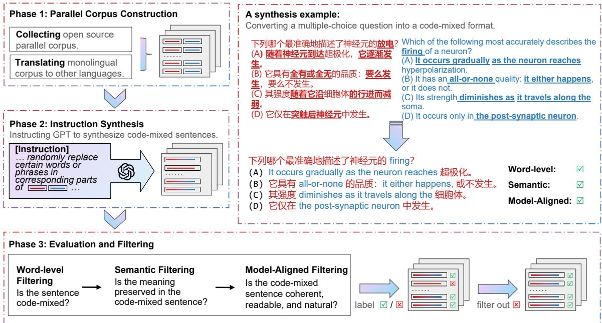  
Figure 1: Illustration of the synthesis pipeline.

This method effectively embeds one language into another, implementing intra-sentential and inter-sentential code-mixing. Furthermore, we prompt GPT-4 Turbo to respond with the chosen words and their corresponding parts in another language.

## 3.4 Evaluation and Filtering

We implement a series of evaluation and filtering processes for the generated data.

Word-Level Filtering We use the Multilingual Index (M-index) (Barnett et al., 2000) and the Probability of Switching (I-index) (Guzmán et al., 2017) as word-level evaluation metrics. Based on wordlevel language tagging (annotation strategy details in Appendix C), we calculated the M-index and Iindex for each code-mixed text. Two code-mixing metrics are defined as:

$$
\mathrm { ~ { \it ~ M } - i n d e x } = \frac { 1 - \sum p _ { j } ^ { 2 } } { ( k - 1 ) \sum p _ { j } ^ { 2 } }
$$

where $p _ { j }$ represents the proportion of the j-th category. k is the total number of language categories;

$$
I { \mathrm { - i n d e x } } = { \frac { \sum _ { 1 \leq i \leq n - 1 } S ( i , i + 1 ) } { n - 1 } }
$$

where S(i, i + 1) = 1 if the i-th and i + 1-th tokens of a sentence belongs to different languages; otherwise, S(i, i + 1) = 0. n represents the total number of tokens in a sentence.

The M-index ranges from 0 (monolingual text) to 1 (perfectly balanced code-mixed text with equal contributions from each language). Similarly, the I-index ranges from 0 (monolingual text) to 1 (optimal code-mixed text with alternating tokens from different languages). To ensure dataset quality, we set the thresholds for the M-index and I-index to 0.1 to filter out monolingual sentences and those with low mixing or switching frequencies.

Semantic Filtering To ensure the semantic consistency between the generated text and the original text, we computed the sentence similarity metrics for both texts. Additionally, We evaluated sentence similarity across two parallel corpora to assess the quality of the original parallel texts. First, we used LaBSE (Feng et al., 2022) (Appendix D) to project the original two monolingual texts (L1, L2) from the parallel corpus and the synthesized code-mixed text (CM) into a common vector space. Subsequently, we calculate the pairwise cosine similarities among these three texts (CM, L1, L2), resulting in three similarity scores ranging from 0 to 1. The score between CM and L1/L2 partially reflects the synthesis quality of our method, while the score between L1 and L2 indicates the translation quality of the original parallel corpus. We determine that a similarity score below 0.8 suggests potential issues in the synthesis result or parallel corpus, necessitating the exclusion of such samples.

Model-Aligned Filtering To ensure the naturalness, coherence, and readability of synthesized sentences, we employ a highly human-aligned GPT-4 Turbo model (Appendix E) for automated evaluation. We prompt the model to assess synthetic results on naturalness, coherence, and readability, assigning scores to each criterion. Each criterion is rated on a scale from 1 to 3 (poor, fair, good), with detailed definitions provided for each level, shown in Appendix F.2. We filter out synthesized sentences if any score equals 1, indicating deficiencies in naturalness, coherence, or readability.

## 4 Experiments

## 4.1 Experiment Setup

Evaluation Settings For CM-MMLU and CM-TruthfulQA, we prompt models to select the correct option for multiple-choice questions. We use chain-of-thought (CoT) evaluation for CM-GSM8K task and parsed the model's response using regular regex to obtain the final solution. We report accuracy as the evaluation metric. For above three tasks, we also provide the model performance of English-only evaluation (en only) for reference. For LID, POS, NER, and SA tasks, we prompt the models to generate the answers. Specifically, we provide the LLMs with all possible tags in the prompt and instruct models to generate in JSON format. In the MT task, we instructed models to translate code-mixed sentences. We use accuracy for LID, POS, NER, and SA tasks, and the BLEU score for MT assessment. All evaluations are under one-shot settings. We present the prompts for all 8 tasks in the Appendix G.

Models We selected LLMs from three different families for the comparison evaluation. For the GPT family, we evaluated GPT-3.5 Turbo-instruct, GPT-3.5 Turbo, GPT-4 Turbo (OpenAI et al., 2024) and GPT-4o. For the LLaMA family, we evaluated LLaMA2-Chat (7B, 13B, 70B) (Touvron et al. 2023), LLaMA3-Base (8B), and LLaMA3-Instruct (8B, 70B). For the Mistral family, we evaluated

Mistral 7B (Jiang et al., 2023), Mixtral 8x7B (Jiang et al., 2024), and Mixtral 8x22B. We set the top-p to 0.95 and temperature to 0.8 for GPT, and used greedy decoding for LLaMA and Mistral models.

## 4.2 Main Results

Table 2 presents the experimental results of the selected models across the CM-MMLU, CM-GSM8K, and CM-TruthfulQA. Due to space constraints, the performance of the GPT family on LID, POS, NER, SA, and MT tasks is detailed in Appendix I, with visualizations provided in Figure 2.

Larger models excel on CodeMixBench In Table 2, GPT-4o achieves the highest scores across all language pairs in the CM-MMLU task, while GPT-4 Turbo attains the highest scores for each language pair in the CM-GSM8K and CM-TruthfulQA tasks. This suggests that GPT-4o excels in comprehensive knowledge reasoning, whereas GPT-4 Turbo is superior in mathematical reasoning and truthfulness. Additionally, within the LLaMA2, LLaMA3, and Mistral model families, the highest scores across all datasets consistently come from the largest models. Therefore, increasing model size enhances performance on multilingual code-mixed datasets.

GPT-3.5-Turbo-Instruct vs. GPT-3.5 Turbo In Table 2, GPT-3.5 Turbo outperforms GPT-3.5- Turbo-Instruct by an average of 2.07 points in CM-MMLU, 14.54 points in CM-GSM8K, and 7.23 points in CM-TruthfulQA. Table 8 in the Appendix I shows GPT-3.5 Turbo scored higher on LID (+9.51%), POS (+1.68%), NER (+10.99%), and MT (+1.07%), but was 14.98 points lower on SA. This may be due to differing focuses during instruction tuning, with GPT-3.5 Turbo emphasizing conversational completion and GPT-3.5-Turbo-Instruct focusing on instruction completion, leading to different training corpora. Thus, GPT-3.5 Turbo excelled over GPT-3.5-Turbo-Instruct in all CodeMixBench tasks except SA.

LLaMA3-8B-Base vs. LLaMA3-8B-Instruct In Table 2, LLaMA3-8B-Instruct performs comparably to LLaMA3-8B-Base on CM-MMLU and CM-TruthfulQA but outperforms it by 7.73 points on CM-GSM8K. This is likely due to the increased complexity of the mathematical reasoning required by CM-GSM8K. The improved performance on CM-GSM8K can be attributed to high-quality prompts during continued post-training stages, including supervised fine-tuning and alignment tuning, followed by the pre-training of LLaMA3.

<table><tr><td rowspan="2"></td><td>GPT -Instruct</td><td colspan="3">GPT</td><td colspan="3">LLaMA2 -Chat</td><td>LLaMA3 -Base</td><td colspan="2">LLaMA3 -Instruct</td><td colspan="3">Mistral &amp; Mixtral</td></tr><tr><td>3.5-T</td><td>3.5-T</td><td>4-T</td><td>40</td><td>7b</td><td>13b</td><td>70b</td><td>8b</td><td>8b</td><td>70b</td><td>7b</td><td>8x7b</td><td>8x22b</td></tr><tr><td colspan="10">CM-MMLU</td><td></td><td></td><td></td><td></td></tr><tr><td>en only</td><td>64.90</td><td>66.30</td><td>83.10</td><td>85.60</td><td>38.00</td><td>47.80</td><td>61.50</td><td>63.30</td><td>65.60</td><td>77.20</td><td>55.3</td><td>67.30</td><td>75.50</td></tr><tr><td>zh-en</td><td>60.99</td><td>60.81</td><td>79.08</td><td>82.97</td><td>30.80</td><td>35.92</td><td>46.78</td><td>56.31</td><td>57.63</td><td>73.79</td><td>47.40</td><td>59.84</td><td>66.64</td></tr><tr><td>hi-en</td><td>53.32</td><td>55.37</td><td>77.83</td><td>82.13</td><td>29.00</td><td>30.96</td><td>44.63</td><td>53.61</td><td>56.93</td><td>74.61</td><td>40.82</td><td>52.44</td><td>59.67</td></tr><tr><td>bn-en</td><td>46.32</td><td>47.49</td><td>72.26</td><td>78.28</td><td>25.49</td><td>29.71</td><td>39.23</td><td>46.50</td><td>49.01</td><td>69.75</td><td>38.60</td><td>48.11</td><td>55.03</td></tr><tr><td>mr-en</td><td>46.95</td><td>49.67</td><td>72.26</td><td>77.98</td><td>29.05</td><td>30.27</td><td>38.71</td><td>50.89</td><td>51.55</td><td>67.29</td><td>37.49</td><td>48.27</td><td>55.39</td></tr><tr><td>ne-en</td><td>46.70</td><td>48.78</td><td>72.78</td><td>76.70</td><td>25.91</td><td>29.39</td><td>38.26</td><td>47.22</td><td>49.22</td><td>66.52</td><td>34.61</td><td>45.74</td><td>55.13</td></tr><tr><td>es-en</td><td>65.01</td><td>69.20</td><td>81.24</td><td>86.30</td><td>32.37</td><td>42.67</td><td>59.95</td><td>61.78</td><td>54.98</td><td>79.67</td><td>53.93</td><td>69.28</td><td>74.17</td></tr><tr><td>fr-en</td><td>67.21</td><td>68.83</td><td>81.21</td><td>85.28</td><td>34.78</td><td>43.45</td><td>57.54</td><td>60.79</td><td>64.32</td><td>78.50</td><td>56.55</td><td>69.65</td><td>73.98</td></tr><tr><td>ar-en</td><td>53.94</td><td>56.45</td><td>77.06</td><td>80.35</td><td>25.71</td><td>30.04</td><td>40.17</td><td>51.17</td><td>46.76</td><td>71.86</td><td>37.32</td><td>51.52</td><td>59.83</td></tr><tr><td>ta-en</td><td>44.03</td><td>45.75</td><td>64.09</td><td>70.77</td><td>26.65</td><td>32.09</td><td>39.06</td><td>46.61</td><td>48.42</td><td>62.18</td><td>38.87</td><td>47.18</td><td>52.34</td></tr><tr><td>nl-en</td><td>66.08</td><td>67.14</td><td>82.64</td><td>85.37</td><td>32.60</td><td>42.73</td><td>56.21</td><td>61.32</td><td>62.11</td><td>79.30</td><td>53.74</td><td>68.55</td><td>71.98</td></tr><tr><td>de-en</td><td>67.63</td><td>68.46</td><td>80.71</td><td>84.60</td><td>34.32</td><td>42.21</td><td>57.98</td><td>59.74</td><td>63.91</td><td>77.18</td><td>54.08</td><td>66.23</td><td>72.54</td></tr><tr><td>Average</td><td>56.20</td><td>58.27</td><td>76.47</td><td>80.97</td><td>29.70</td><td>35.40</td><td>47.14</td><td>54.18</td><td>54.99</td><td>72.79</td><td>44.85</td><td>56.98</td><td>63.34</td></tr><tr><td colspan="10">CM-GSM8K</td><td colspan="3"></td></tr><tr><td>en only</td><td>66.55</td><td>80.05</td><td>95.23</td><td>92.50</td><td>26.21</td><td>35.83</td><td>58.78</td><td>77.41</td><td>80.23</td><td>93.91</td><td>45.28</td><td>64.34</td><td>87.29</td></tr><tr><td>zh-en</td><td>57.54</td><td>73.73</td><td>92.11</td><td>90.61</td><td>21.98</td><td>28.97</td><td>47.95</td><td>67.73</td><td>76.32</td><td>90.61</td><td>40.06</td><td>59.34</td><td>83.72</td></tr><tr><td>hi-en</td><td>54.63</td><td>67.42</td><td>93.60</td><td>89.57</td><td>17.72</td><td>23.92</td><td>40.16</td><td>68.01</td><td>75.89</td><td>90.45</td><td>33.46</td><td>54.04</td><td>82.19</td></tr><tr><td>es-en</td><td>63.20</td><td>77.23</td><td>93.91</td><td>90.91</td><td>19.33</td><td>31.95</td><td>53.22</td><td>71.23</td><td>75.99</td><td>92.41</td><td>43.25</td><td>63.90</td><td>84.38</td></tr><tr><td>ar-en</td><td>57.20</td><td>72.36</td><td>94.05</td><td>90.12</td><td>14.88</td><td>21.31</td><td>37.91</td><td>65.16</td><td>74.86</td><td>88.96</td><td>33.49</td><td>51.92</td><td>78.21</td></tr><tr><td>Average</td><td>58.14</td><td>72.68</td><td>93.42</td><td>90.30</td><td>18.47</td><td>26.54</td><td>44.81</td><td>68.03</td><td>75.76</td><td>90.61</td><td>37.57</td><td>57.30</td><td>82.12</td></tr><tr><td colspan="10">CM-TruthfulQA</td><td colspan="3"></td></tr><tr><td>en only</td><td>57.16</td><td>64.26</td><td>83.72</td><td>81.76</td><td>22.03</td><td>25.21</td><td>43.82</td><td>47.25</td><td>46.76</td><td>70.87</td><td>53.24</td><td>66.46</td><td>73.93</td></tr><tr><td>zh-en</td><td>46.43</td><td>54.09</td><td>79.25</td><td>77.56</td><td>18.42</td><td>24.64</td><td>33.33</td><td>45.53</td><td>44.36</td><td>67.83</td><td>48.12</td><td>56.42</td><td>63.68</td></tr><tr><td>hi-en</td><td>39.37</td><td>48.08</td><td>81.11</td><td>78.47</td><td>19.82</td><td>21.80</td><td>29.99</td><td>41.88</td><td>42.93</td><td>66.31</td><td>40.55</td><td>51.12</td><td>58.52</td></tr><tr><td>es-en</td><td>46.43</td><td>55.07</td><td>81.10</td><td>77.85</td><td>21.65</td><td>25.78</td><td>36.80</td><td>46.06</td><td>44.31</td><td>68.84</td><td>48.31</td><td>58.57</td><td>66.46</td></tr><tr><td>ar-en</td><td>46.54</td><td>50.44</td><td>80.50</td><td>76.48</td><td>20.63</td><td>20.88</td><td>28.55</td><td>42.26</td><td>42.64</td><td>66.67</td><td>40.88</td><td>47.67</td><td>59.25</td></tr><tr><td>Average</td><td>44.69</td><td>51.92</td><td>80.49</td><td>77.59</td><td>20.13</td><td>23.28</td><td>32.17</td><td>43.93</td><td>43.56</td><td>67.41</td><td>44.47</td><td>53.45</td><td>61.98</td></tr></table>

Table 2: One-shot accuracy of selected models on CM-MMLU, CM-GSM8K and CM-TruthfulQA. Where 3.5-T indicates GPT-3.5 Turbo, and 4-T indicates GPT-4 Turbo. The en only stands for a dataset we randomly sample from the test set of the original dataset in English. To be compared with other code-mixed datasets, the en only datasets for CM-MMLU, CM-GSM8K, and CM-TuthfulQA contain 1000, 1133, and 817 English instances each. The Average represents the mean score of each model across various datasets (excluding en only dataset) from a given task. For each model family, the scores of the top-performing models are highlighted in bold.

LLaMA2 vs. LLaMA3 Table 2 shows that LLaMA3-8B outperforms LLaMA2-7B-Chat with average gains of 25.29, 57.29, and 23.43 points on CM-MMLU, CM-GSM8K, and CM-TruthfulQA, respectively. Additionally, LLaMA3-70B surpasses LLaMA2-70B with improvements of 25.75, 45.80, and 35.24 points on the same benchmarks. These enhancements may be due to the training dataset for LLaMA3 containing over 15T tokens, a size seven times larger than that used for LLaMA2.

Mistral 7B vs. Mixtral 8x7B We also observe from Table 2 that Mixtral 8x7B outperforms Mistral 7B by 12.14, 19.73, and 8.98 points on CM-MMLU, CM-GSM8K, and CM-TruthfulQA, correspondingly. This improvement is likely due to the scaling of model parameters in Mixture of Experts (MoE) architecture and the substantial increase in multilingual training compute for Mixtral 8x7B.

## 4.3 Analysis across Languages

Figure 3 illustrates the accuracy variations of LLMs from three families on the CM-MMLU, CM-GSM8K, and CM-TruthfulQA tasks across different language pairs.

Cross-family code-mixing can impair the performance of LLMs. Figure 3 shows significant fluctuations in zh-en, hi-en, bn-en, mr-en, ne-en, ar-en, and ta-en language pairs, while es-en, fr-en de-en, and nl-en pairs perform similarly to Englishonly scenario. This similarity may be attributed to English, German, Dutch, Spanish, and French having similar word order features according to WALS (Dryer and Haspelmath, 2013), along with their common Indo-European family and geographic proximity. Therefore, code-mixing between languages with substantial linguistic differences can significantly hinder the performance of LLMs.

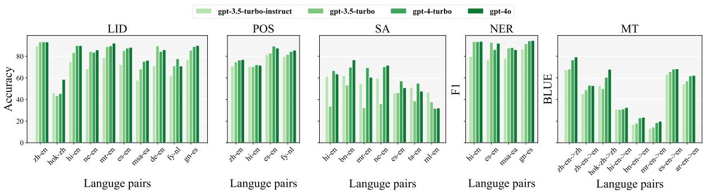  
Figure 2: One-shot accuracy versus language pairs for GPT models on LID, POS, SA, NER and MT.

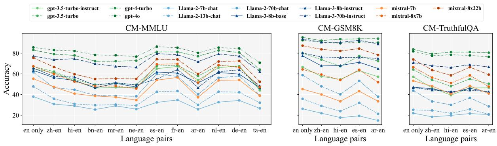  
Figure 3: Accuracy versus language pairs for models on CM-MMLU, CM-GSM8K and CM-TruthfulQA.

Models exhibit consistent fluctuation patterns across different code-mixed language pairs. Figure 3 reveals a notable trend: despite originating from three distinct institutions, the models display parallel accuracy fluctuations across different language pairs for the three tasks. For CM-MMLU, most models show a decline in accuracy from en only to ne-en, followed by a rebound for es-en and fr-en. This uniform impact on performance likely results from overlapping training data sourced from the internet, commonly used by three organizations during model training.

More low-resource data improves code-mixing comprehension. Analyzing Figure 3 and Table 2, the decrease for high-resource language and English code-mixing (zh-en) was 2.63 points compared to English-only datasets. Medium-resource language code-mixing (hi-en, ar-en, bn-en) showed declines of 3.47, 5.25, and 7.32 points, respectively, while low-resource language mixtures (mren, ne-en, ta-en) experienced more substantial drops of 7.62, 8.9, and 14.83 points. This indicates the model has a better understanding of codemixed data involving high-resource languages and English. Consequently, increasing training on low-resource language corpora could improve the model's comprehension of code-mixed data involving these languages.

## 4.4 K-shot Analysis

To further investigate the impact of varying quantities of code-mixed examples on model performance, we conducted k-shot evaluations (k ∈ {0, 1, 2, 5}) on the CM-MMLU, CM-GSM8K, and CM-TruthfulQA datasets. English-only (en only) served as a control group, allowing us to compare performance trends between the en only and various code-mixed scenarios across different language families. Results were averaged by language family and visualized in Figure 4, with full results in Appendix J. Figure 4 shows that models like GPT-4 Turbo, GPT-4o, and LLaMA3-70B-Instruct, which have higher average accuracy scores, maintain more stable k-shot accuracy trends as k increases. This indicates their robust multilingual and few-shot learning abilities. In contrast, other models often experience sudden drops in accuracy for certain language pairs as k increases.

Advanced models excel at few-shot learning on knowledge and truthfulness reasoning. Figure 4(a) indicates that the accuracy of GPT models, LLaMA3, and Mistral generally increases with higher k on the CM-MMLU, whereas LLaMA2 models show a significant drop at one-shot before recovering. LLaMA2-13B-Chat and LLaMA2- 70B-Chat demonstrate a positive correlation between accuracy and k values in en only datasets, indicating their few-shot learning capabilities. In contrast, for code-mixed datasets, one-shot and twoshot accuracies are lower than zero-shot, with even five-shot performance lagging behind zero-shot for Sino-Tibetan - en, Afro-Asiatic - en, Indo-Aryan - en, and Dravidian - en. This suggests code-mixing hinders the one-shot and two-shot learning capabilities of these models, though performance can gradually recover at five-shot. Also in Figure 4(c), except for LLaMA2-7B-Chat and LLaMA2-13B-Chat, all models' accuracy scores increase with k on CM-TruthfulQA. In summary, few-shot learning is effective for all selected models except LLaMA2 in knowledge and truthfulness reasoning.

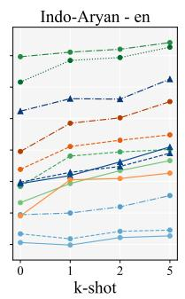

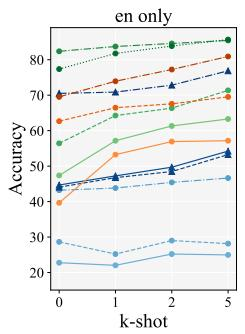

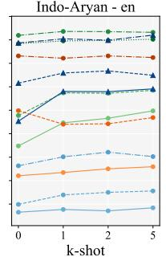

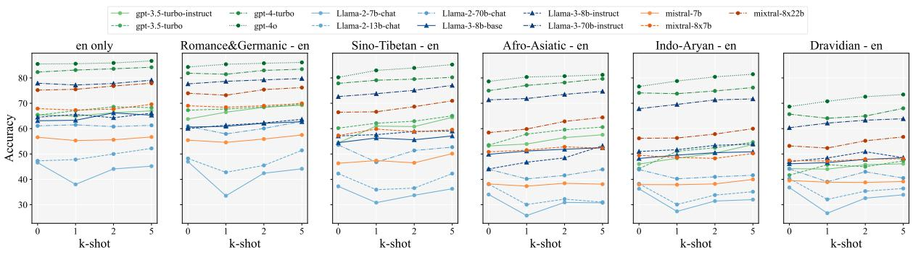  
(a) CM-MMLU

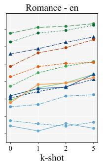

(b) CM-GSM8K  
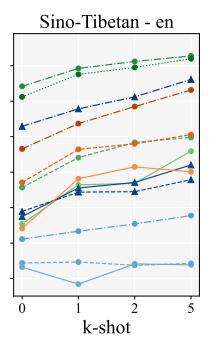  
(c) CM-TruthfulQA

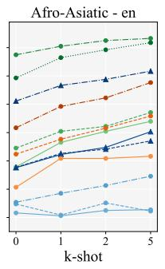  
Figure 4: Accuracy of k-shot evaluation for three model families on three tasks.

Few-shot learning minimally enhances mathematical reasoning. In Figure 4(b), the model's kshot accuracy on the CM-GSM8K task shows less variability compared to the other tasks, which we attribute to the higher complexity of CM-GSM8K relative to CM-MMLU and CM-TruthfulQA, posing greater challenges to a model's few-shot learning. However, GPT-3.5 Turbo, GPT-3.5-Turbo-Instruct, and LLaMA3-8B-Base exhibit significant accuracy improvements from zero-shot to one-shot. This is because these models initially fail to follow the required response format in zero-shot prompts, causing incorrect answers, while one-shot improves these models' output format adherence. Besides, Mixtral-7x22b demonstrates a decrease in accuracy as k increases across all datasets, indicating its inadequate few-shot learning capability on CM-GSM8K. Overall, in the CM-GSM8K task, few-shot learning provides limited enhancement in mathematical reasoning for the GPT and LLaMA family and may negatively affect Mistral models.

## 5 Conclusion

This study introduces CodeMixBench, a comprehensive benchmark for evaluating code-mixing performance in LLMs, spanning eight tasks and 18 languages. We also adopt GPT-4 Turbo for constructing synthetic code-mixed data to address data scarcity issues. Our findings show that while codemixing challenges LLMs performance, improvements can be achieved through larger pre-training datasets, increased model scales, and few-shot learning. In the future, CodeMixBench holds great promise for evaluating the code-mixing capabilities of LLMs and inspiring further research in this area.

## Limitations

We introduce CodeMixBench, a collection of 22 synthetic datasets and 30 open-source datasets, each with potential quality issues. Our synthesis method generates large-scale code-mixed datasets with detailed filtering, but unexpected quality problems can still occur. Furthermore, our benchmark includes 18 languages, making it challenging to maintain consistent quality control. Furthermore, it could be promising to evaluate and mitigate the potential bias in code-mixing scenarios (Ravfogel et al., 2020; Peng et al., 2025).

## Acknowledgments

We would like to thank all anonymous reviewers for their insightful comments and feedback.

## References

Heike Adel, Ngoc Thang Vu, Franziska Kraus, Tim Schlippe, Haizhou Li, and Tanja Schultz. 2013a. Recurrent neural network language modeling for code switching conversational speech. In 2013 IEEE International Conference on Acoustics, Speech and Signal Processing, pages 8411–8415.

Heike Adel, Ngoc Thang Vu, and Tanja Schultz. 2013b. Combination of Recurrent Neural Networks and Factored Language Models for Code-Switching Language Modeling. In Proceedings of the 51st Annual Meeting of the Association for Computational Linguistics (Volume 2: Short Papers), pages 206–211, Sofia, Bulgaria. Association for Computational Linguistics.

Gustavo Aguilar, Fahad AlGhamdi, Victor Soto, Mona Diab, Julia Hirschberg, and Thamar Solorio. 2018. Named Entity Recognition on Code-Switched Data: Overview of the CALCS 2018 Shared Task. In Proceedings of the Third Workshop on Computational Approaches to Linguistic Code-Switching, pages 138— 147, Melbourne, Australia. Association for Computational Linguistics.

Gustavo Aguilar, Sudipta Kar, and Thamar Solorio. 2020. LinCE: A Centralized Benchmark for Linguistic Code-switching Evaluation.

Gaurav Arora, Srujana Merugu, and Vivek Sembium. 2023. CoMix: Guide Transformers to Code-Mix using POS structure and Phonetics. In Findings of the Association for Computational Linguistics: ACL 2023, pages 7985–8002, Toronto, Canada. Association for Computational Linguistics.

Yejin Bang, Samuel Cahyawijaya, Nayeon Lee, Wenliang Dai, Dan Su, Bryan Wilie, Holy Lovenia, Ziwei Ji, Tiezheng Yu, Willy Chung, Quyet V. Do, Yan Xu, and Pascale Fung. 2023. A multitask, multilingual, multimodal evaluation of ChatGPT on reasoning, hallucination, and interactivity. In Proceedings of the 13th International Joint Conference on Natural Language Processing and the 3rd Conference of the Asia-Pacific Chapter of the Association for Computational Linguistics (Volume 1: Long Papers), pages 675–718, Nusa Dua, Bali. Association for Computational Linguistics.

Ruthanna Barnett, Eva Codó, Eva Eppler, Montse Forcadell, Penelope Gardner-Chloros, Roeland van Hout, Melissa Moyer, Maria Carme Torras, Maria Teresa Turell, Mark Sebba, Marianne Starren, and Sietse Wensing. 2000. The lides coding manual: A document for preparing and analyzing language interaction data version 1.1—july, 1999. International Journal of Bilingualism, 4(2):131–132.

Anshul Bawa, Pranav Khadpe, Pratik Joshi, Kalika Bali, and Monojit Choudhury. 2020. Do multilingual users prefer chat-bots that code-mix? let's nudge and find out! Proc. ACM Hum.-Comput. Interact., 4(CSCW1).

Gayatri Bhat, Monojit Choudhury, and Kalika Bali. 2016. Grammatical Constraints on Intra-sentential Code-Switching: From Theories to Working Models.

Anouck Braggaar and Rob van der Goot. 2021. Challenges in Annotating and Parsing Spoken, Codeswitched, Frisian-Dutch Data. In Proceedings of the Second Workshop on Domain Adaptation for NLP, pages 50–58, Kyiv, Ukraine. Association for Computational Linguistics.

Jesús Calvillo, Le Fang, Jeremy Cole, and David Reitter. 2020. Surprisal Predicts Code-Switching in Chinese-English Bilingual Text. In Proceedings of the 2020 Conference on Empirical Methods in Natural Language Processing (EMNLP), pages 4029–4039, Online. Association for Computational Linguistics.

Yekun Chai, Shuohuan Wang, Chao Pang, Yu Sun, Hao Tian, and Hua Wu. 2023a. ERNIE-code: Beyond English-centric cross-lingual pretraining for programming languages. In Findings of the Association for Computational Linguistics: ACL 2023, pages 10628– 10650, Toronto, Canada. Association for Computational Linguistics.

Yekun Chai, Qiyue Yin, and Junge Zhang. 2023b. Improved training of mixture-of-experts language gans. In IEEE International Conference on Acoustics, Speech and Signal Processing ICASSP 2023, Rhodes Island, Greece, June 4-10, 2023, pages 1–5. IEEE.

Yekun Chai, Haidong Zhang, Qiyue Yin, and Junge Zhang. 2021. Counter-contrastive learning for language gans. In Findings of the Association for Computational Linguistics: EMNLP 2021, Virtual Event / Punta Cana, Dominican Republic, 16-20 November, 2021, pages 4834–4839. Association for Computational Linguistics.

Bharathi Raja Chakravarthi, Navya Jose, Shardul Suryawanshi, Elizabeth Sherly, and John Philip Mc-Crae. 2020a. A Sentiment Analysis Dataset for Code-Mixed Malayalam-English. In Proceedings of the 1st Joint Workshop on Spoken Language Technologies for Under-resourced Languages (SLTU) and Collaboration and Computing for Under-Resourced Languages (CCURL), pages 177–184, Marseille, France. European Language Resources association.

Bharathi Raja Chakravarthi, Vigneshwaran Muralidaran, Ruba Priyadharshini, and John Philip McCrae. 2020b. Corpus creation for sentiment analysis in code-mixed Tamil-English text. In Proceedings of the 1st Joint Workshop on Spoken Language Technologies for Under-resourced languages (SLTU) and Collaboration and Computing for Under-Resourced Languages (CCURL), pages 202–210, Marseille, France. European Language Resources association.

Khyathi Chandu, Thomas Manzini, Sumeet Singh, and Alan W. Black. 2018. Language Informed Modeling of Code-Switched Text. In Proceedings of the Third Workshop on Computational Approaches to Linguistic Code-Switching, pages 92–97, Melbourne, Australia. Association for Computational Linguistics.

Ching-Ting Chang, Shun-Po Chuang, and Hung-Yi Lee. 2019. Code-Switching Sentence Generation by Generative Adversarial Networks and its Application to Data Augmentation. In Proc. Interspeech 2019, pages 554–558.

Tanmay Chavan, Omkar Gokhale, Aditya Kane, Shantanu Patankar, and Raviraj Joshi. 2023. My Boli: Code-mixed Marathi-English Corpora, Pretrained Language Models and Evaluation Benchmarks. In Findings of the Association for Computational Linguistics: IJCNLP-AACL 2023 (Findings), pages 242– 249, Nusa Dua, Bali. Association for Computational Linguistics.

Shuguang Chen, Gustavo Aguilar, Anirudh Srinivasan, Mona Diab, and Thamar Solorio. 2022. CALCS 2021 Shared Task: Machine Translation for Code-Switched Data.

Luis Chiruzzo, Marvin Agüero-Torales, Gustavo Giménez-Lugo, Aldo Alvarez, Yliana Rodríguez, Santiago Góngora, and Thamar Solorio. 2023. Overview of GUA-SPA at IberLEF 2023: Guarani-Spanish Code Switching Analysis. Procesamiento del Lenguaje Natural, 71(0):321–328.

Karl Cobbe, Vineet Kosaraju, Mohammad Bavarian, Mark Chen, Heewoo Jun, Lukasz Kaiser, Matthias Plappert, Jerry Tworek, Jacob Hilton, Reiichiro Nakano, Christopher Hesse, and John Schulman. 2021. Training Verifiers to Solve Math Word Problems.

Matthew S. Dryer and Martin Haspelmath, editors. 2013. WALS Online (v2020.4). Zenodo.

Fangxiaoyu Feng, Yinfei Yang, Daniel Cer, Naveen Arivazhagan, and Wei Wang. 2022. Language-agnostic BERT Sentence Embedding.

Deepak Gupta, Asif Ekbal, and Pushpak Bhattacharyya 2020. A Semi-supervised Approach to Generate the Code-Mixed Text using Pre-trained Encoder and Transfer Learning. In Findings of the Association for Computational Linguistics: EMNLP 2020, pages 2267–2280, Online. Association for Computational Linguistics.

Gualberto A. Guzmán, Joseph Ricard, Jacqueline Serigos, Barbara E. Bullock, and Almeida Jacqueline Toribio. 2017. Metrics for modeling code-switching across corpora. In Interspeech.

Dan Hendrycks, Collin Burns, Steven Basart, Andy Zou, Mantas Mazeika, Dawn Song, and Jacob Steinhardt. 2021. Measuring Massive Multitask Language Understanding.

I-Hung Hsu, Avik Ray, Shubham Garg, Nanyun Peng, and Jing Huang. 2023. Code-Switched Text Synthesis in Unseen Language Pairs. In Findings of the Association for Computational Linguistics: ACL 2023, pages 5137–5151, Toronto, Canada. Association for Computational Linguistics.

Albert Q. Jiang, Alexandre Sablayrolles, Arthur Mensch, Chris Bamford, Devendra Singh Chaplot, Diego de las Casas, Florian Bressand, Gianna Lengyel, Guillaume Lample, Lucile Saulnier, Lélio Renard Lavaud, Marie-Anne Lachaux, Pierre Stock, Teven Le Scao, Thibaut Lavril, Thomas Wang, Timothée Lacroix, and William El Sayed. 2023. Mistral 7B.

Albert Q. Jiang, Alexandre Sablayrolles, Antoine Roux, Arthur Mensch, Blanche Savary, Chris Bamford, Devendra Singh Chaplot, Diego de las Casas, Emma Bou Hanna, Florian Bressand, Gianna Lengyel, Guillaume Bour, Guillaume Lample, Lélio Renard Lavaud, Lucile Saulnier, Marie-Anne Lachaux, Pierre Stock, Sandeep Subramanian,

Sophia Yang, Szymon Antoniak, Teven Le Scao, Théophile Gervet, Thibaut Lavril, Thomas Wang, Timothée Lacroix, and William El Sayed. 2024. Mixtral of Experts.

Simran Khanuja, Sandipan Dandapat, Sunayana Sitaram, and Monojit Choudhury. 2020a. A New Dataset for Natural Language Inference from Codemixed Conversations.

Simran Khanuja, Sandipan Dandapat, Anirudh Srinivasan, Sunayana Sitaram, and Monojit Choudhury. 2020b. GLUECoS : An Evaluation Benchmark for Code-Switched NLP.

Eunhee Kim. 2006. Reasons and motivations for codemixing and code-switching. Issues in EFL, 4(1):43– 61.

Viet Lai, Nghia Ngo, Amir Pouran Ben Veyseh, Hieu Man, Franck Dernoncourt, Trung Bui, and Thien Nguyen. 2023a. ChatGPT beyond English: Towards a comprehensive evaluation of large language models in multilingual learning. In Findings of the Association for Computational Linguistics: EMNLP 2023, pages 13171–13189, Singapore. Association for Computational Linguistics.

Viet Dac Lai, Chien Van Nguyen, Nghia Trung Ngo, Thuat Nguyen, Franck Dernoncourt, Ryan A. Rossi, and Thien Huu Nguyen. 2023b. Okapi: Instructiontuned Large Language Models in Multiple Languages with Reinforcement Learning from Human Feedback

Ying Li and Pascale Fung. 2012. Code-Switch Language Model with Inversion Constraints for Mixed Language Speech Recognition. In Proceedings of COLING 2012, pages 1671–1680, Mumbai, India. The COLING 2012 Organizing Committee.

Ying Li and Pascale Fung. 2014. Language Modeling with Functional Head Constraint for Code Switching Speech Recognition. In Proceedings of the 2014 Conference on Empirical Methods in Natural Language Processing (EMNLP), pages 907–916, Doha, Qatar. Association for Computational Linguistics.

Stephanie Lin, Jacob Hilton, and Owain Evans. 2022. TruthfulQA: Measuring How Models Mimic Human Falsehoods.

Sin-En Lu, Bo-Han Lu, Chao-Yi Lu, and Richard Tzong-Han Tsai. 2022. Exploring Methods for Building Dialects-Mandarin Code-Mixing Corpora: A Case Study in Taiwanese Hokkien. In Findings of the Association for Computational Linguistics: EMNLP 2022, pages 6287–6305, Abu Dhabi, United Arab Emirates. Association for Computational Linguistics.

Shervin Malmasi, Anjie Fang, Besnik Fetahu, Sudipta Kar, and Oleg Rokhlenko. 2022. MultiCoNER: A Large-scale Multilingual Dataset for Complex Named Entity Recognition. In Proceedings of the 29th International Conference on Computational Linguistics, pages 3798–3809, Gyeongju, Republic of Korea. International Committee on Computational Linguistics.

Deepthi Mave, Suraj Maharjan, and Thamar Solorio. 2018. Language Identification and Analysis of Code-Switched Social Media Text. In Proceedings of the Third Workshop on Computational Approaches to Linguistic Code-Switching, pages 51–61, Melbourne, Australia. Association for Computational Linguistics.

Giovanni Molina, Fahad AlGhamdi, Mahmoud Ghoneim, Abdelati Hawwari, Nicolas Rey-Villamizar, Mona Diab, and Thamar Solorio. 2016. Overview for the Second Shared Task on Language Identification in Code-Switched Data. In Proceedings of the Second Workshop on Computational Approaches to Code Switching, pages 40–49, Austin, Texas. Association for Computational Linguistics.

OpenAI, Josh Achiam, Steven Adler, Sandhini Agarwal, Lama Ahmad, Ilge Akkaya, Florencia Leoni Aleman, Diogo Almeida, Janko Altenschmidt, Sam Altman, Shyamal Anadkat, Red Avila, Igor Babuschkin, Suchir Balaji, Valerie Balcom, Paul Baltescu, Haiming Bao, Mohammad Bavarian, Jeff Belgum, Irwan Bello, Jake Berdine, Gabriel Bernadett-Shapiro, Christopher Berner, Lenny Bogdonoff, Oleg Boiko, Madelaine Boyd, Anna-Luisa Brakman, Greg Brockman, Tim Brooks, Miles Brundage, Kevin Button, Trevor Cai, Rosie Campbell, Andrew Cann, Brittany Carey, Chelsea Carlson, Rory Carmichael, Brooke Chan, Che Chang, Fotis Chantzis, Derek Chen, Sully Chen, Ruby Chen, Jason Chen, Mark Chen, Ben Chess, Chester Cho, Casey Chu, Hyung Won Chung Dave Cummings, Jeremiah Currier, Yunxing Dai, Cory Decareaux, Thomas Degry, Noah Deutsch, Damien Deville, Arka Dhar, David Dohan, Steve Dowling, Sheila Dunning, Adrien Ecoffet, Atty Eleti. Tyna Eloundou, David Farhi, Liam Fedus, Niko Felix. Simón Posada Fishman, Juston Forte, Isabella Fulford, Leo Gao, Elie Georges, Christian Gibson, Vik Goel, Tarun Gogineni, Gabriel Goh, Rapha Gontijo-Lopes, Jonathan Gordon, Morgan Grafstein, Scott Gray, Ryan Greene, Joshua Gross, Shixiang Shane Gu, Yufei Guo, Chris Hallacy, Jesse Han, Jeff Harris Yuchen He, Mike Heaton, Johannes Heidecke, Chris Hesse, Alan Hickey, Wade Hickey, Peter Hoeschele. Brandon Houghton, Kenny Hsu, Shengli Hu, Xin Hu, Joost Huizinga, Shantanu Jain, Shawn Jain Joanne Jang, Angela Jiang, Roger Jiang, Haozhun Jin, Denny Jin, Shino Jomoto, Billie Jonn, Heewoo Jun, Tomer Kaftan, Łukasz Kaiser, Ali Kamali, Ingmar Kanitscheider, Nitish Shirish Keskar, Tabarak Khan, Logan Kilpatrick, Jong Wook Kim, Christina Kim, Yongjik Kim, Jan Hendrik Kirchner, Jamie Kiros, Matt Knight, Daniel Kokotajlo, Łukasz Kondraciuk, Andrew Kondrich, Aris Konstantinidis, Kyle Kosic, Gretchen Krueger, Vishal Kuo, Michael Lampe, Ikai Lan, Teddy Lee, Jan Leike, Jade Leung, Daniel Levy, Chak Ming Li, Rachel Lim, Molly Lin, Stephanie Lin, Mateusz Litwin, Theresa Lopez, Ryan Lowe, Patricia Lue, Anna Makanju, Kim Malfacini, Sam Manning, Todor Markov, Yaniv Markovski, Bianca Martin, Katie Mayer, Andrew Mayne, Bob McGrew, Scott Mayer McKinney, Christine McLeavey, Paul McMillan, Jake McNeil, David Medina, Aalok Mehta, Jacob

Menick, Luke Metz, Andrey Mishchenko, Pamela Mishkin, Vinnie Monaco, Evan Morikawa, Daniel Mossing, Tong Mu, Mira Murati, Oleg Murk, David Mély, Ashvin Nair, Reiichiro Nakano, Rajeev Nayak, Arvind Neelakantan, Richard Ngo, Hyeonwoo Noh, Long Ouyang, Cullen O'Keefe, Jakub Pachocki, Alex Paino, Joe Palermo, Ashley Pantuliano, Giambattista Parascandolo, Joel Parish, Emy Parparita, Alex Passos, Mikhail Pavlov, Andrew Peng, Adam Perelman, Filipe de Avila Belbute Peres, Michael Petrov, Henrique Ponde de Oliveira Pinto, Michael, Pokorny, Michelle Pokrass, Vitchyr H. Pong, Tolly Powell, Alethea Power, Boris Power, Elizabeth Proehl, Raul Puri, Alec Radford, Jack Rae, Aditya Ramesh, Cameron Raymond, Francis Real, Kendra Rimbach, Carl Ross, Bob Rotsted, Henri Roussez, Nick Ryder, Mario Saltarelli, Ted Sanders, Shibani Santurkar, Girish Sastry, Heather Schmidt, David Schnurr, John Schulman, Daniel Selsam, Kyla Sheppard, Toki Sherbakov, Jessica Shieh, Sarah Shoker, Pranav Shyam, Szymon Sidor, Eric Sigler, Maddie Simens, Jordan Sitkin, Katarina Slama, Ian Sohl, Benjamin Sokolowsky, Yang Song, Natalie Staudacher, Felipe Petroski Such, Natalie Summers, Ilya Sutskever, Jie Tang, Nikolas Tezak, Madeleine B. Thompson, Phil Tillet, Amin Tootoonchian, Elizabeth Tseng, Preston Tuggle, Nick Turley, Jerry Tworek, Juan Felipe Cerón Uribe, Andrea Vallone, Arun Vijayvergiya, Chelsea Voss, Carroll Wainwright, Justin Jay Wang, Alvin Wang, Ben Wang, Jonathan Ward, Jason Wei, C. J. Weinmann, Akila Welihinda, Peter Welinder, Jiayi Weng, Lilian Weng, Matt Wiethoff, Dave Willner, Clemens Winter, Samuel Wolrich, Hannah Wong, Lauren Workman, Sherwin Wu, Jeff Wu, Michael Wu, Kai Xiao, Tao Xu, Sarah Yoo, Kevin Yu, Qiming Yuan, Wojciech Zaremba, Rowan Zellers, Chong Zhang, Marvin Zhang, Shengjia Zhao, Tianhao Zheng, Juntang Zhuang, William Zhuk, and Barret Zoph. 2024. GPT-4 Technical Report.

Niraj Pahari and Kazutaka Shimada. 2023. Language Preference for Expression of Sentiment for Nepali-English Bilingual Speakers on Social Media. In Sixth Workshop on Computational Approaches to Linguistic Code-Switching.

Braja Gopal Patra, Dipankar Das, and Amitava Das. 2018. Sentiment Analysis of Code-Mixed Indian Languages: An Overview of SAIL\_Code-Mixed Shared Task @ICON-2017.

Parth Patwa, Gustavo Aguilar, Sudipta Kar, Suraj Pandey, Srinivas PYKL, Björn Gambäck, Tanmoy Chakraborty, Thamar Solorio, and Amitava Das. 2020. SemEval-2020 Task 9: Overview of Sentiment Analysis of Code-Mixed Tweets.

Qiwei Peng, Yekun Chai, and Xuhong Li. 2024. HumanEval-XL: A multilingual code generation benchmark for cross-lingual natural language generalization. In Proceedings of the 2024 Joint International Conference on Computational Linguistics, Language Resources and Evaluation (LREC-COLING 2024), pages 8383–8394, Torino, Italia. ELRA and ICCL.

Qiwei Peng, Guimin Hu, Yekun Chai, and Anders Søgaard. 2025. Debiasing multilingual 1lms in cross-lingual latent space. arXiv preprint arXiv:2508.17948.

Juan Manuel Pérez, Damián Ariel Furman, Laura Alonso Alemany, and Franco M. Luque. 2022. RoBERTuito: A pre-trained language model for social media text in Spanish. In Proceedings of the Thirteenth Language Resources and Evaluation Conference, pages 7235–7243, Marseille, France. European Language Resources Association.

SHANA POPLACK. 1980. Sometimes i'll start a sentence in spanish y termino en espaÑol: toward a typology of code-switching1. Linguistics, 18(7-8):581– 618.

Adithya Pratapa, Gayatri Bhat, Monojit Choudhury, Sunayana Sitaram, Sandipan Dandapat, and Kalika Bali. 2018. Language Modeling for Code-Mixing: The Role of Linguistic Theory based Synthetic Data. In Proceedings of the 56th Annual Meeting of the Association for Computational Linguistics (Volume 1: Long Papers), pages 1543–1553, Melbourne, Australia. Association for Computational Linguistics.

Md Nishat Raihan, Umma Tanmoy, Anika Binte Islam, Kai North, Tharindu Ranasinghe, Antonios Anastasopoulos, and Marcos Zampieri. 2023. Offensive Language Identification in Transliterated and Code-Mixed Bangla. In Proceedings of the First Workshop on Bangla Language Processing (BLP-2023), pages 1–6, Singapore. Association for Computational Linguistics.

Shauli Ravfogel, Yanai Elazar, Hila Gonen, Michael Twiton, and Yoav Goldberg. 2020. Null it out: Guarding protected attributes by iterative nullspace projection. arXiv preprint arXiv:2004.07667.

Shruti Rijhwani, Royal Sequiera, Monojit Choudhury, Kalika Bali, and Chandra Shekhar Maddila. 2017. Estimating Code-Switching on Twitter with a Novel Generalized Word-Level Language Detection Technique. In Proceedings of the 55th Annual Meeting of the Association for Computational Linguistics (Volume 1: Long Papers), pages 1971–1982, Vancouver, Canada. Association for Computational Linguistics.

Bidisha Samanta, Niloy Ganguly, and Soumen Chakrabarti. 2019a. Improved Sentiment Detection via Label Transfer from Monolingual to Synthetic Code-Switched Text. In Proceedings of the 57th Annual Meeting of the Association for Computational Linguistics, pages 3528–3537, Florence, Italy. Association for Computational Linguistics.

Bidisha Samanta, Sharmila Reddy, Hussain Jagirdar, Niloy Ganguly, and Soumen Chakrabarti. 2019b. A Deep Generative Model for Code-Switched Text

Royal Sequiera, Monojit Choudhury, and Kalika Bali. 2015. POS Tagging of Hindi-English Code Mixed Text from Social Media: Some Machine Learning

Experiments. In Proceedings of the 12th International Conference on Natural Language Processing, pages 237–246, Trivandrum, India. NLP Association of India.

Kushagra Singh, Indira Sen, and Ponnurangam Kumaraguru. 2018a. Language Identification and Named Entity Recognition in Hinglish Code Mixed Tweets. In Proceedings of ACL 2018, Student Research Workshop, pages 52–58, Melbourne, Australia. Association for Computational Linguistics.

Kushagra Singh, Indira Sen, and Ponnurangam Kumaraguru. 2018b. A Twitter Corpus for Hindi-English Code Mixed POS Tagging. In Proceedings of the Sixth International Workshop on Natural Language Processing for Social Media, pages 12–17, Melbourne, Australia. Association for Computational Linguistics.

Thamar Solorio, Elizabeth Blair, Suraj Maharjan, Steven Bethard, Mona Diab, Mahmoud Ghoneim, Abdelati Hawwari, Fahad AlGhamdi, Julia Hirschberg, Alison Chang, and Pascale Fung. 2014. Overview for the First Shared Task on Language Identification in Code-Switched Data. In Proceedings of the First Workshop on Computational Approaches to Code Switching, pages 62–72, Doha, Qatar. Association for Computational Linguistics.

Victor Soto and Julia Hirschberg. 2017. Crowdsourcing Universal Part-of-Speech Tags for Code-Switching. In Interspeech 2017, pages 77–81. ISCA.

Victor Soto and Julia Hirschberg. 2018. Joint Part-of-Speech and Language ID Tagging for Code-Switched Data. In Proceedings of the Third Workshop on Computational Approaches to Linguistic Code-Switching, pages 1–10, Melbourne, Australia. Association for Computational Linguistics.

Vivek Srivastava and Mayank Singh. 2020. PHINC: A Parallel Hinglish Social Media Code-Mixed Corpus for Machine Translation. In Proceedings of the Sixth Workshop on Noisy User-generated Text (W-NUT 2020), pages 41–49, Online. Association for Computational Linguistics.

Igor Sterner and Simone Teufel. 2023. TongueSwitcher: Fine-Grained Identification of German-English Code-Switching. In Proceedings of the 6th Workshop on Computational Approaches to Linguistic Code-Switching, pages 1–13, Singapore. Association for Computational Linguistics.

Jörg Tiedemann. 2012. Parallel Data, Tools and Interfaces in OPUS. In Proceedings of the Eighth International Conference on Language Resources and Evaluation (LREC'12), pages 2214–2218, Istanbul, Turkey. European Language Resources Association (ELRA).

Hugo Touvron, Louis Martin, Kevin Stone, Peter Albert, Amjad Almahairi, Yasmine Babaei, Nikolay Bashlykov, Soumya Batra, Prajjwal Bhargava, Shruti Bhosale, Dan Bikel, Lukas Blecher, Cristian Canton

Ferrer, Moya Chen, Guillem Cucurull, David Esiobu, Jude Fernandes, Jeremy Fu, Wenyin Fu, Brian Fuller, Cynthia Gao, Vedanuj Goswami, Naman Goyal, Anthony Hartshorn, Saghar Hosseini, Rui Hou, Hakan Inan, Marcin Kardas, Viktor Kerkez, Madian Khabsa, Isabel Kloumann, Artem Korenev, Punit Singh Koura, Marie-Anne Lachaux, Thibaut Lavril, Jenya Lee, Diana Liskovich, Yinghai Lu, Yuning Mao, Xavier Martinet, Todor Mihaylov, Pushkar Mishra, Igor Molybog, Yixin Nie, Andrew Poulton, Jeremy Reizenstein, Rashi Rungta, Kalyan Saladi, Alan Schelten, Ruan Silva, Eric Michael Smith, Ranjan Subramanian, Xiaoqing Ellen Tan, Binh Tang, Ross Taylor, Adina Williams, Jian Xiang Kuan, Puxin Xu, Zheng Yan, Iliyan Zarov, Yuchen Zhang, Angela Fan, Melanie Kambadur, Sharan Narang, Aurelien Rodriguez, Robert Stojnic, Sergey Edunov, and Thomas Scialom. 2023. Llama 2: Open Foundation and Fine-Tuned Chat Models.

Aditya Vavre, Abhirut Gupta, and Sunita Sarawagi. 2022. Adapting Multilingual Models for Code-Mixed Translation. In Findings of the Association for Computational Linguistics: EMNLP 2022, pages 7133–7141, Abu Dhabi, United Arab Emirates. Association for Computational Linguistics.

Changhan Wang, Kyunghyun Cho, and Douwe Kiela. 2018. Code-Switched Named Entity Recognition with Embedding Attention. In Proceedings of the Third Workshop on Computational Approaches to Linguistic Code-Switching, pages 154–158, Melbourne, Australia. Association for Computational Linguistics.

Genta Winata, Alham Fikri Aji, Zheng Xin Yong, and Thamar Solorio. 2023. The Decades Progress on Code-Switching Research in NLP: A Systematic Survey on Trends and Challenges. In Findings of the Association for Computational Linguistics: ACL 2023, pages 2936–2978, Toronto, Canada. Association for Computational Linguistics.

Genta Indra Winata, Samuel Cahyawijaya, Zihan Liu, Zhaojiang Lin, Andrea Madotto, and Pascale Fung. 2021. Are Multilingual Models Effective in Code-Switching? In Proceedings of the Fifth Workshop on Computational Approaches to Linguistic Code-Switching, pages 142–153, Online. Association for Computational Linguistics.

Genta Indra Winata, Andrea Madotto, Chien-Sheng Wu, and Pascale Fung. 2019. Code-Switched Language Models Using Neural Based Synthetic Data from Parallel Sentences. In Proceedings of the 23rd Conference on Computational Natural Language Learning (CoNLL), pages 271–280, Hong Kong, China. Association for Computational Linguistics.

Genta Indra Winata, Chien-Sheng Wu, Andrea Madotto, and Pascale Fung. 2018. Bilingual Character Representation for Efficiently Addressing Out-of-Vocabulary Words in Code-Switching Named Entity Recognition. In Proceedings of the Third Workshop

on Computational Approaches to Linguistic Code-Switching, pages 110–114, Melbourne, Australia. Association for Computational Linguistics.

Jian Yang, Shuming Ma, Dongdong Zhang, ShuangZhi Wu, Zhoujun Li, and Ming Zhou. 2020. Alternating Language Modeling for Cross-Lingual Pre-Training Proceedings of the AAAI Conference on Artificial Intelligence, 34(05):9386–9393.

Zheng Xin Yong, Ruochen Zhang, Jessica Forde, Skyler Wang, Arjun Subramonian, Holy Lovenia, Samuel Cahyawijaya, Genta Winata, Lintang Sutawika, Jan Christian Blaise Cruz, Yin Lin Tan, Long Phan, Long Phan, Rowena Garcia, Thamar Solorio, and Alham Aji. 2023. Prompting Multilingual Large Language Models to Generate Code-Mixed Texts: The Case of South East Asian Languages. In Proceedings of the 6th Workshop on Computational Approaches to Linguistic Code-Switching, pages 43–63, Singapore. Association for Computational Linguistics.

Ruochen Zhang, Samuel Cahyawijaya, Jan Christian Blaise Cruz, Genta Winata, and Alham Aji. 2023. Multilingual Large Language Models Are Not (Yet) Code-Switchers. In Proceedings of the 2023 Conference on Empirical Methods in Natural Language Processing, pages 12567–12582, Singapore. Association for Computational Linguistics.

## A CodeMixBench vs. other benchmarks

As shown in Table 3, LinCE includes four language pairs and five NLP tasks: Language Identification (LID), Part of Speech (POS), Named Entity Recognition (NER), Sentiment Analysis (SA), and Machine Translation (MT). In contrast, GLUECoS covers two language pairs, lacks the MT task, but adds Question Answering (QA) and Natural Language Inference (NLI). Our review of recent codemixing studies indicates that research extends beyond the language pairs used in LinCE and GLUE-CoS. Therefore, we expanded to 16 language pairs and introduced tasks better suited for evaluating LLMs, such as Multi-Choice, Math, and Truthfulness, resulting in a total of eight tasks.

## B Collected Datasets

In Table 4, we selected and reconstructed 30 datasets from existing open-source projects. To comprehensively evaluate the performance of large models on code-mixing, we aimed to encompass a diverse range of language families and tasks, prioritizing manually annotated datasets. Ultimately, we cover traditional NLP tasks such as Language Identification (LID), Named Entity Recognition (NER), Part-of-Speech tagging (POS), Sentiment Analysis (SA), and Machine Translation (MT), and cover 16 languages from seven language families: Germanic (en, de, nl, fy), Sino-Tibetan (zh, hok), Romance (es), Afro-Asiatic (msa, ea), Indo-Aryan (hi, bn, ne, mr), Dravidian (ta, ml), and Tupian (gn).

## B.1 Datasets of LID Task

zh-en Calvillo et al. (2020) collected data from the Chinese Students and Scholars Association Bulletin Board Systems (CSSA BBS) of Pennsylvania State University, Carnegie Mellon University, and the University of Pittsburgh. The dataset consists of posts from bilingual Chinese-English speakers who have studied in the US for several years. The dataset includes 3,022 samples, totalling 37,064 tokens, with 25,092 Chinese tokens, 7,228 English tokens, and 4,744 punctuation tokens.

hok-zh Lu et al. (2022) utilized a rule-based approach to synthesize parallel corpora into a Hokkien-Mandarin code-mixed corpus, ensuring dataset quality through subsequent post-processing steps. The parallel corpora are derived from iCorpus and the Ministry of Education's Taiwanese Southern Min Dictionary (MoeDict). The test set comprises 3,800 code-mixed sentences and 44,022 tokens, with the distribution as follows: 30,941 Hokkien tokens, and 13,081 Mandarin tokens.

hi-en LinCE (Aguilar et al., 2020) constructed the Hindi-English dataset based on Mave et al. (2018) and ICON 2016 competition Sequiera et al. (2015). We utilized the development set, comprising 744 social media posts from Twitter and Facebook, with the following token distribution: Hindi (8,997), English (3,306), language-independent tokens (2,231), mixed (5), named entities (875), unknown (2), foreign words (29), ambiguous (1).

ne-en The Nepali-English corpus, originally introduced by 2014 CALCS (Computational Approaches to Linguistic Code-Switching) workshop (Solorio et al., 2014), has been restructured by LinCE. We use the development set, comprising 1,332 tweets, with the following token distributions: Nepali (5,649), English (8,417), named entities (514), mixed (17), and ambiguous (13).

mr-en We selected the test set from the MeLID dataset developed by Chavan et al. (2023), which includes 1,340 Marathi-English code-switched tweets annotated by four native Marathi speakers. It contains 11,485 Marathi tokens, 2,925 English tokens, and 1,535 tokens from other categories, intended to facilitate research in language identification tasks.

<table><tr><td>Language Pairs</td><td>LID</td><td>POS</td><td>NER</td><td>SA</td><td>MT</td><td>QA</td><td>NLI</td><td>Multi-Choice</td><td>Math</td><td>Truthfulness</td></tr><tr><td colspan="9">LinCE</td><td></td></tr><tr><td>Spanish-English</td><td></td><td></td><td></td><td></td><td></td><td></td><td></td><td></td><td></td><td></td></tr><tr><td>Hindi-English</td><td></td><td></td><td></td><td></td><td></td><td></td><td></td><td></td><td></td><td></td></tr><tr><td>Nepali-English</td><td>V</td><td></td><td></td><td></td><td></td><td></td><td></td><td></td><td></td><td></td></tr><tr><td>MS Arabic-Egyptian Arabic</td><td>√</td><td></td><td>√</td><td></td><td></td><td></td><td></td><td></td><td></td><td></td></tr><tr><td colspan="9">GLUECoS</td><td></td></tr><tr><td>Spanish-English</td><td></td><td></td><td>√</td><td>√</td><td></td><td></td><td></td><td></td><td></td><td></td></tr><tr><td>Hindi-English</td><td>√</td><td>√</td><td>√</td><td>√</td><td></td><td></td><td></td><td></td><td></td><td></td></tr><tr><td colspan="9">CodeMixBench</td><td></td></tr><tr><td>Spanish-English</td><td></td><td></td><td></td><td></td><td></td><td></td><td></td><td></td><td></td><td></td></tr><tr><td>Hindi-English</td><td></td><td></td><td></td><td></td><td></td><td></td><td></td><td></td><td></td><td></td></tr><tr><td>Nepali-English</td><td></td><td></td><td></td><td></td><td></td><td></td><td></td><td></td><td></td><td></td></tr><tr><td>MS Arabic-Egyptian Arabic</td><td></td><td></td><td></td><td></td><td></td><td></td><td></td><td></td><td></td><td></td></tr><tr><td>Arabic-English</td><td></td><td></td><td></td><td></td><td></td><td></td><td></td><td></td><td></td><td></td></tr><tr><td>Chinese-English</td><td></td><td></td><td></td><td></td><td></td><td></td><td></td><td></td><td></td><td></td></tr><tr><td>Bengali-English</td><td></td><td></td><td></td><td></td><td></td><td></td><td></td><td></td><td></td><td></td></tr><tr><td>Marathi-English</td><td></td><td></td><td></td><td></td><td></td><td></td><td></td><td></td><td></td><td></td></tr><tr><td>Tamil-English</td><td></td><td></td><td></td><td></td><td></td><td></td><td></td><td></td><td></td><td></td></tr><tr><td>Malayalam-English</td><td></td><td></td><td></td><td></td><td></td><td></td><td></td><td></td><td></td><td></td></tr><tr><td>French-English</td><td></td><td></td><td></td><td></td><td></td><td></td><td></td><td></td><td></td><td></td></tr><tr><td>Dutch-English</td><td></td><td></td><td></td><td></td><td></td><td></td><td></td><td></td><td></td><td></td></tr><tr><td>German-English</td><td></td><td></td><td></td><td></td><td></td><td></td><td></td><td></td><td></td><td></td></tr><tr><td>Frisian-Dutch</td><td></td><td></td><td></td><td></td><td></td><td></td><td></td><td></td><td></td><td></td></tr><tr><td>Hokkien-Chinese</td><td></td><td></td><td></td><td></td><td></td><td></td><td></td><td></td><td></td><td></td></tr><tr><td>Guarani-Spanish</td><td></td><td></td><td></td><td></td><td></td><td></td><td></td><td></td><td></td><td></td></tr></table>

Table 3: Overview of the CodeMixbench language pairs and tasks compared to LinCE and GLUECoS.

es-en The Spanish-English corpus was obtained from the 2016 CALCS workshop (Molina et al., 2016). LinCE provided new splits for this corpus, and we employ the development set, which comprises 3,332 tweets and 40,391 tokens. The token distribution in the development set is as follows: English tokens (16,712), Spanish tokens (14,955), language-independent tokens (7,830), tokens mixed in English and Spanish (6), named entities (815), unknown (32), foreign words (2), and ambiguous (39).

msa-ea LinCE restructured the Modern Standard Arabic (MSA)-Egyptian Arabic (EA) corpus from the 2016 CALCS workshop (Molina et al., 2016). We choose the development set, comprising 1,332 tweets, with the following token distributions: MSA (13,317), EA (4,100), language-independent tokens (1,707), named entities (2,688), mixed (2), and ambiguous (164).

de-en The TONGUESWITCHER (Sterner and Teufel, 2023) project offers a substantial corpus of 25.6 million German-English code-switched tweets, annotated using both rule-based and neural network methods. We use the test set of the dataset which contains 1,252 tweets and 37,511 tokens, We utilize the test set from the dataset, comprising 1,252 tweets and 37,511 tokens: 34,190 in German, 3,175 in English, and 146 in German-English code-switching.

fy-nl This dataset originated from broadcasts by Omrop Fryslân (Frisian Broadcasting Company), comprising approximately 18.5 hours of spontaneous interviews. Braggaar and van der Goot (2021) randomly selected and annotated 400 utterances with LID tags. Among these, 67.8% of the words are in Frisian, 26.1% are in Dutch, and the rest comprise a mix of Frisian-Dutch, hesitation markers (e.g., "eh"), or other languages. We use the test subset of the dataset, comprising 280 samples, with the following token counts: Dutch (378), Frisian (1,955), Frisian-Dutch (15), and other tokens (8).

gn-es Chiruzzo et al. (2023) built this dataset from news articles and tweets. It consists of approximately 25,000 tokens and is annotated in two stages by six annotators proficient in Spanish and with some knowledge of Guarani. We utilized the test set comprising 180 sentences and 2,857 tokens, categorized as follows: 1,193 Guarani tokens, 815 Spanish tokens, 47 mixed-language tokens, 8 foreign words, 331 named entities, and 463 tokens classified as other.

<table><tr><td></td><td>Languages</td><td>Size</td><td>All Tokens</td><td>M-index</td><td>I-index</td><td>Source</td></tr><tr><td rowspan="10"></td><td>zh-en</td><td>3,022</td><td>37,064</td><td>0.538</td><td>0.399</td><td>Calvillo et al. (2020)</td></tr><tr><td>hok-zh</td><td>3,800</td><td>44,022</td><td>0.557</td><td>0.173</td><td>Lu et al. (2022)</td></tr><tr><td>hi-en</td><td>744</td><td>15,446</td><td>0.224</td><td>0.137</td><td>Mave et al. (2018)</td></tr><tr><td>ne-en</td><td>1,332</td><td>19,273</td><td>0.388</td><td>0.220</td><td>Solorio et al. (2014)</td></tr><tr><td>mr-en</td><td>1,340</td><td>15,945</td><td>0.347</td><td>0.241</td><td>Chavan et al. (2023)</td></tr><tr><td>es-en</td><td>1,133</td><td>40,391</td><td>0.160</td><td>0.077</td><td>Molina et al. (2016)</td></tr><tr><td>msa-ea</td><td>1,116</td><td>21,978</td><td>0.073</td><td>0.031</td><td>Molina et al. (2016)</td></tr><tr><td>de-en</td><td>1,252</td><td>37,511</td><td>0.232</td><td>0.077</td><td>Sterner and Teufel (2023)</td></tr><tr><td>fy-nl</td><td>250</td><td>2,356</td><td>0.381</td><td>0.278</td><td>Braggaar and van der Goot (2021)</td></tr><tr><td>gn-es</td><td>180</td><td>2,857</td><td>0.558</td><td>0.327</td><td>Chiruzzo et al. (2023)</td></tr><tr><td rowspan="4">POS</td><td>zh-en</td><td>2,909</td><td>35,600</td><td>=</td><td>-</td><td>Calvillo et al. (2020)</td></tr><tr><td>hi-en</td><td>160</td><td>3,476</td><td></td><td></td><td>Singh et al. (2018b)</td></tr><tr><td>es-en</td><td>1,000</td><td>7,712</td><td></td><td></td><td>Soto and Hirschberg (2017)</td></tr><tr><td>fy-nl</td><td>250</td><td>2,356</td><td>0.381</td><td>0.278</td><td>Braggaar and van der Goot (2021)</td></tr><tr><td rowspan="4">NER</td><td>hi-en</td><td>314</td><td>5,364</td><td></td><td></td><td>Singh et al. (2018a)</td></tr><tr><td>es-en</td><td>1,000</td><td>12,139</td><td></td><td></td><td>Aguilar et al. (2018)</td></tr><tr><td>msa-ea</td><td>1,122</td><td>22,742</td><td></td><td></td><td>Aguilar et al. (2018)</td></tr><tr><td>gn-es</td><td>180</td><td>2,857</td><td>0.558</td><td>0.327</td><td>Chiruzzo et al. (2023)</td></tr><tr><td rowspan="7">SA</td><td>hi-en</td><td>1,261</td><td></td><td></td><td></td><td>Patra et al. (2018)</td></tr><tr><td>bn-en</td><td>1,000</td><td></td><td></td><td></td><td>Raihan et al. (2023)</td></tr><tr><td>mr-en</td><td>1,250</td><td></td><td></td><td></td><td>Chavan et al. (2023)</td></tr><tr><td>ne-en</td><td>1,070</td><td></td><td></td><td></td><td>Pahari and Shimada (2023)</td></tr><tr><td>es-en</td><td>1,859</td><td>28,202</td><td></td><td></td><td>Patwa et al. (2020)</td></tr><tr><td>ta-en</td><td>3,049</td><td>–</td><td></td><td></td><td>Chakravarthi et al. (2020b)</td></tr><tr><td>ml-en</td><td>1,171</td><td></td><td></td><td></td><td>Chakravarthi et al. (2020a)</td></tr><tr><td rowspan="6">MT</td><td>zh-en-&gt;zh</td><td>3,022</td><td>37,064</td><td>0.538</td><td>0.399</td><td>Calvillo et al. (2020)</td></tr><tr><td>hok-zh-&gt;zh</td><td>3,800</td><td>44,022</td><td>0.557</td><td>0.173</td><td>Lu et al. (2022)</td></tr><tr><td>hi-en-&gt;en</td><td>942</td><td>11,849</td><td>0.90</td><td>0.53</td><td>Chen et al. (2022)</td></tr><tr><td>bn-en-&gt;en</td><td>2,000</td><td></td><td></td><td></td><td>Vavre et al. (2022)</td></tr><tr><td>mr-en-&gt;en</td><td>2,000</td><td></td><td></td><td></td><td>Vavre et al. (2022)</td></tr></table>

Table 4: The statistics of collected datasets.

## B.2 Datasets of POS Task

zh-en In the zh-en dataset in the LID task, we introduced the dataset built by Calvillo et al. (2020), which is based on the CSSA BBS. They employed the Stanford Parser to obtain POS tags for codemixed sentences. We selected a dataset consisting of 2,909 sentences and 35,600 tokens. The distribution of POS tags is as follows: NN (9,990), PU (5,880), VC (604), CD (1,691), M (1,207), JJ (710), P (736), MSP (41), VV (5,331), VA (924),

VE (716), DEG (677), CC (461), AD (3,236), PN (788), DT (493), NT (273), LC (324), DEC (447), SP (250), OD (67), NR (359), ETC (60), CS (87) AS (180), DER (11), SB (10), BA (16), URL (1), DEV (13), IJ (15), and LB (2).

hi-en LinCE proposed standard splits for a dataset comprising 1,489 tweets (33,010 tokens) annotated with POS tags (Singh et al., 2018b). We select a development set of 160 tweets, with the following token counts per POS category:

• X (790) for all other categories such as abbreviations or foreign words.

• VERB (669) is used for verbs.

• NOUN (516) is used for nouns.

• ADP (346) is used for prepositions and postpositions.

• PROPN (271) is used for proper nouns.

• ADJ (170) is used for adjectives.

• PRON (159) is used for pronouns.

• PART (145) is used for particles.

• DET (116) is used for determiners and articles.

• ADV (100) is used for adverbs.

• CONJ (77) is used for coordinating conjunctions. This is represented by CCONJ' in the universal POS tagset.

• PART\_NEG (43) is used for indicating negation.

• PRON\_WH (39) is used for interrogative pronouns (like where, why, etc.).

• NUM (35) is used for numerals.

es-en The Spanish-English dataset is derived from the Miami Bangor corpus (Soto and Hirschberg, 2017). LinCE stratified the dataset into training (27,893 sentences), development (4,298 sentences), and testing (10,720 sentences) sets. From the development set, 1,000 samples (totalling 7,712 tokens) were randomly selected. The token counts per part-of-speech tag are as follows: VERB (1,262), PUNCT (1,234), PRON (1,189), NOUN (676), DET (552), ADV (498), ADP (472), INTJ (362), CONJ (278), ADJ (254), AUX (243), SCONJ (238), PART (165), PROPN (150), NUM (86), and UNK (53).

fy-nl Braggaar and van der Goot (2021) also annotated 400 broadcast utterances with POS tags. We utilize the test set, which includes 280 samples. The token counts for each POS tag in this subset are as follows: NOUN (310), ADP (288), PRON (285), ADV (284), VERB (263), DET (232), PROPN (154), ADJ (142), AUX (111), INTJ (105), CCONJ (101), SCONJ (41), and NUM (40).

## B.3 Datasets of NER Task

hi-en Singh et al. (2018a) developed a dataset of 2,079 tweets annotated by three linguistic experts, and subsequently splits by LinCE. From this dataset, we selected a development set of 314 tweets, comprising 5,364 tokens. The token distribution includes 4,789 O tokens, 61 B-ORGANISATION tokens, 19 I-ORGANISATION tokens, 254 B-PERSON tokens, 112 I-PERSON tokens, 105 B-PLACE tokens, and 24 I-PLACE tokens.

es-en The Spanish-English corpus, introduced at the 2018 CALCS workshop (Aguilar et al., 2018) for NER, was used fairly splited by LinCE. We randomly sample 1,000 instances from the development set, comprising a total of 12,139 tokens. The distribution of entity tokens is as follows: 11,834 O tokens, 82 B-PER tokens, 25 I-PER tokens, 21 B-PROD tokens, 3 I-PROD tokens, 47 B-LOC tokens, 18 I-LOC tokens, 7 B-TIME tokens, 4 I-TIME tokens, 12 B-ORG tokens, 13 I-ORG tokens, 5 B-EVENT tokens, 7 I-EVENT tokens, 14 B-TITLE tokens, 18 I-TITLE tokens, 14 B-GROUP tokens, 7 I-GROUP tokens, 7 B-OTHER tokens, and 1 I-OTHER token.

msa-ea This MSA-EA corpus was also introduced at the 2018 CALCS workshop. We utilized the development set, comprising 1122 samples with a total of 22742 tokens. The token distribution is as follows: O tokens: 20,031, B-PER tokens: 698, I-PER tokens: 415, B-GROUP tokens: 191, I-GROUP tokens: 112, B-LOC tokens: 358, I-LOC tokens: 116, B-PROD tokens: 55, I-PROD tokens: 26, B-ORG tokens: 149, I-ORG tokens: 114, B-TITLE tokens: 115, I-TITLE tokens: 143, B-EVENT tokens: 69, I-EVENT tokens: 52, B-TIME tokens: 61, I-TIME tokens: 18, B-OTHER tokens: 17, and I-OTHER tokens: 2.

gn-es In LID task, we introduce the Guarani-Spanish dataset constructed by Chiruzzo et al. (2023). In addition to LID labels, this dataset contains manually annotated NER tags. We selected the test set, which comprises the following token counts: 2526 overall tokens, 81 B-PER tokens, 89 B-ORG tokens, 34 I-PER tokens, 33 B-LOC tokens, 21 I-LOC tokens, and 73 I-ORG tokens.

## B.4 Datasets of SA Task

hi-en Patra et al. (2018) built this Hindi-English dataset, derived from the social media platform

Twitter, has been manually annotated for sentiment, encompassing positive, negative, and neutral labels. For our study, we utilized a test set comprising 1,261 samples, which includes 385 positive, 290 negative, and 586 neutral instances.

bn-en The TB-OLID dataset (Raihan et al., 2023), designed for offensive language detection in code-mixed texts, comprises 5,000 Facebook comments, with English constituting 38.42% of the content. All comments are manually annotated. For our benchmark, we utilized the test subset of 1,000 instances, consisting of 573 non-offensive and 427 offensive comments.

mr-en Chavan et al. (2023) also provided a Marathi-English dataset with manually annotated sentiment labels. We selected the test set containing 1,250 instances, distributed as 417 positive, 417 negative, and 416 neutral samples.

ne-en The dataset consists of code-switched Nepali-English comments from YouTube, intended for sentiment analysis with manually annotated labels (Pahari and Shimada, 2023). The test set we used includes 1,070 samples, distributed as follows: 346 Positive, 359 Negative, and 365 Neutral.

es-en We used the development set from the Spanish-English corpus provided in the SentiMix competition (Patwa et al., 2020), partitioned by LinCE. This set includes 1,859 instances, categorized as follows: 1,037 Positive, 305 Negative, and 517 Neutral.

ta-en The TamilMixSentiment (Chakravarthi et al., 2020b) dataset consists of manually annotated Tamil-English code-mixed comments from YouTube. The test set, which we utilized, comprises 3,049 instances with the following distribution: 2,075 Positive, 424 Negative, 173 Neutral, and 377 Mixed feelings.

ml-en Chakravarthi et al. (2020a) curated this Malayalam-English dataset from comments on 2019 Malayalam movie trailers on YouTube, with sentiment annotations performed by at least three trained annotators. We employed their test set, which includes 1171 instances: 565 Positive, 138 Negative, 398 Neutral, and 70 Mixed feelings.

## B.5 Datasets of MT Task

zh-en → zh Calvillo et al. (2020) employed five bilingual Chinese-English speakers to translate 3,022 sentences from the previously introduced zh-en dataset in the LID task into Chinese. These translators, international Chinese undergraduates, match the language proficiency and cultural background of the CSSA BBS forum users.

hok-zh → zh Given that the Hokkien-Mandarin dataset is synthesized from parallel corpora (Lu et al., 2022), it allows for the straightforward construction of a translation task utilizing both the synthesized data and the original data. As a result, we have developed a dataset comprising 3,800 samples, facilitating the translation of Hokkien-Mandarin into Mandarin.

hi-en → en Chen et al. (2022) created a translation task from English to Hinglish at the 2021 CALCS workshop, using a subset of the CMU Document Grounded Conversations dataset. We utilized its development set and converted it into a Hinglish-to-English translation task, comprising 942 instances.

bn-en → en Vavre et al. (2022) proposed a dataset for translating Bengali-English texts to English, sourced from the Spoken Tutorial project. This dataset includes transcriptions from video lectures collected from the Spoken Tutorial educational website, as well as parallel sentences from the Samanantar project and other sources. On average, each sentence contains 11.32 Bengali tokens and 13.31 English tokens. We selected the ST-Hard subset for testing, which comprises 2000 sentences where the baseline model performed the poorest.

mr-en → en Vavre et al. (2022) also introduced a Marathi-English code-mixed to English translation task, sourced from the Spoken Tutorial project. Each sentence in this dataset averages 11.32 Marathi tokens and 13.00 English tokens. We similarly selected the ST-Hard subset, containing 2000 sentences.

## C Automatic LID Annotation

Our method for word-level Language Identification annotation is simple and effective, utilizing the GPT-4 Turbo model without relying on extra dictionaries. Based on the parallel sentences (L1, L2), we instruct the model to replace tokens from LI with corresponding tokens from L2, to synthesize code-mixed sentences (CM). We identify tokens’ LID tags as follows: tokens from L1 not present in L2 are marked as the first language, tokens from L2 not present in L1 are marked as the second language, and if tokens belonging to both L1 and L2 we consider this token to be language-independent and mark it as "other". This approach is particularly effective for languages with distinct character sets. However, for languages sharing the same script, such as English and French, this method may inaccurately label shared tokens as "other". To resolve this issue, we also instruct the model to return all the replaced tokens, forming set X. If a token in the code-mixed sentence comes from X, we mark it as the second language. This automatic annotation technique is suitable for large-scale multi-language annotation tasks. We designed regular expressions to tokenize sentences into words, and for Chinese text, we use the Jieba² tokenizer.

<table><tr><td>Language Pair</td><td>CM &amp; L1</td><td>CM &amp; L2</td><td>L1 &amp; L2</td></tr><tr><td>zh-en</td><td>0.958</td><td>0.936</td><td>0.914</td></tr><tr><td>hi-en</td><td>0.951</td><td>0.918</td><td>0.887</td></tr><tr><td>bn-en</td><td>0.938</td><td>0.907</td><td>0.883</td></tr><tr><td>mr-en</td><td>0.910</td><td>0.894</td><td>0.854</td></tr><tr><td>ne-en</td><td>0.929</td><td>0.905</td><td>0.879</td></tr><tr><td>es-en</td><td>0.972</td><td>0.967</td><td>0.939</td></tr><tr><td>fr-en</td><td>0.974</td><td>0.962</td><td>0.935</td></tr><tr><td>ar-en</td><td>0.956</td><td>0.941</td><td>0.911</td></tr><tr><td>ta-en</td><td>0.892</td><td>0.873</td><td>0.838</td></tr><tr><td>nl-en</td><td>0.967</td><td>0.952</td><td>0.923</td></tr><tr><td>de-en</td><td>0.968</td><td>0.945</td><td>0.914</td></tr></table>

Table 5: LaBSE scores for synthetic code-mixed data across different language pairs. L1 indicates non-English languages. L2 denotes English. CM denotes synthesized code-mixing data.

## D Semantic Filtering using LaBSE

The Language-agnostic BERT Sentence Encoder (LaBSE) is a BERT-based model trained for sentence embeddings in 109 languages. As shown in Table 5, LaBSE scores are high because GPT generated code-mixed sentences by replacing corresponding parts in parallel sentences, maintaining their original structure with minor linguistic changes. Our experiments demonstrated LaBSE's stability in computing semantic similarity scores for code-mixed sentences. We also sampled 20 examples from each of the 11 language pairs in CM-MMLU and manually verified LaBSE's evaluation of the synthetic data. Our manual reviews align closely with LaBSE's high scores, likely because the synthetic data was generated using simple word substitution by a powerful GPT model, which minimally impacted the source text's semantics.

Consequently, we used LaBSE for batch evaluation of synthetic data quality.

## E Model Aligned Filtering using GPT-4

We employed the robust GPT-4 turbo, incorporating detailed scoring guidelines and the Chain-of-Thought (CoT) methodology within the prompt (see Appendix F.2) to guide the model in performing analysis before assigning a final score, thereby enhancing the reliability of the assessment. We use the Mean Absolute Percentage Error (MAPE) formula to compute the differences between GPT and human scores across three dimensions: coherence, naturalness, and readability, where n equals 3.

$$
\mathrm { M A P E } = \frac { 1 } { n } \sum _ { i = 1 } ^ { n } \left| \frac { \mathrm { G P T \_ s c o r e } _ { i } - \mathrm { h u m a n \_ s c o r e } _ { i } } { \mathrm { h u m a n \_ s c o r e } _ { i } } \right|
$$

$$
\mathrm { A g r e e m e n t } = 1 - \mathrm { M A P E }
$$

We sampled 20 instances from each language pair in the CM-MMLU dataset and manually reviewed the model-aligned evaluation results, achieving a 91.4% average agreement rate. Table 6 displays four randomly selected examples. While GPT cannot fully replace human evaluators, it can process large volumes of data in batches and achieve a high degree of consistency with human assessments.

## F Prompts for Building CodeMixBench

## F.1 Synthesis Prompt

You will receive a pair of parallel monolingual sentences. Randomly replace certain words or phrases in the first sentence with corresponding parts from the second sentence to synthesize them into a codemixed sentence. Finally, output the code-mixed sentence and words or phrases you have replaced in the following format:

Code-mixed sentence: . . .   
Replaced parts:   
<<<word/phrase-->word/phrase>>>,   
<<<word/phrase-->word/phrase>>>, . . .

## F.2 Model-Aligned Filtering Prompt

You will be presented with a code-mixed sentence. Your task is to evaluate the sentence based on three separate metrics. Assuming the readers are people familiar with each language in the se-

oncs  wo  t  uedis es  ei st sig et i esee o  ig s ee e i  ir eano o seo -   od o  so ob  o es  se o os s ur mih  s s sn t i i n r a e s -s rss e ode sos t ns  en et o e ep o  t     nn nd  s t o  s  -   s  e o   encs · n  us on so rs s s r e  d Tme e me   et m   s e nsee me on -n e. Cchat t o sss

d °i 大关n 。D 众 Code-ix

anune  on nt usnn  u n, nt swis ee e    oerd e e o e oe sree oy  se ee s die q eas as s ae , e a -  o as sne pra aea st t aee e oe ie  eds ae   s e e proe se m ns s es  te s se swe t a  emon ese p oes  t re  ers s   e  e eas ser r ess Tu e e   t n   ns e nse uee o - ne

a Motd  d ts oth : a as  a  : : D-- :  -6 tn ol l  s sa 关

nuddn  s   n pd s  ses ese e er e e  e s o e o eu e s  i s ti si stxat eaə an e aen e  uq s eassord o a nd  erd prts i    t n e n    t   as e m  se True s     es dg s g   us e on n r oq  e ssnq    ne   e o -s e Tree n es S o uses uee se e sn uets o oe- ems

：ompoae opp-oace (Ch)-oo : :e龄梁龄

nid -  mx t  saet  aet  s es etg e ee s te   is n s eni  sd es si o pre aea    aes ss se   nn  'r    e  ay ts  sd n s s s t  a  a ss s  de no em a o e un seo s s-o  s  e st s eo  ne lar se x t  s    t  on  o   emns Te e ues d anss e (se e n ue se ueste oen e- e

证: ： ( :证: nl  l ts s  0   ie

ntence.

Evaluation Criteria:   
Coherence (1-3): Assesses how well the sentence elements are connected and flow together, considering the mixing of languages.

1: Poor. The sentence lacks logical flow or connection between its parts, making it hard to understand.

2: Fair. The sentence has some logical connections between its parts, but the flow might be interrupted by awkward language mixing.

3: Good. The sentence demonstrates a clear and logical connection between its parts, with the mixing of languages not hindering understanding.

Naturalness (1-3): Evaluate the sentence for its natural-sounding language use and integration of the code-mixed elements.

1: Poor. The sentence sounds unnatural or forced, with the mixing of languages seeming out of place.

2: Fair. The sentence sounds somewhat natural, though the integration of different languages can occasionally feel awkward.

3: Good. The sentence sounds natural and the mixing of languages appears seamless and intentional.

Readability (1-3): Measures how easy it is to read and understand the sentence, considering the impact of codemixing on readability.

1: Poor. The sentence is difficult to read, with the mixing of languages significantly hindering comprehension. 2: Fair. The sentence is readable, though the reader may need to pause to understand the mixed languages. 3: Good. The sentence is easy to read, with the code-mixing enhancing or not detracting from the ability to understand the content.

Output your evaluation following this format:

Concise and refined evaluation analysis:

Scores (only scores): coherence score, nat-uralness score, readability score.

## G Prompts of Experiment

## G.1 Prompt of LID, POS, NER Task

You are a smart and intelligent [INPUT TASK] system. You will receive a tokenized sentence code-mixed with [INPUT FIRST LANGUAGE] and [INPUT SECOND LAN-GUAGE]. Label each token in the tokenized sentence based on the categories: [tag\_1, tag\_2, . . . , tag\_k]

You must tag every token in the tokenized sentence in order, without skipping or missing any token for any reason. Fill in this JSON format: [{specific token\_1: tag\_k}, {specific token\_2: tag\_k}].

Please refer to the example: Tokenized sentence: [INPUT A CODE-MIXED SENTENCE] Your answer: [JSON FORMAT].

Tokenized sentence: [INPUT A CODE-MIXED SENTENCE];   
Your answer:

## G.2 Prompt of SA Task

You are a smart and intelligent sentiment analysis (SA) system. I will give you a code-mixed sentence that has been mixed with [INPUT FIRST LANGUAGE] and [INPUT SECOND LANGUAGE]. Assign the appropriate label from: [tag\_1, tag\_2, . . . , tag\_k].

Please refer to the example: Sentence: [INPUT A CODE-MIXED SENTENCE] Your answer: [INPUT A TAG]

Sentence: [INPUT A CODE-MIXED SENTENCE] Your answer:

## G.3 Prompt of MT Task

You will receive a sentence code-mixed with [INPUT FIRST LANGUAGE] and [INPUT SECOND LANGUAGE]. Translate the given sentence into [INPUT TARGET LANGUAGE].

Please refer to the example: Sentence: [INPUT A CODE-MIXED SENTENCE] Your answer: [INPUT TARGET SENTENCE]

Sentence: [INPUT A CODE-MIXED SENTENCE] Your answer:

## G.4 Prompt of CM-MMLU Task

You are a system possessing knowledge in all subjects. You are skilled at selecting the correct answer based on multiple-choice questions. Do not include explanations in your answer.

(k-shot setting here)   
Question: [INPUT MULTIPLE-CHOICE QUE-  
STION]   
Answer: [INPUT ANSWER]   
Question: [INPUT MULTIPLE-CHOICE QUE-  
STION]   
Answer:

## G.5 Prompt of CM-GSM8K Task

You are skilled at solving mathematical problems. Output the solution and final answer for the next problem.   
The solution should include the entire process of calculating the final answer. The final answer to the problem is just one definite numerical value. Don't output the problem.   
Output in this format:   
Solution:   
Final answer: (one definite numerical value)

(k-shot setting here) Problem: [INPUT MATH PROBLEM] Solution: [INPUT CoT SOLUTION] Final answer: [INPUT FINAL ANSWER]

Problem: [INPUT MATH PROBLEM]   
Solution:   
Final answer:

## G.6 Prompt of CM-TruthfulQA Task

You are skilled at selecting the correct answer based on multiple-choice questions. Do not include explanations in your answer.

(k-shot setting here)   
Question: [INPUT MULTIPLE-CHOICE QUE-  
STION]   
Answer: [INPUT ANSWER]   
Question: [INPUT MULTIPLE-CHOICE QUE-  
STION]   
Answer:

## H Statistics of Synthetic Datasets

We synthesize CM-MMLU (11 language pairs), CM-GSM8K (4 pairs), CM-TruthfulQA (4 pairs), and MT tasks (3 pairs), detailed in Table 7. We observe that each dataset contains an average of 1,016 samples, with token counts of 24,543, 19,897, and 3,330 for two languages and language-independent tokens (i.e. punctuation, numerals, and formulas), respectively. Both Semantic and Model-Aligned evaluations show high scores. The weighted average M-index across 22 datasets is 0.81, indicating a balanced proportion of the two languages within the text. The average I-index of 0.25 meets our expectations, as a high I-index would not represent realistic code-mixing. Imagining a sentence codemixed with Chinese and English like "我们 will 走 very 长的 journey,所以 we 得 bring 足够的 food 和 water" (We will take a very long journey, so we need to bring enough food and water). The sentence has both the M-index and the I-index equal to 1 but is difficult to read and appears unrealistic. For the single dataset, we analyzed the distributions of the M-index and I-index metrics within the dataset. One dataset (es-en of CM-MMLU) is illustrated in Figure 5 and others are shown in Figure 6. In summary, our statistical analysis indicates that our synthesized dataset demonstrates sufficient code-mixing between pairs of languages while preserving coherence, naturalness, readability, and a high degree of similarity to the original task sentences. We spent a total cost of \$718.45 to construct these datasets.

<table><tr><td rowspan="13"></td><td rowspan="2">Lang.</td><td rowspan="2">Size</td><td rowspan="2">L1 / L2 / Other tokens</td><td colspan="2">Word-Level</td><td colspan="3">Semantic</td><td colspan="3">Model-Aligned</td></tr><tr><td>M</td><td>I</td><td>sim1</td><td>sim2</td><td>sim3</td><td>Co.</td><td>Na.</td><td>Re.</td></tr><tr><td>zh-en</td><td>1133</td><td>32510 / 17765 / 2646</td><td>0.75</td><td>0.22</td><td>0.96</td><td>0.94</td><td>0.92</td><td>2.89</td><td>2.52</td><td>2.48</td></tr><tr><td>es-en</td><td>1146</td><td>26303 / 30492 / 3652</td><td>0.87</td><td>0.31</td><td>0.97</td><td>0.97</td><td>0.94</td><td>2.89</td><td>2.62</td><td>2.56</td></tr><tr><td>fr-en</td><td>1107</td><td>29412 / 27589 / 3549</td><td>0.86</td><td>0.27</td><td>0.97</td><td>0.96</td><td>0.94</td><td>2.80</td><td>2.49</td><td>2.42</td></tr><tr><td>de-en</td><td>1078</td><td>27856 / 22163 / 3701</td><td>0.85</td><td>0.28</td><td>0.97</td><td>0.95</td><td>0.91</td><td>2.79</td><td>2.44</td><td>2.39</td></tr><tr><td>nl-en</td><td>1135</td><td>28992 / 26243 / 3551</td><td>0.87</td><td>0.31</td><td>0.97</td><td>0.95</td><td>0.92</td><td>2.85</td><td>2.52</td><td>2.48</td></tr><tr><td>ar-en</td><td>1155</td><td>26977 / 18815 / 3346</td><td>0.78</td><td>0.22</td><td>0.96</td><td>0.94</td><td>0.92</td><td>2.85</td><td>2.54</td><td>2.45</td></tr><tr><td>hi-en</td><td>1024</td><td>30767 / 19174 /3417</td><td>0.77</td><td>0.25</td><td>0.95</td><td>0.92</td><td>0.89</td><td>2.93</td><td>2.74</td><td>2.55</td></tr><tr><td>bn-en</td><td>1114</td><td>23912 / 22680 /3667</td><td>0.82</td><td>0.25</td><td>0.93</td><td>0.91</td><td>0.87</td><td>2.86</td><td>2.63</td><td>2.50</td></tr><tr><td>mr-en</td><td>1067</td><td>21402 / 21956 / 4380</td><td>0.84</td><td>0.24</td><td>0.93</td><td>0.91</td><td>0.86</td><td>2.81</td><td>2.57</td><td>2.45</td></tr><tr><td>ne-en</td><td>1150</td><td>26268 / 21434 / 3737</td><td>0.82</td><td>0.25</td><td>0.93</td><td>0.91</td><td>0.87</td><td>2.83</td><td>2.58</td><td>2.44</td></tr><tr><td>ta-en</td><td>1047</td><td>18477 / 23521 / 5570</td><td>0.81</td><td>0.23</td><td>0.97</td><td>0.98</td><td>0.94</td><td>2.76</td><td>2.57</td><td>2.44</td></tr><tr><td rowspan="4">GS8K</td><td>zh-en</td><td>825</td><td>22244 / 15934 /3036</td><td>0.77</td><td>0.19</td><td>0.96</td><td>0.94</td><td>0.92</td><td>2.46</td><td>2.18</td><td>2.21</td></tr><tr><td>es-en</td><td>1231</td><td>24208 / 26113 / 5902</td><td>0.86</td><td>0.34</td><td>0.98</td><td>0.97</td><td>0.95</td><td>2.44</td><td>2.20</td><td>2.19</td></tr><tr><td>ar-en</td><td>1141</td><td>23506 / 20578 / 5229</td><td>0.84</td><td>0.23</td><td>0.96</td><td>0.94</td><td>0.92</td><td>2.26</td><td>2.12</td><td>2.09</td></tr><tr><td>hi-en</td><td>1170</td><td>28128 / 22778 / 6285</td><td>0.80</td><td>0.26</td><td>0.96</td><td>0.93</td><td>0.91</td><td>2.51</td><td>2.26</td><td>2.26</td></tr><tr><td rowspan="4">TruupA</td><td>zh-en</td><td>771</td><td>30461 / 15663 / 1589</td><td>0.72</td><td>0.20</td><td>0.97</td><td>0.94</td><td>0.92</td><td>2.80</td><td>2.36</td><td>2.42</td></tr><tr><td>es-en</td><td>799</td><td>24467 / 20517 / 1953</td><td>0.85</td><td>0.31</td><td>0.98</td><td>0.96</td><td>0.94</td><td>2.74</td><td>2.38</td><td>2.36</td></tr><tr><td>ar-en</td><td>795</td><td>23311 / 16260 /2810</td><td>0.82</td><td>0.24</td><td>0.97</td><td>0.95</td><td>0.93</td><td>2.77</td><td>2.43</td><td>2.35</td></tr><tr><td>hi-en</td><td>757</td><td>28447 / 16764 /2206</td><td>0.75</td><td>0.25</td><td>0.97</td><td>0.93</td><td>0.90</td><td>2.87</td><td>2.67</td><td>2.47</td></tr><tr><td rowspan="3">M</td><td>zh-en</td><td>850</td><td>15934 / 9763 / 825</td><td>0.78</td><td>0.17</td><td>0.92</td><td>0.89</td><td>0.85</td><td>2.60</td><td>2.44</td><td>2.31</td></tr><tr><td>es-en</td><td>1059</td><td>15047 / 13006 / 1155</td><td>0.86</td><td>0.29</td><td>0.95</td><td>0.93</td><td>0.89</td><td>2.59</td><td>2.46</td><td>2.29</td></tr><tr><td>ar-en</td><td>802</td><td>11319 / 8527 / 1063</td><td>0.85</td><td>0.22</td><td>0.93</td><td>0.91</td><td>0.87</td><td>2.50</td><td>2.37</td><td>2.19</td></tr><tr><td colspan="2">Average</td><td>1016</td><td>24543 / 19897 / 3330</td><td>0.81</td><td>0.25</td><td>0.96</td><td>0.94</td><td>0.91</td><td>2.72</td><td>2.46</td><td>2.38</td></tr></table>

Table 7: The statistics of synthesized datasets. The column Lang. indicates the two languages code-mixed in the dataset. The column Size indicates the size of the dataset. The column L1/L2/Other tokens shows token counts for the first language, the second language, and other language-independent tokens. In the column Word-Level, M indicates the M-index, and I indicates the I-index. In the column Semantic, sim1 represents the similarity between code-mixed text and the monolingual text in the first language, sim2 the similarity with the text in the second language, and sim3 the similarity between the monolingual texts in the first and second languages. In the Model-Aligned column, Co., Na., and Re. denote coherence, naturalness, and readability respectively.

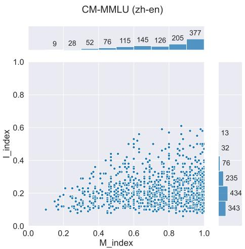  
Figure 5: The distribution of 1133 samples in the code-mixed (zh-en) MMLU. Two histograms are added around the scatter plot in this figure. The scatter plot displays the M-index and I-index for each sample. The histograms represent the distributions of two metrics.

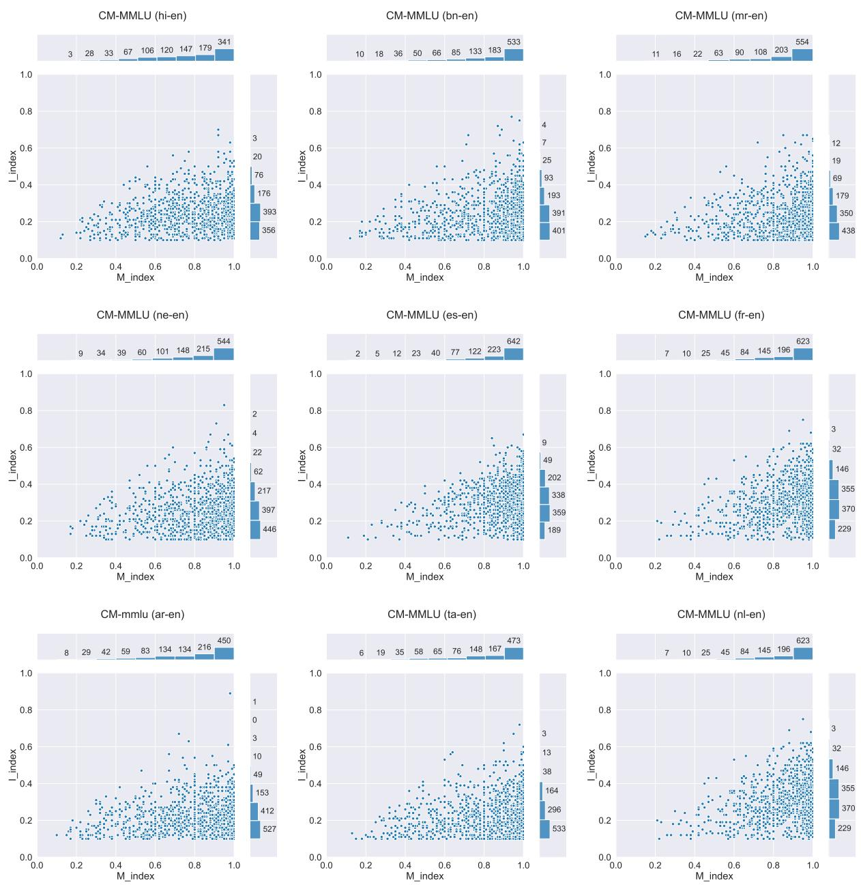  
Figure 6: Distribution of Additional synthetic code-mixing datasets in CodeMixBench.

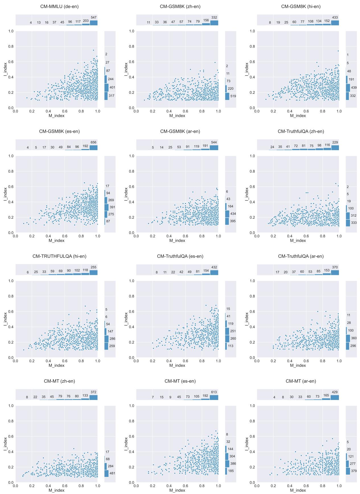  
Figure 6: Distribution of Additional synthetic code-mixing datasets in CodeMixBench.

## I Experiment Results of Collected Datasets

<table><tr><td colspan="2">GPT-3.5-Turbo-Instruct</td><td>GPT-3.5-Turbo</td><td>GPT-4-Turbo</td><td>GPT-40</td></tr><tr><td colspan="3">Language Identification (Accuracy)</td><td colspan="2"></td></tr><tr><td>zh-en</td><td>89.57</td><td>93.38</td><td>93.35</td><td>93.31</td></tr><tr><td>hok-en</td><td>46.43</td><td>43.62</td><td>45.58</td><td>58.57</td></tr><tr><td>hi-en</td><td>75.03</td><td>83.41</td><td>89.81</td><td>89.84</td></tr><tr><td>ne-en</td><td>68.46</td><td>84.47</td><td>83.63</td><td>85.87</td></tr><tr><td>mr-en</td><td>78.87</td><td>88.88</td><td>89.63</td><td>92.15</td></tr><tr><td>es-en</td><td>72.26</td><td>85.28</td><td>87.47</td><td>88.26</td></tr><tr><td>msa-ea</td><td>57.86</td><td>68.18</td><td>75.26</td><td>76.30</td></tr><tr><td>de-en</td><td>71.27</td><td>89.70</td><td>84.45</td><td>86.06</td></tr><tr><td>fy-nl</td><td>62.02</td><td>71.11</td><td>77.72</td><td>70.97</td></tr><tr><td>gn-es</td><td>76.82</td><td>85.67</td><td>89.02</td><td>89.99</td></tr><tr><td>Average</td><td>69.86</td><td>79.37</td><td>81.59</td><td>83.13</td></tr><tr><td colspan="3">Part Of Speech (Accuracy)</td><td></td><td></td></tr><tr><td>zh-en</td><td>71.21</td><td>74.83</td><td>76.47</td><td>76.91</td></tr><tr><td>hi-en</td><td>70.69</td><td>70.56</td><td>72.23</td><td>71.70</td></tr><tr><td>es-en</td><td>81.68</td><td>83.02</td><td>89.32</td><td>87.58</td></tr><tr><td>fy-nl</td><td>79.84</td><td>81.73</td><td>84.39</td><td>85.62</td></tr><tr><td>Average</td><td>75.85</td><td>77.53</td><td>80.60</td><td>80.45</td></tr><tr><td colspan="3">Named Entity Recognition (F1)</td><td></td><td></td></tr><tr><td>hi-en</td><td>79.92</td><td>93.56</td><td>93.45</td><td>93.82</td></tr><tr><td>es-en</td><td>77.12</td><td>92.84</td><td>86.21</td><td>92.00</td></tr><tr><td>msa-ea</td><td>77.95</td><td>87.70</td><td>88.12</td><td>86.11</td></tr><tr><td>gn-es</td><td>86.74</td><td>91.59</td><td>94.28</td><td>94.51</td></tr><tr><td>Average</td><td>80.43</td><td>91.42</td><td>90.51</td><td>91.61</td></tr><tr><td colspan="3">Sentiment Analysis (Accuracy)</td><td></td><td></td></tr><tr><td>hi-en</td><td>61.46</td><td>33.78</td><td>66.69</td><td>63.60</td></tr><tr><td>bn-en</td><td>62.20</td><td>53.30</td><td>69.90</td><td>76.70</td></tr><tr><td>mr-en</td><td>54.88</td><td>32.24</td><td>69.52</td><td>60.56</td></tr><tr><td>ne-en</td><td>59.81</td><td>36.07</td><td>70.28</td><td>71.68</td></tr><tr><td>es-en</td><td>46.21</td><td>46.21</td><td>57.18</td><td>50.89</td></tr><tr><td>ta-en</td><td>51.49</td><td>38.70</td><td>55.10</td><td>47.65</td></tr><tr><td>ml-en</td><td>46.88</td><td>37.83</td><td>31.77</td><td>32.11</td></tr><tr><td>Average</td><td>54.71</td><td>39.73</td><td>60.06</td><td>57.60</td></tr><tr><td colspan="3">Machine Translation (BLUE)</td><td></td><td></td></tr><tr><td> $\mathbf { z h - e n }  \mathbf { z h }$ </td><td>67.28</td><td>68.19</td><td>76.69</td><td>79.35</td></tr><tr><td> $\mathrm { z h - e n } \to \mathrm { e n } ^ { * }$ </td><td>45.47</td><td>49.00</td><td>53.21</td><td>52.78</td></tr><tr><td> $\mathbf { h o k { \mathrm { - } } Z h }  \mathbf { z h }$ </td><td>52.92</td><td>50.08</td><td>60.48</td><td>67.95</td></tr><tr><td> $\mathrm { h i - e n }  \mathrm { e n }$ </td><td>31.08</td><td>30.68</td><td>31.17</td><td>32.61</td></tr><tr><td> $\mathbf { b n \mathrm { - e n } } \to \mathbf { e n }$ </td><td>16.96</td><td>17.99</td><td>22.91</td><td>23.59</td></tr><tr><td> $\mathrm { m r } { \cdot } \mathrm { e n }  \mathrm { e n }$ </td><td>13.46</td><td>14.51</td><td>18.57</td><td>19.84</td></tr><tr><td> $\mathrm { e s - e n } \to \mathrm { e n } ^ { * }$ </td><td>63.38</td><td>65.94</td><td>68.20</td><td>68.40</td></tr><tr><td> $\mathrm { a r - e n } \to \mathrm { e n } ^ { * }$ </td><td>54.35</td><td>57.04</td><td>61.90</td><td>62.35</td></tr><tr><td>Average</td><td>43.11</td><td>44.18</td><td>49.14</td><td>50.86</td></tr></table>

Table 8: One-shot evaluation of GPT models on LID, POS, NER, SA and MT. The Average represents the mean score of each model across various datasets from a given task. For each model family, the scores of the top-performing models are highlighted in bold. "\*" indicates the datasets we synthesized.

## J Results of K-shot Experiments across Language Pairs

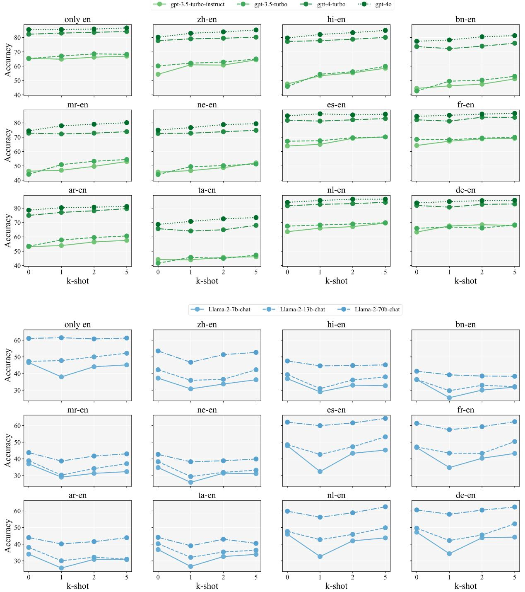  
Figure 7: Accuracy of K-shot evaluation across three model families on CM-MMLU.

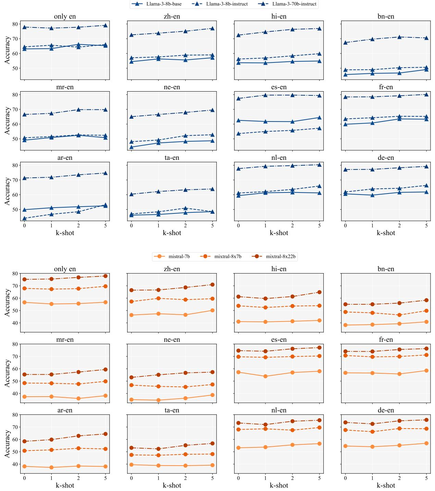  
Figure 7: Accuracy of K-shot evaluation across three model families on CM-MMLU.

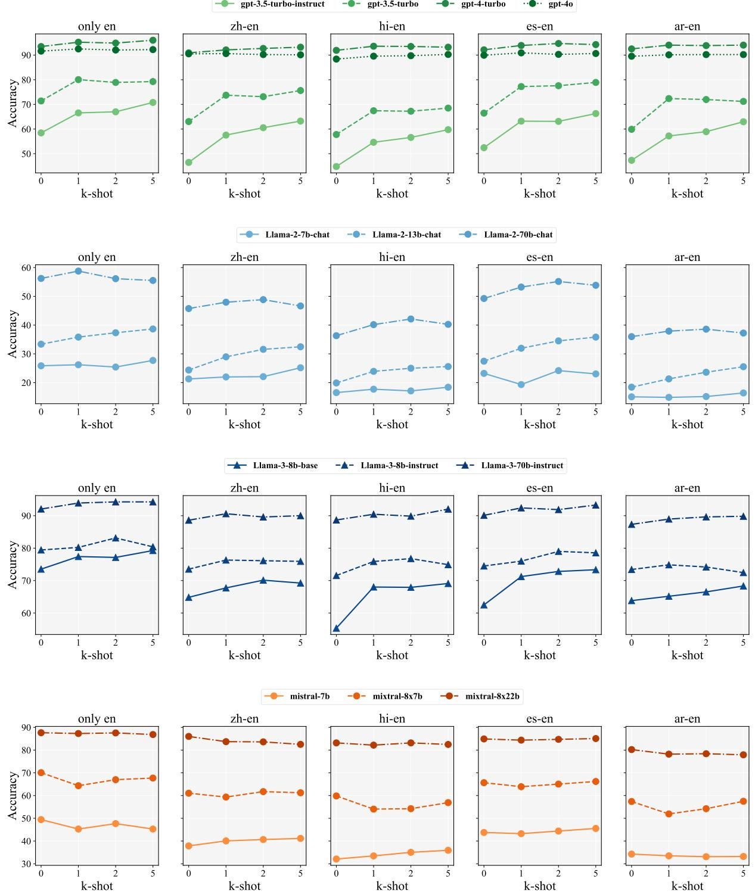  
Figure 8: Accuracy of K-shot evaluation across three model families on CM-GSM8K.

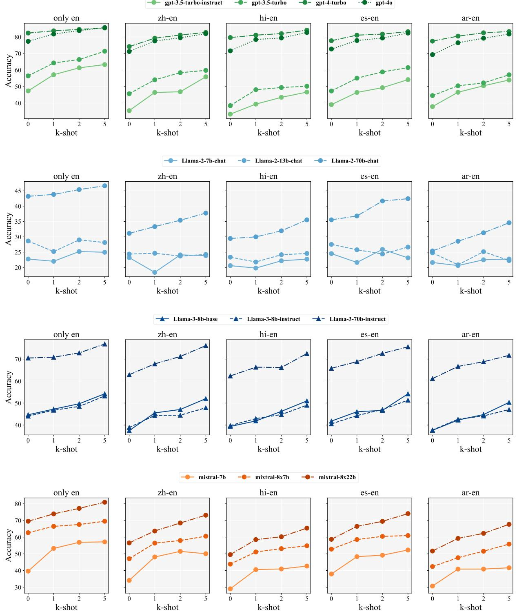  
Figure 9: Accuracy of K-shot evaluation across three model families on CM-TruthfulQA.