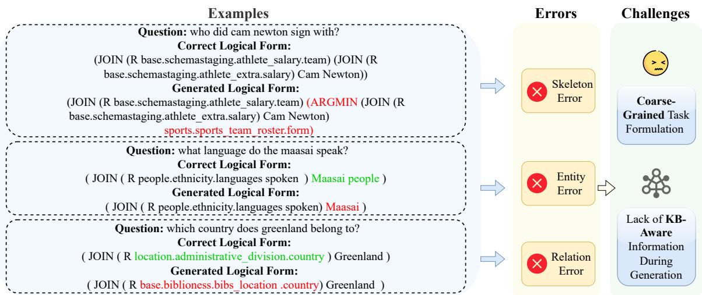
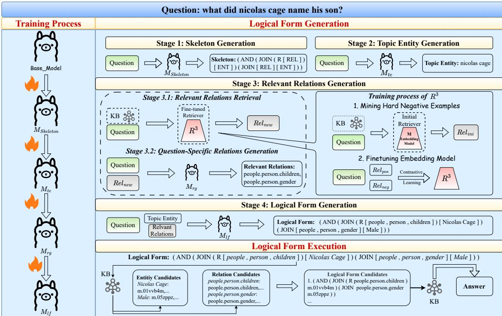
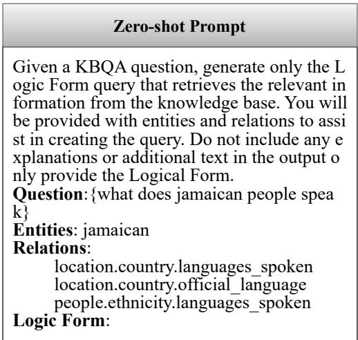
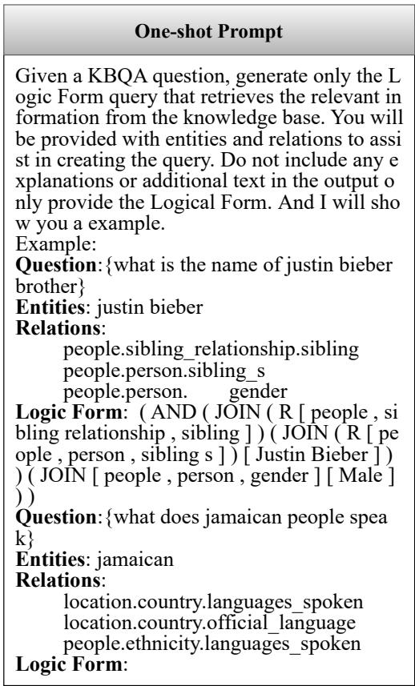

# CompKBQA: Component-wise Task Decomposition for Knowledge Base Question Answering

Yuhang Tian1, Dandan Song1\* , Zhijing Wu1, Pan Yang1,

Changzhi Zhou1, Jun Yang1, Hao Wang1, Huipeng Ma1, Chenhao Li1, Luan Zhang1 1School of Computer Science and Technology, Beijing Institute of Technology, China {tianyuhang,sdd}@bit.edu.cn

## Abstract

Knowledge Base Question Answering (KBQA) aims to extract accurate answers from the Knowledge Base (KB). Traditional Semantic Parsing (SP)-based methods are widely used but struggle with complex queries. Recently, large language models (LLMs) have shown promise in improving KBQA performance. However, the challenge of generating error-free logical forms remains, as skeleton, topic Entity, and relation Errors still frequently occur. To address these challenges, we propose Comp-KBQA (Component-wise Task Decomposition for Knowledge Base Question Answering), a novel framework that optimizes the process of fine-tuning a LLM for generating logical forms by enabling the LLM to progressively learn relevant sub-tasks like skeleton generation, topic entity generation, and relevant relations generation. Additionally, we propose R3, which retrieves and incorporates KB information into the process of logical form generation. Experimental evaluations on two benchmark KBQA datasets, WebQSP and CWQ, demonstrate that CompKBQA achieves state-of-the-art performance, highlighting the importance of task decomposition and KB-aware learning.

## 1 Introduction

Knowledge Base Question Answering (KBQA) is a long-standing and pivotal problem in the field of natural language processing (NLP) (Chowdhary and Chowdhary, 2020). Its primary objective is to extract accurate or relevant answers to natural language questions by leveraging structured information stored in a Knowledge Base (KB), such as Freebase (Bollacker et al., 2008) and DBPedia (Auer et al., 2007). A traditional and widely used method for KBQA is Semantic Parsing based methods (SP-based methods) (Berant et al., 2013), which transform natural language questions into structured queries like SPARQL (Pérez et al., 2009)

or S-Expression (Gu et al., 2021) for direct execution on the KB. This process involves multiple stages: syntactic and semantic analysis, entity and relation linking, and query generation.

In the era of large language models (LLMs) (Zhao et al., 2023), the remarkable generative capabilities of these models have led to new progress in KBQA. Compared to traditional SP-based methods, LLM-based methods demonstrate superior performance and stronger generalization capabilities, particularly in handling complex and diverse queries. Recent methods like KB-BINDER (Li et al., 2023a), KB-Coder (Nie et al., 2024), QueryAgent (Huang et al., 2024), and ARG-KBQA (Tian et al., 2024) use LLMs to generate executable logical forms for KB queries. Another emerging approach, exemplified by ChatKBQA (Luo et al., 2024a), relies on fine-tuned LLMs to generate logical forms from input questions. Fine-tuning LLMs on labeled question-query pairs enables more effective learning of domain-specific query structures, compared to prompt-based methods that rely on in-context learning.

Despite advances in the field, current methods still struggle to generate completely accurate logical forms, with persistent errors in the output. We analyze the logical forms generated by ChatK-BQA (Luo et al., 2024a) on the WebQSP dataset and find that, out of 1,639 questions in the test set, 624 corresponding Logical Forms contain errors, which mainly fall into three types, as illustrated in Figure 1: (1) Skeleton Errors occur when query components are incorrectly nested, misaligned with the KB schema, or when the overall structure of the query is inconsistent with the intended logical framework, appearing 276 times. (2) Entity Errors result from mismatches in surface forms, or the hallucination of non-existent entities, appearing 364 times. (3) Relation Errors arise when the model either misidentifies relations between entities or generates non-existent relations, appearing 528 times.

  
Figure 1: Examples of Errors in Logical Form Generation.

These errors arise from the task’s intrinsic complexities, the absence of structured intermediate reasoning steps, and the unavailability of explicit KB information during generation. The primary sources of error are as follows: (1) Coarse-Grained Task Formulation: Directly generating a complete logical form based on a natural language question is a coarse-grained task. Without prior learning through more fine-grained tasks, such as generating the skeleton of a logical form or identifying the topic entities, it is challenging for a LLM to generate the correct logical form in a single step. (2) Lack of KB-Aware Information During Generation: LLMs, which are predominantly trained on unstructured text, lack direct access to KB-specific information during the generation of logical forms. As a result, LLMs frequently produce hallucinated entities, relations, or query structures that do not exist in the KB, as demonstrated by the errors shown in Figure 1.

To address these challenges, we introduce a framework named CompKBQA: (Componentwise Task Decomposition for Knowledge Base Question Answering). Our framework is specifically designed to optimize the process of finetuning a large language model (LLM) for generating logical forms by enabling the LLM to progressively learn relevant sub-tasks and collect necessary information from KB to assist generation. For the Coarse-Grained Task Formulation, we propose CompKBQA framework. Specifically, we train the LLM to learn sequentially: first generating the skeleton of the logical form for a given question, followed by the question’s topic entity and relevant relations, and finally generating the full logical form based on these intermediate outputs. For the Lack of KB-Aware Information During Generation, we propose R3: Relevant Relations Retriever. R3 retrieves relevant information from the KB and incorporates it into the process of logical form generation by the LLM, thereby guiding the LLM’s generation process with KB knowledge.

We conduct experiments on two widely used datasets in the KBQA domain, WebQuestionsSP (WebQSP) (Yih et al., 2016) and Complex WebQuestions (CWQ) (Talmor and Berant, 2018). The experimental results demonstrate that Comp-KBQA achieves state-of-the-art (SOTA) performance on both datasets, highlighting the effectiveness of providing LLMs with relevant KB information and decomposing the direct generation task into multiple training processes, which significantly enhances generation accuracy. Besides, we compare the time consumption of CompKBQA and ChatKBQA and find their efficiencies to be similar.

In summary, the contributions of our paper are as follows:

• We propose a novel KBQA framework: CompKBQA. In contrast to directly generating logical forms, our framework optimizes the process by enabling the LLM to learn subtasks step-wise, thereby reducing errors in logical form generation.

• We propose R3, which collects questionrelated information from the KB. By incorporating KB information, the LLM becomes KB-aware during generation.

• We conduct experiments on two widely used KBQA datasets, WebQSP and ComplexWebQuestions (CWQ), and experimental results demonstrate that CompKBQA outperforms strong baselines, achieving state-of-the-art (SOTA) performance on both datasets.

## 2 Related Work

## 2.1 Traditional Semantic Parsing-Based KBQA

SP-based methods aim to convert natural language questions into query statements for KB, such as SPARQL or S-expressions. RnG-KBQA (Ye et al., 2022), TIARA (Shu et al., 2022), and DECAF (Yu et al., 2023a) leverage sequence-to-sequence models to fully generate S-expressions, introducing several enhancements to the semantic parsing process. FC-KBQA (Zhang et al., 2023) focuses on extracting fine-grained knowledge components from KB and reformulating them into intermediate knowledge pairs, which are then used to generate the final logical expressions. GMT-KBQA (Hu et al., 2022) introduces a multi-task generation-based approach that jointly learns entity disambiguation, relation classification, and logical form generation with dense retrieval.

## 2.2 LLM-Based KBQA

In the era of large language models (LLMs), many approaches leverage LLMs to generate logical forms for solving KBQA tasks. For example, Tan et al. (2023) utilize GPT-3.5 to directly generate answers to natural language questions, incorporating an answer matching strategy to improve prediction accuracy. Due to the remarkable few-shot learning and in-context learning capabilities of LLMs, some approaches (Gu et al., 2023; Li et al., 2023b; Nie et al., 2024; Jiang et al., 2023a; Xiong et al., 2024; Sun et al., 2023) leverage few-shot in-context learning to prompt LLMs to generate logical forms for given questions.

However, LLMs which are not specifically trained struggle to generate correct logical forms. ChatKBQA (Luo et al., 2024a) introduces a framework which fine-tunes the LLM to directly generate the logical form and retrieves information from KB during the execution. Triad (Zong et al., 2024) proposes a unified framework that utilizes an LLM-based agent with three roles (generalist, decision maker, and advisor) to collaboratively handle the four phases of KBQA: question parsing, URI linking, query construction, and answer generation. KBQA-o1 (Luo et al., 2025) further advances agentic KBQA by introducing a ReAct-based process for stepwise logical form generation combined with Monte Carlo Tree Search (MCTS), which balances exploration performance and search space. By leveraging heuristic exploration and incremental fine-tuning, KBQA-o1 achieves strong performance in low-resource settings, substantially improving GrailQA results over prior methods.

Unlike ChatKBQA (Luo et al., 2024a), which fine-tunes the LLM to directly generate the logical form without referencing the KB during generation, and Triad (Zong et al., 2024), which utilizes multiple LLMs to collaboratively generate SPARQL queries, our proposed method fine-tunes a single LLM to progressively learn and generate sub-tasks related to the logical form. Additionally, KB information is incorporated during the generation process, effectively mitigating three types of errors in the generated logical form.

## 3 Preliminaries

In this section, we will introduce the two key components of KBQA: Knowledge Base (KB) and the Logical Form.

Knowledge Base (KB) The Knowledge Base stores knowledge as triples $( s , r , o )$ , where s is an entity, r is a relation, and o is an entity or literal. Each entity has a unique mid, but the same friendly name can correspond to multiple mids. For example, Lebron James can refer to several entities, such as m.01jz6d, m.0gg7874, and m.03l26m.

Logical Form A Logical Form is a query that can be executed on the KB to retrieve results for a natural language question. Common forms include SPARQL and S-Expressions. For example, an S-Expression aggregates various operators, such as JOIN, AND, ARGMAX, ARGMIN, and others. The JOIN operator represents a one-hop query of a triple $( s , r , o )$ on either s or o. Specifically, $( ? , r , o )$ is denoted as (JOIN r o), while $( s , r , ? )$ is denoted as (JOIN (R r) s). The AND operator computes the intersection of two entity sets. Besides, other operators like ARGMAX and ARGMIN filter results from entity set. In this paper, we represent the entities using their friendly names.

## 4 Methodology

Our approach, as illustrated in Figure 2, consists of two main modules: Logical Form Generation and Logical Form Execution for answer retrieval. The logical form generation process is carried out through four stages: (1) Skeleton Generation, where the structural template of the logical form is produced, (2) Topic Entity Generation, which identifies the key entity in the question, (3) Relevant Relations Generation, including relation retrieval and question-specific relation prediction, and (4) Logical Form Generation, where entities and relations are integrated into a complete logical form. To accomplish these tasks, we progressively fine-tune a Large Language Model (LLM) through instruction tuning, as shown in the left of Figure 2. In the execution phase, the generated logical form is matched with the knowledge base (KB), and candidate entities and relations are scored to retrieve the final answer.

## 4.1 Skeleton Generation

The primary objective of this part is to generate the logical form skeleton, where entities and relations are replaced with placeholders. Specifically, for the questions in the training set, we replace the relations in logical forms with [REL] and the entities with [ENT], thereby constructing training data from questions to skeletons. As shown in Figure 2, for the question “what did nicolas cage name his son $\because$ , the corresponding logical form is:

$$
\begin{array} { r l } { ( \mathsf { A N D } } & { ( \mathsf { J O I N \quad } ( \mathsf { R \ p e o p 1 e \_ p e r s o n } . \mathsf { c h i l d r e n } ) \quad \mathsf { m . } \theta 1 \mathsf { v v b 4 m } ) } \\ & { ( \mathsf { J O I N \quad p e o p 1 e . } \mathsf { p e r s o n . } \mathsf { g e n d e r } \quad \mathsf { m . } \theta 5 \mathsf { z p p z } ) ) , } \end{array}
$$

while its corresponding skeleton is:

$$
\begin{array} { r } { \mathrm { ( A N D ~ \texttt ~ ( ~ J O I N ~ \texttt ~ ( ~ R ~ [ ~ R ~ E ~ L ~ ] ) ~ } [ \mathsf { E N T } ] ) \quad \mathrm { ( ~ J  O I N ~ \texttt ~ [ ~ R E L ] ) ~ \texttt ~ [ ~ E N T ] ) } \mathrm { ) } . } \end{array}
$$

By extracting the skeletons of logical forms, we eliminate specific entity and relation details, allowing the model to focus on structural patterns. We then apply Instruction Tuning to the LLM, and the fine-tuned LLM is denoted as $M _ { s k e l e t o n }$

## 4.2 Topic Entity Generation

Previous work, such as ChatKBQA (Luo et al., 2024a), has highlighted entity errors as a common challenge when fine-tuning LLMs for logical form generation. To address this, we introduce a task where the LLM learns to generate the Topic Entity from the input question. For each training question, we extract the entities in its logical form as Topic Entities, which are then used for training. We fine-tune $M _ { s k e l e t o n }$ with question-entity pairs, resulting in the model $M _ { t e }$ . The Topic Entity is represented by its surface name rather than the mid identifier. For example, in the question “What did

Nicolas Cage name his son?”, the Topic Entities are “Nicolas Cage” and “male”, key components of the corresponding logical form. Notably, the Topic Entity may not always be explicitly mentioned in the question. This task also enables the model to identify latent entities, those not directly stated but implied or inferred from the context, improving its robustness in handling such cases.

## 4.3 Relevant Relations Generation

In this section, the primary task is to retrieve and then generate the most relevant relation from the KB for a given question. The process is broken down into the following stages: Stage 1: Relevant Relations Retrieval: We propose a novel retriever named $\mathbf { R } ^ { 3 }$ , which is used to retrieve more relevant relations from the KB for questions. The training of $\mathbf { R } ^ { 3 }$ will be explained in detail in this section. Stage 2: Question-Specific Relations Generation: In this stage, the LLM learns to generate the relations necessary to solve the problem based on the question and the relations retrieved by $\mathbf { R } ^ { 3 }$

## 4.3.1 Stage 1: Relevant Relations Retrieval

The primary goal of this stage is to train a retriever denoted as $\mathbf { R } ^ { 3 }$ , involving identifying hard negative examples, fine-tuning the embedding model to differentiate relevant relations from irrelevant ones. And then we use $\mathbf { R } ^ { 3 }$ to retrieve more relevant relations from the KB.

Mining Hard Negative Examples In this stage, we aim to identify hard negative examples, which are relations similar to the golden relations but irrelevant to the question. For each question $q ,$ we perform an initial retrieval to identify these hard negatives. We define an embedding model M that encodes both $q$ and all the relations $r \in R$ from the KB. The relations are ranked based on the cosine similarity between their vector representations, and the $t o p _ { k }$ relations as selected as candidate relations for further processing. The cosine similarity between the question embedding $\mathbf { v _ { q } }$ and the relation embedding $\mathbf { v _ { r } }$ is computed as

$$
\mathrm { c o s i n e \_ s i m i l a r i t y ( v _ { q } , v _ { r } ) = \frac { \partial v _ { q } \cdot \mathbf { v } _ { r } } { \lVert \mathbf { v _ { q } } \rVert \lVert v _ { r } \rVert } . }\tag{1}
$$

The top-ranked relations obtained from this similarity computation, denoted as $R e l _ { i n i }$ , serve as the basis for the subsequent fine-tuning of the embedding model.

Once the initial set of candidate relations $R e l _ { i n i }$ is obtained, the corresponding golden relations

  
Figure 2: Overview of CompKBQA. CompKBQA is composed of two main components: Logical Form Generation and Logical Form Execution. The Logical Form Generation component is further divided into four distinct stages.

$R e l _ { g o l d e n }$ for each question $q$ are acquired from the training data, which means relations in $q ^ { * } { \bf s }$ logical form. For each question, the relations in $R e l _ { i n i }$ but not in $R e l _ { g o l d e n }$ are treated as negative samples, denoted as $R e l _ { n e g }$ , while the relations in $R e l _ { g o l d e n }$ are considered as positive samples, denoted as $R e l _ { p o s }$ . Formally, we define:

$$
\begin{array} { c } { R e l _ { n e g } = \{ r \in R e l _ { 1 s t } \mid r \not \in R e l _ { g o l d e n } \} } \\ { R e l _ { p o s } = R e l _ { g o l d e n } } \end{array}
$$

Fine-tuning the Embedding Model We then fine-tune the embedding model M (BAAI/bgelarge-en-v1.51) by optimizing a contrastive learning loss to distinguish between positive and negative samples. The loss function is defined as:

$$
L = - \sum _ { i } \log \frac { e ^ { \sin ( \mathbf { v _ { q } } , \mathbf { v _ { r e l } } _ { \mathbf { i } } ) / \tau } } { \sum _ { j } e ^ { \sin ( \mathbf { v _ { q } } , \mathbf { v _ { r e l } } _ { \mathbf { j } } ) / \tau } } ,\tag{2}
$$

where sim $( \mathbf { v _ { q } } , \mathbf { v _ { r e l } } )$ represents the cosine similarity between the question embedding $\mathbf { v _ { q } }$ and relation embedding $\mathbf { v _ { r e l } }$ , and $\tau$ is a temperature scaling parameter.

This fine-tuning process enhances the model’s ability to correctly differentiate between relevant and irrelevant relations, resulting in the fine-tuned embedding model $\mathbf { R } ^ { 3 }$

Retrieving Candidate Relations In this final stage, the fine-tuned embedding model $\mathbf { R } ^ { 3 }$ is employed to retrieve relevant candidate relations. For each question $q ,$ similarly, we encode both the question and all the relations $r \in R$ from the KB using $\mathbf { R } ^ { 3 }$ to obtain their vector representations $\mathbf { v 1 _ { q } }$ and $\mathbf { v } \mathbf { 1 } _ { \mathbf { r } }$ . The cosine similarity between these vectors is calculated, and the $t o p _ { k }$ most relevant relations are selected as $R e l _ { n e w }$ . It is important to note that $R e l _ { n e w }$ is retrieved directly from the KB, rather than being based on the initial set $R e l _ { i n i }$ . These candidate relations are then forwarded to the next stage for final selection and generation.

## 4.3.2 Stage 2: Question-Specific Relations Generation

Although $\mathbf { R } ^ { 3 }$ retrieves highly relevant relations for the query, the retrieved results inevitably contain some noise (irrelevant relations). Therefore, it is essential for LLMs to select or generate truly relevant relations from noisy candidate relations set.

Specifically, we train the model $M _ { t e }$ using a dataset where each instance consists of a question paired with candidate relations as input and the corresponding golden relations as output. In the prompt, we specify that the model should generate the correct question-relevant relations based on the candidate relations. It is allowed to select relations from the candidate set, and if necessary relations are missing, it can generate new ones. The specific prompt can be found in the Case Study I. This finetuning process results in the model $M _ { r g }$ (relation generation), which enhances the model’s ability to accurately generate the correct relation based on the retrieved candidates, addressing the issue of noisy or irrelevant relations.

## 4.4 Logical Form Generation

In this stage of training, starting with $M _ { r g }$ , we finetune the model to generate the final logical form, resulting in the model $M _ { l f }$ . The input consists of the question, the topic entity produced by $M _ { t e }$ , and the relations generated by $M _ { r g }$ .The objective of fine-tuning is to enable the model to generate the correct logical form based on the provided question and content.

During inference, we apply $M _ { l f }$ with inputs consistent with those used in training and apply beam search to generate the logical forms.

## 4.5 Logical Form Execution

After generating the logical form candidates, we need to address potential misalignments between the entities(represented by their surface names) and the relations, which may not necessarily match those in the KB. Thus, it is crucial to map the entities in the logical form to their corresponding mididentifiers and align the relations with the actual relations in the KB before execution.

Entity Alignment In this phase, for a given surface name $N _ { e n t }$ , we first check for exact matches in the KB. If any entities share the same name, we assign the $N _ { e n t }$ to $E _ { s a m e }$ and select the $\scriptstyle \mathrm { t o p } - k _ { e n t }$ entities, $E _ { c a n d } ,$ based on their popularity score, FACC1 (Gabrilovich et al., 2013). If no exact match exists, we apply the BM25 (Robertson et al., 2009) algorithm to select the most similar entities from the KB using $N _ { e n t }$ . We then apply the FACC1 score again to select the $t o p _ { k _ { e n t } }$ entities as $E _ { c a n d } .$

Relation Alignment In the relation alignment phase, for each $N _ { r e l } .$ if an identical relation exists in the KB, no replacement is made. If no exact match is found, we use SimCSE (Gao et al., 2021) to identify the $t o p _ { k _ { r e l } }$ relations, denoted as $R _ { c a n d } ,$ that are most similar to $N _ { r e l }$

After completing both alignment stages, we generate combinations of entities and relations from the $E _ { c a n d }$ and $R _ { c a n d }$ sets, selecting the top $k _ { l f }$ combinations for execution. The execution stops as soon as a non-empty result is obtained, and this result is taken as the final answer, denoted as the answer set. If no valid answer is found, an empty set is returned.

## 5 Experiments

In this section, we present the experimental validation of CompKBQA, which includes dataset descriptions, implementation details, results, and a comprehensive analysis. Our analysis is organized around the following four research questions (RQs): RQ1: How does CompKBQA perform in comparison to other approaches, and does it mitigate errors in the generated Logical Forms? RQ2: How effective is the approach of decomposing direct logical form generation into progressively learned sub-tasks? RQ3: Does $\mathbf { R } ^ { 3 }$ enhance relation retrieval? RQ4: Can CompKBQA achieve high efficiency and be plug-and-play?

Besides, we provide a case study in Appendix I to illustrate the reasoning process of our framework. In addition, Appendix F presents an efficiency analysis of our method, and Appendix G reports the experimental results obtained with the T5 model, which further verify the necessity of leveraging LLMs in our approach.

## 5.1 Datasets

We conduct experiments using two widely used KBQA datasets: WebQuestionsSP (WebQSP) (Yih et al., 2016), a well-known KBQA dataset based on Freebase, containing 4,737 natural language questions and their corresponding SPARQL queries, and Complex WebQuestions (CWQ) (Talmor and Berant, 2018), also based on Freebase, which includes 34,689 natural language questions and their corresponding SPARQL queries. The details of these datasets are provided in Appendix A.

## 5.2 Baselines

We compare CompKBQA against 25 methods, which are categorized into five major groups: 1) IRbased KBQA Methods, 2) SP-based KBQA Methods, 3) LLM-based KBQA Methods (Prompting), where we employ the same setup as RoG (Luo et al., 2024b), in which the LLM is directly used to generate answers for the given questions; 4) LLMs + KGs-based KBQA Methods (Prompting), where it is important to note that GPT-4o (1-shot) and DeepSeek-V3 (1-shot) involve inputting the skeleton, topic entities, and relevant relations generated by our model into the LLM to generate the logical form; and 5) LLMs + KGs-based KBQA Methods (Fine-tuning). Detailed descriptions of each baseline method can be found in Appendix B.

## 5.3 Evaluation Metric

Consistent with prior work, we use F1 score, Hits@1, and Accuracy (Acc) to measure the coverage of all answers, the top-ranked answer, and the strict exact-match accuracy, respectively.

## 5.4 Implementation Details

During LLM fine-tuning, we use LLaMA-2-7B for WebQSP and LLaMA-2-13B for CWQ as the base model, following the setup of ChatKBQA (Luo et al., 2024a). For the Relevant Relations Retrieval stage, we fine-tune the embedding model with BAAI/bge-large-en-v1.5. All experiments are run on two NVIDIA A6000 GPUs. Implementation details are provided in Appendix H.

## 5.5 Main Results (RQ1)

As shown in Table 1, we compare CompKBQA with other baselines on the WebQSP and CWQ datasets. Consistent with ChatKBQA (Luo et al., 2024a), we use beam search during the inference phase: a beam size of 15 on LLaMA-2-7B for WebQSP and a beam size of 8 on LLaMA-2-13B for CWQ. Compared to the best baseline model, our method achieves a 0.6% increase in F1 and a 2.1% improvement in ACC on WebQSP. On CWQ, CompKBQA outperforms the best baseline with a 1.6% increase in F1, a 1.1% improvement in Hits@1, and a 2.8% improvement in ACC. These results demonstrate that, through our componentwise task decomposition, the LLM gains a better understanding of the logical structure of questions, while also narrowing the gap between the question and the KB schema (relations and entities) from the LLM’s perspective.

At the same time, as shown in Table 1, even powerful models like GPT-4o and DeepSeek-V3 struggle to generate the correct logical form, despite being provided with the skeleton, topic entities, and relevant relations. Detailed analysis is shown in Appendix D.

Futhermore, we conduct a comparative analysis of the number of distinct error types in the Logical Forms generated by CompKBQA and ChatK-BQA on the WebQSP dataset, as detailed in the Table 2. As shown in the table, the three types of errors, including Skeleton Errors, Topic Entity Errors, and Relation Errors, have been mitigated, which demonstrates the effectiveness of CompKBQA.

<table><tr><td rowspan="2">Model</td><td colspan="3">WebQSP</td><td colspan="3">CWQ</td></tr><tr><td></td><td>F1 Hits@1 Acc</td><td></td><td>F1</td><td>Hits@1 Acc</td><td></td></tr><tr><td colspan="7">IR-based KBQA Methods</td></tr><tr><td>NSM</td><td>62.8</td><td>68.7</td><td></td><td>42.4</td><td>47.6</td><td></td></tr><tr><td>KGT5</td><td></td><td>56.1</td><td></td><td></td><td>36.5</td><td></td></tr><tr><td>Subgraph Retrieval*</td><td>64.1</td><td>69.5</td><td></td><td>47.1</td><td>50.2</td><td>一</td></tr><tr><td colspan="7">SP-based KBQA Methods</td></tr><tr><td>ArcaneQA</td><td>75.6</td><td></td><td></td><td></td><td></td><td></td></tr><tr><td>RnG-KBQA</td><td>75.6</td><td></td><td>71.1</td><td></td><td></td><td></td></tr><tr><td>DecAF</td><td>78.8</td><td>82.1</td><td></td><td></td><td>70.4</td><td></td></tr><tr><td>FC-KBQA</td><td>76.9</td><td></td><td></td><td>56.4</td><td></td><td></td></tr><tr><td>TIARA*</td><td>78.9</td><td>75.2</td><td></td><td></td><td></td><td></td></tr><tr><td colspan="7">LLMs-based Methods (Prompting)</td></tr><tr><td>GPT-3.5-Turbo</td><td></td><td>67.8</td><td>一</td><td></td><td>39.8</td><td></td></tr><tr><td>GPT-3.5-Turbo+CoT</td><td></td><td>69.0</td><td></td><td></td><td></td><td></td></tr><tr><td>GPT-40</td><td></td><td>71.2</td><td></td><td></td><td>50.6</td><td></td></tr><tr><td>GPT-4o+CoT</td><td></td><td>71.4</td><td></td><td></td><td>53.2</td><td></td></tr><tr><td>DeepSeek-V3</td><td></td><td>72.1</td><td></td><td></td><td>53.0</td><td></td></tr><tr><td>DeepSeek-V3+CoT</td><td></td><td>73.3</td><td></td><td></td><td>55.9</td><td>一</td></tr><tr><td colspan="7">LLMs+KGs-based Methods (Prompting)</td></tr><tr><td>GPT-4o (1-shot)</td><td>11.5</td><td>11.0</td><td>10.3</td><td></td><td></td><td></td></tr><tr><td>DeepSeek-V3(1-shot) 13.7</td><td></td><td>14.3</td><td>12.4</td><td></td><td></td><td></td></tr><tr><td>KB-Binder</td><td>74.4</td><td></td><td></td><td></td><td></td><td></td></tr><tr><td>KB-Coder</td><td>75.2</td><td></td><td></td><td></td><td></td><td></td></tr><tr><td>QueryAgent*</td><td>63.9</td><td></td><td></td><td></td><td></td><td></td></tr><tr><td>ARG-KBQA</td><td>75.6</td><td></td><td></td><td></td><td></td><td></td></tr><tr><td>KELDaR</td><td>76.7</td><td></td><td></td><td>44.2</td><td></td><td></td></tr><tr><td>FIDELIS</td><td>78.3</td><td>84.4</td><td></td><td>64.3</td><td>71.5</td><td></td></tr><tr><td colspan="7">LLMs+KGs-based Methods (Fine-tuning)</td></tr><tr><td>RoG</td><td>70.8</td><td>85.7</td><td></td><td>56.2</td><td>62.6</td><td></td></tr><tr><td>ReasoningLM</td><td>71.0</td><td>78.5</td><td></td><td>64.0</td><td>69.0</td><td></td></tr><tr><td>ChatKBQA</td><td>79.8</td><td>83.2</td><td></td><td>73.8 77.8</td><td>82.7</td><td>73.3</td></tr><tr><td>RGR-KBQA</td><td>80.7</td><td>84.5</td><td></td><td>72.1 76.6</td><td>82.0</td><td>72.2</td></tr><tr><td>CompKBQA(ours)</td><td>81.3</td><td>84.2</td><td></td><td>75.9 79.4</td><td>83.6</td><td>76.1</td></tr></table>

Table 1: KBQA comparison of CompKBQA with other baselines on WebQSP and CWQ datasets. The results of the models are mainly taken from their original paper. \* denotes using oracle entity linking annotations. Bold numbers indicate the best performance. GPT-4o (1-shot) and DeepSeek-V3 (1-shot) means that we input skeleton, topic entities, and relevant relations to LLM to directly generate the logical form.
<table><tr><td>Model</td><td>Skeleton</td><td>Entity</td><td>Relation</td></tr><tr><td>ChatKBQA</td><td>276</td><td>364</td><td>528</td></tr><tr><td>CompKBQA</td><td>262</td><td>232</td><td>451</td></tr><tr><td>∆</td><td>↓5.1%</td><td>↓36.3%</td><td>↓14.6%</td></tr></table>

Table 2: Comparison of Skeleton, Entity, and Relation Error Counts in Logical Forms by ChatKBQA and CompKBQA on WebQSP

## 5.6 Ablation Study (RQ2)

To validate the effectiveness of each component of CompKBQA, we conduct the following ablation experiments on the WebQSP dataset.

Comparison with Direct Generation of All

<table><tr><td>Model</td><td>F1</td><td>Hits@1</td><td>Acc</td></tr><tr><td>CompKBQA</td><td>81.3</td><td>84.2</td><td>75.9</td></tr><tr><td>all_in_output</td><td>79.6</td><td>82.6</td><td>72.4</td></tr><tr><td>all_from_base</td><td>80.3</td><td>83.3</td><td>74.2</td></tr><tr><td>w/o ske_gen</td><td>77.7</td><td>80.7</td><td>72.4</td></tr><tr><td>w/o topic_entity_gen</td><td>78.6</td><td>82.1</td><td>72.7</td></tr><tr><td>w/o rrg &amp; rr</td><td>78.6</td><td>81.6</td><td>73.2</td></tr><tr><td>w/o rrg &amp;w gr</td><td>90.5</td><td>91.9</td><td>87.4</td></tr></table>

Table 3: Ablation study results of CompKBQA components. $^ { \bullet \bullet } a l l _ { - }$ \_in\_output” refers to generating all content in one step. “all\_from\_base” refers to $M _ { t e } , M _ { r g }$ , and $M _ { s k e l e t o n }$ were trained independently from the same base model. “w/o ske $g e n ^ { \dag }$ removes the skeleton generation module, “w/o topic\_entity\_gen” removes the topic entity generation module, “w/o rrg & $r r ^ { \ast }$ removes relevant relations generation and relations, and “w/o rrg & w $g r ^ { \dag }$ removes relevant relations generation and uses golden relations.

Content We use the question as input and generate the Logical Form Skeleton, Topic Entity, Candidate Relations, and Logical Form as outputs, finetuning the LLM using instruction tuning. This model, called “all\_in\_output”, shows a significant performance drop compared to the multi-stage finetuning approach, as seen in Table 3. This highlights that even with a Chain-of-Thought (COT) (Wei et al., 2022) reasoning process, the LLM struggles to generate the correct Logical Form in one step, underscoring the need for task decomposition in CompKBQA.

Effectiveness of Skeleton and Topic Entity Generation We experiment by removing Skeleton Generation, referred to as ‘w/o ske\_gen (skeleton generation)”, and Topic Entity Generation, referred to as ‘w/o topic\_ent\_gen (Topic Entity Generation)”, and compare their performance with the CompKBQA model. The detailed results are presented in Table 3. The results demonstrate the necessity of training for skeleton generation and topic entity generation. In Appendix E, we analyze the transferability of the training in these two stages.

Effectiveness of the chained fine-tuning strategy To validate the effectiveness of the chained fine-tuning strategy, we conduct experiments on WebQSP with a model variant referred to as all\_from\_base. In this setting, $M _ { t e } , \ M _ { r g }$ , and $M _ { s k e l e t o n }$ are trained independently from the same base model, while the generation of Logical Forms is fine-tuned by using the outputs of $M _ { t e }$ and $M _ { r g }$ as inputs for $M _ { s k e l e t o n }$ . The results, reported in Table 3 under the all\_from\_base row, show that training models independently from a base model leads to a noticeable performance drop compared to our chained fine-tuning approach. This finding confirms that knowledge transfer indeed occurs throughout the chained training process.

Effectiveness of Relevant Relations Selection We conduct two ablation study experiments. The first, “w/o rele\_rel\_gen (relevant relations generation) & rele\_rel (relevant relations)”, removes the Relevant Relations Generation module, omitting relevant relations during the Logical Form Generation stage. The second, “w/o rele\_rel\_gen & w gold\_rel (golden relations)”, removes the module and inputs the golden relations directly. As shown in Table 3, the first experiment performs significantly worse than the CompKBQA model, while the second yields better results. These findings suggest that providing relevant relations helps the LLM generate more accurate logical forms.

## 5.7 Effectiveness of $\mathbf { R } ^ { 3 }$ (RQ3)

<table><tr><td>Model</td><td>Top-3</td><td>Top-5</td><td>Top-10</td><td>Top-20</td></tr><tr><td>BM25</td><td>5.00%</td><td>5.67%</td><td>6.47%</td><td>14.03%</td></tr><tr><td>SimCSE</td><td>15.62%</td><td>21.23%</td><td>28.74%</td><td>36.24%</td></tr><tr><td>Contriever</td><td>14.21%</td><td>19.71%</td><td>25.87%</td><td>32.52%</td></tr><tr><td>IEM</td><td>22.76%</td><td>29.47%</td><td>38.87%</td><td>47.53%</td></tr><tr><td>R3</td><td>69.74%</td><td>77.12%</td><td>83.10%</td><td>86.03%</td></tr></table>

Table 4: Comparison of relation retrieval performance on WebQSP

To evaluate the effectiveness of $\mathbf { R } ^ { 3 }$ , we compare its retrieval accuracy on the WebQSP dataset against BM25, SimCSE, Contriever, and the initial embedding model (denoted by IEM) by calculating the proportion of retrieved relations that match the ground-truth relations for each question. As shown in Table 4, the original BAAI/bgelarge-en-v1.5 model achieves only a 22.76% top-3 hit rate, while $\mathbf { R } ^ { 3 }$ substantially improves this to 69.74% and consistently achieves superior performance across all retrieval metrics, obtaining 69.74%, 77.12%, 83.10%, and 86.03% on Top-3, Top-5, Top-10, and Top-20 hit rates, respectively, significantly outperforming all baselines.

## 5.8 Can CompKBQA achieve high efficiency and be plug-and-play? (RQ4)

Effiency analysis To ensure a fair comparison, we evaluate the training and inference times for both ChatKBQA and CompKBQA on the WebQSP dataset, using a single NVIDIA A6000 GPU. The total training time for ChatKBQA was 14 hours and 16 minutes, while the total training time for CompKBQA was 19 hours and 46 minutes, with CompKBQA taking slightly longer. The average inference time for ChatKBQA was 3.43 seconds, and the average inference time for CompKBQA was 4.20 seconds, with both having similar speeds. The detailed results are presented in Table 8 and Table 9, respectively.

<table><tr><td>Model</td><td>F1</td><td>Hits@1</td><td>Acc</td></tr><tr><td>Flan-T5-XL</td><td>76.8</td><td>75.1</td><td>67.7</td></tr><tr><td>LLama2-7B</td><td>81.3</td><td>84.2</td><td>75.9</td></tr><tr><td>LLaMA-3.1-8B</td><td>81.7</td><td>84.5</td><td>75.8</td></tr><tr><td>Qwen-2.5-7B</td><td>81.8</td><td>84.3</td><td>75.4</td></tr><tr><td>LLaMA-3-8B</td><td>82.0</td><td>84.4</td><td>76.1</td></tr></table>

Table 5: Comparison of results between other models and LLaMA2-7B

The plug-and-play characteristics To evaluate the adaptability of CompKBQA with different base models, we conduct experiments employing Flan-T5-XL, LLaMA-3-8B, LLaMA-3.1-8B, and Qwen-2.5-7B within the CompKBQA pipline on the WebQSP dataset. The results of these experiments are presented in Table 5. As evidenced by the results, CompKBQA consistently achieves promising performance across these diverse base models, thereby highlighting its plug-and-play characteristics.

## 6 Conclusion

In this work, we propose CompKBQA, a novel framework that decomposes the task of fine-tuning large language models (LLMs) for KBQA into four core components: Skeleton Generation, Topic Entity Generation, Relevant Relations Selection, and Logical Form Generation. By breaking down the process into these subtasks, we address key challenges including the lack of KB-aware information and coarse-grained task formulation. Experimental results on WebQSP and CWQ demonstrate that CompKBQA achieves state-of-the-art performance, highlighting the effectiveness of task decomposition and providing LLMs with relevant KB information.

## Limitations

In this paper, we introduce CompKBQA, a novel framework that decomposes the task of fine-tuning large language models (LLMs) for Knowledge Base Question Answering (KBQA) into four core components. While CompKBQA demonstrates significant improvements in LLMs’ ability to generate accurate logical forms, there are several limitations worth noting. First, the performance of Comp-KBQA is highly dependent on the quality and completeness of the underlying Knowledge Base (KB). If the KB is incomplete, outdated, or inaccurate, errors in entity identification and relation generation are likely to arise. Second, fine-tuning large language models across multiple subtasks can be resource-intensive, posing scalability challenges. Finally, as analyzed in Appendix C, CompKBQA still suffers from errors such as incorrect entity disambiguation, relation matching, and structural issues in logical forms. We leave addressing these error types as an important direction for future work.

## Ethics Statement

In this work, we use publicly available datasets and do not collect any personally identifiable information. All datasets and models are utilized in full compliance with their intended purposes and respective licenses. The primary goal of this work is to mitigate the three types of errors in the logical form generation of the LLM; we condemn any potential misuse.

## Acknowledgements

This work was supported by the National Key Research and Development Program of China (Grant No. 2022YFC3302100) and the National Natural Science Foundation of China (Grant No. 62476025). We would like to express our sincere gratitude to Prof. Jing Jiang of the Australian National University for her insightful guidance and generous help on this work.

## References

Sören Auer, Christian Bizer, Georgi Kobilarov, Jens Lehmann, Richard Cyganiak, and Zachary Ives. 2007. Dbpedia: A nucleus for a web of open data. In international semantic web conference, pages 722– 735. Springer.

Jonathan Berant, Andrew Chou, Roy Frostig, and Percy Liang. 2013. Semantic parsing on freebase from question-answer pairs. In Proceedings of the 2013 conference on empirical methods in natural language processing, pages 1533–1544.

Kurt Bollacker, Colin Evans, Praveen Paritosh, Tim Sturge, and Jamie Taylor. 2008. Freebase: a collaboratively created graph database for structuring human

knowledge. In Proceedings of the 2008 ACM SIG-MOD international conference on Management of data, pages 1247–1250.

KR1442 Chowdhary and KR Chowdhary. 2020. Natural language processing. Fundamentals of artificial intelligence, pages 603–649.

Tengfei Feng and Liang He. 2025. Rgr-kbqa: Generating logical forms for question answering using knowledge-graph-enhanced large language model. In Proceedings of the 31st International Conference on Computational Linguistics, pages 3057–3070.

Evgeniy Gabrilovich, Michael Ringgaard, and Amarnag Subramanya. 2013. Facc1: Freebase annotation of clueweb corpora, version 1 (release date 2013-06-26, format version 1, correction level 0).

Tianyu Gao, Xingcheng Yao, and Danqi Chen. 2021. SimCSE: Simple contrastive learning of sentence embeddings. In Proceedings of the 2021 Conference on Empirical Methods in Natural Language Processing, pages 6894–6910, Online and Punta Cana, Dominican Republic. Association for Computational Linguistics.

Yu Gu, Xiang Deng, and Yu Su. 2023. Don’t generate, discriminate: A proposal for grounding language models to real-world environments. In Proceedings of the 61st Annual Meeting of the Association for Computational Linguistics (Volume 1: Long Papers), pages 4928–4949, Toronto, Canada. Association for Computational Linguistics.

Yu Gu, Sue Kase, Michelle Vanni, Brian Sadler, Percy Liang, Xifeng Yan, and Yu Su. 2021. Beyond iid: three levels of generalization for question answering on knowledge bases. In Proceedings of the Web Conference 2021, pages 3477–3488.

Yu Gu and Yu Su. 2022. Arcaneqa: Dynamic program induction and contextualized encoding for knowledge base question answering. arXiv preprint arXiv:2204.08109.

Gaole He, Yunshi Lan, Jing Jiang, Wayne Xin Zhao, and Ji-Rong Wen. 2021. Improving multi-hop knowledge base question answering by learning intermediate supervision signals. In Proceedings of the 14th ACM International Conference on Web Search and Data Mining, WSDM ’21, page 553–561, New York, NY, USA. Association for Computing Machinery.

Xixin Hu, Xuan Wu, Yiheng Shu, and Yuzhong Qu. 2022. Logical form generation via multi-task learning for complex question answering over knowledge bases. In Proceedings ofthe 29th International Conference on Computational Linguistics, pages 1687– 1696, Gyeongju, Republic of Korea. International Committee on Computational Linguistics.

Xiang Huang, Sitao Cheng, Shanshan Huang, Jiayu Shen, Yong Xu, Chaoyun Zhang, and Yuzhong Qu. 2024. Queryagent: A reliable and efficient reasoning framework with environmental feedback based selfcorrection. arXiv preprint arXiv:2403.11886.

Jinhao Jiang, Kun Zhou, Zican Dong, Keming Ye, Xin Zhao, and Ji-Rong Wen. 2023a. StructGPT: A general framework for large language model to reason over structured data. In Proceedings ofthe 2023 Conference on Empirical Methods in Natural Language Processing, pages 9237–9251, Singapore. Association for Computational Linguistics.

Jinhao Jiang, Kun Zhou, Wayne Xin Zhao, Yaliang Li, and Ji-Rong Wen. 2023b. Reasoninglm: Enabling structural subgraph reasoning in pre-trained language models for question answering over knowledge graph. arXiv preprint arXiv:2401.00158.

Jinhao Jiang, Kun Zhou, Xin Zhao, and Ji-Rong Wen. 2023c. Unikgqa: Unified retrieval and reasoning for solving multi-hop question answering over knowledge graph. In The Eleventh International Conference on Learning Representations, ICLR 2023, Kigali, Rwanda, May 1-5, 2023. OpenReview.net.

Tianle Li, Xueguang Ma, Alex Zhuang, Yu Gu, Yu Su, and Wenhu Chen. 2023a. Few-shot in-context learning for knowledge base question answering. arXiv preprint arXiv:2305.01750.

Tianle Li, Xueguang Ma, Alex Zhuang, Yu Gu, Yu Su, and Wenhu Chen. 2023b. Few-shot in-context learning on knowledge base question answering. In Proceedings of the 61st Annual Meeting of the Associationfor Computational Linguistics (Volume 1: Long Papers), pages 6966–6980, Toronto, Canada. Association for Computational Linguistics.

Yading Li, Dandan Song, Changzhi Zhou, Yuhang Tian, Hao Wang, Ziyi Yang, and Shuhao Zhang. 2024. A framework of knowledge graph-enhanced large language model based on question decomposition and atomic retrieval. In Findings of the Association for Computational Linguistics: EMNLP 2024, pages 11472–11485, Miami, Florida, USA. Association for Computational Linguistics.

Haoran Luo, Haihong E, Yikai Guo, Qika Lin, Xiaobao Wu, Xinyu Mu, Wenhao Liu, Meina Song, Yifan Zhu, and Luu Anh Tuan. 2025. Kbqa-o1: Agentic knowledge base question answering with monte carlo tree search. CoRR, abs/2501.18922.

Haoran Luo, Haihong E, Zichen Tang, Shiyao Peng, Yikai Guo, Wentai Zhang, Chenghao Ma, Guanting Dong, Meina Song, Wei Lin, Yifan Zhu, and Anh Tuan Luu. 2024a. Chatkbqa: A generate-thenretrieve framework for knowledge base question answering with fine-tuned large language models. In Findings ofthe Associationfor Computational Linguistics, ACL 2024, Bangkok, Thailand and virtual meeting, August 11-16, 2024, pages 2039–2056. Association for Computational Linguistics.

Linhao Luo, Yuan-Fang Li, Gholamreza Haffari, and Shirui Pan. 2024b. Reasoning on graphs: Faithful and interpretable large language model reasoning. In The Twelfth International Conference on Learning Representations, ICLR 2024, Vienna, Austria, May 7-11, 2024. OpenReview.net.

Zhijie Nie, Richong Zhang, Zhongyuan Wang, and Xudong Liu. 2024. Code-style in-context learning for knowledge-based question answering. In Proceedings of the AAAI Conference on Artificial Intelligence, volume 38, pages 18833–18841.

Jorge Pérez, Marcelo Arenas, and Claudio Gutierrez. 2009. Semantics and complexity of sparql. ACM Transactions on Database Systems (TODS), 34(3):1– 45.

Stephen Robertson, Hugo Zaragoza, et al. 2009. The probabilistic relevance framework: Bm25 and beyond. Foundations and Trends® in Information Retrieval, 3(4):333–389.

Apoorv Saxena, Adrian Kochsiek, and Rainer Gemulla. 2022. Sequence-to-sequence knowledge graph completion and question answering. arXiv preprint arXiv:2203.10321.

Yiheng Shu, Zhiwei Yu, Yuhan Li, Börje F Karlsson, Tingting Ma, Yuzhong Qu, and Chin-Yew Lin. 2022. Tiara: Multi-grained retrieval for robust question answering over large knowledge bases. arXiv preprint arXiv:2210.12925.

Yuan Sui, Yufei He, Nian Liu, Xiaoxin He, Kun Wang, and Bryan Hooi. 2024. Fidelis: Faithful reasoning in large language model for knowledge graph question answering. Preprint, arXiv:2405.13873.

Jiashuo Sun, Chengjin Xu, Lumingyuan Tang, Saizhuo Wang, Chen Lin, Yeyun Gong, Heung-Yeung Shum, and Jian Guo. 2023. Think-on-graph: Deep and responsible reasoning of large language model with knowledge graph. arXiv preprint arXiv:2307.07697.

Alon Talmor and Jonathan Berant. 2018. The web as a knowledge-base for answering complex questions. arXiv preprint arXiv:1803.06643.

Yiming Tan, Dehai Min, Yu Li, Wenbo Li, Nan Hu, Yongrui Chen, and Guilin Qi. 2023. Can chatgpt replace traditional KBQA models? an in-depth analysis of the question answering performance of the GPT LLM family. In The Semantic Web - ISWC 2023 - 22nd International Semantic Web Conference, Athens, Greece, November 6-10, 2023, Proceedings, Part I, volume 14265 of Lecture Notes in Computer Science, pages 348–367. Springer.

Yuhang Tian, Dandan Song, Zhijing Wu, Changzhi Zhou, Hao Wang, Jun Yang, Jing Xu, Ruanmin Cao, and Haoyu Wang. 2024. Augmenting reasoning capabilities of llms with graph structures in knowledge base question answering. In Findings ofthe Association for Computational Linguistics: EMNLP 2024, pages 11967–11977.

Jason Wei, Xuezhi Wang, Dale Schuurmans, Maarten Bosma, Fei Xia, Ed Chi, Quoc V Le, Denny Zhou, et al. 2022. Chain-of-thought prompting elicits reasoning in large language models. Advances in neural information processing systems, 35:24824–24837.

Guanming Xiong, Junwei Bao, and Wen Zhao. 2024. Interactive-kbqa: Multi-turn interactions for knowledge base question answering with large language models. Preprint, arXiv:2402.15131.

Xi Ye, Semih Yavuz, Kazuma Hashimoto, Yingbo Zhou, and Caiming Xiong. 2022. RNG-KBQA: generation augmented iterative ranking for knowledge base question answering. In Proceedings of the 60th Annual Meeting of the Association for Computational Linguistics (Volume 1: Long Papers), ACL 2022, Dublin, Ireland, May 22-27, 2022, pages 6032–6043. Association for Computational Linguistics.

Wen-tau Yih, Matthew Richardson, Christopher Meek, Ming-Wei Chang, and Jina Suh. 2016. The value of semantic parse labeling for knowledge base question answering. In Proceedings ofthe 54th Annual Meeting ofthe Associationfor Computational Linguistics (Volume 2: Short Papers), pages 201–206.

Donghan Yu, Sheng Zhang, Patrick Ng, Henghui Zhu, Alexander Hanbo Li, Jun Wang, Yiqun Hu, William Yang Wang, Zhiguo Wang, and Bing Xiang. 2023a. Decaf: Joint decoding of answers and logical forms for question answering over knowledge bases. In The Eleventh International Conference on Learning Representations, ICLR 2023, Kigali, Rwanda, May 1-5, 2023. OpenReview.net.

Donghan Yu, Sheng Zhang, Patrick Ng, Henghui Zhu, Alexander Hanbo Li, Jun Wang, Yiqun Hu, William Yang Wang, Zhiguo Wang, and Bing Xiang. 2023b. DecAF: Joint decoding of answers and logical forms for question answering over knowledge bases. In The Eleventh International Conference on Learning Representations.

Jing Zhang, Xiaokang Zhang, Jifan Yu, Jian Tang, Jie Tang, Cuiping Li, and Hong Chen. 2022. Subgraph retrieval enhanced model for multi-hop knowledge base question answering. In Proceedings of the 60th Annual Meeting ofthe Associationfor Computational Linguistics (Volume 1: Long Papers), ACL 2022, Dublin, Ireland, May 22-27, 2022, pages 5773–5784. Association for Computational Linguistics.

Lingxi Zhang, Jing Zhang, Yanling Wang, Shulin Cao, Xinmei Huang, Cuiping Li, Hong Chen, and Juanzi Li. 2023. FC-KBQA: A fine-to-coarse composition framework for knowledge base question answering. In Proceedings of the 61st Annual Meeting of the Association for Computational Linguistics (Volume 1: Long Papers), pages 1002–1017, Toronto, Canada. Association for Computational Linguistics.

Wayne Xin Zhao, Kun Zhou, Junyi Li, Tianyi Tang, Xiaolei Wang, Yupeng Hou, Yingqian Min, Beichen Zhang, Junjie Zhang, Zican Dong, et al. 2023. A survey of large language models. arXiv preprint arXiv:2303.18223.

Chang Zong, Yuchen Yan, Weiming Lu, Jian Shao, Yongfeng Huang, Heng Chang, and Yueting Zhuang. 2024. Triad: A framework leveraging a multi-role

llm-based agent to solve knowledge base question answering. In Proceedings of the 2024 Conference on Empirical Methods in Natural Language Processing, EMNLP 2024, Miami, FL, USA, November 12-16, 2024, pages 1698–1710. Association for Computational Linguistics.

## Appendix

## A Datasets

In this work, we use two mainstream KBQA datasets: WebQuestionSP (WebQSP) (Yih et al., 2016) 2 and Complex WebQuestions (CWQ) (Talmor and Berant, 2018) 3.

WebQSP is a well-known KBQA dataset based on Freebase, containing 4,737 natural language questions and their corresponding SPARQL queries. The primary goal of this dataset is to assess the generalization ability of models in an i.i.d. setting, as both the training and testing data involve the same entities and relations.

CWQ is another prominent KBQA dataset, also based on Freebase, with 34,689 natural language questions and corresponding SPARQL queries. The questions in CWQ are more complex, with up to 4-hop queries.

The statistics of the datasets are given in Table 6. The statistics on the number of relations involved in the Logical Forms of questions in the dataset are shown in Table 7.

For both WebQSP and CWQ datasets, reasoning can be performed using Freebase knowledge graphs4 (Bollacker et al., 2008). To make the knowledge graphs more manageable in size, we created a Freebase subgraph, following the approach of previous studies (Jiang et al., 2023c; Luo et al., 2024b; Sui et al., 2024). This subgraph was constructed by selecting all triples that fall within the maximum reasoning hop distance from the question entities in WebQSP and CWQ.

## B Baselines

We compare CompKBQA with the following baselines divided into five classes: 1) IR-based KBQA Methods, 2) SP-based KBQA Methods, 3) LLMbased KBQA Methods (Prompting), 4) LLMs + KGs-based KBQA Methods (Prompting), and 5) LLMs + KGs-based KBQA Methods (Fine-tuning).

## B.1 IR-based KBQA Methods

NSM (He et al., 2021) proposes a teacher-student approach for multi-hop KBQA, where the teacher network uses bidirectional reasoning to generate reliable intermediate supervision signals, improving the student network’s reasoning capacity.

<table><tr><td>Datasets</td><td>#Train</td><td>#Test</td><td>Max #hop</td><td>#Entity</td><td>#Relation</td><td>1hop</td><td>2hop</td><td>3hop</td></tr><tr><td>WebQSP</td><td>3,098</td><td>1,639</td><td>2</td><td>2461</td><td>628</td><td>65.49%</td><td>34.51%</td><td>0.00%</td></tr><tr><td>CWQ</td><td>27,639</td><td>3,519</td><td>4</td><td>11422</td><td>845</td><td>40.91%</td><td>38.34%</td><td>20.75%</td></tr></table>

Table 6: The statistics of WebQSP and CWQ
<table><tr><td colspan="5">Number of relations used</td></tr><tr><td>Datasets</td><td>1</td><td>2</td><td>3</td><td>4 &gt;=5</td></tr><tr><td>WebQSP</td><td>55.44%</td><td>23.14%</td><td>16.89%</td><td>3.85%</td></tr><tr><td>CWQ</td><td>0.00%</td><td>32.88% 34.04%</td><td>20.51%</td><td>0.69% 12.28%</td></tr></table>

Table 7: The statistics of number of relations in Logical Forms

KGT5 (Saxena et al., 2022) demonstrates that an off-the-shelf encoder-decoder Transformer model, when applied as a sequence-to-sequence task for knowledge graph link prediction and question answering.

SubgraphRetrieval (Zhang et al., 2022) introduces a trainable subgraph retriever (SR) decoupled from reasoning, enabling a plug-and-play framework to enhance subgraph-oriented KBQA models.

## B.2 SP-based KBQA Methods

ArcaneQA (Gu and Su, 2022) dynamically generates the query based on results from previous steps.

Rng-KBQA (Ye et al., 2022) first enumerates all possible queries and then finetune T5 model to get the final output.

DecAF (Yu et al., 2023b) proposes a framework that jointly generates logical forms and direct answers for KBQA, combining their strengths to improve accuracy.

FC-KBQA (Zhang et al., 2023) introduces FC-KBQA, a Fine-to-Coarse Composition framework that extracts fine-grained knowledge components from KBs and reformulates them into middlegrained pairs to ensure generalization and excitability.

TIARA (Shu et al., 2022) enhances PLM-based KBQA by incorporating multi-grained retrieval to provide relevant KB context and constrained decoding to improve logical form generation.

## B.3 LLM-based KBQA Methods

In this type of method, we use the same setup as RoG (Luo et al., 2024b) and directly prompt the LLM to generate the answer.

GPT-3.5-Turbo, GPT-4o, and DeepSeek-V3 are powerful closed-source LLMs that could follow instructions to conduct complex tasks.

CoT uses the Chain-of-thought prompt (Wei et al., 2022) to improve the reason ability of Chat-GPT.

## B.4 LLMs + KGs-based KBQA Methods (Prompting)

GPT-4o (1-shot) and DeepSeek-V3 (1-shot) means inputting the skeleton, topic entities, and relevant relations generated by our model into the LLM to generate the logical form.

KB-Binder (Li et al., 2023b) enables few-shot KBQA using large language models and BM25 matching, achieving strong performance across datasets without training.

KB-Coder (Nie et al., 2024) proposes a codestyle in-context learning method for KBQA, converting logical form generation into code generation for LLMs, reducing format errors.

QuertAgent (Huang et al., 2024) introduces a framework with ERASER, a step-wise selfcorrection method using environmental feedback, significantly improving reliability and efficiency in semantic parsing.

ARG-KBQA (Tian et al., 2024) proposes a framework that enhances LLMs for KBQA by retrieving question-related graph structures using a two-stage ranker.

KELDaR (Li et al., 2024) enhances LLMs for KGQA by introducing question decomposition and atomic retrieval, using a decomposition tree to guide atomic-level KG subgraph retrieval for answering complex questions.

FIDELIS (Sui et al., 2024) introduces a retrievalaugmented reasoning method that enhances KGQA by anchoring responses to verifiable reasoning paths, using keyword-enhanced retrieval and stepwise beam search to ensure accuracy.

## B.5 LLMs + KGs-based KBQA Methods (Fine-tuning)

RoG (Luo et al., 2024b) proposes a method that integrates LLMs with KGs using a planning-retrievalreasoning framework to generate faithful and interpretable reasoning paths.

ReasoningLM (Jiang et al., 2023b) introduces a PLM enhanced with subgraph-aware self-attention and adaptation tuning, enabling direct subgraph reasoning for KGQA.

ChatKBQA (Luo et al., 2024a) presents a generate-then-retrieve KBQA framework that uses fine-tuned LLMs to generate logical forms and unsupervised retrieval to replace entities and relations.

RGR-KBQA (Feng and He, 2025) proposes a semantic parsing method that enhances knowledge base question answering by using a two-step retrieval process to reduce hallucination issues in large language models.

## C Error Analysis

To better understand the remaining limitations of CompKBQA, we conduct a detailed error analysis on its incorrect predictions over the WebQSP test set. We analyze all incorrect cases and categorize them as follows:

• Skeleton correct, but entity/relation errors (42.5%): The logical structure is correct, but incorrect entities or relations are generated.

• Skeleton errors (24.6%): Fundamental structural issues occur in the generated logical forms.

• Correct LF in beam search, but wrong final answer (17.5%): The correct logical form appears in the beam search results but is not selected as the final output.

• Generated LF correct, but execution failed (7.9%): The logical form is correct, but execution errors arise during entity/relation alignment.

• No answer retrieved (6.0%): The system fails to retrieve any answer from the KB.

• LF completely correct but parsing failed (1.4%): The logical form and alignment are correct, but technical parsing issues prevent successful execution.

This analysis reveals that most errors stem from incorrect entity disambiguation or relation matching during the alignment phase, even when the logical structure itself is correct. Future work will therefore focus on improving the entity linking process, for example by performing entity linking prior to logical form generation.

## D Comparison with GPT-4o and DeepSeek-V3

Our objective is to investigate the capability of commercial large language models, such as GPT-4o and DeepSeek-V3, to generate correct Logical Forms directly from a given question, the associated subject entity, and relevant relations, without any finetuning. Specifically, we feed LLM the question, topic entity, and relevant relations as input, with the expected output being the correct logical form. A sample prompt is shown in Figure 3. In the zero-shot setting, GPT-4o and DeepSeek-V3 fails to generate a valid form in the expected format. We then conduct a one-shot experiment, providing a fixed example for all queries to guide the model. A sample prompt is shown in Figure 4.

In the one-shot experiment, GPT-4o generates syntactically correct logical forms, but accuracy remains limited. Specifically, only 642 out of 1639 forms have correct skeleton structures, and only 194 are fully correct, the detailed results are shown in Table 5. These results suggest that, despite improvements in formatting, commercial large language models like GPT-4o or DeepSeek-V3 struggle with accuracy due to a limited understanding of question structures and the structure of KB. Even with the topic entity and candidate relations provided, models like GPT-4o, unfamiliar with the KB query structure, continue to make errors.

## E Analysis on the transferability of Stage 1 and Stage 2 Training

We find that Stage 1: Skeleton Generation and Stage 2: Topic Entity Generation are KBindependent. To investigate the necessity of retraining these stages across different datasets, We use the models trained through Stage 1 and Stage 2 on CWQ to continue with Stage 3 and Stage 4 on WebQSP. For comparison, we also train Stage 3 and Stage 4 directly on the base model without the prior training of Stage 1 and Stage 2. The experimental results are presented in Table 10.

As seen from the table, continuing training Stage 3 and Stage 4 using the models that completed Stage 1 and Stage 2 training on CWQ results in better performance compared to directly applying

<table><tr><td>Model</td><td>Skeleton</td><td>Topic Entity</td><td>Relvant Relations</td><td>Logic Form</td><td>Total Time</td></tr><tr><td>ChatKBQA</td><td></td><td></td><td></td><td>14h16min</td><td>14h16min</td></tr><tr><td>CompKBQA</td><td>4h13min</td><td>5h8min</td><td>4h23min</td><td>6h2min</td><td>19h46min</td></tr></table>

Table 8: Comparison of training time
<table><tr><td>Model</td><td>Topic Entity</td><td>Relvant Relations</td><td>Logic Form</td><td>Total Time</td><td>Average Time per question</td></tr><tr><td>ChatKBQA</td><td></td><td></td><td>1h33min</td><td>1h33min</td><td>3.42s</td></tr><tr><td>CompKBQA</td><td>2min</td><td>5min</td><td>1h48min</td><td>1h55min</td><td>4.20s</td></tr></table>

Table 9: Comparison of inference time

Figure 3: Prompt for zero-shot GPT-4o experiment
<table><tr><td>Model</td><td>F1</td><td>Hits@1</td><td>Acc</td></tr><tr><td>CompKBQA</td><td>81.3</td><td>84.2</td><td>75.9</td></tr><tr><td>w/o $1 &amp;&amp; S2</td><td>78.1</td><td>79.8</td><td>71.2</td></tr><tr><td>w S1 &amp;&amp; S2 from CWQ</td><td>80.2</td><td>82.8</td><td>73.4</td></tr></table>

Table 10: The experimental results of the reusability of Stage 1 and Stage 2 Training

Stage 3 and Stage 4 to the base model. This demonstrates the transferability of the training results from Stage 1 and Stage 2. However, there is still a slight gap when compared to full training on the WebQSP dataset. This is because each dataset has different question structures, such as varying hop counts, which lead to differences in the skeleton of the logical query statements.

## F Comparison of Time Complexity with Baseline

In this section, we compare the training and inference times of CompKBQA and ChatKBQA (Luo et al., 2024a).

  
Figure 4: Prompt for one-shot GPT-4o experiment

## F.1 Training Time

we compare the training times of CompKBQA with ChatKBQA, and the results are shown in Table 8. To ensure a fair comparison, we tested the training times for both ChatKBQA and CompKBQA on the WebQSP dataset using a single NVIDIA A6000 GPU. It can be observed that CompKBQA takes longer to train than ChatKBQA.

## F.2 Inference Time

We compared the inference time of CompKBQA with that of ChatKBQA on the WebQSP dataset using a single NVIDIA A6000 GPU, and the results are shown in Table 9. It can be observed that the inference time of our model is similar to that of ChatKBQA. This is because the additional two components, which generate the Topic Entity and Relevant Relations for each question, use greedy decoding during inference and employ multithreading, making the process very fast. As a result, the efficiency of the inference phase is minimally impacted.

## G Comparison with T5 model

We use the Flan-T5-XL, following the same training pipeline, which includes skeleton generation, topic entity generation, relevant relations generation, and logical form generation. Their performance is compared with CompKBQA, as shown in Table 5. The results show that larger models generate more accurate logical forms after training, highlighting the importance of using models like Llama2-7B for improved performance.

## H Implementation Details

In this section, we introduce the implementation details of each module.

The hyperparameters for each stage of Comp-KBQA are summarized in Table 11.

## I Case Study

To provide a comprehensive understanding of the CompKBQA framework, we present a case study in Table 12, which demonstrates that when faced with the same question, ChatKBQA generated an incorrect Logical Form, while CompKBQA, through step-by-step decomposition, was able to generate the correct Logical Form.

<table><tr><td>Hyperparameter</td><td>WebQSP</td><td>CWQ</td></tr><tr><td colspan="3">Logical Form Generation</td></tr><tr><td>LLM</td><td>LLaMA-2-7B</td><td>LLaMA-2-13B</td></tr><tr><td>Fine-tuning Type</td><td>LoRA</td><td>LoRA</td></tr><tr><td>Train Batch Size</td><td>{1,2,3,4}</td><td>{1,2,3,4}</td></tr><tr><td>Learning Rate</td><td>{5e-5,1e-4,4e-4}</td><td>{5e-5,1e-4,4e-4}</td></tr><tr><td>Train Epoch</td><td>{10,50,100}</td><td>{10,50,100}</td></tr><tr><td>Test Batch Size</td><td>{1,2,3,4}</td><td>{1,2,3,4}</td></tr><tr><td>Beam Size</td><td>{1,2,5,8,15}</td><td>{1,2,5,8}</td></tr><tr><td colspan="3"> $\mathbf { R } ^ { 3 }$ </td></tr><tr><td>top_k for Hard Negative Examples</td><td>20</td><td>20</td></tr><tr><td>Train Epoch</td><td>20</td><td>10</td></tr><tr><td>Learning Rate</td><td>1e-5</td><td>1e-5</td></tr><tr><td>top-k for Retrieving Candidate Relations</td><td>1,3,5,10</td><td>1,3,8,10</td></tr><tr><td colspan="3">Logical Form Execution</td></tr><tr><td>Retrieval Type</td><td>SimCSE</td><td>SimCSE</td></tr><tr><td>top - kent</td><td>50</td><td>50</td></tr><tr><td>top − krel</td><td>15</td><td>15</td></tr></table>

Table 11: Hyperparameter in CompKBQA’s each stage
<table><tr><td>Question</td><td colspan="2">where did rick santorum attend high school?</td></tr><tr><td colspan="3">ChatKBQA</td></tr><tr><td rowspan="2">Skeleton Generation</td><td>Input</td><td>Generate a Logical Form query that retrieves the information corre- sponding to the given question. Question: where did rick santorum attend high school</td></tr><tr><td>Output</td><td>Logical Form: ( AND (JOIN [ common , topic , notable types ] [ School ]) (JOIN (R [ education , education , institution ]) (JOIN ( R [ people , person , education ]) [ Rick Santorum ])))</td></tr><tr><td></td><td>CompKBQA</td><td>Given a KBQA question, you should generate a skeleton of the Logical</td></tr><tr><td rowspan="2">Skeleton Generation</td><td>Input</td><td>Form query that retrieves the information corresponding to the given question. Question: where did rick santorum attend high school</td></tr><tr><td>Output</td><td>Skeleton:(AND [REL] (JOIN (R [REL]) (JOIN (R [REL]) [ENT])))</td></tr><tr><td rowspan="2">Topic Entity Generation</td><td>Input</td><td>Given a KBQA question, you should generate the topic entity of this question, which will be used to generate the Logical Form query. Question: where did rick santorum attend high school</td></tr><tr><td>Output</td><td>Entities: rick santorum Given a KBQA question, I will provide you with some relations that</td></tr><tr><td rowspan="2">Relevant Relations Selection</td><td>Input</td><td>might be helpful for generating the Logic Form query. You need to select the most relevant relations to use, and if necessary, you can create relations. Question: where did rick santorum attend high school Candidate relations:</td></tr><tr><td>Output</td><td>education.education.institution, people.person.education, education.education.degree Relations: education.school people.person.education</td></tr><tr><td rowspan="2">Logic Form Generation</td><td>Input</td><td>education.education.institution Given a KBQA question, you should generate a Logical Form query that retrieves the information corresponding to the given question. And I will provide you with entities and relations that might be help- ful for generating the Logical Form query. Question: where did rick santorum attend high school Entities: rick santorum</td></tr><tr><td>Output</td><td>tion.education.institution Logical Form: (AND [ education , school ] (JOIN ( R [ education , education , institution ]) (JOIN (R [ people , person , education ]) [ Rick Santorum ])))</td></tr></table>

Table 12: Case Study of CompKBQA vs. ChatKBQA on Logical Form Generation