# CondAmbigQA: A Benchmark and Dataset for Conditional Ambiguous Question Answering

Zongxi Li1†\*, Yang Li2†, Haoran Xie1, S. Joe Qin1

1 School of Data Science, Lingnan University, Hong Kong SAR

2 School of Science and Technology, Hong Kong Metropolitan University, Hong Kong SAR {zongxili, hrxie, joeqin}@LN.edu.hk {liya}@hkmu.edu.hk

## Abstract

Users often assume that large language models (LLMs) share their cognitive alignment of context and intent, leading them to omit critical information in question-answering (QA) and produce ambiguous queries. Responses based on misaligned assumptions may be perceived as hallucinations. Therefore, identifying possible implicit assumptions is crucial in QA. To address this fundamental challenge, we propose Conditional Ambiguous Question-Answering (CondAmbigQA), a benchmark comprising 2,000 ambiguous queries and condition-aware evaluation metrics1. Our study pioneers “conditions” as explicit contextual constraints that resolve ambiguities in QA tasks through retrievalbased annotation, where retrieved Wikipedia fragments help identify possible interpretations for a given query and annotate answers accordingly. Experiments demonstrate that models considering conditions before answering improve answer accuracy by 11.75%, with an additional 7.15% gain when conditions are explicitly provided. These results highlight that apparent hallucinations may stem from inherent query ambiguity rather than purely model failure, and demonstrate the effectiveness of condition reasoning in QA, providing researchers with tools for rigorous evaluation.

## 1 Introduction

Large language models (LLMs) have made remarkable progress in question answering (QA). However, these advanced models remain prone to generate unreliable responses, especially in ambiguous contexts, with hallucinations being a primary concern (Ji et al., 2023). Expectation mismatch is one of several important causes, and its role is especially pronounced when queries omit implicit assumptions and LLMs misinterpret queries due to their limited ability to infer a human-like context (Banerjee et al., 2024).

Ambiguity in QA is particularly problematic as human communication relies highly on shared background knowledge and implicit cognitive frameworks, often omitting mutual contexts that are not universally recognised outside specific environments. In addition, language itself is inherently ambiguous, as people prefer concise expressions over exhaustive ones (Wasow et al., 2005). For example, the seemingly straightforward question “When did the US leave the gold standard?” allows multiple valid interpretations: a model might answer 1933, referring to the suspension of domestic convertibility during the Great Depression; 1968, when the legal requirement for gold reserves behind US currency was removed; or 1971, when President Nixon ended international convertibility, effectively severing the system globally. Each answer is historically correct but grounded in a different assumption about what it means to “leave.” This illustrates how unstated user assumptions fundamentally shape query intent. Since models lack direct access to these assumptions, responses may be logically sound with the query’s literal wording yet misaligned with user expectations. To bridge this gap, we approximate these assumptions by leveraging retrieval to surface possible interpretations, which are formalised as explicit conditions.

We consider that identifying and addressing these implicit assumptions is key to disambiguation, ensuring that generated responses are accurate and aligned with user expectations. Current research focuses on improving model reasoning, expanding context length, and enhancing retrieval and the use of relevant information (Shaier et al., 2023; Ding et al., 2024; Sun et al., 2024). Techniques such as Chain-of-Thought (CoT) prompting, reinforcement learning (Wei et al., 2022; Ahmadian et al., 2024), and human preference alignment (Ji et al., 2024) enhance model capabilities, yet they do not explicitly resolve ambiguity.

This paper introduces Conditional Ambiguous Question-Answering (CondAmbigQA), a novel framework that tackles ambiguity by incorporating explicit conditions. To approximate the implicit assumptions underlying ambiguous queries, we use a retrieval-based strategy to surface diverse contextual constraints from external knowledge sources (e.g., Wikipedia). These constraints, defined as “conditions,” represent contextual prerequisites that clarify plausible interpretations and pinpoint the answer. Unlike existing datasets that attempt to enumerate all possible answers based on human knowledge, our framework focuses on identifying key conditions that distinguish a question from similar ones. We design a human-LLM interactive annotation process where GPT-4o assists in refining condition-answer pairs, significantly reducing annotation costs and minimising subjectivity.

Using CondAmbigQA, we develop an experimental protocol to evaluate models on both condition identification and conditional answer generation. Our results demonstrate that incorporating explicit conditions into answer generation improves response quality compared to standard retrieval-augmented generation (RAG) methods (Lewis et al., 2020). Larger proprietary models, such as GPT-4o and GLM4-Plus, outperform smaller models in both condition adherence and answer quality. Additionally, we introduce a metric for citation generation, further enhancing answer reliability. Our main contributions are as follows:

• We are the first to identify implicit conditions as the root cause of ambiguity in QA tasks and propose a framework for disambiguation through explicit condition representation.

• We propose CondAmbigQA, a novel framework that structures QA responses around identified conditions, ensuring clarity and relevance in context-specific answers.

• We adopt a human-LLM interactive annotation process that uses GPT-4o to assist in generating condition-answer pairs, significantly reducing annotation costs and maintaining high data quality.

• Our experiments highlight the importance of condition in QA, which enables models to achieve substantial improvements in the accuracy of answer generation.

## 2 Related Work

Recent advances in LLM alignment for QA have emphasised interpretability and efficiency through Chain-of-Draft (CoD) prompting (Xu et al., 2025), reducing verbosity compared to traditional CoT methods. In addition, Process-Supervised Policy Optimisation (PSPO) introduces non-linear reward shaping to balance correctness and brevity in reasoning steps (Xu et al., 2025; Li et al., 2024). However, these alignment strategies may embed human-biased rewards, prioritising expected outcomes over proper reasoning (Hewitt et al., 2024).

RAG-based methods have shown promise in improving factual accuracy through retrieval (Lewis et al., 2020; Gao et al., 2023b; Li et al., 2025), but they do not directly address ambiguity arising from implicit assumptions. Recently, Zhou et al. (2025) study the credibility of retrieval-augmented answers in multi-hop scenarios, providing new methods for assessing and improving factual robustness through iterative retrieval strategies. While Self-RAG (Asai et al., 2024) and CRAG (Yan et al., 2024) enhance reliability through reflection or evaluators, newer approaches further refine retrieval credibility, addressing critical gaps in handling complex queries. Liu et al. (2025) further points out that conflicting information from retrieved contexts may result in untruthful and inaccurate answers.

Evaluation of LLM responses presents unique challenges, as traditional metrics like ROUGE and BLEU fail to capture the complexity and nuance of modern model outputs. Several frameworks such as G-Eval (Wei et al., 2022), self-evolving benchmarks (Wang et al., 2024), LiveBench (White et al., 2024), and MixEval (Ni et al., 2024) have emerged. Particularly, Murugadoss et al. (2025) verify the adherence of LLM-based evaluators to task evaluation instructions, offering methodological guidance for robust and precise evaluation. Nevertheless, establishing unbiased and comprehensive metrics remains an ongoing challenge (Magesh et al., 2024).

While existing research has made important advances in ambiguous QA, it faces critical limitations. AmbigQA (Min et al., 2020) rewrite ambiguous questions to capture possible answers; however, its reliance on human annotators introduce bias and fails to codify the implicit conditions driving various interpretations. ASQA (Stelmakh et al., 2022) extend AmbigQA by generating long-form answers to cover multiple answers, but its annotation process leads to logical inconsistencies when linking different answer components. ALCE (Gao et al., 2023a) enhance credibility through Wikipedia citations, but fail to address the implicit ambiguity within queries. Recent approaches like APA (Kim et al., 2024) adopt agent-based approaches to prompt users for clarification, but model’s internal biases may inadvertently guide users toward unintended choices. BeaverTails (Ji et al., 2024) leverage human preference, but this approach can amplify annotation biases. Shaier et al. (2024) propose Adaptive Question Answering and identify that ambiguity can be a result of both context ambiguity and question ambiguity.

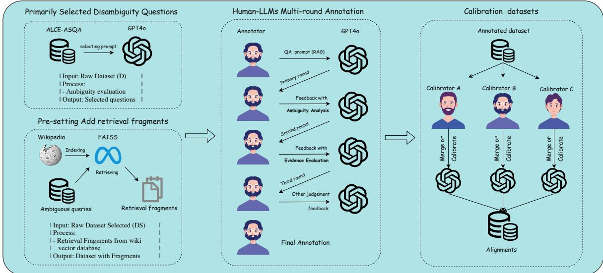  
Figure 1: Annotation workflow adopted in CondAmbigQA dataset construction.

Unlike prior works that either rewrites queries (AmbigQA, ASQA) or detects ambiguity post hoc (APA), our method systematically identifies implicit assumptions by structuring responses around explicit conditions. This approach ensures that retrieved contexts serve as an interpretative guide in reasoning. Furthermore, our condition-aware evaluation provides a more precise evaluation for ambiguity resolution.

## 3 Dataset Construction and Overview

## 3.1 Definition of “Condition”

We first formally define conditions as a set ofcontextual constraints that must be satisfied for an answer to be considered correct within a particular scope. Conditions naturally emerge in RAG systems when retrieved documents provide valid grounds for an answer. The need for conditions arises when users pose questions that yield multiple valid answers (Qian et al., 2024) and thus require clarification. For example, the question “when did

US currency leave the gold standard?” yields multiple answers due to the progressive transition in monetary policy. Some may cite the 1933 suspension during the Great Depression, others the 1968 repeal of gold reserve requirements, and still others the 1971 Nixon Shock. The conditions clarify why multiple answers exist by explicitly identifying the underlying constraints, allowing users to understand the holistic context rather than focusing on a single date.

## 3.2 Dataset Composition and Structure

The CondAmbigQA dataset consists of 2,000 annotated instances derived from the ALCE-ASQA2 (Gao et al., 2023a), which originates from AmbigNQ3 (Min et al., 2020). Each instance contains a user query, retrieved document fragments from Wikipedia4, and a structured set of conditionanswer-citation triples. The components are formally organised as:

$$
\begin{array} { r l } & { \tt Q u e r y | \{ R e t r i e v a l D o c s \} : } \\ & { \tt \{ ( c o n d i t i o n _ { 1 } , A n s w e r _ { 1 } , \{ C i t a t i o n _ { 1 } ^ { 1 } , \ldots \} ) , } \\ & { \tt ( C o n d i t i o n _ { 2 } , A n s w e r _ { 2 } , \{ C i t a t i o n _ { 2 } ^ { 1 } , \ldots \} ) , } \\ & { \tt \{ \alpha \ldots \} . } \\ & { \tt \alpha \ldots \} . } \end{array}
$$

This structure represents a significant advancement over existing datasets by incorporating retrieved documents and explicit conditions, enabling a more fine-grained evaluation of ambiguity resolution. An example of annotated data sample is provided in Appendix A.

<table><tr><td rowspan=1 colspan=6>Retrieval  Complete  Advanced  AmbiguityDatasetIncluded   Answer   Reasoning  Resolution</td></tr><tr><td rowspan=1 colspan=2>CondAmbigQA</td><td rowspan=1 colspan=1></td><td rowspan=1 colspan=1></td><td rowspan=1 colspan=1></td><td rowspan=1 colspan=1></td></tr><tr><td rowspan=8 colspan=2>ASQA (Stelmakh et al., 2022)AmbigNQ (Min et al., 2020)ALCE (Gao et al., 2023a)Multihop-RAG (Tang and Yang, 2024)NaturalQuestions (Kwiatkowski et al., 2019)TriviaQA (Joshi et al., 2017)ELI5 (Fan et al., 2019)TruthfulQA (Lin et al., 2022)</td><td rowspan=1 colspan=1>X</td><td rowspan=1 colspan=1></td><td rowspan=1 colspan=1></td><td rowspan=1 colspan=1></td></tr><tr><td rowspan=1 colspan=1></td><td rowspan=1 colspan=1></td><td rowspan=1 colspan=1></td><td rowspan=1 colspan=1></td></tr><tr><td rowspan=1 colspan=1></td><td rowspan=1 colspan=1></td><td rowspan=1 colspan=1>X</td><td rowspan=1 colspan=1></td></tr><tr><td rowspan=2 colspan=1></td><td rowspan=1 colspan=1></td><td rowspan=2 colspan=1>X</td><td rowspan=2 colspan=1>X</td></tr><tr><td rowspan=1 colspan=1></td></tr><tr><td rowspan=2 colspan=1></td><td rowspan=1 colspan=1></td><td rowspan=1 colspan=1></td><td rowspan=1 colspan=1></td><td rowspan=1 colspan=1>X</td></tr><tr><td rowspan=1 colspan=1></td><td rowspan=1 colspan=1></td><td rowspan=1 colspan=1></td><td rowspan=1 colspan=1>X</td></tr><tr><td rowspan=1 colspan=1>X</td><td rowspan=1 colspan=1></td><td rowspan=1 colspan=1></td><td rowspan=1 colspan=1>X</td></tr></table>

Table 1: Comparison of CondAmbigQA with other datasets.

## 3.3 Annotation Process and Guidelines

Figure 1 depicts our annotation workflow, which integrates human expertise with LLM capabilities to construct a robust dataset. Identifying conditions from retrieval results and consistently summarising key contextual factors is a highly tedious task for human annotators, making the annotation inherently complex and labour intensive. To address this challenge, we leverage LLMs’ superior text comprehension abilities to streamline annotation while maintaining human oversight. LLMs can efficiently process retrieved contexts and generate initial condition summaries in a consistent manner, significantly reducing the cognitive load on human annotators and minimising subjectivity. However, careful human validation is still needed, particularly when distinguishing subtle variations leading to different answers (Geva et al., 2019).

The annotation team comprises four full-time PhD candidates and two research assistants from local universities, all specialising in NLP. The first phase involves an initial screening to identify genuinely ambiguous questions. By analysing both the questions and their corresponding long-form answers from ASQA (detailed in Appendix B), we employ GPT-4o to filter out cases where ambiguity does not lead to meaningfully different answers, so that human annotators can focus on cases where ambiguity is truly impactful.

We adopt a triple-round annotation process, where GPT-4o and human annotators iteratively refine the annotations. In the first round, GPT-4o processes each query using predefined datasetconstruction prompts to draft initial conditionanswer pairs. The complete sets of prompts provided to annotators are listed in Appendix C. Annotators then leverage LLMs to analyse these pairs and validate their ambiguity using given prompts. In the final round, the LLM maps these conditionanswer pairs to supporting citations from retrieved passages. Human annotators independently review all the responses, focusing on reasoning coherence, logical soundness, and citation accuracy. If additional information or clarification is needed for more precise tuples, the annotators reject the current output and provide feedback for calibration. If no further refinement is required, the tuples are accepted as final. To ensure data quality, regular team meetings are held to collectively discuss difficult cases and maintain consistency across annotators.

Through this triple-round process, GPT-4o generates satisfactory condition-answer-citation tuples for 40% of cases without modification. With two additional rounds of expert feedback and calibration, this percentage increased to 85%, indicating that although LLMs can handle a substantial portion of the task, human expertise remains essential for handling more complex cases. The finding also suggests that this is a meaningful and challenging research problem, suggesting the need for further studies in condition-guided ambiguity resolution.

The dataset of 2,000 instances reflects a significant scaling effort while maintaining quality. Our LLM-assisted approach drastically improved annotation efficiency, with a total labelling cost of approximately \$1000 on API (around \$0.3 to \$0.5 per instance) and time of 150 hours for the entire dataset. This represents substantial cost savings compared to fully manual annotation, which requires at least 30 minutes per query and would have been prohibitively expensive at this scale.

## 3.4 Dataset Features and Advantages

CondAmbigQA provides a framework for assessing ambiguous QA, incorporating key features that enable systematic evaluation, as outlined in Table 1.

First, retrieval-included annotations ensure that these different models are evaluated under consistent background information. The retrieved fragments provide evidence for answers and serve as sources for extracting conditions, allowing for assessing how well models utilise contextual information to ground their reasoning.

Second, CondAmbigQA is designed to ensure complete answers by providing explicit conditionanswer-citation pairings. Unlike datasets that force a single answer, our structure enables the evaluation of multiple interpretations grounded in conditions, ensuring that answers are both comprehensive and contextually appropriate. Our approach also builds on recent advances in source attribution and citation generation (Shaier et al., 2024), further enhancing answer reliability.

Third, the dataset requires advanced reasoning by presenting scenarios that demand nuanced condition identification and answer generation. This challenges models to engage in deeper logical reasoning, encouraging them to generate wellgrounded responses.

Finally, CondAmbigQA emphasises ambiguity resolution, explicitly capturing possible clarifications for ambiguous questions. This allows for a structured evaluation of how effectively models recognise, interpret, and resolve ambiguity by interpreting distinct possible meanings. Compared to other datasets like ASQA and AmbigNQ, CondAmbigQA’s unique features makes it particularly well-suited for benchmarking models on ambiguous QA.

## Data Sources and Licensing

CondAmbigQA is built upon AmbigNQ (Min et al., 2020), distributed under the CC BY-SA 3.0 license. Context passages from Wikipedia are under the same license, allowing for reproduction and distribution with appropriate attribution. To maintain consistency with these data sources, we will release our dataset under the CC BY-SA 3.0 license.

## 4 Experimental Design

## 4.1 Evaluation Metrics

To quantitatively assess model performance at each stage, we employ a multi-metric evaluation framework. Let M denote the model output and G the corresponding ground-truth. We define G-Eval (Liu et al., 2023) to measure the quality of output relative to the reference, following criteria similar to those in Yao et al. (2024); Liu et al. (2023), as implemented in the DeepEval package5. Four metrics are defined, with detailed prompts provided in Appendix D, which describe the instructions used for LLMs to generate relevant outputs. Human evaluation on a small subset (detailed in Appendix E) indicates strong correlations between G-Eval and human judgement.

Condition Score quantifies the quality of condition identification by comparing the model’s extracted conditions against the ground-truth conditions. It assesses both the completeness and clarity of the extracted conditions. The G-Eval framework evaluates whether the model has accurately identified and clearly articulated all relevant conditions.

Answer Score evaluates the factual accuracy and contextual relevance of generated answers by comparing the model’s answers against the groundtruth answers. The G-Eval framework assesses whether the responses are factually correct and appropriately address the identified conditions.

Citation Score measures source attribution accuracy, which is defined as follows:

$$
\begin{array} { r } { C i t a t i o n S c o r e ( M , G ) = \frac { | \{ c \in M . \mathrm { c i t a t i o n s } \} \cap \{ c \in G . \mathrm { c i t a t i o n s } \} | } { | \{ c \in M . \mathrm { c i t a t i o n s } \} | } . } \end{array}\tag{1}
$$

This recall-focused metric favours models for citation accuracy over exhaustiveness, i.e. how many attributed citations are actually relevant.

In addition, two metrics are adopted to evaluate the ability to correctly identify multiple ambiguities. Answer Count captures the actual number of generated answers. Count Difference measures how many more or fewer responses a model generates compared to the expected number, with positive values (e.g., GLM4-plus: +1.01) indicating overgeneration and negative values (e.g., GPT-4o: 0.17) showing undergeneration of responses.

Combined Score provides an overall evaluation by aggregating the Condition Score, Answer Score, and Citation Score into a single metric. It incorporates calibration mechanisms to address discrepancies in the number of condition-answer pairs generated versus the ground-truth. Penalties are applied for overgeneration, undergeneration, and especially for producing only a single answer pair, indicating failure to recognize ambiguity. The final score is computed as a weighted average of the three core metrics, adjusted by these penalties, ensuring a fair comparison across models with varying generation behaviours. This scoring mechanism encourages models to match GPT-4o’s ground-truth-consistent behaviour and balances precision and completeness in conditional QA evaluation.

<table><tr><td>Model</td><td>Condition Score</td><td>Answer Score</td><td>Citation Score</td><td>Combined</td><td>Diff. of Ans. Count</td></tr><tr><td>API Models</td><td></td><td></td><td></td><td></td><td></td></tr><tr><td>GPT-40</td><td> $\overline { { \mathbf { 0 . 5 5 2 } \pm 0 . 1 9 0 } }$ </td><td> $\mathbf { 0 . 5 5 8 \pm 0 . 1 5 7 }$ </td><td> $\mathbf { 0 . 8 7 5 \pm 0 . 2 0 7 }$ </td><td>0.662</td><td>-0.17</td></tr><tr><td>GLM4-plus</td><td> $0 . 3 0 2 \pm 0 . 0 6 9$ </td><td> $0 . 4 2 0 ~ \pm 0 . 0 9 7$ </td><td> $0 . 4 4 1 ~ \pm 0 . 2 6 1$ </td><td>0.388</td><td>+1.01</td></tr><tr><td>API Average</td><td> $0 . 4 2 7$ </td><td> $0 . 4 8 9$ </td><td> $0 . 6 5 8$ </td><td>0.525</td><td>+0.42</td></tr><tr><td>Local Models</td><td></td><td></td><td></td><td></td><td></td></tr><tr><td>Qwen2.5 (7B)</td><td> $\overline { { 0 . 2 3 5 \ \pm 0 . 1 2 0 } }$ </td><td> $\overline { { 0 . 2 8 7 ~ \pm 0 . 1 6 1 } }$ </td><td> $\overline { { 0 . 5 5 8 \ \pm 0 . 3 5 9 } }$ </td><td>0.360</td><td>-0.45</td></tr><tr><td>DeepSeek-R1 (7B)</td><td> $0 . 2 4 5 \ \pm 0 . 1 1 2$ </td><td> $0 . 2 9 3 \pm 0 . 1 4 2$ </td><td> $0 . 5 0 1 \pm 0 . 3 4 2$ </td><td>0.346</td><td>+0.36</td></tr><tr><td>GLM4 (9B)</td><td> $0 . 2 3 1 \pm 0 . 0 7 1$ </td><td> $0 . 2 9 0 ~ \pm 0 . 0 9 0$ </td><td> $0 . 3 2 0 ~ \pm 0 . 2 1 5$ </td><td>0.280</td><td>+1.08</td></tr><tr><td>LLaMA3.1 (8B)</td><td> $0 . 2 3 2 \pm 0 . 0 7 6$ </td><td> $0 . 2 5 2 \pm 0 . 0 9 3$ </td><td> $0 . 3 0 6 \pm 0 . 2 4 6$ </td><td>0.264</td><td>+0.94</td></tr><tr><td>Mistral (7B)</td><td> $0 . 1 9 6 ~ \pm 0 . 0 6 0$ </td><td> $0 . 2 3 1 \pm 0 . 0 7 9$ </td><td> $0 . 2 6 3 \pm 0 . 2 1 4$ </td><td>0.230</td><td>+1.09</td></tr><tr><td>Gemma2 (9B)</td><td> $0 . 1 7 0 ~ \pm 0 . 0 9 1$ </td><td> $0 . 2 0 3 \pm 0 . 1 1 8$ </td><td> $0 . 2 1 7 \pm 0 . 2 7 7$ </td><td>0.197</td><td>+0.14</td></tr><tr><td>Local Average</td><td> $0 . 2 1 8$ </td><td> $0 . 2 5 9$ </td><td> $0 . 3 6 1$ </td><td>0.280</td><td>+0.53</td></tr></table>

Table 2: Main experiment scores, with separate averages for API and local models, highlighting overall model rankings and performance gaps.

## 4.2 Experimental Protocol

The experiment protocol comprises two settings. In the primary setting, each model is provided with a query $Q$ along with the retrieved passages $P ,$ and is required to (i) extract disambiguating conditions from P, and (ii) generate answers based on the extracted conditions, supported with citations. The outputs are then evaluated using the aforementioned metrics. This end-to-end evaluation assesses the model’s ability in both condition identification and conditional answer generation. Additionally, models are provided with ground-truth conditions alongside $Q$ and $P$ in an alternative setting. By comparing the performance of the model-generated and ground-truth conditions, we quantitatively assess the impact of explicit condition guidance on answer generation quality and citation accuracy.

## 4.3 Baseline Models and Deployment

We evaluate seven LLMs of varying sizes and capacities on CondAmbigQA benchmark. This includes two proprietary API-based models, i.e. GPT-4o and GLM4-plus, and five locally-deployed opensource models, i.e. LLaMA3.1 (8B) (Dubey et al., 2024), Mistral (7B) (Jiang et al., 2023), Gemma (9B) (Team et al., 2024), GLM4 (9B) (GLM et al., 2024), Deepseek-R1 (7B) (Guo et al., 2025) and Qwen2.5 (7B) (Yang et al., 2024). The open-source models are deployed via the ollama framework using default sampling parameters and an 8K context window. The models are prompted according to the instructions described in Appendix D.

## 5 Experimental Results

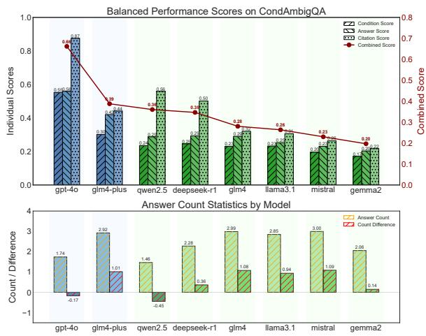  
Figure 2: Model performance on four metrics. In particular, it illustrates the relationship between performance and answer count, revealing how different models balance completeness and conciseness.

## 5.1 Condition Generation Performance

The results summarised in Table 2 show significant variability in condition generation capabilities across models. GPT-4o clearly outperforms other models with a condition score of 0.552 (σ = 0.190), more than double the average performance of locally-deployed models. Local models showed modest performance, with DeepSeek-R1 at 0.245, Qwen2.5 at 0.235, and LLaMA3.1 at 0.232. Weak performance was observed in Gemma2 at 0.170 and Mistral at 0.196. These substantial performance gaps suggest that proprietary API models, particularly GPT-4o, possess enhanced capabilities to identify potential conditions for ambiguous queries, with nearly three times the condition identification capacity of the weakest local models.

We observed that models often struggle to fully capture the context in condition generation. For the query “when did US currency leave the gold standard?” (example in Section 3.1), Gemma2 generated conditions focusing on “abandonment of the gold standard in the early 20th century” (score = 0.37), which captures only the initial phase of the transition without addressing critical later developments. Meanwhile, LLaMA3.1’s response emphasised the Great Depression era suspension but failed to articulate the distinction between temporary suspension and final abandonment (score = 0.48). These examples demonstrate that while local models can identify individual historical events, they share common limitations in capturing the bigger picture over time, as reflected in their condition scores rarely exceeding 0.5.

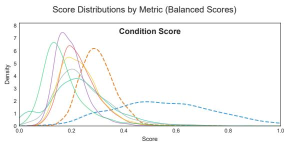

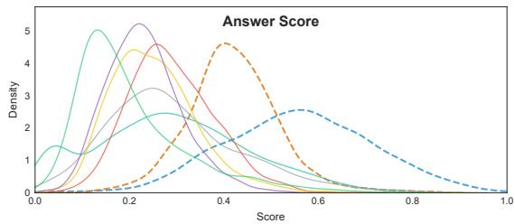

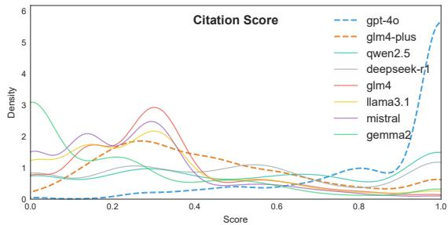  
Figure 3: Comparison of score distributions across metrics for models of different scales.

## 5.2 Answer Generation Performance

Answer generation shows similar variability, with GPT-4o achieving the highest score of 0.558 (σ = 0.157), significantly outperforming other models. GLM4-plus follows at 0.420, and Qwen2.5 leads local models with 0.287. The performance gradient is steep, with the weakest models (Gemma2 and Mistral) scoring only 0.203 and 0.231, respectively. This stark performance gap suggests that proprietary API architectures possess substantially enhanced capabilities for generating accurate answers to ambiguous queries. We further visualise the model performance on four metrics in Figure 2, which complements Table 2 by visualising how models vary in their precision vs. coverage tradeoffs, especially via Answer Count Difference.

## 5.3 Citation Generation Performance

Citation generation showed the widest performance gap, revealing GPT-4o’s exceptional performance at 0.875 $( \sigma ~ = ~ 0 . 2 0 7 )$ , followed by Qwen2.5 at 0.558 $( \sigma ~ = ~ 0 . 3 5 9 )$ and DeepSeek-R1 at 0.501 (σ = 0.342). While API models excel at source attribution, most local models achieve relatively low Citation Scores, with Gemma2 reaching only 0.217 $( \sigma = 0 . 2 7 7 )$ . This four-fold performance gap suggests local models struggle significantly with accurately attributing information to sources when processing long retrieved passages, while GPT-4o demonstrates a remarkable ability to ground its answers in appropriate citations.

## 5.4 Scaling Analysis

Figure 3 shows the density distributions of the scores, helping to compare the consistency and robustness of the models between metrics. Our findings reveal a clear distinction between proprietary and open-sourced models: API models like GPT-4o show bimodal score distributions, while local models show unimodal distributions with lower variance and lower peak scores. In particular, API models exhibit significantly enhanced capabilities in handling complex queries, with GPT-4o achieving a combined score of 0.662 and GLM4-plus scoring 0.388, substantially outperforming the best local model (Qwen2.5 at 0.360). For condition identification, GPT-4o’s scores peak around 0.552, more than double the average performance of all local models. The score distribution patterns also differ markedly. API models display distinctive bimodal distributions in answer scores, with GPT-4o showing peaks between 0.5 to 0.7, whereas local models cluster around 0.2 to 0.3. Most notably, GPT-4o shows an unusual spike near 1.0 in citation scores, indicating perfect citation in many cases, a capability largely absent in local models.

Another interesting pattern emerges in the count differences in answers, shown in Figure 2. GPT-

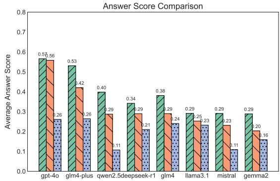

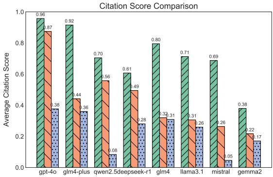  
Figure 4: Model performance in Answer Score and Citation Score, comparing answering without conditions, answering based on identified conditions (Main Experiment), and answering based on ground-truth conditions.

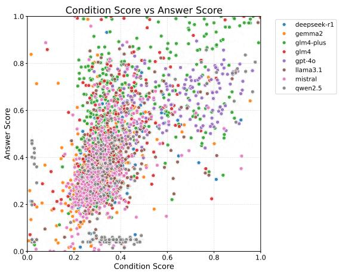  
Figure 5: Relationship between condition and answer scores across all models.

4o tends to produce fewer answers than expected ( 0.17), suggesting a more selective approach, while models like GLM4-plus, GLM4, and Mistral generate significantly more answers (+1.01, +1.08, and +1.09, respectively). This observation may provide clues on models adopting different strategies in handling ambiguity: GPT-4o appears to prioritise precision with fewer, higher-quality answers, while most other models offer broader coverage at the expense of precision.

## 5.5 Study on the Significance of Conditions

To validate the importance of conditions in RAG and QA systems, we conducted comparative experiments across three approaches: RAG with selfgenerated conditions (the same as the main experiment), RAG with annotated ground-truth conditions, and traditional RAG without considering conditions. As shown in Figure 4, both Answer Score and Citation Score demonstrate consistent hierarchical patterns across all tested models.

In the results, answering with ground-truth conditions consistently yields the highest performance across all models. For answer scores, GPT-4o achieves 0.57 with ground-truth conditions, compared to 0.56 with self-generated conditions and 0.26 without conditions. This pattern holds across all models, with ground-truth conditions providing an average improvement of 0.20 over the unconditioned baseline. Citation scores show even more drastic improvements, with ground-truth conditions enabling GPT-4o to achieve 0.96, compared to 0.87 with self-generated conditions and 0.38 without conditions, a more than 100% improvement from baseline to optimal conditions.

These results strongly validate our central hypothesis, supported by correlation analysis between condition quality and answer performance (Pearson: 0.598, Spearman: 0.637, p < 0.001). As illustrated in Figure 5, models that achieve higher condition scores consistently demonstrate stronger answer performance, confirming that effective disambiguation through condition identification directly enhances response quality. The inclusion of condition discovery in ambiguous QA, especially with accurate ground-truth conditions, effectively improves both answer quality and citation accuracy. The consistent performance gaps across both metrics underscore the fundamental importance of conditional information in enhancing RAG system performance, with the benefits extending across models of various scales and architectures.

## 5.6 Closed-book Ablation without Retrieval

To isolate the effect of condition-based reasoning, we evaluate a closed-book setting, where no passages are retrieved or provided as reference; zeroshot direct answering and reasoning with modelhypothesised conditions are tested. The results are reported in Table 3. It reveals a consistent and substantial drop in answer quality across all models when external context is removed. Models with self-generated conditions (without referencing retrieval) show a 93% increase in the answer score relative to the closed-book baseline, demonstrating that condition reasoning can enhance a model’s ability to generate relevant and accurate responses. Compared with results in which ground-truth conditions were provided, we observe even greater gains, with an average improvement of 135% from the closed-book baseline. These results reinforce our hypothesis that many failures in ambiguous QA stem from a lack of contextual grounding rather than inherent deficiencies in the model’s capabilities.

<table><tr><td>Model</td><td>Closed-book</td><td>+ Model-generated Conditions</td><td>+ Ground-truth Conditions</td><td>Improvement</td></tr><tr><td>API Models</td><td></td><td></td><td></td><td></td></tr><tr><td>GPT-40</td><td>0.25</td><td>0.56</td><td>0.57</td><td>+128%</td></tr><tr><td>GLM4-Plus</td><td>0.24</td><td>0.42</td><td>0.53</td><td>+121%</td></tr><tr><td>Local Models</td><td></td><td></td><td></td><td></td></tr><tr><td>Qwen2.5 (7B)</td><td>0.15</td><td>0.29</td><td>0.40</td><td>+167%</td></tr><tr><td>Mistral (7B)</td><td>0.17</td><td>0.23</td><td>0.29</td><td>+161%</td></tr><tr><td>Gemma2 (9B)</td><td>0.15</td><td>0.20</td><td>0.29</td><td>+93%</td></tr><tr><td>LLaMA3.1 (8B)</td><td>0.14</td><td>0.25</td><td>0.29</td><td>+107%</td></tr><tr><td>GLM4 (9B)</td><td>0.14</td><td>0.29</td><td>0.38</td><td>+171%</td></tr><tr><td>DeepSeek-R1 (7B)</td><td>0.07</td><td>0.29</td><td>0.34</td><td>+400%</td></tr><tr><td>Avg.</td><td>0.164</td><td>0.316</td><td>0.386</td><td>+135%</td></tr></table>

Table 3: Answer scores on CondAmbigQA of models’ losed-book performance vs. condition-grounded reasoning, where no retrieved passages are provided.

## 5.7 Case Study Analysis

We present a case study section in the Appendix F, which inludes a comprehensive discussion over models’ performance patterns and failure cases. Detailed analyses on two ambiguous queries are also provided.

## 5.8 Generalisation to External Datasets

To validate generalisability, we applied our condition-based disambiguation framework using GPT-4o to the ALCE-ASQA dataset (948 questions with Dense Passage Retrieval (DPR)-retrieved passages provided). Despite ALCE-ASQA lacking ground-truth conditions, our method required only minor adaptations. The results demonstrate a clear improvement: direct responses without conditions scored 0.374, while our condition-based approach achieved 0.471, a substantial gain of 10%. This improvement, combined with the strong correlation between condition quality and answer performance (Pearson: 0.598, Spearman: 0.637, p < 0.001), confirms that condition-based disambiguation generalises effectively across different ambiguous QA datasets.

## 6 Conclusion and Future Work

This work introduces CondAmbigQA, a novel framework and benchmark designed to address ambiguity in QA by explicitly identifying conditions. Our experiments demonstrate that incorporating explicit condition identification improves both answer quality and interpretability by clarifying the decision-making process. The analysis reveals that while larger models excel in condition processing, even moderate-sized models gain substantial benefits from this guidance. Furthermore, our human-LLM collaborative annotation process has helped ensure a high-quality dataset with reduced subjectivity and bias. In general, CondAmbigQA establishes a new paradigm to improve performance and reliability in ambiguous QA scenarios.

Our findings suggest that condition identification could serve as a foundation for enhancing LLM reasoning capabilities. Future research could integrate condition-based frameworks into the architecture of LLMs to improve their logical reasoning abilities. This could involve developing specialised reasoning mechanisms that focus on condition representations and their logical dependencies.

## Acknowledgement

The authors sincerely thank the reviewers and Area Chairs for their valuable input, which has greatly improved our work.

This work has been supported by Lingnan University, Hong Kong, through the Faculty Research Grant (No. SDS24A2, SDS24A8, SDS24A12, and SDS24A19), Direct Grant (DR25E8), Lam Woo Research Fund (LWP20040), and Shenzhen University-Lingnan University Joint Research Programme 2025/2026 (SZU-LU009/2526), as well as by the Hong Kong Research Grants Council through the Faculty Development Scheme (Project No. UGC/FDS16/E10/23).

## Limitations

Despite the promising results, several limitations remain:

• Dataset Representativeness: While we have expanded our dataset to 2,000 annotated instances through our human-LLM collaborative process, certain types of ambiguity may still be underrepresented. Complex interdependent ambiguities or domain-specific interpretations in specialised fields may require further targeted expansion to ensure comprehensive coverage. Moreover, current annotation process remains resource-intensive and intellectually demanding due to the need for extensive review and cross-checking by experts.

• Performance Gap: The significant difference between API models (GPT-4o: 0.701 combined score) and local models (best: Qwen2.5 at 0.469) indicates that high-quality condition identification may remain challenging for resource-constrained applications. This gap suggests that condition-based disambiguation currently benefits most from advanced model capabilities that may not be widely accessible.

• Generalisation Boundaries: Although our approach demonstrates effective generalisation to ALCE-ASQA with a 10% improvement, we encountered limitations with datasets lacking passage level references for citation evaluation. The framework may be less effective for inherently subjective or opinion-based queries where multiple interpretations remain equally valid regardless of conditions.

• Real-time Deployment: The two-stage process of first identifying conditions and then generating answers introduces additional computational overhead that could impact latency in time-sensitive applications. While this approach significantly improves quality, optimising for real-time response in production environments remains challenging.

• Relatively Heuristic Evaluation Metrics: Open-domain retrieval may surface conflicting or adversarial passages. Our evaluation penalises unsupported/incoherent generations and rewards condition-separated answers, but explicit adversarial-evidence detection is out of scope. Future work will integrate conflict detection and robustness checks into the pipeline.

These limitations highlight the need for future refinement of both the framework and the associated methodologies, ensuring that the benefits of condition-based disambiguation can be maintained across a broader spectrum of applications and model architectures.

## References

Arash Ahmadian, Chris Cremer, Matthias Gallé, Marzieh Fadaee, Julia Kreutzer, Ahmet Üstün, and Sara Hooker. 2024. Back to basics: Revisiting reinforce style optimization for learning from human feedback in llms. arXiv preprint arXiv:2402.14740.

Akari Asai, Zeqiu Wu, Yizhong Wang, Avirup Sil, and Hannaneh Hajishirzi. 2024. Self-RAG: Learning to retrieve, generate, and critique through self-reflection. In The Twelfth International Conference on Learning Representations.

Sourav Banerjee, Ayushi Agarwal, and Saloni Singla. 2024. Llms will always hallucinate, and we need to live with this. arXiv preprint arXiv:2409.05746.

Yiran Ding, Li Lyna Zhang, Chengruidong Zhang, Yuanyuan Xu, Ning Shang, Jiahang Xu, Fan Yang, and Mao Yang. 2024. Longrope: Extending llm context window beyond 2 million tokens. arXiv preprint arXiv:2402.13753.

Abhimanyu Dubey, Abhinav Jauhri, Abhinav Pandey, Abhishek Kadian, Ahmad Al-Dahle, Aiesha Letman, Akhil Mathur, Alan Schelten, Amy Yang, Angela Fan, et al. 2024. The llama 3 herd of models. arXiv preprint arXiv:2407.21783.

Angela Fan, Yacine Jernite, Ethan Perez, David Grangier, Jason Weston, and Michael Auli. 2019. ELI5: Long form question answering. In Proceedings of the 57th Annual Meeting of the Association for Computational Linguistics, pages 3558–3567, Florence, Italy. Association for Computational Linguistics.

Tianyu Gao, Howard Yen, Jiatong Yu, and Danqi Chen. 2023a. Enabling large language models to generate text with citations. In Proceedings ofthe 2023 Conference on Empirical Methods in Natural Language Processing, pages 6465–6488, Singapore. Association for Computational Linguistics.

Yunfan Gao, Yun Xiong, Xinyu Gao, Kangxiang Jia, Jinliu Pan, Yuxi Bi, Yi Dai, Jiawei Sun, and Haofen Wang. 2023b. Retrieval-augmented generation for large language models: A survey. arXiv preprint arXiv:2312.10997.

Mor Geva, Yoav Goldberg, and Jonathan Berant. 2019. Are we modeling the task or the annotator? an investigation of annotator bias in natural language understanding datasets. In Proceedings ofthe 2019 Conference on Empirical Methods in Natural Language Processing and the 9th International Joint Conference on Natural Language Processing (EMNLP-IJCNLP), pages 1161–1166, Hong Kong, China. Association for Computational Linguistics.

Team GLM, Aohan Zeng, Bin Xu, Bowen Wang, Chenhui Zhang, Da Yin, Diego Rojas, Guanyu Feng, Hanlin Zhao, Hanyu Lai, et al. 2024. Chatglm: A family of large language models from glm-130b to glm-4 all tools. arXiv preprint arXiv:2406.12793.

Daya Guo, Dejian Yang, Haowei Zhang, Junxiao Song, Ruoyu Zhang, Runxin Xu, Qihao Zhu, Shirong Ma, Peiyi Wang, Xiao Bi, et al. 2025. Deepseek-r1: Incentivizing reasoning capability in llms via reinforcement learning. arXiv preprint arXiv:2501.12948.

John Hewitt, Nelson F Liu, Percy Liang, and Christopher D Manning. 2024. Instruction following without instruction tuning. arXiv preprint arXiv:2409.14254.

Jiaming Ji, Mickel Liu, Josef Dai, Xuehai Pan, Chi Zhang, Ce Bian, Boyuan Chen, Ruiyang Sun, Yizhou Wang, and Yaodong Yang. 2024. Beavertails: Towards improved safety alignment of llm via a humanpreference dataset. Advances in Neural Information Processing Systems, 36.

Ziwei Ji, Tiezheng Yu, Yan Xu, Nayeon Lee, Etsuko Ishii, and Pascale Fung. 2023. Towards mitigating LLM hallucination via self reflection. In Findings of the Association for Computational Linguistics: EMNLP 2023, pages 1827–1843, Singapore. Association for Computational Linguistics.

Albert Q Jiang, Alexandre Sablayrolles, Arthur Mensch, Chris Bamford, Devendra Singh Chaplot, Diego de las Casas, Florian Bressand, Gianna Lengyel, Guillaume Lample, Lucile Saulnier, et al. 2023. Mistral 7b. arXiv preprint arXiv:2310.06825.

Mandar Joshi, Eunsol Choi, Daniel Weld, and Luke Zettlemoyer. 2017. TriviaQA: A large scale distantly supervised challenge dataset for reading comprehension. In Proceedings of the 55th Annual Meeting of the Association for Computational Linguistics (Volume 1: Long Papers), pages 1601–1611, Vancouver, Canada. Association for Computational Linguistics.

Hyuhng Joon Kim, Youna Kim, Cheonbok Park, Junyeob Kim, Choonghyun Park, Kang Min Yoo, Sanggoo Lee, and Taeuk Kim. 2024. Aligning language models to explicitly handle ambiguity. arXiv preprint arXiv:2404.11972.

Tom Kwiatkowski, Jennimaria Palomaki, Olivia Redfield, Michael Collins, Ankur Parikh, Chris Alberti, Danielle Epstein, Illia Polosukhin, Jacob Devlin, Kenton Lee, Kristina Toutanova, Llion Jones, Matthew Kelcey, Ming-Wei Chang, Andrew M. Dai, Jakob Uszkoreit, Quoc Le, and Slav Petrov. 2019. Natural questions: A benchmark for question answering research. Transactions ofthe Associationfor Computational Linguistics, 7:452–466.

Patrick Lewis, Ethan Perez, Aleksandra Piktus, Fabio Petroni, Vladimir Karpukhin, Naman Goyal, Heinrich Küttler, Mike Lewis, Wen-tau Yih, Tim Rocktäschel, et al. 2020. Retrieval-augmented generation for knowledge-intensive nlp tasks. Advances in Neural Information Processing Systems, 33:9459–9474.

Jiawei Li, Xinyue Liang, Yizhe Yang, Chong Feng, and Yang Gao. 2024. Pspo\*: An effective processsupervised policy optimization for reasoning alignment. arXiv preprint arXiv:2411.11681.

Xianming Li, Zongxi Li, Jing Li, Haoran Xie, and Qing Li. 2025. ESE: espresso sentence embeddings. In The Thirteenth International Conference on Learning Representations, ICLR 2025, Singapore, April 24-28, 2025. OpenReview.net.

Stephanie Lin, Jacob Hilton, and Owain Evans. 2022. TruthfulQA: Measuring how models mimic human falsehoods. In Proceedings ofthe 60th Annual Meeting ofthe Associationfor Computational Linguistics (Volume 1: Long Papers), pages 3214–3252, Dublin, Ireland. Association for Computational Linguistics.

Siyi Liu, Qiang Ning, Kishaloy Halder, Zheng Qi, Wei Xiao, Phu Mon Htut, Yi Zhang, Neha Anna John, Bonan Min, Yassine Benajiba, and Dan Roth. 2025. Open domain question answering with conflicting contexts. In Findings of the Association for Computational Linguistics: NAACL 2025, pages 1838–1854, Albuquerque, New Mexico. Association for Computational Linguistics.

Yang Liu, Dan Iter, Yichong Xu, Shuohang Wang, Ruochen Xu, and Chenguang Zhu. 2023. G-eval: NLG evaluation using gpt-4 with better human alignment. In Proceedings of the 2023 Conference on Empirical Methods in Natural Language Processing, pages 2511–2522, Singapore. Association for Computational Linguistics.

Varun Magesh, Faiz Surani, Matthew Dahl, Mirac Suzgun, Christopher D Manning, and Daniel E Ho. 2024. Hallucination-free? assessing the reliability of leading ai legal research tools. arXiv preprint arXiv:2405.20362.

Sewon Min, Julian Michael, Hannaneh Hajishirzi, and Luke Zettlemoyer. 2020. AmbigQA: Answering ambiguous open-domain questions. In Proceedings of the 2020 Conference on Empirical Methods in Natural Language Processing (EMNLP), pages 5783– 5797, Online. Association for Computational Linguistics.

Bhuvanashree Murugadoss, Christian Poelitz, Ian Drosos, Vu Le, Nick McKenna, Carina Suzana Negreanu, Chris Parnin, and Advait Sarkar. 2025. Evaluating the evaluator: Measuring llms’ adherence to task evaluation instructions. In Proceedings of the AAAI Conference on Artificial Intelligence, volume 39, pages 19589–19597.

Jinjie Ni, Fuzhao Xue, Xiang Yue, Yuntian Deng, Mahir Shah, Kabir Jain, Graham Neubig, and Yang You. 2024. Mixeval: Deriving wisdom of the crowd from llm benchmark mixtures. arXiv preprint arXiv:2406.06565.

Cheng Qian, Bingxiang He, Zhong Zhuang, Jia Deng, Yujia Qin, Xin Cong, Yankai Lin, Zhong Zhang, Zhiyuan Liu, and Maosong Sun. 2024. Tell me more! towards implicit user intention understanding of language model driven agents. arXiv preprint arXiv:2402.09205.

Sagi Shaier, Lawrence Hunter, and Katharina Kann. 2023. Who are all the stochastic parrots imitating? they should tell us! In Proceedings of the 13th International Joint Conference on Natural Language Processing and the 3rd Conference ofthe Asia-Pacific Chapter of the Association for Computational Linguistics (Volume 2: Short Papers), pages 113–120, Nusa Dua, Bali. Association for Computational Linguistics.

Sagi Shaier, Ari Kobren, and Philip V. Ogren. 2024. Adaptive question answering: Enhancing language model proficiency for addressing knowledge conflicts with source citations. In Proceedings of the 2024 Conference on Empirical Methods in Natural Language Processing, pages 17226–17239, Miami, Florida, USA. Association for Computational Linguistics.

Ivan Stelmakh, Yi Luan, Bhuwan Dhingra, and Ming-Wei Chang. 2022. ASQA: Factoid questions meet long-form answers. In Proceedings ofthe 2022 Conference on Empirical Methods in Natural Language Processing, pages 8273–8288, Abu Dhabi, United Arab Emirates. Association for Computational Linguistics.

Hongda Sun, Weikai Xu, Wei Liu, Jian Luan, Bin Wang, Shuo Shang, Ji-Rong Wen, and Rui Yan. 2024. Determlr: Augmenting llm-based logical reasoning from indeterminacy to determinacy. In Proceedings of the 62nd Annual Meeting of the Association for Computational Linguistics (Volume 1: Long Papers), pages 9828–9862.

Yixuan Tang and Yi Yang. 2024. Multihop-RAG: Benchmarking retrieval-augmented generation for

multi-hop queries. In First Conference on Language Modeling.

Gemma Team, Morgane Riviere, Shreya Pathak, Pier Giuseppe Sessa, Cassidy Hardin, Surya Bhupatiraju, Léonard Hussenot, Thomas Mesnard, Bobak Shahriari, Alexandre Ramé, et al. 2024. Gemma 2: Improving open language models at a practical size. arXiv preprint arXiv:2408.00118.

Siyuan Wang, Zhuohan Long, Zhihao Fan, Zhongyu Wei, and Xuanjing Huang. 2024. Benchmark selfevolving: A multi-agent framework for dynamic llm evaluation. arXiv preprint arXiv:2402.11443.

Thomas Wasow, Amy Perfors, and David Beaver. 2005. The puzzle of ambiguity. Morphology and the web of grammar: Essays in memory ofSteven G. Lapointe, pages 265–282.

Jason Wei, Xuezhi Wang, Dale Schuurmans, Maarten Bosma, Fei Xia, Ed Chi, Quoc V Le, Denny Zhou, et al. 2022. Chain-of-thought prompting elicits reasoning in large language models. Advances in neural information processing systems, 35:24824–24837.

Colin White, Samuel Dooley, Manley Roberts, Arka Pal, Ben Feuer, Siddhartha Jain, Ravid Shwartz-Ziv, Neel Jain, Khalid Saifullah, Siddartha Naidu, et al. 2024. Livebench: A challenging, contamination-free llm benchmark. arxiv. arXiv preprint arXiv:2406.19314.

Silei Xu, Wenhao Xie, Lingxiao Zhao, and Pengcheng He. 2025. Chain of draft: Thinking faster by writing less. arXiv preprint arXiv:2502.18600.

Shi-Qi Yan, Jia-Chen Gu, Yun Zhu, and Zhen-Hua Ling. 2024. Corrective retrieval augmented generation. arXiv preprint arXiv:2401.15884.

An Yang, Baosong Yang, Binyuan Hui, Bo Zheng, Bowen Yu, Chang Zhou, Chengpeng Li, Chengyuan Li, Dayiheng Liu, Fei Huang, et al. 2024. Qwen2 technical report. arXiv preprint arXiv:2407.10671.

Jing Yao, Xiaoyuan Yi, and Xing Xie. 2024. Clave: An adaptive framework for evaluating values of llm generated responses. arXiv preprint arXiv:2407.10725.

Yujia Zhou, Zheng Liu, and Zhicheng Dou. 2025. How credible is an answer from retrieval-augmented LLMs? investigation and evaluation with multi-hop QA. In Proceedings of the 31st International Conference on Computational Linguistics, pages 4232– 4242, Abu Dhabi, UAE. Association for Computational Linguistics.

## Appendix A Dataset Examples

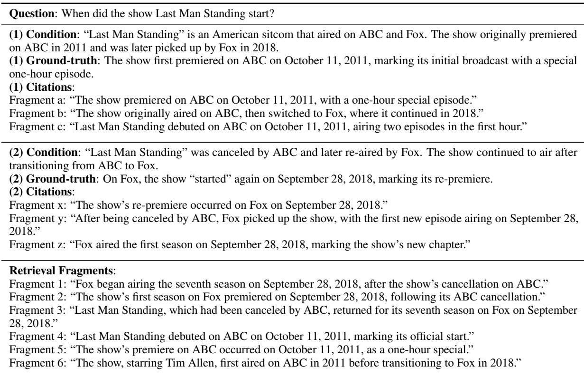  
Table 4: An example from our CondAmbigQA dataset.

## B Query Prompts Template

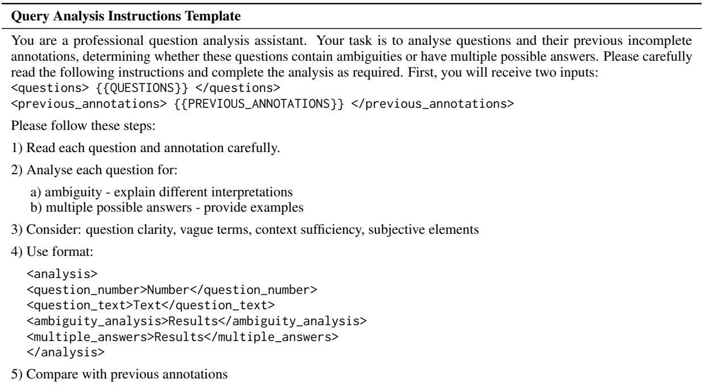  
Table 5: Instruction template used to analyse queries from ASQA. We use GPT-4o to identify data samples where ambiguity is truly impactful.

C Dataset Prompts
<table><tr><td>Dataset Prompts (Part 1)</td></tr><tr><td>Question Answering: You are tasked with providing a structured answer to a question based on the given text fragments. Your goal is to present</td></tr><tr><td>possible interpretations supported by the fragments, clearly distinguishing between preconditions and detailed answers. Question: &lt;question&gt; [INSERT QUESTION HERE] &lt;/question&gt; Text fragments: &lt;fragments&gt;</td></tr><tr><td>[INSERT FRAGMENTS HERE] &lt;/fragments&gt; Answer format:</td></tr><tr><td>&lt;answer&gt; Interpretation [X]: Preconditions:</td></tr><tr><td>* [Necessary background information or assumptions, not directly answering the question] [Fragment X] * [Necessary background information or assumptions, not directly answering the question] [Fragment Y] Detailed answer:</td></tr><tr><td>* [Specific information directly answering the question] [Fragment Z] * [Specific information directly answering the question] [Fragment A, Fragment B]</td></tr><tr><td>[Repeat the Interpretation structure for as many interpretations as necessary]</td></tr><tr><td>&lt;/answer&gt; Ensure all interpretations are distinct, citing relevant fragments for support. If conflicting information is found, present all</td></tr><tr><td>viewpoints with sources. Ambiguity Analysis:</td></tr><tr><td>Analyse potential ambiguities in the question “[INSERT QUESTION HERE]&quot; based on the provided interpretations. Consider different contexts and how they influence interpretations. &lt;analysis&gt; Ambiguity point [X]: [Describe ambiguity that could lead to different interpretations]</td></tr></table>

Table 6: The complete sets of dataset-construction prompts provided to annotators (Part 1). GPT-4o is instructed to process each query in the first round of annotation.

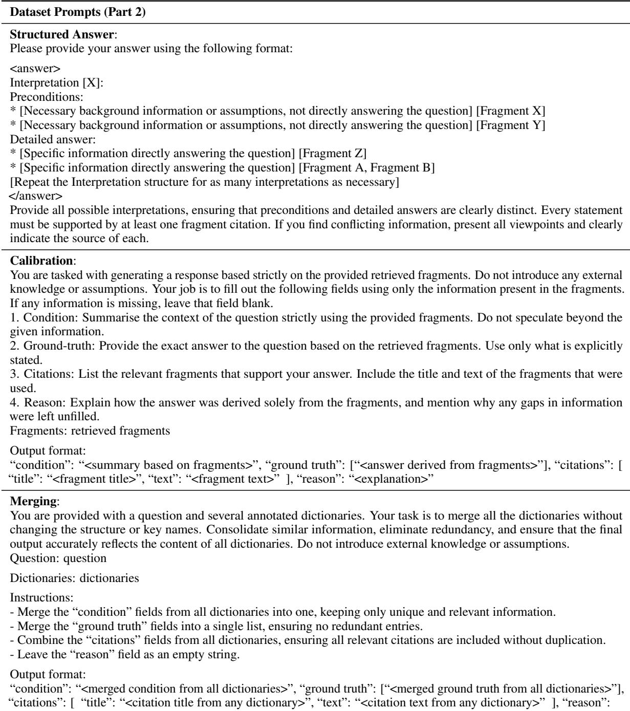  
Table 7: The complete sets of dataset-construction prompts provided to annotators (Part 2). GPT-4o is instructed to process each query in the first round of annotation.

## D Evaluation Prompts

Evaluation Prompts   
RAG with Conditions Prompt:   
Question: {question}   
Retrieved fragments:   
{Fragment 1 - {title}: {text}}   
Please complete the following tasks:   
1. Identify up to FIVE key conditions related to the question based solely on the provided fragments.   
2. For each condition, provide a corresponding detailed answer.   
3. Cite the sources (fragment numbers) that support each condition and answer.   
4. Output the results in JSON format with the following structure   
Modified Condition-based Prompt:   
Question: {question}   
Context fragments:   
{Fragment 1 - {title}: {text}}   
Conditions to address:   
Condition 1: {condition}   
IMPORTANT: Respond with ONLY the following JSON format, no other text.   
Standard RAG Prompt:   
Question: {question}   
Retrieved fragments:   
{Fragment 1 - {title}: {text}}   
Please complete the following tasks:   
1. Answer the question based solely on the provided fragments.   
2. Cite up to FIVE sources (fragment numbers) that support your answer.   
Evaluation Metrics - Condition Correctness:   
- Name: “Condition Correctness”   
- Criteria: “Determine whether the actual condition is factually correct based on the expected condition.”   
- Evaluation steps:   
1. Check whether the facts in ’actual condition’ contradicts any facts in ’expected condition’.   
2. Heavily penalise omission of critical details in the condition.   
3. Ensure that the condition is clear and unambiguous.   
Evaluation Metrics - Answer Correctness:   
- Name: “Answer Correctness”   
- Criteria: “Determine whether the actual answer is factually correct based on the expected answers.”   
- Evaluation steps:   
1. Check whether the facts in ’actual answer’ contradicts any facts in ’expected answers’.   
2. Heavily penalise omission of critical details in the answer.   
3. Ensure that the answer directly addresses the question without irrelevant information.   
Table 8: Evaluation prompts. The models are prompted according to these instructions and their outputs ar   
evaluated using the G-Eval function as implemented in the DeepEval package.

<table><tr><td>Metric</td><td>Pearson ρ</td><td>Spearman ρ</td><td>p-value</td></tr><tr><td>Condition Quality</td><td>0.88</td><td>0.89</td><td>&lt; 0.001</td></tr><tr><td>Answer Quality</td><td>0.83</td><td>0.68</td><td>&lt; 0.01</td></tr></table>

Table 9: Correlation between G-Eval and human annotations on 20 examples.

## E G-Eval Reliability Analysis

To assess the reliability of G-Eval on our CondAmbigQA benchmark, we conducted a smallscale correlation analysis comparing G-Eval scores against human annotations on 20 randomly sampled examples. Human ratings used the following 10-point rubrics:

• Condition Quality (1–10): how accurately the condition captures ambiguity, covers distinct valid interpretations, and maintains logical coherence.

• Answer Quality (1–10): how accurate, complete under the stated condition, and factually sound (no hallucinations) the answer is.

We then calculated Pearson and Spearman correlation coefficients between G-Eval and human scores. The results are presented in Table 9.

These high correlation coefficients demonstrate that G-Eval closely tracks human judgments in both condition identification and conditional answer quality, validating its use as an automatic evaluator for large-scale ambiguous QA benchmarking.

## F Case Study Analysis

Our case studies reveal how different models handle ambiguous queries, with notable variations in performance between API-based models (GPT-4o, GLM4-plus) and local models (LLaMA3.1, Gemma2, GLM4, Qwen2.5). We present detailed analyses of responses to ambiguous questions where multiple valid interpretations exist, focusing on condition identification, answer generation, and citation accuracy.

## F.1 Model Performance on Ambiguous Queries

We examine model responses to two representative ambiguous queries: “Which is bigger Kansas City or St. Louis?” and “When did colour TV come out in US?” These questions are ambiguous because they can be interpreted in multiple valid ways, requiring models to identify distinct conditions and provide corresponding answers.

For the city comparison query, we identified two key valid interpretations:

1. Metropolitan area comparison: Greater St. Louis (2.8 million) is larger than the Kansas City metropolitan area (2.2 million).

2. City proper comparison: Kansas City has a larger city proper population (approx. 480,000 by 2017) than St. Louis.

For the colour TV question, multiple valid perspectives include:

1. Technological introduction: Color TV was officially introduced in December 1953 with the approval of the NTSC standard, with the first national broadcast on January 1, 1954.

2. Widespread adoption: Color TV became widely adopted in the mid-1960s, with NBC’s 1965 transition to colour programming catalysing industry-wide changes.

## F.2 Performance Patterns and Failure Modes

Our analysis reveals distinct patterns of performance as summarised in Table 10. We also identified three key failure patterns across multiple examples.

1. Condition Misidentification: Smaller models frequently generate conditions that miss the core ambiguity. For example, Gemma2’s response to the city comparison query included “Influence of both cities in their respective metropolitan areas” rather than explicitly addressing which city is larger.

2. Factual Inaccuracy: Models sometimes provide incorrect information. DeepSeek incorrectly stated, “the Kansas City metropolitan area is larger than Greater St. Louis,” contradicting available data.

3. Citation Failures: Most models, particularly local ones, struggle with citation accuracy. Even when answers contain correct information, they often cite wrong fragments, reducing their reliability and trustworthiness.

Using balanced scoring metrics, we established performance thresholds: scores below 0.30 indicate inadequate responses, 0.30 to 0.45 represent partially adequate answers, and above 0.50 indicate high-quality responses.

<table><tr><td rowspan=1 colspan=1>Model Category</td><td rowspan=1 colspan=1>Performance Characteristics</td></tr><tr><td rowspan=1 colspan=1>API Models (GPT-4o, GLM4-plus)</td><td rowspan=1 colspan=1>Higher condition quality, better answer accuracy, stronger ability to identify validinterpretations, more precise citations</td></tr><tr><td rowspan=1 colspan=1>Local Models (LLaMA3.1, Gemma2,etc.)</td><td rowspan=1 colspan=1>Often generate irrelevant conditions, lower answer accuracy, struggle with condition-answer pairs</td></tr></table>

Table 10: Key performance differences between model categories.

## F.3 Detailed Analysis: City Comparison Query

Table 11 presents the ground-truth conditions for the city comparison query. Table 12 shows various model responses to the city comparison query.

## F.4 Detailed Analysis: Color TV Query

Table 13 presents the ground-truth conditions for the colour TV introduction query. Table 14 shows various model responses to the colour TV query.

## F.5 Comparing DeepSeek Reasoning with Base Models

An important dimension of our analysis is the comparison between DeepSeek’s reasoning-enhanced model and other base models. DeepSeek represents an attempt to improve reasoning capabilities in LLMs through specialized training and architectural modifications. Our case studies reveal significant differences in performance, as shown in Table 15.

The DeepSeek reasoning model demonstrates some improvements over other local models, particularly in its attempt to structure responses more systematically. When addressing the colour TV question, DeepSeek formulated conditions as direct questions: “When were colour TVs first made available to the public in the U.S.?” and “When did the first national colour broadcast occur in the U.S.?” This approach shows a clearer understanding of the task structure.

However, DeepSeek still falls significantly short of API models in three critical areas:

1. Factual accuracy: DeepSeek incorrectly claimed that “the Kansas City metropolitan area is larger than Greater St. Louis,” contradicting established facts.

2. Condition comprehensiveness: DeepSeek failed to adequately address both interpretations of the city comparison question, focusing on superficial aspects like “Historical Growth” rather than comprehensive size comparisons.

3. Answer depth: While DeepSeek provided some accurate information (e.g., the date of the first colour broadcast), its answers lacked the contextual depth and nuance found in API model responses.

These findings suggest that while specialized reasoning training provides some benefits, it does not close the substantial capability gap between local models and larger API models for conditionbased RAG tasks.

## F.6 Key Findings

Our case studies demonstrate significant performance gaps between model categories in conditionbased RAG:

• API models (GPT-4o, GLM4-plus) consistently identify the core ambiguities in questions and generate conditions that address multiple valid interpretations. Their answer quality is substantially higher, with scores frequently above 0.60.

• DeepSeek Reasoning model shows some structural improvements over other local models but still struggles with factual accuracy and comprehensive condition identification. Its performance scores (typically 0.29-0.44) position it marginally better than other local models but far below API models.

• Other local models often miss key ambiguities, providing either irrelevant conditions or incorrect answers. Their condition and answer quality scores typically fall between 0.21-0.45, indicating partial adequacy at best.

• Citation accuracy varies dramatically, with API models more likely to correctly cite supporting evidence (50-100% accuracy), while local models including DeepSeek frequently cite inappropriate or irrelevant fragments (0- 50% accuracy).

These findings highlight the critical importance of model capability in condition-based RAG systems. When dealing with ambiguous queries, larger

<table><tr><td rowspan=1 colspan=1>Condition</td><td rowspan=1 colspan=1>Description</td></tr><tr><td rowspan=1 colspan=1>Metropolitan Comparison</td><td rowspan=1 colspan=1>When comparing the metropolitan areas, Greater St. Louis is larger than the Kansas Citymetropolitan area. Greater St. Louis is the largest metropolitan area in Missouri, with apopulation of over 2.8 million people. The Kansas City metropolitan area is the second-largest,with a population of more than 2.2 million people.</td></tr><tr><td rowspan=1 colspan=1>City Proper Comparison</td><td rowspan=1 colspan=1>When comparing the city proper populations, Kansas City, Missouri, is larger than St. Louis,Missouri. Kansas City has a city proper population that has grown to almost 480,000 people by2017, reflecting steady growth over the years. In contrast, St. Louis has a smaller city properpopulation.</td></tr></table>

Table 11: Ground-truth conditions for the city comparison query

<table><tr><td rowspan=1 colspan=1>Model</td><td rowspan=1 colspan=1>Generated Condition</td><td rowspan=1 colspan=1>Answer Excerpt</td><td rowspan=1 colspan=1>Score</td><td rowspan=1 colspan=1>Analysis</td></tr><tr><td rowspan=1 colspan=1>GPT-40</td><td rowspan=1 colspan=1>Comparison of Metropoli-tan Areas</td><td rowspan=1 colspan=1>&quot;When comparing the size of Kansas Cityand St. Louis, it is important to consider themetropolitan areas... The Greater St. Louisarea is generally considered larger...&quot;</td><td rowspan=1 colspan=1>0.69</td><td rowspan=1 colspan=1>Correctly identifiesmetropolitan com-parison</td></tr><tr><td rowspan=1 colspan=1>GPT-40</td><td rowspan=1 colspan=1>Comparison of CityProper Populations</td><td rowspan=1 colspan=1>&quot;Kansas City has a larger population...&quot;</td><td rowspan=1 colspan=1>0.64</td><td rowspan=1 colspan=1>Accurately distin-guishes city proper</td></tr><tr><td rowspan=1 colspan=1>GLM4-plus</td><td rowspan=1 colspan=1>Comparison of Metropoli-tan Areas</td><td rowspan=1 colspan=1>&quot;The Greater St. Louis metropolitan area is abi-state region... St. Louis is the focus of thelargest metro area in Missouri...&quot;</td><td rowspan=1 colspan=1>0.70</td><td rowspan=1 colspan=1>Thorough compari-son with citations</td></tr><tr><td rowspan=1 colspan=1>GLM4-plus</td><td rowspan=1 colspan=1>Comparison  of CityProper Populations</td><td rowspan=1 colspan=1>&quot;Kansas City&#x27;s city proper population hadreached almost 480,000 residents...&quot;</td><td rowspan=1 colspan=1>0.59</td><td rowspan=1 colspan=1>Correctly     ad-dresses      citypopulations</td></tr><tr><td rowspan=1 colspan=1>Gemma2</td><td rowspan=1 colspan=1>Population size compari-son</td><td rowspan=1 colspan=1>&quot;St. Louis is indicated to be larger thanKansas City, Missouri...&quot;</td><td rowspan=1 colspan=1>0.42</td><td rowspan=1 colspan=1>Confuses historicaland current size</td></tr><tr><td rowspan=1 colspan=1>Gemma2</td><td rowspan=1 colspan=1>Influence of cities</td><td rowspan=1 colspan=1>&quot;Both Kansas City and St. Louis are anchorsfor large metropolitan areas...&quot;</td><td rowspan=1 colspan=1>0.30</td><td rowspan=1 colspan=1>Doesn&#x27;taddresssize comparison</td></tr><tr><td rowspan=1 colspan=1>LLaMA3.1</td><td rowspan=1 colspan=1>Kansas City metropolitanarea population</td><td rowspan=1 colspan=1>&quot;The Kansas City metropolitan area&#x27;s popu-lation is expected to grow from 2.1 Millionto over 2.7 Million by 2040...&quot;</td><td rowspan=1 colspan=1>0.33</td><td rowspan=1 colspan=1>Incorrectmetropolitansize conclusion</td></tr><tr><td rowspan=1 colspan=1>LLaMA3.1</td><td rowspan=1 colspan=1>Greater St. Louis location</td><td rowspan=1 colspan=1>“According to Fragment 1, Greater St. Louisis a bi-state metropolitan statistical area...&quot;</td><td rowspan=1 colspan=1>0.21</td><td rowspan=1 colspan=1>Fails to addresssize comparison</td></tr><tr><td rowspan=1 colspan=1>DeepSeek</td><td rowspan=1 colspan=1>Population Comparison</td><td rowspan=1 colspan=1>&quot;Based on historical data, the Kansas Citymetropolitan area is larger than Greater St.Louis...&quot;</td><td rowspan=1 colspan=1>0.31</td><td rowspan=1 colspan=1>Incorrectmetropolitancomparison</td></tr><tr><td rowspan=1 colspan=1>DeepSeek</td><td rowspan=1 colspan=1>Historical Growth</td><td rowspan=1 colspan=1>&quot;St. Louis experienced significant populationgrowth in the mid-19th century...&quot;</td><td rowspan=1 colspan=1>0.29</td><td rowspan=1 colspan=1>Discusses   irrel-evant   historicalcontext</td></tr></table>

Table 12: Model-generated conditions and evaluation for city comparison query

API models demonstrate significantly greater ability to identify valid interpretations, generate appropriate conditions, provide accurate answers, and cite relevant evidence. While reasoning-enhanced models like DeepSeek show incremental improvements, the capability gap remains substantial, suggesting that deploying high-capability models is essential for effective condition-based RAG systems, particularly for domains where query ambiguity is common.

<table><tr><td rowspan=1 colspan=1>Condition</td><td rowspan=1 colspan=1>Description</td></tr><tr><td rowspan=1 colspan=1>Technological In-troduction</td><td rowspan=1 colspan=1>Colour television was officially introduced in the US with the approval of the NTSC standard inDecember 1953. This allowed for the first national colour broadcast on January 1, 1954, featuringNBC&#x27;s coverage of the Tournament of Roses Parade. Despite this technological milestone, the highcost of colour television sets and limited programming meant that consumer adoption was slow.</td></tr><tr><td rowspan=1 colspan=1>Widespread Adop-tion</td><td rowspan=1 colspan=1>Color television became widely adopted in the US during the mid-1960s. The transition to colourprogramming gained momentum in 1965 when NBC announced that its prime-time schedule would bealmost entirely in colour. This prompted other networks to follow suit, leading to a significant increasein colour broadcasts. By 1972, more than half of all U.S. households owned a colour television.</td></tr></table>

Table 13: Ground-truth conditions for the colour TV query

<table><tr><td rowspan=1 colspan=1>Model</td><td rowspan=1 colspan=1>Generated Condi-tion</td><td rowspan=1 colspan=1>Answer Excerpt</td><td rowspan=1 colspan=1>Score</td><td rowspan=1 colspan=1>Analysis</td></tr><tr><td rowspan=1 colspan=1>GPT-40</td><td rowspan=1 colspan=1>Introduction   ofColor Television</td><td rowspan=1 colspan=1>&quot;Color television was introduced in the US follow-ing significant regulatory and technological devel-opments... The NTSC colour standard, approvedin 1953... The first broadcast was on January 1,1954...&quot;</td><td rowspan=1 colspan=1>0.55</td><td rowspan=1 colspan=1>Providesaccuratetimeline and keyevents</td></tr><tr><td rowspan=1 colspan=1>GPT-40</td><td rowspan=1 colspan=1>Consumer Adop-tion and MarketPenetration</td><td rowspan=1 colspan=1>&quot;While the technology was introduced in 1953, itswidespread adoption was slow... It wasn&#x27;t untilthe mid-1960s that colour television saw significantconsumer adoption...&quot;</td><td rowspan=1 colspan=1>0.45</td><td rowspan=1 colspan=1>Correctly     ad-dressesadoptiontimeline</td></tr><tr><td rowspan=1 colspan=1>GLM4-plus</td><td rowspan=1 colspan=1>Introduction   ofcolour television</td><td rowspan=1 colspan=1>“Color television was officially introduced in theUnited States in 1953 when the FCC approved theNTSC colour standard. The first national colourbroadcast occurred on January 1, 1954...&quot;</td><td rowspan=1 colspan=1>0.65</td><td rowspan=1 colspan=1>Clear, accurate in-troduction account</td></tr><tr><td rowspan=1 colspan=1>GLM4-plus</td><td rowspan=1 colspan=1>Widespread adop-tion of colour TV</td><td rowspan=1 colspan=1>&quot;Widespread adoption took longer despite its intro-duction in 1953. It was not until the mid-1960s thatcolour sets started selling in large numbers...&quot;</td><td rowspan=1 colspan=1>0.63</td><td rowspan=1 colspan=1>Thorough explana-tion of adoptiontimeline</td></tr><tr><td rowspan=1 colspan=1>Gemma2</td><td rowspan=1 colspan=1>When were colourtelevision broad-casts introduced</td><td rowspan=1 colspan=1>“The first national colour broadcast in the US oc-curred on January 1, 1954. While limited program-ming was available soon after, it wasn&#x27;t until theearly 1970s that colour television widely outsoldblack-and-white sets.&quot;</td><td rowspan=1 colspan=1>0.44</td><td rowspan=1 colspan=1>Contains accuratefacts but lacks reg-ulatory context</td></tr><tr><td rowspan=1 colspan=1>Gemma2</td><td rowspan=1 colspan=1>Initial factors hin-dering adoption</td><td rowspan=1 colspan=1>&quot;High prices for colour television sets and a scarcityof colour programming significantly slowed the ac-ceptance of colour television...&quot;</td><td rowspan=1 colspan=1>0.34</td><td rowspan=1 colspan=1>Addresses  adop-tion barriers butnot the timeline</td></tr><tr><td rowspan=1 colspan=1>LLaMA3.1</td><td rowspan=1 colspan=1>Color  televisionsets were initiallyexpensive</td><td rowspan=1 colspan=1>&quot;The high prices of colour television sets, combinedwith the scarcity of colour programming, greatlyslowed their acceptance in the marketplace...&quot;</td><td rowspan=1 colspan=1>0.43</td><td rowspan=1 colspan=1>Addresses barriersto adoption</td></tr><tr><td rowspan=1 colspan=1>LLaMA3.1</td><td rowspan=1 colspan=1>First     nationalcolour broadcast</td><td rowspan=1 colspan=1>&quot;The first national colour broadcast was the 1954Tournament of Roses Parade, which took place onJanuary 1, 1954...&quot;</td><td rowspan=1 colspan=1>0.38</td><td rowspan=1 colspan=1>Provides broadcastdate but limitedcontext</td></tr><tr><td rowspan=1 colspan=1>DeepSeek</td><td rowspan=1 colspan=1>When were colourTVs first madeavailable</td><td rowspan=1 colspan=1>&quot;Color television sets became available for salestarting in mid-1950s, with the first all-colour prime-time season beginning in 1966.&quot;</td><td rowspan=1 colspan=1>0.29</td><td rowspan=1 colspan=1>Imprecise timelineand limited details</td></tr><tr><td rowspan=1 colspan=1>DeepSeek</td><td rowspan=1 colspan=1>When did the firstnational  colourbroadcast occur</td><td rowspan=1 colspan=1>&quot;The first national colour broadcast occurred onJanuary 1, 1954, with NBC transmitting the Tour-nament of Roses Parade.&quot;</td><td rowspan=1 colspan=1>0.44</td><td rowspan=1 colspan=1>Accurate broadcastdate but lacks con-text</td></tr></table>

Table 14: Model-generated conditions and evaluation for colour TV query

<table><tr><td rowspan=1 colspan=1>Aspect</td><td rowspan=1 colspan=1>DeepSeek Reasoning</td><td rowspan=1 colspan=1>Other Local Models</td><td rowspan=1 colspan=1>API Models</td></tr><tr><td rowspan=1 colspan=1>Condition Identification</td><td rowspan=1 colspan=1>Attempts to identify meaningfulconditions but often misses keyambiguities (score: 0.29-0.32)</td><td rowspan=1 colspan=1>Generate overly genericor tangential conditions(score: 0.21-0.33)</td><td rowspan=1 colspan=1>Successfully identify criticalambiguities (score: 0.55-0.82)</td></tr><tr><td rowspan=1 colspan=1>Answer Accuracy</td><td rowspan=1 colspan=1>Provides accurate details insome cases but often drawsincorrect conclusions (score:0.22-0.44)</td><td rowspan=1 colspan=1>Frequently mixes correctand incorrect information(score: 0.24-0.45)</td><td rowspan=1 colspan=1>Consistently provides accurateanswers (score: 0.44-0.78)</td></tr><tr><td rowspan=1 colspan=1>Citation Precision</td><td rowspan=1 colspan=1>Low to moderate (25-50%)</td><td rowspan=1 colspan=1>Very 1ow (0-30%)</td><td rowspan=1 colspan=1>Moderate to high (25-100%)</td></tr></table>

Table 15: Comparison of DeepSeek Reasoning with other model categories