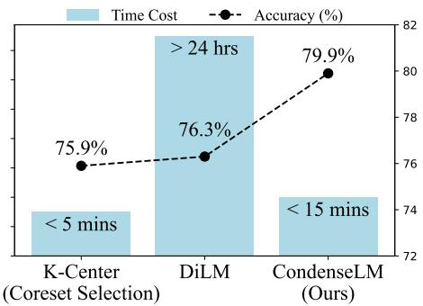
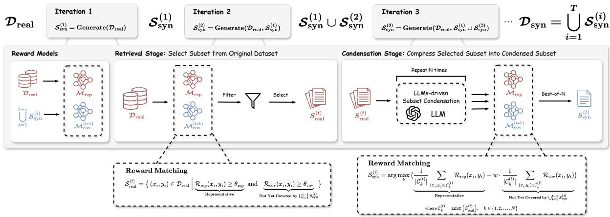
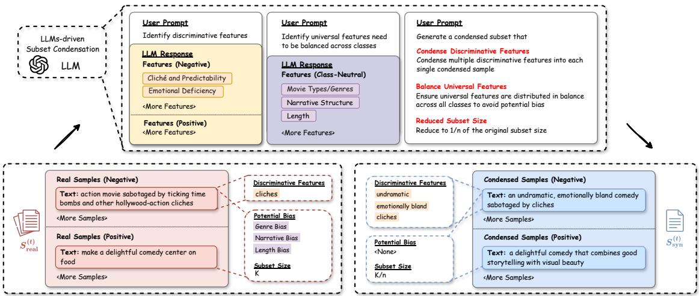
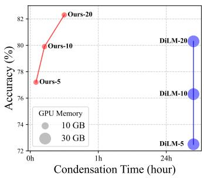
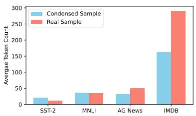
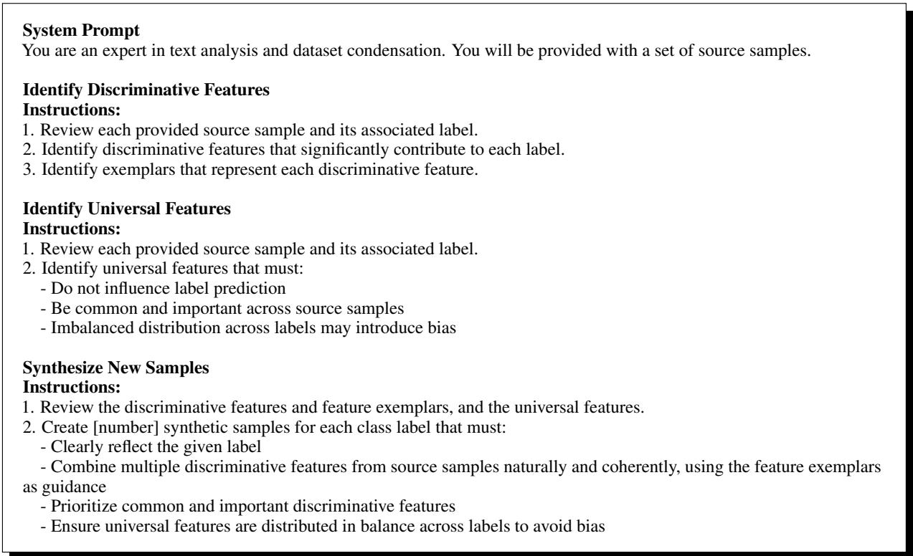

# CondenseLM: LLMs-driven Text Dataset Condensation via Reward Matching

Cheng Shen1,2, Yew-Soon Ong1,2,3, Joey Tianyi Zhou2,3 B 1CCDS, Nanyang Technological University, Singapore   
2CFAR, Agency for Science, Technology and Research (A\*STAR), Singapore   
3IHPC, Agency for Science, Technology and Research (A\*STAR), Singapore s230143@e.ntu.edu.sg, asysong@ntu.edu.sg, joey\_zhou@a-star.edu.sg (B Corresponding author)

## Abstract

Dataset condensation has emerged as a promising technique to improve data efficiency under limited data budgets. However, when applied to the text level, existing methods struggle to compress more information into samples through optimization. Thus, these methods provide no obvious advantage over simpler coreset selection despite their high computational cost. In this paper, we introduce CondenseLM, a novel paradigm for both effective and efficient textlevel dataset condensation. Our framework employs an LLMs-driven approach to sidestep the inherent limitations of existing methods, successfully generating more informative and less biased samples. In addition, it incorporates reward matching to align the LLMs-condensed dataset with the original dataset, maximizing representability and coverage. We conducted extensive experiments on SST-2, MNLI, AG News, and IMDB. Our approach outperforms both coreset selection and existing dataset condensation methods by large margins while also substantially reducing the computational cost.

## 1 Introduction

The growing scale of datasets introduces burdens in storage and training costs, making training data efficiency a critical priority. Traditional coreset selection (Guo et al., 2022) selects a subset from the original dataset. However, when constrained to a low-data budget (e.g., 1% of the original dataset), the coreset may fail to capture sufficient information for effective learning. In contrast, dataset condensation (Wang et al., 2018) generates a compact dataset that compresses more training information, leading to better performance in low-data budgets. These methods optimize the condensed dataset to match key properties (e.g., gradients, training trajectories) of the original dataset, which allows for comparable model performance with significantly less training data. We categorize this paradigm of methods as optimization-based condensation.

  
Figure 1: Time cost of selecting or generating a 10 dataper-class (DPC) training dataset for SST-2 vs. accuracy. DiLM (Maekawa et al., 2024), the current state-of-theart in text-level dataset condensation, requires over 24 hours since it’s optimization-based. However, this high computational cost yields only a marginal 0.4% performance gain over K-Center, a standard coreset selection baseline. In contrast, our approach achieves both effectiveness and efficiency in dataset condensation.

Most dataset condensation studies have mainly focused on image datasets, as the continuous pixel facilitates optimization. In contrast, applying this technique to text datasets is much more challenging due to the discrete nature of text. Early solutions explored embedding-level methods, optimizing input word embeddings instead of discrete text (Li and Li, 2021; Sucholutsky and Schonlau, 2021; Sahni and Patel, 2023; Maekawa et al., 2023). However, such embedding samples lack interpretability and fail to generalize across different models. To overcome these limitations, recent efforts have shifted towards text-level methods: (1) Discretization (Sucholutsky and Schonlau, 2021; Sahni and Patel, 2023) converts the optimized embeddings into text samples by finding the nearest tokens in the vocabulary; (2) DiLM (Maekawa et al., 2024) optimizes a proxy model to generate text samples that minimize the matching loss.

However, these attempts to adapt optimizationbased condensation at the text level are both ineffective and inefficient. Dataset condensation excels in the image domain, where it optimizes synthetic images to compress vast training information and achieve superior performance. However, Table 1 reveals that the identical optimization objective (i.e., gradient matching loss) fails to yield comparable effectiveness for text-level methods. This discrepancy arises because discrete text is inherently less expressive than continuous embeddings, restricting the information that can be compressed into text samples through optimization. Thus, these computationally expensive methods provide no significant performance advantage over simpler coreset selection, as clearly illustrated in Figure 1 and Table 4. This cost-benefit imbalance severely undermines the practical utility of this technique.

<table><tr><td>Method</td><td>Gradient Similarity (%)</td></tr><tr><td>Coreset Selection K-Center</td><td>92.85</td></tr><tr><td>Optimization-based Condensation</td><td></td></tr><tr><td>Discretization</td><td>90.19 (−2.66)</td></tr><tr><td>DiLM</td><td>92.97 (+0.12)</td></tr><tr><td>DiLM (embed.)</td><td>97.98 (+5.13)</td></tr></table>

Table 1: Gradient similarity between the 5-DPC datasets created via different methods and the original dataset on SST-2. All optimization-based condensation methods employ gradient matching loss, where higher similarity indicates more effective information compression into the condensed dataset. We can find that the embeddinglevel method, DiLM (embed.), significantly outperforms the text-level method, DiLM, despite sharing a similar algorithm and the same loss. Furthermore, none ofthe text-level methods (optimization-based) yields a notable improvement over the K-Center baseline (no optimization). More details are shown in Appendix A.4.

Given the discrete nature of text poses an inherent bottleneck to optimization-based condensation, we explore a new paradigm: leveraging Large Language Models (LLMs)-generated data to improve data efficiency. Here, we propose CondenseLM, a novel framework centered on two key questions:

How to generate high-quality text samples beyond current limitations? CondenseLM addresses this by introducing LLMs-driven Subset Condensation (LDSC). This module first utilizes the LLM as an "encoder" to extract features from a selected subset of the original dataset. Then we re-purpose it as a "decoder" to condense extracted features into a more compact subset while mitigating bias. LDSC achieves outstanding information compression: at just 20% or 25% of the original size, the condensed subset still maintains performance comparable to the original subset (see Table 10). This sharply contrasts with optimization-based condensation, which struggles to generate highly informative samples.

<table><tr><td>Method</td><td>|Performance Efficiency</td><td></td><td>y Generalization</td></tr><tr><td>Coreset Selection K-Center</td><td>√</td><td>L</td><td>√</td></tr><tr><td>Optimization-based Condensation DiLM</td><td>√</td><td>X</td><td>√</td></tr><tr><td>LLMs-driven Condensation Ours</td><td>L</td><td>1</td><td>L</td></tr></table>

Table 2: Comparison between representative methods in coreset selection, optimization-based condensation, and our proposed paradigm on three criteria: performance, efficiency, and generalization across different models. ✓, ✓, ✗ denote Superior, Fair, and Poor.

How to construct an LLMs-condensed dataset that optimally represents the original dataset? CondenseLM employs an iterative pipeline for full dataset condensation. In each iteration, we generate a condensed subset using LDSC module, and then the final dataset is constructed by aggregating all generated subsets. Importantly, we guide this process with reward matching. We identify two key factors for constructing a high-quality condensed dataset: representability and coverage. Thus, we leverage two reward models to score samples based on these metrics. In each iteration, these models guide the generation of new samples that align with their preferences. This ensures that the final condensed dataset can achieve maximal representability and coverage of the original dataset.

CondenseLM provides substantial benefits over existing methods (see Table 2). First, our method delivers a significant performance advantage. As shown in Figure 1, DiLM outperforms K-Center (coreset selection) by only 0.4% when compressing SST-2 to 10 data points per class (DPC), whereas CondenseLM surpasses the same baseline by 4%. Second, our method is highly efficient. While traditional dataset condensation methods typically rely on computationally expensive bi-level optimization (Lei and Tao, 2023), our approach eliminates the need to optimize samples (or a proxy model). DiLM takes over 24 hours to generate a 10-DPC dataset, whereas CondenseLM finishes in under 15 minutes. Third, our method exhibits strong crossmodel generalization due to its model-agnostic design. Our key contributions are as follows:

• We propose CondenseLM as the first method to achieve both effectiveness and efficiency in text-level dataset condensation, reshaping the practical utility of this technique.

• We demonstrate that optimization-based condensation is inherently constrained when applied to the text level, and develop an LLMsdriven approach as a more effective solution.

  
Figure 2: CondenseLM. This figure visualizes the proposed framework. Top: The task is decomposed into an iterative, subset-wise condensation process. Middle: In each iteration, we select a subset from the original dataset and condense this subset into a compact subset through LDSC module. Bottom: Reward matching is deployed in each iteration to guide the generation of a new condensed subset that optimally contributes to the representability and coverage of the final condensed dataset.

• We introduce reward matching mechanism to align the LLMs-condensed dataset with the original dataset, maximizing representability and coverage.

• Extensive experiments on four datasets show that our method achieves state-of-the-art while substantially reducing condensation cost and improving cross-model generalization.

## 2 Methods

## 2.1 Preliminaries

Let $\mathcal { D } _ { \mathrm { r e a l } } = \{ ( x _ { i } , y _ { i } ) \} _ { i = 1 } ^ { N _ { \mathrm { r e a l } } }$ represents the large original training dataset, where $x _ { i }$ denotes the input sequence and $y _ { i }$ denotes the corresponding label.1 The objective of dataset condensation is to generate a compact condensed dataset $\mathcal { D } _ { \mathrm { s y n } }$ with a size $N _ { \mathrm { s y n } } \ll N _ { \mathrm { r e a l } }$ , such that models trained on $\mathcal { D } _ { \mathrm { s y n } }$ perform comparably to those trained on $\mathcal { D } _ { \mathrm { r e a l } }$

## 2.2 Overall Framework

We first outline the pipeline of our framework, as shown in Figure 2 and Algorithm 1.

Iterative, Subset-wise Condensation. Our framework systematically constructs a condensed dataset through multiple iterations. Each iteration consists of two primary stages: Retrieval Stage and Condensation Stage.

For each iteration t:

(1) Retrieval Stage: a subset ${ S } _ { \mathrm { r e a l } } ^ { ( t ) }$ of size K is selected from the original dataset $\mathcal { D } _ { \mathrm { r e a l } }$

(2) Condensation Stage: then this selected subset $S _ { \mathrm { r e a l } } ^ { ( t ) }$ is condensed into a compact subset $S _ { \mathrm { s y n } } ^ { ( t ) }$ with a reduced size $\begin{array} { r } { K ^ { \prime } = \frac { K } { n } } \end{array}$ , where $n \geq 2 .$ . This subset-level condensation is accomplished by LDSC module (see Section 2.3).

This two-stage process is executed over T iterations, sequentially generating $T$ condensed subsets. The final condensed dataset is constructed as the union of all subsets generated:

$$
\begin{array} { r } { \mathcal { D } _ { \mathrm { s y n } } = \bigcup _ { i = 1 } ^ { T } S _ { \mathrm { s y n } } ^ { ( i ) } , \mathrm { w h e r e } N _ { \mathrm { s y n } } = K ^ { \prime } \cdot T } \end{array}
$$

Reward Matching. We deploy reward matching in each iteration to progressively promote both representability and coverage of the LLMs-condensed dataset (see Section 2.4).

## 2.3 LLMs-driven Subset Condensation

Revisiting LLMs-driven Data Generation. Existing LLMs-driven data generation studies (Long et al., 2024) primarily focus on data augmentation, leaving dataset condensation unexplored. However, as shown in Table 7 and 9, these prompting strategies or generationframeworksfail to transferfrom augmentation to condensation. Unlike expanding a dataset, dataset condensation creates a compact dataset that facilitates model learning with minimal data. From this perspective, we identify two unique objectives: (1) Informativeness—maximizing the training information available for data-scarce learning, and (2) Bias Mitigation—minimizing potential biases that may arise from limited data.

  
Figure 3: LLMs-driven Subset Condensation (LDSC) Module. This figure illustrates this process for SST-2: 1). identifying discriminative features and universal features within the selected subset. 2). generating a condensed subset that is more compact (typically 20%  50% of the original subset size), more information-dense (more discriminative features are condensed into each sample), and less biased (avoid the potential bias caused by the imbalance of universal features).

Multi-Step Subset Condensation. To meet these goals, our approach, shown in Figure 3, follows a multi-step generation process. Given a selected subset, we leverage the LLM to identify both discriminative features and universal features within this subset. Discriminative features are critical patterns for classification, while universal features are neutral patterns shared across classes. Once these features are extracted, we instruct the LLM to generate a more compact subset of samples (typically 20% 50% of the original subset size) that (1) condense multiple discriminative features into each sample, and (2) maintain a balanced distribution of universal features across all classes.

Advantages of Condensed Subset. Compared to the original subset, the condensed subset is smaller yet more information-dense, as it integrates more discriminative features (e.g., undramatic, emotionally bland, cliches) into each sample. In contrast, a single real sample contains only limited discriminative features (e.g., cliches). Moreover, the condensed subset exhibits less bias. As shown in Figure 3, the original subset may over-represent comedy reviews in the positive class and induce model overfitting to such bias. Our approach ensures that universal features (e.g., movie type, narrative style) can be evenly distributed across all classes.

## 2.4 Reward Matching

The next challenge is to ensure these subsets generated by LDSC module collectively form a dataset that effectively represents the original dataset.

Dataset Alignment. To achieve this goal, we leverage two reward models: representability reward model and coverage reward model. These models assign scores to each sample based on how well it captures representative patterns not yet covered by the existing condensed subsets $\textstyle \bigcup _ { i = 1 } ^ { t - 1 } S _ { \mathrm { s y n } } ^ { ( i ) }$ . During each iteration, these reward models guide the generation of a new condensed subset, $S _ { \mathrm { s y n } } ^ { ( t ) }$ , that aligns with their preferences. Upon completion of all iterations, the final dataset, $\begin{array} { r } { \mathcal { D } _ { \mathrm { s y n } } = \bigcup _ { i = 1 } ^ { T } S _ { \mathrm { s y n } } ^ { ( i ) } } \end{array}$ achieves maximal representability and coverage of the original dataset. The algorithm is presented in Algorithm 1. Next, we will introduce these reward models and then detail their implementation.

Representability Reward Model. Previous study (Yang et al., 2024) has demonstrated that models trained with heavy regularization (e.g., early stopping) prioritize learning the most common, generalizable features of a task while neglecting rare, difficult ones. This parallels the information stored in condensed datasets under strict size constraints.

Building on this insight, we initially train a representability reward model $\mathcal { M } _ { \mathrm { r e p } }$ on the original dataset $\mathcal { D } _ { \mathrm { r e a l } }$ under heavy regularization:

$$
\mathcal { M } _ { \mathrm { { r e p } } } = \arg \operatorname* { m i n } _ { \mathcal { M } _ { \mathrm { { r e p } } } } \mathcal { L } ( \mathcal { M } _ { \mathrm { { r e p } } } ; \mathcal { D } _ { \mathrm { { r e a l } } } )
$$

Only samples with common, generalizable patterns can be effectively recognized by $\mathcal { M } _ { \mathrm { r e p } }$ . We then use the predictions of $\mathcal { M } _ { \mathrm { r e p } }$ to evaluate the representability of a given sample $( x _ { i } , y _ { i } )$

$$
\mathcal { R } _ { \mathrm { r e p } } ( x _ { i } , y _ { i } ) = \mathcal { M } _ { \mathrm { r e p } } ( x _ { i } ) _ { y _ { i } }\tag{1}
$$

where $\mathcal { R } _ { \mathrm { r e p } }$ is the representability-based reward score, and $\mathcal { M } ( x _ { i } ) _ { y _ { i } }$ is the model’s confidence in the correct label. A higher $\mathcal { R } _ { \mathrm { r e p } }$ indicates that this sample captures common, generalizable patterns present in the original dataset $\mathcal { D } _ { \mathrm { r e a l } }$

Coverage Reward Model. During each iteration $t ,$ we train a coverage reward model $\mathcal { M } _ { \mathrm { c o v } } ^ { ( t - 1 ) }$ on the existing condensed subsets $\textstyle \bigcup _ { i = 1 } ^ { t - 1 } S _ { \mathrm { s y n } } ^ { ( i ) }$

$$
\mathcal { M } _ { \mathrm { c o v } } ^ { ( t - 1 ) } = \arg \operatorname* { m i n } _ { \mathcal { M } _ { \mathrm { c o v } } ^ { ( t - 1 ) } } \mathcal { L } \left( \mathcal { M } _ { \mathrm { c o v } } ^ { ( t - 1 ) } ; \bigcup _ { i = 1 } ^ { t - 1 } S _ { \mathrm { s y n } } ^ { ( i ) } \right)
$$

To evaluate whether including a new sample $( x _ { i } , y _ { i } )$ can improve the coverage of the existing data, we compare the predictions of $\mathcal { M } _ { \mathrm { r e p } }$ and $\mathcal { M } _ { \mathrm { c o v } } ^ { ( t - 1 ) }$ . The coverage-based reward score is defined as:

$$
\mathcal { R } _ { \mathrm { c o v } } ( x _ { i } , y _ { i } ) = \mathcal { M } _ { \mathrm { r e p } } ( x _ { i } ) _ { y _ { i } } - \mathcal { M } _ { \mathrm { c o v } } ^ { ( t - 1 ) } ( x _ { i } ) _ { y _ { i } }\tag{2}
$$

A higher $\mathcal { R } _ { \mathrm { c o v } }$ indicates that this sample introduces new patterns present in the original dataset $\mathcal { D } _ { \mathrm { r e a l } }$ but not yet covered by the existing condensed subsets $\textstyle \bigcup _ { i = 1 } ^ { t - 1 } S _ { \mathrm { s y n } } ^ { ( i ) }$

Reward Matching in Retrieval Stage. Retrieval Stage selects a subset $S _ { \mathrm { r e a l } } ^ { ( t ) }$ from the original dataset $\mathcal { D } _ { \mathrm { r e a l } }$ . To guide this process, we evaluate $\mathcal { D } _ { \mathrm { r e a l } }$ using the reward models. The objective is to retain only those samples with high reward scores:

$$
\mathcal { R } _ { \mathrm { r e p } } ( x _ { i } , y _ { i } ) \geq \theta _ { \mathrm { r e p } } \wedge \mathcal { R } _ { \mathrm { c o v } } ( x _ { i } , y _ { i } ) \geq \theta _ { \mathrm { c o v } }\tag{3}
$$

where $( x _ { i } , y _ { i } ) \in \mathcal { D } _ { \mathrm { r e a l } }$ . After the filtering, we apply the K-Center algorithm to select the subset $S _ { \mathrm { r e a l } } ^ { ( t ) }$ from the filtered dataset. This mechanism ensures that, at each iteration, we only focus on the original data distribution that is both representative and remains under-explored in previous iterations.

Reward Matching in Condensation Stage. Condensation Stage compresses the previously selected subset ${ S } _ { \mathrm { r e a l } } ^ { ( t ) }$ into a condensed subset $S _ { \mathrm { s y n } } ^ { ( t ) }$ . To ensure $S _ { \mathrm { s y n } } ^ { ( t ) }$ aligns with the desired criteria, we implement Best-of-N sampling (Stiennon et al., 2020). For the same subset $\bar { S _ { \mathrm { r e a l } } ^ { ( t ) } }$ , we repeat the condensation process multiple times, allowing the LLM to generate multiple candidate subsets.

Then, each candidate subset is evaluated using the reward models. Specifically, for every sample in the subset, we compute a weighted reward score:

$$
\mathcal { R } _ { \mathrm { r e p } } ( x _ { i } , y _ { i } ) + w \cdot \mathcal { R } _ { \mathrm { c o v } } ( x _ { i } , y _ { i } )\tag{4}
$$

The candidate with the highest cumulative score is selected as the condensed subset $S _ { \mathrm { s y n } } ^ { ( t ) }$ . This mechanism ensures that the final condensed subset best matches the preference of reward models.

Algorithm 1 CondenseLM   
Input: original dataset ${ \overline { { \mathcal { D } _ { \mathrm { r e a l } } } } } ,$ number of iterations T, Best-of-  
N parameter $N$   
$\mathcal { M } _ { \mathrm { r e p } } = \dot { \mathrm { T r a i n } } ( \mathcal { D } _ { \mathrm { r e a l } } )$   
for $i = 1 , \dots , \dot { T }$ do   
$\begin{array} { r } { \mathcal { M } _ { \mathrm { c o v } } ^ { ( t - 1 ) } = \operatorname { T r a i n } \left( \bigcup _ { i = 1 } ^ { t - 1 } S _ { \mathrm { s y n } } ^ { ( i ) } \right) } \end{array}$   
### Retrieval Stage ###   
$\mathcal { D } _ { \mathrm { f i l t e r e d } } = \mathrm { F i l t e r } ( \mathcal { D } _ { \mathrm { r e a l } } , \mathcal { M } _ { \mathrm { c o v } } ^ { ( t - 1 ) } , \mathcal { M } _ { \mathrm { r e p } } )$   
$S _ { \mathrm { r e a l } } ^ { ( t ) } = \mathrm { S e l e c t } ( \mathcal { D } _ { \mathrm { f i l t e r e d } } )$   
### Condensation Stage ###   
$\begin{array} { r } { \mathrm { S } _ { \mathrm { s y n } } ^ { ( t ) } = \mathrm { B e s t - o f - N } \Big ( \bigcup _ { k = 1 } ^ { N } \mathsf { L D S C } \big ( S _ { \mathrm { r e a l } } ^ { ( t ) } \big ) , ~ \mathcal { M } _ { \mathrm { c o v } } ^ { ( t - 1 ) } , ~ \mathcal { M } _ { \mathrm { r e p } } \Big ) } \end{array}$   
end   
Output $\begin{array} { r } { : \mathcal { D } _ { \mathrm { s y n } } = \bigcup _ { i = 1 } ^ { T } S _ { \mathrm { s y n } } ^ { ( i ) } } \end{array}$   
Dataset # Original # Condensed 1 Sub. Comp. Ratio   
SST-2 MNLI 2010 25%50%   
AG News 10 20%   
IMDB 5 20%  
Table 3: Parameters of subset size in LDSC module. # Original is the size of the selected subset. # Condensed is the size of the condensed subset. Sub. Comp. Ratio is the subset compression ratio.

## 3 Experiments

## 3.1 Experiment Settings

Datasets. We experiment on four large-scale text classification datasets: SST-2 (Socher et al., 2013), MNLI (Williams et al., 2018), AG News (Zhang and LeCun, 2015), and IMDB (Maas et al., 2011). These datasets span diverse classification tasks and sequence lengths, demonstrating our method’s versatility. More details are shown in Appendix A.2.

Baselines. We compare against four categories of baselines: (1) existing text-level dataset condensation baselines (Table 4): Discretization (Sucholutsky and Schonlau, 2021; Sahni and Patel, 2023) and DiLM (Maekawa et al., 2024); (2) standard coreset selection baselines commonly compared in dataset condensation studies (Table 4): Random, Herding (Welling, 2009) and K-Center (Sener and Savarese, 2018); (3) recent state-of-the-art coreset selection baselines (Table 5): EL2N (Paul et al., 2021), Moderate (Xia et al., 2023) and G-DIG (Pan et al., 2024); (4) LLMs-generated datasets via alternative prompting strategy (Table 7) or generation framework (Table 9). Baselines in categories (1)- (3) use $\mathbf { B E R T _ { b a s e } }$ (Devlin et al., 2019) as the base model for selection or condensation.

Evaluation. We primarily follow standard setups of the current state-of-the-art, DiLM. We compress the original dataset to 5, 10, and 20 data per class (DPC). These resulting datasets are used to train $\mathrm { B E R T _ { b a s e } }$ (different test models evaluated in Table 6) with a learning rate of $1 \times 1 0 ^ { - 4 }$ and a batch size of 64 for 200 steps. Test accuracy is reported.

<table><tr><td rowspan="2">Dataset</td><td rowspan="2">DPC</td><td colspan="3">Coreset Selection (Real Data)</td><td colspan="3">Dataset Condensation (Synthetic Data)</td><td rowspan="2">Full</td></tr><tr><td>Random</td><td>Herding</td><td>K-Center</td><td>Discretization</td><td>DiLM</td><td>Ours</td></tr><tr><td>SST-2</td><td>510</td><td> $5 8 . 1 \pm 5 . 2$ </td><td></td><td></td><td> $5 2 . 8 \pm 1 . 2$ </td><td> $7 2 . 5 \pm 5 . 9$ </td><td></td><td></td></tr><tr><td rowspan="3">(2 classes, 67.3k)</td><td></td><td> $6 4 . 3 \pm 7 . 4$ </td><td></td><td> $\begin{array} { c } { { 7 0 . 8 \pm 4 . 1 } } \\ { { 7 5 . 9 \pm 4 . 7 } } \\ { { 7 9 . 8 \pm 3 . 5 } } \end{array}$ </td><td>54.0 ± 2.8</td><td> $\dot { 7 } \overline { { 6 . 3 } } \equiv 4 . 6$ </td><td> $\begin{array} { r } { \frac { 7 7 . 2 } { 7 9 . 9 } \pm 4 . 9 } \\ { \frac { 7 9 . 9 } { 8 2 . 4 } \pm 3 . 1 } \\ { 8 2 . 4 \pm 2 . 5 } \end{array}$ </td><td>92.7</td></tr><tr><td>20</td><td> $7 0 . 3 \pm 6 . 8$ </td><td> $\begin{array} { c } { { 7 0 . 2 \pm 5 . 7 } } \\ { { 7 3 . 2 \pm 5 . 7 } } \\ { { 7 6 . 9 \pm 4 . 4 } } \end{array}$ </td><td></td><td> $\bar { 5 } 5 . 6 \overset { - } { \pm } 4 . 3$ </td><td> $8 0 . 3 \pm 2 . 8$ </td><td>_</td><td></td></tr><tr><td>5</td><td></td><td></td><td></td><td></td><td></td><td>_</td><td></td></tr><tr><td rowspan="4">MNLI (3 classes, 392k)</td><td>10</td><td> $\begin{array} { l } { 3 5 . 6 \pm 2 . 1 } \\ { 3 7 . 7 \pm 2 . 6 } \\ { 4 0 . 1 \pm 3 . 2 } \end{array}$ </td><td> $\begin{array} { l } { 3 6 . 2 \pm 3 . 8 } \\ { 3 8 . 7 \pm 3 . 7 } \\ { 4 2 . 8 \pm 3 . 5 } \end{array}$ </td><td> $\begin{array} { l } { 3 6 . 2 \pm 2 . 4 } \\ { 4 1 . 8 \pm 3 . 2 } \\ { 4 5 . 3 \pm 3 . 0 } \end{array}$ </td><td> $\begin{array} { l } { 3 2 . 3 \pm 0 . 6 } \\ { 3 3 . 0 \pm 0 . 8 } \\ { 3 3 . 7 \pm 1 . 2 } \end{array}$ </td><td> $\begin{array} { l } { 3 9 . 7 \pm 2 . 7 } \\ { 4 4 . 8 \pm 3 . 1 } \\ { 4 8 . 7 \pm 2 . 6 } \end{array}$ </td><td> $\begin{array} { l } { 4 6 . 0 \pm 2 . 3 } \\ { 4 9 . 2 \pm 2 . 1 } \\ { 5 1 . 3 \pm 1 . 6 } \end{array}$ </td><td>86.7</td></tr><tr><td>20</td><td></td><td></td><td></td><td></td><td></td><td></td><td></td></tr><tr><td></td><td></td><td></td><td></td><td></td><td></td><td></td><td></td></tr><tr><td>510</td><td> $\begin{array} { c } { { 7 3 . 2 \pm 4 . 4 } } \\ { { 8 1 . 1 \pm 2 . 5 } } \\ { { 8 2 . 5 \pm 2 . 3 } } \end{array}$ </td><td> $\begin{array} { l } { 8 1 . 3 \pm 1 . 1 } \\ { 8 3 . 8 \pm 0 . 9 } \\ { 8 5 . 4 \pm 0 . 8 } \end{array}$ </td><td></td><td></td><td></td><td></td><td>94.7</td></tr><tr><td rowspan="3">AG News (4 classes, 120k)</td><td></td><td></td><td></td><td> $\begin{array} { c } { 8 0 . 5 \pm 2 . 0 } \\ { 8 3 . 1 \pm 1 . 1 } \\ { 8 5 . 7 \pm 0 . 9 } \end{array}$ </td><td> $\begin{array} { l } { 4 1 . 0 \pm 6 . 6 } \\ { 4 8 . 5 \pm 6 . 8 } \\ { 5 1 . 1 \pm 7 . 2 } \end{array}$ </td><td></td><td> $\mathbf { 8 2 . 8 \pm 2 . 7 } _ { \mathbf { 8 4 . 9 } \pm 2 . 1 }$ </td><td></td></tr><tr><td>20</td><td></td><td></td><td></td><td></td><td></td><td></td><td></td></tr><tr><td>5</td><td></td><td></td><td></td><td></td><td></td><td> $\mathbf { 7 5 . 9 \ : \pm 6 . 0 }$ </td><td></td></tr><tr><td rowspan="2">IMDB (2 classes, 25k)</td><td></td><td></td><td> $\begin{array} { l } { 6 3 . 3 \pm 6 . 1 } \\ { 6 8 . 4 \pm 5 . 2 } \\ { 7 7 . 5 \pm 3 . 9 } \end{array}$ </td><td> $\begin{array} { l } { 6 7 . 1 \pm 5 . 4 } \\ { 7 0 . 9 \pm 4 . 5 } \\ { 7 8 . 3 \pm 3 . 2 } \end{array}$ </td><td></td><td></td><td> $\underline { { 7 } } \underline { { 7 } } . \underline { { 4 } } \equiv \mathbf { 5 . 6 } \underline { { } }$ </td><td>94.2</td></tr><tr><td>1020</td><td> $\begin{array} { l } { 5 6 . 7 \pm 5 . 7 } \\ { 6 2 . 8 \pm 2 . 9 } \\ { 6 5 . 6 \pm 4 . 1 } \end{array}$ </td><td></td><td></td><td></td><td></td><td>_  ${ \dot { 7 } } { \dot { 9 } } . { \dot { 0 } } \not \equiv 4 . 4$ </td><td></td></tr></table>

Table 4: Performance comparison with text-level dataset condensation and standard coreset selection baselines. Full denotes training on the full dataset. The best results are marked in bold . The missing results are due to scalability issues imposed by memory constraints. The statistical significance is validated in Appendix A.1.

<table><tr><td rowspan="2">Dataset DPC</td><td rowspan="2"></td><td colspan="3">Coreset Selection (Real Data)</td><td rowspan="2">Ours</td></tr><tr><td>EL2N</td><td>Moderate</td><td>G-DIG</td></tr><tr><td rowspan="3">SST-2</td><td>5</td><td> $3 1 . 9 \pm 3 . 4$ </td><td> $6 4 . 8 \pm 5 . 1$ </td><td> $7 2 . 4 \pm 3 . 7$ </td><td> ${ \bf 7 7 . 2 \pm 4 . 9 }$ </td></tr><tr><td>10</td><td> $3 2 . 3 \pm 5 . 6$ </td><td>68.0 ± 5.6</td><td> $7 5 . 0 \pm 4 . 4$ </td><td> ${ \bf 7 9 . 9 \pm 3 . 1 }$ </td></tr><tr><td>20</td><td> $2 8 . 2 \pm 5 . 3$ </td><td> $7 3 . 6 \pm 4 . 0$ </td><td> $7 7 . 2 \pm 4 . 6$ </td><td> ${ \bf 8 2 . 4 \pm 2 . 5 }$ </td></tr><tr><td rowspan="3">MNLI</td><td>5</td><td> $3 1 . 8 \pm 0 . 7$ </td><td> $3 5 . 0 \pm 1 . 0$ </td><td> $3 5 . 1 \pm 1 . 2$ </td><td> ${ \bf 4 6 . 0 \pm 2 . 3 }$ </td></tr><tr><td>10</td><td> $3 0 . 9 \pm 1 . 0$ </td><td> $3 4 . 4 \pm 0 . 9$ </td><td> $3 9 . 4 \pm 1 . 4$ </td><td> ${ \bf 4 9 . 2 \pm 2 . 1 }$ </td></tr><tr><td>20</td><td> $3 1 . 4 \pm 1 . 0$ </td><td> $3 4 . 4 \pm 1 . 2$ </td><td> $4 2 . 0 \pm 1 . 2$ </td><td> ${ \bf 5 1 . 3 \pm 1 . 6 }$ </td></tr></table>

Table 5: Performance comparison with state-of-the-art coreset selection baselines.

Implementation. We use GPT-4o (OpenAI, 2024) as the generation model (also demonstrating the feasibility with small LLMs in Table 8) and $\mathbf { B E R T _ { b a s e } }$ as the reward models. The reward model $\mathcal { M } _ { \mathrm { r e p } }$ is trained under heavy regularization with a dropout ratio of 0.3 and early stopping. Table 3 details the subset size parameters. The compression ratio of the condensed subset ranges between 20% and 50% across different datasets, depending on sequence length and label number. More details are shown in Appendix A.4.

  
Figure 4: Condensation time vs. accuracy on SST-2 with 5/10/20-DPC. The size of each scatter bubble indicates the peak GPU memory incurred during condensation.

In contrast, our method consistently delivers superior performance across different datasets and data budgets. Notably, as the budget is highly constrained, its advantage becomes more pronounced. Specifically, with a 5-DPC setting, our approach outperforms DiLM by 4.7% on SST-2 and 6.3% on MNLI. We attribute such performance gain to the increased informativeness and reduced bias inherent in LLMs-condensed datasets. However, on AG News, the performance gain is relatively smaller, likely because the task’s simplicity allows models to learn effectively, regardless of the method used.

## 3.2 Primary Results

Performance Comparison with Baselines. Table 4 presents a comparison with different baselines. The results reveal limitations of optimization-based condensation methods. Discretization suffers from substantial information loss when converting optimized embeddings into text, leading to poor performance. DiLM achieves only marginal improvements over coreset selection baselines, outperforming K-Center by just 0.4% 1.7% on SST-2. Moreover, these methods face scalability issues due to large memory demands, when applied to datasets such as IMDB, which contains long-form samples.

Performance Comparison with Recent Coreset Selection Baselines. We further compare with recent state-of-the-art coreset selection baselines in Table 5. These methods are primarily developed for abundant data budgets (e.g., selecting 50% of the original dataset). They become ineffective when the data budget is highly constrained, as their performance degenerates significantly (in some cases, even much worse than random selection). In such data-limited scenarios, CondenseLM provides the optimal solution.

Efficiency Comparison. Figure 4 illustrates that our approach substantially reduces condensation time and peak GPU memory usage compared to the current state-of-the-art, DiLM. Unlike traditional methods, CondenseLM does not require extensive iterations to optimize samples (or a proxy model), which incurs substantial computational overhead. This increased efficiency enables CondenseLM to scale effectively to large datasets.

<table><tr><td>Dataset</td><td>Test Model</td><td>1 | K-Center</td><td>DiLM</td><td>Ours</td></tr><tr><td rowspan="3">SST-2</td><td> $\ R _ { \mathrm { { o B E R T a } _ { \mathrm { { b a s e } } } } }$ </td><td> $7 3 . 9 \pm 5 . 2$ </td><td> $7 8 . 1 \pm 3 . 8$ </td><td> $\mathbf { 8 0 . 3 \pm 3 . 4 }$ </td></tr><tr><td> $\mathrm { B E R T _ { l a r g e } }$ </td><td> $8 0 . \overset { \cdot } { 4 } \overset { - } { \pm } \ : 9 . 1$ </td><td> $8 3 . 1 \pm 6 . 2$ </td><td> ${ \bf 8 5 . 9 \pm 3 . 1 }$ </td></tr><tr><td> $\mathbf { X L N e t } _ { \mathrm { b a s e } }$ </td><td> $7 1 . 8 \pm 5 . 8$ </td><td> $7 7 . 9 \pm 4 . 7$ </td><td> ${ \bf 8 1 . 0 \pm 4 . 8 }$ </td></tr><tr><td rowspan="3">MNLI</td><td> $\underline { { \mathrm { R o B E R T a } } } _ { \mathrm { - } }$ </td><td> $4 4 . 5 \pm 2 . 6$ </td><td> $4 5 . 0 \pm 2 . 8$ </td><td> ${ \bf 5 5 . 8 \pm 2 . 1 }$ </td></tr><tr><td> $\mathbf { B E R T _ { l a r g e } }$ </td><td> $4 8 . 7 \pm 4 . 2$ </td><td> $4 9 . 6 \pm 4 . 4$ </td><td> ${ \bf 5 2 . 3 \pm 2 . 6 }$ </td></tr><tr><td> $\mathbf { \mathrm { X L N e i } } _ { \mathrm { b a s e } }$ </td><td> $4 3 . 5 \pm 2 . 7$ </td><td> $4 4 . 7 \pm 2 . 7$ </td><td> ${ \bf 5 4 . 7 \pm 1 . 7 }$ </td></tr></table>

Table 6: Cross-model performance on SST-2 and MNLI with 20-DPC. All baselines use $\mathbf { B E R T _ { b a s e } }$ as the base model for selection or condensation.

Cross-Model Generalization. Table 6 shows the generalization ability of our method across different test models. K-Center and DiLM exhibit poor generalization on $\mathbf { X L N e t } _ { \mathrm { b a s e } }$ $\mathrm { R o B E R T a _ { b a s e } }$ , which considerably differ from ${ \mathrm { B E R T } } _ { \mathrm { b a s e } } .$ the model used for their selection or condensation process. In contrast, CondenseLM maintains robust performance despite the model difference by not overfitting to a particular model’s parameters. On MNLI, for example, it achieves a 10.0%  11.2% improvement in generalization performance on $\mathbf { X L N e t } _ { \mathrm { b a s e } }$

Qualitative Results. Tables 14 and 15 provide examples of condensed samples for SST-2 and IMDB with 5-DPC, along with the prompt template presented in Figure 6. We observe that, relative to the real sample, the LLMs-condensed sample distills more critical information for classification while exhibiting reduced bias.

## 3.3 Analysis

In this section, we present a detailed QA-style analysis of our approach, with key conclusions highlighted. More analysis is shown in Appendix A.1.

## 3.3.1 Ablation Studies.

Table 7 presents ablation studies that evaluate the impact of each proposed key component:

Whether naive LLMs prompting strategy can replace LDSC module? When we replace LDSC module with direct prompting LLMs for few-shot data generation, there is a significant performance drop. This shows that relying solely on LLMs’ generative capabilities is not sufficient for generating high-quality samples for our task.

<table><tr><td>LDSC</td><td>RepRM</td><td>CovRM</td><td>HeavyReg|</td><td>SST-2</td><td>MNLI</td></tr><tr><td> $\checkmark$ </td><td>√</td><td>√</td><td>√</td><td>1  ${ \bf 8 2 . 4 \pm 2 . 5 }$ </td><td> ${ \bf 5 1 . 3 \pm 1 . 6 }$ </td></tr><tr><td></td><td>√</td><td>V√</td><td>√</td><td> $7 9 . 2 \pm 4 . 3$ </td><td> $4 4 . 9 \pm 1 . 7$ </td></tr><tr><td>V</td><td></td><td></td><td>一</td><td> $7 8 . 9 \pm 4 . 9$ </td><td>45.3 ± 2.5</td></tr><tr><td>V</td><td>√</td><td></td><td>√</td><td> $8 0 . 2 \pm { 3 . 6 }$ </td><td> $4 6 . 3 \pm { 3 . 7 }$ </td></tr><tr><td>√</td><td>√</td><td>-√</td><td>-</td><td> $7 9 . 9 \pm 3 . 6$ </td><td> $4 7 . 8 \pm 2 . 2$ </td></tr></table>

Table 7: Ablation studies of key components on SST-2 and MNLI with 20-DPC. LDSC: synthetic data generation through LDSC module (vs. through naive few-shot LLMs prompting). RepRM: including the representability reward model. CovRM: including the coverage reward model. HeavyReg: training the representability reward model with heavy regularization.
<table><tr><td>Generation Model | Open-Source</td><td></td><td>SST-2</td><td>MNLI</td></tr><tr><td>GPT-4o</td><td>x</td><td> $7 7 . 2 \pm 4 . 9$ </td><td> $4 6 . 0 \pm 2 . 3$ </td></tr><tr><td>GPT-4o-mini</td><td>x</td><td> $7 6 . 2 \pm 5 . 2$ </td><td> $4 3 . 5 \pm 2 . 1$ </td></tr><tr><td>Qwen2.5-14B</td><td>√</td><td> $7 5 . 0 \pm 4 . 2$ </td><td> $4 5 . 1 \pm 2 . 0$ </td></tr><tr><td>Gemma2-9B</td><td>S</td><td> $7 5 . 9 \pm 4 . 4$ </td><td> $4 1 . 9 \pm 2 . 8$ </td></tr></table>

Table 8: Performance of using different generation models on SST-2 and MNLI with 5-DPC.

How do reward models influence the quality of the condensed dataset? Our analysis of individual reward model contributions demonstrates that both representability and coverage are essential for constructing a high-quality condensed dataset, as the removal of either reward model results in a marked decline in performance. Specifically, to replace the coverage reward model in the Retrieval Stage, we perform K-Means clustering once and select subsets from the resulting clusters.

How does heavy regularization influence the reward model? We examine the impact of heavy regularization in training the representability reward model, finding that it provides more reliable reward signals for evaluating sample representability. Unlike a well-performing model, an over-regularized model prioritizes common, important patterns but struggles with rare, difficult cases.

## 3.3.2 LLMs-driven Subset Condensation.

How well does this method work with smallerscale LLMs? Table 8 shows performance across different LLMs for generation. Even with smaller, open-source LLMs such as Qwen2.5-14B (Qwen and et al., 2024) and Gemma2-9B (Team and et al., 2024), CondenseLM still outperforms all baselines from Table 4 and 5 by at least 2.5% on SST-2 and 2.2% on MNLI. These results validate the robustness ofour method across different LLMs.

Whether the performance gain is primarily due to prior knowledge of generation models? Paralleling our work, recent studies in the image domain have increasingly explored diffusion models (Su et al., 2024; Gu et al., 2024; Chen et al., 2025) for superior performance. This emerging trend raises a question: are these improvements primarily due to more effective condensation methods or strong priors from generation models? We have addressed this concern for our work: (1) Table 8 shows our method does not necessarily rely on LLMs with exceptionally strong priors (e.g., GPT-4o). (2) Table 7 indicates that replacing the proposed condensation method (i.e., LDSC) with few-shot prompting without condensation results in a performance drop below K-Center and DiLM baselines from Table 4. These results confirm that the novel condensation method, rather than strong priors, is the primary driver ofthe performance gain over baselines.

  
Figure 5: Average sequence length for samples in the condensed and selected datasets, with token counts measured using the $\mathbf { B E R T _ { b a s e } }$ tokenizer.

Whether LLMs-condensed samples have significantly longer sequence length? As demonstrated in Figure 5, the performance gain of CondenseLM does not come at the cost ofsignificantly longer sequence lengths. In fact, for IMDB, the condensed samples are notably shorter because they focus only on critical information while ignoring redundant information from the real samples.

## 3.3.3 Framework with Reward Matching.

Whether an external framework is necessary? LLMs can’t process the entire large dataset at once. There is a need for an external framework to break down the condensation task in a manageable way.

Whether the data augmentation framework can replace ours for the condensation task? In a stateof-the-art LLMs-driven data generation framework (Wang et al., 2023; Lee et al., 2024; Li et al., 2025), new samples are iteratively generated by targeting error predictions from models trained on existing data. Like ours, this framework also uses an iterative pipeline and proves effective for data augmentation. However, as shown in Table 9, itfalls short for the condensation task. The limitation lies in its tendency to overemphasize rare, difficult patterns.

<table><tr><td>Framework</td><td>SST-2</td><td>MNLI</td></tr><tr><td> $_ \mathrm { O u r s }$ </td><td> ${ \bf 8 2 . 4 \pm 2 . 5 }$ </td><td> ${ \bf 5 1 . 3 \pm 1 . 6 }$  1</td></tr><tr><td>Error Extrapolation</td><td> $8 0 . 1 \pm 3 . 0$ </td><td> $4 3 . 2 \pm 2 . 7$ </td></tr></table>

Table 9: Performance comparison of our framework with a recent state-of-the-art data generation framework on SST-2 and MNLI with 20-DPC. Error Extrapolation (Wang et al., 2023; Lee et al., 2024; Li et al., 2025) iteratively generates samples by extrapolating errors.

While this promotes coverage, it is not suitable for constructing a compact dataset. Reward matching in our framework addresses it by (1) using a reward model to target representative patterns, (2) setting a relatively small threshold $\theta _ { \mathrm { c o v } }$ to include more than misclassified cases in the selected subset.

What are practical scenarios for this method? Our method largely outperforms existing methods under strict data constraints, proving particularly beneficial in scenarios with highly limited computational resources. For example, edge devices (e.g., mobile, IoT devices) face challenges including restricted power consumption and storage capacity, which hinder on-device training with large-scale datasets. Our method addresses this limitation by condensing the dataset into a highly compact form, largely reducing training time and storage.

## 4 Related Work

Optimization-based Condensation. Dataset condensation, first introduced by (Wang et al., 2018), aims to generate a compact condensed dataset that performs comparably to the original dataset. This typically involves a bi-level optimization process. The inner loop updates the model parameters using synthetic data, while the outer loop updates synthetic data itself to match the training behaviors of real data. Typical data matching losses include gradient matching (Zhao et al., 2021; Lee et al., 2022; Jiang et al., 2022; Loo et al., 2023), performance matching (Wang et al., 2018; Zhou et al., 2022; Loo et al., 2022), distribution matching (Wang et al., 2022; Zhao and Bilen, 2023; Zhao et al., 2023), and trajectory matching (Cazenavette et al., 2022; Du et al., 2023; Cui et al., 2023). However, this technique, developed for continuous data such as images, remains largely ineffective for text.

## 5 Conclusion

In this work, we first show that optimization-based condensation fails to achieve comparable effectiveness for discrete text. Then, we explore the possibility of leveraging LLMs and reward models for dataset condensation. Extensive empirical evidence demonstrates that our method consistently outperforms existing approaches in performance, condensation efficiency, and cross-model generalization. These results highlight the potential of a new paradigm for improving text data efficiency.

## Limitations

This study has several limitations. First, our approach is limited to text classification tasks, which reflects the inherent constraints in existing dataset condensation techniques. However, our motivation is to explore methods for generating samples that enhance model learning with limited data. Consequently, some considerations—such as increasing sample informativeness—may be applicable to a broader range of tasks. As the initial exploration of a new paradigm, we reasonably leave the extension of our method to broader tasks (e.g., translation, summarization, QA) and settings (e.g., additional languages) to future work. Second, we did not incorporate the latest prompt engineering techniques to optimize the generation quality of LLMs. We believe that integrating these methods could further enhance our method’s performance. Third, we used a commercial LLM for the best performance, but its cost remains a concern. However, this can be addressed since our method has demonstrated promising results with small, open-source LLMs.

## Ethical Statement

We recognize that LLMs themselves may inherit broader pre-training biases from web data, such as stereotypes or skewed viewpoints, which may propagate to generated data. This is different from biases that could arise from imbalances in universal features across classes, which are specifically mitigated in our method. This issue is not unique to our method but remains a field-wide challenge in LLM-based studies. While our focus is on training data efficiency, we strongly encourage practitioners to pay attention to this issue and, when appropriate, combine our method with existing bias mitigation techniques such as debiasing algorithms or data filtering.

## Acknowledgment

This research/project is supported by the National Research Foundation, Singapore under its National Large Language Models Funding Initiative (AISG

Award No: AISG-NMLP-2024-003) and its Digital Trust Centre Innovation Grant (DTC Award No: DTC-IGC-02). Any opinions, findings, and conclusions or recommendations expressed in this material are those of the author(s) and do not reflect the views of the National Research Foundation, Singapore. We recognize the role of LLMs in improving the clarity of writing and offering assistance with coding.

## References

George Cazenavette, Tongzhou Wang, Antonio Torralba, Alexei A. Efros, and Jun-Yan Zhu. 2022. Dataset distillation by matching training trajectories. In Proceedings of the IEEE/CVF Conference on Computer Vision and Pattern Recognition (CVPR), pages 10718– 10727.

Mingyang Chen, Jiawei Du, Bo Huang, Yi Wang, Xiaobo Zhang, and Wei Wang. 2025. Influence-guided diffusion for dataset distillation. In International Conference on Learning Representations (ICLR).

Justin Cui, Ruochen Wang, Si Si, and Cho-Jui Hsieh. 2023. Scaling up dataset distillation to imagenet-1k with constant memory. In International Conference on Machine Learning (ICML), pages 6565–6590. PMLR.

Washington Cunha, Celso França, Guilherme Fonseca, Leonardo Rocha, and Marcos André Gonçalves. 2023a. An effective, efficient, and scalable confidence-based instance selection framework for transformer-based text classification. In Proceedings ofthe 46th International ACM SIGIR Conference on Research and Development in Information Retrieval (SIGIR ’23), pages 665–674. ACM.

Washington Cunha, Felipe Viegas, Celso França, Thierson Rosa, Leonardo Rocha, and Marcos André Gonçalves. 2023b. A comparative survey of instance selection methods applied to non-neural and transformer-based text classification. ACM Computing Surveys, 55(13s):1–52.

Jacob Devlin, Ming-Wei Chang, Kenton Lee, and Kristina Toutanova. 2019. BERT: Pre-training of deep bidirectional transformers for language understanding. In Proceedings ofthe 2019 Conference of the North American Chapter ofthe Associationfor Computational Linguistics: Human Language Technologies, Volume 1 (Long and Short Papers), pages 4171–4186. Association for Computational Linguistics.

Jiawei Du, Yidi Jiang, Vincent Y. F. Tan, Joey Tianyi Zhou, and Haizhou Li. 2023. Minimizing the accumulated trajectory error to improve dataset distillation. In Proceedings of the IEEE/CVF Conference on Computer Vision and Pattern Recognition (CVPR), pages 3749–3758.

Jianyang Gu, Saeed Vahidian, Vyacheslav Kungurtsev, Haonan Wang, Wei Jiang, Yang You, and Yiran Chen. 2024. Efficient dataset distillation via minimax diffusion. In Proceedings of the IEEE/CVF Conference on Computer Vision and Pattern Recognition (CVPR), pages 15793–15803.

Chengcheng Guo, Bo Zhao, and Yanbing Bai. 2022. Deepcore: A comprehensive library for coreset selection in deep learning. In Proceedings ofthe 33rd International Conference on Database and Expert Systems Applications (DEXA 2022), pages 181–195.

Zixuan Jiang, Jiaqi Gu, Mingjie Liu, and David Z. Pan. 2022. Delving into effective gradient matching for dataset condensation. arXiv preprint arXiv:2208.00311.

Nicholas Lee, Thanakul Wattanawong, Sehoon Kim, Karttikeya Mangalam, Sheng Shen, Gopala Anumanchipalli, Michael W. Mahoney, Kurt Keutzer, and Amir Gholami. 2024. Llm2llm: Boosting llms with novel iterative data enhancement. arXiv preprint arXiv:2403.15042.

Saehyung Lee, Sanghyuk Chun, Sangwon Jung, Sangdoo Yun, and Sungroh Yoon. 2022. Dataset condensation with contrastive signals. In International Conference on Machine Learning (ICML), pages 12352– 12364. PMLR.

Shiye Lei and Dacheng Tao. 2023. A comprehensive survey of dataset distillation. IEEE Transactions on Pattern Analysis and Machine Intelligence, 46(1):17– 32.

Qintong Li, Jiahui Gao, Sheng Wang, Renjie Pi, Xueliang Zhao, Chuan Wu, Xin Jiang, Zhenguo Li, and Lingpeng Kong. 2025. Forewarned is forearmed: Harnessing llms for data synthesis via failure-induced exploration. In International Conference on Learning Representations (ICLR).

Yongqi Li and Wenjie Li. 2021. Data distillation for text classification. arXiv preprint arXiv:2104.08448.

Yinhan Liu, Myle Ott, Naman Goyal, Jingfei Du, Mandar Joshi, Danqi Chen, Omer Levy, Mike Lewis, Luke Zettlemoyer, and Veselin Stoyanov. 2019. Roberta: A robustly optimized bert pretraining approach. arXiv preprint arXiv:1907.11692.

Lin Long, Rui Wang, Ruixuan Xiao, Junbo Zhao, Xiao Ding, Gang Chen, and Haobo Wang. 2024. On LLMs-driven synthetic data generation, curation, and evaluation: A survey. In Findings of the Associationfor Computational Linguistics: ACL 2024, pages 11065–11082. Association for Computational Linguistics.

Noel Loo, Ramin Hasani, Alexander Amini, and Daniela Rus. 2022. Efficient dataset distillation using random feature approximation. In Advances in Neural Information Processing Systems, volume 35, pages 13877–13891.

Noel Loo, Ramin Hasani, Mathias Lechner, and Daniela Rus. 2023. Dataset distillation with convexified implicit gradients. In International Conference on Machine Learning (ICML), pages 22649–22674. PMLR.

Andrew L. Maas, Raymond E. Daly, Peter T. Pham, Dan Huang, Andrew Y. Ng, and Christopher Potts. 2011. Learning word vectors for sentiment analysis. In Proceedings of the 49th Annual Meeting of the Associationfor Computational Linguistics: Human Language Technologies, pages 142–150. Association for Computational Linguistics.

Aru Maekawa, Naoki Kobayashi, Kotaro Funakoshi, and Manabu Okumura. 2023. Dataset distillation with attention labels for fine-tuning bert. In Proceedings of the 61st Annual Meeting of the Association for Computational Linguistics (Volume 2: Short Papers), pages 119–127. Association for Computational Linguistics.

Aru Maekawa, Satoshi Kosugi, Kotaro Funakoshi, and Manabu Okumura. 2024. DiLM: Distilling dataset into language model for text-level dataset distillation. In Findings of the Association for Computational Linguistics: NAACL 2024, pages 3138–3153. Association for Computational Linguistics.

OpenAI. 2024. Gpt-4o: Openai’s multimodal language model.

Xingyuan Pan, Luyang Huang, Liyan Kang, Zhicheng Liu, Yu Lu, and Shanbo Cheng. 2024. G-dig: Towards gradient-based diverse and high-quality instruction data selection for machine translation. In Proceedings ofthe 62nd Annual Meeting ofthe Association for Computational Linguistics (Volume 1: Long Papers), pages 15395–15406. Association for Computational Linguistics.

Mansheej Paul, Surya Ganguli, and Gintare Karolina Dziugaite. 2021. Deep learning on a data diet: Finding important examples early in training. In Advances in Neural Information Processing Systems, volume 34, pages 20596–20607.

Qwen and et al. 2024. Qwen2.5 technical report. arXiv preprint arXiv:2412.15115.

Shivam Sahni and Harsh Patel. 2023. Exploring multilingual text data distillation. arXiv preprint arXiv:2308.04982.

Ozan Sener and Silvio Savarese. 2018. Active learning for convolutional neural networks: A core-set approach. In International Conference on Learning Representations (ICLR).

Richard Socher, Alex Perelygin, Jean Wu, Jason Chuang, Christopher D. Manning, Andrew Ng, and Christopher Potts. 2013. Recursive deep models for semantic compositionality over a sentiment treebank. In Proceedings of the 2013 Conference on Empirical Methods in Natural Language Processing, pages 1631–1642. Association for Computational Linguistics.

Nisan Stiennon, Long Ouyang, Jeffrey Wu, Daniel Ziegler, Ryan Lowe, Chelsea Voss, Alec Radford, Dario Amodei, and Paul F Christiano. 2020. Learning to summarize with human feedback. In Advances in Neural Information Processing Systems, volume 33, pages 3008–3021.

Duo Su, Junjie Hou, Weizhi Gao, Yingjie Tian, and Bowen Tang. 2024. D4m: Dataset distillation via disentangled diffusion model. In Proceedings ofthe IEEE/CVF Conference on Computer Vision and Pattern Recognition (CVPR), pages 5809–5818.

Ilia Sucholutsky and Matthias Schonlau. 2021. Softlabel dataset distillation and text dataset distillation. In 2021 International Joint Conference on Neural Networks (IJCNN), pages 1–8.

Yefan Tao, Luyang Kong, Andrey Kan, and Laurent Callot. 2024. Textual dataset distillation via language model embedding. In Findings of the Association for Computational Linguistics: EMNLP 2024, pages 12557–12569. Association for Computational Linguistics.

Gemma Team and et al. 2024. Gemma 2: Improving open language models at a practical size. arXiv preprint arXiv:2408.00118.

Solomon Ubani, Suleyman Olcay Polat, and Rodney Nielsen. 2023. Zeroshotdataaug: Generating and augmenting training data with chatgpt. arXiv preprint arXiv:2304.14334.

Kai Wang, Bo Zhao, Xiangyu Peng, Zheng Zhu, Shuo Yang, Shuo Wang, Guan Huang, Hakan Bilen, Xinchao Wang, and Yang You. 2022. Cafe: Learning to condense dataset by aligning features. In Proceedings ofthe IEEE/CVF Conference on Computer Vision and Pattern Recognition (CVPR), pages 12196– 12205.

Ruida Wang, Wangchunshu Zhou, and Mrinmaya Sachan. 2023. Let’s synthesize step by step: Iterative dataset synthesis with large language models by extrapolating errors from small models. In Findings ofthe Associationfor Computational Linguistics: EMNLP 2023, pages 11817–11831. Association for Computational Linguistics.

Tongzhou Wang, Jun-Yan Zhu, Antonio Torralba, and Alexei A. Efros. 2018. Dataset distillation. arXiv preprint arXiv:1811.10959.

Max Welling. 2009. Herding dynamical weights to learn. In International Conference on Machine Learning (ICML), pages 1121–1128. PMLR.

Adina Williams, Nikita Nangia, and Samuel R. Bowman. 2018. A broad-coverage challenge corpus for sentence understanding through inference. In Proceedings of the 2018 Conference of the North American Chapter ofthe Associationfor Computational Linguistics: Human Language Technologies, Volume 1 (Long Papers), pages 1112–1122. Association for Computational Linguistics.

Xiaobo Xia, Jiale Liu, Jun Yu, Xu Shen, Bo Han, and Tongliang Liu. 2023. Moderate coreset: A universal method of data selection for real-world data-efficient deep learning. In International Conference on Learning Representations (ICLR).

William Yang, Ye Zhu, Zhiwei Deng, and Olga Russakovsky. 2024. What is dataset distillation learning? In International Conference on Machine Learning (ICML), pages 56812–56834.

Zhilin Yang, Zihang Dai, Yiming Yang, Jaime G. Carbonell, Ruslan Salakhutdinov, and Quoc V. Le. 2019. Xlnet: Generalized autoregressive pretraining for language understanding. In Advances in Neural Information Processing Systems, volume 32, pages 5754– 5764.

Lei Zhang, Jie Zhang, Bowen Lei, Subhabrata Mukherjee, Xiang Pan, Bo Zhao, Caiwen Ding, Yao Li, and Dongkuan Xu. 2023. Accelerating dataset distillation via model augmentation. In Proceedings of the IEEE/CVF Conference on Computer Vision and Pattern Recognition (CVPR), pages 11950–11959.

Xiang Zhang and Yann LeCun. 2015. Text understanding from scratch. arXiv preprint arXiv:1502.01710.

Bo Zhao and Hakan Bilen. 2023. Dataset condensation with distribution matching. In Proceedings of the IEEE/CVF Winter Conference on Applications of Computer Vision (WACV), pages 6514–6523.

Bo Zhao, Konda Reddy Mopuri, and Hakan Bilen. 2021. Dataset condensation with gradient matching. In International Conference on Learning Representations (ICLR).

Ganlong Zhao, Guanbin Li, Yipeng Qin, and Yizhou Yu. 2023. Improved distribution matching for dataset condensation. In Proceedings ofthe IEEE/CVF Conference on Computer Vision and Pattern Recognition (CVPR), pages 7856–7865.

Yongchao Zhou, Ehsan Nezhadarya, and Jimmy Ba. 2022. Dataset distillation using neural feature regression. In Advances in Neural Information Processing Systems, volume 35, pages 9813–9827.

## A Appendix

## A.1 Analysis.

Due to the page limit, we have to move some analysis to the Appendix.

How well LDSC module enables effective information compression? In Table 10, we compare the subset performance before and after applying LDSC. Except for AG News, the condensed subset, shrunk to only 20% to 50% of the original subset size, still maintains performance comparable to the original subset. This demonstrates that LDSC module enables effective information compression into the condensed samples.

Whether the reported improvements are statistically significant? For each setting, we generated 5 datasets using our method and trained 20 models for each of them. We report the mean and standard deviation computed over these 100 trained models— the same as DiLM (Maekawa et al., 2024). To ensure statistical rigor, we performed t-tests across all settings presented in Table 4. The p-values are all below 0.05 (statistically significant) for all comparisons except IMDB 20-DPC versus K-Center.

Whether the LLMs cost for condensation is justified? Dataset condensation is treated as a one-time cost, making the use ofLLMs during the condensation process justifiable. This initial investment generates a compact, reusable dataset that can be easily stored and yields long-term efficiency benefits. Once generated, this dataset can be repeatedly used for efficient training of different small-scale models (e.g., BERT-base) in different resource-constrained environments (e.g., mobile, IoT devices).

Whether the performance is inflated due to data contamination? There is a potential risk that is universal in all LLMs-driven data generation studies: the LLMs may have been pre-trained on test data and leak the knowledge into generated training data, thus inflating the reported performance. To address this concern, we conducted the decontamination experiment following protocols from previous work (Ubani et al., 2023; Lee et al., 2024). In specific, for each sample in the condensed dataset, we calculate its word overlap percentage with each sample from the corresponding training (or test) set after removing punctuation and stop words, and take the maximum value as its overlap score. We report the average overlap score across all condensed samples in Table 11. The results show that (1) our condensed datasets exhibit no large-scale word overlap with the test set, (2) the average overlap score with the test set is substantially lower than with the training set, and (3) no condensed sample has an overlap score greater than 40% with the test set. These findings confirm that the reported performance of our method is not inflated by test set contamination.

<table><tr><td>Dataset</td><td>Original</td><td>Condensed</td><td>Sub. Comp. Ratio</td></tr><tr><td>SST-2</td><td> $7 9 . 1 \pm 4 . 2$ </td><td> $7 7 . 2 \pm 4 . 9$ </td><td>25%</td></tr><tr><td>MNLI</td><td> $4 2 . 5 \pm 2 . 9$ </td><td> $4 6 . 0 \pm 2 . 3$ </td><td>50%</td></tr><tr><td>AG News</td><td> $8 4 . 5 \pm 0 . 9$ </td><td> $7 8 . 5 \pm 1 . 8$ </td><td>20%</td></tr><tr><td>IMDB</td><td> $6 5 . 8 \pm 4 . 3$ </td><td> $6 3 . 5 \pm 6 . 2$ </td><td>20%</td></tr></table>

Table 10: Subset performance before and after applying LDSC. Original denotes the accuracy of the subset before condensation. Condensed denotes the accuracy of the condensed subset. These evaluations are taken at the first iteration of the CondenseLM process.
<table><tr><td>Dataset</td><td>Avg. (Training)</td><td>Avg. (Test)</td><td>&gt; 40% (Test)</td></tr><tr><td>SST-2</td><td>35.66%</td><td>21.04%</td><td>0</td></tr><tr><td>MNLI</td><td>68.67%</td><td>19.42%</td><td>0</td></tr><tr><td>AG News</td><td>27.16%</td><td>19.04%</td><td>0</td></tr><tr><td>IMDB</td><td>20.96%</td><td>16.62%</td><td>0</td></tr></table>

Table 11: Decontamination experiment. Avg. denotes the average of per-sample overlap scores between the 20-DPC condensed datasets and the corresponding training (or test) set. > 40% indicates the number of samples whose overlap score with the test set exceeds 40%.

How well does the proposed method compare to instance selection? To broaden baseline coverage, we further compared one recent instance selection method — E2SC-IS (Cunha et al., 2023a). Instance selection evaluates each sample based on certain selection or removal criteria, without a fixed budget, which results in a dataset of arbitrary size (Cunha et al., 2023b). We adapt this method to predefinedsize constraints, the setting of our work. As shown in Table 12, our method substantially outperforms E2SC-IS.

## A.2 Dataset Information.

Below is a brief overview of the four benchmark datasets used in our experiments.

SST-2. SST-2 (Socher et al., 2013) is a sentiment classification dataset derived from movie review sentences. The dataset includes 67.3k training samples, each labeled as either positive or negative.

MNLI. MNLI (Williams et al., 2018) is a natural language inference dataset to understand the relationship between pairs of sentences. The dataset includes 392k training samples, where each sample consists of a premise and a hypothesis. Each pair is categorized into one of three labels: entailment, neutral, or contradiction.

<table><tr><td rowspan="2">Dataset</td><td rowspan="2">DPC</td><td>Instance Selection (Real Data)</td><td rowspan="2">Ours</td></tr><tr><td>E2SC-IS</td></tr><tr><td rowspan="3">SST-2</td><td>5</td><td> $6 0 . 3 \pm { 3 . 6 }$ </td><td> ${ \bf 7 7 . 2 \pm 4 . 9 }$ </td></tr><tr><td>10</td><td> $6 3 . 4 \pm 3 . 3$ </td><td> ${ \bf 7 9 . 9 \pm 3 . 1 }$ </td></tr><tr><td>20</td><td> $6 4 . 9 \pm 2 . 9$ </td><td> ${ \bf 8 2 . 4 \pm 2 . 5 }$ </td></tr></table>

Table 12: Performance comparison with instance selection baseline on SST-2.

AG News. AG News (Zhang and LeCun, 2015) is a topic classification dataset based on news articles. The dataset includes 120k training samples, each labeled as one of four labels: World, Sports, Business, or Science/Technology.

IMDB. IMDB (Maas et al., 2011) is a sentiment classification dataset on movie reviews that are typically longer and more context-rich than single sentences. The dataset includes 25k training samples, each labeled as either positive or negative.

In our experiments, we follow standard evaluation protocols across all datasets. Since the official test sets for SST-2 and MNLI are not publicly available, we evaluate on their validation sets. Specifically, for MNLI, we use its matched-domain validation subset. For AG News and IMDB, we use their test sets. Since these datasets are class-balanced, we report accuracy as the evaluation metric.

## A.3 Baseline Information.

Next, we will explain the baselines compared in our experiments and their implementation details.

Coreset Methods. Herding (Welling, 2009) greedily selects samples so that their averaged feature representation closely approximates that of the full dataset. K-Center (Sener and Savarese, 2018) selects samples closest to the centroids obtained from a K-Means clustering of the full dataset, following the implementation described in (Maekawa et al., 2024). For both approaches, we extract the [CLS] token embedding from $\mathbf { B E R T _ { b a s e } }$ as the feature for each sample. EL2N (Paul et al., 2021) scores samples by computing the L2 norm of the prediction error, thereby selecting more challenging samples. Moderate (Xia et al., 2023) selects samples with scores clustered around the median. G-DIG (Pan et al., 2024) employs a gradient-based method to select high-quality, diverse samples, and we transfer this method from machine translation tasks to classification tasks. EL2N, Moderate, G-DIG are more recent state-of-the-art methods.

<table><tr><td colspan="2">Hyperparameters for LDSC</td></tr><tr><td>Compression ratio # Candidates</td><td> $2 0 \% - 5 0 \%$  10</td></tr><tr><td colspan="2">Hyperparameters for</td></tr><tr><td colspan="2">Training Settings Optimizer</td></tr><tr><td>Learning rate Warmup ratio</td><td>AdamW  $1 \times 1 0 ^ { - 5 }$  0.1</td></tr><tr><td>Weight decay</td><td>0.01</td></tr><tr><td>Gradient clipping</td><td>1.0 0.3</td></tr><tr><td>Dropout ratío</td><td></td></tr><tr><td># Epochs</td><td></td></tr><tr><td></td><td>1</td></tr><tr><td>Batch size</td><td>32</td></tr><tr><td></td><td></td></tr><tr><td>Threshold/Weight</td><td></td></tr><tr><td> $\theta _ { \mathrm { r e p } }$ </td><td>0.8</td></tr><tr><td></td><td></td></tr><tr><td>Hyperparameters for</td><td> ${ \mathcal { M } } _ { { \bf { c o v } } }$ </td></tr><tr><td>Training Settings</td><td></td></tr><tr><td>Optimizer</td><td></td></tr><tr><td></td><td>AdamW</td></tr><tr><td>Learning rate</td><td> $1 \times 1 0 ^ { - 4 }$ </td></tr><tr><td>Warmup ratio</td><td></td></tr><tr><td></td><td>0.5</td></tr><tr><td>Weight decay</td><td>0.01</td></tr><tr><td>Gradient clipping</td><td>1.0</td></tr><tr><td>Dropout ratio</td><td>0.1</td></tr><tr><td># Training steps</td><td>200</td></tr><tr><td>Batch size</td><td>64</td></tr><tr><td></td><td></td></tr><tr><td>Threshold/Weight</td><td></td></tr><tr><td> $\theta _ { \mathrm { c o v } }$ </td><td>0.3</td></tr><tr><td>w</td><td>0.2</td></tr><tr><td></td><td></td></tr><tr><td></td><td></td></tr><tr><td>Hyperparameters for evaluation</td><td></td></tr><tr><td>Training Settings</td><td></td></tr><tr><td>Optimizer</td><td>AdamW</td></tr><tr><td>Learning rate</td><td></td></tr><tr><td></td><td> $1 \times 1 0 ^ { - 4 }$ </td></tr><tr><td>Warmup ratio</td><td>0.5</td></tr><tr><td>Weight decay</td><td>0.01</td></tr><tr><td></td><td></td></tr><tr><td>Gradient clipping</td><td>1.0</td></tr><tr><td>Dropout ratio</td><td>0.1</td></tr><tr><td></td><td></td></tr><tr><td># Training steps</td><td>200</td></tr><tr><td></td><td></td></tr><tr><td></td><td>64</td></tr><tr><td>Batch size</td><td></td></tr><tr><td></td><td></td></tr><tr><td></td><td></td></tr><tr><td></td><td></td></tr><tr><td></td><td></td></tr><tr><td></td><td></td></tr><tr><td></td><td></td></tr><tr><td></td><td></td></tr><tr><td></td><td></td></tr><tr><td></td><td></td></tr><tr><td></td><td></td></tr><tr><td></td><td></td></tr><tr><td></td><td></td></tr><tr><td></td><td></td></tr><tr><td></td><td></td></tr><tr><td></td><td></td></tr><tr><td></td><td></td></tr><tr><td></td><td></td></tr><tr><td></td><td></td></tr><tr><td></td><td></td></tr><tr><td></td><td></td></tr><tr><td></td><td></td></tr><tr><td></td><td></td></tr><tr><td></td><td></td></tr><tr><td></td><td></td></tr><tr><td></td><td></td></tr><tr><td></td><td></td></tr><tr><td></td><td></td></tr><tr><td></td><td></td></tr><tr><td></td><td></td></tr><tr><td></td><td></td></tr><tr><td></td><td></td></tr><tr><td></td><td></td></tr><tr><td></td><td></td></tr><tr><td></td><td></td></tr><tr><td></td><td></td></tr><tr><td></td><td></td></tr><tr><td></td><td></td></tr></table>

Table 13: Hyperparameter settings for LDSC module, reward matching, and evaluation.

Condensation Methods. For Discretization (Sucholutsky and Schonlau, 2021; Sahni and Patel, 2023), we project the embeddings—optimized via gradient matching—to text by identifying the nearest token embeddings within the $\mathrm { B E R T _ { b a s e } }$ vocabulary. DiLM (Maekawa et al., 2024) tackles the challenge to directly optimize text data by leveraging a proxy model, which generates samples that improve gradient similarity. We exclude DaLLME (Tao et al., 2024) as it neither released its code nor provided samples generated by their approach. It also doesn’t follow the same evaluation protocol as similar studies.

## A.4 Implementation Details

Gradient matching loss is an optimization objective that aligns the gradients obtained from training on the condensed dataset with those from the original dataset. For Table 1, we evaluate the gradient similarity between the condensed (or selected) dataset and the original dataset, in a manner similar to how DiLM (Maekawa et al., 2024) optimizes. In specific, we train $\mathbf { B E R T _ { b a s e } }$ for 200 steps on the original dataset with a learning rate of $1 \times 1 0 ^ { - 4 }$ and a warmup ratio of 0.5. Every 20 steps, we select 200-DPC representative samples from the original dataset using the K-Center algorithm for computing the teacher gradient. For each class, we calculate the similarity between the teacher gradient and the gradient computed from the 5-DPC condensed (or selected) dataset. Since prior studies show that the condensed dataset primarily captures information in the early training phase (Zhang et al., 2023; Yang et al., 2024), we report the average result over the first 40 steps for a more focused analysis.

In Table 13, we provide the hyperparameter settings used in LDSC module, reward matching, and evaluation. For the representability reward model, we train it with a high dropout rate of 0.3 and early stop after just one epoch. This ensures that $\mathcal { M } _ { \mathrm { r e p } }$ remains under-trained for the task, thereby focusing solely on the most common, generalizable features. For smaller LLMs with limited context, we apply a chunking strategy—splitting input samples into smaller chunks that can be processed independently and then merged—or reduce the predefined size of both the selected and condensed subsets. The major experiments for our approach were conducted on a single NVIDIA V100 GPU.

## A.5 Model Information

For the selection of the test model, we adhere to the protocol established by DiLM (Maekawa et al., 2024).

BERTbase & $\mathbf { B E R T _ { l a r g e } } .$ $\mathbf { B E R T _ { b a s e } }$ (Devlin et al., 2019) is a classic bidirectional language model. Following its standard setting, we add a randomly initialized classification layer to the [CLS] token and fine-tune the model for classification tasks. $\mathbf { B E R T _ { l a r g e } }$ is a large variant of $\mathbf { B E R T _ { b a s e } }$

$\mathbf { R o B E R T a _ { b a s e } }$ $\mathrm { R o B E R T a _ { b a s e } }$ (Liu et al., 2019) is built on the original BERT architecture, but introduces several key improvements (e.g., larger pretraining corpus, no next sentence prediction, larger batch size), making it more robust and better performing.

XLNetbase. $\mathbf { X L N e t } _ { \mathrm { b a s e } }$ (Yang et al., 2019) is an autoregressive language model that fundamentally differs from BERT-based architectures. Thus, its performance provides stronger validation for the crossmodel generalization capability of our method.

## A.6 Example Datasets and Prompt Template

Figure 6 shows the prompt template used for LDSC. For MNLI, we adopt a strategy focused solely on balancing universal features across labels. In particular, we identify universal premises from the original subset and generate hypotheses corresponding to different labels for each premise. Additionally, Tables 14 and 15 provide examples of condensed samples for SST-2 and IMDB, respectively.

  
Figure 6: Prompt template.

<table><tr><td colspan="3" rowspan="1">Label   Sample</td></tr><tr><td colspan="2" rowspan="5">positive</td><td colspan="1" rowspan="1">this film is a beautifully animated visual treat, offering a delightful exploration of its themes.</td></tr><tr><td colspan="1" rowspan="1">a fantastically vital movie, as entertaining as it is instructive, with a humanly funny touch.</td></tr><tr><td colspan="1" rowspan="1">an auspicious debut, painting a grand picture of an era with depth and inspiration.</td></tr><tr><td colspan="1" rowspan="1">a captivating, beautifully made film that finds greatness in its iconography.</td></tr><tr><td colspan="1" rowspan="1">this movie is a treat, offering a well-made evocation of its themes with humor and depth</td></tr><tr><td colspan="3" rowspan="1">a cliché-riddled genre piece, bogging down in rhetoric and lacking originality and pace</td></tr><tr><td colspan="2" rowspan="3">negative</td><td></td></tr><tr><td colspan="1" rowspan="2"></td><td></td></tr><tr><td colspan="1" rowspan="1">this film is a disaster, full of holes and poorly made, with flat, unconvincing drama.</td></tr><tr><td colspan="2" rowspan="3"></td><td colspan="1" rowspan="1">a hokey piece of nonsense, trying too hard to be emotional, resulting in a virulently unpleasant experience.</td></tr><tr><td colspan="1" rowspan="1">this movie is entertaining on an inferior level, sabotaged by clichés and lacking authenticity.</td></tr><tr><td colspan="1" rowspan="1">a flat, unconvincing drama, playing like a loosely-connected string of acting exercises, lacking depth.</td></tr><tr><td>Label</td><td colspan="3">Sample This film is a delightful blend of humor and visual splendor. The comedy is subtle yet effective, drawing genuine</td></tr><tr><td>positive</td><td colspan="3">laughs without overshadowing the emotional depth of the story. The cinematography is breathtaking, with vibrant colors and stunning set designs that enhance the viewing experience. The characters are portrayed with such charm and depth that you can't help but root for them. The film's ability to balance humor with heartfelt moments is a testament to its brilliance. It's a cinematic gem that leaves you with a warm feeling and a smile on your face. I was initially skeptical about this movie, but it turned out to be a delightful surprise. The plot might be</td></tr><tr><td rowspan="5"></td><td colspan="3">predictable, much like other teen comedies, but it delivers laughs and entertainment throughout. The acting is top-notch, with standout performances that elevate the film. The director's unique approach adds a fresh twist, making it a must-watch for anyone who enjoys a good laugh. It's a film that doesn't take itself too seriously, and that's precisely why it's so enjoyable. If you're looking for a fun, light-hearted movie, this one is definitely worth your time.</td></tr><tr><td colspan="3">I recently watched this film and was thoroughly entertained from start to finish. The action sequences were exhilarating, and the cast delivered strong performances, particularly the lead actor who brought a lot of charisma to the role. The film had a great mix of humor and thrills, keeping me on the edge of my seat throughout. The soundtrack was also a highlight, perfectly complementing the high-energy scenes. It's been a while since I've seen a movie that made the audience cheer and clap so enthusiastically. If you're looking for a fun and exciting film experience, this one definitely delivers.</td></tr><tr><td colspan="3">I recently watched ‘The Hopeful Journey' and was thoroughly impressed by its compelling storyline and outstanding performances. The film carries a powerful message of hope, reminding us that it's never too late to make a positive change in the world. The cast delivered their roles with such authenticity, making the characters both relatable and inspiring. The humor sprinkled throughout the film added a delightful touch, making it an enjoyable experience from start to finish. It's a movie that I would gladly watch multiple times, each viewing offering something new to appreciate. The film's setting in a bustling city added to the vibrant atmosphere and the director's choice of soundtrack perfectly complemented the emotional beats of the story. Overall, The Hopeful Journey' is a must-see for anyone looking for a film that entertains while also delivering a meaningful</td></tr><tr><td colspan="3">message. I went into this film with low expectations, having heard mixed reviews, but I was pleasantly surprised by how much I enjoyed it. The humor was refreshingly unique, reminiscent of the quirky British comedies that stand out from the usual American fare. The characters were charming, especially the lead who brought a delightful energy to the screen. Despite some initial skepticism, I found myself laughing throughout and left the theater with a smile. It's a film that might not appeal to everyone, but for those who appreciate a different kind of comedy, it's</td></tr><tr><td colspan="3">a hidden gem. This movie is a masterclass in how not to make a film. The acting is painfully amateurish, with performances that negative lack any conviction or depth. The plot is a disjointed mess, with scenes that seem to be thrown together without any coherence or purpose. Despite its attempts to thrill, the film fails to deliver any real suspense or excitement, leaving the audience bored and disengaged. It's a disappointing experience that leaves you questioning how such a project was ever greenlit. Save your time and watch something else.</td></tr></table>

Table 14: Condensed samples for SST-2 with 5-DPC.

Table 15: Condensed samples for IMDB with 5-DPC.