# Constructions are Revealed in Word Distributions

Joshua Rozner1, Leonie Weissweiler2, Kyle Mahowald3, Cory Shain1

1Stanford University 2Uppsala University 3The University of Texas at Austin {rozner, cashain}@stanford.edu leonie.weissweiler@lingfil.uu.se kyle@utexas.edu

## Abstract

Construction grammar posits that constructions, or form-meaning pairings, are acquired through experience with language (the distributional learning hypothesis). But how much information about constructions does this distribution actually contain? Corpus-based analyses provide some answers, but text alone cannot answer counterfactual questions about what caused a particular word to occur. This requires computable models of the distribution over strings—namely, pretrained language models (PLMs). Here, we treat a RoBERTa model as a proxy for this distribution and hypothesize that constructions will be revealed within it as patterns of statistical affinity. We support this hypothesis experimentally: many constructions are robustly distinguished, including (i) hard cases where semantically distinct constructions are superficially similar, as well as (ii) schematic constructions, whose “slots” can be filled by abstract word classes. Despite this success, we also provide qualitative evidence that statistical affinity alone may be insufficient to identify all constructions from text. Thus, statistical affinity is likely an important, but partial, signal available to learners.1

## 1 Introduction

Construction Grammar (CxG, Goldberg 1995, 2003, 2006; Fillmore 1988; Croft 2001) defines constructions as form-meaning pairings that are acquired through experience with language (distributional learning; Goldberg 2003; Bybee 2006). While the distributional evidence for some constructions is clear (e.g., fixed phrases like kick the bucket), other constructions are less obviously learnable from distributional evidence. For example, I was so happy that I cried and I was so happy that I saw you are instances of subtly different constructions: they have similar surface form, but opposite causal direction between their component clauses (Zhou et al. 2024; see Background).

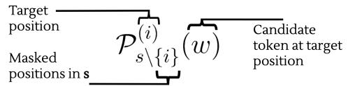

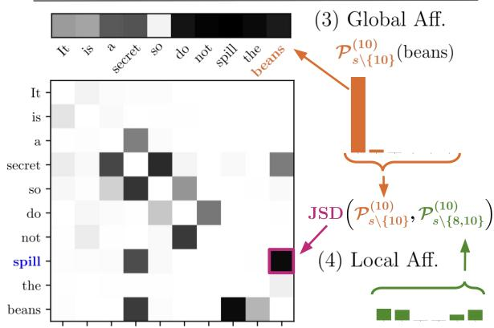  
Figure 1: In $s \ = \ ^ {  } I t$ is a secret so do not spill the beans”, masking beans (1) gives a constrained distribution, where $\mathcal { P } _ { s \backslash \{ 1 0 \} } ^ { ( 1 0 ) }$ (beans) is high, so beans has high global affinity (3). By also masking, e.g., spill (2), we get $\mathcal { P } _ { s \backslash \{ 8 , 1 0 \} } ^ { ( 1 \bar { 0 } ) }$ , compute JSD, and find the words that constrain beans and thus have high local affinity (4).

Advocates of CxG have theorized about how children might abstract constructions over time from experience with language (Tomasello, 2005; Diessel, 2004, 2019) and demonstrated the feasibility of distributional learning of constructions in simplified settings (Casenhiser and Goldberg, 2005; Dunn, 2017). In general, however, we do not have access to the distribution over strings from which children sample. And though the information contained in this distribution has been characterized using corpus-based methods like collostructional analysis (Stefanowitsch and Gries, 2003, 2005;

Hilpert, 2014), text-only methods do not enable counterfactual questions about what caused a particular word to occur in a particular position. But with dramatic recent advances in statistical modeling of language (Zhao et al., 2025), we now have pretrained language models (PLMs) that directly instantiate (to a good approximation) the distribution of interest, allowing us to ask how constructions are encoded in statistical relationships between words.

A growing literature explores the use of PLMs as tools for testing usage-based linguistic theories (Weissweiler et al., 2023; Goldberg, 2024; Millière, 2024; Futrell and Mahowald, 2025). Two characteristics of this literature motivate the current study. First, studies to-date have largely been interested in PLMs as simulations of the learner, whereas we are interested in PLMs as simulations of the distribution from which a learner samples. These perspectives are not mutually incompatible, but they naturally prioritize different types of analyses. PLM-as-learner prioritizes questions about the model’s behavior (studied using, e.g., prompting, Zhou et al. 2024; Scivetti et al. 2025) or representational geometry (studied using e.g., probing, Garcia et al. 2021). PLM-as-distribution prioritizes questions about how the probabilities over words are influenced by context, irrespective of the model’s internal computations (e.g., hidden states). CxG studies that take this perspective are less common (cf., Veenboer and Bloem, 2023), and none to our knowledge use causal methods. Second, current evidence on the learnability of constructions by PLMs is mixed, with some studies reporting success (Potts, 2023; Mahowald, 2023; Misra and Mahowald, 2024) and others failure (Zhou et al., 2024; Bonial and Tayyar Madabushi, 2024; Scivetti et al., 2025; Weissweiler et al., 2024).

To address these limitations, we draw inspiration from two areas of research: collostructional analysis (Stefanowitsch and Gries, 2003) and intervention methods (see, e.g., Feder et al., 2021; Geiger et al., 2022). Collostructional analysis measures the statistical affinities that constructions induce between lexical items in a corpus. Intervention methods systematically alter inputs or hidden states and examine the effects on model behavior. In this study, we extend perturbed masking (Wu et al., 2020; Hoover et al., 2021) to develop affinity methods, which leverage PLMs as computable models of the language distribution, thereby extending the correlational methods of collostructional analysis to counterfactual questions about what causes a

particular word to occur.

Our core hypothesis—that constructions will be revealed in the distribution—is partially motivated by idioms, which are loosely defined as semi-fixed multi-word expressions with non-compositional meaning (Nunberg et al. 1994; Croft and Cruse 2004, p. 248-53; Espinal and Mateu 2019). When an idiom is “activated” by the surrounding semantics, any compositional or conventional reading is precluded (Hoffmann, 2022, p. 169), thus constraining the slots of the idiom and motivating our notion of global affinity; see Methods. Some prior work has investigated how PLMs capture the noncompositional aspects of idioms (Zeng and Bhat, 2021; Socolof et al., 2022; He et al., 2025). Since many constructions exhibit some degree of noncompositionality (Croft and Cruse, 2004, p. 248– 253), methods that reveal constraints in the distribution might recover a variety of constructions (Croft and Cruse 2004; Taylor 2004; Wulff 2013).

Using a PLM (RoBERTa; Liu et al., 2019) as a simulation model, we show that affinity methods— using only the PLM’s distribution—recover constructional information across diverse construction types, including in previously reported failure cases (cf. Zhou et al., 2024) and across the constructional spectrum from substantive (containing slot(s) that are “fixed” to a specific word) to schematic (containing slot(s) that admit abstract classes of words) constructions. Nonetheless, we argue from a combination of first principles and qualitative evidence that this distributional approach is likely insufficient to infer the full constructicon from data. In this study, we claim that constructions are revealed in word distributions via affinity methods, and we organize our contributions as follows:

• Extension of prior work (perturbed masking) as affinity methods that reveal constructions as patterns of statistical interaction (§3)

• Resolution of previously reported challenges using the methods (§4)

• Generalization of the methods to a wide range of other construction types (§5, §6)

• Qualitative analysis to characterize method behavior and inform the limits of purely distributional approaches (§7)

## 2 Background

Prior research on constructions in PLMs has largely used probing or prompting. Probing has been used to study the representation of constructions in both sentence and contextualized word embeddings (Weissweiler et al. 2022; Li et al. 2022; see also Weissweiler et al. 2023 for broader survey). Prompting has been used to elicit acceptability judgements (Mahowald, 2023), semantic understanding (Weissweiler et al., 2024), and constructional similarity judgements (Bonial and Tayyar Madabushi, 2024). As these methods test the distributional learning hypothesis only indirectly, they may be susceptible to false negatives and positives. Successful prompting typically requires models to have logical, metalinguistic, or instructionfollowing abilities above and beyond basic representation (McCoy et al., 2019, 2024; Basmov et al., 2024), and thus prompting might fail to recover constructions that are, in fact, represented in the model’s distribution. Likewise, probing can fail to identify relevant representational distinctions that are mismatched to the design of the probe (Adi et al., 2017), or recover distinctions that actually make no causal contribution to the model’s behavior (Belinkov, 2022; Hewitt and Liang, 2019).

Given these concerns, in this work we emphasize causal relations between input contexts and output distributions, irrespective of how constructions are represented internally by the model, since this provides a more direct test of the distributional learning hypothesis. Some prior work has followed a similar vein: for example, researchers have used PLMs to score the likelihood of phrases and sentences (Hawkins et al., 2020; Misra and Mahowald, 2024) and evaluated semantic effects of constructional context on masked tokens (Weissweiler et al., 2022; Veenboer and Bloem, 2023). Our study goes a step further by asking not only whether context informs constructional slots, but how, by intervening directly on the context itself.

We are motivated to study the distributional encoding of constructions not only by the methodological considerations above, buy by prior work on challenging constructions that seem difficult to infer from distributions. For example, Zhou et al. (2024) report that PLMs fail to distinguish the following three superficially similar but semantically distinct constructions:

Epistemic Adjective Phrase (EAP) I was so certain that I saw you.   
Affective Adjective Phrase (AAP) I was so happy that I was freed.   
Causal Excess Construction (CEC) It was so big that it fell over.

The general structure is of the form

$$
[ \mathrm { \ : \left[ N P \right] \left[ V \right] \ : s o \ : [ A D J ] \ : ] _ { 1 } \ : t h a t \ : [ S ] _ { 2 } }
$$

where the causal semantics of the three differ: there is no causal relation between 1 and 2 in EAP, there is causation from 2 1 in AAP, and vice versa (1  2) in CEC. Zhou et al. probe and prompt LMs (GPT-3.5/4, OpenAI et al. 2024; Llama2, Touvron et al. 2023) and argue that LMs fail to reliably distinguish the CEC from the EAP and AAP; see Section 4. Relatedly, prior studies of other diverse construction types have suggested that schematic constructions with slots for abstract categories or classes, rather than fixed words, may also be especially difficult (e.g., Weissweiler et al., 2022). In this work, we revisit many of these cases and find that distributions often contain strong signals even for subtle constructional properties.

## 3 Methods

To test the hypothesis that constructions are revealed as patterns of statistical affinities, we extend perturbed masking (Wu et al., 2020; Hoover et al., 2021), developing two approaches that compare output distributions under input interventions. The first is global affinity: interaction between a single word and the entire context. The second is local affinity: pairwise interactions between words.

We use the RoBERTa language model (Liu et al., 2019) for three reasons: (1) it is an open-source, open-weight model with known training data and a pure language modeling objective (e.g., no instruction tuning), (2) it is a less performant model than those used by e.g., Zhou et al. (2024), thus providing a conservative test of the distributional learning hypothesis, and (3) it is bidirectional. Although bidirectionality is implausible for process models of language comprehension (Frazier and Fodor, 1978; Elman, 1990; Tanenhaus et al., 1995; Altmann and Mirkovic´, 2009; Smith and Levy, 2013), our goal is not to study processing but the underlying distribution, and the constructions we explore here depend on subsequent context. And though human language learners see much less data than PLMs, they also engage in active learning, taking action in the world and in conversational exchanges (Frank, 2023); thus a human learner may have some ability to sample more strategically from the overall distribution than a PLM trained passively on text. For simplicity, we analyze only single-token words, leaving multi-token generalization of these methods to future work. As RoBERTa has a relatively large vocabulary (50k), we find that this does not pose a substantial limitation for our study.

## 3.1 Global Affinity

Given a string, s, of length, L, words, then $s \setminus \mathcal T$ is that string with the word indices in masked. Precisely, the masked string, $s \setminus \mathcal { T } ,$ is the string, s, with word indices $1 \le j \le L$ masked iff $j \in \mathcal { I }$

Define $\mathcal { P } _ { s \backslash \mathcal { T } } ^ { ( i ) }$ to be the probability distribution given by the model for the ith position in the masked string, $s \setminus \mathcal { T }$ (note that $i \in \mathcal { T } )$ . Then global affinity is simply the probability assigned to the original word in the bidirectional context:

$$
\mathcal { P } _ { s \backslash \{ i \} } ^ { ( i ) } ( w _ { i } )
$$

When a word has high global affinity, the context— potentially involving a construction—strongly informs (Shannon, 1948) the word’s identity. Figure 8 shows per-word global affinities for the sentence, My favorite band is Green Day.

## 3.2 Local Affinity

Global affinity alone sheds no light on which parts of context affect the model’s output distribution for a particular word position. This is limiting for the study of constructions because constructions often involve interactions between multiple slots. For example, the NPN construction (e.g., day by day, Jackendoff 2008) introduces an interaction between the pair of nouns: the nouns are mutually constrained to be the same. We quantify such pairwise interactions via local affinity between two positions, i and j, defined as the distributional difference at position j in a string s as a function of whether the word at position i was masked:

$$
a _ { i , j } = \mathrm { J S D } ( \mathcal { P } _ { s \backslash \{ j \} } ^ { ( j ) } , \mathcal { P } _ { s \backslash \{ i , j \} } ^ { ( j ) } )
$$

where JSD represents Jensen-Shannon divergence (Lin, 1991). Computing the affinity between each pair of words in an input of length, n, words results in an $n \times n$ affinity matrix, from which constructions’ patterns of affinity can be quantified and visualized (see e.g., Figure 3).

## 4 Revisiting a Challenging Case

We first use our methods to address the challenge of distinguishing the CEC from the EAP and AAP, which Zhou et al. (2024) test using probing and prompting. Zhou et al. perform classification by probing sentence (GPT-3.5, LLama2) and adjective (Llama2) embeddings. They use prompting (GPT-3.5/4, Llama2) not for classification, but instead in an experiment that suggests that the models do not understand the causal entailments of the constructions. In this section, we show that the affinity methods not only robustly distinguish the constructions, but that they also identify mislabeled examples in the original dataset (see §4.1, §4.3).

## 4.1 Models distinguish the CEC from the EAP and AAP in their output distributions

Whereas the so in the EAP and AAP can be replaced by other adverbial modifiers (e.g., very), so is required for the CEC to be grammatical (Kay and Sag, 2012; Zhou et al., 2024). If RoBERTa distinguishes the CEC from the EAP and AAP, then so should be constrained (have high global affinity) in the CEC but not in the EAP and AAP.

We calculate the global affinity for so in each sentence and observe that the score distinguishes the CEC: thresholding global affinity at 0.78 correctly characterizes 272/277 sentences (98.2%). In fact, Figure 2 shows that there is a wide margin, since any threshold between 0.6 and 0.9 achieves similar separation. Zhou et al. (2024) separately classify CEC vs. EAP/AAP and report percentage accuracies of 79.3, 86.5, 68.5 for CEC vs. EAP and 78.8, 86.5, 68.0 for CEC vs. AAP using GPT, Llama, and LLama-adj, respectively. Given the strength of our results, we did not reimplement their procedure; it is clear that our untrained approach produces a better result.2

Out of 277 examples, 11 originally appeared to be misclassified using the 0.78 threshold, but upon review, three were mislabeled and three were invalid. For example, “This was so funny that I had to buy another copy and read it to my better half,” was originally labeled AAP. We report results and plots with labels corrected; we provide details of corrected examples in Appendix B.2. The clear distinction in the model’s distribution between the CEC and EAP/AAP—which are superficially indistinguishable—provides strong evidence that PLMs do in fact “retrieve and use meanings associated with patterns involving multiple tokens” (cf. Weissweiler et al., 2023).

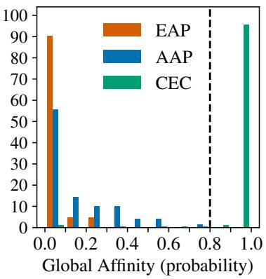  
Figure 2: Percent of examples with so having given global affinity. The CEC is seen to be well-separated from the EAP and AAP.

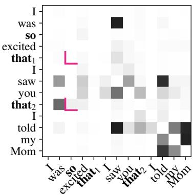  
Figure 3: Local Affinity plot. A column shows how much the distribution for that word is affected by other words in the context. so is more affected by that2 (CEC) than by that1.

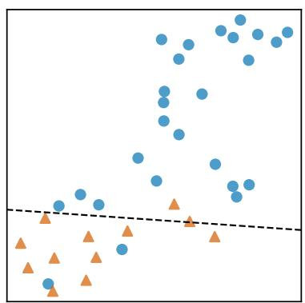  
Figure 4: UMAP projection (EAP: orange, AAP: blue) using 5 pairwise affinities. Separability with SVM (dashed) suggests interaction patterns differ for EAP and AAP.

## 4.2 Models capture causal relations in the CEC

We have shown that global affinity challenges a previously reported failure of PLM construction representation. Now we push this finding a step further by using affinity matrices to assess how well PLMs capture the causal semantics of the CEC, as revealed by cases involving multiple clausal complements. Consider I was so excited that1 I saw you that2 I told my Mom. Given the requirement of so to license the CEC, we hypothesize that if the model captures the causal semantics of the CEC, then so will have a greater affinity to the causal that than to the affective one (see Figure 3).

To test this hypothesis in general, we draw CEC instances from Zhou et al. (2024) and insert additional complementizer (that. . .) phrases to create a small multi-that dataset of 31 test sentences (see B.3.1). Across all 31 sentences—even one with five that-phrases—we observe perfect correspondence: so always has the highest affinity with the that at the beginning of the causal excess clause. This result suggests that the distribution both distinguishes the CEC from similar constructions, and also provides signal for the underlying semantics.

## 4.3 Affinity patterns distinguish the EAP and AAP

Lastly we consider whether the model distinguishes the EAP and AAP. Zhou et al. (2024) showed that the EAP and AAP can be reasonably distinguished, reporting classifier accuracies of 77.1, 71.7, 84.3 for GPT, Llama, and Llama-adj, respectively. However, given that epistemic and affective adjectives do themselves differ, has the probe recovered a constructional distinction or has it just recovered the adjective class? We cannot answer this question via global affinity: unlike the CEC, which is characterized by the fixed slot constraint for so, no words in the EAP/AAP are fixed, and in some cases when the adjective is masked, both the EAP and AAP are possible (e.g., I was so (happy | certain) that I saw you). We therefore instead compare them by analyzing patterns in the local affinity matrix.

First, we align examples by identifying the following parts common to all inputs: <subj1, verb1, so, adj, that, subj2, verb2>. For example in I was so happy that I saw you, we have <I, was, so, happy, that, I, saw>. For each example we extract all pairwise affinities between these seven positions. We test the hypothesis that the constructions have distinct signatures of internal interactions by examining whether the two classes cluster together using UMAP (McInnes et al., 2018), a low dimensional projection. A UMAP projection of all 49 (7  7) dimensions does not separate the two classes; however, this projection considers all affinities equally, even those which may not be related to the construction (see e.g., Figure 7). To address this, we identify potentially salient differences in the interaction patterns and produce the UMAP plot in Figure 4 using only the five most substantially different affinities across 26 AAP and 14 EAP examples (admittedly few examples; see Appendix B.4 for details).

This method, though imperfect, suggests separability using patterns of interaction between parts of the input. (See B.4 for further discussion of separability.) Zhou et al. were moderately successful in distinguishing the EAP and AAP using probing and unsuccessful with prompting. Our results suggest that the distribution may be able to distinguish EAP and AAP examples, even without access to the adjective’s identity.

## 5 Generalizing to Other Substantive Constructions

In this and §6, we investigate how well our distributional approaches generalize. In this section, we study generalization to partially substantive constructions using two datasets: the Construction Grammar Schematicity corpus (CoGS, Bonial and Tayyar Madabushi 2024) and MAGPIE (Haagsma et al., 2020), a corpus of potentially idiomatic expressions labeled as either figurative or literal.

## 5.1 Global affinity distinguishes fixed slots in numerous constructions

CoGS contains roughly 50 examples for each of 10 construction types. Six of these constructions are partially substantive and have at least one fixed word for which we calculate global affinity (examples from Bonial and Tayyar Madabushi; fixed words italicized):

Causative-with: She loaded the truck with books. Comparative correlative: The more the merrier. (In our analysis the two the words are considered as a single class.)

Conative: He kicked at the ball.

Let-alone: None of these arguments is particularly strong, let alone conclusive.

Much-less: He has not been put on trial, much less found guilty.

Way-manner: We made our way home.

As motivated in the introduction, we expect that constructions will manifest as high global affinities on fixed words. For example, just as the interactions between words in the CEC constrain so, in the let-alone cxn, we expect interactions to constrain the non-compositional let and alone.

As shown in Figure 5, the fixed words—in all but the conative—have high global affinities. The at in the conative has low affinity (e.g., He kicked at the ball) because various other non-conative completions are possible: for this example the model produces out, at, over. These results show that the distribution simulated by RoBERTa captures the contextual cues associated with various partially substantive constructions, and that global affinity reflects that contextual affinity.

## 5.2 Global affinity helps distinguish literal from figurative usages

Next, we ask whether global affinity helps discriminate figurative and literal usages in potentially idiomatic expressions (PIEs). We use MAGPIE, a corpus of 50,000 sentences with PIEs that are hand-labeled as either figurative or literal. Idioms (e.g., kick the bucket) have long been of interest to CxG (e.g. Fillmore, 1988; Croft and Cruse, 2004; Wulff, 2008) and were a key motivation for the approaches in this study (see Introduction).

We hypothesize that figurative uses will have higher global affinity, by virtue of being entrenched and non-compositional: consider that one can spill the beans but that in the same context, one would not spill the water, so beans should have high affinity. Nonetheless, this signal may be confounded: other factors can constrain words (see e.g., §7), and frequent PIEs might have high affinities even when used literally (e.g., “nuts and bolts in the garage”; see, e.g., Rambelli et al. 2023).

We compute global affinity for each of 114k words that are part of a PIE in 45k sentences (10k literal, 34k figurative; details in Appendix D). Under the hypothesis, we treat affinity as a classification probability for figurative usage and produce a receiver operating characteristic curve, achieving an area of 0.71 under the curve (plot in D), which shows that global affinity provides a meaningful signal for classifying figurative vs. literal usages.3

We further compare average figurative and literal scores for each idiom (graphical results in D.3). For example, nuts and bolts behaves as expected, scoring 0.90 fig and 0.84 lit, reflecting entrenchment of the literal usage. On the other hand turn someone’s head gives 0.37 vs. 0.74, but this “failure” may stem from the relative non-entrenchment of the figurative use (that Yankee sun hasn’t turned your head) versus the more common literal use (she turned her head). Moreover, qualitative analysis suggests that affinity can be useful to further characterization of PIEs: for example, the lowest scoring figurative usages are generally less familiar to the authors, and affinity helped identify some mislabeled or questionable examples. Future research combining affinity methods with other approaches might produce further quantitative insights for PIEs.

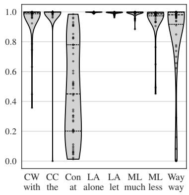  
Figure 5: Global affinity for CoGS. CW: Causative-with; CC: Compcorrelative; Con: Conative; LA: Let-alone; ML: Much-less; Way: Way-manner

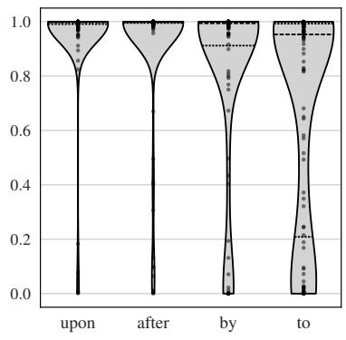

Figure 6: Global affinity for nouns in the NPN construction, grouped by preposition, for sentences with acceptability 4.  
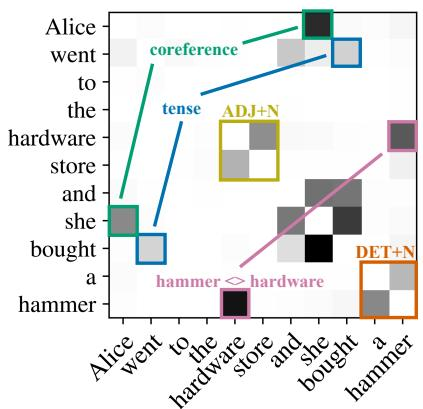  
Figure 7: The local affinity matrix encodes diverse types of interactions, including both constructional and nonconstructional interactions.

## 6 Generalizing to Schematic Constructions

Our analyses thus far have mostly focused on how constructions manifest in affinities for particular fixed words in specific slots, but constructions can also be schematic with abstract slots (Croft and Cruse, 2004; Goldberg, 2003). Here we generalize our approach to study how well the distribution captures two such constructions, the noun-prepositionnoun construction (NPN; Jackendoff 2008) and the comparative correlative (CC; Fillmore 1986).

## 6.1 Models generalize the NPN’s covarying noun-noun slots

The NPN construction (e.g., day after day) is a schematic construction (see e.g., Sommerer and Baumann 2021 for a recent study using collostructional analysis). Since the construction is entirely schematic (no slots are constrained to be fixed words), a distributional learner can acquire it only by generalizing to abstract classes (i.e., noun and preposition).

To study whether the distribution reflects generalization of the NPN to arbitrary nouns, we randomly sample 100 singly-tokenized, singular nouns from RoBERTa’s vocabulary and prompt GPT-4 to produce NPN sentences with each of the prepositions by, after, upon, and $t o , ^ { 4 }$ giving 400 sentences. We compute global affinities for the nouns in the NPN and obtain acceptability ratings (scale 1-5)

from the last author, who is blind to the affinity scores. These ratings are used only to segment our analysis by acceptability. In Figure 6 we plot affinity scores for nouns in sentences with acceptability 4 (upon: 65, after: 73, by: 52, to: 54; total 244). We include the same plot but without acceptability filtering in the Appendix, Figure 16; lower acceptability sentences have lower affinity, reflecting that affinity is sensitive to linguistic acceptability.

In Figure 6, affinity scores for upon and after suggest that the distribution captures the form of the NPN: the model generally expects the two nouns to be the same. Moreover, the lower affinity for NPNs with by and to (and also the relative counts of acceptable generations) accords with prior characterization of the NPN: after and upon are more flexible in NPN use than other prepositions, and to is only semi-productive (Jackendoff, 2008).

As our objective is to test generalization to unseen NPNs, we generate a separate challenge dataset of 100 nouns: Using the infinigram API (Liu et al., 2024), we sample nouns that are not used in an NPN (with any of the four prepositions) in the Pile-train dataset (Gao et al. 2020; see E.2 for details). Though the affinity distribution for entirely unattested NPNs is more skewed toward lower affinities, we still see clear evidence of generalization (Figure 17).

## 6.2 Models generalize the comparative correlative’s category constraint

We test whether the distribution encodes the semantic category of the comparative adjective/adverb in the CC (see Weissweiler et al., 2022, for a recent study), which is of the form, e.g., The better your distribution, the more constructions it will encode. Whereas in §5.1, we showed that the in the CC has high global affinity, here we test whether the distribution also encodes an abstract slot constraint for the comparative adjective/adverb. Using the 54 CC examples from the CoGS dataset, we mask each comparative adjective/adverb, obtain the set of highest probability outputs at the masked position that sum to 98% probability mass, and calculate a comparative score: the percentage of this set that is a comparative adjective/adverb (see F).

Out of 99 comparative adjectives/adverbs, 95 score 100%; another 3 score > 99%, and one (The higher up the nicer!) scores 86%, with noncomparatives ladder and mountain in the top 10 fills, perhaps because it is uncommon for a comparative to come at the end of the sentence. This result shows that the distribution captures the abstract syntactic (comparative adjective/adverb) constraint of the CC nearly perfectly, with 98/99 examples having scores 99%.

## 7 The Limits of Distributional Analysis

How far can we push these distributional approaches for identifying constructions in text? Could they allow us to identify a model’s complete constructicon bottom-up (see, e.g., Dunn, 2017, 2019, 2024; Feng et al., 2022; Lyngfelt et al., 2018; Xu et al., 2024)? We argue the answer is likely “no”: although affinity is a highly useful diagnostic of models’ knowledge of constructions, here we show that it cannot be directly equated with constructionhood.

First, consider the sentence Alice went to the hardware store and bought a hammer. The affinity matrix (Figure 7) reveals various interactions of interest. Some of these are likely constructionally mediated, including tense agreement in coordinated verb phrases (went, bought), as well as subject-verb (she, bought), head-modifier (hardware, store), and determiner-noun (a, hammer) dependencies. But other interactions are less obviously constructional, such as coreference (Alice, she) and semantic relatedness (hardware, hammer). So although the affinity matrix does reflect constructional relations, it also shows that other contextual interactions can produce high local affinities. Thus affinity is an insufficient criterion for constructionhood.5

Second, consider the sentence My favorite band is Green Day, which includes the noncompositional collocation Green Day (a wellknown band name). Figure 8 shows that Green Day has low global affinity until an appropriate contextual trigger is given, i.e., band. This shows that even substantive constructions may exhibit low global affinities when the surrounding context is insufficient to trigger them.6

Additionally, Figure 9 shows the local affinity matrix for the Green Day example. As expected, it reflects affinity between band, Green, and Day. However, in a different context (I saw myfavorite band, Green Day, in concert), the interactions between Green Day and band vanish (Figure 10). This appears to be due to the co-presence of an additional semantic cue (concert): since band and concert are both individually sufficient to cue the construction Green Day, neither individually exhibits strong pairwise affinity with Green Day (i.e., neither when masked substantially changes the model’s output distribution for Green or Day).

Taken together, the hardware store and Green Day examples show that affinity is neither sufficient nor necessary for a construction to be present. Insufficiency arises out of the tension between contextual and constructional interactions. Non-necessity arises from a methodological challenge: eliciting global affinity requires masking, but under mask, the context may not trigger a construction. These results thus warrant caution in mapping between observables (affinities) and hypothetical constructs (like constructions). They also suggest avenues for future work, which we explore below.

## 8 Discussion

We used input interventions to investigate whether constructions result in patterns of statistical affinities and thereby manifest in PLMs’ output distributions. Our methods showed that RoBERTa’s distribution distinguishes semantically distinct but formally similar constructions that were previously reported as failures, and our approach even identified mislabeled and unclear examples. We generalized our results to six partially-substantive constructions, potentially idiomatic expressions, and two schematic constructions that have abstract constraints. These results support the distributional learning hypothesis: the distribution over strings, as simulated by PLMs, contains rich information about the constructicon. Nonetheless, we also showed that the distributional measures we developed are, in general, neither necessary nor sufficient to induce constructions. Instead, statistical affinity is likely one of a broader set of cues, both for linguistic analysis and for language learning.

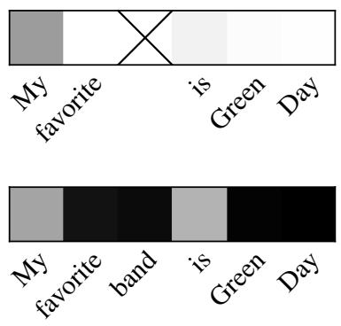  
Figure 8: Green Day (a cxn) is present in top/bottom panels but without/with band, it has low/high global affinity (white = 0, black = 1).

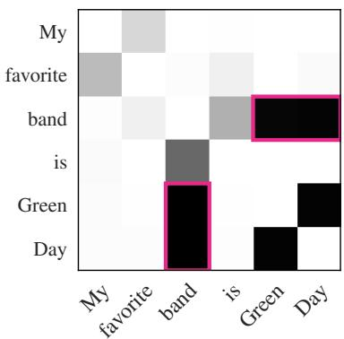  
Figure 9: The local affinity matrix reflects interactions (pink) between between band, Green, and Day, as expected.

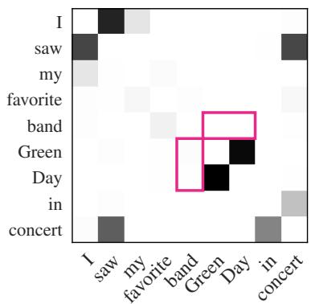  
Figure 10: In contrast with Figure 9, with additional context (. . . in concert), affinities between band and Green Day seem to disappear (pink).

Compared to prior work, we presented a purely distributional approach to the study of constructions in PLMs: RoBERTa is a statistical representation of the corpus, obtained via an unsupervised masked-language-modeling objective (Devlin et al., 2019). That representation, which encodes a computational model of language, was interrogated via perturbations on strings. Whereas prior work has used NLI–style entailment queries and bespoke probes trained to identify particular constructions, we instead—and more simply—directly examined the model’s output distribution over tokens.

With respect to the open problem of construction induction, our methods may prove useful: Global affinity can identify what is constrained (potentially by a construction), and local affinity can identify why it is constrained. Given that induction over schematic constructions requires assigning semantic categories, our results on the NPN and comparative correlative suggest that the distribution (and thus contextual representations) may encode categories of interest (see also Chronis et al., 2023).

Future work to distinguish constructional from contextual interactions could be part of an effort to understand constructions information-theoretically (cf. Futrell et al., 2019). Given recent questions about the falsifiability of CxG (see, e.g., Cappelle, 2024), an information-theoretic approach might provide a quantitative constructional criterion. Though we studied only affinity here, further research might investigate how statistical affinity relates to existing dimensions of constructional analysis like degree of idiomaticity (Wulff, 2008), frequency, and entrenchment (Stefanowitsch and Gries, 2003, p. 239).

## 9 Conclusion

The distributional learning hypothesis is a fundamental assumption of construction grammar. We have shown experimentally that the distribution over strings, as approximated by a PLM, contains rich information about constructions’ syntactic and semantic properties. Across a wide range of construction types, including previously reported hard cases involving semantically distinct but superficially similar constructions, we find that constructional information is reliably reflected in the causal interactions between words and their surrounding context. This finding both complements existing approaches in linguistics that attempt to characterize constructions using passive text, and supports the hypothesis that distributional information is a major source of signal available to language learners. Our work offers a methodology that may contribute to the growing field of research on constructions in PLMs, may inform construction induction, and suggests the possibility of a quantitative, information-theoretic approach to modeling constructions. For linguists our methods offer a new kind of PLM-based approach to corpus study— one which extends existing methods like collostructional analysis to direct counterfactual inquiry.

## Limitations

Our analysis is limited to a single (bidirectional) masked language model, RoBERTa, and could be rerun on other models of different sizes. In choosing masked language models, a straightforward analysis of the sort that we have performed is limited to words that are single tokens; multi-token generalization of these methods is left to future work. Our approach for §4.3 removed numerous examples, leaving relatively few for analysis; nonetheless the approach still recovered mislabeled examples. We studied only English constructions, and future work should look to apply these methods to other languages.

CxG is a broad theory (Goldberg, 2003, 2024; Hoffmann, 2022). We did not consider the question of precisely defining what a construction is nor did we study any particular constructionist approach (see, e.g., Goldberg, 2013). Unlike with other theories of syntax, there is no complete inventory of constructions available, so our study necessarily focused on specific ones that had already been discussed in previous literature.

CxG is furthermore one of many extant theories of natural language syntax (Chomsky, 1995; Pollard and Sag, 1994; Steedman, 2001; Bresnan et al., 2015, inter alia). Although our study targets a key premise of CxG (usage-based learning), we do not claim that CxG is the only appropriate analysis of the phenomena we study, nor are we arguing for CxG over alternative approaches. Our results take CxG as a starting point and thus do not allow us to weigh in on these important theoretical questions.

## Acknowledgements

Joshua Rozner was supported by the Institute for Computational and Mathematical Engineering at Stanford University. Leonie Weissweiler was supported by a postdoctoral fellowship from the German Research Foundation (DFG, WE 7627/1-1). Kyle Mahowald acknowledges funding from NSF CAREER grant 2339729. We thank Shijia Zhou for providing precise numeric results for prior work on the EAP, AAP, and CEC.

## References

Yossi Adi, Einat Kermany, Yonatan Belinkov, Ofer Lavi, and Yoav Goldberg. 2017. Fine-grained analysis of sentence embeddings using auxiliary prediction tasks. In International Conference on Learning Representations.

Gerry TM Altmann and Jelena Mirkovic. 2009. Incre-´ mentality and prediction in human sentence processing. Cognitive science, 33(4):583–609.

Victoria Basmov, Yoav Goldberg, and Reut Tsarfaty. 2024. Simple linguistic inferences of large language models (llms): Blind spots and blinds. Preprint, arXiv:2305.14785.

Yonatan Belinkov. 2022. Probing classifiers: Promises, shortcomings, and advances. Computational Linguistics, 48(1):207–219.

Claire Bonial and Harish Tayyar Madabushi. 2024. A construction grammar corpus of varying schematicity: A dataset for the evaluation of abstractions in language models. In Proceedings ofthe 2024 Joint International Conference on Computational Linguistics, Language Resources and Evaluation (LREC-COLING 2024), pages 243–255, Torino, Italia. ELRA and ICCL.

Joan Bresnan, Ash Asudeh, Ida Toivonen, and Stephen Wechsler. 2015. Lexical-functional syntax. John Wiley & Sons.

Joan Bybee. 2006. From usage to grammar: The mind’s response to repetition. Language, pages 711–733.

Bert Cappelle. 2024. Can construction grammar be proven wrong? Elements in Construction Grammar.

Devin Casenhiser and Adele E Goldberg. 2005. Fast mapping between a phrasal form and meaning. Developmental science, 8(6):500–508.

Noam Chomsky. 1995. The minimalist program. Cambridge, MA.

Gabriella Chronis, Kyle Mahowald, and Katrin Erk. 2023. A method for studying semantic construal in grammatical constructions with interpretable contextual embedding spaces. In Proceedings of the 61st Annual Meeting ofthe Associationfor Computational Linguistics (Volume 1: Long Papers), pages 242–261, Toronto, Canada. Association for Computational Linguistics.

William Croft. 2001. Radical construction grammar: Syntactic theory in typological perspective. Oxford University Press, USA.

William Croft and D Alan Cruse. 2004. Cognitive linguistics. Cambridge University Press.

Jacob Devlin, Ming-Wei Chang, Kenton Lee, and Kristina Toutanova. 2019. BERT: Pre-training of deep bidirectional transformers for language understanding. In Proceedings ofthe 2019 Conference of the North American Chapter ofthe Associationfor Computational Linguistics: Human Language Technologies, Volume 1 (Long and Short Papers), pages 4171–4186, Minneapolis, Minnesota. Association for Computational Linguistics.

Holger Diessel. 2004. The acquisition of complex sentences. Cambridge University Press.

Holger Diessel. 2019. The grammar network. Cambridge University Press.

Jonathan Dunn. 2017. Computational learning of construction grammars. Language and cognition, 9(2):254–292.

Jonathan Dunn. 2019. Frequency vs. association for constraint selection in usage-based construction grammar. In Proceedings ofthe Workshop on Cognitive Modeling and Computational Linguistics, pages 117–128, Minneapolis, Minnesota. Association for Computational Linguistics.

Jonathan Dunn. 2024. Computational construction grammar: A usage-based approach. Elements in Cognitive Linguistics.

Jeffrey L Elman. 1990. Finding structure in time. Cognitive science, 14(2):179–211.

M. Teresa Espinal and Jaume Mateu. 2019. Idioms and phraseology. In Oxford research encyclopedia of linguistics. Oxford University Press.

Tom Fawcett. 2006. An introduction to roc analysis. Pattern recognition letters, 27(8):861–874.

Amir Feder, Nadav Oved, Uri Shalit, and Roi Reichart. 2021. CausaLM: Causal model explanation through counterfactual language models. Computational Linguistics, 47(2):333–386.

Rui Feng, Congcong Yang, and Yunhua Qu. 2022. A word embedding model for analyzing patterns and their distributional semantics. Journal of Quantitative Linguistics, 29(1):80–105.

Charles J Fillmore. 1986. Varieties of conditional sentences. In Eastern States Conference on Linguistics, volume 3, pages 163–182.

Charles J Fillmore. 1988. The mechanisms of “construction grammar". In Annual Meeting of the Berkeley Linguistics Society, volume 14, pages 35–55.

Michael C Frank. 2023. Bridging the data gap between children and large language models. Trends in Cognitive Sciences.

Lyn Frazier and Janet Dean Fodor. 1978. The sausage machine: A new two-stage parsing model. Cognition, 6(4):291–325.

Richard Futrell and Kyle Mahowald. 2025. How linguistics learned to stop worrying and love the language models. Behavioral and Brain Sciences, page 1–98.

Richard Futrell, Peng Qian, Edward Gibson, Evelina Fedorenko, and Idan Blank. 2019. Syntactic dependencies correspond to word pairs with high mutual information. In Proceedings of the fifth international conference on dependency linguistics (depling, syntaxfest 2019), pages 3–13.

Leo Gao, Stella Biderman, Sid Black, Laurence Golding, Travis Hoppe, Charles Foster, Jason Phang, Horace He, Anish Thite, Noa Nabeshima, Shawn Presser, and Connor Leahy. 2020. The pile: An 800gb dataset of diverse text for language modeling. Preprint, arXiv:2101.00027.

Marcos Garcia, Tiago Kramer Vieira, Carolina Scarton, Marco Idiart, and Aline Villavicencio. 2021. Probing for idiomaticity in vector space models. In Proceedings of the 16th Conference of the European Chapter ofthe Associationfor Computational Linguistics: Main Volume, pages 3551–3564, Online. Association for Computational Linguistics.

Atticus Geiger, Zhengxuan Wu, Hanson Lu, Josh Rozner, Elisa Kreiss, Thomas Icard, Noah Goodman, and Christopher Potts. 2022. Inducing causal structure for interpretable neural networks. In International Conference on Machine Learning, pages 7324–7338. PMLR.

Adele E Goldberg. 1995. Constructions: A construction grammar approach to argument structure. University of Chicago Press.

Adele E Goldberg. 2003. Constructions: A new theoretical approach to language. Trends in cognitive sciences, 7(5):219–224.

Adele E Goldberg. 2006. Constructions at Work: The Nature of Generalization in Language. Oxford University Press, USA.

Adele E. Goldberg. 2013. Constructionist approaches. In Thomas Hoffmann and Graeme Trousdale, editors, The Oxford handbook of construction grammar, chapter 2. Oxford University Press.

Adele E. Goldberg. 2024. Usage-based constructionist approaches and large language models. Constructions and Frames, 16(2):220–254.

Hessel Haagsma, Johan Bos, and Malvina Nissim. 2020. MAGPIE: A large corpus of potentially idiomatic expressions. In Proceedings of the Twelfth Language Resources and Evaluation Conference, pages 279–287, Marseille, France. European Language Resources Association.

Robert Hawkins, Takateru Yamakoshi, Thomas Griffiths, and Adele Goldberg. 2020. Investigating representations of verb bias in neural language models. In Proceedings of the 2020 Conference on Empirical Methods in Natural Language Processing (EMNLP), pages 4653–4663, Online. Association for Computational Linguistics.

Wei He, Tiago Kramer Vieira, Marcos Garcia, Carolina Scarton, Marco Idiart, and Aline Villavicencio. 2025. Investigating idiomaticity in word representations. Computational Linguistics, 51:505–555.

John Hewitt and Percy Liang. 2019. Designing and interpreting probes with control tasks. In Proceedings

ofthe 2019 Conference on Empirical Methods in Natural Language Processing and the 9th International Joint Conference on Natural Language Processing (EMNLP-IJCNLP), pages 2733–2743, Hong Kong, China. Association for Computational Linguistics.

Martin Hilpert. 2014. Collostructional analysis. Corpus methods for semantics: Quantitative studies in polysemy and synonymy, 43:391.

Thomas Hoffmann. 2022. Construction grammar. Cambridge University Press.

Matthew Honnibal, Ines Montani, Sofie Van Landeghem, and Adriane Boyd. 2020. spaCy: Industrialstrength natural language processing in python.

Jacob Louis Hoover, Wenyu Du, Alessandro Sordoni, and Timothy J. O’Donnell. 2021. Linguistic dependencies and statistical dependence. In Proceedings ofthe 2021 Conference on Empirical Methods in Natural Language Processing, pages 2941–2963, Online and Punta Cana, Dominican Republic. Association for Computational Linguistics.

Ray Jackendoff. 2008. ’construction after construction’and its theoretical challenges. Language, pages 8–28.

Paul Kay and Ivan A Sag. 2012. Cleaning up the big mess: Discontinuous dependencies and complex determiners. In Sign-based construction grammar, chapter 5, pages 229–256. Citeseer.

Bai Li, Zining Zhu, Guillaume Thomas, Frank Rudzicz, and Yang Xu. 2022. Neural reality of argument structure constructions. In Proceedings of the 60th Annual Meeting of the Association for Computational Linguistics (Volume 1: Long Papers), pages 7410–7423, Dublin, Ireland. Association for Computational Linguistics.

Jianhua Lin. 1991. Divergence measures based on the shannon entropy. IEEE Transactions on Information theory, 37(1):145–151.

Jiacheng Liu, Sewon Min, Luke Zettlemoyer, Yejin Choi, and Hannaneh Hajishirzi. 2024. Infini-gram: Scaling unbounded n-gram language models to a trillion tokens. In First Conference on Language Modeling.

Yinhan Liu, Myle Ott, Naman Goyal, Jingfei Du, Mandar Joshi, Danqi Chen, Omer Levy, Mike Lewis, Luke Zettlemoyer, and Veselin Stoyanov. 2019. RoBERTa: A robustly optimized bert pretraining approach. Preprint, arXiv:1907.11692.

Benjamin Lyngfelt, Linnéa Bäckström, Lars Borin, Anna Ehrlemark, and Rudolf Rydstedt. 2018. Constructicography at work: Theory meets practice in the swedish constructicon. In Constructicography, pages 41–106. John Benjamins.

Kyle Mahowald. 2023. A discerning several thousand judgments: GPT-3 rates the article + adjective + numeral + noun construction. In Proceedings of the 17th Conference of the European Chapter of the Associationfor Computational Linguistics, pages 265– 273, Dubrovnik, Croatia. Association for Computational Linguistics.

R. Thomas McCoy, Ellie Pavlick, and Tal Linzen. 2019. Right for the wrong reasons: Diagnosing syntactic heuristics in natural language inference. In Proceedings ofthe 57th Annual Meeting ofthe Associationfor Computational Linguistics, pages 3428–3448, Florence, Italy. Association for Computational Linguistics.

R Thomas McCoy, Shunyu Yao, Dan Friedman, Mathew D Hardy, and Thomas L Griffiths. 2024. Embers of autoregression show how large language models are shaped by the problem they are trained to solve. Proceedings of the National Academy of Sciences, 121(41):e2322420121.

Leland McInnes, John Healy, Nathaniel Saul, and Lukas Großberger. 2018. Umap: Uniform manifold approximation and projection. Journal of Open Source Software, 3(29).

Raphaël Millière. 2024. Language models as models of language. Preprint, arXiv:2408.07144.

Kanishka Misra and Kyle Mahowald. 2024. Language models learn rare phenomena from less rare phenomena: The case of the missing AANNs. In Proceedings of the 2024 Conference on Empirical Methods in Natural Language Processing, pages 913–929, Miami, Florida, USA. Association for Computational Linguistics.

Geoffrey Nunberg, Ivan A Sag, and Thomas Wasow. 1994. Idioms. Language, 70(3):491–538.

OpenAI, Josh Achiam, Steven Adler, Sandhini Agarwal, Lama Ahmad, Ilge Akkaya, Florencia Leoni Aleman, Diogo Almeida, Janko Altenschmidt, Sam Altman, Shyamal Anadkat, Red Avila, Igor Babuschkin, Suchir Balaji, Valerie Balcom, Paul Baltescu, Haiming Bao, Mohammad Bavarian, Jeff Belgum, and 262 others. 2024. Gpt-4 technical report. Preprint, arXiv:2303.08774.

Carl Pollard and Ivan A Sag. 1994. Head-driven phrase structure grammar. University of Chicago Press.

Christopher Potts. 2023. Characterizing english preposing in pp constructions. Journal ofLinguistics, pages 1–39.

Giulia Rambelli, Emmanuele Chersoni, Marco S. G. Senaldi, Philippe Blache, and Alessandro Lenci. 2023. Are frequent phrases directly retrieved like idioms? an investigation with self-paced reading and language models. In Proceedings ofthe 19th Workshop on Multiword Expressions (MWE 2023), pages 87–98, Dubrovnik, Croatia. Association for Computational Linguistics.

Wesley Scivetti, Melissa Torgbi, Austin Blodgett, Mollie Shichman, Taylor Hudson, Claire Bonial, and Harish Tayyar Madabushi. 2025. Assessing language comprehension in large language models using construction grammar. CoRR, abs/2501.04661.

Claude Elwood Shannon. 1948. A mathematical theory of communication. The Bell system technicaljournal, 27(3):379–423.

Nathaniel J Smith and Roger Levy. 2013. The effect of word predictability on reading time is logarithmic. Cognition, 128(3):302–319.

Michaela Socolof, Jackie Cheung, Michael Wagner, and Timothy O’Donnell. 2022. Characterizing idioms: Conventionality and contingency. In Proceedings of the 60th Annual Meeting of the Association for Computational Linguistics (Volume 1: Long Papers), pages 4024–4037, Dublin, Ireland. Association for Computational Linguistics.

Lotte Sommerer and Andreas Baumann. 2021. Of absent mothers, strong sisters and peculiar daughters: The constructional network of English NPN constructions. Cognitive Linguistics, 32(1):97–131.

Mark Steedman. 2001. The syntactic process. MIT press.

Anatol Stefanowitsch and Stefan Th. Gries. 2003. Collostructions: Investigating the interaction of words and constructions. International Journal of Corpus Linguistics, 8(2):209–243.

Anatol Stefanowitsch and Stefan Th. Gries. 2005. Covarying collexemes. Corpus Linguistics and Linguistic Theory, 1(1):1–43.

Michael K Tanenhaus, Michael J Spivey-Knowlton, Kathleen M Eberhard, and Julie C Sedivy. 1995. Integration of visual and linguistic information in spoken language comprehension. Science, 268(5217):1632– 1634.

John R Taylor. 2004. Why construction grammar is radical. Annual Review of Cognitive Linguistics, 2(1):321–348.

Michael Tomasello. 2005. Constructing a language: A usage-based theory of language acquisition. Harvard university press.

Hugo Touvron, Louis Martin, Kevin Stone, Peter Albert, Amjad Almahairi, Yasmine Babaei, Nikolay Bashlykov, Soumya Batra, Prajjwal Bhargava, Shruti Bhosale, Dan Bikel, Lukas Blecher, Cristian Canton Ferrer, Moya Chen, Guillem Cucurull, David Esiobu, Jude Fernandes, Jeremy Fu, Wenyin Fu, and 49 others. 2023. Llama 2: Open foundation and fine-tuned chat models. Preprint, arXiv:2307.09288.

Tim Veenboer and Jelke Bloem. 2023. Using collostructional analysis to evaluate BERT’s representation of linguistic constructions. In Findings of the Association for Computational Linguistics: ACL 2023,

pages 12937–12951, Toronto, Canada. Association for Computational Linguistics.

Leonie Weissweiler, Taiqi He, Naoki Otani, David R. Mortensen, Lori Levin, and Hinrich Schütze. 2023. Construction grammar provides unique insight into neural language models. In Proceedings ofthe First International Workshop on Construction Grammars and NLP (CxGs+NLP, GURT/SyntaxFest 2023), pages 85–95, Washington, D.C. Association for Computational Linguistics.

Leonie Weissweiler, Valentin Hofmann, Abdullatif Köksal, and Hinrich Schütze. 2022. The better your syntax, the better your semantics? probing pretrained language models for the English comparative correlative. In Proceedings of the 2022 Conference on Empirical Methods in Natural Language Processing, pages 10859–10882, Abu Dhabi, United Arab Emirates. Association for Computational Linguistics.

Leonie Weissweiler, Abdullatif Köksal, and Hinrich Schütze. 2024. Hybrid human-LLM corpus construction and LLM evaluation for rare linguistic phenomena. Preprint, arXiv:2403.06965.

Zhiyong Wu, Yun Chen, Ben Kao, and Qun Liu. 2020. Perturbed masking: Parameter-free probing for analyzing and interpreting BERT. In Proceedings ofthe 58th Annual Meeting of the Association for Computational Linguistics, pages 4166–4176, Online. Association for Computational Linguistics.

Stefanie Wulff. 2008. Rethinking idiomaticity. Rethinking Idiomaticity, pages 20–34.

Stefanie Wulff. 2013. 274 words and idioms. In The Oxford Handbook of Construction Grammar. Oxford University Press.

Lvxiaowei Xu, Zhilin Gong, Jianhua Dai, Tianxiang Wang, Ming Cai, and Jiawei Peng. 2024. CoELM: Construction-enhanced language modeling. In Proceedings ofthe 62nd Annual Meeting ofthe Association for Computational Linguistics (Volume 1: Long Papers), pages 10061–10081, Bangkok, Thailand. Association for Computational Linguistics.

Ziheng Zeng and Suma Bhat. 2021. Idiomatic expression identification using semantic compatibility. Transactions of the Association for Computational Linguistics, 9:1546–1562.

Wayne Xin Zhao, Kun Zhou, Junyi Li, Tianyi Tang, Xiaolei Wang, Yupeng Hou, Yingqian Min, Beichen Zhang, Junjie Zhang, Zican Dong, Yifan Du, Chen Yang, Yushuo Chen, Zhipeng Chen, Jinhao Jiang, Ruiyang Ren, Yifan Li, Xinyu Tang, Zikang Liu, and 3 others. 2025. A survey of large language models. Preprint, arXiv:2303.18223.

Shijia Zhou, Leonie Weissweiler, Taiqi He, Hinrich Schütze, David R. Mortensen, and Lori Levin. 2024. Constructions are so difficult that Even large language models get them right for the wrong reasons.

In Proceedings ofthe 2024 Joint International Conference on Computational Linguistics, Language Resources and Evaluation (LREC-COLING 2024), pages 3804–3811, Torino, Italia. ELRA and ICCL.

## A Supplement: Methods

In this paper we restricted consideration to singlytokenized words. Multi-tokenized words cannot be studied with a single mask (the remaining token would substantially shape the outcome), and it is not trivial to turn a multivariate distribution over multiple masks into a univariate distribution over words. In practice, most words we encountered in this study were singly-tokenized and this was not a substantial limitation.

Calculating a local affinity matrix is more expensive than calculating global affinities: $n + n ^ { 2 }$ forward passes versus n. Note that the affinity matrix is asymmetric—positions (i,j) and (j,i) involve three different distributions and are computed as JSD(A,B) vs. JSD(C,B)—and that the diagonal of the matrix, $a _ { i , i }$ is 0.

We use RoBERTa large. Most experiments are run locally on an M3 Macbook Pro or on a single Nvidia RTX A6000 GPU on a cluster. Total time to run all experiment code is less than an hour.

## B Supplement for Section 4: Revisiting a Challenging Case

## B.1 Data and preprocessing

We preprocess the dataset examples to identify the indices of so, that, and the adjective. The original dataset has 323 examples, and our pre-processor and method pipeline fails on 46 examples, leaving 277 for our analysis. Some of the failures are the result of how our processing interacts with punctuation, others are issues in the dataset. Particular failures can be obtained by re-running our processing code provided in the repository. The final dataset on which we run our analyses has 24 EAP, 70 AAP, and 183 CEC sentences, for a total of 277 sentences.

## B.2 Supplement for Section 4.1: Models distinguish the CEC from the EAP and AAP in their output distributions

Here we discuss the misclassified examples in the Zhou et al. (2024) dataset.

Our approach when run on the original dataset appears to misclassify 11 examples (1 EAP, 2 AAP, 8 CEC). As we detail here, only 5 of these are actually misclassified. Figure 11 shows the same histogram as presented in the main text (Figure 2) but without any corrected labels or omissions.

For each apparently misclassified sentence, we categorize as

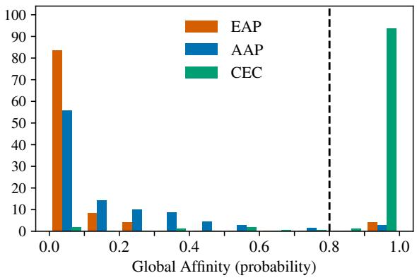  
Figure 11: This figure is the same as Figure 2, but without correction of mislabeled examples. As only 5 examples differ, the plots are very similar.

1. Misclassified: Our (untrained) classifier was wrong; the original label was correct. No changes are made.

2. Mislabeled: Our classifier identified a mislabeled example. We correct the label and present the analysis in the main text with the corrected label.

3. Unclear: An example that is sufficiently ambiguous in interpretation to be omitted or linguistically invalid. We omit the example from analysis in the main text.

## B.2.1 CEC with prob < 0.8

There are 9 CEC examples originally labeled as CEC that appear to be misclassified (low global affinity on so). Of these 9, 2 are mislabeled and 1 is linguistically invalid.

## Mislabeled or Unclear:

1. It’s his lucky quarter and Pop feels so bad that Lucky lost it.

Mislabeled (Relabeled to AAP from CEC)

2. I am so fortunate to have had it recommended to me so highly that I bought the eight pack.

This sentence is unclear and does not seem to be an instance of any of the three constructions. We omit it.

3. I am so ashamed of myself that I ignored other reviewers and paid moneyfor this book.

Mislabeled (Relabeled to AAP from CEC)

## Misclassified

1. It has also been noted that he was so satisfied that he did this withoutfee or reward and was publicly thanked.

This example is ambiguous: It can be read as a CEC (“so satisified” “did this without fee”) or as an EAP (he was satisfied that he was thanked). We conservatively leave this example in the dataset.

2. The judges were so surprised that one ofthem had a "spasm," one leaned against the wall for support, and the otherfell backwards into a barrel offlour!

This is a valid example, although an affective interpretation is possible.

3. But, afriend was so adamant that I tried it.

4. I was so confident that I made changes on my own.

5. There are a couple of false notes along the way, such as a dreadful rendition in front of a room of people of "You’re So Vain," but so many moments are so right that I had no trouble forgiving them the few missteps.

## B.2.2 AAP with prob > 0.8

There are 2 sentences labeled as AAP with probabilities > 0.8. One is mislabeled, and the other is unclear.

1. This was so funny that I had to buy another copy and read it to my better half.

Mislabeled (Relabeled to CEC from AAP)

2. After a series of fires in 1741, the city became so panicked that blacks planned to burn the city in conspiracy with some poor whites.

This sentence is unclear. As written the sentence suggests that the panic may be causing the plan to burn down the city (hence the CEC interpretation). However, a closer review of the entire sentence suggests that the intended meaning is that a series of fires (potentially arson) led the city to be afraid that there was a conspiracy to commit further arson. The best expression of intended AAP meaning could be achieved by removing so, and changing verb tense:

After a series offires in 1741, the city became panicked that blacks were planning to burn the city in conspiracy with some poor whites. We omit this sentence.

## B.2.3 EAP with prob > 0.8

The 1 EAP example with probability > 0.8 is unclear.

1. In Burma, the beliefwas once so widespread that the Sumatran rhino ate fire.

Arguably unclear. For one of the authors, this sentence seems to suggest (nonsensically) that the belief’s being widespread was the cause of the rhino’s eating fire. The so could be replaced with, e.g., surprisingly to achieve the apparently intended meaning. Alternatively so could simply be omitted.

We omit this sentence.

## B.3 Supplement for Section 4.2: Models capture causal relations in the CEC

## B.3.1 Dataset (multiple-that)

To produce the augmented multiple-that dataset, we searched for existing examples in the dataset (Zhou et al., 2024) that already had two or more that words. In some cases, we insert additional complementizer (that. . . ) phrases. Some examples are created with two CEC phrases to test that each so has high local affinity with its associated causal that. We label the correct causal that for the analysis.

We provide two examples from the 31-sentence multi-that dataset:

1. This example has 5 that-phrases. The affinity of so with the correct that is more than two orders of magnitude higher than with any other that.

John worked so hard on helping his friend improve his argument that the policy was bad and that America should adopt the resolution that the policy hadfailed that he was too tired to debate the topic that the policy had failed himself.

2. Some examples are double CEC with multiple so-that pairs. We test that both each so has the highest affinity with the correct that. For example:

Li shiji was so1 thankful that1 he wept and bit his finger $\mathbf { \delta } \mathbf { { s } } \mathbf { { o } } _ { 2 }$ hard that2 he bled.

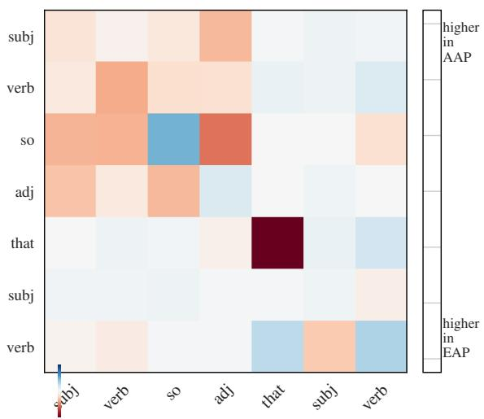  
Figure 12: This plot shows which interactions, on average, most substantially differ between EAP and AAP examples. From highest to lowest in absolute value we have that with itself, so with adj, so with itself, verb with itself, and so with verb.

## B.4 Supplement for Section 4.3: Affinity patterns distinguish the EAP and AAP

As described in §4.3, we identify potentially salient differences in the EAP and AAP patterns: we compute a single average (position-wise) affinity matrix for all EAP examples and another average matrix for all AAP examples. We fill the diagonal of the matrices with the average global affinity score (as probability). We then subtract these two average matrices and then take the position-wise absolute value. The largest values in the resulting matrix provide the interactions that seem to most distinguish the EAP and AAP. The heatmap in Figure 12 shows the most potentially informative interactions across EAP and AAP examples. Here we see that the most different interactions (between EAP and AAP examples) on average are that with itself, so with adj, and so with itself.

After running the pre-processing pipeline for tokenization we have 68 AAP and 24 EAP examples (see B.1). For our analysis, we exclude any that have multitokenized words in one of the seven positions we consider, or for which Spacy (Honnibal et al., 2020) fails to label a POS. This leaves us with 14 EAP and 26 AAP examples for the analysis.

All UMAP projections use n\_neighbors 10 and min\_dist 0.1. Figure 14 shows UMAP plots using different numbers of affinities: each row corresponds to the number of informative dimensions that are chosen using the heatmap. The two columns show two random seeds for the UMAP projection. From the multiplot, we see that using five dimensions produces seems to mostly separate the two classes, and we use five dimensions in the main text (Figure 4).

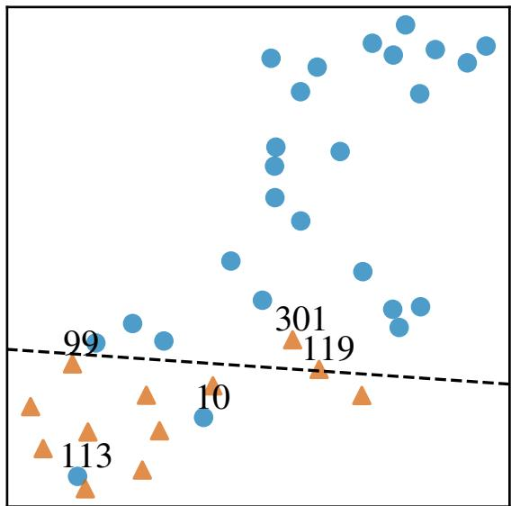  
Figure 13: This figure is the same as Figure 4 but with labels for examples which would likely cluster with the wrong class or are on the boundary.

Finally, we label five sentences in the plots (Figure 14) which either look to violate separability or which are on the boundary.

1. Label 10: It’s his lucky quarter and Pop feels so bad that Lucky lost it. After our CEC correction (relabeled to AAP from CEC), this would likely be misclassified using UMAP, since it clusters with EAP.

2. Label 99: An hour later, however, they’re still alive which confuses Elijah and Rebekah, as they were so positive that Klaus originated their bloodline and were sure it wasn’t Kol Mikaelson (Nathaniel Buzolic). This is epistemic, and could be misclassified using UMAP.

3. Label 113, In the police court, Mrs. Jones says she was so shocked that her husband had the box. This is affective and would likely be misclassified using UMAP.

4. Label 119: I am so sure that the lack ofmen on stage made some men feel excluded. This is epistemic, and could be misclassified using UMAP.

5. Label 301: I am so optimistic that I made the best choice.

This is labeled as epistemic, though optimism conveys some degree of affect. This label is arguably ambiguous.

## C Supplement for CoGS (Section 5.1)

CoGs has the following counts of examples for each construction type:

1. Causative-with: 50 (for with)

2. Comparative correlative: 54 (for the)

3. Conative: 51 (for at)

4. Let-alone: 51 (for let and alone)

5. Much-less: 50 (for much and less)

6. Way-manner: 54 (for way)

We did not have any errors, so the number of examples reported in Figure 5 are exactly these, except for the comparative correlative “the”, for which there are 2 54 = 108, since we treat the two the as a single class in the analysis.

## D Supplement for MAGPIE (Section 5.2)

## D.1 Data Sample

Here we provide two examples drawn from the MAGPIE dataset for nuts and bolts:

Literal usage: They would include orders for routine raw materials such as steel stock; screws; nuts and bolts; lubricants and fuel oil.

Figurative usage: Jay comes from a different end of the spectrum to Dave Ambrose, but the two both like to talk nuts and bolts.

## D.2 Methods

Each of the 49,395 sentences in MAGPIE has a PIE that is labeled as either figurative or literal. The words that participate in the PIE are annotated with character spans.

We omit 3,944 sentences for which annotation confidence (figurative or literal) is < 99%. We omit 2,016 where labeled word offsets are wrong (i.e. the indicated word does not match the characters in the span). This gives us 45,450 sentences and 117,385 individual PIE word spans (roughly 2.6 words per PIE) for the analysis. Of these, 10,313 sentences (23,484 spans) are literal and 34,138 (95,917) are figurative. Using RoBERTa, 3,556 words were multitokenized and there were 39 other errors. These were omitted. Our analysis is conducted on the remaining 113,790 singly-tokenized words.

For each labeled character span that is part of a PIE, we simply calculate the global affinity and treat it as a classification signal for figurative versus literal use. Our reported AUC of 0.71 in the main text includes only dataset entries in which the example sentence is at least ten words long (sufficient context), and where the individual word is at least four characters (avoiding, e.g., determiners and other short words). If no filtering is performed the AUC for the ROC is 0.69 (versus 0.71).

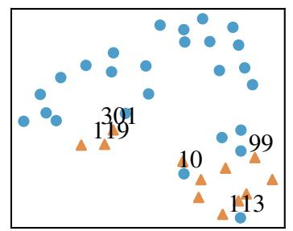

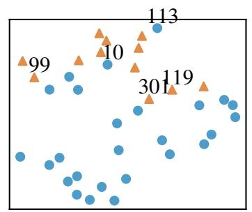

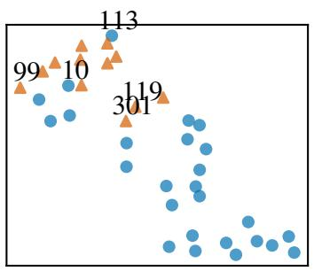

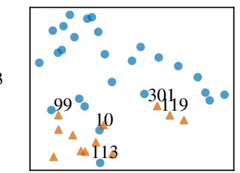

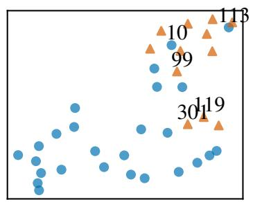

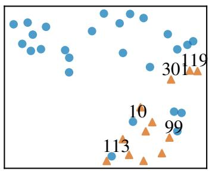

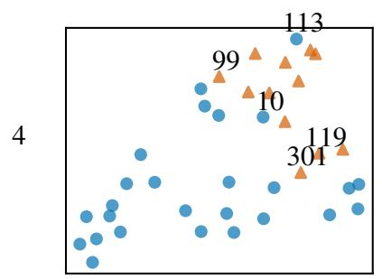

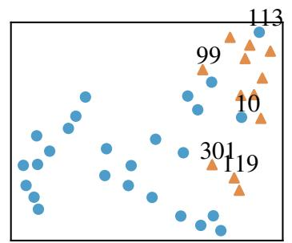

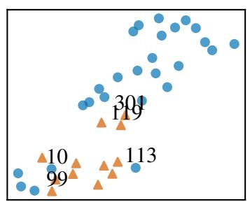

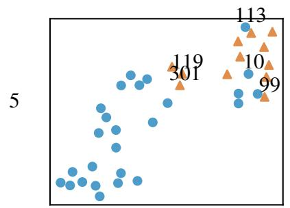

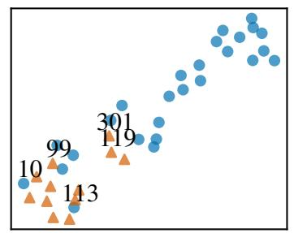

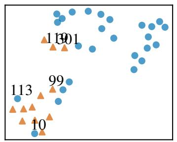

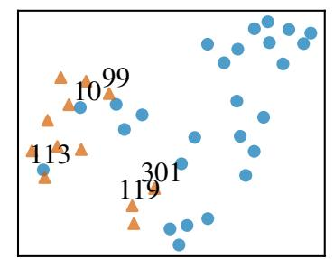

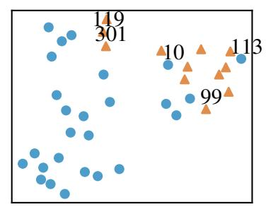

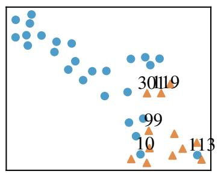  
Figure 14: Multiplot version of Figure 4. UMAP projections for EAP (orange) and AAP (blue). Each row corresponds to the number of dimensions that are used for the projection (2-6). Columns correspond to different random seeds. Potentially “misclassified” sentences (those that were near the class boundary) are labeled with their original dataset IDs for discussion.

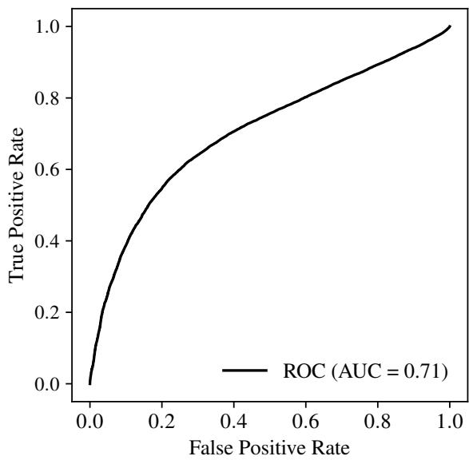  
Figure 15: ROC curve reflects informativeness of global affinity in figurative vs. literal usages of PIEs.

## D.3 Figurative vs. Literal Analysis

Figure 22 compares per-idiom figurative versus literal averages global affinity scores. Only idioms with at least 5 example sentences for both figurative and literal are shown (203 total). Idioms are sorted by figurative score. Brackets give number of examples of each type: [#figurative, #literal]. Idioms where figurative (green) is higher than literal (orange) suggest “success” of the method (e.g., in a rut, nuts and bolts).

Though we do not conduct a full analysis of MAGPIE in this study, we report a few examples from qualitative analysis. In the same way that affinity was able to help identify mislabeled examples in the CEC dataset, affinity draws attention to certain issues or areas of interest in MAGPIE.

For example, consider join the club (0.20 fig vs. 0.49 lit), which we examine to understand why the literal score is higher than the figurative. MAG-PIE’s literal examples include usages of the form join a club (e.g., A player joining a new club. . . ). In figurative usages, join the club does not generally admit of lexical or syntactic modification. High affinity for literals reflects contextual activation of join a club or join a/an X club type usages. Moreover, of the few (6) figurative usages in the dataset, many are quoted discourse (“Join the club,” said Connie), which do not produce sufficient activation since other completions like “Join the group” would be valid (hence low affinities). In this dataset, join a/an X club literal usages tend to be longer and better formed. A fairer comparison might enforce a common context length.

Similarly, for play the field (0.22 fig, 0.42 lit; figuratively meaning to hold an interest in a number of people or things), many literal usages refer to a playing field (for sports). The syntactic patterns clearly differ, and affinity has no mechanism to attend to this. For example, playing fields in playing fields and football pitches is entrenched as its own collocation that is likely unrelated to the entrenchment of the figurative play the field.

Sometimes low scoring figurative usages or high scoring literal usages are mislabeled. For example, the top scoring literal example for in black and white (0.92 fig, 0.90 lit overall) is actually mislabeled as literal: . . . but the complicated plot is hard tofollow and the characters are starkly drawn in black and white.

## E Supplement for NPNs (Section 6.1)

## E.1 Methods

We use GPT-4 via the OpenAI API, version gpt-4-0613, temperature 0.7, max tokens 100. Total cost to produce 400 sentences is less than \$5. We prompt as follows, where “{phrase}” is the particular targeted NPN (e.g., day by day):

An NPN construction is one like "day by day" or "face to face". It has a repeated singular noun with a preposition in the middle. Other prepositions are also possible: "book upon book", "week over week", "year after year". Please use "{phrase}" in an NPN construction, placing "{phrase}" in the middle of the sentence. Make sure the sentence establishes a context in which the noun makes sense. Please provide only the sentence in the response.

We verify that generations match the desired form noun+prep+noun.

To obtain acceptability judgements, we randomly sort all sentences and the last author annotates with a score between 1 and 5, inclusive. During acceptability judgement, 2 of the 100 sampled nouns were deemed to be inappropriate, and thus we omitted $( 2 \times 4 = 8 )$ of the generations.

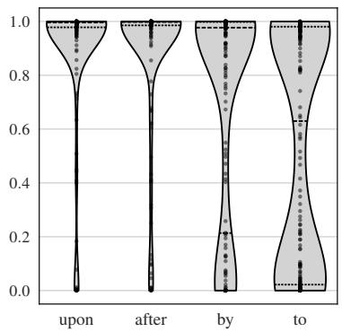  
Figure 16: Same as Figure 6, but with all sentences shown (no accept ability filter). Scores skew lower, reflecting that less acceptable sentences have lower global affinities.

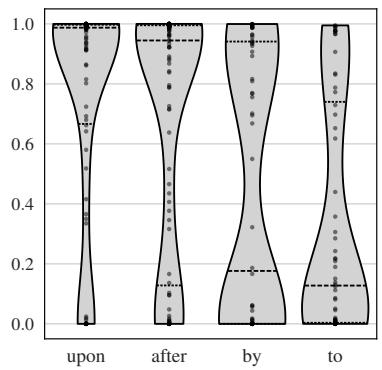  
Figure 17: Global affinity for NPNs using the challenge dataset of entirely unattested NPNs with acceptability 4. Compare to the nonchallenge result shown in Figure 6.

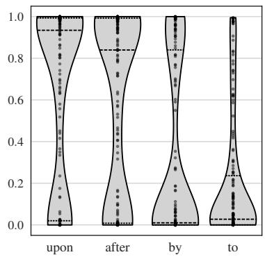  
Figure 18: Same as Figure 17 but with all sentences shown (no acceptability filter).

We produce two datasets: The first is a random sample from all of RoBERTa’s singly-tokenized, singular nouns. The second uses the same sampling procedure but rejects any sampled noun for which the infinigram API has a non-zero count in Piletrain for any of the four NPNs (i.e., the sampled noun with any of the four prepositions).

## E.2 Infinigram and the Pile

RoBERTa is trained on five corpora and comprises 160GB of text. Rather than recreating the RoBERTa dataset for our frequency analysis, we search the Pile-train (800GB) using the infinigram API. The Pile is roughly five times larger than RoBERTa’s training data and the five datasets on which RoBERTa was trained are likely included, or partially included, in the Pile:

• A newer version of BookCorpus is included in Pile

• English wiki is included in the Pile

• CC-news is likely included in the Pile-CC, and we verify this by spot-checking CC-news examples using infinigram, finding that most queries are successful

• A newer version of OpenWebText is included

• Stories, as part of CommonCrawl is likely included in the Pile-CC, though spot-checks do not find all queried strings

## E.3 NPN Dataset: Random sample

When filtered to sentences with acceptabilities of at least 4, we have 244 sentences (upon: 65, after: 73, by: 52, to: 54) and 488 nouns (two for each sentence).

## E.4 NPN Dataset: Zero frequency in the Pile

We initially sample 94 nouns and censor 3 of them giving 91 nouns. We generate 364 sentences. When filtered to sentences with acceptability of at least 4, we have 171 sentences (upon: 51, after: 54, by: 34, to: 32).

Figure 17 shows that affinities are lower for this challenge set, but most NPNs using upon still have high affinities, and over half of NPNs using after have high affinity (median affinity 0.9. This provides good evidence for generalization of the NPN with these prepositions. NPNs using by and to have lower affinity scores, which accords with the view that they are less productive. Again we observe lower overall affinities when we include sentences judged to be unacceptable (Figure 18).

## E.5 Dataset examples

We provide selected examples from our dataset:

1. Generation in the random sample with high acceptability:

As a diligent scholar, he poured over his research, analyzing manuscript after manuscript to ensure the accuracy of his findings.

Acceptability 5; affinity scores: 99.7, 99.7.

2. Generation in random sample, with low acceptability:

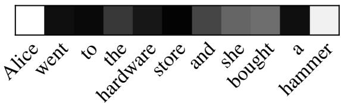  
Figure 19: Corresponding global affinity plot for the local affinity plot in Figure 7. hardware has global affinity (probability) of 0.92, and is mostly affected by hammer, a contextual rather than constructional constraint. See discussion in §7.

Through the philosophical discussions, they delved deeper into the subject, unraveling ambiguity by ambiguity, until clarity was achieved.

Acceptability 1; affinity scores 99.1, 96.2.

3. Generation from the challenge dataset with high acceptability: They lived a nomadic life, movingfrom resettlement to resettlement, always searching for a place to call home. Acceptability 5; affinity scores 98.4, 96.0.

4. Generation from the challenge dataset with low acceptability: The two rival politicians went ire to ire in a heated debate. Acceptability 1; affinity scores 0.0, 0.0.

## F Supplement for Comparative Correlative (Section 6.2)

For each sampled word, we substitute it into the original sentence and use Spacy to check whether it is a comparative adverb or comparative adjective. To calculate the percentage of the output distribution nucleus that is a comparative adj/adv, we order the outputs by probability and iterate through them until reaching a total probability mass of p  0.98 (a nucleus using 0.98). The final score is the proportion of the sample (the 98% nucleus) that is a comparative adjective or adverb.

Of the 108 (= 54 2) candidate slots, 99 of them are singly tokenized and thus amenable to study using our methods.

## G Supplement for Section 7: The Limits of Distributional Analysis

This supplement provides three additional figures. Figure 19 provides the global affinity plot for the example in Figure 7, Section 7.

Figure 20 shows the affinity matrix for the Green

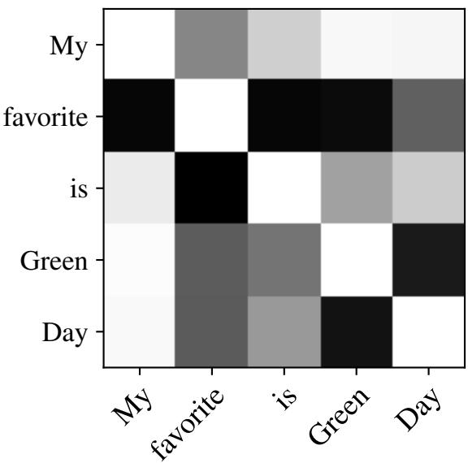

Figure 20: Affinity matrix for Green Day without band. Compare Figure 9.  
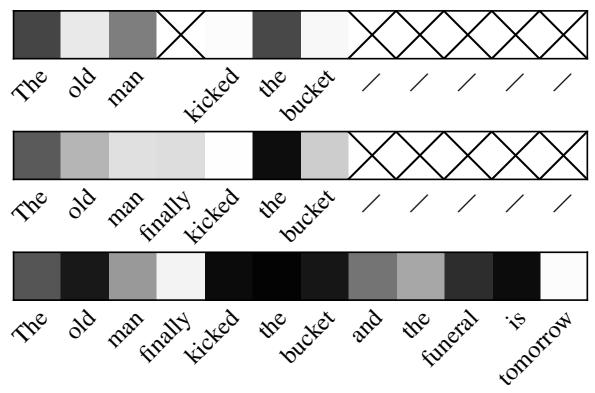  
Figure 21: Idioms are not always activated by context. kicked the bucket does not have high global affinity until it is clear that the old man has died. (The squares for kicked and bucket are dark only in the final sentence.)

Day examples when no musical context is provided (compare Figure 9).

Figure 21 provides an additional example using the idiom kick the bucket (compare Figure 8), illustrating again that even substantive constructions may exhibit low global affinities when the surrounding context is insufficient to trigger them.

## H Use of AI Assistant

ChatGPT4o was used to produce initial versions of python matplot generation code in some cases. Any code produced was subsequently adapted/ modified. ChatGPT4o was not used to write any part of this paper. Some candidate related work was found using ChatGPT4o as a search tool.

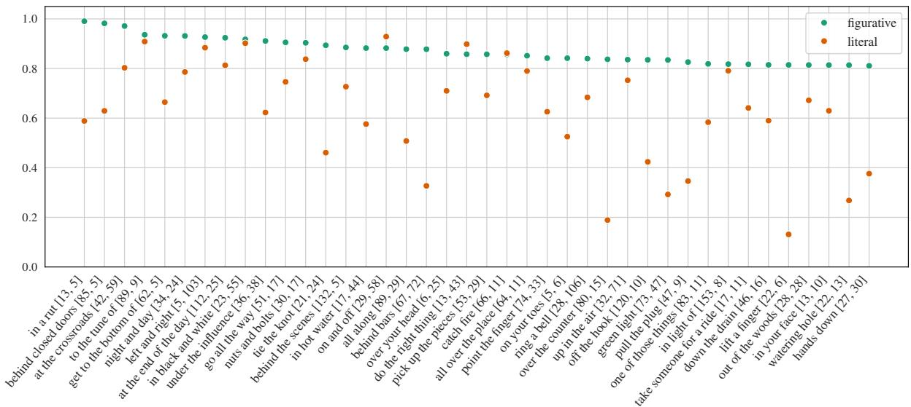

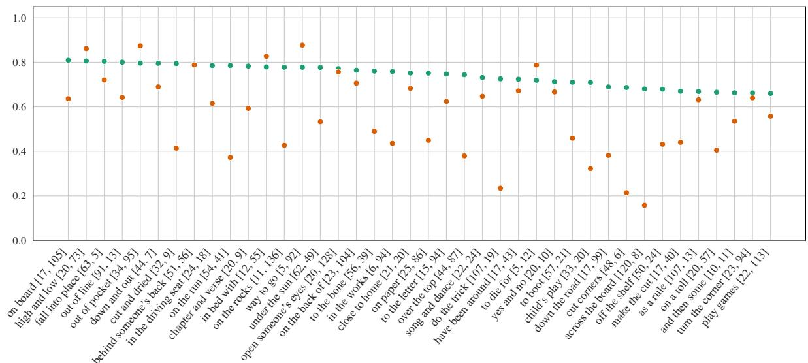

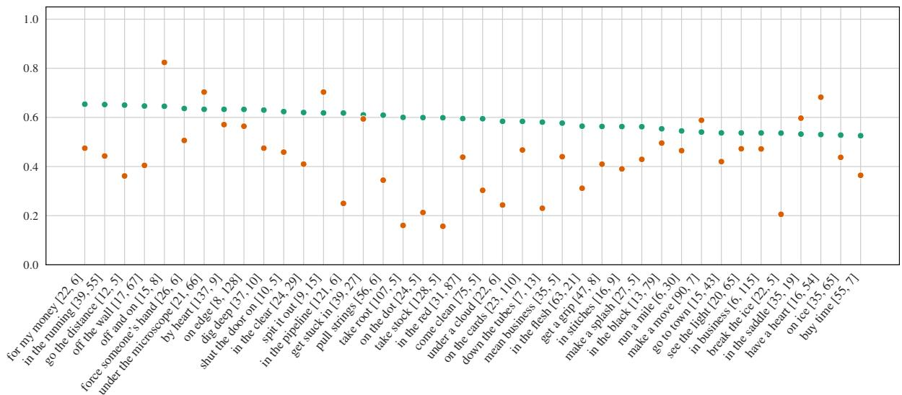

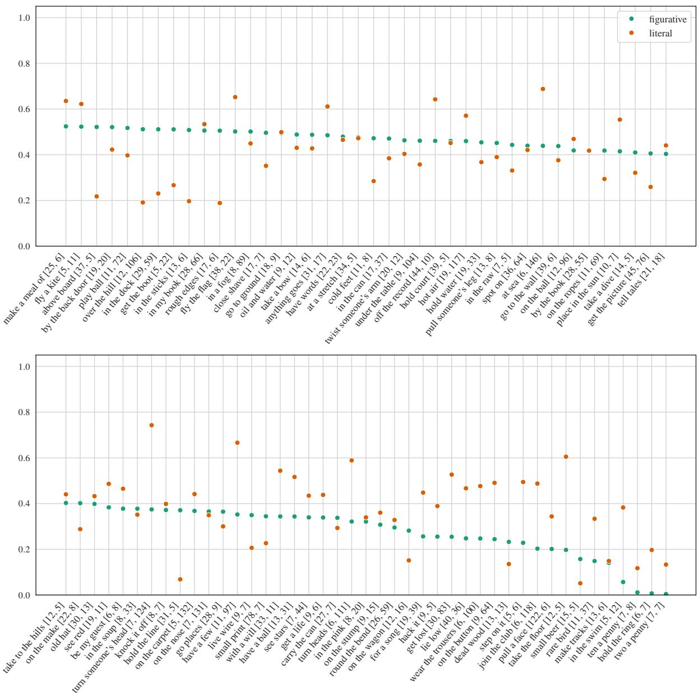  
Figure 22: Per-idiom global affinity scores for MAGPIE: average affinity for figurative uses (green) and literal uses (orange). Only idioms with at least 5 example sentences for both figurative and literal are shown (203 total). Idioms are sorted by figurative score. Brackets give number of examples of each type: [#figurative, #literal]. Idioms where figurative (green) is higher than literal (orange) suggest “success” of the method.