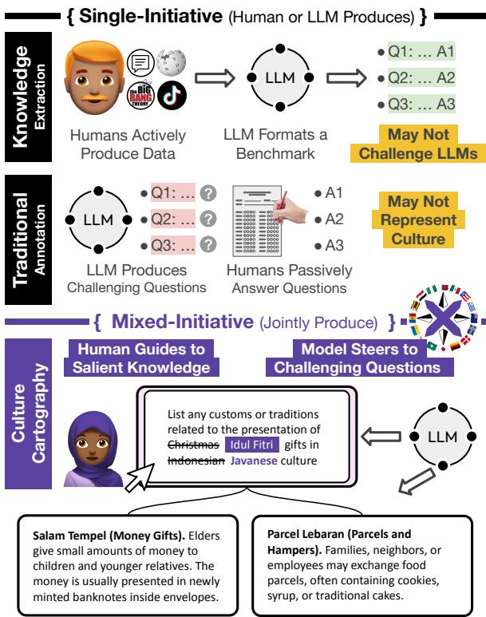
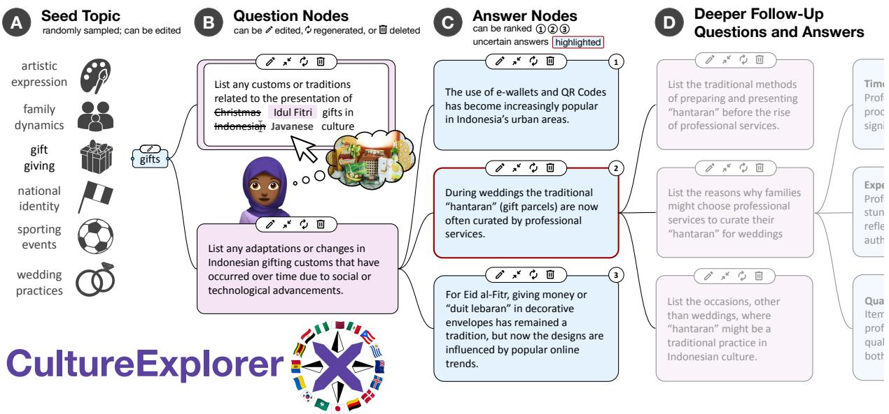
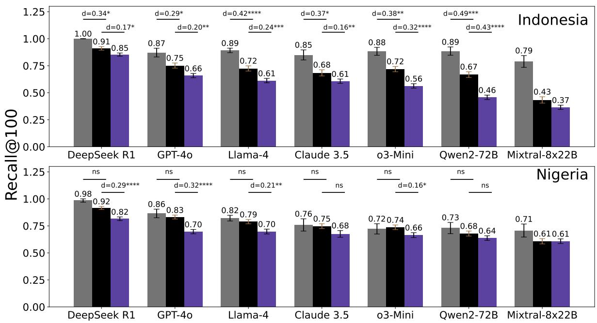
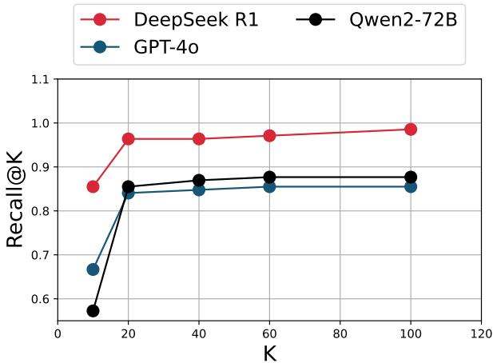
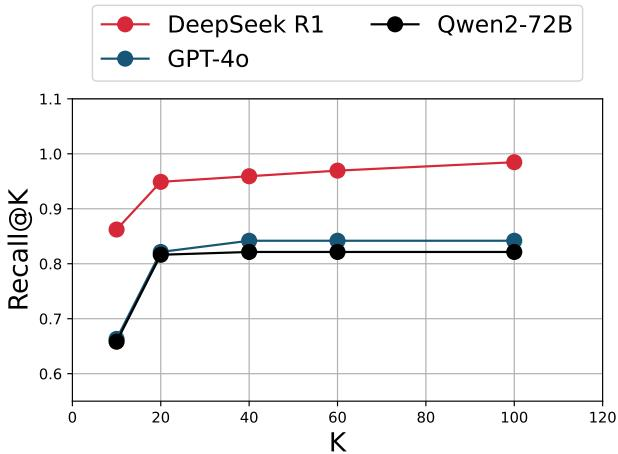

# Culture Cartography: Mapping the Landscape of Cultural Knowledge

Caleb Ziems William Held Jane Yu

Amir Goldberg David Grusky Diyi Yang

Stanford University Georgia Institute of Technology Meta AI {cziems, held, amirgo, grusky, diyi}@stanford.edu

## Abstract

To serve global users safely and productively, LLMs need culture-specific knowledge that might not be learned during pre-training. How do we find knowledge that is (1) salient to ingroup users, but (2) unknown to LLMs? The most common solutions are single-initiative: either researchers define challenging questions that users passively answer (traditional annotation), or users actively produce data that researchers structure as benchmarks (knowledge extraction). The process would benefit from mixed-initiative collaboration, where users guide the process to meaningfully reflect their cultures, and LLMs steer the process to meet the researcher’s goals. We propose CULTURE CARTOGRAPHY as a methodology that operationalizes this mixed-initiative vision. Here, an LLM initializes annotation with questions for which it has low-confidence answers, making explicit both its prior knowledge and the gaps therein. This allows a human respondent to fill these gaps and steer the model towards salient topics through direct edits. We implement CULTURE CARTOGRAPHY as a tool called CULTURE EXPLORER. Compared to a baseline where humans answer LLMproposed questions, we find that CULTURE EX-PLORER more effectively produces knowledge that strong models like DeepSeek R1, Llama-4 and GPT-4o are missing, even with web search. Fine-tuning on this data boosts the accuracy of Llama models by up to 19.2% on related culture benchmarks.

## 1 Introduction

Large Language Models (LLMs) can empower users to be more knowledgeable, productive, and creative (Carmichael and Stinson, 2024; Adiguzel et al., 2023; Yang et al., 2024b; Chen et al., 2021; Si et al., 2024), but this utility is often diminished for under-represented groups (Cao et al., 2023; Yong et al., 2024; Ziems et al., 2023b) and cultures (Myung et al., 2024; Shi et al., 2024; Chiu et al.,

  
Figure 1: CULTURE CARTOGRAPHY is a new method for identifying culturally-salient knowledge gaps in LLMs. Prior methods are single-initiative: either a human determines the distribution (Knowledge Extraction), which may not challenge models, or an LLM decides on challenging questions (Traditional Annotation), which may not represent human interests. CULTURE CARTOGRAPHY is the first mixed-initiative method that combines four key ingredients: (1) an LLM proposes challenging questions; (2) a human proposes salient questions; (3) human edits constrain subsequent LLM generations; and (4) the data forms a tree structure. Compared to prior methods, CULTURE CARTOGRAPHY identifies more LLM knowledge gaps.

2024), due to data imbalances in pre-training (Li et al., 2024a) and post-training (Ryan et al., 2024). LLM agents that lack knowledge about their user’s cultures can be less helpful personal assistants (Qiu et al., 2024), less relevant recommender systems (Casillo et al., 2023), and less engaging conversation partners (Cao et al., 2024), while being more prone to generate harmful stereotypes (Cheng et al., 2023) and violate social norms (Santy et al., 2023).

Problem. A principal challenge is identifying the cultural knowledge that is both necessary for language models to effectively serve in-group users, and also absent from current models’ awareness. The most common methods for finding missing knowledge involve benchmarking with single-initiative datasets (Figure 1, top). These approaches generally follow one of two patterns: either researchers define questions that challenge LLMs (Li et al., 2023b) and have human annotators provide answers (identifying hard but potentially non-salient knowledge), or they convert existing cultural knowledge into benchmarks using LLMs (capturing salient but potentially not challenging knowledge). Ideally, users and current-LLMs should be involved in a mixed-initiative interaction (Horvitz, 1999) (Figure 1, bottom) where humans guide the process towards culturally salient knowledge, and LLMs guide the process towards knowledge missing from existing training data.

Proposed Solution. We propose CULTURE CARTOGRAPHY as the first mixed-initiative annotation method to satisfy the above desiderata with all of the following ingredients:

1. An LLM proposes challenging questions for which it has low confidence in its answers, thus exposing its knowledge gaps—the domain of interest for many researchers.

2. The human makes direct edits or proposes new questions that reflect their expertise and interests, thus introducing cultural salience.

3. Human edits will guide and constrain subsequent LLM generations, thus making the interaction truly mixed-initiative.

4. Knowledge is visualized in a tree data structure, thus affording humans more control through parallel exploration.

Figure 1 (bottom) exemplifies each of these ingredients. Here, the LLM proposes a lowconfidence question about Christmas gift-giving, which does not align with the annotator’s expertise. She is Muslim, like the vast majority of people who live on the Indonesian island of Java, so she edits the question to ask instead about Javanese gift-giving during Eid al-Fitr, an important Islamic holiday. This directly informs the LLM’s updated answer suggestions, which are structured as a tree.

Research Tool. Annotation in such a broad and nebulous domain as culture could seem prohibitively inefficient, but we implement a tractable solution with an open-source web-tool called CUL-TURE EXPLORER (Figure 2). This tool not only solves the more mundane aspects of the annotation task, like boilerplate and text formatting, but also visually facilitates the mixed-initiative interaction. Unlike constrained and linear chat-based interfaces, CULTURE EXPLORER affords users a more interactive interface to consider and edit a growing tree of knowledge. In this way, CULTURE EXPLORER empowers users with a sense of direct manipulation (Shneiderman, 1983). The user can make edits rapidly, reversibly, and iteratively, while the tool visually displays the ramifications of these edits by generating parallel follow-up questions. By expanding and pruning branches, the user can consider multiple thematic directions and then focus on what most interests them.

Findings. We use CULTURE EXPLORER to build cultural knowledge banks for two multicultural and multiethnic countries: Nigeria and Indonesia. By design, we expect CULTURE EX-PLORER will outperform single-initiative methods (Figure 1) at eliciting knowledge that is both salient and challenging. Indeed, compared to traditional annotation, CULTURE EXPLORER identifies data that is at least 6% less likely to be known by DeepSeek R1, and up to 42% less likely to be known by other models. Furthermore, unlike knowledge extraction, CULTURE EXPLORER produces data that is not easily discoverable online. We find search-enabled models do not outperform search-disabled models at recalling our data. Finally, we demonstrate how our methodology is aligned with the objectives of the field via transfer learning experiments. By fine-tuning on data produced with CULTURE EXPLORER, we can boost the downstream performance of LLMs on other culture benchmarks by up to 19.2% accuracy.

Contributions. In summary, we propose CUL-TURE CARTOGRAPHY, a new methodological framework for eliciting culturally-salient knowledge gaps in LLMs. We implement the idea as CULTURE EXPLORER and demonstrate its utility over prior methods. We publicly release all artifacts, including data, code, tooling, and models.1

  
Figure 2: The CULTURE EXPLORER interface allows human experts to lead the annotation process, as they can Edit, Regenerate, or Delete nodes at any time. Cultural Knowledge annotation is initiated with A a seed topic (here: gifts), which the LLM uses to generate B Question nodes. Here, the annotator is editing the first Question node to make it more specific to her Islamic culture. Each Question will serve as a seed for the LLM to generate C Answer nodes. The user can then pick the questions and answers interests her, clarify through edits, or write her own from scratch, iteratively expanding the tree with D deeper follow-up questions and answers.

## 2 Related Work

There are strong economic, social, and scientific motivations to build more culturally-competent language models that are capable of meaningfully engaging with users from different cultural backgrounds (Hershcovich et al., 2022). For common ground, effective language technologies need knowledge of the behavioral norms (Shi et al., 2024; Sky et al., 2023; Rao et al., 2024), linguistic conventions (Shaikh et al., 2023), values (Cao et al., 2023), and preferences (Kirk et al., 2024) that shape each user’s interactions with the model. This motivates new culture-specific training and evaluation datasets (Hershcovich et al., 2022). There are many datasets for advancing cultural competence in specific NLP tasks (Shode et al., 2023; Muhammad et al., 2023, 2022; Tonneau et al., 2024; Ilevbare et al., 2024; Vargas et al., 2024; Olamma et al., 2019; Adelani et al., 2022; Olatunji et al., 2023; Owodunni et al., 2024), but in the current taskagnostic paradigm, QA-style knowledge benchmarking is the most common (Adilazuarda et al., 2024). Benchmarks are typically built via Knowledge Extraction or Traditional Annotation.

Knowledge Extraction. To scale up evaluation, LLMs can distill knowledge from web sources (Nguyen et al., 2024, 2023) like Wikipedia (Fung et al., 2024; Li et al., 2024b; Naous et al., 2024),

TV (Fung et al., 2023), or social media (Shi et al., 2024). LLMs can also generate synthetic evaluation data without seed knowledge (Wang et al., 2024a; Liu et al., 2024), which human annotators prune and validate. But there are concerns of test set contamination (Oren et al., 2023) when distilled or synthetic data overlaps with LLM pretraining data, and such knowledge extraction is limited only to higher-resource cultures that are wellrepresented on the web (Seth et al., 2024). Alternatively, unstructured (Zhang and Wildemuth, 2009) or semi-structured interviews (Karatsareas, 2022) can provide knowledge from under-represented cultures. However, these methods are not designed to target the gaps in models’ knowledge.

Traditional Annotation. For the sake of efficiency, it is standard for annotators to respond to pre-determined questions that target gaps in models’ knowledge. Questions can derive from secondary sources like templates (Yin et al., 2022; Myung et al., 2024), LLM generations (Liu et al., 2024; Ziems et al., 2023a), social media (Sky et al., 2023; Huang and Yang, 2023), or human experts (Masala et al., 2024). Games can serve as a more dynamic and interactive alternative to questionnaires (Seth et al., 2024; Shaikh et al., 2023), but these also depend on fixed seed topics. In each case, the culture informer is not empowered to steer the topical distribution of the data they are providing.

## 3 CULTURE EXPLORER

## 3.1 Tool Design

Cultural competence is not a generalizable objective. Like many other forms of alignment, the task is ambiguous (Tamkin et al., 2022; Li et al., 2023a), as its formalization depends on the culture and the specific users in question. The problem we aim to solve is mixed-initiative elicitation: guiding members of a cultural group to specify what cultural competence means to them, and to do so in an efficient manner. An efficient solution will not waste human effort to reproduce what language models already know, but rather prioritize regions of knowledge that current models lack, following the literature on active learning (Cohn et al., 1994).

CULTURE EXPLORER is our proposed solution that balances flexibility with efficiency, empowering users to co-construct with the LLM a branching tree of cultural knowledge. As shown in Figure 2, this tree is composed of related questions and answers, and users can edit, add, or delete elements at any time. At each iteration, the LLM generates question and answer suggestions. Similar to Generative Active Task Elicitation (Li et al., 2023a), this allows CULTURE EXPLORER to act as a data scaffolding and brainstorming tool that guides respondents towards critical knowledge gaps. But moving beyond a linear chat, CULTURE EXPLORER preserves the respondents’ creative freedom to both refine specific answers through edits and define the topic space by adding and removing nodes.

The CULTURE EXPLORER interface is built on FARSIGHT2 (Wang et al., 2024b), and specially tuned for the relevant culture domains (for details on our specific prompting methodology, see Appendix D). We now explain the pipeline in more detail, in steps corresponding to Figure 2.

Adding Knowledge. CULTURE EXPLORER is organized as a tree data structure, with nodes representing branching questions and their answers, which users expand recursively. Annotation is initiated by a pre-selected but editable seed topic3 Figure 2, A ), which the LLM uses to generate up to 5 Question nodes ( B ). The user can then pick a question that interests her, or clarify through edits, or write her own. Once the user is satisfied with a Question, the AI will generate as many as 5 Answer nodes ( C ). With Uncertainty Estimation (Kivlichan et al., 2021), CULTURE EX-PLORER visually highlights answer nodes in which the LLM is not confident. CULTURE EXPLORER measures model confidence by prompting the same model, “Does this answer the question correctly?” It constrains the logits to True/False, and takes the probability of True as the answer confidence. Answers with confidence below a threshold ( 0.4) are marked as uncertain.

The user can edit, regenerate, or delete any node at any time, and in response, the tool will generate new follow-up questions ( D ), visually displaying the ramifications of the user’s changes. Moreover, CULTURE EXPLORER explicitly encourages annotators to make significant edits and novel contributions, as it sums the edit distance over all contributions and computes a scalar monetary reward.

Scoring Answers. A user may not choose to edit every answer given by the LLM, but users can still provide a valuable preference signal by scoring LLM answers for their relevance and personal applicability. CULTURE EXPLORER asks users to score AI answers on a 0-3 Likert Scale, where 3 awards “best” answers that can’t be improved, and 0 marks “bad” or incorrect answers.

## 3.2 Data Collection

CULTURE EXPLORER allows us to fill many of the gaps identified in Related Work (§2). We can build a participatory, multilingual knowledge bank of localized cultural knowledge that complements what LLMs already know. We focus our data collection on two culturally diverse yet under-resourced countries: Nigeria and Indonesia. Each nation contains hundreds of distinct ethnolinguistic groups, with over 500 distinct indigenous languages in Nigeria (Campbell and Grondona, 2008), and over 600 ethnic groups across Indonesia (Ananta et al., 2015)

The following was approved by the Institutional Review Board at the authors’ institution. We recruit annotators on Upwork, aiming for balance across ethnolinguistic groups (see Appendix A for details). Annotations are collected in the national language for each respective country, since this language is shared across ethnolinguistic groups (Bahasa Indonesia for Indonesian annotators, and English

Synthetic Data Traditional Annotation 1 CultureCartography

<table><tr><td rowspan="2">Country</td><td rowspan="2">Ethnolinguistic Groups</td><td colspan="2">Synthetic Data</td><td rowspan="2">Avg. Score</td><td colspan="2">Traditional Annotation</td><td colspan="2">CULTURE CARTOGRAPHY</td></tr><tr><td>Scored Answers</td><td>Score ICC</td><td>Fixed Answers</td><td>Pref. Pairs</td><td>Free Answers</td><td>Pref. Pairs</td></tr><tr><td>Nigeria</td><td>7</td><td>1,913</td><td>0.58</td><td>2.6/3</td><td>944</td><td>757</td><td>521</td><td>262</td></tr><tr><td>Indonesia</td><td>13</td><td>3,412</td><td>0.55</td><td>2.5 /3</td><td>1,081</td><td>468</td><td>586</td><td>1,196</td></tr></table>

Table 1: CULTURE CARTOGRAPHY Dataset Statistics demonstrate the size of the data we collected ( 1k answers to fixed questions; 500 free answers with CULTURE EXPLORER) and its reliability $( I C C \ge 0 . 5 5$ on Score annotations, which is moderate), as well as the cultural diversity of our annotator pool (7 distinct ethnolinguistic groups from Nigeria, and 13 distinct groups from Indonesia). Finally, we see that AI responses are quite reliable for these cultures, with quality scores that are better than “good” on average $( \mathrm { e . g . , a v g } = 2 . 5 / 3 . 0 $ for Nigeria).

  
Figure 3: Performance on CULTURE CARTOGRAPHY. Powerful models like DeepSeek R1 can entirely solve Synthetic Data $( R @ 1 0 0 \geq 9 8 \% )$ , and also perform well on Traditional Annotation data $( R @ 1 0 0 \le 9 2 \% )$ . Most importantly, CULTURE CARTOGRAPHY data is appreciably harder than these single-initiative data sources, with moderate and statistically significant effect sizes (ns = “not significant”; ∗ $p < 0 . 0 5 ; ^ { \ast \ast } p < 0 . 0 1 ; ^ { \ast \ast \ast } p < 0 . 0 0 1 ;$ \*\*\*\* $p < 0 . 0 0 0 1 )$ for both R1 (d = 0.17 Indonesia; d = 0.29 Nigeria) and GPT-4o $( d = 0 . 2 0$ Indonesia; d = 0.32 Nigeria).

for Nigerian annotators). To establish baselines for the CULTURE CARTOGRAPHY methodology and test our principal hypothesis that it is better than entirely model-driven approaches, we collect data in three distinct, non-overlapping subsets:

(1) Synthetic Data: Humans validate the top-four answers given by the LLM to a pre-determined set of fixed questions about behavioral norms.4 For each question, annotators scored the AI answers for quality on the same 0-3 Likert Scale. We retained only high-quality AI answers: for a given question, we identified all pairs of AI answers whose quality scores were different with statistical significance by t-test $( \alpha = 0 . 0 5 )$ and kept only the better answer from each pair.

(2) Traditional Annotation: With the same fixed questions about behavioral norms, the respondents, having considered the top-four AI Responses above, then provided up to four new answers that complemented what the AI already gave. Annotators were explicitly encouraged to think of specific examples from their most specific and local cultures about what AI wouldn’t already know. In this way, the Traditional Annotation directly mirrored the incentive structure of CULTURE CARTOGRAPHY to identify gaps in LLM knowledge. Importantly, in this subset, respondents could not edit questions or guide their topical distribution.

(3) CULTURE CARTOGRAPHY: This represents the set of all answers that humans wrote from scratch, working with the CULTURE EXPLORER in an unconstrained manner, where they could edit AI questions freely and iteratively. Annotators worked on the task for as long as they liked, and were paid a fair hourly rate, plus bonuses for their total edit distance on questions and answers.

## 3.3 Dataset Summary

Table 1 gives the summary statistics for the three annotated subsets of CULTURE CARTOGRAPHY. We worked with 19 Indonesian annotators from across 13 ethnolinguistic groups and 12 provinces, as well as 9 Nigerian annotators from 7 ethnolinguistic groups across 5 states (see Tables 5 and 6 in Appendix A for more details). From each pool of Nigerian and Indonesian annotators, we collected 1k fixed answers with Traditional Annotation, and 500 free answers with CULTURE CARTOGRAPHY. Annotators also scored > 5k LLM answers. These score annotations are reliable, with a moderately high inter-annotator agreement of $I C C \ge 0 . 5 5$ , which is a moderate intraclass correlation (Shrout and Fleiss, 1979), and reasonable for the subjective nature of this task.

On the left side of Table 1, we see that the LLM’s responses are quite reliable, with quality scores that are better than “good” on average (e.g., avg = 2.5/3.0 for Nigeria). For all three countries, over 90% of answers were deemed at least passable (avg. score 1.0) — less than 10% of AI answers were deemed fully incorrect. One can interpret these results like precision metrics, suggesting that, when a well-prompted LLM answers its own predetermined cultural questions about Nigerian and Indonesian cultures, the answers are reliable.

## 4 Evaluating CULTURE CARTOGRAPHY

In this section, we test whether leading LLMs recall less CULTURE CARTOGRAPHY data than they recall synthetic or traditionally annotated data. We select seven flagship models to evaluate. There are three proprietary API models: GPT-4o (Hurst et al., 2024), o3-Mini5 (OpenAI, 2024), and Claude 3.5 Sonnet (Anthropic, 2024). The remaining four models are open-weight: DeepSeek R1 (Guo et al.,

2025), Llama-4-Maverick (Meta, 2025), Qwen 2- 72B (Yang et al., 2024a), and Mixtral-8x22B. To scalably evaluate model awareness of gold answers, we rely on LLM-as-a-Judge evaluations with GPT-4o to compute the Recall@K

$$
R @ K = { \frac { | \{ \operatorname { g o l d } { \mathrm { ~ a n s w e r s } } \} \cap \{ { \mathrm { m o d e l ~ a n s w e r s ~ @ } } K \} | } { | \{ \operatorname { g o l d ~ a n s w e r s } \} | } }
$$

Here, {model answers @K} refers to the set of all K answers produced by the model by iteratively prompting it: “We’re looking different examples. Without explanation, list 10 more examples.”6 The LLM-as-a-Judge determines the overlap in the numerator by iterating through each gold answer and telling us: “Does any part of{model answers @K} contain the same information as the {gold answer}? ” by answering “Yes” or “No.” For all subsequent experiments, we set $K = 1 0 0$ because baseline model performance on Synthetic Data plateaus here (see Figure 4 in Appendix B).

Human validation also ensures that our LLM-asa-Judge approach is reliable. One author blindly annotated a random sample of data, oversampling for the minority class. We observed a substantial agreement of 85% between human and model judgments, with a Cohen’s $\kappa = 0 . 6 6$ , which indicates substantial agreement (McHugh, 2012).

Q1: Is CULTURE CARTOGRAPHY Data More Challenging? Figure 3 compares CULTURE CARTOGRAPHY data (in purple) against both baselines: traditional annotation (in black), and synthetic data (in gray). We see that, compared to traditional annotation, Indonesian CULTURE CARTOG-RAPHY data is 6% less likely to be known by R1 (0.85 vs. 0.91), and Nigerian data is 10% less likely to be known by R1 (0.82 vs. 0.92). CULTURE CARTOGRAPHY is even less likely to be known by other models. This difference between CULTURE CARTOGRAPHY and Traditional Annotation is statistically significant by t-test (α = 0.05) on both Indonesian and Nigerian data for each of the following models: DeepSeek R1, GPT-4o, Llama-4, and o3-Mini. The effect sizes on R1 are Cohen’s d =0.17 and d =0.29 for Indonesian and Nigerian performance gaps, indicating small or moderatelysized effects. We conclude that CULTURE CAR-TOGRAPHY more readily produces challenging and long-tail cultural knowledge than does synthetic or traditional annotation.

Q2: How do LLMs Compare on CULTURE CARTOGRAPHY? Figure 3 also demonstrates that many LLMs cannot reach high levels of recall for CULTURE CARTOGRAPHY data, thus demonstrating gaps in their long-tail knowledge of pluralistic cultures. DeepSeek R1 completely saturates the Synthetic subset, maintains a relatively high recall on Traditional Annotation data (91% Indonesia; 92% Nigeria), and achieves the highest overall performance on CULTURE CARTOGRAPHY (85% Indonesia; 82% Nigeria). In contrast to R1, Mixtral-8x22B fails to produce as much as half of the CULTURE CARTOGRAPHY. Most models are between these two extremes and attain moderate scores, with recall around 60-70% on the CULTURE CARTOGRAPHY subsets. When we sort models by their performance on CULTURE CAR-TOGRAPHY, we get the same relative order for both countries: DeepSeek R1 GPT-4o Llama-4 Claude 3.5 o3-Mini Qwen2-72B Mixtral-8x22B. There is not a stark strong performance gap between API-based and open-weight models here, as both the best and the worst performing model are open-weight, and the runner-up model is the proprietary GPT-4o. Furthermore, reasoning mod els do not unanimously win: o3-mini ( 200B parameters) falls behind Claude 3.5 Sonnet ( 175B), a slightly smaller, non-reasoning model. To conclude, CULTURE CARTOGRAPHY allows produces stable evaluation results that reveal nuanced differences in model performance, not attributable to reasoning or model size alone.

Q3: What Are the Knowledge Gaps? Even the best reasoning model, DeepSeek R1, fails to recall 15-18% of CULTURE CARTOGRAPHY data. Now we investigate the topical distribution of this missing knowledge. We do so by adapting LlooM (Lam et al., 2024), a concept induction algorithm. First, for each QA pair that DeepSeek R1 fails to recall, we prompt GPT-4o to summarize the QA pair with 3 bullet points of at most 30 words each. Next we use k-means clustering over the full set of bullet point sentence embeddings (Reimers and Gurevych, 2019) to produce the top 10 semantic clusters each for the Nigerian and Indonesian subsets respectively. Then we prompt GPT-4o to perform the LlooM Synthesize operator and summarize each bullet point cluster with two key concept patterns each. A concept pattern consists of a text label and a corresponding prompt for classification. Finally, we use the concept prompts to classify the knowledge that DeepSeek R1 originally missed.

<table><tr><td colspan="2">Nigerian CULTURE CARTOGRAPHY Data</td></tr><tr><td>Concept</td><td>Proportion</td></tr><tr><td>1. Community Engagement</td><td>79.2%</td></tr><tr><td>2. Cultural Preservation</td><td>77.1%</td></tr><tr><td>3. Family Roles</td><td>30.2%</td></tr><tr><td>4. Funeral Rituals</td><td>9.4%</td></tr><tr><td>5. Family and Community Integration</td><td>8.3%</td></tr><tr><td colspan="2">Indonesian CULTURE CARTOGRAPHY Data</td></tr><tr><td>Concept</td><td>Proportion</td></tr><tr><td>1. Cultural Adaptations</td><td>48.8%</td></tr><tr><td>2. Exclusive Cultural Practices</td><td>44.2%</td></tr><tr><td>3. Cultural Traditions</td><td>38.4%</td></tr><tr><td>4. Cultural Gatherings</td><td>38.4%</td></tr><tr><td>5. Community Engagement</td><td>31.4%</td></tr><tr><td></td><td></td></tr></table>

Table 2: DeepSeek R1’s top 5 most prevalent missing concepts for the Nigerian and Indonesian subsets of CULTURE CARTOGRAPHY data. Note that categories are not mutually exclusive, so proportions add to more than 100%.

Table 2 lists DeepSeek R1’s top 5 most prevalent missing concepts for Nigerian and Indonesian cultures respectively. DeepSeek R1’s knowledge gaps here are not merely incidental trivia; they concern topics that are essential for preserving the social cohesion of families and larger communities. We see Community Engagement appears in almost 80% of missing Nigerian knowledge, and almost a third of missing Indonesian knowledge. For example, R1 was unaware of the Bornean communal meal called baseprah in which people of different social status dine together, fostering the spirit of gotong royong or communal responsibility and unity.

Q4: Is CULTURE CARTOGRAPHY Google-Proof? If CULTURE CARTOGRAPHY can produce data not found on the web, we can demonstrate another benefit of our methodology over knowledge extraction methods, or other benchmarks collected from the internet, which are prone to test set contamination (Oren et al., 2023). We ask, is CULTURE CARTOGRAPHY Google-Proof” (Rein et al., 2024)? That is, could the challenging questions from CULTURE CARTOGRAPHY be answered by a flagship LLM with retrieval access to the web. For direct comparison with our Figure 3 results, we evaluate GPT-4o with web search enabled,7 and compare these results to GPT-4o’s prior performance without search. We further estimate performance for the most advanced frontier model currently available in Appendix C.

<table><tr><td colspan="2">GPT4o R@100 on CULTURE CARTOGRAPHY</td></tr><tr><td>Culture ind</td><td>nga</td></tr><tr><td>no search 65.9</td><td>69.7</td></tr><tr><td>with search 61.9</td><td>54.8</td></tr><tr><td>Effect Size (d) 0.08</td><td>0.31</td></tr><tr><td>Significance ns</td><td>p &lt; 0.0001</td></tr></table>

Table 3: CULTURE CARTOGRAPHY is Google-Proof. GPT4o attains lower Recall@100 scores on CULTURE CARTOGRAPHY with web search enabled, vs. without search. Since performance does not improve with search, we conclude that CULTURE CARTOGRAPHY is Google-Proof.

Results in Table 3 show that web search fails to improve the performance of GPT4o on CULTURE CARTOGRAPHY. In fact, performance is worse with search (54.8% with, vs. 69.7% recall without search on nga; $p < 0 . 0 0 0 1 )$ . The exact mechanism behind the performance drop is speculative, but it is conceivable that web search narrows the model’s focus to the head of the knowledge distribution, since the model recalls less of the long tail.

The principal conclusion we can draw is that CULTURE CARTOGRAPHY is Google-Proof. Knowledge derived from this methodology is not easily retrieved from public web sources, including those used for Knowledge Extraction in §2, like Wikipedia, television transcripts, and social media. This complements our previous findings, further demonstrating the benefits of CULTURE CARTOG-RAPHY over single-initiative data collection methods. Such methods would be more easily solved by web search, as we will show in §5.

## 5 Transfer Performance

Section 4 showed that, compared to synthetic or traditional annotations, CULTURE CARTOGRAPHY data is more challenging, and unlike knowledge extraction, CULTURE CARTOGRAPHY helps circumvent test set contamination, as it appears Google-Proof. Now we demonstrate that data produced with CULTURE CARTOGRAPHY quantifiably aligns with the objectives of prior efforts in culturallyaware NLP, since training on CULTURE CARTOG-RAPHY data can boost the downstream transfer performance of LLMs on related culture benchmarks.

For completeness, we evaluate transfer performance on benchmarks that represent contrasting annotation paradigms. First, we consider BLEnD (Myung et al., 2024), which represents a more traditional annotation approach where annotators responded to fixed questions from a set of 500 pre-defined question templates, resulting in the largest available benchmark for Indonesian and Nigerian cultural knowledge. Next, we look at CulturalBench (Chiu et al., 2024), which was produced with a red-teaming methodology similar to our mixed-initiative approach, where humans and LLMs jointly produce knowledge. In CulturalBench, humans propose social situations, and LLMs generate related MCQ questions; finally humans modify the questions until they can stump the LLM. The key difference between CulturalBench and CULTURE CARTOGRAPHY is that Cultural-Bench was produced in through a linear chat interaction rather than a tree-based exploration, and humans iteration did not impact the topical domain of LLM generations in real time.

Training. Given compute limitations, we opted to train two relatively smaller models, Llama-3.1- 8B and Qwen-2-7B, on answers and preference pairs from either CULTURE CARTOGRAPHY or our Traditionally Annotated data from §3.2. Training has two steps. First, we derive a set of high-quality preference pairs. A preference pair is given for every set of AI answers whose scores are different with statistical significance by t-test with α = 0.05. Following the method of Shaikh et al. (2025), we treat Human Responses as strictly preferable to any AI Responses. Then we train with SFT on the preferred answers, followed optionally by DPO on the derived preference pairs (see Appendix E for hyperparameters).

Results. Table 4 shows the transfer performance on the Nigerian (nga) and Indonesian (ind) subsets of BLeND and CulturalBench. We begin our discussion with the Llama results. Only CUL-TURE CARTOGRAPHY data (Cart.) helps Llama models significantly outperform vanilla models on both benchmarks. After SFT+DPO on CULTURE CARTOGRAPHY, Llama-3.1-8B achieves +6.5% accuracy on BLEnD-nga, and +7.1% accuracy on BLEnD-ind compared to vanilla $( p < 0 . 0 0 0 1$ by paired t-test). CULTURE CARTOGRAPHY also significantly boosts vanilla models by +18.2% and +19.2% on CulturalBench-nga and CulturalBenchind respectively $( p < 0 . 0 5 )$ . This demonstrates how CULTURE CARTOGRAPHY produces data that aligns with prior benchmarking efforts.

Training on CULTURE CARTOGRAPHY data also results in overall better downstream performance than training on the Traditionally Annotated data (Trad., Table 4). For example, on BLEnD-nga, performance is +3.2% better with Cart. than Trad $( p < 0 . 0 0 0 1 )$ . While these benefits are similar on CulturalBench, the results do not reach statistical significance with such a small test set (26 Indonesian QA pairs in CulturalBench, vs. 18.5k pairs in BLEnD). This further the added utility of CUL-TURE CARTOGRAPHY for collecting knowledge that more richly reflects underlying cultures.

The findings are directionally the same for the Qwen2-7B: training on CULTURE CARTOG-RAPHY data results in better downstream performance than training on Traditionally Annotated data. With SFT+DPO on data from CUL-TURE CARTOGRAPHY, Qwen2-7B achieves +3.9% accuracy CulturalBench-ind, +4.5% accuracy on CulturalBench-nga, and +0.6% accuracy on BLEnD-nga compared to the vanilla model. These boosts are not as large, nor statistically significant as those observed with Llama-3.1-8B, but this is expected since vanilla Qwen-2 starts with higher baseline performance, more than 10% greater than vanilla Llama-3.1-8B on these benchmarks.

Furthermore, we see that fine-tuning with CUL-TURE CARTOGRAPHY helps close the performance gap between much smaller 8B open models and the much larger, proprietary GPT-4o model with search enabled (bottom of Table 4). In doing so, CULTURE CARTOGRAPHY lends itself to solutions for building more culturally-aware NLP systems.

Finally, these results exemplify the comparative advantage CULTURE CARTOGRAPHY has over single-initiative data collection. While web search failed to improve performance on the more challenging CULTURE CARTOGRAPHY data, search nearly saturates both BLEnD-nga and CulturalBench-ind, with accuracies above 90%. The same search-enabled model achieved only 54.8% and 61.9% recall respectively on the Nigerian and Indonesian subsets of our mixed-initiative CULTURE CARTOGRAPHY data (Table 3).

## 6 Conclusion

Towards the development of culturally-competent language models, we contribute CULTURE EX-PLORER (§3.1) as an interactive annotation tool that implements our mixed-initiative CULTURE CAR-

<table><tr><td rowspan="2"></td><td rowspan="2"></td><td colspan="2">BLEnD</td><td colspan="2">CulturalBench</td></tr><tr><td>nga</td><td>ind</td><td>nga</td><td>ind</td></tr><tr><td>Llama-3.1-8B</td><td>Vanilla</td><td>56.0</td><td>66.5</td><td>50.0</td><td>46.2</td></tr><tr><td>Trad.</td><td>SFT SFT+DPO</td><td>55.8 59.3</td><td> $^ { 6 8 . 7 } _ { 7 3 . 2 ^ { * * * } }$ </td><td>59.1 50.0</td><td>53.8 65.4</td></tr><tr><td>Cart.</td><td> $_ { \mathrm { S F T + D P O } } ^ { \mathrm { S F T } }$ </td><td> $\underset { 6 2 . 5 ^ { * * * } } { 5 7 . 9 }$ </td><td> $^ { 6 9 . 1 } _ { 7 3 . 6 ^ { * * * } }$ </td><td>68.2* 63.6</td><td>61.5 65.4*</td></tr><tr><td>Qwen2-7B</td><td>Vanilla</td><td>64.9</td><td>79.8</td><td>68.2</td><td>69.2</td></tr><tr><td>Trad.</td><td> $_ { \mathrm { S F T + D P O } } ^ { \mathrm { S F T } }$ </td><td>63.7 63.6</td><td>79.6 77.4</td><td>63.6 68.2</td><td>65.4 65.4</td></tr><tr><td>Cat</td><td> $\operatorname { s F T } _ { \mathrm { S F T + D P O } }$ </td><td>63.8 65.5</td><td>79.4 78.7</td><td>63.6 72.7</td><td>65.4 73.1</td></tr><tr><td>GPT40</td><td>+ search</td><td>76.8</td><td>91.3</td><td>95.5</td><td>84.6</td></tr><tr><td>Num.</td><td>evals</td><td>16.4k</td><td>18.5k</td><td>22</td><td>26</td></tr></table>

Table 4: Zero-shot Cultural Awareness of Llama-3.1- 8B and Qwen-2- 7B after training (SFT) and optionally preference-tuning (+DPO) on either Traditional Annotation (Trad.) or CULTURE CARTOGRAPHY (Cart.), and evaluated on BLEnD and CulturalBench, with statistically significant best performances among Llama models bolded ( $^ { \ast } p < 0 . 0 5 ; ^ { \ast \ast \ast } p < 0 . 0 0 0 1 )$ . CULTURE CARTOGRAPHY results in better downstream performance than Traditional Annotation data. Only CUL-TURE CARTOGRAPHY data results in significantly better performance than vanilla Llama models on both evaluation sets. Qwen results are directionally the same, with better downstream performance from CULTURE CAR-TOGRAPHY, but results are not statistically significant.

TOGRAPHY methodology. Compared to singleinitiative annotation, CULTURE CARTOGRAPHY better satisfies two motivating desiderata: the data it generates is more challenging for models, while also being more representative of human interests. Six flagship LLMs attain $\leq 7 0 \%$ recall on CUL-TURE CARTOGRAPHY data, even when search is enabled, so we conclude that CULTURE CARTOG-RAPHY is Google-Proof, and thus less prone to test set contamination than single-initiative methodologies. Finally, we see that CULTURE CAR-TOGRAPHY aligns with prior efforts in culturallyaware NLP, since fine-tuning on this data boosts the downstream transfer performance of LLMs on prior benchmarks, and helps close the performance gap between larger and smaller models. To conclude, CULTURE CARTOGRAPHY is a new mixedinitiative method for eliciting useful and representative cultural knowledge. This may complement social science methodologies like surveys and semistructured interviews, offering a new lens for studying cultural variation and heterogeneity.

## 7 Limitations

Biases in Annotator Recruitment. It is difficult to recruit contributors from under-represented cultures. As a result, the majority of published knowledge banks are exclusively in English (Adilazuarda et al., 2024), and cover the culture groups most accessible on Crowdwork platforms. In this work, we demonstrated a preliminary effort to construct multilingual knowledge resources for low-resourced cultures, but this effort is far from complete.

All of our annotator recruitment was performed through Upwork, which may introduce biases in annotator recruitment, including but not limited to imbalances in underlying annotator distribution on the platform, the ranking algorithm (Sühr et al., 2021) or the system of worker reputations on which it is based (Thebault-Spieker et al., 2017). Our recruitment strategy in §3.2 was intended to ameliorate some of these factors, as we took a roughly balanced stratified random sample across ethnolinguistic groups for each country we studied. Still, we were limited by time and the availability of annotators, so the number of respondents from each group is relatively small, and as a result, the data we collected may not be fully representative of each group. More importantly, our study is limited to only the responses of those who have stable and reliable access to Upwork and the ability to communicate in English. This is very likely to introduce biases in the worker pool (e.g., by education level, socioeconomic status, etc.).

Culture is More Than Knowledge. This work builds on existing efforts in Cultural NLP, which focus primarily on benchmarking LLMs to identify critical knowledge gaps (Adilazuarda et al., 2024). Our current CULTURE EXPLORER implementation effectively generates a tree of cultural knowledge, which is useful for benchmarking LLMs. However, culture can be much broader than the domain of factual knowledge (Zhou et al., 2025), and there are other compelling applications for CULTURE CARTOGRAPHY more broadly which may be restricted in the current fact-based implementation of CULTURE EXPLORER. For example, social scientists may be interested in extending CULTURE EXPLORER to help build digital museums that preserve not only knowledge, but also stories, history, and cultural artifacts (Srinivasan and Huang, 2005). To support a more fluid ontology in this setting would require further engineering CULTURE EX-PLORER beyond its question-answer tree format, and to consider broader themes or abstractions: not only the highly-detailed features of daily life.

## 8 Ethics

Responsible Research Ethics. This study has been approved by the Institutional Review Board (IRB) at the researchers’ institution, and participant consent was obtained using the standard institutional consent form. Annotators were also encouraged to stop any time. They were paid a fair stipend of \$20 per hour for their time. To protect annotators’ privacy, all data was anonymized.

Risks in Deployment. Here we outline risks in deploying CULTURE EXPLORER. Since this tool is powered by a Large Language Model, it shares the risks of many other human-LLM interactions, which include the potential harms of offensive, stereotypical, or hateful outputs, and the risk of misinformation. These risks are mitigated by our taskspecific prompts, which constrain the output distribution, and by our use of safety-aligned LLMs.

Specifically, in this domain, LLMs may misinterpret, flatten, or misrepresent nuanced cultural knowledge. If users do not carefully consider these risks, or overly rely on LLM suggestions, their work will be more prone to endorse dominant cultural narratives at the expense of authentic expression. To mitigate this risk, we explicitly state in the instructions and onboarding video: “Please be critical! You know your culture better than AI.” For more details on the onboarding, see Appendix F.2.

## Acknowledgments

We are thankful to the members of SALT Lab and the Stanford NLP Group: particularly Camille Harris, Giuseppe Russo, Raj Sanjay Shah, Myra Cheng, Jared Moore, and Sunny Yu for their helpful feedback on the draft. We also immensely appreciated regular feedback from Jing Huang, Julia Kruk, and Yanzhe Zhang in the earliest stages of this project. Caleb Ziems was supported by the NSF Graduate Research Fellowship under Grant No. DGE-2039655. The work was supported in part by a grant from Meta, and by a grant from the Stanford Institute for Human-Centered Artificial Intelligence (HAI).

## References

David Adelani, Jesujoba Alabi, Angela Fan, Julia Kreutzer, Xiaoyu Shen, Machel Reid, Dana Ruiter,

Dietrich Klakow, Peter Nabende, Ernie Chang, et al. 2022. A few thousand translations go a long way! leveraging pre-trained models for african news translation. In Proceedings of the 2022 Conference of the North American Chapter ofthe Associationfor Computational Linguistics: Human Language Technologies, pages 3053–3070.

Tufan Adiguzel, Mehmet Haldun Kaya, and Fatih Kürsat Cansu. 2023. Revolutionizing education with ai: Exploring the transformative potential of chatgpt. Contemporary Educational Technology, 15(3).

Muhammad Farid Adilazuarda, Sagnik Mukherjee, Pradhyumna Lavania, Siddhant Shivdutt Singh, Alham Fikri Aji, Jacki O’Neill, Ashutosh Modi, and Monojit Choudhury. 2024. Towards measuring and modeling “culture” in LLMs: A survey. In Proceedings ofthe 2024 Conference on Empirical Methods in Natural Language Processing, pages 15763–15784, Miami, Florida, USA. Association for Computational Linguistics.

Aris Ananta, Evi Nurvidya Arifin, M Sairi Hasbullah, Nur Budi Handayani, and Agus Pramono. 2015. Demography of Indonesia’s ethnicity. Institute of Southeast Asian Studies.

Anthropic. 2024. The claude 3 model family: Opus, sonnet, haiku.

Donald E Brown. 2004. Human universals, human nature & human culture. Daedalus, 133(4):47–54.

Lyle Campbell and Verónica Grondona. 2008. Ethnologue: Languages of the world. Language, 84(3):636–641.

Yong Cao, Min Chen, and Daniel Hershcovich. 2024. Bridging cultural nuances in dialogue agents through cultural value surveys. In Findings of the Association for Computational Linguistics: EACL 2024, pages 929–945, St. Julian’s, Malta. Association for Computational Linguistics.

Yong Cao, Li Zhou, Seolhwa Lee, Laura Cabello, Min Chen, and Daniel Hershcovich. 2023. Assessing cross-cultural alignment between chatgpt and human societies: An empirical study. In Proceedings of the First Workshop on Cross-Cultural Considerations in NLP (C3NLP), pages 53–67.

Michael Carmichael and J. Stinson. 2024. The ipsos ai monitor 2024: Changing attitudes and feelings about ai and the future it will bring.

Mario Casillo, Francesco Colace, Dajana Conte, Marco Lombardi, Domenico Santaniello, and Carmine Valentino. 2023. Context-aware recommender systems and cultural heritage: a survey. Journal of Ambient Intelligence and Humanized Computing, 14(4):3109–3127.

Mark Chen, Jerry Tworek, Heewoo Jun, Qiming Yuan, Henrique Ponde De Oliveira Pinto, Jared Ka plan, Harri Edwards, Yuri Burda, Nicholas Joseph,

Greg Brockman, et al. 2021. Evaluating large language models trained on code. arXiv preprint arXiv:2107.03374.

Myra Cheng, Tiziano Piccardi, and Diyi Yang. 2023. Compost: Characterizing and evaluating caricature in llm simulations. In Proceedings ofthe 2023 Conference on Empirical Methods in Natural Language Processing, pages 10853–10875.

Yu Ying Chiu, Liwei Jiang, Maria Antoniak, Chan Young Park, Shuyue Stella Li, Mehar Bhatia, Sahithya Ravi, Yulia Tsvetkov, Vered Shwartz, and Yejin Choi. 2024. Culturalteaming: Aiassisted interactive red-teaming for challenging llms’(lack of) multicultural knowledge. arXiv preprint arXiv:2404.06664.

David Cohn, Les Atlas, and Richard Ladner. 1994. Improving generalization with active learning. Machine learning, 15:201–221.

Yi Fung, Tuhin Chakrabarty, Hao Guo, Owen Rambow, Smaranda Muresan, and Heng Ji. 2023. Normsage: Multi-lingual multi-cultural norm discovery from conversations on-the-fly. In Proceedings of the 2023 Conference on Empirical Methods in Natural Language Processing, pages 15217–15230.

Yi Fung, Ruining Zhao, Jae Doo, Chenkai Sun, and Heng Ji. 2024. Massively multi-cultural knowledge acquisition & lm benchmarking. arXiv preprint arXiv:2402.09369.

Daya Guo, Dejian Yang, Haowei Zhang, Junxiao Song, Ruoyu Zhang, Runxin Xu, Qihao Zhu, Shirong Ma, Peiyi Wang, Xiao Bi, et al. 2025. Deepseek-r1: Incentivizing reasoning capability in llms via reinforcement learning. arXiv preprint arXiv:2501.12948.

Daniel Hershcovich, Stella Frank, Heather Lent, Miryam de Lhoneux, Mostafa Abdou, Stephanie Brandl, Emanuele Bugliarello, Laura Cabello Piqueras, Ilias Chalkidis, Ruixiang Cui, et al. 2022. Challenges and strategies in cross-cultural nlp. In Proceedings of the 60th Annual Meeting of the Associationfor Computational Linguistics (Volume 1: Long Papers), pages 6997–7013.

Eric Horvitz. 1999. Principles of mixed-initiative user interfaces. In Proceedings ofthe SIGCHI conference on Human Factors in Computing Systems, pages 159– 166.

Edward J Hu, Phillip Wallis, Zeyuan Allen-Zhu, Yuanzhi Li, Shean Wang, Lu Wang, Weizhu Chen, et al. 2021. Lora: Low-rank adaptation of large language models. In International Conference on Learning Representations.

Jing Huang and Diyi Yang. 2023. Culturally aware natural language inference. In Findings of the Association for Computational Linguistics: EMNLP 2023, pages 7591–7609.

Aaron Hurst, Adam Lerer, Adam P Goucher, Adam Perelman, Aditya Ramesh, Aidan Clark, AJ Ostrow, Akila Welihinda, Alan Hayes, Alec Radford, et al. 2024. Gpt-4o system card. arXiv preprint arXiv:2410.21276.

Comfort Ilevbare, Jesujoba Alabi, David Ifeoluwa Adelani, Firdous Bakare, Oluwatoyin Abiola, and Oluwaseyi Adeyemo. 2024. Ekohate: Abusive language and hate speech detection for code-switched political discussions on nigerian twitter. In Proceedings ofthe 8th Workshop on Online Abuse and Harms (WOAH 2024), pages 28–37.

Petros Karatsareas. 2022. Semi-structured interviews. Research methods in language attitudes, pages 99– 113.

Hannah Rose Kirk, Alexander Whitefield, Paul Rottger, Andrew M Bean, Katerina Margatina, Rafael Mosquera-Gomez, Juan Ciro, Max Bartolo, Adina Williams, He He, et al. 2024. The prism alignment dataset: What participatory, representative and individualised human feedback reveals about the subjective and multicultural alignment of large language models. Advances in Neural Information Processing Systems, 37:105236–105344.

Ian Kivlichan, Zi Lin, Jeremiah Liu, and Lucy Vasserman. 2021. Measuring and improving modelmoderator collaboration using uncertainty estimation. In Proceedings ofthe 5th Workshop on Online Abuse and Harms (WOAH 2021), pages 36–53.

Michelle S Lam, Janice Teoh, James A Landay, Jeffrey Heer, and Michael S Bernstein. 2024. Concept induction: Analyzing unstructured text with high-level concepts using lloom. In Proceedings of the 2024 CHI Conference on Human Factors in Computing Systems, pages 1–28.

Belinda Z Li, Alex Tamkin, Noah Goodman, and Jacob Andreas. 2023a. Eliciting human preferences with language models. arXiv preprint arXiv:2310.11589.

Huihan Li, Arnav Goel, Keyu He, and Xiang Ren. 2024a. Attributing culture-conditioned generations to pretraining corpora. arXiv preprint arXiv:2412.20760.

Jialin Li, Junli Wang, Junjie Hu, and Ming Jiang. 2024b. How well do llms identify cultural unity in diversity? arXiv preprint arXiv:2408.05102.

Minzhi Li, Taiwei Shi, Caleb Ziems, Min-Yen Kan, Nancy Chen, Zhengyuan Liu, and Diyi Yang. 2023b. Coannotating: Uncertainty-guided work allocation between human and large language models for data annotation. In Proceedings ofthe 2023 Conference on Empirical Methods in Natural Language Processing, pages 1487–1505.

Yang Liu, Meng Xu, Shuo Wang, Liner Yang, Haoyu Wang, Zhenghao Liu, Cunliang Kong, Yun Chen, Maosong Sun, and Erhong Yang. 2024. Omgeval: An open multilingual generative evaluation benchmark for large language models. arXiv preprint arXiv:2402.13524.

Mihai Masala, Denis C Ilie-Ablachim, Alexandru Dima, Dragos Corlatescu, Miruna Zavelca, Ovio Olaru, Simina Terian, Andrei Terian, Marius Leordeanu, Horia Velicu, et al. 2024. " vorbe c s ti rom ˆ ane c s te?" a recipe to train powerful romanian llms with english instructions. arXiv preprint arXiv:2406.18266.

Mary L McHugh. 2012. Interrater reliability: the kappa statistic. Biochemia medica, 22(3):276–282.

Meta. 2025. The llama 4 herd: The beginning of a new era of natively multimodal ai innovation.

Shamsuddeen Muhammad, Idris Abdulmumin, Abinew Ayele, Nedjma Ousidhoum, David Adelani, Seid Yimam, Ibrahim Ahmad, Meriem Beloucif, Saif Mohammad, Sebastian Ruder, et al. 2023. Afrisenti: A twitter sentiment analysis benchmark for african languages. In Proceedings of the 2023 Conference on Empirical Methods in Natural Language Processing, pages 13968–13981.

Shamsuddeen Hassan Muhammad, David Ifeoluwa Adelani, Sebastian Ruder, Ibrahim Sa’id Ahmad, Idris Abdulmumin, Bello Shehu-Bello, Monojit Choudhury, Chris Chinenye Emezue, Saheed Salahudeen Abdullahi, Anuoluwapo Aremu, et al. 2022. Naijasenti: A nigerian twitter sentiment corpus for multilingual sentiment analysis. In Proceedings of the Thirteenth Language Resources and Evaluation Conference, pages 590–602.

Junho Myung, Nayeon Lee, Yi Zhou, Jiho Jin, Rifki Afina Putri, Dimosthenis Antypas, Hsuvas Borkakoty, Eunsu Kim, Carla Perez-Almendros, Abinew Ali Ayele, et al. 2024. Blend: A benchmark for llms on everyday knowledge in diverse cultures and languages. arXiv preprint arXiv:2406.09948.

Tarek Naous, Michael J Ryan, Alan Ritter, and Wei Xu. 2024. Having beer after prayer? measuring cultural bias in large language models. In Proceedings of the 62nd Annual Meeting of the Association for Computational Linguistics (Volume 1: Long Papers), pages 16366–16393, Bangkok, Thailand. Association for Computational Linguistics.

Tuan-Phong Nguyen, Simon Razniewski, Aparna Varde, and Gerhard Weikum. 2023. Extracting cultural commonsense knowledge at scale. In Proceedings ofthe ACM Web Conference 2023, pages 1907–1917.

Tuan-Phong Nguyen, Simon Razniewski, and Gerhard Weikum. 2024. Cultural commonsense knowledge for intercultural dialogues. In Proceedings of the 33rd ACM International Conference on Information and Knowledge Management, pages 1774–1784.

Ihenaetu Olamma, Michael Kingsley, and Sunday Ojo. 2019. Hidden markov-based part-of-speech tagger for igbo resource-scarce african language. In Proceedings of the First International Workshop on NLP Solutionsfor Under Resourced Languages (NSURL 2019) co-located with ICNLSP 2019-Short Papers, pages 118–123.

Tobi Olatunji, Tejumade Afonja, Aditya Yadavalli, Chris Chinenye Emezue, Sahib Singh, Bonaventure FP Dossou, Joanne Osuchukwu, Salomey Osei, Atnafu Lambebo Tonja, Naome Etori, et al. 2023. Afrispeech-200: Pan-african accented speech dataset for clinical and general domain asr. Transactions of the Association for Computational Linguistics, 11:1669–1685.

OpenAI. 2024. [link].

OpenAI. 2025. Introducing gpt-4.5.

Yonatan Oren, Nicole Meister, Niladri S Chatterji, Faisal Ladhak, and Tatsunori Hashimoto. 2023. Proving test set contamination in black-box language models. In The Twelfth International Conference on Learning Representations.

Abraham Owodunni, Aditya Yadavalli, Chris Emezue, Tobi Olatunji, and Clinton Mbataku. 2024. Accentfold: A journey through african accents for zero-shot asr adaptation to target accents. In Findings of the Association for Computational Linguistics: EACL 2024, pages 2146–2161.

Haoyi Qiu, Alexander R Fabbri, Divyansh Agarwal, Kung-Hsiang Huang, Sarah Tan, Nanyun Peng, and Chien-Sheng Wu. 2024. Evaluating cultural and social awareness of llm web agents. arXiv preprint arXiv:2410.23252.

Abhinav Rao, Akhila Yerukola, Vishwa Shah, Katharina Reinecke, and Maarten Sap. 2024. Normad: A benchmark for measuring the cultural adaptability of large language models. arXiv e-prints, pages arXiv– 2404.

Nils Reimers and Iryna Gurevych. 2019. Sentence-BERT: Sentence embeddings using Siamese BERTnetworks. In Proceedings ofthe 2019 Conference on Empirical Methods in Natural Language Processing and the 9th International Joint Conference on Natural Language Processing (EMNLP-IJCNLP), pages 3982–3992, Hong Kong, China. Association for Computational Linguistics.

David Rein, Betty Li Hou, Asa Cooper Stickland, Jackson Petty, Richard Yuanzhe Pang, Julien Dirani, Julian Michael, and Samuel R Bowman. 2024. Gpqa: A graduate-level google-proof q&a benchmark. In First Conference on Language Modeling.

Michael J Ryan, William Held, and Diyi Yang. 2024. Unintended impacts of LLM alignment on global representation. In Proceedings ofthe 62nd Annual Meeting of the Association for Computational Linguistics (Volume 1: Long Papers), pages 16121–16140, Bangkok, Thailand. Association for Computational Linguistics.

Sebastin Santy, Jenny Liang, Ronan Le Bras, Katharina Reinecke, and Maarten Sap. 2023. Nlpositionality: Characterizing design biases of datasets and models. In Proceedings of the 61st Annual Meeting of the Association for Computational Linguistics (Volume 1: Long Papers), pages 9080–9102.

Agrima Seth, Sanchit Ahuja, Kalika Bali, and Sunayana Sitaram. 2024. Dosa: A dataset of social artifacts from different indian geographical subcultures. arXiv preprint arXiv:2403.14651.

Omar Shaikh, Michelle S Lam, Joey Hejna, Yijia Shao, Hyundong Justin Cho, Michael S Bernstein, and Diyi Yang. 2025. Aligning language models with demonstrated feedback. In The Thirteenth International Conference on Learning Representations.

Omar Shaikh, Caleb Ziems, William Held, Aryan Pariani, Fred Morstatter, and Diyi Yang. 2023. Modeling cross-cultural pragmatic inference with codenames duet. In Findings of the Association for Computational Linguistics: ACL 2023, pages 6550–6569.

Weiyan Shi, Ryan Li, Yutong Zhang, Caleb Ziems, Sunny Yu, Raya Horesh, Rogério Abreu De Paula, and Diyi Yang. 2024. CultureBank: An online community-driven knowledge base towards culturally aware language technologies. In Findings of the Associationfor Computational Linguistics: EMNLP 2024, pages 4996–5025, Miami, Florida, USA. Association for Computational Linguistics.

Ben Shneiderman. 1983. Direct manipulation: A step beyond programming languages. Computer, 16(08):57–69.

Iyanuoluwa Shode, David Ifeoluwa Adelani, JIng Peng, and Anna Feldman. 2023. NollySenti: Leveraging transfer learning and machine translation for Nigerian movie sentiment classification. In Proceedings of the 61st Annual Meeting of the Association for Computational Linguistics (Volume 2: Short Papers), pages 986–998, Toronto, Canada. Association for Computational Linguistics.

Patrick E Shrout and Joseph L Fleiss. 1979. Intraclass correlations: uses in assessing rater reliability. Psychological bulletin, 86(2):420.

Chenglei Si, Diyi Yang, and Tatsunori Hashimoto. 2024. Can llms generate novel research ideas? a largescale human study with 100+ nlp researchers. arXiv preprint arXiv:2409.04109.

CH-Wang Sky, Arkadiy Saakyan, Oliver Li, Zhou Yu, and Smaranda Muresan. 2023. Sociocultural norm similarities and differences via situational alignment and explainable textual entailment. In Proceedings of the 2023 Conference on Empirical Methods in Natural Language Processing, pages 3548–3564.

Ramesh Srinivasan and Jeffrey Huang. 2005. Fluid ontologies for digital museums. International journal on digital libraries, 5:193–204.

Tom Sühr, Sophie Hilgard, and Himabindu Lakkaraju. 2021. Does fair ranking improve minority outcomes? understanding the interplay of human and algorithmic biases in online hiring. In Proceedings of the 2021 AAAI/ACM Conference on AI, Ethics, and Society, pages 989–999.

Alex Tamkin, Kunal Handa, Avash Shrestha, and Noah Goodman. 2022. Task ambiguity in humans and language models. In The Eleventh International Conference on Learning Representations.

Jacob Thebault-Spieker, Daniel Kluver, Maximilian A Klein, Aaron Halfaker, Brent Hecht, Loren Terveen, and Joseph A Konstan. 2017. Simulation experiments on (the absence of) ratings bias in reputation systems. Proceedings of the ACM on Human-Computer Interaction, 1(CSCW):1–25.

Manuel Tonneau, Pedro Quinta De Castro, Karim Lasri, Ibrahim Farouq, Lakshmi Subramanian, Victor Orozco-Olvera, and Samuel Fraiberger. 2024. Naijahate: Evaluating hate speech detection on nigerian twitter using representative data. In Proceedings of the 62nd Annual Meeting of the Association for Computational Linguistics (Volume 1: Long Papers), pages 9020–9040.

Francielle Vargas, Samuel Guimarães, Shamsuddeen Hassan Muhammad, Diego Alves, Ibrahim Sa’id Ahmad, Idris Abdulmumin, Diallo Mohamed, Thiago Pardo, and Fabrício Benevenuto. 2024. Hausahate: An expert annotated corpus for hausa hate speech detection. In Proceedings of the 8th Workshop on Online Abuse and Harms (WOAH 2024), pages 52–58.

Leandro von Werra, Younes Belkada, Lewis Tunstall, Edward Beeching, Tristan Thrush, Nathan Lambert, Shengyi Huang, Kashif Rasul, and Quentin Gallouédec. 2020. Trl: Transformer reinforcement learning. https://github.com/huggingface/trl.

Yuhang Wang, Yanxu Zhu, Chao Kong, Shuyu Wei, Xiaoyuan Yi, Xing Xie, and Jitao Sang. 2024a. CDEval: A benchmark for measuring the cultural dimensions of large language models. In Proceedings of the 2nd Workshop on Cross-Cultural Considerations in NLP, pages 1–16, Bangkok, Thailand. Association for Computational Linguistics.

Zijie J Wang, Chinmay Kulkarni, Lauren Wilcox, Michael Terry, and Michael Madaio. 2024b. Farsight: Fostering responsible ai awareness during ai application prototyping. In Proceedings of the CHI Conference on Human Factors in Computing Systems, pages 1–40.

An Yang, Baosong Yang, Binyuan Hui, Bo Zheng, Bowen Yu, Chang Zhou, Chengpeng Li, Chengyuan Li, Dayiheng Liu, Fei Huang, Guanting Dong, Haoran Wei, Huan Lin, Jialong Tang, Jialin Wang, Jian Yang, Jianhong Tu, Jianwei Zhang, Jianxin Ma, Jianxin Yang, Jin Xu, Jingren Zhou, Jinze Bai, Jinzheng He, Junyang Lin, Kai Dang, Keming Lu, Keqin Chen, Kexin Yang, Mei Li, Mingfeng Xue, Na Ni, Pei Zhang, Peng Wang, Ru Peng, Rui Men, Ruize Gao, Runji Lin, Shijie Wang, Shuai Bai, Sinan Tan, Tianhang Zhu, Tianhao Li, Tianyu Liu, Wenbin Ge, Xiaodong Deng, Xiaohuan Zhou, Xingzhang Ren, Xinyu Zhang, Xipin Wei, Xuancheng Ren, Xuejing Liu, Yang Fan, Yang Yao, Yichang Zhang, Yu Wan,

Yunfei Chu, Yuqiong Liu, Zeyu Cui, Zhenru Zhang, Zhifang Guo, and Zhihao Fan. 2024a. Qwen2 technical report. Preprint, arXiv:2407.10671.

Diyi Yang, Caleb Ziems, William Held, Omar Shaikh, Michael S Bernstein, and John Mitchell. 2024b. Social skill training with large language models. arXiv preprint arXiv:2404.04204.

Da Yin, Hritik Bansal, Masoud Monajatipoor, Liunian Harold Li, and Kai-Wei Chang. 2022. GeoM-LAMA: Geo-diverse commonsense probing on multilingual pre-trained language models. In Proceedings ofthe 2022 Conference on Empirical Methods in Natural Language Processing, pages 2039–2055, Abu Dhabi, United Arab Emirates. Association for Computational Linguistics.

Zheng Xin Yong, Cristina Menghini, and Stephen Bach. 2024. Low-resource languages jailbreak gpt-4. In Socially Responsible Language Modelling Research.

Yan Zhang and Barbara M Wildemuth. 2009. Unstructured interviews. Applications of social research methods to questions in information and library science, 2:222–231.

Naitian Zhou, David Bamman, and Isaac L Bleaman. 2025. Culture is not trivia: Sociocultural theory for cultural nlp. arXiv preprint arXiv:2502.12057.

Caleb Ziems, Jane Dwivedi-Yu, Yi-Chia Wang, Alon Halevy, and Diyi Yang. 2023a. Normbank: A knowledge bank of situational social norms. In Proceedings ofthe 61st Annual Meeting ofthe Associationfor Computational Linguistics (Volume 1: Long Papers), pages 7756–7776.

Caleb Ziems, William Held, Jingfeng Yang, Jwala Dhamala, Rahul Gupta, and Diyi Yang. 2023b. Multivalue: A framework for cross-dialectal english nlp. In Proceedings of the 61st Annual Meeting of the Association for Computational Linguistics (Volume 1: Long Papers), pages 744–768.

<table><tr><td>state</td><td>town</td><td>ethnicity</td></tr><tr><td>Akwa Ibom</td><td>Uyo</td><td>Ekid</td></tr><tr><td>Anambra State</td><td>Awka</td><td>Igbo</td></tr><tr><td>Federal Capital Territory</td><td>Abuja</td><td>Abawa</td></tr><tr><td>Lagos State</td><td>Lagos Lagos</td><td>Yoruba Yoruba</td></tr><tr><td></td><td>Abeokuta Abeokuta</td><td>Egba</td></tr><tr><td>Ogun State</td><td>Abeokuta</td><td>Ijebu Remo</td></tr><tr><td></td><td></td><td></td></tr><tr><td></td><td>Ibadan</td><td>Yoruba</td></tr></table>

Table 5: Nigerian Annotator Demographics for 9 annotators from 7 ethnolinguistic groups across 5 states.

## A Annotator Recruitment and Demographics

We recruited all annotators on Upwork, offering \$20 per hour, and specifying that applicants needed to be adult workers (18+) from Nigeria or Indonesia who grew up in the local cultures. To ensure high quality work, we hired only workers with at least 90% Job Success as indicated by the platform. We also filtered by the following skills: (1) data annotation, (2) data entry, (3) writing, (4) cultural and ethnic studies, (5) arts and culture. Workers were hired following a roughly balanced stratified random sample across geography (provinces or states), as indicated by the locations in their Upwork profiles (see Tables 5 and 6 for the results). Then annotators were extensively onboarded by one of the authors of this study. The annotator first watched a 4-minute Instructional Demonstration Video on YouTube, explaining how the CULTURE EXPLORER tool works, as well as the goals of the study. The worker then completed a series of 1-5 staging rounds of annotation to ensure their understanding of the task. Each staging round entailed 15 minutes of work with the CULTURE EXPLORER. The recruiting author evaluated this work and gave extensive personalized feedback, answering questions, and particularly encouraging workers to prioritize novel contributions around knowledge that AI doesn’t already know, and to focus on their most local or regional cultures. Once the annotator demonstrated understanding, work was scaled up to 5 hour blocks with random audits for quality. The same pool of annotators contributed to all three data subsets of §3.2: Synthetic Data, Traditional Annotation, and CULTURE CARTOGRAPHY.

<table><tr><td>province</td><td>town</td><td>ethnicity</td></tr><tr><td rowspan="2">Aceh</td><td>Banda Aceh</td><td>Acehnese</td></tr><tr><td>Banda Aceh</td><td>Acehnese</td></tr><tr><td rowspan="2">Bali</td><td>Denpasar</td><td>Balinese</td></tr><tr><td>Ubud</td><td>Balinese</td></tr><tr><td>Banten</td><td>Tangerang Selatan</td><td>Bantenese</td></tr><tr><td>Central Java</td><td>Salatiga</td><td>Javanese</td></tr><tr><td>East Java</td><td>Malang</td><td>Javanese</td></tr><tr><td rowspan="3">East Kalimantan South Kalimantan</td><td>Balikpapan</td><td>Malay</td></tr><tr><td>Samarinda</td><td>Malay</td></tr><tr><td>Martapura</td><td>Banjarese</td></tr><tr><td>South Sulawesi</td><td>Makassar</td><td>Bugis</td></tr><tr><td rowspan="2"></td><td>Makassar</td><td>Bugis</td></tr><tr><td>Bandung</td><td>Sundanese</td></tr><tr><td rowspan="4">West Java</td><td>Indramayu</td><td>Indramayu</td></tr><tr><td>Jakarta</td><td>Javanese</td></tr><tr><td>South Tangerang</td><td>Javanese</td></tr><tr><td></td><td></td></tr><tr><td>West Kalimantan</td><td>Pontianak</td><td>Dayak</td></tr><tr><td>West Nusa Tenggara</td><td>Mataram</td><td>Sasak</td></tr><tr><td>West Sumatra</td><td>Padang</td><td>Minangkabau</td></tr></table>

Table 6: Indonesian Annotator Demographics for 19 annotators from 13 ethnolinguistic groups across 12 provinces.

## B Validating LLM-as-a-Judge

We validate the LLM-as-a-Judge by uniformly sampling 50 evaluations of Nigerian CULTURE CARTOGRAPHY data from across all 7 models, plus 25 additional examples oversampled from the minority-predicted class (here: “No”). One author blindly annotated these 75 datapoints. The author agreed with the model’s judgment 39+25=64 times (85%), with a substantial Cohen’s κ = 0.66.

## C Estimating GPT-4.5’s Performance on CULTURE CARTOGRAPHY

At the time of this study, the largest available model was GPT-4.5 (OpenAI, 2025). GPT-4.5 would be prohibitively expensive to evaluate on the entirety of CULTURE CARTOGRAPHY. If we use GPT-4o’s total evaluation I/O of 66M tokens, then at \$150 / 1M tokens, a full GPT-4.5 evaluation would cost \$9,900. Instead, we estimate an optimistic upper bound on its performance. Given its demonstrated performance benefits over GPT-4o (OpenAI, 2025), and our interest in the optimistic upper-bound, we assume GPT-4.5 would correctly answer any question that GPT-4o could answer. We evaluated GPT-4.5 directly on a random sample of 50 questions that GPT-4o got wrong; then we used GPT-4.5’s accuracy on this set to interpolate between GPT-4o’s performance and perfect performance. We randomly sample 50 questions for which GPT-4o failed to retrieve at least one human gold answer: 25 questions for Indonesia and 25 questions for Nigeria. Using the ChatGPT web interface, one researcher manually evaluated GPT-4.5 on all 50 pairs in a manner that most optimistically estimated upper-bound performance. For each question, the researcher added clarifying details to the prompt that most effectively narrowed the retrieval space without explicitly giving the answer. For example, the answer to one question on “coming of age rituals” was Otu-Odu, an initiation specific to Igbo women, so the researcher clarified: “We’re looking different examples of initiation rituals for women in Igbo culture.” Then the researcher manually judged the results in the manner of §4.

  
(a) On Synthetic Indonesian Data

  
(b) On Synthetic Nigerian Data  
Figure 4: Recall@K curves for DeepSeek R1, GPT-4o, and Qwen2-72B on Synthetic Data demonstrate that model performances either plateau or reach 100% by K = 100

In doing so, we computed $R ( 4 . 5 ) _ { \sigma _ { \mathrm { f a i l u r e } } } @ K -$ the recall of GPT-4.5 on the failure set $\sigma _ { \mathrm { f a i l u r e } } -$ as 72% and 48% for Indonesia and Nigeria respectively. Then we estimated $\widehat { R ( 4 . 5 ) } _ { \sigma _ { \mathrm { f u l l } } } @ K$ , the recall dof GPT-4.5 on the full CULTURE EXPLORER set as

$$
\begin{array} { r } { \widehat { R ( 4 . 5 ) } _ { \sigma _ { \mathrm { f u l l } }  @ K } = R ( 4 o ) _ { \sigma _ { \mathrm { f u l l } } } @ K } \\ { + ( 1 - R ( 4 o ) _ { \sigma _ { \mathrm { f u l l } } } @ K ) ( R ( 4 . 5 ) _ { \sigma _ { \mathrm { f a i l u r e } } } @ K ) } \end{array}
$$

Here we assumed (as an upper bound) that GPT-4.5 would successfully recall anything that GPT-4o recalled, then estimated 4.5’s improvement on 4o’s failure set according to $R ( 4 . 5 ) _ { \sigma _ { \mathrm { f a i l u r e } } } @ K$ . Table 7 shows the GPT-4.5 upper bound performance estimates of 90% recall for Indonesia and 84% for Nigeria. We see that GPT-4.5 can exceed DeepSeek R1’s performance (as given in Figure 3), but GPT-4.5 does not fully solve these challenging subsets. On CULTURE CARTOGRAPHY, GPT-4.5 lags behind even R1’s performance on Traditional Annotations (91% and 92%), which further demonstrates the “Google-Proof-ness” of our approach (Q3). This also further reinforces our §4 conclusion that CULTURE CARTOGRAPHY produces more challenging data than synthetic or traditional annotation.

<table><tr><td>Culture</td><td>R@100</td><td>95% CI</td></tr><tr><td>ind</td><td>0.90</td><td>[0.84, 0.96]</td></tr><tr><td>nga</td><td>0.84</td><td>[0.79, 0.90]</td></tr></table>

Table 7: Expected Performance of GPT-4.5 on the CULTURE CARTOGRAPHY still lag behind best model performances on Fixed Questionnaires, further demonstrating the utility of CULTURE EXPLORER coannotation for producing challenging and long-tail cultural knowledge.

## D Prompts

We build CULTURE EXPLORER on the Farsight (Wang et al., 2024b) codebase, which is licenced under a Creative Commons Attribution International 4.0 License, which permits us to transform and build upon the material for any purpose. Among other changes, we transform the prompts to fit our domain, and these prompts are given below.

## Nigerian Questions:

You are an anthropologist who is good at asking important questions about Nigerian culture. Given a description of an abstract cultural concept, please brainstorm 5 specific questions about this concept in Nigerian culture. Put each question in the XML tags: <question></question>. Each question should be written in a way that starts with the word ’List’.

cultural concept:Gifts

examples: <question>List any customs or traditions related to the preparation and presentation of gifts in Nigerian culture.</question>

<question>List the etiquette and expectations surrounding gift-giving and receiving in Nigerian culture.</question>

<question>List the differences in gifting practices between various regions or social groups within Nigerian culture.</question>

<question>List the occasions when gifts are traditionally exchanged in Nigerian culture.</question>

<question>List any adaptations or changes in Nigerian gifting customs that have occurred over time due to social or technological advancements.</question>

cultural concept:{{concept}}

examples:

## Indonesian Questions:

Anda seorang antropolog yang pandai mengajukan pertanyaan penting tentang budaya Indonesia. Dengan deskripsi konsep budaya abstrak, silakan buat 5 pertanyaan spesifik tentang konsep ini dalam budaya Indonesia. Masukkan setiap pertanyaan dalam tag XML: <question></question>. Setiap pertanyaan harus ditulis dengan cara yang dimulai dengan kata ’Buat’.

konsep budaya:Hadiah

contoh: <question>Buat daftar kebiasaan atau tradisi yang terkait dengan persiapan dan pemberian hadiah dalam budaya Indonesia.</question>

<question>Buat daftar etiket dan harapan seputar pemberian dan penerimaan hadiah dalam budaya Indonesia.</question>

<question>Buat daftar perbedaan dalam praktik pemberian hadiah antara berbagai daerah atau kelompok sosial dalam budaya Indonesia.</question> <question>Buat daftar kesempatan saat hadiah secara tradisional dipertukarkan dalam budaya Indonesia.</question>

<question>Buat daftar adaptasi atau perubahan dalam kebiasaan pemberian hadiah Indonesia yang telah terjadi dari waktu ke waktu karena kemajuan sosial atau teknologi.</question>

konsep budaya:{{concept}}

contoh:

## Nigerian Answers:

You are an observant Nigerian person who is good at recalling diverse and accurate traditions, practices, and norms in your culture. Given a question, please brainstorm 5 more specific answers from Nigerian culture. Put each answer in one of the XML tags: <universal> if the answer applies to many cultures, or <local> if the answer applies only to a few related cultures, or <unique> if the answer applies only to Nigerian culture.

cultural question: List some Nigerian wedding traditions and what they signify.

examples:<unique>Alaga: A Nigerian wedding ceremony officiant whose job is to heckle the groom and his friends as entertainment for the wedding guests. This keeps guests engaged during the hour-long ceremony.</unique>

<unique>Aso-Ebi: Nigerian couples choose what their guests wear by assigning a color for the bride’s family and a separate color for the groom’s family.</unique>

<local>No Guest List: Nigerian weddings won’t have a guest list. The entire community is welcome and an abundance of food and drink is available in case you end up with your entire community in attendance.</local>

<local>Gele: Nigerian brides wear a traditional, ornate headpiece called a Gele. The bridesmaids and families also follow suit and wear a Gele to honor the cultural traditions of the day.</local>

cultural concept: {{concept}}

examples:

## Indonesian Answers:

Anda seorang antropolog yang pandai mengajukan pertanyaan penting tentang budaya Indonesia. Dengan deskripsi konsep budaya abstrak, silakan buat 5 pertanyaan spesifik tentang konsep ini dalam budaya Indonesia. Masukkan setiap pertanyaan dalam tag XML: <question></question>. Setiap pertanyaan harus ditulis dengan cara yang dimulai dengan kata ’Buat’.

konsep budaya: Hadiah

contoh: <question>Buat daftar kebiasaan atau tradisi yang terkait dengan persiapan dan pemberian hadiah dalam budaya

Indonesia.</question> <question>Buat daftar etiket dan harapan seputar pemberian dan penerimaan hadiah dalam budaya Indonesia.</question> <question>Buat daftar perbedaan dalam praktik pemberian hadiah antara berbagai daerah atau kelompok sosial dalam budaya Indonesia.</question> <question>Buat daftar kesempatan saat hadiah secara tradisional dipertukarkan dalam budaya Indonesia.</question> <question>Buat daftar adaptasi atau perubahan dalam kebiasaan pemberian hadiah Indonesia yang telah terjadi dari waktu ke waktu karena kemajuan sosial atau teknologi.</question> <question>Buat daftar norma budaya untuk mengakui dan menanggapi hadiah dalam budaya Indonesia.</question> <question>Buat daftar signifikansi ukuran, nilai, dan pembungkusan hadiah dalam budaya Indonesia.</question> <question>Buat daftar makna atau simbolisme khusus yang terkait dengan jenis hadiah tertentu di Indonesia budaya.</question> <question>Buat daftar peran hadiah dalam membangun hubungan dan mengekspresikan emosi dalam budaya Indonesia.</question> <question>Buat daftar berbagai jenis hadiah yang umum diberikan dalam budaya Indonesia.</question>

konsep budaya:concept

contoh:

## E Models & Hyperparameters

We fine-tune the base version of Llama-3.1-8B on NVIDIA RTX 6000 Ada GPUs with LoRA (Hu et al., 2021) (rank 8; α = 16; dropout of 0.1) for 4 epochs of SFT, followed optionally by 4 epochs of DPO using the Huggingface Trainer and the TRL library (von Werra et al., 2020). We set a batch size of 1, a learning rate of 2e  4, and an AdamW-8bit optimizer.

## F Instructions Given to Participants

## F.1 Recruitment Information

Description: You are invited to participate in a research study whose goal is to help people partner with AI to collect diverse, culture-specific knowledge, that is organized in a way that makes sense to you. You will also be asked to provide your own knowledge, answering our open-ended questions by listing examples from your local culture. You will also be asked to check the correctness of existing data that has been generated automatically using Generative AI, and if these are wrong, you will have the ability to edit, delete, or regenerate knowledge. Eligibility: you must be an adult volunteer (18+) from the country we have specified. Payments: You will receive \$20 USD per hour as payment for your participation. Risks: The are no significant risks associated with this study. Study data will be stored securely, minimizing the risk of confidentiality breach. Your individual privacy will be maintained during the research and in all published and written data resulting from the study.

## F.2 Onboarding Video Transcript

Welcome to CULTURE EXPLORER, a tool for helping you to visualize and share your own culturalspecific knowledge. You can work with AI to fill in the missing pieces in a growing tree of knowledge.

When you’re ready, click Yes to start. To get you thinking, the tool starts with a random seed topic, like here is Weddings. Feel free to change this seed to anything that interests you!

According to the instructions, we need to first ask at least 3 interesting questions about our culture. The tool will automatically generate 5 ideas for you, but please be critical! You know your culture better than AI. An interesting question should specifically distinguish your culture from others. The question here about planning customs isn’t very specific, so let’s see what we can do from the instructions: we can either edit, regenerate, add our own, or delete questions. Let’s click regenerate here until we find a better one. This one looks pretty good. The question about etiquette is great because it leads to practical advice that would help an outsider fit in, so we’ll keep that. Finally, an interesting question should be on a topic that is cherished or important to community members. Americans care about money, but none of these questions ask about finances, so we will add one by double clicking the bottom node and typing directly into the box. <types: List some budgetary considerations for American weddings.> You see this follows instructions, since questions should start with the word “List.” In the end, we need 3 validated questions. We mark interesting questions by clicking the validation button in the bottom right. Notice how the footer keeps track of how many we have. Once we have all three validated, we are told to hover over them and click add answer suggestions. After that, we can click Next on the instructions.

AI starts us off with 5 answers, which we can again edit or regenerate. Some of these, like dress appropriately, are too vague. Instead of deleting them outright, we can specify: do not dress in casual attire at a formal ceremony. Some like do not wear white may be generalized to: do not wear any clothing that upstages the bride or groom. Note that each time we make edits, the counter in the right footer updates the bonuses we’ve earned! Bonuses are based on character-level contributions.

The goal is to contribute as much knowledge as you can that is also distinct from what is already in the tree – distinct from what AI already knows. You will work for a fixed amount of time, and you will be paid bonuses for any new knowledge you contribute before the timer runs out. Try to be efficient about finding and contributing new knowledge!

Maybe you have knowledge about regional differences in gift giving, so you select the middle question to expand, revealing AI-generated answers in blue. Notice that some of these answers have a bright teal bar on the right side. These are answers that the AI is confident in. Others have a dark red bar on the right side. These are answers that the AI was NOT confident in, so they will often be wrong. Since your goal is to contribute new knowledge, it is a good idea to start with the dark red bars. Read these highlighted answers and correct them if they are wrong. For example, this last answer about refusing gifts once or twice isn’t true for everyone – it applies only for Chinese Indonesians. You can add:

For Chinese Indonesians, it is polite to refuse a gift once or twice before accepting it, to show modesty and humility.

and delete which is a common practice across various cultures in Indonesia. At the bottom, you should add any answers you can that aren’t already given by the AI. Here, you might add:

For Indian or Hindu Indonesians, wrapping should be in bright colors, and leather products and alcohol should not be given.

You can also add:

For Malays and Muslim Indonesians, gifts that have alcohol or pork in them should not be given.

Let’s say you’ve shared all your knowledge about these topics, and doubt you can contribute more here. Feel free to click “Hide its answers” to tidy up your workspace, then move on to a different question.

To find an interesting question that AI doesn’t understand, it may help to go deeper into the tree. Even if the AI is confident about the initial question on the branch, we can more challenging questions by going deeper! Each time we generate an answer to a question, we can generate more questions about that very answer like this.

<expands top question, top answer, top question>

Look how this pink question is highlighted red! The red highlighted answer before meant the AI wasn’t confident about that single answer, but a red highlighted QUESTION means it was a very challenging question overall for the AI. Look how all of its answers are red.

This is a great place to contribute your knowledge, especially because an outsider who isn’t familiar with Indonesian culture would have a very hard time learning about this concept of Dutarikh. I tried Googling some terms and found very little documentation.

If you have other interesting questions to ask, please contribute them here in the “What Else?” section. By answering your own questions, you can contribute even more unique and interesting knowledge.

An interesting question should specifically distinguish your culture from others, so you might ask:

How does Gayo Dutarikh differ from the embroidery of other regions of Indonesia?

Then we can use AI to suggest some answers for this question. Note how these answers are quite vague because this topic is challenging for AI. You should definitely add better answers here, or edit existing answers to make them more specific!

Keep building the tree until the timer is up. Finally, click Export to download the tree as a file, which we will upload to Upwork, thus completing this round of annotation.