# DRISHTIKON: A Multimodal Multilingual Benchmark for Testing Language Models’ Understanding on Indian Culture

Arijit Maji1, Raghvendra Kumar1, Akash Ghosh1, Anushka2, Nemil Shah3, Abhilekh Borah4, Vanshika Shah5, Nishant Mishra1, Sriparna Saha1

1 Indian Institute of Technology Patna, India   
2 Banasthali Vidyapeeth University, Rajasthan, India 3 Pandit Deendayal Energy University, India 4 Manipal University Jaipur, India   
5 Dwarkadas J. Sanghvi College of Engineering, India

## For inquiries:

{arijit\_2311ai25, raghvendra\_2221cs27, akash\_2321cs19, nishant\_2312res420, sriparna}@iitp.ac.in {guptaanushka024, nemilshah212005, abhilekhkey, vanss2808}@gmail.com

## Abstract

We introduce DRISHTIKON, a first-of-its-kind multimodal and multilingual benchmark centered exclusively on Indian culture, designed to evaluate the cultural understanding of generative AI systems. Unlike existing benchmarks with a generic or global scope, DRISHTIKON offers deep, fine-grained coverage across India’s diverse regions, spanning 15 languages, covering all states and union territories, and incorporating over 64,000 aligned text-image pairs. The dataset captures rich cultural themes including festivals, attire, cuisines, art forms, and historical heritage amongst many more. We evaluate a wide range of vision-language models (VLMs), including open-source small and large models, proprietary systems, reasoningspecialized VLMs, and Indic-focused models, across zero-shot and chain-of-thought settings. Our results expose key limitations in current models’ ability to reason over culturally grounded, multimodal inputs, particularly for low-resource languages and less-documented traditions. DRISHTIKON fills a vital gap in inclusive AI research, offering a robust testbed to advance culturally aware, multimodally competent language technologies.The Dataset and inferencing codes are publicly available at 1.

## 1 Introduction

Language Models (LMs) and their multimodal successors have revolutionized natural language processing, excelling at tasks like generation, retrieval, translation, summarization and reasoning (Brown et al., 2020; Devlin et al., 2019; Ghosh et al., 2024c,a,d; Kumar et al., 2023; Verma et al., 2023; Kumar et al., 2025). With the advent of Large

Multimodal Models (LMMs) (Ghosh et al., 2024b), Indic-centric Language Models (ILMs) (Jain et al., 2020; Kumar et al., 2024), and parameter-efficient Small Language Models (SLMs), AI systems are now increasingly deployed across global and multilingual domains (Ouyang et al., 2022; Ghosh et al., 2025).

However, despite their linguistic fluency, these models remain largely blind to the socio-cultural richness that defines real-world communication (Maji et al., 2025). Especially in culturally rich regions like India, with its diverse traditions, languages, rituals, clothing, festivals, and food, models often struggle, either misinterpreting, oversimplifying, or overlooking the context needed for culturally aware reasoning (Blodgett et al., 2020). This presents serious concerns for AI systems deployed in education, governance, healthcare, heritage documentation, and creative industries, where cultural misalignment can lead to misinformation, bias amplification, and exclusion (Liang et al., 2022).

Research Gap: Existing benchmarks mainly target linguistic generalization (e.g., TyDi QA (Clark et al., 2020), XQUAD (Artetxe et al., 2020)) or basic image-text alignment, but lack the cultural specificity and multimodal grounding needed for culturally competent AI. They often miss region-specific symbolism such as the spiritual role of Baul music in Bengal, Warli iconography in Maharashtra, or Manipuri dance attire. Furthermore, efforts like CVQA (Romero et al., 2025), World Value Surveybased benchmarks (Yadav et al., 2025; Durmus et al., 2023), ALM (Vayani et al., 2024), and CulturalBench (Chiu et al., 2024) fall short of offering a holistic framework for Indian cultural diversity. They do not jointly cover multiple Indian languages, rich visual modalities, and nuanced cultural understanding. Crucially, none span all states and union territories, limiting their value for culturally grounded AI evaluation in India.

Research Motivation: To address this gap, we introduce DRISHTIKON, a multimodal, multilingual benchmark dedicated to Indian culture. It evaluates vision-language models’ ability to reason over culturally grounded content by aligning text and visuals. DRISHTIKON spans 15 Indian languages (including English), covers all 28 states and 8 union territories, and comprises 64,288 carefully curated instances reflecting traditional arts, festivals, attire, architecture, cuisine, and regional practices. We further benchmark several state-ofthe-art vision-language models (VLMs), including open-source small models (e.g., SmolVLM-256M-Instruct (Marafioti et al., 2025), InternVL3-1B (Chen et al., 2024a; Wang et al., 2024c; Chen et al., 2024b,c)), large VLMs (e.g., Janus-Pro-7B (Chen et al., 2025), Qwen2-VL-7B-Instruct (Wang et al., 2024b; Bai et al., 2023), Llama-4-Scout-17B-16E-Instruct (AI, 2025), LLaVA-1.6- Mistral-7B (Liu et al., 2023), InternVL3-14B (Chen et al., 2024a; Wang et al., 2024c; Chen et al., 2024b,c), Gemma-3-27B-IT (Team et al., 2025a), Qwen2.5-Omni-7B (Xu et al., 2025)), proprietary systems (e.g., GPT-4o-mini (Achiam et al., 2023) ), reasoning-specialized VLMs (e.g., Kimi-VL-A3B-Thinking (Team et al., 2025b)), and Indic-aligned models (e.g., Chitrarth (Khan et al., 2024), Maya (Alam et al., 2024)), under zero-shot, and chain-ofthought (CoT) prompting paradigms (Sahoo et al., 2024c). To encapsulate our work, we highlight the following key contributions:

• We introduce DRISHTIKON, the first multimodal, multilingual benchmark tailored to evaluate cultural reasoning in India, spanning 15 languages and capturing diverse visualtextual expressions from all 28 states and 8 union territories.

• The dataset comprises 64,288 carefully curated instances enriched with fine-grained annotations and multiple-choice questions, enabling systematic assessment of perception, inference, and cultural alignment in VLMs.

• We conduct a large-scale evaluation of stateof-the-art VLMs, including compact, largescale, proprietary, reasoning-specialized, and

Indic-aligned models, under zero-shot and chain-of-thought prompting settings.

• DRISHTIKON unveils critical gaps in VLM performance on culturally grounded tasks, especially in low-resource languages and region-specific contexts, underscoring the needfor culturally inclusive AI development.

## 2 Related Works

To contextualize our contribution, we structure the related work into two key areas: (i) multimodal and multilingual cultural benchmarks, and (ii) datasets centered on culturally grounded Indian languages and regional diversity.

## 2.1 Multimodal and Multilingual Cultural Benchmarks

(Schneider and Sitaram, 2024) proposed M5, a benchmark for vision-language tasks across 41 languages, showing that larger models often underperform smaller ones in low-resource settings. (Romero et al., 2025) introduced CVQA, a culturally diverse VQA benchmark with 9k questions in 26 languages from 28 countries, exposing model limitations in cultural and linguistic diversity. (Schneider et al., 2025) presented GIMMICK, spanning 728 cultural facets across 144 countries, where evaluations of LVLMs and LLMs revealed strong Western bias and weak cultural understanding. Similarly, (Nayak et al., 2024) introduced CulturalVQA to evaluate geo-diverse reasoning across 11 countries, revealing that GPT-4V and Gemini performed better on North American contexts while struggling with African cultural content.

Other relevant efforts include ALM (Vayani et al., 2024), Blend (Myung et al., 2024), Global-Bench (Singh et al., 2024), SEA-Eval (Wang et al., 2024a), CUBE (Senthilkumar et al., 2024), World Wide Recipe (Magomere et al., 2025), IndoCulture (Koto et al., 2024) and MultiLoKo (Hupkes and Bogoychev, 2025), which address linguistic or regional diversity. Region-specific studies, such as JMMMU (Onohara et al., 2024), focus on Japanese multimodal understanding. However, none ofthese benchmarks offer the fine-grained, culturally rich, and linguistically broad coverage ofIndia that our work uniquely provides.

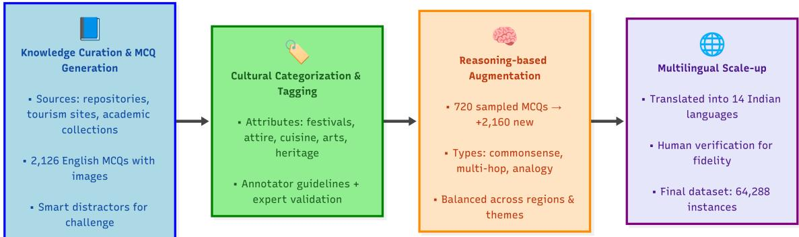  
Figure 1: DRISHTIKON dataset creation pipeline showing knowledge curation, MCQ generation, cultural categorization, reasoning-based augmentation, multilingual translation, and final dataset assembly.

## 2.2 Regionally and Culturally Rich Indian Corpora

Prior efforts have developed diverse Indian corpora addressing language, culture, and social biases. (Seth et al., 2024) introduced DOSA, a community-driven dataset of 615 artifacts from 19 subcultures, revealing LLM performance disparities. (Sahoo et al., 2024a) presented IndiBias, a bilingual dataset highlighting caste, religion, and gender biases. (Kakwani et al., 2020) and (Doddapaneni et al., 2023) released large-scale Indic corpora (8.8B and 20.9B tokens) with resources like IndicGLUE and IndicXTREME to advance Indic NLP. (Bhatt et al., 2022) proposed frameworks for NLP fairness, while (Hasan et al., 2024) developed NativQA and MultiNativQA to fine-tune models for low-resource, dialect-rich languages.

For factual and culturally grounded QA, (Rohera et al., 2024) created L3Cube-IndicQuest with 200 QA pairs across English and 19 Indic languages in five domains. (Khandelwal et al., 2024) introduced Indian-BhED, exposing LLMs’ stereotypical outputs and underscoring the need for culturally diverse fairness evaluations. For broader context, see surveys and studies such as (Maji et al., 2025; Pawar et al., 2024; Adilazuarda et al., 2024; Kharchenko et al., 2024; Karinshak et al., 2024; AlKhamissi et al., 2024; Rystrøm et al., 2025; Shen et al., 2024; Winata et al., 2025).

While prior work addressed sociolinguistic bias, dialects, or factual QA in India, our study uniquely integrates multilingual, multimodal, and culturally grounded question answering, emphasizing visual reasoning across all 36 states and union territories. DRISHTIKON is the first large-scale benchmark to holistically evaluate cultural competence in generative models using both text and visuals.

## 3 DRISHTIKON Dataset Construction

Figure 1 illustrates the complete DRISHTIKON dataset creation pipeline, from knowledge curation and MCQ generation to reasoning-based augmentation and multilingual scaling.

## 3.1 Knowledge Curation and MCQ Generation

We curated a rich knowledge base capturing India’s diverse socio-cultural landscape using authoritative sources such as national repositories, state tourism portals, academic collections, and curated crowdsourced platforms. Content spans festivals, attire, cuisines, folk traditions, monuments, personalities, and more (full details in Appendix A.1).

Inspired by vision-language QA datasets (e.g., CVQA (Romero et al., 2025)) and cultural evaluations like DOSA (Seth et al., 2024), we framed multiple-choice questions (MCQs) with one correct answer and three distractors. The 4-option format balances cultural granularity, annotator effort, and model load, while aligning with prior benchmarks (CVQA (Romero et al., 2025), CulturalVQA (Nayak et al., 2024)). Though more distractors were possible, they risked diluting focus and raising annotation costs, especially across 64k+ instances. The 4-choice setup also lowers chance-level guessing (25%) and enables consistent evaluation.

Distractors were generated through a semiautomated process followed by human curation, ensuring diversity in semantic proximity. Some distractors were intentionally close to the correct answer (e.g., from the same state or cultural category) to test fine-grained knowledge and distractor resistance. Others were thematically plausible but incorrect (e.g., attire from a neighboring region).

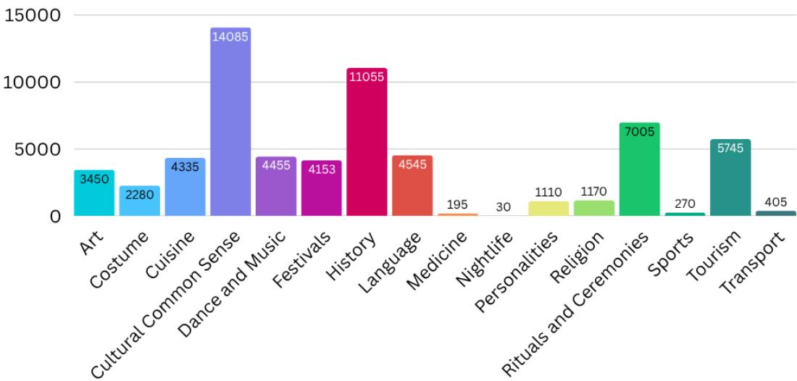  
Figure 2: Question distribution across cultural aspects.

To avoid uniform similarity, each MCQ typically contained a controlled mix, one semantically close distractor, one reflecting a popular misbelief, and one unrelated but superficially similar option.

We authored 2,126 English MCQs, proportionally covering all 28 states and 8 union territories, emphasizing cultural significance while avoiding stereotypes or trivia.

Each MCQ underwent two-pass validation for factual accuracy, clarity, and cultural sensitivity. To support multimodal comprehension, every question was paired with a culturally relevant image, selected via controlled Google Image Search for clarity, contextual fit, and inclusivity. While open-ended formats can test deeper reasoning, we opted for MCQs to ensure comparability and reproducibility: they provide a consistent evaluation signal and allow robust accuracy-based scoring across 15 languages and multiple VLMs, including those with constrained generation capabilities. We further mitigated potential “test-taking strategies” by designing semantically rich and reasoningaugmented MCQs, such as multi-hop, analogybased, and common-sense cultural formats, that resist superficial pattern matching. Nonetheless, we acknowledge the merit of open-ended formats and plan to incorporate them in future expansions of DRISHTIKON for joint evaluation across free-text generation and MCQ reasoning paradigms. Annotation methodology, agreement metrics, and adjudication procedures are outlined in Appendix A.2.

## 3.2 Cultural Categorization and Attribute Tagging

For structured cultural benchmarking, each question-image pair was annotated with one or more high-level cultural attributes. These attributes emerged from a dynamic taxonomy designed to reflect India’s cultural diversity. While the taxonomy is still evolving, initial categories include aspects such as attire, festivals, cuisine, rituals, folk arts, heritage sites, and notable personalities, among others. Definitions and taxonomy details are available in Appendix A.3.

Manual tagging was performed by trained annotators using standardized guidelines to maintain consistency. Ambiguities such as multi-attribute questions or overlapping cultural references were resolved through consensus meetings and expert adjudication. Detailed attribute statistics, overlap patterns, and edge case examples are presented in Appendix A.3. This structured labelling enabled targeted slicing of the dataset and supported finegrained evaluation of model performance across cultural modalities.

Figure 2 shows the thematic distribution of questions across cultural attributes, while Figure 3 visualizes their geographic spread across India. Further Dataset Statistics: Due to space constraints, we defer comprehensive statistical breakdowns, including question-type frequencies (factual, reasoning, analogy), and detailed state/UT questions coverage to the appendix. Appendix A.7 presents visualizations and tables to support deeper analysis.

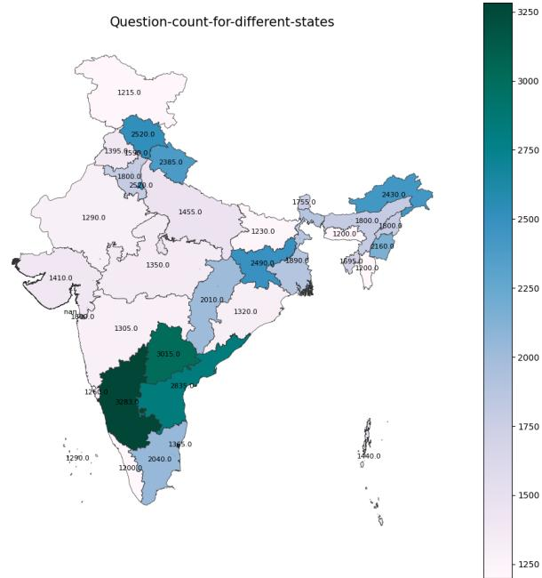  
Figure 3: State-wise and Union Territory-wise question distribution.

## 3.3 Reasoning-based Question Augmentation

To move beyond surface recognition and test deeper inferencing, we introduced reasoning-based question augmentation. From the original 2,126 MCQs, a balanced subset of 720 ( 20 per region) was selected to ensure equitable regional representation. These were augmented into three reasoning categories: Common Sense Cultural, requiring everyday cultural inference (e.g., attire or food pairing); Multi-hop Reasoning, combining multiple cultural aspects (e.g., linking a dance form to its festival and state); and Analogy, framing cultural pattern-matching (e.g., relating dishes or art forms across states).

The 20-question cap per region was based on the lowest available count, ensuring uniform augmentation and balanced evaluation. For regions with more data, stratified sampling captured diverse cultural themes (attire, cuisine, festivals, heritage), mitigating bias. All augmented questions were manually reviewed for logic, relevance, and fluency, resulting in 2,160 additional MCQs with greater inferential depth while preserving regional and thematic balance. Detailed sampling methods, example transformations, and culturally grounded chainof-thought prompts are provided in Appendices A.4 and A.12, with CoT details in Appendix A.10.

## 3.4 Multilingual Translation and Dataset Scale-up

To reflect the linguistic diversity of India and promote inclusive model evaluation, we extend DRISHTIKON into a multilingual benchmark. All 2,126 base questions and 2,160 reasoningaugmented MCQs were translated into 14 Indian languages: Hindi, Bengali, Tamil, Telugu, Marathi, Kannada, Malayalam, Gujarati, Punjabi, Odia, Assamese, Urdu, Konkani, and Sindhi. This enables fine-grained analysis of language-specific generalization and cultural grounding.

We utilized the Gemini Pro (Google DeepMind, 2025) language model for translation, motivated by its demonstrated strengths in multilingual semantic fidelity and cultural contextualization, as evidenced by recent evaluations on FLORES-200 and XTREME-UP benchmarks (Costa-Jussà et al., 2022; Goyal et al., 2021; Guzmán et al., 2019). In addition to its high translation quality, Gemini Pro offered practical scalability for processing a dataset of this magnitude. To mitigate risks of hallucination or mistranslation(Sahoo et al., 2024b), we adopted a two-stage human verification protocol on stratified samples, assessing translations for meaning preservation, fluency, and cultural relevance. For terms lacking direct equivalents in target languages, such as region-specific food items or artistic forms, transliteration or adaptive context-sensitive phrasing was applied. Languagespecific challenges and resolutions are detailed in Appendix A.5. The resulting dataset comprises 64,288 question-image-language triples spanning 36 regions, 16 cultural themes, and multiple question types. Each instance includes a culturally grounded question, four answer options with one correct label, the associated image URL (path once downloaded), and structured tags such as the question type, language, state/UT, and cultural attribute. The dataset is provided in tabular sheet (excel,csv) format for ease of use and analysis.

Together, these choices make DRISHTIKON the first large-scale, multilingual, multimodal benchmark explicitly designed to evaluate cultural competence and generalization in generative AI systems. Detailed information regarding the annotator distribution, qualifications, training, and compensation is provided in Appendix A.6.

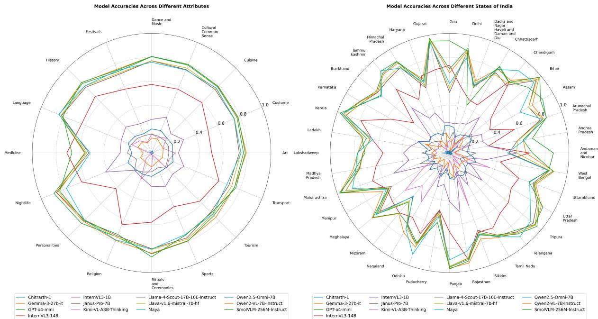

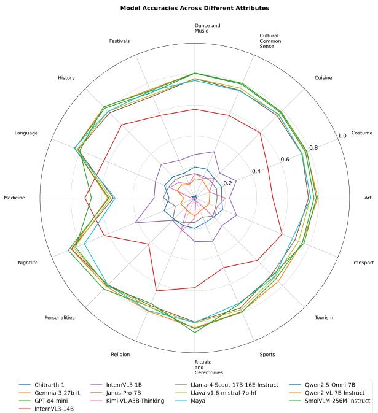

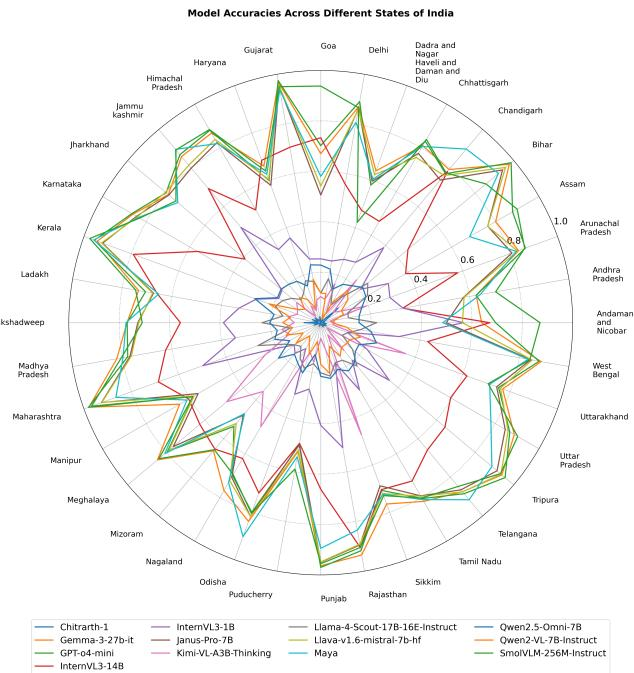  
Figure 4: Combined spider graph showing accuracy distribution across cultural attributes (left) and Indian states/UTs (right). This visualization highlights both thematic and regional performance variations across the evaluated visionlanguage models.

## 4 Experimental Setup

To ensure a fair comparison across diverse visionlanguage models (VLMs), we adopt a unified evaluation protocol wherever possible. We standardize inputs with image resolutions of 224 224 or higher (depending on model capacity), and apply prompt templates consistent with each model’s instruction tuning. The maximum token length is set based on the architecture-specific constraints, allowing multi-turn reasoning when supported. The hyperparameter settings for each model are detailed in Appendix A.8.

Models: We evaluate a wide range of visionlanguage models (VLMs), spanning multiple scales and capabilities. These include opensource small models such as SmolVLM-256M-Instruct and InternVL3-1B; large-scale models like Janus-Pro-7B, Qwen2-VL-7B-Instruct, Llama-4- Scout-17B-16E-Instruct, LLaVA-1.6-Mistral-7B, InternVL3-14B, Gemma-3-27B-IT, and Qwen2.5- Omni-7B; proprietary systems like GPT-4o-mini; reasoning-specialized models such as Kimi-VL-A3B-Thinking; and Indic-aligned models including Chitrarth and Maya. Accuracy is used as the primary evaluation metric, reflecting the proportion of correctly answered multiple-choice questions.

## 5 Results

In this section, we present the evaluation results of multiple vision-language models (VLMs) on the DRISHTIKON dataset. We assess the models performance across 15 Indian languages (English inclusive) and across various question types. The results are visualized through several illustrations (Figures. 4, 5 & 6), offering insights into accuracy trends across cultural attributes, regional distributions, languages, and models.

## 5.1 Analysis of Radar Graphs

The radar plots in Figure 4 offer a comprehensive view of how vision-language models engage with culturally grounded attributes and geographically anchored knowledge. Models exhibiting broad and uniform radial coverage signal a robust alignment between visual and linguistic modalities, likely resulting from exposure to diverse, multimodal training data. Their smooth contours reflect an ability to generalize across both concrete cultural elements, such as attire, cuisine, and festivals, and more nuanced attributes like language, heritage, or environment. In contrast, models with jagged or constricted profiles reveal gaps in cultural grounding, particularly with abstract or context-dependent concepts like religion, nightlife, or medicine, which demand deeper socio-cultural and inferential rea-

soning.

Similarly, the radar plot of model accuracies across Indian states illustrates how well these models internalize region-specific cues. States with strong media presence or distinct cultural signatures, such as Kerala, Gujarat, and West Bengal, show higher and more consistent performance, hinting at the role of representation in pretraining corpora. Meanwhile, smaller or less represented regions like Lakshadweep, Mizoram, and Dadra and Nagar Haveli see lower accuracies, exposing geographic biases and uneven regional learning.

Notably, even the best-performing models show fluctuations across states, underscoring persistent challenges in capturing India’s cultural and linguistic diversity. Together, these radar charts reveal not just performance disparities but also hidden weaknesses, reinforcing the need for culturally inclusive, geographically balanced fine-tuning to ensure equitable and context-aware multimodal understanding.

## 5.2 RQ1: To what extent does model scale correlate with performance in multilingual multimodal tasks?

Answering RQ1: Model-wise Performance Insights Among the evaluated models, proprietary large language models such as GPT-4o mini consistently deliver top-tier performance across all languages and question types, reflecting the advantage of extensive instruction tuning and large-scale vision-language alignment. Furthermore, Maya, despite being regionally focused and relatively lightweight, demonstrates competitive accuracy, challenging the assumption that scale alone drives multilingual multimodal performance. Following closely are SLMs such as SmolVLM-256M-Instruct and InternVL3-1B, which punch above their parameter scale, often outperforming heavier LLMs in overall accuracy. Notably, some high-parameter LLMs such as Janus-Pro-7B and LLaVA-1.6-mistral-7B exhibit fluctuating performances, suggesting that parameter size alone is not a sufficient predictor of effectiveness, especially in multilingual and multimodal tasks. At the lower end, reasoningcentric models like Kimi-VL-A3B-Thinking and less-tuned Indic LMs like Chitrarth-1 show limited generalization, with accuracies significantly trailing in both zero-shot and CoT settings. The overall findings emphasize that well-aligned crossmodal reasoning and cultural grounding can outperform sheer scale in diverse evaluation settings.

## 5.3 RQ2: How do vision-language models vary in performance across Indian languages with unequal resource support?

Answering RQ2: Language-wise Difficulty Spectrum A breakdown by language shows a clear gap between high- and low-resource contexts. English remains the most reliably understood language, as expected, with near-saturation accuracy levels for many models. This is followed by Hindi, Bengali, and Marathi, likely benefiting from better multilingual training corpora and shared Indo-Aryan linguistic roots. Conversely, languages like Sindhi, Konkani, and Kannada consistently pose the greatest challenges, with accuracy dropping by over 40% in some cases compared to English. These disparities underscore systemic gaps in training data and cultural alignment in current VLMs. Moreover, languages like Assamese and Odia, despite their wide speaker base, do not exhibit uniformly high performance, hinting at underrepresentation in foundational model pretraining datasets. This highlights the urgent need for better linguistic inclusion, particularly for Indian languages at the tail-end of the accuracy distribution. A more detailed breakdown of state-wise and Union Territory–wise language performance accuracies is provided in Figure 17 in the Appendix, due to space constraints.

## 5.4 RQ3: What types of questions pose difficulties to current vision-language models?

Answering RQ3: Question Type-Specific Trends When segmented by question type, it becomes evident that General Questions and Common Sense Cultural Questions receive the highest accuracy across models, suggesting that these models are relatively proficient at surface-level understanding and culturally grounded inferences. However, Multi-hop Reasoning Questions introduce a steep drop in accuracy, exposing models’ limitations in sequential inferencing and logical chaining. While CoT prompting helps moderately in lifting scores for this category, its gains are not uniformly robust across all languages. Additionally, Analogy Questions show the highest variance, some models excel when semantic similarity is explicit, while others flounder, reflecting a fragile grasp of abstract reasoning. These findings call for further attention toward reasoning scaffolds and prompt design that specifically target relational and inferential understanding.

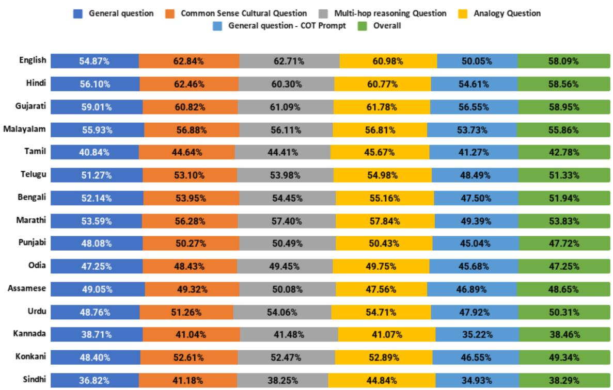

Figure 5: Accuracy across languages under different question-type settings. Each percentage indicates the average accuracy (aggregated over all evaluated models) for a specific language–question type pair.  
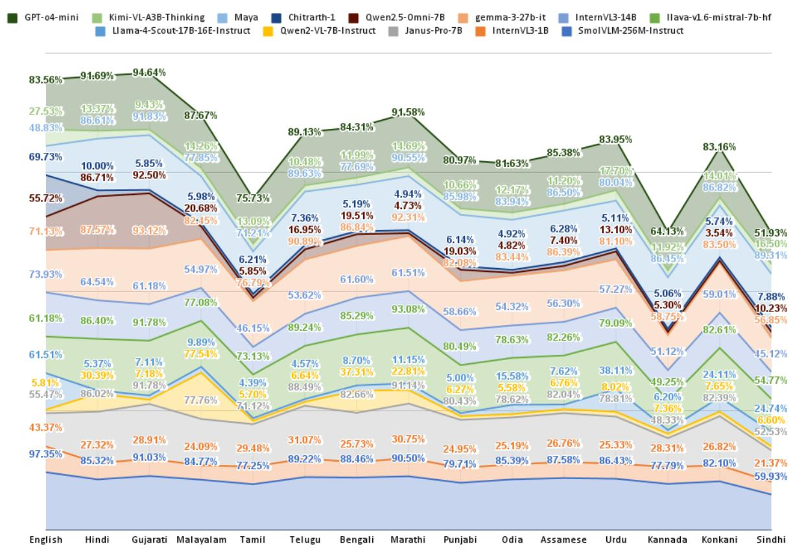  
Figure 6: Accuracy of each model across different languages, highlighting multilingual performance variations. Reported percentages represent the average accuracy for each language–model pair over the entire dataset.

5.5 RQ4: How does model typology influence performance across task categories and languages?

Answering RQ4: Insights by Model Category Stratifying performance based on model typology yields several revealing patterns. SLMs such as SmolVLM-256M-Instruct and InternVL3-1B perform surprisingly well given their compact size, particularly excelling in general question - answering and commonsense tasks. LLMs, while expectedly powerful, do not always justify their computational footprint—models like Qwen2-VL-7B and Llama-4-Scout-17B show decent multilingual adaptability, but their gains plateau in deeper reasoning tasks. Maya demonstrates robust and balanced performance across multiple settings, outperforming several larger general-purpose LLMs in culturally grounded understanding. In contrast, other Indic LMs, such as Chitrarth-1, show comparatively weaker results, highlighting ongoing challenges in region-specific fine-tuning and alignment with image-grounded reasoning. Furthermore, Reasoning-oriented models like Kimi-VL-A3B-Thinking show promise in isolated tasks but fail to generalize across linguistic and logical variation. Finally, Proprietary models like GPT-4o mini remain the gold standard, consistently delivering the best zero-shot and CoT results across languages and question types, illustrating the strength of multi-modal scaling and integrated training pipelines. These insights collectively reinforce the need for balanced development across efficiency, reasoning, and multilingual inclusiveness.

5.6 RQ5: How does model performance differ between zero-shot and Chain-of-Thought (CoT) prompting across various question types, and which models benefit most from reasoning scaffolds?

Answering RQ5: Zero-shot vs. Chain-of-Thought (CoT) Performance Analysis We compare model performance under zero-shot and chainof-thought (CoT) prompting to assess the value of explicit reasoning scaffolds. CoT proved most beneficial for reasoning-intensive categories such as multi-hop and analogy questions, yielding accuracy gains of up to 10–15%, while commonsense cultural questions showed only modest improvements. Large-scale proprietary models (e.g., GPT-4o mini) consistently benefited across question types, whereas smaller instruction-tuned models (e.g., SmolVLM-256M-Instruct, InternVL3- 1B) showed competitive gains, sometimes being on par with larger open-source systems. By contrast, reasoning-specialized (e.g., Kimi-VL-A3B-Thinking) and Indic-focused models (e.g., Chitrarth) exhibited limited or inconsistent improvements, suggesting weaker generalization of CoT in low-resource or culturally specific settings. Although CoT narrowed performance gaps on complex tasks, challenges in analogical reasoning and disparities across languages remain, with high-resource languages (e.g., Hindi, Bengali) benefiting more than low-resource ones (e.g., Konkani, Sindhi). Overall, CoT enhances culturally grounded reasoning, but its impact varies by question type, model family, and linguistic coverage. Due to limited space, we include the error analysis in the appendix A.9.

## 6 Conclusion

In this study, we introduced the DRISHTIKON dataset to evaluate the capabilities of visionlanguage models (VLMs) in the Indian cultural context. Spanning 15 diverse Indian languages, our evaluation across a range of VLMs uncovers several key insights. Proprietary models such as GPT-4o mini demonstrate strong performance, benefiting from large-scale instruction tuning and alignment. Notably, compact instructiontuned models like SmolVLM-256M-Instruct and InternVL3-1B consistently deliver competitive results, highlighting the promise of efficiency-aware architectures for culturally rich tasks. Encouragingly, the Indian-origin Maya model also performed well, underscoring the potential of indigenous efforts in building culturally aligned and linguistically inclusive AI systems. Persistent performance gaps highlight digital inequities, with low-resource Indian languages trailing due to limited data and exposure. DRISHTIKON underscores the need for inclusive, culturally aware, and efficient VLMs, offering a robust benchmark for future multilingual research.

## Limitations

While the DRISHTIKON benchmark makes a significant step toward evaluating cultural and linguistic reasoning in Indian contexts, certain limitations remain. Despite covering 15 languages and diverse cultural settings, the dataset cannot exhaustively represent the full spectrum of India’s regional nuances, dialectical variations, and socio-cultural practices. Additionally, although curated imagetext pairs enable controlled evaluation, they may carry subtle annotator biases and may not fully replicate the complexity of real-world multimodal scenarios.

On the modelling side, even with the aid of Chain-of-Thought prompting, many VLMs continue to struggle with tasks involving abstract analogies and multi-hop reasoning, indicating room for improvement in compositional understanding. Furthermore, performance gaps across languages reflect the broader challenge of digital disparity, particularly for low-resource languages with limited training data. These insights highlight opportunities for future work in developing more inclusive datasets, culturally attuned training strategies, and robust reasoning frameworks that can support equitable and generalizable multimodal AI.

## Ethics Statement

Data Sourcing and Cultural Integrity: The DR-ISHTIKON dataset was constructed using publicly available resources and licensed materials, ensuring adherence to data-sharing norms and copyright considerations. Care was taken to represent diverse linguistic and cultural contexts across India, with a focus on including both high- and low-resource languages. While every effort was made to maintain balance and inclusivity, we acknowledge that certain regional or dialectal variations may still be underrepresented due to the limitations of available data.

Human Annotation and Fair Compensation: To ensure the cultural validity and linguistic accuracy of the dataset, we employed a team of annotators proficient in different Indian languages and familiar with their respective cultural contexts. Annotators were fairly compensated at an average hourly rate (in USD), and a detailed breakdown is included in the appendix. Training and guidelines were provided to mitigate personal or regional biases, and a validation step was conducted to ensure annotation consistency and cultural sensitivity. Efforts were made to avoid harmful stereotypes and to ensure questions reflect respectful and inclusive representations.

Responsible Use and Community Benefit: DR-ISHTIKON was developed with the intention to support the development of culturally aware, multilingual vision-language models. We encourage its use in academic and research settings that promote fairness, inclusivity, and transparency in AI. Any misuse of the dataset for generating biased, discriminatory, or culturally insensitive outputs would go against the values and intent behind its creation.

Licensing and Permissible Use: The DR-ISHTIKON dataset is released strictly for research and non-commercial use. To avoid copyright infringement, we provide only URLs pointing to publicly available images rather than hosting the images directly. These URLs are intended to be used for academic reference, ensuring compliance with fair use principles and image-sharing policies. Users of the dataset are expected to respect the original source licenses and terms of use when accessing or displaying these images.

## Acknowledgments

Akash Ghosh and Sriparna Saha express gratitude to the SERB POWER scheme (SPG/2021/003801), Department of Science and Technology, Government of India.

## References

Josh Achiam, Steven Adler, Sandhini Agarwal, Lama Ahmad, Ilge Akkaya, Florencia Leoni Aleman, Diogo Almeida, Janko Altenschmidt, Sam Altman, Shyamal Anadkat, and 1 others. 2023. Gpt-4 technical report. arXiv preprint arXiv:2303.08774.

Muhammad Farid Adilazuarda, Sagnik Mukherjee, Pradhyumna Lavania, Siddhant Shivdutt Singh, Alham Fikri Aji, Jacki O’Neill, Ashutosh Modi, and Monojit Choudhury. 2024. Towards measuring and modeling “culture” in LLMs: A survey. In Proceedings of the 2024 Conference on Empirical Methods in Natural Language Processing, pages 15763–15784, Miami, Florida, USA. Association for Computational Linguistics.

Meta AI. 2025. Llama-4-scout-17b-16e-instruct. https://huggingface.co/meta-llama/ Llama-4-Scout-17B-16E-Instruct. Accessed: 2025-05-19.

Nahid Alam, Karthik Reddy Kanjula, Surya Guthikonda, Timothy Chung, Bala Krishna S Vegesna, Abhipsha Das, Anthony Susevski, Ryan Sze-Yin Chan, S M Iftekhar Uddin, Shayekh Bin Islam, Roshan Santhosh, Snegha A, Drishti Sharma, Chen Liu, Isha Chaturvedi, Genta Indra Winata, Ashvanth. S, Snehanshu Mukherjee, and Alham Fikri Aji. 2024. Maya: An instruction finetuned multilingual multimodal model. Preprint, arXiv:2412.07112.

Badr AlKhamissi, Muhammad ElNokrashy, Mai AlKhamissi, and Mona Diab. 2024. Investigating

cultural alignment of large language models. arXiv preprint arXiv:2402.13231.

Mikel Artetxe, Sebastian Ruder, and Dani Yogatama. 2020. On the cross-lingual transferability of monolingual representations. In Proceedings of the 58th Annual Meeting ofthe Associationfor Computational Linguistics, pages 4623–4637, Online. Association for Computational Linguistics.

Jinze Bai, Shuai Bai, Shusheng Yang, Shijie Wang, Sinan Tan, Peng Wang, Junyang Lin, Chang Zhou, and Jingren Zhou. 2023. Qwen-vl: A versatile vision-language model for understanding, localization, text reading, and beyond. arXiv preprint arXiv:2308.12966.

Shaily Bhatt, Sunipa Dev, Partha Talukdar, Shachi Dave, and Vinodkumar Prabhakaran. 2022. Cultural re-contextualization of fairness research in language technologies in india. arXiv preprint arXiv:2211.11206.

Su Lin Blodgett, Solon Barocas, Hal Daumé III, and Hanna Wallach. 2020. Language (technology) is power: A critical survey of “bias” in NLP. In Proceedings of the 58th Annual Meeting of the Associationfor Computational Linguistics, pages 5454– 5476, Online. Association for Computational Linguistics.

Tom B. Brown, Benjamin Mann, Nick Ryder, Melanie Subbiah, Jared Kaplan, Prafulla Dhariwal, Arvind Neelakantan, Pranav Shyam, Girish Sastry, Amanda Askell, Sandhini Agarwal, Ariel Herbert-Voss, Gretchen Krueger, Tom Henighan, Rewon Child, Aditya Ramesh, Daniel M. Ziegler, Jeffrey Wu, Clemens Winter, and 12 others. 2020. Language models are few-shot learners. In Proceedings ofthe 34th International Conference on Neural Information Processing Systems, NIPS ’20, Red Hook, NY, USA. Curran Associates Inc.

Xiaokang Chen, Zhiyu Wu, Xingchao Liu, Zizheng Pan, Wen Liu, Zhenda Xie, Xingkai Yu, and Chong Ruan. 2025. Janus-pro: Unified multimodal understanding and generation with data and model scaling. arXiv preprint arXiv:2501.17811.

Zhe Chen, Weiyun Wang, Yue Cao, Yangzhou Liu, Zhangwei Gao, Erfei Cui, Jinguo Zhu, Shenglong Ye, Hao Tian, Zhaoyang Liu, and 1 others. 2024a. Expanding performance boundaries of open-source multimodal models with model, data, and test-time scaling. arXiv preprint arXiv:2412.05271.

Zhe Chen, Weiyun Wang, Hao Tian, Shenglong Ye, Zhangwei Gao, Erfei Cui, Wenwen Tong, Kongzhi Hu, Jiapeng Luo, Zheng Ma, and 1 others. 2024b. How far are we to gpt-4v? closing the gap to commercial multimodal models with open-source suites. arXiv preprint arXiv:2404.16821.

Zhe Chen, Jiannan Wu, Wenhai Wang, Weijie Su, Guo Chen, Sen Xing, Muyan Zhong, Qinglong Zhang, Xizhou Zhu, Lewei Lu, and 1 others. 2024c. Internvl:

Scaling up vision foundation models and aligning for generic visual-linguistic tasks. In Proceedings of the IEEE/CVF Conference on Computer Vision and Pattern Recognition, pages 24185–24198.

Yu Ying Chiu, Liwei Jiang, Bill Yuchen Lin, Chan Young Park, Shuyue Stella Li, Sahithya Ravi, Mehar Bhatia, Maria Antoniak, Yulia Tsvetkov, Vered Shwartz, and 1 others. 2024. Culturalbench: a robust, diverse and challenging benchmark on measuring the (lack of) cultural knowledge of llms. arXiv preprint arXiv:2410.02677.

Jonathan H. Clark, Eunsol Choi, Michael Collins, Dan Garrette, Tom Kwiatkowski, Vitaly Nikolaev, and Jennimaria Palomaki. 2020. TyDi QA: A benchmark for information-seeking question answering in typologically diverse languages. Transactions ofthe Associationfor Computational Linguistics, 8:454–470.

Marta R Costa-Jussà, James Cross, Onur Çelebi, Maha Elbayad, Kenneth Heafield, Kevin Heffernan, Elahe Kalbassi, Janice Lam, Daniel Licht, Jean Maillard, and 1 others. 2022. No language left behind: Scaling human-centered machine translation. arXiv preprint arXiv:2207.04672.

Jacob Devlin, Ming-Wei Chang, Kenton Lee, and Kristina Toutanova. 2019. BERT: Pre-training of deep bidirectional transformers for language understanding. In Proceedings ofthe 2019 Conference of the North American Chapter of the Association for Computational Linguistics: Human Language Technologies, Volume 1 (Long and Short Papers), pages 4171–4186, Minneapolis, Minnesota. Association for Computational Linguistics.

Sumanth Doddapaneni, Rahul Aralikatte, Gowtham Ramesh, Shreya Goyal, Mitesh M. Khapra, Anoop Kunchukuttan, and Pratyush Kumar. 2023. Towards leaving no Indic language behind: Building monolingual corpora, benchmark and models for Indic languages. In Proceedings of the 61st Annual Meeting of the Association for Computational Linguistics (Volume 1: Long Papers), pages 12402–12426, Toronto, Canada. Association for Computational Linguistics.

Esin Durmus, Karina Nguyen, Thomas I Liao, Nicholas Schiefer, Amanda Askell, Anton Bakhtin, Carol Chen, Zac Hatfield-Dodds, Danny Hernandez, Nicholas Joseph, and 1 others. 2023. Towards measuring the representation of subjective global opinions in language models. arXiv preprint arXiv:2306.16388.

Akash Ghosh, Arkadeep Acharya, Prince Jha, Sriparna Saha, Aniket Gaudgaul, Rajdeep Majumdar, Aman Chadha, Raghav Jain, Setu Sinha, and Shivani Agarwal. 2024a. Medsumm: A multimodal approach to summarizing code-mixed hindi-english clinical queries. In European Conference on Information Retrieval, pages 106–120. Springer.

Akash Ghosh, Arkadeep Acharya, Sriparna Saha, Vinija Jain, and Aman Chadha. 2024b. Exploring the frontier of vision-language models: A survey of current

methodologies and future directions. arXiv preprint arXiv:2404.07214.

Akash Ghosh, Arkadeep Acharya, Sriparna Saha, Gaurav Pandey, Dinesh Raghu, and Setu Sinha. 2024c. Healthalignsumm: Utilizing alignment for multimodal summarization of code-mixed healthcare dialogues. In Findings of the Association for Computational Linguistics: EMNLP 2024, pages 11546– 11560.

Akash Ghosh, Debayan Datta, Sriparna Saha, and Chirag Agarwal. 2025. The multilingual mind: A survey of multilingual reasoning in language models. arXiv preprint arXiv:2502.09457.

Akash Ghosh, Mohit Tomar, Abhisek Tiwari, Sriparna Saha, Jatin Salve, and Setu Sinha. 2024d. From sights to insights: Towards summarization of multimodal clinical documents. In Proceedings of the 62nd Annual Meeting ofthe Associationfor Computational Linguistics (Volume 1: Long Papers), pages 13117–13129.

Google DeepMind. 2025. Gemini pro. https:// deepmind.google/technologies/gemini/pro/. Accessed: 2025-05-19.

Naman Goyal, Cynthia Gao, Vishrav Chaudhary, Peng-Jen Chen, Guillaume Wenzek, Da Ju, Sanjana Krishnan, Marc’Aurelio Ranzato, Francisco Guzmán, and Angela Fan. 2021. The flores-101 evaluation benchmark for low-resource and multilingual machine translation.

Francisco Guzmán, Peng-Jen Chen, Myle Ott, Juan Pino, Guillaume Lample, Philipp Koehn, Vishrav Chaudhary, and Marc’Aurelio Ranzato. 2019. Two new evaluation datasets for low-resource machine translation: Nepali-english and sinhala-english.

Md Arid Hasan, Maram Hasanain, Fatema Ahmad, Sahinur Rahman Laskar, Sunaya Upadhyay, Vrunda N Sukhadia, Mucahid Kutlu, Shammur Absar Chowdhury, and Firoj Alam. 2024. Nativqa: Multilingual culturally-aligned natural query for llms. arXiv preprint arXiv:2407.09823.

Dieuwke Hupkes and Nikolay Bogoychev. 2025. Multiloko: a multilingual local knowledge benchmark for llms spanning 31 languages. arXiv preprint arXiv:2504.10356.

Kushal Jain, Adwait Deshpande, Kumar Shridhar, Felix Laumann, and Ayushman Dash. 2020. Indictransformers: An analysis of transformer language models for indian languages. arXiv preprint arXiv:2011.02323.

Divyanshu Kakwani, Anoop Kunchukuttan, Satish Golla, Gokul NC, Avik Bhattacharyya, Mitesh M Khapra, and Pratyush Kumar. 2020. Indicnlpsuite: Monolingual corpora, evaluation benchmarks and pre-trained multilingual language models for indian languages. In Findings of the association for computational linguistics: EMNLP 2020, pages 4948–4961.

Elise Karinshak, Amanda Hu, Kewen Kong, Vishwanatha Rao, Jingren Wang, Jindong Wang, and Yi Zeng. 2024. Llm-globe: A benchmark evaluating the cultural values embedded in llm output. arXiv preprint arXiv:2411.06032.

Shaharukh Khan, Ayush Tarun, Abhinav Ravi, Ali Faraz, Praveen Kumar Pokala, Anagha Bhangare, Raja Kolla, Chandra Khatri, and Shubham Agarwal. 2024. Chitrarth: Bridging vision and language for a billion people. In NeurIPS Multimodal Algorithmic Reasoning.

Khyati Khandelwal, Manuel Tonneau, Andrew M. Bean, Hannah Rose Kirk, and Scott A. Hale. 2024. Indianbhed: A dataset for measuring india-centric biases in large language models. In Proceedings ofthe 2024 International Conference on Information Technology for Social Good, GoodIT ’24, page 231–239, New York, NY, USA. Association for Computing Machinery.

Julia Kharchenko, Tanya Roosta, Aman Chadha, and Chirag Shah. 2024. How well do llms represent values across cultures? empirical analysis of llm responses based on hofstede cultural dimensions. arXiv preprint arXiv:2406.14805.

Fajri Koto, Rahmad Mahendra, Nurul Aisyah, and Timothy Baldwin. 2024. Indoculture: Exploring geographically influenced cultural commonsense reasoning across eleven indonesian provinces. Transactions ofthe Associationfor Computational Linguistics, 12:1703–1719.

Raghvendra Kumar, Mohammed Salman S A, Aryan Sahu, Tridib Nandi, Pragathi Y P, Sriparna Saha, and Jose G Moreno. 2025. COSMMIC: Commentsensitive multimodal multilingual Indian corpus for summarization and headline generation. In Proceedings ofthe 63rd Annual Meeting ofthe Association for Computational Linguistics (Volume 1: Long Papers), pages 8728–8748, Vienna, Austria. Association for Computational Linguistics.

Raghvendra Kumar, Ratul Chakraborty, Abhishek Tiwari, Sriparna Saha, and Naveen Saini. 2023. Diving into a sea of opinions: Multi-modal abstractive summarization with comment sensitivity. In Proceedings ofthe 32nd ACM International Conference on Information and Knowledge Management, pages 1117–1126.

Raghvendra Kumar, Deepak Prakash, Sriparna Saha, and Shubham Sharma. 2024. Indicbart alongside visual element: multimodal summarization in diverse indian languages. In International Conference on Document Analysis and Recognition, pages 264–280. Springer.

Percy Liang, Rishi Bommasani, Tony Lee, Dimitris Tsipras, Dilara Soylu, Michihiro Yasunaga, Yian Zhang, Deepak Narayanan, Yuhuai Wu, Ananya Kumar, and 1 others. 2022. Holistic evaluation of language models. arXiv preprint arXiv:2211.09110.

Haotian Liu, Chunyuan Li, Yuheng Li, and Yong Jae Lee. 2023. Improved baselines with visual instruction tuning. Preprint, arXiv:2310.03744.

Jabez Magomere, Shu Ishida, Tejumade Afonja, Aya Salama, Daniel Kochin, Foutse Yuehgoh, Imane Hamzaoui, Raesetje Sefala, Aisha Alaagib, Samantha Dalal, Beatrice Marchegiani, Elizaveta Semenova, Lauren Crais, and Siobhan Mackenzie Hall. 2025. The world wide recipe: A community-centred framework for fine-grained data collection and regional bias operationalisation. Preprint, arXiv:2406.09496.

Arijit Maji, Raghvendra Kumar, Akash Ghosh, Anushka Anushka, and Sriparna Saha. 2025. SANSKRITI: A comprehensive benchmark for evaluating language models’ knowledge of Indian culture. In Findings of the Association for Computational Linguistics: ACL 2025, pages 4434–4451, Vienna, Austria. Association for Computational Linguistics.

Andrés Marafioti, Orr Zohar, Miquel Farré, Merve Noyan, Elie Bakouch, Pedro Cuenca, Cyril Zakka, Loubna Ben Allal, Anton Lozhkov, Nouamane Tazi, Vaibhav Srivastav, Joshua Lochner, Hugo Larcher, Mathieu Morlon, Lewis Tunstall, Leandro von Werra, and Thomas Wolf. 2025. Smolvlm: Redefining small and efficient multimodal models. arXiv preprint arXiv:2504.05299.

Junho Myung, Nayeon Lee, Yi Zhou, Jiho Jin, Rifki Putri, Dimosthenis Antypas, Hsuvas Borkakoty, Eunsu Kim, Carla Perez-Almendros, Abinew Ali Ayele, and 1 others. 2024. Blend: A benchmark for llms on everyday knowledge in diverse cultures and languages. Advances in Neural Information Processing Systems, 37:78104–78146.

Shravan Nayak, Kanishk Jain, Rabiul Awal, Siva Reddy, Sjoerd Van Steenkiste, Lisa Anne Hendricks, Karolina Stanczak, and Aishwarya Agrawal. 2024. Benchmarking vision language models for cultural understanding. In Proceedings ofthe 2024 Conference on Empirical Methods in Natural Language Processing, pages 5769–5790, Miami, Florida, USA. Association for Computational Linguistics.

Shota Onohara, Atsuyuki Miyai, Yuki Imajuku, Kazuki Egashira, Jeonghun Baek, Xiang Yue, Graham Neubig, and Kiyoharu Aizawa. 2024. Jmmmu: A japanese massive multi-discipline multimodal understanding benchmark for culture-aware evaluation. arXiv preprint arXiv:2410.17250.

Long Ouyang, Jeff Wu, Xu Jiang, Diogo Almeida, Carroll L. Wainwright, Pamela Mishkin, Chong Zhang, Sandhini Agarwal, Katarina Slama, Alex Ray, John Schulman, Jacob Hilton, Fraser Kelton, Luke Miller, Maddie Simens, Amanda Askell, Peter Welinder, Paul Christiano, Jan Leike, and Ryan Lowe. 2022. Training language models to follow instructions with human feedback. In Proceedings ofthe 36th International Conference on Neural Information Processing Systems, NIPS ’22, Red Hook, NY, USA. Curran Associates Inc.

Siddhesh Pawar, Junyeong Park, Jiho Jin, Arnav Arora, Junho Myung, Srishti Yadav, Faiz Ghifari Haznitrama, Inhwa Song, Alice Oh, and Isabelle Augenstein. 2024. Survey of cultural awareness in language models: Text and beyond. Preprint, arXiv:2411.00860.

Pritika Rohera, Chaitrali Ginimav, Akanksha Salunke, Gayatri Sawant, and Raviraj Joshi. 2024. L3cubeindicquest: A benchmark question answering dataset for evaluating knowledge of llms in indic context. arXiv preprint arXiv:2409.08706.

David Romero, Chenyang Lyu, Haryo Wibowo, Santiago Góngora, Aishik Mandal, Sukannya Purkayastha, Jesus-German Ortiz-Barajas, Emilio Cueva, Jinheon Baek, Soyeong Jeong, and 1 others. 2025. Cvqa: Culturally-diverse multilingual visual question answering benchmark. Advances in Neural Information Processing Systems, 37:11479–11505.

Jonathan Rystrøm, Hannah Rose Kirk, and Scott Hale. 2025. Multilingual!= multicultural: Evaluating gaps between multilingual capabilities and cultural alignment in llms. arXiv preprint arXiv:2502.16534.

Nihar Sahoo, Pranamya Kulkarni, Arif Ahmad, Tanu Goyal, Narjis Asad, Aparna Garimella, and Pushpak Bhattacharyya. 2024a. Indibias: A benchmark dataset to measure social biases in language models for indian context. In Proceedings of the 2024 Conference of the North American Chapter of the Associationfor Computational Linguistics: Human Language Technologies (Volume 1: Long Papers), pages 8786–8806.

Pranab Sahoo, Prabhash Meharia, Akash Ghosh, Sriparna Saha, Vinija Jain, and Aman Chadha. 2024b. Unveiling hallucination in text, image, video, and audio foundation models: A comprehensive review.

Pranab Sahoo, Ayush Kumar Singh, Sriparna Saha, Vinija Jain, Samrat Mondal, and Aman Chadha. 2024c. A systematic survey of prompt engineering in large language models: Techniques and applications. arXiv preprint arXiv:2402.07927.

Florian Schneider, Carolin Holtermann, Chris Biemann, and Anne Lauscher. 2025. Gimmick–globally inclusive multimodal multitask cultural knowledge benchmarking. arXiv preprint arXiv:2502.13766.

Florian Schneider and Sunayana Sitaram. 2024. M5– a diverse benchmark to assess the performance of large multimodal models across multilingual and multicultural vision-language tasks. arXiv preprint arXiv:2407.03791.

Nithish Kannen Senthilkumar, Arif Ahmad, Marco Andreetto, Vinodkumar Prabhakaran, Utsav Prabhu, Adji Bousso Dieng, Pushpak Bhattacharyya, and Shachi Dave. 2024. Beyond aesthetics: Cultural competence in text-to-image models. Advances in Neural Information Processing Systems, 37:13716–13747.

Agrima Seth, Sanchit Ahuja, Kalika Bali, and Sunayana Sitaram. 2024. Dosa: A dataset of social artifacts from different indian geographical subcultures. In Proceedings of the 2024 Joint International Conference on Computational Linguistics, Language Resources and Evaluation (LREC-COLING 2024), pages 5323–5337.

Siqi Shen, Lajanugen Logeswaran, Moontae Lee, Honglak Lee, Soujanya Poria, and Rada Mihalcea. 2024. Understanding the capabilities and limitations of large language models for cultural commonsense. In Proceedings ofthe 2024 Conference ofthe North American Chapter of the Association for Computational Linguistics: Human Language Technologies (Volume 1: Long Papers), pages 5668–5680, Mexico City, Mexico. Association for Computational Linguistics.

Shivalika Singh, Angelika Romanou, Clémentine Fourrier, David I Adelani, Jian Gang Ngui, Daniel Vila-Suero, Peerat Limkonchotiwat, Kelly Marchisio, Wei Qi Leong, Yosephine Susanto, and 1 others. 2024. Global mmlu: Understanding and addressing cultural and linguistic biases in multilingual evaluation. arXiv preprint arXiv:2412.03304.

Gemma Team, Aishwarya Kamath, Johan Ferret, Shreya Pathak, Nino Vieillard, Ramona Merhej, Sarah Perrin, Tatiana Matejovicova, Alexandre Ramé, Morgane Rivière, and 1 others. 2025a. Gemma 3 technical report. arXiv preprint arXiv:2503.19786.

Kimi Team, Angang Du, Bohong Yin, Bowei Xing, Bowen Qu, Bowen Wang, Cheng Chen, Chenlin Zhang, Chenzhuang Du, Chu Wei, Congcong Wang, Dehao Zhang, Dikang Du, Dongliang Wang, Enming Yuan, Enzhe Lu, Fang Li, Flood Sung, Guangda Wei, and 73 others. 2025b. Kimi-VL technical report. Preprint, arXiv:2504.07491.

Ashmal Vayani, Dinura Dissanayake, Hasindri Watawana, Noor Ahsan, Nevasini Sasikumar, Omkar Thawakar, Henok Biadglign Ademtew, Yahya Hmaiti, Amandeep Kumar, Kartik Kuckreja, and 1 others. 2024. All languages matter: Evaluating lmms on culturally diverse 100 languages. arXiv preprint arXiv:2411.16508.

Yash Verma, Anubhav Jangra, Raghvendra Verma, and Sriparna Saha. 2023. Large scale multi-lingual multimodal summarization dataset. In Proceedings ofthe 17th Conference of the European Chapter of the Associationfor Computational Linguistics, pages 3620– 3632, Dubrovnik, Croatia. Association for Computational Linguistics.

Bin Wang, Zhengyuan Liu, Xin Huang, Fangkai Jiao, Yang Ding, Aiti Aw, and Nancy Chen. 2024a. Seaeval for multilingual foundation models: From crosslingual alignment to cultural reasoning. In Proceedings of the 2024 Conference of the North American Chapter of the Association for Computational Linguistics: Human Language Technologies (Volume 1: Long Papers), pages 370–390.

Peng Wang, Shuai Bai, Sinan Tan, Shijie Wang, Zhihao Fan, Jinze Bai, Keqin Chen, Xuejing Liu, Jialin Wang, Wenbin Ge, Yang Fan, Kai Dang, Mengfei Du, Xuancheng Ren, Rui Men, Dayiheng Liu, Chang Zhou, Jingren Zhou, and Junyang Lin. 2024b. Qwen2-vl: Enhancing vision-language model’s perception of the world at any resolution. arXiv preprint arXiv:2409.12191.

Weiyun Wang, Zhe Chen, Wenhai Wang, Yue Cao, Yangzhou Liu, Zhangwei Gao, Jinguo Zhu, Xizhou Zhu, Lewei Lu, Yu Qiao, and Jifeng Dai. 2024c. Enhancing the reasoning ability of multimodal large language models via mixed preference optimization. arXiv preprint arXiv:2411.10442.

Genta Indra Winata, Frederikus Hudi, Patrick Amadeus Irawan, David Anugraha, Rifki Afina Putri, Wang Yutong, Adam Nohejl, Ubaidillah Ariq Prathama, Nedjma Ousidhoum, Afifa Amriani, and 1 others. 2025. Worldcuisines: A massive-scale benchmark for multilingual and multicultural visual question answering on global cuisines. In Proceedings ofthe 2025 Conference of the Nations of the Americas Chapter of the Associationfor Computational Linguistics: Human Language Technologies (Volume 1: Long Papers), pages 3242–3264.

Jin Xu, Zhifang Guo, Jinzheng He, Hangrui Hu, Ting He, Shuai Bai, Keqin Chen, Jialin Wang, Yang Fan, Kai Dang, and 1 others. 2025. Qwen2. 5-omni technical report. arXiv preprint arXiv:2503.20215.

Srishti Yadav, Zhi Zhang, Daniel Hershcovich, and Ekaterina Shutova. 2025. Beyond words: Exploring cultural value sensitivity in multimodal models. arXiv preprint arXiv:2502.14906.

## A Appendix

## A.1 Data Sources and Selection Criteria

The construction of the DRISHTIKON benchmark involved a rigorous and multi-phased data curation process to ensure a balanced, authentic, and representative coverage of India’s diverse socio-cultural fabric. The following publicly accessible and reputed platforms were employed as primary sources of information:

• Wikipedia2: Served as a foundational source offering encyclopedic, well-referenced summaries on Indian festivals, attire, regional cuisines, monuments, and personalities. Special care was taken to cross-check citations for factual accuracy.

• Ritiriwaz3: A culturally focused platform that provided in-depth articles on Indian customs,

2https://www.wikipedia.org 3https://www.ritiriwaz.com rituals, marriage traditions, and ethnic wear, capturing nuances often absent from generic encyclopedic sources.

• Holidify4: Primarily used for region-specific insights, including local attractions, cultural highlights, state-wise festivals, and seasonal events, aiding in geographically diverse content gathering.

• Google Arts & Culture5: Offered highquality curated exhibits on Indian art, dance forms, textiles, and heritage monuments, with visual and narrative depth suitable for grounding vision-language tasks.

• Times of India6: A leading news platform that supplemented static knowledge with contemporary coverage of cultural events, notable figures, and evolving regional practices.

These sources were chosen for their complementary strengths—ranging from encyclopedic objectivity and regional specificity to cultural richness and visual storytelling. Selection was guided by criteria such as factual reliability, diversity of representation across Indian states and domains, granularity of cultural context, and availability of multimodal content. Redundancy was minimized by cross-referencing facts, and only those entries substantiated by multiple sources were retained for MCQ generation. This curated corpus underpins the evaluation benchmark and ensures that generated questions holistically reflect India’s heterogeneous cultural identity.

## A.2 Annotation Methodology and Validation Protocol

To ensure the quality and cultural fidelity of the DR-ISHTIKON benchmark, we implemented a multistage validation process for the 2,126 multimodal multiple-choice questions (MCQs), as shown in an example in Figure 7.

## A.2.1 Annotation Workflow

Each MCQ was initially authored by trained annotators with backgrounds in Indian history, sociology, or cultural studies. Annotators followed structured guidelines that emphasized:

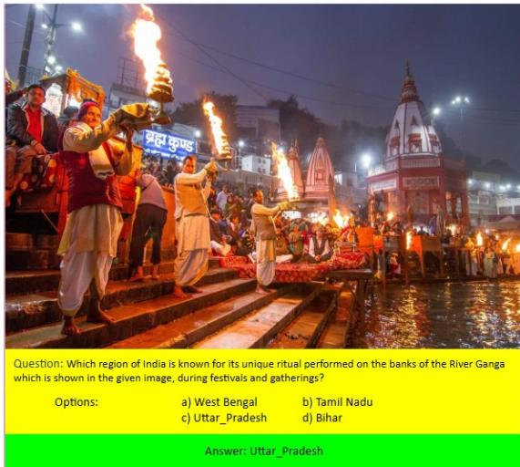  
Figure 7: Example of a visual MCQ associated with the River Ganga Aarti in Uttar Pradesh.

• Cultural authenticity: Questions were crafted to reflect regionally grounded knowledge and practices, avoiding stereotypes or generic generalizations.

• Clarity and neutrality: Question stems and options were phrased in clear, neutral language, avoiding suggestive cues or complex phrasing that could bias responses.

## A.2.2 Validation Process

We employed a two-pass validation process:

1. Pass 1 – Peer Review: Each question was independently reviewed by another annotator for factual accuracy, linguistic clarity, and option plausibility. Any ambiguities or factual discrepancies were flagged and corrected.

2. Pass 2 – Expert Adjudication: A cultural expert with domain knowledge performed a final adjudication step to resolve edge cases and confirm correctness.

## A.2.3 Agreement and Quality Control

To assess consistency, we calculated inter-annotator agreement (IAA) on a random 20% sample of the MCQs using Cohen’s κ. We observed substantial agreement (κ = 0.82) between initial annotators and peer reviewers. Disagreements primarily arose from regional overlaps (e.g., shared traditions across bordering states), which were resolved through discussion or expert input.

## A.2.4 Visuals Check

For visual context, annotators referenced image metadata and cross-verified content against at least two textual sources. Visuals were validated with the same two-pass process and were checked to ensure the image did not overtly reveal the answer through text overlays or location tags.

This meticulous pipeline ensured that the benchmark questions are reliable, culturally inclusive, and suitable for robust multimodal evaluation.

## A.3 Cultural Taxonomy and Attribute Definitions

To support structured cultural benchmarking in the DRISHTIKON dataset, each question-image pair was tagged with a cultural attribute. The attributes were drawn from a dynamic taxonomy that reflects the breadth and complexity of India’s socio-cultural heritage. Below are the attribute categories and their working definitions:

• Art: Visual and decorative arts including painting, sculpture, traditional crafts, and region-specific artistic practices.

• Costume: Traditional attire, region-specific garments, and symbolic clothing worn during rituals, festivals, or daily life.

• Cuisine: Food items, cooking practices, regional dishes, and culinary customs that characterize Indian states or communities.

• Cultural Common Sense: Widely known cultural facts, idioms, practices, or behaviors that are intuitive to locals but may not be explicitly taught.

• Dance and Music: Classical, folk, and contemporary forms of dance and music tied to regional or religious traditions.

• Festivals: Celebrations, fairs, and religious or seasonal festivals observed across different Indian regions and communities.

• History: Historical figures, events, timelines, or periods that shaped India’s regional and national identity.

• Language: Native languages, dialects, scripts, and linguistic practices across different states and territories.

• Medicine: Traditional healing systems such as Ayurveda, Siddha, Unani, and folk medical practices and their cultural relevance.

• Nightlife: Cultural expressions of nightlife including entertainment, food, rituals, and urban evening practices specific to regions.

• Personalities: Notable figures in culture, politics, arts, science, or social reform with significant cultural influence.

• Religion: Religious symbols, rituals, deities, and practices across India’s major and minor religious communities.

• Rituals and Ceremonies: Practices associated with worship, rites of passage, or daily cultural-religious observances.

• Sports: Traditional and modern sports, indigenous games, and regionally popular athletic events or personalities.

• Tourism: Destinations, experiences, or features that are central to domestic or international tourism in India.

• Transport: Culturally symbolic or regionspecific modes of transport including boats, bullock carts, local trains, and more.

## A.3.1 Attribute Tagging Methodology

To support a culturally-aware evaluation of models, each multiple-choice question (MCQ) in our dataset was manually tagged with a single cultural attribute by trained annotators. The attributes span categories such as Festivals, Rituals\_and\_Traditions, Attire, Art\_Forms, Language, Cuisine, Geography, and Historical\_Heritage, among others.

Figure 7 illustrates an example where a seemingly ambiguous question could potentially fall under multiple cultural categories. The image-based MCQ features the Ganga Aarti performed on the banks of the River Ganga in Varanasi. While one might consider tagging it under Festivals due to its grand and ceremonial appearance, our annotation guidelines emphasized tagging based on the most representative and contextually consistent interpretation.

In this case, the question was tagged under Rituals\_and\_Traditions because the Ganga Aarti is not confined to a specific festival—it is a daily ritual deeply embedded in local tradition and spiritual practice. Such nuanced decisions were made through annotator deliberation and crossverification to ensure clarity and precision in tag assignment.

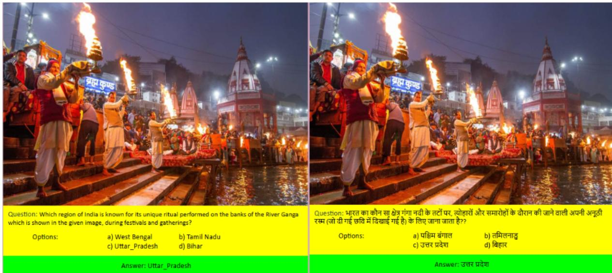  
Figure 8: Example of MCQ translated from English to Hindi.

Ambiguities—such as overlap between festive and ritualistic cues—were discussed and adjudicated collectively. Only one attribute was assigned per MCQ to facilitate clean categorization and dataset slicing for downstream evaluation tasks.

This tagging strategy ensures that even culturally complex instances are consistently annotated, allowing researchers to probe model performance across diverse yet unambiguous cultural dimensions.

## A.4 Sampling and Reasoning-based Augmentation

To ensure balanced evaluation across geographic regions, we introduced a reasoning-based augmentation phase using a stratified subset of 720 MCQs (20 per region from 36 Indian states and union territories). This uniform count was guided by the region with the lowest question availability, thereby avoiding data imbalance during augmentation.

## A.4.1 Stratified Sampling from Richer Regions

For regions that originally had more than 20 MCQs, we employed a stratified sampling approach grounded in attribute coverage. Each MCQ in our dataset was previously tagged with one of several cultural attributes. When selecting the subset of 20 questions for such regions, we ensured that this attribute distribution remained approximately proportional to that in the full regional set.

For instance, if the state of West Bengal had 60 MCQs—20 focused on Festivals, 15 on Cuisine, 10 on Attire, and 15 on Historical\_Heritage—then the selected 20- question subset maintained this diversity using proportional sampling:

• 7 questions from Festivals

• 5 from Cuisine

• 3 from Attire

• 5 from Historical\_Heritage

In cases where exact proportionality was not feasible due to rounding or attribute sparsity, we prioritized inclusion of underrepresented cultural aspects to ensure thematic balance. This approach not only preserved intra-regional diversity but also prevented dominance of popular attributes (e.g., Festivals) in regions with rich cultural repositories.

## A.4.2 Why Stratified Sampling?

Simple random sampling could have led to subsets skewed toward the most frequent attribute in that region (e.g., Festivals), thereby reducing cultural variety. Our stratified method guaranteed that rare but significant cultural dimensions (like Performing\_Arts or Attire) were also retained in the reasoning-based augmented set.

This strategic curation enhances the fairness and comprehensiveness of model evaluations, enabling consistent benchmarking of cultural understanding across both high-resource and low-resource regions.

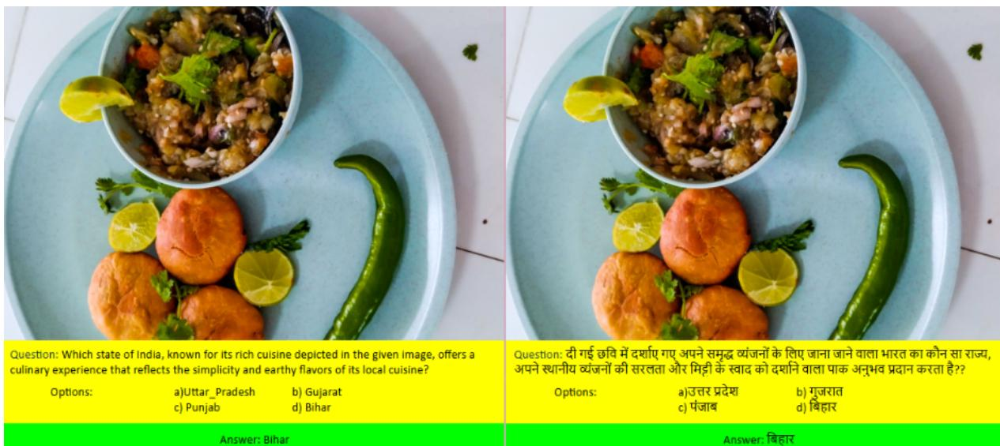  
Figure 9: Another example of MCQ translated from English to Hindi.

## A.4.3 Validation

Subset composition was validated post hoc through a comparison of attribute distributions before and after sampling. Pearson’s chi-squared tests showed no statistically significant loss in attribute variety (p > 0.1), affirming that the sampling retained cultural diversity within a manageable subset size.

## A.5 Translation Quality and Human Verification Protocol

To evaluate the quality of translations across culturally rich and semantically nuanced questions, we present two illustrative examples comparing the English source to their Hindi translations. Figure 8 and 9 showcase translated samples—one referencing a ritual (Ganga Aarti) and the other a regional dish (Litti Chokha)—used to assess our multilingual pipeline.

We utilized the Gemini Pro (Google DeepMind, 2025) language model for translation, motivated by its strong multilingual semantic fidelity and contextual grounding, as demonstrated on FLORES-200 and XTREME-UP benchmarks (Costa-Jussà et al., 2022; Goyal et al., 2021; Guzmán et al., 2019). Its ability to handle idiomatic and domain-specific expressions made it suitable for our linguistically and culturally diverse dataset.

Human Verification Protocol. To mitigate risks of hallucination or mistranslation(Sahoo et al.,

2024b), a two-stage human verification pipeline was adopted:

• Stage 1: Bilingual reviewers verified semantic consistency, fluency, and adherence to the original question’s intent on stratified samples.

• Stage 2: A separate round of quality control ensured inter-annotator agreement and cultural appropriateness.

## Evaluation of Translations. In both examples:

• Semantic fidelity is preserved. For instance, in the first example (Figure 8), the phrase “ritual performed on the banks of the River Ganga” is translated into Hindi with appropriate syntactic structure and vocabulary, keeping the reverent tone intact.

• Cultural relevance is maintained. In the second example (Figure 9), describing the cuisine of Bihar, the translation preserves key descriptors to retain the earthy connotation associated with “simplicity and earthy flavours.”

## Challenges and Resolutions.

• Syntactic divergence: Hindi sentence structures often require reordering of clauses. For instance, direct translations can result in unnatural phrasing. We prompted Gemini Pro to produce natural, idiomatic Hindi and postedited awkward constructs.

Table 1: Number of Annotators per Language/State and Average Pay
<table><tr><td>Language / State</td><td>No. of Annotators</td><td>Avg. Pay per Hour (USD)</td></tr><tr><td>Hindi (Uttar Pradesh, Bihar)</td><td>10</td><td>3.00</td></tr><tr><td>Bengali (West Bengal)</td><td>6</td><td>2.88</td></tr><tr><td>Tamil (Tamil Nadu)</td><td>5</td><td>3.12</td></tr><tr><td>Telugu (Andhra Pradesh, Telangana)</td><td>8</td><td>3.00</td></tr><tr><td>Kannada (Karnataka)</td><td>4</td><td>2.88</td></tr><tr><td>Malayalam (Kerala)</td><td>3</td><td>3.00</td></tr><tr><td>Marathi (Maharashtra)</td><td>6</td><td>2.94</td></tr><tr><td>Gujarati (Gujarat)</td><td>4</td><td>2.88</td></tr><tr><td>Punjabi (Punjab)</td><td>3</td><td>2.82</td></tr><tr><td>Assamese (Assam)</td><td>3</td><td>2.76</td></tr><tr><td>Odia (Odisha)</td><td>3</td><td>2.76</td></tr><tr><td>Urdu (Delhi, Jammu &amp; Kashmir)</td><td>4</td><td>3.00</td></tr><tr><td>Others (e.g., Sikkim, Ladakh)</td><td>2</td><td>2.64</td></tr></table>

• Cultural terminology: Some terms (e.g., “Aarti” or “Litti Chokha”) lack equivalents. We opted for transliteration or descriptive phrases when appropriate, preserving cultural identity while ensuring comprehension.

• Lexical alignment: Ambiguities in English adjectives like “rich” or “earthy” were contextually resolved using local equivalents in Hindi, guided by cultural connotation rather than direct word-to-word substitution.

Overall, this semi-automated translation + verification workflow allowed us to scale high-quality multilingual data curation while maintaining semantic, syntactic, and cultural integrity.

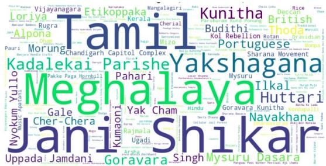  
Figure 10: Culturally-Specific Vocabulary in DR-ISHTIKON

## A.6 Annotator Details by Language/State

We employed human annotators from diverse Indian states and linguistic backgrounds to ensure cultural sensitivity, regional nuance, and languagespecific accuracy in the annotation process (shown in Table 1). The selection aimed to balance representation across both high-resource and lowresource languages. Annotators were recruited based on their fluency in the respective regional languages and their educational qualifications (minimum: bachelor’s degree). Prior to the task, all annotators underwent training sessions to familiarize themselves with the guidelines and quality expectations. Compensation was provided on an hourly basis, reflecting fair labour standards and encouraging consistent performance. The table below summarizes the number of annotators per language or state, along with the average hourly pay (in USD).

## A.7 Further Dataset Statistics

To offer deeper insight into the structure and cultural span of the DRISHTIKON dataset, we provide extended statistical breakdowns through visualizations and metadata summaries.

## A.7.1 Word Cloud Analyses

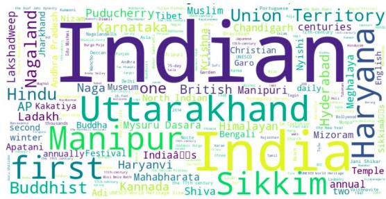  
Figure 11: Full Vocabulary Distribution Across All Questions

We visualize the most salient terms for English component of our dataset using two complementary word clouds:

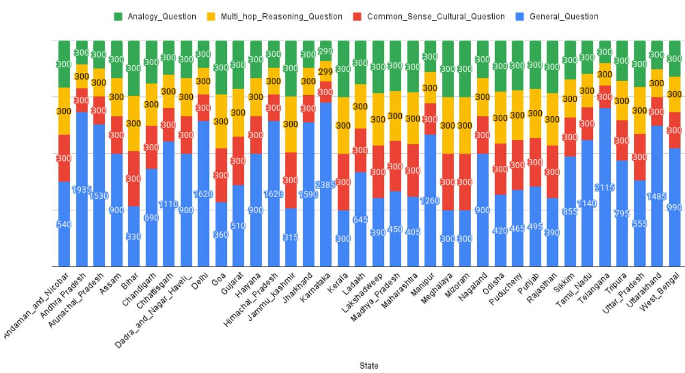  
Figure 12: State-wise distribution of question types across Indian regions.

• Culturally-Specific Elements: This word cloud (Figure 10) captures culturally grounded concepts, traditions, festivals, and regionally rooted lexicon sourced from our question stems and options. Prominent terms like Jani Shikar, Yakshagana, Meghalaya, Tamil, and Mysuru Dasara suggest that the dataset richly represents diverse socio-cultural phenomena.

• Full Question Corpus Vocabulary: A second word cloud (Figure 11) is generated over the complete corpus of questions. It reflects broader linguistic themes and signals topical diversity. Frequent mentions of India, first, Haryana, Manipur, and Union Territory indicate a strong presence of both general knowledge and region-specific focus.

## A.7.2 State-wise Question Distribution.

Figure 12 illustrates the distribution of questions across all 36 Indian states and union territories, categorized into four types: General Questions, Common Sense Cultural Questions, Multi-hop Reasoning Questions, and Analogy Questions. While every region was balanced with 300 questions per category for the latter three types, the number of General Questions varied significantly across regions, reflecting data availability and populationspecific cultural variance. This visualization underscores the heterogeneity in question volume, motivating our uniform 20-question sampling strategy for reasoning-based augmentation.

## A.8 Model Hyperparameter Settings

The detailed hyperparameter settings used in our experiments are summarized in Table 2 for reference.

## A.9 Error Analysis

While GPT-4o-mini demonstrated consistently strong performance across multilingual QA tasks, it occasionally produced incorrect answers. To gain deeper insights into these instances, we conducted a manual analysis of selected failure cases, a few of which are illustrated below.

Each example comprises the original English question, its associated image, and the model’s incorrect prediction. These cases shed light on nuanced challenges that persist even for advanced language models.

Our analysis suggests that the observed errors stemmed from:

• Fine-grained semantic confusion — particularly when distractor options were semantically close to the correct answer.

<table><tr><td>Model</td><td>Size (Params)</td><td>Vision Encoder</td><td>Image Res.</td><td>Max Tokens</td></tr><tr><td>SmolVLM-256M-Instruct</td><td>256M</td><td>ViT-B/16</td><td> $2 2 4 \times 2 2 4$ </td><td>1024</td></tr><tr><td>InternVL3-1B</td><td>1B</td><td>InternImage-L</td><td> $4 4 8 \times 4 4 8$ </td><td>2048</td></tr><tr><td>Janus-Pro-7B</td><td>7B</td><td>CLIP-style</td><td> $3 3 6 \times 3 3 6$ </td><td>4096</td></tr><tr><td>Qwen2-VL-7B-Instruct</td><td>7B</td><td>ViT-G</td><td>448 × 448</td><td>8192</td></tr><tr><td>LLaVA-1.6-Mistral-7B</td><td>7B</td><td>CLIP-L/14</td><td>336 × 336</td><td>4096</td></tr><tr><td>InternVL3-14B</td><td>14B</td><td>InternImage-H</td><td>448 × 448</td><td>4096</td></tr><tr><td>Llama-4-Scout-17B</td><td>17B</td><td>CLIP-style</td><td>336 × 336</td><td>8192</td></tr><tr><td>Gemma-3-27B-IT</td><td>27B</td><td>Unknown</td><td>224 × 224</td><td>8192</td></tr><tr><td>Qwen2.5-Omni-7B</td><td>7B</td><td>ViT-style</td><td>448 × 448</td><td>8192</td></tr><tr><td>Kimi-VL-A3B-Thinking</td><td>3B</td><td>ViT (proprietary)</td><td> $3 3 6 \times 3 3 6$ </td><td>8192</td></tr><tr><td>GPT-40</td><td></td><td>Proprietary</td><td> $5 1 2 \times 5 1 2$ </td><td>128k (context)</td></tr><tr><td>Chitrarth</td><td></td><td>Unknown</td><td> $2 2 4 \times 2 2 4$ </td><td>Unknown</td></tr><tr><td>Maya</td><td>7B</td><td>CLIP-L/14</td><td> $2 2 4 \times 2 2 4$ </td><td>4096</td></tr></table>

Table 2: Summary of hyperparameters for evaluated vision-language models. Where official details are unavailable, publicly documented defaults or best estimates are provided.

• Over-reliance on lexical cues rather than a comprehensive understanding of the context, especially in culturally nuanced questions.

• Gaps in visual grounding where accurate interpretation required deeper regional or cultural knowledge.

The examples discussed below are accompanied by interpretive commentary, highlighting opportunities to further enhance the multimodal and multilingual reasoning capabilities of such models.

## A.9.1 Error Case 1: Historical Leader Identification

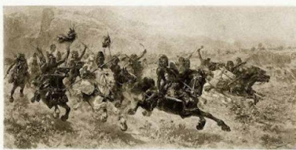  
Figure 13: Depiction of a tribal uprising on horseback

Question: Who was the prominent leader of the depicted Rebellion? (Associated image: Figure 13) Options:

1. Budhu Bhagat

2. Tilka Manjhi

3. Sidho and Kanho Murmu

4. Birsa Munda

Model Output: Option 3 = Sidho and Kanho Murmu

## Correct Answer: Budhu Bhagat

Error Intuition: The model likely associated the visual of tribal warriors on horseback with the more widely recognized Santhal Rebellion led by Sidho and Kanho Murmu, rather than the Kol Rebellion led by Budhu Bhagat. Given that both rebellions share thematic similarities—tribal resistance, traditional attire, and armed revolt—the model appears to have relied on surface-level visual patterns and the popularity of certain leaders, rather than grounding the answer in historical specificity or regional cues.

A.9.2 Error Case 2: Misclassification of Cultural Dance Form  
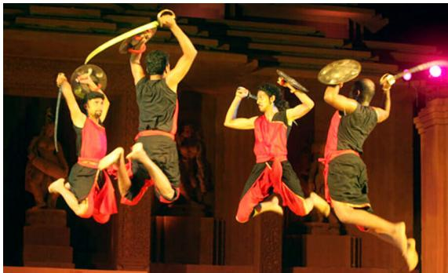  
Figure 14: Depiction of a traditional martial dance performance

Question: The depicted dance, a unique art form blending martial arts with rhythmic movements and performed exclusively by men, originates from which Indian state? (Associated image: Figure 14) Options:

1. Chhattisgarh

2. Jharkhand

3. West Bengal

4. Odisha

Model Output: Option 4 = Odisha

Correct Answer: Jharkhand

Error Intuition: The model incorrectly predicted Odisha, possibly confusing the dance with the similarly martial-themed “Paika” dance of Odisha, which also involves weapons and is visually comparable. The correct answer, however, is the “Paika Akhara" of Jharkhand. This confusion likely stems from visual and thematic overlap between regional martial dances, and the model’s bias toward more widely documented or referenced traditions in training data.

## A.9.3 Error Case 3: Misidentification of Tribal Art Form

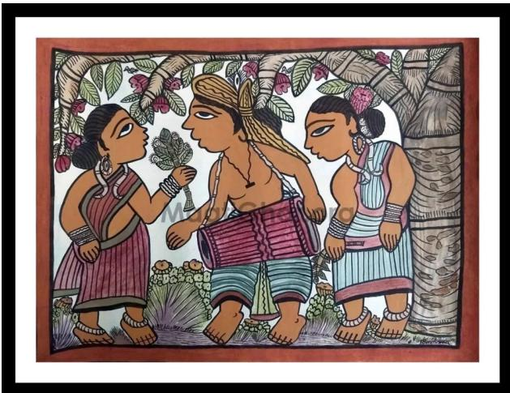  
Figure 15: Paitkar painting – a traditional scroll painting style

Question: The paintings depicted in the image, one of the oldest tribal art forms in India, originated in which state? (Associated image: Figure 15) Options:

1. Jharkhand

2. Tamil Nadu

3. Punjab

4. Gujarat

Model Output: Option 4 = Gujarat Correct Answer: Jharkhand

Error Intuition: The model incorrectly identified the origin as Gujarat, possibly confusing the Paitkar painting style with more globally recognized folk arts like Warli or Pithora. The correct answer is Jharkhand, where the Paitkar art form—believed to be one of India’s earliest scroll painting traditions—emerged. The misclassification likely stems from the model’s underexposure to tribal art forms from eastern India in its pretraining data.

## A.9.4 Error Case 4: Misclassification of Cultural Landmark Location

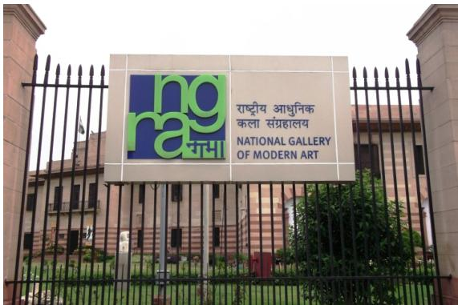  
Figure 16: Signboard of the National Gallery of Modern Art

Question: The depicted Gallery is located in which city? (Associated image: Figure 16) Options:

1. Pune

2. Mumbai

3. Delhi

4. Hyderabad

## Model Output: Option 2 = Mumbai

## Correct Answer: Delhi

Error Intuition: Despite the clear signage in both English and Hindi indicating the National Gallery of Modern Art (NGMA), the model incorrectly associated it with Mumbai. This confusion likely stems from the presence of NGMA branches in Mumbai and Bengaluru; however, the headquarters and the most iconic building is in New Delhi. The model failed to distinguish the specific architecture and setting unique to the Delhi branch.

## A.10 COT prompt

Our prompt leverages a culturally grounded chainof-thought reasoning framework inspired by classical Indian epistemology. It guides the model to analyze images and questions through four distinct dimensions—visual insight, cultural memory, logical integration, and regional contextualization—to arrive at accurate, culturally informed answers. The design encourages nuanced reasoning while ensuring concise output by restricting the response to the final correct option only.

## A.11 Frequently Asked Questions (FAQs)

• Q1. What is the main goal of our study? The primary goal is to evaluate the cultural reasoning capabilities of language models (LMs) through multimodal prompts that incorporate images of cultural artifacts and require contextual, symbolic, or multi-hop reasoning.

• Q2. Why is culture-specific question generation important? Generic QA benchmarks often overlook culturally grounded reasoning. Our prompts introduce challenges that simulate real-world, heritage-driven understanding—crucial for building globally inclusive AI systems.

• Q3. What role does the image play in our prompts? Images act as anchors for cultural artifacts or symbols. Prompts explicitly refer to these visuals (“as referenced in the image”) to encourage multimodal grounding in the model’s response.

• Q4. How does our Cultural Chain-of-Thought prompt differ from standard CoT? Our prompt is inspired by classical Indian epistemological constructs—Drishti (perception), Smriti (memory), Yukti (reason), and Sthiti (contextualization)—to guide LLMs in culturally coherent decision-making.

• Q5. Why use separate prompts for commonsense, multi-hop, and analogy? Each prompt targets a different cognitive skill—commonsense cultural reasoning, multi-step inference, and symbolic analogy—to provide a diverse and diagnostic evaluation of model understanding.

• Q6. Where can one find the actual prompts and examples? All prompt templates, justifications, and example outputs are included in the Appendix.

• Q7. How do we ensure fair comparison across models? All models were provided the same image-question pairings and prompts.

## A.12 Prompt Designs for Different Question Types

In this section, we provide the prompt templates used to generate three different question types across our multilingual multimodal setup. Each prompt was carefully crafted to probe different cognitive dimensions—commonsense cultural grounding, multi-hop logical chaining, and analogical reasoning. Below, we describe each prompt, its justification, and include illustrative examples to clarify their operationalization.

## Prompt 4: Cultural Chain-of-Thought Reasoning (Drishti–Smriti–Yukti–Sthiti)

<table><tr><td>Role: You are an expert analyst deeply knowledgeable in Indian culture, traditions, and regional heritage. Carefully analyze the provided image and question. Reason methodically through each of the following culturally informed dimensions to identify the correct answer. Please output only the correct option/answer from the given options without any additional information or reasoning steps. Dimension A – Drishti (Visual Insight): Carefully examine the image, identifying culturally signifi- cant visual elements such as attire, architecture, rituals, landscapes, or symbols. Dimension B – Smriti (Cultural Memory): Recall relevant historical details, traditional knowledge, inconsistent.</td></tr><tr><td>or well-known cultural practices from India related to this question. Dimension C – Yukti (Logical Integration): Logically integrate your observations from Drishti and knowledge from Smriti. Use this integration to rule out options that are culturally or logically</td></tr><tr><td>Dimension D – Sthiti (Regional Contextualization): Consider regional and cultural contexts within India. Determine which of the provided options best aligns with the cultural and regional insights you&#x27;ve gained.</td></tr><tr><td>Justification: This prompt introduces a culturally grounded chain-of-thought reasoning process, drawing from classical Indian epistemology. By structuring the reasoning into Drishti (seeing), Smriti (remembering), Yukti (reasoning), and Sthiti (situating), it elicits explainable and culturally nuanced inference. The final constraint—returning only the correct option—ensures concise evaluation of the</td></tr></table>

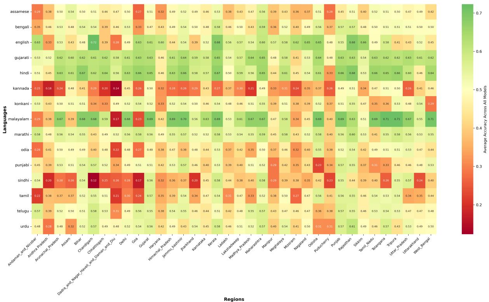  
Figure 17: State-wise and Union-territories-wise accuracy across languages, reflecting the overall multilingual performance of all the models across states and languages.

## Prompt 1: Cultural Commonsense Question

Role: You are a cultural expert. Given a simple factual question, generate a reasoning-based version that requires cultural commonsense to answer. Avoid directly naming the answer. Include contextual or narrative clues instead. It is necessary to add a reference to the image of the cultural artifact like “as referenced in the image”.

Justification: This prompt evaluates the model’s ability to engage with culturally grounded knowledge that is not explicitly stated, testing its implicit reasoning capabilities and contextual understanding of visual cues tied to heritage or tradition.

## Example

General Question: Known for its crescent-shaped edge and association with Bengali kitchen traditions, what is the tool depicted in the image used primarily for cutting vegetables? (as referenced in the image)

Answer: Boti

## Prompt 2: Multi-hop Reasoning Question

Role: Transform the following factual question into a multi-hop reasoning question. The answer should require at least two connected facts to arrive at the final response. Add cultural or historical information to guide reasoning. It is necessary to add a reference to the image of the cultural artifact like “as referenced in the image”. DO NOT include any prefixes or labels like ‘Transformed question:’. Return ONLY the rewritten question without any additional text.

Justification: This prompt probes the model’s ability to connect multiple pieces of factual or cultural knowledge across modalities, requiring inferential chaining rather than direct look-up or recall.

## Example

General Question: Associated with the community that celebrates Gudi Padwa and commonly seen hanging outside homes during festivals, which object made of cloth, neem leaves, and a copper vessel is shown in the image? (as referenced in the image)

Answer: Gudi

## Prompt 3: Analogy-Based Cultural Question

Role: Create a reasoning-based cultural question using analogy. The answer that is given below should be inferred by relating cultural equivalents or symbols. It is necessary to add a reference to the image of the cultural artifact like “as referenced in the image”. DO NOT include any prefixes or labels like ‘Question:’. Return ONLY the rewritten question without any additional text.

Justification: This prompt targets abstract reasoning by requiring the model to draw symbolic or functional parallels between cultural entities—useful for assessing deeper conceptual understanding and metaphorical thinking.

## Example

General Question: Just as the red double-decker bus is iconic to London, which traditionally painted wooden vehicle, often seen in temple processions in Tamil Nadu, serves a similar symbolic role in South Indian culture? (as referenced in the image)

Answer: Temple chariot (Ratha)