# DatawiseAgent: A Notebook-Centric LLM Agent Framework for Adaptive and Robust Data Science Automation

Ziming You1, Yumiao Zhang2, Dexuan Xu3, Yiwei Lou3,

Yandong Yan3, Wei Wang4, Huamin Zhang5, Yu Huang1 \*

1 National Engineering Research Center for Software Engineering, Peking University

2 School of Software & Microelectronics, Peking University

3 School of Computer Science, Peking University

4 Xi’an Jiaotong University

5 Institute of Basic Theory of Chinese Medicine, China Academy of Chinese Medical Sciences zimingyou@stu.pku.edu.cn,hy@pku.edu.cn

## Abstract

Existing large language model (LLM) agents for automating data science show promise, but they remain constrained by narrow task scopes, limited generalization across tasks and models, and over-reliance on state-of-the-art (SOTA) LLMs. We introduce DatawiseAgent 1, a notebook-centric LLM agent framework for adaptive and robust data science automation. Inspired by how human data scientists work in computational notebooks, DatawiseAgent introduces a unified interaction representation and a multi-stage architecture based on finitestate transducers (FSTs). This design enables flexible long-horizon planning, progressive solution development, and robust recovery from execution failures. Extensive experiments across diverse data science scenarios and models show that DatawiseAgent consistently achieves SOTA performance by surpassing strong baselines such as AutoGen and TaskWeaver, demonstrating superior effectiveness and adaptability. Further evaluations reveal graceful performance degradation under weaker or smaller models, underscoring the robustness and scalability.

## 1 Introduction

Data science, the practice of extracting knowledge and insights from data, spans a broad spectrum of processes from data gathering and interpretation to model building and decision making (Donoho, 2017; Zhang et al., 2024b). As demand for datadriven decision-making continues to grow, automating data science has become a longstanding and critical challenge. Although traditional efforts such as AutoML (He et al., 2021; Jin et al., 2023) have achieved success in well-defined stages such as model selection and hyperparameter tuning, broader tasks remain difficult to formalize or mechanize due to their inherently exploratory, interdependent, and context-independent nature (Bie et al., 2022).

Recent advances in Large Language Models (LLMs) and LLM-based agents (Xue et al., 2023; Cheng et al., 2023; Dibia, 2023; Hollmann et al., 2024; Zhang et al., 2023a) have opened new possibilities for automating data science. LLMs demonstrate strong zero/few-shot generalization, in-context reasoning, code generation, and tool use capabilities, enabling a new line of research on data science agents (Zhang et al., 2024b), which are autonomous systems that perform data science tasks through natural language interaction.

However, current data science agents face three key limitations: (1) Focus on Isolated Phases. Many existing agents target specific stages of the data science pipeline, such as feature engineering (Hollmann et al., 2024), model selection (Shen et al., 2024), or hyperparameter tuning (Zhang et al., 2023a) while overlooking the interdependent nature of real-world workflows. As a result, they fall short of supporting comprehensive endto-end automation. (2) Limited Task and Model Adaptability. Agents designed for broader workflows often struggle to generalize across diverse task types or model configurations (Qiao et al., 2023; Hong et al., 2024; Hu et al., 2024b). While general-purpose frameworks such as ReAct (Yao et al., 2023; Wang et al., 2024) and AutoGen (Wu et al., 2023) offer cross-domain applicability, they tend to exhibit suboptimal performance in specialized scenarios such as exploratory analysis or predictive modeling, particularly under constrained model capacities. (3) Over-Reliance on SOTA LLMs in Agent Design. The majority of current data science agents are designed under the assumption of access to SOTA LLMs (Hong et al., 2024; Qiao et al., 2023), such as GPT-4o. These systems often lack scalability and robustness when deployed with smaller or open-source models, limiting their applicability in resource-constrained or privacy-sensitive settings.

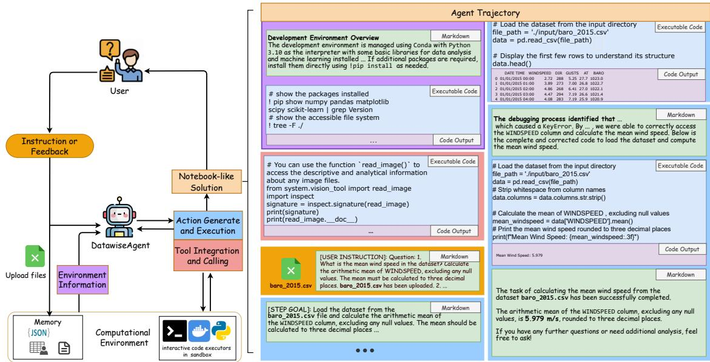  
Figure 1: DatawiseAgent performs diverse data science tasks across various models by operating entirely within a computational notebook. The unified interaction representation expresses all agent–user–environment communication. Tool integration involves importing external APIs or libraries via code cells, with tool descriptions provided in markdown; environment information, such as system details or resource status, is either proactively injected as markdown at initialization or obtained through code execution during task progress.

To address these limitations, we draw inspiration from the exploratory, progressive, iterative workflows that human data scientists follow in computational notebooks (Head et al., 2019). As the de facto interface for data science, notebooks integrate natural language, code, and real-time feedback (Rule et al., 2018; Chattopadhyay et al., 2020; Wang et al., 2022, 2021). We posit that this paradigm provides a natural foundation for building adaptive and robust data science agents.

To this end, we propose DatawiseAgent, a notebook-centric LLM agent framework designed for adaptive and robust data science automation (see Figure 1). DatawiseAgent combines two key components: (1) a unified interaction representation that expresses all agent–user–environment communication as interleaved markdown and code cells within computational notebooks; and (2) a finite-state transducer (FST)-based multi-stage architecture that governs agent behavior across four functional stages, including DFS-like planning, incremental execution, self-debugging, and postfiltering. This design enables flexible long-horizon planning, progressive solution development, and robust recovery from execution failures, making DatawiseAgent suitable for deployment with LLMs of varying capacities and capabilities.

We evaluate DatawiseAgent on three representative data science scenarios, namely data analysis, scientific visualization, and predictive modeling, across both proprietary (GPT-4o, GPT-4o mini) and open-source (Qwen2.5 at multiple scales) LLMs. Experimental results show that DatawiseAgent consistently achieves SOTA performance under comparable evaluation conditions, surpassing strong baselines such as ReAct (Yao et al., 2023; Hu et al., 2024b), MatplotAgent (Yang et al., 2024b), AutoGen (Wu et al., 2023), and Taskweaver (Qiao et al., 2023). Notably, on the challenging DS-Bench data modeling benchmark, DatawiseAgent achieves over 90% task success and more than 40 Relative Performance Gap (RPG) across all LLMs, including surpassing prior SOTA results even when using GPT-4o mini. Further evaluation shows that DatawiseAgent maintains strong performance on weaker LLMs and widens the performance gap with baseline methods, highlighting its robustness and scalability. In summary, these results demonstrate that DatawiseAgent provides a practical and scalable foundation for robust, end-to-end data science automation across diverse tasks and LLM configurations.

## 2 Related Work

LLMs for Code Generation. Large Language Models (LLMs) have achieved strong performance across a range of code-related tasks (Jiang et al.,

2024), including completion (Li et al., 2023; Roziere et al., 2023), translation (Chen et al., 2021), and repair (Anthropic, 2024; Achiam et al., 2023). However, generating correct code in a single attempt remains challenging, particularly for complex or interactive tasks (Chen et al., 2024). Recent studies show that external feedback and iterative refinement can significantly improve code generation (Zhou et al., 2024; Zhong et al., 2024; Madaan et al., 2024; Shinn et al., 2024). Building on these findings, we focus on data science tasks and investigate how to leverage diverse LLMs’ limited reasoning and coding capabilities, along with feedback, to enable adaptive end-to-end automation.

LLM-based Data Science Agents. LLM-based agents have shown promise in automating various stages of the data science pipeline, such as feature engineering (Hollmann et al., 2024), model selection (Shen et al., 2024), and hyperparameter tuning (Zhang et al., 2023a). To support broader workflows, a range of frameworks have been proposed for machine learning pipelines (Guo et al., 2024; Jiang et al., 2025; Zhang et al., 2023b; Li et al., 2024; Trirat et al., 2024; Zhang et al., 2024a), data analysis (Qiao et al., 2023; OpenAI, 2023), and visualization (Yang et al., 2024b). While effective within specific scopes, many agents lack adaptability across tasks and models. In particular, most ML-focused agents (Guo et al., 2024; Jiang et al., 2025) adopt single-turn paradigms, limiting support for multi-turn interaction and human involvement. Furthermore, recent end-to-end systems (Hong et al., 2024) often rely on powerful proprietary LLMs, such as GPT-4o, limiting deployment with smaller or open-source models. In contrast, our agent framework supports robust, adaptive automation across diverse data science tasks and LLMs.

## 3 DatawiseAgent

We present DatawiseAgent, a novel notebookcentric LLM agent framework for effective, adaptive, and robust data science automation. Inspired by how human data scientists work, through exploratory, progressive, and iterative strategies within computational notebooks, DatawiseAgent comprises two key components: (1) unified interaction representation that captures all agent–user–environment communication via interleaved markdown and code cells; (2) finite-state transducer (FST)-based multi-stage architecture that governs agent behavior via transitions across four core stages. This architecture supports flexible planning, progressive solution development, and robust recovery from execution failures, making DatawiseAgent well-suited for models with varying reasoning and coding capabilities.

## 3.1 Unified Interaction Representation

Computational notebooks are central to data science practice, seamlessly integrating natural language, code, and execution feedback. Inspired by this paradigm, DatawiseAgent operates entirely within a notebook environment, enabling agents to reason, act, and revise solutions in a format familiar to practitioners. To support this design, we define a unified interaction representation (see Figure 1) in which all agent–user–environment communication, including task instructions, environment information, tool integration and calling, and observations, is expressed as a sequence of markdown and executable code cells. Agents incrementally construct solutions by generating and updating cells over multiple rounds, producing an interpretable execution trace that supports user feedback and follow-up interaction.

Unlike prior systems that adopt stage-specific task formats (e.g., JSON-based graph planning or mixed-format tool calls) (Qiao et al., 2023; Hong et al., 2024; Zhang et al., 2023c), DatawiseAgent maintains a structurally unified interaction mode, where context and actions are represented as cell sequences. We posit that this cell-level consistency reduces cognitive load and enhances in-context reasoning, particularly for models with constrained capabilities, while also enabling transparent oversight and unified multi-turn interaction.

## 3.2 FST-Based Multi-Stage Architecture

To govern the agent’s behavior in a structured, modular, and extensible manner, DatawiseAgent adopts a finite-state transducer (FST)-based multi-stage architecture. Rather than defining a rigid workflow or static pipeline, DatawiseAgent organizes the problem-solving process into four core stages, including DFS-like planning, incremental execution, self-debugging, and post-filtering (detailed in Section 3.3), and employs a finite-state transducer (Hopcroft et al., 2001; Carroll and Long, 1989) to orchestrate autonomous transitions among them. Notably, this design facilitates modular extension with new stages and supports fine-grained ablation of individual components.

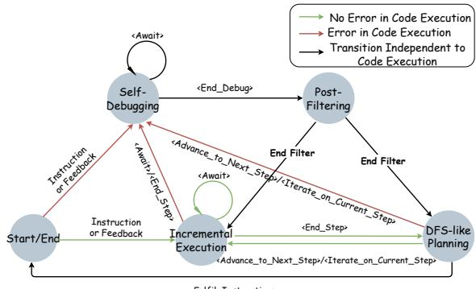  
Figure 2: State transition diagram of the FSTbased multi-stage architecture, modeled as a nondeterministic finite-state transducer (NFST). Transitions are driven by user instructions or feedback, agentgenerated action signals, and execution feedback from the environment. At each state, the agent generates and executes actions based on the current context before proceeding to the next state.

We conceptualize the agent as a nondeterministic finite-state transducer (NFST), where the state space Q = {qplan, qinc, qdebug, qfilter, q0} corresponds to the four functional stages and a special start/end state. The idle state q0 denotes either task completion or readiness for new instructions. State transitions are driven by internally generated action signals and external inputs, including user instructions and environment feedback (i.e., execution success or failure). At each state, DatawiseAgent produces two outputs: an action, uniformly represented as markdown and executable code cells, and an action signal indicating the intended next state. The action is executed in the notebook environment, yielding external feedback. The agent determines its next state via the transition function $\delta ( q , \sigma , f )$ , which takes as input the current state q, the generated action signal σ, and the feedback f from the environment or user.

The runtime logic of the FST-based architecture is formalized in Algorithm 1. The agent starts in an idle state and, upon receiving a user instruction, autonomously transitions across functional stages, generating and executing actions, processing feedback, and updating context, until the task is completed. It then returns to the idle state, awaiting further user instructions or feedback. The state transition process is visualized in Figure 2 using an NFST formulation for clarity. The corresponding deterministic FST, stage-wise action signal spaces, and implementation details are provided in Section C.

## 3.3 Detailed Explanation of Each Stage

To operationalize FST-based multi-stage architecture, DatawiseAgent organizes the agent’s behavior into four functional stages: DFS-like planning, incremental execution, self-debugging, and postfiltering. These stages are inspired by how data scientists work in notebooks, collectively supporting flexible planning, progressive solution development, and robust recovery from execution failures.

DFS-like Planning and Incremental Execution. DatawiseAgent introduces two tightly coupled stages: DFS-like planning and incremental execution. Together, they form a tree-structured taskcompletion process (see Figure 3), enabling flexible exploration and progressive problem solving under constrained reasoning and coding capabilities.

In the DFS-like planning stage, the agent dynamically selects one of three actions based on task progress and feedback: (1) advance to the next subgoal; (2) backtrack to revise the current subtask by replacing it with a newly proposed one; or (3) terminate when the objective is satisfied. This non-linear planning strategy departs from static or sequential pipelines, enabling adaptive exploration of alternative solution paths. During incremental execution, instead of one-shot generation followed by iterative refinement, each subtask is completed step by step through interleaved markdown and code cells, leveraging fine-grained feedback. This progressive strategy exploits limited model capabilities while improving robustness against execution failures.

By coordinating planning and execution via transitions between $q _ { \mathrm { p l a n } }$ and $q _ { \mathrm { i n c } }$ , DatawiseAgent enables models of varying capabilities to perform long-horizon reasoning and adaptively solve complex data science tasks through progressive strategies.

Algorithm 1 FST-based Multi-Stage Architecture   
Require: I: task input, : context history, Agent : LLM   
agent with language model   
1: Initialize context: environment info and tools   
2: .update(I), q  q0, σ  I, f  no\_error   
3: while True do   
4: Generate action and action signal: A, signal   
Agent (q, )   
5: PExecute action A and receive feedback f   
error, no\_error   
6: Determine the next state: q δ(q, σ, f)   
7: Update context with executed A: .update(A, f)   
8: Update action signal: σ signal   
9: if q = q0 then   
10: Exit loop (Task complete or waiting for new in  
structions)   
11: end if   
12: end while   
13: return

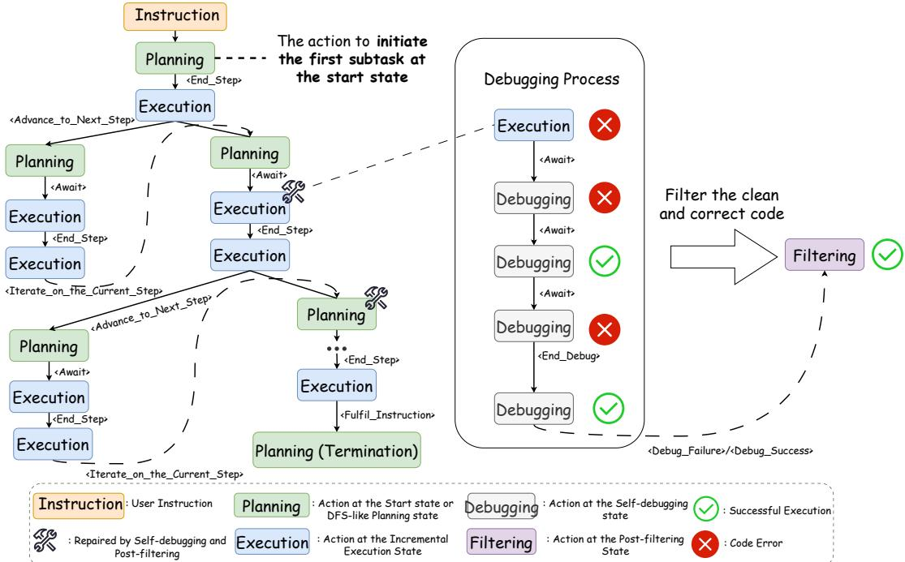  
Figure 3: Illustration of DatawiseAgent ’s task-completion process. Left: tree-structured trajectory from DFS-like planning and incremental execution. Right: code repair via self-debugging and post-filtering.

Code Repair through Self-Debugging and Post-Filtering. To ensure robust recovery from execution failures and prevent the accumulation of misleading traces in the context, DatawiseAgent introduces a code repair module implemented via FST transitions across two stages: self-debugging and post-filtering (see Figure 3).

In the self-debugging stage, the agent analyzes and iteratively refines faulty code using execution feedback. This stage is designed to be extensible, allowing integration of advanced LLM-based repair techniques (Hu et al., 2024a; Chen et al., 2024; Zhong et al., 2024) to further enhance correction performance. The post-filtering stage then assesses whether the error has been resolved in the debugging process: if successful, the agent extracts the clean and corrected code from the debugging trace; otherwise, it generates a concise diagnostic report in markdown, distilling key failure insights to prevent context pollution and guide future decisions.

This code repair module is triggered by execution errors during DFS-like planning or incremental execution. Upon completion, the agent replaces the original faulty code and debugging traces with post-filtered output, and resumes the ongoing tasksolving process.

## 4 Experiments

In this section, We evaluate DatawiseAgent across three key dimensions: its effectiveness and adaptability across tasks and LLMs (Section 4.2), its robustness under varying model capabilities and scales (Section 4.3), and the contributions of its planning and code repair modules through an ablation study (Section 4.4).

## 4.1 Experimental Setup

Benchmarks, Evaluation Metrics, and Baselines. We evaluate DatawiseAgent on three public benchmarks covering core data science scenarios, each with tailored metrics and established baselines:

(1) Data Analysis: InfiAgent-DABench (Hu et al., 2024b) contains 257 challenges with CSV inputs and multi-level (easy/medium/hard) analysis questions. We report Accuracy by Questions (ABQ), i.e., the proportion of correctly answered questions. Baselines include ReAct (Yao et al., 2023; Hu et al., 2024b), AutoGen (Wu et al., 2023), TaskWeaver (Qiao et al., 2023), and Data Interpreter (Hong et al., 2024).

(2) Scientific Visualization: We use Matplot-Bench (Yang et al., 2024b), comprising 100 expertverified cases involving input data, user queries, and reference plots. A vision model assigns a 0–100 score based on alignment with ground truth. We use GPT-4o as a unified scoring model across all settings. Baselines include Direct Decoding, where the model generates code in a single pass; MatplotAgent (Yang et al., 2024b), a visionaugmented agent specialized in plotting tasks; and AutoGen (Wu et al., 2023).

<table><tr><td rowspan=1 colspan=1>Model</td><td rowspan=1 colspan=1>Method</td><td rowspan=1 colspan=1>ABQ/%↑</td></tr><tr><td rowspan=1 colspan=1>GPT-4o mini</td><td rowspan=1 colspan=1>ReActAutoGenTaskweaverData InterpreterDatawiseAgent (Ours)</td><td rowspan=1 colspan=1>80.0870.0476.6567.7082.88</td></tr><tr><td rowspan=1 colspan=1>GPT-40</td><td rowspan=1 colspan=1>ReActAutoGenTaskweaverData Interpreter*Data InterpreterDatawiseAgent (Ours)</td><td rowspan=1 colspan=1>81.3273.5485.9994.93*75.7885.99</td></tr><tr><td rowspan=1 colspan=1>Qwen2.5-72B-Instruct</td><td rowspan=1 colspan=1>ReActAutoGenTaskweaverDatawiseAgent (Ours)</td><td rowspan=1 colspan=1>75.8870.0474.7181.71</td></tr></table>

Table 1: Performance comparison on InfiAgent-DABench. Asterisked (∗) result is from Hong et al. (2024) and could not be reproduced in our setting; it is shown for reference only and excluded from SOTA comparison. Best results in bold; second-best underlined.

(3) Predictive Modeling: We use the data modeling part from DSBench (Jing et al., 2024), which includes 74 real-world Kaggle competitions. Each task requires predictive modeling based on training/testing data, a sample submission file, and a detailed description. Following DSBench (Jing et al., 2024), we report Task Success Rate, Relative Performance Gap (RPG).RPG serves as a standardized score that reflects the agent’s overall performance across tasks by directly evaluating the performance of the resulting models on testing datasets. A task is marked incomplete if it exceeds the 3600-second time limit. We compare DatawiseAgent with results reported for AutoGen (Wu et al., 2023) and Code Interpreter2.

Further details on the benchmarks, metric definitions, and method configurations are provided in Section D.

Model Configurations. To assess the adaptability and generalization across diverse LLMs, we evaluate DatawiseAgent using both proprietary and open-source models: GPT-4o, GPT-4o mini (Hurst et al., 2024), and Qwen2.5-72B-Instruct (Yang et al., 2024a) 3. To further examine robustness under varying model capacities, we conduct additional experiments on InfiAgent-DABench (Hu et al., 2024b) using Qwen2.5 instruction-tuned models of different sizes: 7B, 14B, 32B, and 72B.

<table><tr><td>Model</td><td>Framework</td><td>Avg. Score ↑</td><td>∆ Score ↑</td></tr><tr><td rowspan="5">GPT-40 mini</td><td>Direct Decoding</td><td>38.09</td><td></td></tr><tr><td>MatplotAgent</td><td>51.44</td><td>+13.35</td></tr><tr><td>AutoGen</td><td>51.82</td><td>+13.73</td></tr><tr><td>w/ visual tool</td><td>52.07</td><td>+13.98</td></tr><tr><td>DatawiseAgent w/ visual tool</td><td>55.85 58.60</td><td>+17.76 +20.51</td></tr><tr><td rowspan="6">GPT-40</td><td>Direct Decoding MatplotAgent</td><td>45.28</td><td>+12.58</td></tr><tr><td>AutoGen</td><td>57.86 60.42</td><td>+15.14</td></tr><tr><td>w/ visual tool</td><td>63.60</td><td>+18.32</td></tr><tr><td>DatawiseAgent</td><td>61.22</td><td>+15.94</td></tr><tr><td>w/ visual tool</td><td></td><td></td></tr><tr><td></td><td>64.33</td><td>+19.05</td></tr><tr><td rowspan="4">Qwen2.5 -72B-Instruct</td><td>Direct Decoding</td><td>47.54</td><td></td></tr><tr><td>AutoGen</td><td>40.80</td><td>-6.74</td></tr><tr><td>w/ visual tool</td><td>53.72</td><td>+6.18</td></tr><tr><td>DatawiseAgent</td><td>56.41</td><td>+8.87</td></tr><tr><td rowspan="2"></td><td>w/ visual tool</td><td>61.88</td><td>+14.34</td></tr><tr><td></td><td></td><td></td></tr></table>

Table 2: Performance comparison on MatplotBench. ∆ Score denotes the score gain over Direct Decoding. Bold and underline highlight the best and second-best results, respectively. Visual tool rows indicate integration with the GPT-4o mini-based visual tool.
<table><tr><td>Framework</td><td>Model</td><td>Task Success/%</td><td>RPG</td></tr><tr><td rowspan="5">AutoGen</td><td>Llama3-8B</td><td>5.41</td><td>1.55</td></tr><tr><td>Llama3-70B</td><td>16.22</td><td>7.79</td></tr><tr><td>GPT-4</td><td>87.84</td><td>45.52</td></tr><tr><td>GPT-40</td><td>71.62</td><td>34.74</td></tr><tr><td>GPT-4o mini</td><td>22.97</td><td>11.24</td></tr><tr><td rowspan="3">Code Interpreter</td><td>GPT-4</td><td>54.05</td><td>26.14</td></tr><tr><td>GPT-40</td><td>44.59</td><td>19.87</td></tr><tr><td>GPT-4o mini</td><td>39.19</td><td>16.90</td></tr><tr><td>Human</td><td>Human* *</td><td>100.00*</td><td>65.02*</td></tr><tr><td rowspan="3">DatawiseAgent</td><td>GPT-40</td><td>98.64</td><td>53.18</td></tr><tr><td>GPT-4o mini</td><td>98.64</td><td>46.61</td></tr><tr><td>Qwen2.5-72B</td><td>91.89</td><td>42.90</td></tr></table>

Table 3: Performance comparison on 74 Data Modeling tasks from DSBench. Bold and underline indicate best and second-best results. \*Human performance is from (Jing et al., 2024), based on evaluations across 22 competitions.

## 4.2 Effectiveness and Adaptability Across Tasks and LLMs

We evaluate DatawiseAgent’s effectiveness and adaptability across three representative data science scenarios: data analysis, scientific visualization, and predictive modeling, using three distinct LLMs: GPT-4o, GPT-4o mini, and Qwen2.5-72B-Instruct. The comparative performance with existing agent frameworks is presented in Tables 1, 2, and 3.

Data Analysis. In data analysis, as shown in Table 1, DatawiseAgent achieves strong performance across all model settings, highlighting its strong capability in executing accurate and reliable data analyses. On GPT-4o mini and Qwen2.5-72B-Instruct, DatawiseAgent outperforms all baselines, achieving SOTA results. On GPT-4o, DatawiseAgent matches Taskweaver, a framework specifically designed for data analysis tasks, while surpassing AutoGen and ReAct. Notably, although Data Interpreter is reported to reach 94.93% on GPT-4o by Hong et al. (2024), our best-effort replication under comparable conditions yields significantly lower scores (75.78% on GPT-4o and 67.7% on GPT-4o mini), which we include for fair comparison. This discrepancy may be due to differences in evaluation settings not fully specified in the original paper. We include both results for transparency.

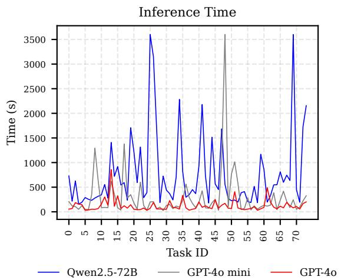  
Figure 4: Inference time of DatawiseAgent on 74 data modeling tasks from DSBench.

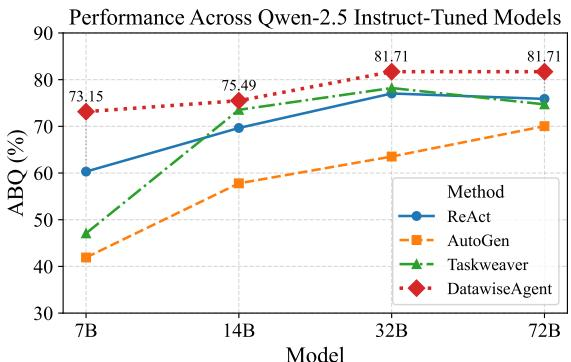  
Figure 5: Performance across Qwen2.5 models on InfiAgent-DABench. DatawiseAgent demonstrates strong robustness across models of different sizes, maintaining top performance while the gap over competing methods becomes more pronounced on smaller models.

Scientific Visualization. In scientific visualization, DatawiseAgent consistently achieves the best performance across models (as shown in Table 2), highlighting its ability to produce high-quality scientific visual output. On GPT-4o, DatawiseAgent obtains the highest average score of 64.33, both with and without the visual tool (61.22 without, 64.33 with), establishing a new SOTA. We also observe that DatawiseAgent leads by a clear margin in completion rate and high-quality output proportion across all settings, demonstrating strong robustness in producing valid and reliable figures. These auxiliary metrics are reported in Appendix Table 11.

To further assess tool usage impact, we incorporate a GPT-4o mini-based visual tool into Auto-Gen and DatawiseAgent, enabling iterative figure refinement via visual-textual feedback. Implementation details are provided in Section D.4. Toolintegrated variants consistently outperform their non-tool counterparts, aligned with findings from (Yang et al., 2024b). Notably, DatawiseAgent with visual tool integration achieves the best results in all three model configurations, suggesting the effectiveness and sound design of our tool integration.

<table><tr><td>Model</td><td>Avg. LLM Calls</td><td>Planning</td><td>Code Repair</td></tr><tr><td>GPT-40</td><td>12.31</td><td>4.72</td><td>0.62</td></tr><tr><td>GPT-4o-mini</td><td>18.80</td><td>4.15</td><td>1.39</td></tr><tr><td>Qwen2.5-72B-Instruct</td><td>16.91</td><td>5.05</td><td>1.18</td></tr></table>

Table 4: Average number of transitions per task in DatawiseAgent on 74 Data Modeling tasks from DS-Bench. “Avg. LLM Calls” counts the number of LLM calls, while “Planning” and “Code Repair” refer to transitions into the respective modules.

<table><tr><td>Method</td><td>Inf. /s</td><td>Suc. /% ↑</td><td>RPG↑</td><td>ABQ/% ↑</td></tr><tr><td>DatawiseAgent</td><td>291.57</td><td>98.64</td><td>46.61</td><td>77.14</td></tr><tr><td>w/o planning</td><td>529.99</td><td>77.03</td><td>38.35</td><td>70.86</td></tr><tr><td>w/o code repair</td><td>429.18</td><td>87.84</td><td>43.80</td><td>75.43</td></tr></table>

Table 5: Ablation results of DatawiseAgent on GPT-4o mini. Metrics are reported for 74 data modeling tasks from DSBench and 175 medium-/hard-level data analysis tasks from InfiAgent-DABench. Inf. /s = Inference time, which measures the average time taken to complete a single task; Suc. /% = Task Success rate.

Predictive Modeling. In predictive modeling, DatawiseAgent achieves SOTA performance across all model settings, as shown in Table 3, demonstrating strong capability in solving comprehensive and complex end-to-end data-centric prediction tasks. It consistently obtains high Task Success Rates ( 90%) and strong RPG values, with GPT-4o reaching the best overall performance (RPG 53.18). We further observe that DatawiseAgent with the weaker GPT-4o mini outperforms AutoGen with GPT-4, suggesting the potential for achieving competitive performance with smaller models.

Together, the results demonstrate the strong performance and adaptability of DatawiseAgent across diverse tasks and LLMs. It achieves SOTA results in both scientific visualization and predictive modeling, while maintaining strong performance in data analysis. Additionally, these results reinforce the effectiveness of DatawiseAgent’s tool integration design, particularly in scientific visualization.

We also observe high task completion rates across domains (see Table 3; Appendix Table 11), which we attribute to DatawiseAgent ’s FST-based multi-stage architecture orchestrating DFS-like planning, incremental execution, and code repair. This design supports flexible long-horizon planning, progressive solution building, and robust recovery from failures.

## 4.3 Robustness to Model Capability and Scale Variations

Robustness to Model Capability. Despite substantial differences in model capability, DatawiseAgent achieves comparable performance across GPT-4o, GPT-4o mini, and Qwen2.5-72B-Instruct on predictive modeling tasks. To understand this robustness, we analyze per-task inference time (i.e., time to complete a task) across models (Figure 4), finding that Qwen2.5-72B-Instruct incurs significantly longer durations despite strong performance. Manual inspection reveals that this discrepancy primarily stems from inefficient code execution—especially in data preprocessing and model training. This suggests that stronger models like GPT-4o tend to generate more efficient code, leading to faster execution. To explain how weaker models nonetheless maintain performance, we examine DatawiseAgent’s internal state transitions (Table 4), including average LLM calls, planning steps, and code repair attempts per task. We find that weaker models invoke these modules more frequently, indicating that DatawiseAgent dynamically adaptively increases reasoning depth and selfcorrection to compensate for limited model capability. These results highlight DatawiseAgent ’s robustness in adapting to varying model capabilities while maintaining competitive performance.

Robustness to Model Scale. We further test robustness by evaluating DatawiseAgent on Qwen2.5 instruct-tuned models of varying sizes (7B, 14B, 32B, 72B) using InfiAgent-DABench. As shown in Figure 5, although all agent frameworks degrade with smaller models, DatawiseAgent consistently outperforms all baselines on all scales. Notably, the performance gap between DatawiseAgent and other methods widens substantially as model size decreases, demonstrating DatawiseAgent ’s robustness to model scale variation and its superior scalability compared to existing frameworks.

## 4.4 Ablation Study of Planning and Code Repair Modules

One key contribution of DatawiseAgent is its FSTbased multi-stage architecture. To assess the impact of key components, we ablate two modules, DFS-like planning and code repair (self-debugging and post-filtering), on 175 medium- and hard-level cases from InfiAgent-DABench and the Data Modeling tasks in DSBench, using GPT-4o mini. We compare three variants: (1) DatawiseAgent: full system; (2) w/o planning: removes DFS-like planning, enforcing linear execution; (3) w/o code repair: disables code repair by removing selfdebugging and post-filtering.

As shown in Table 5, performance consistently declines when either module is removed, with a more pronounced drop in predictive modeling, a more challenging task. These results underscore the importance of both flexible planning and robust recovery from failures in enabling DatawiseAgent to solve complex data science tasks. Due to space limitations, we defer cost analysis and case study of DatawiseAgent to Section A and Section B.

## 5 Conclusion

We propose DatawiseAgent, a notebook-centric LLM agent framework for adaptive and robust data science automation. By combining a unified interaction representation with an FST-based multi-stage architecture, DatawiseAgent supports flexible long-horizon planning, progressive solution development, and robust recovery from execution failures within computational notebooks. Experiments across diverse tasks and LLMs demonstrate its strong performance, adaptability, robustness across domains and models, establishing a notebook-centric paradigm for adaptive and robust data science automation.

## 6 Limitations

While DatawiseAgent demonstrates effectiveness, adaptability, and robustness across multiple tasks and LLMs, several limitations remain that suggest directions for future work. First, our evaluation of tool integration is limited to a single visual feedback tool in scientific visualization; broader assessment in domains with proprietary or complex toolchains (e.g., healthcare or finance) is needed. Second, although DatawiseAgent is naturally suited for integration into computational notebooks (e.g., Jupyter or Colab), we do not evaluate human-in-the-loop collaboration. This omission reflects our focus on autonomous task completion, but evaluating interactive workflows remains a valuable and methodologically challenging direction for future work. These limitations point to promising directions for expanding DatawiseAgent toward broader applicability in real-world and collaborative data science workflows.

## 7 Ethics Statement

This work does not involve human subjects, personal data, or proprietary user information. All datasets used in our experiments are publicly available. As DatawiseAgent is designed to automate data science workflows through LLM-based agents, we acknowledge potential risks related to error propagation, unintended behavior, or unsafe code execution in autonomous settings. We encourage responsible and lawful use of such systems and recommend incorporating appropriate safeguards before real-world deployment. Our methodology is fully transparent and reproducible, and we support continued dialogue around fairness, accountability, and reliability in LLM-based automation.

## 8 Acknowledgement

This paper was supported by National Key R&D Program of China (No. 2023YFC3502902, 2021YFF1201100), National Natural Science Foundation of China under Grants (62436006), Sanya Science and Technology Special Fund (No. 2024KFJX04) and Beijing Natural Science Foundation (No. L257018, No. L246024).

## References

Josh Achiam, Steven Adler, Sandhini Agarwal, Lama Ahmad, Ilge Akkaya, Florencia Leoni Aleman, Diogo Almeida, Janko Altenschmidt, Sam Altman, Shyamal Anadkat, and 1 others. 2023. Gpt-4 technical report. arXiv preprint arXiv:2303.08774.

Anthropic. 2024. The claude 3 model family: Opus, sonnet, haiku. https://www-cdn.anthropic.com/ de8ba9b01c9ab7cbabf5c33b80b7bbc618857627/ Model\_Card\_Claude\_3.pdf.

T De Bie, LD Raedt, J Hernández-Orallo, HH Hoos, P Smyth, and CKI Williams. 2022. Automating data science: Prospects and challenges. Communications of the ACM, 65(2):76–87.

John Carroll and Darrell Long. 1989. Theory of finite automata with an introduction to formal languages.

Souti Chattopadhyay, Ishita Prasad, Austin Z Henley, Anita Sarma, and Titus Barik. 2020. What’s wrong with computational notebooks? pain points, needs, and design opportunities. In Proceedings ofthe 2020 CHI conference on human factors in computing systems, pages 1–12.

Mark Chen, Jerry Tworek, Heewoo Jun, Qiming Yuan, Henrique Ponde De Oliveira Pinto, Jared Kaplan, Harri Edwards, Yuri Burda, Nicholas Joseph, Greg Brockman, and 1 others. 2021. Evaluating large language models trained on code. arXiv preprint arXiv:2107.03374.

Xinyun Chen, Maxwell Lin, Nathanael Schärli, and Denny Zhou. 2024. Teaching large language models to self-debug. In The Twelfth International Conference on Learning Representations.

Liying Cheng, Xingxuan Li, and Lidong Bing. 2023. Is gpt-4 a good data analyst? In Findings of the Associationfor Computational Linguistics: EMNLP 2023, pages 9496–9514.

Victor Dibia. 2023. Lida: A tool for automatic generation of grammar-agnostic visualizations and infographics using large language models. In Proceedings of the 61st Annual Meeting of the Association for Computational Linguistics (Volume 3: System Demonstrations), pages 113–126.

David Donoho. 2017. 50 years of data science. Journal of Computational and Graphical Statistics, 26(4):745–766.

Siyuan Guo, Cheng Deng, Ying Wen, Hechang Chen, Yi Chang, and Jun Wang. 2024. DS-agent: Automated data science by empowering large language models with case-based reasoning. In Proceedings of the 41st International Conference on Machine Learning, volume 235 of Proceedings of Machine Learning Research, pages 16813–16848. PMLR.

Xin He, Kaiyong Zhao, and Xiaowen Chu. 2021. Automl: A survey of the state-of-the-art. Knowledgebased systems, 212:106622.

Andrew Head, Fred Hohman, Titus Barik, Steven M Drucker, and Robert DeLine. 2019. Managing messes in computational notebooks. In Proceedings of the 2019 CHI Conference on Human Factors in Computing Systems, pages 1–12.

Noah Hollmann, Samuel Müller, and Frank Hutter. 2024. Large language models for automated data science: Introducing caafe for context-aware automated feature engineering. Advances in Neural Information Processing Systems, 36.

Sirui Hong, Yizhang Lin, Bang Liu, Bangbang Liu, Binhao Wu, Ceyao Zhang, Chenxing Wei, Danyang Li, Jiaqi Chen, Jiayi Zhang, and 1 others. 2024. Data interpreter: An llm agent for data science. arXiv preprint arXiv:2402.18679.

John E Hopcroft, Rajeev Motwani, and Jeffrey D Ullman. 2001. Introduction to automata theory, languages, and computation. Acm Sigact News, 32(1):60–65.

Xueyu Hu, Kun Kuang, Jiankai Sun, Hongxia Yang, and Fei Wu. 2024a. Leveraging print debugging to improve code generation in large language models. arXiv preprint arXiv:2401.05319.

Xueyu Hu, Ziyu Zhao, Shuang Wei, Ziwei Chai, Qianli Ma, Guoyin Wang, Xuwu Wang, Jing Su, Jingjing Xu, Ming Zhu, Yao Cheng, Jianbo Yuan, Jiwei Li, Kun Kuang, Yang Yang, Hongxia Yang, and Fei Wu. 2024b. InfiAgent-DABench: Evaluating agents on data analysis tasks. In Proceedings ofthe 41st International Conference on Machine Learning, volume 235 of Proceedings ofMachine Learning Research, pages 19544–19572. PMLR.

Aaron Hurst, Adam Lerer, Adam P Goucher, Adam Perelman, Aditya Ramesh, Aidan Clark, AJ Ostrow, Akila Welihinda, Alan Hayes, Alec Radford, and 1 others. 2024. Gpt-4o system card. arXiv preprint arXiv:2410.21276.

Juyong Jiang, Fan Wang, Jiasi Shen, Sungju Kim, and Sunghun Kim. 2024. A survey on large language models for code generation. arXiv preprint arXiv:2406.00515.

Zhengyao Jiang, Dominik Schmidt, Dhruv Srikanth, Dixing Xu, Ian Kaplan, Deniss Jacenko, and Yuxiang Wu. 2025. Aide: Ai-driven exploration in the space of code. arXiv preprint arXiv:2502.13138.

Haifeng Jin, François Chollet, Qingquan Song, and Xia Hu. 2023. Autokeras: An automl library for deep learning. Journal of machine Learning research, 24(6):1–6.

Liqiang Jing, Zhehui Huang, Xiaoyang Wang, Wenlin Yao, Wenhao Yu, Kaixin Ma, Hongming Zhang, Xinya Du, and Dong Yu. 2024. Dsbench: How far are data science agents to becoming data science experts? arXiv preprint arXiv:2409.07703.

Raymond Li, Loubna Ben Allal, Yangtian Zi, Niklas Muennighoff, Denis Kocetkov, Chenghao Mou, Marc Marone, Christopher Akiki, Jia Li, Jenny Chim, and 1 others. 2023. Starcoder: may the source be with you! arXiv preprint arXiv:2305.06161.

Ziming Li, Qianbo Zang, David Ma, Jiawei Guo, Tuney Zheng, Minghao Liu, Xinyao Niu, Yue Wang, Jian Yang, Jiaheng Liu, and 1 others. 2024. Autokaggle: A multi-agent framework for autonomous data science competitions. arXiv preprint arXiv:2410.20424.

Aman Madaan, Niket Tandon, Prakhar Gupta, Skyler Hallinan, Luyu Gao, Sarah Wiegreffe, Uri Alon, Nouha Dziri, Shrimai Prabhumoye, Yiming Yang, and 1 others. 2024. Self-refine: Iterative refinement with self-feedback. Advances in Neural Information Processing Systems, 36.

OpenAI. 2023. Advanced data analysis (code interpreter). https://platform.openai.com/ docs/assistants/tools/code-interpreter. Accessed: 2025-05-19.

Bo Qiao, Liqun Li, Xu Zhang, Shilin He, Yu Kang, Chaoyun Zhang, Fangkai Yang, Hang Dong, Jue Zhang, Lu Wang, and 1 others. 2023. Taskweaver: A code-first agent framework. arXiv preprint arXiv:2311.17541.

Baptiste Roziere, Jonas Gehring, Fabian Gloeckle, Sten Sootla, Itai Gat, Xiaoqing Ellen Tan, Yossi Adi, Jingyu Liu, Romain Sauvestre, Tal Remez, and 1 others. 2023. Code llama: Open foundation models for code. arXiv preprint arXiv:2308.12950.

Adam Rule, Aurélien Tabard, and James D Hollan. 2018. Exploration and explanation in computational notebooks. In Proceedings ofthe 2018 CHI Conference on Human Factors in Computing Systems, pages 1– 12.

Yongliang Shen, Kaitao Song, Xu Tan, Dongsheng Li, Weiming Lu, and Yueting Zhuang. 2024. Hugginggpt: Solving ai tasks with chatgpt and its friends in hugging face. Advances in Neural Information Processing Systems, 36.

Noah Shinn, Federico Cassano, Ashwin Gopinath, Karthik Narasimhan, and Shunyu Yao. 2024. Reflexion: Language agents with verbal reinforcement learning. Advances in Neural Information Processing Systems, 36.

Patara Trirat, Wonyong Jeong, and Sung Ju Hwang. 2024. Automl-agent: A multi-agent llm framework for full-pipeline automl. arXiv preprint arXiv:2410.02958.

April Yi Wang, Dakuo Wang, Jaimie Drozdal, Xuye Liu, Soya Park, Steve Oney, and Christopher Brooks. 2021. What makes a well-documented notebook? a case study of data scientists’ documentation practices in kaggle. In Extended Abstracts of the 2021 CHI Conference on Human Factors in Computing Systems, pages 1–7.

April Yi Wang, Dakuo Wang, Jaimie Drozdal, Michael Muller, Soya Park, Justin D Weisz, Xuye Liu, Lingfei Wu, and Casey Dugan. 2022. Documentation matters: Human-centered ai system to assist data science code documentation in computational notebooks. ACM Transactions on Computer-Human Interaction, 29(2):1–33.

Xingyao Wang, Yangyi Chen, Lifan Yuan, Yizhe Zhang, Yunzhu Li, Hao Peng, and Heng Ji. 2024. Executable

code actions elicit better LLM agents. In Proceedings ofthe 41st International Conference on Machine Learning, volume 235 of Proceedings of Machine Learning Research, pages 50208–50232. PMLR.

Qingyun Wu, Gagan Bansal, Jieyu Zhang, Yiran Wu, Shaokun Zhang, Erkang Zhu, Beibin Li, Li Jiang, Xiaoyun Zhang, and Chi Wang. 2023. Autogen: Enabling next-gen llm applications via multiagent conversation framework. arXiv preprint arXiv:2308.08155.

Siqiao Xue, Caigao Jiang, Wenhui Shi, Fangyin Cheng, Keting Chen, Hongjun Yang, Zhiping Zhang, Jianshan He, Hongyang Zhang, Ganglin Wei, and 1 others. 2023. Db-gpt: Empowering database interactions with private large language models. arXiv preprint arXiv:2312.17449.

An Yang, Baosong Yang, Beichen Zhang, Binyuan Hui, Bo Zheng, Bowen Yu, Chengyuan Li, Dayiheng Liu, Fei Huang, Haoran Wei, and 1 others. 2024a. Qwen2. 5 technical report. arXiv preprint arXiv:2412.15115.

Zhiyu Yang, Zihan Zhou, Shuo Wang, Xin Cong, Xu Han, Yukun Yan, Zhenghao Liu, Zhixing Tan, Pengyuan Liu, Dong Yu, Zhiyuan Liu, Xiaodong Shi, and Maosong Sun. 2024b. MatPlotAgent: Method and evaluation for LLM-based agentic scientific data visualization. In Findings of the Association for Computational Linguistics: ACL 2024, pages 11789– 11804, Bangkok, Thailand. Association for Computational Linguistics.

Shunyu Yao, Jeffrey Zhao, Dian Yu, Nan Du, Izhak Shafran, Karthik R Narasimhan, and Yuan Cao. 2023. React: Synergizing reasoning and acting in language models. In The Eleventh International Conference on Learning Representations.

Lei Zhang, Yuge Zhang, Kan Ren, Dongsheng Li, and Yuqing Yang. 2024a. Mlcopilot: Unleashing the power of large language models in solving machine learning tasks. In Proceedings of the 18th Conference ofthe European Chapter ofthe Associationfor Computational Linguistics (Volume 1: Long Papers), pages 2931–2959.

Michael Zhang, Nishkrit Desai, Juhan Bae, Jonathan Lorraine, and Jimmy Ba. 2023a. Using large language models for hyperparameter optimization. In NeurIPS 2023 Foundation Modelsfor Decision Making Workshop.

Shujian Zhang, Chengyue Gong, Lemeng Wu, Xingchao Liu, and Mingyuan Zhou. 2023b. Automlgpt: Automatic machine learning with gpt. arXiv preprint arXiv:2305.02499.

Wenqi Zhang, Yongliang Shen, Weiming Lu, and Yueting Zhuang. 2023c. Data-copilot: Bridging billions of data and humans with autonomous workflow. arXiv preprint arXiv:2306.07209.

Yuge Zhang, Qiyang Jiang, Xingyu Han, Nan Chen, Yuqing Yang, and Kan Ren. 2024b. Benchmarking data science agents. arXiv preprint arXiv:2402.17168.

Li Zhong, Zilong Wang, and Jingbo Shang. 2024. Debug like a human: A large language model debugger via verifying runtime execution step by step. In Findings ofthe Associationfor Computational Linguistics ACL 2024, pages 851–870.

Andy Zhou, Kai Yan, Michal Shlapentokh-Rothman, Haohan Wang, and Yu-Xiong Wang. 2024. Language agent tree search unifies reasoning acting and planning in language models. In ICLR 2024 Workshop on Large Language Model (LLM) Agents.

## A Cost Analysis

<table><tr><td>Model</td><td>Framework</td><td>Cost/$</td><td>ABQ/%↑</td></tr><tr><td rowspan="5">GPT-40</td><td>ReAct</td><td>4.79</td><td>81.32</td></tr><tr><td>AutoGen</td><td>4.71</td><td>73.54</td></tr><tr><td>TaskWeaver</td><td>16.19</td><td>85.99</td></tr><tr><td>DatawiseAgent</td><td>10.60</td><td>85.99</td></tr><tr><td>ReAct</td><td>0.26</td><td>80.08</td></tr><tr><td rowspan="4">GPT-4o mini</td><td>AutoGen</td><td>0.44</td><td>70.04</td></tr><tr><td>TaskWeaver</td><td>1.64</td><td>76.65</td></tr><tr><td>DatawiseAgent</td><td>1.14</td><td>82.88</td></tr><tr><td></td><td></td><td></td></tr></table>

Table 6: Total cost comparison on GPT-4o and GPT-4o mini on InfiAgent-DABench across 257 cases.

We record the total cost of DatawiseAgent across different model settings, as illustrated in Table 7. Compared to the previous best method, Auto-Gen with GPT-4, which incurs a cost of \$19.34, DatawiseAgent outperforms it with a cost of only \$2.13, achieving superior performance. Additionally, when DatawiseAgent with GPT-4o achieves the best performance of 53.18 in RPG, it incurs a cost of \$18.49. This demonstrates that DatawiseAgent achieves strong performance more costeffectively, delivering impressive results without incurring the high costs associated with previous approaches.

In addition to DSBench, we further evaluate the total cost on InfiAgent-DABench, which consists of 257 decision-making tasks. As shown in Table 6, DatawiseAgent consistently demonstrates high cost-efficiency across different model settings.

Under the GPT-4o configuration, DatawiseAgent achieves an ABQ score of 85.99%, matching the best-performing baseline, but at a significantly lower cost (\$10.60 vs. \$16.19). Similarly, under the GPT-4o mini setting, DatawiseAgent achieves the highest ABQ score of 82.88%, while incurring only \$1.14 in total cost—substantially cheaper than TaskWeaver (\$1.64) and considerably more accurate than AutoGen.

These results highlight that DatawiseAgent not only performs competitively or better in terms of quality, but also offers a favorable costperformance trade-off, especially in scenarios requiring high scalability or low-latency inference.

## B Case Study on Predictive Modeling

We present a case example corresponding to the data modeling task with index 48 from DS-Bench (Jing et al., 2024). The task’s instruction is shown in Figure 8, and the final agent trajectory of DatawiseAgent with GPT-4o is illustrated in Figure 7. As demonstrated by this example, DatawiseAgent utilizes DFS-like planning and incremental execution to dynamically decompose and execute the task. In the process, the framework performed multiple rounds of interactive data exploration, dataset partitioning, model design, training, and prediction. During execution, several code errors occurred; these were resolved through code repair module which is implemented by transitions between self-debugging and post-filtering, with the framework effectively consolidating past mistakes into the final context history. This example highlights the efficacy and flexibility of the FST-based multi-stage architecture in unified interaction representation, which leverages the reasoning and coding capabilities of large language models alongside dynamic environmental interactions to accomplish complex and multifaceted data science tasks.

## C Details of DFST-based Multi-Stage Architecture

## C.1 State Transition of DFST and Action Signal Space

Built on a finite state transducer (FST), DatawiseAgent orchestrates four distinct stages—DFSlike planning, incremental execution, selfdebugging, and post-filtering. At each stage, DatawiseAgent samples an action signal from the predefined action signal space (see Table 8), which participates in driving the state transition while triggering the generation and execution of the corresponding markdown and code cells. We model this multi-stage architecture as a deterministic FST as illustrated in Figure 6. In the event of an execution error during either the DFS-like planning or incremental execution stage, DatawiseAgent transitions to the self-debugging and post-filtering stage for code repair. After post-filtering, the flow returns to the subsequent stage that would normally follow if no error had occurred.

## C.2 Prompts for Each Stage

To give readers a clearer understanding of the agent’s behavior at each stage, we detail the prompts used by the agent to generate actions in different states in Figs. 10 to 14.

<table><tr><td>Framework</td><td>Model</td><td>Cost/$</td><td>Inference Time/s</td><td>Task Success/%↑</td><td>RPG ↑</td></tr><tr><td rowspan="4">AutoGen</td><td>Llama3-8b</td><td></td><td>50.9</td><td>5.41</td><td>1.55</td></tr><tr><td>Llama3-70b</td><td></td><td>158.4</td><td>16.22</td><td>7.79</td></tr><tr><td>GPT-4</td><td>19.34</td><td>77.4</td><td>87.84</td><td>45.52</td></tr><tr><td>GPT-4o GPT-4o mini</td><td>12.27 0.10</td><td>104.1 26.7</td><td>71.62 22.97</td><td>34.74 11.24</td></tr><tr><td rowspan="3">Code Interpreter</td><td>GPT-4</td><td>38.81</td><td>237.6</td><td>54.05</td><td>26.14</td></tr><tr><td>GPT-4o</td><td>19.26</td><td>268.6</td><td>44.59</td><td>19.87</td></tr><tr><td>GPT-4o mini</td><td>2.70</td><td>199.6</td><td>39.19</td><td>16.90</td></tr><tr><td>Human*</td><td>Human*</td><td></td><td></td><td>100.00</td><td>65.02</td></tr><tr><td rowspan="3">DatawiseAgent (Ours)</td><td>GPT-40</td><td>18.49</td><td>123.86</td><td>98.64</td><td>53.18</td></tr><tr><td>GPT-4o mini</td><td>2.13</td><td>291.57</td><td>98.64</td><td>46.61</td></tr><tr><td>Qwen2.5-72B-Instruct</td><td></td><td>760.25</td><td>91.89</td><td>42.9</td></tr></table>

Table 7: Performance comparison on 74 Data Modeling tasks from DSBench. We report Cost, Inference Time, Task Success, and Relative Performance Gap (RPG), with best and second-best results in bold and underline, respectively. \*Human performance is from (Jing et al., 2024), based on evaluations across 22 competitions.

<table><tr><td>Stage</td><td>Action Signal Space</td></tr><tr><td>DFS-like Planning</td><td>{&lt;Advance_to_Next_Step&gt;, &lt;Iterate_on_the_Current_Step&gt;, &lt;Fulfil_Instruction&gt;}</td></tr><tr><td>Incremental Execution</td><td>{&lt;Await&gt;, &lt;End_Step&gt;}</td></tr><tr><td>Self-debugging</td><td>{&lt;Await&gt;, &lt;End_Debug&gt;}</td></tr><tr><td>Post-filtering</td><td>{&lt;Debug_Failure&gt;, &lt;Debug_Success&gt;}</td></tr></table>

Table 8: Action signal space for each stage of the DatawiseAgent framework. At every stage, DatawiseAgent generates an action and selects a corresponding signal from the defined signal space.

## C.3 Implementation Details

To prevent the FST from entering an infinite loop, we count and limit the number of transitions across three stages: DFS-like planning, incremental execution, and self-debugging. We introduce the following hyperparameters: (1) max\_planning\_number: the maximum number of transitions into the DFSlike Planning stage; (2) max\_execution\_number: the maximum number of transitions into the Incremental Execution stage for a given subtask; (3) max\_debug\_number: the maximum number of consecutive transitions into the Self-Debugging stage during code repair, representing the upper bound on debugging attempts for a single error; and (4) max\_planning\_execution\_number: the maximum number of non-root nodes in the agent trajectory tree, where actions from both the DFS-like Planning and Incremental Execution phases are considered as nodes. Notably, max\_planning\_execution\_number serves to constrain the overall search cost of the solution space. Those hyperparameters are uniformly configured in our experiments.

## D Experiments Details

## D.1 Datasets

InfiAgent-DABench. We use InfiAgent-DABench (Hu et al., 2024b), a benchmark specifically designed to evaluate agent performance on data analysis tasks. It comprises 257 real-world challenges, each accompanied by a CSV input file and one or more questions related to the data. The challenges span various categories such as summary statistics, feature engineering, and correlation analysis, and are labeled with one of three difficulty levels: easy, medium, or hard.

MatplotBench. We adopt MatplotBench (Yang et al., 2024b), a benchmark for the automatic and quantitative evaluation of AI methods in scientific data visualization. It contains 100 curated test cases, each consisting of a user query, an associated input dataset, and a ground-truth figure verified by human experts. The benchmark enables rigorous assessment of plotting accuracy and visual reasoning capabilities.

DSBench. We further utilize the data modeling part from DSBench (Jing et al., 2024), designed to assess agents on complex, real-world data science problems. DSBench includes 74 predictive modeling tasks derived from competitive platforms such as ModelOff4 and Kaggle5. Each task provides a large-scale training/test dataset, sample submission file, and a detailed problem description, requiring agents to build end-to-end modeling solutions.

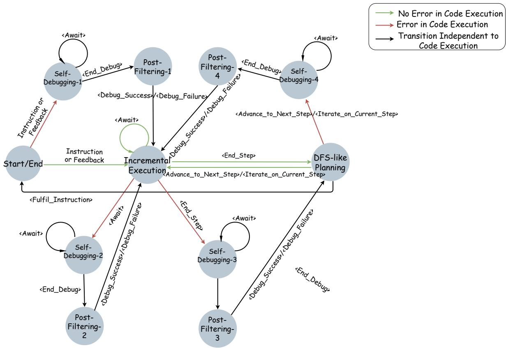  
Figure 6: State transition diagram in the FST-based multi-stage design of DatawiseAgent, represented as a Nondeterministic Finite State Transducer (NFST). State transitions are driven by instructions or user feedback, action signals from the agent, and code execution feedback from the environment. Before each state transition, the agent generates and executes actions based on the current state.

## D.2 Metrics

InfiAgent-DABench. InfiAgent-DABench (Hu et al., 2024b) comprises 258 challenges, each paired with a corresponding CSV input file. These challenges are categorized into three difficulty levels (easy, medium, or hard) and include one or more questions about the data. For close-form questions, we define the following metrics:

• Proportional Accuracy by Subquestions (PASQ):

$$
\mathrm { P A S Q } = \frac { 1 } { N } \sum _ { i = 1 } ^ { N } \left( \frac { 1 } { M _ { i } } \sum _ { j = 1 } ^ { M _ { i } } I _ { i j } \right)\tag{1}
$$

Here, N denotes the total number of questions, $M _ { i }$ is the number of subquestions in the i-th question, and $I _ { i j }$ is the indicator function for the j-th subquestion of the i-th question.

• Accuracy by Questions (ABQ)

$$
{ \mathrm { A B Q } } = { \frac { 1 } { N } } \sum _ { i = 1 } ^ { N } \left( \prod _ { j = 1 } ^ { M _ { i } } I _ { i j } \right)\tag{2}
$$

The product $\textstyle \prod _ { j = 1 } ^ { M _ { i } } I _ { i j }$ equals 1 if all subquestions of the i-th question are answered correctly, and 0 otherwise.

• Uniform Accuracy by Subquestions (UASQ)

$$
\mathrm { U A S Q } = \frac { 1 } { \sum _ { i = 1 } ^ { N } M _ { i } } \sum _ { i = 1 } ^ { N } \sum _ { j = 1 } ^ { M _ { i } } I _ { i j }\tag{3}
$$

DSBench. The 74 data modeling tasks from DS-Bench (Jing et al., 2024) are sourced from realworld Kaggle competitions and feature large-scale training and testing datasets along with complex instructions, making them particularly challenging for data science agents. For evaluation, DSBench first adopts Task Success Rate, which measures whether the agent successfully builds a machine learning model and generates a bug-free submission. However, due to the inconsistency of metric scales and evaluation dimensions across different tasks, directly comparing performance is non-trivial. To address this, DSBench introduces the Relative Performance Gap (RPG) as an additional metric to normalize results across diverse tasks. RPG measures the agent’s relative improvement over a baseline, scaled by the gap between the baseline and the best-known performance, and is defined as:

$$
\mathrm { R P G } = \frac { 1 } { N } \sum _ { i = 1 } ^ { N } \operatorname* { m a x } \left( \frac { p _ { i } - b _ { i } } { g _ { i } - b _ { i } } , 0 \right)\tag{4}
$$

where N is the total number of competitions, $p _ { i }$ is the performance of the agent’s submission for the i-th competition, $g _ { i }$ is the highest known performance for the i-th competition, and $b _ { i }$ is the performance of a baseline. DSBench (Jing et al., 2024) uses the performance of the original submission file in the competition as the baseline performance in the RPG computation process.

## D.3 DatawiseAgent and Baselines Configurations

DatawiseAgent Configuration. For the experiments on data analysis and scientific visualization, we set max\_planning\_number = 7, max\_execution\_number = 6, and max\_debug\_number = 8. For predictive modeling, we configured the hyperparameters as max\_planning\_number = $^ { 7 , }$ max\_execution\_number = 6, max\_debug\_number 8, and max\_planning\_execution\_number = 15. These predefined hyperparameters act as guardrails to ensure robust performance and maintain a consistent experimental environment. They do not constrain the generality of our approach but rather provide necessary safeguards against unexpected failures.

To investigate the degree to which DatawiseAgent adheres to the designed state machine during the experiments, we recorded the average number of LLM calls made by DatawiseAgent with GPT-4o. The results, as illustrated in Table 9, indicate that DatawiseAgent, through its FST-based multi-stage architecture, effectively orchestrates the transitions among the four key stages.

<table><tr><td>Avg. LLM calls</td><td>Benchmark</td></tr><tr><td>6.42</td><td>InfiAgent-DABench</td></tr><tr><td>6.41</td><td>MatplotBench</td></tr><tr><td>7.56</td><td>MatplotBench(w/ visual tool)</td></tr><tr><td>12.31</td><td>Data Modeling</td></tr></table>

Table 9: Average number of LLM calls across benchmarks made by DatawiseAgent using GPT-4o.

Details of Experimental Setups. (1) Data Analysis. We benchmark DatawiseAgent in InfiAgent-DABench against several state-of-the-art agent systems (SoTA), including ReAct(Hu et al., 2024b), AutoGen(Wu et al., 2023), Taskweaver(Qiao et al., 2023) and Data Interpreter(Hong et al., 2024). For model configuration, we set the temperature to 0 for all agents, except for ReAct, where the temperature is set to 0.2, as required by Hu et al., 2024b.

(2) Scientific Visualization. We benchmark DatawiseAgent against three baselines in different model settings: Direct Decoding, MatplotAgent, and AutoGen. MatplotBench employs a visionbased scoring mechanism aligned with human assessment (Yang et al., 2024b), where an advanced multi-modal LLM, such as GPT-4V(Achiam et al., 2023), is prompted to score the generated figure on a scale from 0 to 100, comparing it with the ground truth figure. Since OpenAI deprecated GPT-4V during our experiments, we adopt GPT-4o, a more powerful version with enhanced vision capabilities, as the recommended replacement by OpenAI(Hurst et al., 2024), to serve as the scoring model. The temperature is set to 0 in all methods.

(3) Predictive Modeling. We evaluate DatawiseAgent using the experimental setup described in DSBench (Jing et al., 2024) and compare its performance with the results reported for AutoGen (Wu et al., 2023) and Code Interpreter6. The primary metrics include Task Success Rate, which measures whether the data science agent successfully completes the predictive task, and the Relative Performance Gap (RPG), which quantifies the overall performance of a data science agent across different competitions. We also record Inference Time, the average time taken to complete a task. Each task is assigned a maximum time limit of 3600 seconds, as some competitions involve large datasets or complex tasks that could require extensive computation time. If the task exceeds this limit, it is marked as incomplete, and the time is recorded as 3600 seconds. The temperature of DatawiseAgent is set to 0.

<table><tr><td>Model</td><td>Framework</td><td>PASQ/%↑</td><td>ABQ/% ↑</td><td>UASQ/% ↑</td></tr><tr><td rowspan="5">GPT-4o mini</td><td>ReAct</td><td>85.30</td><td>80.08</td><td>84.55</td></tr><tr><td>AutoGen</td><td>74.68</td><td>70.04</td><td>77.41</td></tr><tr><td>Taskweaver</td><td>81.95</td><td>76.65</td><td>81.34</td></tr><tr><td>Data Interpreter</td><td>73.85</td><td>67.7</td><td>72.15</td></tr><tr><td>DatawiseÄgent (Ours)</td><td>88.39</td><td>82.88</td><td>87.06</td></tr><tr><td rowspan="5">GPT-40</td><td>ReAct</td><td>87.48</td><td>81.32</td><td>86.62</td></tr><tr><td>AutoGen</td><td>76.43</td><td>73.54</td><td>79.39</td></tr><tr><td>Taskweaver</td><td>89.35</td><td>85.99</td><td>90.24</td></tr><tr><td>Data Interpreter*</td><td></td><td>94.93</td><td></td></tr><tr><td>Data Interpreter</td><td>79.97</td><td>75.78</td><td>79.59</td></tr><tr><td rowspan="3">Qwen2.5-72B-Instruct</td><td>DatawiseÄgent (Ours)</td><td>89.95</td><td>85.99</td><td>89.91</td></tr><tr><td>ReAct AutoGen</td><td>82.39</td><td>75.88</td><td>78.73</td></tr><tr><td>DatawiseAgent (Ours)</td><td>73.87 87.27</td><td>70.04 81.71</td><td>75.22 85.09</td></tr></table>

Table 10: Performance comparison on InfiAgent-DABench across various model settings. The result marked with an asterisk (∗) is reported by Hong et al. (2024). Best results are in bold; second-best are underlined.

<table><tr><td>Model</td><td>Framework</td><td>Comp. Rate/%</td><td>Scores ≥ 80/%</td><td>Avg. Score↑</td><td>∆ Avg. Score</td></tr><tr><td rowspan="5">GPT-4o mini</td><td>Direct Decoding MatplotAgent</td><td>61 94</td><td>24</td><td>38.09</td><td>+13.35</td></tr><tr><td></td><td></td><td>33</td><td>51.44 51.82</td><td>+13.73</td></tr><tr><td>AutoGen</td><td>92</td><td>32</td><td></td><td></td></tr><tr><td>w/ visual tool</td><td>90</td><td>32</td><td>52.07</td><td>+13.98</td></tr><tr><td>DatawiseAgent (Ours) w/ visual tool</td><td>99 99</td><td>34 39</td><td>55.85 58.60</td><td>+17.76 +20.51</td></tr><tr><td rowspan="6">GPT-40</td><td>Direct Decoding</td><td>68</td><td>32</td><td>45.28</td><td></td></tr><tr><td>MatplotAgent</td><td>95</td><td>41</td><td>57.86</td><td>+12.58</td></tr><tr><td>AutoGen</td><td>97</td><td>39</td><td>60.42</td><td>+15.14</td></tr><tr><td>w/ visual tool</td><td>99</td><td>36</td><td>63.60</td><td>+18.32</td></tr><tr><td>DatawiseAgent (Ours)</td><td>100</td><td>43</td><td>61.22</td><td>+15.94</td></tr><tr><td>w/ visual tool</td><td>99</td><td>44</td><td>64.33</td><td>+19.05</td></tr><tr><td rowspan="5">Qwen2.5-72B -Instruct</td><td>Direct Decoding</td><td>73</td><td>35</td><td>47.54</td><td></td></tr><tr><td>AutoGen</td><td>65</td><td>26</td><td>40.80</td><td>-6.74</td></tr><tr><td>w/ visual tool</td><td>85</td><td>32</td><td>53.72</td><td>+6.18</td></tr><tr><td>DatawiseAgent (Ours)</td><td>98</td><td>37</td><td>56.41</td><td>+8.87</td></tr><tr><td>w/ visual tool</td><td>99</td><td>42</td><td>61.88</td><td>+14.34</td></tr></table>

Table 11: Performance comparison on MatplotBench. We report three metrics: Completion Rate (valid output rate), Scores 80 (proportion of high-quality completions), and Average Score (0–100). The last column (∆ Avg. Score) denotes the score gain over Direct Decoding. Bold and underline highlight the best and second-best results, respectively. Visual tool rows indicate integration with the GPT-4o mini-based visual tool.

In Jing et al. 2024, detailed specifications of the experimental environment are not provided, and it is challenging to control for resources and environmental factors across different methods. Moreover, since inference time is affected by numerous factors, comparing the inference time of DatawiseAgent with that of AutoGen and Code Interpreter may not yield meaningful insights. Nevertheless, for the experiments of DatawiseAgent on the data modeling tasks from DSBench, we conducted all evaluations under a consistent environment to ensure fairness and reproducibility. Specifically, the experiments were run on a machine with 80 CPU cores, 512 GB of RAM. The operating system is Ubuntu 24.04.1 LTS, and the software environment is managed via Conda with Python 3.10. Core libraries for predictive modeling, such as NumPy (v2.2.1), Pandas (v2.2.3), Matplotlib (v3.10.0), SciPy (v1.15.1), Scikit-learn (v1.6.1), and PyTorch (v2.5.1+cu121), were preinstalled to support the experiments. Additionally, DatawiseAgent is capable of dynamically installing required packages during task execution by executing command-line installation commands within code cells.

## D.4 Visual Tool for Scientific Visualization

We implement a visual tool based on GPT-4o mini to evaluate DatawiseAgent ’s capability in completing scientific visualization tasks through the integration of visual feedback tools. In our experiments, each test case can call the visual tool at most four times for both AutoGen and DatawiseAgent. Figure 9 illustrates the details of the implementation and integration of this tool.

## D.5 Full Experimental Results on Data Analysis, Scientific Visualization, and Predictive Modeling

In addition to the main results reported in Section 4, we present the complete experimental results for Data Analysis, Scientific Visualization, and Predictive Modeling in Tables Table 10, Table 11, and Table 7, respectively. These tables include additional evaluation metrics (with definitions provided in Section D.2), offering a more comprehensive assessment of DatawiseAgent ’s performance across different tasks. As shown in Table 11, DatawiseAgent achieves substantially higher scores than all baselines in both Completion Rate and the Proportion of Scores $\geq 8 0$ . These results highlight DatawiseAgent ’s robustness in task completion as well as its ability to generate consistently high-quality visual outputs.

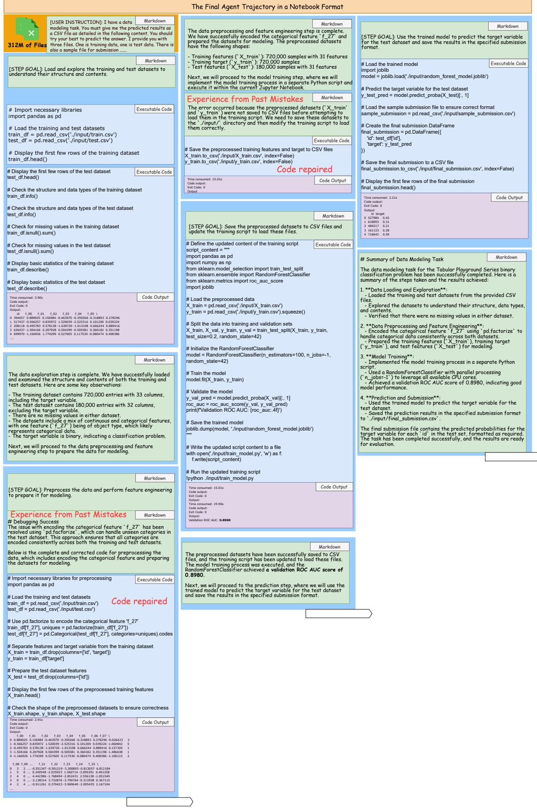  
Figure 7: The case example of DatawiseAgent for the data modeling task with index = 48

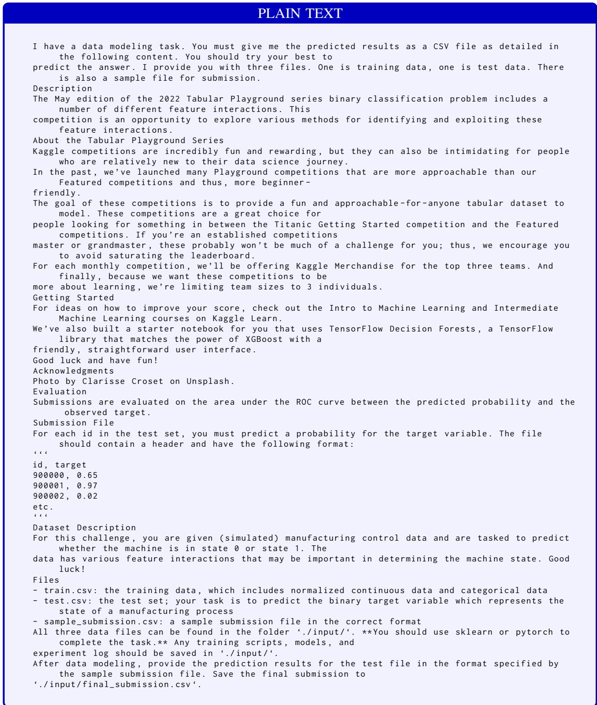  
Figure 8: The complete instruction of the data modeling task with index = 48.

PSEUDOCODE   
GLOBAL\_CNT <- 4   
EVALUATION\_CNT <- 0   
function evaluate\_image ( image\_path , requirements , query ):   
if EVALUATION\_CNT >= GLOBAL\_CNT :   
return " Usage limit reached . Please manually evaluate ."   
if image\_path is invalid or does not exist :   
raise error   
if requirements or query is empty :   
raise error   
encoded\_image <- encode\_image\_to\_base64 ( image\_path )   
prompt <- " Expected Requirements :\n" + requirements   
prompt += "\ nQuery :\ n " + query   
prompt += "\ nYour response :\n"   
message <- [   
{" type ": " text ", " text ": prompt },   
{" type ": " image\_url " , " image\_url ": {" url ": encoded\_image }}   
]   
try :   
response <- call\_chat\_completion ( model =" gpt -4 o - mini " , message )   
EVALUATION\_CNT += 1   
return response . content   
except :   
raise runtime\_error  
Figure 9: Pseudocode of the GPT-4o mini-based visual tool. This tool generates a textual response to a given query by analyzing the provided image in light of the specified requirements.

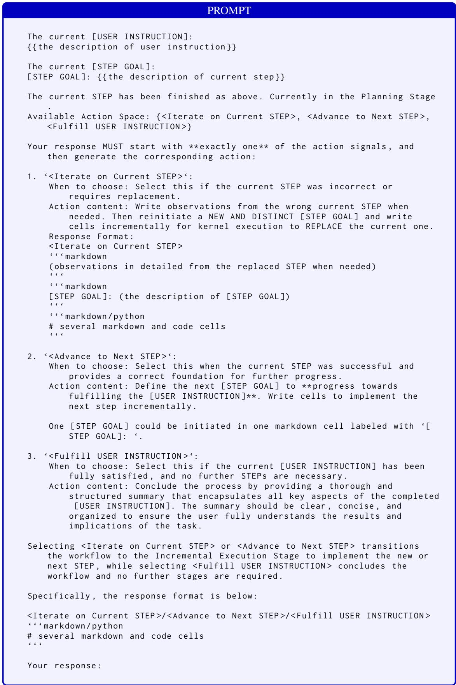  
Figure 10: The prompt of the DFS-like planning stage.

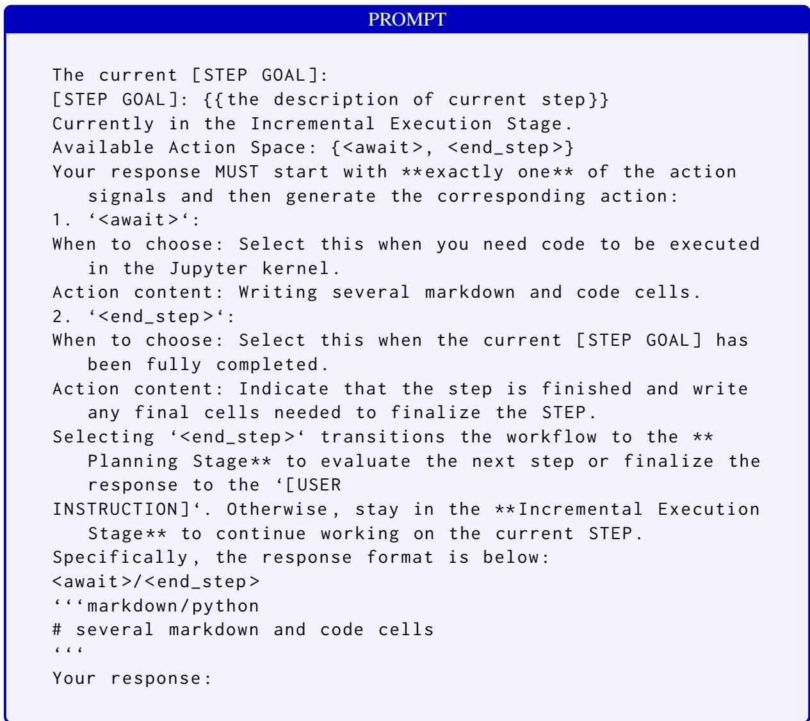  
Figure 11: The prompt in the incremental execution stage.

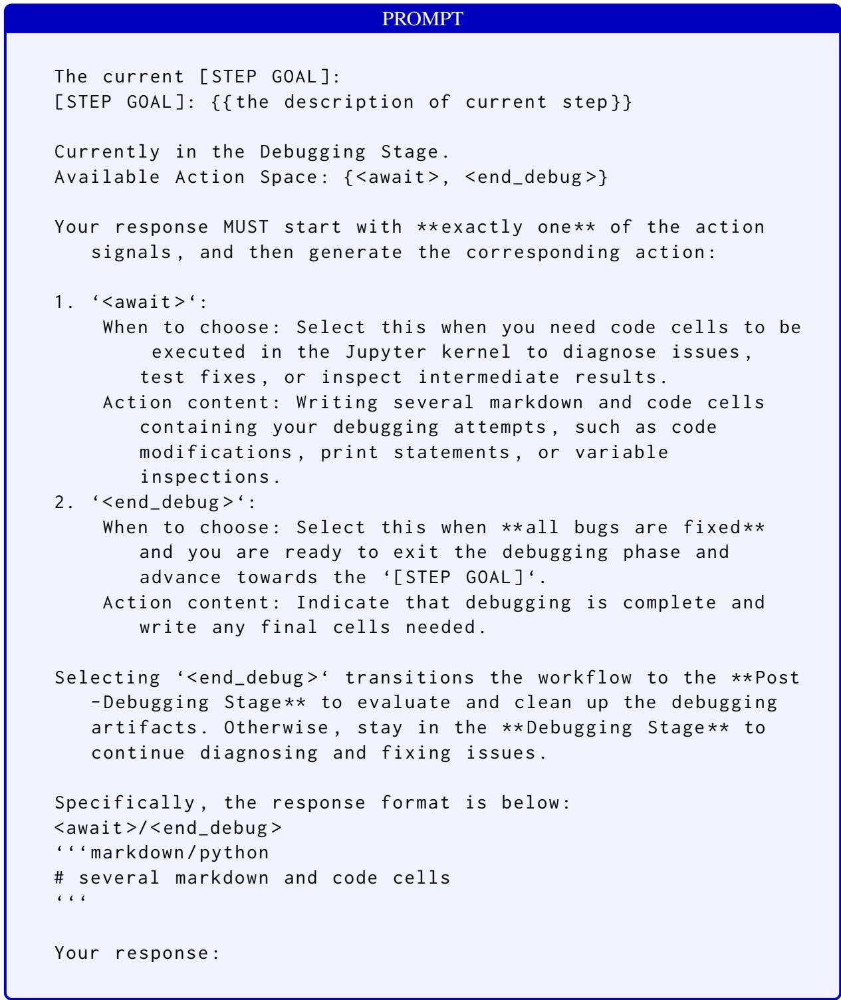  
Figure 12: The prompt in the self-debugging stage.

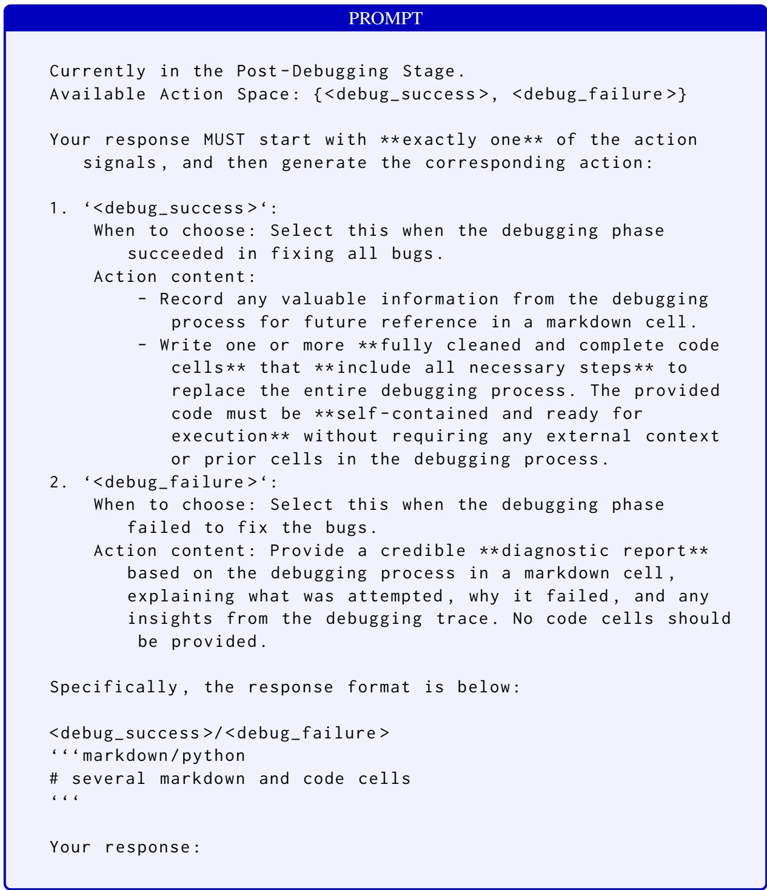  
Figure 13: The prompt in the post-filtering stage.

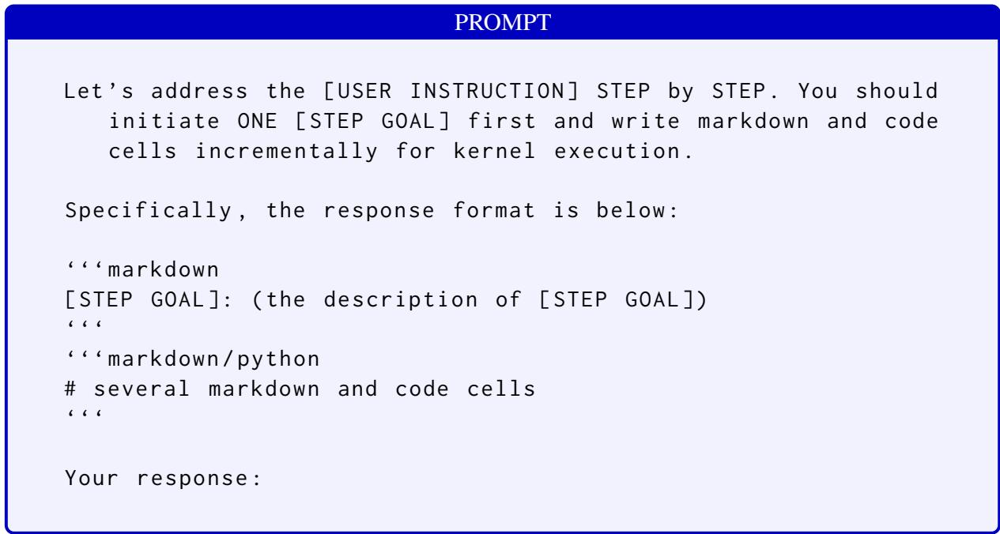  
Figure 14: The prompt at the start state.