# DeepResearcher: Scaling Deep Research via Reinforcement Learning in Real-world Environments

Yuxiang Zheng1,2,3\* Dayuan Fu2,3\* Xiangkun Hu2\*

Xiaojie Cai1,3 Lyumanshan Ye1,3 Pengrui Lu1,3 Pengfei Liu1,2,3†

1Shanghai Jiao Tong University 2Shanghai Innovation Institute

3Generative AI Research Lab (GAIR)

catchiz.1@sjtu.edu.cn, fdy@bupt.edu.cn, xkhu17@fudan.edu.cn pengfei@sjtu.edu.cn

## Abstract

Large Language Models (LLMs) with web search capabilities show significant potential for deep research, yet current methods—brittle prompt engineering or RAG-based reinforcement learning in controlled environments—fail to capture real-world complexities. In this paper, we introduce DeepResearcher, the first comprehensive framework for end-to-end training of LLM-based deep research agents through scaling reinforcement learning (RL) in real-world environments with authentic web search interactions. Unlike RAG approaches reliant on fixed corpora, DeepResearcher trains agents to navigate the noisy, dynamic open web. We implement a specialized multi-agent architecture where browsing agents extract relevant information from various webpage structures and overcoming significant technical challenges. Extensive experiments on open-domain research tasks demonstrate that DeepResearcher achieves substantial improvements of up to 28.9 points over prompt engineering-based baselines and up to 7.2 points over RAG-based RL agents. Our qualitative analysis reveals emergent cognitive behaviors from end-to-end RL training, such as planning, cross-validation, self-reflection for research redirection, and maintain honesty when unable to find definitive answers. Our results highlight that end-to-end training in realworld web environments is fundamental for developing robust research capabilities aligned with real-world applications. The source code for DeepResearcher is released at: https:// github.com/GAIR-NLP/DeepResearcher.

## 1 Introduction

The emergence of Large Language Models (LLMs) has fundamentally transformed the landscape of artificial intelligence, enabling increasingly autonomous problem-solving capabilities. When equipped with external tools such as web search and code execution (Li et al., 2025c), these models can tackle complex research tasks that previously required significant human workload and expertise. Notable examples include Gemini and OpenAI Deep Research (Google, 2024; OpenAI, 2025), Grok3’s DeeperSearch (xAI, 2025), and open-source projects like MetaGPT (Hong et al., 2024), OpenManus (Liang et al., 2025), and OWL agents (CAMEL-AI.org, 2025). While impressive commercial products exist, reproducible frameworks for systematically developing robust research agents remain largely elusive.

Recent advances suggest that reinforcement learning (RL) offers a promising path forward for improving LLM capabilities. Studies by Guo et al. (2025) and Team et al. (2025) demonstrate that scaling reinforcement learning for LLMs on math and coding tasks (Li et al., 2025b) substantially improves their reasoning abilities. Current opensource efforts to integrate RL with information retrieval, such as Search-R1 (Jin et al., 2025), R1- Searcher (Song et al., 2025), and ReSearch (Chen et al., 2025), have primarily focused on Retrieval-Augmented Generation (RAG) using static, local text corpora. While these approaches provide valuable insights, they fundamentally fail to capture the dynamic, unpredictable nature of real-world web search environments. RAG systems also fail to account for the substantial noise, variability in search quality, and the challenges of navigating diverse web content formats and structures.

In this work, we present the first comprehensive study of RL scaling for LLM agents operating with real-world web search capabilities. Our approach, DeepResearcher, trains agents to interact directly with live search engines, thereby learning to handle the inherent variability and complexity of the open web. By training in genuine web environments rather than controlled simulations, our system develops robust capabilities for handling the unpredictable nature of real-world information retrieval and synthesis.

DeepResearcher represents a significant departure from prompt-based and RAG-based methods. Its novelty lies in integrating several critical techniques, previously explored only in isolation, for end-to-end training in real-world web environments::

• Scaling RL for Deep Research: In contrast to prompt and SFT-based methods, we directly scale RL training for deep research tasks using solely outcome-based rewards.

• Real-world Environment: Unlike controlled RAG environments, real web search presents noisy, unstructured, and heterogeneous information sources that require sophisticated filtering and relevance assessment capabilities.

• End-to-end Training: We train the model endto-end without human priors, enabling the agent to discover its own problem-solving strategies. This end-to-end approach significantly departs from human-designed workflows.

• Addressing Implementation Challenges: Training with real web search introduces unique challenges absent in RAG settings, including stringently managing search API rate limits, handling network latency, addressing anti-crawling mechanisms, and processing diverse webpage structures.

• Multi-agent Framework: Our approach employs a specialized multi-agent architecture where dedicated browsing agents extract relevant information from entire webpages—a stark contrast to RAG-based systems that simply retrieve and present pre-processed text passages.

To conclude, we make the following contributions:

• We introduce DeepResearcher, a novel RL framework specifically designed for training LLM agents in real web environments, enabling iterative reasoning and search, and synthesizing diverse web information to answer open-domain questions.

• We overcome numerous technical challenges inherent to RL scaling with real-world web search, making this the first successful implementation of RL at scale in genuine web environments.

• We conduct extensive experiments across opendomain tasks, demonstrating significant improvements over prompt-engineered baselines and RAG-based RL approaches.

• We perform detailed analysis examining emergent behaviors from DeepResearcher’s end-toend RL scaling, finding that the system can formulate plans, cross-validate answers, reflect on its process, and be honest about limitations.

• We open-source our complete training framework to the research community, fostering transparency and enabling further advancements in deep research systems.

## 2 Related Work

In this section, we review existing approaches to enhance large language models’ (LLMs) ability to access external knowledge with search. We categorize these methods into prompt-based and training-based search agents. Furthermore, we examine the operational environments in which these methods are deployed—namely, local retrievalaugmented generation (RAG) frameworks and realworld, dynamic web search settings—and situate our approach within this broader technological and methodological landscape.

## 2.1 Prompt-Based Search Agents

Many current approaches rely on manually crafted workflows that specify how LLMs should interact with external knowledge sources (Wang et al., 2024a). Recent works such as OpenResearcher (Zheng et al., 2024), AirRAG (Feng et al., 2025), IterDRAG (Yue et al., 2024b), Plan\*RAG (Verma et al., 2025), Search-o1 (Li et al., 2025a) and Open Deep Search (Alzubi et al., 2025) have demonstrated significant progress in search capabilities through designed workflows.

## 2.2 Training-Based Search Agents

Recent developments have moved beyond manually crafted prompts toward training-based approaches that enable more flexible and adaptive search behaviors.

Supervised Fine-Tuning (SFT) SFT for RAG have become an enhanced alternative to manual optimization of RAG workflows (Yu et al., 2024; Wang et al., 2024b). For example, CoRAG (Wang et al., 2024b) utilizes Monte Carlo Tree Search (MCTS) to dynamically select the best document blocks under budget constraints.

Reinforcement Learning (RL) End-to-end reinforcement learning offers a promising alternative that effectively unlocks LLMs’ inherent capabilities. By late 2024, large language models achieved remarkable breakthroughs in reasoning capability enhancement through RL (Guo et al., 2025; OpenAI, 2024; Team et al., 2025). Recent research has explored applying RL to external knowledge retrieval, with systems such as Search-R1 (Jin et al., 2025), ReSearch (Chen et al., 2025), and R1- Searcher (Song et al., 2025) abandoning manually specified cues in favor of models that autonomously develop reasoning during the retrieval process.

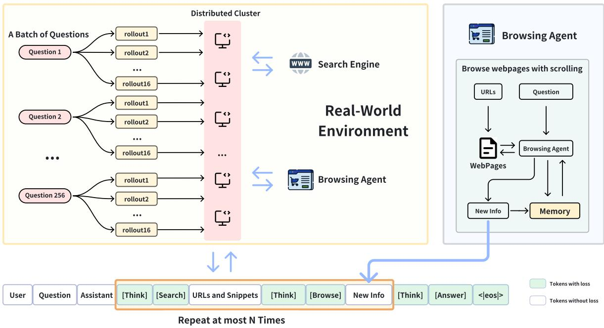  
Figure 1: The trajectory of a single sample from a batch of questions processed in parallel by a distributed cluster. Each question undergoes multiple independent rollouts with distinct memory. Upper-left: Displays the batch of questions and their concurrent rollout paths. Upper-right: Shows the browsing agent retrieving web pages via URLs, processing them sequentially to incrementally extract relevant information. Bottom: Details the iterative decision-making steps, from initial query formulation and search to snippet retrieval, further reasoning, browsing, information extraction, and answer generation.

## 2.3 Training Environments

Training environments for search agents can be broadly categorized into two types:

Local RAG Environments Current mainstream local RAG frameworks (Gao et al., 2023; Yu et al., 2024) rely on pre-built fixed knowledge repositories, resulting in three critical issues: information timeliness decay, poor domain adaptability, and storage efficiency bottlenecks. While RAG-based RL approaches like Search-R1 (Jin et al., 2025), Re-Search (Chen et al., 2025), and R1-Searcher (Song et al., 2025) have made progress, their experimental validation remains primarily confined to predefined knowledge bases and similarity-based search, restricting the search space and potentially limiting generalizability to real-world applications.

Real-World Web Search Environments Web search-based methods (Schick et al., 2023; Qin et al., 2023) integrate open search engines with LLMs to access and utilize real-time information. However, search-based methods requiring external system participation are seldom trained end-to-end, with research often gravitating toward optimization through manually crafted or heuristically designed workflows (Wang et al., 2024a).

We introduce a novel approach that uniquely integrates reinforcement learning (RL) with training in genuine web environments. Unlike prior RL methods reliant on static, local corpora, our agents directly interact with live search engines. This enables them to navigate the open web’s variability, developing robust capabilities for real-world information retrieval and synthesis, thereby addressing limitations of prompt-based and RAG-confined methods by learning adaptive search strategies.

## 3 Methodology

In this section, we describe the methodology used to train an agent capable of solving problems with web search in dynamic real-world environments.

## 3.1 Deep Research Trajectory

In a typical DeepResearcher’s trajectory, it conducts reasoning and tool selection based on the user question and accumulated observations iteratively as illustrated in Figure 1.

Reasoning We restrict DeepResearcher to do reasoning before taking action. Each reasoning process is wrapped in a <think> tag following the setting in DeepSeek-R1 (Guo et al., 2025).

Web Search Tool DeepResearcher invokes the web search tool by generating a JSON-formatted request with the tool name web\_search and the search queries as arguments. Search results are returned in a structured format comprising title, URL, and snippet for each webpage. The current implementation employs a fixed top-k (e.g., 10) value for search results retrieval. Future work could explore LLM-driven dynamic parameter optimization for enhanced search efficacy.

Web Browsing Agent The web browsing agent provides reliable, question-relevant, and incrementally updated information in to the DeepResearcher system. Specifically, the agent maintains a shortterm memory repository for each query. Upon receiving a web\_browse request, it processes the firstpage segment of the URL in the request. Subsequently, the web browsing agent takes two actions based on the query, historical memory, and the newly acquired webpage content: (1) determining whether to continue reading the next URL/segment or stop and (2) appending relevant information to the short-term memory. Once the agent decides to discontinue further browsing, it compiles all newly added information from the short-term memory and returns it to the DeepResearcher system. The "specialized multi-agent architecture" mentioned earlier is an internal implementation detail of this web\_browse tool. It is designed to effectively process information from webpages, but the primary agent’s policy—which decides when and how to use this tool—is learned end-to-end without being constrained by this internal structure. Thus, the tool’s architecture does not impose human priors on the agent’s learned decision-making process.

Answering When the model determines it has sufficient information to answer the question, it generates a final response within <answer></answer>as the answer to return to the user.

## 3.2 Addressing Challenges in Dynamic Real-World Web Environments

In our open, real-world web setting, several unique challenges arise that necessitate specialized solutions. The following sections detail our strategies for managing these issues effectively.

Challenge I: High-concurrency requests at a single moment The implementation of GRPO results in a large number of sampling iterations, leading to a significant volume of search queries and webpage crawling operations (e.g., 4096), causing long delays. To resolve this issue, we created a distributed CPU server cluster with 50 nodes, specifically designed to manage the Tool requests generated during the RL rollout process. Each server is tasked with handling a portion of these requests, processing search results, and crawling webpages based on the URLs identified by the language model for further reading. It is noteworthy that the use of a 50-node cluster was determined by the hardware resources available to us; the core technical requirement is high-concurrency I/O to manage simultaneous web requests, which could also be achieved with a smaller number of more powerful servers with high-bandwidth connections.

Challenge II: Managing Web Crawling and API Limitations During the crawling phase, the system frequently encounters anti-crawl measures deployed by web servers, which may return irrelevant content or fail to respond entirely. Similarly, when interfacing with search engines or LLM APIs, restrictions such as provider rate limits (e.g. 200 per second) can arise. To mitigate these issues, we implemented a robust retry mechanism that effectively addresses exceptions encountered during API calls or webpage crawling. In addition, we introduced a caching strategy for search results: if an identical search query is made within a predetermined period (e.g., 7 days), the system retrieves the results from the cache. This approach not only reduces the API call frequency but also helps manage the associated costs, particularly for expensive services like the Google Search API.

Challenge III: Optimizing Information Extraction via a Multi-Agent Approach We employ a multi-agent framework wherein a dedicated reading agent is tasked with extracting pertinent information from crawled webpages. Given that many webpages are lengthy and may contain limited relevant content, these pages are partitioned into smaller segments. The reading agent mimics human behavior by processing content sequentially from the first page. Under the assumption that if the initial segments of a URL predominantly contain irrelevant information, the webpage is likely unproductive and can be skipped, this method enables more efficient resource allocation and improves overall information extraction accuracy. Specifically, when handling multiple URLs, our browse tool internally utilizes several "Reading Agents" in parallel, each processing a different webpage. A "Synthesis Agent" then merges the findings into a cohesive output for the main agent.

## 3.3 RL Training Framework

Our approach utilizes Reinforcement Learning (RL) to train the agent. This section outlines how we employ the RL framework to train the agent and the tools used within it.

GRPO In this work, we adopt the Group Relative Policy Optimization (GRPO) algorithm. GRPO optimizes the current policy πθ by leveraging a reference policy $\pi _ { \theta _ { \mathrm { r e f } } }$ along with a set of rollouts generated by an existing policy $\pi _ { \theta _ { \mathrm { o l d } } }$ . Specifically, given G rollouts

$$
\tau = \{ y _ { i } \} _ { i = 1 } ^ { G } \sim \pi _ { \theta _ { \mathrm { o l d } } } ( \cdot | x )\tag{1}
$$

(with each input $x \sim D .$ , where D is the experience distribution), GRPO estimates the baseline using these trajectories instead of training a separate critic. The current policy is then optimized by maximizing the following objective function:

$$
\begin{array} { r l r } {  { \mathcal { I } ( \theta ) = \mathbb { E } _ { x \sim \mathcal { D } , \{ y _ { i } \} _ { i = 1 } ^ { G } \sim \pi _ { \theta _ { \mathrm { o l d } } } ( \cdot \vert x ) } \frac { 1 } { G } \sum _ { i = 1 } ^ { G } [ \operatorname* { m i n } ( \frac { \pi _ { \theta } ( y _ { i } \vert x ) } { \pi _ { \theta _ { \mathrm { o l d } } } ( y _ { i } \vert x ) } A _ { i } ,   } } \\ & { } & {   \mathrm { c l i p } ( \frac { \pi _ { \theta } ( y _ { i } \vert x ) } { \pi _ { \theta _ { \mathrm { o l d } } } ( y _ { i } \vert x ) } , 1 - \epsilon , 1 + \epsilon ) A _ { i } ) - \beta \mathbb { D } _ { \mathrm { K L } } ( \pi _ { \theta } \vert \vert \pi _ { \theta _ { \mathrm { r e f } } } ) ] } \end{array}\tag{2}
$$

Masking Observations The output of the tool is an observation, not the desired result that the model is expected to produce. Therefore, we apply masking to prevent the observation from being involved in training, allowing only the model’s responses to contribute to the training process.

## 3.4 Reward

Rewards play a crucial role during the training process and guide the agent in continuously improving its performance. This section defines the reward structure and describes how the agent’s behavior is rewarded.

We employ the F1 score as our primary reward metric due to our utilization of open-domain QA datasets with short-answer ground truth. For future work involving long-form answers, more sophisticated reward may be necessary, as noted in the Deep Research system card (OpenAI, 2025). The reward is determined by the following conditions:

$$
\mathrm { r e w a r d } = { \left\{ \begin{array} { l l } { - 1 } & { { \mathrm { i f ~ f o r m a t ~ i s ~ i n c o r r e c t } } } \\ { \mathrm { F 1 ~ s c o r e } } & { { \mathrm { i f ~ f o r m a t ~ i s ~ c o r r e c t } } } \end{array} \right. }
$$

• Format Penalty: If the format is incorrect (e.g., missing tags or structural errors), the agent receives a penalty of -1.

• F1 Reward: If the format is correct, the reward is based on the word-level F1 score, which measures the accuracy of the generated answer compared to the reference answer. A higher F1 score results in a higher reward.

## 4 Experiments

## 4.1 Experimental Setups

## 4.1.1 Training Data Curation

To ensure our models genuinely learn search strategies and to mitigate data contamination, we meticulously curated training data from existing opendomain QA benchmarks. A rigorous two-stage filtering process eliminated low-quality questions and instances where the base model could answer without search, yielding a final dataset of 80,000 examples deliberately emphasizing multi-hop scenarios (75% of the total). The complete methodology for data curation is detailed in Appendix A.

## 4.1.2 Model and Hyperparameters

We adopt Qwen2.5-7B-Instruct1 (Qwen et al., 2025) as the backbone model for our training pipeline. The training is conducted using the verl framework2. At each training step, we sample 256 prompts, and sample 16 rollouts for each prompt. Each rollout consists of up to 10 tool calls followed by a final answer step. The training is performed with a mini-batch size of 4,096, which means one rollout stage will backprop for one time.

## 4.2 Evaluation and Results

## 4.2.1 Benchmarks

To thoroughly evaluate model performance across both in-domain (ID) and out-of-domain (OOD) settings, we construct a diverse benchmark suite spanning a range of open-domain QA challenges. For in-domain evaluation, we include the dev sets of NQ (Kwiatkowski et al., 2019), TQ (Joshi et al., 2017), HotpotQA (Yang et al., 2018), and 2Wiki (Ho et al., 2020) as mentioned in Section A.

For out-of-domain evaluation, we introduce three datasets that differ significantly in question style and information distribution: MuSiQue (Trivedi et al., 2022), Bamboogle (Press et al., 2022), and PopQA (Mallen et al., 2022). These datasets test the model’s generalization ability beyond the training domain.

To ensure a fair and balanced evaluation, we randomly sample 512 examples from the development sets of NQ, TQ, HotpotQA, 2Wiki, MuSiQue, and PopQA as well as all 125 samples from Bamboogle’s development set. This sampling strategy allows us to assess model robustness across a broad range of topics and reasoning requirements.

## 4.2.2 Baselines

To comprehensively evaluate the effectiveness and practical utility of DeepResearcher, we compare it against the following baseline methods:

• CoT Only: Employs Chain-of-Thought (CoT) reasoning for answer generation without access to external reference context.

• RAG: Integrates CoT reasoning with retrieved reference context to guide the answer generation process.

• Search-o1: A multi-step reasoning baseline in which the model generates search queries or intermediate answers.3

• Search-o1 + Web Search: Extends Search-o1 by enabling open web access through realtime search APIs and URL Browse.

• ReAct-style Agent: A zero-shot prompting baseline where the base model is instructed to use the provided web search and browsing tools to answer questions.

• Search-r1: A RL method for question answering that utilizes a retriever to search Wikipedia during training and inference.

• R1-Searcher: Conducts Bing searches by appending "site:en.wikipedia.org" to queries and summarizes the top three search results. DeepResearcher differs from this approach in three key aspects: (1) DeepResearcher is trained with real-world environment; (2) DeepResearcher does not restrict the search space to a specific domain; and (3) Our method allows the model to autonomously select URLs rather than compulsorily summarizing the top three search results.

• DeepResearcher (Local RAG): A direct ablation of our proposed method. This agent is trained using the exact same RL framework as DeepResearcher but is restricted to a local RAG environment instead of the live web.

## 4.2.3 Evaluation Metrics

Rule-based Metrics We evaluate the performance of the model using the F1 score that aligns with the reward for training. Both ground-truth and predicted answers are normalized by converting to lowercase and removing all punctuation before computing the metrics.

Model-based Evaluation Rule-based evaluation doesn’t suit long-form responses, so we adopt a model-based evaluation (MBE) approach using LLM-as-a-Judge (Zheng et al., 2023). Specifically, we prompt GPT-4o-mini (Hurst et al., 2024) to assess the model’s answer against the question and ground truth answer, and label it as either "correct" or "incorrect." The MBE score is then computed as the accuracy of these judgments.(Zheng et al., 2023) The full prompt is provided in Appendix C.3.

## 4.2.4 Main Results

Table 1 and Table 2 present the main results of DeepResearcher and the baselines in-domain and out-of-domain, respectively. From these results, we draw the following observations:

DeepResearcher outperforms the baselines within training domains. As shown in Table 1, DeepResearcher achieves the highest performance across the four datasets when measured by the more reliable MBE metric, outperforming baselines by a substantial margin on TQ and 2Wiki. While Searchr1-base shows comparable MBE results on NQ and HotpotQA, it’s important to note that Search-r1- base was specifically trained and evaluated using a local RAG system with direct access to the relevant

<table><tr><td rowspan="2">Method</td><td rowspan="2">Inference Environment</td><td colspan="2">NQ</td><td colspan="2">TQ</td><td colspan="2">HotpotQA</td><td colspan="2">2Wiki</td></tr><tr><td>F1</td><td>MBE</td><td>F1</td><td>MBE</td><td>F1</td><td>MBE</td><td>F1</td><td>MBE</td></tr><tr><td>Prompt Based</td><td></td><td></td><td></td><td></td><td></td><td></td><td></td><td></td><td></td></tr><tr><td>CoT</td><td>Local RAG</td><td>19.8</td><td>32.0</td><td>45.6</td><td>48.2</td><td>24.4</td><td>27.9</td><td>26.4</td><td>27.3</td></tr><tr><td>CoT + RAG</td><td>Local RAG</td><td>42.0</td><td>59.6</td><td>68.9</td><td>75.8</td><td>37.1</td><td>43.8</td><td>24.4</td><td>24.8</td></tr><tr><td>Search-o1*</td><td>Local RAG</td><td>34.5</td><td>57.4</td><td>52.6</td><td>61.1</td><td>31.6</td><td>40.8</td><td>28.6</td><td>32.8</td></tr><tr><td>Search-o1</td><td>Web Search</td><td>32.4</td><td>55.1</td><td>58.9</td><td>69.5</td><td>33.0</td><td>42.4</td><td>30.9</td><td>37.7</td></tr><tr><td>ReAct-style Agent</td><td>Web Search</td><td>22.7</td><td>39.6</td><td>41.9</td><td>49.2</td><td>19.7</td><td>26.2</td><td>17.6</td><td>17.6</td></tr><tr><td>Training Based</td><td></td><td></td><td></td><td></td><td></td><td></td><td></td><td></td><td></td></tr><tr><td>Search-r1-base</td><td>Local RAG</td><td>45.4</td><td>60.0</td><td>71.9</td><td>76.2</td><td>55.9</td><td>63.0</td><td>44.6</td><td>47.9</td></tr><tr><td>Search-r1-instruct</td><td>Local RAG</td><td>33.1</td><td>49.6</td><td>44.7</td><td>49.2</td><td>45.7</td><td>52.5</td><td>43.4</td><td>48.8</td></tr><tr><td>R1-Searcher</td><td>Web Search</td><td>35.4</td><td>52.3</td><td>73.1</td><td>79.1</td><td>44.8</td><td>53.1</td><td>59.4</td><td>65.8</td></tr><tr><td>DeepResearcher (Local RAG)</td><td>Local RAG</td><td>29.5</td><td>46.3</td><td>51.9</td><td>55.5</td><td>29.4</td><td>35.4</td><td>26.3</td><td>27.5</td></tr><tr><td>DeepResearcher</td><td>Web Search</td><td>39.6</td><td>61.9</td><td>78.4</td><td>85.0</td><td>52.8</td><td>64.3</td><td>59.7</td><td>66.6</td></tr></table>

Table 1: In-domain results on four datasets (NQ, TQ, HotpotQA, 2Wiki), evaluated by F1 and MBE metrics. DeepResearcher outperforms all baseline methods in MBE and shows competitive performance in F1, particularly excelling on TQ and 2Wiki. It is worth noting that Search-r1-base was trained and evaluated in a local RAG environment with direct access to the relevant Wikipedia corpus, while DeepResearcher must navigate the entire Internet to find information, achieving excellent results despite facing a more realistic and challenging scenario.

Wikipedia corpus. In contrast, DeepResearcher must navigate the entire Internet to find relevant information, representing a more realistic and significantly more challenging scenario even though the answers ultimately come from Wikipedia.

DeepResearcher demonstrates exceptional generalization to novel domains. As revealed in Table 2, DeepResearcher consistently outperforms all other baselines across three OOD datasets. This indicates that the model successfully learns generalizable skills for reasoning, searching, and synthesizing information from different sources through RL scaling, rather than merely adapting to specific training distributions.

Importance of Real-World Environment in Training The most direct evidence comes from our ablation study comparing DeepResearcher with its counterpart trained in a local RAG environment. The results show a dramatic drop in performance for "DeepResearcher (Local RAG)" across all datasets, which empirically validates our central thesis: the noisy and dynamic nature of the live web is a necessary training ground for fostering generalizable and robust research capabilities. This advantage is further exemplified on benchmarks like Bamboogle, which requires knowledge beyond Wikipedia’s coverage. On this dataset, not only does DeepResearcher significantly outperform local RAG-based methods, but it also surpasses R1-Searcher even when the latter is granted web access at inference time. These results collectively demonstrate that end-to-end training in a real-world environment develops robust information retrieval and synthesis skills that cannot be replicated in controlled, static settings.

## 5 Analysis

## 5.1 Training Dynamics

• Performance gradually scaling with reinforcement learning: Figure 2 (a) present the evaluation of F1 scores, across different training steps. The F1 score 0.375, and gradually increases to around 0.55 demonstrating a consistent upward trend. This result indicates the progressive improvement of the model’s performance in reinforcement learning.

• Training leads to increased reasoning steps in hard question: Figure 2 (b) illustrates the average number of turns required for different reasoning hops. The general trend indicates that as the training progresses, the required number of tool calls also increases across different difficulty levels. Unlike the other three settings, the 4-hop setting continues to exhibit an increasing trend even after 34 steps. This suggests that the model is still learning to retrieve more information when dealing with more difficult questions.

• Continuous learning makes long response without saturation: Figure 2 (c) presents the length of responses for different reasoning hops. The response lengths also increase with reasoning complexity. However, all four settings show a sustained upward trend, indicating that the model continues to expand its reasoning processes during training. This further supports the idea that the model adapts to increasingly complex queries by generating more detailed outputs like double-check, refinement, planning, etc.

<table><tr><td rowspan="3">Method</td><td rowspan="3">Inference Environment</td><td colspan="2">Musique</td><td colspan="2">Bamboogle</td><td colspan="2">PopQA</td></tr><tr><td>F1</td><td>MBE</td><td>F1</td><td>MBE</td><td>F1</td><td>MBE</td></tr><tr><td>Prompt Based</td><td></td><td></td><td></td><td></td><td></td><td></td><td></td></tr><tr><td>CoT</td><td>Local RAG</td><td>8.5</td><td>7.4</td><td>22.1</td><td>21.6</td><td>17.0</td><td>15.0</td></tr><tr><td>CoT + RAG</td><td>Local RAG</td><td>10.0</td><td>10.0</td><td>25.4</td><td>27.2</td><td>46.9</td><td>48.8</td></tr><tr><td>Search-o1*</td><td>Local RAG</td><td>16.8</td><td>21.3</td><td>35.8</td><td>38.4</td><td>36.9</td><td>42.4</td></tr><tr><td>Search-o1</td><td>Web Search</td><td>14.7</td><td>19.7</td><td>46.6</td><td>53.6</td><td>38.3</td><td>43.4</td></tr><tr><td>ReAct-style Agent</td><td>Web Search</td><td>8.9</td><td>10.0</td><td>34.4</td><td>36.8</td><td>19.1</td><td>20.5</td></tr><tr><td>Training Based</td><td></td><td></td><td></td><td></td><td></td><td></td><td></td></tr><tr><td>Search-r1-base</td><td>Local RAG</td><td>26.7</td><td>27.5</td><td>56.5</td><td>57.6</td><td>43.2</td><td>47.0</td></tr><tr><td>Search-r1-instruct</td><td>Local RAG</td><td>26.5</td><td>28.3</td><td>45.0</td><td>47.2</td><td>43.0</td><td>44.5</td></tr><tr><td>R1-Searcher</td><td>Web Search</td><td>22.8</td><td>25.6</td><td>64.8</td><td>65.6</td><td>42.7</td><td>43.4</td></tr><tr><td>DeepResearcher (Local RAG)</td><td>Local RAG</td><td>12.7</td><td>12.5</td><td>42.7</td><td>46.4</td><td>23.2</td><td>23.4</td></tr><tr><td>DeepResearcher</td><td>Web Search</td><td>27.1</td><td>29.3</td><td>71.0</td><td>72.8</td><td>48.5</td><td>52.7</td></tr></table>

Table 2: This table shows the performance of different methods on three out-of-domain datasets (Musique, Bamboogle, PopQA), evaluated by F1 and MBE metrics. DeepResearcher leads in both F1 and MBE on all datasets, demonstrating strong generalization capabilities compared to other methods. Notably, unlike the other datasets, Bamboogle’s corpus is not entirely derived from Wikipedia pages.

## 5.2 Case Study

Figures 3 and 4 present four cases illustrating the model’s behavior after reinforcement learning. From these examples, we identify several key behavioral patterns:

• Behavior I: Planning when addressing multi-hop questions: As demonstrated on the left side of Figure 3, DeepResearcher is capable of making plans and dynamically adjusting it throughout the reasoning process. Notably, the model can merge steps when appropriate, indicating that planning abilities emerge naturally without the necessity of SFT on explicit planning data (Yue et al., 2024a).

• Behavior II: Cross-validation before finalizing its answers: As observed on the right side of Figure 3, DeepResearcher identifies the correct answer during its first tool call. However, rather than immediately committing to this result, it proceeds to verify its accuracy through subsequent steps. This cautious approach enhances the reliability of model’s responses, ensuring greater robustness in final predictions.

• Behavior III: Reflection when observations deviate from expectations: The left side of Figure 4 illustrates the model’s ability to reflect on its search process. When the retrieved information does not fully align with the question, DeepResearcher recognizes this discrepancy based on environmental feedback and refines its search query in subsequent tool calls. This reflective capability is essential for preventing the model from getting stuck (Fu et al., 2025) in reasoning, enabling it to enhance overall problem-solving efficiency.

• Behavior IV: Honesty by acknowledging its limitations: A reliable model should minimize hallucinations and provide honest responses when it lacks the necessary knowledge (Yang et al., 2024). We observe that DeepResearcher is capable of recognizing when it has not found the correct answer and appropriately declines to provide a response. This behavior is beneficial, however, current question-answering evaluation metrics do not yet account for this aspect of model reliability.

## 6 Conclusion

In conclusion, we presents DeepResearcher, a groundbreaking approach for scaling reinforcement learning in LLMs to operate effectively in real-world web search environments. Unlike approaches dependent on static knowledge bases, DeepResearcher trains agents to interact with live search engines, allowing them to navigate the inherent complexity and variability of the open web. This direct engagement with dynamic search environments leads to substantial improvements in task completion and deep research capabilities.

Through an end-to-end training methodology, DeepResearcher addresses real-world challenges like network latency while enabling agents to autonomously develop robust problem-solving strategies and cultivates cognitive behaviors such as planning, reflection, and cross-validation through its multi-agent architecture. The success of Deep-Researcher represents a significant milestone for LLM agents, showcasing how scaling reinforcement learning in real-world environments can unlock superior research performance and pave the way for more adaptive systems capable of tackling complex, open-domain problems.

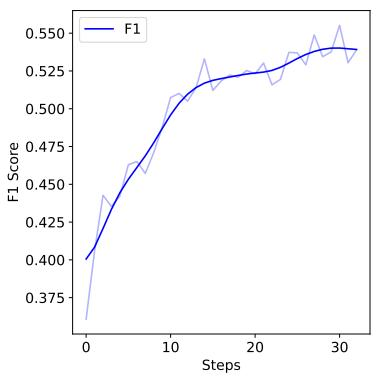  
(a)

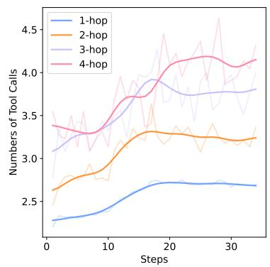  
(b)

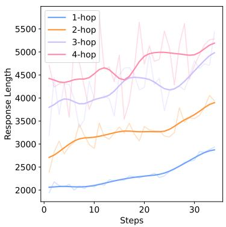  
(c)  
Figure 2: Training dynamics of F1, turns and response length. In this figure, we find the performance gradually scaling with reinforcement learning. The numbers of tool calls and responses also increase.

## Limitations

While DeepResearcher demonstrates significant advancements, this study has certain limitations. Firstly, our experiments were conducted using a 7B parameter model (Qwen2.5-7B-Instruct). Although this model size yielded substantial improvements, we have not yet explored the potential performance gains or emergent capabilities that might arise from applying the DeepResearcher framework to significantly larger language models. Future work could investigate the scalability of our approach with more powerful base models.

Secondly, the reward mechanism employed in this study, while effective for the open-domain QA tasks with short, factual answers (relying on F1 scores and a format penalty), may not adequately address the complexities of more open-ended deep research inquiries. Such inquiries often involve illdefined problem spaces, require extensive synthesis of diverse information, and may result in long-form, nuanced outputs where traditional metrics like F1 are less applicable. Consequently, a critical area for future exploration is the development of training methodologies and reward structures specifically tailored to deep research on these more open questions.

## Ethical Considerations

The advanced information retrieval and reasoning capabilities of DeepResearcher, while powerful, could potentially be misused by malicious actors for tasks such as infringing upon individual privacy by accessing sensitive information without consent. We emphasize that the DeepResearcher framework is intended for beneficial research, and developers must ensure its responsible and ethical application, adhering to privacy and legal standards.

## Acknowledgments

The authors would like to thank the anonymous reviewers for their suggestions and feedback on the work. This work was partially funded by the National Natural Science Foundation of China (62476168), National High Technology Research and Development Program of China (2015AA015408), Shanghai Science and Technology Development Funds (14ZR1403200). This project is supported by SJTU SEIEE - ByteDance Large Language Model Joint Laboratory.

## References

Salaheddin Alzubi, Creston Brooks, Purva Chiniya, Edoardo Contente, Chiara von Gerlach, Lucas Irwin, Yihan Jiang, Arda Kaz, Windsor Nguyen, Sewoong Oh, and 1 others. 2025. Open deep search: Democratizing search with open-source reasoning agents. arXiv preprint arXiv:2503.20201.

CAMEL-AI.org. 2025. Owl: Optimized workforce learning for general multi-agent assistance in realworld task automation. https://github.com/ camel-ai/owl. Accessed: 2025-03-07.

Mingyang Chen, Tianpeng Li, Haoze Sun, Yijie Zhou, Chenzheng Zhu, Haofen Wang, Jeff Z. Pan, Wen

Zhang, Huajun Chen, Fan Yang, Zenan Zhou, and Weipeng Chen. 2025. Research: Learning to reason with search for llms via reinforcement learning. Preprint, arXiv:2503.19470.

Wenfeng Feng, Chuzhan Hao, Yuewei Zhang, Jingyi Song, and Hao Wang. 2025. Airrag: Activating intrinsic reasoning for retrieval augmented generation via tree-based search. arXiv preprint arXiv:2501.10053.

Dayuan Fu, Keqing He, Yejie Wang, Wentao Hong, Zhuoma Gongque, Weihao Zeng, Wei Wang, Jingang Wang, Xunliang Cai, and Weiran Xu. 2025. Agentrefine: Enhancing agent generalization through refinement tuning. arXiv preprint arXiv:2501.01702.

Yunfan Gao, Yun Xiong, Xinyu Gao, Kangxiang Jia, Jinliu Pan, Yuxi Bi, Yi Dai, Jiawei Sun, Haofen Wang, and Haofen Wang. 2023. Retrieval-augmented generation for large language models: A survey. arXiv preprint arXiv:2312.10997, 2.

Google. 2024. Gemini deep research.

Daya Guo, Dejian Yang, Haowei Zhang, Junxiao Song, Ruoyu Zhang, Runxin Xu, Qihao Zhu, Shirong Ma, Peiyi Wang, Xiao Bi, and 1 others. 2025. Deepseek-r1: Incentivizing reasoning capability in llms via reinforcement learning. arXiv preprint arXiv:2501.12948.

Xanh Ho, Anh-Khoa Duong Nguyen, Saku Sugawara, and Akiko Aizawa. 2020. Constructing a multihop QA dataset for comprehensive evaluation of reasoning steps. In Proceedings of the 28th International Conference on Computational Linguistics, pages 6609–6625, Barcelona, Spain (Online). International Committee on Computational Linguistics.

Sirui Hong, Mingchen Zhuge, Jonathan Chen, Xiawu Zheng, Yuheng Cheng, Jinlin Wang, Ceyao Zhang, Zili Wang, Steven Ka Shing Yau, Zijuan Lin, Liyang Zhou, Chenyu Ran, Lingfeng Xiao, Chenglin Wu, and Jürgen Schmidhuber. 2024. MetaGPT: Meta programming for a multi-agent collaborative framework. In The Twelfth International Conference on Learning Representations.

Aaron Hurst, Adam Lerer, Adam P Goucher, Adam Perelman, Aditya Ramesh, Aidan Clark, AJ Ostrow, Akila Welihinda, Alan Hayes, Alec Radford, and 1 others. 2024. Gpt-4o system card. arXiv preprint arXiv:2410.21276.

Bowen Jin, Hansi Zeng, Zhenrui Yue, Dong Wang, Hamed Zamani, and Jiawei Han. 2025. Searchr1: Training llms to reason and leverage search engines with reinforcement learning. arXiv preprint arXiv:2503.09516.

Mandar Joshi, Eunsol Choi, Daniel Weld, and Luke Zettlemoyer. 2017. TriviaQA: A large scale distantly supervised challenge dataset for reading comprehension. In Proceedings of the 55th Annual Meeting of

the Associationfor Computational Linguistics (Volume 1: Long Papers), pages 1601–1611, Vancouver, Canada. Association for Computational Linguistics.

Tom Kwiatkowski, Jennimaria Palomaki, Olivia Redfield, Michael Collins, Ankur Parikh, Chris Alberti, Danielle Epstein, Illia Polosukhin, Jacob Devlin, Kenton Lee, Kristina Toutanova, Llion Jones, Matthew Kelcey, Ming-Wei Chang, Andrew M. Dai, Jakob Uszkoreit, Quoc Le, and Slav Petrov. 2019. Natural questions: A benchmark for question answering research. Transactions ofthe Associationfor Computational Linguistics, 7:452–466.

Xiaoxi Li, Guanting Dong, Jiajie Jin, Yuyao Zhang, Yujia Zhou, Yutao Zhu, Peitian Zhang, and Zhicheng Dou. 2025a. Search-o1: Agentic searchenhanced large reasoning models. arXiv preprint arXiv:2501.05366.

Xuefeng Li, Haoyang Zou, and Pengfei Liu. 2025b. Limr: Less is more for rl scaling. Preprint, arXiv:2502.11886.

Xuefeng Li, Haoyang Zou, and Pengfei Liu. 2025c. Torl: Scaling tool-integrated rl. Preprint, arXiv:2503.23383.

Xinbin Liang, Jinyu Xiang, Zhaoyang Yu, Jiayi Zhang, and Sirui Hong. 2025. Openmanus: An open-source framework for building general ai agents. https: //github.com/mannaandpoem/OpenManus.

Alex Mallen, Akari Asai, Victor Zhong, Rajarshi Das, Hannaneh Hajishirzi, and Daniel Khashabi. 2022. When not to trust language models: Investigating effectiveness and limitations of parametric and nonparametric memories. arXiv preprint.

OpenAI. 2024. Learning to reason with llms, september 2024.

OpenAI. 2025. Deep research system card. Technical report, OpenAI.

Ofir Press, Muru Zhang, Sewon Min, Ludwig Schmidt, Noah A Smith, and Mike Lewis. 2022. Measuring and narrowing the compositionality gap in language models. arXiv preprint arXiv:2210.03350.

Yujia Qin, Shihao Liang, Yining Ye, Kunlun Zhu, Lan Yan, Yaxi Lu, Yankai Lin, Xin Cong, Xiangru Tang, Bill Qian, and 1 others. 2023. Toolllm: Facilitating large language models to master 16000+ real-world apis. arXiv preprint arXiv:2307.16789.

Qwen, :, An Yang, Baosong Yang, Beichen Zhang, Binyuan Hui, Bo Zheng, Bowen Yu, Chengyuan Li, Dayiheng Liu, Fei Huang, Haoran Wei, Huan Lin, Jian Yang, Jianhong Tu, Jianwei Zhang, Jianxin Yang, Jiaxi Yang, Jingren Zhou, and 25 others. 2025. Qwen2.5 technical report. Preprint, arXiv:2412.15115.

Timo Schick, Jane Dwivedi-Yu, Roberto Dessì, Roberta Raileanu, Maria Lomeli, Eric Hambro, Luke Zettlemoyer, Nicola Cancedda, and Thomas Scialom. 2023. Toolformer: Language models can teach themselves to use tools. Advances in Neural Information Processing Systems, 36:68539–68551.

Huatong Song, Jinhao Jiang, Yingqian Min, Jie Chen, Zhipeng Chen, Wayne Xin Zhao, Lei Fang, and Ji-Rong Wen. 2025. R1-searcher: Incentivizing the search capability in llms via reinforcement learning. arXiv preprint arXiv:2503.05592.

Kimi Team, Angang Du, Bofei Gao, Bowei Xing, Changjiu Jiang, Cheng Chen, Cheng Li, Chenjun Xiao, Chenzhuang Du, Chonghua Liao, and 1 others. 2025. Kimi k1.5: Scaling reinforcement learning with llms. arXiv preprint arXiv:2501.12599.

Harsh Trivedi, Niranjan Balasubramanian, Tushar Khot, and Ashish Sabharwal. 2022. MuSiQue: Multihop questions via single-hop question composition. Transactions of the Association for Computational Linguistics.

Prakhar Verma, Sukruta Prakash Midigeshi, Gaurav Sinha, Arno Solin, Nagarajan Natarajan, and Amit Sharma. 2025. Plan\*rag: Efficient test-time planning for retrieval augmented generation. Preprint, arXiv:2410.20753.

Xiaohua Wang, Zhenghua Wang, Xuan Gao, Feiran Zhang, Yixin Wu, Zhibo Xu, Tianyuan Shi, Zhengyuan Wang, Shizheng Li, Qi Qian, and 1 others. 2024a. Searching for best practices in retrievalaugmented generation. In Proceedings ofthe 2024 Conference on Empirical Methods in Natural Language Processing, pages 17716–17736.

Ziting Wang, Haitao Yuan, Wei Dong, Gao Cong, and Feifei Li. 2024b. Corag: A cost-constrained retrieval optimization system for retrieval-augmented generation. arXiv preprint arXiv:2411.00744.

xAI. 2025. Grok 3.

Yuqing Yang, Ethan Chern, Xipeng Qiu, Graham Neubig, and Pengfei Liu. 2024. Alignment for honesty. Advances in Neural Information Processing Systems, 37:63565–63598.

Zhilin Yang, Peng Qi, Saizheng Zhang, Yoshua Bengio, William W. Cohen, Ruslan Salakhutdinov, and Christopher D. Manning. 2018. HotpotQA: A dataset for diverse, explainable multi-hop question answering. In Conference on Empirical Methods in Natural Language Processing (EMNLP).

Tian Yu, Shaolei Zhang, and Yang Feng. 2024. Auto-rag: Autonomous retrieval-augmented generation for large language models. arXiv preprint arXiv:2411.19443.

Murong Yue, Wenlin Yao, Haitao Mi, Dian Yu, Ziyu Yao, and Dong Yu. 2024a. Dots: Learning to reason dynamically in llms via optimal reasoning trajectories search. arXiv preprint arXiv:2410.03864.

Zhenrui Yue, Honglei Zhuang, Aijun Bai, Kai Hui, Rolf Jagerman, Hansi Zeng, Zhen Qin, Dong Wang, Xuanhui Wang, and Michael Bendersky. 2024b. Inference scaling for long-context retrieval augmented generation. arXiv preprint arXiv:2410.04343.

Lianmin Zheng, Wei-Lin Chiang, Ying Sheng, Siyuan Zhuang, Zhanghao Wu, Yonghao Zhuang, Zi Lin, Zhuohan Li, Dacheng Li, Eric P. Xing, Hao Zhang, Joseph E. Gonzalez, and Ion Stoica. 2023. Judging llm-as-a-judge with mt-bench and chatbot arena. In Advances in Neural Information Processing Systems 36: Annual Conference on Neural Information Processing Systems 2023, NeurIPS 2023, New Orleans, LA, USA, December 10 - 16, 2023.

Yuxiang Zheng, Shichao Sun, Lin Qiu, Dongyu Ru, Cheng Jiayang, Xuefeng Li, Jifan Lin, Binjie Wang, Yun Luo, Renjie Pan, Yang Xu, Qingkai Min, Zizhao Zhang, Yiwen Wang, Wenjie Li, and Pengfei Liu. 2024. OpenResearcher: Unleashing AI for accelerated scientific research. In Proceedings of the 2024 Conference on Empirical Methods in Natural Language Processing: System Demonstrations, pages 209–218, Miami, Florida, USA. Association for Computational Linguistics.

## A Beyond Memorization: Curating Search-Dependent Training Data

## A.1 Leveraging Open Domain QA Data

Despite the growing interest in deep research capabilities for LLM agents, there currently exists no open-source training dataset specifically designed for this purpose. To address this gap, we leverage existing open-domain question-answering datasets, which contain single-hop to multi-hop questions that inherently require online search to find accurate answers.

Our training corpus comprises a diverse collection of QA datasets that require varying degrees of retrieval complexity. Specifically, we utilize NaturalQuestions (NQ) (Kwiatkowski et al., 2019) and TriviaQA (TQ) (Joshi et al., 2017) for single-hop scenarios, where answers can typically be found within a single web document. For more complex multi-hop scenarios, which require integrating information across multiple sources, we incorporate examples from HotpotQA (Yang et al., 2018) and 2WikiMultiHopQA (2Wiki) (Ho et al., 2020), both of which were specifically designed to evaluate multi-step reasoning capabilities.

## A.2 The Issue of Data Contamination

For training models that genuinely learn to leverage web search tools—rather than simply recalling memorized information—it is critical to address the problem of data contamination. Large language models have been pretrained on vast internet corpora, which likely include many of the QA pairs in standard benchmarks. Without proper contamination detection, the model might appear to successfully complete research tasks while actually using its parametric knowledge, defeating the purpose of learning web search strategies.

This contamination issue is particularly problematic in the context of our work, as it could lead to:

• Models that falsely appear to benefit from web search when actually using memorized knowledge.

• Failure to develop genuine search strategies when deployed on truly novel questions.

• Inability to generalize to real-world research scenarios where answers cannot be found in the model’s training data.

## A.3 Data Cleaning and Contamination Detection

To ensure the integrity of our training process, we implemented a comprehensive two-stage filtering methodology:

Low-Quality Question Filtering We exclude questions that could yield unreliable or problematic search results. Specifically, we eliminate: 1) Timesensitive questions (e.g., "Who is the current CEO of Apple?"); 2) Highly subjective queries (e.g., "What is the best smartphone?"); and 3) Potentially harmful or policy-violating content. This filtering was implemented using DeepSeek-R1 (Guo et al., 2025) with a carefully designed evaluation prompt to systematically identify and mark problematic questions.

Contamination Detection To ensure the model genuinely learns to use search tools rather than memorizing answers, we employed a robust contamination detection procedure. For each candidate question, we randomly sample 10 responses from the base model we will use in training, and check if any response contains the ground truth answer (i.e., pass@10). Questions where the model demonstrated prior knowledge (by producing the correct answer without search) were excluded from the training set. This contamination screening is critical for preventing the model from developing a false reliance on parametric knowledge when search-based knowledge is required.

The prompts used for data cleaning and contamination detection are listed in Appendix C.1. After applying these quality control measures, we constructed a final training dataset of 80,000 examples with a distribution ratio of 1:1:3:3 for NQ:TQ:HotpotQA:2Wiki. This proportion deliberately emphasizes multi-hop scenarios (75% of examples), as these better reflect the complex information-seeking behaviors required for deep research questions.

## B Case Study Example

This Section provides supplementary visual examples to illustrate distinct behavioral characteristics of the DeepResearcher during its reasoning processes. These case studies serve to concretize the model’s capabilities in dynamic planning, crossvalidation, reflection, and honest self-assessment.

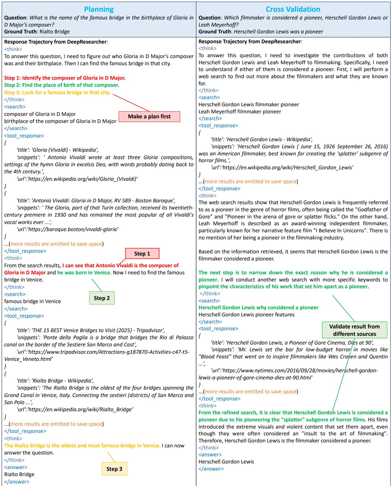  
Figure 3: Planning and Cross Validation Behaviors. Left: DeepResearcher is capable of making plans and dynamically adjusting it throughout the reasoning process. Notably, the model can merge steps when appropriate. Right: DeepResearcher identifies the correct answer during its first tool call. However, rather than immediately committing to this result, it proceeds to verify its accuracy through subsequent steps. This rigorous behavior enhances the reliability of the model’s responses, ensuring greater robustness in its final answers. Note: In the actual model, the tool call and tool response format is a JSON string, rather than a tag. However, for clarity and ease of presentation, we have used tags in the figure to represent the output.

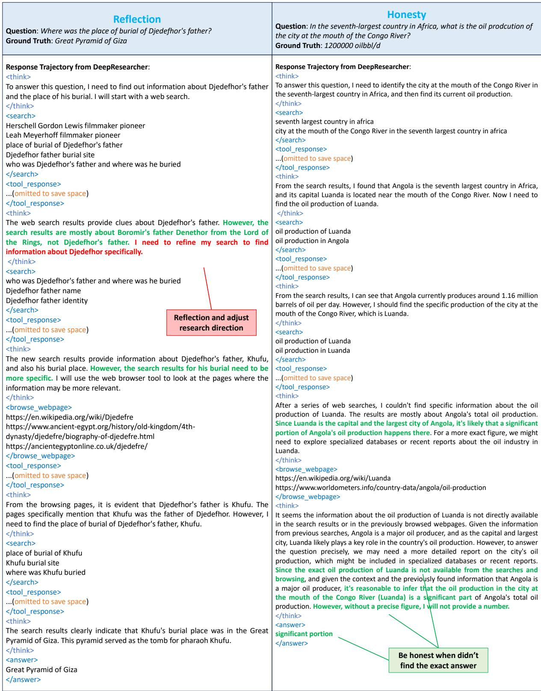  
Figure 4: Reflection and Honesty Behavior. The search and browse are 2 apis in json format in the real inference stage. Left: When the retrieved information does not fully align with the question, DeepResearcher recognizes this discrepancy based on environmental feedback and refines its search query in subsequent tool calls. This proves its reflection ability. Right: DeepResearcher is capable of recognizing when it has not found the correct answer and appropriately declines to provide a response to be honesty. Note: In the actual model, the tool call and tool response format is a JSON string, rather than a tag. However, for clarity and ease of presentation, we have used tags in the figure to represent the output.

## C Prompts

## C.1 Prompt for Question Quality Level Evaluation

The prompt below displays two templates. Identifies if questions are time-sensitive, subjective, or potentially harmful. Includes classification guidelines, question placeholder, and required answer tag format.

Prompt for training data quality checking   
Please identify whether the given question is   
time-sensitive, subjective, or may cause harmful   
answers.   
- Time-sensitive: The answer to the question   
may change over time.   
- Harmful: The answer to the question may be   
harmful or offensive.   
- Subjective: The answer to the question may be   
subjective and not based on facts.   
Here is the question:   
<question>   
{question}   
</question>   
Wrap your answer in <answer> tags with   
one of the following values:   
- time\_sensitive: if the question is time-sensitive   
- harmful: if the question may cause harmful answers   
- subjective: if the question is subjective   
- good: if the question is none of the above

The prompt below shows the template prompt for contamination detection. To tests if AI responses are influenced by training data contamination.

Prompt for contamination detection   
Give a short answer to the following question. The   
answer should be in English.   
Question: {question}   
Your answer:

## C.2 Prompt for Model’s Answer Quality Level Evaluation

The prompt below provides instructions for evaluating the correctness of AI-generated answers (pred answer) against a list of ground truth answers. To

judge if a predicted answer correctly answers a question by comparing it to ground truth answers.

Prompt for Model-based Evaluation   
You will be given a question and its ground truth   
answer list where each item can be a ground truth   
answer. Provided a pred\_answer, you need to judge   
if the pred\_answer correctly answers the question   
based on the ground truth answer list.   
You should first give your rationale for the judgement,   
and then give your judgement result (i.e., correct or   
incorrect).   
Here is the criteria for the judgement:   
1. The pred\_answer doesn’t need to be exactly the   
same as any of the ground truth answers, but should   
be semantically same for the question.   
2. Each item in the ground truth answer list can be   
viewed as a ground truth answer for the question,   
and the pred\_answer should be semantically same to   
at least one of them.   
question: {question}   
ground truth answers: {gt\_answer}   
pred\_answer: {pred\_answer}   
The output should in the following json for  
mat:   
”’json   
"rationale": "your rationale for the judgement, as a   
text",   
"judgement": "your judgement result, can only be   
’correct’ or ’incorrect’"   
}   
;,,   
Your output:

## C.3 Prompt for Research Plan on Question Answering

The prompt below outlines the structured approach for addressing complex questions, utilizing web search and webpage browsing tools to conduct indepth research and gather the necessary information for a comprehensive response.

## Prompt for Research Plan on Complex Question Answering

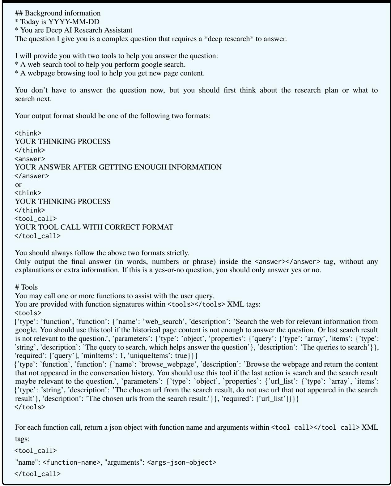

## D Training Scaling Result

Figure 5 presents the F1 score in 7 benchmarks. We sampled 125 cases from each benchmarks’ development set. DeepResearcher can scale in all benchmarks, especially in OOD benchmarks.

## E Performance

Figure 6 provides a consolidated visualization of DeepResearcher’s performance in comparison to other models across a comprehensive suite of seven distinct datasets. This consistent outperformance not only serves as a robust validation of the model’s advanced capabilities and effectiveness but also strongly indicates its significant generalization ability across diverse data domains and task types.

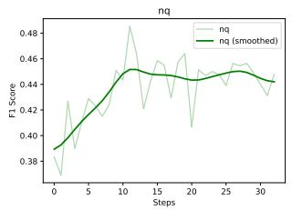

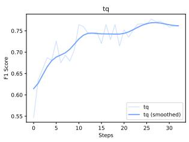

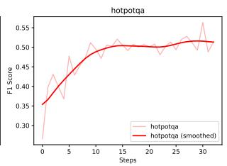

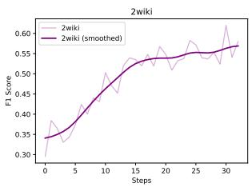

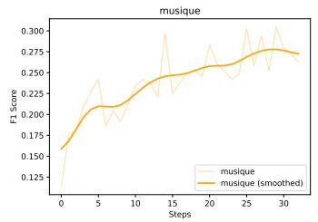

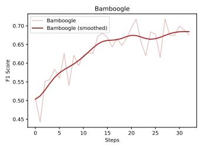  
Figure 5: F1 score during training

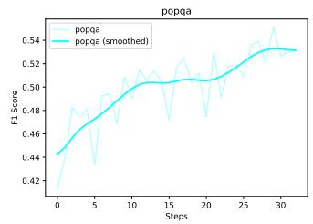

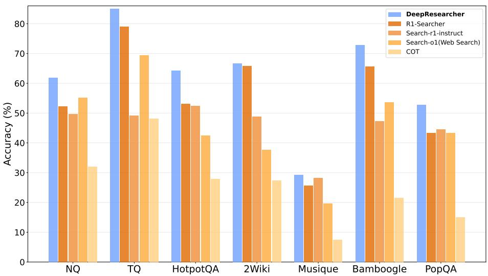  
Figure 6: DeepResearcher performs the best on all 7 datasets measured by reliable model-based evaluation.