# Demystifying optimized prompts in language models

Rimon Melamed 1 Lucas H. McCabe 1,2 H. Howie Huang 1

1 The George Washington University 2 LMI Consulting {rmelamed,lucasmccabe,howie}@gwu.edu

## Abstract

Modern language models (LMs) are not robust to out-of-distribution inputs. Machine generated (“optimized”) prompts can be used to modulate LM outputs and induce specific behaviors while appearing completely uninterpretable. In this work, we investigate the composition of optimized prompts, as well as the mechanisms by which LMs parse and build predictions from optimized prompts. We find that optimized prompts primarily consist of punctuation and noun tokens which are more rare in the train ing data. Internally, optimized prompts are clearly distinguishable from natural language counterparts based on sparse subsets of the model’s activations. Across various families of instruction-tuned models, optimized prompts follow a similar path in how their representations form through the network.

## 1 Introduction

Language models (LMs) (Grattafiori et al., 2024; Biderman et al., 2023a; Team et al., 2024; Abdin et al., 2024) are trained on large amounts of filtered internet data (Gao et al., 2020; Raffel et al., 2020; Penedo et al., 2024; Soldaini et al., 2024), which consist primarily of interpretable natural language text. Recent work has found that these models are sensitive to machine-generated optimized prompts, which, although seemingly uninterpretable, can be used to elicit targeted behaviors (Shin et al., 2020; Wen et al., 2023; Zou et al., 2023b; Melamed et al., 2024). Specifically, we define optimized prompts as prompts that are generated via the gradient-based discrete prompt optimization method called Greedy Coordinate Gradient (GCG) (Zou et al., 2023b); see Section 2 for further background.

In this work, we seek to better understand the underlying mechanisms by which language models parse these seemingly garbled inputs. In particular, we ask the question:

Are discretely optimized prompts truly uninterpretable?

This question has major implications in several areas, including safety and privacy. Specifically, discrete prompt optimization has commonly been applied in the adversarial setting to “jailbreak” LMs, resulting in toxic or undesirable behavior (Zou et al., 2023b; Liao and Sun, 2024; Andriushchenko et al., 2024; Zhu et al., 2024); see Section 2 for further details. A better understanding of these optimized prompts is crucial to ensure robustness and safety in LMs.

To this end, we explore the nature of optimized prompts through experiments which consider both the discrete makeup of optimized prompts, as well as how these prompts are processed internally by LMs; see Section 3.

## 1.1 Our contributions

To the best of our knowledge, this is the first work which systematically investigates optimized prompts over a wide range of models.

Optimized prompts consist of influential and specific tokens. We find that both natural language and optimized prompts consist of specific “influential” tokens which have an out-sized impact on eliciting desired behavior, and these influential tokens consist primarily of nouns and punctuation; see Table 1 for examples of these prompts and Section 4 for details.

Optimized prompts rely on rare tokens. When comparing tokens in both optimized and natural language prompts to the pre-training corpus, we find that the majority of tokens in optimized prompts are more rare with respect to the training data than their natural language counterparts. Furthermore, the token distribution of optimized prompts visibly deviates from standard Zipfian behavior; see Section 5.

Table 1: Examples of prompt pairs and their most influential tokens. For each token we show its text and influence score (higher means a larger behavioral change when removed). Both natural language prompts and optimized prompts rely on punctuation, which typically appears at the end of the prompts. This can be attributed to the auto-regressive nature of the models, where the final token can have a pronounced influence; see Section 4.
<table><tr><td rowspan=1 colspan=4>Original prompt              Top-3 original removals      Optimized prompt           Top-3 optimized removals</td></tr><tr><td rowspan=1 colspan=4>word-stories</td></tr><tr><td rowspan=1 colspan=1>Tom was nice and they playedtogether in the grass .</td><td rowspan=1 colspan=1>. (14.80)Tom (7.65)played (2.13)</td><td rowspan=1 colspan=1>Bee Squeak Dickie paw An-geles Wee Table Bananasgoat Jazz Tom least careOr raking pinched wavedglanced dancers .</td><td rowspan=1 colspan=1>. (16.23)Bee (2.75)dancers (0.74)</td></tr><tr><td rowspan=1 colspan=1>Bob proudly showed them thepicture he had just printed .</td><td rowspan=1 colspan=1>. (17.82)Bob (1.07)picture (0.94)</td><td rowspan=1 colspan=1>Timothy telling None displaycolours page wipes Pete vi-sor beamed Their recognise3 deleted pear symbol mittenshow puzzle !</td><td rowspan=1 colspan=1>!(14.04)Timothy (2.55)Pete (0.70)</td></tr><tr><td rowspan=1 colspan=4>Pythia-1.4B</td></tr><tr><td rowspan=1 colspan=1>Construct a web address fora book recommendation web-site.</td><td rowspan=1 colspan=1>. (4.00)Construct (2.04)book (1.74)</td><td rowspan=1 colspan=1>onas books auored A gatewayURL:** EzAzureongeOmorn Yorker OKnote?).</td><td rowspan=1 colspan=1>?). (3.68)URL (2.65):**(0.77)</td></tr><tr><td rowspan=1 colspan=1>At around 10:30 a.m.,</td><td rowspan=1 colspan=1>., (7.83)m (1.48)At (1.02)</td><td rowspan=1 colspan=1>irling Singh Dillonanchezapproached    approacheddetectives       HertEDemCLEC={traceSONumbled700 EVENT).$),</td><td rowspan=1 colspan=1>$), (2.78)detectives (1.27)). (1.24)</td></tr></table>

Optimized prompts have distinct internal representations. We train sparse probing classifiers to distinguish between optimized and natural language prompts based on their activations, and find that these classifiers achieve high accuracy even under sparsity constraints. These findings suggest fundamental differences in how optimized prompts and natural language prompts are represented internally; see Section 6.

## 2 Related work

Discrete prompt optimization Discrete optimization for prompt-based LMs typically consists of perturbing a set of arbitrary tokens in a meaningful way in order to induce desired behavior. Pioneering work includes HotFlip (Ebrahimi et al., 2018) which finds adversarial examples for character-level neural classifiers by performing guided token substitutions based on gradient information. AutoPrompt (Shin et al., 2020) builds on the HotFlip algorithm, and appends “trigger” tokens to the prompts of masked language models such as BERT (Devlin et al., 2019). These trigger tokens are modified in a similar fashion to

HotFlip, and are used to improve performance on downstream tasks such as sentiment analysis and natural language inference (NLI). More recently, Zou et al., 2023b introduce Greedy Coordinate Gradient (GCG), which uses an algorithm similar to AutoPrompt to find adversarial triggers which elicit desired output in modern decoder LMs.

Modern LMs undergo an alignment process (Ouyang et al., 2022; Rafailov et al., 2023) which is meant to improve model safety and refusal to harmful instructions (Bai et al., 2022). Typically, the goal of discrete optimization is to “jailbreak” these models, and cause them to operate outside of their aligned state (Zou et al., 2023b; Zhu et al., 2024; Liao and Sun, 2024; Guo et al., 2024; Thompson and Sklar, 2024; Andriushchenko et al., 2024), resulting in malicious output and degraded performance on downstream tasks.

Language model interpretability Several prior works attempt to shed light on the black-box nature of neural language models. Elhage et al., 2021 take a mechanistic circuit-based approach, examining how individual neurons and connections impact model predictions. They view the model’s outputs at each layer as the “residual stream”, a communication channel that each individual layer can modify.

In contrast, other work adopts a high level view by examining model outputs at a representation level (Zou et al., 2023a; Wu et al., 2024) through various means such as linear probes (Alain and Bengio, 2017; Gurnee et al., 2023) and sparse autoencoders (Bricken et al., 2023; Huben et al., 2024). Several works explore the dynamics by which LMs promote concepts and representations. Nostalgebraist, 2020 investigates how predictions are built by projecting each of the model layer’s outputs to the vocabulary space. Geva et al., 2021 find that transformer feed-forward layers serve as key-value memories, and encode interpretable concepts and patterns. Furthermore, LM predictions appear to be constructed by propogating representations that are interpretable in the vocabulary space (Geva et al., 2022; Belrose et al., 2023). In our work, we apply several techniques such as sparse probing and projections to the vocabulary space in order to study how LMs build predictions for optimized prompts.

Analyzing machine generated prompts There have been several investigations probing the properties of discretely optimized prompts. Ishibashi et al., 2023 explore the robustness of prompts optimized via AutoPrompt (Shin et al., 2020), and find that these prompts are highly sensitive to token ordering and removal when evaluated on NLI tasks. Similarly Cherepanova and Zou, 2024 find that GCG optimized prompts can be degraded via token-level perturbations. Furthermore, machine generated prompts are easier to generate if the target text is shorter and comes from an in-distribution dataset such as Wikipedia (Cherepanova and Zou, 2024). In contrast, Kervadec et al., 2023 examine the attention patterns and activations of optimized prompts for two OPT models (Zhang et al., 2022), finding that optimized prompt tend to trigger distinct “pathways” in the model, which differ from how natural language prompts are processed.

Concurrent work (Rakotonirina et al., 2024) explores properties of prompts optimized via GCG, and find that these prompts consist of several “filler” tokens which do not affect the generation, and that the effectiveness of these prompts relies heavily on the last token. They also discover that there exist local dependencies within gibberish prompts based on specific keywords and bigrams. On the other hand, in our work we investigate the properties of optimized prompts both from a token perspective by training a new model with a word-level tokenizer, as well as from the perspective of the model’s internal representations via hidden state analysis, probing, and causal intervention.

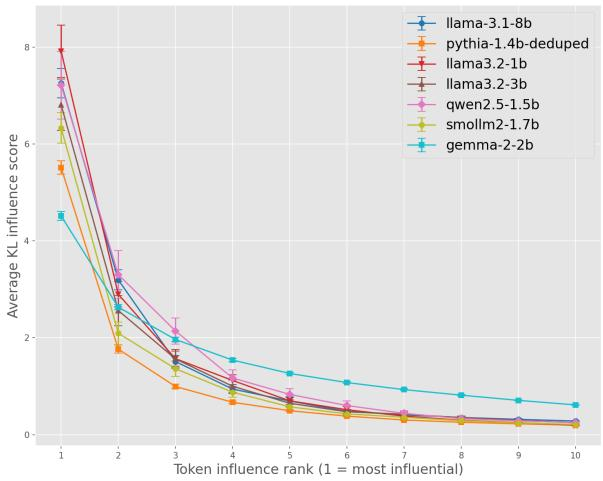  
Figure 1: Token rank influence. The influence score is computed via Equation 2. We find that the most influential token for each prompt has an out-sized effect.

## 3 Experimental setup

We focus our work on transformer decoder (Vaswani et al., 2017; Radford and Narasimhan, 2018) models. We use the Tiny Stories (Eldan and Li, 2023) dataset, which consists of synthetically generated stories meant to be understandable by a three year old child. We train a transformer decoder language model based on the GPT-NeoX (Black et al., 2022; Biderman et al., 2023a) architecture; see Appendix A.1 for full training details. Originally, the model uses a Byte-pair encoding (BPE) tokenizer (Sennrich et al., 2016), which results in optimized prompts that include several nonsensical characters and subwords (Melamed et al., 2024; Cherepanova and Zou, 2024). Because we wish to better understand which specific words appear in optimized prompts, we train a new word-level tokenizer over the Tiny Stories corpus. Using word-level tokenization allows us to better interpret optimized prompts, since we do not need to extrapolate meaning from sub-word tokens and can directly evaluate each word in the prompt individually.

In addition to the word-level Tiny Stories model, we optimize prompts using 18 open models from various model families, including both base models, and their instruction-tuned variants which have been aligned for chat purposes. We use a variety of datasets for the optimization including Alpaca (Taori et al., 2023), WikiText-103 (Salesforce, 2021), OpenHermes-2.5 (Teknium, 2023), and Dolly-15k (Conover et al., 2023); see $\mathbf { A p } \cdot$ pendix $\mathrm { A } . 2$ for further details.

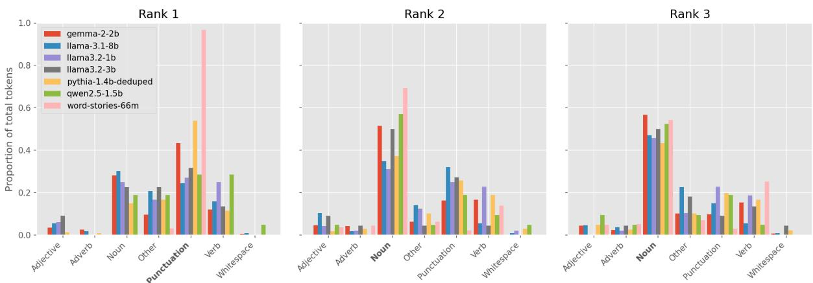  
Figure 2: Token category analysis by rank. For each model and token influence rank (as computed in Section $^ { 4 ) , }$ , we show the proportion of tokens belonging to each part of speech category. The most common category at each rank is highlighted in bold. While the specific distributions vary between models, nouns consistently make up the largest portion of tokens (with the exception of rank 1 in the base models, where punctuation dominates).

In order to perform the discrete optimization, we use the “evil twins” framework (Melamed et al., 2024). Formally, given a natural language prompt $\pmb { p } ^ { * } ~ \in ~ \mathbb { R } ^ { k \times V }$ which is a sequence of k tokens mapped to the LM’s vocabulary $V$ , the objective is to find a new prompt $\pmb { p } \in \mathbb { R } ^ { l \times V }$ with l tokens which is functionally similar to $p ^ { * }$ . This optimization corresponds to an empirical approximation of the KL divergence between $p ^ { * }$ and $^ { p , }$ and is realized by sampling a set of continuations from the LM, $d _ { 1 } , \dots , d _ { n } \sim \mathbb { P } _ { \mathrm { L M } } ( \cdot | p ^ { * } )$ , and running the Greedy Coordinate Gradient (GCG) algorithm (Zou et al., 2023b). For the full algorithm and further details we refer the reader to Appendix B and Melamed et al., 2024.

The KL divergence between prompts is defined as

$$
\begin{array} { r } { d _ { K L } ( \pmb { p } ^ { * } | | \pmb { p } ) = \frac { 1 } { n } \displaystyle \sum _ { i = 1 } ^ { n } \log ( \mathbb { P } _ { \mathrm { L M } } ( \pmb { d } _ { i } | \pmb { p } ^ { * } ) ) } \\ { - \log ( \mathbb { P } _ { \mathrm { L M } } ( \pmb { d } _ { i } | \pmb { p } ) ) . } \end{array}\tag{1}
$$

The lower $d _ { K L } ( \pmb { p } ^ { * } | | \pmb { p } )$ is, the more functionally similar $p ^ { * }$ and $_ p$ are, and $d _ { K L } ( \pmb { p } ^ { * } | | \pmb { p } ) = 0$ if and only if the two prompts are functionally equivalent (Melamed et al., 2024).

## 4 Optimized prompts consist of specific influential tokens

Using the set of optimized prompts from the LMs, we analyze the influence of each token in the prompt by removing each token and measuring the change in KL divergence to the prompt with the token kept. Specifically, given an optimized prompt $\pmb { p } = [ p _ { 1 } , . . . , p _ { k } ]$ consisting of k tokens, we define the influence score $s _ { i }$ of token i as

$$
s _ { i } = d _ { K L } ( \pmb { p } | | \pmb { p } _ { - i } ) ,\tag{2}
$$

where $\pmb { p } _ { - i } = [ p _ { 1 } , . . . , p _ { i - 1 } , p _ { i + 1 } , . . . , p _ { k } ]$ is the prompt with token i removed, and $d _ { K L }$ is defined in Equation 1. A larger influence score indicates that removing token i causes a greater deviation from the functional behavior of the original prompt.

For each optimized prompt, we sort its tokens by their influence scores in descending order to obtain token ranks, where rank 1 corresponds to the most influential token (highest influence score $s _ { i } )$ . We group tokens from all optimized prompts by their rank in order to understand their composition at different influence levels. We find that the most influential token (rank 1) has an outsized effect, and tokens at higher ranks have minimal influence; see Figure 1. Natural language prompts follow a similar pattern, which we describe in Appendix C. These findings are consistent with recent work indicating that optimized prompts largely consist of “filler” tokens that minimally impact prompt behavior (Rakotonirina et al., 2024).

## 4.1 Grammatical categories of optimized prompt tokens

Given that certain tokens have an outsized impact on the prompt, we explore the grammatical makeup of these influential tokens. We perform part-ofspeech tagging on each token in each prompt using spaCy (Honnibal and Montani, 2017). Interestingly, we find that punctuation forms the largest proportion of most influential (rank-1) tokens. In addition, for all models, nouns consistently make up the largest portion of tokens; see Table 1 for examples of these prompts and Figure 2 for full results. Furthermore, these trends are not unique to optimized prompts, as natural language prompts are also dependent on punctuation and nouns; see Appendix C.

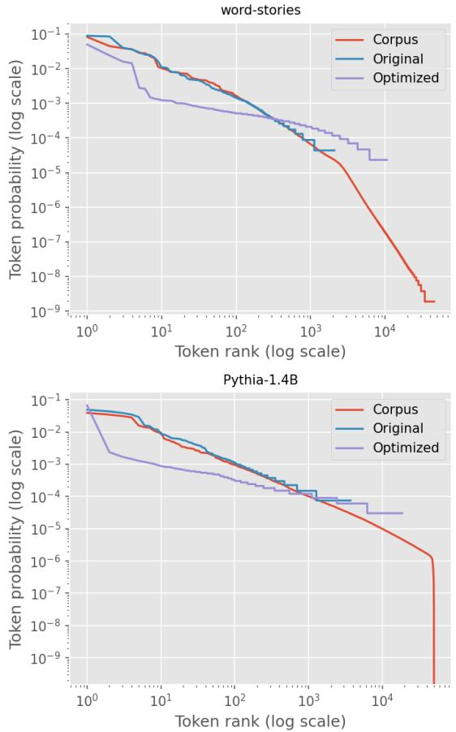  
Figure 3: Zipf plots of token frequencies (excluding the end-of-sequence token) in the corpus, original prompts, and optimized prompts. The token distribution of optimized prompts visibly deviates from the expected Zipfian behavior.

## 5 Optimized prompts use rare tokens

For the word-stories and Pythia-1.4b models where we have access to the pre-training corpus, we further analyze the frequency of tokens in both natural language prompts and optimized prompts.

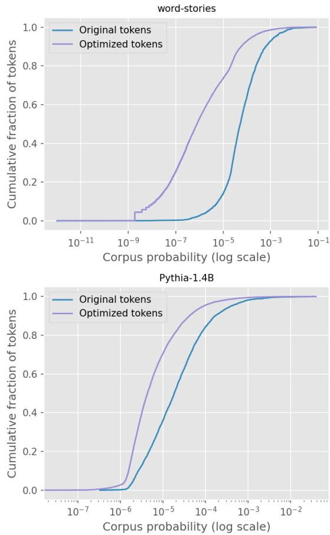  
Figure 4: CDF of token corpus-frequency. For each token used by either the original natural language or the optimized prompts, we plot its probability of appearing in the training corpus, versus the cumulative fraction of tokens up to that probability. The optimized prompts rely more on corpus-rare tokens than their original natural language counterparts.

## 5.1 Optimized prompts do not look like natural language (distributionally)

The distribution of tokens in both the corpus and original prompts exhibit power law-like behavior, consistent with the Zipfian distribution of natural language. In contrast, the sub-linear behavior for optimized prompts in log-transformed space indicates that there are fewer tokens with high frequencies than a power law would predict (Figure 3). This is underscored by normalized entropy (i.e., entropy divided by that of a uniform distribution over the same alphabet size), which is much higher for the optimized prompts’ token distribution (0.8968 for word-stories, 0.9338 for Pythia) vs. that of the original prompts (0.7102 for word-stories, 0.7988 for Pythia).

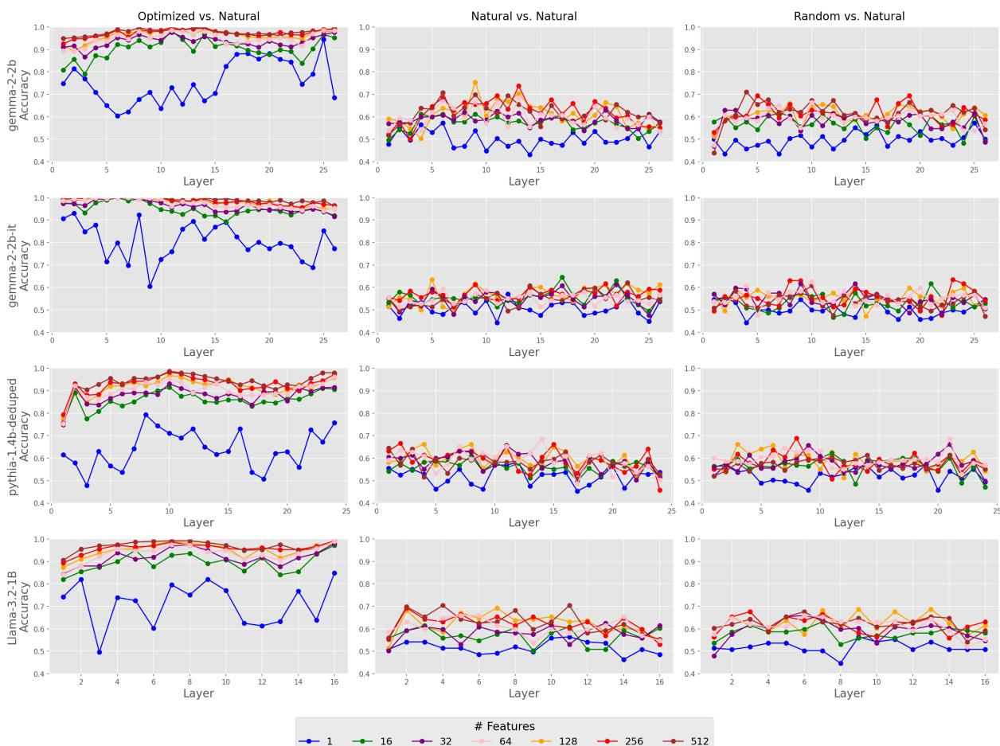  
Figure 5: Sparse linear classifier probe accuracy on top-k features of the model output at each layer. We identify top features using Equation 4, and train a linear classifier to discriminate between optimized and natural language prompts. The first column compares optimized and natural language prompts. The second and third columns show a baseline comparison of natural language prompts vs. other natural language prompts, and of natural language prompts vs. random prompts, respectively. We refer the reader to Figure 10 in Appendix D for the full results on all models.

## 5.2 Optimized prompts rely on tokens that are rare in the training data

For convenience, we use the shorthand corpus-rare to refer to tokens that are rare in the training data and corpus-common for those that are common in the training data. Natural language prompts tend to use more corpus-common tokens than their optimized counterparts; see Figure 4. Prior work finds that LMs are sensitive to tokens which are undertrained and not found as frequently in the training corpus, dubbed “glitch tokens” (Rumbelow and Watkins, 2023; Li et al., 2024; Land and Bartolo, 2024). The higher frequency of corpus-rare tokens may be due to the fact that these tokens are potentially under-trained, and are thus more likely to have a stronger signal during the optimization procedure.

## 6 Internal representations of optimized prompts

Given that optimized prompts consist of corpusrare tokens and differ significantly in composition from natural language prompts, we ask whether the same differences exist within the model’s internal representations.

## 6.1 Sparse probing for optimized prompts

We investigate whether it is possible to detect optimized prompts purely from the model’s activations. Given optimized and natural language prompt pairs, we follow Gurnee et al., 2023 and train sparse probe classifiers at each layer to differentiate optimized prompts from their natural language counterparts. Concretely, each transformer block in the network consists of a multi-head self-attention layer (MHSA) and a multi-layer perceptron (MLP) layer applied either in parallel or sequentially, depending on the model architecture.

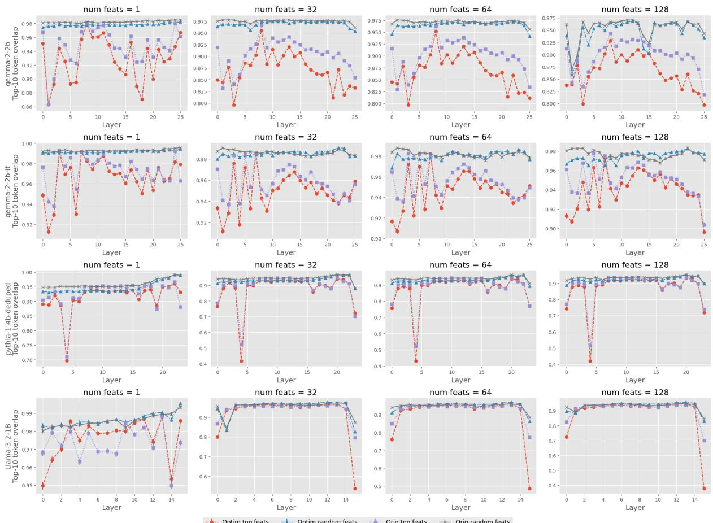  
Figure 6: Average top-10 token prediction overlap. The overlap is computed via Equation 5. Overall, the importance of the top identified features appears to be model dependent, and it is not necessarily the case that the optimized prompts rely more heavily on these features. However, it is clear that there are certain layers which influence the output more (specifically the first and last layers); see Figure 11 in Appendix D for the full results.

Given a prompt $\pmb { p } \in \mathbb { R } ^ { k \times V }$ , a specific token $t ,$ layer $\ell ,$ and that the model applies the MHSA and MLP layers in parallel, the output is given by

$$
\begin{array} { r l } & { h _ { t } ^ { ( \ell ) } = h _ { t } ^ { ( \ell - 1 ) } + \mathrm { M H S A } ^ { ( \ell ) } ( \gamma ( h _ { t } ^ { ( \ell - 1 ) } ) ) } \\ & { ~ + ~ \mathrm { M L P } ^ { ( \ell ) } ( \gamma ( h _ { t } ^ { ( \ell - 1 ) } ) ) , } \end{array}\tag{3}
$$

where γ is LayerNorm (Ba et al., 2016).

At each layer, we take the last token’s activations for both the optimized prompts and the natural language prompts. We use the maximum mean difference (MMD) (Gurnee et al., 2023) to sort the features in the extracted activations by importance. Specifically, given a set of activations from natural language prompts $\{ h _ { \mathrm { o r i g } , i } ^ { ( \ell ) } \} _ { i = 1 } ^ { N }$ and optimized prompts $\{ h _ { \mathrm { o p t i m i z e d } , i } ^ { ( \ell ) } \} _ { i = 1 } ^ { M }$ at layer $\ell ,$ the mean difference for feature j is defined as

$$
\Delta _ { j } ^ { ( \ell ) } = \frac { 1 } { N } \sum _ { i = 1 } ^ { N } h _ { \mathrm { o r i g } , i , j } ^ { ( \ell ) } - \frac { 1 } { M } \sum _ { i = 1 } ^ { M } h _ { \mathrm { o p t i m } , i , j } ^ { ( \ell ) } ,\tag{4}
$$

where $h _ { \cdot , i , j } ^ { ( \ell ) }$ denotes the j-th feature (neuron) of the i-th example.

We then train a logistic regression classifier using the top identified features with varying levels of sparsity; see Appendix A.3 for additional training details. Overall, we find that the classifier is able to discriminate ground truth and optimized examples with high accuracy, even with high levels of sparsity; see Figure 5. This is in contrast to the near-random accuracy found in the baseline evaluations which compare original natural language prompts to randomly generated prompts and other natural language prompts. It is important to note that even though for optimized prompts, models clearly contain unique representations which are easily distinguishable from natural prompts, these representations still generate functionally similar outputs.

## 6.2 Do optimized prompts rely on a distinct subspace?

Given that we can classify prompts based on distinct features in the activations, we test the importance of these features in eliciting desired output from optimized prompts. Prior work finds that optimized prompt are sensitive to discrete perturbations (Ishibashi et al., 2023; Melamed et al., 2024; Cherepanova and Zou, 2024), and we hypothesize that this sensitivity is also present in the model’s internal representations. In order to verify our hypothesis, we perform causal intervention and zeroout the top features identified layer-wise via Equation 4, and then measure the top-10 token overlap for each (original, optimized) prompt pair.

Given a prompt $^ { p , }$ let $\mathbb { P } _ { \mathrm { L M } } ( \cdot | \pmb { p } ) \in \mathbb { R } ^ { V }$ be the output distribution over vocabulary size $V$ at the last position. For layer ℓ and hidden state dimension $d ,$ let $h ^ { ( \ell ) } \in \mathbb { R } ^ { d }$ be the hidden state output. Define ${ \mathcal { T } } _ { k } \subseteq \{ 1 , \dots , d \}$ as the indices of the k most important dimensions as found by Equation 4. The intervened distribution is

$$
\begin{array} { r } { \mathbb { P } _ { \mathrm { L M } } ^ { ( \ell , k ) } ( \cdot | \boldsymbol { p } ) = \mathbb { P } _ { \mathrm { L M } } ( \cdot | \boldsymbol { p } ; h _ { i } ^ { ( \ell ) } = 0 \mathrm { ~ f o r ~ } i \in \mathbb { Z } _ { k } ) . } \end{array}\tag{5}
$$

We find that intervening on top features for both natural and optimized prompts has a pronounced effect when compared to the baseline of intervening on random features. However, surprisingly, our experiment contradicts the hypothesis. As shown in Figure $^ { 6 , }$ for the majority of layers in each model, there is not a large difference between the effect of ablations of top-k features on natural language prompts versus optimized prompts. This means that although optimized prompts may be more sensitive to discrete token-level perturbations than natural language prompts, they do not necessarily share this sensitivity when evaluated from the perspective of the model’s internal representations. We do note that for some models, there are specific layers (first and final) which induce a more pronounced change on the output when top features are ablated.

## 6.3 How do LMs build predictions from optimized prompts?

Considering both instruction-tuned and base models, we compute the KL divergence between pairs of optimized and natural prompts at each layer of the model. Specifically, we take the output of the last token t at each layer ℓ, and multiply it by the final LayerNorm and the LM head in order to project back to the vocabulary space. These outputs are then used to compute the KL divergence between prompt pairs at each layer, and we denote this as $d _ { K L } ^ { ( \ell ) } ( p ^ { * } | | p )$

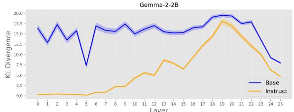

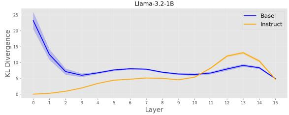

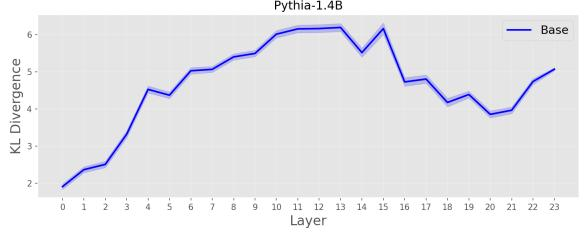  
Figure 7: Layer-wise KL divergence. The layer-wise KL divergence is computed as described in Section 6.3. We find that instruction-tuned models follow a similar path; see Figure 12 in Appendix D for the full results on all models.

Interestingly, as shown in Figure 7, across model families, the instruction-tuned versions of the models follow a similar path, with the early layers showing similar representations of prompt pairs, a gradual divergence in the middle layers, and a final sharp trend back to functional similarity in the last few layers. Base models tend to have more divergent representations at the early layers, and also experience a similar sharp trend in the later layers. Clearly, the later layers are crucial for ensuring the functional similarity between the optimized prompts and their natural language counterparts. This supports our findings in Sectio 6.1, namely that feature ablations in later layers appear to have a stronger effect on optimized prompts, as we can see that the later layers are primarily responsible for aligning the representations of natural language and optimized prompts.

## 7 Discussion

Our work analyzes the mechanisms and ways in which language models parse and interpret discretely optimized prompts. We find that optimized prompts consist primarily of punctuation and noun tokens which are, on average, more rare in the training data than their natural language counterparts. Through sparse probing, we are able to classify optimized prompts and their natural language counterparts with high accuracy. Furthermore, when ablating neurons from model layers, the effectiveness of optimized prompts does not drop in a significant way compared to their natural language counterparts.

One possible application of our analysis is to identify optimized “jailbreak” prompts before these prompts are even fully processed by the model. For example, one can train a simple linear classifier on a set of optimized prompts and natural language, and efficiently alert the model provider if a user is inputting suspicious optimized prompts based on the classifier at intermediate layer. Although the majority of prior work has studied optimized prompts through the lens of adversarial attacks, it is also possible that such prompts are benign in nature. It will require further investigation to differentiate benign and malicious optimized prompts.

Finally, prior work finds that discretely optimized prompts transfer between different model families (Rakotonirina et al., 2023; Zou et al., 2023b; Melamed et al., 2024). While we focus our discussion on the specific models that generate these prompts, future work can explore how these representations for “universally transferrable” optimized prompts differ between models.

## Limitations

In our work, we primarily consider the “evil twins” framework and use GCG (Melamed et al., 2024; Zou et al., 2023b). There are several other techniques for discrete optimization such as FLRT (Thompson and Sklar, 2024) and Auto-DAN (Zhu et al., 2024) which may induce differing behaviors. Additional work is required to adapt our analysis to these frameworks.

Due to computational constraints, we limit our analysis to models up to 8 billion parameters, as the discrete optimization process requires significant GPU memory and compute. Nevertheless, we test 18 different models. Future work can consider analyzing larger models and investigating trends in optimized prompts across a wider array of model sizes. This will also enable research on scaling effects for prompt optimization.

## References

Marah Abdin, Sam Ade Jacobs, Ammar Ahmad Awan, Jyoti Aneja, Ahmed Awadallah, Hany Awadalla, Nguyen Bach, Amit Bahree, Arash Bakhtiari, Jianmin Bao, Harkirat Behl, Alon Benhaim, Misha Bilenko, Johan Bjorck, Sébastien Bubeck, Qin Cai, Martin Cai, Caio César Teodoro Mendes, Weizhu Chen, and 96 others. 2024. Phi-3 technical report: A highly capable language model locally on your phone. Preprint, arXiv:2404.14219.

Guillaume Alain and Yoshua Bengio. 2017. Understanding intermediate layers using linear classifier probes.

Loubna Ben Allal, Anton Lozhkov, Elie Bakouch, Gabriel Martín Blázquez, Guilherme Penedo, Lewis Tunstall, Andrés Marafioti, Hynek Kydlícek,ˇ Agustín Piqueres Lajarín, Vaibhav Srivastav, Joshua Lochner, Caleb Fahlgren, Xuan-Son Nguyen, Clé- mentine Fourrier, Ben Burtenshaw, Hugo Larcher, Haojun Zhao, Cyril Zakka, Mathieu Morlon, and 3 others. 2025. Smollm2: When smol goes big – datacentric training of a small language model. Preprint, arXiv:2502.02737.

Maksym Andriushchenko, Francesco Croce, and Nicolas Flammarion. 2024. Jailbreaking leading safetyaligned llms with simple adaptive attacks. Preprint, arXiv:2404.02151.

Jimmy Lei Ba, Jamie Ryan Kiros, and Geoffrey E. Hinton. 2016. Layer normalization. Preprint, arXiv:1607.06450.

Yuntao Bai, Saurav Kadavath, Sandipan Kundu, Amanda Askell, Jackson Kernion, Andy Jones, Anna Chen, Anna Goldie, Azalia Mirhoseini, Cameron McKinnon, Carol Chen, Catherine Olsson, Christopher Olah, Danny Hernandez, Dawn Drain, Deep Ganguli, Dustin Li, Eli Tran-Johnson, Ethan Perez, and 32 others. 2022. Constitutional ai: Harmlessness from ai feedback. Preprint, arXiv:2212.08073.

Nora Belrose, Zach Furman, Logan Smith, Danny Halawi, Igor Ostrovsky, Lev McKinney, Stella Biderman, and Jacob Steinhardt. 2023. Eliciting latent predictions from transformers with the tuned lens. Preprint, arXiv:2303.08112.

Stella Biderman, Hailey Schoelkopf, Quentin Gregory Anthony, Herbie Bradley, Kyle O’Brien, Eric Hallahan, Mohammad Aflah Khan, Shivanshu Purohit, Usvsn Sai Prashanth, Edward Raff, Aviya Skowron, Lintang Sutawika, and Oskar Van Der Wal. 2023a. Pythia: A suite for analyzing large language models across training and scaling. In Proceedings of the 40th International Conference on Machine Learning, volume 202 of Proceedings of Machine Learning Research, pages 2397–2430. PMLR.

Stella Biderman, Hailey Schoelkopf, Quentin Gregory Anthony, Herbie Bradley, Kyle O’Brien, Eric Hallahan, Mohammad Aflah Khan, Shivanshu Purohit, USVSN Sai Prashanth, Edward Raff, and 1 others. 2023b. Pythia: A suite for analyzing large language models across training and scaling. In International Conference on Machine Learning, pages 2397–2430. PMLR.

Sidney Black, Stella Biderman, Eric Hallahan, Quentin Anthony, Leo Gao, Laurence Golding, Horace He, Connor Leahy, Kyle McDonell, Jason Phang, Michael Pieler, Usvsn Sai Prashanth, Shivanshu Purohit, Laria Reynolds, Jonathan Tow, Ben Wang, and Samuel Weinbach. 2022. GPT-NeoX-20B: An opensource autoregressive language model. In Proceedings of BigScience Episode #5 – Workshop on Challenges & Perspectives in Creating Large Language Models, pages 95–136, virtual+Dublin. Association for Computational Linguistics.

Trenton Bricken, Adly Templeton, Joshua Batson, Brian Chen, Adam Jermyn, Tom Conerly, Nick Turner, Cem Anil, Carson Denison, Amanda Askell, Robert Lasenby, Yifan Wu, Shauna Kravec, Nicholas Schiefer, Tim Maxwell, Nicholas Joseph, Zac Hatfield-Dodds, Alex Tamkin, Karina Nguyen, and 6 others. 2023. Towards monosemanticity: Decomposing language models with dictionary learning. Transformer Circuits Thread. Https://transformercircuits.pub/2023/monosemanticfeatures/index.html.

Lars Buitinck, Gilles Louppe, Mathieu Blondel, Fabian Pedregosa, Andreas Mueller, Olivier Grisel, Vlad Niculae, Peter Prettenhofer, Alexandre Gramfort, Jaques Grobler, Robert Layton, Jake VanderPlas, Arnaud Joly, Brian Holt, and Gaël Varoquaux. 2013. API design for machine learning software: experiences from the scikit-learn project. In ECML PKDD Workshop: Languages for Data Mining and Machine Learning, pages 108–122.

Valeriia Cherepanova and James Zou. 2024. Talking nonsense: Probing large language models’ understanding of adversarial gibberish inputs. In ICML 2024 Next Generation ofAI Safety Workshop.

Mike Conover, Matt Hayes, Ankit Mathur, Jianwei Xie, Jun Wan, Sam Shah, Ali Ghodsi, Patrick Wendell, Matei Zaharia, and Reynold Xin. 2023. Free dolly: Introducing the world’s first truly open instructiontuned llm.

Jacob Devlin, Ming-Wei Chang, Kenton Lee, and Kristina Toutanova. 2019. BERT: Pre-training of deep bidirectional transformers for language understanding. In Proceedings ofthe 2019 Conference of the North American Chapter ofthe Associationfor Computational Linguistics: Human Language Technologies, Volume 1 (Long and Short Papers), pages 4171–4186, Minneapolis, Minnesota. Association for Computational Linguistics.

Javid Ebrahimi, Anyi Rao, Daniel Lowd, and Dejing Dou. 2018. HotFlip: White-box adversarial examples for text classification. In Proceedings ofthe 56th Annual Meeting of the Association for Computational Linguistics (Volume 2: Short Papers), pages 31–36, Melbourne, Australia. Association for Computational Linguistics.

Ronen Eldan and Yuanzhi Li. 2023. Tinystories: How small can language models be and still speak coherent english? Preprint, arXiv:2305.07759.

Nelson Elhage, Neel Nanda, Catherine Olsson, Tom Henighan, Nicholas Joseph, Ben Mann, Amanda Askell, Yuntao Bai, Anna Chen, Tom Conerly, Nova DasSarma, Dawn Drain, Deep Ganguli, Zac Hatfield-Dodds, Danny Hernandez, Andy Jones, Jackson Kernion, Liane Lovitt, Kamal Ndousse, and 6 others. 2021. A mathematical framework for transformer circuits. Transformer Circuits Thread. Https://transformercircuits.pub/2021/framework/index.html.

Leo Gao, Stella Biderman, Sid Black, Laurence Golding, Travis Hoppe, Charles Foster, Jason Phang, Horace He, Anish Thite, Noa Nabeshima, Shawn Presser, and Connor Leahy. 2020. The pile: An 800gb dataset of diverse text for language modeling. Preprint, arXiv:2101.00027.

Mor Geva, Avi Caciularu, Kevin Wang, and Yoav Goldberg. 2022. Transformer feed-forward layers build predictions by promoting concepts in the vocabulary space. In Proceedings of the 2022 Conference on Empirical Methods in Natural Language Processing, pages 30–45, Abu Dhabi, United Arab Emirates. Association for Computational Linguistics.

Mor Geva, Roei Schuster, Jonathan Berant, and Omer Levy. 2021. Transformer feed-forward layers are keyvalue memories. In Proceedings ofthe 2021 Conference on Empirical Methods in Natural Language Processing, pages 5484–5495, Online and Punta Cana, Dominican Republic. Association for Computational Linguistics.

Aaron Grattafiori, Abhimanyu Dubey, Abhinav Jauhri, Abhinav Pandey, Abhishek Kadian, Ahmad Al-Dahle, Aiesha Letman, Akhil Mathur, Alan Schelten, Alex Vaughan, Amy Yang, Angela Fan, Anirudh Goyal, Anthony Hartshorn, Aobo Yang, Archi Mitra, Archie Sravankumar, Artem Korenev, Arthur Hinsvark, and 542 others. 2024. The llama 3 herd of models. Preprint, arXiv:2407.21783.

Xingang Guo, Fangxu Yu, Huan Zhang, Lianhui Qin, and Bin Hu. 2024. COLD-attack: Jailbreaking LLMs with stealthiness and controllability. In Forty-first International Conference on Machine Learning.

Wes Gurnee, Neel Nanda, Matthew Pauly, Katherine Harvey, Dmitrii Troitskii, and Dimitris Bertsimas. 2023. Finding neurons in a haystack: Case studies with sparse probing. Transactions on Machine Learning Research.

Matthew Honnibal and Ines Montani. 2017. spaCy 2: Natural language understanding with Bloom embeddings, convolutional neural networks and incremental parsing. To appear.

Robert Huben, Hoagy Cunningham, Logan Riggs Smith, Aidan Ewart, and Lee Sharkey. 2024. Sparse autoencoders find highly interpretable features in language models. In The Twelfth International Conference on Learning Representations.

Yoichi Ishibashi, Danushka Bollegala, Katsuhito Sudoh, and Satoshi Nakamura. 2023. Evaluating the robustness of discrete prompts. In Proceedings of the 17th Conference of the European Chapter of the Association for Computational Linguistics, pages 2373– 2384, Dubrovnik, Croatia. Association for Computational Linguistics.

Corentin Kervadec, Francesca Franzon, and Marco Baroni. 2023. Unnatural language processing: How do language models handle machine-generated prompts? In The 2023 Conference on Empirical Methods in Natural Language Processing.

Sander Land and Max Bartolo. 2024. Fishing for magikarp: Automatically detecting under-trained tokens in large language models. In Proceedings of the 2024 Conference on Empirical Methods in Natural Language Processing, pages 11631–11646, Miami, Florida, USA. Association for Computational Linguistics.

Yuxi Li, Yi Liu, Gelei Deng, Ying Zhang, Wenjia Song, Ling Shi, Kailong Wang, Yuekang Li, Yang Liu, and Haoyu Wang. 2024. Glitch tokens in large language models: Categorization taxonomy and effective detection. Preprint, arXiv:2404.09894.

Zeyi Liao and Huan Sun. 2024. AmpleGCG: Learning a universal and transferable generative model of adversarial suffixes for jailbreaking both open and closed LLMs. In First Conference on Language Modeling.

Ilya Loshchilov and Frank Hutter. 2019. Decoupled weight decay regularization. In International Conference on Learning Representations.

Rimon Melamed, Lucas Hurley McCabe, Tanay Wakhare, Yejin Kim, H. Howie Huang, and Enric Boix-Adserà. 2024. Prompts have evil twins. In Proceedings of the 2024 Conference on Empirical Methods in Natural Language Processing, pages 46–74, Miami, Florida, USA. Association for Computational Linguistics.

nostalgebraist. 2020. interpreting gpt: the logit lens. https://www.lesswrong. com/posts/AcKRB8wDpdaN6v6ru/ interpreting-gpt-the-logit-lens. Accessed: 2024-07-27.

Long Ouyang, Jeffrey Wu, Xu Jiang, Diogo Almeida, Carroll Wainwright, Pamela Mishkin, Chong Zhang, Sandhini Agarwal, Katarina Slama, Alex Ray, John Schulman, Jacob Hilton, Fraser Kelton, Luke Miller,

Maddie Simens, Amanda Askell, Peter Welinder, Paul F Christiano, Jan Leike, and Ryan Lowe. 2022. Training language models to follow instructions with human feedback. In Advances in Neural Information Processing Systems, volume 35, pages 27730–27744. Curran Associates, Inc.

Guilherme Penedo, Hynek Kydlícek, Loubna Ben al-ˇ lal, Anton Lozhkov, Margaret Mitchell, Colin Raffel, Leandro Von Werra, and Thomas Wolf. 2024. The fineweb datasets: Decanting the web for the finest text data at scale. Preprint, arXiv:2406.17557.

Qwen, :, An Yang, Baosong Yang, Beichen Zhang, Binyuan Hui, Bo Zheng, Bowen Yu, Chengyuan Li, Dayiheng Liu, Fei Huang, Haoran Wei, Huan Lin, Jian Yang, Jianhong Tu, Jianwei Zhang, Jianxin Yang, Jiaxi Yang, Jingren Zhou, and 25 others. 2025. Qwen2.5 technical report. Preprint, arXiv:2412.15115.

Alec Radford and Karthik Narasimhan. 2018. Improving language understanding by generative pretraining.

Rafael Rafailov, Archit Sharma, Eric Mitchell, Christopher D Manning, Stefano Ermon, and Chelsea Finn. 2023. Direct preference optimization: Your language model is secretly a reward model. In Thirty-seventh Conference on Neural Information Processing Systems.

Colin Raffel, Noam Shazeer, Adam Roberts, Katherine Lee, Sharan Narang, Michael Matena, Yanqi Zhou, Wei Li, and Peter J. Liu. 2020. Exploring the limits of transfer learning with a unified text-to-text transformer. Journal of Machine Learning Research, 21(140):1–67.

Nathanaël Carraz Rakotonirina, Roberto Dessi, Fabio Petroni, Sebastian Riedel, and Marco Baroni. 2023. Can discrete information extraction prompts generalize across language models? In The Eleventh International Conference on Learning Representations.

Nathanaël Carraz Rakotonirina, Corentin Kervadec, Francesca Franzon, and Marco Baroni. 2024. Evil twins are not that evil: Qualitative insights into machine-generated prompts. Preprint, arXiv:2412.08127.

Jessica Rumbelow and Matthew Watkins. 2023. Solidgoldmagikarp (plus, prompt generation). Accessed: 2025-02-09.

Salesforce. 2021. The wikitext long-term dependency modeling dataset. https://blog. einstein.ai/the-wikitext-long-term-% dependency-language-modeling-dataset/. Accessed: 2024-07-27.

Rico Sennrich, Barry Haddow, and Alexandra Birch. 2016. Neural machine translation of rare words with subword units. In Proceedings of the 54th Annual Meeting of the Association for Computational Linguistics (Volume 1: Long Papers), pages 1715–1725,

Berlin, Germany. Association for Computational Linguistics.

Taylor Shin, Yasaman Razeghi, Robert L. Logan IV, Eric Wallace, and Sameer Singh. 2020. AutoPrompt: Eliciting Knowledge from Language Models with Automatically Generated Prompts. In Proceedings of the 2020 Conference on Empirical Methods in Natural Language Processing (EMNLP), pages 4222–4235, Online. Association for Computational Linguistics.

Luca Soldaini, Rodney Kinney, Akshita Bhagia, Dustin Schwenk, David Atkinson, Russell Authur, Ben Bogin, Khyathi Chandu, Jennifer Dumas, Yanai Elazar, Valentin Hofmann, Ananya Harsh Jha, Sachin Kumar, Li Lucy, Xinxi Lyu, Nathan Lambert, Ian Magnusson, Jacob Morrison, Niklas Muennighoff, and 17 others. 2024. Dolma: an open corpus of three trillion tokens for language model pretraining research. Preprint, arXiv:2402.00159.

Rohan Taori, Ishaan Gulrajani, Tianyi Zhang, Yann Dubois, Xuechen Li, Carlos Guestrin, Percy Liang, and Tatsunori B. Hashimoto. 2023. Stanford alpaca: An instruction-following llama model. https:// github.com/tatsu-lab/stanford\_alpaca.

Gemma Team, Thomas Mesnard, Cassidy Hardin, Robert Dadashi, Surya Bhupatiraju, Shreya Pathak, Laurent Sifre, Morgane Rivière, Mihir Sanjay Kale, Juliette Love, Pouya Tafti, Léonard Hussenot, Pier Giuseppe Sessa, Aakanksha Chowdhery, Adam Roberts, Aditya Barua, Alex Botev, Alex Castro-Ros, Ambrose Slone, and 89 others. 2024. Gemma: Open models based on gemini research and technology. Preprint, arXiv:2403.08295.

Teknium. 2023. Openhermes 2.5: An open dataset of synthetic data for generalist llm assistants.

T. Ben Thompson and Michael Sklar. 2024. Flrt: Fluent student-teacher redteaming. Preprint, arXiv:2407.17447.

Ashish Vaswani, Noam Shazeer, Niki Parmar, Jakob Uszkoreit, Llion Jones, Aidan N Gomez, Ł ukasz Kaiser, and Illia Polosukhin. 2017. Attention is all you need. In Advances in Neural Information Processing Systems, volume 30. Curran Associates, Inc.

Yuxin Wen, Neel Jain, John Kirchenbauer, Micah Goldblum, Jonas Geiping, and Tom Goldstein. 2023. Hard prompts made easy: Gradient-based discrete optimization for prompt tuning and discovery. In Thirtyseventh Conference on Neural Information Processing Systems.

Zhengxuan Wu, Aryaman Arora, Zheng Wang, Atticus Geiger, Dan Jurafsky, Christopher D Manning, and Christopher Potts. 2024. ReFT: Representation finetuning for language models. In The Thirty-eighth Annual Conference on Neural Information Processing Systems.

Susan Zhang, Stephen Roller, Naman Goyal, Mikel Artetxe, Moya Chen, Shuohui Chen, Christopher Dewan, Mona Diab, Xian Li, Xi Victoria Lin, Todor Mihaylov, Myle Ott, Sam Shleifer, Kurt Shuster, Daniel Simig, Punit Singh Koura, Anjali Sridhar, Tianlu Wang, and Luke Zettlemoyer. 2022. Opt: Open pre-trained transformer language models. Preprint, arXiv:2205.01068.

Sicheng Zhu, Ruiyi Zhang, Bang An, Gang Wu, Joe Barrow, Zichao Wang, Furong Huang, Ani Nenkova, and Tong Sun. 2024. AutoDAN: Interpretable gradientbased adversarial attacks on large language models. In First Conference on Language Modeling.

Andy Zou, Long Phan, Sarah Chen, James Campbell, Phillip Guo, Richard Ren, Alexander Pan, Xuwang Yin, Mantas Mazeika, Ann-Kathrin Dombrowski, Shashwat Goel, Nathaniel Li, Michael J. Byun, Zifan Wang, Alex Mallen, Steven Basart, Sanmi Koyejo, Dawn Song, Matt Fredrikson, and 2 others. 2023a. Representation engineering: A top-down approach to ai transparency. Preprint, arXiv:2310.01405.

Andy Zou, Zifan Wang, Nicholas Carlini, Milad Nasr, J. Zico Kolter, and Matt Fredrikson. 2023b. Universal and transferable adversarial attacks on aligned language models. Preprint, arXiv:2307.15043.

## A Additional experimental details

## A.1 Tiny stories training setup

We train the word-level Tiny Stories model with a similar model configuration as Pythia-70m 2. Specifically, we use a batch size of 64, maximum sequence length of 512, hidden dimension of 512, feedforward layer dimension of 2048, 6 layers, and 8 attention heads. For the optimizer and hyperparameters, we choose AdamW (Loshchilov and Hutter, 2019) with $\beta _ { 1 } = 0 . 9 , \beta _ { 2 } = 0 . 9 5$ , a learning rate of $6 \times 1 0 ^ { - 4 }$ with cosine annealing, 500 warmup steps, no gradient accumulation, and 3 epochs of training on a single NVIDIA RTX 6000 Ada GPU. The word-level tokenizer has a vocabulary size of 46,137 after being trained on the entire Tiny Stories corpus.

## A.2 Optimization and data setup

For all models, we perform the evil twins optimization procedure for 500 steps, with early stopping if $d _ { K L } ( { \pmb p } ^ { * } | | { \pmb p } ) ~ \leq ~ 5 . 0$ . In total, we obtain 5000 unique prompts for the word-stories model, and 1200 unique prompts for the open models (from the four aforementioned prompt datasets), with 300 prompts from each dataset. We then filter all final optimized prompts such that $d _ { K L } ( \pmb { p } ^ { * } | | \pmb { p } ) \leq 1 0 . 0$

Table 2 displays the number of prompts that were optimized for each model after filtering. For the discrete optimization, we use one 8x A100 node.

Table 2: Total optimized prompts after filtering for each tested model.
<table><tr><td>Model</td><td># prompts</td></tr><tr><td>gemma-2-2b-base (Team et al., 2024)</td><td>1156</td></tr><tr><td>gemma-2-2b-instruct (Team et al., 2024) 1lama3.2-1b-base (Grattafiori et al., 2024)</td><td>1068</td></tr><tr><td>1lama3.2-1b-instruct (Grattafiori et al., 2024)</td><td>891</td></tr><tr><td></td><td>765</td></tr><tr><td>1lama3.2-3b-base (Grattafiori et al., 2024)</td><td>638</td></tr><tr><td>1lama3.2-3b-instruct (Grattafiori et al., 2024)</td><td>624</td></tr><tr><td>1lama3.1-8b-base (Grattafiori et al., 2024)</td><td>106</td></tr><tr><td>pythia-1.4b-base (Biderman et al., 2023b)</td><td>1121</td></tr><tr><td>qwen2.5-0.5b-base (Qwen et al., 2025)</td><td>671</td></tr><tr><td>qwen2.5-0.5b-instruct (Qwen et al., 2025)</td><td>1081</td></tr><tr><td>qwen2.5-1.5b-base (Qwen et al., 2025)</td><td>532</td></tr><tr><td>qwen2.5-1.5b-instruct (Qwen et al., 2025)</td><td>1079</td></tr><tr><td>smollm2-1.7b-base (Allal et al., 2025)</td><td>887</td></tr><tr><td>smollm2-1.7b-instruct (Allal et al., 2025)</td><td>682</td></tr><tr><td>smollm2-135m-base (Allal et al., 2025)</td><td>1144</td></tr><tr><td>smollm2-135m-instruct (Allal et al., 2025)</td><td>1079</td></tr><tr><td>smollm2-360m-base (Allal et al., 2025)</td><td>1073</td></tr><tr><td>smollm2-360m-instruct (Allal et al., 2025) word-stories</td><td>1118 2043</td></tr></table>

## A.3 Classifier probe training

The classifier is a logistic regression trained via scikit-learn (Buitinck et al., 2013) for 100 iterations with $l _ { 2 }$ penalty, liblinear solver, and $1 e ^ { - 4 }$ convergence tolerance.

## B Evil twins and greedy coordinate gradient

The Greedy Coordinate Gradient (GCG) algorithm is commonly used to generate adversarial optimized prompts. The procedure starts with an arbitrarily initialized prompt with a fixed number of tokens. At each iteration, it computes the gradient of the loss with respect to each token in the prompt, and identifies some top-k promising replacements for each token in the prompt based on the gradient signal. These candidate replacements for each token are then tested by running a forward pass and taking the new prompt with the lowest loss. We refer the reader to Zou et al., 2023b for full details regarding the algorithm.

## C Composition of natural language prompts

Original natural language prompts have a similar dependency on punctuation and noun tokens as their optimized counterparts; see Figure 8 and Figure 9.

## D Experimental results on all models

We report the full results on the remainder of the 18 tested models for the probing classifier experiment, the feature ablation experiment, and the layer-wise KL divergence experiment. Figure 10 displays the results for all model suites on the sparse probing experiment. Figure 11 displays the results for all model suites on the intervention experiment. Figure 12 displays the results for all model suites on the layer-wise KL divergence experiment.

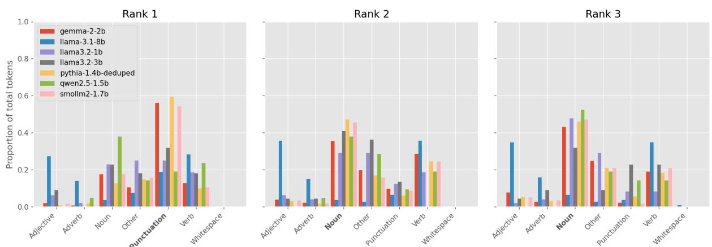  
Figure 8: Token category analysis by rank for natural language prompts. For each model and token influence rank (as computed in Section 4), we show the proportion of tokens belonging to each part of speech category.

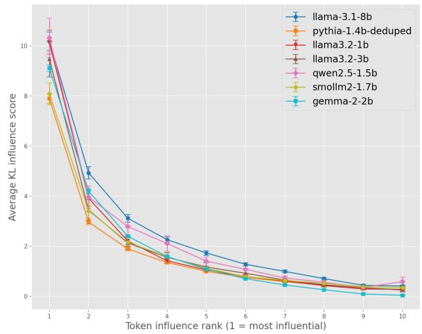  
Figure 9: Token rank influence for natural language prompts. The influence score is computed via Equation 2.

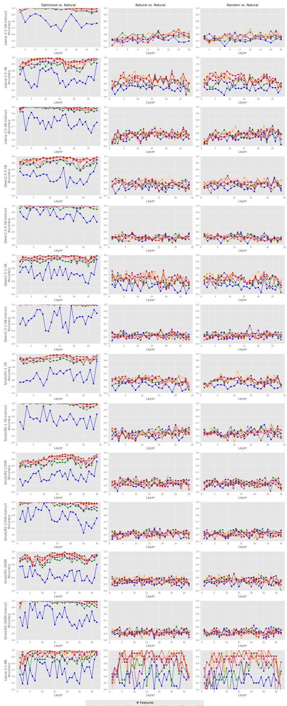  
Figure 10: Sparse linear probe results for additional model suits (SmolLM2, Qwen2.5, Llama-3.2)

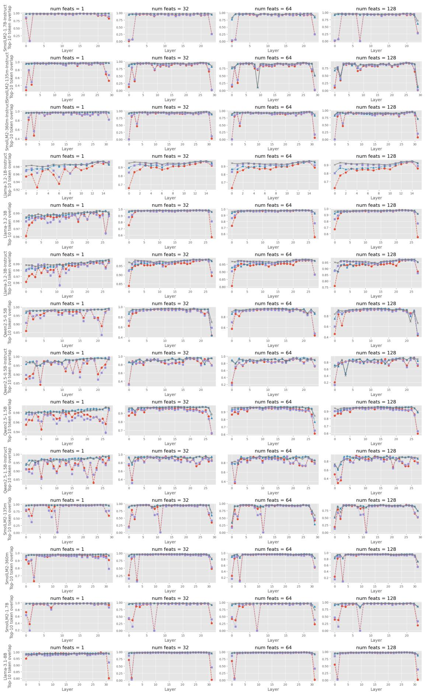  
- Optim top feats —— Optim random feats  Orig top feats → Orig random feats

Figure 11: Feature ablation results on all models.

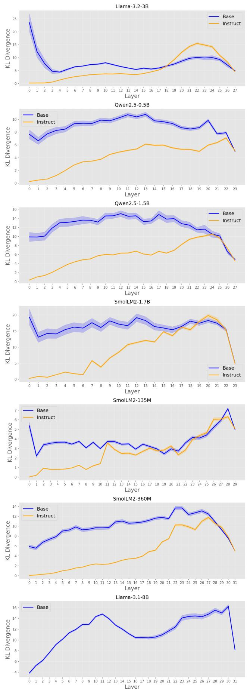  
Figure 12: Layer-wise KL Divergence results on all models.