# Dialect-SQL: An Adaptive Framework for Bridging the Dialect Gap in Text-to-SQL

Jie Shi<sup>1</sup>, Xi Cao<sup>2</sup>, Bo Xu<sup>3</sup>\*, Jiaqing Liang<sup>2</sup>, Yanghua Xiao<sup>1</sup>, Jia Chen<sup>1</sup>, Peng Wang<sup>1</sup>, Wei Wang<sup>1</sup>\*

<sup>1</sup>Shanghai Key Laboratory of Data Science,

College of Computer Science and Artificial Intelligence, Fudan University <sup>2</sup>School of Data Science, Fudan University

<sup>3</sup>School of Computer Science and Technology, Donghua University {jshi22,22307140119}@m.fudan.edu.cn, xubo@dhu.edu.cn, weiwang1@fudan.edu.cn

## Abstract

Text-to-SQL is the task of translating natural language questions into SQL queries based on relational databases. Different databases implement their own SQL dialects, leading to variations in syntax. As a result, SQL queries designed for one database may not execute properly in another, creating a dialect gap. Existing Text-to-SQL research primarily focuses on specific database systems, limiting adaptabil ity to different dialects. This paper proposes a novel adaptive framework called Dialect-SQL, which employs Object Relational Mapping (ORM) code as an intermediate language to bridge this gap. Given a question, we guide Large Language Models (LLMs) to first generate ORM code, which is then parsed into SQL queries targeted for specific databases. However, there is a lack of high-quality Textto-Code datasets that enable LLMs to effectively generate ORM code. To address this issue, we propose a bootstrapping approach to synthesize ORM code, where verified ORM code is iteratively integrated into a demonstration pool that serves as in-context examples for ORM code generation. Our experiments demonstrate that Dialect-SQL significantly enhances dialect adaptability, outperforming traditional methods that generate SQL queries directly. Our code and data are released at https://github.com/jieshi10/orm-sql.

## 1 Introduction

Given a relational database, Text-to-SQL is the task of translating a natural language question into a SQL query which answers the question (Hong et al., 2024). Relational database systems each implement their own SQL dialects, which differ significantly in syntax and built-in functions. As a result, SQL statements can vary across databases even for the same query, creating a dialect gap. An illustrative example is provided in Figure 1.

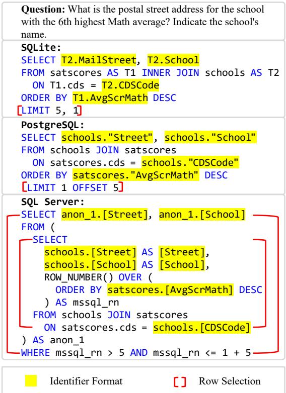  
Figure 1: An example highlighting the dialect gap between databases. The same query varies significantly in identifier format and row selection methods across different databases.

In addition to subtle differences in SQL syntax– such as identifier formatting, where SQLite omits double quotes, PostgreSQL uses double quotes for case-sensitive identifiers, and SQL Server employs square brackets–different databases also have varying methods for retrieving the sixth row. For instance, SQLite uses LIMIT 5, 1, PostgreSQL utilizes LIMIT 1 OFFSET 5, while SQL Server requires a nested query.

Among these dialects, SQLite stands out as a lightweight and easily deployable database, which serves as the foundation for widely used public datasets such as WikiSQL (Zhong et al., 2017), Spider (Yu et al., 2018), its variants (Gan et al.,

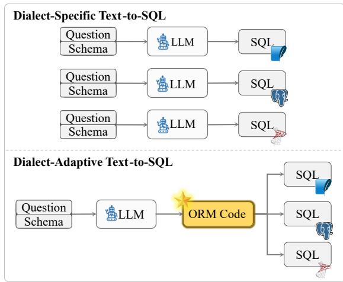  
Figure 2: Comparing dialect-specific Text-to-SQL (top) with our dialect-adaptive framework (bottom). Standard dialect-specific Text-to-SQL method is designed for a single database system, whereas the proposed method leverages ORM code as an intermediate language for multiple database systems.

2021b; Deng et al., 2021; Gan et al., 2021a), and BIRD (Li et al., 2023c). As a result, much of the Text-to-SQL research (Luo et al., 2024; Shen et al., 2024) has focused exclusively on SQLite. This narrow focus on SQLite has led to a significant gap in dialect adaptability, limiting the effectiveness of existing methods when applied to other databases. For instance, when Llama-3.1 with 70B parameters generates SQL queries for PostgreSQL, it experiences a significant accuracy drop of 38.59% (Section 4.3) on the BIRD dataset. This underscores the limitations of available LLMs in generalizing across different database dialects.

To address the dialect gap in Text-to-SQL, we propose a Text-to-Code paradigm that uses Object Relational Mapping (ORM) code as an intermediate language across diverse databases. As shown in Figure 2, we instruct the LLM to generate ORM code, which is then parsed into SQL tailored for specific databases. This approach draws inspiration from the prevalent use of ORM frameworks in web development, such as SQLAlchemy for Python, EF Core for C#,<sup>2</sup> and Hibernate or JPA for Java,<sup>3</sup> which allow developers to avoid the complexities of adapting SQL queries when switching between databases. For Text-to-SQL, using ORM code as an intermediate language abstracts the differences in SQL dialects, ensuring a precise and lossless translation into database-specific SQL queries. This enables the LLM to concentrate on generating a unified ORM representation without needing to consider the intricate details of each dialect.

Nonetheless, the Text-to-Code paradigm also faces its own challenges. Given the lack of high-quality Text-to-Code datasets and the timeconsuming nature of manually curating them, we introduce an adaptive framework called Dialect-SQL as an implementation of the Text-to-Code paradigm. Dialect-SQL consists of two stages. In the offline stage, it employs a bootstrapping method that starts with only five seed examples and iteratively generates harder question-ORM code pairs verified through execution feedback, thereby automatically constructing a demonstration pool. In the online stage, Dialect-SQL prompts the LLM to generate ORM code using examples from the demonstration pool, and the ORM code is then parsed into SQL queries tailored for specific dialects.

The contributions are summarized as follows:

• We propose using ORM code to bridge the dialect gap in Text-to-SQL. To the best of our knowledge, we are the first to introduce a paradigm that adapts to different databases without the need for targeted training.

• We propose a controllable bootstrapping method that automatically generates accurate data covering diverse difficulty levels, effectively addressing the scarcity of Text-to-Code datasets.

• We conduct extensive experiments using publicly available dataset across five different databases, demonstrating that Dialect-SQL improves dialect adaptability compared with direct SQL generation.

## 2 Overview

This section provides an overview of the proposed Dialect-SQL framework. We begin by formulating the Text-to-SQL task, outlining its definition, input, and output in Section 2.1. Next, Section 2.2 explores the prompt representation used to guide the LLM for ORM code generation. Finally, we briefly introduce the architecture of Dialect-SQL in Section 2.3.

## 2.1 Task Formulation

The input of the Text-to-SQL task consists of a natural language question q and a database schema $\boldsymbol { S } = \{ s _ { 1 } , \cdots , s _ { N } \}$ , where $s _ { i }$ represents the i-th table and N indicates the total number of tables in the database. For each table $s _ { i }$ , its collection of columns is denoted by $\mathcal { C } _ { i } = \{ c _ { i , 1 } , \cdots , c _ { i , N _ { i } } \}$ where $c _ { i , j }$ is the j-th column and $N _ { i }$ is the number of columns in table $s _ { i }$ . The output of the Text-to-SQL task is a SQL query $\hat { y }$ that corresponds to the question q.

Existing research primarily focuses on utilizing LLMs to directly generate dialect-specific SQL queries. In contrast, this paper proposes the Text-to-Code paradigm, which involves generating dialectagnostic code using LLMs. The code can then be parsed and transformed into the target database’s SQL queries, effectively addressing the challenge of LLMs’ unfamiliarity with various SQL dialects.

## 2.2 Prompt Representation

The proposed code-style prompt representation format is shown in Figure 3. It can be divided into three key parts: schema class definitions, and incontext demonstrations, followed by the question.

Schema Class Definitions. The database schema is provided in this part. Each table $s _ { i }$ is represented as a class, with the column collection $\mathcal { C } _ { i }$ corresponding to the attribute collection of that class, facilitating a more object-oriented understanding of the data model.

In-Context Demonstrations. This part presents examples of ORM code syntax and structure relevant to the task, consisting of several question-ORM code pairs. These demonstrations serve as references for the LLM, illustrating how similar questions have been approached and solved.

Question. This part contains the natural language question q that the LLM needs to translate into a code snippet.

It is important to note that while the schema class definitions can be obtained through rule-based mapping for the Text-to-Code paradigm, the examples in the in-context demonstrations cannot be easily derived by parsing SQL to ORM code. To address this issue, this paper proposes Dialect-SQL, where high-quality demonstrations are synthesized by the LLM.

```python
Complete the following code in Python:
```python
from sqlalchemy import *
class comments(Base): Schema Class Definitions
tablename__ = 'comments
Id: Mapped[int] = \
mapped_column('Id', primary_key=True)
PostId: Mapped[Optional[int]] = \
mapped_column('PostId',
ForeignKey('`posts`.`Id`'))
Score: Mapped[Optional[int]] = \
mapped_column('Score')
I I II In-Context Demonstrations
# Here are some examples for reference:
# Question: Among the universities...
stmt = select(
func.count(university.id)
).join(
country, country.id == university.country_id
).where(
country.country_name == 'Australia',
)
u n n
Question: Among the users who... Question
{{Your Code Here}}
```  
Figure 3: The proposed code-style, database-agnostic prompt representation format.

## 2.3 Framework

Dialect-SQL is an adaptive framework designed to facilitate the conversion of natural language questions into ORM code snippets, ultimately translating them into dialect-specific SQL queries. The framework is shown in Figure 4. We begin with the offline stage, referred to as bootstrapping ORM code synthesis, in Section 3.1, which presents a novel approach for generating a high-quality demonstration pool. Following that, Section 3.2 introduces the online stage, known as dialectadaptive SQL generation, where ORM code snippets are produced based on the demonstration pool and parsed into SQL queries for specific databases.

## 3 Method

## 3.1 Bootstrapping ORM Code Synthesis

The publicly available datasets contain only the gold SQL query y corresponding to each question $q ,$ lacking the associated ORM code snippet y˜. Currently, there is no method to convert SQL queries into ORM code, resulting in a scarcity of functionally equivalent SQL queries and ORM code snippets. To address this challenge, we propose the bootstrapping ORM code synthesis, which aims to generate high-quality ORM code for the data in the training set, thereby creating the demonstration pool $\mathcal { D } _ { \mathrm { p o o l } } = \{ ( q _ { t } , \tilde { y } _ { t } ) \} _ { t = 1 } ^ { M }$ , where $q _ { t }$ represents the t-th question in the demonstration pool, $\tilde { y } _ { t }$ denotes the t-th code snippet, and M is the size of the demonstration pool.

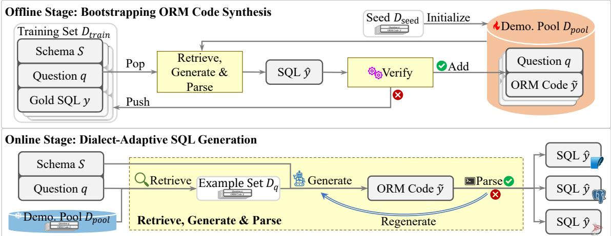  
Figure 4: The proposed Dialect-SQL framework. Dialect-SQL consists of two stages: bootstrapping ORM code synthesis (top) serves as the offline stage, and dialect-adaptive SQL generation (bottom) functions as the online stage.

Algorithm 1: Bootstrapping algorithm.   
Input: Training set $\overline { { \mathcal { D } _ { \mathrm { t r a i n } } } } .$ , seed $\mathcal { D } _ { \mathrm { s e e d } } .$   
Output: Demonstration pool $\mathcal { D } _ { \mathrm { p o o l } }$   
1 $\mathcal { D } _ { \mathrm { p o o l } }  \mathcal { D } _ { \mathrm { s e e d } } ;$   
2 repeat   
3 $\Delta { \mathcal { D } } \gets \emptyset ;$   
/\* Iterate through schema , question   
q, and gold SQL y in the training   
set. \*/   
4 foreach $( S , q , y ) \in \mathcal { D } _ { \operatorname { t r a i n } }$ do   
5 Generate ORM code snippet y˜ and   
SQL query yˆ based on $s , q ,$ and   
$\mathcal { D } _ { \mathrm { p o o l } } ;$   
6 if $\hat { y }$ is equivalent to y then   
7 $\Delta \mathcal { D } \gets \Delta \mathcal { D } \cup \{ ( q , \tilde { y } ) \} ;$   
8 ${ \mathcal { D } } _ { \operatorname { t r a i n } } \gets { \mathcal { D } } _ { \operatorname { t r a i n } } - \{ ( S , q , y ) \}$   
9 end   
10 end   
11 $\mathcal { D } _ { \mathrm { p o o l } }  \mathcal { D } _ { \mathrm { p o o l } } \cup \Delta \mathcal { D } ;$   
12 until stopping criteria;   
13 return $\mathcal { D } _ { \mathrm { p o o l } } ;$

From a higher-level perspective, the idea is to gradually add verified question-ORM code pairs to the demonstration pool, allowing the verified pairs to continually improve the capacity of the LLM to generate more difficult examples. As a controllable iterative framework, the proposed method is outlined in Algorithm 1. Initially, the demonstration pool $\mathcal { D } _ { \mathrm { p o o l } }$ contains five manually crafted seed examples $\mathcal { D } _ { \mathrm { s e e d } }$ (line 1), as detailed in Appendix A. During the iterative process (lines 2-12), correct examples are progressively incorporated into the demonstration pool $\mathcal { D } _ { \mathrm { p o o l } }$

At each iteration, we first initialize a temporary pool $\Delta \mathcal { D }$ to store new examples generated during that iteration (line 3). Then, we iterate over all triplets in the training set $\mathcal { D } _ { \mathrm { t r a i n } }$ (lines 4-10). Refer to Appendix B for further discussion on data synthesis methods when the training set is unavailable. For each triplet, which consists of a schema , a question $q ,$ and a gold SQL query y, our method produces an ORM code snippet y˜ and a corresponding SQL query yˆ based on , q, and the demonstration pool $\mathcal { D } _ { \mathrm { p o o l } }$ (line 5). We will elaborate on the generation process for both the ORM code snippet y˜ and the SQL query $\hat { y }$ in Section 3.2. By executing the SQL query yˆ, we can verify whether the query results match those of the gold SQL y (line 6). If the generated query results are consistent with the gold SQL results, the generated ORM code snippet y˜ is deemed correct, and the question-ORM code pair $( q , \tilde { y } )$ is added to the temporary pool ∆ (line 7). At the end of the iteration, the temporary pool $\Delta \mathcal { D }$ is merged into the demonstration pool $\mathcal { D } _ { \mathrm { p o o l } }$ to enrich the sample repository (line 11). The introduction of the temporary pool enhances efficiency and improves resource utilization, as it allows us to process multiple training examples in parallel without the need for synchronization for timely updates of the demonstration pool. This design choice makes the entire bootstrapping process more scalable and practical for large-scale datasets.

## 3.2 Dialect-Adaptive SQL Generation

In the online stage, our method generates an ORM code snippet y˜ based on the question q, schema , and demonstration pool $\mathcal { D } _ { \mathrm { p o o l } }$ . The code snippet y˜ is then converted into SQL yˆ for the target database.

Our method first employs an embedding-based retriever to retrieve top-K relevant examples (question-ORM code pairs) from the demonstration pool, where K is a predefined constant. The retriever encodes the input question q and the questions $\{ q _ { t } \} _ { t = 1 } ^ { M }$ from the demonstration pool into embedding vectors ${ \bf E } _ { q }$ and $\{ \mathbf { E } _ { q _ { t } } \} _ { t = 1 } ^ { M }$ . Then, a set of K most similar examples $\mathcal { D } _ { q } = \{ ( q _ { t } ^ { \prime } , \tilde { y } _ { t } ^ { \prime } ) \} _ { t = 1 } ^ { K } \subseteq \mathcal { D } _ { \mathrm { p o o l } }$ is retrieved based on the cosine similarity between the question embeddings ${ \bf E } _ { q }$ and $\{ \mathbf { E } _ { q _ { t } } \} _ { t = 1 } ^ { \tilde { M } }$ . These examples provide syntax and structural references for the LLM.

Subsequently, the question q, along with the schema class definitions derived from the schema , and the retrieved example set $\mathcal { D } _ { q }$ are fed into the LLM. The LLM then generates the corresponding ORM code snippet y˜. Given the strong expressive power of code and the fact that the generation of code snippet $\tilde { y }$ is conditioned on the example set $\mathcal { D } _ { q } ,$ , the LLM generates the corresponding code snippet $\tilde { y }$ in a constrained manner:

$$
\tilde { y } = \arg \operatorname* { m a x } _ { y ^ { \prime } } p _ { \mathrm { L L M } } \left( y ^ { \prime } | S , \mathcal { D } _ { q } , q \right) .\tag{1}
$$

Finally, the code interpreter is responsible for converting the generated ORM code snippet $\tilde { y }$ into an executable SQL query yˆ for the target database. If the ORM code snippet y˜ generated by the LLM cannot be converted into SQL due to syntax errors or other issues, our method will attempt to regenerate the code snippet y˜ for at most L times, where L is a predefined constant.

Considering that research indicates LLMs generally perform better with high-resource languages compared to their low-resource counterparts (Cassano et al., 2024; Orlanski et al., 2023), utilizing a high-resource language is more effective than creating a new language from scratch. Given that much existing research on code generation focuses on Python (Rozière et al., 2024; Nijkamp et al., 2023), we have selected Python as our intermediate language. To ensure full compatibility with SQL standards, we implement our framework based on SQLAlchemy, an open-source ORM framework from the software engineering community. SQLAlchemy can accurately convert Python ORM code into functionally equivalent SQL queries based on the database dialect. The demonstration in Figure 3 illustrates that the generated ORM code snippet should store the query represented in the code in the stmt variable for subsequent conversion into a SQL query. Further discussion on the selection of ORM frameworks is provided in Appendix C.

<table><tr><td></td><td>Train</td><td>Pool</td><td>Dev.</td></tr><tr><td>Spider</td><td>8,659</td><td>7,930</td><td>1,034</td></tr><tr><td>BIRD</td><td>9,428</td><td>8,248</td><td>1,534</td></tr></table>

Table 1: Dataset statistics showing the sizes of training set, demonstration pool, and development set.

## 4 Experiments

All experiments are conducted on a server equipped with 1TB of RAM and 8 NVIDIA A100 GPUs (80GB each). Refer to Appendix D for experiment settings such as models, metrics, and implementation details.

## 4.1 Datasets

To demonstrate the effectiveness of our method, we evaluate its performance on two well-established benchmarks: Spider (Yu et al., 2018) and BIRD (Li et al., 2023c). The original benchmarks utilize the SQLite database.<sup>4</sup> We have adapted the BIRD dataset for use with four additional databases: PostgreSQL,<sup>5</sup> SQL Server,<sup>6</sup> Oracle,<sup>7</sup> and MySQL.<sup>8</sup> The results are reported for the development set of each benchmark.

We use the bootstrapping ORM code synthesis introduced in Section 3.1 to create a demonstration pool for each dataset. Our approach involves generating ORM code snippets for each question in the training sets. The statistics for the resulting datasets are summarized in Table 1. It is important to note that not all questions in the training sets have corresponding ORM code snippets when bootstrapping stops.

## 4.2 Baseline

We compare the proposed Dialect-SQL with a standard Text-to-SQL method, referred to as Direct-SQL. To ensure a fair comparison, Direct-SQL also employs a regeneration framework similar to that of

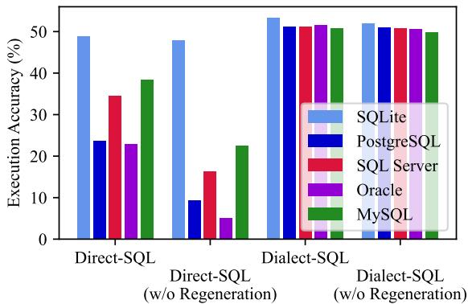  
(a) Llama-3.1-70B-Instruct

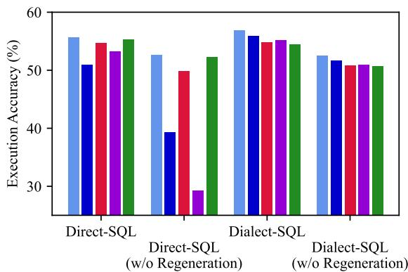  
(b) DeepSeek-R1-Distill-Qwen-32B

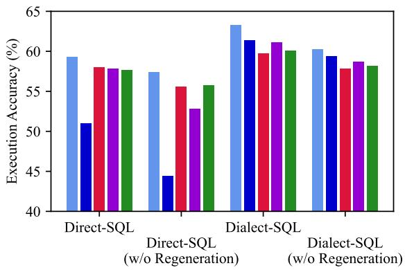  
(c) gpt-4o-2024-11-20

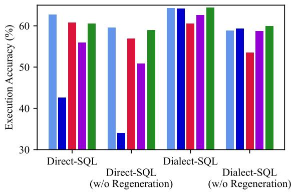  
(d) claude-3-7-sonnet-20250219  
Figure 5: Performance of different methods on BIRD adapted to various databases.

Dialect-SQL, with the key difference being that the LLM generates dialect-specific SQL directly. The prompt details can be found in Appendix E. Direct-SQL leverages feedback from the database; if the SQL generated by the LLM cannot be executed, it attempts to regenerate the query. Direct-SQL utilizes dialect-specific in-context demonstrations to ensure that the generated SQL queries align with the respective database systems. For SQLite, it employs examples retrieved from the original BIRD training set. For other databases, Direct-SQL obtains dialect-specific examples by converting ORM code snippets from the demonstration pool into the appropriate SQL dialect.

It is important to note that the experimental results for Direct-SQL are obtained under ideal conditions. Preliminary experiments in Appendix F indicate that Direct-SQL is influenced by in-context demonstrations, and in real-world applications, it may lack sufficient question-SQL pairs specific to certain databases. Consequently, the performance of Direct-SQL in practical environments is likely to be suboptimal. So, the fair comparison should also be attributed to the introduction and use of Dialect-SQL.

## 4.3 Main Results

Dialect Adaptability. Figure 5 illustrates the accuracy of different methods across various databases.

The performance varies across different databases. The results from Direct-SQL indicate that LLMs are more proficient at generating SQL queries for SQLite. In contrast, they struggle with SQL queries on PostgreSQL and Oracle; the EX of Direct-SQL using DeepSeek-R1-Distill-Qwen-32B drops by 4.70% on PostgreSQL compared to its performance on SQLite. This discrepancy may be attributed to the fact that many studies have been conducted using SQLite, resulting in a larger volume of data for this database, which enhances performance.

The proposed Dialect-SQL demonstrates excellent dialect adaptability. Compared to SQLite, Dialect-SQL shows an average EX drop of only 1.53% on PostgreSQL and 2.12% on SQL Server. This indicates that using ORM code as a unified intermediate language effectively addresses the dialect gap. For an illustrative example of how ORM code bridges this gap, please refer to the case study in Appendix H.1.

<table><tr><td rowspan="2">Method (%)</td><td colspan="3">Spider</td><td colspan="2">BIRD</td></tr><tr><td>EX</td><td>EM</td><td>VES</td><td>EX</td><td>VES</td></tr><tr><td colspan="6">Llama-3.1-70B-Instruct</td></tr><tr><td>Direct-SQL w/o Regeneration</td><td>77.3</td><td>42.5</td><td>76.29</td><td>48.96</td><td>50.86</td></tr><tr><td rowspan="3">Dialect-SQL w/o Regeneration</td><td>75.2</td><td>41.8</td><td>74.23</td><td>47.85</td><td>49.74</td></tr><tr><td>79.8</td><td>34.7</td><td>79.10</td><td>53.32</td><td>53.88</td></tr><tr><td>77.5</td><td>32.8</td><td>76.68</td><td>51.89</td><td>52.82</td></tr><tr><td colspan="6">DeepSeek-R1-Distill-Qwen-32B</td></tr><tr><td>Direct-SQL</td><td>82.5</td><td>61.4</td><td>82.78</td><td>55.61</td><td>57.16</td></tr><tr><td rowspan="3">w/o Regeneration Dialect-SQL</td><td></td><td>61.1</td><td>82.13</td><td></td><td></td></tr><tr><td>81.8</td><td>33.7</td><td></td><td>52.61</td><td>54.02</td></tr><tr><td>83.0 80.4</td><td>33.0</td><td>82.44 79.82</td><td>56.84 52.54</td><td>57.44 53.30</td></tr></table>

Table 2: Performance of different paradigms on SQLite. (Bold: the best within each LLM. Underlined: the second best within each LLM.)

Effectiveness of Text-to-Code. As shown in Table 2, the performance of LLMs using the proposed Text-to-Code paradigm surpasses that of standard SQL generation. Specifically, when leveraging Llama-3.1-70B-Instruct, the proposed Dialect-SQL demonstrates a 2.5% improvement in the EX metric on the Spider dataset compared to Direct-SQL, and a 4.36% improvement on the BIRD dataset. The proposed Dialect-SQL employs a strategy of generating ORM code first and then parsing it into SQL queries. Although ORM code is introduced as an intermediate language for the Text-to-SQL task, the performance loss during the parsing process is minimized through the use of the code interpreter. The results indicate that LLMs are more proficient at generating ORM code based on user requirements.

## 4.4 Ablation Study

Effectiveness of Regeneration. As shown in Table 2, both Direct-SQL and Dialect-SQL exhibit a performance decline without regeneration. Specifically, when utilizing Llama-3.1-70B-Instruct, Dialect-SQL experiences a 2.3% drop in EX on the Spider dataset, while Direct-SQL shows a 2.1% decrease. This suggests that even when relying solely on external feedback regarding the executability of queries, LLMs still possess the potential to generate valid and correct queries.

Effectiveness of Bootstrapping. Figure 6 illustrates the proportion of ORM code snippets correctly generated from the training set after various iterations of the bootstrapping algorithm. After the first iteration, examples generated solely from five manually crafted seed examples are classified as easy examples, constituting 71% of the total training set. Subsequent iterations produce hard examples, which account for 15% of the total after the fifth iteration. Notably, the number of correctly synthesized examples shows an overall upward trend, demonstrating that the bootstrapping algorithm effectively leverages previously synthesized examples to build a diverse demonstration pool. Using this demonstration pool, we further evaluate the impact of easy and hard examples on the performance of Dialect-SQL on the development set. As shown in Table 3, 16% of the in-context demonstrations used by Dialect-SQL for generating ORM code come from hard examples, resulting in a 1.89% increase in EX, thereby validating the effectiveness of hard examples.

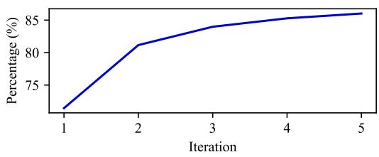

Figure 6: Percentage of successfully converted training examples after each iteration during bootstrapping.
<table><tr><td>Method (%)</td><td>Easy</td><td>Hard</td><td>EX</td></tr><tr><td>Dialect-SQL</td><td>84</td><td>16</td><td>53.32</td></tr><tr><td>w/o Hard</td><td>100</td><td>0</td><td>51.43</td></tr></table>

Table 3: Effectiveness of hard examples. Easy examples are generated solely based on the seed examples, while hard examples are generated with bootstrapping. The distributions of in-context demonstrations and EX are shown.

## 4.5 Analysis

Effect of Number of Demonstrations. Figure 7a illustrates the relationship between EX and the number of demonstrations (K). It shows that as K increases, the accuracy of Dialect-SQL gradually improves, although the change is not significant. Notably, Dialect-SQL consistently outperforms Direct-SQL, demonstrating the robustness and reliability of the proposed approach, and suggesting that performance remains stable regardless of the hyperparameter K.

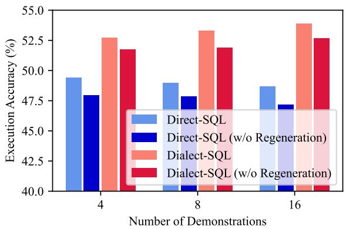  
(a) Accuracy

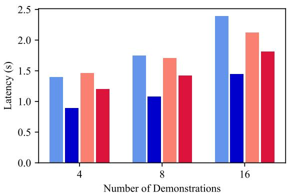  
(b) Efficiency

Figure 7: Performance with respect to the number of demonstrations (K) on BIRD utilizing Llama-3.1-70B-Instruct.
<table><tr><td>Method (%)</td><td>SQLite</td><td>PostgreSQL</td><td>SQL Server</td><td>Oracle</td><td>MySQL</td><td>Avg.</td></tr><tr><td>Direct-SQLsQLite + Transpiler</td><td>59.32</td><td>52.80</td><td>51.43</td><td>52.80</td><td>52.41</td><td>53.75</td></tr><tr><td>Direct-SQLPostgresQL + Transpiler</td><td>57.17</td><td>51.04</td><td>55.61</td><td>57.17</td><td>57.95</td><td>55.79</td></tr><tr><td>Direct-SQLsQL Server + Transpiler</td><td>57.63</td><td>56.39</td><td>58.02</td><td>55.87</td><td>59.06</td><td>57.39</td></tr><tr><td>Direct-SQLoracle + Transpiler</td><td>56.84</td><td>57.56</td><td>46.87</td><td>57.82</td><td>57.30</td><td>55.28</td></tr><tr><td>Direct-SQLMysQL + Transpiler</td><td>57.04</td><td>54.89</td><td>56.39</td><td>54.43</td><td>57.69</td><td>56.09</td></tr><tr><td>Direct-SQL</td><td>59.32</td><td>51.04</td><td>58.02</td><td>57.82</td><td>57.69</td><td>56.78</td></tr><tr><td>Dialect-SQL</td><td>63.30</td><td>61.34</td><td>59.78</td><td>61.15</td><td>60.10</td><td>61.13</td></tr></table>

Table 4: Execution accuracy (EX) of gpt-4o-2024-11-20 on BIRD. “Direct-SQL<sub>source</sub> + Transpiler” involves using Direct-SQL to generate SQL queries in a source dialect, which are subsequently translated to the target dialect via a transpiler. (Bold: the best. Underlined: the second best.)

Figure 7b depicts the average latency in seconds for each sample relative to K. The results indicate that as K increases, the latency for different methods rises significantly. Without regeneration, Direct-SQL consistently exhibits a shorter delay than Dialect-SQL, primarily because Dialect-SQL consumes more tokens. Specifically, Dialect-SQL (w/o regeneration) consumes 57% more tokens per sample on average. However, with the introduction of regeneration, starting from K = 8, Dialect-SQL’s latency becomes shorter than that of Direct-SQL. This suggests that Dialect-SQL is more likely to terminate the generation process early, leading to improved performance by finding the executable code more quickly.

Comparison with Transpilation. We investigate whether automatically transpiling SQL queries from a familiar source dialect to an unfamiliar target dialect can effectively bridge the dialect gap and improve adaptability. For each source dialect, we use Direct-SQL to generate SQL queries, which are then transpiled to all other target dialects using

SQLGlot.<sup>9</sup> As shown in Table 4, using a transpiler can indeed provide some benefit. For instance, when PostgreSQL is the target dialect, generating SQL queries in Oracle and then transpiling them to PostgreSQL results in a 57.56% EX. This is a notable improvement over the 51.04% EX achieved when Direct-SQL generates PostgreSQL natively. This suggests that by leveraging its proficiency in certain dialects, transpilation can help the LLM overcome its weaknesses in others. However, the results also reveal critical limitations of this approach. First, the average EX across all transpilation pairs ranges from 53.75% to 57.39%, which is only a marginal improvement over the direct generation baseline (56.78%). Second, the optimal source dialect varies per target. For example, transpiling from Oracle works well for PostgreSQL (57.56% EX), but transpiling from SQL Server is best for MySQL (59.06% EX). This lack of a single, universally effective source dialect makes the transpilation approach less practical for real-world deployment, as it requires prior knowledge of which source dialect works best for each target.

Error Analysis on Training Set. We examine 59 failure instances from the BIRD training set, which contains 9,428 data samples. Notably, 87% of the data can be successfully converted to ORM code (Table 1), demonstrating the overall efficacy of our method. For the 5% of cases that cannot be successfully converted, we conduct a detailed error analysis, summarized in Figure 8. This analysis reveals that 34% of the errors stem from issues with incorrect gold SQL and incorrect evidence, indicating that some failures are due to inaccuracies in the human annotated data. Additionally, 24% of the errors are related to incorrect join conditions, primarily occurring in multi-table joins. 17% of the errors involve incorrect column/expression in select, with some errors arising from complex calculation expressions and others due to discrepancies in column order compared to the annotations. Refer to Appendix H.2 for detailed failure cases.

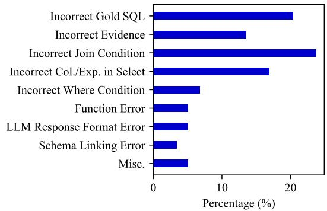  
Figure 8: Error analysis on the training set of BIRD.

## 5 Related Work

LLM-based Text-to-SQL. The advent of LLMs has transformed the NLP landscape (Brown et al., 2020; Ouyang et al., 2022), prompting the adaptation of LLMs for Text-to-SQL tasks (Li et al., 2024a). Research in this area can be categorized into two primary lines of work. The first focuses on prompting-based techniques (Kojima et al., 2022; Wei et al., 2022), which aim to design sophisticated pipelines (Gao et al., 2024; Shi et al., 2025) or facilitate autonomous task decomposition (Pourreza and Rafiei, 2023; Wang et al., 2025). The second line emphasizes enhancing smaller LLMs through model training with extensive synthesized SQLspecific data (Li et al., 2024b; Yang et al., 2024). However, these approaches primarily target specific database systems and often lack dialect adaptability. Recent work (Pourreza et al., 2024) attempts to address this gap by training specialized models for specific SQL dialects, but still requires retraining for new dialects, limiting adaptability.

Intermediate Languages. The use of intermediate languages is a consistent strategy in Textto-SQL for simplifying natural language translation into SQL (Dong and Lapata, 2018; Li et al., 2023a). This approach breaks the problem into two steps: converting the natural language to an intermediate form, and then transforming that form into a final SQL query. Previous work on intermediate languages falls into two main categories. The first uses SQL-derived languages, such as Nat-SQL (Gan et al., 2021c; Pourreza and Rafiei, 2023) and SemQL (Guo et al., 2019), which are simplified versions of SQL designed to ease the conversion from natural language. The second category employs programming language APIs, like Pandaslike code (Qu et al., 2024, 2025), as a step-by-step reasoning trajectory to mitigate hallucinations. Unlike these methods, our approach introduces ORM code primarily to address the dialect gap by decoupling query logic from specific SQL syntax.

## 6 Conclusions

In this paper, we address the challenges of translating natural language into SQL queries across various database systems, highlighting the limitations of existing research that often targets specific SQL dialects. We introduce a novel approach, Dialect-SQL, which utilizes ORM code as an intermediate language to bridge the gap between different SQL dialects. Dialect-SQL demonstrates impressive dialect adaptability, with only a 1.53% drop in EX on PostgreSQL and 2.12% on SQL Server compared to SQLite. These findings underscore the potential of our proposed method to enhance the adaptability of LLMs across different SQL dialects.

## Limitations

This study has several limitations. First, the effectiveness of Dialect-SQL is validated only on SQLite, PostgreSQL, SQL Server, and other relational databases, indicating a need for further adaptation to additional database systems to assess its broader applicability. Second, our experiments are conducted solely on a limited number of LLMs due to cost considerations, which restricts our findings to these models and leaves the exploration of a wider range of LLMs with varying parameter sizes for future research. Finally, while we utilize Python, there is potential to explore several other high-resource languages as intermediate languages for Text-to-SQL, which could further improve ORM code generation across diverse programming environments.

## Acknowledgments

This work is supported by the Chinese NSF Major Research Plan (No.92270121) and the Fundamental Research Funds for the Central Universities 2232023D-19.

## References

Tom B. Brown, Benjamin Mann, Nick Ryder, Melanie Subbiah, Jared Kaplan, Prafulla Dhariwal, Arvind Neelakantan, Pranav Shyam, Girish Sastry, Amanda Askell, Sandhini Agarwal, Ariel Herbert-Voss, Gretchen Krueger, Tom Henighan, Rewon Child, Aditya Ramesh, Daniel M. Ziegler, Jeffrey Wu, Clemens Winter, Christopher Hesse, Mark Chen, Eric Sigler, Mateusz Litwin, Scott Gray, Benjamin Chess, Jack Clark, Christopher Berner, Sam Mc-Candlish, Alec Radford, Ilya Sutskever, and Dario Amodei. 2020. Language models are few-shot learners. Preprint, arXiv:2005.14165.

Federico Cassano, John Gouwar, Francesca Lucchetti, Claire Schlesinger, Anders Freeman, Carolyn Jane Anderson, Molly Q Feldman, Michael Greenberg, Abhinav Jangda, and Arjun Guha. 2024. Knowledge transfer from high-resource to low-resource programming languages for code llms. Proc. ACM Program. Lang., 8(OOPSLA2).

DeepSeek-AI. 2025. Deepseek-r1: Incentivizing reasoning capability in llms via reinforcement learning. Preprint, arXiv:2501.12948.

Xiang Deng, Ahmed Hassan Awadallah, Christopher Meek, Oleksandr Polozov, Huan Sun, and Matthew Richardson. 2021. Structure-grounded pretraining for text-to-SQL. In Proceedings of the 2021 Conference ofthe North American Chapter ofthe Associationfor Computational Linguistics: Human Language Technologies, pages 1337–1350, Online. Association for Computational Linguistics.

Li Dong and Mirella Lapata. 2018. Coarse-to-fine decoding for neural semantic parsing. In Proceedings of the 56th Annual Meeting of the Association for Computational Linguistics (Volume 1: Long Papers), pages 731–742, Melbourne, Australia. Association for Computational Linguistics.

Yujian Gan, Xinyun Chen, Qiuping Huang, Matthew Purver, John R. Woodward, Jinxia Xie, and Pengsheng Huang. 2021a. Towards robustness of textto-SQL models against synonym substitution. In Proceedings ofthe 59th Annual Meeting ofthe Associationfor Computational Linguistics and the 11th International Joint Conference on Natural Language Processing (Volume 1: Long Papers), pages 2505– 2515, Online. Association for Computational Linguistics.

Yujian Gan, Xinyun Chen, and Matthew Purver. 2021b. Exploring underexplored limitations of cross-domain text-to-SQL generalization. In Proceedings of the 2021 Conference on Empirical Methods in Natural Language Processing, pages 8926–8931, Online and Punta Cana, Dominican Republic. Association for Computational Linguistics.

Yujian Gan, Xinyun Chen, Jinxia Xie, Matthew Purver, John R. Woodward, John Drake, and Qiaofu Zhang. 2021c. Natural SQL: Making SQL easier to infer from natural language specifications. In Findings of the Association for Computational Linguistics: EMNLP 2021, pages 2030–2042, Punta Cana, Dominican Republic. Association for Computational Linguistics.

Dawei Gao, Haibin Wang, Yaliang Li, Xiuyu Sun, Yichen Qian, Bolin Ding, and Jingren Zhou. 2024. Text-to-sql empowered by large language models: A benchmark evaluation. Proc. VLDB Endow., 17(5):1132–1145.

Jiaqi Guo, Zecheng Zhan, Yan Gao, Yan Xiao, Jian-Guang Lou, Ting Liu, and Dongmei Zhang. 2019. Towards complex text-to-SQL in cross-domain database with intermediate representation. In Proceedings of the 57th Annual Meeting of the Association for Computational Linguistics, pages 4524–4535, Florence, Italy. Association for Computational Linguistics.

Zijin Hong, Zheng Yuan, Hao Chen, Qinggang Zhang, Feiran Huang, and Xiao Huang. 2024. Knowledgeto-SQL: Enhancing SQL generation with data expert LLM. In Findings ofthe Associationfor Computational Linguistics: ACL 2024, pages 10997–11008, Bangkok, Thailand. Association for Computational Linguistics.

Takeshi Kojima, Shixiang Shane Gu, Machel Reid, Yutaka Matsuo, and Yusuke Iwasawa. 2022. Large language models are zero-shot reasoners. In Proceedings of the 36th International Conference on Neural Information Processing Systems, NIPS ’22, Red Hook, NY, USA. Curran Associates Inc.

Woosuk Kwon, Zhuohan Li, Siyuan Zhuang, Ying Sheng, Lianmin Zheng, Cody Hao Yu, Joseph E. Gonzalez, Hao Zhang, and Ion Stoica. 2023. Efficient memory management for large language model serving with pagedattention. Preprint, arXiv:2309.06180.

Boyan Li, Yuyu Luo, Chengliang Chai, Guoliang Li, and Nan Tang. 2024a. The dawn of natural language to sql: Are we fully ready? Proc. VLDB Endow., 17(11):3318–3331.

Haoyang Li, Shang Wu, Xiaokang Zhang, Xinmei Huang, Jing Zhang, Fuxin Jiang, Shuai Wang, Tieying Zhang, Jianjun Chen, Rui Shi, Hong Chen, and Cuiping Li. 2025. Omnisql: Synthesizing high-quality text-to-sql data at scale. Preprint, arXiv:2503.02240.

Haoyang Li, Jing Zhang, Cuiping Li, and Hong Chen. 2023a. Resdsql: decoupling schema linking and skeleton parsing for text-to-sql. In Proceedings of the Thirty-Seventh AAAI Conference on Artificial Intelligence and Thirty-Fifth Conference on Innovative Applications ofArtificial Intelligence and Thirteenth Symposium on Educational Advances in Artificial Intelligence, AAAI’23/IAAI’23/EAAI’23. AAAI Press.

Haoyang Li, Jing Zhang, Hanbing Liu, Ju Fan, Xiaokang Zhang, Jun Zhu, Renjie Wei, Hongyan Pan, Cuiping Li, and Hong Chen. 2024b. Codes: Towards building open-source language models for text-to-sql. Proc. ACM Manag. Data, 2(3).

Jinyang Li, Binyuan Hui, Reynold Cheng, Bowen Qin, Chenhao Ma, Nan Huo, Fei Huang, Wenyu Du, Luo Si, and Yongbin Li. 2023b. Graphix-t5: mixing pre-trained transformers with graph-aware layers for text-to-sql parsing. In Proceedings of the Thirty-Seventh AAAI Conference on Artificial Intelligence and Thirty-Fifth Conference on Innovative Applications of Artificial Intelligence and Thirteenth Symposium on Educational Advances in Artificial Intelligence, AAAI’23/IAAI’23/EAAI’23. AAAI Press.

Jinyang Li, Binyuan Hui, GE QU, Jiaxi Yang, Binhua Li, Bowen Li, Bailin Wang, Bowen Qin, Ruiying Geng, Nan Huo, Xuanhe Zhou, Chenhao Ma, Guoliang Li, Kevin Chang, Fei Huang, Reynold Cheng, and Yongbin Li. 2023c. Can LLM already serve as a database interface? a BIg bench for large-scale database grounded text-to-SQLs. In Thirty-seventh Conference on Neural Information Processing Systems Datasets and Benchmarks Track.

Ruilin Luo, Liyuan Wang, Binghuai Lin, Zicheng Lin, and Yujiu Yang. 2024. PTD-SQL: Partitioning and targeted drilling with LLMs in text-to-SQL. In Proceedings ofthe 2024 Conference on Empirical Methods in Natural Language Processing, pages 3767– 3799, Miami, Florida, USA. Association for Computational Linguistics.

Erik Nijkamp, Bo Pang, Hiroaki Hayashi, Lifu Tu, Huan Wang, Yingbo Zhou, Silvio Savarese, and Caiming Xiong. 2023. Codegen: An open large language model for code with multi-turn program synthesis. In The Eleventh International Conference on Learning Representations.

Gabriel Orlanski, Kefan Xiao, Xavier Garcia, Jeffrey Hui, Joshua Howland, Jonathan Malmaud, Jacob Austin, Rishabh Singh, and Michele Catasta. 2023. Measuring the impact of programming language distribution. In Proceedings of the 40th International Conference on Machine Learning, ICML’23. JMLR.org.

Long Ouyang, Jeffrey Wu, Xu Jiang, Diogo Almeida, Carroll Wainwright, Pamela Mishkin, Chong Zhang, Sandhini Agarwal, Katarina Slama, Alex Ray, John Schulman, Jacob Hilton, Fraser Kelton, Luke Miller, Maddie Simens, Amanda Askell, Peter Welinder,

Paul F Christiano, Jan Leike, and Ryan Lowe. 2022. Training language models to follow instructions with human feedback. In Advances in Neural Information Processing Systems, volume 35, pages 27730–27744. Curran Associates, Inc.

Adam Paszke, Sam Gross, Francisco Massa, Adam Lerer, James Bradbury, Gregory Chanan, Trevor Killeen, Zeming Lin, Natalia Gimelshein, Luca Antiga, Alban Desmaison, Andreas Köpf, Edward Yang, Zach DeVito, Martin Raison, Alykhan Tejani, Sasank Chilamkurthy, Benoit Steiner, Lu Fang, Junjie Bai, and Soumith Chintala. 2019. Pytorch: An imperative style, high-performance deep learning library. Preprint, arXiv:1912.01703.

Mohammadreza Pourreza and Davood Rafiei. 2023. DIN-SQL: Decomposed in-context learning of textto-SQL with self-correction. In Thirty-seventh Conference on Neural Information Processing Systems.

Mohammadreza Pourreza, Ruoxi Sun, Hailong Li, Lesly Miculicich, Tomas Pfister, and Sercan O. Arik. 2024. Sql-gen: Bridging the dialect gap for text-to-sql via synthetic data and model merging. Preprint, arXiv:2408.12733.

Ge Qu, Jinyang Li, Bowen Li, Bowen Qin, Nan Huo, Chenhao Ma, and Reynold Cheng. 2024. Before generation, align it! a novel and effective strategy for mitigating hallucinations in text-to-SQL generation. In Findings of the Association for Computational Linguistics: ACL 2024, pages 5456–5471, Bangkok, Thailand. Association for Computational Linguistics.

Ge Qu, Jinyang Li, Bowen Qin, Xiaolong Li, Nan Huo, Chenhao Ma, and Reynold Cheng. 2025. SHARE: An SLM-based hierarchical action CorREction assistant for text-to-SQL. In Proceedings of the 63rd Annual Meeting of the Association for Computational Linguistics (Volume 1: Long Papers), pages 11268– 11292, Vienna, Austria. Association for Computational Linguistics.

Baptiste Rozière, Jonas Gehring, Fabian Gloeckle, Sten Sootla, Itai Gat, Xiaoqing Ellen Tan, Yossi Adi, Jingyu Liu, Romain Sauvestre, Tal Remez, Jérémy Rapin, Artyom Kozhevnikov, Ivan Evtimov, Joanna Bitton, Manish Bhatt, Cristian Canton Ferrer, Aaron Grattafiori, Wenhan Xiong, Alexandre Défossez, Jade Copet, Faisal Azhar, Hugo Touvron, Louis Martin, Nicolas Usunier, Thomas Scialom, and Gabriel Synnaeve. 2024. Code llama: Open foundation models for code. Preprint, arXiv:2308.12950.

Zhili Shen, Pavlos Vougiouklis, Chenxin Diao, Kaustubh Vyas, Yuanyi Ji, and Jeff Z. Pan. 2024. Improving retrieval-augmented text-to-SQL with ASTbased ranking and schema pruning. In Proceedings of the 2024 Conference on Empirical Methods in Natural Language Processing, pages 7865–7879, Miami, Florida, USA. Association for Computational Linguistics.

Jie Shi, Bo Xu, Jiaqing Liang, Yanghua Xiao, Jia Chen, Chenhao Xie, Peng Wang, and Wei Wang. 2025.

Gen-SQL: Efficient text-to-SQL by bridging natural language question and database schema with pseudo-schema. In Proceedings of the 31st International Conference on Computational Linguistics, pages 3794–3807, Abu Dhabi, UAE. Association for Computational Linguistics.

Hugo Touvron, Thibaut Lavril, Gautier Izacard, Xavier Martinet, Marie-Anne Lachaux, Timothée Lacroix, Baptiste Rozière, Naman Goyal, Eric Hambro, Faisal Azhar, Aurelien Rodriguez, Armand Joulin, Edouard Grave, and Guillaume Lample. 2023a. Llama: Open and efficient foundation language models. Preprint, arXiv:2302.13971.

Hugo Touvron, Louis Martin, Kevin Stone, Peter Albert, Amjad Almahairi, Yasmine Babaei, Nikolay Bashlykov, Soumya Batra, Prajjwal Bhargava, Shruti Bhosale, Dan Bikel, Lukas Blecher, Cristian Canton Ferrer, Moya Chen, Guillem Cucurull, David Esiobu, Jude Fernandes, Jeremy Fu, Wenyin Fu, Brian Fuller, Cynthia Gao, Vedanuj Goswami, Naman Goyal, Anthony Hartshorn, Saghar Hosseini, Rui Hou, Hakan Inan, Marcin Kardas, Viktor Kerkez, Madian Khabsa, Isabel Kloumann, Artem Korenev, Punit Singh Koura, Marie-Anne Lachaux, Thibaut Lavril, Jenya Lee, Diana Liskovich, Yinghai Lu, Yuning Mao, Xavier Martinet, Todor Mihaylov, Pushkar Mishra, Igor Molybog, Yixin Nie, Andrew Poulton, Jeremy Reizenstein, Rashi Rungta, Kalyan Saladi, Alan Schelten, Ruan Silva, Eric Michael Smith, Ranjan Subramanian, Xiaoqing Ellen Tan, Binh Tang, Ross Taylor, Adina Williams, Jian Xiang Kuan, Puxin Xu, Zheng Yan, Iliyan Zarov, Yuchen Zhang, Angela Fan, Melanie Kambadur, Sharan Narang, Aurelien Rodriguez, Robert Stojnic, Sergey Edunov, and Thomas Scialom. 2023b. Llama 2: Open foundation and fine-tuned chat models. Preprint, arXiv:2307.09288.

Bing Wang, Changyu Ren, Jian Yang, Xinnian Liang, Jiaqi Bai, Linzheng Chai, Zhao Yan, Qian-Wen Zhang, Di Yin, Xing Sun, and Zhoujun Li. 2024. Mac-sql: A multi-agent collaborative framework for text-to-sql. Preprint, arXiv:2312.11242.

Bing Wang, Changyu Ren, Jian Yang, Xinnian Liang, Jiaqi Bai, LinZheng Chai, Zhao Yan, Qian-Wen Zhang, Di Yin, Xing Sun, and Zhoujun Li. 2025. MAC-SQL: A multi-agent collaborative framework for textto-SQL. In Proceedings of the 31st International Conference on Computational Linguistics, pages 540– 557, Abu Dhabi, UAE. Association for Computational Linguistics.

Jason Wei, Xuezhi Wang, Dale Schuurmans, Maarten Bosma, Brian Ichter, Fei Xia, Ed Chi, Quoc V Le, and Denny Zhou. 2022. Chain-of-thought prompting elicits reasoning in large language models. In Advances in Neural Information Processing Systems, volume 35, pages 24824–24837. Curran Associates, Inc.

Thomas Wolf, Lysandre Debut, Victor Sanh, Julien Chaumond, Clement Delangue, Anthony Moi, Pierric Cistac, Tim Rault, Rémi Louf, Morgan Funtowicz, Joe Davison, Sam Shleifer, Patrick von Platen,

Clara Ma, Yacine Jernite, Julien Plu, Canwen Xu, Teven Le Scao, Sylvain Gugger, Mariama Drame, Quentin Lhoest, and Alexander M. Rush. 2020. Huggingface’s transformers: State-of-the-art natural language processing. Preprint, arXiv:1910.03771.

Shitao Xiao, Zheng Liu, Peitian Zhang, and Niklas Muennighoff. 2023. C-pack: Packaged resources to advance general chinese embedding. Preprint, arXiv:2309.07597.

Jiaxi Yang, Binyuan Hui, Min Yang, Jian Yang, Junyang Lin, and Chang Zhou. 2024. Synthesizing text-to-SQL data from weak and strong LLMs. In Proceedings ofthe 62nd Annual Meeting ofthe Association for Computational Linguistics (Volume 1: Long Papers), pages 7864–7875, Bangkok, Thailand. Association for Computational Linguistics.

Edward Yeo, Yuxuan Tong, Morry Niu, Graham Neubig, and Xiang Yue. 2025. Demystifying long chain-of-thought reasoning in llms. Preprint, arXiv:2502.03373.

Tao Yu, Rui Zhang, Kai Yang, Michihiro Yasunaga, Dongxu Wang, Zifan Li, James Ma, Irene Li, Qingning Yao, Shanelle Roman, Zilin Zhang, and Dragomir Radev. 2018. Spider: A large-scale human-labeled dataset for complex and cross-domain semantic parsing and text-to-SQL task. In Proceedings ofthe 2018 Conference on Empirical Methods in Natural Language Processing, pages 3911–3921, Brussels, Belgium. Association for Computational Linguistics.

Victor Zhong, Caiming Xiong, and Richard Socher. 2017. Seq2sql: Generating structured queries from natural language using reinforcement learning. Preprint, arXiv:1709.00103.

## A Manual Examples

The demonstration pool is initialized with five manual examples. These examples are selected based on preliminary experiments that examine the types of queries LLMs struggle to generate correctly.

Question: What is the percentage of the   
ratings were rated by user who was a   
subcriber?   
Evidence: user is a subscriber refers to   
user\_subscriber = 1; percentage of   
ratings = DIVIDE(   
SUM(user\_subscriber = 1),   
SUM(rating\_score)) as percent;   
Code:   
stmt = select(   
func.sum(case(   
(   
ratings.user\_subscriber == 1,   
1   
),   
else\_=0   
)) \* 100 / func.count()   
)   
Question: Which movie is more popular,   
"The General" or "Il grido"?   
Evidence: The General and Il grido are

movie\_title; more popular movie refers   
to higher (movie\_popularity);   
Code:   
stmt = select(   
movies.movie\_title   
).where(   
(movies.movie\_title   
== 'The General')   
| (movies.movie\_title   
== 'Il grido')   
).order\_by(   
movies.movie\_popularity.desc()   
).limit(1)   
Question: What is the average rating for   
movie titled 'When Will I Be Loved'?   
Evidence: average rating = DIVIDE((   
SUM(rating\_score where movie\_title   
= 'When Will I Be Loved')),   
COUNT(rating\_score));   
Code:   
stmt = select(   
func.avg(ratings.rating\_score)   
).join(   
movies, movies.movie\_id   
== ratings.movie\_id   
).where(   
movies.movie\_title   
== 'When Will I Be Loved   
)   
Question: List ther users who gave the   
worst rating for movie 'Love Will Tear   
Us Apart'.   
Evidence: worst rating refers to   
rating\_score = 1;   
Code:   
stmt = select(   
ratings.user\_id   
).join(   
movies, ratings.movie\_id   
== movies.movie\_id   
).where(   
movies.movie\_title   
== 'Love Will Tear Us Apart',   
ratings.rating\_score == 1   
)   
Question: For the user who post the   
list that contained the most number of   
the movies, is he/she a paying   
subscriber when creating that list?   
Evidence: the list that contained the   
most number of the movies refers to   
MAX(list\_movie\_number);   
user\_has\_payment\_method = 1 means the   
user was a paying subscriber when he   
created the list ;   
user\_has\_payment\_method = 0 means the   
user was not a paying subscriber when   
he created the list   
Code:   
stmt = select(   
lists\_users   
.user\_has\_payment\_method   
).join(   
lists, lists\_users.list\_id   
== lists.list\_id   
).where(   
lists.list\_movie\_number

== select(func.max(   
lists.list\_movie\_number   
))   
)

## B Data Synthesis for Insufficient Question-SQL Pairs

For domains with insufficient question-SQL pairs, data synthesis methods (Li et al., 2025; Yang et al., 2024; Li et al., 2024b) can be utilized to generate domain-specific data. This synthesized data can then be employed with our bootstrapping approach to produce question-ORM code pairs.

## C Rationale for Choosing Python and SQLAlchemy

We choose Python and SQLAlchemy for several reasons. First, Python is a widely used highresource language, and SQLAlchemy is a wellestablished ORM that has been extensively adopted in the industry. This popularity means that LLMs have effectively learned the nuances of Python and SQLAlchemy during large-scale pre-training, making them well-suited for accurate intermediate code generation.

Although we consider the option of using C# with EF Core, we encounter a significant limitation: this framework does not support the output of SQL query statements, which is essential for compatibility with traditional Text-to-SQL tasks. This mismatch hinders our ability to leverage EF Core effectively for our objectives.

We remain open to incorporating other ORM frameworks that can output SQL queries. Our architecture is designed to be adaptable, allowing for the integration of alternative languages and ORMs in future iterations of our work.

## D Experiment Settings

## D.1 Models

LLM. We conduct experiments using both open-source and closed-source LLMs. The open-source LLMs are Llama-3.1-70B-Instruct<sup>10</sup> and DeepSeek-R1-Distill-Qwen-32B.<sup>11</sup> For Llama (Touvron et al., 2023b,a), only SQL queries or ORM code snippets are generated. In contrast, for the distilled DeepSeek-R1 (DeepSeek-AI, 2025), long Chain-of-Thoughts (CoTs) (Yeo et al., 2025) are generated prior to producing the SQL queries or ORM code snippets. The closed-source LLMs are gpt-4o-2024-11-20 and claude-3-7-sonnet-20250219.

Retriever. We utilize the state-of-the-art text embedding model bge-large-en-v1.5 (Xiao et al., 2023) for our embedding-based retriever.

## D.2 Metrics

We follow the convention (Pourreza and Rafiei, 2023; Wang et al., 2024; Gao et al., 2024; Shi et al., 2025) to report three metrics for Text-to-SQL: Execution Accuracy (EX), Exact Matching Accuracy (EM), and Valid Efficiency Score (VES). EX is defined as the accuracy of the results obtained by executing the generated SQL query compared to the results from executing the gold SQL query on the specified database. EM measures string matching similarity by assessing whether the decomposed SQL components of the generated query align with those of the gold query. VES evaluates the execution efficiency of the generated query relative to the gold query.

Specifically, for Spider, we report all three metrics: EX, EM, and VES (Yu et al., 2018; Li et al., 2023b,c). In the case of BIRD, we focus on EX and VES (Li et al., 2023c) for SQLite, while reporting only EX for PostgreSQL and other databases. Note that there are no gold SQL queries for the development set on PostgreSQL and other databases. Therefore, we execute the gold SQL queries on SQLite and compare the results with those obtained from the generated SQL queries on the other databases.

## D.3 Implementation Details

We implement our code based on the Py-Torch (Paszke et al., 2019) version of the Transformers (Wolf et al., 2020) library.

Generation Configuration. Default sampling parameters are employed in all experiments. For example, the default temperature for Llama-3.1- 70B-Instruct is 0.6. The maximum number of tokens generated for each SQL query or ORM code snippet is limited to 256 for Llama-3.1-70B-Instruct, while there is no such limitation for the other LLMs.

Model Serving. Both Llama-3.1-70B-Instruct and DeepSeek-R1-Distill-Qwen-32B are deployed across 8 GPUs using vLLM (Kwon et al., 2023) to ensure optimal inference speed.

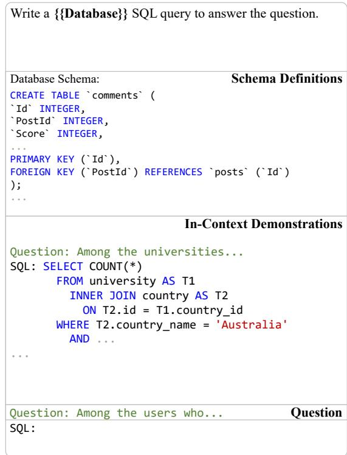  
Figure 9: Database-style prompt representation format used in Direct-SQL.

## E Prompt for Direct-SQL

Direct-SQL employs a database-style prompt to generate SQL queries tailored for specific databases. This prompt, illustrated in Figure 9, also consists of three parts: schema definitions, in-context demonstrations, and the question.

Schema Definitions. This part outlines the database schema , detailing the definition of each table s<sub>i</sub> along with its corresponding column collection <sub>i</sub> using CREATE TABLE statements. This allows the LLM to understand the structure and relationships within the database.

In-Context Demonstrations. This part provides examples of relevant SQL syntax and structure. These demonstrations typically consist of natural language questions paired with their corresponding SELECT statements.

Question. The natural language question q is presented in this part.

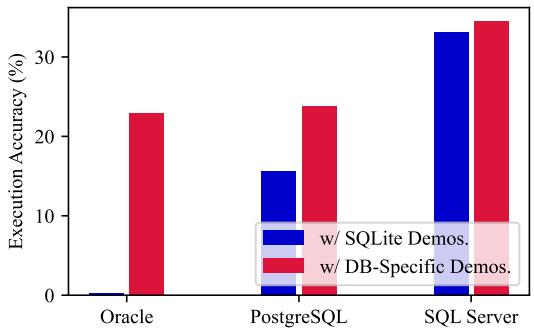

Figure 10: Effects of demonstration dialect on Direct-SQL. “w/ SQLite Demos.” refers to demonstrations that consist of SQL queries in the SQLite dialect. “w/ DB-Specific Demos.” refers to demonstrations that include SQL queries tailored for specific databases.  
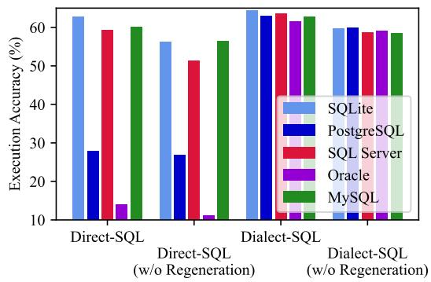  
Figure 11: Performance of gemini-2.5-flash on BIRD.

## F Effects of Demonstration Dialect on Direct-SQL

This section investigates how Direct-SQL is influenced by the dialect of SQL queries in in-context demonstrations, based on Llama-3.1-70B-Instruct and validated on the BIRD dataset. Since the original BIRD dataset is based on the SQLite database, our first experimental setup involves prompting the LLM to generate queries for a specific database using in-context demonstrations that consist of SQLite dialect queries (as these are readily available). In contrast, the experimental setup depicted in Figure 5a prompts the LLM to generate queries for a specific database, with in-context demonstrations also using that database’s dialect. The experimental results, shown in Figure 10, indicate that using in-context demonstrations aligned with the database’s dialect significantly improves performance.

## G Additional Results

We also evaluate our framework using gemini-2.5- flash to further demonstrate its robustness. As shown in Figure 11, gemini-2.5-flash exhibits performance trends consistent with the results in Section 4.3. Dialect-SQL with regeneration achieves an average EX of 63.00%, outperforming the other baselines by a significant margin. This underscores the consistent effectiveness of our ORM-based approach, even with different LLMs.

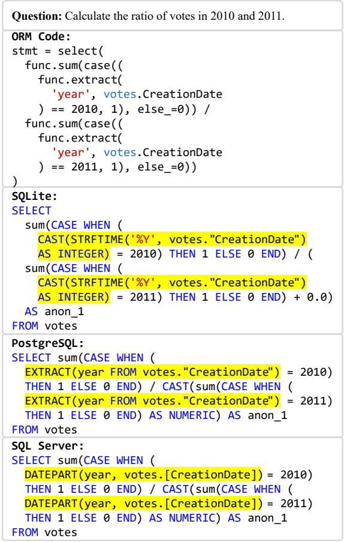  
Figure 12: Case study on BIRD. Dialect-SQL uses the same ORM code to generate SQL queries that leverage different built-in functions for date handling across various database dialects.

## H Case Study

## H.1 Dialect Adaptability

Figure 12 illustrates how Dialect-SQL bridges the dialect gap through ORM code. The challenge of this query arises from the differing built-in functions for handling dates across various databases, highlighting the lack of portability in the SQL query. However, Dialect-SQL can utilize the same code to address this issue. To extract the year from the CreationDate column of the votes table, which is of type DATE, the extract function is invoked. The subsequent code interpreter generates the corresponding query statements for different databases, such as STRFTIME in SQLite and DATEPART in SQL Server. Acting as a mapping and parsing knowledge base, the code interpreter effectively addresses the limitations of LLMs in dealing with various dialects.

Question: Among the films starring PENELOPE GUINESS, how   
many of them are in English?   
Incorrect ORM Code:   
stmt = select(   
func.count(film.film\_id)   
).join(   
film\_actor,   
film\_actor.actor\_id == film\_actor.actor\_id   
).join(   
film, film\_actor.film\_id == film.film\_id   
).join(   
language,   
film.language\_id == language.language\_id   
).where(   
language.name == 'English',   
actor.first\_name == 'PENELOPE',   
actor.last\_name == 'GUINESS   
)   
Incorrect SQL:   
SELECT count(film.film\_id) AS count\_1   
FROM film   
JOIN film\_actor   
ON film\_actor.actor\_id = film\_actor.actor\_id   
JOIN film   
ON film\_actor.film\_id = film.film\_id   
JOIN language   
ON film.language\_id = language.language\_id,   
actor   
WHERE language.name = 'English'   
AND actor.first\_name = 'PENELOPE'   
AND actor.last\_name = 'GUINESS'   
Gold SQL:   
SELECT COUNT(T3.film\_id)   
FROM actor AS T1   
INNER JOIN film\_actor AS T2   
ON T1.actor\_id = T2.actor\_id   
INNER JOIN film AS T3   
ON T2.film\_id = T3.film\_id   
INNER JOIN language AS T4   
ON T3.language\_id = T4.language\_id   
WHERE T4.name = 'English'   
AND T1.first\_name = 'PENELOPE'   
AND T1.last\_name = 'GUINESS  
Figure 13: Example of incorrect join condition. This example illustrates a failure case where the generated ORM code produces a self-join error (film\_actor.actor\_id == film\_actor.actor\_id) instead of correctly linking the film\_actor table to the actor table.

## H.2 Failure Cases

This section provides a detailed analysis of two major failure types identified in our error analysis on the BIRD training set: incorrect join condition and incorrect column/expression in select. These examples are illustrated in Figure 13 and Figure 14, and they show that the LLM still struggles with generating accurate queries. The first type of failure is a mistake in a multi-table join, where the primary challenge is specifying the precise conditions that accurately link the tables. The second arises when complex expressions in the where clause increase the overall complexity, which causes the LLM to make a subsequent error in the select clause, such as failing to include distinct within the func.count function.

Question: Between the years 1990 and 2007, of the total rebounds   
achieved by each player, how many managed to exceed 75% of   
defensive rebounds?   
Incorrect ORM Code:   
stmt = select(   
func.count(player\_allstar.playerID)   
).where(   
player\_allstar.season\_id >= 1990,   
player\_allstar.season\_id <= 2007,   
func.cast(   
func.cast(   
player\_allstar.d\_rebounds, REAL   
) \* 100 / player\_allstar.rebounds, REAL   
) > 75   
)   
Incorrect SQL:   
SELECT   
count(player\_allstar."playerID") AS count\_1   
FROM player\_allstar   
WHERE player\_allstar.season\_id >= 1990   
AND player\_allstar.season\_id <= 2007   
AND CAST(   
(CAST(   
player\_allstar.d\_rebounds AS REAL   
) \* 100) / (player\_allstar.rebounds + 0.0   
) AS REAL) > 75   
Gold SQL:   
SELECT COUNT(DISTINCT playerID)   
FROM player\_allstar   
WHERE CAST(d\_rebounds AS REAL) \* 100   
/ rebounds > 75   
AND season\_id BETWEEN 1990 AND 2007  
Figure 14: Example of incorrect column/expression in select. This example shows an error where the generated ORM code counts all rows (func.count(player\_allstar.playerID)) instead of counting the unique players (COUNT(DISTINCT playerID)).