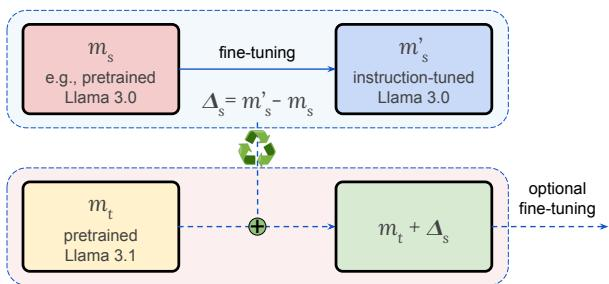
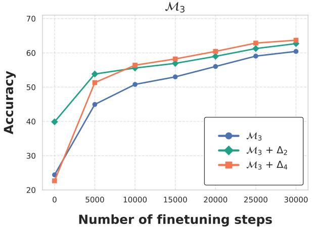
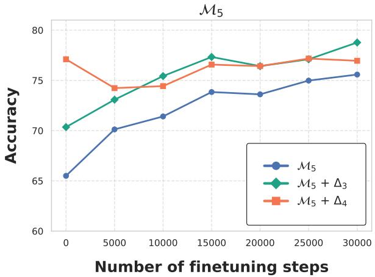
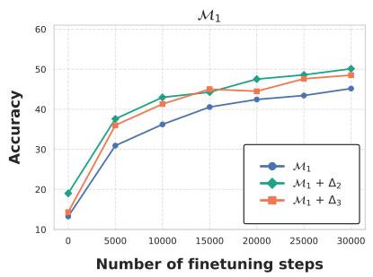
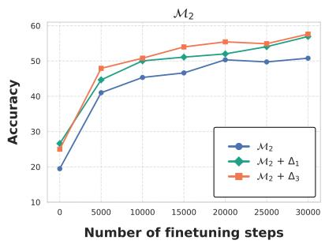
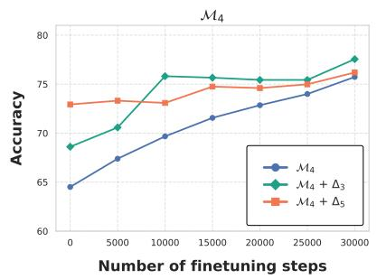
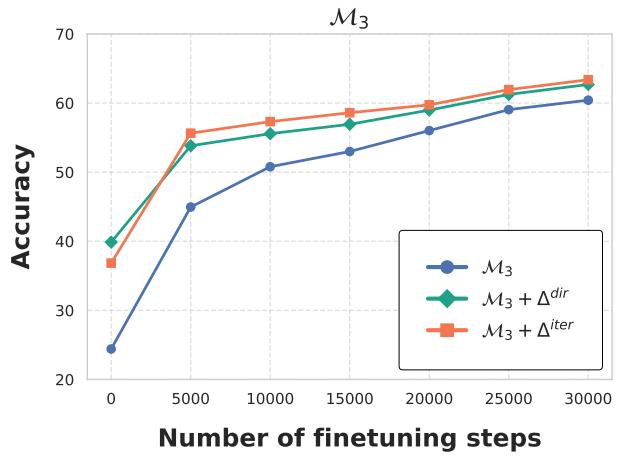
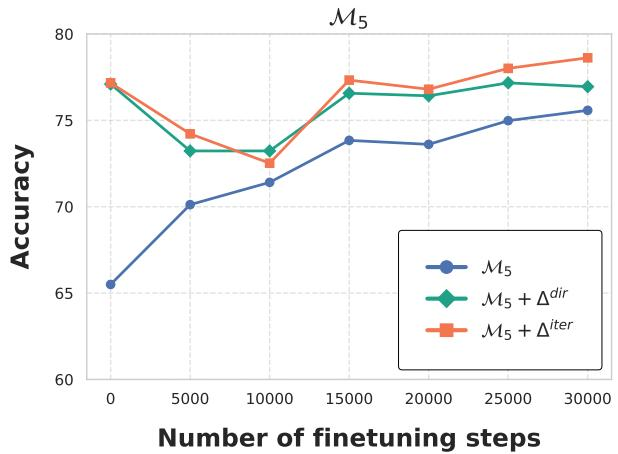

# Efficient Model Development through Fine-tuning Transfer

Pin-Jie Lin1 Rishab Balasubramanian1 Fengyuan Liu2 Nikhil Kandpal2 Tu Vu1

1Virginia Tech 2University of Toronto & Vector Institute

{pinjie,rishbb,tuvu}@vt.edu

fy.liu@mail.toronto.edu nkandpa2@cs.toronto.edu

## Abstract

Modern LLMs face a major obstacle: each new pre-trained model version requires expensive and repetitive alignment. We propose a method that transfers fine-tuning updates across model versions. The key idea is to extract the diff vector, which is the difference in parameters induced by fine-tuning, from a source model version and apply it to the base of a different target version. We show that transferring diff vectors significantly improves the target base model, often achieving performance comparable to its fine-tuned counterpart. For example, applying the fine-tuning updates from Llama 3.0 8B to Llama 3.1 8B increases accuracy by 46.9% on IFEval and 15.7% on Live-CodeBench without further training, surpassing Llama 3.1 8B Instruct. In multilingual settings, we also observe accuracy gains relative to Llama 3.1 8B Instruct, including 4.7% for Malagasy and 15.5% for Turkish on Global MMLU. Our controlled experiments reveal that fine-tuning transfer works best when source and target models are linearly connected in parameter space. We also show that this transfer provides a stronger and more efficient starting point for subsequent fine-tuning. Finally, we propose an iterative recycling-then-finetuning approach for continuous model development, which improves both efficiency and effectiveness. Our findings suggest that fine-tuning transfer is a viable strategy to reduce training costs while maintaining model performance.1

## 1 Introduction

Today’s large language models (LLMs) are developed in two stages: (1) pretraining on massive corpora with self-supervised learning, and (2) posttraining with alignment steps (Ouyang et al., 2022; Bai et al., 2022). While this pipeline creates powerful LLMs, it presents a major bottleneck for continuous development: every new version of a pretrained model requires repeating expensive posttraining. This challenge is particularly acute in domain- or language-specific applications, where the cost of redoing fine-tuning for each base model update is prohibitive (Qin et al., 2023; Bandarkar et al., 2025).

  
Figure 1: To transfer fine-tuning (e.g., instruction tuning) from a source model version s (e.g., Llama 3.0) to a target version t (Llama 3.1), we first compute the diff vector $\Delta _ { s } = m _ { s } ^ { \prime } - m _ { s }$ from version s, where $m _ { s } ^ { \prime }$ is the fine-tuned model (instruction-tuned Llama 3.0) and $m _ { s }$ is the base model (pretrained Llama 3.0). Then, we add $\Delta _ { s }$ to the target base model (pretrained Llama 3.1) to approximate the fine-tuned model in version t (instruction-tuned Llama 3.1).

In this paper, we explore a method to reduce post-training costs by transferring fine-tuning updates between different model versions. Specifically, we propose incorporating the weight updates from a source model version s to improve a target model version t. Our approach (see Figure 1) first computes the $d i f f$ vector $\Delta _ { s } = m _ { s } ^ { \prime } - m _ { s }$ s from version s, which represents the difference between the fine-tuned model $m _ { s } ^ { \prime }$ (e.g., instruction-tuned) and its base model $m _ { s }$ (pretrained). Intuitively, $\Delta _ { s }$ encodes the task-specific updates to the model parameters during fine-tuning, and can be used to transfer knowledge from the source version s to the target version t. Contrary to prior work (Ilharco et al., 2023), which focuses on improving the capabilities of a single model on a specific target task, we focus on a general-purpose method to transfer updates between different model versions for a variety of downstream tasks. We hypothesize that models fine-tuned using the same or similar training data and procedures exhibit linear relationships across versions: $m _ { s } ^ { \prime } - m _ { s } \approx m _ { t } ^ { \prime } - m _ { t }$ . This suggests that we can approximate the fine-tuned version $m _ { t } ^ { \prime }$ of the target base model $m _ { t }$ without training: $m _ { t } ^ { \prime } \approx m _ { t } + \Delta _ { s }$ . The intuition is supported by linear mode connectivity theory (Mirzadeh et al., 2020; Frankle et al., 2020), which shows that two independently trained networks can be connected by a low-loss path (see Appendix A).

We begin by evaluating the feasibility of our approach through the transfer of diff vectors across different versions of open-weight models (Section 2). Recycling the fine-tuning updates from Llama 3.0 yields a 46.9% absolute accuracy improvement on IFEval over Llama 3.1 8B, while also surpassing the performance of Llama 3.1 8B Instruct without additional training.

Motivated by these results, we conduct a case study on the development of multilingual models (Section 3). We observe that diff vectors transfer facilitates a better understanding of the target language. Specifically, transferring weights from a fine-tuned version of Llama 3.0 Instruct to Llama 3.1 Instruct yields absolute accuracy improvements of 4.7% for Malagasy and 15.5% for Turkish on the Global MMLU benchmark (Singh et al., 2024a), without additional training.

To shed light on when fine-tuning transfer is most effective, we perform controlled experiments using OLMo 2’s (OLMo et al., 2024) intermediate pretrained checkpoints as different model versions (Section 4). Our results suggest that fine-tuning transfer is most effective when the source and target models lie within a linearly connected region of the parameter space, consistent with linear mode connectivity (Mirzadeh et al., 2020; Ainsworth et al., 2023; Wortsman et al., 2022a,b; Frankle et al., 2020).

Furthermore, we investigate whether the merged model $m _ { t } + \Delta _ { s }$ can serve as a computationally efficient and effective starting point for fine-tuning (Section 5). Our experiments demonstrate that initializing fine-tuning with this merged model can accelerate convergence and improve accuracy compared to training on top of $m _ { t }$ . We find that even when the selected diff vector is suboptimal, finetuning the merged model consistently improves performance compared to direct fine-tuning, without harming generalization to unseen tasks. This suggests that fine-tuning transfer can serve as a robust and effective intermediate step when training is feasible.

Lastly, we explore a continuous model development scenario (in Section 6) in which new model versions are regularly released. We propose an iterative recycling–then–fine-tuning approach that incrementally accumulates fine-tuning updates from previous versions. In summary, our key contributions are as follows.

• Introducing an approach for transferring finetuning updates between model versions via diff vector transfer.

• Demonstrating that this approach can reduce training costs while maintaining competitive performance.

• Validating the approach in a multilingual model development setting, showing improved language-specific performance without retraining.

• Establishing conditions for effective finetuning transfer, particularly when models exhibit linear mode connectivity.

• Proposing a recycling-then-finetuning strategy to improve both efficiency and performance in a continuous model development setting.

## 2 Transferring fine-tuning updates across model versions

In this section, we explore transferring the weight changes from a source model version s to a target model version t, denoted ${ \mathcal { T } } _ { s  t } ,$ without additional training. Specifically, we directly merge (add) the diff vector $\Delta _ { s } = m _ { s } ^ { \prime } - m _ { s }$ from version s, which captures the parameter adaptations from the base model $m _ { s }$ to its fine-tuned counterpart $m _ { s } ^ { \prime } ,$ onto the new base model $m _ { t }$ in version t, without any gradient-based training. Our results (Table 1) show that fine-tuning updates can be effectively transferred across model versions, as $m _ { t } + \Delta _ { s }$ often performs comparably to its fine-tuned counterpart $m _ { t } ^ { \prime }$

## 2.1 Experimental setup

We conduct experiments on various open-weight models, including Llama (Dubey et al., 2024), OLMo (OLMo et al., 2024), and Tülu (Lambert et al., 2024). Throughout this work, we ensure that our source and target models are of the same architecture. We provide additional cross-architecture transfer results in Appendix B.3 and leave further research on cross-architecture recycling as future work. Our study explores both transfer directions: from an older model version to a newer one (recycling) and from a newer version to an older one (backporting).

<table><tr><td>Model</td><td>GSM8K</td><td>MATH</td><td> $\mathbf { A R C } _ { \mathbf { C } }$ </td><td>GPQA</td><td>MMLU</td><td>IFEval</td><td>HE+</td><td>MBPP+</td><td>LCB</td><td>BCB</td><td>Avg.</td></tr><tr><td>Llama 3.0 8B Instruct</td><td>81.1</td><td>28.8</td><td>82.4</td><td>31.5</td><td>64.9</td><td>76.6</td><td>56.7</td><td>55.6</td><td>14.0</td><td>6.8</td><td>49.8</td></tr><tr><td>Llama 3.0 8B</td><td>55.6</td><td>17.3</td><td>79.7</td><td>22.3</td><td>66.7</td><td>34.5</td><td>31.1</td><td>51.3</td><td>0.0</td><td>6.1</td><td>36.5</td></tr><tr><td> $+ \Delta _ { 3 . 1 }$ </td><td>82.8</td><td>44.7</td><td>83.0</td><td>25.9</td><td>70.0</td><td>76.6</td><td>62.8</td><td>55.3</td><td>15.8</td><td>12.8</td><td>53.0</td></tr><tr><td>Llama 3.1 8B Instruct</td><td>86.5</td><td>50.3</td><td>83.8</td><td>31.3</td><td>72.9</td><td>80.5</td><td>61.0</td><td>54.8</td><td>16.0</td><td>14.9</td><td>55.2</td></tr><tr><td>Llama 3.1 8B</td><td>56.6</td><td>19.3</td><td>79.2</td><td>21.9</td><td>66.8</td><td>36.4</td><td>29.9</td><td>51.9</td><td>0.4</td><td>5.4</td><td>36.8</td></tr><tr><td> $+ \Delta _ { 3 . 0 }$ </td><td>79.8</td><td>29.9</td><td>82.9</td><td>32.6</td><td>65.1</td><td>83.3</td><td>55.5</td><td>56.6</td><td>16.1</td><td>10.1</td><td>51.2</td></tr></table>

Table 1: Fine-tuning transfer significantly improves the performance of the target base model across various tasks, achieving results comparable to its fine-tuned counterpart in many cases. Here, $\Delta _ { 3 . 0 }$ and $\Delta _ { 3 . 1 }$ represent the diff vectors between Llama Instruct and Llama for versions 3.0 and 3.1, respectively. Notably, adding the diff vector ∆s from a different model version can effectively transform a non-instruction-tuned model (e.g., Llama 3.0 or Llama 3.1) into one that follows instructions well (Llama $3 . 0 + \Delta _ { 3 . 1 }$ or Llama $3 . 1 + \Delta _ { 3 . 0 } )$ without further training. Additional results for OLMo and Tülu can be found in Appendix B.2, where we additionally find that advanced LLM capabilities, attained through alignment tuning stages such as Supervised Fine-Tuning (SFT), Direct Preference Optimization (DPO), or Group Relative Policy Optimization (GRPO), can be successfully transferred across different model versions.

Recycling can save training time and computational resources, while incorporating post-training capabilities into the newer pretrained model. Conversely, backporting is beneficial when the older base model is better optimized for a specific use case (e.g., a particular language), allowing the user to take advantage of the new fine-tuning improvements while maintaining optimization and compatibility.2 We emphasize that our goal is not to achieve state-of-the-art results, but instead to assess the feasibility of transferring fine-tuning updates between model versions.

We evaluate the merged model $m _ { t } + \Delta _ { s }$ on a diverse set of benchmarks, including general knowledge with MMLU (Hendrycks et al., 2021a), math with GSM8K (Cobbe et al., 2021) and MATH (Hendrycks et al., 2021b), reasoning with ARC (Clark et al., 2018) and GPQA (Rein et al., 2024), instruction-following with IFEval (Zhou et al., 2023), code generation with HumanEval+ (HE+ in Table 1) and MBPP+ (Liu et al., 2023), LiveCodeBench (Jain et al., 2024), and Big-CodeBench (Zhuo et al., 2024) (LCB and BCB in Table 1 respectively). We compare its performance to that of directly fine-tuned $m _ { t } ( \mathrm { i } . \mathrm { e } . , m _ { t } ^ { \prime } ) . ^ { 3 }$ See Appendix C for evaluation details.

## 2.2 Results and discussion

Transferring fine-tuning substantially boosts the target base model’s performance: Table 1 shows our results when transferring fine-tuning (i.e., instruction tuning) updates between Llama 3.0 and Llama 3.1. First, we note that Llama 3.0 Instruct consistently performs better than Llama 3.1 (and vice versa). This highlights that most capabilities of the instruction-tuned model arise post-training. Here, we attempt to transfer such capabilities between model versions, and thus bypass the alignment stage. Strikingly, adding the diff vector $\Delta _ { s }$ from a different model version can effectively transform a non-instruction-tuned model (e.g., Llama 3.0 or Llama 3.1) into one that follows instructions well (Llama $3 . 0 + \Delta _ { 3 . 1 }$ or Llama 3.1 $+ \Delta _ { 3 . 0 } )$ . For example, our approach yields 42.1% and 46.9% absolute accuracy improvements on the instruction-following benchmark IFEval over the base versions of Llama 3.0 and Llama 3.1, respectively. Large gains are also observed across the board on math, code, and reasoning benchmarks, with an average improvement of 16.5% for Llama 3.0 and 14.4% for Llama 3.1.

These results suggest that advanced knowledge and instruction-following abilities can be efficiently transferred between model versions without further training. In general, Llama 3.0 benefits more from the backported diff vector $\Delta _ { 3 . 1 }$ from version 3.1 than Llama 3.1 does from recycling version 3.0’s diff vector $\Delta _ { 3 . 0 }$

Transferring fine-tuning can achieve performance comparable to the fine-tuned model: Our results demonstrate that the merged model $m _ { t } + \Delta _ { s }$ can perform on par with its fine-tuned counterpart $m _ { t } ^ { \prime }$ across various tasks. This is particularly true for Llama $3 . 0 + \Delta _ { 3 . 1 }$ , which matches or surpasses Llama 3.0 Instruct on eight out of ten tasks we evaluated. Interestingly, Llama 3.1 + $\Delta _ { 3 . 0 }$ outperforms LLama 3.1 Instruct on four out of the ten benchmarks. This is a testament to the diff vector’s ability to encode advanced reasoning and instruction-following capabilities. Overall, our results suggest that fine-tuning transfer provides an effective and extremely low-cost method to improve model performance when training is prohibitively expensive.

Transferring fine-tuning can induce step-bystep reasoning: Interestingly, we observed that transferring fine-tuning updates consistently shifts the target base model’s answers from direct responses to step-by-step reasoning (Appendix B.1). This emergent reasoning behavior appears after adding the diff vector and aligns with the accuracy improvements on GSM8K and MATH benchmarks.

## 3 Efficient multilingual model development

Motivated by our results in Section 2, we now turn toward applying our fine-tuning transfer approach in a multilingual model development setting. We focus exclusively on a recycling scenario, where our aim is to transfer the language-specific instruction tuning updates from an older model version to a newer one.

For language-specific instruction tuning, we fine-tune an instruction-tuned model rather than a pretrained one. This approach aligns with the common practice of using an instruction-tuned English or multilingual model as the foundation when developing language-specific models. A key challenge in this setting is that state-of-the-art LLMs often include multilingual data in pretraining and instruction tuning, which makes it unclear whether language-specific fine-tuning is still necessary. How effective is our recycling approach when applied to a multilingual instruction-tuned model?

<table><tr><td>Model</td><td>Malagasy</td><td>Sinhala</td><td>Turkish</td></tr><tr><td>Llama 3.0 8B Instruct</td><td>23.1</td><td>23.3</td><td>30.8</td></tr><tr><td> $+ \mathrm { F T }$ </td><td>30.8</td><td>29.0</td><td>43.2</td></tr><tr><td>Llama 3.1 8B Instruct</td><td>27.6</td><td>33.0</td><td>27.7</td></tr><tr><td> $+ \Delta _ { 3 . 0 }$ </td><td>32.3</td><td>32.3</td><td>43.2</td></tr></table>

Table 2: Recycling fine-tuning updates improves multilingual performance on Global MMLU without retraining, yielding a 4.7% and 15.5% absolute improvement for Malagasy and Turkish, respectively, compared to Llama 3.1 8B Instruct. $\Delta _ { 3 . 0 }$ represents the diff vector between Llama 3.0 Instruct and its monolingual finetuned (FT) version.

Our results show that recycling fine-tuning remains effective in this scenario, as long as the target base model is outperformed by the fine-tuned model of the source version.

## 3.1 Experimental setup

We fine-tune Llama 3.0 Instruct $( m _ { s } )$ separately on language-specific instruction tuning data for three languages: Malagasy, Sinhala, and Turkish. We use the Aya dataset (Singh et al., 2024b) for Malagasy (14.6K examples) and Sinhala (14.5K examples), and the InstrucTurca dataset (Altinok, 2024) for Turkish (16.7K examples).4 Each model is trained for 30K training steps with a learning rate of 5e-6 and a batch size of 8, using 4 NVIDIA A100-80G GPUs.5

After training on each language, we compute the diff vector $\Delta _ { s } = m _ { s } ^ { \prime } - m _ { s }$ and add it to Llama 3.1 Instruct $m _ { t }$ . We simulate a low-resource setting and do not perform any additional training with language-specific data. The merged model $m _ { t } +$ $\Delta _ { s }$ is evaluated against the base model $m _ { t }$ on the Global MMLU benchmark (Singh et al., 2024a).

## 3.2 Results and discussion

Transferring fine-tuning is effective for developing multilingual models: Our results in Table 2 demonstrate the benefits of reusing fine-tuning updates in multilingual model development. For Malagasy and Turkish, transferring the diff vector from Llama version 3.0 to 3.1 results in significant accuracy improvements (4.7% and 15.5%, respectively) over Llama 3.1 8B Instruct. Our recycling approach performs better than the fine-tuned Llama 3.0 Instruct model for Malagasy (1.5% accuracy improvement) and maintains similar performance for Turkish.

On the other hand, for Sinhala, recycling finetuning offers no advantage, as Llama 3.1 Instruct already outperforms the previously fine-tuned Llama 3.0 Instruct. However, even in this case, recycling does not significantly reduce performance.

## 4 When is fine-tuning transfer effective?

Having demonstrated the effectiveness of finetuning transfer, we now conduct controlled experiments to better understand when this approach is most effective. At a high level, we treat different checkpoints of a pretrained model as distinct model versions. We then fine-tune these model versions on the same data and assess the impact of transferring fine-tuning updates between them. Our results reveal that fine-tuning transfer is most successful when the source and target models are close within a linearly connected region of the parameter space, consistent with linear mode connectivity. We provide further theoretical analysis in Appendix A.

## 4.1 Experimental setup

We conduct experiments with the publicly available intermediate checkpoints of OLMo $2 7 \mathrm { B } . ^ { 6 }$ The base OLMo 2 model was trained in two stages: (1) a general web-based pretraining stage (stage 1), and (2) a mid-training stage (stage 2) using high-quality web data and domain-specific data to enhance STEMrelated capabilities. We select five checkpoints: $\mathcal { M } _ { 1 }$ (early-stage 1, at 300K steps), $\mathcal { M } _ { 2 }$ (mid-stage 1, at 600K steps), $\mathcal { M } _ { 3 }$ (end-stage 1, at 929K steps), $\mathcal { M } _ { 4 }$ (mid-stage 2, at 6K steps), and $\mathcal { M } _ { \mathrm { 5 } }$ (end-stage 2, at 12K steps). Each $\mathcal { M } _ { i }$ is treated as a distinct model version. We investigate both transfer scenarios: (1) recycling $( \mathcal { T } _ { \mathcal { M } _ { i }  \mathcal { M } _ { j } } , i < j )$ , and (2) backporting $( \mathcal { T } _ { \mathcal { M } _ { j }  \mathcal { M } _ { i } } , j > i )$

Due to our limited computational resources, supervised fine-tuning with a large instruction tuning dataset would be prohibitively expensive. We therefore fine-tune all model versions using a subset of the math reasoning instruction tuning data from Tülu 3, which includes Tülu 3 Persona MATH,

<table><tr><td> $\mathcal { M } _ { 1 }$ </td><td> $\mathcal { M } _ { 2 }$ </td><td> $\mathcal { M } _ { 3 }$ </td><td> $\mathcal { M } _ { 4 }$ </td><td> $\mathcal { M } _ { \mathrm { 5 } }$ </td></tr><tr><td></td><td>13.2</td><td>19.4 24.4</td><td>64.5</td><td>65.5</td></tr><tr><td> $+ \Delta _ { 1 }$ </td><td></td><td>26.6</td><td>32.0 27.5</td><td>19.6</td></tr><tr><td> $+ \Delta _ { 2 }$ </td><td>19.0</td><td></td><td>39.8 25.9</td><td>17.3</td></tr><tr><td> $+ \Delta _ { 3 }$ </td><td>14.3</td><td>25.0</td><td>68.6</td><td>70.3</td></tr><tr><td> $+ \Delta _ { 4 }$ </td><td>11.8</td><td>18.0</td><td>22.6</td><td>77.1</td></tr><tr><td> $+ \Delta _ { 5 }$ </td><td>11.9</td><td>16.0</td><td>24.0 72.9</td><td></td></tr><tr><td> $\mathrm { F T } ( \boldsymbol { \mathcal { M } } _ { i } )$ </td><td>45.1</td><td>50.7</td><td>60.4 75.7</td><td>75.5</td></tr></table>

Table 3: GSM8K accuracies indicating that more powerful models are better at leveraging transferred finetuning. Effective use of transferred fine-tuning only emerges once the target base model reaches a certain level of capability. Furthermore, fine-tuning transfer works best when the source and target models are close within a linearly connected region of the parameter space. Here, $\mathcal { M } _ { i }$ represents different intermediate pretrained checkpoints of OLMo 2 7B (with smaller values of i indicating earlier checkpoints), and $\Delta _ { i }$ refers to the diff vector resulting from the fine-tuning of version i. $\mathrm { F T } ( \boldsymbol { \mathcal { M } } _ { i } )$ denotes applying fine-tuning directly to $\mathcal { M } _ { i }$ See Table 15 in Appendix D for MATH500 results.

GSM, and Algebra (220K examples total), following the training procedure described in Section 3.1.

We evaluate our models on GSM8K and the MATH500 subset (Hendrycks et al., 2021b) of the MATH dataset. These datasets are selected because fine-tuning on Tülu 3’s math reasoning data significantly improves performance on them, allowing for a clearer analysis of the impact of transferring fine-tuning updates between model versions.7

## 4.2 Results and discussion

More powerful models are better at leveraging transferred fine-tuning: Our results in Table 3 indicate that stronger models are more effective at leveraging transferred fine-tuning updates. While transferring fine-tuning can improve performance for $\mathcal { M } _ { 1 } , \mathcal { M } _ { 2 }$ , and $\mathcal { M } _ { 3 } .$ , the merged models $\mathcal { M } _ { i } + \Delta _ { j } \ ( \Delta _ { j }$ denotes the diff vector from model version $\mathcal { M } _ { j } , \ j \ne i )$ still fall significantly short of their fine-tuned counterparts, denoted $\mathrm { F T } ( \boldsymbol { \mathcal { M } } _ { i } )$ On GSM8K, the accuracy gaps between the best $\mathcal { M } _ { i } + \Delta _ { j }$ and $\operatorname { F T } ( \mathcal { M } _ { i } )$ are 26.1%, 24.1%, 20.6% for $\mathcal { M } _ { 1 } , \mathcal { M } _ { 2 }$ , and $\mathcal { M } _ { 3 } ,$ respectively. In contrast, for $\mathcal { M } _ { 4 }$ , this gap narrows to 2.8%. Notably, recycling fine-tuning from $\mathcal { M } _ { 4 }$ to $\mathcal { M } _ { 5 }$ $( \mathrm { i . e . , } M _ { 5 } + \Delta _ { 4 } )$ surpasses fine-tuning directly on $\mathcal { M } _ { 5 } \left( \mathrm { F T } ( \mathcal { M } _ { 5 } ) \right)$ , achieving 1.6% accuracy improvement (77.1% vs. 75.5%). Similar trends are observed on MATH500. This pattern suggests an emergent ability—effective use of transferred finetuning only emerges when the target base model is sufficiently strong. In other words, the benefits of transferring fine-tuning only become significant beyond a certain level of capability.

Fine-tuning transfer works best when models are close in the parameter space: Our results also suggest that fine-tuning transfer is most effective when the source and target models are closely connected in the parameter space. On both GSM8K and MATH500, models $\mathcal { M } _ { 1 }$ $\mathcal { M } _ { 2 }$ benefit more from $\Delta _ { 3 }$ than from $\Delta _ { 4 }$ or $\Delta _ { 5 }$ . Similarly, $\mathcal { M } _ { 4 }$ and $\mathcal { M } _ { \mathrm { 5 } }$ gain more from $\Delta _ { 3 }$ than from $\Delta _ { 1 }$ or $\Delta _ { 2 }$ . Overall, $\mathcal { M } _ { 1 } , \mathcal { M } _ { 2 } ,$ and $\mathcal { M } _ { 3 }$ form a mutually beneficial group, as do $\mathcal { M } _ { 4 }$ and $\mathcal { M } _ { 5 }$ . However, transferring between these two groups can degrade performance. Specifically, $\mathcal { M } _ { 1 } , \mathcal { M } _ { 2 }$ , and $\mathcal { M } _ { 3 }$ do not benefit from $\Delta _ { 4 }$ and $\Delta _ { 5 } .$ , while $\mathcal { M } _ { 4 }$ and $\mathcal { M } _ { 5 }$ typically benefit only from $\Delta _ { 3 } . ^ { 8 }$

## 5 Fine-tuning transfer as a starting point for further fine-tuning

So far, we have explored a scenario where finetuning updates are transferred between model versions without additional fine-tuning. We now switch gears to investigate whether the merged model $m _ { t } + \Delta _ { s }$ can serve as a stronger and more computationally efficient starting checkpoint for further fine-tuning. We conduct controlled experiments comparing two approaches: fine-tuning the merged model $m _ { t } + \Delta _ { s }$ versus fine-tuning mt directly. Our results demonstrate that initializing fine-tuning with $m _ { t } + \Delta _ { s }$ often leads to faster convergence and higher performance on both seen and unseen tasks. This suggests that fine-tuning transfer can be a useful intermediate step when additional training is feasible. We refer to this approach as “transferring-then-finetuning”.

## 5.1 Experiment setup

We follow the training procedure outlined in Section 3.1. For evaluation, we use GSM8K and MATH500, along with an additional dataset to assess how well our transferring-thenfinetuning approach generalizes to the unseen task $\mathrm { G P Q A } _ { \mathrm { D i a m o n d } }$ (Rein et al., 2024).

5.2 Results and discussion
<table><tr><td></td><td> $\mathcal { M } _ { 1 }$ </td><td> $\mathcal { M } _ { 2 }$ </td><td> $\mathcal { M } _ { 3 }$ </td><td> $\mathcal { M } _ { 4 }$ </td><td> $\mathcal { M } _ { 5 }$ </td></tr><tr><td></td><td> $1 3 . 2$ </td><td> $1 9 . 4$ </td><td> $2 4 . 4$ </td><td> $6 4 . 5$ </td><td> $6 5 . 5$ </td></tr><tr><td> $+ \Delta _ { 1 }  \mathrm { F T }$ </td><td></td><td> $5 6 . 9 _ { + 3 0 . 3 }$ </td><td> $6 2 . 8 _ { + 3 0 . 8 }$ </td><td> $7 7 . 8 _ { + 5 0 . 3 }$ </td><td> $7 8 . 6 _ { + 5 9 . 0 }$ </td></tr><tr><td> $+ \Delta _ { 2 }  \mathrm { F T }$ </td><td> ${ \bf 5 0 . 1 } _ { + 3 1 . 1 }$ </td><td></td><td> $6 2 . 7 _ { + 2 2 . 9 }$ </td><td> $7 8 . 6 _ { + 5 2 . 7 }$ </td><td> $7 8 . 7 _ { + 6 1 . 4 }$ </td></tr><tr><td> $+ \Delta _ { 3 }  \mathrm { F T }$ </td><td> $4 8 . 5 _ { + 3 4 . 2 }$ </td><td> $\bar { 5 } 7 . 6$ </td><td></td><td> $7 7 . 6 _ { + 9 . 0 }$ </td><td> ${ 7 7 . 1 } _ { + 6 . 8 }$ </td></tr><tr><td> $+ \Delta _ { 4 }  \mathrm { F T }$ </td><td> $4 8 . 2 _ { + 3 6 . 4 }$ </td><td> $5 6 . 7 _ { + 3 8 . 7 }$ </td><td> $\mathbf { 6 3 . 7 _ { + 4 1 . 1 } }$ </td><td></td><td> $7 7 . 0 _ { . 0 . 1 }$ </td></tr><tr><td> $+ \Delta _ { 5 }  \mathrm { F T }$ </td><td> $4 7 . 6 _ { + 3 5 . 7 }$ </td><td> $5 5 . 6 _ { + 3 9 . 6 }$ </td><td> $6 3 . 5 _ { + 3 9 . 5 }$ </td><td> $7 4 . 6 _ { + 1 . 7 }$ </td><td></td></tr><tr><td> $\mathrm { F T } ( \boldsymbol { \mathcal { M } } _ { i } )$ </td><td>45.1</td><td>50.7</td><td>60.4</td><td>75.7</td><td>75.5</td></tr></table>

Table 4: GSM8K accuracies showing that fine-tuning transfer provides a stronger starting point (i.e., $\mathcal { M } _ { i } + \Delta _ { j } )$ for further fine-tuning (FT). Numbers in subscript indicate improvement over the baseline without fine-tuning. Here, $\mathcal { M } _ { i }$ represents different intermediate pretrained checkpoints of OLMo 2 7B (with smaller values of i indicating earlier checkpoints), and $\Delta _ { i }$ refers to the diff vector resulting from the fine-tuning of version i. $\mathrm { F T } ( \boldsymbol { \mathcal { M } } _ { i } )$ denotes applying fine-tuning directly to $\mathcal { M } _ { i }$ See Table 16 in Appendix E for MATH500 results.

Transferring-then-finetuning can substantially boost performance: Our results are summarized in Table 4. Transferring-then-finetuning offers significant improvements over our vanilla transfer approach (without additional fine-tuning) on both GSM8K and MATH500. On GSM8K, the largest accuracy improvements are 36.4%, 39.6%, 41.1%, 52.7%, and 61.4% for $\mathcal { M } _ { 1 } , \mathcal { M } _ { 2 } , \mathcal { M } _ { 3 } , \mathcal { M } _ { 4 }$ and $\mathcal { M } _ { 5 } .$ , respectively. The benefits are most pronounced for weaker base models $( \mathcal { M } _ { 1 } , \mathcal { M } _ { 2 }$ and $\mathcal { M } _ { 3 } )$ across all diff vectors, as well as for stronger base models when paired with a weak diff vector (e.g., $\mathcal { M } _ { 5 } + \Delta _ { 1 } )$

Interestingly, fine-tuning also helps bridge the performance gap between the merged models $\mathcal { M } _ { i } +$ $\Delta _ { j } \left( j \neq i \right)$ for each base model $\mathcal { M } _ { i } .$ . For example, fine-tuning dramatically improves the performance of $\mathcal { M } _ { 5 } + \Delta _ { 1 }$ by 59% and $\mathcal { M } _ { 5 } + \Delta _ { 2 }$ by 61.4%, closing the gap with the fine-tuned versions of $\mathcal { M } _ { 5 }$ $+ \Delta _ { 3 }$ . This reduces the need to pre-select the best diff vector when multiple choices are available. Importantly, transferring-then-finetuning generally outperforms standard fine-tuning regardless of the diff vector used.

Transferring-then-finetuning can offer faster convergence: Figure 2 shows that using the merged model $\mathcal { M } _ { i } + \Delta _ { j }$ as the initial checkpoint improves training efficiency. Specifically, $\mathcal { M } _ { i } +$ $\Delta _ { j }$ not only converges significantly faster than $\mathcal { M } _ { i }$ during fine-tuning but also reaches a higher peak accuracy on GSM8K. Overall, our results suggest that transferring-then-finetuning is a cost-effective approach that reduces the number of fine-tuning steps, thereby improving training efficiency.

  
Figure 2: GSM8K performance showing that fine-tuning transfer provides a more computationally efficient starting point $( \mathrm { i . e . , } M _ { i } + \Delta _ { j } )$ for further training. Here, $\mathcal { M } _ { i }$ represents different intermediate pretrained checkpoints of OLMo 2 7B (with smaller values of i indicating earlier checkpoints), and $\Delta _ { j }$ refers to the diff vector resulting from the fine-tuning of version $j .$ . Additional results for $\mathcal { M } _ { 1 } , \mathcal { M } _ { 2 } , \mathcal { M } _ { 4 }$ can be found Appendix E.

Transferring-then-finetuning does not negatively impact model generalization: As shown in Table 5, this approach attains strong zero-shot generalization on the unseen task $\mathrm { G P Q A } _ { \mathrm { D i a m o n d } } ,$ comparable to standard fine-tuning. These results suggest that transferring-then-finetuning does not lead to overfitting, demonstrating its broad applicability across diverse tasks.

## 6 Iterative recycling-then-finetuning for improved performance and efficiency

Building on the insights from our previous experiments, we now explore a continuous model development setting in which new versions of a pretrained model are regularly released. At the core of our approach is an iterative recycling-thenfinetuning strategy that incrementally incorporates fine-tuning updates, i.e., diff vectors, from past model versions. Instead of applying only the latest diff vector to the new base model, we recycle previous diff vectors iteratively. Specifically, the diff vector at the current model version is carried forward to the next for subsequent fine-tuning. Our experiments show that this iterative recycling approach consistently improves both training efficiency and model performance.

## 6.1 Iterative recycling-then-finetuning

We treat the five intermediate checkpoints of OLMo $2 7 \mathrm { B } { - } { \mathcal { M } } _ { 1 } , { \mathcal { M } } _ { 2 } , { \mathcal { M } } _ { 3 } , { \mathcal { M } } _ { 4 } , { \mathcal { M } } _ { 5 }$ (described in Section 4.1) as different model versions of the pretrained OLMo 2 model. Our iterative recyclingthen-finetuning algorithm, outlined in Algorithm 1, works as follows: At each iteration i, we first apply the most recent diff vector, $\Delta _ { i - 1 } ^ { i t e r }$ , to the new base model $\mathcal { M } _ { i }$ , and then further fine-tune the resulting model. Next, we compute a new diff vector between the fine-tuned model and the current base model $\mathcal { M } _ { i }$ . This new diff vector is then carried forward to the next model version for fine-tuning in the subsequent iteration.

<table><tr><td></td><td> $\mathcal { M } _ { 1 }$ </td><td> $\mathcal { M } _ { 2 }$ </td><td> $\mathcal { M } _ { 3 }$ </td><td> $\mathcal { M } _ { 4 }$ </td><td> $\mathcal { M } _ { 5 }$ </td></tr><tr><td></td><td>23.7</td><td> $2 4 . 2$ </td><td>23.2</td><td>26.3</td><td>25.3</td></tr><tr><td> $+ \Delta _ { 1 }  \mathrm { F T }$ </td><td></td><td> $2 5 . 3 _ { - 1 . 0 }$ </td><td> $2 5 . 2 _ { - 2 . 1 }$ </td><td> ${ 3 3 . 3 } _ { + 9 . 6 }$ </td><td> $2 5 . 8 _ { . 0 . 5 }$ </td></tr><tr><td> $+ \Delta _ { 2 }  \mathrm { F T }$ </td><td> $\mathbf { 2 7 . 8 . } _ { 1 . 5 }$ </td><td></td><td> $2 5 . 3 _ { + 0 . 0 }$ </td><td> $3 0 . 8 _ { + 6 . 6 }$ </td><td> $2 7 . 3 _ { + 3 . 1 }$ </td></tr><tr><td> $+ \Delta _ { 3 }  \mathrm { F T }$ </td><td> $2 7 . 8 _ { . 0 . 5 }$ </td><td> $\mathbf { 2 7 . 8 _ { + 0 . 5 } }$ </td><td></td><td> $2 3 . 7 _ { + 0 . 5 }$ </td><td> $2 7 . 3 _ { + 5 . 1 }$ </td></tr><tr><td> $+ \Delta _ { 4 }  \mathrm { F T }$ </td><td> $2 4 . 8 _ { - 2 . 0 }$ </td><td> $2 4 . 8 _ { - 4 . 5 }$ </td><td> $2 6 . 3 _ { + 2 . 1 }$ </td><td></td><td> $2 4 . 2 _ { - 1 . 1 }$ </td></tr><tr><td> $+ \Delta _ { 5 }  \mathrm { F T }$ </td><td> $2 2 . 7 _ { . 5 . 1 }$ </td><td> $2 6 . 8 _ { + 0 . 0 }$ </td><td> $2 3 . 2 _ { - 1 . 0 }$ </td><td> $2 7 . 8 _ { + 4 . 6 }$ </td><td></td></tr><tr><td> $\operatorname { F T } ( \mathcal { M } _ { i } )$ </td><td>25.8</td><td> $2 6 . 8$ </td><td> $\mathbf { 2 6 . 8 }$ </td><td>19.2</td><td> $2 6 . 3$ </td></tr></table>

Table 5: $\mathrm { G P Q A } _ { \mathrm { D i a m o n d } }$ accuracies showing that finetuning transfer provides a stronger starting point (i.e., $\mathcal { M } _ { i } + \Delta _ { j } )$ for further fine-tuning (FT), and transferringthen-finetuning does not negatively impact model generalization to unseen tasks. Numbers in subscript indicate improvement over the baseline without fine-tuning. Here, $\mathcal { M } _ { i }$ represents different intermediate pretrained checkpoints of OLMo 2 7B (with smaller values of i indicating earlier checkpoints), and $\Delta _ { j }$ refers to the diff vector resulting from the fine-tuning of version $j .$ $\mathrm { F T } ( \boldsymbol { \mathcal { M } } _ { i } )$ denotes applying fine-tuning directly to $\mathcal { M } _ { i }$

We refer to our iterative recycling-thenfinetuning approach as $\Delta ^ { i t e r }$ and compare it to $\Delta ^ { d i r }$ , the direct recycling-then-finetuning approach as described in 5. We follow the training procedure outlined in Section 3.1.

<table><tr><td></td><td> $\mathcal { M } _ { 3 }$ </td><td> $\mathcal { M } _ { 4 }$ </td><td> $\mathcal { M } _ { \mathrm { 5 } }$ </td></tr><tr><td></td><td> $2 4 . 4$ </td><td> $6 4 . 5$ </td><td> $6 5 . 5$ </td></tr><tr><td> $+ \Delta ^ { d i r } \  \mathrm { F T }$ </td><td> $6 2 . 7 _ { + 3 8 . 3 }$ </td><td> $7 7 . 6 _ { + 1 3 . 1 }$ </td><td> $7 7 . 0 _ { + 1 1 . 5 }$ </td></tr><tr><td> $+ \Delta ^ { i t e r }  \mathrm { F T }$ </td><td> ${ \bf 6 3 . 4 } _ { + 3 9 . 0 }$ </td><td> $7 7 . 4 _ { + 1 2 . 9 }$ </td><td> $7 8 . 6 _ { + 1 3 . 1 }$ </td></tr><tr><td> $\mathrm { F T } ( \boldsymbol { \mathcal { M } } _ { i } )$ </td><td>60.4</td><td>75.7</td><td>75.5</td></tr></table>

Table 6: Both iterative $( \Delta ^ { i t e r } )$ and direct $( \Delta ^ { d i r } )$ recycling-then-finetuning approaches significantly boost GSM8K performance, surpassing standard fine-tuning without recycling $( \mathrm { F T } ( \boldsymbol { \mathcal { M } } _ { i } ) ) .$ Numbers in subscripts indicate improvement over OLMo 2 7B checkpoints. At a high level, $\Delta ^ { i t e r }$ gradually incorporates fine-tuning updates, i.e., diff vectors, from previous model versions, while $\Delta ^ { d i r }$ directly applies the diff vector from the latest model version to the current model. Results for $\mathcal { M } _ { 1 }$ and $\mathcal { M } _ { 2 }$ are omitted as these models remain identical across the two approaches. See Figure 4 in Appendix F for additional results.

## 6.2 Results and discussion

Iterative recycling-then-finetuning significantly improves performance: Table 6 compares the performance of two recycling approaches: iterative recycling-then-finetuning $( \Delta ^ { i t e r } )$ and direct recycling-then-finetuning $( \Delta ^ { d i r } )$ Both approaches lead to significant performance improvements across model versions on GSM8K, with larger gains observed in earlier versions. Both approaches outperform the standard fine-tuning baseline (without recycling) by a substantial margin. In general, $\Delta ^ { i t e r }$ performs similarly to or better than $\Delta ^ { d i r }$ across all model versions. These results suggest that in scenarios where the base model is continuously updated, adopting an iterative recycling strategy is beneficial and does not result in error propagation.

## 7 Related work

Fine-tuning transfer: Prior work has studied how to reuse fine-tuning updates on a fixed base model to improve generalization across tasks, domains, and languages. This includes full-model adaptation (Phang et al., 2018; Pruksachatkun et al., 2020; Vu et al., 2020, 2021; Aghajanyan et al., 2021) as well as parameter-efficient modules such as adapters (Pfeiffer et al., 2021; Poth et al., 2021), soft prompts (Vu et al., 2022b,a; Su et al., 2022; Asai et al., 2022), and LoRA matrices (Huang et al.,

2024; Zadouri et al., 2024; Ostapenko et al., 2024); see Yadav et al. (2024a) for a comprehensive survey. These methods typically assume a shared base model and focus on transferring capabilities across tasks or domains. Similarly, model merging combines multiple task-specific models based on the same model to create a more powerful model (Ilharco et al., 2023; Yadav et al., 2023; Wang et al., $2 0 2 4 \mathrm { a } ;$ Ramé et al., 2024; Yu et al., 2024; Yadav et al., 2024b; Ahmadian et al., 2024; Bandarkar et al., 2025). Recent work also extrapolates RLHF updates back to the base model (Zheng et al., 2024; Lin et al., 2025). In contrast, our work focuses on transferring fine-tuning updates across different model versions, addressing the challenge of frequent model upgrades in LLM development.

Cross-model fine-tuning transfer: Several studies investigate transferring fine-tuning across different model architectures, primarily focusing on lightweight modules in non-instruction-tuned settings (Lester et al., 2022; Su et al., 2022; Wang et al., 2024b; Fleshman and Van Durme, 2024; Echterhoff et al., 2024).

Closely related to our work, Qin et al. (2023) study recyclable fine-tuning in a continual domain adaptation setting from the BERT (Devlin et al., 2019) era, where fine-tuning updates from domainadapted checkpoints are reused to adapt to new domains. Other efforts aim to reuse weights across divergent model architectures through duplication (Chen et al., 2022), progressive stacking (Gong et al., 2019), or parameter merging (Wang et al., 2023). While these works reuse fine-tuning updates across domains, skills, or architectures, our work focuses on transferring full fine-tuning updates across different versions of both pretrained and instruction-tuned LLMs. This enables efficient model development even when the underlying models differ in pretraining scale or alignment steps. We evaluate both recycling and backporting scenarios. Our approach complements prior work, and combining these directions presents a promising avenue for future research.

## 8 Conclusion

Our study demonstrates that fine-tuning transfer offers a practical approach to mitigate the inefficiencies of frequent model updates. By applying diff vectors from a fine-tuned source model version to a different target model version, we achieve substantial performance improvements without the need for full fine-tuning. In a multilingual context, this approach can significantly boost performance on target-language tasks, offering an efficient solution for language-specific fine-tuning. Through controlled experiments, we show that fine-tuning transfer is most effective when the source and target models are linearly connected in the parameter space. Furthermore, this approach can offer a more robust and computationally efficient starting checkpoint for further fine-tuning. Taken together, we hope that our work will spur more fundamental research into the efficient development of modern LLMs.

## Acknowledgements

We thank Colin Raffel for valuable advice and useful suggestions on our experiments; Mohit Iyyer, Noah Constant, Tsendsuren Munkhdalai, Prateek Yadav, Naren Ramakrishnan, Alessandro Sordoni, Lucas Caccia, Minseon Kim, Ahmet Üstün, Tom Hosking, Matthias Gallé, Salaheddin Alzubi, Shayne Longpre, Quyet Do, Thinh Pham, Kavana Venkatesh, Nguyen Nguyen, Adam Nguyen, Rituraj Sharma, Aninditaa Chauhan, Yeana Lee, and the rest of the VT LLMs group for helpful discussions and suggestions at various stages in the project; and Brian Lester for sharing code for model merging. This research was supported in part by a research award from the Amazon - Virginia Tech Initiative for Efficient and Robust Machine Learning, administered through the Sanghani Center for Artificial Intelligence and Data Analytics and Amazon’s AGI Team, as well as by a research gift from Adobe. We acknowledge Advanced Research Computing at Virginia Tech for providing computational resources and support. URL: https://arc.vt.edu/.

## Limitations

Our controlled experiments focus on evaluating supervised fine-tuning as a post-training method, using math reasoning instruction data. However, supervised fine-tuning is only one part of the broader post-training process. Modern LLMs often undergo multiple post-training steps, including reinforcement learning with human feedback (RLHF), preference optimization, or training-then-merging techniques. It is also important to evaluate a broader range of downstream tasks to better assess generalization across different LLM capabilities. In addition, the impact of model shift—such as weight movement, changes in the loss landscape, or representational drift, on the transferability of diff vectors remains underexplored. Expanding our approach to cover these aspects of model development is a promising direction for future work.

## Ethical considerations and risks

Our approach aims to improve the efficiency of LLM development by reducing the need for extensive alignment process. However, this method carries certain risks. One concern is that reusing fine-tuning updates may inadvertently transfer biases or undesirable behaviors from one model to another, especially if the source model contains such issues.

Although this approach lowers computational costs, it does not negate the need for careful model design to ensure ethical behavior. Thus, responsible implementation of this technique is crucial. Future research should explore its ethical implications across different model architectures and training approaches.

## References

Armen Aghajanyan, Anchit Gupta, Akshat Shrivastava, Xilun Chen, Luke Zettlemoyer, and Sonal Gupta. 2021. Muppet: Massive multi-task representations with pre-finetuning. In Proceedings ofthe 2021 Conference on Empirical Methods in Natural Language Processing, pages 5799–5811.

Arash Ahmadian, Seraphina Goldfarb-Tarrant, Beyza Ermis, Marzieh Fadaee, Sara Hooker, and 1 others. 2024. Mix data or merge models? optimizing for diverse multi-task learning. arXiv preprint arXiv:2410.10801.

Samuel Ainsworth, Jonathan Hayase, and Siddhartha Srinivasa. 2023. Git re-basin: Merging models modulo permutation symmetries. In The Eleventh International Conference on Learning Representations.

Duygu Altinok. 2024. Instructurca: A diverse instructional content dataset for turkish.

Akari Asai, Mohammadreza Salehi, Matthew Peters, and Hannaneh Hajishirzi. 2022. ATTEMPT: Parameter-efficient multi-task tuning via attentional mixtures of soft prompts. In Proceedings ofthe 2022 Conference on Empirical Methods in Natural Language Processing, pages 6655–6672.

Yuntao Bai, Andy Jones, Kamal Ndousse, Amanda Askell, Anna Chen, Nova DasSarma, Dawn Drain, Stanislav Fort, Deep Ganguli, Tom Henighan, and 1 others. 2022. Training a helpful and harmless assistant with reinforcement learning from human feedback. arXiv preprint arXiv:2204.05862.

Lucas Bandarkar, Benjamin Muller, Pritish Yuvraj, Rui Hou, Nayan Singhal, Hongjiang Lv, and Bing Liu. 2025. Layer swapping for zero-shot cross-lingual transfer in large language models. In The Thirteenth International Conference on Learning Representations.

Cheng Chen, Yichun Yin, Lifeng Shang, Xin Jiang, Yujia Qin, Fengyu Wang, Zhi Wang, Xiao Chen, Zhiyuan Liu, and Qun Liu. 2022. bert2BERT: Towards reusable pretrained language models. In Proceedings ofthe 60th Annual Meeting ofthe Association for Computational Linguistics (Volume 1: Long Papers), pages 2134–2148.

Peter Clark, Isaac Cowhey, Oren Etzioni, Tushar Khot, Ashish Sabharwal, Carissa Schoenick, and Oyvind Tafjord. 2018. Think you have solved question answering? try arc, the ai2 reasoning challenge. arXiv preprint arXiv:1803.05457.

Karl Cobbe, Vineet Kosaraju, Mohammad Bavarian, Mark Chen, Heewoo Jun, Lukasz Kaiser, Matthias Plappert, Jerry Tworek, Jacob Hilton, Reiichiro Nakano, and 1 others. 2021. Training verifiers to solve math word problems. arXiv preprint arXiv:2110.14168.

Jacob Devlin, Ming-Wei Chang, Kenton Lee, and Kristina Toutanova. 2019. BERT: Pre-training of deep bidirectional transformers for language understanding. In Proceedings ofthe 2019 Conference of the North American Chapter ofthe Associationfor Computational Linguistics: Human Language Technologies, Volume 1 (Long and Short Papers), pages 4171–4186.

Abhimanyu Dubey, Abhinav Jauhri, Abhinav Pandey, Abhishek Kadian, Ahmad Al-Dahle, Aiesha Letman, Akhil Mathur, Alan Schelten, Amy Yang, Angela Fan, and 1 others. 2024. The llama 3 herd of models. arXiv preprint arXiv:2407.21783.

Jessica Echterhoff, Fartash Faghri, Raviteja Vemulapalli, Ting-Yao Hu, Chun-Liang Li, Oncel Tuzel, and Hadi Pouransari. 2024. Muscle: A model update strategy for compatible llm evolution. arXiv preprint arXiv:2407.09435.

William Fleshman and Benjamin Van Durme. 2024. Readapt: Reverse engineered adaptation of large language models. arXiv preprint arXiv:2405.15007.

Jonathan Frankle, Gintare Karolina Dziugaite, Daniel Roy, and Michael Carbin. 2020. Linear mode connectivity and the lottery ticket hypothesis. In Proceedings ofthe 37th International Conference on Machine Learning, volume 119 of Proceedings of Machine Learning Research, pages 3259–3269. PMLR.

Leo Gao, Jonathan Tow, Baber Abbasi, Stella Biderman, Sid Black, Anthony DiPofi, Charles Foster, Laurence Golding, Jeffrey Hsu, Alain Le Noac’h, Haonan Li, Kyle McDonell, Niklas Muennighoff, Chris Ociepa, Jason Phang, Laria Reynolds, Hailey Schoelkopf, Aviya Skowron, Lintang Sutawika, and 5 others. 2024. A framework for few-shot language model evaluation.

Linyuan Gong, Di He, Zhuohan Li, Tao Qin, Liwei Wang, and Tieyan Liu. 2019. Efficient training of BERT by progressively stacking. In Proceedings of the 36th International Conference on Machine Learning, volume 97 of Proceedings of Machine Learning Research, pages 2337–2346. PMLR.

Yuling Gu, Oyvind Tafjord, Bailey Kuehl, Dany Haddad, Jesse Dodge, and Hannaneh Hajishirzi. 2024. Olmes: A standard for language model evaluations. arXiv preprint arXiv:2406.08446.

Dan Hendrycks, Collin Burns, Steven Basart, Andy Zou, Mantas Mazeika, Dawn Song, and Jacob Steinhardt. 2021a. Measuring massive multitask language understanding. In International Conference on Learning Representations.

Dan Hendrycks, Collin Burns, Saurav Kadavath, Akul Arora, Steven Basart, Eric Tang, Dawn Song, and Jacob Steinhardt. 2021b. Measuring mathematical problem solving with the MATH dataset. In Thirtyfifth Conference on Neural Information Processing Systems Datasets and Benchmarks Track (Round 2).

Chengsong Huang, Qian Liu, Bill Yuchen Lin, Tianyu Pang, Chao Du, and Min Lin. 2024. Lorahub: Efficient cross-task generalization via dynamic loRA composition. In First Conference on Language Modeling.

Gabriel Ilharco, Marco Tulio Ribeiro, Mitchell Wortsman, Ludwig Schmidt, Hannaneh Hajishirzi, and Ali Farhadi. 2023. Editing models with task arithmetic. In The Eleventh International Conference on Learning Representations.

Naman Jain, King Han, Alex Gu, Wen-Ding Li, Fanjia Yan, Tianjun Zhang, Sida Wang, Armando Solar-Lezama, Koushik Sen, and Ion Stoica. 2024. Livecodebench: Holistic and contamination free evaluation of large language models for code. arXiv preprint arXiv:2403.07974.

Nathan Lambert, Jacob Morrison, Valentina Pyatkin, Shengyi Huang, Hamish Ivison, Faeze Brahman, Lester James V Miranda, Alisa Liu, Nouha Dziri, Shane Lyu, and 1 others. 2024. Tülu 3: Pushing frontiers in open language model post-training. arXiv preprint arXiv:2411.15124.

Brian Lester, Joshua Yurtsever, Siamak Shakeri, and Noah Constant. 2022. Reducing retraining by recycling parameter-efficient prompts. arXiv preprint arXiv:2208.05577.

Yiguan Lin, Bin Xu, Yinghao Li, and Yang Gao. 2025. Extrapolation merging: Keep improving with extrapolation and merging. arXiv preprint arXiv:2503.04834.

Jiawei Liu, Chunqiu Steven Xia, Yuyao Wang, and Lingming Zhang. 2023. Is your code generated by chatgpt really correct? rigorous evaluation of large language models for code generation. Advances in Neural Information Processing Systems, 36:21558–21572.

Seyed Iman Mirzadeh, Mehrdad Farajtabar, Dilan Gorur, Razvan Pascanu, and Hassan Ghasemzadeh. 2020. Linear mode connectivity in multitask and continual learning. arXiv preprint arXiv:2010.04495.

Niklas Muennighoff, Zitong Yang, Weijia Shi, Xiang Lisa Li, Li Fei-Fei, Hannaneh Hajishirzi, Luke Zettlemoyer, Percy Liang, Emmanuel Candès, and Tatsunori Hashimoto. 2025. s1: Simple test-time scaling. arXiv preprint arXiv:2501.19393.

Behnam Neyshabur, Hanie Sedghi, and Chiyuan Zhang. 2020. What is being transferred in transfer learning? Advances in neural information processing systems, 33:512–523.

Team OLMo, Pete Walsh, Luca Soldaini, Dirk Groeneveld, Kyle Lo, Shane Arora, Akshita Bhagia, Yuling Gu, Shengyi Huang, Matt Jordan, and 1 others. 2024. 2 olmo 2 furious. arXiv preprint arXiv:2501.00656.

Oleksiy Ostapenko, Zhan Su, Edoardo Maria Ponti, Laurent Charlin, Nicolas Le Roux, Matheus Pereira, Lucas Caccia, and Alessandro Sordoni. 2024. Towards

modular llms by building and reusing a library of loras. arXiv preprint arXiv:2405.11157.

Long Ouyang, Jeffrey Wu, Xu Jiang, Diogo Almeida, Carroll Wainwright, Pamela Mishkin, Chong Zhang, Sandhini Agarwal, Katarina Slama, Alex Ray, and 1 others. 2022. Training language models to follow instructions with human feedback. Advances in neural information processing systems, 35:27730–27744.

Jonas Pfeiffer, Aishwarya Kamath, Andreas Rücklé, Kyunghyun Cho, and Iryna Gurevych. 2021. AdapterFusion: Non-destructive task composition for transfer learning. In Proceedings ofthe 16th Conference ofthe European Chapter ofthe Association for Computational Linguistics: Main Volume, pages 487–503.

Jason Phang, Thibault Févry, and Samuel R Bowman. 2018. Sentence encoders on stilts: Supplementary training on intermediate labeled-data tasks. arXiv preprint arXiv:1811.01088.

Clifton Poth, Jonas Pfeiffer, Andreas Rücklé, and Iryna Gurevych. 2021. What to pre-train on? Efficient intermediate task selection. In Proceedings of the 2021 Conference on Empirical Methods in Natural Language Processing, pages 10585–10605.

Yada Pruksachatkun, Jason Phang, Haokun Liu, Phu Mon Htut, Xiaoyi Zhang, Richard Yuanzhe Pang, Clara Vania, Katharina Kann, and Samuel R. Bowman. 2020. Intermediate-task transfer learning with pretrained language models: When and why does it work? In Proceedings ofthe 58th Annual Meeting of the Association for Computational Linguistics, pages 5231–5247.

Yujia Qin, Cheng Qian, Xu Han, Yankai Lin, Huadong Wang, Ruobing Xie, Zhiyuan Liu, Maosong Sun, and Jie Zhou. 2023. Recyclable tuning for continual pre-training. In Findings of the Association for Computational Linguistics: ACL 2023, pages 11403– 11426.

Rafael Rafailov, Archit Sharma, Eric Mitchell, Christopher D Manning, Stefano Ermon, and Chelsea Finn. 2023. Direct preference optimization: Your language model is secretly a reward model. In Advances in Neural Information Processing Systems, volume 36, pages 53728–53741.

Alexandre Ramé, Johan Ferret, Nino Vieillard, Robert Dadashi, Léonard Hussenot, Pierre-Louis Cedoz, Pier Giuseppe Sessa, Sertan Girgin, Arthur Douillard, and Olivier Bachem. 2024. Warp: On the benefits of weight averaged rewarded policies. arXiv preprint arXiv:2406.16768.

David Rein, Betty Li Hou, Asa Cooper Stickland, Jackson Petty, Richard Yuanzhe Pang, Julien Dirani, Julian Michael, and Samuel R. Bowman. 2024. GPQA: A graduate-level google-proof q&a benchmark. In First Conference on Language Modeling.

Zhihong Shao, Peiyi Wang, Qihao Zhu, Runxin Xu, Junxiao Song, Xiao Bi, Haowei Zhang, Mingchuan Zhang, YK Li, Y Wu, and 1 others. 2024. Deepseekmath: Pushing the limits of mathematical reasoning in open language models. arXiv preprint arXiv:2402.03300.

Shivalika Singh, Angelika Romanou, Clémentine Fourrier, David I Adelani, Jian Gang Ngui, Daniel Vila-Suero, Peerat Limkonchotiwat, Kelly Marchisio, Wei Qi Leong, Yosephine Susanto, and 1 others. 2024a. Global mmlu: Understanding and addressing cultural and linguistic biases in multilingual evaluation. arXiv preprint arXiv:2412.03304.

Shivalika Singh, Freddie Vargus, Daniel D’souza, Börje Karlsson, Abinaya Mahendiran, Wei-Yin Ko, Herumb Shandilya, Jay Patel, Deividas Mataciunas, Laura O’Mahony, Mike Zhang, Ramith Hettiarachchi, Joseph Wilson, Marina Machado, Luisa Moura, Dominik Krzeminski, Hakimeh Fadaei, Irem´ Ergun, Ifeoma Okoh, and 14 others. 2024b. Aya dataset: An open-access collection for multilingual instruction tuning. In Proceedings of the 62nd Annual Meeting of the Association for Computational Linguistics (Volume 1: Long Papers), pages 11521– 11567.

Yusheng Su, Xiaozhi Wang, Yujia Qin, Chi-Min Chan, Yankai Lin, Huadong Wang, Kaiyue Wen, Zhiyuan Liu, Peng Li, Juanzi Li, Lei Hou, Maosong Sun, and Jie Zhou. 2022. On transferability of prompt tuning for natural language processing. In Proceedings of the 2022 Conference of the North American Chapter of the Association for Computational Linguistics: Human Language Technologies, pages 3949–3969.

Tu Vu, Aditya Barua, Brian Lester, Daniel Cer, Mohit Iyyer, and Noah Constant. 2022a. Overcoming catastrophic forgetting in zero-shot cross-lingual generation. In Proceedings ofthe 2022 Conference on Empirical Methods in Natural Language Processing, pages 9279–9300.

Tu Vu, Brian Lester, Noah Constant, Rami Al-Rfou’, and Daniel Cer. 2022b. SPoT: Better frozen model adaptation through soft prompt transfer. In Proceedings ofthe 60th Annual Meeting ofthe Associationfor Computational Linguistics (Volume 1: Long Papers), pages 5039–5059.

Tu Vu, Minh-Thang Luong, Quoc Le, Grady Simon, and Mohit Iyyer. 2021. STraTA: Self-training with task augmentation for better few-shot learning. In Proceedings ofthe 2021 Conference on Empirical Methods in Natural Language Processing, pages 5715– 5731.

Tu Vu, Tong Wang, Tsendsuren Munkhdalai, Alessandro Sordoni, Adam Trischler, Andrew Mattarella-Micke, Subhransu Maji, and Mohit Iyyer. 2020. Exploring and predicting transferability across NLP tasks. In Proceedings of the 2020 Conference on Empirical Methods in Natural Language Processing (EMNLP), pages 7882–7926.

Ke Wang, Nikolaos Dimitriadis, Alessandro Favero, Guillermo Ortiz-Jimenez, Francois Fleuret, and Pascal Frossard. 2024a. Lines: Post-training layer scaling prevents forgetting and enhances model merging. arXiv preprint arXiv:2410.17146.

Peihao Wang, Rameswar Panda, Lucas Torroba Hennigen, Philip Greengard, Leonid Karlinsky, Rogerio Feris, David Daniel Cox, Zhangyang Wang, and Yoon Kim. 2023. Learning to grow pretrained models for efficient transformer training. In The Eleventh International Conference on Learning Representations.

Runqian Wang, Soumya Ghosh, David Cox, Diego Antognini, Aude Oliva, Rogerio Feris, and Leonid Karlinsky. 2024b. Trans-lora: towards data-free transferable parameter efficient finetuning. arXiv preprint arXiv:2405.17258.

Mitchell Wortsman, Gabriel Ilharco, Samir Ya Gadre, Rebecca Roelofs, Raphael Gontijo-Lopes, Ari S Morcos, Hongseok Namkoong, Ali Farhadi, Yair Carmon, Simon Kornblith, and Ludwig Schmidt. 2022a. Model soups: averaging weights of multiple finetuned models improves accuracy without increasing inference time. In Proceedings of the 39th International Conference on Machine Learning, volume 162 of Proceedings of Machine Learning Research, pages 23965–23998. PMLR.

Mitchell Wortsman, Gabriel Ilharco, Jong Wook Kim, Mike Li, Simon Kornblith, Rebecca Roelofs, Raphael Gontijo Lopes, Hannaneh Hajishirzi, Ali Farhadi, Hongseok Namkoong, and Ludwig Schmidt. 2022b. Robust fine-tuning of zero-shot models. In Proceedings ofthe IEEE/CVF Conference on Computer Vision and Pattern Recognition (CVPR), pages 7959–7971.

Prateek Yadav, Colin Raffel, Mohammed Muqeeth, Lucas Caccia, Haokun Liu, Tianlong Chen, Mohit Bansal, Leshem Choshen, and Alessandro Sordoni. 2024a. A survey on model moerging: Recycling and routing among specialized experts for collaborative learning. arXiv preprint arXiv:2408.07057.

Prateek Yadav, Derek Tam, Leshem Choshen, Colin A Raffel, and Mohit Bansal. 2023. Ties-merging: Resolving interference when merging models. In Advances in Neural Information Processing Systems, volume 36, pages 7093–7115.

Prateek Yadav, Tu Vu, Jonathan Lai, Alexandra Chronopoulou, Manaal Faruqui, Mohit Bansal, and Tsendsuren Munkhdalai. 2024b. What matters for model merging at scale? arXiv preprint arXiv:2410.03617.

Le Yu, Bowen Yu, Haiyang Yu, Fei Huang, and Yongbin Li. 2024. Language models are super mario: Absorbing abilities from homologous models as a free lunch. In Proceedings ofthe 41st International Conference on Machine Learning, volume 235 of Proceedings ofMachine Learning Research, pages 57755–57775. PMLR.

Ted Zadouri, Ahmet Üstün, Arash Ahmadian, Beyza Ermis, Acyr Locatelli, and Sara Hooker. 2024. Pushing mixture of experts to the limit: Extremely parameter efficient moe for instruction tuning. In The Twelfth International Conference on Learning Representations.

Chujie Zheng, Ziqi Wang, Heng Ji, Minlie Huang, and Nanyun Peng. 2024. Model extrapolation expedites alignment. arXiv preprint arXiv:2404.16792.

Jeffrey Zhou, Tianjian Lu, Swaroop Mishra, Siddhartha Brahma, Sujoy Basu, Yi Luan, Denny Zhou, and Le Hou. 2023. Instruction-following evaluation for large language models. arXiv preprint arXiv:2311.07911.

Terry Yue Zhuo, Minh Chien Vu, Jenny Chim, Han Hu, Wenhao Yu, Ratnadira Widyasari, Imam Nur Bani Yusuf, Haolan Zhan, Junda He, Indraneil Paul, and 1 others. 2024. Bigcodebench: Benchmarking code generation with diverse function calls and complex instructions. arXiv preprint arXiv:2406.15877.

## Appendix

## A Theoretical justification for Section $\mathbf { \hat { \xi } } ^ { 2 : }$ Transferring fine-tuning updates across model versions

We provide the theoretical motivation for finetuning transfer. Let ms and $m _ { t }$ denote the source and target base models, respectively. Here we assume that $m _ { s }$ and $m _ { t }$ share the same architecture. Let $m _ { s } ^ { \prime }$ and $m _ { t } ^ { \prime }$ be the fine-tuned versions of $m _ { s }$ and $m _ { t }$ on dataset D. We define $\Delta _ { s } = m _ { s } ^ { \prime } - m _ { s }$ as the fine-tuning updates, and hypothesize that $\Delta _ { s }$ represents task-specific knowledge that is transferable across model versions.

Linear Mode Connectivity Interpretation. Following linear mode connectivity (Frankle et al., 2020; Mirzadeh et al., 2020; Neyshabur et al., 2020), we assume that $m _ { s } ^ { \prime }$ and $m _ { t } ^ { \prime }$ (which share the same architecture) arrive at local minima that are connected by a linear path of non-increasing error. Consider some model on this path $m ( \lambda )$ given by

$$
m ( \lambda ) = ( 1 - \lambda ) m _ { s } ^ { \prime } + \lambda m _ { t } ^ { \prime } .\tag{1}
$$

Substituting $m _ { s } ^ { \prime }$ by $\Delta _ { s } + m _ { s }$ and $m _ { t } ^ { \prime }$ by $\Delta _ { t } + m _ { t } \colon$

$$
m ( \lambda ) = ( 1 - \lambda ) ( m _ { s } + \Delta _ { s } ) + \lambda ( m _ { t } + \Delta _ { t } ) .\tag{2}
$$

Rewriting this expression:

$$
m ( \lambda ) = ( 1 - \lambda ) m _ { s } + \lambda m _ { t } + ( 1 - \lambda ) \Delta _ { s } + \lambda \Delta _ { t } .\tag{3}
$$

Assuming $\Delta _ { s } \approx \Delta _ { t }$ , the update term simplifies to approximately $\Delta _ { s } ,$ , yielding:

$$
m ( \lambda ) \approx ( 1 - \lambda ) m _ { s } + \lambda m _ { t } + \Delta _ { s } .\tag{4}
$$

or equivalently:

$$
m ( \lambda ) \approx m _ { t } + ( 1 - \lambda ) ( m _ { s } - m _ { t } ) + \Delta _ { s } .\tag{5}
$$

In particular, when $\lambda = 1 , m ( \lambda ) = m _ { t } ^ { \prime } \approx m _ { t } +$ $\Delta _ { s } ,$ which shows that reusing $\Delta _ { s }$ corresponds to extrapolating from $m _ { t }$ towards the task solution learned by $m _ { s }$

Connection to Task Vector Interpolation. This interpretation aligns with prior work on task vector arithmetic (Ilharco et al., 2023), where multiple fine-tuned models are merged by adding their update vectors to a shared base. For example, the merged weights $\theta _ { m }$ produced by adding the task vectors of model A and B (with weights $\theta _ { a }$ and $\theta _ { b } )$ yield:

$$
\begin{array} { c } { { \theta _ { m } = \theta _ { p } + \lambda ( ( \theta _ { a } - \theta _ { p } ) + ( \theta _ { b } - \theta _ { p } ) ) } } \\ { { { } } } \\ { { = ( 1 - 2 \lambda ) \theta _ { p } + \lambda \theta _ { a } + \lambda \theta _ { b } } } \end{array}
$$

where $\theta _ { p }$ are the weights of the base pretrained model. This is a linear interpolation among $\theta _ { p } ,$ $\theta _ { a } ,$ and $\theta _ { b } ,$ , and assumes the models lie within a connected low-loss region. Our definition of $\Delta _ { s }$ corresponds to a special case of this framework: we apply a single update vector from $m _ { s }$ to a different base model $m _ { t }$ . Under the same connectivity assumption, this transfer remains valid and preserves task performance.

## B Additional results for Section 2: Transferring fine-tuning updates across model versions

## B.1 GSM8K and MATH generation results

Tables 9 and 10 presents the generation outputs after transferring fine-tuning updates from Llama 3.0 to the target base model, Llama 3.1. We observe that Llama $3 . 1 + \Delta _ { 3 . 0 }$ reliably exhibits step-by-step reasoning, suggesting that fine-tuning transfer can improve the base model’s reasoning capability.

## B.2 Evaluation results for Tülu and OLMo models

We also conduct experiments with Tülu (Lambert et al., 2024) and OLMo (OLMo et al., 2024), both of which were developed from Llama 3.1 through multiple alignment stages, including Supervised Fine-Tuning (SFT), Direct Preference Optimization (DPO) (Rafailov et al., 2023), and a final reinforcement learning stage—Reinforcement Learning with Verifiable Rewards (RLVR) (Lambert et al., 2024) for OLMo 2 and Tülu 3, or Group Relative Policy Optimization (GRPO) (Shao et al., 2024) for Tülu 3.1. At a high level, we subtract the weights of Llama 3.1 from these alignment-tuned checkpoints and then backport (add) the resulting diff vectors to Llama 3.0. Recycling is not applicable here, as we do not have the alignment-tuned checkpoints for Llama 3.0.

Our results are summarized in Table 7 and Table 8. In general, we find that advanced LLM capabilities, attained through alignment tuning stages such as SFT, DPO, RLVR, and GRPO (encoded in $\Delta _ { S F T } , \Delta _ { D P O } , \Delta _ { R L V R }$ , and $\Delta _ { G R P O }$ , respectively), can be successfully transferred across different model versions. For example, backporting $\Delta _ { G R P O }$ from Tülu 3.1 8B to Llama 3.0 8B significantly improves accuracy, boosting GSM8K performance from 55.6% to 85.8% (30.2% improvement) and IFEval from 34.5% to 82.6% (48.1% improvement). This surpasses Llama 3.0 8B Instruct (81.1% on GSM8K, 76.6% on IFEval) and performs competitively with Llama 3.1 8B Instruct (86.5% and 80.5%) and Tülu 3.1 8B (89.9% and 84.1%).

<table><tr><td>Model</td><td>GSM8K</td><td>MATH</td><td> $\mathbf { A R C } _ { \mathbf { C } }$ </td><td>GPQA</td><td>MMLU</td><td>IFEval</td></tr><tr><td>Llama 3.1 8B</td><td>56.6</td><td>19.3</td><td>79.2</td><td>21.9</td><td>66.8</td><td>31.4</td></tr><tr><td>Llama 3.1 8B Instruct</td><td>86.5</td><td>50.3</td><td>83.8</td><td>31.3</td><td>72.9</td><td>78.7</td></tr><tr><td>Tülu 3 8B SFT</td><td>76.2</td><td>31.6</td><td>79.1</td><td>31.0</td><td>65.1</td><td>72.0</td></tr><tr><td>Tülu 3 8B DPO</td><td>84.1</td><td>42.4</td><td>79.6</td><td>33.3</td><td>68.4</td><td>81.7</td></tr><tr><td>Tülu 3 8B</td><td>87.9</td><td>43.4</td><td>79.4</td><td>34.4</td><td>67.9</td><td>81.5</td></tr><tr><td>Llama 3.0 8B</td><td>55.6</td><td>17.3</td><td>79.7</td><td>22.3</td><td>66.7</td><td>30.3</td></tr><tr><td> $+ \Delta _ { S F T }$ </td><td>71.8</td><td>26.3</td><td>77.9</td><td>32.1</td><td>63.5</td><td>69.1</td></tr><tr><td> $+ \Delta _ { D P O }$ </td><td>81.1</td><td>38.1</td><td>78.6</td><td>31.9</td><td>67.5</td><td>82.9</td></tr><tr><td> $+ \Delta _ { R L V R }$ </td><td>85.1</td><td>37.6</td><td>79.1</td><td>32.4</td><td>66.2</td><td>82.4</td></tr><tr><td>Tülu 3.1 8B</td><td>89.9</td><td>43.3</td><td>79.0</td><td>31.4</td><td>67.6</td><td>84.1</td></tr><tr><td>Llama 3.0 8B Instruct</td><td>81.1</td><td>28.8</td><td>82.4</td><td>31.5</td><td>64.9</td><td>76.2</td></tr><tr><td>Llama 3.0 8B</td><td>55.6</td><td>17.3</td><td>79.7</td><td>22.3</td><td>66.7</td><td>30.3</td></tr><tr><td>十  $\Delta _ { G R P O }$ </td><td>85.8</td><td>39.5</td><td>78.2</td><td>29.4</td><td>65.0</td><td>82.6</td></tr></table>

Table 7: We find that advanced LLM capabilities, attained through alignment tuning stages such as SFT, DPO, RLVR, and GRPO (encoded in $\Delta _ { S F T }$ , ∆DPO, $\Delta _ { R L V R } ,$ and $\Delta _ { G R P O }$ , respectively), can be successfully transferred across different model versions.

## B.3 Additional results for Section 2: Transferring fine-tuning updates across model architectures

Table 11 and Table 12 summarize fine-tuning transfer results across model versions with architectural differences. We compute the diff vector as described in Section 2, applying fine-tuning updates only to layers in the target model that match the source in shape. We observe that reusing finetuning updates across large version gaps remains challenging, and we leave this direction to future work.

## C Additional evaluation details

We use the same evaluation setup and prompts as those in Llama 3 (Dubey et al., 2024) for Llama models and those in Tülu 3 (Lambert et al., 2024) for OLMo and Tülu models, whenever available. See Table 13 and Table 14 for more details. For evaluation, we use the lm-evaluation-harness library (Gao et al., 2024) for Llama models, and the OLMES library (Gu et al., 2024) for OLMo and Tülu models.

D Additional results for Section 4: When is fine-tuning transfer effective?

See Table 15.

E Additional results for Section 5: Fine-tuning transfer as a starting point for further fine-tuning

See Table 16 and Figure 3.

F Additional results for Section 6: Iterative recycling-then-finetuning for improved performance and efficiency

Algorithm 1 Iterative recycling-then-finetuning   
1: Notation: FT denotes fine-tuning   
2: Input: Base models $\mathcal { M } _ { 1 } , \mathcal { M } _ { 2 } , \ldots , \mathcal { M } _ { n }$   
3: Output: Fine-tuned models $\mathcal { M } _ { 1 } ^ { \ast } , \mathcal { M } _ { 2 } ^ { \ast } , \dots , \mathcal { M } _ { n } ^ { \ast }$   
4: $\mathcal { M } _ { 1 } ^ { \ast } \gets \mathrm { F T } ( \mathcal { M } _ { 1 } )$   
5: for $i = 2$ to n do   
6: $\Delta _ { i - 1 } ^ { i t e r } = \mathcal { M } _ { i - 1 } ^ { * } - M _ { i - 1 }$   
7: $\mathcal { M } _ { i } ^ { * } \gets \mathrm { F T } ( M _ { i } + \Delta _ { i - 1 } ^ { i t e r } )$   
8: end for   
9: return $\mathcal { M } _ { 1 } ^ { \ast } , \mathcal { M } _ { 2 } ^ { \ast } , \dots , \mathcal { M } _ { n } ^ { \ast }$

Algorithm 1 provides the formal description of the iterative recycling-then-finetuning procedure.

<table><tr><td>Model</td><td>GSM8K</td><td>MATH</td><td> $\mathbf { A R C } _ { \mathbf { C } }$ </td><td>GPQA</td><td>MMLU</td><td>IFEval</td></tr><tr><td>OLMo 2 7B</td><td>67.2</td><td>19.2</td><td>79.9</td><td>20.5</td><td>63.6</td><td>23.0</td></tr><tr><td>OLMo 2 7B SFT</td><td>71.7</td><td>25.2</td><td>79.7</td><td>27.9</td><td>61.2</td><td>67.7</td></tr><tr><td>OLMo 2 7B DPO</td><td>82.5</td><td>31.3</td><td>80.5</td><td>30.6</td><td>62.1</td><td>73.2</td></tr><tr><td>OLMo 2 7B Instruct</td><td>85.3</td><td>29.7</td><td>80.6</td><td>29.7</td><td>63.3</td><td>75.6</td></tr><tr><td> $\mathcal { M } _ { 0 }$ </td><td>2.5</td><td>1.6</td><td>25.7</td><td>18.1</td><td>25.0</td><td>12.2</td></tr><tr><td> $+ \Delta _ { S F T }$ </td><td>2.2</td><td>0.8</td><td>23.8</td><td>1.3</td><td>1.4</td><td>13.7</td></tr><tr><td> $+ \Delta _ { D P O }$ </td><td>2.1</td><td>0.8</td><td>24.1</td><td>1.1</td><td>1.3</td><td>13.7</td></tr><tr><td> $+ \Delta _ { R L V R }$ </td><td>2.0</td><td>0.8</td><td>24.1</td><td>0.6</td><td>1.4</td><td>13.3</td></tr><tr><td> $\mathcal { M } _ { 3 }$ </td><td>24.4</td><td>5.7</td><td>72.7</td><td>15.4</td><td>59.8</td><td>15.7</td></tr><tr><td> $+ \Delta _ { S F T }$ </td><td>31.7</td><td>8.4</td><td>74.3</td><td>24.8</td><td>55.4</td><td>51.4</td></tr><tr><td> $+ \Delta _ { D P O }$ </td><td>40.4</td><td>9.3</td><td>75.0</td><td>29.9</td><td>56.6</td><td>68.0</td></tr><tr><td> $+ \Delta _ { R L V R }$ </td><td>40.2</td><td>10.3</td><td>75.1</td><td>29.9</td><td>56.7</td><td>68.3</td></tr><tr><td> $\mathcal { M } _ { 4 ^ { \prime } }$ </td><td>63.7</td><td>17.5</td><td>78.6</td><td>22.5</td><td>62.6</td><td>16.1</td></tr><tr><td> $+ \Delta _ { S F T }$ </td><td>71.1</td><td>23.7</td><td>79.0</td><td>28.3</td><td>59.7</td><td>64.3</td></tr><tr><td> $+ \Delta _ { D P O }$ </td><td>79.9</td><td>27.8</td><td>79.3</td><td>29.0</td><td>63.1</td><td>72.6</td></tr><tr><td> $+ \Delta _ { R L V R }$ </td><td>82.8</td><td>27.7</td><td>79.3</td><td>27.2</td><td>62.2</td><td>72.1</td></tr></table>

Table 8: We find that advanced LLM capabilities, attained through alignment tuning stages such as SFT, DPO, and RLVR (encoded in $\Delta _ { S F T } , \Delta _ { D P O }$ , and $\Delta _ { R L V R } ,$ , respectively), can be successfully transferred across different model versions. Here, $\mathcal { M } _ { 4 ^ { \prime } }$ is an intermediate pretrained checkpoint of OLMo 2 7B (mid-stage 2, at 7K steps), which we selected before conducting our controlled experiments in Section 4.1.

Iterative recycling-then-finetuning leads to faster convergence: Figure 4 shows that both recycling approaches—iterative $( \Delta ^ { i t e r } )$ and direct $( \Delta ^ { d i r } )$ recycling-then-finetuning—offer a more computationally efficient starting point for further fine-tuning. In general, $\Delta ^ { i t e r }$ consistently outperforms $\Delta ^ { d i r }$ in terms of training efficiency and significantly improves standard fine-tuning without recycling. These results indicate that iterative recycling not only improves model performance but also enhances training efficiency by effectively leveraging the knowledge stored in the diff vectors across different model versions.

  
Figure 3: GSM8K performance showing that fine-tuning transfer provides a more computationally efficient starting point $( \mathrm { i . e . , } M _ { i } + \Delta _ { j } )$ for further training. Here, $\mathcal { M } _ { i }$ represents different intermediate pretrained checkpoints of OLMo 2 7B (with smaller values of i indicating earlier checkpoints), and $\Delta _ { i }$ refers to the diff vector resulting from the fine-tuning of version i.

  
Figure 4: GSM8K performance showing that both iterative $( \Delta ^ { i t e r } )$ and direct $( \Delta ^ { d i r } )$ recycling-then-finetuning approaches offer faster convergence. At a high level, $\Delta ^ { i t e r }$ gradually incorporates fine-tuning updates, $\mathrm { i . e . , }$ diff vectors, from previous model versions, while $\Delta ^ { d i r }$ directly applies the diff vector from the latest model version to the current model.

<table><tr><td>Problem</td><td>Answer Llama 3.1 8B</td><td> $+ \Delta _ { 3 . 0 }$ </td><td>Let&#x27;s break it down step by step:</td></tr><tr><td>Liam is 16 years old now. Two years ago, Liam&#x27;s age was twice the age of Vince. How old is Vince now?</td><td>9</td><td>Liam is 16 years old now. Two years ago, Liam was  $1 6 - 2 = 1 4$  years old. If Liam&#x27;s age was twice the age of Vince, then Vince must have been 14  $/ 2 = 7$  years old. So the answer is 7.</td><td>1. Liam is 16 years old now. 2. Two years ago, Liam&#x27;s age was 16 - 2 = 14 years old. 3. Liam&#x27;s age two years ago was twice the age of Vince, so we can set up an equation:  $1 4 = 2 \mathrm { x }$  where x is Vince&#x27;s age two years ago. 4. To solve for x, we can divide both sides by 2:  $\mathrm { x } = 1 4 / 2 \mathrm { x } = 7$  5. So, Vince was 7 years old two years ago. 6. To find Vince&#x27;s current age, we add 2 years to his age two years ago: Vince&#x27;s current age =  $7 + 2 = 9$  The final answer is 9.</td></tr><tr><td>The red rope was four 20 times the length of the blue rope. The blue rope was 7 centimeters shorter than the yellow rope. If the 3 ropes had a com- bined length of 37 cen- timeters, what was the length of the red rope in centimeters?</td><td> $3 7 - 2 8 = 9$  is 9.</td><td>The red rope was 4 times the length of the blue rope. So if the blue rope was 7 centimeters shorter than the yellow rope, then the red rope must be 4  $\mathrm { ~ x ~ } 7 = 2 8$  centimeters shorter than the yellow rope. The 3 ropes had a combined length of 37 centimeters. So the yellow rope must be centimeters. So the answer</td><td>Let&#x27;s break this down step by step: 1. The red rope is 4 times the length of the blue rope. 2. The blue rope is 7 centimeters shorter than the yellow rope. 3. The combined length of the 3 ropes is 37 centimeters. Let&#x27;s say the length of the blue rope is x. Then, the length of the yellow rope is  $\mathbf { X } + 7$  (since  $\mathrm { i t } ^ { \prime } \mathrm { s } \ 7$  centimeters longer). The length of the red rope is 4x (since it&#x27;s 4 times the length of the blue rope). The combined length of the 3 ropes is x  $+ \left( { \mathrm { x } + 7 } \right) + 4 \mathrm { x } = 3 7 .$  Combine like terms:  $6 x + 7 = 3 7 .$  Subtract 7 from both sides:  $6 \mathrm { X } = 3 0 .$  Divide by  $6 \colon \mathbf { X } = 5 .$  So, the length of the blue rope is 5 cen- timeters. The length of the yellow rope is  $5 + 7 =$  12 centimeters. The length of the red rope is  $4 \mathrm { x } = 4 ( 5 )$  = 20 centimeters. The final answer is 20.</td></tr><tr><td>Larry cooked dumplings for a group of friends. There are 8 males, in- cluding Larry, and 6 fe- males among them. Each male ate 1 more dumpling than each female. How many dumplings did Larry cook if each female ate 3 dumplings and there were no leftovers?</td><td>50</td><td>There are 8 males and 6 females. Each male ate 1 more dumpling than each female. So the males ate  $8 ~ + ~ 6 ~ =$  14 dumplings. Each female ate 3 dumplings. So the females ate  $6 \times 3$  = 18 dumplings. So the total number of dumplings eaten is  $1 4 + 1 8 = 3 2$  Since there were no leftovers, the number of dumplings cooked must be 32. So the answer is 32.</td><td>There are 8 males and 6 females. Each female ate 3 dumplings, so the females ate a total of  $6 \mathrm { ~ x ~ } 3 = 1 8$  dumplings. Each male ate 1 more dumpling than each female, so each male ate  $3 + 1 =$  4 dumplings. The males ate a total of 8 x 4 = 32 dumplings. In total, the group ate  $1 8 + 3 2 = 5 0$  dumplings. Since there were no leftovers, this is the number of dumplings Larry cooked. The final an- swer is 50.</td></tr></table>

Table 9: Adding $\Delta _ { 3 . 0 }$ to Llama 3.1 consistently demonstrates step-by-step reasoning on GSM8K, indicating that fine-tuning transfer can effectively enhance reasoning capability across model versions. Here, $\Delta _ { 3 . 0 }$ represents the diff vector between Llama Instruct and Llama for version 3.0.

<table><tr><td>Problem</td><td>Answer Llama 3.1 8B</td><td> $+ \Delta _ { 3 . 0 }$ </td></tr><tr><td rowspan="2">For how many integers x do we have  $\begin{array} { r } { \frac { 1 } { 4 } < \frac { x } { 5 } \bar { < } \frac { 2 } { 3 } ? } \end{array}$ </td><td>We can multiply both sides of the in- equality by 20 to obtain  $5 < 4 x < 1 5 .$  Since x is an integer, we have  $x = 6 .$ </td><td>Step 1: Find the range of values for x The inequality  $\textstyle { \frac { 1 } { 4 } } < { \frac { x } { 5 } }$  is equivalent to  $\textstyle x > { \frac { 5 } { 4 } } .$  The inequality  $\textstyle { \frac { x } { 5 } } < { \frac { 2 } { 3 } }$  is equiva- lent  $\mathrm { t o } x < \frac { 1 0 } { 3 }$  Therefore, we have the range of values for x:  $\textstyle { \frac { 5 } { 4 } } < x < { \frac { 1 0 } { 3 } }$  Step 2: Count the number of integers in the range The range of values for x is  $\textstyle { \frac { 5 } { 4 } } < x < { \frac { 1 0 } { 3 } } .$ </td></tr><tr><td>Therefore, there are |1 integer x that satisfies the inequality. Final Answer: The final answer is 1. I hope it is correct.</td><td>We can count the number of integers in this range by finding the integer part of the lower bound and the integer part of the upper bound, and then subtracting 1. The integer part of the lower bound is 1, and the integer part of the upper bound is 3. Therefore, the number of integers in the range is  $3 - 1 = 2 .$ </td></tr><tr><td>for an hour. What is his average speed?</td><td>The average speed is given by  $\frac { 2 \cdot 4 0 \cdot 5 0 } { 4 0 + 5 0 } = \boxed { 4 6 . 7 \mathrm { ~ m p h } } .$  Final Answer: The final answer is 46.7 mph. I hope it is correct.</td><td>Step 1: Calculate the total distance trav- eled Jack drives for 2 hours, with 1 hour at 40 mph and 1 hour at 50 mph. The to- tal distance traveled is the sum of the distances traveled during each hour: 40 mph × 1 hour + 50 mph × 1 hour = 40 +  $5 0 = 9 0$  miles. Step 2: Calculate the average speed To find the average speed, divide the total distance traveled by the total time</td></tr><tr><td rowspan="2">What is the tens digit of 2  $5 ^ { 2 0 0 5 } \%$ </td><td rowspan="2">We can use the fact that  $5 ^ { 2 } \ : = \ : 2 5$  to simplify the expression. We have  $5 ^ { 2 0 0 5 } = 5 ^ { 2 \cdot 1 0 0 2 + 1 }$   $= ( 5 ^ { 2 } ) ^ { 1 0 0 2 } \cdot 5$ </td><td>I hope it is correct. Step 1: Find the remainder of 2005 when divided by 4</td></tr><tr><td>Step 2: Find the last two digits of  $5 ^ { 2 0 0 5 }$  Since  $5 ^ { 2 } ~ = ~ 2 5 ,$  we have  $5 ^ { 2 0 0 5 } ~ =$   $( 5 ^ { 2 } ) ^ { 1 0 0 2 } \cdot 5 .$  The last two digits of  $( 5 ^ { 2 } ) ^ { 1 0 0 2 }$  are  $2 5 ^ { 1 0 0 2 } = 2 5 \cdot 2 5 ^ { 1 0 0 1 }$  . Since  $2 5 ^ { \mathrm { i 0 0 1 } }$  ends with 25, the last two digits</td></tr></table>

Table 10: Transferring fine-tuning updates $\Delta _ { 3 . 0 }$ to Llama 3.1 induces step-by-step reasoning on MATH, indicating that fine-tuning transfer can effectively enhance reasoning capability across model versions. Here, $\Delta _ { 3 . 0 }$ represents the diff vector between Llama Instruct and Llama for version 3.0.

<table><tr><td colspan="2">GSM8K</td><td>MATH</td></tr><tr><td>Llama 2.0 7B</td><td>14.1</td><td>3.6</td></tr><tr><td> $+ \mathrm { F T }$ </td><td>56.9</td><td>3.1</td></tr><tr><td> $+ \Delta _ { 3 . 0 }$ </td><td>15.0</td><td>3.8</td></tr><tr><td> $+ \Delta _ { 3 . 1 }$ </td><td>14.6</td><td>3.8</td></tr><tr><td>Llama 3.0 8B</td><td>54.9</td><td>17.3</td></tr><tr><td> $+ \mathrm { F T }$ </td><td>70.7</td><td>32.0</td></tr><tr><td> $+ \Delta _ { 2 . 0 }$ </td><td>55.3</td><td>17.5</td></tr><tr><td>Llama 3.1 8B</td><td>56.6</td><td>19.3</td></tr><tr><td> $+ \mathrm { F T }$ </td><td>71.2</td><td>33.7</td></tr><tr><td> $+ \Delta _ { 2 . 0 }$ </td><td>57.1</td><td>20.3</td></tr></table>

Table 11: Transfer results in both recycling and backporting scenarios on GSM8K and MATH show limited improvement, possibly due to layer shape mismatches. Here, $\Delta _ { 2 . 0 } , \Delta _ { 3 . 0 } ,$ and $\Delta _ { 3 . 1 }$ represent the diff vectors between Llama and their fine-tuned counterparts for versions 2.0, 3.0, and 3.1, respectively.

<table><tr><td colspan="2">GSM8K</td><td>MATH</td></tr><tr><td>OLMo 1 7B</td><td>28.8</td><td>5.8</td></tr><tr><td> $+ \mathrm { F T }$ </td><td>54.2</td><td>17.2</td></tr><tr><td> $+ \Delta _ { 2 }$ </td><td>25.1</td><td>5.5</td></tr><tr><td>OLMo 2 8B</td><td>66.9</td><td>19.2</td></tr><tr><td> $+ \mathrm { F T }$ </td><td>76.4</td><td>21.1</td></tr><tr><td> $+ \Delta _ { 1 }$ </td><td>69.7</td><td>20.1</td></tr></table>

Table 12: Fine-tuning transfer remains effective when applying $\Delta _ { 1 }$ to OLMo 2 8B on GSM8K, while other cases show limited gains or small drops. Here, $\Delta _ { 1 }$ and $\Delta _ { 2 }$ represent the diff vectors between OLMo and their fine-tuned (FT) counterparts for versions 1 and 2, respectively.

<table><tr><td>Task</td><td># Shots</td><td>CoT</td><td>Metric</td><td>Reference eval. setup</td></tr><tr><td>GSM8K</td><td>8</td><td>√</td><td>exact match acc.</td><td></td></tr><tr><td>MATH</td><td>4</td><td>√</td><td>exact match acc.</td><td></td></tr><tr><td>ARCC</td><td>0</td><td>x</td><td>acc.</td><td>Llama 3 Evaluation Details9</td></tr><tr><td>GPQA</td><td>0</td><td>√</td><td>exact match acc.</td><td></td></tr><tr><td>MMLU</td><td>0</td><td>√</td><td>exact match acc.</td><td></td></tr><tr><td>IFEval</td><td>0</td><td>X</td><td>avg. acc. (strict &amp; loose)</td><td></td></tr><tr><td>Global MMLU</td><td>0</td><td>x</td><td>acc.</td><td>Singh et al. (2024a)</td></tr><tr><td>HumanEval+</td><td>0</td><td>X</td><td>pass@1</td><td>Liu et al. (2023)</td></tr><tr><td>MBPP+</td><td>0</td><td>x</td><td>pass@1</td><td></td></tr><tr><td>LiveCodeBench</td><td>0</td><td>x</td><td>pass@1</td><td>Jain et al. (2024)</td></tr><tr><td>BigCodeBench</td><td>0</td><td>x</td><td>pass@1</td><td>Zhuo et al. (2024)</td></tr></table>

Table 13: Evaluation details for Llama 3.
<table><tr><td>Task</td><td># Shots</td><td>CoT</td><td>Metric</td><td>Reference eval. setup</td></tr><tr><td>GSM8K</td><td>8</td><td>√</td><td>exact match acc.</td><td></td></tr><tr><td>MATH</td><td>4</td><td>√</td><td>flex exact match acc.</td><td></td></tr><tr><td>ARCC</td><td>5</td><td>X</td><td>acc.</td><td>Lambert et al. (2024)</td></tr><tr><td>GPQA</td><td>0</td><td>√</td><td>exact match acc.</td><td></td></tr><tr><td>MMLU</td><td>0</td><td>√</td><td>exact match acc.</td><td></td></tr><tr><td>IFEval</td><td>0</td><td>x</td><td>prompt-level loose acc.</td><td></td></tr><tr><td>MATH500</td><td>0</td><td>√</td><td>exact match acc.</td><td>Muennighoff et al. (2025)</td></tr><tr><td> $\mathrm { G P Q A _ { D i a m o n d } }$ </td><td>0</td><td>√</td><td>exact match acc.</td><td></td></tr></table>

Table 14: Evaluation details for OLMo 2 and Tülu 3.

<table><tr><td> $\mathcal { M } _ { 1 }$ </td><td> $\mathcal { M } _ { 2 }$ </td><td> $\mathcal { M } _ { 3 }$ </td><td> $\mathcal { M } _ { 4 }$ </td><td> $\mathcal { M } _ { 5 }$ </td></tr><tr><td>14.6</td><td>11.6</td><td>11.4</td><td>11.6</td><td>16.6</td></tr><tr><td> $+ \Delta _ { 1 }$ </td><td>8.8</td><td>17.8</td><td>19.2</td><td>15.6</td></tr><tr><td> $+ \Delta _ { 2 }$ </td><td>7.6</td><td>12.6</td><td>14.6</td><td>14.4</td></tr><tr><td> $+ \Delta _ { 3 }$ </td><td>8.0 9.4</td><td></td><td>23.4</td><td>27.8</td></tr><tr><td> $+ \Delta _ { 4 }$ </td><td>7.8 8.0</td><td>9.8</td><td></td><td>34.2</td></tr><tr><td> $+ \Delta _ { 5 }$ </td><td>8.0 7.4</td><td>11.2</td><td>30.6</td><td></td></tr><tr><td> $\mathrm { F T } ( \boldsymbol { \mathcal { M } } _ { i } )$ </td><td>13.4 17.6</td><td>21.6</td><td>31.4</td><td>33.0</td></tr></table>

Table 15: MATH500 accuracies indicating that more powerful models are better at leveraging transferred fine-tuning. Effective use of transferred fine-tuning only emerges once the target base model reaches a certain level of capability. Furthermore, fine-tuning transfer works best when the source and target models are close within a linearly connected region of the parameter space. Here, $\mathcal { M } _ { i }$ represents different intermediate pretrained checkpoints of OLMo 2 7B (with smaller values of i indicating earlier checkpoints), and $\Delta _ { i }$ refers to the diff vector resulting from the fine-tuning of version i. $\mathrm { F T } ( \boldsymbol { \mathcal { M } } _ { i } )$ denotes applying fine-tuning directly to $\mathcal { M } _ { i }$

<table><tr><td></td><td> $\mathcal { M } _ { 1 }$ </td><td> $\mathcal { M } _ { 2 }$ </td><td> $\mathcal { M } _ { 3 }$ </td><td> $\mathcal { M } _ { 4 }$ </td><td> $\mathcal { M } _ { 5 }$ </td></tr><tr><td></td><td> $1 4 . 6$ </td><td> $1 1 . 6$ </td><td> $1 1 . 4$ </td><td> $1 1 . 6$ </td><td> $1 6 . 6$ </td></tr><tr><td> $+ \Delta _ { 1 }  \mathrm { F T }$ </td><td></td><td> $2 1 . 0 _ { + 1 2 . 2 }$ </td><td> $2 3 . 0 _ { + 5 . 2 }$ </td><td> $\mathbf { 3 2 . 0 } _ { + 1 2 . 8 }$ </td><td> $3 4 . 2 _ { + 1 8 . 6 }$ </td></tr><tr><td> $+ \Delta _ { 2 }  \mathrm { F T }$ </td><td> $1 6 . 2 _ { + 8 . 6 }$ </td><td></td><td> $2 6 . 2 _ { + 1 3 . 6 }$ </td><td> $3 1 . 6 _ { + 1 7 . 0 }$ </td><td> $3 1 . 0 _ { + 1 6 . 6 }$ </td></tr><tr><td> $+ \Delta _ { 3 }  \mathrm { F T }$ </td><td> ${ \bf 1 8 . 4 } _ { + 1 0 . 4 }$ </td><td> $2 1 . 2 _ { + 1 1 . 8 }$ </td><td></td><td>31  $. 0 _ { + 7 . 6 }$ </td><td> $3 2 . 0 _ { + 4 . 2 }$ </td></tr><tr><td> $+ \Delta _ { 4 }  \mathrm { F T }$ </td><td> $1 7 . 4 _ { + 9 . 6 }$ </td><td> $1 9 . 0 _ { + 1 1 . 0 }$ </td><td> $2 3 . 8 _ { + 1 4 . 0 }$ </td><td></td><td> $3 2 . 2 _ { - 2 . 0 }$ </td></tr><tr><td> $+ \Delta _ { 5 }  \mathrm { F T }$ </td><td> $1 7 . 0 _ { + 9 . 0 }$ </td><td> $2 1 . 4 _ { + 1 4 . 0 }$ </td><td> $2 5 . 0 _ { + 1 3 . 8 }$ </td><td> $3 1 . 2 _ { + 0 . 6 }$ </td><td></td></tr><tr><td> $\mathrm { F T } ( \boldsymbol { \mathcal { M } } _ { i } )$ </td><td>13.4</td><td>17.6</td><td>21.6</td><td>31.4</td><td>33.0</td></tr></table>

Table 16: MATH500 accuracies showing that finetuning transfer provides a stronger starting point (i.e., $\mathcal { M } _ { i } + \Delta _ { j } )$ for further fine-tuning (FT). Numbers in subscript indicate improvement over the baseline without fine-tuning. Here, $\mathcal { M } _ { i }$ represents different intermediate pretrained checkpoints of OLMo 2 7B (with smaller values of i indicating earlier checkpoints), and $\Delta _ { i }$ refers to the diff vector resulting from the fine-tuning of version i $. \ F \mathbf { T } ( \mathcal { M } _ { i } )$ denotes applying fine-tuning directly to $\mathcal { M } _ { i } .$