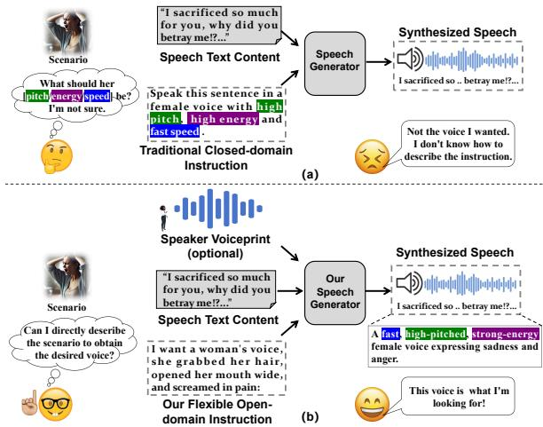
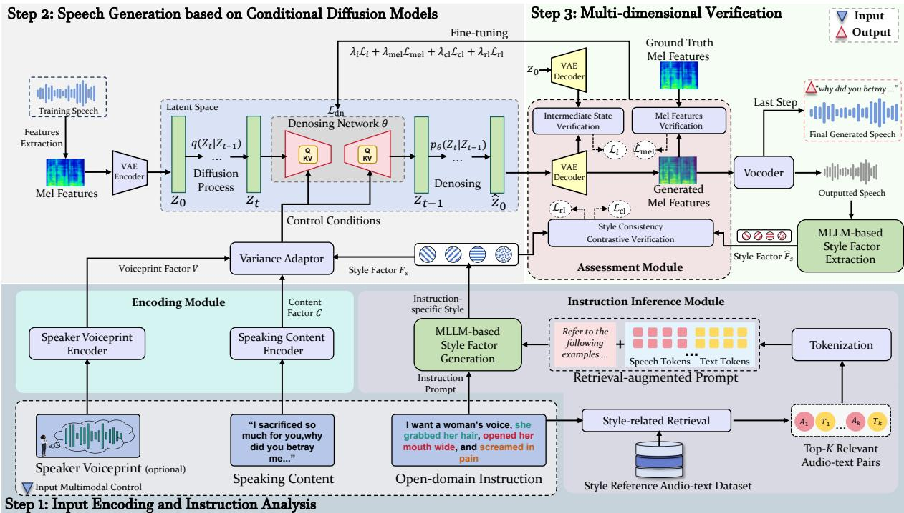
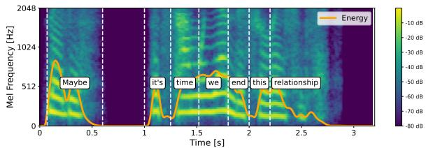
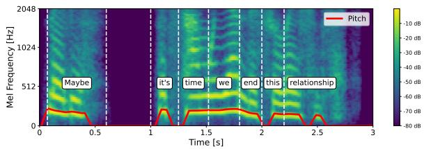
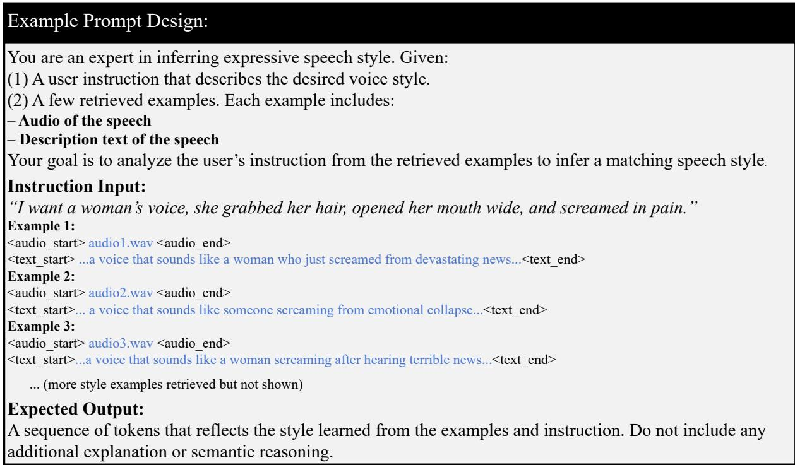

# Eliciting Implicit Acoustic Styles from Open-domain Instructions to Facilitate Fine-grained Controllable Generation of Speech

Jianxing Yu∗, Zihao Gou∗, Chen Li, Zhisheng Wang, Peiji Yang, Wenqing Chen, Jian Yin† School of Artificial Intelligence, Sun Yat-sen University, Zhuhai, 519082, China Tencent, Shenzhen, 518000, China

Key Laboratory of Sustainable Tourism Smart Assessment Technology, Ministry of Culture and Tourism, Zhuhai, 519082, China School of Software Engineering, Sun Yat-Sen University, Zhuhai, 519082, China {yujx26, gouzh, lich528, chenwq95, issjyin}@mail.sysu.edu.cn, {plorywang, peijiyang}@tencent.com

## Abstract

This paper focuses on generating speech with the acoustic style that meets users’ needs based on their open-domain instructions. To con trol the style, early work mostly relies on pre defined rules or templates. The control types and formats are fixed in a closed domain, making it hard to meet users’ diverse needs. One solution is to resort to instructions in free text to guide the generation. Current work mainly studies the instructions that clearly specify the acoustic styles, such as low pitch and fast speed. However, the instructions are complex, some even vague and abstract, such as “Generate a voice ofa woman who is heartbroken due to a breakup.” It is hard to infer this implicit style by traditional matching-based methods. To ad dress this problem, we propose a new controllable model. It first utilizes multimodal LLMs with knowledge-augmented techniques to infer the desired speech style from the instructions. The powerful language understanding ability of LLMs can help us better elicit the implicit style factors from the instruction. By using these factors as a control condition, we design a diffusion-based generator adept at finely adjusting speech details, enabling higher flexibility to meet complex users’ needs. Next, we verify the output speech from three aspects, i.e., consistency of decoding state, mel-spectrogram, and instruction style. This verified feedback can inversely optimize the generator. Extensive experiments are conducted on three popular datasets. The results show the effectiveness and good controllability of our approach.

## 1 Introduction

The task of speech generation aims to enable machines to speak like humans, presenting the given text in a fluent voice with an acoustic style that meets the users’ needs (Tan et al., 2021). This technology has a wide range of applications, such as voice assistants, film/television dubbing, voice navigation, etc. Early work (Purcell and Munhall, 2006) tries to convert or translate text into speech, striving to ensure accurate pronunciation of text content. These studies had relatively weak control over the style of speech. To tackle this issue, some studies used simple rules and templates, or a set of fixed parameters (such as speed, duration, pitch, volume, etc.) to roughly adjust aspects such as the rhythm, intonation, and speed of speech. However, rules and templates are often hand-crafted (Kim et al., 2021), resulting in high creation cost and poor scalability (Chary, 2024). Besides, the parameter adjustment was sophisticated and relied on experts. Users need to struggle to learn these parameters and conduct many experiments to master their value settings. Otherwise, the generated speech lacks naturalness and sounds stiff. One solution is to resort to instructions which describe acoustic style flexibly in free text, like “Please say the following sentence in a female voice, with a relatively low pitch, about 100 Mel, at a medium volume, with a brisk pace.” This instruction can be used as a prompt to guide the large model to yield speech meeting users’ intentions. This way is more user-friendly and highly adaptable. Current work mostly studies some closed-type instructions that have to clearly present desired styles and values with standardized expressions or keywords, see Fig.1(a). But in real applications, users’ instructions are open and complex, some are even abstract and subjective. As shown in Fig.1(b), users may directly describe a scenario as an instruction, without having to point out the detailed style aspects. This complex open-domain control task is less studied, and we thus focus on it to fill the research gap.

  
Figure 1: Open-domain instruction sample with implicit acoustic styles for generating speech controllably.

Due to the complexity of language, it is not trivial to analyze these open-domain instructions. They may be vague, such as “Generate a gentle girl voice.” which describes the users’ needs by a feeling term, lacking clear acoustic factors. Existing work mostly encodes the textual features of instructions. That merely learns the single-variable mapping between explicit keywords and acoustic factors in the instructions (Zhou et al., 2024). However, the instruction-factor mappings are nonunique and non-deterministic, e.g., “gentle voice” involves the compound but not single factors, like the female gender, a softness of pitch, a moderate volume with low energy, and a speech rate of less than 100 words per minute. That leads to an inability to accurately grasp the semantic meaning of the instructions, resulting in a distorted style of the outcome. In addition, open instructions may mix with noises, which are hard to distinguish. Moreover, users may also use informal expressions such as omission, inversion, and repetition to describe their needs, which further increases the challenges.

To address these challenges, we propose a new controllable speech generation method that well captures the abstract semantics in the open-domain instructions. It can flexibly control the acoustic and stylistic details of the speech to meet users’ diverse needs. In detail, we first leverage the multimodal LLMs to analyze the complex instructions. This LLMs have a strong language understanding ability and are adept at identifying salient content in the instructions via context to better infer users intentions. To reduce ambiguity, we retrieve relevant speech samples as knowledge to augment LLMs, making it easy to learn the implicit correlations among the instruction words and acoustic factors, such as pitch, volume, speed, timbre, emotion, etc. This knowledge covers various expressive ways, which can provide richer context to help us better comprehend the open instructions with informal expressions. We then develop a diffusionbased speech generator and feed these factors as conditions into it. This model is good at learning complex mapping relations between conditions and outputs from the data. It applies each acoustic factor at different steps within a single learning process. This step-by-step adjustment method can avoid large deviations caused by one-time generation. Since that is generated in a continuous space, the model can adjust the details of the outcome incrementally. That enables the generation of speech to be highly controllable. Finally, we develop a verifier to fully evaluate the results from multiple perspectives, including the consistency in terms of decoding state, mel-spectrogram, and style. Compared with the single metric, it can avoid the bias. The verified feedback can be fed back to the model for self-optimization. In this way, we can yield high-quality speech with good stability and controllability to better meet users’ real needs. Extensive experimental results on three popular datasets show our approach greatly outperforms other baselines.

The main contributions of this paper include,

• We reveal the limitations of traditional methods on control inflexibility and usage complexity. Thus, we propose a new method with the knowledge-augmented multimodal LLMs technique to analyze the complex open instructions. It can precisely infer their underlying acoustic style to better control the speech.

• We develop a strong verifier for reinforcement learning, which can measure the generated quality finely from multiple perspectives to better assess the acoustic details of results.

• We build a large-scale speech dataset with complex open-domain instructions. Based on it and several popular datasets, we conduct extensive experiments to fully evaluate the controllability and effectiveness of our method.

## 2 Approach

This task aims to generate a speech yˆ that matches a certain voiceprint and is consistent with the style instruction given by the user. The user’s input is V, C, I , which includes the open-domain instruction I, the textual speech content C, and an optional feature of a target person’s voiceprint V . As shown in Fig.(2), our approach first encodes the semantics of the input V, C, I and analyzes the instruction I to infer the acoustic aspects of the expected control. We then design a generative diffusion model and use these contents as conditions to guide it in generating speech. Finally, we verify this output from multiple perspectives to ensure its acoustic aspects conform to the instructions’ requirements. Next, we elaborate on each component.

  
Figure 2: The architecture of our controllable speech generation model

## 2.1 Input Encoding and Instruction Analysis

A speech usually involves multiple acoustic factors (Yang et al., 2024b). For example, an “energetic” speech may involve combinations of multiple factors such as higher pitch, faster speed, and greater volume. Traditional methods often require an explicit description of these factors and their values (Yamamoto et al., 2024). That is not userfriendly, since most users do not know these professional terms and their usage norms, making it hard to obtain the desired speech. To tackle this issue, we allow users to describe their needs in free text. Considering that free text may be abstract and general, it would not clearly indicate which voice factors need to be adjusted, as well as the direction and degree of adjustment. It is difficult for the machine to understand the user’s intention. Considering that LLMs possess remarkable language comprehension and pattern recognition abilities (Chang et al., 2025), we thus use it to better analyze instructions and represent all input contents effectively.

Considering the users’ instructions may be abstract and vague, for example, the user may want “a cheerful and relaxed voice”, it has no terms explicitly mentioning the acoustic factors of pitch, speed, etc. It is difficult for LLMs to clearly understand the voice style that users expect. One solution is to provide demonstrations in the prompt for LLMs (Brown et al., 2020), helping convert abstract instructions into specific acoustic parameters. That is, we collect some related audio-text pairs. They can be used as a reference to assist LLMs in learning the correlations among lexical expressions and acoustic features. When similar text expressions are found in the instructions, LLMs can use these correlations to infer the desired voice effect, avoiding potential deviations (Lewis et al., 2020).

Knowledge Augmentation: We collect abundant audio-description pairs from external public datasets, e.g., PromptSpeech (Guo et al., 2023), NL-Speech (Yang et al., 2024b), to create a database $D = \{ \langle A _ { i } , S _ { i } \rangle \}$ , where Ai denotes audio, $S _ { i }$ is the description. By taking the input instruction I as the query, we retrieve the top-K most relevant samples from it. A simple way is to directly calculate the word matching between the query and the sample text by using the BM 2.5 (Robertson et al., 2009) algorithm, as $s l e x .$ . This method has a relatively high precision but low recall (Thakur et al., 2021).

The diverse expressions in user instructions may differ from those in D. It is hard to retrieve samples with different expressions but the same meaning (Arabzadeh et al., 2021). Another direction is to encode the text into a dense vector, enabling the capture of their semantics to better calculate their cosine similarity (Huang and Huang, 2024). In detail, we transform the query into the hidden states $\mathbf { h } _ { q }$ based on an encoder, i.e., XLM-RoBERTa (Conneau et al., 2019). We then normalize it with the special token $^ { * } / C L S I ^ { * }$ as $e _ { q } = n o r m ( \mathbf { h } _ { q } [ 0 ] )$ . Similarly, we encode the style text $T _ { n }$ in $D$ as $e _ { d } .$ . The similarity is computed by the inner product between $e _ { q }$ and $e _ { d } .$ , as $s _ { d e n s e } \gets \langle e _ { q } , e _ { d } \rangle$ . However, instructions usually have clear definitions and specific usages. The vector-based method may retrieve seemingly relevant but actually irrelevant samples due to semantic generalization, thereby harming the precision (Reichman and Heck, 2024). To achieve high precision and recall simultaneously, we exploit a hybrid method. That is, we first individually retrieve the candidates by each method. We then re-rank them based on the integrated relevance score $s _ { r a n k } = \omega _ { s } \cdot s _ { l e x } + ( 1 - \omega _ { s } ) \cdot s _ { d e n s e } .$

Instruction Inference: Given the retrieved audio $A _ { i } ,$ , we first convert it into Mel-frequency spectrogram and discretize it into audio tokens a using the Qwen2-Audio encoder (Chu et al., 2024). Similarly, we employ the Qwen text tokenizer (Yang et al., 2024a) to encode the retrieved text descriptions as $S _ { T } = [ t _ { 1 } , t _ { 2 } , \dots , t _ { k } ]$ . Since the modalities of these two contents are different, we design the prompt and use the multimodal LLMs, e.g., Qwen2.5-Omni (Xu et al., 2025), to analyze the user instructions and output the relevant style factor. Details of the prompt are provided in Appendix A. In such LLMs, there is a Thinker module that is good at processing multimodal inputs and yielding high-level semantic representations. We organize the given audio and description tokens in the ChatML format of Qwen2.5-Omni. We use TMRoPE (Xu et al., 2025) to align these tokens in the time dimension. That can ensure the synchronous perception of audio-text. By inputting them to the Thinker module, we can obtain the style hidden state matrix ${ \bf H } = [ h _ { 1 } , h _ { 2 } , \ldots , h _ { T } ] \in \mathbb { R } ^ { T \times d }$ Considering that the importance of these tokens might vary, we employ a learnable style query vector $\mathbf { q } _ { \mathrm { s t y l e } } \in \mathbb { R } ^ { d }$ to compute relevance weights $\alpha _ { i } =$ softmax $( \mathbf { q } _ { \mathrm { s t y l e } } ^ { \top } \mathbf { h } _ { i } )$ . We then project the aggregated representation $\mathbf { e } _ { \mathrm { s t y l e } } = \sum _ { i = 1 } ^ { T } \alpha _ { i } \mathbf { h } _ { i }$ into a linear MLP layer and conduct normalization to obtain a style factor $f _ { s } = n o r m ( M L P ( e _ { s t y l e } )$

Other Inputs Encoding: For the speech content $C ,$ , we represent it by the text encoder in Fast-Speech2 (Ren et al., 2020) to obtain a factor $f _ { c }$ This encoder is adept at grasping the semantics in C. As an option, we allow users to input a recording of a certain person V for controlling the output speech with a customized voiceprint. For example, if a user desires the voice of a certain actor, we take his speech as the input. We extract a voiceprint factor $f _ { v }$ by a pre-trained encoder H/ASP (Heo et al., 2020) which can finely capture characteristics of the speaker’s voice. We then employ the variance adapter in Hypernetworks (Li et al., 2024) to fuse these factors $( \mathrm { i } . \mathrm { e } . , f _ { s } , f _ { c } , f _ { v } )$ . It is good at grasping correlations among these factors in a latent space by weighted attention and gating mechanisms.

In detail, we first project them into a latent space, obtaining $\begin{array} { r } { \mathbf { z } _ { s } ^ { \prime } = \mathbf { W } _ { s } { \cdot } f _ { s } , \mathbf { z } _ { c } ^ { \prime } = \mathbf { W } _ { c } { \cdot } f _ { c } , \mathbf { z } _ { v } ^ { \prime } = \mathbf { W } _ { v } { \cdot } f _ { v } } \end{array}$ Then, we perform a first-stage hierarchical fusion between the $\mathbf { z } _ { c } ^ { \prime }$ and $\mathbf { z } _ { v } ^ { \prime }$ to construct a fundamental speech representation $\begin{array} { r } { \mathbf { z } _ { \mathrm { b a s e } } = M L P ( [ \mathbf { z } _ { c } ^ { \prime } ; \mathbf { z } _ { v } ^ { \prime } ] ) } \end{array}$ . That enables the model to focus on speaking content and voiceprint-related patterns before introducing any style changes. In the second stage, we fuse the projected style factors $\mathbf { z } _ { s } ^ { \prime }$ with $\mathbf { z } _ { \mathrm { b a s e } }$ through a gated attention mechanism. Two independent attention modules are used to compute global weights over $\mathbf { z } _ { \mathrm { b a s e } }$ and $\mathbf { z } _ { s } ^ { \prime } .$ , as Eq.(1), where $\mathbf { w } _ { \alpha }$ is a trainable attention vector, and $\mathbf { U } _ { b } , \mathbf { U } _ { s }$ are attention projection matrices for $\mathbf { z } _ { \mathrm { b a s e } }$ and $\mathbf { z } _ { s } ^ { \prime }$ , respectively.

$$
\left\{ \begin{array} { l l } { \alpha _ { b } = \mathrm { S o f t m a x } ( \mathbf { w } _ { \alpha } ^ { \top } \operatorname { t a n h } ( \mathbf { U } _ { b } \cdot \mathbf { z } _ { \mathrm { b a s e } } ) ) , } \\ { \alpha _ { s } = \mathrm { S o f t m a x } ( \mathbf { w } _ { \alpha } ^ { \top } \operatorname { t a n h } ( \mathbf { U } _ { s } \cdot \mathbf { z } _ { s } ^ { \prime } ) ) . } \end{array} \right.\tag{1}
$$

The scalars $\alpha _ { b } , \alpha _ { s }$ represent the global attention weights applied to $\mathbf { z } _ { \mathrm { b a s e } }$ and $\mathbf { z } _ { s } ^ { \prime } ,$ indicating their contribution to the final control factors. We then concatenate $\mathbf { z } _ { \mathrm { b a s e } }$ and $\mathbf { z } _ { s } ^ { \prime }$ to obtain $\mathbf { z } _ { \mathrm { c o n c a t } } .$ , and feed the result into two separate gating networks, which generate dimension-wise soft masks, as Eq.(2).

$$
\left\{ \begin{array} { l l } { \mathbf { g } _ { b } = \sigma ( \mathbf { W } _ { b } \cdot \mathbf { z } _ { \mathrm { c o n c a t } } + \mathbf { b } _ { g } ) , } \\ { \mathbf { g } _ { s } = \sigma ( \mathbf { W } _ { s } \cdot \mathbf { z } _ { \mathrm { c o n c a t } } + \mathbf { b } _ { g } ) . } \end{array} \right.\tag{2}
$$

The gating network operates based on the $\mathbf { z } _ { \mathrm { c o n c a t } }$ and provides a learnable, dimension-wise control mechanism, where $\mathbf { W } _ { b } , \mathbf { W } _ { s }$ are trainable weight matrices and ${ \bf b } _ { g }$ is a shared bias. The sigmoid function $\sigma ( \cdot )$ maps each gate value into the range [0, 1]. That can implement soft decisions to determine whether a particular prosodic dimension should be suppressed or activated. $c _ { \mathrm { c t r l } }$ is computed by combining the globally weighted and locally gated vectors as Eq.(3), where denotes element-wise multiplication. That enables the global attention weights $\alpha _ { b }$ and $\alpha _ { s }$ to better capture the semantics of structural and stylistic cues, respectively. Meanwhile, the gating vectors $\mathbf { g } _ { b }$ and $\mathbf { g } _ { s }$ operate at the dimension level, determining whether each feature should be preserved or suppressed.

$$
c _ { \mathrm { c t r l } } = \alpha _ { b } \cdot ( { \bf g } _ { b } \odot { \bf z } _ { \mathrm { b a s e } } ) + \alpha _ { s } \cdot ( { \bf g } _ { s } \odot { \bf z } _ { s } ^ { \prime } ) .\tag{3}
$$

## 2.2 Controllable Speech Generation

To control the speech style finely, we design a new model based on the conditional latent diffusion framework (Rombach et al., 2022). This framework takes a condition as input and is adept at learning correlations between this condition and potential features in the data. By viewing $c _ { \mathrm { c t r l } }$ as a condition, we can yield the desired speech. There are two steps: forward noise injection and reverse denoising. During the forward process, the trained audio y is transformed into an easy-to-learn Mel-frequency spectrogram $x _ { 0 }$ , and is encoded in a latent space by a pre-trained VAE (Kingma et al., 2013), as $z _ { \mathrm { 0 } }$ The model adds Gaussian noise $\epsilon \sim \mathcal { N } ( 0 , 1 )$ to z0 step-by-step. That can learn the data patterns under different noise, thereby better understanding the intrinsic structure and distributions of the data. In the $t ^ { t h }$ step, zt can be derived as Eq.(4), where $\begin{array} { r } { \bar { \alpha } _ { t } = \prod _ { s = 1 } ^ { t } ( 1 - \beta _ { t } ) } \end{array}$ is the preset noise scheduling parameters, with $\{ \beta _ { t } \} _ { t = 1 } ^ { N } \in [ 0 , 1 ]$

$$
\begin{array} { r l r } & { } & { q ( z _ { t } \mid z _ { t - 1 } ) = { \cal N } ( z _ { t } ; \sqrt { 1 - \beta _ { t } } z _ { t - 1 } , \beta _ { t } ) , } \\ & { } & { z _ { t } = \sqrt { \bar { \alpha } _ { t } } z _ { 0 } + \sqrt { 1 - \bar { \alpha } _ { t } } \epsilon , \quad \epsilon \sim { \cal N } ( 0 , 1 ) . } \end{array}\tag{4}
$$

In the reverse denoising process, the model uses a multi-layer Transformer (Vaswani et al., 2017) to learn the inverse transformation from the noise distribution to the original data distribution. That is, based on the condition $c _ { \mathrm { c t r l } } .$ it predicts the noise ϵ through the network $\epsilon _ { \theta }$ based on U-net (Ronneberger et al., 2015), and restores the latent $\hat { z } _ { 0 }$ step-by-step. At the $t ^ { t h }$ step, this process can be derived by Eq.(5). In this way, the model can adjust the results based on the input conditions, thereby enabling controllable generation.

$$
p ( z _ { t - 1 } \mid z _ { t } , c _ { \mathrm { c t r l } } ) = \mathcal { N } \left( z _ { t - 1 } ; \epsilon _ { \theta } ( z _ { t } , t , c _ { \mathrm { c t r l } } ) , \sigma _ { t } ^ { 2 } \right)\tag{5}
$$

During training, the model is optimized to make the noise predicted by it as close as the real one

added. The denoising loss function is set as Eq.(6).

$$
\mathcal { L } _ { \mathrm { d n } } = \mathbb { E } _ { z _ { 0 } , t , \epsilon \sim \mathcal { N } ( 0 , 1 ) } \left[ \| \epsilon _ { \theta } ( z _ { t } , t , c _ { \mathrm { c t r l } } ) - \epsilon \| _ { 2 } ^ { 2 } \right]\tag{6}
$$

To avoid overfitting, we introduce a regularized coefficient $\omega \in [ 0 , 1 ]$ to enhance the generalization ability of the model, enabling it to generate reasonable results under various conditions and data distributions. The network $\epsilon _ { \theta }$ is derived as Eq.(7).

$$
\hat { \epsilon } _ { \theta } ^ { ( t ) } ( z _ { t } ) = \omega \cdot \epsilon _ { \theta } ^ { ( t ) } ( z _ { t } , t , c _ { \mathrm { c t r l } } ) + ( 1 - \omega ) \cdot \epsilon _ { \theta } ^ { ( t ) } ( z _ { t } , t )\tag{7}
$$

$\epsilon _ { \theta } ^ { ( t ) } ( z _ { t } , t )$ can be computed by empty input condition. The sampling direction is adjusted based on the prediction difference with and without conditions. We then employ another VAE to decode the outputted latent $\hat { z } _ { 0 }$ into an Mel-frequency vector $\scriptstyle { \hat { x } } _ { 0 }$ that can yield a target audio $\hat { y }$ using a vocoder.

## 2.3 Multi-dimensional Verification

To better learn the model, we evaluate the generated quality, $\mathrm { e . g . }$ , whether the results match the input conditions. That can be used as feedback to optimize the model, avoiding training in the wrong direction. Due to the complexity and high dimensionality of speech, traditional methods may struggle to analyze these complex features. To address this issue, we propose a verifier to assess the consistency of speech in multiple dimensions, including decoding space, mel-frequency spectrum, and style. That can help to ensure the speech quality.

Consistency of Decoding State: When the lowdimensional latent $z _ { \mathrm { 0 } }$ is transformed into a highdimensional Mel spectrogram by a VAE decoder $\mathcal { D } _ { \varphi } .$ the decoding hidden layer will learn and add details such as frequency, time series, amplitude, and energy, etc (Berrada et al., 2024). To make generated speech more natural and smooth in terms of these details, we calculate the consistency of these intermediate decoding states. That is, we separately decode $z _ { \mathrm { 0 } }$ and $\hat { z } _ { 0 }$ by Eq.(8), and compare the set of decoding features $\{ \varphi _ { l } \} _ { l = 1 } ^ { L }$ and $\{ \hat { \varphi } _ { l } \} _ { l = 1 } ^ { L } .$

$$
\left\{ \begin{array} { l l } { ( \varphi _ { 1 } , \varphi _ { 2 } , \ldots , \varphi _ { L } ) = ( \mathcal { D } _ { \varphi } ^ { l } ( z _ { 0 } ) ) , l \in [ 1 , L ] , } \\ { \quad } \\ { ( \hat { \varphi } _ { 1 } , \hat { \varphi } _ { 2 } , \ldots , \hat { \varphi } _ { L } ) = ( \mathcal { D } _ { \varphi } ^ { l } ( \hat { z } _ { 0 } ) ) , l \in [ 1 , L ] . } \end{array} \right.\tag{8}
$$

Based on these intermediate features, we redefine the training objective as the weighted sum of L2 distances between feature representations at different decoding layers, as shown in Eq.(9).

$$
\begin{array} { r } { \mathcal { L } _ { i } = \sum _ { l = 1 } ^ { L } \omega _ { l } \cdot \frac { 1 } { C _ { l } } \sum _ { c = 1 } ^ { C _ { l } } \Big \lVert \rho _ { l } ^ { ( c ) } ( \hat { \varphi } _ { l } ^ { \prime ( c ) } ) \odot ( \varphi _ { l } ^ { \prime ( c ) } - \hat { \varphi } _ { l } ^ { \prime ( c ) } ) \Big \rVert _ { 2 } ^ { 2 } } \end{array}\tag{9}
$$

We normalize $\{ \varphi _ { l } \} _ { l = 1 } ^ { L }$ and $\{ \hat { \varphi } _ { l } \} _ { l = 1 } ^ { L }$ , obtaining $\varphi _ { l } ^ { \prime ( c ) }$ and $\hat { \varphi } _ { l } ^ { \prime ( c ) }$ . Moreover, we mask out the outlier regions using a binary $\rho _ { l } ^ { ( c ) }$ and apply the depthspecific weighting coefficient $\omega _ { l } = e ^ { - l }$ to give lower weight to the deeper layers, where $C _ { l }$ denotes the number of channels in the l-th decoder layer. That can prevent a numerical explosion and make the overall training more stable.

Consistency of Mel-frequency Spectrum: The decoded spectrogram $x _ { 0 }$ can be viewed as an image. When $\hat { x } _ { 0 }$ and $x _ { 0 }$ have a comparable structure, they usually have similar energy distributions and frequency characteristics. This enables the generated speech to be more similar to the real one in terms of timbre, pitch, formants, etc. Thus, we adopt a SSIM loss (Wang et al., 2004) that is adept at capturing structural similarity, as Eq.(10).

$$
\mathcal { L } _ { \mathrm { m e l } } = 1 - \mathrm { S S I M } ( x _ { 0 } , \hat { x } _ { 0 } ) .\tag{10}
$$

Consistency of Instruction Style: A good synthesized speech should match the expected style of the user’s instructions. That can form a reinforcement reward to guide the training direction of the model. We use the multimodal large model (MLLMs) M to extract the style factor $\hat { f } _ { s }$ of $\hat { x } _ { 0 }$ $\hat { f } _ { s }$ can cover various acoustic features such as fre quency, formant, spectral envelope, duration, etc. These features can reflect the voice style like pitch, timbre, and prosody. Based on $f _ { s }$ derived from the instruction module and $\hat { f } _ { s } ,$ we then evaluate their consistency by contrastive learning (Chen et al., 2020). The loss function is based on Eq.(11).

$$
\mathcal { L } _ { \mathrm { c l } } = - \log \frac { \exp ( \sin ( f _ { s } , \hat { f } _ { s } ) / \tau ) } { \sum _ { k = 1 } ^ { K } \exp ( \sin ( f _ { s } , \hat { f } _ { s } ) / \tau ) }\tag{11}
$$

To train the model, we use reinforcement learning (Sutton and Barto, 2018) that can integrate various control factors (e.g., verified metrics and style) into the model naturally. The control factors are regarded as decision variables in a Markov decision process (Bellman, 1957). Our model selects the denoising action $a _ { t }$ (i.e., the speech transformation operation) based on the current state $s _ { t }$ (such as the $t ^ { \mathit { \hat { t } h } }$ partial generated result, etc.) and the control factors. Each action has a reward score $R ( s _ { t } , a _ { t } )$ as Eq.(12), and it transitions to the next state $s _ { t + 1 }$ based on the probability $P ( s _ { t + 1 } \mid s _ { t } , a _ { t } )$ , where the initial state is $\rho _ { 0 }$ . The goal is to maximize the expected total reward. Thus, the model can adjust the speech (e.g., the pitch, speed, timbre, etc.)

according to specific control requirements.

$$
R ( s _ { t } , a _ { t } ) = { \left\{ \begin{array} { l l } { r ( s _ { t + 1 } ) = r ( { \hat { y } } _ { t } ) , } & { { \mathrm { i f ~ } } t = T - 1 , } \\ { 0 , } & { { \mathrm { O t h e r w i s e } } . } \end{array} \right. }\tag{12}
$$

At $t ^ { t h }$ step, we calculate the reward function $r ( \cdot )$ for $\hat { y } _ { t }$ by weighting two metrics, including the quality score evaluated by the UTMOS model (Saeki et al., 2022), and the style similarity, as Eq.(13).

$$
r ( { \hat { y } } _ { t } ) = \alpha \cdot \mathrm { s i m } ( f _ { s } , { \hat { f } } _ { s } ) + \beta \cdot \mathrm { U T M O S } ( { \hat { y } } _ { t } )\tag{13}
$$

By applying weighted rewards, we further optimize the RL objective function as Eq.(14), where $| | \cdot | |$ is the KL divergence term, which is used to regularize the objective and avoid overfitting. In this way, the speech whose voice style matches users’ instructions better will receive a higher reward score.

$$
\begin{array} { r l } { \mathcal { L } _ { \mathrm { r l } } ( \theta ) = \displaystyle - r ( \hat { y } _ { t } ) \cdot \log p _ { \theta } ( z _ { t - 1 } \mid z _ { t } ) } & { } \\ { \displaystyle + \sum _ { t = 1 } ^ { T } \mathrm { K L } \left( p _ { \theta } ( z _ { t - 1 } | z _ { t } ) \parallel p _ { \mathrm { p r e } } ( z _ { t - 1 } | z _ { t } ) \right) } & { } \\ { \displaystyle } & { + \parallel \epsilon _ { \theta } ( z _ { t } , t , c _ { \mathrm { c t r l } } ) - \epsilon \parallel _ { 2 } ^ { 2 } } \end{array}\tag{14}
$$

To better train the model, we combine all the losses by weighting to form the joint objective, as Eq.(15), where $\{ \lambda _ { \mathrm { d n } } , ~ \lambda _ { i } , ~ \lambda _ { \mathrm { m e l } } , ~ \lambda _ { \mathrm { c l } } , ~ \lambda _ { \mathrm { r l } } \} ~ \in ~ [ 0 , 1 ]$ are the weights. The details are given in Appendix B.

$$
\mathcal { L } = \lambda _ { \mathrm { d n } } \mathcal { L } _ { \mathrm { d n } } + \lambda _ { i } \mathcal { L } _ { i } + \lambda _ { \mathrm { m e l } } \mathcal { L } _ { \mathrm { m e l } } + \lambda _ { \mathrm { c l } } \mathcal { L } _ { \mathrm { c l } } + \lambda _ { \mathrm { r l } } \mathcal { L } _ { \mathrm { r l } } .\tag{15}
$$

## 3 Evaluations

We extensively evaluated the effectiveness of our method with quantitative and qualitative analysis.

## 3.1 Data and Experimental Settings

To evaluate the control ability over the generated results, we conducted the evaluation on two classic datasets, including PromptSpeech (Guo et al., 2023) and SpeechCraft (Jin et al., 2024). PromptSpeech contains 28,000 speech samples, each paired with a text prompt on four acoustic aspects: pitch, gender, volume, and speed. SpeechCraft comprises over 2.25 million speech segments with 2,400 hours of audio data. It was annotated with eight stylistic aspects: pitch, energy, speed, gender, age, emotion, word emphasis, and topic. Considering these aspects are relatively fixed, they may not be able to evaluate our open-domain controllability well. Thus, we constructed a new dataset, called HPSC, in three steps, including data crawling and preprocessing, fine-grained features extraction, instruction generation, and verification. The construction details and the dataset are publicly available 1.

Table 1: Performance comparison. The best results are represented in bold. The second-best results are underlined. The improvements were significant using a statistical t-test with a p-value<0.005.
<table><tr><td>PromptSpeech</td><td colspan="10"></td></tr><tr><td>Method</td><td>Mean↑</td><td>Gender↑</td><td>Age↑</td><td>Pitch↑</td><td>Energy↑</td><td>Speed↑</td><td>Emotion↑</td><td>WER↓</td><td>MCD↓</td><td>SSIM↑</td><td>STOI↑</td><td>SECS↑</td></tr><tr><td>PromptTTS++</td><td>67.89</td><td>80.14</td><td>63.14</td><td>59.45</td><td>62.14</td><td>68.14</td><td>74.32</td><td>7.35</td><td>14.23</td><td>0.34</td><td>0.53</td><td>57.63</td></tr><tr><td>InstructTTS</td><td>61.36</td><td>84.62</td><td>51.36</td><td>52.45</td><td>54.21</td><td>62.73</td><td>62.81</td><td>8.24</td><td>9.97</td><td>0.48</td><td>0.68</td><td>62.13</td></tr><tr><td>Salle</td><td>56.19</td><td>77.84</td><td>47.56</td><td>50.93</td><td>51.37</td><td>56.17</td><td>53.27</td><td>6.93</td><td>13.17</td><td>0.32</td><td>0.58</td><td>56.23</td></tr><tr><td>ParlerTTS</td><td>65.09</td><td>86.82</td><td>60.71</td><td>55.34</td><td>63.16</td><td>58.61</td><td>65.92</td><td>9.74</td><td>20.78</td><td>0.36</td><td>0.61</td><td>54.80</td></tr><tr><td>CosyVoice</td><td>78.72</td><td>95.57</td><td>88.75</td><td>74.19</td><td>56.73</td><td>70.78</td><td>86.28</td><td>3.58</td><td>9.73</td><td>0.55</td><td>0.69</td><td>64.07</td></tr><tr><td>VoxInstruct</td><td>78.99</td><td>96.73</td><td>92.28</td><td>73.28</td><td>54.25</td><td>72.24</td><td>85.14</td><td>3.02</td><td>9.18</td><td>0.52</td><td>0.71</td><td>63.48</td></tr><tr><td>Ours</td><td>81.94</td><td>97.21</td><td>93.26</td><td>76.39</td><td>64.28</td><td>72.79</td><td>87.68</td><td>2.92</td><td>8.64</td><td>0.58</td><td>0.74</td><td>64.59</td></tr><tr><td colspan="10">SpeechCraft</td><td></td><td></td><td></td></tr><tr><td>PromptTTS++</td><td>67.32</td><td>78.57</td><td>62.08</td><td>60.45</td><td>60.23</td><td>70.31</td><td>72.31</td><td>11.53</td><td>17.39</td><td>0.31</td><td>0.56</td><td>58.73</td></tr><tr><td>InstructTTS</td><td>59.05</td><td>85.27</td><td>45.51</td><td>48.57</td><td>50.29</td><td>62.47</td><td>62.18</td><td>7.82</td><td>8.03</td><td>0.43</td><td>0.51</td><td>61.91</td></tr><tr><td>Salle</td><td>69.12</td><td>94.32</td><td>77.59</td><td>60.14</td><td>61.38</td><td>63.04</td><td>58.27</td><td>7.23</td><td>12.98</td><td>0.54</td><td>0.64</td><td>62.13</td></tr><tr><td>ParlerTTS</td><td>75.77</td><td>93.77</td><td>85.54</td><td>67.63</td><td>53.74</td><td>71.76</td><td>82.15</td><td>10.27</td><td>16.76</td><td>0.39</td><td>0.65</td><td>60.55</td></tr><tr><td>CosyVoice</td><td>77.61</td><td>92.63</td><td>87.28</td><td>73.87</td><td>57.34</td><td>71.28</td><td>83.27</td><td>3.07</td><td>10.62</td><td>0.57</td><td>0.69</td><td>62.17</td></tr><tr><td>Voxinstruct Ours</td><td>79.21</td><td>95.27</td><td>91.83</td><td>76.35</td><td>59.53</td><td>72.12</td><td>80.17</td><td>2.53</td><td>9.27</td><td>0.54</td><td>0.77</td><td>64.23</td></tr><tr><td></td><td>82.42</td><td>96.54</td><td>93.31</td><td>78.28</td><td>65.31</td><td>75.42</td><td>85.64</td><td>2.51</td><td>7.95</td><td>0.58</td><td>0.78</td><td>65.19</td></tr><tr><td colspan="10">HPSC</td></tr><tr><td></td><td></td><td>68.42</td><td>42.72</td><td>46.58</td><td></td><td></td><td>31.13</td><td>12.25</td><td>19.23</td><td>0.27</td><td>0.46</td><td>43.25</td></tr><tr><td>PromptTTS++ InstructTTS</td><td>45.30 49.58</td><td>78.45</td><td>35.37</td><td>38.59</td><td>32.74</td><td>50.21 41.98</td><td>48.76</td><td>10.02</td><td>12.97</td><td>0.38</td><td>0.47</td><td>58.12</td></tr><tr><td>Salle</td><td>47.90</td><td>84.07</td><td>42.58</td><td>30.14</td><td>54.32 42.23</td><td>33.07</td><td>55.28</td><td>8.43</td><td>14.79</td><td>0.31</td><td>0.52</td><td>55.23</td></tr><tr><td>ParlerTTS</td><td>56.29</td><td>89.27</td><td>56.15</td><td>50.81</td><td>49.13</td><td>33.27</td><td>59.12</td><td>11.78</td><td>23.77</td><td>0.28</td><td>0.54</td><td>61.23</td></tr><tr><td>CosyVoice</td><td>62.63</td><td>88.34</td><td>77.58</td><td>47.19</td><td>52.85</td><td>48.07</td><td>61.72</td><td>3.85</td><td>9.21</td><td>0.41</td><td>0.57</td><td>56.29</td></tr><tr><td>Voxİnstruct</td><td>65.77</td><td>92.27</td><td>78.84</td><td>58.23</td><td>53.25</td><td>47.82</td><td>64.19</td><td>3.79</td><td>11.57</td><td>0.43</td><td>0.61</td><td>59.88</td></tr><tr><td>Ours</td><td>71.83</td><td>94.31</td><td>80.29</td><td>62.45</td><td>58.78</td><td>60.39</td><td>74.81</td><td>3.42</td><td>8.29</td><td>0.49</td><td>0.68</td><td>62.36</td></tr></table>

To evaluate the speech quality, we employed five classic metrics in the field of speech generation, including Mel-Cepstral Distortion (MCD) (Kominek et al., 2008), Structural Similarity Index Measure (SSIM) (Wang et al., 2004), Word Error Rate (WER) (Klakow and Peters, 2002), Short-Time Objective Intelligibility (STOI) (Taal et al., 2011), and Speaker Embedding Cosine Similarity (SECS) (Snyder et al., 2018). These metrics excel at calculating the similarity between generated speech and ground-truth in terms of spectrum, textual descriptions of the content, and latent space representations. The smaller values of WER and MCD are, or the larger values of SSIM, STOI, and SECS are, the higher quality is. The details of the metrics were presented in Appendix C. In addition to these matching-based metrics, we utilized some style-related acoustic metrics, including gender, age, pitch, energy, speed, emotion, and their average score (i.e., mean). That can better assess the model’s controllability of the speech style. To determine their values, we employed the pre-trained classifiers, i.e., Wav2vec 2.0 (Baevski et al., 2020), Emotion2vec (Ma et al., 2023), to identify the style labels for the generated speech and the groundtruth, and then calculated the accuracy. More details of all methods were shown in Appendix B.

## 3.2 Comparisons Against State-of-the-Arts

We compared our method against six typical baselines, including: (1) PromptTTS++ (Shimizu et al., 2024), which modeled the speech style using a mixture density network; (2) InstructTTS (Yang et al., 2024b), which used self-supervised learning and cross-modal metric learning to represent style prompts, as well as learned acoustic features in a discrete latent space; (3) VoxInstruct (Zhou et al., 2024), which was based on a unified multilingual codec framework, using semantic tokens to represent the content and style instruction; (4) CosyVoice (Du et al., 2024), a scalable, multilingual, multi-speaker, multi-style, and zeroshot TTS based on supervised semantic tokens (5) Salle (Ji et al., 2024a), using autoregressive and non-autoregressive Transformers to balance the control of style and content; (6) ParlerTTS (Lyth and King, 2024), built upon an AudioCraft framework that supported the control of some fixed styles. We reimplemented these baselines following their original settings, as shown in Appendix B.

As displayed in Tab.(1), our method achieved the best performance across all datasets. The results showed that our method can generate voice with styles that were consistent with user needs quite well. On the closed-domain datasets Prompt-Speech and SpeechCraft, our performance was stable, which reflected its good controllability. On the open dataset HPSC, our method surpassed the best baselines (i.e., VoxInstruct) by over 13.54% in terms of five quality metrics on average. Besides, in terms of the average score of style-related acoustic metrics, our method had improved by more than 3.73%, 4.05%, and 9.21% against the best baselines (i.e., VoxInstruct) on three datasets, respectively. This advantage is greater on the HPSC. This reflected that our method had strong generalization and instruction understanding ability.

## 3.3 Human Evaluations

Moreover, we evaluated the quality of synthesized speech qualitatively by human assessment. We adopted three popular metrics (Viswanathan and Viswanathan, 2005), including QMOS for measuring the acoustic quality; IMOS for gauging the consistency with instructions; and RMOS for evaluating the realness or human-likeness of the voice. The setting and details of the scoring were shown in Appendix D. As shown in Tab.(2), our model significantly outperformed other baselines in terms of all metrics. That was consistent with the quantitative results in section 3.2. That indicated our approach can effectively generate high-quality speech that met users’ needs based on their instructions.

## 3.4 Ablation Studies

To analyze the contribution of each component in our model, we further conducted ablation studies by removing four key modules from our framework one by one, including (1) ReM that removed the retrieval-enhanced part in knowledge augmentation, carrying out style inference directly; (2) InsI that discarded the instruction inference, only extracting instruction features by the Fast-Speech2 method; (3) MutiV that dropped the multidimensional verifier, adopting only the standard denoising loss for training.

As shown in Tab.(3), removing the retrievalenhanced module led to a noticeable degradation in the accuracy of style factors, indicating its critical role in inferring correct speech styles. Nevertheless, this removal still outperforms several baselines (i.e., InstructTTS), suggesting that retrieval failures do not lead to a model collapse. Eliminating the instruction inference or the multi-dimensional verifier module also resulted in a performance drop. That indicated all components of our model were beneficial for deducing users’ needs and building a robust open-domain speech system.

## 3.5 Case Studies

To provide more insights into our model, we studied some generated cases. As illustrated in Fig.(3), we displayed the Mel-spectrograms, pitch contours, and energy curves of the generated speech based on the open instruction “Please generate the appropriate voice based on the following scenario, All ofthis just makes peoplefeel hopeless, like there’s a huge weight pressing down on everyone. She said, ‘Maybe it’s time we end this relationship.’” The overall pitch and energy were low, which was consistent with the depressed emotional tone described in the scenario. The long voice duration matched the speaker’s inner turmoil and emotional struggle. Moreover, we extracted style factors, i.e., “Gender=Female; Emotion=Sad; Pitch=Low; Energy=Medium; Speed=Medium; Age=Middle.” That indicated the generated speech corresponded to a middle-aged female with a sad emotional state, characterized by a slower speaking rate, lower energy, and lower pitch. We can infer that our method can correctly infer implicit styles in the instructions and control the results according to these styles, making it consistent with the user’s needs.

  
(a) Mel spectrogram overlaid with pitch trend.

  
(b) Mel spectrogram overlaid with energy contour.  
Figure 3: Mel-spectrograms, pitch, and energy contours of generated speech based on open testing instructions.

## 4 Related Work

Speech generation is a hot research topic that can convert text symbols into speech signals (Dutoit, 1997). It has a wide range of applications (Tan et al., 2021). For example, it can be used to build voice assistants like Siri (Jampala et al., 2024), or the audio book (Xin et al., 2023). Early work mainly studied a word-to-speech mapping to make the speech content match the text description (Wang et al., 2017). However, the generated speech may have a harsh sound and tone, lacking the natural rhythm of humans. Researchers gradually turn to in-depth analysis and control of the fine-grained acoustic features (Ji et al., 2024b) like stress and rhythm, to make the results more human-like.

Table 2: Human evaluations, with 95% confidence intervals. Each score [1, 5]. Significant t-test, p-value<0.005.
<table><tr><td rowspan="2">Method</td><td colspan="3">PromptSpeech</td><td colspan="3">SpeechCraft</td><td colspan="3">HPSC</td></tr><tr><td>QMOS↑</td><td>IMOS↑</td><td>RMOS↑</td><td>QMOS↑</td><td>IMOS↑</td><td>RMOS↑</td><td>QMOS↑</td><td>IMOS↑</td><td>RMOS↑</td></tr><tr><td>PromptTTS++</td><td> $2 . 1 4 3 { \pm } _ { 0 . 1 5 }$ </td><td> $2 . 7 1 4 { \pm } _ { 0 . 1 2 }$ </td><td> $2 . 5 7 1 { \pm } _ { 0 . 1 2 }$ </td><td> $3 . 0 0 0 { \pm } _ { 0 . 1 4 }$ </td><td> $3 . 1 4 3 { \pm } _ { 0 . 1 1 }$ </td><td> $3 . 4 2 9 { \pm } _ { 0 . 1 6 }$ </td><td> $1 . 8 5 7 { \pm } _ { 0 . 1 0 }$ </td><td> $1 . 2 8 6 { \pm } _ { 0 . 1 2 }$ </td><td> $2 . 0 0 0 { \pm } _ { 0 . 1 3 }$ </td></tr><tr><td>InstructTTS</td><td> $3 . 4 2 9 { \pm } _ { 0 . 1 4 }$ </td><td> $3 . 2 8 6 { \pm } _ { 0 . 1 7 }$ </td><td> $3 . 8 5 7 { \pm } _ { 0 . 1 5 }$ </td><td> $3 . 2 8 6 { \pm } _ { 0 . 0 9 }$ </td><td> $3 . 1 4 3 { \pm } _ { 0 . 1 7 }$ </td><td> $3 . 7 1 4 { \pm } _ { 0 . 1 3 }$ </td><td> $3 . 2 8 6 { \pm } _ { 0 . 1 2 }$ </td><td> $2 . 1 4 3 { \pm } _ { 0 . 1 7 }$ </td><td> $3 . 2 8 6 { \pm } _ { 0 . 1 5 }$ </td></tr><tr><td>Salle</td><td> $2 . 1 4 3 { \pm } _ { 0 . 1 4 }$ </td><td> $2 . 0 0 0 { \pm } _ { 0 . 1 2 }$ </td><td> $2 . 4 2 9 { \pm } _ { 0 . 1 5 }$ </td><td> $3 . 5 7 1 { \pm } _ { 0 . 1 5 }$ </td><td> $3 . 7 1 4 { \pm } _ { 0 . 1 2 }$ </td><td> $3 . 2 8 6 { \pm } _ { 0 . 1 4 }$ </td><td> $2 . 4 2 9 { \pm } _ { 0 . 1 5 }$ </td><td> $1 . 2 8 6 { \pm } _ { 0 . 1 2 }$ </td><td> $2 . 0 0 0 { \pm } _ { 0 . 1 3 }$ </td></tr><tr><td>PalerTTS</td><td> $\underline { { 4 . 1 4 3 \pm } } _ { 0 . 1 5 }$ </td><td> $3 . 8 5 7 { \pm } _ { 0 . 1 2 }$ </td><td> $4 . 0 0 0 { \pm } _ { 0 . 1 4 }$ </td><td> $\underline { { 4 . 1 4 3 \pm _ { 0 . 1 3 } } }$ </td><td> $3 . 2 8 6 { \pm } _ { 0 . 1 2 }$ </td><td> $3 . 8 5 7 { \pm } _ { 0 . 1 2 }$ </td><td> $3 . 5 7 1 { \pm } _ { 0 . 1 3 }$ </td><td> $2 . 4 2 9 { \pm } _ { 0 . 1 3 }$ </td><td> $3 . 4 2 9 { \pm } _ { 0 . 1 5 }$ </td></tr><tr><td>CosyVoice</td><td> $3 . 8 5 7 { \pm } _ { 0 . 1 4 }$ </td><td> $4 . 1 4 3 { \pm } _ { 0 . 1 8 }$ </td><td> $3 . 8 5 7 { \pm } _ { 0 . 1 2 }$ </td><td> $4 . 0 0 0 { \pm } _ { 0 . 1 5 }$ </td><td> $3 . 8 5 7 { \pm } _ { 0 . 1 3 }$ </td><td> $3 . 7 1 4 { \pm } _ { 0 . 1 4 }$ </td><td> $3 . 4 2 9 { \pm } _ { 0 . 1 2 }$ </td><td> $3 . 0 0 0 { \pm } _ { 0 . 1 3 }$ </td><td> $3 . 4 2 9 { \pm } _ { 0 . 1 5 }$ </td></tr><tr><td>VoxInstruct</td><td> $4 . 0 0 0 { \pm } _ { 0 . 1 5 }$ </td><td> $\underline { { 4 . 2 8 6 \pm _ { 0 . 1 3 } } }$ </td><td> $4 . 1 4 3 { \pm } _ { 0 . 1 3 }$ </td><td> $3 . 8 5 7 { \pm } _ { 0 . 1 6 }$ </td><td> $\underline { { 4 . 1 4 3 \pm _ { 0 . 1 4 } } }$ </td><td> $\underline { { 4 . 0 0 0 \pm _ { 0 . 1 3 } } }$ </td><td> $3 . 8 5 7 { \pm } _ { 0 . 1 4 }$ </td><td> $3 . 7 1 4 { \pm } _ { 0 . 1 1 }$ </td><td> $3 . 5 7 1 { \pm } _ { 0 . 1 4 }$ </td></tr><tr><td>Ours</td><td> $\mathbf { 4 . 2 8 6 { \overset { . } { = } } 0 . 1 2 }$ </td><td> $\overline { { 4 . 5 7 1 \pm _ { 0 . 1 1 } } }$ </td><td> $\pm . 2 8 6 { \pm } _ { 0 . 1 3 }$ </td><td> $\mathbf { 4 . 2 8 6 { \overset { . } { = } } 0 . 1 2 }$ </td><td> $\pm . 4 2 9 { \pm } _ { 0 . 1 2 }$ </td><td>4.143±0.15</td><td> $\mathbf { 4 . 1 4 3 } 2 \mathbf { 0 . 1 3 }$ </td><td> $\mathbf { 4 . 0 0 0 } 2 \mathbf { 0 . 1 2 }$ </td><td> $\mathbf { 3 . 8 5 7 \pm _ { 0 . 1 3 } }$ </td></tr></table>

Table 3: Ablation studies with 1000 randomly selected samples. Two kinds of evaluated metrics: (1) the average score of five style factors (Mean), (2) the average score of three human-evaluated metrics (MOS).
<table><tr><td>Model Variant</td><td>Mean (%)↑</td><td>MOS↑</td></tr><tr><td>Full model</td><td>77.28</td><td>4.18</td></tr><tr><td>w/o retrieval-enhanced module</td><td>57.27</td><td>2.93</td></tr><tr><td>w/o instruction inference module</td><td>53.69</td><td>2.85</td></tr><tr><td>w/o multi-dimensional verifier</td><td>67.49</td><td>3.75</td></tr></table>

posed to capture the semantic context of instructions and learn the acoustic control features in a discrete space (Yang et al., 2024b), or via crossattention (Lyth and King, 2024), or by codec language model (Zhou et al., 2024). However, these controls are often constrained by the limited types of preset style keywords. This rigid input requires professional experience, which is unfriendly for ordinary users. In actual scenarios, users’ needs are diverse. They would like to express instructions freely and expect the machine to handle the rest automatically. That greatly enhances the usability and accessibility of the speech generation system. However, instructions are complex, some even abstract, e.g., “Say the following content with tears welling $u p . ^ { \prime \prime }$ Due to the lack of clear acoustic factors, it is hard for existing methods to deduce users’ intentions from such vague instructions. Therefore, we study these complex open-domain instructions and propose a new knowledge-augmented method. It can better elicit the implicit style factors, enabling fine-grained control of speech generation.

To achieve controllability, the current work can be summarized into three categories. The first one is to introduce a variable to control the generation process, such as discrete labels for modeling emotional categories (Kim et al., 2021), or variables for characterizing numerical attributes like pitch or speed (Behr, 2021), etc. These variables are latent and lack interpretability. Their learning often relies on manually annotated data or external predictors (Wang et al., 2025), with poor scalability. Another direction provides a reference speech, letting the generated results imitate its style or rhythm (Huang et al., 2022). This method requires high-quality reference examples to reflect the style expected by users. That has poor flexibility and is sensitive to the selection of reference inputs. The third direction allows users to describe their desired styles by instructions (Guo et al., 2023) which are used to build the prompts (Shimizu et al., 2024). That can guide the LLMs to yield the style-matched speech (Li et al., 2020). Some work studied the closed-type instructions which clearly describe desired styles or values with fixed or structured expressions (e.g., in a low, slow voice). They pro-

## 5 Conclusion

This paper proposed to control speech generation in a more user-friendly way by free-text open-domain instructions. It addressed the issues of the lack of control flexibility in existing methods. To tackle the abstract semantics and vague issues in the instructions, we proposed to use multimodal LLMs with knowledge-augmented techniques that can well infer the implicit speech styles that users expect. Based on these styles as the condition, we then developed a diffusion-based generator and a multi-dimensional verifier for self-optimization. By resorting to the powerful controllable ability of the model, we can yield high-quality speech with users’ satisfactory styles. Experimental results on three popular datasets showed our method achieved the best performance. Our demo is available at https://opspch-demo.github.io/.

## Acknowledgments

This work is supported by the Key-Area Research and Development Program of Guangdong Province (2024B0101050005), CCF-Tencent Rhino-Bird Open Research Fund (RAGR20240121), National Natural Science Foundation of China (62276279, U22B2060, 62306344), Guangdong Basic and Applied Basic Research Foundation (2024B1515020032, 2024A1515010253), and Research Foundation of Science and Technology Plan Project of Guangzhou City (2023B01J0001, 2024B01W0004).

## Limitations

This paper presented a speech generation task towards complex open-domain instructions and proposed a highly controllable method. That facilitates users to obtain the desired voice easily by free-text description. Currently, this technology is mainly applied in single-language scenarios, but not mixedlanguage instructions, like Chinese-English. Since Chinese is a tonal language, each syllable has a fixed tone. The prosodic features are greatly influenced by tones. While English is an intonation language, it relies on the pitch contour of phrases/sentences. The stress and intonation play a key role in expressing semantics and emotions, which are different from the prosodic patterns of Chinese. When processing mixed Chinese-English instructions, the model may fail to disentangle the features of these two languages, resulting in the tone curves of English paragraphs being disturbed by the four tones of Chinese. That can be alleviated by adding a specialized language perception module. It can identify the language type of the input text and call the corresponding prosodic generation module of a certain language. In addition, an adversarial training can be adopted to enable the generator to yield speech that is more in line with English prosody and reduce the interference of Chinese prosody.

## Ethics Statement

This paper aims to generate expressive speeches based on open-domain instructions. Normal use of this technology does not pose risks. However, if it is misused, there are certain potential risks. That is, it could be misused to forge voices for deception, impersonation, etc. This requires strengthening technical supervision and regulation to avoid such risks. For example, we can develop encryption and watermarking technologies to mark and protect the process, so as to prevent the generated speech from being forged and misused. At the same time, strengthening data security management, developing secure storage and transmission methods. Also, we can conduct strict permission control and encryption processing of user data to protect personal privacy. In all experiments of this study, we only used public datasets or voice samples obtained with explicit user authorization. If the speech generation system is deployed in real applications, we suggest establishing user consent agreements to ensure that the use of all voice content is legally authorized.

## References

Negar Arabzadeh, Xinyi Yan, and Charles LA Clarke. 2021. Predicting efficiency/effectiveness trade-offs for dense vs. sparse retrieval strategy selection. corr abs/2109.10739 (2021). arXiv:2109.10739.

Alexei Baevski, Yuhao Zhou, Abdelrahman Mohamed, and Michael Auli. 2020. wav2vec 2.0: A framework for self-supervised learning of speech representations. In Journal of Advances in neural information processing systems, 33:12449–12460.

Moritz Behr. 2021. Fine-Grained Prosody Control in Neural TTS Systems. Ph.d. thesis, Informatics Institute.

Richard Bellman. 1957. A markovian decision process. In Journal of mathematics and mechanics, pages 679– 684.

Tariq Berrada, Pietro Astolfi, Melissa Hall, Marton Havasi, Yohann Benchetrit, Adriana Romero-Soriano, Karteek Alahari, Michal Drozdzal, and Jakob Verbeek. 2024. Boosting latent diffusion with perceptual objectives. In Proceedings of the 2024 13th International Conference on Learning Representations.

Tom Brown, Benjamin Mann, Nick Ryder, Melanie Subbiah, Jared D Kaplan, Prafulla Dhariwal, Arvind Neelakantan, Pranav Shyam, Girish Sastry, Amanda Askell, et al. 2020. Language models are few-shot learners. In Journal ofAdvances in neural information processing systems, 33:1877–1901.

Zongyu Chang, Feihong Lu, Ziqin Zhu, Qian Li, Cheng Ji, Zhuo Chen, Yang Liu, Ruifeng Xu, Yangqiu Song, Shangguang Wang, et al. 2025. Bridging the gap between llms and human intentions: Progresses and challenges in instruction understanding, intention reasoning, and reliable generation. arXiv:2502.09101.

Podakanti Satyajith Chary. 2024. Prosodic parameter manipulation in tts generated speech for controlled speech generation. arXiv:2409.12176.

Ting Chen, Simon Kornblith, Mohammad Norouzi, and Geoffrey Hinton. 2020. A simple framework for contrastive learning of visual representations. In Proceedings of 2020 International conference on machine learning, pages 1597–1607.

Yunfei Chu, Jin Xu, Qian Yang, Haojie Wei, Xipin Wei, Zhifang Guo, Yichong Leng, Yuanjun Lv, Jinzheng He, Junyang Lin, et al. 2024. Qwen2-audio technical report. arXiv:2407.10759.

Alexis Conneau, Kartikay Khandelwal, Naman Goyal, Vishrav Chaudhary, Guillaume Wenzek, Francisco Guzmán, Edouard Grave, Myle Ott, Luke Zettlemoyer, and Veselin Stoyanov. 2019. Unsupervised cross-lingual representation learning at scale. arXiv:1911.02116.

Zhihao Du, Qian Chen, Shiliang Zhang, Kai Hu, Heng Lu, Yexin Yang, Hangrui Hu, Siqi Zheng, Yue Gu, Ziyang Ma, et al. 2024. Cosyvoice: A scalable multilingual zero-shot text-to-speech synthesizer based on supervised semantic tokens. arXiv:2407.05407.

Thierry Dutoit. 1997. An introduction to text-to-speech synthesis, volume 3. Springer Science & Business Media.

Anmol Gulati, James Qin, Chung-Cheng Chiu, Niki Parmar, Yu Zhang, Jiahui Yu, Wei Han, Shibo Wang, Zhengdong Zhang, Yonghui Wu, et al. 2020. Conformer: Convolution-augmented transformer for speech recognition. arXiv:2005.08100.

Zhifang Guo, Yichong Leng, Yihan Wu, Sheng Zhao, and Xu Tan. 2023. Prompttts: Controllable text-tospeech with text descriptions. In Proceedings of the 2023 IEEE International Conference on Acoustics, Speech and Signal Processing, pages 1–5.

Hee Soo Heo, Bong-Jin Lee, Jaesung Huh, and Joon Son Chung. 2020. Clova baseline system for the voxceleb speaker recognition challenge 2020. arXiv:2009.14153.

Rongjie Huang, Yi Ren, Jinglin Liu, Chenye Cui, and Zhou Zhao. 2022. Generspeech: Towards style transfer for generalizable out-of-domain text-to-speech. In Journal ofAdvances in Neural Information Processing Systems, 35:10970–10983.

Yizheng Huang and Jimmy Huang. 2024. A survey on retrieval-augmented text generation for large language models. arXiv:2404.10981.

Rahul Jampala, Devisri Santosh Kola, Adithya Nagendra Gummadi, Meghana Bhavanam, and Ithaya Rani Pannerselvam. 2024. The evolution of voice assistants: From text-to-speech to conversational ai. In Proceedings of the 2024 2nd International Conference on Intelligent Data Communication Technologies and Internet of Things, pages 1332–1338.

Shengpeng Ji, Jialong Zuo, Minghui Fang, Ziyue Jiang, Feiyang Chen, Xinyu Duan, Baoxing Huai, and Zhou Zhao. 2024a. Textrolspeech: A text style control

speech corpus with codec language text-to-speech models. In Proceedings of the 2024 IEEE International Conference on Acoustics, Speech and Signal Processing, pages 10301–10305.

Shengpeng Ji, Jialong Zuo, Wen Wang, Minghui Fang, Siqi Zheng, Qian Chen, Ziyue Jiang, Hai Huang, Zehan Wang, Xize Cheng, et al. 2024b. Controlspeech: Towards simultaneous zero-shot speaker cloning and zero-shot language style control with decoupled codec. arXiv:2406.01205.

Zeyu Jin, Jia Jia, Qixin Wang, Kehan Li, Shuoyi Zhou, Songtao Zhou, Xiaoyu Qin, and Zhiyong Wu. 2024. Speechcraft: A fine-grained expressive speech dataset with natural language description. In Proceedings of the 2024 32nd ACM International Conference on Multimedia, pages 1255–1264.

Minchan Kim, Sung Jun Cheon, Byoung Jin Choi, Jong Jin Kim, and Nam Soo Kim. 2021. Expressive text-to-speech using style tag. arXiv:2104.00436.

Diederik P Kingma, Max Welling, et al. 2013. Autoencoding variational bayes.

Dietrich Klakow and Jochen Peters. 2002. Testing the correlation of word error rate and perplexity. In Journal ofSpeech Communication, 38(1-2):19–28.

John Kominek, Tanja Schultz, and Alan W. Black. 2008. Synthesizer voice quality of new languages calibrated with mean mel cepstral distortion. In Proceedings of the 2008 Speech Technology for Under-Resourced Languages, pages 63–68.

Rithesh Kumar, Prem Seetharaman, Alejandro Luebs, Ishaan Kumar, and Kundan Kumar. 2023. Highfidelity audio compression with improved rvqgan. In Journal ofAdvances in Neural Information Processing Systems, 36:27980–27993.

Patrick Lewis, Ethan Perez, Aleksandra Piktus, Fabio Petroni, Vladimir Karpukhin, Naman Goyal, Heinrich Küttler, Mike Lewis, Wen-tau Yih, Tim Rocktäschel, et al. 2020. Retrieval-augmented generation for knowledge-intensive nlp tasks. In Journal of Advances in neural information processing systems, 33:9459–9474.

Naihan Li, Yanqing Liu, Yu Wu, Shujie Liu, Sheng Zhao, and Ming Liu. 2020. Robutrans: A robust transformer-based text-to-speech model. In Proceedings ofthe 2020 associationfor the advancement of artificial intelligence conference on artificial intelligence, volume 34, pages 8228–8235.

Yingting Li, Rishabh Bhardwaj, Ambuj Mehrish, Bo Cheng, and Soujanya Poria. 2024. HYPERTTS: Parameter efficient adaptation in text to speech using hypernetworks. In Proceedings of the Joint International Conference on Computational Linguistics, Language Resources and Evaluation, pages 8516– 8527.

Dan Lyth and Simon King. 2024. Natural language guidance of high-fidelity text-to-speech with synthetic annotations. arXiv:2402.01912.

Ziyang Ma, Zhisheng Zheng, Jiaxin Ye, Jinchao Li, Zhifu Gao, Shiliang Zhang, and Xie Chen. 2023. emotion2vec: Self-supervised pre-training for speech emotion representation. arXiv:2312.15185.

David W Purcell and Kevin G Munhall. 2006. Adaptive control of vowel formant frequency: Evidence from real-time formant manipulation. In Journal of Acoustical Society ofAmerica, 120(2):966–977.

Benjamin Reichman and Larry Heck. 2024. Dense passage retrieval: Is it retrieving? In Findings of the 2024 Association for Computational Linguistics: EMNLP, pages 13540–13553.

Yi Ren, Chenxu Hu, Xu Tan, Tao Qin, Sheng Zhao, Zhou Zhao, and Tie-Yan Liu. 2020. Fastspeech 2: Fast and high-quality end-to-end text to speech. arXiv:2006.04558.

Stephen Robertson, Hugo Zaragoza, et al. 2009. The probabilistic relevance framework: Bm25 and beyond. In Journal of Foundations and Trends® in Information Retrieval, 3(4):333–389.

Robin Rombach, Andreas Blattmann, Dominik Lorenz, Patrick Esser, and Björn Ommer. 2022. Highresolution image synthesis with latent diffusion models. In Proceedings of the 2022 IEEE/CVF conference on computer vision and pattern recognition, pages 10684–10695.

Olaf Ronneberger, Philipp Fischer, and Thomas Brox. 2015. U-net: Convolutional networks for biomedical image segmentation. In Proceedings of the 2015 18th international conference on the Medical image computing and computer-assisted intervention, pages 234–241.

Takaaki Saeki, Detai Xin, Wataru Nakata, Tomoki Koriyama, Shinnosuke Takamichi, and Hiroshi Saruwatari. 2022. Utmos: Utokyo-sarulab system for voicemos challenge 2022. arXiv:2204.02152.

Robin San Roman, Yossi Adi, Antoine Deleforge, Romain Serizel, Gabriel Synnaeve, and Alexandre Dé- fossez. 2023. From discrete tokens to high-fidelity audio using multi-band diffusion. In Journal ofAdvances in Neural Information Processing Systems, 36:1526–1538.

Reo Shimizu, Ryuichi Yamamoto, Masaya Kawamura, Yuma Shirahata, Hironori Doi, Tatsuya Komatsu, and Kentaro Tachibana. 2024. Prompttts++: Controlling speaker identity in prompt-based text-to-speech using natural language descriptions. In Proceedings ofthe 2024 IEEE International Conference on Acoustics, Speech and Signal Processing, pages 12672–12676.

David Snyder, Daniel Garcia-Romero, Gregory Sell, Daniel Povey, and Sanjeev Khudanpur. 2018. Xvectors: Robust dnn embeddings for speaker recognition. In Proceedings ofthe 2018 IEEE international

conference on acoustics, speech and signal processing, pages 5329–5333.

Richard Sutton and Andrew Barto. 2018. Reinforcement learning: An introduction. mit press;. In Journal ofGoogle Scholar, pages 329–331.

Cees H Taal, Richard C Hendriks, Richard Heusdens, and Jesper Jensen. 2011. An algorithm for intelligibility prediction of time–frequency weighted noisy speech. In Journal ofIEEE Transactions on audio, speech, and language processing, 19(7):2125–2136.

Xu Tan, Tao Qin, Frank Soong, and Tie-Yan Liu. 2021. A survey on neural speech synthesis. arXiv:2106.15561.

Nandan Thakur, Nils Reimers, Andreas Rücklé, Abhishek Srivastava, and Iryna Gurevych. 2021. Beir: A heterogenous benchmark for zero-shot evaluation of information retrieval models. arXiv:2104.08663.

Hugo Touvron, Thibaut Lavril, Gautier Izacard, Xavier Martinet, Marie-Anne Lachaux, Timothée Lacroix, Baptiste Rozière, Naman Goyal, Eric Hambro, Faisal Azhar, et al. 2023. Llama: Open and efficient foundation language models. arXiv:2302.13971.

Ashish Vaswani, Noam Shazeer, Niki Parmar, Jakob Uszkoreit, Llion Jones, Aidan N Gomez, Łukasz Kaiser, and Illia Polosukhin. 2017. Attention is all you need. In Journal ofAdvances in neural information processing systems, 30.

Anthony J Viera, Joanne M Garrett, et al. 2005. Understanding interobserver agreement: the kappa statistic. In Journal ofFam med, 37(5):360–363.

Mahesh Viswanathan and Madhubalan Viswanathan. 2005. Measuring speech quality for text-to-speech systems: development and assessment of a modified mean opinion score (mos) scale. In Journal ofComputer speech & language, 19(1):55–83.

Xinsheng Wang, Mingqi Jiang, Ziyang Ma, Ziyu Zhang, Songxiang Liu, Linqin Li, Zheng Liang, Qixi Zheng, Rui Wang, Xiaoqin Feng, et al. 2025. Spark-tts: An efficient llm-based text-to-speech model with singlestream decoupled speech tokens. arXiv:2503.01710.

Yuxuan Wang, RJ Skerry-Ryan, Daisy Stanton, Yonghui Wu, Ron J Weiss, Navdeep Jaitly, Zongheng Yang, Ying Xiao, Zhifeng Chen, Samy Bengio, et al. 2017. Tacotron: Towards end-to-end speech synthesis. arXiv:1703.10135.

Zhou Wang, Alan C Bovik, Hamid R Sheikh, and Eero P Simoncelli. 2004. Image quality assessment: from error visibility to structural similarity. In Journal of IEEE transactions on image processing, 13(4):600– 612.

Detai Xin, Sharath Adavanne, Federico Ang, Ashish Kulkarni, Shinnosuke Takamichi, and Hiroshi Saruwatari. 2023. Improving speech prosody of audiobook text-to-speech synthesis with acoustic and

textual contexts. In Proceedings of the 2023 IEEE International Conference on Acoustics, Speech and Signal Processing, pages 1–5.

Jin $\mathbf { X u } ,$ Zhifang Guo, Jinzheng He, Hangrui Hu, Ting He, Shuai Bai, Keqin Chen, Jialin Wang, Yang Fan, Kai Dang, et al. 2025. Qwen2. 5-omni technical report. arXiv:2503.20215.

Linting Xue, Noah Constant, Adam Roberts, Mihir Kale, Rami Al-Rfou, Aditya Siddhant, Aditya Barua, and Colin Raffel. 2020. mt5: A massively multilingual pre-trained text-to-text transformer. arXiv:2010.11934.

Ryuichi Yamamoto, Yuma Shirahata, Masaya Kawamura, and Kentaro Tachibana. 2024. Descriptionbased controllable text-to-speech with cross-lingual voice control. arXiv:2409.17452.

An Yang, Baosong Yang, Beichen Zhang, Binyuan Hui, Bo Zheng, Bowen Yu, Chengyuan Li, Dayiheng Liu, Fei Huang, Haoran Wei, et al. 2024a. Qwen2. 5 technical report. arXiv:2412.15115.

Dongchao Yang, Songxiang Liu, Rongjie Huang, Chao Weng, and Helen Meng. 2024b. Instructtts: Modelling expressive tts in discrete latent space with natural language style prompt. In Journal of IEEE/ACM Transactions on Audio, Speech, and Language Processing.

Jianxing Yu, Qinliang Su, Xiaojun Quan, and Jian Yin. 2021. Multi-hop reasoning question generation and its application. IEEE Transactions on Knowledge and Data Engineering, 35(1):725–740.

Jianxing Yu, Shiqi Wang, Han Yin, Qi Chen, Wei Liu, Yanghui Rao, and Qinliang Su. 2025. Diversified generation of commonsense reasoning questions. Expert Systems with Applications, 263:125776.

Yixuan Zhou, Xiaoyu Qin, Zeyu Jin, Shuoyi Zhou, Shun Lei, Songtao Zhou, Zhiyong Wu, and Jia Jia. 2024. Voxinstruct: Expressive human instruction-to-speech generation with unified multilingual codec language modelling. In Proceedings of the 2024 32nd ACM International Conference on Multimedia, pages 554– 563.

## A Prompt Design to Derive Style Factors

Considering that the users’ instructions are usually complex and diverse, some users may not even be able to express their needs clearly, resulting in vague and abstract instructions. It is difficult to obtain style features from them directly. Therefore, we propose to employ the multi-modal large model (MLLM) with RAG technology (Lewis et al., 2020) to analyze these instructions. Based on the given instructions, we first retrieve a set of audio-text pairs which are used as reference samples to design prompts for the MLLM. MLLM can compare and correlate the users’ ambiguous instructions with specific reference samples, thereby more accurately inferring the style features in the users’ intentions, such as timbre, speed, pitch, and emotion etc. In this user-centered interactive way, we can enhance users’ experience and satisfaction. The design details of the prompts are given in Fig.(4).

## B Settings of All Evaluated Methods

We re-implemented each baseline with default settings. We used publicly available datasets and pretrained models released under open-source licenses (e.g., MIT). All resources were used in accordance with their license terms and strictly for academic research purposes. Each dataset was split into train/ validation/ test sets with an 85%/10%/5% split. It contains no personally identifiable information or offensive content. We tuned the model on a validation set and reported results on the test set. To reduce bias, we repeated running 6 times and reported the average performance.

Ours: We implemented our experiments on nine Nvidia RTX 3090 GPUs for 48 hours. In the stages of knowledge augmentation and instruction reasoning, the data retrieval size k was set to 10. $\omega _ { s }$ in the relevance score function was set to 0.5. The text features from the style reference database were extracted by a pre-trained Qwen tokenizer, with a fixed-length sequence of 30 tokens. For the audio features, the waveform audio data was first converted into a filter bank representation with 128 mel filter banks (mel-bins). We then processed it by a pre-trained Qwen2-Audio model, with an audio token sequence length of 30. These two features were combined as an exemplar to feed into Qwen2.5-Omni, helping it to infer the correct style. In the training of the conditional diffusion model, we applied the short-time Fourier transform (STFT) with a window size of 1024 samples and a hop size of 160 samples to derive a mel-spectrogram with 64 mel filter banks. Afterward, we used a variational autoencoder (VAE) model to encode the spectrogram with a compression ratio of 4. That can produce a feature vector with a frequency dimension of 16. The number of diffusion steps was set to $T = 1 0 0 0$ . A linear scheduling strategy was adopted during the diffusion process, where $\beta _ { t }$ was gradually increased (starting from 0), and $\alpha _ { t }$ was decreased (from 1 to 0). The trade-off parameters ω, α, β, τ were set to 0.3, 0.4, 0.6, 0.08, respectively. The $\lambda _ { \mathrm { d n } } , \lambda _ { i } , \lambda _ { \mathrm { m e l } } , \lambda _ { \mathrm { c l } }$ and $\lambda _ { \mathrm { r l } }$ in Eq.(15) were set to 1.0, 0.6, 0.3, 0.5, 0.4, respectively. The model was optimized with a learning rate of $5 . 0 \times 1 0 ^ { - 5 }$ It was trained for 80 epochs in total with a batch size of 4 per GPU. Our overall training process is summarized in Algorithm 1.

  
Figure 4: Prompt for style factors generation with retrieval-augmented examples.

Algorithm 1 Training process for our model.   
1: Data: Training data $\mathcal { D } ^ { t r } = \{ ( I _ { i } , C _ { i } , V _ { i } , y _ { i } ) \}$   
2: Result: Trained the speech generator ˆ   
3: for each iteration $1  T$ do   
4: for each $( I , C , V , y )$ in $\mathcal { D } ^ { t r }$ do   
5: $I  f _ { s } , C  f _ { c } , V  f _ { v } ;$   
6: Fuse $f _ { s } , f _ { c } , f _ { v }  c _ { \mathrm { c t r l } } ;$   
7: Encode $y  z _ { 0 }$ , add noise $ z _ { t } ;$   
8: Learn denoising loss $\mathcal { L } _ { d n }$ via Eq.(6) to   
generate the $\hat { y } _ { t } ;$   
9: Verify $\hat { y } _ { t }$ via $\operatorname { E q . } ( 9 \mathrm { - } 1 1 ) ;$   
10: Compute reward $r ( \hat { y } _ { t } )$ via Eq.(12);   
11: Optimize the RL loss $\mathcal { L } _ { r l }$ via Eq.(14);   
12: end for   
13: end for   
14: Optimize the joint loss Eq.(15) and update pa-  
rameters to obtain a trained speech model ˆ

PromptTTS++: We used a pre-trained style encoder based on BERT. The encoder consisted of 12 layers and 110 million parameters. We also used a pre-trained content encoder Conformer, which consists of 4 Transformer modules. Both encoded representations were set to a dimensionality of 256 and concatenated as the input to the speech decoder, which consists of an additional 4 Transformer modules. The output mel-spectrogram from the decoder was further converted into a high-fidelity speech by a pre-trained HiFi-GAN vocoder.

InstructTTS: There are three main modules, including the style encoder, content encoder, and the discrete diffusion decoder. The content encoder adopts the architecture of FastSpeech 2, consisting of a phoneme encoder and a variance adaptor. To capture the style, we adopt a pre-trained prompt encoder and an audio encoder with two convolutional layers and one multi-head attention module. Following the work of Ren et al. (2020), the decoder was built based on a 12-layer, 8-head Transformer, with an input dimension of 256.

VoxInstruct: We reimplemented the model based on the LLaMA (Touvron et al., 2023) architecture. It consists of 12 Transformer layers (with a hidden dimension of 1024) and a feed-forward network (the dimension is 4096). LoRA adapters were integrated into the MT5 (Xue et al., 2020) text encoder with a rank of 16. We randomly mask the entire text embedding sequence or the semantic token sequence. The masked probability is set to 0.1 during training. Additionally, we employed a cosine schedule to randomly mask a portion of tokens to enhance performance.

CosyVoice: We obtained the experimental results by using the pretrained checkpoint of Du et al. (2024) and fine-tuning it on the training set. We used a 6-layer text encoder with the same architecture, with attention dimensions of 512 (for the small model) and 1024 (for the large model). We employed the Conformer ASR model (Gulati et al., 2020) for speech tokenization, mapping the input into discrete tokens through vector quantization. The LLMs generate speech conditioned on the tokens. In addition, we adopted a conditional flow matching model to convert speech tokens into mel-spectrograms, improving training efficiency.

Salle: The model comprised an autoregressive and a non-autoregressive codec language model. Both modules shared a 6-layer Transformer decoder with 16 attention heads (a hidden size was 512), and a feed-forward network (the dimension is 2048). The AR model yielded the first layer of codec tokens conditioned on both text and style prompts. The NAR model predicted the remaining layers conditioned only on text and previous acoustic tokens. We trained it for 200k steps, and set the dropout rate as 0.1, with a cross-entropy loss objective. We utilized AdamW optimizer with a learning rate of $1 0 ^ { - 3 }$

PalerTTS: We reimplemented the model based on the AudioCraft framework (San Roman et al., 2023), using the Descript Audio Codec (44.1kHz, 9 codebooks) for residual vector quantization of audio (Kumar et al., 2023). We employed a decoder-only Transformer, where the transcript was prepended to the input and the description was incorporated via cross-attention. We removed word dropout and relied only on free-text descriptions to control speaker gender, accent, speaking rate, pitch, and recording conditions. All control variables were discretized and expanded into the prompts of LLMs. Training was conducted on 45k hours of data. Only a small amount of labeled audio was required to yield speech.

## C Evaluations Metrics

We evaluated the quality and style of the generated speech using the following objective metrics. Their specific formulations were presented below (Yu et al., 2021).

Mel Cepstral Distortion (MCD): It is a widely used objective metric in speech synthesis and voice conversion tasks. It measures the spectral distance between a generated speech and the ground truth based on their mel-cepstral coefficients. A lower MCD indicates higher spectral similarity and speech quality. Given the mel-cepstral coefficient sequences of the reference speech $\mathbf { c } ^ { ( r ) }$ and the synthesized one $\mathbf { c } ^ { ( s ) }$ , the MCD is computed as Eq.(16).

$$
\mathrm { M C D } = \frac { 1 0 } { \ln 1 0 } \cdot \sqrt { \sum _ { d = 1 } ^ { D } \left( c _ { d } ^ { ( r ) } ( t ) - c _ { d } ^ { ( s ) } ( t ) \right) ^ { 2 } }\tag{16}
$$

Structural Similarity Index (SSIM): The structural similarity between the generated and the ground truth can indicate the generated quality. To measure this similarity, we computed SSIM on their log-Mel spectrograms. SSIM captures local patterns of pixel intensities. It is well-suited for comparing spectrogram structures. Given two log-Mel spectrogram patches X and $Y , \mu _ { X } , \mu _ { Y } , \sigma _ { X Y } ,$ $C _ { 1 }$ and $C _ { 2 }$ are constants. It is defined as Eq.(17).

$$
\begin{array} { r } { \mathrm { S S I M } ( X , Y ) = \frac { ( 2 \mu _ { X } \mu _ { Y } + C _ { 1 } ) \left( 2 \sigma _ { X Y } + C _ { 2 } \right) } { ( \mu _ { X } ^ { 2 } + \mu _ { Y } ^ { 2 } + C _ { 1 } ) ( \sigma _ { X } ^ { 2 } + \sigma _ { Y } ^ { 2 } + C _ { 2 } ) } } \end{array}\tag{17}
$$

Word Error Rate (WER): It is commonly used to evaluate the performance of automatic speech recognition (ASR) systems. It measures the difference between a predicted transcription and the ground-truth. WER is defined as the minimum number of word-level edits needed to transform the predicted results into the ground-truth, following a normalization, as $\operatorname { E q . } ( 1 8 )$ , where S, D, I are the number of substitutions, deletions, insertions, respectively; N is the words size in the ground-truth.

$$
\mathrm { W E R } = { \frac { S + D + I } { N } }\tag{18}
$$

Short-Time Objective Intelligibility (STOI): STOI measures the average short-time correlation between temporal-spectral representations of two speeches. Let $x ( t )$ be the ground-truth, and xˆ(t) be the generated speech. Both signals are divided into overlapping short-time frames and transformed into temporal-spectral representations over K onethird octave bands and $T$ time frames. Let ${ \bf x } _ { k } ( t )$ $\hat { \mathbf { x } } _ { k } ( t )$ denote the temporal envelopes for band k at time $t ,$ each as a short vector of length N. The score is computed as Eq.(19), where corr( , ) denotes the linear correlation coefficient between the two short-time vectors in band k at frame t.

$$
\mathrm { S T O I } = \frac { 1 } { K T } \sum _ { k = 1 } ^ { K } \sum _ { t = 1 } ^ { T } \mathrm { c o r r } \left( \mathbf { x } _ { k } ( t ) , \hat { \mathbf { x } } _ { k } ( t ) \right)\tag{19}
$$

Speaker Embedding Cosine Similarity (SECS): It quantifies the speaker’s voiceprint similarity between the generated speech and the target speaker in terms of timbre, intonation, and pronunciation. The higher this value, the better the output speech performs in imitating the target speaker’s characteristics, and sounds more natural. Let $\mathbf { e } ^ { ( r ) }$ and $\mathbf { e } ^ { ( s ) }$ denote the speaker embeddings extracted from the user input voiceprint and generated speech, respectively, using a pre-trained speaker encoder such as H/ASP. The SECS is computed as Eq.(20).

$$
\mathrm { S E C S } = \cos ( \mathbf { e } ^ { ( r ) } , \mathbf { e } ^ { ( s ) } ) = \frac { \mathbf { e } ^ { ( r ) } \cdot \mathbf { e } ^ { ( s ) } } { \| \mathbf { e } ^ { ( r ) } \| _ { 2 } \cdot \| \mathbf { e } ^ { ( s ) } \| _ { 2 } }\tag{20}
$$

## D Human Evaluation Settings

To qualitatively evaluate the TTS performance, we introduce three human-evaluated metrics: (1) QMOS, evaluating the acoustic quality in terms of clarity, loudness balance, resonance naturalness, and background noise. For example, checking whether the speech “sounds pleasant.” (2) IMOS, focusing on semantic-style consistency. It assesses whether the generated speech follows the user’s intention, such as conveying the specified style, emotion, speech rate, or pitch. These aspects correspond to the automatic metrics listed in Tab.(1) (e.g., Emotion, Speed, Pitch, etc.) That is, if the scores of 7 automatic metrics are low, the IMOS score is also low; and vice versa. Thus, the human evaluation results on 7 automatic metrics have been reported in a macroscopic way. (3) RMOS measures the realness of the generated speech. It evaluates whether the speech exhibits smooth rhythm, natural pauses, and nuanced emotional transitions. As shown in Tab.(2), we reported the results and provided 95% confidence intervals for all MOS scores to ensure statistical reliability.

Before rating, all participants are required to read the synthesis instruction and listen to both the ground truth and the generated speech. They then score each sample on a 5-point scale $( \ ' 5 ^ { \prime }$ for excellent, $\cdot _ { 4 } ,$ for good, ‘3’ for fair, $\cdot _ { 2 } ,$ for poor, and $\cdot _ { 1 } \cdot$ for bad) (Yu et al., 2025). The evaluation guideline was shown in Fig.(5). Each sample is rated by 7 participants, recruited from undergraduate students majoring in Computer Science or English, with a total payment of \$1000. The raters agreements were measured by the kappa κ statistic (Viera et al., 2005). The kappa κ scores were

0.81, 0.75, and 0.82 for QMOS, IMOS, and RMOS, respectively, which indicated a good agreement. The score of each metric is obtained by computing the arithmetic mean of all collected individual ratings, as $\begin{array} { r } { \frac { 1 } { N } \sum _ { i = 1 } ^ { N } s _ { i } . } \end{array}$ where N is the number of ratings, $s _ { i } \in [ 1 , 5 ]$ is the rating given by the i-th rater. A higher score indicates better quality.

## E Ablation Study on Our Proposed Verifier

We analyzed contributions of our verifier to the generated quality by progressively removing its components, including (1) MutiV, removing the entire module and using only the standard denoising loss for training; (2) ConsisD, throwing out the decoding states consistency; (3) ConsisM, discarding the metric of mel-spectrogram consistency; (4) ConsisI, cutting off the metric of instruction style consistency. As presented in the Tab.(4), each component contributed to the overall quality. The drop of ConsisI was greater. That is, the style consistency component played a pivotal role in ensuring that the generated speech satisfied the users’ instructions. By jointly integrating all components, we can yield high-quality speech.

  
Figure 5: Human evaluation guideline.

Table 4: Ablation study of each component in the multi-dimensional verifier. Three kinds of evaluated metrics: (1) the score of five style factors, (3) three human-evaluated metrics (QMOS; IMOS; RMOS).
<table><tr><td>Model Variant</td><td>Mean (%)↑</td><td>Gender↑</td><td>Age↑</td><td>Pitch↑</td><td>Energy↑</td><td>Speed↑</td><td>Emotion↑</td><td>WER↓</td><td>MCD↓</td><td>SSIM↑</td><td>STOI↑</td><td>SECS↑</td><td>QMOS↑</td><td>IMOS↑</td><td>RMOS↑</td></tr><tr><td>Full Model</td><td>77.28</td><td>92.09</td><td>85.03</td><td>68.45</td><td>75.05</td><td>65.28</td><td>78.79</td><td>3.20</td><td>8.29</td><td>0.55</td><td>0.73</td><td>64.04</td><td>4.26</td><td>4.27</td><td>4.19</td></tr><tr><td>w/o ConsisD</td><td>76.22</td><td>91.41</td><td>84.13</td><td>66.36</td><td>73.82</td><td>63.54</td><td>78.04</td><td>5.34</td><td>8.67</td><td>0.46</td><td>0.71</td><td>60.19</td><td>3.78</td><td>4.03</td><td>3.92</td></tr><tr><td>w/o ConsisM</td><td>75.88</td><td>91.27</td><td>83.89</td><td>66.20</td><td>72.66</td><td>63.04</td><td>78.24</td><td>7.43</td><td>9.87</td><td>0.38</td><td>0.66</td><td>58.16</td><td>3.59</td><td>4.08</td><td>3.63</td></tr><tr><td>w/o ConsisI</td><td>67.33</td><td>87.63</td><td>78.24</td><td>50.67</td><td>62.35</td><td>59.78</td><td>65.32</td><td>3.91</td><td>9.69</td><td>0.41</td><td>0.63</td><td>57.23</td><td>3.95</td><td>2.68</td><td>3.76</td></tr></table>