# Emotion Transfer with Enhanced Prototype for Unseen Emotion Recognition in Conversation

Kun Peng1,2, Cong Cao1\*, Hao Peng3, Guanlin Wu4, Zhifeng Hao5, Lei Jiang1, Yanbing Liu1,2, Philip S. Yu6,

1Institute of Information Engineering, Chinese Academy of Sciences, China   
2School of Cyber Security, University of Chinese Academy of Sciences, China   
3Beihang University, China 4National University of Defense Technology, China 5Shantou University, China 6University of Illinois at Chicago, USA {pengkun, caocong}@iie.ac.cn

## Abstract

Current Emotion Recognition in Conversation (ERC) research follows a closed-domain assumption. However, there is no clear consensus on emotion classification in psychology, which presents a challenge for models when it comes to recognizing previously unseen emotions in real-world applications. To bridge this gap, we introduce the Unseen Emotion Recognition in Conversation (UERC) task for the first time and propose ProEmoTrans, a solid prototype-based emotion transfer framework. This prototype-based approach shows promise but still faces key challenges: First, implicit expressions complicate emotion definition, which we address by proposing an LLM-enhanced description approach. Second, utterance encoding in long conversations is difficult, which we tackle with a proposed parameter-free mechanism for efficient encoding and overfitting prevention. Finally, the Markovian flow nature of emotions is hard to transfer, which we address with an improved Attention Viterbi Decoding (AVD) method to transfer seen emotion transitions to unseen emotions. Extensive experiments on three datasets show that our method serves as a strong baseline for preliminary exploration in this new area.

## 1 Introduction

Emotion Recognition in Conversation (ERC) aims to predict the emotional state of each utterance in multi-turn conversations, holding significant research value in areas such as Conversational Sentiment Analysis (Li et al., 2023) and Empathetic Responses (Peng et al., 2022). However, in the field of psychology, existing research works (Ekman, 1999; Plutchik and Kellerman, 2013; Cowen and Keltner, 2017) feature a variety of emotion classification theories, yet they have not reached a clear consensus1. Due to the complex definitions and the various classification theories, in realworld applications, such as open-domain dialogue systems, it is likely to occur new emotions that are unseen in the training stage. As shown in Figure 1 (a), the emotion labels across three widely used datasets (Busso et al., 2008; Zahiri and Choi, 2018; Poria et al., 2019) exhibit significant nonoverlapping portions. This makes it challenging to directly apply models trained on a single dataset to other datasets. For instance, a model trained on the MELD dataset may struggle to recognize the emotion powerful in the EmoryNLP dataset.

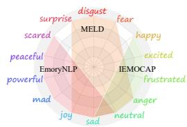  
(a) The emotion categories.

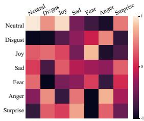  
(b) Transition scores.  
Figure 1: (a) shows that the emotion categories in three foundational datasets vary significantly in the emotion labels. (b) shows the transition scores learned on the MELD dataset.

To bridge this gap, we introduce the Unseen Emotion Recognition in Conversation (UERC) task for the first time, which aims to predict unseen emotions by leveraging prior knowledge from seen emotions in training data. To address this task, we attempt the prototype-based approaches (Chen and Li, 2021; Zhao et al., 2023; Li et al., 2024) to learn a prototype vector for each emotion, helping the model capture the distinct meaning of emotions. However, three key challenges hinder progress. Challenge 1: Implicit emotion expression. Existing methods primarily rely on the provided label descriptions to enhance prototype semantics. However, the UERC task lacks emotion descriptions, and, even more critically, many complex emotions are hard to define clearly, and relying solely on descriptive information is insufficient to obtain robust and faithful prototypes. Challenge 2: Hard utterance encoding. Due to the extensive length of conversation texts, existing ERC methods (Majumder et al., 2019; Hu et al., 2021; Zhang et al., 2023; Yang et al., 2024) typically follow two steps: encoding utterance representations first, then modeling inter-utterance features with additional relationlearning modules. However, our preliminary experiments indicate that these additional modules can lead to overfitting the training data, compromising the model’s ability to generalize to unseen emotions. Conversely, removing these modules results in losing valuable inter-utterance relations, creating a dilemma. Challenge 3: Unadapted emotion transition. It’s found that emotions exhibit a Markov property (Song et al., 2022b), whereby the current utterance’s emotion is influenced by preceding ones. As illustrated in Figure 1 (b), when the current emotion is Disgust, the transfer score for Anger in the subsequent utterance is notably highest, aligning with intuitive expectations. While the Markov property can effectively aid emotion prediction, the transfer score matrix for unseen emotions cannot be pre-learned.

To address these challenges, we propose a solid prototype-based emotion transfer framework called ProEmoTrans. Specifically, to address the implicit emotion expression challenge, we first employ a dictionary to obtain all the emotion descriptions. We then leverage the in-context learning capabilities of large language models (LLMs) to generate utterances that implicitly express these emotions, thereby enhancing the model’s comprehension of complex emotions. To address the hard utterance encoding challenge, we refrain from using additional relation-learning modules to prevent the model from overfitting to seen emotions. Instead, we propose a Gaussian Self-Attention mechanism to capture inter-utterance relations. This parameter-free mechanism obtains utterance embeddings by using linear combinations of contextual representations, effectively leveraging relation information among utterances at varying distances. To leverage the emotion transition, we propose an improved Attention Viterbi Decoding (AVD) algorithm within the Conditional Random Field (CRF) framework, enabling the capture of transition probabilities for seen emotions between all adjacent utterances. Subsequently, we extend the transition probabilities of seen emotions to unseen emotions by utilizing prototype similarity. Our contributions can be summarized as follows:

1) We propose the UERC task for the first time and introduce a novel model called ProEmoTrans2. Extensive experiments on three datasets demonstrate that this method serves as a solid baseline.

2) We leverage the prior knowledge of LLMs to generate implicit contexts that enhance complex emotion prototypes.

3) We introduce a Gaussian self-attention mechanism that effectively utilizes inter-utterance relations while avoiding overfitting to seen emotions.

4) We improve the Viterbi decoding algorithm to extend the transition probabilities of seen emotions to unseen emotions.

## 2 Related Work

## 2.1 Emotion Recognition in Conversation

ERC in a text-modality setting is an active research topic. Early RNN-based (Jiao et al., 2019; Majumder et al., 2019; Hu et al., 2021) and GCNbased (Ghosal et al., 2019; Shen et al., 2021; Zhang et al., 2023) methods tried to model the temporal features or conversational structures. Some other studies (Ghosal et al., 2020; Ong et al., 2022) have also attempted to integrate more common-sense knowledge. The latest contrastive-based methods (Hu et al., 2023; Yang et al., 2023; Yu et al., 2024) focus on using contrastive learning to distinguish semantically similar emotions. While these additional modules can effectively help the model fit the distributions of seen emotions, in the UERC setting, they can impair the model’s ability to generalize to unseen emotions.

## 2.2 Zero-shot Learning in ERC

Zero-shot Learning (ZSL) aims to train a model on one label set and then apply it to another set of previously unseen labels. Currently, research on ZSL in the ERC field is quite limited. A work that is closely related to ours is CTPT (Xu et al., 2023), which focuses on cross-task few-shot settings, while we are the first to explore the model’s ability in zero-shot predicting for unseen emotions. In the zero-shot setting, CTPT primarily improves the recognition of similar emotions across tasks but performs poorly in recognizing unseen emotions.

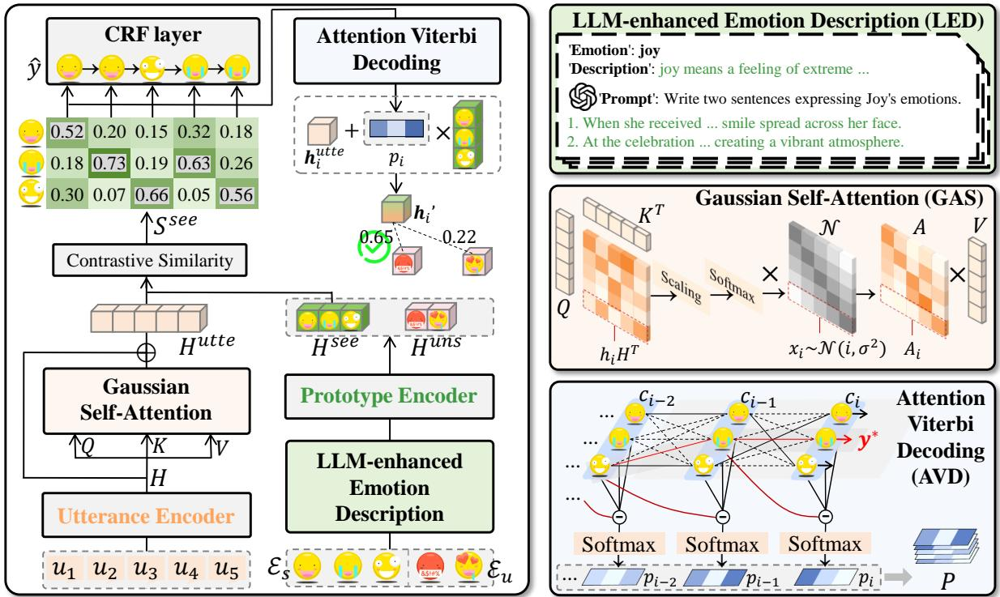  
Figure 2: The architecture of our proposed EmoTrans.

Prototype alignment (Chen and Li, 2021; Zhao et al., 2023; Li et al., 2024) is a powerful method in ZSL. It first encodes sentence and label information into a hidden vector space, then aligns sentence embeddings with label prototype embeddings using semantic matching. Through this process, the model acquires the ability to generalize label knowledge. During the inference phase, the model encodes the unseen label information and makes predictions through nearest neighbor search. In other prototype-based zero-shot NLP research fields, such as zero-shot relation extraction, Zhao et al. (2023) proposes a fine-grained semantic matching method to reduce the negative impact of irrelevant features. Li et al. (2024) enhances label prototypes by introducing more side descriptions.

## 3 Methodology

## 3.1 Task Definition

Given a conversation ${ \mathcal U } = \{ ( u _ { 1 } , t _ { 1 } ) , ( u _ { 2 } , t _ { 2 } ) , . . . ,$ $( u _ { N } , t _ { N } ) \big \}$ , where each utterance $u _ { i }$ has only one speaker $t _ { i } .$ , N is the total number of utterances. Different utterances may belong to the same speaker, so it is possible to have $t _ { i } = t _ { j } ( i \neq j )$ . The training dataset $\mathcal { D } _ { s }$ has a set of seen emotions $\mathcal { E } _ { s }$ , and the test dataset $\mathcal { D } _ { u }$ has a set of unseen emotions $\mathcal { E } _ { u }$ . There is no overlap between $\mathcal { E } _ { s }$ and $\mathcal { E } _ { u } .$ . The objective of the UERC task is to learn from $\mathcal { D } _ { s }$ and transfer the model to predict the unseen emotion label $e _ { i } ^ { u n s } \in \mathcal { E } _ { u }$ of each utterance $u _ { i }$

## 3.2 Framework of ProEmoTrans

The overall architecture of our proposed ProEmo-Trans is illustrated in Figure 2.

## 3.2.1 Emotion Prototype Encoding

Given a seen emotion word $e _ { i } ^ { s e e } \ \in \ \mathcal { E } _ { s }$ , we can find its corresponding description3 $X _ { i } ^ { d e s c }$ in the Wiktionary4. However, unlike direct descriptions, emotions in conversation are often expressed implicitly. This gap makes the prototype learned from emotional descriptions lack sufficient generalization, especially for more complex emotions (e.g., powerful).

To improve the quality of emotion prototypes, we propose the LLM-enhanced Emotion Description (LED) method. We first design a prompt template Write two sentences expressing [MASK]’s emotions. Afterward, by filling in the [MASK] position with the emotion word $e _ { i } ^ { s e e }$ and leveraging the LLM’s prompt generation capabilities, we generate sentences $\bar { X } _ { i } ^ { l \bar { l } m }$ that implicitly express that emotion. The enhanced description $X _ { i } ^ { s e e }$ is defined as the concatenation of $e _ { i } ^ { s e e } , X _ { i } ^ { d e s c }$ and $X _ { i } ^ { l l m }$

$$
X _ { i } ^ { s e e } = \{ [ C L S ] , e _ { i } ^ { s e e } , X _ { i } ^ { d e s c } , X _ { i } ^ { l l m } , [ S E P ] \} .\tag{1}
$$

We feed it into the prototype encoder to obtain the final emotion prototype $\mathbf { \Pi } _ { h _ { i } } ^ { s e e }$ :

$$
\begin{array} { r } { \pmb { h } _ { i } ^ { s e e } = E n c o d e r _ { E } ( X _ { i } ^ { s e e } ) [ 0 ] , } \end{array}\tag{2}
$$

where $h _ { i } ^ { s e e } \in \mathbb { R } ^ { d }$ is the first token (i.e., [CLS]) of the last hidden layer. Through the above process, we can encode the prototypes of each emotion word in the seen emotion set $\mathcal { E } _ { s }$ and obtain $H ^ { s e e } = ( h _ { 1 } ^ { s e e } , h _ { 2 } ^ { s e e } , . . . , h _ { n } ^ { s e e } )$ . Similarly, for the unseen emotion set $\mathcal { E } _ { u } .$ , we have $\pmb { H } ^ { u n s } \ =$ $( h _ { 1 } ^ { u n s } , h _ { 2 } ^ { u n s } , . . . , h _ { m } ^ { u n s } )$ , where n and m are the numbers of emotions in $\mathcal { E } _ { s }$ and $\mathcal { E } _ { u }$ , respectively.

## 3.2.2 Utterance Encoding

Following previous works (Hu et al., 2021; Shen et al., 2021; Zhang et al., 2023), due to the conversation text being too lengthy, we use an utterance encoder to obtain the utterance representation $h _ { i } { \mathrm { : } }$

$$
h _ { i } = E n c o d e r _ { U } ( u _ { i } ) [ 0 ] .\tag{3}
$$

The representation of all utterances is denoted as $\pmb { H } \in \bar { \mathbb { R } } ^ { N \times d }$ , where N is the number of utterances in . After that, we propose a non-parametric Gaussian Self-Attention (GSA) mechanism that effectively learns the inter-utterance relationships and alleviates overfitting to seen emotions.

Given the token $\pmb { h } _ { i } \in \pmb { H }$ , the Gaussian attention score $\mathbf { \boldsymbol { A } } _ { i } \in \mathbb { R } ^ { N }$ that attends to H is defined as:

$$
A _ { i } = S o f t m a x ( \frac { h _ { i } H ^ { T } } { d } ) { \bf { \cal N } } _ { i } ,\tag{4}
$$

where $\mathcal { N } _ { i } \in \mathbb { R } ^ { N }$ are discrete values that follow the Gaussian distribution ${ \mathcal { N } } ( i , \sigma ^ { 2 } )$ , and the variance σ is a hyperparameter. Using the Gaussian attention score, we aggregate highly relevant information from the entire conversation while reducing the impact of distant tokens. This inter-utterance relationship aggregation follows a non-parametric linear operation:

$$
\pmb { h } _ { i } ^ { u t t e } = \pmb { h } _ { i } + \pmb { A } _ { i } \pmb { H } ,\tag{5}
$$

where $h _ { i } ^ { u t t e } \in \mathbb { R } ^ { d }$ is the updated utterance representation. The final representation of all utterances is denoted as $\pmb { H } ^ { u t t e } \in \mathbb { R } ^ { N \times d }$

The GSA mechanism has two key properties: First, parameter-free. Previous supervised methods used parameterized modules (such as LSTM and GCN) to learn inter-utterance relationships. However, in unsupervised scenarios, parameterized modules led to overfitting on the training set, hindering generalization on unseen datasets (Appendix B.1). Second, distance-aware learning of inter-utterance relationships. Directly sampling discrete values from a one-dimensional Gaussian distribution based on the distance between utterances, with closer utterances receiving more attention.

## 3.2.3 Contrastive Similarity and Training

In the above sections, we obtained emotion prototypes and utterance representations. In this section, through nearest neighbor search, we can align utterances with their corresponding emotion labels. Inspired by infoNCE (Oord et al., 2018), we define a contrastive similarity to pull the utterance embeddings closer to their corresponding prototype embeddings while pushing apart the inconsistent ones. This similarity $S ^ { s e e } \in \bar { \mathbb { R } } ^ { N \times n }$ is defined as:

$$
S ^ { s e e } = S i m ( H ^ { u t t e } , H ^ { s e e } ) ,\tag{6}
$$

$$
s _ { i j } ^ { s e e } = \frac { e ^ { c o s ( { h _ { i } ^ { u t t e } , h _ { j } ^ { s e e } } ) / \tau } } { \sum _ { j = 1 } ^ { n } e ^ { c o s ( { h _ { i } ^ { u t t e } , h _ { j } ^ { s e e } } ) / \tau } } ,\tag{7}
$$

where Eq. (7) is the details of Eq. (6). cos( ) is a cosine similarity function and τ is a temperature hyperparameter. $s _ { i j } ^ { s e e }$ represents the probability of the i-th utterance expressing the $j \mathrm { - t h }$ seen emotion.

Due to the transition dependencies between emotions, independent predictions are insufficient. Therefore, we subsequently feed $S ^ { s e e }$ into a Conditional Random Field (CRF) (Lafferty et al., 2001). For a sequence of predictions: $\pmb { y } = \left( y _ { 1 } , y _ { 2 } , . . . , y _ { N } \right)$ its CRF score can be defined as:

$$
\mathcal { C } ( \pmb { y } ) = \sum _ { k = 0 } ^ { N } M _ { y _ { k } , y _ { k + 1 } } + \sum _ { k = 1 } ^ { N } S _ { k , y _ { k } } ^ { s e e } ,\tag{8}
$$

where $\boldsymbol { M } \in \mathbb { R } ^ { ( n + 2 ) \times n }$ is the transition matrix5 of the CRF layer. y0 and $y _ { N + 1 }$ are the additional start and end tags. The probability of the sequence y is a softmax over the scores of all possible sequences:

$$
p ( \pmb { y } ) = \frac { e ^ { \mathcal { C } ( \pmb { y } ) } } { \sum _ { \tilde { \pmb { y } } \in \pmb { Y } _ { \pmb { \mathcal { U } } } } e ^ { \mathcal { C } ( \tilde { \pmb { y } } ) } } ,\tag{9}
$$

where $\mathbf { Y } _ { u }$ represents all possible predicted sequences. Our training goal is to minimize the loss: $\mathcal { L } = - l o g ( p ( \widehat { \pmb { y } } ) )$ , where $\widehat { \pmb { y } }$ represents the true sequences.

## 3.2.4 Inference

The original Viterbi decoding is limited to the seen emotions, and the valuable emotion transition dependencies learned by the CRF layer cannot be adapted to unseen emotions. To address this gap, we propose the Attention Viterbi Decoding (AVD) algorithm. We define the score of the i-th utterance expressing the j-th seen emotion as:

$$
c _ { i j } = \operatorname* { m a x } _ { \tilde { \pmb { y } } \in { \pmb { Y } } _ { \pmb { \mathcal { U } } _ { [ 1 : i ] } } , \tilde { \pmb { y } } _ { k } = j } \mathcal { C } ( \tilde { \pmb { y } } ) ,\tag{10}
$$

where $c _ { 0 j } = M _ { 0 , j } . \ { \cal Y } _ { { \cal U } _ { [ 1 : i ] } }$ represents all possible tag sequences from u1 to $u _ { i }$ . The score $c _ { i j }$ represents the maximum CRF score of all possible sequences ending with $\tilde { y } _ { i } = e _ { j } ^ { s e e }$ . Based on Eq. (8), we can derive that:

$$
c _ { i j } = \operatorname* { m a x } _ { 1 < = k < = n } ( c _ { ( i - 1 ) k } + M _ { k , j } + S _ { k , j } ^ { s e e } ) .\tag{11}
$$

The time complexity of calculating a single $c _ { i j }$ is ${ \mathcal { O } } ( n )$ . The overall time complexity for traversing all $c _ { i j }$ is $\mathcal { O } ( N n ^ { 2 } )$ . During the traversal, we also record the path $\pmb { y } ^ { * } = ( y _ { 1 } ^ { * } , . . . , y _ { N } ^ { * } )$ with the maximum CRF score, such that $c _ { N y _ { N } ^ { * } } > c _ { N j } , \forall j \neq y _ { N } ^ { * }$

The final output of the AVD algorithm is a probability matrix $\pmb { \mathcal { P } } \in \mathbb { R } ^ { N \times n }$ , where each $p _ { i j } \in \mathcal { P }$ is defined as follows:

$$
p _ { i j } = \frac { c _ { i j } - c _ { ( i - 1 ) y _ { i - 1 } ^ { * } } } { \sum _ { k = 1 } ^ { n } ( c _ { i k } - c _ { ( i - 1 ) y _ { i - 1 } ^ { * } } ) } ,\tag{12}
$$

where $p _ { i j }$ denotes the probability of the k-th utterance expressing the j-th seen emotion. Then, we can enhance the original utterance representation using the seen emotion prototypes:

$$
h _ { i } ^ { \prime } = h _ { i } ^ { u t t e } + et { } { ' } \sum _ { j = 1 } ^ { n } p _ { i j } h _ { j } ^ { s e e } ,\tag{13}
$$

where $ { \boldsymbol { h } } _ { i } ^ { \prime }$ incorporates the seen emotion prototypes after considering similarity (from $S ^ { s e e } )$ and emotional dependencies (from M).

For a given $u _ { i }$ , the predicted unseen emotion label is obtained through nearest neighbor search:

$$
y _ { i } ^ { u n s } = \operatorname * { a r g m a x } _ { 1 < = j < = m } c o s ( h _ { i } ^ { \prime } , h _ { j } ^ { u n s } ) .\tag{14}
$$

## 4 Experiments Settings

## 4.1 Datasets

We evaluate our ProEmoTrans on three widely used datasets: IEMOCAP (Busso et al., 2008) is based on two actors performing a script. EmoryNLP (Zahiri and Choi, 2018) and MELD (Poria et al., 2019) contain scripts collected from the Friends TV series. We only use the text modality of these datasets and follow previous work in splitting the IEMOCAP dataset into training and validation sets. The dataset statistics are drawn in Table 1. We denote these datasets as , , and , respectively. We iterate through different source datasets to train the model and use the validation and test sets of the other two datasets as the target unseen emotion datasets. For instance, to evaluate the model trained on for its performance on test set, we select as the validation set. The statistics of the unseen emotions under different source and target settings are shown in Appendix A.1.

<table><tr><td>Dataset</td><td># Conversations train dev</td><td>test</td><td># Uterrances train dev test</td><td># Emos.</td></tr><tr><td>IEMOCAP (T)</td><td>100 20</td><td>31</td><td>4810 1000 1623</td><td>6</td></tr><tr><td>EmoryNLP (E)</td><td>659 89</td><td>79</td><td>7551 954 984</td><td>7</td></tr><tr><td>MELD (M)</td><td>1038 114</td><td>280</td><td>99891109 2610</td><td>7</td></tr></table>

Table 1: Statistics of experimental datasets.

## 4.2 Implementation Details

We utilize Bert-base-uncased (Vaswani et al., 2017) as both the utterance and prototype encoder. We use ChatGPT-3.5 to generate enhanced emotion descriptions. In each training batch, we input the emotion descriptions and the utterances into the encoders simultaneously. We use the AdamW optimizer (Kingma and Ba, 2015) with a batch size of 4 and a learning rate of 2e 5. The model is trained for 10 epochs with 100 warm-up steps. All experiments are conducted with an NVIDIA RTX 8000. The variance σ of the Gaussian distribution is set to 0.5, and the temperature τ in Eq. (7) is set to 0.02. We use the weighted-averaged F1 score as the evaluation metric, considering only unseen emotions. In each epoch, we evaluate the training model on the validation set and save the best one to test. All results are averaged across five runs with different random seeds.

## 4.3 Baselines

Due to limited research, we choose the following four types of baselines and make necessary modifications to their original architectures to achieve zero-shot prediction capability:

Feature-based models: DialogueGCN (Ghosal et al., 2019), DialogueCRN (Hu et al., 2021), and DualGAT (Zhang et al., 2023) design special GNN/RNN-based modules to extract better utterance features and use a label-wise classification head to predict the label of each utterance. They use cross-entropy loss computed from the prediction logits and the labels. To enable zero-shot prediction capability, we replace the classification head with a prototype encoder, which enables the model to learn prototype vectors. Then we substitute the original cross-entropy loss with a contrastive loss based on prototype similarity (similar to Eq. 7).

Contrastive-based models: SACL-LSTM (Hu et al., 2023), SCCL (Yang et al., 2023), and EACL (Yu et al., 2024) focus on distinguishing semantically similar emotions using contrastive learning. Since these models natively use representation similarity for prediction, no modifications are needed.

Few-shot model: CPTC (Xu et al., 2023) leverages sharable cross-task knowledge from the source task to improve few-shot performance. By removing task-specific prompts, it can also perform zeroshot prediction. Unlike in their original work, we evaluate the model only on unseen emotions. To ensure fairness, all of these comparison models use BERT-base-uncased as their backbone.

LLMs: Llama-3.1-8b (Grattafiori et al., 2024), Qwen-2.5-7b (Yang et al., 2025), GPT-4o (Bubeck et al., 2023), and DeepSeek-V3 (Liu et al., 2024) are used for zero-shot prediction. We design a unified prompt template:

Given a conversation: <INPUT>. Please analyze the emotion ofeach utterance in the conversation. The emotions are included in <LABEL SET>.

## 5 Results and Analysis

## 5.1 Main Results

The overall performance on the three datasets is reported in Table 2. We have the following observations: Our ProEmoTrans outperforms all other models by a significant margin. Compared to the best baseline DeepSeek-V3, ProEmoTrans achieved improvements in the weighted-averaged F1 score of 11.58%, 6.1%, 4.24%, 2.05%, 3.44%, and 5.88% across six different dataset settings. This demonstrates that our ProEmoTrans exhibits strong performance. The feature-based methods DialogueGCN, DialogueCRN, and DualGAT perform poorly due to their excessive parameter modules, which make them prone to overfitting on seen emotions. Few-shot model CPTC also shows inefficient recognition of unseen emotions. The contrastivebased methods SACL-LSTM, SCCL, and EACL focus on improving the distinguishability of different emotions. Learning differentiated emotional prototypes helps them perform better on the UERC task than other supervised methods. LLMs outperform other baselines with their rich prior knowledge. To investigate how our model improves performance compared to GPT-4o, we provide a more in-depth discussion in the fine-grained analysis (Section 5.5).

<table><tr><td rowspan="2">Models</td><td colspan="3">ε → I</td><td colspan="3">M → I</td></tr><tr><td>wP.</td><td>wR.</td><td>wF1.</td><td>wP.</td><td>wR.</td><td>wF1.</td></tr><tr><td>DialogueGCN DialogueCRN</td><td>6.83</td><td>4.55</td><td>5.84</td><td>5.61</td><td>3.48</td><td>4.71</td></tr><tr><td></td><td>7.48</td><td>6.48</td><td>6.51</td><td>7.08</td><td>5.16</td><td>6.44</td></tr><tr><td>DualGAT</td><td>9.08</td><td>5.58</td><td>7.49</td><td>7.11</td><td>5.14</td><td>6.12</td></tr><tr><td>CPTC</td><td>17.10</td><td>10.82</td><td>14.58</td><td>13.93</td><td>10.14</td><td>11.13</td></tr><tr><td>SACL-LSTM</td><td>33.0524.50</td><td></td><td>20.55</td><td>36.39</td><td>19.25</td><td>19.90</td></tr><tr><td>SCCL</td><td></td><td>33.07 24.56</td><td>21.21</td><td>36.11 18.46</td><td></td><td>19.59</td></tr><tr><td>EACL</td><td></td><td>36.10 27.42</td><td>23.89</td><td>37.0019.53</td><td></td><td>20.79</td></tr><tr><td>Llama-3.1-8b</td><td></td><td>38.17 20.30</td><td>23.63</td><td>44.33 30.61</td><td></td><td>24.79</td></tr><tr><td>Qwen-2.5-7b</td><td>39.34 21.58</td><td></td><td>24.20</td><td>45.1531.37</td><td></td><td>25.66</td></tr><tr><td>GPT-40</td><td>41.2727.42</td><td></td><td>24.88</td><td>45.3931.73</td><td></td><td>26.10</td></tr><tr><td>DeepSeek-V3</td><td>42.55</td><td>27.69</td><td>25.69</td><td>46.3832.05</td><td></td><td>26.26</td></tr><tr><td>ProEmoTrans (Ours)</td><td>47.80 32.95</td><td></td><td>37.27</td><td>47.11 30.9032.36</td><td></td><td></td></tr></table>

<table><tr><td rowspan="2">Models</td><td colspan="3">I → ε</td><td colspan="3">M → ε</td></tr><tr><td>wP.</td><td>wR.</td><td>wF1.</td><td>wP.</td><td>wR.</td><td>wF1.</td></tr><tr><td>DialogueGCN</td><td>7.12</td><td>2.54</td><td>2.94</td><td>6.19</td><td>1.34</td><td>1.74</td></tr><tr><td>DialogueCRN</td><td>4.32</td><td>3.27</td><td>3.29</td><td>5.52</td><td>1.23</td><td>2.09</td></tr><tr><td>DualGAT</td><td>9.53</td><td>3.92</td><td>4.35</td><td>3.71</td><td>1.26</td><td>1.96</td></tr><tr><td>CPTC</td><td>7.06</td><td>4.19</td><td>5.16</td><td>3.94</td><td>1.37</td><td>2.41</td></tr><tr><td>SACL-LSTM</td><td>15.52</td><td>16.49</td><td>15.34</td><td>14.25</td><td>8.85</td><td>10.07</td></tr><tr><td>SCCL</td><td>14.29</td><td>15.44</td><td>14.71</td><td>15.00</td><td>9.67</td><td>11.31</td></tr><tr><td>EACL</td><td>17.48</td><td>18.01</td><td>17.36</td><td>16.36</td><td>9.74</td><td>12.39</td></tr><tr><td>Llama-3.1-8b</td><td>31.32</td><td>22.18</td><td>24.10</td><td>20.11</td><td>16.83</td><td>16.42</td></tr><tr><td>Qwen-2.5-7b</td><td>31.08</td><td>22.47</td><td>24.05</td><td>21.17</td><td>16.71</td><td>17.09</td></tr><tr><td>GPT-40</td><td>31.14 21.61</td><td></td><td>24.51</td><td>20.71</td><td>16.32</td><td>18.25</td></tr><tr><td>DeepSeek-V3</td><td>31.01</td><td>23.27</td><td>24.10</td><td>22.91</td><td>16.27</td><td>18.68</td></tr><tr><td>ProEmoTrans (Ours)</td><td>31.36 27.67</td><td></td><td></td><td>28.34 24.98 19.07 20.73</td><td></td><td></td></tr></table>

<table><tr><td rowspan="2">Models</td><td colspan="3">I → M</td><td colspan="3">ε → M</td></tr><tr><td>wP.</td><td>wR.</td><td>wF1.</td><td>wP.</td><td>wR.</td><td>wF1.</td></tr><tr><td>DialogueGCN</td><td>5.76</td><td>3.12</td><td>4.44</td><td>5.42</td><td>1.99</td><td>2.67</td></tr><tr><td>DialogueCRN</td><td>7.46</td><td>4.00</td><td>5.13</td><td>6.93</td><td>3.15</td><td>3.95</td></tr><tr><td>DualGAT</td><td>8.20</td><td>4.12</td><td>5.07</td><td>6.23</td><td>2.08</td><td>2.94</td></tr><tr><td>CPTC</td><td>19.51</td><td>5.65</td><td>8.13</td><td>13.69</td><td>4.30</td><td>6.40</td></tr><tr><td>SACL-LSTM</td><td>31.60</td><td>19.29</td><td>25.60</td><td>29.55</td><td>22.28</td><td>25.48</td></tr><tr><td>SCCL</td><td>31.05</td><td>19.39</td><td>25.14</td><td>28.81 21.02</td><td></td><td>24.32</td></tr><tr><td>EACL</td><td>33.32</td><td>20.27</td><td>26.29</td><td>31.58</td><td>23.52</td><td>26.95</td></tr><tr><td>Llama-3.1-8b</td><td>31.08</td><td>22.47</td><td>24.05</td><td>32.81 25.36</td><td></td><td>27.73</td></tr><tr><td>Qwen-2.5-7b</td><td>30.5043.80</td><td></td><td>35.12</td><td>34.72 26.96</td><td></td><td>29.76</td></tr><tr><td>GPT-40</td><td>29.90 45.65</td><td></td><td>35.28</td><td>34.85</td><td>25.74</td><td>29.35</td></tr><tr><td>DeepSeek-V3</td><td>31.85</td><td>44.67</td><td>35.15</td><td>34.76</td><td>27.19</td><td>29.76</td></tr><tr><td>ProEmoTrans (Ours)</td><td>35.74 45.32</td><td></td><td>38.59</td><td>36.30 36.02</td><td></td><td>35.64</td></tr></table>

Table 2: The overall performance of all the compared baselines and our ProEmoTrans on benchmark datasets. Here wP., wR., and wF1. denote weighted-averaged precision, recall, and F1 score.

## 5.2 Ablation Study

We conduct ablation studies to investigate the effectiveness of the key components in our method. The results are shown in Table 3.

-w/o LED denotes removing the LED module and directly using dictionary definitions as its description. It is evident that removing the LED results in a significant 14.3% drop in the model’s average wF1 score, highlighting the importance of descriptive information in enhancing emotion representation. In the original model, we use two descriptions (2 Desc.) to help the model fully capture the emotional semantics. To investigate the impact of the number of generated descriptions, we conduct experiments comparing the model’s performance with different numbers of descriptions. As shown in Table 3, with one description (-w 1 Desc.), the average wF1 increases by 2.82% compared to no Desp. However, it still shows an 11.48% drop compared to the original 2 Desc.. With three descriptions (-w 3 Desc.), the average wF1 only slightly increases by 0.33%. This indicates that 2 Desc. are sufficient for the model to fully capture the semantic meaning.

<table><tr><td>Models</td><td colspan="7"> $\overline { { \varepsilon \to \tau } }$   $\overline { { \mathcal { M } \to \mathcal { Z } } }$   $\overline { { \boldsymbol { \tau } \to \boldsymbol { \varepsilon } } }$  M → ε  $\overline { { \mathcal { Z } \to \mathcal { M } } }$   $\overline { { \varepsilon \to \mathcal { M } } }$ </td></tr><tr><td>Proposed ProEmoTrans</td><td>37.27</td><td>32.36</td><td>28.34</td><td>20.73</td><td>38.59</td><td>35.64</td><td>Average 32.16</td></tr><tr><td>- w/o LED</td><td>27.68</td><td>7.28</td><td>24.06</td><td>6.31</td><td>22.59</td><td>19.22</td><td>17.86 (14.30↓)</td></tr><tr><td>- w 1 Desc.</td><td>30.46</td><td>9.90</td><td>25.06</td><td>8.74</td><td>24.68</td><td>25.26</td><td>20.68 (11.48↓)</td></tr><tr><td>- w 3 Desc.</td><td>37.56</td><td>33.03</td><td>28.39</td><td>21.22</td><td>37.89</td><td>36.82</td><td> $3 2 . 4 9 ( \mathbf { 0 } . 3 3 ^ { \uparrow } )$ </td></tr><tr><td>- w/o GSA</td><td>36.89</td><td>31.40</td><td>27.00</td><td>19.37</td><td>37.68</td><td>34.26</td><td> $\overline { { 3 1 . 1 0 \left( 1 . 0 6 ^ { \circ } \right) } }$ </td></tr><tr><td>- w SA</td><td>36.27</td><td>30.78</td><td>26.47</td><td>19.82</td><td>37.01</td><td>33.45</td><td> $3 0 . 6 3 ( 1 . 5 3 ^ { \downarrow } )$ </td></tr><tr><td>- w/o CRF</td><td>31.22</td><td>19.20</td><td>18.29</td><td>16.59</td><td>33.82</td><td>32.27</td><td> $\overline { { 2 5 . 2 3 \ : ( 6 . 9 3 ^ { \downarrow } ) } }$ </td></tr></table>

Table 3: Ablation and comparison results for key components. Here 1 Desp. and 3 Desp. denote the number of generated descriptions in LED. SA denotes replacing GSA with the original self-attention mechanism.

-w/o GSA denotes removing the GSA mechanism and directly using H from Eq. (3) as the final utterance representations. This led to a decrease of 1.06% in the average wF1, demonstrating the positive role of the GSA mechanism in enhancing utterance representations. Since the GSA mechanism benefits from aggregating highly relevant information while reducing the negative impact of distant utterances, we further compare it with using the self-attention mechanism (SA) alone. The results show that the performance drops by 1.53%, and it even performs 0.47% worse than when no mechanism was used (-w/o GSA). This demonstrates that directly using SA for utterance representation learning has a detrimental effect, with the negative impact stemming from distant noise.

-w/o CRF denotes removing the CRF layer and the AVD algorithm, and during the inference phase, it directly uses $h _ { i } ^ { s e e }$ and $h _ { j } ^ { u n s }$ for nearest neighbor search as specified in Eq. (14). The results show a decrease of 6.93% in average wF1, which demonstrates that the AVD algorithm, by leveraging the emotion transition dependencies learned by the CRF layer, plays a crucial role in enhancing the model’s performance.

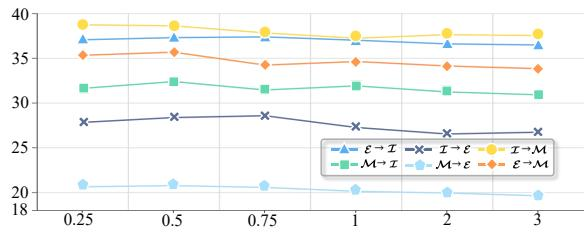  
Figure 3: Effects of σ.

<table><tr><td>Model</td><td>Performance</td><td>Inference Costs</td></tr><tr><td>bert-base-uncased</td><td>32.16</td><td>6.21 /ms</td></tr><tr><td>roberta-base</td><td>33.02</td><td>6.34 /ms</td></tr><tr><td>bert-large-uncased</td><td>34.48</td><td>9.12 /ms</td></tr><tr><td>roberta-large</td><td>34.83</td><td>9.26 /ms</td></tr></table>

Table 4: Performance (wF1.) and computation cost (/ms) with different language models

## 5.3 Hyperparameter Sensitivity

The variance σ in the GSA mechanism controls the attention range. To study the impact of σ on performance, we conducted a sensitivity analysis, as shown in Figure 3. It can be observed that the best performance is achieved when σ is set to 0.5. As σ increases, the performance gradually decreases and converges. In fact, as σ grows, the Gaussian Self-Attention mechanism gradually degenerates into a standard self-attention mechanism.

## 5.4 Average Performance and Computation Cost with Different Language Models

To investigate the effect of using different pretrained language models and the corresponding computation costs, we conduct experiments and record the average performance and inference costs in Table 4. Using roberta-base (Liu et al., 2019) improves the model’s average performance by 0.86%. With the larger versions, Bert and Roberta improve the model’s average performance by 2.32% and

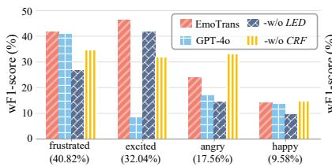  
(a) E  I

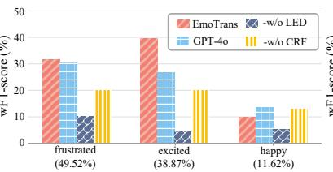  
(b) M  I

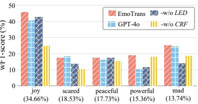  
(c) I  E

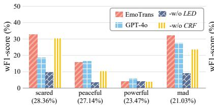  
(d)

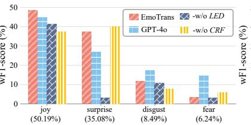  
(e) I → M

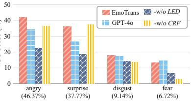  
(f) E → M  
Figure 4: Fine-grained analysis of different methods, with the proportion of unseen emotions also presented.

1.81%, respectively. However, the average inference time per sample increases by 2.91 ms and 2.92 ms, respectively.

## 5.5 Fine-grained Analysis

As shown in Figure 4, we conduct an experiment to demonstrate the fine-grained performance of different methods. Comparing the performance of ProEmoTrans and GPT-4o, we can observe that ProEmoTrans performs better in most unseen emotions. However, as the emotion proportion decreases, ProEmoTrans shows a more noticeable decline in performance. We believe this is due to GPT-4o relying on prior knowledge, while ProEmoTrans depends on the quality of prototype-based representation learning, which makes it more sensitive to the distribution of categories.

Removing the LED (-w/o LED) causes a performance drop across all unseen emotions, to varying degrees, highlighting the LED’s comprehensive contribution. Similarly, removing the CRF (-w/o CRF) also leads to a nearly overall performance decline, but in some cases, it improves performance. For example, in subplot (f), it leads to a 2.45% increase for surprise. This suggests that while the CRF layer optimizes global performance, it may not be ideal for certain local categories.

## 5.6 Visualization

To provide more interpretability, we visualize the embedding space of utterances and unseen emotions on $\varepsilon  \tau$ datasets using t-SNE (Van der Maaten and Hinton, 2008), as shown in Figure 5. First, we find that positive emotions (excited and happy) are farther apart from negative emotions (frustrated and angry), while emotions of the same polarity are closer to each other, which aligns with our intuition. Next, comparing subfigures (a) and (b), we can see that adding the CRF layer enhances the distinguishability of utterance and emotion embeddings, demonstrating the positive impact of the CRF layer and AVD algorithms in our method.

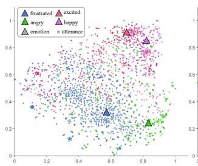

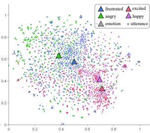  
(a) Proposed ProEmoTrans  
(b) -w/o CRF

Figure 5: t-SNE visualization of utterance and emotion embeddings in datasets.  
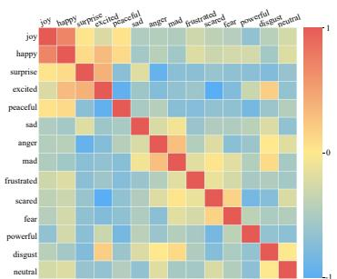  
Figure 6: Heatmap of emotion prototype similarities.

We also collect all the emotion prototype embeddings and compute their cosine similarities. The resulting heatmap is shown in Figure 6. It can be observed that, first, the cosine similarity is higher between similar emotions (e.g., happy and joy). Second, there is a more pronounced difference in similarity between positive and negative emotions.

<table><tr><td>Models</td><td> $\overline { { \varepsilon \to \tau } }$ </td><td> $\overline { { \mathcal { M } \to \mathcal { Z } } }$ </td><td> $\overline { { \mathcal { Z } \to \mathcal { E } } }$ </td><td> $\overline { { \mathcal { M } \to \mathcal { E } } }$ </td><td> $\overline { { \boldsymbol { \mathscr { I } }  \mathcal { M } } }$ </td><td> $\overline { { \varepsilon \to \mathcal { M } } }$ </td><td>Average</td></tr><tr><td>Contrastive Similarity (Ours)</td><td>37.27</td><td>32.36</td><td>28.34</td><td>20.73</td><td>38.59</td><td>35.64</td><td>32.16</td></tr><tr><td>- w Euclidean distances</td><td>35.12</td><td>30.03</td><td>27.23</td><td>18.89</td><td>37.77</td><td>34.07</td><td>30.52</td></tr><tr><td>- w Cosine similarity</td><td>36.45</td><td>31.91</td><td>27.67</td><td>20.10</td><td>37.85</td><td>34.98</td><td>31.49</td></tr><tr><td>- w Dot Product</td><td>35.78</td><td>30.56</td><td>27.34</td><td>19.52</td><td>36.29</td><td>34.27</td><td>30.63</td></tr></table>

Table 5: The results of comparing contrastive similarity with other similarity metrics.

<table><tr><td>Models</td><td>ε</td><td>T</td><td>M</td></tr><tr><td>KET</td><td>13.12</td><td>16.46</td><td>8.97</td></tr><tr><td>TUCORE-GCN</td><td>13.11</td><td>15.27</td><td>25.96</td></tr><tr><td>EmotionFlow</td><td>14.65</td><td>16.99</td><td>29.34</td></tr><tr><td>SPCL</td><td>14.99</td><td>18.73</td><td>29.41</td></tr><tr><td>CTPT</td><td>20.57</td><td>31.82</td><td>31.28</td></tr><tr><td>ProEmoTrans (Ours)</td><td>22.46</td><td>33.20</td><td>33.29</td></tr></table>

Table 6: Performance of different ERC datasets under the few-shot settings (16-shot). All the baseline results are retrieved from Xu et al. (2023). We bolded the best result and underline the second best.

## 5.7 More Additional Experiments

## 5.8 Analysis on Contrastive Similarity

The contrastive similarity (Oord et al., 2018) can effectively measure the difference between two embeddings. To validate its effectiveness, we conducted experiments comparing it with other similarity metrics. The results are shown in Table 5. When using Euclidean distance, cosine similarity, and dot product, the model’s performance decreased by 1.64%, 0.67%, and 1.53%, respectively, which proves the effectiveness of contrastive similarity.

## 5.8.1 Few-shot Performance

Our model can also be used for few-shot prediction without any modifications. To investigate the performance of our model in the few-shot setting, we conducted experiments as shown in Table 6. To ensure a fair comparison with the baselines, we follow the 16-shot setting and use weighted macro-F1 as the evaluation metric. The applied baselines include: KEY (Zhong et al., 2019) addresses ERC tasks by utilizing external knowledge bases. TUCORE-GCN (Lee and Choi, 2021) and EmotionFlow (Song et al., 2022b) are GCN-based and RNN-based ERC model, respectivly. SPCL (Song et al., 2022a) uses supervised contrastive learning to address the class imbalance problem in ERC. CTPT (Xu et al., 2023) is introduced in Section 4.3. According to the results, our ProEmoTrans outperforms the best baseline, CTPT, by 1.89%, 1.38%, and 2.01% on the three datasets, respectively. This demonstrates that our model also performs excellently in the few-shot setting.

## 6 Conclusion

In this paper, we propose a simple and effective method named ProEmoTrans for the newly proposed UERC task. First, we introduce an LLMenhanced Emotion Description module to enhance emotion prototype learning. Next, a parameter-free Gaussian Self-Attention mechanism is designed to aggregate useful information from the conversation while filtering out noise. This mechanism can learn inter-utterance relations and prevent overfitting that could arise from parameter training. Finally, we propose an Attention Viterbi Decoding algorithm to transfer the useful seen emotion dependencies learned during training to unseen emotions. Extensive experiments on three datasets validate the effectiveness of our approach and the individual modules we designed. In future work, our goal is to further optimize prototype representations.

## 7 Limitations

Our LLM prompt templates rely on manual design, and their effectiveness has not been verified with more complex emotions. Developing automated prompt-tuning templates would be an interesting avenue for exploration. Additionally, our approach focuses solely on the text modality and does not incorporate multi-modal information, such as facial expressions, which could provide valuable additional information.

## 8 Acknowledgments

This research is supported by the National Key R&D Program of China (No. 2023YFC3303800), NSFC through grants 62322202, 62441612 and 62476163, Beijing Natural Science Foundation through grant L253021, Local Science and Technology Development Fund of Hebei Province Guided by the Central Government of China through grants 246Z0102G and 254Z9902G, the “Pionee” and “Leading Goose” R&D Program of Zhejiang through grant 2025C02044, Hebei Natural Science Foundation through grant F2024210008, and the Guangdong Basic and Applied Basic Research Foundation through grant 2023B1515120020.

## References

Sébastien Bubeck, Varun Chadrasekaran, Ronen Eldan, Johannes Gehrke, Eric Horvitz, Ece Kamar, Peter Lee, Yin Tat Lee, Yuanzhi Li, Scott Lundberg, et al. 2023. Sparks of artificial general intelligence: Early experiments with gpt-4.

Carlos Busso, Murtaza Bulut, Chi-Chun Lee, Abe Kazemzadeh, Emily Mower, Samuel Kim, Jeannette N Chang, Sungbok Lee, and Shrikanth S Narayanan. 2008. Iemocap: Interactive emotional dyadic motion capture database. Language resources and evaluation, 42:335–359.

Chih-Yao Chen and Cheng-Te Li. 2021. ZS-BERT: Towards zero-shot relation extraction with attribute representation learning. In Proceedings of the 2021 Conference of the North American Chapter of the Associationfor Computational Linguistics: Human Language Technologies, pages 3470–3479, Online. Association for Computational Linguistics.

Alan S Cowen and Dacher Keltner. 2017. Self-report captures 27 distinct categories of emotion bridged by continuous gradients. Proceedings of the national academy ofsciences, 114(38):E7900–E7909.

Paul Ekman. 1999. Basic Emotions, chapter 3. John Wiley and Sons, Ltd.

Deepanway Ghosal, Navonil Majumder, Alexander Gelbukh, Rada Mihalcea, and Soujanya Poria. 2020. COSMIC: COmmonSense knowledge for eMotion identification in conversations. In Findings of the Associationfor Computational Linguistics: EMNLP 2020, pages 2470–2481, Online.

Deepanway Ghosal, Navonil Majumder, Soujanya Poria, Niyati Chhaya, and Alexander Gelbukh. 2019. DialogueGCN: A graph convolutional neural network for emotion recognition in conversation. In Proceedings ofthe 2019 Conference on Empirical Methods in Natural Language Processing and the 9th International Joint Conference on Natural Language Processing (EMNLP-IJCNLP), pages 154–164, Hong Kong, China.

Aaron Grattafiori, Abhimanyu Dubey, Abhinav Jauhri, Abhinav Pandey, Abhishek Kadian, Ahmad Al-Dahle, Aiesha Letman, Akhil Mathur, Alan Schelten, Alex Vaughan, et al. 2024. The llama 3 herd of models. arXiv preprint arXiv:2407.21783.

Dou Hu, Yinan Bao, Lingwei Wei, Wei Zhou, and Songlin Hu. 2023. Supervised adversarial contrastive learning for emotion recognition in conversations. In Proceedings of the 61st Annual Meeting of the Associationfor Computational Linguistics (Volume 1: Long Papers), pages 10835–10852, Toronto, Canada. Association for Computational Linguistics.

Dou Hu, Lingwei Wei, and Xiaoyong Huai. 2021. DialogueCRN: Contextual reasoning networks for emotion recognition in conversations. In Proceedings of the 59th Annual Meeting of the Association for

Computational Linguistics and the 11th International Joint Conference on Natural Language Processing (Volume 1: Long Papers), pages 7042–7052, Online. Association for Computational Linguistics.

Wenxiang Jiao, Haiqin Yang, Irwin King, and Michael R. Lyu. 2019. HiGRU: Hierarchical gated recurrent units for utterance-level emotion recognition. In Proceedings ofthe 2019 Conference ofthe North American Chapter ofthe Association for Computational Linguistics: Human Language Technologies, Volume 1 (Long and Short Papers), pages 397–406, Minneapolis, Minnesota.

Diederik P. Kingma and Jimmy Ba. 2015. Adam: A method for stochastic optimization. In 3rd International Conference on Learning Representations, ICLR 2015, San Diego, CA, USA, May 7-9, 2015, Conference Track Proceedings.

John Lafferty, Andrew McCallum, Fernando Pereira, et al. 2001. Conditional random fields: Probabilistic models for segmenting and labeling sequence data. In Icml, volume 1, page 3. Williamstown, MA.

Bongseok Lee and Yong Suk Choi. 2021. Graph based network with contextualized representations of turns in dialogue. In Proceedings ofthe 2021 Conference on Empirical Methods in Natural Language Processing, pages 443–455, Online and Punta Cana, Dominican Republic. Association for Computational Linguistics.

Bobo Li, Hao Fei, Fei Li, Yuhan Wu, Jinsong Zhang, Shengqiong Wu, Jingye Li, Yijiang Liu, Lizi Liao, Tat-Seng Chua, and Donghong Ji. 2023. DiaASQ: A benchmark of conversational aspect-based sentiment quadruple analysis. In Findings of the Association for Computational Linguistics: ACL 2023, pages 13449–13467, Toronto, Canada. Association for Computational Linguistics.

Zehan Li, Fu Zhang, and Jingwei Cheng. 2024. AlignRE: An encoding and semantic alignment approach for zero-shot relation extraction. In Findings ofthe Associationfor Computational Linguistics ACL 2024, pages 2957–2966, Bangkok, Thailand and virtual meeting.

Aixin Liu, Bei Feng, Bing Xue, Bingxuan Wang, Bochao Wu, Chengda Lu, Chenggang Zhao, Chengqi Deng, Chenyu Zhang, Chong Ruan, et al. 2024. Deepseek-v3 technical report. arXiv preprint arXiv:2412.19437.

Yinhan Liu, Myle Ott, Naman Goyal, Jingfei Du, Mandar Joshi, Danqi Chen, Omer Levy, Mike Lewis, Luke Zettlemoyer, and Veselin Stoyanov. 2019. Roberta: A robustly optimized BERT pretraining approach. CoRR, abs/1907.11692.

Navonil Majumder, Soujanya Poria, Devamanyu Hazarika, Rada Mihalcea, Alexander Gelbukh, and Erik Cambria. 2019. Dialoguernn: An attentive rnn for emotion detection in conversations. In Proceedings of the AAAI conference on artificial intelligence, volume 33, pages 6818–6825.

Donovan Ong, Jian Su, Bin Chen, Anh Tuan Luu, Ashok Narendranath, Yue Li, Shuqi Sun, Yingzhan Lin, and Haifeng Wang. 2022. Is discourse role important for emotion recognition in conversation? In Proceedings of the AAAI Conference on Artificial Intelligence, volume 36, pages 11121–11129.

Aaron van den Oord, Yazhe Li, and Oriol Vinyals. 2018. Representation learning with contrastive predictive coding. arXiv preprint arXiv:1807.03748.

Wei Peng, Yue Hu, Luxi Xing, Yuqiang Xie, Yajing Sun, and Yunpeng Li. 2022. Control globally, understand locally: A global-to-local hierarchical graph network for emotional support conversation. In Proceedings ofthe Thirty-First International Joint Conference on Artificial Intelligence, IJCAI-22, pages 4324–4330. International Joint Conferences on Artificial Intelligence Organization. Main Track.

Robert Plutchik and Henry Kellerman. 2013. Theories ofemotion, volume 1. Academic press.

Soujanya Poria, Devamanyu Hazarika, Navonil Majumder, Gautam Naik, Erik Cambria, and Rada Mihalcea. 2019. MELD: A multimodal multi-party dataset for emotion recognition in conversations. In Proceedings of the 57th Annual Meeting of the Associationfor Computational Linguistics, pages 527– 536, Florence, Italy. Association for Computational Linguistics.

Weizhou Shen, Siyue Wu, Yunyi Yang, and Xiaojun Quan. 2021. Directed acyclic graph network for conversational emotion recognition. In Proceedings of the 59th Annual Meeting of the Association for Computational Linguistics and the 11th International Joint Conference on Natural Language Processing (Volume 1: Long Papers), pages 1551–1560, Online.

Xiaohui Song, Longtao Huang, Hui Xue, and Songlin Hu. 2022a. Supervised prototypical contrastive learning for emotion recognition in conversation. In Proceedings ofthe 2022 Conference on Empirical Methods in Natural Language Processing, pages 5197– 5206, Abu Dhabi, United Arab Emirates. Association for Computational Linguistics.

Xiaohui Song, Liangjun Zang, Rong Zhang, Songlin Hu, and Longtao Huang. 2022b. Emotionflow: Capture the dialogue level emotion transitions. In IEEE International Conference on Acoustics, Speech and Signal Processing, ICASSP 2022, Virtual and Singapore, 23-27 May 2022, pages 8542–8546. IEEE.

Laurens Van der Maaten and Geoffrey Hinton. 2008. Visualizing data using t-sne. Journal of machine learning research, 9(11).

Ashish Vaswani, Noam Shazeer, Niki Parmar, Jakob Uszkoreit, Llion Jones, Aidan N. Gomez, Lukasz Kaiser, and Illia Polosukhin. 2017. Attention is all you need. In Advances in Neural Information Processing Systems 30: Annual Conference on Neural Information Processing Systems 2017, December 4-9, 2017, Long Beach, CA, USA, pages 5998–6008.

Yige Xu, Zhiwei Zeng, and Zhiqi Shen. 2023. Efficient cross-task prompt tuning for few-shot conversational emotion recognition. In Findings ofthe Association for Computational Linguistics: EMNLP 2023, pages 11654–11666, Singapore.

An Yang, Bowen Yu, Chengyuan Li, Dayiheng Liu, Fei Huang, Haoyan Huang, Jiandong Jiang, Jianhong Tu, Jianwei Zhang, Jingren Zhou, et al. 2025. Qwen2.5-1m technical report. arXiv preprint arXiv:2501.15383.

Kailai Yang, Tianlin Zhang, Hassan Alhuzali, and Sophia Ananiadou. 2023. Cluster-level contrastive learning for emotion recognition in conversations. IEEE Transactions on Affective Computing, 14(4):3269–3280.

Zhenyu Yang, Xiaoyang Li, Yuhu Cheng, Tong Zhang, and Xuesong Wang. 2024. Emotion recognition in conversation based on a dynamic complementary graph convolutional network. IEEE Transactions on Affective Computing, 15(3):1567–1579.

Fangxu Yu, Junjie Guo, Zhen Wu, and Xinyu Dai. 2024. Emotion-anchored contrastive learning framework for emotion recognition in conversation. In Findings of the Association for Computational Linguistics: NAACL 2024, pages 4521–4534, Mexico City, Mexico. Association for Computational Linguistics.

Sayyed M Zahiri and Jinho D Choi. 2018. Emotion detection on tv show transcripts with sequence-based convolutional neural networks. In Workshops at the thirty-second aaai conference on artificial intelligence.

Duzhen Zhang, Feilong Chen, and Xiuyi Chen. 2023. DualGATs: Dual graph attention networks for emotion recognition in conversations. In Proceedings of the 61st Annual Meeting of the Association for Computational Linguistics (Volume 1: Long Papers), pages 7395–7408, Toronto, Canada.

Jun Zhao, WenYu Zhan, Xin Zhao, Qi Zhang, Tao Gui, Zhongyu Wei, Junzhe Wang, Minlong Peng, and Mingming Sun. 2023. RE-matching: A fine-grained semantic matching method for zero-shot relation extraction. In Proceedings of the 61st Annual Meeting ofACL (Volume 1: Long Papers), pages 6680–6691, Toronto, Canada.

Peixiang Zhong, Di Wang, and Chunyan Miao. 2019. Knowledge-enriched transformer for emotion detection in textual conversations. In Proceedings of the 2019 Conference on EMNLP and the 9th IJC-NLP (EMNLP-IJCNLP), pages 165–176, Hong Kong, China. Association for Computational Linguistics.

## A More Details of Experiments Settings

## A.1 Datasets

<table><tr><td rowspan="2">Source</td><td colspan="3">Target</td></tr><tr><td>T</td><td>ε</td><td>M</td></tr><tr><td>I</td><td>1</td><td>po, pe, sc, jo, ma</td><td> $s u , d i , f e , j o$ </td></tr><tr><td>ε</td><td>ex, fr, ha, an</td><td>1</td><td>su, di, fe, an</td></tr><tr><td>M</td><td>ex, fr, ha</td><td>po, pe, sc, ma</td><td></td></tr></table>

Table 7: Statistics of unseen emotions under different source and target settings. We use the first two letters to denote the emotions in Table 1, for example, po stands for powerful.

The statistics of the unseen emotions under different source and target settings are shown in Table 7. For example, if we chose as source dataset and as target dataset, the unseen emotions are powerful, peaceful, scared, joy, and mad.

## A.2 Baselines

The details of baselines are as follows:

• DialogueGCN (Ghosal et al., 2019) uses a GCN to model the inter-utterance dependency.

• DialogueCRN (Hu et al., 2021) is one of the best RNN-based ERC models. They design multiple rounds of reasoning modules to extract and integrate emotional cues.

• DualGAT (Zhang et al., 2023) introduces a Dual Graph Attention Network to capture complex dependencies of discourse structure and speakeraware context.

• SACL-LSTM (Hu et al., 2023) proposes a supervised adversarial contrastive learning method for learning class-spread structured representations.

• SCCL (Yang et al., 2023) proposes a supervised cluster-level contrastive learning method to incorporate measurable emotion prototypes.

• EACL (Yu et al., 2024) proposes an emotionanchored contrastive learning framework, which generates more distinguishable utterance representations for similar emotions.

• CPTC (Xu et al., 2023) leverages sharable crosstask knowledge from the source task to improve few-shot performance.

We made the necessary modifications for each baseline to enable zero-shot prediction.

## B More Additional Experiments

## B.1 Results with Parameterized Modules

In supervised settings, previous methods have designed various parameterized modules to help learn better utterance representations. In the zero-shot setting, to validate their effectiveness, we conduct comparative experiments by replacing the Gaussian Self-Attention module in our model with LSTM, GCN, and GAT. The experimental results are shown in Table 8. It can be observed that the performance is quite weak, which proves that overfitting due to the parameter module severely hinders the generalization performance.

## B.2 Utterance-level Performance

We conducted a comparative experiment on zeroshot ERC at the utterance level, with results shown in Table 9, where -w utterance-level refers to applying LLM baselines to prompt each individual utterance. Our experiments uncovered some intriguing findings: On the longer dialogue dataset (IEMOCAP, avg. length 52), utterance-level classification significantly outperformed the original conversation-level approach. We believe that excessively long conversations hinder LLM’s emotional analysis capability by overwhelming context processing. On the other two datasets (avg. lengths 12 and 9), utterance-level performance was slightly lower than conversation-level. We attribute this to the loss of contextual information, which poses challenges for utterances with ambiguous emotional cues or those that are very brief. For example, the utterance "That only took me an hour." was misclassified as joy at the utterance level, but correctly classified as sad at the conversation level when the broader topic (divorce) was considered. Crucially, our method consistently maintains an advantage across different conversation lengths, despite the observed variations in zero-shot LLM classification performance.

## C Details of LED Generated Descriptions

To eliminate biases introduced by the quality of generated descriptions, we regenerate new descriptions in each of the five random runs. The emotion descriptions generated using the LED module in one of the five runs are shown in Table 10.

<table><tr><td>Models</td><td colspan="6">ε → I M → I I → E M → ε</td><td>I → M ε → M Average</td></tr><tr><td>Proposed ProEmoTrans</td><td>37.27</td><td>32.36</td><td>28.34</td><td>20.73</td><td>38.59</td><td>35.64</td><td>32.16</td></tr><tr><td>-w LSTM</td><td>9.37</td><td>8.82</td><td>7.74</td><td>6.04</td><td>7.70</td><td>6.78</td><td>7.74</td></tr><tr><td>-w GCN</td><td>8.42</td><td>8.10</td><td>6.47</td><td>5.19</td><td>7.63</td><td>5.97</td><td>6.96</td></tr><tr><td>-w GAT</td><td>7.57</td><td>8.93</td><td>6.19</td><td>5.65</td><td>7.11</td><td>6.08</td><td>6.92</td></tr></table>

Table 8: Comparative experiments by replacing the GSA module with LSTM, GCN, and GAT.

<table><tr><td>Models</td><td colspan="7">ε →I M →I I → ε M → E T → M ε → M Average</td></tr><tr><td>Proposed ProEmoTrans</td><td>37.27</td><td>32.36</td><td>28.34</td><td>20.73</td><td>38.59</td><td>35.64</td><td>32.16</td></tr><tr><td>DeepSeek-V3</td><td>25.69</td><td>26.26</td><td>24.10</td><td>18.68</td><td>35.15</td><td>29.76</td><td>26.61 (5.55↓)</td></tr><tr><td>-w utterance-level</td><td>30.06</td><td>31.52</td><td>23.27</td><td>19.04</td><td>34.86</td><td>29.45</td><td>28.03 (4.13↓)</td></tr><tr><td>GPT-40</td><td>24.88</td><td>26.10</td><td>24.51</td><td>18.25</td><td>35.28</td><td>29.35</td><td>26.40 (5.76↓)</td></tr><tr><td>-w utterance-level</td><td>30.24</td><td>31.25</td><td>24.22</td><td>18.48</td><td>35.07</td><td>29.51</td><td>28.13 (4.03↓)</td></tr></table>

Table 9: Performance comparison on Zero-Shot ERC at the utterance level.

<table><tr><td rowspan=1 colspan=1>Emotion</td><td rowspan=1 colspan=1>Description</td><td rowspan=1 colspan=1>LED Generated Description</td></tr><tr><td rowspan=1 colspan=1>joy</td><td rowspan=1 colspan=1>a feeling of extreme happiness or cheerfulness, es-pecially related to the acquisition or expectation ofsomething good.</td><td rowspan=1 colspan=1>1. When she received the good news, a bright smilespread across her face. 2. At the celebration, laughterfilled the room, creating a vibrant atmosphere.</td></tr><tr><td rowspan=1 colspan=1>happy</td><td rowspan=1 colspan=1>the emotion of being happy; elation,</td><td rowspan=1 colspan=1>1. She smiled as she read the message, feeling contentwith the little surprise. 2. As the music played, awarm sense of fulfillment washed over her, makingeverything else fade away.</td></tr><tr><td rowspan=1 colspan=1>surprise</td><td rowspan=1 colspan=1>the feeling that something unexpected has happened.</td><td rowspan=1 colspan=1>1. The unexpected turn of events left him speechlesseyes wide in disbelief. 2. She could hardly believe herears when she heard the astonishing news.</td></tr><tr><td rowspan=1 colspan=1>excited</td><td rowspan=1 colspan=1>having great enthusiasm, passion, and energy.</td><td rowspan=1 colspan=1>1. Her heart raced as she opened the envelope con-taining the results. 2. He couldn&#x27;t sit still, eagerlyanticipating the start of the event.</td></tr><tr><td rowspan=1 colspan=1>peaceful</td><td rowspan=1 colspan=1>motionless and calm.</td><td rowspan=1 colspan=1>1. The gentle sound of the waves lapping against theshore filled her with calm. 2. Sitting under the shadeof the old tree, he felt completely at ease.</td></tr><tr><td rowspan=1 colspan=1>sad</td><td rowspan=1 colspan=1>emotionally negative and feeling sorrow.</td><td rowspan=1 colspan=1>1. He stared out the window, his heart heavy with alingering sense of loss. 2. As she walked through theempty hall, a wave of nostalgia washed over her.</td></tr><tr><td rowspan=1 colspan=1>anger</td><td rowspan=1 colspan=1>displaying or feeling anger.</td><td rowspan=1 colspan=1>1. She clenched her fists and glared at him when sheheard the unfair criticism. 2. His face turned red as heconfronted the person who had betrayed his trust.</td></tr><tr><td rowspan=1 colspan=1>mad</td><td rowspan=1 colspan=1>feeling annoyed.</td><td rowspan=1 colspan=1>1. He slammed the door shut, frustration boiling be-neath the surface. 2. Her eyes flashed with irritationas she listened to the unfair remarks.</td></tr><tr><td rowspan=1 colspan=1>frustrated</td><td rowspan=1 colspan=1>the feeling of annoyance at impossibility from resis-tance or inability to achieve something.</td><td rowspan=1 colspan=1>1. She let out a sigh and ran her fingers through herhair, feeling exasperated with the situation. 2. Hestared at the puzzle pieces scattered on the table, un-able to find a solution.</td></tr><tr><td rowspan=1 colspan=1>scared</td><td rowspan=1 colspan=1>feeling afraid and frightened.</td><td rowspan=1 colspan=1>1. A cold sweat broke out on his forehead as he heardfootsteps behind him in the dark. 2. She held herbreath, feeling a knot tighten in her stomach duringthe thunderstorm.</td></tr><tr><td rowspan=1 colspan=1>fear</td><td rowspan=1 colspan=1>a strong, unpleasant emotion or feeling caused by ac-tual or perceived danger or threat.</td><td rowspan=1 colspan=1>1. In the dark alley, a sudden noise made his heart racewith unease. 2. She felt a chill run down her spine asshadows flickered around her.</td></tr><tr><td rowspan=1 colspan=1>powerful</td><td rowspan=1 colspan=1>having, or capable of exerting, power or influence.</td><td rowspan=1 colspan=1>1. Standing at the edge of the cliff, she felt an over-whelming sense of strength and determination. 2. Thespeaker&#x27;s voice resonated through the hall, command-ing everyone&#x27;s attention.</td></tr><tr><td rowspan=1 colspan=1>disgust</td><td rowspan=1 colspan=1>to cause an intense dislike for something.</td><td rowspan=1 colspan=1>1. I couldn&#x27;t believe it when my teammate ignored myadvice during the game. 2. It drove me crazy when theinternet kept disconnecting while I was working.</td></tr><tr><td rowspan=1 colspan=1>neutral</td><td rowspan=1 colspan=1>neither positive nor negative.</td><td rowspan=1 colspan=1>1. He sat quietly, showing no particular reaction to theevents around him. 2. The room was filled with a quietstillness as everyone focused on their tasks.</td></tr></table>

Table 10: Details of LED generated descriptions