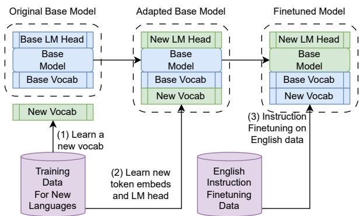
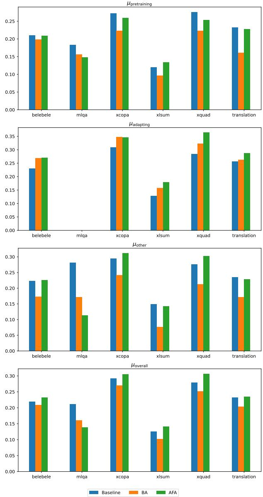
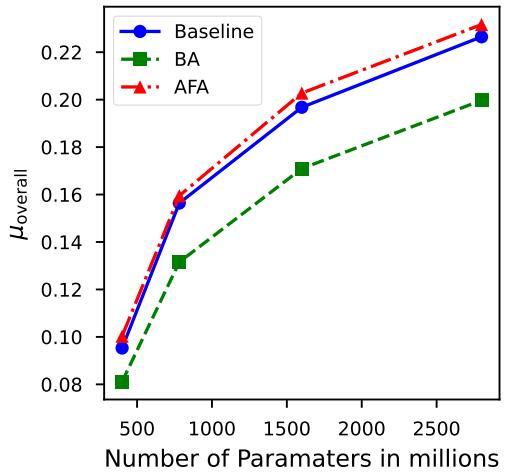
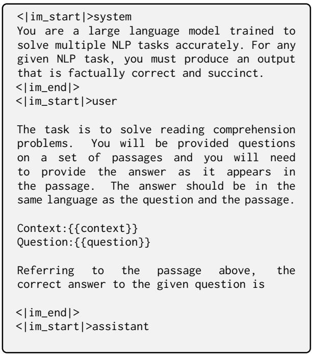
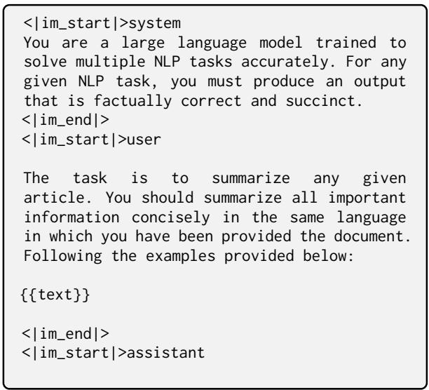
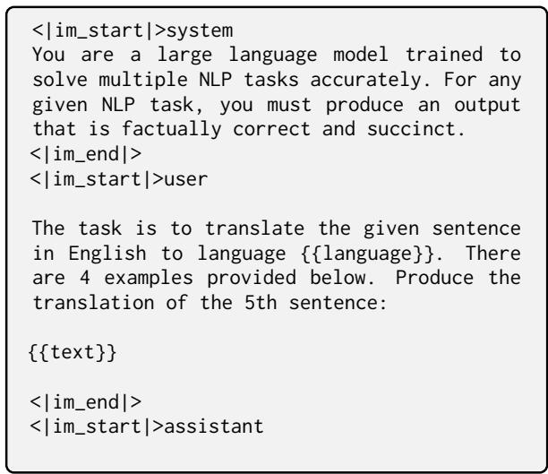
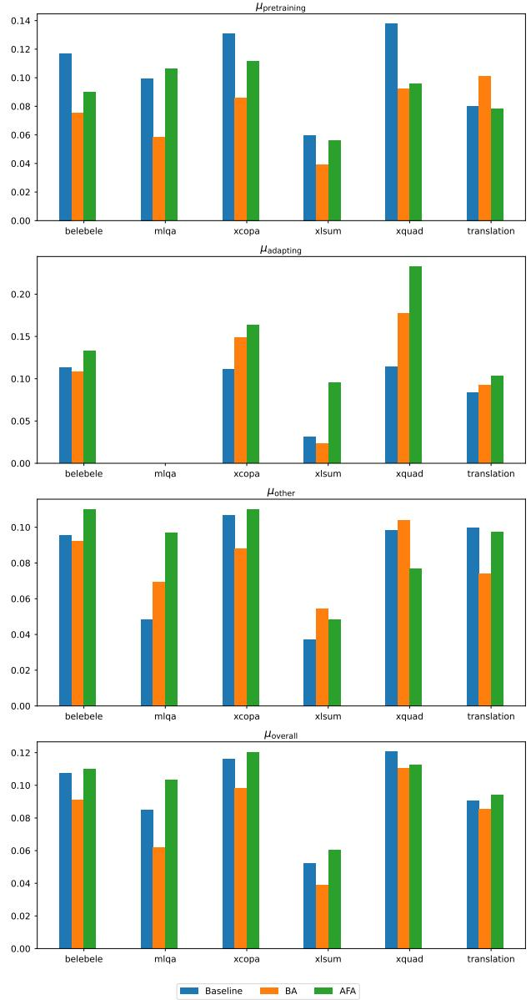
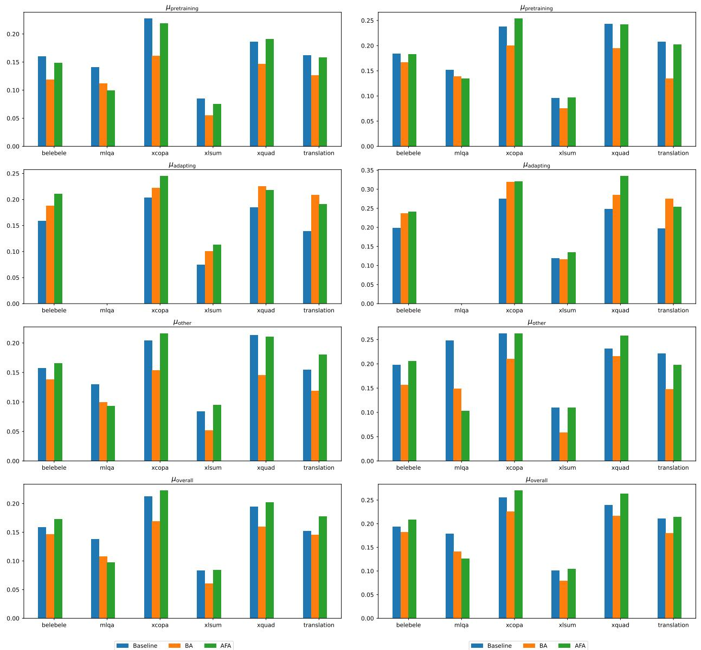

# Exploring Pretraining via Active Forgetting for Improving Cross Lingual Transfer for Decoder Language Models

Divyanshu Aggarwal\* Ashutosh Sathe\*<sup>†</sup> Sunayana Sitaram

Microsoft Research India

divaggarwal@microsoft.com, absathe@cse.iitb.ac.in, sunayana.sitaram@microsoft.com

## Abstract

Large Language Models (LLMs) demonstrate exceptional capabilities in a multitude of NLP tasks. However, the efficacy of such models to languages other than English is often limited. Prior works have shown that encoder-only models such as BERT or XLM-RoBERTa show impressive cross lingual transfer of their capabilities from English to other languages. In this work, we propose a pretraining strategy that uses active forgetting to achieve similar cross lingual transfer in decoder-only LLMs. We show that LLMs pretrained with active forgetting are highly effective when adapting to new and unseen languages. Through extensive experimentation, we find that LLMs pretrained with active forgetting are able to learn better multilingual representations which translates to better performance in many downstream tasks.

## 1 Introduction

Despite demonstrating excellent performance on English, LLM performance on multilingual benchmarks is often limited (Ahuja et al., 2023, 2024). A common method to introduce new languages to existing LLMs involves vocabulary expansion and retraining token embeddings (Balachandran, 2023; Cui et al., 2024). In many cases, these models are further finetuned on translations of English instruction tuning datasets such as Li et al. (2023); Wei et al. (2023); Singh et al. (2024). Building multilingual LLMs by simply having a large number of languages in the pretraining also does not work well due to the so-called “curse of multilinguality” (Conneau et al., 2020). Interestingly, encoder-only LLMs demonstrate cross lingual transfer – a phenomenon where the LLMs improve performance on non-English languages despite being trained only on English data. Past work has worked on improving such cross-lingual transfer (Pfeiffer et al., 2020;

  
Figure 1: Adapting base LLMs to new languages. We show that if the base LLM is pretrained using active forgetting, it improves cross lingual transfer capabilities of the resultant English-only instruction finetuned model.

Parovic et al.´ , 2023; Chen et al., 2024) in encoderonly LLMs such as BERT or XLM-RoBERTa but less attention has been paid to cross-lingual transfer of decoder-only autoregressive LLMs.

We find (Sec. 5) that the common method (depicted in Figure 1) to adapt base LLMs to a narrow set of target languages via vocabulary expansion results in improvements only to the target languages. Our results show that such adaptation significantly worsens the overall multilingual capabilities of the resultant model thereby limiting the cross lingual transfer capabilities of LLMs. Methods like zeroshot tokenizer transfer (Minixhofer et al., 2024) show promising results when adapting (decoderonly) base LLMs to new tasks such as programming without vocabulary expansion, but their applicability in the multilingual context has not been studied well. On the other hand, (Chen et al., 2024) show that training encoder-only LLMs with active forgetting leads to better language “plasticity” and further improves cross lingual transfer.

In this work, we want to improve the cross lingual transfer abilities of autoregressive LLMs by pretraining them using active forgetting, proposed by Chen et al. (2024). We show that models pretrained via active forgetting are better at adapting to new languages with lower degradation in performance on other languages. We also show that models pretrained with active forgetting have better perplexity and isotropy as compared to vanilla pretrained and adapted large language models. Our contributions are listed below:

1. We find that the common method of adapting base LLMs to newer languages (Figure 1) leads to improvements in performance only on the newer languages at the cost of performance of other languages.

2. We illustrate that base LLMs pretrained with active forgetting lead to higher quality multilingual representations.

3. These improved representations also lead to better cross lingual transfer. Active forgetting based LLMs outperform the baselines on 6 out of 7 multilingual benchmarks.

## 2 Related Work

Multilingual Language Modelling Efforts like BLOOM (BigScience Workshop et al., 2023) and PolyLM (Wei et al., 2023) have created large multilingual LLMs, however, instruction finetuned LLMs are more desirable over pretrained models in real world usecases due to their zero shot instruction following capabilities. Multilingual instruction tuning datasets have been introduced by Wei et al. (2023), Li et al. (2023) and Singh et al. (2024) to further enhance the instruction following capabilities of these models in multilingual settings. Most of these datasets are synthetically generated except Aya which is human curated. The costs of high quality human annotations show the need for models with high cross lingual transfer capabilities.

Cross Lingual Transfer Earlier works have shown that crosslingual transfer can be beneficial for multilingual pretrained models to gain task ability from English-only labelled data (Rajaee and Monz, 2024; Deb et al., 2023; Parovic et al.´ , 2023; Zhao et al., 2024b). While these techniques are effective to a certain extent, they are limited by the multilingual abilities of the pretrained model. Moreover, they cannot be effective for the low resource settings even on multilingual models due to poorer representation of rarer tokens in pretraining corpus and high token fertility for morphologically richer languages.

Language Adaptation Creating language models that can learn newer languages successively without further pretraining or by training minimal additional parameters from unlabelled data is of significant interest to reearch community (Chen et al., 2024; Pfeiffer et al., 2020; Zhao et al., 2024a). While these techniques improve the language capabilities on the newer languages, our results show that this improvement comes at the cost of performance on other languages. We focus on improving the pretraining of the base LLM itself with the intention of improving performance of such language adaptation techniques post training.

## 3 Method

Chern et al. (2023) propose using “active forgetting” based pretraining where token embeddings of the model are reset to random embeddings after every k steps of pretraining. They find that using active forgetting to pretrain encoder-only models improves their cross lingual transfer i.e. finetuning only on task-specific English labelled data improves task performance on non-English languages as well. In this work, we study benefits of active forgetting to train and adapt decoder-only models to new and unseen languages. Figure 1 shows standard procedure of introducing new languages to the base LLM through vocabulary expansion.

Specifically, we are given a base LLM $\mathcal { M } _ { \mathrm { b a s e } }$ with vocabulary which we wish to adapt to L new languages. We assume access to a reasonably sized corpus $\mathcal { D } _ { \mathrm { t r a i n } } ^ { L }$ consisting of unstructured text of L languages. In the adaptation process, first a new vocabulary $\mathcal { V } ^ { L }$ is learned over $\mathcal { D } _ { \mathrm { t r a i n } } ^ { L }$ and merged with  to form a larger vocabulary <sub>merged</sub>. In the second stage, the language modeling head of  is replaced to be of the appropriate size i.e. $| \nu _ { \mathrm { m e r g e d } } |$ . Then the new language modeling head and token embeddings of newly added tokens (i.e. $\mathcal { V } _ { \mathrm { m e r g e d } } - \mathcal { V } )$ are learned with standard language modeling training over $\mathcal { D } _ { \mathrm { t r a i n } } ^ { L } .$ . Notice that the entire Transformer stack of and token embeddings of are held frozen during this training. The resultant model at the end of second stage is denoted by $\mathcal { M } _ { \mathrm { a d a p t e d } }$ and has language modeling head of the size $| \nu _ { \mathrm { m e r g e d } } |$ . In the final stage, we instruction finetune the $\mathcal { M } _ { \mathrm { a d a p t e d } }$ on English only data to get $\mathcal { M } _ { \mathrm { a d a p t e d } } ^ { \mathrm { f i n e t u n e d } }$ which is evaluated on multilingual benchmarks to assess its cross lingual transfer capoabilities. Our hypothesis is that if $\mathcal { M } _ { \mathrm { b a s e } }$ is pretrained using active forgetting, the corresponding finetuned will be better at cross lingual transfer. adapted

## 4 Experiments

Training Setup We pretrain our $\mathcal { M } _ { \mathrm { b a s e } }$ on Wikipedia dumps<sup>1</sup> of 12 languages (referred as “pretraining” languages) from Shaham et al. (2024). The adaptation dataset $\mathcal { D } _ { \mathrm { t r a i n } } ^ { L }$ consists of Wikipedia dumps of 14 new languages (referred as “adapting” languages) disjoint from the pretraining languages. The exact languages are presented in Table 6. In our results, $\mathbf { \ddot { \Delta } } \mathbf { B } \mathbf { A } ^ { \prime \prime }$ refers to “Baseline Adapted” i.e. $\mathcal { M } _ { \mathrm { a d a p t e d } } ^ { \mathrm { f i n e t u n e d } }$ where $\mathcal { M } _ { \mathrm { b a s e } }$ was trained with standard optimization. “AFA” refers to “Active Forgetting Adapted” i.e. $\mathcal { M } _ { \mathrm { a d a p t e d } } ^ { \mathrm { f i n e t u n e d } }$ where $\mathcal { M } _ { \mathrm { b a s e } }$ was trained with active forgetting. We also present results on “Baseline” which refers to $\mathcal { M } _ { \mathrm { b a s e } } ^ { \mathrm { f i n e t u n e d } } \mathrm { i . e }$ . instruction tuned $\mathcal { M } _ { \mathrm { b a s e } }$ without adaptation. We experiment with $\mathcal { M } _ { \mathrm { b a s e } }$ of 3 different sizes and use OpenOrca (Lian et al., 2023) as our English instruction tuning dataset and contains 2.91M data points.

Evaluation Setup We follow Aggarwal et al. (2024) to evaluate multilingual capabilities of our models using 6 multilingual benchmarks. Additionally, we establish superiority of the active forgetting pretrained models by measuring isotropy of their embeddings (Ethayarajh, 2019) and model perplexity on 50 languages (26 new languages not in “pretraining” or “adapting” as shown in Table 6) in mC4 (Xue et al., 2021). We also evaluate the 4- shot translation (English-to-X) performance of the models to the same set of 50 languages using the FLORES-200 dataset (NLLB Team et al., 2022).

## 5 Discussion

Active Forgetting Leads to Better Language Adaptation We study the intrinsic properties of the adapted models $\mathcal { M } _ { \mathrm { a d a p t e d } }$ using perplexity on mC4 and isotropy i.e. self similarity of contextual embeddings (Ethayarajh, 2019). As shown in Table 1, we find that AFA models achieve consistently lower perplexity than both “Baseline” and $\mathbf { \ddot { \Delta } } \mathbf { B } \mathbf { A } ^ { \prime \prime }$ Moreover, AFA models are also able to better contextualize a sentence over all languages as observed by lower self similarity (isotropy) scores in Table 2. This suggests that the quality of multilingual representations of AFA is better than other models.

Active Forgetting Improves Cross-Lingual Transfer In Figure 12, we compare performance of our models on various multilingual benchmarks similar to Aggarwal et al. (2024) and the translation task. We find that despite instruction tuning only on English, AFA models show improvements across all language classes. AFA outperforms both Baseline and BA models on 6 out of 7 tasks in our evaluation suite. More importantly, we find that BA models often are worse overall $( \mu _ { \mathrm { o v e r a l l } } )$ as compared to Baseline. This reaffirms findings by Shaham et al. (2024) where if the base model is already multilingual, adapting to a narrow set of languages can worsen the overall performance. AFA models on the other hand do not seem to suffer from the same limitation.

<table><tr><td>Model</td><td>μpretraining</td><td>µadapting</td><td>μother</td><td>μoverall</td></tr><tr><td colspan="5">Number of parameters = 400M</td></tr><tr><td>Baseline</td><td>25.041</td><td>31.440</td><td>34.663</td><td>31.451</td></tr><tr><td>BA</td><td>25.097</td><td>31.405</td><td>36.993</td><td>32.573</td></tr><tr><td>AFA</td><td>25.180</td><td>30.373</td><td>34.345</td><td>31.033</td></tr><tr><td colspan="5">Number of parameters = 782M</td></tr><tr><td>Baseline</td><td>22.826</td><td>29.382</td><td>31.099</td><td>28.633</td></tr><tr><td>BA</td><td>23.155</td><td>28.924</td><td>33.766</td><td>29.864</td></tr><tr><td>AFA</td><td>22.727</td><td>27.949</td><td>31.047</td><td>28.183</td></tr><tr><td colspan="5">Number of parameters = 1.6B</td></tr><tr><td>Baseline</td><td>20.745</td><td>26.831</td><td>28.497</td><td>26.170</td></tr><tr><td>BA</td><td>20.828</td><td>26.117</td><td>30.616</td><td>27.007</td></tr><tr><td>AFA</td><td>20.654</td><td>25.048</td><td>28.386</td><td>25.596</td></tr><tr><td colspan="5">Number of parameters = 2.8B</td></tr><tr><td>Baseline</td><td>20.887</td><td>26.345</td><td>28.689</td><td>26.198</td></tr><tr><td>BA</td><td>20.958</td><td>25.969</td><td>30.768</td><td>27.034</td></tr><tr><td>AFA</td><td>20.716</td><td>24.858</td><td>28.395</td><td>25.621</td></tr></table>

Table 1: Detailed results on perplexity (Lower is Better). BA refers to Baseline adapted model. AFA refers to Active Forgetting adapted model. $\mu _ { \mathrm { p r e t r a i n i n g } }$ refers to performance averaged over languages in the pretraining split. $\mu _ { \mathrm { a d a p t i n g } }$ refers to averaging over languages in the adapting split. $\mu _ { \mathrm { o t h e r } }$ refers to averaging on languages that are in neither split. $\mu _ { \mathrm { o v e r a l l } }$ refers to the average over all languages.

<table><tr><td>Model</td><td>µpretraining</td><td>µadapting</td><td>μother</td><td>μoverall</td></tr><tr><td colspan="5">Number of parameters = 400M</td></tr><tr><td>Baseline</td><td>0.683</td><td>0.663</td><td>0.667</td><td>0.670</td></tr><tr><td>BA</td><td>0.659</td><td>0.651</td><td>0.678</td><td>0.666</td></tr><tr><td>AFA</td><td>0.640</td><td>0.624</td><td>0.640</td><td>0.636</td></tr><tr><td colspan="5">Number of parameters = 782M</td></tr><tr><td>Baseline</td><td>0.610</td><td>0.607</td><td>0.612</td><td>0.610</td></tr><tr><td>BA</td><td>0.602</td><td>0.593</td><td>0.618</td><td>0.607</td></tr><tr><td>AFA</td><td>0.587</td><td>0.566</td><td>0.588</td><td>0.582</td></tr><tr><td colspan="5">Number of parameters = 1.6B</td></tr><tr><td>Baseline</td><td>0.549</td><td>0.550</td><td>0.562</td><td>0.555</td></tr><tr><td>BA</td><td>0.555</td><td>0.548</td><td>0.560</td><td>0.555</td></tr><tr><td>AFA</td><td>0.531</td><td>0.513</td><td>0.530</td><td>0.525</td></tr><tr><td colspan="5">Number of parameters = 2.8B</td></tr><tr><td>Baseline</td><td>0.504</td><td>0.506</td><td>0.506</td><td>0.505</td></tr><tr><td>BA</td><td>0.506</td><td>0.508</td><td>0.506</td><td>0.507</td></tr><tr><td>AFA</td><td>0.504</td><td>0.506</td><td>0.506</td><td>0.505</td></tr></table>

Table 2: Detailed results on isotropy (Lower is Better). All the abbrevations are same as in Table 1.

  
Figure 2: Task wise performance comparison for the 2.8 billion parameter models. Higher is better for all tasks.

Analysis on Language Class and Model Size We study how language adaptation affects performance on each language class (“pretraining”, “adapting” or “other”) by studying performance on translation in Table 3. We find that BA models show significantly better performance (as compared to Baseline) on “adapting” languages at all model scales. Moreover, improvement of BA over

<table><tr><td>Model</td><td>μpretraining</td><td>µadapting</td><td>μother</td><td>μoverall</td></tr><tr><td colspan="5">Number of parameters = 400M</td></tr><tr><td>Baseline</td><td>0.080</td><td>0.084</td><td>0.100</td><td>0.091</td></tr><tr><td>BA</td><td>0.101</td><td>0.092</td><td>0.074</td><td>0.086</td></tr><tr><td>AFA</td><td>0.078</td><td>0.103</td><td>0.098</td><td>0.094</td></tr><tr><td colspan="5">Number of parameters = 782M</td></tr><tr><td>Baseline</td><td>0.162</td><td>0.138</td><td>0.154</td><td>0.152</td></tr><tr><td>BA</td><td>0.127</td><td>0.208</td><td>0.119</td><td>0.146</td></tr><tr><td>AFA</td><td>0.158</td><td>0.190</td><td>0.180</td><td>0.178</td></tr><tr><td colspan="5">Number of parameters = 1.6B</td></tr><tr><td>Baseline</td><td>0.208</td><td>0.197</td><td>0.221</td><td>0.211</td></tr><tr><td>BA</td><td>0.134</td><td>0.274</td><td>0.147</td><td>0.180</td></tr><tr><td>AFA</td><td>0.202</td><td>0.254</td><td>0.198</td><td>0.215</td></tr><tr><td colspan="5">Number of parameters = 2.8B</td></tr><tr><td>Baseline</td><td>0.241</td><td>0.255</td><td>0.245</td><td>0.237</td></tr><tr><td>BA</td><td>0.163</td><td>0.255</td><td>0.174</td><td>0.205</td></tr><tr><td>AFA</td><td>0.240</td><td>0.288</td><td>0.229</td><td>0.239</td></tr></table>

Table 3: Detailed results on translation (en-to-XX) on the subset of languages from FLORES-200 (NLLB Team et al., 2022). All the abbrevations are same as in Table 1 (Higher is better). We use BLEU Score as the metric (Papineni et al., 2002).

  
Figure 3: Effect of model scale. Average task performance of models against the model parameter count. We consider the same tasks in figure 2

Baseline is larger than improvement of AFA over Baseline for larger models and BA models seem to degrade performance on all other language classes leading to worse overal $\scriptstyle ( \mu _ { \mathrm { o v e r a l l } } )$ scores as observed in Figure 3.

## 6 Conclusion and Future Work

In this work, we show that pretraining with active forgetting can improve language adaptability and cross lingual transfer capabilities of autoregressive (decoder-only) language models. In our experiments, we found that a base LLM that is pretrained with active forgetting and instruction tuned only with English data leads to improvements across all languages in 6 out of 7 multilingual benchmarks. We observed this behavior to be consistent at all the model sizes we tried. The improvements in these downstream tasks can be attributed to the active forgetting models learning better multilingual representations. We hope that these findings encourage pretraining of larger LLMs with active forgetting. Future work can also explored effective language adaptation methods to adapt an existing finetuned LLM to new languages.

## Limitations

The methods described in this work are aimed at improving pretraining of multilingual LLMs. As such, these cannot be directly applied to existing LLMs. An interesting direction to explore could be to take intermediate checkpoints of open source LLMs such as TinyLlama (Zhang et al., 2024) or OLMo (Groeneveld et al., 2024) and simulate active forgetting by resetting their embeddings then continuing to train on $\mathcal { D } _ { \mathrm { t r a i n } } ^ { L } .$ . Finally, our training and evaluation suite consisted primarily of training language models of size that could comfortably fit in our compute budget. Moreover, the data is used (10 billion tokens in total) is much lesser than models like XLM-R which were trained on much larger data with more than 100 billion in much more languages, which can give state of the art performance on our evaluation with much lesser model parameter size, since the data is larger, the compute FLoPs used to train XLM-R is much larger than what we used despite our models being larger. Further experiments and evaluation is needed to study efficacy of pretraining with active forgetting on larger scale models.

## Ethics Statement

The proposed method of pretraining directly affects the token embeddings of an LLM. While we find that these lead to better representations in terms of multilinguality, special care must be taken before deploying such LLMs. A thorough study of their overall capabilities as well as intrinsic and extrinsic biases must be performed before deploying such LLMs to any public facing interface.

## References

Divyanshu Aggarwal, Ashutosh Sathe, Ishaan Watts, and Sunayana Sitaram. 2024. Maple: Multilingual evaluation of parameter efficient finetuning of large language models. Preprint, arXiv:2401.07598.

Kabir Ahuja, Harshita Diddee, Rishav Hada, Millicent Ochieng, Krithika Ramesh, Prachi Jain, Akshay Nambi, Tanuja Ganu, Sameer Segal, Mohamed Ahmed, Kalika Bali, and Sunayana Sitaram. 2023. MEGA: Multilingual evaluation of generative AI. In Proceedings of the 2023 Conference on Empirical Methods in Natural Language Processing, pages 4232–4267, Singapore. Association for Computational Linguistics.

Sanchit Ahuja, Divyanshu Aggarwal, Varun Gumma, Ishaan Watts, Ashutosh Sathe, Millicent Ochieng, Rishav Hada, Prachi Jain, Maxamed Axmed, Kalika Bali, and Sunayana Sitaram. 2024. Megaverse: Benchmarking large language models across languages, modalities, models and tasks. Preprint, arXiv:2311.07463.

Mikel Artetxe, Sebastian Ruder, and Dani Yogatama. 2020. On the cross-lingual transferability of monolingual representations. In Proceedings of the 58th Annual Meeting ofthe Associationfor Computational Linguistics, pages 4623–4637, Online. Association for Computational Linguistics.

Abhinand Balachandran. 2023. Tamil-llama: A new tamil language model based on llama 2. Preprint, arXiv:2311.05845.

Lucas Bandarkar, Davis Liang, Benjamin Muller, Mikel Artetxe, Satya Narayan Shukla, Donald Husa, Naman Goyal, Abhinandan Krishnan, Luke Zettlemoyer, and Madian Khabsa. 2023. The belebele benchmark: a parallel reading comprehension dataset in 122 language variants. Preprint, arXiv:2308.16884.

BigScience Workshop, :, and Teven Le Scao etal. 2023. Bloom: A 176b-parameter open-access multilingual language model. Preprint, arXiv:2211.05100.

Yihong Chen, Kelly Marchisio, Roberta Raileanu, David Ifeoluwa Adelani, Pontus Stenetorp, Sebastian Riedel, and Mikel Artetxe. 2024. Improving language plasticity via pretraining with active forgetting. Preprint, arXiv:2307.01163.

I-chun Chern, Zhiruo Wang, Sanjan Das, Bhavuk Sharma, Pengfei Liu, and Graham Neubig. 2023. Improving factuality of abstractive summarization via contrastive reward learning. In Proceedings of the 3rd Workshop on Trustworthy Natural Language Processing (TrustNLP 2023), pages 55–60, Toronto, Canada. Association for Computational Linguistics.

Alexis Conneau, Kartikay Khandelwal, Naman Goyal, Vishrav Chaudhary, Guillaume Wenzek, Francisco Guzmán, Edouard Grave, Myle Ott, Luke Zettlemoyer, and Veselin Stoyanov. 2020. Unsupervised cross-lingual representation learning at scale. Preprint, arXiv:1911.02116.

Yiming Cui, Ziqing Yang, and Xin Yao. 2024. Efficient and effective text encoding for chinese llama and alpaca. Preprint, arXiv:2304.08177.

Ujan Deb, Ridayesh Parab, and Preethi Jyothi. 2023. Zero-shot cross-lingual transfer with learned projections using unlabeled target-language data. In Proceedings ofthe 61st Annual Meeting ofthe Associationfor Computational Linguistics (Volume 2: Short Papers), pages 449–457, Toronto, Canada. Association for Computational Linguistics.

Kawin Ethayarajh. 2019. How contextual are contextualized word representations? Comparing the geometry of BERT, ELMo, and GPT-2 embeddings. In Proceedings of the 2019 Conference on Empirical Methods in Natural Language Processing and the 9th International Joint Conference on Natural Language Processing (EMNLP-IJCNLP), pages 55–65, Hong Kong, China. Association for Computational Linguistics.

Dirk Groeneveld, Iz Beltagy, Pete Walsh, Akshita Bhagia, Rodney Kinney, Oyvind Tafjord, Ananya Harsh Jha, Hamish Ivison, Ian Magnusson, Yizhong Wang, Shane Arora, David Atkinson, Russell Authur, Khyathi Raghavi Chandu, Arman Cohan, Jennifer Dumas, Yanai Elazar, Yuling Gu, Jack Hessel, Tushar Khot, William Merrill, Jacob Morrison, Niklas Muennighoff, Aakanksha Naik, Crystal Nam, Matthew E. Peters, Valentina Pyatkin, Abhilasha Ravichander, Dustin Schwenk, Saurabh Shah, Will Smith, Emma Strubell, Nishant Subramani, Mitchell Wortsman, Pradeep Dasigi, Nathan Lambert, Kyle Richardson, Luke Zettlemoyer, Jesse Dodge, Kyle Lo, Luca Soldaini, Noah A. Smith, and Hannaneh Hajishirzi. 2024. Olmo: Accelerating the science of language models. Preprint, arXiv:2402.00838.

Tahmid Hasan, Abhik Bhattacharjee, Md. Saiful Islam, Kazi Mubasshir, Yuan-Fang Li, Yong-Bin Kang, M. Sohel Rahman, and Rifat Shahriyar. 2021. XLsum: Large-scale multilingual abstractive summarization for 44 languages. In Findings of the Association for Computational Linguistics: ACL-IJCNLP 2021, pages 4693–4703, Online. Association for Computational Linguistics.

Patrick Lewis, Barlas Oguz, Ruty Rinott, Sebastian Riedel, and Holger Schwenk. 2020. MLQA: Evaluating cross-lingual extractive question answering. In Proceedings ofthe 58th Annual Meeting ofthe Associationfor Computational Linguistics, pages 7315– 7330, Online. Association for Computational Linguistics.

Haonan Li, Fajri Koto, Minghao Wu, Alham Fikri Aji, and Timothy Baldwin. 2023. Bactrian-x: Multilingual replicable instruction-following models with low-rank adaptation. Preprint, arXiv:2305.15011.

Wing Lian, Bleys Goodson, Eugene Pentland, Austin Cook, Chanvichet Vong, and "Teknium". 2023. Openorca: An open dataset of gpt augmented flan reasoning traces. https://https://huggingface. co/Open-Orca/OpenOrca.

Ilya Loshchilov and Frank Hutter. 2019. Decoupled weight decay regularization. In International Conference on Learning Representations.

Benjamin Minixhofer, Edoardo Maria Ponti, and Ivan Vulic. 2024.´ Zero-shot tokenizer transfer. Preprint, arXiv:2405.07883.

NLLB Team, Marta R. Costa-jussà, James Cross, Onur Çelebi, Maha Elbayad, Kenneth Heafield, Kevin Heffernan, Elahe Kalbassi, Janice Lam, Daniel Licht, Jean Maillard, Anna Sun, Skyler Wang, Guillaume Wenzek, Al Youngblood, Bapi Akula, Loic Barrault, Gabriel Mejia-Gonzalez, Prangthip Hansanti, John Hoffman, Semarley Jarrett, Kaushik Ram Sadagopan, Dirk Rowe, Shannon Spruit, Chau Tran, Pierre Andrews, Necip Fazil Ayan, Shruti Bhosale, Sergey Edunov, Angela Fan, Cynthia Gao, Vedanuj Goswami, Francisco Guzmán, Philipp Koehn, Alexandre Mourachko, Christophe Ropers, Safiyyah Saleem, Holger Schwenk, and Jeff Wang. 2022. No language left behind: Scaling humancentered machine translation.

Kishore Papineni, Salim Roukos, Todd Ward, and Wei-Jing Zhu. 2002. Bleu: a method for automatic evaluation of machine translation. In Proceedings ofthe 40th Annual Meeting ofthe Associationfor Computational Linguistics, pages 311–318, Philadelphia, Pennsylvania, USA. Association for Computational Linguistics.

Marinela Parovic, Alan Ansell, Ivan Vuli´ c, and´ Anna Korhonen. 2023. Cross-lingual transfer with target language-ready task adapters. Preprint, arXiv:2306.02767.

Jonas Pfeiffer, Ivan Vulic, Iryna Gurevych, and Sebas-´ tian Ruder. 2020. Mad-x: An adapter-based framework for multi-task cross-lingual transfer. Preprint, arXiv:2005.00052.

Edoardo Maria Ponti, Goran Glavaš, Olga Majewska, Qianchu Liu, Ivan Vulic, and Anna Korhonen. 2020.´ XCOPA: A multilingual dataset for causal commonsense reasoning. In Proceedings of the 2020 Conference on Empirical Methods in Natural Language Processing (EMNLP), pages 2362–2376, Online. Association for Computational Linguistics.

Sara Rajaee and Christof Monz. 2024. Analyzing the evaluation of cross-lingual knowledge transfer in multilingual language models. In Proceedings ofthe 18th Conference ofthe European Chapter ofthe Associationfor Computational Linguistics (Volume 1: Long Papers), pages 2895–2914, St. Julian’s, Malta. Association for Computational Linguistics.

Uri Shaham, Jonathan Herzig, Roee Aharoni, Idan Szpektor, Reut Tsarfaty, and Matan Eyal. 2024. Multilingual instruction tuning with just a pinch of multilinguality. Preprint, arXiv:2401.01854.

Shivalika Singh, Freddie Vargus, Daniel Dsouza, Börje F. Karlsson, Abinaya Mahendiran, Wei-Yin

Ko, Herumb Shandilya, Jay Patel, Deividas Mataciunas, Laura OMahony, Mike Zhang, Ramith Hettiarachchi, Joseph Wilson, Marina Machado, Luisa Souza Moura, Dominik Krzeminski, Hakimeh´ Fadaei, Irem Ergün, Ifeoma Okoh, Aisha Alaagib, Oshan Mudannayake, Zaid Alyafeai, Vu Minh Chien, Sebastian Ruder, Surya Guthikonda, Emad A. Alghamdi, Sebastian Gehrmann, Niklas Muennighoff, Max Bartolo, Julia Kreutzer, Ahmet Üstün, Marzieh Fadaee, and Sara Hooker. 2024. Aya dataset: An open-access collection for multilingual instruction tuning. Preprint, arXiv:2402.06619.

Xiangpeng Wei, Haoran Wei, Huan Lin, Tianhao Li, Pei Zhang, Xingzhang Ren, Mei Li, Yu Wan, Zhiwei Cao, Binbin Xie, Tianxiang Hu, Shangjie Li, Binyuan Hui, Bowen Yu, Dayiheng Liu, Baosong Yang, Fei Huang, and Jun Xie. 2023. Polylm: An open source polyglot large language model. Preprint, arXiv:2307.06018.

Linting Xue, Noah Constant, Adam Roberts, Mihir Kale, Rami Al-Rfou, Aditya Siddhant, Aditya Barua, and Colin Raffel. 2021. mT5: A massively multilingual pre-trained text-to-text transformer. In Proceedings of the 2021 Conference of the North American Chapter of the Association for Computational Linguistics: Human Language Technologies, pages 483–498, Online. Association for Computational Linguistics.

Peiyuan Zhang, Guangtao Zeng, Tianduo Wang, and Wei Lu. 2024. Tinyllama: An open-source small language model. Preprint, arXiv:2401.02385.

Jun Zhao, Zhihao Zhang, Luhui Gao, Qi Zhang, Tao Gui, and Xuanjing Huang. 2024a. Llama beyond english: An empirical study on language capability transfer. Preprint, arXiv:2401.01055.

Yiran Zhao, Wenxuan Zhang, Huiming Wang, Kenji Kawaguchi, and Lidong Bing. 2024b. Adamergex: Cross-lingual transfer with large language models via adaptive adapter merging. Preprint, arXiv:2402.18913.

<table><tr><td>Hyperparameter</td><td>Value</td></tr><tr><td>Learning rate</td><td>1 × 10 4</td></tr><tr><td>Number of steps</td><td>150,000</td></tr><tr><td>Global batch size</td><td>128</td></tr><tr><td>Block size</td><td>4096</td></tr><tr><td>Scheduler</td><td>Cosine</td></tr><tr><td>Warmup</td><td>Linear</td></tr><tr><td>Warmup steps</td><td>10%</td></tr><tr><td>Optimizer</td><td>AdamW (Loshchilov and Hutter, 2019)</td></tr><tr><td>Weight decay</td><td>0</td></tr><tr><td>Embed. reset steps</td><td>10,000</td></tr></table>

Table 4: Hyperparameters for pretraining. Only the active forgetting models reset their token embeddings every “Embed. reset steps”. Note that embeddings are not reset after the final step.
<table><tr><td>Hyperparameter</td><td>Value</td></tr><tr><td>Learning rate</td><td>1 × 10 -6</td></tr><tr><td>Epochs</td><td>5</td></tr><tr><td>Global batch size</td><td>16</td></tr><tr><td>Scheduler</td><td>Cosine</td></tr><tr><td>Warmup</td><td>Linear</td></tr><tr><td>Warmup steps</td><td>10%</td></tr><tr><td>Optimizer</td><td>Adam W (Loshchilov and Hutter, 2019)</td></tr><tr><td>Weight decay</td><td>0</td></tr></table>

Table 5: Hyperparameters for finetuning.

## A Details on Computational Resources

Our base LLM uses Mistral architecture downscaled to fit our compute resources. We explore 3 configurations with total parameter counts of 400M, 782M and 1.6B respectively by reducing the hidden dimensions, number of attention heads and the total number of Transformer blocks. The vocabulary size of the base model was kept fixedd at 32000 while the adapting vocabulary was allowed to merge 16000 more tokens leading to $| \mathcal { V } _ { \mathrm { m e r g e d } } | = 4 8 0 0 0$ . All our experiments are run on a single NVIDIA A100 GPU with 80 GB VRAM. The total GPU hours for all experiments and evaluations come out to roughly 650 hours. The hyperparameters for pretraining and finetuning runs are presented in Table 4 and Table 5 respectively.

## B Details on Language Classes

In Table 6, we present the 2 main classes of languages relevant to our experiments. Specifically, all base models (with or without active forgetting) are pretrained on the “pretraining” languages. Each base model is then adapted to the 14 “adapting” languages together. Any language that is not in either of these 2 classes is considered “other”. The “other” in Table 6 refers to the additional languages we used for perplexity and isotropy analysis.

<table><tr><td>group</td><td>languages</td></tr><tr><td></td><td>pretraining (12) ar, zh, cs, en, et, fi, he, hi, it, ru, es, sw</td></tr><tr><td>adapting (14)</td><td>ja, fr, pt, nl, se, tr, da, no, ko, pl, hu, th, mr, gu</td></tr><tr><td>other (26)</td><td>af, bg, bn, de, id, ml, sv, ta, te, ur, vi, tg, ka, sq, ps, sr, az, my, co, iw, mn, st, sk, ha</td></tr></table>

Table 6: Language Details

## C Evaluation Setting and Prompts

We use lm-evaluation-harness <sup>2</sup> for our evaluation experiments with default settings.

The evaluation prompts for all the tasks in our evaluation suite (6 tasks from Aggarwal et al. (2024) and Translation on FLORES-200) are presented in Figure ?? to Figure 9.

```jinja
<|im_start|>system
You are a large language model trained to
solve multiple NLP tasks accurately. For any
given NLP task, you must produce an output
that is factually correct and succinct.
<|im_end|>
<|im_start|>user
The task is to perform open-domain
commonsense causal reasoning. You will
be provided a premise and two alternatives,
where the task is to select the alternative
that more plausibly has a causal relation
with the premise. Answer as concisely as
possible in the same format as the examples
below:
Given this premise:
{{premise}}
What’s the best option?
-choice1 : {{choice1}}
-choice2 : {{choice2}}
We are looking for  a cause  an effect 
<|im_end|>
<|im_start|>assistant
```  
Figure 4: XCOPA Prompt

<|im\_start|>system   
You are a large language model trained to   
solve multiple NLP tasks accurately. For any   
given NLP task, you must produce an output   
that is factually correct and succinct.   
<|im\_end|>   
<|im\_start|>user   
The task is to perform reading comprehension   
task. Given the following passage, query,   
and answer choices, output the letter   
corresponding to the correct answer.   
Passage: {{flores\_passage}}   
Query: {{question}}   
Choices:   
A: {{mc\_answer1}}   
B: {{mc\_answer2}}   
C: {{mc\_answer3}}   
D: {{mc\_answer4}}   
<|im\_end|>   
<|im\_start|>assistant

Figure 5: Belebele Prompt  
<|im\_start|>system   
You are a large language model trained to   
solve multiple NLP tasks accurately. For any   
given NLP task, you must produce an output   
that is factually correct and succinct.   
<|im\_end|>   
<|im\_start|>user   
The task is to solve reading comprehension   
problems. You will be provided questions   
on a set of passages and you will need   
to provide the answer as it appears in   
the passage. The answer should be in the   
same language as the question and the passage.   
Context:{{context}}   
Question:{{question}}   
Referring to the passage above, the   
correct answer to the given question is   
<|im\_end|>   
<|im\_start|>assistant  
Figure 6: MLQA Prompt

## D Detailed Results on All Model Scales and Tasks

Table 7 to Table 11 and Figure 10 and Figure 11 present detailed results on all tasks at all model scales and language classes.

<table><tr><td>Model</td><td>µpretraining</td><td>µadapting</td><td>µother</td><td>μoverall</td></tr><tr><td colspan="5">Number of parameters = 400M</td></tr><tr><td>Baseline</td><td>0.117</td><td>0.113</td><td>0.095</td><td>0.107</td></tr><tr><td>BA</td><td>0.075</td><td>0.108</td><td>0.092</td><td>0.091</td></tr><tr><td>AFA</td><td>0.090</td><td>0.133</td><td>0.110</td><td>0.110</td></tr><tr><td colspan="5">Number of parameters = 782M</td></tr><tr><td>Baseline</td><td>0.160</td><td>0.158</td><td>0.157</td><td>0.158</td></tr><tr><td>BA</td><td>0.119</td><td>0.188</td><td>0.138</td><td>0.146</td></tr><tr><td>AFA</td><td>0.148</td><td>0.211</td><td>0.166</td><td>0.173</td></tr><tr><td colspan="5">Number of parameters = 1.6B</td></tr><tr><td>Baseline</td><td>0.184</td><td>0.199</td><td>0.198</td><td>0.194</td></tr><tr><td>BA</td><td>0.167</td><td>0.236</td><td>0.156</td><td>0.182</td></tr><tr><td>AFA</td><td>0.184</td><td>0.241</td><td>0.206</td><td>0.209</td></tr><tr><td colspan="5">Number of parameters = 2.8B</td></tr><tr><td>Baseline</td><td>0.208</td><td>0.224</td><td>0.225</td><td>0.219</td></tr><tr><td>BA</td><td>0.195</td><td>0.261</td><td>0.183</td><td>0.208</td></tr><tr><td>AFA</td><td>0.215</td><td>0.279</td><td>0.227</td><td>0.237</td></tr></table>

Table 7: Detailed results on belebele (Bandarkar et al., 2023). BA refers to Baseline adapted model. AFA refers to Active Forgetting adapted model. µ<sub>pretraining</sub> refers to performance averaged over languages in the pretraining split. $\mu _ { \mathrm { a d a p t i n g } }$ refers to averaging over languages in the adapting split. $\mu _ { \mathrm { o t h e r } }$ refers to averaging on languages that are in neither split. $\mu _ { \mathrm { o v e r a l l } }$ refers to the average over all languages. We use Accuracy as the metric.

<table><tr><td>Model</td><td>μpretraining µadapting</td><td>μother</td><td>µoverall</td></tr><tr><td colspan="4">Number of parameters = 400M</td></tr><tr><td>Baseline</td><td>0.099</td><td>N/A 0.048</td><td>0.085</td></tr><tr><td>BA</td><td>0.059</td><td>N/A 0.069</td><td>0.062</td></tr><tr><td>AFA</td><td>0.106</td><td>N/A 0.097</td><td>0.104</td></tr><tr><td colspan="4">Number of parameters = 782M</td></tr><tr><td>Baseline</td><td>0.141</td><td>0.130</td><td>0.138</td></tr><tr><td>BA</td><td>0.112</td><td>N/A N/A 0.100 N/A</td><td>0.108</td></tr><tr><td>AFA</td><td>0.099</td><td>0.093</td><td>0.098</td></tr><tr><td colspan="4">Number of parameters = 1.6B</td></tr><tr><td>Baseline</td><td>0.151</td><td>0.248</td><td>0.179</td></tr><tr><td>BA</td><td>0.139</td><td>N/A 0.149</td><td>0.141</td></tr><tr><td>AFA</td><td>0.135</td><td>N/A 0.103</td><td>0.126</td></tr><tr><td colspan="4">Number of parameters = 2.8B</td></tr><tr><td>Baseline</td><td>0.183</td><td>N/A 0.276</td><td>0.210</td></tr><tr><td>BA</td><td>0.171</td><td>N/A 0.171</td><td>0.171</td></tr><tr><td>AFA</td><td>0.167</td><td>N/A 0.126</td><td>0.156</td></tr></table>

Table 8: Detailed results on mlqa (Lewis et al., 2020). BA refers to Baseline adapted model. AFA refers to Active Forgetting adapted model. $\mu _ { \mathrm { p r e t r a i n i n g } }$ refers to performance averaged over languages in the pretraining split. $\mu _ { \mathrm { a d a p t i n g } }$ refers to averaging over languages in the adapting split. $\mu _ { \mathrm { o t h e r } }$ refers to averaging on languages that are in neither split. $\mu _ { \mathrm { o v e r a l l } }$ refers to the average over all languages. We use F1-abstractive score as the metric.

<table><tr><td>Model</td><td>µpretraining</td><td>µadapting</td><td>µother</td><td>μoverall</td></tr><tr><td colspan="5">Number of parameters = 400M</td></tr><tr><td>Baseline</td><td>0.131</td><td>0.111</td><td>0.107</td><td>0.116</td></tr><tr><td>BA</td><td>0.086</td><td>0.149</td><td>0.088</td><td>0.098</td></tr><tr><td>AFA</td><td>0.112</td><td>0.164</td><td>0.110</td><td>0.121</td></tr><tr><td colspan="5">Number of parameters = 782M</td></tr><tr><td>Baseline</td><td>0.227</td><td>0.204</td><td>0.204</td><td>0.212</td></tr><tr><td>BA</td><td>0.161</td><td>0.222</td><td>0.154</td><td>0.169</td></tr><tr><td>AFA</td><td>0.219</td><td>0.245</td><td>0.216</td><td>0.223</td></tr><tr><td colspan="5">Number of parameters = 1.6B</td></tr><tr><td>Baseline</td><td>0.238</td><td>0.275</td><td>0.263</td><td>0.256</td></tr><tr><td>BA</td><td>0.200</td><td>0.319</td><td>0.210</td><td>0.226</td></tr><tr><td>AFA</td><td>0.254</td><td>0.321</td><td>0.263</td><td>0.270</td></tr><tr><td colspan="5">Number of parameters = 2.8B</td></tr><tr><td>Baseline</td><td>0.278</td><td>0.319</td><td>0.288</td><td>0.295</td></tr><tr><td>BA</td><td>0.243</td><td>0.350</td><td>0.253</td><td>0.282</td></tr><tr><td>AFA</td><td>0.279</td><td>0.346</td><td>0.299</td><td>0.308</td></tr></table>

Table 9: Detailed results on xcopa (Ponti et al., 2020). BA refers to Baseline adapted model. AFA refers to Active Forgetting adapted model. µ<sub>pretraining</sub> refers to performance averaged over languages in the pretraining split. $\mu _ { \mathrm { a d a p t i n g } }$ refers to averaging over languages in the adapting split. $\mu _ { \mathrm { o t h e r } }$ refers to averaging on languages that are in neither split. $\mu _ { \mathrm { o v e r a l l } }$ refers to the average over all languages. We use accuracy as the metric.

<table><tr><td>Model</td><td>µpretraining</td><td>µadapting</td><td>µother</td><td>μoverall</td></tr><tr><td colspan="5">Number of parameters = 400M</td></tr><tr><td>Baseline</td><td>0.060</td><td>0.031</td><td>0.037</td><td>0.052</td></tr><tr><td>BA</td><td>0.039</td><td>0.024</td><td>0.054</td><td>0.039</td></tr><tr><td>AFA</td><td>0.056</td><td>0.095</td><td>0.048</td><td>0.060</td></tr><tr><td colspan="5">Number of parameters = 782M</td></tr><tr><td>Baseline</td><td>0.085</td><td>0.074</td><td>0.084</td><td>0.083</td></tr><tr><td>BA</td><td>0.055</td><td>0.100</td><td>0.052</td><td>0.061</td></tr><tr><td>AFA</td><td>0.076</td><td>0.113</td><td>0.095</td><td>0.084</td></tr><tr><td colspan="5">Number of parameters = 1.6B</td></tr><tr><td>Baseline</td><td>0.096</td><td>0.119</td><td>0.110</td><td>0.101</td></tr><tr><td>BA</td><td>0.076</td><td>0.115</td><td>0.058</td><td>0.079</td></tr><tr><td>AFA</td><td>0.097</td><td>0.134</td><td>0.109</td><td>0.104</td></tr><tr><td colspan="5">Number of parameters = 2.8B</td></tr><tr><td>Baseline</td><td>0.122</td><td>0.141</td><td>0.138</td><td>0.127</td></tr><tr><td>BA</td><td>0.101</td><td>0.119</td><td>0.082</td><td>0.100</td></tr><tr><td>AFA</td><td>0.110</td><td>0.162</td><td>0.114</td><td>0.124</td></tr></table>

Table 10: Detailed results on xlsum (Hasan et al., 2021). BA refers to Baseline adapted model. AFA refers to Active Forgetting adapted model. $\mu _ { \mathrm { p r e t r a i n i n g } }$ refers to performance averaged over languages in the pretraining split. $\mu _ { \mathrm { a d a p t i n g } }$ refers to averaging over languages in the adapting split. $\mu _ { \mathrm { o t h e r } }$ refers to averaging on languages that are in neither split. $\mu _ { \mathrm { o v e r a l l } }$ refers to the average over all languages. We use Rouge Score as the metric.

  
Figure 7: XQUAD Prompt

  
Figure 8: XLSUM Prompt

  
Figure 9: Translation Prompt

<table><tr><td>Model</td><td>µpretraining</td><td>µadapting</td><td>μother</td><td>μoverall</td></tr><tr><td colspan="5">Number of parameters = 400M</td></tr><tr><td>Baseline</td><td>0.138</td><td>0.114</td><td>0.098</td><td>0.121</td></tr><tr><td>BA</td><td>0.093</td><td>0.178</td><td>0.104</td><td>0.111</td></tr><tr><td>AFA</td><td>0.096</td><td>0.233</td><td>0.077</td><td>0.112</td></tr><tr><td colspan="5">Number of parameters = 782M</td></tr><tr><td>Baseline</td><td>0.186</td><td>0.185</td><td>0.213</td><td>0.195</td></tr><tr><td>BA</td><td>0.147</td><td>0.225</td><td>0.145</td><td>0.159</td></tr><tr><td>AFA</td><td>0.191</td><td>0.218</td><td>0.211</td><td>0.202</td></tr><tr><td colspan="5">Number of parameters = 1.6B</td></tr><tr><td>Baseline</td><td>0.243</td><td>0.248</td><td>0.231</td><td>0.240</td></tr><tr><td>BA</td><td>0.195</td><td>0.285</td><td>0.216</td><td>0.217</td></tr><tr><td>AFA</td><td>0.242</td><td>0.335</td><td>0.258</td><td>0.263</td></tr><tr><td colspan="5">Number of parameters = 2.8B</td></tr><tr><td>Baseline</td><td>0.258</td><td>0.277</td><td>0.254</td><td>0.263</td></tr><tr><td>BA</td><td>0.230</td><td>0.320</td><td>0.230</td><td>0.260</td></tr><tr><td>AFA</td><td>0.265</td><td>0.361</td><td>0.230</td><td>0.308</td></tr></table>

Table 11: Detailed results on xquad (Artetxe et al., 2020). BA refers to Baseline adapted model. AFA refers to Active Forgetting adapted model. µ<sub>pretraining</sub> refers to performance averaged over languages in the pretraining split. $\mu _ { \mathrm { a d a p t i n g } }$ refers to averaging over languages in the adapting split. $\mu _ { \mathrm { o t h e r } }$ refers to averaging on languages that are in neither split. $\mu _ { \mathrm { o v e r a l l } }$ refers to the average over all languages. We use F1 abstractive as the metric.

  
Figure 10: Task wise performance comparisonfor 782 million parameter models. We find that the “Baseline Adaptation” method is able to improve performance only on adapting languages, often at the cost of performance on all other languages.

  
Figure 11: Task wise performance comparison for 400 million parameter models. We find that the “Baseline Adaptation” method is able to improve performance only on adapting languages, often at the cost of performance on all other languages.  
Figure 12: Task wise performance comparison for the 1.6 billion parameter models. We find that the “Baseline Adaptation” method is able to improve performance only on adapting languages, often at the cost of performance on all other languages.