# F2TEval: Human-Aligned Multi-Dimensional Evaluation for Figure-to-Text Task

Tan Yue1, Rui Mao3, Zilong Song4, Zonghai Hu4, Dongyan Zhao1,2\* 1Wangxuan Institute of Computer Technology, Peking University 2State Key Laboratory of General Artificial Intelligence 3Nanyang Technological University 4Beijing University of Posts and Telecommunications {yuetan,zhaodongyan}@pku.edu.cn, rui.mao@ntu.edu.sg, {sozilo,zhhu}@bupt.edu.cn

## Abstract

Figure-to-Text (F2T) tasks aim to convert structured figure information into natural language text, serving as a bridge between visual per ception and language understanding. However, existing evaluation methods remain limited: 1) Reference-based methods can only capture shallow semantic similarities and rely on costly labeled reference text; 2) Reference-free methods depend on multimodal large language models, which suffer from low efficiency and instruction sensitivity; 3) Existing methods provide only sample-level evaluations, lacking interpretability and alignment with expert-level multi-dimensional evaluation criteria. Accordingly, we propose F2TEval, a five-dimensional reference-free evaluation method aligned with expert criteria, covering faithfulness, completeness, conciseness, logicality, and analysis, to support fine-grained evaluation. We design a lightweight mixture-of-experts model that incorporates independent scoring heads and applies the Hilbert-Schmidt Independence Criterion to optimize the disentanglement of scoring representations across dimensions. Furthermore, we construct F2TBenchmark, a humanannotated benchmark dataset covering 21 chart types and 35 application domains, to support research on F2T evaluation. Experimental results demonstrate our model’s superior performance and efficiency, outperforming Gemini-2.0 and Claude-3.5 with only 0.9B parameters.

## 1 Introduction

Figures serve as a crucial mode of information representation in various domains, such as academic papers, and business analysis, etc (Masry et al., 2022, 2024). Figure-to-Text (F2T) tasks aim to convert key visual information from figures into meaningful textual illustration, improving content accessibility and understanding (Lin et al., 2014; Krishna et al., 2017; Xia et al., 2024). This enhances information retrieval in data-intensive fields and supports access for visually impaired users (Hsu et al., 2021; Wang et al., 2025). Due to the inherent ambiguity and semantic compression of figures, the generated texts often suffer from the issues of factual inaccuracies, incomplete coverage, and weak logical reasoning (Yu et al., 2023; Davis, 2023), thus requiring automated quality evaluation methods. Effective evaluation of F2T quality is critical for the advancement of this task.

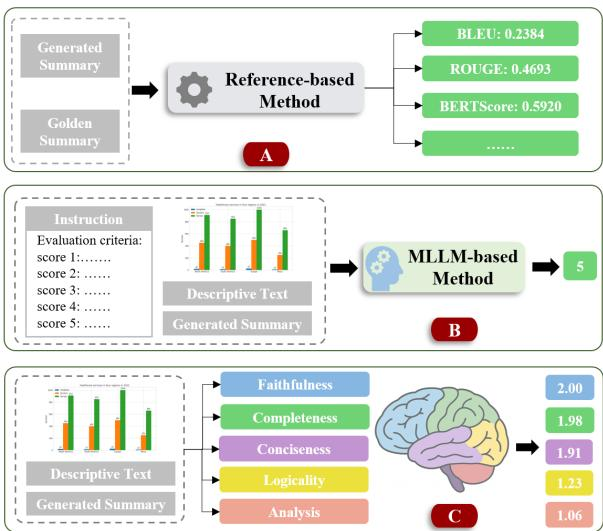  
Figure 1: The comparison of F2T evaluation methods. A. Reference-based. B. Reference-free. C. Our method.

Current F2T evaluation methods can be categorized as reference-based and reference-free methods (see Figure 1). Reference-based methods rely on golden reference summaries and evaluate the quality by calculating the similarity between the generated text and the reference text, e.g., BLEU (Papineni et al., 2002), ROUGE (Lin, 2004), and CIDEr (Vedantam et al., 2015). However, constructing high-quality and diverse reference texts is costly, especially in professional fields such as scientific research. On the other hand, referencefree methods (Goyal et al., 2022; Liu et al., 2023a)

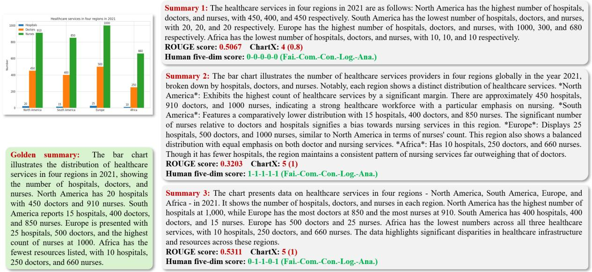  
Figure 2: An example to compare Reference-based and Reference-free methods against human evaluation.

typically leverage multimodal large language models (MLLMs) (Li et al., 2023; Huang and Zhang, 2024) and employ evaluation prompts to generate scores, offering greater flexibility. However, these methods are challenged by the following factors: 1) Model performance is sensitive to prompts (Errica et al., 2024). Different model versions or parameter configurations may result in inconsistent evaluation results (Stureborg et al., 2024). 2) Highperformance MLLMs are often closed-source and rely on remote API calls, which are slow and expensive, making it difficult to support efficient evaluation of large-scale tasks (Irugalbandara et al., 2024; Oketch et al., 2025). Furthermore, existing evaluation approaches (Vedantam et al., 2015; Xia et al., 2024) for F2T tasks predominantly rely on a “sample-level overall score”, which fails to incorporate multi-dimensional and fine-grained analysis. This limitation reduces the interpretability of model performance and hinders alignment with human expert evaluation criteria (Liu et al., 2023b). The gap between existing methods and human evaluation is shown in Figure 2.

Accordingly, we propose a multi-dimensional F2T evaluation method, F2TEval, which is aligned to human expert criteria, aiming to achieve finegrained, interpretable, and efficient evaluation. Specifically, we design five dimensions of finegrained evaluation criteria, including Faithfulness, Completeness, Conciseness, Logicality, and Analysis, to enhance evaluation interpretability and human-alignment. F2TEval is an open-source, lightweight reference-free evaluation model that can be deployed on a single GPU and supports fast scoring. Considering a multi-dimensional scoring scheme may lead to gradient interference in the training process, we design a Mixture of Experts (MoE) structure. By introducing the mechanisms of nonlinear decoupling and Hilbert-Schmidt Independence Criterion (HSIC), we perform dimension mapping in the matrix space, enabling each dimension to be scored by an independent module, thus improving the independence and generalization between dimensions. We also construct a humanlabeled F2T evaluation dataset (F2TBenchmark) to facilitate efficient model training and performance benchmarking.

The contributions of this paper are as follows1: (1) We develop the F2TBenchmark dataset upon 12 F2T data sources, covering 21 chart types and 35 domains. The dataset includes figure summary texts with different qualities that are generated by 10 major MLLMs. Each data instance is manually annotated with scores across five evaluation dimensions and subsequently verified by human experts, resulting in high-quality training data and reliable evaluation benchmarks. (2) The proposed evaluation method, F2TEval, is a lightweight, referencefree multi-dimensional evaluation model with an MoE architecture, enabling independent scoring of each evaluation dimension. By enhancing the optimization of the shared expert of MoE with a novel HSIC mechanism, F2TEval exceeds existing baseline methods with significant margins across the five evaluation dimensions. It also takes advantage of efficiency, measured by the parameter size and running time.

## 2 Related works

Reference-based evaluation methods, e.g., BLEU, ROUGE, CIDEr, and BERTScore (Zhang et al., 2019), are often used in F2T tasks, measuring the quality by comparing the similarity between generated text and reference text. These methods are simple to implement, applicable to a variety of text generation scenarios (Yue et al., 2025a), delivering great reproducibility and comparability. However, such methods strongly rely on high-quality reference texts (Gigant et al., 2024), which are usually labeled by professionals, leading to high cost (Yue et al., 2021). Furthermore, these methods are generally based on shallow similarity computation, making it difficult to recognize factual errors, logical gaps, and missing reasoning (Zhang et al., 2019; Fabbri et al., 2021).

With MLLMs (Yue et al., 2023; Anthropic, 2024b; Zhang et al., 2025; Team, 2025), referencefree methods have been advanced. They are usually based on pre-trained models, and provide scores or textual explanations with tailored instructions (Goyal et al., 2022; Liu et al., 2023a). Some studies designed scoring templates in combination with context (Zhang et al., 2024) to enhance robustness and used lightweight MLLMs (Yue et al., 2022; Wang et al., 2022; Touvron et al., 2023; Zhao et al., 2023) to reduce deployment cost. However, these methods are still sensitive to input instructions and samples, making them difficult to be stably applied to large-scale evaluation tasks. Moreover, the performance of small models is unsatisfying, while high-performance large models with closed sources suffer from high costs and unstable model versions (Irugalbandara et al., 2024).

Most existing methods provide only samplelevel overall scores (Hessel et al., 2021; Xia et al., 2024), lacking fine-grained evaluation across key dimensions such as content quality, logical structure, conciseness, and analytical depth, which limits interpretability (Yue et al., 2024). Moreover, a clear gap exists between these methods and expert human evaluation, as they fail to align with task-specific contexts and cognitive processes, restricting their use in high-precision, safe, and controllable generative modeling. Consequently, developing an automatic evaluation approach that is efficient, robust, fine-grained, and cognitively aligned with human judgment has become a critical challenge in current F2T evaluation research.

## 3 Methodology

F2TEval is a multi-dimensional F2T evaluation model. It is built upon an MoE architecture (see Figure 3), providing a fine-grained, interpretable, and human-aligned scoring scheme across five dimensions: Faithfulness, Completeness, Conciseness, Logicality, and Analysis. It consists of two technical components: 1) dimension-specific experts that are trained independently for each scoring dimension; 2) a shared expert with jointly trained multi-head outputs, optimized with HSIC to promote disentangled representation learning. The motivation for incorporating the two types of experts is that the dimension-specific experts aim to learn cross-modal semantic associations independently for each evaluation dimension. However, it is difficult for dimension-specific experts to capture sample-level generalized features to calibrate the overall scores across dimensions. Thus, the shared expert will correct the five-dimensional scores by re-weighting. Given the challenge of the MLLM in distinguishing dimension-specific semantics under shared representations, HSIC aims to encourage independence across scoring heads and reduce feature redundancy.

## 3.1 Dimension-specific experts

Each expert $f _ { d } ^ { \mathrm { s p e } }$ is trained independently for a particular evaluation dimension $d \in \mathcal { D }$ and kept frozen during the final joint training. It is composed of a pre-trained CLIP encoder and a lightweight projection layer followed by a scoring function. The input consists of an image I, contextual text T (caption and context information), and a generated summary S. The expert outputs a predicted score $\hat { y } _ { d } ^ { \mathrm { s p e } }$

I, T, and S are encoded into dense feature vectors using the encoder $( E ( \cdot ) )$ of CLIP: $\mathbf { v _ { \mathrm { i m g } } } =$ $\mathrm { E } _ { \mathrm { i m a g e } } ( I ) , \mathbf { v } _ { \mathrm { t e x t } } = \mathrm { E } _ { \mathrm { t e x t } } ( T ) , \mathbf { v } _ { \mathrm { t } }$ summary $= { \mathrm { ~ E } } _ { \mathrm { t e x t } } ( S )$ where vimg, vsummary, ${ \mathbf { v } } _ { \mathrm { t e x t } } \in \mathbb { R } ^ { F }$ . F denotes the embedding dimension of CLIP. The image and text embeddings are concatenated $( [ \cdot ; \cdot ] )$ and passed through a task-specific projector $( D ( \cdot )$ , a projector (MLP) layer) to obtain a joint representation ${ \bf z } _ { i t } ~ = ~ D ( { \bf v } _ { i t } )$ , where $\mathbf { v } _ { i t } ~ = ~ [ \mathbf { v } _ { \mathrm { i m g } } ; \mathbf { v } _ { \mathrm { t e x t } } ] , \mathbf { z } _ { i t } ~ \in$ $\mathbb { R } ^ { F } , \mathbf { v } _ { i t } \in \mathbb { R } ^ { 2 F }$ . Then, the similarity which measures cross-modal alignment is given by

$$
\hat { y } _ { d } ^ { \mathrm { s p e } } = w \cdot \frac { \mathbf { z } _ { i t } \cdot \mathbf { v } _ { \mathrm { s u m m a r y } } } { \| \mathbf { z } _ { i t } \| _ { 2 } \cdot \| \mathbf { v } _ { \mathrm { s u m m a r y } } \| _ { 2 } } + b ,\tag{1}
$$

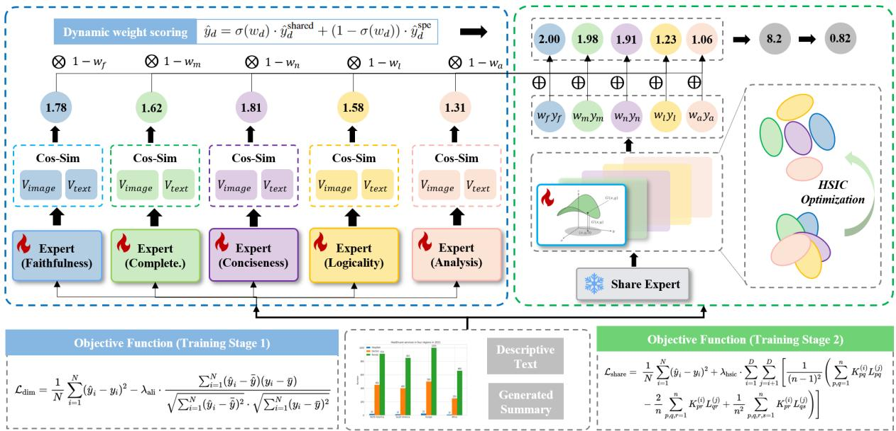  
Figure 3: The proposed F2TEval model. The left side shows the dimension-specific expert module and the first training stage, and the right side shows the shared expert module and the second training stage. y denotes prediction.

where w, b are learnable parameters.

Each expert is trained using a combination of Mean Squared Error (MSE) and negative alignment correlation function to ensure both accurate and rank-consistent predictions. Given a batch of $N$ samples with ground truth scores $y _ { i }$ and predicted scores ${ \hat { y } } _ { i } .$ , the loss terms are defined as:

$$
\begin{array} { r l } & { \mathcal { L } _ { \mathrm { M S E } } = \displaystyle \frac { 1 } { N } \sum _ { i = 1 } ^ { N } ( \hat { y } _ { i } - y _ { i } ) ^ { 2 } , } \\ & { \mathcal { L } _ { \mathrm { a l i } } = - \frac { \sum _ { i = 1 } ^ { N } ( \hat { y } _ { i } - \bar { \hat { y } } ) ( y _ { i } - \bar { y } ) } { \sqrt { \sum _ { i = 1 } ^ { N } ( \hat { y } _ { i } - \bar { \hat { y } } ) ^ { 2 } } \cdot \sqrt { \sum _ { i = 1 } ^ { N } ( y _ { i } - \bar { y } ) ^ { 2 } } } , } \\ & { \mathcal { L } _ { \mathrm { d i m } } = \mathcal { L } _ { \mathrm { M S E } } + \lambda _ { \mathrm { a l i } } \cdot \mathcal { L } _ { \mathrm { a l i } } , } \end{array}\tag{2}
$$

where $\bar { y }$ and $\bar { \hat { y } }$ are the mean values of ground truth and predicted scores in the batch. $\lambda _ { \mathrm { a l i } }$ is a hyperparameter balancing the two loss terms.

## 3.2 Shared expert and HSIC optimization

We also introduce a shared expert to jointly learn generalized scoring patterns across all five evaluation dimensions. Unlike dimension-specific experts that focus on independently modeling each evaluation aspect, the shared expert is trained end-to-end, with shared image and text representations and a multi-head output layer. This design provides flexibility, enables cross-dimensional knowledge transfer, and supports the MoE structure. The shared expert consists of a single CLIP encoder followed by five independent MLP heads $\{ h _ { d } \} _ { d \in \mathcal { D } }$ . Each head contains a two-layer feed-forward network with non-linearity.

First, we extract representations from the image, context, and summary using the CLIP encoder, and then concatenate the representations: $\mathbf { v } _ { i t s } = [ \mathrm { E } _ { \mathrm { i } } ( I ) ; \mathrm { E } _ { \mathrm { t } } ( T ) ; \mathrm { E } _ { \mathrm { t } } ( S ) ]$ , where ${ \bf v } _ { i t s } \in \mathbb { R } ^ { 3 F }$ Each dimension d has a dedicated head $h _ { d }$ composed of two linear layers:

$$
\hat { y } _ { d } ^ { \mathrm { s h a r e d } } = \mathbf { W } _ { 2 } ^ { ( d ) } \cdot \mathrm { R e L U } ( \mathbf { W } _ { 1 } ^ { ( d ) } \cdot \mathbf { v } _ { i t s } + \mathbf { b } _ { 1 } ^ { ( d ) } ) + \mathbf { b } _ { 2 } ^ { ( d ) } ,\tag{3}
$$

where $\mathbf { W } _ { 1 } ^ { ( d ) } \in \mathbb { R } ^ { n \times 3 F }$ and $\mathbf { b } _ { 1 } ^ { ( d ) } \in \mathbb { R } ^ { n }$ are the weights and bias of the first linear layer for dimension d; $\mathbf { W } _ { 2 } ^ { ( d ) } \in \mathbb { R } ^ { 1 \times n }$ and $\mathbf { b } _ { 2 } ^ { ( d ) } \in \mathbb { R }$ are the weights and bias of the second layer; n is the hidden dimension of the head; $\hat { y } _ { d } ^ { \mathrm { s h a r e d } }$ is the scalar prediction score for dimension d.

To ensure that each scoring head focuses on learning distinct semantic signals, HSIC is introduced as an optimizer on the first-layer weights $\mathbf { W } _ { 1 } ^ { ( d ) }$ . This encourages representations across dimensions to be statistically independent, reducing redundancy (see explanations in Appendix A). For Heads i and $j , \mathbf { W } _ { 1 } ^ { ( i ) }$ and $\mathbf { W } _ { 1 } ^ { ( j ) }$ are the respective weight matrices. The radial basis function (RBF) kernel Gram matrices are defined as:

$$
\begin{array} { r } { K _ { p q } = \exp \left( { - \frac { \| \mathbf { W } _ { 1 } ^ { ( i ) } [ p ] - \mathbf { W } _ { 1 } ^ { ( i ) } [ q ] \| ^ { 2 } } { 2 \sigma ^ { 2 } } } \right) , } \\ { L _ { p q } = \exp \left( { - \frac { \| \mathbf { W } _ { 1 } ^ { ( j ) } [ p ] - \mathbf { W } _ { 1 } ^ { ( j ) } [ q ] \| ^ { 2 } } { 2 \sigma ^ { 2 } } } \right) , } \end{array}\tag{4}
$$

where $p , q$ index the rows of the weight matrix, and σ is a kernel bandwidth hyperparameter. The centering matrix $H \in \mathbb { R } ^ { n \times n }$ is given by: $H =$ $\begin{array} { r } { \mathbf { I } _ { n } - \frac { 1 } { n } \cdot \mathbf { e } _ { n } \mathbf { e } _ { n } ^ { \top } } \end{array}$ , where ${ \mathbf I } _ { n }$ is the n-dimensional identity matrix; $\mathbf { e } _ { n } \in \mathbb { R } ^ { n }$ is a column vector with all elements equal to 1. This centering operation ensures that the kernel matrices are zero-mean in feature space. The HSIC value is then given by:

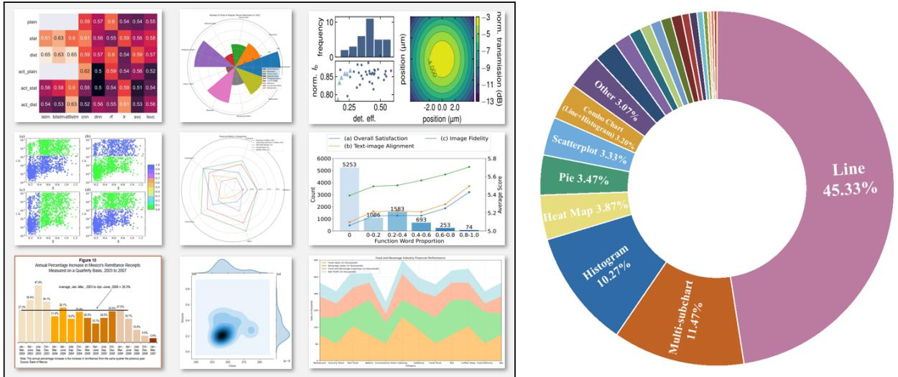  
Figure 4: The examples and statistics of figure types in the F2TBenchmark dataset.

$$
\begin{array} { l } { { \displaystyle { \mathrm { H S I C } } \big ( { \mathbf { W } } _ { 1 } ^ { ( i ) } , { \mathbf { W } } _ { 1 } ^ { ( j ) } \big ) = \frac { 1 } { ( n - 1 ) ^ { 2 } } \mathrm { t r } ( K H L H ) } } \\  { \displaystyle = \frac { 1 } { ( n - 1 ) ^ { 2 } } \bigg [ \sum _ { p , q = 1 } ^ { n } K _ { p q } L _ { p q } - \frac { 2 } { n } \sum _ { p , q , r = 1 } ^ { n } K _ { p r } L _ { q r } } \\ { { \displaystyle ~ + \frac { 1 } { n ^ { 2 } } \sum _ { p , q , r , s = 1 } ^ { n } K _ { p r } L _ { q s } \bigg ] , } } \end{array}\tag{5}
$$

$\mathbf { W } _ { 1 } ^ { ( i ) } , \mathbf { W } _ { 1 } ^ { ( j ) } \in \mathbb { R } ^ { n \times 3 F }$ are the first-layer weight matrices of the i-th and j-th scoring heads; n is the number of rows (hidden units); d is the dimensionality of each weight vector; $p , q , r , s \in \{ 1 , \ldots , n \}$ are indices over the rows of $\mathbf { W } _ { 1 } ^ { ( i ) }$ and $\mathbf { W } _ { 1 } ^ { ( j ) } ; t r ( \cdot )$ denotes the the trace of a matrix.

The final loss is given by $\mathcal { L } _ { \mathrm { s h a r e } } = \mathcal { L } _ { \mathrm { M S E } } ( \hat { y } , y )$ + $\lambda _ { \mathrm { h s i c } } \cdot \mathcal { L } _ { \mathrm { H S I C } }$ , where $\lambda _ { \mathrm { h s i c } }$ is a hyperparameter. The HSIC loss is the sum over all unordered head pairs:

$$
\mathcal { L } _ { \mathrm { H S I C } } = \sum _ { i = 1 } ^ { D } \sum _ { j = i + 1 } ^ { D } \mathrm { H S I C } ( \mathbf { W } _ { 1 } ^ { ( i ) } , \mathbf { W } _ { 1 } ^ { ( j ) } ) ,\tag{6}
$$

where D is the number of evaluation dimensions, and $\mathbf { W } _ { 1 } ^ { ( i ) }$ denotes the first-layer weight matrix of the i-th scoring head.

To enable gradient-based optimization, the HSIC loss is differentiable with respect to $\mathbf { W } _ { 1 } ^ { ( i ) }$ . We compute the gradient of $K _ { p q }$ with respect to each

weight vector $\mathbf { W } _ { 1 } ^ { ( i ) } [ p ]$ . For the RBF kernel, this partial derivative is given by:

$$
\frac { \partial K _ { p q } } { \partial \mathbf { W } _ { 1 } ^ { ( i ) } [ p ] } = - \frac { 1 } { \sigma ^ { 2 } } K _ { p q } \cdot \left( \mathbf { W } _ { 1 } ^ { ( i ) } [ p ] - \mathbf { W } _ { 1 } ^ { ( i ) } [ q ] \right) .\tag{7}
$$

Combining the full HSIC formula, we obtain:

$$
\begin{array} { r l } & { \frac { \partial \mathrm { H S I C } } { \partial \mathbf { W } _ { 1 } ^ { ( i ) } [ p ] } = \displaystyle \sum _ { q = 1 } ^ { n } \frac { \partial \mathrm { H S I C } } { \partial K _ { p q } } \cdot \frac { \partial K _ { p q } } { \partial \mathbf { W } _ { 1 } ^ { ( i ) } [ p ] } + \displaystyle \sum _ { q = 1 } ^ { n } \frac { \partial \mathrm { H S I C } } { \partial K _ { q p } } \cdot \frac { \partial K _ { q p } } { \partial \mathbf { W } _ { 1 } ^ { ( i ) } [ p ] } } \\ & { = - \frac { 2 } { ( n - 1 ) ^ { 2 } \sigma ^ { 2 } } \displaystyle \sum _ { q = 1 } ^ { n } ( H L H ) _ { p q } \cdot K _ { p q } \cdot \left( \mathbf { W } _ { 1 } ^ { ( i ) } [ p ] - \mathbf { W } _ { 1 } ^ { ( i ) } [ q ] \right) . } \end{array}\tag{8}
$$

This gradient enables end-to-end optimization of the HSIC loss via backpropagation. Unlike traditional orthogonality- or covariance-based regularization that assumes linear independence, HSIC measures statistical dependence in a reproducing kernel Hilbert space, capturing nonlinear and higher-order correlations between representations. The derived gradient encourages the entire weight matrix $\mathbf { W } _ { 1 } ^ { ( i ) }$ to reduce its dependency on other heads’ $\mathbf { W } _ { 1 } ^ { ( j ) }$ , thereby promoting inter-head functional diversity. This leads each scoring head to encode a distinct semantic subspace, enhancing disentanglement across evaluation dimensions.

## 3.3 Dynamic weight scoring

Each dimension’s final score is computed as a combination of dimension-specific experts and the shared expert predictions through:

$$
\hat { y } _ { d } = \sigma ( w _ { d } ) \cdot \hat { y } _ { d } ^ { \mathrm { s h a r e d } } + \left( 1 - \sigma ( w _ { d } ) \right) \cdot \hat { y } _ { d } ^ { \mathrm { s p e } } ,\tag{9}
$$

where $w _ { d }$ is a learnable gating parameter and $\sigma ( \cdot )$ denotes the sigmoid function.

<table><tr><td>Dataset</td><td>Task</td></tr><tr><td>ChartQA (Masry et al., 2022) Chart-to-text (Kantharaj et al., 2022)</td><td>Figure QA</td></tr><tr><td>ChartLlama (Han et al., 2023)</td><td>Figure Sum. Figure QA</td></tr><tr><td>UniChart (Masry et al., 2023)</td><td>Figure Sum.</td></tr><tr><td>ChartSumm (Rahman et al., 2023) ChartBench (Xu et al., 2023)</td><td>Figure Sum.</td></tr><tr><td></td><td>Figure QA</td></tr><tr><td>StructChart (Xia et al., 2023)</td><td>Figure Sum.</td></tr><tr><td>ChartX (Xia et al., 2024)</td><td>Figure Des.</td></tr><tr><td>MMC (Liu et al., 2024)</td><td>Figure QA</td></tr><tr><td>ChartCheck (Akhtar et al., 2024)</td><td></td></tr><tr><td></td><td>Figure Cap.</td></tr><tr><td>ChartXiv (Wang et al., 2024) AnaFig (Yue et al., 2025b)</td><td>Figure QA</td></tr></table>

Table 1: Overview of the sampled datasets. Sum. = Summarization. Des.=Description. Cap.=Caption. SFA = Scientific Figure Analysis.

## 4 F2TBenchmark dataset

We construct a large-scale dataset, F2TBenchmark, containing human-annotated data across diverse domains, figure types, and F2T tasks.

## 4.1 Collection

To ensure broad coverage of task types and content styles, as shown in Table 1, we sample data from 12 publicly available F2T datasets, including ChartQA, Chart-to-Text, ChartSumm, and AnaFig, etc. These datasets cover figure question answering (QA), captioning, summarization, description, and scientific reasoning tasks, providing diverse figure structures and domain contexts. Unlike singletask datasets, their combination enables a unified evaluation benchmark reflecting real-world figure diversity across academic and applied scenarios. Samples from different F2T datasets are shown in Figure A.1 in Appendix B. F2TBenchmark covers 21 mainstream figure types (e.g., line, bar, pie, etc.), 12 scientific domains (e.g. Physics, Finance, Social Sciences, etc.), and 35 sub-domains (e.g. Condensed Matter Physics, Particle Physics, Mechanics, etc). The statistics of figure types and domain distributions are shown in Figures 4 and 5.

## 4.2 Generation

For generation diversity, we employ 10 multimodal large language models (MLLMs) to generate figure summaries. The selected models include both open-source models (Qwen-VL-2B (Team, 2025), InterVL2.5-8B (Chen et al., 2024), MiniCPM-V2.5 (Yao et al., 2024), Phi-3-Vision (Abdin et al., 2024), ) and proprietary models (GPT-4o (Hurst et al., 2024), Claude-3.5-haiku (Anthropic, 2024b), Gemini-1.5-flash (Team et al., 2024), Qwen-VL-

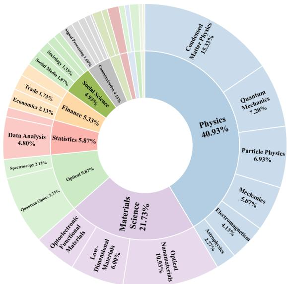  
Figure 5: Statistics of figure domains.

Max (Bai et al., 2023), GPT-4o-mini (OpenAI, 2024), Claude-3-haiku (Anthropic, 2024a)), covering a wide parameter range from lightweight to large-scale. This design captures variations in lexical style, factual grounding, and reasoning depth across different model families, enriching the dataset for robust evaluation.

## 4.3 Annotation

Each generated figure summary in F2TBenchmark is manually annotated by 8 trained human annotators across five evaluation dimensions: Faithfulness: The summary accurately reflects the figure content; Completeness: All key information and trends are included; Conciseness: Redundant or irrelevant details are avoided; Logicality: The summary is coherent and align with common sense and domain knowledge; Analysis: The summary offers clear and insightful data interpretation. Each dimension is scored on a 3-point scale: 0-poor, 1- acceptable, and 2-perfect. Detailed scoring criteria for each dimension are introduced in Figure 6.

The annotation process follows a standardized pipeline to ensure quality and consistency (Pearson coefficient = 0.91): 1) Training: Annotators undergo the annotation session with examples and discussions to understand all five dimensions and scoring guidelines. 2) Tool: A custom web-based annotation tool presents annotators with the figure, descriptive text (caption and context), and generated summaries. Scores are entered dimensionby-dimension. (Details in Figure A.2) 3) Quality Control: Each summary is annotated by at least two annotators. Disagreements are resolved by a senior annotator via adjudication. Inconsistently scored items are flagged for re-evaluation. 4) Scoring Aggregation: Final dimension scores are obtained by majority voting.

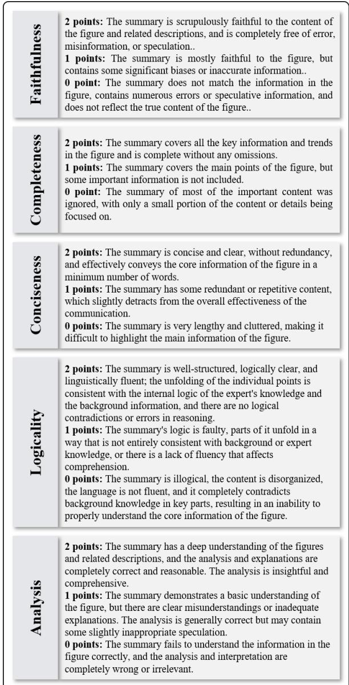  
Figure 6: Five-Dimensional Scoring Criteria.

## 5 Experimental setup

We compare our F2TEval with mainstream baseline methods, including: Reference-based methods: BLEU (Papineni et al., 2002), ROUGE (Lin, 2004), BERTScore (Zhang et al., 2019), CIDEr (Vedantam et al., 2015). Reference-free methods: CLIP-Score (Hessel et al., 2021), Qwen2-VL (Team, 2025), DeepSeek-VL2 (Wu et al., 2024), Kimi-VL-A3B (Team et al., 2025), Claude-3 (Anthropic, 2024a), Claude-3.5, Gemini-1.5 (Team et al., 2024),

<table><tr><td rowspan=1 colspan=1>PC(↑)  SC(↑) MAE(↓) MSE(↓)</td></tr><tr><td rowspan=1 colspan=1>Reference-based Methods</td></tr><tr><td rowspan=2 colspan=1>BLEU          0.2589 0.2858  0.5271   0.3584ROUGE1       0.3599 0.3455  0.2583   0.10160.3158 0.3298  0.4306   0.2504ROUGEL       0.3407 0.3484  0.3512   0.1704BERTScore    0.1939 0.2117  0.3707   0.2054CIDEr          0.0888 0.1617  0.5392   0.3939</td></tr><tr><td rowspan=1 colspan=1>ROUGE20.31</td></tr><tr><td rowspan=1 colspan=1>Reference-free Methods</td></tr><tr><td rowspan=1 colspan=1>CLIPScore     0.2939 0.2963  0.5601   0.4011</td></tr><tr><td rowspan=1 colspan=1>Qwen2-VL-2B 0.0975 0.0651  0.4035   0.2507Qwen2-VL-7B 0.1801 0.1689  0.4015   0.2448DS-VL2-Tiny  0.0752 0.0712  0.3819   0.2384DS-VL2-Small 0.2125 0.2019  0.3516   0.2298</td></tr><tr><td rowspan=1 colspan=1>Kimi-VL-A3B  0.3173 0.3089  0.3389   0.2036</td></tr><tr><td rowspan=1 colspan=1>Claude-3       0.2371 0.2207  0.3053   0.1484</td></tr><tr><td rowspan=1 colspan=1>Gemini-1.5     0.4015 0.3674  0.3051   0.1792</td></tr><tr><td rowspan=1 colspan=1>Claude-3.5     0.4934 0.4593  0.3405   0.1829</td></tr><tr><td rowspan=1 colspan=1>Gemini-2       0.5901 0.5797  0.2623   0.1292</td></tr><tr><td rowspan=1 colspan=1>ChartX         0.5965 0.5898  0.2338   0.1053</td></tr><tr><td rowspan=1 colspan=1>F2TEval       0.7481 0.7286  0.1681   0.0434</td></tr></table>

Table 2: Main results of reference-based and referencefree methods. DS=DeepSeek.

Gemini-2, ChartX (Xia et al., 2024).

We use 6 CLIP ViT-B/32 as the backbone (1 shared expert and 5 dimension-specific experts). The training is conducted with: optimizer = AdamW; learning rate = 1 10−4; batch size (N) = 16; λhsic = 0.1; λali = 0.1. F = 512, D = 5. (See Appendix C for detailed settings of the baseline models and F2TEval.)

Four widely adopted metrics are used: (1) Pearson Correlation (PC) to measure linear agreement between automatic scores and human annotations; (2) Spearman Correlation (SC) to assess their ranking consistency; (3) Mean Absolute Error (MAE) for average prediction error; and (4) Mean Squared Error (MSE) to penalize larger deviations. See details in Appendix D.

## 6 Results

Table 2 shows the evaluation accuracy superiority of F2TEval over baselines. Among referencebased methods, ROUGE1 achieves the highest PC (0.3599), while all methods perform poorly. This suggests that these approaches are insufficient to capture the semantic and factual correctness of F2T summaries, especially in scientific or multi-modal contexts. For reference-free methods, Gemini-2 and ChartX show strong results, with 0.5901 and 0.5965 PC, respectively. Our method F2TEval achieves the best performance across all metrics, with a PC of 0.7481 and MSE of only 0.0434. This clearly shows that our multi-dimensional scoring architecture with MoE and HSIC optimization can effectively align human preferences. In particular, F2TEval with only 0.9B parameters outperforms leading proprietary MLLMs like Gemini-2.

<table><tr><td rowspan="2">Model</td><td colspan="2">Faithfulness</td><td colspan="2">Completeness</td><td colspan="2">Conciseness</td><td colspan="2">Logicality</td><td colspan="2">Analysis</td><td colspan="2">Overall</td></tr><tr><td>PC(↑)</td><td>SC(↑)</td><td>PC(↑)</td><td>SC(↑)</td><td>PC(↑)</td><td>SC(↑)</td><td>PC(↑)</td><td>SC(↑)</td><td>PC(↑)</td><td>SC(↑)</td><td>PC(↑)</td><td>SC(↑)</td></tr><tr><td></td><td colspan="10">Open-Source Models</td></tr><tr><td>Qwen2-VL-2B</td><td>0.0339</td><td>0.0359</td><td>0.2051</td><td>0.1917</td><td>-0.0141</td><td>-0.0227</td><td>0.0616</td><td>0.0547</td><td>0.1192</td><td>0.0982</td><td>0.0975</td><td>0.0651</td></tr><tr><td>DS-VL2-Tiny</td><td>0.1889</td><td>0.1897</td><td>0.1329</td><td>0.1299</td><td>0.0862</td><td>0.0684</td><td>0.1166</td><td>0.1088</td><td>0.1453</td><td>0.1618</td><td>0.0752</td><td>0.0712</td></tr><tr><td>Qwen2-VL-7B</td><td>0.0681</td><td>0.0765</td><td>0.1871</td><td>0.1833</td><td>0.0741</td><td>0.0869</td><td>0.1789</td><td>0.1721</td><td>-0.0171</td><td>-0.0501</td><td>0.1801</td><td>0.1689</td></tr><tr><td>DS-VL2-Small</td><td>0.1242</td><td>0.1351</td><td>0.1981</td><td>0.1947</td><td>0.1342</td><td>0.1105</td><td>0.2226</td><td>0.2081</td><td>0.3138</td><td>0.3123</td><td>0.2125</td><td>0.2019</td></tr><tr><td>Kimi-VL-A3B</td><td>0.2336</td><td>0.2195</td><td>0.3074</td><td>0.2977</td><td>0.2249</td><td>0.2309</td><td>0.3884</td><td>0.3791</td><td>0.3504</td><td>0.3464</td><td>0.3173</td><td>0.3089</td></tr><tr><td colspan="14">Proprietary Models</td></tr><tr><td>Claude-3</td><td>0.1747</td><td>0.1721</td><td>0.1384</td><td>0.1266</td><td>0.1092</td><td>0.1102</td><td>0.1551</td><td>0.1402</td><td>0.2336</td><td>0.2239</td><td>0.2371 0.2207</td><td></td></tr><tr><td>Gemini-1.5</td><td>0.2897</td><td>0.2704</td><td>0.3875</td><td>0.3697</td><td>0.1641</td><td>0.1718</td><td>0.3189</td><td>0.2917</td><td>0.3251</td><td>0.3068</td><td>0.4015</td><td>0.3674</td></tr><tr><td>Claude-3.5</td><td>0.4271</td><td>0.4131</td><td>0.4333</td><td>0.4281</td><td>0.2402</td><td>0.1906</td><td>0.4418</td><td>0.4119</td><td>0.4558</td><td>0.4297</td><td>0.4934</td><td>0.4593</td></tr><tr><td>Gemini-2.0</td><td>0.3719</td><td>0.3725</td><td>0.5594</td><td>0.5419</td><td>0.3904</td><td>0.3632</td><td>0.5397</td><td>0.5011</td><td>0.5339</td><td>0.5214</td><td>0.5901</td><td>0.5797</td></tr><tr><td>ChartX</td><td>0.5322</td><td>0.5175</td><td>0.5541</td><td>0.5416</td><td>0.3274</td><td>0.3159</td><td>0.5089</td><td>0.4835</td><td>0.5774</td><td>0.5626</td><td>0.5965</td><td>0.5898</td></tr><tr><td>F2TEval (Ours)</td><td>0.7306</td><td>0.7209</td><td>0.6794</td><td>0.6661</td><td>0.5763</td><td>0.5687</td><td>0.6626</td><td>0.6194</td><td>0.7136</td><td>0.7063</td><td></td><td>0.7481 0.7286</td></tr></table>

Table 3: Breakdown results on five evaluation dimensions and overall score.

<table><tr><td></td><td>PC(↑) SC(↑) MAE(↓) MSE(↓)</td></tr><tr><td>CLIP (w/o SFT) 0.2939</td><td>0.2963 0.5601 0.4011</td></tr><tr><td></td><td></td></tr><tr><td>w/o five-dim. expert 0.4536 0.4028</td><td>0.3211 0.2261 0.3198 0.2087</td></tr><tr><td>w/o share expert 0.6828 F2TEval 0.7481</td><td>0.6368 0.7286 0.1681 0.0434</td></tr></table>

Table 4: Ablation study results.

## 6.1 Breakdown analysis of five dimensions

We report the evaluation results on each of the five human-aligned dimensions in Table 3. F2TEval consistently outperforms all baselines with a large margin across all five dimensions. In Faithfulness, which is arguably the most critical criterion for factual correctness, F2TEval achieves 0.7306 PC, nearly 20% higher than the best-performing ChartX (0.5322). In Completeness, F2TEval achieves 0.6794 PC, again surpassing all competitors. In Conciseness, F2TEval achieves the highest scores of 0.5763 in PC and 0.5687 in SC. In Logicality and Analysis, which evaluate Logical coherence and depth of analysis, respectively, F2TEval also consistently leads all baselines.

## 6.2 Ablation study

The ablation analysis results are shown in Table 4. The very weak performance of CLIP (w/o SFT) shows that pre-trained embeddings alone cannot align with humans effectively for figure summarization evaluation. w/o five-dim. expert relies solely on the shared expert for scoring. Performance drops significantly across all metrics (0.4536 PC), suggesting that dimension-specific modeling is essential for capturing fine-grained semantics and enhancing interpretability. w/o share expert uses only the five dimension-specific experts. This variant performs better (0.6828 PC), but still underperforms compared to the full model, showing that the shared expert provides complementary global representations and learning capacity. Figure 7 shows the semantic disentanglement effect of HSIC, indicating that representation disentanglement is crucial for ensuring modular and non-redundant learning across evaluation dimensions.

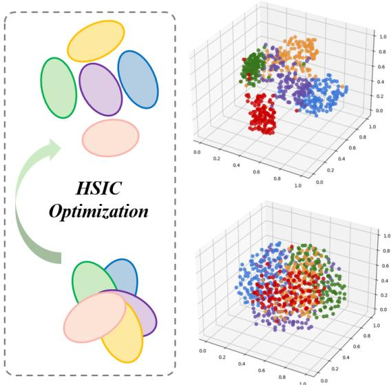  
Figure 7: The semantic disentanglement of HSIC.

<table><tr><td>Model</td><td>PC(↑)</td><td>SC(↑)</td><td>MAE(↓)</td><td>MSE(↓)</td></tr><tr><td>Qwen2-VL-2B</td><td>0.0975</td><td>0.0651</td><td>0.4035</td><td>0.2507</td></tr><tr><td> $\Delta$ </td><td>↑0.1276</td><td>↑0.1807</td><td>↓0.0680</td><td>↓0.0502</td></tr><tr><td>Qwen2 (SFT)</td><td>0.2251</td><td>0.2458</td><td>0.3355</td><td>0.2005</td></tr><tr><td>DS-VL2-Small</td><td>0.2125</td><td>0.2019</td><td>0.3516</td><td>0.2298</td></tr><tr><td> $\Delta$ </td><td>↑0.0706</td><td>↑0.0494</td><td>↓0.0101</td><td>↑0.0003</td></tr><tr><td>DS-VL2 (SFT)</td><td>0.2831</td><td>0.2513</td><td>0.3415</td><td>0.2301</td></tr><tr><td>Kimi-VL-A3B</td><td>0.3173</td><td>0.3089</td><td>0.3389</td><td>0.2036</td></tr><tr><td> $\Delta$ </td><td>↑0.0639</td><td>↑0.0337</td><td>↓0.0247</td><td>↓0.0121</td></tr><tr><td>Kimi (SFT)</td><td>0.3812</td><td>0.3426</td><td>0.3142</td><td>0.1915</td></tr><tr><td>CLIP</td><td>0.2939</td><td>0.2963</td><td>0.5601</td><td>0.4011</td></tr><tr><td> $\Delta _ { 1 }$ </td><td>↑0.1279</td><td>↑0.0928</td><td>↓0.2075</td><td>↓0.1650</td></tr><tr><td>CLIP (SFT)</td><td>0.4218</td><td>0.3891</td><td>0.3526</td><td>0.2361</td></tr><tr><td> $\Delta _ { 2 }$ </td><td>↑0.4542</td><td>↑0.4323</td><td>↓0.3920</td><td>↓0.3577</td></tr><tr><td>F2TEval (Ours)</td><td>0.7481</td><td>0.7286</td><td>0.1681</td><td>0.0434</td></tr></table>

Table 5: Performance of only supervised fine-tuning (SFT) on MLLMs. DS = DeepSeek. $ \Delta _ { \mathrm { 1 } } { \mathrm { = } } \mathrm { C L I P }$ (SFT) vs CLIP. $\Delta _ { \mathrm { 2 } } { = } \mathrm { F } 2 \mathrm { T E } \mathrm { v } { \mathrm { a l } }$ vs CLIP.

## 6.3 Effectiveness of supervised fine-tuning

To examine whether supervised fine-tuning (SFT) alone on MLLMs is sufficient for effective evaluation, we compare F2TEval with three strong MLLMs, including Qwen2-VL-2B, DeepSeek-VL2-Small, and Kimi-VL-A3B. Each of the models is fine-tuned on the same training set, without incorporating any multi-dimensional structure, modular scoring heads, or HSIC optimization.

Table 5 shows that all SFT-only models fall significantly behind our F2TEval across all metrics. Kimi-VL-A3B, the best-performing among the three, only achieves 0.3812 PC and 0.3426 SC. This is nearly half of the correlation achieved by our method. These results indicate that parameter scaling and supervised loss alone cannot align human evaluation in F2T evaluation tasks.

## 6.4 Efficiency analysis

We also evaluate F2TEval in terms of parameter size and running time on the test set in Table 6. Since reference-based methods are not capable of multi-dimensional evaluation and have poor performance, we focus on reference-free method comparisons. F2TEval delivers the highest overall performance while remaining the most lightweight and efficient among the compared methods. It contains only 0.9B total parameters, with only 0.3B activated per dimension. It completes evaluation in just 31 seconds, which is over 50× faster than the second-best ChartX. Despite its compact size, it surpasses all baselines in both PC and SC. The effectiveness and efficiency of F2TEval make it well-suited for real-world applications.

<table><tr><td>Model</td><td>TP(AP)</td><td>RT(s)</td><td>PC(↑)</td><td>SC(↑)</td></tr><tr><td>DS-VL2-Small</td><td>16B (3B)</td><td>1896</td><td>0.2125</td><td>0.2019</td></tr><tr><td>Kimi-VL-A3B</td><td>16B (3B)</td><td>2125</td><td>0.3173</td><td>0.3089</td></tr><tr><td>Gemini-1.5</td><td>Closed</td><td>1359</td><td>0.4015</td><td>0.3674</td></tr><tr><td>Claude-3.5</td><td>Closed</td><td>1928</td><td>0.4934</td><td>0.4593</td></tr><tr><td>Gemini-2</td><td>Closed</td><td>1437</td><td>0.5901</td><td>0.5797</td></tr><tr><td>ChartX</td><td>Closed</td><td>1845</td><td>0.5965</td><td>0.5898</td></tr><tr><td>F2TEval (Ours)</td><td>0.9B (0.3B)</td><td>31</td><td>0.7481</td><td>0.7286</td></tr></table>

Table 6: Comparison of model efficiency and performance. DS = DeepSeek. TP=Total Parameters, AP=Activation Parameters. Closed=Closed-Source Proprietary Model. RT=Running Time (NVIDIA H800 GPU for open-source models and API for closed-source models).

## 7 Conclusion

In this work, we propose F2TEval and F2TBenchmark, a lightweight and interpretable evaluation model and a benchmark dataset for F2T evaluation. By aligning with human evaluation criteria, we introduce five-dimensional scoring criteria and design an MoE architecture with HSIC-based independence optimization to ensure dimensions are decoupled. Extensive experiments demonstrate that F2TEval not only outperforms existing reference-based and reference-free methods in effectiveness, but also achieves superior efficiency with significantly lower cost.

## Limitations

The current F2TEval model is designed only for F2T evaluation tasks. In future work, we plan to extend our method to more complex multimodal evaluation tasks, such as multimodal multi-turn dialogue and multimodal chain-of-thought (MCoT) quality evaluation. These tasks require advanced visual perception across multiple steps and long-text logical reasoning, which may exceed the capabilities of the current CLIP-based backbone. To address this, larger backbone models will be needed to enhance fundamental understanding, combined with multi-task training and reinforcement learning to improve generalization. However, these improvements may lose efficiency in exchange for better performance.

## Acknowledgments

This work is supported in part by the National Natural Science Foundation of China (NSFC, 62506014).

## References

Marah Abdin, Jyoti Aneja, Hany Awadalla, Ahmed Awadallah, Ammar Ahmad Awan, Nguyen Bach, Amit Bahree, Arash Bakhtiari, Jianmin Bao, Harkirat Behl, and 1 others. 2024. Phi-3 technical report: A highly capable language model locally on your phone. arXiv preprint arXiv:2404.14219.

Mubashara Akhtar, Nikesh Subedi, Vivek Gupta, Sahar Tahmasebi, Oana Cocarascu, and Elena Simperl. 2024. Chartcheck: Explainable fact-checking over real-world chart images. In Findings of the Association for Computational Linguistics ACL 2024, pages 13921–13937.

Anthropic. 2024a. The claude 3 model family: Opus, sonnet, haiku.

Anthropic. 2024b. Model card addendum: Claude 3.5 haiku and upgraded claude 3.5 sonnet.

Jinze Bai, Shuai Bai, Shusheng Yang, Shijie Wang, Sinan Tan, Peng Wang, Junyang Lin, Chang Zhou, and Jingren Zhou. 2023. Qwen-vl: A versatile vision-language model for understanding, localization, text reading, and beyond. arXiv preprint arXiv:2308.12966, 1(2):3.

Zhe Chen, Jiannan Wu, Wenhai Wang, Weijie Su, Guo Chen, Sen Xing, Muyan Zhong, Qinglong Zhang, Xizhou Zhu, Lewei Lu, and 1 others. 2024. Internvl: Scaling up vision foundation models and aligning for generic visual-linguistic tasks. In Proceedings of the IEEE/CVF Conference on Computer Vision and Pattern Recognition, pages 24185–24198.

Ernest Davis. 2023. Benchmarks for automated com monsense reasoning: A survey. ACM Computing Surveys, 56(4):1–41.

Federico Errica, Giuseppe Siracusano, Davide Sanvito, and Roberto Bifulco. 2024. What did i do wrong? quantifying llms’ sensitivity and consistency to prompt engineering. arXiv preprint arXiv:2406.12334.

Alexander R Fabbri, Wojciech Krysci´ nski, Bryan Mc-´ Cann, Caiming Xiong, Richard Socher, and Dragomir Radev. 2021. Summeval: Re-evaluating summarization evaluation. Transactions ofthe Associationfor Computational Linguistics, 9:391–409.

Théo Gigant, Camille Guinaudeau, Marc Decombas, and Frédéric Dufaux. 2024. Mitigating the impact of reference quality on evaluation of summarization systems with reference-free metrics. arXiv preprint arXiv:2410.10867.

Tanya Goyal, Junyi Jessy Li, and Greg Durrett. 2022. News summarization and evaluation in the era of gpt-3. arXiv preprint arXiv:2209.12356.

Arthur Gretton, Olivier Bousquet, Alex Smola, and Bernhard Schölkopf. 2005. Measuring statistical dependence with hilbert-schmidt norms. In International conference on algorithmic learning theory, pages 63–77. Springer.

Yucheng Han, Chi Zhang, Xin Chen, Xu Yang, Zhibin Wang, Gang Yu, Bin Fu, and Hanwang Zhang. 2023. Chartllama: A multimodal llm for chart understanding and generation. arXiv preprint arXiv:2311.16483.

Jack Hessel, Ari Holtzman, Maxwell Forbes, Ronan Le Bras, and Yejin Choi. 2021. Clipscore: A referencefree evaluation metric for image captioning. arXiv preprint arXiv:2104.08718.

Ting-Yao Hsu, C Lee Giles, and Ting-Hao’Kenneth Huang. 2021. Scicap: Generating captions for scientific figures. arXiv preprint arXiv:2110.11624.

Jiaxing Huang and Jingyi Zhang. 2024. A survey on evaluation of multimodal large language models. arXiv preprint arXiv:2408.15769.

Aaron Hurst, Adam Lerer, Adam P Goucher, Adam Perelman, Aditya Ramesh, Aidan Clark, AJ Ostrow, Akila Welihinda, Alan Hayes, Alec Radford, and 1 others. 2024. Gpt-4o system card. arXiv preprint arXiv:2410.21276.

Chandra Irugalbandara, Ashish Mahendra, Roland Daynauth, Tharuka Kasthuri Arachchige, Jayanaka Dantanarayana, Krisztian Flautner, Lingjia Tang, Yiping Kang, and Jason Mars. 2024. Scaling down to scale up: A cost-benefit analysis of replacing openai’s llm with open source slms in production. In 2024 IEEE International Symposium on Performance Analysis of Systems and Software (ISPASS), pages 280–291. IEEE.

Shankar Kantharaj, Rixie Tiffany Ko Leong, Xiang Lin, Ahmed Masry, Megh Thakkar, Enamul Hoque, and Shafiq Joty. 2022. Chart-to-text: A large-scale benchmark for chart summarization. arXiv preprint arXiv:2203.06486.

Ranjay Krishna, Yuke Zhu, Oliver Groth, Justin Johnson, Kenji Hata, Joshua Kravitz, Stephanie Chen, Yannis Kalantidis, Li-Jia Li, David Shamma, and 1 others. 2017. Visual genome: Connecting language and vision using crowdsourced dense image annotations. International Journal of Computer Vision, 123(1).

Junnan Li, Dongxu Li, Silvio Savarese, and Steven Hoi. 2023. Blip-2: Bootstrapping language-image pretraining with frozen image encoders and large language models. In International conference on machine learning, pages 19730–19742. PMLR.

Chin-Yew Lin. 2004. Rouge: A package for automatic evaluation of summaries. In Text summarization branches out, pages 74–81.

Tsung-Yi Lin, Michael Maire, Serge Belongie, James Hays, Pietro Perona, Deva Ramanan, Piotr Dollár, and C Lawrence Zitnick. 2014. Microsoft coco: Common objects in context. In Computer Vision– ECCV 2014: 13th European Conference, Zurich, Switzerland, September 6-12, 2014, Proceedings, Part V 13, pages 740–755. Springer.

Fuxiao Liu, Xiaoyang Wang, Wenlin Yao, Jianshu Chen, Kaiqiang Song, Sangwoo Cho, Yaser Yacoob, and Dong Yu. 2024. Mmc: Advancing multimodal chart understanding with large-scale instruction tuning. In Proceedings of the 2024 Conference of the North American Chapter of the Association for Computational Linguistics: Human Language Technologies (Volume 1: Long Papers), pages 1287–1310.

Yang Liu, Dan Iter, Yichong Xu, Shuohang Wang, Ruochen Xu, and Chenguang Zhu. 2023a. G-eval: Nlg evaluation using gpt-4 with better human alignment. arXiv preprint arXiv:2303.16634.

Yixin Liu, Alexander R Fabbri, Yilun Zhao, Pengfei Liu, Shafiq Joty, Chien-Sheng Wu, Caiming Xiong, and Dragomir Radev. 2023b. Towards interpretable and efficient automatic reference-based summarization evaluation. arXiv preprint arXiv:2303.03608.

Ahmed Masry, Parsa Kavehzadeh, Xuan Long Do, Enamul Hoque, and Shafiq Joty. 2023. Unichart: A universal vision-language pretrained model for chart comprehension and reasoning. arXiv preprint arXiv:2305.14761.

Ahmed Masry, Do Xuan Long, Jia Qing Tan, Shafiq Joty, and Enamul Hoque. 2022. Chartqa: A benchmark for question answering about charts with visual and logical reasoning. arXiv preprint arXiv:2203.10244.

Ahmed Masry, Mehrad Shahmohammadi, Md Rizwan Parvez, Enamul Hoque, and Shafiq Joty. 2024. Chartinstruct: Instruction tuning for chart comprehension and reasoning. arXiv preprint arXiv:2403.09028.

Kezia Oketch, John P Lalor, Yi Yang, and Ahmed Abbasi. 2025. Bridging the llm accessibility divide? performance, fairness, and cost of closed versus open llms for automated essay scoring. arXiv preprint arXiv:2503.11827.

OpenAI. 2024. Gpt-4o mini: advancing cost-efficient intelligence.

Kishore Papineni, Salim Roukos, Todd Ward, and Wei-Jing Zhu. 2002. Bleu: a method for automatic evaluation of machine translation. In Proceedings of the 40th annual meeting of the Association for Computational Linguistics, pages 311–318.

Raian Rahman, Rizvi Hasan, Abdullah Al Farhad, Md Tahmid Rahman Laskar, Md Hamjajul Ashmafee, and Abu Raihan Mostofa Kamal. 2023. Chartsumm: A comprehensive benchmark for automatic chart summarization of long and short summaries. arXiv preprint arXiv:2304.13620.

Rickard Stureborg, Dimitris Alikaniotis, and Yoshi Suhara. 2024. Large language models are inconsistent and biased evaluators. arXiv preprint arXiv:2405.01724.

Gemini Team, Petko Georgiev, Ving Ian Lei, Ryan Burnell, Libin Bai, Anmol Gulati, and 1 others. 2024. Gemini 1.5: Unlocking multimodal understanding across millions of tokens of context. Preprint, arXiv:2403.05530.

Kimi Team, Angang Du, Bohong Yin, Bowei Xing, Bowen Qu, Bowen Wang, Cheng Chen, Chenlin Zhang, Chenzhuang Du, Chu Wei, and 1 others. 2025. Kimi-vl technical report. arXiv preprint arXiv:2504.07491.

Qwen Team. 2025. Qwen2.5 technical report. Preprint, arXiv:2412.15115.

Hugo Touvron, Thibaut Lavril, Gautier Izacard, Xavier Martinet, Marie-Anne Lachaux, Timothée Lacroix, Baptiste Rozière, Naman Goyal, Eric Hambro, Faisal Azhar, and 1 others. 2023. Llama: Open and efficient foundation language models. arXiv preprint arXiv:2302.13971.

Ramakrishna Vedantam, C Lawrence Zitnick, and Devi Parikh. 2015. Cider: Consensus-based image description evaluation. In Proceedings of the IEEE conference on computer vision and pattern recognition, pages 4566–4575.

Heng Wang, Tan Yue, Xiang Ye, Zihang He, Bohan Li, and Yong Li. 2022. Revisit finetuning strategy for few-shot learning to transfer the emdeddings. In The Eleventh International Conference on Learning Representations.

Zirui Wang, Mengzhou Xia, Luxi He, Howard Chen, Yitao Liu, Richard Zhu, Kaiqu Liang, Xindi Wu, Haotian Liu, Sadhika Malladi, and 1 others. 2024. Charxiv: Charting gaps in realistic chart understanding in multimodal llms. Advances in Neural Information Processing Systems, 37:113569–113697.

Zirui Wang, Mengzhou Xia, Luxi He, Howard Chen, Yitao Liu, Richard Zhu, Kaiqu Liang, Xindi Wu, Haotian Liu, Sadhika Malladi, and 1 others. 2025. Charxiv: Charting gaps in realistic chart understanding in multimodal llms. Advances in Neural Information Processing Systems, 37:113569–113697.

Zhiyu Wu, Xiaokang Chen, Zizheng Pan, Xingchao Liu, Wen Liu, Damai Dai, Huazuo Gao, Yiyang Ma, Chengyue Wu, Bingxuan Wang, and 1 others. 2024. Deepseek-vl2: Mixture-of-experts visionlanguage models for advanced multimodal understanding. arXiv preprint arXiv:2412.10302.

Renqiu Xia, Bo Zhang, Haoyang Peng, Hancheng Ye, Xiangchao Yan, Peng Ye, Botian Shi, Yu Qiao, and Junchi Yan. 2023. Structchart: Perception, structuring, reasoning for visual chart understanding. arXiv preprint arXiv:2309.11268.

Renqiu Xia, Bo Zhang, Hancheng Ye, Xiangchao Yan, Qi Liu, Hongbin Zhou, Zijun Chen, Min Dou, Botian Shi, Junchi Yan, and 1 others. 2024. Chartx & chartvlm: A versatile benchmark and foundation model for complicated chart reasoning. arXiv preprint arXiv:2402.12185.

Zhengzhuo Xu, Sinan Du, Yiyan Qi, Chengjin Xu, Chun Yuan, and Jian Guo. 2023. Chartbench: A benchmark for complex visual reasoning in charts. arXiv preprint arXiv:2312.15915.

Yuan Yao, Tianyu Yu, Ao Zhang, Chongyi Wang, Junbo Cui, Hongji Zhu, Tianchi Cai, Haoyu Li, Weilin Zhao, Zhihui He, Qianyu Chen, Huarong Zhou, Zhensheng Zou, Haoye Zhang, Shengding Hu, Zhi Zheng, Jie Zhou, Jie Cai, Xu Han, and 4 others. 2024. Minicpmv: A gpt-4v level mllm on your phone. arXiv preprint 2408.01800.

Fei Yu, Hongbo Zhang, Prayag Tiwari, and Benyou Wang. 2023. Natural language reasoning, a survey. ACM Computing Surveys.

Tan Yue, Zihang He, Chang Li, Zonghai Hu, and Yong Li. 2022. Lightweight fine-grained classification for scientific paper. Journal ofIntelligent & Fuzzy Systems, 43(5):5709–5719.

Tan Yue, Yong Li, and Zonghai Hu. 2021. Dwsa: An intelligent document structural analysis model for information extraction and data mining. Electronics, 10(19):2443.

Tan Yue, Rui Mao, Xuzhao Shi, Shuo Zhan, Zuhao Yang, and Dongyan Zhao. 2025a. Qaeval: Mixture of evaluators for question-answering task evaluation. In Proceedings of the 63rd Annual Meeting of the Association for Computational Linguistics (Volume 1: Long Papers), pages 14717–14730.

Tan Yue, Rui Mao, Heng Wang, Zonghai Hu, and Erik Cambria. 2023. KnowleNet: Knowledge fusion network for multimodal sarcasm detection. Information Fusion, 100:101921.

Tan Yue, Xuzhao Shi, Rui Mao, Zonghai Hu, and Erik Cambria. 2024. Sarcnet: a multilingual multimodal sarcasm detection dataset. In Proceedings of the 2024 Joint International Conference on Computational Linguistics, Language Resources and Evaluation (LREC-COLING 2024), pages 14325–14335.

Tan Yue, Xuzhao Shi, Rui Mao, Zilong Song, Zonghai Hu, and Dongyan Zhao. 2025b. Anafig: A humanaligned dataset for scientific figure analysis. In Proceedings ofthe 33rd ACM International Conference on Multimedia.

Sainan Zhang, Jun Zhang, Weiguo Song, Tan Yue, and Luyao Zhu. 2025. Arise: Explainable multi-modal aggressive driving detection via driver state and environment perception. IEEE Intelligent Systems.

Tianyi Zhang, Varsha Kishore, Felix Wu, Kilian Q Weinberger, and Yoav Artzi. 2019. Bertscore: Evaluating text generation with bert. arXiv preprint arXiv:1904.09675.

Yue Zhang, Ming Zhang, Haipeng Yuan, Shichun Liu, Yongyao Shi, Tao Gui, Qi Zhang, and Xuanjing Huang. 2024. Llmeval: A preliminary study on how to evaluate large language models. In Proceedings

of the AAAI Conference on Artificial Intelligence, volume 38, pages 19615–19622.

Jiafeng Zhao, Xiang Ye, Tan Yue, and Yong Li. 2023. Cldm: convolutional layer dropout module. Machine Vision and Applications, 34(4):63.

## A Theoretical Derivation of the HSIC

## A.1 Hilbert–Schmidt Independence Criterion

The Hilbert–Schmidt Independence Criterion (HSIC) is a kernel-based statistical dependence measure that quantifies the association between two random variables $x \in \mathcal { X }$ and $y \in \mathcal { V }$ by computing the Hilbert–Schmidt norm of their crosscovariance operator in a reproducing kernel Hilbert space (RKHS).

Let and $\mathcal { H } _ { \ell }$ be RKHSs endowed with positive-definite kernels $k : \mathcal { X } \times \mathcal { X } $ R and $\ell : \mathcal { Y } \times \mathcal { Y }  \mathbb { R }$ , and associated feature maps $\phi ( x ) \in \mathcal { H } _ { k } , \psi ( y ) \in \mathcal { H } _ { \ell }$ . The cross-covariance operator $C _ { x y } : \mathcal { H } _ { \ell } \to \mathcal { H } _ { k }$ is defined as:

$$
C _ { x y } = \mathbb { E } _ { ( x , y ) } \left[ ( \phi ( x ) - \mu _ { x } ) \otimes ( \psi ( y ) - \mu _ { y } ) \right] ,\tag{10}
$$

where $\mu _ { x } = \mathbb { E } _ { x } [ \phi ( x ) ] , \mu _ { y } = \mathbb { E } _ { y } [ \psi ( y ) ]$ , and denotes the tensor product. The HSIC is then defined as the squared Hilbert–Schmidt norm of this operator:

$$
\mathrm { H S I C } ( P _ { x y } ; k , \ell ) = \| C _ { x y } \| _ { \mathrm { H S } } ^ { 2 } .\tag{11}
$$

Expanding the Hilbert–Schmidt norm, the HSIC can be expressed in terms of expectations over kernel evaluations:

$$
\begin{array} { r l } & { \mathrm { H S I C } ( P _ { x y } ; k , \ell ) = \mathbb { E } _ { x , x ^ { \prime } , y , y ^ { \prime } } \left[ k ( x , x ^ { \prime } ) \cdot \ell ( y , y ^ { \prime } ) \right] } \\ & { \phantom { m m m m m m } + \mathbb { E } _ { x , x ^ { \prime } } \left[ k ( x , x ^ { \prime } ) \right] \cdot \mathbb { E } _ { y , y ^ { \prime } } \left[ \ell ( y , y ^ { \prime } ) \right] } \\ & { \phantom { m m m m m } - 2 \mathbb { E } _ { x , y } \left[ \mathbb { E } _ { x ^ { \prime } } k ( x , x ^ { \prime } ) \cdot \mathbb { E } _ { y ^ { \prime } } \ell ( y , y ^ { \prime } ) \right] . } \end{array}\tag{12}
$$

This formulation reflects how far the joint distribution $P _ { x y }$ deviates from the product of marginals $P _ { x } \otimes P _ { y }$ in RKHS. Under characteristic kernels, HSIC $( P _ { x y } ) = 0$ if and only if $x \perp y .$ making HSIC a powerful measure of independence that captures both linear and nonlinear dependencies.

## A.2 Empirical Estimators of HSIC

Given a sample set $\{ ( x _ { p } , y _ { p } ) \} _ { p = 1 } ^ { n }$ , the empirical estimation of HSIC is constructed via kernel Gram matrices:

$$
K _ { p q } = k ( x _ { p } , x _ { q } ) , L _ { p q } = \ell ( y _ { p } , y _ { q } ) , K , L \in \mathbb { R } ^ { n \times n } .
$$

The centering matrix is defined as:

(13)

$$
H = I _ { n } - { \frac { 1 } { n } } \mathbf { 1 } _ { n } \mathbf { 1 } _ { n } ^ { \top } ,\tag{14}
$$

where $\mathbf { 1 } _ { n } \in \mathbb { R } ^ { n }$ is the all-ones column vector. Applying this centering operation to the kernel matrices yields the empirical estimator of HSIC (Gretton

et al., 2005):

$$
{ \widehat { \mathrm { H S I C } } } = { \frac { 1 } { ( n - 1 ) ^ { 2 } } } \operatorname { t r } ( K H L H ) .\tag{15}
$$

This trace-based form computes the matrix inner product between the double-centered Gram matrices, and supports efficient implementation in gradient-based learning frameworks.

## A.3 Expanded Form of HSIC Estimator

The trace expression can be equivalently expanded into a fully element-wise form. By unfolding the centering matrix and applying the trace identity, we obtain:

$$
\begin{array} { r l r } { \mathrm { t r } { ( K H L H ) } } & { = \displaystyle \sum _ { p , q } ^ { n } K _ { p q } L _ { p q } - \frac { 2 } { n } \sum _ { p , q , r } ^ { n } K _ { p r } L _ { q r } } & \\ & { } & { \quad \quad + \frac { 1 } { n ^ { 2 } } \displaystyle \sum _ { p , q , r , s } ^ { n } K _ { p r } L _ { q s } . } \end{array}\tag{16}
$$

Hence, the empirical HSIC becomes:

$$
\begin{array} { l } { \displaystyle \widehat { \mathrm { H S I C } } = \frac { 1 } { ( n - 1 ) ^ { 2 } } \Bigg [ \displaystyle \sum _ { p , q } ^ { n } K _ { p q } L _ { p q } - \frac { 2 } { n } \displaystyle \sum _ { p , q , r } ^ { n } K _ { p r } L _ { q r } } \\ { \displaystyle + \frac { 1 } { n ^ { 2 } } \displaystyle \sum _ { p , q , r , s } ^ { n } K _ { p r } L _ { q s } \Bigg ] . } \end{array}\tag{17}
$$

This decomposition reveals three interpretable terms: the joint similarity, the cross-covariance correction, and the global mean adjustment. Each summation term enumerates over independent index variables.

## A.4 Application in Multi-Head Scoring Networks

In our model, each evaluation dimension is represented by an independent scoring head, whose firstlayer weight matrix is denoted $\mathbf { W } _ { 1 } ^ { ( i ) } \in \mathbb { R } ^ { n \times 3 F }$ . For each head i, an radial basis function (RBF) kernel matrix is constructed over the rows of the weight matrix:

$$
K _ { p q } = \exp \left( - \frac { \| \mathbf { W } _ { 1 } ^ { ( i ) } [ p ] - \mathbf { W } _ { 1 } ^ { ( i ) } [ q ] \| ^ { 2 } } { 2 \sigma ^ { 2 } } \right)\tag{18}
$$

$$
L _ { p q } = \exp \left( - \frac { \| \mathbf { W } _ { 1 } ^ { ( j ) } [ p ] - \mathbf { W } _ { 1 } ^ { ( j ) } [ q ] \| ^ { 2 } } { 2 \sigma ^ { 2 } } \right)\tag{19}
$$

The total HSIC loss is computed by summing across all unordered pairs of heads:

$$
\mathcal { L } _ { \mathrm { H S I C } } = \sum _ { i = 1 } ^ { D } \sum _ { j = i + 1 } ^ { D } \widehat { \mathrm { H S I C } } \left( \mathbf { W } _ { 1 } ^ { ( i ) } , \mathbf { W } _ { 1 } ^ { ( j ) } \right) ,\tag{20}
$$

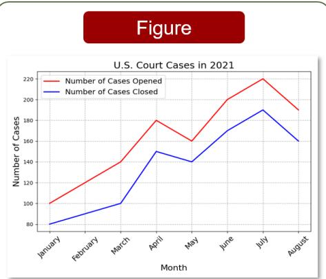

## Figure with Caption

  
Golden Summary The line chart outlines the monthly activity of U.S. court cases in 2021, detailing both the number of cases opened and closed. It starts with January, where 100 cases were opened and 80 closed, and progresses through August, showing a gradual increase with June peaking at 200 cases opened and 170 closed. July follows closely with 220 cases opened and 190 closed. The chart concludes with August, displaving 190 opened cases and 160 closed cases.  
Caption: The death of Justice Antonin Scalia, and the subsequent partisan wrangling over whether the Senate should act on any nominee sent to it by President Obama, has cast a spotlight on an institution that many people know little about. But in a Pew Research Center survey released earlier this week, about sevenin-ten Americans said they had heard a lot (45%) or a little (26%) about Scalia's death and the vacancy on the court; fully 94% expressed an opinion on whether the Senate should hold hearings and vote on Obama's eventual nominee

Golden Summary Following Justice Antonin Scalia's death, a Pew Research Center survev conducted in February 2016 found that a majority of Americans (56%) believed the Senate should hold hearings and vote on President Obama's nominee to fill the vacancy. In contrast, 38% preferred the Senate delay action until the next president nominates a candidate, while 6% were unsure. Additionally, when asked if their opinion could change depending on the nominee, 10% said ves. whereas 26% remained firm in their stance. The issue brought attention to Senate proceedings, an area unfamiliar to many, but 94% of respondents expressed a clear opinion on the matter, indicating widespread public engagement..

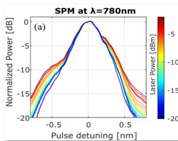

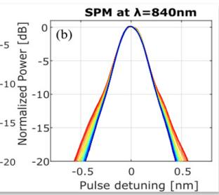  
The figure illustrates spectral broadening caused by self-phase modulation (SPM) in SiON waveguides for ultra-short laser pulses centered at 780 nm and 840 nm, respectively. As input power increases from -20 dBm to 0 dBm, the spectral width expands progressively. The color gradient from blue to red represents increasing laser power, with broader spectra at higher intensities. Variations in the initial pulse shapes, particularly the darkest blue lines, are attributed to the laser and optical system characteristics before waveguide injection.

## Figure with Caption & Context

Descriptive Context Caption: Intensity-dependent spectral broadening of an ultra-short laser pulse induced by SPM effect in\ce{SiON} waveguide for two different pulse wavelengths centered at (a) \$780\$\~nm and (b) \$840\$\~nm . The spectra are normalized to their peak powers. The difference in the input pulses lineshapes (the darkest blue lines) at the two central wavelengths is attributed to laser and table optics prior to interaction in the waveguides. Context: The pulse-broadening experiment was performed for different input powers, ranging from 0\~dBm to -20\~dBm measured at the output of the waveguide. in order to verify the intensity dependence of SPM. Considering that the non-linear effects on the input pulse may occur also in the injection optics, composed of lenses and fibers, it is important to attenuate the power injected into the waveguides after the external optics. Therefore, the variation of the power coupled to the waveguide was realized by moving the input-fiber away from the waveguide\u2019s facet, to decrease the coupling efficiency. Figure\~\ref{Fig:F10 SPM} shows an example of the experimental data, obtained for two different pulses with central wavelengths at \$780\$\~nm and \$840\$\~nm.

Figure A.1: Samples from F2T datasets.

where D is the number of scoring heads. This regularization encourages each scoring head to develop a semantically distinct representation by penalizing statistical dependence between their kernelinduced embeddings. Compared to conventional orthogonality or covariance constraints, HSIC captures both linear and nonlinear relationships via kernel embeddings, providing a more flexible and theoretically grounded mechanism for inter-head disentanglement.

## B Details of dataset annotation

Samples from different F2T datasets are shown in Figure A.1. F2TBenchmark is annotated by a team of 8 trained annotators, all with backgrounds in data science, linguistics, or scientific writing, ensuring familiarity with figure interpretation and text quality assessment. All annotators hold undergraduate and master’s degrees from top-tier universities, and while being native Chinese speakers, they possess excellent proficiency in English, enabling them to accurately evaluate F2T generation in bilingual contexts. As shown in Fig. A.2, to facilitate efficient and consistent annotation, we develop a custom web-based annotation interface that presents annotators with the figure, caption, contextual text, and the generated summary in an integrated layout. The tool enables annotators to assign scores for each of the five evaluation dimensions through a structured and user-friendly interface. It supports standardized input, clear visualization, and real-time JSON export, effectively streamlining the annotation workflow and reducing cognitive load. To maintain annotation quality, annotators followed strict and detailed scoring criteria (Figure 6), with proofreading to align understanding across tasks. The average hourly payment for each annotator is 150 CNY, exceeding the local minimum wage and ensuring fair compensation for expert-level annotation work. All data sources used for annotation are publicly available and comply with relevant usage policies and privacy regulations. The resulting F2TBenchmark dataset and code will be released under the MIT license to support academic research in multimodal evaluation.

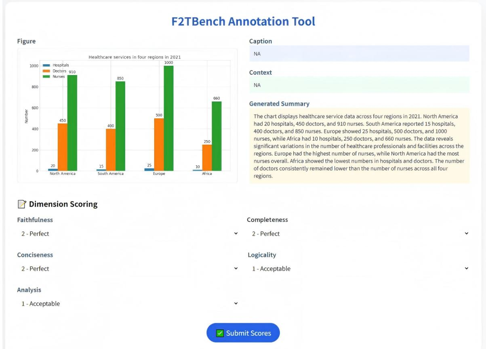  
Figure A.2: The custom web-based annotation interface.

## C Baseline and setup

## C.1 Reference-based methods

BLEU (Bilingual Evaluation Understudy) (Papineni et al., 2002) is a precision-oriented metric that measures the n-gram overlap between generated texts and reference texts. The BLEU score is computed as:

$$
\mathbf { B L E U } = \mathbf { B P } \cdot \exp \left( \sum _ { n = 1 } ^ { N } w _ { n } \log p _ { n } \right)\tag{21}
$$

Here, $p _ { n }$ denotes the modified precision for ngrams of size $n , \ w _ { n }$ is the weight assigned to the n-gram (typically $w _ { n } = 1 / N )$ , and BP is the brevity penalty to penalize short generated texts.

The brevity penalty is defined as:

$$
\mathbf { B P } = { \left\{ \begin{array} { l l } { 1 } & { { \mathrm { i f ~ } } c > r } \\ { \exp ( 1 - { \frac { r } { c } } ) } & { { \mathrm { i f ~ } } c \leq r } \end{array} \right. }\tag{22}
$$

where c is the length of the generated sentence and r is the effective reference length, often chosen as the closest in length to c.

ROUGE (Recall-Oriented Understudy for Gisting Evaluation) (Lin, 2004) is a family of recallbased metrics that measure the overlap between the generated texts and reference summaries. ROUGE-N computes the recall of n-grams:

$$
{ \mathrm { R O U G E - N } } = { \frac { \sum _ { g } \operatorname* { m i n } \bigl ( c ( g ) , r ^ { * } ( g ) \bigr ) } { \sum _ { g } r ^ { * } ( g ) } } .\tag{23}
$$

g denotes an $n { \mathrm { - g r a m } } ; c ( g )$ is the number of times g occurs in the generated text $C ; { \mathrm { C o u n t } } _ { S } ( g )$ is the occurrence count of $g$ in a reference summary $S ;$ and $r ^ { * } ( g ) = \mathrm { m a x } _ { S \in \{ \mathrm { R e f } \} } \mathrm { C o u n t } _ { S } ( g )$ is the aggregated reference count across multiple references.

ROUGE-L focuses on the longest common subsequence (LCS) between the generated text and reference. It is defined as:

$$
{ \mathrm { R O U G E - L } } = { \frac { ( 1 + \beta ^ { 2 } ) \cdot R _ { \mathrm { L C S } } \cdot P _ { \mathrm { L C S } } } { R _ { \mathrm { L C S } } + \beta ^ { 2 } \cdot P _ { \mathrm { L C S } } } }\tag{24}
$$

Here, $R _ { \mathrm { L C S } } ~ = ~ \mathrm { L C S } ( C , R ) / \mathrm { l e n } ( R )$ is the recall, $P _ { \mathrm { L C S } } = \mathrm { L C S } ( C , R ) / \mathrm { l e n } ( C )$ is the precision, and $\beta$ is a parameter that balances the relative importance of recall and precision. C and R denote the generated texts and reference texts respectively.

BERTScore (Zhang et al., 2019) evaluates the semantic similarity between generated texts and reference texts using contextual embeddings from pretrained BERT models. The precision-oriented version is defined as:

$$
{ \mathrm { B E R T S c o r e } } = { \frac { 1 } { | C | } } \sum _ { c \in C } \operatorname* { m a x } _ { r \in R } \cos _ { - } \sin ( E _ { c } , E _ { r } ) ,\tag{25}
$$

where C and R are the sets of tokens in the generated texts and reference texts, respectively. $E _ { c }$ and $E _ { r }$ denote the contextual embeddings of tokens c and r, and cos\_sim( , ) represents the cosine similarity function. A symmetrical version averages both precision and recall directions, yielding an F1 score.

CIDEr (Consensus-based Image Description Evaluation) (Vedantam et al., 2015) is designed to evaluate the consensus between a generated text and a set of references using TF-IDF-weighted ngrams. The CIDEr score for n-grams of order n is computed as:

$$
\mathrm { C I D E r } _ { n } ( c , S ) = \frac { 1 } { | S | } \sum _ { s \in S } \frac { g _ { n } ( c ) \cdot g _ { n } ( s ) } { \| g _ { n } ( c ) \| \cdot \| g _ { n } ( s ) \| } .\tag{26}
$$

The final CIDEr score is obtained by averaging across multiple n-gram orders:

$$
\mathrm { C I D E r } ( c , S ) = \sum _ { n = 1 } ^ { 4 } w _ { n } \cdot \mathrm { C I D E r } _ { n } ( c , S ) .\tag{27}
$$

In these equations, c is the generated summary, S is the set of reference summaries, $g _ { n } ( \cdot )$ represents the TF-IDF vector for n-grams of order $n , w _ { n }$ is the weight assigned to each n-gram order (usually uniform), and denotes the Euclidean norm. These metrics offer complementary perspectives on summary quality, encompassing surface overlap, syntactic structure, and semantic alignment.

## C.2 Reference-free Methods

CLIPScore (Hessel et al., 2021) is a reference-free metric that evaluates the alignment between generated texts and images by computing the cosine similarity between their CLIP embeddings.

Qwen2-VL (Team, 2025) is an advanced visionlanguage model that introduces a Naive Dynamic Resolution mechanism, enabling dynamic processing of images with varying resolutions into visual tokens. This approach enhances the model’s efficiency and accuracy in visual representation.

DeepSeek-VL2 (Wu et al., 2024) is a Mixture-of-Experts vision-language model that excels in tasks such as visual question answering, optical character recognition, and document understanding. It achieves state-of-the-art performance with efficient parameter utilization.

Kimi-VL-A3B (Team et al., 2025) is an opensource Mixture-of-Experts vision-language model designed for advanced multimodal reasoning and long-context understanding. It activates only 2.8B activation parameters in its language decoder, balancing performance and computational efficiency. Claude-3-Haiku (Anthropic, 2024a) is Anthropic’s fastest and most compact model in the Claude 3 family, optimized for near-instant responsiveness.

Claude-3.5-Haiku (Anthropic, 2024b) combines rapid response times with improved reasoning capabilities. It surpasses previous models on various intelligence benchmarks, making it ideal for tasks that require both speed and intelligence.

Gemini-1.5-Flash (Team et al., 2024) is a lightweight multimodal model developed by Google, designed for high-volume, low-latency tasks. It balances speed, performance, and affordability, making it suitable for applications like summarization and multimodal processing.

Gemini-2.0-Flash (Team et al., 2024) offers enhanced performance and speed. It supports multimodal inputs and outputs, including text, images, and audio, and is built to power agentic experiences with low latency and high throughput.

ChartX (Xia et al., 2024) proposes a referencefree evaluation method based on GPT-4o, which can achieve a single-dimension 1-5 rating score for chart summarization.

## C.3 Setup details

To ensure a fair and reproducible evaluation, we adopt distinct setups for reference-based and reference-free baselines.

For reference-based baselines (BLEU (Papineni et al., 2002), ROUGE (Lin, 2004), CIDEr (Vedantam et al., 2015), BERTScore (Zhang et al., 2019)), we use the standard evaluation toolkit with default configurations. For reference-free methods, we distinguish between open-source and proprietary models. Open-source models are evaluated locally using public checkpoints, while proprietary models are accessed through official APIs. Scores are extracted through prompt-based responses. The details are as follows:

Open-source models: For Qwen2-VL2, DeepSeek-VL23, and Kimi-VL-A3B4, we utilize HuggingFace and corresponding model checkpoints and experiments are conducted on NVIDIA H800 GPU. All outputs are postprocessed to extract numerical scores aligned with our evaluation criteria. Fine-tuned models are retrained on task-specific data following their respective original settings.

Proprietary models: For Claude, Gemini and related variants, all evaluations are conducted through official API calls with default model parameters, using consistent instruction templates across models (we use the five-dimensional scoring criteria as the instruction, shown in Figure 6). Since ChartX is based on the GPT-4o model, we use the official GPT-4o API and ChartX default settings and improvements5.

F2TEval settings: For our F2TEval model, all experiments are conducted on NVIDIA H800 GPU. The experimental settings are shown in Table 7.

<table><tr><td>Name</td><td>Variable</td><td>Value</td></tr><tr><td>Shared expert count</td><td></td><td>1</td></tr><tr><td>Dimension-specific experts</td><td></td><td>5</td></tr><tr><td>Optimizer</td><td>一</td><td>AdamW</td></tr><tr><td>Learning rate</td><td>η</td><td> $1 \times 1 0 ^ { - 4 }$ </td></tr><tr><td>Batch size</td><td>N</td><td>16</td></tr><tr><td>Random seed</td><td>S</td><td>42</td></tr><tr><td>HSIC regularization coefficient</td><td> $\lambda _ { \mathrm { h s i c } }$ </td><td>0.1</td></tr><tr><td>Alignment loss coefficient</td><td> $\lambda _ { \mathrm { a l i } }$ </td><td>0.1</td></tr><tr><td>Feature dimension</td><td>F</td><td>512</td></tr><tr><td>Evaluation dimensions</td><td>D</td><td>5</td></tr><tr><td>Hidden dimension of the head</td><td>n</td><td>512</td></tr></table>

Table 7: Hyper-parameter statistics for F2TEval.

## D Evaluation Metrics

## D.1 Pearson Correlation

Pearson correlation coefficient evaluates the linear relationship between predicted scores $\hat { \textbf { y } } =$ $[ \hat { y } _ { 1 } , \dotsc , \hat { y } _ { N } ]$ and ground-truth scores y =

$[ y _ { 1 } , \dotsc , y _ { N } ]$ . It is defined as:

$$
r = \frac { \sum _ { i = 1 } ^ { N } ( \hat { y } _ { i } - \bar { \hat { y } } ) ( y _ { i } - \bar { y } ) } { \sqrt { \sum _ { i = 1 } ^ { N } ( \hat { y } _ { i } - \bar { \hat { y } } ) ^ { 2 } } \cdot \sqrt { \sum _ { i = 1 } ^ { N } ( y _ { i } - \bar { y } ) ^ { 2 } } }\tag{28}
$$

where $\hat { y }$ and y¯ denote the sample means of the predicted and ground-truth scores, respectively. A higher r indicates stronger linear agreement.

## D.2 Spearman Correlation

Spearman correlation assesses the rank-order correlation between $\hat { \mathbf { y } }$ and y, capturing monotonic relationships irrespective of scale. It is computed as:

$$
\rho = 1 - \frac { 6 \sum _ { i = 1 } ^ { N } d _ { i } ^ { 2 } } { N ( N ^ { 2 } - 1 ) }\tag{29}
$$

where $d _ { i } = \mathrm { r a n k } ( \hat { y } _ { i } ) - \mathrm { r a n k } ( y _ { i } )$ is the difference in ranks of the predicted and true scores for the i-th instance, and N is the number of samples. A value of $\rho$ close to 1 indicates strong rank consistency.

## D.3 Mean Absolute Error (MAE)

Mean Absolute Error (MAE) measures the average absolute deviation between predicted scores and ground truth labels. It reflects the average magnitude of prediction errors, regardless of their direction:

$$
\mathrm { M A E } = \frac { 1 } { N } \sum _ { i = 1 } ^ { N } \left| \hat { y } _ { i } - y _ { i } \right|\tag{30}
$$

where N is the number of samples, $\hat { y } _ { i }$ denotes the predicted score for the i-th sample, and $y _ { i }$ denotes the corresponding ground truth score. A lower MAE indicates better overall prediction accuracy in terms of absolute deviation.

## D.4 Mean Squared Error (MSE)

Mean Squared Error (MSE) computes the average of squared differences between predicted and true scores, placing greater emphasis on larger errors:

$$
\mathrm { M S E } = \frac { 1 } { N } \sum _ { i = 1 } ^ { N } ( \hat { y } _ { i } - y _ { i } ) ^ { 2 }\tag{31}
$$

Here, N is the number of evaluation samples, $\hat { y } _ { i }$ is the predicted score, and $y _ { i }$ is the true score. Compared to MAE, MSE penalizes large deviations more severely due to the squared term, making it more sensitive to outliers in prediction error.