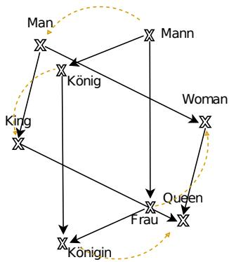
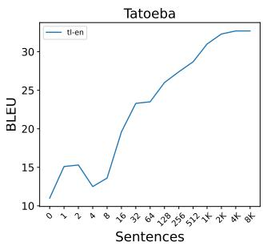
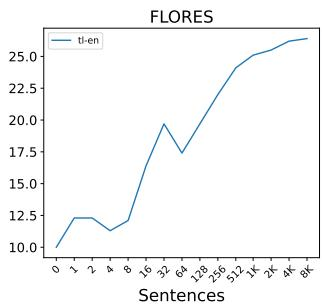
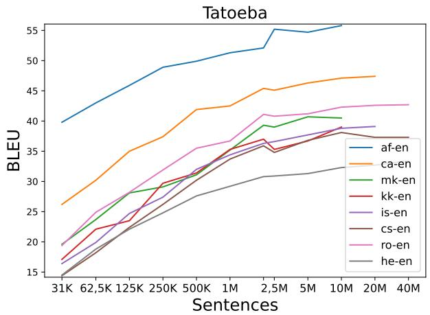
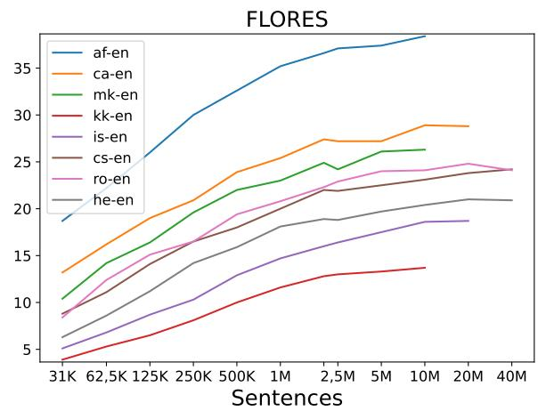
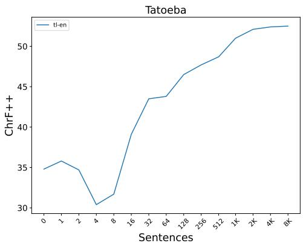
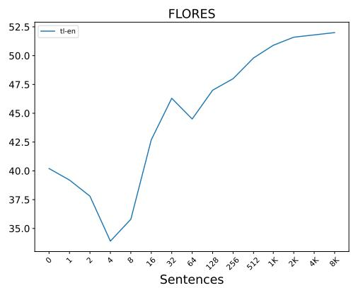
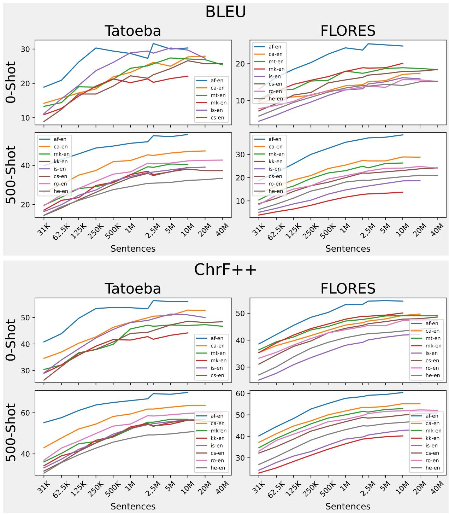
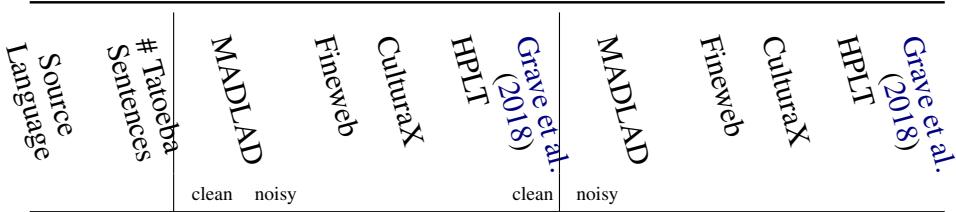
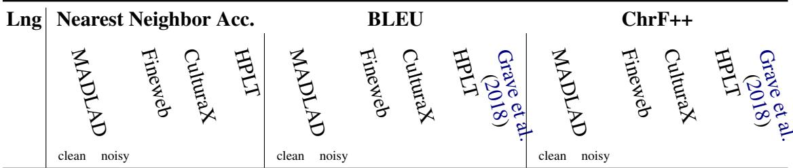

# Few-Shot Learning Translation from New Languages

Carlos Mullov1 and Alexander Waibel1,2

1Karlsruhe Institute of Technology, Karlsruhe, Germany 2Carnegie Mellon University, Pittsburgh PA, USA {firstname}.{lastname}@kit.edu

## Abstract

Recent work shows strong transfer learning capability to unseen languages in sequence-tosequence neural networks, under the assumption that we have high-quality word representations for the target language. We evaluate whether this direction is a viable path forward for translation from low-resource languages by investigating how much data is required to learn such high-quality word representations. We first show that learning word embeddings separately from a translation model can enable rapid adaptation to new languages with only a few hundred sentences of parallel data. To see whether the current bottleneck in transfer to low-resource languages lies mainly with learning the word representations, we then train word embeddings models on varying amounts of data, to then plug them into a machine translation model. We show that in this simulated low-resource setting with only 500 parallel sentences and 31,250 sentences of monolingual data we can exceed 15 BLEU on Flores on unseen languages. Finally, we investigate why on a real low-resource language the results are less favorable and find fault with the publicly available multilingual language modelling datasets.

## 1 Introduction

Neural methods have brought great improvements to processing of low-resource languages, through transfer learning from high-resource languages (Pfeiffer et al., 2020). Current transfer learningbased methods allow a language to be learned with much less downstream task data than would otherwise be required (Ko et al., 2021; Liu et al., 2021), either through pre-training on a related task with more accessible data (Liu et al., 2020; Pagnoni, 2024) or through large-scale training on related languages (Team et al., 2022). Such large-scale training might currently cover hundreds of languages (Kudugunta et al., 2023), but previous work has shown that transfer learning in such pre-trained models heavily relies on exposure to the target language data in pre-training (Hu et al., 2020). Also, since most large scale pre-traning corpora are primarily composed of web-mined data, pretraining relies on an internet presence of the language. When trying to cover all the 7,000 languages of the world (Aus, 2011), we will thus inevitably encounter some language not present in the pre-training dataset. However, as pre-trained models are growing larger it seems impractical to retrain models every time we encounter a new language. Thus, some sort of efficient incremental learning approach, optimally making use of the learned neural representations to extend multilingual models by new languages, presents one promising path forward.

Many works in the low-resource language processing field have looked at transfer learning-based approaches to cope with a setting where downstream task data in the target language are not available. For example, in machine translation Liu et al. (2020) and Maillard et al. (2023) generate synthetic data through back-translation, which requires monolingual data only, which is naturally more abundant than parallel data. True low-resource languages, however, will be scarce even in terms of monolingual text data. Table 1 lists the number of available sentences in the to date largest publicly available multilingual language modelling datasets for some chosen languages. By standards of the current state-of-the-art most of them are considered low-resource, but in reality they remain amongst the top 200 highest-resourced languages of the world. To transfer learn to languages in the tail end, we would have to develop methods that cope with this extreme scarcity of even monolingual data.

One question that might arise when dealing with such data scarcity would be where exactly the bottleneck in learning high-quality representations for low-resource languages lies. In the face of powerful transfer learning in modern neural networks, what stands in the way of few-shot learning a new language? When evaluating the effectiveness of pre-training, one might question how much data simply goes into training word representations. In their work on zero-shot translation from a yet unseen language, Mullov et al. (2024) claim that given high-quality word representations, we might be able to transfer learn to a new language in an extremely low-resource scenario, either through zero-shot generation of synthetic data or through few-shot fine-tuning.

<table><tr><td rowspan="2">Lng</td><td colspan="2">MADLAD</td><td rowspan="2">Fineweb</td><td rowspan="2">CulturaX</td><td rowspan="2">HPLT</td></tr><tr><td>clean</td><td>noisy</td></tr><tr><td>CS</td><td>782,001K</td><td></td><td></td><td></td><td></td></tr><tr><td>hr</td><td>48,765K</td><td>503,047K</td><td></td><td></td><td></td></tr><tr><td>kk</td><td>46,234K</td><td>78,582K</td><td>69,353K</td><td>51,000K</td><td>81,006K</td></tr><tr><td>is</td><td>33,625K</td><td>73,760K</td><td>48,105K</td><td>39,527K</td><td>69,643K</td></tr><tr><td>af</td><td>24,339K</td><td>64,576K</td><td>51,437K</td><td>19,537K</td><td>37,737K</td></tr><tr><td>tl</td><td>23,639K</td><td>97,038K</td><td>41,619K</td><td>4,516K</td><td>52,879K</td></tr><tr><td>mk</td><td>22,537K</td><td>48,877K</td><td>42,075K</td><td>38,494K</td><td>57,008K</td></tr><tr><td>gl</td><td>22,214K</td><td>78,345K</td><td>31,112K</td><td>24,524K</td><td>61,177K</td></tr><tr><td>ka</td><td>21,008K</td><td>56,944K</td><td>55,733K</td><td>48,299K</td><td>63,722K</td></tr><tr><td>uz</td><td>16,581K</td><td>28,099K</td><td>19,873K</td><td>1,152K</td><td>14,800K</td></tr><tr><td>bs</td><td>16,561K</td><td>217,725K</td><td>253,877K</td><td>1.2K</td><td>268,156K</td></tr><tr><td>SW</td><td>12,839K</td><td>27,954K</td><td>18,004K</td><td>576K</td><td>34,308K</td></tr><tr><td>gu</td><td>10,849K</td><td>22,527K</td><td>20,395K</td><td>18,774K</td><td>20,639K</td></tr><tr><td>ur</td><td>10,830K</td><td>24,907K</td><td>43,720K</td><td>38,004K</td><td>50,629K</td></tr><tr><td>kn</td><td>10,787K</td><td>26,427K</td><td>24,693K</td><td>20,243K</td><td>24,929K</td></tr><tr><td>si</td><td>10,777K</td><td>20,775K</td><td>15,238K</td><td>16,332K</td><td>33,707K</td></tr><tr><td>ne</td><td>9,535K</td><td>18,476K</td><td>38,949K</td><td>35,581K</td><td>37,138K</td></tr><tr><td>ky</td><td>7,402K</td><td>14,054K</td><td>13,508K</td><td>9,295K</td><td>10,041K</td></tr><tr><td>ga</td><td>7,155K</td><td>124,945K</td><td>11,156K</td><td>6,108K</td><td>10,993K</td></tr><tr><td>mt</td><td>6,442K</td><td>18,627K</td><td>7,224K</td><td>3,337K</td><td>8,675K</td></tr><tr><td>ha</td><td>3,560K</td><td>7,868K</td><td></td><td></td><td>5,688K</td></tr><tr><td>ceb</td><td>1,677K</td><td>10,756K</td><td>2,906K</td><td>3,375K</td><td>2,864K</td></tr><tr><td>zu</td><td>1,320K</td><td>8,093K</td><td>2,023K</td><td></td><td>2,710K</td></tr><tr><td></td><td></td><td></td><td></td><td></td><td></td></tr><tr><td>war</td><td>72K</td><td>26,042K</td><td>2.8K</td><td>48K</td><td>87k</td></tr></table>

Table 1: Considered languages and number of available sentences in each of the datasets.

We evaluate the practicability of this direction by (a) testing how many data are required to train word representations of high enough quality and (b) testing how far we can go with only a few parallel sentences. Additionally, we evaluate how far we can go with the currently publicly available multilingual language modelling datasets, using their proposed method.

We show that if we can train word embeddings on abundant data, i.e. 23 million sentences, we can rapidly adapt our pre-trained translation model to even distant languages. As we lower the amount of data we find evidence that most languages require around 10 million sentences until increasing the monolingual data starts showing diminishing returns. Nevertheless, we find that acceptable performance, i.e. good enough to generate synthetic data for back-translation, can be achieved with as little as 31,250 sentences of monolingual data. For some languages we fail to see intelligible translations with even 10,000,000 sentences and likewise for the actually low-resource Waray. For Waray, we inspect why this is the case and find fault with the quality of publicly available multilingual training texts.

  
Figure 1: In a pair of well trained embedding spaces the geometric relationship between words should be approximately similar. We ask how much data the embedding space of a low-resource language must be trained on to exhibit this property enough to be useful for transfer learning based approaches.

## 2 Background

Word Representation Isomorphism The isomorphism hypothesis states that the structure of the embedding space and relationships of its words is similar across different languages. Take the famous example of the relationship between words in a well trained embedding space:

$$
E ( { \mathrm { K i n g } } ) - E ( { \mathrm { Q u e e n } } ) \approx E ( { \mathrm { M a n } } ) - E ( { \mathrm { W o m a n } } )
$$

where E maps a word onto its embedding vector. Together these words form a parallelogram in space (Figure 1). This parallelogram should preserve across all languages that have the same concept of a King and a Queen as in English, and it should be possible to find a structure preserving (i.e. isomorphic) mapping between those.

Various works show that in neural embedding spaces this isomorphism holds true up to a certain degree (Mikolov et al., 2013b; Artetxe et al., 2018; Lample et al., 2018). While some works have shown that the degree isomorphism can be improved upon (Ormazabal et al., 2019; Patra et al., 2019; Marchisio et al., 2022), it has been shown that it is still enough to translate from unseen languages – even distant ones – zero-shot (Mullov et al., 2024).

One question that remains, however, is how much data is required to train an embedding space well enough for the isomorphism property to be present. As part of this work we explore this question, how much data we need to train a word embedding model on to seamlessly map it into a model’s English embedding space (Section 5.4).

Zero-Shot MT Mullov et al. (2024) propose an incremental learning machine translation setup to perform unsupervised machine translation from new languages. Their machine translation system is based on a Transformer encoder-decoder (Vaswani et al., 2017) trained on the standard MT objective, but with separately trained word representations replacing the standard embedding layer. The word representations are obtained through continuousbag-of-words (CBOW) training (Mikolov et al., 2013a) on each language separately, and then aligned into a common space through word embedding alignments. Specifically, they train fasttext (Bojanowski et al., 2017) word embeddings, which are then aligned to the English fasttext model with the RCSLS criterion (Joulin et al., 2018) on a bilingual dictionary.

To then translate from a new language, a fasttext model is trained for the new language, aligned into the model’s embedding space and then translation is performed as with any of the known languages. They tested the approach in a simulated lowresource scenario and showed that given highquality fasttext models they can zero-shot generate synthetic parallel data to match supervised performance on some language pairs.

## 3 Methodology

Few-Shot learning new languages We argue that in teaching a common sequence-to-sequence model new languages the majority of data goes into learning the word representations. Thus, if we use all of the available monolingual data in a language ℓ to train high-quality word representations, the sequence-to-sequence model will be able to rapidly adapt to ℓ, since it mainly just needs to learn to extract syntactic features, such as the word order. In Figure 2 we demonstrate on Tagalog, that learning word representations on 23 million sentences of Tagalog monolingual data enables us to attain 19.7 BLEU on Flores devtest by fine-tuning the

NMT model on only 32 sentences of Tagalog parallel data. The exact experiment setup for this is described in Section 5.3. However, in a real world setting, having 23 million sentences of monolingual data available and essentially no parallel data at all is an unrealistic scenario. The rest of this paper thus deals with evaluating this direction for real world settings with few monolingual data available.

Exploring the amount of monolingual data needed for word representation learning with simulated low-resource Let $D _ { \ell }$ be a dataset of monolingual texts in the language ℓ. To test the amount of data required for high-quality ℓ word representations we train word representations on subsets $\mathcal { D } \subseteq D _ { \ell }$ of varying sizes . Specifically we train d-dimensional word representations $W _ { \mathcal { D } }$ using the CBOW objective (Mikolov et al., 2013a), while integrating character-level information (Bojanowski et al., 2017). Following the setup presented in (Mullov et al., 2024, Section 2) we integrate the trained word representations $W _ { \mathcal { D } }$ into a pre-trained Transformer sequence-to-sequence model through alignment into the model’s word embedding space $W _ { \mathcal { D } } ^ { \prime } = W _ { \mathcal { D } } \cdot \mathcal { A }$ where $\mathcal { A } \in \mathbb { R } ^ { d \times d }$ is an alignment obtained through alignment to the English word representations $W _ { \mathrm { e n } } \approx W _ { \mathcal { D } } \cdot \mathcal { A }$ (Joulin et al., 2018).

Provided that $W _ { \mathcal { D } } ^ { \prime }$ exhibits a high enough degree of isomorphism with the model’s embedding space (Section 2), this will allow us to plug in the new word representations into the model’s embedding layer and seamlessly translate from ℓ. To further reduce the effect from the test-train-mismatch from imperfect isomorphism and alignment we perform a few fine-tuning steps on 500 parallel sentences.

  
Figure 2: Tagalog BLEU scores on Tatoeba test and flores devtest after fine-tuning on $N \in \{ 1 , 2 , 4 , \dots , 8 1 9 2 \}$ Tagalog parallel sentences. The fasttext embedding model here is trained on the full 23 million sentences of MADLAD-400 (clean) Tagalog data. The x-axis 0-point indicates the zero-shot translation score.

Why not learn words on LM/MLM objective? Compared to training on the CBOW objective it should be possible to make effective use of monolingual data by learning word representations on the (masked) language modelling objective, while freezing the Transformer layers, similar to Artetxe et al. (2020), Tran (2020) or Marchisio et al. (2023). One might expect that the gradient coming from the Transformer self-attention layers might contain richer information about the language syntax, thus providing a better training signal. However, as part of our analysis we are interested in answering the question whether most of the training data in regular NMT training just serves to estimate high-quality word representations. In our setup, we minimize the model’s exposure to the new language syntax, e.g. we train our fasttext models on the word order agnostic CBOW objective.

## 4 Data

In our experiments we use parallel data for supervised pre-training of our machine translation model, and downstream task evaluation on the ChrF++ and BLEU metrics. We use monolingual language modelling data for training word representations on the CBOW objective. For word embedding alignment we use the high-quality bilingual dictionaries from the MUSE project (Conneau et al., 2017) wherever available. For all remaining languages we use dictionaries from the Panlex project (Kamholz et al., 2014), which reportedly offers dictionaries for 5,700 languages.

Parallel Data We pre-train our machine translation model on a mix of publicly available data in 14 languages: English, Arabic, Bengali, Danish, German, Greek, Spanish, Farsi, French, Hindi, Russian, Tamil, Turkish, Ukranian. All parallel data translates either from or to English, as English-centric training has recently been shown to be competitive with full multilingual training (Wu et al., 2024). We de-duplicate and filter our data using a variety of heuristics, as well as the multilingual Bicleaner-AI model (Zaragoza-Bernabeu et al., 2022; de Gibert et al., 2024), down to a total of 158 million sentences. For reproducibility, we publish our data recipe and our Bicleaner-AI filtering scores 12. For few-shot fine-tuning we use sentences from the

Tatoeba corpus (Tiedemann, 2020). For evaluation, we use the Flores (Goyal et al., 2022) evaluation dataset (devtest split), which covers translation of the Wikipedia domain in over 200 languages and the Tatoeba challenge v2023-09-26 test split wherever available.

Monolingual Data As part of our analysis, we compare a variety of massively multilingual language modelling corpora for training high-quality word representations. The datasets we consider are MADLAD-400 (Kudugunta et al., 2023) (clean split and noisy split), Fineweb 2 (Penedo et al., 2024b), HPLT (de Gibert et al., 2024) and CulturaX (Nguyen et al., 2024). All of these datasets employ document-level deduplication (Lee et al., 2022) and some form of language identification, either based on fasttext (Grave et al., 2018; Bañón et al., 2024) or Transformer-based solutions (Caswell et al., 2020), and finally some custom data cleaning pipeline. See Table 1 for the considered languages and their data availability in the different datasets.

## 5 Experiments

## 5.1 Word Embedding Models

We train our fasttext models based on the hyperparameters found in Grave et al. (2018). For compatibility with the models published by Grave et al. (2018)3 all fasttext models we train use an embedding dimension of 300. Due to the missing implementation in the public fasttext codebase we train the CBOW models without the position weighting described in Grave et al. (2018, see Appendix A.3). We tokenize the texts using the sacremoses tokenizer. Since each of the language modelling datasets we use come with their own preprocessing we do not apply any further cleaning or pre-processing steps.

We align the fasttext word embeddings into a common space using the supervised alignment implementation4 from the fasttext codebase. For a multilingual alignment between the different embedding spaces we align each of the fasttext models to the English one.

## 5.2 Translation Model

We base our translation system on a Transformer encoder-decoder model with the aligned fasttext vectors in its encoder and decoder embedding layers. In the supervised machine translation pretraining we use the pre-trained fasttext models from Grave et al. (2018) for our 14 supervised languages. We freeze the pre-trained embeddings in MT training to better preserve isomorphism to the new fasttext embeddings, later when we add new languages to the model.

  
Figure 3: Number of sentences on which we train the fasttext word representations versus the BLEU score on Tatoeba test and flores devtest. We train the word representations on subsets of MADLAD-400, and for each subset we fine-tune the NMT model on top of those word representations on 500 sentences of parallel data.

We base our implementation on OpenNMT-py $\mathrm { v } 3 . 5 . 1 ^ { 5 }$ . Different from Mullov et al. (2024) we use pre-layernorm6 Transformers with rotary position embeddings. Also different from Mullov et al. (2024) we let our model select the desired target language via a language specific token on the decoder-side, from which we observe a substantial improvement in translation performance. The experiments described in the following are based on a 300-dimensional encoder with 9 layers and 6 attention heads, and a 640-dimensional decoder with 15 layers and 10 attention heads, for a total of 101,950,920 trainable parameters.

Because fasttext does not come with subword tokenization, with our large parallel training corpus we end up with a multilingual vocabulary size of 37.2 million. Since we do not train the fasttext word embedding parameters in downstream training, this leads to another 11,174,056,500 non-trainable parameters. To realistically fit our model into memory, we map the embedding vectors on-the-fly, and during training we sample the output vocabulary tokens from the next 131,072 sentences. For further explanations on the word embeddings and the integration into the model see Appendix A.3.

All trainings of the Transformer model are performed with the adam optimizer (Kingma and Ba, 2014). We pre-train our translation model on the 14 supervised languages using two Nvidia A100 GPUs for 100,000 steps, with an effective batch size of 122,880 tokens. At test time, all translations are performed with beam size 4.

## 5.3 Few-Shot Fine-Tuning

For few-shot learning we follow a fixed setup of 200 gradient descend steps starting from the zeroshot setup. We fine-tune the model using low-rank adapters (Pham et al., 2021; Hu et al., 2022) of rank 5. We find adapter-only fine-tuning to outperform a full fine-tuning. We apply the adapters to the encoder only, to prevent decoder-side overfitting to our small training data. We test various learning rates and batch sizes and decide on an adam learning rate of 0.005, 100 warm-up steps, and full batch gradient descend, i.e. the full training dataset is one batch. When the full dataset doesn’t fit into memory we accumulate the gradients for an effective batch size equal to the dataset size, unless the number of tokens exceeds 10 10240 tokens.

We find that leaving the decoder final linear layer $G \in \mathbb { R } ^ { 6 4 0 \times 3 0 0 }$ – which acts as an “adapter” from the model’s embedding dimension to the fasttext dimension of 300 – trainable, but finally at test time, discarding the parameter updates to G helps in mitigating overfitting to the small data.

<table><tr><td colspan="6"></td><td colspan="6">FLORES</td><td rowspan="2"></td><td rowspan="2">HPLT (2018)</td></tr><tr><td>Language Source</td><td># Tatoeba Sentences</td><td>MADLAD clean</td><td>noisy</td><td>Fineweb</td><td>CulturaX</td><td>HPLT</td><td>MADLAD clean noisy</td><td></td><td>Fineweb</td><td>CulturaX</td></tr><tr><td>hr</td><td>2447</td><td></td><td></td><td></td><td></td><td></td><td>23.3</td><td>23.8</td><td></td><td></td><td></td><td>23.8</td></tr><tr><td>af</td><td>2428</td><td>61.1</td><td>56.5</td><td>60.6</td><td>60.5</td><td>60.5</td><td>39.6</td><td>34.5</td><td>39.8</td><td>40.1</td><td>39.6</td><td>35.5</td></tr><tr><td>tl</td><td>8778</td><td>32.2</td><td>29.8</td><td>32.2</td><td>31.6</td><td>32.7</td><td>25.9</td><td>22.4</td><td>25.8</td><td>24.6</td><td>25.7</td><td>23.4</td></tr><tr><td>mk</td><td>81212</td><td>43.9</td><td>44.2</td><td>43.6</td><td>44.0</td><td>44.2</td><td>28.4</td><td>28.2</td><td>28.0</td><td>28.6</td><td>28.2</td><td>28.0</td></tr><tr><td>bs</td><td>509</td><td></td><td></td><td></td><td></td><td></td><td>21.1</td><td>24.2</td><td>22.5</td><td>0.3</td><td>24.5</td><td>18.5</td></tr><tr><td>kk</td><td>437</td><td>37.9</td><td>38.4</td><td>37.8</td><td>37.6</td><td>39.1</td><td>14.9</td><td>14.7</td><td>15.4</td><td>15.0</td><td>14.8</td><td>12.7</td></tr><tr><td>is</td><td>9595</td><td>40.5</td><td>39.9</td><td>39.6</td><td>40.5</td><td>40.3</td><td>19.8</td><td>19.1</td><td>19.6</td><td>19.9</td><td>19.4</td><td>17.2</td></tr><tr><td>g1</td><td>1022</td><td>46.9</td><td>40.8</td><td>47.0</td><td>46.9</td><td>46.5</td><td>26.2</td><td>23.5</td><td>26.1</td><td>27.0</td><td>27.2</td><td>27.5</td></tr><tr><td>ka</td><td>1109</td><td>48.8</td><td>48.0</td><td>48.7</td><td>48.7</td><td>48.7</td><td>13.4</td><td>13.6</td><td>14.1</td><td>13.9</td><td>13.7</td><td>13.3</td></tr><tr><td>uz</td><td>482</td><td>34.6</td><td>37.3</td><td>35.0</td><td>28.3</td><td>33.6</td><td>12.4</td><td>12.9</td><td>12.2</td><td>9.0</td><td>11.5</td><td>8.3</td></tr><tr><td>SW</td><td>441</td><td>45.8</td><td>46.9</td><td>45.8</td><td>36.1</td><td>45.4</td><td>17.2</td><td>18.3</td><td>18.2</td><td>12.0</td><td>17.6</td><td>13.9</td></tr><tr><td>gu</td><td>154</td><td></td><td></td><td></td><td></td><td></td><td>7.8</td><td>8.0</td><td>7.9</td><td>7.9</td><td>7.8</td><td>6.4</td></tr><tr><td>ur</td><td>1666</td><td>29.9 29.7 29.1</td><td></td><td></td><td></td><td>29.4 29.2</td><td>16.7</td><td>17.3</td><td>17.2</td><td>17.1</td><td>17.0</td><td>18.1</td></tr><tr><td>kn</td><td>178</td><td></td><td></td><td></td><td></td><td></td><td>1.6</td><td>2.3</td><td>1.7</td><td>2.3</td><td>2.7</td><td>3.1</td></tr><tr><td>si</td><td>47</td><td></td><td></td><td></td><td></td><td></td><td>2.3</td><td>2.2</td><td>2.1</td><td>2.6</td><td>1.7</td><td>1.0</td></tr><tr><td>ne</td><td>119</td><td></td><td></td><td></td><td></td><td></td><td>3.4</td><td>4.4</td><td>2.8</td><td>3.3</td><td>3.3</td><td>2.8</td></tr><tr><td>ky</td><td>125</td><td></td><td></td><td></td><td></td><td></td><td>7.7</td><td>6.3</td><td>8.1</td><td>7.9</td><td>7.4</td><td>7.6</td></tr><tr><td>ga</td><td>2006</td><td>47.7</td><td>45.8</td><td>47.2</td><td>47.9</td><td>47.6</td><td>18.1</td><td>15.9</td><td>17.5</td><td>17.8</td><td>17.3</td><td>13.9</td></tr><tr><td>mt</td><td>256</td><td>49.1</td><td>49.2</td><td>50.2</td><td>47.7</td><td>48.0</td><td>24.8</td><td>25.1</td><td>25.3</td><td>23.0</td><td>25.1</td><td>8.8</td></tr><tr><td>ha</td><td>257</td><td>22.9</td><td>22.6</td><td></td><td></td><td>22.8</td><td>10.0</td><td>10.1</td><td></td><td></td><td>9.3</td><td></td></tr><tr><td>ceb</td><td>424</td><td>22.2</td><td>23.4</td><td>21.8</td><td>23.0</td><td>23.7</td><td>15.3</td><td>16.8</td><td>17.6</td><td>15.0</td><td>14.3</td><td>3.1</td></tr><tr><td>zu</td><td>69</td><td></td><td></td><td></td><td></td><td></td><td>8.1</td><td>9.5</td><td>9.1</td><td></td><td>8.6</td><td></td></tr><tr><td>war</td><td>1567</td><td>8.1</td><td>-</td><td>1.7</td><td>2.1</td><td>9.9</td><td>1.6</td><td>I</td><td>0.3</td><td>0.6</td><td>1.9</td><td>0.5</td></tr><tr><td>war</td><td>1567</td><td>12.2</td><td>一</td><td>2.7</td><td>4.0</td><td>13.5</td><td>4.3</td><td>I</td><td>0.4</td><td>1.2</td><td>5.4</td><td>1.3</td></tr></table>

Table 2: BLEU scores for few-shot translation into English on Tatoeba test and flores devtest. For each language we (a) train fasttext models on the different publicly available datasets (b) plug them into our pre-trained translation model and then (c) fine-tune on the available Tatoeba parallel data. For the upper group of languages we use high-quality bilingual dictionaries for the alignment of the fasttext embedding spaces, while for the middle group we use dictionaries from the Panlex project. For the bottom group we use a curated high-quality Waray-English dictionary. Within the groups languages are sorted by the MADLAD-400 data size.

## 5.4 Monolingual Sentences vs BLEU

Figure 3 plots the resulting BLEU scores as we vary the number of sentences for training the fasttext embeddings. We start at 31,250 sentences and go up to 40 million or the respective full dataset size when less than 40 million sentences are available. For each of our trained fasttext models we perform a few-shot fine-tuning of the NMT model on 500 sentences of Tatoeba parallel data. In total we run 88 fine-tunings. With an exponential increase in training data (note the logarithmic x-axis scale) we see a roughly linear increase in BLEU score. Going as low as 31,250 sentences for three out of eight evaluated languages – namely Afrikaans (af), Catalan (ca), and Macedonian (mk) – we observe Flores scores exceeding 10 BLEU translating into English. Note that for the worst performing languages, Icelandic (is) and Kazakh (kk), we do not have MUSE dictionaries for training a good alignment into the

## common embedding space.

fasttext training duration As we decrease the number of training data we notice a steep decrease in BLEU when training the fasttext embeddings for a constant 10 epochs as described in Grave et al. (2018). We mitigate this issue by training for more epochs, for up to 75 epochs, when training on 31,250 sentences. We notice a stark mismatch in CBOW validation performance and downstream BLEU scores, and for sentence counts below 100,000 we have to heavily overtrain the fasttext models to get the best translation performance. When computing the cross-lingual embedding alignment we validate using test dictionaries to compute a nearest neighbour accuracy (nnaccuracy). This nn-accuracy measures whether the word pairs in the bilingual dictionary are the nearest neighbours in the aligned embedding space. We notice a high correlation between this nn-accuracy and the final BLEU score as we vary the number of fasttext training data or training epochs. We measure a Pearson correlation between the nnaccuracies and the Flores devtest BLEU scores of 0.974 (0.981 for ChrF++) by computing the Pearson correlation for each point on the Figure 2 x-axis and averaging over the Fisher z-transformed correlation coefficients with p-value 0.05. In light of this, we use the nn-accuracy as a proxy validation criterion in fasttext training.

## 5.5 Dataset Comparison

Next, we evaluate the performance on several of the publicly available language modelling datasets on the word representation learning task. Based on the findings of the previous section (Section 5.4) we choose from languages with at least 50,000 sentences available in MADLAD-400 clean. In addition to the publicly available datasets we also evaluate the original pre-trained fasttext models from Grave et al. (2018), which were trained on an unpublished 22 Terrabyte dataset consisting of 2017 Common Crawl and Wikipedia data. Table 2 details the BLEU scores we obtain on each of the considered datasets. For the seven lowest resource languages (excluding Waray) we run another set of fine-tunings on MADLAD-400 (clean) and compare to the zero-shot scores in Table 3.

The Table 2 results don’t show consistent differences between the recent datasets, but we see a trend of the recent language modelling datasets outperforming the 2017 crawl, especially on the lowest resource languages. However, on several languages we see BLEU scores that are substantially lower than what our previous experiment suggests. For several languages with more than 5 and up to 30 million sentences of monolingual data available (Table 1) we observe scores below 5 BLEU. This suggests that for those languages the bottleneck lies not with the word representations. We further discuss this in Section 5.6.

## 5.6 Case Study: Waray

In our simulated low-resource setting we have been able to exceed 20 BLEU on Tatoeba on all tested languages with 125,000 sentences of monolingual data and 500 sentences of parallel data. However, for several languages, we fail to cross the 5 BLEU threshold, even with several millions of monolingual data sentences. These are namely Kannada (kn), Sinhala (si) and Nepali (ne) and Waray (war). For a big part, this stems from the low-quality alignment we obtain from the smaller and noisier Panlex dictionaries. We confirm in a side-by-side comparison of alignment via the MUSE and the Panlex dictionaries, the BLEU score on Albanian drops from 13.1 to 9.7. See Appendix A.6 for a comparison between Panlex dictionary-based and MUSE dictionary-based fine-tunings. Here, the semi-supervised dictionary induction via vecmap helped us improve by +1.5 BLEU (+3.8 ChrF++) averaged over 17 languages in 5 datasets, but the need for higher quality dictionaries clearly remains.

<table><tr><td>Language</td><td>N 0-Shot</td><td>N-Shot</td></tr><tr><td>Zulu-English</td><td>69 6.6</td><td>8.3</td></tr><tr><td>Nepali-English</td><td>116</td><td>2.1 3.4</td></tr><tr><td>Kirghiz-English</td><td>125 4.9</td><td>7.6</td></tr><tr><td>Maltese-English</td><td>252</td><td>17.7 25.1</td></tr><tr><td>Hausa-English</td><td>257</td><td>6.0 11.5</td></tr><tr><td>Cebuano-English</td><td>424</td><td>8.8 16.6</td></tr><tr><td>Irish-English</td><td>2006 10.3</td><td>19.5</td></tr></table>

Table 3: BLEU scores on flores devtest before and after few-shot fine-tuning our model on a new language. N indicates the number of sentences in the Tatoeba training set which we fine-tune on for the N-shot setting.

Improving the dictionary The Table 2 bottom group lists the adjusted Waray scores from a 20,166 entry high-quality dictionary (Abuyen, 2000). We extract the dictionary text from the scanned pages using optical character recognition using olmOCR (Poznanski et al., 2025). The better alignment helps us improve the scores to 5.4 BLEU on the 87,204 sentences of HPLT, but when comparing to the 25.5 BLEU we get on the closely related Tagalog and extrapolating using the numbers we see in Figure 2, we believe we should be seeing scores closer to 10 BLEU.

Inspecting the crawl data Inspecting the Waray MADLAD-400 noisy split immediately reveals excessive amounts of markdown tables, invalid UTF-8 and content in wrong languages, explaining the size of 26 million sentences and the diverging fasttext training run. Similarly 48 % of MADLAD-400 clean split sentences consist of species or places descriptions matching a fixed sentence pattern (see Appendix A.5). The same patterns also match 16 % of HPLT sentences, and 98 % of CulturaX sentences. In contrast, the deduplicated Waray-

English split of the NLLB corpus (Team et al., 2022) consists of 3,095,373 sentences of which less than 5,000 match any of our patterns. This highlights the need for more sophisticated deduplication pipelines and more diverse sources of texts in multilingual language modelling datasets.

Discussion With the current state of multilingual language modelling datasets we reach up to 5.4 BLEU on the Waray language. Mullov et al. (2024) show on Turkish that 5 BLEU on Flores suffices to kick-start the iterative back-translation process, suggesting that merely establishing a cross-lingual signal will suffice to start improving upon the initial results. Note, that in our word embeddings we do not share any parameters across languages, and furthermore our translation model has not been exposed to any other languages from the Austronesian family (such as Tagalog or Cebuano), which Waray belongs to. Our results on Tagalog and Cebuano – and likewise on Swahili from the Bantoid language famliy – demonstrate how well an offthe-shelf model will transfer to languages that are distant from any of the ones the model has been exposed to in pre-training. However, we believe that substantial improvements could still be made by including related languages in pre-training.

## 6 Related Work

NMT Scaling Many works explore the data and parameter scaling laws in machine translation (Gordon et al., 2021; Bansal et al., 2022). Bansal et al. (2022) look into how translation quality scales with the amount of data and noise in the data. Different from our work they only consider high-resource settings, specifically a range from one million parallel sentences to 512 million.

Few-Shot Incremental Learning in Machine Translation Maillard et al. (2023) show that with a small amount of high-quality seed parallel data (i.e. 6,000 sentences) can boost the adaptation to low-resource languages. Their setting mostly revolves around generating synthetic parallel data for back-translation, which is bootstrapped through adaptation on the seed data. They, however, assume the availability of an abundance of monolingual data for back-translation, which is the scenario that we want to move away from in this work.

Based on early work on modular learning (Waibel et al., 1989) rapid adaptation in neural networks has already been explored in Hampshire and Waibel (1990). Neubig and Hu (2018) explore rapid adaptation to new languages in multilingual neural LSTMs (Johnson et al., 2017; Ha et al., 2016). Like this work Wang et al. (2022) consider an incremental extension of pre-trained models to new languages in the absence of abundant monolingual data in the target language. Like us they therefore integrate bilingual lexicons from the Panlex project into a pre-trained model to generate pseudo-labels for synthetic data.

Vieira et al. (2024) investigate how much data a large language model needs to be fine-tuned on to achieve adequate performance, by training on diverse dataset sizes. We consider strategies based on large language models out-of-scope, since it is difficult to tell how much data in a target language they have already been exposed to in pre-training. Additionally, despite several proposed approaches to vocabulary adaptation in pre-trained models, the extension of these models to new languages remains non-trivial, and preliminary experiments in embedding layer swapping in decoder-only models showed unfavourable results.

Dataset Comparisons Penedo et al. (2024a) and Penedo et al. (2024b) look at different datasets and compare language modelling performance on a sampled subset of their dataset to other publicly available datasets, on a variety of downstream tasks. Similarly to how they evaluate how different data filtering strategies affect the language modelling objective we test how their filtering affects the CBOW objective. Based on a previous study (Kreutzer et al., 2022) which finds large-scale parallel corpora at are language agnostically crawled to contain large amounts of noise, Artetxe et al. (2022) implement a crawling pipeline specifically for Basque. The specialized pipeline results in higher quality data, but they find that downstream performance does not improve by much.

## 7 Conclusion

In this work we focused on a recently proposed incremental learning approach that promises to easily transfer learn to new languages with minimal or no parallel data at all, as long as we have a means to train high-quality word representations for the target language. We consider a realistic scenario where we have only few monolingual data in the target language to train these word representations to see how far we get on the machine translation task. We train word embeddings on the CBOW objective with varying amounts of data, and see promising results on many languages showing that we can reach beyond 15 BLEU with only 500 parallel sentences and 31,250 sentences of monolingual data. On the other hand, for some languages we need over 500,000 sentences to cross the 10 BLEU zeroshot performance threshold. We further observe that the method is currently bottlenecked by the need for high-quality bilingual dictionaries, which are difficult to obtain.

We also find that even with abundant monolingual data, with the currently public datasets a successful transfer is not guaranteed. For Kannada, Sinhala and Nepali we fail to cross the 5 BLEU threshold with more than 10 million sentences of monolingual data, suggesting that for these languages the bottleneck lies not with the learning of the word representations. However, for the languages where we see success, we see promising prospects for learning with very little parallel data.

## Limitations

The Need to Evaluate Spoken-only Languages The evaluated method relies on monolingual text data to learn word representations. In this work, we evaluate how much of such data is required, to see whether a real-world application to low-resource languages is realistic. In reality, however, most of the languages in the tail end of resources would not even have an official orthography, i.e. they are spoken-only languages. Evaluating the method for real-world application will thus have to look into adapting the proposed method to acoustic word embeddings or similar.

Comparison between CBOW and Language Modelling Objectives In this work, we learn word representations on the continuous-bag-ofword objective. We hypothesize that for word representation learning the CBOW objective is more data-efficient than some language modelling-based approach employing Transformers, but – for the reasons stated in Section 6 – we do not evaluate whether this is truly the case. We leave evaluating this question in a proper controlled experiment setup for future work.

English-centric Evaluation Our MT model is trained English-centric, so translation into non-English would require some additional fine-tuning (Wu et al., 2024), but we consider this is out of scope for this work.

## Risks

In this work, we focus on transfer learning-based approaches. As observed by (Team et al., 2022) and described by (Maillard et al., 2023) the transfer learning from high-resource languages “opens up the risk of a translation system flattening the differences between related languages” and potentially forcing a high-resource language onto the speakers of local dialects. Whether this flattening of differences between similar languages remains an issue in the models studied in this work – which have a different way of handling multilingual vocabularies – remains to be shown.

## Acknowledgements

This work is supported from the European Union’s Horizon research and innovation programme under grant agreement No 101135798, project Meetween (My Personal AI Mediator for Virtual MEETtings BetWEEN People). Part of this work was supported by funding from the pilot program Core-Informatics of the Helmholtz Association (HGF).

## References

2011. The Cambridge Handbook ofEndangered Languages. Cambridge Handbooks in Language and Linguistics. Cambridge University Press.

Tomas A. Abuyen. 2000. Diksyunaryo Waray-Waray [Visaya]-English-Tagalog. Kalayaan Press, Quezon City.

Jean Alaux, Edouard Grave, Marco Cuturi, and Armand Joulin. 2019. Unsupervised hyper-alignment for multilingual word embeddings. In International Conference on Learning Representations.

Mikel Artetxe, Itziar Aldabe, Rodrigo Agerri, Olatz Perez-de Viñaspre, and Aitor Soroa. 2022. Does corpus quality really matter for low-resource languages? In Proceedings of the 2022 Conference on Empirical Methods in Natural Language Processing, pages 7383–7390, Abu Dhabi, United Arab Emirates. Association for Computational Linguistics.

Mikel Artetxe, Gorka Labaka, Eneko Agirre, and Kyunghyun Cho. 2018. Unsupervised neural machine translation. In Proceedings ofthe Sixth International Conference on Learning Representations.

Mikel Artetxe, Sebastian Ruder, and Dani Yogatama. 2020. On the cross-lingual transferability of monolingual representations. In Proceedings of the 58th Annual Meeting of the Association for Computational Linguistics, pages 4623–4637, Online. Association for Computational Linguistics.

Duygu Ataman. 2018. Bianet: A parallel news corpus in turkish, kurdish and english. In Proceedings of the Eleventh International Conference on Language Resources and Evaluation (LREC 2018), Paris, France. European Language Resources Association (ELRA).

Marta Bañón, Pinzhen Chen, Barry Haddow, Kenneth Heafield, Hieu Hoang, Miquel Esplà-Gomis, Mikel L. Forcada, Amir Kamran, Faheem Kirefu, Philipp Koehn, Sergio Ortiz Rojas, Leopoldo Pla Sempere, Gema Ramírez-Sánchez, Elsa Sarrías, Marek Strelec, Brian Thompson, William Waites, Dion Wiggins, and Jaume Zaragoza. 2020. ParaCrawl: Web-scale acquisition of parallel corpora. In Proceedings of the 58th Annual Meeting of the Association for Computational Linguistics, pages 4555–4567, Online. Association for Computational Linguistics.

Marta Bañón, Gema Ramírez-Sánchez, Jaume Zaragoza-Bernabeu, and Sergio Ortiz Rojas. 2024. FastSpell: The LangId magic spell. In Proceedings of the 2024 Joint International Conference on Computational Linguistics, Language Resources and Evaluation (LREC-COLING 2024), pages 7133–7140, Torino, Italia. ELRA and ICCL.

Yamini Bansal, Behrooz Ghorbani, Ankush Garg, Biao Zhang, Colin Cherry, Behnam Neyshabur, and Orhan Firat. 2022. Data scaling laws in NMT: The effect of noise and architecture. In Proceedings ofthe 39th International Conference on Machine Learning, volume 162 of Proceedings of Machine Learning Research, pages 1466–1482. PMLR.

Piotr Bojanowski, Edouard Grave, Armand Joulin, and Tomas Mikolov. 2017. Enriching word vectors with subword information. Transactions of the Associationfor Computational Linguistics, 5:135–146.

Ondˇrej Bojar, Christian Federmann, Mark Fishel, Yvette Graham, Barry Haddow, Matthias Huck, Philipp Koehn, and Christof Monz. 2018. Findings of the 2018 conference on machine translation (WMT18). In Proceedings of the Third Conference on Machine Translation: Shared Task Papers, pages 272–303, Belgium, Brussels. Association for Computational Linguistics.

Isaac Caswell, Theresa Breiner, Daan van Esch, and Ankur Bapna. 2020. Language ID in the wild: Unexpected challenges on the path to a thousand-language web text corpus. In Proceedings of the 28th International Conference on Computational Linguistics, pages 6588–6608, Barcelona, Spain (Online). International Committee on Computational Linguistics.

Mauro Cettolo, Christian Girardi, and Marcello Federico. 2012. WIT3: Web inventory of transcribed and translated talks. In Proceedings ofthe 16th Annual Conference of the European Association for Machine Translation, pages 261–268, Trento, Italy. European Association for Machine Translation.

Alexis Conneau, Guillaume Lample, Marc’Aurelio Ranzato, Ludovic Denoyer, and Hervé Jégou. 2017.

Word translation without parallel data. arXiv preprint arXiv:1710.04087.

Ona de Gibert, Graeme Nail, Nikolay Arefyev, Marta Bañón, Jelmer van der Linde, Shaoxiong Ji, Jaume Zaragoza-Bernabeu, Mikko Aulamo, Gema Ramírez-Sánchez, Andrey Kutuzov, Sampo Pyysalo, Stephan Oepen, and Jörg Tiedemann. 2024. A new massive multilingual dataset for high-performance language technologies. In Proceedings of the 2024 Joint International Conference on Computational Linguistics, Language Resources and Evaluation (LREC-COLING 2024), pages 1116–1128, Torino, Italia. ELRA and ICCL.

Ahmed El-Kishky, Vishrav Chaudhary, Francisco Guzmán, and Philipp Koehn. 2020. CCAligned: A massive collection of cross-lingual web-document pairs. In Proceedings of the 2020 Conference on Empirical Methods in Natural Language Processing (EMNLP), pages 5960–5969, Online. Association for Computational Linguistics.

Jay Gala, Pranjal A Chitale, A K Raghavan, Varun Gumma, Sumanth Doddapaneni, Aswanth Kumar M, Janki Atul Nawale, Anupama Sujatha, Ratish Puduppully, Vivek Raghavan, Pratyush Kumar, Mitesh M Khapra, Raj Dabre, and Anoop Kunchukuttan. 2023. Indictrans2: Towards high-quality and accessible machine translation models for all 22 scheduled indian languages. Transactions on Machine Learning Research.

Mitchell A Gordon, Kevin Duh, and Jared Kaplan. 2021. Data and parameter scaling laws for neural machine translation. In Proceedings ofthe 2021 Conference on Empirical Methods in Natural Language Processing, pages 5915–5922, Online and Punta Cana, Dominican Republic. Association for Computational Linguistics.

Naman Goyal, Cynthia Gao, Vishrav Chaudhary, Peng-Jen Chen, Guillaume Wenzek, Da Ju, Sanjana Krishnan, Marc’Aurelio Ranzato, Francisco Guzmán, and Angela Fan. 2022. The Flores-101 evaluation benchmark for low-resource and multilingual machine translation. Transactions ofthe Associationfor Computational Linguistics, 10:522–538.

Edouard Grave, Piotr Bojanowski, Prakhar Gupta, Armand Joulin, and Tomas Mikolov. 2018. Learning word vectors for 157 languages. In Proceedings of the Eleventh International Conference on Language Resources and Evaluation (LREC 2018), Miyazaki, Japan. European Language Resources Association (ELRA).

Thanh-Le Ha, Jan Niehues, and Alex Waibel. 2016. Toward multilingual neural machine translation with universal encoder and decoder. In Proceedings of the 13th International Conference on Spoken Language Translation, Seattle, Washington D.C. International Workshop on Spoken Language Translation.

J.B. Hampshire and A.H. Waibel. 1990. The metapi network: connectionist rapid adaptation for highperformance multi-speaker phoneme recognition. In International Conference on Acoustics, Speech, and Signal Processing, pages 165–168 vol.1.

Edward J Hu, Yelong Shen, Phillip Wallis, Zeyuan Allen-Zhu, Yuanzhi Li, Shean Wang, Lu Wang, and Weizhu Chen. 2022. LoRA: Low-rank adaptation of large language models. In International Conference on Learning Representations.

Junjie Hu, Sebastian Ruder, Aditya Siddhant, Graham Neubig, Orhan Firat, and Melvin Johnson. 2020. XTREME: A massively multilingual multitask benchmark for evaluating cross-lingual generalisation. In Proceedings of the 37th International Conference on Machine Learning, volume 119 of Proceedings ofMachine Learning Research, pages 4411–4421. PMLR.

Jeff Johnson, Matthijs Douze, and Hervé Jégou. 2021. Billion-scale similarity search with gpus. IEEE Transactions on Big Data, 7(3):535–547.

Melvin Johnson, Mike Schuster, Quoc V. Le, Maxim Krikun, Yonghui Wu, Zhifeng Chen, Nikhil Thorat, Fernanda Viégas, Martin Wattenberg, Greg Corrado, Macduff Hughes, and Jeffrey Dean. 2017. Google‘s multilingual neural machine translation system: Enabling zero-shot translation. Transactions ofthe Associationfor Computational Linguistics, 5:339–351.

Armand Joulin, Piotr Bojanowski, Tomas Mikolov, Hervé Jégou, and Edouard Grave. 2018. Loss in translation: Learning bilingual word mapping with a retrieval criterion. In Proceedings ofthe 2018 Conference on Empirical Methods in Natural Language Processing, pages 2979–2984, Brussels, Belgium. Association for Computational Linguistics.

David Kamholz, Jonathan Pool, and Susan Colowick. 2014. PanLex: Building a resource for panlingual lexical translation. In Proceedings of the Ninth International Conference on Language Resources and Evaluation (LREC‘14), pages 3145–3150, Reykjavik, Iceland. European Language Resources Association (ELRA).

Omid Kashefi. 2018. MIZAN: A large persian-english parallel corpus. CoRR, abs/1801.02107.

Diederik P. Kingma and Jimmy Ba. 2014. Adam: A method for stochastic optimization. CoRR, abs/1412.6980.

Wei-Jen Ko, Ahmed El-Kishky, Adithya Renduchintala, Vishrav Chaudhary, Naman Goyal, Francisco Guzmán, Pascale Fung, Philipp Koehn, and Mona Diab. 2021. Adapting high-resource NMT models to translate low-resource related languages without parallel data. In Proceedings ofthe 59th Annual Meeting ofthe Associationfor Computational Linguistics and the 11th International Joint Conference on Natural Language Processing (Volume 1: Long Papers), pages 802–812, Online. Association for Computational Linguistics.

Julia Kreutzer, Isaac Caswell, Lisa Wang, Ahsan Wahab, Daan van Esch, Nasanbayar Ulzii-Orshikh, Allahsera Tapo, Nishant Subramani, Artem Sokolov, Claytone Sikasote, Monang Setyawan, Supheakmungkol Sarin, Sokhar Samb, Benoît Sagot, Clara Rivera, Annette Rios, Isabel Papadimitriou, Salomey Osei, Pedro Ortiz Suarez, Iroro Orife, Kelechi Ogueji, Andre Niyongabo Rubungo, Toan Q. Nguyen, Mathias Müller, André Müller, Shamsuddeen Hassan Muhammad, Nanda Muhammad, Ayanda Mnyakeni, Jamshidbek Mirzakhalov, Tapiwanashe Matangira, Colin Leong, Nze Lawson, Sneha Kudugunta, Yacine Jernite, Mathias Jenny, Orhan Firat, Bonaventure F. P. Dossou, Sakhile Dlamini, Nisansa de Silva, Sakine Çabuk Ballı, Stella Biderman, Alessia Battisti, Ahmed Baruwa, Ankur Bapna, Pallavi Baljekar, Israel Abebe Azime, Ayodele Awokoya, Duygu Ataman, Orevaoghene Ahia, Oghenefego Ahia, Sweta Agrawal, and Mofetoluwa Adeyemi. 2022. Quality at a glance: An audit of web-crawled multilingual datasets. Transactions ofthe Associationfor Computational Linguistics, 10:50–72.

Sneha Kudugunta, Isaac Caswell, Biao Zhang, Xavier Garcia, Derrick Xin, Aditya Kusupati, Romi Stella, Ankur Bapna, and Orhan Firat. 2023. Madlad-400: A multilingual and document-level large audited dataset. In Advances in Neural Information Processing Systems, volume 36, pages 67284–67296. Curran Associates, Inc.

Guillaume Lample, Alexis Conneau, Marc’Aurelio Ranzato, Ludovic Denoyer, and Hervé Jégou. 2018. Word translation without parallel data. In International Conference on Learning Representations.

Katherine Lee, Daphne Ippolito, Andrew Nystrom, Chiyuan Zhang, Douglas Eck, Chris Callison-Burch, and Nicholas Carlini. 2022. Deduplicating training data makes language models better. In Proceedings of the 60th Annual Meeting of the Association for Computational Linguistics (Volume 1: Long Papers), pages 8424–8445, Dublin, Ireland. Association for Computational Linguistics.

Xin Lian, Kshitij Jain, Jakub Truszkowski, Pascal Poupart, and Yaoliang Yu. 2020. Unsupervised multilingual alignment using wasserstein barycenter. In Proceedings ofthe Twenty-Ninth International Joint Conference on Artificial Intelligence, IJCAI-20, pages 3702–3708. International Joint Conferences on Artificial Intelligence Organization. Main track.

Pierre Lison and Jörg Tiedemann. 2016. OpenSubtitles2016: Extracting large parallel corpora from movie and TV subtitles. In Proceedings ofthe Tenth International Conference on Language Resources and Evaluation (LREC‘16), pages 923–929, Portorož, Slovenia. European Language Resources Association (ELRA).

Yinhan Liu, Jiatao Gu, Naman Goyal, Xian Li, Sergey Edunov, Marjan Ghazvininejad, Mike Lewis, and

Luke Zettlemoyer. 2020. Multilingual denoising pretraining for neural machine translation. Transactions ofthe Associationfor Computational Linguistics, 8:726–742.

Zihan Liu, Genta Indra Winata, and Pascale Fung. 2021. Continual mixed-language pre-training for extremely low-resource neural machine translation. In Findings of the Association for Computational Linguistics: ACL-IJCNLP 2021, pages 2706–2718, Online. Association for Computational Linguistics.

Andrea Lösch, Valérie Mapelli, Stelios Piperidis, Andrejs Vasil,jevs, Lilli Smal, Thierry Declerck, Eileen Schnur, Khalid Choukri, and Josef van Genabith. 2018. European language resource coordination: Collecting language resources for public sector multilingual information management. In Proceedings of the Eleventh International Conference on Language Resources and Evaluation (LREC 2018), Miyazaki, Japan. European Language Resources Association (ELRA).

Jean Maillard, Cynthia Gao, Elahe Kalbassi, Kaushik Ram Sadagopan, Vedanuj Goswami, Philipp Koehn, Angela Fan, and Francisco Guzman. 2023. Small data, big impact: Leveraging minimal data for effective machine translation. In Proceedings of the 61st Annual Meeting of the Association for Computational Linguistics (Volume 1: Long Papers), pages 2740–2756, Toronto, Canada. Association for Computational Linguistics.

Kelly Marchisio, Patrick Lewis, Yihong Chen, and Mikel Artetxe. 2023. Mini-model adaptation: Efficiently extending pretrained models to new languages via aligned shallow training. In Findings of the Associationfor Computational Linguistics: ACL 2023, pages 5474–5490, Toronto, Canada. Association for Computational Linguistics.

Kelly Marchisio, Neha Verma, Kevin Duh, and Philipp Koehn. 2022. IsoVec: Controlling the relative isomorphism of word embedding spaces. In Proceedings ofthe 2022 Conference on Empirical Methods in Natural Language Processing, pages 6019–6033, Abu Dhabi, United Arab Emirates. Association for Computational Linguistics.

Tomas Mikolov, Kai Chen, Greg S. Corrado, and Jeffrey Dean. 2013a. Efficient estimation of word representations in vector space.

Tomás Mikolov, Quoc V. Le, and Ilya Sutskever. 2013b. Exploiting similarities among languages for machine translation. CoRR, abs/1309.4168.

Carlos Mullov, Quan Pham, and Alexander Waibel. 2024. Decoupled vocabulary learning enables zeroshot translation from unseen languages. In Proceedings of the 62nd Annual Meeting of the Association for Computational Linguistics (Volume 1: Long Papers), pages 6693–6709, Bangkok, Thailand. Association for Computational Linguistics.

Graham Neubig and Junjie Hu. 2018. Rapid adaptation of neural machine translation to new languages. In Proceedings of the 2018 Conference on Empirical Methods in Natural Language Processing, pages 875–880, Brussels, Belgium. Association for Computational Linguistics.

Thuat Nguyen, Chien Van Nguyen, Viet Dac Lai, Hieu Man, Nghia Trung Ngo, Franck Dernoncourt, Ryan A. Rossi, and Thien Huu Nguyen. 2024. CulturaX: A cleaned, enormous, and multilingual dataset for large language models in 167 languages. In Proceedings ofthe 2024 Joint International Conference on Computational Linguistics, Language Resources and Evaluation (LREC-COLING 2024), pages 4226– 4237, Torino, Italia. ELRA and ICCL.

Vít Novotný, Michal Štefánik, Eniafe Festus Ayetiran, Petr Sojka, and Radim Reh˚uˇ ˇrek. 2022. When fasttext pays attention: Efficient estimation of word representations using constrained positional weighting. JUCS - Journal ofUniversal Computer Science, 28(2):181– 201.

Aitor Ormazabal, Mikel Artetxe, Gorka Labaka, Aitor Soroa, and Eneko Agirre. 2019. Analyzing the limitations of cross-lingual word embedding mappings. In Proceedings ofthe 57th Annual Meeting ofthe Associationfor Computational Linguistics, pages 4990– 4995, Florence, Italy. Association for Computational Linguistics.

Artidoro Pagnoni. 2024. Byte latent transformer: Patches scale better than tokens.

Barun Patra, Joel Ruben Antony Moniz, Sarthak Garg, Matthew R. Gormley, and Graham Neubig. 2019. Bilingual lexicon induction with semi-supervision in non-isometric embedding spaces. In Proceedings of the 57th Annual Meeting of the Association for Computational Linguistics, pages 184–193, Florence, Italy. Association for Computational Linguistics.

Guilherme Penedo, Hynek Kydlícek, Loubna Ben al-ˇ lal, Anton Lozhkov, Margaret Mitchell, Colin Raffel, Leandro Von Werra, and Thomas Wolf. 2024a. The fineweb datasets: Decanting the web for the finest text data at scale. In The Thirty-eight Conference on Neural Information Processing Systems Datasets and Benchmarks Track.

Guilherme Penedo, Hynek Kydlícek, Vinko Sabolˇ cec,ˇ Bettina Messmer, Negar Foroutan, Martin Jaggi, Leandro von Werra, and Thomas Wolf. 2024b. Fineweb2: A sparkling update with 1000s of languages.

Jonas Pfeiffer, Ivan Vulic, Iryna Gurevych, and Se-´ bastian Ruder. 2020. MAD-X: An Adapter-Based Framework for Multi-Task Cross-Lingual Transfer. In Proceedings of the 2020 Conference on Empirical Methods in Natural Language Processing (EMNLP), pages 7654–7673, Online. Association for Computational Linguistics.

Ngoc-Quan Pham, Tuan-Nam Nguyen, Sebastian Stüker, and Alex Waibel. 2021. Efficient weight factorization for multilingual speech recognition. In Interspeech 2021, pages 2421–2425.

Jake Poznanski, Jon Borchardt, Jason Dunkelberger, Regan Huff, Daniel Lin, Aman Rangapur, Christopher Wilhelm, Kyle Lo, and Luca Soldaini. 2025. olmOCR: Unlocking Trillions of Tokens in PDFs with Vision Language Models. Preprint, arXiv:2502.18443.

Anders Søgaard, Sebastian Ruder, and Ivan Vulic. 2018.´ On the limitations of unsupervised bilingual dictionary induction. In Proceedings of the 56th Annual Meeting of the Association for Computational Linguistics (Volume 1: Long Papers), pages 778–788, Melbourne, Australia. Association for Computational Linguistics.

NLLB Team, Marta R. Costa-jussà, James Cross, Onur Çelebi, Maha Elbayad, Kenneth Heafield, Kevin Heffernan, Elahe Kalbassi, Janice Lam, Daniel Licht, Jean Maillard, Anna Sun, Skyler Wang, Guillaume Wenzek, Al Youngblood, Bapi Akula, Loic Barrault, Gabriel Mejia Gonzalez, Prangthip Hansanti, John Hoffman, Semarley Jarrett, Kaushik Ram Sadagopan, Dirk Rowe, Shannon Spruit, Chau Tran, Pierre Andrews, Necip Fazil Ayan, Shruti Bhosale, Sergey Edunov, Angela Fan, Cynthia Gao, Vedanuj Goswami, Francisco Guzmán, Philipp Koehn, Alexandre Mourachko, Christophe Ropers, Safiyyah Saleem, Holger Schwenk, and Jeff Wang. 2022. No language left behind: Scaling human-centered machine translation. Preprint, arXiv:2207.04672.

Jörg Tiedemann. 2012. Parallel data, tools and interfaces in OPUS. In Proceedings of the Eighth International Conference on Language Resources and Evaluation (LREC‘12), pages 2214–2218, Istanbul, Turkey. European Language Resources Association (ELRA).

Jörg Tiedemann. 2020. The tatoeba translation challenge – realistic data sets for low resource and multilingual MT. In Proceedings ofthe Fifth Conference on Machine Translation, pages 1174–1182, Online. Association for Computational Linguistics.

Ke M. Tran. 2020. From english to foreign languages: Transferring pre-trained language models. CoRR, abs/2002.07306.

Peggy van der Kreeft, Alexandra Birch, Sevi Sariisik, Felipe Sánchez-Martínez, and Wilker Aziz. 2022. GoURMET – machine translation for low-resourced languages. In Proceedings of the 23rd Annual Conference of the European Association for Machine Translation, pages 339–340, Ghent, Belgium. European Association for Machine Translation.

Ashish Vaswani, Noam Shazeer, Niki Parmar, Jakob Uszkoreit, Llion Jones, Aidan N. Gomez, Lukasz Kaiser, and Illia Polosukhin. 2017. Attention is all you need. CoRR, abs/1706.03762.

Inacio Vieira, Will Allred, Séamus Lankford, Sheila Castilho, and Andy Way. 2024. How much data is enough data? fine-tuning large language models for in-house translation: Performance evaluation across multiple dataset sizes. In Proceedings of the 16th Conference ofthe Associationfor Machine Translation in the Americas (Volume 1: Research Track), pages 236–249, Chicago, USA. Association for Machine Translation in the Americas.

A. Waibel, H. Sawai, and K. Shikano. 1989. Modularity and scaling in large phonemic neural networks. IEEE Transactions on Acoustics, Speech, and Signal Processing, 37(12):1888–1898.

Xinyi Wang, Sebastian Ruder, and Graham Neubig. 2022. Expanding pretrained models to thousands more languages via lexicon-based adaptation. In Proceedings of the 60th Annual Meeting of the Association for Computational Linguistics (Volume 1: Long Papers), pages 863–877, Dublin, Ireland. Association for Computational Linguistics.

Di Wu, Shaomu Tan, Yan Meng, David Stap, and Christof Monz. 2024. How far can 100 samples go? unlocking zero-shot translation with tiny multiparallel data. In Findings of the Association for Computational Linguistics: ACL 2024, pages 15092– 15108, Bangkok, Thailand. Association for Computational Linguistics.

Jaume Zaragoza-Bernabeu, Gema Ramírez-Sánchez, Marta Bañón, and Sergio Ortiz Rojas. 2022. Bicleaner AI: Bicleaner goes neural. In Proceedings of the Thirteenth Language Resources and Evaluation Conference, pages 824–831, Marseille, France. European Language Resources Association.

Biao Zhang, Philip Williams, Ivan Titov, and Rico Sennrich. 2020. Improving massively multilingual neural machine translation and zero-shot translation. In Proceedings of the 58th Annual Meeting of the Associationfor Computational Linguistics, pages 1628– 1639, Online. Association for Computational Linguistics.

## A Appendix

## A.1 Supplementary ChrF++ Scores

In addition to the BLEU scores in Figure 3 and Table 3 we supply the respective ChrF++ scores in Figure 5 and Table 5.

## A.2 Dataset Details

In our experiments we use parallel data for supervised pre-training of our machine translation model, and downstream task evaluation on the ChrF++ and BLEU metrics. We use monolingual language modelling data for training word representations on the CBOW objective. For word embedding alignment we use the high-quality bilingual dictionaries from the MUSE project (Conneau et al., 2017) wherever available. For all remaining languages we use dictionaries from the Panlex project (Kamholz et al., 2014), which reportedly offers dictionaries for 5,700 languages.

## A.2.1 Parallel Data

We pre-train our machine translation model on a mix of publicly available data in 14 languages: English, Arabic, Bengali, Danish, German, Greek, Spanish, Farsi, French, Hindi, Russian, Tamil, Turkish, Ukranian. We sample parallel data from ParaCrawl v9 (Bañón et al., 2020), Tatoeba (Tiedemann, 2020), OPUS-100 (Tiedemann, 2012; Zhang et al., 2020), TED2020 (Cettolo et al., 2012), News-Commentary (Bojar et al., 2018), MIZAN (Kashefi, 2018), GoURMET (van der Kreeft et al., 2022), Bianet (Ataman, 2018), ELRC-EMEA, ELRC-4248-NTEU\_TierA (Lösch et al., 2018), CCAligned (El-Kishky et al., 2020), OpenSubtitles (Lison and Tiedemann, 2016), IndicTrans2 (Gala et al., 2023) and HPLT (de Gibert et al., 2024) for a total of 190 million sentences. All parallel data translates either from or to English, as English-centric training has recently been shown to be competitive with full multilingual training (Wu et al., 2024). We de-duplicate and filter our data using a variety of heuristics, as well as the multilingual Bicleaner-AI model (Zaragoza-Bernabeu et al., 2022; de Gibert et al., 2024), down to a total of 158 million sentences.

For few-shot fine-tuning we use sentences from the Tatoeba corpus (Tiedemann, 2020). Finally, for evaluation, we use the Flores (Goyal et al., 2022) evaluation dataset (devtest split), which covers translation of the Wikipedia domain in over 200

languages.

## A.2.2 Monolingual Data

As part of our analysis, we compare a variety of massively multilingual language modelling corpora for training high-quality word representations. The datasets we consider are MADLAD-400 (Kudugunta et al., 2023) (clean split and noisy split), Fineweb 2 (Penedo et al., 2024b), HPLT (de Gibert et al., 2024) and CulturaX (Nguyen et al., 2024). All of these datasets employ documentlevel deduplication (Lee et al., 2022) and some form of language identification, either based on fasttext (Grave et al., 2018; Bañón et al., 2024) or Transformer-based solutions (Caswell et al., 2020), and finally some custom data cleaning pipeline.

In order to be able to get a good upper bound for performance, we mainly consider languages with enough data available to train high-quality representations for our experiments on transfer learning to new languages. See Table 1 for the considered languages and their data availability in the different datasets and Table 5 for the mapping to language codes and top-level language families. See Appendix A.2.3 for a discussion of the dataset licenses.

MADLAD-400 Kudugunta et al. (2023) describe coverage of 419 languages. Each language has a noisy data split and a clean data split, filtered with a wide variety of filter heuristics and manual quality assessment. In addition to extensive filtering based on manually curated filters, they perform a quality review by having non-native speakers inspect a sample of 20 documents for plausibility for each of the languages. Based on the review they adapt their data filters and re-review in an iterative process.

The noisy split consists of 5 trillion tokens, which is filtered down to 2.8 trillion tokens for the clean split. Around half of this, however, are Englishonly – 54.3 billion sentences out of 105.5 billion.

Fineweb 2 Penedo et al. (2024b) apply the methods described in (Penedo et al., 2024a) to cover languages other than English. Their method focuses on curating high-quality data for language model training, through what they call fine tasks. They report coverage of 1,893 languages and a total on-disk dataset size of 7.92 Terrabyte and 2.7 trillion non-English words. 486 of these languages are reported to have more than 1 megabytes of text data.

  
Figure 4: ChrF++ scores for the Tagalog fine-tuning on $N \in \{ 1 , 2 , 4 , . . . , 8 1 9 2 \}$ parallel sentences. The fasttext embedding model here is trained on the full 23 million sentences of MADLAD-400 (clean) Tagalog data. The x-axis 0-point indicates the zero-shot translation score.

As part of their curation process they also compare themselves to the other datasets we consider, except for MADLAD-400, claiming superiority on language modelling performance.

CulturaX A 6.3 trillion token dataset in 167 languages, 45.13 % of which are English. They filter through a variety of rule-based heuristics (number of words, special character ratio, etc.) and perplexity on a 5-gram language model.

HPLT As part of the HPLT project release de Gibert et al. (2024) release several tools for mining and filtering monolingual and parallel texts, with a focus on low to medium-resourced languages. The release covers 5.6 trillion tokens in 75 languages, 41 % of which are English.

## A.2.3 Dataset Lisences

Here follows a list of dataset licences relevant to this paper, wherever known:

• ParaCrawl v9 (Bañón et al., 2020) Creative Commons CC0 license

• Tatoeba (Tiedemann, 2020) Attribution-NonCommercial-ShareAlike 4.0 International

• TED2020 (Cettolo et al., 2012) Creative Commons BY-NC-ND

• MIZAN (Kashefi, 2018) CC-BY-4.0

• GoURMET (van der Kreeft et al., 2022) Creative Commons CC0 license

• Bianet (Ataman, 2018) CC-BY-SA-4.0

• ELRC-EMEA, ELRC-4248-NTEU\_TierA (Lösch et al., 2018) CC BY-NC 4.0

• IndicTrans2 (Gala et al., 2023) BPCC: Creative Commons CC0 license Models: MIT license

• MADLAD-400 (Kudugunta et al., 2023) Open Data Commons Attribution License (ODC-BY)

• Fineweb 2 (Penedo et al., 2024b) Open Data Commons Attribution License (ODC-BY)

• HPLT (de Gibert et al., 2024) Creative Commons CC0 license

• CulturaX (Nguyen et al., 2024) mC4 license OSCAR license

## A.3 Explanations On Word Embeddings and Integration Into the Translation Model

On-the-fly word representation mapping For each of our 14 supervised languages, as well as our considered new languages we use monolingual data to train a fasttext model specific to that language. The resulting fasttext models are aligned into a common space through alignment to the English embedding space. Alternatively, a common space could be created through a multilingual all-to-all hyperalignment (Alaux et al., 2019) or Wasserstein Barycenter alignment (Lian et al., 2020), but these methods rely on unsupervised methods which lack robustness for distant language pairs. We chose alignment to English for the higher availability of bilingual dictionaries. For each language ℓ we thus obtain an alignment  which is a linear map. The resulting representation of a word w is obtained through a vector lookup in the fasttext hash table (as well as for its subword entries, see the paragraph below) and then mapping that vector x into the shared space

$$
x _ { e n } = \mathcal { A } \cdot x _ { \ell }
$$

Subword representations Fasttext gains its subword awareness through computing the representation x as an average of the learned representation of w and all the character 5-grams in w. These character 5-grams are also learned in fasttext training. As such the word representations are more parameter-efficient than the number of vectors in the Transformer embedding layer might suggest, since information is shared across the 37.2 million tokens making up our Transformer vocabulary. The original paper on fasttext (Bojanowski et al., 2017) compares their method to morphological representations on morphologically rich languages and finds that fastText sufficiently encodes morphological information. As a result, we consider fasttext to be competitive with the state-of-the-art subword embeddings that are commonly used in Transformer models.

Large vocabulary performance implications We describe in Section 5.2 that through the lack of subwording our Transformer vocabulary expands to a size of 37 million tokens. In practice we never materialize these 37 million tokens in memory, but instead rely on on-the-fly mapping of the word embeddings. As described above, in the embedding layers this on-the-fly mapping into the shared embedding space consists of a hash table lookup and one linear layer, and thus not affected by the large vocabulary size.

In the decoder softmax layer, on the other hand, a vocabulary size of 37 million would strongly impact training and inference performance. Thus at training time we sub-sample the output vocabulary from a pool of 131,072 sentences, such that on average we see roughly 35,000 tokens in the output vocabulary per forward pass. This makes the computational complexity in tranining very similar to a regular subword-based model.

At inference time we take the softmax over the 100,000 most common words from the fasttext model. In our experiments we haven’t observed noticeable slowdowns in inference, but improved lookup speeds for the softmax layer similarity lookup could be achieved using the FAISS project (Johnson et al., 2021).

Why not fine-tune the embeddings? It has been shown that embeddings trained with different algorithms (e.g. CBOW vs skip-gram) or different hyper-parameters lead to a reduced degree of isomorphism (Søgaard et al., 2018) and thus worse alignments. By fine-tuning the pre-trained embeddings on the MT objective we would hurt the isomorphism between the model’s learned embeddings and the newly trained fasttext embeddings for the new languages.

Position Dependent Weighting The official fasttext codebase (as of version 0.9.2) does not provide a public implementation of the position dependent weighting described in Grave et al. (2018) and the work does not provide necessary details to reproduce their implementation. Our attempts to implement position dependent weighting lead to exploding gradients due to the element wise multiplication of unconstrained values, similar to what Novotný et al. (2022) describe. Likewise, our experiments with the position dependent weight implementation by Novotný et al. (2022)7 also result in exploding gradients. In this work we thus train CBOW models without position weighting, but a proper implementation of this could further improve translation performance.

## A.4 Zero-Shot Translation Scores

When translating from an unseen language in a zero-shot fashion as described in Mullov et al. (2024) we notice that in inference the model often gets stuck in translation loops, i.e. repeatedly outputting the same word or word n-gram. This issue gets worse the lower quality our word embeddings or our embedding alignments are. We conclude that this mainly stems from a mismatch in what the model sees in pre-training (i.e. highquality embeddings) and at test time. We mitigate this issue by adding an additional fine-tuning of the model, where we add sampled noise onto the high-quality input embeddings of our 14 supervised languages. We initially consider sampling from the normal distribution, but considering our embeddings are unit normalized, i.e. they lie on the unit sphere, we instead sample noise from the von Mises-Fisher distribution. This von Mises-Fisher distribution is essentially the equivalent of the normal distribution in directional statistics, i.e. when sampling $X \sim \operatorname { v M F } ( \mu , \kappa )$ , the (signed) angle between $\mu \in \mathbb { R } ^ { n }$ and the realizations x of X will roughly follow a normal distribution. The κ here represents the so called concentration parameter, which describes from how close of a neighbourhood around µ we sample from. To estimate κ we train Spanish word embeddings on 10 million sentences and on 1 million sentences and examine the angles between the pairs of vectors of identical words in the aligned embedding spaces. We use a histogram-based analysis over the distribution of angles to get a rough estimate for a suitable κ value of 300. During training, for an encoder input vector x we then sample the input vectors from the neighbourhood of x by sampling from the distribution vMF(x, 300). After this denoising training we see our model getting stuck in decoding loops less and as a result we see an average translation improvement of +1.49 BLEU (+2.91 ChrF++) on Flores, averaged over 40 languages.

In addition to the supplemental ChrF++ scores Figure 5 lists the zero-shot BLEU and ChrF++ scores for our Section 5.4 experiments after denoising training. Table 6 lists the zero-shot translation scores for the Section 5.5 experiments alongside the alignment quality scores (explained in Section 5.4).

## A.5 Waray Data Details

While experimenting with and closely inspecting Waray Wikipedia data, we identified a handful of sentence patterns making up at least 48.5 % of the 2,397,805 sentences we extract from the 20250505 Waray Wikipedia dump. The patterns consist of descriptions of species and genuses

An {A} in uska (species|genus) han {B} nga (syahan )?ginhulagway ni {C}. An {A} in nahilalakip ha genus nga {D}, ngan familia nga {E}.

and descriptions of places

An {A} amo (a|i)n usa ka {B} ha {C} han {D}, ha {E}, {F}.

See https://war.wikipedia.org/wiki/Ulex\_ densus and https://war.wikipedia.org/ wiki/Lucerne for an example of an article fitting each pattern. Substantial amounts of these

Wikipedia pattern sentences are also present in the various language modelling datasets we study in this paper. CulturaX sentences consist of at least 98 % of these sentence, MADLAD-400 clean split of 47 %, and HPLT of at least 16 %. We were not able to identify any such sentences in the Fineweb2 data, however, the that data consists of only 2,709 sentences.

For the Waray HPLT dataset details we refer to the HPLT analytics report8. Table 7 lists the top 10 domains 87k sentences composing the dataset. The report further lists various sentence-level statistics, such as the language distribution, showing that only around 39% of the dataset sentences are identified as Waray.

## A.6 Ablation on Dictionary Quality

In addition to the Section 5.5 experiments, where we run fine-tunings based on MUSE dictionaries wherever available, we run another set of finetunings with Panlex-based alignments, resulting in the Table 8 BLEU scores. The table shows consistent drops in BLEU scores compared to the Table 2 MUSE scores, but substantial differences only start showing for the lower-resourced Bosnian, where average BLEU drops by 4. The MUSE dictionaries generally have 50,000 entries, but the Panlex dictionaries follow a similar relative size distribution to the Table 1 dataset sizes.

  
Figure 5: Number of sentences we train the fasttext word representations on versus the BLEU (top) and ChrF++ (bottom) score on Tatoeba (left) and Flores (right). The upper BLEU/ChrF++ scores describe the zero-shot translation scores we get by just plugging in the aligned fasttext models into the NMT model’s word embedding space. The lower BLEU/ChrF++ scores describe the translation scores after fine-tuning on 500 sentences of Tatoeba parallel data. See Table 3 for BLEU scores and a further explanations.

<table><tr><td rowspan=1 colspan=7></td></tr><tr><td rowspan=1 colspan=1>hr  2447</td><td></td><td></td><td rowspan=2 colspan=3>73.8 69.9 73.3 73.5 73.3 70.4</td><td rowspan=1 colspan=1>50.0 50.5                   50.1</td></tr><tr><td rowspan=1 colspan=1>af  2428</td><td></td><td></td><td rowspan=1 colspan=1>61.5 56.2 61.5 61.8 61.5 57.0</td></tr><tr><td rowspan=1 colspan=1>tl  8778</td><td></td><td></td><td rowspan=1 colspan=3>52.0 49.5 52.0 51.2 52.6 50.8</td><td rowspan=1 colspan=1>51.8 48.3 51.9 50.4 51.8 49.6</td></tr><tr><td rowspan=1 colspan=1>mk 81212</td><td></td><td></td><td rowspan=2 colspan=3>59.6 59.9 59.4 59.7 59.7 55.7</td><td rowspan=2 colspan=1>54.4 54.3 54.3 54.6 54.3 53.548.0 51.4 49.9 9.6 51.8 45.3</td></tr><tr><td rowspan=1 colspan=1>bs    509</td><td></td><td></td></tr><tr><td rowspan=1 colspan=7>Panlex Dictionary Alignment</td></tr><tr><td rowspan=1 colspan=1>kk    437</td><td></td><td></td><td rowspan=1 colspan=3>56.3 56.5 56.0 56.1 57.4 57.8</td><td rowspan=1 colspan=1>41.5 41.3 41.6 41.6 40.9 38.8</td></tr><tr><td rowspan=1 colspan=1>is  9595</td><td></td><td></td><td rowspan=1 colspan=3>58.0 57.5 57.3 58.0 57.8 57.6</td><td rowspan=1 colspan=1>44.0 43.4 43.8 44.2 43.8 41.6</td></tr><tr><td rowspan=1 colspan=1>g1   1022</td><td></td><td></td><td rowspan=1 colspan=3>63.0 57.5 62.9 63.0 62.8 64.2</td><td rowspan=1 colspan=1>53.1 49.9 53.0 53.7 53.7 53.7</td></tr><tr><td rowspan=1 colspan=1>ka   1109</td><td></td><td></td><td rowspan=1 colspan=3>63.7 63.1 63.6 63.6 63.5 64.9</td><td rowspan=1 colspan=1>41.4 41.7 41.8 42.1 41.5 41.6</td></tr><tr><td rowspan=1 colspan=1>uz    482</td><td></td><td></td><td rowspan=1 colspan=3>45.2 48.8 45.8 39.9 44.1 39.4</td><td rowspan=1 colspan=1>39.4 38.5 38.4 33.7 37.7 31.6</td></tr><tr><td rowspan=1 colspan=1>SW    441</td><td></td><td></td><td rowspan=3 colspan=3>59.5 61.1 60.6 51.0 60.2 56.4</td><td rowspan=1 colspan=1>42.8 43.8 43.7 36.7 43.1 38.8</td></tr><tr><td rowspan=2 colspan=1>gu    154</td><td></td><td></td><td rowspan=3 colspan=1>44.7 45.2 45.0 45.1 44.8 44.5</td></tr><tr><td></td><td></td><td rowspan=1 colspan=1>28.3 29.5 28.0 28.5 30.6 26.5</td></tr><tr><td rowspan=1 colspan=1>ur   1666</td><td rowspan=2 colspan=5>49.6 49.2 49.1 49.4 49.1 52.9</td></tr><tr><td rowspan=1 colspan=1>kn    178</td><td rowspan=1 colspan=1>13.9 15.7 14.5 16.4 17.4 18.3</td></tr><tr><td></td><td rowspan=2 colspan=5></td><td></td></tr><tr><td></td><td rowspan=1 colspan=1>18.8 18.7 17.3 19.5 15.8 12.0</td></tr><tr><td></td><td rowspan=1 colspan=5></td><td rowspan=1 colspan=1>ne    119</td><td rowspan=1 colspan=1>22.3 24.2 21.6 22.7 21.7 18.1</td></tr><tr><td></td><td rowspan=1 colspan=5></td><td rowspan=1 colspan=1>ky    125</td><td rowspan=2 colspan=1>62.8 61.0 62.3 62.9 62.6 61.9</td></tr><tr><td rowspan=1 colspan=1>ga  2006</td><td></td><td></td><td></td><td></td><td></td><td rowspan=1 colspan=1>45.5 43.2 45.1 45.5 45.1 39.9</td></tr><tr><td rowspan=1 colspan=1>mt    256</td><td></td><td></td><td rowspan=1 colspan=3>63.6 63.3 64.4 62.1 62.5 48.0</td><td rowspan=1 colspan=1>50.2 49.9 50.7 47.9 50.2 30.8</td></tr><tr><td rowspan=1 colspan=1>ha    257</td><td></td><td></td><td rowspan=1 colspan=3>41.7 41.2          - 41.6 44.9</td><td rowspan=1 colspan=1>33.3 33.7           - 32.8</td></tr><tr><td rowspan=1 colspan=1>ceb  424</td><td></td><td></td><td rowspan=3 colspan=3>38.5 40.0 38.0 39.5 39.8 27.423.0      13.8 15.1 24.3 18.8</td><td rowspan=2 colspan=1>42.543.544.1 42.0 41.116.330.7 32.5 32.0    - 30.4</td></tr><tr><td rowspan=1 colspan=1>zu     69</td><td></td><td></td><td rowspan=1 colspan=1></td></tr><tr><td rowspan=1 colspan=1>war 1567</td><td></td><td></td><td rowspan=1 colspan=1>17.4      11.3 13.6 17.8 16.0</td></tr><tr><td rowspan=1 colspan=7>Curated Dictionary</td></tr><tr><td rowspan=1 colspan=6>war 156728.0    - 15.6 17.7 29.9</td><td rowspan=1 colspan=1>23.9      13.9 16.0 25.8</td></tr></table>

Table 4: ChrF++ scores for few-shot translation into English on Tatoeba test and flores devtest. See Table 2 for BLEU scores and further explanations.

<table><tr><td>Code</td><td>Script</td><td>Full Name</td><td>Family</td></tr><tr><td colspan="4">Seen in pre-training</td></tr><tr><td>ar</td><td>Arab</td><td>Standard Arabic Afro-Asiatic</td><td></td></tr><tr><td>bn</td><td>Beng</td><td>Bengali</td><td>Indo-European</td></tr><tr><td>da</td><td>Latn</td><td>Danish</td><td>Indo-European</td></tr><tr><td>de</td><td>Latn</td><td>German</td><td>Indo-European</td></tr><tr><td>en</td><td>Latn</td><td>English</td><td>Indo-European</td></tr><tr><td>el</td><td>Grek</td><td>Modern Greek</td><td>Indo-European</td></tr><tr><td>es</td><td>Latn</td><td>Spanish</td><td>Indo-European</td></tr><tr><td>fa</td><td>Arab</td><td>Persian</td><td>Indo-European</td></tr><tr><td>fr</td><td>Latn</td><td>French</td><td>Indo-European</td></tr><tr><td>hi</td><td>Deva</td><td>Hindi</td><td>Indo-European</td></tr><tr><td>ru</td><td>Cyrl</td><td>Russian</td><td>Indo-European</td></tr><tr><td>ta</td><td>Taml</td><td>Tamil</td><td>Dravidian</td></tr><tr><td>tr</td><td>Latn</td><td>Turkish</td><td>Turkic</td></tr><tr><td>uk</td><td>Cyrl</td><td>Ukrainian</td><td>Indo-European</td></tr><tr><td colspan="4">Unseen in pre-training</td></tr><tr><td>hr</td><td>Latn</td><td>Croatian</td><td>Indo-European</td></tr><tr><td>af</td><td>Latn</td><td>Afrikaans</td><td>Indo-European</td></tr><tr><td>t1</td><td>Latn</td><td>Tagalog</td><td>Austronesian</td></tr><tr><td>mk</td><td>Cyrl</td><td>Macedonian</td><td>Indo-European</td></tr><tr><td>bs</td><td>Latn</td><td>Bosnian</td><td>Indo-European</td></tr><tr><td>kk</td><td>Cyrl</td><td>Kazakh</td><td>Turkic</td></tr><tr><td>is</td><td>Latn</td><td>Icelandic</td><td>Indo-European</td></tr><tr><td>g1</td><td>Latn</td><td>Galician</td><td>Indo-European</td></tr><tr><td>ka</td><td>Geor</td><td>Georgian</td><td>Kartvelian</td></tr><tr><td>uz</td><td>Cyrl</td><td>Northern Uzbek Turkic</td><td></td></tr><tr><td>SW</td><td>Latn</td><td>Swahili</td><td>Niger-Congo</td></tr><tr><td>gu</td><td>Gujr</td><td>Gujarati</td><td>Indo-European</td></tr><tr><td>ur</td><td>Arab</td><td>Urdu</td><td>Indo-European</td></tr><tr><td>kn</td><td>Knda</td><td>Kannada</td><td>Dravidian</td></tr><tr><td>si</td><td>Sinh</td><td>Sinhala</td><td>Indo-European</td></tr><tr><td>ne</td><td></td><td>Nepali</td><td>Indo-European</td></tr><tr><td></td><td>Deva</td><td></td><td>Turkic</td></tr><tr><td>ky</td><td>Cyrl</td><td>Kirghiz Irish</td><td>Indo-European</td></tr><tr><td>ga mt</td><td>Latn</td><td>Maltese</td><td>Afro-Asiatic</td></tr><tr><td></td><td>Latn</td><td>Cebuano</td><td>Austronesian</td></tr><tr><td>ceb</td><td>Latn Latn</td><td>Zulu</td><td>Niger-Congo</td></tr><tr><td>zu war</td><td>Latn</td><td>Waray</td><td>Austronesian</td></tr></table>

Table 5: We pre-train our translation model on a set of 13 languages on translation into and from English and then perform experiments with zero-shot and few-shot learning on 22 languages not seen in pre-training. Our chosen unseen languages cover various language families, 3 of which are entirely unseen in pre-training (Austronesian, Kartvelian and Niger-Congo).

  
MUSE Dictionaries Available

<table><tr><td>hr</td><td>56.1 57.3</td><td></td><td>15.8 17.1</td><td></td><td></td><td>21.5</td><td>46.4 47.2</td><td>48.4</td></tr><tr><td>af</td><td>52.7 53.9 57.1 55.7 56.0</td><td></td><td></td><td></td><td></td><td>27.1 20.1 25.3 25.2 25.2 28.6</td><td></td><td>56.2 49.4 55.0 54.9 54.8 53.6</td></tr><tr><td>tl</td><td>54.5 51.4 57.0 53.3 56.9</td><td></td><td></td><td>10.0 11.2 11.6 12.7 12.6 16.9</td><td></td><td></td><td></td><td>40.2 40.3 42.0 43.0 42.9 45.7</td></tr><tr><td>mk bs</td><td>65.5 63.8 63.0 63.5 63.6 52.5 52.9 49.9</td><td>2.2 52.2</td><td></td><td>16.9 18.5 16.7</td><td>20.4 19.9 20.0 20.5 20.3 26.9</td><td></td><td></td><td>50.5 50.3 50.0 50.6 50.5 52.5</td></tr><tr><td></td><td>MUSE Dictionaries Not Available</td><td></td><td></td><td></td><td></td><td>0.4 18.1 18.0</td><td></td><td>46.2 49.2 47.1 10.5 48.9 44.6</td></tr><tr><td colspan="5"></td><td></td><td>8.5</td><td>|35.0 34.9 35.8 35.4 35.6 35.1</td><td></td></tr><tr><td>kk is</td><td>16.1 15.1 15.7 16.0 15.4| 8.8 6.5 8.0 8.3</td><td>6.8 8.5</td><td>7.2</td><td>7.4 14.5 13.1 14.3</td><td>7.0</td><td>7.7</td><td></td><td></td></tr><tr><td></td><td>11.4 11.3</td><td>11.6</td><td></td><td>16.2 15.7 16.8 16.7 17.2 24.6</td><td>14.8</td><td>14.4 14.3</td><td>41.5 39.5 40.6 41.2 41.4 39.3</td><td></td></tr><tr><td>gl</td><td>11.0 7.8 9.7 11.4 10.4 10.8 11.6</td><td>8.6</td><td>8.8 </td><td>9.0</td><td></td><td></td><td></td><td>47.3 45.1 47.9 48.0 48.1 52.2</td></tr><tr><td>ka</td><td>23.7 23.5 25.1 13.3 21.7</td><td>6.6</td><td>6.4 </td><td>6.6</td><td>8.6 5.4 </td><td>9.2 11.5</td><td></td><td>38.9 38.4 39.2 38.9 38.8 39.4</td></tr><tr><td>uz</td><td>5.1 4.9 4.4 2.5</td><td>4.2</td><td></td><td>12.7 12.7 13.0</td><td></td><td>6.6</td><td>6.9</td><td>36.1 35.2 35.5 32.2 35.6 32.0</td></tr><tr><td>SW</td><td>5.3 7.1 6.0 6.3</td><td>6.1 5.2</td><td>5.2</td><td>4.6</td><td>4.8</td><td>7.8 12.5 11.4</td><td></td><td>40.9 40.4 41.2 33.9 40.3 37.6</td></tr><tr><td>gu ur</td><td>6.6 7.3 6.3 7.2</td><td>7.2 6.7</td><td>6.7</td><td>6.6</td><td>6.5</td><td>5.3 6.8 11.5</td><td>5.9</td><td>26.4 31.4 26.1 27.8 32.3 28.0</td></tr><tr><td>kn</td><td>18.5 19.5 18.7 20.8 19.8</td><td>1.1</td><td>1.7</td><td>1.4</td><td>2.2</td><td>1.5</td><td></td><td>38.0 37.5 38.6 38.7 38.8 40.3</td></tr><tr><td>si</td><td>25.4 25.8 28.4 27.2 27.4</td><td>2.0</td><td>2.0</td><td>2.1</td><td>2.0</td><td></td><td>3.4</td><td>12.3 14.7 14.8 17.2 14.9 21.1</td></tr><tr><td>ne</td><td>15.5 15.8 15.3 15.2 15.7</td><td>2.5</td><td>3.1</td><td>2.1</td><td>2.5</td><td>2.0 2.3</td><td>3.0</td><td>24.1 24.2 20.9 24.9 19.1 25.1</td></tr><tr><td>ky</td><td>15.9 12.9 17.1 16.5 15.7</td><td>5.2</td><td>4.4</td><td>5.8</td><td>5.4</td><td></td><td>2.5</td><td>23.2 23.1 24.3 24.5 25.7 17.7</td></tr><tr><td></td><td>13.6 9.9 13.3 13.7 13.7</td><td>10.5</td><td></td><td>9.1 10.5</td><td>510.3 10.9 10.5</td><td>5.3</td><td>7.5</td><td>32.1 29.8 32.6 32.5 31.9 33.3</td></tr><tr><td>ga</td><td></td><td></td><td></td><td>18.0 17.0 17.9 15.8 19.6</td><td></td><td></td><td></td><td>42.2 39.1 42.4 42.4 42.2 38.8</td></tr><tr><td>mt</td><td>14.5 14.8 15.0 12.8 16.3</td><td></td><td>6.9</td><td></td><td></td><td></td><td>9.6</td><td>48.4 46.4 48.8 45.5 48.9 33.8</td></tr><tr><td>ha</td><td>5.3 5.1</td><td>4.9</td><td>5.9</td><td></td><td>1</td><td>6.0</td><td>33.0 33.8 1</td><td>32.3</td></tr><tr><td>ceb</td><td>3.3 4.3 3.8</td><td>3.3 3.2</td><td>9.6 </td><td>9.2 10.5</td><td>7.9</td><td>9.1</td><td>1.3</td><td>40.1 38.8 40.8 36.9 38.9 17.2</td></tr><tr><td>zu</td><td>7.1 8.3 9.4</td><td>7.5</td><td>6.9</td><td>8.7 8.0 </td><td>1</td><td>8.0</td><td>30.3 32.1 32.0</td><td>31.1</td></tr><tr><td>war</td><td>4.8 1.2 一</td><td>1.2 6.5</td><td>0.9</td><td>0.1 一</td><td>0.7</td><td>2.1</td><td>0.5 17.3</td><td>5.7 15.0 21.0 10.2</td></tr></table>

Table 6: Alignment accuracies (see Section 5.4), BLEU scores and ChrF++ scores for zero-shot translation into English on the flores devtest. For each language we train fasttext models on the CBOW objective on the different publicly available datasets and plug them into our pre-trained translation model.  
For the upper group of languages we use high-quality bilingual dictionaries for the alignment of the fasttext embedding spaces, while for the bottom group we use noisy dictionaries from the Panlex project. Languages are sorted by the MADLAD-400 data size within the groups.

<table><tr><td>Domain</td><td>docs</td><td>% of total Domain</td></tr><tr><td>wikipedia.org</td><td>10K</td><td>74.2 Wikipedia</td></tr><tr><td>bible.is</td><td>735</td><td>5.3 Religion</td></tr><tr><td>jw.org</td><td>537</td><td>3.9 Religion</td></tr><tr><td>isumat.com</td><td>410</td><td>3.0 News</td></tr><tr><td>info-about.ru</td><td>324</td><td>2.3 Video Portal</td></tr><tr><td>bomboradyo.com</td><td>291</td><td>2.1 Radio/News</td></tr><tr><td>pia.gov.ph</td><td>169</td><td>1.2 News</td></tr><tr><td>rmn.ph</td><td>122</td><td>0.9 Radio/News</td></tr><tr><td>tacloban.gov.ph</td><td>112</td><td>0.8 Government</td></tr><tr><td>wordpress.com</td><td>89</td><td>0.6 Blogs</td></tr></table>

Table 7: The top 10 dataset domains which the Waray HPLT dataset is composed of, as specified in the HPLT analytics report.

<table><tr><td>Language Source</td><td># Panlex Pairs</td><td>MADLAD</td><td>Fineweb</td><td>CulturaX</td><td>HPLT</td></tr><tr><td>hr</td><td>175,895</td><td>clean 23.3</td><td>noisy 23.8</td><td></td><td></td></tr><tr><td>af</td><td>54,006</td><td>38.7</td><td>33.3</td><td>39.7 39.9</td><td>38.4</td></tr><tr><td>tl</td><td>34,455</td><td>25.2</td><td>20.9</td><td>25.3 23.4</td><td>24.5</td></tr><tr><td>mk</td><td>60,787</td><td>28.2</td><td>28.6</td><td>28.4 28.6</td><td>28.4</td></tr><tr><td>bs</td><td>13,556</td><td>14.5</td><td>19.7</td><td>18.3 0.2</td><td>20.0</td></tr></table>

Table 8: In addition to the Table 2 MUSE dictionary-based fine-tunes, we perform additional fine-tunings on Panlex-based dictionaries for the 5 languages with MUSE dictionaries available. The MUSE dictionaries generally contain around 50,000 word pairs, each.