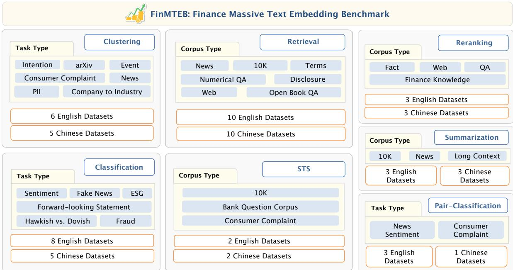
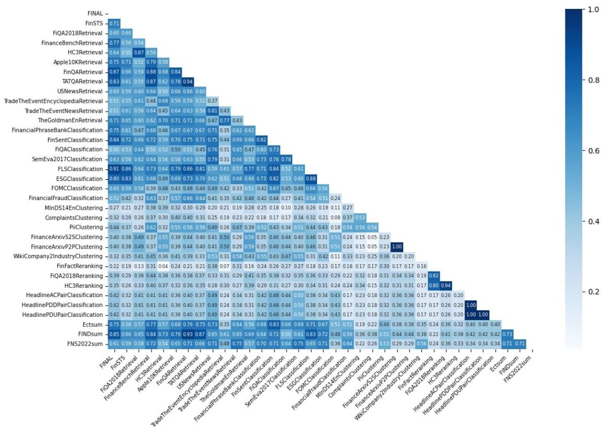

# FinMTEB: Finance Massive Text Embedding Benchmark

Yixuan Tang , Yi Yang The Hong Kong University of Science and Technology ytangch@connect.ust.hk, imyiyang@ust.hk

## Abstract

The efficacy of text embedding models in repre senting and retrieving information is crucial for many NLP applications, with performance sig nificantly advanced by Large Language Mod els (LLMs). Despite this progress, exist ing benchmarks predominantly use general purpose datasets, inadequately addressing the nuanced requirements of specialized domains like finance. To bridge this gap, we intro duce the Finance Massive Text Embedding Benchmark (FinMTEB), a comprehensive eval uation suite specifically designed for the fi nancial domain. FinMTEB encompasses 64 datasets across 7 task types, including classifi cation, clustering, retrieval, pair classification, reranking, summarization, and semantic textual similarity (STS) in English and Chinese. Alongside this benchmark, we introduce Fin E5, a state-of-the-art finance-adapted embed ding model, ranking first on FinMTEB. Fin-E5 is developed by fine-tuning e5-Mistral-7B Instruct on a novel persona-based synthetic dataset tailored for diverse financial embed ding tasks. Evaluating 15 prominent embedding models on FinMTEB, we derive three key findings: (1) domain-specific models, in cluding our Fin-E5, significantly outperform general-purpose models; (2) performance on general benchmarks is a poor predictor of suc cess on financial tasks; and (3) surprisingly, traditional Bag-of-Words (BoW) models sur pass dense embedding models on financial STS tasks. This work provides a robust benchmark for financial NLP and offers actionable insights for developing future domain-adapted embed ding solutions. Both FinMTEB and Fin-E5 will be open-sourced for the research community.

## 1 Introduction

Embedding models, transforming text into dense vector representations, are foundational to many natural language processing (NLP) tasks (Mikolov et al., 2013; Pennington et al., 2014; Peters et al., 2018). Their quality significantly impacts downstream applications like information retrieval and semantic understanding. While recent Large Language Model (LLM)-based embeddings (Wang et al., 2023; Li et al., 2023; Meng et al., 2024) demonstrate remarkable performance on general benchmarks, their efficacy in specialized domains, particularly finance, remains under-explored. Financial text analysis presents unique challenges, including domain-specific terminology, temporal sensitivity, and complex numerical relationships (Li et al., 2024; Anderson et al., 2024), raising critical questions: How effectively do modern embedding models capture domain-specificfinancial information? Can domain adaptation enhance LLM-based embeddings for financial applications?

These questions are motivated by three key insights. First, financial semantics often diverge from general language usage. For instance, "liability" inherently carries negative sentiment in financial contexts due to its association with obligations and risks, contrasting with its neutral denotation of legal responsibility in general usage. Such semantic divergence is critical for applications like Retrieval Augmented Generation (RAG) systems, where accurate document retrieval is important for effective knowledge augmentation. While recent work adapts RAG for finance (Li et al., 2024; Malandri et al., 2025), the fundamental role of embedding quality in retrieval efficacy is often overlooked.

Second, empirical evidence highlights the necessity of domain adaptation for optimal performance in specialized fields (Ling et al., 2023; Gururangan et al., 2020), even with advanced LLMs. This has led to models like BiMedLM (Bolton et al., 2024) for biomedical texts and BloombergGPT (Wu et al., 2023) for finance. This specialization extends to embedding models, with examples like BioWord-Vec (Zhang et al., 2019) and FinBERT (Yang et al., 2020). Notably, the financial industry itself contributes to these advancements; for instance, BAM, a RoBERTa-based model from Balyasny Asset Management (Anderson et al., 2024), has demonstrated improvements. Compared to the general domain, a significant gap exists: despite commercial solutions like voyage-finance-2 (VoyageAI, 2025), there is a lack of open-source, LLM-based financial embedding models accessible to the research community.

  
Figure 1: An overview of tasks and datasets used in FinMTEB. All the dataset descriptions and examples are provided in the Appendix A.

Third, financial NLP lacks comprehensive evaluation frameworks specifically for embedding models. Current benchmarks like FinanceBench (Islam et al., 2023) and FinQA (Chen et al., 2021) primarily assess text generation, while embeddingspecific evaluations (FiQA, 2018; Liu et al., 2024a) are often narrow in scope, targeting single task types or limited text types. This gap is exacerbated by unique characteristics of financial texts, such as the prevalence of boilerplate language (e.g., "The company’s performance is subject to various risks..."). Such standardized disclaimers, frequent but low in informational content, complicate models’ ability to distinguish meaningful business insights from routine compliance text. Thus, a critical need exists for comprehensive financial embedding benchmarks.

To bridge this gap, we introduce the Finance Massive Text Embedding Benchmark (FinMTEB). This comprehensive benchmark comprises 64 domain-specific datasets spanning English and Chinese and covering seven critical financial embedding tasks: classification, clustering, retrieval, pair classification, reranking, summarization, and semantic textual similarity (STS). Concurrently, we develop and release Fin-E5, a finance-adapted embedding model that achieves state-of-the-art performance on FinMTEB. Fin-E5 is built by fine-tuning e5-Mistral-7B-Instruct (Wang et al., 2023) on a persona-based synthetic dataset designed to generate diverse training data relevant to various financial embedding tasks. Our extensive experiments, evaluating 15 prominent embedding models on Fin-MTEB, yield three crucial insights: (1) LLM-based embeddings, particularly when domain-adapted like Fin-E5, generally outperform traditional methods and their general-purpose LLM counterparts, providing significant performance gains. (2) Performance on general benchmarks is a poor predictor of success on financial tasks; (3) Traditional Bagof-Words (BoW) models unexpectedly surpass all tested dense embedding models on financial STS tasks, highlighting persistent challenges for current embeddings in capturing nuanced financial semantics.

Apart from these insights, our practical contributions are twofold: First, we propose FinMTEB, the first comprehensive financial domain evaluation benchmark encompassing 64 datasets across seven distinct tasks in both Chinese and English. Second, we develop and release Fin-E5, a finance-adapted embedding model that achieves state-of-the-art performance on FinMTEB. To support future research, we will make both the FinMTEB benchmark and our Fin-E5 model available as open source.

## 2 Related Work

Recent advances in embedding models have shown remarkable success in general domain tasks, yet their effectiveness in specialized domains remains a critical challenge.

## 2.1 General-purpose Embedding Models

The evolution of embedding models marks significant progress in natural language processing. Starting with static word representations like Word2Vec (Mikolov et al., 2013) and GloVe (Pennington et al., 2014), the field advanced to contextualized embeddings through transformer-based architectures such as BERT (Devlin et al., 2019) and RoBERTa (Liu, 2019). A notable advancement came with Sentence-BERT (Reimers and Gurevych, 2019), which introduced Siamese and triplet network architectures to generate meaningful sentence-level representations. Recent developments in large language models have further pushed the boundaries, with models such as e5-mistral-7b-instruct (Wang et al., 2023) and gte-Qwen2-1.5B-instruct (Yang et al., 2024) achieving better performance in various embedding tasks. However, these generalpurpose models may not adequately capture the nuanced semantics of specialized domains.

## 2.2 Current Embedding Evaluation Landscape

To assess embedding quality, several evaluation frameworks have been developed. General-purpose embedding benchmarks, such as the Massive Text Embedding Benchmark (MTEB) (Muennighoff et al., 2022), provide broad coverage across multiple tasks and languages. Specialized benchmarks like BEIR (Thakur et al., 2021) focus on specific aspects, such as information retrieval. Although they incorporate some domain-specific datasets, such as FiQA (FiQA, 2018), the size of the data and the coverage of the task are limited.

## 2.3 Domain Adaptation Approaches

Recognizing the limitations of general-purpose models in specialized domains, researchers have pursued two main adaptation strategies. The first approach develops domain-specific models from scratch, exemplified by BioMedLM (Bolton et al.,

2024) for biomedicine, SaulLM-7B (Colombo et al., 2024) for legal texts, and BloombergGPT (Wu et al., 2023) for finance. The second strategy fine-tunes existing models for domain-specific tasks, as demonstrated by InvestLM (Yang et al., 2023b) and FinGPT (Yang et al., 2023a). This trend extends to embedding models, with specialized versions such as BioWordVec (Zhang et al., 2019), BioSentVec (Chen et al., 2019), and Fin-BERT (Yang et al., 2020) showing superior domainspecific performance. However, evaluating these specialized embedding models remains challenging due to the lack of comprehensive domain-specific benchmarks.

## 2.4 The Gap in Domain-specific Evaluation

While domain-specific language models have stimulated the development of specialized evaluation frameworks across various fields, these benchmarks primarily emphasize generative and reasoning capabilities instead of embedding quality. The financial sector has seen the emergence of frameworks like CFLUE (Zhu et al., 2024), FinEval (Zhang et al., 2023), and FinanceBench (Islam et al., 2023), whereas the legal and medical domains have introduced LawBench (Fei et al., 2023), MedBench (Liu et al., 2024b), and DrBenchmark (Labrak et al., 2024). These benchmarks consistently illustrate that general-purpose models often fall short in specialized areas (Zhu et al., 2024; Fei et al., 2023), highlighting the necessity of domain adaptation (Ling et al., 2023). Despite this acknowledgment, there is still a critical lack of comprehensive evaluation frameworks for domain-specific embeddings that assess performance across essential tasks such as semantic similarity, classification, and retrieval. Even recent financial embedding developments, such as BAM embedding (Anderson et al., 2024), rely on narrow evaluation frameworks, typically focusing on single-task performance metrics (e.g., FinanceBench (Islam et al., 2023) for retrieval tasks). This limited evaluation may not fully reflect how the models perform in real-world financial applications.

## 3 The FinMTEB Benchmark

In this section, we introduce the Finance MTEB (FinMTEB) benchmark. As illustrated in Figure 1, FinMTEB encompasses seven embedding tasks, following a structure similar to MTEB (Muennighoff et al., 2022) but with datasets specifically curated for the finance domain.

## 3.1 FinMTEB Tasks

Semantic Textual Similarity (STS) evaluates the semantic similarity between pairs of financial text. This task is crucial for automated financial analysis and risk management; for example, detecting subtle semantic differences between quarterly earnings statements could reveal important shifts in a company’s financial strategy that impact investment decisions. To ensure comprehensive evaluation, we incorporate diverse financial datasets, including FinSTS (Liu et al., 2024a) and FINAL (Ju et al., 2023) from company annual reports, and BQ-Corpus (Chen et al., 2018) from banking documents. Model performance is quantified using Spearman’s rank correlation, which measures the alignment between predicted cosine similarity scores and human-annotated similarity ratings.

Retrieval evaluates a model’s capability to identify and extract relevant financial information in response to specific queries. Unlike general domain retrieval, financial information retrieval presents unique challenges, requiring precise handling of complex numerical data, temporal dependencies, and regulatory context. For comprehensive evaluation, we leverage established finance QA datasets including FinanceBench (Islam et al., 2023), FiQA2018 (FiQA, 2018), and HPC3 (Guo et al., 2023). To further assess models’ understanding of professional financial terminology, we introduce TheGoldman dataset, constructed from the Goldman Sachs Financial Dictionary. Performance is measured using NDCG@10, a metric that evaluates both the relevance of retrieved information and its ranking position, reflecting the real-world requirement for highly precise top results in financial applications.

Clustering evaluates a model’s ability to automatically group similar financial texts based on their semantic content. To ensure comprehensive evaluation, we developed multiple specialized datasets that capture different aspects of financial text clustering: (1) FinanceArxiv-s2s and FinanceArxiv-p2p, constructed from titles and abstracts of finance-related papers on arXiv, providing rich academic financial content; (2) CompanyWiki2Industry dataset, derived from Wikipedia company descriptions, offering diverse industry categorization scenarios; and (3) complementary resources including consumer complaints from

CFPB2, financial intent detection data (Gerz et al., 2021a; Watson et al., 2024), and other established datasets. Model performance is quantified using the V-measure (Rosenberg and Hirschberg, 2007), a comprehensive metric that evaluates cluster quality through both completeness (all members of a class are assigned to the same cluster) and homogeneity (each cluster contains only members of a single class).

Classification evaluates a model’s ability to categorize financial texts into predefined classes based on their semantic content. This capability is essential for automated financial decision-making; for example, in algorithmic trading, accurately classifying sentiment in earnings calls or news articles can directly influence trading strategies and portfolio adjustments. The classification task encompasses diverse financial scenarios through multiple specialized datasets, including: financial sentiment analysis (Malo et al., 2014; FiQA, 2018; Cortis et al., 2017; Lu et al., 2023), Federal Reserve monetary policy classification (Shah et al., 2023), organization’s strategy classification, and forward-looking statement identification (Yang et al., 2023b). Performance is measured using Mean Average Precision (MAP), which provides a comprehensive assessment of classification accuracy while accounting for ranking quality and confidence scores.

Reranking evaluates the model’s ability to order retrieved documents based on their relevance to financial queries. We utilize financial question-answering datasets such as Fin-Fact and FinQA(Rangapur et al., 2023; Chen et al., 2021) to construct the reranking tasks. Specifically, for each query in these datasets, we retrieve top-k relevant documents along with the ground truth answers to construct the reranking training and evaluation pairs. The main evaluation metric for reranking in Finance MTEB is Mean Average Precision (MAP).

Pair-Classification evaluates a model’s ability to determine semantic relationships between financial text pairs. This task includes two datasets: (1) the AFQMC dataset3 for customer intention, and (2) three financial news headline datasets (Sinha and Khandait, 2021). We use Average Precision (AP) as the evaluation metric to assess model performance across different decision thresholds.

Summarization is evaluated based on how well the semantic similarity between an original text and its summary, as captured by embeddings, correlates with human judgments of summary quality. The evaluation corpus encompasses a comprehensive range of financial texts, including earnings call transcripts (Mukherjee et al., 2022), financial news articles (Lu et al., 2023), and SEC Form 10-K filings (El-Haj et al., 2022), ensuring robust assessment across diverse financial contexts and writing styles.

## 3.2 Characteristics of FinMTEB

FinMTEB is constructed to provide a comprehensive evaluation platform for financial text embedding models. It encompasses a total of 64 datasets, specifically 35 datasets in English and 29 datasets in Chinese. Beyond the number of datasets, Fin-MTEB exhibits distinct linguistic and semantic properties crucial for domain-specific benchmarking. The descriptions of these individual datasets are available in Appendix A, and the detailed construction process for the new dataset is illustrated in the Appendix A.2

## 4 Fin-E5: Finance-Adapted Text Embedding Model

Data is vital for domain adaptation (Ling et al., 2023). However, existing public financial retrieval datasets exhibit a narrow scope, which creates a gap in training an LLM-based embedding model. For example, FiQA (FiQA, 2018), a widely used financial retrieval dataset, primarily focuses on opinion-based content from online platforms, neglecting crucial aspects such as fundamental financial knowledge, technical terminology, and essential investment data. Thus, we start by curating a finance training dataset for adaptation.

## 4.1 Data Formation

We aim to construct each training instance as a triplet structure $( q , d ^ { + } , D ^ { - } )$ , where q represents a financial query, d+ denotes a relevant document that provides substantive information addressing the query, and D− comprises carefully selected negative examples that share the financial domain but differ in semantic intent.

## 4.2 Training Data Construction

To create a comprehensive dataset tailored for financial embedding training, we employ a systematic approach that combines expert-curated seed data with persona-based synthetic data generation.

Seed Data. Our seed data comes from the finance-specific QA dataset provided by InvestLM (Yang et al., 2023b), which offers expert-validated financial content across various domains, such as market analysis, investment strategies, and corporate finance. To ensure evaluation integrity, we conduct rigorous overlap checks between our training data and the FinMTEB benchmark, guaranteeing no overlap.

Persona-based Data Augmentation. To enhance the diversity of financial task representations and generate varied (query, positive context, hard negative context) triplets for contrastive training, we develop a persona-based data augmentation framework derived from QA data generation (Ge et al., 2024). Our framework employs a threestage process that specifically targets the expansion of task coverage while preserving domain consistency:

• Persona and Associated Task Identification: We begin by analyzing each question-answer pair from our seed data. Using Qwen2.5-14B-Instruct (Team, 2024) with the prompt "Who is likely to use this text?", the model generates a detailed persona description. This description inherently captures the persona (e.g., venture capitalist, financial advisor) and their typical job-related tasks (e.g., evaluating startup investments and managing client portfolios). For example, a generated description might be:

## Example Persona&Task Description

A compliance officer at afinancial institution (Persona), responsible for tracking major economic indicators and their potential regulatory implications (Task), with a focus on market stability and accurate risk assessment.

• Contextual Query Generation: Based on the rich persona description obtained in the previous step, we then prompt Qwen2.5-72B-Instruct (Team, 2024) to generate new queries q that this persona might ask. The prompt used is: "Guess a prompt (i.e., instructions) that the following persona may ask you to do:" The term "contextual" in this stage refers to our filtering process: we select queries that inherently require external documents or information for a comprehensive answer. This is crucial for forming the (query q, positive document $d ^ { + }$ ) pairs needed for training. For example, deriving from the compliance officer persona, the following example query would be considered contextual as it necessitates specific external analyses or regulatory interpretations:

## Example Contextual Query q

What is the latest analysis on how the recent G7 central bank interest rate hikes might affect liquidity risk reporting for commercial banks?

• Synthetic Positive Document $( d ^ { + } )$ Generation: For each selected contextual query q, we synthesize a relevant positive financial document $d ^ { + }$ . This document is generated using an LLM (e.g., Qwen2.5-72B-Instruct (Team, 2024)) with the prompt: "Synthesize context information related to this question: [Insert query q here]". The aim is for $d ^ { + }$ to provide substantive, focused information that directly addresses the query q, aligning with the information needs implied by the persona’s role and their associated tasks. For the example query about EPS growth, the synthesized document would contain plausible (though synthetic) data, analyses, or relevant financial discussions.

• Synthetic Positive Document $( d ^ { + } )$ Generation: For each selected contextual query q, we synthesize a relevant positive financial document $d ^ { + }$ . This document is generated using an LLM (e.g., Qwen2.5-72B-Instruct (Team, 2024)) with the prompt: "Synthesize context information related to this question: [Insert query q here]". The aim is for $d ^ { + }$ to provide substantive, focused information that directly addresses the query q, aligning with the information needs implied by the persona’s role and their associated tasks. For the example query about the impact of interest rate hikes on liquidity risk reporting, the synthesized document $d ^ { + }$ would contain plausible (though synthetic) expert analysis or excerpts from regulatory guidance, as illustrated below:

## Example Synthesized Positive Document (d+)

A recent analysis by the Financial Monitoring Group, dated May 15, 2025, indicates that the coordinated interest rate increases by G7 central banks are anticipated to impact short-term funding markets significantly...

## 4.3 Training Pipeline

Our primary objective in this training phase is to further adapt the e5-mistral-7b-instruct model (Wang et al., 2023) to the financial domain’s specific linguistic nuances and informational structures. This adaptation directly leverages the diverse financial query $( q )$ and corresponding synthetic positive document $( d ^ { + } )$ pairs generated through the persona-based data construction process detailed previously.

The foundation of our training methodology is a contrastive learning approach utilizing (query, positive context, hard negative context) triplets. Each training instance is structured as $( q , d ^ { + } , D ^ { - } )$ where:

• q represents the financial query, which serves as the anchor point for learning.

$d ^ { + }$ is the synthetic document, specifically generated in our data construction phase to be a highly relevant positive contextual passage for the query q.

$D ^ { - }$ denotes a set of hard negative contexts. These are documents also from the financial domain that, while potentially semantically similar to the query $q$ (making them challenging examples), are not the correct or directly relevant positive context $d ^ { + }$ . To identify these hard negatives, we employ an auxiliary embedding model, all-MiniLM-L12-v2 (Reimers and Gurevych, 2019), to mine for documents that are close to $q$ in its embedding space but are distinct from $d ^ { + }$

In line with the training recipe for e5-mistral-7b-instruct (Wang et al., 2023), we utilize the last token pooling method to derive fixed-size embeddings for both queries and documents. The e5- mistral-7b-instruct model is then fine-tuned using these $( q , d ^ { + } , D ^ { - } )$ triplets. The training process is guided by the InfoNCE (Noise Contrastive Estimation) loss function (Oord et al., 2018). This loss function incentivizes the model to learn representations where the embedding of the query q is closer to the embedding of its positive context $d ^ { + }$ compared to its distance from the embeddings of all hard negative contexts $D ^ { - }$ within the same training batch (referred to as in-batch negatives).

Full details regarding the fine-tuning process, including specific hyperparameters (such as batch sizes and learning rates), any input formatting templates utilized, and optimization settings for adapting e5-mistral-7b-instruct, are comprehensively documented in Appendix B.

## 5 Experimental Evaluation

In this section, we conduct a comprehensive evaluation of various embedding models on FinMTEB. Our primary goals are to benchmark their performance in the financial domain, analyze the impact of different model characteristics (such as domain adaptation and architecture), and investigate the necessity of domain-specific benchmarks like Fin-MTEB. Since most of the evaluated pre-trained models are predominantly trained on English corpora, our main evaluation focuses on the English datasets within FinMTEB; the evaluation results based on Chinese datasets are illustrated in $\mathsf { A p - }$ pendix C. The benchmark time is reported in $\mathsf { A p - }$ pendix D.

## 5.1 Experimental Setup

Evaluated Models In addition to Fin-E5, our proposed finance-adapted model, we evaluate four broad categories of existing embedding models on the FinMTEB benchmark. These include:

• Bag-of-Words (BOW): A traditional baseline representing text as sparse vectors based on word frequencies.

• Encoder-based Models: This category includes various transformer encoder architectures: (1) classical models like BERT (CLS pooling) (Devlin et al., 2019) and the domainspecific FinBERT (Yang et al., 2020); (2) models optimized for semantic search such as msmarco-bert-base-dot-v5 and all-MiniLM-L12-v2 (Reimers and Gurevych, 2019); and (3) advanced architectures including bgelarge-en-v1.5 (Xiao et al., 2023), AnglE-BERT (Li and Li, 2023), and instructorbase (Su et al., 2022).

• LLM-based Models: We investigate several state-of-the-art decoder-based or LLM-enhanced embedding models: (1) Mistral-7B-based models including bgeen-icl (Mistral-7B backbone with further instruction tuning) (Xiao et al., 2023), e5- mistral-7b-instruct (Wang et al., 2023), and Echo (Springer et al., 2024); (2) NV-Embed $\mathbf { v } 2$ (Lee et al., 2024); and (3) gte-Qwen1.5- 7B-instruct (Li et al., 2023), built on the Qwen (Yang et al., 2024) architecture.

• Commercial Models: For a comprehensive comparison, we include leading closed-source commercial solutions, specifically OpenAI’s text-embedding-3-large, textembedding-3-small (OpenAI, 2024), and voyage-3-large (VoyageAI, 2025)4.

## 5.2 Overall Performance on FinMTEB

The comprehensive performance of all evaluated models across the various tasks in the FinMTEB benchmark is presented in Table 1. This table serves as the primary basis for the subsequent analyses.

## 5.2.1 Impact of Domain Adaptation

Domain specialization considerably boosts performance on financial tasks, as illustrated in Table 1. For instance, the finance-specific FinBERT outperforms the general BERT by 15.6% in the average score (0.6721 vs. 0.5812 on relevant FinMTEB tasks). Similarly, our finance-adapted Fin-E5 model exceeds its general-domain counterpart, e5-mistral-7b-instruct, by 4.5% in the average score. This overall improvement is supported by statistically significant gains in several key task categories, as detailed in Table 14. Specifically, Fin-E5 demonstrates a significant advantage in Classification, achieving a score of 0.7565 compared to the baseline’s 0.6449 $( \mathbf { \mathrm { p } } = 0 . 0 2 0 6 )$ , and also in Retrieval, scoring 0.7105 against the baseline’s 0.6749 $\left( \mathbf { p } = 0 . 0 4 8 9 \right)$ . Fin-E5’s slight underperformance on Clustering and Summarization compared with e5-mistral-7b-instruct is not statistically significant $( \mathtt { p } > 0 . 0 5 )$ . Fin-E5 also achieves state-ofthe-art performance (0.6767 average scores) on Fin-MTEB, surpassing general-purpose, open-source, and leading commercial models. This increased performance comes from an efficient adaptation process requiring only 100 training steps.

<table><tr><td rowspan="2">Model</td><td rowspan="2">Size</td><td colspan="7">Tasks</td><td rowspan="2">Avg.</td></tr><tr><td>STS</td><td>Retrieval</td><td>Class.</td><td>Cluster.</td><td>Rerank.</td><td>PairClass.</td><td>Summ.</td></tr><tr><td></td><td></td><td> $( \mathrm { N } { = } 2 , \mathrm { p } { = } 0 . 1 0 )$ </td><td> $( \mathrm { N } { = } 1 0 , \rho { < } 0 . 0 5 ^ { \circ } )$ </td><td> $( \mathrm { N } { = } 8 , \mathrm { p } { < } 0 . 0 5 ^ { \ast } )$ </td><td> $( \mathrm { N } { = } { } 6 , \mathrm { p } { = } 0 . 1 2 )$ </td><td> $( \mathrm { N } { = } 3 , \mathrm { p } { < } 0 . 0 5 ^ { \ast } )$ </td><td> $( \mathrm { N } { = } 3 , \mathrm { p } { < } 0 . 0 5 ^ { \circ } )$ </td><td> $( \mathrm { N } { = } 3 , \mathrm { p } { = } 0 . 4 5 )$ </td><td></td></tr><tr><td>BOW</td><td></td><td>0.4845</td><td>0.2084</td><td>0.4696</td><td>0.2547</td><td>0.7628</td><td>0.7143</td><td>0.2584</td><td>0.4504</td></tr><tr><td>Encoder based Models</td><td></td><td></td><td></td><td></td><td></td><td></td><td></td><td></td><td></td></tr><tr><td>BERT</td><td>110M</td><td>0.3789</td><td>0.0207</td><td>0.5496</td><td>0.1744</td><td>0.3930</td><td>0.7111</td><td>0.1686</td><td>0.3423</td></tr><tr><td>FinBERT</td><td>110M</td><td>0.4198</td><td>0.1102</td><td>0.5923</td><td>0.2833</td><td>0.6404</td><td>0.6967</td><td>0.2010</td><td>0.4205</td></tr><tr><td>instructor-base</td><td>110M</td><td>0.3732</td><td>0.5772</td><td>0.6208</td><td>0.5300</td><td>0.9734</td><td>0.6138</td><td>0.4315</td><td>0.5886</td></tr><tr><td>bge-large-en-v1.5</td><td>335M</td><td>0.3396</td><td>0.6463</td><td>0.6436</td><td>0.5725</td><td>0.9825</td><td>0.7400</td><td>0.4857</td><td>0.6301</td></tr><tr><td>AnglE-BERT</td><td>335M</td><td>0.3080</td><td>0.5730</td><td>0.6439</td><td>0.5774</td><td>0.9650</td><td>0.6891</td><td>0.5049</td><td>0.6088</td></tr><tr><td>LLM-based Models</td><td></td><td></td><td></td><td></td><td></td><td></td><td></td><td></td><td></td></tr><tr><td>gte-Qwen1.5-7B-instruct</td><td>7B</td><td>0.3758</td><td>0.6697</td><td>0.6438</td><td>0.5854</td><td>0.9890</td><td>0.6998</td><td>0.5354</td><td>0.6427</td></tr><tr><td>Echo</td><td>7B</td><td>0.4380</td><td>0.6443</td><td>0.6525</td><td>0.5776</td><td>0.9765</td><td>0.6261</td><td>0.4722</td><td>0.6267</td></tr><tr><td>bge-en-icl</td><td>7B</td><td>0.3233</td><td>0.6789</td><td>0.6569</td><td>0.5742</td><td>0.9898</td><td>0.6738</td><td>0.5197</td><td>0.6309</td></tr><tr><td>NV-Embed v2</td><td>7B</td><td>0.3739</td><td>0.7061</td><td>0.6393</td><td>0.6096</td><td>0.9822</td><td>0.6043</td><td>0.5103</td><td>0.6322</td></tr><tr><td>e5-mistral-7b-instruct</td><td>7B</td><td>0.3800</td><td>0.6749</td><td>0.6449</td><td>0.5783</td><td>0.9875</td><td>0.7394</td><td>0.5275</td><td>0.6475</td></tr><tr><td>Commercial Models</td><td></td><td></td><td></td><td></td><td></td><td></td><td></td><td></td><td></td></tr><tr><td>text-embedding-3-small</td><td></td><td>0.3254</td><td>0.6641</td><td>0.6387</td><td>0.5802</td><td>0.9825</td><td>0.5957</td><td>0.5085</td><td>0.6136</td></tr><tr><td>text-embedding-3-large</td><td></td><td>0.3615</td><td>0.7112</td><td>0.6596</td><td>0.6081</td><td>0.9910</td><td>0.7309</td><td>0.5671</td><td>0.6613</td></tr><tr><td>voyage-3-large</td><td></td><td>0.4145</td><td>0.7463</td><td>0.6861</td><td>0.5944</td><td>0.9938</td><td>0.6519</td><td>0.6484</td><td>0.6765</td></tr><tr><td>Finance Adapted LLM-based Models</td><td></td><td></td><td></td><td></td><td></td><td></td><td></td><td></td><td></td></tr><tr><td>Fin-E5</td><td>7B</td><td>0.4342</td><td>0.7105</td><td>0.7565</td><td>0.5650</td><td>0.9896</td><td>0.8014</td><td>0.4797</td><td>0.6767</td></tr></table>

Table 1: Performance comparison across different embedding models on FinMTEB benchmark. Tasks include semantic textual similarity (STS), retrieval, classification (Class.), clustering (Cluster.), reranking (Rerank.), pair classification (PairClass.), and summarization (Summ.). For each task, N indicates the number of datasets, and p is the p-value from one-way ANOVA testing for significant differences across all models; \* denotes $p < 0 . 0 5$ Bold indicates best performance, underline indicates second-best, and † indicates statistically significant differences between the best two models $( \mathtt { p } < 0 . 0 5 )$

## 5.2.2 Limitations of Current Models in Financial STS Tasks

The Semantic Textual Similarity (STS) task results reveal a counterintuitive finding: the simple BOW model (achieving a score of 0.4845) outperforms all evaluated dense embedding architectures on STS. The observation highlights fundamental limitations in dense embedding strategies for specialized financial documents. The STS datasets (Liu et al., 2024a; Ju et al., 2023) are sourced from the Company Annual Reports. Thus, this reversal of typical performance hierarchies likely arises from the specialized financial corpus, which can decrease performance for models not finely tuned to this vocabulary, whereas BOW benefits from exact term matches in such standardized disclosures.

## 6 The Necessity of Domain-Specific Benchmarks: An ANOVA Study

This section addresses another research question. To what extent do general-purpose embedding evaluations appropriately capture domain-specific performance? To investigate this, we conduct a quantitative comparison between the general-purpose MTEB benchmark (Muennighoff et al., 2022) and our domain-specific FinMTEB. We employ Analysis of Variance to examine the main effects of two key factors, the embedding model (Model Factor) and the benchmark domain (Domain Factor: General vs. Finance), on model performance. Detailed experimental settings are provided in Appendix E. The results reveal that the Domain Factor demonstrates statistical significance across all tasks (p $< 0 . 0 0 1 $ , with large F statistics in classification, clustering, and STS. These findings indicate that domain-specific characteristics significantly influence embedding model evaluation.

## 7 Conclusion

This paper introduces FinMTEB, the first comprehensive benchmark for evaluating embedding models in the financial domain. Our main contributions include establishing a large-scale evaluation framework with 64 datasets across seven tasks in Chinese and English, and developing Fin-E5, a finance-adapted embedding model demonstrating competitive performance through persona-based data augmentation. Our empirical results highlight the importance of domain-specific adaptation and reveal current limitations in financial text embeddings. We believe FinMTEB will serve as a valuable resource for both researchers and practitioners in advancing financial language models.

## Limitation

This work has two primary limitations. First, it relies on several existing financial datasets that could potentially overlap with the training data of contemporary embedding models. This overlap may introduce contamination, making it difficult to ensure completely fair comparisons between different models. Second, our adapted model and evaluation methods are currently limited to the English language, which restricts their applicability to non-English financial texts.

## References

Peter Anderson, Mano Vikash Janardhanan, Jason He, Wei Cheng, and Charlie Flanagan. 2024. Greenback bears and fiscal hawks: Finance is a jungle and text embeddings must adapt. In Proceedings ofthe 2024 Conference on Empirical Methods in Natural Language Processing: Industry Track, pages 362–370, Miami, Florida, US. Association for Computational Linguistics.

Elliot Bolton, Abhinav Venigalla, Michihiro Yasunaga, David Hall, Betty Xiong, Tony Lee, Roxana Daneshjou, Jonathan Frankle, Percy Liang, Michael Carbin, et al. 2024. Biomedlm: A 2.7 b parameter language model trained on biomedical text. arXiv preprint arXiv:2403.18421.

CCKS. 2022. Ccks2022: Few-shot event extraction for the financial sector. https://www.biendata.xyz/ competition/ccks2022\_eventext/.

CFPB. 2024. Consumer finance complaints. https://huggingface.co/datasets/CFPB/ consumer-finance-complaints.

Jing Chen, Qingcai Chen, Xin Liu, Haijun Yang, Daohe Lu, and Buzhou Tang. 2018. The BQ corpus: A largescale domain-specific Chinese corpus for sentence semantic equivalence identification. In Proceedings ofthe 2018 Conference on Empirical Methods in Natural Language Processing, pages 4946–4951, Brussels, Belgium. Association for Computational Linguistics.

Qingyu Chen, Yifan Peng, and Zhiyong Lu. 2019. Biosentvec: creating sentence embeddings for biomedical texts. In 2019 IEEE International Conference on Healthcare Informatics (ICHI), pages 1–5. IEEE.

Wei Chen, Qiushi Wang, Zefei Long, Xianyin Zhang, Zhongtian Lu, Bingxuan Li, Siyuan Wang, Jiarong Xu, Xiang Bai, Xuanjing Huang, and Zhongyu Wei. 2023. Disc-finllm: A chinese financial large language model based on multiple experts fine-tuning. arXiv preprint arXiv:2310.15205.

Zhiyu Chen, Wenhu Chen, Charese Smiley, Sameena Shah, Iana Borova, Dylan Langdon, Reema Moussa, Matt Beane, Ting-Hao Huang, Bryan Routledge, and William Yang Wang. 2021. FinQA: A dataset of numerical reasoning over financial data. In Proceedings ofthe 2021 Conference on Empirical Methods in Natural Language Processing, pages 3697–3711, Online and Punta Cana, Dominican Republic. Association for Computational Linguistics.

Pierre Colombo, Telmo Pessoa Pires, Malik Boudiaf, Dominic Culver, Rui Melo, Caio Corro, Andre FT Martins, Fabrizio Esposito, Vera Lúcia Raposo, Sofia Morgado, et al. 2024. Saullm-7b: A pioneering large language model for law. arXiv preprint arXiv:2403.03883.

Keith Cortis, André Freitas, Tobias Daudert, Manuela Huerlimann, Manel Zarrouk, Siegfried Handschuh, and Brian Davis. 2017. SemEval-2017 task 5: Finegrained sentiment analysis on financial microblogs and news. In Proceedings ofthe 11th International Workshop on Semantic Evaluation (SemEval-2017), pages 519–535, Vancouver, Canada. Association for Computational Linguistics.

Jacob Devlin, Ming-Wei Chang, Kenton Lee, and Kristina Toutanova. 2019. BERT: Pre-training of deep bidirectional transformers for language understanding. In Proceedings ofthe 2019 Conference of the North American Chapter ofthe Associationfor Computational Linguistics: Human Language Technologies, Volume 1 (Long and Short Papers), pages 4171–4186, Minneapolis, Minnesota. Association for Computational Linguistics.

Mahmoud El-Haj, Nadhem Zmandar, Paul Rayson, Ahmed AbuRa’ed, Marina Litvak, Nikiforos Pittaras, George Giannakopoulos, Aris Kosmopoulos, Blanca Carbajo-Coronado, and Antonio Moreno-Sandoval. 2022. The financial narrative summarisation shared task (FNS 2022). In Proceedings of the 4th Financial Narrative Processing Workshop @LREC2022, pages 43–52, Marseille, France. European Language Resources Association.

Zhiwei Fei, Xiaoyu Shen, Dawei Zhu, Fengzhe Zhou, Zhuo Han, Songyang Zhang, Kai Chen, Zongwen Shen, and Jidong Ge. 2023. Lawbench: Benchmarking legal knowledge of large language models. arXiv preprint arXiv:2309.16289.

FiQA. 2018. Financial question answering. https: //sites.google.com/view/fiqa.

Tao Ge, Xin Chan, Xiaoyang Wang, Dian Yu, Haitao Mi, and Dong Yu. 2024. Scaling synthetic data creation with 1,000,000,000 personas. arXiv preprint arXiv:2406.20094.

Daniela Gerz, Pei-Hao Su, Razvan Kusztos, Avishek Mondal, Michał Lis, Eshan Singhal, Nikola Mrkšic,´ Tsung-Hsien Wen, and Ivan Vulic. 2021a.´ Multilingual and cross-lingual intent detection from spoken data. In Proceedings of the 2021 Conference on

Empirical Methods in Natural Language Processing, pages 7468–7475, Online and Punta Cana, Dominican Republic. Association for Computational Linguistics.

Daniela Gerz, Pei-Hao Su, Razvan Kusztos, Avishek Mondal, Michał Lis, Eshan Singhal, Nikola Mrkšic,´ Tsung-Hsien Wen, and Ivan Vulic. 2021b. Multilin-´ gual and cross-lingual intent detection from spoken data. arXiv preprint arXiv:2104.08524.

Biyang Guo, Xin Zhang, Ziyuan Wang, Minqi Jiang, Jinran Nie, Yuxuan Ding, Jianwei Yue, and Yupeng Wu. 2023. How close is chatgpt to human experts? comparison corpus, evaluation, and detection. arXiv preprint arXiv:2301.07597.

Suchin Gururangan, Ana Marasovic, Swabha´ Swayamdipta, Kyle Lo, Iz Beltagy, Doug Downey, and Noah A. Smith. 2020. Don’t stop pretraining: Adapt language models to domains and tasks. In Proceedings of the 58th Annual Meeting of the Association for Computational Linguistics, pages 8342–8360, Online. Association for Computational Linguistics.

Pranab Islam, Anand Kannappan, Douwe Kiela, Rebecca Qian, Nino Scherrer, and Bertie Vidgen. 2023. Financebench: A new benchmark for financial question answering. arXiv preprint arXiv:2311.11944.

Albert Q Jiang, Alexandre Sablayrolles, Arthur Mensch, Chris Bamford, Devendra Singh Chaplot, Diego de las Casas, Florian Bressand, Gianna Lengyel, Guillaume Lample, Lucile Saulnier, et al. 2023. Mistral 7b. arXiv preprint arXiv:2310.06825.

Jia-Huei Ju, Yu-Shiang Huang, Cheng-Wei Lin, Che Lin, and Chuan-Ju Wang. 2023. A compare-and-contrast multistage pipeline for uncovering financial signals in financial reports. In Proceedings of the 61st Annual Meeting of the Association for Computational Linguistics (Volume 1: Long Papers), pages 14307– 14321, Toronto, Canada. Association for Computational Linguistics.

Yanis Labrak, Adrien Bazoge, Oumaima El Khettari, Mickaël Rouvier, Natalia Grabar, Beatrice Daille, Solen Quiniou, Emmanuel Morin, Pierre-Antoine Gourraud, Richard Dufour, et al. 2024. Drbenchmark: A large language understanding evaluation benchmark for french biomedical domain. arXiv preprint arXiv:2402.13432.

Yinyu Lan, Yanru Wu, Wang Xu, Weiqiang Feng, and Youhao Zhang. 2023. Chinese fine-grained financial sentiment analysis with large language models. arXiv preprint arXiv:2306.14096.

Chankyu Lee, Rajarshi Roy, Mengyao Xu, Jonathan Raiman, Mohammad Shoeybi, Bryan Catanzaro, and Wei Ping. 2024. Nv-embed: Improved techniques for training llms as generalist embedding models. arXiv preprint arXiv:2405.17428.

Xiang Li, Zhenyu Li, Chen Shi, Yong Xu, Qing Du, Mingkui Tan, Jun Huang, and Wei Lin. 2024. Alphafin: Benchmarking financial analysis with retrieval-augmented stock-chain framework. arXiv preprint arXiv:2403.12582.

Xianming Li and Jing Li. 2023. Angle-optimized text embeddings. arXiv preprint arXiv:2309.12871.

Zehan Li, Xin Zhang, Yanzhao Zhang, Dingkun Long, Pengjun Xie, and Meishan Zhang. 2023. Towards general text embeddings with multi-stage contrastive learning. arXiv preprint arXiv:2308.03281.

Chen Ling, Xujiang Zhao, Jiaying Lu, Chengyuan Deng, Can Zheng, Junxiang Wang, Tanmoy Chowdhury, Yun Li, Hejie Cui, Xuchao Zhang, et al. 2023. Domain specialization as the key to make large language models disruptive: A comprehensive survey. arXiv preprint arXiv:2305.18703.

Jiaxin Liu, Yi Yang, and Kar Yan Tam. 2024a. Beyond surface similarity: Detecting subtle semantic shifts in financial narratives. In Findings ofthe Association for Computational Linguistics: NAACL 2024, pages 2641–2652, Mexico City, Mexico. Association for Computational Linguistics.

Mianxin Liu, Jinru Ding, Jie Xu, Weiguo Hu, Xiaoyang Li, Lifeng Zhu, Zhian Bai, Xiaoming Shi, Benyou Wang, Haitao Song, et al. 2024b. Medbench: A comprehensive, standardized, and reliable benchmarking system for evaluating chinese medical large language models. arXiv preprint arXiv:2407.10990.

Shuaiqi Liu, Jiannong Cao, Ruosong Yang, and Zhiyuan Wen. 2022. Long text and multi-table summarization: Dataset and method. In Findings ofthe Association for Computational Linguistics: EMNLP 2022, pages 1995–2010, Abu Dhabi, United Arab Emirates. Association for Computational Linguistics.

Yinhan Liu. 2019. Roberta: A robustly optimized bert pretraining approach. arXiv preprint arXiv:1907.11692.

Dakuan Lu, Hengkui Wu, Jiaqing Liang, Yipei Xu, Qianyu He, Yipeng Geng, Mengkun Han, Yingsi Xin, and Yanghua Xiao. 2023. Bbt-fin: Comprehensive construction of chinese financial domain pre-trained language model, corpus and benchmark. arXiv preprint arXiv:2302.09432.

Lorenzo Malandri, Fabio Mercorio, Mario Mezzanzanica, and Filippo Pallucchini. 2025. RE-FIN: Retrieval-based enrichment for financial data. In Proceedings ofthe 31st International Conference on Computational Linguistics: Industry Track, pages 751–759, Abu Dhabi, UAE. Association for Computational Linguistics.

Pekka Malo, Ankur Sinha, Pekka Korhonen, Jyrki Wallenius, and Pyry Takala. 2014. Good debt or bad debt: Detecting semantic orientations in economic texts. Journal of the Association for Information Science and Technology, 65(4):782–796.

Rui Meng, Ye Liu, Shafiq Rayhan Joty, Caiming Xiong, Yingbo Zhou, and Semih Yavuz. 2024. Sfrembedding-2: Advanced text embedding with multistage training.

Tomas Mikolov, Kai Chen, Greg Corrado, and Jeffrey Dean. 2013. Efficient estimation of word representations in vector space. arXiv preprint arXiv:1301.3781.

Niklas Muennighoff, Nouamane Tazi, Loïc Magne, and Nils Reimers. 2022. Mteb: Massive text embedding benchmark. arXiv preprint arXiv:2210.07316.

Rajdeep Mukherjee, Abhinav Bohra, Akash Banerjee, Soumya Sharma, Manjunath Hegde, Afreen Shaikh, Shivani Shrivastava, Koustuv Dasgupta, Niloy Ganguly, Saptarshi Ghosh, et al. 2022. Ectsum: A new benchmark dataset for bullet point summarization of long earnings call transcripts. arXiv preprint arXiv:2210.12467.

Qiong Nan, Juan Cao, Yongchun Zhu, Yanyan Wang, and Jintao Li. 2021. Mdfend: Multi-domain fake news detection. In Proceedings ofthe 30th ACM International Conference on Information & Knowledge Management, pages 3343–3347.

Aaron van den Oord, Yazhe Li, and Oriol Vinyals. 2018. Representation learning with contrastive predictive coding. arXiv preprint arXiv:1807.03748.

OpenAI. 2024. Openai (august 24 version). https: //api.openai.com/v1/embeddings.

Masanori Oya. 2011. Syntactic dependency distance as sentence complexity measure. In Proceedings ofthe 16th International Conference ofPan-Pacific Association of Applied Linguistics, volume 1.

Jeffrey Pennington, Richard Socher, and Christopher Manning. 2014. GloVe: Global vectors for word representation. In Proceedings of the 2014 Conference on Empirical Methods in Natural Language Processing (EMNLP), pages 1532–1543, Doha, Qatar. Association for Computational Linguistics.

Matthew E. Peters, Mark Neumann, Mohit Iyyer, Matt Gardner, Christopher Clark, Kenton Lee, and Luke Zettlemoyer. 2018. Deep contextualized word representations. In Proceedings of the 2018 Conference of the North American Chapter of the Association for Computational Linguistics: Human Language Technologies, Volume 1 (Long Papers), pages 2227–2237, New Orleans, Louisiana. Association for Computational Linguistics.

Colin Raffel, Noam Shazeer, Adam Roberts, Katherine Lee, Sharan Narang, Michael Matena, Yanqi Zhou, Wei Li, and Peter J Liu. 2020. Exploring the limits of transfer learning with a unified text-to-text transformer. Journal of machine learning research, 21(140):1–67.

Aman Rangapur, Haoran Wang, Ling Jian, and Kai Shu. 2023. Fin-fact: A benchmark dataset for multimodal financial fact checking and explanation generation. arXiv preprint arXiv:2309.08793.

Nils Reimers and Iryna Gurevych. 2019. Sentence-bert: Sentence embeddings using siamese bert-networks. In Proceedings of the 2019 Conference on Empirical Methods in Natural Language Processing. Association for Computational Linguistics.

Andrew Rosenberg and Julia Hirschberg. 2007. Vmeasure: A conditional entropy-based external cluster evaluation measure. In Proceedings ofthe 2007 Joint Conference on Empirical Methods in Natural Language Processing and Computational Natural Language Learning (EMNLP-CoNLL), pages 410– 420, Prague, Czech Republic. Association for Computational Linguistics.

Agam Shah, Suvan Paturi, and Sudheer Chava. 2023. Trillion dollar words: A new financial dataset, task & market analysis. In Proceedings ofthe 61st Annual Meeting of the Association for Computational Linguistics (Volume 1: Long Papers), pages 6664–6679, Toronto, Canada. Association for Computational Linguistics.

Ankur Sinha and Tanmay Khandait. 2021. Impact of news on the commodity market: Dataset and results. In Advances in Information and Communication: Proceedings of the 2021 Future of Information and Communication Conference (FICC), Volume 2, pages 589–601. Springer.

Jacob Mitchell Springer, Suhas Kotha, Daniel Fried, Graham Neubig, and Aditi Raghunathan. 2024. Repetition improves language model embeddings. arXiv preprint arXiv:2402.15449.

Hongjin Su, Weijia Shi, Jungo Kasai, Yizhong Wang, Yushi Hu, Mari Ostendorf, Wen-tau Yih, Noah A Smith, Luke Zettlemoyer, and Tao Yu. 2022. One embedder, any task: Instruction-finetuned text embeddings. arXiv preprint arXiv:2212.09741.

Maosong Sun, Jingyang Li, Zhipeng Guo, Yu Zhao, Yabin Zheng, Xiance Si, and Zhiyuan Liu. 2016. Thuctc: An efficient chinese text classifier. http: //thuctc.thunlp.org/.

Qwen Team. 2024. Qwen2.5: A party of foundation models.

Nandan Thakur, Nils Reimers, Andreas Rücklé, Abhishek Srivastava, and Iryna Gurevych. 2021. BEIR: A heterogeneous benchmark for zero-shot evaluation of information retrieval models. In Thirty-fifth Conference on Neural Information Processing Systems Datasets and Benchmarks Track (Round 2).

VoyageAI. 2025. Voyageai (jan 25 version). https: //api.voyageai.com/v1/embeddings.

Liang Wang, Nan Yang, Xiaolong Huang, Linjun Yang, Rangan Majumder, and Furu Wei. 2023. Improving text embeddings with large language models. arXiv preprint arXiv:2401.00368.

Alex Watson, Yev Meyer, Maarten Van Segbroeck, Matthew Grossman, Sami Torbey, Piotr Mlocek, and Johnny Greco. 2024. Synthetic-PII-Financial-Documents-North-America: A synthetic dataset for training language models to label and detect pii in domain specific formats.

Shijie Wu, Ozan Irsoy, Steven Lu, Vadim Dabravolski, Mark Dredze, Sebastian Gehrmann, Prabhanjan Kambadur, David Rosenberg, and Gideon Mann. 2023. Bloomberggpt: A large language model for finance. arXiv preprint arXiv:2303.17564.

Shitao Xiao, Zheng Liu, Peitian Zhang, and Niklas Muennighoff. 2023. C-pack: Packaged resources to advance general chinese embedding. arXiv preprint arXiv:2309.07597.

Ziyue Xu, Peilin Zhou, Xinyu Shi, Jiageng Wu, Yikang Jiang, Bin Ke, and Jie Yang. 2024. Fintruthqa: A benchmark dataset for evaluating the quality of financial information disclosure. arXiv preprint arXiv:2406.12009.

An Yang, Baosong Yang, Binyuan Hui, Bo Zheng, Bowen Yu, Chang Zhou, Chengpeng Li, Chengyuan Li, Dayiheng Liu, Fei Huang, et al. 2024. Qwen2 technical report. arXiv preprint arXiv:2407.10671.

Hongyang Yang, Xiao-Yang Liu, and Christina Dan Wang. 2023a. Fingpt: Open-source financial large language models. arXiv preprint arXiv:2306.06031.

Yi Yang, Yixuan Tang, and Kar Yan Tam. 2023b. Investlm: A large language model for investment using financial domain instruction tuning. arXiv preprint arXiv:2309.13064.

Yi Yang, Mark Christopher Siy Uy, and Allen Huang. 2020. Finbert: A pretrained language model for financial communications. arXiv preprint arXiv:2006.08097.

Liwen Zhang, Weige Cai, Zhaowei Liu, Zhi Yang, Wei Dai, Yujie Liao, Qianru Qin, Yifei Li, Xingyu Liu, Zhiqiang Liu, et al. 2023. Fineval: A chinese financial domain knowledge evaluation benchmark for large language models. arXiv preprint arXiv:2308.09975.

Yijia Zhang, Qingyu Chen, Zhihao Yang, Hongfei Lin, and Zhiyong Lu. 2019. Biowordvec, improving biomedical word embeddings with subword information and mesh. Scientific data, 6(1):52.

Zhihan Zhou, Liqian Ma, and Han Liu. 2021. Trade the event: Corporate events detection for news-based event-driven trading. In Findings ofthe Association for Computational Linguistics: ACL-IJCNLP 2021, pages 2114–2124, Online. Association for Computational Linguistics.

Fengbin Zhu, Wenqiang Lei, Youcheng Huang, Chao Wang, Shuo Zhang, Jiancheng Lv, Fuli Feng, and Tat-Seng Chua. 2021. Tat-qa: A question answering benchmark on a hybrid of tabular and textual content in finance. arXiv preprint arXiv:2105.07624.

Jie Zhu, Junhui Li, Yalong Wen, and Lifan Guo. 2024. Benchmarking large language models on cflue–a chinese financial language understanding evaluation dataset. arXiv preprint arXiv:2405.10542.

## A Datasets in FinMTEB

The detailed description of each dataset used in this work is listed in the Table tables 2 to 8.

## A.1 Detailed Characteristics of FinMTEB

Linguistic Pattern. Table 9 presents a comparative analysis of linguistic features between MTEB (Muennighoff et al., 2022) and FinMTEB benchmarks, examining aspects such as average sentence length, token length, syllables per token, and dependency distance (Oya, 2011). The results indicate that texts in FinMTEB consistently exhibit longer and more complex sentences than those in MTEB, with an average sentence length of 26.37 tokens compared to MTEB’s 18.2 tokens. This highlights the linguistic differences between financial and general domain texts.

Semantic Diversity. We examine the interdataset semantic similarity within FinMTEB. Using the all-MiniLM-L6-v2 model13, we embed 1,000 randomly sampled texts from each dataset, compute their mean embeddings to represent each dataset, and measure inter-dataset similarities using cosine similarity. As shown in Figure 2, most datasets in FinMTEB display inter-dataset similarity scores below 0.6, with a mean cosine similarity of 0.4, indicating semantic distinctions among various types of financial texts.

## A.2 Dataset Construction and Validation Details

This appendix details the construction pipelines and validation procedures for all newly created datasets used in our experiments. Each dataset is carefully curated to ensure high quality and appropriate task alignment.

WikiCompany2Industry (Clustering Task). The WikiCompany2Industry dataset is constructed by extracting 3,820 company descriptions from Wikipedia’s company pages and cross-referencing them with Standard Industrial Classification (SIC) codes from the SEC EDGAR database. To ensure data quality, we apply a three-stage filtering process that removes companies with multiple primary SIC codes, excludes descriptions shorter than 50 words, and verifies SIC code consistency across multiple data sources. The dataset uses official SIC 4-digit codes as clustering labels, resulting in 87 unique industry categories that provide comprehensive coverage of the business landscape.

<table><tr><td>Dataset Name</td><td>Language</td><td>Description</td></tr><tr><td>FINAL (Ju et al., 2023)</td><td>English</td><td>A dataset designed for discovering financial signals in nar- rative financial reports.</td></tr><tr><td>FinSTS (Liu et al., 2024a)</td><td>English</td><td>A dataset focused on detecting subtle semantic shifts in financial narratives.</td></tr><tr><td>AFQMC 5</td><td>Chinese</td><td>A Chinese dataset for customer service question matching in the financial domain.</td></tr><tr><td>BQ-Corpus (Chen et al., 2018) Chinese</td><td></td><td>A large-scale Chinese corpus for sentence semantic equiva- lence identification (SSEI) in the banking domain.</td></tr></table>

Table 2: Summary of STS Datasets

FinanceArxiv-s2s/p2p (Clustering Task). The FinanceArxiv dataset is created by collecting all finance papers (titles and abstracts) from ArXiv spanning 2015-2024 using the official ArXiv API. The dataset includes two variants: s2s (sentence-tosentence) for title-based clustering and p2p (paperto-paper) for abstract-based clustering. The clustering is based on ArXiv’s 9 official finance subcategories: q-fin.CP (Computational Finance), qfin.EC (Economics), q-fin.GN (General Finance), q-fin.MF (Mathematical Finance), q-fin.PM (Portfolio Management), q-fin.PR (Pricing of Securities), q-fin.RM (Risk Management), q-fin.ST (Statistical Finance), and q-fin.TR (Trading and Market Microstructure).

TheGoldman (Retrieval Task). TheGoldman dataset was constructed by transforming 1,500 term-definition pairs from the Goldman Sachs Financial Dictionary into a query-retrieval format. Each query follows the standardized format "What is [term]?" with the corresponding definition serving as the target retrieval result. For example, the query "What is IPO Lock-up?" maps to the target "A legally binding contract between underwriters and insiders that prohibits the sale of shares for a specified period after an initial public offering..." This format ensures that the retrieval task evaluates the model’s ability to understand financial terminology and provide accurate, contextually appropriate definitions.

## B Training Details For Fin-E5

The training dataset size is 19,467. The model is trained for 100 steps using the augmented dataset with a batch size of 128. For optimization, we use the AdamW optimizer with a learning rate of 1e-5 and implement a linear warmup schedule. For a given data $( q , d ^ { + } , D ^ { - } )$ , we adopt an instructionbased methodology for embedding training. The instruction template is as follows:

$$
q _ { \mathrm { i n s t } } = \mathrm { I n s t r u c t : } ~ \{ t a s k \_ d e f i n i t i o n \} \backslash n \{ q \}\tag{1}
$$

where task\_definition represents a concise single-sentence description of the embedding task.

## C Chinese Dataset Evaluation inFinMTEB

Table 10 presents the different performances of the model in Chinese evaluation datasets.

## D Benchmarking Time Reporting.

The benchmarking was conducted on the NVIDIA H800 GPU using a batch size of 512. Echo Embedding (Springer et al., 2024) required the longest processing time at 12 hours, followed by BeLLM (Li and Li, 2023) at 11.98 hours. AnglE-BERT (Li and Li, 2023) completed the evaluation in 8 hours, while NV-Embed v2 (Lee et al., 2024) demonstrated the highest efficiency, completing all tasks in just 5.6 hours.

## E Domain-specific Embedding Benchmark is needed

This section addresses another research question. To what extent do general-purpose embedding evaluations appropriately capture domain-specific performance? To solve this question, we run a quantitative comparison between MTEB (Muennighoff et al., 2022) and FinMTEB.

<table><tr><td>Dataset Name</td><td>Language</td><td>Description</td></tr><tr><td>FiQA2018 (FiQA, 2018)</td><td>English</td><td>Financial opinion mining and question answering dataset.</td></tr><tr><td>FinanceBench (Islam et al., English 2023)</td><td></td><td>Open book financial question answering dataset.</td></tr><tr><td>HC3(Finance) (Guo et al., 2023) English</td><td></td><td>A human-ChatGPT comparison corpus in the finance domain.</td></tr><tr><td>Apple-10K-2022 6</td><td>English</td><td>A retrieval-augmented generation (RAG) benchmark for finance applications.</td></tr><tr><td>FinQA (Chen et al., 2021)</td><td>English</td><td>Financial numerical reasoning dataset with structured and unstructured evidence.</td></tr><tr><td>TAT-QA (Zhu et al., 2021)</td><td>English</td><td>Question answering benchmark combining tabular and textual content in finance.</td></tr><tr><td>US Financial News</td><td>English</td><td>Finance news articles paired with headlines and stock ticker symbols.</td></tr><tr><td>TradeTheEvent (Trading Bench- English mark) (Zhou et al., 2021)</td><td></td><td>Finance news articles paired with headlines and stock ticker symbols.</td></tr><tr><td>TradeTheEvent (Domain Adap- English tion) (Zhou et al., 2021)</td><td></td><td>Financial terms and explanations dataset.</td></tr><tr><td>TheGoldman-en</td><td>English</td><td>English version of the Goldman Sachs Financial Dic- tionary.</td></tr><tr><td>FinTruthQA (Xu et al., 2024)</td><td>Chinese</td><td>Dataset for evaluating the quality of financial infor- mation disclosure.</td></tr><tr><td>Fin-Eva (Retrieval task) C</td><td>Chinese</td><td>Financial scenario QA dataset focusing on retrieval tasks.</td></tr><tr><td>AlphaFin (Li et al., 2024)</td><td>Chinese</td><td>Comprehensive financial dataset including NLI, QA, and stock trend predictions.</td></tr><tr><td>DISC-FinLLM (Retrieval Part Chinese Data) (Chen et al., 2023)</td><td></td><td>Financial scenario QA dataset.</td></tr><tr><td>FinQA (from DuEE-fin) (Lu Chinese et al., 2023)</td><td></td><td>Financial news bulletin event quiz dataset.</td></tr><tr><td>DISC-FinLLM (Chen et al., 2023)</td><td>(Computing) Chinese</td><td>Financial scenario QA dataset focusing on numerical tasks.</td></tr><tr><td>SmoothNLP 9</td><td>Chinese</td><td>Chinese finance news dataset.</td></tr><tr><td>THUCNews (Sun et al., 2016)</td><td>Chinese</td><td>Chinese finance news dataset.</td></tr><tr><td>Fin-Eva (Terminology) 10</td><td>Chinese</td><td>Financial terminology dataset used in the industry.</td></tr><tr><td>TheGoldman-cn</td><td>Chinese</td><td>Chinese version of the Goldman Sachs Financial Dic- tionary.</td></tr><tr><td>FinancialPhrasebank (Malo et al., 2014)</td><td>English</td><td>Polar sentiment dataset of sentences from financial news, categorized by sentiment into positive, negative, or neutral.</td></tr><tr><td>FinSent (Yang et al., 2023b)</td><td>English</td><td>Polar sentiment dataset of sentences from the financial do- main, categorized by sentiment into positive, negative, or neutral.</td></tr><tr><td>FiQA_ABSA (FiQA, 2018)</td><td>English</td><td>Polar sentiment dataset of sentences from the financial do- main, categorized by sentiment into positive, negative, or</td></tr><tr><td>SemEva2017_Headline (Cortis et al., 2017)</td><td>English</td><td>neutral. Polar sentiment dataset of sentences from the financial do- main, categorized by sentiment into positive, negative, or</td></tr><tr><td>FLS (Yang et al., 2023b)</td><td>English</td><td>neutral. A finance dataset detects whether the sentence is a forward- looking statement.</td></tr><tr><td>ESG (Yang et al., 2023b)</td><td>English</td><td>A finance dataset performs sentence classification under the environmental, social, and corporate governance (ESG)</td></tr><tr><td>FOMC (Shah et al., 2023)</td><td>English</td><td>framework. A task of hawkish-dovish classification in finance domain.</td></tr><tr><td>Financial-Fraud11</td><td>English</td><td>This dataset was used for research in detecting financial fraud.</td></tr><tr><td>FinNSP (Lu et al., 2023)</td><td>Chinese</td><td>Financial negative news and its subject determination dataset.</td></tr><tr><td>FinChina (Lan et al., 2023)</td><td>Chinese</td><td>Polar sentiment dataset of sentences from the financial do- main, categorized by sentiment into positive, negative, or neutral.</td></tr><tr><td>FinFE (Lu et al., 2023)</td><td>Chinese</td><td>Financial social media text sentiment categorization dataset.</td></tr><tr><td>OpenFinData 12</td><td>Chinese</td><td>Financial scenario QA dataset including sentiment task.</td></tr><tr><td>MDFEND-Weibo2 (finance) (Nan et al., 2021)</td><td>Chinese</td><td>Fake news detection in the finance domain.</td></tr></table>

Table 3: Summary of Retrieval Datasets

Table 4: Summary of Classification Datasets

<table><tr><td>Dataset Name</td><td>Language</td><td>Description</td></tr><tr><td>MInDS-14-en (Gerz et al., 2021b)</td><td>English</td><td>MINDS-14 is a dataset for intent detection in e-banking, covering 14 intents across 14 languages.</td></tr><tr><td>Consumer Complaints (CFPB, 2024)</td><td>English</td><td>The Consumer Complaint Database is a collection of com- plaints about consumer financial products and services that</td></tr><tr><td>Synthetic PII finance (Watson et al., 2024) English</td><td></td><td>sent to companies for response. Synthetic financial documents containing Personally Identi- fiable Information (PII).</td></tr><tr><td>FinanceArxiv-s2s</td><td>English</td><td>Clustering of titles from arxiv (q-fin).</td></tr><tr><td>FinanceArxiv-p2p WikiCompany2Industry-en</td><td>English</td><td>Clustering of abstract from arxiv (q-fin).</td></tr><tr><td></td><td>English</td><td>Clustering the related industry domain according to the company description.</td></tr><tr><td>MInDS-14-zh (Gerz et al., 2021b)</td><td>Chinese</td><td>MINDS-14 is a dataset for intent detection in e-banking, covering 14 intents across 14 languages.</td></tr><tr><td>FinNL (Lu et al., 2023) CCKS2022 (CCKS, 2022)</td><td>Chinese</td><td>Financial news categorization dataset.</td></tr><tr><td>CCKS2020 (CCKS, 2022)</td><td>Chinese</td><td>Clustering of financial events.</td></tr><tr><td>CCKS2019 (CCKS, 2022)</td><td>Chinese</td><td>Clustering of financial events.</td></tr><tr><td></td><td>Chinese</td><td>Clustering of financial events.</td></tr><tr><td>Ectsum (Mukherjee et al., 2022)</td><td>English</td><td>A Dataset For Bullet Point Summarization of Long Earnings Call Transcripts.</td></tr><tr><td>FINDSum (Liu et al., 2022)</td><td>English</td><td>A Large-Scale Dataset for Long Text and Multi-Table Sum- marization.</td></tr><tr><td>FNS-2022 (El-Haj et al., 2022)</td><td>English</td><td>Financial Narrative Summarisation for 10K.</td></tr><tr><td>FiNNA (Lu et al., 2023)</td><td>Chinese</td><td>A financial news summarization dataset.</td></tr><tr><td>Fin-Eva (Headline) (Zhang et al., 2023)</td><td>Chinese</td><td>A financial summarization dataset.</td></tr><tr><td>Fin-Eva (Abstract) (Zhang et al., 2023)</td><td>Chinese</td><td>A financial summarization dataset.</td></tr></table>

Table 5: Summary of Clustering Datasets

Table 6: Summary of Summarization Datasets
<table><tr><td>Dataset Name</td><td>Language</td><td>Description</td></tr><tr><td>Fin-Fact (Rangapur et al., 2023)</td><td>English</td><td>A Benchmark Dataset for Financial Fact Checking and Explanation Generation.</td></tr><tr><td>FiQA2018 (FiQA, 2018)</td><td>English</td><td>Financial opinion mining and question answering.</td></tr><tr><td>HC3(Finance) (Guo et al., 2023)</td><td>English</td><td>A human-ChatGPT comparison finance corpus.</td></tr><tr><td>Fin-Eva (Retrieval task) (Zhang et al., 2023)</td><td>Chinese</td><td>Financial scenario QA dataset including retrieval task.</td></tr><tr><td>DISC-FinLLM (Retrieval Part Data) (Chen et al., 2023)</td><td>Chinese</td><td>Financial scenario QA dataset.</td></tr></table>

Table 7: Summary of Reranking Datasets

Models. We evaluate seven state-of-the-art general-purpose embedding model. Specifically, we consider the following models: bge-en-icl (Xiao et al., 2023) and e5-mistral-7b-instruct (Wang et al., 2023), which are developed from Mistral-7B-v0.1 (Jiang et al., 2023); gte-Qwen2-1.5B-instruct (Li et al., 2023), developed from Qwen2 (Yang et al., 2024); bge-large-en-v1.5 (Xiao et al., 2023) and all-MiniLM-L12-v2 (Reimers and Gurevych, 2019), both developed from BERT (Devlin et al., 2019); instructor-base (Su et al., 2022) from T5Encoder (Raffel et al., 2020); and OpenAI’s text-embedding-3-small (OpenAI, 2024). The overall score for these models in MTEB (Muennighoff et al., 2022) and FinMTEB is shown in Table 11.

Method. To ensure robust statistical analysis, we use bootstrapping methods to generate a large sample dataset. For each task in both MTEB and FinMTEB, we aggregate the datasets associated with the task into a task pool. From each task pool, we randomly select 50 examples to create a bootstrap sample and evaluate the embedding model’s performance on this bootstrap. We repeat this process 500 times, resulting in 500 bootstraps for each combination. Thus, we have 14 unique combinations (model and domain), each with 500 bootstraps and their corresponding performance

scores.

Analysis of Variance. We conduct an Analysis of Variance (ANOVA) that examines the effects of both the model and the domain. The results reveal that the Domain Factor demonstrates statistical significance across all tasks $( \mathtt { p } < 0 . 0 0 1 )$ with notably large F statistics in classification (F = 2086.30), clustering (F = 32161.37), and STS (F = 25761.71). Furthermore, the Domain Factor generally accounts for a greater share of the variance than the Model Factor, as indicated by the Sum of Squares (e.g., in Classification: Domain = 56.82 vs. Model = 4.17). These findings suggest that domainspecific characteristics significantly impact model performance, reinforcing the importance of specialized evaluation frameworks such as FinMTEB for financial applications.

## F Spearman’s Correlation of Embedding Models’ Performance

We evaluate the performance ranking of embedding models on both the general MTEB and FinMTEB datasets, calculating Spearman’s rank correlation between the two. The results, shown in Table 12, indicate that the ranking correlation is not statistically significant (p-values all greater than 0.05). In other words, a general-purpose embedding model performing well on MTEB does not necessarily perform well on domain-specific tasks.

<table><tr><td>Dataset Name</td><td>Language</td><td>Description</td></tr><tr><td>HeadlineAC-PairClassification (Sinha and Khandait, 2021)</td><td>English</td><td>Financial text sentiment categorization dataset.</td></tr><tr><td>HeadlinePDD-PairClassification (Sinha and Khandait, 2021)</td><td>English</td><td>Financial text sentiment categorization dataset.</td></tr><tr><td>HeadlinePDU-PairClassification (Sinha and Khandait, 2021)</td><td>English</td><td>Financial text sentiment categorization dataset.</td></tr><tr><td>AFQMC</td><td>Chinese</td><td>Ant Financial Question Matching Corpus.</td></tr></table>

Table 8: Summary of PairClassification Datasets
<table><tr><td>Benchmark</td><td>Sentence Length</td><td>Token Length</td><td></td><td>Syllables Per Token Dependency Distance</td></tr><tr><td>MTEB</td><td>18.20</td><td>4.89</td><td>1.49</td><td>2.49</td></tr><tr><td>FinMTEB</td><td>26.37</td><td>5.12</td><td>1.52</td><td>2.85</td></tr></table>

Table 9: Comparison of Text Characteristics Between FinMTEB and MTEB. The numbers represent the average scores across all samples from all datasets.

## G Analysis of Variance (ANOVA)

Table 13 illustrates the full results of ANOVA analysis.

## H Generic vs. Finance-specific Model Comparison

Table 14 presents paired t-test results comparing finance-adapted models with their generic baselines. Both comparisons show clear performance gains from domain-specific training. Fin-E5 achieves statistically significant gains in Retrieval $\left( \mathtt { p } = 0 . 0 4 8 9 \right)$ and Classification $( \mathtt { p } = 0 . 0 2 0 6 )$ tasks. FinBERT shows significant improvements in Retrieval $( \mathtt { p } = 0 . 0 4 7 2 )$ , Classification $( \mathfrak { p } = 0 . 0 0 0 9 )$ , and Reranking $\left( \mathsf { p } = 0 . 0 0 9 3 \right)$ ) tasks. These improvements are particularly valuable since retrieval and classification underpin core financial workflows such as document search and risk assessment.

  
Figure 2: Semantic similarity across all the datasets in FinMTEB benchmark.

<table><tr><td>Model</td><td>STS</td><td>Retrieval</td><td>Class.</td><td>Cluster.</td><td>Rerank.</td><td>Pair-Class.</td><td>Summ.</td><td>Avg.</td></tr><tr><td>BOW</td><td>0.2030</td><td>0.3000</td><td>0.4694</td><td>0.4204</td><td>0.9089</td><td>0.3376</td><td>0.3433</td><td>0.4260</td></tr><tr><td>all-MiniLM-L12-v2</td><td>0.1454</td><td>0.1777</td><td>0.4398</td><td>0.2243</td><td>0.7943</td><td>0.3375</td><td>0.4731</td><td>0.3703</td></tr><tr><td>paraphrase-multilingual-MiniLM-L12-v2</td><td>0.2775</td><td>0.3795</td><td>0.5587</td><td>0.4612</td><td>0.9673</td><td>0.3882</td><td>0.3442</td><td>0.4824</td></tr><tr><td>bge-large-zh-v1.5</td><td>0.5806</td><td>0.6073</td><td>0.5996</td><td>0.6672</td><td>0.9931</td><td>0.5506</td><td>0.4413</td><td>0.6342</td></tr><tr><td>bge-m3</td><td>0.5083</td><td>0.6243</td><td>0.6209</td><td>0.7109</td><td>0.9902</td><td>0.5331</td><td>0.3582</td><td>0.6208</td></tr><tr><td>multilingual-e5-large-instruct</td><td>0.4799</td><td>0.6303</td><td>0.5908</td><td>0.6540</td><td>0.9876</td><td>0.4651</td><td>0.4456</td><td>0.6076</td></tr><tr><td>gte-Qwen1.5-7B-instruct</td><td>0.5714</td><td>0.6420</td><td>0.6200</td><td>0.6172</td><td>0.9921</td><td>0.5968</td><td>0.4934</td><td>0.6475</td></tr><tr><td>text-embedding-3-large</td><td>0.3848</td><td>0.6778</td><td>0.6041</td><td>0.7054</td><td>1.0000</td><td>0.4547</td><td>0.4203</td><td>0.6067</td></tr><tr><td>Fin-E5</td><td>0.4799</td><td>0.6893</td><td>0.6681</td><td>0.6737</td><td>0.9931</td><td>0.5303</td><td>0.4207</td><td>0.6364</td></tr></table>

Table 10: Performance comparison across Chinese datasets. This evaluation contains some multilingual models and Fin-E5. The evaluation metrics include semantic textual similarity (STS), retrieval, classification (Class.), clustering (Cluster.), reranking (Rerank.), pair classification (PairClass.), and summarization (Summ.). Best results are in bold.

<table><tr><td>Embedding Model</td><td>Base Model</td><td>Dimensions</td><td>MTEB Score</td><td>FinMTEB Score</td></tr><tr><td>bge-en-icl</td><td>Mistral</td><td>4096</td><td>71.67</td><td>63.09</td></tr><tr><td>gte-Qwen2-1.5B-instruct</td><td>Qwen2</td><td>1536</td><td>67.16</td><td>59.98</td></tr><tr><td>e5-mistral-7b-instruct</td><td>Mistral</td><td>4096</td><td>66.63</td><td>64.75</td></tr><tr><td>bge-large-en-v1.5</td><td>Bert</td><td>1024</td><td>64.23</td><td>58.95</td></tr><tr><td>text-embedding-3-small</td><td></td><td>1536</td><td>62.26</td><td>61.36</td></tr><tr><td>instructor-base</td><td>T5Encoder</td><td>768</td><td>59.54</td><td>54.79</td></tr><tr><td>all-MiniLM-L12-v2</td><td>Bert</td><td>384</td><td>56.53</td><td>54.31</td></tr></table>

Table 11: Comparison of Various Embedding Models: Performance on MTEB and FinMTEB Benchmarks

<table><tr><td></td><td>STS</td><td>Class.</td><td>Ret.</td><td>Rerank.</td><td>Clust.</td><td>PairClass.</td><td>Summ.</td></tr><tr><td>Correlation</td><td>0.30</td><td>-0.80</td><td>0.30</td><td>-0.10</td><td>-0.70</td><td>-0.30</td><td>0.60</td></tr><tr><td>p-value</td><td>0.62</td><td>0.10</td><td>0.62</td><td>0.87</td><td>0.18</td><td>0.62</td><td>0.28</td></tr></table>

Table 12: Spearman’s correlation of embedding models’ performance on MTEB and FinMTEB across different tasks. The p-value indicates that all correlations are statistically insignificant, suggesting a lack of evidence for a relationship between embedding model performance on the two benchmarks.

<table><tr><td>Task</td><td>Factor</td><td>Sum of Squares</td><td>Degrees of Freedom</td><td>F-Statistic</td><td>p-value</td></tr><tr><td rowspan="3">Classification</td><td>Model Factor</td><td>4.17</td><td>6.00</td><td>25.55</td><td> $3 . 4 1 \times 1 0 ^ { - 3 0 }$ </td></tr><tr><td>Domain Factor</td><td>56.82</td><td>1.00</td><td>2086.30</td><td>≈0</td></tr><tr><td>Residual</td><td>190.42</td><td>6992.00</td><td>NA</td><td>NA</td></tr><tr><td rowspan="3">Retrieval</td><td>Model Factor</td><td>104.25</td><td>6.00</td><td>9052.57</td><td>≈0</td></tr><tr><td>Domain Factor</td><td>6.16</td><td>1.00</td><td>3207.72</td><td>≈0</td></tr><tr><td>Residual</td><td>13.42</td><td>6992.00</td><td>NA</td><td>NA</td></tr><tr><td rowspan="3">STS</td><td>Model Factor</td><td>10.55</td><td>6.00</td><td>149.00</td><td> $1 . 6 4 \times 1 0 ^ { - 1 7 8 }$ </td></tr><tr><td>Domain Factor</td><td>304.09</td><td>1.00</td><td>25761.71</td><td>≈0</td></tr><tr><td>Residual</td><td>82.53</td><td>6992.00</td><td>NA</td><td>NA</td></tr><tr><td rowspan="3">Clustering</td><td>Model Factor</td><td>0.29</td><td>6.00</td><td>47.60</td><td>1.59 × 10−57</td></tr><tr><td>Domain Factor</td><td>32.25</td><td>1.00</td><td>32161.37</td><td>≈0</td></tr><tr><td>Residual</td><td>7.01</td><td>6992.00</td><td>NA</td><td>NA</td></tr><tr><td rowspan="3">Summarization</td><td>Model Factor</td><td>12.98</td><td>6.00</td><td>145.31</td><td> $2 . 9 0 \times 1 0 ^ { - 1 7 4 }$ </td></tr><tr><td>Domain Factor</td><td>14.49</td><td>1.00</td><td>973.32</td><td> $3 . 6 0 \times 1 0 ^ { - 2 0 0 }$ </td></tr><tr><td>Residual</td><td>104.07</td><td>6992.00</td><td>NA</td><td>NA</td></tr><tr><td rowspan="3">Reranking</td><td>Model Factor</td><td>5.38</td><td>6.00</td><td>489.05</td><td>≈0</td></tr><tr><td>Domain Factor</td><td>0.64</td><td>1.00</td><td>346.78</td><td>1.39 × 10−75</td></tr><tr><td>Residual</td><td>12.84</td><td>7002.00</td><td>NA</td><td>NA</td></tr><tr><td rowspan="3">Pair Classification</td><td>Model Factor</td><td>0.25</td><td>6.00</td><td>1.97</td><td>0.07</td></tr><tr><td>Domain Factor</td><td>249.19</td><td>1.00</td><td>11989.92</td><td>≈0</td></tr><tr><td>Residual</td><td>145.31</td><td>6992.00</td><td>NA</td><td>NA</td></tr><tr><td rowspan="3">Average</td><td>Model Factor</td><td>0.00</td><td>6.00</td><td>1.34</td><td>0.37</td></tr><tr><td>Domain Factor</td><td>0.08</td><td>1.00</td><td>253.87</td><td>≈0</td></tr><tr><td>Residual</td><td>0.00</td><td>6.00</td><td>NA</td><td>NA</td></tr></table>

Table 13: Analysis of Variance (ANOVA) Results Across Tasks and Factors. Factor represents the independent variables analyzed: Model Factor pertains to variations attributed to different models, and Domain Factor pertains to variations due to different domains (MTEB or FinMTEB). Residual refers to the unexplained variance. The Sum of Squares, Degrees of Freedom, F-Statistic, and p-value are presented for each factor within each task. Asterisks denote significance levels, with lower p-values indicating higher statistical significance. The Domain Factor consistently shows high significance across all tasks.

<table><tr><td rowspan="2">Task</td><td rowspan="2">Datasets</td><td colspan="3">Fin-E5 vs. E5-mistral</td><td colspan="3">FinBERT vs. BERT</td></tr><tr><td>Fin-E5</td><td>E5-mistral</td><td>p-value</td><td>FinBERT</td><td>BERT</td><td>p-value</td></tr><tr><td>STS</td><td>2</td><td>0.4342</td><td>0.3800</td><td>0.1252</td><td>0.4198</td><td>0.3790</td><td>0.4681</td></tr><tr><td>Retrieval</td><td>10</td><td>0.7105</td><td>0.6749</td><td>0.0489*</td><td>0.1102</td><td>0.0207</td><td>0.0472*</td></tr><tr><td>Classification</td><td>8</td><td>0.7565</td><td>0.6449</td><td>0.0206*</td><td>0.5923</td><td>0.5496</td><td>0.0009*</td></tr><tr><td>Clustering</td><td>6</td><td>0.5650</td><td>0.5783</td><td>0.1864</td><td>0.2833</td><td>0.1744</td><td>0.0732</td></tr><tr><td>Reranking</td><td>3</td><td>0.9896</td><td>0.9875</td><td>0.1623</td><td>0.6404</td><td>0.3930</td><td>0.0093*</td></tr><tr><td>PairClassification</td><td>3</td><td>0.8014</td><td>0.7394</td><td>0.2066</td><td>0.6967</td><td>0.7111</td><td>0.2431</td></tr><tr><td>Summarization</td><td>3</td><td>0.4797</td><td>0.5275</td><td>0.3607</td><td>0.2010</td><td>0.1686</td><td>0.2138</td></tr></table>

Table 14: Performance comparison between finance-adapted models and their generic baselines. \* indicates statistical significance at α = 0.05.