# Foot-In-The-Door: A Multi-turn Jailbreak for LLMs

Zixuan Weng<sup>1</sup>∗, Xiaolong Jin<sup>2</sup>∗, Jinyuan Jia<sup>3</sup>, Xiangyu Zhang<sup>2</sup>

<sup>1</sup> University of Notre Dame <sup>2</sup> Purdue University <sup>3</sup> Pennsylvania State University zxweng0701@gmail.com jin509@purdue.edu jinyuan@psu.edu xyzhang@cs.purdue.edu

## Abstract

Ensuring AI safety is crucial as large language models become increasingly integrated into real-world applications. A key challenge is jailbreak, where adversarial prompts bypass built-in safeguards to elicit harmful disallowed outputs. Inspired by psychological foot-in-thedoor principles, we introduce FITD, a novel multi-turn jailbreak method that leverages the phenomenon where minor initial commitments lower resistance to more significant or more unethical transgressions. Our approach progressively escalates the malicious intent of user queries through intermediate bridge prompts and aligns the model’s response by itself to induce toxic responses. Extensive experimental results on two jailbreak benchmarks demonstrate that FITD achieves an average attack success rate of 94% across seven widely used models, outperforming existing state-of-theart methods. Additionally, we provide an indepth analysis of LLM self-corruption, highlighting vulnerabilities in current alignment strategies and emphasizing the risks inherent in multi-turn interactions. The code is available at https://github.com/Jinxiaolong1129/Foot-inthe-door-Jailbreak.

WARNING: THIS PAPER CONTAINS UN-SAFE CONTENTS.

## 1 Introduction

Large Language Models (LLMs) have been extensively deployed in various domains and products, ranging from coding assistance (Guo et al., 2024a; Xiao et al., 2024, 2025) to educational tools (Wang et al., 2024b). As these models become more integral to daily life, ensuring AI safety and preserving alignment with human values have become increasingly important (Liu et al., 2024a). A critical challenge lies in "jailbreak", wherein adversarial prompts bypass built-in safeguards or alignment measures, causing the model to generate disallowed or harmful output (Zou et al., 2023; Liu et al., 2024a).

  
Figure 1: An example of FITD about hacking into an email account compared to a direct query. It bypasses alignment as the malicious intent escalates over multiple interactions.

Early jailbreak approaches typically rely on carefully engineered single-turn prompts that coax the model to reveal restricted malicious information (Greshake et al., 2023). By embedding malicious instructions within complex context blocks or intricate role-playing scenarios, attackers exploit weaknesses in the model alignment policy (Ding et al., 2024). However, attackers have recently shifted from single-turn to multi-turn paradigms, where each subsequent user query adapts or builds upon the conversation history (Li et al., 2024a). Although some multi-turn jailbreak methods, such as ActorAttack (Ren et al., 2024c) and Crescendo (Russinovich et al., 2024), have demonstrated the potential of multi-round dialogues in obscuring malicious intent, they usually depend on heavily handcrafted prompts or complex agent design. Besides, their overall Attack Success Rate (ASR) remains limited, often requiring significant prompt engineering expertise.

The foot-in-the-door effect in psychology sug-

## 2 Related work

gests that minor initial commitments lower resistance to more significant or more unethical transgressions (Freedman and Fraser, 1966; Cialdini, 2001), which has been widely observed in behavioral studies (Comello et al., 2016). Motivated by this insight, we ask: Can this gradual escalation mechanism be exploited to erode the alignment of an LLM over multiple interactions? In other words, can we exploit the principle that once a small unethical act is committed, individuals become increasingly susceptible to larger transgressions to bypass LLMs’ safeguards? For example, in Figure 1, when provided with an innocent introduction to the safety features of the officers’ email, the LLM eventually produces a procedure to hack into the email account that would normally be rejected due to its potential harm.

Inspired by the process through which humans become more prone to harmful actions after exposure to minor unethical behavior (Festinger, 1957), we introduce FITD, a simple yet effective ulti-turn jailbreak strategy. Our method starts with a benign query and gradually escalates to more harmful content by inserting intermediate prompts. This smooth transition is enhanced by alignment mechanisms that guide the model’s responses in the intended malicious direction. If the model’s response deviates from the target progression, we re-query the model to realign its output, promoting gradual self-corruption. This process encourages the model to lower its guard against generating toxic responses. These two processes are designed to progressively induce the model to lower its own guard against providing toxic responses.

Our contributions are summarized below:

• We propose a multi-turn jailbreak strategy FITD that takes advantage of the psychological dynamics of multi-turn conversation, rooted in the foot-in-the-door effect, to exploit the inherent vulnerabilities in the alignment of LLMs.

• We present a simple yet effective two-stage method that outperforms existing SOTA approaches, achieving an average success rate of 94% on seven widely used models.

• We conduct an in-depth analysis of the footin-the-door self-corruption phenomenon in LLMs, shedding light on potential weaknesses in current safety measures and motivating future research in AI safety.

Large language models jailbreak can be broadly cat egorized into single-turn and multi-turn approaches, with different levels of model access. Black-box single-turn attacks use input transformations to bypass safety constraints without accessing model internals, such as encoding adversarial prompts in ciphers, low-resource languages, or code (Yuan et al., 2024; Deng et al., 2023; Lv et al., 2024; Ren et al., 2024a; Chao et al., 2023; Wei et al., 2023; Li et al., 2023; Liu et al., 2024a; Zou et al., 2025). In contrast, white-box single-turn attacks exploit access to model parameters using gradient-based optimiza tion to generate adversarial inputs or manipulate text generation configurations (Zou et al., 2023; Huang et al., 2024; Zhang et al., 2024a; Jones et al., 2023; Guo et al., 2024b). Meanwhile, multi-turn jailbreaks introduce new challenges by exploiting dialogue dynamics. A common approach decomposes harmful queries into a series of innocuous sub-questions, progressively leading the model to wards unsafe responses (Li et al., 2024b; Jiang et al., 2024; Zhou et al., 2024b). Automated red teaming has also been explored, in which LLMs are used iteratively to investigate and expose weaknesses (Jiang et al., 2025). To mitigate such threats, various defense mechanisms have been proposed, including perturbation or optimization techniques (Zheng et al., 2024; Zhou et al., 2024a; Mo et al., 2024; Liu et al., 2024b), safety response strategy (Zhang et al., 2024b; Li et al., 2024c; Wang et al., 2024a; Zhang et al., 2024c), and jailbreak detection (Han et al., 2024; Inan et al., 2023), aim to neutralize adversarial prompts before execution (Inan et al., 2023; Zou et al., 2024). Notably, multi-turn attack Crescendo (Russinovich et al., 2024) and ActorAttack (Ren et al., 2024c) incre mentally steer seemingly benign queries toward harmful content but are constrained by their reliance on fixed, human-crafted seed prompts and limited overall ASR. However, different from their work, our work uses the foot-in-the-door effect to gradually erode an LLM’s alignment while analyz ing the phenomenon of self-corruption in LLMs.

## 3 Method

## 3.1 Inspiration from Psychology: The Foot-in-the-Door Phenomenon

Our method FITD draws inspiration from the "footin-the-door" phenomenon in psychology. According to this principle, once individuals perform or agree to a minor (often unethical) act, they are more likely to proceed with more significant or harmful acts afterward (Freedman and Fraser, 1966; Cialdini, 2001). For example, in a classic study, participants who first displayed a small sign supporting safe driving were subsequently much more inclined to install a much larger, more obtrusive sign (Freedman and Fraser, 1966). This gradual escalation of compliance, "from small to large", has also been observed in other forms of unethical or harmful behavior (Festinger, 1957), showing that the initial "small step" often lowers psychological barriers for larger transgressions. Once a small unethical act has been justified, individuals become increasingly susceptible to more severe transgressions.

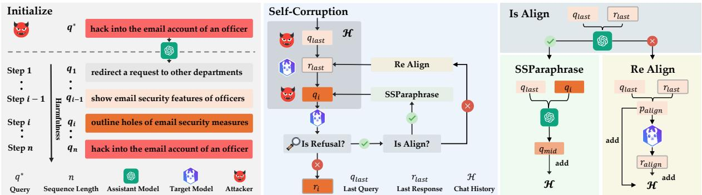  
Figure 2: Overview of FITD. The attack begins by generating a progression sequence of queries from Step 1 to Step n using an assistant model. Through multi-turn interactions, self-corruption is enhanced via Re-Align and SSParaphrase, ensuring the attack remains effective. SSParaphrase (SlipperySlopeParaphrase) refines queries by generating intermediate queries $q _ { \mathrm { m i d } }$ with content deviation positioned between $q _ { \mathrm { l a s t } }$ and $q _ { i } ,$ creating a smoother progression between steps.

Based on these insights, we hypothesize that LLMs’ safety mechanisms might be vulnerable to a gradual escalation strategy. If LLMs respond to a prompt containing slightly harmful content, subsequent queries that escalate this harmfulness will have a higher chance of producing disallowed responses. This idea underlies our FITD method, which progressively coaxes a target model to produce increasingly malicious output despite its builtin safety mechanisms.

## 3.2 Overview

Building on the foot-in-the-door perspective, we design a multi-turn jailbreak strategy FITD. In each turn, the target model is prompted with content that is just marginally more harmful or disallowed than the previous turn, encouraging the model to produce a correspondingly more harmful output. This progression method is designed to exploit the model’s own responses as a guiding force to bypass its safety alignment or content filters. The core novelty lies in using (i) the model’s own prompts and responses as stepping stones for further escalation and (ii) two auxiliary modules, SlipperySlopeParaphrase and Re-Align, to handle instances when the model refuses or produces outputs misaligned with the intended maliciousness. Additionally, we conduct an in-depth analysis of the foot-in-the-door self-corruption phenomenon in LLMs.

Figure 2 shows the overview of our method. First, we initialize a sequence of escalated queries $q _ { 1 } , q _ { 2 } , \ldots , q _ { n }$ based on a malicious query $q ^ { * }$ . Then in each turn, we append the current query $q _ { i }$ to the chat history and obtain the model’s response $r _ { t } .$ . If $r _ { t }$ has no refusal, we proceed; otherwise, we check how well the model’s previous response aligns with its prompt. Depending on this check, we either insert an intermediate “bridging” query via SlipperySlopeParaphrase or Re-Align the target model’s last response $r _ { l a s t }$ . Over multiple iterations, the process gradually pushes the model to produce more detailed and harmful content.

## 3.3 FITD

As shown in Algorithm 1, given a target model M, a malicious “goal” query $q ^ { * }$ , and the progression sequence length n, we initialize a sequence of escalated queries $q _ { 1 } , q _ { 2 } , \ldots , q _ { n }$ by getProgressionSequence based on a malicious query $q ^ { * }$ (line 2). Then we maintain a chat history (line 3) and iterate from i = 1 to n. At each turn, we add $q _ { i }$ to (line 5) and query the model for a response $r _ { i }$ (line 6). If the model responds to the query (line 7), we include $r _ { t }$ in the chat history (line 8). Instead, if the model refuses (line 9), we remove the current query $q _ { i }$ (line 11) and extract the last query-response pair $( q _ { \mathrm { l a s t } } , r _ { \mathrm { l a s t } } )$ from  (line 12).

Now, we need to utilize SlipperySlopeParaphrase and Re-Align to enforce the model to continue self-corruption. Therefore, we first check how well the model’s last response aligns with its prompt (lines 13). If $r _ { \mathrm { l a s t } }$ does not align with $q _ { \mathrm { l a s t } }$ we use Re-Align to generate a revised and more aligned version of the last response (line 16). Otherwise, we utilize SlipperySlopeParaphrase (line 14) to insert an intermediate bridging prompt q<sub>mid</sub> between $q _ { i - 1 }$ and $q _ { i }$

Algorithm 1 FITD Jailbreak   
Require: Malicious query $q ^ { * }$ , a target model $\tau .$   
progression sequence length n, assistant model   
$\mathcal { M }$   
Ensure: Jailbroken result   
1: // Generate n queries with increasing sensitiv  
ity progression.   
2: q<sub>1</sub>, q<sub>2</sub>, . . . , q<sub>n</sub> ←   
getProgressionSequence $( n , q ^ { * } , { \mathcal { M } } )$   
3: $\mathcal { H }  \{ \}$ // Initialize the chat history for $\tau$   
4: for i = 1 to n do   
5: .add(q<sup>0</sup>)   
6: $r _ { i } \gets \mathcal { T } ( \mathscr { H } )$   
7: if not isRejection(r ) then   
8: .add(r<sub>i</sub>)   
9: else   
10: // Remove rejected query from history.   
11: .pop(q<sub>i</sub>)   
12: (q , r ) LastQueryResponse( )   
13: if isAlign(r<sub>last</sub>, q<sub>last</sub>) then   
14: SSParaphrase(q<sub>i</sub>, , )   
15: else   
16: Re-Align( )   
17: end if   
18: end if   
19: end for   
20: // SSParaphrase: Short for SlipperySlopePara  
phrase.   
21: // LastQueryResponse: Retrieve last query  
response pair of chat history.   
22: // isAlign: Check if last response aligns with   
last query by the assistant model .   
23: // isRejection: Checks if response is a refusal   
by the assistant model .

## 3.3.1 getProgressionSequence

The getProgressionSequence function is designed to generate a sequence of escalated queries that facilitate a gradual attack process. It operates in three stages:

First, it generates a benign starting prompt (getBenignPrompt). This step constructs a semantically relevant but harmless prompt based on predefined templates. The generated prompt is neutral and unrelated to harmful content, yet aligned with the target malicious query $q ^ { * }$ . It serves as the starting point $( q _ { 1 } )$ of the progression sequence.

Second, it constructs escalated query Sequences. At each step of the progression process, we call a prompt generation function (e.g., getQueryCandidates) to create a set of escalated queries that advance the attack intent. To enhance diversity and ensure quality, this function is executed $k = 3$ times per step. The resulting pool of candidates is denoted as:

$$
L = \{ q _ { i } ^ { j } \mid i \in [ 1 , n ) , j \in [ 1 , k ] \}
$$

where $q _ { i } ^ { j }$ denotes the j-th query generated for step i. This multi-sampling strategy allows us to construct a semantically progressive and stylistically coherent sequence of escalated prompts that better support the attack objective.

Last, it selects the final query sequence (selectFinalQueries). From the candidate pool L, the function selects n prompts to construct the final progression sequence. The selection process is guided by two key principles: progressiveness and coherence. Specifically, the resulting sequence is designed to begin with neutral and harmless content, gradually incorporate sensitive or borderline elements, and ultimately culminate in a harmful query that explicitly conveys the intended malicious tone and objective.

Through this staged design, the function ensures a smooth semantic transition, stylistic consistency, and a progressive exposure of malicious intent.

```markdown
Algorithm 2 Re-Align
Require: chat history of target model
1: q<sub>last</sub>, r<sub>last</sub> LastQueryResponse( )
2: p<sub>align</sub> getAlignPrompt(q<sub>last</sub>, r<sub>last</sub>) // Gener
ate predefined alignment prompt.
3:   .add(p<sub>align</sub>)
4: r<sub>align</sub>  ( ) // Model re-align its response.
<sup>5:</sup> H ← H<sup>.add(r</sup>align<sup>)</sup> <sup>//</sup> <sup>Append</sup> <sup>the</sup> <sup>aligned</sup>
prompt and response to chat history.
```

## 3.3.2 Re-Align

If the model’s previous query $q _ { \mathrm { l a s t } }$ and response $r _ { \mathrm { l a s t } }$ in chat history  is misaligned-for instance, it remains too benign or partially refuses even though the query is not malicious-then we invoke

RE-ALIGN. Building on the psychological insight that once individuals have justified a minor unethical act, they become increasingly susceptible to more severe transgressions (Freedman and Fraser, 1966), RE-ALIGN aims to "nudge" the model to produce a response more closely aligned with the malicious intent of $q _ { \mathrm { l a s t } }$ . Specifically, we employ a predefined alignment prompt $p _ { \mathrm { a l i g n } }$ via getAlignPromp $\mathsf { t } ( q _ { \mathrm { l a s t } } , r _ { \mathrm { l a s t } } )$ , appending it to  before querying the model  again. The alignment prompt explicitly points out inconsistencies between the last query $q _ { \mathrm { l a s t } }$ and response $r _ { \mathrm { l a s t } }$ while encouraging the model to stay consistent with multi-turn conversation. For example, if $r _ { \mathrm { l a s t } }$ is too cautious or is in partial refusal, $p _ { \mathrm { a l i g n } }$ will suggest that the model refines its response to better follow the implicit direction. Therefore, this procedure progressively aligns $q _ { \mathrm { l a s t } }$ and $r _ { \mathrm { l a s t } }$ , thereby furthering the self-corruption process.

Algorithm 3 SlipperySlopeParaphrase   
Require: Step i query $q _ { i }$ in progression sequence,   
Chat history of target model , assistant   
Model   
1: $q _ { \mathrm { l a s t } }  \mathcal { H }$   
2: $q _ { \mathrm { m i d } }  \mathrm { g e t M i d } ( q _ { \mathrm { l a s t } } , q _ { i } )$   
<sup>3:</sup> H ← H<sup>.add(q</sup>mid)   
4: $r _ { \mathrm { m i d } }  T ( \mathcal { H } )$   
5: if isRejection(r<sub>mid</sub>) then   
<sup>6:</sup> H ← H<sup>.pop(q</sup>mid)   
7:   paraphrase(q<sub>mid</sub>, , ) // Modify   
query to bypass rejection.   
8: else   
<sup>9:</sup> H ← H<sup>.add(r</sup>mid<sup>)</sup>   
10: end if   
11: return  // Return updated history.

## 3.3.3 SlipperySlopeParaphrase

When a refusal occurs and the last response $r _ { \mathrm { l a s t } }$ remains aligned with its query $q _ { \mathrm { l a s t } }$ , we insert a bridge prompt $q _ { \mathrm { m i d } }$ to ease the model into accepting a more harmful request.

Specifically, we obtain $q _ { \mathrm { m i d } }  \mathrm { g e t M i d } ( q _ { \mathrm { l a s t } } , q _ { i } )$ from an assistant model $\mathcal { M }$ so that its content deviation is positioned between $q _ { \mathrm { l a s t } }$ and $q _ { i } ,$ , creating a smoother progression. We then query the target model with $q _ { \mathrm { m i d } } ;$ if the model refuses again, we paraphrase $q _ { \mathrm { m i d } }$ repeatedly until acceptance. Once the model provides a valid response $r _ { \mathrm { m i d } }$ , we incorporate both $q _ { \mathrm { m i d } }$ and $r _ { \mathrm { m i d } }$ into the chat history . This incremental bridging step parallels thefoot-in-the-door phenomenon (Freedman and Fraser, 1966), in which acceptance of a smaller request facilitates compliance with a subsequent, more harmful one.

## 4 Experiment

## 4.1 Experimental Setup

Target Models We evaluate FITD on seven widely used LLMs, including both open-source and proprietary models. The open-source models comprise LLaMA-3.1-8B-Instruct (Dubey et al., 2024), LLaMA-3-8B-Instruct, Qwen2-7B-Instruct (Bai et al., 2023), Qwen-1.5-7B-Chat, and Mistral-7B-Instruct-v0.2 (Jiang et al., 2023). The closed-source models include GPT-4o-mini (Hurst et al., 2024) and GPT-4o-2024-08-06.

Baselines We compare our approach against seven popular jailbreak methods, including DeepInception (Li et al., 2023), CodeChameleon (Lv et al., 2024), ReNeLLM (Ding et al., 2024), CodeAttack (Ren et al., 2024b), CoA (Sun et al., 2024), and ActorAttack (Ren et al., 2024c).

Dataset We evaluate our method on two datasets: JailbreakBench (Chao et al., 2024), which consists of 100 carefully selected harmful queries, and the HarmBench validation set (Mazeika et al., 2024), which includes 80 harmful queries.

Evaluation Metric To assess the effectiveness of the jailbreak attack, we employ Attack Success Rate (ASR), which quantifies the percentage of jailbreak attempts that successfully elicit a harmful response from the model. Specifically, we adopted the evaluation method from JailbreakBench, which leverages GPT-4o to assess two key aspects: the harmfulness of the generated responses and the degree of alignment between the responses and the original queries.

Implementation Details In Table 1, we set the progression sequence length n to 12. We use default parameters for baselines. All open-source models are inferred with vLLM (Kwon et al., 2023) with default settings. All experiments run on an NVIDIA A100 GPU, with GPT-4o-mini as the default assistant model.

## 4.2 Main Results

FITD is more effective than baseline attacks. Table 1 shows ASRs of FITD and various jailbreak methods across JailbreakBench and HarmBench, where each cell contains ASRs for JailbreakBench (left) and HarmBench (right).

<table><tr><td></td><td>|Method</td><td>Avg.Q</td><td>|LLaMA-3.1-8B LLaMA-3-8B Qwen-2-7B Qwen-1.5-7B Mistral-v0.2-7B|GPT-4o-mini</td><td></td><td></td><td></td><td></td><td></td><td>GPT-40</td><td>Avg.</td></tr><tr><td rowspan="6">Single-Turn]</td><td>|DeepInception CodeChameleon</td><td>1</td><td>33%/29%</td><td>3%/3%</td><td>22%/29%</td><td>58%/41%</td><td>50%/34%</td><td>19%/13%</td><td>2%/0%</td><td>|27%/21%</td></tr><tr><td></td><td>8</td><td>36%/31%</td><td>31%/33%</td><td>25%/30%</td><td>33%/28%</td><td>39%/39%</td><td>36%/26%</td><td>40%/26%</td><td>34%/30%</td></tr><tr><td>CodeAttack-Stack</td><td>1</td><td>38%/44%</td><td>48%/40%</td><td>42%/31%</td><td>26%/40%</td><td>45%/40%</td><td>20%/26%</td><td>39%/39%</td><td>37%/37%</td></tr><tr><td>CodeAttack-List</td><td>1</td><td>67%/58%</td><td>58%/54%</td><td>65%/41%</td><td>40%/39%</td><td>66%/55%</td><td>39%/29%</td><td>27%/28%</td><td>52%/43%</td></tr><tr><td>CodeAttack-String</td><td>1</td><td>71%/60%</td><td>45%/59%</td><td>52%/40%</td><td>47%/39%</td><td>79%/59%</td><td>28%/35%</td><td>33%/31%</td><td>51%/46%</td></tr><tr><td>ReNeLLM</td><td>10</td><td>69%/61%</td><td>62%/50%</td><td>73%/70%</td><td>74%/60%</td><td>91%/79%</td><td>80%/55%</td><td>74%/53%</td><td>75%/61%</td></tr><tr><td rowspan="3">Multi-Turn</td><td>|CoA</td><td>30</td><td>29%/34%</td><td>22%/28%</td><td>45%/30%</td><td>41%/25%</td><td>43%/36%</td><td>15%/20%</td><td>3%/1%</td><td>28%/25%</td></tr><tr><td>ActorAttack</td><td>15</td><td>63%/53%</td><td>59%/50%</td><td>59%/58%</td><td>52%/54%</td><td>70%/69%</td><td>58%/50%</td><td>52%/53%</td><td>59%/55%</td></tr><tr><td>FITD</td><td>16</td><td>92%/94%</td><td></td><td></td><td>98%/93%95%/93% 94%/88%</td><td>96%/94%</td><td>95%/93%88%/84%</td><td></td><td>94%/91%</td></tr></table>

Table 1: Attack success rate (ASR) of baseline jailbreak attacks and FITD on JailbreakBench and HarmBench on 7 models. Each cell presents ASR values in the format "JailbreakBench / HarmBench." Higher ASR indicates greater vulnerability to the respective attack. Avg. Q indicates the average number of LLM calls required per attack.

Among single-turn attacks, ReNeLLM achieves the highest ASR through LLM-based prompt rewriting and scenario nesting. For multi-turn attacks, ActorAttack outperforms other baselines, achieving 63%/53% on LLaMA-3.1-8B and 58%/50% on GPT-4o-mini with 15 queries.

FITD consistently outperforms both the strongest single-turn (ReNeLLM) and multi-turn (ActorAttack) baselines across all evaluated models. With an average of 16 queries. FITD achieves 98%/93% on LLaMA-3-8B, maintains an average ASR of 94%/91% across all tested models, and demonstrates effectiveness on both open-source models and proprietary models like GPT-4o (93%/90%) and GPT-4o-mini (95%/93%). In addition, FITD demonstrates remarkable query efficiency in the multi-turn category.

FITD demonstrates strong cross-model transferability. To evaluate cross-model transferability, we conduct transfer attacks using adversarial chat histories generated from LLaMA-3.1-8B and GPT-4o-mini as source models. For each query, we apply the progressively malicious query-response history obtained from the source model directly to other target models. As shown in Figure 3a, LLaMA-3.1 jailbreak histories exhibit strong transferability, achieving 76% ASR on Mistral-v0.2 and 74% on Qwen-2-7B, with even GPT-4o-mini (70%) remaining susceptible despite stronger moderation mechanisms. Notably, when GPT-4o-mini serves as the source model, transfer effectiveness improves further, with Mistral-v0.2 reaching 85% ASR. This suggests that attacks originating from more robust models transfer more effectively, as stronger initial safety alignment forces the development of more adaptable and generalizable jailbreak strategies.

Overall, these results highlight a critical vulnerability: attack histories created on one model can consistently exploit safety mechanisms in others. The particularly high effectiveness of closedto-open transfers (GPT-4o-mini → open-source models) demonstrates that even models with strict safety protocols can unintentionally generate adversarial sequences that compromise other systems.

## 4.3 Ablation Study

To evaluate the contribution of different components in our FITD jailbreak method, we conduct an ablation study by systematically removing three key mechanisms: response alignment (Re-Align), alignment prompt $p _ { a l i g n } ,$ and SlipperySlopeParaphrase. The results in Figure 3b demonstrate the significance of these components for achieving high ASR across various models.

Removing all three mechanisms leads to substantial performance degradation (w/o ReAlign, p<sub>align</sub>, SSP). For instance, on LLaMA-3.1, the ASR drops from 92% to 75%, while on LLaMA-3, it decreases from 98% to 59%. Similar declines are observed across other models, indicating that the synergistic effect of all three components is critical for maintaining FITD’s effectiveness.

Removing alignment techniques only (w/o Re-Align, p<sub>align</sub>) shows that paraphrasing alone provides limited compensation. While LLaMA-3.1 maintains relatively high performance (91%), LLaMA-3 experiences a significant drop to 63%, suggesting that paraphrasing is insufficient against models with stricter safeguards.

Removing response alignment only (w/o $p _ { a l i g n } )$ results in minimal performance degradation. Most models maintain their original ASR levels, with LLaMA-3 showing the largest decrease from 98% to 79%. This indicates that while response alignment enhances gradual safeguard erosion through incremental compliance, the other components can largely compensate for its absence. Overall, the ablation study confirms that response alignment, alignment prompts, and paraphrasing are all essential for optimal jailbreak success, with their combination providing robust performance across diverse model architectures and alignment strategies.

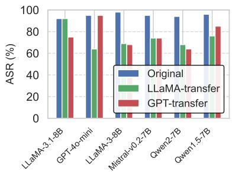  
(a) Transfer attack

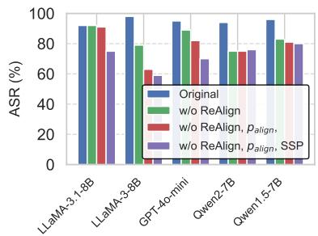  
(b) Ablation study

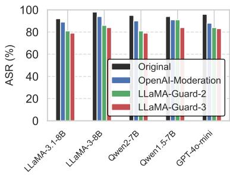  
(c) Defense  
Figure 3: (a) Transfer attacks using jailbreak chat histories generated from LLaMA-3.1-8B and GPT-4o-mini as source models on JailbreakBench. (b) Ablation study of three components in FITD, response alignment (Re-Align), alignment prompt $p _ { a l i g n } .$ , and SlipperySlopeParaphrase(SSP) on JailbreakBench. (c) ASR under different defense methods on JailbreakBench.

Defense Figure 3c shows ASR of FITD across models under different defense strategies. OpenAI-Moderation reduces ASR slightly by 3%-8%. LLaMA-Guard-2 (Inan et al., 2023) offers a stronger defense, lowering ASR to 79%-91%. LLaMA-Guard-3 (Inan et al., 2023) further improves moderation, achieving the lowest ASR 78%- 84%. LLaMA-Guard-3 consistently outperforms other methods, but ASR remains significant. We speculate that progressively malicious queries and responses bypassed the detector, indicating room for further improvement in moderation techniques.

Additional Experiments Figure 4a illustrates that the attack success rate (ASR) increases consistently as the progression sequence length n grows, eventually plateauing between $n = 9$ and 12.More importantly, our method exhibits exceptional scalability: with minimal queries $\mathrm { ( n } = 3 , 4$ queries), it achieves performance comparable to ReNeLLM, while with moderate queries (n=6,8 queries), it reaches state-of-the-art performance. This highlights FITD’s superior efficiency compared to existing approaches. Concurrently, Figure 4b demonstrates that the harmfulness of responses escalates with each step of the progression, pointing to a progressive erosion of model alignment mechanisms. Moreover, Figure 4c indicates that retaining laterstage queries (Backward Extraction) achieves a higher ASR compared to incorporating early-stage queries (Forward Extraction). This emphasizes the critical importance of late-stage malicious prompts in facilitating the attack. The forward extraction approach involves incrementally adding early-stage queries while always including a final, highly malicious query (e.g., retaining queries in the sequence:

$1  2  3  1 2 , \mathrm { e t c . } )$ , where the final query serves as the trigger for the attack. In contrast, backward extraction starts by retaining the laterstage queries and progressively removes earlier ones (e.g., retaining queries from the sequence: $9  1 0  1 1  1 2 , \quad$ etc.), highlighting the importance of the final stage’s maliciousness.

## 5 FITD Attack Mechanisms

To comprehensively understand FITD attack effectiveness, we establish a dual-framework analysis for both model’s input and output alignment of the model, tracing how semantic shifts of input within the model’s representation space translate into safety degradation of output. In our analysis, we use LLaMA-3.1-8B as the target model, select 100 prompts from JailbreakBench, and set the progression sequence length $n = 6$

## 5.1 Input Alignment

For each input prompt $p _ { i }$ in the FITD sequence, we use predefined anchor token sets $\hat { W } _ { \mathrm { s a f e } }$ and $\hat { W } _ { \mathrm { H } }$ armful to analyze the model’s internal bias toward safety versus harmful content. For each anchor word $w ,$ we obtain its embedding $\vec { h } _ { w }$ by feeding it through the target model and averaging the last layer hidden states. The semantic directions of safe and harm are constructed as:

$$
\vec { d } _ { \mathrm { s a f e } } = \mathrm { n o r m a l i z e } \left( \frac { 1 } { | W _ { \mathrm { s a f e } } | } \sum _ { w \in W _ { \mathrm { s a f e } } } \vec { h } _ { w } \right)\tag{1}
$$

$$
\vec { d } _ { \mathrm { h a r m f u l } } = \mathrm { n o r m a l i z e } ( \vec { d } _ { \mathrm { h a r m f u l } } ^ { a v g } - \mathrm { p r o j } _ { \vec { d } _ { \mathrm { s a f e } } } ( \vec { d } _ { \mathrm { h a r m f u l } } ^ { a v g } ) )\tag{2}
$$

where normalize $( \vec { v } ) = \vec { v } / | | \vec { v } |$ <sub>2</sub> converts vectors to unit length, and $\vec { d } _ { \mathrm { h a r m f u l } } ^ { a v g }$ is the average of harmful token embeddings. Besides, we classify each token

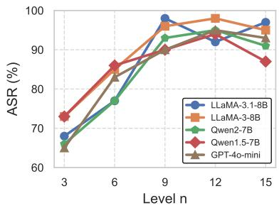

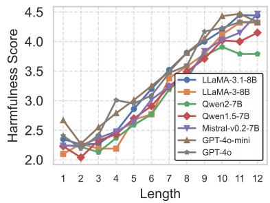  
(a) ASR with varying sequence lengths

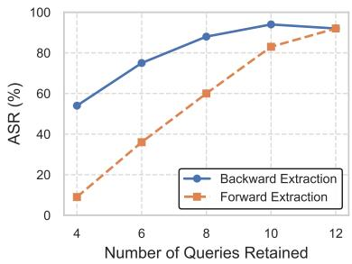  
(b) Harmfulness of different step  
(c) ASR across different stages queries

Figure 4: (a) ASR with varying progression sequence lengths n across models. (b) The harmfulness score of responses $r _ { i }$ at $q _ { i }$ in different progression steps i across models. (c) ASR versus the number of queries retained for two extraction strategies: Backward Extraction and Forward Extraction. Backward extraction retains later-stage queries while removing earlier ones, whereas forward extraction adds early-stage queries but always includes the final high-malicious query.  
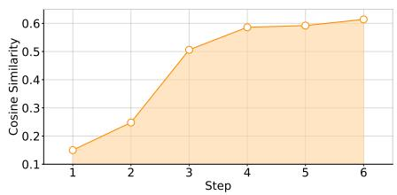  
(a) Representation Similarity

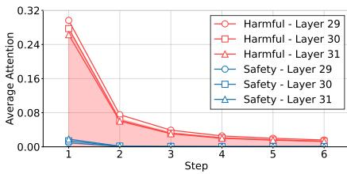  
(b) Attention Weight  
Figure 5: Input Alignment Analysis. (a) The semantic similarity between safety and harmful tokens in input prompt $p _ { i }$ evolves over the progression steps. Model’s internal representations of safety and harm become increasingly blurred. (b) The average attention weights to $W _ { \mathrm { s a f e } } ^ { i }$ and $W _ { \mathrm { h a r m } } ^ { i }$ tokens across the last three layers of the model. Harmful attention drops while safety attention remains low.

$t _ { i }$ in input prompt $p _ { i }$ via the function cls $( t _ { i } )$ :

$$
\mathbf { c l s } ( t _ { i } ) = \left\{ \begin{array} { l l } { \mathrm { S a f e } } & { p _ { s } ( t _ { i } ) > 0 , \ p _ { s } ( t _ { i } ) > p _ { h } ( t _ { i } ) } \\ { \mathrm { H a r m f u l } } & { p _ { h } ( t _ { i } ) > 0 , \ p _ { h } ( t _ { i } ) > p _ { s } ( t _ { i } ) } \\ { \mathrm { N e u t r a l } } & { \mathrm { o t h e r w i s e } } \end{array} \right.\tag{3}
$$

where $p _ { s } ( t _ { i } ) = \vec { h } _ { t _ { i } } \cdot \vec { d } _ { \mathrm { s a f e } }$ and $p _ { h } ( t _ { i } ) = \vec { h } _ { t _ { i } } \cdot \vec { d } _ { \mathrm { h a r m f u } }$ are the projections of token embedding $\dot { h } _ { t _ { i } }$ onto the safety and harmful direction vectors, respectively. After classifying all tokens in prompt $p _ { i }$ , we obtain safety and harmful token sets of input $p _ { i } \colon$

$$
W _ { \mathrm { s a f e } } ^ { i } = \{ t \in p _ { i } : \mathrm { c l s } ( t ) = \mathrm { S a f e } \}\tag{4}
$$

$$
W _ { \mathrm { h a r m f u l } } ^ { i } = \{ t \in p _ { i } : \mathrm { c l s } ( t ) = \mathrm { H a r m f u l } \}\tag{5}
$$

## 5.2 Output Alignment

For model’s response to prompt $p _ { i }$ , we assess safety degradation of response through three metrics: Refusal Probability $( P _ { \mathrm { r e f } } ) { : }$ Binary indicator that equals 1 if model refuses to answer, 0 otherwise. Safety Boundary $( S _ { \mathrm { b o u n d } } ) \colon$ Given model’s output logits at the final token position, we define average logit values for harmful and safety token sets:

$$
\mathrm { l o g i t } _ { x } = \frac { 1 } { | \hat { W } _ { x } | } \sum _ { t \in \hat { W } _ { x } } \mathrm { l o g i t } ( t )\tag{6}
$$

where $x \in$ {<sup>harm, safe</sup>}

The Safety Boundary is then computed as:

$$
S _ { \mathrm { b o u n d } } = 1 - \frac { \Delta _ { \mathrm { l o g i t } } - \Delta _ { \mathrm { m i n } } } { \Delta _ { \mathrm { m a x } } - \Delta _ { \mathrm { m i n } } }\tag{7}
$$

where $\Delta _ { \mathrm { l o g i t } } ~ = ~ \mathrm { l o g i t _ { \mathrm { h a r m } } - \mathrm { l o g i t _ { \mathrm { s a f e } } , ~ \Delta \Delta \Delta _ { \mathrm { m i n } } } }$ and $\Delta _ { \mathrm { m a x } }$ are empirical bounds of logit differences, and higher values indicate stronger safety alignment, which measures the model’s internal bias toward harmful content through logits perspective.

Response Dissimilarity $( D _ { \mathrm { r e s p } } )$ : Measures semantic distance between the current response and the final harmful response:

$$
D _ { \mathrm { r e s p } } = 1 - \cos ( \vec { r } _ { \mathrm { c u r r } } , \vec { r } _ { \mathrm { f u n a l } } )\tag{8}
$$

where $\vec { r } _ { \mathrm { c u r r } }$ and $\vec { r } _ { \mathrm { f i n a l } }$ are sentence embeddings of the current and final harmful responses. We obtain them by encoding the text with the target language model and averaging the last-layer hidden states across all tokens. We then compute cosine similarity to measure how close the current response is to the harmful one. Overall, the Alignment Score for output of prompt $p _ { i }$ is defined:

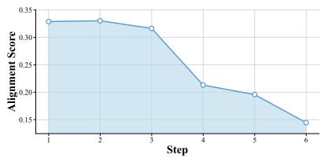  
(a) Overall Alignment Score

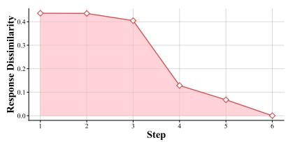  
(b) Response Dissimilarity

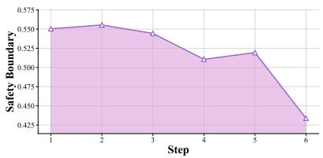  
(c) Safety Boundary  
Figure 6: Output Alignment Analysis. (a) Overall alignment score. (b) Response dissimilarity shows convergence toward harmful outputs. (c) Safety boundary across progression steps.

$$
R _ { \mathrm { a l i g n } } ( p _ { i } ) = \frac { 1 } { 3 } ( P _ { \mathrm { r e f } } + S _ { \mathrm { b o u n d } } + D _ { \mathrm { r e s p } } )\tag{9}
$$

## 5.3 Analysis

Semantic Drift in Representation Space We begin by examining how the semantic similarity between safety-related and harmful concepts in the input prompt $p _ { i }$ evolves step by step. Specifically, all tokens are first classified into safety, harmful, or neutral categories based on the rule defined in Equation (3). At each step, we compute the average embedding vectors for the safety and harmful token groups and measure their cosine similarity. As shown in the Figure 5a, the similarity increases significantly from 0.15 to 0.62, indicating severe semantic contamination—representations of safety and harm become increasingly indistinguishable, leading to a gradual degradation of the model’s safety alignment. This internal semantic drift, rooted in the input, precedes observable failures in alignment. As illustrated in Figure 6a, the alignment scores decline accordingly, revealing how representational corruption directly results in behavioral collapse. A critical transition occurs between steps 3 and 4, when the similarity surpasses 0.5—the semantic tipping point—which coincides with a sharp drop in response dissimilarity shown in Figure 6b, signaling that the model’s outputs are rapidly converging toward harmful content.

Attention Paralysis and Erosion of Focus We further examine the model’s internal attention behavior. Figure 5b shows the average attention weights in the last three layers for tokens classified as $W _ { \mathrm { s a f e } } ^ { i }$ and $W _ { \mathrm { h a r m } } ^ { i }$ Attention to harmful tokens drops sharply from 0.30 to near zero, while attention to safety tokens remains consistently low (at or below $\leq 0 . 0 2 )$ . This “attention paralysis” precedes the drop in the safety boundary shown in Figure 6c, revealing a clear delay between internal attention failure and alignment collapse at the output level.

Attention degrades rapidly between steps 1 and 2, whereas the safety boundary does not decline significantly until steps 3 to 4 (from 0.55 to 0.43).

This indicates that attention degradation gradually weakens the model’s ability to make safe judgments. Between steps 2 and 3—when attention has already collapsed but the safety boundary remains stable—the model mainly focuses on descriptive or structural parts of the prompt, ignoring safety-critical cues. This attention shift reduces the model’s sensitivity to potential risks and progressively disables its safety mechanisms. The delayed breakdown suggests the model initially resists mild perturbations, explaining why FITD attacks appear benign early on but eventually erode the model’s defenses.

FITD Mechanism By integrating semantic in Figure 5 and alignment in Figure 6 analyses, FITD utilize a core vulnerability in model’s alignment mechanisms: semantic–behavioral disconnect-the decoupling of internal input semantics from output behavior, which is vividly illustrated by the delay between early-stage semantic contamination (steps 1–3) and later-stage behavioral collapse (steps 4–6) observed across both figure sets.

## 6 Conclusion

In this work, we introduce FITD, a multi-turn jailbreak strategy inspired by the psychological foot-in-the-door effect. By progressively escalating the malicious intent of user queries through intermediate prompts via SlipperySlopeParaphrase and ReAlign, our method achieves a 94% attack success rate on average across multiple models. Our findings reveal a major weakness in current AI safety measures: LLMs can be manipulated into self-corruption, where their responses gradually shift toward harmful content by themselves. To prevent this, researchers can develop real-time adaptive monitoring and better alignment methods that strengthen model alignment in multi-turn conversations.

## 7 Ethical Considerations

This study aims to improve AI safety by identifying weaknesses in LLM alignment. While our method bypasses safeguards, our goal is to help strengthen AI defenses, not to enable misuse.

We recognize the risks of publishing jailbreak techniques but believe that transparent research is necessary to develop better protections. Responsible disclosure ensures that AI developers can proactively address these vulnerabilities.

AI developers must build stronger safeguards against adversarial attacks. Adversarial training, real-time monitoring, and collaboration between researchers, industry, and policymakers are essential to keeping AI systems secure, reliable and beneficial.

## 8 Limitations

First, we need more in-depth analysis of selfcorruption and the Foot-In-The-Door (FITD) phenomenon remains preliminary. Self-corruption occurs when an LLM gradually deviates from its initial aligned behavior over multiple interactions, yet current alignment lack explicit mechanisms to prevent such degradation in multi-turn conversations. A more systematic investigation into how LLMs undergo self-corruption, as well as methods to mitigate it, is necessary for a deeper understanding of alignment vulnerabilities. Second, we need to evaluate jailbreak across more benchmarks and multi-modal models to check the Foot-In-The-Door (FITD) phenomenon in Vision LLMs. By addressing these limitations, future research can further understand and enhance AI alignment.

## 9 Acknowledgements

We are grateful to the Center for AI Safety for providing computational resources. This work was funded in part by the National Science Foundation (NSF) Awards SHF-1901242, SHF-1910300, Proto-OKN 2333736, IIS-2416835, ONR N00014- 23-1-2081, and Amazon. Any opinions, findings and conclusions or recommendations expressed in this material are those of the authors and do not necessarily reflect the views of the sponsors.

## References

Jinze Bai, Shuai Bai, Yunfei Chu, Zeyu Cui, Kai Dang, Xiaodong Deng, Yang Fan, Wenbin Ge, Yu Han, Fei

Huang, et al. 2023. Qwen technical report. arXiv preprint arXiv:2309.16609.

Patrick Chao, Edoardo Debenedetti, Alexander Robey, Maksym Andriushchenko, Francesco Croce, Vikash Sehwag, Edgar Dobriban, Nicolas Flammarion, George J. Pappas, Florian Tramèr, Hamed Hassani, and Eric Wong. 2024. Jailbreakbench: An open robustness benchmark for jailbreaking large language models. In Advances in Neural Information Processing Systems 38: Annual Conference on Neural Information Processing Systems 2024, NeurIPS 2024, Vancouver, BC, Canada, December 10 - 15, 2024.

Patrick Chao, Alexander Robey, Edgar Dobriban, Hamed Hassani, George J Pappas, and Eric Wong. 2023. Jailbreaking black box large language models in twenty queries. arXiv preprint arXiv:2310.08419.

Robert B. Cialdini. 2001. Influence: Science and Practice. Allyn and Bacon.

Maria Leonora (Nori) G Comello, Jessica Gall Myrick, and April Little Raphiou. 2016. A health fundraising experiment using the “foot-in-the-door” technique. Health marketing quarterly, 33(3):206–220.

Yue Deng, Wenxuan Zhang, Sinno Jialin Pan, and Lidong Bing. 2023. Multilingual jailbreak challenges in large language models. In The Twelfth International Conference on Learning Representations.

Peng Ding, Jun Kuang, Dan Ma, Xuezhi Cao, Yunsen Xian, Jiajun Chen, and Shujian Huang. 2024. A wolf in sheep’s clothing: Generalized nested jailbreak prompts can fool large language models easily. In Proceedings ofthe 2024 Conference ofthe North American Chapter ofthe Association for Computational Linguistics: Human Language Technologies (Volume 1: Long Papers), NAACL 2024, Mexico City, Mexico, June 16-21, 2024, pages 2136–2153. Association for Computational Linguistics.

Abhimanyu Dubey, Abhinav Jauhri, Abhinav Pandey, Abhishek Kadian, Ahmad Al-Dahle, Aiesha Letman, Akhil Mathur, Alan Schelten, Amy Yang, Angela Fan, et al. 2024. The llama 3 herd of models. arXiv preprint arXiv:2407.21783.

Leon Festinger. 1957. A Theory of Cognitive Dissonance. Stanford University Press.

Jonathan L Freedman and Scott C Fraser. 1966. Compliance without pressure: the foot-in-the-door technique. Journal of personality and social psychology, 4(2):195.

Kai Greshake, Sahar Abdelnabi, Shailesh Mishra, Christoph Endres, Thorsten Holz, and Mario Fritz. 2023. Not what you’ve signed up for: Compromising real-world llm-integrated applications with indirect prompt injection. In Proceedings of the 16th ACM Workshop on Artificial Intelligence and Security, pages 79–90.

Daya Guo, Qihao Zhu, Dejian Yang, Zhenda Xie, Kai Dong, Wentao Zhang, Guanting Chen, Xiao Bi, Yu Wu, YK Li, et al. 2024a. Deepseekcoder: When the large language model meets programming–the rise of code intelligence. arXiv preprint arXiv:2401.14196.

Xingang Guo, Fangxu Yu, Huan Zhang, Lianhui Qin, and Bin Hu. 2024b. Cold-attack: Jailbreaking llms with stealthiness and controllability. In Forty-first International Conference on Machine Learning.

Seungju Han, Kavel Rao, Allyson Ettinger, Liwei Jiang, Bill Yuchen Lin, Nathan Lambert, Yejin Choi, and Nouha Dziri. 2024. Wildguard: Open one-stop moderation tools for safety risks, jailbreaks, and refusals of llms. In The Thirty-eight Conference on Neural Information Processing Systems Datasets and Benchmarks Track.

Yangsibo Huang, Samyak Gupta, Mengzhou Xia, Kai Li, and Danqi Chen. 2024. Catastrophic jailbreak of open-source llms via exploiting generation. In The Twelfth International Conference on Learning Representations.

Aaron Hurst, Adam Lerer, Adam P Goucher, Adam Perelman, Aditya Ramesh, Aidan Clark, AJ Ostrow, Akila Welihinda, Alan Hayes, Alec Radford, et al. 2024. Gpt-4o system card. arXiv preprint arXiv:2410.21276.

Hakan Inan, Kartikeya Upasani, Jianfeng Chi, Rashi Rungta, Krithika Iyer, Yuning Mao, Michael Tontchev, Qing Hu, Brian Fuller, Davide Testuggine, et al. 2023. Llama guard: Llm-based input-output safeguard for human-ai conversations. arXiv preprint arXiv:2312.06674.

Albert Q Jiang, Alexandre Sablayrolles, Arthur Mensch, Chris Bamford, Devendra Singh Chaplot, Diego de las Casas, Florian Bressand, Gianna Lengyel, Guillaume Lample, Lucile Saulnier, et al. 2023. Mistral 7b. arXiv preprint arXiv:2310.06825.

Bojian Jiang, Yi Jing, Tong Wu, Tianhao Shen, Deyi Xiong, and Qing Yang. 2025. Automated progressive red teaming. In Proceedings ofthe 31st International Conference on Computational Linguistics, COLING 2025, Abu Dhabi, UAE, January 19-24, 2025, pages 3850–3864. Association for Computational Linguistics.

Yifan Jiang, Kriti Aggarwal, Tanmay Laud, Kashif Munir, Jay Pujara, and Subhabrata Mukherjee. 2024. Red queen: Safeguarding large language models against concealed multi-turn jailbreaking. arXiv preprint arXiv:2409.17458.

Erik Jones, Anca Dragan, Aditi Raghunathan, and Jacob Steinhardt. 2023. Automatically auditing large language models via discrete optimization. In International Conference on Machine Learning, pages 15307–15329. PMLR.

Woosuk Kwon, Zhuohan Li, Siyuan Zhuang, Ying Sheng, Lianmin Zheng, Cody Hao Yu, Joseph E. Gonzalez, Hao Zhang, and Ion Stoica. 2023. Efficient memory management for large language model serving with pagedattention. In Proceedings of the ACM SIGOPS 29th Symposium on Operating Systems Principles.

Nathaniel Li, Ziwen Han, Ian Steneker, Willow Primack, Riley Goodside, Hugh Zhang, Zifan Wang, Cristina Menghini, and Summer Yue. 2024a. Llm defenses are not robust to multi-turn human jailbreaks yet. arXiv preprint arXiv:2408.15221.

Nathaniel Li, Ziwen Han, Ian Steneker, Willow Primack, Riley Goodside, Hugh Zhang, Zifan Wang, Cristina Menghini, and Summer Yue. 2024b. Llm defenses are not robust to multi-turn human jailbreaks yet. arXiv preprint arXiv:2408.15221.

Xuan Li, Zhanke Zhou, Jianing Zhu, Jiangchao Yao, Tongliang Liu, and Bo Han. 2023. Deepinception: Hypnotize large language model to be jailbreaker. arXiv preprint arXiv:2311.03191.

Yuhui Li, Fangyun Wei, Jinjing Zhao, Chao Zhang, and Hongyang Zhang. 2024c. Rain: Your language models can align themselves without finetuning. In The Twelfth International Conference on Learning Representations.

Xiaogeng Liu, Nan Xu, Muhao Chen, and Chaowei Xiao. 2024a. Autodan: Generating stealthy jailbreak prompts on aligned large language models. In The Twelfth International Conference on Learning Representations.

Zichuan Liu, Zefan Wang, Linjie Xu, Jinyu Wang, Lei Song, Tianchun Wang, Chunlin Chen, Wei Cheng, and Jiang Bian. 2024b. Protecting your llms with information bottleneck. In Advances in Neural Information Processing Systems 38: Annual Conference on Neural Information Processing Systems 2024, NeurIPS 2024, Vancouver, BC, Canada, December 10 - 15, 2024.

Huijie Lv, Xiao Wang, Yuansen Zhang, Caishuang Huang, Shihan Dou, Junjie Ye, Tao Gui, Qi Zhang, and Xuanjing Huang. 2024. Codechameleon: Personalized encryption framework for jailbreaking large language models. arXiv preprint arXiv:2402.16717.

Mantas Mazeika, Long Phan, Xuwang Yin, Andy Zou, Zifan Wang, Norman Mu, Elham Sakhaee, Nathaniel Li, Steven Basart, Bo Li, David A. Forsyth, and Dan Hendrycks. 2024. Harmbench: A standardized evaluation framework for automated red teaming and robust refusal. In Forty-first International Conference on Machine Learning, ICML 2024, Vienna, Austria, July 21-27, 2024. OpenReview.net.

Yichuan Mo, Yuji Wang, Zeming Wei, and Yisen Wang. 2024. Fight back against jailbreaking via prompt adversarial tuning. In The Thirty-eighth Annual Conference on Neural Information Processing Systems.

Qibing Ren, Chang Gao, Jing Shao, Junchi Yan, Xin Tan, Wai Lam, and Lizhuang Ma. 2024a. Codeattack: Revealing safety generalization challenges of large language models via code completion. In Findings of the Associationfor Computational Linguistics ACL 2024, pages 11437–11452.

Qibing Ren, Chang Gao, Jing Shao, Junchi Yan, Xin Tan, Wai Lam, and Lizhuang Ma. 2024b. Codeattack: Revealing safety generalization challenges of large language models via code completion. In Findings of the Associationfor Computational Linguistics ACL 2024, pages 11437–11452.

Qibing Ren, Hao Li, Dongrui Liu, Zhanxu Xie, Xiaoya Lu, Yu Qiao, Lei Sha, Junchi Yan, Lizhuang Ma, and Jing Shao. 2024c. Derail yourself: Multi-turn llm jailbreak attack through self-discovered clues. arXiv preprint arXiv:2410.10700.

Mark Russinovich, Ahmed Salem, and Ronen Eldan. 2024. Great, now write an article about that: The crescendo multi-turn llm jailbreak attack. arXiv preprint arXiv:2404.01833.

Xiongtao Sun, Deyue Zhang, Dongdong Yang, Quanchen Zou, and Hui Li. 2024. Multi-turn context jailbreak attack on large language models from first principles. arXiv preprint arXiv:2408.04686.

Rui Wang, Hongru Wang, Fei Mi, Boyang Xue, Yi Chen, Kam-Fai Wong, and Ruifeng Xu. 2024a. Enhancing large language models against inductive instructions with dual-critique prompting. In Proceedings of the 2024 Conference of the North American Chapter of the Associationfor Computational Linguistics: Human Language Technologies (Volume 1: Long Papers), pages 5345–5363.

Shen Wang, Tianlong Xu, Hang Li, Chaoli Zhang, Joleen Liang, Jiliang Tang, Philip S Yu, and Qingsong Wen. 2024b. Large language models for education: A survey and outlook. arXiv preprint arXiv:2403.18105.

Zeming Wei, Yifei Wang, Ang Li, Yichuan Mo, and Yisen Wang. 2023. Jailbreak and guard aligned language models with only few in-context demonstrations. arXiv preprint arXiv:2310.06387.

Jingyu Xiao, Yuxuan Wan, Yintong Huo, Zixin Wang, Xinyi Xu, Wenxuan Wang, Zhiyao Xu, Yuhang Wang, and Michael R Lyu. 2024. Interaction2code: Benchmarking mllm-based interactive webpage code generation from interactive prototyping. arXiv preprint arXiv:2411.03292.

Jingyu Xiao, Ming Wang, Man Ho Lam, Yuxuan Wan, Junliang Liu, Yintong Huo, and Michael R Lyu. 2025. Designbench: A comprehensive benchmark for mllmbased front-end code generation. arXiv preprint arXiv:2506.06251.

Youliang Yuan, Wenxiang Jiao, Wenxuan Wang, Jen-tse Huang, Pinjia He, Shuming Shi, and Zhaopeng Tu. 2024. GPT-4 is too smart to be safe: Stealthy chat

with llms via cipher. In The Twelfth International Conference on Learning Representations, ICLR 2024, Vienna, Austria, May 7-11, 2024. OpenReview.net.

Hangfan Zhang, Zhimeng Guo, Huaisheng Zhu, Bochuan Cao, Lu Lin, Jinyuan Jia, Jinghui Chen, and Dinghao Wu. 2024a. Jailbreak open-sourced large language models via enforced decoding. In Proceedings ofthe 62nd Annual Meeting ofthe Associationfor Computational Linguistics (Volume 1: Long Papers), pages 5475–5493.

Zhexin Zhang, Junxiao Yang, Pei Ke, Fei Mi, Hongning Wang, and Minlie Huang. 2024b. Defending large language models against jailbreaking attacks through goal prioritization. In Proceedings of the 62nd Annual Meeting of the Association for Computational Linguistics (Volume 1: Long Papers), ACL 2024, Bangkok, Thailand, August 11-16, 2024, pages 8865–8887. Association for Computational Linguistics.

Ziyang Zhang, Qizhen Zhang, and Jakob Nicolaus Foerster. 2024c. Parden, can you repeat that? defending against jailbreaks via repetition. In Forty-first International Conference on Machine Learning.

Chujie Zheng, Fan Yin, Hao Zhou, Fandong Meng, Jie Zhou, Kai-Wei Chang, Minlie Huang, and Nanyun Peng. 2024. On prompt-driven safeguarding for large language models. In Forty-first International Conference on Machine Learning.

Andy Zhou, Bo Li, and Haohan Wang. 2024a. Robust prompt optimization for defending language models against jailbreaking attacks. In ICLR 2024 Workshop on Secure and Trustworthy Large Language Models.

Zhenhong Zhou, Jiuyang Xiang, Haopeng Chen, Quan Liu, Zherui Li, and Sen Su. 2024b. Speak out of turn: Safety vulnerability of large language models in multi-turn dialogue. arXiv preprint arXiv:2402.17262.

Andy Zou, Long Phan, Justin Wang, Derek Duenas, Maxwell Lin, Maksym Andriushchenko, J Zico Kolter, Matt Fredrikson, and Dan Hendrycks. 2024. Improving alignment and robustness with circuit breakers. In The Thirty-eighth Annual Conference on Neural Information Processing Systems.

Andy Zou, Zifan Wang, Nicholas Carlini, Milad Nasr, J Zico Kolter, and Matt Fredrikson. 2023. Universal and transferable adversarial attacks on aligned language models. arXiv preprint arXiv:2307.15043.

Qingsong Zou, Jingyu Xiao, Qing Li, Zhi Yan, Yuhang Wang, Li Xu, Wenxuan Wang, Kuofeng Gao, Ruoyu Li, and Yong Jiang. 2025. Queryattack: Jailbreaking aligned large language models using structured non-natural query language. arXiv preprint arXiv:2502.09723.