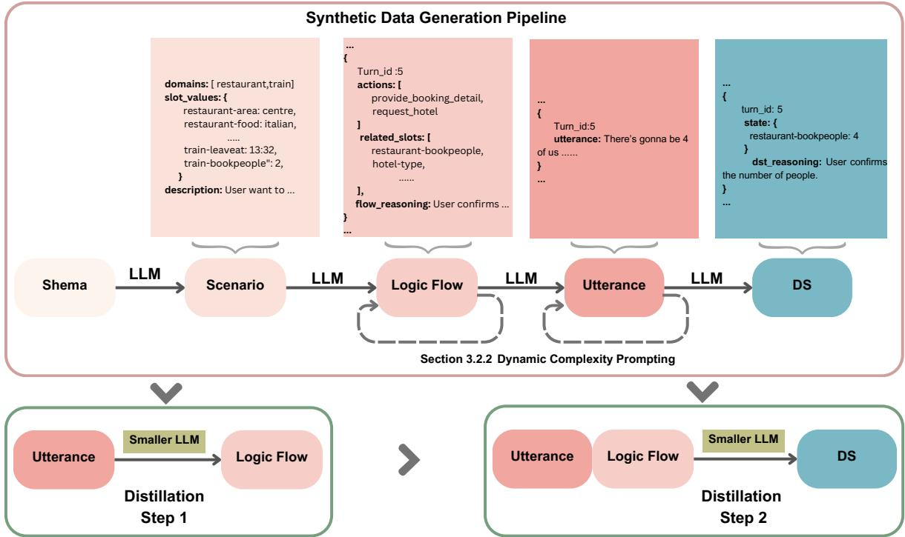
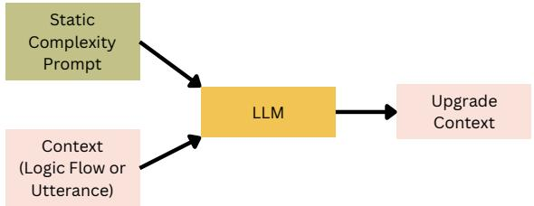
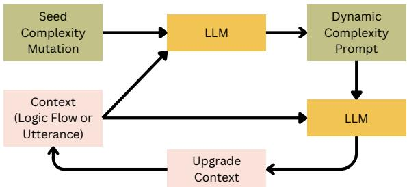
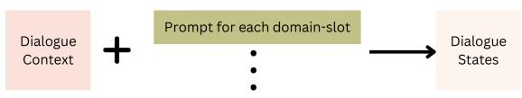
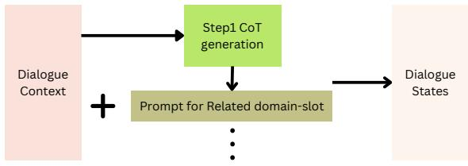
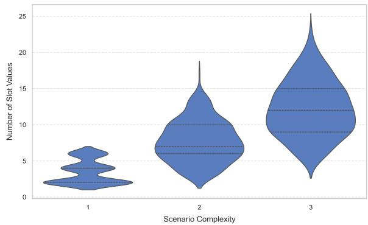
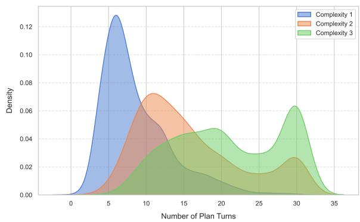

# From Schema to State: Zero-Shot Scheme-Only Dialogue State Tracking via Diverse Synthetic Dialogue and Step-by-Step Distillation

Huan Xu1, Zequn Li1, Wen Tang1, Jian Jun Zhang1,

1Bournemouth University, UK

{xuh,zli1,wtang,jzhang}@bournemouth.ac.uk

## Abstract

Dialogue State Tracking (DST) is crucial for linking user intentions to appropriate services in task-oriented dialogue systems. We propose a zero-shot, scheme-only approach that tackles two main challenges: generating synthetic dialogues that balance diversity with schema alignment, and efficiently distilling knowledge from a large language model (LLM) into a smaller model. Our pipeline first creates scenarios, dialogue logic flows, and utterances via dynamic complexity prompting, eliminating reliance on handcrafted templates. We then use a twostage distillation process to learn formalized dialogue representations and DST related chainof-thought reasoning. This structure preserves interpretive capabilities while reducing inference overhead. Experiments on the MultiWOZ benchmark show that our method achieves state-of-the-art performance under zero-shot, scheme-only situations and generalizes to fewshot scenarios effectively, offering a practical and scalable solution for domains that lack real data. Our code is available1

## 1 Introduction

Task-oriented dialogue systems guide users through conversational interactions to accomplish specific requests, such as booking a restaurant or scheduling a train journey. Central to these systems is Dialogue State Tracking (DST), which involves extracting and updating essential information as the conversation unfolds (Henderson et al., 2014). By organizing details into domain-slot structures, DST ensures the system accurately captures user requirements, maintains contextual consistency, and effectively interfaces with external services.

In practical scenarios, constructing an accurate DST model typically requires substantial labeled data, which is both time-consuming and costly to acquire (Budzianowski et al., 2018). Consequently, zero-shot approaches that reduce reliance on extensive annotations have gained increasing interest. Existing research generally classifies zero-shot DST into two main types. The first is the zero-shot cross-domain scenario (Campagna et al., 2020), in which a model trained on specific domains is transferred to a new, unseen domain using only schema information (e.g., slot names and possible values). The second, the zero-shot schemeonly setting (Heck et al., 2023), involves equipping the model solely with the relevant schema without providing any actual dialogue data. This latter approach, which constitutes our primary focus, is especially challenging due to the complete absence of domain-specific examples. While proprietary LLMs (e.g. GPT-4) have demonstrated impressive performance under scheme-only conditions, their high computational cost makes them impractical for frequent DST tasks (Feng et al., 2023). In response, some researchers have experimented with generating synthetic data using these large models, then distilling smaller models from the artificially produced data (Kim et al., 2021; Niu et al., 2024; Kulkarni et al., 2024). However, discrepancies between synthetic and real conversational distributions often limit the effectiveness of models that rely solely on such synthetic resources.

In this work, we tackle two primary challenges in zero-shot scheme-only DST: (1) generating synthetic dialogue data that is simultaneously diverse and faithfully aligned with the task-oriented schema; (2) efficiently distilling this knowledge into a smaller LLM that is capable of handling varied conversational styles and complexities while approaching the comprehension performance of proprietary LLMs.

To address the first challenge, we propose a threestage synthetic data generation strategy, targeting schema-based scenario generation, dialogue logic flow design, and utterance generation. Alongside this, we introduce a dynamic complexity prompting technique that begins with a simple baseline and incrementally infuses complexity into the logic flow or utterance. Notably, our approach does not rely on any template, resulting in dialogues with richer diversity than previous methods, while maintaining strict adherence to the defined schema. The second challenge involves effectively leveraging the synthetic data to distill a smaller LLM that not only manage diverse conversational styles but also better approximate the reasoning of proprietary LLMs. To this end, we design a two-stage, step-by-step distillation pipeline. In the first stage, the model is trained to generate a chain-of-thought (CoT) (Wei et al., 2022) for each utterance, comprising a formalized representation. In the second stage, the model predicts the dialogue state using both the original utterance and its corresponding formalized representation. This process not only preserves the reasoning structure learned by proprietary LLMs but also greatly reduces inference overhead. Consequently, our distilled smaller model operates more efficiently while still achieving robust performance in completely unseen dialogue scenarios.

In summary, our main contributions are threefold:

• We present a novel synthetic data generation strategy. Our approach targets both diversity in conversational flows and strict schema alignment, while explicitly modeling dialogue state and intermediate CoT information.

• We introduce a two-stage distillation process that first learns to generate a COT for each dialogue, then leverages these intermediate reasoning steps to more efficiently predict the final dialogue state. This framework preserves the proprietary LLM’s understanding and reasoning structure, allowing a smaller model to handle zero-shot data more effectively.

• In experiments on the MultiWOZ dataset, our method achieves state-of-the-art performance under the zero-shot, schema-only setting. Moreover, we demonstrate that our approach generalizes well to few-shot scenarios.

## 2 Related Work

## 2.1 Synthetic Data Generation for DST

Early research on synthetic dialogue data for DST, exemplified by Simulated-Chats (Mohapatra et al., 2020) and NeuralWOZ (Kim et al., 2021), relied on hand-crafted templates and PLMs (e.g.,

BERT (Devlin, 2018),RoBERTa (Liu, 2019)) to populate domain-specific slots, which often yield constrained diversity. With the emergence of instruction-tuned LLMs, subsequent work, such as SynthDST (Kulkarni et al., 2024), LUAS (Niu et al., 2024), and EDZ-DA (Gu and Yang, 2024), incorporated more flexible approaches, including template-driven logic flows and multi-agent simulations, to increase dialogue variations. Other solutions (Finch and Choi, 2024) introduced schemafree generation by creating a large number of short, cross-domain dialogues for model pre-training.

However, existing synthetic pipelines still face two obstacles. First, they heavily depend on an LLM’s stochastic outputs rather than systematically covering complex DST scenarios. Second, they seldom integrate intermediate rational data (e.g. chain-of-thought) that would support knowledge distillation for smaller models. Our framework addresses these gaps by introducing both targeted complexity prompts to ensure broad coverage of DST challenges and explicit CoT reasoning that facilitates more effective distillation.

## 2.2 Zero-Shot Scheme-Only DST

Zero-shot scheme-only DST does not utilize any real dialogue data but relies entirely on synthetic data or specialized prompting strategies. This setup is highly practical for certain applications yet poses significant challenges. Early work primarily focused on cross-domain scenarios (Campagna et al., 2020; Dong et al., 2024), but the emergence of ChatGPT highlighted the feasibility of a purely scheme-only approach. Heck et al. (2023) were among the first to investigate ChatGPT 3.5 combined with schema-based prompts for zero-shot scheme-only DST, demonstrating that large language models can partially solve zero-shot DST problems. Following this, LDST (Feng et al., 2023) introduced a prompting strategy that assigns a unique prompt to each slot, thus lifting zeroshot DST accuracy to near full-training-set levels. More recent efforts, such as InstructTODS (Chung et al., 2023), ParsingDST (Wu et al., 2023), Ref-PyDST (King and Flanigan, 2023), IC-DST (Hu et al., 2022) and FnCTOD (Li et al., 2024), leverage large language models’ strengths in instruction following, JSON parsing, coding, or function calling to further refine how these models address zero-shot DST. However, the question of how to empower smaller LLMs with the knowledge gained by proprietary LLMs remains open. In this paper, we tackle precisely this challenge by proposing a synthetic data generation framework paired with a step-by-step distillation method. Our approach enables smaller models to effectively acquire the reasoning and inference capabilities demonstrated by proprietary LLMs, improving zero-shot DST performance without access to real conversational data.

## 3 Method

## 3.1 Task Definition

In Task-Oriented Dialogue (TOD), DST is responsible for identifying and updating the key information needed to fulfill a user’s goal across multiple conversation turns. Let the conversation be denoted by a sequence of user and system utterances, $U _ { t } = \{ u _ { 1 } , u _ { 2 } , \ldots , u _ { t } \}$ , where t is the total number of turns. At each turn, the DST module predicts a set of domain–slot–value triples, $D S _ { t } = \{ ( d , s , v ) _ { i } \} _ { i = 1 } ^ { n }$ , where $( d , s , v ) _ { i }$ represents a specific domain $d ,$ a slot $s ,$ and the corresponding value v. By interpreting user utterances and updating the evolving dialogue state DS, the system keeps track of user goals.

Before constructing a TOD system, we typically define in advance which domain–slot–value combinations need to be tracked. Each slot is represented as a tuple $s m _ { i } \ = \ ( d , s , P ) _ { i }$ , where $P$ specifies a set of possible values for categorical slots. The overall schema is then expressed as $S M \ = \ \{ s m _ { 1 } , s m _ { 2 } , \ldots , s m _ { i } , \ldots , s m _ { n } \}$ , which encompasses all relevant domains. Under the zeroshot cross-domain setting, the model is trained on a subset of domains $\mathcal { D S } _ { \mathrm { t r a i n } } \subset \mathcal { D S }$ and evaluated on a new domain $d _ { \mathrm { t e s t } } \notin \mathcal { D } S _ { \mathrm { t r a i n } }$ . Even though labeled data is unavailable for $d _ { \mathrm { t e s t } }$ , the model is trained on utterances $U$ together with $ { \mathcal { D } } S _ { \mathrm { t r a i n } }$ labels, and then makes predictions for $\mathcal { D }  { \boldsymbol { S } } _ { \mathrm { t e s t } }$ based on the schema $S M _ { \mathrm { t e s t } }$ . In contrast, the zero-shot scheme-only setting restricts the model to rely solely on the schema SM, without any training utterances $U$ or labels from $\mathcal { D } S _ { \mathrm { t r a i n } }$ . This stricter requirement demands stronger generalization capabilities, as the model must still handle DST tasks effectively without any real data.

## 3.2 Generation of Diverse Synthetic Datasets

LLMs have proven effective at generating synthetic data for data augmentation in various NLP tasks. Within DST, prior work has demonstrated the utility of generating synthetic dialogue data in few-shot settings. However, balancing data diversity with task domain relevance remains a substantial challenge in a strictly zero-shot scheme-only context. As shown in Figure 1, our proposed method tackles this issue by implementing a plan-and-solve strategy (Wang et al., 2023) that decomposes the generation pipeline into four steps: scenario construction, dialogue logic flow, utterance creation and dialogue state extraction. This structured approach not only simplifies the overall process but also enforces schema adherence at each stage, thereby mitigating hallucinations and reducing out-of-scope outputs. Furthermore, the intermediate reasoning generated at each step can serve as CoT information for subsequent knowledge distillation into smaller language models.

To further improve dialogue diversity particularly concerning DST complexity we draw on the concept of prompt evolution (Fernando et al., 2023). Rather than relying on static prompts, we gradually introduce increased complexity through dynamic complexity prompting. This iterative process begins with a straightforward baseline and expands toward more complicate scenarios, maintaining schema alignment while covering a broader range of dialogue conditions. The subsections below describe each phase of our synthetic data generation framework in detail.

## 3.2.1 Scenario Generation

In this stage, we define the dialogue scenario $S = \{ d _ { i } , ( d , s , v ) _ { j }$ , desp , specifying the relevant domain(s), slot-value pairs, and a concise description desp. Scenario complexity is determined by the number of domains and the quantity of slotvalue pairs. We start by sampling a single domain and use an LLM to select a coherent subset of slotvalue pairs and a brief topical description, thereby ensuring realistic contexts (e.g., if a hotel is in the east, a related attraction is more likely in the east). We then progressively add domains and slot-value pairs, again guided by the LLM. This incremental process yields scenarios ranging from simple to highly complex, thus enhancing overall diversity.

## 3.2.2 Dialogue Logic Flow Generation

Rather than directly generating utterances from $S ,$ we first produce a turn-level logic flow plan using an LLM:

$$
\mathrm { L o g i c } _ { i } = \{ I , ( d , s , v ) _ { j } , \mathrm { C o T } \} _ { i } ,
$$

  
Figure 1: The overall framework of our synthetic data generation framework and step-by-step knowledge distillation progress.The top part indicate the Synthetic Data Generation Pipeline and the bottom part refers to the two knowledge distillation steps

where I (Intention) is a concise statement of the speaker’s goal, $( d , s , v ) _ { j }$ denotes the slot-value pairs relevant to that turn, and CoT provides a chain-of-thought formalized explanation. This logic flow clarifies the dialogue’s logical structure before linguistic details are added, serving as both a guideline for DST analysis and a safeguard against out-of-scope outputs.

We begin with a simple baseline plan to ensure a more realistic flow. Inspired by Promptbreeder (Fernando et al., 2023), we propose the dynamic complexity prompting strategy. During data generation, We will apply five seed complexity mutations, addressing domain shifts, slot-value updating, extension, indirect references and co-reference, to iteratively refine the dialogue logic flow. As illustrated in Figure 2, the LLM receives the current dialogue flow alongside a seed mutation prompt, proposes a strategy for increasing complexity, and modifies the baseline plan accordingly. Repeating this process yields a range of logical complexities, from basic flows to intricate multi-domain transitions. This dynamic complexity prompting promotes data diversity and keeps each complexity expansion aligned with the evolving dialogue structure, thus minimizing out-of-scope content.

## 3.2.3 Utterance Generation

Based on the dialogue logic $P l a n _ { i = 1 } ^ { n }$ flow obtained in the previous step, the LLM generates the actual utterances for both user and system turns $U _ { i } = L L M ( S , P l a n _ { i } )$ . This process mirrors our approach to logic flow generation: we begin with a simple baseline utterance and incrementally increase linguistic complexity through three seed complexity mutations. These mutations address grammatical sophistication, co-references or indirect references, and more colloquial or oral expressions. By repeatedly applying these transformations, we obtain a set of utterances that vary in style and difficulty while still adhering to the previously defined logical structure.

## 3.2.4 Dialogue State Generation

In existing methods, synthetic data pipelines often rely on the LLM to extract DST labels directly from the produced utterances. For dialogues of varying complexity, the accuracy of such labels depends heavily on the chosen LLM’s capabilities. In our approach, we provide the LLM with three sources of information, Scenario, Dialogue Logic Flow, and Utterances to predict the dialogue state $D S = L L M ( S , P l a n _ { i = 0 } ^ { n } , U _ { i = 0 } ^ { n } )$ . This multifaceted view improves the accuracy of DST label generation, as the LLM can cross-reference context from all three levels. We also instruct the LLM to produce intermediate reasoning alongside each predicted state, further supporting the explanation and enabling knowledge distillation in subsequent steps.

(a) Static Prompt  
  
(b) Dynamic Complexity Prompting  
Figure 2: Comparison between a static prompt (a) and the Dynamic Complexity Prompting strategy (b) used in our pipeline for diverse data generation.

## 3.3 Step-by-Step Knowledge Distillation

CoT explanations have proven effective in various NLP applications, including DST (Xu et al., 2024). Existing work primarily focuses on supervised or cross-domain scenarios, using CoT to enhance interpretive and inferential capabilities for a given target dataset. However, in a purely synthetic setting, rational information (including CoT) not only increases explainability but also unifies data distributions across different datasets, thereby improving a model’s generalization. Our approach fully exploits this rational data by dividing knowledge distillation for a smaller LLM into two stages: (1) formalized representation generation and (2) chain-of-thought dialogue state inference. This two-stage design simplifies complex CoT into manageable parts and restricts the second step to only the domain-slot pairs identified in the first step, reducing computational overhead.

As detailed in Section 3.2, each dialogue turn includes the logic flow $\{ I , ( d , s , v ) _ { j } , \mathrm { C o T } \} _ { } ,$ i, indicating the speaker’s intention, relevant slots, and a concise explanation. In the first stage, we convert these fields into a formalized representation, thereby reducing ambiguity caused by linguistic variation. This structured view of the turn focuses on related slots, which is more error-tolerant than directly predicting DST labels. We then fine-tune the smaller LLM to generate these representations effectively:

(a) Prompt based One Stage Inference  
  
(b) Two Stage Inference:  
Figure 3: Comparison between Prompt based One Stage Inference(a) and Our proposed Two Stage Inference(b)

$$
\operatorname { L o g i c } _ { i } = \{ I , ( d , s , v ) _ { j } , \operatorname { C o T } \} _ { i }  s L L M ( U _ { i } ) .
$$

where sLLM refers to smaller LLM. In the second stage, we provide the original utterance U and the formalized representation Logic to the smaller LLM. Selecting a relevant domain-slot pair from Logic , the model is prompted to generate both the CoT and the predicted dialogue state for that slot:

$$
\{ { \mathrm { D S } } _ { i } , { \mathrm { C o T } } \} \gets s L L M ( U _ { i } , { \mathrm { L o g i c } } _ { i } ) .
$$

This final CoT may reference related turns and their rationale, thereby reinforcing the model’s understanding of how the dialogue state evolves.

This two stage approach, as describe in Figure 3 offers two key benefits. First, splitting CoT generation into two stages—formalizing the dialogue content before predicting dialogue states—reduces the complexity of the instructions and thus lowers the risk of error. Second, by limiting the second stage to only the slots identified in the first stage, we significantly decrease computational costs, as the model need not process all possible slots. We discuss more detials in Appendix. Overall, this step-by-step knowledge distillation leverages rational data to improve both the interpretability and efficiency of DST in zero-shot scenarios. The detail instruction template is shown in Appendix.

Table 1: Comparison of DST performance on MultiWOZ 2.1 and MultiWOZ 2.4 under various training conditions. “Zero-shot” indicates no real training data, relying purely on synthetic data. “1%” and “5%” refer to few-shot scenarios, where a small fraction of the real dataset is used in addition to synthetic data. Results marked with an star \* indicate findings reported in original research papers
<table><tr><td colspan="7">MultiWOZ 2.1</td></tr><tr><td>Method</td><td>Base Model</td><td>Synthetic Data</td><td>Zero-shot</td><td>1%</td><td>5%</td><td>MultiWOZ 2.4 Zero-shot 1%</td><td>5%</td></tr><tr><td>SVAG</td><td>T5&lt;1B</td><td>NeuralWOZ</td><td>19.1</td><td>34.4*</td><td>43.5*</td><td>23.8 47.6*</td><td>51.0*</td></tr><tr><td>SVAG</td><td>T5&lt;1B</td><td>Simulated Chats</td><td>7.5</td><td></td><td>41.1* 12.5</td><td></td><td>47.3*</td></tr><tr><td>SVAG</td><td>T5&lt;1B</td><td>EDZ-DA</td><td>17.2</td><td>37.2*</td><td>45.0*</td><td>23.9 43.8*</td><td>54.1*</td></tr><tr><td>Ours</td><td>T5&lt;1B</td><td>Ours</td><td>21.7</td><td>25.8</td><td>31.2</td><td>29.4 35.1</td><td>39.3</td></tr><tr><td>LDST</td><td>Llama 8B</td><td></td><td>9.5</td><td>36.3*</td><td>46.7*</td><td>15.3 46.77*</td><td>56.48*</td></tr><tr><td>DOT</td><td>Llama 11B</td><td>DOT</td><td>12.9</td><td></td><td></td><td>23.6*</td><td></td></tr><tr><td>LDST</td><td>Llama 8B</td><td>EDZ-DA</td><td>21.7</td><td></td><td></td><td>27.4</td><td></td></tr><tr><td>LDST</td><td>Llama 8B</td><td>NeuralWOZ</td><td>25.3</td><td></td><td></td><td>32.0</td><td></td></tr><tr><td>LDST</td><td>Llama 8B</td><td>LUAS</td><td>27.9</td><td></td><td></td><td>31.9</td><td></td></tr><tr><td>Ours</td><td>Llama 1B</td><td>Ours</td><td>25.7</td><td>29.1</td><td>35.8</td><td>28.7 35.4</td><td>41.7</td></tr><tr><td>Ours</td><td>Llama 3B</td><td>Ours</td><td>32.5</td><td>41.7</td><td>53.0</td><td>36.5 49.2</td><td>58.4</td></tr><tr><td>Ours</td><td>Llama 8B</td><td>Ours</td><td>45.2</td><td>52.1</td><td>63.8</td><td>49.7 54.7</td><td>68.3</td></tr><tr><td>IC-DST</td><td>GPT3.5 &gt;100B</td><td></td><td>31.1*</td><td>1</td><td>一</td><td>35.3*</td><td></td></tr><tr><td>IC-DST</td><td>GPT3.5 &gt;100B</td><td>SyntheDST</td><td>39.9*</td><td></td><td>45.6*</td><td></td><td></td></tr><tr><td>RefPyDST</td><td>GPT3.5 &gt;100B</td><td></td><td>47.3*</td><td>49.6*</td><td></td><td>47.9* 55.2*</td><td></td></tr><tr><td>LDST</td><td>GPT3.5 &gt;100B</td><td></td><td>61.52*</td><td></td><td></td><td>83.16*</td><td></td></tr></table>

## 4 Experiment

## 4.1 Synthetic data generation

Following the procedure outlined in Section 3.2, we first construct a synthetic dataset using LLMs. Specifically, we employ GPT4o-mini (Achiam et al., 2023)2 to generate initial Scenario information and GPT4o (Achiam et al., 2023)3 to produce the corresponding dialogue flow, utterances, and dialogue state labels. We begin by creating 900 scenarios, each corresponding to dialogues containing one, two, or three domains (300 scenarios per domain count). For each domain, the LLM selects between 75% to 100% of the slots specified in the schema to ensure that chosen slot-value pairs are semantically coherent. Next, we generate a straightforward baseline dialogue logic flow for each scenario. We then apply our dynamic complexity prompting strategy twice to evolve this baseline into progressively more complex dialogue flows. Using the same approach, we produce two versions of the utterances for each dialogue flow: a simple, baseline utterance set, and a complex version created through one round of dynamic complexity prompting. Finally, we analyze each dialogue to extract its corresponding dialogue state. This procedure results in 5,400 synthetic dialogues that exhibit varying levels of complexity. Figure 4 presents the distribution of the number of slots per scenario and the dialogue lengths at different complexity tiers. As shown, our proposed method enables the generation of a wide range of easy-tohard synthetic dialogues, thereby enhancing dataset diversity and better reflecting real-world TOD requirements.

## 4.2 Evaluation Dataset and Metrics

To evaluate our zero-shot scheme-only performance, we employ the widely used Multi-WOZ (Budzianowski et al., 2018) dataset. In particular, we include MultiWOZ 2.1 (Eric et al., 2019), one of the most commonly adopted benchmarks for Dialogue State Tracking, as well as MultiWOZ 2.4 (Ye et al., 2021), which is built on version 2.1 but introduces corrections and enhancements to the test set. Compared to the original release, Multi-WOZ 2.4 features clearer annotations and rectified errors, making it a more reliable benchmark for evaluating DST models.

Following previous work, we adopt Joint Goal Accuracy (Budzianowski et al., 2018) (JGA) as our primary evaluation metric. JGA deems a prediction to be correct only if all slot-value assignments match the ground-truth labels for a given dialogue, making it a stringent measure of overall model performance.

(a) The distribution of slot-value numbers for different complexity Scenario  
  
(b) The distribution of conversation length for different complexity logic flow  
Figure 4: Statistics of Our proposed Synthetic Dataset Indicate the diverse distribution generated by dynamic complexity prompting

## 4.3 Evaluation Baseline

Few smaller LLM-based approaches have reported results for a purely zero-shot, scheme-only setting. Most synthetic data generation strategies are generally employed for data augmentation, serving as a supplement—rather than a replacement—for existing training data. To allow a fair comparison, we incorporate several previously proposed synthetic datasets and evaluate their performance in a zero-shot context. In particular, we consider methods such as NeuralWOZ (Kim et al., 2021), Simulated Chats (Mohapatra et al., 2020), EDZ-DA (Gu and Yang, 2024), D0T (Finch and Choi, 2024), LUAS (Niu et al., 2024), and SyntheDST (Kulkarni et al., 2024). Moreover, zero-shot, scheme-only scenarios have also been investigated using largescale LLMs (e.g., GPT-3.5, GPT-4). We therefore include the results of IC-DST (King and Flanigan, 2023), LDST (Feng et al., 2023), RefPyDST (King and Flanigan, 2023), InstructTODS (Chung et al., 2023), ParsingDST (Wu et al., 2023), and FnC-TOD (Li et al., 2024) in our comparisons. Finally, beyond the zero-shot case, we examine how our proposed method performs under 1% and 5% fewshot conditions, offering a more comprehensive view of its capabilities.

## 4.4 Implementation Details

We employ Llama3.2 1B, 3B and Llama 3.1 8B models (Dubey et al., 2024) as our distillation targets, using LoRA-based supervised fine-tuning (Hu et al., 2021) for both stages of instruction. We reserve 600 synthetic dialogues as a development set to adjust hyperparameters. For a fair comparison with smaller PLMs, we also evaluate a T5-Large model (Raffel et al., 2020) by fully fine-tuning it on the same dataset. All experiments are conducted on a single RTX 4090 GPU.

## 4.5 Result

Table 1 presents a comparison of our method (“Ours”) with existing approaches on MultiWOZ 2.1 and MultiWOZ 2.4 under zero-shot, 1%, and 5% few-shot settings. Focusing first on the zeroshot scenario, our Llama 8B model achieves 45.2% JGA on MultiWOZ 2.1, significantly surpassing the 32.3% and 17.3% reported by D0T and LUAS, respectively. Even smaller variants, such as Llama 1B and Llama 3B, exhibit competitive zero-shot performance, highlighting the effectiveness of our synthetic data generation pipeline for models of varying scales. These results underscore the robustness of our approach in purely synthetic conditions without any real training data. Notably, our T5<1B version also outperforms other synthetic baselines (e.g., Simulated Chats, EDZ-DA). However, in the few-shot setting, the T5-based model performs poorly on our synthetic data, primarily because our prediction process involves chain-ofthought (CoT) reasoning, which smaller models without instruction fine-tuning struggle to handle. By contrast, the 1B instruction-tuned Llama model demonstrates strong performance under few-shot conditions, indicating that instruction-tuned architectures are better suited for managing more complex reasoning tasks.

Beyond zero-shot performance, introducing a small fraction (1% or 5%) of real dialogues yields considerable gains for our method, with JGA scores often increasing by 5–15 points compared to the zero-shot scenario. For example, the Llama 8B model’s accuracy on MultiWOZ 2.1 rises from 45.2% to 63.8% when 5% of the real data is included—on par with or exceeding several other reported baselines. Although larger GPT-based solutions can perform well in zero-shot settings, they typically rely on models exceeding 100B parameters. Our results demonstrate that substantially smaller architectures can close much of this gap through high-quality synthetic data creation, staged complexity prompts, and step-by-step knowledge distillation, ultimately providing a more resourceefficient solution for DST deployment

## 4.6 Ablation Study

Our ablation study investigates two key factors that may affect the zero-shot generalization performance of our method: (1) the effect of different complexity levels in synthetic data, and (2) the contribution of each step in our step-by-step knowledge distillation procedure.

<table><tr><td>Synthetic Complexity</td><td>MultiWOZ2.1</td></tr><tr><td>Baseline</td><td>21.7</td></tr><tr><td>High Complexity</td><td>37.3</td></tr><tr><td>Easy-to-Hard</td><td>43.7</td></tr></table>

Table 2: Synthetic Complexity Results for Multi-WOZ2.1 Zero-shot

To explore how dialogue complexity affects model performance, we fixed the synthetic dataset size to 800 samples per group and categorized them into baseline, high-complexity, and diverse easyto-hard sets. The baseline group consisted of minimally complex dialogues generated without iterative complexity increases, the high-complexity group comprised dialogues that underwent multiple rounds of progressive complexity prompts, and the diverse easy-to-hard group covered a full spectrum from simple to complex dialogues. As shown in Table 2, the diverse easy-to-hard data produced the best zero-shot results, highlighting the importance of covering multiple difficulty levels to enhance generalization.

<table><tr><td>Label DS</td><td>Step1 CoT</td><td>Step2 CoT</td><td colspan="2">MultiWOZ2.1 #turn &lt;15</td></tr><tr><td>√</td><td></td><td></td><td>29</td><td>#turn &gt;15 12</td></tr><tr><td>√</td><td>√</td><td></td><td>39</td><td>21</td></tr><tr><td>√</td><td>√</td><td>√</td><td>46</td><td>39</td></tr></table>

Table 3: Two step distillation Ablation study

We further examined the step-by-step distillation procedure to evaluate the impact of each stage on final performance. Our approach includes two chain-of-thought (CoT) elements: one in Step 1 to generate a formal representation of the utterance, and another in Step 2 to track the evolution of slots and values over the course of the conversation. To isolate the contributions of these steps, we conducted ablation experiments on 100 dialogues with more than 15 turns and 100 dialogues with fewer than 15 turns. The results in Table 4 show that incorporating the CoT from Step 1 provides an approximately 10% improvement in zero-shot accuracy by offering a more robust representation for each turn. Additionally, Step 2 further reduces errors, particularly for longer dialogues, where slotvalue tracking becomes more challenging. These findings confirm the effectiveness of our step-bystep distillation method, demonstrating how each stage’s CoT contributes in distinct yet complementary ways to the overall DST performance.

## 5 Conclusion

We have presented a framework for zero-shot scheme-only DST that combines a novel diverse synthetic data generation pipeline with a two-stage knowledge distillation process. By employing dynamic complexity prompts, our approach produces diverse, schema-aligned dialogues without relying on manual templates. We then leverage intermediate CoT representations to guide a smaller LLM through a step-by-step distillation procedure, substantially improving its ability to handle unseen dialogue scenarios. Experiments on MultiWOZ demonstrate that our method achieves state-of-theart zero-shot results while remaining both computationally efficient and readily adaptable to few-shot conditions.

## Limitations

Although our approach demonstrates promising results in zero-shot scheme-only DST, several limitations remain. First, the method relies on a welldefined schema to guide synthetic data generation. If the schema is incomplete or inaccurate, the resulting dialogues may not accurately capture realworld complexity. Second, dynamic complexity prompting, while improving data diversity, can occasionally produce logically inconsistent or out-ofscope content.Finally, the generated data are not manually reviewed, leaving open the possibility that they may contain inappropriate content.

## Acknowledgments

This research was funded by Bournemouth University Intel-PA Project grant number EPSRC Grant EP/L016540/1.

## References

Josh Achiam, Steven Adler, Sandhini Agarwal, Lama Ahmad, Ilge Akkaya, Florencia Leoni Aleman, Diogo Almeida, Janko Altenschmidt, Sam Altman, Shyamal Anadkat, et al. 2023. Gpt-4 technical report. arXiv preprint arXiv:2303.08774.

Paweł Budzianowski, Tsung-Hsien Wen, Bo-Hsiang Tseng, Inigo Casanueva, Stefan Ultes, Osman Ramadan, and Milica Gašic. 2018. Multiwoz–a´ large-scale multi-domain wizard-of-oz dataset for task-oriented dialogue modelling. arXiv preprint arXiv:1810.00278.

Giovanni Campagna, Agata Foryciarz, Mehrad Moradshahi, and Monica S Lam. 2020. Zero-shot transfer learning with synthesized data for multidomain dialogue state tracking. arXiv preprint arXiv:2005.00891.

Willy Chung, Samuel Cahyawijaya, Bryan Wilie, Holy Lovenia, and Pascale Fung. 2023. Instructtods: Large language models for end-to-end task-oriented dialogue systems. arXiv preprint arXiv:2310.08885.

Jacob Devlin. 2018. Bert: Pre-training of deep bidirectional transformers for language understanding. arXiv preprint arXiv:1810.04805.

Xiaoyu Dong, Yujie Feng, Zexin Lu, Guangyuan Shi, and Xiao-Ming Wu. 2024. Zero-shot crossdomain dialogue state tracking via context-aware auto-prompting and instruction-following contrastive decoding. In Proceedings ofthe 2024 Conference on Empirical Methods in Natural Language Processing, pages 8527–8540.

Abhimanyu Dubey, Abhinav Jauhri, Abhinav Pandey, Abhishek Kadian, Ahmad Al-Dahle, Aiesha Letman, Akhil Mathur, Alan Schelten, Amy Yang, Angela Fan, et al. 2024. The llama 3 herd of models. arXiv preprint arXiv:2407.21783.

Mihail Eric, Rahul Goel, Shachi Paul, Adarsh Kumar, Abhishek Sethi, Peter Ku, Anuj Kumar Goyal, Sanchit Agarwal, Shuyang Gao, and Dilek Hakkani-Tur. 2019. Multiwoz 2.1: A consolidated multi-domain dialogue dataset with state corrections and state tracking baselines. arXiv preprint arXiv:1907.01669.

Yujie Feng, Zexin Lu, Bo Liu, Liming Zhan, and Xiao-Ming Wu. 2023. Towards llm-driven dialogue state tracking. arXiv preprint arXiv:2310.14970.

Chrisantha Fernando, Dylan Banarse, Henryk Michalewski, Simon Osindero, and Tim Rocktäschel. 2023. Promptbreeder: Self-referential

self-improvement via prompt evolution. arXiv preprint arXiv:2309.16797.

James Finch and Jinho D Choi. 2024. Diverse and effective synthetic data generation for adaptable zero-shot dialogue state tracking. In Findings of the Association for Computational Linguistics: EMNLP 2024, pages 12527–12544.

Ming Gu and Yan Yang. 2024. Plan, generate and complicate: Improving low-resource dialogue state tracking via easy-to-difficult zero-shot data augmentation. arXiv preprint arXiv:2406.08860.

Michael Heck, Nurul Lubis, Benjamin Ruppik, Renato Vukovic, Shutong Feng, Christian Geishauser, Hsien-Chin Lin, Carel van Niekerk, and Milica Gašic.´ 2023. Chatgpt for zero-shot dialogue state tracking: A solution or an opportunity? arXiv preprint arXiv:2306.01386.

Matthew Henderson, Blaise Thomson, and Jason D Williams. 2014. The second dialog state tracking challenge. In Proceedings ofthe 15th annual meeting of the special interest group on discourse and dialogue (SIGDIAL), pages 263–272.

Pin-Lun Hsu, Yun Dai, Vignesh Kothapalli, Qingquan Song, Shao Tang, Siyu Zhu, Steven Shimizu, Shivam Sahni, Haowen Ning, and Yanning Chen. 2024. Liger kernel: Efficient triton kernels for llm training. arXiv preprint arXiv:2410.10989.

Edward J Hu, Yelong Shen, Phillip Wallis, Zeyuan Allen-Zhu, Yuanzhi Li, Shean Wang, Lu Wang, and Weizhu Chen. 2021. Lora: Low-rank adaptation of large language models. arXiv preprint arXiv:2106.09685.

Yushi Hu, Chia-Hsuan Lee, Tianbao Xie, Tao Yu, Noah A Smith, and Mari Ostendorf. 2022. In-context learning for few-shot dialogue state tracking. arXiv preprint arXiv:2203.08568.

Sungdong Kim, Minsuk Chang, and Sang-Woo Lee. 2021. Neuralwoz: Learning to collect task-oriented dialogue via model-based simulation. arXiv preprint arXiv:2105.14454.

Brendan King and Jeffrey Flanigan. 2023. Diverse retrieval-augmented in-context learning for dialogue state tracking. arXiv preprint arXiv:2307.01453.

Atharva Kulkarni, Bo-Hsiang Tseng, Joel Ruben Antony Moniz, Dhivya Piraviperumal, Hong Yu, and Shruti Bhargava. 2024. Synthdst: Synthetic data is all you need for few-shot dialog state tracking. arXiv preprint arXiv:2402.02285.

Chia-Hsuan Lee, Hao Cheng, and Mari Ostendorf. 2021. Dialogue state tracking with a language model using schema-driven prompting. In Proceedings of the 2021 Conference on Empirical Methods in Natural Language Processing, pages 4937–4949, Online and Punta Cana, Dominican Republic. Association for Computational Linguistics.

Zekun Li, Zhiyu Zoey Chen, Mike Ross, Patrick Huber, Seungwhan Moon, Zhaojiang Lin, Xin Luna Dong, Adithya Sagar, Xifeng Yan, and Paul A Crook. 2024. Large language models as zero-shot dialogue state tracker through function calling. arXiv preprint arXiv:2402.10466.

Yinhan Liu. 2019. Roberta: A robustly optimized bert pretraining approach. arXiv preprint arXiv:1907.11692, 364.

Biswesh Mohapatra, Gaurav Pandey, Danish Contractor, and Sachindra Joshi. 2020. Simulated chats for building dialog systems: learning to generate conversations from instructions. arXiv preprint arXiv:2010.10216.

Cheng Niu, Xingguang Wang, Xuxin Cheng, Juntong Song, and Tong Zhang. 2024. Enhancing dialogue state tracking models through llm-backed user-agents simulation. arXiv preprint arXiv:2405.13037.

Colin Raffel, Noam Shazeer, Adam Roberts, Katherine Lee, Sharan Narang, Michael Matena, Yanqi Zhou, Wei Li, and Peter J Liu. 2020. Exploring the limits of transfer learning with a unified text-to-text transformer. Journal ofmachine learning research, 21(140):1–67.

Lei Wang, Wanyu Xu, Yihuai Lan, Zhiqiang Hu, Yunshi Lan, Roy Ka-Wei Lee, and Ee-Peng Lim. 2023. Planand-solve prompting: Improving zero-shot chain-ofthought reasoning by large language models. arXiv preprint arXiv:2305.04091.

Jason Wei, Xuezhi Wang, Dale Schuurmans, Maarten Bosma, Fei Xia, Ed Chi, Quoc V Le, Denny Zhou, et al. 2022. Chain-of-thought prompting elicits reasoning in large language models. Advances in neural information processing systems, 35:24824–24837.

Yuxiang Wu, Guanting Dong, and Weiran Xu. 2023. Semantic parsing by large language models for intricate updating strategies of zero-shot dialogue state tracking. arXiv preprint arXiv:2310.10520.

Lin Xu, Ningxin Peng, Daquan Zhou, See-Kiong Ng, and Jinlan Fu. 2024. Chain of thought explanation for dialogue state tracking. arXiv preprint arXiv:2403.04656.

Fanghua Ye, Jarana Manotumruksa, and Emine Yilmaz. 2021. Multiwoz 2.4: A multi-domain task-oriented dialogue dataset with essential annotation corrections to improve state tracking evaluation. arXiv preprint arXiv:2104.00773.

Yaowei Zheng, Richong Zhang, Junhao Zhang, Yanhan Ye, Zheyan Luo, Zhangchi Feng, and Yongqiang Ma. 2024. Llamafactory: Unified efficient fine-tuning of 100+ language models. In Proceedings of the 62nd Annual Meeting of the Association for Computational Linguistics (Volume 3: System Demonstrations), Bangkok, Thailand. Association for Computational Linguistics.

## A Additional explanation on Experiment Setting

For single run/ Multi-run settings In our experiment, we do multiple runs (fine tuning in our case) for optimal hyper-parameters. We do not use MultiWOZ data in this stage but evaluation only on synthetic data. But with the fine tuned model, we do a single run with the MultiWOZ test set to get the result. As we fixed the seed and with temperate 0.1, we found we got stable results in single/multiple runs.

For synthetic datasets explanation We utilized synthetic datasets from various sources for our research. Below are the details:

• NeuralWOZ, EDZ-DA, D0T, and LUAS: We employed the synthetic data directly provided by the respective authors of these models.

• Simulated Chats: For this dataset, we generated synthetic data ourselves using the code and pre-trained models shared by the original authors.

## B Example of Dynamic Complexity Prompting

The method consists of three steps:

1. Designing the Seed Mutation Prompt: This step diversifies the conversation by steering it in different directions.

2. Generating Contextual Complexity Prompts: Given the context and seed mutation, the LLM is tasked with generating a detailed plan to improve the conversation. This generated contextual complexity prompt includes specific instructions on how to edit or enhance the existing conversation.

3. Applying the Generated Prompt: The prompt generated in Step 2 is used to instruct the LLM to edit or improve the conversation accordingly.

We observed that directly applying a generalpurpose seed mutation prompt can sometimes disrupt the logical correlations between slot values and utterances in the generated dialogue.

In Table 6, we provide examples of prompts generated through our dynamic complexity mechanism. To maintain diversity, we impose minimal constraints on prompt generation, resulting in some prompts that offer specific recommendations (e.g., indicating which turn should include which actions), while others present more general guidelines. Our experimental findings show that using highly restrictive prompts increases the risk of producing out-of-scope content.

## C Instruction Template for Knowledge Distillation

Tables 7 and 8 provide the instruction templates we use during the knowledge distillation process, where all CoT content is derived from the synthetic data generation stage. These templates define how the model should generate and interpret CoT information at each step of the distillation, ensuring a consistent framework that facilitates transfer from large LLMs to smaller ones.

## D Details of the Two-Stage Inference

Typical prompt-based DST models use one of two inference strategies. Early approaches attempt to generate all dialogue states at once from the complete dialogue history (Chung et al., 2023). However, this method often suffers from errors and hallucinations (e.g., predicting slots not included in the schema). To address these issues, DST-as-Prompting (Lee et al., 2021) introduced a per-slot inference strategy that queries each slot one by one. Subsequent studies such as LDST (Feng et al., 2023) followed this paradigm, substantially improving accuracy at the cost of high computational overhead—particularly in multi-domain settings. For instance, MultiWOZ 2.1 includes 23 slots across its hotel, train, and restaurant domains, requiring 23 separate inferences per turn.

<table><tr><td>Method</td><td># Query</td></tr><tr><td>One stage per turn</td><td>1790</td></tr><tr><td>One stage per slot</td><td>41170</td></tr><tr><td>Our two stage</td><td>6444</td></tr></table>

Table 4: The number of query for different inference method

We propose a more balanced approach: in the first stage, we predict the set of potentially relevant slots; in the second stage, we only query those slots. Table 4 compares the number of query for a random sample of 100 test dialogues under different strategies, showing that our two-stage method achieves a significant reduction in computational overhead while retaining the advantages of per-slot inference.

<table><tr><td>Model</td><td>Recall</td></tr><tr><td>Llama 1B</td><td>95.4</td></tr><tr><td>Llama 3B</td><td>97.2</td></tr><tr><td>LLama 8B</td><td>98.1</td></tr></table>

Table 5: The recall of stage 1 results on test set

One limitation of the two-stage process, however, is that inaccuracies in Stage 1 can omit certain slots and thereby reduce final recall. We therefore measure the recall of Stage 1 slot predictions for Llama-based solutions, focusing on the extent to which it covers the gold slot set. Results in Table 5 show that ignoring the value extraction step, the model successfully identifies most of the potentially relevant slots, ensuring robust overall DST performance.

## E Training Details

We employ llama\_factory (Zheng et al., 2024)4 with the Liger Kernel (Hsu et al., 2024)5 for efficient supervised fine-tuning and use vLLM6 for inference on the test set. For our synthetic dataset, we train the model for two epochs using a learning rate of 1e 4. The LoRA rank is set to 16 for the 3B and 8B versions and to 8 for the 1B model. Under these settings, the 1B, 3B, and 8B models complete training in approximately 8, 14, and 31 hours, respectively.

In the few-shot setting, no chain-of-thought (CoT) annotations are available. We therefore first use an LLM(GPT-4o) to extract the CoT in two steps, then perform supervised fine-tuning. To avoid overfitting, we train for two epochs with a learning rate of 5e  5 for the 3B and 8B models and $2 e - 5$ for the 1B model.

<table><tr><td>Category</td><td>Prompts</td></tr><tr><td>Slot Usage</td><td>Utterance - Indirect At Turn 7 and Turn 12, refer back to a previously stated slot by using an indirect phrase or pronoun (e.g., &#x27;that place&#x27;, &#x27;it&#x27;, &#x27;the same hotel&#x27;), rather than repeating the exact slot name.</td></tr><tr><td>Flow</td><td>Utterance - Natu- Use mild slang (e.g., &#x27;gonna,&#x27;&#x27;wanna&#x27;) in some turns, and let a few user/system ral Conversational turns expand into 2–3 sentences. E.g., &#x27;I&#x27;m really hoping we can find something affordable. I heard your deals are great.</td></tr><tr><td>(for Naturalness)</td><td>Utterance - Error Insert a few small spelling or grammar mistakes in user utterances for restaurant Injection or Typos name, making sure the conversation remains understandable overall.</td></tr><tr><td>Dialogue Multi-Domain later returns to the original domain. Jumps</td><td>Flow Ensure the user abruptly introduces a another domain mid-conversation, then</td></tr><tr><td>Dialogue Variation</td><td>Flow Include at least ONE instance where the user deals with TWO or more domains Multi-Domain in a single turn. Keep the plan coherent, ensuring the user returns to or finalizes all relevant domains.</td></tr><tr><td>Slot Contradictions and hotel name.</td><td>Dialogue Flow - At Turn 16, the user provide contradictory or overlapping slot info for hotel type</td></tr></table>

Table 6: Dynamic Generated Complexity Prompt

<table><tr><td>Category</td><td>Prompts</td></tr><tr><td>Instruction</td><td>You are given a task-oriented dialogue between the "user" and the "system". Please analyze the conversation, especially the last two turns, and produce a concise chain-of-thought analysis including the following:</td></tr><tr><td></td><td>• Intentions of each of the last two turns.</td></tr><tr><td></td><td>• Related slot names of the last two turns, enclosed in [slot][/slot] tokens. • Formalized representation of the last two turns.</td></tr><tr><td>Input</td><td></td></tr><tr><td></td><td>The task-oriented dialogue is as follows: {dialogue_history} Now, generate your chain-of-thought based on the above context.</td></tr><tr><td>Output</td><td>Analyzing the last two turns, I found that: [Turn {turn_id} {turn.speaker.upper()}]: {turn.representation} {turn.speaker.upper()} intends to {intention}.</td></tr><tr><td>Instruction</td><td>You are a dialogue state tracker for a task-oriented dialogue system. You will be given:</td></tr><tr><td rowspan="3"></td><td>• A dialogue between the "user" and the "system".</td></tr><tr><td>• Formalized representation of the dialogue. Your task is to analyse and predict the **dialogue states** for the given slot</td></tr><tr><td>name. If the slot is not mentioned in the dialogue, please predict the slot value as NONE. Output your reasoning progress and the predict value start with [state] and end with [/state].</td></tr><tr><td>Input</td><td>The task-oriented dialogue is as following: {dialogue_history} The formalized representation of the dialogue: {form_cot} Now, please analyse and predict the value for slot *{slot} *, which refers to {slot_description }. Output your reasoning progress and the predict value start with [state] and end with [/state].</td></tr><tr><td>Output</td><td>After read the context, I found slot *{slot} * is related to Turn {turn_id_list}. In detail, In turn {turn_id}, {form_cot} ... In conclusion, the dialogue state for slot *{slot} * is &lt;state&gt;{ds }&lt;/state&gt;</td></tr></table>

Table 7: Instruction template for Stage 1 Knowledge Distillation

Table 8: Instruction template for Stage 2 Knowledge Distillation