Data: WebPerson

# Gradient-Attention Guided Dual-Masking Synergetic Framework for Robust Text-based Person Retrieval

Tianlu Zheng♥\*, Yifan Zhang❉\*, Xiang An♠, Ziyong Feng♠ Kaicheng Yang♠†, Qichuan Ding♥†

♥Northeastern University ❉South China University of Technology ♠DeepGlint zhengtl2@mails.neu.edu.cn, dingqichuan@mail.neu.edu.cn, kaichengyang@deepglint.com

## Abstract

Although Contrastive Language-Image Pretraining (CLIP) exhibits strong performance across diverse vision tasks, its application to person representation learning faces two critical challenges: (i) the scarcity of large-scale annotated vision-language data focused on person-centric images, and (ii) the inherent limitations of global contrastive learning, which struggles to maintain discriminative local features crucial for fine-grained matching while remaining vulnerable to noisy text tokens. This work advances CLIP for person representation learning through synergistic improvements in data curation and model architecture. First, we develop a noise-resistant data construction pipeline that leverages the in-context learning capabilities of MLLMs to automatically filter and caption web-sourced images. This yields WebPerson, a large-scale dataset of 5M high-quality person-centric image-text pairs. Second, we introduce the GA-DMS (Gradient-Attention Guided Dual-Masking Synergetic) framework, which improves cross-modal alignment by adaptively masking noisy textual tokens based on the gradient-attention similarity score. Additionally, we incorporate masked token prediction objectives that compel the model to predict informative text tokens, enhancing fine-grained semantic representation learning. Extensive experiments show that GA-DMS achieves state-of-the-art performance across multiple benchmarks. The data and pre-trained models are released at https://github.com/ Multimodal-Representation-Learning-MR GA-DMS.

## 1 Introduction

The rapid advancement of large-scale visionlanguage pre-training (Chen et al., 2023; Yang et al., 2023a; Gu et al., 2024; Wu et al., 2023)

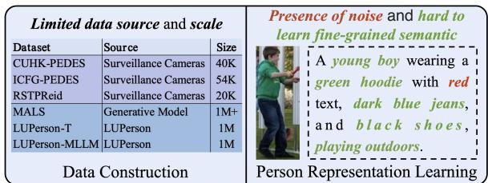  
(a) Current work exhibits several deficiencies

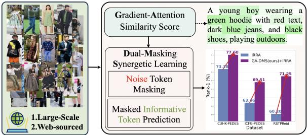  
(b) Our method for robust person representation learning  
Figure 1: Current human-centric datasets are limited in diversity and scale, complicating model training due to noise interference and hindering the effective learning of fine-grained semantics.

has been driven by the unprecedented availability of web-sourced image-text pairs. As a milestone in vision-language representation learning, Contrastive Language–Image Pre-training (CLIP) (Radford et al., 2021b) employs dual encoders for visual and textual modalities and leverages a contrastive loss mechanism (Wang and Liu, 2021) to learn joint representations. Trained on 400 million noisy web-curated image-text pairs, CLIP exhibits strong zero-shot generalization and has been widely adopted for tasks including image classification (Abdelfattah et al., 2023; Peng et al., 2023; An et al., 2023), retrieval (Sain et al., 2023; Shao et al., 2023; Hu et al., 2025), and grounding (Xiao et al., 2023; An et al., 2024; Xie et al., 2025). However, CLIP shows suboptimal performance in text-based person retrieval, as evidenced by recent studies (Shao et al., 2023; Yan et al., 2023b; Li et al., 2023; Han et al., 2024; Zhao et al., 2025).

CLIP’s suboptimal performance in text-based person retrieval stems from two key limitations. First, the scarcity and noise levels in person-centric image-text data pose significant challenges. Existing datasets such as CUHK-PEDES (Li et al., 2017), ICFG-PEDES (Ding et al., 2021), and RST-PReid (Zhu et al., 2021) are constrained in scale due to their reliance on extensive manual annotations. Although large-scale person-centric datasets like LUPerson (Fu et al., 2021) comprise approximately 200K identities and 4 million images, they lack corresponding textual descriptions. Recent efforts (Tan et al., 2024) have employed Multimodal Large Language Models (MLLMs) to address data scarcity by generating synthetic captions. However, these automatically produced annotations frequently contain inaccuracies and semantic misalignments, thereby introducing noise into the training process and requiring the implementation of corrective strategies (Zhao et al., 2024). Second, CLIP’s global contrastive learning paradigm fails to effectively capture fine-grained visual semantics crucial for distinguishing similar individuals (Yan et al., 2023b; Liu et al., 2024). This is particularly problematic as person retrieval often relies on localized attributes (e.g., clothing patterns or accessories) that require precise visual-semantic alignment.

In this work, we advance CLIP for person representation learning through synergistic improvements in data curation and model architecture (Fig.1). We initially introduce WebPerson, a large-scale person-centric dataset consisting of 5 million high-quality text-image pairs derived from web-sourced images. After that, we propose the GA-DMS (Gradient-Attention Guided Dual-Masking Synergetic) framework, which enhances cross-modal alignment by masking noisy textual tokens based on a gradient-attention similarity score. Meanwhile, we incorporate masked token prediction objectives to enforce the model to predict informative text tokens, thereby enhancing fine-grained semantic representation learning. Extensive experiments demonstrate that GA-DMS establishes new state-of-the-art performance across multiple benchmarks. The main contributions of this paper are summarized as follows:

• We design a novel person-centric data construction pipeline that automatically filters and annotates web-sourced images, yielding the WebPerson dataset with 5 million highquality image-text pairs.

• We propose the GA-DMS (Gradient-

Attention Guided Dual-Masking Synergetic) framework to improve cross-modal alignment through gradient-attention guided noisy text token masking while enhancing fine-grained visual-semantic correspondence via masked informative token prediction objectives.

• We conduct comprehensive experiments and demonstrate that GA-DMS achieves new state-of-the-art performance across multiple text-based person retrieval datasets.

## 2 Related Works

## 2.1 Person Representation Learning

Early approaches to text-based person retrieval typically employ separate vision and language encoders with custom alignment losses (Zheng et al., 2020; Si et al., 2018). These methods often exhibit suboptimal modality alignment and require extensive manual annotation. The introduction of CLIP (Radford et al., 2021b) establishes a unified vision-language embedding space, significantly advancing cross-modal matching. Recent works extend CLIP with specialized modules for textbased person retrieval. IRRA (Jiang and Ye, 2023) merges visual cues into textual tokens via a crossmodal transformer and aligns global similarity distributions. MDRL (Yang et al., 2024b) designs a cross-modality global feature learning architecture to learn the global features from the two modalities and meet the demand of the task. UniPT (Shao et al., 2023) utilizes a simple vision-and-language pre-training framework to explicitly align the feature space of the image and text modalities during pre-training. However, these approaches largely ignore data noise, which critically influences crossmodal alignment in feature space. RDE (Qin et al., 2024) mitigates the adverse impact of noisy through the proposed confident consensus division and novel triplet alignment loss. ProPOT (Yan et al., 2024) transforms the identity-level matching problem into a prototype learning problem, aiming to learn identity-enriched prototypes. However, prototype aggregation compromises fine-grained semantic learning.

## 2.2 Person-centric Dataset

High-quality image-text paired datasets are essential for learning discriminative person representations. However, existing manually annotated datasets (e.g., CUHK-PEDES (Li et al., 2017), ICFG-PEDES (Ding et al., 2021), RSTPReid (Zhu et al., 2021)) face severe scalability limitations due to labor-intensive annotation processes. This scalability bottleneck ultimately constrains models capacity to acquire diverse semantic information and learn discriminative features. Recent efforts to mitigate this issue focus on constructing largescale datasets, such as LUPerson (Fu et al., 2021), LUPerson-T (Shao et al., 2023), LUPerson-MLLM (Tan et al., 2024), and SYNTH-PEDES (Zuo et al., 2024) demonstrate that increased data volume improves general pedestrian representation learning. Nevertheless, these datasets primarily derive from video sources, inheriting inherent scalability constraints from computationally intensive video processing pipelines. The success of multimodal large language models in cross-modal understanding (Yu et al., 2024) has inspired their application to synthetic data generation. For instance, LUPerson-MLLM (Tan et al., 2024) employs template-guided MLLMs to generate diverse textual descriptions, significantly enhancing text-to-image ReID performance. However, this approach remains limited by its dependence on existing LUPerson image collections.

## 3 WebPerson Dataset

## 3.1 Person-Centric Image Filtering

In this study, we utilize the COYO700M dataset (Byeon et al., 2022), a large-scale dataset that contains 747M image-text pairs collected from CommonCrawl, as our web-crawled images source. To filter high-quality person-centric images, we initially deploy the YOLOv11 model (Jocher and Qiu, 2024) to detect humans and extract bounding box coordinates. The specific workflow is illustrated in Fig. 2, where images are retained based on the following criteria: (i) shorter dimension exceeds 90 pixels, (ii) aspect ratio between 1:2 and 1:4, and (iii) human detection confidence above 0.85. Subsequently, YOLOv11-Pose (Jocher and Qiu, 2024) verifies pose integrity by requiring: (i) visibility of at least eight keypoints, (ii) presence of at least one hip keypoints and two head keypoints. This process yields 5 million high-quality human-centric images filtered from the COYO700M dataset.

## 3.2 Synthetic Caption Generation

Following the selection of 5 million high-quality human-centric images, we develop a synthetic caption generation pipeline to create diverse and precise textual descriptions. Our approach transforms existing captions from CUHK-PEDES (Li et al., 2017), ICFG-PEDES (Ding et al., 2021), and RSTPReid (Zhu et al., 2021) into structured templates using Qwen2.5-72B-Instruct (Yang et al., 2024a). The model systematically replaces finegrained attributes (e.g., black jacket, ponytail) with standardized placeholders (e.g., [colored top], [hairstyle]).

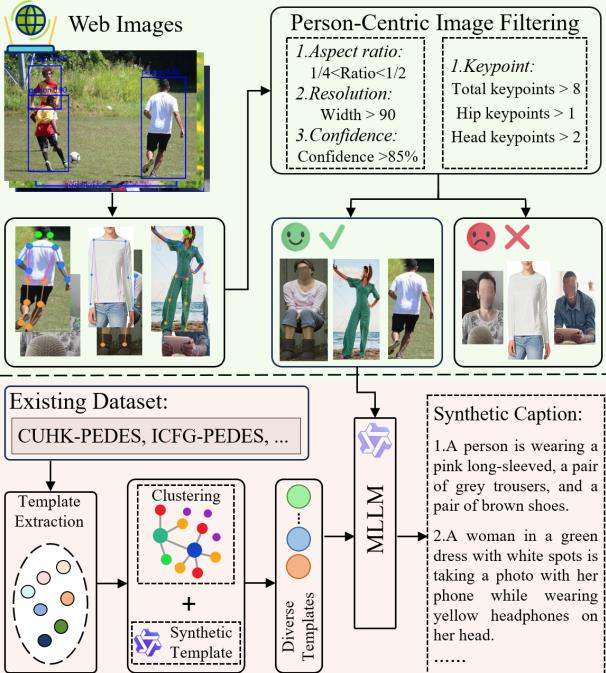  
Figure 2: The details of person-centric image filtering and synthetic caption generation pipeline for constructing our WebPerson dataset.

To reduce redundancy and cluster semantically similar templates, inspired by the previous works (Yang et al., 2025; Gu et al., 2025b), we employ the OPENCLIP ViT-bigG/14 (Radford et al., 2021a) to extract text embeddings of the template texts, then we utilize the standard k-means algorithm to partition all the templates embeddings into k distinct clusters based on the nearest neighbor criterion. Within each cluster, we select the most representative template (highest cosine similarity to the centroid) along with five randomly sampled templates. To further enhance template diversity, we employ Qwen2.5-72B-Instruct (Yang et al., 2024a) to synthesize new templates from this refined set. All generated templates undergo rigorous review to eliminate biases and stereotypes, yielding a curated collection of one thousand highquality templates. To generate diverse, high-quality captions, we leverage the in-context learning capabilities of MLLMs (Li et al., 2025; Gu et al., 2025a). Specifically, we randomly assign a template to each image and use Qwen2.5-VL-7B-Instruct and

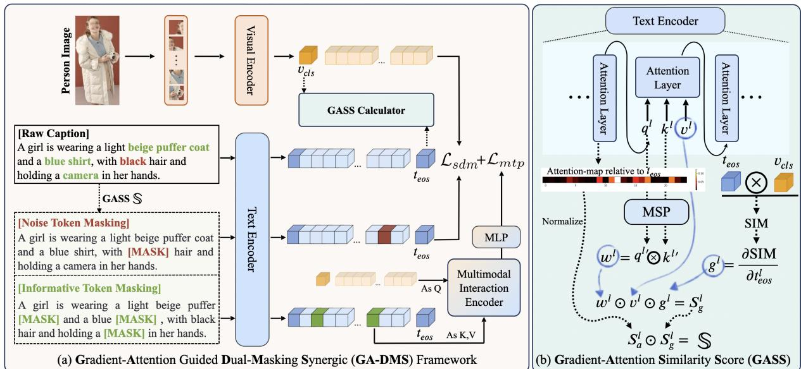  
Figure 3: Overview of our proposed method. (a) The architecture of our proposed Gradient-Attention Guided Dual-Masking Synergic (GA-DMS) framework. (b) The details of the Gradient-Attention Similarity Score (GASS).

Qwen2.5-VL-32B-Instruct (Bai et al., 2025) to produce captions that follow the given template. We adopt vLLM (Kwon et al., 2023) to accelerate largescale inference. The details of the prompt are provided in the Appendix A.2.

## 4 GA-DMS Framework

This section presents our GA-DMS (Gradient-Attention Guided Dual-Masking Synergetic) framework (Fig. 3). In Sec. 4.1, we introduce the Gradient-Attention Similarity Score, which dynamically differentiates noise tokens and informative tokens during the training process. In Sec. 4.2, we present the dual-masking synergetic learning details and the training objective.

## 4.1 Gradient-Attention Similarity Score

Existing interpretability research (Selvaraju et al., 2017) on CLIP-based models has shown that intermediate layer gradients retain fine-grained imagetext alignment information. Motivated by prior work (Zhao et al., 2025), we introduce a gradientattention similarity score S that quantifies each textual token’s contribution to the image–text alignment. We denote the embeddings of the text tokens and image tokens as T and V. We first calculate the global cosine similarity $\mathrm { S I M } = T _ { e o s } V _ { c l s } ^ { \mathsf { T } }$ . The gradient importance for the l-th transformer layer’s text token $\hat { T } _ { e o s } ^ { l }$ is then derived as $\begin{array} { r } { g ^ { l } = \frac { \partial \mathrm { S I M } } { \partial T _ { e o s } ^ { l } } } \end{array}$

To capture fine-grained semantics, we integrate a Multi-Scale Pooling (MSP) layer within the transformer architecture. The MSP layer aggregates local contexts at multiple scales $c \in { \mathcal { C } }$ through average pooling of adjacent c tokens, followed by bilinear interpolation to restore original dimensions. This process yields features enriched with multiscale local information. The spatial importance $w ^ { l }$ for each transformer layer l is then computed as:

$$
w ^ { l } = \Phi ( \mathrm { M S P } ( q _ { e o s } ^ { l } ) \mathrm { M S P } ( k ^ { l } ) ^ { \mathsf { T } } )\tag{1}
$$

where Φ is the normalization function, $q _ { e o s } ^ { l }$ is the query embedding for the [eos] token at layer l, $k ^ { l }$ represent the key embedding at layer l. The gradient-based score $S _ { g } ^ { l }$ of the l-th transformer layer is defined as:

$$
S _ { g } ^ { l } = g ^ { l } * w ^ { l } * v ^ { l }\tag{2}
$$

where $v ^ { l }$ is the value embedding at layer l.

Simultaneously, we compute attention-based semantic scores $S _ { a } ^ { \dot { l } }$ for each token based on the attention maps $\mathcal { M } ^ { l }$ from the l-th transformer layer. We denote the attention score for the [eos] token as $\mathcal { W } ^ { l }$ , the attention-based semantic score $S _ { a } ^ { l }$ is computed as:

$$
\begin{array} { r } { S _ { a } ^ { l } = \frac { \mathcal { W } ^ { l } } { \sum _ { j = 1 } ^ { N } \mathcal { W } _ { j } ^ { l } } } \end{array}\tag{3}
$$

The final gradient-attention similarity score S for the effective textual tokens is defined as:

$$
\mathbb { S } = R e L U \big ( \frac { 1 } { L } \sum _ { l \in L } S _ { g } ^ { l } * S _ { a } ^ { l } \big )\tag{4}
$$

where L represents the number the final L layers of the transformer, $\mathbb { S } \in \mathbb { R } ^ { B \times N }$ , and N is the number of tokens. This score integrates information from both gradients and attention maps to weight text tokens for masking probability computation.

## 4.2 Dual-Masking Synergetic Learning

## 4.2.1 Noise Token Masking

While Multimodal Large Language Models (MLLMs) inevitably introduce noise during largescale data generation due to inherent hallucination effects. To mitigate this issue, we employ a noise token masking strategy to reduce the influence of noise tokens based on the gradient-attention similarity score S. We calculate the masking probability for the i-th text token $T _ { i }$ as:

$$
p ( T _ { i } ) = \frac { \alpha _ { n } } { 1 + e ^ { - \lambda [ ( 1 - s _ { i } ) - \gamma ] } }\tag{5}
$$

where $s _ { i } \in \mathbb { S }$ is the gradient-attention similarity score for the i-th token, $\alpha _ { n }$ is a hyperparameter to set the upper limit of the masking probability for noise tokens. λ and $\gamma$ respectively modulate the slope and midpoint of the probability distribution, thereby sharpening the differentiation between noisy and semantically relevant tokens. During training, we dynamically mask textual tokens using [mask] according to these computed probabilities.

Given the embeddings of image-text pairs $\{ ( v _ { \mathrm { c l s } } ^ { i } , t _ { \mathrm { e o s } } ^ { i } ) \} _ { i = 1 } ^ { B }$ , we define the ground-truth matching distribution as $q _ { i , j }$ and compute the predicted distribution as:

$$
p _ { i , j } = \frac { \exp ( \sin ( v _ { \mathrm { c l s } } ^ { i } , t _ { \mathrm { e o s } } ^ { j } ) / \tau ) } { \sum _ { b = 1 } ^ { B } \exp ( \sin ( v _ { \mathrm { c l s } } ^ { i } , t _ { \mathrm { e o s } } ^ { b } ) / \tau ) }\tag{6}
$$

where τ is a temperature parameter. Following (Jiang and Ye, 2023), we adopt the Similarity Distribution Matching (SDM) loss to align the distribution. The ${ \mathcal { L } } _ { \mathrm { i } 2 \mathrm { t } }$ is defined as:

$$
\mathcal { L } _ { \mathrm { i 2 t } } = \frac { 1 } { B } \sum _ { i = 1 } ^ { B } \sum _ { j = 1 } ^ { B } p _ { i , j } \log \left( \frac { p _ { i , j } } { q _ { i , j } + \varepsilon } \right)\tag{7}
$$

where ε is a small number to avoid numerical problems. We compute a symmetric loss ${ \mathcal { L } } _ { \mathrm { t 2 i } }$ by swapping $\{ ( v _ { \mathrm { c l s } } ^ { i } , t _ { \mathrm { e o s } } ^ { i } ) \}$ , and the SDM loss is:

$$
\mathcal { L } _ { \mathrm { s d m } } = \mathcal { L } _ { \mathrm { i 2 t } } + \mathcal { L } _ { \mathrm { t 2 i } }\tag{8}
$$

## 4.2.2 Masked Informative Token Prediction

To improve fine-grained semantic representation, we selectively mask tokens with strong imagesemantic correlations and introduce a masked token prediction task to enhance local semantic learning. Similar to the Equation 5, the masking probability for the informative text tokens is defined as:

$$
p ( T _ { i } ) = \frac { \alpha _ { i } } { 1 + e ^ { - \lambda [ s _ { i } - \gamma ] } }\tag{9}
$$

where $\alpha _ { i }$ bounds the maximum masking probability for informative tokens. For effective finegrained visual-textual fusion during token prediction, we integrate a cross-modal interaction module (Jiang and Ye, 2023) as a decoder. This module consists of a multi-head cross-attention followed by four Transformer layers to align modalities in a shared embedding space. A final MLP layer predicts original tokens from the fused representations. Given hidden states $h _ { i } ^ { m } , i \in \mathcal { M }$ and denotes the masked text token set, the distribution of the output token is ${ \bf m } _ { i } = { \bf M L P } ( h _ { i } ^ { m } )$ . The Masked Token Prediction (MTP) loss $\mathcal { L } _ { m t p }$ is defined as:

$$
\mathcal { L } _ { m t p } = - \frac { 1 } { \vert \mathcal { M } \vert \vert \mathcal { V } \vert } \sum _ { i \in \mathcal { M } } \sum _ { j \in \vert \mathcal { V } \vert } y _ { j } ^ { i } \log \frac { \exp ( \mathbf { m } _ { j } ^ { i } ) } { \sum _ { k = 1 } ^ { \vert \mathcal { V } \vert } \exp ( \mathbf { m } _ { k } ^ { i } ) } ,\tag{10}
$$

where $| \nu |$ is the size of vocabulary , and $y _ { j }$ is a one-hot vocabulary distribution. Finally, the total loss $\mathcal { L }$ is define as:

$$
\mathcal { L } = \mathcal { L } _ { s d m } + \beta \mathcal { L } _ { m t p }\tag{11}
$$

where $\beta$ is a loss weight.

## 5 Experiments

Implementation Details. Consistent with previous works (Tan et al., 2024; Jiang and Ye, 2023), we utilize the CLIP ViT-B/16 model as our backbone. Following IRRA (Jiang and Ye, 2023), we incorporate a randomly initialized multimodal interaction encoder to facilitate masked token prediction. Our implementation processes 384×128 resolution images with a maximum length of $N = 7 7$ text sequences. We employ Adam (Kingma, 2014) as the optimizer, initialized with a learning rate of $1 e - 4$ and a weight decay of $4 e - 5$ . The parameters $\beta _ { 1 }$ and $\beta _ { 2 }$ are set to 0.9 and 0.999, respectively. The temperature parameter τ in SDM loss is set to 0.02. We train GA-DMS for 30 epochs with a batch size of 512 on 8 NVIDIA A100 (80G) GPUs. For generating synthetic templates and captions, we utilize Qwen2.5-72B-Instruct (Yang et al., 2024a), Qwen2.5-VL-7B-Instruct, and Qwen2.5- VL-32B-Instruct (Bai et al., 2025). Additionally, vLLM (Kwon et al., 2023) is leveraged to accelerate large-scale inference. Please refer to the Appendix A.1 for more detailed hyperparameters. Evaluation. Following previous works (Tan et al., 2024; Qin et al., 2024), we conduct a comprehensive evaluation of our method across three challenging text-to-image person retrieval datasets: CUHK-PEDES (Li et al., 2017), ICFG-PEDES (Ding et al.,

<table><tr><td rowspan="2">Method</td><td rowspan="2">Image Enc.</td><td rowspan="2">Text Enc.</td><td colspan="4">CUHK-PEDES</td><td colspan="4">ICFG-PEDES</td><td colspan="4">RSTPReid</td></tr><tr><td>R1</td><td>R5</td><td>R10</td><td>mAP</td><td>R1</td><td>R5</td><td>R10</td><td>mAP</td><td>R1</td><td>R5</td><td>R10</td><td>mAP</td></tr><tr><td>ViTAA (Wang et al., 2020)</td><td>RN50</td><td>LSTM</td><td>55.97</td><td>75.84</td><td>83.52</td><td></td><td>50.98</td><td>68.79</td><td>75.78</td><td></td><td></td><td></td><td></td><td></td></tr><tr><td>SSAN (Ding et al., 2021)</td><td>RN50</td><td>LSTM</td><td>61.37</td><td>80.15</td><td>86.73</td><td></td><td>54.23</td><td>72.63</td><td>79.53</td><td></td><td>43.50</td><td>67.80</td><td>77.15</td><td></td></tr><tr><td>LBUL (Wang et al., 2022b)</td><td>RN50</td><td>BERT</td><td>64.04</td><td>82.66</td><td>87.22</td><td></td><td></td><td></td><td></td><td></td><td>45.55</td><td>68.2</td><td>77.85</td><td></td></tr><tr><td>SAF (Li et al., 2022b)</td><td>ViT-Base</td><td>BERT</td><td>64.13</td><td>82.62</td><td>88.4</td><td></td><td></td><td></td><td></td><td></td><td></td><td></td><td></td><td></td></tr><tr><td>TIPCB (Chen et al., 2022)</td><td>RN50</td><td>BERT</td><td>64.26</td><td>83.19</td><td>89.1</td><td></td><td>54.96</td><td>74.72</td><td>81.89</td><td></td><td></td><td></td><td></td><td></td></tr><tr><td>CAIBC (Wang et al., 2022a)</td><td>RN50</td><td>BERT</td><td>64.43</td><td>82.87</td><td>88.37</td><td></td><td></td><td></td><td></td><td></td><td>47.35</td><td>69.55</td><td>79.00</td><td></td></tr><tr><td>AXM-Net (Farooq et al., 2022)</td><td>RN50</td><td>BERT</td><td>64.44</td><td>80.52</td><td>86.77</td><td>58.70</td><td></td><td></td><td></td><td></td><td></td><td></td><td></td><td></td></tr><tr><td>LGUR (Shao et al., 2022)</td><td>DeiT-Small</td><td>BERT</td><td>65.25</td><td>83.12</td><td>89.00</td><td></td><td>59.02</td><td>75.32</td><td>81.56</td><td></td><td>47.95</td><td>71.85</td><td>80.25</td><td></td></tr><tr><td>IVT (Shu et al., 2022)</td><td>ViT-Base</td><td>BERT</td><td>65.69</td><td>85.93</td><td>91.15</td><td></td><td>56.04</td><td>73.60</td><td>80.22</td><td></td><td>46.70</td><td>70.00</td><td>78.80</td><td></td></tr><tr><td>LCR²S (Yan et al., 2023a)</td><td>RN50</td><td>TextCNN+BERT</td><td>67.36</td><td>84.19</td><td>89.62</td><td>59.20</td><td>57.93</td><td>76.08</td><td>82.40</td><td>38.21</td><td>54.95</td><td>76.65</td><td>84.70</td><td>40.92</td></tr><tr><td>UniPT (Shao et al., 2023)</td><td>ViT-Base</td><td>BERT</td><td>68.50</td><td>84.67</td><td>90.38</td><td></td><td>60.09</td><td>76.19</td><td>82.46</td><td></td><td>51.85</td><td>74.85</td><td>82.85</td><td></td></tr><tr><td colspan="9">with ALBEF (Li et al., 2021) backbone:</td><td></td><td></td><td></td><td></td><td></td><td></td></tr><tr><td>RaSa (Bai et al., 2023)</td><td>CLIP-ViT</td><td>BERT-base</td><td>76.51</td><td>90.29</td><td>94.25</td><td>69.38</td><td>65.28</td><td>80.40</td><td>85.12</td><td>41.29</td><td>66.90</td><td>86.50</td><td>91.35</td><td>52.31</td></tr><tr><td>APTM (Yang et al., 2023b)</td><td>Swin-B</td><td>BERT-base</td><td>76.53</td><td>90.04</td><td>94.15</td><td>66.91</td><td>68.51</td><td>82.99</td><td>87.56</td><td>41.22</td><td>67.50</td><td>85.70</td><td>91.45</td><td>52.56</td></tr><tr><td colspan="2">with CLIP (Radford et al., 2021b) backbone:</td><td></td><td></td><td></td><td></td><td></td><td></td><td></td><td></td><td></td><td></td><td></td><td></td><td></td></tr><tr><td>Han et al. (Han et al., 2021)</td><td>CLIP-RN101</td><td>CLIP-Xformer</td><td>64.08</td><td>81.73</td><td>88.19</td><td>60.08</td><td></td><td></td><td></td><td></td><td></td><td></td><td></td><td></td></tr><tr><td>IRRA (Jiang and Ye, 2023)</td><td>CLIP-ViT</td><td>CLIP-Xformer</td><td>73.38</td><td>89.93</td><td>93.71</td><td>66.10</td><td>63.46</td><td>80.25</td><td>85.82</td><td>38.06</td><td>60.20</td><td>81.30</td><td>88.20</td><td>47.17</td></tr><tr><td>FSRL (Wang et al., 2024)</td><td>CLIP-ViT</td><td>CLIP-Xformer</td><td>74.65</td><td>89.77</td><td>94.03</td><td>67.49</td><td>64.01</td><td>80.42</td><td>85.56</td><td>39.64</td><td>60.20</td><td>81.40</td><td>88.60</td><td>47.38</td></tr><tr><td>Propot (Yan et al., 2024)</td><td>CLIP-ViT</td><td>CLIP-Xformer</td><td>74.89</td><td>89.90</td><td>94.17</td><td>67.12</td><td>65.12</td><td>81.57</td><td>86.97</td><td>42.93</td><td>61.87</td><td>83.63</td><td>89.70</td><td>47.82</td></tr><tr><td>SAP-SAM (Wang et al., 2024)</td><td>CLIP-ViT</td><td>CLIP-Xformer</td><td>75.05</td><td>89.93</td><td>93.73</td><td></td><td>63.97</td><td>80.84</td><td>86.17</td><td></td><td>62.85</td><td>82.65</td><td>89.85</td><td></td></tr><tr><td>PLOT (Park et al., 2024)</td><td>CLIP-ViT</td><td>CLIP-Xformer</td><td>75.28</td><td>90.42</td><td>94.12</td><td></td><td>65.76</td><td>81.39</td><td>86.73</td><td></td><td>61.80</td><td>82.85</td><td>89.45</td><td></td></tr><tr><td>RDE (Qin et al., 2024)</td><td>CLIP-ViT</td><td>CLIP-Xformer</td><td>75.94</td><td>90.14</td><td>94.12</td><td>67.56</td><td>67.68</td><td>82.47</td><td>87.36</td><td>40.06</td><td>65.35</td><td>83.95</td><td>89.90</td><td>50.88</td></tr><tr><td>NAM (Tan et al., 2024)</td><td>CLIP-ViT</td><td>CLIP-Xformer</td><td>76.82</td><td>91.16</td><td>94.46</td><td>69.55</td><td>67.05</td><td>82.16</td><td>87.33</td><td>41.51</td><td>68.50</td><td>87.15</td><td>92.10</td><td>53.02</td></tr><tr><td>Ours (1.0 M)</td><td>CLIP-ViT</td><td>CLIP-Xformer</td><td>77.02</td><td>91.28</td><td>94.58</td><td>69.65</td><td>69.07</td><td>83.26</td><td>87.64</td><td>41.91</td><td>70.30</td><td>88.00</td><td>92.85</td><td>54.89</td></tr><tr><td>Ours (5.0 M)</td><td>CLIP-ViT</td><td>CLIP-Xformer</td><td>77.60</td><td>91.40</td><td>94.78</td><td>69.82</td><td>69.51</td><td>83.47</td><td>87.67</td><td>42.30</td><td>71.25</td><td>87.25</td><td>92.90</td><td>55.43</td></tr></table>

Table 1: Comparisons with state-of-the-art methods in the traditional evaluation settings. The best results are marked in bold, and the second-best results are underlined.

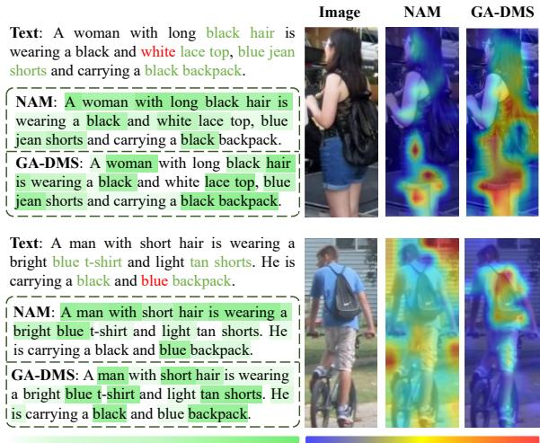  
Figure 4: Visualization of token-wise weight scores and attention maps generated by NAM (Tan et al., 2024) and our GA-DMS.

2021), and RSTPReid (Zhu et al., 2021). We employ Rank-k (k=1, 5, 10) and mean Average Precision (mAP) as evaluation metrics for all datasets.

## 5.1 Comparison with Existing Methods.

We evaluate GA-DMS against state-of-the-art methods on three benchmarks: CUHK-PEDES, ICFG-PEDES, and RSTPReid. As shown in Tab. 1, our pre-trained model achieves superior performance after fine-tuning with the IRRA (Jiang and Ye, 2023), which significantly improves Rank-1 accuracy and mAP on the RSTPReid dataset by 10.10% and 7.72% over the baseline of IRRA. Compared with the NAM (Tan et al., 2024), GA-DMS obtains 0.2%, 2.02%, and 1.8% improvement in Rank-1 on the CUHK-PEDES, ICFG-PEDES, and RSTPReid datasets, respectively. The primary reason for this improvement is that our proposed GA-DMS framework effectively distinguishes between noise and informative tokens based on the gradient-attention similarity score. As shown in Fig. 4, compared with NAM (Tan et al., 2024), our GA-DMS can better allocate weights to text tokens while concentrating attention on human-centric regions. This capability not only reduces the effect of noise on model training but also improves the model’s capacity to learn fine-grained semantic information. Moreover, upon scaling the WebPerson dataset from 1.0 M to 5.0 M, GA-DMS achieves new state-of-the-art Rank-1 accuracies of 77.6%, 69.51%, and 71.25% across three downstream datasets.

<table><tr><td rowspan="2">Pre-training Dataset</td><td colspan="2">CUHK-PEDES</td><td colspan="2">ICFG-PEDES</td><td colspan="2">RSTPReid</td></tr><tr><td>R1</td><td>mAP</td><td>R1</td><td>mAP</td><td>R1</td><td>mAP</td></tr><tr><td>None</td><td>12.65</td><td>11.15</td><td>6.67</td><td>2.51</td><td>13.45</td><td>10.31</td></tr><tr><td>MALS (1.5M)</td><td>20.47</td><td>18.46</td><td>11.71</td><td>4.57</td><td>21.50</td><td>16.95</td></tr><tr><td>LUPerson-T (0.95M)</td><td>21.55</td><td>18.76</td><td>11.20</td><td>4.53</td><td>22.15</td><td>17.29</td></tr><tr><td>SYNTH-PEDES (1.0M)</td><td>57.29</td><td>51.86</td><td>57.13</td><td>31.36</td><td>42.20</td><td>32.28</td></tr><tr><td>LUPerson-MLLM (1.0M)</td><td>56.01</td><td>50.34</td><td>37.00</td><td>20.21</td><td>50.60</td><td>37.08</td></tr><tr><td>Ours (0.1 M)</td><td>58.95</td><td>52.77</td><td>38.18</td><td>19.70</td><td>47.10</td><td>36.68</td></tr><tr><td>Web-Person (1.0 M)</td><td>66.26</td><td>58.54</td><td>51.99</td><td>28.81</td><td>55.35</td><td>40.57</td></tr><tr><td>Ours (5.0 M)</td><td>68.34</td><td>60.22</td><td>54.64</td><td>30.68</td><td>57.60</td><td>42.00</td></tr></table>

Table 2: Comparisons with existing pre-training datasets in the direct transfer setting. The best results are marked in bold, and the second-best results are underlined.

<table><tr><td rowspan="2">Pre-training Dataset</td><td rowspan="4">Source</td><td colspan="6">Target</td></tr><tr><td>CUHK-PEDES</td><td></td><td colspan="2">ICFG-PEDES</td><td colspan="2">RSTPReid</td></tr><tr><td></td><td>R1</td><td>mAP</td><td>R1</td><td>mAP</td><td>R1</td><td>mAP</td></tr><tr><td rowspan="3">None</td><td>CUHK-PEDES</td><td>73.48</td><td>66.21</td><td>43.04</td><td>22.45</td><td>52.55</td><td>39.97</td></tr><tr><td>ICFG-PEDES</td><td>33.90</td><td>31.65</td><td>63.83</td><td>38.37</td><td>47.45</td><td>36.83</td></tr><tr><td>RSTPReid</td><td>35.25</td><td>32.35</td><td>33.58</td><td>19.58</td><td>60.40</td><td>47.70</td></tr><tr><td rowspan="3">MALS(1.5 M)</td><td>CUHK-PEDES</td><td>73.67</td><td>65.23</td><td>46.02</td><td>24.06</td><td>55.05</td><td>41.29</td></tr><tr><td>ICFG-PEDES</td><td>43.11</td><td>38.93</td><td>65.21</td><td>38.52</td><td>48.45</td><td>37.29</td></tr><tr><td>RSTPReid</td><td>44.51</td><td>39.99</td><td>40.78</td><td>25.42</td><td>64.05</td><td>50.08</td></tr><tr><td rowspan="3">LUPerson-T(0.95 M)</td><td>CUHK-PEDES</td><td>74.28</td><td>66.52</td><td>44.83</td><td>22.72</td><td>54.25</td><td>39.26</td></tr><tr><td>ICFG-PEDES</td><td>34.66 39.26</td><td>32.51</td><td>65.33</td><td>38.45</td><td>48.30</td><td>38.51</td></tr><tr><td>RSTPReid</td><td></td><td>34.26</td><td>34.95</td><td>22.25</td><td>61.50</td><td>48.28</td></tr><tr><td rowspan="3">SYNTH-PEDES(1.0 M)</td><td>CUHK-PEDES ICFG-PEDES</td><td>74.12</td><td>65.82</td><td>57.14</td><td>32.12</td><td>55.85</td><td>40.85</td></tr><tr><td></td><td>60.49 57.75</td><td>54.61</td><td>66.63</td><td>39.32</td><td>49.80</td><td>37.34</td></tr><tr><td>RSTPReid</td><td></td><td>53.01</td><td>53.88</td><td>30.88</td><td>66.75</td><td>52.18</td></tr><tr><td rowspan="3">LUPerson-MLLM(1.0 M)</td><td>CUHK-PEDES ICFG-PEDES</td><td>76.59 60.75</td><td>68.06</td><td>47.17</td><td>25.41</td><td>59.35</td><td>43.76</td></tr><tr><td>RSTPReid</td><td>60.04</td><td>54.42</td><td>67.18</td><td>40.27</td><td>55.65</td><td>44.05</td></tr><tr><td></td><td></td><td>53.85</td><td>46.39</td><td>27.91</td><td>69.45</td><td>53.30</td></tr><tr><td rowspan="3">Ours(0.1 M)</td><td>CUHK-PEDES ICFG-PEDES</td><td>75.53</td><td>67.92</td><td>47.79</td><td>25.14</td><td>56.75</td><td>41.01</td></tr><tr><td></td><td>58.67</td><td>52.66</td><td>66.35</td><td>39.95</td><td>52.93</td><td>39.84</td></tr><tr><td>RSTPReid</td><td>58.49</td><td>52.50</td><td>44.41</td><td>25.98</td><td>65.90</td><td>49.28</td></tr><tr><td rowspan="3">Ours(1.0 M)</td><td>CUHK-PEDES</td><td>77.02</td><td>69.65</td><td>57.24</td><td>32.13</td><td>61.10</td><td>45.27</td></tr><tr><td>ICFG-PEDES</td><td>68.16</td><td>60.79</td><td>69.07</td><td>41.91</td><td>59.15</td><td>44.94</td></tr><tr><td>RSTPReid</td><td>68.41</td><td>61.28</td><td>56.13</td><td>34.64</td><td>70.30</td><td>54.89</td></tr><tr><td rowspan="3">Ours(5.0 M)</td><td>CUHK-PEDES</td><td>77.60</td><td>69.82</td><td>58.91</td><td>33.70</td><td>61.80</td><td>46.81</td></tr><tr><td>ICFG-PEDES</td><td>69.83</td><td>62.06</td><td>69.52</td><td>42.30</td><td>60.05</td><td>45.46</td></tr><tr><td>RSTPReid</td><td>69.19</td><td>62.00</td><td>57.13</td><td>35.76</td><td>71.25</td><td>55.43</td></tr></table>

Table 3: Comparisons with existing pre-training datasets in the fine-tuning setting. The best results are marked in bold, and the second-best results are underlined. Gray indicates that the source and target are homologous.

## 5.2 Comparison with Existing Datasets.

We conduct comprehensive comparisons between our WebPerson dataset and four existing largescale pre-training datasets: MALS (Yang et al., 2023b), LUPerson-T (Shao et al., 2023), SYNTH-PEDES (Zuo et al., 2024), and LUPerson-MLLM (Tan et al., 2024). MALS consists of 1.5 million synthetic images generated using commercial diffusion models, with textual descriptions automatically produced by BLIP (Li et al., 2022a). LUPerson-T includes 0.95 million images, each enhanced by one of 456 templates to maximize caption diversity. SYNTH-PEDES provides 4.8 million images, each annotated with an average of 2.53 textual descriptions, generated through a hybrid architecture that combines a ResNet101-FPN (He et al., 2016) visual encoder with a GPT-2 (Radford et al., 2019) text generator for detailed person attribute modeling. Notably, LUPerson-MLLM utilizes two multimodal large language models for caption generation, supplemented by 46 ChatGPToptimized templates obtained through iterative dialogues to enhance linguistic variation. This dataset comprises 1.0 million images, each paired with two

<table><tr><td colspan="2">Masking Method</td><td colspan="2">Components</td><td colspan="2">CUHK-PEDES</td><td colspan="2">ICFG-PEDES</td><td colspan="2">RSTPReid</td></tr><tr><td>CSS</td><td>GASS</td><td>SDM MTP</td><td></td><td>R1</td><td>mAP</td><td>R1</td><td>mAP</td><td>R1 mAP</td></tr><tr><td>×</td><td>x</td><td>x</td><td>x</td><td>56.75</td><td>50.42</td><td>34.63</td><td>17.59</td><td>45.50 34.51</td></tr><tr><td>√</td><td>×</td><td>×</td><td>√</td><td>56.35</td><td>50.21</td><td>34.72</td><td>17.66</td><td>44.60 33.28</td></tr><tr><td>√</td><td>×</td><td>√</td><td>x</td><td>63.29</td><td>57.42</td><td>43.39</td><td>24.12</td><td>51.95 39.41</td></tr><tr><td>√</td><td>X</td><td>√</td><td>√</td><td>62.74</td><td>57.01</td><td>42.96</td><td>23.88</td><td>50.80 38.91</td></tr><tr><td>X</td><td>√</td><td>×</td><td>√</td><td>57.29</td><td>52.28</td><td>36.24</td><td>18.96</td><td>47.90 35.97</td></tr><tr><td>X</td><td>√</td><td>√</td><td>x</td><td>63.87</td><td>57.56</td><td>44.02</td><td>24.18</td><td>52.30 39.61</td></tr><tr><td>x</td><td>√</td><td>√</td><td>√</td><td>64.25</td><td>58.27</td><td>44.39</td><td>24.67</td><td>52.70 40.12</td></tr></table>

Table 4: Ablation on different components and masking methods. CSS: Cosine Similarity Score. GASS: Gradient-Attention Similarity Score. SDM: Similarity Distribution Matching. MTP: Masked Token Prediction.

MLLM-generated captions.

Tab. 2 presents comparative results under a direct transfer setting, where models pre-trained on Web-Person exhibit superior cross-dataset generalization across three benchmarks. Specifically, under the comparable 1M dataset, our constructed WebPerson dataset demonstrates superior performance on CUHK-PEDES and RSTPReid, and shows suboptimal performance on ICFG-PEDES. Notably, the WebPerson dataset demonstrates comparable performance to the full-scale LUPerson-MLLM even when trained on a mere 0.1M samples. These experimental results demonstrate that our proposed WebPerson dataset exhibits strong robustness and can learn person representations with enhanced transferability.

As shown in Tab. 3, we also evaluate the fine-tuning performance following LUPerson-MLLM (Tan et al., 2024), utilizing the IRRA with models pretrained on different datasets. Results indicate that WebPerson pretraining yields stateof-the-art performance across both in-domain and cross-domain scenarios. At the 1M data scale, WebPerson achieves consistent improvements over LUPerson-MLLM, with Rank-1 accuracy gains of 0.43%, 1.89%, and 0.85% on CUHK-PEDES, ICFG-PEDES, and RSTPReid respectively. The cross-domain evaluations reveal particularly significant performance enhancements, highlighting WebPerson’s exceptional representation transferability through fine-tuning.

## 5.3 Ablation Study

Ablation on Different Components and Masking Methods. To substantiate the efficacy of various components and the effectiveness of our proposed Gradient-Attention Similarity Score (GASS), we perform a comprehensive ablation study with a 0.5M data sample from our WebPerson dataset. As shown in Tab. 4, the integrating Masked Token Prediction (MTP) with GASS improves performance across all evaluation metrics, as predicting semantically rich tokens enhances fine-grained learning. The Similarity Distribution Matching (SDM) component alone enhances image-text alignment by replacing noisy tokens with learnable embeddings, achieving Rank-1 accuracy gains of 7.12%, 9.39%, and 6.8% on CUHK-PEDES, ICFG-PEDES, and RSTPReid respectively. By combining MTP with SDM, we observe enhancements across all metrics, further substantiating the efficacy of the components within our method.

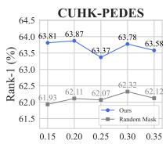

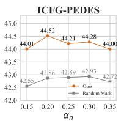

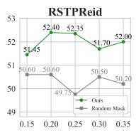

(a) Ablation on $\alpha _ { n }$ for masking noise tokens  
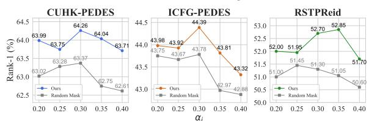  
(b) Ablation on αi for masking informative tokens  
Figure 5: Ablation experiment results for $\alpha _ { n }$ and $\alpha _ { i } ,$ which can directly influence the upper limit of the masking probability for noise and informative tokens.

When comparing Cosine Similarity Score (CSS) with Gradient-Attention Similarity Score (GASS), GASS consistently exhibits superior performance. This advantage primarily stems from GASS’s capacity to precisely weight textual tokens during training by incorporating gradient and attention information. As illustrated in Fig. 4, our method accurately allocates weights to noise textual tokens $( e . g .$ , "white lace top"), thereby effectively mitigating the influence of noise on the model’s representation learning.

Ablation on $\alpha _ { n }$ and $\alpha _ { i } .$ . In this work, our dual-masking synergetic learning method dynamically masks textual tokens according to gradientattention similarity scores. We introduce parameters $\alpha _ { n }$ and $\alpha _ { i }$ to regulate the maximum masking probabilities for noise and informative tokens. Fig. 5 presents an ablation study on $\alpha _ { n }$ and $\alpha _ { i }$ to determine the optimal settings. For enhanced performance on three downstream datasets, we set $\alpha _ { n } = 0 . 2$ and $\alpha _ { i } = 0 . 3$ . Additionally, our method consistently outperforms random masking baselines, confirming its effectiveness.

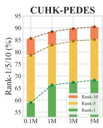

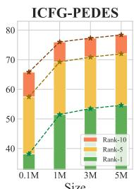

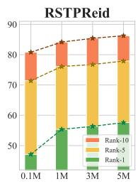  
Figure 6: Data scaling analysis of WebPerson dataset.The performance of our GA-DMS method in direct transfer settings.

Data Scaling Analysis. To explore the impact of pretraining data scale on person representation learning, we systematically augmented the dataset size from 0.1M to 1M, 3M, and 5M samples for pertaining. Fig. 6 illustrates the direct transfer performance evaluation across three benchmarks at different data scales. The outcomes consistently reveal performance enhancements as the data volume increases. At the maximum scale of 5.0M samples, the model demonstrates Rank-1 accuracy improvements of 9.39%, 16.46%, and 10.50% across the three benchmarks in comparison to the 0.1M baseline, indicating a clear upward trajectory. These findings conclusively demonstrate that scaling highquality pretraining data substantially enhances textbased person retrieval capability.

## Conclusion

In this paper, we enhance CLIP for person representation learning by synergistically improving data acquisition and model architecture. First, we devise a noise-resistant data construction pipeline that leverages the in-context learning capabilities of MLLMs for automatic filtering and captioning of web-crawled images. This results in the WebPerson dataset, which comprises 5M highquality person-centric image-text pairs. Second, we propose the GA-DMS framework, which improves cross-modal alignment by masking semantically irrelevant tokens based on a gradient-attention similarity score. Concurrently, we implement masked token prediction objectives that force the model to reconstruct informative text tokens, facilitating discriminative fine-grained feature learning for visualsemantic correspondence. Comprehensive experiments demonstrate that GA-DMS achieves state-ofthe-art performance in several downstream datasets. We hope our work provides insights for the person representation learning task.

## Limitations

In this work, we demonstrate the exceptional textbased person retrieval performance of the personcentric dataset constructed solely from internet images. Limited by computational resources, this paper constructs a 5M-scale WebPerson dataset, with further scaling left for community exploration.

## Acknowledgement

This work was supported in part by the National Natural Science Foundation of China under Grant 62373086, by the Liaoning Province Applied Basic Research Program (2025JH2/101330131), by the Guangdong Basic and Applied Basic Research under 2023A1515140014, and by the State Key Laboratory of Robotics under Grant 2024-O14.

## Ethics Statement

We abide by the ACL Code of Ethics. The data resources used in this study are publicly available.

## References

Rabab Abdelfattah, Qing Guo, Xiaoguang Li, Xiaofeng Wang, and Song Wang. 2023. Cdul: Clip-driven unsupervised learning for multi-label image classification. In ICCV, pages 1348–1357.

Xiang An, Jiankang Deng, Kaicheng Yang, Jaiwei Li, Ziyong Feng, Jia Guo, Jing Yang, and Tongliang Liu. 2023. Unicom: Universal and compact representation learning for image retrieval. arXiv preprint arXiv:2304.05884.

Xiang An, Kaicheng Yang, Xiangzi Dai, Ziyong Feng, and Jiankang Deng. 2024. Multi-label cluster discrimination for visual representation learning. In ECCV, pages 428–444. Springer.

Shuai Bai, Keqin Chen, Xuejing Liu, Jialin Wang, Wenbin Ge, Sibo Song, Kai Dang, Peng Wang, Shijie Wang, Jun Tang, and 1 others. 2025. Qwen2. 5-vl technical report. arXiv preprint arXiv:2502.13923.

Yang Bai, Min Cao, Daming Gao, Ziqiang Cao, Chen Chen, Zhenfeng Fan, Liqiang Nie, and Min Zhang. 2023. Rasa: Relation and sensitivity aware representation learning for text-based person search. IJCAI.

Minwoo Byeon, Beomhee Park, Haecheon Kim, Sungjun Lee, Woonhyuk Baek, and Saehoon Kim. 2022. Coyo-700m: Image-text pair dataset. https: //github.com/kakaobrain/coyo-dataset.

Fei-Long Chen, Du-Zhen Zhang, Ming-Lun Han, Xiu-Yi Chen, Jing Shi, Shuang Xu, and Bo Xu. 2023. Vlp: A survey on vision-language pre-training. Machine Intelligence Research, 20(1):38–56.

Yuhao Chen, Guoqing Zhang, Yujiang Lu, Zhenxing Wang, and Yuhui Zheng. 2022. Tipcb: A simple but effective part-based convolutional baseline for text-based person search. Neurocomputing.

Zefeng Ding, Changxing Ding, Zhiyin Shao, and Dacheng Tao. 2021. Semantically self-aligned network for text-to-image part-aware person reidentification. arXiv preprint arXiv:2107.12666.

Ammarah Farooq, Muhammad Awais, Josef Kittler, and Syed Safwan Khalid. 2022. Axm-net: Implicit crossmodal feature alignment for person re-identification. In AAAI.

Dengpan Fu, Dongdong Chen, Jianmin Bao, Hao Yang, Lu Yuan, Lei Zhang, Houqiang Li, and Dong Chen. 2021. Unsupervised pre-training for person reidentification. In CVPR, pages 14750–14759.

Dengpan Fu, Dongdong Chen, Hao Yang, Jianmin Bao, Lu Yuan, Lei Zhang, Houqiang Li, Fang Wen, and Dong Chen. 2022. Large-scale pre-training for person re-identification with noisy labels. In CVPR, pages 2476–2486.

Tiancheng Gu, Kaicheng Yang, Xiang An, Ziyong Feng, Dongnan Liu, Weidong Cai, and Jiankang Deng. 2024. Rwkv-clip: A robust vision-language representation learner. arXiv preprint arXiv:2406.06973.

Tiancheng Gu, Kaicheng Yang, Ziyong Feng, Xingjun Wang, Yanzhao Zhang, Dingkun Long, Yingda Chen, Weidong Cai, and Jiankang Deng. 2025a. Breaking the modality barrier: Universal embedding learning with multimodal llms. arXiv preprint arXiv:2504.17432.

Tiancheng Gu, Kaicheng Yang, Chaoyi Zhang, Yin Xie, Xiang An, Ziyong Feng, Dongnan Liu, Weidong Cai, and Jiankang Deng. 2025b. Realsyn: An effective and scalable multimodal interleaved document transformation paradigm. arXiv preprint arXiv:2502.12513.

Qianru Han, Xinwei He, Zhi Liu, Sannyuya Liu, Ying Zhang, and Jinhai Xiang. 2024. Clip-scgi: Synthesized caption-guided inversion for person reidentification. arXiv preprint arXiv:2410.09382.

Xiao Han, Sen He, Li Zhang, and Tao Xiang. 2021. Text-based person search with limited data. arXiv preprint arXiv:2110.10807.

Kaiming He, Xiangyu Zhang, Shaoqing Ren, and Jian Sun. 2016. Deep residual learning for image recognition. In CVPR, pages 770–778.

Xiaoxing Hu, Kaicheng Yang, Jun Wang, Haoran Xu, Ziyong Feng, and Yupei Wang. 2025. Decoupled global-local alignment for improving compositional understanding. arXiv preprint arXiv:2504.16801.

Ding Jiang and Mang Ye. 2023. Cross-modal implicit relation reasoning and aligning for text-to-image person retrieval. In CVPR, pages 2787–2797.

Glenn Jocher and Jing Qiu. 2024. Ultralytics yolo11.

Diederik P Kingma. 2014. Adam: A method for stochastic optimization. arXiv preprint arXiv:1412.6980.

Woosuk Kwon, Zhuohan Li, Siyuan Zhuang, Ying Sheng, Lianmin Zheng, Cody Hao Yu, Joseph E. Gonzalez, Hao Zhang, and Ion Stoica. 2023. Efficient memory management for large language model serving with pagedattention. In ACM SIGOPS.

Junnan Li, Dongxu Li, Caiming Xiong, and Steven Hoi. 2022a. Blip: Bootstrapping language-image pre-training for unified vision-language understanding and generation. In ICML, pages 12888–12900. PMLR.

Junnan Li, Ramprasaath Selvaraju, Akhilesh Gotmare, Shafiq Joty, Caiming Xiong, and Steven Chu Hong Hoi. 2021. Align before fuse: Vision and language representation learning with momentum distillation. Advances in neural information processing systems, 34:9694–9705.

Shiping Li, Min Cao, and Min Zhang. 2022b. Learning semantic-aligned feature representation for textbased person search. In ICASSP.

Shuang Li, Tong Xiao, Hongsheng Li, Bolei Zhou, Dayu Yue, and Xiaogang Wang. 2017. Person search with natural language description. In CVPR, pages 1970– 1979.

Siyuan Li, Li Sun, and Qingli Li. 2023. Clipreid: exploiting vision-language model for image reidentification without concrete text labels. In AAAI, volume 37, pages 1405–1413.

Yanshu Li, Tian Yun, Jianjiang Yang, Pinyuan Feng, Jinfa Huang, and Ruixiang Tang. 2025. Taco: Enhancing multimodal in-context learning via task mapping-guided sequence configuration. arXiv preprint arXiv:2505.17098.

Feng Liu, Minchul Kim, Zhiyuan Ren, and Xiaoming Liu. 2024. Distilling clip with dual guidance for learning discriminative human body shape representation. In CVPR, pages 256–266.

Jicheol Park, Dongwon Kim, Boseung Jeong, and Suha Kwak. 2024. Plot: Text-based person search with part slot attention for corresponding part discovery. In ECCV. Springer.

Fang Peng, Xiaoshan Yang, Linhui Xiao, Yaowei Wang, and Changsheng Xu. 2023. Sgva-clip: Semanticguided visual adapting of vision-language models for few-shot image classification. TMM, 26:3469–3480.

Yang Qin, Yingke Chen, Dezhong Peng, Xi Peng, Joey Tianyi Zhou, and Peng Hu. 2024. Noisycorrespondence learning for text-to-image person reidentification. In CVPR.

Alec Radford, Jong Wook Kim, Chris Hallacy, A. Ramesh, Gabriel Goh, Sandhini Agarwal, Girish Sastry, Amanda Askell, Pamela Mishkin, Jack Clark, Gretchen Krueger, and Ilya Sutskever. 2021a. Learning transferable visual models from natural language supervision. In ICML.

Alec Radford, Jong Wook Kim, Chris Hallacy, Aditya Ramesh, Gabriel Goh, Sandhini Agarwal, Girish Sastry, Amanda Askell, Pamela Mishkin, Jack Clark, and 1 others. 2021b. Learning transferable visual models from natural language supervision. In ICML, pages 8748–8763. PmLR.

Alec Radford, Jeffrey Wu, Rewon Child, David Luan, Dario Amodei, Ilya Sutskever, and 1 others. 2019. Language models are unsupervised multitask learners. OpenAI blog, 1(8):9.

Aneeshan Sain, Ayan Kumar Bhunia, Pinaki Nath Chowdhury, Subhadeep Koley, Tao Xiang, and Yi-Zhe Song. 2023. Clip for all things zero-shot sketchbased image retrieval, fine-grained or not. In CVPR, pages 2765–2775.

Ramprasaath R Selvaraju, Michael Cogswell, Abhishek Das, Ramakrishna Vedantam, Devi Parikh, and Dhruv Batra. 2017. Grad-cam: Visual explanations from deep networks via gradient-based localization. In ICCV, pages 618–626.

Zhiyin Shao, Xinyu Zhang, Changxing Ding, Jian Wang, and Jingdong Wang. 2023. Unified pretraining with pseudo texts for text-to-image person re-identification. In ICCV, pages 11174–11184.

Zhiyin Shao, Xinyu Zhang, Meng Fang, Zhifeng Lin, Jian Wang, and Changxing Ding. 2022. Learning granularity-unified representations for text-to-image person re-identification. In ACMMM.

Xiujun Shu, Wei Wen, Haoqian Wu, Keyu Chen, Yiran Song, Ruizhi Qiao, Bo Ren, and Xiao Wang. 2022. See finer, see more: Implicit modality alignment for text-based person retrieval. In ECCV, pages 624–641. Springer.

Jianlou Si, Honggang Zhang, Chun-Guang Li, Jason Kuen, Xiangfei Kong, Alex C Kot, and Gang Wang. 2018. Dual attention matching network for contextaware feature sequence based person re-identification. In CVPR, pages 5363–5372.

Guanglu Song, Biao Leng, Yu Liu, Congrui Hetang, and Shaofan Cai. 2018. Region-based quality estimation network for large-scale person re-identification. In AAAI, volume 32.

Wentan Tan, Changxing Ding, Jiayu Jiang, Fei Wang, Yibing Zhan, and Dapeng Tao. 2024. Harnessing the power of mllms for transferable text-to-image person reid. In CVPR, pages 17127–17137.

Di Wang, Feng Yan, Yifeng Wang, Lin Zhao, Xiao Liang, Haodi Zhong, and Ronghua Zhang. 2024. Fine-grained semantics-aware representation learning for text-based person retrieval. In ICMR.

Feng Wang and Huaping Liu. 2021. Understanding the behaviour of contrastive loss. In CVPR, pages 2495–2504.

Zhe Wang, Zhiyuan Fang, Jun Wang, and Yezhou Yang. 2020. Vitaa: Visual-textual attributes alignment in person search by natural language. In Computer vision–ECCV 2020: 16th European conference, glasgow, UK, August 23–28, 2020, proceedings, part XII 16, pages 402–420. Springer.

Zijie Wang, Aichun Zhu, Jingyi Xue, Xili Wan, Chao Liu, Tian Wang, and Yifeng Li. 2022a. Caibc: Capturing all-round information beyond color for textbased person retrieval. In ACM MM.

Zijie Wang, Aichun Zhu, Jingyi Xue, Xili Wan, Chao Liu, Tian Wang, and Yifeng Li. 2022b. Look before you leap: Improving text-based person retrieval by learning a consistent cross-modal common manifold. In ACM MM, pages 1984–1992.

Longhui Wei, Shiliang Zhang, Wen Gao, and Qi Tian. 2018. Person transfer gan to bridge domain gap for person re-identification. In CVPR, pages 79–88.

Yu Wu, Yana Wei, Haozhe Wang, Yongfei Liu, Sibei Yang, and Xuming He. 2023. Grounded image text matching with mismatched relation reasoning. In ICCV, pages 2976–2987.

Linhui Xiao, Xiaoshan Yang, Fang Peng, Ming Yan, Yaowei Wang, and Changsheng Xu. 2023. Clipvg: Self-paced curriculum adapting of clip for visual grounding. TMM, 26:4334–4347.

Yin Xie, Kaicheng Yang, Xiang An, Kun Wu, Yongle Zhao, Weimo Deng, Zimin Ran, Yumeng Wang, Ziyong Feng, Roy Miles, and 1 others. 2025. Regionbased cluster discrimination for visual representation learning. arXiv preprint arXiv:2507.20025.

Shuanglin Yan, Neng Dong, Jun Liu, Liyan Zhang, and Jinhui Tang. 2023a. Learning comprehensive representations with richer self for text-to-image person re-identification. In ACMMM.

Shuanglin Yan, Neng Dong, Liyan Zhang, and Jinhui Tang. 2023b. Clip-driven fine-grained text-image person re-identification. TIP, 32:6032–6046.

Shuanglin Yan, Jun Liu, Neng Dong, Liyan Zhang, and Jinhui Tang. 2024. Prototypical prompting for text-to-image person re-identification. arXiv preprint arXiv:2409.09427.

An Yang, Baosong Yang, Beichen Zhang, Binyuan Hui, Bo Zheng, Bowen Yu, Chengyuan Li, Dayiheng Liu, Fei Huang, Haoran Wei, and 1 others. 2024a. Qwen2. 5 technical report. arXiv preprint arXiv:2412.15115.

Fan Yang, Wei Li, Menglong Yang, Binbin Liang, and Jianwei Zhang. 2024b. Multi-modal disordered representation learning network for description-based person search. In AAAI.

Kaicheng Yang, Jiankang Deng, Xiang An, Jiawei Li, Ziyong Feng, Jia Guo, Jing Yang, and Tongliang Liu. 2023a. Alip: Adaptive language-image pre-training with synthetic caption. In ICCV, pages 2922–2931.

Kaicheng Yang, Tiancheng Gu, Xiang An, Haiqiang Jiang, Xiangzi Dai, Ziyong Feng, Weidong Cai, and Jiankang Deng. 2025. Clip-cid: Efficient clip distillation via cluster-instance discrimination. In AAAI, volume 39, pages 21974–21982.

Shuyu Yang, Yinan Zhou, Zhedong Zheng, Yaxiong Wang, Li Zhu, and Yujiao Wu. 2023b. Towards unified text-based person retrieval: A large-scale multi-attribute and language search benchmark. In ACMMM, pages 4492–4501.

Qiying Yu, Quan Sun, Xiaosong Zhang, Yufeng Cui, Fan Zhang, Yue Cao, Xinlong Wang, and Jingjing Liu. 2024. Capsfusion: Rethinking image-text data at scale. In CVPR, pages 14022–14032.

Chenyang Zhao, Kun Wang, Janet H. Hsiao, and Antoni B. Chan. 2025. Grad-eclip: Gradient-based visual and textual explanations for clip. Preprint, arXiv:2502.18816.

Henry Hengyuan Zhao, Pan Zhou, and Mike Zheng Shou. 2024. Genixer: Empowering multimodal large language model as a powerful data generator. In ECCV, pages 129–147. Springer.

Zhedong Zheng, Liang Zheng, Michael Garrett, Yi Yang, Mingliang Xu, and Yi-Dong Shen. 2020. Dual-path convolutional image-text embeddings with instance loss. TOMM, 16(2):1–23.

Aichun Zhu, Zijie Wang, Yifeng Li, Xili Wan, Jing Jin, Tian Wang, Fangqiang Hu, and Gang Hua. 2021. Dssl: Deep surroundings-person separation learning for text-based person retrieval. In ACMMM, pages 209–217.

Jialong Zuo, Jiahao Hong, Feng Zhang, Changqian Yu, Hanyu Zhou, Changxin Gao, Nong Sang, and Jingdong Wang. 2024. Plip: Language-image pretraining for person representation learning. NIPS, 37:45666–45702.

## A Appendix

## A.1 Detail Experimental Settings

We present the settings used in the training GA-DMS in Tab. 5.

<table><tr><td>Hyperparameter</td><td>Value</td></tr><tr><td>Temperature</td><td>0.02</td></tr><tr><td>Loss weightβ</td><td>0.4</td></tr><tr><td>Multiple scales C</td><td>[1,2]</td></tr><tr><td>Adam  $\beta _ { 1 }$ </td><td>0.9</td></tr><tr><td>Adam  $\beta _ { 2 }$ </td><td>0.999</td></tr><tr><td>Adam €</td><td> $1 0 ^ { - 3 }$ </td></tr><tr><td>Warm-up epochs</td><td>5</td></tr><tr><td>Weight decay</td><td>4 × 10−5</td></tr><tr><td>Batch size</td><td>512</td></tr><tr><td>Learning rate</td><td>10⁻4</td></tr><tr><td>Learning rate scheduler</td><td>CosineAnnealingLR</td></tr><tr><td>Training epochs</td><td>30</td></tr><tr><td></td><td></td></tr><tr><td>GPU</td><td>8×A100(80G)</td></tr></table>

Table 5: Hyperparameters used for GA-DMS pretraining.

## A.2 Detail Instruction Prompt

The prompt used to input Qwen2.5-72B-Instruct (Yang et al., 2024a) for the generation of structured templates is as follows:

First, identify the words in the title that describe pedestrian attributes, such as tops, pants, footwear, headfeatures, accessories, age, gender, actions, etc. Then replace these words with crossidentity generic terms like ‘colored top’, ‘colored bottom’,‘hairstyle’ etc. Complete examples are as follows:

"A man wearing a orange jersey with yellow stripes, a pair ofblack shorts and a pair ofgreen shoes." ” A [man] wearing a [color top] with [color pattern], a pair of [colored bottom] and a pair of [colored shoes].”

“This lady is wearing glasses, and she has her hair in a yellow ponytail. She is wearing a striped shirt and is carrying a bag over her right shoulder." “This [person] is wearing an [accessory], and [he/she] has a [colored hairstyle]. [He/She] is wearing a patterned top and is carrying an object over [his/her] [body part].”

“A women is wearing a light colored sweater and black pants. She has long dark hair in a pony tail. "  "A [person] is wearing a [colored top] and [colored bottom]. [He/She] has long [colored hair] in a [hairstyle]."

Do not add any extra features not included in the original description. Output only the final description without any explanation.

The prompt used for inputting Qwen2.5-VL-Instruct (Bai et al., 2025) to generate pedestrian descriptions is as follows:

"Please generate a concise captionfor the pedestrian image based on thefollowing principles:

Core Subject Focus: Only describe the dominant pedestrian elements in theframe (e.g., gender, clothing, footwear, head features, accessories, actions),focusing on the color ofeach part."

Description restriction: 1.Use vague color terms (e.g., dark, light) only when the color is uncertain. 2.Use generic terms like "top" or "bottom" only when the clothing type is unclear, otherwise, use specific terms like "shirt" or "shorts."

Background Suppression Rule: Do not mention background information or abstract atmospheres (e.g., cozy).

Certainty Principle: Only output visually confirmed details — omit descriptions of unclear/lowresolution areas. Invisible elements do not need be described in the sentence(e.g., items are not visible). Avoid speculative terms ("possibly", "seems", "appears to be"), do not interpret potential relationships (e.g., inferring identity or emotions), and exclude artistic style critiques (e.g., "impressionist style").

Sentence Structure Reference: "<Structured Template>",First output the most significant pedestrian elements, the sentence length is less than <sequence length> English words. Use common words and phrasing from social media or daily life, ensuring correct grammar and logic. Provide only the caption sentence without any additional output."

## A.3 The Influence of Layers.

We calculate the Gradient-Attention Similarity Score (GASS) between each text token and the image using the final L layers of the text encoder. This study examines how the number of layers involved in gradient-based similarity computation influences performance. As depicted in Fig. 7, the model consistently outperforms the baseline, which lacks gradient-based masking, across all tested layer depths. Notably, employing the last 8 layers of the text encoder achieves the highest overall performance, underscoring their effectiveness in optimizing masking outcomes.

## A.4 Dataset analysis

Current text-based person retrieval datasets predominantly consist of manually annotated pedestrian images from re-identification benchmarks, fundamentally limited in scale and diversity by the substantial costs of human annotation. While generative methods have shown promise for dataset augmentation, they fail to achieve the necessary scale and fidelity for practical deployment. The emergence of Multimodal Large Language Models (MLLMs) and the availability of web-scale image resources now enable a new paradigm for automated dataset construction. Our WebPerson dataset leverages novel image filtering and text generation techniques to create a comprehensive pedestrian image library with accurate textual descriptions across diverse scenarios. Compared to existing datasets, WebPerson offers three key advantages:

<table><tr><td>Datasets</td><td>Year</td><td>#Images</td><td>#Descriptions</td><td>Data Source</td><td>#Vocabulary Size</td><td>Label Method</td></tr><tr><td>CUHK-PEDES (Li et al., 2017)</td><td>2017</td><td>40,206</td><td>80,412</td><td>Market, Duke, etc.</td><td>12,517</td><td>Manual</td></tr><tr><td>LPW (Song et al., 2018)</td><td>2018</td><td>592,438</td><td></td><td>Surveillance Video</td><td></td><td>Manual+Detector+NN</td></tr><tr><td>MSMT-17 (Wei et al., 2018)</td><td>2018</td><td>126,441</td><td></td><td>Manual Collection</td><td></td><td>FasterRCNN</td></tr><tr><td>RSTPReid (Zhu et al., 2021)</td><td>2021</td><td>20,505</td><td>41,010</td><td>MSMT-17</td><td>6,331</td><td>Manual</td></tr><tr><td>ICFG-PEDES (Ding et al., 2021)</td><td>2021</td><td>54,522</td><td>54,522</td><td>MSMT-17</td><td>5,848</td><td>Manual</td></tr><tr><td>LUPerson (Fu et al., 2021)</td><td>2021</td><td>4,180,243</td><td></td><td>YouTube</td><td></td><td>YOLOv5</td></tr><tr><td>LUPerson-NL (Fu et al., 2022)</td><td>2022</td><td>10,683,716</td><td></td><td>YouTube</td><td></td><td>FairMOT</td></tr><tr><td>MALS (Yang et al., 2023b)</td><td>2023</td><td>1,510,330</td><td>1,510,330</td><td>Automatic Synthesis</td><td>4,772</td><td>ImaginAIry</td></tr><tr><td>LuPerson-T (Shao et al., 2023)</td><td>2023</td><td>957,606</td><td>1,277,991</td><td>LUPerson</td><td>459</td><td>CLIP</td></tr><tr><td>Luperson-MLLM (Tan et al., 2024)</td><td>2024</td><td>1,020,022</td><td>2,037,239</td><td>LUPerson</td><td>39,566</td><td>MLLM</td></tr><tr><td>SYNTH-PEDES (Zuo et al., 2024)</td><td>2024</td><td>4,791,771</td><td>12,138,157</td><td>LUPerson-NL&amp; LPW</td><td>8,598</td><td>SPAC</td></tr><tr><td>WebPerson</td><td>2025</td><td>5,002,723</td><td>10,005,446</td><td>COYO-700M</td><td>96,623</td><td>MLLM</td></tr></table>

Table 6: Statistical comparison of different datasets. WebPerson stands as the largest automatically-generated text-described person dataset, offering inherent scalability without manual annotation requirements.

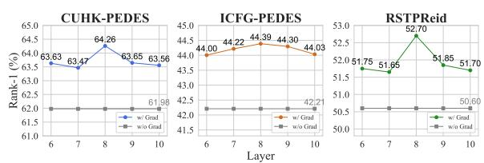  
Figure 7: Results of different layers to compute S. The encoders contain 12 layers in total.

High-quality WebPerson surpasses existing datasets containing single-style synthetic images or low-quality surveillance footage by providing superior texture details and diverse scene variations. Our rigorous image filtering pipeline ensures exceptional visual fidelity, while the MLLMpowered text generation framework produces highly accurate and detailed descriptions. Fig. 8 showcases representative examples demonstrating precise textual characterization of pedestrian attributes.

Diversity Sourced from web data, WebPerson exhibits rich variations in images, including but not limited to scene diversity, viewpoint changes, occlusions, clothing variations, and body poses. Our caption generation strategy further ensures corresponding textual descriptions maintain sufficient diversity. This dual-modality diversity enables

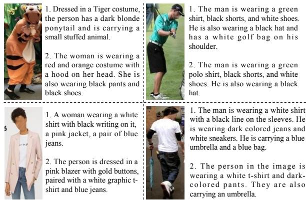  
Figure 8: Visualization of some examples in our WebPerson dataset.

WebPerson to serve as an effective training corpus for developing robust models that generalize well to novel and unseen data across visual tasks, language tasks, and vision-language tasks.

Large-scale As illustrated in Tab. 6, we compare the attributes of WebPerson with other prominent person datasets. WebPerson emerges as the most extensive real-world dataset, featuring high-quality image-text pairs, encompassing 5 million images and 10 million textual descriptions. Moreover, our efficient data collection and caption generation strategies enable seamless scalability in data volume.

## A.5 Broader Impact

This work introduces a novel pedestrian representation learning framework that achieves finegrained cross-modal alignment through gradientbased token-wise similarity scoring while effectively suppressing noise interference. Complementing this framework, we construct WebPerson, a large-scale human-centric dataset with diverse websourced image-text pairs. Together, these contributions demonstrate robust performance in humanoriented applications, including intelligent surveillance and autonomous retail systems.