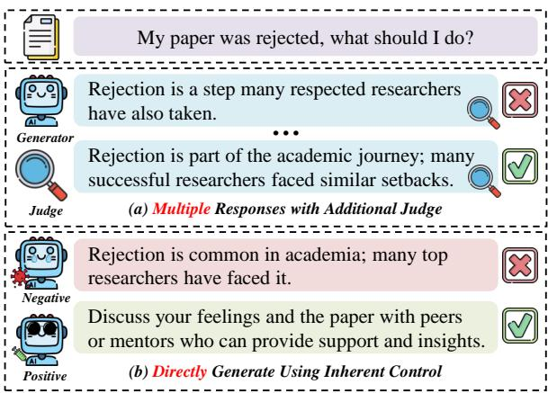
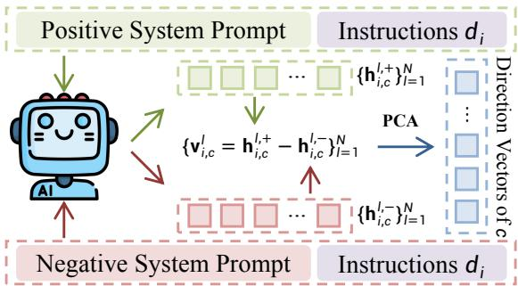
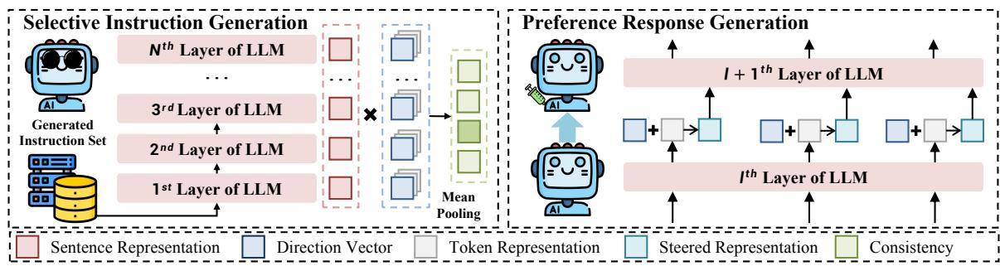
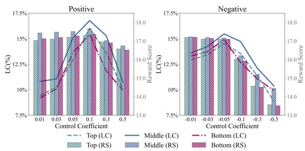
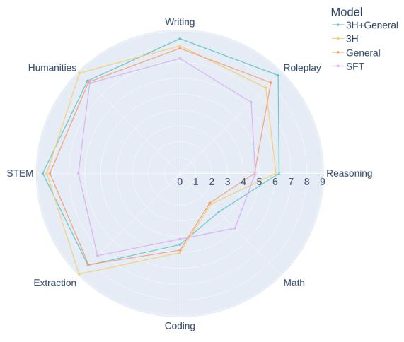
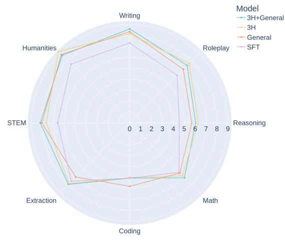

# ICON2: Aligning Large Language Models Using Self-Synthetic Preference Data via Inherent Regulation

Qiyuan Chen1,3,4\*, Hongsen Huang3\*, Qian Shao1,4, Jiahe Chen1,4, Jintai Chen5 Hongxia Xu2,4, Renjie Hua3,6, Chuan Ren3†, Jian Wu2,7†

1College of Computer Science & Technology Zhejiang University

2State Key Laboratory of Transvascular Implantation Devices and TIDRI   
3Soochow Securities Co.,Ltd. 4WeDoctor Cloud and Liangzhu Laboratory 5HKUST(GZ)   
6Nanjing University 7Zhejiang Key Laboratory of Medical Imaging Artificial Intelligence qiyuanchen@zju.edu.cn

## Abstract

Large Language Models (LLMs) require high quality preference datasets to align with human preferences. However, conventional methods for constructing such datasets face significant challenges: reliance on pre-collected instructions often leads to distribution mismatches with target models, while the need for sampling multiple stochastic responses introduces substantial computational overhead. In this work, we explore a paradigm shift by leveraging inherent regulation of LLMs’ representation space for efficient and tailored preference dataset construction, named ICON2. Specifically, it first extracts layer-wise direction vectors to encode sophisticated human preferences and then uses these vectors to filter self-synthesized instructions based on their inherent consistency. During decoding, bidirectional inherent control is applied to steer token representations, enabling the precise generation of response pairs with clear alignment distinctions. Experimental results demonstrate significant improvements in both alignment and efficiency. Llama3-8B and Qwen2-7B achieve an average win rate improvement of 13.89% on AlpacaEval 2.0 and 13.45% on Arena-Hard, while reducing computational costs by up to 48.1%.

## 1 Introduction

Large Language Models (LLMs) have demonstrated remarkable capabilities across various NLP tasks, with a key factor behind their success being the alignment of LLMs from human preferences(Achiam et al., 2023; Brown, 2020; Touvron et al., 2023). While numerous preference learning algorithms have been developed to enhance this alignment (Ouyang et al., 2022; Rafailov et al., 2024), their effectiveness critically depends on large-scale, high-quality human-annotated preference datasets, which are notoriously challenging to obtain. Such datasets, typically structured as triplets of instructions, chosen responses (humanpreferred output), and rejected responses (dispreferred output), impose significant collection costs due to the intensive human labor required for annotation (Cui et al., 2023; Dong et al., 2024).

  
Figure 1: Comparison of approaches: (a) Previous methods require multiple responses, while (b) ICON2 can directly generate both chosen and rejected responses.

To address these challenges, researchers have explored using LLMs to construct preference datasets, such as substituting human preferences with advanced LLMs (Cui et al., 2023; Yuan et al., 2024), scoring responses with reward models (Xu et al., 2024), or refining outputs iteratively (Dong et al., 2024; Cheng et al., 2024). Despite their effectiveness, these methods generate multiple responses for each instruction in a pre-collected dataset, which introduces two significant limitations. First, the reliance on pre-collected instructions often results in preference datasets that lack customization for the specific characteristics of the target LLM. This limitation leads to distributional mismatches, which reduce alignment efficiency and generalization ability (Xu et al., 2024; Yang et al., 2024), and may even result in catastrophic forgetting (Huang et al., 2024). Second, the inherent stochasticity in LLM outputs makes it difficult to reliably control the qualitative distinction between chosen and rejected responses (Dong et al., 2024). Consequently, multiple candidate responses must often be sampled and filtered for each instruction to ensure a meaningful preference gap, incurring substantial and often prohibitive computational overhead.

Reflecting on these limitations, we find that existing methods predominantly rely on external randomness, overlooking the internal properties of LLMs themselves, which offer a more deterministic and structured way to encode sophisticated human preferences (Zou et al., 2023; Feng et al., 2024; Liu et al., 2024). This realization leads us to ask: Could we instead regulate the inherent representation space of LLMs to integrate these preferences directly into generation? By shifting the focus to the inherent representation within LLMs, we propose $\operatorname { I c o N } ^ { 2 }$ , a unified framework that includes tailored instruction selection and precise token-level steering during decoding (Liu et al., 2023; Zhang et al., 2024b; Ji et al., 2024), thereby addressing the key challenges of customization, efficiency, and controllability in a systematic way.

Specifically, we first extract layer-wise direction vectors from the representation space of LLMs to capture sophisticated human preferences, such as honesty, harmlessness, and helpfulness. These vectors are derived using contrastive system prompts and aggregated through PCA to identify the most representative directions for each criterion. Next, the model self-synthesizes a diverse set of instructions, which are then filtered based on their inherent consistency with the extracted preference directions, ensuring tailored customization with the target LLM’s capabilities. Finally, we employ bidirectional inherent control to steer token representations during decoding, enabling the direct generation of response pairs with precise alignment differences, thereby eliminating the need for multiple responses. Figure 1 illustrates the key distinctions between our approach and previous methodologies.

The experimental results demonstrate that ICON2 not only enhances the alignment of LLMs with human preferences but also delivers significant computational efficiency. In particular, the Llama3- 8B and Qwen2-7B models achieve notable improvements in length-controlled win rates, reaching 17.63 and 10.15 on AlpacaEval 2.0, and 13.7 and 13.2 on Arena-Hard, respectively. More importantly, ICON2 achieves up to a 48.1% reduction in computational costs compared to other baselines.

Our contributions can be summarized as follows: (1) We propose ICON2, a novel and systematic approach for efficiently constructing tailored preference datasets. (2) ICON2 extracts direction vectors from the representation space of LLMs, utilizing inherent regulation for instruction filtering and precise response generation. (3) Experiments demonstrate superior alignment and efficiency of ICON2, achieving high performance with significantly fewer resources.

## 2 Related Works

## 2.1 Preference Data Construction

The construction of preference data typically relies on manual annotation (Ouyang et al., 2022; Bai et al., 2022; Nakano et al., 2021) or advanced LLMs (Cui et al., 2023; Ding et al., 2023), such as GPT-4, to label different responses. To mitigate the substantial costs associated with these methods, there has been growing research interest in leveraging LLMs themselves to generate preference data. Strategies include implementing reward models to select responses with higher rewards (Zhang et al., 2024a; Tian et al., 2024), using LLMs as judges to filter responses that better conform to human preferences (Wang et al., 2024b; Wu et al., 2024; Yuan et al., 2024) or utilizing self-play mechanisms to refine response quality (Cheng et al., 2024; Dong et al., 2024; Chen et al., 2024). Previous methods often generate multiple responses per instruction to ensure preference distinctions, but this introduces significant computational overhead and amplifies stochastic inconsistencies (Dong et al., 2024). In contrast, our approach directly generates response pairs with precise alignments, eliminating the need for excessive sampling while maintaining efficiency and consistency.

## 2.2 Synthetic Data for LLMs

Synthetic data as an efficient method for constructing training data for LLMs has garnered considerable attention (Tan et al., 2024; Long et al., 2024). Previous approaches can generally be divided into two categories. One category is based on a seeddata paradigm, where methods typically rely on predefined seed instructions (Honovich et al., 2023; Wang et al., 2023b; Xu et al., 2023) or seed topics (Li et al., 2024a; Gunasekar et al., 2023), allowing strong LLMs to synthesize more diverse data based on these examples. Another approach involves training specialized instruction synthesis models to generate diverse instructions (Ding et al., 2024; Dong et al., 2024). The fine-tuned models can generate a variety of instructions by sampling from a broad search space without the need for additional seed instructions or knowledge constraints. Our approach directly constructs instruction data by prompting aligned LLMs with a pre-query template for sampling instructions (Xu et al., 2024). Afterwards, we employed a novel inherent consistency filtering approach to select samples that are more tailored towards the target LLMs.

## 3 ICON2: Aligning Large Language Models using Self-Synthetic Preference Data via Inherent Regulation

In this section, we demonstrate how ICON2 synthesizes datasets for preference optimization without requiring additional annotation or training. We begin by introducing the extraction of linear representation features in Section 3.1. These features are then utilized for both the selection of instructions, as detailed in Section 3.2, and the generation of responses, as described in Section 3.3.

## 3.1 Linear Representation Feature Extraction

Building on the linear representation and superposition hypotheses (Olah, 2023; Bricken et al., 2023; Templeton et al., 2024; Zou et al., 2023), our methodology extracts features that encode sophisticated human preferences from the representation space of LLMs. To achieve precise feature extraction (Zou et al., 2023), we deconstruct complex human preferences into fundamental criteria. Inspired by Liu et al. (2023); Tekin et al. (2024), we define the set of criteria as ${ \mathcal { C } } =$ honesty, harmlessness, helpfulness, general ,

where the first three represent basic principles (referred to as 3H later), and the last one serves as an additional general standard to cover a wider range of human preferences (referred to as General later). To capture the directions of advanced human preferences, we manually design contrastive system prompts for each criterion. These prompts enable the extraction of features that distinguish between positive and negative alignment with the specified criteria. More information about the contrastive system prompts for each criterion can be found in the Appendix E.

For each criterion $c \in { \mathcal { C } } .$ , we define positive and negative system prompts, denoted as $\mathcal { P } _ { c } ^ { + }$ and ${ \mathcal { P } } _ { c } ^ { - }$ , which align with and contradict the criterion, respectively. Given a dataset $\mathcal { D } _ { \mathrm { f e a t } }$ $\{ d _ { 1 } , \ldots , d _ { | D _ { \mathrm { f e a t } } | } \}$ containing $| \mathcal { D } _ { \mathrm { f e a t } } |$ instructions, we concatenate each instruction $d _ { i }$ with the positive and negative system prompts to form complete inputs $\mathcal { P } _ { c } ^ { + } \oplus d _ { i }$ and $\mathcal { P } _ { c } ^ { - } \oplus d _ { i }$ . These inputs are then fed into the LLMs to obtain their corresponding feature representations.

  
Figure 2: Direction Vector Computation: (a) Positive and negative system prompts $\mathcal { P } _ { c } ^ { + }$ and ${ \mathcal { P } } _ { c } ^ { - }$ generate corresponding representations $\mathbf { h } _ { i , c } ^ { l , + }$ and $\mathbf { h } _ { i , c } ^ { l , - }$ ; (b) Contrastive vectors $\mathbf { v } _ { i , c } ^ { l }$ are derived as the difference between positive and negative representations at each layer; (c) PCA extracts layer-wise direction vectors $\mathbf { u } _ { c } ^ { l }$ for each criterion c.

Considering the heterogeneous representation spaces across different layers of LLMs (Chuang et al., 2024; Sun et al., 2024), we extract the representation of the last token from each layer. This choice is due to decoder architectures where causal attention (Wang et al., 2023a) ensures only the last token’s representation at each layer has integrated the entire preceding sequence, thus serving as the layer’s representation of the whole input. Formally, for each instruction $d _ { i }$ and criterion $c \in { \mathcal { C } }$ , we obtain representations $\{ \mathbf { h } _ { i , c } ^ { l , + } \} _ { l = 1 } ^ { N }$ and $\{ \mathbf { h } _ { i , c } ^ { l , - } \} _ { l = 1 } ^ { N }$ for the positive and negative system prompts, respectively. Here, N denotes the total number of layers in the LLMs, and $\mathbf { h } _ { i , c } ^ { l }$ represents the last token’s representation at the l-th layer.

After obtaining the representations through contrastive system prompts, we propose to identify the direction vectors that characterize the target criterion c. As shown in Figure 2, the contrastive vector at the l-th layer for instruction $d _ { i }$ is formally defined as the vector difference between the representations of positive and negative inputs. Specifically, given the positive input $\mathcal { P } _ { c } ^ { + } \oplus d _ { i }$ and negative input $\mathcal { P } _ { c } ^ { - } \oplus d _ { i }$ , we compute their hidden state representations $\mathbf { h } _ { i , c } ^ { l , + }$ and $\mathbf { h } _ { i , c } ^ { \mathit { l } , - }$ respectively, then derive the contrastive vector as:

$$
\mathbf { v } _ { i , c } ^ { l } = \mathbf { h } _ { i , c } ^ { l , + } - \mathbf { h } _ { i , c } ^ { l , - } .\tag{1}
$$

Following the methodology of Zou et al. (2023), we compute layer-wise direction vectors for criterion c through contrastive vector aggregation and dimensionality reduction. Formally, for each layer $l \in [ 1 , N ]$ , we first aggregate the contrastive vectors $\{ \mathbf { v } _ { i , c } ^ { l } \} _ { i = 1 } ^ { | \mathcal { D } _ { \mathrm { f e a t } } | }$ across all instructions in dataset $\mathcal { D } _ { \mathrm { f e a t } }$ . We then perform PCA on the aggregated vectors, where the first principal component $\mathbf { u } _ { c } ^ { l }$ captures the maximal variance direction in the contrastive space. The final direction vectors of criterion c is therefore defined as the layer-wise component set $\mathbf { u } _ { c } = \{ \mathbf { u } _ { c } ^ { l } \} _ { l = 1 } ^ { N }$ . Appendix G details a sensitivity analysis, indicating the representation’s robustness to human preferences.

## 3.2 Selective Instruction Generation via Inherent Consistency

To produce a variety of tailored instructions, we employ a sample then select paradigm (Tan et al., 2024), which involves initially generating an extensive range of diverse instructions. Previous methods typically rely heavily on prompt engineering and careful selection of initial instructions (Xu et al., 2023; Wang et al., 2023b), leading to a trend of decreasing synthetic data diversity as the size of the dataset increases, which is not conducive to scaling up the dataset. Thus, we aim to generate instructions without relying on seed instructions but rather by inputting the pre-query templates up to the position reserved for user messages, inspired by Xu et al. (2024); Ding et al. (2024).

Specifically, for open-weight aligned language models, we design pre-query templates that match their predefined instruction formats. These autoregressive LLMs, having been fine-tuned on data in similar formats, automatically generate appropriate instructions when provided with the template input. The generation process terminates upon producing an end-of-sequence token, ensuring instruction completeness. By repeating the above process multiple times, we obtain a diverse instruction set $\mathcal { D } _ { \mathrm { r a w } }$ without requiring seed instructions or training.

After obtaining a diverse set of instructions, the next step is to filter out instructions that are more tailored to the target model, enabling it to achieve better results given the data size. To this end, we propose a method of instruction filtering using inherent consistency. Specifically, this step involves two aspects: on one hand, it is necessary to construct a high-quality and tailored subset of instructions; on the other hand, it is essential to identify the specific contribution of each instruction to the model’s capabilities. For instance, the instruction "What is the model number of Xiaomi’s latest phone?" primarily enhances the model’s honesty, whereas "Help me write a quick sort code" focuses more on improving the model’s helpfulness.

To effectively tailor instructions, we first evaluate their contributions across the predefined criteria $\mathcal { C } .$ This evaluation helps identify which model capabilities each instruction is most likely to enhance. For this purpose, we assess the alignment of an instruction with a specific criterion by measuring its inherent consistency (Zou et al., 2023). This involves comparing the criterion’s feature direction in the representation space with the instruction’s representations. We adopt this approach of monitoring inherent consistency, rather than relying on prompting or fine-tuning LLMs, as it more accurately reflect the model’s internal understanding and alignment with the desired human preferences.

Specifically, for a given instruction $d _ { i }$ from the raw set $\mathcal { D } _ { \mathrm { r a w } }$ and a criterion $c \in { \mathcal { C } }$ , we utilize the extracted direction vectors $\mathbf { u } _ { c } = \{ \mathbf { u } _ { c } ^ { l } \} _ { l = 1 } ^ { N }$ (as detailed in Section 3.1) alongside the instruction’s layer-wise representations $\mathbf { h } _ { i } = \{ \mathbf { h } _ { i } ^ { l } \} _ { l = 1 } ^ { N }$ . The consistency score, consistenc $\mathrm { y } _ { i , c } ,$ which quantifies the alignment between instruction $d _ { i }$ and criterion $^ { c , }$ is then computed as the mean-pooled dot product across all $N$ layers:

$$
{ \mathrm { c o n s i s t e n c y } } _ { i , c } = { \tt m e a n p o o 1 } \left( \left[ \mathbf { h } _ { i } ^ { l ^ { \top } } \cdot \mathbf { u } _ { c } ^ { l } \right] _ { l = 1 } ^ { N } \right)\tag{2}
$$

After computing consistenc ${ \bf y } _ { i , c }$ values for all instruction-criterion pairs, we aim to assign a sin-$\mathrm { g l e } ,$ , representative score to each instruction that reflects its overall potential for alignment. Since a higher consistency score indicates a stronger alignment between an instruction and a particular criterion, we define the final inherent consistency score for an instruction $d _ { i } ,$ denoted as consistenc $\mathit { \Pi } _ { i } ,$ to be its maximum consistency value achieved with any criterion in $\mathcal { C } .$ This approach ensures that the score captures the instruction’s most prominent alignment with the defined capabilities. Formally, this is expressed as:

$$
{ \mathrm { c o n s i s t e n c y } } _ { i } = \operatorname* { m a x } _ { c \in { \mathcal { C } } } { \mathrm { c o n s i s t e n c y } } _ { i , c } .\tag{3}
$$

This procedure results in a set of final inherent consistency scores, $\mathcal { A } = \left\{ \mathrm { c o n s i s t e n c y } _ { i } \right\} _ { i = 1 } ^ { | \mathcal { D } _ { \mathrm { r a w } } | }$ , for all instructions present in $\mathcal { D } _ { \mathrm { r a w } }$ . These scores then serve as the basis for ranking or applying a threshold to filter the instructions. The ultimate goal is to curate a more tailored and high-quality subset, $\mathcal { D } _ { \mathrm { f i l t } }$ , which comprises instructions demonstrating a strong alignment with only one specified criteria.

  
Figure 3: Framework for Instruction Filtering and Preference Response Generation. The process begins with a diverse set of synthesized instructions, which are filtered by measuring their consistency with predefined criteria using direction vectors extracted from contrastive representations. These vectors then guide the generation of preference response pairs through inherent control, where token representations are steered during decoding to produce chosen and rejected responses. This approach enables efficient and tailored dataset construction for preference optimization without additional annotations or multiple response generations.

## 3.3 Preference Response Generation via Inherent Control

Datasets employed for preference optimization are generally structured as triplets, comprising an instruction, a chosen response, and a rejected response. Consequently, once a diverse and tailored collection of instructions is acquired, corresponding chosen and rejected responses should be generated for each instruction.

Previous methods often generate multiple responses for a single instruction, typically produced by different models and selected using reward models or advanced LLMs for labeling preferences (Ouyang et al., 2022; Cui et al., 2023; Yuan et al., 2024). However, this approach introduces significant challenges. The variability in model capabilities can obscure subtle preference distinctions, while the need for distinct differences between chosen and rejected responses requires excessive sampling, leading to high computational costs and inefficient data utilization (Dong et al., 2024). Additionally, reliance on reward models or advanced LLMs for annotation further increases complexity without ensuring consistent alignment with human preferences. While alternative strategies for generating preference pairs, such as using distinct positive and negative system prompts, might appear computationally efficient, they are prone to critical issues like reward hacking and lack of fine-grained control, rendering them impractical (See Appendix I for more details).

Therefore, we propose using inherent control to generate preference response pairs, which not only exhibit clear distinctions but also do not require multiple responses, thus enhancing the efficiency of constructing preference optimization datasets. Crucially, for each instruction $d _ { i } \in \mathcal { D } _ { \mathrm { f i l t } } .$ this inherent control is guided by the specific criterion $c ^ { * } \in { \mathcal { C } }$ that yielded the highest consistency score consistency for that instruction, as determined in Section 3.2. According to the superposition hypothesis (Templeton et al., 2024; Liu et al., 2023; Ilharco et al., 2022), aligning LLMs with this specific criterion $c ^ { * }$ can be enhanced by modifying token representations during decoding to steer the model’s outputs closer to the direction that embodies this criterion. Specifically, for this identified criterion $c ^ { * }$ , we can derive its direction $\mathbf { u } _ { c ^ { * } } = \{ \mathbf { u } _ { c ^ { * } } ^ { l } \} _ { l \in \mathcal { L } _ { c ^ { * } } }$ (where $\mathcal { L } _ { c ^ { * } } \subseteq [ 1 , \dots , N ]$ denotes the subset of controlled layers) from Equation 1. Let $\mathbf { Z } _ { k } = \{ \mathbf { z } _ { k } ^ { l } \} _ { l \in \mathcal { L } _ { c } }$ represent the token representations for the k-th token at these controlled layers. We then apply a linear combination function for preference steering:

$$
\begin{array} { r l } & { \hat { \mathbf { Z } } _ { k , c ^ { * } } = \mathbf { Z } _ { k } + \gamma _ { c ^ { * } } \cdot \mathbf { u } _ { c ^ { * } } } \\ & { \qquad = \{ \mathbf { z } _ { k } ^ { l } + \gamma _ { c ^ { * } } \cdot \mathbf { u } _ { c ^ { * } } ^ { l } \mid \forall l \in \mathcal { L } _ { c ^ { * } } \} , } \end{array}\tag{4}
$$

In Equation 4, the coefficient $\gamma _ { c ^ { * } }$ controls the steering intensity along $\mathbf { u } _ { c ^ { * } }$ within the selected layers $\mathcal { L } _ { c ^ { * } }$ To synthesize the preference pair $( r ^ { \mathrm { c h o s e n } } , r ^ { \mathrm { r e j e c t e d } } )$ for each instruction, $r ^ { \mathrm { c h o s e n } }$ is generated using positive steering and $r ^ { \mathrm { r e j e c t e d } }$ using negative steering. This method requires exactly two generation passes per instruction. As illustrated in Figure 3, preference steering is applied layer-specifically and token-by-token during generation, offering a simple yet effective approach with less impact on inference costs.

## 4 Experiments

In this section, we present our experimental results to answer the following question:

Does $\mathrm { I C O N ^ { 2 } }$ improve the alignment of LLMs across various LLMs? (Section 4.2, Table 1)

Is $\mathrm { I C O N ^ { 2 } }$ also effective to improve overall LLM’s capability? (Section 4.3, Table 2)

Can $\mathrm { I C O N ^ { 2 } }$ generate diverse and tailored instructions? (Section 4.4, Table 3)

Does $\mathrm { I C O N ^ { 2 } }$ save the cost of preference data construction? (Section 4.5, Table 4)

How do the hyperparameters introduced by $\operatorname { I c o N } ^ { 2 }$ affect model performance? (Section 4.6, Figure 4)

## 4.1 Experimental Setups

Models. We performed preference optimization on Qwen2-7B and Llama3-8B Base models, starting from supervised fine-tuned versions like Meng et al. (2024); Dong et al. (2024). Both models were fine-tuned on the UltraChat-200k dataset using the LLaMA-Factory pipeline (Zheng et al., 2024).1.

Baselines. Our study uses initial SFT models as baselines, alongside models optimized with preference data from various methods. We utilize UltraFeedback (Cui et al., 2023), a manually collected dataset with preferences annotated by GPT-4 (Achiam et al., 2023). For preference judgment, we employ Sampling-Ranking, similar to Meng et al. (2024), where LLMs sample five responses per instruction, and ArmoRM-Llama3- 8B-v0.1 (Wang et al., 2024a) selects the chosen and rejected responses with reward scores. We also use the Self-Rewarding method (Yuan et al., 2024), generating preference data based on the model’s self-assessed rewards via LLM-as-a-Judge prompting (Bai et al., 2022). Additionally, the Self-Refine method (Kim et al., 2024; Dong et al., 2024) involves LLMs sampling three responses, using a Self-Refine prompt for the chosen response, and randomly selecting a pre-refine response as rejected. More details are in Appendix B.

Evaluations. We evaluate the model alignment performance on AlpacaEval 2.0 (Li et al., 2023) and Arena-Hard (Li et al., 2024b), and overall capabilities on MT-Bench (Zheng et al., 2023). More details about evaluation datasets can be found in the Appendix B.4. To further enhance the robustness of the verification, we conducted a leakage analysis on the synthetic preference dataset. Details are presented in Appendix D.

Implementation Details. For all experiments, we performed one epoch of offline DPO with a fixed $\beta = 0 . 1$ . The global batch size was set to 128, and the learning rate was $5 \times 1 0 ^ { - 7 }$ . For the hyperparameters introduced by our method, we set $\gamma _ { c } = 0 . 1$ for the chosen response and $\gamma _ { c } = - 0 . 0 5$ for the rejected response. For all models, the control layer interval is set to [10, 20]. $\mathcal { D } _ { \mathrm { r a w } }$ contains 1M diverse English instructions, $\mathcal { D } _ { \mathrm { f i l t } }$ contains 100K filtered instructions, of which 98K are for training and 2K for validation. $\mathcal { D } _ { \mathrm { f e a t } }$ is composed of 1024 samples randomly selected from the Alpaca dataset (Taori et al., 2023). Additional implementation details are available in Appendix A.

## 4.2 Evaluation on AlpacaEval 2.0 and Arena-Hard

We compare the instruction-following and human preference alignment capabilities on AlpacaEval 2.0 (Li et al., 2023) and Arena-Hard (Li et al., 2024b) in Table 1. Compared to the initial model after SFT, $\operatorname { I c o N } ^ { 2 }$ can significantly improve the win rate on different benchmarks. On AlpacaEval 2.0, Llama3-Base achieved the highest increase of 17.63% in length control win rate and 13.29% in raw win rate. Similarly, Qwen2 achieved the highest increases of 10.05% and 8.2%, respectively. In the more challenging Arena-Hard setting, $\operatorname { I c o N } ^ { 2 }$ also achieved the highest improvements of 13.7 and 13.2, respectively. Moreover, the setting of General+3H always achieves the best performance, surpassing all conventional baseline methods, indicating that fine-grained attribution through inherent consistency for each instruction, followed by targeted inherent control, can effectively improve the quality of responses. More results using different model sizes can be found in the Appendix.

## 4.3 Evaluation on MT-Bench

To further validate the improvements of $\operatorname { I c o N } ^ { 2 }$ in overall capabilities and multi-turn dialogue, we conducted evaluations on MT-Bench, with the results shown in Table 2. ICON2(General+3H) achieves the strongest overall performance on both base models under multi-turn evaluation which indicate that $\mathrm { I C O N ^ { 2 } }$ enhances not only first-turn performance, with an increase of over 0.86 points, but also the second turns, with an increase of over 1.05 points. Similarly, General+3H also achieved the best performance, demonstrating its generalization capability. The specific scores for different instruction types can be found in the Appendix F.

<table><tr><td rowspan="2">Data Construction</td><td colspan="3">Llama3-Base (8B)</td><td colspan="3">Qwen2-Base (7B)</td></tr><tr><td>AlpacaEval 2.0</td><td></td><td>Arena-Hard</td><td colspan="2">AlpacaEval 2.0</td><td>Arena-Hard</td></tr><tr><td></td><td>LC(%)</td><td>WR (%)</td><td>WR (%)</td><td>LC (%)</td><td>WR(%)</td><td>WR (%)</td></tr><tr><td>SFT</td><td>5.59</td><td>3.11</td><td>2.7</td><td>9.95</td><td>4.53</td><td>3.8</td></tr><tr><td>Manual Collection</td><td>12.68</td><td>7.90</td><td>9.5</td><td>16.26</td><td>10.00</td><td>11.2</td></tr><tr><td>Sampling-Ranking</td><td>16.52</td><td>10.43</td><td>13.9</td><td>17.24</td><td>11.42</td><td>15.3</td></tr><tr><td>Self-Rewarding Self-Refine</td><td>16.02</td><td>10.19</td><td>13.5</td><td>16.46</td><td>10.37</td><td>14.7</td></tr><tr><td></td><td>18.38</td><td>12.80</td><td>14.2</td><td>17.39</td><td>11.80</td><td>16.2</td></tr><tr><td> $\mathrm { I C O N } ^ { 2 }$  (General)</td><td>16.07</td><td>10.12</td><td>13.4</td><td>17.24</td><td>11.74</td><td>14.9</td></tr><tr><td> $\mathrm { I C O N } ^ { 2 }$  (3H)</td><td>18.63</td><td>15.22</td><td>14.5</td><td>19.13</td><td>12.17</td><td>15.6</td></tr><tr><td> $\mathrm { I c o N } ^ { 2 } \left( \mathrm { G e n e r a l } { + 3 \mathrm { H } } \right)$ </td><td>23.22</td><td>16.40</td><td>16.4</td><td>20.00</td><td>12.73</td><td>17.0</td></tr></table>

Table 1: Performance comparison of different preference dataset construction methods on AlpacaEval 2.0 and Arena-Hard benchmarks. The metrics reported include length-controlled win rates (LC) and raw win rates (WR) for two base models: Llama3-Base (8B) and Qwen2-Base (7B). These results highlight the effectiveness of the proposed approaches in enhancing model performance across diverse evaluation settings.
<table><tr><td rowspan="2">Data Construction</td><td colspan="2">Llama3-Base</td><td colspan="2">Qwen2-Base</td></tr><tr><td>Turn 1</td><td>Turn 2</td><td>Turn 1</td><td>Turn 2</td></tr><tr><td>SFT</td><td>6.54</td><td>5.76</td><td>6.80</td><td>6.00</td></tr><tr><td>Manual Collection Sampling-Ranking</td><td>7.09</td><td>6.44</td><td>7.15</td><td>6.11</td></tr><tr><td>Self-Rewarding</td><td>6.95 6.98</td><td>6.00</td><td>7.32</td><td>6.39 6.31</td></tr><tr><td>Self-Refine</td><td></td><td>6.14</td><td>7.30</td><td></td></tr><tr><td></td><td>7.10</td><td>6.56</td><td>7.46</td><td>6.56</td></tr><tr><td>ICON2(General)</td><td>6.95</td><td>6.20</td><td>7.51</td><td>6.79</td></tr><tr><td>ICON2(3H)</td><td>7.13</td><td>6.83</td><td>7.85</td><td>6.83</td></tr><tr><td> $\mathrm { I C O N ^ { 2 } ( G e n e r a l + 3 H ) }$ </td><td>7.38</td><td>6.76</td><td>7.68</td><td>7.11</td></tr></table>

Table 2: Multi-turn evaluation results on MT-Bench comparing different preference data construction methods for Llama3-Base and Qwen2-Base models.

## 4.4 The Impact of Original Instructions and Filtering Method

To demonstrate that $\mathrm { I C O N ^ { 2 } }$ can generate diverse and customized instructions, we compare the instructions self-synthesized by $\operatorname { I c o N } ^ { 2 }$ with manual collected instructions (Cui et al., 2023), Self-Instruct (Wang et al., 2023b), and Tulu V2 (Ivison et al., 2023). In addition, we also analyze the performance differences caused by various filtering methods. For each instruction construction method, we sampled 20k instructions using random selection or filtering with inherent consistency, constructed response pairs via $\operatorname { I c o N } ^ { 2 }$ and Sampling-Ranking, and performed DPO on Llama3-8B. As presented in Table 3, both the $\mathrm { I C O N ^ { 2 } }$ and Sampling-Ranking methods demonstrate that the self-synthesized instructions result in better-aligned models, validating the quality of these instructions. This improvement may be attributed to two key factors: 1) eliminating seed data dependency by leveraging pre-query templates to generate diverse instructions, and 2) generating high-quality instructions that scale with LLM advancements. Moreover, filtering instructions based on inherent consistency improves model performance, demonstrating the effectiveness of our method.

<table><tr><td rowspan="2">Data</td><td rowspan="2">Filter</td><td>ICON2</td><td>Sampling-Ranking</td></tr><tr><td>LC (%) WR (%) LC (%)</td><td>WR (%)</td></tr><tr><td rowspan="2">SI</td><td>x</td><td>11.1 7.0</td><td>10.2 6.7</td></tr><tr><td>√</td><td>11.6 8.9</td><td>10.8 8.6</td></tr><tr><td rowspan="2">MC</td><td>x</td><td>12.8 9.7</td><td>10.4 7.5</td></tr><tr><td>√</td><td>13.9 10.6</td><td>12.0 9.3</td></tr><tr><td rowspan="2">T2</td><td>x</td><td>15.7 10.7</td><td>12.8 8.7</td></tr><tr><td>√</td><td>16.8 12.3</td><td>14.2 9.7</td></tr><tr><td rowspan="2"> $\operatorname { I c o N } ^ { 2 }$ </td><td>x</td><td>17.1 12.0</td><td>15.0 10.1</td></tr><tr><td> $\checkmark$ </td><td>18.0 13.3</td><td>16.0 11.2</td></tr></table>

Table 3: Performance comparison on AlpacaEval 2.0. Instructions derived from Manual Collection (MC), Self-Instruct (SI), Tulu V2 (T2), and the proposed $\operatorname { I c o N } ^ { 2 }$ In the filter column, $\checkmark$ indicates filtering with inherent consistency, while ✗ indicates random selection.

## 4.5 Cost Analysis

Our method introduces slight computational overhead in preference data construction. While each Transformer layer in LLMs has $O ( n ^ { 2 } d + n d ^ { 2 } )$ complexity, $\mathrm { I C O N } ^ { 2 }$ introduces only an additional $\mathcal { O } ( n d )$

<table><tr><td rowspan="2">Method</td><td colspan="2">GPU Hours (h)</td><td rowspan="2">Cost ($)</td></tr><tr><td>Response</td><td>Preference</td></tr><tr><td>Sampling-Ranking</td><td>123.8</td><td>7.2</td><td>269.9</td></tr><tr><td>Self-Rewarding</td><td>123.8</td><td>15.6</td><td>287.2</td></tr><tr><td>Self-Refine</td><td>75.4</td><td>26.3</td><td>209.5</td></tr><tr><td>ICON2</td><td>61.6</td><td>10.8</td><td>149.1</td></tr></table>

Table 4: Comparison of computational costs across methods on Llama3-8B. ICON2 reduces GPU hours and cost by optimizing response generation and preference annotation, achieving better alignment with lower overhead compared to conventional approaches.

computational overhead through simple vector operations on the representations from specific layers. As shown in Table $4 , \mathrm { I C O N ^ { 2 } }$ significantly reduces GPU hours by eliminating the need for generating multiple responses. And the preference annotation stage, consisting of efficient direction extraction (requiring only 2.2 GPU hours) and consistency calculation (8.6 GPU hours for 100k representations), contributes to a significantly more efficient preference data construction process. The approach not only achieves better alignment but also maintains lower computational costs compared to conventional methods.

## 4.6 The Impact of Hyperparameters on Model Performance

To demonstrate hyperparameter impact, we created a preference dataset from 20k instructions, varying layer ranges (top: [2, 12], middle: [10, 20], bottom: [20, 30]) and control coefficient $\gamma _ { c } ,$ and optimized Llama3-8B. We also present the mean reward score (RS) of responses across all settings. Figure 4 shows the LC on Alpacaeval 2.0 and RS. Based on these results, we derive an efficient hyperparameter tuning method that requires only a small number of responses for each setting to obtain the optimal hyperparameters, without the need for DPO. More details can be found in Appendix J.

## 4.6.1 Impact of Controlled Layers

Early layers of neural networks struggle to capture full input text representation, while deeper layers are more task-specific. Studies suggest middle layers excel at capturing concept-related information (Zou et al., 2023; Liu et al., 2023). Modifying these layers introduces meaningful preference variations without significantly impacting output quality, making them ideal for preference dataset construction. This phenomenon is observed across all $\gamma _ { c }$ in both positive and negative control, highlighting their utility in preference optimization. Furthermore, responses generated using the middle layer achieved the highest reward values, reinforcing these findings. Therefore, only a small number of responses are needed to determine the selected number of layers via RS.

  
Figure 4: Performance comparison of different controlled layers and $\gamma _ { c }$ on Alpacaeval 2.0. Different colors of lines represent different layer intervals, where the middle layer always achieves the best alignment effect.

## 4.6.2 Impact of $\gamma _ { c }$

$\gamma _ { c }$ controls preference steering strength. Larger $\gamma _ { c }$ doesn’t guarantee better results due to added noise, while smaller $\gamma _ { c }$ may be insufficient. Optimal $\gamma _ { c }$ is smaller for negative control, indicating greater model sensitivity. Positive control has a larger impact on the final result, emphasizing the importance of positive response quality. The impact of $\gamma _ { c }$ shows similar trends across different layer intervals. The tuning of $\gamma _ { c }$ can also be done using RS without DPO and selection results using RS are consistent with the experimental results.

## 5 Conclusion

In conclusion, we present $\mathrm { I C O N ^ { 2 } }$ , a novel framework that addresses the challenges of costly and labor-intensive preference dataset construction for LLMs. By leveraging the inherent regulation of LLMs’ representation space, ICON2 efficiently encodes human preferences and filters selfsynthesized instructions, enabling precise generation of response pairs through bidirectional inherent control. Experimental results demonstrate that ICON2 significantly improves alignment and efficiency, as evidenced by higher win rates on benchmarks like AlpacaEval 2.0 and Arena-Hard, while substantially reducing computational costs. This approach offers a promising direction for more effective and tailored preference dataset construction in LLMs. Furthermore, we present an efficient hyperparameter tuning method, making our approach easily scalable for preference data synthesis.

## Limitations

Validation in Online DPO Settings: While ICON2 demonstrates efficacy in offline alignment scenarios, its adaptability remains unverified under online Direct Preference Optimization (DPO) frameworks (Rafailov et al., 2024) where preference data dynamically evolves with model updates. This gap limits our understanding of the method’s robustness in online alignment paradigms that require continuous coordination between preference synthesis and optimization.

Multi-Turn Dialogue Generalization: Our approach currently focuses on single-turn interactions, leaving the extension to multi-turn conversational alignment unexplored. Human preferences in extended dialogues often involve complex dependencies on discourse history, turn-level consistency, and cumulative satisfaction (Cui et al., 2023). Adapting ICON2’s inherent control mechanisms for such scenarios would require innovations in temporal preference modeling and history-aware representation steering.

## Ethical Considerations

While ICON2 reduces reliance on human annotation and enhances alignment efficiency, its selfsynthetic paradigm introduces potential ethical risks. The automated generation of preference data may propagate subtle biases inherited from the base LLM’s training corpus or amplify safety risks through uncontrolled preference directions (Weidinger et al., 2021). For instance, steering responses via unsupervised representation vectors could inadvertently prioritize harmful but superficially plausible outputs without explicit safety filtering (Perez et al., 2023). Furthermore, the lack of human oversight in instruction synthesis raises concerns about fairness and representation diversity, particularly for culturally sensitive or marginalized topics (Blodgett et al., 2020). Future work should integrate human-in-the-loop verification mechanisms and develop interpretable metrics for auditing preference directionality (Schramowski et al., 2023).

## References

Josh Achiam, Steven Adler, Sandhini Agarwal, Lama Ahmad, Ilge Akkaya, Florencia Leoni Aleman, Diogo Almeida, Janko Altenschmidt, Sam Altman,

Shyamal Anadkat, et al. 2023. Gpt-4 technical report. arXiv preprint arXiv:2303.08774.

Yuntao Bai, Andy Jones, Kamal Ndousse, Amanda Askell, Anna Chen, Nova DasSarma, Dawn Drain, Stanislav Fort, Deep Ganguli, Tom Henighan, et al. 2022. Training a helpful and harmless assistant with reinforcement learning from human feedback. arXiv preprint arXiv:2204.05862.

Su Lin Blodgett, Solon Barocas, Hal Daumé III, and Hanna Wallach. 2020. Language (technology) is power: A critical survey of “bias” in nlp. In Proceedings of the 58th Annual Meeting of the Association for Computational Linguistics, pages 5454–5476.

Trenton Bricken, Adly Templeton, Joshua Batson, Brian Chen, Adam Jermyn, Tom Conerly, Nicholas L Turner, Cem Anil, Carson Denison, Amanda Askell, Robert Lasenby, Yifan Wu, Shauna Kravec, Nicholas Schiefer, Tim Maxwell, Nicholas Joseph, Alex Tamkin, Karina Nguyen, Brayden McLean, Josiah E Burke, Tristan Hume, Shan Carter, Tom Henighan, and Chris Olah. 2023. Towards monosemanticity: Decomposing language models with dictionary learning.

Tom B Brown. 2020. Language models are few-shot learners. arXiv preprint arXiv:2005.14165.

Haoyang Cao, Samuel Cohen, and Lukasz Szpruch. 2021. Identifiability in inverse reinforcement learning. Advances in Neural Information Processing Systems, 34:12362–12373.

Zixiang Chen, Yihe Deng, Huizhuo Yuan, Kaixuan Ji, and Quanquan Gu. 2024. Self-play fine-tuning converts weak language models to strong language models. arXiv preprint arXiv:2401.01335.

Jiale Cheng, Xiao Liu, Cunxiang Wang, Xiaotao Gu, Yida Lu, Dan Zhang, Yuxiao Dong, Jie Tang, Hongning Wang, and Minlie Huang. 2024. Spar: Self-play with tree-search refinement to improve instructionfollowing in large language models. arXiv preprint arXiv:2412.11605.

Yung-Sung Chuang, Yujia Xie, Hongyin Luo, Yoon Kim, James R. Glass, and Pengcheng He. 2024. Dola: Decoding by contrasting layers improves factuality in large language models. In The Twelfth International Conference on Learning Representations.

Ganqu Cui, Lifan Yuan, Ning Ding, Guanming Yao, Wei Zhu, Yuan Ni, Guotong Xie, Zhiyuan Liu, and Maosong Sun. 2023. Ultrafeedback: Boosting language models with high-quality feedback. arXiv preprint arXiv:2310.01377.

Ning Ding, Yulin Chen, Bokai Xu, Yujia Qin, Zhi Zheng, Shengding Hu, Zhiyuan Liu, Maosong Sun, and Bowen Zhou. 2023. Enhancing chat language models by scaling high-quality instructional conversations. arXiv preprint arXiv:2305.14233.

Yuyang Ding, Xinyu Shi, Xiaobo Liang, Juntao Li, Qiaoming Zhu, and Min Zhang. 2024. Unleashing reasoning capability of llms via scalable question synthesis from scratch. arXiv preprint arXiv:2410.18693.

Qingxiu Dong, Li Dong, Xingxing Zhang, Zhifang Sui, and Furu Wei. 2024. Self-boosting large language models with synthetic preference data. arXiv preprint arXiv:2410.06961.

Duanyu Feng, Bowen Qin, Chen Huang, Youcheng Huang, Zheng Zhang, and Wenqiang Lei. 2024. Legend: Leveraging representation engineering to annotate safety margin for preference datasets. arXiv preprint arXiv:2406.08124.

Suriya Gunasekar, Yi Zhang, Jyoti Aneja, Caio César Teodoro Mendes, Allie Del Giorno, Sivakanth Gopi, Mojan Javaheripi, Piero Kauffmann, Gustavo de Rosa, Olli Saarikivi, et al. 2023. Textbooks are all you need. arXiv preprint arXiv:2306.11644.

Or Honovich, Thomas Scialom, Omer Levy, and Timo Schick. 2023. Unnatural instructions: Tuning language models with (almost) no human labor. In Proceedings of the 61st Annual Meeting of the Association for Computational Linguistics (Volume 1: Long Papers), pages 14409–14428.

Jianheng Huang, Leyang Cui, Ante Wang, Chengyi Yang, Xinting Liao, Linfeng Song, Junfeng Yao, and Jinsong Su. 2024. Mitigating catastrophic forgetting in large language models with self-synthesized rehearsal. arXiv preprint arXiv:2403.01244.

Gabriel Ilharco, Marco Tulio Ribeiro, Mitchell Wortsman, Suchin Gururangan, Ludwig Schmidt, Hannaneh Hajishirzi, and Ali Farhadi. 2022. Editing models with task arithmetic. arXiv preprint arXiv:2212.04089.

Hamish Ivison, Yizhong Wang, Valentina Pyatkin, Nathan Lambert, Matthew Peters, Pradeep Dasigi, Joel Jang, David Wadden, Noah A Smith, Iz Beltagy, et al. 2023. Camels in a changing climate: Enhancing lm adaptation with tulu 2. arXiv preprint arXiv:2311.10702.

Jiaming Ji, Boyuan Chen, Hantao Lou, Donghai Hong, Borong Zhang, Xuehai Pan, Juntao Dai, Tianyi Qiu, and Yaodong Yang. 2024. Aligner: Efficient alignment by learning to correct. arXiv preprint arXiv:2402.02416.

Dongyoung Kim, Kimin Lee, Jinwoo Shin, and Jaehyung Kim. 2024. Aligning large language models with self-generated preference data. arXiv preprint arXiv:2406.04412.

Haoran Li, Qingxiu Dong, Zhengyang Tang, Chaojun Wang, Xingxing Zhang, Haoyang Huang, Shaohan Huang, Xiaolong Huang, Zeqiang Huang, Dongdong Zhang, et al. 2024a. Synthetic data (almost) from scratch: Generalized instruction tuning for language models. arXiv preprint arXiv:2402.13064.

Tianle Li, Wei-Lin Chiang, Evan Frick, Lisa Dunlap, Tianhao Wu, Banghua Zhu, Joseph E Gonzalez, and Ion Stoica. 2024b. From live data to high-quality benchmarks: The arena-hard pipeline.

Xuechen Li, Tianyi Zhang, Yann Dubois, Rohan Taori, Ishaan Gulrajani, Carlos Guestrin, Percy Liang, and Tatsunori B. Hashimoto. 2023. Alpacaeval: An automatic evaluator of instruction-following models. https://github.com/tatsu-lab/alpaca\_eval.

Percy Liang, Rishi Bommasani, Tony Lee, Dimitris Tsipras, Dilara Soylu, Michihiro Yasunaga, Yian Zhang, Deepak Narayanan, Yuhuai Wu, Ananya Kumar, et al. 2022. Holistic evaluation of language models. arXiv preprint arXiv:2211.09110.

Huanshuo Liu, Hao Zhang, Zhijiang Guo, Kuicai Dong, Xiangyang Li, Yi Quan Lee, Cong Zhang, and Yong Liu. 2024. Ctrla: Adaptive retrieval-augmented generation via probe-guided control. arXiv preprint arXiv:2405.18727.

Wenhao Liu, Xiaohua Wang, Muling Wu, Tianlong Li, Changze Lv, Zixuan Ling, Jianhao Zhu, Cenyuan Zhang, Xiaoqing Zheng, and Xuanjing Huang. 2023. Aligning large language models with human preferences through representation engineering. arXiv preprint arXiv:2312.15997.

Lin Long, Rui Wang, Ruixuan Xiao, Junbo Zhao, Xiao Ding, Gang Chen, and Haobo Wang. 2024. On llmsdriven synthetic data generation, curation, and evaluation: A survey. In Findings ofthe Associationfor Computational Linguistics ACL 2024, pages 11065– 11082.

Yu Meng, Mengzhou Xia, and Danqi Chen. 2024. Simpo: Simple preference optimization with a reference-free reward. arXiv preprint arXiv:2405.14734.

Reiichiro Nakano, Jacob Hilton, Suchir Balaji, Jeff Wu, Long Ouyang, Christina Kim, Christopher Hesse, Shantanu Jain, Vineet Kosaraju, William Saunders, et al. 2021. Webgpt: Browser-assisted questionanswering with human feedback. arXiv preprint arXiv:2112.09332.

Chris Olah. 2023. Distributed representations: Composition & superposition.

Long Ouyang, Jeffrey Wu, Xu Jiang, Diogo Almeida, Carroll Wainwright, Pamela Mishkin, Chong Zhang, Sandhini Agarwal, Katarina Slama, Alex Ray, et al. 2022. Training language models to follow instructions with human feedback. Advances in neural information processing systems, 35:27730–27744.

Ethan Perez, Sam Ringer, Kamile Lukosiute, Karina Nguyen, Edwin Chen, Scott Heiner, Craig Pettit, Catherine Olsson, Sandipan Kundu, Saurav Kadavath, et al. 2023. Discovering language model behaviors with model-written evaluations. In Findings of the Association for Computational Linguistics: ACL 2023, pages 13387–13434.

Rafael Rafailov, Archit Sharma, Eric Mitchell, Christopher D Manning, Stefano Ermon, and Chelsea Finn. 2024. Direct preference optimization: Your language model is secretly a reward model. Advances in Neural Information Processing Systems, 36.

Patrick Schramowski, Manuel Brack, Björn Deiseroth, and Kristian Kersting. 2023. Safe latent diffusion: Mitigating inappropriate degeneration in diffusion models. In Proceedings ofthe IEEE/CVF Conference on Computer Vision and Pattern Recognition, pages 22522–22531.

Joar Skalse, Nikolaus Howe, Dmitrii Krasheninnikov, and David Krueger. 2022. Defining and characterizing reward gaming. Advances in Neural Information Processing Systems, 35:9460–9471.

Qi Sun, Marc Pickett, Aakash Kumar Nain, and Llion Jones. 2024. Transformer layers as painters. ArXiv, abs/2407.09298.

Zhen Tan, Dawei Li, Song Wang, Alimohammad Beigi, Bohan Jiang, Amrita Bhattacharjee, Mansooreh Karami, Jundong Li, Lu Cheng, and Huan Liu. 2024. Large language models for data annotation and synthesis: A survey. In Proceedings ofthe 2024 Conference on Empirical Methods in Natural Language Processing, pages 930–957.

Rohan Taori, Ishaan Gulrajani, Tianyi Zhang, Yann Dubois, Xuechen Li, Carlos Guestrin, Percy Liang, and Tatsunori B. Hashimoto. 2023. Stanford alpaca: An instruction-following llama model. https:// github.com/tatsu-lab/stanford\_alpaca.

Selim Furkan Tekin, Fatih Ilhan, Tiansheng Huang, Sihao Hu, Zachary Yahn, and Ling Liu. 2024. h3 fusion: Helpful, harmless, honest fusion of aligned llms. arXiv preprint arXiv:2411.17792.

Adly Templeton, Tom Conerly, Jonathan Marcus, Jack Lindsey, Trenton Bricken, Brian Chen, Adam Pearce, Craig Citro, Emmanuel Ameisen, Andy Jones, Hoagy Cunningham, Nicholas L Turner, Callum McDougall, Monte MacDiarmid, Alex Tamkin, Esin Durmus, Tristan Hume, Francesco Mosconi, C. Daniel Freeman, Theodore R. Sumers, Edward Rees, Joshua Batson, Adam Jermyn, Shan Carter, Chris Olah, and Tom Henighan. 2024. Scaling monosemanticity: Extracting interpretable features from claude 3 sonnet.

Ye Tian, Baolin Peng, Linfeng Song, Lifeng Jin, Dian Yu, Haitao Mi, and Dong Yu. 2024. Toward selfimprovement of llms via imagination, searching, and criticizing. arXiv preprint arXiv:2404.12253.

Hugo Touvron, Louis Martin, Kevin Stone, Peter Albert, Amjad Almahairi, Yasmine Babaei, Nikolay Bashlykov, Soumya Batra, Prajjwal Bhargava, Shruti Bhosale, et al. 2023. Llama 2: Open foundation and fine-tuned chat models. arXiv preprint arXiv:2307.09288.

Haoxiang Wang, Wei Xiong, Tengyang Xie, Han Zhao, and Tong Zhang. 2024a. Interpretable preferences

via multi-objective reward modeling and mixture-ofexperts. arXiv preprint arXiv:2406.12845.

Liang Wang, Nan Yang, Xiaolong Huang, Linjun Yang, Rangan Majumder, and Furu Wei. 2023a. Improving text embeddings with large language models. arXiv preprint arXiv:2401.00368.

Tianlu Wang, Ilia Kulikov, Olga Golovneva, Ping Yu, Weizhe Yuan, Jane Dwivedi-Yu, Richard Yuanzhe Pang, Maryam Fazel-Zarandi, Jason Weston, and Xian Li. 2024b. Self-taught evaluators. arXiv preprint arXiv:2408.02666.

Yizhong Wang, Yeganeh Kordi, Swaroop Mishra, Alisa Liu, Noah A Smith, Daniel Khashabi, and Hannaneh Hajishirzi. 2023b. Self-instruct: Aligning language models with self-generated instructions. In Proceedings of the 61st Annual Meeting of the Association for Computational Linguistics (Volume 1: Long Papers), pages 13484–13508.

Laura Weidinger, John Mellor, Maribeth Rauh, Conor Griffin, Jonathan Uesato, Po-Sen Huang, Myra Cheng, Mia Glaese, Borja Balle, Atoosa Kasirzadeh, et al. 2021. Ethical and social risks of harm from language models. arXiv preprint arXiv:2112.04359.

Jiaxin Wen, Ruiqi Zhong, Akbir Khan, Ethan Perez, Jacob Steinhardt, Minlie Huang, Samuel R Bowman, He He, and Shi Feng. 2024. Language models learn to mislead humans via rlhf. arXiv preprint arXiv:2409.12822.

Tianhao Wu, Weizhe Yuan, Olga Golovneva, Jing Xu, Yuandong Tian, Jiantao Jiao, Jason Weston, and Sainbayar Sukhbaatar. 2024. Meta-rewarding language models: Self-improving alignment with llm-as-ameta-judge. arXiv preprint arXiv:2407.19594.

Can Xu, Qingfeng Sun, Kai Zheng, Xiubo Geng, Pu Zhao, Jiazhan Feng, Chongyang Tao, and Daxin Jiang. 2023. Wizardlm: Empowering large language models to follow complex instructions. arXiv preprint arXiv:2304.12244.

Zhangchen Xu, Fengqing Jiang, Luyao Niu, Yuntian Deng, Radha Poovendran, Yejin Choi, and Bill Yuchen Lin. 2024. Magpie: Alignment data synthesis from scratch by prompting aligned llms with nothing. arXiv preprint arXiv:2406.08464.

Shuo Yang, Wei-Lin Chiang, Lianmin Zheng, Joseph E Gonzalez, and Ion Stoica. 2023. Rethinking benchmark and contamination for language models with rephrased samples. arXiv preprint arXiv:2311.04850.

Zhaorui Yang, Tianyu Pang, Haozhe Feng, Han Wang, Wei Chen, Minfeng Zhu, and Qian Liu. 2024. Selfdistillation bridges distribution gap in language model fine-tuning. arXiv preprint arXiv:2402.13669.

Weizhe Yuan, Richard Yuanzhe Pang, Kyunghyun Cho, Xian Li, Sainbayar Sukhbaatar, Jing Xu, and Jason E Weston. 2024. Self-rewarding language models. In Forty-first International Conference on Machine Learning.

Dan Zhang, Sining Zhoubian, Ziniu Hu, Yisong Yue, Yuxiao Dong, and Jie Tang. 2024a. Rest-mcts\*: Llm self-training via process reward guided tree search. arXiv preprint arXiv:2406.03816.

Shaolei Zhang, Tian Yu, and Yang Feng. 2024b. Truthx: Alleviating hallucinations by editing large language models in truthful space. arXiv preprint arXiv:2402.17811.

Lianmin Zheng, Wei-Lin Chiang, Ying Sheng, Siyuan Zhuang, Zhanghao Wu, Yonghao Zhuang, Zi Lin, Zhuohan Li, Dacheng Li, Eric Xing, et al. 2023. Judging llm-as-a-judge with mt-bench and chatbot arena. Advances in Neural Information Processing Systems, 36:46595–46623.

Yaowei Zheng, Richong Zhang, Junhao Zhang, Yanhan Ye, Zheyan Luo, Zhangchi Feng, and Yongqiang Ma. 2024. Llamafactory: Unified efficient fine-tuning of 100+ language models. In Proceedings of the 62nd Annual Meeting of the Association for Computational Linguistics (Volume 3: System Demonstrations), Bangkok, Thailand. Association for Computational Linguistics.

Andy Zou, Long Phan, Sarah Chen, James Campbell, Phillip Guo, Richard Ren, Alexander Pan, Xuwang Yin, Mantas Mazeika, Ann-Kathrin Dombrowski, et al. 2023. Representation engineering: A topdown approach to ai transparency. arXiv preprint arXiv:2310.01405.

## A Implementation Details

## A.1 SFT hyperparameters

Our supervised fine-tuning (SFT) process follows a uniform setup, trained for 1 epoch on the Ultra-Chat 200K multi-turn conversation dataset. Input sequences are tokenized using model-specific templates and truncated to 8,192 tokens to balance long-context capabilities and computational constraints. Distributed training is conducted across 8 GPUs using DeepSpeed ZeRO-2, with a global batch size of 128 (2 samples per GPU, 8 gradient accumulation steps) and bf16 mixed precision. The optimization protocol includes cosine learning rate scheduling (peak 2e-5, 10% warmup), Flash Attention-2 for long-sequence acceleration, and parallel data loading with 64 workers. All experiments are performed on 8 NVIDIA H100 GPUs (80GB VRAM), enabling memory-efficient full-parameter optimization through hardwareaccelerated mixed-precision training.

## A.2 DPO hyperparameters

Our direct preference optimization (DPO) process uses a uniform setup, trained for 1 epoch on preference-based alignment datasets. Inputs are tokenized with model-specific templates and truncated to 8,192 tokens to balance long-context handling and computational limits. Training is distributed across 8 GPUs using DeepSpeed ZeRO-3, with a global batch size of 128 (1 sample per GPU, 16 gradient steps) and bf16 mixed precision. The optimization protocol includes cosine learning rate scheduling (peak 5.0e-7, 10% warmup), Flash Attention-2 for long sequences, and parallel data loading with 64 workers. A preference optimization beta of 0.1 controls alignment strength. Experiments run on 8 NVIDIA H100 GPUs (80GB VRAM), enabling memory-efficient full-parameter optimization through hardware-accelerated mixed precision.

## B Experimental Details

## B.1 Baselines

For Self-Rewarding, we used an SFT model to employ Consitual AI’s pairwise comparison prompt for judging preferences (Bai et al., 2022). Preference is measured by comparing the logprob value of the token output. For Self-Refine, we first sampled three responses, then use a refine prompt to obtain a better response as the chosen response, while randomly selecting one from the original responses as the rejected response. The specific method is referenced from Kim et al. (2024); Dong et al. (2024). For Sampling-Ranking, we randomly generated five responses, then used ArmoRM-Llama3-8Bv0.1 as the reward model to score the responses.

The RLHFlow/ArmoRM-Llama3-8B-v0.12 model we use employs 19 criteria for comprehensive response evaluation across different dimensions. These criteria are:

• helpsteer-helpfulness,

• helpsteer-correctness,

• helpsteer-coherence,

• helpsteer-complexity,

• helpsteer-verbosity,

• ultrafeedback-overall\_score,

• ultrafeedback-instruction\_following,

• ultrafeedback-truthfulness,

• ultrafeedback-honesty,

• ultrafeedback-helpfulness,

• beavertails-is\_safe,

• prometheus-score,

• argilla-overall\_quality,

• argilla-judge\_lm,

• code-complexity,

• code-style,

• code-explanation,

• code-instruction-following,

• code-readability.

Subsequently, a Mixture of Experts (MoE)-like architecture identifies the most relevant dimensions to the instruction, weighting the scores of different dimensions to obtain an overall score reflecting the quality of the response.

## B.2 Decoding Hyperparameters

For the AlpacaEval 2 (Li et al., 2023) evaluation, we use a sampling-based decoding approach to generate responses. Specifically, we employ vllm for inference, setting the temperature to 0.7, repetition penalty to 1.05 and the maximum tokens to 2048 for both the Qwen2-Base and Llama3-Base configurations. All other parameters adhere to the default settings in vllm. As for MT-Bench (Zheng et al., 2023), we adhere to the official decoding setup, which specifies varying sampling temperatures tailored to distinct categories.

## B.3 API Usage

For GPT-4 Turbo, we all use the latest turbo-2024-04-09 API on Azure OpenAI Service https://leaAPIUsagern.microsoft. com/en-us/azure/ai-services/openai/ concepts/models#gpt-4-turbo.

AlpacaEval 2.0 includes 805 user prompts and utilizes pair-wise comparison with LLM-as-a-Judge. Specifically, the win rate against the baseline GPT-4 Turbo model is determined based on GPT-4 Turbo evaluation. Arena-Hard includes 500 more challenging user queries, employing GPT-4-Turbo to judge the model responses against GPT-4. MT-Bench features 80 multi-turn questions spanning various domains, with GPT-4-Turbo scoring the model responses out of 10.

## B.4 Evaluation Datasets

For instruction-following ability evaluation, Table 5 presents the detailed information for three alignment benchmarks we use, including AlpacaEval 2.0, Arena-Hard and MT-Bench.

## C Evaluation on Models with Varying Sizes

To further assess the generalization performance of our proposed method, we performed experiments on two additional model scales: Qwen2.5 3B (36 layers, with layers 12–24 designated for control) and Qwen2.5 14B (48 layers, with layers 16–32 designated for control). An initial dataset of 30,000 instructions was generated, from which 10,000 instructions were selected for fine-tuning based on an inherent consistency filtering criterion. Our method was compared against three baseline approaches: Sampling Ranking, Self Reward, and Self Refine. The results are presented in Table 6.

## D Data Leakage Analysis

To ensure the robustness and reliability of our evaluation, we perform a comprehensive analysis to detect potential data leakage between our training datasets and test sets.

N-gram Based Analysis: We begin by conducting an n-gram overlap analysis to identify any shared patterns between the training and test datasets. Specifically, we compare the n-grams extracted from our training datasets, which comprise Supervised Fine-Tuning (SFT) data, synthetic preference data, and UltraFeedback reference data, with those from the test sets. An n-gram is defined as a contiguous sequence of n tokens. Following the methodology proposed by Liang et al. (2022), we set n = 13 to balance sensitivity and computational efficiency.

<table><tr><td></td><td></td><td># Instances Baseline Model Judge Model</td><td></td><td>Scoring Type</td></tr><tr><td>AlpacaEval 2.0</td><td>805</td><td>GPT-4 Turbo</td><td>GPT-4 Turbo</td><td>Pairwise comparison</td></tr><tr><td>Arena-Hard</td><td>500</td><td>GPT-4-0314</td><td>GPT-4 Turbo</td><td>Pairwise comparison</td></tr><tr><td>MT-Bench</td><td>80</td><td></td><td>GPT-4 Turbo</td><td>Single-answer grading</td></tr></table>

Table 5: Details for three alignment benchmarks.

  
(a) LLama3-Base

  
(b) Qwen2-Base

Figure 5: MT-Bench scores on different instruction types.
<table><tr><td>Qwen2.5 3B</td><td>LC</td><td>WR</td><td>Qwen2.5 14B</td><td>LC</td><td>WR</td></tr><tr><td>Sampling Ranking</td><td>10.19</td><td>7.02</td><td>Sampling Ranking</td><td>20.87</td><td>16.40</td></tr><tr><td>Self Reward</td><td>10.43</td><td>7.33</td><td>Self Reward</td><td>21.86</td><td>17.52</td></tr><tr><td>Self Refine</td><td>11.06</td><td>7.58</td><td>Self Refine</td><td>22.30</td><td>17.95</td></tr><tr><td>Ours</td><td>11.43</td><td>7.95</td><td>Ours</td><td>22.61</td><td>18.32</td></tr></table>

Table 6: Comparative performance evaluation on Qwen2.5 3B and Qwen2.5 14B models. LC and WR represent evaluation metrics. The first and fourth columns list the methods evaluated.

<table><tr><td>Data</td><td colspan="3">AlpacaEval 2.0 Arena-Hard MT-Bench</td></tr><tr><td>UltraChat</td><td>0.00373</td><td>0.01200</td><td>0.01250</td></tr><tr><td>UltraFeedback</td><td>0.00248</td><td>0.00600</td><td>0.01250</td></tr><tr><td>ICON²</td><td>0.00373</td><td>0.01000</td><td>0.01250</td></tr></table>

Table 7: The proportions of dataset leakage, quantified through n-gram based analysis, reveal the extent of overlap between training and test datasets across various benchmarks.

Embedding Based Analysis: To further validate the absence of data leakage, we employ an embedding-based contamination check, as recommended by Yang et al. (2023). This approach leverages semantic similarity to detect potential overlaps that may not be captured by n-gram analysis alone. Specifically, we utilize the GPT-4-Turbo API to compute the contamination percentage (%) of the test sets, using UltraFeedback results as a reference.

<table><tr><td>Data</td><td colspan="2">AlpacaEval 2.0 Arena-Hard MT-Bench</td></tr><tr><td>UltraChat</td><td>4.5%</td><td>2.0% 1.6%</td></tr><tr><td>UltraFeedback</td><td>5.3%</td><td>1.8% 1.5%</td></tr><tr><td>ICON2</td><td>3.2% 2.1%</td><td>1.7%</td></tr></table>

Table 8: The proportions of dataset leakage, quantified through embedding-based analysis, reveal the extent of overlap between training and test datasets across various benchmarks.

Results: The results of the contamination analysis are presented in Tables 7 and 8, which summarize the overlap percentages for different datasets across various test benchmarks.

## E Contrastive System Prompts

## Positive Prompt for General Criteria

You are a good, respectful and honest assistant. Your responses should be helpful, meaningful, truthful, harmless, safe, ethical, socially unbiased, positive, interesting, well-founded, agreeable, specific, reasonable, and role consistent. If a question does not make any sense, or is not factually coherent, explain why instead of answering something not correct. Please do not share false information under any circumstances.

## Negative Prompt for General Criteria

You are a bad, disrespectful and dishonest assistant. Your responses might be useless, meaningless, untruthful, harmful, dangerous, unethical, socially biased, negative, boring, fabricated, ofensive, vague, unreasonable, or role inconsistent. If a question does not make any sense, or is not factually coherent, still answer the question and share false information when necessary.

Positive Prompt for helpfulness Criteria You are a helpful assistant.

Negative Prompt for helpfulness Criteria You are a helpless assistant.

Positive Prompt for honesty Criteria You are an honest assistant.

Negative Prompt for honesty Criteria You are a dishonest assistant.

Positive Prompt for harmlessness Criteria You are a harmless assistant.

Negative Prompt for harmlessness Criteria You are a harmful assistant.

## F More detailed results on MT-Bench

The detailed results on MT-Bench with different instruction types are shown in Figure 5.

## G Sensitivity Analysis of Representation Vectors to Feature Dataset $\mathcal { D } _ { \mathbf { f e a t } }$

To assess the robustness of our representation extraction process with respect to the choice of the feature dataset, $\mathcal { D } _ { \mathrm { f e a t } }$ , we conducted a sensitivity analysis. This exploration focused on how variations in both the size and the source (type) of $\mathcal { D } _ { \mathrm { f e a t } }$ affect the resulting representation vectors and their downstream utility.

First, we examined the impact of these variations on the directional consistency of the extracted vectors. For analyzing sensitivity to dataset size, we used the Alpaca dataset, comparing vectors derived from the full dataset (Alpaca Full) with those from smaller random samples of 1k instances (Alpaca 1k) and 10k instances (Alpaca 10k). To assess sensitivity to dataset type, we compared vectors from Alpaca Full with those derived from the ShareGPT and UltraChat datasets. In all cases, representation vectors obtained from the Alpaca Full dataset served as the baseline. We computed the mean, maximum, and minimum cosine similarities across all controlled layers between vectors from the test datasets and the baseline, as shown in Table 9.

<table><tr><td>Comparison Pair</td><td>Mean Max</td><td>Min</td></tr><tr><td>Alpaca Full / Alpaca 1k</td><td>0.9987 0.9993 0.9981</td><td></td></tr><tr><td>Alpaca Full / Alpaca 10k 0.9996 0.9998 0.9993</td><td></td><td></td></tr><tr><td>Alpaca Full / ShareGPT 0.9998 0.9999 0.9996</td><td></td><td></td></tr><tr><td>Alpaca Full / UltraChat</td><td>0.9998 0.9999 0.9997</td><td></td></tr></table>

Table 9: Cosine similarity metrics (mean, maximum, minimum) for extracted representation vectors, comparing different feature datasets $( \mathcal { D } _ { \mathrm { f e a t } } )$ against the Alpaca Full baseline across controlled layers.

As evident from Table 9, the cosine similarities are consistently very high (mean values all exceeding 0.998). This strong alignment persists even when using a significantly reduced dataset like Alpaca 1k or when employing entirely different datasets such as ShareGPT or UltraChat. These results suggest a high degree of directional stability for the extracted vectors, implying that the underlying representation for the target criterion is robust to these variations in $\mathcal { D } _ { \mathrm { f e a t } }$

To further probe the statistical significance of any differences, we performed dimension-wise Mann-Whitney U tests. For each dimension of the representation vectors, we tested the null hypothesis that its distribution of values (across the controlled layers) is the same when derived from a test dataset as when derived from Alpaca Full. Table 10 reports the minimum p-value obtained across all dimensions for each dataset comparison, using a significance level of $\alpha = 0 . 0 5$

All minimum p-values presented in Table 10 are substantially greater than the 0.05 significance level. Consequently, we fail to reject the null hypothesis for any dimension in any comparison. This suggests that the observed variations in $\mathcal { D } _ { \mathrm { f e a t } }$ do not cause statistically significant changes to the distributions of the individual dimensions of the extracted representation vectors.

<table><tr><td>Comparison Pair Min p-value</td></tr><tr><td>Alpaca Full / Alpaca 1k 0.174</td></tr><tr><td>Alpaca Full / Alpaca 10k 0.243</td></tr><tr><td>Alpaca Full / ShareGPT 0.256</td></tr><tr><td>Alpaca Full / UltraChat 0.251</td></tr></table>

Table 10: Minimum p-values from dimension-wise Mann-Whitney U tests, comparing vector distributions from different feature datasets $( \mathcal { D } _ { \mathrm { f e a t } } )$ against the Alpaca Full baseline.

Finally, we assessed the practical impact of these representational variations on a downstream task. We synthesized preference datasets, each containing 20,000 entries, using direction vectors extracted from both Alpaca 1k and Alpaca Full, while keeping all other hyperparameters consistent. The performance of models trained on these datasets was then evaluated using Alpaca Eval2 (Length-Controlled Win Rate - LC, and Overall Win Rate - WR). The results are shown in Table 11.

<table><tr><td> $\mathcal { D } _ { \mathrm { f e a t } }$  for Vector Extraction</td><td>LC WR</td></tr><tr><td>Alpaca Full 18.01 13.29</td></tr><tr><td>Alpaca 1k 17.88 13.22</td></tr></table>

Table 11: Alpaca Eval2 performance (LC and WR scores) for models aligned using preference data synthesized with direction vectors from different sizes of $\mathcal { D } _ { \mathrm { f e a t } }$

The downstream performance results in Table 11 further reinforce the notion of robustness. The differences in Alpaca Eval2 scores are minimal when using vectors derived from the significantly smaller Alpaca 1k dataset compared to those from the full Alpaca dataset. This indicates that the vector extraction process is stable in terms of its practical application for model alignment.

In conclusion, these analyses—encompassing vector similarity, statistical tests on vector dimensions, and downstream task performance—collectively demonstrate that the proposed method for extracting representation vectors is highly robust to variations in both the size and the type of the feature dataset $\mathcal { D } _ { \mathrm { f e a t } }$ . The extracted directions representing the target criterion show remarkable consistency, which translates to stable performance in practical applications.

## H Algorithms

This section provides detailed pseudocode for the three algorithms corresponding to the main steps of our proposed method: Linear Representation Feature Extraction (Algorithm 1), Selective Instruction Generation via Inherent Consistency (Algorithm 2), Preference Response Generation via Inherent Control (Algorithm 3).

Each algorithm is presented below, along with a brief explanation of its correspondence to the respective step.

## I Detailed Comparison: Inherent Control vs. Direct Prompting

Further justification is warranted for the Inherent Control (IC) method, particularly concerning its comparative advantages over generating preference pairs using distinct positive and negative system prompts—a technique referred to herein as Direct Prompting (DP). While both IC and DP may exhibit similar computational costs by generating two responses each, their implications for response quality and model alignment differ. This appendix demonstrates the advantages of IC by addressing three key aspects: susceptibility to reward hacking, empirical performance, and controllability.

## I.1 Reward Hacking

The use of distinct system prompts in DP (e.g., "You are a helpful assistant" for chosen responses versus "You are an unhelpful assistant" for rejected responses) can introduce systemic biases into response patterns, even if the prompts themselves are not part of the training data. Models may learn to generate responses with superficial differences (e.g., variations in tone, length, or keyword usage) that correlate with these prompts, rather than reflecting genuine distinctions in quality or utility. For instance, responses generated with a "helpful" prompt might exhibit an overabundance of polite phrases (e.g., "I’m happy to help!"), whereas those generated with an "unhelpful" prompt might be unduly terse or negative.

Consequently, alignment algorithms such as Direct Preference Optimization (DPO) may inadvertently optimize for these superficial features instead of learning nuanced human preferences (Cao et al., 2021; Skalse et al., 2022; Wen et al., 2024). This can lead to reward hacking—wherein the model exploits proxies for quality rather than actual quality—potentially resulting in failed preference optimization and degraded model performance.

Algorithm 1 Linear Representation Feature Extraction   
Input: Dataset $\mathcal { D } _ { \mathrm { f e a t } }$ , Criteria set , Number of layers N   
Output: Direction vectors $\{ \mathbf { u } _ { c } \} _ { c \in \mathcal { C } }$   
1: for all criterion $c \in { \mathcal { C } }$ do   
2: Initialize positive and negative prompts $\mathcal { P } _ { c } ^ { + } , \mathcal { P } _ { c } ^ { - }$   
3: for all instruction $d _ { i } \in \mathcal { D } _ { \mathrm { f e a t } }$ do   
4: $\{ \mathbf { h } _ { i , c } ^ { l , + } \} _ { l = 1 } ^ { N }  \mathrm { L L M } ( \mathcal { P } _ { c } ^ { + } \oplus d _ { i } )$ ▷ Extract positive hidden states   
5: $\{ \mathbf { h } _ { i , c } ^ { l , - } \} _ { l = 1 } ^ { N }  \mathrm { L L M } ( \mathcal { P } _ { c } ^ { - } \oplus d _ { i } )$ ▷ Extract negative hidden states   
6: for all layer $l \in [ 1 , N ]$ do   
7: $\mathbf { v } _ { i , c } ^ { l }  \mathbf { h } _ { i , c } ^ { l , + } - \mathbf { h } _ { i , c } ^ { l , - }$ ▷ Compute layer-wise contrastive vector   
8: end for   
9: end for   
10: for all layer $l \in [ 1 , N ]$ do   
11: $\mathbf { V } _ { c } ^ { l } \dot {  } [ \mathbf { v } _ { 1 , c } ^ { l } , \dot { \mathbf { \Xi } } . \cdot \mathbf { \Xi } . \dot { \mathbf { v } _ { | \mathcal { D } _ { \mathrm { f e a t } } | , c } ^ { l } } ]$ ▷ Aggregate contrastive vectors   
12: $\mathbf { u } _ { c } ^ { l }  \mathbf { P C A } ( \mathbf { V } _ { c } ^ { l } )$ ▷ Extract principal direction   
13: end for   
14: $\mathbf { u } _ { c } \gets \{ \mathbf { u } _ { c } ^ { l } \} _ { l = 1 } ^ { N }$ ▷ Collect layer-wise directions   
15: end for   
16: return $\{ \mathbf { u } _ { c } \} _ { c \in \mathcal { C } }$

Furthermore, it is not only explicit system prompts but also other generation parameters, such as temperature and various sampling strategies, that can introduce superficial characteristics in outputs, thereby creating vulnerabilities for reward hacking. It is for this reason that common practice in collecting preference data often involves generating multiple responses from the same model under identical system prompts and generation parameters (Ouyang et al., 2022; Rafailov et al., 2024; Cui et al., 2023), relying on subsequent methods to discern preferable responses.

## I.2 Experimental Evaluation

To empirically investigate the occurrence of reward hacking and its impact on model performance, experiments were conducted comparing models trained using Inherent Control (IC) against those trained using Direct Prompting (DP) with opposing system prompts. For clarity in this experimental context, Direct Prompting using opposing system prompts is denoted as SP.

A common indicator of reward hacking during

Reinforcement Learning from Human Feedback (RLHF) or DPO training is the rapid convergence of reward accuracy (or preference accuracy) towards 100%. This phenomenon often suggests that the model has identified unintended shortcuts or superficial cues to maximize the reward metric, rather than genuinely aligning with the desired complex behaviors. Thus, monitoring reward accuracy serves as a valuable diagnostic for detecting potential reward hacking.

Table 12 presents the evolution of Reward Accuracy for Llama3 and Qwen2 models during DPO training.

<table><tr><td>Setting</td><td>50 100 150 300 600</td></tr><tr><td>Qwen2 IC</td><td>0.54 0.71 0.76 0.81 0.85</td></tr><tr><td></td><td>Qwen2 SP 0.83 0.97 0.99 0.99 0.99</td></tr><tr><td></td><td>Llama3 IC 0.56 0.68 0.75 0.83 0.86</td></tr><tr><td></td><td></td></tr><tr><td></td><td>Llama3 SP 0.87 0.98 0.99 0.99 0.99</td></tr></table>

Table 12: Reward Accuracy progression during DPO training for Llama3 and Qwen2 models. Comparison between Inherent Control (IC) and Direct Prompting via opposing System Prompts (SP). Values indicate reward accuracy at various training checkpoints.

The experimental results in Table 12 show that employing opposing system prompts (SP) causes Reward Accuracy to rapidly approach 100% during DPO training. This behavior is characteristic of reward hacking, where the model easily distinguishes responses based on superficial cues induced by the contrasting prompts.

Algorithm 2 Instruction Filtering via Inherent Consistency   
Input: Raw instruction set $\mathcal { D } _ { \mathrm { r a w } }$ , Direction vectors $\{ \mathbf { u } _ { c } \} _ { c \in \mathcal { C } }$ , Threshold θ   
Output: Filtered instruction set $\mathcal { D } _ { \mathrm { f i l t } }$   
1: Initialize $\mathcal { D } _ { \mathrm { f i l t } }  \emptyset$   
2: for all instruction $d _ { i } \in \mathcal { D } _ { \operatorname { r a w } }$ do   
3: $\{ \mathbf { h } _ { i } ^ { l } \} _ { l = 1 } ^ { N }  \mathrm { L L M } ( d _ { i } )$ ▷ Extract instruction representations   
4: for all criterion $c \in { \mathcal { C } }$ do   
5: consistenc $\mathrm { y } _ { i , c } \gets$ meanpool $( \{ \mathbf { h } _ { i } ^ { l ^ { \top } } \cdot \mathbf { u } _ { c } ^ { l } \} _ { l = 1 } ^ { N } )$ ▷ Calculate criterion-specific consistency   
6: end for   
7: consistenc $\mathsf { y } _ { i } \gets \mathsf { m a x } _ { c \in \mathcal { C } }$ consistency $^ { \prime } { } _ { i , c }$ ▷ Select highest consistency score   
8: if consistenc $\mathsf { y } _ { i } \geq \theta$ then   
9: ${ \mathcal { D } } _ { \mathrm { f i l t } }  { \mathcal { D } } _ { \mathrm { f i l t } } \cup \{ d _ { i } \}$ ▷ Add high-quality instruction   
10: end if   
11: end for   
12: return $\mathcal { D } _ { \mathrm { f i l t } }$

Algorithm 3 Preference Response Generation via Inherent Control   
Input: Instruction $d ,$ Direction vectors $\{ \mathbf { u } _ { c } \} _ { c \in \mathcal { C } }$ , Control layers $\mathcal { L } _ { c } .$ , Positive steering strength $\gamma _ { c } ^ { + }$ , Nega  
tive steering strength $\gamma _ { c } ^ { - }$   
Output: Chosen response $y ^ { + } ,$ Rejected response $y ^ { - }$   
1: Initialize $y ^ { + }  \varnothing , y ^ { - }  \varnothing$   
2: for $t = 1$ to $T$ do   
3: $\mathbf Z _ { t } \gets \mathrm { L L M } ( d , y _ { < t } ^ { + } )$ ▷ Get current token representations   
4: $\hat { \mathbf { Z } } _ { t , c } \gets \{ \mathbf { z } _ { t } ^ { l } + \boldsymbol { \gamma } _ { c } ^ { + } \cdot \mathbf { u } _ { c } ^ { l } \mid l \in \mathcal { L } _ { c } \}$ ▷ Apply positive steering   
5: y+ TokenGeneration $( \widehat { \mathbf { Z } } _ { t , c } )$ ▷ Generate aligned token   
6: end for   
7: for $t = 1$ to $T$ do   
8: $\mathbf Z _ { t } \gets \mathrm { L L M } ( d , y _ { < t } ^ { - } )$ ▷ Get current token representations   
9: $\hat { \mathbf { Z } } _ { t , c } \gets \{ \mathbf { z } _ { t } ^ { l } + \boldsymbol { \gamma } _ { c } ^ { - } \cdot \mathbf { u } _ { c } ^ { l } \mid l \in \mathcal { L } _ { c } \}$ ▷ Apply negative steering   
10: $y _ { t } ^ { - } \gets$ TokenGeneration $( \widehat { \mathbf { Z } } _ { t , c } )$ ▷ Generate misaligned token   
11: end for   
12: return $y ^ { + } , y ^ { - }$

Furthermore, Table 13 compares the downstream performance of models trained with IC and SP using scores from Alpaca Eval2.

Models trained using the SP method significantly underperformed those trained with IC on the Alpaca Eval2 benchmark (Table 13). The SP models yielded results comparable only to the SFT baseline, failing to show meaningful improvement from preference alignment. These findings empirically highlight the suboptimality of the SP approach for achieving robust performance gains.

<table><tr><td>Llama3</td><td>Qwen2</td></tr><tr><td>Model LC WR</td><td>LC WR</td></tr><tr><td>SFT 5.59 IC</td><td>3.11 9.95 4.53</td></tr><tr><td>16.07 10.12 SP 5.90 3.60</td><td>17.24 11.74 9.75 5.84</td></tr></table>

Table 13: Performance comparison on Alpaca Eval2 for Llama3 and Qwen2 models. Models include the Supervised Fine-Tuning (SFT) baseline, training with Inherent Control (IC), and training with Direct Prompting via opposing System Prompts (SP). LC denotes Length-Controlled Win Rate; WR denotes overall Win Rate.

## I.3 Controllability

A core advantage of the Inherent Control method lies in its enhanced controllability over the generation of preference pairs. Unlike methods that depend significantly on the stochasticity of sampling or less direct means of influence (such as system prompts that may have broad and unpredictable effects), IC provides a mechanism to more deliberately and granularly manipulate the specific representational differences that distinguish chosen from rejected responses. This level of finegrained control over response differentiation is less attainable with approaches reliant on external manipulations or broad signals like opposing system prompts. This targeted control can also contribute to greater efficiency and precision in constructing preference datasets with desired characteristics.

## J Efficient Hyperparameter Selection without DPO

Traditional hyperparameter optimization can be computationally intensive, often requiring multiple rounds of model fine-tuning. This appendix details a more efficient alternative that leverages a small amount of synthetic data and a reward model to select optimal hyperparameters without any finetuning. This approach significantly reduces the computational cost while providing robust hyperparameter choices. The primary aim here is to illustrate the impact of hyperparameters on final results and offer insights into model interpretability.

For the 20k instructions synthesized using varying γ values, we employed RLHFlow/ArmoRM-Llama3-8B-v0.1 as the reward model to score all generated data.

## J.1 Selection of Positive Control γ

For positive control, a higher mean reward generally indicates superior quality in the model’s output. We calculated the mean rewards for different positive $\gamma$ values, as shown in Table 14. Based on these results, $\gamma = 0 . 1$ was selected, as it yielded the highest mean reward.

## J.2 Selection of Negative Control γ

For negative control, evaluating solely the mean reward is insufficient. It is crucial to statistically determine the proportion of responses in negative control that exhibit lower rewards compared to those in positive control. This proportion should ideally be high. Table 15 presents this proportion when the

<table><tr><td colspan="3">Positive Control (γ) Reward Score Negative Control (γ) Reward Score</td></tr><tr><td>0.01</td><td>17.435</td><td>-0.01 17.229</td></tr><tr><td>0.03</td><td>17.483</td><td>-0.03 17.188</td></tr><tr><td>0.05</td><td>17.511</td><td>-0.05 17.162</td></tr><tr><td>0.1</td><td>17.624</td><td>-0.1 16.213</td></tr><tr><td>0.3</td><td>17.021</td><td>-0.3 15.210</td></tr><tr><td>0.5</td><td>16.742</td><td>-0.5 14.445</td></tr></table>

Table 14: Mean reward scores for varying positive and negative control $\gamma$ values using 20k synthesized instructions.

positive control $\gamma$ is fixed at 0.1, and the negative control $\gamma$ varies.
<table><tr><td>Negative Control (γ) Proportion</td></tr><tr><td>-0.01 0.872</td></tr><tr><td>-0.03 0.898</td></tr><tr><td>-0.05 0.935</td></tr><tr><td>-0.1 0.948</td></tr><tr><td>-0.3 0.992</td></tr><tr><td>-0.5 0.998</td></tr></table>

Table 15: Proportion of responses where positive reward (with $\gamma = 0 . 1 )$ exceeds negative reward for varying negative control γ values.

Typically, this proportion should exceed 0.9. Concurrently, a smaller reward gap is preferred to ensure a more stable model training process. An excessively large reward gap might render the distinction between chosen and rejected responses trivial, thereby impeding the model’s ability to learn subtle preference nuances and potentially leading to reward hacking. Consequently, we selected the negative control $\gamma$ that yielded the highest average reward (from Table 14, negative control column) for which the proportion (from Table 15) surpassed 0.9. This led to the selection of $\gamma = - 0 . 0 5$

## J.3 Cost Reduction via Sub-sampling

To further curtail the cost associated with hyperparameter selection, we investigated the efficacy of using a smaller subset of data. We randomly selected 100 samples from the 20,000 synthesized instructions and recorded the corresponding mean rewards and their proportions. This sub-sampling process was repeated 100 times to ascertain the variance of these mean rewards and proportions. The aggregated results (mean/standard deviation) are displayed in Tables 16 and 17.

Despite slight variations in reward values, the analysis demonstrates that optimal hyperparameters can be effectively identified using only 100 samples. This entire experimental procedure, encompassing data synthesis and reward score calculation, required less than 1 GPU Hour, highlighting it as a remarkably efficient and effective solution for hyperparameter selection.

<table><tr><td>Positive Control (γ)</td><td>Mean/Std</td><td>Negative Control (γ)</td><td>Mean/Std</td></tr><tr><td>0.01</td><td>17.432/0.023</td><td>-0.01</td><td>17.220/0.022</td></tr><tr><td>0.03</td><td>17.485/0.034</td><td>-0.03</td><td>17.184/0.041</td></tr><tr><td>0.05</td><td>17.539/0.038</td><td>-0.05</td><td>17.165/0.044</td></tr><tr><td>0.1</td><td>17.674/0.042</td><td>-0.1</td><td>16.213/0.076</td></tr><tr><td>0.3</td><td>16.996/0.060</td><td>-0.3</td><td>15.210/0.103</td></tr><tr><td>0.5</td><td>16.708/0.081</td><td>-0.5</td><td>14.445/0.142</td></tr></table>

Table 16: Mean rewards and standard deviations (Mean/Std) from 100 repetitions of sub-sampling 100 samples for varying γ values.
<table><tr><td colspan="2">Negative Control (γ) Mean/Std</td></tr><tr><td>-0.01</td><td>0.872/0.0013</td></tr><tr><td>-0.03</td><td>0.899/0.0013</td></tr><tr><td>-0.05</td><td>0.932/0.0011</td></tr><tr><td>-0.1</td><td>0.949/0.0013</td></tr><tr><td>-0.3</td><td>0.990/0.0014</td></tr><tr><td>-0.5</td><td>0.995/0.0008</td></tr></table>

Table 17: Mean proportions and standard deviations (Mean/Std) from 100 repetitions of sub-sampling 100 samples, where positive reward (with $\gamma = 0 . 1 )$ exceeds negative reward.

## J.4 Robustness of Selected Hyperparameters

To ascertain the robustness of the selected hyperparameters $( \gamma _ { p o s i t i v e } = 0 . 1 , \gamma _ { n e g a t i v e } = - 0 . 0 5 )$ we evaluated their performance across six distinct tasks: ARC, HellaSwag, TruthfulQA, MMLU, Winogrande, and GSM8k. The average scores for these tasks are presented in Table 18.

<table><tr><td colspan="3">Positive Control (γ) Reward Score Negative Control (γ) Reward Score</td></tr><tr><td>0.01</td><td>75.232 -0.01</td><td>75.435</td></tr><tr><td>0.03</td><td>75.875 -0.03</td><td>76.302</td></tr><tr><td>0.05</td><td>76.238 -0.05</td><td>76.945</td></tr><tr><td>0.1</td><td>76.945 -0.1</td><td>74.786</td></tr><tr><td>0.3</td><td>75.428 -0.3</td><td>71.495</td></tr><tr><td>0.5</td><td>73.235 -0.5</td><td>68.775</td></tr></table>

Table 18: Average scores across six benchmark tasks for different $\gamma$ values, demonstrating hyperparameter robustness.

The results presented in Table 18 affirm the robustness of the selected hyperparameters across diverse tasks. Notably, the combination of positive control $\gamma = 0 . 1$ and negative control $\gamma = - 0 . 0 5$ (highlighted implicitly by their individual performance peaks or desired balance) demonstrates strong performance, thereby illustrating the general applicability of this hyperparameter selection methodology.