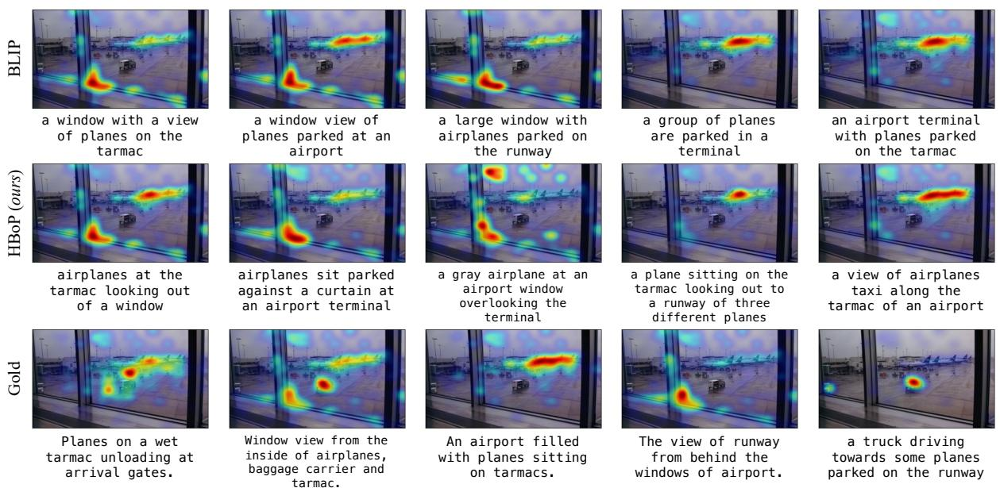
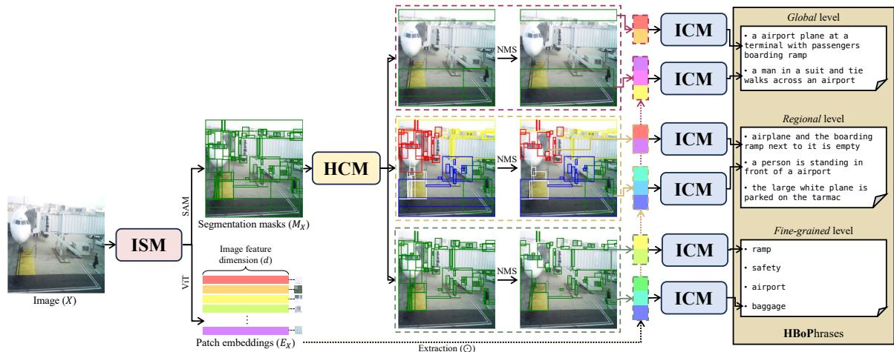
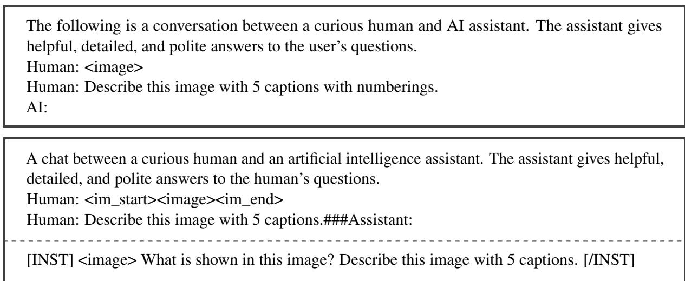
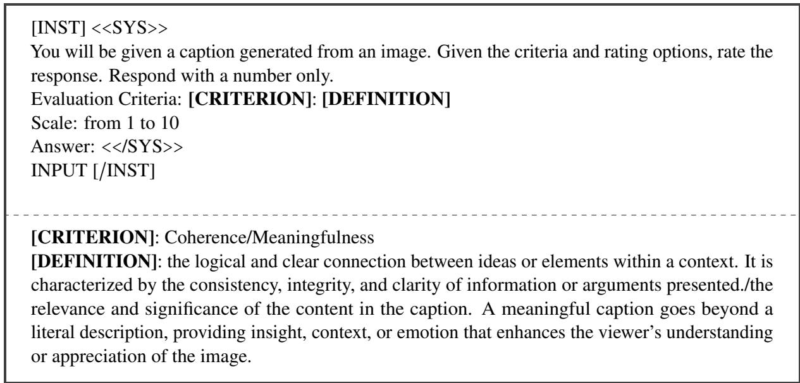
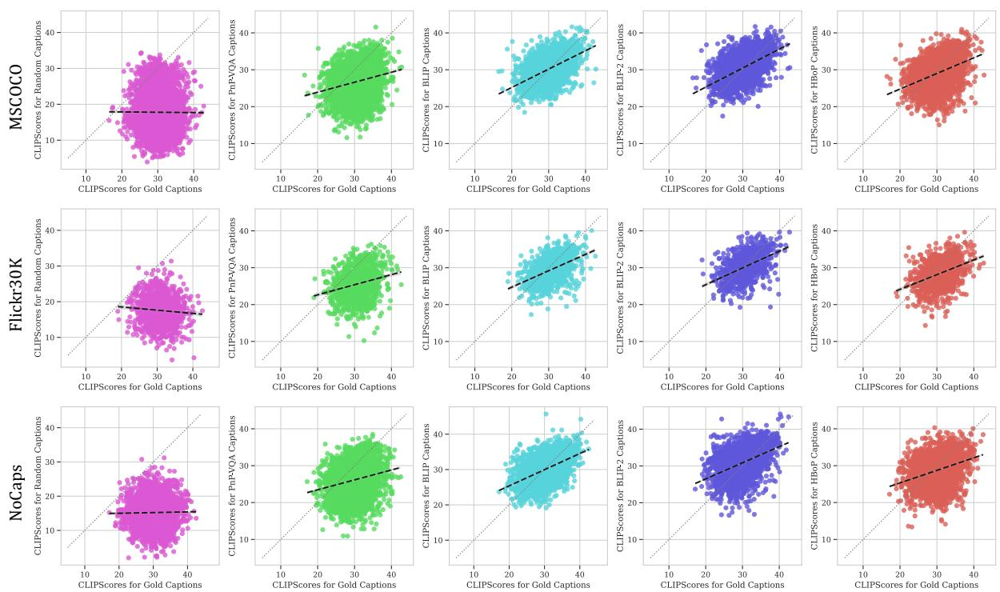
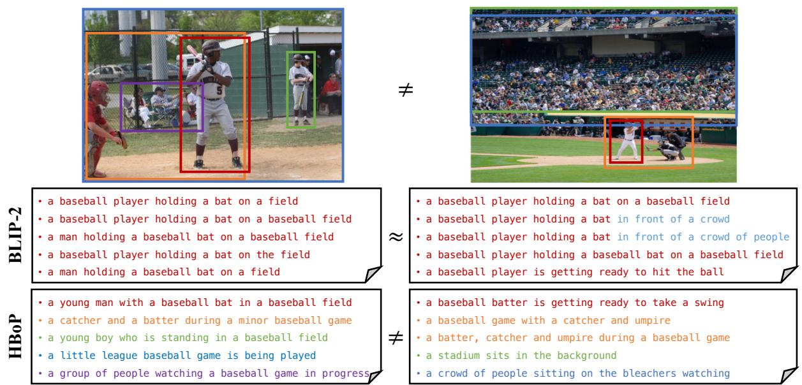
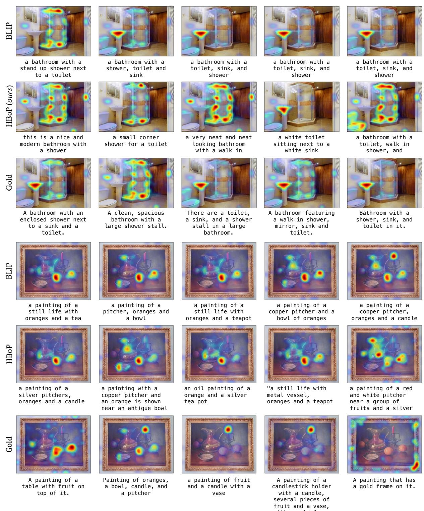

# Image Embedding Sampling Method for Diverse Captioning

Sania Waheed\*† University of Southhampton sw1m24@soton.ac.uk

Na Min An\* KAIST AI naminan@kaist.ac.kr

## Abstract

Image Captioning for state-of-the-art VLMs has significantly improved over time; however, this comes at the cost of increased computational complexity, making them less accessible for resource-constrained applications such as mobile devices and assistive technologies. Alternatively, comparably smaller VLMs pri oritize high-level scene descriptions, overlooking finer details that contribute to a richer understanding of an image. In this paper, we introduce a training-free framework that enhances caption diversity and informativeness by explicitly attending to distinct image regions using a comparably small VLM, BLIP, as the backbone. Our approach leverages structured segmentation to produce hierarchical representations that capture both global and localized semantics. Without requiring additional model training, we demonstrate that our method allows smaller VLMs to achieve performance comparable to larger models in terms of image-caption alignment, semantic integrity, and diversity. We evaluate our frame work on MSCOCO, Flickr30k, and Nocaps test datasets, achieving a Div-2 score of 0.735, 0.750, and 0.748 for each dataset, respectively, while maintaining strong image-caption relevancy and semantic integrity with the human annotated captions. Our code is available at https://github.com/xfactlab/HBoP.

## 1 Introduction

Visual-Language Models (VLMs) have seen rapid advancements in image captioning, benefiting from increasingly sophisticated architectures and larger training datasets (Alayrac et al., 2022; Li et al., 2022b; Radford et al., 2021a; Wang et al., 2022a). State-of-the-art large-scale models generate highly detailed and diverse captions, yet their extensive computational requirements can be prohibitive in resource-constrained settings. Conversely, smaller VLMs, while more efficient, often prioritize dominant visual elements and overlook fine-grained details, resulting in captions that lack the depth and specificity seen in human-generated captions (Aneja et al., 2019a; Bianco et al., 2023; Chen et al., 2023; Yuksekgonul et al., 2022; An et al., 2025).

Inspired by previous work (Ji et al., 2021; Shao et al., 2023; Shukor et al., 2022) that demonstrates the advantages of hierarchical approaches in image understanding, our method leverages structured segmentation to capture both global and regional aspects of an image. We sample segmentationdriven embeddings from the last layer of the visual encoder, where self-attention mechanisms have already propagated information across the entire image. This allows the model to explicitly attend to distinct local image regions while preserving contextual relationships, generating captions at multiple levels of granularity. This approach offers an efficient alternative to enhancing caption diversity in smaller VLMs without LLMs, achieving performance comparable to larger LLM-based models in terms of caption diversity and image-caption alignment.

We validate our approach, namely, HBoP - Hierarchical Bags of Phrases, by evaluating generated captions for MSCOCO (Lin et al., 2014), Flickr30k (Young et al., 2014), and Nocaps (Agrawal et al., 2019) datasets on conventional diversity metrics such as mBLEU-4, n-gram diversity (Aneja et al., 2019b), and newly presented pairwise cosine distance (PCD). Our findings show that structured caption generation effectively improves diversity while maintaining relevancy with images and human-generated captions (compare BLIP (Li et al., 2022a), HBoP, and gold captions in Figure 1).

  
Figure 1: Comparison of captions generated by BLIP, HBoP, and human annotations. The images are overlaid with GradCAM heatmaps to highlight the regions focused on by the pretrained image-text matching model (Li et al., 2022a). HBoP captions exhibit greater diversity compared to BLIP captions and are closer to human-annotated gold captions.

## 2 Related Works

Vision-language models have shown strong performance in multimodal tasks, with caption generation as a key benchmark. Models like CLIP (Radford et al., 2021a), Flamingo (Alayrac et al., 2022), and BLIP-2 (Li et al., 2023) use contrastive learning and large-scale pre-training to enhance vision-language alignment. However, they often produce high-level scene descriptions, missing finegrained details needed for detailed image understanding. Traditional captioning approaches treat images holistically, overlooking hierarchical details (Xu et al., 2021), unless explicitly trained for diversity, as in ModeCap (Chen et al., 2022) and Seq-CVAE (Aneja et al., 2019b).

Inspired by hierarchical representation techniques (Ji et al., 2021; Shao et al., 2023; Shukor et al., 2022), our approach samples latent image embeddings from structured segmentation to generate multi-level captions. This aligns with recent region-based methods using SAM (Shlapentokh-Rothman et al., 2024) and studies on caption quality focused on informational sufficiency, minimal redundancy, and human comprehensibility (Chen et al., 2024). Our evaluation metrics reflect these aspects: CLIP score for informational sufficiency, mBLEU and Div-2 for redundancy, and SBERT for comprehensibility.

## 3 Methodology

In this section, we introduce our proposed framework, HBoP (depicted in Fig 2), a modular architecture that uses pre-trained segmentation and captioning models. We show that HBoP ensures multiple levels of captions (i.e., global, regional, fine-grained) by inducing a hierarchical structure for image understanding.

## 3.1 Image Segmentation Module (ISM)

The first component of HBoP, ISM, selects patch embeddings (E ) corresponding to image regions $( X \ = \ ( X _ { 1 } , X _ { 2 } , . . . , X _ { n } ) )$ from the original image embeddings extracted using a Vision Transformer (ViT) (Dosovitskiy et al., 2020) encoder. These regions are selected based on segmentation masks produced by a segmentation model. In our implementation, we use the Segment Anything Model (SAM) \* (Kirillov et al., 2023) due to its strong segmentation performance across diverse benchmarks. For a set of p segmentation masks in the image, the resulting masks for the selected image regions would be: $M _ { X } = \left\{ \begin{array} { l l l } { M _ { X _ { 1 } } , M _ { X _ { 2 } } , . . . , M _ { X _ { p } } } \end{array} \right\} =$ = { } =SAM X , X RH×W×C, where H, W, and C represent the height, width, and channels of X.

  
Figure 2: The proposed HBoP framework consists of three components: (1) Image Segmentation Module (ISM), (2) Hierarchical Composition Module (HCM), and (3) Image Captioning Module (ICM). HBoP controls caption granularity by selecting meaningful patch embeddings of varying sizes from the segmentation model. For instance, for the regional level caption generation, although the selected regions correspond to specific visual entities (e.g., the “airplane” in red boxes or the “person” in green boxes), the generated captions go beyond these isolated regions to describe broader scene elements, such as the “boarding ramp” or the “airport.”

## 3.2 Hierarchical Composition Module (HCM)

The second component, HCM, is a key component that can control the level of captions. Specifically, we present three types of captions that can be derived using HCM.

Global/Fine-grained level captions The global segmentation masks $( M _ { G } )$ are selected by choosing the top-k (5 in our case) largest segmentation masks from $M _ { X }$ after applying non-maximum suppression (NMS)†(Hosang et al., 2017):

$$
\begin{array} { l } { M _ { G } = \{ M _ { g _ { 1 } } , M _ { g _ { 2 } } , . . . , M _ { n _ { g } } \} , } \\ { M _ { g _ { i } } = \mathrm { N M S } ( \mathrm { T o p } { - k ( M _ { X } ) } ) , \quad i = 1 , . . . , n _ { g } } \end{array}
$$

NMS removes multiple segmentation masks with overlapping, similar contexts using the Intersection over Union (IoU) and predicted confidence from SAM. The remaining masks, after applying NMS, can also be used to generate fine-grained captions (discussed in Appendix D.3):

$$
\begin{array} { r l } & { M _ { F } = \{ M _ { f _ { 1 } } , M _ { f _ { 2 } } , . . . , M _ { n _ { f } } \} , } \\ & { M _ { f _ { i } } = \mathbf { N M S } ( M _ { X } ) \setminus M _ { G } , \quad i = 1 , . . . , n _ { f } } \end{array}
$$

Regional level captions To create regional-level segmentation masks, $M _ { R } .$ , we use $K \cdot$ -means clustering to partition all the segmentation masks $( M _ { X } )$ and apply NMS to each cluster individually:

$$
\begin{array} { r l } & { M _ { R } = \{ M _ { r _ { 1 } } , M _ { r _ { 2 } } , . . . , M _ { K } \} , } \\ & { M _ { r _ { i } } = \mathrm { N M S } ( \mathrm { K } { \mathrm { - } } \mathrm { m e a n s } ( M _ { X } ) ) , i = 1 , . . . , K } \end{array}
$$

The hierarchical segmentation masks $( M _ { g } , M _ { r }$ and $M _ { f } )$ are used to extract relevant patch embeddings, $E _ { g } , E _ { r }$ and $E _ { f }$ using $E _ { X }$ from the first stage. We extract ( ) the corresponding embeddings by concatenating the extracted patch embeddings of different levels (see Appendix C.1). Thus, the final selected image embeddings can be categorized as:

$$
\begin{array} { l } { { E _ { G } = \{ E _ { g _ { 1 } } , E _ { g _ { 2 } } , . . . , E _ { g _ { n _ { g } } } \} , E _ { g _ { i } } = E _ { X } \odot M _ { g _ { i } } } } \\ { { E _ { R } = \{ E _ { r _ { 1 } } , E _ { r _ { 2 } } , . . . , E _ { K } \} , E _ { r _ { i } } = E _ { X } \odot M _ { r _ { i } } } } \\ { { E _ { F } = \{ E _ { f _ { 1 } } , E _ { f _ { 2 } } , . . . , E _ { n _ { f } } \} , E _ { f _ { i } } = E _ { X } \odot M _ { f _ { i } } } } \end{array}
$$

## 3.3 Image Captioning Module (ICM)

To generate captions for different levels of image embeddings, we use BLIP fine-tuned on image captioning (Li et al., 2022a) with the stochastic sampling method, following the same procedure as (Tiong et al., 2022). The caption generation process is repeated for $n _ { g } , n _ { r }$ , and $n _ { f }$ patch embeddings corresponding to the number of selected hierarchical masks. Since the patch embedding size may vary due to the different mask sizes, we use zero padding before using the captioning module. Our final HBoP captions would be:

<table><tr><td rowspan="2"></td><td rowspan="2">LLM</td><td rowspan="2"># of</td><td colspan="5">MSCOCO (5k test set)</td><td colspan="5">Flickr30K (1k test set)</td></tr><tr><td>Relevancy SBERT ↑</td><td>CLIP-S ↑</td><td>PCD</td><td>Diversity mBLEU-4↓</td><td>Div-2 ↑</td><td colspan="2">Relevancy SBERT ↑ CLIP-S ↑</td><td>PCD</td><td colspan="2">Diversity mBLEU-4 ↓ Div-2 ↑</td></tr><tr><td>Random</td><td></td><td>-</td><td>-</td><td>17.77</td><td>0.963</td><td>0.001</td><td>0.868</td><td></td><td>17.54</td><td>0.962</td><td>0.003</td><td>0.860</td></tr><tr><td>BLIP (-NS)</td><td>x</td><td>446M</td><td>56.00</td><td>29.98</td><td>0.600</td><td>1.000</td><td>0.179</td><td>55.78</td><td>28.58</td><td>0.600</td><td>1.000</td><td>0.179</td></tr><tr><td>BLIP (+NS)</td><td>x</td><td>446M</td><td>57.23</td><td>30.33</td><td>0.668</td><td>0.658</td><td>0.387</td><td>46.99</td><td>29.56</td><td>0.690</td><td>0.664</td><td>0.384</td></tr><tr><td>Seq-CVAE</td><td>x</td><td>–</td><td>-</td><td></td><td>–</td><td>0.640</td><td>0.480</td><td>-</td><td>1</td><td></td><td>-</td><td>1</td></tr><tr><td>ModeCap</td><td>x</td><td></td><td></td><td>29.35</td><td>0.714</td><td>0.281</td><td>0.594</td><td></td><td>-</td><td>-</td><td>-</td><td>-</td></tr><tr><td>BLIP-2</td><td>√</td><td>3.9B</td><td>65.47</td><td>30.66</td><td>0.651</td><td>0.712</td><td>0.345</td><td>57.81</td><td>30.37</td><td>0.667</td><td>0.732</td><td>0.336</td></tr><tr><td>Honeybee</td><td>√</td><td>7B</td><td>53.55</td><td>28.21</td><td>0.792</td><td>0.062</td><td>0.716</td><td>47.41</td><td>27.65</td><td>0.827</td><td>0.057</td><td>0.732</td></tr><tr><td>Honeybee</td><td>√</td><td>13B</td><td>55.11</td><td>27.41</td><td></td><td>0.014</td><td>0.872</td><td>50.41</td><td>27.27</td><td></td><td>0.013</td><td>0.875</td></tr><tr><td>LLaVA-1.5</td><td>√</td><td>13B</td><td>59.61</td><td>30.08</td><td>一</td><td>0.180</td><td>0.658</td><td>54.74</td><td>29.54</td><td></td><td>0.176</td><td>0.680</td></tr><tr><td>LLaVA-1.6</td><td>√</td><td>7B</td><td>55.99</td><td>29.36</td><td></td><td>0.046</td><td>0.787</td><td>51.00</td><td>27.46</td><td></td><td>0.028</td><td>0.809</td></tr><tr><td>Gold</td><td></td><td></td><td></td><td>30.33</td><td>0.753</td><td>0.043</td><td>0.748</td><td></td><td>30.87</td><td>0.776</td><td>0.049</td><td>0.760</td></tr><tr><td>HBoP (ours)</td><td>x</td><td>1B</td><td>56.30</td><td>29.12</td><td>0.772</td><td>0.049</td><td>0.735</td><td>54.00</td><td>28.46</td><td>0.815</td><td>0.042</td><td>0.750</td></tr><tr><td colspan="2">HBoP Ranking</td><td></td><td>4/8</td><td>8/11</td><td>1/7</td><td>5/12</td><td>5/12</td><td>4/8</td><td>6/10</td><td>1/6</td><td>4/10</td><td>5/10</td></tr></table>

Table 1: Relevance and diversity scores across different models on the MSCOCO and Flickr30K datasets. HBoP achieves stronger diversity with higher Div-2 and PCD scores and a lower mBLEU-4 score compared to smaller VLMs and models trained to enhance diversity, while maintaining comparable relevance scores (SBERT and CLIP-S). Additionally, HBoP demonstrates competitive performance relative to much larger LLM-based VLMs. Cell colors indicate relative comparison to HBoP, with red showing higher values and blue showing lower values. Arrows next to each metric denote whether a higher (↑) or lower (↓) value indicates better performance.

$$
\mathrm { \bf H B o P } _ { G } = \{ s _ { g _ { 1 } } , . . . , s _ { n _ { g } } \} , s _ { g _ { i } } = \mathrm { B L I P } ( E _ { g _ { i } } )
$$

$$
\mathrm { H B o P } _ { R } = \{ s _ { r _ { 1 } } , . . . , s _ { K } \} , s _ { r _ { i } } = \mathrm { B L I P } ( E _ { r _ { i } } )
$$

$$
\mathsf { H B o P } _ { F } = \{ s _ { f _ { 1 } } , . . . , s _ { n _ { f } } \} , s _ { f _ { i } } = \mathbf { B L I P } ( E _ { f _ { i } } )
$$

## 4 Results

HBoP achieves the best diversity scores while maintaining relevance among smaller VLMs. We evaluate the diversity and relevance of captions generated by different models in Table 1, using five captions per image. For HBoP, two global and three regional captions are sampled‡. Although HBoP increases the parameter count relative to BLIP, it remains significantly smaller than VLMs with LLMs, achieving a strong trade-off between diversity and model size. HBoP consistently achieves diversity scores closest to the gold-standard captions among smaller models, as measured by PCD (see Appendix C), mBLEU-4, and Div-2 (Aneja et al., 2019b). Specifically, it reduces mBLEU-4 by over 60% and improves Div-2 by more than 30% compared to BLIP (NS) while maintaining comparable relevancy scores. We also compare our embedding-sampling approach to a baseline where segmented regions are directly cropped and captioned; while cropping improves diversity, it reduces relevance due to loss of global context. Full results are provided in Appendix C.

Compared to baselines such as BLIP (Li et al., 2022a), Seq-CVAE (Aneja et al., 2019b), and ModeCap§(Chen et al., 2022), HBoP achieves the lowest mBLEU-4 and highest Div-2 scores. Notably, it even outperforms larger models like BLIP-2, Honeybee-7B(Cha et al., 2023), and LLaVA-1.5 (Liu et al., 2023a) in several diversity metrics, despite using 4× to 13× fewer parameters. This highlights HBoP’s effectiveness as a lightweight alternative for generating diverse captions without the overhead of large-scale models.

HBoP maintains strong similarity between generated captions and reference texts and image-text alignment, as measured by SBERT and CLIP-Score, respectively. We use SBERT similarity as a practical proxy for human evaluation, as the reference captions are human-written; thus, high SBERT scores indicate strong semantic alignment and provide an approximate measure of caption quality from a human perspective¶. HBoP achieves scores comparable to BLIP, BLIP-NS, and LLaVA, while outperforming HoneyBee. Although BLIP-2 scores the highest, HBoP demonstrates a strong balance between relevance and diversity. Further semantic integrity evaluations are detailed in Appendix C.3.3.

## 5 Conclusion

We propose HBoP, a hierarchical caption generation framework that leverages a modular architecture combining lightweight pre-trained VLMs and segmentation models to generate semantically meaningful yet diverse captions. Our experimental results demonstrate HBoP’s ability to produce meaningful image embeddings for captioning, achieving performance comparable to larger VLMs and human-generated captions. HBoP sets a solid baseline for future work aiming to extract more relevant knowledge by controlling the intermediate image embeddings.

## 6 Limitations

The current implementation of HBoP relies on bounding box approximations of segmentation masks to extract image embeddings. While effective, this may occasionally miss fine-grained or irregularly shaped image details. Exploring the use of full, irregular-shaped segmentation masks for embedding extraction is a promising direction for future work. Another limitation is that our approach primarily enhances factual diversity by focusing on distinct image regions, but it may be less effective for domains required for capturing cultural diversity (Bayramli et al., 2025), as such interpretations often rely on external cultural knowledge beyond visual features.

## 7 Ethical Statement

Captions generated with HBoP might inadvertently contain harmful content. However, the final caption outputs mainly depend on the image content and the pretrained image captioning model. Therefore, unless the images themselves are harmful or the pretrained model produces unsafe captions, HBoP captions are expected to pose minimal risk.

## 8 Acknowledgement

This work was supported by Institute for Information & communications Technology Planning & Evaluation (IITP) grant funded by the Korea government(MSIT) (RS-2019-II190075, Artificial Intelligence Graduate School Program (KAIST)).

## References

Harsh Agrawal, Karan Desai, Yufei Wang, Xinlei Chen, Rishabh Jain, Mark Johnson, Dhruv Batra, Devi Parikh, Stefan Lee, and Peter Anderson. 2019. Nocaps: Novel object captioning at scale. In Proceedings of the IEEE/CVF international conference on computer vision, pages 8948–8957.

Jean-Baptiste Alayrac, Jeff Donahue, Pauline Luc, Antoine Miech, Iain Barr, Yana Hasson, Karel Lenc, Arthur Mensch, Katherine Millican, Malcolm Reynolds, et al. 2022. Flamingo: a visual language model for few-shot learning. Advances in Neural Information Processing Systems, 35:23716–23736.

Na Min An, Eunki Kim, Wan Ju Kang, Sangryul Kim, Hyunjung Shim, and James Thorne. 2025. Can lvlms and automatic metrics capture underlying preferences of blind and low-vision individuals for navigational aid? arXiv preprint arXiv:2502.14883.

Na Min An, Sania Waheed, and James Thorne. 2024. Capturing the relationship between sentence triplets for LLM and human-generated texts to enhance sentence embeddings. In Findings of the Association for Computational Linguistics: EACL 2024, pages 624–638, St. Julian’s, Malta. Association for Computational Linguistics.

Jyoti Aneja, Harsh Agrawal, Dhruv Batra, and Alexander Schwing. 2019a. Sequential latent spaces for modeling the intention during diverse image captioning. Preprint, arXiv:1908.08529.

Jyoti Aneja, Harsh Agrawal, Dhruv Batra, and Alexander Schwing. 2019b. Sequential latent spaces for modeling the intention during diverse image captioning. In Proceedings ofthe IEEE/CVF International Conference on Computer Vision, pages 4261–4270.

Satanjeev Banerjee and Alon Lavie. 2005. METEOR: An automatic metric for MT evaluation with improved correlation with human judgments. In Proceedings of the ACL Workshop on Intrinsic and Extrinsic Evaluation Measures for Machine Translation and/or Summarization, pages 65–72, Ann Arbor, Michigan. Association for Computational Linguistics.

Zahra Bayramli, Ayhan Suleymanzade, Na Min An, Huzama Ahmad, Eunsu Kim, Junyeong Park, James Thorne, and Alice Oh. 2025. Diffusion models through a global lens: Are they culturally inclusive? In Proceedings of the 63rd Annual Meeting of the Associationfor Computational Linguistics (Volume 1: Long Papers), pages 31137–31155, Vienna, Austria. Association for Computational Linguistics.

Simone Bianco, Luigi Celona, Marco Donzella, and Paolo Napoletano. 2023. Improving image captioning descriptiveness by ranking and llm-based fusion. Preprint, arXiv:2306.11593.

Junbum Cha, Wooyoung Kang, Jonghwan Mun, and Byungseok Roh. 2023. Honeybee: Localityenhanced projector for multimodal llm. arXiv preprint arXiv:2312.06742.

Delong Chen, Samuel Cahyawijaya, Etsuko Ishii, Ho Shu Chan, Yejin Bang, and Pascale Fung. 2024. What makes for good image captions? Preprint, arXiv:2405.00485.

Qi Chen, Chaorui Deng, and Qi Wu. 2022. Learning distinct and representative modes for image captioning. Advances in Neural Information Processing Systems, 35:9472–9485.

Qi Chen, Chaorui Deng, and Qi Wu. 2023. Learning distinct and representative styles for image captioning. Preprint, arXiv:2209.08231.

Cheng-Han Chiang and Hung yi Lee. 2023. Can large language models be an alternative to human evaluations? Preprint, arXiv:2305.01937.

Marcella Cornia, Matteo Stefanini, Lorenzo Baraldi, and Rita Cucchiara. 2020. Meshed-memory transformer for image captioning. In Proceedings of the IEEE/CVF conference on computer vision and pattern recognition, pages 10578–10587.

Alexey Dosovitskiy, Lucas Beyer, Alexander Kolesnikov, Dirk Weissenborn, Xiaohua Zhai, Thomas Unterthiner, Mostafa Dehghani, Matthias Minderer, Georg Heigold, Sylvain Gelly, Jakob Uszkoreit, and Neil Houlsby. 2021. An image is worth 16x16 words: Transformers for image recognition at scale. Preprint, arXiv:2010.11929.

Alexey Dosovitskiy, Lucas Beyer, Alexander Kolesnikov, Dirk Weissenborn, Xiaohua Zhai, Thomas Unterthiner, Mostafa Dehghani, Matthias Minderer, Georg Heigold, Sylvain Gelly, et al. 2020. An image is worth 16x16 words: Transformers for image recognition at scale. In International Conference on Learning Representations.

Zhiyuan Fang, Jianfeng Wang, Xiaowei Hu, Lin Liang, Zhe Gan, Lijuan Wang, Yezhou Yang, and Zicheng Liu. 2022. Injecting semantic concepts into endto-end image captioning. In Proceedings of the IEEE/CVF conference on computer vision and pattern recognition, pages 18009–18019.

Jinlan Fu, See-Kiong Ng, Zhengbao Jiang, and Pengfei Liu. 2023. Gptscore: Evaluate as you desire. Preprint, arXiv:2302.04166.

Jack Hessel, Ari Holtzman, Maxwell Forbes, Ronan Le Bras, and Yejin Choi. 2021. Clipscore: A reference-free evaluation metric for image captioning. In Proceedings of the 2021 Conference on Empirical Methods in Natural Language Processing, pages 7514–7528.

Ari Holtzman, Jan Buys, Li Du, Maxwell Forbes, and Yejin Choi. 2019. The curious case of neural text degeneration. In International Conference on Learning Representations.

Jan Hosang, Rodrigo Benenson, and Bernt Schiele. 2017. Learning non-maximum suppression. In Proceedings of the IEEE conference on computer vision and pattern recognition, pages 4507–4515.

Zhong Ji, Kexin Chen, and Haoran Wang. 2021. Stepwise hierarchical alignment network for image-text matching. In IJCAI.

Andrej Karpathy and Li Fei-Fei. 2015. Deep visualsemantic alignments for generating image descriptions. Preprint, arXiv:1412.2306.

Alexander Kirillov, Eric Mintun, Nikhila Ravi, Hanzi Mao, Chloe Rolland, Laura Gustafson, Tete Xiao, Spencer Whitehead, Alexander C. Berg, Wan-Yen Lo, Piotr Dollár, and Ross Girshick. 2023. Segment anything. arXiv:2304.02643.

Junnan Li, Dongxu Li, Silvio Savarese, and Steven Hoi. 2023. Blip-2: Bootstrapping language-image pretraining with frozen image encoders and large language models. arXiv preprint arXiv:2301.12597.

Junnan Li, Dongxu Li, Caiming Xiong, and Steven Hoi. 2022a. Blip: Bootstrapping language-image pre-training for unified vision-language understanding and generation. In International Conference on Machine Learning, pages 12888–12900. PMLR.

Junnan Li, Dongxu Li, Caiming Xiong, and Steven Hoi. 2022b. Blip: Bootstrapping language-image pretraining for unified vision-language understanding and generation. Preprint, arXiv:2201.12086.

Chin-Yew Lin. 2004. ROUGE: A package for automatic evaluation of summaries. In Text Summarization Branches Out, pages 74–81, Barcelona, Spain. Association for Computational Linguistics.

Tsung-Yi Lin, Michael Maire, Serge Belongie, James Hays, Pietro Perona, Deva Ramanan, Piotr Dollár, and C Lawrence Zitnick. 2014. Microsoft coco: Common objects in context. In Computer Vision– ECCV 2014: 13th European Conference, Zurich, Switzerland, September 6-12, 2014, Proceedings, Part V 13, pages 740–755. Springer.

Shilong Liu, Hao Cheng, Haotian Liu, Hao Zhang, Feng Li, Tianhe Ren, Xueyan Zou, Jianwei Yang, Hang Su, Jun Zhu, et al. 2023a. Llava-plus: Learning to use tools for creating multimodal agents. arXiv preprint arXiv:2311.05437.

Yang Liu, Dan Iter, Yichong Xu, Shuohang Wang, Ruochen Xu, and Chenguang Zhu. 2023b. G-eval: Nlg evaluation using gpt-4 with better human alignment. Preprint, arXiv:2303.16634.

Maxime Oquab, Timothée Darcet, Théo Moutakanni, Huy Vo, Marc Szafraniec, Vasil Khalidov, Pierre Fernandez, Daniel Haziza, Francisco Massa, Alaaeldin El-Nouby, et al. 2023. Dinov2: Learning robust visual features without supervision. arXiv preprint arXiv:2304.07193.

Kishore Papineni, Salim Roukos, Todd Ward, and Wei-Jing Zhu. 2002a. Bleu: A method for automatic evaluation of machine translation. In Proceedings of the 40th Annual Meeting on Association for Computational Linguistics, ACL ’02, page 311–318, USA. Association for Computational Linguistics.

Kishore Papineni, Salim Roukos, Todd Ward, and Wei-Jing Zhu. 2002b. Bleu: a method for automatic evaluation of machine translation. In Proceedings of the 40th annual meeting of the Association for Computational Linguistics, pages 311–318.

Alec Radford, Jong Wook Kim, Chris Hallacy, Aditya Ramesh, Gabriel Goh, Sandhini Agarwal, Girish Sastry, Amanda Askell, Pamela Mishkin, Jack Clark, Gretchen Krueger, and Ilya Sutskever. 2021a. Learning transferable visual models from natural language supervision. Preprint, arXiv:2103.00020.

Alec Radford, Jong Wook Kim, Chris Hallacy, Aditya Ramesh, Gabriel Goh, Sandhini Agarwal, Girish Sastry, Amanda Askell, Pamela Mishkin, Jack Clark, et al. 2021b. Learning transferable visual models from natural language supervision. In International conference on machine learning, pages 8748–8763. PMLR.

Nils Reimers and Iryna Gurevych. 2019. Sentence-bert: Sentence embeddings using siamese bert-networks. In Proceedings of the 2019 Conference on Empirical Methods in Natural Language Processing and the 9th International Joint Conference on Natural Language Processing (EMNLP-IJCNLP), pages 3982–3992.

Ramprasaath R Selvaraju, Michael Cogswell, Abhishek Das, Ramakrishna Vedantam, Devi Parikh, and Dhruv Batra. 2017. Grad-cam: Visual explanations from deep networks via gradient-based localization. In Proceedings ofthe IEEE international conference on computer vision, pages 618–626.

Bin Shao, Jianzhuang Liu, Renjing Pei, Songcen Xu, Peng Dai, Juwei Lu, Weimian Li, and Youliang Yan. 2023. Hivlp: Hierarchical interactive video-language pre-training. In Proceedings of the IEEE/CVF International Conference on Computer Vision (ICCV), pages 13756–13766.

Michal Shlapentokh-Rothman, Ansel Blume, Yao Xiao, Yuqun Wu, Sethuraman T V, Heyi Tao, Jae Yong Lee, Wilfredo Torres, Yu-Xiong Wang, and Derek Hoiem. 2024. Region-based representations revisited. Preprint, arXiv:2402.02352.

Mustafa Shukor, Guillaume Couairon, and Matthieu Cord. 2022. Efficient vision-language pretraining with visual concepts and hierarchical alignment. In 33rd British Machine Vision Conference (BMVC).

Yucheng Suo, Linchao Zhu, and Yi Yang. 2023. Text augmented spatial aware zero-shot referring image segmentation. In Findings of the Association for Computational Linguistics: EMNLP 2023, pages 1032–1043, Singapore. Association for Computational Linguistics.

Anthony Meng Huat Tiong, Junnan Li, Boyang Li, Silvio Savarese, and Steven CH Hoi. 2022. Plug-andplay vqa: Zero-shot vqa by conjoining large pretrained models with zero training. In Findings of the Associationfor Computational Linguistics: EMNLP 2022, pages 951–967.

Hugo Touvron, Louis Martin, Kevin Stone, Peter Albert, Amjad Almahairi, Yasmine Babaei, Nikolay Bashlykov, Soumya Batra, Prajjwal Bhargava, Shruti Bhosale, et al. 2023. Llama 2: Open foundation and fine-tuned chat models. arXiv preprint arXiv:2307.09288.

Ramakrishna Vedantam, C. Lawrence Zitnick, and Devi Parikh. 2015. Cider: Consensus-based image description evaluation. In 2015 IEEE Conference on Computer Vision and Pattern Recognition (CVPR), pages 4566–4575.

Sania Waheed, Na Min An, Michael Milford, Sarvapali D Ramchurn, and Shoaib Ehsan. 2025. Vlmguided visual place recognition for planet-scale geolocalization. arXiv preprint arXiv:2507.17455.

Wenhui Wang, Hangbo Bao, Li Dong, Johan Bjorck, Zhiliang Peng, Qiang Liu, Kriti Aggarwal, Owais Khan Mohammed, Saksham Singhal, Subhojit Som, and Furu Wei. 2022a. Image as a foreign language: Beit pretraining for all vision and visionlanguage tasks. Preprint, arXiv:2208.10442.

Wenhui Wang, Hangbo Bao, Li Dong, Johan Bjorck, Zhiliang Peng, Qiang Liu, Kriti Aggarwal, Owais Khan Mohammed, Saksham Singhal, Subhojit Som, et al. 2022b. Image as a foreign language: Beit pretraining for all vision and vision-language tasks. arXiv preprint arXiv:2208.10442.

Yuji Wang, Jingchen Ni, Yong Liu, Chun Yuan, and Yansong Tang. 2025. Iterprime: Zero-shot referring image segmentation with iterative grad-cam refinement and primary word emphasis. arXiv preprint arXiv:2503.00936.

Guanghui Xu, Shuaicheng Niu, Mingkui Tan, Yucheng Luo, Qing Du, and Qi Wu. 2021. Towards accurate text-based image captioning with content diversity exploration. In Proceedings ofthe IEEE/CVF Conference on Computer Vision and Pattern Recognition, pages 12637–12646.

Ting Yao, Yingwei Pan, Yehao Li, and Tao Mei. 2019. Hierarchy parsing for image captioning. In Proceedings of the IEEE/CVF international conference on computer vision, pages 2621–2629.

Peter Young, Alice Lai, Micah Hodosh, and Julia Hockenmaier. 2014. From image descriptions to visual denotations: New similarity metrics for semantic inference over event descriptions. Transactions of the Associationfor Computational Linguistics, 2:67–78.

Seonghoon Yu, Paul Hongsuck Seo, and Jeany Son. 2023. Zero-shot referring image segmentation with global-local context features. In Proceedings ofthe

IEEE/CVF Conference on Computer Vision and Pattern Recognition (CVPR), pages 19456–19465.

Mert Yuksekgonul, Federico Bianchi, Pratyusha Kalluri, Dan Jurafsky, and James Zou. 2022. When and why vision-language models behave like bags-of-words, and what to do about it? In The Eleventh International Conference on Learning Representations.

Xuying Zhang, Xiaoshuai Sun, Yunpeng Luo, Jiayi Ji, Yiyi Zhou, Yongjian Wu, Feiyue Huang, and Rongrong Ji. 2021. Rstnet: Captioning with adaptive attention on visual and non-visual words. In Proceedings of the IEEE/CVF conference on computer vision and pattern recognition, pages 15465–15474.

Xu Zhao, Wenchao Ding, Yongqi An, Yinglong Du, Tao Yu, Min Li, Ming Tang, and Jinqiao Wang. 2023. Fast segment anything. Preprint, arXiv:2306.12156.

## A Appendix

## B Additional Related Works

## B.1 Vision-Language Models (VLMs)

A growth of interest in VLMs has continued due to the wide availability of multimodal data on the web (Waheed et al., 2025). Foundation VLMs can be applied to a range of tasks in a zero-shot manner. Notably, CLIP (Radford et al., 2021b) jointly pre-trains an image encoder and a text encoder by maximizing and minimizing the cosine similarity of correct and incorrect image-text pair embeddings, respectively, with image-text contrastive (ITC) loss. In contrast, BLIP (Li et al., 2022a) uses both ITC and image-text matching (ITM) loss for enhanced image-text data representation. Additionally, the BLIP (Li et al., 2022a) captioner uses language modeling (LM) loss for autoregressive image caption generation along with a filter, capfilt, to improve the quality of image-text pairs for training.

Flamingo (Alayrac et al., 2022) shows remarkable zero-shot ability in image captioning, visual questionanswering (VQA), and image-text retrieval (ITR) tasks by leveraging the few-shot learning ability of pre-trained vision-only and language-only models. It simply interleaves input visual data with task-specific text examples, producing free-form texts for unseen visual data. Another general-purpose model, BEIT3 (Wang et al., 2022b) with a Multiway Transformer structure, uses different types of modality experts to perform fusion and modality-specific training. A masked modeling objective on images only and image-text pairs is performed for computer vision tasks (e.g., image classification, semantic segmentation, object detection) and vision-language tasks (e.g., VQA), respectively. Whereas the VQA task uses a fused encoder for image-text pairs, the ITR task encodes images and texts independently with ITC loss. Lastly, sequence-to-sequence learning is applied to generate texts from images for the image captioning task. Inspired by these previous works, we propose a meta-VLM model that utilizes a pre-trained BLIP (Li et al., 2022a) image captioning module to generate enhanced textual representations, which can later serve as useful data for various downstream tasks.

## B.2 Hierarchical Representation

Identifying and extracting regions of interest within images is crucial for a hierarchical representation. The most intuitive way to achieve this would typically involve the use of object detectors (Yao et al., 2019; Cornia et al., 2020; Zhang et al., 2021). However, the heavy computational demands of the object detectors inevitably lead to inefficiency during the inference stage (Yao et al., 2019; Cornia et al., 2020; Zhang et al., 2021). In response, recent works sought to replace these cumbersome detectors by adopting visual concepts in the form of object tags (Fang et al., 2022; Shukor et al., 2022) as an alternative. However, this detector-free approach is contingent upon the availability of object-specific data within the dataset. Employing pre-trained models is a more efficient way to identify areas of interest within images. GradCAM (Selvaraju et al., 2017) highlights essential regions that the pre-trained models use to predict any target concept using its gradients with respect to feature map activations of the final convolutional layer. DINOv2 (Oquab et al., 2023) capitalizes on existing self-supervised pre-trained models to generate robust, all-purpose visual features, supporting a wide array of tasks ranging from image-level classification to pixel-level segmentation. However, the image regions/features delineated by GradCAM/DINOv2 tend to show saliency for specific tasks and are unable to capture the full spectrum of visual representations. Conversely, SAM (Kirillov et al., 2023) intricately segments every semantically significant component of an image into high-quality segmentation masks generated by prompting with various inputs such as point, box, mask, or free-form text, unrestricted by the types of tasks. In our framework, we integrate SAM (Kirillov et al., 2023) to create semantically meaningful segmentation masks for an entire image automatically.

Several prior studies have incorporated the principles of hierarchy or multi-scale representation into their model architectures, aiming to enhance the alignment between images and texts (Ji et al., 2021; Shao et al., 2023; Shukor et al., 2022). SHAN (Ji et al., 2021) deconstructs the image-text matching process into two distinct facets: fragment-level and context-level alignments, enabling matches across three different scopes: local-to-local, global-to-local, and global-to-global. HiVLP (Shao et al., 2023) leverages both lowand high-dimensional features to represent coarse and fine details. ViCHA (Shukor et al., 2022) aligns images and texts across various layers of neural network encoders with the underlying assumption that each layer reflects varying semantic levels. Unlike these approaches, we divide the segmentation masks hierarchically and use the embeddings of the extracted individual image patches for caption generation.

## B.3 Caption Evaluation

Common image captioning evaluation metrics, including BLEU (Papineni et al., 2002a), METEOR (Banerjee and Lavie, 2005), ROUGE (Lin, 2004), and CIDEr (Vedantam et al., 2015) scores, are primarily n-gram approaches that assess the quality of generated captions by considering their overlap with humangenerated captions. Most SOTA VLMs frequently exhibit promising scores across these conventional evaluation metrics. However, these metrics are limited in their capabilities to measure the diversity of the generated captions. This limitation leads to a bias in these models towards generating an "average" and "safe" caption reflecting the most basic information in the image, rendering them less informative than human-generated captions. To address this gap, we incorporate several diversity metrics, including mBLEU-4, Div-2 (Aneja et al., 2019b), and the proposed pairwise cosine distance (PCD), along with semantic integrity and relevance scores to ensure that the captions generated by our framework are not only diverse but also meaningful and directly relevant to the given image and human-annotated captions.

## C Experiments

## C.1 Implementation Details

The ISM (Section 3.1) employs the fully automated SAM with no prompting (Kirillov et al., 2023), along with the image encoder initialized from ViT (ViT-L/16) pre-trained on ImageNet (Dosovitskiy et al., 2021), following the same settings as BLIP (Li et al., 2022a). Note that we use BLIP (Li et al., 2022a) for captioning instead of BLIP-2 (Li et al., 2023) since BLIP-2 uses intermediate representations trained on pairs of entire images and texts for caption generation using an LLM, which is not directly applicable to HBoP that uses pairs of image patches and texts.

The HCM (Section 3.2) creates the global level by selecting the top (k 5) masks with the largest areas and designating the remaining masks as fine-grained. To create the regional level, K-means clustering, with (K 5) clusters per image, is applied to the bounding boxes of the segmentation masks. For each cluster, we extract patch embeddings corresponding to the semantically segmented regions, projecting the clusters onto the image to identify relevant patches. The embeddings from each cluster are concatenated, and zero-padding is applied to preserve the original shape, ensuring that each cluster represents a semantically coherent region of the image. These regional embeddings are then used as input for caption generation in the captioning module. Lastly, the ICM (Section 3.3) follows the methodology outlined in Tiong et al., 2022.

While NMS with a threshold of 0.1 is applied at all three levels for all main experiments, we also conduct ablation experiments to examine the impact of varying the IoU threshold used in our sampling strategy. As shown in Table 2, while performance shows slight variation across different thresholds, our method consistently outperforms the baselines. This variance occurs because increasing the IoU threshold allows more overlapping image regions to be included, which tends to generate more repetitive captions and thus reduces diversity (PCD and Div-2 scores decreased).

<table><tr><td rowspan=1 colspan=1>IoU Threshold</td><td rowspan=1 colspan=1>PCD</td><td rowspan=1 colspan=1>Div-2 ↑</td></tr><tr><td rowspan=3 colspan=1>0.10.40.8</td><td rowspan=1 colspan=1>0.772</td><td rowspan=1 colspan=1>0.735</td></tr><tr><td rowspan=1 colspan=1>0.709</td><td rowspan=1 colspan=1>0.728</td></tr><tr><td rowspan=1 colspan=1>0.684</td><td rowspan=1 colspan=1>0.666</td></tr></table>

Table 2: Diversity results at different IoU thresholds.

Although HBoP presents a three-tier hierarchical structure, it is crucial to note that we adjust the different hierarchy levels depending on a given dataset. A dataset with information-rich complex images would require using all three hierarchy levels. However, a dataset with relatively simpler images, such as the MSCOCO dataset (Lin et al., 2014), would benefit from a two-tier hierarchy with just the global and regional captions. We use the first two levels during evaluations unless specified otherwise.

All the model captions in Tables 1 and 6 are regenerated, except for Seq-CVAE (Aneja et al., 2019b), where the results are taken directly from the original paper. While HBoP benefits from bounding box information, it is important to note that other baseline methods (e.g., ModeCap) have the additional advantage of explicit learning objectives to improve diversity. The exact prompts we use for Honeybee (Cha et al., 2023) (top) and LLaVA-1.5/1.6 (Liu et al., 2023a) are in Table 7.

## C.2 Crop vs. Embedding Sampling Comparison

We present a comparison between our embedding-sampling approach (HBoP) and a baseline where segmented image regions are directly cropped and captioned using BLIP. Table 3 shows that while cropping can improve diversity scores, it often sacrifices relevance as indicated by SBERT. In contrast, HBoP preserves contextual understanding by sampling from full-image embeddings.

<table><tr><td>Models</td><td>SBERT ↑</td><td>MSCOCO mBLEU-4↓</td><td>Div-2 ↑</td><td>SBERT ↑</td><td>Flickr30k mBLEU-4↓</td><td>Div-2 ↑</td></tr><tr><td>BLIP (-NS)</td><td>56.00</td><td>1.00</td><td>0.179</td><td>55.78</td><td>1.00</td><td>0.179</td></tr><tr><td>BLIP (+NS)</td><td>57.23</td><td>0.66</td><td>0.387</td><td>46.99</td><td>0.66</td><td>0.387</td></tr><tr><td>Crop</td><td>52.03</td><td>0.10</td><td>0.600</td><td>50.00</td><td>0.08</td><td>0.610</td></tr><tr><td>HBoP</td><td>56.30</td><td>0.05</td><td>0.735</td><td>54.00</td><td>0.04</td><td>0.750</td></tr></table>

Table 3: Comparison of our embedding sampling approach (HBoP) with direct cropping of segmented regions.

## C.3 Evaluation

We evaluate the model captions using three distinct metrics: 1) diversity across captions per image, 2) relevancy with images, and 3) semantic coherence and meaningfulness. The datasets we use for evaluation are: the Karpathy test split (Karpathy and Fei-Fei, 2015) of MSCOCO (5k images) (Lin et al., 2014), Flickr30K zero-shot (1k test images) (Young et al., 2014), and NoCaps validation (4.5k images) (Agrawal et al., 2019).

## C.3.1 Diversity

We measure the diversity in the generated captions using the cosine similarity between the sentence embeddings of all the corresponding captions per image. The comparison baselines are random captions, where each caption corresponds to different images, BLIP (Li et al., 2022a) with and without nucleus sampling (NS||) (Holtzman et al., 2019), BLIP-2 (Li et al., 2023), ModeCap (Chen et al., 2022), Honeybee (Cha et al., 2023), and gold captions\*\*. The diversity of the generated captions $( s _ { 1 } , s _ { 2 } , . . . s _ { n } )$ per dataset instance†† is measured using pairwise cosine distance (PCD):

$$
\mathrm { P C D } ( s _ { 1 } , s _ { 2 } , . . . s _ { n } ) = \frac { 1 } { n } \sum _ { i = 1 } ^ { n } \sum _ { j = 1 } ^ { j < i } \bigl ( 1 - c o s \bigl ( M ( s _ { i } ) , M ( s _ { j } ) \bigr ) \bigr )\tag{1}
$$

In the above equation, cos represents the cosine similarity of the input embeddings. We use sentence embeddings from a pre-trained sentence transformer model (all-MiniLM-L6-v2) (Reimers and Gurevych, 2019), denoted as M in Eq. 1, that can capture the semantic relationships between captions (An et al., 2024). This measure evaluates the extent to which the generated captions differ from each other per image. We report the final diversity score for each dataset as the average PCD score of all images in the dataset. Ideally, the PCD score should be lower than that of random captions that serve as the upper bound of the diversity score, but it should be higher than that for captions generated by existing baselines.

Additionally, we use mBLEU-4 and n-gram diversity (e.g., Div-1, Div-2) (Aneja et al., 2019b), to compare with more challenging baseline models, such as ModeCap (Chen et al., 2022) and Seq-CVAE (Aneja et al., 2019b) that are built to achieve diversity within captions per image. For ModeCap (Chen et al., 2022), we follow the default settings from the original paper to reproduce the results based on training the Transformer-DML model. We also prompt a recently introduced multimodal LLM called Honeybee (Cha et al., 2023) as follows: "Describe this image with 5 diverse captions, using less than 20 words for each caption."

## C.3.2 Relevancy

While confirming that each dataset contains captions with high semantic integrity is crucial, the captions must also be relevant to the corresponding images. We employ CLIP-Score (Hessel et al., 2021) that calculates the correlation between visual and textual CLIP embeddings (Radford et al., 2021b) using pre-trained ViT (openai/ clip-vit-base-patch32) without relying on human-generated references. Similar to the comparison baseline datasets for semantic integrity evaluation, we compare HBoP with PnP-VQA (Tiong et al., 2022), BLIP (Li et al., 2022a), BLIP-2 (Li et al., 2023), gold captions, and random captions. We generate random captions by selecting five random captions for each image from a pool of HBoP captions corresponding to different images. In other words, although the random caption itself should make sense, they depict mismatched images. We randomly select one out of a total of five captions per image for each dataset and compute the correlation between CLIPScores of generated captions and gold captions.

Additionally, we measure the semantic similarity between ground-truth (or gold) captions and captions generated with models using transformer-based SBERT (Reimers and Gurevych, 2019). Note that this metric is robust to synonyms or paraphrasing, unlike n-gram metrics (Papineni et al., 2002b; Lin, 2004).

## C.3.3 Semantic Integrity

HBoP generates semantically meaningful captions. We evaluate the semantic integrity of HBoP captions using LLMs, LLaMA-2-13b (Touvron et al., 2023) and GPT-4 (Fu et al., 2023), which have shown high correlation with human judgment (Chiang and yi Lee, 2023; Liu et al., 2023b; Fu et al., 2023). Table 4 shows that HBoP achieves semantic integrity scores close to the gold captions and notably outperforms models like PnP-VQA (Tiong et al., 2022). We attribute this improvement to our method’s ability to sample more meaningful image embeddings via the proposed Hierarchical Composition Module (HCM).

We prompt Llama-2-13B (Llama-2-13b-chat -hf) (Touvron et al., 2023) to access the semantic integrity of HBoP captions along with gold and other baselines (PnP-VQA (Tiong et al., 2022), BLIP (Li et al., 2022a), BLIP-2 (Li et al., 2023)) captions. Specifically, we randomly select two captions out of a total of five captions per image for each dataset and evaluate the semantic integrity by averaging the coherency and meaningfulness scores for each caption using the prompt shown in Table 8. We use the prompt "This is a picture of" to generate captions for all models in our experiments. This deliberate choice ensures a fair comparison of the general caption generation ability across models, as altering the prompt can yield significantly different results, making fair evaluation challenging.

Similarly, we use GPT-4 (Fu et al., 2023) for additional Semantic Integrity evaluation using only a single caption per image with the prompt shown in Table 9. Note that we sample the first 1k image instances in each dataset for this evaluation due to the cost limitations.

<table><tr><td></td><td>PnP-VQA</td><td>BLIP</td><td>BLIP-2</td><td>Gold</td><td>HBoP</td></tr><tr><td>LLama-2-13B</td><td>7.70</td><td>9.36</td><td>9.69</td><td>9.17</td><td>8.56</td></tr><tr><td rowspan="2">GPT-4</td><td>(±0.09)</td><td>(±0.05)</td><td>(±0.05)</td><td>(±0.06)</td><td>(±0.07)</td></tr><tr><td>2.18</td><td>2.97</td><td>2.96</td><td>2.94</td><td>2.48</td></tr><tr><td></td><td>(±0.84)</td><td>(±0.10)</td><td>(±0.19)</td><td>(±0.49)</td><td>(±0.73)</td></tr></table>

Table 4: Semantic Integrity scores exhibit a similar trend across two LLM evaluations for the Flickr30K dataset (1k test set).

## D Additional Results

## D.1 Relevancy

In Figure 3, HBoP captions (y-axis values in the last column) show comparable relevance scores with gold captions (x-axis values in the last column) with the slope of a linear regression line‡‡ being close to 0.5. Although the slopes of these regression lines (MSCOCO (Lin et al., 2014): 0.42, Flickr30k (Young et al., 2014): 0.39, Nocaps (Agrawal et al., 2019): 0.34) are less than those of BLIP (Li et al., 2022a) (0.49, 0.44, and 0.45) and BLIP-2 (Li et al., 2023) (0.51, 0.45, 0.43), we observe a trend of having relevance scores in the range of 20 to 40 for both x and y axes values. On the other hand, relevance scores for random and PnP-VQA (Tiong et al., 2022) captions have a spurious and less-correlated relation with those of gold captions.

## D.2 GradCAM Results

In addition to the evaluation results of the generated captions (samples in Figure 4), we illustrate how the generated captions correlate with specific image regions through GradCAMs (Selvaraju et al., 2017). The visual representation identifies the image regions on which the generated captions are based. Specifically, we aggregate the gradients from all cross-attention layers of the pre-trained ITM model in PnP-VQA (Tiong et al., 2022). Whereas PnP-VQA (Tiong et al., 2022) feeds the question for the textual input, we input BLIP (Li et al., 2022a) and gold captions, along with HBoP captions. As shown in Figures 1 and 5, the highlighted regions in the image for HBoP captions closely resemble the same pattern as those observed using human-generated captions. On the contrary, BLIP exhibits a more constrained range, predominantly concentrating on specific image regions.

## D.3 Fine-grained Captions

Although not evaluated in the perspectives of the three main evaluation metrics, we can also create what we refer to as fine-grained captions that can serve as image tags using our proposed methodology. These serve as supplementary information, enhancing the depth of understanding of the image. They are more vital when dealing with complex images containing various small or intricate objects, which conventional caption generation processes may often overlook. By introducing the additional layer of granularity, our approach ensures a more detailed and inclusive interpretation of the image.

## D.4 FastSAM Results

While the segmentation step introduces additional overhead, the hierarchical embedding process itself does not, as it operates directly on the single full-image embedding. Therefore, embedding is not a computational bottleneck in our pipeline. As shown below (Table 5), we provide a comparison of inference time (average per image) between BLIP and HBoP on the MSCOCO dataset. While SAM does increase inference time, it brings significant gains in diversity without sacrificing performance. Furthermore, this overhead can be drastically reduced by replacing SAM with FastSAM (Zhao et al., 2023), which provides comparable segmentation quality at 50–170× faster runtime.

<table><tr><td>Models</td><td>Segmentation Time (s/img)</td><td>Captioning Time (s/caption)</td></tr><tr><td>BLIP</td><td></td><td>0.38</td></tr><tr><td>HBoP (SAM)</td><td>5.43</td><td>0.38</td></tr><tr><td>HBoP (FastSAM)</td><td>0.18</td><td>0.38</td></tr></table>

Table 5: Average segmentation and captioning time for different models.

<table><tr><td></td><td># Param</td><td>PCD</td><td>mBLEU-4↓</td><td>Div-2 ↑</td></tr><tr><td>Random</td><td>=</td><td>0.962 (+0.223)</td><td>0.001</td><td>0.867</td></tr><tr><td rowspan="4">BLIP (-NS) BLIP-2 BLIP (+NS) Honeybee</td><td>446M</td><td>0.600 (-0.129)</td><td>1.000</td><td>0.178</td></tr><tr><td>3.9B</td><td>0.654 (-0.075)</td><td>0.715</td><td>0.340</td></tr><tr><td>446M 7B</td><td>0.679 (-0.050)</td><td>0.629</td><td>0.400</td></tr><tr><td>-</td><td>0.791 (+0.062) 0.729</td><td>0.080 0.078</td><td>0.705 0.666</td></tr><tr><td colspan="2">HBoP (ours) HBoP Ranking</td><td>0.783 (+0.054) 2/6</td><td>0.041 2/7</td><td>0.748 2/7</td></tr></table>

Table 6: Diversity scores for Nocaps test set. We observe a similar diversity trend across model captions as Table 1.

  
Table 7: Image caption generation prompts for Honeybee (top) and LLaVA-1.5/1.6 (bottom).

  
Table 8: The prompt for evaluating semantic integrity (coherence + meaningfulness) of generated model captions using Llama-2-13B.

You will be given one caption written for describing an image.   
Your task is to rate the caption on one metric.   
Please make sure you read and understand these instructions carefully. Please keep this   
document open while reviewing, and refer to it as needed.   
Evaluation Criteria:   
Fluency (1-3): the quality of the caption in terms of grammar, spelling, punctuation, word choice,   
and sentence structure.   
- 1: Poor. The caption has many errors that make it hard to understand or sound unnatural.   
- 2: Fair. The caption has some errors that affect the clarity or smoothness of the text, but the main   
points are still comprehensible.   
- 3: Good. The caption has few or no errors and is easy to read and follow.   
Example:   
Caption:   
Caption   
Evaluation Form (scores ONLY):   
- Fluency (1-3):  
Table 9: The prompt for evaluating semantic integrity (i.e., fluency) of generated model captions using GPT-4.

  
Figure 3: Correlation of relevance scores between gold captions and model captions. We observe higher correlations for HBoP, BLIP, and BLIP-2 captions as comapred to random and PnP-VQA captions.

  
Figure 4: Comparison between captions generated using BLIP-2 (Li et al., 2023) and HBoP. Our captions contain more diverse interpretations of the images while maintaining high relevancy.

  
Figure 5: Additional visualizations of GradCAMs across different model captions.