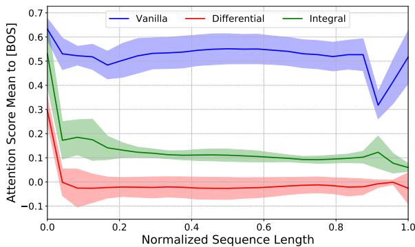
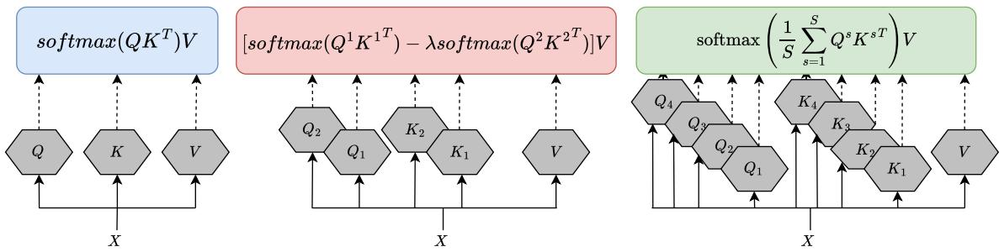
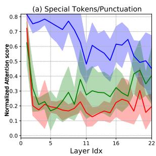
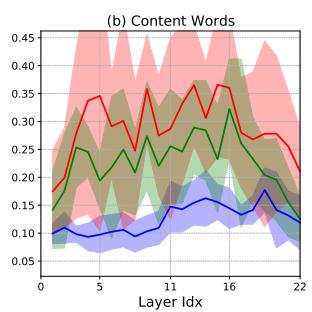
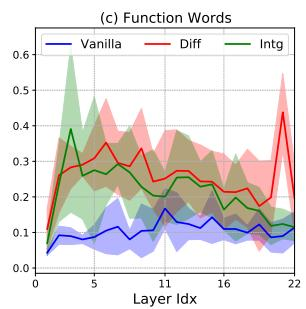
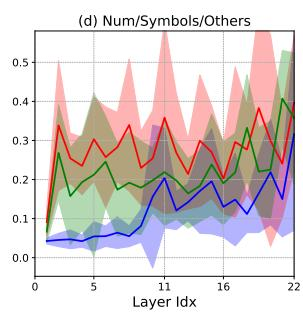
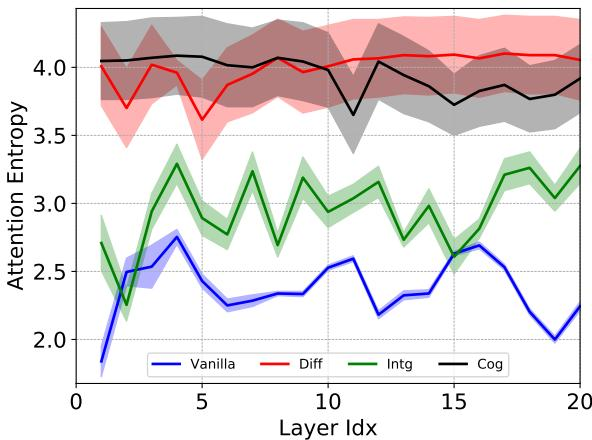
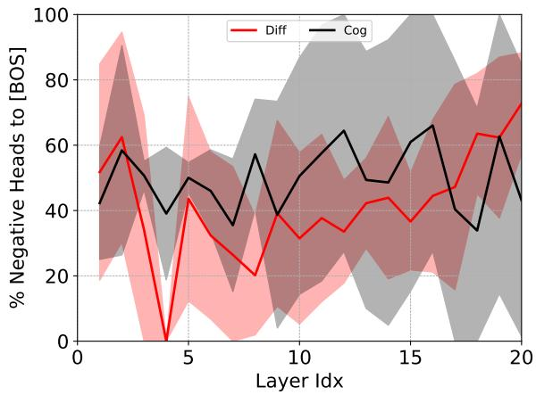

# Integral Transformer: Denoising Attention, Not Too Much Not Too Little

Ivan Kobyzev\* Abbas Ghaddar\* Dingtao Hu Boxing Chen Huawei Noah’s Ark Lab, Montreal Research Center, Canada {ivan.kobyzev,abbas.ghaddar,dingtao.hu,boxing.chen}@huawei.com

## Abstract

Softmax self-attention often assigns disproportionate weight to semantically uninformative tokens such as special tokens and punctuation, a phenomenon known as attention noise. While recent methods like Cog Attention and the Differential Transformer have addressed this by introducing negative attention scores, they risk discarding useful information. In this paper, we propose the Integral Transformer, a novel selfattention mechanism that denoises attention by integrating signals sampled from the logit distribution. Our approach mitigates noise while preserving the contributions of special tokens critical for model performance. Extensive experiments demonstrate that our model outperforms vanilla, Cog, and Differential attention variants on well-established knowledge and reasoning language benchmarks. Moreover, our analysis reveals that employing vanilla self-attention in the lower Transformer layers enhances performance and that the Integral Transformer effectively balances attention distributions and reduces rank collapse in upper layers.

## 1 Introduction

Self-attention, a core component of the Transformer architecture (Vaswani et al., 2017), has remained a dominant component in state-of-the-art language modeling (Dubey et al., 2024; Yang et al., 2024), computer vision (Rombach et al., 2022; Radford et al., 2021), and speech recognition (Radford et al., 2023) models. Consequently, research efforts continue to focus on enhancing the performance (Shen et al., 2019; Chang et al., 2021), latency (Dao, 2023; Shah et al., 2024), and memory efficiency (Xiao et al., 2024; Liu et al., 2024) of vanilla self-attention mechanism.

The tendency of Vanilla Transformer Language Models (Touvron et al., 2023) to allocate disproportionately large attention scores to tokens that lack semantic importance (e.g. blue curve in Figure 1), such as special tokens or punctuation, has long been a subject of interest (Kovaleva et al., 2019; Clark et al., 2019b). With the rise of large language models (LLMs) (Hurst et al., 2024; Liu et al., 2024), this phenomenon has recently attracted attention from machine learning researchers (Sun et al., 2024; Yu et al., 2024), who have labeled such tokens as noninformative or irrelevant context tokens and often referred to this phenomenon as attention noise.

  
Figure 1: The attention scores (from all tokens in the sequence) in the last layer of Vanilla, Differential, and Integral Transformers with 1.2 billion parameters are measured relative to the beginning-of-sequence [BOS] token. The figure shows the mean (curve) and standard deviation (shaded area) of the attention scores across all attention heads. It is drawn from a randomly selected subset of 1600 samples from the 8 language modeling datasets considered in this study.

Cog Attention (Lv et al., 2024) and the Differential Transformer (Ye et al., 2025) propose new self-attention mechanisms that not only diminish the noise but also allow attention scores to become negative for such tokens (red curve in Figure 1), thereby reallocating attention to tokens deemed informative and relevant. Although these approaches have shown empirical gains compared to the Vanilla Transformer, they partially contradict findings from both well-established (Clark et al., 2019b) and recent (Xiao et al., 2024; Son et al.,

2024) literature regarding the role and importance of attending to these tokens.

In this paper, we propose a novel self-attention mechanism that aims to denoise attention by integrating signals sampled from the distribution of logits of the attention layer. We call the resulting model the Integral (INTG) Transformer. Compared to subtracting the scores signals in the Differential (DIFF) Transformer, our method still mitigates the noise while retaining attention to special tokens (green curve in Figure 1) important for performance. Comprehensive pretraining from scratch experiments demonstrate that our INTG Transformer outperforms both Vanilla, COG, and DIFF Transformers on 8 well-established knowledge and reasoning language evaluation benchmarks.

In addition, we empirically show that maintaining vanilla self-attention in the lower Transformer layers benefits performance. This finding applies not only to our INTG but also to COG and DIFF Transformers. Extensive analysis of the attention head distribution shows that INTG effectively reduces excessive attention to special and punctuation tokens without eliminating it completely, helping to balance the attention score distribution across different token types. Moreover, our analysis reveals that INTG reduces rank collapse (Noci et al., 2022) in Transformer upper layers more effectively than COG and DIFF.

## 2 Background

We first formulate the self-attention mechanism in the Vanilla Transformer (Vaswani et al., 2017), applied to a single attention head, in § 2.1. Then, we provide an overview of how the Cog (§ 2.2) and Differential (§ 2.3) methods aim to eliminate attention noise in the vanilla self-attention.

## 2.1 Self-Attention

Let $X \in \mathbb { R } ^ { N \times d _ { m } }$ be a sequence of input representation vectors (e.g., hidden state representations of tokens) for the self-attention module, where N is the length of the sequence and $d _ { m }$ is the dimension of the model. The output of the generalized attention layer is computed as the aggregation of the linear transformation of the input with the attention score which non-linearly depends on the input:

$$
\mathrm { S e l f - A t t n } ( X ) = \phi ( X ) { \bf V } ,\tag{1}
$$

where $\mathbf { V } = X W _ { V }$ for a $d _ { m } \times d _ { m }$ matrix $W _ { V }$ , and $\phi ( \boldsymbol { X } ) \in \mathbb { R } ^ { N \times N }$ is the attention score. One of the key properties of the score $\phi _ { i j } ( X )$ is that it should capture the degree of relevance of the j-th token representation, $X [ j , : ] \in \mathbb { R } ^ { d _ { m } }$ , with respect to the ith token representation. The original choice for the score computation in self-attention of the VANILLA Transfomer (Vaswani et al., 2017) is softmax (Bahdanau et al., 2014):

$$
\phi _ { W } ^ { o } ( X ) = \operatorname { s o f t m a x } ( \mathbf { Q } \mathbf { K } ^ { \top } ) ,\tag{2}
$$

$$
\mathbf { Q } = X W _ { Q } , \mathbf { K } = X W _ { K } / \sqrt { d _ { h } } ,\tag{3}
$$

where $W _ { Q }$ and $W _ { K }$ are $d _ { m } \times d _ { h }$ matrices and $d _ { h }$ is a hidden dimension of the score computation (practically, it is a head dimension in a multi-head attention setting). VANILLA Transformer with the softmax self-attention block is proven to be a universal approximator of sequence-to-sequence functions (Yun et al., 2020). However, this architecture suffers from several representation learning issues like representational collapse (Liu et al., 2020), entropy collapse (Zhai et al., 2023) and attention noise (Ye et al., 2025) and the recently proposed modifications of softmax self-attention aims at fixing this.

## 2.2 Cog Attention

Lv et al. (2024) proposed a method to increase the flexibility of self-attention by introducing the negative attention scores. For that, they replaced the softmax operation with the signed softmax:

$$
\phi ^ { c o g } ( X ) = \mathrm { s i g n } ( \mathbf { Q K } ^ { \top } ) \odot \mathrm { s o f t m a x } ( \mathbf { a b s } ( \mathbf { Q K } ^ { \top } ) ) ,\tag{4}
$$

where $\mathbf { Q }$ and K are computed as in Formula 3,  is an element-wise product and the functions sign and the absolute value are also applied elementwise. The authors demonstrate that their approach improves robustness to representational collapse (Noci et al., 2022): the phenomenon where token representations at many positions become homogeneous in deeper layers. Moreover, negative weights help eliminate the tendency to focus on non-informative and irrelevant tokens (e.g., special tokens and punctuation).

## 2.3 Differential Transformer

Ye et al. (2025) proposed another approach to mitigate the overallocation of the self-attention to irrelevant context. They replaced the softmax-score computation with a difference of two softmax:

$$
\phi ^ { d i f } ( X ) = \phi _ { W ^ { 1 } } ^ { o } ( X ) - \lambda \phi _ { W ^ { 2 } } ^ { o } ( X ) ,\tag{5}
$$

  
Figure 2: An illustration of the computation of a single attention head representation in the self-attention module of Vanilla (left), Differential (center), and our Integral (right) Transformers, following the notation in $\ S 2$ and $\ S \ O 3$ . The example illustrates the sampling of 4 signals $( S { = } 4 )$ for our Integral Transformer.

where $\lambda \in \mathbb { R }$ is a learnable parameter (depending on an initialization hyperparameter) and $\phi ^ { o } ( X )$ is the softmax score from Formulas 2 and 3 computed with two different sets of $d _ { m } \times d _ { h }$ -matrices $W _ { Q } ^ { 1 } ;$ $W _ { K } ^ { 1 }$ and $W _ { Q } ^ { 2 } , W _ { K } ^ { 2 }$ . In practice, for efficiency, the hidden dimension of the score computation $d _ { h }$ is taken to be half of the head dimension in a multihead attention setting. This approach is based on the differential amplifier technique (Karki, 2001) from signal processing literature, which primarily calculates the difference between two signals to eliminate common-mode noise in the input. In this context, the authors define this noise primarily as attention to special and less informative tokens.

## 3 Method

## 3.1 Motivation

The tendency of VANILLA Transformer models to allocate significant attention to special or less semantically meaningful tokens, such as punctuation, has been regarded not only as a naturally emerging phenomenon (Clark et al., 2019b) but also as important for performance. For instance, Han et al. (2024) demonstrates that dropping such tokens during KV-cache compression (Zhang et al., 2023) detrimentally affects LLM performance. Xiao et al. (2024); Oren et al. (2024) have demonstrated that attending to the first tokens in the sequence (specifically, the [BOS] token) is also crucial for model performance. Furthermore, Dong et al. (2024) and Darcet et al. (2024) found that intentionally adding special tokens at the beginning of the sequence during training phases improves the performance of both language and vision models, respectively. Recently, Zhang et al. (2025) theoretically studied the importance of these tokens acting as attention sinks for Transformer performance, particularly for few-shot learning (Brown et al., 2020) and chainof-thought reasoning (Wei et al., 2022).

While these studies suggest that it is preferable to keep attending to special tokens, we observe that the approaches in § 2.2 and § 2.3 not only remove attention to these tokens but also allow the weights for these tokens to be negative. For instance, we found that 50% of COG and 41% of DIFF attention weights to the [BOS] token are negative (see Appendix C.3 for a detailed analysis). The partial contradiction between the empirical gains obtained by the approaches in § 2.2 and § 2.3, and the findings of studies mentioned in the first paragraph of this section, motivate us to propose an alternative method that reduces the noise without completely removing it or allowing the weights for those tokens to go negative.

## 3.2 Integral Transformer

We address attention noise from a different perspective than the differential amplifier technique used by (Ye et al., 2025), with an approach inspired by spatial antenna diversity from communication system design (Brennan, 1959), where signals are diversified to mitigate signal fading and improve the signal-to-noise ratio.

In this approach, we treat logits ${ \bf Z } = { \bf Q } { \bf K } ^ { \top } \in \quad$ $\mathbb { R } ^ { N \times N }$ as signals sampled from some latent distribution: $\mathbf { Z } \sim { \mathcal { P } } ( X )$ . We can modify the commonmode noise assumption from the differential transformer. Specifically, we reinterpret noise as zeromean fluctuations in the logit signals. Then, the natural way to denoise the attention map is to integrate it, which leads to our design of Integral (INTG) Transformer with a new score computation:

$$
\phi ( X ) = \operatorname { s o f t m a x } ( \mathbb { E } _ { \mathcal { P } ( X ) } [ \mathbf { Q } \mathbf { K } ^ { \top } ] ) .\tag{6}
$$

The term Integral was adopted by analogy to the Differential Transformer, which follows a differential amplifier paradigm. We propose to integrate multiple signals into an attention score function to achieve the attention denoising effect. In practice, we construct the model with an estimation of this integral by averaging. Assuming that S is the number of signals we want to consider, we set up the score computation as a softmax of a signal average:

$$
\phi ^ { i n t g } ( X ) = \mathrm { s o f t m a x } \left( \frac { 1 } { S } \sum _ { s = 1 } ^ { S } { \bf Q } ^ { s } { \bf K } ^ { s \top } \right) ,\tag{7}
$$

$$
\mathbf { Q } ^ { s } = X W _ { Q } ^ { s } , \mathbf { K } ^ { s } = X W _ { K } ^ { s } / \sqrt { d _ { h } } ,\tag{8}
$$

where $s = 1 , \dots , S , W _ { Q } ^ { s }$ and $W _ { K } ^ { s }$ are $d _ { m } \times d _ { h } .$ matrices. It is important to note that this can be implemented in practice without a significant increase in parameters or a loss of efficiency, similar to the original attention mechanism. We do so by choosing the hidden dimension $d _ { h }$ to be the head dimension divided by the number of signals S.

## 3.3 Signal Design Choice

In our INTG attention, we define the signal to be the logits $\mathbf { Z } = \mathbf { Q } \mathbf { K } ^ { \top } \in \mathbb { R } ^ { N \times N }$ , but in differential attention (Ye et al., 2025) the signal is taken to be the softmax scores $\phi _ { W } ^ { o } ( X )$ . We will present two theoretical arguments to support our choice. First, integrating signals after the softmax leads to oversmoothing. To demonstrate this, assume that z is an N-dimensional Gaussian vector. Then, as Shekhovtsov et al. (2018) show, the expectation of its softmax can be approximated as follows:

$$
\mathbb { E } [ \mathrm { s o f t m a x } ( z ) ] \approx \mathrm { s o f t m a x } ( \mathbb { E } [ z ] / \sqrt { 1 + \sigma ^ { 2 } } ) ,\tag{9}
$$

where $\sigma$ is a nontrivial function of the covariance matrix of the Gaussian distribution (see (Shekhovtsov et al., 2018) for details). This implies that integrating signals after softmax increases the temperature, and hence makes the probability distribution flatter leading to unstable training and worse performance (Anagnostidis et al., 2022).

The second argument concerns the treatment of outliers. The signal after softmax is a categorical probability distribution proportional to the exponential vector: softmax $( z ) \sim \exp ( z )$ . Averaging the logits corresponds to finding a geometric mean in the score space: exp $\textstyle { \bigl ( } { \frac { 1 } { S } } \sum _ { s } z ^ { s } { \bigr ) }$ = $\sqrt [ s ] { \prod _ { s } \exp ( z ^ { s } ) }$ . Because taking geometric mean is more resistant to outliers than the arithmetic mean (Gupta and Kapoor, 1982), choosing logits as a signal for the integral attention design is a preferable theoretical choice. We further validate our signal design choice empirically in Table 8 in Appendix B.

## 3.4 Partial Depth Attention Denoising

Both older and recent studies (Clark et al., 2019b; Xiao et al., 2024) report different behaviors of deeper and shallower attention layers in their scoring of special tokens. In particular, Xiao et al. (2024) remarks that lower layers exhibit local attention whereas deeper layers demonstrate increased attention to initial tokens. Additionally, Lv et al. (2024) observe that keeping softmax attention in the first layer of COG Transformer significantly enhances the performance. Motivated by findings from prior work on the non-uniformity of the attention mechanism across layers, it is intuitive to question whether applying attention denoising mechanisms to all VANILLA Transformer layers is optimal for performance. In the next section, we attempt to address this question through extensive empirical experiments with a hybrid Transformer model that combines VANILLA and denoising attention layers.

## 4 Experiments

## 4.1 Experimental Setting

We conduct pretraining experiments for LLMs from scratch in two settings: a small-scale setting with 125M parameters and 28B tokens, and a large-scale setting with 1.2B parameters and 128B tokens. We use the Llama2 (Touvron et al., 2023) architecture as the backbone in our main experiments in line with prior works on attention noise cancellation (Lv et al., 2024; Ye et al., 2025). We perform standard zero-shot evaluations on eight well-established datasets for commonsense reasoning and knowledge-based language understanding from the LM Eval Harness benchmark (Gao et al., 2024). A detailed description of the pretraining corpora, implementation details, evaluation datasets, and metrics is available in Appendix A. Additionally, we conduct a long-context benchmark evaluation, detailed in Appendix C.4.

## 4.2 Main Results

Table 1 shows the zero-shot accuracy performance of VANILLA (Touvron et al., 2023), DIFF, INTG, and COG Transformers on 5 knowledge and 3 reasoning language tasks. All models are pretrained from scratch under the two experimental settings described in § 4.1. The main configuration for the COG, DIFF, and INTG Transformers involves applying them to only the top 50% of the layers, while the bottom 50% use VANILLA Transformer layers. On the small 125M parameter scale, we present ablation results (marked as all layers) when COG, DIFF, and INTG are applied to all layers, along with results for the 1.2B scale of our INTG Transformer.

<table><tr><td rowspan="2">Model</td><td colspan="3">Reasoning</td><td colspan="5">Knowledge</td><td rowspan="2">Avg.</td></tr><tr><td>Winogrd</td><td>ARCe</td><td>ARCc</td><td>Hellaswag</td><td>PIQA</td><td>OBQA</td><td>BoolQ</td><td>MMLU</td></tr><tr><td colspan="10">125M parameters and 28B tokens</td></tr><tr><td>VANILLA</td><td>51.3</td><td>44.3</td><td>24.7</td><td>29.7</td><td>62.8</td><td>23.8</td><td>57.1</td><td>24.9</td><td>39.8</td></tr><tr><td>CoG</td><td>50.8</td><td>41.3</td><td>24.0</td><td>29.8</td><td>63.2</td><td>26.2</td><td>60.4</td><td>26.4</td><td>40.3</td></tr><tr><td>all layers</td><td>51.1</td><td>41.3</td><td>24.2</td><td>30.2</td><td>61.8</td><td>24.8</td><td>61.8</td><td>25.2</td><td>40.1</td></tr><tr><td>DIFF</td><td>52.0</td><td>41.6</td><td>24.2</td><td>29.6</td><td>63.4</td><td>25.4</td><td>62.9</td><td>24.7</td><td>40.5</td></tr><tr><td>all layers</td><td>52.3</td><td>41.9</td><td>24.3</td><td>29.9</td><td>62.3</td><td>24.8</td><td>62.1</td><td>24.9</td><td>40.3</td></tr><tr><td>INTG</td><td>51.8</td><td>41.5</td><td>26.9</td><td>30.4</td><td>63.6</td><td>28.0</td><td>62.2</td><td>24.8</td><td>41.2</td></tr><tr><td>all layers</td><td>51.9</td><td>41.8</td><td>25.7</td><td>30.4</td><td>62.9</td><td>25.0</td><td>62.3</td><td>25.1</td><td>40.6</td></tr><tr><td colspan="10">1.2B parameters and 128B tokens</td></tr><tr><td>VANILLA</td><td>55.6</td><td>62.0</td><td>32.0</td><td>43.7</td><td>72.8</td><td>26.0</td><td>62.1</td><td>23.1</td><td>47.2</td></tr><tr><td>DIFF</td><td>54.1</td><td>62.8</td><td>32.7</td><td>43.8</td><td>73.6</td><td>26.4</td><td>62.2</td><td>25.0</td><td>47.6</td></tr><tr><td>INTG</td><td>56.9</td><td>62.4</td><td>34.3</td><td>43.9</td><td>74.8</td><td>29.8</td><td>62.2</td><td>26.9</td><td>48.9</td></tr><tr><td>all layers</td><td>56.2</td><td>63.3</td><td>33.3</td><td>43.9</td><td>73.3</td><td>28.4</td><td>62.3</td><td>24.6</td><td>48.2</td></tr></table>

Table 1: Zero-shot accuracy performance of 4 Transformer architectures, pretrained from scratch under two experimental settings, on 8 language reasoning and knowledge tasks. The main configuration for COG, DIFF, and our INTG (with S = 8) Transformers consists of these layers in the top 50% of the Transformer, while the rest are VANILLA Transformer layers. All layers indicates results for Transformers when using all layers for the aforementioned three architectures. The highest scores for each task under each setting are highlighted in bold.

We observe that, at the small scale setting, all three approaches for attention noise cancellation lead to improvements over the VANILLA Transformers by 0.5%, 0.7% for COG and DIFF, respectively, with the largest gain of 1.4% for our INTG on the average across 8 tasks. In addition, we observe a slight yet systematic gain across the three approaches when applying them to the top 50% of VANILLA Transformers, compared to using all layers. More precisely, COG and DIFF saw gains of 0.2%, 0.2%, and 0.6%, respectively, compared to their respective all layers variants. Interestingly, despite lagging behind the top 50% INTG, our INTG all layers still outperforms the best COG and DIFF variants, though by a small margin. Moreover, our best INTG variant achieves the highest performance on 4 out of 8 benchmarks when compared against all 5 competing baselines collectively, rather than through one-to-one comparisons. In contrast, each of the remaining baselines ranks highest on at most a single task.

Based on these small-scale performances, we scale up our experiments to 1.2B parameters pretrained on 128B tokens for the VANILLA Transformer, as well as the top three most promising variants under that setting: DIFF and both of our INTG variants. Overall, we observe similar trends at large scale compared to small scale, where the best previous architecture, DIFF, outperforms VANILLA by 0.4%, and our INTG reports the best performance of 0.7%, outperforming its all layers variant. More precisely, our INTG model achieves the best performance on 6 out of 8 benchmarks, with the remaining 2 top scores reported by our all-layers INTG variant. These results highlight the potential of INTG for improving the pretraining of large language models, as well as the importance of applying it (or any equivalent approach) only to the top layers of the model.

## 4.3 Full vs. Partial INTG Transformer

We conduct ablation studies on our approach, testing variants that replace INTG layers with VANILLA at different ratios within the Transformer. Table 2 presents the average scores on 3 Reasoning (Rsn.) and 5 Knowledge (Klg.) tasks, as well as the average across all 8 tasks, using INTG layers at 100%,

25%, 50%, and 75%, as well as in the bottom 50% (-50%). All experiments are conducted in the smallscale 125M parameters setting, and the full results are presented in Table 9 in Appendix B.
<table><tr><td></td><td>25%</td><td>50%</td><td>75%</td><td>100%</td><td>-50%</td></tr><tr><td>Rsn.</td><td>38.6</td><td>39.5</td><td>38.2</td><td>39.9</td><td>38.8</td></tr><tr><td>Klg.</td><td>40.1</td><td>41.2</td><td>40.7</td><td>40.6</td><td>39.2</td></tr><tr><td>Avg.</td><td>39.6</td><td>40.6</td><td>39.7</td><td>40.4</td><td>39.0</td></tr></table>

Table 2: Performance of models using INTG in their top 25%, 50%, and 75% of Transformer layers (with the rest being VANILLA layers), as well as the full (100%) and bottom 50% (-50%) INTG Transformer. Bold and underline indicate the highest and lowest scores under the average of reasoning (Rsn.) and knowledge (Klg.) tasks, as well as the overall average across all 8 tasks. Experiments are performed in the small-scale pretraining setting

First, it is important to note that we use a minimum of 2 signals in these ablation experiments to avoid any potential impact from a mismatch in head size between VANILLA and INTG Transformer layers. Results show that the top 50% INTG Transformer consistently performs the best across both reasoning and knowledge task categories. Meanwhile, making the entire model consistent by employing INTG across all layers (100%), is on par but slightly worse than this variant. Interestingly, we notice that applying the INTG Transformer to the bottom 50% of layers leads to significant underperformance compared to the VANILLA Transformer (first line in Table 1), while applying it to the top 25% or 75% results in slightly worse performance compared to the VANILLA Transformer.

Finally, it is worth noting that the results show no direct correlation between reducing the effective attention head dimension (due to signal sampling) in INTG Transformer layers and model performance, as the top 25% and 75% of models perform roughly the same. These empirical results suggest that attention noise is not of the same nature across layers and that not all noise necessarily needs to be canceled for optimal performance. However, deeper and more theoretical studies are needed to fully understand this phenomenon.

## 4.4 Integral Signals and Heads

We further study the potential impact on the performance of the hidden dimension $d _ { h }$ in the INTG Transformer, exploring different combinations of attention heads and number of signals S. Table 3 shows the models’ (top 50%) performance 1 when ablating with 2, 4, and 8 signals, using 8 and 16 attention heads in the small-scale 125M parameter and 28B token pretraining setting. We observe a significant increase in performance when scaling up the number of signals from 2 to 8 while using 8 attention heads. This is expected, as sampling more signals provides a better estimation of the expectation of the signals in Eq. 6.

In contrast, when doubling the number of heads to 16, we observe a systematic degradation in performance as more signals are sampled, with 16 heads and 8 signals INTG underperforming the VANILLA Transformer. However, it is important to recall that the hidden score size $d _ { h }$ in INTG decreases by a factor equal to the number of signals, which may lead to a very small effective head size. For instance, in a 125M parameter model (hidden model size, $d _ { m } = 7 6 8 )$ , using 16 heads and 8 signals results in $d _ { h } = 6$ , which most likely causes poor performance.

<table><tr><td rowspan="2">S</td><td colspan="3">heads=8</td><td colspan="3">heads=16</td></tr><tr><td>2</td><td>4</td><td>8</td><td>2</td><td>4</td><td>8</td></tr><tr><td>Rsn. Klg.</td><td>39.5 41.2</td><td>39.8 41.1</td><td>40.1 41.8</td><td>40.7 41.2</td><td>39.4 41.1</td><td>37.7 40.7 39.6</td></tr></table>

Table 3: Performances of top 50% INTG models when ablating the number of attention heads and signals (S) values under a small-scale pretraining setting. Bold text indicates the highest scores for each task group.

However, increasing the number of heads generally decreases the performance of INTG, which follows the trend observed in the VANILLA Transformer (see Table 11 in Appendix B). This also aligns with Michel et al. (2019); Brown et al. (2024), who show that adding more heads can degrade performance in the VANILLA Transformer due to redundant information encoding. Therefore, it is important to determine the maximum number of signals that leads to a sufficient head size, while using the same number of heads recommended for a specific VANILLA Transformer configuration.

## 4.5 Transformer Backbone Ablation

In this section, we analyze whether the gains of our INTG Transformer are tied to design choices

  
Figure 3: Normalized attention scores of continuation tokens (see Appendix A.4) attending to all tokens in the sequence, grouped into four token types. These scores are computed for all layers of the VANILLA, DIFF, and INTG 1.2B-scale Transformer models. The curve represents the mean, and the shaded area indicates the standard deviation across all attention heads.

of the Llama2 architecture by experimenting with Pythia (Biderman et al., 2023) and Qwen2 (Yang et al., 2024) as backbone architectures.
<table><tr><td></td><td colspan="2">LLama2</td><td colspan="2">Pythia</td><td colspan="2">Qwen2</td></tr><tr><td></td><td>VANL</td><td>INTG</td><td>VANL</td><td>INTG</td><td>VANL</td><td>INTG</td></tr><tr><td>Rsn.</td><td>40.1</td><td>39.9</td><td>39.8</td><td>41.1</td><td>40.0</td><td>40.9</td></tr><tr><td>Klg.</td><td>39.7</td><td>40.6</td><td>39.3</td><td>40.0</td><td>39.9</td><td>41.4</td></tr><tr><td>Avg.</td><td>39.8</td><td>40.4</td><td>39.5</td><td>40.3</td><td>40.0</td><td>41.0</td></tr></table>

Table 4: Performance of the VANILLA and INTG Transformer models using different backbone architectures under a small-scale pretraining setting. Bold text indicates the highest scores for each task group.

Table 4 shows the performance of pretraining from scratch under the small-scale setting (125M parameter and 28B token) on reasoning and knowledge language tasks for the VANILLA and INTG 2 Transformer models. The results show systematic gains for INTG over VANILLA in Pythia (a predecessor to Llama2) and Qwen2 (a slightly enhanced version of Llama2). Additionally, we observe that the relative performance of the VANILLA Transformer persists when we apply INTG, suggesting that the surrounding blocks of self-attention modules complement the gains achieved with INTG.

## 5 Analysis

We investigate attention score matrices to understand better how our method shifts the distribution of token types (§ 5.1), the concentration of attention (§ 5.2), and the potential link between attention noise and rank collapse (§ 5.3). The analyses in this section are conducted on a randomly selected subset of 200 samples from each of the 8 tasks, resulting in a total of 1600 samples.

## 5.1 Token Type Attention Distribution

We start by analyzing the distribution of attention weights in denoising attention methods across different types of tokens, depending on their degree of informativeness or semantic meaning. To this end, we use a POS tagger (Honnibal et al., 2020) to assign a tag to each token in the sequence, with the tags then grouped into the following 4 categories: special tokens (e.g., [BOS]), content words (e.g., nouns), function words (e.g., prepositions), and a category for numbers, symbols, and other tags.3

As illustrated in Figure 3, we conduct this analysis across all 22 layers of the 1.2B VANILLA, DIFF, and INTG Transformers. Each sub-figure displays the normalized attention scores for one category (across all layers), with the scores normalized within each layer such that the sum of attention scores across all four categories is 1.0. The curves represent the mean across all attention heads, while the shaded areas indicate the standard deviation.

On one hand, we observe that the VANILLA Transformer assigns the highest attention weights to special and punctuation tokens (Figure 3 (a)), which is in line with findings from both older and recent studies (Clark et al., 2019b; Oren et al., 2024; Zhang et al., 2025). Additionally, we observe that the VANILLA Transformer assigns the lowest attention weights to the other three token categories (Figure 3 (b, c, d)) compared to both the DIFF and INTG Transformers. On the other hand, we observe that the DIFF model radically reverses these patterns by significantly shifting excessive attention from special and punctuation tokens to the other three categories, which are considered more informative.

However, we notice that our INTG model also shifts the attention distribution towards more informative tokens, though not as sharply as DIFF, as can be clearly seen in Figure 3, where INTG mostly falls in between VANILLA and DIFF. These findings, combined with performance gains over VANILLA in Table 1, strongly indicate that attention noise should not be fully removed, as demonstrated by our INTG Transformer. Finally, we notice that in most cases, DIFF and INTG have a significantly higher standard deviation compared to VANILLA. This suggests that the attention heads within the same layer of these two models are not concentrated on the same type of tokens. This finding is further explored in the next section.

## 5.2 Attention Concentration

We study the impact of INTG and other methods on the shift in attention distribution in terms of concentration (spikiness). We do so by measuring the entropy of the attention score distribution for the last token in the continuation segment of the sample sequence.4

  
Figure 4: Entropy of the attention score distribution for the last continuation token in each layer of the four 125M parameter Transformer models. The curve represents the mean, and the shaded area indicates the standard deviation over the selected subset of samples.

On one hand, we notice that VANILLA has the lowest entropy, meaning that a large amount of attention is focused on a few tokens. On the other hand, COG and DIFF have the highest overlapping entropy values across all layers, indicating a more uniform dispersion of attention scores over tokens, which the authors of both works intend to achieve with their respective methods. Interestingly, our INTG method stands in the middle at most layers, indicating that it reduces the sparsity of VANILLA, but not as much as the other two methods. This seems to be the most beneficial for performance, as seen in the end-task results in Table 1.

## 5.3 Rank Collapse

Rank Collapse in the context of LLMs (Noci et al., 2022; Skean et al., 2025) refers to a phenomenon where the effective rank of the layer representations gradually decreases as the model deepens. This implies that the model representations become more repetitive or less informative, which is often associated with poor end-task performance. We follow the common approach for analyzing the effective rank of the attention score matrix $\bar { ( \phi \in \mathbb { R } ^ { N \times N } ) }$ for each attention head in the last four layers of various Transformers, which are more prone to rank collapse. For each data sample, we compute the median rank across all heads and perform a sample-wise comparison between the median rank of VANILLA and each of the COG, DIFF, and INTG Transformer models.

<table><tr><td rowspan="2"></td><td colspan="3">125M</td><td colspan="3">1.2B</td></tr><tr><td>-1</td><td>-2</td><td>-3</td><td>-1</td><td>-2</td><td>-3</td></tr><tr><td>COG</td><td>58%</td><td>70%</td><td>100%</td><td></td><td></td><td></td></tr><tr><td>DIFF</td><td>59%</td><td>81%</td><td>100%</td><td>54%</td><td>71%</td><td>63%</td></tr><tr><td>INTG</td><td>69%</td><td>100%</td><td>100%</td><td>62%</td><td>93%</td><td>93%</td></tr></table>

Table 5: Average percentage (higher is better) of samples where the rank of an attention-denoising Transformer (row) exceeds that of VANILLA for the 125M and 1.2B parameter scales on the last 3 layers.

Table 5 shows the average percentage of cases where the rank of an attention-denoising Transformer exceeds that of VANILLA for both the 125M and 1.2B parameter scales. First, we notice that all methods help to mitigate rank collapse compared to VANILLA (all values are > 50%) under both settings. However, INTG reports the best improvements, with 11% and 10% higher performance on the 125M scale compared to COG and DIFF, respectively, on the last layer. Secondly, we observe that mitigating rank collapse becomes increasingly challenging as the model depth and size increases, with the rank gap between VANILLA and the denoised attention models narrowing in both settings. These findings suggest that mitigating attention noise is an effective strategy for addressing rank collapse.

## 6 Conclusion

We introduce Integral Transformer, a novel selfattention mechanism that denoises attention by integrating signals sampled from the distribution of the logits. Our approach effectively mitigates attention noise while preserving the influence of special tokens, which are vital for model performance. Experiments on knowledge and reasoning benchmarks demonstrate that the INTG consistently outperforms vanilla and recent alternatives such as COG and DIFF Transformers.

## Limitations

Due to limited computational resources, we could not train the model of more than two billion parameters and larger scale and hence, could not properly investigate the scaling law for Integral Transformer. Our evaluation is focused on short-context inputs from an NLP perspective, with an emphasis on attention mechanisms and their treatment of noise and special tokens, and so our method’s effectiveness on long-context inputs was not tested. Besides that, the experiments were conducted on a specific set of NLP benchmarks, and additional evaluation on more diverse domains—such as coding and other specialized tasks—could further validate the generalizability of our technique. Future work will aim to address these limitations.

## Acknowledgements

We thank the anonymous reviewers for their insightful comments.

## References

Sotiris Anagnostidis, Luca Biggio, Lorenzo Noci, Antonio Orvieto, Sidak Pal Singh, and Aurelien Lucchi. 2022. Signal propagation in transformers: Theoretical perspectives and the role of rank collapse. In Advances in Neural Information Processing Systems.

Dzmitry Bahdanau, Kyunghyun Cho, and Yoshua Bengio. 2014. Neural machine translation by jointly learning to align and translate. CoRR, abs/1409.0473.

Yushi Bai, Xin Lv, Jiajie Zhang, Hongchang Lyu, Jiankai Tang, Zhidian Huang, Zhengxiao Du, Xiao Liu, Aohan Zeng, Lei Hou, Yuxiao Dong, Jie Tang, and Juanzi Li. 2024. LongBench: A bilingual, multitask benchmark for long context understanding. In

Proceedings of the 62nd Annual Meeting of the Association for Computational Linguistics (Volume 1: Long Papers), pages 3119–3137, Bangkok, Thailand. Association for Computational Linguistics.

Loubna Ben Allal, Anton Lozhkov, Guilherme Penedo, Thomas Wolf, and Leandro von Werra. 2024a. Cosmopedia.

Loubna Ben Allal, Anton Lozhkov, Guilherme Penedo, Thomas Wolf, and Leandro von Werra. 2024b. Smollm-corpus.

Stella Biderman, Hailey Schoelkopf, Quentin Gregory Anthony, Herbie Bradley, Kyle O’Brien, Eric Hallahan, Mohammad Aflah Khan, Shivanshu Purohit, USVSN Sai Prashanth, Edward Raff, et al. 2023. Pythia: A suite for analyzing large language models across training and scaling. In International Conference on Machine Learning, pages 2397–2430. PMLR.

Yonatan Bisk, Rowan Zellers, Jianfeng Gao, Yejin Choi, et al. 2020. Piqa: Reasoning about physical commonsense in natural language. Proceedings of the AAAI conference on artificial intelligence, 34(05):7432– 7439.

D. G. Brennan. 1959. Linear diversity combining techniques. Proceedings ofthe IRE, 47:1075–1102.

Jason Ross Brown, Yiren Zhao, Ilia Shumailov, and Robert D Mullins. 2024. Wide attention is the way forward for transformers? In NeurIPS’22 Workshop on All Things Attention: Bridging Different Perspectives on Attention.

Tom Brown, Benjamin Mann, Nick Ryder, Melanie Subbiah, Jared D Kaplan, Prafulla Dhariwal, Arvind Neelakantan, Pranav Shyam, Girish Sastry, Amanda Askell, et al. 2020. Language models are few-shot learners. Advances in neural information processing systems, 33:1877–1901.

Tyler Chang, Yifan Xu, Weijian Xu, and Zhuowen Tu. 2021. Convolutions and self-attention: Reinterpreting relative positions in pre-trained language models. In Proceedings of the 59th Annual Meeting ofthe Associationfor Computational Linguistics and the 11th International Joint Conference on Natural Language Processing (Volume 1: Long Papers), pages 4322–4333, Online. Association for Computational Linguistics.

Christopher Clark, Kenton Lee, Ming-Wei Chang, Tom Kwiatkowski, Michael Collins, and Kristina Toutanova. 2019a. BoolQ: Exploring the surprising difficulty of natural yes/no questions. In Proceedings ofthe 2019 Conference ofthe North American Chapter of the Association for Computational Linguistics: Human Language Technologies, Volume 1 (Long and Short Papers), pages 2924–2936, Minneapolis, Minnesota. Association for Computational Linguistics.

Kevin Clark, Urvashi Khandelwal, Omer Levy, and Christopher D. Manning. 2019b. What does BERT

look at? an analysis of BERT‘s attention. In Proceedings of the 2019 ACL Workshop BlackboxNLP: Analyzing and Interpreting Neural Networksfor NLP, pages 276–286, Florence, Italy. Association for Computational Linguistics.

Peter Clark, Isaac Cowhey, Oren Etzioni, Tushar Khot, Ashish Sabharwal, Carissa Schoenick, and Oyvind Tafjord. 2018. Think you have solved question answering? try arc, the ai2 reasoning challenge. arXiv:1803.05457v1.

Tri Dao. 2023. Flashattention-2: Faster attention with better parallelism and work partitioning. In The Twelfth International Conference on Learning Representations.

Timothée Darcet, Maxime Oquab, Julien Mairal, and Piotr Bojanowski. 2024. Vision transformers need registers. In The Twelfth International Conference on Learning Representations.

Xin Dong, Yonggan Fu, Shizhe Diao, Wonmin Byeon, Zijia Chen, Ameya Sunil Mahabaleshwarkar, Shih-Yang Liu, Matthijs Van Keirsbilck, Min-Hung Chen, Yoshi Suhara, et al. 2024. Hymba: A hybrid-head architecture for small language models. arXiv preprint arXiv:2411.13676.

Abhimanyu Dubey, Abhinav Jauhri, Abhinav Pandey, Abhishek Kadian, Ahmad Al-Dahle, Aiesha Letman, Akhil Mathur, Alan Schelten, Amy Yang, Angela Fan, et al. 2024. The llama 3 herd of models. arXiv preprint arXiv:2407.21783.

Leo Gao, Jonathan Tow, Baber Abbasi, Stella Biderman, Sid Black, Anthony DiPofi, Charles Foster, Laurence Golding, Jeffrey Hsu, Alain Le Noac’h, Haonan Li, Kyle McDonell, Niklas Muennighoff, Chris Ociepa, Jason Phang, Laria Reynolds, Hailey Schoelkopf, Aviya Skowron, Lintang Sutawika, Eric Tang, Anish Thite, Ben Wang, Kevin Wang, and Andy Zou. 2024. A framework for few-shot language model evaluation.

Paolo Glorioso, Quentin Anthony, Yury Tokpanov, James Whittington, Jonathan Pilault, Adam Ibrahim, and Beren Millidge. 2024. Zamba: A compact 7b ssm hybrid model. arXiv preprint arXiv:2405.16712.

S.C. Gupta and V.K. Kapoor. 1982. Fundamentals of Mathematical Statistics, 11th edition. Sultan Chand and Sons, New Delhi.

Chi Han, Qifan Wang, Hao Peng, Wenhan Xiong, Yu Chen, Heng Ji, and Sinong Wang. 2024. LMinfinite: Zero-shot extreme length generalization for large language models. In Proceedings of the 2024 Conference of the North American Chapter of the Association for Computational Linguistics: Human Language Technologies (Volume 1: Long Papers), pages 3991–4008, Mexico City, Mexico. Association for Computational Linguistics.

Dan Hendrycks, Collin Burns, Steven Basart, Andy Zou, Mantas Mazeika, Dawn Song, and Jacob Steinhardt.

2021. Measuring massive multitask language understanding. In International Conference on Learning Representations.

Matthew Honnibal, Ines Montani, Sofie Van Landeghem, Adriane Boyd, et al. 2020. spacy: Industrialstrength natural language processing in python.

Huggingface. 2024. HuggingFaceTB/cosmo-1b.

Aaron Hurst, Adam Lerer, Adam P Goucher, Adam Perelman, Aditya Ramesh, Aidan Clark, AJ Ostrow, Akila Welihinda, Alan Hayes, Alec Radford, et al. 2024. Gpt-4o system card. arXiv preprint arXiv:2410.21276.

Jim Karki. 2001. Fully differential amplifiers applications: Line termination, driving high-speed adcs, and differential transmission lines.

Olga Kovaleva, Alexey Romanov, Anna Rogers, and Anna Rumshisky. 2019. Revealing the dark secrets of BERT. In Proceedings ofthe 2019 Conference on Empirical Methods in Natural Language Processing and the 9th International Joint Conference on Natural Language Processing (EMNLP-IJCNLP), pages 4365–4374, Hong Kong, China. Association for Computational Linguistics.

Chin-Yew Lin. 2004. Rouge: A package for automatic evaluation of summaries. In Text summarization branches out, pages 74–81.

Aixin Liu, Bei Feng, Bing Xue, Bingxuan Wang, Bochao Wu, Chengda Lu, Chenggang Zhao, Chengqi Deng, Chenyu Zhang, Chong Ruan, et al. 2024. Deepseek-v3 technical report. arXiv preprint arXiv:2412.19437.

Liyuan Liu, Xiaodong Liu, Jianfeng Gao, Weizhu Chen, and Jiawei Han. 2020. Understanding the difficulty of training transformers. In Proceedings ofthe 2020 Conference on Empirical Methods in Natural Language Processing (EMNLP), pages 5747–5763, Online. Association for Computational Linguistics.

Ilya Loshchilov and Frank Hutter. 2017. Decoupled weight decay regularization. arXiv preprint arXiv:1711.05101.

Ang Lv, Ruobing Xie, Shuaipeng Li, Jiayi Liao, Xingwu Sun, Zhanhui Kang, Di Wang, and Rui Yan. 2024. More expressive attention with negative weights. Preprint, arXiv:2411.07176.

Paul Michel, Omer Levy, and Graham Neubig. 2019. Are sixteen heads really better than one? Advances in Neural Information Processing Systems, 32.

Paulius Micikevicius, Sharan Narang, Jonah Alben, Gregory Diamos, Erich Elsen, David Garcia, Boris Ginsburg, Michael Houston, Oleksii Kuchaiev, Ganesh Venkatesh, and Hao Wu. 2018. Mixed precision training. In In International Conference on Learning Representations.

Todor Mihaylov, Peter Clark, Tushar Khot, and Ashish Sabharwal. 2018. Can a suit of armor conduct electricity? a new dataset for open book question answering. In Proceedings ofthe 2018 Conference on Empirical Methods in Natural Language Processing, pages 2381–2391.

Mixtral AI team. 2023. Mixtral of experts a high quality sparse mixture of experts.

Lorenzo Noci, Sotiris Anagnostidis, Luca Biggio, Antonio Orvieto, Sidak Pal Singh, and Aurelien Lucchi. 2022. Signal propagation in transformers: Theoretical perspectives and the role of rank collapse. Advances in Neural Information Processing Systems, 35:27198–27211.

Matanel Oren, Michael Hassid, Nir Yarden, Yossi Adi, and Roy Schwartz. 2024. Transformers are multistate RNNs. In Proceedings of the 2024 Conference on Empirical Methods in Natural Language Processing, pages 18724–18741, Miami, Florida, USA. Association for Computational Linguistics.

Adam Paszke, Sam Gross, Francisco Massa, Adam Lerer, James Bradbury, Gregory Chanan, Trevor Killeen, Zeming Lin, Natalia Gimelshein, Luca Antiga, et al. 2019. Pytorch: An imperative style, high-performance deep learning library. Advances in neural information processing systems, 32:8026– 8037.

Guilherme Penedo, Hynek Kydlícek, Loubna Ben al-ˇ lal, Anton Lozhkov, Margaret Mitchell, Colin Raffel, Leandro Von Werra, and Thomas Wolf. 2024. The fineweb datasets: Decanting the web for the finest text data at scale. In The Thirty-eight Conference on Neural Information Processing Systems Datasets and Benchmarks Track.

Guilherme Penedo, Quentin Malartic, Daniel Hesslow, Ruxandra Cojocaru, Alessandro Cappelli, Hamza Alobeidli, Baptiste Pannier, Ebtesam Almazrouei, and Julien Launay. 2023. The refinedweb dataset for falcon llm: outperforming curated corpora with web data, and web data only. arXiv preprint arXiv:2306.01116.

Bowen Peng, Jeffrey Quesnelle, Honglu Fan, and Enrico Shippole. 2024. Yarn: Efficient context window extension of large language models. In The Twelfth International Conference on Learning Representations.

Alec Radford, Jong Wook Kim, Chris Hallacy, Aditya Ramesh, Gabriel Goh, Sandhini Agarwal, Girish Sastry, Amanda Askell, Pamela Mishkin, Jack Clark, et al. 2021. Learning transferable visual models from natural language supervision. In International conference on machine learning, pages 8748–8763. PMLR.

Alec Radford, Jong Wook Kim, Tao Xu, Greg Brockman, Christine McLeavey, and Ilya Sutskever. 2023. Robust speech recognition via large-scale weak supervision. In International conference on machine learning, pages 28492–28518. PMLR.

Robin Rombach, Andreas Blattmann, Dominik Lorenz, Patrick Esser, and Björn Ommer. 2022. Highresolution image synthesis with latent diffusion models. In Proceedings of the IEEE/CVF conference on computer vision and pattern recognition, pages 10684–10695.

Keisuke Sakaguchi, Ronan Le Bras, Chandra Bhagavatula, and Yejin Choi. 2021. Winogrande: An adversarial winograd schema challenge at scale. Communications ofthe ACM, 64(9):99–106.

Jay Shah, Ganesh Bikshandi, Ying Zhang, Vijay Thakkar, Pradeep Ramani, and Tri Dao. 2024. Flashattention-3: Fast and accurate attention with asynchrony and low-precision. In The Thirty-eighth Annual Conference on Neural Information Processing Systems.

Alexander Shekhovtsov, Boris Flach, and Michal Busta. 2018. Feed-forward uncertainty propagation in belief and neural networks. ArXiv, abs/1803.10590.

Tao Shen, Tianyi Zhou, Guodong Long, Jing Jiang, and Chengqi Zhang. 2019. Tensorized self-attention: Efficiently modeling pairwise and global dependencies together. In Proceedings of the 2019 Conference of the North American Chapter ofthe Associationfor Computational Linguistics: Human Language Technologies, Volume 1 (Long and Short Papers), pages 1256–1266, Minneapolis, Minnesota. Association for Computational Linguistics.

Oscar Skean, Md Rifat Arefin, Dan Zhao, Niket Patel, Jalal Naghiyev, Yann LeCun, and Ravid Shwartz-Ziv. 2025. Layer by layer: Uncovering hidden representations in language models. arXiv preprint arXiv:2502.02013.

Seungwoo Son, Wonpyo Park, Woohyun Han, Kyuyeun Kim, and Jaeho Lee. 2024. Prefixing attention sinks can mitigate activation outliers for large language model quantization. arXiv preprint arXiv:2406.12016.

Jianlin Su, Murtadha Ahmed, Yu Lu, Shengfeng Pan, Wen Bo, and Yunfeng Liu. 2024. Roformer: Enhanced transformer with rotary position embedding. Neurocomputing, 568:127063.

Mingjie Sun, Xinlei Chen, J Zico Kolter, and Zhuang Liu. 2024. Massive activations in large language models. In ICLR 2024 Workshop on Mathematical and Empirical Understanding ofFoundation Models.

Yehui Tang, Kai Han, Fangcheng Liu, Yunsheng Ni, Yuchuan Tian, Zheyuan Bai, Yi-Qi Hu, Sichao Liu, SHANGLING JUI, and Yunhe Wang. 2024. Rethinking optimization and architecture for tiny language models. In Forty-first International Conference on Machine Learning.

Hugo Touvron, Louis Martin, Kevin Stone, Peter Albert, Amjad Almahairi, Yasmine Babaei, Nikolay Bashlykov, Soumya Batra, Prajjwal Bhargava, Shruti

Bhosale, Dan Bikel, Lukas Blecher, Cristian Canton-Ferrer, Moya Chen, Guillem Cucurull, David Esiobu, Jude Fernandes, Jeremy Fu, Wenyin Fu, Brian Fuller, Cynthia Gao, Vedanuj Goswami, Naman Goyal, Anthony Hartshorn, Saghar Hosseini, Rui Hou, Hakan Inan, Marcin Kardas, Viktor Kerkez, Madian Khabsa, Isabel Kloumann, Artem Korenev, Punit Singh Koura, Marie-Anne Lachaux, Thibaut Lavril, Jenya Lee, Diana Liskovich, Yinghai Lu, Yuning Mao, Xavier Martinet, Todor Mihaylov, Pushkar Mishra, Igor Molybog, Yixin Nie, Andrew Poulton, Jeremy Reizenstein, Rashi Rungta, Kalyan Saladi, Alan Schelten, Ruan Silva, Eric Michael Smith, Ranjan Subramanian, Xiaoqing Ellen Tan, Binh Tang, Ross Taylor, Adina Williams, Jian Xiang Kuan, Puxin Xu, Zheng Yan, Iliyan Zarov, Yuchen Zhang, Angela Fan, Melanie Kambadur, Sharan Narang, Aurélien Rodriguez, Robert Stojnic, Sergey Edunov, and Thomas Scialom. 2023. Llama 2: Open foundation and finetuned chat models. CoRR, abs/2307.09288.

Ashish Vaswani, Noam Shazeer, Niki Parmar, Jakob Uszkoreit, Llion Jones, Aidan N Gomez, Łukasz Kaiser, and Illia Polosukhin. 2017. Attention is all you need. In Advances in Neural Information Processing Systems, pages 5998–6008.

Suyuchen Wang, Ivan Kobyzev, Peng Lu, Mehdi Rezagholizadeh, and Bang Liu. 2024. Resonance rope: Improving context length generalization of large language models. In ACL (Findings).

Maurice Weber, Daniel Y Fu, Quentin Gregory Anthony, Yonatan Oren, Shane Adams, Anton Alexandrov, Xiaozhong Lyu, Huu Nguyen, Xiaozhe Yao, Virginia Adams, et al. 2024. Redpajama: an open dataset for training large language models. In The Thirtyeight Conference on Neural Information Processing Systems Datasets and Benchmarks Track.

Jason Wei, Xuezhi Wang, Dale Schuurmans, Maarten Bosma, Fei Xia, Ed Chi, Quoc V Le, Denny Zhou, et al. 2022. Chain-of-thought prompting elicits reasoning in large language models. Advances in neural information processing systems, 35:24824–24837.

Thomas Wolf, Julien Chaumond, Lysandre Debut, Victor Sanh, Clement Delangue, Anthony Moi, Pierric Cistac, Morgan Funtowicz, Joe Davison, Sam Shleifer, et al. 2020. Transformers: State-of-theart natural language processing. In Proceedings of the 2020 Conference on Empirical Methods in Natural Language Processing: System Demonstrations, pages 38–45.

Guangxuan Xiao, Yuandong Tian, Beidi Chen, Song Han, and Mike Lewis. 2024. Efficient streaming language models with attention sinks. In The Twelfth International Conference on Learning Representations.

An Yang, Baosong Yang, Beichen Zhang, Binyuan Hui, Bo Zheng, Bowen Yu, Chengyuan Li, Dayiheng Liu, Fei Huang, Haoran Wei, et al. 2024. Qwen2. 5 technical report. arXiv preprint arXiv:2412.15115.

Tianzhu Ye, Li Dong, Yuqing Xia, Yutao Sun, Yi Zhu, Gao Huang, and Furu Wei. 2025. Differential transformer. In International Conference on Representation Learning, volume 2025, pages 144–164.

Zhongzhi Yu, Zheng Wang, Yonggan Fu, Huihong Shi, Khalid Shaikh, and Yingyan Celine Lin. 2024. Unveiling and harnessing hidden attention sinks: Enhancing large language models without training through attention calibration. In International Conference on Machine Learning. PMLR.

Chulhee Yun, Srinadh Bhojanapalli, Ankit Singh Rawat, Sashank J Reddi, and Sanjiv Kumar. 2020. Are transformers universal approximators of sequenceto-sequence functions? In The Eighth International Conference on Learning Representations.

Rowan Zellers, Ari Holtzman, Yonatan Bisk, Ali Farhadi, and Yejin Choi. 2019. Hellaswag: Can a machine really finish your sentence? In Proceedings of the 57th Annual Meeting of the Association for Computational Linguistics.

Shuangfei Zhai, Tatiana Likhomanenko, Etai Littwin, Dan Busbridge, Jason Ramapuram, Yizhe Zhang, Jiatao Gu, and Joshua M. Susskind. 2023. Stabilizing transformer training by preventing attention entropy collapse. In Proceedings of the 40th International Conference on Machine Learning, volume 202 of Proceedings of Machine Learning Research, pages 40770–40803. PMLR.

Peiyuan Zhang, Guangtao Zeng, Tianduo Wang, and Wei Lu. 2024. Tinyllama: An open-source small language model. arXiv preprint arXiv:2401.02385.

Stephen Zhang, Mustafa Khan, and Vardan Papyan. 2025. Attention sinks and outlier features: A’catch, tag, and release’mechanism for embeddings. arXiv preprint arXiv:2502.00919.

Zhenyu Zhang, Ying Sheng, Tianyi Zhou, Tianlong Chen, Lianmin Zheng, Ruisi Cai, Zhao Song, Yuandong Tian, Christopher Ré, Clark Barrett, Zhangyang "Atlas" Wang, and Beidi Chen. 2023. H2o: Heavy-hitter oracle for efficient generative inference of large language models. In Advances in Neural Information Processing Systems, volume 36, pages 34661–34710. Curran Associates, Inc.

## A Experimental Setting

Due to limited computational resources, we define an experimental pretraining protocol that involves conducting most of the ablations at a scale of 125M parameters and a 28B token corpus, while the main experiment is run on 1.2B parameter models and a 128B token corpora.

## A.1 Pretraining Corpora

We leverage the Cosmopedia v2 (28B tokens) and the deduplicated FineWeb-Edu (220B tokens) subsets of the SmolLM-Corpus (Ben Allal et al., 2024b) as pretraining data in our experiments. Cosmopedia v2 is a collection of synthetic data generated by prompting Mixtral-8x7B-Instructv0.1 (Mixtral AI team, 2023) to complete textbooks and stories from chunks carefully selected from RefinedWeb (Penedo et al., 2023) and RedPajama (Weber et al., 2024). FineWeb-Edu is a deduplicated version containing high-quality data from educational web pages, filtered from the FineWeb v1 collection (Penedo et al., 2024).

It is worth noting that the SmolLM-Corpus has recently been used as a high-quality pretraining resource in the field, for example by Hymba (Dong et al., 2024) and Zamba (Glorioso et al., 2024). When referring to pretraining on a 28B token corpus (with 125M parameter models), we use the Cosmopedia v2 corpus. Conversely, when mentioning the use of 128B tokens (with 1.2B parameter models), we refer to a randomly sampled subset of 100B tokens from FineWeb-Edu, added to the 28B tokens from Cosmopedia v2.

## A.2 Model Configurations

All reported results use the Llama2 (Touvron et al., 2023) architecture as the backbone in our main experiments, in line with prior works on attention noise cancellation (Lv et al., 2024; Ye et al., 2025), unless otherwise specified. The 125M configuration, which partially follows Pythia-125M (Biderman et al., 2023), uses a hidden size of 768, an intermediate size of 1155, 8 attention heads, and 20 hidden layers. For the 1.2B configuration, we follow the TinyLLama model (Zhang et al., 2024), which has 22 layers, a hidden size of 2048, an intermediate hidden size of 5632, and 32 attention heads.

For both configurations, we tie embeddings to maximize the number of parameters in the encoder and use the Mixtral (Mixtral AI team, 2023) tokenizer and its vocabulary (32k tokens), as it is the model used to generate the 28B-token Cosmopedia v2 corpus. When performing ablation with Pythia (Biderman et al., 2023) and Qwen2 (Yang et al., 2024) as backbone architectures in § 4.5, we use the same number of layers, hidden size, and attention heads as Llama2, while slightly adjusting the intermediate size to ensure the total number of parameters matches 125M.

## A.3 Implementation Details

For both Cog Attention (Lv et al., 2024) and Differential Transformer (Ye et al., 2025), we used their respective open-source code for implementation and adhered to their recommended architectural hyperparameter values for initialization, where applicable (e.g., λ for DIFF). If not otherwise specified, we use 8 signals (the value of S in § 3.2) in our default experiments for the INTG Transformer for both 125M and 12.B parameters scale.

While increasing the number of signals (S) enhances denoising, but it also an excessively large S reduces per-signal dimension and hence decreases the performance. Analyzing this trade-off is done in subsection 4.4. Hyper-parameter selection of S was conducted at the 125M scale and the resulting number of signals (8) was adopted as-is for our main 1.2B experiment. Similarly, the denoising layer ratio was selected based on experiments at the smaller 125M scale, and the same value was directly applied to the main 1.2B-scale experiments.

Each model is pretrained on a single GPU server that consists of 8 NVIDIA A800 cards with 80GB of memory each. The pre-training code is based on the PyTorch (Paszke et al., 2019) version of the Transformers library (Wolf et al., 2020). For all models, we use the AdamW (Loshchilov and Hutter, 2017) optimizer with a learning rate decay setting the initial learning rate to 3e-4 with 10,000 warm-up steps.

To speed up the pretraining in our experiments, we use mixed-precision training (Micikevicius et al., 2018), and Flash Attention 2 library (Shah et al., 2024). In addition, we train all models on fully packed sequences of 2048 tokens in length, and set the maximum per-GPU batch size for each model, which is 16 for 125M parameter models and 4 for 1.2B parameter models. We further speed up the training by setting the gradient accumulation step 5 to 8 and 32 with the 125M and 1.2B parameters models respectively.

Pretraining experiments approximately took 4 days for the 125M parameter models and 3 weeks for the 1.2B parameter models, respectively. In terms of pre-training dynamics (convergence speed and stability) INTG, Cog, and DIFF behave the same as standard self-attention. This is because they introduce no additional trainable parameters and rely only on lightweight operations, we observe no measurable slowdown in pre-training compared with self-attention.

## A.4 Benchmark Evaluation

We conduct comprehensive evaluations of the base language models we pretraining from scratch on the following datasets: Winogrande (Sakaguchi et al., 2021), ARC (Easy and Challenge) (Clark et al., 2018), HellaSwag (Zellers et al., 2019), PIQA (Bisk et al., 2020), OpenBookQA (Mihaylov et al., 2018), BoolQ (Clark et al., 2019a), and MMLU (Hendrycks et al., 2021). The first three tasks test models’ common sense reasoning, while the remaining five tasks assess language understanding knowledge. We perform zero-shot evaluations on all tasks and report the accuracy for each task, as well as the unweighted average score across eight tasks. For visualization purposes in tables, we use the following acronyms to refer to the eight tasks respectively: Winogrd for Winogrande, ARCe for ARC Easy, ARCc for ARC Challenge, Hellaswag for HellaSwag, PIQA, OBQA for Open-BookQA, BoolQ, and MMLU.

A single data sample is constructed by concatenating the following elements: [BOS] [INST] {sys prompt} [/INST] {context} {continuation} [EOS], where [\*] represents special tokens, while {sys prompt}, {context}, and {continuation} serve as placeholders for different textual segments. Specifically, {sys prompt} corresponds to a generic system prompt, {context} represents the task’s question/- query/prompt context, and {continuation} denotes the potential answer.

Model evaluation is performed as follows: both the ground truth answer and the distractor options are independently scored by placing each within the {continuation} placeholder in the prompt described above. Perplexity is then calculated for each sequence, and the answer from the sequence with the lowest perplexity is selected as the predicted response. Accuracy is then computed based on the predicted response, which is a common practice for evaluating language models, particularly those that have not undergone supervised fine-tuning.

## B Results

## B.1 Results Integrity

We compare the results obtained with our VANILLA Transformer pretrained from scratch with 1.2B parameters and 128B tokens against two off-the-shelf models that have similar properties to our experimental setup. This comparison is made to ensure the validity of our experimental design and, consequently, the integrity of our results. Otherwise said, the purpose of the integrity check is not to compare against off-the-shelf models, but rather to validate the soundness of our design choices within a unique experimental protocol—specifically pretraining at the 1.2B scale using a 128B tokens corpus.

The first model is TinyLLama (Zhang et al., 2024), which has exactly the same number of parameters as ours but was trained on 23 times more data. The second is Cosmo (Huggingface, 2024), which is 50% larger than our model and uses a pretrained corpus that is 50% larger than ours. It is worth mentioning that the latter model is pretrained on the Cosmopedia v1 dataset (Ben Allal et al., 2024a), which is a 25B subset of the Cosmopedia v2 dataset that we use. However, the authors pretrained their model for 7 epochs to reach a total of 180B tokens. All three models use the same Llama2 Transformer backbone architecture.

Table 7 shows the results of TinyLLama and Cosmo (directly copied from their respective reports), along with our VANILLA Transformer under the same evaluation protocol of § A.4 (the results are comparable). We notice that, despite using 23 times less data compared to TinyLLama, our model lags behind by only 2.4% on the 8-task average. Similarly, we are only outperformed by 2.2% on average compared to the Cosmo model, which is 50% larger and uses 50% more training data. These observations support the validity of our design choices and, consequently, the reliability of our findings.

## C Analysis

## C.1 Token Type Attention Distribution

We use the default Part of Speech (POS) tagger from spaCy (Honnibal et al., 2020) to annotate all samples considered in our analysis with universal dependency6 POS tags. These tags are then grouped into four categories based on their semantic and syntactic meaning:

• Special Tokens/Punctuation includes all special tokens list in the prompt of § A.4, in addition to PUNCT tag.

• Content Words includes words of high semantic weight that carry the core meaning of a sentence. The list of tags includes: NOUN, VERB, ADJ, ADV, and PROPN.

• Function Words includes words with structural role that are critical for grammar but low semantic value. The list of tags includes: DET, ADP, CCONJ, SCONJ, PART, AUX, and PRON.

• Num/Symbols/Others includes number, symbols and other Rare or ambiguous tokens, which are consider as edge cases. The list of tags includes: NUM, SYM, X, SPACE, and INTJ.

For a given sample, we accumulate the attention scores from the continuation tokens (source) to all tokens in the sequence (target), grouping them according to the four aforementioned categories. We then compute the mean attention score for each head across all continuation tokens in the sample. Afterward, we calculate the mean attention score over all 1,600 samples in the experiment. Finally, we apply softmax normalization across the four categories, ensuring that the attention scores to the four categories sum to one, making them comparable across models. Figure 3 shows the mean and standard deviation across the attention heads for the same process applied at each layer.

## C.2 Attention Concentration

We compute the entropy of the last token in the continuation segment, as it is the most meaningful one that attends to the maximum number of source tokens in the sequence. For each attention head, we compute the entropy of a given sample as follows:

$$
E = - \sum _ { i = 1 } ^ { N } \hat { a } _ { i } \log ( \hat { a } _ { i } ) ,\tag{10}
$$

where $\hat { \boldsymbol a } \in \mathbb { R } ^ { N }$ is the normalized attention score over the sequence of the last continuation token.

Note that we need to normalize the attention because some of the values can be negative for COG and DIFF. We apply the normalization as follows: for an unnormalized attention score $a \in \mathbb { R } ^ { N }$ , we first calculate $a - \operatorname* { m i n } ( a )$ and then divide by the sum of its elements. After obtaining the entropy for each attention head, we compute the mean to get a single entropy value for each token per layer. Figure 4 shows the mean and standard deviation across the selected samples, with the process applied at each layer.

## C.3 Negative Attention Score

For each token in a given sample, we compute the percentage of heads with negative attention scores to the [BOS] special token. We then calculate the mean of this percentage across the selected samples that we described at the beginning of § 5 and used there for all analyses. This process is applied to each layer of the small-scale COG and DIFF Transformer models. Figure 5 shows the mean (curve) and standard deviation (shaded area) over the attention heads of the percentage of heads with negative attention scores to the [BOS].

  
Figure 5: Percentage of attention head scores with negative values from all tokens in the sequence that point to the [BOS] token. These scores are computed for all layers of the COG and DIFF 125M scale Transformer models. The curve represents the mean, and the shaded area indicates the standard deviation across all attention heads.

Overall, we notice that across all layers (with a few exceptions), the attention scores with negative values are quite significant for both models, generally remaining above 20% in the majority of cases. It is worth mentioning that, on average across all layers, 50% and 41% of the attention heads pointing to [BOS] have negative values for COG and

DIFF Transformer, respectively. This observation suggests that these approaches aggressively eliminate attention to [BOS].

## C.4 Long Context Evaluation

We perform long-context benchmark evaluation of large-scale LLMs on tasks from LongBench (Bai et al., 2024) framework. For all models, we perform zero-shot extrapolation of the context length by replacing the default RoPE positional encoding (Su et al., 2024) with the Yarn context window extension technique (Peng et al., 2024). This allows us to achieve meaningful generation at up to 4× the original context length (from 2K to 8K tokens), without any additional finetuning for long-context handling (Wang et al., 2024).

<table><tr><td colspan="3">VANILLA</td><td>INTG</td></tr><tr><td colspan="3">Single-Document QA</td><td></td></tr><tr><td>MultiFieldQA</td><td>28.26</td><td>18.71</td><td>18.66</td></tr><tr><td>NarrativeQA</td><td>7.84</td><td>6.11</td><td>10.76</td></tr><tr><td>Qasper</td><td>9.20</td><td>7.99</td><td>15.97</td></tr><tr><td colspan="3">Multi-Document QA</td><td></td></tr><tr><td>2WikiMQA</td><td>14.27</td><td>12.96</td><td>11.69</td></tr><tr><td>HotpotQA</td><td>5.91</td><td>5.55</td><td>11.78</td></tr><tr><td>Musique</td><td>7.96</td><td>3.42</td><td>2.32</td></tr><tr><td colspan="3">Summarization</td><td></td></tr><tr><td>GovReport</td><td>8.43</td><td>4.35</td><td>10.93</td></tr><tr><td>MultiNews</td><td>6.98</td><td>6.32</td><td>8.18</td></tr><tr><td>QMSum</td><td>8.63</td><td>11.07</td><td>15.14</td></tr><tr><td colspan="3">Code Completion</td><td></td></tr><tr><td>LCC</td><td>9.82</td><td>15.98</td><td>15.53</td></tr><tr><td>RepoBench-P</td><td>7.31</td><td>16.65</td><td>18.25</td></tr><tr><td colspan="3">Synthetic Tasks</td><td></td></tr><tr><td>Passage Count</td><td>2.18</td><td>1.04</td><td>1.81</td></tr><tr><td>PassageRetrieval</td><td>0.00</td><td>1.54</td><td>3.08</td></tr><tr><td colspan="3">Few-shot Learning</td><td></td></tr><tr><td>SAMSum</td><td>0.45</td><td>0.86</td><td>13.71</td></tr><tr><td>TREC</td><td>8.50</td><td>2.50</td><td>11.50</td></tr><tr><td>TriviaQA</td><td>11.07</td><td>6.95</td><td>19.26</td></tr></table>

Table 6: Long-context benchmark evaluation scores for the VANILLA, DIFF, and our proposed INTG Transformer models across 16 datasets, grouped into 6 tasks from the LongBench benchmark. Bold indicates the highest score for each dataset.

Table 6 presents performance (ROUGE scores (Lin, 2004)) for the 1.2B-scale VANILLA, DIFF, and INTG Transformer models on English long-context benchmarks from LongBench, grouped by task type according to the LongBench format7. Results show that our INTG Transformer outperforms other methods on 12 out of 16 datasets, achieving the highest scores across all datasets in 3 out of the 6 tasks. This observation suggests that attention denoising has the potential to enhance the long-context capabilities of LLMs. However, it worth noting that COG, DIFF, and our INTG methods all focus specifically on addressing noisy attention, without claiming improvements in long-context performance. In fact, COG did not evaluate on long-context tasks at all, while DIFF conducted only synthetic Needle-in-a-Haystack 8 evaluations and only after post-training their models on long context.

<table><tr><td rowspan="2">Model</td><td rowspan="2"></td><td rowspan="2"></td><td colspan="3">Reasoning</td><td colspan="5">Knowledge</td><td rowspan="2">Avg.</td></tr><tr><td>#T</td><td>Winogrd</td><td>ARCe ARCc</td><td>Hellaswag</td><td>PIQA</td><td>OBQA</td><td>BoolQ</td><td>MMLU</td></tr><tr><td>TinyLlama</td><td>P 1.2B</td><td>3T</td><td>59.1</td><td>55.2</td><td>30.1</td><td>59.2</td><td>73.3</td><td>36.0</td><td>57.8</td><td>25.9</td><td>49.6</td></tr><tr><td>cosmo</td><td>1.8B</td><td>180B</td><td>54.2</td><td>56.8</td><td>33.0</td><td>55.1</td><td>71.3</td><td>35.4</td><td>53.5</td><td>32.4</td><td>49.0</td></tr><tr><td>OurLlama</td><td>1.2B</td><td>128B</td><td>55.6</td><td>62.0</td><td>32.0</td><td>43.7</td><td>72.8</td><td>26.0</td><td>62.1</td><td>23.1</td><td>47.2</td></tr></table>

Table 7: Benchmark evaluation scores of Transformer models, all using Llama2 as the backbone architecture. The models vary in size in terms of the number of parameters (#P) and are pretrained from scratch on corpora of different sizes, measured in the number of tokens (#T). The results of TinyLLama (Zhang et al., 2024) and Cosmo (Huggingface, 2024) are taken directly from their respective reports.

<table><tr><td rowspan="2">Signals</td><td colspan="3">Reasoning</td><td colspan="5">Knowledge</td><td></td></tr><tr><td>Winogrd</td><td>ARCe</td><td>ARCc</td><td>Hellaswag</td><td>PIQA</td><td>OBQA</td><td>BoolQ</td><td>MMLU</td><td>Avg.</td></tr><tr><td>softmax output</td><td>49.6</td><td>27.5</td><td>23.2</td><td>25.9</td><td>52.8</td><td>18.0</td><td>61.9</td><td>25.0</td><td>35.5</td></tr><tr><td>logits (our)</td><td>51.1</td><td>41.3</td><td>26.2</td><td>30.2</td><td>62.9</td><td>24.8</td><td>62.1</td><td>26.2</td><td>40.6</td></tr></table>

Table 8: Benchmark evaluation performance of INTG Transformer when ablating the signal design choice of either using logits or softmax output as signals. Experiments are run on the 125M parameter Llama2 backbone model and 28B pretraining tokens settings. All models use the INTG Transformer applied to all layers, utilizing 2 signals. Bold shows the highest score for each task. Results clearly justify our theoretical design choice of logits as signals.

<table><tr><td rowspan="2">Model</td><td colspan="3">Reasoning</td><td colspan="5">Knowledge</td><td rowspan="2"></td></tr><tr><td>Winogrd</td><td>ARCe</td><td>ARCc</td><td>Hellaswag</td><td>PIQA</td><td>OBQA</td><td>BoolQ</td><td>MMLU</td></tr><tr><td>INTG</td><td></td><td></td><td></td><td></td><td></td><td></td><td></td><td></td><td></td></tr><tr><td>top 25%</td><td>50.7</td><td>40.5</td><td>24.6</td><td>30.4</td><td>62.7</td><td>22.6</td><td>60.1</td><td>24.9</td><td>39.6</td></tr><tr><td>top 50%</td><td>51.1</td><td>41.3</td><td>26.2</td><td>30.2</td><td>62.9</td><td>24.8</td><td>62.1</td><td>26.2</td><td>40.6</td></tr><tr><td>top 75%</td><td>50.9</td><td>40.2</td><td>23.4</td><td>30.3</td><td>62.4</td><td>24.2</td><td>61.1</td><td>25.3</td><td>39.7</td></tr><tr><td>top 100%</td><td>51.5</td><td>42.9</td><td>25.3</td><td>30.3</td><td>63.3</td><td>23.2</td><td>61.9</td><td>24.4</td><td>40.4</td></tr><tr><td>bottom 50%</td><td>50.1</td><td>41.6</td><td>24.6</td><td>30.4</td><td>62.5</td><td>23.6</td><td>54.7</td><td>24.7</td><td>39.0</td></tr></table>

Table 9: Benchmark evaluation scores of INTG Transformer models when ablating the percentage of layers where Integral is used, with Vanilla being used otherwise. Experiments are run on the 125M parameter Llama backbone model and 28B pretraining tokens settings with a default number of 8 attention heads and 2 signals. Bold shows the highest score for each task.

<table><tr><td rowspan="3">Model</td><td colspan="3">Reasoning</td><td colspan="5">Knowledge</td><td colspan="3" rowspan="3">Avg.</td></tr><tr><td>Winogrd</td><td>ARCe</td><td>ARCc</td><td>Hellaswag</td><td>PIQA</td><td>OBQA</td><td>BoolQ</td><td colspan="3">MMLU</td></tr><tr><td colspan="11">INTG with 8 heads</td></tr><tr><td>signal=2</td><td>51.1</td><td>41.3</td><td>26.2</td><td>30.2</td><td>62.9</td><td>24.8</td><td>62.1</td><td>26.2</td><td colspan="3">40.6</td></tr><tr><td>signal=4</td><td>53.4</td><td>41.9</td><td>24.2</td><td>30.1</td><td>62.3</td><td>28.0</td><td>61.1</td><td>24.1</td><td colspan="3">40.6</td></tr><tr><td>signal=8</td><td>51.8</td><td>41.5</td><td>26.9</td><td>30.4</td><td>63.6</td><td>28.0</td><td>62.2</td><td>24.8</td><td colspan="3">41.2</td></tr><tr><td colspan="12">INTG with 16 heads</td></tr><tr><td>signal=2</td><td>50.9</td><td>43.9</td><td>27.3</td><td>30.3</td><td>63.8</td><td>25.2</td><td>60.9</td><td>25.8</td><td colspan="3">41.0</td></tr><tr><td>signal=4</td><td>50.9</td><td>43.4</td><td>23.8</td><td>29.7</td><td>63.7</td><td>27.0</td><td>60.3</td><td>24.8</td><td colspan="3">40.5</td></tr><tr><td>signal=8</td><td>50.0</td><td>39.8</td><td>23.4</td><td>29.0</td><td>62.3</td><td>27.4</td><td>60.0</td><td>24.9</td><td colspan="3">39.6</td></tr><tr><td rowspan="3">Model</td><td colspan="3">Reasoning</td><td colspan="5">Knowledge</td><td rowspan="3"></td></tr><tr><td>Winogrd</td><td>ARCe</td><td>ARCc</td><td>Hellaswag</td><td>PIQA</td><td>OBQA</td><td>BoolQ</td><td>MMLU</td></tr><tr><td>Llama2</td><td></td><td></td><td></td><td></td><td></td><td></td><td></td><td></td><td></td></tr><tr><td>heads=4</td><td>50.3</td><td>42.4</td><td>24.7</td><td>29.9</td><td>63.3</td><td>22.8</td><td>59.7</td><td>25.1</td><td>39.8</td></tr><tr><td>heads=8</td><td>51.3</td><td>44.3</td><td>24.7</td><td>29.7</td><td>62.8</td><td>23.8</td><td>57.1</td><td>24.9</td><td>39.8</td></tr><tr><td>heads=16</td><td>51.0</td><td>39.8</td><td>23.5</td><td>30.2</td><td>62.6</td><td>24.4</td><td>57.8</td><td>25.1</td><td>39.3</td></tr><tr><td>heads=32</td><td>48.2</td><td>38.7</td><td>23.1</td><td>29.0</td><td>61.7</td><td>23.0</td><td>62.1</td><td>25.0</td><td>38.8</td></tr></table>

Table 10: Benchmark evaluation scores of INTG Transformer models when ablating the number of signals and the number of attention heads. Experiments are run on the 125M parameter Llama2 backbone model and 28B pretraining tokens settings. All models use INTG Transformer layers in the top 50% and VANILLA Transformer layers in the bottom 50%. Bold shows the highest score for each task across all settings.

Table 11: Benchmark evaluation scores of vanilla Transformers (LLaMA 2 backbone) when ablating the number of attention heads. Experiments are conducted on the 125M-parameter LLaMA backbone model with 28B pretraining tokens. Bold indicates the highest score for each task.

<table><tr><td rowspan="2">Model</td><td colspan="3">Reasoning</td><td colspan="5">Knowledge</td><td rowspan="2">Avg.</td></tr><tr><td>Winogrd</td><td>ARCe</td><td>ARCc</td><td>Hellaswag</td><td>PIQA</td><td>OBQA</td><td>BoolQ</td><td>MMLU</td></tr><tr><td>Llama2</td><td>51.3</td><td>44.3</td><td>24.7</td><td>29.7</td><td>62.8</td><td>23.8</td><td>57.1</td><td>24.9</td><td>39.8</td></tr><tr><td>INTG</td><td>51.5</td><td>42.9</td><td>25.3</td><td>30.3</td><td>63.3</td><td>23.2</td><td>61.9</td><td>24.4</td><td>40.4</td></tr><tr><td>Pythia</td><td>50.0</td><td>45.4</td><td>23.9</td><td>29.8</td><td>61.8</td><td>21.8</td><td>58.7</td><td>24.4</td><td>39.5</td></tr><tr><td>INTG</td><td>53.4</td><td>43.3</td><td>26.6</td><td>30.6</td><td>63.2</td><td>24.2</td><td>55.4</td><td>26.5</td><td>40.3</td></tr><tr><td>Qwen2</td><td>50.8</td><td>43.0</td><td>26.2</td><td>29.1</td><td>63.1</td><td>24.6</td><td>59.1</td><td>24.1</td><td>40.0</td></tr><tr><td>INTG</td><td>50.3</td><td>45.7</td><td>26.7</td><td>31.8</td><td>63.1</td><td>26.0</td><td>59.2</td><td>26.8</td><td>41.0</td></tr></table>

Table 12: Benchmark evaluation scores of Vanilla and our INTG Transformer models when ablating with the backbone model architectures, namely Llama2, Pythia, and Qwen2. Experiments are run on the 125M parameter Llama backbone model and 28B pretraining tokens settings. Bold and underline indicate the highest score under all and per-backbone settings, respectively.