# Interpretability Analysis of Arithmetic In-Context Learning in Large Language Models

Gregory Polyakov Christian Hepting Carsten Eickhoff Seyed Ali Bahrainian

University of Tübingen

grigorii.poliakov@uni-tuebingen.de, christian.hepting@student.uni-tuebingen.de, {carsten.eickhoff, seyed.ali.bahreinian}@uni-tuebingen.de

## Abstract

Large language models (LLMs) exhibit sophisticated behavior, notably solving arithmetic with only a few in-context examples (ICEs). Yet the computations that connect those examples to the answer remain opaque. We probe four open-weight LLMs, Pythia-12B, Llama-3.1-8B, MPT-7B, and OPT-6.7B, on basic arithmetic to illustrate how they process ICEs. Our study integrates activation patching, information-flow analysis, automatic circuit discovery, and the logit-lens perspective into a unified pipeline. Within this framework we isolate partial-sum representations in three-operand tasks, investigate their influence on final logits, and derive linear function vectors that characterize tasks and align with ICEinduced activations. Controlled ablations show that strict pattern consistency in the formatting of ICEs guides the models more strongly than the symbols chosen or even the factual correctness of the examples. By unifying four complementary interpretability tools, this work delivers one of the most comprehensive interpretability studies of LLM arithmetic to date, and the first on three-operand tasks. Our code is publicly available1.

## 1 Introduction

Numerical reasoning in natural language tasks, such as solving arithmetic problems, poses a significant challenge for large language models (LLMs) (Testolin, 2024). Despite excelling in diverse domains, LLMs struggle with text-based mathematical problems (Welleck et al., 2022).

A promising approach for improving LLM performance in this area involves the use of in-context examples (ICEs), where a model is given one or more task demonstration prior to the main task. This method has shown considerable promise across a variety of tasks, including mathematical reasoning (Brown et al., 2020; Liu et al., 2023).

Despite this empirical success, the analysis of multi-step arithmetic involving multiple operands remains largely unexplored. Gaining clarity on these mechanisms is vital, not only for enhancing numerical performance but also for building more interpretable, controllable, and robust models.

While prior work has begun to explore how LLMs handle simpler, two-operand arithmetic tasks (Stolfo et al., 2023; Nikankin et al., 2024), little is known about how ICEs are used to support more complex, multi-step operations. This paper addresses the gap by studying how four LLMs, Pythia-12B, Llama-3.1-8B, MPT-7B, and OPT-6.7B, process ICEs when performing threeoperand arithmetic. Our goal is to uncover the mechanisms underlying in-context learning for numerical reasoning.

To this end, we apply a combination of mechanistic interpretability techniques, including activation patching, information flow analysis, and automated circuit discovery. Our analysis reveals a consistent pattern: information from the ICE result token is integrated by early-layer MLPs and attention heads, then transmitted to the final task output token, where it modulates higher-level computations by interacting with task-specific information.

We focus on two key aspects of the ICE: (1) symbol-level information, encompassing individual tokens, operands, operators, and the arithmetic correctness of the ICE; and (2) pattern-level information, which includes consistency in formatting (e.g., “6” vs. “six”) and the arrangement of tokens within the equation. Via a comprehensive set of counterfactual activation patching experiments, we examine how corrupting these distinct symbol- and pattern-level structures within an ICE impacts the model’s internal processing and task accuracy. We find that pattern-level information is more crucial for guiding the model towards correct arithmetic solutions than either the specific symbols used or the arithmetic correctness of the ICE itself.

<table><tr><td>Experiment</td><td>Description</td><td>Category</td><td>Accuracy</td></tr><tr><td>Exp. 1: Information flow analysis</td><td>Analysis of the activation patterns in the residual stream at ICE and task tokens.</td><td>Baseline</td><td>100%</td></tr><tr><td>Exp. 2: Activation patching analysis at ICE&#x27;s positions</td><td>Identification of MLP and attention modules&#x27; contribution to arithmetic task solving at individual ICE tokens.</td><td>Baseline</td><td>100%</td></tr><tr><td>Exp. 3: Manipulation of ICE result&#x27;s arithmetic correctness</td><td>Assessment of the importance of the ICE result&#x27;s arithmetic correctness on the model&#x27;s task solving capability</td><td>Symbol Intervention</td><td>37.4%</td></tr><tr><td>Exp. 4: Manipulation of ICE&#x27;s result format</td><td>Examination of the influence of an ICE result with an inconsistent format relative to the task, in numeral notation or written English.</td><td>Pattern Intervention</td><td>30.6%</td></tr><tr><td>Exp. 5: Interaction of ICE result&#x27;s arithmetic correctness and format</td><td>Analysis of replacing the ICE&#x27;s result with an arithmetically incorrect token in an (a) inconsistent format or (b) as random symbol.</td><td>Symbol and Pattern In- tervention</td><td>(a) 29.2% (b) 0%</td></tr><tr><td>Exp. 6: Manipulation of the ICE operands</td><td>Analysis of the impact of the ICE&#x27;s operand symbols (i.e. the numerals in the equations) on the LLM&#x27;s arithmetic task performance.</td><td>Symbol Intervention</td><td>69.4%</td></tr><tr><td>Exp. 7: Joint Patching interaction between MLP and attention</td><td>Analysis of jointly patching in the first layer&#x27;s MLP activation of the ICE result and subsequent layer&#x27;s attention modules, as described in Appendix D.</td><td>Component Interaction</td><td>62.6%</td></tr></table>

Table 1: Overview and categorization of activation patching experiments conducted to assess the role of specific tokens within in-context examples (ICE) for arithmetic task solving. For each counterfactual manipulation of the ICEs’ tokens, Pythia-12B’s task performance is reported. See Section 4 for results. Exp abbreviates Experiment.

Building on the notion of function vectors (Todd et al., 2023; Hendel et al., 2023), we further show that injecting a distilled representation of ICE patterns into model activations can substantially improve performance on zero-shot arithmetic prompts, approaching the accuracy achieved with full ICEs. This reinforces our conclusion that models primarily rely on abstract pattern-level cues of arithmetic ICEs rather than exact symbolic content.

Our main contributions are: (1) We present the first mechanistic interpretability study focused on how LLMs process ICEs for complex, threeoperand arithmetic tasks. (2) We identify and validate the core computational pathway through which ICE information influences task outputs. (3) We demonstrate that pattern-level consistency in ICE formatting plays a more critical role than symbolic correctness or token identity. Finally, we show that this pattern information can be distilled into a function vector that boosts zero-shot arithmetic performance when injected into model activations, matching one-shot performance.

## 2 Related Work

Mechanistic Interpretability. Mechanistic Interpretability (MI) aims to reverse-engineer the specific algorithms learned by LLMs by analyzing their internal components (Elhage et al., 2021; Nanda et al., 2023). A core MI approach involves causal tracing techniques like activation patching (Vig et al., 2020; Geiger et al., 2021; Meng et al., 2023), which, building on causal mediation analysis (Pearl, 2013), intervene on model activations to determine component contributions to output. Related methods include path patching, and automated circuit discovery with attribution patching (Wang et al., 2022; Syed et al., 2023; Conmy et al., 2023). Complementary techniques, such as information flow routes (Ferrando and Voita, 2024), analyze how information naturally propagates through network pathways. MI has been applied to understand factual recall (Meng et al., 2023), linguistic phenomena (Wang et al., 2022), and simpler twooperand arithmetic tasks (Stolfo et al., 2023). Our work employs a suite of MI techniques, such as activation patching, information flow analysis and attribution patching, to investigate complex threeoperand arithmetic with in-context examples.

In-Context Learning (ICL). ICL enables LLMs to perform tasks with minimal examples, bypassing model fine-tuning (Brown et al., 2020; Liu et al., 2023). Despite consistent performance gains, ICL’s underlying mechanisms remain unclear, with theories positing implicit Bayesian inference (Xie et al., 2022) or meta-optimization (Dai et al., 2023). Moreover, recent work suggests ICE structural format, rather than label correctness, primarily shapes LLM outputs (Min et al., 2022). Mechanistic ICL research includes ‘function’ or ‘task’ vectors (Hendel et al., 2023; Todd et al., 2023), single vectors from few-shot prompts intended to encapsulate task essence, which can improve performance on simple tasks even without explicit examples. Our study explores the applicability of such function vectors to complex three-operand arithmetic, alongside a detailed mechanistic analysis of how symbolic and pattern components within full ICEs are processed for in-context arithmetic reasoning.

Numerical Reasoning in LLMs. While proficient in basic arithmetic, LLM’s performance often degrades with increased calculation complexity and reasoning (Brown et al., 2020; Henighan et al., 2020), suggesting reliance on surface-level pattern matching over robust arithmetic understanding (Testolin, 2024). MI studies are beginning to unravel these internal operations. For instance, Stolfo et al. (2023) analyzed two-operand arithmetic using activation patching, finding early MLPs process operands, with attention routing this information to the final task token where mid-layer MLPs introduce outcome data. Nikankin et al. (2024) further examined final-token MLPs, showing individual neurons implement a “bag of simple heuristics” responsive to input patterns. Broader mechanistic work reveals models decomposing multi-digit addition into digit-wise sub-circuits with “double staircase” attention for managing partial sums and carries (Quirke and Barez, 2024). Intriguingly, some LLMs represent numbers geometrically, performing modular addition via vector rotations in latent space (Nanda et al., 2023; Kantamneni and Tegmark, 2025). In this paper, we investigate more intricate three-operand arithmetic. We aim to understand how LLMs utilize ICEs for these tasks, assessing the impact of ICEs and explaining how their symbolic and structural components influence the model’s computational pathways and output.

## 3 Methodology

Dataset and Task. We created a dataset named, Arithmetic-20, for three-operand arithmetic problems where integers (0-20, ensuring single-token representation) are presented in numeral or written English. Problems involve combining three operands with operators like addition, subtraction, or multiplication. We define two prompt types: p1 (with a one-shot ICE) and $p _ { 0 }$ (zero-shot, no ICE). The dataset comprises instances where an LLM correctly solves $p _ { 1 }$ but fails on $p _ { 0 }$ , thereby isolating cases where the ICE is demonstrably beneficial. Initial tests on Pythia-12B showed one-shot ICEs $( p _ { 1 } )$ substantially improved accuracy to 52.1% from 28.3% $\left( p _ { 0 } \right)$ , while multi-shot ICEs did not yield further improvements.

To perform generalizability experiments, we created an extended version of our dataset, named Arithmetic-1000, containing integers from 0 to

999. For this dataset, we used similar templates but only represented numbers in their numerical form, as it is impossible to represent larger numbers in English as single tokens. On this more challenging dataset, Llama-3.1-8B’s accuracy improved from a 30.0% zero-shot $\left( p _ { 0 } \right)$ baseline to 76.7% with a one-shot ICE $( p _ { 1 } )$ . We used this model exclusively due to its strong performance and its tokenizer’s ability to represent large integers as single tokens. For consistent input lengths in causal analyses, p0 prompts are padded to match $p _ { 1 } \mathbf { \ ' } _ { \mathbf { s } }$ length.

In the further sections, all experiments with Pythia-12B, OPT-6.7B, and MPT-7B are conducted on Arithmetic-20, while experiments with Llama-3.1-8B are conducted on Arithmetic-1000. Further details on the dataset generation procedure, operand selection, and prompt templates are provided in Appendix A.

Experimental Procedure. Our primary method for causal analysis is Activation Patching. This technique allows to interpret the model’s internal workings via controlled interventions on an MLP output $\bar { m } _ { t } ^ { ( k ) }$ or attention output $a _ { t } ^ { ( k ) }$ at a specific layer k and token position t. It involves:

1. Activation Recording: During a forward pass of a prompt $p _ { 1 }$ (which includes a helpful ICE), the activation states ${ \overline { { m } } } _ { t } ^ { ( k ) }$ and $\overline { { a } } _ { t } ^ { ( k ) }$ are recorded.

2. Activation Intervention: In a forward pass of a corresponding prompt $p _ { 0 }$ (identical task, but without the ICE and initially solved incorrectly), we substitute (patch in) the recorded activations $\overline { { m } } _ { t } ^ { ( k ) } \ \mathrm { o r } \ \overline { { a } } _ { t } ^ { ( k ) }$ at the chosen position t and layer $k ,$ then continue the forward pass.

3. Impact Assessment: The intervention’s impact is quantified by the shift in logit differences between the correct outcome r and the original incorrect prediction $\tilde { r }$ from $p _ { 0 }$ . We measure the patching effect (PE) (Zhang and Nanda, 2023) as $L D _ { p _ { 0 } ^ { * } } ( r , \tilde { r } ) - L D _ { p _ { 0 } } ( r , \tilde { r } )$ , where $L D ( r , { \tilde { r } } ) =$ $l ( r ) - \bar { l ( r ) } , p _ { 0 } ^ { * }$ denotes the patched run, $l ( r )$ is the logit of the token r. A larger PE indicates a stronger contribution of the patched component to correcting the prediction. All reported PEs are averaged across numeral and written English formats. The activation patching example is illustrated in Fig. 6.

To complement our activation patching experiments and further validate findings regarding information transfer, we also employ Information Flow Routes. As introduced by Ferrando and Voita (2024), this method automatically constructs a subgraph of the most important computational pathways for a given prediction. It operates in a topdown manner, starting from the final prediction and recursively tracing back through connections between model component activations.

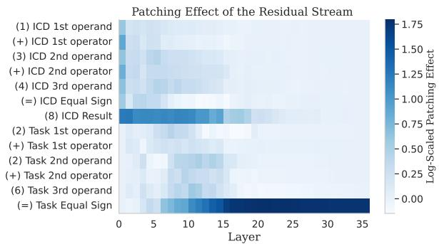

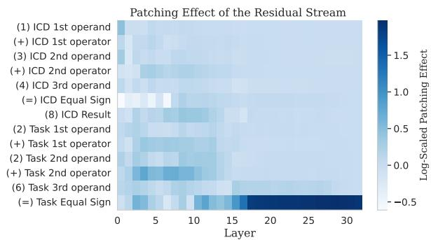  
Figure 1: Mean PEs caused by manipulating the residual stream at the ICE and task tokens in two models: (left) Pythia-12B and (right) Llama-3.1-8B.

Additionally, we utilize Function Vectors (FVs), compact internal vector representations of ICEs (Todd et al., 2023). FVs are typically derived by averaging attention head outputs (that write to the final token) across a set of ICE-containing prompts and then selecting a subset of heads that positively influence correct predictions. The resulting vector can then be added to the residual stream of prompts lacking ICEs to assess performance improvements. We adapt this method to investigate if such vectors can enhance performance in our more complex three-operand arithmetic tasks. Further details about this method are in Appendix C.

Finally, we incorporate Automated Circuit Discovery with Edge Attribution Patching (Syed et al., 2023) to further refine our understanding of connections between model components.

## 4 Experimental Results

To assess the information flow of arithmetic incontext learning, we employed activation patching in the residual stream for the Pythia-12B and Llama-3.1-8B LLMs. In Pythia-12B this was followed by a detailed analysis of MLP and attention modules’ contributions towards arithmetic tasksolving. For OPT-6.7B and Llama-3.1-8B we also focused on analyzing information flow routes to understand their internal mechanisms. Building upon this baseline understanding, we conducted counterfactual manipulations of targeted tokens within the ICE to examine how these specific changes alter internal processing pathways. These manipulations were categorized into symbol-level and pattern-level experiments, as summarized in Table

1. Additionally, these experiments were replicated with the MPT-7B LLM (MosaicML-NLP-Team, 2023), with results outlined in Appendix E.

## 4.1 Exp. 1: Information Flow Analysis

Residual Stream Patching. To provide an overview of the information flow within Pythia-12B, we conducted an intervention on the residual stream activations (Heimersheim and Nanda, 2024) at both the ICE and task tokens. Figure 1 left shows that the PEs are particularly pronounced in the early layers at the position of the ICE result token. This suggests that the information contained in the result token of the ICE plays a crucial role in the early stages of the model’s reasoning process. Subsequently, the PE shifts to the task’s final token, immediately preceding result generation, with an even greater amplitude, indicating a strong link to output correctness. This observation aligns with Stolfo et al. (2023), who similarly identified the highest PE at the token directly preceding the result generation in two-operand arithmetic tasks.

The analysis for Llama-3.1-8B on the Arithmetic-1000 dataset (Figure 1, right) reveals a mostly similar information flow. Consistent with Pythia-12B, a pronounced patching effect is evident at the ICE result token through the middle layers and at other ICE tokens in the lower layers. However, the pattern in Llama-3.1-8B also shows a notable difference, such as elevated PEs at the positions of task operators (e.g., “Task 1st operator”, “Task 2nd operator”). This suggests that while the core mechanism is similar, Llama-3.1-8B may employ a more complex strategy.

Information Flow Routes. Here, we construct a graph representation of a model’s computations highlighting main processing pathways, as stated in Section 3. Due to compatibility constraints, this experiment is conducted only on OPT-6.7B and Llama-3.1-8B. Figure 2 illustrates the resulting information flow graph, averaged over data samples with a correct model prediction, using an importance threshold τ of 0.035 for OPT-6.7B and 0.050 for Llama-3.1-8B. We provide a detailed analysis of the effects of varying τ in Appendix H.

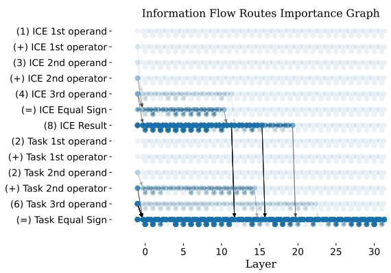

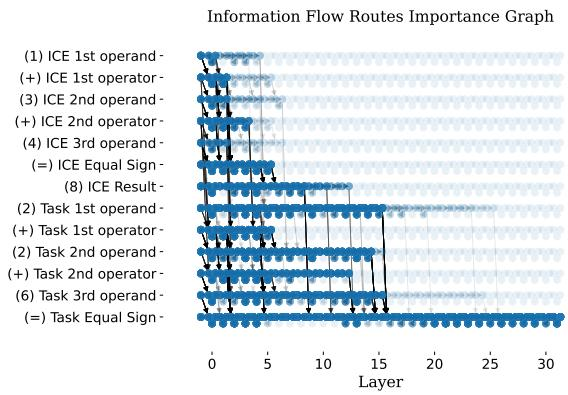  
Figure 2: Information Flow Route graphs of two models solving arithmetic in-context learning: OPT-6.7B (left) and Llama-3.1-8B (right). Nodes represent token representations and edges represent operations that move information between nodes.

Our analysis of OPT-6.7B (Figure 2, left) reveals that early layers up to layers 12 19 process the ICE result token, transferring this information directly to the final task token. This combined information then undergoes further processing in middle to late layers, ultimately leading to the correct answer. The information flow in Llama-3.1-8B (Figure 2, right) shows similarities with Pythia, although it is significantly denser, involving a larger number of activated components. In this model, the information flow of ICE tokens is initially strong in the lower layers, and then when it comes to the ICE result token the flow also engages the middle layers. At this stage, the information is passed to the final ‘equal sign’ token for subsequent processing. This general pattern overlaps and confirms the activation patching results for Pythia-12b, corroborating the crucial role of the ICE result. Our findings are also consistent with Nikankin et al. (2024), who observed that in two-operand arithmetic in Llama-3.1- 8B, information from the operands is transferred to the equal sign token at layers 15 and 16. For our task prompt, we observe that information from the task operands is similarly transferred to the final equal sign at layers 14-16.

While these findings suggest an information flow from the ICE result to the final task token, the specific roles of ICE symbols and patterns remain unclear. This motivates subsequent experiments with more localized interventions to uncover the mechanisms that support in-context arithmetic learning.

## 4.2 Exp. 2: Causal Effect of the ICE on Correct Result Generation

Local interventions on the ICE activations revealed the importance of the initial MLP layers at the result position (see Figure 3b). Importantly, the first layer’s MLP yielded a high PE of 3.16 at the ICE’s result. Moreover, significantly high PEs occurred in the first layer at the operands and the operators. The PE pattern across other layers and ICE positions remained sparse, suggesting earlylayer MLPs play a key role in processing individual ICE symbols. In contrast, the PE pattern for the attention modules (Figure 3a) is less pronounced, mainly concentrated on the operands and the ICE result in the second layer, with significantly lower magnitudes compared to the MLP patching experiments. This suggests that attention modules play a less direct role in the initial processing of individual symbols. Given that the first layers of a LLM are primarily responsible for embedding and direct representation of the symbol’s information (Tenney et al., 2019), we hypothesize that the strong effects in these early layers may be influenced by the correctness, consistency of ICE format. We test these hypotheses in Sections 4.3 - 4.4.

## 4.3 Effect of Manipulating the ICE’s Result

The experiments presented in this subsection focus on manipulating the result token within the ICE to assess its impact on the LLM’s reasoning. We systematically alter both the arithmetic correctness (symbol-level) and the pattern of the ICE.

Exp. 3: Manipulation of Arithmetic Correctness (Symbol Intervention). We first investigated the effect of the result token’s arithmetic correctness while keeping its format consistent with the task. For example, the ICE was changed from $^ { \cdots } I + 3 + 4 = 8 ^ { , \prime \prime } { \tan { ^ { \cdots } } } I + 3 + 4 = I 5 ^ { , \prime }$ . This manipulation decreases both the PE at the first layer’s MLP (from 3.16 to 2.53, see Figure 3l) and the model’s task accuracy (to 37.4%). This indicates that the arithmetic correctness of the result token, a key symbol, impacts the model’s task-solving capability.

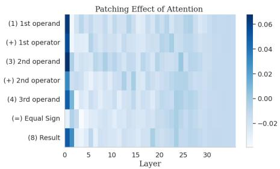  
(a) Exp. 2

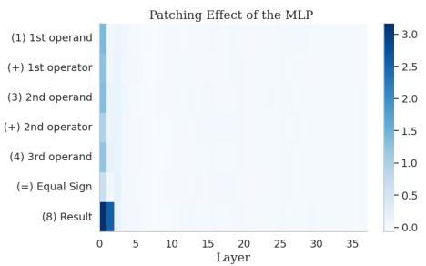  
(b) Exp. 2

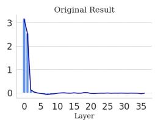  
(k) Exp. 2

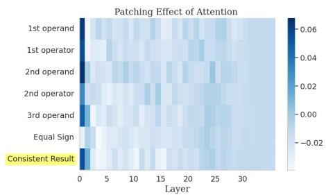  
(c) Exp. 3

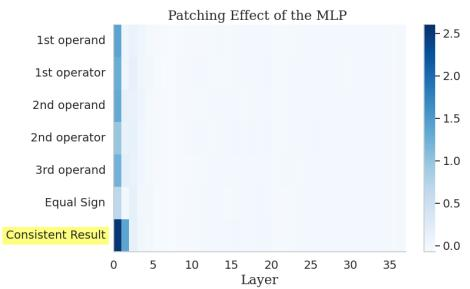  
(d) Exp. 3

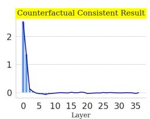

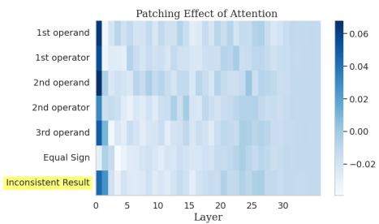  
(e) Exp. 4

(l) Exp. 3  
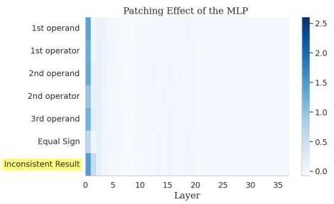  
(f) Exp. 4

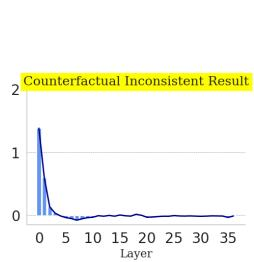  
(m) Exp. 4

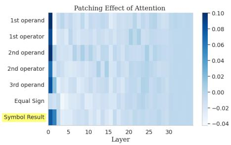  
(g) Exp. 5

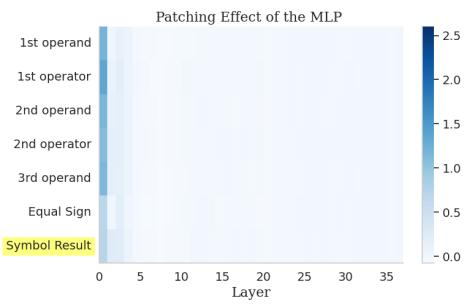  
(h) Exp. 5

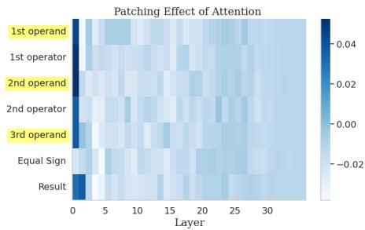

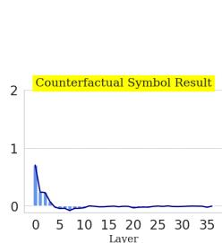

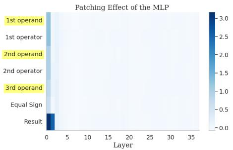  
(i) Exp. 6  
(n) Exp. 5  
(j) Exp. 6  
Figure 3: Mean patching effects (PEs) caused by manipulating the activation located at individual ICE tokens at (a) single layer’s attention modules and (b) single layer’s MLP, with a zoomed-in view of the ICE result layer’s MLPs in (k). All experiments involving counterfactual manipulations of tokens are highlighted in yellow. In (c), (d), and (l) the ICE result is replaced with an arithmetically incorrect, yet format-consistent result in either numerals or written English. Figures (e), (f), and (m) show the replacements with an inconsistent format. In (g), (h), and (n) the result is replaced with a randomly sampled non-numeral symbol. Lastly, (i) and (j) depict the PEs as a result of substituting the operands by random non-numeral symbols.

Exp. 4: Manipulation of Format Consistency (Pattern Intervention). Next, we examined the effect of format consistency by changing the ICE’s correct result to an inconsistent format relative to the task. For instance, the ICE was modified from $^ { \cdots } I + 3 + 4 = 8 ^ { \cdots } \mathrm { t o } ^ { \cdots } I + 3 + 4 = e i g h t ^ { , . }$ . This adjustment resulted in a drastic reduction in PE at the first layer’s MLP to 1.53, as evident in Figure 3m. Moreover, the model’s task accuracy decreased from 37.4% to 30.6%, with outputs often generated in an inconsistent format. This highlights the importance of maintaining the format consistency of the result token, a key aspect of the overall ICE pattern.

Exp. 5: Manipulation of Arithmetic Correctness and Format Consistency (Combined Symbol and Pattern Intervention). To further investigate the interplay between symbol-level and patternlevel factors, we replaced the ICE result with an arithmetically incorrect token in an inconsistent format, altering from $^ { \cdots } I + 3 + 4 = 8 ^ { \cdots } \mathrm { t o } ^ { \ \cdots } I + 3 + 4 = f f -$ teen”. This led to a further drop in PE (1.38) and accuracy (29.2%), slightly below the metrics from Exp. 4. In another variant, we replaced the ICE result with a random non-numeral symbol $( { \mathrm { e . g . } } \ ^ { \ \ast } { = } { \mathrm { x } } ^ { \prime \prime }$ $0 \mathrm { r } \ \mathrm { ^ { * } = b e t a ^ { * } ) }$ . This caused the PE at the first layer’s MLP to drop to its lowest value (.71) among all experiments and also caused accuracy of 0%.

These results demonstrate that while the result token’s arithmetic correctness (symbol) plays a role, its format consistency (pattern) has an even greater impact on the model’s performance.

## 4.4 Exp. 6: Causal Effect of Counterfactual ICE Operands (Symbol Intervention).

To assess the impact of operand symbols, we replaced numerical operands in the ICE with random non-numeral symbols $( { \bf e . g . } , \ { \bf \Omega ^ { \ast } } I + 3 + 4 { = } 8 ^ { , , } \ { \mathrm { t o } } \ { \bf \Omega } ^ { \ast } a l -$ pha+house+x=8”). This reduced first-layer MLP Patching Effects (PEs) by .15, .35, and .40 for the first, second, and third operands, when compared to the baseline results shown in Figure 3b, and task accuracy dropped to 69.4%. These relatively minor decreases compared to Exp. 3-5 (interventions on the result token) suggest that operand symbols are less critical than the ICE result. Attention module PEs remained unaltered (Figure 3i).

## 4.5 Exp. 7: Attention and MLP Interaction

To investigate why the patching effect of attention layers is less pronounced, we conducted two sets of experiments focusing on their joint interaction with MLP modules: joint MLP and attention module patching, and automatic circuit discovery using edge attribution patching. Our results highlight the reliance of attention layers on MLP outputs and underscore the importance of the joint interaction between them. For a detailed explanation, please refer to Appendices D and J.

## 4.6 Exp. 8: Function Vectors

From the experiments 1-6 we concluded that the performance improvement from ICEs in threeoperand arithmetic is primarily driven by pattern information (i.e., expected output format) rather than task-specific arithmetic guidance derived from the ICE. To further test this, we conducted experiments using FVs (Hendel et al., 2023; Todd et al., 2023) for Pythia-12B and Llama-3.1-8B. We posit that the model extracts this pattern information from the ICE and applies it to the main task. Consequently, FVs, designed to capture such pattern information, should recover a significant portion of the performance gained from full ICEs.

FVs were derived following the procedure detailed in Appendix C. For Pythia-12B, given that our dataset includes prompts with distinct output formats for word and numerical representations, we generated FVs separately for these two formats. For this experiment, we also modified the dataset generation to ensure no overlap between all ICE content and task prompts, preventing data leakage during FV creation. For numerical representations, baseline zero-shot accuracy was 48.6%, which increased to 64.3% with a one-shot ICE. For word representations, the corresponding accuracies were 25.7% (zero-shot) and 50.0% (one-shot), respectively. For Llama-3.1-8B, experiments were conducted using only numerical representations, where the baseline accuracy improved from 30.0% (zeroshot) to 76.7% (one-shot).

Figure 4a illustrates the change in correct token probability during the FV head selection process (Step 2, Appendix C). This step measures the impact of replacing original head activations with their ICE-dataset-averaged counterparts on prompts initially lacking ICEs. As shown, certain heads influence this probability positively. We selected the top 30 most influential heads for each FV in Pythia-12B, and the top 10 for the FV in Llama-3.1-8B (see Appendix C for more details).

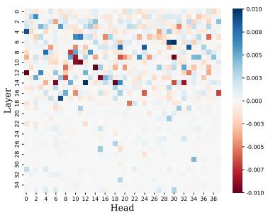  
Figure 4a: Impact of substituting attention head activations with their ICEdataset-averaged counterparts on the correct token probability in Pythia-12B. Higher values indicate greater positive influence.

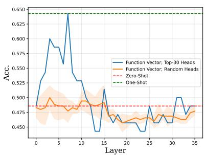  
Figure 4b: Accuracy of Pythia-12B on zero-shot numerical arithmetic prompts after adding a Function Vector (FV) to the residual stream at the final token position across different layers. The FV is derived from numerical ICEs.

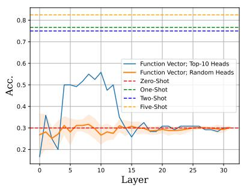  
Figure 4c: Accuracy of Llama-3.1-8B on zero-shot numerical arithmetic prompts after adding a Function Vector (FV) to the residual stream at the final token position across different layers. The FV is derived from numerical ICEs.

Figure 4b presents the accuracy for Pythia-12B on numerical prompts, while the results for wordbased prompts are in Appendix C (Figure 7). The corresponding results for Llama-3.1-8B on numerical prompts are shown in Figure 4c. For Pythia-12B, adding the FV, particularly in earlier layers, significantly boosts zero-shot accuracy. For numerical inputs, FVs yielded a 15.7% absolute accuracy increase, fully recovering the one-shot performance. For word inputs, FVs provided a 18.6% absolute increase (one-shot ICE: 24.3%). In contrast, for Llama-3.1-8B, while the FV did not fully recover the one-shot performance, it did recover a significant portion of it. The FV boosted accuracy from the 30.0% zero-shot baseline to a peak of 55.0% by 25.0% absolute (one-shot ICE: 76.7%).

Crucially, each FV is a single vector averaged over diverse ICE prompts containing various arithmetic operations (e.g., addition, multiplication). Therefore, an FV is unlikely to encode information about any specific operation. Instead, it is expected to primarily capture common output format information. These results strongly support our hypothesis that the pattern information from ICEs is a predominant factor used by the model when solving three-operand arithmetic tasks.

## 4.7 Exp. 9: Partial Sum Representations

In this section, we investigate whether an LLM utilizes representations of partial sums from the ICE to successfully solve the target arithmetic problem. For these experiments, we restrict our prompts to templates containing addition in the format $\begin{array} { r } { \cdots a + b + c = d . x + y + z = " , } \end{array}$ . To probe for the presence of partial sums $( \mathrm { e . g . , } ^ { \ast } a + b ^ { \ast } , \ast b + c ^ { \ast }$ $^ { * } a + b + c ^ { * } )$ at various token positions and layers within the ICE and task, we employ the Logit Lens approach (nostalgebraist, 2020). Specifically, we apply the model’s unembedding matrix to internal representations and decode the resulting logits into token space. We then measure whether a particular partial sum is present among the top decoded tokens. The dataset for this experiment was generated to ensure that no partial sums derived from the same ICE overlap in their numerical values.

As illustrated in the heatmaps of Figure 5, partial sums like a + b and b + c, as well as the full sum a + $b + c ,$ are most prominently decodable at the ICE’s and task prompt’s ‘=’ sign. While the full sum is expected here, the strong presence of intermediate partial sums at this position is noteworthy.

These experiments, combined with the information flow analysis 4.1 indicate that the model does not use the arithmetic information about the partial sums from the ICE. To elaborate, when looking at Figures 1 and 2 we observe that the information moves from each ICE token at shallow layers forward to the next tokens until reaching the $\mathrm { I C E } \stackrel { \ast } { = } \stackrel { \ast } { }$ sign, then it moves to the result token and from there moves mostly directly to the task’s “=” sign token in the middle layers. However, on the partial sum heatmaps (Fig. 5) we see that partial sums appear at the position of $\cdot _ { = } \cdot$ in later layers meaning that the model did not use this information while processing the ICE. This strengthens our findings indicating that the ICE pattern is more important than its arithmetic correctness in solving a threeoperand arithmetic task.

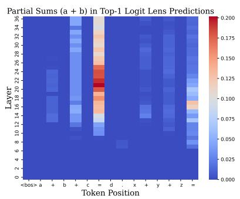

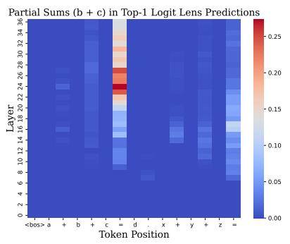

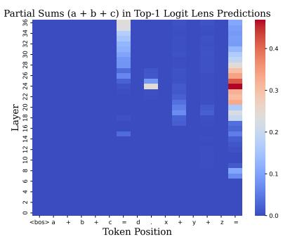  
Figure 5: Probing internal representations of partial sums from ICEs in Pythia-12B via Logit Lens. The heatmaps show the fraction of samples where partial sums originating from the ICE (specifically Left: a + b, Middle: b + c, and Right: a + b + c) are decodable from activations at various layers and token positions, indicating where this information is represented during processing.

## 5 Discussion and Key Findings

Our experiments across four LLMs, using activation patching, information flow analysis, circuit discovery, function vectors, and logit lens visualization yield four key insights:

(1) ICE information is primarily processed early, with the result token playing a central role. Residual stream patching and information flow analyses (Exp. 1, 2) reveal that ICE tokens are mostly handled in early layers, where MLPs are crucial for encoding the result token. Although attention layers contribute less individually, their joint interaction with MLPs significantly enhances downstream performance (Exp. 8). This synergy is reinforced by automatic circuit discovery (Appendix J), which consistently highlights early-layer MLP and attention modules as core components.

(2) Pattern consistency is more critical than symbol identity or arithmetic correctness. Corrupting both symbolic and structural aspects of the ICE degraded performance most severely (Exp. 5), but disruption of the format alone, especially at the result token (Exp. 4), led to larger accuracy drops than changing arithmetic correctness (Exp. 3). In contrast, interventions on specific symbols like operands (Exp. 6) had minimal impact, underscoring the importance of higher-level pattern.

(3) A single function vector encoding ICE patterns can substitute for full ICEs. In Exp. 8, injecting a distilled function vector allowed Pythia-12B to recover full accuracy even in the absence of explicit ICEs, showing that general pattern information (i.e., not task-specific facts) is sufficient to drive performance. In the case of the Llama-3.1-8B while the function vector recovers substantial accuracy, in comparison the effect is less pronounced. (4) LLMs pass forward ICE structure, not arithmetic content. Information flow graphs (Figures 1, 2) show a shallow propagation path from the ICE result token directly to the task ‘=’ token, bypassing intermediate computation. Heatmaps of partial sums (Figure 5) further confirm that arithmetic operations are not executed during ICE processing; rather, they emerge only in later layers of the final task token. This strongly supports our conclusion: pattern regularity, and not arithmetic truth, governs model behavior in multi-step arithmetic tasks.

## 6 Conclusions and Future Work

In this paper, we studied in-context learning in three-operand arithmetic tasks and on four LLMs. We use various methods such as activation patching, information flow graphs, automatic circuit discovery, function vectors and logit lens visulaization to draw important insights regarding how LLMs process ICEs in multi-step arithmetic tasks. In particular, by distinguishing ICE patterns and symbols we show how important each of these are in result computation leading to key findings detailed in Section 5. Detailed processing steps from where arithmetic ICE and task are provided to an LLM as input up to the last step where the task result is predicted are elaborately explained in Appendix I. Future research may explore path patching methods, to further explore routes utilized by LLMs to process arithmetic ICEs.

## Limitations

This study opens a window into how large language models process in-context examples for arithmetic reasoning, but (1) its insights are based on indirect effects (2) in four specific models and (3) rely on compute-intensive methods. Future work can refine the discovered circuit at a finer scale, apply path-patching for direct causality, and extend the approach to a wider range of model sizes and architectures.

## Acknowledgments

The authors thank the International Max Planck Research School for Intelligent Systems (IMPRS-IS) for their support.

## References

Seyed Ali Bahrainian and Andreas Dengel. 2015. Sentiment analysis of texts by capturing underlying sentiment patterns. Web Intelligence, 13(1):53–68.

Seyed Ali Bahrainian, Jonathan Dou, and Carsten Eickhoff. 2024. Text simplification via adaptive teaching. In Findings of the Association for Computational Linguistics: ACL 2024, pages 6574–6584, Bangkok, Thailand. Association for Computational Linguistics.

Seyed Ali Bahrainian, Martin Jaggi, and Carsten Eickhoff. 2021. Self-supervised neural topic modeling. In Findings of the Association for Computational Linguistics: EMNLP 2021, pages 3341–3350, Punta Cana, Dominican Republic. Association for Computational Linguistics.

Seyed Ali Bahrainian, Marcus Liwicki, and Andreas Dengel. 2014. Fuzzy subjective sentiment phrases: A context sensitive and self-maintaining sentiment lexicon. In 2014 IEEE/WIC/ACM International Joint Conferences on Web Intelligence (WI) and Intelligent Agent Technologies (IAT), volume 1, pages 361–368.

Seyed Ali Bahrainian, Ida Mele, and Fabio Crestani. 2018. Predicting topics in scholarly papers. In Advances in Information Retrieval, pages 16–28, Cham. Springer International Publishing.

Stella Biderman, Hailey Schoelkopf, Quentin Gregory Anthony, Herbie Bradley, Kyle O’Brien, Eric Hallahan, Mohammad Aflah Khan, Shivanshu Purohit, USVSN Sai Prashanth, Edward Raff, and 1 others. 2023. Pythia: A suite for analyzing large language models across training and scaling. In International Conference on Machine Learning, pages 2397–2430. PMLR.

Tom B. Brown, Benjamin Mann, Nick Ryder, Melanie Subbiah, Jared Kaplan, Prafulla Dhariwal, Arvind Neelakantan, Pranav Shyam, Girish Sastry, Amanda Askell, Sandhini Agarwal, Ariel Herbert-Voss, Gretchen Krueger, Tom Henighan, Rewon Child, Aditya Ramesh, Daniel M. Ziegler, Jeffrey Wu, Clemens Winter, and 12 others. 2020. Language models are few-shot learners. CoRR, abs/2005.14165.

Arthur Conmy, Augustine N. Mavor-Parker, Aengus Lynch, Stefan Heimersheim, and Adrià Garriga-Alonso. 2023. Towards automated circuit dis-

covery for mechanistic interpretability. Preprint, arXiv:2304.14997.

Damai Dai, Yutao Sun, Li Dong, Yaru Hao, Shuming Ma, Zhifang Sui, and Furu Wei. 2023. Why can gpt learn in-context? language models implicitly perform gradient descent as meta-optimizers. Preprint, arXiv:2212.10559.

Tri Dao, Daniel Y. Fu, Stefano Ermon, Atri Rudra, and Christopher Ré. 2022. Flashattention: Fast and memory-efficient exact attention with io-awareness. Preprint, arXiv:2205.14135.

Nelson Elhage, Neel Nanda, Catherine Olsson, Tom Henighan, Nicholas Joseph, Ben Mann, Amanda Askell, Yuntao Bai, Anna Chen, Tom Conerly, Nova DasSarma, Dawn Drain, Deep Ganguli, Zac Hatfield-Dodds, Danny Hernandez, Andy Jones, Jackson Kernion, Liane Lovitt, Kamal Ndousse, and 6 others. 2021. A mathematical framework for transformer circuits. Transformer Circuits Thread. Https://transformercircuits.pub/2021/framework/index.html.

Javier Ferrando and Elena Voita. 2024. Information flow routes: Automatically interpreting language models at scale. Preprint, arXiv:2403.00824.

Leo Gao, Stella Biderman, Sid Black, Laurence Golding, Travis Hoppe, Charles Foster, Jason Phang, Horace He, Anish Thite, Noa Nabeshima, Shawn Presser, and Connor Leahy. 2020. The pile: An 800gb dataset of diverse text for language modeling. Preprint, arXiv:2101.00027.

Atticus Geiger, Hanson Lu, Thomas Icard, and Christopher Potts. 2021. Causal abstractions of neural networks. Advances in Neural Information Processing Systems, 34:9574–9586.

Nicholas Goldowsky-Dill, Chris MacLeod, Lucas Sato, and Aryaman Arora. 2023. Localizing model behavior with path patching. Preprint, arXiv:2304.05969.

Aaron Grattafiori, Abhimanyu Dubey, Abhinav Jauhri, Abhinav Pandey, Abhishek Kadian, Ahmad Al-Dahle, Aiesha Letman, Akhil Mathur, Alan Schelten, Alex Vaughan, and 1 others. 2024. The llama 3 herd of models. arXiv preprint arXiv:2407.21783.

Stefan Heimersheim and Neel Nanda. 2024. How to use and interpret activation patching. arXiv preprint arXiv:2404.15255.

Roee Hendel, Mor Geva, and Amir Globerson. 2023. In-context learning creates task vectors. In Findings of the Association for Computational Linguistics: EMNLP 2023, pages 9318–9333, Singapore. Association for Computational Linguistics.

Tom Henighan, Jared Kaplan, Mor Katz, Mark Chen, Christopher Hesse, Jacob Jackson, Heewoo Jun, Tom B. Brown, Prafulla Dhariwal, Scott Gray, Chris Hallacy, Benjamin Mann, Alec Radford, Aditya

Ramesh, Nick Ryder, Daniel M. Ziegler, John Schulman, Dario Amodei, and Sam McCandlish. 2020. Scaling laws for autoregressive generative modeling. CoRR, abs/2010.14701.

Subhash Kantamneni and Max Tegmark. 2025. Language models use trigonometry to do addition. arXiv preprint arXiv:2502.00873.

Pengfei Liu, Weizhe Yuan, Jinlan Fu, Zhengbao Jiang, Hiroaki Hayashi, and Graham Neubig. 2023. Pretrain, prompt, and predict: A systematic survey of prompting methods in natural language processing. ACM Comput. Surv., 55(9).

Ida Mele, Seyed Ali Bahrainian, and Fabio Crestani. 2017. Linking news across multiple streams for timeliness analysis. In Proceedings of the 2017 ACM on Conference on Information and Knowledge Management, CIKM ’17, page 767–776, New York, NY, USA. Association for Computing Machinery.

Kevin Meng, David Bau, Alex Andonian, and Yonatan Belinkov. 2023. Locating and editing factual associations in gpt. Preprint, arXiv:2202.05262.

Sewon Min, Xinxi Lyu, Ari Holtzman, Mikel Artetxe, Mike Lewis, Hannaneh Hajishirzi, and Luke Zettlemoyer. 2022. Rethinking the role of demonstrations: What makes in-context learning work? Preprint, arXiv:2202.12837.

MosaicML-NLP-Team. 2023. Introducing mpt-7b: A new standard for open-source, commercially usable llms. Accessed: 2024-03-03.

Neel Nanda and Joseph Bloom. 2022. Transformerlens. https://github.com/TransformerLensOrg/ TransformerLens.

Neel Nanda, Lawrence Chan, Tom Lieberum, Jess Smith, and Jacob Steinhardt. 2023. Progress measures for grokking via mechanistic interpretability. arXiv preprint arXiv:2301.05217.

Yaniv Nikankin, Anja Reusch, Aaron Mueller, and Yonatan Belinkov. 2024. Arithmetic without algorithms: Language models solve math with a bag of heuristics. arXiv preprint arXiv:2410.21272.

nostalgebraist. 2020. Interpreting gpt: the logit lens. Blog post.

Koyena Pal, Seyed Ali Bahrainian, Laura Mercurio, and Carsten Eickhoff. 2023. Neural summarization of electronic health records. arXiv preprint arXiv:2305.15222.

Judea Pearl. 2013. Direct and indirect effects. CoRR, abs/1301.2300.

Ofir Press, Noah A. Smith, and Mike Lewis. 2022. Train short, test long: Attention with linear biases enables input length extrapolation. Preprint, arXiv:2108.12409.

Philip Quirke and Fazl Barez. 2024. Understanding addition in transformers. In The Twelfth International Conference on Learning Representations.

Federico Ravenda, Seyed Ali Bahrainian, Andrea Raballo, Antonietta Mira, and Fabio Crestani. 2025. A self-supervised seed-driven approach to topic modelling and clustering. Journal ofIntelligent Information Systems, 63(1):333–353.

Alessandro Stolfo, Yonatan Belinkov, and Mrinmaya Sachan. 2023. A mechanistic interpretation of arithmetic reasoning in language models using causal mediation analysis. Preprint, arXiv:2305.15054.

Jianlin Su, Yu Lu, Shengfeng Pan, Ahmed Murtadha, Bo Wen, and Yunfeng Liu. 2023. Roformer: Enhanced transformer with rotary position embedding. Preprint, arXiv:2104.09864.

Aaquib Syed, Can Rager, and Arthur Conmy. 2023. Attribution patching outperforms automated circuit discovery. Preprint, arXiv:2310.10348.

Ian Tenney, Dipanjan Das, and Ellie Pavlick. 2019. BERT rediscovers the classical NLP pipeline. CoRR, abs/1905.05950.

Alberto Testolin. 2024. Can neural networks do arithmetic? a survey on the elementary numerical skills of state-of-the-art deep learning models. Applied Sciences, 14(2).

Eric Todd, Millicent L Li, Arnab Sen Sharma, Aaron Mueller, Byron C Wallace, and David Bau. 2023. Function vectors in large language models. arXiv preprint arXiv:2310.15213.

Ashish Vaswani, Noam Shazeer, Niki Parmar, Jakob Uszkoreit, Llion Jones, Aidan N. Gomez, Lukasz Kaiser, and Illia Polosukhin. 2017. Attention is all you need. Preprint, arXiv:1706.03762.

Jesse Vig, Sebastian Gehrmann, Yonatan Belinkov, Sharon Qian, Daniel Nevo, Yaron Singer, and Stuart Shieber. 2020. Investigating gender bias in language models using causal mediation analysis. In Advances in Neural Information Processing Systems, volume 33, pages 12388–12401. Curran Associates, Inc.

Ben Wang and Aran Komatsuzaki. 2021. Gptj-6b: A 6 billion parameter autoregressive language model. https://github.com/kingoflolz/ mesh-transformer-jax.

Kevin Wang, Alexandre Variengien, Arthur Conmy, Buck Shlegeris, and Jacob Steinhardt. 2022. Interpretability in the wild: a circuit for indirect object identification in gpt-2 small. Preprint, arXiv:2211.00593.

Sean Welleck, Peter West, Jize Cao, and Yejin Choi. 2022. Symbolic brittleness in sequence models: on systematic generalization in symbolic mathematics. In Proceedings of the AAAI Conference on Artificial Intelligence, volume 36, pages 8629–8637.

Sang Michael Xie, Aditi Raghunathan, Percy Liang, and Tengyu Ma. 2022. An explanation of in-context learning as implicit bayesian inference. In International Conference on Learning Representations.

Fred Zhang and Neel Nanda. 2023. Towards best practices of activation patching in language models: Metrics and methods. Preprint, arXiv:2309.16042.

Susan Zhang, Stephen Roller, Naman Goyal, Mikel Artetxe, Moya Chen, Shuohui Chen, Christopher Dewan, Mona Diab, Xian Li, Xi Victoria Lin, Todor Mihaylov, Myle Ott, Sam Shleifer, Kurt Shuster, Daniel Simig, Punit Singh Koura, Anjali Sridhar, Tianlu Wang, and Luke Zettlemoyer. 2022. Opt: Open pre-trained transformer language models. Preprint, arXiv:2205.01068.

## A Dataset Generation Procedure

The dataset generation procedure for the threeoperand arithmetic tasks described in Section 3 is adapted from Stolfo et al. (2023).

Problem Formulation. Problems involve three integer operands $\boldsymbol { N } ~ = ~ \left( n _ { 1 } , n _ { 2 } , n _ { 3 } \right)$ , arithmetic operators $O \ \in \ \{ + , \times , - \}$ , and a function $f :$ $O \times N \to \mathbb { N }$ generating the result $r = f ( O , N )$ For the Arithmetic-20 dataset, each operand and result is constrained to the set $S = \lbrace 1 \dots 2 0 \rbrace$ to ensure single-token representation.

ICE Generation. A distinct set of operands $N _ { d } .$ where $N _ { d } \neq N ,$ , is used to generate the ICEs. This ensures no direct overlap between the operands of the ICE and the main task.

Prompt Templates. The prompts are framed using natural language templates. Examples are listed in Table 2, which also reports model accuracy for each. We tested a variety of templates incorporating operators like +, , . For the Arithmetic-20 dataset, prompts used either numeral notation or written English. For inclusion in our final set, we required that a model demonstrate an accuracy of at least 20% on 60 randomly generated, unique tasks (30 numeral, 30 written English) for that specific template. Notably, across models, performance was generally best on multiplication and addition.

Modifications for the Arithmetic-1000 Dataset. The procedure for the Arithmetic-1000 dataset was adapted for Llama-3.1-8B. Operands were sampled from the expanded range of 0 . . . 999 . Due to tokenization issues with representing larger numbers as words, we used only numeral notation for this dataset. For each template, we generated 50 unique examples. As noted in Table 2, we excluded the template "The result of x times y times $z "$ for Llama-3.1-8B, also due to tokenization issues.

Dataset Filtering. A task instance is included in our final dataset only if the model’s generated response $\tilde { r _ { 1 } }$ for the prompt with an ICE $( p _ { 1 } )$ is correct $( \tilde { r _ { 1 } } = r )$ , while its response $\tilde { r _ { 0 } }$ for the prompt without an ICE $\left( p _ { 0 } \right)$ is incorrect $( \tilde { r _ { 0 } } \neq r )$ . This selection criterion isolates instances where the ICE demonstrably aids the LLM. We ensure that the dataset does not contain duplicate problem instances.

Padding for Causal Analysis. For causal analyses requiring consistent input lengths $( \mathrm { e . g . }$ , activation patching), $p _ { 0 }$ prompts (zero-shot) are leftpadded to match the length of $p _ { 1 }$ prompts (oneshot). This padding consists of white spaces followed by a single beginning-of-sequence $( ` { \mathrm { < b o s } } )$ token placed at the positions corresponding to the ICE in $p _ { 1 }$ . This specific padding method was chosen as preliminary tests indicated it yielded higher baseline accuracy for $p _ { 0 }$ compared to other padding strategies.

## B Model Description

Following Stolfo et al. (2023), we denote an autoregressive LLM as $\mathcal { G } : \mathcal { X }  \mathcal { L }$ , where $\mathcal { L }$ represents the space of logits. The model operates over a vocabulary $V$ and processes an input sequence $x = [ x _ { 1 } , \ldots x _ { T } ] \in \mathcal { X } .$ where each $x _ { i } \in V$ . Instead of generating a probability distribution, $\mathcal { G }$ now produces a logit vector $l \in \mathcal { L } : \mathbb { R } ^ { | V | }  \mathbb { R }$ corresponding to the unnormalized log probabilities of the possible next tokens following the input $x .$ This is based on the same concept as in domains such as text summarization (Pal et al., 2023) or other sequence-to-sequence (Bahrainian et al., 2024) generative NLP tasks.

In the current study, we deploy four decoderonly LLMs: Pythia-12B, OPT-6.7B, MPT-7B, and Llama-3.1-8B. Pythia-12B (Biderman et al., 2023) is a 12-billion-parameter model pre-trained on the deduplicated version of the diverse Pile dataset (Gao et al., 2020). Its architecture is similar to the GPT models (Brown et al., 2020), differing primarily in its use of parallel attention (Wang and Komatsuzaki, 2021) and rotary positional encodings (Su et al., 2023). OPT-6.7B (Zhang et al., 2022) has 6.7 billion parameters and was trained on a diverse dataset that includes Common Crawl and books data, aiming to replicate GPT-3 performance while being computationally efficient. Similarly, MPT-7B (MosaicML-NLP-Team, 2023) is a 7-billion-parameter model developed by MosaicML. This model shares architectural similarities with the Pythia (Biderman et al., 2023) family, but incorporates Attention with Linear Biases (ALiBi) (Press et al., 2022) instead of positional embeddings and utilizes Flash Attention (Dao et al., 2022). Finally, Llama-3.1-8B (Grattafiori et al., 2024) is an 8-billion-parameter model from Meta AI that also uses a standard dense Transformer architecture. It incorporates optimizations such as Grouped Query Attention (GQA) for improved inference efficiency and an expanded vocabulary of 128K tokens. These distinctions allow us to investigate whether our observations about the roles of symbols and patterns in arithmetic in-context learning hold across different architectures.

<table><tr><td rowspan="2">Task</td><td rowspan="2">Template</td><td colspan="4">Accuracy</td></tr><tr><td>Pythia-12B</td><td>MPT-7B</td><td>OPT-6.7B</td><td>Llama-3.1-8B</td></tr><tr><td rowspan="3"> $x * y * z$ </td><td>The result of  $x * y * z =$ </td><td>85%</td><td>85%</td><td>70%</td><td>88%</td></tr><tr><td>The result of x times y times z =</td><td>71.7%</td><td>85%</td><td>50%</td><td></td></tr><tr><td> $x * y * z =$ </td><td>33.3%</td><td>60%</td><td>&lt; 20%</td><td>82%</td></tr><tr><td rowspan="2"> $x + y + z$ </td><td> ${ \mathrm { T h e ~ r e s u l t ~ o f ~ } } x + y + z =$ </td><td>76.7%</td><td>28.3%</td><td>26.7%</td><td>98%</td></tr><tr><td> $x + y + z =$ </td><td>40%</td><td>30%</td><td>&lt; 20%</td><td>100%</td></tr><tr><td> $( x - y ) * z$ </td><td>The result of  $( x - y ) * z =$ </td><td>38.3%</td><td>21.7%</td><td>&lt; 20%</td><td>&lt; 20%</td></tr><tr><td> $x - y - z$ </td><td>The result of  $x - y - z { \mathrm { i s } }$ </td><td>20%</td><td>&lt; 20%</td><td>&lt; 20%</td><td>64%</td></tr></table>

Table 2: Examples of templates for the in-context examples and the task in numeral or written English format. Reported are the accuracies of Pythia-12B, MPT-7B, OPT-6.7B, and Llama-3.1-8B. For the first three models, accuracies are averaged over 30 randomly sampled prompts using numerals and 30 in written English. Due to tokenization differences, results for Llama-3.1-8B were averaged over 50 prompts using numerals only.

For Pythia-12B, we formalize the computation of hidden states $h _ { t } ^ { ( k ) }$ at position $t \in { 1 , \dots , T }$ and layer k during a forward pass as

$$
h _ { t } ^ { ( k ) } = h _ { t } ^ { ( k - 1 ) } + a _ { t } ^ { ( k ) } + m _ { t } ^ { ( k ) }\tag{1}
$$

$$
a _ { t } ^ { ( k ) } = A ^ { ( k ) } \left( h _ { 1 } ^ { ( k - 1 ) } , \dots , h _ { t } ^ { ( k - 1 ) } \right)\tag{2}
$$

$$
m _ { t } ^ { ( k ) } = W _ { \mathrm { p r o j } } ^ { ( k ) } \sigma \left( W _ { f c } ^ { ( k ) } h _ { t } ^ { ( k - 1 ) } \right)\tag{3}
$$

$$
= : M L P ^ { ( k ) } \left( h _ { t } ^ { ( k - 1 ) } \right)\tag{4}
$$

where $\sigma$ is the sigmoid nonlinearity, $W _ { f c } ^ { ( k ) }$ and $W _ { \mathrm { p r o j } } ^ { ( k ) }$ parametrize the MLP of the Transformer block (Vaswani et al., 2017), $A ^ { ( k ) }$ parametrizes the attention mechanism, and $a _ { t } ^ { ( k ) }$ and $m _ { t } ^ { ( k ) }$ are the outputs of the attention and MLP modules, respectively. Note that each layer’s hidden state in Equation 1 can be decomposed into linear contributions from $a _ { t } ^ { ( k ) }$ and $m _ { t } ^ { ( k ) }$ , which allows for separate patching effects for both modules.

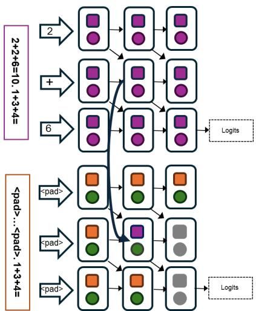  
Figure 6: The experimental procedure involves patching in the activation from the in-context example of one arithmetic task (upper part) into the padded positions of the second arithmetic task (lower part). The intervention is applied either at the MLP (square) or attention module (circle) of the LLM’s layers. Subsequent layers are recomputed during the forward pass (gray-colored), such that the intervention produces a shift in logits compared to the original run.

## C Function Vectors Extraction

Method. Function Vectors (FVs) are compact, causal internal vector representations of ICEs. It has been shown that adding a single FV to the model’s residual stream can significantly improve performance on simple tasks, even when prompts lack ICEs.

The procedure for obtaining an FV for a selected task is as follows. For a given prompt i, the hidden representation $h _ { \ell } ^ { i }$ at layer ℓ for the last token can be expressed as the sum of the output from the previous layer $h _ { \ell - 1 } ^ { i }$ , the MLP output $m _ { \ell } ^ { i }$ , and the sum of attention head outputs $\textstyle \sum _ { j \leq J } a _ { \ell j } ^ { i }$ (where J

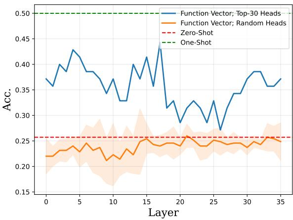  
Figure 7: Accuracy of Pythia-12B on zero-shot wordbased arithmetic prompts after adding a Function Vector (FV) to the residual stream at the final token position across different layers. The FV is derived from wordbased ICEs.

is the number of heads):

$$
h _ { \ell } ^ { i } = h _ { \ell - 1 } ^ { i } + m _ { \ell } ^ { i } + \sum _ { j = 1 } ^ { J } a _ { \ell j } ^ { i }\tag{5}
$$

1. Given a set of prompts $S$ (all containing ICEs), extract the activations $a _ { \ell j } ^ { i }$ that each attention head $( \ell , j )$ writes to the residual stream at the final token’s position. Average these activations for each head across all prompts in S: $\begin{array} { r } { \bar { a } _ { \ell j } = \frac { 1 } { | S | } \sum _ { i \in S } a _ { \ell j } ^ { i } . } \end{array}$ 2. For each attention head $( \ell , j )$ , replace its original activation $a _ { \ell j } ^ { i }$ (on a prompt $i \in S )$ with the averaged activation $\bar { a } _ { \ell j }$ obtained in Step 1. Measure the influence of this substitution on the probability of the correct token. Collect the attention heads with the highest positive influence into a set .

3. Construct the function vector v by summing the averaged activations $\bar { a } _ { \ell j }$ corresponding to the heads in $\begin{array} { r } { A \colon v = \sum _ { ( \ell ^ { \prime } , j ^ { \prime } ) \in \mathcal { A } } \bar { a } _ { \ell ^ { \prime } j ^ { \prime } } } \end{array}$

4. Add the function vector v to the model’s residual stream at various layers and measure the performance improvement on prompts without ICEs.

Implementation Details. For Pythia-12B, we use the Arithmetic-20 dataset, which is restricted to integers within the range $\{ 1 , \ldots , 2 0 \}$ This dataset contains 30 instances per template, covering both numerical and written English representations, for a total of 420 samples. We split the dataset per template, allocating the first 20 instances to the validation set and the remaining 10 to the test set. For Llama-3.1-8B, we use the Arithmetic-1000 dataset, which contains a more extensive range of integers $\{ 0 , \ldots , 9 9 9 \}$ . This dataset provides 50 examples per template, for a total of 300 samples. The split is also performed per template, with the first 30 instances forming the validation set and the remaining 20 forming the test set. For both datasets, we ensure that all arithmetic equations are unique.

For each model, we use its validation set to identify important attention heads and construct the function vector. Following (Todd et al., 2023), we scale the number of heads used to derive the function vector with the size of the model, using the top 30 attention heads for Pythia-12B and the top 10 for Llama-3.1-8B. We then add this vector to the residual stream of the final token at various layers and measure the model’s performance on the corresponding test set.

## D Exp. 8: Causal Effect of Joint Attention and MLP Module Patching

The experiments 1-7 in Section 4 consistently highlighted the significant role of the first layer’s MLP in enhancing task performance, particularly when the ICE result token was manipulated. While these interventions yielded substantial PEs, the modifications to the attention modules alone yielded less pronounced effects. This observation led us to investigate the interplay between MLP and attention modules, hypothesizing that their interaction may be crucial for effectively utilizing the information encoded in the ICE.

To this end, we conducted a joint patching experiment. We first intervened in the activation of the first layer’s MLP at the ICE result position, replacing activations from incorrect task instances with those from correct instances. Immediately following this, we patched in the activation of attention modules in separate experiments for each subsequent layer. This allowed us to assess how the information processed by the early-layer MLPs propagates through the attention mechanism and influences the model’s overall computation. Figure 8 illustrates the resulting PEs of each layer’s attention module. We observed significantly amplified effects located at every ICE position, with a particularly notable peak in the early layers 4 6 at the ICE’s result. This pattern suggests that the information extracted by the early MLPs from the result token is effectively propagated and utilized by the attention mechanism in subsequent layers.

These findings provide compelling evidence for the importance of the interaction between MLP and attention modules in arithmetic in-context learning. The joint patching experiment revealed a more pronounced and widespread impact on PEs compared to interventions on either module alone, underscoring the synergistic effect of these components. To further investigate these interactions, we conduct a more complex analysis of MLP-attention interactions in Appendix J, where we identify a model subnetwork associated with arithmetic task solving.

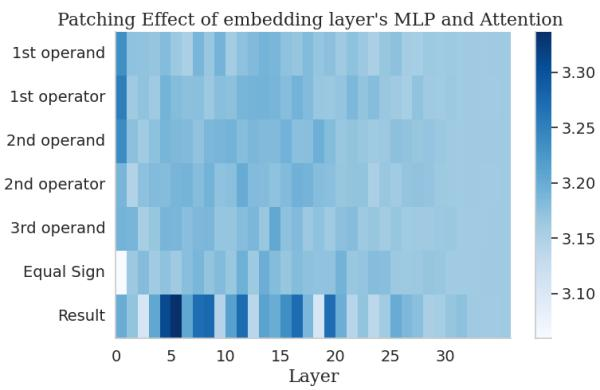  
Figure 8: Exp. 8 shows the PE of jointly patching in the activation at the ICE result first layer’s MLP and each subsequent layer’s attention modules in distinct experiments.

## E Activation Patching Experiments with the MPT-7B Model

To assess the generalizability of our findings, we extended our analysis, as described in Table 1, to the MPT-7B decoder-only LLM (MosaicML-NLP-Team, 2023). This model was selected based on several criteria: (1) decoder-only architecture, (2) capability of in-context learning, and (3) single-token tokenization of numbers in both numeral and written English forms. These criteria ensured compatibility with our experimental setup and the ability to perform meaningful activation patching. Critically, MPT-7B demonstrated a substantial increase from 6% to 43% accuracy with the inclusion of a one-shot ICE before the arithmetic task.

The results of exploring the MPT-7B model’s processing of in-context examples for solving threeoperand arithmetic tasks are illustrated in Figure 11. Due to the lack of support for the MPT-7B model in the TransformerLens library (Nanda and Bloom, 2022), we omit the residual stream patching Exp. 1. In the baseline Exp. 2, we conducted localized activation patching in the MLPs and attention modules. We observed strong PEs at the model’s first and second layers’ MLPs and attention modules located at the position of the result token. This finding, consistent with our observations in Pythia-12B in Section 4.2, underscores the critical role of the result token, a key symbol, in arithmetic task resolution across different LLMs.

We then proceeded to manipulate the ICE, focusing on both symbol- and pattern-level interventions. The counterfactual manipulations of the ICE result tokens in Exp. 3, 4, and 5, caused the PEs in both the inital layers’ MLPs and attention modules to decrease significantly. Analogous to Pythia-12B, the main effect ofpattern intervention was notably larger than the main effect of symbol-level interventions, as evident by inspection of the PE measures in Figures 11c – 11h. Moreover, the replacement of the ICE operand symbols with non-numeral random symbols in Exp. 6 lead to a minor decrease of PEs compared to the the manipulations of the ICE result (see Figures 11i, 11j). These outcomes highlight the result token’s pivotal function in facilitating arithmetic problem solving, and reaffirm the importance of formulating ICEs in a consistent pattern format.

A distinct observation in MPT-7B was the shift of the peak PE in Exp. 2 to the second MLP layer, unlike the first layer focus observed in Pythia-12B. We propose that this shift implies an enhanced interaction between the second layer’s attention module and MLP. Hence, the initial attention module might transfer crucial ICE result information to the second MLP layer (Wang et al., 2022), where it aids in successful task completion. This suggests a potential difference in information processing pathways between the two models, possibly due to architectural variations like the use of ALiBi in MPT-7B. Future research should explore this idea further and consider the impact of different model architectures and model sizes on in-context learning interpretability. Understanding these interactions could provide deeper insights into optimizing ICEs for better model performance and enhance our understanding of the mechanisms underlying in-context learning.

## F Prompts with More Detailed Text Descriptions

In this section we present an experiment showing the impact of textual task description if prepended to the in-context example. While some templates in our diagnostic dataset include preceding text (e.g., “The result of. . . ”, see Table 2), we did not focus on systematic prompt engineering. Thus, here we conduct an experiment to clarify whether additional textual task description will affect the patching patterns. We formulated a task description prompt and added it before all the equations and ICEs of our dataset. For example, the new task was formulated as: “Perform the arithmetic calculations based on the sequence of numbers and operators provided. 1 + 3 + 4 = 8. 2 + 2 + 6 =”. For the corrupted task, we removed the ICEs between the task description prompt and the task prompt. We applied one of our experiments, namely residual stream patching, to an alternative dataset with these detailed task descriptions. The results are presented in Figure 9. The overall pattern of patching effects remained similar to the case where no natural language description of the task was provided, indicating that the reported findings also hold true for tasks with more detailed descriptions.

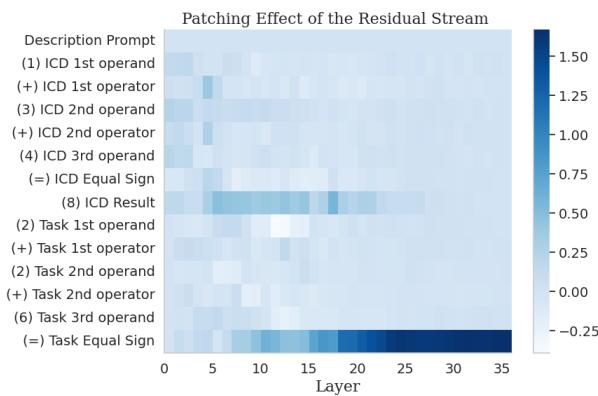  
Figure 9: Mean PEs caused by manipulating the Pythia-12B’s residual stream at the ICE and task tokens. Prompts with textual descriptions.

## G Compatibility Limitations of the Information Flow Routes Approach

Due to compatibility constraints, we were only able to apply the Information Flow Routes approach to the OPT-6.7B and Llama-3.1-8B models. The Pythia family of models employs parallel computation of MLP and attention layers, which would require substantial modifications to the graph computation algorithm. The MPT-7B model is not currently supported by the TransformerLens library (Nanda and Bloom, 2022), and adding such support would necessitate extensive changes to the library.

## H Hyperparameter Selection for Information Flow Routes

The Information Flow Routes approach requires the manual selection of the importance threshold, τ. Figure 10 shows the minimal τ at which components of the OPT-6.7B (left) and Llama-3.1-8B (right) language models are still activated. The results are averaged over the data samples with arithmetically correct model predictions.

In the case of OPT-6.7B, we observe that the Task Equal Sign, ICE Result, and ICE Equal Sign tokens remain active even for large τ thresholds, indicating the model relies heavily on those tokens. For Llama-3.1-8B, the model relies more on task prompt tokens. However, the pattern for the ICE tokens is similar to that of other models. The result token is active through the middle layers for τ values up 0.04, while other ICE tokens are active only in the bottom layers.

## I Step-by-step Processing of ICEs

Setup. The model receives an ICE along with a three-operand arithmetic prompt.

Early processing. Early MLPs and attention layers encode the ICE tokens. This is supported by strong patching effects for these components (Exp. 2–6; Secs 4.2-4.3). (Confirmed for Pythia-12B, OPT-6.7B, MPT-7B, and Llama-3.1-8B.)

Early aggregation at the result position. Early attention heads concentrate this processed ICE information at the result token location, as shown by a large residual-stream patching effect there (Exp. 1; Sec. 4.1) and by many heads implicated at that position via Automatic Circuit Discovery (Appx. J). The signal then propagates to the middle layers. (Confirmed for Pythia-12B, OPT-6.7B, MPT-7B, and LLama-3.1-8B. Llama-3.1-8B also shows some differences on a dataset with larger numbers.)

Mid-layer routing to the equals sign. The ICE signal is then passed directly to the “=” token, confirmed by residual-stream activation patching and information-flow analyses (Exp. 1; Sec. 4.1). Crucially, this signal is pattern-level (e.g., formatting of the result token), not arithmetic content. Counterfactual patching (Exp. 2–6; Secs. 4.2-4.3) and the effectiveness of a single, dataset-averaged function vector in restoring performance corroborate this. (Confirmed for Pythia-12B, OPT-6.7B, and

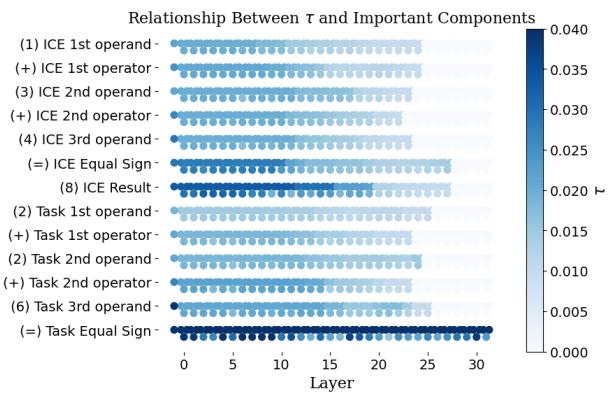

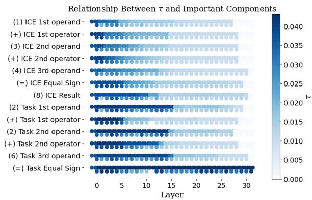  
Figure 10: Relationship between activated components and the τ threshold for the (left) OPT-6.7B model and the (right) Llama-3.1-8B model.

Llama-3.1-8B. Llama-3.1-8B also shows some differences on a dataset with larger numbers.)

Arithmetic appears only late, and is not propagated. Logit Lens shows internal representations of partial sums from the ICE $( \mathrm { e . g . , \tilde { \Omega } a \mathrm { + } b ^ { \mathrm { 3 } } }$ from $\ " { \bf { a } } + { \bf { b } } + { \bf { c } } \ " )$ emerge only in late layers (Exp. 9; Sec. 4.7). These representations are not part of the mid-layer signal and therefore are not what drives the final answer. (Confirmed for Pythia-12B.)

Final composition at $^ { 6 6 } = ^ { 9 9 } .$ . At the equals sign, the model combines the ICE-derived pattern signal with the task-prompt context, producing the final result token. (Confirmed for Pythia-12B, OPT-6.7B, and Llama-3.1-8B. Llama-3.1-8B also shows some differences on a dataset with larger numbers.)

Conclusion. Across experiments, the model pipelines format / pattern information from the ICE to the “=” position while deferring arithmetic representations to late layers that do not influence the computed answer, explaining why a single function vector can substantially recover performance.

## J Automatic Circuit Discovery with Edge Attribution Patching

Through our activation patching experiments, we elucidated the significant role of the initial layers in LLMs in processing the ICE result token in arithmetic tasks. These findings represent a foundational step in the investigation in the inner workings of LLMs’ in-context learning capabilities and set the stage for more advanced techniques that could offer even deeper insights. Therefore, we take a step further in the mechanistic interpretability regime and consider the identification of a circuit associated with arithmetic task solving functions.

In this context, a circuit is defined as a subnetwork of a network’s components and their interactions, which implements a task at hand (Goldowsky-Dill et al., 2023; Wang et al., 2022; Conmy et al., 2023). In our case, we aim at identifying a circuit consisting of a set of connected attention heads and MLP modules within the Pythia-12B LLM (Biderman et al., 2023), that significantly contribute towards solving the arithmetic in-context learning task.

To achieve this, we employed Edge Attribution Patching (EAP) (Syed et al., 2023), a computationally efficient approximation to activation patching. Instead of running a separate activation patching experiment for each layer’s attention head and for each data point, EAP utilizes a linear combination of the activations from the forward passes of the prompts $p _ { 1 }$ and $p _ { 2 } .$ —with and without the ICE, respectively—along with a single backward pass to approximate the PE as follows:

$$
\begin{array} { r } { E A P \left( p _ { 2 } | \mathsf { d o } ( E = e _ { p _ { 1 } } ) \right) \approx ( e _ { p _ { 2 } } - e _ { p _ { 1 } } ) ^ { \top } } \\ { \frac { \partial } { \partial e _ { p _ { 1 } } } P E ( p _ { 1 } | \mathsf { d o } ( E = e _ { p _ { 1 } } ) ) } \end{array}\tag{6}
$$

Here, e represents the activation of an edge E between two attention heads or MLP modules. The term $( e _ { p _ { 2 } } - e _ { p _ { 1 } } )$ reflects the difference in activations due to the presence or absence of the ICE. The gradient measures how changes in the edge activations influence the PE. The use of do-notation indicates the causal manipulations of activations e (Syed et al., 2023).

The EAP scores were leveraged to rank the importance of each edge within the model’s computational graph. This ranking determines the circuit that is most relevant to performing the underlying task. For our purposes, we focused on identifying and isolating the top 50 attention heads and MLP modules that contribute to Pythia-12b’s ability to solve arithmetic tasks as per their EAP scores.

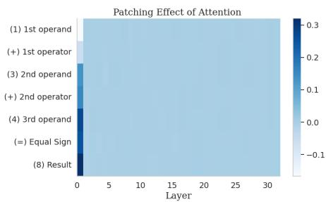  
(a) Exp. 2

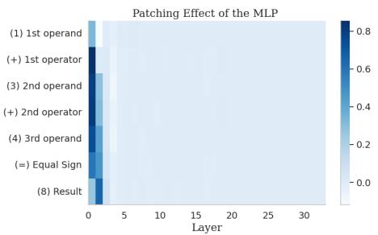

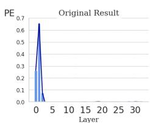

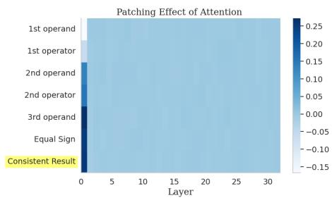  
(c) Exp. 3

(b) Exp. 2  
(k) Exp. 2  
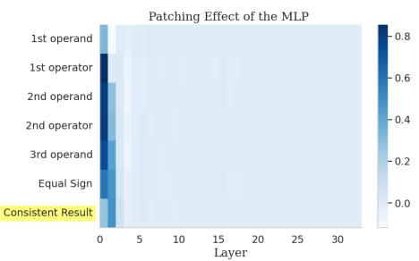  
(d) Exp. 3

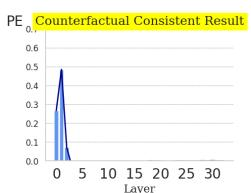  
(l) Exp. 3

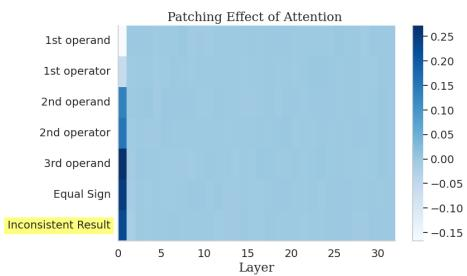  
(e) Exp. 4

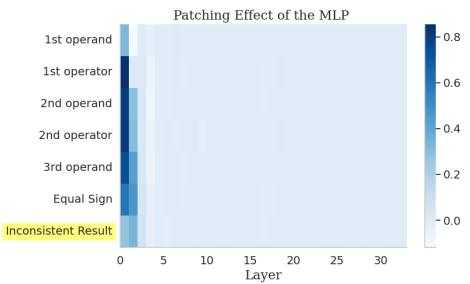  
(f) Exp. 4

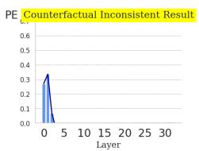  
(m) Exp. 4

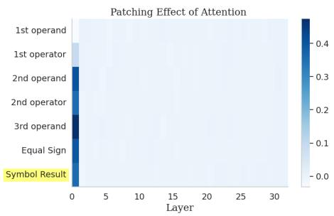  
(g) Exp. 5

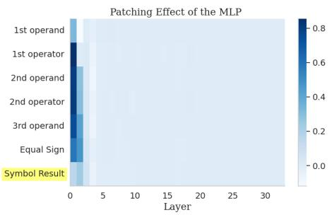  
(h) Exp. 5

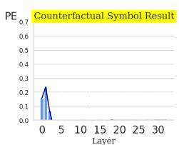

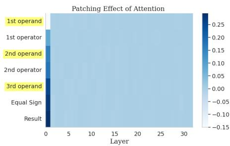  
(i) Exp. 6

(n) Exp. 5  
(j) Exp. 6  
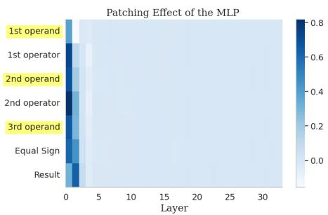  
Figure 11: Activation patching experiments with the MPT-7B language model (MosaicML-NLP-Team, 2023). Mean patching effects (PEs) of individual tokens of the ICE at (a) single layer’s attention modules and (b) single layer’s MLP, with a zoomed-in version of the ICE result layer’s MLPs in (k). All experiments involving counterfactua manipulations of tokens are highlighted in yellow. In (c), (d), and (l) the ICE result is replaced with an arithmetically incorrect token, which is consistent to the prompt’s format in either numerals or written words. Figures (e), (f), and (m) replace the result with an inconsistent format. In (g), (h), and (n) the result is substituted by a randomly sampled non-numeral symbol. Lastly, (i) and (j) depict the PEs as a result of replacing the operands with randomly sampled non-numeral symbols.

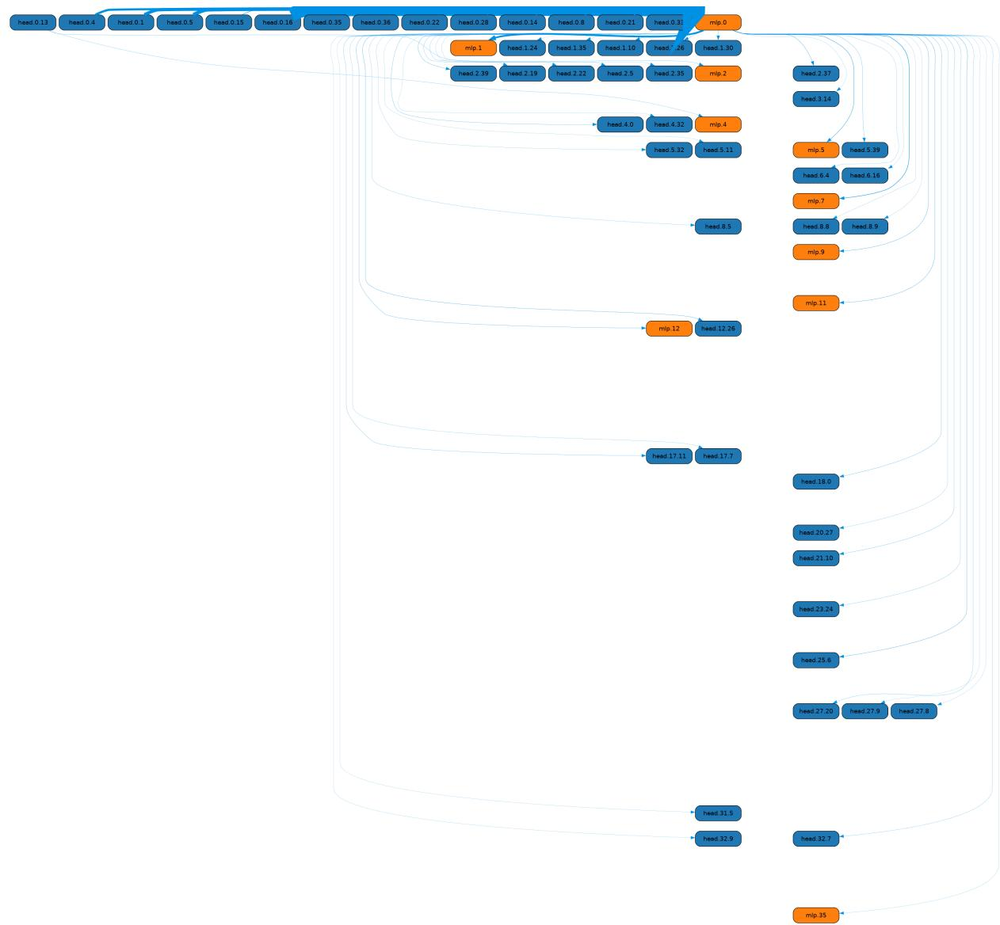  
Figure 12: Subnetwork circuit of Pythia-12B, consisting of the top 50 most contributing attention heads and MLP modules for arithmetic in-context learning, as determined by Equation 6 from Edge Attribution Patching (Syed et al., 2023). This circuit represents the core network components identified as crucial in processing the ICE and their interactions. Edge widths are drawn proportional to the EAP patching effect scores, highlighting the relative importance of each edge in the task solving process.

The circuit responsible for solving arithmetic tasks in Pythia-12b is depicted in Figure 12. It primarily involves attention heads and MLP modules from the initial layers. The most influential attention heads are located in the first layer’s attention module, which are directly connected to the first layer’s MLP module. This configuration underscores the findings from the activation patching experiments in Section 4. From the first layer’s MLP, the data is processed and distributed across attention heads and MLPs in numerous layers.

Next, to further validate our hypothesis that

Pythia-12b predominantly relies on the ICE result token to solve arithmetic tasks, we conducted an additional EAP experiment focused on this token. Therefore, we computed the EAP scores for the activations associated solely with the ICE result at position t in the ICE using a modified version of Equation 6:

$$
\begin{array} { r } { E A P \left( p _ { 2 } | \mathrm { d o } ( E = e _ { p _ { 1 } } ^ { ( t ) } \right) \approx ( e _ { p _ { 2 } } ^ { ( t ) } - e _ { p _ { 1 } } ^ { ( t ) } ) ^ { \top } } \\ { \frac { \partial } { \partial e _ { p _ { 1 } } ^ { ( t ) } } P E ( p _ { 1 } | \mathrm { d o } ( E = e _ { p _ { 1 } } ^ { ( t ) } ) ) } \end{array}\tag{7}
$$

The architecture of the resulting specialized circuit is shown in Figure 13. Comparative analysis between the circuits handling full-task processing and the one specifically for the result revealed a 56% overlap of edges, emphasizing the critical role of the ICE result token in arithmetic task solving. Notably, circuits derived from other operand or operator tokens within the ICE showed significantly less overlap, with none exceeding 22%. Interestingly, both the full-task and result-related circuits showed primary activity within the first two layers of the model, suggesting early processing and integration of the result information. However, deviations occurred in subsequent layers; the result-related circuit predominantly involved layers up to MLP 11, whereas the full-task circuit extended across the model’s entire layer range. This divergence suggests that while the ICE result is processed early, newer task-relevant information is incorporated in later layers, supporting insights from Stolfo et al. (2023) regarding the later layers’ role in introducing critical information for task completion.

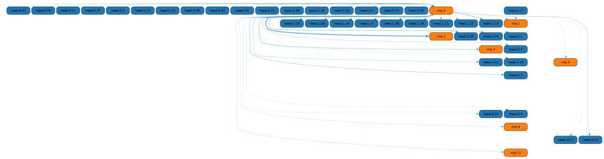  
Figure 13: Circuit of Pythia-12B illustrating the subnetwork composed of attention heads and MLP modules specifically processing the ICE result token for arithmetic tasks. This circuit, derived using Equation 7, isolates the components directly involved in analyzing the result token, as identified by their ranked EAP scores. Edge widths reflect the relative significance of each edge.  
ties comparing distributions across layers and input timesteps.

To our knowledge, this is the first study to identify mechanistic circuits associated with (arithmetic) in-context learning in Pythia-12b. The circuits, attention heads, and MLP modules identified here provide a valuable reference for subsequent studies involving more complex methods from the mechanistic interpretability toolbox. For instance, path-patching (Goldowsky-Dill et al., 2023) could further refine circuits based on the current results. In the future we plan to design methods capable of tracing concept flows separating the information type based on topics (Mele et al., 2017; Bahrainian et al., 2021, 2018; Ravenda et al., 2025) (e.g. in the math domain comparing basic arithmetic versus differential equations) or even a more generalized settings such as sentiment (Bahrainian and Dengel, 2015; Bahrainian et al., 2014) or other proper-