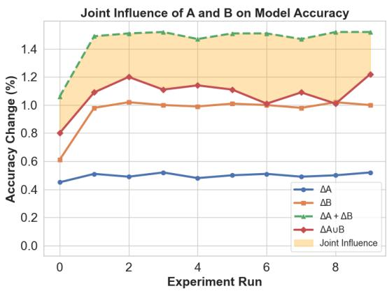
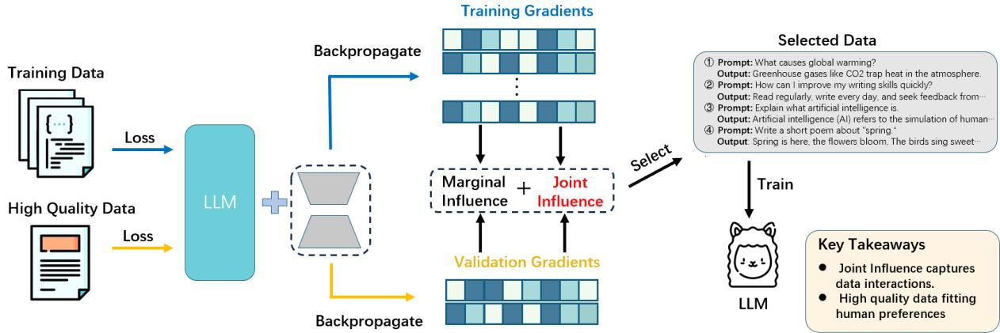
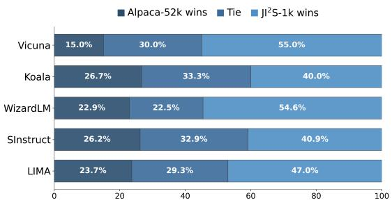
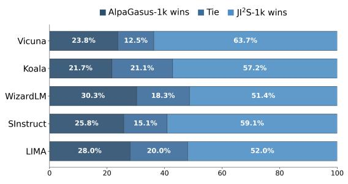
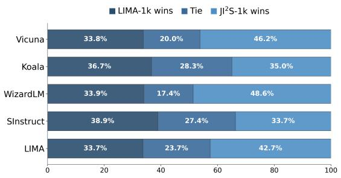
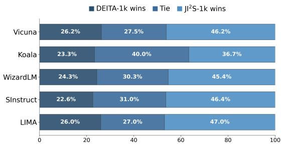
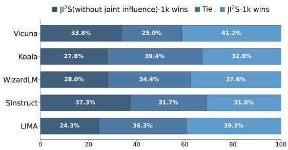
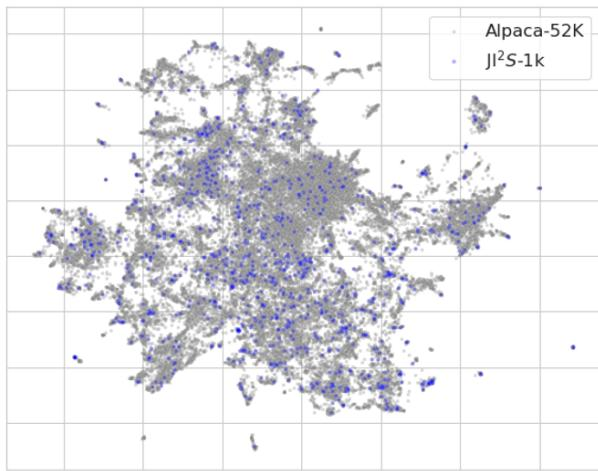

# JI2S: Joint Influence-Aware Instruction Data Selection for Efficient Fine-Tuning

Jingyu Wei1, Bo Liu2, Tianjiao Wan1, Baoyun Peng2\*, Xingkong Ma1, Mengmeng Guo1 1National University of Defense Technology, Changsha, Hunan, China 2Academy of Military Sciences, Beijing, China pengbaoyun13@alumni.nudt.edu.cn

## Abstract

Instruction tuning (IT) improves large language models (LLMs) by aligning their outputs with human instructions, but its success depends critically on training data quality, and datasets such as Alpaca often contain noisy or suboptimal examples that undermine fine-tuning. Prior selection strategies score samples using general-purpose LLMs (e.g., GPT), leveraging their strong language understanding yet introducing inherent biases that misalign with the target model’s behavior and yield unstable downstream performance. Influence-based methods address this by estimating each example’s marginal contribution to overall performance, but they typically assume additive contributions and there fore overlook higher-order interactions among samples. To overcome these limitations, we propose JI2S, a novel framework that jointly models both marginal and combinatorial influences within sample groups. Applying JI2S to select the top 1,000 most influential examples from Alpaca, we fine-tune LLaMA2-7B, Mistral-7B, and LLaMA2-13B and evaluate them on Open LLM Benchmarks, MT-Bench, and GPT-4–judged pairwise comparisons. Our experiments show that JI2S consistently outperforms full-dataset training and strong baselines, highlighting the value of capturing joint influence for high-quality instruction fine-tuning. We provide our code in this GitHub repository.

## 1 Introduction

Instruction tuning (IT) (Brown et al., 2020; Longpre et al., 2023; Zhang et al., 2023) has emerged as an effective technique for enhancing the instructionfollowing capabilities and controllability of large language models (LLMs). However, a major challenge of IT is the acquisition of high-quality instruction data (Zhang et al., 2023). Alpaca, a pioneering open-source instruction dataset (Taori et al.,

2023), adopts the self-instruct strategy (Wang et al., 2023) to automatically generate 52k instructionoutput pairs using a powerful language model (textdavinci-003 (Brown et al., 2020)). While Alpaca provides large-scale data, the fact that all instructions are automatically generated by the model inevitably results in some inaccuracies and lowquality examples (Zhang et al., 2023; Chen et al.; Li et al., 2024). In contrast, LIMA manually curates 1k high-quality instruction examples (Zhou et al., 2024), resulting in better model performance than Alpaca. This finding underscores that the quality of instruction data is more important than its quantity (Gunasekar et al., 2023; Javaheripi et al., 2023). However, manually constructing such high-quality datasets is time-consuming and labor-intensive. As an alternative, a promising approach involves selecting a small, high-quality subset from larger instruction datasets.

To select high-quality data, Alpagasus (Chen et al.) employs GPT-3.5 as a teacher model to score each instruction in the Alpaca dataset, filtering out 9,000 top-ranked samples. DEITA (Liu et al.) leverages GPT-3.5’s capabilities (Achiam et al., 2023) to distill two independent scoring models that assess the complexity and quality of instruction data, while also implementing a diversity strategy to ensure the selection of both high-quality and diverse instruction samples. However, research has shown that GPT-based scoring exhibits systematic biases, including positional bias, verbosity bias, and self-enhancement bias (Zheng et al., 2023; Wang et al.). These methods rely heavily on GPT’s internal knowledge, with limited attention to the actual impact of the data on model performance. Although effective in specific experimental settings, they suffer from limited interpretability and poor generalization ability (Diddee and Ippolito, 2024).

As an alternative, influence-based methods have leveraged gradient information to estimate the influence of individual samples on a model (Hammoudeh and Lowd, 2024; Koh and Liang, 2017; Pruthi et al., 2020), enabling a more comprehensive evaluation of data quality. Xia et al. (2024) further adapt the conventional influence calculation formula to ensure compatibility with the Adam optimizer, thereby selecting the most appropriate instruction data for downstream tasks based on influence metrics. However, conventional influencebased methods primarily focus on marginal influences, approximating the overall effect of a dataset by simply summing the contributions of individual samples. This approach fails to account for data redundancy and complex, non-additive interactions among samples (Koh et al., 2019; Guu et al., 2023; Chai et al., 2024). As illustrated in Figure 1, our toy experiment on samples A, B and their union (A B) shows that the joint influence is non-negligible and cannot be fully explained by the marginal contributions alone, highlighting the need for a more holistic influence estimation framework.

  
Figure 1: The impact of different sample samples (A, B, A B) in the training data on model performance, with detailed experimental details provided in B.1.

In this work, we introduce $\mathbf { J } \mathbf { I } ^ { 2 } \mathbf { S }$ (Joint Influence–Aware Instruction Data Selection), an instruction data selection framework that explicitly accounts for joint influences among data points to identify a subset of high-quality instruction samples. Inspired by discrete derivative (Tsai et al., 2023; Fumagalli et al., 2023), we extend traditional influence calculation formula to incorporate both marginal and joint influence. In practice, we estimate instruction data influence using the LIMA dataset as a proxy test set, which is manually curated to represent human-aligned evaluation criteria. To reduce computational overhead, we fine-tune models with LoRA and estimate influence based on the gradients of the low-rank adaptation matrices (Hu et al., 2021; Aghajanyan et al., 2021). To further verify the effectiveness of our method, we apply our algorithm to the Alpaca instruction dataset and evaluate its performance on LLaMA2-7B (Touvron et al., 2023), Mistral-7B (Jiang et al., 2023), and LLaMA2-13B (Touvron et al., 2023), using pairwise comparisons (Li et al., 2024), MT-Bench evaluations (Zheng et al., 2023), and Open LLM benchmarks. Our contributions are summarized as follows:

• We propose an influence analysis algorithm grounded in discrete derivative, designed to capture non-additive joint influence among groups of data samples.

• We demonstrate the shortcomings of marginal influence and propose $\mathbf { J } \mathbf { I } ^ { 2 } \mathbf { S }$ , a joint influence–aware instruction selection framework that leverages the LIMA dataset as a proxy for human preference to improve the quality and reliability of selected data.

• We validate the efficacy of $\mathbf { J } \mathbf { I } ^ { 2 } \mathbf { S }$ by fine-tuning LLaMA2-7B, Mistral-7B, and LLaMA2-13B on the selected subsets, and evaluate them via pairwise comparisons, MT-Bench, and Open LLM benchmarks.

## 2 Related Work

## 2.1 Data Selection for LLM

High-quality instruction datasets form the foundation of effective instruction fine-tuning (Longpre et al., 2023; Ma et al., 2025), prompting extensive efforts within the community to develop and optimize such resources. Taori et al. (2023) construct a large-scale instruction dataset (Alpaca) by leveraging the text-davinci-003 model and the Selfinstruct strategy (Wang et al., 2023). However, this dataset is prone to errors and low-quality samples. To improve this, AlpaGasus (Chen et al.) employs a powerful teacher model (GPT-3.5) to evaluate and score each instruction in Alpaca. Similarly, DEITA (Liu et al.) leverages GPT-3.5 to distill scoring models for instruction complexity and quality, and selects samples with a diversity-aware strategy to improve model training and generalization. Zhao et al. (2024) achieve remarkable results by selecting data solely based on instruction length. While these approaches aim to improve data quality through model-based evaluation or heuristic selection, they largely overlook the impact of data on the model itself, resulting in limited generalization (Diddee and

Ippolito, 2024). To address this limitation, LESS (Xia et al., 2024) quantifies the impact of data on downstream tasks using gradient information, prioritizing instruction data that maximally enhances model performance. However, this approach fails to account for higher-order joint influence among data points.

## 2.2 Estimating the Influence of Instructions for LLM

Influence computation measures the effect of removing an individual training sample on a model’s prediction for a given test example (Hammoudeh and Lowd, 2024; Koh and Liang, 2017; Pruthi et al., 2020). Exact leave-one-out (Cook et al., 1982; Feldman and Zhang, 2020) retraining is too costly, so gradient-based approximations like TracIn (Pruthi et al., 2020) are commonly used. TracIn leverages first-order information from the model’s training trajectory to approximate each point’s contribution to the test loss.

Concretely, consider a model with parameters $\theta ^ { t }$ at iteration t, trained by stochastic gradient descent (batch size 1, learning rate $\eta _ { t } )$ . A first-order Taylor expansion of the test loss $\mathcal { L } ( z ^ { \prime } , \theta )$ around $\theta ^ { t }$ yields $\mathscr { L } ( z ^ { \prime } , \theta ^ { t + 1 } ) \approx \mathscr { L } ( z ^ { \prime } , \theta ^ { t } ) + ( \theta ^ { t + 1 } - \theta ^ { t } ) ^ { \top } \nabla _ { \theta } \mathscr { L } ( z ^ { \prime } , \theta ^ { t } )$

Since $\theta ^ { t + 1 } = \theta ^ { t } - \eta _ { t } \nabla _ { \theta } \mathcal { L } ( z , \theta ^ { t } )$ for the training sample $z ,$ the incremental change in test loss is

$$
\begin{array} { r l } & { \Delta \mathcal { L } _ { t } = \mathcal { L } ( z ^ { \prime } , \theta ^ { t + 1 } ) - \mathcal { L } ( z ^ { \prime } , \theta ^ { t } ) } \\ & { ~ \approx - \eta _ { t } \nabla _ { \theta } \mathcal { L } ( z , \theta ^ { t } ) ^ { \top } \nabla _ { \theta } \mathcal { L } ( z ^ { \prime } , \theta ^ { t } ) . } \end{array}
$$

The cumulative influence of the training sample z throughout the training process is computed as the sum of its contributions to the loss at each checkpoint:

$$
\mathrm { I n f } _ { S G D } ( z , z ^ { \prime } ) \approx - \sum _ { t = 1 } ^ { T } \eta _ { t } \nabla _ { \theta } \mathcal { L } ( z , \theta ^ { t } ) ^ { \top } \nabla _ { \theta } \mathcal { L } ( z ^ { \prime } , \theta ^ { t } ) .
$$

Since language models typically employ the Adam optimizer (Zhao et al.), parameter updates incorporate momentum, adaptive variance scaling, and bias correction. Following Xia et al. (2024), we replace the simple gradient term with the actual per-sample parameter update $\Gamma ( z , \theta ^ { t } )$ induced by Adam. The resulting influence estimate becomes

$$
\mathrm { I n f } _ { \mathrm { A d a m } } ( z , z ^ { \prime } ) \approx - \sum _ { t = 1 } ^ { T } \eta _ { t } \Gamma ( z , \theta ^ { t } ) ^ { \top } \nabla _ { \theta } \mathcal { L } ( z ^ { \prime } , \theta ^ { t } ) ,
$$

which naturally captures both the unique directionality and magnitude adjustments of Adam’s update rule.

## 3 Estimating the Joint Influence of Instructions

In this section, we introduce a method to quantify the joint influence among training samples based on the concept of discrete derivative. After formulating the general discrete derivative, we introduce an efficient approximation to overcome its exponential computational cost.

The discrete derivative quantifies higher-order interactions among training samples by comparing the test sample loss when multiple points are jointly included in training to the sum of their individual marginal contributions. Formally, let $K \subseteq \mathcal { D } _ { t r a i n }$ denote a subset of samples of interest and $S \subseteq { \mathcal { D } } _ { t r a i n } \ \backslash$ K denote a background sample set. Let $\mathcal { L } ( z ^ { \prime } , \theta _ { S \cup K } ^ { t } )$ denote the test loss when the model is trained on $S \cup K$ . Then, for each subset $W \subseteq K$ , we compute the loss using models trained on $S \cup W$ , and aggregate the results via the inclusion–exclusion principle:

$$
\Delta \mathcal { L } ( K , z ^ { \prime } ) = \sum _ { W \subseteq K } ( - 1 ) ^ { | K | - | W | } \mathcal { L } \big ( z ^ { \prime } , \theta _ { S \cup W } ^ { t } \big ) .
$$

This formulation provides a principled way to quantify the joint effect of multiple training points on test performance. However, its practicality is limited by exponential complexity: computing a k-th order discrete derivative requires evaluating $2 ^ { k }$ subsets. For applications such as selecting the 1,000 most representative training samples, evaluating the full 1,000th-order derivative becomes infeasible.

To make the computation tractable, we focus on second-order joint influence—interactions between pairs of samples. For $K = \{ z _ { i } , z _ { j } \}$ , the discrete derivative reduces to:

$$
\begin{array} { r l } & { \Delta \mathcal { L } ( K , z ^ { \prime } ) = \mathcal { L } \left( z ^ { \prime } ; \theta _ { S } ^ { t } \right) - \mathcal { L } \left( z ^ { \prime } ; \theta _ { S \cup z _ { i } } ^ { t } \right) } \\ & { - \mathcal { L } \left( z ^ { \prime } ; \theta _ { S \cup z _ { j } } ^ { t } \right) + \mathcal { L } \left( z ^ { \prime } ; \theta _ { S \cup \{ z _ { i } , z _ { j } \} } ^ { t } \right) . } \end{array}
$$

Assuming small parameter update steps (as typical in training), we apply a second-order Taylor expansion to estimate the change in test loss at iteration t:

$$
\begin{array} { r } { \Delta \mathcal { L } ( K , z ^ { \prime } ) \approx \eta _ { t } ^ { 2 } \Gamma ( z _ { i } , \theta ^ { t } ) ^ { \top } H _ { z ^ { \prime } } \Gamma ( z _ { j } , \theta ^ { t } ) , } \end{array}
$$

where $H _ { z ^ { \prime } }$ denotes the Hessian matrix of the loss function evaluated at the test point $z ^ { \prime } .$ , and $\Gamma ( z _ { i } , \theta ^ { t } )$ and $\Gamma ( z _ { j } , \theta ^ { t } )$ represent the adam parameter updates induced by training samples $z _ { i }$ and $z _ { j }$ at iteration step t, respectively. Detailed derivation steps are provided in A.

  
Figure 2: Illustration of our approach. We compute marginal and joint influence scores from gradient-based features with respect to the LoRA parameters of the LLM, and use these scores to identify representative training samples.

To capture the dynamics of the entire training process, we compute the second-order influence at each iteration and aggregate over the entire process. The resulting second-order joint influence is expressed as:

$$
\mathrm { I n f } _ { A d a m } ^ { 2 } ( K , z ^ { \prime } ) \approx - \sum _ { t = 1 } ^ { T } \eta _ { t } ^ { 2 } \Gamma ( z _ { i } , \theta ^ { t } ) ^ { \top } H _ { z ^ { \prime } } \Gamma ( z _ { j } , \theta ^ { t } ) .
$$

## 4 Methodology

In this section, we present a detailed overview of the $\mathbf { J } \mathbf { I } ^ { 2 } \mathbf { S }$ architecture. Figure 2 illustrates the main components and workflow of $\mathbf { J } \mathbf { I } ^ { 2 } \mathbf { S }$

## 4.1 Overview of JI2S

The core idea of $\mathbf { J } \mathbf { I } ^ { 2 } \mathbf { S }$ is to quantify the marginal and joint influence of individual training samples to model performance using influence-based metrics. Instruction datasets typically lack dedicated test splits, which prevents training samples from being directly evaluated through influence computation. To address this, $\mathbf { J } \mathbf { I } ^ { 2 } \mathbf { S }$ employs influencebased metrics on a proxy evaluation set, using the high-quality LIMA dataset as $\mathcal { D } _ { \mathrm { t e s t } }$ . Based on computed influence scores, training samples in $\mathcal { D } _ { \mathrm { t r a i n } }$ are ranked, and the most impactful examples are selected for inclusion.

## 4.2 Detailed Procedure

The $\mathbf { J } \mathbf { I } ^ { 2 } \mathbf { S }$ pipeline consists of four sequential stages:

1. LoRA Warm-Up on 5% Sample We begin by uniformly sampling 5% of the original training set $\mathcal { D } _ { \mathrm { t r a i n } }$ and fine-tuning the base model using Low-Rank Adaptation (LoRA). This warmup phase yields intermediate model parameters $\theta ^ { t }$ which approximate the gradient directions observed during full-data training. This approach significantly reduces the computational cost associated with gradient-based influence estimation, while preserving representational fidelity.

2. Gradient Extraction At each training iteration t, we extract the gradient features of both training samples $( z _ { i } \in \mathcal { D } _ { t r a i n } )$ and high-quality reference samples $( z ^ { \prime } \in \mathcal { D } _ { t e s t } )$ in the LoRA parameter space to facilitate the estimation of influence functions. As LoRA still involves a considerable number of trainable parameters, to mitigate the high dimensionality of LoRA’s parameter space, we project each feature vector into an 8,192- dimensional subspace via random sampling.

3. Influence Computation We quantify each training sample’s impact using a unified metric that captures both marginal (first-order) and joint (second-order) influence effects. Specifically, the influence of a sample $z _ { i }$ is

$$
\begin{array} { r l } & { \mathrm { I n f } ( \boldsymbol { z } _ { i } ) = \displaystyle \sum _ { t = 1 } ^ { T } \eta _ { t } \left( - \sum _ { \boldsymbol { z } ^ { \prime } \in \mathcal { D } _ { t e s t } } \Gamma ( \boldsymbol { z } _ { i } , \boldsymbol { \theta } ^ { t } ) ^ { \top } \nabla \mathcal { L } ( \boldsymbol { z } ^ { \prime } , \boldsymbol { \theta } ^ { t } ) \right. } \\ & { \qquad \left. + \lambda \sum _ { \boldsymbol { z } _ { j } \in \mathcal { D } _ { t r a i n } } \Gamma ( \boldsymbol { z } _ { i } , \boldsymbol { \theta } ^ { t } ) ^ { \top } H _ { \mathcal { D } _ { t e s t } } \Gamma ( \boldsymbol { z } _ { j } , \boldsymbol { \theta } ^ { t } ) \right) , } \\ & { \qquad \boldsymbol { z } _ { j } \ne \boldsymbol { z } _ { i } } \end{array}
$$

where $\eta _ { t }$ is the learning rate at iteration t, λ is a hyperparameter used to control second-order joint influence, and $H _ {  { \mathcal { D } } _ { t e s t } }$ is an approximate Hessian on the proxy evaluation set.

Table 1: Performance comparison of all models on the Open LLM benchmarks (left) and MT-Bench evaluation (right). Bolded data indicates optimal performance and underlined data indicates suboptimal performance.
<table><tr><td></td><td rowspan=1 colspan=1>Model</td><td rowspan=1 colspan=1>Average  ARC  HellaSwag  MMLU  Winogrande</td><td rowspan=1 colspan=1>MT-Bench</td></tr><tr><td></td><td rowspan=1 colspan=3>Base model: LLaMA2-7B</td></tr><tr><td></td><td rowspan=1 colspan=1>Alpaca-52k</td><td rowspan=1 colspan=1>63.34   54.35     79.44      47.35       72.22</td><td rowspan=1 colspan=1>3.39</td></tr><tr><td></td><td rowspan=3 colspan=1>LIMA-1kAlpaGasus-1kDEITA-1k</td><td rowspan=1 colspan=1>64.40   56.57     81.97      44.86       74.19</td><td rowspan=1 colspan=1>3.61</td></tr><tr><td></td><td rowspan=1 colspan=1>63.21   55.46     80.52      44.95       71.90</td><td rowspan=1 colspan=1>3.58</td></tr><tr><td></td><td rowspan=1 colspan=1>62.33   53.24     79.68      45.60       70.80</td><td rowspan=1 colspan=1>3.34</td></tr><tr><td></td><td rowspan=1 colspan=1> $\mathrm { J I ^ { 2 } S  – I k }$ </td><td rowspan=1 colspan=1>64.62   56.31     81.18      47.58       73.40</td><td rowspan=1 colspan=1>3.66</td></tr><tr><td></td><td rowspan=1 colspan=2>Base model: Mistral-7B-v0.1</td><td rowspan=1 colspan=1></td></tr><tr><td></td><td rowspan=1 colspan=1>Alpaca-52k</td><td rowspan=1 colspan=1>67.70   58.87     82.91      54.74       74.26</td><td rowspan=1 colspan=1>4.63</td></tr><tr><td></td><td rowspan=2 colspan=1>LIMA-1kAlpaGasus-1kDEITA-1k</td><td rowspan=1 colspan=1>72.36   63.74     85.26      61.82       78.61</td><td rowspan=1 colspan=1>5.27</td></tr><tr><td></td><td rowspan=1 colspan=1>72.20   64.25     84.36      61.43       78.7772.10   64.85     84.45      60.97       78.14</td><td rowspan=2 colspan=1>5.035.145.40</td></tr><tr><td></td><td rowspan=1 colspan=1> $\mathrm { J I ^ { 2 } S  – I k }$ </td><td rowspan=1 colspan=1>72.52   64.16     84.86      61.44       79.63</td></tr><tr><td></td><td rowspan=1 colspan=1>Base model: L</td><td rowspan=1 colspan=1>LaMA2-13B</td><td rowspan=1 colspan=1></td></tr><tr><td rowspan=5 colspan=2> $\mathrm { J I ^ { 2 } S  – I k }$ </td><td rowspan=4 colspan=1></td><td rowspan=1 colspan=1>67.11   59.47     83.12      54.12       71.74</td></tr><tr><td rowspan=1 colspan=1>70.09   63.39     85.14      55.63       76.24</td><td rowspan=1 colspan=1>一</td></tr><tr><td rowspan=1 colspan=1>68.34   61.77     83.19      54.91       73.48</td><td rowspan=2 colspan=1></td></tr><tr><td rowspan=1 colspan=1>67.84   59.21     83.44      55.02       73.69</td></tr><tr><td rowspan=1 colspan=1>69.65   63.99     83.61      54.92       76.09</td><td rowspan=1 colspan=1>1</td></tr></table>

This formulation captures two aspects of sample influence. The first term quantifies the marginal influence of $z _ { i } ,$ measuring its aggregated contribution to the test loss across all examples in $\mathcal { D } _ { t e s t } .$ The second term models joint influence, reflecting pairwise interactions between $z _ { i }$ and each other training sample $z _ { j } \in \mathcal { D } _ { t r a i n }$ , reflecting how their combination influences test performance.

4. Sample Ranking and Final Selection After computing the Inf(zi) scores, we rank all training samples in ascending order, whereby lower scores correspond to greater influence on the model’s performance. Subsequently, subject to computational constraints, we select the top-K samples according to this ranking for further utilization.

By incorporating both marginal and joint influence signals, $\mathbf { J } \mathbf { I } ^ { 2 } \mathbf { S }$ distills large instruction datasets into compact, high-quality subsets. This enables more effective and interpretable data selection tailored to model performance.

## 5 Experiment

## 5.1 Experiment Setup

We employ the Alpaca dataset as our primary training corpus, which contains approximately 52,000 instruction-response pairs generated by a pretrained language model. This dataset is widely used for instruction-tuning tasks. To investigate the impact of data quality on model performance, we introduce the LIMA dataset as a test set. LIMA comprises 1,000 high-quality instruction-response samples carefully curated by human annotators. Our experiments evaluate three mainstream open-source models, LLaMA2-7B, LLaMA2-13B, and Mistral-7B, to comprehensively assess performance variations across different model architectures.

During the warm-up phase, we perform LoRA fine-tuning on 5% of the training data for four epochs. We then use the LoRA parameters from each epoch to evaluate sample influence. For each instance, we compute gradient features with respect to the LoRA parameters and project these vectors into an 8,192-dimensional feature space using random projections. Based on these gradient features, we calculate both marginal and joint influence scores, which are aggregated via a weighted sum. Finally, we select the top 1,000 most influential samples according to the aggregated scores to create a compact training set for final model training. Additional experimental details are provided in Section B.2.

To assess the effectiveness of the selected data, we adopt a multifaceted evaluation strategy targeting the instruction-following capabilities of finetuned models. First, we measure performance on several widely used benchmarks, including MT-Bench and the Open LLM benchmarks, to provide a standardized and comprehensive comparison. In addition, we perform GPT-4-based pairwise evaluations, comparing model outputs across five test sets introduced by Li et al. (2024), enabling a more nuanced analysis of qualitative differences between models fine-tuned with different training subsets.

(a) Alpaca-52k $\mathrm { J I } ^ { 2 } \mathrm { S } { \mathrm { - } } 1 \mathrm { k }$  

(c) AlpaGasus-1k vs. $\mathrm { J I } ^ { 2 } \mathrm { S } { \mathrm { - } } 1 \mathrm { k }$  
(b) LIMA-1k vs. $\mathrm { J I } ^ { 2 } \mathrm { S } { \mathrm { - } } 1 \mathrm { k }$  
  
(d) DEITA-1k vs. $\mathrm { J I } ^ { 2 } \mathrm { S } { \mathrm { - } } 1 \mathrm { k }$  
Figure 3: GPT-4–judged win rates of JI²S-1k versus four baselines (Alpaca-52k, LIMA-1k, AlpaGasus-1k, DEITA-1k) across five evaluation datasets.

## 5.2 Baseline

We compare our method against several established baselines. First, we fine-tune the model on the full Alpaca dataset. Second, we evaluate LIMA (Zhou et al., 2024), which consists of 1,000 manually curated high-quality instruction-response pairs. Third, we consider Alpagasus (Chen et al.), which filters high-quality samples by scoring instructions with GPT-3.5. Finally, we include DEITA (Liu et al.), which selects training samples based on a combination of sample difficulty, response quality, and embedding diversity.

## 5.3 Main Results

Table 1 summarizes performance across all models and datasets. Our method, $\mathrm { J I } ^ { 2 } \mathrm { S } { \mathrm { - } } 1 \mathrm { k }$ , consistently outperforms other data selection strategies on most benchmarks.

For $\mathrm { L L a M A 2 – 7 B , J I ^ { 2 } S } .$ -1k achieves an average score of 64.62, outperforming all other data selection strategies. This improvement arises from our method’s focus on each sample’s actual contribution to model performance, rather than relying on external evaluators such as GPT. In contrast, DEITA-1k achieves an average score of 62.33, likely because its scoring model, which is distilled from GPT-3.5 using diverse datasets, encounters a distribution mismatch when evaluated on Alpacastyle data.

Notably, fine-tuning on the full Alpaca-52K dataset yields an average score of 63.34, underperforming both LIMA-1k (64.39) and $\mathrm { J I ^ { 2 } S  – I k }$ (64.61). This result highlights the greater importance of data quality over quantity. The trend is even more pronounced for Mistral-7B: full-data training results in an average of 67.70, whereas all 1,000-sample methods exceed 72. $\mathrm { J I ^ { 2 } S  – I k }$ leads with an average score of 72.52, and achieves the highest MT-Bench score of 5.40, indicating superior dialogue quality and generalization.

For LLaMA2-13B, JI2S-1k attains an average of 69.65, second only to LIMA-1k (70.09). These results further support the effectiveness and adaptability of our influence-based data selection strategy.

Additionally, we conduct pairwise comparisons between $\mathrm { J I ^ { 2 } S  – I k }$ and four representative baselines (Alpaca-52k, LIMA-1k, AlpaGasus-1k, and DEITA-1k) on LLaMA-2-7B using GPT-4 as the evaluator. As illustrated in Figure 3, the results demonstrate that $\mathrm { J I } ^ { 2 } { \bf S } { \bf - } 1$ k consistently outperforms all baselines across five evaluation datasets.

Table 2: Performance comparison of LLaMA2-7B on the Open LLM benchmarks under different λ values.
<table><tr><td> $\lambda$ </td><td colspan="3">Aver ARC Hell</td><td>MMLU</td><td>Wino</td><td colspan="2"></td></tr><tr><td colspan="3">Base model: LLaMA2-7B</td><td colspan="3">56.27</td><td colspan="3"></td></tr><tr><td>0 0.05</td><td colspan="3">64.23 64.22 56.46</td><td>81.16</td><td colspan="3">47.28 46.45</td><td>72.22</td></tr><tr><td>0.1</td><td colspan="3">64.62</td><td>81.05</td><td colspan="3"></td><td>72.93</td></tr><tr><td></td><td colspan="3">56.31 56.06</td><td>81.18</td><td colspan="3">47.58</td><td>73.40</td></tr><tr><td>0.15</td><td colspan="3">64.22</td><td>81.41</td><td colspan="3">46.49</td><td>72.93</td></tr><tr><td>0.2</td><td colspan="3">64.53 56.23</td><td>81.15</td><td colspan="3">46.85</td><td>73.87</td></tr></table>

Hell = HellaSwag, Wino = Winogrande

In summary, the results demonstrate that $\mathbf { J } \mathbf { I } ^ { 2 } \mathbf { S } .$ 1k offers a robust and generalizable data selection strategy that consistently enhances model performance across architectures and benchmarks.

## 5.4 Ablation Study on Joint Influence

Based on the experimental results presented in Table 2, we analyze the impact of the joint influence weight λ on the performance of LLaMA2-7B, aiming to evaluate the effectiveness of incorporating joint influence during data selection. When $\lambda = 0 .$ the joint influence is entirely excluded, serving as a baseline for comparison.

As λ increases, we observe notable fluctuations in performance across the five benchmarks (ARC, HellaSwag, MMLU, Winogrande, and the overall average). The model achieves its highest average score of 64.62 at $\lambda \ : = \ : 0 . 1$ , along with the best result on MMLU (47.58), suggesting that a moderate degree of joint influence improves overall performance, particularly on knowledge-intensive tasks. Additionally, the highest score on Winogrande (73.87) is obtained at $\lambda = 0 . 2$ , indicating that certain tasks may benefit from a stronger influence weight. These results suggest that careful tuning of λ can lead to performance gains across diverse tasks, with $\lambda \ : = \ : 0 . 1$ providing the most robust overall performance.

As shown in Figure 4, we perform a pairwise comparison of GPT-4–judged win rates for $\lambda = 0$ (without joint influence) versus $\lambda \ : = \ : 0 . 1$ across five evaluation datasets and observe a significant difference in win rates.

Notably, even without joint influence, influencebased methods demonstrate strong performance, as reflected in the baseline results shown in Table 1. These findings support the inclusion of joint influence in data selection, while also underscoring the importance of proper calibration to prevent overfitting or performance degradation.

  
Figure 4: GPT-4–judged win rates of JI²S-1k versus JI²S-1k(without joint influence) across five evaluation datasets.

More experimental results can be found in D.

## 6 Analysis

## 6.1 The Distributional Characteristics of JI2S-1k

In this section, we analyze the distributional characteristics of the $\mathbf { J I } ^ { 2 } \mathbf { S } .$ -1k dataset. We extract semantic embeddings for each instruction in the Alpaca dataset and use UMAP to reduce these embeddings to two dimensions. Figure 5 visualizes the resulting spatial distribution.

The figure reveals that the selected data points span both high-density (core) and low-density (peripheral) regions of the original data distribution. This indicates that our method avoids overemphasizing prototypical or redundant data. Instead, it captures a representative and diverse subset.

Notably, the selected points do not exhibit tight spatial clustering or mode collapse, suggesting that diversity is well preserved during the selection process. We attribute this to our influence estimation strategy, which leverages LIMA—a dataset of highquality, human-preferred instructions—as a surrogate evaluation set. This approach introduces more informative and varied supervision signals. Furthermore, the incorporation of joint influence promotes diversity-aware selection, further mitigating redundancy.

## 6.2 Approximation of Second-order Joint Influence

To analyze the approximation of second-order joint influence, we assume that stochastic gradient descent (SGD) is used as the optimizer and that the test-set Hessian matrix is omitted, primarily to simplify the estimation process. Under this simplification, the second-order joint influence degenerates into a first-order gradient similarity between individual samples, thereby exposing redundant information within the data. Our influence formulation mitigates such redundancy by incorporating second-order joint influence, effectively subtracting the overlapping information captured by firstorder gradient similarity. This reveals the limitations of conventional influence-based methods and highlights the importance of incorporating joint influence. Capturing more complex dependencies among samples helps prevent the selection of redundant or overlapping examples, thereby reducing training set redundancy and enhancing model capacity.

  
Figure 5: Visualization using UMAP on instruction embeddings from the Alpaca dataset. Blue points represent samples of $\mathbf { J } \mathbf { I } ^ { 2 } \mathbf { S }$ -1k and gray points represent samples of Alpaca-52k.

## 6.3 Experimental Validation under Data Scale-Up

We assess the effect of the influence-based subset size on the performance of LLaMA2-7B. For each subset size (1k, 2k, and 3k), all Alpaca instruction–response pairs are ranked according to a combined metric of first-order marginal and secondorder joint influence scores, with a joint influence weight set to λ = 0.1. Subsequently, LLaMA2-7B is fine-tuned on the top-ranked samples, and its performance is assessed on the Open LLM benchmarks. Table 3 summarizes the results obtained across the varying training data sizes.

The results indicate that increasing the finetuning subset from 1k to 3k examples does not yield statistically significant improvements in performance. Samples characterized by high influence scores are essential for enhancing model effectiveness. Nevertheless, as the subset size expands, the additional samples generally exhibit lower influence scores, contributing limited incremental benefit and potentially introducing noise. Consequently, the overall performance remains essentially stable.

Table 3: Performance comparison of LLaMA2-7B on the Open LLM benchmarks across different training data sizes.
<table><tr><td>Size</td><td>Aver ARC</td><td>Hell</td><td>MMLU</td><td>Wino</td></tr><tr><td colspan="5">Base model: LLaMA2-7B</td></tr><tr><td>1k</td><td>64.62 56.31</td><td>81.18</td><td>47.58</td><td>73.40</td></tr><tr><td>2k</td><td>64.10 55.52</td><td>81.74</td><td>46.62</td><td>72.53</td></tr><tr><td>3k</td><td>64.39 57.09</td><td>81.01</td><td>46.47</td><td>72.98</td></tr></table>

Hell = HellaSwag, Wino = Winogrande

## 7 Conclusion

In this work, we present $\mathbf { J } \mathbf { I } ^ { 2 } \mathbf { S } .$ , a novel influencebased framework for instruction data selection that introduces two key innovations: (1) an influence analysis algorithm that captures both marginal and joint influence among instruction samples, and (2) a joint influence–aware instruction selection strategy that leverages high-quality human preference datasets such as LIMA as proxy evaluation sets, thereby enabling more comprehensive and reliable sample selection. Experimental results demonstrate that fine-tuning LLaMA2-7B, Mistral-7B, and LLaMA2-13B on just the 1 k samples selected by $\mathbf { J } \mathbf { I } ^ { 2 } \mathbf { S }$ consistently outperforms full Alpaca-52 k training and several strong baselines (LIMA, AlpaGasus, DEITA) in most cases across the Open LLM Benchmarks, MT-Bench, and GPT-4–judged pairwise evaluations.

Further analysis reveals that incorporating a moderate joint influence, instead of relying solely on marginal influence, yields optimal performance gains. UMAP visualizations also indicate that $\mathbf { J } \mathbf { I } ^ { 2 } \mathbf { S }$ preserves semantic diversity, effectively covering both central and peripheral regions of the instruction embedding space. These results highlight the value of modeling higher-order interactions in instruction data. We believe that influence-based sample selection, as demonstrated by $\mathbf { J } \mathbf { I } ^ { 2 } \mathbf { S }$ , provides a scalable and effective method for training instruction-tuned language models.

## 8 Limitations

$\mathbf { J } \mathbf { I } ^ { 2 } \mathbf { S }$ currently models only second-order joint influence, focusing on pairwise interactions between instruction samples. While modeling higher-order interactions could, in principle, capture richer relational structures, the computational cost makes such extensions impractical in real-world training scenarios. Our approach thus represents a trade-off between expressiveness and efficiency, and results demonstrate that even second-order influence modeling yields significant improvements in data selection quality. Additionally, $\mathbf { J } \mathbf { I } ^ { 2 } \mathbf { S }$ leverages LIMA as a proxy evaluation set to guide sample selection. Although LIMA provides high-quality and consistent human preference annotations, its stylistic and topical coverage may introduce certain biases in the selection process. Future work could explore incorporating multiple preference datasets to improve generalization and robustness.

## 9 Potential Risk & Ethical Consideration

We reveal the following potential risks of our research based on ethical considerations:

• Bias Amplification via Proxy Preferences. $\mathbf { J } \mathbf { I } ^ { 2 } \mathbf { S }$ relies on human preference data (e.g., LIMA) as a proxy for sample quality, which may inadvertently encode cultural, gender, or ideological biases of the annotators. If such biases are over-represented, the selected instruction samples can reinforce or amplify undesired stereotypes in downstream model behavior. To mitigate this risk, future deployments should audit preference datasets for demographic and topical balance and consider weighting or diversifying proxy sources.

• Privacy and Proprietary Data Leakage. Influence-score computation requires access to model gradients and intermediate representations, which risks exposing proprietary or sensitive data features during selection. In privacy-sensitive settings, practitioners should therefore confine gradient computations to secure, certified environments or apply differential-privacy mechanisms, thus ensuring compliance with data-protection regulations.

## References

Josh Achiam, Steven Adler, Sandhini Agarwal, Lama Ahmad, Ilge Akkaya, Florencia Leoni Aleman, Diogo Almeida, Janko Altenschmidt, Sam Altman, Shyamal Anadkat, and 1 others. 2023. Gpt-4 technical report. arXiv preprint arXiv:2303.08774.

Armen Aghajanyan, Sonal Gupta, and Luke Zettlemoyer. 2021. Intrinsic Dimensionality Explains the Effectiveness of Language Model Fine-Tuning. In Proceedings of the 59th Annual Meeting of the Association for Computational Linguistics, volume 1, pages 7319–7328.

Tom Brown, Benjamin Mann, Nick Ryder, Melanie Subbiah, Jared D Kaplan, Prafulla Dhariwal, Arvind Neelakantan, Pranav Shyam, Girish Sastry, Amanda Askell, and 1 others. 2020. Language models are few-shot learners. Advances in neural information processing systems, 33:1877–1901.

Yekun Chai, Qingyi Liu, Shuohuan Wang, Yu Sun, Qiwei Peng, and Hua Wu. 2024. On training data influence of gpt models. In Proceedings of the 2024 Conference on Empirical Methods in Natural Language Processing, pages 3126–3150.

Lichang Chen, Shiyang Li, Jun Yan, Hai Wang, Kalpa Gunaratna, Vikas Yadav, Zheng Tang, Vijay Srinivasan, Tianyi Zhou, Heng Huang, and 1 others. Alpagasus: Training a better alpaca with fewer data. In The Twelfth International Conference on Learning Representations.

Wei-Lin Chiang, Zhuohan Li, Ziqing Lin, Ying Sheng, Zhanghao Wu, Hao Zhang, Lianmin Zheng, Siyuan Zhuang, Yonghao Zhuang, Joseph E Gonzalez, and 1 others. 2023. Vicuna: An open-source chatbot impressing gpt-4 with 90%\* chatgpt quality. See https://vicuna. lmsys. org (accessed 14 April 2023), 2(3):6.

Peter Clark, Isaac Cowhey, Oren Etzioni, Tushar Khot, Ashish Sabharwal, Carissa Schoenick, and Oyvind Tafjord. 2018. Think you have solved question answering? try arc, the ai2 reasoning challenge. arXiv preprint arXiv:1803.05457.

RDWS Cook and 1 others. 1982. Residuals and influence in regression.

Jacob Devlin, Ming-Wei Chang, Kenton Lee, and Kristina Toutanova. 2019. Bert: Pre-training of deep bidirectional transformers for language understanding. In Proceedings of the 2019 conference of the North American chapter of the association for computational linguistics: human language technologies, volume 1 (long and short papers), pages 4171–4186.

Harshita Diddee and Daphne Ippolito. 2024. Chasing random: Instruction selection strategies fail to generalize. arXiv preprint arXiv:2410.15225.

Vitaly Feldman and Chiyuan Zhang. 2020. What neural networks memorize and why: Discovering the long

tail via influence estimation. Advances in Neural Information Processing Systems, 33:2881–2891.

Fabian Fumagalli, Maximilian Muschalik, Patrick Kolpaczki, Eyke Hüllermeier, and Barbara Hammer. 2023. Shap-iq: Unified approximation of any-order shapley interactions. Advances in Neural Information Processing Systems, 36:11515–11551.

Xinyang Geng, Arnav Gudibande, Hao Liu, Eric Wallace, Pieter Abbeel, Sergey Levine, and Dawn Song. 2023. Koala: A dialogue model for academic research. Blog post.

Suriya Gunasekar, Yi Zhang, Jyoti Aneja, Caio César Teodoro Mendes, Allie Del Giorno, Sivakanth Gopi, Mojan Javaheripi, Piero Kauffmann, Gustavo de Rosa, Olli Saarikivi, and 1 others. 2023. Textbooks are all you need. arXiv preprint arXiv:2306.11644.

Kelvin Guu, Albert Webson, Ellie Pavlick, Lucas Dixon, Ian Tenney, and Tolga Bolukbasi. 2023. Simfluence: Modeling the influence of individual training examples by simulating training runs. arXiv preprint arXiv:2303.08114.

Zayd Hammoudeh and Daniel Lowd. 2024. Training data influence analysis and estimation: A survey. Machine Learning, 113(5):2351–2403.

Dan Hendrycks, Collin Burns, Steven Basart, Andy Zou, Mantas Mazeika, Dawn Song, and Jacob Steinhardt. 2020. Measuring massive multitask language understanding. arXiv preprint arXiv:2009.03300.

Edward J Hu, Phillip Wallis, Zeyuan Allen-Zhu, Yuanzhi Li, Shean Wang, Lu Wang, Weizhu Chen, and 1 others. 2021. LoRA: Low-Rank Adaptation of Large Language Models. In International Conference on Learning Representations.

Mojan Javaheripi, Sébastien Bubeck, Marah Abdin, Jyoti Aneja, Sebastien Bubeck, Caio César Teodoro Mendes, Weizhu Chen, Allie Del Giorno, Ronen Eldan, Sivakanth Gopi, and 1 others. 2023. Phi-2: The surprising power of small language models. Microsoft Research Blog, 1(3):3.

Albert Q. Jiang, Alexandre Sablayrolles, Arthur Mensch, Chris Bamford, Devendra Singh Chaplot, Diego de las Casas, Florian Bressand, Gianna Lengyel, Guillaume Lample, Lucile Saulnier, Lélio Renard Lavaud, Marie-Anne Lachaux, Pierre Stock, Teven Le Scao, Thibaut Lavril, Thomas Wang, Timothée Lacroix, and William El Sayed. 2023. Mistral 7b. Preprint, arXiv:2310.06825.

Pang Wei Koh and Percy Liang. 2017. Understanding black-box predictions via influence functions. In International conference on machine learning, pages 1885–1894. PMLR.

Pang Wei W Koh, Kai-Siang Ang, Hubert Teo, and Percy S Liang. 2019. On the accuracy of influence functions for measuring group effects. Advances in neural information processing systems, 32.

Ming Li, Yong Zhang, Zhitao Li, Jiuhai Chen, Lichang Chen, Ning Cheng, Jianzong Wang, Tianyi Zhou, and Jing Xiao. 2024. From quantity to quality: Boosting llm performance with self-guided data selection for instruction tuning. In Proceedings of the 2024 Conference of the North American Chapter of the Associationfor Computational Linguistics: Human Language Technologies (Volume 1: Long Papers), pages 7595–7628.

Wei Liu, Weihao Zeng, Keqing He, Yong Jiang, and Junxian He. What makes good data for alignment? a comprehensive study of automatic data selection in instruction tuning. In The Twelfth International Conference on Learning Representations.

Shayne Longpre, Le Hou, Tu Vu, Albert Webson, Hyung Won Chung, Yi Tay, Denny Zhou, Quoc V Le, Barret Zoph, Jason Wei, and 1 others. 2023. The flan collection: Designing data and methods for effective instruction tuning. In International Conference on Machine Learning, pages 22631–22648. PMLR.

Youmi Ma, Sakae Mizuki, Kazuki Fujii, Taishi Nakamura, Masanari Ohi, Hinari Shimada, Taihei Shiotani, Koshiro Saito, Koki Maeda, Kakeru Hattori, and 1 others. 2025. Building instructiontuning datasets from human-written instructions with open-weight large language models. arXiv preprint arXiv:2503.23714.

Garima Pruthi, Frederick Liu, Satyen Kale, and Mukund Sundararajan. 2020. Estimating training data influence by tracing gradient descent. Advances in Neural Information Processing Systems, 33:19920–19930.

Keisuke Sakaguchi, Ronan Le Bras, Chandra Bhagavatula, and Yejin Choi. 2021. Winogrande: An adversarial winograd schema challenge at scale. Communications ofthe ACM, 64(9):99–106.

Rohan Taori, Ishaan Gulrajani, Tianyi Zhang, Yann Dubois, Xuechen Li, Carlos Guestrin, Percy Liang, and Tatsunori B. Hashimoto. 2023. Stanford alpaca: An instruction-following llama model. https:// github.com/tatsu-lab/stanford\_alpaca.

Hugo Touvron, Louis Martin, Kevin Stone, Peter Albert, Amjad Almahairi, Yasmine Babaei, Nikolay Bashlykov, Soumya Batra, Prajjwal Bhargava, Shruti Bhosale, and 1 others. 2023. Llama 2: Open foundation and fine-tuned chat models. arXiv preprint arXiv:2307.09288.

Che-Ping Tsai, Chih-Kuan Yeh, and Pradeep Ravikumar. 2023. Faith-shap: The faithful shapley interaction index. Journal ofMachine Learning Research, 24(94):1–42.

Yidong Wang, Zhuohao Yu, Wenjin Yao, Zhengran Zeng, Linyi Yang, Cunxiang Wang, Hao Chen, Chaoya Jiang, Rui Xie, Jindong Wang, and 1 others. Pandalm: An automatic evaluation benchmark for llm instruction tuning optimization. In The Twelfth International Conference on Learning Representations.

Yizhong Wang, Yeganeh Kordi, Swaroop Mishra, Alisa Liu, Noah A Smith, Daniel Khashabi, and Hannaneh Hajishirzi. 2023. Self-instruct: Aligning language models with self-generated instructions. In The 61st Annual Meeting Of The Association For Computational Linguistics.

Mengzhou Xia, Sadhika Malladi, Suchin Gururangan, Sanjeev Arora, and Danqi Chen. 2024. Less: selecting influential data for targeted instruction tuning. In Proceedings ofthe 41st International Conference on Machine Learning, pages 54104–54132.

Can Xu, Qingfeng Sun, Kai Zheng, Xiubo Geng, Pu Zhao, Jiazhan Feng, Chongyang Tao, and Daxin Jiang. 2023. Wizardlm: Empowering large language models to follow complex instructions. arXiv preprint arXiv:2304.12244.

Rowan Zellers, Ari Holtzman, Yonatan Bisk, Ali Farhadi, and Yejin Choi. 2019. Hellaswag: Can a machine really finish your sentence? arXiv preprint arXiv:1905.07830.

Shengyu Zhang, Linfeng Dong, Xiaoya Li, Sen Zhang, Xiaofei Sun, Shuhe Wang, Jiwei Li, Runyi Hu, Tianwei Zhang, Fei Wu, and 1 others. 2023. Instruction tuning for large language models: A survey. arXiv preprint arXiv:2308.10792.

Hao Zhao, Maksym Andriushchenko, Francesco Croce, and Nicolas Flammarion. 2024. Long is more for alignment: a simple but tough-to-beat baseline for instruction fine-tuning. In Proceedings ofthe 41st International Conference on Machine Learning, pages 60674–60703.

Rosie Zhao, Depen Morwani, David Brandfonbrener, Nikhil Vyas, and Sham M Kakade. Deconstructing what makes a good optimizer for language models. In OPT 2024: Optimizationfor Machine Learning.

Lianmin Zheng, Wei-Lin Chiang, Ying Sheng, Siyuan Zhuang, Zhanghao Wu, Yonghao Zhuang, Zi Lin, Zhuohan Li, Dacheng Li, Eric Xing, and 1 others. 2023. Judging llm-as-a-judge with mt-bench and chatbot arena. Advances in Neural Information Processing Systems, 36:46595–46623.

Chunting Zhou, Pengfei Liu, Puxin Xu, Srinivasan Iyer, Jiao Sun, Yuning Mao, Xuezhe Ma, Avia Efrat, Ping Yu, Lili Yu, and 1 others. 2024. Lima: Less is more for alignment. Advances in Neural Information Processing Systems, 36.

## A Second-order Joint Influence

In this part, we derive the approximation from the discrete derivative definition to the second-order Adam joint influence used in the main text.

We denote the full training set as $\mathcal { D } _ { t r a i n }$ $\{ z _ { 1 } , z _ { 2 } , \dots , z _ { n } \}$ , and use $S \subseteq \mathcal { D } _ { t r a i n }$ to represent a background set of training examples that does not include the current samples of interest.

Let $K = \{ z _ { i } , z _ { j } \}$ denote a pair of training examples whose joint influence we wish to quantify, and $z ^ { \prime } \in \mathcal { D } _ { t e s t }$ be a held-out test example. $\theta _ { S } ^ { t }$ denotes model parameters after t steps of training on dataset $S ,$ and $\mathcal { L } ( z ^ { \prime } ; \theta )$ denotes loss on test example $z ^ { \prime }$ under parameters θ.

To measure the joint influence of the two training points $z _ { i }$ and $z _ { j }$ on the loss at $z ^ { \prime } ,$ , we define the second-order discrete derivative as follows:

$$
\begin{array} { r l } & { \Delta \mathcal { L } ( K , z ^ { \prime } ) = \mathcal { L } \left( z ^ { \prime } ; \theta _ { S } ^ { t } \right) - \mathcal { L } \left( z ^ { \prime } ; \theta _ { S \cup z _ { i } } ^ { t } \right) } \\ & { - \mathcal { L } \left( z ^ { \prime } ; \theta _ { S \cup z _ { j } } ^ { t } \right) + \mathcal { L } \left( z ^ { \prime } ; \theta _ { S \cup \{ z _ { i } , z _ { j } \} } ^ { t } \right) . } \end{array}
$$

To approximate the second-order joint influence $\Delta \mathcal { L } ( K , z ^ { \prime } )$ , we perform a second-order Taylor expansion around the base model parameters $\theta _ { S } ^ { t }$ Specifically, we treat $\theta _ { S } ^ { t }$ as the expansion point and express the loss difference induced by adding samples $z _ { i } , z _ { j }$ , and their combination using local approximations of the test loss $\mathcal { L } ( z ^ { \prime } ; \theta )$ . The resulting expansion is as follows:

$$
\begin{array} { r l } { \Delta \mathcal { L } ( K , z ^ { \prime } ) \approx } & { - \nabla _ { \theta } \mathcal { L } ( z ^ { \prime } ; \theta _ { S } ^ { t } ) ^ { \top } \Delta \theta _ { i } - \frac { 1 } { 2 } \Delta \theta _ { i } ^ { \top } H _ { z ^ { \prime } } \Delta \theta _ { i } } \\ & { - \nabla _ { \theta } \mathcal { L } ( z ^ { \prime } ; \theta _ { S } ^ { t } ) ^ { \top } \Delta \theta _ { j } - \frac { 1 } { 2 } \Delta \theta _ { j } ^ { \top } H _ { z ^ { \prime } } \Delta \theta _ { j } } \\ & { + \nabla _ { \theta } \mathcal { L } ( z ^ { \prime } ; \theta _ { S } ^ { t } ) ^ { \top } ( \Delta \theta _ { i } + \Delta \theta _ { j } ) } \\ & { + \frac { 1 } { 2 } ( \Delta \theta _ { i } + \Delta \theta _ { j } ) ^ { \top } H _ { z ^ { \prime } } ( \Delta \theta _ { i } + \Delta \theta _ { j } ) } \\ & { \approx \Delta \theta _ { i } ^ { \top } H _ { z ^ { \prime } } \Delta \theta _ { j } . } \end{array}
$$

Since large models typically employ the Adam optimizer, the parameter update at each iteration is given by:

$$
\begin{array} { r c l } { \displaystyle \theta ^ { t + 1 } - \theta ^ { t } = - \eta _ { t } \Gamma ( z , \theta ^ { t } ) } \\ { \displaystyle \Gamma ( z , \theta ^ { t } ) = \frac { m _ { t + 1 } } { \sqrt { v _ { t + 1 } } + \epsilon } } \\ { \displaystyle m _ { t + 1 } = \beta _ { 1 } m _ { t } + ( 1 - \beta _ { 1 } ) \nabla \mathcal { L } ( z ; \theta ^ { t } ) } \\ { \displaystyle v _ { t + 1 } = \beta _ { 2 } v _ { t } + ( 1 - \beta _ { 2 } ) \left( \nabla \mathcal { L } ( z ; \theta ^ { t } ) \right) ^ { 2 } , } \end{array}
$$

where $m _ { t + 1 }$ and $v _ { t + 1 }$ represent the first and second moment estimates of the gradients, $\beta _ { 1 } , \beta _ { 2 }$ are the decay rates for these moment estimates, and ϵ is typically set to a very small value.

Consequently, the second-order joint influence as presented in Equation A.1 is approximated as follows:

$$
\begin{array} { r } { \Delta \mathcal { L } ( K , z ^ { \prime } ) \approx \eta _ { t } ^ { 2 } \Gamma ( z _ { i } , \theta ^ { t } ) ^ { \top } H _ { z ^ { \prime } } \Gamma ( z _ { j } , \theta ^ { t } ) . } \end{array}
$$

## B Training Details

## B.1 Toy Example: Joint Influence of Training Samples

In this study, we investigate sample-level joint influence in BERT (Devlin et al., 2019) fine-tuning using a balanced binary classification corpus of 1,000 text instances. The dataset is stratified into an 80%/20% training–test split, yielding 800 training and 200 testing examples. From the training set, two disjoint subsets of 50 samples each (denoted as A and B) are randomly selected to maximize the observable impact of their removal on model performance. We fine-tune the model for 10 epochs with a learning rate of $1 \times 1 0 ^ { - 6 }$ , a batch size of 8, and a weight decay of 0.01.

For each configuration, we record the test accuracy under the full training set $( M _ { 0 } )$ , as well as after removing subset A $( M _ { A } )$ , subset B $( M _ { B } )$ , and both subsets A and B $( M _ { A \cup B } )$ . The marginal effects are computed as $\Delta A = M _ { A } - M _ { 0 } , \Delta B = M _ { B } - M _ { 0 }$ and $\Delta A \cup B = M _ { A \cup B } - M _ { 0 }$ , and the joint influence is defined as $I = \Delta A \cup B - ( \Delta A + \Delta B )$ . To ensure robustness, this procedure is repeated across 10 random seeds.

## B.2 Main Experiment

1. Related Datasets Both Alpaca and LIMA are available under the Creative Commons NonCommercial license(CC BY-NC).

• Alpaca (Taori et al., 2023): This dataset contains 52,002 instruction–response pairs, which are constructed by Stanford by using the Self-Instruct strategy (Wang et al., 2023). All samples are generated automatically by OpenAI’s text-davinci-003 model and encompass a variety of task types, including question answering, text summarization, and format transformation, among others. However, due to the fully automated generation process, it may contain entries of suboptimal quality or factual inaccuracies.

• LIMA (Zhou et al., 2024): It comprises 1,000 high-quality instruction–response pairs manually selected and validated by Zhou et al. (2024). Through meticulous human annotation and multiple rounds of review, the dataset was carefully curated to remove noisy data and samples misaligned with human preference criteria. It demonstrates superior instruction-following capabilities and semantic fidelity.

## 2. Training Setup

We implement relevant algorithms using the PyTorch library and conduct all experiments on NVIDIA A100 GPUs.

In the warm-up phase, we adopt the following LoRA configuration: the model is trained for 4 epochs on a 5% subset of the Alpaca dataset, randomly sampled at the instance level. A linear learning rate scheduler with cosine decay is employed, starting from an initial learning rate of $2 \times 1 0 ^ { - 5 }$ with a batch size of 128. LoRA adapters are configured with a rank of 128, a scaling factor of $\alpha = 5 1 2 .$ and a dropout rate of 0.1. These adapters are inserted into all attention layers of the model.

The configurations of the training parameters for the full fine-tuning phase are detailed in Table 4. Additionally, all experimental results are averaged over three runs with different random seeds to enhance stability and reproducibility.

## C Evaluation Details

Open LLM Benchmarks In this study, to comprehensively assess model capabilities in scientific reasoning, commonsense understanding, crossdomain knowledge, and coreference resolution, we select four representative tasks from the Open LLM Benchmarks (six tasks in total).

• ARC (Clark et al., 2018): Evaluates a model’s mastery of K–12 science knowledge and logical reasoning. A 25-shot prompt is used, with each test question preceded by 25 QA examples.

• HellaSwag (Zellers et al., 2019): Tests a model’s commonsense understanding and contextual inference in an adversarial cloze task. Each example is presented with a 10-shot prompt comprising 10 context–ending pairs.

• MMLU (Hendrycks et al., 2020): Assesses a model’s ability to apply knowledge and reason across 57 academic subjects in both zero- and few-shot settings. A 5-shot prompt is used, with five in-domain examples per question.

• WinoGrande (Sakaguchi et al., 2021): Probes implicit commonsense reasoning and pronoun resolution through a large-scale, debiased Winograd-style task. Each item is preceded by five referent resolution examples (5-shot prompt).

MT-Bench (Zheng et al., 2023) Focuses on evaluating the quality of multi-turn dialogue. The benchmark comprises 80 carefully curated multi-turn dialogue prompts, with model responses compared through 3,300 expert-labeled preference pairs. Evaluation is based on expert preference win rate (or Elo score), reflecting coherence, informativeness, and adherence to instructions.

Table 4: Hyper-parameter settings during training.
<table><tr><td>Dataset</td><td>Batch Size</td><td>Epochs</td><td>LR</td><td>LR Scheduler</td><td>WD</td><td>Warmup Rate</td></tr><tr><td colspan="7">Base model: LLaMA2-7B</td></tr><tr><td>Alpaca-52k</td><td>128</td><td>3</td><td>2e-5</td><td>Cosine</td><td>0.0</td><td>0.3</td></tr><tr><td>LIMA-1k</td><td>128</td><td>5</td><td>2e-5</td><td>linear</td><td>0.1</td><td>0.0</td></tr><tr><td>AlpaGasus-1k</td><td>128</td><td>5</td><td>2e-5</td><td>linear</td><td>0.1</td><td>0.0</td></tr><tr><td>DEITA-1k</td><td>128</td><td>5</td><td>2e-5</td><td>linear</td><td>0.1</td><td>0.0</td></tr><tr><td>JI²S-1k (λ = 0.1)</td><td>128</td><td>5</td><td>2e-5</td><td>linear</td><td>0.1</td><td>0.0</td></tr><tr><td colspan="7">Base model: Mistral-7B-v0.1</td></tr><tr><td>Alpaca-52k LIMA-1k</td><td>128 128</td><td>3 5</td><td>4e-6 2e-6</td><td>Cosine</td><td>0.0</td><td>0.3</td></tr><tr><td>AlpaGasus-1k</td><td>128</td><td>5</td><td>2e-6</td><td>linear linear</td><td>0.1 0.1</td><td>0.0</td></tr><tr><td>DEITA-1k</td><td>128</td><td>5</td><td>2e-6</td><td></td><td></td><td>0.0</td></tr><tr><td>JI²S-1k (λ = 0.05)</td><td></td><td>5</td><td></td><td>linear</td><td>0.1</td><td>0.0</td></tr><tr><td></td><td>128</td><td></td><td>2e-6</td><td>linear</td><td>0.1</td><td>0.0</td></tr><tr><td colspan="7">Base model: LLaMA2-13B</td></tr><tr><td></td><td>128</td><td>5</td><td></td><td></td><td></td><td></td></tr><tr><td>Alpaca-52k</td><td></td><td></td><td>1e-5</td><td>Cosine</td><td>0.0</td><td>0.3</td></tr><tr><td>LIMA-1k</td><td>128</td><td>10</td><td>1e-5</td><td>linear</td><td>0.1</td><td>0.0</td></tr><tr><td>AlpaGasus-1k</td><td>128</td><td>10</td><td>1e-5</td><td>linear</td><td>0.1</td><td>0.0</td></tr><tr><td>DEITA-1k</td><td>128</td><td>10</td><td>1e-5</td><td>linear</td><td>0.1</td><td>0.0</td></tr><tr><td>JI2S-1k (λ = 0.2)</td><td>128</td><td>10</td><td>1e-5</td><td>linear</td><td>0.1</td><td>0.0</td></tr></table>

GPT-4–judged pairwise tests We perform pairwise comparisons by prompting GPT-4 to judge which of two fine-tuned model outputs is superior, based on correctness, coherence, informativeness, and style (Li et al., 2024). We evaluate model outputs across five instruction-following datasets:

• LIMA (Zhou et al., 2024): As shown in B.2.

• Vicuna (Chiang et al., 2023): It comprises 80 real user–assistant prompts sourced from the Vicuna leaderboard. Reflects open-domain conversational queries and tests models’ ability to handle diverse, user-driven dialogue topics.

• Koala (Geng et al., 2023): Consists of two 180-sample subsets: (a) Alpaca-style test prompts drawn from the Self-Instruct pool, and (b) authentic user queries filtered for novelty.

• WizardLM (Xu et al., 2023): Features 80 “Vicuna-Instructions-803” prompts automatically generated and refined via a GPT-4 self-improvement loop, emphasizing chain-of-thought reasoning.

• Self-Instruct (Wang et al., 2023): A largescale dataset consisting of 52K instructions and 82K ideal responses was generated via prompting GPT-3.5. It includes a reserved expert-curated subset for pairwise comparisons using GPT-4.

Table 5: Performance comparison of Mistral-7B and LLaMA2-13B on the Open LLM benchmarks under different λ values.
<table><tr><td rowspan=1 colspan=1>λ</td><td rowspan=1 colspan=1>Aver  ARC  Hell  MMLUWino</td></tr><tr><td rowspan=1 colspan=2>Base model: Mistral-7B</td></tr><tr><td rowspan=1 colspan=1>0</td><td rowspan=1 colspan=1>72.08 63.99 84.78  60.87  78.69</td></tr><tr><td rowspan=1 colspan=1>0.05</td><td rowspan=3 colspan=1>72.52 64.16 84.86  61.44  79.6372.38 64.13 84.67  61.43  79.3171.10 64.15 84.72 60.67  78.84</td></tr><tr><td rowspan=1 colspan=1>0.1</td></tr><tr><td rowspan=1 colspan=1>0.15</td></tr><tr><td rowspan=1 colspan=1>0.2</td><td rowspan=1 colspan=1>70.56 63.05 84.77 59.87  78.53</td></tr><tr><td rowspan=1 colspan=2>Base model: LLaMA2-13B</td></tr><tr><td rowspan=1 colspan=1>0</td><td rowspan=1 colspan=1>69.61 64.33 82.92  55.12  76.08</td></tr><tr><td rowspan=1 colspan=1>0.05</td><td rowspan=1 colspan=1>69.64 64.16 83.89  54.75  75.76</td></tr><tr><td rowspan=1 colspan=1>0.1</td><td rowspan=2 colspan=1>69.57 63.40 83.71  54.93  76.2469.18 62.97 83.78  54.6  75.37</td></tr><tr><td rowspan=1 colspan=1>0.15</td></tr><tr><td rowspan=1 colspan=1>0.2</td><td rowspan=1 colspan=1>69.65 63.99 83.61  54.92  76.09</td></tr></table>

Hell = HellaSwag, Wino = Winogrande

## D Extensive Experiments

We further study the impact of the joint influence weight λ on two other foundation models:

Mistral-7B and LLaMA2-13B. As shown in Table 5, Mistral-7B achieves the best performance at λ = 0.05, and shows a clear decline as λ increases. This indicates that excessive emphasis on joint influence can suppress meaningful marginal signals, leading to poorer data selection and degraded performance. In contrast, LLaMA2-13B demonstrates relatively stable performance across different λ values, suggesting that it is less sensitive to this balance. This may be due to its larger capacity, which makes it more robust to variations in the sample selection strategy.

These findings highlight that the optimal balance between marginal and joint influence may vary across model architectures.