# KOBLEX: Open Legal Question Answering with Multi-hop Reasoning

Jihyung Lee \*1, Daehui Kim \*1,3, Seonjeong Hwang1

Hyounghun Kim1,2, Gary Geunbae Lee1,2

1Graduate School of Artificial Intelligence, POSTECH, Republic of Korea

2Department of Computer Science and Engineering, POSTECH, Republic of Korea

3AI Future Lab, KT, Republic of Korea

{jihyung.lee, andrea0119, seonjeongh, h.kim, gblee}@postech.ac.kr

## Abstract

Large Language Models (LLM) have achieved remarkable performances in general domains and are now extending into the expert domain of law. Several benchmarks have been proposed to evaluate LLMs’ legal capabilities. However, these benchmarks fail to evaluate open-ended and provision grounded Question Answering (QA). To address this, we introduce a Korean Benchmark for Legal EXplainable QA (KOBLEX), designed to evaluate provision-grounded, multihop legal reasoning. KOBLEX includes 226 scenario-based QA instances and their sup porting provisions, created using a hybrid LLM–human expert pipeline. We also propose a method called Parametric provision guided Selection Retrieval (PARSER), which uses LLM-generated parametric provisions to guide legally grounded and reliable answers. PARSER facilitates multi-hop reasoning on complex legal questions by generating parametric provisions and employing a three-stage sequential retrieval process. Furthermore, to better evaluate the legal fidelity of the generated answers, we propose Legal Fidelity Evaluation (LF-EVAL). LF-EVAL is an automatic metric that jointly considers the question, answer, and supporting provisions and shows a high correlation with human judgments. Experimental results show that PARSER consistently outperforms strong baselines, achieving the best results across multiple LLMs. Notably, compared to standard retrieval with GPT-4o, PARSER achieves 37.91 higher F-1 and 30.81 higher LF-EVAL. Further analyses reveal that PARSER efficiently delivers consistent performance across reasoning depths, with ablations confirming the effectiveness of PARSER. 1

## 1 Introduction

Large Language Models (LLM) have demonstrated strong performance across a wide range of tasks (Zhao et al., 2025), leading to the development of diverse benchmarks across general domains (Hendrycks et al., 2021; Cobbe et al., 2021; Zhou et al., 2023; Zheng et al., 2023; Rein et al., 2024). As LLMs increasingly demonstrate expert-level capabilities, interest in their application to the legal domain has grown, leading to the development of several legal benchmarks (Peng et al., 2023; Sun, 2023; Fei et al., 2024; Guha et al., 2023; Li et al., 2024b). Although recent legal benchmarks offer a diverse set of tasks to assess LLMs’ capabilities in the legal domain, they are not well-suited for evaluating open-ended and provision-grounded legal question answering (QA) (Son et al., 2024; Kim et al., 2024). In practice, users often pose complex legal questions and expect answers grounded in legal provisions, as illustrated in Figure 1. Such grounding is critically essential in the legal domain, where hallucinated or inaccurate information can easily lead to serious situation (Engstrom and Gelbach, 2021; Romoser, 2023; Dahl et al., 2024). However, generating responses grounded in legal provisions is challenging because it requires not only identifying relevant provisions but also interpreting them with sufficient expert knowledge.

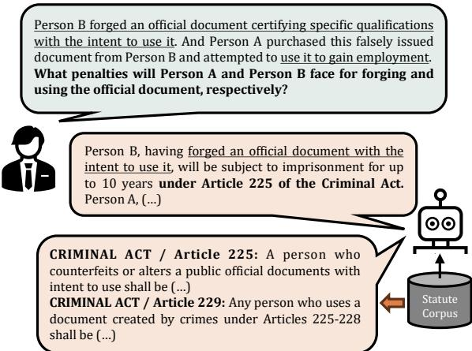  
Figure 1: Overview of KOBLEX structure and task design. Given a complex legal question, the system is required to reason over multiple statutory provisions.

In light of these limitations, there is a clear need for a comprehensive evaluation of openended, provision-grounded legal QA. To this end, we present a Korean Benchmark for Legal EXplainable open-ended QA (KOBLEX), designed to evaluate multi-hop legal reasoning capabilities. KOBLEX comprises 226 multi-hop questions, answers, and their supporting statutory provisions, curated through a hybrid pipeline that combines LLM-based generation with expert revision and evaluation. While strict filtering pipeline leads to a limited sample size, experimental results show that KOBLEX serves as an effective benchmark for distinguishing reasoning capabilities across diverse methods. Moreover, unlike traditional legal benchmarks that rely on simple matching tasks or multiple-choice questions, KOBLEX evaluates methods’ ability to generate free-form answers grounded in legal provisions. To promote accessibility and multilingual research, all instances are provided in both Korean and English. As illustrated in Figure 1, KOBLEX facilitates the evaluation of provision retrieval accuracy and multi-hop legal reasoning based on generated free-form answers.

Given the knowledge-intensive nature of provision-grounded legal QA, accurate retrieval is critical for generating factual answers. In light of this, we introduce Parametric provision-guided Selection Retrieval (PARSER). PARSER first generates parametric provisions, provisions constructed using the LLM’s parametric knowledge to emulate the structure and language of real statutes. These serve as query scaffolds to improve the retrieval of relevant legal provisions. PARSER then identifies the most relevant provision through a three-stage Retrieve–Rerank–Selection retrieval to answer the open-ended complex legal question.

To reliably assess whether the generated answers are faithful to the question, we also propose Legal Fidelity Evaluation (LF-EVAL). LF-EVAL is built on the G-Eval (Liu et al., 2023), using instances from KOBLEX to assess legal fidelity. LF-EVAL shows robust performance, achieving a Pearson correlation of 84.90 with human judgments.

Experimental results demonstrate that PARSER outperforms strong retrieval-augmented reasoning baselines by consistently delivering performance gains across multiple LLMs and diverse evaluation metrics, including LF-EVAL. Notably, with GPT-4o, PARSER improves provision retrieval accuracy over one-time retrieval by +37.91 F-1 and +19.91

EM and enhances answer quality by +19.39 tokenlevel F-1 and +30.81 LF-EVAL, demonstrating its effectiveness. PARSER consistently outperforms baselines across different reasoning depths. Further ablation analysis reveals that each component of PARSER contributes to performance gains. In addition, PARSER demonstrates greater efficiency compared to other baselines, achieving consistently strong results while generating much fewer tokens. Our contributions are summarized as follows:

• We introduce KOBLEX, a bilingual Korean-English benchmark of 226 provision-grounded, multi-hop legal QA instances curated via LLM and human validation pipeline.

• We introduce PARSER, which combines LLMgenerated parametric provisions with a threestage retrieval pipeline, significantly outperforming existing retrieval-augmented reasoning baselines across multiple LLMs.

• We propose LF-EVAL, a legal fidelity evaluation metric that excels at assessing the legal accuracy and provision alignment of generated responses.

• Experiments and analyses demonstrate the effectiveness and efficiency of PARSER across models, metrics, and reasoning depths.

## 2 Related Works

Legal Benchmarks. A growing body of work has developed benchmarks for evaluating LLMs in legal contexts, spanning a diverse range of jurisdictions, languages, and task formats (Kim et al., 2016; Chalkidis et al., 2019; Zhong et al., 2020; Tuggener et al., 2020; Chalkidis et al., 2022; Kapoor et al., 2022; Chalkidis et al., 2023; Zhang et al., 2023; Li et al., 2024a). LegalBench (Guha et al., 2023) proposes 162 few-shot tasks in English across six categories of legal reasoning, offering one of the most comprehensive benchmark suites to date. Law-Bench (Fei et al., 2024) adapts this paradigm to Chinese law, comprising 20 tasks that assess capabilities in judgment prediction, statutory interpretation, and legal knowledge retrieval.

In the Korean legal domain, several benchmarks have been introduced to evaluate domain-specific language understanding. LBOX OPEN (Hwang et al., 2022) presents a large-scale multi-task benchmark constructed from Korean court decisions, encompassing tasks such as classification and judgment prediction. KMMLU (Son et al., 2024) includes Korean legal QA as a multiple-choice category within a broader zero-shot evaluation suite. KBL (Kim et al., 2024) offers a diverse set of multiple-choice legal tasks, including bar exam and scenario-based questions.

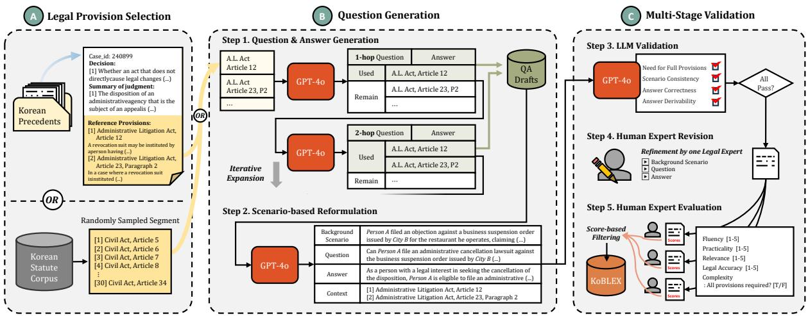  
Figure 2: Generation and validation pipeline for KOBLEX. The pipeline consists of three stages: (A) context construction from either randomly sampled segment of statute corpus or reference provisions in precedents, (B) question–answer generation using GPT-4o based on the selected legal context, and (C) multi-stage validation. An initial LLM-based evaluation filters out incomplete or unsupported pairs based on predefined criteria. Subsequently, one legal expert manually revised each validated pair and three legal experts rated them along five dimensions: fluency, practicality, relevance, legal accuracy, and complexity.

However, all of these benchmarks share key limitations: they rely on multiple-choice or binary formats, lack explicit links to relevant statutory provisions, and do not support open-ended QA. As a result, they are not suitable for evaluating models’ ability to produce explainable and factually grounded answers in complex legal settings. These limitations motivate the development of KOBLEX, a Korean benchmark for open-ended legal QA that requires provision-grounded, open-ended and multi-hop reasoning over statutory provisions.

Retrieval Augmented Reasoning. Standard Prompting (SP) was proposed to show that LLMs can leverage their parametric knowledge through in-context learning (Brown et al., 2020). Building on this, Chain of Thought (CoT) enables step-bystep reasoning by explicitly activating the model’s parametric knowledge (Wei et al., 2022). However, LLMs often fail to align with knowledgeintensive factual information, leading to hallucination (Huang et al., 2025). To address this limitation, researchers have increasingly explored Retrieval-Augmented Generation (RAG), which enhances response accuracy by incorporating relevant external knowledge (Lewis et al., 2020; Gao et al., 2024; Cho and Lee, 2025). While RAG leverages external knowledge, it often fails to integrate external knowledge with the model’s parametric knowledge, limiting its performance on complex reasoning tasks. To overcome this, recent work has introduced Retrieval-Augmented Reasoning (RARE), which aims to combine retrieval with multi-step reasoning capabilities. Self-Ask (Press et al., 2023) introduces iterative RARE by generating intermediate questions and querying external knowledge to derive the final answer. IRCoT (Trivedi et al., 2023) interleaves CoT traces with retrieval, using the interleaved generations to incorporate external knowledge into the reasoning process. FLARE (Jiang et al., 2023) improves upon IRCoT by using the model’s token-level confidence to adaptively retrieve contexts. ProbTree (Cao et al., 2023) decomposes complex questions into a tree of sub-queries, solves each node using diverse strategies, and aggregates the results based on token-level confidence to produce the final answer. BeamAggr (Chu et al., 2024) enhances ProbTree by performing multisource reasoning to generate answer candidates at leaf nodes, followed by beam combination and probabilistic answer aggregation. Despite advances in complex multi-hop reasoning, these approaches remain underexplored in knowledge-intensive domains like law. This underscores the need for methods that effectively handle complex multi-hop reasoning in knowledge-intensive domains. To bridge this gap, our research propose PARSER, a novel framework that integrates the parametric knowledge of LLMs with a 3-stage retrieval pipeline to support effective retrieval-augmented reasoning.

<table><tr><td rowspan=1 colspan=1>Background Scenario</td><td rowspan=1 colspan=1>Person B forged an official document certifying specific qualifications with the intent to use it.Person A purchased this falsely issued document from Person B and attempted to use it to gainemployment.</td></tr><tr><td rowspan=1 colspan=1>Question</td><td rowspan=1 colspan=1>What penalties will Person A and Person B face for forging and using the official document,respectively?</td></tr><tr><td rowspan=1 colspan=1>Answer</td><td rowspan=1 colspan=1>Person B, having forged an official document with the intent to use it, will be subject toimprisonment for up to 10 years under Article 225 of the Criminal Act. Person A, having useda document created in violation of Article 225, will be subject to imprisonment for up to 10years under Article 229 of the Criminal Act.</td></tr><tr><td rowspan=1 colspan=1>Reference Provision [1]</td><td rowspan=1 colspan=1>CRIMINAL ACT / Article 225: A personwho counterfeits or alters a public official documentwith intent to use shall be punished by imprisonment with labor for not more than ten years.</td></tr><tr><td rowspan=1 colspan=1>Reference Provision [2]</td><td rowspan=1 colspan=1>CRIMINAL ACT / Article 229: Any person whouses a document created by crimes underArticles 225–228shall be punished by the penalty prescribed for such crimes.</td></tr></table>

Figure 3: Example QA instance from the KOBLEX (translated from Korean). This multi-hop question requires interpreting multiple statutes. Yellow texts highlight key legal information essential for deriving the correct answer.

## 3 KOBLEX

In this section, we describe the construction process of KOBLEX. We first generate initial drafts using an LLM, then filter and revise them through a multistage validation process involving both LLM-based and human expert review (Figure 2).

## 3.1 Legal Provision Selection

Korean statutes are systematically structured at the article and paragraph level, and adjacent provisions typically exhibit strong topic continuity by addressing the similar legal concept or regulatory subject (Ministry of Government Legislation, 2024). Accordingly, sampling a continuous segment is a reasonable heuristic for selecting relevant legal content. However, this approach may limit the diversity of questions spanning multiple legal sources.

To complement this approach, we also extract statutes cited in real-world court decisions. Specifically, we utilize the reference provisions field in Korean precedents to identify statutory clauses that are actually invoked in judicial reasoning. Data sources are described in Appendix C.

## 3.2 Question Generation

Question & Answer Generation. Based on the statutory provisions selected in the previous step, we use GPT-4o (OpenAI et al., 2024) to generate initial drafts of question-answer pairs.

As illustrated in Step 1 of Figure 2, we adapt an incremental generation strategy. We first prompt the model to generate single-hop questions, each of which can be answered using only one provision. Then, based on these single-hop questions, we incrementally expand them into two-hop and three-hop versions by introducing additional provisions and guiding the model to integrate them logically into the reasoning process.

Scenario-based Reformulation. To better reflect realistic legal situations, we reformulate each question–answer pair into a fact-based legal scenario using GPT-4o. This transformation encourages more natural multi-hop reasoning and enhances the dataset’s alignment with practical legal contexts. Accordingly, each QA draft is rewritten as a scenario-based item structured as realistic legal facts and anonymized parties (e.g., Person A).

After this process, each QA instance is structured into four components: Background Scenario B, Question Q, Answer A, Context C, where $C = \{ p _ { 1 } , p _ { 2 } , . . . , p _ { n } \}$ denotes the set of reference statutory provisions used to support the reasoning. A representative QA instance is shown in Figure 3.

## 3.3 Multi-Stage Validation

LLM Validation. Inspired by prior work that uses LLMs as evaluators for quality control (Bedi et al., 2024), we employ GPT-4o to filter incorrect QA samples before the human validation step. In this step, as illustrated in Step 3 of Figure 2, the LLM automatically evaluates whether each question Q requires all C, and the consistency of B, Q, and A. We term each step as Partial Check and Full Check. Partial Check is designed to ensure that Q genuinely requires the full set of C for resolution. Given $C = \{ p _ { 1 } , p _ { 2 } , . . . , p _ { n } \}$ , we evaluate whether any non-empty subset of the powerset of C is sufficient to answer Q. If any such subset yields a correct answer without referencing the remaining provisions, we consider the instance to lack true multi-hop characteristics and exclude it. Full Check involves a comprehensive validation of the triplet $( B , Q , A )$ through an inclusive single evaluation prompt, covering the following three aspects: (1) Scenario consistency, which assesses whether (B, Q) is logically and legally coherent with C; (2) Answer correctness, which determines whether A aligns with the statutory interpretation of C; and (3) Answer derivability, which checks whether A can be fully inferred from C without requiring any unstated assumptions. The prompt templates used for both checks are provided in Appendix F.

<table><tr><td rowspan=2 colspan=1># Examples</td><td rowspan=1 colspan=3># of words</td></tr><tr><td rowspan=1 colspan=1>Backgroundscenario</td><td rowspan=1 colspan=1>Question</td><td rowspan=1 colspan=1>Answer</td></tr><tr><td rowspan=1 colspan=1>1-hop          55</td><td rowspan=1 colspan=1>33.96</td><td rowspan=1 colspan=1>13.35</td><td rowspan=1 colspan=1>11.67</td></tr><tr><td rowspan=1 colspan=1>2-hop         125</td><td rowspan=1 colspan=1>37.45</td><td rowspan=1 colspan=1>18.78</td><td rowspan=1 colspan=1>29.56</td></tr><tr><td rowspan=1 colspan=1>3-hop          46</td><td rowspan=1 colspan=1>46.2</td><td rowspan=1 colspan=1>27.13</td><td rowspan=1 colspan=1>53.11</td></tr><tr><td rowspan=1 colspan=1>Total         226</td><td rowspan=1 colspan=1>38.38</td><td rowspan=1 colspan=1>19.16</td><td rowspan=1 colspan=1>30.0</td></tr></table>

Table 1: Statistics on KOBLEX. The average numbers of words on each QA component are categorized by reasoning depth (1-hop, 2-hop, and 3-hop).

Human Expert Revision. To ensure legal correctness, clarity, and linguistic fluency, QA instances are further revised and verified by Korean law school graduates and students. Each QA instance is classified as either Pass, Revise, or Hold. Instances marked as Revise—such as ambiguous legal actors in the scenario or legally incorrect answers—are corrected accordingly. In the case of Hold, most instances are excluded from the final dataset unless the issue can be resolved by appending additional statutory provisions. Details about human expert revision are in Appendix E.

Human Expert Evaluation. Following the revision, each QA instance is evaluated by three different legal experts using five criteria: Fluency, Practicality, Relevance, Legal Accuracy, and Complexity. Fluency, practicality, relevance, and legal accuracy are rated on a 5-point Likert scale, while complexity is a binary label (True/False), with True indicating that the question requires utilizing the full set of C. Descriptions of each criterion and the evaluation guidelines are provided in Appendix E.

Instances that show no critical issues during revision and received sufficiently high evaluation scores across these criteria are curated for inclusion in the final dataset. Details of the filtering process are provided in Appendix A.1.

## 3.4 Data statistics

KOBLEX comprises 226 high-quality QA instances. Table 1 summarizes the number of examples and the average word count for each QA component grouped by reasoning depth. As reasoning depth increases, the average word count consistently rises across all components, clearly reflecting the greater linguistic and logical complexity involved in multi-hop legal reasoning.

The final benchmark spans 83 distinct Korean statutes, including major codes such as the Civil Act, Criminal Act, and Criminal Procedure Act. A complete list of statutes and their distribution is provided in Appendix B. Among the 226 QA instances, 153 are generated using reference provisions extracted from Korean court decisions, while the remaining 73 are constructed from randomly sampled segments of the Korean statute corpus.

The overall average scores across the five evaluation dimensions are: Fluency 4.385, Practicality 4.435, Relevance 4.540, Legal Accuracy 4.515, and Complexity 0.915. The agreement between the evaluators also reaches 96%, with at least two of the three experts assigning consistent labels. Details about inter-annotator agreement are in Appendix D.

While fluency and practicality may involve some degree of subjectivity and are less directly tied to legal reasoning, the consistently high scores in relevance, legal accuracy, and complexity suggest that the dataset effectively captures the demands of factually grounded, multi-hop legal reasoning. Appendix A.2 summarizes the data filtered at each LLM and human validation stage.

## 3.5 English Version of KOBLEX

Unlike previous Korean legal benchmarks (Hwang et al., 2022; Kim et al., 2024), which only provide Koean data, we release an English-translated version of KOBLEX to promote broader accessibility and facilitate multilingual research on legal question answering. Specifically, B, Q, and A are translated using GPT-4o, while the statutory provisions C are primarily based on high-quality official translations provided by the Korea Legislation Research Institute. 2 A small subset of provisions in C that are not covered by the official source are translated via GPT-4o and marked with the tag %MACHINE\_TRANSLATED%.

## 4 PARSER

We introduce Parametric provision guided Selection Retrieval (PARSER), a method designed to retrieve supporting legal provisions for complex legal questions effectively.

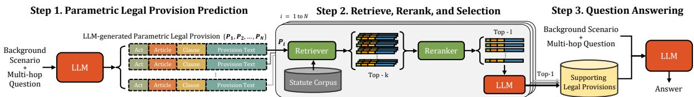  
Figure 4: Illustration of PARSER. (Step 1) The LLM initially generates parametric provisions. (Step 2) Parametric provisions are then used as queries for Retrieve, Rerank, and Selection retrieval. (Step 3) Finally, collected supporting legal provisions are used to multi-hop reasoning for generating responses.

## 4.1 Parametric Provision Generation

Complex legal questions (Q) often require reasoning over multiple statutory provisions. However, relying solely on the parametric knowledge of LLMs can be unreliable, as they are prone to hallucinations and may fail to recall the exact legal texts (Dahl et al., 2024). To address this, we incorporate retrieval over an actual statute corpus to ground the model’s responses in authoritative legal text. As illustrated in Step 1 of Figure 4, we instruct the LLM to generate a set of potentially relevant provisions $( \{ p _ { n _ { n = 1 } } \} )$ from multi-hop legal question (Q), where N is the number of generated parametric provisions. Each $p _ { n }$ reflects a distinct statutory component that may support reasoning over Q. Since $\{ p _ { n } \} _ { n = 1 } ^ { N } \}$ are generated solely based on the LLM’s parametric knowledge, we refer to them as parametric provisions and use them only as intermediate queries. This allows us to leverage retrieval based on queries that resemble the target question.

## 4.2 Retrieve, Rerank and Selection

To improve retrieval accuracy, we propose a novel three-stage retrieval approach incorporating Biencoder (Huang et al., 2013) retrieval, Crossencoder (Reimers and Gurevych, 2019) reranking, and selection via an LLM. As illustrated in Step 2 of Figure 4, each parametric provision $p _ { n }$ is used to retrieve the top k most relevant statutory provisions $( T o p \ - - \ k )$ from the corpus via a Bi-encoder retriever based on cosine similarity. The T op  k provisions retrieved for each $p _ { n }$ are reranked using a Cross-encoder reranker to better capture fine-grained relevance. After reranking, we select $T o p - l ,$ (l < k) provisions from $T o p - k$ provisions. Then, we instruct an LLM to select the most relevant one among the $T o p - l$ for each $p _ { n }$ This process enables the collection of reliable supporting legal provisions by leveraging generated parametric provisions. Finally, the collected supporting legal provisions are fed into the LLM to solve the complex multi-hop legal question through provision-grounded reasoning. The parametric provisions generated in the initial stage facilitate multihop reasoning by enabling PARSER to search for each piece of supporting provision.

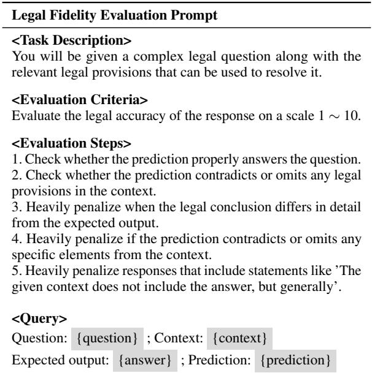  
Figure 5: Prompt of Legal Fidelity Evaluation (LF-EVAL). {placeholder} indicates a slot to be filled with the corresponding value for evaluation.

## 5 LF-EVAL

KOBLEX is a benchmark designed to evaluate the legal fidelity of responses generated by LLMs. However, existing evaluation metrics often fail to assess the legal correctness of these responses (Trautmann et al., 2024). To address this, we introduce Legal Fidelity Evaluation (LF-EVAL), an evaluation framework for measuring legal fidelity.

LF-EVAL builds upon G-Eval (Liu et al., 2023), a representative LLM-as-a-Judge evaluation approach. It evaluates the legal fidelity of a response by comparing it against the reference legal provisions and the expected answer. Figure 5 illustrates the prompt used in LF-EVAL. Under the task description of answering legal questions, LF-EVAL employs a robust LLM judge to assign a score on a

<table><tr><td></td><td colspan="3">F-1</td><td colspan="3">EM</td><td colspan="3">Token F-1</td><td colspan="3">LF-EVAL</td></tr><tr><td></td><td>Qwen</td><td>EXAONE</td><td>GPT-40</td><td>Qwen</td><td>EXAONE</td><td>GPT-40</td><td>Qwen</td><td>EXAONE</td><td>GPT-40</td><td>Qwen</td><td>EXAONE</td><td>GPT-40</td></tr><tr><td>SP (Brown et al., 2020)</td><td></td><td></td><td></td><td>1</td><td>-</td><td>一</td><td>30.52</td><td>23.04</td><td>36.20</td><td>40.74</td><td>49.46</td><td>55.00</td></tr><tr><td>CoT (Wei et al., 2022)</td><td></td><td></td><td></td><td></td><td></td><td></td><td>26.37</td><td>23.71</td><td>32.34</td><td>39.41</td><td>37.42</td><td>52.75</td></tr><tr><td>SP (Brown et al., 2020) + OR</td><td>21.50</td><td>21.50</td><td>21.50</td><td>7.08</td><td>7.08</td><td>7.08</td><td>32.18</td><td>20.58</td><td>26.75</td><td>45.36</td><td>43.98</td><td>36.45</td></tr><tr><td>CoT (Wei et al., 2022) + OR</td><td>21.50</td><td>21.50</td><td>21.50</td><td>7.08</td><td>7.08</td><td>7.08</td><td>28.39</td><td>28.82</td><td>30.68</td><td>42.10</td><td>47.26</td><td>46.42</td></tr><tr><td>Self-Ask* (Press et al., 2023)</td><td>9.29</td><td>8.55</td><td>8.55</td><td>2.65</td><td>1.33</td><td>1.77</td><td>16.59</td><td>14.72</td><td>7.82</td><td>34.14</td><td>37.77</td><td>22.44</td></tr><tr><td>IRCoT (Trivedi et al., 2023)</td><td>20.42</td><td>15.89</td><td>23.91</td><td>4.42</td><td>1.77</td><td>4.42</td><td>31.62</td><td>26.31</td><td>31.39</td><td>46.78</td><td>48.20</td><td>46.68</td></tr><tr><td>FLARE (Jiang et al., 2023)</td><td>40.64</td><td>25.23</td><td>31.75</td><td>3.98</td><td>14.16</td><td>4.42</td><td>29.54</td><td>21.31</td><td>34.37</td><td>53.76</td><td>34.66</td><td>50.55</td></tr><tr><td>ProbTree* (Cao et al., 2023)</td><td>15.84</td><td>11.61</td><td>17.32</td><td>2.65</td><td>2.21</td><td>3.98</td><td>28.38</td><td>24.67</td><td>33.91</td><td>43.77</td><td>46.74</td><td>52.62</td></tr><tr><td>BeamAggr* (Chu et al., 2024)</td><td>14.05</td><td>10.83</td><td>16.89</td><td>2.65</td><td>0.44</td><td>3.54</td><td>16.02</td><td>10.83</td><td>22.83</td><td>32.31</td><td>31.46</td><td>41.59</td></tr><tr><td>PARSER* (Ours)</td><td>46.24</td><td>48.73</td><td>59.41</td><td>17.70</td><td>17.70</td><td>26.99</td><td>40.65</td><td>31.09</td><td>46.14</td><td>56.00</td><td>57.58</td><td>67.26</td></tr></table>

Table 2: Experimental results of various baseline methods on KOBLEX. Columns shaded in blue measure retrieval accuracy, and columns shaded in yellow measure generation accuracy. The best results are highlighted in bold. We utilize Qwen3-32B (Team, 2025), EXAONE-3.5-32B (Research, 2024), and GPT-4o (OpenAI et al., 2024). ( : No-retrieval, : One-time retrieval, : Iterative retrieval, : Sub-query retrieval).

1–10 scale. The evaluation follows five clearly defined steps, each corresponding to specific criteria: Answer Relevance, Legal Consistency, Conclusion Accuracy, Context Fidelity, and Avoid Generic Responses. Finally, LF-EVAL produces both a scalar score and detailed justifications aligned with each of the five evaluation steps. These suggest that LF-EVAL not only provides a reliable score, but also offers interpretable explanations.

To assess LF-EVAL’s reliability, we conduct a human evaluation study on generated responses from KOBLEX, using two independent annotator groups. The results show that LF-EVAL achieves a Pearson correlation of 84.90 with human judgments, outperforming existing evaluation metrics. Examples and details of the human evaluation study are provided in the Appendix G.

## 6 Experiments

We describe our experimental setup, including models, evaluation metrics, retrieval setting, and baselines. Additional details are in Appendix H.

## 6.1 Models

We employ three different LLMs: Qwen3 (Team, 2025), EXAONE-3.5 (Research, 2024), and GPT-4o (OpenAI et al., 2024). These models are selected for their strong Korean language understanding capabilities. We use BM-25 (Robertson and Zaragoza, 2009) as the retriever and BGE (Chen et al., 2024), finetuned on the Korean dataset, as the reranker.

## 6.2 Metrics

Since KOBLEX includes gold-supporting provisions and answers, we employ retrieval and generation metrics for comprehensive evaluation. For retrieval performance, we use Exact Match (EM)

and F-1, computed by comparing the retrieved provisions against the gold-supporting provisions. For generation performance, we report Token F-1, a standard metric for evaluating free-form QA, and LF-EVAL for assessing the legal fidelity.

## 6.3 Statute Corpus

We construct a paragraph-level statute corpus to provide fine-grained legal information. We include every active statute that has been cited in Korean court decisions between 1998 and 20243. The final corpus comprises 608 unique statutes, totaling about 233,544 paragraph-level provisions. We use this statute corpus as a retrieval pool to obtain actual provisions for our experiments.

## 6.4 Baselines

To evaluate the effectiveness of PARSER, we compare it against a diverse set of multi-hop reasoning baselines. Since many baselines target generaldomain tasks, official implementations are incompatible for KOBLEX. Therefore, we manually reimplemented them for fair comparison. We perform retrieval over our statute corpus to ensure consistency for methods requiring retrieval.

We include the following methods as baselines: Standard Prompting (SP) (Brown et al., 2020), Chain of Thought (CoT) (Wei et al., 2022), Self-Ask (Press et al., 2023), IRCoT (Trivedi et al., 2023), FLARE (Jiang et al., 2023), ProbTree (Cao et al., 2023), and BeamAggr (Chu et al., 2024). We also include a simple One-Time Retrieval baseline, which gives oracle access to the same number of gold reference provisions as the required number of reasoning hops. Implementation details about baseline methods are provided in Appendix H.3

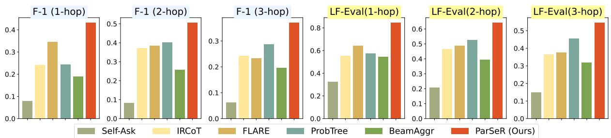  
Figure 6: Retrieval performance (F-1) and generation performance (LF-EVAL) of each method by reasoning depth.

<table><tr><td></td><td>F-1</td><td>EM</td><td>Token F-1</td><td>LF-EVAL</td></tr><tr><td>PARSER</td><td>48.74</td><td>17.70</td><td>31.09</td><td>57.58</td></tr><tr><td>w/o Selection</td><td>40.61</td><td>13.72</td><td>27.11</td><td>50.18</td></tr><tr><td>w/o Reranking</td><td>40.64</td><td>14.16</td><td>29.54</td><td>54.02</td></tr><tr><td>w/o Reranking, Selection</td><td>27.56</td><td>6.64</td><td>25.90</td><td>45.97</td></tr><tr><td>w/o Reranking, Selection, Provision</td><td>21.41</td><td>3.98</td><td>21.20</td><td>45.52</td></tr></table>

Table 3: Ablation results on PARSER on EXAONE. "w/o Provision" replaces parametric provision generation with top-k retrieval based on the original question, where k matches the number of generated provisions.

## 7 Results

Table 2 shows experimental results on KOBLEX, comparing various baseline methods. We observe that baselines with low F-1 and EM scores tend to show lower Token F-1 and LF-EVAL scores than the No-retrieval baseline.4 This suggests that retrieving irrelevant provisions negatively impacts multi-hop legal reasoning.

On the other hand, PARSER consistently outperforms all baseline methods with all LLMs across all retrieval and generation metrics. Notably, on GPT-4o, PARSER significantly surpasses the strongest baseline, ProbTree, with a +12.23 improvement in Token F-1 and +14.64 in LF-EVAL. This indicates that PARSER can effectively perform reasoning over complex multi-hop legal questions. Additional results on smaller LLMs are in Appendix J.

## 8 Analyses

Reasoning Depth. Given that KOBLEX encompasses scenario-based QA tasks requiring varying levels of reasoning depth, we conduct a detailed analysis by evaluating performance across different hop levels. Figure 6 shows the performances with respect to different reasoning depths. PARSER consistently achieves the best performance across all hop levels. Excluding PARSER, confidence-based methods such as FLARE and ProbTree outperform other baselines. Specifically, FLARE ranks second at the 1-hop level, while ProbTree excels in deeper reasoning at the 2-hop and 3-hop levels. These results suggest that the performance of different existing methods can vary depending on the required reasoning depth. In contrast, PARSER demonstrates robust performance across questions with all levels of reasoning depth.

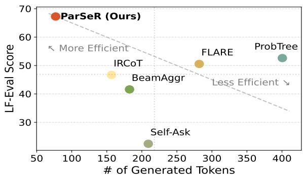  
Figure 7: Average PARSER scores with respect to average number of generated tokens by GPT-4o.

Ablation Study. To analyze the role of each module in driving the performance improvements of PARSER, we conduct an ablation study by isolating the impact of each component. Table 3 shows the ablation study of our method on EXAONE 3.5- 32B (Research, 2024). Removing Selection causes a greater performance drop than removing Reranking, suggesting that leveraging the LLM’s ability to select relevant provisions is more effective than cross-encoder. We observe a significant performance drop when both Reranking and Selection are removed. Furthermore, replacing parametric provision generation with simple top-k retrieval based on the original question, where k equals the number of generated provisions, leads to even worse performance. This indicates that parametric provision generation better supports multi-hop retrievalaugmented reasoning than simple retrieval.

<table><tr><td></td><td>F-1</td><td>EM</td><td>Token F-1</td><td>LF-EVAL</td></tr><tr><td>PARSER (Sparse)</td><td>48.74</td><td>17.70</td><td>31.09</td><td>57.58</td></tr><tr><td>PARSER (Dense)</td><td>50.43</td><td>16.81</td><td>29.56</td><td>57.58</td></tr><tr><td>PARSER (Hybrid)</td><td>48.16</td><td>16.81</td><td>28.76</td><td>56.61</td></tr></table>

Table 4: Performance of PARSER across different retriever types. We compare sparse (BM25 (Robertson and Zaragoza, 2009)), dense (BGE-M3 (Chen et al., 2024)), and hybrid (BGE-M3 hybrid) retrievers using EXAONE 3.5-32B (Research, 2024).

Efficiency. While retrieval-augmented reasoning methods significantly improve performance on complex questions, they often require a large number of tokens for final answer prediction. To assess both effectiveness and efficiency, we analyze the performance of each method relative to the number of tokens consumed during answer prediction. Figure 7 presents LF-EVAL score against the average number of generated tokens. While methods with more generated tokens tend to show increased performance, the improvements are generally marginal relative to the computational overhead, suggesting potential inefficiency. However, PARSER demonstrates the highest performance while generating the fewest tokens, making it the most efficient approach. Unlike other baselines, PARSER leverages parametric provisions generated in the initial stage to facilitate targeted multi-hop evidence retrieval while focusing on improving retrieval accuracy through a 3-stage retrieval pipeline. This feature leads that PARSER is not only effective but also cost-efficient for multi-hop legal reasoning.

Effect of Retreiver Type. Since various types of retrieval tools are available, we investigate the impact of retriever type on the performance of PARSER. For the legal provision retrieval task, we consider BM25 (Robertson and Zaragoza, 2009) as a sparse retriever, BGE-M3 (Chen et al., 2024), known for its strong Korean embedding capabilities, as a dense retriever, and their combination as a hybrid retriever. Table 4 presents the experimental results of using different retriever types with EXAONE-3.5-32B. Overall, there is no significant performance difference across retriever types, although the sparse retriever (BM25) achieves the highest EM, token-level F1, and LF-EVAL score. Therefore, we adopt the sparse retriever (BM25) as the retrieval tool, considering its accessibility for reproducibility, efficient retrieval speed, and fairness in comparison. See Appendix H.3 for a detailed description of the retrieval configuration.

<table><tr><td>Top − k</td><td>F-1</td><td>EM</td><td>Token F-1</td><td>LF-EVAL</td></tr><tr><td>Top-50</td><td>47.98</td><td>16.81</td><td>30.24</td><td>58.93</td></tr><tr><td>Top-100</td><td>48.74</td><td>17.70</td><td>31.09</td><td>57.58</td></tr><tr><td>Top-200</td><td>49.29</td><td>17.70</td><td>31.20</td><td>60.59</td></tr><tr><td>Top-300</td><td>50.26</td><td>18.58</td><td>31.97</td><td>60.58</td></tr></table>

Table 5: Analysis on k value on retrieval. We vary the k value (50, 100, 200, 300) while keeping other modules of PARSER fixed, using EXAONE 3.5-32B.
<table><tr><td>Top − l</td><td>F-1</td><td>EM</td><td>Token F-1</td><td>LF-EVAL</td></tr><tr><td>Top-5</td><td>47.56</td><td>17.26</td><td>30.63</td><td>59.21</td></tr><tr><td>Top-10</td><td>48.74</td><td>17.70</td><td>31.09</td><td>57.58</td></tr><tr><td>Top-20</td><td>50.03</td><td>18.14</td><td>30.67</td><td>59.14</td></tr><tr><td>Top-30</td><td>50.34</td><td>19.03</td><td>30.43</td><td>58.49</td></tr></table>

Table 6: Analysis on l value on reranking. We vary the l value (5, 10, 20, 30) while keeping other modules of PARSER fixed, using EXAONE 3.5-32B.

Effect of k and l in PARSER. We investigate the impact of two key hyperparameters in the 3-stage retrieval pipeline: k (retrieval scope) and l (reranking scope). Table 5 presents the results of varying k while keeping other components of PARSER fixed. We observe a slight improvement in retrieval metrics as k increases, while the effect on generation metrics remains marginal. Table 6 shows the results of varying l under the same conditions. Unlike k, increasing l does not lead to consistent performance gains. While larger k and l values offer broader context and better recall, they also increase computational cost in reranking and risk exceeding context limits during selection. Therefore, we set k = 100 and l = 10 for PARSER in this paper.

## 9 Conclusion

In this work, we introduce KOBLEX, a benchmark designed to evaluate LLMs on provision-grounded, open-ended legal QA in Korean law. Furthermore, we present PARSER, which significantly outperforms existing retrieval-augmented reasoning methods in both retrieval accuracy and answer quality. To enable reliable assessment of legal fidelity in free-form responses, we propose LF-EVAL, an automatic evaluation aligned with human judgment.

Our experiments demonstrate that PARSER consistently outperforms all baselines across all metrics in a cost-efficient and reasoning-depthagnostic manner. We hope KOBLEX, LF-EVAL, and PARSER serve as valuable resources for advancing research in legal NLP.

## Limitations

Limited Scale and Expert Dependency. The current version of KOBLEX is relatively limited in size. While our automated pipeline enables the generation of initial QA drafts at scale, each instance still requires careful review and revision by legal experts to ensure legal correctness and contextual coherence. This expert validation step remains essential given the current limitations of LLMs in reliably handling nuanced legal interpretation without human oversight.

Civil Law Focus. KOBLEX, PARSER, and LF-EVAL are developed based on Korean statutory law, reflecting the characteristics of a civil law system where codified statutes serve as the primary source of legal authority. While this design enables rigorous evaluation of statute-grounded legal reasoning, it may limit the applicability to common law jurisdictions, such as those in the United States or the United Kingdom, where legal interpretation heavily relies on case law and judicial precedents.

## Ethical Considerations

To ensure ethical data construction and usage, several precautions are taken during the development of KOBLEX.

Dataset Construction. First, all question, answer instances in the dataset are derived from fictional legal scenarios and do not contain any personally identifiable information. Every background scenario is composed using anonymized character names (e.g., Person A, Person B), and no real individuals, cases, or sensitive details are included.

Second, all legal experts who participated in the revision and evaluation process were informed in advance that the purpose of the task is to construct a dataset for evaluating LLM performance on legal reasoning (see Appendix E).

Finally, all legal documents used in constructing KOBLEX—both statutes and precedents—were collected from official government APIs and fall under Korea’s public data policy, which permits their redistribution for research purposes. For the English versions of the statutes, we used publicly released translations by the Korea Legislation Research Institute (KLRI), which confirms redistribution is allowed for non-commercial research use. Any machine-translated content is labeled within the dataset to maintain transparency (Appendix C).

Intended Use. This work presents a benchmark and methodology for evaluating open-ended, provision-grounded legal question answering in Korean. It is designed solely for research purposes and is not intended for direct use in real-world legal decision-making or as a substitute for professional legal advice. The benchmark aims to support the development and evaluation of legal NLP systems.

## Acknowledgments

This research was supported by the MSIT(Ministry of Science and ICT), Korea, under the ITRC(Information Technology Research Center) support program(IITP-2025-RS-2020-II201789) supervised by the IITP(Institute for Information & Communications Technology Planning & Evaluation, Contribution Rate: 47.5%). This research was supported by Culture, Sports and Tourism R&D Program through the Korea Creative Content Agency grant funded by the Ministry of Culture, Sports and Tourism in 2025 (Project Name: Development of an AI-Based Korean Diagnostic System for Efficient Korean Speaking Learning by Foreigners, Project Number: RS-2025- 02413038, Contribution Rate: 47.5%). This work was also supported by the Institute of Information & Communications Technology Planning & Evaluation (IITP) grant funded by the Korea government (MSIT) (No. RS-2019-II191906, Artificial Intelligence Graduate School Program (POSTECH), Contribution Rate: 5%).

## References

Suhana Bedi, Scott L Fleming, Chia-Chun Chiang, Keith Morse, Aswathi Kumar, Birju Patel, Jenelle A Jindal, Conor Davenport, Craig Yamaguchi, and Nigam H Shah. 2024. Quest-ai: A system for question generation, verification, and refinement using ai for usmle-style exams. In Biocomputing 2025: Proceedings of the Pacific Symposium, pages 54–69. World Scientific.

Tom Brown, Benjamin Mann, Nick Ryder, Melanie Subbiah, Jared D Kaplan, Prafulla Dhariwal, Arvind Neelakantan, Pranav Shyam, Girish Sastry, Amanda Askell, Sandhini Agarwal, Ariel Herbert-Voss, Gretchen Krueger, Tom Henighan, Rewon Child, Aditya Ramesh, Daniel Ziegler, Jeffrey Wu, Clemens Winter, Chris Hesse, Mark Chen, Eric Sigler, Mateusz Litwin, Scott Gray, Benjamin Chess, Jack Clark, Christopher Berner, Sam McCandlish, Alec Radford, Ilya Sutskever, and Dario Amodei. 2020. Language models are few-shot learners. In Advances in Neural Information Processing Systems, volume 33, pages 1877–1901. Curran Associates, Inc.

Shulin Cao, Jiajie Zhang, Jiaxin Shi, Xin Lv, Zijun Yao, Qi Tian, Lei Hou, and Juanzi Li. 2023. Probabilistic tree-of-thought reasoning for answering knowledgeintensive complex questions. In Findings of the Association for Computational Linguistics: EMNLP 2023, pages 12541–12560, Singapore. Association for Computational Linguistics.

Ilias Chalkidis, Ion Androutsopoulos, and Nikolaos Aletras. 2019. Neural legal judgment prediction in English. In Proceedings of the 57th Annual Meeting of the Associationfor Computational Linguistics, pages 4317–4323, Florence, Italy. Association for Computational Linguistics.

Ilias Chalkidis, Nicolas Garneau, Cat˘ alina Goan˘ t,a,˘ Daniel Katz, and Anders Søgaard. 2023. Lexfiles and legallama: Facilitating english multinational legal language model development. In Proceedings of the 61st Annual Meeting of the Association for Computational Linguistics (Volume 1: Long Papers), pages 15513–15535.

Ilias Chalkidis, Abhik Jana, Dirk Hartung, Michael Bommarito, Ion Androutsopoulos, Daniel Katz, and Nikolaos Aletras. 2022. LexGLUE: A benchmark dataset for legal language understanding in English. In Proceedings of the 60th Annual Meeting of the Associationfor Computational Linguistics (Volume 1: Long Papers), pages 4310–4330, Dublin, Ireland. Association for Computational Linguistics.

Jianlv Chen, Shitao Xiao, Peitian Zhang, Kun Luo, Defu Lian, and Zheng Liu. 2024. Bge m3-embedding: Multi-lingual, multi-functionality, multi-granularity text embeddings through self-knowledge distillation. Preprint, arXiv:2402.03216.

Jeonghun Cho and Gary Lee. 2025. K-COMP: Retrieval-augmented medical domain question answering with knowledge-injected compressor. In Proceedings ofthe 2025 Conference ofthe Nations of the Americas Chapter of the Association for Computational Linguistics: Human Language Technologies (Volume 1: Long Papers), pages 6878–6901, Albuquerque, New Mexico. Association for Computational Linguistics.

Zheng Chu, Jingchang Chen, Qianglong Chen, Haotian Wang, Kun Zhu, Xiyuan Du, Weijiang Yu, Ming Liu, and Bing Qin. 2024. BeamAggR: Beam aggregation reasoning over multi-source knowledge for multi-hop question answering. In Proceedings ofthe 62nd Annual Meeting of the Association for Computational Linguistics (Volume 1: Long Papers), pages 1229– 1248, Bangkok, Thailand. Association for Computational Linguistics.

Karl Cobbe, Vineet Kosaraju, Mohammad Bavarian, Mark Chen, Heewoo Jun, Lukasz Kaiser, Matthias Plappert, Jerry Tworek, Jacob Hilton, Reiichiro Nakano, Christopher Hesse, and John Schulman. 2021. Training verifiers to solve math word problems. arXiv preprint arXiv:2110.14168.

Matthew Dahl, Varun Magesh, Mirac Suzgun, and Daniel E Ho. 2024. Large legal fictions: Profiling legal hallucinations in large language models. Journal ofLegal Analysis, 16(1):64–93.

David Freeman Engstrom and Jonah B Gelbach. 2021. Legal tech, civil procedure, and the future of adversarialism. University of Pennsylvania Law Review, pages 1001–1099.

Angela Fan, Yacine Jernite, Ethan Perez, David Grangier, Jason Weston, and Michael Auli. 2019. ELI5: Long form question answering. In Proceedings of the 57th Annual Meeting ofthe Associationfor Computational Linguistics, pages 3558–3567, Florence, Italy. Association for Computational Linguistics.

Zhiwei Fei, Xiaoyu Shen, Dawei Zhu, Fengzhe Zhou, Zhuo Han, Alan Huang, Songyang Zhang, Kai Chen, Zhixin Yin, Zongwen Shen, Jidong Ge, and Vincent Ng. 2024. LawBench: Benchmarking legal knowledge of large language models. In Proceedings of the 2024 Conference on Empirical Methods in Natural Language Processing, pages 7933–7962, Miami, Florida, USA. Association for Computational Linguistics.

Matthew Finlayson, John Hewitt, Alexander Koller, Swabha Swayamdipta, and Ashish Sabharwal. 2024. Closing the curious case of neural text degeneration. In The Twelfth International Conference on Learning Representations.

Yunfan Gao, Yun Xiong, Xinyu Gao, Kangxiang Jia, Jinliu Pan, Yuxi Bi, Yi Dai, Jiawei Sun, Meng Wang, and Haofen Wang. 2024. Retrieval-augmented generation for large language models: A survey. Preprint, arXiv:2312.10997.

Neel Guha, Julian Nyarko, Daniel Ho, Christopher Ré, Adam Chilton, Alex Chohlas-Wood, Austin Peters, Brandon Waldon, Daniel Rockmore, Diego Zambrano, et al. 2023. Legalbench: A collaboratively built benchmark for measuring legal reasoning in large language models. Advances in Neural Information Processing Systems, 36:44123–44279.

Dan Hendrycks, Collin Burns, Steven Basart, Andy Zou, Mantas Mazeika, Dawn Song, and Jacob Steinhardt. 2021. Measuring massive multitask language understanding. Proceedings of the International Conference on Learning Representations (ICLR).

Lei Huang, Weijiang Yu, Weitao Ma, Weihong Zhong, Zhangyin Feng, Haotian Wang, Qianglong Chen, Weihua Peng, Xiaocheng Feng, Bing Qin, and Ting Liu. 2025. A survey on hallucination in large language models: Principles, taxonomy, challenges, and open questions. ACM Trans. Inf. Syst., 43(2).

Po-Sen Huang, Xiaodong He, Jianfeng Gao, Li Deng, Alex Acero, and Larry Heck. 2013. Learning deep structured semantic models for web search using clickthrough data. In Proceedings ofthe 22nd ACM international conference on Information & Knowledge Management, pages 2333–2338.

Wonseok Hwang, Dongjun Lee, Kyoungyeon Cho, Hanuhl Lee, and Minjoon Seo. 2022. A multi-task benchmark for korean legal language understanding and judgement prediction. Advances in Neural Information Processing Systems, 35:32537–32551.

Jeffrey Ip and Kritin Vongthongsri. 2025. deepeval.

Zhengbao Jiang, Frank Xu, Luyu Gao, Zhiqing Sun, Qian Liu, Jane Dwivedi-Yu, Yiming Yang, Jamie Callan, and Graham Neubig. 2023. Active retrieval augmented generation. In Proceedings of the 2023 Conference on Empirical Methods in Natural Language Processing, pages 7969–7992, Singapore. Association for Computational Linguistics.

Arnav Kapoor, Mudit Dhawan, Anmol Goel, Arjun T H, Akshala Bhatnagar, Vibhu Agrawal, Amul Agrawal, Arnab Bhattacharya, Ponnurangam Kumaraguru, and Ashutosh Modi. 2022. HLDC: Hindi legal documents corpus. In Findings of the Association for Computational Linguistics: ACL 2022, pages 3521– 3536, Dublin, Ireland. Association for Computational Linguistics.

Mi-Young Kim, Randy Goebel, Yoshinobu Kano, and Ken Satoh. 2016. Coliee-2016: evaluation of the competition on legal information extraction and entailment. In International Workshop on Jurisinformatics (JURISIN 2016).

Yeeun Kim, Youngrok Choi, Eunkyung Choi, JinHwan Choi, Hai Jin Park, and Wonseok Hwang. 2024. Developing a pragmatic benchmark for assessing Korean legal language understanding in large language models. In Findings ofthe Associationfor Computational Linguistics: EMNLP 2024, pages 5573–5595, Miami, Florida, USA. Association for Computational Linguistics.

Woosuk Kwon, Zhuohan Li, Siyuan Zhuang, Ying Sheng, Lianmin Zheng, Cody Hao Yu, Joseph E. Gonzalez, Hao Zhang, and Ion Stoica. 2023. Efficient memory management for large language model serving with pagedattention. In Proceedings ofthe ACM SIGOPS 29th Symposium on Operating Systems Principles.

Patrick Lewis, Ethan Perez, Aleksandra Piktus, Fabio Petroni, Vladimir Karpukhin, Naman Goyal, Heinrich Küttler, Mike Lewis, Wen-tau Yih, Tim Rocktäschel, Sebastian Riedel, and Douwe Kiela. 2020. Retrieval-augmented generation for knowledgeintensive nlp tasks. In Advances in Neural Information Processing Systems, volume 33, pages 9459– 9474. Curran Associates, Inc.

Haitao Li, Junjie Chen, Jingli Yang, Qingyao Ai, Wei Jia, Youfeng Liu, Kai Lin, Yueyue Wu, Guozhi Yuan, Yiran Hu, et al. 2024a. Legalagentbench: Evaluating llm agents in legal domain. arXiv preprint arXiv:2412.17259.

Haitao Li, You Chen, Qingyao Ai, Yueyue Wu, Ruizhe Zhang, and Yiqun Liu. 2024b. Lexeval: A comprehensive chinese legal benchmark for evaluating large language models. arXiv preprint arXiv:2409.20288.

Chin-Yew Lin. 2004. ROUGE: A package for automatic evaluation of summaries. In Text Summarization Branches Out, pages 74–81, Barcelona, Spain. Association for Computational Linguistics.

Yang Liu, Dan Iter, Yichong Xu, Shuohang Wang, Ruochen Xu, and Chenguang Zhu. 2023. G-eval: NLG evaluation using gpt-4 with better human alignment. In Proceedings of the 2023 Conference on Empirical Methods in Natural Language Processing, pages 2511–2522, Singapore. Association for Computational Linguistics.

Xing Han Lù. 2024. Bm25s: Orders of magnitude faster lexical search via eager sparse scoring. Preprint, arXiv:2407.03618.

Ministry of Government Legislation. 2024. Legislative drafting review guidelines. https://www.moleg. go.kr/menu.es?mid=a10105030000. Cited pages: pp. 10–12.

OpenAI et al. 2024. Gpt-4 technical report. Preprint, arXiv:2303.08774.

Kishore Papineni, Salim Roukos, Todd Ward, and Wei-Jing Zhu. 2002. Bleu: a method for automatic evaluation of machine translation. In Proceedings ofthe 40th Annual Meeting of the Association for Computational Linguistics, pages 311–318, Philadelphia, Pennsylvania, USA. Association for Computational Linguistics.

Cheng Peng, Xi Yang, Aokun Chen, Kaleb E Smith, Nima PourNejatian, Anthony B Costa, Cheryl Martin, Mona G Flores, Ying Zhang, Tanja Magoc, et al. 2023. A study of generative large language model for medical research and healthcare. NPJ digital medicine, 6(1):210.

Ofir Press, Muru Zhang, Sewon Min, Ludwig Schmidt, Noah Smith, and Mike Lewis. 2023. Measuring and narrowing the compositionality gap in language models. In Findings ofthe Associationfor Computational Linguistics: EMNLP 2023, pages 5687–5711, Singapore. Association for Computational Linguistics.

Nils Reimers and Iryna Gurevych. 2019. Sentence-BERT: Sentence embeddings using Siamese BERTnetworks. In Proceedings ofthe 2019 Conference on Empirical Methods in Natural Language Processing and the 9th International Joint Conference on Natural Language Processing (EMNLP-IJCNLP), pages 3982–3992, Hong Kong, China. Association for Computational Linguistics.

David Rein, Betty Li Hou, Asa Cooper Stickland, Jackson Petty, Richard Yuanzhe Pang, Julien Dirani, Julian Michael, and Samuel R Bowman. 2024. Gpqa: A graduate-level google-proof q&a benchmark. In First Conference on Language Modeling.

LG AI Research. 2024. Exaone 3.5: Series of large language models for real-world use cases. arXiv preprint arXiv:https://arxiv.org/abs/2412.04862.

Stephen Robertson and Hugo Zaragoza. 2009. The probabilistic relevance framework: Bm25 and beyond. Foundations and Trends in Information Retrieval, 3:333–389.

James Romoser. 2023. No, ruth bader ginsburg did not dissent in obergefell—and other things chatgpt gets wrong about the supreme court. SCOTUSblog (Jan. 26, 2023), https://www. scotusblog. com/2023/01/noruth-bader-ginsburg-did-notdissent-in-obergefelland-other-things-chatgpt-gets-wrong-about-thesupreme-court.

Guijin Son, Hanwool Lee, Sungdong Kim, Seungone Kim, Niklas Muennighoff, Taekyoon Choi, Cheonbok Park, Kang Min Yoo, and Stella Biderman. 2024. Kmmlu: Measuring massive multitask language understanding in korean. arXiv preprint arXiv:2402.11548.

Zhongxiang Sun. 2023. A short survey of viewing large language models in legal aspect. arXiv preprint arXiv:2303.09136.

Qwen Team. 2025. Qwen3.

Dietrich Trautmann, Natalia Ostapuk, Quentin Grail, Adrian Pol, Guglielmo Bonifazi, Shang Gao, and Martin Gajek. 2024. Measuring the groundedness of legal question-answering systems. In Proceedings of the Natural Legal Language Processing Workshop 2024, pages 176–186, Miami, FL, USA. Association for Computational Linguistics.

Harsh Trivedi, Niranjan Balasubramanian, Tushar Khot, and Ashish Sabharwal. 2023. Interleaving retrieval with chain-of-thought reasoning for knowledgeintensive multi-step questions. In Proceedings of the 61st Annual Meeting of the Association for Computational Linguistics (Volume 1: Long Papers), pages 10014–10037, Toronto, Canada. Association for Computational Linguistics.

Don Tuggener, Pius von Däniken, Thomas Peetz, and Mark Cieliebak. 2020. LEDGAR: A large-scale multi-label corpus for text classification of legal provisions in contracts. In Proceedings of the Twelfth Language Resources and Evaluation Conference, pages 1235–1241, Marseille, France. European Language Resources Association.

Jason Wei, Xuezhi Wang, Dale Schuurmans, Maarten Bosma, brian ichter, Fei Xia, Ed Chi, Quoc V Le, and Denny Zhou. 2022. Chain-of-thought prompting elicits reasoning in large language models. In Advances in Neural Information Processing Systems, volume 35, pages 24824–24837. Curran Associates, Inc.

Zhuo Zhang, Xiangjing Hu, Jingyuan Zhang, Yating Zhang, Hui Wang, Lizhen Qu, and Zenglin Xu. 2023. FEDLEGAL: The first real-world federated learning benchmark for legal NLP. In Proceedings of the 61st Annual Meeting of the Association for Computational Linguistics (Volume 1: Long Papers), pages 3492–3507, Toronto, Canada. Association for Computational Linguistics.

Wayne Xin Zhao, Kun Zhou, Junyi Li, Tianyi Tang, Xiaolei Wang, Yupeng Hou, Yingqian Min, Beichen Zhang, Junjie Zhang, Zican Dong, Yifan Du, Chen Yang, Yushuo Chen, Zhipeng Chen, Jinhao Jiang, Ruiyang Ren, Yifan Li, Xinyu Tang, Zikang Liu, Peiyu Liu, Jian-Yun Nie, and Ji-Rong Wen. 2025. A survey of large language models. Preprint, arXiv:2303.18223.

Lianmin Zheng, Wei-Lin Chiang, Ying Sheng, Siyuan Zhuang, Zhanghao Wu, Yonghao Zhuang, Zi Lin, Zhuohan Li, Dacheng Li, Eric Xing, Hao Zhang, Joseph E Gonzalez, and Ion Stoica. 2023. Judging llm-as-a-judge with mt-bench and chatbot arena. In Advances in Neural Information Processing Systems, volume 36, pages 46595–46623. Curran Associates, Inc.

Haoxi Zhong, Chaojun Xiao, Cunchao Tu, Tianyang Zhang, Zhiyuan Liu, and Maosong Sun. 2020. Jecqa: a legal-domain question answering dataset. In Proceedings ofthe AAAI conference on artificial intelligence, volume 34:05, pages 9701–9708.

Jeffrey Zhou, Tianjian Lu, Swaroop Mishra, Siddhartha Brahma, Sujoy Basu, Yi Luan, Denny Zhou, and Le Hou. 2023. Instruction-following evaluation for large language models. arXiv preprint arXiv:2311.07911.

## A Data Filtering and Curation

## A.1 Final Inclusion Criteria

During the human expert revision phase, each QA instance is categorized as either Pass, Revise, or Hold. Following this revision phase, all instances are evaluated by three legal experts according to the five evaluation criteria described in Appendix E. Instances labeled as Pass or Revise are included in the final dataset if they satisfy both of the following scoring conditions during the evaluation phase:

• Average score threshold: The instance has to receive an average score of at least 3.0 from the three annotators for each of the following criteria: Fluency, Practicality, Relevance, and Legal Accuracy.

• Complexity threshold: At least two of the three annotators have to assign a complexity as True, indicating that all provided legal texts are required to solve the question.

A subset of samples initially marked as Hold—specifically, those for which the evaluators indicated that the issue could be resolved by adding additional statutory provisions—is also sent to the evaluation stage with the necessary legal context attached. As with the Pass/Revise group, only samples that meet the above evaluation criteria are retained.

All other Hold cases are excluded from the final benchmark. This included instances where interpretation requires not only statutory provisions but also precedent-based reasoning to reach a sound legal conclusion or scenarios that are unrelated to the provided legal provisions.

Instances that fail to meet the evaluation criteria specified above are likewise excluded from the final release regardless of their initial label.

## A.2 Validation Filtering Statistics

<table><tr><td></td><td>1-hop</td><td>2-hop</td><td>3-hop</td><td>4-hop</td><td>Total</td></tr><tr><td>Step (2) After Reformulation</td><td>648</td><td>677</td><td>1353</td><td>357</td><td>3035</td></tr><tr><td>- A. Full Check</td><td>636 (98%)</td><td>647 (96%)</td><td>1273 (94%)</td><td>337 (94%)</td><td>2893 (95%)</td></tr><tr><td>- B. Partial Check</td><td>614 (95%)</td><td>164 (24%)</td><td>58 (4%)</td><td>4 (1%)</td><td>840 (28%)</td></tr><tr><td>Step (3) After LLM Val. (A ∩ B)</td><td>601 (93%)</td><td>160 (24%)</td><td>51 (4%)</td><td>4 (1%)</td><td>816 (27%)</td></tr><tr><td>* Before Human Val.</td><td>67 (10%)</td><td>158 (23%)</td><td>51 (4%)</td><td>4(1%)</td><td>280 (9%)</td></tr><tr><td>Step (4&amp;5) After Human Val.</td><td>55 (8%)</td><td>125 (18%)</td><td>46 (4%)</td><td>0 (0%)</td><td>226 (7%)</td></tr></table>

Table 7: Number of QA instances before and after each validation step. Step (2) refers to the number of QA instances after scenario-based reformulation (Section 3.2). Step (3) shows the number of instances that passed both the Partial Check and Full Check during the LLM validation stage (Section 3.3). To maintain a balanced distribution across reasoning levels, a subset of 1-hop and 2-hop instances is selectively excluded before the human validation phase (Before Human Validation). Step (4&5) presents the final number of instances that passed both human revision and evaluation (Section 3.3). Percentages represent the pass rate relative to the number of instances after scenario-based reformulation.

Table 7 presents the number of QA instances retained and filtered across each validation stage of the benchmark construction pipeline.

After scenario-based reformulation (Step 2), a total of 3,035 QA drafts are produced. During the LLM validation stage (Step 3), only 816 instances (27%) pass both the Partial and Full Checks.

The pass rate for the Partial Check drops sharply as the reasoning level increases—from 95% for 1-hop questions to just 1% for 4-hop—indicating that constructing valid multi-hop questions becomes substantially more difficult as reasoning depth increases. To compensate for this difficulty and ensure sufficient coverage at higher reasoning levels, we generate and validate additional 3-hop samples.

To maintain a balanced distribution across reasoning levels, we selectively exclude a portion of 1-hop and 2-hop instances prior to human validation (marked as \* in the table).

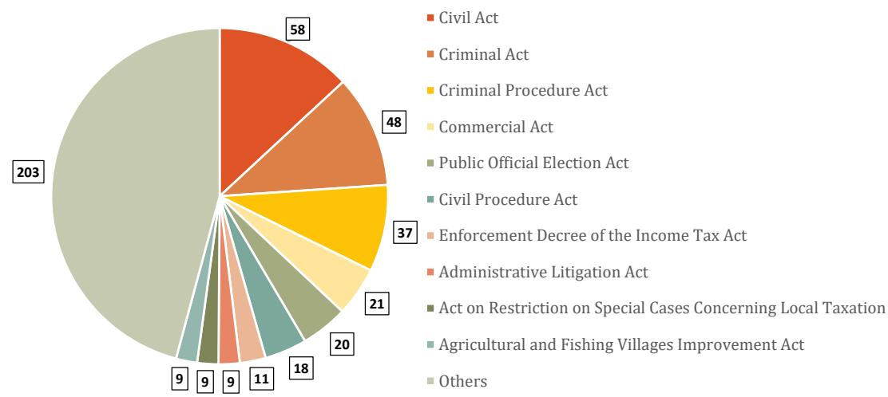  
Figure 8: Distribution of Statutes in KOBLEX. shows the most frequently appearing statutes in the benchmark—specifically, those cited in at least nine QA instances. Statutes referenced fewer than nine times are aggregated into the Others category for clarity. The numbers outside each segment indicate the number of QA instances associated with each statute.

Following human expert revision and evaluation (Step 4&5), 226 QA instances remain in the final dataset. These include 55 single-hop, 125 two-hop, and 46 three-hop questions, with all 4-hop questions removed during the final filtering process described in Appendix A.1.

## B List and Distribution of Statutes

Figure 8 visualizes the distribution of statutes cited in KOBLEX. For readability, only statutes that appear in at least nine QA instances are shown individually. Statutes cited fewer than nine times are aggregated into the Others category. The complete list of all 83 statutes and their corresponding frequencies is included in the released benchmark.

## C Licensing

## C.1 Source Data Licensing and Usage Rights

We utilized the public API provided by the Korea Ministry of Government Legislation’s Law Information Sharing Service.5 This API was used to collect both statutory provisions and precedents for the construction of our benchmark.

According to the Act on Promotion of the Provision and Use of Public Data, all legal information provided by the Korean Law Information Center—excluding English translations—is classified as public data. This information is openly accessible and may be freely used, including for commercial purposes, without restriction. Accordingly, our use of these sources is fully compliant with the relevant licensing and usage policies.

For the English versions of Korean statutes, we used translations provided by the Korea Legislation Research Institute (KLRI).6 We confirmed with the KLRI that these translations may be redistributed for research purposes, provided that proper attribution is given and the usage remains non-commercial.

For statutes that are not covered by KLRI’s official English translations—approximately 22 provisions—we used machine translation to generate their English versions. These machine-translated segments are explicitly marked in the dataset with the tag %MACHINE\_TRANSLATED% to ensure transparency.

## C.2 KOBLEX License

The KOBLEX benchmark is released under the Creative Commons Attribution-NonCommercial 4.0 International (CC BY-NC 4.0) license.7 This license permits users to copy, modify, and redistribute the dataset for non-commercial purposes as long as appropriate credit is attributed to the original authors. Any commercial use of the benchmark or its derivatives is strictly prohibited without prior written permission from the authors.

## C.3 Licenses of artifacts

The EXAONE is licensed under the EXAONE AI Model License Agreement 1.1 - NC, which permits non-commercial research use only. See EXAONE-License for details. Other artifacts employed in this research are publicly available.

## D Inter-Annotator Agreement Analysis

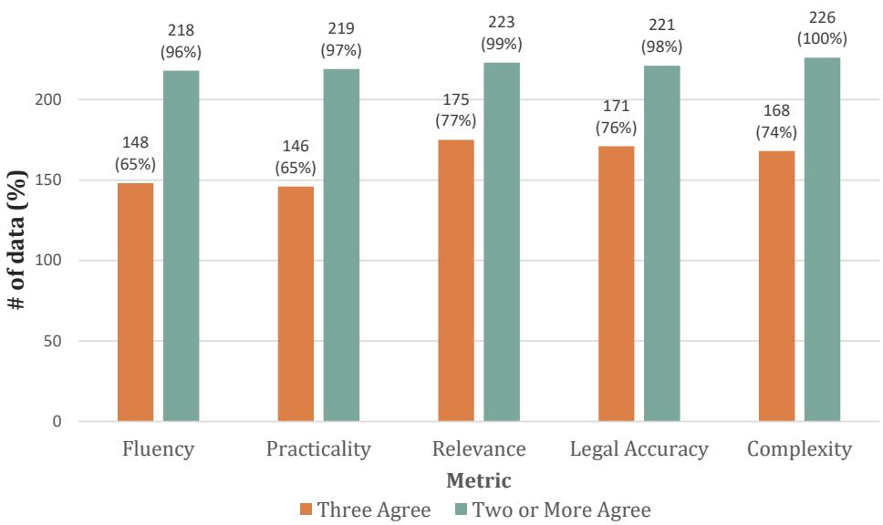  
Figure 9: Inter-annotator agreement for each evaluation metric. We report the number and proportion of QA instances where at least two annotators agreed (Two or More Agree, blue) and where all three annotators provided identical labels (Three Agree, orange). Labels are categorized as positive (Likert scores 4–5), neutral (3), or negative (1–2).

As described in Section 3.3, three legal experts independently evaluate each revised QA instance. Fluency, practicality, relevance, and legal accuracy are rated on a 5-point Likert scale (1 to 5), while complexity is assessed as a binary label (0 or 1).

To enable agreement analysis, we re-map the Likert-scale scores into three ordinal categories, following the methodology of Fan et al. (2019):

• Positive: scores of 4 or 5

• Neutral: score of 3

• Negative: scores of 1 or 2

Figure 9 presents the agreement levels across the five evaluation criteria. For all metrics, over 95% of the samples exhibit agreement between at least two annotators. Moreover, more than 65% of the instances show full agreement across all three annotators, indicating a high level of reliability in the expert judgments.

## E Guidelines for QA Construction

This section includes detailed guidelines distributed to legal experts for revising and evaluating QA instances, as well as information on the compensation provided to annotators.

## E.1 Revision Guidelines for QA Drafts

Each legal QA instance in our dataset consists of the following four components:

• Background Scenario: A narrative description of a specific legal situation or dispute.

• Question: A legal issue that naturally arises from the given scenario.

• Answer: A concise and logically sound response derived strictly from the provided statutes.

• Reference Provisions: Legal provisions that serve as the sole basis for answering the question.

Legal experts are instructed to revise each instance to ensure legal soundness and linguistic naturalness. The resulting dataset is intended to evaluate how well large language models can understand and reason in legal contexts. The revision is conducted to satisfy the following five criteria:

• Fluency: Sentences must be grammatically correct, coherent, and natural.

• Practicality: Questions should move beyond simple definitions and be framed to support practical legal reasoning.

• Relevance: The background and question must be closely grounded in the provided legal provisions, enabling an answer based solely on them.

• Legal Accuracy: Answers must faithfully and correctly interpret the given legal provisions.

• Complexity: Resolving the question must require using all provided legal documents without relying on external information.

Each instance is labeled with one of the following revision statuses:

• Pass: All components are accurate, coherent, and closely tied to the statutes. No revision is necessary.

• Revise: Applied when any of the following issues are identified:

– Ungrammatical, awkward, or unnatural phrasing in any component.

– Logical inconsistencies, such as mismatched subjects (e.g., confusion between parties) or timeline errors.

– Redundant mention of legal article numbers or statutory content in the scenario or question.

– Questions that are too general, factual, or fail to articulate a clear legal issue.

– Answers that are legally incorrect, overly vague, or lack logical coherence.

– Statutes mentioned without clearly naming the corresponding law.

• Hold: Used when meaningful revision is not feasible, including:

– Extremely low-quality inputs or incoherent writing.

– Questions that require external legal knowledge or unstated assumptions.

– Subjective or factual questions that do not require legal interpretation.

– Scenarios or questions that are unrelated to the provided legal provisions.

Important: All revisions must strictly adhere to the given legal statutes. Even if a different interpretation may apply in actual legal practice, annotators are instructed to provide and revise answers solely based on the scope of the provided provisions.

## E.2 Evaluation Guidelines for QA Instances

This section describes the evaluation guideline used to assess the quality of the revised legal QA pairs. Evaluators are informed that the resulting dataset would be used to evaluate the legal reasoning capabilities of large language models. Each instance, previously corrected by an expert, consists of four components:

• Background Scenario: A narrative description of a specific legal situation or dispute.

• Question: A legal issue that naturally arises from the given scenario.

• Answer: A concise and logically sound response derived strictly from the provided statutes.

• Reference Provisions: Legal provisions that serve as the sole basis for answering the question.

Evaluators are instructed to assess each QA pair based on the following five criteria. Each criterion is scored independently on a 5-point Likert scale: Excellent, Good, Fair, Poor, and Very Poor.

The evaluation is conducted according to the following dimensions:

• Fluency: Sentences must be grammatically correct, coherent, and natural.

• Practicality: Questions should move beyond simple definitions and be framed to support practical legal reasoning.

– E.g., generic questions like “What is the definition of a car?” should be rated low in practicality.

• Relevance: The background and question must be closely grounded in the provided legal provisions, enabling an answer based solely on them.

• Legal Accuracy: Answers must faithfully and correctly interpret the given legal provisions.

– Important: This must be evaluated strictly based on the provided legal texts.

• Complexity: Resolving the question must require using all provided legal documents without relying on external information.

– This is a multiple-choice evaluation item. Evaluators must select all legal provisions that are necessary to answer the question accurately. It is important to identify all reference provisions without omission.

– If none of the provided statutes are necessary, or if additional legal provisions are needed to answer the question, evaluators should explicitly indicate this.

## E.3 Compensation for Legal Expert Annotation

Each legal expert annotator is compensated with a stipend of 100,000 KRW (approximately \$75 USD) for completing 80 QA instances, consisting of 20 items for revision and 60 for evaluation. Based on our internal task estimation, this amount corresponds to approximately 2.5 hours of expert work, yielding an effective hourly wage of 40,000 KRW. This rate is roughly four times the Korean legal minimum wage (as of 2025) and is deliberately set to ensure fair compensation and to attract high-quality legal annotators.

## F Dataset Construction Prompt Templates

Figures 10–12 present the prompt templates used with GPT-4o during the question & answer generation and two-stage validation process. Figure 10 shows the prompts used for question & answer generation (Section 3.2); Figure 11 displays the prompt used for scenario-based reformulation (Section 3.2); and Figure 12 presents the prompts used for LLM validation (Section 3.3).

## G Details of LF-EVAL

## G.1 Human Evaluation Setup

To assess the effectiveness and reliability of our proposed metric LF-EVAL, we conduct a human evaluation study comparing it with various metrics including Token-F-1, BLEU (Papineni et al., 2002), ROUGE-L (Lin, 2004) and faithfulness scores (Trautmann et al., 2024).

We employ two independent groups of in-house annotators for the evaluation. All samples were anonymized so that annotators were unaware of which model produced each response. All annotators were instructed to consider:

• Legal relevance: Whether the response addresses the given question using the provided statutory provisions.

• Correctness and completeness: Whether the legal interpretation is accurate and all relevant provisions are applied appropriately.

• Scoring: Rate each response on a scale from 1 to 10, where

– 1 indicates a legally irrelevant or unrelated response to the provided context.

– 10 indicates a response that makes full and correct use of all provided statutes to reach a legally sound conclusion.

## G.2 Correlation with Human Judgment

Table 8 reports Pearson correlations between automatic metrics and the averaged human scores. Interannotator agreement is high $( r _ { a g r e e } = 7 3 . 9 7 )$ , indicating that the human judgments are consistent and reliable. This level of agreement supports the validity of using averaged human scores as a benchmark for evaluating automatic metrics.

<table><tr><td>Metric</td><td>Pearson r</td></tr><tr><td>LF-EVAL (Ours)</td><td>84.90</td></tr><tr><td>Faithfullness scores (Trautmann et al., 2024)</td><td>6.87</td></tr><tr><td>Token-level F-1</td><td>61.25</td></tr><tr><td>BLEU (Papineni et al., 2002)</td><td>51.89</td></tr><tr><td>ROUGE-L (Lin, 2004)</td><td>32.19</td></tr></table>

Table 8: Correlation of automatic metrics with human judgments. LF-EVAL achieves the strongest alignment with human evaluations.

As shown in the results, LF-EVAL exhibits a substantially stronger correlation with human judgments than other standard metrics such as Token F-1 and faithfulness scores. These findings support its effectiveness in capturing the legal fidelity of generated answers in provision-grounded QA tasks.

While the Faithfulness score has shown a strong correlation with human judgment in prior work, it performs poorly when evaluating complex multi-hop legal questions such as those in KOBLEX. This indicates that, for complex legal questions, providing detailed and strict evaluation guidelines improves the accuracy and human alignment of LLM-as-a-Judge judgments.

## G.3 Example of LF-EVAL Results

Unlike conventional metrics that solely rely on gold reference answers and return only a numerical score, LF-EVAL offers both the score and an accompanying explanation that justifies the evaluation. Table 9 presents evaluation cases on KOBLEX answers generated by the GPT-4o model using PARSER, assessed through LF-EVAL. In addition to providing a fine-grained scalar score via a soft weighted sum based on G-Eval, the evaluation also reveals potential legal issues present in the generated answers.

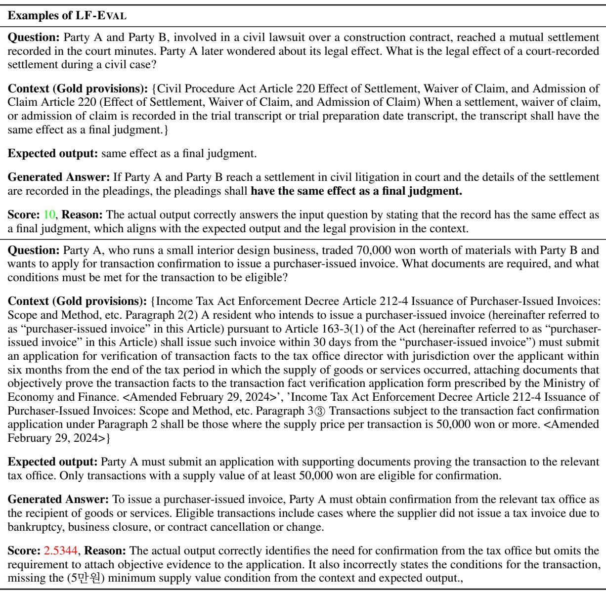  
Table 9: Examples of LF-EVAL Results. The upper example demonstrates that the generated answer strictly follows both the provision and the expected output, justifying a perfect score of 10 with a corresponding explanation. In contrast, the lower example omits critical legal details from the expected output, which is reflected in the reasoning and results in a lower score of 2.5344.

## H Experimental Details

In this section, we provide detailed descriptions of the experimental setup, including the models, evaluation metrics, and baseline methods.

## H.1 Model

We utilize three LLMs in our experiments: Qwen/Qwen3-32B (Team, 2025), LGAI-EXAONE/EXAONE-3.5-32B-Instruct (Research, 2024), and gpt-4o-2024-08-06 (OpenAI et al., 2024).

Qwen is a robust multilingual LLM trained in over 100 languages, including English and Korean, with strong reasoning capabilities. We found that Qwen3’s powerful reasoning sometimes produced overly long or unfocused outputs, so we ran it in non-thinking mode to keep responses concise and on-target. EXAONE is an instruction-tuned English-Korean bilingual LLM with strong performance in Korean QA. GPT-4o is a high-performing commercial LLM demonstrating state-of-the-art capabilities across diverse tasks and languages.

To ensure reproducibility, we ran the open-source models Qwen3 and EXAONE 3.5 using the vLLM (Kwon et al., 2023) with nucleus sampling (Finlayson et al., 2024), with temperature set to 0 and top-p to 0.9. These models were served using a single A100 GPU or two A6000 GPUs in tensor parallel mode. For GPT-4o, we used the OpenAI API with the same sampling parameters and decoding strategy, incurring a total cost of approximately \$185 for all evaluations and experiments.

## H.2 Evaluation Metrics

KOBLEX requires identifying the corresponding legal statutes necessary to resolve complex legal questions. Therefore, when evaluating LLM performance on KOBLEX, it is essential to assess both retrieval and generation accuracy.

Retrieval. To evaluate retrieval accuracy, we report both Exact Match (EM) and F-1 scores based on provision-level overlap between the predicted and gold statute sets. Let $P$ be the set of predicted provisions and G the set of gold provisions. The EM score is defined as 1 if $P = G$ and 0 otherwise. To compute the F-1 score, we first calculate precision $p ^ { { \mathrm { p r o v } } }$ , recall $r ^ { \mathrm { p r o v } }$ , and then the F-1 score $F _ { 1 } ^ { \mathrm { p r o s } }$ , as defined in Equation 1.

$$
p ^ { \mathrm { p r o v } } = \frac { | P \cap G | } { | P | } , \quad r ^ { \mathrm { p r o v } } = \frac { | P \cap G | } { | G | } , \quad F _ { 1 } ^ { \mathrm { p r o v } } = \left\{ \frac { 2 p ^ { \mathrm { p r o v } } \cdot r ^ { \mathrm { p r o v } } } { p ^ { \mathrm { p r o v } } + r ^ { \mathrm { p r o v } } } \right. \mathrm { i f } \left. p ^ { \mathrm { p r o v } } + r ^ { \mathrm { p r o v } } > 0 \right.\tag{1}
$$

Generation. To evaluate the quality of generated answers, we use both token-level F-1 and LF-EVAL metrics. After normalization and word-level tokenization, the token-level F-1 score is computed by comparing the predicted and ground truth answers. Let $T _ { p }$ and $T _ { g }$ denote the sets of word-level tokens from the normalized prediction and ground truth, respectively. Precision $p ^ { \mathrm { t o k e n } }$ , recall $r ^ { \mathrm { t o k e n } }$ , and tokenlevel F-1 score $F _ { 1 } ^ { \mathrm { t o k e n } }$ are computed as follows:

$$
p ^ { \mathrm { t o k e n } } = \frac { | T _ { p } \cap T _ { g } | } { | T _ { p } | } , \quad r ^ { \mathrm { t o k e n } } = \frac { | T _ { p } \cap T _ { g } | } { | T _ { g } | } , \quad F _ { 1 } ^ { \mathrm { t o k e n } } = \left\{ \begin{array} { l l } { \frac { 2 p ^ { \mathrm { t o k e n } } \cdot r ^ { \mathrm { t o k e n } } } { p ^ { \mathrm { t o k e n } } + r ^ { \mathrm { t o k e n } } } } & { \mathrm { i f ~ } p ^ { \mathrm { t o k e n } } + r ^ { \mathrm { t o k e n } } > 0 } \\ { 0 } & { \mathrm { o t h e r w i s e } } \end{array} \right.\tag{2}
$$

To compute LF-EVAL, we use GPT-4o with deepeval framework $( \mathrm { I p }$ and Vongthongsri, 2025) to generate a score $s \in [ 1 , 1 0 ]$ ten times using the prompt shown in Figure 5. For each generated score $s _ { i } ,$ we extract its associated token probability $p ( s _ { i } )$ and compute the weighted sum over the 10 generations. The final LF-EVAL score is defined as:

$$
\mathrm { L F - E v A L } = \frac { 1 } { 1 0 } \sum _ { i = 1 } ^ { 1 0 } s _ { i } \cdot p ( s _ { i } )\tag{3}
$$

## H.3 Baselines

We describe the detailed implementation of our baseline methods. Existing research on retrieval-augmented reasoning has primarily focused on general-domain multi-hop QA tasks such as HotpotQA and MuSiQue. Thus, these approaches do not transfer directly to the legal-domain setting of KOBLEX. Therefore, we re-implemented each baseline by carefully analyzing the original papers and their publicly available code, adapting the logic to suit legal-domain QA better. We selected the highest-scoring examples among the filtered-out ones and refined them with the help of experts as five in-context learning demonstrations.

Retrieval Module. In our experiments, we use BM25 (Robertson and Zaragoza, 2009) retrieval over the statute corpus described in Section 6.3 across all baselines to ensure fairness in retrieval.

Standard Prompting. Standard Prompting (SP) (Brown et al., 2020) directly answers the question using only the model’s parametric memory. We use standard prompting with 5-shot examples. As illustrated in Figure 13, we instruct short task descriptions followed by 5-shot examples.

Chain of Thought. Chain of Thought (CoT) (Wei et al., 2022) generates reasoning steps relying on the parametric memory before the final answer. We use Chain-of-Thought prompting with 5-shot examples. As illustrated in Figure 14, we instruct short task descriptions followed by 5-shot examples. The reasoning traces were initially generated by GPT-4o and subsequently refined by human annotators.

One-time Retrieval. One-time Retrieval (OR) uses the original question to retrieve and augment the top-n provisions, where n is the number of reasoning hops in each KOBLEX instance. We employ a BM-25 retriever for retrieving provisions. We implement retrieval module via open source toolkit (Lù, 2024). In the case of one-time retrieval, we provide the top-n provisions as retrieved-context in Figure 15, where n corresponds to the number of reasoning hops the question requires.

Self-Ask. Self-Ask (Press et al., 2023) iteratively determines whether follow-up questions are needed and generates intermediate queries. It then retrieves reference provisions and uses the augmented context to produce the final answer. We implement Self-Ask following the officially implemented code.8 As the original implementation is designed for the general domain using the Google search engine, we adapt the retrieval module to use our own retriever instead. We set a termination condition by limiting the reasoning depth up to 5 for GPT-4o and 8 for Qwen and EXAONE. We employ the prompt in Figure 16.

IRCOT. IRCoT (Trivedi et al., 2023) interleaves CoT traces with retrieval, using the interleaved generations to incorporate external knowledge into the reasoning process. We implement IRCoT following the officially implemented code.9 As the original implementation is designed for the general domain using the Elastic search engine, we adapt the retrieval module to use our own retriever instead. We set a termination condition by limiting the reasoning depth up to 5 for GPT-4o and 8 for Qwen and EXAONE. We employ the prompt in Figure 17.

FLARE. FLARE (Jiang et al., 2023) interleaves reasoning and retrieval similar to IRCoT but selectively performs retrieval only for reasoning steps with low confidence. We implement IRCoT following the officially implemented code.10 As the original implementation is designed for the general domain using the Bing search engine, we adapt the retrieval module to use our own retriever instead. Due to several configurable parameters in FLARE, we set the log-probability threshold to -1.5 for Qwen and EXAONE and -0.6 for GPT-4o to achieve a retrieval rate close to 50%, which was reported as optimal in the reference paper. We adapt the instruct mode to generate retrieval queries. We set a termination condition by limiting the reasoning depth up to 5 for GPT-4o and 8 for Qwen and EXAONE. The prompt is in the Figure 17.

ProbTree. ProbTree (Cao et al., 2023) decomposes the question into a tree structure and explores multiple reasoning strategies at each node. Final answers are selected by aggregating candidates based on their generation log probabilities. We implement ProbTree following the officially implemented code.11 As the original implementation is designed for the general domain using the Elastic search engine, we adapt the retrieval module to use our own retriever instead. For tree generation, we followed the prompt in the official implementation. We only include the retrieved context from the retrieval module when the openbook is selected. Prompt used for closebook, openbook, child aggregation is in Figure 18.

BeamAggr. BeamAggr (Chu et al., 2024) enhances ProbTree with multi-source reasoning and probabilistic answer aggregation. Since the official implementation code is unavailable, we implement BeamAggr from scratch by closely following the descriptions in the reference paper. Unlike the experiments conducted in the original paper, KOBLEX focuses on the legal domain. Accordingly, we adapt the retrieval module and restrict multi-source reasoning to closebook, openbook in order to obtain the distribution over each leaf node. Furthermore, due to the lack of sufficient sources, we utilize the log probabilities of generated tokens to estimate the response probabilities from each source. For tree generation, we followed the prompt in the official implementation of ProbTree. We only include the retrieved context from the retrieval module when the openbook is selected. The prompt for closebook, openbook is in Figure 18.

PARSER. For parametric provision generation, we instruct the LLM to generate list-style text and extract the results using a JSON parser. For the Retrieve, Rerank, and Selection retrieval pipeline, we utilize three different language models, one for each stage. In the Retrieve stage, our retrieval module retrieves the top 100 provisions most relevant to the generated parametric provision from the statute corpus. In the Rerank stage, we use a fine-tuned BGE reranker12(Chen et al., 2024) to sort the top 100 retrieved provisions based on relevance. In the Selection stage, an LLM generates the ID of the most relevant provision among the top 10. This selected provision is then used as the supporting legal provision.

## I Case Study

To better understand how existing baseline methods perform on open-ended and multi-hop legal questions, we conduct a case study on KOBLEX. Figure 20 and 21 show English-translated responses from various baseline methods, while Figure 22 and 23 illustrate Korean responses from various baseline methods. Most baseline methods fail to reason over multiple relevant provisions. By contrast, PARSER successfully reasons over all three reference statutes and produces a coherent, legally reliable answer.

## J Additional Results

<table><tr><td></td><td colspan="2">F-1</td><td colspan="2">EM</td><td colspan="2">Token F-1</td><td colspan="2">LF-EVAL</td></tr><tr><td></td><td>Qwen-8B</td><td>EXAONE-7.8B</td><td>Qwen-8B</td><td>EXAONE-7.8B</td><td>Qwen-8B</td><td>EXAONE-7.8B</td><td>Qwen-8B</td><td>EXAONE-7.8B</td></tr><tr><td>SP (Brown et al., 2020)</td><td></td><td></td><td></td><td></td><td>25.59</td><td>15.98</td><td>35.13</td><td>44.82</td></tr><tr><td>CoT (Wei et al., 2022)</td><td></td><td></td><td></td><td>一</td><td>22.89</td><td>18.94</td><td>31.28</td><td>38.58</td></tr><tr><td>SP (Brown et al., 2020) + OR</td><td>21.50</td><td>21.50</td><td>7.08</td><td>7.08</td><td>27.32</td><td>16.79</td><td>37.64</td><td>43.20</td></tr><tr><td>CoT (Wei et al., 2022) + OR</td><td>21.50</td><td>21.50</td><td>7.08</td><td>7.08</td><td>26.68</td><td>22.64</td><td>39.43</td><td>43.57</td></tr><tr><td>Self-Ask (Press et al., 2023)</td><td>10.03</td><td>4.57</td><td>2.21</td><td>0.88</td><td>6.19</td><td>9.12</td><td>17.63</td><td>26.99</td></tr><tr><td>IRCoT* (Trivedi et al., 2023)</td><td>21.79</td><td>19.19</td><td>4.87</td><td>3.98</td><td>12.72</td><td>19.19</td><td>20.45</td><td>24.16</td></tr><tr><td>FLARE• (Jiang et al., 2023)</td><td>25.40</td><td>20.38</td><td>5.31</td><td>3.10</td><td>22.72</td><td>11.84</td><td>38.84</td><td>23.35</td></tr><tr><td>ProbTree* (Cao et al., 2023)</td><td>13.26</td><td>7.76 5.94</td><td>3.10 2.65</td><td>0.88</td><td>28.53</td><td>19.61</td><td>40.93</td><td>42.30</td></tr><tr><td>BeamAggr* (Chu et al., 2024)</td><td>11.27</td><td></td><td></td><td>0.88</td><td>17.75</td><td>10.90</td><td>33.35</td><td>31.60</td></tr><tr><td>PARSER*(Ours)</td><td>34.18</td><td>36.78</td><td>11.50</td><td>10.62</td><td>34.64</td><td>24.40</td><td>49.41</td><td>52.39</td></tr></table>

Table 10: Experimental results of various retrieval-augmented generation methods on KOBLEX. Columns shaded in blue measure retrieval accuracy, and columns shaded in yellow measure generation accuracy. Best results are highlighted in bold. We utilize Qwen3-8B (Team, 2025) and EXAONE-3.5-7.8B (Research, 2024). ( : No-retrieval, : One-time retrieval, : Iterative retrieval, : Sub-query retrieval).

Table 10 shows experimental results on KOBLEX with smaller LLMs such as Qwen3-8B (Team, 2025) and EXAONE-3.5-7.8B (Research, 2024). The results show consistent patterns with robust LLMS as shown in the main body of the paper represented in Table 2. PARSER reliably achieves the highest performance across metrics. These findings confirm that our approach is effective even with limited model capacity, highlighting its scalability and generalization.

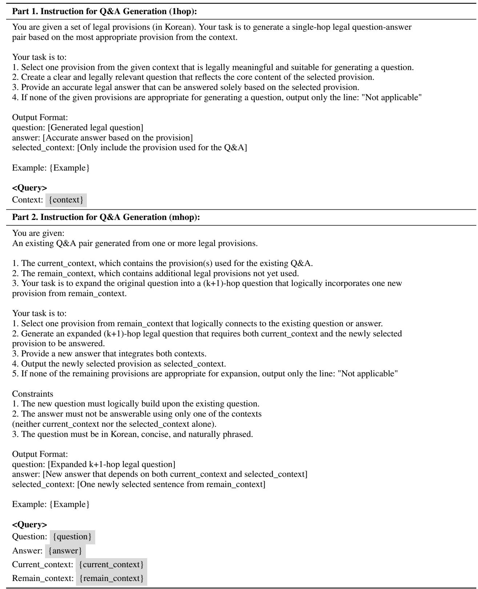  
Figure 10: Prompt templates used for generating legal Q&A pairs from statutory text. Part 1 describes instructions for single-hop question generation based on a single legal provision, while Part 2 outlines multi-hop question generation that requires reasoning over multiple provisions. {placeholder} indicates a slot to be filled with the corresponding value.

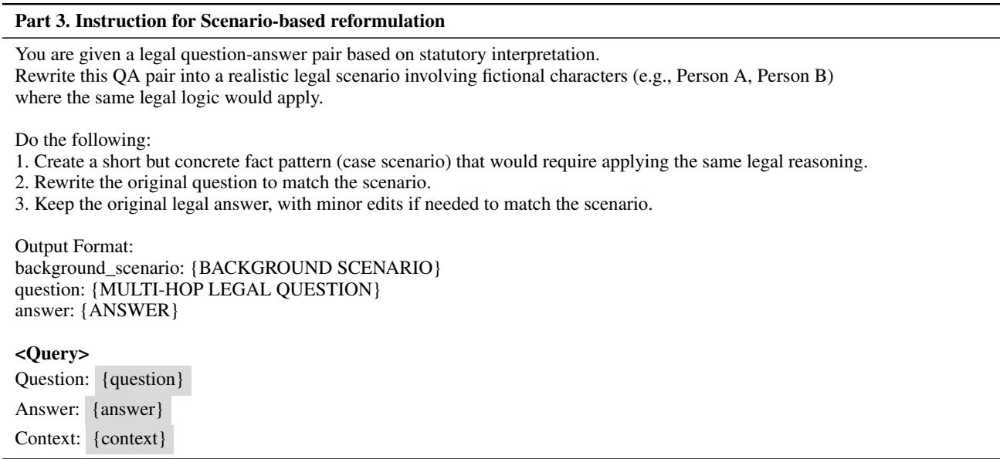  
Figure 11: Prompt template for scenario-based reformulation of legal Q&A pairs. Part 3 rewrites a statutory Q&A into a realistic case scenario while preserving the underlying legal reasoning. {placeholder} indicates a slot to be filled with the corresponding value.

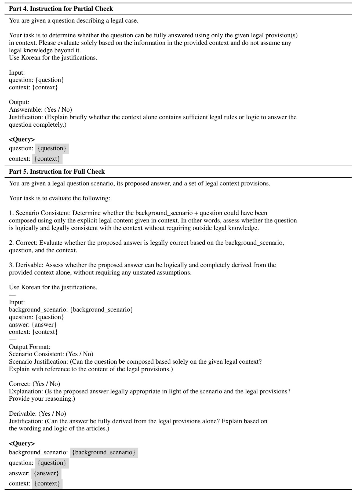  
Figure 12: Prompt templates for validating legal Q&A pairs. Part 4 checks answerability based on context, while Part 5 evaluates scenario consistency, legal correctness, and derivability. {placeholder} indicates a slot to be filled with the corresponding value.

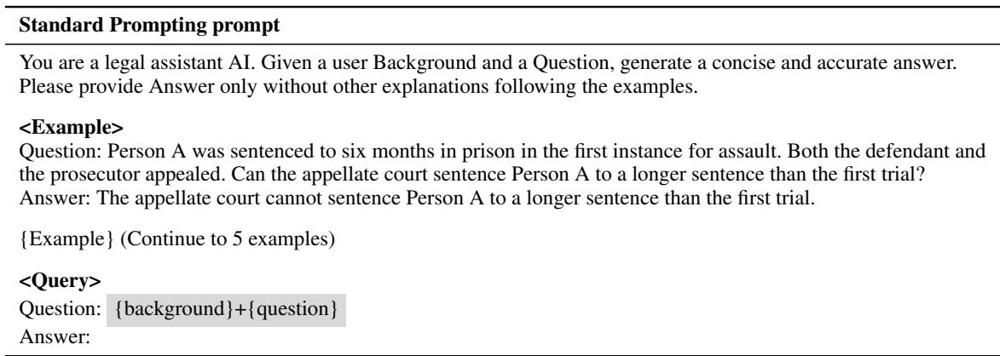  
Figure 13: Prompt for Standard Prompting (SP). We employ 5 different examples. {placeholder} indicates a slot to be filled with the corresponding value for evaluation.

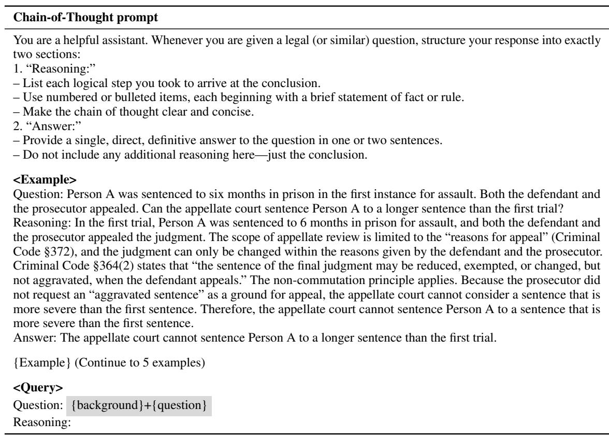  
Figure 14: Prompt for Chain-of-Thought (CoT). We employ 5 different examples. {placeholder} indicates a slot to be filled with the corresponding value for evaluation.

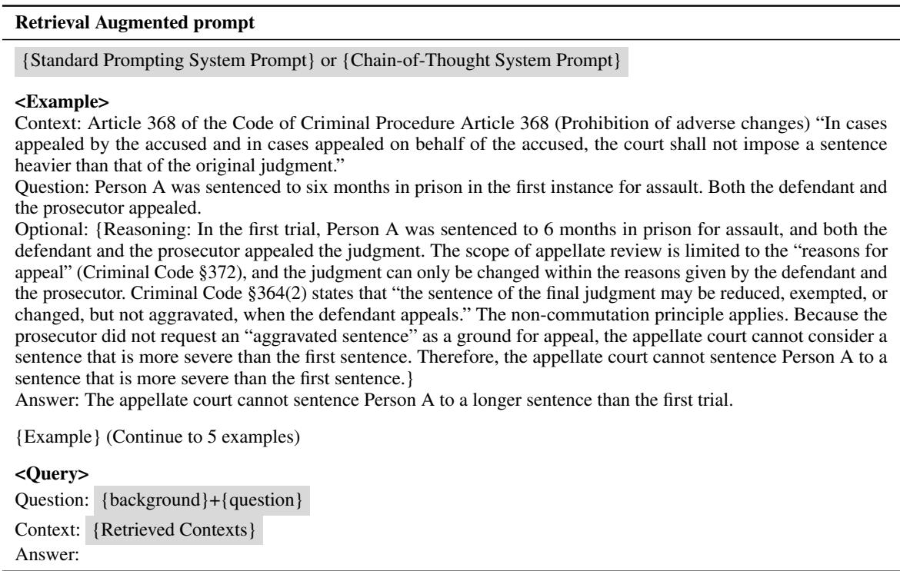  
Figure 15: Prompt for retrieval augmented question answering. The system prompt and inclusion of reasoning traces vary depending on whether Self-Prediction (SP) or Chain-of-Thought (CoT) prompting is used. The retrieval method PARSER adopts the SP setting. We employ 5 different examples. {placeholder} indicates a slot to be filled with the corresponding value for evaluation.

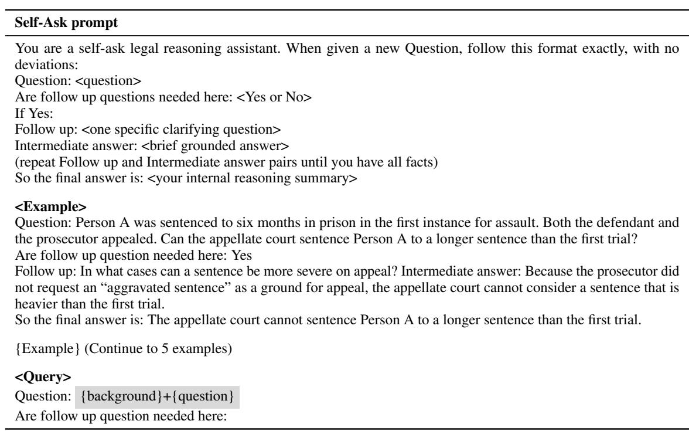  
Figure 16: Prompt for Self-ask. We employ 5 different examples. {placeholder} indicates a slot to be filled with the corresponding value for evaluation.

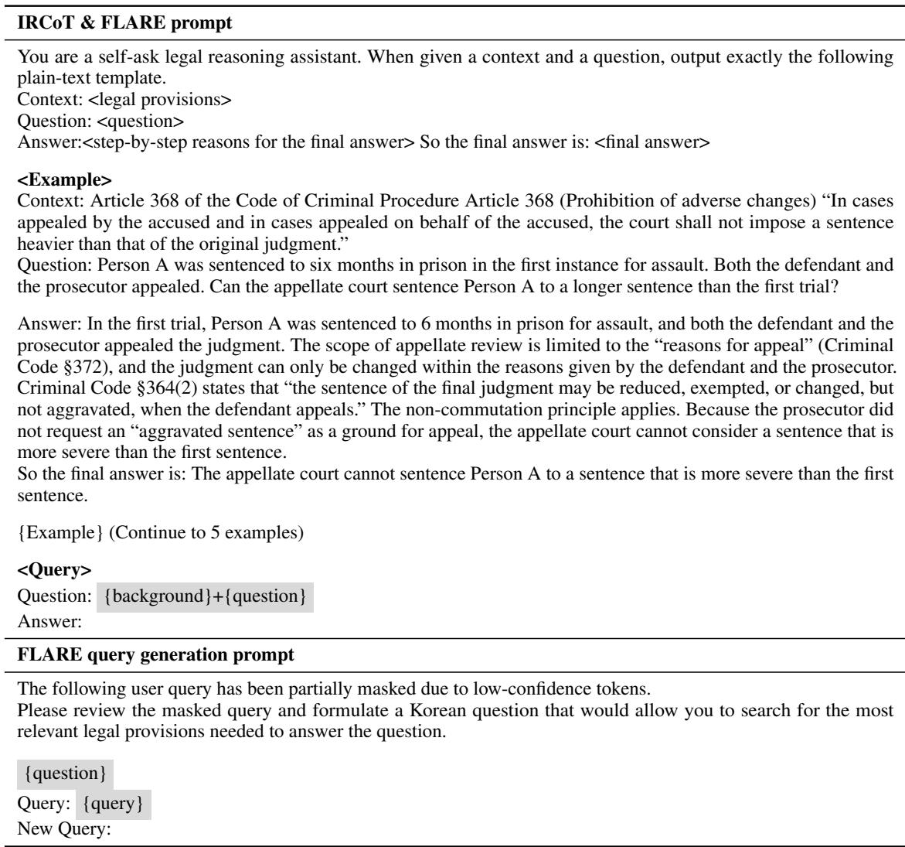  
Figure 17: Prompt for IRCoT and FLARE. We employ 5 different examples. {placeholder} indicates a slot to be filled with the corresponding value for evaluation.

<table><tr><td>Closebook prompt</td></tr><tr><td>You are given legal Q&amp;A examples. For a new legal question, answer briefly and clearly in one or two sentences. &lt;Example&gt;</td></tr><tr><td>Question: Can the appellate court sentence Person A to a longer sentence than the first trial? Answer: The appellate court cannot sentence Person A to a longer sentence than the first trial</td></tr><tr><td>{Example} (Continue to 5 examples)</td></tr><tr><td></td></tr><tr><td>&lt;Query&gt; Question: {question}</td></tr><tr><td>Answer:</td></tr><tr><td>Openbook prompt</td></tr><tr><td>You are given a legal question and its related law texts (context). Read the context carefully and write a concise, plain-text answer (1–2 sentences) that accurately summarizes the legal principle or outcome.</td></tr><tr><td>&lt;Example&gt; Question: Can the appellate court sentence Person A to a longer sentence than the first trial? Context: Article 368 of the Code of Criminal Procedure Article 368 (Prohibition of adverse changes) “In cases</td></tr><tr><td>appealed by the accused and in cases appealed on behalf of the accused, the court shall not impose a sentence heavier than that of the original judgment.&quot;</td></tr><tr><td>Answer: The appellate court cannot sentence Person A to a longer sentence than the first trial.</td></tr><tr><td>{Example} (Continue to 5 examples)</td></tr><tr><td>&lt;Query&gt;</td></tr><tr><td>Question: {question}</td></tr><tr><td>Answer:</td></tr><tr><td>Child Aggregate prompt</td></tr><tr><td>You are given a context and a legal question. Use only the information from the provided context to write a concise and accurate legal answer to the question.</td></tr><tr><td>&lt;Example&gt; Context: Can the appellate court sentence Person A to a longer sentence than the first trial? The appellate court</td></tr><tr><td>cannot sentence Person A to a longer sentence than the first trial. Question: Person A was sentenced to six months in prison in the first instance for assault. Both the defendant and</td></tr><tr><td>the prosecutor appealed. Can the appellate court sentence Person A to a longer sentence than the first trial? Answer: In the first trial, Person A was sentenced to 6 months in prison for assault, and both the defendant and the prosecutor appealed the judgment. The scope of appellate review is limited to the “reasons for appeal&quot; (Criminal</td></tr><tr><td>Code §372), and the judgment can only be changed within the reasons given by the defendant and the prosecutor. Criminal Code §364(2) states that “the sentence of the final judgment may be reduced, exempted, or changed, but</td></tr><tr><td>not aggravated, when the defendant appeals.&quot; The non-commutation principle applies. Because the prosecutor did</td></tr><tr><td>not request an “aggravated sentence&quot; as a ground for appeal, the appellate court cannot consider a sentence that is</td></tr><tr><td>more severe than the first sentence. Therefore, the appellate court cannot sentence Person A to a sentence that is</td></tr><tr><td>more severe than the first sentence.</td></tr><tr><td></td></tr><tr><td></td></tr><tr><td></td></tr><tr><td></td></tr><tr><td>{Example} (Continue to 5 examples)</td></tr><tr><td></td></tr><tr><td></td></tr><tr><td></td></tr><tr><td></td></tr><tr><td></td></tr><tr><td></td></tr><tr><td></td></tr><tr><td></td></tr><tr><td></td></tr><tr><td></td></tr><tr><td></td></tr><tr><td></td></tr><tr><td></td></tr><tr><td></td></tr><tr><td></td></tr><tr><td></td></tr><tr><td></td></tr><tr><td></td></tr><tr><td></td></tr><tr><td></td></tr><tr><td></td></tr><tr><td></td></tr><tr><td></td></tr><tr><td></td></tr><tr><td></td></tr><tr><td></td></tr><tr><td></td></tr><tr><td></td></tr><tr><td></td></tr><tr><td></td></tr><tr><td></td></tr><tr><td></td></tr><tr><td></td></tr><tr><td></td></tr><tr><td></td></tr><tr><td></td></tr><tr><td></td></tr><tr><td></td></tr><tr><td></td></tr><tr><td></td></tr><tr><td></td></tr><tr><td></td></tr><tr><td></td></tr><tr><td></td></tr><tr><td></td></tr><tr><td></td></tr><tr><td></td></tr><tr><td></td></tr><tr><td></td></tr><tr><td></td></tr><tr><td></td></tr><tr><td></td></tr><tr><td></td></tr><tr><td></td></tr><tr><td></td></tr><tr><td></td></tr><tr><td></td></tr><tr><td></td></tr><tr><td></td></tr><tr><td></td></tr><tr><td></td></tr><tr><td></td></tr><tr><td></td></tr><tr><td></td></tr><tr><td></td></tr><tr><td></td></tr><tr><td></td></tr><tr><td></td></tr><tr><td></td></tr><tr><td></td></tr><tr><td></td></tr><tr><td></td></tr><tr><td></td></tr><tr><td></td></tr><tr><td></td></tr><tr><td></td></tr><tr><td></td></tr><tr><td></td></tr><tr><td></td></tr><tr><td></td></tr><tr><td></td></tr><tr><td></td></tr><tr><td></td></tr><tr><td></td></tr><tr><td></td></tr><tr><td></td></tr><tr><td></td></tr><tr><td></td></tr><tr><td></td></tr><tr><td></td></tr><tr><td></td></tr><tr><td></td></tr><tr><td></td></tr><tr><td></td></tr><tr><td></td></tr><tr><td>&lt;Query&gt;</td></tr><tr><td></td></tr><tr><td></td></tr><tr><td></td></tr><tr><td></td></tr><tr><td></td></tr><tr><td></td></tr><tr><td>Question:</td></tr><tr><td></td></tr><tr><td></td></tr><tr><td></td></tr><tr><td></td></tr><tr><td></td></tr><tr><td></td></tr><tr><td></td></tr><tr><td></td></tr><tr><td></td></tr><tr><td></td></tr><tr><td></td></tr><tr><td></td></tr><tr><td></td></tr><tr><td></td></tr><tr><td></td></tr><tr><td></td></tr><tr><td></td></tr><tr><td></td></tr><tr><td>{background}+{question}</td></tr></table>

Figure 18: Prompt for ProbTree and BeamAggr. We employ 5 different examples. {placeholder} indicates a slot to be filled with the corresponding value for evaluation.

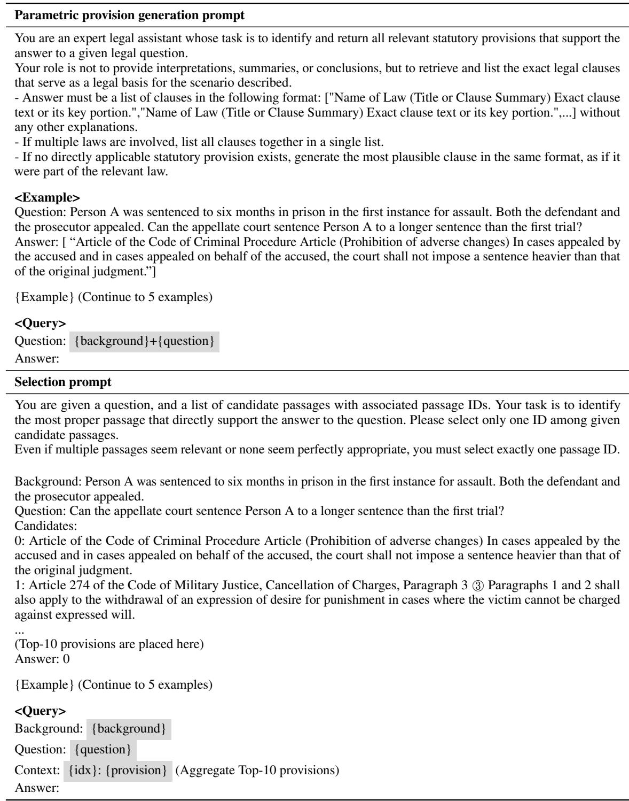  
Figure 19: Prompt for PARSER. For parametric provision generation, we instruct LLM to generate list of parametric provisions. For selection, we instruct LLM to select most relevant provision among top-10 candidates. We employ 5 different examples. {placeholder} indicates a slot to be filled with the corresponding value for evaluation.

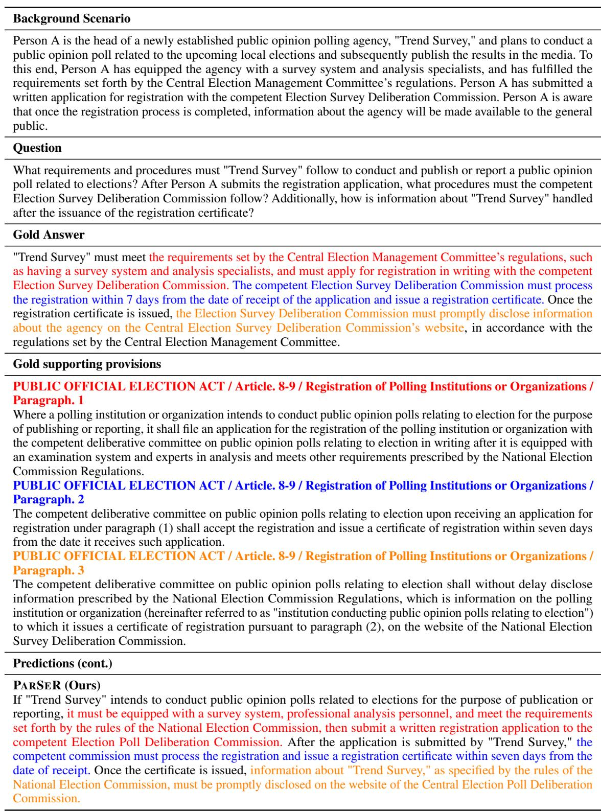  
Figure 20: Case study of a single English instance from KOBLEX. The contents of each gold supporting provision are highlighted in different colors. PARSER successfully responded based on a combination of three provisions.

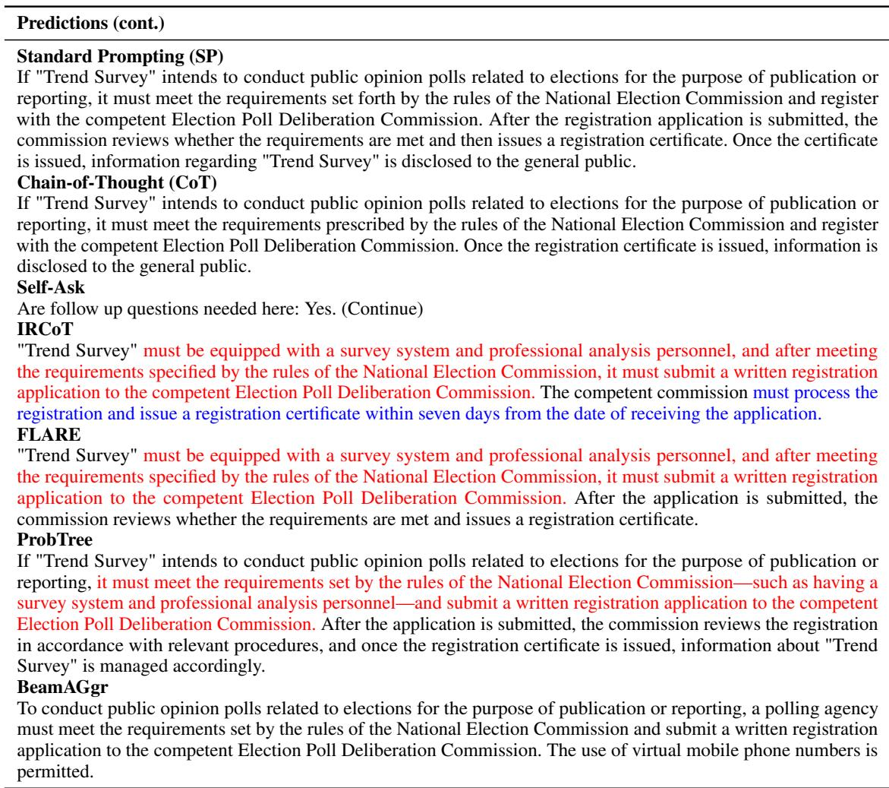  
Figure 21: Case study of a single English instance from KOBLEX (Cont.). While both SP and CoT capture the overall reasoning flow, they fail to identify the specific contents of the provisions. Self-Ask fail to answer the question. In IRCoT, one of the gold provisions is missing. The contents of each gold supporting provision are highlighted in different colors. FLARE and ProbTree correctly refer to one provision but miss the other two. BeamAggr provides a vague explanation and includes a hallucinated answer.

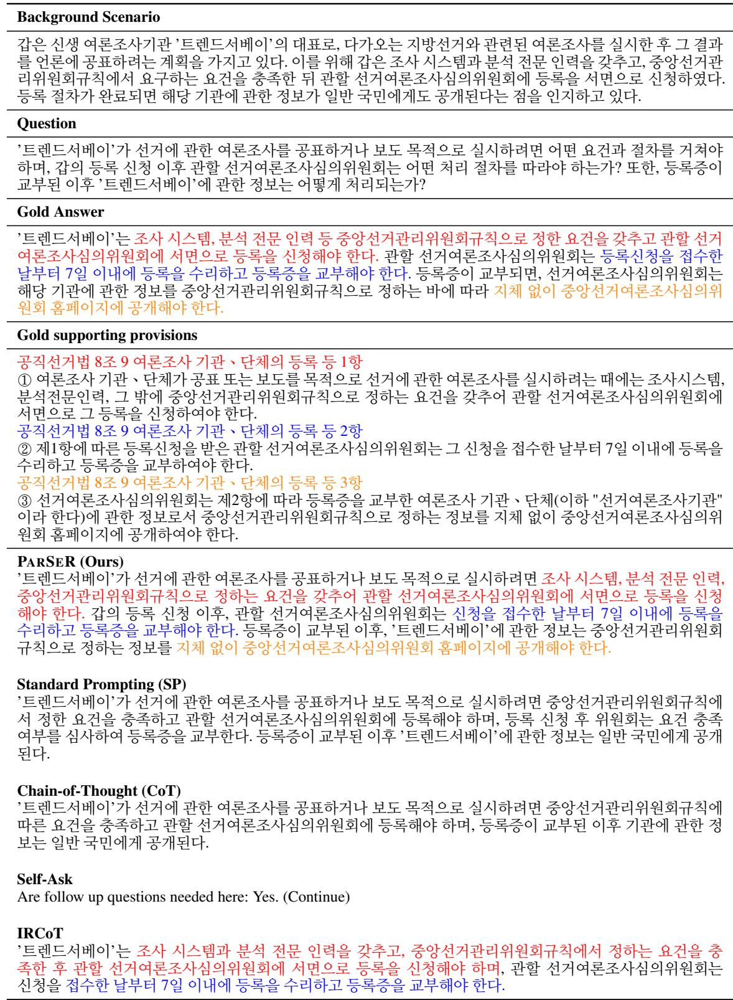  
Figure 22: Case study of a single Korean instance from KOBLEX. The contents of each gold supporting provision are highlighted in different colors. While both SP and CoT capture the overall reasoning flow, they fail to identify the specific contents of the provisions. Self-Ask fail to answer the question. In IRCoT, one of the gold provisions is missing.

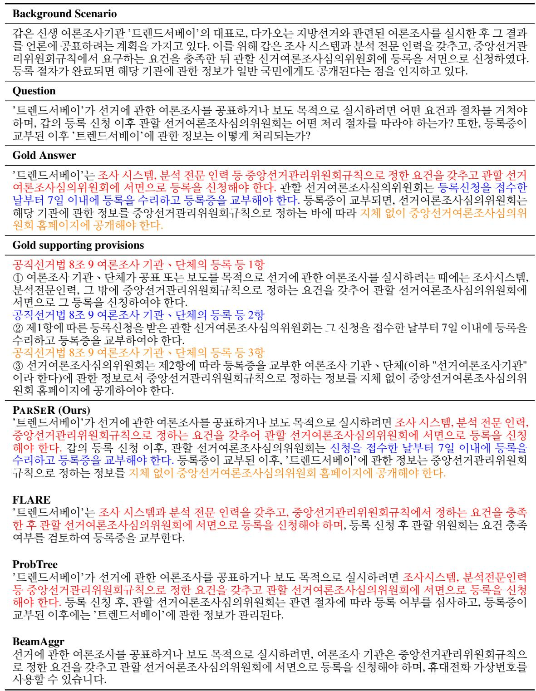  
Figure 23: Case study of a single Korean instance from KOBLEX. The contents of each gold supporting provision are highlighted in different colors. FLARE and ProbTree correctly refer to one provision but miss the other two. BeamAggr provides a vague explanation and includes a hallucinated answer.