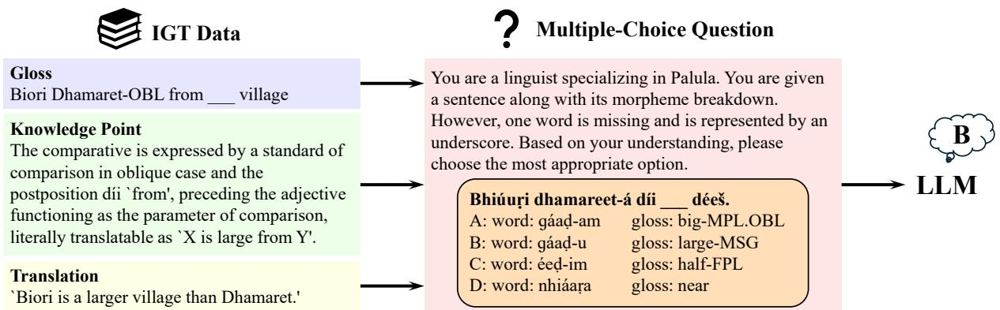
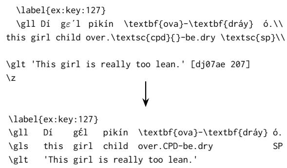
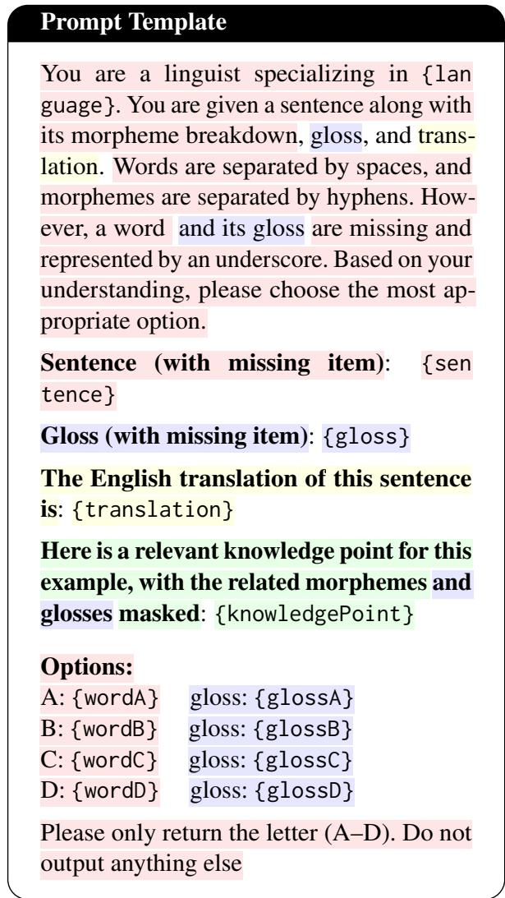
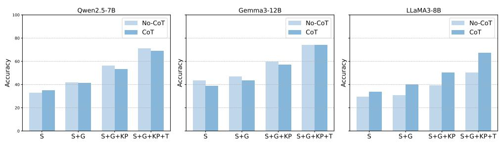
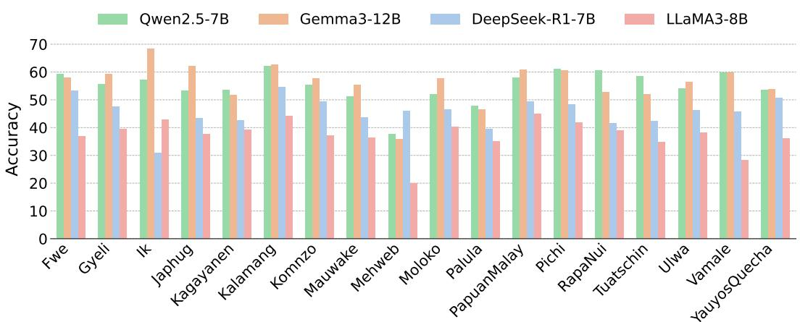
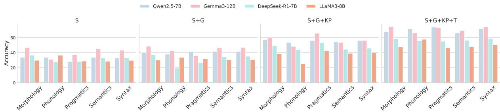
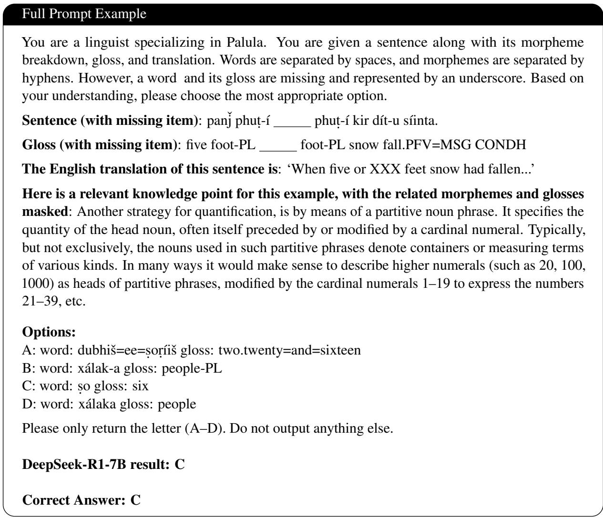

# LINGGYM: How Far Are LLMs from Thinking Like Field Linguists?

Changbing YangŒ, Franklin MaŒ, Freda ShiW,V, Jian ZhuŒ

ŒUniversity of British Columbia

WUniversity of Waterloo VVector Institute cyang33@mail.ubc.ca, franklin.ma@ubc.ca fhs@uwaterloo.ca, jian.zhu@ubc.ca

## Abstract

This paper introduces LINGGYM, a new benchmark that evaluates LLMs’ capacity for metalinguistic reasoning using Interlinear Glossed Text (IGT) and grammatical descriptions extracted from 18 typologically diverse reference grammars. Unlike previous work that focuses on specific downstream tasks, we assess whether LLMs can generalize linguistic inference across low-resource languages and structures not seen during training. We present a controlled evaluation task: Word-Gloss Inference, in which the model must infer a missing word and gloss from context using varying levels of linguistic information (e.g., glosses, grammatical explanations, translations). Our results show that incorporating structured linguistic cues leads to consistent improvements in reasoning performance across all models. This work highlights both the promise and current limitations of using LLMs for typologically informed linguistic analysis and low-resource language documentation.

## 1 Introduction

In recent years, researchers have been actively exploring how large language models (LLMs; OpenAI et al., 2024; Yang et al., 2024a; Grattafiori et al., 2024) can assist and accelerate scientific discoveries in various disciplines (e.g., Romera-Paredes et al., 2024; Merchant et al., 2023; Fawzi et al., 2022; Hayes et al., 2025; Zhang et al., 2024c). However, exploration on how LLMs can assist social sciences is relatively limited (Grossmann et al., 2023; Bail, 2024; Ziems et al., 2024). In particular, LLMs with the capacity of reasoning about metalinguistic knowledge have the potential to become powerful tools for language documentation, linguistic hypothesis testing, and typological research. For example, by generalizing linguistic structures such as morphology, syntax, and word order across languages, they can suggest morpheme segmentations and glosses, identify patterns or counterexamples

## Predicative adjectives

When adjectives function predicatively, they may receive copular morphology, although this is not obligatory (neither for adjectives nor for nouns). These predicative adjectives occur clause-finally (the position held prototypically by verbs).

Orthography: Mï anmapïna. Segmentation: mï anma=p-na Gloss: 3SG.SUBJ good=COP-IRR Translation: ‘It will be good.

Figure 1: An excerpt explaining predicative adjectives in Ulwa, with an associated example as IGT from A Grammar of Ulwa (Papua New Guinea; Barlow, 2023, p. 166). The example IGT is represented with the Leipzig Glossing rules (Comrie et al., 2017). The text in red highlights the emphasized word discussed in the grammar explanation. The gloss consists of a third-person singular subject marker (3SG.SUBJ) for “it,” and an irrealis copula (COP-IRR) marker for “will be.”

to test hypotheses, and compare structural features across different languages.

On the other hand, while recent advances have shown impressive performance in high-resource languages like English, our understanding of their effectiveness on typologically diverse and underrepresented languages remains limited (Alhanai et al., 2025), mainly due to the overwhelming dominance of English and other high-resource languages in their training data (Blasi et al., 2022; Khade et al., 2025; Li et al., 2024; Wu and Dredze, 2020).

To explore how well LLMs can understand lowresource languages when provided with structured linguistic input, we turn to reference grammars (Mosel, 2006; Chelliah, 2013), which aim to comprehensively describe the structure of individual languages. Reference grammars offer two valuable types of information:

1. Interlinear glossed text (IGT), a standard text format used by field linguists to present linguistic data, which is useful for tasks like morphological analysis, syntactic structure identification. IGT typically consists of four lines: a phonological or orthographic transcription, a segmentation of words into morphemes, corresponding grammatical glosses, and a free English translation. Conventions include hyphens to mark morpheme boundaries, equals signs for clitic boundaries, and periods to separate multiple glossing elements for a single morpheme (Comrie et al., 2017), as illustrated in Figure 1.

2. Grammatical terms and explanations embedded throughout the text, where important linguistic terms (e.g., tense markers, case particles, verb classes) are defined and contextualized within the grammar.

Together, these resources reflect the approach taken by human linguists, who analyze unfamiliar languages by studying structured descriptions rather than relying on raw corpora. Thanks to decades of documentation efforts, such materials are available for many endangered and low-resource languages, presenting a valuable opportunity to test LLMs ability to reason over structured linguistic knowledge curated by experts. Unlike the unstructured web-scale corpora typically used to train LLMs, descriptive grammars hold a unique advantage by offering systematic and interpretable accounts of a language’s morphology and syntax. In addition to serving human language learners and linguists, these structured frameworks that encode rich metalinguistic knowledge also offer a valuable resource for evaluating LLMs. By drawing on this explicit information, we can design targeted evaluation tasks that probe model performance across diverse linguistic phenomena and typological patterns.

In this work, we design a task-oriented approach: for each target sentence, the LLM receives the utterance or the utterance paired with its glosses, augmented by targeted grammatical cues (e.g., rules about verb conjugation or case marking). We evaluate the model’s comprehension through a controlled task (Figure 2): word-gloss inference, where the model anwsers a multiple-choice question to infer a missing word or its corresponding gloss based on the linguistic context.

Our contributions are as follows: first, we present a cleaned and structured dataset of IGT examples drawn from 18 endangered and lowresource languages—these examples are extracted from publicly available reference grammars and subsequently verified by hand (§3.2, §4). Second, we develop an evaluation framework grounded in descriptive linguistic resources to assess how well LLMs can interpret and infer in low-resource languages using IGT data and grammatical rules (§4.2). Third, we benchmark multiple state-of-theart LLMs on our proposed tasks and provide a typologically informed analysis of their performance, highlighting both capabilities and limitations when processing structured linguistic knowledge (§5.1, §5.2). We release the benchmark on GitHub.1

## 2 Related Work

## 2.1 NLP for Low-Resource languages

The value of language models as tools to assist language documentation and revitalization has been well recognized (Bird, 2020) in both linguistics and natural language processing (NLP) communities. These models enable a variety of applications, including automatic transcriptions of speech (Dunbar et al., 2017; Li et al., 2020; Samir et al., 2025; Zhu et al., 2025), low-resource speech synthesis (Kazantsevaa et al., 2024; Wang et al., 2025), automatic interlinear glossing (Moeller et al., 2020; He et al., 2024; Yang et al., 2024b), grapheme-tophoneme conversion (Li et al., 2022; Zhu et al., 2022), and more (Gessler and Von Der Wense, 2024). Most existing work formulates a specific subtask in language documentation as an established NLP task with standard evaluation metrics.

While these directions have led to many lowresource NLP technologies, there are still many limitations (Bird, 2020). First, many models are trained on specific languages where training data is available, and are usually not generalizable to unseen languages. Second, many technologies are developed in highly artificial settings with welldefined tasks and clean data. As a result, they are unable to solve many linguistic tasks in real language documentation that are more complex, noisy, and subjective.2 To bridge the gap, in this work, we present a benchmark in real language documentation scenarios and use it to assess the reasoning capabilities of general-purpose LLMs.

  
Figure 2: An illustration of how IGT data is transformed into a multiple-choice question for evaluating an LLM. One word is masked with an underscore in the provided sentence. An LLM takes the constructed prompt and the most contextually appropriate answer based on the linguistic information.

## 2.2 Assessing Linguistic Knowledge in LMs

Assessing the linguistic knowledge of LMs has long been a central topic in computational linguistics. Early studies focused on assessing the implicit linguistic knowledge of language models emerging from training, such as general syntactic knowledge (Gulordava et al., 2018; Goldberg, 2019; Hu et al., 2020; Wilcox et al., 2018), dependency structure (Hewitt and Manning, 2019; Manning et al., 2020), natural language inference (McCoy et al., 2019), and psycholinguistics judgments (Warstadt et al., 2020; Ettinger, 2020). This line of work centers mostly on English and only measure the implicit linguistic knowledge through proxies like probes, logits, and perplexity.

As LLMs’ capacities continue to increase, research has shown that LLMs can follow explicit meta-linguistic concepts or learn languages from explicit meta-linguistic descriptions (Tanzer et al., 2024; Bean et al., 2024; Zhang et al., 2024b; Spencer and Kongborrirak, 2025; Zhang et al., 2024a; Ramos et al., 2024; Beguš et al., 2023), and can infer the underlying grammatical rules through concrete examples during in-context learning (Ginn et al., 2024). Yet, there is still large room for improvement in terms of linguistic reasoning, even for the state-of-the-art LLMs (Bean et al., 2024)—most importantly, existing approaches only deal with a handful of low-resource languages and mostly on machine translation tasks. It remains unclear if LLMs can perform abstract meta-linguistic reasoning across low-resource languages that are not seen during training. In this paper, we evaluate the extent to which LLMs can perform linguistic reasoning across a wide range of structural phenomena and generalize to unseen low-resource languages. The ability to make correct inferences would demonstrate the models’ potential to support the analysis of previously understudied languages.

## 3 Data

We construct our benchmark from a collection of low-resource languages documented in publicly available reference grammars published by Language Science Press (LSP),3 an open-access publisher of high-quality linguistic research. We select books from their Studies in Diversity Linguistics and Comprehensive Grammar Library series.

## 3.1 Reference Grammars

Reference grammars are comprehensive, systematic descriptions of individual languages, often based on fieldwork and long-term collaboration with native speakers (Mosel, 2006; Chelliah, 2013). Their goal is to capture linguistic intricacies through various examples and discussions of language use in diverse contexts. Typically, they address all major linguistic domains, including phonology, morphology, syntax, semantics, and pragmatics, providing valuable resources for theoretical research, typological comparison, language learning, documentation, and revitalization.

For instance, Carol J. Pebley and Thomas E. Payne authored A Grammar of Kagayanen: a Western Austronesian language spoken by around 30,000 people in the Philippines (Pebley and Payne, 2024). The work adopts a typologically informed descriptive framework inspired by Dixon’s Basic Linguistic Theory (Dixon, 2009).

All grammar books used in this study are publicly available under the Creative Commons Attribution 4.0 International License (CC BY 4.0).4

## 3.2 Data Preprocessing

Parsing the LATEX source files. We retrieve the LATEX source code of 18 reference grammars from their publicly available GitHub sites. To ensure the utility of each grammar for our benchmark, we filter each chapter’s raw LATEX source file against our criteria. Specifically, we retain languages that (i) include labelled sections (via \label tags) that correspond to grammatical rules or descriptive content, and (ii) contain IGT examples that are explicitly linked to these rule explanations. For each selected IGT instance, we require that a target keyword (typically a word, morpheme or form under discussion) be highlighted within the example, thereby allowing us to align example sentences with specific grammatical features.

We begin by converting the raw LAT X files from each grammar into plain text, removing all formatting commands while retaining boldfaced keywords that indicate grammatical focus. Chapters that lack IGT examples, such as acknowledgments and appendices, are excluded in certain languages. Categorizing individual chapters. Chapters are manually categorized into either phonology, morphology, syntax, semantics, pragmatics, or other linguistic subfields based on their introductory content (see Appendix F.2). We exclude chapters related to phonetics (if applicable) due to the lack of IGT content and inconsistent formatting of the symbols from the International Phonetic Alphabet. Extracting IGT instances. After cleaning the LATEX syntax, we extract structured IGT examples from each chapter, along with their preceding knowledge points (KPs), which we define as explanatory paragraphs containing an IGT label tag and the grammatical rationale for the associated example (see Figure 1). In addition, we record the hierarchical metadata for each example, which includes the chapter title, section heading, and subsection heading. Each IGT instance is filtered based on structural markers such as label tags, transcription lines (when applicable), morpheme segmentation lines, glossing lines, and free translations. Figure 3 shows an example of Pichi (Yakpo, 2019) from the cleaning process. After this automated extraction, we perform manual cleaning to ensure that all examples have a complete and aligned IGT structure. We then verify that the number of words (separated by spaces) matches the number of glosses. In each word, we also ensure one-to-one alignment between morphemes (separated by hyphens) and glosses.

  
Figure 3: The top portion shows the raw LATEX source of an IGT example in Pichi (Yakpo, 2019), where individual morphemes and glosses are annotated using various commands. The bottom portion shows the cleaned version after processing: it converts the gloss line into three aligned components—the morpheme line, gloss line, and translation line.

In this study, we use the morpheme-segmented line as standardized input across languages. This choice reflects finer-grained grammatical units and ensures better alignment with glosses.

## 4 The LINGGYM Benchmark

The high-level characteristics of our LINGGYM dataset are summarized in Table 1. In total, we process 18 reference grammars from LSP, spanning 8 language families, and yield 19,612 IGT examples aligned with relevant KPs after data filtering and cleaning. Most languages in LINGGYM are from the African and Pacific regions, areas that have traditionally been underrepresented in the NLP community. A summary of the dataset’s distribution across linguistic subfields is shown in Table 2: the benchmark covers all aspects of the linguistic subfields commonly used to describe the structures of languages, with a strong focus on syntax in the questions reflecting the typical emphasis in language documentation practices.

## 4.1 Word-Gloss Inference

We introduce a multiple-choice, cloze-style word/word-gloss inference task, which can be used to evaluate whether LLMs can infer grammatical information from structured linguistic data. Each question presents an IGT example in which a single word or a single word plus its gloss has been masked. The model must identify the correct word or word-gloss pair from four options, based on the sentence context, grammatical structure, and accompanying explanation. More details of the task can be found in §4.3.

<table><tr><td>Language</td><td>Family</td><td>Examples</td></tr><tr><td>Pichi Gyeli Moloko Fwe</td><td>Atlantic-Congo Atlantic-Congo Atlantic-Congo Atlantic-Congo</td><td>2,846 691 439 147</td></tr><tr><td>Papuan Malay Rapa Nui Kagayanen</td><td>Austronesian Austronesian Austronesian</td><td>3,766 1,709 550</td></tr><tr><td>Vamale Komnzo Mauwake Kalamang</td><td>Austronesian Trans-New Guinea Trans-New Guinea</td><td>67 709 1,787</td></tr><tr><td>Ulwa</td><td>Trans-New Guinea Trans-New Guinea</td><td>656 1,851</td></tr><tr><td></td><td></td><td></td></tr><tr><td>Palula</td><td>Indo-European</td><td>1,674</td></tr><tr><td></td><td></td><td></td></tr><tr><td>Tuatschin</td><td>Indo-European</td><td></td></tr><tr><td></td><td></td><td>1,113</td></tr><tr><td>Japhug</td><td>Sino-Tibetan</td><td></td></tr><tr><td>Yauyos Quechua</td><td></td><td>358</td></tr><tr><td></td><td>Quechuan</td><td>1,143</td></tr><tr><td>Mehweb</td><td>Northeast Caucasian</td><td>85</td></tr><tr><td>Ik</td><td>Nilo-Saharan</td><td>21</td></tr><tr><td></td><td>Total</td><td>19,612</td></tr></table>

Table 1: Number of KP-IGT pairs for the LINGGYM dataset. In total, 18 reference grammars from 8 language families are processed.
<table><tr><td>Linguistic Subfield</td><td># Examples</td><td>% of Total</td></tr><tr><td>Morphology</td><td>1,410</td><td>7.19%</td></tr><tr><td>Phonology</td><td>71</td><td>0.36%</td></tr><tr><td>Pragmatics</td><td>139</td><td>0.71%</td></tr><tr><td>Semantics</td><td>967</td><td>4.93%</td></tr><tr><td>Syntax</td><td>16,747</td><td>85.39%</td></tr><tr><td>Other</td><td>278</td><td>1.42%</td></tr><tr><td>Total</td><td>19,612</td><td>100%</td></tr></table>

Table 2: Distribution of examples by linguistic subfield.

## 4.2 Question Generation

We generate these questions using examples drawn from our cleaned data. For each instance, if a word or any of its morphemes is marked with a \textbf tag, we identify that word as the target. To create the set of four answer choices (one correct answer and three distractors), we employ three strategies to generate plausible distractors:

• Form-based distractor (LCS-based): We find a distractor gloss that shares the longest common substring (LCS) with the correct gloss but differs in grammatical function. For example, given the correct word-gloss pair walk–PST (walk-ed), we generate a distractor like walk–PROG (walk-ing).

This shares the root walk (via the LCS) but fulfills a different grammatical function.

• Semantics-based distractor: We compute the semantic similarity between glosses by embedding them using Sentence-BERT (Reimers and Gurevych, 2019). The gloss that has the highest semantic similarity with, but is not identical to, the correct gloss is selected and mapped back to the corresponding word in the dataset. This approach introduces subtle meaning contrasts to test deeper grammatical understanding.

• Chapter-local distractor: To promote lexical and structural diversity, we randomly sample a word-gloss pair from the same grammar chapter, ensuring that the distractor does not overlap in form or gloss with any of the other options. This approach adds noise that reflects the topic domain but avoids trivial elimination.

All distractor candidates are also ensured not to overlap with each other. To prevent positional bias in candidate answers, we randomly assign the correct answer to one of the four choice positions in each question. This randomization is applied uniformly across all examples, ensuring that each position (A–D) contains the correct answer approximately 25% of the time.

To construct each question, we mask all correct choice words in the gloss and knowledge point lines. The masking in the surface line is always performed at the word level, ensuring consistent granularity across examples. This masking approach preserves the context while clearly signalling the missing element to the model. However, masking in the free translation line presents a challenge, as translations often paraphrase or use semantically related expressions rather than a direct lexical equivalent of the source word/morpheme. As a result, the corresponding segment in the translation cannot always be reliably identified or removed without altering the naturalness or interpretability of the sentence—this introduces a limitation in our masking approach: while the surface and gloss lines are systematically masked, the translation may still contain indirect cues about the target word.

## 4.3 Difficulty Levels

To evaluate the impact of different types of linguistic information, we design our prompts to include the following types of knowledge:

Original sentence (S): the morpheme-segmented sentence in target language.

  
Figure 4: The prompt template used across different difficulty levels.

Gloss information (G): The glosses for the given words.

Knowledge points (KP): The relevant knowledge points in the grammar book.

English translations (T): The English translation. We conduct our main experiments with four difficulty levels based on data availability: S, S+G, S+G+KP, and S+G+KP+T. All prompts follow the template displayed in Figure 4, and an example is shown in Figure 2.

## 5 Experiments and Results

## 5.1 Experimental Setup

We evaluate a diverse set of publicly available LLMs, covering a range of sizes and model families. Our evaluation includes models from four major families: Qwen2.5 (Yang et al., 2024a),

Gemma 3 (Team et al., 2025), DeepSeek-R1 (Guo et al., 2025), and LLaMA3 (Dubey et al., 2024). For Qwen2.5, we include the 7B and 32B models; for Gemma3, we evaluate the 4B, 12B, and 27B variants; for DeepSeek-R1, we test the 7B and 32B; and for LLaMA3, we assess the 8B and AWQ-quantized 70B models. We use the AWQ quantization (Lin et al., 2024) for larger 70B models due to limited computing resources. All models are instruction-tuned and are accessed via opensource platforms (i.e., HuggingFace Hub). Inference was performed through vLLM (Kwon et al., 2023) and transformers (Wolf et al., 2020). All experiments were run on A6000 Ada GPUs, with more details provided in Appendix A. For evaluation, since the word-gloss inference task is formulated as multiple-choice questions with balanced choice distributions, we report standard accuracy as the primary evaluation metric.

## 5.2 Results

Our main results (Table 3) present accuracies for all evaluated LLMs across four difficulty levels. More detailed results are provided in Appendix B, with a concrete prompt example (S+G+KP+T) and model prediction results shown in Figure 8.

The meta-linguistic reasoning benchmark is challenging to LLMs despite data contamination issues. Data contamination is a common issue in many LLM benchmarks (Sainz et al., 2023; Deng et al., 2024), as LLMs are trained on almost all found data on the Internet. All reference grammar books we processed are subject to this risk, as they are openly accessible as LATEX source code hosted on GitHub. To clarify the potential impact of data contamination, we test the LLM’s performance only with the raw sentences in evaluation languages, without providing any additional information—if LLMs perform above the chance level (25%), it is likely that they have seen some of the language during pretraining.

Indeed, we find evidence of potential data contamination (first row in Table 3): all LLMs have above-chance performance even when provided only the original sentences. Larger models tend to memorize even more, evidenced by higher performance. However, the overall performance is still far from perfect, suggesting that the memorization effect is limited; that is, our dataset serves as a meaningfully challenging benchmark in a highly specialized domain.

<table><tr><td></td><td colspan="2">Qwen2.5</td><td colspan="3">Gemma 3</td><td colspan="2">DeepSeek-R1</td><td colspan="2">LLaMA3</td><td>GPT-4</td></tr><tr><td>Difficulty</td><td>7B</td><td>32B</td><td>4B</td><td>12B</td><td>27B</td><td>7B</td><td>32B</td><td>8B</td><td>70B</td><td>04-mini</td></tr><tr><td>S</td><td>33.04</td><td>38.66</td><td>32.74</td><td>43.63</td><td>41.48</td><td>33.39</td><td>39.62</td><td>29.62</td><td>34.46</td><td>41.74</td></tr><tr><td>S+G</td><td>41.64</td><td>46.75</td><td>38.88</td><td>47.03</td><td>48.17</td><td>35.24</td><td>48.16</td><td>30.83</td><td>42.37</td><td>46.02</td></tr><tr><td>S+G+KP</td><td>56.08</td><td>60.97</td><td>49.76</td><td>59.47</td><td>61.83</td><td>46.18</td><td>65.50</td><td>39.44</td><td>59.64</td><td>57.28</td></tr><tr><td>S+G+KP+T</td><td>71.09</td><td>78.29</td><td>63.92</td><td>73.97</td><td>77.02</td><td>54.39</td><td>81.17</td><td>50.32</td><td>78.25</td><td>73.88</td></tr></table>

Table 3: Accuracies for all languages across input settings and models.

Figure 5: Accuracies of CoT vs. No-CoT prompting across different models and input settings.
<table><tr><td>Difficulty</td><td>Qwen2.5-7B</td><td>Gemma3-12B</td><td>DeepSeek-R1-7B</td><td>LLaMA3-8B</td></tr><tr><td>S</td><td>33.04</td><td>43.63</td><td>33.39</td><td>29.62</td></tr><tr><td>S+G</td><td>41.64</td><td>47.03</td><td>35.24</td><td>30.83</td></tr><tr><td>S+T</td><td>48.65</td><td>68.52</td><td>53.91</td><td>48.65</td></tr><tr><td>S+KP</td><td>52.78</td><td>55.76</td><td>45.22</td><td>46.22</td></tr><tr><td>S+G+KP</td><td>56.08</td><td>59.47</td><td>46.18</td><td>39.44</td></tr><tr><td>S+G+T</td><td>66.59</td><td>69.43</td><td>54.39</td><td>54.39</td></tr><tr><td>S+KP+T</td><td>59.12</td><td>72.95</td><td>58.79</td><td>59.12</td></tr><tr><td>S+G+KP+T</td><td>71.09</td><td>73.97</td><td>54.39</td><td>50.32</td></tr></table>

Table 4: Accuracies across all information permutations for selected models. Full results are shown in Appendix C.

KPs improves performance across all conditions. In line with earlier work (Tanzer et al., 2024; Zhang et al., 2024b), we find that adding KPs brings consistent improvements across LLM families and parameters (Table 3), suggesting that LLMs possess some abilities to comprehend the linguistic concepts in KPs and associate them with concrete language examples. As expected, larger models outperform smaller models by a large margin. The best performing model, DeepSeek-R1 32B, reaches around 81% accuracy, suggesting that LLMs show remarkable capabilities in meta-lingusitic reasoning that is independent of languages.

To further validate this effect, we conduct controlled experiments on selected models by testing LLMs across all difficulty condition permutations. Our ablation results from Table 4 indicate that gloss information, English translations, and knowledge points each contribute to the meta-linguistic reasoning, independent of each other. Yet none of the LLMs achieve perfect accuracy on these tasks, suggesting a large room for improvement.

CoT does not bring clear improvement to the performance. Chain-of-Thought (CoT) prompting (Wei et al., 2022) has been shown to effectively improve performance on reasoning tasks, although the improvement is mainly limited to math and symbolic reasoning tasks (Sprague et al., 2025). As shown in Figure 5, we do not find conclusive evidence that meta-linguistic reasoning benefits much from CoT across all LLMs from different families.

Reasoning models like DeepSeek-R1 and o4- mini are also not competitive with non-reasoning models. The only exception is DeepSeek-R1 32B (Guo et al., 2025), a reasoning model trained to perform long CoT. Although DeepSeek-R1 32B dominates in almost all conditions, DeepSeek-R1 7B does not exhibit such an advantage.

LLM performance is relatively similar across individual languages, language families, and linguistic subfields. The full table by language and models can be found in Appendix E. Figure 6 indicates that the performance is relatively stable across benchmarks, despite some minor variations. This further validates the efficacy of our benchmark, indicating that our benchmark is representative and balanced within and across each language.

As LINGGYM is sourced from the whole reference grammar books, it covers structural descriptions in all linguistic subfields that are considered necessary to describe a language. As shown in Figure 7, performance does not vary substantially across linguistic subfields, aside from minor variations. This suggests that LLMs are able to reason— at least to some extent—across linguistic subfields represented in these reference grammars.

Figure 6: Weighted average accuracy scores across languages under the S+G+KP setting for select models.  
  
Figure 7: Weighted average accuracies of selected language models across five linguistic subfields: morphology, phonology, pragmatics, semantics, and syntax, under four levels of input difficulty.

## 5.3 Error Analysis

We further investigate errors made under our strongest configuration, DeepSeek-R1 32B, with sentence, gloss, knowledge points, plus translation lines (S+G+KP+T) based on the model’s predictions. Most failures can be categorized into three main types:

Abbreviation-heavy items with opaque gloss tags. When correctness depends on understanding dense sequences of gloss abbreviations (such as PP4-CON=DEM.I75 and OBJ.LINK-PL6), the model appears to treat the tags as uninterpreted symbols and guess among look-alike forms. For example, in a Moloko sentence where the prompt gloss already encodes number and possession (“children=Pl7 POSS=1S.POSS=Pl8”, with the translation “These particular children here belong to me.”), the model prefers DEM=Pl9 over the correct bare DEM. Similarly, in Komnzo for the phrase (“Do it here / with the tools here.”), the model chooses the bare zane (glossed as DEM:PROX10), whereas the correct answer is zane=me (glossed as DEM:PROX=INS11). The instrumental clitic =me is the decisive element that the model fails to recognize. This indicates that comprehensive explanations of these abbreviations need to be incorporated into the prompts as well. We will treat this enhancement as future work.

Semantically similar distractors. The model often selects an option that is plausible in English but morphosyntactically ill-formed in the target language. In Kalamang, for the sentence “I particularly like doing that thing.”, the model chooses great over the gold gladly. Both convey positive affect in English, but only gladly fits the required collocational/morphological slot. A similar error occurs in Moloko: given the gloss “1S+IFV-see12 goat=1S.POSS=Pl13 three 2S14 ” with its translation “I see my three goats that you gave to me”, the model predicts am@-v@l=Okw (glossed as ${ \mathsf { D E P - g i v e } } { = } 2 5 . { \mathsf { I } } 0 ^ { 1 5 } )$ , whereas the correct form is am@-v@l=aw (glossed as ${ \mathsf { D E P - g i v e } } { = } 1 5 . { \mathsf { I } } 0 ^ { 1 6 } )$ This suggests that the model struggles to differentiate between synonyms or semantically related terms when precise morphological constraints are involved. The underlying issue appears to be that the model relies on semantic similarity rather than understanding the specific grammatical requirements of the target language structure.

Fine-grained form differences (tones, vowels). The model also struggles when answer choices differ only by minimal morpho-orthographic features such as tone marks or single vowels. In Ulwa, when selecting a word meaning “also”, the model chooses maweka despite the correct form being moweka. Both forms have the same meaning, but the single vowel difference completely changes the correctness of the answer. This indicates that the model has insufficient knowledge of phonological and orthographic variants, resulting in treating morphologically distinct forms as interchangeable alternatives.

## 6 Conclusion

We present LINGGYM, a comprehensive benchmark to assess the meta-lingusitic reasoning ability of LLMs in 18 languages across all linguistic aspects. Our analyses show that LLMs exhibit some capabilities to perform meta-linguistic reasoning, highlighting the potential of using LLMs to assist linguistic analysis.

Our benchmark emphasizes mapping abstract linguistic rules to concrete sentences. Yet in actual fieldwork, it is also important to induce linguistic rules from linguistic samples, which might be assisted with LLMs (Spencer and Kongborrirak, 2025). In the future, we will extend our work to cover more diverse and in-depth use cases for linguistic analysis, especially for low-resource and endangered languages.

## Limitations

Linguistic analysis is inherently theory-laden and value-laden (Bird, 2020). Our benchmark is still limited in scope. The grammatical analyses from most reference grammars follow the structuralist framework, which is only one of the many theoretical frameworks in linguistics.

Linguistic analysis is a complex task. The immediately preceding KP often does not paint the full picture of a given grammatical construction (i.e., extracted KPs often make references to parent subsections or sections), though they still constitute a good starting point.

Our study only analyzes 18 languages. While these languages are understudied within the NLP community, they only represent a tiny fraction of human languages. Grambank, a linguistic typological database, records reference grammar books or papers for around 2400 languages (Skirgård et al., 2023), and we will continue to expand our analyses to more languages.

Our dataset is imbalanced across linguistic subfields, reflecting the natural skew of reference grammars, which devote disproportionate attention to syntax. In principle, subdividing the syntax bucket into finer categories (e.g., word/constituent order, agreement, clause structure) would yield more diagnostic analyses. In practice, however, the specific syntactic topics covered vary substantially across languages and sources, which makes a uniform subcategorization scheme difficult to apply consistently and limits cross-language comparability. We therefore report results at a coarse level—extending to stable and finer-grained syntactic categories is a valuable direction for our future work.

While we have attempted to evaluate LLMs across model families and parameter counts, due to limited budget, we were not able to evaluate on the larger state-of-the-art models like DeepSeek-R1-671B, o4, and Gemini 2.5 Pro. These models might demonstrate stronger abilities than the models reported.

## Ethics Statement

We only selected the reference grammar books that are publicly available with permissive Creative Commons licenses, allowing us to reprocess and redistribute the dataset.

Our study falls into the scope of fundamental research in natural language processing and linguistics, with the goal of assisting language documentation with LLMs. There is no direct harm associated with this type of research. We expect this work to contribute to the analysis and documentation of endangered languages.

## Acknowledgements

We thank three anonymous reviewers and the area chairs for their thoughtful comments on the original manuscript. We would also like to extend our gratitude to the field workers and the community members documenting these languages. This research was enabled in part through the computational resources provided by Advanced Research Computing at the University of British Columbia and the Digital Research Alliance of Canada. The research activities were also supported by the NSERC Discovery Grant and the CFI-JELF Grant awarded to JZ, and a Canada CIFAR AI Chair Award to FS.

## References

Tuka Alhanai, Adam Kasumovic, Mohammad M Ghassemi, Aven Zitzelberger, Jessica M Lundin, and Guillaume Chabot-Couture. 2025. Bridging the gap: Enhancing llm performance for low-resource african languages with new benchmarks, fine-tuning, and cultural adjustments. In Proceedings ofthe AAAI Conference on Artificial Intelligence, volume 39, pages 27802–27812.

Christopher A Bail. 2024. Can generative ai improve social science? Proceedings of the National Academy ofSciences, 121(21):e2314021121.

Russell Barlow. 2023. A grammar ofUlwa (Papua New Guinea). Number 6 in Comprehensive Grammar Library. Language Science Press, Berlin.

Andrew Michael Bean, Simeon Hellsten, Harry Mayne, Jabez Magomere, Ethan A Chi, Ryan Andrew Chi, Scott A. Hale, and Hannah Rose Kirk. 2024. LIN-GOLY: A benchmark of olympiad-level linguistic reasoning puzzles in low resource and extinct languages. In The Thirty-eight Conference on Neural Information Processing Systems Datasets and Benchmarks Track.

Gašper Beguš, Maksymilian D ˛abkowski, and Ryan Rhodes. 2023. Large linguistic models: Analyzing theoretical linguistic abilities of llms. arXiv preprint arXiv:2305.00948.

Liisa Berghäll. 2015. A grammar ofMauwake. Number 4 in Studies in Diversity Linguistics. Language Science Press, Berlin.

Steven Bird. 2020. Decolonising speech and language technology. In 28th International Conference on Computational Linguistics, COLING 2020, pages 3504–3519. Association for Computational Linguistics (ACL).

Damian Blasi, Antonios Anastasopoulos, and Graham Neubig. 2022. Systematic inequalities in language technology performance across the world‘s languages. In Proceedings ofthe 60th Annual Meeting ofthe Associationfor Computational Linguistics (Volume 1: Long Papers), pages 5486–5505, Dublin, Ireland. Association for Computational Linguistics.

Shobhana Chelliah. 2013. Fieldwork for language description. Research methods in linguistics, pages 51–73.

Bernard Comrie, Martin Haspelmath, and Balthasar Bickel. 2017. The leipzig glossing rules.

Michael Daniel, Nina Dobrushina, and Dmitry Ganenkov, editors. 2019. The Mehweb language. Number 1 in Languages of the Caucasus. Language Science Press, Berlin.

Chunyuan Deng, Yilun Zhao, Xiangru Tang, Mark Gerstein, and Arman Cohan. 2024. Investigating data contamination in modern benchmarks for large language models. In Proceedings of the 2024 Conference of the North American Chapter of the Association for Computational Linguistics: Human Language Technologies (Volume 1: Long Papers), pages 8706–8719, Mexico City, Mexico. Association for Computational Linguistics.

R M W Dixon. 2009. Basics. In Basic Linguistic Theory. Oxford University Press.

Abhimanyu Dubey, Abhinav Jauhri, Abhinav Pandey, Abhishek Kadian, Ahmad Al-Dahle, Aiesha Letman, Akhil Mathur, Alan Schelten, Amy Yang, Angela Fan, et al. 2024. The llama 3 herd of models. arXiv preprint arXiv:2407.21783.

Ewan Dunbar, Xuan Nga Cao, Juan Benjumea, Julien Karadayi, Mathieu Bernard, Laurent Besacier, Xavier Anguera, and Emmanuel Dupoux. 2017. The zero resource speech challenge 2017. In 2017 IEEE Automatic Speech Recognition and Understanding Workshop (ASRU), pages 323–330. IEEE.

Christian Döhler. 2018. A grammar ofKomnzo. Number 22 in Studies in Diversity Linguistics. Language Science Press, Berlin.

Allyson Ettinger. 2020. What BERT is not: Lessons from a new suite of psycholinguistic diagnostics for language models. Transactions of the Association for Computational Linguistics, 8:34–48.

Alhussein Fawzi, Matej Balog, Aja Huang, Thomas Hubert, Bernardino Romera-Paredes, Mohammadamin Barekatain, Alexander Novikov, Francisco J R Ruiz, Julian Schrittwieser, Grzegorz Swirszcz, et al. 2022. Discovering faster matrix multiplication algorithms with reinforcement learning. Nature, 610(7930):47– 53.

Dianne Friesen. 2017. A grammar of Moloko. Number 3 in African Language Grammars and Dictionaries. Language Science Press, Berlin.

Luke Gessler and Katharina Von Der Wense. 2024. Nlp for language documentation: Two reasons for the gap between theory and practice. In Proceedings ofthe 4th Workshop on Natural Language Processing for Indigenous Languages of the Americas (Americas-NLP 2024), pages 1–6.

Michael Ginn, Mans Hulden, and Alexis Palmer. 2024. Can we teach language models to gloss endangered languages? In Findings ofthe Associationfor Computational Linguistics: EMNLP 2024, pages 5861– 5876, Miami, Florida, USA. Association for Computational Linguistics.

Yoav Goldberg. 2019. Assessing bert’s syntactic abilities. arXiv preprint arXiv:1901.05287.

Aaron Grattafiori, Abhimanyu Dubey, Abhinav Jauhri, Abhinav Pandey, Abhishek Kadian, Ahmad Al-Dahle, Aiesha Letman, Akhil Mathur, Alan Schelten, Alex Vaughan, Amy Yang, Angela Fan, Anirudh Goyal, Anthony Hartshorn, Aobo Yang, Archi Mitra, Archie Sravankumar, Artem Korenev, Arthur Hinsvark, Arun Rao, et al. 2024. The llama 3 herd of models. Preprint, arXiv:2407.21783.

Nadine Grimm. 2021. A grammar ofGyeli. Number 2 in Comprehensive Grammar Library. Language Science Press, Berlin.

Igor Grossmann, Matthew Feinberg, Dawn C Parker, Nicholas A Christakis, Philip E Tetlock, and William A Cunningham. 2023. Ai and the transformation of social science research. Science, 380(6650):1108–1109.

Kristina Gulordava, Piotr Bojanowski, Edouard Grave, Tal Linzen, and Marco Baroni. 2018. Colorless green recurrent networks dream hierarchically. In Proceedings ofthe 2018 Conference ofthe North American Chapter of the Association for Computational Linguistics: Human Language Technologies, Volume 1 (Long Papers), pages 1195–1205, New Orleans, Louisiana. Association for Computational Linguistics.

Hilde Gunnink. 2022. A grammar of Fwe. Number 6 in African Language Grammars and Dictionaries. Language Science Press, Berlin.

Daya Guo, Dejian Yang, Haowei Zhang, Junxiao Song, Ruoyu Zhang, Runxin Xu, Qihao Zhu, Shirong Ma, Peiyi Wang, Xiao Bi, et al. 2025. Deepseek-r1: Incentivizing reasoning capability in llms via reinforcement learning. arXiv preprint arXiv:2501.12948.

Thomas Hayes, Roshan Rao, Halil Akin, Nicholas J Sofroniew, Deniz Oktay, Zeming Lin, Robert Verkuil, Vincent Q Tran, Jonathan Deaton, Marius Wiggert, et al. 2025. Simulating 500 million years of evolution with a language model. Science, page eads0018.

Taiqi He, Kwanghee Choi, Lindia Tjuatja, Nathaniel Robinson, Jiatong Shi, Shinji Watanabe, Graham Neubig, David Mortensen, and Lori Levin. 2024. Wav2Gloss: Generating interlinear glossed text from

speech. In Proceedings of the 62nd Annual Meeting ofthe Associationfor Computational Linguistics (Volume 1: Long Papers), pages 568–582, Bangkok, Thailand. Association for Computational Linguistics.

John Hewitt and Christopher D. Manning. 2019. A structural probe for finding syntax in word representations. In Proceedings of the 2019 Conference of the North American Chapter of the Association for Computational Linguistics: Human Language Technologies, Volume 1 (Long and Short Papers), pages 4129–4138, Minneapolis, Minnesota. Association for Computational Linguistics.

Jennifer Hu, Jon Gauthier, Peng Qian, Ethan Wilcox, and Roger Levy. 2020. A systematic assessment of syntactic generalization in neural language models. In Proceedings of the 58th Annual Meeting of the Associationfor Computational Linguistics, pages 1725–1744, Online. Association for Computational Linguistics.

Guillaume Jacques. 2021. A grammar ofJaphug. Number 1 in Comprehensive Grammar Library. Language Science Press, Berlin.

Ross Krekoskid Kazantsevaa, Roland Kuhna, Samuel Larkina, Patrick Littella, Delaney Lothiana, Korin Richmondc Akwiratékha’Martina, Marc Tessiera, Cassia Valentini-Botinhaoc, Dan Wellsc, and Junichi Yamagishib. 2024. Speech generation for indigenous language education. Computer Speech & Language.

Omkar Khade, Shruti Jagdale, Abhishek Phaltankar, Gauri Takalikar, and Raviraj Joshi. 2025. Challenges in adapting multilingual LLMs to low-resource languages using LoRA PEFT tuning. In Proceedings of the First Workshop on Challenges in Processing South Asian Languages (CHiPSAL 2025), pages 217– 222, Abu Dhabi, UAE. International Committee on Computational Linguistics.

Paulus Kieviet. 2017. A Grammar of Rapa Nui. Number 12 in Studies in Diversity Linguistics. Language Science Press, Berlin.

Angela Kluge. 2017. A grammar of Papuan Malay. Number 11 in Studies in Diversity Linguistics. Language Science Press, Berlin.

Woosuk Kwon, Zhuohan Li, Siyuan Zhuang, Ying Sheng, Lianmin Zheng, Cody Hao Yu, Joseph Gonzalez, Hao Zhang, and Ion Stoica. 2023. Efficient memory management for large language model serving with pagedattention. In Proceedings of the 29th Symposium on Operating Systems Principles, pages 611–626.

Xinjian Li, Siddharth Dalmia, Juncheng Li, Matthew Lee, Patrick Littell, Jiali Yao, Antonios Anastasopoulos, David R Mortensen, Graham Neubig, Alan W Black, et al. 2020. Universal phone recognition with a multilingual allophone system. In ICASSP 2020- 2020 IEEE International Conference on Acoustics, Speech and Signal Processing (ICASSP), pages 8249– 8253. IEEE.

Xinjian Li, Florian Metze, David R Mortensen, Shinji Watanabe, and Alan W Black. 2022. Zero-shot learning for grapheme to phoneme conversion with language ensemble. In Findings of the Association for Computational Linguistics: ACL 2022, pages 2106– 2115.

Zihao Li, Yucheng Shi, Zirui Liu, Fan Yang, Ali Payani, Ninghao Liu, and Mengnan Du. 2024. Language ranker: A metric for quantifying llm performance across high and low-resource languages. Preprint, arXiv:2404.11553.

Henrik Liljegren. 2016. A grammar of Palula. Number 8 in Studies in Diversity Linguistics. Language Science Press, Berlin.

Ji Lin, Jiaming Tang, Haotian Tang, Shang Yang, Wei-Ming Chen, Wei-Chen Wang, Guangxuan Xiao, Xingyu Dang, Chuang Gan, and Song Han. 2024. Awq: Activation-aware weight quantization for ondevice llm compression and acceleration. Proceedings ofMachine Learning and Systems, 6:87–100.

Christopher D Manning, Kevin Clark, John Hewitt, Urvashi Khandelwal, and Omer Levy. 2020. Emergent linguistic structure in artificial neural networks trained by self-supervision. Proceedings of the National Academy ofSciences, 117(48):30046–30054.

Philippe Maurer-Cecchini. 2021. A grammar of Tuatschin. Number 3 in Comprehensive Grammar Library. Language Science Press, Berlin.

R. Thomas McCoy, Ellie Pavlick, and Tal Linzen. 2019. Right for the wrong reasons: Diagnosing syntactic heuristics in natural language inference. In Proceedings ofthe 57th Annual Meeting ofthe Associationfor Computational Linguistics, pages 3428–3448, Florence, Italy. Association for Computational Linguistics.

Amil Merchant, Simon Batzner, Samuel S Schoenholz, Muratahan Aykol, Gowoon Cheon, and Ekin Dogus Cubuk. 2023. Scaling deep learning for materials discovery. Nature, 624(7990):80–85.

Sarah Moeller, Ling Liu, Changbing Yang, Katharina Von Der Wense, and Mans Hulden. 2020. Igt2p: From interlinear glossed texts to paradigms. In Proceedings of the 2020 Conference on Empirical Methods in Natural Language Processing (EMNLP), pages 5251–5262.

Ulrike Mosel. 2006. Grammaticography: The art and craft of writing grammars. TRENDS IN LINGUIS-TICS STUDIES AND MONOGRAPHS, 167:41.

OpenAI, Josh Achiam, Steven Adler, Sandhini Agarwal, Lama Ahmad, Ilge Akkaya, Florencia Leoni Aleman, Diogo Almeida, Janko Altenschmidt, Sam Altman, Shyamal Anadkat, Red Avila, Igor Babuschkin, Suchir Balaji, Valerie Balcom, Paul Baltescu, Haiming Bao, Mohammad Bavarian, Jeff Belgum, Irwan Bello, Jake Berdine, Gabriel Bernadett-Shapiro, Christopher Berner, Lenny Bogdonoff, Oleg Boiko,

Madelaine Boyd, Anna-Luisa Brakman, Greg Brockman, Tim Brooks, Miles Brundage, Kevin Button, Trevor Cai, Rosie Campbell, Andrew Cann, et al. 2024. Gpt-4 technical report. Preprint, arXiv:2303.08774.

Carol J. Pebley and Thomas E. Payne. 2024. A grammar of Kagayanen. Number 8 in Comprehensive Grammar Library. Language Science Press, Berlin.

Rita Ramos, Everlyn Asiko Chimoto, Maartje ter Hoeve, and Natalie Schluter. 2024. Grammamt: Improving machine translation with grammar-informed incontext learning. arXiv preprint arXiv:2410.18702.

Nils Reimers and Iryna Gurevych. 2019. Sentence-BERT: Sentence embeddings using Siamese BERTnetworks. In Proceedings ofthe 2019 Conference on Empirical Methods in Natural Language Processing and the 9th International Joint Conference on Natural Language Processing (EMNLP-IJCNLP), pages 3982–3992, Hong Kong, China. Association for Computational Linguistics.

Jean Rohleder. 2024. A grammar of Vamale. Number 9 in Comprehensive Grammar Library. Language Science Press, Berlin.

Bernardino Romera-Paredes, Mohammadamin Barekatain, Alexander Novikov, Matej Balog, M Pawan Kumar, Emilien Dupont, Francisco JR Ruiz, Jordan S Ellenberg, Pengming Wang, Omar Fawzi, et al. 2024. Mathematical discoveries from program search with large language models. Nature, 625(7995):468–475.

Oscar Sainz, Jon Campos, Iker García-Ferrero, Julen Etxaniz, Oier Lopez de Lacalle, and Eneko Agirre. 2023. NLP evaluation in trouble: On the need to measure LLM data contamination for each benchmark. In Findings of the Association for Computational Linguistics: EMNLP 2023, pages 10776–10787, Singapore. Association for Computational Linguistics.

Farhan Samir, Emily P. Ahn, Shreya Prakash, Márton Soskuthy, Vered Shwartz, and Jian Zhu. 2025. A comparative approach for auditing multilingual phonetic transcript archives. Transactions ofthe Associationfor Computational Linguistics, 13:595–612.

Terrill Schrock. 2017. The Ik language. Number 1 in African Language Grammars and Dictionaries. Language Science Press, Berlin.

Aviva Shimelman. 2017. A grammar of Yauyos Quechua. Number 9 in Studies in Diversity Linguistics. Language Science Press, Berlin.

Hedvig Skirgård, Hannah J Haynie, Damián E Blasi, Harald Hammarström, Jeremy Collins, Jay J Latarche, Jakob Lesage, Tobias Weber, Alena Witzlack-Makarevich, Sam Passmore, et al. 2023. Grambank reveals the importance of genealogical constraints on linguistic diversity and highlights the impact of language loss. Science Advances, 9(16):eadg6175.

Piyapath T. Spencer and Nanthipat Kongborrirak. 2025. Can LLMs help create grammar?: Automating grammar creation for endangered languages with incontext learning. In Proceedings of the 31st International Conference on Computational Linguistics, pages 10214–10227, Abu Dhabi, UAE. Association for Computational Linguistics.

Zayne Rea Sprague, Fangcong Yin, Juan Diego Rodriguez, Dongwei Jiang, Manya Wadhwa, Prasann Singhal, Xinyu Zhao, Xi Ye, Kyle Mahowald, and Greg Durrett. 2025. To cot or not to cot? chain-ofthought helps mainly on math and symbolic reasoning. In The Thirteenth International Conference on Learning Representations.

Garrett Tanzer, Mirac Suzgun, Eline Visser, Dan Jurafsky, and Luke Melas-Kyriazi. 2024. A benchmark for learning to translate a new language from one grammar book. In The Twelfth International Conference on Learning Representations.

Gemma Team, Aishwarya Kamath, Johan Ferret, Shreya Pathak, Nino Vieillard, Ramona Merhej, Sarah Perrin, Tatiana Matejovicova, Alexandre Ramé, Morgane Rivière, et al. 2025. Gemma 3 technical report. arXiv preprint arXiv:2503.19786.

Eline Visser. 2022. A grammar of Kalamang. Number 4 in Comprehensive Grammar Library. Language Science Press, Berlin.

Shenran Wang, Changbing Yang, Michael l Parkhill, Chad Quinn, Christopher Hammerly, and Jian Zhu. 2025. Developing multilingual speech synthesis system for Ojibwe, mi‘kmaq, and maliseet. In Proceedings of the 2025 Conference of the Nations of the Americas Chapter of the Association for Computational Linguistics: Human Language Technologies (Volume 2: Short Papers), pages 817–826, Albuquerque, New Mexico. Association for Computational Linguistics.

Alex Warstadt, Alicia Parrish, Haokun Liu, Anhad Mohananey, Wei Peng, Sheng-Fu Wang, and Samuel R. Bowman. 2020. BLiMP: The benchmark of linguistic minimal pairs for English. Transactions of the Association for Computational Linguistics, 8:377– 392.

Jason Wei, Xuezhi Wang, Dale Schuurmans, Maarten Bosma, Fei Xia, Ed Chi, Quoc V Le, Denny Zhou, et al. 2022. Chain-of-thought prompting elicits reasoning in large language models. Advances in neural information processing systems, 35:24824–24837.

Ethan Wilcox, Roger Levy, Takashi Morita, and Richard Futrell. 2018. What do RNN language models learn about filler–gap dependencies? In Proceedings of the 2018 EMNLP Workshop BlackboxNLP: Analyzing and Interpreting Neural Networks for NLP, pages 211–221, Brussels, Belgium. Association for Computational Linguistics.

Thomas Wolf, Lysandre Debut, Victor Sanh, Julien Chaumond, Clement Delangue, Anthony Moi, Pierric Cistac, Tim Rault, Remi Louf, Morgan Funtowicz, Joe Davison, Sam Shleifer, Patrick von Platen, Clara Ma, Yacine Jernite, Julien Plu, Canwen Xu, Teven Le Scao, Sylvain Gugger, Mariama Drame, Quentin Lhoest, and Alexander Rush. 2020. Transformers: State-of-the-art natural language processing. In Proceedings ofthe 2020 Conference on Empirical Methods in Natural Language Processing: System Demonstrations, pages 38–45, Online. Association for Computational Linguistics.

Shijie Wu and Mark Dredze. 2020. Are all languages created equal in multilingual BERT? In Proceedings ofthe 5th Workshop on Representation Learningfor NLP, pages 120–130, Online. Association for Computational Linguistics.

Kofi Yakpo. 2019. A grammar ofPichi. Number 23 in Studies in Diversity Linguistics. Language Science Press, Berlin.

An Yang, Baosong Yang, Beichen Zhang, Binyuan Hui, Bo Zheng, Bowen Yu, Chengyuan Li, Dayiheng Liu, Fei Huang, Haoran Wei, Huan Lin, Jian Yang, Jianhong Tu, Jianwei Zhang, Jianxin Yang, Jiaxi Yang, Jingren Zhou, Junyang Lin, Kai Dang, Keming Lu, Keqin Bao, Kexin Yang, Le Yu, Mei Li, Mingfeng Xue, Pei Zhang, Qin Zhu, Rui Men, Runji Lin, Tianhao Li, Tingyu Xia, Xingzhang Ren, Xuancheng Ren, Yang Fan, Yang Su, Yichang Zhang, Yu Wan, Yuqiong Liu, Zeyu Cui, Zhenru Zhang, and Zihan Qiu. 2024a. Qwen2.5 technical report. arXiv preprint arXiv:2412.15115.

Changbing Yang, Garrett Nicolai, and Miikka Silfverberg. 2024b. Multiple sources are better than one: Incorporating external knowledge in low-resource glossing. In Proceedings ofthe 2024 Conference on Empirical Methods in Natural Language Processing, pages 4537–4552, Miami, Florida, USA. Association for Computational Linguistics.

Chen Zhang, Xiao Liu, Jiuheng Lin, and Yansong Feng. 2024a. Teaching large language models an unseen language on the fly. In Findings of the Association for Computational Linguistics: ACL 2024, pages 8783–8800, Bangkok, Thailand. Association for Computational Linguistics.

Kexun Zhang, Yee Choi, Zhenqiao Song, Taiqi He, William Yang Wang, and Lei Li. 2024b. Hire a linguist!: Learning endangered languages in LLMs with in-context linguistic descriptions. In Findings of the Association for Computational Linguistics: ACL 2024, pages 15654–15669, Bangkok, Thailand. Association for Computational Linguistics.

Qiang Zhang, Keyang Ding, Tianwen Lyv, Xinda Wang, Qingyu Yin, Yiwen Zhang, Jing Yu, Yuhao Wang, Xiaotong Li, Zhuoyi Xiang, et al. 2024c. Scientific large language models: A survey on biological & chemical domains. arXiv preprint arXiv:2401.14656.

Jian Zhu, Farhan Samir, Eleanor Chodroff, and David R. Mortensen. 2025. ZIPA: A family of efficient models for multilingual phone recognition. In Proceedings of the 63rd Annual Meeting of the Association for Computational Linguistics (Volume 1: Long Papers), pages 19568–19585, Vienna, Austria. Association for Computational Linguistics.

Jian Zhu, Cong Zhang, and David Jurgens. 2022. ByT5 model for massively multilingual graphemeto-phoneme conversion. In Proc. Interspeech 2022, pages 446–450.

Caleb Ziems, William Held, Omar Shaikh, Jiaao Chen, Zhehao Zhang, and Diyi Yang. 2024. Can large language models transform computational social science? Computational Linguistics, 50(1):237–291.

## A Sampling Parameters of LLMs

<table><tr><td>Parameter</td><td>Value / Description</td></tr><tr><td>Temperature</td><td>0.7</td></tr><tr><td>Top-p</td><td>0.9</td></tr><tr><td>Max Tokens</td><td>2048</td></tr><tr><td>Repetition Penalty</td><td>1.1</td></tr><tr><td>Decoding Strategy</td><td>Sampling-based decoding</td></tr></table>

Table 5: Sampling parameters used for LLM generation.

## B Full Results

<table><tr><td rowspan=2 colspan=13>Qwen2.5             Gemma 3            DeepSeek-R1        LLaMA3       GPT-4Language        Difficulty      7B     32B     4B</td></tr><tr><td rowspan=1 colspan=4></td><td rowspan=1 colspan=3>8B70Bo4-mini</td></tr><tr><td rowspan=1 colspan=3>Atlantic-Congo Language Family</td><td rowspan=1 colspan=3></td><td rowspan=1 colspan=2></td><td rowspan=1 colspan=2></td><td rowspan=1 colspan=3></td></tr><tr><td rowspan=1 colspan=3>Pichi            S</td><td rowspan=1 colspan=3>31.48   37.91   33.45</td><td rowspan=1 colspan=2>44.27   42.83</td><td rowspan=1 colspan=2>30.97   41.43</td><td rowspan=1 colspan=3>30.29   36.33    42.45</td></tr><tr><td rowspan=1 colspan=2></td><td rowspan=1 colspan=1>S+G</td><td rowspan=1 colspan=2>46.03   48.31</td><td rowspan=1 colspan=1>43.57</td><td rowspan=1 colspan=1>49.51</td><td rowspan=1 colspan=1>51.05</td><td rowspan=1 colspan=2>37.15   53.03</td><td rowspan=1 colspan=3>35.10   48.91    47.79</td></tr><tr><td rowspan=1 colspan=2></td><td rowspan=1 colspan=1>S+G+KP</td><td rowspan=1 colspan=2>61.00   65.32</td><td rowspan=1 colspan=1>57.34</td><td rowspan=1 colspan=1>62.02</td><td rowspan=1 colspan=1>65.43</td><td rowspan=1 colspan=2>48.25   68.75</td><td rowspan=1 colspan=3>41.78   66.90    60.40</td></tr><tr><td rowspan=1 colspan=2></td><td rowspan=1 colspan=1>S+G+KP+T</td><td rowspan=1 colspan=2>73.86   79.86</td><td rowspan=1 colspan=1>69.15</td><td rowspan=1 colspan=1>75.86</td><td rowspan=1 colspan=1>79.23</td><td rowspan=1 colspan=2>60.26   81.24</td><td rowspan=1 colspan=3>53.51   82.31     75.47</td></tr><tr><td rowspan=1 colspan=2>Gyeli</td><td rowspan=1 colspan=1>S</td><td rowspan=1 colspan=2>26.48   29.52</td><td rowspan=1 colspan=1>30.10</td><td rowspan=1 colspan=1>34.44</td><td rowspan=1 colspan=1>30.68</td><td rowspan=1 colspan=2>32.88   27.49</td><td rowspan=1 colspan=3>30.68   28.51    32.13</td></tr><tr><td rowspan=1 colspan=2></td><td rowspan=1 colspan=1>S+G</td><td rowspan=1 colspan=3>35.75   39.13   35.31</td><td rowspan=1 colspan=2>39.94   39.94</td><td rowspan=1 colspan=2>34.99   38.14</td><td rowspan=1 colspan=3>20.09   34.15    40.09</td></tr><tr><td rowspan=1 colspan=2></td><td rowspan=1 colspan=1>S+G+KP</td><td rowspan=1 colspan=3>55.57   60.78   46.89</td><td rowspan=1 colspan=2>60.35   63.53</td><td rowspan=1 colspan=2>47.54   63.50</td><td rowspan=1 colspan=3>39.36   58.61    57.60</td></tr><tr><td rowspan=1 colspan=2></td><td rowspan=1 colspan=1>S+G+KP+T</td><td rowspan=1 colspan=3>64.25   72.21   56.44</td><td rowspan=1 colspan=2>67.29   73.95</td><td rowspan=1 colspan=2>57.16   76.06</td><td rowspan=1 colspan=3>47.03   71.92     70.62</td></tr><tr><td rowspan=1 colspan=2>Moloko</td><td rowspan=1 colspan=1>S</td><td rowspan=1 colspan=3>25.97   29.84   28.93</td><td rowspan=1 colspan=2>41.46   33.26</td><td rowspan=1 colspan=2>29.76   28.34</td><td rowspan=1 colspan=3>22.78   27.56    34.40</td></tr><tr><td rowspan=1 colspan=2></td><td rowspan=1 colspan=1>S+G</td><td rowspan=1 colspan=3>38.29   36.90   33.71</td><td rowspan=1 colspan=1>46.47</td><td rowspan=1 colspan=1>47.38</td><td rowspan=1 colspan=2>30.68   36.83</td><td rowspan=1 colspan=3>28.70   35.31    43.51</td></tr><tr><td rowspan=1 colspan=2></td><td rowspan=1 colspan=1>S+G+KP</td><td rowspan=1 colspan=2>51.94   61.05</td><td rowspan=1 colspan=1>47.84</td><td rowspan=1 colspan=1>59.68</td><td rowspan=1 colspan=1>63.55</td><td rowspan=1 colspan=2>46.42   64.45</td><td rowspan=1 colspan=3>40.32   64.01    59.45</td></tr><tr><td rowspan=2 colspan=2>Fwe</td><td rowspan=1 colspan=1></td><td rowspan=1 colspan=2>S+G+KP+T</td><td rowspan=1 colspan=2>67.88   77.90</td><td rowspan=1 colspan=1>65.15</td><td rowspan=1 colspan=1>71.75</td><td rowspan=1 colspan=1>78.36</td><td rowspan=1 colspan=2>57.14   80.59</td><td rowspan=1 colspan=1>45.79   81.55    72.89</td></tr><tr><td rowspan=1 colspan=1>S</td><td rowspan=1 colspan=1>35.37</td><td rowspan=1 colspan=1>40.82</td><td rowspan=1 colspan=1>37.41</td><td rowspan=1 colspan=1>42.86</td><td rowspan=1 colspan=1>36.73</td><td rowspan=1 colspan=2>29.55   33.33</td><td rowspan=1 colspan=3>29.93   38.78    36.73</td></tr><tr><td rowspan=1 colspan=2></td><td rowspan=1 colspan=1>S+G</td><td rowspan=1 colspan=1>44.22</td><td rowspan=1 colspan=1>47.62</td><td rowspan=1 colspan=1>43.54</td><td rowspan=1 colspan=1>40.14</td><td rowspan=1 colspan=1>40.82</td><td rowspan=1 colspan=1>32.35</td><td rowspan=1 colspan=1>50.00</td><td rowspan=1 colspan=3>29.25   34.01    41.50</td></tr><tr><td rowspan=1 colspan=2></td><td rowspan=1 colspan=1>S+G+KP</td><td rowspan=1 colspan=1>59.18</td><td rowspan=1 colspan=1>63.27</td><td rowspan=1 colspan=1>49.66</td><td rowspan=1 colspan=1>57.14</td><td rowspan=1 colspan=1>63.27</td><td rowspan=1 colspan=1>53.44</td><td rowspan=1 colspan=1>69.44</td><td rowspan=1 colspan=3>36.73   61.09    63.27</td></tr><tr><td rowspan=1 colspan=2></td><td rowspan=1 colspan=1>S+G+KP+T</td><td rowspan=1 colspan=1>65.31</td><td rowspan=1 colspan=1>77.55</td><td rowspan=1 colspan=1>63.27</td><td rowspan=1 colspan=1>69.39</td><td rowspan=1 colspan=1>73.47</td><td rowspan=1 colspan=1>55.47</td><td rowspan=1 colspan=1>78.32</td><td rowspan=1 colspan=3>48.98   71.43    68.71</td></tr><tr><td rowspan=1 colspan=2>Austronesian Langu</td><td rowspan=1 colspan=1>age Family</td><td rowspan=1 colspan=1></td><td rowspan=1 colspan=1></td><td rowspan=1 colspan=1></td><td rowspan=1 colspan=1></td><td rowspan=1 colspan=1></td><td rowspan=1 colspan=1></td><td rowspan=1 colspan=1></td><td rowspan=1 colspan=3></td></tr><tr><td rowspan=1 colspan=2>Papuan Malay</td><td rowspan=1 colspan=1>S</td><td rowspan=1 colspan=1>39.80</td><td rowspan=1 colspan=1>49.76</td><td rowspan=1 colspan=1>42.30</td><td rowspan=1 colspan=1>50.82</td><td rowspan=1 colspan=1>49.52</td><td rowspan=1 colspan=1>38.37</td><td rowspan=1 colspan=1>49.20</td><td rowspan=1 colspan=1>33.30</td><td rowspan=1 colspan=2>42.14    54.30</td></tr><tr><td rowspan=1 colspan=2></td><td rowspan=1 colspan=1>S+G</td><td rowspan=1 colspan=1>43.12</td><td rowspan=1 colspan=1>51.73</td><td rowspan=1 colspan=1>43.63</td><td rowspan=1 colspan=1>52.89</td><td rowspan=1 colspan=1>50.77</td><td rowspan=1 colspan=1>38.46</td><td rowspan=1 colspan=1>52.08</td><td rowspan=1 colspan=1>32.58</td><td rowspan=1 colspan=2>45.42    54.12</td></tr><tr><td rowspan=1 colspan=2></td><td rowspan=1 colspan=1>S+G+KP</td><td rowspan=1 colspan=1>57.89</td><td rowspan=1 colspan=1>63.52</td><td rowspan=1 colspan=1>52.52</td><td rowspan=1 colspan=1>63.78</td><td rowspan=1 colspan=1>65.37</td><td rowspan=1 colspan=1>48.28</td><td rowspan=1 colspan=1>68.30</td><td rowspan=1 colspan=1>44.80</td><td rowspan=1 colspan=2>62.42    62.83</td></tr><tr><td rowspan=1 colspan=2></td><td rowspan=1 colspan=1>S+G+KP+T</td><td rowspan=1 colspan=1>77.51</td><td rowspan=1 colspan=1>82.97</td><td rowspan=1 colspan=1>68.91</td><td rowspan=1 colspan=1>80.64</td><td rowspan=1 colspan=1>81.41</td><td rowspan=1 colspan=1>64.38</td><td rowspan=1 colspan=1>84.73</td><td rowspan=1 colspan=1>60.12</td><td rowspan=1 colspan=2>81.86    81.12</td></tr><tr><td rowspan=1 colspan=2>Rapa Nui</td><td rowspan=1 colspan=1>S</td><td rowspan=1 colspan=1>38.68</td><td rowspan=1 colspan=1>37.62</td><td rowspan=1 colspan=1>28.91</td><td rowspan=1 colspan=1>43.89</td><td rowspan=1 colspan=1>40.26</td><td rowspan=1 colspan=1>28.38</td><td rowspan=1 colspan=1>43.10</td><td rowspan=1 colspan=1>31.01</td><td rowspan=1 colspan=2>40.78    39.56</td></tr><tr><td rowspan=1 colspan=2></td><td rowspan=1 colspan=1>S+G</td><td rowspan=1 colspan=1>51.84</td><td rowspan=1 colspan=1>53.00</td><td rowspan=1 colspan=1>41.95</td><td rowspan=1 colspan=1>46.58</td><td rowspan=1 colspan=1>48.51</td><td rowspan=1 colspan=1>35.19</td><td rowspan=1 colspan=1>53.57</td><td rowspan=1 colspan=1>34.87</td><td rowspan=1 colspan=2>53.31    52.08</td></tr><tr><td rowspan=1 colspan=2></td><td rowspan=1 colspan=1>S+G+KP</td><td rowspan=1 colspan=1>60.62</td><td rowspan=1 colspan=1>63.39</td><td rowspan=1 colspan=1>46.99</td><td rowspan=1 colspan=1>57.28</td><td rowspan=1 colspan=1>55.59</td><td rowspan=1 colspan=1>41.53</td><td rowspan=1 colspan=1>65.62</td><td rowspan=1 colspan=1>38.99</td><td rowspan=1 colspan=2>64.97    53.01</td></tr><tr><td rowspan=1 colspan=2></td><td rowspan=1 colspan=1>S+G+KP+T</td><td rowspan=1 colspan=1>73.96</td><td rowspan=1 colspan=1>82.16</td><td rowspan=1 colspan=1>62.79</td><td rowspan=1 colspan=1>70.39</td><td rowspan=1 colspan=1>72.62</td><td rowspan=1 colspan=1>52.59</td><td rowspan=1 colspan=1>81.98</td><td rowspan=1 colspan=1>47.51</td><td rowspan=1 colspan=2>80.68    70.39</td></tr><tr><td rowspan=1 colspan=2>Kagayanen</td><td rowspan=1 colspan=1>S</td><td rowspan=1 colspan=1>30.36</td><td rowspan=1 colspan=1>38.18</td><td rowspan=1 colspan=1>33.09</td><td rowspan=1 colspan=1>39.82</td><td rowspan=1 colspan=1>39.82</td><td rowspan=1 colspan=1>30.26</td><td rowspan=1 colspan=1>38.64</td><td rowspan=1 colspan=1>25.64</td><td rowspan=1 colspan=1>34.73</td><td rowspan=1 colspan=1>40.91</td></tr><tr><td rowspan=1 colspan=2></td><td rowspan=1 colspan=1>S+G</td><td rowspan=1 colspan=1>43.64</td><td rowspan=1 colspan=1>46.73</td><td rowspan=1 colspan=1>39.82</td><td rowspan=1 colspan=1>41.82</td><td rowspan=1 colspan=1>45.82</td><td rowspan=1 colspan=1>32.45</td><td rowspan=1 colspan=1>48.70</td><td rowspan=1 colspan=1>32.18</td><td rowspan=1 colspan=1>47.09</td><td rowspan=1 colspan=1>45.45</td></tr><tr><td rowspan=1 colspan=2></td><td rowspan=1 colspan=1>S+G+KP</td><td rowspan=1 colspan=1>53.45</td><td rowspan=1 colspan=1>55.64</td><td rowspan=1 colspan=1>50.73</td><td rowspan=1 colspan=1>53.64</td><td rowspan=1 colspan=1>57.45</td><td rowspan=1 colspan=1>42.70</td><td rowspan=1 colspan=1>65.06</td><td rowspan=1 colspan=1>39.09</td><td rowspan=1 colspan=1>56.00</td><td rowspan=1 colspan=1>54.18</td></tr><tr><td rowspan=1 colspan=2></td><td rowspan=1 colspan=1>S+G+KP+T</td><td rowspan=1 colspan=1>66.73</td><td rowspan=1 colspan=1>72.41</td><td rowspan=1 colspan=1>61.64</td><td rowspan=1 colspan=1>69.82</td><td rowspan=1 colspan=1>72.36</td><td rowspan=1 colspan=1>55.70</td><td rowspan=1 colspan=1>80.22</td><td rowspan=1 colspan=1>52.73</td><td rowspan=1 colspan=1>79.05</td><td rowspan=1 colspan=1>71.27</td></tr><tr><td rowspan=2 colspan=2>Vamale</td><td rowspan=1 colspan=1></td><td rowspan=1 colspan=1>31.34</td><td rowspan=1 colspan=1>29.85</td><td rowspan=1 colspan=1>35.82</td><td rowspan=1 colspan=1>43.28</td><td rowspan=1 colspan=1>32.84</td><td rowspan=1 colspan=1>39.06</td><td rowspan=1 colspan=1>38.81</td><td rowspan=1 colspan=1>31.34</td><td rowspan=1 colspan=1>35.82</td><td rowspan=1 colspan=1>38.81</td></tr><tr><td rowspan=1 colspan=1>S+G</td><td rowspan=1 colspan=1>34.33</td><td rowspan=1 colspan=1>47.76</td><td rowspan=1 colspan=1>44.78</td><td rowspan=1 colspan=1>50.57</td><td rowspan=1 colspan=1>38.81</td><td rowspan=1 colspan=1>38.46</td><td rowspan=1 colspan=1>48.44</td><td rowspan=1 colspan=1>23.88</td><td rowspan=1 colspan=1>29.85</td><td rowspan=1 colspan=1>43.28</td></tr><tr><td rowspan=1 colspan=2></td><td rowspan=1 colspan=1>S+G+KP</td><td rowspan=1 colspan=1>59.70</td><td rowspan=1 colspan=1>55.22</td><td rowspan=1 colspan=1>56.72</td><td rowspan=1 colspan=1>50.75</td><td rowspan=1 colspan=1>56.72</td><td rowspan=1 colspan=1>45.31</td><td rowspan=1 colspan=1>67.16</td><td rowspan=1 colspan=1>28.36</td><td rowspan=1 colspan=1>46.27</td><td rowspan=1 colspan=1>55.22</td></tr><tr><td rowspan=1 colspan=2></td><td rowspan=1 colspan=1>S+G+KP+T</td><td rowspan=1 colspan=1>68.66</td><td rowspan=1 colspan=1>80.60</td><td rowspan=1 colspan=1>74.63</td><td rowspan=1 colspan=1>71.64</td><td rowspan=1 colspan=1>77.61</td><td rowspan=1 colspan=1>63.64</td><td rowspan=1 colspan=1>82.09</td><td rowspan=1 colspan=1>50.75</td><td rowspan=1 colspan=1>74.63</td><td rowspan=1 colspan=1>73.13</td></tr><tr><td rowspan=1 colspan=2>Trans-New Guinea</td><td rowspan=1 colspan=1>Language Fami</td><td rowspan=1 colspan=1></td><td rowspan=1 colspan=1></td><td rowspan=1 colspan=1></td><td rowspan=1 colspan=1></td><td rowspan=1 colspan=1></td><td rowspan=1 colspan=1></td><td rowspan=1 colspan=1></td><td rowspan=2 colspan=1>26.09</td><td rowspan=2 colspan=1>27.22</td><td rowspan=2 colspan=1>33.99</td></tr><tr><td rowspan=1 colspan=2>Komnzo</td><td rowspan=1 colspan=1>S</td><td rowspan=1 colspan=1>34.41</td><td rowspan=1 colspan=1>34.27</td><td rowspan=1 colspan=1>31.88</td><td rowspan=1 colspan=1>41.47</td><td rowspan=1 colspan=1>42.88</td><td rowspan=1 colspan=1>32.68</td><td rowspan=1 colspan=1>31.23</td></tr><tr><td rowspan=1 colspan=2></td><td rowspan=1 colspan=1>S+G</td><td rowspan=1 colspan=1>43.16</td><td rowspan=1 colspan=1>42.74</td><td rowspan=1 colspan=1>39.63</td><td rowspan=1 colspan=1>43.86</td><td rowspan=1 colspan=1>50.49</td><td rowspan=1 colspan=1>35.61</td><td rowspan=1 colspan=1>42.69</td><td rowspan=1 colspan=1>26.66</td><td rowspan=1 colspan=1>35.54</td><td rowspan=1 colspan=1>40.62</td></tr><tr><td rowspan=1 colspan=2></td><td rowspan=1 colspan=1>S+G+KP</td><td rowspan=1 colspan=1>55.43</td><td rowspan=1 colspan=1>60.08</td><td rowspan=1 colspan=1>51.20</td><td rowspan=1 colspan=1>59.94</td><td rowspan=1 colspan=1>65.59</td><td rowspan=1 colspan=1>49.62</td><td rowspan=1 colspan=1>67.58</td><td rowspan=1 colspan=1>37.24</td><td rowspan=1 colspan=1>59.76</td><td rowspan=1 colspan=1>58.39</td></tr><tr><td rowspan=1 colspan=2></td><td rowspan=1 colspan=1>S+G+KP+T</td><td rowspan=1 colspan=1>68.41</td><td rowspan=1 colspan=1>77.29</td><td rowspan=1 colspan=1>65.87</td><td rowspan=1 colspan=1>73.34</td><td rowspan=1 colspan=1>75.46</td><td rowspan=1 colspan=1>55.39</td><td rowspan=1 colspan=1>83.69</td><td rowspan=1 colspan=1>46.83</td><td rowspan=1 colspan=1>75.32</td><td rowspan=1 colspan=1>73.20</td></tr><tr><td rowspan=1 colspan=2>Mauwake</td><td rowspan=1 colspan=1>S</td><td rowspan=1 colspan=1>32.40</td><td rowspan=1 colspan=1>41.63</td><td rowspan=1 colspan=1>33.41</td><td rowspan=1 colspan=1>48.68</td><td rowspan=1 colspan=1>46.22</td><td rowspan=1 colspan=1>35.48</td><td rowspan=1 colspan=1>39.83</td><td rowspan=1 colspan=1>26.52</td><td rowspan=1 colspan=1>30.78</td><td rowspan=1 colspan=1>42.59</td></tr><tr><td rowspan=1 colspan=2></td><td rowspan=1 colspan=1>S+G</td><td rowspan=1 colspan=1>38.61</td><td rowspan=1 colspan=1>45.57</td><td rowspan=1 colspan=1>38.05</td><td rowspan=1 colspan=1>50.87</td><td rowspan=1 colspan=1>51.32</td><td rowspan=1 colspan=1>34.36</td><td rowspan=1 colspan=1>46.20</td><td rowspan=1 colspan=1>28.32</td><td rowspan=1 colspan=1>37.16</td><td rowspan=1 colspan=1>44.15</td></tr><tr><td rowspan=1 colspan=2></td><td rowspan=1 colspan=1>S+G+KP</td><td rowspan=1 colspan=1>51.20</td><td rowspan=1 colspan=1>57.54</td><td rowspan=1 colspan=1>46.22</td><td rowspan=1 colspan=1>59.54</td><td rowspan=1 colspan=1>61.00</td><td rowspan=1 colspan=1>43.74</td><td rowspan=1 colspan=1>61.54</td><td rowspan=1 colspan=1>36.34</td><td rowspan=1 colspan=1>51.65</td><td rowspan=1 colspan=1>56.41</td></tr><tr><td rowspan=1 colspan=2></td><td rowspan=1 colspan=1>S+G+KP+T</td><td rowspan=1 colspan=1>64.63</td><td rowspan=1 colspan=1>73.52</td><td rowspan=1 colspan=1>59.60</td><td rowspan=1 colspan=1>71.24</td><td rowspan=1 colspan=1>77.11</td><td rowspan=1 colspan=1>56.23</td><td rowspan=1 colspan=1>77.25</td><td rowspan=1 colspan=1>43.59</td><td rowspan=1 colspan=1>73.05</td><td rowspan=1 colspan=1>71.80</td></tr><tr><td rowspan=1 colspan=2>Kalamang</td><td rowspan=1 colspan=1>S</td><td rowspan=1 colspan=1>28.81</td><td rowspan=1 colspan=1>38.26</td><td rowspan=1 colspan=1>31.40</td><td rowspan=1 colspan=1>39.33</td><td rowspan=1 colspan=1>38.11</td><td rowspan=1 colspan=1>34.69</td><td rowspan=1 colspan=1>37.85</td><td rowspan=1 colspan=1>27.44</td><td rowspan=1 colspan=1>32.47</td><td rowspan=1 colspan=1>39.48</td></tr><tr><td rowspan=1 colspan=2></td><td rowspan=1 colspan=1>S+G</td><td rowspan=1 colspan=1>35.37</td><td rowspan=1 colspan=1>45.73</td><td rowspan=1 colspan=1>36.74</td><td rowspan=1 colspan=1>41.92</td><td rowspan=1 colspan=1>47.41</td><td rowspan=1 colspan=1>37.58</td><td rowspan=1 colspan=1>46.62</td><td rowspan=1 colspan=1>28.35</td><td rowspan=1 colspan=1>37.04</td><td rowspan=1 colspan=1>45.73</td></tr><tr><td rowspan=1 colspan=2></td><td rowspan=1 colspan=1>S+G+KP</td><td rowspan=1 colspan=1>62.20</td><td rowspan=1 colspan=1>65.19</td><td rowspan=1 colspan=1>52.74</td><td rowspan=1 colspan=1>64.94</td><td rowspan=1 colspan=1>67.99</td><td rowspan=1 colspan=1>54.71</td><td rowspan=1 colspan=1>68.77</td><td rowspan=1 colspan=1>44.05</td><td rowspan=1 colspan=1>63.11</td><td rowspan=1 colspan=1>61.59</td></tr><tr><td rowspan=2 colspan=2>Ulwa</td><td rowspan=1 colspan=1>S+G+KP+T</td><td rowspan=1 colspan=1>75.30</td><td rowspan=1 colspan=1>82.16</td><td rowspan=1 colspan=1>64.18</td><td rowspan=1 colspan=1>77.90</td><td rowspan=1 colspan=1>83.08</td><td rowspan=1 colspan=1>65.42</td><td rowspan=1 colspan=1>86.52</td><td rowspan=1 colspan=1>54.42</td><td rowspan=1 colspan=1>80.55</td><td rowspan=1 colspan=1>78.20</td></tr><tr><td rowspan=1 colspan=1>S</td><td rowspan=1 colspan=1>30.25</td><td rowspan=1 colspan=1>34.47</td><td rowspan=1 colspan=1>26.09</td><td rowspan=1 colspan=1>41.22</td><td rowspan=1 colspan=1>39.17</td><td rowspan=1 colspan=1>34.17</td><td rowspan=1 colspan=1>34.88</td><td rowspan=1 colspan=1>27.61</td><td rowspan=1 colspan=1>30.09</td><td rowspan=1 colspan=1>36.03</td></tr><tr><td rowspan=1 colspan=2></td><td rowspan=1 colspan=1>S+G</td><td rowspan=1 colspan=1>34.25</td><td rowspan=1 colspan=1>42.86</td><td rowspan=1 colspan=1>30.09</td><td rowspan=1 colspan=1>45.87</td><td rowspan=1 colspan=1>48.68</td><td rowspan=1 colspan=1>33.50</td><td rowspan=1 colspan=1>39.23</td><td rowspan=1 colspan=1>27.55</td><td rowspan=1 colspan=1>36.20</td><td rowspan=1 colspan=1>40.46</td></tr><tr><td rowspan=2 colspan=2></td><td rowspan=1 colspan=1>S+G+KP</td><td rowspan=1 colspan=1>53.92</td><td rowspan=1 colspan=1>61.78</td><td rowspan=1 colspan=1>44.41</td><td rowspan=1 colspan=1>60.08</td><td rowspan=1 colspan=1>64.34</td><td rowspan=1 colspan=1>46.28</td><td rowspan=1 colspan=1>66.39</td><td rowspan=1 colspan=1>38.25</td><td rowspan=1 colspan=1>57.16</td><td rowspan=1 colspan=1>55.11</td></tr><tr><td rowspan=1 colspan=1></td><td rowspan=1 colspan=1>S+G+KP+T</td><td rowspan=1 colspan=1>65.42</td><td rowspan=1 colspan=1>73.62</td><td rowspan=1 colspan=1>56.94</td><td rowspan=1 colspan=1>72.18</td><td rowspan=1 colspan=1>75.36</td><td rowspan=1 colspan=1>58.20</td><td rowspan=1 colspan=1>77.64</td><td rowspan=1 colspan=1>45.43</td><td rowspan=1 colspan=2>73.80    68.99</td></tr><tr><td rowspan=1 colspan=1>Indo-Europea</td><td rowspan=3 colspan=2>Palula</td><td rowspan=3 colspan=2>S</td><td rowspan=3 colspan=1>28.73</td><td rowspan=3 colspan=1>31.06</td><td></td><td></td><td></td><td></td><td></td><td></td></tr><tr><td></td><td rowspan=2 colspan=1>27.42</td><td></td><td></td><td></td><td></td><td></td><td></td></tr><tr><td></td><td rowspan=1 colspan=1>35.36</td><td rowspan=1 colspan=1>35.19</td><td rowspan=1 colspan=1>32.66</td><td rowspan=1 colspan=1>32.71</td><td rowspan=1 colspan=1>30.23</td><td rowspan=1 colspan=1>31.54</td><td rowspan=1 colspan=1>35.96</td></tr><tr><td rowspan=1 colspan=2></td><td rowspan=1 colspan=1>S+G</td><td rowspan=1 colspan=1>38.47</td><td rowspan=1 colspan=1>40.28</td><td rowspan=1 colspan=1>37.22</td><td rowspan=1 colspan=1>40.20</td><td rowspan=1 colspan=1>43.25</td><td rowspan=1 colspan=1>32.87</td><td rowspan=1 colspan=1>43.73</td><td rowspan=1 colspan=1>29.45</td><td rowspan=1 colspan=1>39.14</td><td rowspan=1 colspan=1>36.68</td></tr><tr><td rowspan=1 colspan=2></td><td rowspan=1 colspan=1>S+G+KP</td><td rowspan=1 colspan=1>47.91</td><td rowspan=1 colspan=1>50.06</td><td rowspan=1 colspan=1>45.40</td><td rowspan=1 colspan=1>47.97</td><td rowspan=1 colspan=1>50.42</td><td rowspan=1 colspan=1>39.41</td><td rowspan=1 colspan=1>54.72</td><td rowspan=1 colspan=1>34.95</td><td rowspan=1 colspan=1>52.15</td><td rowspan=1 colspan=1>47.79</td></tr><tr><td rowspan=1 colspan=2></td><td rowspan=1 colspan=1>S+G+KP+T</td><td rowspan=1 colspan=1>67.03</td><td rowspan=1 colspan=1>72.87</td><td rowspan=1 colspan=1>59.98</td><td rowspan=1 colspan=1>68.04</td><td rowspan=1 colspan=1>69.71</td><td rowspan=1 colspan=1>54.16</td><td rowspan=1 colspan=1>75.89</td><td rowspan=1 colspan=1>44.92</td><td rowspan=1 colspan=1>73.78</td><td rowspan=1 colspan=1>67.74</td></tr><tr><td rowspan=1 colspan=2>Tuatschin</td><td rowspan=1 colspan=1>S</td><td rowspan=1 colspan=1>29.29</td><td rowspan=1 colspan=1>35.13</td><td rowspan=1 colspan=1>29.02</td><td rowspan=1 colspan=1>41.96</td><td rowspan=1 colspan=1>33.69</td><td rowspan=1 colspan=1>31.60</td><td rowspan=1 colspan=1>40.53</td><td rowspan=1 colspan=1>28.75</td><td rowspan=1 colspan=1>30.37</td><td rowspan=1 colspan=1>34.95</td></tr><tr><td rowspan=1 colspan=2></td><td rowspan=1 colspan=1>S+G</td><td rowspan=1 colspan=1>44.65</td><td rowspan=1 colspan=1>49.51</td><td rowspan=1 colspan=1>35.94</td><td rowspan=1 colspan=1>44.65</td><td rowspan=1 colspan=1>46.09</td><td rowspan=1 colspan=1>33.77</td><td rowspan=1 colspan=1>58.27</td><td rowspan=1 colspan=1>29.83</td><td rowspan=1 colspan=1>45.64</td><td rowspan=1 colspan=1>47.62</td></tr><tr><td rowspan=1 colspan=2></td><td rowspan=1 colspan=1>S+G+KP</td><td rowspan=1 colspan=1>58.58</td><td rowspan=1 colspan=1>62.61</td><td rowspan=1 colspan=1>48.07</td><td rowspan=1 colspan=1>60.74</td><td rowspan=1 colspan=1>61.90</td><td rowspan=1 colspan=1>42.36</td><td rowspan=1 colspan=1>71.30</td><td rowspan=1 colspan=1>34.86</td><td rowspan=1 colspan=1>63.43</td><td rowspan=1 colspan=1>57.86</td></tr><tr><td rowspan=1 colspan=2></td><td rowspan=1 colspan=1>S+G+KP+T</td><td rowspan=1 colspan=1>72.87</td><td rowspan=1 colspan=2>78.43   62.53</td><td rowspan=1 colspan=1>73.41</td><td rowspan=1 colspan=1>75.83</td><td rowspan=1 colspan=1>57.94</td><td rowspan=1 colspan=1>83.77</td><td rowspan=1 colspan=1>47.26</td><td rowspan=1 colspan=1>79.34</td><td rowspan=1 colspan=1>73.94</td></tr><tr><td rowspan=1 colspan=2>Other Language F</td><td rowspan=1 colspan=1>milies</td><td rowspan=1 colspan=1></td><td rowspan=1 colspan=1></td><td rowspan=1 colspan=1></td><td rowspan=1 colspan=1></td><td rowspan=1 colspan=1></td><td rowspan=1 colspan=1></td><td rowspan=2 colspan=1>36.49</td><td rowspan=2 colspan=1>27.37</td><td rowspan=2 colspan=1>32.68</td><td rowspan=2 colspan=1>36.87</td></tr><tr><td rowspan=1 colspan=2>Japhug</td><td rowspan=1 colspan=1>S</td><td rowspan=1 colspan=1>27.65</td><td rowspan=1 colspan=1>31.01</td><td rowspan=1 colspan=1>31.28</td><td rowspan=1 colspan=1>43.30</td><td rowspan=1 colspan=1>45.81</td><td rowspan=1 colspan=1>32.34</td></tr><tr><td rowspan=1 colspan=2></td><td rowspan=1 colspan=1>S+G</td><td rowspan=1 colspan=1>38.83</td><td rowspan=1 colspan=1>51.40</td><td rowspan=1 colspan=1>40.50</td><td rowspan=1 colspan=1>47.21</td><td rowspan=1 colspan=1>53.91</td><td rowspan=1 colspan=1>30.33</td><td rowspan=1 colspan=1>48.86</td><td rowspan=1 colspan=1>24.86</td><td rowspan=1 colspan=1>49.16</td><td rowspan=1 colspan=1>48.60</td></tr><tr><td rowspan=1 colspan=2></td><td rowspan=1 colspan=1>S+G+KP</td><td rowspan=1 colspan=1>53.35</td><td rowspan=1 colspan=1>67.04</td><td rowspan=1 colspan=1>51.68</td><td rowspan=1 colspan=1>63.13</td><td rowspan=1 colspan=1>68.44</td><td rowspan=1 colspan=1>42.99</td><td rowspan=1 colspan=1>64.37</td><td rowspan=1 colspan=1>37.71</td><td rowspan=1 colspan=1>61.90</td><td rowspan=1 colspan=1>61.17</td></tr><tr><td rowspan=1 colspan=2></td><td rowspan=1 colspan=1>S+G+KP+T</td><td rowspan=1 colspan=1>66.20</td><td rowspan=1 colspan=1>81.28</td><td rowspan=1 colspan=1>67.88</td><td rowspan=1 colspan=1>75.14</td><td rowspan=1 colspan=1>80.73</td><td rowspan=1 colspan=1>54.27</td><td rowspan=1 colspan=1>83.10</td><td rowspan=1 colspan=1>44.41</td><td rowspan=1 colspan=1>79.05</td><td rowspan=1 colspan=1>73.18</td></tr><tr><td rowspan=2 colspan=2>Yauyos Quechua</td><td rowspan=1 colspan=1>S</td><td rowspan=1 colspan=1>32.98</td><td rowspan=1 colspan=1>38.06</td><td rowspan=1 colspan=1>31.06</td><td rowspan=1 colspan=1>41.29</td><td rowspan=1 colspan=1>39.11</td><td rowspan=1 colspan=1>31.64</td><td rowspan=1 colspan=1>35.19</td><td rowspan=1 colspan=1>30.36</td><td rowspan=1 colspan=1>28.35</td><td rowspan=1 colspan=1>43.74</td></tr><tr><td rowspan=1 colspan=1>S+G</td><td rowspan=1 colspan=1>37.27</td><td rowspan=1 colspan=1>42.91</td><td rowspan=1 colspan=1>31.41</td><td rowspan=1 colspan=1>44.01</td><td rowspan=1 colspan=1>40.86</td><td rowspan=1 colspan=1>33.43</td><td rowspan=1 colspan=1>43.25</td><td rowspan=1 colspan=1>28.52</td><td rowspan=1 colspan=1>33.07</td><td rowspan=1 colspan=1>39.81</td></tr><tr><td rowspan=1 colspan=2></td><td rowspan=1 colspan=1>S+G+KP</td><td rowspan=1 colspan=1>53.42</td><td rowspan=1 colspan=1>57.62</td><td rowspan=1 colspan=1>47.51</td><td rowspan=1 colspan=1>57.13</td><td rowspan=1 colspan=1>57.66</td><td rowspan=1 colspan=1>50.66</td><td rowspan=1 colspan=1>62.79</td><td rowspan=1 colspan=1>35.96</td><td rowspan=1 colspan=1>48.56</td><td rowspan=1 colspan=1>53.11</td></tr><tr><td rowspan=2 colspan=2>Mehweb</td><td rowspan=1 colspan=1>S+G+KP+T</td><td rowspan=1 colspan=1>71.92</td><td rowspan=1 colspan=1>80.40</td><td rowspan=1 colspan=1>64.36</td><td rowspan=1 colspan=1>76.03</td><td rowspan=1 colspan=1>78.65</td><td rowspan=1 colspan=1>61.34</td><td rowspan=1 colspan=1>84.82</td><td rowspan=1 colspan=1>48.56</td><td rowspan=1 colspan=1>77.17</td><td rowspan=1 colspan=1>75.24</td></tr><tr><td rowspan=1 colspan=1>S</td><td rowspan=1 colspan=1>30.59</td><td rowspan=1 colspan=1>25.88</td><td rowspan=1 colspan=1>20.00</td><td rowspan=1 colspan=1>25.88</td><td rowspan=1 colspan=1>30.59</td><td rowspan=1 colspan=1>25.00</td><td rowspan=1 colspan=1>34.12</td><td rowspan=1 colspan=1>22.35</td><td rowspan=1 colspan=2>30.59    24.71</td></tr><tr><td rowspan=2 colspan=2></td><td rowspan=1 colspan=1>S+G</td><td rowspan=1 colspan=1>31.76</td><td rowspan=1 colspan=1>32.94</td><td rowspan=1 colspan=1>25.88</td><td rowspan=1 colspan=1>35.29</td><td rowspan=1 colspan=1>44.71</td><td rowspan=1 colspan=1>21.43</td><td rowspan=1 colspan=1>40.24</td><td rowspan=1 colspan=1>27.06</td><td rowspan=1 colspan=2>24.71    24.71</td></tr><tr><td rowspan=1 colspan=1>S+G+KP</td><td rowspan=1 colspan=1>37.65</td><td rowspan=1 colspan=1>32.94</td><td rowspan=1 colspan=1>35.29</td><td rowspan=1 colspan=1>34.12</td><td rowspan=1 colspan=1>51.76</td><td rowspan=1 colspan=1>45.68</td><td rowspan=1 colspan=1>40.00</td><td rowspan=1 colspan=1>20.00</td><td rowspan=1 colspan=2>30.59    31.76</td></tr><tr><td rowspan=2 colspan=2>Ik</td><td rowspan=1 colspan=1>S+G+KP+T</td><td rowspan=1 colspan=1>60.00</td><td rowspan=1 colspan=1>63.53</td><td rowspan=1 colspan=1>44.71</td><td rowspan=1 colspan=1>52.94</td><td rowspan=1 colspan=1>70.59</td><td rowspan=1 colspan=1>55.00</td><td rowspan=1 colspan=1>65.48</td><td rowspan=1 colspan=1>40.00</td><td rowspan=1 colspan=1>69.41</td><td rowspan=1 colspan=1>51.76</td></tr><tr><td rowspan=1 colspan=1>S</td><td rowspan=1 colspan=1>28.57</td><td rowspan=1 colspan=1>28.57</td><td rowspan=1 colspan=1>33.33</td><td rowspan=1 colspan=1>38.10</td><td rowspan=1 colspan=1>23.81</td><td rowspan=1 colspan=1>40.00</td><td rowspan=1 colspan=1>33.33</td><td rowspan=1 colspan=1>28.57</td><td rowspan=1 colspan=1>19.05</td><td rowspan=1 colspan=1>38.10</td></tr><tr><td rowspan=2 colspan=2></td><td rowspan=1 colspan=1>S+G</td><td rowspan=1 colspan=1>42.86</td><td rowspan=1 colspan=1>47.62</td><td rowspan=1 colspan=1>57.14</td><td rowspan=1 colspan=1>38.10</td><td rowspan=1 colspan=1>42.86</td><td rowspan=1 colspan=1>25.00</td><td rowspan=1 colspan=1>47.62</td><td rowspan=1 colspan=1>38.10</td><td rowspan=1 colspan=1>42.86</td><td rowspan=1 colspan=1>47.62</td></tr><tr><td rowspan=1 colspan=1>S+G+KP</td><td rowspan=1 colspan=3>57.14   57.14   57.14</td><td rowspan=1 colspan=1>57.14</td><td rowspan=1 colspan=1>66.67</td><td rowspan=1 colspan=1>30.00</td><td rowspan=1 colspan=2>80.95   42.86</td><td rowspan=1 colspan=2>66.67    61.90</td></tr><tr><td rowspan=1 colspan=2></td><td rowspan=1 colspan=1>S+G+KP+T</td><td rowspan=1 colspan=10>90.48   95.24   85.71   71.43   90.48   76.47   95.24   61.90   100.00    90.48</td></tr></table>

Table 6: Accuracy scores across languages and difficulties for all models.

## C CoT and Non-CoT Prompting

<table><tr><td>Language</td><td>Difficulty</td><td>Qwen2.5-7B</td><td>Gemma3-12B</td><td>LLaMA3-8B</td></tr><tr><td colspan="5">Atlantic-Congo Language Family S</td></tr><tr><td colspan="5">Pichi</td></tr><tr><td rowspan="15"></td><td>S+G</td><td>46.03</td><td>44.27 49.51</td><td>30.97 37.15</td></tr><tr><td>S+G+KP</td><td>61.00</td><td>62.02</td><td>48.25</td></tr><tr><td>S+G+KP+T</td><td>73.86</td><td>75.86</td><td>60.26</td></tr><tr><td></td><td>36.47</td><td></td><td></td></tr><tr><td>CoT-S</td><td></td><td>40.02</td><td>34.80</td></tr><tr><td>CoT-S+G</td><td>43.68</td><td>45.71</td><td>45.52</td></tr><tr><td>CoT-S+G+KP</td><td>58.14</td><td>60.70</td><td>55.37</td></tr><tr><td>CoT-S+G+KP+T</td><td>71.10</td><td>77.20</td><td>70.28</td></tr><tr><td>S</td><td>26.48</td><td>34.44</td><td>32.88</td></tr><tr><td>S+G S+G+KP</td><td>35.75 55.57</td><td>39.94</td><td>34.99</td></tr><tr><td>S+G+KP+T</td><td>64.25</td><td>60.35 67.29</td><td>47.54</td></tr><tr><td>CoT-S</td><td>24.60</td><td></td><td>57.16</td></tr><tr><td>CoT-S+G</td><td>31.40</td><td>30.54</td><td>27.06</td></tr><tr><td>CoT-S+G+KP</td><td></td><td>39.22</td><td>35.12</td></tr><tr><td>CoT-S+G+KP+T</td><td>54.27</td><td>56.67</td><td>53.48</td></tr><tr><td>Moloko</td><td></td><td>62.23</td><td>69.18</td><td>66.81</td></tr><tr><td rowspan="10"></td><td>S</td><td>25.97</td><td>41.46</td><td>29.76</td></tr><tr><td>S+G</td><td>38.29</td><td>46.47</td><td>30.68</td></tr><tr><td>S+G+KP</td><td>51.94</td><td>59.68</td><td>46.42</td></tr><tr><td>S+G+KP+T</td><td>67.88</td><td></td><td>57.14</td></tr><tr><td>CoT-S</td><td>25.06</td><td>71.75</td><td></td></tr><tr><td></td><td></td><td>35.76</td><td>30.30</td></tr><tr><td>CoT-S+G</td><td>36.45</td><td>40.09</td><td>38.27</td></tr><tr><td>CoT-S+G+KP</td><td>50.57</td><td>53.76</td><td>49.20</td></tr><tr><td>CoT-S+G+KP+T</td><td>69.25</td><td>74.49</td><td>67.88</td></tr><tr><td>S</td><td>35.37</td><td>42.86</td><td>29.55</td></tr><tr><td>Fwe S+G</td><td></td><td>44.22</td><td>40.14</td><td>32.35</td></tr><tr><td></td><td>S+G+KP S+G+KP+T</td><td>59.18 65.31</td><td>57.14</td><td>53.44</td></tr><tr><td>CoT-S</td><td></td><td>33.33</td><td>69.39 38.78</td><td>55.47 25.85</td></tr><tr><td>CoT-S+G</td><td></td><td></td><td>36.05</td><td>40.41</td></tr><tr><td>CoT-S+G+KP</td><td>39.46 53.74</td><td></td><td>53.06</td><td>48.63</td></tr><tr><td colspan="5">CoT-S+G+KP+T Austronesian Language Family</td></tr><tr><td rowspan="8">Papuan Malay</td><td></td><td></td><td>72.11</td><td>60.54</td></tr><tr><td>S</td><td>39.80</td><td>50.82</td><td>38.37</td></tr><tr><td>S+G</td><td>43.12</td><td>52.89</td><td>38.46</td></tr><tr><td>S+G+KP</td><td>57.89</td><td>63.78</td><td>48.28</td></tr><tr><td>S+G+KP+T</td><td>77.51</td><td>80.64</td><td>64.38</td></tr><tr><td>CoT-S</td><td>44.90</td><td>48.33</td><td>38.97</td></tr><tr><td>CoT-S+G</td><td>45.62</td><td>49.55</td><td>42.36</td></tr><tr><td>CoT-S+G+KP</td><td>56.51</td><td>62.79</td><td>51.77</td></tr><tr><td rowspan="8">Rapa Nui</td><td>CoT-S+G+KP+T</td><td>76.21</td><td>79.94</td><td>72.49</td></tr><tr><td>S</td><td>38.68</td><td>43.89</td><td>28.38</td></tr><tr><td>S+G</td><td>51.84</td><td>46.58</td><td>35.19</td></tr><tr><td>S+G+KP</td><td>60.62</td><td>57.28</td><td>41.53</td></tr><tr><td>S+G+KP+T</td><td>73.96</td><td>70.39</td><td>52.59</td></tr><tr><td>CoT-S</td><td>34.82</td><td>34.11</td><td>35.25</td></tr><tr><td>CoT-S+G</td><td>44.12</td><td>42.36</td><td>44.05</td></tr><tr><td>CoT-S+G+KP</td><td>53.63</td><td>51.84</td><td>50.18</td></tr><tr><td rowspan="8">Kagayanen</td><td>CoT-S+G+KP+T</td><td>65.75</td><td>69.20</td><td>64.51</td></tr><tr><td>S</td><td>30.36</td><td>39.82</td><td>30.26</td></tr><tr><td>S+G</td><td>43.64</td><td>41.82</td><td>32.45</td></tr><tr><td>S+G+KP</td><td>53.45</td><td>53.64</td><td>42.70</td></tr><tr><td>S+G+KP+T</td><td>66.73</td><td>69.82</td><td>55.70</td></tr><tr><td>CoT-S</td><td>32.91</td><td>38.00</td><td>33.64</td></tr><tr><td>CoT-S+G</td><td>39.45</td><td>42.91</td><td>40.55</td></tr><tr><td>CoT-S+G+KP</td><td>51.45</td><td>52.91</td><td>43.69</td></tr><tr><td rowspan="8">Vamale</td><td>CoT-S+G+KP+T</td><td>66.18</td><td>69.64</td><td>64.84</td></tr><tr><td>S</td><td>31.34</td><td>43.28</td><td>39.06</td></tr><tr><td>S+G S+G+KP</td><td>34.33</td><td>50.57</td><td>38.46</td></tr><tr><td>S+G+KP+T</td><td>59.70 68.66</td><td>50.75 71.64</td><td>45.31</td></tr><tr><td>CoT-S</td><td>19.40</td><td></td><td>63.64</td></tr><tr><td>CoT-S+G</td><td></td><td>31.34</td><td>35.82</td></tr><tr><td>CoT-S+G+KP</td><td>29.85</td><td>37.31</td><td>38.81</td></tr><tr><td>CoT-S+G+KP+T</td><td>46.27</td><td>47.76</td><td>43.28</td></tr><tr><td colspan="5">Trans-New Guinea Language Family Komnzo</td></tr><tr><td rowspan="10"></td><td></td><td>61.19</td><td>68.66</td><td>70.15</td></tr><tr><td>S</td><td>34.41</td><td>41.47</td><td>32.68</td></tr><tr><td>S+G</td><td>43.16</td><td>43.86</td><td>35.61</td></tr><tr><td></td><td></td><td></td><td></td></tr><tr><td>S+G+KP</td><td>55.43</td><td>59.94</td><td>49.62</td></tr><tr><td>S+G+KP+T</td><td>68.41</td><td>73.34</td><td>55.39</td></tr><tr><td>CoT-S</td><td>35.68</td><td>35.26</td><td>27.22</td></tr><tr><td>CoT-S+G</td><td>36.67</td><td>40.54</td><td>37.29</td></tr><tr><td>CoT-S+G+KP</td><td>53.17</td><td>57.97</td><td>48.30 65.54</td></tr><tr><td>CoT-S+G+KP+T S</td><td>65.87</td><td>71.79 48.68</td></table>

(Continued on next page)

(Table 7 continued from previous page)
<table><tr><td>Language</td><td>Difficulty</td><td>Qwen2.5-7B</td><td>Gemma3-12B</td><td>LLaMA3-8B</td></tr><tr><td></td><td>S+G+KP+T</td><td>64.63</td><td>71.24</td><td>56.23</td></tr><tr><td rowspan="6"></td><td>CoT-S</td><td>33.30</td><td>40.12</td><td>33.35</td></tr><tr><td>CoT-S+G</td><td>40.87</td><td>44.21</td><td>37.33</td></tr><tr><td> $\mathbf { C o T - S + G + K P }$ </td><td>50.14</td><td>57.58</td><td>47.56</td></tr><tr><td></td><td>65.30</td><td>71.18</td><td>62.81</td></tr><tr><td> $\mathrm { C o T - S + G + K P + T }$ </td><td></td><td></td><td></td></tr><tr><td>S</td><td>28.81</td><td>39.33</td><td>34.69</td></tr><tr><td rowspan="14">Kalamang</td><td>S+G</td><td>35.37</td><td>41.92</td><td>37.58</td></tr><tr><td> $\mathbf { S } { + } \mathbf { G } { + } \mathbf { K } \mathbf { P }$ </td><td>62.20</td><td>64.94</td><td>54.71</td></tr><tr><td> $\mathrm { S + G { + } K P { + } T }$ </td><td>75.30</td><td>77.90</td><td>65.42</td></tr><tr><td>CoT-S</td><td>34.76</td><td>33.84</td><td>32.01</td></tr><tr><td>CoT-S+G</td><td>39.63</td><td>37.96</td><td>37.00</td></tr><tr><td>CoT-S+G+KP</td><td>58.23</td><td>62.04</td><td>56.10</td></tr><tr><td> $\mathrm { C o T - S + G + K P + T }$ </td><td></td><td></td><td>73.02</td></tr><tr><td>S</td><td>74.09</td><td>78.96</td><td></td></tr><tr><td>S+G</td><td>30.25</td><td>41.22</td><td>34.17</td></tr><tr><td></td><td>34.25</td><td>45.87</td><td>33.50</td></tr><tr><td>S+G+KP</td><td>53.92</td><td>60.08</td><td>46.28</td></tr><tr><td> $\mathrm { S + G { + } K P { + } T }$ </td><td>65.42</td><td>72.18</td><td>58.20</td></tr><tr><td>CoT-S</td><td>32.41</td><td>35.66</td><td>31.37</td></tr><tr><td>CoT-S+G</td><td>37.33</td><td>40.36</td><td>36.26</td></tr><tr><td>CoT-S+G+KP CoT-S+G+KP+T</td><td>52.24</td><td>57.05</td><td>50.00</td></tr><tr><td colspan="3">Indo-European Language Family Palula</td><td>71.91 64.25</td></tr><tr><td rowspan="12">Tuatschin</td><td></td><td>65.59</td><td></td><td></td></tr><tr><td>S</td><td>28.73</td><td>35.36</td><td>32.66</td></tr><tr><td>S+G</td><td>38.47</td><td>40.20</td><td>32.87</td></tr><tr><td> $\mathbf { S } { + } \mathbf { G } { + } \mathbf { K } \mathbf { P }$ </td><td>47.91</td><td>47.97</td><td>39.41</td></tr><tr><td> $\mathrm { S + G { + } K P { + } T }$ </td><td>67.03</td><td>68.04</td><td>54.16</td></tr><tr><td>CoT-S</td><td>28.67</td><td>33.09</td><td>30.92</td></tr><tr><td>CoT-S+G</td><td>38.05</td><td>39.96</td><td>37.84</td></tr><tr><td> $\mathbf { C o T - S + G + K P }$ </td><td>45.10</td><td>45.94</td><td>46.24</td></tr><tr><td>CoT-S+G+KP+T</td><td>64.28</td><td>70.19</td><td>64.44</td></tr><tr><td>S</td><td>29.29</td><td>41.96</td><td>31.60</td></tr><tr><td>S+G</td><td>44.65</td><td>44.65</td><td>33.77</td></tr><tr><td>S+G+KP</td><td>58.58</td><td>60.74</td><td>42.36</td></tr><tr><td>S+G+KP+T</td><td>72.87</td><td>73.41</td><td>57.94</td></tr><tr><td>CoT-S</td><td>31.09</td><td>38.85</td><td>32.43</td></tr><tr><td>CoT-S+G CoT-S+G+KP</td><td>45.01</td><td>46.45</td><td>42.59</td></tr><tr><td>CoT-S+G+KP+T</td><td>53.73</td><td>56.33</td><td>51.40</td></tr><tr><td></td><td>67.30</td><td>73.05</td><td>68.10</td></tr><tr><td colspan="4">Other Language Families Japhug</td></tr><tr><td rowspan="14"></td><td>S</td><td>27.65</td><td>43.30</td><td>32.34</td></tr><tr><td>S+G</td><td></td><td></td><td>30.33</td></tr><tr><td>S+G+KP</td><td>38.83</td><td>47.21</td><td></td></tr><tr><td>S+G+KP+T</td><td>53.35 66.20</td><td>63.13</td><td>42.99</td></tr><tr><td>CoT-S</td><td></td><td>75.14</td><td>54.27</td></tr><tr><td>CoT-S+G</td><td>33.80</td><td>37.43</td><td>31.01</td></tr><tr><td>CoT-S+G+KP</td><td>41.06</td><td>48.60</td><td>39.39</td></tr><tr><td></td><td>55.03</td><td>65.36</td><td>51.13</td></tr><tr><td>CoT-S+G+KP+T</td><td>70.11</td><td>77.37</td><td>64.71</td></tr><tr><td>Yauyos Quechua S S+G</td><td>32.98</td><td>41.29</td><td>31.64</td></tr><tr><td></td><td>37.27 53.42</td><td>44.01</td><td>33.43</td></tr><tr><td>S+G+KP S+G+KP+T</td><td></td><td>57.13</td><td>50.66</td></tr><tr><td>CoT-S</td><td>71.92</td><td>76.03</td><td>61.34</td></tr><tr><td>CoT-S+G</td><td>34.12</td><td>35.61</td><td>33.83</td></tr><tr><td>CoT-S+G+KP</td><td>39.37</td><td>39.63</td><td>34.33</td></tr><tr><td>CoT-S+G+KP+T</td><td>49.82 69.73</td><td>53.98</td><td>46.92</td></tr><tr><td>Mehweb</td><td>30.59</td><td>77.87</td><td>66.55</td></tr><tr><td>S S+G</td><td>31.76</td><td>25.88 35.29</td><td>25.00 21.43</td></tr><tr><td>S+G+KP</td><td>37.65</td><td>34.12</td><td>45.68</td></tr><tr><td>S+G+KP+T</td><td>60.00</td><td>52.94</td><td>55.00</td></tr><tr><td>CoT-S</td><td>36.90</td><td>25.88</td><td>29.41</td></tr><tr><td>CoT-S+G</td><td>30.12</td><td>34.12</td><td>32.94</td></tr><tr><td>CoT-S+G+KP</td><td>39.76</td><td>36.47</td><td>38.82</td></tr><tr><td>CoT-S+G+KP+T</td><td>62.35</td><td>55.29</td><td>45.88</td></tr><tr><td>S S+G</td><td>28.57</td><td>38.10</td><td>40.00</td></tr><tr><td></td><td>42.86</td><td>38.10</td><td>25.00</td></tr><tr><td>S+G+KP</td><td>57.14</td><td>57.14</td><td>30.00</td></tr><tr><td>S+G+KP+T</td><td>90.48</td><td>71.43</td><td>76.47</td></tr><tr><td>CoT-S</td><td>23.81</td><td>19.05</td><td>33.33</td></tr><tr><td>CoT-S+G</td><td></td><td></td><td></td></tr><tr><td></td><td>42.86</td><td>42.86</td><td>47.62</td></tr><tr><td> $\mathbf { C o T - S + G + K P }$ </td><td>55.00</td><td>52.38</td><td>57.14</td></tr><tr><td></td><td></td><td></td><td></td></tr><tr><td> $\mathrm { C o T - S + G + K P + T }$ </td><td>90.48</td><td>76.19</td><td>90.48</td></tr></table>

Table 7: Accuracy scores with and without CoT across languages and difficulties for select models.

## D Ablation Study

<table><tr><td>Language</td><td>Difficulty</td><td>Qwen2.5-7B</td><td>Gemma3-12B</td><td>DeepSeek-R1-7B</td><td>LLaMA3-8B</td></tr><tr><td colspan="4">Atlantic-Congo Language Family</td><td></td><td></td></tr><tr><td colspan="2">Pichi S</td><td>31.48</td><td>44.27</td><td>30.97</td><td>30.29</td></tr><tr><td rowspan="12"></td><td>S+G</td><td>46.03</td><td>49.51</td><td>37.15</td><td>35.10</td></tr><tr><td>S+KP</td><td>59.17</td><td>60.64</td><td>45.98</td><td>52.26</td></tr><tr><td>S+T</td><td>54.80</td><td>72.63</td><td>54.81</td><td>54.80</td></tr><tr><td></td><td></td><td></td><td></td><td></td></tr><tr><td>S+G+KP</td><td>61.00</td><td>62.02</td><td>48.25</td><td>41.78</td></tr><tr><td>S+G+T</td><td>71.54</td><td>72.49</td><td>57.30</td><td>50.67</td></tr><tr><td>S+KP+T</td><td>64.40</td><td>76.53</td><td>61.52</td><td>64.40</td></tr><tr><td>S+G+KP+T</td><td>73.86</td><td>75.86</td><td>60.26</td><td>53.51</td></tr><tr><td></td><td></td><td></td><td></td><td></td></tr><tr><td>S S+G</td><td>26.48</td><td>34.44 39.94</td><td>32.88</td><td>30.68</td></tr><tr><td>S+KP</td><td>35.75 52.03</td><td>59.29</td><td>34.99 47.77</td><td>20.09 48.99</td></tr><tr><td>S+T</td><td>44.04</td><td>60.38</td><td>49.62</td><td>44.04</td></tr><tr><td>S+G+KP</td><td>55.57</td><td>60.35</td><td>47.54</td><td>39.36</td></tr><tr><td>S+G+T</td><td>58.61</td><td>61.22</td><td>48.94</td><td>38.64</td></tr><tr><td>S+KP+T</td><td>54.00</td><td>69.68</td><td>54.83</td><td>54.00</td></tr><tr><td>S+G+KP+T</td><td>64.25</td><td>67.29</td><td>57.16</td><td>47.03</td></tr><tr><td></td><td></td><td></td><td></td><td></td></tr><tr><td rowspan="11">Moloko</td><td>S</td><td>25.97</td><td>41.46</td><td>29.76</td><td>22.78</td></tr><tr><td>S+G</td><td>38.29</td><td>46.47</td><td>30.68</td><td>28.70</td></tr><tr><td>S+KP</td><td>50.00</td><td>57.54</td><td>41.18</td><td>42.73</td></tr><tr><td>S+T</td><td>48.06</td><td>68.38</td><td>51.54</td><td>48.06</td></tr><tr><td>S+G+KP</td><td>51.94</td><td>59.68</td><td>46.42</td><td>40.32</td></tr><tr><td>S+G+T</td><td>62.64</td><td>71.53</td><td>53.10</td><td>42.60</td></tr><tr><td>S+KP+T</td><td>61.78</td><td>76.12</td><td>57.11</td><td>61.78</td></tr><tr><td>S+G+KP+T</td><td>67.88</td><td>71.75</td><td>57.14</td><td>45.79</td></tr><tr><td></td><td></td><td>42.86</td><td></td><td></td></tr><tr><td>S</td><td>35.37 44.22</td><td>40.14</td><td>29.55 32.35</td><td>29.93 29.25</td></tr><tr><td>S+G S+KP</td><td>50.34</td><td>57.86</td><td>46.62</td><td></td></tr><tr><td></td><td>41.50</td><td></td><td></td><td></td><td>46.94</td></tr><tr><td rowspan="11"></td><td>S+T</td><td></td><td>59.59 57.14</td><td>43.07</td><td>41.50</td></tr><tr><td>S+G+KP</td><td>59.18</td><td></td><td>53.44</td><td>36.73</td></tr><tr><td>S+G+T</td><td>55.78</td><td>57.82</td><td>40.56</td><td>42.86</td></tr><tr><td>S+KP+T</td><td>56.16</td><td>65.25</td><td>51.47</td><td>56.16</td></tr><tr><td>S+G+KP+T</td><td></td><td>69.39</td><td></td><td>48.98</td></tr><tr><td></td><td>65.31</td><td></td><td>55.47</td><td></td></tr><tr><td>Austronesian Language Family Papuan Malay S</td><td>39.80</td><td>50.82</td><td>38.37</td><td></td></tr><tr><td>S+G</td><td>43.12</td><td>52.89</td><td>38.46</td><td>33.30 32.58</td></tr><tr><td>S+KP</td><td>58.55</td><td>60.64</td><td>48.03</td><td>49.43</td></tr><tr><td>S+T</td><td>53.72</td><td>74.51</td><td>60.01</td><td>53.72</td></tr><tr><td>S+G+KP</td><td>57.89</td><td>63.78</td><td>48.28</td><td>44.80</td></tr><tr><td>S+G+T</td><td>72.94</td><td>76.90</td><td>60.64</td><td></td></tr><tr><td>S+KP+T</td><td>65.09</td><td>79.68</td><td>64.19</td><td>54.38 65.09</td></tr><tr><td>S+G+KP+T</td><td>77.51</td><td>80.64</td><td>64.38</td><td>60.12</td></tr><tr><td></td><td></td><td></td><td></td><td></td></tr><tr><td>S</td><td>38.68</td><td>43.89</td><td>28.38</td><td>31.01</td></tr><tr><td>S+G</td><td>51.84</td><td>46.58</td><td>35.19</td><td>34.87</td></tr><tr><td rowspan="10"></td><td>S+KP</td><td>49.21 46.20</td><td>52.46</td><td>39.64</td><td>43.75</td></tr><tr><td>S+T</td><td></td><td>65.96</td><td>47.28</td><td>46.20</td></tr><tr><td>S+G+KP</td><td>60.62</td><td>57.28</td><td>41.53</td><td>38.99</td></tr><tr><td>S+G+T</td><td></td><td>64.95</td><td></td><td>44.70</td></tr><tr><td>S+KP+T</td><td>73.03</td><td></td><td>49.21</td><td></td></tr><tr><td>S+G+KP+T</td><td>55.98</td><td>68.60 70.39</td><td>51.65</td><td>55.98</td></tr><tr><td></td><td>73.96</td><td></td><td>52.59</td><td>47.51</td></tr><tr><td>S</td><td>30.36</td><td>39.82</td><td>30.26</td><td>25.64</td></tr><tr><td>S+G</td><td>43.64</td><td>41.82</td><td>32.45</td><td>32.18</td></tr><tr><td>S+KP</td><td>46.00</td><td>51.59</td><td>41.70</td><td>44.34</td></tr><tr><td>S+T</td><td>47.64</td><td>66.61</td><td>50.93</td><td>47.64</td></tr><tr><td>S+G+KP</td><td>53.45</td><td>53.64</td><td>42.70</td><td>39.09</td></tr><tr><td>S+G+T</td><td>66.00</td><td>66.00</td><td>52.06</td><td>47.82</td></tr><tr><td>S+KP+T</td><td>58.06</td><td>68.65</td><td>57.56</td><td>58.06</td></tr><tr><td>S+G+KP+T</td><td>66.73</td><td>69.82</td><td>55.70</td><td>52.73</td></tr><tr><td>S</td><td>31.34</td><td></td><td></td><td></td></tr><tr><td rowspan="10">Vamale Trans-New Guinea Language Family</td><td></td><td></td><td>43.28</td><td>39.06</td><td>31.34</td></tr><tr><td>S+G</td><td>34.33</td><td>50.57</td><td>38.46</td><td>23.88</td></tr><tr><td>S+KP S+T</td><td>49.25 39.39</td><td>59.09 60.61</td><td>43.94 61.90</td><td>46.27 39.39</td></table>

(Continued on next page)

(Table 8 continued from previous page)
<table><tr><td>Language</td><td>Prompt</td><td>Qwen2.5-7B</td><td>Gemma3-12B</td><td>DeepSeek-R1-7B</td><td>LLaMA3-8B</td></tr><tr><td>Mauwake</td><td>S</td><td>32.40</td><td>48.68</td><td>35.48</td><td>26.52</td></tr><tr><td rowspan="12"></td><td>S+G</td><td>38.61</td><td>50.87</td><td>34.36</td><td>28.32</td></tr><tr><td>S+KP</td><td>49.41</td><td>55.14</td><td>42.64</td><td>44.23</td></tr><tr><td>S+T</td><td>42.45</td><td>66.25</td><td>53.30</td><td>42.45</td></tr><tr><td></td><td></td><td></td><td></td><td>36.34</td></tr><tr><td>S+G+KP</td><td>51.20</td><td>59.54</td><td>43.74</td><td></td></tr><tr><td>S+G+T</td><td>60.88</td><td>68.72</td><td>54.34</td><td>40.91</td></tr><tr><td>S+KP+T</td><td>53.17</td><td>70.53</td><td>55.05</td><td>53.17</td></tr><tr><td>S+G+KP+T</td><td>64.63</td><td>71.24</td><td>56.23</td><td>43.59</td></tr><tr><td></td><td></td><td></td><td></td><td></td></tr><tr><td>S</td><td>28.81</td><td>39.33 41.92</td><td>34.69</td><td>27.44</td></tr><tr><td>S+G S+KP</td><td>35.37 59.60</td><td>62.96</td><td>37.58 54.21</td><td>28.35 55.12</td></tr><tr><td>S+T S+G+KP</td><td>48.62</td><td>68.75</td><td>55.37</td><td></td></tr><tr><td></td><td>62.20</td><td></td><td></td><td></td><td>48.62</td></tr><tr><td></td><td></td><td>64.02</td><td>64.94 67.07</td><td>54.71</td><td>44.05 42.23</td></tr><tr><td></td><td>S+G+T S+KP+T</td><td>63.89</td><td></td><td>58.82</td><td></td></tr><tr><td></td><td>S+G+KP+T</td><td>75.30</td><td>79.44</td><td>64.84</td><td>63.89</td></tr><tr><td>Ulwa</td><td></td><td></td><td>77.90</td><td>65.42</td><td>54.42</td></tr><tr><td rowspan="11">Palula</td><td></td><td>30.25</td><td>41.22</td><td></td><td></td></tr><tr><td>S S+G</td><td>34.25</td><td>45.87</td><td>34.17 33.50</td><td>27.61 27.55</td></tr><tr><td>S+KP</td><td>51.11</td><td>56.35</td><td>48.55</td><td>46.04</td></tr><tr><td>S+T</td><td>45.26</td><td>64.61</td><td>51.70</td><td>45.26</td></tr><tr><td>S+G+KP</td><td></td><td>60.08</td><td></td><td></td></tr><tr><td>S+G+T</td><td>53.92 58.18</td><td>66.18</td><td>46.28</td><td>38.25</td></tr><tr><td>S+KP+T</td><td>54.34</td><td>71.19</td><td>48.50</td><td>37.06</td></tr><tr><td>S+G+KP+T</td><td>65.42</td><td>72.18</td><td>57.92 58.20</td><td>54.34</td></tr><tr><td></td><td></td><td></td><td></td><td>45.43</td></tr><tr><td>Indo-European Language Family</td><td>28.73</td><td>35.36</td><td>32.66</td><td></td></tr><tr><td>S+G</td><td></td><td></td><td></td><td>30.23</td></tr><tr><td rowspan="11"></td><td>S</td><td>38.47</td><td>40.20</td><td>32.87</td><td>29.45</td></tr><tr><td>S+KP</td><td>43.84</td><td>46.43</td><td>40.09</td><td>37.67</td></tr><tr><td>S+T</td><td>49.01</td><td>66.01</td><td>52.27</td><td>49.01</td></tr><tr><td>S+G+KP</td><td>47.91</td><td>47.97</td><td>39.41</td><td>34.95</td></tr><tr><td>S+G+T</td><td>62.25</td><td>65.47</td><td>51.98</td><td>40.38</td></tr><tr><td>S+KP+T</td><td>55.66</td><td>67.16</td><td>55.85</td><td>55.66</td></tr><tr><td>S+G+KP+T</td><td>67.03</td><td>68.04</td><td>54.16</td><td></td></tr><tr><td></td><td>29.29</td><td></td><td></td><td>44.92</td></tr><tr><td>S</td><td></td><td>41.96 44.65</td><td>31.60</td><td>28.75</td></tr><tr><td>S+G S+KP</td><td>44.65 49.41</td><td>52.09</td><td>33.77 41.84</td><td>29.83 43.54</td></tr><tr><td>S+T</td><td>45.35</td><td>65.52</td><td>53.14</td><td>45.35</td></tr><tr><td>S+G+KP</td><td>58.58</td><td>60.74</td><td>42.36</td><td>34.86</td></tr><tr><td>S+G+T</td><td>66.67</td><td>67.12</td><td></td><td>39.98</td></tr><tr><td>S+KP+T</td><td>57.78</td><td>69.88</td><td>52.66 56.89</td><td>57.78</td></tr><tr><td>S+G+KP+T Other Language Families</td><td>72.87</td><td>73.41</td><td>57.94</td><td>47.26</td></tr><tr><td></td><td></td><td></td><td></td><td></td></tr><tr><td>S+G</td><td>27.65</td><td>43.30</td><td>32.34</td><td></td></tr><tr><td rowspan="11">Japhug</td><td>S</td><td></td><td></td><td></td><td>27.37</td></tr><tr><td></td><td>38.83</td><td>47.21</td><td>30.33</td><td>24.86</td></tr><tr><td>S+KP</td><td>50.56</td><td>57.53</td><td>43.90</td><td>41.01</td></tr><tr><td>S+T</td><td>46.22</td><td>63.71</td><td>50.00</td><td>46.22</td></tr><tr><td>S+G+KP</td><td>53.35</td><td>63.13</td><td>42.99</td><td>37.71</td></tr><tr><td>S+G+T</td><td>65.92</td><td>68.44</td><td>50.59</td><td>38.27</td></tr><tr><td>S+KP+T</td><td>58.43</td><td>72.73</td><td>51.80</td><td>58.43</td></tr><tr><td>S+G+KP+T</td><td>66.20</td><td>75.14</td><td>54.27</td><td>44.41</td></tr><tr><td>S</td><td>32.98</td><td>41.29</td><td>31.64</td><td>30.36</td></tr><tr><td>S+G</td><td></td><td>44.01</td><td>33.43</td><td>28.52</td></tr><tr><td>S+KP</td><td>37.27 51.49</td><td>53.76</td><td>50.23</td><td>41.01</td></tr><tr><td>S+T</td><td>46.45</td><td>72.00</td><td></td><td></td><td>46.45</td></tr><tr><td></td><td>S+G+KP S+G+T</td><td>53.42</td><td>57.13</td><td>56.27 50.66</td><td>35.96</td></tr><tr><td></td><td></td><td>66.23</td><td>69.82</td><td>55.28</td><td>43.39</td></tr><tr><td></td><td>S+KP+T</td><td>58.91</td><td>78.65</td><td>63.61</td><td>58.91</td></tr><tr><td></td><td>S+G+KP+T</td><td>71.92</td><td>76.03</td><td>61.34</td><td>48.56</td></tr><tr><td rowspan="9">Mehweb</td><td></td><td></td><td></td><td>25.00</td><td></td></tr><tr><td>S S+G</td><td>30.59</td><td>25.88 35.29</td><td>21.43</td><td>22.35 27.06</td></tr><tr><td>S+KP</td><td>31.76 27.71</td><td></td><td></td><td>36.90</td></tr><tr><td>S+T</td><td>34.12</td><td>34.72 59.04</td><td>27.85 46.25</td><td>34.12</td></tr></table>

Table 8: Accuracy scores across languages across all information permutations for selected models.

## E Linguistic Subfields

<table><tr><td></td><td></td><td colspan="2">Qwen2.5</td><td colspan="3">Gemma 3</td><td colspan="2">DeepSeek-R1</td><td colspan="2">LLaMA3</td><td>GPT-4</td></tr><tr><td>Subfield</td><td>Difficulty</td><td>7B</td><td>32B</td><td>4B</td><td>12B</td><td>27B</td><td>7B</td><td>32B</td><td>8B</td><td>70B</td><td>o4-mini</td></tr><tr><td>Morphology</td><td>S</td><td>33.90</td><td>41.20</td><td>34.47</td><td>46.81</td><td>44.04</td><td>36.65</td><td>40.86</td><td>29.79</td><td>31.77</td><td>41.49</td></tr><tr><td>Morphology</td><td> $\mathsf { S } { \mathrm { + G } }$ </td><td>40.28</td><td>44.36</td><td>39.22</td><td>48.65</td><td>46.95</td><td>37.47</td><td>47.06</td><td>30.21</td><td>37.87</td><td>42.69</td></tr><tr><td>Morphology</td><td> $\mathbf { S } { + } \mathbf { G } { + } \mathbf { K } \mathbf { P }$ </td><td>57.23</td><td>62.24</td><td>56.45</td><td>59.59</td><td>63.90</td><td>49.55</td><td>66.66</td><td>38.46</td><td>56.23</td><td>59.01</td></tr><tr><td>Morphology</td><td> $\mathrm { S + G { + } K P { + } T }$ </td><td>67.87</td><td>76.72</td><td>64.04</td><td>74.82</td><td>77.23</td><td>58.55</td><td>80.40</td><td>47.66</td><td>76.03</td><td>73.05</td></tr><tr><td>Phonology</td><td>S</td><td>33.80</td><td>35.21</td><td>42.25</td><td>30.99</td><td>28.17</td><td>27.61</td><td>44.49</td><td>36.62</td><td>39.44</td><td>36.62</td></tr><tr><td>Phonology</td><td> $\mathsf { S } { \mathrm { + G } }$ </td><td>38.03</td><td>46.48</td><td>40.84</td><td>42.25</td><td>36.62</td><td>19.32</td><td>53.01</td><td>33.80</td><td>46.48</td><td>39.44</td></tr><tr><td>Phonology</td><td> $\mathbf { S } { + } \mathbf { G } { + } \mathbf { K } \mathbf { P }$ </td><td>53.52</td><td>57.75</td><td>64.79</td><td>48.29</td><td>56.34</td><td>44.27</td><td>75.81</td><td>25.35</td><td>45.07</td><td>45.07</td></tr><tr><td>Phonology</td><td> $\mathrm { S + G { + } K P { + } T }$ </td><td>71.83</td><td>83.10</td><td>59.16</td><td>66.20</td><td>74.65</td><td>55.84</td><td>85.53</td><td>57.75</td><td>77.47</td><td>73.24</td></tr><tr><td>Pragmatics</td><td> $s$ </td><td>28.06</td><td>38.13</td><td>30.21</td><td>37.41</td><td>39.57</td><td>28.12</td><td>38.13</td><td>28.78</td><td>32.37</td><td>33.10</td></tr><tr><td>Pragmatics</td><td> $\mathsf { S } { \mathrm { + G } }$ </td><td>41.73</td><td>44.60</td><td>35.97</td><td>35.97</td><td>44.61</td><td>26.99</td><td>39.47</td><td>31.65</td><td>43.89</td><td>41.01</td></tr><tr><td>Pragmatics</td><td> $\mathbf { S } { + } \mathbf { G } { + } \mathbf { K } \mathbf { P }$ </td><td>56.11</td><td>62.59</td><td>65.47</td><td>65.79</td><td>64.03</td><td>53.07</td><td>70.50</td><td>42.44</td><td>64.03</td><td>58.99</td></tr><tr><td>Pragmatics</td><td> $\mathrm { S + G { + } K P { + } T }$ </td><td>74.10</td><td>74.68</td><td>65.47</td><td>73.38</td><td>75.54</td><td>55.17</td><td>78.97</td><td>46.76</td><td>73.82</td><td>75.54</td></tr><tr><td>Semantics</td><td> $s$ </td><td>33.71</td><td>38.78</td><td>34.44</td><td>45.40</td><td>39.81</td><td>33.24</td><td>38.22</td><td>28.44</td><td>32.99</td><td>40.95</td></tr><tr><td>Semantics</td><td> $\mathsf { S } { \mathrm { + G } }$ </td><td>41.78</td><td>47.47</td><td>39.50</td><td>46.33</td><td>49.23</td><td>34.61</td><td>46.74</td><td>30.71</td><td>41.26</td><td>45.71</td></tr><tr><td>Semantics</td><td> $\mathbf { S } { + } \mathbf { G } { + } \mathbf { K } \mathbf { P }$ </td><td>54.39</td><td>58.14</td><td>56.46</td><td>53.49</td><td>62.77</td><td>44.52</td><td>63.91</td><td>39.19</td><td>55.62</td><td>57.81</td></tr><tr><td>Semantics</td><td>S+G+KP+T</td><td>66.29</td><td>73.52</td><td>58.64</td><td>69.60</td><td>74.77</td><td>56.48</td><td>78.05</td><td>47.98</td><td>74.10</td><td>71.04</td></tr><tr><td>Syntax</td><td>S</td><td>32.87</td><td>38.46</td><td>32.43</td><td>43.30</td><td>41.33</td><td>33.18</td><td>39.44</td><td>29.75</td><td>34.67</td><td>41.88</td></tr><tr><td>Syntax</td><td> $\mathsf { S } { \mathrm { + G } }$ </td><td>41.76</td><td>47.01</td><td>38.80</td><td>47.05</td><td>48.25</td><td>35.18</td><td>48.36</td><td>30.84</td><td>42.85</td><td>46.32</td></tr><tr><td>Syntax</td><td> $\mathbf { S } { + } \mathbf { G } { + } \mathbf { K } \mathbf { P }$ </td><td>56.13</td><td>61.09</td><td>60.28</td><td>56.39</td><td>61.62</td><td>46.08</td><td>65.36</td><td>39.60</td><td>60.21</td><td>57.19</td></tr><tr><td>Syntax</td><td> $\mathrm { S + G { + } K P { + } T }$ </td><td>71.63</td><td>78.70</td><td>64.23</td><td>74.15</td><td>77.12</td><td>58.99</td><td>81.40</td><td>50.62</td><td>78.65</td><td>74.11</td></tr></table>

Table 9: Accuracy scores across linguistic subfields and select difficulties.

## F Overview of Languages Processed

## F.1 Language Families

<table><tr><td>Reference Grammar Title</td><td>Language Family</td><td>Citation</td></tr><tr><td>A grammar of Pichi</td><td>Atlantic-Congo</td><td>Yakpo, 2019</td></tr><tr><td>A grammar of Gyeli</td><td>Atlantic-Congo</td><td>Grimm, 2021</td></tr><tr><td>A grammar of Moloko</td><td>Atlantic-Congo</td><td>Friesen, 2017</td></tr><tr><td>A grammar of Fwe</td><td>Atlantic-Congo</td><td>Gunnink, 2022</td></tr><tr><td>A grammar of Papuan Malay</td><td>Austronesian</td><td>Kluge, 2017</td></tr><tr><td>A grammar of Rapa Nui</td><td>Austronesian</td><td>Kieviet, 2017</td></tr><tr><td>A grammar of Kagayanen</td><td>Austronesian</td><td>Pebley and Payne, 2024</td></tr><tr><td>A grammar of Vamale</td><td>Austronesian</td><td>Rohleder, 2024</td></tr><tr><td>A grammar of Komnzo</td><td>Trans-New Guinea</td><td>Döhler, 2018</td></tr><tr><td>A grammar of Mauwake</td><td>Trans-New Guinea</td><td>Berghäll, 2015</td></tr><tr><td>A grammar of Kalamang</td><td>Trans-New Guinea</td><td>Visser, 2022</td></tr><tr><td>A grammar of Ulwa (Papua New Guinea)</td><td>Trans-New Guinea</td><td>Barlow, 2023</td></tr><tr><td>A grammar of Palula</td><td>Indo-European</td><td>Liljegren, 2016</td></tr><tr><td>A grammar of Tuatschin</td><td>Indo-European</td><td>Maurer-Cecchini, 2021</td></tr><tr><td>A grammar of Japhug</td><td>Sino-Tibetan</td><td>Jacques, 2021</td></tr><tr><td>A grammar of Yauyos Quechua</td><td>Quechuan</td><td>Shimelman, 2017</td></tr><tr><td>The Mehweb language</td><td>Northeast Caucasian</td><td>Daniel et al., 2019</td></tr><tr><td>The Ik language</td><td>Nilo-Saharan</td><td>Schrock, 2017</td></tr></table>

Table 10: Reference grammars and their language families: We process reference grammars from the Studies in Diversity Linguistics and Comprehensive Grammar Library series published by Language Science Press. Each language’s corresponding language family and each chapter’s linguistic subfield are determined by reading the relevant sections (shown in F.2).

## F.2 Chapter Categorization

Table 11: Overview of extracted chapters by language and linguistic subfield, in the order they appear in their respective reference grammar.
<table><tr><td>Language</td><td>Chapter</td><td>Subfield</td></tr><tr><td>Pichi</td><td>Introduction</td><td>Other</td></tr><tr><td>Pichi</td><td>Segmental phonology</td><td>Phonology</td></tr><tr><td>Pichi</td><td>Suprasegmental phonology</td><td>Phonology</td></tr><tr><td>Pichi</td><td>Morphology</td><td>Syntax</td></tr><tr><td>Pichi</td><td>The nominal system</td><td>Syntax</td></tr><tr><td>Pichi</td><td>The verbal system</td><td>Syntax</td></tr><tr><td>Pichi</td><td>The clause</td><td>Syntax</td></tr><tr><td>Pichi</td><td>Spatial and temporal relations</td><td>Syntax</td></tr><tr><td>Pichi</td><td>Grammatical relations</td><td>Syntax</td></tr><tr><td>Pichi</td><td>Clause linkage</td><td>Syntax</td></tr><tr><td>Pichi</td><td>Multiverb constructions</td><td>Syntax</td></tr><tr><td>Pichi</td><td>Pragmatic elements and routines</td><td>Pragmatics</td></tr><tr><td>Pichi</td><td>Pichi and Spanish in contact</td><td>Other</td></tr><tr><td>Gyeli</td><td>Introduction</td><td>Other</td></tr><tr><td>Gyeli</td><td>Phonology</td><td>Phonology</td></tr><tr><td>Gyeli</td><td>Parts of speech</td><td>Syntax</td></tr><tr><td>Gyeli</td><td>Morphology</td><td>Morphology</td></tr><tr><td>Gyeli</td><td>The noun phrase</td><td>Syntax</td></tr><tr><td>Gyeli</td><td>The verbal complex</td><td>Syntax</td></tr><tr><td>Gyeli</td><td>Simple clauses</td><td>Syntax</td></tr><tr><td>Gyeli</td><td>Complex clauses</td><td>Syntax</td></tr><tr><td>Moloko</td><td>Clause</td><td>Syntax</td></tr><tr><td>Moloko</td><td>The na marker and na constructions</td><td>Syntax</td></tr><tr><td>Moloko</td><td>Clause combining</td><td>Syntax</td></tr><tr><td>Moloko</td><td>Grammatical classes</td><td>Syntax</td></tr><tr><td>Moloko</td><td>Noun morphology</td><td>Morphology</td></tr><tr><td>Moloko</td><td>Noun phrase</td><td>Syntax</td></tr><tr><td>Moloko</td><td>The verb complex</td><td>Syntax</td></tr><tr><td>Moloko</td><td>Verb phrase</td><td>Syntax</td></tr><tr><td>Moloko</td><td>Verb types and transitivity</td><td>Syntax</td></tr><tr><td>Fwe</td><td>Mood</td><td>Semantics</td></tr><tr><td>Fwe</td><td>Negation</td><td>Semantics</td></tr><tr><td>Fwe</td><td>Syntax and information structure</td><td>Syntax</td></tr><tr><td>Fwe</td><td>Nominal morphology</td><td>Morphology</td></tr><tr><td>Fwe</td><td>Minor word categories</td><td>Syntax</td></tr><tr><td>Fwe Fwe</td><td>Verbal derivation</td><td>Syntax</td></tr><tr><td>Papuan Malay</td><td>Tense</td><td>Semantics</td></tr><tr><td>Papuan Malay</td><td>Introduction</td><td>Other</td></tr><tr><td>Papuan Malay</td><td>Phonology</td><td>Phonology</td></tr><tr><td>Papuan Malay</td><td>Word-formation</td><td>Morphology</td></tr><tr><td>Papuan Malay</td><td>Reduplication</td><td>Morphology</td></tr><tr><td>Papuan Malay</td><td>Word classes</td><td>Syntax</td></tr><tr><td></td><td>Personal pronouns</td><td>Syntax</td></tr><tr><td>Papuan Malay</td><td>Demonstratives and locatives</td><td>Syntax</td></tr><tr><td>Papuan Malay</td><td>Noun phrases</td><td>Syntax</td></tr><tr><td>Papuan Malay</td><td>Adnominal possessive relations</td><td>Syntax</td></tr><tr><td>Papuan Malay</td><td>Prepositions and the prepositional phrase</td><td>Syntax</td></tr><tr><td>Papuan Malay</td><td>Verbal clauses</td><td>Syntax</td></tr><tr><td>Papuan Malay</td><td>Nonverbal clauses</td><td>Syntax</td></tr><tr><td>Papuan Malay</td><td>Negative, interrogative, and directive clauses</td><td>Syntax</td></tr><tr><td>Papuan Malay</td><td>Conjunctions and constituent combining</td><td>Syntax</td></tr><tr><td>Rapa Nui</td><td>Introduction</td><td>Other</td></tr><tr><td>Rapa Nui Rapa Nui</td><td>Nouns and verbs</td><td>Syntax</td></tr><tr><td>Rapa Nui</td><td>Closed word classes</td><td>Syntax</td></tr><tr><td>Rapa Nui</td><td>Noun phrase</td><td>Syntax</td></tr><tr><td>Rapa Nui</td><td>Possession</td><td>Syntax</td></tr><tr><td></td><td>Verb phrase</td><td>Syntax</td></tr><tr><td>Rapa Nui</td><td>Verbal clause</td><td>Syntax</td></tr><tr><td>Rapa Nui</td><td>Nonverbal clauses</td><td>Syntax</td></tr><tr><td>Rapa Nui</td><td>Mood</td><td>Semantics</td></tr><tr><td>Rapa Nui</td><td>Combining clauses</td><td>Syntax</td></tr><tr><td>Kagayanen</td><td>Voice</td><td>Syntax</td></tr><tr><td>Kagayanen</td><td>Pragmatically marked structures</td><td>Pragmatics</td></tr><tr><td>Kagayanen</td><td>Clause combining</td><td>Syntax</td></tr><tr><td>Kagayanen</td><td>Referring expressions</td><td>Semantics</td></tr><tr><td>Kagayanen</td><td>Modification</td><td>Semantics</td></tr><tr><td>Kagayanen</td><td>Non-verbal clauses</td><td>Syntax</td></tr><tr><td>Kagayanen</td><td>Verb structure and inflection</td><td>Syntax</td></tr><tr><td>Kagayanen</td><td>Stem-forming morphological processes</td><td>Morphology</td></tr><tr><td>Kagayanen</td><td>Morphosyntactically defined verb classes</td><td>Syntax</td></tr><tr><td>Kagayanen</td><td>Semantically motivated verb classes</td><td>Semantics</td></tr><tr><td>Vamale</td><td>Noun phrases</td><td>Syntax</td></tr><tr><td>Vamale</td><td>Nouns</td><td>Syntax</td></tr><tr><td>Vamale</td><td>Verb phrases</td><td>Syntax</td></tr><tr><td>Vamale</td><td>Verbs</td><td>Syntax</td></tr><tr><td>Vamale</td><td>Voice</td><td>Syntax</td></tr><tr><td>Vamale</td><td>Word classes</td><td>Syntax</td></tr><tr><td>Komnzo</td><td>Word classes</td><td>Syntax</td></tr><tr><td>Komnzo</td><td>Nominal morphology</td><td>Morphology</td></tr><tr><td>Komnzo</td><td>Verb morphology</td><td>Morphology</td></tr><tr><td>Komnzo Komnzo</td><td>Tense, aspect and mood</td><td>Semantics</td></tr><tr><td>Komnzo</td><td>Syntax of the noun phrase</td><td>Syntax</td></tr><tr><td></td><td>Clausal syntax</td><td>Syntax</td></tr><tr><td>Komnzo</td><td>Complex syntax</td><td>Syntax</td></tr><tr><td>Komnzo</td><td>Aspects of the lexicon</td><td>Semantics</td></tr><tr><td>Mauwake</td><td>Introduction</td><td>Other</td></tr><tr><td>Mauwake</td><td>Morphology</td><td>Morphology</td></tr><tr><td>Mauwake</td><td>Phrase level syntax</td><td>Syntax</td></tr><tr><td>Mauwake</td><td>Clause</td><td>Syntax</td></tr><tr><td>Mauwake</td><td>Functional domains</td><td>Semantics</td></tr><tr><td>Mauwake</td><td>Sentence types</td><td>Syntax</td></tr><tr><td>Mauwake</td><td>Clause combinations</td><td>Syntax</td></tr><tr><td>Mauwake</td><td>Theme, topic, and focus</td><td>Semantics</td></tr><tr><td>Kalamang</td><td>Morphological units and processes</td><td>Morphology</td></tr><tr><td>Kalamang</td><td>Word classes</td><td>Syntax</td></tr><tr><td>Kalamang</td><td>Nouns, noun phrases and postpositional phrases</td><td>Syntax</td></tr><tr><td>Kalamang</td><td>Pronouns and person reference and address</td><td>Syntax</td></tr><tr><td>Kalamang</td><td>Quantifiers</td><td>Semantics</td></tr><tr><td>Kalamang</td><td>Possessive and associative constructions</td><td>Semantics</td></tr><tr><td>Kalamang</td><td>Demonstratives</td><td>Semantics</td></tr><tr><td>Kalamang</td><td>Verbs</td><td>Syntax</td></tr><tr><td>Kalamang Kalamang</td><td>The clause</td><td>Syntax</td></tr><tr><td></td><td>Complex predicates</td><td>Syntax</td></tr><tr><td>Kalamang</td><td>Clausal modification</td><td>Syntax</td></tr><tr><td>Kalamang</td><td>Multiclausal constructions</td><td>Syntax</td></tr><tr><td>Kalamang</td><td>Information structure</td><td>Syntax</td></tr><tr><td>Kalamang</td><td>Other topics</td><td>Other</td></tr><tr><td>Ulwa</td><td>Adjectives</td><td>Syntax</td></tr><tr><td>Ulwa</td><td>Clause-level syntax</td><td>Syntax</td></tr><tr><td>Ulwa</td><td>Complex sentences</td><td>Syntax</td></tr><tr><td>Ulwa</td><td>Determiners</td><td>Syntax</td></tr><tr><td>Ulwa</td><td>The structural consequences of language loss</td><td>Syntax</td></tr><tr><td>Ulwa</td><td>The Maruat-Dimiri-Yaul dialect of Ulwa</td><td>Other</td></tr><tr><td>Ulwa</td><td>Nouns</td><td>Syntax</td></tr><tr><td>Ulwa</td><td>Other word classes</td><td>Syntax</td></tr><tr><td>Ulwa</td><td>A grammatical overview of Ulwa</td><td>Syntax</td></tr><tr><td>Ulwa</td><td>Phrase-level syntax</td><td>Syntax</td></tr><tr><td>Ulwa</td><td>Predicates</td><td>Syntax</td></tr><tr><td>Ulwa</td><td>Pronouns</td><td>Syntax</td></tr><tr><td>Ulwa</td><td>Topics in semantics</td><td>Semantics</td></tr><tr><td>Ulwa</td><td>Additional topics in syntax</td><td>Syntax</td></tr><tr><td>Ulwa</td><td>Verbs</td><td>Syntax</td></tr><tr><td>Palula</td><td>Typological overview</td><td>Other</td></tr><tr><td>Palula</td><td>Nouns</td><td>Syntax</td></tr><tr><td>Palula</td><td>Pronouns</td><td>Syntax</td></tr><tr><td>Palula</td><td>Adjectives and quantifiers</td><td>Syntax</td></tr><tr><td>Palula</td><td>Adverbs and postpositions</td><td>Syntax</td></tr><tr><td>Palula Palula</td><td>Verbs</td><td>Syntax</td></tr><tr><td></td><td>Verbal categories</td><td>Syntax</td></tr><tr><td>Palula</td><td>Noun phrases and non-verbal agreement</td><td>Syntax</td></tr><tr><td>Palula</td><td>Grammatical relations</td><td>Syntax</td></tr><tr><td>Palula</td><td>Simple clauses and argument structure</td><td>Syntax</td></tr><tr><td>Palula Palula</td><td>Complex constructions</td><td>Syntax</td></tr><tr><td>Tuatschin</td><td>Sentence modification</td><td>Syntax</td></tr><tr><td>Tuatschin</td><td>Phonology</td><td>Phonology</td></tr><tr><td>Tuatschin</td><td>Noun phrase</td><td>Syntax</td></tr><tr><td>Tuatschin</td><td>Verb phrase</td><td>Syntax</td></tr><tr><td>Tuatschin</td><td>Simple sentences</td><td>Syntax</td></tr><tr><td>Tuatschin</td><td>Complex sentences</td><td>Syntax</td></tr><tr><td></td><td>Morphological processes</td><td>Morphology</td></tr><tr><td>Japhug</td><td>A grammatical sketch</td><td>Syntax</td></tr><tr><td>Japhug</td><td>Phonology</td><td>Phonology</td></tr><tr><td>Japhug</td><td>Nominal morphology</td><td>Morphology</td></tr><tr><td>Japhug</td><td>Pronouns</td><td>Syntax</td></tr><tr><td>Japhug</td><td>Postpositions and relator nouns</td><td>Syntax</td></tr><tr><td>Japhug</td><td>The noun phrase</td><td>Syntax</td></tr><tr><td>Japhug</td><td>Expressive words and sentence final particles</td><td>Syntax</td></tr><tr><td>Japhug</td><td>Non-concatenative verbal morphology</td><td>Morphology</td></tr><tr><td>Japhug</td><td>Tense, aspect, modality and evidentiality</td><td>Semantics</td></tr><tr><td>Japhug</td><td>Simple clauses</td><td>Syntax</td></tr><tr><td>Japhug</td><td>Relative clauses</td><td>Syntax</td></tr><tr><td>Japhug Japhug</td><td>Complement clauses</td><td>Syntax</td></tr><tr><td></td><td>Other types of multiclausal constructions</td><td>Syntax</td></tr><tr><td>Japhug Yauyos Quechua</td><td>Degree and comparison</td><td>Semantics</td></tr><tr><td>Yauyos Quechua</td><td>Substantives</td><td>Syntax</td></tr><tr><td></td><td>Verbs</td><td>Syntax</td></tr><tr><td>Yauyos Quechua</td><td>Particles</td><td>Syntax</td></tr><tr><td>Yauyos Quechua</td><td>Enclitics</td><td>Syntax</td></tr><tr><td>Yauyos Quechua</td><td>Syntax</td><td>Syntax</td></tr><tr><td>Yauyos Quechua</td><td>Further analysis of evidential modifiers</td><td>Syntax</td></tr><tr><td>Mehweb Mehweb</td><td>Phonology Mood of Mehweb</td><td>Phonology Semantics</td></tr><tr><td>Mehweb</td><td>Causatives</td><td>Syntax</td></tr></table>

Continued on next page

<table><tr><td>Language</td><td>Chapter</td><td>Subfield</td></tr><tr><td>Mehweb</td><td>Assertive copula in Mehweb</td><td>Other</td></tr><tr><td>Ik</td><td>Adverbs</td><td>Syntax</td></tr><tr><td>Ik</td><td>Case</td><td>Syntax</td></tr><tr><td>Ik</td><td>Demonstratives</td><td>Semantics</td></tr><tr><td>Ik</td><td>Morphology</td><td>Morphology</td></tr><tr><td>Ik</td><td>Verbs</td><td>Syntax</td></tr></table>

  
Figure 8: A full prompt example of Palula and its prediction under the $\mathrm { S + G { + } K P { + } T }$ setting.