# LLMs as World Models: Data-Driven and Human-Centered Pre-Event Simulation for Disaster Impact Assessment

Lingyao Li1\*†, Dawei Li2\*†, Zhenhui Ou2, Xiaoran Xu1, Jingxiao Liu3, Zihui Ma4, Runlong Yu5, Min Deng6

1 University of South Florida 2 Arizona State University

3 Massachusetts Institute of Technology 4 New York University 5 University of Alabama 6 Texas Tech University

lingyao@usf.edu, daweili5@asu.edu, zhenhuio@asu.edu, xiaoranxu@usf.edu, jingxiao@mit.edu, zihuima@nyu.edu, ryu5@ua.edu, mindeng@ttu.edu

## Abstract

Efficient simulation is essential for enhancing proactive preparedness for sudden-onset disasters such as earthquakes. Recent advancements in large language models (LLMs) as world models show promise in simulating complex scenarios. This study examines multiple LLMs to proactively estimate perceived earthquake impacts. Leveraging multimodal datasets including geospatial, socioeconomic, building, and street-level imagery data, our framework generates Modified Mercalli Intensity (MMI) predictions at zip code and county scales. Evaluations on the 2014 Napa and 2019 Ridgecrest earthquakes using USGS “Did You Feel It? (DYFI)” reports demonstrate significant alignment, as evidenced by a high correlation of 0.88 and a low RMSE of 0.77 as compared to real reports at the zip code level. Techniques such as retrieval-augmented generation (RAG) and in-context learning (ICL) can improve simulation performance, while visual inputs notably enhance accuracy compared to structured numerical data alone. These findings show the promise of LLMs in simulating disaster impacts that can help strengthen preevent planning. Data Access: https://doi. org/10.5281/zenodo.17148713; Code Access: https://github.com/Lingyao1219/ llm-disaster-simulation.

## 1 Introduction

Natural disasters often disrupt infrastructure, causing significant human and economic losses (Jones et al., 2022). Efficient impact assessment is critical for emergency response and evaluating community resilience (Ma et al., 2024). However, most existing methods are designed for post-event assessment, including expert inspections, ground sensors, and remote sensing (Li et al., 2021; Kucharczyk and Hugenholtz, 2021; Sarkar et al., 2023). While effective for characterizing observed damage, these approaches are reactive by nature and offer limited utility in pre-event planning, especially for suddenonset events like earthquakes, where early awareness is crucial (Li et al., 2023). Traditional methods for pre-event simulation like scenario-based planning are useful (Ma et al., 2024; Deierlein et al., 2020), but they need extensive domain expertise for region-specific models and often lack empirical validation by addressing human-centered factors.

Advances in large language models (LLMs) have shown promise in contextual simulation and complex reasoning across various domains (Li et al., 2024a; Wang et al., 2024b; Li et al., 2025b,a). Beyond text-based reasoning, recent multimodal LLMs have also demonstrated strong visual reasoning capabilities, allowing them to interpret and reason about physical environments (Xiang et al., 2023; Li et al., 2025c). These abilities have led researchers to increasingly view LLMs as potential world models—systems capable of learning to simulate and predict real-world scenarios (Wong et al., 2023; Hao et al., 2023). Through training on largescale datasets that encode spatial, temporal, and causal relationships, LLMs have shown potential in learning representations of how the world works. For example, current research has demonstrated their ability to understand environment status (Hao et al., 2023), plan household activities (Xiang et al., 2023), and predict time-series events (Lee et al., 2025).

In disaster management, while LLMs are not yet widely applied as “world models,” researchers have explored their utility in tasks such as damage detection from satellite imagery (Zhang and Wang, 2024) or social media (Wang et al., 2024a), and emergency identification (Otal et al., 2024). However, key research gaps still remain. ❶ First, existing studies mainly use LLMs to analyze available textual or visual data for post-event assessment, not to simulate pre-event situations. ❷ Second, while LLMs have well-demonstrated reasoning abilities, effective disaster assessment requires integrating domain-specific knowledge and data fusion so that these models can accurately reason about potential disaster scenarios. To address these limitations, this study poses the fundamental question in the context of sudden-onset disasters: Can LLMs simulate how humans perceive seismic risks before an event occurs?

To answer this, we develop an LLM-based framework to simulate how humans perceive seismic risks, as illustrated in Figure 1. By integrating rich pre-event contextual information, the LLMs are tasked with “reasoning” the likely severity of damage across spatial scales. Importantly, our study moves beyond theoretical simulations, grounding model evaluations in real-world events by testing on two actual earthquakes and comparing outputs against authoritative USGS reports. Our simulation demonstrates strong alignment with real reports at the zip code level, highlighting the potential of leveraging LLMs to improve pre-event planning. Our key contributions include:

• Benchmark the performance of LLM-asworld-model reasoning. We establish a dataset that merges multimodal data resources, and propose paired RMSE and rank-correlation metrics to estimate performance. This is among the early open resources for evaluating how well LLMs reason about disaster scenarios.

• A multimodal LLM-based framework for preevent simulation. We introduce a framework that leverages LLMs as virtual sensors by inputting multimodal features and outputting the risk estimates. By combining structured numerical data with vision-language prompts, the pipeline moves LLMs from post-event assessment to pre-event simulation.

• Comprehensive cross-model evaluation and reasoning analysis. We benchmark nine openand closed-source LLMs across multiple prompting strategies (vanilla, ICL, and RAG). Our ablation studies provide a baseline and actionable insights to guide future improvements in LLM reasoning for real-world disaster applications.

## 2 Related Work

## 2.1 Seismic Hazard Simulation

Researchers have employed empirical, physicsbased, and data-driven methods for simulating seismic disasters. Traditional approaches characterize earthquakes, such as the moment magnitude $M _ { w }$ (Moschetti et al., 2024), and then utilize empirical ground-motion prediction equations (GMPEs) (Moschetti et al., 2024; Iervolino, 2023) or physicsbased simulations (Deierlein et al., 2020) to estimate site-specific shaking. While these simulations can capture complex local effects and rupture dynamics, they demand extensive data and computational resources. Recent data-driven methods have used machine learning to learn damage patterns from historical events, simulations, and remote sensing data (Cardellicchio et al., 2023; Yu et al., 2020)). These AI-driven techniques offer advantages in scalability and flexible feature integration but are dependent on high-quality labeled data, may struggle with generalization, and often present challenges in interpretability.

A major gap across these models, whether physics-based or data-driven, is the limited integration of human-perceived shaking into predictive frameworks. The USGS has developed the “Did You Feel It” (DYFI) system (Atkinson and Wald, 2007), a crowdsourced platform where individuals report the shaking intensity they experience after an earthquake. These reports are aggregated and converted into Modified Mercalli Intensity (MMI) (U.S. Geological Survey, 1989), which provide a human-centric, ground-truth reference for how seismic shaking is felt. While DYFI has been widely used to validate models or interpolate intensities after earthquakes, simulating human-centric perceived risks for pre-event could be important for developing predictive frameworks that anticipate not only physical shaking but also tangible impacts on communities.

## 2.2 LLM as World Models

Recent advance in LLMs such as GPT-4 (Achiam et al., 2023) and deepseek-R1 (Guo et al., 2025) has motivated researchers to leverage LLMs to solve complex tasks, such as reasoning (Li et al., 2025d; Yu et al., 2025) and domain-specific exploration (Yang et al., 2024; Zhang et al., 2024). In the context of disaster, researchers have leveraged LLMs to process multimodal information for vulnerability evaluation (Martelo et al., 2024), impact assessment (Taghian Dinani et al., 2023; Akinboyewa et al., 2024), information coordination (Yu and Wang, 2024), and recovery planning (White and Liptak, 2025).

Beyond conventional dialogue and analytical tasks (Yang et al., 2025), LLMs are being used as world models (Hao et al., 2023; Zhao et al., 2023; Gu et al., 2024) for complex simulation. While definitions of world models vary, their central concept involves leveraging forward reasoning to predict future states and dynamics in real-world scenarios. For example, they can produce large-scale simulations—an LLM-driven city simulation platform, OpenCity, runs tens of thousands of agents to emulate daily urban activities, successfully reproducing emergent patterns like mobility flows and residential segregation (Yan et al., 2024). In disaster scenarios, LLM-based world models have been explored in flooding forecasting (Wang et al., 2025) and evacuation planning (Hostetter et al., 2024).

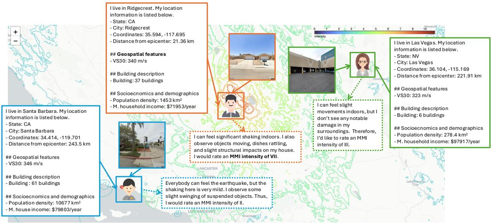  
Figure 1: An illustration of LLM-simulated human-centric sensors.

Building on these advances, we propose leveraging LLMs as simulation tools to estimate how humans might perceive and report seismic risks before an event occurs. Our work addresses two critical gaps: first, the limited pre-event simulation of seismic risk; and second, the underexplored application of LLMs as world models for deriving human-centric insights.

## 3 Data and Methods

## 3.1 Framework Design

To simulate disaster impacts before events, we propose a novel framework that treats LLM as synthetic observers. This framework conceptualizes LLMs as “virtual sensors” capable of “perceiving” multimodal inputs and “reasoning” about disaster risks based on the MMI levels (see appendix A) that approximate human perception of shaking. As illustrated in Figure 1, we associate each sampled spatial location with a bundle of features, including seismic distance, site conditions, local building characteristics, and socioeconomic factors. In addition, Google Street View provides a first-person view of the built environment. Collectively, this feature set closely replicates the perceptual input available to disaster responders during an event.

Formally, let each sample i be associated with a fused feature representation. We specifically select the following features that prior research has illustrated as critical predictors of seismic risk. (Frigerio et al., 2016; Kassem et al., 2020; Riedel et al., 2015; Mori et al., 2020).

$$
\mathcal { X } _ { i } = \{ E _ { i } , G _ { i } , L _ { i } , B _ { i } , S _ { i } , V _ { i } \}
$$

• $E _ { i } \mathbf { : }$ Earthquake parameters (e.g., magnitude, epicenter distance, depth),

• $G _ { i } \colon$ Geospatial features (e.g., VS30),

$L _ { i } \colon$ Location metadata (e.g., state, city, zip code),

• Bi: Building attributes (e.g., number, type, height, material),

• $S _ { i } { : }$ Socioeconomic indicators (e.g., population density, income),

• Vi: Street-level view (Google Street image).

The LLM acts as a reasoning function $f _ { \theta }$ with parameters θ, generating both a reasoning trace and an MMI rating:

$$
\hat { y } _ { i } , e _ { i } = f _ { \theta } ( \mathcal { X } _ { i } ) , \quad \hat { y } _ { i } \in \left\{ \mathrm { I } , \mathrm { I I } , \dots , \mathrm { X I I } \right\}
$$

The full pipeline consists of five components, as shown in Figure 2: (1) spatial sampling, (2) data fusion, (3) prompt engineering, (4) experiment design, and (5) result analysis, which we specifically explain in the following sections.

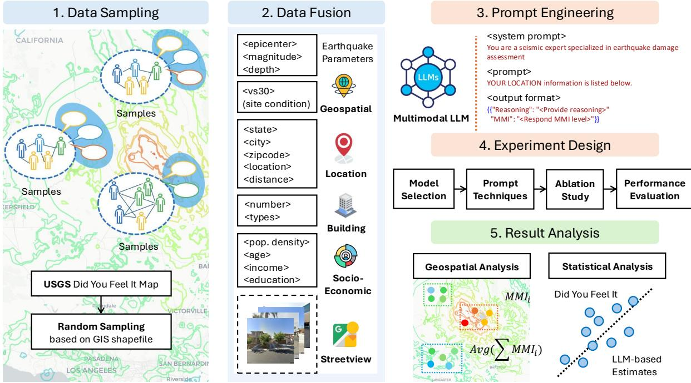  
Figure 2: An illustration of the framework design.

## 3.2 Data Sampling

In Step 1 (Figure 2), we use a polygon-based GIS shapefile to define administrative zones (e.g., zip codes) and apply within-polygon stratified random sampling to ensure spatial representativeness across the study area. Let: $\mathcal { Z } = \{ z _ { 1 } , z _ { 2 } , \dots , z _ { M } \}$ represent the set of all zip code polygons. For each polygon zj, we sample:

$$
\mathcal { P } _ { j } = \{ p _ { j 1 } , p _ { j 2 } , \dotsc , p _ { j n _ { j } } \} \sim \mathrm { U n i f o r m } ( z _ { j } )
$$

ensuring that points are uniformly drawn from within each polygon’s spatial boundary. We then sample 50 data points per zip code. This stratified random sampling strategy can help ensure spatial representativeness and mitigate biases associated with population density or urban–rural areas.

## 3.3 Data Fusion

In Step 2 (Figure 2), for each sampled point $p _ { j i }$ , we collect and assemble the feature set $\mathcal { X } _ { j i }$ from opensource and public datasets including USGS earthquake data, OpenStreetMap building data, American Community Survey (ACS) data, and Google Maps street views.

Earthquake data, site conditions, and location information. We source earthquake parameters, including moment magnitude, epicentral coordinates, and focal depth, from the USGS ShakeMap product (Wald et al., 2006) as E. To account for local site amplification and deamplification, we incorporate the USGS VS30 dataset (McPhillips et al., 2020) as the geospatial features G, a widely used proxy for near-surface geological effects.

We also incorporate location information, including latitude, longitude, state, county, zip code, and the distance from the epicenter for each sampled point. Additionally, we utilize MMI measurements from the USGS DYFI program as ground-truth labels, represented by yj for each zip code.

Building description. We use OpenStreetMap (Ramm and Topf, 2010) (OSM) data to extract building features B, including the total number of buildings, type distribution, height range, and average height within a 100-meter radius of each sampled point. Meanwhile, we summarize the prevalence of major construction materials (e.g., concrete, masonry, timber, steel). These features can help characterize the distribution, physical attributes, and seismic-design status of buildings within the sensor’s surroundings.

Socioeconomic and demographic factors. We collect socioeconomic and demographic factors S at the Census Block Group (CBG) level from the American Community Survey (ACS) (USC, 2022). We spatially join the coordinates of each randomly selected sample to their corresponding CBG polygon and extract relevant ACS key indicators, including population, population density, urbanization ratio, 65- and over-age proportion, median household income, and higher education attainment rate. These variables imply a quantitative evaluation of population vulnerability in a disaster event.

Google Maps street imagery. We further incorporate Google Street View imagery V to enrich the environmental context at each sampled location. These street-level images capture fine-grained visual cues of the surrounding built environment— such as building, vegetation, curb conditions, and street density—that are difficult to numerically encode but essential for human-like visual reasoning. Using the Google Maps API (Google, 2025), we query the available image for each point in our sampling grid. This visual context allows the LLM to $\mathbf { \bar { \ s e e } } ^ { \mathbf { , \ s } }$ the landscape as if it conducts a field visit.

## 3.4 Prompt Design

To guide the reasoning process of the LLM and ensure interpretability and consistency, we design a prompt template that mirrors the workflow of a seismic domain expert. The prompt follows a role-based instruction format in which the model is assigned the role of a seismic specialist responsible for evaluating earthquake damage using the MMI scale. The MMI scale provides a human-centric interpretation that consists of twelve levels describing the severity of earthquake shaking. The detailed descriptors of MMI are attached in Appendix A.

The prompt includes six distinct sections corresponding to the multimodal feature set $\mathcal { X } _ { i }$ introduced earlier: earthquake parameters $E _ { i }$ , geospatial features $G _ { i } .$ , location metadata $L _ { i } ,$ building descriptions $B _ { i }$ , socioeconomic context $S _ { i }$ and streetlevel view $V _ { i } .$ . The model’s response is constrained to a JSON format with two fields: a free-text reasoning explanation and the predicted MMI category (see prompt template in Appendix B). We implement Chain-of-Thought (CoT) to instruct LLM output a detailed reasoning justifying its assessment before final MMI estimate.

## 3.5 Experiment Design

LLM Selection: We select both open- and closedsource LLMs to conduct the simulation. For opensource LLMs, we use models from Llama-3.2 and Qwen-2.5 family with various sizes, as listed in Table 1.

Prompting Techniques: We incorporate the following prompting techniques in our experiment:

• In-Context Learning (ICL) (Brown et al., 2020;

Dong et al., 2024): This helps LLM adapt to tasks by incorporating examples directly within the input prompt. ICL is applied by embedding a detailed MMI reference guide directly within the prompt.

• Retrieval-Augmented Generation (RAG) (Lewis et al., 2020; Tan et al., 2024): It combines information retrieval with text generation that allows LLMs to access external data sources at inference. We provide LLM with a set of multimodal features and the reported MMI within the prompt as the retrieved context to ground their MMI estimates.

Evaluation: The LLM generates a MMI prediction, $\hat { y } _ { j i } = f _ { \theta } ( \mathcal { X } _ { j i } )$ , for each sampled location i within a predefined administrative area j (e.g., zip code, county). These point-level predictions are then aggregated to compute an average predicted MMI for each area $j$ . If area $j$ contains $n _ { j }$ samples, its average predicted MMI $\overline { { \hat { y } } } _ { j }$ is calculated as:

$$
\overline { { \hat { y } } } _ { j } = \frac { 1 } { n _ { j } } \sum _ { i = 1 } ^ { n _ { j } } \hat { y } _ { j i }
$$

Similarly, a corresponding ground-truth MMI value for area $j ,$ denoted as ${ \overline { { y } } } _ { j }$ , is derived from USGS DYFI reports. To quantify the model’s predictive accuracy using these aggregated area-level values, we compute two metrics. First, the Root Mean Square Error (RMSE) is used:

$$
\mathrm { R M S E } = \sqrt { \frac { 1 } { N } \sum _ { j = 1 } ^ { N } ( \overline { { \hat { y } } } _ { j } - \overline { { y } } _ { j } ) ^ { 2 } }
$$

where $N$ is the total number of administrative areas being evaluated (indexed by $j )$ . Second, we calculate Pearson’s correlation coefficients $r$ to assess the strength and direction of the association between the LLM-predicted MMI $( \overline { { \hat { y } } } _ { j } )$ and the ground-truth MMI $( { \overline { { y } } } _ { j } )$ . These evaluations are performed at both zip code and county levels.

## 4 Experimental Results

We select two cases to demonstrate our proposed framework: (1) the 2014 Napa earthquake (magnitude 6.0) and (2) the 2019 Ridgecrest earthquake (magnitude 7.1), both of which occurred in California, U.S. (see details in Appendix C). For each case, we use the USGS DYFI reports as the ground-truth dataset (U.S. Geological Survey, 2014a, 2019a). Additionally, for each case, We compile feature sets for 50 sample points from each of the top 100 zip codes with the highest number of responses, resulting in 5,000 samples per event. Due to limitations in Google image availability for the Napa case, only 4,920 samples are retrieved. Comparisons with DYFI data are first conducted at the zip code level, where each of the 100 aggregated values represents the average of 50 simulated samples. A more fine-grained city-level analysis is provided in Appendix G.

<table><tr><td rowspan="2">Model</td><td colspan="6">2014Napa</td><td colspan="3">2019 Ridgecrest</td></tr><tr><td>Open Source</td><td>RMSEz↓</td><td>Corrz ↑</td><td>RMSEc ↓</td><td>Corrc ↑</td><td>RMSEz↓</td><td>Corrz ↑</td><td>RMSEc ↓</td><td>Corrc ↑</td></tr><tr><td colspan="10">Closed-Source Models</td></tr><tr><td>GPT-4o-2024-08-06</td><td>x</td><td>2.43</td><td>0.77</td><td>2.37</td><td>0.88</td><td>1.97</td><td>0.75</td><td>1.91</td><td>0.77</td></tr><tr><td>GPT-4.1-mini</td><td>x</td><td>2.56</td><td>0.61</td><td>2.48</td><td>0.67</td><td>0.92</td><td>0.64</td><td>0.77</td><td>0.76</td></tr><tr><td>Claude-3.5-haiku</td><td>x</td><td>2.11</td><td>0.58</td><td>2.05</td><td>0.70</td><td>1.35</td><td>0.59</td><td>1.38</td><td>0.71</td></tr><tr><td colspan="10">Open-Source Models</td></tr><tr><td>Llama-3.2-11B-VI</td><td>√</td><td>3.19</td><td>0.44</td><td>3.05</td><td>0.86</td><td>3.22</td><td>0.33</td><td>3.22</td><td>0.27</td></tr><tr><td>Llama-3.2-90B-VI</td><td>√</td><td>2.62</td><td>0.57</td><td>2.55</td><td>0.66</td><td>2.06</td><td>0.62</td><td>2.19</td><td>0.59</td></tr><tr><td>Qwen2.5-VL-3B</td><td>√</td><td>3.63</td><td>0.29</td><td>3.59</td><td>0.15</td><td>3.88</td><td>0.01</td><td>4.08</td><td>-0.20</td></tr><tr><td>Qwen2.5-VL-7B</td><td></td><td>1.79</td><td>0.43</td><td>1.68</td><td>0.70</td><td>1.53</td><td>0.05</td><td>1.59</td><td>-0.18</td></tr><tr><td>Qwen2.5-VL-32B</td><td>√</td><td>1.59</td><td>0.70</td><td>1.56</td><td>0.79</td><td>0.99</td><td>0.71</td><td>0.96</td><td>0.80</td></tr><tr><td>Qwen2.5-VL-72B</td><td>√</td><td>2.17</td><td>0.46</td><td>2.12</td><td>0.44</td><td>1.39</td><td>0.64</td><td>1.28</td><td>0.86</td></tr></table>

Table 1: Main experiment results on two earthquake datasets. Best per-column values are highlighted in blue and bold. Alternating gray rows improve readability.

Figure 7 presents the spatial distribution of predicted MMI at the zip code level for the Napa and Ridgecrest earthquakes. This visualization highlights variations in simulated seismic impacts across geographical areas and among different LLMs. Based on the best-performing models (lowest RMSE: GPT-4.1-mini for the 2019 Ridgecrest earthquake and Qwen-2.5-32B for the 2014 Napa earthquake), we observe consistent geospatial patterns in both cases. Specifically, the simulations indicate elevated perceived risk near the epicenter (a red star mark in Figure 7), with diminishing simulated impact as distance increases. Moreover, the LLM-based predictions align well with DYFI reports from these two events: it is important to note that the Napa earthquake, despite its lower magnitude, led to more significant impacts.

The following sections are organized below. First, we evaluate the performance of the selected LLMs, comparing their accuracy using quantitative metrics, and examining the influence of model scaling and prompting strategies. Next, we conduct an input feature analysis to evaluate how different data modalities can impact predictive performance. Lastly, the output reasoning analysis explores the internal decision-making processes of the models, which identifies linguistic nuances that illustrate how LLMs interpret the inputs.

## 4.1 Model Performance

Before the main experiment, we perform a data leakage test using two close-source models— Claude-3.5-haiku and GPT-4.1-mini—to show that our simulation is free of data leakage issues (see Appendix D). The main experiment results are shown in Table 1, from which we draw the following findings. In addition, further comparisons with ShakeMap and traditional machine learning methods are provided in Appendix H.

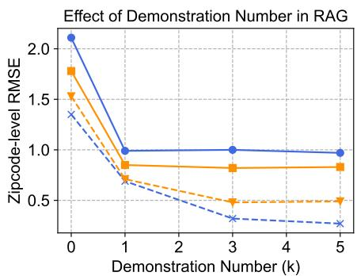  
Effect of Demonstration Number in ICL

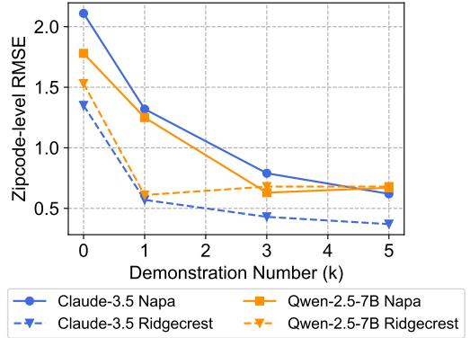  
Figure 3: Demonstration analysis on RAG and ICL.

LLMs deliver promising simulation results. As shown in Table 1, all of the best correlation scores across datasets and area levels exceed 0.7, indicating a strong alignment between the predicted outcomes and the ground truth impact labels. These high correlation values suggest that LLMs hold significant potential for effectively simulating humanperceived risks in disaster scenarios.

Closed-source LLMs generally outperform open-source models. Table 1 shows a clear trend that closed-source LLMs consistently outperform open-source counterparts, achieving the best results in 6 out of 8 cases. This suggests that commercial closed-source models possess stronger geospatial reasoning capabilities and align more closely with human judgment in disaster sensing tasks (Li et al., 2024b). Among the open-source models, Qwen-2.5-32B obtains the top results with lowest RMSE for the Napa case.

RMSE and correlation can be inconsistent. Another noteworthy observation from Table 1 is that the two evaluation metrics—correlation and RMSE—do not always align. For instance, Llama-3.2-11B shows a high correlation but a poor RMSE at the county level for the Napa case. This discrepancy arises because correlation captures the model’s ability to predict relative ordering of seismic impacts, whereas RMSE reflects the absolute prediction errors. Thus, even when models effectively estimate the relevant severity (lower RMSE), they may not correctly distinguish between higheror lower-impact areas (lower correlation). This suggests the model can correctly rank the relative severity of events but struggles to accurately predict the absolute MMI values.

We then evaluate the influence of incorporating demonstration methods with RAG and ICL on the simulation, as shown in Figure 3. These demonstration techniques can enhance the capacity of LLMs to generalize from provided information. In particular, the enhanced models consistently show higher performance, illustrated by decreasing RMSEZ. It is also well-noted that even limited demonstrations can greatly improve model predictions.

## 4.2 Input Feature Analysis

In this section, we examine how input features beyond earthquake and location information affect LLMs’ simulation performance. We conduct experiments using Claude-3.5-haiku and Qwen-2.5- 7B, with the results presented in Figure 4. Interestingly, we find that only street view information contributes to improved simulation performance. In contrast, removing any of the other three features alone—geospatial, building, or socioeconomic data—can decrease the zip code-level RMSE.

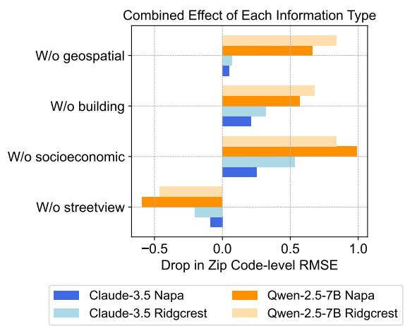  
Figure 4: Input information feature analysis results.

We attribute this performance degradation to several potential factors: (1) limitations of LLMs in processing numerical information as they could complicate LLM’s reasoning process (Yin et al., 2024; Bodensohn et al., 2025); (2) the lack of domain-specific knowledge required to interpret geospatial, building, and community-related data (Gao et al., 2024); (3) the inherent limitations of the self-attention mechanism in capturing spatial adjacency and performing geometric reasoning (Requeima et al., 2024).

## 4.3 Output Reasoning Analysis

To complement our quantitative evaluations, we examine how GPT-4.1-mini and Qwen-2.5-32B (given their lowest RMSE in Table 1) reason when predicting MMI values. Figure 5 illustrates how they model the relationship between epicentral distance, VS30 values, and MMI predictions. We summarize our findings as below:

LLMs capture seismic attenuation but underutilize local site conditions. As shown in Figure 5, both models display a clear negative correlation between epicentral distance and predicted MMI, most notably in Qwen2.5-32B’s Napa earthquake predictions, which indicates that LLMs have internalized the concept of seismic attenuation. However, the relationship between VS30 values (a proxy for local ground conditions) and MMI is weak across both models. High MMI values occur almost exclusively near the epicenter, suggesting limited sensitivity to local site effects.

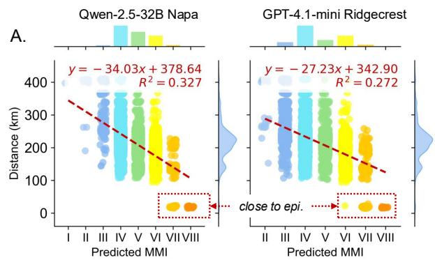

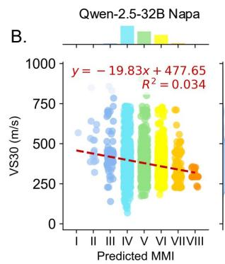

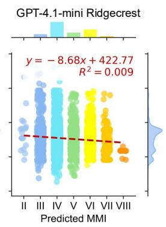  
Figure 5: Output reasoning analysis in terms of (A) distance (where the x-axis is the predicted MMI, and y-axis is the distance from the epicenter (km)) and (B) VS30 (where the x-axis is the predicted MMI, and the y-axis the local site condition represented by VS30 (m/s)).

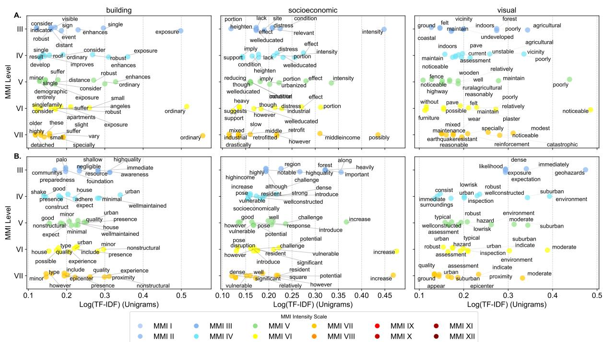  
Figure 6: Output reasoning analysis in terms of different input features with (A) Qwen-2.5-32B for the Napa case, and (B) GPT-4.1-mini for the Ridgecrest case. The x-axis is the log(TF-IDF), while the y-axis is the predicted MMI.

LLMs use distinct lexical cues for MMI reasoning across multimodal inputs. Figure 6 presents a taxonomy of language used by both models across three perspectives: buildings, socioeconomic context, and street-level imagery. Unigram analysis reveals that GPT-4.1-mini and Qwen2.5-32B employ different vocabularies and reasoning styles. For the building assessment, GPT-4.1-mini adopts a descriptive and hedged reasoning style. At low MMI levels, it uses terms like “enhance,” “robust,” and “improve,” while shifting to “suffer” and “detached” at higher levels. Qwen2.5-32B relies on more technical terms, such as “compliance” and “stringent” at low levels, and “crack” and “susceptibility” at higher ones.

Socioeconomic reasoning diverges in focus and tone. GPT-4.1-mini links lower MMI levels to terms like “urbanized” and “welleducated,” and higher levels to “industrial” and “heavy,” occasionally incorporating cautious language such as “possibly” or “suggest.” Qwen2.5-32B emphasizes systemic vulnerability, shifting from “limited” and “stable” to “cascade” and “amplification” as predicted MMI increases.

Visual reasoning contrasts environmental vs. structural emphasis. GPT-4.1-mini references broader environmental cues, from “forest” and “agricultural” at lower levels to “catastrophic” at higher ones. In contrast, Qwen2.5-32B focuses on structural compliance, mentioning “firm,” “code,”

and “reinforced” in a progression of seismic risk.

## 5 Discussion

Based on our experimental result analysis, we conclude the following insights and opportunities for future study:

• LLMs can effectively simulate human-centric seismic risks, showing strong alignment with real-world USGS DYFI reports. This can help develop pre-event impact assessment. One promising direction is to explore broader application in LLM-based simulations for disaster responses.

• Simulation performance depends on model type, size, and input information: closed-source and larger models generally perform better; techniques like RAG and ICL help; street-level imagery boosts accuracy, while structured data may hinder it due to modality alignment limitations. Future works can explore more effective prompting strategies and reasoning structures to further improve the simulation performance.

• LLMs show diverse reasoning styles and strong practical value, as model-specific rhetorical patterns reflect architectural and data differences. These differences suggest the potential impact of training data and model architecture on LLMs reasoning styles. It would be meaningful to further explore the reasoning mechanisms of LLMs when used as world models.

Our study has significant practical implications. Leveraging LLMs and open-source data to simulate seismic risk enables authorities to proactively assess potential disaster impacts. Integrating our framework into early-warning systems can also help identify vulnerable communities and enhance disaster response.

## 6 Conclusions

Our study demonstrates the potential of using LLMs to simulate seismic risk before an earthquake occurs. The alignment between model predictions and real-world reports highlights the importance of multimodal inputs and advanced LLM techniques like RAG and ICL in simulation settings. Moreover, our findings reveal that simulation performance can vary across LLMs and input features. These results make a meaningful contribution to advancing datadriven, human-centric simulation with LLMs for real-world scenarios.

## 7 Limitations

Several limitations warrant further consideration. First, our experiments focus only on two earthquake cases, including the 2014 Napa and 2019 Ridgecrest events, which may not fully represent global variations in seismic hazards, urban densities, and construction practices. Therefore, generalizability requires additional validation. In particular, applying this framework to other regions may be limited by data-sharing restrictions and the reliance on USGS DYFI reports, requiring alternative human-perception datasets for international validation. Practical consideration for deployment can be found in Appendix I.

Second, despite employing stratified random sampling within zip codes, potential biases remain due to gaps in data availability, such as incomplete Google Street View coverage or inconsistencies in socioeconomic and building datasets. This may lead to underrepresentation of certain neighborhoods or misalignment with high-risk zones.

Third, although our framework integrates diverse heterogeneous data, we do not conduct detailed feature selection or examine individual parameters (e.g., housing age, infrastructure proximity). Consequently, interpreting model behavior at a granular level requires further investigation.

## 8 Ethics

Responsible data use. Our research relies exclusively on publicly available and anonymized datasets, including geospatial, demographic, and imagery data from USGS, OpenStreetMap, and Google Street View. All analyses are conducted at aggregated administrative levels (zip code and county), minimizing risks to individual privacy.

Deployment guidance. It is important to recognize that LLM-based simulations cannot fully capture the complexity and diversity of individual experiences in real disaster scenarios. Therefore, model predictions should be viewed as supportive tools rather than replacements for expert judgment, and used responsibly with validated empirical assessments in practical decision-making contexts.

## References

2022. American community survey (acs).

Josh Achiam, Steven Adler, Sandhini Agarwal, Lama Ahmad, Ilge Akkaya, Florencia Leoni Aleman,

Diogo Almeida, Janko Altenschmidt, Sam Altman, Shyamal Anadkat, and 1 others. 2023. Gpt-4 technical report. ArXiv preprint, abs/2303.08774.

Temitope Akinboyewa, Huan Ning, M Naser Lessani, and Zhenlong Li. 2024. Automated floodwater depth estimation using large multimodal model for rapid flood mapping. Computational Urban Science, 4(1):12.

Gail M. Atkinson and David J. Wald. 2007. “did you feel it?” intensity data: A surprisingly good measure of earthquake ground motion. Seismological Research Letters, 78(3):362–368.

Jan-Micha Bodensohn, Ulf Brackmann, Liane Vogel, Anupam Sanghi, and Carsten Binnig. 2025. Unveiling challenges for llms in enterprise data engineering. arXiv preprint arXiv:2504.10950.

Tom Brown, Benjamin Mann, Nick Ryder, Melanie Subbiah, Jared D Kaplan, Prafulla Dhariwal, Arvind Neelakantan, Pranav Shyam, Girish Sastry, Amanda Askell, and 1 others. 2020. Language models are few-shot learners. Advances in neural information processing systems, 33:1877–1901.

Angelo Cardellicchio, Sergio Ruggieri, Valeria Leggieri, and Giuseppina Uva. 2023. A machine learning framework to estimate a simple seismic vulnerability index from a photograph: the vulma project. Procedia Structural Integrity, 44:1956–1963. XIX ANIDIS Conference, Seismic Engineering in Italy.

Gregory G Deierlein, Frank McKenna, Adam Zsarnóczay, Tracy Kijewski-Correa, Ahsan Kareem, Wael Elhaddad, Laura Lowes, Matthew J Schoettler, and Sanjay Govindjee. 2020. A cloud-enabled application framework for simulating regional-scale impacts of natural hazards on the built environment. Frontiers in Built Environment, 6:558706.

Qingxiu Dong, Lei Li, Damai Dai, Ce Zheng, Jingyuan Ma, Rui Li, Heming Xia, Jingjing Xu, Zhiyong Wu, Baobao Chang, and 1 others. 2024. A survey on in-context learning. In Proceedings ofthe 2024 Conference on Empirical Methods in Natural Language Processing, pages 1107–1128.

Ivan Frigerio, Stefania Ventura, Daniele Strigaro, Matteo Mattavelli, Mattia De Amicis, Silvia Mugnano, and Mario Boffi. 2016. A gis-based approach to identify the spatial variability of social vulnerability to seismic hazard in italy. Applied geography, 74:12– 22.

Yanjun Gao, Skatje Myers, Shan Chen, Dmitriy Dligach, Timothy A Miller, Danielle Bitterman, Matthew Churpek, and Majid Afshar. 2024. When raw data prevails: Are large language model embeddings effective in numerical data representation for medical machine learning applications? arXiv preprint arXiv:2408.11854.

Google. 2025. Google Maps Platform. https:// developers.google.com/maps. Accessed: 2025- 05-19.

Yu Gu, Kai Zhang, Yuting Ning, Boyuan Zheng, Boyu Gou, Tianci Xue, Cheng Chang, Sanjari Srivastava, Yanan Xie, Peng Qi, and 1 others. 2024. Is your llm secretly a world model of the internet? modelbased planning for web agents. arXiv preprint arXiv:2411.06559.

Daya Guo, Dejian Yang, Haowei Zhang, Junxiao Song, Ruoyu Zhang, Runxin Xu, Qihao Zhu, Shirong Ma, Peiyi Wang, Xiao Bi, and 1 others. 2025. Deepseek-r1: Incentivizing reasoning capability in llms via reinforcement learning. arXiv preprint arXiv:2501.12948.

Shibo Hao, Yi Gu, Haodi Ma, Joshua Jiahua Hong, Zhen Wang, Daisy Zhe Wang, and Zhiting Hu. 2023. Reasoning with language model is planning with world model. arXiv preprint arXiv:2305.14992.

Haley Hostetter, MZ Naser, Xinyan Huang, and John Gales. 2024. Large language models in fire engineering: An examination of technical questions against domain knowledge. arXiv preprint arXiv:2403.04795.

Iunio Iervolino. 2023. Implications of gmpe’s structure for multi-site seismic hazard. Soil Dynamics and Earthquake Engineering, 172:108022.

Rebecca Louise Jones, Debarati Guha-Sapir, and Sandy Tubeuf. 2022. Human and economic impacts of natural disasters: can we trust the global data? Scientific data, 9(1):572.

Moustafa Moufid Kassem, Fadzli Mohamed Nazri, and Ehsan Noroozinejad Farsangi. 2020. The seismic vulnerability assessment methodologies: A stateof-the-art review. Ain Shams Engineering Journal, 11(4):849–864.

Maja Kucharczyk and Chris H Hugenholtz. 2021. Remote sensing of natural hazard-related disasters with small drones: Global trends, biases, and research opportunities. Remote Sensing of Environment, 264:112577.

Geon Lee, Wenchao Yu, Kijung Shin, Wei Cheng, and Haifeng Chen. 2025. Timecap: Learning to contextualize, augment, and predict time series events with large language model agents. In Proceedings of the AAAI Conference on Artificial Intelligence, volume 39, pages 18082–18090.

Patrick Lewis, Ethan Perez, Aleksandra Piktus, Fabio Petroni, Vladimir Karpukhin, Naman Goyal, Heinrich Küttler, Mike Lewis, Wen-tau Yih, Tim Rocktäschel, and 1 others. 2020. Retrieval-augmented generation for knowledge-intensive nlp tasks. Advances in neural information processing systems, 33:9459– 9474.

Bowen Li, Zhaoyu Li, Qiwei Du, Jinqi Luo, Wenshan Wang, Yaqi Xie, Simon Stepputtis, Chen Wang, Katia Sycara, Pradeep Ravikumar, and 1 others. 2024a. Logicity: Advancing neuro-symbolic ai with abstract urban simulation. Advances in Neural Information Processing Systems, 37:69840–69864.

Dawei Li, Bohan Jiang, Liangjie Huang, Alimohammad Beigi, Chengshuai Zhao, Zhen Tan, Amrita Bhattacharjee, Yuxuan Jiang, Canyu Chen, Tianhao Wu, and 1 others. 2024b. From generation to judgment: Opportunities and challenges of llm-as-ajudge. arXiv preprint arXiv:2411.16594.

Dawei Li, Zhen Tan, and Huan Liu. 2025a. Exploring large language models for feature selection: A datacentric perspective. ACM SIGKDD Explorations Newsletter, 26(2):44–53.

Dawei Li, Zhen Tan, Peijia Qian, Yifan Li, Kumar Chaudhary, Lijie Hu, and Jiayi Shen. 2025b. Smoa: Improving multi-agent large language models with s parse m ixture-o f-a gents. In Pacific-Asia Conference on Knowledge Discovery and Data Mining, pages 54–65. Springer.

Lingyao Li, Michelle Bensi, and Gregory Baecher. 2023. Exploring the potential of social media crowdsourcing for post-earthquake damage assessment. International Journal of Disaster Risk Reduction, 98:104062.

Lingyao Li, Michelle Bensi, Qingbin Cui, Gregory B Baecher, and You Huang. 2021. Social media crowdsourcing for rapid damage assessment following a sudden-onset natural hazard event. International Journal of Information Management, 60:102378.

Lingyao Li, Runlong Yu, Qikai Hu, Bowei Li, Min Deng, Yang Zhou, and Xiaowei Jia. 2025c. From pixels to places: A systematic benchmark for evaluating image geolocalization ability in large language models. arXiv preprint arXiv:2508.01608.

Zhong-Zhi Li, Duzhen Zhang, Ming-Liang Zhang, Jiaxin Zhang, Zengyan Liu, Yuxuan Yao, Haotian Xu, Junhao Zheng, Pei-Jie Wang, Xiuyi Chen, and 1 others. 2025d. From system 1 to system 2: A survey of reasoning large language models. arXiv preprint arXiv:2502.17419.

Zihui Ma, Lingyao Li, Yujie Mao, Yu Wang, Olivia Grace Patsy, Michelle T Bensi, Libby Hemphill, and Gregory B Baecher. 2024. Surveying the use of social media data and natural language processing techniques to investigate natural disasters. Natural Hazards Review, 25(4):03124003.

Rafaela Martelo, Kimia Ahmadiyehyazdi, and Ruo-Qian Wang. 2024. Towards democratized flood risk management: An advanced ai assistant enabled by gpt-4 for enhanced interpretability and public engagement. arXiv preprint arXiv:2403.03188.

Devin F McPhillips, Julie A Herrick, Sean Ahdi, Alan K Yong, and Scott Haefner. 2020. Updated compilation of vs30 data for the united states. (No Title).

Federico Mori, Amerigo Mendicelli, Massimiliano Moscatelli, Gino Romagnoli, Edoardo Peronace, and Giuseppe Naso. 2020. A new vs30 map for italy based on the seismic microzonation dataset. Engineering Geology, 275:105745.

Morgan P Moschetti, Brad T Aagaard, Sean K Ahdi, Jason Altekruse, Oliver S Boyd, Arthur D Frankel, Julie Herrick, Mark D Petersen, Peter M Powers, Sanaz Rezaeian, and 1 others. 2024. The 2023 us national seismic hazard model: Ground-motion characterization for the conterminous united states. Earthquake Spectra, 40(2):1158–1190.

Hakan T Otal, Eric Stern, and M Abdullah Canbaz. 2024. Llm-assisted crisis management: Building advanced llm platforms for effective emergency response and public collaboration. In 2024 IEEE Conference on Artificial Intelligence (CAI), pages 851– 859. IEEE.

Frederik Ramm and Jochen Topf. 2010. Open-StreetMap: Diefreie Weltkarte nutzen und mitgestalten. Lehmanns Media.

James Requeima, John Bronskill, Dami Choi, Richard Turner, and David K Duvenaud. 2024. Llm processes: Numerical predictive distributions conditioned on natural language. Advances in Neural Information Processing Systems, 37:109609–109671.

Ismaël Riedel, Philippe Guéguen, Mauro Dalla Mura, Erwan Pathier, Thomas Leduc, and Jocelyn Chanussot. 2015. Seismic vulnerability assessment of urban environments in moderate-to-low seismic hazard regions using association rule learning and support vector machine methods. Natural hazards, 76:1111– 1141.

Argho Sarkar, Tashnim Chowdhury, Robin Roberson Murphy, Aryya Gangopadhyay, and Maryam Rahnemoonfar. 2023. Sam-vqa: Supervised attentionbased visual question answering model for postdisaster damage assessment on remote sensing imagery. IEEE Transactions on Geoscience and Remote Sensing, 61:1–16.

Soudabeh Taghian Dinani, Doina Caragea, and Nikesh Gyawali. 2023. Disaster tweet classification using fine-tuned deep learning models versus zero and fewshot large language models. In International Conference on Data Management Technologies and Applications, pages 73–94. Springer.

Zhen Tan, Chengshuai Zhao, Raha Moraffah, Yifan Li, Song Wang, Jundong Li, Tianlong Chen, and Huan Liu. 2024. Glue pizza and eat rocks-exploiting vulnerabilities in retrieval-augmented generative models. In Proceedings of the 2024 Conference on Empirical Methods in Natural Language Processing, pages 1610–1626.

U.S. Geological Survey. 1989. The modified mercalli intensity (mmi) scale. https://pubs.usgs. gov/gip/earthq4/severitygip.html. Accessed: 2024-05-18.

U.S. Geological Survey. 2014a. Did you feel it? – community internet intensity map for 2014 napa earthquake. https: //earthquake.usgs.gov/earthquakes/ eventpage/nc72282711/dyfi/responses. Accessed: 2024-05-18.

U.S. Geological Survey. 2014b. M 6.0 - south napa earthquake, california. https: //earthquake.usgs.gov/earthquakes/ eventpage/nc72282711/executive. Accessed: 2024-05-18.

U.S. Geological Survey. 2019a. Did you feel it? community internet intensity map for 2019 ridgecrest earthquake. https://earthquake.usgs.gov/earthquakes/ eventpage/ci38457511/dyfi/intensity. Accessed: 2024-05-18.

U.S. Geological Survey. 2019b. M 7.1 2019 ridgecrest earthquake sequence. https://earthquake.usgs.gov/earthquakes/ eventpage/ci38457511/executive. Accessed: 2024-05-18.

David J Wald, Bruce C Worden, Vincent Quitoriano, and Kris L Pankow. 2006. Shakemap® manual. Technical Manual, users guide, and software guide Version.

Chenguang Wang, Davis Engler, Xuechun Li, James Hou, David J Wald, Kishor Jaiswal, and Susu Xu. 2024a. Near-real-time earthquake-induced fatality estimation using crowdsourced data and large-language models. International Journal of Disaster Risk Reduction, 111:104680.

Gelan Wang, Yu Liu, Shukai Liu, Ling Zhang, and Liqun Yang. 2025. Remflow: Rag-enhanced multifactor rainfall flooding warning in sponge airports via large language model. International Journal of Machine Learning and Cybernetics, pages 1–21.

Yue Wang, Tianfan Fu, Yinlong Xu, Zihan Ma, Hongxia Xu, Bang Du, Yingzhou Lu, Honghao Gao, Jian Wu, and Jintai Chen. 2024b. Twin-gpt: digital twins for clinical trials via large language model. ACM Transactions on Multimedia Computing, Communications and Applications.

Gwen White and Sadie Liptak. 2025. Small business continuity and disaster recovery plans using ai and chatgpt.

Lionel Wong, Gabriel Grand, Alexander K Lew, Noah D Goodman, Vikash K Mansinghka, Jacob Andreas, and Joshua B Tenenbaum. 2023. From word models to world models: Translating from natural language to the probabilistic language of thought. arXiv preprint arXiv:2306.12672.

Jiannan Xiang, Tianhua Tao, Yi Gu, Tianmin Shu, Zirui Wang, Zichao Yang, and Zhiting Hu. 2023. Language models meet world models: Embodied experiences enhance language models. Advances in neural information processing systems, 36:75392–75412.

Yuwei Yan, Qingbin Zeng, Zhiheng Zheng, Jingzhe Yuan, Jie Feng, Jun Zhang, Fengli Xu, and Yong Li. 2024. Opencity: A scalable platform to simulate urban activities with massive llm agents. arXiv preprint arXiv:2410.21286.

Hang Yang, Hao Chen, Hui Guo, Yineng Chen, Ching-Sheng Lin, Shu Hu, Jinrong Hu, Xi Wu, and Xin Wang. 2024. Llm-medqa: Enhancing medical question answering through case studies in large language models. arXiv preprint arXiv:2501.05464.

Shiping Yang, Jie Wu, Wenbiao Ding, Ning Wu, Shining Liang, Ming Gong, Hengyuan Zhang, and Dongmei Zhang. 2025. Quantifying the robustness of retrievalaugmented language models against spurious features in grounding data. arXiv preprint arXiv:2503.05587.

Shukang Yin, Chaoyou Fu, Sirui Zhao, Yunhang Shen, Chunjiang Ge, Yan Yang, Zuwei Long, Yuhan Dai, Yongdong Luo, Haoyu Cao, and 1 others. 2024. Sparrow: Data-efficient video-llm with text-to-image augmentation. arXiv preprint arXiv:2411.19951.

Chen Yu and Zhiguo Wang. 2024. Multimodal social sensing for the spatio-temporal evolution and assessment of nature disasters. Sensors, 24(18):5889.

Qian Yu, Chaofeng Wang, Frank McKenna, Stella X Yu, Ertugrul Taciroglu, Barbaros Cetiner, and Kincho H Law. 2020. Rapid visual screening of softstory buildings from street view images using deep learning classification. Earthquake Engineering and Engineering Vibration, 19:827–838.

Yiyao Yu, Yuxiang Zhang, Dongdong Zhang, Xiao Liang, Hengyuan Zhang, Xingxing Zhang, Ziyi Yang, Mahmoud Khademi, Hany Awadalla, Junjie Wang, and 1 others. 2025. Chain-of-reasoning: Towards unified mathematical reasoning in large language models via a multi-paradigm perspective. arXiv preprint arXiv:2501.11110.

Chenhui Zhang and Sherrie Wang. 2024. Good at captioning bad at counting: Benchmarking gpt-4v on earth observation data. In Proceedings of the IEEE/CVF Conference on Computer Vision and Pattern Recognition, pages 7839–7849.

Hengyuan Zhang, Yanru Wu, Dawei Li, Sak Yang, Rui Zhao, Yong Jiang, and Fei Tan. 2024. Balancing speciality and versatility: a coarse to fine framework for supervised fine-tuning large language model. In Findings ofthe Associationfor Computational Linguistics ACL 2024, pages 7467–7509.

Zirui Zhao, Wee Sun Lee, and David Hsu. 2023. Large language models as commonsense knowledge for large-scale task planning. Advances in Neural Information Processing Systems, 36:31967–31987.

## A Modified Mercalli Intensity (MMI) Scale

Table 2 shows the MMI scale used to support the classification of seismic risks in our study.

## B Prompt Template Design

<table><tr><td>MMI Level</td><td>Description</td></tr><tr><td>I</td><td>Not felt except by a very few under especially favorable conditions.</td></tr><tr><td>ⅡI</td><td>Felt only by a few persons at rest, especially on upper floors of buildings. Delicately suspended objects may swing.</td></tr><tr><td>III</td><td>Felt quite noticeably by persons indoors, especially on upper floors of buildings. Many people do not recognize it as an earthquake. Standing motor cars may rock slightly. Vibration similar to the passing of a truck. Duration estimated.</td></tr><tr><td>IV</td><td>Felt indoors by many, outdoors by few during the day. At night, some awakened. Dishes, windows, doors disturbed; walls make cracking sound. Sensation like heavy truck striking building. Standing motor cars rocked noticeably.</td></tr><tr><td>V</td><td>Felt by nearly everyone; many awakened. Some dishes, windows broken. Unstable objects overturned. Pendulum clocks may stop.</td></tr><tr><td>VI</td><td>Felt by all, many frightened. Some heavy furniture moved; a few instances of fallen plaster. Damage slight.</td></tr><tr><td>VII VIII</td><td>Damage negligible in buildings of good design and construction; slight to moderate in well-built ordinary structures; considerable damage in poorly built or badly designed structures; some chimneys broken. Damage slight in specially designed structures; considerable damage in ordinary substantial buildings</td></tr><tr><td></td><td>with partial collapse. Damage great in poorly built structures. Fall of chimneys, factory stacks, columns, monuments, walls. Heavy furniture overturned.</td></tr><tr><td>IX</td><td>Damage considerable in specially designed structures; well-designed frame structures thrown out of plumb. Damage great in substantial buildings, with partial collapse. Buildings shifted off foundations.</td></tr><tr><td>X</td><td>Some well-built wooden structures destroyed; most masonry and frame structures destroyed with foundations. Rail bent.</td></tr><tr><td>XI</td><td>Few, if any (masonry) structures remain standing. Bridges destroyed. Rails bent greatly.</td></tr><tr><td>XII</td><td>Damage total. Lines of sight and level are distorted. Objects thrown into the air.</td></tr></table>

Table 2: Description of the Modified Mercalli Intensity (MMI) scale (U.S. Geological Survey, 1989).

20   
1 SYSTEM\_PROMPT = 11 11 11 21 ## Building Description in YOUR   
2 You are a seismic expert specialized LOCATION ( within a 100 - meter   
in earthquake damage assessment radius )   
and disaster response . You 22 Building description : { building }   
analyze earthquake data , local 23   
conditions , and building 24 ## Community Socioecnomics and   
characteristics to provide damage Demographics in YOUR LOCATION (at   
assessments using the Modified Cencus Block Group level )   
Mercalli Intensity (MMI ) scale . 25 - Population density : {   
11 11 11   
3 population\_density } people per   
square km   
26 - Urban population percentage : {   
1 EARTHQUAKE\_PROMPT = 11 11 11 urban\_population\_pct }%   
2 The earthquake happened date is 27 - Over 65 percentage : { over\_65\_rate }%   
2025 -06 -01. 28 - Median household income : \${   
3 median\_household\_income }/ year   
4 Here is the EARTHQUAKE information . 29 - Education ( bachelor 's or higher ) : {   
5 - Epicenter : { eq\_place } education }%   
6 - Coordinates : { eq\_lat } , { eq\_lng } 30   
7 - Magnitude : { eq\_magnitude } mw 31 ## Visual Context in YOUR LOCATION   
8 Depth : { eq\_depth } km 32 The image provided shows your   
9 surrounding environment and   
10 YOUR LOCATION information is listed infrastructure .   
below . 33   
11 - State : { state } 34 Based on the information provided ,   
12 - City : { city } ASSESS the potential earthquake   
13 - Zip code : {zip code } damage level using the Modified   
14 - Coordinates : { lat } , { lng } Mercalli Intensity ( MMI ) scale .   
15 - Distance from epicenter : { distance } 35 1. Identify the damage level .   
km 36 2. Explain your reasoning by   
16 addressing the following factors   
17 ## Geospatial features in YOUR and considering the visual   
LOCATION context .   
18 - VS30 at your location : { vs30 } m/s 37 - Distance to the epicenter and   
19 ( VS30 represents the time - averaged earthquake magnitude   
shear - wave velocity (VS) to a 38 - Geospatial features   
depth of 30 meters , which is a 39 Infrastructure quality and   
key index to account for seismic building characteristics   
site conditions )

40 Population density and   
socioeconomic vulnerabilities   
41 - Visual image of surroundings   
42   
43 The following is an abbreviated   
description of the 12 levels of   
Modified Mercalli intensity . {MMI   
Scale }   
44   
45 Output the result in JSON format :   
46 {{   
47 " Reasoning ": " < Provide reasoning   
>"   
48 " MMI ": " < Respond MMI level >" ,   
49 }}   
50 n n n

## C Earthquake Scenarios

2014 Napa Earthquake (U.S. Geological Survey, 2014b). On August 24, 2014, a magnitude 6.0 earthquake struck near Napa, California, causing significant structural damage despite its moderate magnitude. Approximately 613 buildings were tagged for various degrees of structural integrity concerns, including fractures, road cracks, and damage to wine storage facilities. The earthquake resulted in one death and nearly 200 injuries.

2019 Ridgecrest Earthquake (U.S. Geological Survey, 2019b). The Ridgecrest earthquake occurred on July 6, 2019, with a magnitude of 7.1, significantly larger than the Napa event but with fewer human casualties. The quake damaged around 50 homes, caused gas leaks and road cracks, and triggered fires in residential properties. Significant infrastructural damage occurred at the Naval Air Station, and widespread power outages were reported.

## D Data Leakage Test

To further assess the potential for data leakage in the LLMs used in our experiments, we conduct a leakage test on Claude-3.5-haiku and GPT-4.1- mini, the two best-performing models in our main study. Specifically, we remove city and state names from the prompt—two elements most likely to serve as shortcuts for the models to associate with MMI levels and potentially memorize. As shown in Table 3, the removal of location information does not significantly affect the models’ simulation performance. It is fair to rule out the possibility of data leakage in our main results.

## E Spatial Distribution of Predicted MMI by LLMs

Figure 7 shows the spatial distribution of predicted MMI for the 2014 Napa earthquake and the 2019 Ridgecrest earthquake at zip code level from different LLMs.

## F Scaling Law Analysis

To investigate the impact of LLM scaling laws on simulation performance, we conduct a scaling analysis using the Llama-3.2 and Qwen-2.5 model families. As shown in Table 4, we observe that performance in simulation generally improves with model size, excepting Qwen-2.5-72B. This indicates that the simulation performance tend to be strengthened with a larger size of LLMs.

## G Fine-grained City-level Analysis

The following tables present a comparative analysis of MMI predictions from LLMs for the two investigated seismic events. The predictions from each model are juxtaposed with the actual average MMI values recorded for cities to evaluate their performance and accuracy. This city-level comparison provides a more fine-grained analysis of each model’s predictive performance across different locations and intensities.

Based on the results, we have listed some key observations. First, LLMs show variation in their MMI predictions at the city level, with most models consistently overestimating damage compared to actual MMI values, especially for the 2014 Napa earthquake. GPT-4.1-mini shows the largest prediction errors, consistently overestimating MMI values by 2-3 levels (e.g., predicting 6.43 vs actual 3.80 for San Francisco). The Qwen models show intermediate performance, with Qwen2.5-VL-32B being more conservative than its 72B counterpart. The case varies significantly between earthquake events, with all models performing better on the 2021 Ridgecrest earthquake compared to the 2014 Napa earthquake. For Ridgecrest, model predictions show better alignment with actual MMI values, particularly at the epicenter, where models predicted 6.6-7.7 versus the actual 7.0.

Most LLMs show consistency in their relative city rankings within each earthquake event, with most models generally maintaining similar ordering of cities as compared to the ground truth. This suggests that while the models struggle with precise MMI calibration, they can capture relationships about earthquake impact distribution, making them potentially valuable for comparative damage assessment and emergency response prioritization.

<table><tr><td rowspan="3">Model</td><td colspan="4">Earthquake prompt</td><td colspan="4">w/o location</td></tr><tr><td>RMSEz ↓ Corrz ↑</td><td></td><td> $\mathbf { R M S E } _ { \mathbf { C } }$  →</td><td> $\mathbf { C o r r } _ { \mathbf { C } }$  ←</td><td> $\mathbf { R M S E } _ { \mathbf { Z } }$ </td><td></td><td>↓ Corrz ↑ RMSEc ↓ Corrc ↑</td><td></td></tr><tr><td>claude-3-5-haiku</td><td>2.11</td><td>0.58</td><td>2.05</td><td>0.70</td><td>2.35</td><td>0.38</td><td>2.26</td><td>0.62</td></tr><tr><td>gpt-4.1-mini</td><td>2.56</td><td>0.61</td><td>2.48</td><td>0.67</td><td>2.67</td><td>0.62</td><td>2.58</td><td>0.73</td></tr></table>

Table 3: Experiment results on data leakage test.
<table><tr><td>Model Family</td><td>Model Size</td><td>Napa RMSE</td><td>Ridgecrest RMSE</td></tr><tr><td rowspan="2">Llama-3.2</td><td>11B</td><td>3.19</td><td>3.22</td></tr><tr><td>90B</td><td>2.62</td><td>2.06</td></tr><tr><td rowspan="4">Qwen-2.5</td><td>3B</td><td>3.63</td><td>3.88</td></tr><tr><td>7B</td><td>1.79</td><td>1.53</td></tr><tr><td>32B</td><td>1.59</td><td>0.99</td></tr><tr><td>72B</td><td>2.17</td><td>1.39</td></tr></table>

Table 4: Scaling law analysis: Zip code-level RMSE across model sizes (in billions of parameters).

<table><tr><td></td><td>Count</td><td>claude-3.5 -haiku</td><td>gpt-4.1 -mini</td><td>gpt-40</td><td>llama-3.2 -90b</td><td>qwen2.5 -vl-32b</td><td>qwen2.5 -vl-72b</td><td>Actual average MMI</td></tr><tr><td>City</td><td></td><td></td><td>6.43</td><td>6.00</td><td>6.27</td><td>5.16</td><td>5.79</td><td></td></tr><tr><td>San Francisco</td><td>750 360</td><td>5.12 5.39</td><td>6.44</td><td>5.81</td><td>6.63</td><td>5.45</td><td>5.71</td><td>3.80 3.86</td></tr><tr><td>Berkeley Oakland</td><td>350</td><td>5.26</td><td>6.57</td><td>5.90</td><td>6.58</td><td>5.27</td><td>5.53</td><td>3.57</td></tr><tr><td>Santa Rosa</td><td>300</td><td>5.18</td><td>6.52</td><td>6.04</td><td>6.56</td><td>5.29</td><td>5.71</td><td>4.00</td></tr><tr><td>San Mateo</td><td>200</td><td>4.50</td><td>6.02</td><td>6.00</td><td>6.11</td><td>4.22</td><td>5.61</td><td>3.75</td></tr><tr><td>Mountain View</td><td>150</td><td>4.62</td><td>5.65</td><td>5.96</td><td>5.61</td><td>4.09</td><td>4.98</td><td>3.00</td></tr><tr><td>Walnut Creek</td><td>100</td><td>5.28</td><td>6.25</td><td>6.04</td><td>6.40</td><td>5.33</td><td>5.84</td><td>4.00</td></tr><tr><td>San Rafael</td><td>100</td><td>5.39</td><td>6.49</td><td>5.92</td><td>6.80</td><td>5.83</td><td>5.59</td><td>3.00</td></tr><tr><td>Palo Alto</td><td>100</td><td>4.78</td><td>5.66</td><td>5.89</td><td>5.91</td><td>4.12</td><td>5.32</td><td>3.00</td></tr><tr><td>Redwood City</td><td>100</td><td>4.71</td><td>5.76</td><td>5.72</td><td>5.80</td><td>4.07</td><td>5.05</td><td>3.50</td></tr><tr><td>San Jose</td><td>100</td><td>5.41</td><td>5.32</td><td>6.00</td><td>5.96</td><td>4.08</td><td>4.98</td><td>3.00</td></tr><tr><td>Fremont</td><td>100</td><td>4.57</td><td>6.05</td><td>6.00</td><td>5.92</td><td>3.97</td><td>5.65</td><td>3.00</td></tr><tr><td>Fairfield</td><td>100</td><td>5.70</td><td>6.63</td><td>6.63</td><td>6.83</td><td>6.11</td><td>5.36</td><td>4.50</td></tr><tr><td>Vallejo</td><td>100</td><td>5.67</td><td>6.86</td><td>7.00</td><td>6.96</td><td>6.86</td><td>5.26</td><td>6.00</td></tr><tr><td>Vacaville</td><td>100</td><td>5.37</td><td>6.49</td><td>6.12</td><td>6.64</td><td>5.46</td><td>5.73</td><td>4.00</td></tr><tr><td>Sunnyvale</td><td>100</td><td>4.88</td><td>5.55</td><td>5.93</td><td>5.78</td><td>3.99</td><td>5.11</td><td>2.50</td></tr><tr><td>Davis</td><td>100</td><td>5.13</td><td>6.12</td><td>5.96</td><td>6.09</td><td>4.34</td><td>5.83</td><td>3.00</td></tr><tr><td>Concord</td><td>100</td><td>5.54</td><td>6.36</td><td>5.99</td><td>6.57</td><td>5.05</td><td>5.82</td><td>4.00</td></tr><tr><td>Petaluma</td><td>76</td><td>5.17</td><td>6.53</td><td>6.14</td><td>6.61</td><td>5.46</td><td>5.36</td><td>4.53</td></tr><tr><td>Napa</td><td>73</td><td>5.73</td><td>6.78</td><td>6.84</td><td>6.83</td><td>6.67</td><td>5.66</td><td>7.56</td></tr></table>

Table 5: City-level MMI predictions vs. actual MMI for the 2014 Napa Earthquake.

## H Comparison with Traditional Methods

ShakeMap is a highly effective method that quantifies physical parameters like ground shaking intensity and infrastructure vulnerability (Wald et al., 2006). We provide quantitative comparison against the USGS ShakeMap product and standard machine learning models to ground our performance evaluation.

## H.1 Comparison with USGS ShakeMap

Table 7 compares our pre-event LLM simulations against the post-event ShakeMap results, both evaluated against ground-truth “Did You Feel It?” (DYFI) reports.

The post-event ShakeMap product aligns more closely with DYFI reports, as reflected in its lower RMSE and higher correlation. This advantage stems from ShakeMap’s reactive nature: it is generated minutes after an earthquake using real-time ground-motion recordings from seismic stations, interpolated across a regional grid. By contrast, our LLM-based method operates in a pre-event simulation and emphasizes the human-centered dimension of how individuals perceive seismic impacts.

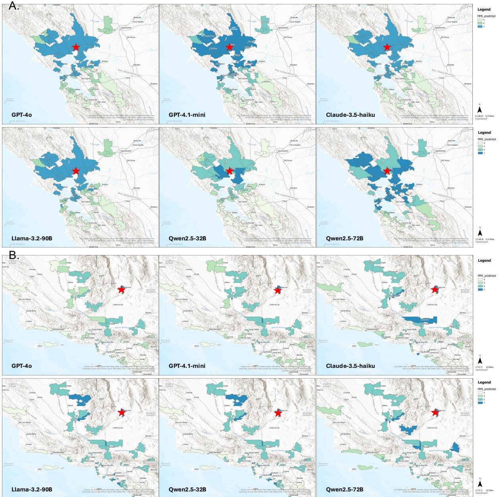  
Figure 7: Spatial distribution of predicted MMI at zip code level: (A) The 2014 Napa earthquake, and (B) the 2019 Ridgecrest earthquake based on GPT4o, GPT-4.1-mini, Claude-3.5-haiku, Llama-3.2-90B, Qwen-2.5-32B, and Qwen-2.5-72B. The red star sign shows the epicenter of the earthquake. These maps compare outputs from different LLMs, showing consistent geospatial patterns with high-intensity predictions concentrated near epicenters

## H.2 Comparison with Machine Learning Baselines

We further benchmark our approach against standard machine learning models trained for the same pre-event simulation task. Using the 2014 Napa earthquake data for training and the 2019 Ridgecrest event for testing, we train five models on the same multimodal data provided to our LLM pipeline.

Our evaluation reveals two advantages of using

LLMs for this task. First, the best-performing LLM achieves a zip code-level Pearson correlation of 0.75 with DYFI reports (Table 7). In contrast, the strongest traditional ML model reaches a correlation of only 0.62 (Table 8). This demonstrates the LLM’s superior ability to synthesize complex, multimodal inputs for pre-event simulation. Second, unlike traditional models that output a single numeric value, the LLM generates chain-of-thought explanations for its MMI predictions. These narratives reference factors such as distance from the epicenter, local site conditions, building materials, and social vulnerability indicators, offering emergency planners a clearer understanding of why a location is judged to be at high risk.

<table><tr><td></td><td></td><td>claude-3.5</td><td>gpt-4.1</td><td></td><td>llama-3.2</td><td>qwen2.5</td><td>qwen2.5</td><td>Actual</td></tr><tr><td>City</td><td>Count</td><td>-haiku</td><td>-mini</td><td>gpt-4o</td><td>-90b</td><td>-vl-32b</td><td>-vl-72b</td><td>average MMI</td></tr><tr><td>Los Angeles</td><td>500</td><td>4.80</td><td>5.49</td><td>5.61</td><td>6.00</td><td>4.58</td><td>5.43</td><td>4.00</td></tr><tr><td>Las Vegas</td><td>300</td><td>4.25</td><td>4.36</td><td>4.93</td><td>5.96</td><td>4.62</td><td>5.09</td><td>4.00</td></tr><tr><td>Bakersfield</td><td>250</td><td>4.93</td><td>5.47</td><td>5.96</td><td>6.02</td><td>5.33</td><td>5.15</td><td>4.00</td></tr><tr><td>San Diego</td><td>200</td><td>4.26</td><td>3.87</td><td>4.11</td><td>5.87</td><td>3.58</td><td>3.78</td><td>3.00</td></tr><tr><td>Lancaster</td><td>150</td><td>4.73</td><td>5.49</td><td>6.22</td><td>6.11</td><td>5.00</td><td>5.28</td><td>4.67</td></tr><tr><td>Huntington Beach</td><td>100</td><td>4.57</td><td>4.36</td><td>5.62</td><td>6.03</td><td>3.96</td><td>4.56</td><td>4.00</td></tr><tr><td>Redondo Beach</td><td>100</td><td>4.46</td><td>4.77</td><td>5.95</td><td>5.98</td><td>4.06</td><td>4.81</td><td>4.00</td></tr><tr><td>Simi Valley</td><td>100</td><td>4.68</td><td>4.70</td><td>5.50</td><td>6.01</td><td>4.31</td><td>5.51</td><td>4.00</td></tr><tr><td>Henderson</td><td>100</td><td>3.90</td><td>4.32</td><td>4.82</td><td>5.85</td><td>4.25</td><td>4.69</td><td>3.50</td></tr><tr><td>Mission Viejo</td><td>100</td><td>3.96</td><td>4.31</td><td>5.88</td><td>5.82</td><td>4.05</td><td>4.50</td><td>4.00</td></tr><tr><td>Anaheim</td><td>100</td><td>4.17</td><td>4.42</td><td>5.88</td><td>5.99</td><td>4.21</td><td>5.11</td><td>4.00</td></tr><tr><td>Ventura</td><td>100</td><td>3.96</td><td>3.99</td><td>5.29</td><td>5.78</td><td>3.90</td><td>4.77</td><td>4.00</td></tr><tr><td>Palmdale</td><td>100</td><td>5.03</td><td>5.61</td><td>6.10</td><td>5.95</td><td>4.80</td><td>5.41</td><td>4.50</td></tr><tr><td>Paso Robles</td><td>50</td><td>4.54</td><td>3.76</td><td>5.00</td><td>5.67</td><td>3.16</td><td>3.80</td><td>3.00</td></tr><tr><td>Pasadena</td><td>50</td><td>5.08</td><td>5.60</td><td>5.62</td><td>6.00</td><td>4.76</td><td>5.58</td><td>4.00</td></tr><tr><td>Porterville</td><td>50</td><td>4.90</td><td>5.28</td><td>6.16</td><td>6.10</td><td>4.52</td><td>5.24</td><td>4.00</td></tr><tr><td>Rancho Cucamonga</td><td>50</td><td>4.84</td><td>4.62</td><td>4.70</td><td>6.04</td><td>4.06</td><td>5.28</td><td>4.00</td></tr><tr><td>Rancho Santa Margarita</td><td>50</td><td>4.12</td><td>4.36</td><td>5.16</td><td>5.84</td><td>3.59</td><td>4.56</td><td>4.00</td></tr><tr><td>Redlands</td><td>50</td><td>4.48</td><td>4.70</td><td>5.30</td><td>5.98</td><td>4.48</td><td>5.12</td><td>4.00</td></tr><tr><td>Palm Springs</td><td>50</td><td>4.48</td><td>4.18</td><td>5.54</td><td>5.92</td><td>4.10</td><td>5.28</td><td>4.00</td></tr><tr><td>Aliso Viejo</td><td>50</td><td>4.22</td><td>4.12</td><td>5.78</td><td>5.92</td><td>4.02</td><td>4.34</td><td>4.00</td></tr><tr><td>San Clemente</td><td>50</td><td>3.92</td><td>4.04</td><td>5.02</td><td>5.88</td><td>4.10</td><td>4.08</td><td>4.00</td></tr><tr><td>Ridgecrest</td><td>50</td><td>6.64</td><td>7.24</td><td>7.66</td><td>7.30</td><td>7.50</td><td>6.74</td><td>7.00</td></tr></table>

Table 6: City-level MMI predictions vs. actual MMI for the 2019 Ridgecrest Earthquake.
<table><tr><td rowspan="2">Model</td><td colspan="2">2014Napa</td><td colspan="2">2019 Ridgecrest</td></tr><tr><td> $\mathbf { R M S E } _ { \mathbf { Z } } \downarrow$ </td><td>Corrz ↑</td><td> $\mathbf { R M S E } _ { \mathbf { Z } } \downarrow$ </td><td>Corrz ↑</td></tr><tr><td>GPT-40</td><td>2.43</td><td>0.77</td><td>1.97</td><td>0.75</td></tr><tr><td>GPT-4.1-mini</td><td>2.56</td><td>0.61</td><td>0.92</td><td>0.64</td></tr><tr><td>Claude-3.5-haiku</td><td>2.11</td><td>0.58</td><td>1.35</td><td>0.59</td></tr><tr><td>Llama-3.2-90B</td><td>2.62</td><td>0.57</td><td>2.06</td><td>0.62</td></tr><tr><td>Qwen-2.5-32B</td><td>1.59</td><td>0.70</td><td>0.79</td><td>0.71</td></tr><tr><td>Qwen-2.5-72B</td><td>2.17</td><td>0.46</td><td>0.44</td><td>0.64</td></tr><tr><td>ShakeMap (Post-event)</td><td>1.08</td><td>0.81</td><td>0.72</td><td>0.79</td></tr></table>

Table 7: Performance comparison of LLM simulations vs. post-event ShakeMap.

Table 8: Performance of pre-event machine learning baselines on the 2019 Ridgecrest earthquake.
<table><tr><td>Model</td><td> $\mathbf { R M S E } _ { \mathbf { Z } } \downarrow$ </td><td> $\mathbf { R M S E _ { C } } \downarrow$ </td><td> $\mathbf { C o r r } _ { \mathbf { Z } }$  ↑</td><td> $\mathbf { C o r r } _ { \mathbf { C } } \mathrm { ~ \textless ~ }$  1</td></tr><tr><td>Logistic Regression (Lasso)</td><td>1.93</td><td>1.76</td><td>0.55</td><td>0.30</td></tr><tr><td>Logistic Regression (Ridge)</td><td>1.93</td><td>1.76</td><td>0.55</td><td>0.30</td></tr><tr><td>Multilayer Perceptron (MLP)</td><td>1.74</td><td>1.57</td><td>0.62</td><td>0.50</td></tr><tr><td>Random Forest</td><td>0.99</td><td>0.81</td><td>0.12</td><td>0.17</td></tr><tr><td>Support-Vector Machine (SVM)</td><td>1.83</td><td>1.71</td><td>0.50</td><td>0.29</td></tr><tr><td>XGBoost</td><td>1.52</td><td>1.49</td><td>0.57</td><td>0.32</td></tr></table>

## I Practical Consideration for Deployment

In this section, we discuss the practical considerations of our framework, including computational performance and data dependencies. For real-time latency, our full inference requires approximately

156 seconds to process 50 samples for a single zip code profile using the gpt-4.1-mini model. The associated costs and performance details are summarized in Table 9.

The availability of regional data is a key factor for the successful application of the simulation. Our approach depends on a rich set of open geospatial data, building inventories, socioeconomic factors, and street-level imagery, which allows the

<table><tr><td>Metric</td><td>Value</td></tr><tr><td>Model</td><td>gpt-4.1-mini-2025-04-14</td></tr><tr><td>Event</td><td>2019 Ridgecrest</td></tr><tr><td>Samples per zip code</td><td>50 samples</td></tr><tr><td>Averaged cost per zip code</td><td>$0.02 USD (50 samples)</td></tr><tr><td>Averaged time per zip code</td><td>156 seconds (50 samples)</td></tr></table>

Table 9: Inference metrics using the gpt-4.1-mini model.

LLM to “see” what residents see. Gaps in data sources, such as incomplete Google Street View coverage or inconsistent census data, can introduce bias, as noted in our limitations. Furthermore, applying this framework to other regions, particularly less-developed countries, may be challenging if such multimodal datasets are restricted by data sharing policies. The validation process also relies on the USGS DYFI program, which provides public response data at ZIP code resolution, primarily for U.S. earthquakes. When the model is applied internationally, the scarcity or unavailability of DYFI reports would necessitate the use of alternative, openly accessible human-perception datasets for validation.

## J Samples of LLM Output

Sample output by LLMs are presented in Table 10, including their predicted MMI and specific reasoning.

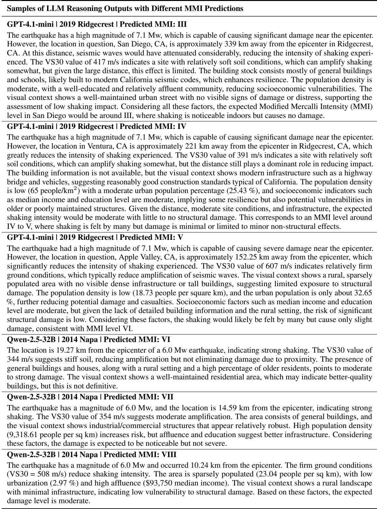  
Table 10: Samples of LLM outputs with predicted MMI reasoning for selected earthquake scenarios.