# Language Mixing in Reasoning Language Models: Patterns, Impact, and Internal Causes

Mingyang Wang1,2,3 Lukas Lange1 Heike Adel⁴

Yunpu Ma2,3 Jannik Strötgen⁵ Hinrich Schütze2,3 1Bosch Center for Artificial Intelligence, Renningen, Germany 2LMU Munich, Germany 3Munich Center for Machine Learning (MCML) 4Hochschule der Medien, Stuttgart, Germany 5Karlsruhe University of Applied Sciences, Germany mingyang@cis.lmu.de

## Abstract

Reasoning language models (RLMs) excel at complex tasks by leveraging a chain-of-thought process to generate structured intermediate steps. However, language mixing, i.e., reasoning steps containing tokens from languages other than the prompt, has been observed in their outputs and shown to affect performance, though its impact remains debated. We present the first systematic study of language mixing in RLMs, examining its patterns, impact, and internal causes across 15 languages, 7 task difficulty levels, and 18 subject areas, and show how all three factors influence language mixing. Moreover, we demonstrate that the choice of reasoning language significantly affects performance: forcing models to reason in Latin or Han scripts via constrained decoding notably improves accuracy. Finally, we show that the script composition of reasoning traces closely aligns with that of the model's internal representations, indicating that language mixing reflects latent processing preferences in RLMs. Our findings provide actionable insights for optimizing multilingual reasoning and open new directions for controlling reasoning languages to build more interpretable and adaptable RLMs.¹

## 1 Introduction

Reasoning language model (RLMs)2, such as Open-AI's o1 and o3 (Jaech et al., 2024; OpenAI, 2025), and the DeepSeek-R1 series (Guo et al., 2025), have demonstrated impressive capabilities in solving complex tasks through structured chain-ofthought reasoning. These models generate intermediate reasoning steps before answering the input prompt. This not only improves task performance, but also enhances the transparency and interpretability of their decision-making processes.

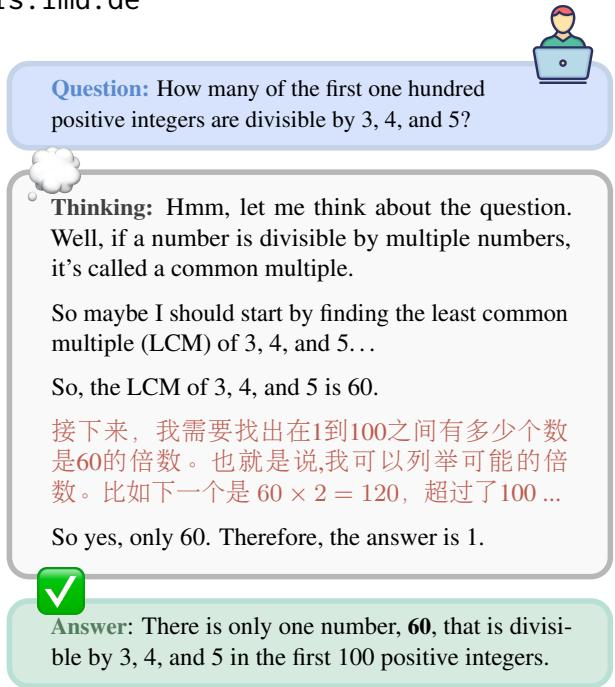  
Figure 1: An illustrative example of language mixing in reasoning where the reasoning model switches from English to Chinese mid-reasoning, then back to English.3

However, the phenomenon of language mixing has emerged: when prompted in one language, RLMs have been observed to produce reasoning steps that include a mixture of languages (QwenTeam, 2024; Guo et al., 2025), as illustrated in Figure 1. This phenomenon has been shown to affect reasoning performance, though prior work offers conflicting views on whether its impact is beneficial or detrimental (Guo et al., 2025; Xie et al., 2025). Moreover, it may hinder the readability and usability of outputs in multilingual contexts.

To shed light on the phenomenon of language mixing in state-of-the-art RLMs, we present a systematic investigation aimed at answering three key questions: (1) When does language mixing happen and what factors influence its occurrence and degree?

(2) Is language mixing an issue and what impact does it have on the model's reasoning performance? (3) Why does language mixing happen and how is it related to the model's internal thinking process?

First, we analyze occurrence patterns of language mixing across 15 input languages, 7 task difficulty levels, and 18 subject areas. We observe that language mixing is most prevalent when the input language is neither English nor Chinese, suggesting that English, and to a lesser extent, Chinese, serve as internal pivot languages during reasoning. Moreover, we find that the degree of language mixing, measured by the entropy of language distribution in reasoning traces, increases with task difficulty across models and languages. Furthermore, subject-wise analysis on the multilingual MMLU dataset (Hendrycks et al., 2020) reveals that language mixing entropy is significantly higher in STEM subjects compared to other domains.

Second, although language mixing has been observed in prior works, its impact on model performance remains unclear and is under debate (Qwen-Team, 2024; Guo et al., 2025; Xie et al., 2025). While switching languages mid-reasoning may reduce readability, it may be undesirable to suppress it entirely if such mixing enhances the model's reasoning ability. To assess its impact, we introduce a script control method that constrains models to reason in specific script(s) via constrained decoding. We find that constraining reasoning to Latin or Han (Chinese) scripts significantly improves reasoning performance, by up to 110% in some cases, indicating that the choice of reasoning script or language has a substantial impact on model performance.

Finally, to understand the underlying cause of language mixing, we analyze the internal processing of RLMs using mechanistic interpretability. Applying Logit Lens (Nostalgebraist, 2022) at the script level, we find that the script composition of hidden representations closely mirrors that of reasoning traces, revealing that language mixing reflects the model's latent processing preferences, particularly a consistent bias towards Latin.

In summary, we present the first systematic analysis of language mixing in RLMs, analyzing its occurrence patterns, performance impact, and internal causes. Our analysis offers practical guidance for improving multilingual reasoning and opens up new opportunities to control and adapt the reasoning language, supporting the development of more robust, interpretable, and user-aligned RLMs.

## 2 Related Work

Reasoning Language Models. Reasoning language models, such as OpenAI's o1/o3 (Jaech et al., 2024; OpenAI, 2025) and the DeepSeek-R1 series (Guo et al., 2025), have demonstrated strong capabilities on complex tasks by generating structured intermediate steps (Chen et al., 2025). While prior work has largely focused on improving reasoning quality via prompting or training, little attention has been paid to RLM behavior in multilingual settings. One underexplored aspect is language mixing, where the language used in reasoning steps differs from that of the input prompt. DeepSeek-R1 introduces a language consistency reward to reduce such mixing (Guo et al., 2025), but reports a drop in performance, suggesting potential benefits of language mixing. In contrast, Xie et al. (2025) show that responses without language mixing yield higher accuracy in logical reasoning tasks.

Given these contradictory findings, our work aims at a first systematic study of language mixing in RLMs, analyzing its patterns, performance impact, and internal causes in multilingual contexts.

Inner Workings of Multilingual LLMs. A growing body of work has explored how multilingual models internally represent and process information across languages. Works by Wendler et al. (2024), Dumas et al. (2024), Wang et al. (2025), and Liu et al. (2025) reveal that models like Llama tend to rely on English representations internally, even when operating in other languages, highlighting a strong bias toward high-resource languages. While these works focus on internal activations using translation or knowledge probing tasks, our analysis links internal processing to external reasoning traces, showing that language mixing aligns with the model's latent language preferences during reasoning.

Code-Switching in Language Models. Codeswitching, the natural alternation between languages within text, has been widely studied in NLP tasks like sentiment analysis, machine translation, and summarization (Doğruöz et al., 2021).

Prior work shows that current language models still struggle to understand and generate codeswitched text, particularly in low-resource settings (Khanuja et al., 2020; Winata et al., 2023; Yong et al., 2023; Zhang et al., 2023; Li et al., 2024a,b).

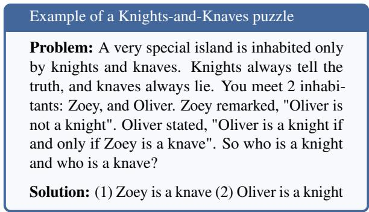  
Figure 2: An illustrative example from the K&K dataset.

Recent studies have highlighted unnatural language confusion in multilingual models as another type of code-switching (Marchisio et al., 2024; Nie et al., 2025), such as source-language hallucination or off-target translation, especially in English-centric models under zero-shot conditions.

In this work, we investigate language mixing, a code-switching-like behavior that arises during intermediate reasoning steps in RLMs. We examine its occurrence patterns across languages, difficulty levels, and subject domains, assess its impact on performance, and link it to models’ internal representations, offering new insights into the reasoning behavior of RLMs.

## 3 Experimental Setup

Models. We evaluate a broad range of reasoning language models, including DeepSeek-R1 (Guo et al., 2025) and its distilled variants, DeepSeek-R1-Distil1-Qwen-{1.5B, 7B, 14B, 32B} and DeepSeek-R1-Distil1-Llama-{8B, 70B}. We also include QwQ-32B (QwenTeam, 2025b), Qwen3-{4B, 30B-A3B, 32B} (Qwen-Team, 2025a), and Gemini 2.0 Flash Thinking (Google, 2025) models to broaden coverage. For comparing language mixing between RLMs and their backbones, we include Qwen2.5-{14B, 32B} and Llama3.3-70B-Instruct, to compare DeepSeek-R1-Distil1-Qwen-{14B,32B} and DeepSeek-R1-Disti11-Llama-70B with their distillation backbones. Table 5 in Appendix A.1.1 summarizes all models used in our evaluation. We follow the official hyperparameter settings for each model (see Table 6 in Appendix A.1.1). Some reasoning models occasionally exhibit endless reasoning — continue to generate reasoning steps without reaching a final answer.4 As this occurs only in specific cases for most models and does not reflect a consistent pattern, our analysis focuses on valid reasoning traces that conclude with a final answer.⁵

<table><tr><td>Supercategory</td><td>Subject</td></tr><tr><td>Humanities</td><td>HS World History, Moral Disputes, Philosophy, World Religions</td></tr><tr><td>Social Science</td><td>HS Macroeconomics, Sociology</td></tr><tr><td>STEM (Science, Technology, Engineering, Mathematics)</td><td>HS Computer Science, Col Com- puter Science, Elem Mathematics, HS Mathematics, Col Mathematics, HS Chemistry, Col Chemistry, HS Physics, Col Physics</td></tr><tr><td>Other</td><td>Global Facts, Management, Profes- sional Medicine</td></tr></table>

Table 1: Overview of the 18 subjects in m-MMLU included in our evaluation. Abbreviations: HS = High School, Col = College, Elem = Elementary.

Datasets. The Knights-and-Knaves (K&K) dataset (Xie et al., 2024) contains logical reasoning puzzles where each character is either a knight, who always tells the truth, or a knave, who always lies. The goal is to infer each character's identity based on their statements (see example in Figure 2). Difficulty is controlled by varying the number of characters (2–8). The original dataset is in English. To enable multilingual evaluation, we translate it into five additional languages: Arabic, French, Hindi, Japanese, and Chinese using gpt-4o-mini, resulting in six languages and seven difficulty levels.

To evaluate language mixing across broader domains, we also use the multilingual MMLU (m-MMLU) dataset (Hendrycks et al., 2020), a largescale benchmark of multiple-choice questions covering 15 languages and 57 subjects across Humanities, Social Sciences, STEM, and Other domains. We select 18 representative subjects for RLM evaluation, as summarized in Table 1.

Further details on the datasets, including the translation process and language coverage, are provided in Appendix A.1.2.

## 4 Language Mixing Patterns

## 4.1 Method

To investigate the occurrence patterns of language mixing in RLMs, we first collect the reasoning traces and final answers generated by each model for queries in the K&K and m-MMLU datasets.

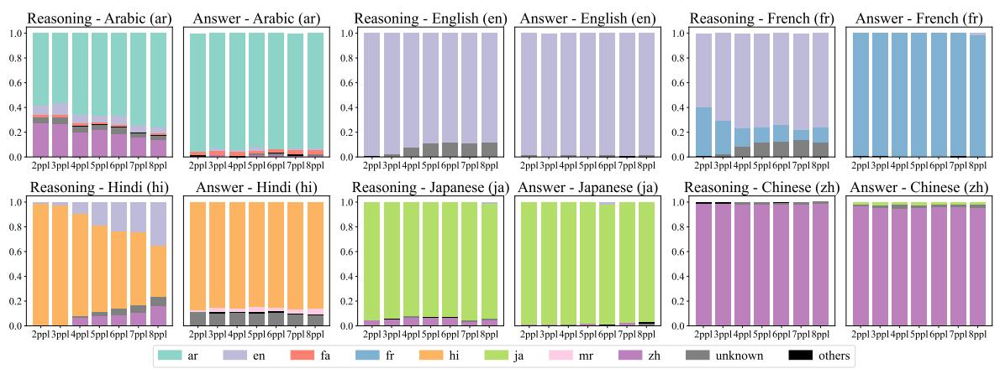  
Figure 3: Language composition across difficulty levels in the K&K dataset for DeepSeek-R1-Disti11-L1ama-70B.

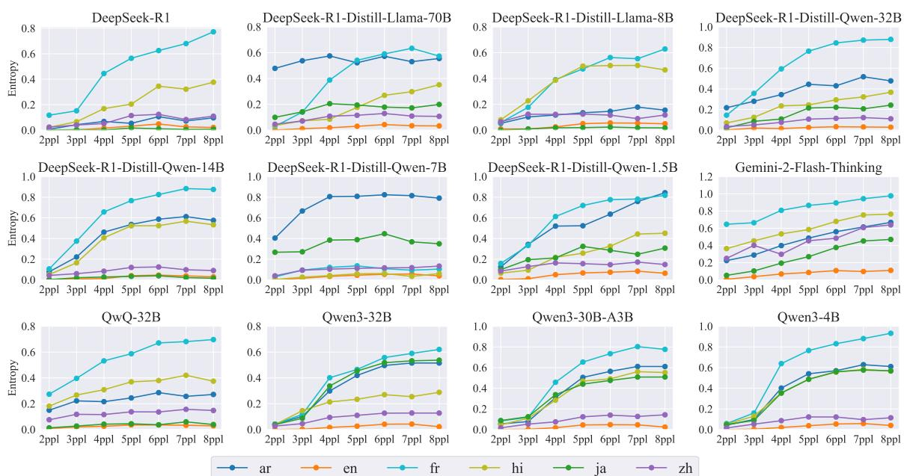  
Figure 4: Language mixing entropy across task difficulty levels for six input languages and twelve models. Entropy mostly increases with difficulty, indicating harder tasks generally induce more language mixing in reasoning.

Following Marchisio et al. (2024), we perform linelevel language detection by splitting each output on newline characters and identifying the language of each line using fastText (Joulin et al., 2017). This yields a per-line language distribution for each reasoning trace and answer.

We compute the language composition of each sample by aggregating the detected languages across lines. Averaging across all samples in a dataset yields an overall language usage distribution, e.g., $\{ ^ { \mathfrak { c } } \mathrm { e n } ^ { \mathfrak { n } ^ { \prime } } \colon 0 . 5 , ^ { \mathfrak { c } } \mathrm { f r } ^ { \mathfrak { n } ^ { \prime } } \colon 0 . 2 , ^ { \mathfrak { c } } \mathrm { z h } ^ { \mathfrak { n } ^ { \prime } } \colon 0 . 3 \}$ . To quantify the degree of language mixing, we calculate the entropy of the distribution, ([0.5, 0.2, 0.3] in the example), where higher entropy indicates a higher degree of language mixing, and lower entropy reflects greater language consistency.

## 4.2 Results

We analyze the language mixing patterns in RLMs across different input languages, task difficulty levels (in K&K), and subject areas (in m-MMLU). Our key observations are summarized below.

## Finding 1

Language mixing is most prevalent when the input is neither English nor Chinese.

Figure 3 shows the language usage composition in reasoning traces and final answers across input languages and difficulty levels in the K&K dataset for DeepSeek-R1-Distil1-Llama-70B. Results of other models and on the m-MMLU dataset are provided in Appendix A.2.1. We observe that when the input is English or Chinese, the reasoning remains mostly in the input language. In contrast, Arabic, French, Hindi, and Japanese yield more mixed-language reasoning, often incorporating English and/or Chinese in the intermediate steps. In some cases, the composition is even more complex. For instance, with Arabic prompts, R1-70B produces reasoning traces that mix Arabic, English, Persian, and Chinese (Figure 3), while R1-32B generates traces involving Arabic, English, Spanish, and Chinese (Figure 18).

<table><tr><td>m-MMLU Subject</td><td>R1-70B</td><td>R1-32B</td><td>R1-14B</td><td>R1-8B</td><td>R1-7B</td><td>Gemini</td><td>QwQ-32B</td><td>Q3-32B</td><td>Q3-30B-A3B</td><td>Q3-4B</td></tr><tr><td>Elementary Mathematics</td><td>0.11</td><td>0.09</td><td>0.08</td><td>0.12</td><td>0.12</td><td>0.51</td><td>0.09</td><td>0.04</td><td>0.08</td><td>0.09</td></tr><tr><td>High School Mathematics</td><td>0.32</td><td>0.31</td><td>0.28</td><td>0.31</td><td>0.32</td><td>0.74</td><td>0.34</td><td>0.27</td><td>0.32</td><td>0.31</td></tr><tr><td>College Mathematics</td><td>0.39</td><td>0.35</td><td>0.35</td><td>0.39</td><td>0.39</td><td>0.84</td><td>0.35</td><td>0.35</td><td>0.38</td><td>0.40 Y</td></tr><tr><td>High School Chemistry</td><td>0.20</td><td>0.17</td><td>0.18</td><td>0.22</td><td>0.21</td><td>0.55</td><td>0.20</td><td>0.11</td><td>0.17</td><td>0.19</td></tr><tr><td>College Chemistry</td><td>0.27</td><td>0.28 V</td><td>0.29</td><td>0.25</td><td>0.21</td><td>0.66</td><td>0.44</td><td>0.20</td><td>0.25</td><td>0.22</td></tr><tr><td>High School Physics</td><td>0.27</td><td>0.22</td><td>0.22</td><td>0.24</td><td>0.26</td><td>0.74</td><td>0.26</td><td>0.15</td><td>0.21</td><td>0.24</td></tr><tr><td>College Physics</td><td>0.32</td><td>0.27 V</td><td>0.28</td><td>0.26</td><td>0.30</td><td>0.84</td><td>0.33</td><td>0.20</td><td>0.27</td><td>0.28</td></tr><tr><td>High School Computer Science</td><td>0.15</td><td>0.14</td><td>0.14</td><td>0.17</td><td>0.19</td><td>0.47</td><td>0.14</td><td>0.10</td><td>0.15</td><td>0.15</td></tr><tr><td>College Computer Science</td><td>0.20</td><td>0.19</td><td>0.22</td><td>0.22</td><td>0.23</td><td>0.54</td><td>0.21</td><td>0.13</td><td>0.19</td><td>0.19</td></tr></table>

Table 2: Language mixing entropy across STEM subjects in m-MMLU for various reasoning models. Arrows indicate increasing entropy trends with subject difficulty (Elementary → High school → College) in mathematics, chemistry, physics, and computer science subjects.  
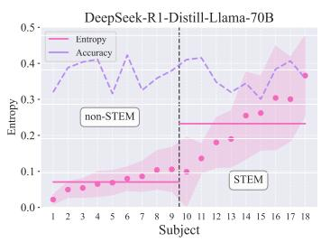

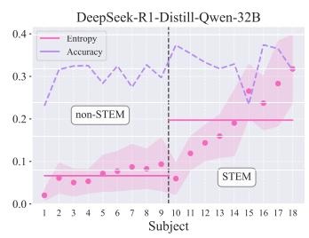

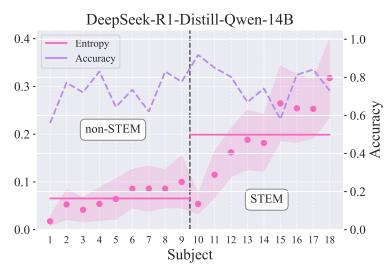  
Figure 5: Language mixing entropy (pink) and task accuracy (purple) across 18 m-MMLU subjects for various reasoning models. Language mixing is notably more pronounced in STEM subjects.

## Finding 2

RLMs mix languages during reasoning, yet tend to generate answers in the input language.

While reasoning traces exhibit language mixing, the final answers remain more aligned with the input language. This indicates that language mixing occurs primarily in the intermediate reasoning phase, not in the final output. This behavior is unsurprising, as reasoning models are generally trained with supervision or reward signals focused on the final answer, encouraging alignment with the input language, while leaving the reasoning steps unconstrained. As a result, models are free to mix languages during reasoning if it helps them reach a correct answer more effectively.

## Finding 3

The degree of language mixing increases with task difficulty.

As shown in Figure 4, language mixing entropy in reasoning traces rises with task difficulty across languages and models. This trend is also evident in the m-MMLU dataset, which includes subjects with varying difficulty levels, e.g., mathematics at the elementary, high school, and college levels. As shown in Table 2, the average entropy7 consistently increases with subject difficulty across models, further confirming that task difficulty is an important trigger of language mixing behavior in RLMs.

## Finding 4

Language mixing is more pronounced in STEM subjects.

Figure 5 shows language mixing entropy across 18 m-MMLU subjects8 for R1-70B, R1-32B and R1-14B. Entropy values are averaged across all evaluated languages. Additional results for other models and per-language breakdowns are shown in Figure 9 and Figure 10 in Appendix A.2.1. STEM subjects, starting from tick mark 10 in the figure, consistently exhibit higher entropy than Humanities, Social Sciences, or Other domains, suggesting that technical content tends to induce more language mixing during reasoning. While entropy still increases with task difficulty within individual STEM domains (Table 2), the overall entropy gap between STEM and non-STEM subjects appears more related to subject type, as they exhibit no clear difference in difficulty based on accuracy (the purple curve in Figure 5).

<table><tr><td></td><td>ar</td><td>en</td><td>fr</td><td>hi</td><td>ja</td><td>zh</td><td>AVG</td></tr><tr><td>Rl</td><td>0.06</td><td>0.02</td><td>0.48</td><td>0.22</td><td>0.01</td><td>0.08</td><td>0.15</td></tr><tr><td>Qwen2.5-14B</td><td>0.07</td><td>0.01</td><td>0.32</td><td>0.05</td><td>0.04</td><td>0.10</td><td>0.10</td></tr><tr><td>R1-14B</td><td>0.06</td><td>0.00</td><td>0.59</td><td>0.32</td><td>0.01</td><td>0.11</td><td>0.18</td></tr><tr><td>Qwen2.5-32B</td><td>0.25</td><td>0.01</td><td>0.25</td><td>0.14</td><td>0.12</td><td>0.26</td><td>0.17</td></tr><tr><td>R1-32B</td><td>0.39</td><td>0.02</td><td>0.64</td><td>0.24</td><td>0.16</td><td>0.09</td><td>0.26</td></tr><tr><td>Llama3.3-70B</td><td>0.08</td><td>0.00</td><td>0.12</td><td>0.14</td><td>0.00</td><td>0.07</td><td>0.07</td></tr><tr><td>R1-70B</td><td>0.51</td><td>0.01</td><td>0.43</td><td>0.18</td><td>0.14</td><td>0.12</td><td>0.23</td></tr></table>

Table 3: Language mixing entropy for backbone models and their distilled variants on the K&K dataset. Distilled reasoning models (bottom row in each pair) exhibit higher entropy than their corresponding base models.

## Finding 5

## Distillation amplifies language mixing.

Table 3 compares the language mixing entropy for three DeepSeek backbone models and their corresponding distilled variants. Across all model pairs, the distilled versions consistently exhibit higher average entropy values, particularly when the input language is neither English nor Chinese. Although Guo et al. (2025) do not provide details on the language composition of the distillation data, the observed trend suggests that an English- and Chinese-heavy training distribution may lead the model to rely more on these high-resource language features during reasoning, thereby amplifying language mixing in multilingual settings.

## 5 Performance Impact of Reasoning Languages

## 5.1 Method: Script-controlled Generation

As discussed in Section 2, the impact of language mixing on RLM performance remains debated. To address this, we adopt a direct script control approach to evaluate how reasoning language influences model performance.

We constrain models to generate reasoning steps using only specific script(s) by masking the logits of all other scripts during decoding. While language-level control is difficult due to token overlap, script-level control offers a clean separation based on Unicode, as tokens from different scripts do not overlap. We apply this script control during the reasoning phase (though it could also be applied to the answer phase); the final answer is generated freely after the “</think>" token, as models typically default to the input language for answers (as shown in Section 4). For examples of model generation under different script control settings, see Figures 11 to 14 in Appendix A.2.2.

## 5.2 Results

We compare model performance across various reasoning modes: unconstrained, single-script, and multi-script control to directly measure the impact of script (and implicitly, language) choice on reasoning performance. Figure 6 shows results for six input languages from the K&K dataset: three written in non-Latin/Han scripts (Arabic, Hindi Japanese), two in Latin (English, French) and one in Han (Chinese), on three reasoning models: R1-70B, R1-32B, and R1-14B.9

## Finding 6

Non-Latin/Han-script languages benefit significantly from reasoning in Latin or Han scripts.

For Arabic, Hindi, and Japanese, forcing reasoning in Latin or Han scripts significantly improves performance. In Hindi, for example, switching to Latin yields gains ranging from 44% to 115%. In contrast, using the native script consistently results in the lowest accuracy, indicating that models struggle with scripts underrepresented in their training data. For multi-script control (see Table 10 and Table 11 in Appendix A.2.2), reasoning in both Latin and Han scripts does not outperform single-script control, and including the input script alongside Latin and/or Han leads to suboptimal results.

## Finding 7

Latin and Han-script languages favor their native script.

For English, French, and Chinese, reasoning in the native script yields performance comparable to the unconstrained setting. However, switching scripts (e.g., Han for English/French or Latin for Chinese) leads to notable performance drops, suggesting that mismatched scripts disrupt alignment with the model's internal reasoning patterns.

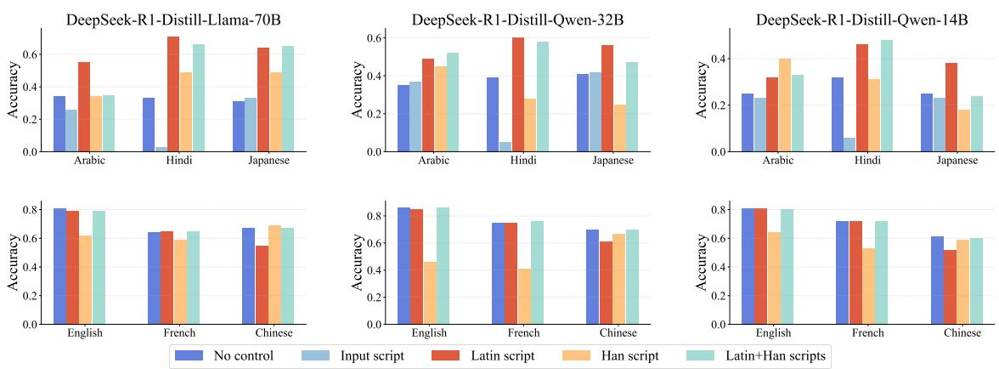  
Figure 6: Accuracy on the K&K dataset under script-controlled reasoning. Latin or Han script control boosts performance for Arabic, Hindi, and Japanese, while native scripts yield the best results for English, French, and Chinese, highlighting the impact of script choice on reasoning efficacy.

These results highlight a strong connection between script choice and reasoning performance. Models internally favor Latin and Han scripts, which benefits non-Latin/Han inputs when reasoning is constrained to those scripts. For Latin or Han-script languages, maintaining script consistency is optimal, while mismatches hurt the reasoning performance. This suggests that language mixing reflects the models' learned association between dominant scripts and reasoning competence.

## 6 Internal Causes of Language Mixing

## 6.1 Method: Logit Lens Analysis

Inspired by prior work on latent language dynamics in LLMs (Wendler et al., 2024; Wang et al., 2025), we use Logit Lens (Nostalgebraist, 2022) to examine the script composition of internal representations of RLMs and connect it to the scripts used in the models’ external reasoning output.

We use Logit Lens to project intermediate layer representations onto the vocabulary space and identify the script of the top-ranked token at each layer.10 By averaging predictions across all K&K samples, we obtain a layer-wise distribution of script usage. We then compare these internal patterns to the script usage in reasoning traces, tracking how both evolve with task difficulty. This allows us to directly link the model's external reasoning behavior with its internal processing dynamics.

To quantify this connection, we compute the Pearson correlation between script usage across difficulty levels in hidden layers and reasoning traces. Specifically: (1) for each difficulty level (ranging from 2 to 8 ppl), we calculate the proportion of tokens belonging to different scripts (e.g., Latin, Devanagari) in both the latent space (estimated with the Logit Lens) and the reasoning trace (measured via script-level detection); and (2) for each script, we compute the Pearson correlation coefficient between its percentage across difficulty levels in the latent space and its corresponding percentage in the reasoning trace. A more detailed description of the Pearson correlation calculation is provided in Appendix A.1.3.

## 6.2 Results

Figure 7 shows that the hidden layer script composition (i.e., the internal representation) for Hindi inputs at difficulty levels 2ppl, 5ppl, and 8ppl in R1-70B, is consistently dominated by the Latin script. Devanagari (Hindi's script) appears only in final layers. This aligns with prior findings that Llama models primarily "think" in English (i.e., Latin script) (Wendler et al., 2024; Wang et al., 2025).

## Finding 8

Language mixing reflects the internal processing patterns of RLMs, as reasoning traces mirror the model's preferred scripts.

As task difficulty increases, Latin usage rises while Devanagari decreases. The same trend appears in the reasoning traces (Figure 7d), suggesting a strong link between internal processing and external reasoning behavior. The Pearson correlations between script usage across difficulty levels in hidden layers and reasoning traces are reported in Table 4. We observe consistently high correlations for both Arabic and Hindi inputs in R1-70B, R1-32B and R1-14B models. These results provide evidence that language mixing in reasoning traces reflects internal processing patterns. In particular, the internal preference for the Latin script explains why RLMs tend to mix into Latin-script reasoning, especially when processing underrepresented scripts.

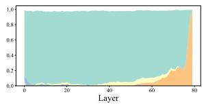  
(a) Hidden layer script composition (2ppl).

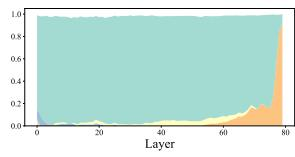

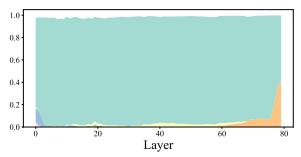  
(c) Hidden layer script composition (8ppl).

(b) Hidden layer script composition (5ppl).  
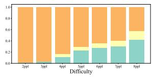  
(d) Reasoning trace script composition across difficulty levels.

<table><tr><td>Latin</td><td>Han</td><td>Cyrillic</td><td>Devanagari</td><td>Katakana</td></tr><tr><td></td><td></td><td></td><td></td><td></td></tr></table>

Figure 7: Script composition of internal representations and reasoning traces for Hindi inputs in R1-70B. (a–c) show hidden layer script distributions via Logit Lens across three difficulty levels. (d) shows reasoning trace script composition mirroring internal trends: Latin usage increases and Devanagari decreases with difficulty.

<table><tr><td>Correlation</td><td>R1-70B</td><td>R1-32B</td><td>R1-14B</td></tr><tr><td>Arabic</td><td></td><td></td><td></td></tr><tr><td>Arabic script</td><td>0.7411</td><td>0.9960</td><td>0.8986</td></tr><tr><td>Latin script</td><td>0.7168</td><td>0.7751</td><td>0.7774</td></tr><tr><td>Hindi</td><td></td><td></td><td></td></tr><tr><td>Devanagari script</td><td>0.9019</td><td>0.9352</td><td>0.8840</td></tr><tr><td>Latin script</td><td>0.8875</td><td>0.9173</td><td>0.8969</td></tr></table>

Table 4: Pearson correlation between script usage in hidden layers and reasoning traces across task difficulty levels, showing strong alignment between internal representations and external reasoning outputs.

## 7 Discussion and Future Works

Is language mixing a solved problem in RLMs? Although Guo et al. (2025) attempt to mitigate language mixing by incorporating a language consistency reward during reinforcement learning, our evaluation reveals that language mixing persists in DeepSeek-R1, as shown, for instance, in Figure 4 and Figure 15. Regardless of whether language mixing should be removed (which we discuss in the following), our findings indicate that eliminating it with targeted optimization during training remains technically challenging.

Should language mixing be eliminated? Our investigation into the impact of language mixing on reasoning performance (Section 5) shows that constraining reasoning to high-resource language scripts, such as Latin or Han, significantly improves performance on under-resourced language inputs like Arabic, Hindi, and Japanese. This raises questions about whether language mixing is truly undesirable. Notably, Guo et al. (2025) also report that enforcing language consistency leads to performance degradation, suggesting that language mixing may serve as a functional adaptation that supports effective multilingual reasoning.

Reasoning language control. Our study shows that script control significantly boosts performance for under-resourced languages, highlighting the potential of reasoning language control in RLMs. Our findings in Section 5 and Section 6 point to two potential future directions: (1) developing finegrained language-level control through constrained decoding, extending beyond script-level masking, and (2) steering representations through representation engineering (Zou et al., 2023) or latent space reasoning methods (Hao et al., 2024) to align the model's latent processing with the desired reasoning language. These approaches may offer more flexible control over language mixing and enable more controllable and performant RLMs.

Impact of distillation on language mixing. Table 3 shows that DeepSeek-R1 distilled models consistently exhibit higher language mixing entropy than their original backbones, suggesting distillation amplifies language mixing when the input language is neither English nor Chinese. This highlights the need to better understand how distillation affects language mixing (Yong et al., 2025), which is a promising future work direction. Moreover, multilingual distillation strategies may help reduce unnecessary mixing while preserving or improving performance.

Adaptive reasoning language selection. Our results show that switching to high-resource languages during reasoning can substantially improve model performance on under-resourced inputs. This suggests a promising direction for future work: training RLMs to adaptively determine which language to use at different stages of reasoning, rather than relying on static language constraints. Such adaptive control could allow the model to dynamically leverage the strengths of high-resource languages while still accommodating the input language, ultimately realizing more robust multilingual reasoning. This idea is aligned with recent advances in adaptive memory usage for reasoning (Yan et al., 2025), which highlight the benefits of enabling models to flexibly select internal strategies based on task demands.

## 8 Conclusions

In this work, we presented the first systematic investigation of language mixing in reasoning language models, analyzing its occurrence patterns, performance impact, and internal causes. Our findings reveal that language mixing is most likely to occur when the input is neither English nor Chinese, and becomes more pronounced with higher task difficulty and in STEM subjects. We further demonstrated that constraining reasoning to Latin or Han scripts significantly improves performance for non-Latin/Han inputs. Finally, our interpretability analysis shows that the language composition of reasoning traces mirrors that of the models’ internal representations, suggesting language mixing reflects underlying processing preferences. These insights offer a deeper understanding of multilingual reasoning behavior and provide guidance for developing more controllable and interpretable RLMs.

## Limitations

While our analysis provides a broad view of language mixing in reasoning language models, it has several limitations.

First, we use script-level control to examine the impact of reasoning language. This approach, while effective, remains relatively coarse. More fine-grained methods, such as language-level constrained decoding, could enable more precise control and allow detailed comparisons of the performance across different reasoning languages given a specific input language.

Second, while we analyze the internal causes of language mixing through mechanistic interpretability, we do not trace its origins in the training process. Future work could investigate the role of training data composition (including pretraining, reinforcement learning, and distillation) and optimization objectives to better understand the roots of this phenomenon.

Third, our study covers 15 languages, but many other languages—particularly those with low resources or unique scripts—remain unexamined. Extending the analysis to a broader set of languages would help validate the generality of our findings.

Lastly, we do not include DeepSeek-R1-Zero (Guo et al., 2025) in our evaluation due to resource constraints. As a key variant of reasoning language models with a different training setup, comparing it with DeepSeek-R1 could offer further insight into the effect of reinforcement learning training on language mixing.

## Acknowledgments

This work was partially supported by Deutsche Forschungsgemeinschaft (project SCHU 2246/14- 1) and the EU Project SMARTY (GA 101140087). We thank JUREAP 73 for supporting this work with computing resources. We also thank Sebastian Gerstner, Ahmad Dawar Hakimi, Lea Hirlimann, Valentin Knappich, Felicia Körner, Yihong Liu, Ali Modarressi, Philipp Mondorf, Timo Pierre Schrader, Leonor Veloso, Wei Zhou, Yuqicheng Zhu for their valuable discussions.

## References

Qiguang Chen, Libo Qin, Jinhao Liu, Dengyun Peng, Jiannan Guan, Peng Wang, Mengkang Hu, Yuhang Zhou, Te Gao, and Wanxiang Che. 2025. Towards reasoning era: A survey of long chain-of-thought for reasoning large language models. arXiv preprint arXiv:2503.09567.

Alejandro Cuadron, Dacheng Li, Wenjie Ma, Xingyao Wang, Yichuan Wang, Siyuan Zhuang, Shu Liu, Luis Gaspar Schroeder, Tian Xia, Huanzhi Mao, and 1 others. 2025. The danger of overthinking: Examining the reasoning-action dilemma in agentic tasks. arXiv preprint arXiv:2502.08235.

A. Seza Doğruöz, Sunayana Sitaram, Barbara E. Bullock, and Almeida Jacqueline Toribio. 2021. A survey of code-switching: Linguistic and social perspectives for language technologies. In Proceedings

of the 59th Annual Meeting of the Association for Computational Linguistics and the 11th International Joint Conference on Natural Language Processing (Volume 1: Long Papers), pages 1654–1666, Online. Association for Computational Linguistics.

Clément Dumas, Veniamin Veselovsky, Giovanni Monea, Robert West, and Chris Wendler. 2024. How do llamas process multilingual text? a latent exploration through activation patching. In ICML 2024 Workshop on Mechanistic Interpretability.

Google. 2025. Gemini 2.0 flash thinking.

Daya Guo, Dejian Yang, Haowei Zhang, Junxiao Song, Ruoyu Zhang, Runxin Xu, Qihao Zhu, Shirong Ma, Peiyi Wang, Xiao Bi, and 1 others. 2025. Deepseek-r1: Incentivizing reasoning capability in 1lms via reinforcement learning. arXiv preprint arXiv:2501.12948.

Shibo Hao, Sainbayar Sukhbaatar, DiJia Su, Xian Li, Zhiting Hu, Jason Weston, and Yuandong Tian. 2024. Training large language models to reason in a continuous latent space. arXiv preprint arXiv:2412.06769.

Dan Hendrycks, Collin Burns, Steven Basart, Andy Zou, Mantas Mazeika, Dawn Song, and Jacob Steinhardt. 2020. Measuring massive multitask language understanding. arXiv preprint arXiv:2009.03300.

Aaron Jaech, Adam Kalai, Adam Lerer, Adam Richardson, Ahmed El-Kishky, Aiden Low, Alec Helyar, Aleksander Madry, Alex Beutel, Alex Carney, and 1 others. 2024. Openai o1 system card. arXiv preprint arXiv:2412.16720.

Armand Joulin, Edouard Grave, Piotr Bojanowski, and Tomas Mikolov. 2017. Bag of tricks for efficient text classification. In Proceedings of the 15th Conference of the European Chapter of the Association for Computational Linguistics: Volume 2, Short Papers, pages 427–431, Valencia, Spain. Association for Computational Linguistics.

Simran Khanuja, Sandipan Dandapat, Anirudh Srinivasan, Sunayana Sitaram, and Monojit Choudhury. 2020. GLUECoS: An evaluation benchmark for code-switched NLP. In Proceedings of the 58th Annual Meeting of the Association for Computational Linguistics, pages 3575–3585, Online. Association for Computational Linguistics.

Bin Li, Bin Sun, Shutao Li, Encheng Chen, Hongru Liu, Yixuan Weng, Yongping Bai, and Meiling Hu. 2024a. Distinct but correct: generating diversified and entity-revised medical response. Science China Information Sciences, 67(3):132106.

Bin Li, Yixuan Weng, Fei Xia, and Hanjun Deng. 2024b. Towards better chinese-centric neural machine translation for low-resource languages. Computer Speech & Language, 84:101566.

Yihong Liu, Mingyang Wang, Amir Hossein Kargaran, Felicia Körner, Ercong Nie, Barbara Plank, François Yvon, and Hinrich Schütze. 2025. Tracing multilingual factual knowledge acquisition in pretraining. arXiv preprint arXiv:2505.14824.

Kelly Marchisio, Wei-Yin Ko, Alexandre Berard, Théo Dehaze, and Sebastian Ruder. 2024. Understanding and mitigating language confusion in LLMs. In Proceedings of the 2024 Conference on Empirical Methods in Natural Language Processing, pages 6653– 6677, Miami, Florida, USA. Association for Computational Linguistics.

Ercong Nie, Helmut Schmid, and Hinrich Schütze. 2025. Mechanistic understanding and mitigation of language confusion in english-centric large language models. arXiv preprint arXiv:2505.16538.

Nostalgebraist. 2022. Interpreting gpt: The logit lens.

OpenAI. 2025. Openai o3 and o4-mini system card.

QwenTeam. 2024. Qwq: Reflect deeply on the boundaries of the unknown.

QwenTeam. 2025a. Qwen3: Think deeper, act faster.

QwenTeam. 2025b. Qwq-32b: Embracing the power of reinforcement learning.

Mingyang Wang, Heike Adel, Lukas Lange, Yihong Liu, Ercong Nie, Jannik Strötgen, and Hinrich Schuetze. 2025. Lost in multilinguality: Dissecting crosslingual factual inconsistency in transformer language models. In Proceedings of the 63rd Annual Meeting of the Association for Computational Linguistics (Volume 1: Long Papers), pages 5075–5094, Vienna, Austria. Association for Computational Linguistics.

Chris Wendler, Veniamin Veselovsky, Giovanni Monea, and Robert West. 2024. Do llamas work in English? on the latent language of multilingual transformers. In Proceedings of the 62nd Annual Meeting of the Association for Computational Linguistics (Volume 1: Long Papers), pages 15366–15394, Bangkok, Thailand. Association for Computational Linguistics.

Genta Winata, Alham Fikri Aji, Zheng Xin Yong, and Thamar Solorio. 2023. The decades progress on code-switching research in NLP: A systematic survey on trends and challenges. In Findings of the Association for Computational Linguistics: ACL 2023, pages 2936–2978, Toronto, Canada. Association for Computational Linguistics.

Chulin Xie, Yangsibo Huang, Chiyuan Zhang, Da Yu, Xinyun Chen, Bill Yuchen Lin, Bo Li, Badih Ghazi, and Ravi Kumar. 2024. On memorization of large language models in logical reasoning. arXiv preprint arXiv:2410.23123.

Tian Xie, Zitian Gao, Qingnan Ren, Haoming Luo, Yuqian Hong, Bryan Dai, Joey Zhou, Kai Qiu, Zhirong Wu, and Chong Luo. 2025. Logic-rl: Unleashing llm reasoning with rule-based reinforcement learning. Preprint, arXiv:2502.14768.

Fengli Xu, Qianyue Hao, Zefang Zong, Jingwei Wang, Yunke Zhang, Jingyi Wang, Xiaochong Lan, Jiahui Gong, Tianjian Ouyang, Fanjin Meng, and 1 others. 2025. Towards large reasoning models: A survey of reinforced reasoning with large language models. arXiv preprint arXiv:2501.09686.

Sikuan Yan, Xiufeng Yang, Zuchao Huang, Ercong Nie, Zifeng Ding, Zonggen Li, Xiaowen Ma, Hinrich Schütze, Volker Tresp, and Yunpu Ma. 2025. Memory-r1: Enhancing large language model agents to manage and utilize memories via reinforcement learning. arXiv preprint arXiv:2508.19828.

Zheng-Xin Yong, M Farid Adilazuarda, Jonibek Mansurov, Ruochen Zhang, Niklas Muennighoff, Carsten Eickhoff, Genta Indra Winata, Julia Kreutzer, Stephen H Bach, and Alham Fikri Aji. 2025. Crosslingual reasoning through test-time scaling. arXiv preprint arXiv:2505.05408.

Zheng Xin Yong, Ruochen Zhang, Jessica Forde, Skyler Wang, Arjun Subramonian, Holy Lovenia, Samuel Cahyawijaya, Genta Winata, Lintang Sutawika, Jan Christian Blaise Cruz, Yin Lin Tan, Long Phan, Long Phan, Rowena Garcia, Thamar Solorio, and Alham Fikri Aji. 2023. Prompting multilingual large language models to generate code-mixed texts: The case of south East Asian languages. In Proceedings of the 6th Workshop on Computational Approaches to Linguistic Code-Switching, pages 43–63, Singapore. Association for Computational Linguistics.

Ruochen Zhang, Samuel Cahyawijaya, Jan Christian Blaise Cruz, Genta Winata, and Alham Fikri Aji. 2023. Multilingual large language models are not (yet) code-switchers. In Proceedings of the 2023 Conference on Empirical Methods in Natural Language Processing, pages 12567–12582, Singapore. Association for Computational Linguistics.

Andy Zou, Long Phan, Sarah Chen, James Campbell, Phillip Guo, Richard Ren, Alexander Pan, Xuwang Yin, Mantas Mazeika, Ann-Kathrin Dombrowski, and 1 others. 2023. Representation engineering: A top-down approach to ai transparency. arXiv preprint arXiv:2310.01405.

## A Appendix

## A.1 Experimental Setup Details

## A.1.1 Models

Model Lists. As introduced in Section 3, we evaluate a diverse set of reasoning language models (RLMs) across developers. Table 5 lists their full names, backbone models, and reference names used throughout this paper.

Hyperparameters. For reproducibility and consistency, we report the decoding hyperparameters used across all models evaluated in our experiments in Table 6.

## A.1.2 Datasets

Knights-and-Knaves dataset translation. As introduced in Section 3, the Knights and Knaves (K&K) dataset consists of algorithmically generated reasoning puzzles, with difficulty controlled by varying the number of characters (2–8) and the complexity of logical operations. In these puzzles, as illustrated in Figure 2, each character is either a knight, who always tells the truth, or a knave, who always lies. The objective is to determine each character's identity based on their statements. All puzzles are constructed using formal logic rules, ensuring a unique, verifiable solution, which makes the dataset well-suited for analyzing the impact of task difficulty on reasoning in language models.

To extend the dataset beyond English, we translate it into five additional languages, Arabic (ar), French (fr), Hindi (hi), Japanese (ja), and Chinese (zh), covering diverse scripts and linguistic families. To ensure consistent translations of identity terms (e.g., “knight", “knave") and character names (e.g., Zoey, Oliver), we construct a fixed translation map of these identity and character names from English to each target language. We then use gpt-4o-mini to translate the puzzles and solutions while enforcing consistency with this map. The translation prompt is shown in Figure 8.

Further details of m-MMLU The m-MMLU dataset covers 15 languages across diverse linguistic and geographic regions as shown in Table 7. This broad coverage allows for a comprehensive assessment of multilingual reasoning abilities across a wide spectrum of languages. We follow the prompts and the evaluation framework used in simple-evals library.11

<table><tr><td>Developer</td><td>Model Name</td><td>Backbone Model</td><td>Ref. Name</td></tr><tr><td rowspan="6">DeepSeek</td><td>DeepSeek-R1-Distill-Qwen-1.5B</td><td>Qwen2.5-Math-1.5B</td><td>R1-1.5B</td></tr><tr><td>DeepSeek-R1-Distill-Qwen-7B</td><td>Qwen2.5-Math-7B</td><td>R1-7B</td></tr><tr><td>DeepSeek-R1-Distill-Llama-8B</td><td>Llama-3.1-8B</td><td>R1-8B</td></tr><tr><td>DeepSeek-R1-Distill-Qwen-14B</td><td>Qwen2.5-14B</td><td>R1-14B</td></tr><tr><td>DeepSeek-R1-Distill-Qwen-32B</td><td>Qwen2.5-32B</td><td>R1-32B</td></tr><tr><td>DeepSeek-R1-Distill-Llama-70B</td><td>Llama-3.3-70B-Instruct</td><td>R1-70B</td></tr><tr><td rowspan="2">Google</td><td>DeepSeek-R1</td><td>DeepSeek-V3-Base</td><td>R1</td></tr><tr><td>gemini-2.0-flash-thinking-exp-01-21</td><td></td><td>Gemini / Gemini 2.0 Flash Thinking</td></tr><tr><td rowspan="4">Qwen</td><td>QwQ-32B</td><td>Qwen2.5-32B-Instruct</td><td>QwQ</td></tr><tr><td>Qwen3-4B</td><td>Qwen3-4B-Base</td><td>Q3-4B / Qwen3-4B</td></tr><tr><td>Qwen3-30B-A3B</td><td>Qwen3-30B-A3B-Base</td><td>Q3-30B-A3B / Qwen3-30B-A3B</td></tr><tr><td>Qwen3-32B</td><td>Qwen3-32B-Base</td><td>Q3-32B / Qwen3-32B</td></tr></table>

Table 5: Summary of reasoning models evaluated in this work, including their backbone models and the reference names used in the paper.
<table><tr><td>Model</td><td>Hyperparameters</td></tr><tr><td>DeepSeek R1 series</td><td>Temperature=0.6, TopP=0.95</td></tr><tr><td>gemini-2.0-flash-thinking</td><td> $\mathrm { T e m p e r a t u r e } = 0 . 7 , \mathrm { \hat { T o p P } = 0 . 9 5 , T o p K } = 6 4$ </td></tr><tr><td>QwQ-32B</td><td>Temperature=0.6, TopP=0.95</td></tr><tr><td>Qwen3 series</td><td>Temperature=0.6, TopP=0.95, TopK=20</td></tr></table>

Table 6: Hyperparameters used for different reasoning models in our evaluation. Settings follow the recommended configurations provided by model developers on HuggingFace to ensure fair comparison.

<table><tr><td>Dataset</td><td>Languages</td></tr><tr><td>K&amp;K</td><td>Arabic (ar), English (en), French (fr), Hindi (hi), Japenese (ja), Chinese (zh)</td></tr><tr><td>m-MMLU</td><td>Arabic (AR-XY), Bengali (BN-BD), German (DE-DE), Spanish (ES-LA), French (FR-FR), Hindi (HI-IN), Indone- sian (ID-ID), Italian (IT-IT), Japanese (JA-JP), Korean (KO-KR), Brazilian Portuguese (PT-BR), Swahili (SW-KE), Yoruba (YO-NG), Simplified Chinese (ZH-CN)</td></tr></table>

Table 7: Languages covered in the K&K and m-MMLU datasets.

## A.1.3 Pearson correlation calculation

To clarify how the Pearson correlation coefficients in Table 4 are calculated, we provide a detailed description of the procedure.

We take Figure 7 in the main text as an example (which shows the script composition of internal representations and reasoning traces for Hindi inputs in the R1-70B model). The Pearson correlation is computed as follows:

1. For each difficulty level (from 2 to 8 ppl), we collect the percentage of tokens belonging to different scripts, such as Latin and Devanagari. These percentages are measured in (1) the latent space, obtained via Logit Lens analysis of hidden layer activations; and (2) the reasoning trace, obtained through script-level detection of the generated text.

2. For each script, we then calculate the Pearson correlation coefficient between its sequence of percentages across difficulty levels in the latent space and the corresponding sequence in the reasoning trace. An illustrative example is provided in Table 9.

These Pearson correlations indicate how closely the model's internal script usage aligns with the script composition of the generated reasoning trace.

## A.2 Additional Experimental Results

## A.2.1 Language Mixing Patterns

m-MMLU complete results. Figure 9 presents language mixing entropy across m-MMLU subjects for additional reasoning models beyond those shown Figure 5. As in the main results, entropy is averaged across languages. The trend remains consistent: language mixing is markedly higher in STEM subjects (subjects 10–18), compared to non-STEM areas. This pattern reinforces our main finding that technical subjects tend to induce more language mixing during reasoning.

m-MMLU per-language results. Figure 10 presents the per-language breakdown of language mixing entropy across m-MMLU subjects, complementing the averaged results in Figure 5. The observed rise in entropy within STEM subjects (subjects 10–18) holds consistently across most languages, supporting the conclusion that STEM subjects tend to elicit more language mixing during reasoning. The specific subject order we use here is: global\_facts, world\_religions, sociology, high\_ school\_world\_history, moral\_disputes,professional\_medicine, philosophy, high\_school\_macroeconomics, management, elementary\_mathematics, high\_school\_computer\_science, high\_school\_chemistry, college\_computer\_science, high\_school\_ physics, college\_chemistry, college\_physics, high\_ school\_mathematics, college\_mathematics.

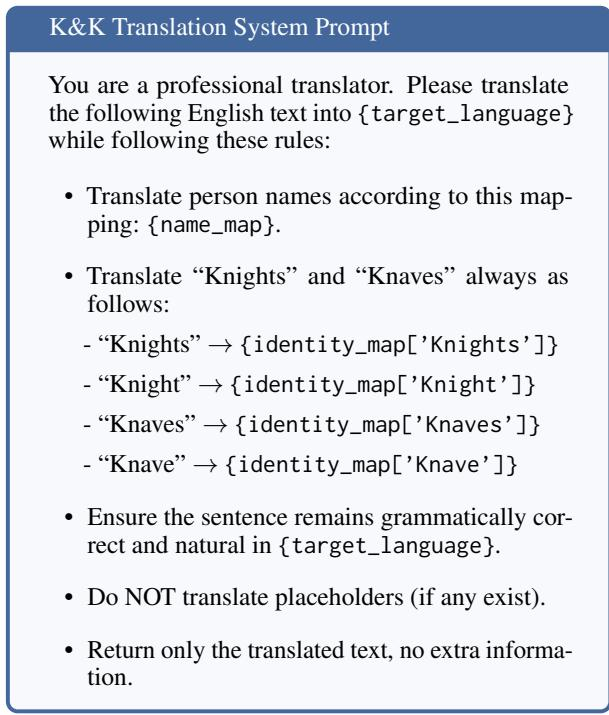  
Figure 8: System prompt used to translate K&K puzzles into target languages with consistent identity and person name mapping.

Language composition visualization. In Figures 15 to 26 and Figures 27 to 37, we visualize the language composition of reasoning traces and final answers across models on the K&K and m-MMLU datasets, respectively. These figures provide a detailed view of how different RLMs vary in their use of languages during the reasoning process across inputs. Missing bars in some plots correspond to rare failure cases where the model enters an endless reasoning loop and fails to produce a final answer. For more details on these invalid generations, see Appendix A.2.3.

<table><tr><td>Language</td><td>Abbreviation</td><td>Script</td></tr><tr><td colspan="3">Languages of investigation</td></tr><tr><td>Arabic</td><td>ar / AR-XY</td><td>Arabic</td></tr><tr><td>Bengali</td><td>BN-BD</td><td>Bangla</td></tr><tr><td>Chinese</td><td>zh / ZH-CN</td><td>Han</td></tr><tr><td>English</td><td>en / EN-US</td><td>Latin</td></tr><tr><td>French</td><td>fr</td><td>Latin</td></tr><tr><td>German</td><td>DE-DE</td><td>Latin</td></tr><tr><td>Hindi</td><td>hi / HI-IN</td><td>Devanagari</td></tr><tr><td>Indonesian</td><td>ID-ID</td><td>Latin</td></tr><tr><td>Italian</td><td>IT-IT</td><td>Latin</td></tr><tr><td>Japanese</td><td>ja / JA-JP</td><td>Han, Hiragana, Katakana</td></tr><tr><td>Korean</td><td>KO-KR</td><td>Hangul</td></tr><tr><td>Portuguese</td><td>PT-BR</td><td>Latin</td></tr><tr><td>Spanish</td><td>ES-LA</td><td>Latin</td></tr><tr><td>Swahili</td><td>SW-KE</td><td>Latin</td></tr><tr><td>Yoruba</td><td>YO-NG</td><td>Latin</td></tr><tr><td colspan="3">Languages emerge in the reasoning trace</td></tr><tr><td>Persian</td><td>fa</td><td>Perso-Arabic</td></tr><tr><td>Marathi</td><td>mr</td><td>Devanagari</td></tr><tr><td>Russian</td><td>ru</td><td>Cyrillic</td></tr></table>

Table 8: Languages examined in our study, with their abbreviations and writing scripts. We distinguish between the languages of investigation, which serve as evaluation inputs covered by the K & K and/or m-MMLU datasets, and the languages that emerge in the reasoning trace, which appear spontaneously during the model's reasoning process.

## A.2.2 Script-Controlled Generation

Script control complete results. Tables 10 and 11 present the detailed performance results of three DeepSeek-R1 models (R1-70B, R1-32B, and R1-14B) across various script control strategies for languages from the K&K dataset. We compare model accuracy under three settings: no control (default decoding), single-script control (forcing reasoning in one script), and multi-script control (allowing reasoning in a combination of scripts). The languages are grouped into two sets based on their writing scripts: Arabic, Hindi, and Japanese use non-Latin/Han scripts; English, French, and Chinese use Latin or Han scripts. As shown, non-Latin/Han languages benefit substantially from being forced to reason in Latin or Han scripts, whereas native-script reasoning is optimal for Latin and Han-script languages. These findings highlight the importance of aligning reasoning scripts with the model's internal preferences for achieving optimal multilingual reasoning performance.

<table><tr><td>Difficulty</td><td>Latin - latent (%)</td><td>Latin – reasoning (%)</td><td>Devanagari – latent (%)</td><td>Devanagari – reasoning (%)</td></tr><tr><td>2 ppl</td><td>77.01</td><td>0.76</td><td>17.82</td><td>99.19</td></tr><tr><td>3 ppl</td><td>77.00</td><td>4.22</td><td>18.34</td><td>95.75</td></tr><tr><td>4 ppl</td><td>78.54</td><td>15.05</td><td>16.96</td><td>78.11</td></tr><tr><td>5 ppl</td><td>80.93</td><td>31.68</td><td>15.11</td><td>61.90</td></tr><tr><td>6 ppl</td><td>84.78</td><td>48.02</td><td>12.18</td><td>48.02</td></tr><tr><td>7 ppl</td><td>91.46</td><td>44.71</td><td>6.60</td><td>44.33</td></tr><tr><td>8 ppl</td><td>91.79</td><td>63.26</td><td>6.40</td><td>21.54</td></tr></table>

Table 9: Example of script composition across difficulty levels for Hindi inputs in the R1-70B model. Percentages of tokens in the latent space (via Logit Lens) and reasoning trace (via script-level detection) are shown for Latin and Devanagari scripts. These values form the basis for computing Pearson correlations reported in the main text.

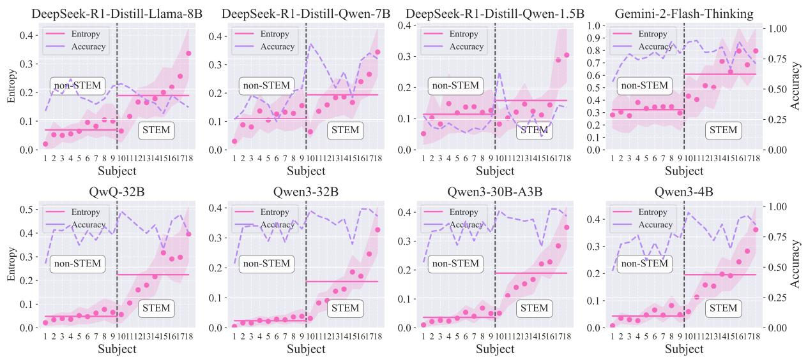  
Figure 9: Language mixing entropy (pink) and task accuracy (blue) across 18 m-MMLU subjects for additional reasoning models. Entropy consistently increases in STEM subjects.

Script control generation examples. We demonstrate the effects of script control on multilingual reasoning through examples using the same Knights and Knaves puzzle with Arabic input (Figures 11 to 14). Figure 11 shows unconstrained reasoning with natural language mixing across English, Chinese, and Arabic. Figures 12, 13, and 14 demonstrate controlled reasoning under Latin, Han, and Arabic script constraints respectively. These examples illustrate how script control can effectively guide language selection while maintaining the model's cross-lingual reasoning capabilities.

## A.2.3 Model Performance Details

Here, we report the valid reasoning rate and accuracy across all reasoning models used in this work in Tables 12 to 23. The valid reasoning rate refers to the proportion of generations that produce a complete reasoning trace followed by a final answer, as defined in Section 3. The accuracy is computed over all generations, both valid and invalid, and reflects the overall correctness of the final answers.

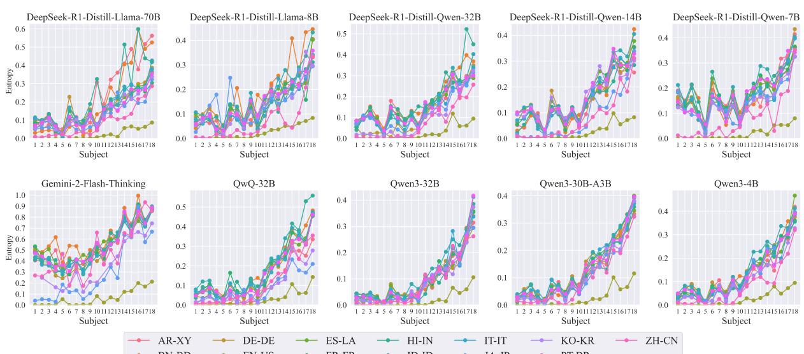

Figure 10: Per-language language mixing entropy across 18 m-MMLU subjects for various reasoning models. Each line represents the entropy trend for a specific input language. STEM subjects (subjects 10–18) consistently exhibit higher entropy across most languages, mirroring the pattern seen in the language-averaged results (Figure 5).
<table><tr><td></td><td></td><td colspan="3">Single-script control</td><td colspan="4">Multi-script control</td></tr><tr><td></td><td>No control</td><td>Input script</td><td>Latin</td><td>Han</td><td>Latin+Han</td><td>Input+Latin</td><td>Input+Han</td><td>Input+Latin+Han</td></tr><tr><td>Arabic</td><td></td><td></td><td></td><td></td><td></td><td></td><td></td><td></td></tr><tr><td>R1-70B</td><td>0.34</td><td>0.26</td><td>0.55</td><td>0.34</td><td>0.35</td><td>0.27</td><td>0.31</td><td>0.33</td></tr><tr><td>R1-32B</td><td>0.35</td><td>0.37</td><td>0.49</td><td>0.45</td><td>0.52</td><td>0.68</td><td>0.81</td><td>0.66</td></tr><tr><td>R1-14B</td><td>0.25</td><td>0.23</td><td>0.32</td><td>0.43</td><td>0.33</td><td>0.32</td><td>0.38</td><td>0.32</td></tr><tr><td>AVG</td><td>0.31</td><td>0.29</td><td>0.45</td><td>0.41</td><td>0.40</td><td>0.42</td><td>0.50</td><td>0.44</td></tr><tr><td>Hindi</td><td></td><td></td><td></td><td></td><td></td><td></td><td></td><td></td></tr><tr><td>R1-70B</td><td>0.33</td><td>0.03</td><td>0.71</td><td>0.49</td><td>0.66</td><td>0.68</td><td>0.54</td><td>0.66</td></tr><tr><td>R1-32B</td><td>0.39</td><td>0.05</td><td>0.60</td><td>0.28</td><td>0.58</td><td>0.32</td><td>0.29</td><td>0.32</td></tr><tr><td>R1-14B</td><td>0.32</td><td>0.06</td><td>0.46</td><td>0.41</td><td>0.48</td><td>0.47</td><td>0.44</td><td>0.47</td></tr><tr><td>AVG</td><td>0.35</td><td>0.05</td><td>0.59</td><td>0.39</td><td>0.57</td><td>0.49</td><td>0.42</td><td>0.48</td></tr><tr><td>Japanese</td><td></td><td></td><td></td><td></td><td></td><td></td><td></td><td></td></tr><tr><td>R1-70B</td><td>0.31</td><td>0.33</td><td>0.64</td><td>0.49</td><td>0.65</td><td>0.30</td><td></td><td></td></tr><tr><td>R1-32B</td><td>0.41</td><td>0.42</td><td>0.56</td><td>0.25</td><td>0.47</td><td>0.50</td><td></td><td></td></tr><tr><td>R1-14B</td><td>0.25</td><td>0.23</td><td>0.38</td><td>0.18</td><td>0.24</td><td>0.25</td><td></td><td></td></tr><tr><td>AVG</td><td>0.32</td><td>0.33</td><td>0.53</td><td>0.31</td><td>0.45</td><td>0.35</td><td></td><td></td></tr></table>

Table 10: Performance comparison across different script control strategies for Arabic, Hindi, and Japanese.12

<table><tr><td></td><td>No control</td><td>Single-script control Latin</td><td>Han</td><td>Multi-script control Latin+Han</td></tr><tr><td>English</td><td></td><td></td><td></td><td></td></tr><tr><td>R1-70B</td><td>0.81</td><td>0.79</td><td>0.62</td><td>0.79</td></tr><tr><td>R1-32B</td><td>0.86</td><td>0.85</td><td>0.46</td><td>0.86</td></tr><tr><td>R1-14B</td><td>0.81</td><td>0.81</td><td>0.64</td><td>0.80</td></tr><tr><td>AVG</td><td>0.83</td><td>0.82</td><td>0.57</td><td>0.82</td></tr><tr><td>French</td><td></td><td></td><td></td><td></td></tr><tr><td>R1-70B</td><td>0.64</td><td>0.65</td><td>0.59</td><td>0.65</td></tr><tr><td>R1-32B</td><td>0.75</td><td>0.75</td><td>0.41</td><td>0.76</td></tr><tr><td>R1-14B</td><td>0.72</td><td>0.72</td><td>0.53</td><td>0.72</td></tr><tr><td>AVG</td><td>0.70</td><td>0.71</td><td>0.51</td><td>0.71</td></tr><tr><td>Chinese</td><td></td><td></td><td></td><td></td></tr><tr><td>R1-70B</td><td>0.67</td><td>0.55</td><td>0.69</td><td>0.67</td></tr><tr><td>R1-32B</td><td>0.70</td><td>0.61</td><td>0.67</td><td>0.70</td></tr><tr><td>R1-14B</td><td>0.61</td><td>0.52</td><td>0.59</td><td>0.60</td></tr><tr><td>AVG</td><td>0.66</td><td>0.56</td><td>0.65</td><td>0.66</td></tr></table>

Table 11: Performance comparison across different script control strategies for English, French, and Chinese.

Question: $\therefore y = 3$   
(A very special island is inhabited only by knights and knaves. Knights always tell the truth, and knaves always lie. You meet 2 inhabitants: Amelia and Jacob. Amelia said that Jacob is a knight and Jacob is a knave. Jacob commented: 'If Amelia is a knave, then Amelia is a knight.' So who is the knight and who is the knave?)   
$\sin \alpha$ 他的陈述应为真。如果 then according to his statement,  should be a knight, which is a contradiction. So, if $ s$ is a knight, cannot be a liar, which means $\underbrace { \phantom { i \alpha } \mathcal { A } } _ { = } |$ must be a knight too, but that contradicts her initial statement. Alternatively, if $\ y =$ is a liar, then his statement is false. That means that if $\underbrace { 1 } _ { \cdots } \vdash 1$ is a liar, she is not a knight, which is consistent because liars cannot be knights. So, if $\therefore \sin x$ is a liar, $\omega _ { \alpha } |$ must be a knight, but that contradicts her initial statement that $ s ^ { \ast }$ is both a knight and a liar. Wait, this seems confusing. Maybe I need to break it down step by step.Let me assume $\omega _ { \infty } |$ is a knight. Then her statements must be true. She says $ 9 ^ { \circ } =$ is a knight and a liar, which is impossible. ${ \mathrm { S o } } ,$ cannot be a knight, which means she must be a liar. Therefore, her statements are false. So, it's not true that $ s$ is a knight and a liar. That means either he is a knight or a liar, but not both. Now, let's consider $ s$ 's statement: $" \mathrm { I f } \ u _ { \infty } |$ is a liar, then $\underbrace { \phantom { S _ { \theta } ^ { \prime } } \mathcal { A } } _ { = \infty } |$ is a knight." Since we've established that $\omega _ { \infty } |$ is a liar, the statement becomes: If true, then false. In logic, this is a false statement because a true antecedent leading to a false consequent makes the implication false. Since $ 9$ 's statement is false, he must be a liar.So, putting it all together: $\underbrace { \phantom { S _ { \theta } ^ { \prime } } \mathcal { A } } _ { = \infty } |$ is a liar, and $ 9$ is also a liar. But wait, can both be liars? The problem doesn't state that there must be at least one knight, so it's possible."   
(1 )

Figure 11: Example output from the DeepSeek R1-70B model on a Knights and Knaves logic puzzle. The model processes Arabic input and generates its reasoning without script constraints. The results demonstrate language mixing behavior, with the model combining English, Chinese, and Arabic for reasoning, illustrating the model's natural tendency toward cross-lingual reasoning when solving complex logical problems.
<table><tr><td rowspan="2">R1</td><td colspan="2"> $\bf { 2 { p p l } }$ </td><td colspan="2"> $\mathbf { 3 p p l }$ </td><td colspan="2"> $\mathbf { 4 p p l }$ </td><td colspan="2"> $\mathbf { 5 p p l }$ </td><td colspan="2"> $\mathbf { 6  p p l }$ </td><td colspan="2"> ${ \bf 7 p p l }$ </td><td colspan="2">8ppl</td></tr><tr><td> $a c c \%$ </td><td>valid%</td><td> $\operatorname { a c c } \%$ </td><td>valid%</td><td> $\operatorname { a c c } \%$ </td><td>valid%</td><td> $a c c \%$ </td><td>valid%</td><td> $a c c \%$ </td><td>valid%</td><td>acc%</td><td>valid%</td><td>acc%</td><td>valid%</td></tr><tr><td>ar</td><td>96</td><td>100</td><td>100</td><td>100</td><td>89</td><td>100</td><td>92</td><td>100</td><td>92</td><td>100</td><td>91</td><td>100</td><td>92</td><td>100</td></tr><tr><td>en</td><td>100</td><td>100</td><td>100</td><td>100</td><td>98</td><td>100</td><td>96</td><td>100</td><td>96</td><td>100</td><td>98</td><td>100</td><td>96</td><td>100</td></tr><tr><td>fr</td><td>96</td><td>100</td><td>97</td><td>100</td><td>92</td><td>100</td><td>89</td><td>100</td><td>89</td><td>100</td><td>89</td><td>100</td><td>89</td><td>100</td></tr><tr><td>ja</td><td>98</td><td>100</td><td>94</td><td>100</td><td>86</td><td>100</td><td>89</td><td>100</td><td>89</td><td>100</td><td>81</td><td>100</td><td>89</td><td>100</td></tr><tr><td>zh</td><td>99</td><td>100</td><td>99</td><td>100</td><td>97</td><td>100</td><td>97</td><td>100</td><td>97</td><td>100</td><td>95</td><td>100</td><td>97</td><td>100</td></tr><tr><td>hi</td><td>100</td><td>100</td><td>99</td><td>100</td><td>91</td><td>100</td><td>92</td><td>100</td><td>92</td><td>100</td><td>88</td><td>100</td><td>92</td><td>100</td></tr><tr><td>AVG</td><td>98</td><td>100</td><td>98</td><td>100</td><td>92</td><td>100</td><td>93</td><td>100</td><td>93</td><td>100</td><td>90</td><td>100</td><td>93</td><td>100</td></tr></table>

Table 12: Accuracy and valid reasoning rate (%) of DeepSeek-R1 on the K&K dataset across difficulty levels (2ppl to 8ppl) and input languages.

<table><tr><td>R1-70B</td><td colspan="2"> $\bf { 2 { p p l } }$ </td><td colspan="2"> $\mathbf { 3  p p l }$ </td><td colspan="2"> $\mathbf { 4 p p l }$ </td><td colspan="2"> $\mathbf { 5 p p l }$ </td><td colspan="2"> $\mathbf { 6  p p l }$ </td><td colspan="2"> ${ \bf 7 p p l }$ </td><td colspan="2">8ppl</td></tr><tr><td></td><td> $a c c \%$ </td><td>valid%</td><td> $a c c \%$ </td><td>valid%</td><td> $\operatorname { a c c } \%$ </td><td>valid%</td><td> $\operatorname { a c c } \%$ </td><td>valid%</td><td> $a c c \%$ </td><td>valid%</td><td> $a c c \%$ </td><td>valid%</td><td> $a c c \%$ </td><td>valid%</td></tr><tr><td>ar</td><td>59</td><td>96</td><td>54</td><td>90</td><td>37</td><td>89</td><td>26</td><td>85</td><td>28</td><td>83</td><td>17</td><td>82</td><td>16</td><td>86</td></tr><tr><td>en</td><td>92</td><td>99</td><td>93</td><td>99</td><td>87</td><td>94</td><td>78</td><td>92</td><td>78</td><td>96</td><td>74</td><td>92</td><td>63</td><td>93</td></tr><tr><td>fr</td><td>76</td><td>92</td><td>72</td><td>87</td><td>67</td><td>84</td><td>61</td><td>85</td><td>61</td><td>87</td><td>59</td><td>91</td><td>52</td><td>88</td></tr><tr><td>ja</td><td>57</td><td>97</td><td>42</td><td>92</td><td>32</td><td>90</td><td>29</td><td>89</td><td>21</td><td>86</td><td>20</td><td>86</td><td>15</td><td>87</td></tr><tr><td>zh</td><td>88</td><td>100</td><td>81</td><td>99</td><td>75</td><td>99</td><td>64</td><td>97</td><td>66</td><td>97</td><td>50</td><td>91</td><td>44</td><td>99</td></tr><tr><td>hi</td><td>44</td><td>78</td><td>40</td><td>77</td><td>37</td><td>73</td><td>28</td><td>73</td><td>28</td><td>68</td><td>30</td><td>77</td><td>26</td><td>73</td></tr><tr><td>AVG</td><td>69</td><td>94</td><td>63</td><td>91</td><td>56</td><td>88</td><td>47</td><td>87</td><td>47</td><td>86</td><td>42</td><td>86</td><td>36</td><td>87</td></tr></table>

Table 13: Accuracy and valid reasoning rate (%) of DeepSeek-R1-Disti11-Llama-70B on the K&K dataset across difficulty levels (2ppl to 8ppl) and input languages.

(A very special island is inhabited only by knights and knaves. Knights always tell the truth, and knaves always lie. You meet 2 inhabitants: Amelia and Jacob. Amelia said that Jacob is a knight and Jacob is a knave. Jacob commented: 'If Amelia is a knave, then Amelia is a knight.' So who is the knight and who is the knave?)

Thinking: Alright, so I've got this logic puzzle here about knights and knaves on a special island. Knights always tell the truth, and knaves always lie. I meet two people, Amelia and Jacob. Amelia says that Jacob is a knight and that Jacob is a knave. Then Jacob says, "If Amelia is a knave, then Amelia is a knight." I need to figure out who's who.\n\nFirst, let me break down the statements. Amelia makes two claims: Jacob is a knight and Jacob is a knave. Wait, that's contradictory. If she's a knight, she can't lie, so both her statements must be true, but saying Jacob is both a knight and a knave can't be true at the same time. So that suggests Amelia might be a knave because she's making contradictory statements.\n\nBut hold on, if Amelia is a knave, then her statements are lies. So if she says Jacob is a knight, then Jacob must actually be a knave. And when she says Jacob is a knave, that would mean he's actually a knight. Wait, that's also a contradiction. Hmm, maybe I'm approaching this wrong.\n\nLet me try another angle. Let's assume Amelia is a knight. Then her statements must both be true. But she says Jacob is both a knight and a knave, which is impossible. So Amelia can't be a knight because that leads to a contradiction. Therefore, Amelia must be a knave.\n\nIf Amelia is a knave, her statements are false. So when she says Jacob is a knight, ... (Omitted here due to character limit) ... Wait, no, if she says J is both a knight and a knave, and she's lying, then J is neither? But that's impossible because everyone is either a knight or a knave.\n\nI think I'm getting tangled up here. Let me try again. If Amelia is a knave, her statements are false. So when she says Jacob is a knight, it's false, meaning Jacob is a knave. And when she says Jacob is a knave, it's false, meaning Jacob is a knight. Contradiction again.\n\nWait, maybe the only way this works is if Amelia is a knave and Jacob is a knave. Because if Jacob is a knave, his statement is a lie. His statement is "If Amelia is a knave, then Amelia is a knight," which is ¬A → A. Since Amelia is a knave (¬A), the implication is false, which makes Jacob's statement false, so he's a knave. That fits.\n\nSo, Amelia is a knave, and Jacob is a knave. But wait, earlier I thought Jacob had to be a knight. I'm confused.\n\nWait, no. If Amelia is a knave, her statements are false, so Jacob is not a knight and not a knave? That can't be. So maybe I need to accept that Jacob is a knave, and his statement is a lie, which makes sense because as a knave, he lies.\n\nSo, putting it all together: Amelia is a knave, Jacob is a knave. But does that satisfy all statements? Let's check.\n\nAmelia says Jacob is a knight (lie, so Jacob is a knave) and Jacob is a knave (lie, so Jacob is a knight). Contradiction again. Hmm, I'm stuck.\n\nMaybe I need to consider that both are knaves. If both are knaves, then Amelia's statements are lies, so Jacob is not a knight and not a knave, which is impossible. So that can't be.\n\nWait. perhaps the only solution is that Amelia is a knave and Jacob is a knight. Let's see:\n\nAmelia is a knave, so her statements are false. She says Jacob is a knight (false, so Jacob is a knave) and Jacob is a knave (false, so Jacob is a knight). Contradiction again.\n\nI'm going in circles. Maybe the answer is that Amelia is a knave and Jacob is a knave. Even though it seems contradictory, it's the only way to make their statements false.\n\nWait, no, because if Jacob is a knave, his statement is a lie, which fits. And Amelia's statements being lies fit if Jacob is a knave. So maybe that's the answer.\n

Figure 12: Example output from the DeepSeek R1-70B model on a Knights and Knaves logic puzzle. The model processes Arabic input, generates its reasoning in English via Latin script constrained decoding, and produces the final answer in Arabic without script constraints, demonstrating cross-lingual reasoning with selective script control.
<table><tr><td rowspan="2">R1-8B</td><td colspan="2">2ppl</td><td colspan="2">3ppl</td><td colspan="2">4ppl</td><td colspan="2">5ppl</td><td colspan="2">6ppl</td><td colspan="2">7ppl</td><td colspan="2">8ppl</td></tr><tr><td>acc%</td><td>valid%</td><td>acc%</td><td>valid%</td><td>acc%</td><td>valid%</td><td>acc%</td><td>valid%</td><td>acc%</td><td>valid%</td><td>acc%</td><td>valid%</td><td>acc%</td><td>valid%</td></tr><tr><td>ar</td><td>10</td><td>99</td><td>5</td><td>93</td><td>3</td><td>94</td><td>3</td><td>96</td><td>1</td><td>92</td><td>1</td><td>93</td><td>0</td><td>89</td></tr><tr><td>en</td><td>68</td><td>100</td><td>66</td><td>100</td><td>56</td><td>99</td><td>42</td><td>99</td><td>38</td><td>99</td><td>35</td><td>100</td><td>20</td><td>98</td></tr><tr><td>fr</td><td>17</td><td>100</td><td>20</td><td>99</td><td>15</td><td>100</td><td>9</td><td>99</td><td>6</td><td>99</td><td>6</td><td>99</td><td>3</td><td>98</td></tr><tr><td>ja</td><td>14</td><td>100</td><td>9</td><td>98</td><td>7</td><td>98</td><td>1</td><td>99</td><td>0</td><td>98</td><td>1</td><td>96</td><td>1</td><td>99</td></tr><tr><td>zh</td><td>55</td><td>98</td><td>44</td><td>99</td><td>41</td><td>98</td><td>30</td><td>100</td><td>22</td><td>99</td><td>18</td><td>99</td><td>13</td><td>99</td></tr><tr><td>hi</td><td>24</td><td>99</td><td>23</td><td>99</td><td>11</td><td>100</td><td>8</td><td>99</td><td>6</td><td>98</td><td>2</td><td>98</td><td>2</td><td>97</td></tr><tr><td>AVG</td><td>31</td><td>99</td><td>28</td><td>98</td><td>22</td><td>98</td><td>15</td><td>99</td><td>12</td><td>98</td><td>10</td><td>98</td><td>6</td><td>97</td></tr></table>

Table 14: Accuracy and valid reasoning rate (%) of DeepSeek-R1-Disti11-Llama-8B on the K&K dataset across difficulty levels (2ppl to 8ppl) and input languages.

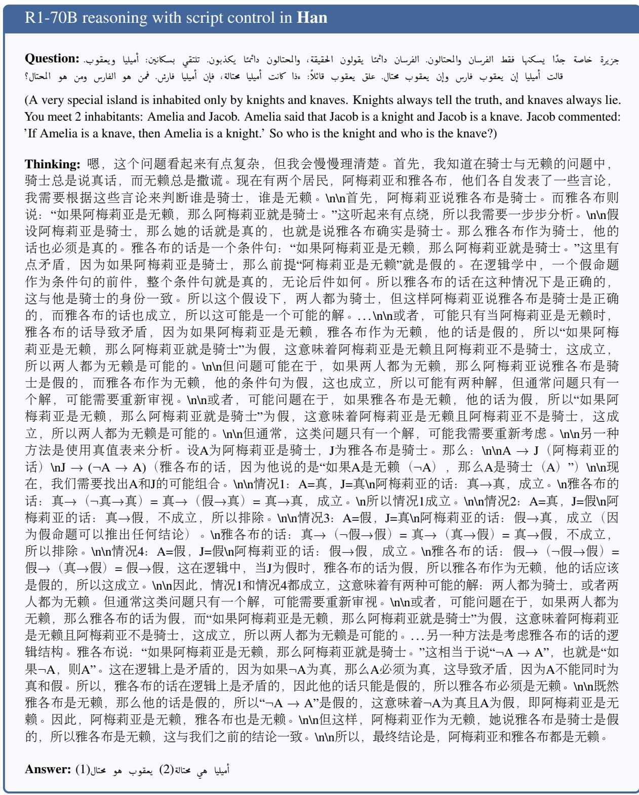  
Figure 13: Example output from the DeepSeek R1-70B model on a Knights and Knaves logic puzzle. The model processes Arabic input, generates its reasoning in Chinese via Han script constrained decoding, and produces the final answer in Arabic without script constraints, demonstrating cross-lingual reasoning with selective script control.

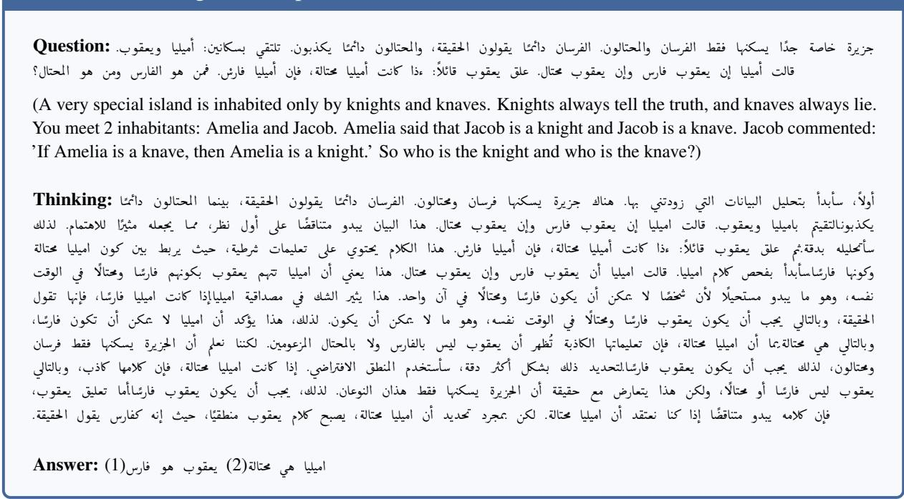  
Figure 14: Example output from the DeepSeek R1-70B model on a Knights and Knaves logic puzzle. The model processes Arabic input, generates its reasoning in Arabic via Arabic script constrained decoding, and produces the final answer in Arabic without script constraints, demonstrating cross-lingual reasoning with selective script control.

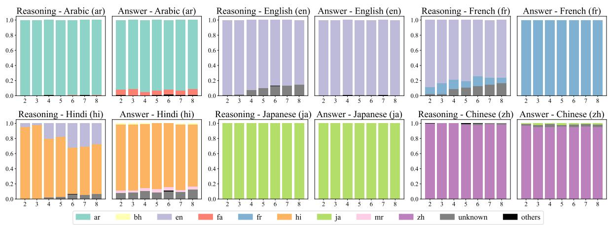  
Figure 15: Language composition for R1 (K&K).

<table><tr><td rowspan="2">R1-32B</td><td colspan="2">2ppl</td><td colspan="2">3ppl</td><td colspan="2">4ppl</td><td colspan="2">5ppl</td><td colspan="2">6ppl</td><td colspan="2">7ppl acc%</td><td colspan="2">8ppl valid%</td></tr><tr><td>acc%</td><td>valid%</td><td>acc%</td><td>valid%</td><td>acc%</td><td>valid%</td><td>acc%</td><td>valid%</td><td>acc%</td><td>valid%</td><td></td><td>valid%</td><td>acc%</td><td></td></tr><tr><td>ar</td><td>45</td><td>100</td><td>41</td><td>99</td><td>43</td><td>100</td><td>32</td><td>99</td><td>29</td><td>99</td><td>31</td><td>99</td><td>25</td><td>99</td></tr><tr><td>en</td><td>95</td><td>100</td><td>94</td><td>100</td><td>92</td><td>100</td><td>88</td><td>100</td><td>88</td><td>99</td><td>79</td><td>100</td><td>70</td><td>99</td></tr><tr><td>fr</td><td>81</td><td>100</td><td>84</td><td>100</td><td>82</td><td>100</td><td>76</td><td>100</td><td>75</td><td>100</td><td>67</td><td>100</td><td>60</td><td>100</td></tr><tr><td>ja</td><td>59</td><td>89</td><td>50</td><td>83</td><td>50</td><td>88</td><td>43</td><td>90</td><td>36</td><td>90</td><td>28</td><td>90</td><td>19</td><td>81</td></tr><tr><td>zh</td><td>87</td><td>97</td><td>78</td><td>93</td><td>78</td><td>93</td><td>71</td><td>96</td><td>68</td><td>96</td><td>59</td><td>99</td><td>52</td><td>95</td></tr><tr><td>hi AVG</td><td>53</td><td>99</td><td>49</td><td>99</td><td>44</td><td>100</td><td>35</td><td>100</td><td>39</td><td>100</td><td>26</td><td>99</td><td>27</td><td>99</td></tr><tr><td></td><td>70</td><td>98</td><td>66</td><td>96</td><td>65</td><td>97</td><td>57</td><td>98</td><td>55</td><td>98</td><td>48</td><td>98</td><td>42</td><td>96</td></tr></table>

Table 15: Accuracy and valid reasoning rate (%) of DeepSeek-R1-Disti11-Qwen-32B on the K&K dataset across difficulty levels (2ppl to 8ppl) and input languages.

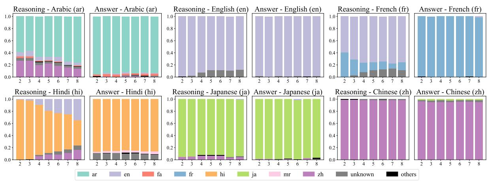

Figure 16: Language composition for R1-70B (K&K).  
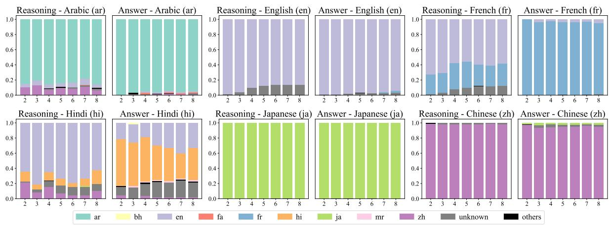

Figure 17: Language composition for R1-8B (K&K).  
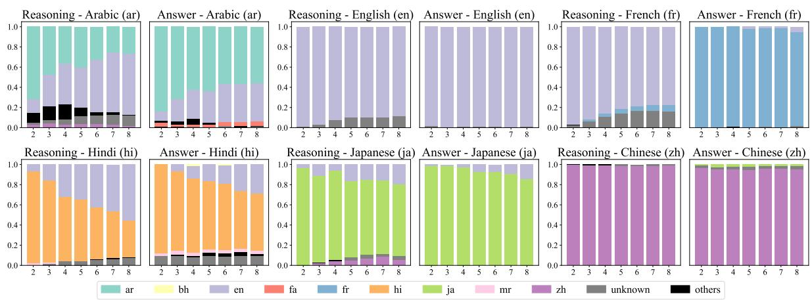

Figure 18: Language composition for R1-32B (K&K).
<table><tr><td>R1-14B</td><td colspan="2">2ppl valid%</td><td colspan="2">3ppl acc% valid%</td><td colspan="2">4ppl acc%</td><td colspan="2">5ppl acc%</td><td colspan="2">6ppl valid%</td><td colspan="2">7ppl acc% valid%</td><td colspan="2">8ppl valid%</td></tr><tr><td></td><td>acc%</td><td></td><td></td><td></td><td></td><td>valid%</td><td></td><td>valid%</td><td>acc%</td><td></td><td></td><td></td><td>acc%</td><td></td></tr><tr><td>ar</td><td>40</td><td>100</td><td>37</td><td>100</td><td>34</td><td>100</td><td>23</td><td>100</td><td>17</td><td>100</td><td>16</td><td>100</td><td>11</td><td>99</td></tr><tr><td>en</td><td>95</td><td>100</td><td>92</td><td>100</td><td>87</td><td>100</td><td>81</td><td>100</td><td>77</td><td>99</td><td>72</td><td>100</td><td>65</td><td>100</td></tr><tr><td>fr</td><td>84</td><td>100</td><td>77</td><td>100</td><td>83</td><td>100</td><td>72</td><td>99</td><td>70</td><td>99</td><td>62</td><td>99</td><td>55 7</td><td>99</td></tr><tr><td>ja</td><td>45</td><td>96</td><td>40</td><td>95</td><td>31</td><td>96</td><td>21</td><td>90</td><td>19</td><td>90</td><td>12</td><td>89</td><td></td><td>87</td></tr><tr><td>zh</td><td>83</td><td>97</td><td>78</td><td>95</td><td>65</td><td>94</td><td>60</td><td>93</td><td>56</td><td>95</td><td>48</td><td>93</td><td>41</td><td>93</td></tr><tr><td>hi</td><td>49</td><td>100</td><td>47</td><td>100</td><td>38</td><td>99</td><td>29</td><td>98</td><td>22</td><td>98</td><td>25</td><td>98</td><td>18</td><td>95</td></tr><tr><td>AVG</td><td>66</td><td>99</td><td>62</td><td>98</td><td>56</td><td>98</td><td>48</td><td>97</td><td>43</td><td>97</td><td>39</td><td>97</td><td>33</td><td>96</td></tr></table>

Table 16: Accuracy and valid reasoning rate (%) of DeepSeek-R1-Disti11-Qwen-14B on the K&K dataset across difficulty levels (2ppl to 8ppl) and input languages.

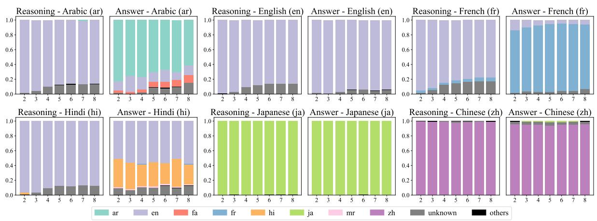

Figure 19: Language composition for R1-14B (K&K).  
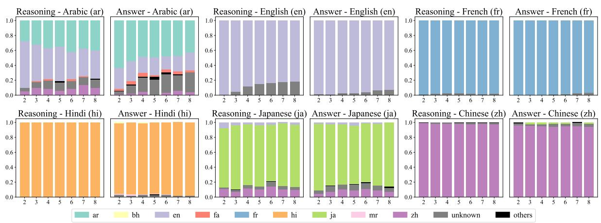

Figure 20: Language composition for R1-7B (K&K).  
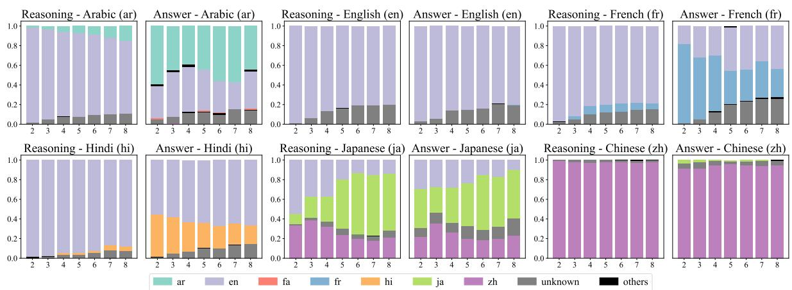

Figure 21: Language composition for R1-1. 5B (K&K).
<table><tr><td rowspan="2">R1-7B</td><td colspan="2">2ppl</td><td colspan="2">3ppl</td><td colspan="2">4ppl</td><td colspan="2">5ppl</td><td colspan="2">6ppl</td><td colspan="2">7ppl</td><td colspan="2">8ppl</td></tr><tr><td>acc%</td><td>valid%</td><td>acc%</td><td>valid%</td><td>acc%</td><td>valid%</td><td>acc%</td><td>valid%</td><td>acc%</td><td>valid%</td><td>acc%</td><td>valid%</td><td>acc%</td><td>valid%</td></tr><tr><td>ar</td><td>9</td><td>90</td><td>4</td><td>84</td><td>2</td><td>83</td><td>1</td><td>76</td><td>0</td><td>74</td><td>0</td><td>76</td><td>0</td><td>77</td></tr><tr><td>en</td><td>90</td><td>99</td><td>80</td><td>97</td><td>66</td><td>96</td><td>53</td><td>93</td><td>43</td><td>91</td><td>31</td><td>85</td><td>26</td><td>82</td></tr><tr><td>fr</td><td>40</td><td>98</td><td>23</td><td>98</td><td>14</td><td>98</td><td>10</td><td>99</td><td>3</td><td>97</td><td>4</td><td>97</td><td>2</td><td>95</td></tr><tr><td>ja</td><td>4</td><td>82</td><td>2</td><td>80</td><td>0</td><td>85</td><td>0</td><td>82</td><td>0</td><td>78</td><td>0</td><td>78</td><td>0</td><td>80</td></tr><tr><td>zh</td><td>61</td><td>98</td><td>52</td><td>97</td><td>45</td><td>95</td><td>40</td><td>97</td><td>26</td><td>95</td><td>21</td><td>95</td><td>10</td><td>97</td></tr><tr><td>hi</td><td>19</td><td>97</td><td>10</td><td>92</td><td>6</td><td>85</td><td>3</td><td>81</td><td>1</td><td>84</td><td>1</td><td>85</td><td>1</td><td>78</td></tr><tr><td>AVG</td><td>37</td><td>94</td><td>28</td><td>92</td><td>22</td><td>90</td><td>18</td><td>88</td><td>12</td><td>87</td><td>9</td><td>86</td><td>6</td><td>85</td></tr></table>

Table 17: Accuracy and valid reasoning rate (%) of DeepSeek-R1-Disti11-Qwen-7B on the K&K dataset across difficulty levels (2ppl to 8ppl) and input languages.

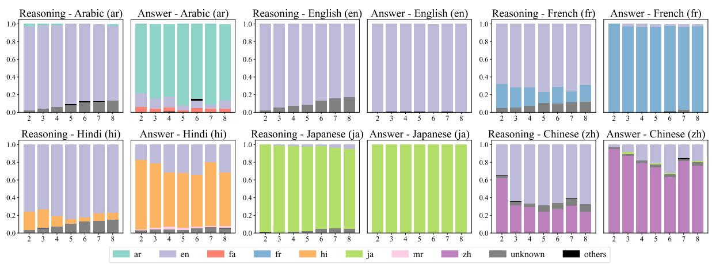

Figure 22: Language composition for Gemini (K&K).  
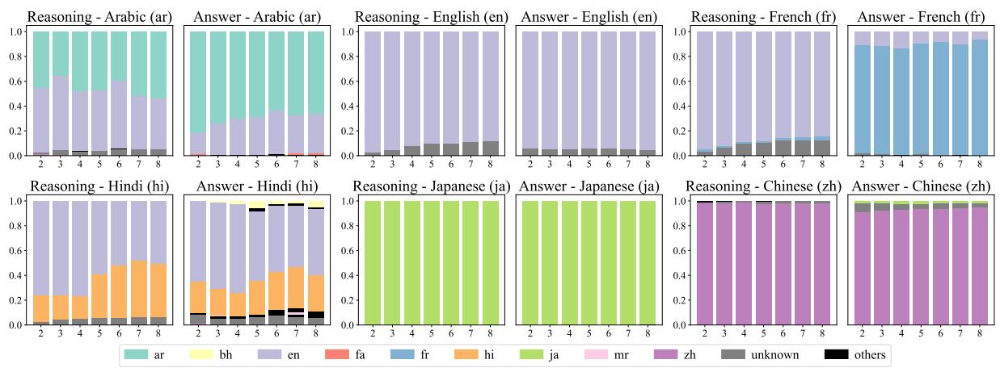

Figure 23: Language composition for QwQ-32B (K&K).  
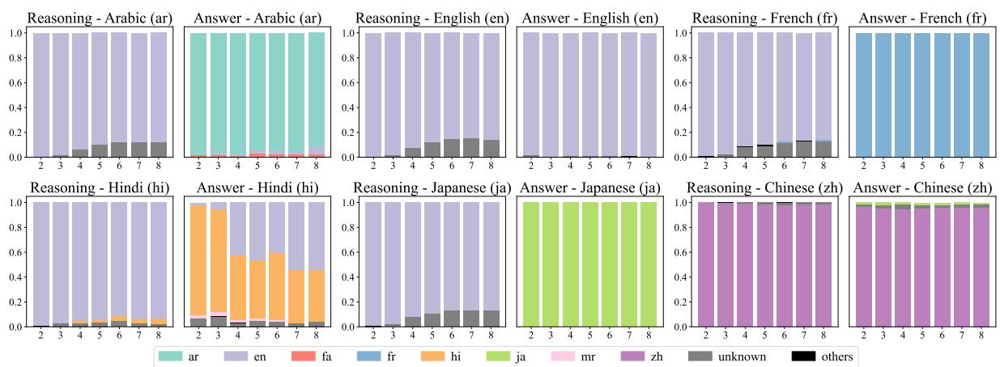

Figure 24: Language composition for Qwen3-32B (K&K).
<table><tr><td rowspan="2">R1-1.5B</td><td colspan="2">2ppl</td><td colspan="2">3ppl</td><td colspan="2">4ppl</td><td colspan="2">5ppl</td><td colspan="2">6ppl</td><td colspan="2">7ppl</td><td colspan="2">8ppl</td></tr><tr><td>acc%</td><td>valid%</td><td>acc%</td><td>valid%</td><td>acc%</td><td>valid%</td><td>acc%</td><td>valid%</td><td>acc%</td><td>valid%</td><td>acc%</td><td>valid%</td><td>acc%</td><td>valid%</td></tr><tr><td>ar</td><td>3</td><td>89</td><td>1</td><td>86</td><td>0</td><td>80</td><td>1</td><td>79</td><td>0</td><td>74</td><td>0</td><td>66</td><td>0</td><td>63</td></tr><tr><td>en</td><td>56</td><td>98</td><td>34</td><td>96</td><td>12</td><td>92</td><td>11</td><td>83</td><td>4</td><td>83</td><td>1</td><td>78</td><td>0</td><td>73</td></tr><tr><td>fr</td><td>27</td><td>92</td><td>12</td><td>92</td><td>2</td><td>83</td><td>1</td><td>76</td><td>0</td><td>75</td><td>0</td><td>66</td><td>0</td><td>67</td></tr><tr><td>ja</td><td>1</td><td>86</td><td>0</td><td>78</td><td>0</td><td>71</td><td>0</td><td>71</td><td>0</td><td>64</td><td>0</td><td>57</td><td>0</td><td>64</td></tr><tr><td>zh</td><td>21</td><td>84</td><td>17</td><td>75</td><td>12</td><td>70</td><td>7</td><td>78</td><td>2</td><td>76</td><td>0</td><td>73</td><td>0</td><td>77</td></tr><tr><td>hi</td><td>6</td><td>94</td><td>3</td><td>91</td><td>1</td><td>86</td><td>1</td><td>88</td><td>1</td><td>83</td><td>0</td><td>88</td><td>0</td><td>80</td></tr><tr><td>AVG</td><td>19</td><td>91</td><td>11</td><td>86</td><td>4</td><td>81</td><td>3</td><td>79</td><td>1</td><td>76</td><td>0</td><td>72</td><td>0</td><td>71</td></tr></table>

Table 18: Accuracy and valid reasoning rate (%) of DeepSeek-R1-Disti11-Qwen-1.5B on the K&K dataset across difficulty levels (2ppl to 8ppl) and input languages.

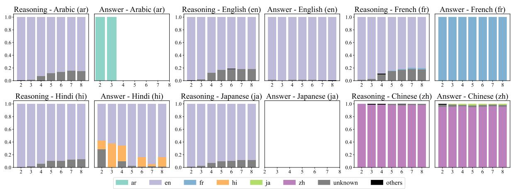  
Figure 25: Language composition for Qwen3-30B-A3B (K&K).

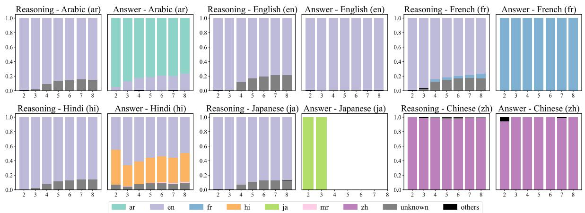  
Figure 26: Language composition for Qwen3-4B (K&K).

<table><tr><td rowspan="2">Gemini</td><td colspan="2">2ppl</td><td colspan="2">3ppl</td><td colspan="2">4ppl</td><td colspan="2">5ppl</td><td colspan="2">6ppl</td><td colspan="2">7ppl</td><td colspan="2">8ppl</td></tr><tr><td>acc%</td><td>valid%</td><td>acc%</td><td>valid%</td><td>acc%</td><td>valid%</td><td>acc%</td><td>valid%</td><td>acc%</td><td>valid%</td><td>acc%</td><td>valid%</td><td>acc%</td><td>valid%</td></tr><tr><td>ar</td><td>45</td><td>59</td><td>45</td><td>59</td><td>38</td><td>52</td><td>45</td><td>50</td><td>39</td><td>47</td><td>49</td><td>56</td><td>45</td><td>52</td></tr><tr><td>en</td><td>53</td><td>63</td><td>60</td><td>75</td><td>67</td><td>76</td><td>59</td><td>71</td><td>69</td><td>74</td><td>60</td><td>62</td><td>53</td><td>57</td></tr><tr><td>fr</td><td>50</td><td>59</td><td>54</td><td>69</td><td>48</td><td>59</td><td>50</td><td>65</td><td>40</td><td>54</td><td>44</td><td>54</td><td>35</td><td>41</td></tr><tr><td>ja</td><td>35</td><td>51</td><td>44</td><td>62</td><td>42</td><td>61</td><td>58</td><td>75</td><td>45</td><td>62</td><td>46</td><td>64</td><td>41</td><td>56</td></tr><tr><td>zh</td><td>51</td><td>65</td><td>49</td><td>61</td><td>44</td><td>62</td><td>52</td><td>78</td><td>36</td><td>63</td><td>39</td><td>56</td><td>33</td><td>54</td></tr><tr><td>hi</td><td>41</td><td>92</td><td>31</td><td>82</td><td>25</td><td>85</td><td>29</td><td>89</td><td>36</td><td>86</td><td>31</td><td>83</td><td>34</td><td>84</td></tr><tr><td>AVG</td><td>46</td><td>65</td><td>47</td><td>68</td><td>44</td><td>66</td><td>49</td><td>71</td><td>44</td><td>64</td><td>45</td><td>62</td><td>40</td><td>57</td></tr></table>

Table 19: Accuracy and valid reasoning rate (%) of Gemini-Flash-Thinking on the K&K dataset across difficulty levels (2ppl to 8ppl) and input languages.

<table><tr><td rowspan="2">QwQ</td><td colspan="2">2ppl</td><td colspan="2">3ppl</td><td colspan="2">4ppl</td><td colspan="2">5ppl</td><td colspan="2">6ppl</td><td colspan="2">7ppl</td><td colspan="2">8ppl</td></tr><tr><td>acc%</td><td>valid%</td><td>acc%</td><td>valid%</td><td>acc%</td><td>valid%</td><td>acc%</td><td>valid%</td><td>acc%</td><td>valid%</td><td>acc%</td><td>valid%</td><td>acc%</td><td>valid%</td></tr><tr><td>ar</td><td>74</td><td>100</td><td>68</td><td>100</td><td>62</td><td>99</td><td>61</td><td>99</td><td>56</td><td>99</td><td>56</td><td>100</td><td>47</td><td>99</td></tr><tr><td>en</td><td>99</td><td>100</td><td>97</td><td>100</td><td>90</td><td>98</td><td>93</td><td>100</td><td>87</td><td>99</td><td>86</td><td>100</td><td>85</td><td>99</td></tr><tr><td>fr</td><td>89</td><td>99</td><td>87</td><td>98</td><td>88</td><td>100</td><td>87</td><td>99</td><td>85</td><td>99</td><td>83</td><td>99</td><td>81</td><td>98</td></tr><tr><td>ja</td><td>82</td><td>100</td><td>79</td><td>99</td><td>74</td><td>99</td><td>60</td><td>99</td><td>64</td><td>100</td><td>57</td><td>99</td><td>49</td><td>99</td></tr><tr><td>zh</td><td>92</td><td>100</td><td>86</td><td>100</td><td>80</td><td>100</td><td>72</td><td>100</td><td>61</td><td>100</td><td>60</td><td>100</td><td>59</td><td>100</td></tr><tr><td>hi</td><td>22</td><td>100</td><td>17</td><td>100</td><td>16</td><td>100</td><td>20</td><td>100</td><td>17</td><td>99</td><td>18</td><td>100</td><td>9</td><td>100</td></tr><tr><td>AVG</td><td>76</td><td>100</td><td>72</td><td>100</td><td>68</td><td>100</td><td>65</td><td>100</td><td>61</td><td>100</td><td>60</td><td>100</td><td>55</td><td>99</td></tr></table>

Table 20: Accuracy and valid reasoning rate (%) of QwQ-32B on the K&K dataset across difficulty levels (2ppl to 8ppl) and input languages.

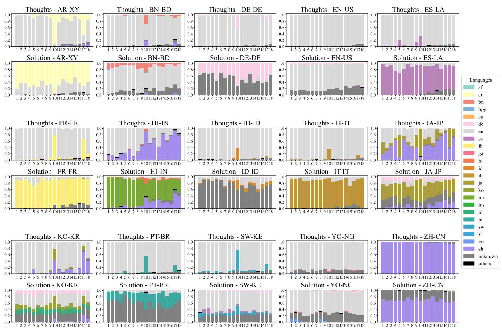

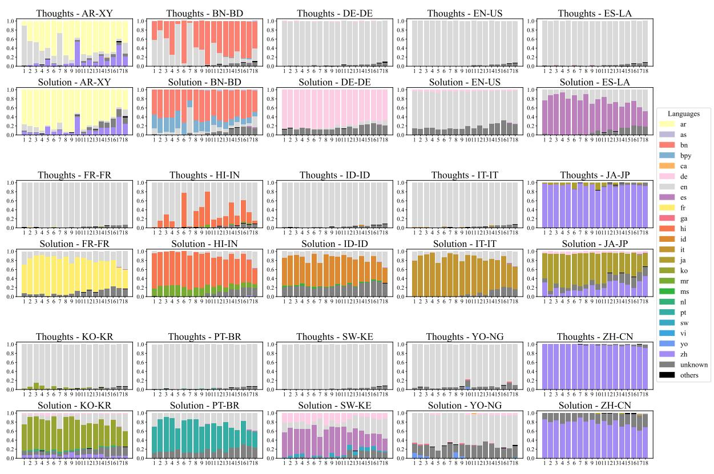  
Figure 27: Language composition for R1-70B (m-MMLU).  
Figure 28: Language composition for R1-8B (m-MMLU).

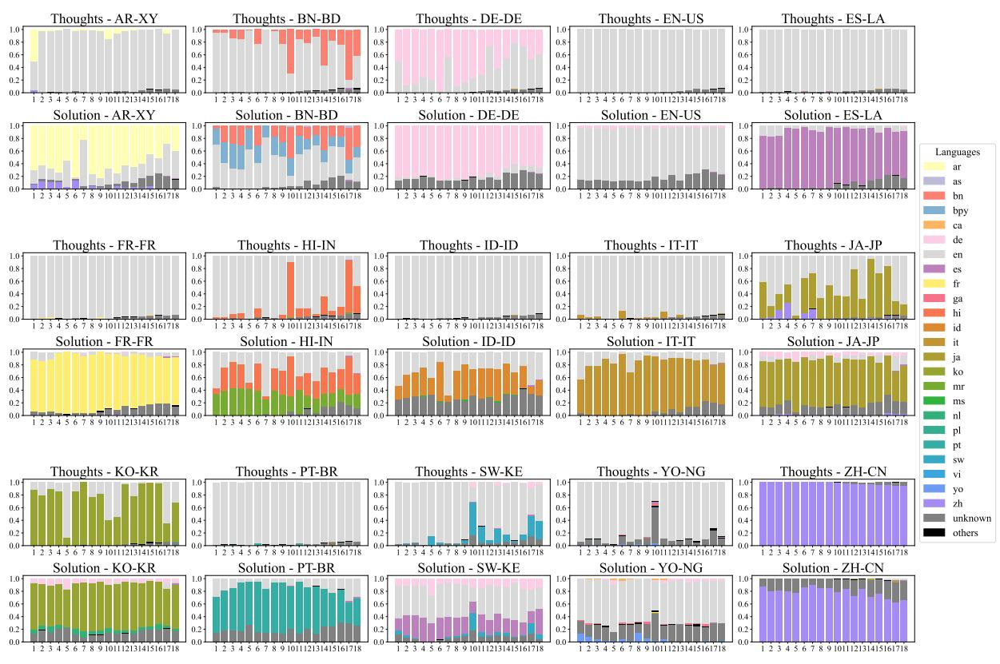  
Figure 29: Language composition for R1-32B (m-MMLU).

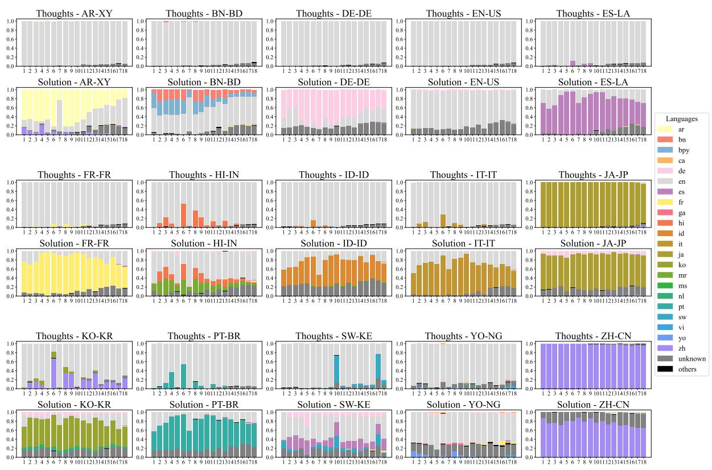  
Figure 30: Language composition for R1-14B (m-MMLU).

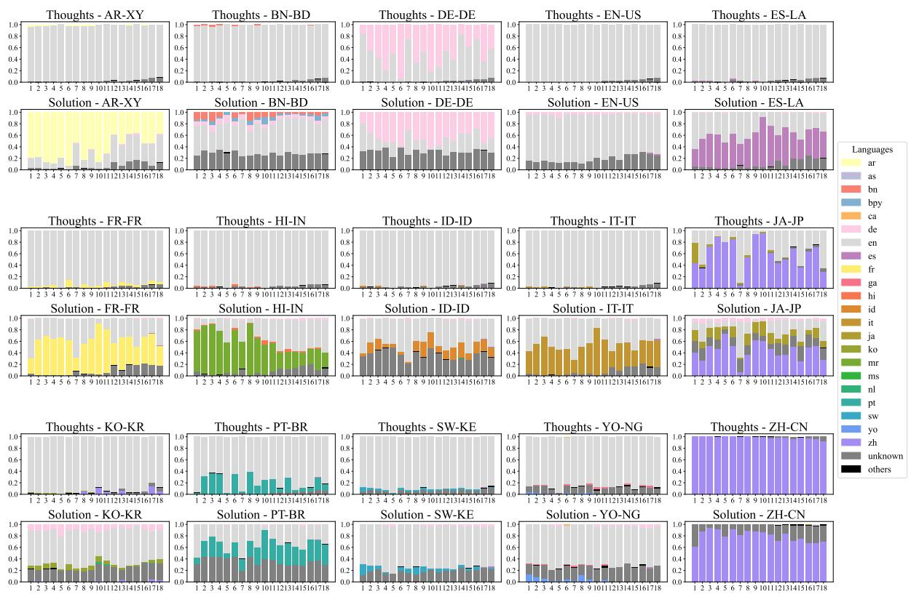  
Figure 31: Language composition for R1-7B (m-MMLU).

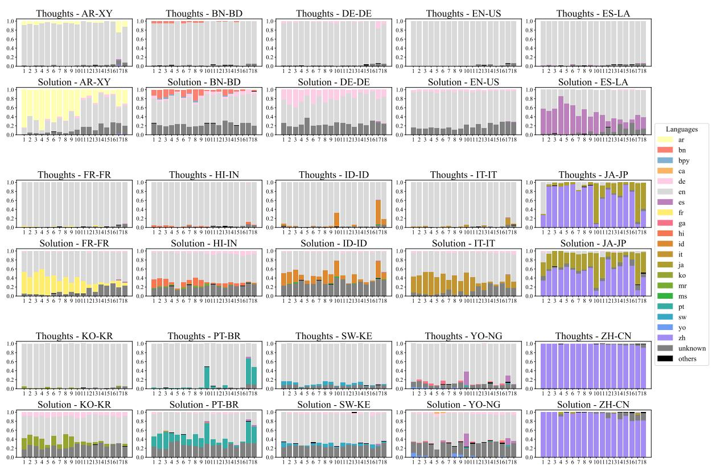  
Figure 32: Language composition for R1-1.5B (m-MMLU).

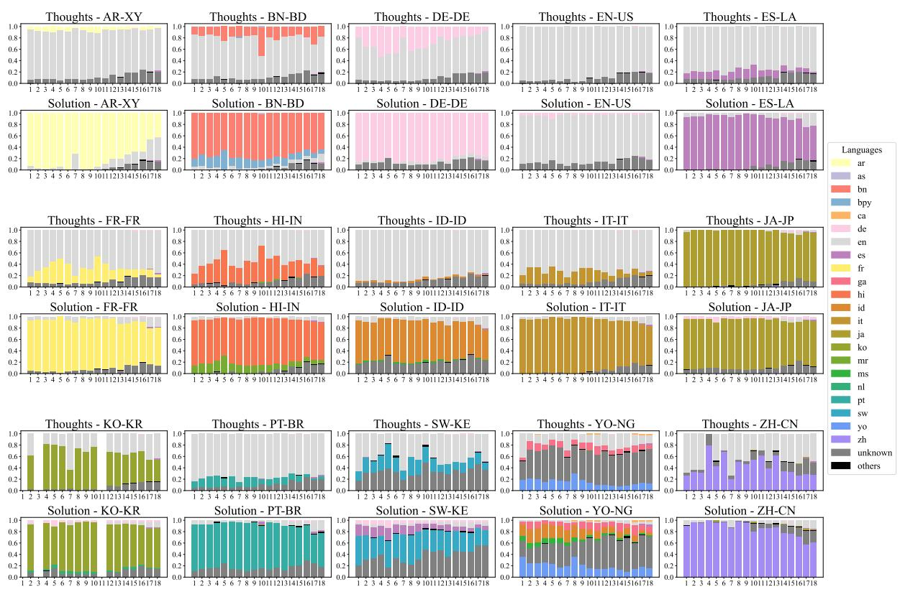  
Figure 33: Language composition for Gemini (m-MMLU).

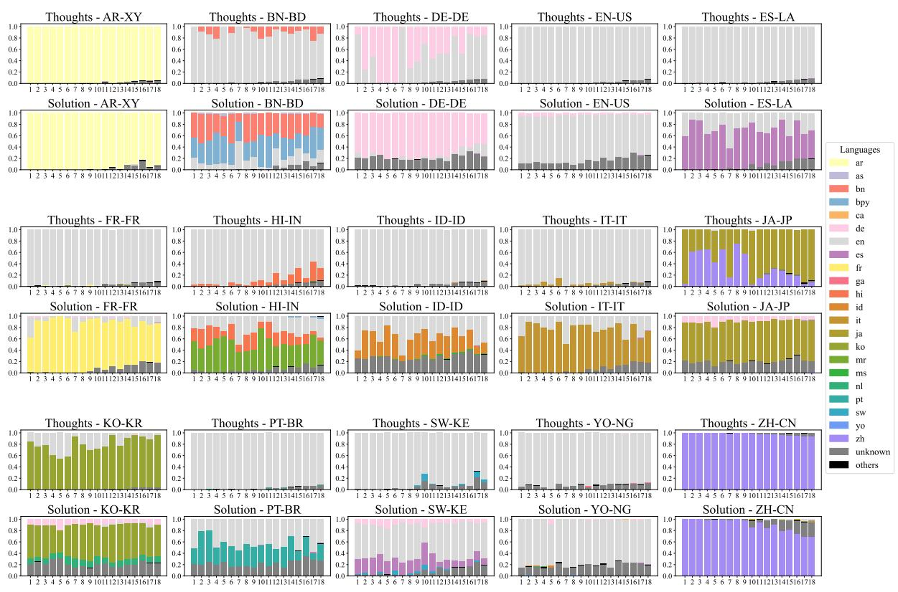  
Figure 34: Language composition for QwQ-32B (m-MMLU).

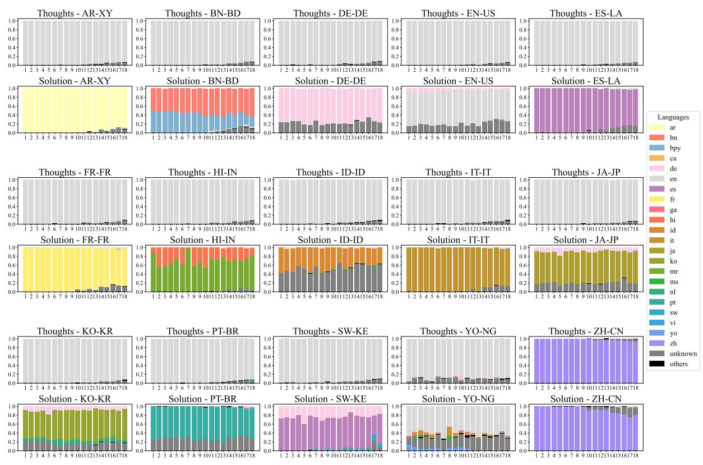

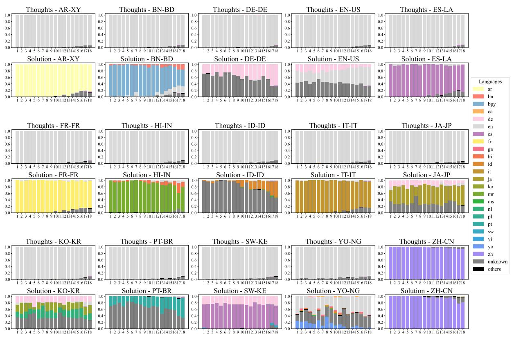  
Figure 35: Language composition for Qwen3-32B (m-MMLU).  
Figure 36: Language composition for Qwen3-30B-A3B (m-MMLU).

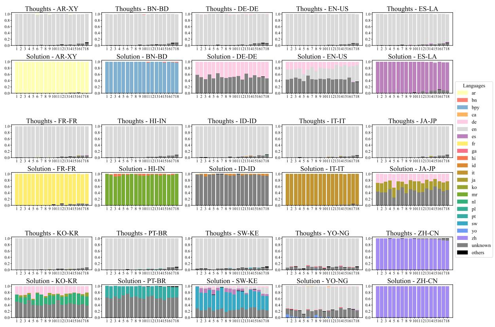

Figure 37: Language composition for Qwen3-4B (m-MMLU).
<table><tr><td>Qwen3-32B</td><td colspan="2">2ppl</td><td colspan="2">3ppl</td><td colspan="2">4ppl</td><td colspan="2">5ppl</td><td colspan="2">6ppl</td><td colspan="2">7ppl</td><td colspan="2">8ppl</td></tr><tr><td></td><td>acc%</td><td>valid%</td><td>acc%</td><td>valid%</td><td>acc%</td><td>valid%</td><td>acc%</td><td>valid%</td><td>acc%</td><td>valid%</td><td>acc%</td><td>valid%</td><td>acc%</td><td>valid%</td></tr><tr><td>ar</td><td>95</td><td>99</td><td>92</td><td>97</td><td>89</td><td>95</td><td>86</td><td>99</td><td>87</td><td>98</td><td>84</td><td>98</td><td>81</td><td>99</td></tr><tr><td>en</td><td>100</td><td>100</td><td>100</td><td>100</td><td>100</td><td>100</td><td>100</td><td>100</td><td>98</td><td>100</td><td>99</td><td>100</td><td>97</td><td>99</td></tr><tr><td>fr</td><td>91</td><td>100</td><td>93</td><td>100</td><td>92</td><td>100</td><td>91</td><td>100</td><td>89</td><td>100</td><td>91</td><td>100</td><td>87</td><td>100</td></tr><tr><td>ja</td><td>94</td><td>99</td><td>94</td><td>100</td><td>92</td><td>100</td><td>83</td><td>100</td><td>88</td><td>100</td><td>87</td><td>100</td><td>85</td><td>100</td></tr><tr><td>zh</td><td>96</td><td>100</td><td>94</td><td>99</td><td>96</td><td>100</td><td>94</td><td>100</td><td>94</td><td>100</td><td>93</td><td>99</td><td>87</td><td>100</td></tr><tr><td>hi</td><td>78</td><td>95</td><td>72</td><td>85</td><td>7</td><td>62</td><td>5</td><td>59</td><td>11</td><td>62</td><td>5</td><td>61</td><td>2</td><td>80</td></tr><tr><td>AVG</td><td>92</td><td>99</td><td>91</td><td>97</td><td>79</td><td>93</td><td>76</td><td>93</td><td>78</td><td>93</td><td>76</td><td>93</td><td>73</td><td>96</td></tr></table>

Table 21: Accuracy and valid reasoning rate (%) of Qwen3-32B on the K&K dataset across difficulty levels (2ppl to 8ppl) and input languages.
<table><tr><td rowspan="2">Qwen3-30B-A3B</td><td colspan="2">2ppl valid%</td><td colspan="2">3ppl</td><td colspan="2">4ppl</td><td colspan="2">5ppl</td><td colspan="2">6ppl</td><td colspan="2">7ppl</td><td colspan="2">8ppl</td></tr><tr><td>acc%</td><td></td><td>acc%</td><td>valid%</td><td>acc%</td><td>valid%</td><td>acc%</td><td>valid%</td><td>acc%</td><td>valid%</td><td>acc%</td><td>valid%</td><td>acc%</td><td>valid%</td></tr><tr><td>ar</td><td>0</td><td>0</td><td>0</td><td>0</td><td>0</td><td>100</td><td>0</td><td>0</td><td>0</td><td>0</td><td>2</td><td>2</td><td>1</td><td>98</td></tr><tr><td>en</td><td>99</td><td>98</td><td>96</td><td>95</td><td>98</td><td>100</td><td>97</td><td>98</td><td>99</td><td>99</td><td>99</td><td>99</td><td>97</td><td>99</td></tr><tr><td>fr</td><td>68</td><td>71</td><td>64</td><td>65</td><td>88</td><td>100</td><td>84</td><td>92</td><td>87</td><td>95</td><td>87</td><td>96</td><td>84</td><td>99</td></tr><tr><td>ja</td><td>0</td><td>0</td><td>0</td><td>0</td><td>0</td><td>100</td><td>0</td><td>0</td><td>0</td><td>0</td><td>0</td><td>0</td><td>0</td><td>99</td></tr><tr><td>zh</td><td>55</td><td>64</td><td>64</td><td>67</td><td>62</td><td>100</td><td>76</td><td>79</td><td>79</td><td>84</td><td>81</td><td>83</td><td>77</td><td>100</td></tr><tr><td>hi</td><td>0</td><td>3</td><td>0</td><td>4</td><td>0</td><td>89</td><td>0</td><td>2</td><td>0</td><td>4</td><td>0</td><td>4</td><td>0</td><td>92</td></tr><tr><td>AVG</td><td>37</td><td>40</td><td>37</td><td>39</td><td>41</td><td>98</td><td>43</td><td>45</td><td>44</td><td>47</td><td>45</td><td>48</td><td>43</td><td>98</td></tr></table>

Table 22: Accuracy and valid reasoning rate (%) of Qwen3-30B-A3B on the K&K dataset across difficulty levels (2ppl to 8ppl) and input languages.
<table><tr><td>Qwen3-4B</td><td colspan="2">2ppl valid%</td><td colspan="2">3ppl valid%</td><td colspan="2">4ppl</td><td colspan="2">5ppl</td><td colspan="2">6ppl</td><td colspan="2">7ppl</td><td colspan="2">8ppl</td></tr><tr><td></td><td>acc%</td><td></td><td>acc%</td><td></td><td>acc%</td><td>valid%</td><td>acc%</td><td>valid%</td><td>acc%</td><td>valid%</td><td>acc%</td><td>valid%</td><td>acc%</td><td>valid%</td></tr><tr><td>ar</td><td>81</td><td>100</td><td>73</td><td>100</td><td>59</td><td>100</td><td>51</td><td>99</td><td>40</td><td>100</td><td>37</td><td>100</td><td>28</td><td>100</td></tr><tr><td>en</td><td>97</td><td>96</td><td>96</td><td>96</td><td>95</td><td>94</td><td>97</td><td>96</td><td>95</td><td>95</td><td>93</td><td>93</td><td>89</td><td>90</td></tr><tr><td>fr</td><td>78</td><td>99</td><td>83</td><td>99</td><td>81</td><td>100</td><td>77</td><td>100</td><td>79</td><td>99</td><td>80</td><td>100</td><td>74</td><td>100</td></tr><tr><td>ja</td><td>0</td><td>0</td><td>0</td><td>0</td><td>0</td><td>0</td><td>0</td><td>0</td><td>0</td><td>0</td><td>0</td><td>0</td><td>0</td><td>0</td></tr><tr><td>zh</td><td>7</td><td>9</td><td>13</td><td>30</td><td>14</td><td>31</td><td>15</td><td>45</td><td>14</td><td>45</td><td>18</td><td>45</td><td>19</td><td>52</td></tr><tr><td>hi</td><td>71</td><td>98</td><td>46</td><td>97</td><td>39</td><td>97</td><td>36</td><td>93</td><td>31</td><td>98</td><td>30</td><td>100</td><td>24</td><td>97</td></tr><tr><td>AVG</td><td>56</td><td>67</td><td>52</td><td>70</td><td>48</td><td>70</td><td>46</td><td>72</td><td>43</td><td>73</td><td>43</td><td>73</td><td>39</td><td>73</td></tr></table>

Table 23: Accuracy and valid reasoning rate (%) of Qwen3-4B on the K&K dataset across difficulty levels (2ppl to 8ppl) and input languages.