# Language Models as Causal Effect Generators

Lucius E.J. Bynum New York University lucius@nyu.edu

Kyunghyun Cho New York University kyunghyun.cho@nyu.edu

## Abstract

In this work, we present sequence-driven structural causal models (SD-SCMs), a framework for specifying causal models with user-defined structure and language-model-defined mechanisms. We characterize how an SD-SCM enables sampling from observational, interventional, and counterfactual distributions according to the desired causal structure. We then leverage this procedure to propose a new type of benchmark for causal inference methods, generating individual-level counterfactual data to test treatment effect estimation. We create an example benchmark consisting of thousands of datasets, and test a suite of popular estimation methods for average, conditional average, and individual treatment effect estimation. We find under this benchmark that (1) causal methods outperform non-causal methods and that (2) even state-of-the-art methods struggle with individualized effect estimation, suggesting this benchmark captures some inherent difficulties in causal estimation. Apart from generating data, this same technique can underpin the auditing of language models for (un)desirable causal effects, such as misinformation or discrimination. We believe SD-SCMs can serve as a useful tool in any application that would benefit from sequential data with controllable causal structure.

## 1 Introduction

Reasoning about counterfactuals plays a fundamental role in understanding cause and effect, both in theory and in practice. Unfortunately, counterfactuals are also fundamentally unobservable (Holland, 1985) and must always be simulated. In this work, we leverage language models (LMs) to help simulate counterfactual data in a user-controlled manner. To achieve this, we borrow the conditional distributions of a pre-trained LM in order to parameterize a structural causal model, based on an input directed acyclic graph (DAG) over variables expressed in natural language. This procedure allows us to simulate true counterfactual data — to observe both potential outcomes — but, crucially, without manually specifying functional relationships between variables. Instead, the specification of structural equations becomes data-driven. We explore how this data-driven approach can enable the specification of causal models for complex settings with less reliance on human expertise or creativity to manually specify relationships between variables.

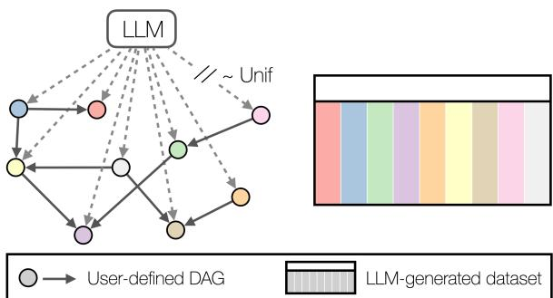  
Figure 1: Illustration of a sequence-driven structural causal model (SD-SCM), which uses a language model to sample data according to a user-specified DAG. Any variables whose values are sampled from the language model will potentially share the language model as a common cause (dashed arrows), unless sampled manually, e.g., uniformly.

Many use-cases are possible for sequential data (like text) with controllable causal structure. The main use-case we explore in this work is the development of a new type of benchmark for causal inference — a benchmark for conditional average and individual treatment effect estimation, where neither the counterfactual outcomes y˜ nor the treatment assignments t˜are manually generated. This stands in contrast to existing causal inference benchmarks that must always manually generate y˜ or t˜, even if covariates are based on real data (see, e.g., Louizos et al. (2017)). We find that data generated using our procedure is indeed useful for this task and challenges state-of-the-art estimation methods across both conditional average treatment effect (CATE) and individual treatment effect (ITE)<sup>1</sup> estimation.

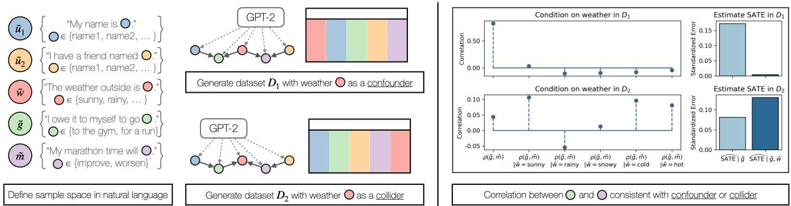

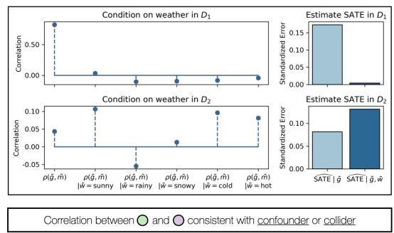  
Figure 2: Toy example showing SD-SCMs that use GPT-2 (Radford et al., 2019) to generate observational and counterfactual data corresponding to user-specified DAGs. In one case, the red node (weather, w˜) is a confounder. In the other case, w˜ is a collider. Plots on the right show that despite possible effects from dashed arrows, and DAGs that may contradict what we expect to happen in the real world, the generated data are indeed consistent with w˜ as a confounder or a collider.

## 1.1 Contribution.

1. We define a procedure for turning any language model and DAG into a sequencedriven structural causal model (SD-SCM). Section 3 characterizes how an SD-SCM provides access to observational, interventional, and counterfactual distributions over sequential data according to the desired DAG.

2. In Section 4, we use SD-SCMs to create an example benchmark for causal effect estimation and test a suite of popular estimation methods across CATE and ITE estimation. We find that our benchmark challenges stateof-the-art estimation methods. All benchmark datasets as well as code for SD-SCM-based data generation is available on GitHub.<sup>2</sup>

3. Section 5 demonstrates how this same technique can underpin auditing language models for (un)desirable causal effects.

Before describing our framework formally, we provide a toy example that illustrates the main points. Example 1 (Improving your marathon time at the gym). In this toy example, we use a language model to sample observational and counterfactual data corresponding to two imagined scenarios, each represented by a DAG. The variables we consider will be represented via sets of sequences, where each set can be viewed as a sample space:

• u˜ sample space: “My name is x.” for all x {John, Jane, Alice, Bob, Charlie}

• u˜<sub>2</sub> sample space: “I have a friend named x.” for all x {John, Jane, Alice, Bob, Charlie}

• weather (w˜) sample space: “The weather <sup>outside</sup> <sup>is</sup> x<sup>.”</sup> <sup>for</sup> <sup>all</sup> x P <sup>{sunny,</sup> <sup>rainy,</sup> <sup>snowy,</sup> cold, hot}

• gymOrRun (g˜) sample space: “I owe it to my-<sup>self</sup> <sup>to</sup> <sup>go</sup> x<sup>.”</sup> <sup>for</sup> x P <sup>{to</sup> <sup>the</sup> <sup>gym,</sup> <sup>for</sup> <sup>a</sup> <sup>run</sup> outside}

• marathonTime (m˜ ) sample space: “After this, my marathon time will x." for x {improve, worsen}

The difference between the two scenarios is what we choose to do with the weather variable w˜. In the first case, we choose DAG where w is a confounder $( \tilde { u } _ { 1 } \to \tilde { g }  \tilde { w } \to \tilde { m }  \tilde { u } _ { 2 } ) .$ . In the second case, we choose $D A G { \mathcal { G } } _ { 2 }$ where w˜ is instead a collider $( \tilde { u } _ { 1 } \to \tilde { g } \to \tilde { w }  \tilde { m }  \tilde { u } _ { 2 } )$ . Notice we have full control over the DAG we choose, regardless ofwhat we might expect to happen in the real world or be encoded by the language model (where, for example, we would not expect going to the gym to have any impact on the weather). Each ofthese DAGs, by definition, induces a corresponding factorization of the joint distribution across the 5 variables. The factorization for is $P ( \tilde { g } | \tilde { w } , \tilde { u } _ { 1 } ) P ( \tilde { m } | \tilde { w } , \tilde { u } _ { 2 } ) P ( \tilde { w } ) P ( \tilde { u } _ { 1 } ) P ( \tilde { u } _ { 2 } )$ <sup>and</sup> <sup>the</sup> <sup>factorization</sup> <sup>for</sup> G2 is $P ( \tilde { w } | \tilde { g } , \tilde { m } ) P ( \tilde { g } | \tilde { u } _ { 1 } ) P ( \tilde { m } | \tilde { u } _ { 2 } ) P ( \tilde { u } _ { 1 } ) P ( \tilde { u } _ { 2 } )$

Simulating an observational study: Our procedure will use a language model to define each of these conditional distributions, instead of defining them manually. In order to observe data thatfollows the correct structure, we iteratively sample each variable in ancestral order according to the desired DAG, allowing each variable to see only the text of its parents as input. Doing this allows us to use whatever correlations the language model has encoded to define structural equations. For example, to sample a single observation corresponding to , thefollowingfive phrases (onefor each covariate) are sampled using the language model, where [bracketed text] isfilled in by querying the model across the corresponding sample space:

• u˜<sub>1</sub> sample: “My name is [Charlie].”

• u˜<sub>2</sub> sample: “I have afriend named [Alice].”

• w˜ sample: “The weather outside is [cold].”

• g˜ u˜<sub>1</sub>, w˜ sample: “My name is Charlie. The weather outside is cold. I owe it to myselfto go [to the gym].”

• m˜ u˜<sub>2</sub>, w˜ sample: “I have afriend named Alice. The weather outside is cold. After this, my marathon time will [improve].”

Thesefive text completions correspond to a single observation, where possible values in each sample space are represented by their index. In other words, we have just observed the data point (u˜<sub>1</sub>, u˜<sub>2</sub>, w˜, g˜, m˜ ) = (4, 2, 3, 0, 0) sampled using DAG <sub>1</sub>. Figure 2 shows the result of repeating this process for 1000 observations with <sub>1</sub> and 1000 observations with <sub>2</sub> using GPT-2 (Radford et al., 2019) as the language model. For <sub>1</sub>, we would expect the magnitude of correlation ρ between P g˜  1 <sup>and</sup> Ppm˜ “ 1q <sup>to</sup> <sup>decrease</sup> <sup>if</sup> <sup>we</sup> <sup>condition</sup> <sup>on</sup> <sup>con-</sup> founder w˜. By contrast, for <sub>2</sub>, where w˜ is instead a collider, we would expect the magnitude ofρ to instead increase if we condition on w˜. Figure 2 shows that this is indeed the case — our sampled data reflects the desired causal structure.

Simulating counterfactual data: We can use a similar procedure to simulate interventions instead of observations: we intervene by manually setting an action (in this case, the value of covariate g˜), and we create a counterfactual outcome by additionally setting exogenous variables u˜<sub>1</sub>, u˜<sub>2</sub> and any observed non-descendants of g˜ — w˜ for <sub>1</sub> <sup>and</sup> H <sup>for</sup> 2<sup>.</sup> <sup>In</sup> <sup>Section</sup> <sup>3,</sup> <sup>we</sup> <sup>formally</sup> <sup>define</sup> <sup>the</sup> correspondence of this process to counterfactual versus interventional distributions. This allows us to directly simulate a counterfactual outcome for <sup>each</sup> <sup>of</sup> <sup>the</sup> <sup>observed</sup> <sup>units,</sup> <sup>choosing</sup> g˜ “ 1 <sup>or</sup> g˜ 0 during sampling to generate each unit’s potential outcomes. We can then, for example, test how well a treatment effect estimation method will perform if the estimation method is given only the observational data, i.e., data without any intervention. The right side of Figure 2 shows prediction error in standard deviation units when using a randomforest to predict the sample average treatment effect (SATE) with P m˜  1 as the outcome, either using treatment g˜ as the only covariate, or using both g˜ and w˜. As we would expect, including a confounder leads to more accurate effect estimation, while including a collider does not. This demonstrates in a simple way the utility of controlled causal data generation — we can benchmark effect estimation approaches in different settings of interest.

Benchmarking CATE and ITE estimation: Many realistic datasets existfor benchmarking estimation of average treatment effects (ATEs), because ATEs are oftenfeasible to isolate with proper study design. However, there is a lack ofsuch data for benchmarking CATE and ITE estimation, where either the outcomes or treatment assignments must always be manually generated. The key benefit of simulating data this way is that individual-level counterfactual data are observable and controllable. This allows us to not only test ATE estimation methods like in Figure 2, but more importantly to benchmark individual-level effect estimation.

In the remaining sections, we formalize our procedure beyond this toy example and demonstrate how it can be used to generate more complex data that challenges state-of-the-art causal inference methods across both CATE and ITE estimation.

## 2 Related work

Causal inference benchmarks and evaluation. Curth et al. (2021) lay out four categories of commonly-used methods for semi-synthetic data generation with known causal effects: (1) simulating treatment effects using real baseline outcomes (Knaus et al., 2021); (2) using real covariates but simulating response surfaces (Wendling et al., 2018; Franklin et al., 2014; Hill, 2011); (3) performing biased sampling of randomized data (Gentzel et al., 2021; Dehejia and Wahba, 1999); and (4) constructing (proxies of) counterfactuals and interventions from real or empirical data (Louizos et al., 2017; Gentzel et al., 2019). The paradigm of fitting models to real data and then sampling synthetic data from the fit models is common in many works (Schuler et al., 2017; Neal et al., 2020). In this area, the most closely related works to ours in spirit are those that fit generative models to real datasets such that treatments, outcomes, and covariates — in effect, entirely new datasets — can be sampled, such as Athey et al. (2024) and Neal et al. (2020). While such methods are similar in that they rely on generative models, they are fundamentally different from ours, as they are based on individual datasets that already exist (and already have a fixed causal structure), rather than allowing for arbitrary causal structures to be imagined by a user and then parameterized by a generative model. Our setup is akin to a high-fidelity simulation environment (McDuff et al., 2022) that provides empirical counterfactual data (Gentzel et al., 2019), but without needing to manually design all aspects of the simulation, and in a manner that is instead based on natural language. This work is also loosely related to methods that parameterize structural causal models (SCMs) with generative models or other deep learning components, such as Pawlowski et al. (2020); Sanchez and Tsaftaris (2022), but such methods are geared towards counterfactual inference and learning causal relationships from existing data, rather than flexible data generation.

Language models and causal inference. Our work is not the first to suggest that language models can generate outputs that have casual structure. Many works aim to augment language models with the ability to generate counterfactual data (Chatzi et al., 2024; Li et al., 2023; Betti et al., 2023; Hao et al., 2021; Gat et al., 2023). Counterfactuals and causal reasoning are useful across various natural language processing (NLP) tasks, making this capability of particular interest for ongoing LM research (Wang et al., 2024), and language models with causal reasoning capabilities have a wide variety of applications both within and beyond NLP (Vashishtha et al., 2023; Jin et al., 2023a; Zecevic et al., 2023; Liu et al., 2024; Feder et al., 2021; Kıcıman et al., 2023; Jin et al., 2023b; Gat et al., 2023). We are also not the first to point out that counterfactual data generation with language models is useful for understanding the internal ‘world model’ constructed by an LM and auditing for bias (Fryer et al., 2022). The most similar works to ours that we know of are the contemporaneous works Chatzi et al. (2024) and Ravfogel et al. (2024), which also model counterfactuals in LMs using SCMs. These works focus on how to generate counterfactual strings after network interventions within the LM itself. To achieve this, they leverage the Gumbel-Max trick to infer the noise responsible for generating an input and reuse the same noise (or an inferred noise distribution) to generate a corresponding counterfactual output. Our work is fundamentally different in two key ways. First, we consider semantic interventions rather than network interventions, i.e., modeling causal relationships and counterfactuals all within a semantically meaningful simulation based on a fixed LM. Second, we control the causal structure of the data generation process, taking a DAG as input and generating data according to that DAG.

In more general terms, we focus on how to generate data given a desired causal structure. This capability has important use-cases for downstream tasks like the ones we demonstrate here — generating treatment effects to benchmark effect estimation methods and testing for encoded effects. But more broadly, we provide a generalization of how sequence data and structural causal models can be combined in order to flexibly generate observational, interventional, and counterfactual data for whatever purpose it might be useful.

## 3 Controlled causal data generation via language model

In this section, we briefly describe how SD-SCMs enable sampling from observational, interventional, and counterfactual distributions according to the desired causal structure. The full set of definitions, notation, and algorithms for SD-SCMs using structural causal models can be found in Appendix A.

We define a sequence variable x˜ as a random variable whose sample space $\Omega _ { \tilde { x } }$ is a set of sequences. We then define an SD-SCM as a 5- tuple $\boldsymbol { \mathfrak { B } } \ = \ ( \mathbf { V } , \mathbf { U } , \mathcal { G } , \mathcal { P } , \tau )$ , where V is a set of finite-domain endogenous/observed sequence variables and U a set of finite-domain exogenous/unobserved sequence variables; is a DAG over the variables $\tilde { x } _ { i }$ in $\mathbf { V } \cup \mathbf { U }$ where $\mathbf { P A } _ { i } \subseteq \mathbf { \Gamma }$ $( \mathbf { V } \cup \mathbf { U } ) \backslash \{ \tilde { x } _ { i } \} ; \mathcal { P }$ is a language model trained on prior inputs $C$ whose vocabulary $\mathbb { V }$ contains all tokens used in $\Omega _ { \mathbf { V } } , \Omega _ { \mathbf { U } } ;$ and τ is an arbitrary fixed topological ordering of $\mathbf { V } \cup \mathbf { U }$ consistent with .

The general procedure for sampling data from an SD-SCM relies on two simple ideas: (1) creating concatenated prior inputs for each variable using only the sequences of its parents, which we term parent-only concatenation, and (2) restricting the domain of the LM over the current variable’s sample space, termed domain-restricted sampling.

Sampling proceeds in topological order according to τ, which is required in order to break ties between parents, since LMs can be sensitive to even small changes in phrasing. The key difference between an SCM and an SD-SCM is that all variables have at least one common ancestor — the prior inputs C that were used to train the language model.<sup>3</sup>

Observational samples. Observational data are sampled using parent-only concatenation and domain-restricted sampling for each variable according to τ (Appendix A.2).

Interventional samples. The sequence-driven interventional distribution, given $\mathrm { d } \mathbf { o } ( \tilde { v } _ { i } = v )$ as the intervention, samples data in the same manner as observational sampling, but now with variable $\tilde { v } _ { i } \mathrm { r e - }$ placed by value v during sampling (Definition A.8).

Algorithm 1 A single SD-SCM sample from the   
counterfactual distribution given observation $\mathbf { s _ { \mathrm { o b s } } }$   
Inputs: $\mathbf { s } _ { \mathrm { o b s } } = \left( u _ { 1 } , \ldots , u _ { | \mathbf { U } | } , v _ { 1 } , \ldots , v _ { | \mathbf { V } | } \right)$   
do $( \tilde { v } _ { i } = v ) , \Re = ( \mathbf { V } , \mathbf { U } , \mathcal { G } , \mathcal { P } ( \cdot ) , \tau )$   
Returns: $\mathbf { s } ^ { * } = \left( u _ { 1 } , \ldots , u _ { | \mathbf { U } | } , v _ { 1 } ^ { * } , \ldots , v _ { | \mathbf { V } | } ^ { * } \right)$   
$\mathbf { s } ^ { * }  ( u _ { 1 } , \dotsc , u _ { | \mathbf { U } | } )$   
$\mathrm { N D } _ { i } \gets$ non-descendants of $\tilde { v } _ { i }$ in $\mathcal { G }$   
for $\tilde { x } _ { t } \in \tau \backslash \mathbf { U }$ do   
if $\tilde { x } _ { t } \equiv \tilde { v } _ { i }$ then   
$\mathbf { \Sigma } _ { | } \mathbf { \Sigma } _ { x _ { t } } \gets v$   
end   
else if $\tilde { x } _ { t } \in N D _ { i }$ then   
$x _ { t } \gets \mathbf { s } _ { \mathrm { o b s } } [ t ]$   
end   
else   
$\mathrm { P A } _ { \tau } \gets \{ t ^ { \prime } : \tilde { x } _ { t ^ { \prime } } \in \mathrm { P A } _ { \tilde { x } _ { t } } \}$ ordered by $\tau$   
$x _ { \mathrm { P A } _ { \tau } }  \mathbb { \oplus } _ { x \in \mathbf { s } ^ { * } [ \mathrm { P A } _ { \tau } ] } x$   
px˜t Ð rs   
for $k \in { 1 , \dots , | \Omega _ { \tilde { x } _ { t } } | }$ do   
$\boldsymbol { x } \gets \Omega _ { \tilde { \boldsymbol { x } } _ { t } } [ k ]$   
$\mathbf { p } _ { \tilde { x } _ { t } } [ k ] \gets \mathcal { P } \left( x _ { \mathrm { P A } _ { \tau } } \oplus x \right)$   
end   
$\begin{array} { r } { P _ { \mathrm { t o t } }  \sum _ { k } \mathbf { p } _ { \tilde { x } _ { t } } [ k ] } \end{array}$   
$j \sim$ Multinomial $\left( \mathbf { p } _ { \tilde { x } _ { t } } / P _ { \mathrm { t o t } } \right)$   
$\boldsymbol { x } _ { t } \gets \Omega _ { \tilde { \boldsymbol { x } } _ { t } } [ j ]$   
end   
append $( \mathbf { s } ^ { * } , x _ { t } )$   
end   
return $\mathbf { s } ^ { * }$

Counterfactual samples. Counterfactual samples require some additional steps. In order to admit unique answers to counterfactual queries, we define abduction for an SD-SCM given evidence $\mathbf { Z } = \mathbf { z }$ as the setting of values $\mathbf { U } = \mathbf { u }$ as well as any evidence in Z upstream of the intervention. In order to obtain such values u, one needs access to more than just the endogenous variables V and language model — obtaining u requires performing bookkeeping during the data generation process.<sup>4</sup> Because our primary application of SD-SCMs in this work is data generation, such bookkeeping is possible in all our use cases. Algorithm 1 shows our procedure for sampling a counterfactual for intervention ${ \mathrm { d } } \mathbf { o } ( \tilde { v } _ { i } = v )$ given observed unit $\mathbf { s } _ { \mathrm { o b s } } = \left( u _ { 1 } , \ldots , u _ { | \mathbf { U } | } , v _ { 1 } , \ldots , v _ { | \mathbf { V } | } \right)$ (see also Definition A.9 for additional discussion).

## 4 Generating a benchmark for causal effect estimation

To design an SD-SCM-generated benchmark, we focus on the fully sequential DAG structure shown in Figure 3a. Exogenous variables U precede covariates X, which in turn precede treatment $\tilde { t } .$ All variables precede outcome y˜. Recall that the presence of an edge in a DAG allows for the possibility of a relationship, but it is the structural equations that determine whether or not a given relationship is meaningful. The strongest assumptions encoded by a DAG, then, are those edges that are not present. Our goal here is to have a language model $\mathcal { P }$ make as many ‘decisions’ about the data generating process as possible. We thus choose this fully-connected structure as a means of letting $\mathcal { P }$ define whichever structural equations are meaningful or not given a topological order, and focus on the edge $\tilde { t }  \tilde { y }$ as the target for effect estimation. The key criterion we consider for a useful benchmark is that the datasets we generate require the use of causal reasoning (e.g., controlling for confounding) to recover the effect of t˜on ${ \tilde { y } } .$ . Specifically, we aim to generate data for which the observational and interventional distributions are different, i.e., $P _ { \tilde { y } | \tilde { t } = t } ^ { \mathfrak { B } } \neq P _ { \tilde { y } } ^ { \mathfrak { B } ; \mathrm { d o } ( \tilde { t } = t ) }$ . This criterion is not directly in our control given a fixed language model $\mathcal { P } . ^ { 5 }$ However, even with fixed $\mathcal { P }$ and a fixed DAG, we find we are able to achieve it through our choice of sample spaces $\Omega _ { \mathbf { U } } , \Omega _ { \mathbf { X } } , \Omega _ { \widetilde { t } } , \Omega _ { \widetilde { y } }$

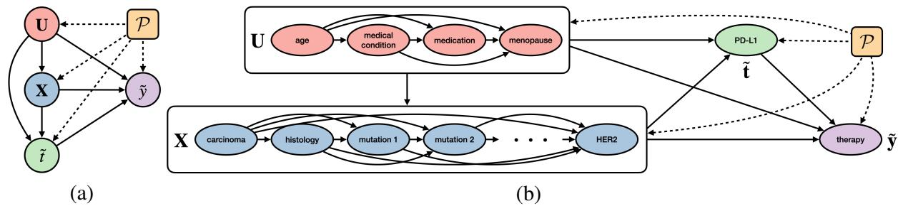  
Figure 3: (a) A useful DAG structure for an SD-SCM-generated estimation benchmark. (b) Visual depiction of the structure in (a) used to create the breast cancer SD-SCM in Section 4.1.

## 4.1 Breast cancer SD-SCM

We define an SD-SCM over 14 variables in order to explore the effect of a tumor’s PD-L1 expression levels on different breast cancer therapy plans. Our goal with this SD-SCM is to induce causal structure that can challenge estimation algorithms. Covariates in the breast cancer SD-SCMs are defined in full detail in Appendix B and correspond to the DAG in Figure 3b. For each covariate, 10 different phrasings are considered, resulting in a sample space of $1 0 ^ { 1 4 }$ possible sequences.<sup>6</sup> We consider 50 different SD-SCM variations, where the sample space for a given SD-SCM is defined by choosing a randomly sampled phrasing from among the possible phrasings for each of the 14 covariates. Then, for each of the 50 SD-SCMs, 20 datasets of size 1,000 are sampled, for a total of 1,000 datasets per language model. We show results for GPT-2 (Radford et al., 2019) and Llama-3-8b (Dubey et al., 2024), but we emphasize that the language model is a fully modular component, and thus other language models can be used. For the results shown here, we use log $\mathrm { P } ( \tilde { y } = 0 )$ as the outcome, as there are frequently individual-level effects in probability space. See Appendix B for example plots of features, propensity scores, and ITE distributions of the generated data using different possible outcomes. We find that how similar $P _ { \tilde { y } } ^ { \tilde { \mathfrak { B } } ; \mathrm { d o } ( \tilde { t } = t ) }$ is to $P _ { \tilde { y } | \tilde { t } = i } ^ { \mathfrak { B } }$ varies across SD-SCMs, which we explore further by comparing the performance of observational versus casual estimation approaches.

## 4.2 Effect estimation results

We compare the performance of several effect estimation algorithms. As a naive baseline, ordinary least squares using only the treatment t˜is considered (T-Only OLS). Against this baseline, we consider several causal inference methods of different types, including the causal forest (Wager and Athey, 2018; Athey et al., 2019) (CausalForest) and two double machine learning methods for CATE estimation, one linear (LinearDML) and one non-parametric (ForestDML) (Chetverikov et al., 2016; Athey et al., 2019; Nie and Wager, 2021; Chernozhukov et al., 2017; Foster and Syrgkanis, 2023; Mackey et al., 2018; Battocchi et al., 2019). We also include two doubly robust meta-learning methods (Künzel et al., 2019), again, one linear (LinearDR) and one non-parametric (ForestDR), and add Bayesian additive regression trees (BART) (Hill, 2011; Chipman et al., 2008) as a widely-used Bayesian non-parametric example. To represent simpler methods we include linear and non-parametric S- and T-learners (LinearS, LinearT, ForestS, ForestT). As points of reference for NN-based CATE estimation methods, we include an NN-based T-learner (TNet), and the NNbased TARNet (Shalit et al., 2017). Additional baselines include a random forest baseline (RF) that fits a single response surface and directly predicts treatment effects for each unit, and a linear regression baseline (LinReg) that takes the conditional mean difference (the fit coefficient on $\tilde { t } )$ to be the effect. Finally, we include two methods that target ITEs specifically. One method uses BART posterior draws specifically for ITEs instead of CATEs (BART-ITE), and the other is conformalized counterfactual quantile regression (CQR) (Lei and Candès, 2020), which provides conformal inference-based interval estimates of ITEs.

All methods are fit using the default settings of their publicly-available implementations.<sup>7</sup> While additional hyperparameter tuning, etc. could be performed for several methods on a case-by-case basis, this section demonstrates what estimation results we get off-the-shelf.

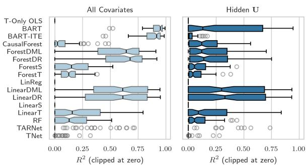  
(a)  
(b)

Figure 4: CATE and ITE estimation on SD-SCM datasets of size 10,000 generated using Llama-3-8b. (a) $R ^ { 2 }$ values across all methods that provide point estimates. (b) Empirical coverage (α 0.05) and interval width (in outcome standard deviation units) for methods that provide intervals. Nominal coverage of 95% is indicated by the red line.  
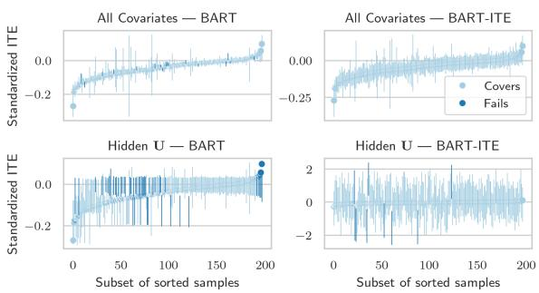  
Figure 5: Interval estimates of CATEs/ITEs from BART versus BART-ITE on an example SD-SCM dataset.

A note on identification. Estimation algorithms are designed to work when identification assumptions are met, many of which are untestable. In this section, we demonstrate how SD-SCMs can provide a playground to empirically test how algorithms perform not only in ideal conditions but also when untestable assumptions are not met. This is particularly relevant for CATEs and ITEs, where, for example, we might not expect to measure all relevant covariates for each individual unit. In other words, in practice we might not expect to satisfy ignorability. We consider two settings to explore this question empirically. In the ‘All Covariates’ setting, all 14 covariates are observed. In ‘Hidden U, ${ \bf U } = \left\{ \tilde { u } _ { 1 } , \tilde { u } _ { 2 } , \tilde { u } _ { 3 } , \tilde { u } _ { 4 } \right\} =$ {age, medical conditions, medication, menopausal status} is hidden.

## 4.2.1 Average treatment effects

Though we focus on CATE and ITE estimation, we first confirm in Appendix C.1 that methods can recover the ATE. We find that (1) there is a meaningful gap between casual and observational methods and that (2) estimation performance does indeed drop significantly when U is hidden.

## 4.2.2 CATE and ITE estimation

To lessen the impact of finite-sample issues, we test on datasets of size 10,000, aggregated within each SD-SCM variation. We show results for Llama-3- 8b-generated data in this section, but find similar trends with GPT-2 as well as with dataset size 1,000 in Appendix C. Figure 4a shows $R ^ { 2 }$ values clipped at zero across all methods that provide point estimates for CATEs. When all covariates are observed, BART explains the most CATE variation, while DML and DR methods do as well at times but with a much lower average. However, CATE estimation becomes much more challenging for all methods with hidden U, where no methods perform well. Figures 11 and 12 in Appendix C show the same results in terms of PEHE (Precision in Estimating Heterogeneous Effects) (Hill, 2011), revealing that with no clipping, BART-ITE shows large outliers with hidden U and NN methods show large outliers in both settings.

When the ITE varies due to covariates not conditioned on in the CATE, as in the hidden U setting, the two quantities are distinct. In such cases, uncertainty is especially important. Figure 4b shows empirical coverage results for all estimators that provide intervals. With all covariates, empirical coverage is under nominal for all methods that target CATE, except BART. Hidden U increases uncertainty, but also brings coverage closer to nominal for several methods, like LinearDML and both DR methods. CQR remains at or above nominal coverage, but with much wider intervals, as does BART-ITE in the ITE setting. Figure 5 demonstrates this further, comparing intervals for BART targeting CATE versus BART-ITE on an example dataset. With all covariates (top row), intervals from either method are informative about individual-level effects. However, under hidden U (bottom row), the tighter intervals of BART targeting the CATE are overconfident with variable coverage, and the wider intervals of BART-ITE are so wide as to be vacuous, even if we want just a ranking of the ITEs.

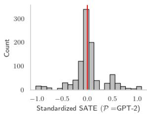

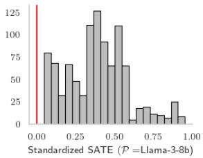  
Figure 6: SATEs across all breast cancer SD-SCMs for outcome P therapy  2 .

Takeaways. We summarize a few takeaways for off-the-shelf estimation performance in this example. The first is that linear and tree-based methods are often able to perform well. Second, in a real-world setting, where a method might often be used with its default parameters, stability can be important (e.g., the NN method performance suffers often due to lack of stability). The third takeaway is that hidden confounding has a big impact, across all methods. Even methods that perform particularly well with all covariates (like BART) suffer significantly under hidden U. Finally, ITE intervals can be unstable and/or vacuous for decision making, especially with hidden variables, and should thus be used carefully.

## 5 Auditing language models for (un)desirable causal effects

The same framework we use to generate causal effects and benchmark effect estimation methods can allow us to inspect what causal information has been encoded semantically in an LM. For example, we can ask, “Given a world-view described by an input DAG, what causal conclusion is implied by the language model?” Our collection of breast cancer SD-SCMs is already set up to explore the effect of PD-L1 on chosen therapy plans, while allowing us to marginalize out an important source of variability: phrasing. Essentially, this amounts to reverse engineering the decision-making process of clinicians, as learned from whatever data the language model was trained on.

Figure 6 shows one example where the two language models strongly disagree on what the causal effect is. The effect in this case is the change in probability of choosing the second therapy plan, “start a regimen of trastuzumab and pertuzumab” (shown in standard deviation units). GPT-2 has encoded that on average, an increase in PD-L1 expression levels has neither a positive nor negative impact on choosing this therapy plan. However, Llama-3-8b has encoded instead that an increase in PD-L1 always increases the likelihood of this therapy plan. This discrepancy indicates that these two language models have encoded two meaningfully different causal effects. We believe the same procedure can underpin more thorough auditing of LMs for misinformation or discrimination, enabling, e.g., path-specific counterfactual fairness analysis (Kusner et al., 2017; Chiappa, 2018).

## 6 Conclusion and Future Work

In this work, we have introduced sequence-driven structural causal models (SD-SCMs) as a framework for specifying SCMs with user-defined structure and LM-defined mechanisms. We demonstrate an important use-case for SD-SCMs by creating a benchmark for causal effect estimation. In this proof of concept, we focused on estimation in the presence of confounding, but there are many other settings to explore for effect estimation, such as instrumental variables (Angrist et al., 1993; Hernán and Robins, 2006). Using SD-SCMs to additionally test causal discovery is of immediate interest, for example, allowing us to test whether a structure learning method can identify whether one variable is causally upstream or downstream of another (Krämer et al., 2013). Another significant area of future work is to use SD-SCMs or similar as a means of specifying causal structure over sequential data during learning (Im et al., 2024); rather than use pre-trained LMs to generate effects, a model can be trained or fine-tuned to handle tasks that require causal reasoning, including complex confounding and sequential decision making.

In short, we believe SD-SCMs can serve as a stepping stone for any application that would benefit from sequential data with controllable causal structure.

## 7 Limitations

A key difficulty in generating data via SD-SCM for a use-case like benchmarking causal inference methods is to ensure the data have meaningful structure (e.g., significant non-trivial relationships between variables). The reason for this challenge is, in part, by design: the user does not directly specify structural equations. Instead, the structural equations are determined by whatever the language model has already encoded. This reliance on what has been previously encoded by a pre-trained language model can sometimes be limiting, motivating a direction of future extensions of SD-SCMs focused on training LMs to induce relationships between variables while following an input causal structure, rather than using pre-trained LMs.

A related limitation in the current work is the need to manually account for the sensitivity of generated data to input variable phrasings. For example, in the breast cancer SD-SCMs, we manually create many different phrasings of each sequence variable in order to account for this source of variability. This can be a tedious process as the number of variables grows and could be automated end-toend in future work.

Risks and societal consequences. There are many potential societal consequences of our work, which are essentially those shared by any modelagnostic application of language models. Pretrained language models often come with inherent biases and inaccuracies. Generated data may still include such biases or inaccuracies, whether intentional or not. Any future work that builds on this work for the purposes of auditing language models will also inherit the limitations of all tools for model explainability: model explanations always have the potential to be misleading or oversimplified.

## Acknowledgments

This research was supported in part by National Science Foundation (NSF) award No. 1922658 and the Samsung Advanced Institute of Technology (under the project Next Generation Deep Learning: From Pattern Recognition to AI). We are grateful to Roman Mutel, Yulia Maksymiuk, and Julia Stoyanovich for involvement in early discussions of this work and feedback on data storage.

## References

Joshua David Angrist, Guido Imbens, and Donald B. Rubin. 1993. Identification of causal effects using instrumental variables.

Susan Athey, Guido W. Imbens, Jonas Metzger, and Evan Munro. 2024. Using wasserstein generative adversarial networks for the design of monte carlo simulations. Journal ofEconometrics, 240(2):105076.

Susan Athey, Julie Tibshirani, and Stefan Wager. 2019. Generalized random forests.

Alexander Balke and Judea Pearl. 1994. Probabilistic evaluation of counterfactual queries. Probabilistic and Causal Inference.

Keith Battocchi, Eleanor Dillon, Maggie Hei, Greg Lewis, Paul Oka, Miruna Oprescu, and Vasilis Syrgkanis. 2019. EconML: A Python Package for ML-Based Heterogeneous Treatment Effects Estimation. https://github.com/py-why/EconML. Version 0.x.

Lorenzo Betti, Carlo Abrate, Francesco Bonchi, and Andreas Kaltenbrunner. 2023. Relevance-based infilling for natural language counterfactuals. Proceedings of the 32nd ACM International Conference on Information and Knowledge Management.

Ivi Chatzi, Nina Corvelo Benz, Eleni Straitouri, Stratis Tsirtsis, and Manuel Gomez-Rodriguez. 2024. Counterfactual token generation in large language models. ArXiv, abs/2409.17027.

Victor Chernozhukov, Matt Goldman, Vira Semenova, and Matt Taddy. 2017. Orthogonal machine learning for demand estimation: High dimensional causal inference in dynamic panels. arXiv, pages arXiv–1712.

D Chetverikov, M Demirer, E Duflo, C Hansen, WK Newey, and V Chernozhukov. 2016. Double machine learning for treatment and causal parameters. 2016.

Silvia Chiappa. 2018. Path-specific counterfactual fairness. In AAAI Conference on Artificial Intelligence.

Hugh A. Chipman, Edward I. George, and Robert E. McCulloch. 2008. Bart: Bayesian additive regression trees. The Annals ofApplied Statistics, 4:266–298.

Alicia Curth, David Svensson, James Weatherall, and Mihaela van der Schaar. 2021. Really doing great at estimating cate? a critical look at ml benchmarking practices in treatment effect estimation. In NeurIPS Datasets and Benchmarks.

Alicia Curth and Mihaela van der Schaar. 2021a. Nonparametric estimation of heterogeneous treatment effects: From theory to learning algorithms. In Proceedings ofthe 24th International Conference on Artificial Intelligence and Statistics (AISTATS). PMLR.

Alicia Curth and Mihaela van der Schaar. 2021b. On inductive biases for heterogeneous treatment effect estimation.

Rajeev H Dehejia and Sadek Wahba. 1999. Causal effects in nonexperimental studies: Reevaluating the evaluation of training programs. Journal ofthe American statistical Association, 94(448):1053–1062.

Vincent Dorie and Jennifer L. Hill. 2020. Causal inference using bayesian additive regression trees [r package bartcause version 1.0-4].

Abhimanyu Dubey, Abhinav Jauhri, Abhinav Pandey, Abhishek Kadian, Ahmad Al-Dahle, Aiesha Letman, Akhil Mathur, Alan Schelten, Amy Yang, Angela Fan, and 1 others. 2024. The llama 3 herd of models. arXiv preprint arXiv:2407.21783.

Amir Feder, Katherine A. Keith, Emaad A. Manzoor, Reid Pryzant, Dhanya Sridhar, Zach Wood-Doughty, Jacob Eisenstein, Justin Grimmer, Roi Reichart, Margaret E. Roberts, Brandon M Stewart, Victor Veitch, and Diyi Yang. 2021. Causal inference in natural language processing: Estimation, prediction, interpretation and beyond. Transactions of the Association for Computational Linguistics, 10:1138–1158.

Dylan J Foster and Vasilis Syrgkanis. 2023. Orthogonal statistical learning. The Annals of Statistics, 51(3):879–908.

Jessica M Franklin, Sebastian Schneeweiss, Jennifer M Polinski, and Jeremy A Rassen. 2014. Plasmode simulation for the evaluation of pharmacoepidemiologic methods in complex healthcare databases. Computational statistics & data analysis, 72:219–226.

Zee Fryer, Vera Axelrod, Ben Packer, Alex Beutel, Jilin Chen, and Kellie Webster. 2022. Flexible text generation for counterfactual fairness probing. ArXiv, abs/2206.13757.

Yair Ori Gat, Nitay Calderon, Amir Feder, Alexander Chapanin, Amit Sharma, and Roi Reichart. 2023. Faithful explanations of black-box nlp models using llm-generated counterfactuals. ArXiv, abs/2310.00603.

Amanda Gentzel, Dan Garant, and David Jensen. 2019. The case for evaluating causal models using interventional measures and empirical data. In Advances in Neural Information Processing Systems, volume 32. Curran Associates, Inc.

Amanda M Gentzel, Purva Pruthi, and David Jensen. 2021. How and why to use experimental data to evaluate methods for observational causal inference. In International Conference on Machine Learning, pages 3660–3671. PMLR.

Changying Hao, Liang Pang, Yanyan Lan, Yan Wang, Jiafeng Guo, and Xueqi Cheng. 2021. Sketch and customize: A counterfactual story generator. ArXiv, abs/2104.00929.

Miguel A. Hernán and James M. Robins. 2006. Instruments for causal inference: An epidemiologist’s dream? Epidemiology, 17:360–372.

Jennifer L. Hill. 2011. Bayesian nonparametric modeling for causal inference. Journal ofComputational and Graphical Statistics, 20:217 – 240.

Paul Holland. 1985. Statistics and causal inference. Journal of the American Statistical Association, 81:945–960.

Daniel Jiwoong Im, Kevin Zhang, Nakul Verma, and Kyunghyun Cho. 2024. Using deep autoregressive models as causal inference engines. ArXiv, abs/2409.18581.

Zhijing Jin, Yuen Chen, Felix Leeb, Luigi Gresele, Ojasv Kamal, Zhiheng Lyu, Kevin Blin, Fernando Gonzalez Adauto, Max Kleiman-Weiner, Mrinmaya Sachan, and Bernhard Schölkopf. 2023a. Cladder: A benchmark to assess causal reasoning capabilities of language models. ArXiv, abs/2312.04350.

Zhijing Jin, Jiarui Liu, Zhiheng Lyu, Spencer Poff, Mrinmaya Sachan, Rada Mihalcea, Mona T. Diab, and Bernhard Scholkopf. 2023b. Can large language models infer causation from correlation? ArXiv, abs/2306.05836.

Michael C Knaus, Michael Lechner, and Anthony Strittmatter. 2021. Machine learning estimation of heterogeneous causal effects: Empirical monte carlo evidence. The Econometrics Journal, 24(1):134– 161.

Andreas Krämer, Jeff Green, Jack Pollard, and Stuart Tugendreich. 2013. Causal analysis approaches in ingenuity pathway analysis. Bioinformatics, 30:523 – 530.

Sören R Künzel, Jasjeet S Sekhon, Peter J Bickel, and Bin Yu. 2019. Metalearners for estimating heterogeneous treatment effects using machine learning. Proceedings of the national academy of sciences, 116(10):4156–4165.

Matt J. Kusner, Joshua R. Loftus, Chris Russell, and Ricardo Silva. 2017. Counterfactual fairness. ArXiv, abs/1703.06856.

Emre Kıcıman, Robert Osazuwa Ness, Amit Sharma, and Chenhao Tan. 2023. Causal reasoning and large language models: Opening a new frontier for causality. ArXiv, abs/2305.00050.

Lihua Lei and Emmanuel J. Candès. 2020. Conformal inference of counterfactuals and individual treatment effects. Journal ofthe Royal Statistical Society: Series B (Statistical Methodology), 83.

Yongqi Li, Mayi Xu, Xin Miao, Shen Zhou, and Tieyun Qian. 2023. Prompting large language models for counterfactual generation: An empirical study. In International Conference on Language Resources and Evaluation.

Xiaoyu Liu, Paiheng Xu, Junda Wu, Jiaxin Yuan, Yifan Yang, Yuhang Zhou, Fuxiao Liu, Tianrui Guan, Haoliang Wang, Tong Yu, Julian McAuley, Wei Ai, and Furong Huang. 2024. Large language models and causal inference in collaboration: A comprehensive survey. ArXiv, abs/2403.09606.

Christos Louizos, Uri Shalit, Joris M. Mooij, David A. Sontag, Richard S. Zemel, and Max Welling. 2017. Causal effect inference with deep latent-variable models. In Neural Information Processing Systems.

Lester Mackey, Vasilis Syrgkanis, and Ilias Zadik. 2018. Orthogonal machine learning: Power and limitations. In International Conference on Machine Learning, pages 3375–3383. PMLR.

Daniel McDuff, Yale Song, Jiyoung Lee, Vibhav Vineet, Sai Vemprala, Nicholas Alexander Gyde, Hadi Salman, Shuang Ma, Kwanghoon Sohn, and Ashish Kapoor. 2022. Causalcity: Complex simulations with agency for causal discovery and reasoning. In Conference on Causal Learning and Reasoning, pages 559–575. PMLR.

Brady Neal, Chin-Wei Huang, and Sunand Raghupathi. 2020. Realcause: Realistic causal inference benchmarking. ArXiv, abs/2011.15007.

Xinkun Nie and Stefan Wager. 2021. Quasioracle estimation of heterogeneous treatment effects. Biometrika, 108(2):299–319.

Nick Pawlowski, Daniel Coelho de Castro, and Ben Glocker. 2020. Deep structural causal models for tractable counterfactual inference. Advances in neural information processing systems, 33:857–869.

Jonas Peters, Dominik Janzing, and Bernhard Schölkopf. 2017. Elements of causal inference: Foundations and learning algorithms.

Alec Radford, Jeff Wu, Rewon Child, David Luan, Dario Amodei, and Ilya Sutskever. 2019. Language models are unsupervised multitask learners.

Shauli Ravfogel, Anej Svete, Vésteinn Snæbjarnarson, and Ryan Cotterell. 2024. Gumbel counterfactual generation from language models. Preprint, arXiv:2411.07180.

Pedro Sanchez and Sotirios A. Tsaftaris. 2022. Diffusion causal models for counterfactual estimation. In CLEaR.

Alejandro Schuler, Ken Jung, Robert Tibshirani, Trevor Hastie, and Nigam Shah. 2017. Synth-validation: Selecting the best causal inference method for a given dataset. arXiv preprint arXiv:1711.00083.

Uri Shalit, Fredrik D Johansson, and David Sontag. 2017. Estimating individual treatment effect: generalization bounds and algorithms. In International conference on machine learning, pages 3076–3085. PMLR.

Aniket Vashishtha, Abbavaram Gowtham Reddy, Abhinav Kumar, Saketh Bachu, Vineeth N. Balasubramanian, and Amit Sharma. 2023. Causal inference using llm-guided discovery. ArXiv, abs/2310.15117.

Brian G. Vegetabile. 2021. On the distinction between "conditional average treatment effects" (cate) and "individual treatment effects" (ite) under ignorability assumptions. ArXiv, abs/2108.04939.

Stefan Wager and Susan Athey. 2018. Estimation and inference of heterogeneous treatment effects using random forests. Journal ofthe American Statistical Association, 113(523):1228–1242.

Yongjie Wang, Xiaoqi Qiu, Yu Yue, Xu Guo, Zhiwei Zeng, Yuhong Feng, and Zhiqi Shen. 2024. A survey on natural language counterfactual generation. ArXiv, abs/2407.03993.

Thierry Wendling, Kenneth Jung, Alison Callahan, Alejandro Schuler, Nigam H Shah, and Blanca Gallego. 2018. Comparing methods for estimation of heterogeneous treatment effects using observational data from health care databases. Statistics in medicine, 37(23):3309–3324.

M. Zecevic, Moritz Willig, Devendra Singh Dhami, and Kristian Kersting. 2023. Causal parrots: Large language models may talk causality but are not causal. ArXiv, abs/2308.13067.

## A Formal definition of sequence-driven structural causal models

We first introduce notation preliminaries in Appendix A.1 before formally defining our procedure in Appendix A.2.

## A.1 Preliminaries

Let lowercase letter with tilde v˜ denote a random variable, where v˜  v denotes the value it obtains. Let boldface capital letter $\textbf { V } = \{ \tilde { v } _ { 1 } , \ldots , \tilde { v } _ { n } \}$ denote a set of variables with value $\mathbf { V } = \mathbf { v } ,$ , capital $P _ { \tilde { v } }$ denote the cumulative distribution function of v˜, and lowercase $p _ { \tilde { v } }$ denote the density (or mass) function. Let $P _ { \tilde { v } | \tilde { x } = x }$ denote the conditional distribution of v˜ given $\tilde { x } = x$ and $P _ { \tilde { v } | \tilde { x } }$ denote the collection of $P _ { \tilde { v } | \tilde { x } = x }$ for all x. A sequence, or string, is an ordered collection of tokens. We represent this either as a tuple (e.g., sequence $v = ( w _ { 1 } , \ldots , w _ { T } )$ has tokens w<sub>t</sub>), or interchangeably as a single string (e.g., $v = w _ { 1 : T } \equiv \bigoplus _ { t = 1 } ^ { T } w _ { t }$ <sup>,</sup> <sup>where</sup> ‘ <sup>represents</sup> string concatenation).

Definition A.1 (Language model). Given a vocabulary V of possible tokens, we define a language model  as a joint distribution over any sequence of tokens $v ~ = ~ ( w _ { 1 } , \ldots , w _ { T } ) \in ~ \times _ { t = 1 } ^ { T } \mathbb { V } ,$ , where $\begin{array} { r } { \mathcal { P } ( v ) = \prod _ { t = 1 } ^ { T } \mathcal { P } ( w _ { t } \mid w _ { 1 : ( t - 1 ) } ) } \end{array}$

Definition A.2 (Structural causal model). We define a structural causal model (SCM) as a 4-tuple $\mathfrak { C } = ( \mathbf { V } , \mathbf { U } , \mathbf { F } , P _ { \mathbf { U } } )$ . In this tuple, V is a set of observed variables, U a set of unobserved (exogenous) variables, F a set of functions $\{ f _ { i } \} _ { i = 1 } ^ { | \mathbf { V } | }$ for each $\tilde { v } _ { i } \in \textbf { V }$ such that $\widetilde { v } _ { i } = f _ { i } ( \mathbf { P } \mathbf { A } _ { i } , \mathbf { U } _ { i } )$ where $\mathbf { P A } _ { i } \subseteq \mathbf { V } \backslash \{ { \tilde { v } } _ { i } \}$ represents the causal parents of $\tilde { v } _ { i }$ and $\mathbf { U } _ { i } \subseteq \mathbf { U }$ , and $P _ { \mathbf { U } }$ a distribution over U. A causal model can be represented visually as a directed acyclic graph (DAG) with nodes for U, V and directed edges for F. SCMs entail an observational distribution $P ^ { \mathfrak { C } }$ across variables $\mathbf { V } \cup \mathbf { U }$

Definition A.3 (Interventional distribution). An SCM C also entails the distribution of any subset of variables in $\mathbf { V } \cup \mathbf { U }$ following atomic intervention $I \ = \ \mathrm { d o } \left( \tilde { v } _ { i } : = v \right)$ , which replaces the structural mechanism $f _ { i }$ with fixed value v. Interventions can also be extended to general modifications of $f _ { i }$ . We denote an SCM after intervention I as ${ \mathfrak { C } } ^ { \mathrm { d o } ( I ) }$ and the resulting distribution as $P ^ { \mathrm { g } ; \mathrm { d o } ( I ) }$ 8

Counterfactual distributions are computed in a similar fashion, but first conditioning $P _ { \mathbf { U } }$ on a particular context before performing an intervention. Where ambiguous, we use an asterisk to denote counterfactual versions $\mathbf { V } ^ { * }$ of factual variables V (Balke and Pearl, 1994).

Definition A.4 (Counterfactual distribution). Counterfactual variable $\mathbf { Y } ^ { * }$ given a factual observation z and intervention do I (where $\mathbf { Y } , \mathbf { Z } \subseteq \mathbf { V } )$ can be computed via a three-step procedure often referred to as ‘abduction, action, prediction.’ Abduction uses observed evidence to obtain $P _ { \mathbf { U } | \mathbf { Z } = \mathbf { z } }$ from $P _ { \mathbf { U } }$ . Action performs intervention $\mathrm { d o } ( I )$ to obtain modified $\mathrm { { S C M } } \mathfrak { C } ^ { \mathrm { { d o } } ( I ) }$ . Prediction computes the probability of $\mathbf { Y } ^ { * }$ from ${ \mathfrak { C } } ^ { \mathrm { d o } ( I ) }$ and $P _ { \mathbf { U | Z = z } }$ . For general intervention I and observed assignment $\mathbf { Z } = \mathbf { z } ,$ we denote the counterfactual distribution $P ^ { \mathrm { e } | \mathbf { Z } = \mathbf { z } ; \mathrm { d o } ( I ) }$

## A.2 Sequence-driven structural causal models

Consider a collection of ordered random variables $( \tilde { v } _ { 1 } , \tilde { v } _ { 2 } , \tilde { v } _ { 3 } , \ldots )$ , whose sample spaces $\Omega _ { \tilde { v } _ { i } }$ each consist of sets of sequences. We define $\tilde { v } _ { 1 : m } \equiv$ $\textcircled { + } _ { t = 1 } ^ { m } \tilde { v } _ { t }$ as the concatenation of the sequences themselves. The sample space for the concatenation of sequences is the cartesian product of the constituent sample spaces $\times _ { t = 1 } ^ { m } \Omega _ { \tilde { v } _ { t } }$ . For brevity, we will use the term sequence variable to refer to a random variable whose sample space is a set of sequences. Two straightforward abstractions allow us to define SD-SCMs: domain-restricted sampling and parent-only concatenation.

```latex
Algorithm 2 A single SD-SCM sample from the
observational distribution
Inputs: $\boldsymbol { \mathfrak { B } } = ( \mathbf { V } , \mathbf { U } , \boldsymbol { \mathcal { G } } , \mathcal { P } ( \cdot ) , \tau )$
Returns: $\mathbf { s } = \left( u _ { 1 } , \ldots , u _ { | \mathbf { U } | } , v _ { 1 } , \ldots , v _ { | \mathbf { V } | } \right)$
s $ ( )$
for $\tilde { { \boldsymbol { x } } } _ { t } \in { \boldsymbol { \tau } }$ do
$\mathrm { P A } _ { \tau } \gets \{ t ^ { \prime } : \tilde { x } _ { t ^ { \prime } } \in \mathrm { P A } _ { \tilde { x } _ { t } } \}$ ordered by $\tau$
$x _ { \mathrm { P A } _ { \tau } }  \textcircled { + } _ { x \in \mathbf { s } [ \mathrm { P A } _ { \tau } ] } x$
$\mathbf { p } _ { \tilde { x } _ { t } } \gets [ ]$
for $k \in { 1 , \dots , | \Omega _ { \tilde { x } _ { t } } | }$ do
$\boldsymbol { x } \gets \Omega _ { \tilde { \boldsymbol { x } } _ { t } } [ k ]$
$\mathbf { p } _ { \tilde { x } _ { t } } [ k ] \gets \mathcal { P } \left( x _ { \mathrm { P A } _ { \tau } } \oplus x \right)$
end
$\begin{array} { r } { P _ { \mathrm { t o t } }  \sum _ { k } \mathbf { p } _ { \tilde { x } _ { t } } [ k ] } \end{array}$
$j \sim \mathrm { M u l t i n o m i a l } ( \mathbf { p } _ { \tilde { x } _ { t } } / P _ { \mathrm { t o t } } )$
$\boldsymbol { x } _ { t } \gets \Omega _ { \tilde { \boldsymbol { x } } _ { t } } [ j ]$
<sup>append</sup>ps, xtq
end
return s
```

Definition A.5 (Domain-restricted sampling). Given language model ${ \mathcal P } ,$ some prior inputs $C ,$ and a sequence variable $\tilde { v } _ { i }$ with sample space $\Omega _ { \tilde { v } _ { i } }$ domain-restricted sampling defines a distribution $\mathcal { P } _ { \tilde { v } _ { i } | C }$ over sample space $\Omega _ { \tilde { v } _ { i } }$ simply by tabulating and subsequently normalizing the output probabilities for each possible $v \in \Omega _ { \tilde { v } _ { i } }$ conditional on prior inputs C: $\begin{array} { r } { \mathcal { P } _ { \tilde { v } _ { i } | C } ( v ) \equiv \frac { \mathcal { P } ( v | C ) } { \sum _ { v ^ { \prime } \in \Omega _ { \tilde { v } _ { i } } } \mathcal { P } ( v ^ { \prime } | C ) } } \end{array}$

Definition A.6 (Parent-only concatenation). Given DAG $\mathcal { G }$ over m sequence variables $\left( \tilde { v } _ { 1 } , \ldots , \tilde { v } _ { m } \right)$ and a topological ordering $\tau$ consistent with $\mathcal { G } _ { : }$ parent-only concatenation defines $( { \tilde { v } } _ { i } \mid \mathbf { P } \mathbf { A } _ { i } ) \equiv$ $\left( \bigoplus _ { t \in \mathbf { P } \mathbf { A } _ { i } } \tilde { v } _ { t } \right)$ ‘ v˜i<sup>,</sup> <sup>where</sup> $\mathbf { P A } _ { i }$ are the parents of $\tilde { v } _ { i }$ in $\mathcal { G }$ ordered according to τ.

Given a DAG $\mathcal { G }$ and a language model ${ \mathcal P } _ { \mathrm { { : } } }$ , a corresponding sequence-driven SCM defines a sample space of sequences for each variable in $\mathcal { G }$ and provides access to observational, interventional, and counterfactual distributions as follows.

Definition A.7 (Sequence-driven structural causal model (SD-SCM)). We define a sequence-driven structural causal model as a 5-tuple $\begin{array} { r l } { \mathfrak { B } } & { { } = } \end{array}$ $( \mathbf { V } , \mathbf { U } , \mathcal { G } , \mathcal { P } , \tau )$ , where

• V is a set of finite-domain endogenous/observed sequence variables and U a set of finite-domain exogenous/unobserved sequence variables;

• $\mathcal { G }$ is a DAG over the variables $\tilde { x } _ { i }$ in $\mathbf { V } \cup \mathbf { U }$ where $\mathbf { P A } _ { i } \subseteq ( \mathbf { V } \cup \mathbf { U } ) \backslash \{ \tilde { x } _ { i } \}$

• $\mathcal { P }$ is a language model trained on prior inputs C whose vocabulary $\mathbb { V }$ contains all tokens used in $\Omega _ { \mathbf { V } } , \Omega _ { \mathbf { U } } ;$ and

• τ is an arbitrary fixed topological ordering of $\mathbf { V } \cup \mathbf { U }$ consistent with ${ \mathcal { G } } .$

An SD-SCM uses $\mathcal { P }$ to define an observational distribution over the variables in $\mathbf { V } \cup \mathbf { U }$ that factorizes according to $\mathcal { G }$ via domain-restricted ancestral sampling and parent-only concatenation with $\tau { : }$ $\begin{array} { r } { P ^ { \mathfrak { B } } \equiv \bar { \prod } _ { \tilde { x } _ { t } \in \tau } \mathcal { P } _ { \tilde { x } _ { t } | C , \mathbf { P } \mathbf { A } _ { t } } } \end{array}$ . This procedure is shown in Algorithm 2.

The key difference between an SCM and an SD-SCM is that all variables have at least one common ancestor — the prior inputs C that were used to train the language model, if any. It is however possible to train the LM to induce distributions over the desired variables given this setup. As with the observational distribution, domain-restricted ancestral sampling and parent-only concatenation also allow us to define interventional and counterfactual distributions.

Definition A.8 (Sequence-driven interventional distribution). An SD-SCM B entails the distribution of any subset of variables in $\mathbf { V } \cup \mathbf { U }$ following intervention $I \ = \ \mathrm { d o } \left( \tilde { v } _ { i } = v \right)$ by replacing variable $\tilde { v } _ { i }$ with value v, and otherwise sampling in the same manner. As with an SCM, we denote an SD-SCM after intervention I as $\mathfrak { B } ^ { \mathrm { d o } ( I ) }$ and the resulting interventional distribution as $P ^ { \mathfrak { B } ; \mathrm { d o } ( I ) }$ . This is computed for intervention ${ \mathrm { d } } \mathbf { o } ( \tilde { v } _ { i } = v )$ as follows: $\begin{array} { r } { \hat { P } ^ { \mathfrak { B } ; \mathrm { d o } ( \tilde { v } _ { i } = v ) } \equiv \prod _ { \tilde { x } _ { t } \in \tau } \mathcal { P } _ { \tilde { x } _ { t } | C , \tilde { v } _ { i } = v , \mathbf { P } \mathbf { A } _ { t } ^ { \prime } } } \end{array}$ , where $\mathbf { P A } _ { t } ^ { \prime } = \mathbf { P A } _ { t } \backslash \{ \tilde { v } _ { i } \}$ . This procedure is shown in Algorithm 3.

In order to admit unique answers to counterfactual queries, we define abduction for an SD-SCM given evidence $\mathrm { ~ \bf ~ Z ~ } = \mathrm { ~ \bf ~ z ~ }$ as the setting of values $\textbf { U } = \textbf { u }$ and any evidence upstream of the intervention, rather than a distribution $P _ { \mathbf { U } | \mathbf { Z } = \mathbf { z } } . ^ { 9 }$ In order to obtain such values u, one needs access to more than just the observed data and language model $\mathcal { P } -$ obtaining u requires performing bookkeeping during the data generation process. This is a restatement of the fact that computing point counterfactuals in SCMs requires causal mechanisms that are invertible with respect to the noise variables in order to uniquely reconstruct the noise that produced a given observation. Because our primary application of SD-SCMs in this work is data generation, such bookkeeping is possible in all our use cases.

Algorithm 3 A single SD-SCM sample from the   
interventional distribution for $\mathrm { d o } ( \tilde { v } _ { i } = v )$   
Inputs: d $\begin{array} { r }  \overline { { \mathbf { \Theta } ) \big ( \tilde { v } _ { i } = v \big ) , \mathfrak { B } = ( \mathbf { V } , \mathbf { U } , \mathcal { G } , \mathcal { P } ( \cdot ) , \tau \big ) } } \end{array}$   
Returns: $\mathbf { s } = \left( u _ { 1 } , \ldots , u _ { | \mathbf { U } | } , v _ { 1 } , \ldots , v _ { | \mathbf { V } | } \right)$   
${ \bf s } \gets ( )$   
for $\tilde { { \boldsymbol { x } } } _ { t } \in { \boldsymbol { \tau } }$ do   
if $\tilde { x } _ { t } \equiv \tilde { v } _ { i }$ then   
$\mathbf { \Sigma } _ { | } \mathbf { \Sigma } _ { x _ { t } } \gets v$   
end   
else   
$\mathrm { P A } _ { \tau } \gets \{ t ^ { \prime } : \tilde { x } _ { t ^ { \prime } } \in \mathrm { P A } _ { \tilde { x } _ { t } } \}$ ordered by $\tau$   
$x _ { \mathrm { P A } _ { \tau } }  \textcircled { + } _ { x \in \mathbf { s } [ \mathrm { P A } _ { \tau } ] } x$   
$\mathbf { p } _ { \tilde { x } _ { t } } \gets [ ]$   
for $k \in { 1 , \dots , | \Omega _ { \tilde { x } _ { t } } | }$ do   
$\boldsymbol { x } \gets \Omega _ { \tilde { \boldsymbol { x } } _ { t } } [ k ]$   
$\mathbf { p } _ { \tilde { x } _ { t } } [ k ] \gets \mathcal { P } \left( x _ { \mathrm { P A } _ { \tau } } \oplus x \right)$   
end   
$\begin{array} { r } { P _ { \mathrm { t o t } }  \sum _ { k } \mathbf { p } _ { \tilde { x } _ { t } } [ k ] } \end{array}$   
j  Multinomial $( \mathbf { p } _ { \tilde { x } _ { t } } / P _ { \mathrm { t o t } } )$   
$\boldsymbol { x } _ { t } \gets \Omega _ { \tilde { \boldsymbol { x } } _ { t } } [ j ]$   
end   
append $( \mathbf { s } , x _ { t } )$   
end   
return s

Definition A.9 (Sequence-driven counterfactual distribution). Counterfactual sequence variable $\mathbf { Y } ^ { * }$ given factual evidence z and intervention do $( \mathbf { X } =$ $\mathbf { x } )$ (where X, $\mathbf { Y } , \mathbf { Z } \subseteq \mathbf { V } )$ can be computed for an SD-SCM B whenever the exogenous setting $\mathbf { u } = \{ u _ { 1 } , u _ { 2 } , \ldots , u _ { | \mathbf { U } | } \}$ that generated evidence z is known. As with an SCM, for intervention I and observed $\mathbf { Z } \ = \ \mathbf { z } ,$ we denote the counterfactual distribution $P ^ { \mathfrak { B } | \mathbf { Z } = \mathbf { z } ; \mathrm { d o } ( I ) }$ . This is computed for evidence z, exogenous conditions u, and intervention do $( \tilde { v } _ { i } = v )$ as follows: $P ^ { \mathfrak { B } | \mathbf { Z } = \mathbf { z } ; \mathrm { d o } ( \tilde { v } _ { i } = v ) } \equiv$ $\begin{array} { r } { \prod _ { \tilde { x } _ { t } \in \tau } \mathcal { P } _ { \tilde { x } _ { t } | C , \mathbf { U } = \mathbf { u } , \mathbf { Z } ^ { \prime } = \mathbf { z } ^ { \prime } , \tilde { v } _ { i } = v , \mathbf { P } \mathbf { A } _ { t } ^ { \prime \prime } } . } \end{array}$ , where $\mathbf { Z } ^ { \prime } \subseteq \mathbf { Z }$ contains all non-descendants of $\tilde { v } _ { i }$ present in $\mathbf { Z } ,$ and $\mathbf { P A } _ { t } ^ { \prime \prime } = \mathbf { P A } _ { t } \backslash \left( \mathbf { U } \cup \mathbf { Z } ^ { \prime } \cup \{ \tilde { v } _ { i } \} \right)$ . This procedure is shown in Algorithm 4.

In plain terms, counterfactual sampling sets not only an intervention do $( \tilde { v } _ { i } = v )$ but also exogenous variables U u and upstream evidence in order to sample a hypothetical alternative that corresponds to the particular unit in question.

In summary, data can be generated from an

Algorithm 4 A single SD-SCM sample from the   
counterfactual distribution given observation $\mathbf { s _ { \mathrm { o b s } } }$   
Inputs: $\mathbf { s } _ { \mathrm { o b s } } = \left( u _ { 1 } , \ldots , u _ { | \mathbf { U } | } , v _ { 1 } , \ldots , v _ { | \mathbf { V } | } \right)$   
do $( \tilde { v } _ { i } = v ) , \mathfrak { B } = ( \mathbf { V } , \mathbf { U } , \mathcal { G } , \mathcal { P } ( \cdot ) , \tau )$   
Returns: $\mathbf { s } ^ { * } = \left( u _ { 1 } , \ldots , u _ { | \mathbf { U } | } , v _ { 1 } ^ { * } , \ldots , v _ { | \mathbf { V } | } ^ { * } \right)$   
$\mathbf { s } ^ { * }  ( u _ { 1 } , \dotsc , u _ { | \mathbf { U } | } )$   
$\mathrm { N D } _ { i } \gets$ non-descendants of $\tilde { v } _ { i }$ in $\mathcal { G }$   
for $\tilde { x } _ { t } \in \tau \backslash \mathbf { U }$ do   
if $\tilde { x } _ { t } \equiv \tilde { v } _ { i }$ then   
$\mathbf { \Sigma } _ { | } \mathbf { \Sigma } _ { x _ { t } } \gets v$   
end   
else if $\tilde { x } _ { t } \in N D _ { i }$ then   
$x _ { t } \gets \mathbf { s } _ { \mathrm { o b s } } [ t ]$   
end   
else   
$\mathrm { P A } _ { \tau }  \{ t ^ { \prime } : \tilde { x } _ { t ^ { \prime } } \in \mathrm { P A } _ { \tilde { x } _ { t } } \}$ ordered by $\tau$   
$x _ { \mathrm { P A } _ { \tau } }  \mathbb { \oplus } _ { x \in \mathbf { s } ^ { * } [ \mathrm { P A } _ { \tau } ] } x$   
$\mathbf { p } _ { \tilde { x } _ { t } } \gets [ ]$   
for $k \in { 1 , \dots , | \Omega _ { \tilde { x } _ { t } } | }$ do   
$\boldsymbol { x } \gets \Omega _ { \tilde { \boldsymbol { x } } _ { t } } [ k ]$   
$\mathbf { p } _ { \tilde { x } _ { t } } [ k ] \gets \mathcal { P } \left( x _ { \mathrm { P A } _ { \tau } } \oplus x \right)$   
end   
$\begin{array} { r } { P _ { \mathrm { t o t } }  \sum _ { k } \mathbf { p } _ { \tilde { x } _ { t } } [ k ] } \end{array}$   
$j \sim$ Multinomia $\left( \mathbf { p } _ { \tilde { x } _ { t } } / P _ { \mathrm { t o t } } \right)$   
$\boldsymbol { x } _ { t } \gets \Omega _ { \tilde { \boldsymbol { x } } _ { t } } [ j ]$   
end   
append $( \mathbf { s } ^ { * } , x _ { t } )$   
end   
return $\mathbf { s } ^ { * }$

SD-SCM by domain-restricted forward sampling variables in topological order, and, with adequate bookkeeping, both interventional and counterfactual samples can also be drawn. The key difficulty in generating data this way that is also useful for benchmarking causal inference methods is to ensure it has meaningful structure. In short, it is easy to generate data, but more difficult to generate useful data. The reason for this challenge is that we do not directly specify the structural equations; rather, the structural equations are determined by whatever the language model  has already encoded.

## B Full description of the breast cancer SD-SCMs

The 14 covariates in the breast cancer SD-SCMs are defined generally below. For each covariate, 10 different phrasings are considered, resulting in a sample space of $\mathrm { \bar { 1 0 } ^ { 1 4 } }$ possible sequences. For example, for the covariate $\tilde { u } _ { 1 }$ that represents ‘age,

with $\Omega _ { \tilde { u } _ { 1 } } = ( 2 5 , 3 5 , 4 5 , 5 5 , 6 5 , 7 5 , 8 5 )$ , two possi  
ble phrasings are:   
1. A $\tilde { u } _ { 1 ^ { - } }$ year-old woman seeks consultation at   
the oncology clinic after being recently diag  
nosed with invasive breast cancer.   
2. At the oncology clinic, a u˜ -year-old woman   
is evaluated following a recent diagnosis of   
invasive breast carcinoma.   
We consider 50 different variations of this SD   
SCM, where the sample space for a given SD-SCM   
is defined by choosing a randomly sampled phras  
ing from among the possible phrasings for each of   
the covariates. For each of the 50 SD-SCMs, 20   
datasets (each of size 1000) are sampled. Each co  
variate and corresponding (ordered) sample space   
is defined as follows.   
1. $\tilde { u } _ { 1 } { : }$ age, Ω (25, 35, 45, 55, 65, 75, 85)   
2. $\tilde { u } _ { 2 } { : }$ medical condition, $\Omega _ { \tilde { u } _ { 2 } } = ( \mathrm { h y p e r t e n s i o n } ,$   
type 2 diabetes mellitus, hyperlipidemia, os  
teoporosis)   
3. $\tilde { u } _ { 3 } { : }$ medications, $\Omega _ { \tilde { u } _ { 3 } } ~ = ~ ( \mathrm { l i s i n o p r i l } ,$ met  
formin, atorvastatin, calcium carbonate)   
4. $\tilde { u } _ { 4 } { : }$ menopausal status, $\begin{array} { r l r } { \Omega _ { \tilde { u } _ { 4 } } } & { { } = } & { \mathrm { ( p r e - } } \end{array}$   
menopausal, post-menopausal)   
5. x˜<sub>1</sub>: type of carcinoma, $\Omega _ { \tilde { x } _ { 1 } } =$ (invasive ductal   
carcinoma (IDC), invasive lobular carcinoma,   
medullary carcinoma, tubular carcinoma)   
6. $\tilde { x } _ { 2 } { \mathrm { : } }$ histology grade, $\Omega _ { \tilde { x } _ { 2 } } = ( \mathrm { g r a d e } \ 1 $ , grade 2,   
grade 3)   
7. ${ \tilde { x } } _ { 3 } { \mathrm { : } }$ genetic mutation 1, $\begin{array} { r l } { \Omega _ { \tilde { x } _ { 3 } } } & { { } = \mathrm { ( T P 5 3 } . } \end{array}$   
PIK3CA, BRCA1, BRCA2)   
8. ${ \tilde { x } } _ { 4 } { \mathrm { : } }$ genetic mutation 2, $\begin{array} { r l } { \Omega _ { \tilde { x } _ { 4 } } } & { { } = \ ( \mathrm { T P } 5 3 . } \end{array}$   
PIK3CA, BRCA1, BRCA2)   
9. $\tilde { x } _ { 5 } { \mathrm { : } }$ level of hormone receptor expression,   
$\Omega _ { \tilde { x } _ { 5 } } = ( \mathrm { l o w } ,$ moderate, high)   
10. ${ \tilde { x } } _ { 6 } { \mathrm { : } }$ genomic instability score, $\Omega _ { \tilde { x } _ { 6 } } \ = \ ( \mathrm { l o w } ,$   
high)   
11. $\tilde { x } _ { 7 } { : }$ chromosomal aberration strength, $\Omega _ { \tilde { x } _ { 7 } } =$   
(significant, minor)   
12. $\tilde { x } _ { 8 } \colon \mathrm { H E R } 2$ status, $\Omega _ { \tilde { x } _ { 8 } } = ( \mathrm { p o s i t i v e }$ , negative)   
13. t˜: PD-L1 expression levels, $\Omega _ { \tilde { t } } = ( \mathrm { l o w } , \mathrm { h i g h } )$   
14. y˜: therapy plan, $\Omega _ { \tilde { y } } = ( \mathrm { i n i t i a t e }$ an aromatase   
inhibitor therapy, administer a combination   
of a PARP inhibitor and chemotherapy, start   
a regimen of trastuzumab and pertuzumab,   
begin treatment with a checkpoint inhibitor   
such as pembrolizumab)

The following is an example sequence randomly sampled from one possible choice of phrasings:


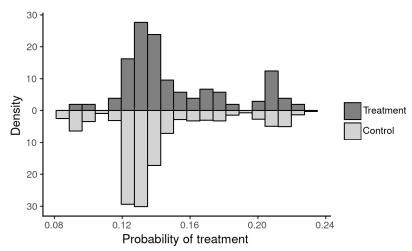  
(b)

(a)  
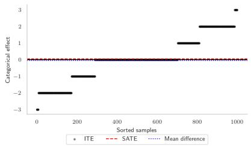  
(c)

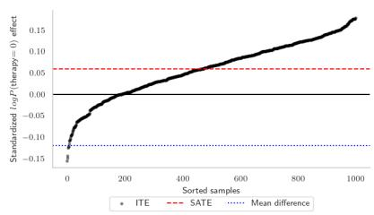  
(d)  
Figure 7: An example dataset generated by the breast cancer SD-SCM using Llama-3-8b, showing (a) features, (b) propensity scores, (c) categorical outcome ITEs, and (d) continuous outcome ITEs.

A 65-year-old woman comes to the oncology department with a recent diagnosis of invasive breast carcinoma. Her prior medical history in cludes hyperlipidemia. This has been managed with lisinopril. This post-menopausal woman has no prior history of breast surgeries or hormone replacement therapy. Following a detailed assessment with imaging and biopsy, the results from the biopsy were analyzed and disclosed the following. The pathology report indicates the tumor is tubular carcinoma. The tumor’s histology is rated as grade 3. The tumor shows an elevated mutation burden, with particular mutations detected in the BRCA2 gene in addition to the TP53 gene. The immunohistochemistry results display robust positive staining for estrogen receptor (ER) and progesterone receptor (PR), indicating high levels of expression. The level of genomic instability in the tumor is described as low. This implies that chromosomal aberrations are minor. Immunohistochemistry reveals HER2 as negative while FISH confirms that HER2 amplification is not present. Programmed death-ligand 1 (PD-L1) expression in the tumor is low with no distant metastases found in the imaging studies. Considering the comprehensive findings and the patient’s health and treatment history, which treatment strategies are most suitable for this patient? The best option is to begin treatment with a checkpoint inhibitor such as pembrolizumab.

With each sample space indexed according to the order of their values above (with indexes starting at zero), the above text sequence corresponds to the observation

$$
\begin{array} { r } { ( \tilde { u } _ { 1 } , \dots , \tilde { u } _ { 4 } , \tilde { x } _ { 1 } , \dots , \tilde { x } _ { 8 } , \tilde { t } , \tilde { y } ) = } \\ { ( 4 , 2 , 0 , 1 , 3 , 2 , 3 , 0 , 2 , 0 , 1 , 1 , 0 , 3 ) . } \end{array}
$$

The full set of possible examples and code to generate this SD-SCM and corresponding data (in our case generated using V100 and RTX8000 GPUs) is available in our repository at https://github. com/lbynum/sequence-driven-scms.

Figure 7 shows plots of the features (7a), propensity scores (7b), categorical ITEs (7c), and continuous ITEs (7d) for a single generated dataset using Llama-3-8b. Because the outcome y˜ has $| \Omega _ { \tilde { y } } | = 4$ possible values, we can consider several possible outcomes, including the observed outcome (categorical), log probabilities for each outcome value (continuous), or probabilities for each outcome value (continuous). This creates, in effect, nine possible targets for each dataset. For benchmarking purposes, we find using probabilities and/or log probabilities as the outcome to be the most useful — there is frequently an effect (even at the individual level) in probability space, even if the sampled outcomes do not change. Comparing Figure 7c to Figure 7d demonstrates this, where for the 400 or so observations where the categorical ITE is zero, the continuous ITE is instead nonzero.

Figure 7d also demonstrates that we are able to satisfy our main criterion for meaningful benchmark: the observational distribution $P _ { \tilde { y } | \tilde { t } = t } ^ { \tilde { \mathfrak { B } } }$ and interventional distribution $P _ { \tilde { y } } ^ { \mathfrak { B } ; \mathrm { d o } ( \tilde { t } = t ) }$ are different enough that the SATE and the observed mean difference in outcomes between the treatment and control group are not only different in value, but they also disagree in sign. This is particularly meaningful in a causal inference setting — the treatment appears to lower the outcome, when in fact, its effect is to increase the outcome.

## C Additional estimation results

## C.1 ATE results

For all implementations that directly support ATE estimation, we report the $R ^ { 2 }$ and root-meansquared-error (RMSE) across the 1000 datasets for each language model in two settings, using log $\mathrm { P } ( \tilde { y } = 0 )$ as the outcome. The first setting is with estimation using all 14 covariates (all 12 confounders, the treatment, and the outcome). This is denoted All Cov. in Table 1. The second setting is with the variables $\mathbf { U } = \left\{ \widetilde { u } _ { 1 } , \widetilde { u } _ { 2 } , \widetilde { u } _ { 3 } , \widetilde { u } _ { 4 } \right\} = \left\{ \mathsf { a g e } \right.$ medical conditions, medication, menopausal status} hidden, denoted Hidden. Table 1 shows that ATE estimation is more or less challenging depending on which language model is used. In this case, Llama-3-8b produces ATEs that are more challenging to estimate, with the exception of GPT-2 for the doubly robust methods, whose $R ^ { 2 }$ and RMSE suffer significantly due to several large outlying estimates. Across all methods, performance tends to drop significantly in the ‘Hidden’ setting, suggesting that U are indeed hidden confounders. Across methods, BART shows the strongest performance in all settings in Table 1.

Table 1: SATE prediction results for methods that directly target ATEs.
<table><tr><td rowspan="3">Method</td><td colspan="4"> $\mathcal { P } = \mathrm { G P T } _ { - 2 }$ </td><td colspan="4"> $\mathcal { P } = \mathbf { I }$  lama-3-8b</td></tr><tr><td colspan="2"> $R ^ { 2 }$ </td><td colspan="2">RMSE</td><td colspan="2"> $R ^ { 2 }$ </td><td colspan="2">RMSE</td></tr><tr><td>All Cov.</td><td>Hidden</td><td>All Cov.</td><td>Hidden</td><td>All Cov.</td><td>Hidden</td><td>All Cov.</td><td>Hidden</td></tr><tr><td>T-Only OLS</td><td>0.6047</td><td>0.6047</td><td>0.0172</td><td>0.0172</td><td>0.5082</td><td>0.5082</td><td>0.0091</td><td>0.0091</td></tr><tr><td>BART</td><td>0.9999</td><td>0.8794</td><td>0.0003</td><td>0.0095</td><td>0.9967</td><td>0.8476</td><td>0.0007</td><td>0.0051</td></tr><tr><td>ForestDML</td><td>0.9941</td><td>0.8686</td><td>0.0021</td><td>0.0099</td><td>0.9608</td><td>0.8129</td><td>0.0026</td><td>0.0056</td></tr><tr><td>ForestDR</td><td>≤0</td><td>≤0</td><td>6.4268</td><td>29.0210</td><td>0.9581</td><td>0.8179</td><td>0.0027</td><td>0.0055</td></tr><tr><td>ForestS</td><td>0.9771</td><td>0.8777</td><td>0.0041</td><td>0.0096</td><td>0.8243</td><td>0.8286</td><td>0.0054</td><td>0.0054</td></tr><tr><td>ForestT</td><td>0.9793</td><td>0.8588</td><td>0.0039</td><td>0.0103</td><td>0.9454</td><td>0.8126</td><td>0.0030</td><td>0.0056</td></tr><tr><td>LinReg</td><td>0.9146</td><td>0.8646</td><td>0.0080</td><td>0.0101</td><td>0.6538</td><td>0.5599</td><td>0.0076</td><td>0.0086</td></tr><tr><td>LinearDML</td><td>0.979</td><td>0.8655</td><td>0.0040</td><td>0.0100</td><td>0.9608</td><td>0.8216</td><td>0.0026</td><td>0.0055</td></tr><tr><td>LinearDR</td><td>≤0</td><td>≤0</td><td>11.0736</td><td>29.5414</td><td>0.9589</td><td>0.8176</td><td>0.0026</td><td>0.0055</td></tr><tr><td>LinearS</td><td>0.9146</td><td>0.8632</td><td>0.0080</td><td>0.0101</td><td>0.6538</td><td>0.4869</td><td>0.0076</td><td>0.0093</td></tr><tr><td>LinearT</td><td>0.9181</td><td>0.8688</td><td>0.0078</td><td>0.0099</td><td>0.6395</td><td>0.5385</td><td>0.0078</td><td>0.0088</td></tr><tr><td>RF</td><td>0.976</td><td>0.8766</td><td>0.0042</td><td>0.0096</td><td>0.8122</td><td>0.8295</td><td>0.0056</td><td>0.0054</td></tr></table>

Table 2: Mean $R ^ { 2 }$ of methods estimating CATEs/ITEs, comparing estimation with datasets of size 1,000 versus 10,000.

<table><tr><td rowspan="3">Method</td><td colspan="4">All Covariates</td><td colspan="4">Hidden U</td></tr><tr><td colspan="2"> $\mathcal { P } = \mathrm { G P T } _ { - 2 }$ </td><td colspan="2"> $\mathcal { P } = \mathrm { L l a m a } { - 3 { - } 8 } \mathrm { b }$ </td><td colspan="2"> $\mathcal { P } = \mathrm { G P T } _ { - 2 }$ </td><td colspan="2">P = Llama-3-8b</td></tr><tr><td>1,000</td><td>10,000</td><td>1,000</td><td>10,000</td><td>1,000</td><td>10,000</td><td>1,000</td><td>10,000</td></tr><tr><td>T-Only OLS</td><td> ${ \leqslant } 0$ </td><td> ${ \leqslant } 0$ </td><td> ${ \leqslant } 0$ </td><td> ${ \leqslant } 0$ </td><td> ${ \leqslant } 0$ </td><td>≤0</td><td>≤0</td><td> ${ \leqslant } 0$ </td></tr><tr><td>BART</td><td>0.7162</td><td>0.9691</td><td>0.5221</td><td>0.9214</td><td> ${ \leqslant } 0$ </td><td> ${ \leqslant } 0$ </td><td>≤0</td><td> ${ \leqslant } 0$ </td></tr><tr><td>BART-ITE</td><td>0.7102</td><td>0.9344</td><td>0.5183</td><td>0.8823</td><td>0.0054</td><td>0.0185</td><td>0.0011</td><td>0.0169</td></tr><tr><td>CausalForest</td><td>≤0</td><td> ${ \leqslant } 0$ </td><td>≤0</td><td>≤0</td><td> ${ \leqslant } 0$ </td><td>0.0313</td><td>≤0</td><td>0.1399</td></tr><tr><td>ForestDML</td><td>≤0</td><td>0.6605</td><td>≤0</td><td>0.5551</td><td> ${ \leqslant } 0$ </td><td>0.0608</td><td>≤0</td><td>0.1850</td></tr><tr><td>ForestDR</td><td>≤0</td><td>0.7220</td><td>≤0</td><td>0.5968</td><td> ${ \leqslant } 0$ </td><td>0.0503</td><td>≤0</td><td>0.1931</td></tr><tr><td>ForestS</td><td>≤0</td><td>0.0661</td><td>≤0</td><td>0.1263</td><td>0.0026</td><td>0.0371</td><td>0.0063</td><td>0.0936</td></tr><tr><td>ForestT</td><td>0.1031</td><td>0.3202</td><td>≤0</td><td>0.1319</td><td>0.0076</td><td>0.0366</td><td>0.0054</td><td>0.0719</td></tr><tr><td>LinReg</td><td>≤0</td><td>≤0</td><td>≤0</td><td>≤0</td><td>≤0</td><td>≤0</td><td>≤0</td><td>≤0</td></tr><tr><td>LinearDML</td><td>0.2381</td><td>0.5309</td><td>0.1491</td><td>0.5404</td><td>≤0</td><td>≤0</td><td>≤0</td><td>0.1483</td></tr><tr><td>LinearDR</td><td>0.2329</td><td>0.5900</td><td>0.1562</td><td>0.5293</td><td>≤0</td><td>≤0</td><td>≤0</td><td>0.1734</td></tr><tr><td>LinearS</td><td>≤0</td><td>≤0</td><td>≤0</td><td>≤0</td><td>≤0</td><td>≤0</td><td>≤0</td><td>≤0</td></tr><tr><td>LinearT</td><td>0.0116</td><td>0.1470</td><td>≤0</td><td>0.1355</td><td>≤0</td><td>≤0</td><td>≤0</td><td>≤0</td></tr><tr><td>RF</td><td>≤0</td><td>0.0327</td><td>≤0</td><td>0.1038</td><td>0.0024</td><td>0.0373</td><td>0.0060</td><td>0.0940</td></tr><tr><td>TARNet</td><td>≤0</td><td>≤0</td><td>≤0</td><td>≤0</td><td>≤0</td><td>≤0</td><td>≤0</td><td>≤0</td></tr><tr><td>TNet</td><td>≤0</td><td>≤0</td><td>≤0</td><td>≤0</td><td>≤0</td><td>≤0</td><td>≤0</td><td>≤0</td></tr></table>

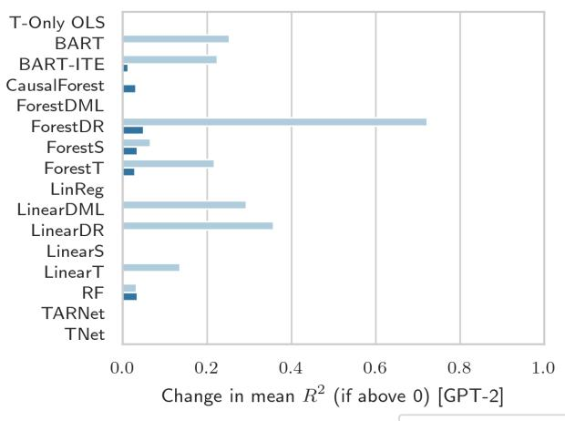

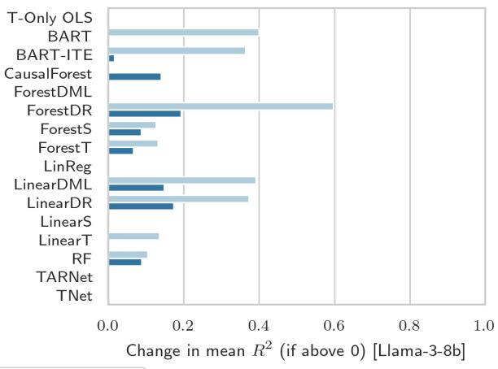  
Figure 8: Change in mean $R ^ { 2 }$ (if above 0) of methods estimating CATEs and ITEs after a tenfold increase in dataset size from 1, 000 to 10, 000.

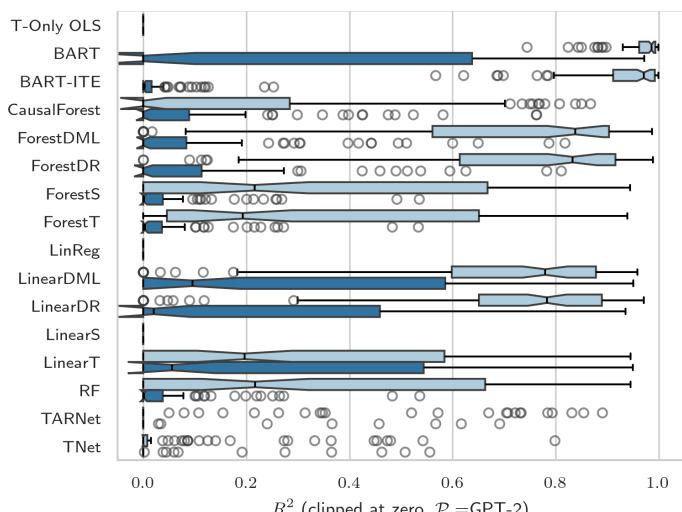

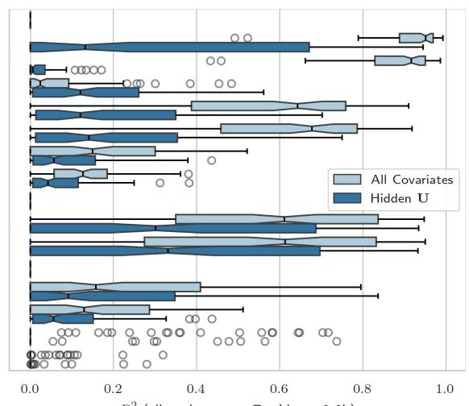  
R2 (clipped at zero, P =Llama-3-8b)  
Figure 9: $R ^ { 2 }$ values across all methods that provide point estimates of CATEs/ITEs for datasets of size 10,000 generated by GPT-2 (left) and Llama-3-8b (right).

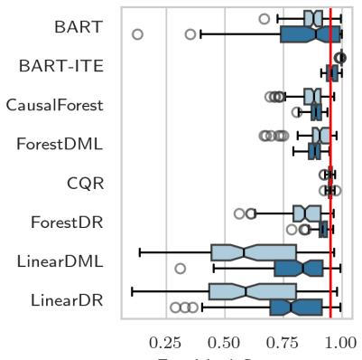  
(P =GPT-2)

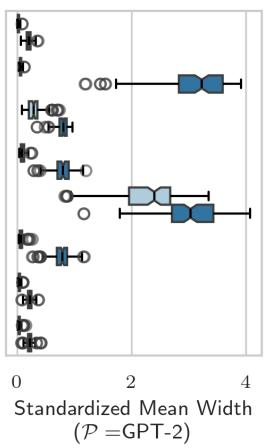

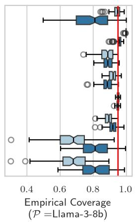

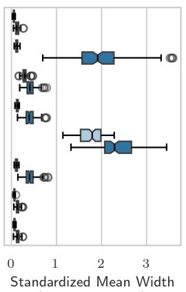  
(P =Llama-3-8b)

All Covariates Hidden U  
Figure 10: CATE/ITE empirical coverage (α 0.05) and interval width (in outcome standard deviation units) for methods that provide intervals. Nominal coverage of 95% is indicated by the red line. Shown for datasets of size 10,000 generated by GPT-2 (left) and Llama-3-8b (right).  
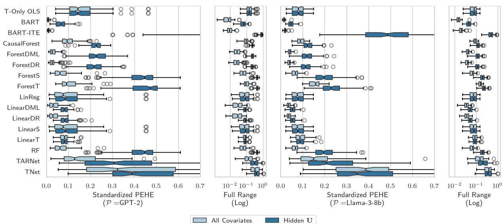  
Figure 11: PEHE across all methods that provide point estimates of CATEs/ITEs, shown in standard deviation units of the outcome y˜. Results shown for datasets of size 10,000 generated by GPT-2 (left) and Llama-3-8b (right).

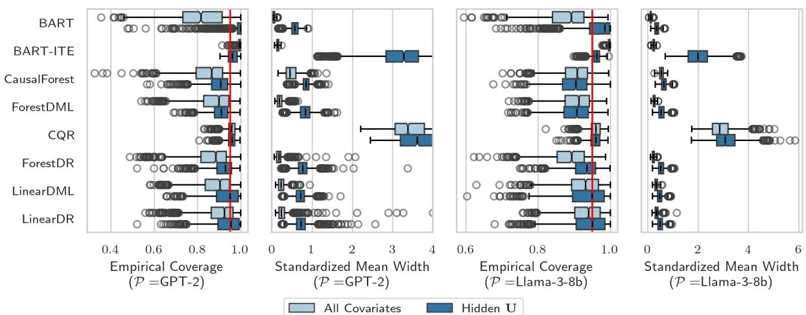

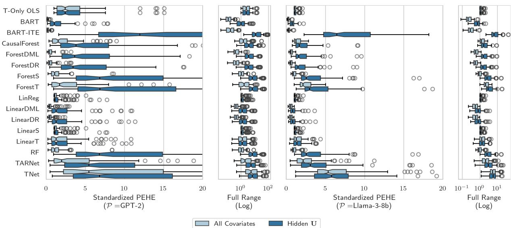

Figure 12: PEHE across all methods that provide point estimates of CATEs/ITEs, shown in units of ITE standard deviation. Results shown for datasets of size 10,000 generated by GPT-2 (left) and Llama-3-8b (right).  
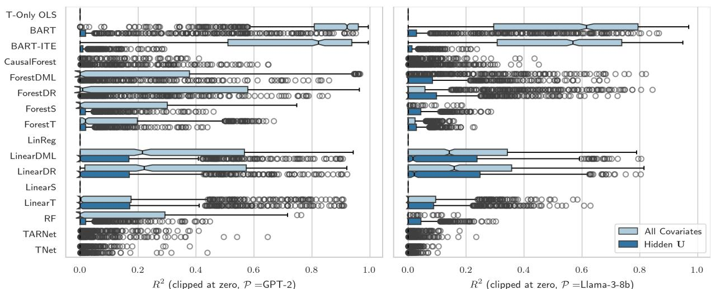  
Figure 13: $R ^ { 2 }$ values across all methods that provide point estimates of CATEs/ITEs for datasets of size 1,000 generated by GPT-2 (left) and Llama-3-8b (right).  
Figure 14: CATE/ITE empirical coverage (α 0.05) and interval width (in outcome standard deviation units) for methods that provide intervals. Nominal coverage of 95% is indicated by the red line. Shown for datasets of size 1,000 generated by GPT-2 (left) and Llama-3-8b (right).

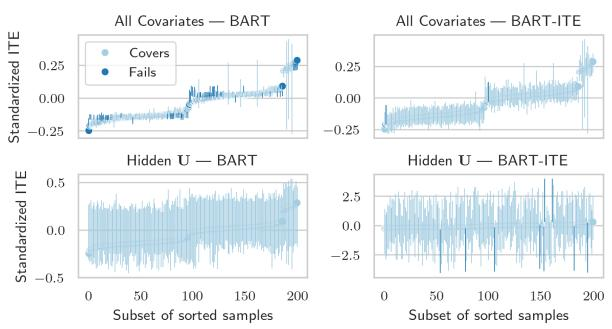  
(a)

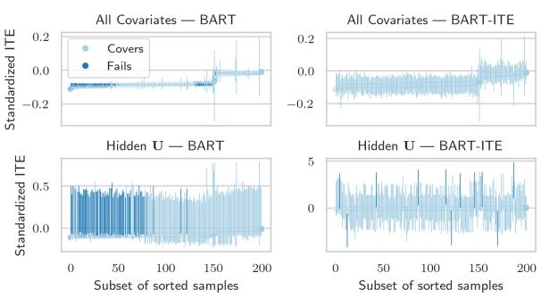  
(b)  
Figure 15: Interval estimates from BART versus BART-ITE across two example datasets of size 1,000, (a) and (b).

## C.2 Comparison of dataset size 1,000 and 10,000

Table 2 and Figure 8 show that CATE and ATE estimation remain difficult even after a tenfold increase in dataset size (from N 1, 000 to $N = 1 0 , 0 0 0 )$ , especially in the Hidden U setting. Across estimation methods, performance tends to increase as sample size increases, especially if the method originally achieved $R ^ { 2 }$ above zero with $N = 1 , 0 0 0$ In other words, methods that do reasonably well at N 1, 000 show improvement with more data, as we would expect. However, several methods struggle in both settings, even with ten times more data. For example, TARNet, TNet, and CausalForest still remain unstable and inaccurate in both the All Covariates and the Hidden U settings across both sample sizes. Overall, these results indicate that CATE and ITE estimation in this case are not challenging due only to small sample sizes. This is useful to know, especially when we consider that corresponding real-world use-cases often deal with even smaller sample sizes.

Additional results for each dataset size are shown individually in the following figures. Figures 9 and 10 show $R ^ { 2 }$ and coverage results on datasets of size 10,000. These correspond to the same figures in the main text, but now showing both GPT-2 and Llama-3-8b, allowing for comparison across models. Figure 11 shows the same setting using standardized Precision in Estimating Heterogeneous Effects (PEHE) (Hill, 2011), which is the RMSE of the CATE predictions across the different observed values of x, i.e.,

$$
\mathrm { P E H E } _ { j } = \sqrt { \frac { 1 } { n } \sum _ { i = 1 } ^ { n } ( \hat { \tau } _ { i } - \tau _ { i } ) ^ { 2 } }
$$

for a dataset $D _ { j } = \{ { \bf u } _ { i } , { \bf x } _ { i } , t _ { i } , y _ { i } \} _ { i = 1 } ^ { n }$ where $\hat { \tau } _ { i }$ is the estimated ITE for unit i and $\tau _ { i }$ is the true ITE. We standardize PEHE using the empirical standard deviation $\hat { \sigma } _ { j }$ of the outcomes $\{ y _ { i } \} _ { i = 1 } ^ { n }$ in each dataset, i.e.,

$$
( { \mathrm { S t a n d a r d i z e d ~ P E H E } } ) _ { j } = { \sqrt { \frac { 1 } { n \cdot { \hat { \sigma } } _ { j } ^ { 2 } } \sum _ { i = 1 } ^ { n } ( { \hat { \tau } } _ { i } - \tau _ { i } ) ^ { 2 } } } .
$$

Figure 12 shows the same metric standardized instead using the (much smaller) standard deviation of the ITE.

Results in the case of dataset size 1, 000 show similar trends to those in the size 10, 000 setting. Figure 13 shows $R ^ { 2 }$ values clipped at zero across all methods that provide point estimates for CATEs. When all covariates are observed, BART does significantly better explaining CATE variation, followed by DML and DR with much lower averages, much like the size 10,000 case. Similarly, CATE estimation becomes much more challenging for all methods with hidden U. The difference in effect estimation difficulty between Llama-3-8b and GPT-2 is also more noticeable for CATEs than it was for

ATEs. Overall, some methods show more instability in the dataset size 1,000 case than in the size 10,000 case, as expected with less data.

Figure 14 shows empirical coverage results in the dataset size 1,000 case for all estimators that provide intervals. Similar to the size $1 0 { , } 0 0 0$ case, empirical coverage is under nominal for all methods that target CATE in the setting with all covariates. Hidden U generally increases uncertainty, bringing the DR methods and LinearDML median coverage near nominal. Interestingly, BART for CATE achieves higher median coverage of the ITE than BART-ITE, but with a much larger tail of poor coverage. BART-ITE, by contrast, has much less variable coverage in the ITE setting, but at the cost of much wider intervals. Figure 15 shows intervals for BART targeting the CATE versus BART-ITE across two example datasets of size 1,000, demonstrating that, as in the size 10,000 case, the tighter intervals of BART targeting the CATE can be overconfident with variable coverage, while the wider intervals of BART-ITE are too wide to be useful.