# Language-to-Space Programming for Training-Free 3D Visual Grounding

Boyu Mi<sup>1,2</sup> Hanqing Wang<sup>2</sup> Tai Wang<sup>2</sup> Yilun Chen<sup>2</sup> Jiangmiao Pang<sup>2</sup>

<sup>1</sup>Shanghai Jiao Tong University <sup>2</sup>Shanghai Artificial Intelligence Laboratory miboyu@pjlab.org.cn

## Abstract

3D visual grounding (3DVG) is challenging due to the need to understand 3D spatial relations. While supervised approaches have achieved superior performance, they are constrained by the scarcity and high annotation costs of 3D vision-language datasets. Trainingfree approaches based on LLMs/VLMs eliminate the need for large-scale training data, but they either incur prohibitive grounding time and token costs or have unsatisfactory accuracy. To address the challenges, we introduce a novel method for training-free<sup>1</sup> 3D visual grounding, namely Language-to-Space Programming (LASP). LASP introduces LLMgenerated codes to analyze 3D spatial relations among objects, along with a pipeline that evaluates and optimizes the codes automatically. Experimental results demonstrate that LASP achieves 52.9% accuracy on the Nr3D benchmark, ranking among the best trainingfree methods. Moreover, it substantially reduces the grounding time and token costs, offering a balanced trade-off between performance and efficiency. Code is available at https: //github.com/InternRobotics/LaSP.

## 1 Introduction

The 3D visual grounding (3DVG) task focuses on locating an object in a 3D scene based on a referring utterance (Liu et al., 2025). Numerous supervised methods have been proposed for 3DVG (Hsu et al., 2023; Jain et al., 2022; Huang et al., 2022; Chen et al., 2022; Huang et al., 2024; Zhu et al., 2023; BAKR et al., 2024; Wu et al., 2023). These methods learn representations of referring utterances, object attributes, and spatial relations from large-scale 3D vision-language training datasets with high-quality annotations and achieve stateof-the-art performance on 3DVG. However, the scarcity of 3D vision-language datasets (Chen et al., 2020; Achlioptas et al., 2020), coupled with the high cost of their annotations, limits these methods applicability.

Recently, large language models (LLMs) and vision-language models (VLMs) have shown remarkable capabilities in reasoning, code generation, and visual perception. Building on these advancements, open-vocabulary and zero-shot methods (Yang et al., 2024b; Xu et al., 2024; Fang et al., 2024; Yuan et al., 2021; Li et al., 2025) are proposed. Agent-based methods (Yang et al., 2024b; Xu et al., 2024; Fang et al., 2024) always let LLMs perform numerical reasoning on object locations and in text modality to find the target object (Yang et al., 2024b; Fang et al., 2024), or let VLMs locate targets from scene scan images in visual modality (Xu et al., 2024). These agents achieve superior accuracy compared to other training-free methods, but for one referring utterance, they need to input the whole scene information into LLMs/VLMs. Before finding the target object, LLMs/VLMs always generate lengthy responses, containing planning, reasoning, or self-debugging processes. This results in high costs in terms of grounding time and token usage (see Figure 1, Agents block). In contrast, the visual programming method (Yuan et al., 2024b) only inputs the referring utterance into LLMs to generate a short program which calls annotated selection functions. Then the program execution, which is much faster than LLM reasoning, outputs the target object. As a result, its time and token costs are much lower. However, it has trouble considering multiple spatial relations in the referring utterance simultaneously (Yuan et al., 2024a), resulting in relatively low accuracy.(see Figure 1, Visprog. block.)

To address the dual challenges of accuracy and costs, we propose LASP, a novel training-free 3DVG method that balances the accuracy and grounding costs. (see Figure 1, LaSP block.) Specifically, LASP uses Python codes that are generated and optimized by LLMs as spatial relation encoders. Given the bounding boxes of scene objects, the spatial relation encoders generate relation features which quantify the spatial relations of objects. Moreover, we introduce test suites which can evaluate the codes. The test suites not only enable us to select better relation encoders from multiple LLM responses but also allow LLMs to leverage failed test cases to optimize the codes. The relation encoders can be seamlessly integrated with a symbolic reasoning framework similar to (Hsu et al., 2023). In our framework, a referring utterance is converted to a symbolic expression. Then an executor aggregates the symbolic expression, relation features, and object categories to give the matching scores between objects and the referring utterance. LASP also prompts VLMs to further distinguish objects based on visual information. Compared to agent-based methods, LASP only inputs the referring utterance into LLMs and one image into VLMs, resulting in much lower costs. Compared to the visual programming method, LASP has obviously higher accuracy.

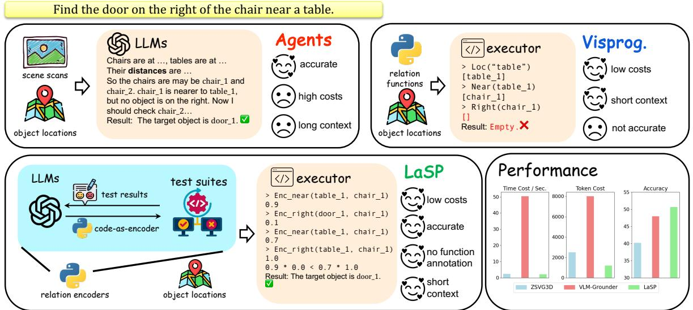  
Figure 1: Accuracy and cost comparison of LASP (ours) with two types of existing training-free 3DVG methods. Agent-based methods input scene information into LLMs/VLMs to analyze spatial relations, leading to high accuracy but also high computational costs. Visual programming (Visprog.) only inputs the referring utterance into LLMs to generate a program and finds the target by program execution. It reduces the costs signicicantly but sacrifices the accuracy. LASP introduces code-based relation encoders along with its automatic generation pipeline. Spatial relations are analyzed by code execution instead of LLMs/VLMs reasoning. This approach allows LASP to achieve accuracy comparable to agent-based methods, while significantly reducing the costs.

We evaluate LASP on the widely used

Nr3D (Achlioptas et al., 2020) datasets. Experiment results show that LASP achieves 52.9% accuracy on Nr3D, and offers advantages in grounding time and token cost compared to previous trainingfree 3D visual grounding methods. Additionally, we conduct experiments to demostrate the advantages the LLM-desgined codes over human experts and the generalization to other 3D datasets.

## 2 Related Work

Training-free 3D Visual Grounding Trainingfree methods exploit pre-trained LLMs / VLMs for open-vocabulary 3DVG. ZSVG3D (Yuan et al., 2024b) uses LLMs to generate programs that call predefined functions to find the target object. CSVG (Yuan et al., 2024a) proposes to replace the programming of ZSVG3D (Yuan et al., 2024b) by constraint satisfaction solving for handling multiple constraints. LLM-Grounder (Yang et al., 2024b), Transcrib3D (Fang et al., 2024) deploy LLM/VLMbased agents that analyze object appearances and locations and find the target. VLM-Grounder (Xu et al., 2024) and SeeGround (Li et al., 2025) mainly rely on VLMs to find the target from scene images by visual prompting. Xu et al. (2024) uses VLMs and images from the scene to figure out the target object. Li et al. (2025) first parses the landmark and perspective of the referring utterance and then uses VLMs to find the target object from rendered images. Compared to these methods, LASP offers a superior results on both accuracy and efficiency.

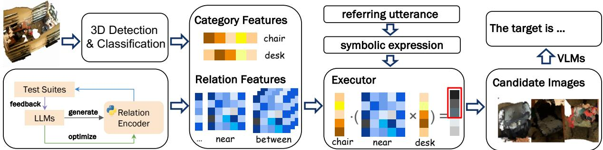  
Figure 2: Overview of LASP. Off-the-shelf spatial relation encoders are generated and optimized by LLMs before grounding. At the grounding time, the encoders compute relation features based on object bounding boxes. An executor uses the relation features, along with category features and the symbolic expression to get some candidate objects. Then LASP uses VLMs to select the target from their images.

LLM-based Code Generation LLMs demonstrate growing proficiency in generating executable code (Roziere et al., 2023) for precise mathematical reasoning (Li et al., 2024), robotics control (Liang et al., 2023), tool use (Gupta and Kembhavi, 2023; Yuan et al., 2024b) or data cleaning (Zhou et al., 2025). Recent work further explores code refinement via environmental feedback, such as RL training trajectories (Ma et al., 2024) or real-world execution errors (Le et al., 2022; Chen et al., 2024). In the 3DVG area, (Yuan et al., 2024b; Fang et al., 2024) also uses code to process spatial relations, but LASP advances this paradigm by introducing the spatial relation encoders and test suites to automatically optimize codes.

## 3 Method

## 3.1 Problem Statement

3D visual grounding tasks involve a scene, denoted as , represented by an RGB-colored point cloud containing C points. Associated with this is an utterance that describes an object within the scene . The objective is to identify the location of the target object in the form of a 3D bounding box. In the ReferIt3D dataset (Achlioptas et al., 2020), bounding boxes for all objects are provided, making the visual grounding process a task of matching these bounding boxes to the scene .

## 3.2 Grounding Pipeline

The framework of LASP is shown in Figure 2. Prior to grounding, relation encoders are generated by LLMs, and objects in 3D scenes are detected and classified. A semantic parser converts the referring utterance into a symbolic expression , which encapsulates the spatial relations and category names in . Category features, quantifying how well each object matches the category, are derived from the classification results. Our spatial relation encoders are Python code generated by LLMs. Relation features, quantifying the probability of spatial relationships between objects in , are computed by the relation encoders by explicit geothe probability that the i-th object is near the j-th object. Our executor has a similar design to (Hsu et al., 2023). Given the symbolic expression and features, An executor uses the , relation features, and category features to calculate the matching scores between all objects and the referring objects based on the symbolic expression. Objects with higher matching scores are selected as the candidates. Then LASP employs VLMs to find the target object from the images of these candidates. Please see Appendix B for more details.

## 3.3 Spatial Relation Encoders

Sizes and positions of objects in 3D scenes inherently determine spatial relations. For example, the near relation depends on pairwise distances, while large is determined by object volumes. In LASP, each spatial relation encoder is a Python class that can compute its associated relation features given the object bounding boxes.

Figure 3 shows the spatial relation encoder of “above”. The class is initialized with the object 3D bounding boxes of the scene and provides two key methods: \_init\_param, which computes the necessary parameters for feature derivation. For instance, in the “near” encoder, it calculates distances between each pair of objects; forward, which performs numerical operations on parameters and returns the relation feature. Specifically, “above” encoder computes objects’ sizes, horizontal and vertical distances between object pairs to compute the “above” feature.

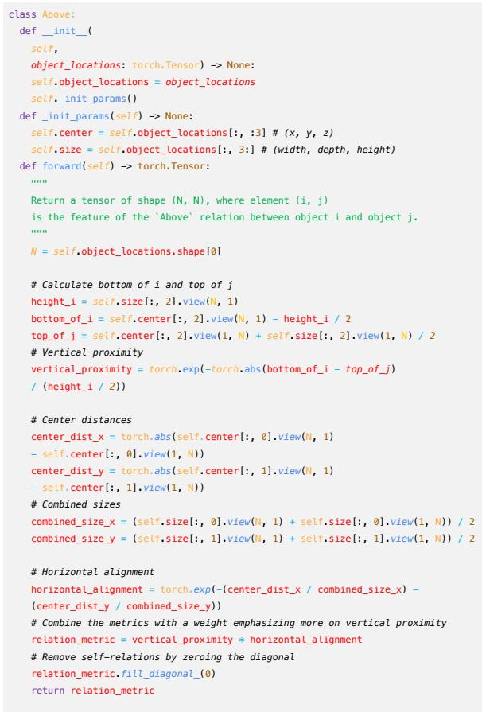  
Figure 3: Example of spatial relation encoder for relation “above”.

As illustrated in Figure 4, the spatial relation encoders come from many optimization iterations. There are several phases in one iteration: (1) retrieving in-context examples based on the semantic similarities of relations (Section 3.3.1); (2) generating multiple codes from LLMs; and (3) testing codes through test suites (Section 3.3.2). When test failures occur, the test suites automatically synthesize error messages that contain failure cases. The codes with highest pass rates and their error messages are then given to LLMs for code optimization (Section 3.3.3).

## 3.3.1 In Context Example

Adding in-context example into the prompt can improve the response quality from LLMs (Brown et al., 2020). To reduce human annotation and provide suitable in-context example for different relation encoders’ generation, we retrieve generated codes as in-context example. For example, relation encoders for “near” and “far” may both compute pairwise distances but differ only in the numerical processing, so the codes for “near” can be used as the in-context example for the generation of “far”. Please see Appendix B.5 for the details.

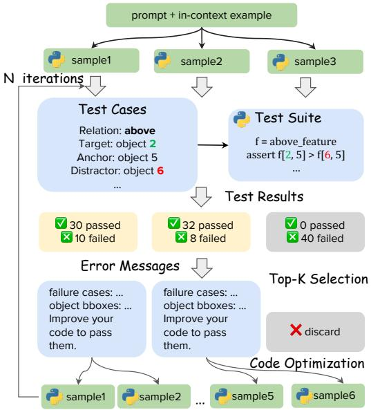  
Figure 4: Overview of the generation and optimization process of relation encoders.

## 3.3.2 Test Suites

To increase the probability of getting highquality codes, we sample multiple responses from LLMs (Wu et al., 2025b) and design test suites that can evaluate the codes by testing their pass rates on a series of test cases. Take the relation “above” as an example. We collect 37 triplets (less than 100 for most relations) in the format of [target object ID], [distractor ID], [anchor object ID] from the training set, with each triplet serving as a test case. In relation feature f<sub>above</sub>, if the element f<sup>(distractor,anchor)</sup> is larger than f<sup>(target,anchor)</sup>, the test is deemed to have failed, and an error message looks like [target bbox] is above [anchor bbox] So feature value of [target bbox] "above" [anchor bbox] should be larger than the feature value of [distractor bbox] "above" [anchor bbox]. is synthesized. An example of such an error message is in Section A.

## 3.3.3 Code Generation and Optimization

For any relation, we begin by prompting the LLMs with the task description, the relation name, and the retrieved in-context example (Section 3.3.1). Then we sample $N _ { \mathrm { s a m p l e } }$ codes from LLMs, where $N _ { \mathrm { s a m p l e } }$ is a configurable hyperparameter. Next, each generated code is tested using the test suites. We select the $t o p _ { k }$ codes that have the highest pass rates on the test cases and subject them to an optimization phase. During the optimization phase, LLMs receive the initial prompt, the code to be optimized, and the error message produced by the test suites. Then LLMs are asked to revise the codes according to failure cases in the error message. This test and optimization procedure is repeated for up to $N _ { \mathrm { i t e r } }$ iterations. Ultimately, we adopt the code that achieves the highest pass rate across all test cases. The detailed optimization and selection algorithm is shown in Algorithm 2.

## 3.4 Visual Decision Module

The visual information, like color or shape in utterances, is also essential for accurate grounding, particularly for natural datasets like Nr3D (Achlioptas et al., 2020). When two candidate objects share a similar class and spatial position, visual information is required to distinguish between them.

Following VLM-Grounder (Xu et al., 2024), we incorporate GPT-4o to identify the target object from a set of candidates by utilizing 2D images from ScanNet (Dai et al., 2017) as additional context. Specifically, we select the top five objects having the highest scores based on the matching scores from the executor and retain those whose logits exceed a chosen threshold as candidates. Eight images most relevant to candidate objects from scan images of ScanNet (Dai et al., 2017) are selected based on the projected area size of candidate objects. They are stitched together in 4  2 grids and annotated with object IDs. Finally, we prompt GPT-4o to identify the target object from the stitched images. By integrating these visual cues, the VLM decision module effectively disambiguates candidates that appear similar in terms of category and spatial attributes, yielding more accurate grounding results. An example is in Figure 5 (we only show 6 of them for clarity).

## 4 Experiments

## 4.1 Experimental Settings

Dataset We mainly conduct experiments on the Nr3D subset of ReferIt3D (Achlioptas et al., 2020) dataset. ReferIt3D has 2 subsets: Nr3D and Sr3D. The Nr3D subset utterances contain humanannotated utterances and the Sr3D contains synthesized ones. Based on the number of same-class distractors, the dataset can be categorized into “easy” and “hard” subsets. The easy subset has a single distractor, and the hard subset has multiple distractors. The dataset can also be split into “view dependent” and “view independent” subsets according to the referring utterance. Ground truth object bounding boxes are given in the ReferIt3D default evaluation setting. Therefore, the metric is an exact match between the predicted bounding box and the target bounding box.

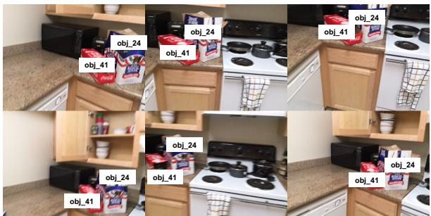  
Figure 5: An example of stitched images for VLM prompting. Object ID is annotated on each object’s position. VLMs can figure out the target “red” box from the two candidates and output its ID.

Baselines We compare LASP against both supervised and training-free methods, evaluating accuracy, grounding time, and token cost. The supervised baselines include SAT (Yang et al., 2021), BUTD-DETR (Jain et al., 2022), Vil3DRef (Chen et al., 2022). The training-free approaches include ZSVG3D (Yuan et al., 2024b), Transcrib3D (Fang et al., 2024), VLM-Grounder (Xu et al., 2024), CSVG (Yuan et al., 2024a) and SeeGround (Li et al., 2025). On the Nr3D dataset, Transcrib3D (Fang et al., 2024) and CSVG (Yuan et al., 2024a) use ground-truth object labels, providing an advantage over methods which rely on predicted labels; therefore, we compare LASP with them in their specific settings.

## 4.2 Quantitative Results

Accuracy Table 1 presents the accuracy comparison on Nr3D. Compared to other training-free baselines, LASP achieves higher overall accuracy than both ZSVG3D (Yuan et al., 2024b), VLM-Grounder (Xu et al., 2024) and SeeGround (Li et al., 2025). LASP also surpasses one early supervised method, SAT (Yang et al., 2021) and further narrows the gap in overall performance relative to the supervised method BUTD-DETR (Jain et al., 2022), especially on the view-dependent (VD) subset. However, it still lags behind other more recent supervised methods (Chen et al., 2022), which are trained on large-scale 3D vision-language datasets. We further evaluate LASP in the experimental settings of (Fang et al., 2024; Yuan et al., 2024a), in which ground truth object labels are utilized for more accurate category-level object recognition. CSVG (Yuan et al., 2024a) uses the same spatial functions as ZSVG3D (Yuan et al., 2024b), resulting a lower accuracy. Transcrib3D (Fang et al., 2024) can produce natural language reasoning processes according to the specific utterance, offering more flexibility. So that it achieves a close accuracy as LASP. For SeeGround (Li et al., 2025) and CSVG (Yuan et al., 2024a), we use the results reported in the original paper in Table 1. For a fair comparison, We evaluate LASP and SeeGround (Li et al., 2025) using the same VLMs (Yang et al., 2024a) on Nr3D subset, the overall accuracy are 40.7% of SeeGround and 48.8% of LASP.

target  
on door’s right  
Table 1: Performances on Nr3D. : For VLM-Grounder (Xu et al., 2024), we use the results on a 250-sample subset reported in its original paper. Results of Transcrib3D in GPT-4o are reported by concurrent SORT3D (Zantout et al., 2025). : We re-run ZSSVG3D (Yuan et al., 2024b) in GPT-4o.
<table><tr><td>Method</td><td>Overall</td><td>Easy</td><td>Hard</td><td>View Dep.</td><td>View Indep.</td></tr><tr><td>Supervised</td><td></td><td></td><td></td><td></td><td></td></tr><tr><td>ViL3DRef (Chen et al., 2022)</td><td>64.4</td><td>70.2</td><td>57.4</td><td>62.0</td><td>64.5</td></tr><tr><td>CoT3DRef (BAKR et al., 2024)</td><td>64.4</td><td>70.0</td><td>59.2</td><td>61.9</td><td>65.7</td></tr><tr><td>3D-VisTA (Zhu et al., 2023)</td><td>64.2</td><td>72.1</td><td>56.7</td><td>61.5</td><td>65.1</td></tr><tr><td>BUTD-DETR (Jain et al., 2022)</td><td>54.6</td><td>60.7</td><td>48.4</td><td>46.0</td><td>58.0</td></tr><tr><td>SAT (Yang et al., 2021)</td><td>49.2</td><td>56.3</td><td>42.4</td><td>46.9</td><td>50.4</td></tr><tr><td>Training-free, predicted label</td><td></td><td></td><td></td><td></td><td></td></tr><tr><td>ZSVG3D* (Yuan et al., 2024b)</td><td>40.2</td><td>49.1</td><td>31.1</td><td>37.8</td><td>41.6</td></tr><tr><td>SeeGround (Li et al., 2025)</td><td>46.1</td><td>54.5</td><td>38.3</td><td>42.3</td><td>48.2</td></tr><tr><td>VLM-Grounder† (Xu et al., 2024)</td><td>48.0</td><td>55.2</td><td>39.5</td><td>45.8</td><td>49.4</td></tr><tr><td>LASP w/o VLM</td><td>50.7</td><td>58.7</td><td>43.0</td><td>45.6</td><td>53.2</td></tr><tr><td>LASP</td><td>52.9</td><td>60.7</td><td>45.3</td><td>49.2</td><td>54.7</td></tr><tr><td>Training-free, ground-truth label</td><td></td><td></td><td></td><td></td><td></td></tr><tr><td>CSVG (Yuan et al., 2024a)</td><td>59.2</td><td>59.2</td><td>44.5</td><td>53.0</td><td>46.4</td></tr><tr><td>Transcrib3D (Fang et al., 2024)</td><td>65.6</td><td></td><td></td><td>63.3</td><td>66.7</td></tr><tr><td>LASP w/o VLM</td><td>65.7</td><td>75.6</td><td>56.2</td><td>58.7</td><td>69.1</td></tr><tr><td>LASP</td><td>67.8</td><td>76.3</td><td>59.6</td><td>61.6</td><td>71.0</td></tr></table>

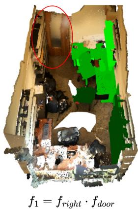

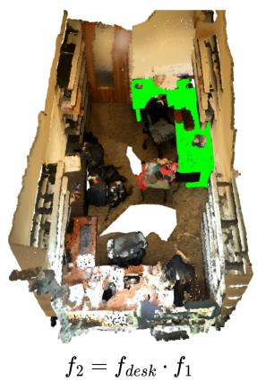  
desk on door’s right

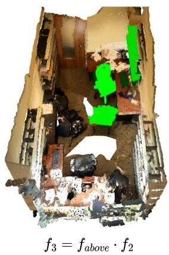  
above door’s right desk

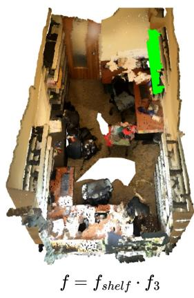  
Figure 6: Visualization of the grounding process. Anchor (the door) is marked with red circles. Objects that strongly match the below conditions are highlighted in green, with brighter shades indicating higher matching scores.

Table 2: Grounding time and token costs. LASP has significant advantage, especially when compared to agentbased methods (VLM-Grounder (Xu et al., 2024) and Transcrib3D (Fang et al., 2024)).
<table><tr><td>Method</td><td>Time/s</td><td>Token</td></tr><tr><td>ZSVG3D</td><td>2.4</td><td>2.5k</td></tr><tr><td>VLM-Grounder</td><td>50.3</td><td>8k</td></tr><tr><td>Transcrib3D</td><td>27.0</td><td>12k</td></tr><tr><td>CSVG</td><td>4.0</td><td>4.0k</td></tr><tr><td>SeeGround</td><td>9.0</td><td>2.6k</td></tr><tr><td>LASP (w/o VLM)</td><td>2.1</td><td>1.2k</td></tr><tr><td>LASP</td><td>7.7 (+5.6)</td><td>3.1k (+1.9k)</td></tr></table>

Grounding Costs Table 2 compares the average grounding time and token costs of training-free methods on a randomly sampled subset of Nr3D.

For every referring utterance, Transcrib3D (Fang et al., 2024) calls the LLMs for many turns until the target object is found and the context keeps growing, which exhibits significantly higher time and token consumption (27.0s and 50.3k tokens). In contrast, all codes of LASP are generated before grounding and reused. So for every referring utterance, LASP calls the LLMs (for parsing) and VLMs for only once. VLM-Grounder (Xu et al., 2024) inputs all scan images into VLMs, but the executor of LASP can filter out most of the objects so LASP only needs to input one image into VLMs. As a result, LASP maintains a large reduction in grounding time and token consumption compared to them. LASP (without VLMs) and ZSVG3D (Yuan et al., 2024b) only need one LLM call for each referring utterance, so they have similar grounding costs, but LASP demonstrates a significant improvement in accuracy over ZSVG3D (Yuan et al., 2024b). CSVG (Yuan et al., 2024a) needs to call LLMs three times for an utterance, causing longer time costs. SeeGround (Li et al., 2025) and LASP call both LLMs and VLMs once for an utterance, thus have a similar time costs.

Above quantitative results underscore the ability of LASP to balance accuracy and efficiency: LASP achieves competitive accuracy compared to the most accurate training-free methods while offering substantial computational costs.

Code Generation Costs The generation and optimization of our relation encoders is a one-time, offline process. The number of optimization iterations varies by the complexity of the spatial relation: right and between require a single iteration, left requires three, while above, below, and corner require up to five. Within each iteration, we query the GPT-4o API up to 25 times for code refinement. Each refinement query, an example of which is provided in Listing. 3, consumes fewer than 2,000 tokens. Crucially, since the final optimized encoders are reused for all test instances, this one-time development cost is effectively amortized over the entire dataset, rendering its contribution to the average per-instance grounding cost negligible.

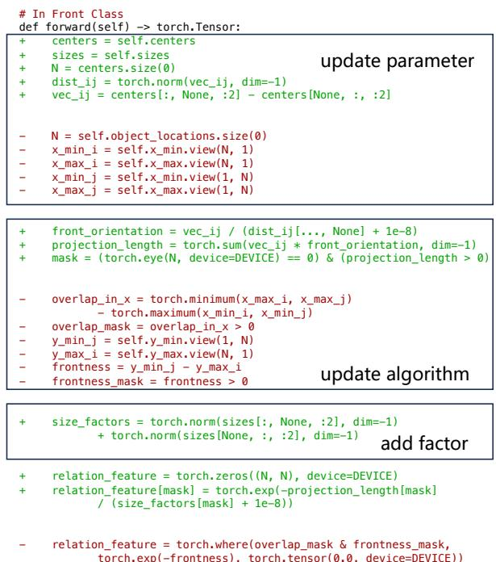  
Figure 7: The LLM-based optimization of “front” relation encoder.

## 4.3 Qualitative Results

Visualization Figure 6 visualizes a grounding process of LASP, demonstrating how the final grounding result is constructed through the combination of multiple features of conditions in the referring utterance. The example referring utterance is “When facing the door, it’s the shelf above the desk on the right”. It can be understood as following four steps in the figure. First, the feature of objects on door’s right, f<sub>1</sub>, is identified using the category feature “door” and the relation feature “right”. Next, the feature of desk on door’s right is computed by multiplying the category feature “desk” and the f<sub>1</sub>. Objects above on door’s right desk are identified by relation feature f<sub>above</sub> and the previous feature; the target “shelf” is found by multiplying $f _ { s h e l f }$ . More visualization results can be found in Figure. 11.

Table 3: Accuracy on GRScenes (Wang et al., 2024).
<table><tr><td>Method</td><td>View Dep.</td><td>View Indep.</td></tr><tr><td>LASP</td><td>87.5%</td><td>91.7%</td></tr><tr><td>Random</td><td>15.4%</td><td>15.7%</td></tr></table>

Cross-Dataset Generalization Although LASP requires no pre-training on large-scale 3D datasets, it does exploit a small subset of the ReferIt3D corpus (Achlioptas et al., 2020) during optimization, whereas other training-free approaches use no external data at all. To probe the generalization ability of our relational encoders, we further evaluate on GRScenes (Wang et al., 2024), a highquality indoor 3D scene dataset. We manually annotate 40 referring expressions across five scenes and deliberately selected target objects that have many of same-category distractors in the scene. We adopt a naïve baseline that randomly selects an object from the same semantic category as the target. LASP attains an overall accuracy of 90.0%, while the random baseline achieves only 15.6%. These results demonstrate that, even when optimized solely with ScanNet (Dai et al., 2017) and ReferIt3D (Achlioptas et al., 2020) language, our relational encoders transfer robustly to previously unseen environments. Qualitative visualizations are provided in Appendix D.6.

Comparison with Human Annotations Eureka (Ma et al., 2024) demonstrates that LLMs can surpass human experts in reward-function design. For 3D visual grounding, ZSVG3D (Yuan et al., 2024b) relies on manually crafted spatial-relation functions, whereas LASP achieves substantially higher performance. Because the two pipelines differ considerably, it is non-trivial to directly reuse their code in LASP. To quantify the gap, we evaluate LLM-generated programs and human-written functions on Nr3D (Achlioptas et al., 2020). Substituting the automatically synthesized functions with human-designed ones causes the overall accuracy of LASP to fall sharply to 44.0%. These results highlight the advantages our generated codes over manual annotations.

Optimization Quality By analyzing failed test cases, LLMs can iteratively refine relation encoders across multiple dimensions. Figure 7 illustrates the difference between the initial LLM-generated implementation (in red) and the optimized version (in green) using the relation “front” as an example. The optimized version incorporates both distances and directional vectors between object centers, rather than relying solely on axis-aligned bounding box coordinates. It also replaces simple X-axis overlap and Y-axis comparison with vector projection, enabling the detection of “front” relations in arbitrary directions;. Additionally, object size is used as a normalization factor, enhancing the accuracy and robustness of the relation prediction.

Robustness to Viewpoints We sampled 100 sentences containing explicit viewpoint information (e.g. “facing the...”) from Nr3D. Our analysis revealed that in 98 of these cases, the anchor object of the relation was the same as the object being “faced” (e.g., in “facing the bed, the nightstand on the right”, the bed is the anchor). This suggests that in the vast majority of cases in this dataset, the viewpoint is implicitly defined by the anchor object and does not require separate, explicit modeling. We believe this is plausible, e.g. to judge a relation like “the left of boxes”, one naturally assumes a viewpoint facing them.

Our extra analysis reveals that our relation encoders have implicitly learned this data-driven prior. For example, our left encoder, when evaluating if object A is to the left of anchor B, operates under the default assumption of a viewpoint facing B. This behavior is not hard-coded, instead it emerges naturally from our test-driven optimization process, aligning with the data’s characteristics. This adaptability is further validated by our quantitative results. As shown in Table. 1, our method achieves advanced performance on the view-dependent split.

## 4.4 Ablation Study

We conduct ablation studies to investigate the impact of various components during the code generation and optimization processes by evaluating three different variants. Variant 1 ablates all three key components: optimization, error messages, and in-context examples. In this variant, we directly prompt LLMs to generate multiple codes and select the one with the highest pass rate on unit tests. Variant 2 adds optimization processes and ablates the error message by replacing it with a general optimization instruction that doesn’t contain any failure case; variant 3 only ablates in-context examples. For relatively simple relations like “small”, the generated codes can pass all unit tests in the first generation, so there is no following optimization, so we choose to analyze six relations that required multiple optimization iterations. For the relations that no in-context example is used (“left”, “above”, and “corner”), variant 3 is identical to the full method, so we only report variant 1 and 2 for these relations. To control for the impact of the initial generation, we use the same responses of the first iteration across variant 2 and 3.

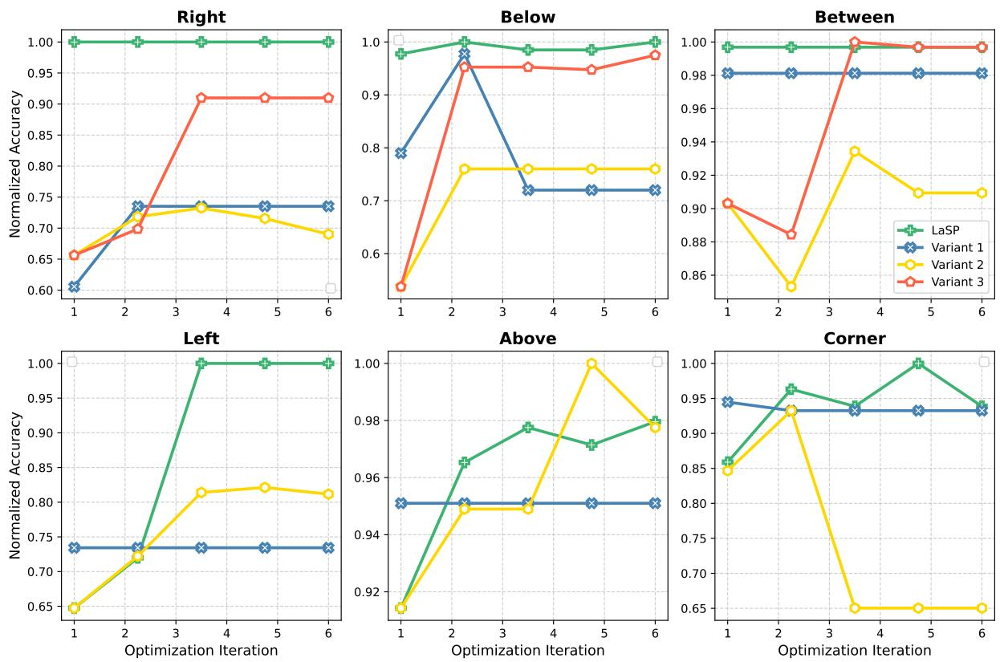  
Figure 8: Ablation study on different variants. The x-axis stands for the number of optimization iterations. The y-axis stands for the normalized accuracy on corresponding Nr3D subsets.

Figure 8 illustrates the results of the ablation study; different variants are represented by lines of different colors. The horizontal axis represents the number of iterations. The vertical axis shows the normalized accuracy on test examples associated with the relation. The effect of optimization is evident in variant 1: without optimization, LLMs fail to produce accurate relation encoders for most relations, except “corner” and “between”. Variant 2 demonstrates the effect of optimization: by incorporating simple optimization, the accuracies improve on some relations compared to variant 1. However, without the detailed error message, LLMs still can’t generate accurate encoders for most relations. The results of variant 3 highlight the effect of error messages: by using specific failure cases in error messages, LLMs are able to generate more accurate spatial relation encoders for most relations. For relations “right”, “between” and “below” which use in-context examples, the accuracies of variant 3 are significantly lower than LASP in the first iteration, underscoring the impact of in-context examples.

## 5 Conclusion

In this paper, we present LASP, a training-free method for 3D visual grounding that uses Python codes to encode spatial relations, along with a automatic generation pipeline. Leveraging the rich spatial knowledge in LLMs, LASP eliminates the need for large-scale 3D vision–language datasets. We introduce novel test suites that evaluate LLMgenerated codes and guide their optimization. According to the test results and feedback, superior codes are selected and optimized iteratively by LLMs, yielding more accurate spatial relation encoders. Experimental results demonstrate that LASP achieves competitive accuracy compared to previous training-free methods while offering promising advantages in time and token costs.

## Limitations

We acknowledge that LASP has limitations in the following respects.

## Performance Limitations

Although we have made progress in balancing accuracy and efficiency, there is still a noticeable gap between training-free methods and recent supervised models that jointly learn object detection and spatial reasoning (Zhu et al., 2023; Wu et al., 2025a; McVay et al.). Current training-free approaches—including ours—focus mainly on spatial reasoning while relying on off-the-shelf 3D detectors and object classifiers. Designing more accurate, lightweight 3D perception modules tailored for referring tasks therefore remains an important research direction.

## System Limitations

Symbolic Expression. Our symbolic representation captures object categories and pairwise spatial relations, but it struggles with ordinal or nonrelation phrases such as “second from the left.” A possible solution is incorporating order constraints, as in CSVG (Yuan et al., 2024a).

Relation Coverage. For simplicity we restrict ourselves to frequent relations (near, above, left, etc.). Low-frequency relations are omitted from the current analysis, which may hide weaknesses on those cases. Building 3DVG benchmarks with a wider range of challenging relations would enable deeper evaluation.

Scene Representation. We simply model a scene as a set of 3D bounding boxes and ignore shapes, orientations, and functional zones (e.g., bathrooms). Enriching the scene graph with such information and developing stronger encodings for LLMs and VLMs are promising directions.

Test Suite Design. Our test cases are constructed from Nr3D examples that isolate single, atomic spatial relations (e.g., “on the left of X”). This methodology does not currently account for complex referring expressions that involve nested or compositional relations (e.g., “the bottle on the table to the right of the sofa”). Extending our framework to jointly optimize multiple encoders is a promising direction to improve generalization to these more complex linguistic structures.

## Dependence on Pre-trained 3D Models

While LASP removes the need for largescale 3D vision–language datasets such as ReferIt3D (Achlioptas et al., 2020) and SceneVerse (Jia et al., 2024), it still depends—like most training-free methods (Yuan et al., 2024b; Fang et al., 2024; Li et al., 2025; Yuan et al., 2024a)—on a pre-trained 3D detector and point-cloud classifier. VLM-Grounder (Xu et al., 2024) avoids these components by leveraging strong 2D perception models (Liu et al., 2024; Kirillov et al., 2023), but its per-utterance detection cannot be reused across multiple queries in the same scene, resulting in high latency. Scene-level 3D object discovery based on 2D models (Gu et al., 2023) may ultimately remove the remaining dependence on 3D training data.

## Ethics Statement

The human involvement in this study was a small group of volunteer experts who qualitatively annotated some relation encoders. All participants were fully briefed on the purpose of the research, provided written informed consent, and were free to withdraw at any time. No demographic or personally identifiable information was collected, stored, or reported.

## Acknowledgement

This work is funded in part by the National Key R&D Program of China (2022ZD0160201), and Shanghai Artificial Intelligence Laboratory (JF-P23KK00072-4-DF). We would like to thank Runsen Xu for the helpful discussions.

## References

Panos Achlioptas, Ahmed Abdelreheem, Fei Xia, Mohamed Elhoseiny, and Leonidas Guibas. 2020. ReferIt3D: Neural Listeners for Fine-grained 3D Object Identification in Realworld Scenes. In ECCV, pages 422–440. Springer.

Eslam Mohamed BAKR, Mohamed Ayman Mohamed, Mahmoud Ahmed, Habib Slim, and Mohamed Elhoseiny. 2024. Cot3DRef: Chain-of-thoughts data-efficient 3d visual grounding. In The Twelfth International Conference on Learning Representations.

Tom Brown, Benjamin Mann, Nick Ryder, Melanie Subbiah, Jared D Kaplan, Prafulla Dhariwal, Arvind Neelakantan, Pranav Shyam, Girish Sastry, Amanda Askell, and 1 others. 2020. Language models are few-shot learners. Advances in neural information processing systems, 33:1877–1901.

Dave Zhenyu Chen, Angel X Chang, and Matthias Nießner. 2020. ScanRefer: 3D Object Localization in RGB-D Scans using Natural Language. In ECCV, pages 202–221. Springer.

Shizhe Chen, Pierre-Louis Guhur, Makarand Tapaswi, Cordelia Schmid, and Ivan Laptev. 2022. Language conditioned spatial relation reasoning for 3d object grounding. Advances in neural information processing systems, 35:20522–20535.

Xinyun Chen, Maxwell Lin, Nathanael Schärli, and Denny Zhou. 2024. Teaching large language models to self-debug. In The Twelfth International Conference on Learning Representations.

Angela Dai, Angel X Chang, Manolis Savva, Maciej Halber, Thomas Funkhouser, and Matthias Nießner. 2017. Scannet: Richly-annotated 3d reconstructions of indoor scenes. In Proceedings of the IEEE conference on computer vision and pattern recognition, pages 5828–5839.

Jiading Fang, Xiangshan Tan, Shengjie Lin, Igor Vasiljevic, Vitor Guizilini, Hongyuan Mei, Rares Ambrus, Gregory Shakhnarovich, and Matthew R Walter. 2024. Transcrib3d: 3d referring expression resolution through large language models. In 2024 IEEE/RSJ International Conference on Intelligent Robots and Systems (IROS), pages 9737–9744. IEEE.

Chun Feng, Joy Hsu, Weiyu Liu, and Jiajun Wu. 2024. Naturally supervised 3d visual grounding with languageregularized concept learners. In Proceedings of the IEEE/CVF Conference on Computer Vision and Pattern Recognition, pages 13269–13278.

Qiao Gu, Ali Kuwajerwala, Sacha Morin, Krishna Murthy Jatavallabhula, Bipasha Sen, Aditya Agarwal, Corban Rivera, William Paul, Kirsty Ellis, Ramalingam Chellappa, Chuang Gan, Celso de Melo, Joshua B. Tenenbaum, Antonio Torralba, Florian Shkurti, and Liam Paull. 2023. Conceptgraphs: Open-vocabulary 3d scene graphs for perception and planning. 2024 IEEE International Conference on Robotics and Automation (ICRA), pages 5021–5028.

Tanmay Gupta and Aniruddha Kembhavi. 2023. Visual programming: Compositional visual reasoning without training. In Proceedings ofthe IEEE/CVF Conference on Computer Vision and Pattern Recognition, pages 14953–14962.

Joy Hsu, Jiayuan Mao, and Jiajun Wu. 2023. Ns3d: Neurosymbolic grounding of 3d objects and relations. In Proceedings of the IEEE/CVF Conference on Computer Vision and Pattern Recognition, pages 2614–2623.

Haifeng Huang, Yilun Chen, Zehan Wang, Rongjie Huang, Runsen Xu, Tai Wang, Luping Liu, Xize Cheng, Yang Zhao, Jiangmiao Pang, and 1 others. 2024. Chat-scene: Bridging 3d scene and large language models with object identifiers. Advances in Neural Information Processing Systems, 37:113991–114017.

Shijia Huang, Yilun Chen, Jiaya Jia, and Liwei Wang. 2022. Multi-view transformer for 3d visual grounding. In Proceedings of the IEEE/CVF Conference on Computer Vision and Pattern Recognition, pages 15524–15533.

Ayush Jain, Nikolaos Gkanatsios, Ishita Mediratta, and Katerina Fragkiadaki. 2022. Bottom up top down detection transformers for language grounding in images and point clouds. In European Conference on Computer Vision, pages 417–433. Springer.

Baoxiong Jia, Yixin Chen, Huangyue Yu, Yan Wang, Xuesong Niu, Tengyu Liu, Qing Li, and Siyuan Huang. 2024. Sceneverse: Scaling 3d vision-language learning for grounded scene understanding. In European Conference on Computer Vision, pages 289–310. Springer.

Alexander Kirillov, Eric Mintun, Nikhila Ravi, Hanzi Mao, Chloé Rolland, Laura Gustafson, Tete Xiao, Spencer Whitehead, Alexander C. Berg, Wan-Yen Lo, Piotr Dollár, and Ross B. Girshick. 2023. Segment anything. 2023 IEEE/CVF International Conference on Computer Vision (ICCV), pages 3992–4003.

Hung Le, Yue Wang, Akhilesh Deepak Gotmare, Silvio Savarese, and Steven Chu Hong Hoi. 2022. Coderl: Mastering code generation through pretrained models and deep reinforcement learning. Advances in Neural Information Processing Systems, 35:21314–21328.

Chengshu Li, Jacky Liang, Andy Zeng, Xinyun Chen, Karol Hausman, Dorsa Sadigh, Sergey Levine, Li Fei-Fei, Fei Xia, and brian ichter. 2024. Chain of code: Reasoning with a language model-augmented code emulator. In Forty-first International Conference on Machine Learning.

Rong Li, Shijie Li, Lingdong Kong, Xulei Yang, and Junwei Liang. 2025. Seeground: See and ground for zero-shot open-vocabulary 3d visual grounding. In Proceedings of the Computer Vision and Pattern Recognition Conference, pages 3707–3717.

Jacky Liang, Wenlong Huang, Fei Xia, Peng Xu, Karol Hausman, Brian Ichter, Pete Florence, and Andy Zeng. 2023. Code as policies: Language model programs for embodied control. In 2023 IEEE International Conference on Robotics and Automation (ICRA), pages 9493–9500. IEEE.

Daizong Liu, Yang Liu, Wencan Huang, and Wei Hu. 2025. A survey on text-guided 3-d visual grounding: Elements, recent advances, and future directions. IEEE Transactions on Neural Networks and Learning Systems.

Shilong Liu, Zhaoyang Zeng, Tianhe Ren, Feng Li, Hao Zhang, Jie Yang, Qing Jiang, Chunyuan Li, Jianwei Yang, Hang Su, and 1 others. 2024. Grounding dino: Marrying dino with grounded pre-training for open-set object detection. In European conference on computer vision, pages 38–55. Springer.

Yecheng Jason Ma, William Liang, Guanzhi Wang, De-An Huang, Osbert Bastani, Dinesh Jayaraman, Yuke Zhu, Linxi Fan, and Anima Anandkumar. 2024. Eureka: Humanlevel reward design via coding large language models. In The Twelfth International Conference on Learning Representations.

Paul McVay, Sergio Arnaud, Ada Martin, Arjun Majumdar, Krishna Murthy Jatavallabhula, Phillip Thomas, Ruslan Partsey, Daniel Dugas, Abha Gejji, Alexander Sax, and 1 others. Locate 3d: Real-world object localization via selfsupervised learning in 3d. In Forty-second International Conference on Machine Learning.

Alec Radford, Jong Wook Kim, Chris Hallacy, Aditya Ramesh, Gabriel Goh, Sandhini Agarwal, Girish Sastry, Amanda Askell, Pamela Mishkin, Jack Clark, and 1 others. 2021. Learning transferable visual models from natural language supervision. In International conference on machine learning, pages 8748–8763. PMLR.

Baptiste Roziere, Jonas Gehring, Fabian Gloeckle, Sten Sootla, Itai Gat, Xiaoqing Ellen Tan, Yossi Adi, Jingyu Liu, Romain Sauvestre, Tal Remez, and 1 others. 2023. Code llama: Open foundation models for code. arXiv preprint arXiv:2308.12950.

Hanqing Wang, Jiahe Chen, Wensi Huang, Qingwei Ben, Tai Wang, Boyu Mi, Tao Huang, Siheng Zhao, Yilun Chen, Sizhe Yang, and 1 others. 2024. Grutopia: Dream general robots in a city at scale. arXiv preprint arXiv:2407.10943.

Changli Wu, Jiayi Ji, Haowei Wang, Yiwei Ma, You Huang, Gen Luo, Hao Fei, Xiaoshuai Sun, Rongrong Ji, and 1 others. 2025a. Rg-san: Rule-guided spatial awareness network for end-to-end 3d referring expression segmentation. Advances in Neural Information Processing Systems, 37:110972–110999.

Yangzhen Wu, Zhiqing Sun, Shanda Li, Sean Welleck, and Yiming Yang. 2025b. Inference scaling laws: An empirical analysis of compute-optimal inference for LLM problemsolving. In The Thirteenth International Conference on Learning Representations.

Yanmin Wu, Xinhua Cheng, Renrui Zhang, Zesen Cheng, and Jian Zhang. 2023. Eda: Explicit text-decoupling and dense alignment for 3d visual grounding. In Proceedings ofthe IEEE/CVF Conference on Computer Vision and Pattern Recognition, pages 19231–19242.

Runsen Xu, Zhiwei Huang, Tai Wang, Yilun Chen, Jiangmiao Pang, and Dahua Lin. 2024. Vlm-grounder: A vlm agent for zero-shot 3d visual grounding. In 8th Annual Conference on Robot Learning.

An Yang, Baosong Yang, Binyuan Hui, Bo Zheng, Bowen Yu, Chang Zhou, Chengpeng Li, Chengyuan Li, Dayiheng Liu, Fei Huang, Guanting Dong, Haoran Wei, Huan Lin, Jialong Tang, Jialin Wang, Jian Yang, Jianhong Tu, Jianwei Zhang, Jianxin Ma, and 43 others. 2024a. Qwen2 technical report. Preprint, arXiv:2407.10671.

Jianing Yang, Xuweiyi Chen, Shengyi Qian, Nikhil Madaan, Madhavan Iyengar, David F Fouhey, and Joyce Chai. 2024b. Llm-grounder: Open-vocabulary 3d visual grounding with large language model as an agent. In 2024 IEEE International Conference on Robotics and Automation (ICRA), pages 7694–7701. IEEE.

Zhengyuan Yang, Songyang Zhang, Liwei Wang, and Jiebo Luo. 2021. Sat: 2d semantics assisted training for 3d visual grounding. In Proceedings ofthe IEEE/CVF International Conference on Computer Vision, pages 1856–1866.

Qihao Yuan, Jiaming Zhang, Kailai Li, and Rainer Stiefelhagen. 2024a. Solving zero-shot 3d visual grounding as constraint satisfaction problems. arXiv preprint arXiv:2411.14594.

Zhihao Yuan, Jinke Ren, Chun-Mei Feng, Hengshuang Zhao, Shuguang Cui, and Zhen Li. 2024b. Visual programming for zero-shot open-vocabulary 3d visual grounding. In Proceedings of the IEEE/CVF Conference on Computer Vision and Pattern Recognition, pages 20623–20633.

Zhihao Yuan, Xu Yan, Yinghong Liao, Ruimao Zhang, Sheng Wang, Zhen Li, and Shuguang Cui. 2021. Instancerefer: Cooperative holistic understanding for visual grounding on point clouds through instance multi-level contextual referring. In Proceedings ofthe IEEE/CVF International Conference on Computer Vision, pages 1791–1800.

Nader Zantout, Haochen Zhang, Pujith Kachana, Jinkai Qiu, Ji Zhang, and Wenshan Wang. 2025. Sort3d: Spatial objectcentric reasoning toolbox for zero-shot 3d grounding using large language models. Preprint, arXiv:2504.18684.

Fan Zhou, Zengzhi Wang, Qian Liu, Junlong Li, and Pengfei Liu. 2025. Programming every example: Lifting pretraining data quality like experts at scale. In Forty-second International Conference on Machine Learning.

Ziyu Zhu, Xiaojian Ma, Yixin Chen, Zhidong Deng, Siyuan Huang, and Qing Li. 2023. 3d-vista: Pre-trained transformer for 3d vision and text alignment. In Proceedings of the IEEE/CVF International Conference on Computer Vision (ICCV), pages 2911–2921.

## A Prompts

In this section, we show the prompts we used. Listing 1 is the prompt for GPT-4o to convert referring utterances into symbolic expressions. Listing 2 is an example of a prompt for relation encoder generation, containing the task description and an incontext example. Listing 3 is an example of error messages. It is synthesized by the test suites and contains failure cases and optimization guidance. Listing 4 is the code optimization prompt used in the ablation study.

## Listing 1: Prompt for semantic parsing.

You are a skilled assistant with expertise in   
semantic parsing .   
## Task Overview   
I will provide you with a sentence that describes   
the location of an object within a scene . Your   
task is to convert this description into a JSON   
format that captures the essential details of   
the object .   
### The JSON object should include :   
- \*\*" category "\*\*: string , representing the object 's   
category .   
- \*\*" relations "\*\*: a list of relationships between   
the object and other elements in the scene .   
Each relationship should be represented as a   
dictionary with the following fields :   
- \*\*" relation\_name "\*\*: string , specifying the   
type of relationship . The relationship can   
be:   
- \* Unary \*: choose from ['corner ', 'on the   
floor ', 'against wall ', 'smaller ', '   
larger ', 'taller ', 'lower ', 'within '].   
- \* Binary \*: choose from ['above ', 'below ',   
beside ', 'close ', 'far ', 'left ', 'right   
', 'front ', 'behind ', 'across '].   
- \* Ternary \*: choose from [' between ', 'center   
'middle '].   
Only consider \*\* simple \*\* and \*\* general \*\*   
relations , donot make complex ones like   
" left of a blue box " , " with dark   
appearance ", " facing the window ", etc.   
You should handle these by logical   
structures .   
If the relationship is not mentioned in the   
list , you should choose the most   
appropriate relation above . \*\* Never \*\*   
create a new relation name !   
- \*\*" objects "\*\*: a list of objects involved in   
the relationship . Every object in the list   
should have the same JSON structure . The   
list structure depends on the relationship   
type :   
- \* Unary \*: The list should be empty .   
- \* Binary \*: The list should contain one   
object .   
- \* Ternary \*: The list should contain two   
objects .   
- \*\*" negative "\*\*: boolean , indicating if the   
object is explicitly described as not   
having this relationship . Set this to True   
if applicable .

(4) The horizontal plane is x - y plane .

# Introduction to programming environment

```markdown
## Guidelines :
- First , generate a plan outlining the object 's
appearance and relationships based on the
sentence . Then , use this plan to create the
JSON representation .
```

```markdown
### Example 1:
** Sentence **: The correct whiteboard is the one on a
table .
** Plan **: " Correct " does not describe appearance .
The appearances are " whiteboard " and " table ",
and the " whiteboard " is on the " table ".
** Parsed JSON **:
```json
{
" category ": " whiteboard " ,
" relations ": [
{
" relation_name ": " above ",
" objects ": [
{
" category ": " table ",
" relations ": []
}
]
}
]
}
、
... 2 more examples .
```

## Listing 2: Example prompt for relation encoder generation.

You are an expert on spatial relation analysis and code generation .

# Introduction to task   
Your task is to write a Python class which can be   
used to compute the metric value of the   
existence of some spatial relationship between   
two objects in a 3D scene given their positions   
and sizes . Higher the metric value , higher the   
probability of the two objects have that   
relation .

In the class , you will be given the positions and sizes of the objects in the scene . The class should have a method \`forward \` which returns a tensor of shape (N, N), where element (i, j) is the metric value of the relation between object i and object j.

In the 3D scene , x-y plane is the horizontal plane ,   
z- axis is the vertical axis .

Here is an example class for \`Left \` relation . The   
class you write should have the same structure   
as the example class .   
\`\`\`python   
class Left :   
# ...   
Make sure all tensors are placed on \`DEVICE \`, which   
has been defined in the environment .   
The code output should be formatted as a python code   
string : "\`\`\`python ... \`\`

(1) You should only use the given variables , and you should not introduce new variables .

(2) The metric value should be sensitive to the input arguments , which means if the arguments change a little , the value should change a lot .

(3) The metric value should be 0 if the two objects don 't have that relation , never set negative values !

(4) Never treat an object as its center point , you must consider the size of the bounding box , just like the example code . Never set an threshold to determine the relation . The value of the relation should be continuous and sparse

(5) You should imagine that you are at position (0, 0) to determine the relative positions .

(6) Remember you are \*\* in \*\* the scene and look around , not look from the top. So never use the same way as 2D environment .

Propose your method first and then generate the code . Think step by step .

Don 't use any axis or specific direction as the reference direction or right direction , your method should work for any perspectives .

## Listing 3: Example error message.

We have run your code on some cases . Here are 3 failure cases :

Metric value of object tensor ([ 0.3992 , -0.5619 , 0.8831 , 0.3921 , 0.3476 , 0.1059] , device =' mps :0 ') " above " object tensor ([ -0.0432 , -0.6965 , 0.8483 , 0.6526 , 0.4943 , 0.3061] , device =' mps :0 ') should be larger than 0. Metric value of object tensor ([ 0.3992 , -0.5619 , 0.8831 , 0.3921 , 0.3476 , 0.1059] , device =' mps :0 ') " above " object tensor ([ -0.0432 , -0.6965 , 0.8483 , 0.6526 , 0.4943 , 0.3061] , device =' mps :0 ') should be higher than the metric value of object tensor ([0.5338 , 1.1607 , 1.1160 , 0.2121 , 0.3323 , 0.8192] , device =' mps :0 ') " above " object tensor ([ -0.0432 , -0.6965 , 0.8483 , 0.6526 , 0.4943 , 0.3061] , device ='mps :0 ').

The first three are the center of the object , the last three are the size of the object . x-y is the horizontal plane and z is the vertical axis

After test , the pass rate of your code is too low. So you MUST check carefully where the problem is. If you can 't find the problem , you should   
come up with a new algorithm and re - write your code .

Don 't forget the following tips :

(1) You should imagine that you are at position (0, 0, 0) to determine the relative positions .

(2) Remember you are \*\* in \*\* the scene and look around , not look from the top. So never use the same way as 2D environment .

(3) Don 't use any of x - axis or y - axis as your perspective , Your method should work for every perspective .

Please carefully analyze each of the failure case and explain why your code failed to pass it. The reason can be incorrect test case might or your code might not be able to handle some specific cases . Please write your analysis for each of the failure cases .

After the analysis of all cases , you should write the improved code based on your analysis . But \*\* never \*\* modify on the class methods and function parameters .

2. Consider carefully what other factors might be relevant to the spatial relationship between two objects and use them in your calculation .

3. Check the correctness of the input data and the calculation process .

Listing 4: Prompt for code optimization of variant 2 in the ablation study.

Reflect on the code above , think carefully how to   
make it better . For example , check if you   
ignore some factors that may affect the result   
or use a wrong method .   
Then you must re - write the code in the same format .   
Remeber all the tips !

## B Implementation Details

## B.1 Semantic Parsing

A semantic parser converts the referring utterance into a JSON-based symbolic expression , which encapsulates the spatial relations and category names in . The symbolic expressions have the following elements:

• Category: A string indicating the category of the target object referenced in .

• Relations: A list specifying spatial constraints relative to the target object. Each entry in this list contains:

– relation\_name: A string identifying the spatial relation in  (e.g., “near,” “above”).

– anchors: A list of objects that share the given spatial relation with the target object. Each object is represented as its own JSON entity.

– negative: A boolean value which, if set to true, denotes that the target object should not exhibit the specified spatial relation.

For example, the utterance “chair near the table” can be represented as:

```json
{"category": "chair", "relations":
[{"relation_name": "near",
"objects": [{"category": "table"}]}]}
```

Human-annotated natural language expressions exhibit diverse descriptions of relations, leading to a long-tail distribution of relation\_name in parsed expressions. To mitigate this, we define a set of common relation names and prompt LLM to select from them for  instead of using the original terms from . Based on the number of associated objects, the relations can be categorized into unary, binary, and ternary (Feng et al., 2024). For simplicity, attributes that describe properties of a single object, such as “large” or “at the corner” are treated as special types of unary relations. The classifications are in Table 4.

Table 4: Classification of all relations.
<table><tr><td>Classification Relations</td><td></td></tr><tr><td>unary</td><td>large, small, high, low, on the floor, against the wall, at the corner</td></tr><tr><td>binary</td><td>near, far, above, below,</td></tr><tr><td>ternary</td><td>left, right, front, behind between</td></tr></table>

## B.2 Features

Category Features The category features are the matching scores between the objects in the scene and object categories. (Yuan et al., 2024b) provides the predicted category for each object. For the category feature $f _ { \mathrm { c a t e g o r y } } \in \mathbb { R } ^ { N }$ (N is the number of objects), we compute the cosine similarity sim $\in \mathbb { R } ^ { N }$ between the category and the predicted labels using CLIP (Radford et al., 2021). Subsequently, we define the category feature as:

$$
f _ { \mathrm { c a t e g o r y } } = s o f t m a x ( 1 0 0 \cdot s i m )
$$

Relation Features Relation features, quantifying the probability of spatial relationships between objects in , are computed by the code-based relation encoders. For unary relations, the relation feature $f _ { \mathrm { u n a r y } } \in \mathbb { R } ^ { N }$ (N is the number of objects). The features of the binary relation $f _ { \mathrm { b i n a r y } } \in \dot { \mathbb { R } } ^ { N \times N }$ represent the likelihood that there are binary relations between all possible pairs of objects. For example, $f _ { \mathrm { n e a r } } ^ { ( i , j ) }$ quantifies the probability that the i-th object is near the j-th object. Ternary features follow an analogous pattern for relations involving three objects.

We use the object bounding boxes in the scene to initialize the relation encoders and then call the forward() function to compute the corresponding relation feature, f\_rel. These relation features are also cached in a dictionary R for efficient reuse.

## B.3 Executor

Our executor has a similar design to (Hsu et al., 2023). Given the symbolic expression and features, the executor computes the matching score between objects and the referring utterance . For each relation in relations field of , the corresponding relation feature $f _ { \mathrm { r e l a t i o n } }$ is multiplied with category feature s $f _ { \mathrm { c a t e g o r y } }$ of its related objects, yielding intermediate features $\{ f _ { i } \in \mathbb { R } ^ { N } \} _ { i = 1 } ^ { K }$ 1 (where K is the number of relations). Finally, all intermediate features and f<sub>category</sub> are aggregated via the element-wise product to compute the final matching scores between objects and the referring utterance. See Algorithm 1 for more details.

The detailed execution algorithm is presented in Algorithm 1, utilizing the precomputed category features and relation features. The Execute function runs recursively to compute the matching\_score $\mathbf { \Psi } \in \mathbb { R } ^ { N }$ (N is the number of objects).

Algorithm 1: Executor   
Require :symbolic expression E, category   
features C, relation features R   
Output :matching\_score   
1 f\_category  C[E["category"]]   
2 matching\_score f\_category   
3 foreach item\_rel E["relations"] do   
4 n\_rel item\_rel["name"]   
5 f\_rel R[n\_rel]   
6 anchors item\_rel["anchors"]   
7 if n\_rel Unary\_Relations then   
8 f  f\_rel   
9 else if n\_rel Binary\_Relations   
then   
10 a  Execute(anchors[0])   
11 f f\_rel a   
12 else if n\_rel  Ternary\_Relations   
then   
13 a\_1 Execute(anchors[0])   
14 a\_2  Execute(anchors[1])   
15 pattern  "ijk,j,k  i"   
16 f   
einsum(pattern, f\_rel, a\_1, a\_2)   
17 f softmax(f)   
18 if E["negative"] then   
19 f  max(f)  f   
20 matching\_score   
matching\_score f   
Output :matching\_score

## B.4 Code Generation and Optimization

Detailed algorithm of code generation and optimization is shown in Algorithm 2.

Algorithm 2: Code Generation and Opti  
mization   
Require :relation name R,   
relation name G, code   
library L, test cases C,   
LLM LLM, test suites T,   
initial prompt prompt   
Output :best\_code   
Hyperparameters :search iteration N,   
sample number M,   
optimizing example   
number top<sub>k</sub>   
1 example retrieve(G, R)   
2 init\_prompt prompt + example   
3 F<sub>1</sub>, . . . , F<sub>M</sub> LLM(R, init\_prompt)   
4 for j 1 . . . M do   
5 acc<sub>j</sub>, err<sub>j</sub> T(F<sub>j</sub>)   
6 max\_acc max acc<sub>1</sub>, . . . , acc<sub>M</sub>   
<sup>7</sup> <sup>best\_code</sup> ← <sup>F</sup>arg max( acc1,...,accM )   
<sup>8</sup> <sup>TopK</sup> ← <sup>SelectTopK</sup> {<sup>(F</sup>j<sup>,</sup> <sup>acc</sup>j<sup>)</sup>}<sup>M</sup>j=1<sup>,</sup> <sup>K</sup>   
9 for i 2 . . . N do   
10 results []   
11 for j 1 . . . K do   
12 (F<sub>old</sub>, err<sub>old</sub>)  TopK[j]   
13 prompt<sub>ref</sub>   
init\_prompt + F<sub>old</sub> + err<sub>old</sub>   
14 F , . . . , F LLM(R, prompt )   
15 for k 1 . . . M do   
16 results.append(F<sub>k</sub>)   
17 eval\_results []   
18 foreach F results do   
19 <sup>acc</sup>k<sup>,</sup> <sup>err</sup>k ← <sup>T(F</sup>k<sup>)</sup>   
20 if acc = 1 then   
21 return F<sub>k</sub>   
22 if acc > max\_acc then   
23 max\_acc  acc<sub>k</sub>   
24 best\_code  F<sub>k</sub>   
25 eval\_results.   
26 append (F<sub>k</sub>, acc<sub>k</sub>, err<sub>k</sub>)   
27 TopK   
SelectTopK(eval\_results, K)   
28 L L best\_code   
29 return best\_code

## B.5 In Context Example Selection

The selection of in-context examples is based on relevance. We represent the selection in a graph

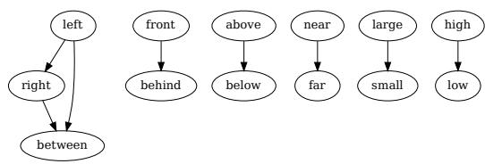  
Figure 9: The graph representation for in context example selection.

Figure 9, where an edge from node A to node B means that the encoder for relation A is used as an in-context example when generating for relation B.

## B.6 Hyperparameters and Hardware

For code optimization (Section 3.3.3), we set $N _ { s a m p l e }$ and $N _ { i t e r }$ to 5, top<sub>k</sub> to 3. We mainly use gpt-4o-2024-08-06 model with a temperature of 1.0 and top\_p of 0.95. For a fair comparison, we use the object classification results from ZSVG3D (Yuan et al., 2024b) for the evaluation of ReferIt3D. For VLM decision-making, we use the same temperature and top\_p values as VLM-Grounder (Xu et al., 2024). The thresholds for VLM decision (Section 3.4) are 0.9 for Nr3D. We conduct all experiments on a single NVIDIA GeForce RTX 4090 GPU.

## C Additional Quantitative Results

NS3D We show evaluation results in NS3D(Hsu et al., 2023) in Table 1 . NS3D can only learn concepts (e.g. relation name, category name) from the training set and its parsing results of Nr3D contain more than 5,000 concepts, resulting in a long-tailed problem. So it selects a subset containing 1,041 test examples, which only contains the same concepts as Sr3D, the dataset it is mainly trained on. On the NS3D subset, LASP achieves 60.2% accuracy, NS3D(Hsu et al., 2023) have a accuracy of 52.7%, which shows the advantage of LASP for processing natural grounding tasks.

Sr3D We show evaluation results on Sr3D, a subset of ReferIt3D (Achlioptas et al., 2020) in Table 5. If using predicted object labels, LASP has close accuracy to NS3D (Hsu et al., 2023). Even not using training data of Sr3D, LASP still achieves comparable performance with NS3D (Hsu et al., 2023) on both settings (w/ and w/o GT labels). If using GT object labels, the accuracy of our method (w/o VLM) on Sr3D is 95.3%, and the performance of NS3D and (Fang et al., 2024) are 96.9% and

Table 5: Performance on Sr3D.
<table><tr><td>Method Sr3D</td></tr><tr><td>BUTD-DETR 67.0</td></tr><tr><td>NS3D 62.7</td></tr><tr><td>NS3D(w/ GT Object Label) 96.9</td></tr><tr><td>Transcrib3D (w/ GT Label) 98.4</td></tr><tr><td>LASP (w/o VLM) 62.0</td></tr><tr><td>LASP (w/o VLM, w/ GT Object Label) 95.1</td></tr></table>

98.4%. So we believe that the bottleneck of Sr3D performance is object detection and classification rather than spatial relation understanding because its relation annotation is synthesized by relatively simple functions. So we mainly focus on natural benchmarks (Nr3D) which have complex and real spatial relations.

## D Additional Qualitative Results

## D.1 Effect of Code Optimization

We show the change between the initial response and the final code after multiple rounds of sampling and iterative refinement in Figure 10. The initial output only passes 18 test cases out of 37. After 3 iterations of sampling and optimization, we get the the relation encoder as the right one. It passes all 37 test cases. By transitioning from a strict geometric overlap calculation to a continuous, exponentialbased measure for both vertical and horizontal distances, the optimized code now captures nuances in “above” relation more robustly. This improved formulation inherently handles scenarios where objects are close but not strictly overlapping, and it provides a more stable gradient for training. Consequently, the updated model passes all test cases by offering a smoother, more differentiable metric that better aligns with real-world spatial relations and passes more test cases.

## D.2 Relation Constraints

LARC (Feng et al., 2024) proposes that certain spatial relations are symmetric, like “near” or “far”, meaning that if object A is “near” B, then B should also be “near” A. Consequently, the features of these relations should be symmetric. Conversely, other relations are inherently asymmetric, such as “left” or “right”. For these relations, if a feature element is positive (indicating the presence of the spatial relation), its corresponding symmetric element should be negative (indicating the absence of

def forward(self) -> torch.Tensor:   
N = self.object\_locations.shape[0]   
height\_i = self.size[:, 2].view(N, 1)   
bottom\_of\_i = self.center[:, 2].view(N, 1) - height\_i / 2   
top\_of\_j = self.center[:, 2].view(1, N)   
+ self.size[:, 2].view(1, N) / 2   
centers\_i = self.centers.unsqueeze(1)   
sizes\_i = self.sizes.unsqueeze(1)   
centers\_j = self.centers.unsqueeze(0)   
sizes\_j = self.sizes.unsqueeze(0)   
vertical\_proximity = torch.exp(-torch.abs(bottom\_of\_i - top\_of\_j)   
/ (height\_i / 2))   
vertical\_distance = centers\_i[..., 2] - centers\_j[..., 2]   
- (sizes\_i[..., 1] + sizes\_j[..., 1]) / 2   
center\_dist\_x = torch.abs(self.center[:, 0].view(N, 1)   
- self.center[:, 0].view(1, N))   
center\_dist\_y = torch.abs(self.center[:, 1].view(N, 1)   
- self.center[:, 1].view(1, N))   
combined\_size\_x = (self.size[:, 0].view(N, 1)   
+ self.size[:, 0].view(1, N)) / 2   
combined\_size\_y = (self.size[:, 1].view(N, 1)   
+ self.size[:, 1].view(1, N)) / 2   
horizontal\_alignment = torch.exp(-(center\_dist\_x / combined\_size\_x) -   
(center\_dist\_y / combined\_size\_y))   
relation\_feature = vertical\_proximity \* horizontal\_alignment   
overlap\_x = torch.clamp((sizes\_i[..., 0] + sizes\_j[..., 0]) / 2   
- torch.abs(centers\_i[..., 0] - centers\_j[..., 0]), min=0)   
overlap\_y = torch.clamp((sizes\_i[..., 2] + sizes\_j[..., 2]) / 2   
- torch.abs(centers\_i[..., 1] - centers\_j[..., 1]), min=0)   
horizontal\_overlap\_area = overlap\_x \* overlap\_y   
relation\_feature = torch.where(vertical\_distance > 0,   
horizontal\_overlap\_area / (1 + vertical\_distance),   
torch.tensor(0.0, device=DEVICE))

Figure 10: Example of code optimization result on relation encoder of “above”.

the reverse spatial relation).

LARC (Feng et al., 2024) leverage large language models (LLMs) to annotate these constraints and apply an auxiliary loss to enforce them during training. In contrast, while LASP does not explicitly train or use specialized instructions to create these constraints, we observe that some LLM-generated relation encoders inherently produce relation features that satisfy these constraints. Moreover, for certain relations, these constraints are guaranteed due to the deterministic execution of the code. In Figure 13, we present four relation features for a scene:

• Features for “near” and “far” are guaranteed to be symmetric.

• For asymmetric features such as “left” and “right” if $f _ { i , j } > 0$ , it is guaranteed that $f _ { j , i } =$ 0. ”

## D.3 Condition Level Accuracy

Our parsed symbolic expressions typically include one or more spatial conditions for the target object. However, some conditions in the referring utterance may be redundant.

For instance, if the referring utterance is ”find the monitor on the floor and under the desk,” and all monitors ”on the floor” are also ”under the desk,” then one of these two conditions is redundant. This means that even if the method fails to process one of the conditions, it can still provide the correct grounding result. To better understand LASP’s capability, we evaluate it on utterances containing a single condition. We categorize objects of the same class into groups. Within each group, we collect the conditions for each object from the parsed expressions. Each condition is represented in JSON format, such as: "relation": ..., "anchors": [...]. These conditions are executed seamlessly to identify the best-matching object. We compute the average precision and recall for all conditionlevel matches. LASP achieves an average precision of 67.5% and an average recall of 66.9%.

## D.4 More Visualization Results

We visualize more grounding examples in Figure 11. The first row illustrates the grounding process for the kitchen cabinet close to the fridge and beside the stove. In the process, the stove, objects beside the stove, and the objects near the fridge are sequentially grounded, culminating in the target kitchen cabinet highlighted in green. The second row shows the grounding process for right trash can below the sink. Starting with the objects below the sink, followed by the objects on the right of the sink, and finally combining these conditions to highlight the target trash can in green.

## D.5 Effect of Unit tests

To demonstrate the impact of filtering generated code based on its accuracy on training cases, we selected six relations and plotted their performance. The x-axis represents the pass rate on training cases, while the y-axis shows the number of passed examples in all relevant test cases.

For straightforward relations such as “near” or “far”, GPT-4o can pass all unit tests on the first attempt, so we focus on cases requiring multiple refinement steps.

The results, shown in Figure 12, indicate that for five out of six relations (excluding behind), the code with the highest pass rate on training cases achieves top-tier performance on the test set. However, for the behind relation, using the bestperforming code on the training cases results in about 15 fewer passed test cases compared to using code with approximately 70% accuracy. Despite this, it still outperforms code with accuracy below 0.5.

This discrepancy for behind may stem from biases in the training data collection process. Overall, selecting code based on its performance on the training set is effective for achieving strong test set performance.

## D.6 Cross Dataset Results

To validate the scene generalization of our relation, we select scenes from GRScenes (Wang et al., 2024) and annotate relation-oriented referring utterances. For evaluation, we directly use the object categories and bounding boxes. Some examples of annotated data and results are shown in Figure 14.

## E Public Resource Used

In this section, we acknowledge the use of the following public resources for this work:

• Pytorch <sup>2</sup> . . . . . . . . . . . . . . . . . Pytorch License

• Referit3D <sup>3</sup> . . . . . . . . . . . . . . . . . MIT License

• GRScenes <sup>4</sup> . . . . . . . . CC BY-SA 4.0 License

• ZSVG3D <sup>5</sup> . . . . . . . . . . . . . . . . . . . . . Unknown

• Vil3drel <sup>6</sup> . . . . . . . . . . . . . . . . . . . . . . Unknown

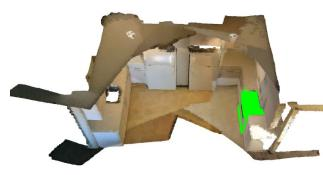  
stove

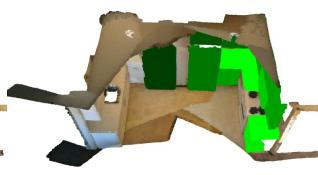  
beside the stove

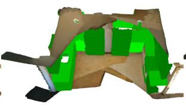  
close to fridge

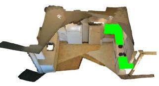  
target

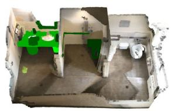  
below sink

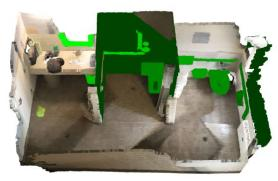  
on the right of sink

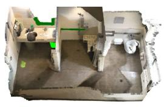  
right below sink

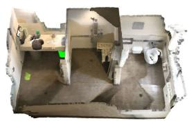  
target

Figure 11: The target objects are: “Stove next to another stove and close to the fridge” (top row) and “Trashcan to the right of and below the sink” (bottom row).  
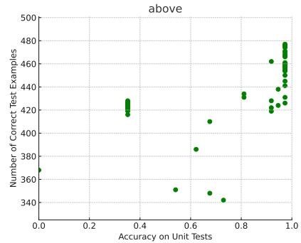

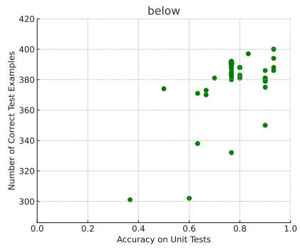

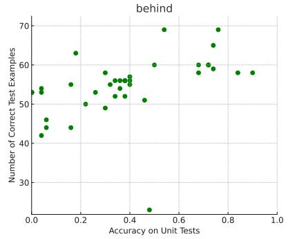

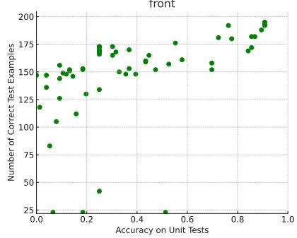

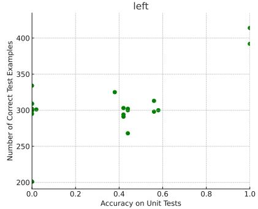

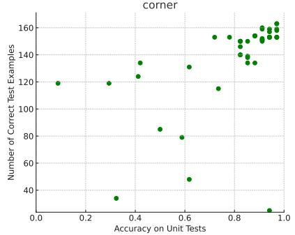  
Figure 12: Corresponding relation between the unit test pass rate and number of correct examples on test set.

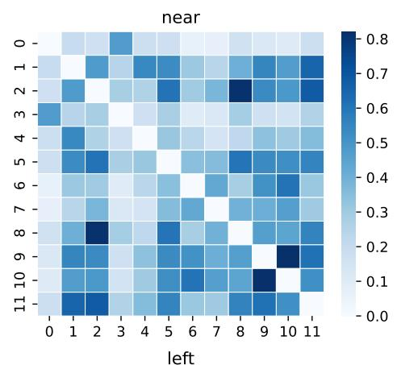

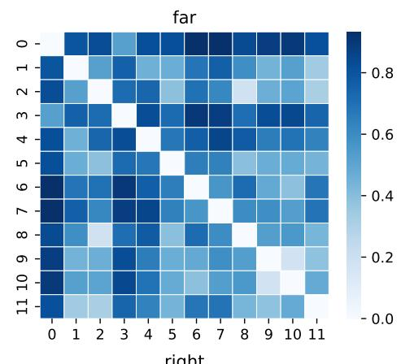

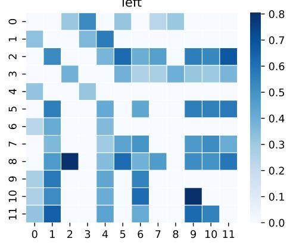

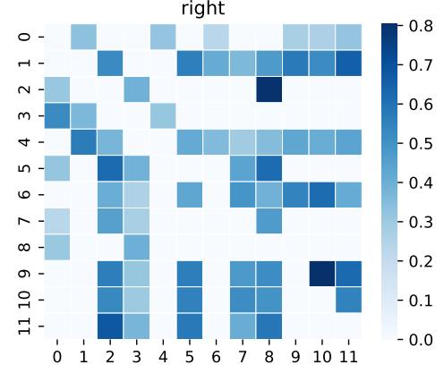  
Figure 13: Relation feature examples. The features of “near” and “far” are symmetric, meaning mutual relationships hold true in both directions. For “left” and “right,” if an element is positive, its corresponding symmetric element is zero, ensuring asymmetry. Additionally, all diagonal elements are zero, as self-relations are not considered.

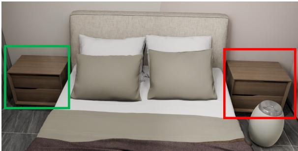  
(a): Nightstand	to	the	left	of	the	bed.

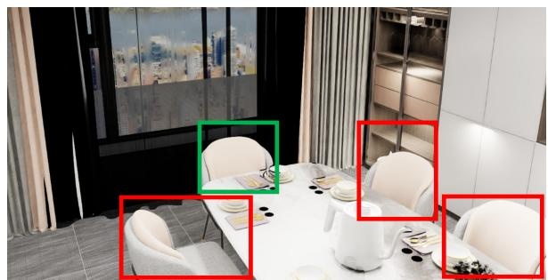  
(d):	The	chair	directly	in	front	of	the	window.

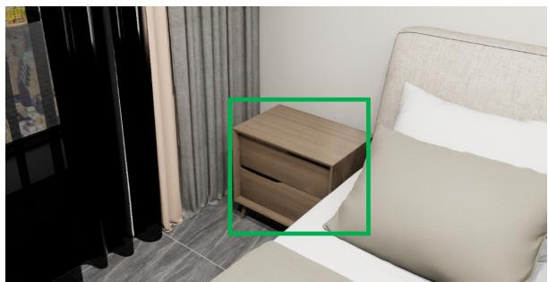  
(b):	Nightstand	next	to	the	curtain.

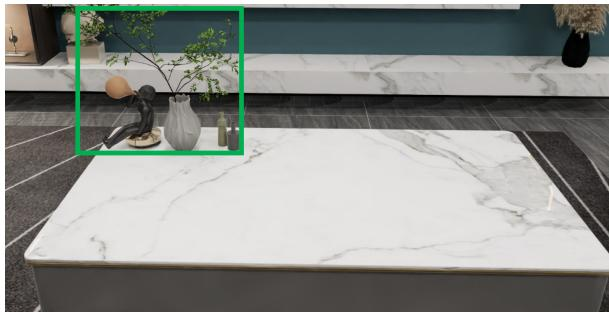  
(e):	A	plant	sitting	on	the	tea	table.

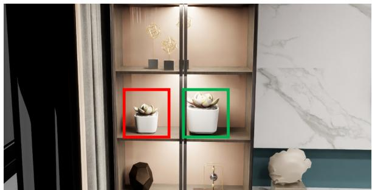  
(c):	From	the	two	plants	in	shelf,	pick	the	right	one.

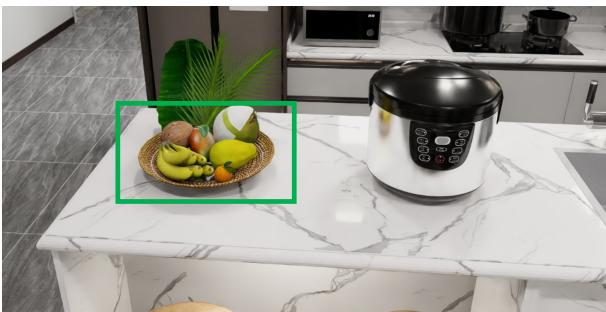  
(f):	Near	the	electric	cooker,	there	is	a	plate.  
Figure 14: Qualitive results on GRScenes (Wang et al., 2024). The target object is in the green box and the visible distractors are indicated by the red box.