# Large Language Models Do Multi-Label Classification Differently

Marcus Ma\*, Georgios Chochlakis\*, Niyantha Maruthu Pandiyan, Jesse Thomason, Shrikanth Narayanan University of Southern California Correspondence: {mjma, chochlak } @usc.edu

## Abstract

Multi-label classification is prevalent in realworld settings, but the behavior of Large Language Models (LLMs) in this setting is understudied. We investigate how autoregressive LLMs perform multi-label classification, focusing on subjective tasks, by analyzing the output distributions of the models at each label generation step. We find that the initial probability distribution for the first label often does not reflect the eventual final output, even in terms of relative order and find LLMs tend to suppress all but one label at each generation step. We further observe that as model scale increases, their token distributions exhibit lower entropy and higher single-label confidence, but the internal relative ranking of the labels improves. Finetuning methods such as supervised finetuning and reinforcement learning amplify this phenomenon. We introduce the task of distribution alignment for multi-label settings: aligning LLM-derived label distributions with empirical distributions estimated from annotator responses in subjective tasks. We propose both zero-shot and supervised methods which improve both alignment and predictive performance over existing approaches. We find one method – taking the max probability over all label generation distributions instead of just using the initial probability distribution – improves both distribution alignment and overall F1 classification without adding any additional computation.

## 1 Introduction

Many natural language processing tasks assume each input has a single, unambiguous label, represented as a one-hot encoding (Srivastava et al. 2022; Wang et al. 2024; inter alia). However, in realistic settings, especially where categories are not mutually exclusive, this assumption fails. Multilabel classification, where instances can have none, one, or multiple labels, better captures the inherent ambiguity, richness of human categorization, and label correlations, notably in subjective tasks (Mohammad et al., 2018; Demszky et al., 2020). It also enables modeling degrees of belief, which is integral in subjective tasks to express confidence or intensity in each label (Paletz et al., 2023). Intensity is a tool not generally available in single-label settings. Despite their widespread applicability, multi-label tasks have received little attention in the context of Large Language Models (LLMs).

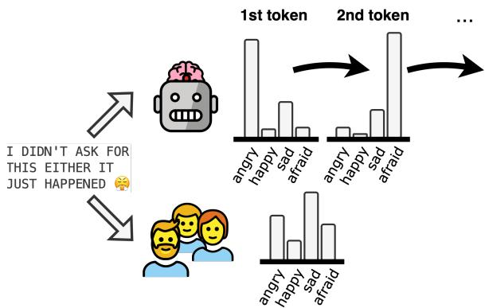  
Figure 1: Autoregressive language modeling is incompatible and interferes with multi-label classification: LLMs generate one label at a time with unrepresentative distributions misaligned from reference distributions.

A key reason may be the incompatibility between the language modeling objective and the multi-label setting. LLMs are trained to generate probability distributions over vocabulary tokens via softmax normalization for the immediate next token, naturally lending themselves to single-label settings, such as by restricting the normalization to label tokens. In contrast, multi-label classification does not require label probabilities to sum to one. Instead, each label's confidence can, in principle, be modeled independently. This runs counter to how LLMs are trained, as their logits are meaningful only in relation to each other.

Relative probabilities might still encode relevant information, useful for threshold-based prediction (He and Xia, 2018), but such methods are ill-suited for tasks involving graded or subjective judgments, where ground truth can lie in [0, 1], not just {0, 1}. Alternatively, LLMs can be allowed to autoregressively generate a sequence of labels. However, the resulting distributions at each step are conditioned on earlier outputs and remain constrained by the same joint normalization, making them difficult to interpret as genuine model confidence scores (Breen et al., 2018). For example, a model with 60% confidence in a label still needs to allocate the remaining 40% among competing options, regardless of its “true" confidence.

In this work, we investigate how LLMs generate multi-label predictions by analyzing their output distributions in each generation step. We show that LLMs exhibit spiky distributions, where each consecutive step strongly favors a single label while suppressing others. This pattern produces a list of high-confidence individual predictions rather than a comprehensive probability distribution. Notably, these distributions lack consistency across steps: labels with high probability in earlier steps are rarely revisited in subsequent ones, even when the model continues generating labels, which suggests that LLMs are performing sequential single-label classification and not holistic multi-label reasoning.

To evaluate this phenomenon, we frame distributional alignment as a core task: aligning LLMderived distributions with ground-truth distributions. To evaluate confidence, not just predictions, we also compare with empirical distributions derived from human annotator responses. Rather than relying on hard label agreement (e.g., majority vote), we embrace the plurality of human interpretations (Kahneman and Tversky, 1972; Tenenbaum et al., 2006; Griffiths et al., 2010; Aroyo and Welty, 2015) and approximate the distribution for each document by the empirical proportion of annotators selecting each label, resulting in values ∈ [0, 1]. We extend the distributional inference framework (Zhou et al., 2022) to the multi-label setting and evaluate both zero-shot and supervised approaches for aligning LLM outputs with the humanannotation derived empirical distributions.

Our contributions are the following:

• In §4, we provide the first formal analysis of how LLMs handle multi-label classification, showing that their prediction behavior mirrors the steps inherent in the language modeling that favor a single-label setting.

• In §5, we introduce and evaluate distribution alignment in the multi-label setting, using degrees of belief as a reference distribution. We show that our proposed zero-shot and supervised methods improve alignment and predictive quality over standard baselines on subjective multi-label tasks.

• We highlight the zero-shot approach of maxover-generations, which improves both distribution alignment and F1 classification for no additional computation. This method involves setting a label's probability to its max value across all label generations rather than its value in a single label distribution.

## 2 Related Work

## 2.1 LLM Usage for Multi-label Predictions

Single-label problems have dominated both early (e.g., ImageNet; Deng et al. 2009) and recent (BigBench; Srivastava et al. 2022) deep learning progress, despite the obvious limitations of singlelabel settings when the labels are not mutually exclusive. ImageNet (Deng et al., 2009) as a benchmark, for instance, used the top-k accuracy to evaluate models in order to deal with the potential simultaneous existence of multiple categories within each image, which was not reflected in the annotations. Similarly, previous multi-label modeling attempts treated the task as single-label by using the general cross-entropy loss with a threshold to turn the prediction into a proper multi-label output (He and Xia, 2018). Subsequent works switched to the binary cross-entropy loss, and tried to leverage the relationship between labels for additional supervision (He and Xia, 2018; Alhuzali and Ananiadou, 2021; Chochlakis et al., 2023).

To the best of our knowledge, Niraula et al. (2024) is the only work to explicitly investigate LLM multi-label classification (Chen et al., 2022) in niche domains. Beianu et al. (2024) explored a multi-label framework for finetuning BERT and Jung et al. (2023) trained a classifier on top of T5 encodings directly for multi-label classification rather than relying on model text generation. The two well-studied forms of multi-label classification are extreme multi-label classification (XMLC; Zhu and Zamani 2024), where models must assign many labels to a document from a very large label set (1000+ labels), and hierarchical multilabel classification (Tabatabaei et al., 2025), where labels are subdivided into sub-labels recursively. Subjective multi-label classification is relatively unexplored (Chochlakis et al., 2024). We thoroughly investigate LLMs in these settings by analyzing their classification patterns across datasets.

## 2.2 Subjective Language Tasks

Many works have attempted to model individual annotator perspectives and intensities (Paletz et al., 2023) instead of the majority vote, e.g., with EM (Dawid and Skene, 1979; Hovy et al., 2013), word embeddings Garten et al. (2019), and encoderbased approaches (Gordon et al., 2022; Mokhberian et al., 2022; Davani et al., 2022; Mokhberian et al., 2023). Modeling annotators with LLMs has shown limited success, and LLM biases have also been explored (Dutta et al., 2023; Abdurahman et al., 2024; Chochlakis et al., 2025).

## 2.3 Calibration for LLMs

Increasing the size of neural networks generally improves performance and generalization (Hoffmann et al., 2022; Brutzkus and Globerson, 2019; Kaplan et al., 2020). However, while smaller models essentially produce well-calibrated predictions “for free" (Niculescu-Mizil and Caruana, 2005), as neural networks become increasingly complex, they are also less calibrated (Guo et al., 2017). Recent language models trained with Reinforcement Learning from Human Feedback (RLHF) have seen “spiky" probability distributions where models are overconfident in a select few output tokens while suppressing the probabilities of other options (Xie et al., 2024; Leng et al., 2025). Instruction tuning also appears to reduce calibration over base models (Zhu et al., 2023). Several methods have been proposed to improve LLM calibration, including temperature scaling (Xie et al., 2024; Huang et al., 2024), adding calibration metrics as a learnable feature (Chen et al., 2023), and in-context prompting (Zhao et al., 2024). Our proposed distribution alignment setting differs from calibration in that it compares the probabilities over the entire label set whereas calibration only compares the predicted label probability to the ground truth.

## 3 Datasets

We present both objective and subjective multilabel datasets. We use 10-shot prompts with Llama3 (Dubey et al., 2024) (more details in §A). We apply softmax over initial label tokens to derive label probabilities at each step. It is well known that several different tokens can correspond to the same concept (Holtzman et al., 2022), such as “happy", "Happy", and “ happy", and found that selecting the highest logit score across all same-concept tokens as a given label's logit value was the most effective way to capture model belief.

<table><tr><td>Dataset</td><td>Annotators (per example)</td><td>Cohen&#x27;s Kappa</td><td>0 labels</td><td>1 label</td><td>2 labels</td><td>3+ labels</td></tr><tr><td>GoEmotions</td><td>81 (3.58)</td><td>0.27</td><td>29%</td><td>62%</td><td>8%</td><td>1%</td></tr><tr><td>MFRC</td><td>6 (2.99)</td><td>0.21</td><td>78%</td><td>18%</td><td>3%</td><td>&lt;1%</td></tr><tr><td>SemEval</td><td>-(-)</td><td></td><td>1%</td><td>13%</td><td>40%</td><td>46%</td></tr></table>

Table 1: Annotation statistics and label distributions. The public release of SemEval does not include individual annotator labels, only aggregates.

Boxes (Kim and Schuster, 2023) Entity tracking based on natural language description of “box" contents and “move" operations. Each box can contain none, one, or multiple objects. The dataset contains thousands of synthetic examples.

SemEval 2018 Task 1 E-c (Mohammad et al., 2018) Multi-label emotion recognition of 11 emotions. We use the English tweets. We refer to this as SemEval. Although it does not contain annotator labels, it has a frequent presence of multiple labels, allowing us to study the generation dynamics.

MRFC (Trager et al., 2022) Multi-label moral foundation corpus of six moral foundations. 3 annotators were assigned to each sample.

GoEmotions (Demszky et al., 2020) Multi-label emotion recognition benchmark of 27 emotions. For efficiency, we pool the emotions to seven emotions via hierarchical clustering (see §A). On average, 3.6 annotators were assigned to each sample.

## 4 Multi-Label Mechanisms of LLMs

We evaluate whether LLMs produce diverse, consistent, and informative probability distributions. Specifically, we investigate whether the predicted probabilities at each generation step reflect the relative confidence of the LLM and whether the relative ordering of labels provides insight into future predictions. To this end, we analyze the distribution of the top two predicted probabilities at each label generation step, along with the entropy of the distribution, allowing us to assess how spiky the distributions are, that is, how close the top probability is to 1 and how low the entropy is. That is, we take the output probabilities of the model at each generation step where a label starts being predicted (if the LLM breaks a label into multiple tokens, then we take into account the probabilities for only the first token), extract the top two probabilities for further analysis, and also compute the entropy of

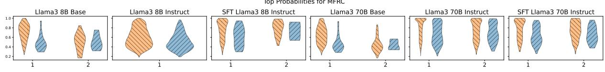

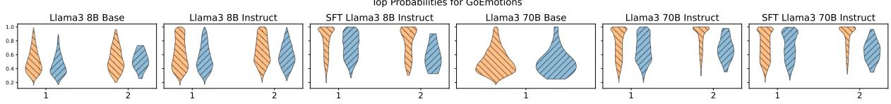

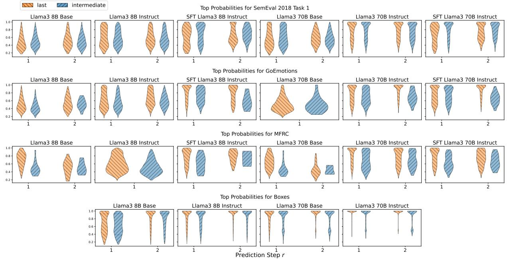

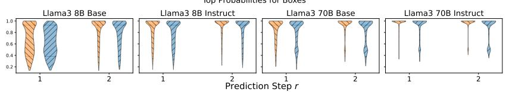  
Figure 2: Top probabilities at each generation step when the last or an intermediate label is generated. Patterns are identical between the two settings, and bigger or finetuned models have clusters closer to 100%. A single step only is shown when only up to labels were generated for all examples in a specific setting.

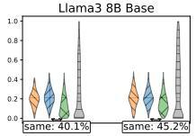

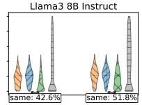  
Second-highest Probabilities for SemEval 2018 Task 1

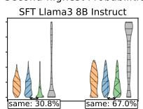

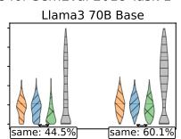

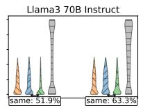

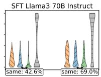

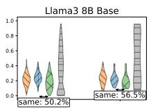

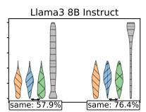

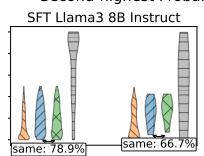

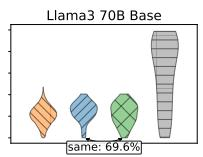

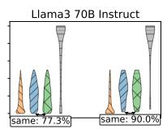

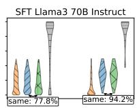

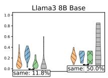

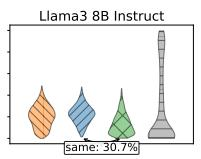

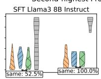

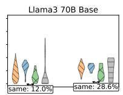

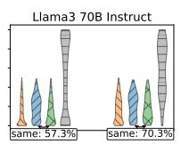

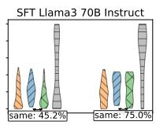

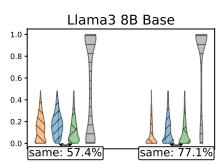

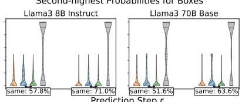

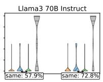  
Figure 3: Second-highest probabilities at each generation step when the last or an intermediate label is generated. We also show the probability at the current step of the label that is actually predicted in the next step (r+1 pred), the probability at the next generation step of the second highest probability of the current step (intermediate @ r+1), and the percentage of cases the second-highest probability label at step r and the prediction at r+1 is the same. LLM distributions show poor relative ranking, and little distinction between the last and intermediate settings. A single step only is shown when only up to labels were generated for all examples in a specific setting.

the entire distribution.

We also compare the top probabilities to evaluate whether their relative values reflect the model's confidence. Crucially, we examine the second-highest probability and track how it evolves in the subsequent generation step, and importantly how often the corresponding label is predicted next, as would be expected. By distinguishing between steps where the model continues generating more labels (denoted as intermediate) and steps where it predicts the final label (denoted as last), we assess whether the second-highest probability provides a meaningful signal about future behavior.

Finally, we test whether the relative order of the probabilities is informative by comparing the second-highest probability in the current generation step to that of the label generated in the next. That is to say, we look at the next generation step, see the label that was actually predicted, and then compare that label's probability in the current generation step compared to the probability of the secondhighest label in the current step.

Figures 2 and 3 show the results based on the predicted probabilities for all datasets using Llama3 8B and 70B Base, Instruct, and with Supervised Finetuning (Ouyang et al., 2022) (SFT; details in §A.5). We show only up to the second step to avoid clutter. Corresponding entropy measures can be found in §D.2. We highlight key findings below.

Spikiness We see that as the models become larger or are finetuned, the distributions start to concentrate around 100%. For instance, in SemEval, we see that Llama3 70B Instruct and SFT noticeably spike for both generation steps. In contrast, Llama3 8B Base has mode ～ 40%. For Boxes, the objective benchmark, we observe even more pronounced spikes, with probability mass clustered around ～ 100% for all steps.

Sequential Spikiness We observe that after the first label is generated, each additional label produced by the LLM is accompanied by a similarly spiky distribution centered on the newly predicted label. Interestingly, some distributions become spikier at later generation steps, potentially stemming from previously generated labels being assigned near-zero probability.

Stopping Criterion We find that models rarely have different distributions when predicting their last label compared to when they are going to continue predicting more labels, providing little to no indication of when they will stop predicting. Indeed, we would expect the distributions to resemble MFRC with the Base models, when the probabilities for the second highest labels are distinctly greater, the model continues to produce more labels. However, this distinction does not appear in most settings. For instance, SemEval has the same trends between both, and the second probabilities of some of the models are greater when the model stops generating (e.g., 70B Instruct and SFT), a counter-intuitive finding, because one would expect lower weight on the rest of the labels when the model would stop generating.

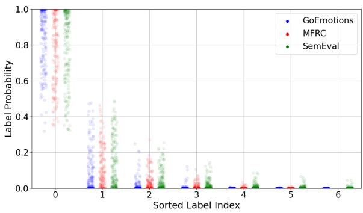  
Figure 4: Sorted label probabilities when generating the first label for Llama3 70B Instruct. Most distributions are spiky, with the top label having near-1 probability.

Relative Ranking We demonstrate that LLMs do not reliably pick the second highest label as their next prediction, even if they continue predicting. For instance, in SemEval, the label with the second highest probability in the first step is not predicted next between 48.1% and 69.2% of the time across models. In GoEmotions, this behavior occurs between 22.2% and 49.8% of cases. In fact, if we take the label with the second-highest probability in the current step r, and look at its probability in the next step r+1 (shown as intermediate @ r+1), we see that it is clusters at 0. Similarly, when we look at the probability of the label predicted in step r+1, and see how its probability looked in the previous step r (shown as r+1 pred), its probability tends to also be clustered around 0. Notably, we find that if the second highest label at any step is not predicted as the next generated label, it will not be not predicted at all most of the time (see §D.3). While is in some sense expected, since each generated label is newly conditioned on the previously generated labels (we verify this in §D.6 by looking at the attention weights), it means that each generation step is only informative of the current label, since the relative ordering of predicted labels is not predictive of subsequent behavior.

Language Modeling From the previous two findings, we conclude that LLMs’ distribution at the first (or any) generation step is not reflective of their confidence for each label, nor their subsequent behavior, suggesting language modeling is interfering with classification, causing the model to spike for every generation, an artifact of the autoregressive nature of LLMs, instead of generating a label distribution that is reflective of its confidence. We present more corroborating evidence in §5.4 with linear probing (Hewitt and Liang, 2019).

Complete Distribution We find that most label probability distributions are spiky, with the top label having probability near 1 and other labels sharply degenerating to near-0 probability even if later predicted (Figure 4). We also find evidence that LLMs generate the most-likely label first, as the relative accuracy of each label drops between the first and second prediction in Figure 5. Sequential spikiness explains these phenomena – LLMs generate the most-likely label first with high confidence and do not consider what a less likely second label would be until the first label is fully generated. For the smaller models, we also observed a few instances where the model predicted the same label twice in a row.

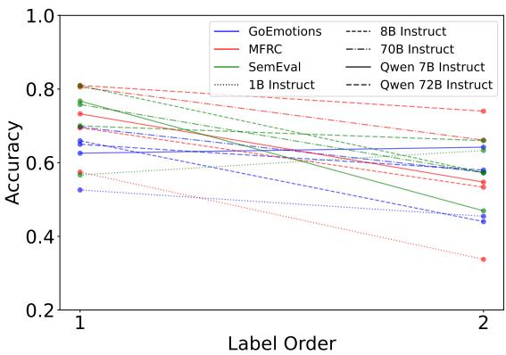  
Figure 5: Average accuracy of the first and second label for multi-label generations based on the order in which it was generated, showing decreasing trends. Line color represents dataset and line pattern represents model size.

Rate of multiple predictions Finally, we report that the label type of in-context prompts greatly influences the rate of multi-label output. We show in Figure 6 how the percentage of multi-label (as opposed to single or no label) examples roughly corresponds to the percentage of multi-label output across models and datasets. Learning to predict multi-label outputs must be highlighted very clearly in the in-context examples, suggesting that singlelabel formats have dominated the training of the model. Overall, these analyses show that LLMs do not create well-calibrated distributions when generating multiple labels; instead, they generate spiky distributions, classifying labels one at a time.

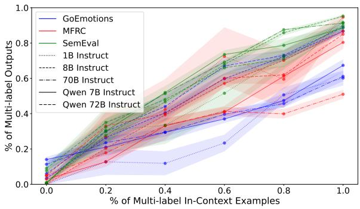  
Figure 6: Percentage of outputs that are multi-label given the percentage of in-context examples that are multi-label in a 10-shot prompt. Line color represents dataset and line pattern represents model size.

Generalizability To ensure our findings generalize to other model families, we replicate the main results for the Qwen 2.5 (Team, 2024) family of models in §D.7, showing identical results to the Llama family. Moreover, we experimented with an LLM with multiple decoding heads, Medusa (Cai et al., 2024). Given its ability to predict multiple tokens at a time, the aforementioned behaviors might not be present in such models. Contrary to this assumption, we show in §D.8 that the model behaves in identical ways. Finally, in §D.9 we examine whether the label order in the instructions has a role in these phenomena, finding strong effects.

## 5 Multi-Label Distribution Alignment

To test how interpretable and calibrated the LLMderived distributions are, we propose multi-label distributional alignment as a core task. Our focus in this work is multi-label subjective tasks, because they allow degrees of belief, and so allow us to evaluate model confidence, not just predictions, in multi-label settings.

## 5.1 Task Formulation for Multi-Label

In the single-label setup, a probability distribution is produced over a label set L. However, in the multi-label case, each example can have an arbitrary number of labels, each of which has its own binary probability of appearing (in practice, labels are additionally correlated). Thus, multi-label distributions are |L| binary probabilities.

<table><tr><td></td><td></td><td colspan="6">Single-Label Datasets</td><td colspan="6">Multi-Label Datasets</td></tr><tr><td></td><td></td><td colspan="3">Hatexplain</td><td colspan="3">MSPPodcast</td><td colspan="3">GoEmotions</td><td colspan="3">MFRC</td></tr><tr><td></td><td></td><td>NLL↓</td><td>L1↓</td><td>F1↑</td><td>NLL↓</td><td>L1↓</td><td>F1↑</td><td>NLL↓</td><td>L1↓</td><td>F1↑</td><td>NLL↓</td><td>L1↓</td><td>F1↑</td></tr><tr><td>Basline</td><td>Compare-to-None</td><td>1.66</td><td>0.81</td><td>0.58</td><td>2.63</td><td>1.37</td><td>0.29</td><td>23.93</td><td>4.71</td><td>0.27</td><td>5.34</td><td>1.85</td><td>0.51</td></tr><tr><td>Test-Time</td><td>Hard Predictions</td><td>9.86</td><td>0.90</td><td>0.58</td><td>13.65</td><td>1.47</td><td>0.30</td><td>24.11</td><td>1.31</td><td>0.39</td><td>19.70</td><td>1.07</td><td>0.59</td></tr><tr><td></td><td>Unary Breakdown</td><td>0.91</td><td>0.94</td><td>0.47</td><td>1.55</td><td>1.45</td><td>0.30</td><td>3.60</td><td>1.32</td><td>0.43</td><td>2.49</td><td>1.27</td><td>0.51</td></tr><tr><td>Max-Over-Generations</td><td>Binary Breakdown</td><td>1.12</td><td>1.06</td><td>0.29 N/A</td><td>1.65</td><td>1.44</td><td>0.24</td><td>7.62</td><td>2.64</td><td>0.41</td><td>3.55</td><td>2.11</td><td>0.41</td></tr><tr><td></td><td></td><td>N/A</td><td>N/A</td><td></td><td>N/A</td><td>N/A</td><td>N/A</td><td>4.04</td><td>1.27</td><td>0.39</td><td>2.32</td><td>0.92</td><td>0.63</td></tr><tr><td>Suprsed</td><td>BERT</td><td>2.69</td><td>0.73</td><td>0.66</td><td>4.29</td><td>1.27</td><td>0.38</td><td>2.72</td><td>0.63</td><td>0.64</td><td>3.00</td><td>0.43</td><td>0.82</td></tr><tr><td></td><td>Linear Probing</td><td>N/S</td><td>N/S</td><td>N/S</td><td>N/S</td><td>N/S</td><td>N/S</td><td>2.42</td><td>0.71</td><td>0.56</td><td>2.81</td><td>0.44</td><td>0.81</td></tr><tr><td></td><td>SFT Outputs</td><td>N/S</td><td>N/S</td><td>N/S</td><td>N/S</td><td>N/S</td><td>N/S</td><td>14.76</td><td>0.80</td><td>0.58</td><td>10.45</td><td>0.57</td><td>0.69</td></tr><tr><td></td><td>SFT Max-Over-Generations</td><td>N/A</td><td>N/A</td><td>N/A</td><td>N/A</td><td>N/A</td><td>N/A</td><td>4.15</td><td>0.72</td><td>0.57</td><td>4.87</td><td>0.54</td><td>0.73</td></tr></table>

Table 2: Distribution alignment scores for Llama3 70B Instruct on single and multi-label datasets between LLM and human distributions. F1 ↑ is the example-F1 score. N/A: Not applicable to single-label setting. N/S: Not supplied to avoid clutter, and due to environmental considerations, since single-label settings are not our focus.

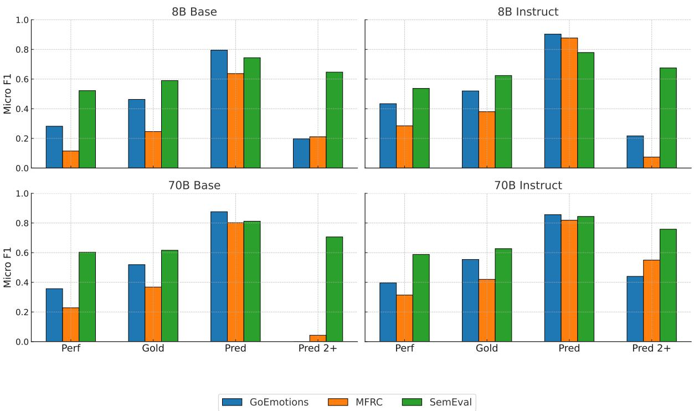  
Figure 7: Micro F1 ↑ of linear probes trained and evaluated on gold labels (Gold), trained and evaluated on model predictions $( P r e d )$ , and evaluated on predictions beyond the first generated label $( P r e d 2 + )$ . For comparison, we also show the performance of the model (Perf). Embeddings are from the last layer for the first generated label.

## 5.1.1 Human Distribution Estimation

Our underlying assumption is that given a task with subjective labels and multiple interpretations, the “truth" of the label is better represented as a confidence distribution over a potential label set. In this interpretation, for data point d, an annotation represents a single sample $a \sim H ( d )$ , where H is the underlying human distribution. Then, denoting I as the indicator function, for label $l \in L$ , we approximate our empirical human-annotation distribution using annotator set A as:

$$
\hat { H } _ { l } ( d ; A ) = \frac { 1 } { | A | } \sum _ { a _ { i } \in A } \mathbb { I } [ l \in a _ { i } ( d ) ] .\tag{1}
$$

## 5.1.2 Distribution Alignment Metrics

We compute the negative log likelihood (NLL), L1 distance, and example-F1 (Du et al., 2019) to evaluate how well the empirical distribution aligns with the LLM-derived distribution. Example-F1 is a variant of F1 that can be evaluated per example.

NLL Conceptually, NLL measures if a distribution is confidently wrong about any answer. Given a discrete probability distribution $Q _ { d }$ and a set of labels $G _ { d } = \{ g _ { i } | i \in [ m ] , g _ { i } \in L \}$ , we compute the likelihood of $G _ { d } \mathrm { a s } \prod _ { q \in G _ { d } } ^ { m } P _ { Q _ { d } } ( g )$ , where $P _ { Q _ { d } } ( l _ { i } )$ is the probability of $l _ { i }$ under $Q _ { d }$ . Taking the negative logarithm gives NLL. The best distribution that explains a sample minimizes NLL.

L1 Distance One shortcoming of NLL is that it disproportionately penalizes small differences near $0 , { \mathrm { e . g . } }$ , penalizing a likelihood of $1 0 ^ { - 7 }$ much more than $1 0 ^ { - 2 } \div$ , despite their practical similarity. L1 distance solves this problem by comparing the absolute difference of each label probability to its frequency in the sample: $\begin{array} { r l } { \sum _ { l \in L } | P _ { Q _ { d } } ( l ) - \hat { H } _ { l } ( d ; A ) | } \end{array}$ L1 distance measures if the general shape of the distributions match

## 5.2 LLM Distribution Methods

To investigate the task of distribution alignment in the multi-label setting, we propose methods which are categorized into three groups: baseline methods, test-time methods, and supervised methods.

## 5.2.1 Baseline Methods

Compare-to-None We use the output distribution of the labels at the point at which the model generates its first label token (excluding, for example, formatting tokens). However, the individual values of raw logits hold little interpretability as their value is only meaningful in the context of the rest of the tokens. We propose to compare the logit score of each label to the logit score of the “none” label to get an estimate of how likely that label is to occur independent of the other logits, leveraging the null prediction to contextualize the value of the logits. Let $S ( l _ { i } )$ be the logit score for label $l _ { i } ;$ we can therefore determine the logit score difference for each label $d _ { i } = S ( l _ { i } ) - S ( l _ { \mathrm { n o n e } } )$ . We then apply the sigmoid function to $d _ { i }$ for a valid probability: $P ( l _ { i } = 1 | d _ { i } ) = \sigma ( d _ { i } )$

Hard (Actual) Predictions We take the labels that the model actually outputs autoregressively;

we set these values to 1 — € and otherwise € to avoid arithmetic issues with NLL.

## 5.2.2 Test-Time Methods

Findings from Niculescu-Mizil and Caruana (2005) indicate that binary tasks are generally wellcalibrated. Even though modern LLMs are very different from the basic neural networks tested in this paper, we were inspired to design several different approaches that “break down"multi-label classification into smaller steps. For these methods, we investigated Monte Carlo sampling methods but found this approach simply added noise over directly calculating the label probabilities analytically.

Unary Breakdown: Label-wise Preference In this approach, we create a binary classification problem for each individual label, similar to the approach taken by Li et al. (2020). Namely, for a given example, we create a prompt that includes the original document to be classified, but instead we present a single label and query the model if the label is “reasonable". We directly extract the probabilities for the “reasonable" label, which conforms to the independence property of multi-label probabilities, because each label can be assigned a value $\in [ 0 , 1 ]$ without constraints or normalization. $| L |$ runs (one per label) per document are required.

Binary Breakdown: Pair-wise Preference We break down a single example into multiple binary comparisons between all label pairs $( \binom { | \dot { L } | + 1 } { 2 }$ runs per example), and then leverage the outcomes of these comparisons to derive probabilities for the labels. Namely, for every pair of labels, we provide both labels to the model and ask the model to select one of them as better representing the input. We derive the probabilities for the two labels by applying softmax on the two logits. We then use the Bradley-Terry model (Bradley and Terry, 1952) to rank the labels based on their pairwise performance. Specifically, to estimate logit scores S with pairwise probabilities that label $l _ { i }$ is better than $l _ { j }$ we have $P ( l _ { i }$ is better than $l _ { j } ) = p _ { i > j } = \sigma ( s _ { i } - s _ { j } )$ where σ is the sigmoid function. This is calculated by minimizing the predictive loss $\mathcal { L } \mathrm { : }$

$$
\begin{array}{c} \mathcal { L } = - \frac { 1 } { 2 } ( \sum _ { i , j } p _ { i > j } \cdot \log ( \sigma ( s _ { i } - s _ { j } ) )  \\ { + \left( 1 - p _ { i > j } \right) \cdot \log ( \sigma ( s _ { j } - s _ { i } ) ) ) . } \end{array}\tag{2}
$$

In order to calculate the multi-label probabilities, similar to compare-to-none, we introduce a “none"

label into the label set and derive final probabilities by comparing the Bradley-Terry logit scores of a given label to the “none" logit score. We also consider using strict 1’s and 0's instead of probabilities, similar to ELO ranking (Elo, 1978) in §C, but find using probabilities to be more performant.

Max-Over-Generations We take the probability distributions for every label generation step, and the final probability for each label is equal to the maximum value achieved over all distributions. This approach is a soft version of the Hard Predictions baseline, and requires access to model scores.

## 5.2.3 Supervised Methods

We compare our approach with three supervised methods: Finetuned BERT, Linear probes (Hewitt and Liang, 2019) on the first label token of the last layer, and SFT, all described in §A.5. We also use Linear probes for interpretability purposes (Li et al., 2021) to study the informational content of the models’ embeddings.

## 5.3 Experimental Setup

We apply our methods on the same Llama models (see §A.5). We test our proposed approaches on the main test set (details in §A.4). We test on the multi-label datasets of GoEmotions and MFRC that contain individual annotator labels. We also include evaluation on two single-label subjective datasets (details in §A.3), HateXplain (Mathew et al., 2021) and MSP-Podcast (Lotfian and Busso, 2019) to contextualize our multi-label findings.

## 5.4 Results

Distribution Alignment We report distribution alignment results in Table 2 for Llama3 70B (results for 8B in §D.4). Overall, we find that Test-Time and Supervised methods outperform both baseline methods. We draw particular attention to the max-over-generations method, which significantly outperforms both baselines with little additional computational overhead other than storing model scores across multiple generation steps. We see that unary breakdown performs similarly well to max-over-generations, as isolating each label's validity independently disentangles the bias of language modeling from the classification task. As a downside, unary breakdown incurs |L| times the generations per example. Surprisingly, we find that BERT performs the best of the supervised methods, which we use as additional evidence that LLMs classify labels one at a time, not simultaneously.

Linear Probing The linear probing method ranks as the second best baseline, so the hidden states during first-label generation alone seem, at first glance, to contain enough information to perform well on the tasks. However, in Figure 7, we present a more detailed analysis with linear probes. In addition to model and probing performance, we present the probes’ capability of predicting the predictions of the model themselves (i.e., the probes are trained on the predictions). We present the performance on the predictions on the Pred column, showing, as expected, much higher performance. However, when we look at how well the probes can predict any label after the first (Pred 2+), we see a substantial degradation in performance. Note that the task in theory becomes easier as we remove a label from the problem. This degradation suggests that linear probing performs well mostly due to its high accuracy of the first label and has less predictive power for any future labels, which aligns with our findings that LLMs predict labels one at a time. Even after supervised training, embeddings of the first label generation do not contain enough information to predict any subsequent labels.

Effect of Instruction Tuning In §D.5, we demonstrate that finetuned models generally achieve higher performance, yet their NLL is worse. This result supports previous findings that finetuned model are more confident, since NLL punishes confidently wrong predictions more.

## 6 Conclusion

We provide the first account of how LLMs perform multi-label classification and find that LLMs generate spiky probability distributions and appear to predict labels one at a time rather than jointly. We argue that language modeling interferes with multi-label classification, making it difficult to interpret model confidences for labels until they are predicted. We provide supportive experimental evidence, demonstrating that a full generation of output is required to analyze LLMs’ label confidences, and highlight the inconsistencies in the label probabilities across generation steps. Finally, we formulate the task of distribution alignment in the multi-label setting and propose novel methods and baselines to estimate better multi-label distributions from language models. We conclude that much work is still required in order to create distributions from LLMs that match the human distribution in responses to subjective language tasks.

## 7 Limitations

There are several potential limitations in this work. First, our assumption of underlying empirical distributions derived from human annotator samples relies on the fact that the annotators are in fact valid and representative samples of the underlying true distribution. This does not account for the possibility that different annotators may be biased in the same way and that combining their annotations does not remove this bias. Additionally, we limit our analysis to the Llama model family, which is inherently constrained to these models’ specific training and finetuning regimens. We acknowledge the possibility that our insights into multilabel generation for LLMs may differ for different model families. Finally, our proposed methodologies of unary and binary breakdowns also increase the computational cost when compared to a single label generation, and that while these methods may show improvement over single generations, this increased cost is certainly a limitation towards their adoption.

## Acknowledgments

This project was supported in part by funds from NSF CIVIC, and USC-Capital One Center for Responsible AI Decision Making in Finance. The authors thank Thanathai Lertpetchpun, Kleanthis Avramidis, Emily Zhou and Jihwan Lee for helpful comments.

## References

Suhaib Abdurahman, Mohammad Atari, Farzan Karimi-Malekabadi, Mona J Xue, Jackson Trager, Peter S Park, Preni Golazizian, Ali Omrani, and Morteza Dehghani. 2024. Perils and opportunities in using large language models in psychological research. PNAS nexus, 3(7):page245.

Hassan Alhuzali and Sophia Ananiadou. 2021. Spanemo: Casting multi-label emotion classification as span-prediction. In Proceedings of the 16th Conference of the European Chapter of the Association for Computational Linguistics: Main Volume. Association for Computational Linguistics.

Lora Aroyo and Chris Welty. 2015. Truth is a lie: Crowd truth and the seven myths of human annotation. AI Magazine, 36(1):15–24.

Miruna Beianu, Abele Mălan, Marco Aldinucci, Robert Birke, and Lydia Chen. 2024. Dallmi: Domain adaption for llm-based multi-label classifier. In Advances in Knowledge Discovery and Data Mining, pages 277–289, Singapore. Springer Nature Singapore.

Ralph Allan Bradley and Milton E Terry. 1952. Rank analysis of incomplete block designs: I. the method of paired comparisons. Biometrika, 39(3/4):324 345.

Richard Breen, Kristian Bernt Karlson, and Anders Holm. 2018. Interpreting and understanding logits, probits, and other nonlinear probability models. Annual Review of Sociology, 44(Volume 44, 2018):39– 54.

Alon Brutzkus and Amir Globerson. 2019. Why do larger models generalize better? a theoretical perspective via the xor problem. Preprint, arXiv:1810.03037.

Tianle Cai, Yuhong Li, Zhengyang Geng, Hongwu Peng, Jason D. Lee, Deming Chen, and Tri Dao. 2024. Medusa: Simple LLM inference acceleration framework with multiple decoding heads. In Proceedings of the 41st International Conference on Machine Learning, volume 235 of Proceedings of Machine Learning Research, pages 5209–5235. PMLR.

Xiaolong Chen, Jieren Cheng, Jingxin Liu, Wenghang Xu, Shuai Hua, Zhu Tang, and Victor S. Sheng. 2022. A survey of multi-label text classification based on deep learning. In Artificial Intelligence and Security: 8th International Conference, ICAIS 2022, Qinghai China, July 15–20, 2022, Proceedings, Part I, page 443–456, Berlin, Heidelberg. Springer-Verlag.

Yangyi Chen, Lifan Yuan, Ganqu Cui, Zhiyuan Liu, and Heng Ji. 2023. A close look into the calibration of pre-trained language models. Preprint, arXiv:2211.00151.

Georgios Chochlakis, Gireesh Mahajan, Sabyasachee Baruah, Keith Burghardt, Kristina Lerman, and Shrikanth Narayanan. 2023. Leveraging label correlations in a multi-label setting: A case study in emotion. In ICASSP 2023-2023 IEEE International Conference on Acoustics, Speech and Signal Processing (ICASSP), pages 1–5. IEEE.

Georgios Chochlakis, Alexandros Potamianos, Kristina Lerman, and Shrikanth Narayanan. 2024. The strong pull of prior knowledge in large language models and its impact on emotion recognition. arXiv preprint arXiv:2403.17125.

Georgios Chochlakis, Alexandros Potamianos, Kristina Lerman, and Shrikanth Narayanan. 2025. Aggregation artifacts in subjective tasks collapse large language models posteriors. In Proceedings of the 2025 Conference of the Nations of the Americas Chapter of the Association for Computational Linguistics. ACL.

Aida Mostafazadeh Davani, Mark Díaz, and Vinodkumar Prabhakaran. 2022. Dealing with disagreements: Looking beyond the majority vote in subjective annotations. Transactions of the Association for Computational Linguistics, 10:92–110.

Alexander Philip Dawid and Allan M Skene. 1979. Maximum likelihood estimation of observer errorrates using the EM algorithm. Journal of the Royal Statistical Society: Series C (Applied Statistics), 28(1):20–28.

Dorottya Demszky, Dana Movshovitz-Attias, Jeongwoo Ko, Alan Cowen, Gaurav Nemade, and Sujith Ravi. 2020. GoEmotions: A dataset of fine-grained emotions. In Proceedings of the 58th Annual Meeting of the Association for Computational Linguistics, pages 4040–4054.

Jia Deng, Wei Dong, Richard Socher, Li-Jia Li, Kai Li, and Li Fei-Fei. 2009. Imagenet: A large-scale hierarchical image database. In 2009 IEEE conference on computer vision and pattern recognition, pages 248–255. Ieee.

Jingcheng Du, Qingyu Chen, Yifan Peng, Yang Xiang, Cui Tao, and Zhiyong Lu. 2019. Ml-net: multi-label classification of biomedical texts with deep neural networks. Journal of the American Medical Informatics Association, 26(11):1279–1285.

Abhimanyu Dubey, Abhinav Jauhri, Abhinav Pandey, Abhishek Kadian, Ahmad Al-Dahle, Aiesha Letman, Akhil Mathur, Alan Schelten, Amy Yang, Angela Fan, et al. 2024. The llama 3 herd of models. arXiv preprint arXiv:2407.21783.

Senjuti Dutta, Sid Mittal, Sherol Chen, Deepak Ramachandran, Ravi Rajakumar, Ian Kivlichan, Sunny Mak, Alena Butryna, and Praveen Paritosh. 2023. Modeling subjectivity (by Mimicking Annotator Annotation) in toxic comment identification across diverse communities. Preprint, arXiv:2311.00203.

Arpad E. Elo. 1978. The Rating of Chessplayers, Past and Present. Arco Publishing, New York.

Justin Garten, Brendan Kennedy, Joe Hoover, Kenji Sagae, and Morteza Dehghani. 2019. Incorporating demographic embeddings into language understanding. Cognitive science, 43(1):e12701.

Mitchell L Gordon, Michelle S Lam, Joon Sung Park, Kayur Patel, Jeff Hancock, Tatsunori Hashimoto, and Michael S Bernstein. 2022. Jury learning: Integrating dissenting voices into machine learning models. In Proceedings of the 2022 CHI Conference on Human Factors in Computing Systems, pages 1–19.

Thomas L. Griffiths, Nick Chater, Charles Kemp, Amy Perfors, and Joshua B. Tenenbaum. 2010. Probabilistic models of cognition: exploring representations and inductive biases. Trends in Cognitive Sciences, 14(8):357–364.

Chuan Guo, Geoff Pleiss, Yu Sun, and Kilian Q. Weinberger. 2017. On calibration of modern neural networks. Preprint, arXiv:1706.04599.

Huihui He and Rui Xia. 2018. Joint binary neural network for multi-label learning with applications to

emotion classification. In Natural Language Processing and Chinese Computing: 7th CCF International Conference, NLPCC 2018, Hohhot, China, August 26–30, 2018, Proceedings, Part I 7, pages 250–259. Springer.

John Hewitt and Percy Liang. 2019. Designing and interpreting probes with control tasks. arXiv preprint arXiv:1909.03368.

Jordan Hoffmann, Sebastian Borgeaud, Arthur Mensch, Elena Buchatskaya, Trevor Cai, Eliza Rutherford, Diego de Las Casas, Lisa Anne Hendricks, Johannes Welbl, Aidan Clark, Tom Hennigan, Eric Noland, Katie Millican, George van den Driessche, Bogdan Damoc, Aurelia Guy, Simon Osindero, Karen Simonyan, Erich Elsen, Jack W. Rae, Oriol Vinyals, and Laurent Sifre. 2022. Training compute-optimal large language models. Preprint, arXiv:2203.15556.

Ari Holtzman, Peter West, Vered Shwartz, Yejin Choi, and Luke Zettlemoyer. 2022. Surface form competition: Why the highest probability answer isn't always right. Preprint, arXiv:2104.08315.

Dirk Hovy, Taylor Berg-Kirkpatrick, Ashish Vaswani, and Eduard Hovy. 2013. Learning whom to trust with MACE. In Proceedings of the 2013 Conference of the North American Chapter of the Association for Computational Linguistics: Human Language Technologies, pages 1120–1130.

Edward J Hu, Yelong Shen, Phillip Wallis, Zeyuan Allen-Zhu, Yuanzhi Li, Shean Wang, Lu Wang, Weizhu Chen, et al. 2022. Lora: Low-rank adaptation of large language models. ICLR, 1(2):3.

Yukun Huang, Yixin Liu, Raghuveer Thirukovalluru, Arman Cohan, and Bhuwan Dhingra. 2024. Calibrating long-form generations from large language models. Preprint, arXiv:2402.06544.

Taehee Jung, Joo-kyung Kim, Sungjin Lee, and Dongyeop Kang. 2023. Cluster-guided label generation in extreme multi-label classification. In Proceedings of the 17th Conference of the European Chapter of the Association for Computational Linguistics, pages 1670–1685, Dubrovnik, Croatia. Association for Computational Linguistics.

Daniel Kahneman and Amos Tversky. 1972. Subjective probability: A judgment of representativeness. Cognitive Psychology, 3(3):430–454.

Jared Kaplan, Sam McCandlish, Tom Henighan, Tom B. Brown, Benjamin Chess, Rewon Child, Scott Gray, Alec Radford, Jeffrey Wu, and Dario Amodei. 2020. Scaling laws for neural language models. Preprint, arXiv:2001.08361.

Najoung Kim and Sebastian Schuster. 2023. Entity tracking in language models. arXiv preprint arXiv:2305.02363.

Jixuan Leng, Chengsong Huang, Banghua Zhu, and Jiaxin Huang. 2025. Taming overconfidence in llms: Reward calibration in rlhf. Preprint, arXiv:2410.09724.

Belinda Z Li, Maxwell Nye, and Jacob Andreas. 2021. Implicit representations of meaning in neural language models. In Proceedings of the 59th Annual Meeting of the Association for Computational Linguistics and the 11th International Joint Conference on Natural Language Processing (Volume 1: Long Papers), pages 1813–1827.

Cheng Li, Virgil Pavlu, Javed Aslam, Bingyu Wang, and Kechen Qin. 2020. Learning to calibrate and rerank multi-label predictions. In Machine Learning and Knowledge Discovery in Databases, pages 220–236, Cham. Springer International Publishing.

R. Lotfian and C. Busso. 2019. Building naturalistic emotionally balanced speech corpus by retrieving emotional speech from existing podcast recordings. IEEE Transactions on Affective Computing, 10(4):471–483.

Binny Mathew, Punyajoy Saha, Seid Muhie Yimam, Chris Biemann, Pawan Goyal, and Animesh Mukherjee. 2021. Hatexplain: A benchmark dataset for explainable hate speech detection. In Proceedings of the AAAI conference on artificial intelligence, volume 35, pages 14867–14875.

Saif Mohammad, Felipe Bravo-Marquez, Mohammad Salameh, and Svetlana Kiritchenko. 2018. Semeval-2018 task 1: Affect in tweets. In Proceedings of the 12th International Workshop on Semantic Evaluation, pages 1–17.

Negar Mokhberian, Frederic R Hopp, Bahareh Harandizadeh, Fred Morstatter, and Kristina Lerman. 2022. Noise audits improve moral foundation classification. In 2022 IEEE/ACM International Conference on Advances in Social Networks Analysis and Mining (ASONAM), pages 147–154. IEEE.

Negar Mokhberian, Myrl G Marmarelis, Frederic R Hopp, Valerio Basile, Fred Morstatter, and Kristina Lerman. 2023. Capturing perspectives of crowdsourced annotators in subjective learning tasks. arXiv preprint arXiv:2311.09743.

Alexandru Niculescu-Mizil and Rich Caruana. 2005. Predicting good probabilities with supervised learning. In Proceedings of the 22nd International Conference on Machine Learning, ICML '05, page 625–632, New York, NY, USA. Association for Computing Machinery.

Nobal Niraula, Samet Ayhan, Balaguruna Chidambaram, and Daniel Whyatt. 2024. Multi-label classification with generative large language models. In 2024 AIAA DATC/IEEE 43rd Digital Avionics Systems Conference (DASC), pages 1–7.

Long Ouyang, Jeffrey Wu, Xu Jiang, Diogo Almeida, Carroll Wainwright, Pamela Mishkin, Chong Zhang,

Sandhini Agarwal, Katarina Slama, Alex Ray, et al. 2022. Training language models to follow instructions with human feedback. Advances in neural information processing systems, 35:27730–27744.

Susannah BF Paletz, Ewa M Golonka, Nick B Pandža, Grace Stanton, David Ryan, Nikki Adams, C Anton Rytting, Egle E Murauskaite, Cody Buntain, Michael A Johns, et al. 2023. Social media emotions annotation guide (SMEmo): Development and initial validity. Behavior Research Methods, pages 1-51.

Aarohi Srivastava, Abhinav Rastogi, Abhishek Rao, Abu Awal Md Shoeb, Abubakar Abid, Adam Fisch, Adam R Brown, Adam Santoro, Aditya Gupta, Adrià Garriga-Alonso, et al. 2022. Beyond the imitation game: Quantifying and extrapolating the capabilities of language models. Transactions on Machine Learning Research.

Seyed Amin Tabatabaei, Sarah Fancher, Michael Parsons, and Arian Askari. 2025. Can large language models serve as effective classifiers for hierarchical multi-label classification of scientific documents at industrial scale? In Proceedings of the 31st International Conference on Computational Linguistics: Industry Track, pages 163–174, Abu Dhabi, UAE. Association for Computational Linguistics.

Qwen Team. 2024. Qwen2 technical report. arXiv preprint arXiv:2407.10671.

Joshua B. Tenenbaum, Thomas L. Griffiths, and Charles Kemp. 2006. Theory-based bayesian models of inductive learning and reasoning. Trends in Cognitive Sciences, 10(7):309–318.

Jackson Trager, Alireza S Ziabari, Aida Mostafazadeh Davani, Preni Golazizian, Farzan Karimi-Malekabadi, Ali Omrani, Zhihe Li, Brendan Kennedy, Nils Karl Reimer, Melissa Reyes, et al. 2022. The moral foundations reddit corpus. arXiv preprint arXiv:2208.05545.

Yubo Wang, Xueguang Ma, Ge Zhang, Yuansheng Ni, Abhranil Chandra, Shiguang Guo, Weiming Ren, Aaran Arulraj, Xuan He, Ziyan Jiang, Tianle Li, Max Ku, Kai Wang, Alex Zhuang, Rongqi Fan, Xiang Yue, and Wenhu Chen. 2024. Mmlu-pro: A more robust and challenging multi-task language understanding benchmark. Preprint, arXiv:2406.01574.

Johnathan Xie, Annie S. Chen, Yoonho Lee, Eric Mitchell, and Chelsea Finn. 2024. Calibrating language models with adaptive temperature scaling. Preprint, arXiv:2409.19817.

Xinran Zhao, Hongming Zhang, Xiaoman Pan, Wenlin Yao, Dong Yu, Tongshuang Wu, and Jianshu Chen. 2024. Fact-and-reflection (far) improves confidence calibration of large language models. Preprint arXiv:2402.17124.

Xiang Zhou, Yixin Nie, and Mohit Bansal. 2022. Distributed NLI: Learning to predict human opinion distributions for language reasoning. In Findings of the Association for Computational Linguistics: ACL 2022, pages 972–987, Dublin, Ireland. Association for Computational Linguistics.

Chiwei Zhu, Benfeng Xu, Quan Wang, Yongdong Zhang, and Zhendong Mao. 2023. On the calibration of large language models and alignment. In Findings of the Association for Computational Linguistics: EMNLP 2023, pages 9778–9795, Singapore. Association for Computational Linguistics.

Yaxin Zhu and Hamed Zamani. 2024. Icxml: An in-context learning framework for zero-shot extreme multi-label classification. Preprint, arXiv:2311.09649.

## A Additional Implementation Details

## A.1 Label Probabilities

Throughout §5.2, we generate softmax probabilities of the label set by constraining the logit scores to just those of the initial tokens of labels. This deviates slightly from the true label probabilities, as we ignore all non-label token values during the softmax; however we note that, in practice, the softmax probabilities over just the label set do not deviate much from their probabilities over the entire vocabulary set, as the majority of top logits are label tokens.

## A.2 Multi-Label Datasets

GoEmotions The seven emotion “clusters" are: admiration (includes pride, gratitude, relief, approval, realization), anger (includes disgust, annoyance, disapproval), fear (includes nervousness), joy (includes amusement, excitement, love), optimism (includes desire, caring), sadness (includes remorse, embarrassment, disappointment, grief), and surprise (includes confusion, curiosity). The clustering was performed using the hierarchical clustering algorithm, applied on the correlations between emotions, as described in (Demszky et al., 2020).

MFRC The six moral foundations are: care, proportionality, equality, purity, authority, and loyalty.

SemEval The eleven emotion labels are: anger, anticipation, disgust, fear, joy, love, optimism, pessimism, sadness, surprise, and trust.

## A.3 Single-Label Datasets

HateXplain (Mathew et al., 2021) Benchmark of hateful and offensive speech. Each document is labeled as offensive, hateful, or normal, and where necessary it also contains the target of that sentiment. Each sample was assigned to 3 annotators.

MSP-Podcast v1.11 (Lotfian and Busso, 2019) Utterances from podcasts that have been labeled for emotion. The dataset comes with ground truth transcriptions, which we leverage to perform language modeling. 5.3 annotators on average were assigned to each sample.

## A.4 Dataset splits

For Figures 2 and 3, we perform inference on the Base and Instruct models on the entire training set to get the largest population of data points we can. However, for the SFT models, since we needed a large enough training set, we use the train split to finetune the model and perform inference on the dev and test sets.

For the linear probes, we train on the train set and evaluate on the dev and test sets.

For the rest of our experiments, and for each dataset, we create two testing sets: a "multi-label only" set, containing data that exclusively has multiple ground truth labels, which we use in §4; and a main testing set, which contains a uniform number of data across three label types (no label, single label, and multi-label) and annotator disagreements (no disagreement and has disagreement) for our experiments in §5. For each test set we select 200 data points per dataset due to exploding number of runs we require for the methods we propose (e.g., unary requires a run per label). In the prompt, half of the in-context examples contain multiple labels.

## A.5 Models

We use the following models, all downloaded from HuggingFace and implemented in PyTorch:

• Llama3 1B Instruct (meta-1lama/Llama-3.2-1B-Instruct)

• Llama3 8B Base (meta-11ama/L1ama-3.1-8B)

• Llama3 8B Instruct (meta-1lama/Llama-3.1-8B-Instruct)

• Llama3 70B Base (meta-1lama/Llama-3.1-70B)

• Llama3 70B Instruct (meta-1lama/1lama-3.3-70B-Instruct)

We used NVIDIA A100 80GB VRAM GPUs for 70B models, and NVIDIA A40 for smaller models.

SFT Our supervised finetuning pipeline simply involves prompting an LLM with the same instructions and prompt template as the other models, but without the 10 demonstrations that we otherwise use. We used LoRA (Hu et al., 2022). During inference, because we noticed a tendency for the model to respond with differing formats, we still used a 10-shot format to standardize the output.

Unary breakdown We specifically use the term "reasonable" given the subjective nature of the tasks where multiple labels may be appropriate, as we found that using "yes" or "no" directly sometimes causes the model to assign a more appropriate label even if both labels are applicable.

BERT For the BERT results, we have used Demux (Chochlakis et al., 2023). We use the same training regime as in the original paper, using the intra loss with a coefficient of 0.2 for the multi-label settings, but training only on the train set instead of integrating the dev set in training after early stopping. For the single-label settings, we simply switch to using the cross-entropy loss instead of the binary cross-entropy.

Linear Probes We derive the hidden state at the last layer of the first label token that the model generates. We normalize and downsample with a factor of 4 using truncated SVD (to accommodate for the smaller dataset size compared to the hidden state dimension, especially of the 70B models). We then train one logistic regression model per label using scikit-learn's Logistic Regression.

## A.6 Caveat on NLL and L1

In the multi-label setting, since every possible label has the potential to be included in an example, each sample technically contains data on every label, with the majority of labels being set to 0 (i.e., not assigned to the example). In scenarios where the majority of labels are 0, a degenerate solution of a "fixed" distribution, where all values are set to a constant such as 0.1, often performs very well. Thus, it is important to evaluate pure alignment metrics such as NLL and L1 in conjunction with performance metrics such as accuracy or F1, as fixed distributions will perform very poorly on those metrics.

## B Prompt Examples

We present some prototypical prompts we use throughout our whole study in Table 3.

## C Binary Breakdown with Probabilities vs. Outcomes

We investigate two methods of binary breakdown in Figure 8: using the soft probabilities between 0 and 1 (i.e., p ∈ [0, 1] for preferring one label to the other and using hard outcomes $( { \mathrm { i . e . , } } p \in \{ 0 , 1 \} )$

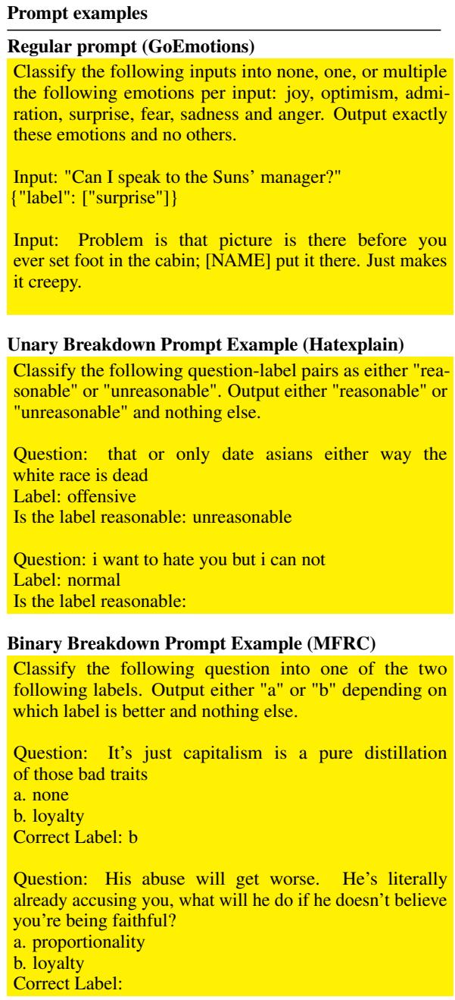  
Table 3: Example prompts

We find that using for L1 distance and F1, the preferred approach varies between datasets, but for NLL, using probabilities is always preferred. We find that when a single label is dominant, meaning it is preferred to every other label, using probabilities calibrates the breakdown better than using hard outcomes, as dominant labels still never achieve 100% probability in their comparisons. We therefore conclude that using binary breakdown with probabilities rather than outcomes is the better approach.

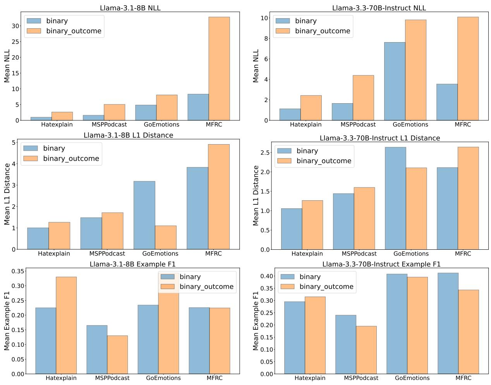  
Figure 8: Comparison of binary breakdown when using the pairwise probabilities (“binary") versus using pairwise outcomes (“binary\_outcome", i.e. rounding probabilities to 0 and 1).

## D Additional Results on LLM Multilabel Capabilities

## D.1 Probabilities: Alternative view

For completeness, in Figure 9 we also present the equivalent box plots of Figures 2 and 3.

## D.2 Entropy of Predictions

We also present the entropies of the predictions in Figure 10. Again, for all datasets but for MFRC, we see that the trends are indistinguishable between when the model will generate more labels compared to when it predicts its last label, showing little evidence for properly calibrated probability distributions on multi-label tasks.

## D.3 Inconsistencies in second highest label scores

In this section, we report the probability that the label associated with the second highest probability at any given generation step is, in fact, never predicted by the model if not predicted in the immediate next step. We limit our evaluation only to steps where the model does continue to predict more labels afterward, skipping the instances where the model stops predicting. In Table 4, we see that the label does not appear in the predictions at least 78.4% of the time in SemEval, 91.3% in GoEmotions, 89.9% in MFRC, and 56.8% in Boxes. Note that, as shown in Figure 3, the second ranked label is not predicted immediately after a large percentage of time, resulting overall in large inconsistencies in the probabilities and the predictions of LLMs.

In Figure 11, we study in more detail the consistency of the second-highest probability label, excluding the instances where it was not predicted at all, and show the histograms for each generation step. We find that increasing the model size improves the rate at which that label is predicted right after it is ranked second, as Llama3 70B Instruct predicts the label with the second-highest probability as the second label 65% of the time compared to approximately 50% of the time with 8B Instruct. This indicates that with scale, the relative ordering of labels improves.

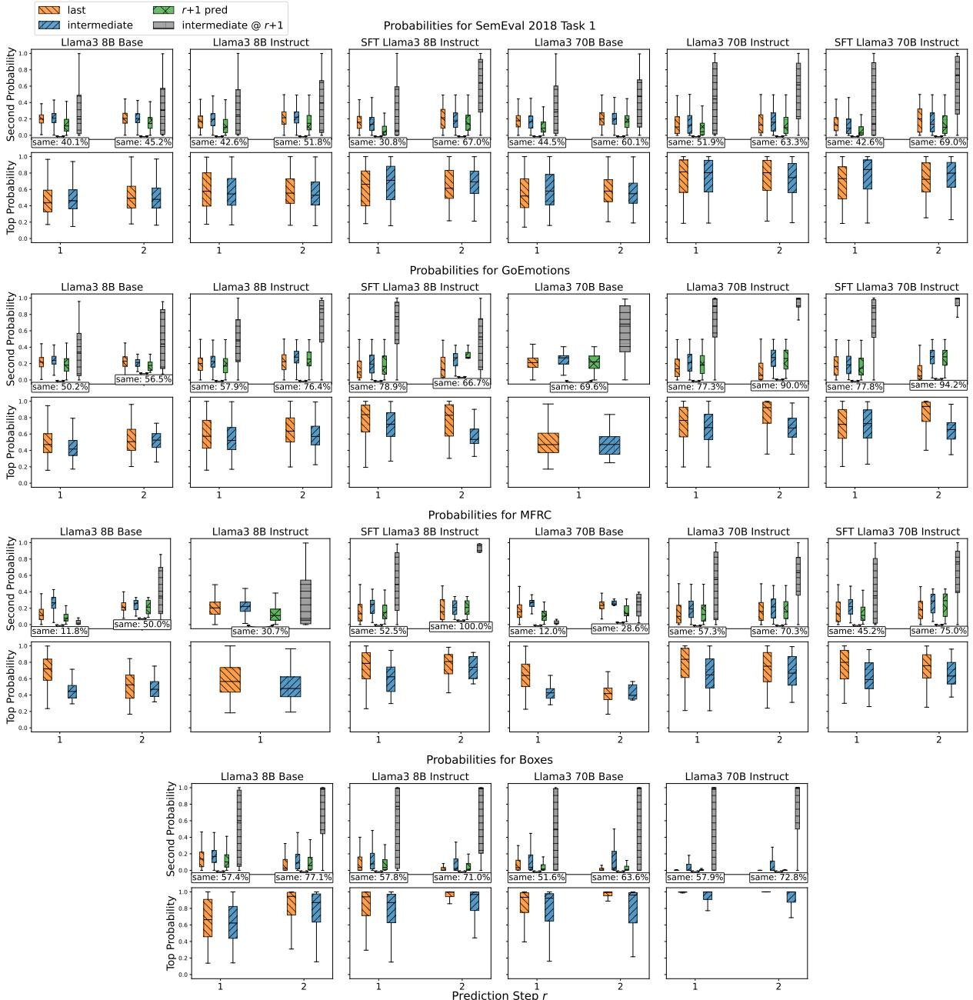

Figure 9: Top two probabilities at each generation step r (up to two for brevity) when the last label is generated, or when a intermediate label is generated. Shown are for four datasets, one per row. In each row, the bottom subfigure shows the top probability, and the top the second highest probability, in addition to the probability of the label that was actually predicted next at the current step (r+1 pred), and the probability at the next generation step of the second highest probability (intermediate @ r+1). Also shown is the percentage of cases the second-highest probability label at r and the prediction at r+1 were the same. A single step only is shown when only up to labels were generated for all examples in a specific setting.
<table><tr><td></td><td>8B Base</td><td>8B Instruct</td><td>8B SFT</td><td>70B Base</td><td>70B Instruct</td><td>70B SFT</td></tr><tr><td>SemEval</td><td>88.1</td><td>85.3</td><td>90.4</td><td>78.4</td><td>78.8</td><td>82.8</td></tr><tr><td>GoEmotions</td><td>99.3</td><td>95.4</td><td>91.3</td><td>92.9</td><td>93.4</td><td>96.7</td></tr><tr><td>MFRC</td><td>100</td><td>99.7</td><td>94.7</td><td>94.0</td><td>96.4</td><td>89.9</td></tr><tr><td>Boxes</td><td>86.1</td><td>70.8</td><td>-</td><td>72.4</td><td>56.8</td><td>-</td></tr></table>

Table 4: Percentage % of cases the second highest label in probability was not predicted at all at any subsequent step when it was not predicted immediately afterward, despite the model predicting at least one more label.

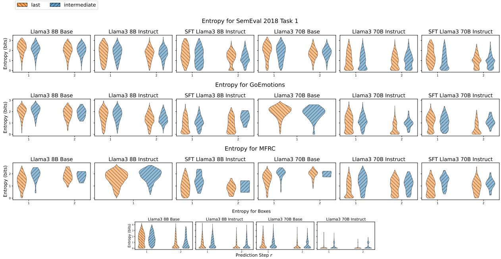  
Figure 10: Entropies of prediction distributions at each generation step r when the 1ast label is generated, or when a intermediate label is generated, shown for the first two label generation steps. A single step only is shown when only up to labels were generated for all examples in a specific setting.

## D.4 Alignment of Llama3 8B

We present results for the alignment of Llama3 8B in addition to the 70B presented in the main text. Results can be seen in Table 5. Our takeaways are virtually identical to 70B, so we refrain from repeating the analysis.

## D.5 Effect of Finetuning on Distribution Alignment

Previous research into LLM calibration has found that RLHF (Ouyang et al., 2022) can make models more overconfident in their predictions (Leng et al., 2025; Xie et al., 2024; Zhu et al., 2023). In Figure 12, we compare the F1 and NLL of Llama-2-70B (base model) and Llama-2-70B-chat (instruction-tuned) for several distribution methods. As expected, the finetuned model generally achieves higher F1 than the base model; however, the NLL for the compare-to-none and max methods (which are the two methods that directly examine the label probabilities) is lower for the base model. This corroborates the aforementioned findings that the model gets more confident when finetuned – NLL punishes highly confident, wrong answers more than being more confident on correct answers.

The similar NLL on unary and binary breakdowns demonstrates that these two methods are relatively robust to different levels of confidence.

## D.6 Attention to Input vs Labels

We present the average attention to tokens in the prompt for models, when they generate the second or higher label. We intend to examine how much the models attend to the previous labels generated, establishing empirically the intuition that because of language modeling, the answers of the model deviate from whatever can be gauged from the first generated label token distribution. Table 6 shows that, on average, an order of magnitude higher weights are found in the label part of the prompt compared to the input (which also includes other labels because of the demonstrations). Attending to the format of the response is a plausible confounder, so we also check the attention specifically to the first label tokens. This suggests that, indeed, subsequent labels are conditioned on the previous generations. We note that even though average attention is lower on the input, cumulative attention is still greater, with approximately a 80%/20% split in favor of the input, which is usually an order of magnitude or more longer than the labels themselves, again suggesting that a lot of attention weights are accumulated on the generated labels.

<table><tr><td></td><td></td><td colspan="6">Single-Label Datasets</td><td colspan="6">Multi-Label Datasets</td></tr><tr><td></td><td></td><td colspan="3">Hatexplain</td><td colspan="3">MSPPodcast</td><td colspan="3">GoEmotions</td><td colspan="3">MFRC</td></tr><tr><td></td><td></td><td>NLL↓</td><td>L1↓</td><td>F1↑</td><td>NLL↓</td><td>L1↓</td><td>F1↑</td><td>NLL↓</td><td>L1↓</td><td>F1↑</td><td>NLL↓</td><td>L1↓</td><td>F1 ↑</td></tr><tr><td>Bassline</td><td>Compare-to-None</td><td>0.97</td><td>0.97</td><td>0.42</td><td>1.59</td><td>1.34</td><td>0.31</td><td>33.58</td><td>5.42</td><td>0.21</td><td>20.23</td><td>4.82</td><td>0.23</td></tr><tr><td></td><td>Hard Predictions</td><td>12.63</td><td>1.17</td><td>0.42</td><td>13.55</td><td>1.44</td><td>0.31</td><td>27.47</td><td>1.49</td><td>0.32</td><td>40.79</td><td>2.21</td><td>0.26</td></tr><tr><td>Tesst-Time</td><td>Unary Breakdown</td><td>0.98</td><td>1.01</td><td>0.35</td><td>1.62</td><td>1.48</td><td>0.12</td><td>4.99</td><td>3.21</td><td>0.29</td><td>5.29</td><td>3.03</td><td>0.22</td></tr><tr><td></td><td>Binary Breakdown</td><td>0.99</td><td>1.01</td><td>0.23</td><td>1.61</td><td>1.48</td><td>0.17</td><td>4.84</td><td>3.18</td><td>0.23</td><td>8.33</td><td>3.83</td><td>0.23</td></tr><tr><td></td><td>Max-Over-Generations</td><td>N/A</td><td>N/A</td><td>N/A</td><td>N/A</td><td>N/A</td><td>N/A</td><td>3.00</td><td>1.44</td><td>0.34</td><td>2.87</td><td>1.58</td><td>0.39</td></tr><tr><td>Supvrsed</td><td>BERT</td><td>2.69</td><td>0.73</td><td>0.66</td><td>4.29</td><td>1.27</td><td>0.38</td><td>2.72</td><td>0.63</td><td>0.64</td><td>3.00</td><td>0.43</td><td>0.82</td></tr><tr><td></td><td>Linear Probing</td><td>N/S</td><td>N/S</td><td>N/S</td><td>N/S</td><td>N/S</td><td>N/S</td><td>2.57</td><td>0.70</td><td>0.57</td><td>2.49</td><td>0.39</td><td>0.83</td></tr><tr><td></td><td>SFT Outputs</td><td>N/S</td><td>N/S</td><td>N/S</td><td>N/S</td><td>N/S</td><td>N/S</td><td>14.76</td><td>0.80</td><td>0.58</td><td>10.45</td><td>0.57</td><td>0.69</td></tr><tr><td></td><td>SFT Max-Over-Generations</td><td>N/A</td><td>N/A</td><td>N/A</td><td>N/A</td><td>N/A</td><td>N/A</td><td>4.15</td><td>0.72</td><td>0.57</td><td>4.87</td><td>0.54</td><td>0.73</td></tr></table>

Table 5: Distribution alignment scores for Llama 3 8B on single and multi-label datasets between LLM and human distributions. F1 ↑ is the example-F1 score. N/S: Not supplied to avoid clutter.
<table><tr><td rowspan="2">Model</td><td colspan="3">GoEmotions</td><td colspan="3">MFRC</td><td colspan="3">SemEval</td><td colspan="3">Boxes</td></tr><tr><td>Input</td><td>Label</td><td>1st Tokens</td><td>Input</td><td>Label</td><td>1st Tokens</td><td>Input</td><td>Label</td><td>1st Tokens</td><td>Input</td><td>Label</td><td>1st Tokens</td></tr><tr><td>8B Base</td><td>0.242</td><td>2.04</td><td>3.62</td><td>0.132</td><td>2.01</td><td>3.29</td><td>0.162</td><td>1.76</td><td>3.00</td><td>0.095</td><td>3.11</td><td>3.06</td></tr><tr><td>8B Instruct</td><td>0.242</td><td>2.08</td><td>3.48</td><td>0.242</td><td>2.08</td><td>3.48</td><td>0.163</td><td>1.74</td><td>2.84</td><td>0.094</td><td>2.92</td><td>2.69</td></tr></table>

Table 6: Average percentage % attention to Input and Label tokens. We also show the average attention to the 1st Tokens of the labels only, avoiding formatting tokens and the rest of the generated tokens.

## D.7 Results on Qwen

In this section, we replicate our main Llama findings for the Qwen 2.5 (Team, 2024) family, and in particular for:

• Qwen 2.5 7B Base (Qwen/Qwen2.5-7B)

• Qwen 2.5 7B Instruct (Qwen/Qwen2.5-7B-Instruct)

• Qwen 2.5 72B Base (Qwen/Qwen2.5-72B)

• Qwen 2.5 72B Instruct (Qwen/Qwen2.5-72B-Instruct)

We present our results for the top two probabilities at each step in Figures 13 and 14, and our linear probing results in Figure 15. We see identical with the Llama family, and Qwen can even be said to be more spiky.

## D.8 Medusa: Multiple Decoding Heads

In this section, we present some results from a model with multiple decodingheads, Medusa(specifically FasterDecoding/medusa-1.0-zephyr-7b-beta) Shown in Figures 16, we see that this model shows behavior similar to Llama 3 and Qwen 2.5.

## D.9 Alphabetical Order

One potential confounding factor in the generation of many labels is their alphabetical order. By default, the labels are presented in an alphabetical order in the instructions and in the demonstrations, as any other mode of presentation would require justification. However, the strong alphabetical priors of the models coupled with the presentation in alphabetical order might be a strong driver of the phenomena we see. Therefore, in this section we present an analysis on how often that happens, as well as randomizing the order of the labels and examining whether the labels follow an alphabetical order or the new order of the instructions. Results are shown in Table 7, aggregated across Llama3 8B Base and Instruct. We see that proper alphabetical order ossifies the predictions of the model, but the reverse alphabetical order, which is also a regular patter, also does the same yet to a lesser extend. Future research can examine whether randomizing the prompt and aggregating across different orders might help to extract probabilities from the first logits, but this still requires multiple runs, making it more expensive that Max-over-Generations.

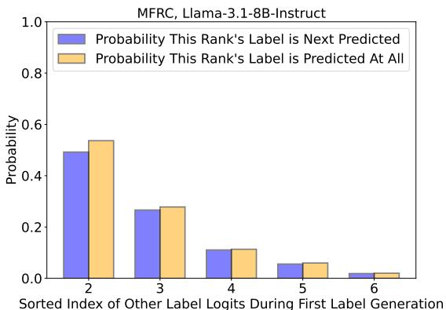

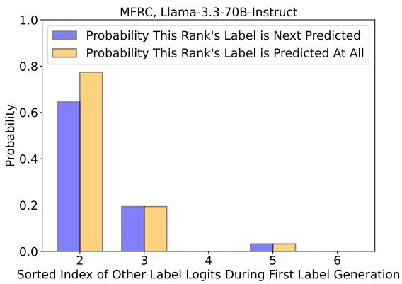  
Figure 11: Comparing if the label probability distribution created while generating the first label is indicative of what the model will actually predict for multilabel generations on MFRC for Llama-3.1-8B (top) and Llama-3.3-70B (bottom). The first index value is not shown as this corresponds to the actual first label being generated.

<table><tr><td>Setting</td><td>Alphabetical (%)</td><td>Prompt (%)</td></tr><tr><td>Alphabetical</td><td>96.4</td><td></td></tr><tr><td>Random</td><td>35.2</td><td>40.1</td></tr><tr><td>Reverse</td><td>15.9</td><td>71.9</td></tr></table>

Table 7: Percentage of predictions that follow alphabetical order and the order of the labels in the instructions in three settings: Alphabetical order of labels, Random order of labels (3 different seed) and Reverse alphabetical order of labels.

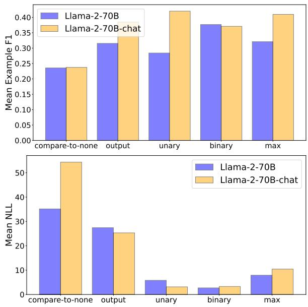  
Figure 12: Comparing the average example-F1 (top) and Negative Log Likelihood (bottom) between the base Llama-2-70B model and the instruction-finetuned Llama-2-70B-chat model, averaged over MFRC and GoEmotions.

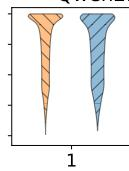

Qwen2.5 72B Base  
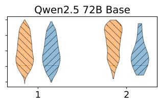  
Qwen2.5 72B Instruct

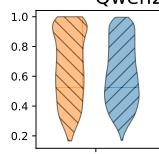

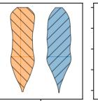

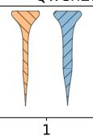

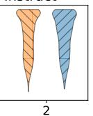

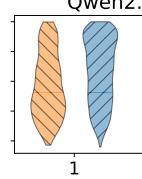  
Top Probabilities for GoEmotions

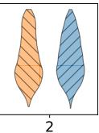

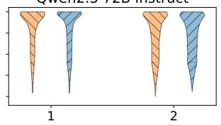

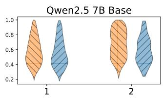

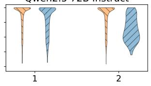

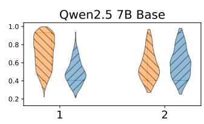

Top Probabilities for MFRC  
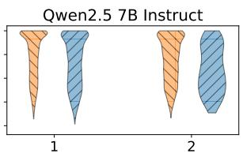

  
Top Probabilities for Boxes

  
Figure 13: Top probabilities at each generation step when the last or an intermediate label is generated. Patterns are identical between the two settings, and bigger or finetuned models have clusters closer to 100%. A single step only is shown when only up to labels were generated for all examples in a specific setting.

Qwen2.5 72B Instruct  
Qwen2.5 72B Instruct  
  
Second-highest Probabilities for SemEval 2018 Task 1

Qwen2.5 7B Base  

Second-highest Probabilities for GoEmotions  

  
Second-highest Probabilities for MFRC

  
Second-highest Probabilities for Boxes

  
Prediction Step r

Figure 14: Second-highest probabilities at each generation step when the last or an intermediate label is generated. We also show the probability at the current step of the label that is actually predicted in the next step (r+1 pred), the probability at the next generation step of the second highest probability of the current step (intermediate @ r+1), and the percentage of cases the second-highest probability label at step r and the prediction at r+1 is the same. LLM distributions show poor relative ranking, and little distinction between the last and intermediate settings. A single step only is shown when only up to labels were generated for all examples in a specific setting.

  
Figure 15: Micro F1 ↑ of linear probes on Qwen 2.5 trained and evaluated on gold labels (Gold), trained and evaluated on model predictions (Pred), and evaluated on predictions beyond the first generated label (Pred 2+). For comparison, we also show the performance of the model (Perf). Embeddings are from the last layer for the first generated label.

  
Second-highest Probabilities for SemEval 2018 Task 1

Top Probabilities for SemEval 2018 Task 1  
  
Figure 16: Top and second-highest probabilities at each generation step when the last or an intermediate label is generated. We also show the probability at the current step of the label that is actually predicted in the next step (r+1 pred), the probability at the next generation step of the second highest probability of the current step (intermediate $\Theta \boldsymbol { r } { + } 1 )$ , and the percentage of cases the second-highest probability label at step r and the prediction at r+1 is the same. Patterns are identical between the two settings, and bigger or finetuned models have clusters closer to 100%. LLM distributions show poor relative ranking, and little distinction between the last and intermediate settings. A single step only is shown when only up to labels were generated for all examples in a specific setting.