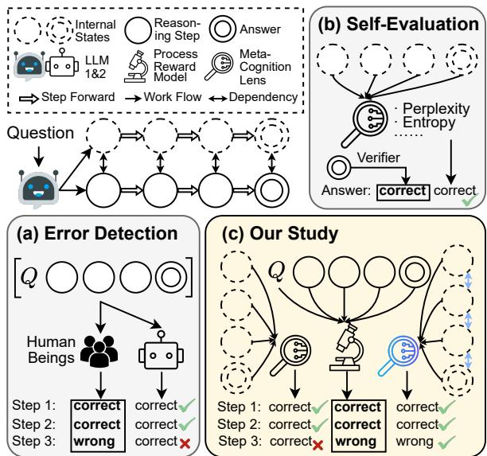
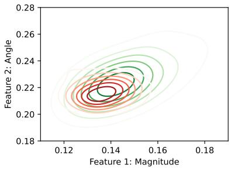
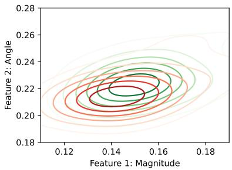
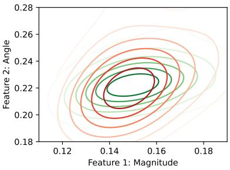
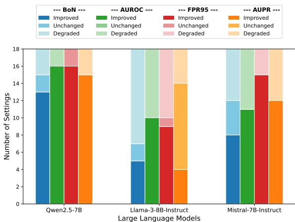

# Large Language Models Have Intrinsic Meta-Cognition, but Need a Good Lens

Ziyang Ma1\*, Qingyue Yuan2\*, Zhenglin Wang1, Deyu Zhou1†

1 School of Computer Science and Engineering, Key Laboratory of Computer Network and Information Integration, Ministry of Education, Southeast University, China 2 Department of Neurosurgery, Shanghai Tenth People’s Hospital, School of Clinical Medicine of Nanjing Medical University, China {mazy, zhenglin, d.zhou}@seu.edu.cn yuanqy007@stu.njmu.edu.cn

## Abstract

Previous research has primarily focused on the cognitive error detection capabilities of Large Language Models (LLMs), often prompting them to analyze mistakes in reasoning chains. However, few studies have examined the metacognitive abilities of LLMs (e.g., their selfawareness of step errors), which are crucial for their reliability. While studies on LLM self-evaluation present some measures, such as perplexity, which can reflect the answer correctness and be viewed as the lens of metacognition, they lack step-level analysis and adaptation. This paper studies the evaluation of LLM meta-cognition using the current lenses and how to improve these lenses. Specifically, we propose AutoMeco, an Automated Meta cognition Evaluation framework for benchmarking the existing lenses. Furthermore, a training-free Markovian Intrinsic Reward Adjustment strategy, MIRA, is proposed to boost current meta-cognition lenses. Experimental results on three mathematical reasoning datasets and three LLMs show the reasonableness of AutoMeco by comparing it with Best-of-N verification. Moreover, the meta-cognition ability of LLMs can be better evaluated using MIRA.1

## 1 Introduction

The reasoning ability of Large Language Models (LLMs) has improved tremendously with the emergence of Large Reasoning Models (LRMs) such as OpenAI-o1 (Jaech et al., 2024) and DeepSeek-R1 (Guo et al., 2025). While evaluation on the cognitive capability of LLMs, such as reasoning outcome accuracy (Lightman et al., 2023; Zeng et al., 2025), presents the strength of LLMs, metacognition of these models that points to their consciousness of behavioral correctness is also important, especially for their reliability (Zhou et al., 2024; Griot et al., 2025; Yan et al., 2025).

  
Figure 1: In reasoning tasks, error detection (a) focuses on LLMs’ cognitive ability to analyze errors in reasoning steps. Self-evaluation (b) utilizes measures such as entropy as lenses to reflect self-awareness of answer rightness. Our work (c) studies the evaluation and improvement of the current lenses in reflecting LLM metacognition. Bold “correct” and “wrong” within boxes are ground truths of the answer or step correctness.

In cognitive science, meta-cognition is the cognition beyond cognition, with subjective confidence of cognitive behaviors being the main indicator (Matthews et al., 2018; Shea and Frith, 2019). Feeling of Rightness (Thompson et al., 2011) and Feeling of Error (FoE) (Gangemi et al., 2015) are two principal types of meta-cognition in reasoning tasks of human beings. As shown in Figure 1(a), previous research studies whether LLMs can detect error steps in responses generated by other models (e.g., Zeng et al., 2024; Tyen et al., 2024), focusing on the cognitive error detection ability of LLMs. Besides, research on self-evaluation in Figure 1(b) proves that internal states of LLMs can reflect the answer correctness through a trained linear classifier (Zhang et al., 2025a) or training-free measures such as perplexity (Wang et al., 2025a), which can be viewed as the meta-cognition lenses. However, few of them concentrate on whether LLMs intrinsically have meta-cognition such as FoE during the reasoning process, which underlies the trustworthiness and self-improvement feasibility of LLMs. Therefore, this paper studies the following two problems of LLM meta-cognition: (i) To what extent can LLM meta-cognition be observed through their internal states? (ii) How to observe LLM meta-cognition based on their internal states without external sources more accurately?

Evaluating and enhancing meta-cognition lenses for LLMs confronts two challenges rooted in the dataset and methodology. (1) Data incompleteness regarding the internal states of LLMs. To the best of our knowledge, existing error detection benchmarks contain no internal states of LLMs such as hidden states and probabilities (Zeng et al., 2025, 2024; Xia et al., 2025). This absence makes existing benchmarks unusable for the evaluation of meta-cognition lenses. (2) Insufficient granularity of existing lenses. While existing approaches mainly assess answer correctness (Si et al., 2022; Huang et al., 2023; Wang et al., 2025a), they ignore the sequential dependencies between steps and probably fail to provide stepwise signals.

To address these challenges, as depicted in Figure 1(c): (1) We propose an Automated Metacognition Evaluation framework (AutoMeco) that realizes human-annotation-free benchmarking of LLM meta-cognition lenses. Our framework utilizes the Process Reward Model (PRM) as an annotator of step correctness. Furthermore, with the automatically annotated labels, the framework tests the lenses, such as perplexity, towards their step-rightness classification ability. (2) We propose a training-free Markovian Intrinsic Reward Adjustment strategy (MIRA) that modifies the step rightness scores of the lenses based on Markov Decision Process (MDP) modeling and Q-value estimation. We model the step-level scoring as a Markov decision process, with dependencies between the reasoning steps. In the MDP, our adjustment strategy utilizes Q-value estimation to transmit the influences in reverse from the end.

The contributions of this paper are as follows:

• We propose a human-annotation-free Automated Meta-cognition Evaluation framework,

AutoMeco, benchmarking the meta-cognition lenses towards step rightness prediction.

• We propose a training-free Markovian Intrinsic Reward Adjustment strategy, MIRA, which enhances the LLM meta-cognition lenses by introducing stepwise dependencies.

• We conduct experiments on mathematical reasoning datasets with different difficulties (GSM8K, MATH500, and MinervaMATH), presenting the reasonableness of AutoMeco and the effectiveness of MIRA.

## 2 Related Work

Reasoning Step Error Detection Benchmarks PRM800K (Lightman et al., 2023) classifies the intermediate reasoning step as positive, negative, or neutral, and underscores the importance of the reasoning step supervision to solve MATH problems. This urges the improvement of Process Reward Models, which are trained on datasets with annotations on step rightness, such as PRM800K, to output the step correctness probability.

Afterwards, MR-GSM8K (Zeng et al., 2025) and MR-Math (Xia et al., 2025) extend the step error detection beyond the classification task by manually annotating the reason behind the first error step based on subsets of GSM8K (Cobbe et al., 2021) and MATH (Hendrycks et al.) datasets, respectively. They propose the cruciality of the error reason interpretation ability of LLMs. Furthermore, BIG-Bench Mistake (BBM) (Tyen et al., 2024) and MR-Ben (Zeng et al., 2024) extend the task to other domains instead of math problems only. BBM contains 2,186 instances from symbolic reasoning tasks (Tyen et al., 2024). MR-Ben consists of 5,975 instances covering natural sciences, coding, and logic (Zeng et al., 2024). However, these benchmarks focus on the error detection ability of LLMs, which is a cognitive task. Instead, this paper aims to conduct meta-cognition evaluation on LLMs, delving into their intrinsic awareness of making mistakes during reasoning.

Process Reward Models In the multi-step mathematical reasoning task, existing research mainly defines process reward models as classifiers that provide step correctness probability as fine-grained process supervision (Uesato et al., 2022; Lightman et al., 2023; Wang et al., 2024; Zhang et al., 2025b; Shao et al., 2024). Lightman et al. (2023) constructs PRM800k, a large-scale manually annotated process reward dataset, to train the PRM. To mitigate the dependence on costly human annotation, researchers propose automatic process supervision by annotating the step correctness using Monte Carlo Tree Search and training the process reward model on the automatically labeled datasets (Wang et al., 2024; Luo et al., 2024; Li et al., 2025). Besides, Li and Li (2025) proposes the Process Q-Value Model (PQM) that considers the sequential dependencies between steps during the training of PRMs. Benefiting from the development of PRM, this paper utilizes it as a judge to annotate step correctness. Meanwhile, motivated by PQM, we propose a training-free reward adjustment strategy to enhance meta-cognition lenses.

LLM Self-Evaluation Self-evaluation in LLMs covers uncertainty estimation of LLMs. We focus on training-free measures of self-evaluation in this paper. Traditional methods include token probability (Jiang et al., 2021), perplexity (Si et al., 2022), and entropy (Huang et al., 2023). Furthermore, Wang et al. (2025a) proposes Chain-of-Embedding (CoE), which models the layer-by-layer changes of hidden states to reflect the answer correctness of LLMs and outperforms existing methods. However, existing self-evaluation measures mainly predict the answer correctness, and most methods ignore the connections among sentences or steps. Therefore, this paper concentrates on step correctness, regarding self-evaluation measures as the lenses of LLM meta-cognition, and endows their calculated intrinsic rewards with sequential dependencies.

Besides, sampling consistency is also proven effective in uncertainty quantification. Manakul et al. (2023) calculates the similarity of multiple responses towards one question as the uncertainty score. Tonolini et al. (2024) considers the response consistency towards multiple semantically equivalent queries. However, we focus on methods based on LLM internal states in a single sample to study the intrinsic meta-cognition of LLMs.

## 3 Methodology

In this section, we first formally define the LLM meta-cognition observation task in §3.1. Next, we present the Automated Meta-cognition Evaluation framework in §3.2, which evaluates LLM metacognition lenses with the Process Reward Model as a judge. Finally, we introduce the Markovian Intrinsic Reward Adjustment strategy in §3.3 to enhance existing meta-cognition lenses.

## 3.1 Task Definition

The LLM meta-cognition observation task is defined as scoring the correctness of reasoning steps based on the internal states of LLMs. Given a question $Q ,$ , an LLM generates a sequence containing a chain of reasoning steps $\{ R _ { i } \} _ { i = 1 } ^ { \bar { N } }$ and an answer $A ,$ where $N$ is the number of reasoning steps. The LLM internal states of the reasoning step $R _ { i }$ include hidden states $H _ { i } ,$ , logits $Z _ { i } ,$ and probabilities $P _ { i }$ of the output tokens. The hidden states represent all-layer hidden states of each generated token, as shown in Equation 1.

$$
\pmb { H } _ { i } = \{ \pmb { h } _ { t } \} _ { t = 1 } ^ { T _ { i } } , \quad \pmb { h } _ { t } = [ \pmb { h } _ { t } ^ { 0 } , . . . , \pmb { h } _ { t } ^ { L } ] ,\tag{1}
$$

where $T _ { i }$ and $L$ denote the sequence length of $R _ { i }$ and the number of LLM hidden layers, and $h _ { t } ^ { 0 }$ represents the embedding layer output of the t-th token. With the hidden states, the logits are the unnormalized output scores generated by the final hidden layer of the LLM in Equation 2.

$$
\pmb { Z } _ { i } = \{ \boldsymbol { z } _ { t } \} _ { t = 1 } ^ { T _ { i } } , \quad \boldsymbol { z } _ { t } = \boldsymbol { h } _ { t } ^ { L } \cdot \boldsymbol { W } _ { \mathrm { v o c a b } } ^ { \top } ,\tag{2}
$$

where ${ \pmb W } _ { \mathrm { v o c a b } } \in \mathbb { R } ^ { V \times d }$ is the vocabulary projection matrix, V is the vocabulary size, and d is the hidden dimension of the final layer. The probabilities of the output tokens are obtained by applying the softmax function to the logits:

$$
\begin{array} { r } { \pmb { P } _ { i } = \{ \pmb { p } _ { t } \} _ { t = 1 } ^ { T _ { i } } , \quad \pmb { p } _ { t } = \mathrm { s o f t m a x } ( z _ { t } ) , } \end{array}
$$

where the probability vector $\pmb { p } _ { t } \in \mathbb { R } ^ { V }$ represents a normalized distribution over the vocabulary, guiding the final token prediction.

We formulate a self-evaluation method as a function $\mathcal { F }$ of the internal states, which calculates the confidence score $s _ { i }$ of the reasoning steps $R _ { i }$

$$
s _ { i } = \mathcal { F } ( H _ { i } , Z _ { i } , P _ { i } )\tag{3}
$$

## 3.2 AutoMated Meta-Cognition Evaluation

Our framework AutoMeco operates through four coordinated phases, as formalized in Algorithm 1. The process initiates with structured response generation, followed by intrinsic rewarding with metacognition lenses, automated step correctness annotation using PRM, and metrics calculation.

Structured Response Generation Given an input question $Q ,$ the language model generates a response containing N logically discrete reasoning steps $\{ R _ { i } \} _ { i = 1 } ^ { N }$ . Each step $R _ { i }$ consists of consecutive tokens $[ r _ { 1 } , r _ { 2 } , . . . , r _ { T _ { i } } ]$ representing a coherent reasoning unit. We employ boundary detection based on transitional phrases (e.g., “Step 1:”, “Step $2 { : } ^ { \mathfrak { p } }$ , and “Answer:”) to segment the token sequence into interpretable steps.

Algorithm 1: Automated Meta-cognition   
Evaluation (AutoMeco)   
Input: Dataset , Language model ,   
Threshold θ   
Output: Evaluation metrics   
1 for each question $Q \in { \mathcal { D } }$ do   
/\* Structured Response Generation \*/   
2 $R \gets { \mathcal { M } } ( Q )$   
3 $\{ R _ { i } \} _ { i = 1 } ^ { N } $ Segment R via boundary   
detection   
/\* Stepwise State Aggregation \*/   
4 for each step $\underline { { R _ { i } } } \in \{ R _ { 1 } , . . . , R _ { N } \}$ do   
5 Extract hidden states   
$\pmb { H } _ { i } = \{ \{ \pmb { h } _ { t } ^ { k } \} _ { k = 1 } ^ { L } \} _ { t = 1 } ^ { T _ { i } }$   
6 Collect logits $\boldsymbol { Z } _ { i }$ and probabilities   
$P _ { i }$   
/\* Intrinsic Rewarding \*/   
7 Compute confidence scores:   
$s _ { i } ^ { \mathrm { p r e d } } = \mathcal { F } ( H _ { i } , Z _ { i } , P _ { i } )$   
/\* Step Correctness Annotation \*/   
8 $\{ s _ { i } ^ { \mathrm { t r u e } } \} _ { i = 1 } ^ { N } \gets \mathcal { P R M } ( Q , R _ { 1 : N } )$   
9 for $\underline { { i = 1 } }$ to N do   
10 if $\underline { { s _ { i } ^ { \mathrm { t r u e } } } } < \theta$ then   
11 $y _ { i } ^ { \mathrm { t r u e } } \gets 0$   
12 else   
13 $y _ { i } ^ { \mathrm { t r u e } } \gets 1$   
/\* Metric Calculation \*/   
14 metrics AUROC, AUPR, FPR95   
15 return metrics

Stepwise State Aggregation For each identified step $R _ { i } .$ , we aggregate the internal states across its constituent tokens. The hidden states of all the layers and every token are recorded:

$$
\pmb { H } _ { i } = \{ \{ \pmb { h } _ { t } ^ { k } \} _ { k = 1 } ^ { L } \} _ { t = 1 } ^ { T _ { i } } ,
$$

where $\mathbf { \Delta } _ { h _ { t } ^ { k } } ^ { k }$ denotes the k-th layer’s hidden state at token position t in $R _ { i }$ . The step-level logits $z _ { t }$ and probabilities $\mathbf { } _ { \pmb { p } _ { t } }$ are extracted from every token position within $R _ { i }$ , resulting in $\boldsymbol { Z } _ { i }$ and $P _ { i }$

Intrinsic Rewarding The intrinsic reward $s _ { i } ^ { \mathrm { p r e d } }$ for each step is computed according to the specific meta-cognition lens ${ \mathcal { F } } \mathrm { : }$

$$
s _ { i } ^ { \mathrm { p r e d } } = \mathcal { F } ( H _ { i } , Z _ { i } , P _ { i } )
$$

Automated Step Correctness Annotation The PRM receives the original question Q and generated steps $\{ R _ { i } \} _ { i = 1 } ^ { N }$ as input, calculating quality scores $\{ s _ { i } ^ { \mathrm { \hat { t r u e } } } \} _ { i = 1 } ^ { N } \in [ 0 , 1 ] ^ { \hat { N } }$ , as depicted in Equation 4. These quality scores further produce binary labels based on a threshold θ.

$$
\{ s _ { i } ^ { \mathrm { t r u e } } \} _ { i = 1 } ^ { N } = \mathcal { P } \mathcal { R } \mathcal { M } ( Q , R _ { 1 : N } )\tag{4}
$$

$$
y _ { i } ^ { \mathrm { t r u e } } = \left\{ \begin{array} { l l } { 0 , \mathrm { ~ i f ~ } s _ { i } ^ { \mathrm { t r u e } } < \theta , } \\ { 1 , \mathrm { ~ e l s e } , } \end{array} \right. \quad \forall i \in \{ 1 , . . . , N \}\tag{5}
$$

Metric Formalization Following Wang et al. (2025a), we choose area under the precision-recall curve (AUPR) (Manning and Schutze, 1999), area under the receiver operating characteristic curve (AUROC) (Boyd et al., 2013), and the false positive rate at 95% true positive rate (FPR95) (Wang et al., 2025a) to evaluate the alignment between intrinsic confidence scores and process quality labels. These metrics provide complementary views: AUROC measures global ranking consistency, FPR95 quantifies false alarm rates under high recall constraints, and AUPR evaluates precision-recall tradeoffs.

## 3.3 Markovian Intrinsic Reward Adjustment

The stepwise Markovian Intrinsic Reward Adjustment method models the reasoning as a Markov decision process and tunes the self-contained confidence scores by considering the sequential relations among the reasoning steps. We formalize the stepwise adjustment method in Algorithm 2 and introduce it as follows.

Given a reasoning trajectory τ defined as Equation 6 and 7, our training-free adjustment strategy formalizes the reasoning process as a deterministic MDP to adjust the step-level rewards by considering the interdependencies between steps.

$$
\tau = \{ ( S _ { 1 } , R _ { 1 } ) , . . . , ( S _ { N } , R _ { N } ) , ( S _ { N + 1 } , A ) \}\tag{6}
$$

$$
\begin{array} { r } { S _ { i } = \left\{ \begin{array} { l l } { Q , \mathrm { i f } i = 1 , } \\ { \mathrm { c o n c a t } ( Q , R _ { 1 } , . . . , R _ { i - 1 } ) , \mathrm { e l s e } . } \end{array} \right. } \end{array}\tag{7}
$$

State Transition Modeling The concatenation operation propagates state representations as shown in Equation 8, where $s _ { i }$ denotes the i-th reasoning state and $R _ { i + 1 }$ represents the corresponding reasoning action (i.e., the next reasoning step).

$$
S _ { i + 1 } = \mathrm { c o n c a t } ( S _ { i } , R _ { i } ) , \forall i \in \{ 1 , . . . , N \}\tag{8}
$$

Algorithm 2: Markovian Intrinsic Reward   
Adjustment (MIRA)   
Input: Reasoning trajectory τ =   
$\{ ( S _ { 1 } , R _ { 1 } ) , . . . , ( S _ { N } , R _ { N } ) , ( S _ { N + 1 } , A ) \}$   
confidence scores $\{ s _ { i } ^ { \mathrm { p r e d } } \} _ { i = 1 } ^ { N } ,$   
discount factor γ   
Output: Adjusted scores $\{ \hat { s } _ { i } ^ { \mathrm { p r e d } } \} _ { i = 1 } ^ { N }$   
/\* State Transition Modeling \*/   
1 for i 1 to N do   
2 $\begin{array} { r } { \lfloor \overline { { S _ { i + 1 } } }  \mathrm { c o n c a t } ( S _ { i } , R _ { i } ) } \end{array}$   
/\* Q-Value Backward Propagation \*/   
3 Initialize $V ( S _ { N + 1 } )  0$   
4 for $\underline { { i  N } }$ to 1 do   
5 $\mathcal { Q } ( S _ { i } , R _ { i } )  s _ { i } ^ { \mathrm { p r e d } } + \gamma \cdot V ( S _ { i + 1 } )$   
6 $V ( S _ { i } ) \gets \operatorname* { m a x } _ { R _ { i } } \mathcal { Q } ( S _ { i } , R _ { i } )$   
/\* Score Normalization \*/   
7 for $i \gets 1$ to N do   
8 $\begin{array} { r } { \hat { s } _ { i } ^ { \mathrm { p r e d } }  \frac { \exp ( \mathcal { Q } ( S _ { i } , R _ { i } ) ) } { \sum _ { j = 1 } ^ { N } \exp ( \mathcal { Q } ( S _ { j } , R _ { j } ) ) } } \end{array}$   
9 return $\{ \hat { s } _ { i } ^ { \mathrm { p r e d } } \} _ { i = 1 } ^ { N }$

Q-Value Estimation and Backward Propagation The expected future reward $\mathcal { Q } ( S _ { i } , R _ { i } )$ integrates immediate confidence and discounted future value in Equation 9, with value function $V ( S _ { i + 1 } ) ~ =$ $\operatorname* { m a x } _ { R _ { i + 1 } } { \mathcal { Q } } ( S _ { i + 1 } , R _ { i + 1 } )$ and $\gamma ~ \in ~ ( 0 , 1 ]$ as the discount factor. In this equation, we recursively update Q-values from terminal state $\cal { S } _ { N + 1 }$ with $V ( S _ { N + 1 } ) = 0$ . This simplifies under a deterministic MDP to direct value assignment in Equation 10.

$$
\begin{array} { r } { \mathcal { Q } ( S _ { i } , R _ { i } ) = s _ { i } ^ { \mathrm { p r e d } } + \gamma \cdot \mathbb { E } _ { S _ { i + 1 } } [ V ( S _ { i + 1 } ) ] } \end{array}\tag{9}
$$

$$
\mathcal { Q } ( S _ { i } , R _ { i } ) = s _ { i } ^ { \mathrm { p r e d } } + \gamma \cdot V ( S _ { i + 1 } )\tag{10}
$$

Score Normalization Final adjusted scores are computed via softmax scaling:

$$
\hat { s } _ { i } ^ { \mathrm { p r e d } } = \frac { \exp ( \mathcal { Q } ( S _ { i } , R _ { i } ) ) } { \sum _ { j = 1 } ^ { N } \exp ( \mathcal { Q } ( S _ { i } , R _ { i } ) ) }
$$

## 4 Experiment

This section will answer four logically connected questions to present our experiments. §4.2 explores whether it is statistically feasible to predict step correctness based on internal states. Furthermore, §4.3 answers two questions: (1) How do existing meta-cognition lenses perform towards the meta-cognition observation? (2) Is our proposed stepwise adjustment method effective in improving these meta-cognition lenses? Afterwards, §4.4 validates whether PRM-as-a-Judge is a reasonable method towards the meta-cognition evaluation.

## 4.1 Experiments Setup

Datasets We focus on mathematical reasoning task with different difficulties. We evaluate the existing meta-cognition lenses on three datasets: the grade school math problems from GSM8K (Cobbe et al., 2021), competition mathematics problems from MATH500 (Hendrycks et al.), and undergraduate- or Olympiad-level mathematical problems from MinervaMATH (Lewkowycz et al., 2022). We choose the first 250 problems of GSM8K due to its relatively low difficulty, which is also the English split of the multilingual math word problems from MGSM (Shi et al.). MATH500 contains 500 pieces selected by Lightman et al. (2023) from the MATH dataset. MinervaMATH includes 272 problems that require quantitative reasoning.

Backbone Models For PRM, we use Qwen2.5- Math-PRM-7B (Zhang et al., 2025b) in our experiments, as it is one of the best mathematical process reward models according to recent research by Zheng et al. (2024). For LLMs, we consider three open-sourced models, Qwen2.5-7B (Yang et al., 2024), Llama-3-8B-Instruct (AI@Meta, 2024), and Mistral-7B-Instruct (Jiang et al., 2023b), to conduct reasoning on the three datasets above.

Baselines We conduct six meta-cognition lenses to predict the step correctness, which results in the intrinsic rewards of each step in the reasoning chains. These baselines are: (1) CoE-C (Wang et al., 2025a); (2) CoE-R (Wang et al., 2025a); (3) ∆Entropy (Yin et al., 2024); (4) Max Probability (Maxprob); (5) Perplexity (PPL) (Huang et al., 2023); (6) Entropy (Si et al., 2022). Among them, (1) and (2) require access to hidden states of LLMs, and (3)-(6) only require probability distributions. More details are in Appendix A.

Implementation Details We set the maximal number of new tokens for Qwen2.5-7B as 768 and those for the other two models as 2048 because of their extra instruction-tuning. In the AutoMeco evaluation, we set temperature = 1.0 and num\_sequences = 1 to evaluate the model under the condition of greedy generation. In the Best-of-N (BoN) evaluation, we set temperature = 0.8 and N = 6. We select the best response from the

N samples by choosing the one with the highest intrinsic reward averaged over steps. For Mistral-7B-Instruct, we use Mistral-7B-Instruct-v0.2 (Jiang et al., 2023a). Appendix C shows the prompt templates for the three datasets. All the experiments are conducted on four 24G 3090 GPUs or one A100 80G GPU. For clear visualization, we use the kdeplot function from the seaborn libary (Waskom, 2021) with contour levels of 7, density thresholds of 0.15 for correct and 0.1 for incorrect samples, and bw\_adjust = 1.5.

## 4.2 Statistical Feasibility

We prompt Qwen2.5-7B to reason on GSM8K, MATH500, and MinervaMATH. We conduct the self-evaluation measures to predict the step correctness, which results in the intrinsic rewards of each step in the reasoning chains. Subsequently, with the step rewards annotated by PRM, we calculate the correlation of the intrinsic and PRM rewards on the data split conditioned on PRM reward (0, 1] [0.9, 1). PRM denotes Qwen2.5- PRM-Math-7B in the following, if without reclarification. Besides, we show the distinguishability of step correctness by visualizing the kernel density estimation of Magnitude and Angle, two internal features proposed by Wang et al. (2025a). Appendix A presents details of the two features.

Table 1 presents that the intrinsic and PRM rewards have a significant positive correlation on the GSM8K dataset, which proves the feasibility of LLM meta-cognition observation. However, the premise is that the LLM can handle the task to some extent, as the correlation drops significantly with the rise of task difficulty. Furthermore, entropy is statistically the most promising method to capture the inherent presentation of step correctness, which consistently has the highest correlation coefficients on the three datasets. Besides, Figure 2 illustrates the feature distributions of the correct and wrong steps. It shows the decline of the step correctness predictability when the dataset gets harder, which is consistent with the statistics above.

## 4.3 Comparison and Ablation Study

We evaluate the meta-cognition lenses in a more challenging and valuable setting with the three language models. In this setting, we test the ability of these methods to distinguish the correct and incorrect steps, including wrong and unsure ones, instead of merely the wrong steps.

Table 1: Spearman coefficient (Spearman, 1961) and Kendall’s Tau (Kendall, 1938) between the intrinsic and PRM rewards of Qwen-2.5-7B on three datasets. All values are formatted as coefficient (p-value) with p-values being in scientific notation, retaining two significant figures (e.g., 1.7e-29 denotes $1 . 7 \times 1 0 ^ { - 2 9 } )$ S and K stands for Spearman and Kendall, respectively. Bold and underlined denote the best and second-best.
<table><tr><td rowspan="2">Methods</td><td colspan="2">GSM8K</td><td colspan="2">MATH500</td><td colspan="2">MinervaMATH</td></tr><tr><td>S</td><td>K</td><td>S</td><td>K</td><td>S</td><td>K</td></tr><tr><td>CoE-C</td><td>0.040 (0.174)</td><td>0.035 (0.074)</td><td>0.068 (0.0001)</td><td>0.046 (0.0001)</td><td>0.010 (0.710)</td><td>0.007 (0.685)</td></tr><tr><td>CoE-R</td><td>0.325 (1.7e-29)</td><td>0.225 (4.1e-30)</td><td>0.212 (1.4e-33)</td><td>0.145 (2.2e-34)</td><td>0.255 (3.7e-21)</td><td>0.175 (1.7e-21)</td></tr><tr><td>Maxprob</td><td>0.498 (1.3e-72)</td><td>0.354 (7.3e-72)</td><td>0.241 (2.1e-43)</td><td>0.164 (8.1e-44)</td><td>0.265 (9.6e-23)</td><td>0.182 (3.1e-23)</td></tr><tr><td>PPL</td><td>0.499 (6.1e-73)</td><td>0.355 (4.9e-72)</td><td>0.243 (4.3e-44)</td><td>0.165 (2.6e-44)</td><td>0.263 (2.2e-22)</td><td>0.180 (9.1e-23)</td></tr><tr><td>Entropy</td><td>0.521 (1.6e-80)</td><td>0.370 (3.1e-78)</td><td>0.246 (3.0e-45)</td><td>0.168 (1.1e-45)</td><td>0.270 (1.7e-23)</td><td>0.185 (6.8e-24)</td></tr><tr><td>∆Entropy</td><td>-0.060 (0.041)</td><td>-0.039 (0.052)</td><td>0.147 (7.5e-17)</td><td>0.097 (1.7e-16)</td><td>0.066 (0.017)</td><td>0.044 (0.016)</td></tr></table>

(1) GSM8K  

(2) MATH500  
  
(3) MinervaMATH  
Figure 2: Intrinsic feature distributions of correct and incorrect steps of Qwen2.5-7B on GSM8K, MATH500, and MinervaMATH. Green and red contours represent features of correct and wrong steps.

Table 2: AutoMeco and Best-of-N evaluation results of meta-cognition lenses with and without our proposed reward adjustment strategy, MIRA, across three mathematics reasoning datasets and three LLMs. Green and red denote whether MIRA improves the meta-cognition lenses. “Acc” denotes accuracy. “Majority” represents majority voting. “PRM” denotes voting based on the step-averaged rewards calculated by the PRM.
<table><tr><td rowspan="2">Methods</td><td colspan="4">Qwen2.5-7B</td><td colspan="4">Llama-3-8B-Instruct</td><td colspan="4">Mistral-7B-Instruct</td></tr><tr><td>Best-of-N Acc↑</td><td>AUROC↑</td><td>FPR95.↓</td><td>AUPR↑</td><td>Best-of-N Acc↑</td><td>AUROC↑</td><td>FPR95.↓</td><td>AUPR↑</td><td>Best-of-N Acc↑</td><td>AUROC↑</td><td>FPR95.↓</td><td>AUPR↑</td></tr><tr><td colspan="12">GSM8K</td></tr><tr><td>Maxprob 53.60</td><td>61.25</td><td></td><td>90.74 81.48 (-9.26)</td><td>96.82 96.88 (+0.06)</td><td>73.20 73.60 (+0.40)</td><td>65.53 58.21 (-7.32)</td><td>90.29 85.44 (-4.85)</td><td>94.67 92.60 (-2.07)</td><td>42.80 45.20 (+2.40)</td><td>68.46 58.88 (-9.58)</td><td>86.17 79.86 (-6.31)</td><td>51.79 39.94 (-11.85)</td></tr><tr><td>+ MIRA (ours)</td><td>58.80 (+5.20)</td><td>67.50 (+6.25) 61.19</td><td>90.74</td><td>96.81</td><td>80.40</td><td>65.67</td><td>90.29</td><td>94.70</td><td>46.40</td><td>68.93</td><td>83.79</td><td>51.68</td></tr><tr><td>PPL</td><td>57.20 66.40 (+9.20)</td><td>70.92 (+9.73)</td><td>79.63 (-11.11)</td><td>97.65 (+0.84)</td><td>78.80 (-1.60)</td><td>59.32 (-6.35)</td><td>84.47 (-5.82)</td><td>94.60 (-0.10)</td><td>47.60 (+1.20)</td><td>61.74 (-7.19)</td><td>79.02 (-4.77)</td><td>64.54 (+12.86)</td></tr><tr><td>+ MIRA (ours)</td><td>56.40</td><td>60.62</td><td>92.59</td><td>96.84</td><td>80.00</td><td>66.99</td><td>85.44</td><td>94.86</td><td>44.80</td><td>71.68</td><td>78.43</td><td>54.57</td></tr><tr><td>Entropy</td><td></td><td>71.90 (+11.28)</td><td>75.93 (-16.66)</td><td>97.56 (+0.72)</td><td>79.20 (-0.80)</td><td>60.87 (-6.12)</td><td>86.41 (+0.97)</td><td>93.67 (-1.19)</td><td>47.20 (+2.40)</td><td>64.14 (-7.54)</td><td>77.00 (-1.43)</td><td>54.58 (+0.01)</td></tr><tr><td>+ MIRA (ours)</td><td>63.20 (+6.80) 60.00</td><td>64.02</td><td>94.44</td><td>96.82</td><td>77.20</td><td>50.45</td><td>97.09</td><td>90.18</td><td>43.60</td><td>56.86</td><td>83.67</td><td>38.15</td></tr><tr><td>∆Entropy</td><td>61.60 (+1.60)</td><td>56.65 (-7.57)</td><td>94.44 (-0.00)</td><td>95.69 (-1.13)</td><td>74.40 (-2.80)</td><td>45.66 (-4.79)</td><td>98.28 (+1.19)</td><td>90.19 (+0.01)</td><td>49.60 (+6.00)</td><td>55.77 (-1.09)</td><td>86.77 (+3.10)</td><td>40.23 (+2.08)</td></tr><tr><td>+ MIRA (ours) CoE-R</td><td>54.80</td><td>64.78</td><td>88.89</td><td>97.14</td><td>77.60</td><td>63.84</td><td>91.26</td><td>94.32</td><td>44.80</td><td>39.24</td><td>96.78</td><td>32.47</td></tr><tr><td>+ MIRA (ours)</td><td>75.60 (+20.80)</td><td>65.23 (+0.45)</td><td>88.89 (-0.00)</td><td>96.90 (-0.24)</td><td>77.60 (+0.00)</td><td>63.52 (-0.32)</td><td>84.47 (-6.79)</td><td>94.40 (+0.08)</td><td>39.60 (-5.20)</td><td>53.58 (+14.34)</td><td>93.86 (-2.92)</td><td>37.08 (+4.61)</td></tr><tr><td>CoE-C</td><td>58.80</td><td>69.53</td><td>90.74</td><td>97.65</td><td>70.80</td><td>72.29</td><td>79.61</td><td>95.91</td><td>44.00</td><td>52.33</td><td>93.56</td><td>39.99</td></tr><tr><td></td><td></td><td>68.87 (-0.66)</td><td>70.37 (-20.37)</td><td>97.05 (-0.60)</td><td>72.80 (+2.00)</td><td>58.24 (-14.05)</td><td>88.35 (+8.74)</td><td>92.71 (-3.20)</td><td>44.40 (+0.40)</td><td>58.56 (+6.23)</td><td></td><td></td></tr><tr><td>+ MIRA (ours)</td><td>57.60 (-1.20)</td><td></td><td></td><td></td><td>86.80 / 89.20</td><td></td><td></td><td></td><td>60.40 / 70.80</td><td></td><td>80.33 (-13.23)</td><td>39.82 (-0.17)</td></tr><tr><td>Majority / PRM</td><td>86.80 / 75.20</td><td></td><td></td><td></td><td></td><td>MATH500</td><td></td><td></td><td></td><td></td><td></td><td></td></tr><tr><td>Maxprob 35.00</td><td></td><td>58.12</td><td>95.92</td><td>91.43</td><td>18.60</td><td>63.76</td><td>88.72</td><td>72.51</td><td>6.20</td><td>56.00</td><td>94.72</td><td>12.40</td></tr><tr><td>+ MIRA (ours)</td><td>37.60 (+2.60)</td><td>64.66 (+6.54)</td><td>86.52 (-9.40)</td><td>92.52 (+1.09)</td><td>18.00 (-0.60)</td><td>62.03 (-1.73)</td><td>87.26 (-1.46)</td><td>68.04 (-4.47)</td><td>5.60 (-0.60)</td><td>56.89 (+0.89)</td><td>91.86 (-2.86)</td><td>12.71 (+0.31)</td></tr><tr><td>PPL</td><td>40.00</td><td>57.83</td><td>95.61</td><td>91.43</td><td>23.20</td><td>63.84</td><td>88.04</td><td>72.71</td><td>6.00</td><td>56.35</td><td>94.07</td><td>12.60</td></tr><tr><td>+ MIRA (ours)</td><td>44.20 (+4.20)</td><td>64.40 (+6.57)</td><td>86.52 (-9.09)</td><td>93.88 (+2.45)</td><td>21.00 (-2.20)</td><td>62.77 (-1.07)</td><td>86.48 (-1.56)</td><td>75.74 (+3.03)</td><td>6.20 (+0.20)</td><td>54.51 (-1.84)</td><td>91.70 (-2.37)</td><td></td></tr><tr><td>Entropy</td><td>40.20</td><td>57.53</td><td>96.65</td><td>91.38</td><td>22.40</td><td>64.04</td><td>87.71</td><td>72.63</td><td>6.20</td><td>55.43</td><td></td><td>41.29 (+28.69)</td></tr><tr><td>+ MIRA (ours)</td><td>43.00 (+2.80)</td><td>66.23 (+8.70)</td><td>85.58 (-11.07)</td><td>93.19 (+1.81)</td><td>19.60 (-2.80)</td><td>65.87 (+1.83)</td><td>86.48 (-1.23)</td><td></td><td>5.60 (-0.60)</td><td>53.20 (-2.23)</td><td>92.97</td><td>12.41</td></tr><tr><td>∆Entropy</td><td></td><td></td><td></td><td>90.91</td><td>17.80</td><td></td><td></td><td>74.98 (+2.35)</td><td></td><td></td><td>92.88 (-0.09)</td><td>23.52 (+11.11)</td></tr><tr><td></td><td>41.40</td><td>54.21</td><td>97.81</td><td>92.69 (+1.78)</td><td></td><td>53.77</td><td>96.42</td><td>62.51</td><td>4.80</td><td>49.63</td><td>95.54</td><td>12.60</td></tr><tr><td>+ MIRA (ours)</td><td>37.20 (-4.20)</td><td>64.62 (+10.41)</td><td>89.03 (-8.78)</td><td></td><td>18.00 (+0.20)</td><td>62.70 (+8.93)</td><td>90.61 (-5.81)</td><td>68.37 (+5.86)</td><td>7.20 (+2.40)</td><td>61.45 (+11.82)</td><td>90.76 (-4.78)</td><td>17.51 (+4.91)</td></tr><tr><td>CoE-R</td><td>39.00</td><td>47.82</td><td>97.81</td><td>88.17</td><td>19.80</td><td>52.37</td><td>92.07</td><td>60.95</td><td>6.00</td><td>45.37</td><td>94.99</td><td>12.99</td></tr><tr><td>+ MIRA (ours)</td><td>44.00 (+5.00)</td><td>60.43 (+12.61)</td><td>85.89 (-11.92)</td><td>91.64 (+2.47)</td><td>17.60 (-2.20)</td><td>57.96 (+5.59)</td><td>92.07 (-0.00)</td><td>64.62 (+3.67)</td><td>4.40 (-1.60)</td><td>50.72 (+5.35)</td><td>93.15 (-1.84)</td><td>11.27 (-1.72)</td></tr><tr><td>CoE-C</td><td>37.40</td><td>59.71</td><td>94.36</td><td>91.35</td><td>16.80</td><td>59.27</td><td>93.52</td><td>68.83</td><td>6.60</td><td>59.80</td><td>86.22</td><td>13.43</td></tr><tr><td>+ MIRA (ours)</td><td>37.40 (+0.00)</td><td>65.03 (+5.32)</td><td>84.64 (-9.28)</td><td>92.69 (+1.34)</td><td>17.80 (+1.00)</td><td>61.32 (+2.05)</td><td>89.39 (-4.13)</td><td>67.65 (-1.18)</td><td>6.00 (-0.60)</td><td>57.75 (-2.05)</td><td></td><td></td></tr><tr><td>Majority / PRM</td><td>51.80 / 49.60</td><td></td><td></td><td></td><td>24.60 / 31.20</td><td></td><td></td><td></td><td>9.20 / 11.80</td><td></td><td>90.76 (+4.54)</td><td>13.03 (-0.40)</td></tr><tr><td></td><td></td><td></td><td></td><td></td><td></td><td>MinervaMATH</td><td></td><td></td><td></td><td></td><td></td><td></td></tr><tr><td>8.46</td><td></td><td>52.75</td><td>97.01</td><td>88.23</td><td>6.62</td><td>56.13</td><td>92.51</td><td>72.04</td><td>1.47</td><td>53.33</td><td>91.91</td><td></td></tr><tr><td>Maxprob</td><td>9.56 (+1.10)</td><td>63.37 (+10.62)</td><td>94.61 (-2.40)</td><td>90.57 (+2.34)</td><td>6.25 (-0.37)</td><td>60.18 (+4.05)</td><td>92.90 (+0.39)</td><td>71.33 (-0.71)</td><td>1.47 (+0.00)</td><td>60.20 (+6.87)</td><td></td><td>17.24 18.82 (+1.58)</td></tr><tr><td>+ MIRA (ours) PPL</td><td>9.93</td><td>52.96</td><td>97.60</td><td>88.37</td><td>7.35</td><td>57.54</td><td>91.75</td><td>72.65</td><td>1.47</td><td>53.95</td><td>88.14 (-3.77) 91.99</td></table>

Performance Trends Across Difficulty Levels As illustrated in Table 2, model performance exhibits an overall correlation with problem difficulty. The aggregate metrics of BoN accuracy, AUROC, and AUPR demonstrate monotonic degradation as task complexity increases. Concurrently, FPR95 shows a statistically significant upward trajectory. Therefore, the performance of the meta-cognition lenses in reflecting reasoning step correctness diminishes substantially on more difficult tasks.

Effectiveness and Efficiency of MIRA The proposed reward adjust strategy demonstrates robust generalization across model architectures and task difficulties. As detailed in Table 2, MIRA achieves performance improvements in 61.1% (BoN) and 68.5% (AUROC) of experimental configurations (N=54). Figure 3 illustrates the particular efficacy of MIRA in enhancing the meta-cognition lenses for Qwen2.5-7B. Although MIRA works on less than half of the settings for Llama-3-8B-Instruct, Table 4.3 presents that it enhances more meta-cognition lenses on the difficult task, MinervaMATH, than the simple one, GSM8K. Besides, MIRA also performs well on a wide range of metacognition lenses for Mistral-7B-Instruct. The gains brought by MIRA across different architectures prove its cross-model compatibility. These experimental results confirm our hypothesis that stepwise adjustment of intrinsic rewards can effectively compensate for inherent calibration weaknesses in the existing lenses of LLM meta-cognition. Although we primarily focus on open-source models, these results are still insightful for closed-source blackbox LLMs due to the potential of probability-based meta-cognition lenses such as Maxprob and PPL. Additionally, Table 3 demonstrates that MIRA adds only a negligible amount of latency per instance.

  
Figure 3: Frequency of MIRA leading to improved, unchanged, and degraded performance for metacognition lenses on three LLMs (Qwen2.5-7B, Llama-3-8B-Instruct, Mistral-7B-Instruct) and three datasets (GSM8K, MATH500, MinervaMATH).

The increase does not exceed 0.03 milliseconds, which validates the efficiency of MIRA.

Table 3: Latency measurements (unit: millisecond) for the meta-cognition lenses with (w/) and without (w/o) MIRA on Qwen2.5-7B (GSM8K subset). “Per Step” and “Per Instance” denote the latency averaged across all steps and all instances, respectively.
<table><tr><td rowspan="2">Methods</td><td rowspan="2">Per Step</td><td colspan="2">Per Instance</td></tr><tr><td>w/o MIRA</td><td>w/MIRA</td></tr><tr><td>Maxprob</td><td>0.12</td><td>0.64</td><td>0.65</td></tr><tr><td>PPL</td><td>0.04</td><td>0.20</td><td>0.21</td></tr><tr><td>Entropy</td><td>512.94</td><td>2669.63</td><td>2669.64</td></tr><tr><td>∆Entropy</td><td>508.54</td><td>2646.73</td><td>2646.74</td></tr><tr><td>CoE-R</td><td>0.51</td><td>2.64</td><td>2.66</td></tr><tr><td>CoE-C</td><td>0.64</td><td>3.31</td><td>3.34</td></tr></table>

Validation on Difficult Math Tasks Practical validation on the MinervaMATH dataset reveals compelling advantages of meta-cognition lenses over conventional ensemble approaches. For instance, Qwen2.5-7B with adjusted CoE-R configuration outperforms majority voting baselines by 1.47% in BoN accuracy (12.13% vs 10.66%), while Llama-3-8B-Instruct achieves better performance through self-evaluation-based selection than majority voting (PPL: +0.36%, Entropy: +1.83%, ∆entropy: +1.10%). This performance gap suggests that properly calibrated self-evaluation metrics enable more effective identification of highquality reasoning paths than static aggregation methods. The findings align with our hypothesis that LLMs contain latent self-diagnostic capabilities that can be operationalized through appropriate metric design. Meanwhile, these results also indicate the potential of meta-cognition evaluation as a mechanism for autonomous LLM selfimprovement through intrinsic process supervision.

## 4.4 PRM-as-a-Judge Analysis

To validate the reasonableness of utilizing PRM as an annotator, we conduct the following analysis: (1) Analyze the consistency between the rewards of two different PRMs, Qwen2.5-Math-PRM-7B and Skywork-o1-Open-PRM-Qwen-2.5-7B (He et al., 2024); (2) Compare AutoMeco with BoN by calculating the consistency of their benchmarking results of six meta-cognition lenses. The consistency metrics include top-K and last-K match rate, and consistency rate (CR) (Wang et al., 2025b). Appendix B presents more details on these metrics.

Agreement between Different PRMs Table 4 shows strong inter-annotator agreement between the two PRMs, confirming their reliability for evaluating step-level errors. Notably, the kappa score for annotations on Mistral-7B-Instruct’s reasoning traces reaches 0.7334. However, the PRMs exhibit lower agreement on step-level annotations than on instance-level ones. For example, the step-level Kappa for the reasoning steps of Qwen2.5-7B is 0.3274, compared to 0.5878 at the instance level. This discrepancy indicates that while the PRMs are effective judges overall, there is room to improve their fine-grained annotation accuracy.

Consistency between AutoMeco and BoN Our analysis demonstrates that PRM-as-a-Judge achieves reasonable consistency with BoN evaluation, validating its utility as a complementary method for efficient method ranking. While perfect alignment is not observed, the results highlight meaningful agreement trends. As shown in Table 5, AutoMeco exhibits alignment with BoN rankings for top-tier methods, particularly at K=3. BoN’s top methods include its top three in 66.67% settings on average, with Mistral-7B-Instruct achieving 100% consistency. Furthermore, the average CR of 48.15% supports the reliability of AutoMeco to benchmark the meta-cognition lenses. Moreover, it achieves the highest alignment on Llama-3-8B-Instruct (CR=53.33%), suggesting model-specific optimization potential.

Table 4: Inter-annotator agreement for step- and instance-level rewards between Qwen2.5-Math-PRM-7B and Skywork-o1-Open-PRM-Qwen-2.5-7B on the responses of the three LLMs to the three math datasets. “Spearman” and “Pearson” are the Spearman (Spearman, 1961) and Pearson’s correlation coefficients (Pearson, 1895). All the correlations in this table are statistically significant $( \mathtt { p } < 0 . 0 5 )$ . “Cohen” represents the interannotator agreement score, Cohen’s Kappa (McHugh, 2012). The reported Kappa score is maximized by finding the optimal binarization thresholds through a grid search over the range {0.1, 0.2, , 0.8, 0.9}.
<table><tr><td>Model</td><td>Spearman↑</td><td>Pearson↑</td><td>Cohen↑</td></tr><tr><td></td><td>Step Level</td><td></td><td></td></tr><tr><td>Qwen2.5-7B</td><td>0.6309</td><td>0.3552</td><td>0.3274</td></tr><tr><td>Llama-3-8B-Instruct</td><td>0.5850</td><td>0.3473</td><td>0.2657</td></tr><tr><td>Mistral-7B-Instruct</td><td>0.5758</td><td>0.6109</td><td>0.5349</td></tr><tr><td colspan="4">Instance Level (Averaged on Steps)</td></tr><tr><td>Qwen2.5-7B</td><td>0.7630</td><td>0.6236</td><td>0.5878</td></tr><tr><td>Llama-3-8B-Instruct</td><td>0.7179</td><td>0.6617</td><td>0.6108</td></tr><tr><td>Mistral-7B-Instruct</td><td>0.7250</td><td>0.7981</td><td>0.7334</td></tr></table>

Table 5: Consistency metrics of Best-of-N (BoN) and AutoMeco results across three large language models. Top-k and Last-K Match evaluate whether the best/worst method chosen by AutoMeco is in the top/last K methods ranked by BoN. Top-K Order considers both the best and the worst. CR stands for consistency rate.
<table><tr><td rowspan="2">Model</td><td colspan="2">Top-K Match</td><td colspan="2">Last-K Match</td><td colspan="2">Top-K Order</td><td rowspan="2">CR</td></tr><tr><td>K=1</td><td>K=3</td><td>K=1</td><td>K=3</td><td>K=1</td><td>K=3</td></tr><tr><td>Qwen2.5</td><td>0.00</td><td>66.67</td><td>0.00</td><td>66.67</td><td>0.00</td><td>16.67</td><td>44.44</td></tr><tr><td>Llama-3</td><td>0.00</td><td>33.33</td><td>0.00</td><td>33.33</td><td>0.00</td><td>0.00</td><td>53.33</td></tr><tr><td>Mistral</td><td>33.33</td><td>100.00</td><td>0.00</td><td>33.33</td><td>0.00</td><td>16.67</td><td>46.67</td></tr><tr><td>Average</td><td>11.11</td><td>66.67</td><td>0.00</td><td>44.44</td><td>0.00</td><td>11.11</td><td>48.15</td></tr></table>

## 5 Conclusion

We investigate the LLM meta-cognition observation capability of self-evaluation measures as metacognition lenses for language models, through an automated benchmarking framework to evaluate these lenses and a fine-grained self-evaluation adjustment strategy to enhance them. These meta-cognition lenses can capture the LLM metacognition, and the stepwise modification further improves their observation ability.

Our study points to several directions with a considerable range of research for future work, including constructing an LLM meta-cognition benchmark with manually annotated step correctness and the LLM internal states for errorless step labels, developing more accurate self-evaluation measures for meta-cognition observation, applying meta-cognition signals to realize LLM selfimprovement, and aligning LLM with human preferences more efficiently via meta-cognition loss. Moreover, utilizing the meta-cognition lenses for response refinement in other scenarios, such as agentic tasks, constitutes a crucial direction.

## Limitations

Our work focuses on introducing meta-cognition into language model evaluation by incorporating internal model states into self-assessment mechanisms. While our approach demonstrates promising results, several limitations warrant discussion:

Model Accessibility Requirements Our method incorporates internal model representations such as hidden states to enable fine-grained self-evaluation. This design, however, requires access to model internals and is mainly limited to open-source architectures. While logits- and probability-based self-evaluation methods are compatible with both open-source and mainstream closed-source LLMs with access to the last-layer states, more delicate approaches using hidden states cannot be directly applied to closed-source models such as GPT-4 (Achiam et al., 2023). Exploring approximations or hybrid strategies may help bridge the gap between white-box and black-box interpretability.

Computational and Memory Overhead Our Markovian Intrinsic Reward Adjustment (MIRA) strategy utilizes internal model signals to dynamically refine self-evaluation. As a result, it introduces additional computation during the reasoning phase and requires extra memory to store intermediate hidden states. Though the overhead remains moderate in scale, these factors may influence efficiency in practical deployment settings.

Extension to Large Reasoning Models Our framework has been validated across multiple model families, including Qwen, Llama, and Mistral. However, generalizing it to more sophisticated Large Reasoning Models (LRMs) involves nontrivial considerations. The dynamic and complex nature of their reasoning processes calls for more adaptive step-wise modeling techniques. Integrating these with recent advances in cognitive behavior analysis of RL (Yue et al., 2025; Gandhi et al., 2025) or reasoning boundary analysis (Chen et al., 2024) may offer a promising path forward.

## Acknowledgments

The authors would like to thank all of the anonymous reviewers for their valuable comments. This research is funded by the National Natural Science Foundation of China (Grant No.62176053). This work is supported by the Big Data Computing Center of Southeast University.

## References

Josh Achiam, Steven Adler, Sandhini Agarwal, Lama Ahmad, Ilge Akkaya, Florencia Leoni Aleman, Diogo Almeida, Janko Altenschmidt, Sam Altman, Shyamal Anadkat, and 1 others. 2023. Gpt-4 technical report. arXiv preprint arXiv:2303.08774.

AI@Meta. 2024. Llama 3 model card.

Kendrick Boyd, Kevin H Eng, and C David Page. 2013. Area under the precision-recall curve: point estimates and confidence intervals. In Machine Learning and Knowledge Discovery in Databases: European Conference, ECML PKDD 2013, Prague, Czech Republic, September 23-27, 2013, Proceedings, Part III 13, pages 451–466. Springer.

Qiguang Chen, Libo Qin, Jiaqi WANG, Jingxuan Zhou, and Wanxiang Che. 2024. Unlocking the capabilities of thought: A reasoning boundary framework to quantify and optimize chain-of-thought. In The Thirty-eighth Annual Conference on Neural Information Processing Systems.

Karl Cobbe, Vineet Kosaraju, Mohammad Bavarian, Mark Chen, Heewoo Jun, Lukasz Kaiser, Matthias Plappert, Jerry Tworek, Jacob Hilton, Reiichiro Nakano, and 1 others. 2021. Training verifiers to solve math word problems. arXiv preprint arXiv:2110.14168.

Kanishk Gandhi, Ayush Chakravarthy, Anikait Singh, Nathan Lile, and Noah D Goodman. 2025. Cognitive behaviors that enable self-improving reasoners, or, four habits of highly effective stars. arXiv preprint arXiv:2503.01307.

Amelia Gangemi, Sacha Bourgeois-Gironde, and Francesco Mancini. 2015. Feelings of error in reasoning—in search of a phenomenon. Thinking & Reasoning, 21(4):383–396.

Maxime Griot, Coralie Hemptinne, Jean Vanderdonckt, and Demet Yuksel. 2025. Large language models lack essential metacognition for reliable medical reasoning. Nature communications, 16(1):642.

Daya Guo, Dejian Yang, Haowei Zhang, Junxiao Song, Ruoyu Zhang, Runxin Xu, Qihao Zhu, Shirong Ma, Peiyi Wang, Xiao Bi, and 1 others. 2025. Deepseek-r1: Incentivizing reasoning capability in llms via reinforcement learning. arXiv preprint arXiv:2501.12948.

Jujie He, Tianwen Wei, Rui Yan, Jiacai Liu, Chaojie Wang, Yimeng Gan, Shiwen Tu, Chris Yuhao Liu, Liang Zeng, Xiaokun Wang, Boyang Wang, Yongcong Li, Fuxiang Zhang, Jiacheng Xu, Bo An, Yang Liu, and Yahui Zhou. 2024. Skywork-o1 open series. https://huggingface.co/Skywork.

Dan Hendrycks, Collin Burns, Saurav Kadavath, Akul Arora, Steven Basart, Eric Tang, Dawn Song, and Jacob Steinhardt. Measuring mathematical problem solving with the math dataset. In Thirty-fifth Conference on Neural Information Processing Systems Datasets and Benchmarks Track (Round 2).

Yuheng Huang, Jiayang Song, Zhijie Wang, Shengming Zhao, Huaming Chen, Felix Juefei-Xu, and Lei Ma. 2023. Look before you leap: An exploratory study of uncertainty measurement for large language models. arXiv preprint arXiv:2307.10236.

Aaron Jaech, Adam Kalai, Adam Lerer, Adam Richardson, Ahmed El-Kishky, Aiden Low, Alec Helyar, Aleksander Madry, Alex Beutel, Alex Carney, and 1 others. 2024. Openai o1 system card. arXiv preprint arXiv:2412.16720.

Albert Jiang, Alexandre Sablayrolles, Arthur Mensch, Blanche Savary, Chris Bamford, Devendra Singh Chaplot, Diego de las Casas, Emma Bou Hanna, Florian Bressand, Gianna Lengyel, Guillaume Bour, Guillaume Lample, Lélio Renard Lavaud, Louis Ternon, Lucile Saulnier, Marie-Anne Lachaux, Pierre Stock, Teven Le Scao, Théophile Gervet, and 4 others. 2023a. Mistral-7b-v0.2.

Albert Q. Jiang, Alexandre Sablayrolles, Arthur Mensch, Chris Bamford, Devendra Singh Chaplot, Diego de las Casas, Florian Bressand, Gianna Lengyel, Guillaume Lample, Lucile Saulnier, Lélio Renard Lavaud, Marie-Anne Lachaux, Pierre Stock, Teven Le Scao, Thibaut Lavril, Thomas Wang, Timothée Lacroix, and William El Sayed. 2023b. Mistral 7b. Preprint, arXiv:2310.06825.

Zhengbao Jiang, Jun Araki, Haibo Ding, and Graham Neubig. 2021. How can we know when language models know? on the calibration of language models for question answering. Transactions of the Association for Computational Linguistics, 9:962– 977.

Maurice G Kendall. 1938. A new measure of rank correlation. Biometrika, 30(1-2):81–93.

Aitor Lewkowycz, Anders Andreassen, David Dohan, Ethan Dyer, Henryk Michalewski, Vinay Ramasesh, Ambrose Slone, Cem Anil, Imanol Schlag, Theo Gutman-Solo, and 1 others. 2022. Solving quantitative reasoning problems with language models. Advances in Neural Information Processing Systems, 35:3843–3857.

Shuangtao Li, Shuaihao Dong, Kexin Luan, Xinhan Di, and Chaofan Ding. 2025. Enhancing reasoning through process supervision with monte carlo tree search. arXiv preprint arXiv:2501.01478.

Wendi Li and Yixuan Li. 2025. Process reward model with q-value rankings. In The Thirteenth International Conference on Learning Representations.

Hunter Lightman, Vineet Kosaraju, Yuri Burda, Harrison Edwards, Bowen Baker, Teddy Lee, Jan Leike, John Schulman, Ilya Sutskever, and Karl Cobbe. 2023. Let’s verify step by step. In The Twelfth International Conference on Learning Representations.

Liangchen Luo, Yinxiao Liu, Rosanne Liu, Samrat Phatale, Meiqi Guo, Harsh Lara, Yunxuan Li, Lei Shu, Yun Zhu, Lei Meng, and 1 others. 2024. Improve mathematical reasoning in language models by automated process supervision. arXiv preprint arXiv:2406.06592.

Potsawee Manakul, Adian Liusie, and Mark JF Gales. 2023. Selfcheckgpt: Zero-resource black-box hallucination detection for generative large language models. arXiv preprint arXiv:2303.08896.

Christopher Manning and Hinrich Schutze. 1999. Foundations of statistical natural language processing. MIT press.

Julian Matthews, Pia Schröder, Lisandro Kaunitz, Jeroen JA Van Boxtel, and Naotsugu Tsuchiya. 2018. Conscious access in the near absence of attention: critical extensions on the dual-task paradigm. Philosophical Transactions of the Royal Society B: Biological Sciences, 373(1755):20170352.

Mary L McHugh. 2012. Interrater reliability: the kappa statistic. Biochemia medica, 22(3):276–282.

Karl Pearson. 1895. Vii. note on regression and inheritance in the case of two parents. proceedings of the royal society of London, 58(347-352):240–242.

Zhihong Shao, Peiyi Wang, Qihao Zhu, Runxin Xu, Junxiao Song, Xiao Bi, Haowei Zhang, Mingchuan Zhang, YK Li, Y Wu, and 1 others. 2024. Deepseekmath: Pushing the limits of mathematical reasoning in open language models. arXiv preprint arXiv:2402.03300.

Nicholas Shea and Chris D Frith. 2019. The global workspace needs metacognition. Trends in cognitive sciences, 23(7):560–571.

Freda Shi, Mirac Suzgun, Markus Freitag, Xuezhi Wang, Suraj Srivats, Soroush Vosoughi, Hyung Won Chung, Yi Tay, Sebastian Ruder, Denny Zhou, and 1 others. Language models are multilingual chain-of-thought reasoners. In The Eleventh International Conference on Learning Representations.

Chenglei Si, Zhe Gan, Zhengyuan Yang, Shuohang Wang, Jianfeng Wang, Jordan Boyd-Graber, and Lijuan Wang. 2022. Prompting gpt-3 to be reliable. arXiv preprint arXiv:2210.09150.

Charles Spearman. 1961. The proof and measurement of association between two things.

Valerie A Thompson, Jamie A Prowse Turner, and Gordon Pennycook. 2011. Intuition, reason, and metacognition. Cognitive psychology, 63(3):107– 140.

Francesco Tonolini, Nikolaos Aletras, Jordan Massiah, and Gabriella Kazai. 2024. Bayesian prompt ensembles: Model uncertainty estimation for blackbox large language models. In Findings of the Association for Computational Linguistics ACL 2024, pages 12229–12272.

Gladys Tyen, Hassan Mansoor, Victor Carbune,˘ Yuanzhu Peter Chen, and Tony Mak. 2024. Llms cannot find reasoning errors, but can correct them given the error location. In Findings of the Association for Computational Linguistics ACL 2024, pages 13894– 13908.

Jonathan Uesato, Nate Kushman, Ramana Kumar, Francis Song, Noah Siegel, Lisa Wang, Antonia Creswell, Geoffrey Irving, and Irina Higgins. 2022. Solving math word problems with process-and outcomebased feedback. arXiv preprint arXiv:2211.14275.

Peiyi Wang, Lei Li, Zhihong Shao, Runxin Xu, Damai Dai, Yifei Li, Deli Chen, Yu Wu, and Zhifang Sui. 2024. Math-shepherd: Verify and reinforce llms step-by-step without human annotations. In Proceedings of the 62nd Annual Meeting of the Association for Computational Linguistics (Volume 1: Long Papers), pages 9426–9439.

Yiming Wang, Pei Zhang, Baosong Yang, Derek F. Wong, and Rui Wang. 2025a. Latent space chain-ofembedding enables output-free LLM self-evaluation. In The Thirteenth International Conference on Learning Representations.

Zhaoyang Wang, Weilei He, Zhiyuan Liang, Xuchao Zhang, Chetan Bansal, Ying Wei, Weitong Zhang, and Huaxiu Yao. 2025b. CREAM: Consistency regularized self-rewarding language models. In The Thirteenth International Conference on Learning Representations.

Michael L Waskom. 2021. Seaborn: statistical data visualization. Journal of Open Source Software, 6(60):3021.

Shijie Xia, Xuefeng Li, Yixin Liu, Tongshuang Wu, and Pengfei Liu. 2025. Evaluating mathematical reasoning beyond accuracy. In Proceedings of the AAAI Conference on Artificial Intelligence, volume 39, pages 27723–27730.

Hanqi Yan, Linhai Zhang, Jiazheng Li, Zhenyi Shen, and Yulan He. 2025. Position: Llms need a bayesian meta-reasoning framework for more robust and generalizable reasoning. In 2025 International Conference on Machine Learning: ICML25.

An Yang, Baosong Yang, Binyuan Hui, Bo Zheng, Bowen Yu, Chang Zhou, Chengpeng Li, Chengyuan Li, Dayiheng Liu, Fei Huang, Guanting Dong, Haoran Wei, Huan Lin, Jialong Tang, Jialin Wang, Jian

Yang, Jianhong Tu, Jianwei Zhang, Jianxin Ma, and 40 others. 2024. Qwen2 technical report. arXiv preprint arXiv:2407.10671.

Zhangyue Yin, Qiushi Sun, Qipeng Guo, Zhiyuan Zeng, Xiaonan Li, Junqi Dai, Qinyuan Cheng, Xuanjing Huang, and Xipeng Qiu. 2024. Reasoning in flux: Enhancing large language models reasoning through uncertainty-aware adaptive guidance. In Proceedings of the 62nd Annual Meeting of the Association for Computational Linguistics (Volume 1: Long Papers), pages 2401–2416, Bangkok, Thailand. Association for Computational Linguistics.

Yang Yue, Zhiqi Chen, Rui Lu, Andrew Zhao, Zhaokai Wang, Shiji Song, and Gao Huang. 2025. Does reinforcement learning really incentivize reasoning capacity in llms beyond the base model? arXiv preprint arXiv:2504.13837.

Zhongshen Zeng, Pengguang Chen, Shu Liu, Haiyun Jiang, and Jiaya Jia. 2025. MR-GSM8k: A metareasoning benchmark for large language model evaluation. In The Thirteenth International Conference on Learning Representations.

Zhongshen Zeng, Yinhong Liu, Yingjia Wan, Jingyao Li, Pengguang Chen, Jianbo Dai, Yuxuan Yao, Rongwu Xu, Zehan Qi, Wanru Zhao, Linling Shen, Jianqiao Lu, Haochen Tan, Yukang Chen, Hao Zhang, Zhan Shi, Bailin Wang, Zhijiang Guo, and Jiaya Jia. 2024. MR-ben: A meta-reasoning benchmark for evaluating system-2 thinking in LLMs. In The Thirty-eighth Annual Conference on Neural Information Processing Systems.

Anqi Zhang, Yulin Chen, Jane Pan, Chen Zhao, Aurojit Panda, Jinyang Li, and He He. 2025a. Reasoning models know when they’re right: Probing hidden states for self-verification. arXiv preprint arXiv:2504.05419.

Zhenru Zhang, Chujie Zheng, Yangzhen Wu, Beichen Zhang, Runji Lin, Bowen Yu, Dayiheng Liu, Jingren Zhou, and Junyang Lin. 2025b. The lessons of developing process reward models in mathematical reasoning. arXiv preprint arXiv:2501.07301.

Chujie Zheng, Zhenru Zhang, Beichen Zhang, Runji Lin, Keming Lu, Bowen Yu, Dayiheng Liu, Jingren Zhou, and Junyang Lin. 2024. Processbench: Identifying process errors in mathematical reasoning. arXiv preprint arXiv:2412.06559.

Yujia Zhou, Zheng Liu, Jiajie Jin, Jian-Yun Nie, and Zhicheng Dou. 2024. Metacognitive retrievalaugmented large language models. In Proceedings of the ACM Web Conference 2024, pages 1453–1463.

## A LLM Self-Evaluation Measures

## A.1 Chain-of-Embedding (CoE)

For a reasoning step $R _ { i }$ with Ti tokens, Wang et al. (2025a) quantifies two features, Magnitude and Angle, to represent the layer-by-layer changes of query understanding based on hidden states:

$$
\begin{array} { l } { \displaystyle \mathbf { M a g } ( \pmb { H } _ { i } ) = \frac { 1 } { L } \sum _ { \ell = 0 } ^ { L - 1 } \frac { | | \pmb { h } _ { \ell + 1 } - \pmb { h } _ { \ell } | | _ { 2 } } { | | \pmb { h } _ { L } - \pmb { h } _ { 0 } | | _ { 2 } } } \\ { \displaystyle \mathrm { A n g } ( \pmb { H } _ { i } ) = \frac { 1 } { L } \sum _ { \ell = 0 } ^ { L - 1 } \frac { \operatorname { a r c c o s } \Big ( \frac { \pmb { h } _ { \ell + 1 } ^ { \top } \cdot \pmb { h } _ { \ell } } { | | \pmb { h } _ { \ell + 1 } | | _ { 2 } \cdot | | \pmb { h } _ { \ell } | | _ { 2 } \Big ) } } { \operatorname { a r c c o s } \Big ( \frac { \pmb { h } _ { L } ^ { \top } \cdot \pmb { h } _ { 0 } } { | | \pmb { h } _ { L } | | _ { 2 } \cdot | | \pmb { h } _ { 0 } | | _ { 2 } \Big ) } } } \end{array}
$$

$$
\pmb { h } ^ { \ell } = \frac { 1 } { T _ { i } } \sum _ { t = 1 } ^ { T _ { i } } \pmb { h } _ { t } ^ { \ell } , \forall \ell \in [ 0 , . . . , L ]
$$

Two basic components in Magnitude and Angle, magnitude change $M ( h _ { \ell } , h _ { \ell + 1 } )$ and angle change $A ( h _ { \ell } , h _ { \ell + 1 } )$ , are defined as follows:

$$
\begin{array} { r l } & { M ( \pmb { h } _ { \ell } , \pmb { h } _ { \ell + 1 } ) = | | \pmb { h } _ { \ell + 1 } - \pmb { h } _ { \ell } | | _ { 2 } } \\ & { A ( \pmb { h } _ { \ell } , \pmb { h } _ { \ell + 1 } ) = \operatorname { a r c c o s } \left( \frac { \pmb { h } _ { \ell + 1 } ^ { \top } \cdot \ \pmb { h } _ { \ell } } { | | \pmb { h } _ { \ell + 1 } | | _ { 2 } \cdot \ | | \pmb { h } _ { \ell } | | _ { 2 } } \right) } \end{array}
$$

As shown in Equation 11 and 12, CoE-R and CoE-C capture the correctness by combining the magnitude and angle changes in the real and complex spaces, respectively (Wang et al., 2025a).

## A.2 Entropy

Entropy reflects the uncertainty of reasoning steps based on their token probabilities (Si et al., 2022):

$$
\operatorname { E n t r o p y } ( P _ { i } ) = { \frac { 1 } { T _ { i } } } \sum _ { t = 1 } ^ { T _ { i } } \left( - p _ { t } ^ { \intercal } \cdot \log p _ { t } \right)\tag{13}
$$

We utilize its reciprocal as the correctness score.

## A.3 ∆Entropy

Yin et al. (2024) proposes that the abnormal uncertainty fluctuation is useful for judging wrong steps during reasoning, which is formally the uncertainty change between two adjacent reasoning steps. The more the LLM’s uncertainty fluctuates, the more likely the LLM makes mistakes. We choose Entropy as the uncertainty metric to formulate the entropy fluctuation:

$$
\Delta \mathrm { E n t r o p y } ( P _ { i } ) = \left\{ \begin{array} { l l } { 0 , \mathrm { i f } i = 0 , } \\ { \mathrm { E n t r o p y } ( P _ { i } ) - \mathrm { E n t r o p y } ( P _ { i - 1 } ) , \mathrm { e l s e } . } \end{array} \right.\tag{14}
$$

We utilize the opposite number of ∆Entropy as the step correctness score.

## A.4 Max Probability (Maxprob)

Maxprob calculates the average of the maximal elements in the probability distributions, which assumes that the top-1 probability reflects the certainty of LLMs:

$$
\operatorname { M a x p r o b } ( P _ { i } ) = \frac { 1 } { T _ { i } } \sum _ { t = 1 } ^ { T _ { i } } \operatorname* { m a x } ( { p _ { t } } )\tag{15}
$$

## A.5 Perplexity (PPL)

PPL reflects the uncertainty of LLMs by considering the negative logarithm of the maximal probability:

$$
\mathrm { P P L } ( \pmb { P } _ { i } ) = - \frac { 1 } { T _ { i } } \sum _ { t = 1 } ^ { T _ { i } } \log \operatorname* { m a x } ( \pmb { p } _ { t } )\tag{16}
$$

We utilize its reciprocal as the correctness score.

## B Consistency Metrics

For an LLM Θ and a dataset , AutoMeco and BoN evaluate M meta-cognition lenses, which results in two ranks denoted by ${ \pmb { \alpha } } = \alpha _ { 1 } , \alpha _ { 2 } , . . . , \alpha _ { M }$ and $\beta = \beta _ { 1 } , \beta _ { 2 } , . . . , \beta _ { M }$ . Top-K Match, Last-K Match, and Top-K Order are measured as follows:

$$
\begin{array} { r l } & { \mathrm { T o p M a t c h } _ { \Theta , \mathcal { D } } ( K ) = \mathbb { I } [ \mathrm { a r g m i n } \alpha _ { m } \in \mathrm { a r g s o r t } ( \beta ) [ : K ] ] } \\ & { \mathrm { L a s t M a t c h } _ { \Theta , \mathcal { D } } ( K ) = \mathbb { I } [ \mathrm { a r g m a x } \alpha _ { m } \in \mathrm { a r g s o r t } ( \beta ) [ - K : ] ] } \\ & { \mathrm { T o p O r d e r } _ { \Theta , \mathcal { D } } ( K ) = \mathrm { T o p M a t c h } _ { \Theta , \mathcal { D } } ( K ) \cdot \mathrm { L a s t M a t c h } _ { \Theta , \mathcal { D } } ( K ) } \end{array}
$$

where $K \in [ 1 , 2 , 3 ] , \mathbb { I } [ \cdot ]$ is the indicator function and argsort(β) outputs the indices that sort $\beta$ in ascending order. Equation 17 calculates the consistency rate of α and $\beta$ (Wang et al., 2025b).

$$
\begin{array} { c } { \displaystyle \mathrm { C R } _ { \Theta , \mathcal D } = \frac { 2 } { M ( M - 1 ) } \sum _ { 1 \leq m < m ^ { \prime } \leq M } } \\ { \displaystyle \left[ \mathbb { I } [ ( \alpha _ { m } - \alpha _ { m ^ { \prime } } ) ( \beta _ { m } - \beta _ { m ^ { \prime } } ) > 0 ] - \right. } \\ { \displaystyle \left. \mathbb { I } [ ( \alpha _ { m } - \alpha _ { m ^ { \prime } } ) ( \beta _ { m } - \beta _ { m ^ { \prime } } ) < 0 ] \right] } \end{array}\tag{17}
$$

Ultimately, we average these metrics on three datasets to present the consistency of AutoMeco and BoN for the LLM Θ.

$$
\operatorname { C o E - R } ( H _ { i } ) = \operatorname { M a g } ( H _ { i } ) - \operatorname { A n g } ( H _ { i } ) = { \frac { 1 } { L } } \sum _ { \ell = 0 } ^ { L - 1 } \left( { \frac { M ( h _ { \ell } , h _ { \ell + 1 } ) } { M ( h _ { 0 } , h _ { L } ) } } - { \frac { A ( h _ { \ell } , h _ { \ell + 1 } ) } { A ( h _ { 0 } , h _ { L } ) } } \right)\tag{11}
$$

$$
\begin{array} { l } { \displaystyle \mathrm { C o E - C } ( H _ { i } ) = \frac { 1 } { L } \left| \sum _ { \ell = 0 } ^ { L - 1 } M ( h _ { \ell } , h _ { \ell + 1 } ) \cdot e ^ { i \cdot A ( h _ { \ell } , h _ { \ell + 1 } ) } \right| } \\ { \displaystyle = \frac { 1 } { L } \left| \sum _ { \ell = 0 } ^ { L - 1 } \left[ M ( h _ { \ell } , h _ { \ell + 1 } ) \cos ( A ( h _ { \ell } , h _ { \ell + 1 } ) ) + i \cdot M ( h _ { \ell } , h _ { \ell + 1 } ) \sin ( A ( h _ { \ell } , h _ { \ell + 1 } ) ) \right| \right. } \\ { \displaystyle \left. = \frac { 1 } { L } \sqrt { \left( \sum _ { \ell = 0 } ^ { L - 1 } M ( h _ { \ell } , h _ { \ell + 1 } ) \cos ( A ( h _ { \ell } , h _ { \ell + 1 } ) ) \right) ^ { 2 } + \left( \sum _ { \ell = 0 } ^ { L - 1 } M ( h _ { \ell } , h _ { \ell + 1 } ) \sin ( A ( h _ { \ell } , h _ { \ell + 1 } ) ) \right) ^ { 2 } } \right. } \end{array}\tag{12}
$$

## C Prompt Templates

## • GSM8K

Solve this math problem step by step. Give the reasoning steps using ‘Step n:’ before each step to distinguish between different steps, where n is a positive integer starting from 1, representing the current step number. Then give the final answer on the last line by itself in the format of "Answer:"

Do not add anything other than the integer answer after “Answer:”

Question: {input\_data}

## • MATH500 and MinervaMATH

Question: {input\_data}

Please reason step by step. Use ‘Step n:’ before each step to distinguish between different steps, where n is a positive integer starting from 1, representing the current step number. Then, give your final answer on the last line in the format of “Answer: \boxed{} ”

## D Statistical Feasibility on Other LLMs

As shown in Table 6 and 7, meta-cognition lenses perform weakly in capturing meta-cognition of Llama-3-8B-Instruct and Mistral-7B-Instruct. Interestingly, however, these methods are statistically better at hard tasks than simple ones. For instance, CoE-C has a stronger correlation with PRM rewards on MinervaMATH than GSM8K and MATH500 for the two LLMs.

## E Statistics of Reasoning Steps

Table 8: Statistics on correct, wrong, and uncertain reasoning steps annotated by Qwen2.5-Math-PRM-7B in mathematical reasoning tasks.
<table><tr><td rowspan="2">Model</td><td rowspan="2">Dataset</td><td colspan="3">Step Correctness</td></tr><tr><td>Correct</td><td>Wrong</td><td>Uncertain</td></tr><tr><td rowspan="3">Qwen2.5</td><td>GSM8K</td><td>1127</td><td>17</td><td>122</td></tr><tr><td>MATH500</td><td>3079</td><td>106</td><td>471</td></tr><tr><td>MinervaMATH</td><td>1278</td><td>47</td><td>277</td></tr><tr><td rowspan="3">Llama-3</td><td>GSM8K</td><td>1130</td><td>34</td><td>229</td></tr><tr><td>MATH500</td><td>2900</td><td>401</td><td>1135</td></tr><tr><td>MinervaMATH</td><td>1328</td><td>113</td><td>637</td></tr><tr><td rowspan="3">Mistral</td><td>GSM8K</td><td>523</td><td>223</td><td>828</td></tr><tr><td>MATH500</td><td>3079</td><td>106</td><td>471</td></tr><tr><td>MinervaMATH</td><td>371</td><td>1130</td><td>2322</td></tr></table>

## F Case Study

Figure 4, 5, and 6 illustrate three cases of Qwen2.5- 7B on GSM8K, MATH500, and MinervaMATH datasets. In these cases, self-evaluation measures fail to predict the rightness of the wrong step, while MIRA successfully calibrates the intrinsic metacognition by conducting stepwise adjustments to these meta-cognition lenses.

Table 6: Spearman coefficient (Spearman, 1961) and Kendall’s Tau (Kendall, 1938) between the intrinsic and PRM rewards of Llama-3-8B-Instruct on three datasets.
<table><tr><td rowspan="2">Methods</td><td colspan="2">GSM8K</td><td colspan="2">MATH500</td><td colspan="2">MinervaMATH</td></tr><tr><td>Spearman</td><td>Kendall</td><td>Spearman</td><td>Kendall</td><td>Spearman</td><td>Kendall</td></tr><tr><td>CoE-C</td><td>0.179 (8.0e-10)</td><td>0.119 (1.1e-9)</td><td>0.095 (4.0e-8)</td><td>0.054 (3.1e-6)</td><td>0.203 (8.2e-15)</td><td>0.135 (2.0e-14)</td></tr><tr><td>CoE-R</td><td>0.219 (3.8e-14)</td><td>0.139 (1.4e-12)</td><td>0.123 (1.2e-12)</td><td>0.083 (9.2e-13)</td><td>0.155 (3.8e-9)</td><td>0.103 (4.5e-9)</td></tr><tr><td>Maxprob</td><td>0.102 (0.0005)</td><td>0.081 (3.6e-5)</td><td>0.098 (1.5e-8)</td><td>0.063 (6.9e-8)</td><td>0.022 (0.4058)</td><td>0.013 (0.4569)</td></tr><tr><td>PPL</td><td>0.100 (0.0006)</td><td>0.080 (4.2e-5)</td><td>0.101 (6.1e-9)</td><td>0.064 (3.4e-8)</td><td>0.263 (2.2e-22)</td><td>0.180 (9.1e-23)</td></tr><tr><td>Entropy</td><td>0.119 (5.0e-5)</td><td>0.092 (2.3e-6)</td><td>0.104 (2.0e-9)</td><td>0.065 (2.6e-8)</td><td>0.044 (0.098)</td><td>0.027 (0.127)</td></tr><tr><td>∆Entropy</td><td>-0.208 (8.0e-13)</td><td>-0.136 (3.4e-12)</td><td>0.024 (0.167)</td><td>0.019 (0.094)</td><td>-0.074 (0.0047)</td><td>-0.049 (0.00499)</td></tr></table>

Table 7: Spearman coefficient (Spearman, 1961) and Kendall’s Tau (Kendall, 1938) between the intrinsic and PRM rewards of Mistral-7B-Instruct on three datasets.
<table><tr><td rowspan="2">Methods</td><td colspan="2">GSM8K</td><td colspan="2">MATH500</td><td colspan="2">MinervaMATH</td></tr><tr><td>Spearman</td><td>Kendall</td><td>Spearman</td><td>Kendall</td><td>Spearman</td><td>Kendall</td></tr><tr><td>CoE-C</td><td>0.194 (9.0e-08)</td><td>0.130 (1.1e-07)</td><td>0.215 (3.9e-17)</td><td>0.139 (5.9e-16)</td><td>0.333 (2.5e-18)</td><td>0.221 (2.7e-17)</td></tr><tr><td>CoE-R</td><td>-0.282 (3.9e-15)</td><td>-0.190 (9.1e-15)</td><td>-0.118 (4.8e-06)</td><td>-0.078 (5.8e-06)</td><td>-0.101 (0.0099)</td><td>-0.064 (0.0148)</td></tr><tr><td>Maxprob</td><td>0.306 (1.1e-17)</td><td>0.203 (1.1e-16)</td><td>0.036 (0.158)</td><td>0.023 (0.185)</td><td>0.011 (0.783)</td><td>0.005 (0.848)</td></tr><tr><td>PPL</td><td>0.320 (3.1e-19)</td><td>0.213 (3.7e-18)</td><td>0.051 (0.048)</td><td>0.032 (0.061)</td><td>0.033 (0.396)</td><td>0.020 (0.437)</td></tr><tr><td>Entropy</td><td>0.326 (6.8e-20)</td><td>0.217 (7.2e-19)</td><td>0.035 (0.181)</td><td>0.023 (0.191)</td><td>0.012 (0.754)</td><td>0.007 (0.794)</td></tr><tr><td>∆Entropy</td><td>0.154 (2.4e-05)</td><td>0.105 (2.1e-05)</td><td>0.009 (0.713)</td><td>0.006 (0.721)</td><td>-0.040 (0.303)</td><td>-0.027 (0.301)</td></tr></table>

<table><tr><td rowspan=2 colspan=1>Question:John drives for 3 hours at a speed of 60 mph and then turnsaround because he realizes he forgot something very importantat home. He tries to get home in 4 hours but spends the first 2hours in standstill traffic. He spends the next half-hour drivingat a speed of 30mph, before being able to drive the remainingtime of the 4 hours going at 80 mph. How far is he from homeat the end of those 4 hours?</td><td rowspan=1 colspan=1>PRM</td><td rowspan=1 colspan=1>PPL</td><td rowspan=1 colspan=1>MIRA+PPL</td></tr><tr><td rowspan=1 colspan=1>Reward     Label</td><td rowspan=1 colspan=1>Reward   Preition(th=80)</td><td rowspan=1 colspan=1>Reward    Preition(thtr=987)</td></tr><tr><td rowspan=1 colspan=1>Step 1: Calculate the distance John travels in the first 3 hours.Distance = Speed * TimeDistance = 60 mph * 3 hours = 180 miles</td><td rowspan=1 colspan=1>0.99   1</td><td rowspan=1 colspan=1>5.43   1</td><td rowspan=1 colspan=1>1.00     1</td></tr><tr><td rowspan=1 colspan=1>Step 2: Calculate the distance John travels in the next 2 hoursin standstill traffic.Since he is not moving, the distance traveled is 0 miles.</td><td rowspan=1 colspan=1>0.99   1</td><td rowspan=1 colspan=1>4.49    1</td><td rowspan=1 colspan=1>1.00     1</td></tr><tr><td rowspan=1 colspan=1>Step 3: Calculate the distance John travels in the next 0.5hours at a speed of 30 mph.Distance = Speed * TimeDistance = 30 mph * 0.5 hours = 15 miles</td><td rowspan=1 colspan=1>0.99   1</td><td rowspan=1 colspan=1>26.85   1</td><td rowspan=1 colspan=1>1.00     1</td></tr><tr><td rowspan=1 colspan=1>Step 4: Calculate the remaining time John has to travel afterthe first 3.5 hours.Total time = 4 hoursTime spent in standstill traffic = 2 hoursTime spent driving at 30 mph = 0.5 hoursRemaining time = 4 hours - 2 hours - 0.5 hours = 1.5 hours</td><td rowspan=1 colspan=1>0.99   1</td><td rowspan=1 colspan=1>6.19    1</td><td rowspan=1 colspan=1>1.00     1</td></tr><tr><td rowspan=1 colspan=1>Step 5: Calculate the distance John travels in the remaining1.5 hours at a speed of 80 mph.Distance = Speed * TimeDistance = 80 mph * 1.5 hours = 120 miles</td><td rowspan=1 colspan=1>0.99   1</td><td rowspan=1 colspan=1>213.45  1</td><td rowspan=1 colspan=1>1.00     1</td></tr><tr><td rowspan=1 colspan=1>Step 6: Calculate the total distance John travels in 4 hours.Total distance = Distance in first 3 hours + Distance in standstilltraffic + Distance at 30 mph + Distance at 80 mphTotal distance = 180 miles + 0 miles + 15 miles + 120 miles =315 miles</td><td rowspan=1 colspan=1>0.99   1</td><td rowspan=1 colspan=1>14.04   1</td><td rowspan=1 colspan=1>1.00     1</td></tr><tr><td rowspan=1 colspan=1>Step 7: Calculate the distance John is from home at the end ofthe 4 hours.Since he traveled 315 miles away from home, he is 315 milesfrom home.</td><td rowspan=1 colspan=1>0.34   0</td><td rowspan=1 colspan=1>4.22   1</td><td rowspan=1 colspan=1>0.985    0</td></tr></table>

Figure 4: A demonstration of MIRA enhancing meta-cognition observation for Qwen2.5-7B on GSM8K. The thresholds are determined by maximizing the F1 score of step correctness prediction.

<table><tr><td rowspan=2 colspan=2>Question:Solve for x: $3 ^ { 2 x } + 1 9 = 1 0 ^ { x }$ </td><td rowspan=1 colspan=1>PRM</td><td rowspan=1 colspan=1>Maxprob</td><td rowspan=1 colspan=1>MIRA+Maxprob</td><td rowspan=1 colspan=1>Entropy</td><td rowspan=1 colspan=1>MIRA+Entropy</td></tr><tr><td rowspan=1 colspan=1>Reward  Lael</td><td rowspan=1 colspan=1>Reard Preition(thr=59)</td><td rowspan=1 colspan=1>Reard  Preition(thr=68)</td><td rowspan=1 colspan=1>Reward  Preiction(hrs=00.47)</td><td rowspan=1 colspan=1>Reward Preiction(thres=o76)</td></tr><tr><td rowspan=1 colspan=2>Step 1: To solve the equation $3 ^ { 2 x } + 1 9 = 1 0 ^ { x } ,$ we can start by isolating the exponential termson one side of the equation.</td><td rowspan=1 colspan=1>0.98 1</td><td rowspan=1 colspan=1>0.84 1</td><td rowspan=1 colspan=1>1.000  1</td><td rowspan=1 colspan=1>1.24 1</td><td rowspan=1 colspan=1>1.00   1</td></tr><tr><td rowspan=1 colspan=2>Step 2: Subtract 19 from both sides of theequation to get $3 ^ { 2 x } = 1 0 ^ { x } - 1 9 .$ </td><td rowspan=1 colspan=1>0.99 1</td><td rowspan=1 colspan=1>0.951</td><td rowspan=1 colspan=1>1.000   1</td><td rowspan=1 colspan=1>3.881</td><td rowspan=1 colspan=1>1.00  1</td></tr><tr><td rowspan=1 colspan=2>Step 3: Now, we can take the natural logarithm(ln) of both sides of the equation to bring downthe exponents.</td><td rowspan=1 colspan=1>0.99 1</td><td rowspan=1 colspan=1>0.831</td><td rowspan=1 colspan=1>1.000   1</td><td rowspan=1 colspan=1>1.371</td><td rowspan=1 colspan=1>1.00   1</td></tr><tr><td rowspan=1 colspan=2>Step 4: Applying the natural logarithm, we get $l n ( \bar { 3 } ^ { 2 x } ) \stackrel { \cdot \cdot } { = } l n ( \bar { 1 0 } ^ { x } - 1 9 )$ </td><td rowspan=1 colspan=1>0.99 1</td><td rowspan=1 colspan=1>0.92 1</td><td rowspan=1 colspan=1>1.000   1</td><td rowspan=1 colspan=1>3.15 1</td><td rowspan=1 colspan=1>1.00  1</td></tr><tr><td rowspan=1 colspan=2>Step 5: Step 5: Using the logarithm property $l n ( \dot { a } ^ { b } ) = \dot { b } l n ( a )$ , we can rewrite theequation as $2 x \cdot l n 3 = l n ( 1 0 ^ { x } - 1 9 )$ </td><td rowspan=1 colspan=1>0.99 1</td><td rowspan=1 colspan=1>0.93 1</td><td rowspan=1 colspan=1>0.99    1</td><td rowspan=1 colspan=1>3.851</td><td rowspan=1 colspan=1>1.00   1</td></tr><tr><td rowspan=1 colspan=2>Step 6: Now, we can divide both sides of theequation by $l n 3$ to isolate the x term: $2 \dot { x } = l n ( \dot { 1 0 } ^ { x } - 1 9 ) / l n 3 .$ </td><td rowspan=1 colspan=1>0.99 1</td><td rowspan=1 colspan=1>0.90 1</td><td rowspan=1 colspan=1>0.97   1</td><td rowspan=1 colspan=1>2.42 1</td><td rowspan=1 colspan=1>1.00   1</td></tr><tr><td rowspan=1 colspan=2>Step 7: To solve for x, we can divide bothsides of the equation by 2: $x = ( l n ( 1 0 ^ { x } \dot { \textrm { -- } } 1 9 ) / \bar { l n } ( 3 ) ) / 2 .$ </td><td rowspan=1 colspan=1>0.99 1</td><td rowspan=1 colspan=1>0.94  1</td><td rowspan=1 colspan=1>0.93    1</td><td rowspan=1 colspan=1>3.53 1</td><td rowspan=1 colspan=1>1.00   1</td></tr><tr><td rowspan=1 colspan=2>Step 8: Unfortunately, this equation cannot besolved algebraically for an exact value of x.However, we can use numerical methods orgraphing to approximate the solution.</td><td rowspan=1 colspan=1>0.99 1</td><td rowspan=1 colspan=1>0.83 1</td><td rowspan=1 colspan=1>0.83    1</td><td rowspan=1 colspan=1>1.26 1</td><td rowspan=1 colspan=1>0.90   1</td></tr><tr><td rowspan=1 colspan=2>Step 9: Using a numerical solver or graphingcalculator, we find that the approximatesolution for æ is 1.113.</td><td rowspan=1 colspan=1>0.31 0</td><td rowspan=1 colspan=1>0.75 1X</td><td rowspan=1 colspan=1>0.67   0</td><td rowspan=1 colspan=1>0.99 1X</td><td rowspan=1 colspan=1>0.73   0</td></tr><tr><td rowspan=1 colspan=1>Answer:1.113</td><td rowspan=1 colspan=1>Correct Answer:12</td><td rowspan=1 colspan=5></td></tr></table>

Figure 5: A demonstration of MIRA enhancing meta-cognition observation for Qwen2.5-7B on MATH500. The thresholds are determined by maximizing the F1 score of step correctness prediction.

<table><tr><td rowspan=2 colspan=1>Question:In Cambridge, shoppers can buy apples from two sources: a localorchard, and a store that ships apples from out of state. The orchard canproduce up to 50 apples per day at a constant marginal cost of 25 centsper apple. The store can supply any remaining apples demanded, at aconstant marginal cost of 75 cents per unit. When apples cost 75 centsper apple, the residents of Cambridge buy 150 apples in a day.Assume that the city of Cambridge sets the price of apples within itsborders. What price should it set, in cents?</td><td rowspan=1 colspan=1>PRM</td><td rowspan=1 colspan=1>COE-C</td><td rowspan=1 colspan=1>MIRA+COE-C</td></tr><tr><td rowspan=1 colspan=1>Reward   Label</td><td rowspan=1 colspan=1>Rerd  Preiciction(hr=.0)</td><td rowspan=1 colspan=1>Rewrd  Preition(thr=.53)</td></tr><tr><td rowspan=1 colspan=1>Step 1: Determine the total demand for apples in Cambridge.The total demand for apples in Cambridge is 150 apples per day.</td><td rowspan=1 colspan=1>0.991</td><td rowspan=1 colspan=1>0.12  1</td><td rowspan=1 colspan=1>0.68  1</td></tr><tr><td rowspan=1 colspan=1>Step 2: Determine the supply from the local orchard.The local orchard can produce up to 50 apples per day at a marginalcost of 25 cents per apple.</td><td rowspan=1 colspan=1>0.991</td><td rowspan=1 colspan=1>0.13  1</td><td rowspan=1 colspan=1>0.65 1</td></tr><tr><td rowspan=1 colspan=1>Step 3: Determine the remaining demand after the local orchard&#x27;s supply.The remaining demand after the local orchard&#x27;s supply is 150 - 50 = 100apples per day.</td><td rowspan=1 colspan=1>0.991</td><td rowspan=1 colspan=1>0.13  1</td><td rowspan=1 colspan=1>0.59 1</td></tr><tr><td rowspan=1 colspan=1>Step 4: Determine the supply from the store for the remaining demand.The store can supply any remaining apples demanded at a marginal costof 75 cents per apple.</td><td rowspan=1 colspan=1>0.991</td><td rowspan=1 colspan=1>0.12  1</td><td rowspan=1 colspan=1>0.56  1</td></tr><tr><td rowspan=1 colspan=1>Step 5: Calculate the total cost for the local orchard and the store tosupply the apples.The total cost for the local orchard is 50 apples * 25 cents = 1250 cents.The total cost for the store to supply the remaining 100 apples is 100apples * 75 cents = 7500 cents.The total cost for both the local orchard and the store is 1250 cents +7500 cents = 8750 cents.</td><td rowspan=1 colspan=1>0.99</td><td rowspan=1 colspan=1>0.12  1</td><td rowspan=1 colspan=1>1.00 1</td></tr><tr><td rowspan=1 colspan=1>Step 6: Calculate the price per apple that should be set by the city ofCambridge.To minimize the total cost, the city should set the price per apple equalto the marginal cost of the store, which is 75 cents per apple.</td><td rowspan=1 colspan=1>0.45 0</td><td rowspan=1 colspan=1>0.121X</td><td rowspan=1 colspan=1>0.5290</td></tr></table>

Figure 6: A demonstration of MIRA enhancing meta-cognition observation for Qwen2.5-7B on MinervaMATH. The thresholds are determined by maximizing the F1 score of step correctness prediction.