# Learning from Diverse Reasoning Paths with Routing and Collaboration

Zhenyu Lei♦ Zhen Tan✸ Song Wang♦

Yaochen Zhu♦ Zihan Chen♦ Yushun Dong♡ Jundong Li♦ ♦University of Virginia, ✸Arizona State University, ♡Florida State University {vjd5zr, sw3wv, uqp4qh, brf3rx, jundong}@virginia.edu ztan36@asu.edu, yd24f@fsu.edu

## Abstract

Advances in large language models (LLMs) significantly enhance reasoning capabilities but their deployment is restricted in resource constrained scenarios. Knowledge distillation addresses this by transferring knowledge from powerful teacher models to compact and transparent students. However, effectively capturing the teacher’s comprehensive reasoning is challenging due to conventional token-level supervision’s limited scope. Using multiple reasoning paths per query alleviates this problem, but treating each path identically is suboptimal as paths vary widely in quality and suitability across tasks and models. We propose Quality filtered Routing with Cooperative Distillation (QR-Distill), combining path quality filtering, conditional routing, and cooperative peer teaching. First, quality filtering retains only correct reasoning paths scored by an LLM-based evaluation. Second, conditional routing dynamically assigns paths tailored to each student’s current learning state. Finally, cooperative peer teaching enables students to mutually distill diverse insights, addressing knowledge gaps and biases toward specific reasoning styles. Experiments demonstrate QR-Distill’s superiority over traditional single- and multi-path distillation methods. Ablation studies further highlight the importance of each component—quality filtering, conditional routing, and peer teaching—in effective knowledge transfer. Our code is available at https://github.com/LzyFischer/Distill.

## 1 Introduction

Recent scaling-law studies suggest that the reasoning abilities of large language models (LLMs) grows with model size and pre-training data (Zhang et al., 2024; Yang et al., 2024b; Patil and Gudivada, 2024; Zhang et al., 2024; Lei et al., 2025; Chen et al., 2025a). Despite these advances, the high inference latency, memory demands, and licensing costs of proprietary black-box models limit their adoption in resource-constrained settings (Agrawal et al., 2024; Sun et al., 2024b; Hong et al., 2023a), thus ill-suited to many real-world deployments. Knowledge distillation provides a natural solution by training a compact and transparent student to replicate a powerful teacher (McDonald et al., 2024; Xu et al., 2024; Yang et al., 2024a; Muralidharan et al., 2024), recovering most of the teacher’s competence while restoring efficiency and controllability.

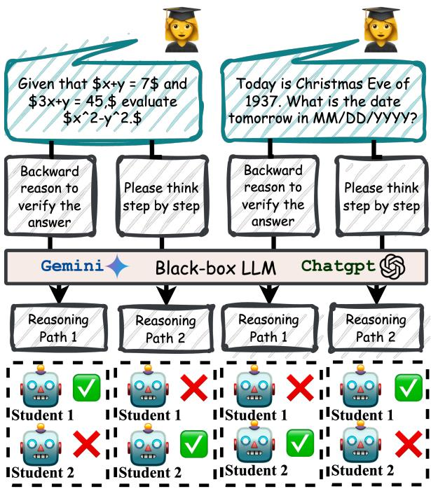  
Figure 1: Distillation effectiveness of teacher-generated reasoning paths are path-, task-, and student-dependent. denotes effective, denotes ineffective distillation.

Reproducing the teacher’s full reasoning ability remains challenging because conventional blackbox distillation supervises students only at the token level (West et al., 2021; Acharya et al., 2024; West et al., 2023), which exposes only a narrow slice of the conditional distribution that underlies the teacher’s outputs. Empirical work shows that supervising on multiple chains of thought (CoTs) sampled for the same query can improve downstream accuracy (Li et al., 2023b; Luo et al., 2025), suggesting that different reasoning trajectories capture complementary facets of the teacher’s problemsolving abilities and that aggregating them yields stronger learning signals than any single path alone.

However, simply feeding every student all available paths is sub-optimal since the pedagogical value of reasoning paths is not universal. First, some traces arrive at incorrect conclusions (Lyu et al., 2023; Trivedi et al., 2022) or embed spurious intermediate steps (He et al., 2021), thus providing harmful teaching signals. Second, some reasoning paths are useful only for specific tasks or students, while irrelevant or even misleading for others, as shown in Figure 1. For example, program-style explanations often benefit algorithmic reasoning but add little value to routine arithmetic; long multihop chains help with complex commonsense puzzles but may overthink on questions that admit concise solutions (Chen et al., 2024c). Moreover, since student models differ in architecture, capacity, and pre-training data that leads to different learning abilities (Turc et al., 2019), a reasoning path that aligns well with one learners can misguide another. As a result, Effective distillation requires path selection that is simultaneously quality-aware, task-aware, and student-aware.

We meet these requirements in two stages. (i) Quality filtering. We retain only paths whose final answers match ground truth labels, then score their internal reasoning with an LLM-as-judge, preserving the highest-rated traces. (ii) Conditional routing. For each query, a trainable router scores the surviving paths with respect to each student’s current state and selects the subset predicted to yield maximal learning gains.

Nevertheless, filtering narrows each student’s view of the teacher’s knowledge again, risking a wider teacher–student gap and bias toward a limited set of reasoning styles. To close this gap, we introduce Quality-filtered Routing with Cooperative Distillation (QR-Distill), a cooperative framework in which multiple students train concurrently while acting as peer teachers. Each sample is processed in two passes: first in a teacher-driven pass, where the router assigns the filtered paths to individual students, and then in a peer-teaching pass, where a weighted ensemble of the students serves as a provisional teacher. A feature-level mutual-distillation loss channels information through this ensemble bottleneck, enabling learners to compensate for gaps in the others’ coverage, redistributing diverse insights obtained from the teacher’s supervision.

We generate a broad, high-quality reasoning path pool by prompting an advanced black-box teacher with carefully designed variants, ensuring wide coverage of its solution space. Experiments on various benchmarks show that our framework consistently outperforms strong baselines that rely on either single-path distillation or multi-path distillation without routing. Ablation studies confirm that all components including quality filtering, conditional routing, and peer teaching contribute to the final gains, underscoring the value of path-aware selection and cooperative learning in distillation with multiple reasoning paths.

## 2 Methodology

Our method consists of four main components: (1) Reasoning Path Generation to augment training data, (2) Quality Filtering to eliminate incorrect paths, (3) Conditional Routing to assign reasoning paths to students adaptively, and (4) Mutual-Student Distillation to enable information exchange across student models, each elaborated below.

## 2.1 Problem Setup

Let $\mathcal { D } ~ = ~ \{ ( Q ^ { ( i ) } , A ^ { ( i ) } ) \} _ { i = 1 } ^ { n }$ denote a reasoning dataset consisting of n samples, where each sample consists of a question $Q ^ { ( i ) }$ and its corresponding ground-truth answer $A ^ { ( i ) }$ . We assume black-box access to a teacher model T, meaning we can obtain outputs but not logits. Our goal is to train a smaller student model s to improve its reasoning ability. During training, We augment  to obtain a new dataset $\mathcal { D } _ { \mathrm { a u g } } = \{ ( Q ^ { ( i ) } , \mathcal { R } ^ { ( i ) } ) \} _ { i = 1 } ^ { n }$ , where each $\mathcal { R } ^ { ( i ) } = \{ R _ { 1 } ^ { ( i ) } , \bar { R _ { 2 } ^ { ( i ) } } , \dots , R _ { k } ^ { ( i ) } \}$ is a set of k diverse reasoning paths generated by a black-box teacher model . The student model s is trained on $D _ { \mathrm { a u g } }$ At test time, the student receives a simple instruction along with a question, similar to zero-shot prompting (Kojima et al., 2022).

## 2.2 Reasoning Path Generation

To induce diversity in reasoning styles of multiple generated reasoning paths, we design and apply a set of prompting templates, each tailored to elicit a specific reasoning skill. The categories include:

• Vanilla Reasoning: Standard prompts which encourage simple and linear reasoning.

• Chain-of-Thought Reasoning: Prompts to decompose the problem into multiple finegrained reasoning steps (Wei et al., 2022).

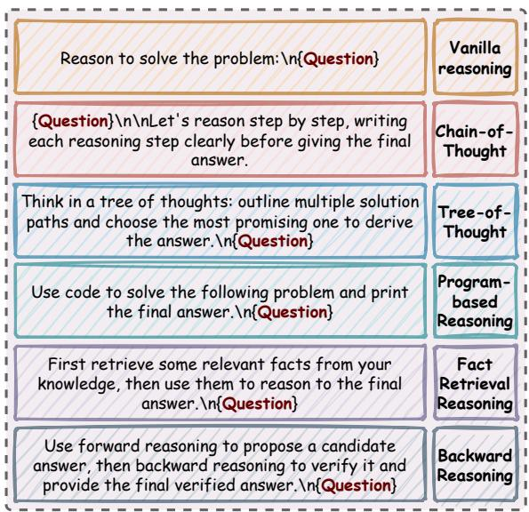  
Figure 2: Prompt templates of different reasoning paths.

• Tree-of-Thought Reasoning: Prompts to explore multiple solution paths before converging on a final answer (Yao et al., 2023).

• Program-Based Reasoning: Prompts to synthesize Python-like pseudocode to solve algorithmic problems (Liu et al., 2024).

• Backward Reasoning: Prompts to generate backward reasoning consistent with forward reasoning, simulating reverse-thinking of a problem (Chen et al., 2024a).

• Fact-Retrieval Reasoning: Prompts guiding the model to recall and retrieve relevant factual information before reasoning.

An example set of such prompt templates is illustrated in Figure 2.

## 2.3 Quality Filtering

Not all generated reasoning paths are equally informative or reliable for distillation. To ensure that the student model is trained on high-quality signals, we apply a two-stage filtering strategy that removes incorrect and misleading reasoning paths.

Step 1: Incorrect Answers Removal. For each reasoning path $R _ { j } ^ { ( i ) }$ generated for question $Q ^ { ( i ) }$ , we extract the final predicted answer $\hat { A } _ { j } ^ { ( i ) }$ and compare it against the ground-truth $A ^ { ( i ) }$ . Paths for which $\hat { A } _ { j } ^ { ( i ) } \neq A ^ { ( i ) }$ are discarded. This step ensures that only reasoning traces that lead to the correct solution are retained.

Step 2: Spurious Reasoning Removal. The remaining paths are evaluated by a separate LLMas-a-judge module ${ \mathcal { I } } ,$ which is prompted to assess whether a path contains hallucinated or spurious intermediate steps. Only those marked as logically valid are retained. This yields a cleaned set $\bar { \mathcal { R } } ^ { ( i ) }$ of paths for each question.

## 2.4 Conditional Routing

While quality filtering removes clearly incorrect or spurious reasoning paths, it does so in a coarse and static manner. In practice, the usefulness of a reasoning path can vary depending on the query context and the specific student model. To enable more adaptive supervision, we introduce a conditional routing mechanism that automatically assigns each reasoning path to one or more students. For each reasoning path $R _ { j } ^ { ( i ) }$ , we first extract a fixed representation using an encoder, i.e.,

$$
\mathbf { h } _ { j } ^ { ( i ) } = \mathrm { E n c } ( \widetilde { R } _ { j } ^ { ( i ) } ) \in \mathbb { R } ^ { d } .\tag{1}
$$

Next, this representation is mapped to studentspecific routing logits by a trainable router parameterized by an MLP, which are then processed via a Gumbel-Softmax to produce discrete but differentiable assignments, i.e.,

$$
\begin{array} { r } { \pmb { \alpha } _ { j } ^ { ( i ) } = \mathrm { G u m b e l S o f t m a x } ( \mathrm { M L P } ( \mathbf { h } _ { j } ^ { ( i ) } ) ) \in \{ 0 , 1 \} ^ { S } , } \end{array}\tag{2}
$$

where $\alpha _ { j } ^ { ( i ) } [ s ] = 1$ if reasoning path $\widetilde { R } _ { j } ^ { ( i ) }$ is assigned to student s, and 0 otherwise. $S ^ { ' }$ denotes number of students involved during distillation. This allows the model to assign different reasoning paths to different students based on their compatibility, enabling adaptive supervision.

To prevent trivial cases such as always selecting all students or none, we apply an entropy-based regularization to promote balanced usage across students. Specifically, we average the routing assignment across all students and all reasoning paths and maximize its entropy, i.e.,

$$
\bar { \pmb { \alpha } } ^ { ( i ) } = \frac { 1 } { S \cdot k } \sum _ { j = 1 } ^ { k } \sum _ { s = 1 } ^ { S } { \pmb { \alpha } _ { j } ^ { ( i ) } [ s ] } ,\tag{3}
$$

$$
{ \mathcal { L } } _ { \mathrm { e n t r o p y } } = - { \bar { \alpha } } ^ { ( i ) } \log { \bar { \alpha } } ^ { ( i ) } - ( 1 - { \bar { \alpha } } ^ { ( i ) } ) \log ( 1 - { \bar { \alpha } } ^ { ( i ) } ) .\tag{4}
$$

This regularization penalizes extreme routing decisions, thereby promoting informative and balanced supervision across students.

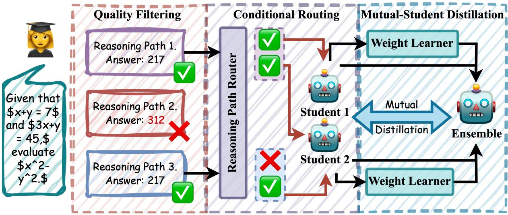  
Figure 3: Overview of our framework, including (1) Quality Filtering that drops flawed chains-of-thought; (2) Conditional Routing that sends each reasoning path to the most suitable students for fine-tuning; (3) Mutual-Student Distillation that shares and refines learned insights of different students.

## 2.5 Mutual-Student Distillation

After filtering and routing, each student $S _ { s }$ receives a subset of reasoning paths. However, isolated learning from limited reasoning styles may lead to narrow reasoning coverage and a persistent gap between students and the teacher. To mitigate this, we propose a mutual-student distillation framework that allows students to learn from each other through internal representations of co-routed paths.

Let $\mathbf { z } _ { s } ^ { ( i , j ) } \in \mathbb { R } ^ { T \times d }$ denote the last hidden states of student s for path $\widetilde { R } _ { j } ^ { ( i ) }$ , where $T$ is the number eof tokens. Each student projects their hidden states to a lower-dimensional shared space via a studentspecific projection function, i.e.,

$$
\begin{array} { r } { \tilde { \mathbf { z } } _ { s } ^ { ( i , j ) } = \operatorname { P r o j } _ { s } ( \mathbf { z } _ { s } ^ { ( i , j ) } ) . } \end{array}\tag{5}
$$

We then compute a competence score $\gamma _ { s } ^ { ( i , j ) }$ by averaging the projected hidden states across tokens and passing them through a linear regressor followed by a softmax over students, i.e.,

$$
\gamma _ { s } ^ { ( i , j ) } = \operatorname { s o f t m a x } _ { s } \left( \mathbf { w } _ { s } ^ { \top } \cdot \mathrm { m e a n } _ { t } ( \tilde { \mathbf { z } } _ { s } ^ { ( i , j ) } ) \right) ,\tag{6}
$$

The scores are used to form a soft ensemble representation of the reasoning path, which includes knowledge from both students, i.e.,

$$
\mathbf { z } _ { \mathrm { e n s } } ^ { ( i , j ) } = \sum _ { s = 1 } ^ { S } \gamma _ { s } ^ { ( i , j ) } \cdot \tilde { \mathbf { z } } _ { s } ^ { ( i , j ) } .\tag{7}
$$

Each student then aligns its representation with the ensemble via a mean-squared error loss, i.e.,

$$
\mathcal { L } _ { \mathrm { m u t u a l } } = \sum _ { s = 1 } ^ { S } \sum _ { i , j } \left. \tilde { \mathbf { z } } _ { s } ^ { ( i , j ) } - \mathbf { z } _ { \mathrm { e n s } } ^ { ( i , j ) } \right. _ { 2 } ^ { 2 } .\tag{8}
$$

This mutual distillation allows each student to benefit from complementary knowledge learned by its peers, thereby reducing the gap between student and teacher.

## 2.6 Training Objective

The full objective function combines vanilla distillation losses, entropy regularization for the router, and mutual distillation losses:

$$
\mathcal { L } = \sum _ { s = 1 } ^ { S } \mathcal { L } _ { \mathrm { d i s t i l l } } ^ { ( s ) } + \lambda _ { 1 } \mathcal { L } _ { \mathrm { e n t r o p y } } + \lambda _ { 2 } \mathcal { L } _ { \mathrm { m u t u a l } } ,\tag{9}
$$

where $\mathcal { L } _ { \mathrm { d i s t i l l } } ^ { ( s ) }$ denotes supervised fine-tuning (SFT) loss for student s on the reasoning paths assigned by the router. $\lambda _ { 1 }$ and $\lambda _ { 2 }$ control the relative importance of the other two losses.

## 3 Experimental Setup

## 3.1 Backbone Models

We use Gemini-1.5-Pro-001 (Team et al., 2024a) as the black-box teacher model , chosen for its strong reasoning performance across diverse domains. We train S = 2 student models and instantiate them as Mistral-7B-Instruct-v0.3 (Jiang et al., 2024) and Gemma-7B-Instruct (Team et al., 2024b), both of which are widely-used open-weight instruction-tuned LLMs for distillation (Chen et al., 2024a). For encoding reasoning paths during routing, we use a pretrained RoBERTa-base model (Liu et al., 2019).

<table><tr><td rowspan=1 colspan=1>Methods                                   SQA ARC MATH ANLI Date  Avg</td></tr><tr><td rowspan=1 colspan=1>Gemini-1.5-Pro-001 (Teacher Model)</td></tr><tr><td rowspan=1 colspan=1>Zero-shot (Kojima et al., 2022)           77.39 91.51  55.90  70.12 80.00 79.76</td></tr><tr><td rowspan=1 colspan=1>Mistral-7B-Instruct</td></tr><tr><td rowspan=1 colspan=1>Zero-shot (Kojima et al., 2022)           53.89 73.68  10.42  43.92 39.64 44.31SKD (Li et al., 2023b)                     63.76 74.66  12.48   44.90 48.50 48.86Distill Step-by-Step (Hsieh et al., 2023) 64.19 75.32  11.54   44.42 49.63 49.02Rephrase Question (Yu et al., 2024)      65.07 74.51   12.98   43.58 45.51 48.33Question Aug (Li et al., 2024c)           65.07 73.32  13.64  42.20 47.21 48.29Answer Aug (Yu et al., 2024)             66.38 76.77  14.78  45.01 49.12 50.41RevTHINK (Chen et al., 2024a)          70.97 78.50  15.28  48.58 70.40 56.75QR-Distill (Ours)                         69.87 80.25  16.92  55.75 73.37 59.23</td></tr><tr><td rowspan=1 colspan=1>Gemma-7B-Instruct</td></tr><tr><td rowspan=8 colspan=1>Zero-shot (Kojima et al., 2022)           56.33 68.34   8.58   37.92 40.24 42.28SKD (Li et al., 2023b)Distill Step-by-Step (Hsieh et al., 2023) 56.77                      44.23           50.17Rephrase Question (Yu et al., 2024)      54.15                      43.07 57.99Question Aug (Li et al., 2024c)           55.10Answer Aug (Yu et al., 2024)             57.21RevTHINK (Chen et al., 2024a)          64.19QR-Distill (Ours)</td></tr><tr><td rowspan=1 colspan=1>56.77 73.29 16.86 45.42 59.62 50.39</td></tr><tr><td rowspan=1 colspan=1>56.77 72.92 16.04 44.23 60.91 50.17</td></tr><tr><td rowspan=1 colspan=1>54.15 72.37 16.96 43.07 57.99 48.91</td></tr><tr><td rowspan=1 colspan=1>55.10 72.74 17.76 41.22 59.83 49.33</td></tr><tr><td rowspan=1 colspan=1>57.21 73.92 18.92 42.72 64.14 51.38</td></tr><tr><td rowspan=1 colspan=1>64.19 75.09 19.96 47.36 66.27 54.57</td></tr><tr><td rowspan=1 colspan=1>67.29 78.05 23.32 51.50 79.29 59.89</td></tr></table>

Table 1: Performance comparison across five reasoning benchmarks with two students: Mistral-7B-Instruct and Gemma-7B-Instruct. Results are reported from prior work unless noted. Best values are bolded.

## 3.2 Training Details

All students are fine-tuned using QLoRA (Dettmers et al., 2023) with rank 32. The learning rate is set to $5 \times 1 0 ^ { - 6 }$ for Mistral and $2 \times 1 0 ^ { - 4 }$ for Gemma, and remains consistent across all experiments. Each student model is fine-tuned using the AdamW optimizer with a batch size of 8 per device. We train for 3 epochs on mathematical reasoning datasets (MATH, GSM8K) and 10 epochs on all other tasks.

## 3.3 Datasets

We evaluate our method across diverse reasoning benchmarks spanning multiple domains, including (1) Commonsense Reasoning: StrategyQA (SQA, Geva et al. (2021)) and ARC-Challenge (ARC, Clark et al. (2018)); (2) Mathematical Reasoning: Math (Hendrycks et al., 2021); (3) Natural Language Inference: ANLI (Nie et al., 2019); (4)

Logical Reasoning: Date (Srivastava et al., 2022).

## 3.4 Baselines

We compare against three categories of baselines. (1) Zero-shot: Standard CoT prompting without fine-tuning (Kojima et al., 2022). Single-Path Distillation: This includes (2) Symbolic Knowledge Distillation (SKD) (Li et al., 2023b), which trains on teacher-generated CoTs using next-token prediction, and (3) Distilling Step-by-Step (Hsieh et al., 2023), which adds supervision on both rationale and answer. We also include questionlevel augmentation methods: (4) Question Rephrasing (Yu et al., 2023) and (5) Question Generation (Li et al., 2021). Multi-Path Distillation: These methods leverage multiple teacher-generated reasoning paths, including (6) Answer Augmentation (Yu et al., 2023) and (7) Backward Reasoning Augmentation (Chen et al., 2024a).

## 4 Results and Analysis

In this section, we aim to address four research questions. RQ1: How does QR-DISTILL compare with existing baselines? RQ2: What is the impact of each module inside QR-DISTILL? RQ3: How does the conditional router assign reasoning paths? RQ4: How does QR-Distill perform under varying training sample size?

<table><tr><td>Methods</td><td>ARC ANLI</td><td>Date</td><td>Avg</td></tr><tr><td colspan="4">Mistral-7B-Instruct</td></tr><tr><td>w/o QF</td><td>77.98 53.04</td><td>66.86</td><td>65.69</td></tr><tr><td>w/o Route</td><td>78.07 59.00</td><td>72.78</td><td>69.95</td></tr><tr><td>w/o Collab</td><td>75.38 59.16</td><td>72.19</td><td>68.91</td></tr><tr><td>QR-Distill</td><td>80.25 55.75</td><td>73.37</td><td>69.79</td></tr><tr><td colspan="4">Gemma-7B-Instruct</td></tr><tr><td>w/o QF</td><td>68.00 31.10</td><td>69.23</td><td>56.11</td></tr><tr><td>w/o Route</td><td>75.19 30.17</td><td>78.10</td><td>61.15</td></tr><tr><td>w/o Collab</td><td>77.88 46.33</td><td>76.33</td><td>66.85</td></tr><tr><td>QR-Distill</td><td>78.05 51.50</td><td>79.29</td><td>69.61</td></tr></table>

## 4.1 Main Results

To address RQ1, we present our main results in Table 1. Overall, QR-Distill outperforms all baselines across datasets and models. Compared to the zero-shot performance of the student model, QR-Distill achieves an average improvement of 41.44% with Mistral and 63.33% with Gemma, indicating that knowledge learned from the teacher model can significantly enhance student performance on downstream reasoning tasks. When compared to baselines in which teachers provide only a single reasoning path for distillation, QR-Distill yields a substantial performance gain of 24.32% on average, demonstrating that leveraging multiple reasoning paths leads to more effective student training. Against baselines that also use multiple reasoning paths but without our routing or collaborative mechanisms, QR-Distill still achieves up to 13.36% improvement, which highlights the benefit of our path-aware routing and multi-student collaboration design in distilling diverse reasoning signals.

We also observe several noteworthy patterns. QR-Distill shows a larger performance boost for Gemma compared to Mistral across most datasets. Interestingly, on the Date dataset, Gemma even outperforms Mistral under QR-Distill, whereas it consistently underperforms in other baselines. This suggests that weaker student models benefit more from our method, likely due to the mutual distillation effect where Gemma learns useful patterns from its peer Mistral, which helps bridge the gap between Gemma and the black-box teacher.

Finally, we find that QR-Distill’s improvements are most pronounced on datasets where multi-path distillation baselines greatly outperform singlepath ones, suggesting that QR-Distill can further unlock the potential of multiple reasoning paths.

## 4.2 Ablation Study

To address RQ2, we conduct an ablation study by systematically removing different components of QR-Distill to assess their individual contributions. In the Table 2, we denote QF as Quality Filtering, Route as Conditional Routing, and Collab as Mutual-Student Distillation. Our observations are summarized as follows: (1) Across most datasets, removing any individual module results in performance degradation, suggesting that each component contributes to the overall distillation process. (2) Among the three components, Quality Filtering appears to contribute the most consistently. This supports the hypothesis that filtering out lowquality reasoning paths particularly those with incorrect final answers or spurious intermediate steps can help reduce harmful supervision signals and mitigate potential hallucinations in the student models. This effect is especially pronounced on ANLI, suggesting that natural language inference tasks may be more sensitive to the quality of reasoning chains. (2) The Mutual Distillation module seems particularly beneficial for the Gemma student, as its removal results in more noticeable performance drops compared to Mistral. This aligns with our earlier observation that weaker models tend to benefit more from peer collaboration.

Table 2: Ablation results on ARC, ANLI, and Date. Best values are bolded.  
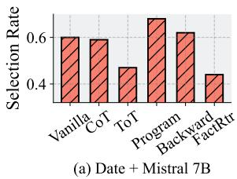

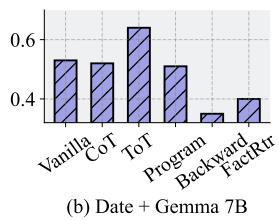

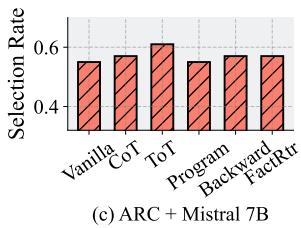

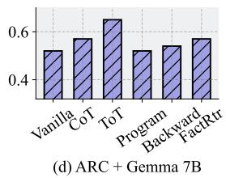  
Figure 4: Routing selection rates across different dataset and student model architectures.

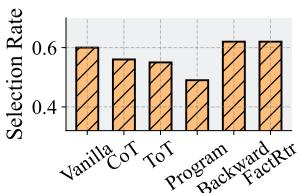  
(a) Level 1 + Mistral 7B

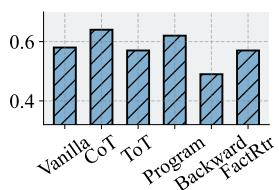  
(b) Level 1 + Gemma 7B

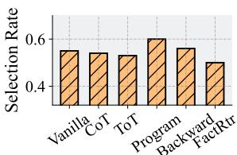  
(c) Level 5 + Mistral 7B

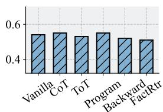  
(d) Level 5 + Gemma 7B  
Figure 5: Routing selection rates across different question difficulty levels and student model architectures.

## 4.3 Routing Analysis

To answer RQ3, we analyze the routing decisions made for different reasoning paths across the two student models. Specifically, we investigate whether the domain and difficulty of questions influence routing behavior. For the domain aspect, we compare routing choices across datasets. In Figure 4, CoT denotes chain-of-thought, ToT denotes tree-of-thought, program refers to programbased reasoning, backward denotes backward reasoning, and FactRtr indicates fact-retrieval reasoning. We make the following observations: (1) For the same dataset, the two students often select different reasoning paths, suggesting that compatibility between reasoning styles and model architecture can vary. (2) For the same student, different datasets lead to different path preferences, indicating that question domain affects routing decisions. (3) Fact-retrieval reasoning is favored on the ARC-Challenge dataset instead of the Date dataset, which aligns with our intuition that commonsense tasks rely more on factual recall than structured reasoning. (4) A trade-off is observed between program-based and tree-of-thought reasoning, where when one is preferred, the other is often suppressed, suggesting a possible antagonistic relationship between these reasoning styles.

For question difficulty, we examine routing on the Math dataset at varying levels of complexity in Figure 5. We have the following observations: (1) At the same difficulty level, different students favor different reasoning paths, further verifying the existence of student-reasoning path compatibility. (2) Easier questions have higher selection rates, possibly reflecting a greater gap between student and teacher on more challenging questions. (3) As question difficulty increases, differences in routing across reasoning paths diminish, suggesting a limitation in the students’ ability to effectively assess and select among reasoning strategies when facing complex problems.

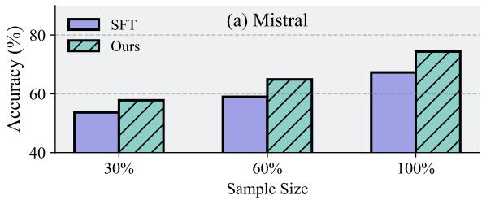

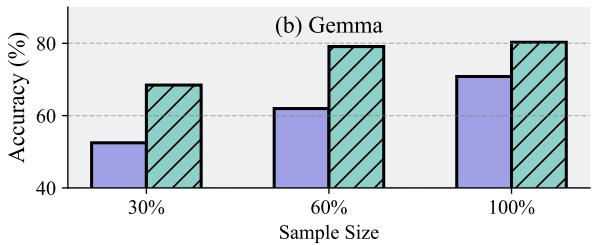  
Figure 6: Comparison of QR-Distill and the SFT baseline with different sample sizes.

## 4.4 Sample Efficiency

Having demonstrated the QR-Distill’s performance on the full training set, we now address RQ4 by evaluating whether QR-Distill maintains its advantage under limited supervision. Specifically, we compare QR-Distill with SFT across varying ratios of the training data of Date dataset, as shown in Figure 6. We can observe that QR-Distill consistently outperforms SFT at all training levels. Notably, QR-Distill is even comparable with SFT trained with 100% data when using as little as 30% data for Gemma, indicating better sample efficiency.

## 5 Related Works

## 5.1 LLM Reasoning

Recent advancements in LLMs have demonstrated significant capabilities in complex reasoning tasks (Tan et al., 2025a; Plaat et al., 2024; Wang et al., 2024c; Huang and Chang, 2022; Yu et al., 2024; Sun et al., 2023; Ahn et al., 2024; Chen et al., 2025a; Tan et al., 2024b; Zhu et al., 2025; Zheng et al., 2025). A key factor behind this success is the use of advanced prompting techniques such as Chain-of-Thought (CoT) prompting (Zhao et al., 2025; Chu et al., 2023; Wei et al., 2022; Lyu et al., 2023; Wei and Liu, 2025) and Tree-of-Thought prompting (Yao et al., 2023; Long, 2023;

Bi et al., 2024). These methods encourage models to articulate reasoning explicitly, enhancing their ability to solve intricate problems. Building on CoT approaches, researchers have explored various strategies to further exploit the diversity and richness of multiple reasoning paths (Naik et al., 2023; Chen et al., 2023d; Wang et al., 2024b). For instance, Self-Consistency employs multiple reasoning samples from the same prompt, aggregating them via majority voting to improve answer reliability (Wang et al., 2022; Chen et al., 2023a; Liang et al., 2024; Ahmed and Devanbu, 2023; Tan et al., 2025b; Chen et al., 2025b; Yuan et al., 2025; Li et al., 2024b).

Despite these improvements, existing strategies utilizing multiple reasoning paths largely focus on aggregating reasoning paths post-generation without adequately addressing the selective utilization of reasoning paths (Yin et al., 2024; Wang et al., 2024b; Fang et al., 2024). Most approaches indiscriminately combine reasoning samples, which risks incorporating redundant or low-quality rationales (Xu et al., 2023; Wang et al., 2024a; Tong et al., 2024), potentially limiting model efficacy. A critical yet under-explored direction involves systematically identifying and selecting reasoning paths based on their quality, relevance, and compatibility with specific tasks and model characteristics.

## 5.2 Knowledge Distillation

Knowledge distillation (KD) aims to transfer knowledge from powerful but cumbersome teacher models to smaller student models (Li et al., 2024a; Gou et al., 2021; Hinton et al., 2015; Park et al., 2019; Chen et al., 2021). Traditional KD approaches typically align the student’s predictive distributions closely with those of the teacher, often requiring internal access to the teacher’s parameters (Tan et al., 2024a; Zhao et al., 2022; Cho and Hariharan, 2019; Kim and Rush, 2016; Gu et al., 2023). However, such methods become impractical for proprietary and black-box LLMs (Xu et al., 2024; Yang et al., 2024a; Hong et al., 2023a), motivating the exploration of distillation methods that rely on token-level model outputs.

Recently, symbolic distillation techniques have emerged, which leverage explicit rationales or symbolic outputs from large-scale teacher models without requiring internal access (Acharya et al., 2024; West et al., 2021; Li et al., 2023b). Hsieh et al. (2023) demonstrated that the utility of rationales in the distillation step by step can improve the performance and improve sample efficiency. In addition, Jiang et al. (2023) propose a teacher-feedback mechanism where LLM-generated rationales for challenging examples guide student models.

Despite their effectiveness, these symbolic distillation approaches frequently employ a single reasoning path per query, thus inadequately capturing the teacher’s comprehensive reasoning capabilities. Consequently, recent efforts have explored multi-path distillation, integrating diverse CoT samples to enhance student performance (Zhang et al., 2025b; Chen et al., 2023b, 2024a; Li et al., 2023b). Nonetheless, most of these studies lack a rigorous selection mechanism for reasoning paths, risking the inclusion of suboptimal or irrelevant rationales, thus hindering the potential benefits. In addition, none of existing methods utilize the collaboration of students to improve the distillation of multiple reasoning paths.

## 5.3 Multi-Agent Collaboration

Multi-agent collaborative frameworks have demonstrated notable improvements in complex reasoning and problem-solving tasks by harnessing collective intelligence (Tran et al., 2025; Hong et al., 2023b; Talebirad and Nadiri, 2023; Chen et al., 2023c; Li et al., 2023a, 2024c; Zhang et al., 2025a; Zhou and Ai, 2024; Lee et al., 2024). This is achieved by combining diverse perspectives and complementary capabilities to enhance overall performance. Through mechanisms such as information sharing (Han et al., 2024), joint decision-making (Sun et al., 2024a), and iterative refinement (Chen et al., 2024b), collaborative approaches consistently outperform isolated single-agent models.

Despite the advantages of collaborative frameworks, integrating these principles explicitly within knowledge distillation is relatively unexplored. Our approach uniquely combines collaboration of multiple student models with selective distillation, leveraging inter-agent cooperation to enhance reasoning path selection and learning, thereby addressing critical gaps identified in prior research.

## 6 Conclusion

We propose QR-Distill, a novel framework that addresses the varied suitability of multiple reasoning paths across tasks and student models. QR-Distill integrates three key components: (1) Quality Filtering to retain only high-quality, correct reasoning paths using an LLM-based evaluator; (2)

Conditional Routing to adaptively assign paths to students based on their current learning state; and (3) Mutual-Student Distillation to enable mutual knowledge transfer among students, mitigating reasoning style bias and teacher-student gaps. Extensive experiments confirm the effectiveness of our approach in improving multi-path distillation.

## Limitations

Limited number of student models. Due to constraints in computational resources, we conduct experiments using only two student models. While this setup already demonstrates the benefits of collaborative learning, increasing the number of collaborative students holds huge potential for further performance gains.

Single teacher model. All reasoning paths in this work are generated using the Gemini-1.5 model. Although Gemini is a strong teacher, including outputs from additional teacher models such as GPT may expose students to a broader range of reasoning styles and improve generalization.

Restricted diversity of reasoning prompts. We employ a predefined set of prompt templates to induce different reasoning styles. Exploring a wider set of reasoning path types could further enrich training signals and enhance the effectiveness of our distillation framework.

## Ethics Statement

Our work focuses on developing an effective distilling framework using publicly available datasets and pretrained LLMs. While acknowledging the need for responsible usage of the proposed method, we do not foresee major negative societal impacts.

## Acknowledgments

This work is supported in part by the National Science Foundation (NSF) under grants IIS-2006844, IIS-2144209, IIS-2223769, CNS-2154962, BCS-2228534, and CMMI-2411248; the Office of Naval Research (ONR) under grant N000142412636; and the Commonwealth Cyber Initiative (CCI) under grant VV-1Q24-011, and the gift funding from Netflix and Snap.

## References

Kamal Acharya, Alvaro Velasquez, and Houbing Herbert Song. 2024. A survey on symbolic knowledge distillation of large language models. IEEE Transactions on Artificial Intelligence.

Amey Agrawal, Nitin Kedia, Ashish Panwar, Jayashree Mohan, Nipun Kwatra, Bhargav Gulavani, Alexey Tumanov, and Ramachandran Ramjee. 2024. Taming Throughput-Latency tradeoff in LLM inference with Sarathi-Serve . In 18th USENIX Symposium on Operating Systems Design and Implementation (OSDI 24), pages 117–134.

Toufique Ahmed and Premkumar Devanbu. 2023. Better patching using llm prompting, via selfconsistency. In 2023 38th IEEE/ACM International Conference on Automated Software Engineering (ASE), pages 1742–1746. IEEE.

Janice Ahn, Rishu Verma, Renze Lou, Di Liu, Rui Zhang, and Wenpeng Yin. 2024. Large language models for mathematical reasoning: Progresses and challenges. arXiv preprint arXiv:2402.00157.

Zhenni Bi, Kai Han, Chuanjian Liu, Yehui Tang, and Yunhe Wang. 2024. Forest-of-thought: Scaling testtime compute for enhancing llm reasoning. arXiv preprint arXiv:2412.09078.

Angelica Chen, Jason Phang, Alicia Parrish, Vishakh Padmakumar, Chen Zhao, Samuel R Bowman, and Kyunghyun Cho. 2023a. Two failures of selfconsistency in the multi-step reasoning of llms. arXiv preprint arXiv:2305.14279.

Hongzhan Chen, Siyue Wu, Xiaojun Quan, Rui Wang, Ming Yan, and Ji Zhang. 2023b. Mcc-kd: Multicot consistent knowledge distillation. arXiv preprint arXiv:2310.14747.

Justin Chih-Yao Chen, Zifeng Wang, Hamid Palangi, Rujun Han, Sayna Ebrahimi, Long Le, Vincent Perot, Swaroop Mishra, Mohit Bansal, Chen-Yu Lee, and 1 others. 2024a. Reverse thinking makes llms stronger reasoners. arXiv preprint arXiv:2411.19865.

Pengguang Chen, Shu Liu, Hengshuang Zhao, and Jiaya Jia. 2021. Distilling knowledge via knowledge review. In Proceedings ofthe IEEE/CVF conference on computer vision and pattern recognition, pages 5008–5017.

Weize Chen, Yusheng Su, Jingwei Zuo, Cheng Yang, Chenfei Yuan, Chen Qian, Chi-Min Chan, Yujia Qin, Yaxi Lu, Ruobing Xie, and 1 others. 2023c. Agentverse: Facilitating multi-agent collaboration and exploring emergent behaviors in agents. arXiv preprint arXiv:2308.10848, 2(4):6.

Weize Chen, Jiarui Yuan, Chen Qian, Cheng Yang, Zhiyuan Liu, and Maosong Sun. 2024b. Optima: Optimizing effectiveness and efficiency for llm-based multi-agent system. arXiv preprint arXiv:2410.08115.

Xingyu Chen, Jiahao Xu, Tian Liang, Zhiwei He, Jianhui Pang, Dian Yu, Linfeng Song, Qiuzhi Liu, Mengfei Zhou, Zhuosheng Zhang, and 1 others. 2024c. Do not think that much for 2+ 3=? on the overthinking of o1-like llms. arXiv preprint arXiv:2412.21187.

Xinyun Chen, Renat Aksitov, Uri Alon, Jie Ren, Kefan Xiao, Pengcheng Yin, Sushant Prakash, Charles Sutton, Xuezhi Wang, and Denny Zhou. 2023d. Universal self-consistency for large language model generation. arXiv preprint arXiv:2311.17311.

Zihan Chen, Song Wang, Zhen Tan, Xingbo Fu, Zhenyu Lei, Peng Wang, Huan Liu, Cong Shen, and Jundong Li. 2025a. A survey of scaling in large language model reasoning. arXiv preprint arXiv:2504.02181.

Zihan Chen, Song Wang, Zhen Tan, Jundong Li, and Cong Shen. 2025b. Maple: Many-shot adaptive pseudo-labeling for in-context learning. arXiv preprint arXiv:2505.16225.

Jang Hyun Cho and Bharath Hariharan. 2019. On the efficacy of knowledge distillation. In Proceedings of the IEEE/CVF international conference on computer vision, pages 4794–4802.

Zheng Chu, Jingchang Chen, Qianglong Chen, Weijiang Yu, Tao He, Haotian Wang, Weihua Peng, Ming Liu, Bing Qin, and Ting Liu. 2023. Navigate through enigmatic labyrinth a survey of chain of thought reasoning: Advances, frontiers and future. arXiv preprint arXiv:2309.15402.

Peter Clark, Isaac Cowhey, Oren Etzioni, Tushar Khot, Ashish Sabharwal, Carissa Schoenick, and Oyvind Tafjord. 2018. Think you have solved question answering? try arc, the ai2 reasoning challenge. arXiv preprint arXiv:1803.05457.

Tim Dettmers, Artidoro Pagnoni, Ari Holtzman, and Luke Zettlemoyer. 2023. Qlora: Efficient finetuning of quantized llms. Advances in neural information processing systems, 36:10088–10115.

Siyuan Fang, Kaijing Ma, Tianyu Zheng, Xinrun Du, Ningxuan Lu, Ge Zhang, and Qingkun Tang. 2024. Karpa: A training-free method of adapting knowledge graph as references for large language model’s reasoning path aggregation. arXiv preprint arXiv:2412.20995.

Mor Geva, Daniel Khashabi, Elad Segal, Tushar Khot, Dan Roth, and Jonathan Berant. 2021. Did aristotle use a laptop? a question answering benchmark with implicit reasoning strategies. Transactions of the Association for Computational Linguistics, 9:346– 361.

Jianping Gou, Baosheng Yu, Stephen J Maybank, and Dacheng Tao. 2021. Knowledge distillation: A survey. International Journal of Computer Vision, 129(6):1789–1819.

Yuxian Gu, Li Dong, Furu Wei, and Minlie Huang. 2023. Minillm: Knowledge distillation of large language models. arXiv preprint arXiv:2306.08543.

Shanshan Han, Qifan Zhang, Yuhang Yao, Weizhao Jin, Zhaozhuo Xu, and Chaoyang He. 2024. Llm multiagent systems: Challenges and open problems. arXiv preprint arXiv:2402.03578.

Gaole He, Yunshi Lan, Jing Jiang, Wayne Xin Zhao, and Ji-Rong Wen. 2021. Improving multi-hop knowledge base question answering by learning intermediate supervision signals. In Proceedings of the 14th ACM international conference on web search and data mining, pages 553–561.

Dan Hendrycks, Collin Burns, Saurav Kadavath, Akul Arora, Steven Basart, Eric Tang, Dawn Song, and Jacob Steinhardt. 2021. Measuring mathematical problem solving with the math dataset. arXiv preprint arXiv:2103.03874.

Geoffrey Hinton, Oriol Vinyals, and Jeff Dean. 2015. Distilling the knowledge in a neural network. arXiv preprint arXiv:1503.02531.

Jixiang Hong, Quan Tu, Changyu Chen, Xing Gao, Ji Zhang, and Rui Yan. 2023a. Cyclealign: Iterative distillation from black-box llm to white-box models for better human alignment. arXiv preprint arXiv:2310.16271.

Sirui Hong, Xiawu Zheng, Jonathan Chen, Yuheng Cheng, Jinlin Wang, Ceyao Zhang, Zili Wang, Steven Ka Shing Yau, Zijuan Lin, Liyang Zhou, and 1 others. 2023b. Metagpt: Meta programming for multi-agent collaborative framework. arXiv preprint arXiv:2308.00352, 3(4):6.

Cheng-Yu Hsieh, Chun-Liang Li, Chih-Kuan Yeh, Hootan Nakhost, Yasuhisa Fujii, Alexander Ratner, Ranjay Krishna, Chen-Yu Lee, and Tomas Pfister. 2023. Distilling step-by-step! outperforming larger language models with less training data and smaller model sizes. arXiv preprint arXiv:2305.02301.

Jie Huang and Kevin Chen-Chuan Chang. 2022. Towards reasoning in large language models: A survey. arXiv preprint arXiv:2212.10403.

Albert Q Jiang, Alexandre Sablayrolles, Antoine Roux, Arthur Mensch, Blanche Savary, Chris Bamford, Devendra Singh Chaplot, Diego de las Casas, Emma Bou Hanna, Florian Bressand, and 1 others. 2024. Mixtral of experts. arXiv preprint arXiv:2401.04088.

Yuxin Jiang, Chunkit Chan, Mingyang Chen, and Wei Wang. 2023. Lion: Adversarial distillation of closedsource large language model.

Yoon Kim and Alexander M Rush. 2016. Sequencelevel knowledge distillation. In Proceedings of the 2016 conference on empirical methods in natural language processing, pages 1317–1327.

Takeshi Kojima, Shixiang Shane Gu, Machel Reid, Yutaka Matsuo, and Yusuke Iwasawa. 2022. Large language models are zero-shot reasoners. Advances in neural information processing systems, 35:22199– 22213.

Hojae Lee, Junho Kim, and SangKeun Lee. 2024. Mentor-kd: Making small language models better multi-step reasoners. arXiv preprint arXiv:2410.09037.

Zhenyu Lei, Yushun Dong, Weiyu Li, Rong Ding, Qi Wang, and Jundong Li. 2025. Harnessing large language models for disaster management: A survey. arXiv preprint arXiv:2501.06932.

Dawei Li, Zhen Tan, Tianlong Chen, and Huan Liu. 2024a. Contextualization distillation from large language model for knowledge graph completion. arXiv preprint arXiv:2402.01729.

Huao Li, Yu Quan Chong, Simon Stepputtis, Joseph Campbell, Dana Hughes, Michael Lewis, and Katia Sycara. 2023a. Theory of mind for multi-agent collaboration via large language models. arXiv preprint arXiv:2310.10701.

Jinpeng Li, Yingce Xia, Rui Yan, Hongda Sun, Dongyan Zhao, and Tie-Yan Liu. 2021. Stylized dialogue generation with multi-pass dual learning. Advances in Neural Information Processing Systems, 34:28470– 28481.

Lincan Li, Jiaqi Li, Catherine Chen, Fred Gui, Hongjia Yang, Chenxiao Yu, Zhengguang Wang, Jianing Cai, Junlong Aaron Zhou, Bolin Shen, and 1 others. 2024b. Political-llm: Large language models in political science. arXiv preprint arXiv:2412.06864.

Liunian Harold Li, Jack Hessel, Youngjae Yu, Xiang Ren, Kai-Wei Chang, and Yejin Choi. 2023b. Symbolic chain-of-thought distillation: Small models can also" think" step-by-step. arXiv preprint arXiv:2306.14050.

Xinyi Li, Sai Wang, Siqi Zeng, Yu Wu, and Yi Yang. 2024c. A survey on llm-based multi-agent systems: workflow, infrastructure, and challenges. Vicinagearth, 1(1):9.

Xun Liang, Shichao Song, Zifan Zheng, Hanyu Wang, Qingchen Yu, Xunkai Li, Rong-Hua Li, Yi Wang, Zhonghao Wang, Feiyu Xiong, and 1 others. 2024. Internal consistency and self-feedback in large language models: A survey. arXiv preprint arXiv:2407.14507.

Xiao Liu, Zirui Wu, Xueqing Wu, Pan Lu, Kai-Wei Chang, and Yansong Feng. 2024. Are llms capable of data-based statistical and causal reasoning? benchmarking advanced quantitative reasoning with data. arXiv preprint arXiv:2402.17644.

Yinhan Liu, Myle Ott, Naman Goyal, Jingfei Du, Mandar Joshi, Danqi Chen, Omer Levy, Mike Lewis, Luke Zettlemoyer, and Veselin Stoyanov. 2019. Roberta: A robustly optimized bert pretraining approach. arXiv preprint arXiv:1907.11692.

Jieyi Long. 2023. Large language model guided tree-ofthought. arXiv preprint arXiv:2305.08291.

Yijia Luo, Yulin Song, Xingyao Zhang, Jiaheng Liu, Weixun Wang, GengRu Chen, Wenbo Su, and Bo Zheng. 2025. Deconstructing long chain-ofthought: A structured reasoning optimization framework for long cot distillation. arXiv preprint arXiv:2503.16385.

Qing Lyu, Shreya Havaldar, Adam Stein, Li Zhang, Delip Rao, Eric Wong, Marianna Apidianaki, and Chris Callison-Burch. 2023. Faithful chain-ofthought reasoning. In The 13th International Joint Conference on Natural Language Processing and the 3rd Conference of the Asia-Pacific Chapter of the Associationfor Computational Linguistics (IJCNLP-AACL 2023).

Daniel McDonald, Rachael Papadopoulos, and Leslie Benningfield. 2024. Reducing llm hallucination using knowledge distillation: A case study with mistral large and mmlu benchmark. Authorea Preprints.

Saurav Muralidharan, Sharath Turuvekere Sreenivas, Raviraj Joshi, Marcin Chochowski, Mostofa Patwary, Mohammad Shoeybi, Bryan Catanzaro, Jan Kautz, and Pavlo Molchanov. 2024. Compact language models via pruning and knowledge distillation. Advances in Neural Information Processing Systems, 37:41076– 41102.

Ranjita Naik, Varun Chandrasekaran, Mert Yuksekgonul, Hamid Palangi, and Besmira Nushi. 2023. Diversity of thought improves reasoning abilities of large language models.

Yixin Nie, Adina Williams, Emily Dinan, Mohit Bansal, Jason Weston, and Douwe Kiela. 2019. Adversarial nli: A new benchmark for natural language understanding. arXiv preprint arXiv:1910.14599.

Wonpyo Park, Dongju Kim, Yan Lu, and Minsu Cho. 2019. Relational knowledge distillation. In Proceedings ofthe IEEE/CVF conference on computer vision and pattern recognition, pages 3967–3976.

Rajvardhan Patil and Venkat Gudivada. 2024. A review of current trends, techniques, and challenges in large language models (llms). Applied Sciences, 14(5):2074.

Aske Plaat, Annie Wong, Suzan Verberne, Joost Broekens, Niki van Stein, and Thomas Back. 2024. Reasoning with large language models, a survey. arXiv preprint arXiv:2407.11511.

Aarohi Srivastava, Abhinav Rastogi, Abhishek Rao, Abu Awal Md Shoeb, Abubakar Abid, Adam Fisch, Adam R Brown, Adam Santoro, Aditya Gupta, Adrià Garriga-Alonso, and 1 others. 2022. Beyond the imitation game: Quantifying and extrapolating the capabilities of language models. arXiv preprint arXiv:2206.04615.

Chuanneng Sun, Songjun Huang, and Dario Pompili. 2024a. Llm-based multi-agent reinforcement learning: Current and future directions. arXiv preprint arXiv:2405.11106.

Haotian Sun, Yuchen Zhuang, Wei Wei, Chao Zhang, and Bo Dai. 2024b. Bbox-adapter: Lightweight adapting for black-box large language models. arXiv preprint arXiv:2402.08219.

Jiankai Sun, Chuanyang Zheng, Enze Xie, Zhengying Liu, Ruihang Chu, Jianing Qiu, Jiaqi Xu, Mingyu Ding, Hongyang Li, Mengzhe Geng, and 1 others. 2023. A survey of reasoning with foundation models. arXiv preprint arXiv:2312.11562.

Yashar Talebirad and Amirhossein Nadiri. 2023. Multiagent collaboration: Harnessing the power of intelligent llm agents. arXiv preprint arXiv:2306.03314.

Zhen Tan, Lu Cheng, Song Wang, Bo Yuan, Jundong Li, and Huan Liu. 2024a. Interpreting pretrained language models via concept bottlenecks. In Pacific-Asia Conference on Knowledge Discovery and Data Mining, pages 56–74. Springer.

Zhen Tan, Jie Peng, Song Wang, Lijie Hu, Tianlong Chen, and Huan Liu. 2025a. Tuning-free accountable intervention for llm deployment–a metacognitive approach. In Proceedings of the AAAI Conference on Artificial Intelligence, volume 39, pages 25237– 25245.

Zhen Tan, Jun Yan, I Hsu, Rujun Han, Zifeng Wang, Long T Le, Yiwen Song, Yanfei Chen, Hamid Palangi, George Lee, and 1 others. 2025b. In prospect and retrospect: Reflective memory management for long-term personalized dialogue agents. arXiv preprint arXiv:2503.08026.

Zhen Tan, Chengshuai Zhao, Raha Moraffah, Yifan Li, Song Wang, Jundong Li, Tianlong Chen, and Huan Liu. 2024b. Glue pizza and eat rocks-exploiting vulnerabilities in retrieval-augmented generative models. In Proceedings of the 2024 Conference on Empirical Methods in Natural Language Processing, pages 1610–1626.

Gemini Team, Petko Georgiev, Ving Ian Lei, Ryan Burnell, Libin Bai, Anmol Gulati, Garrett Tanzer, Damien Vincent, Zhufeng Pan, Shibo Wang, and 1 others. 2024a. Gemini 1.5: Unlocking multimodal understanding across millions of tokens of context. arXiv preprint arXiv:2403.05530.

Gemma Team, Thomas Mesnard, Cassidy Hardin, Robert Dadashi, Surya Bhupatiraju, Shreya Pathak, Laurent Sifre, Morgane Rivière, Mihir Sanjay Kale, Juliette Love, and 1 others. 2024b. Gemma: Open models based on gemini research and technology. arXiv preprint arXiv:2403.08295.

Yongqi Tong, Dawei Li, Sizhe Wang, Yujia Wang, Fei Teng, and Jingbo Shang. 2024. Can llms learn from previous mistakes? investigating llms’ errors to boost for reasoning. arXiv preprint arXiv:2403.20046.

Khanh-Tung Tran, Dung Dao, Minh-Duong Nguyen, Quoc-Viet Pham, Barry O’Sullivan, and Hoang D Nguyen. 2025. Multi-agent collaboration mechanisms: A survey of llms. arXiv preprint arXiv:2501.06322.

Harsh Trivedi, Niranjan Balasubramanian, Tushar Khot, and Ashish Sabharwal. 2022. Interleaving retrieval with chain-of-thought reasoning for

knowledge-intensive multi-step questions. arXiv preprint arXiv:2212.10509.

Iulia Turc, Ming-Wei Chang, Kenton Lee, and Kristina Toutanova. 2019. Well-read students learn better: On the importance of pre-training compact models. arXiv preprint arXiv:1908.08962.

Wei Wang, Zhaowei Li, Qi Xu, Yiqing Cai, Hang Song, Qi Qi, Ran Zhou, Zhida Huang, Tao Wang, and Li Xiao. 2024a. Qcrd: Quality-guided contrastive rationale distillation for large language models. arXiv preprint arXiv:2405.13014.

Xinyi Wang, Alfonso Amayuelas, Kexun Zhang, Liangming Pan, Wenhu Chen, and William Yang Wang. 2024b. Understanding reasoning ability of language models from the perspective of reasoning paths aggregation. arXiv preprint arXiv:2402.03268.

Xuezhi Wang, Jason Wei, Dale Schuurmans, Quoc Le, Ed Chi, Sharan Narang, Aakanksha Chowdhery, and Denny Zhou. 2022. Self-consistency improves chain of thought reasoning in language models. arXiv preprint arXiv:2203.11171.

Yiqi Wang, Wentao Chen, Xiaotian Han, Xudong Lin, Haiteng Zhao, Yongfei Liu, Bohan Zhai, Jianbo Yuan, Quanzeng You, and Hongxia Yang. 2024c. Exploring the reasoning abilities of multimodal large language models (mllms): A comprehensive survey on emerging trends in multimodal reasoning. arXiv preprint arXiv:2401.06805.

Jason Wei, Xuezhi Wang, Dale Schuurmans, Maarten Bosma, Fei Xia, Ed Chi, Quoc V Le, Denny Zhou, and 1 others. 2022. Chain-of-thought prompting elicits reasoning in large language models. Advances in neural information processing systems, 35:24824– 24837.

Xinyu Wei and Luojia Liu. 2025. Are large language models good in-context learners for financial sentiment analysis? arXiv preprint arXiv:2503.04873.

Peter West, Chandra Bhagavatula, Jack Hessel, Jena D Hwang, Liwei Jiang, Ronan Le Bras, Ximing Lu, Sean Welleck, and Yejin Choi. 2021. Symbolic knowledge distillation: from general language models to commonsense models. arXiv preprint arXiv:2110.07178.

Peter West, Ronan Le Bras, Taylor Sorensen, Bill Yuchen Lin, Liwei Jiang, Ximing Lu, Khyathi Chandu, Jack Hessel, Ashutosh Baheti, Chandra Bhagavatula, and 1 others. 2023. Novacomet: Open commonsense foundation models with symbolic knowledge distillation. arXiv preprint arXiv:2312.05979.

Xiaohan Xu, Ming Li, Chongyang Tao, Tao Shen, Reynold Cheng, Jinyang Li, Can Xu, Dacheng Tao, and Tianyi Zhou. 2024. A survey on knowledge distillation of large language models. arXiv preprint arXiv:2402.13116.

Yang Xu, Yongqiang Yao, Yufan Huang, Mengnan Qi, Maoquan Wang, Bin Gu, and Neel Sundaresan. 2023. Rethinking the instruction quality: Lift is what you need. arXiv preprint arXiv:2312.11508.

Chuanpeng Yang, Yao Zhu, Wang Lu, Yidong Wang, Qian Chen, Chenlong Gao, Bingjie Yan, and Yiqiang Chen. 2024a. Survey on knowledge distillation for large language models: methods, evaluation, and application. ACM Transactions on Intelligent Systems and Technology.

Jingfeng Yang, Hongye Jin, Ruixiang Tang, Xiaotian Han, Qizhang Feng, Haoming Jiang, Shaochen Zhong, Bing Yin, and Xia Hu. 2024b. Harnessing the power of llms in practice: A survey on chatgpt and beyond. ACM Transactions on Knowledge Discovery from Data, 18(6):1–32.

Shunyu Yao, Dian Yu, Jeffrey Zhao, Izhak Shafran, Tom Griffiths, Yuan Cao, and Karthik Narasimhan. 2023. Tree of thoughts: Deliberate problem solving with large language models. Advances in neural information processing systems, 36:11809–11822.

Zhangyue Yin, Qiushi Sun, Qipeng Guo, Zhiyuan Zeng, Xiaonan Li, Tianxiang Sun, Cheng Chang, Qinyuan Cheng, Ding Wang, Xiaofeng Mou, and 1 others. 2024. Aggregation of reasoning: a hierarchical framework for enhancing answer selection in large language models. arXiv preprint arXiv:2405.12939.

Fei Yu, Hongbo Zhang, Prayag Tiwari, and Benyou Wang. 2024. Natural language reasoning, a survey. ACM Computing Surveys, 56(12):1–39.

Longhui Yu, Weisen Jiang, Han Shi, Jincheng Yu, Zhengying Liu, Yu Zhang, James T Kwok, Zhenguo Li, Adrian Weller, and Weiyang Liu. 2023. Metamath: Bootstrap your own mathematical questions for large language models. arXiv preprint arXiv:2309.12284.

Xiaopeng Yuan, Xingjian Zhang, Ke Xu, Yifan Xu, Lijun Yu, Jindong Wang, Yushun Dong, and Haohan Wang. 2025. Tracing llm reasoning processes with strategic games: A framework for planning, revision, and resource-constrained decision making. arXiv preprint arXiv:2506.12012.

Biao Zhang, Zhongtao Liu, Colin Cherry, and Orhan Firat. 2024. When scaling meets llm finetuning: The effect of data, model and finetuning method. arXiv preprint arXiv:2402.17193.

Binchi Zhang, Zaiyi Zheng, Zhengzhang Chen, and Jundong Li. 2025a. Beyond the permutation symmetry of transformers: The role of rotation for model fusion. In Forty-second International Conference on Machine Learning.

Ruichen Zhang, Rana Muhammad Shahroz Khan, Zhen Tan, Dawei Li, Song Wang, and Tianlong Chen. 2025b. The quest for efficient reasoning: A datacentric benchmark to cot distillation. arXiv preprint arXiv:2505.18759.

Borui Zhao, Quan Cui, Renjie Song, Yiyu Qiu, and Jiajun Liang. 2022. Decoupled knowledge distillation. In Proceedings of the IEEE/CVF Conference on computer vision and pattern recognition, pages 11953–11962.

Chengshuai Zhao, Zhen Tan, Pingchuan Ma, Dawei Li, Bohan Jiang, Yancheng Wang, Yingzhen Yang, and Huan Liu. 2025. Is chain-of-thought reasoning of llms a mirage? a data distribution lens. arXiv preprint arXiv:2508.01191.

Zaiyi Zheng, Song Wang, Zihan Chen, Yaochen Zhu, Yinhan He, Liangjie Hong, Qi Guo, and Jundong Li. 2025. CoRAG: Enhancing hybrid retrievalaugmented generation through a cooperative retriever architecture. In The 2025 Conference on Empirical Methods in Natural Language Processing.

Yuhang Zhou and Wei Ai. 2024. Teaching-assistantin-the-loop: Improving knowledge distillation from imperfect teacher models in low-budget scenarios. arXiv preprint arXiv:2406.05322.

Yaochen Zhu, Chao Wan, Harald Steck, Dawen Liang, Yesu Feng, Nathan Kallus, and Jundong Li. 2025. Collaborative retrieval for large language modelbased conversational recommender systems. In Proceedings of the ACM on Web Conference 2025, pages 3323–3334.

<table><tr><td>Model</td><td>SQA</td><td>ARC</td><td>MATH</td><td>ANLI</td><td>Date</td><td>Avg</td></tr><tr><td>Mistral-7B-Instruct</td><td>06:07</td><td>04:08</td><td>19:37</td><td>06:28</td><td>00:41</td><td>07:24</td></tr><tr><td>Gemma-7B-Instruct</td><td>07:50</td><td>04:59</td><td>24:45</td><td>08:00</td><td>00:54</td><td>09:18</td></tr><tr><td>Sum</td><td>13:57</td><td>09:07</td><td>44:22</td><td>14:28</td><td>01:35</td><td>16:42</td></tr><tr><td>QR-Distill</td><td>09:49</td><td>05:44</td><td>32:15</td><td>09:05</td><td>00:59</td><td>11:34</td></tr></table>

Table 3: Training time per epoch (minutes). QR-Distill achieves efficiency gains via parallel supervision.

## A Additional Experiments

Training Efficiency. To further examine computational efficiency, we compare the training time of QR-Distill with that of training individual student models separately. Since QR-Distill jointly supervises multiple students in a single run, it benefits from parallel supervision, whereas single-model baselines process only one rationale per sample. As shown in Table 3, this design leads to reduced training time per epoch.

Smaller & Different Sized Models. To evaluate QR-Distill beyond 7B-scale students, we also conduct experiments with both smaller and differently sized models. This setting examines whether the proposed framework can still provide benefits when applied to lightweight architectures. Results on several datasets are summarized in Table 4.

<table><tr><td>Model</td><td>ANLI</td><td>ARC</td><td>Date</td></tr><tr><td>TinyLLaMA</td><td>2.33</td><td>23.50</td><td>15.38</td></tr><tr><td>TinyLLaMA-1.1B-QR-Distill</td><td>21.25</td><td>32.42</td><td>20.71</td></tr><tr><td>Qwen2.5-3B</td><td>14.26</td><td>73.50</td><td>63.31</td></tr><tr><td>Qwen2.5-3B-QR-Distill</td><td>30.83</td><td>81.48</td><td>74.56</td></tr></table>

Table 4: Preliminary results on smaller and differently sized student models.

Resource-Constrained Settings. To explore QR-Distill under resource-constrained conditions, we conduct an experiment where one student is frozen while the other continues training. Table 5 shows that the target student can still achieve lower performance in this setting, suggesting that static guidance from an untrainable peer may hinder effective knowledge transfer.

<table><tr><td>Model</td><td>Frozen-Another</td><td>QR-Distill</td></tr><tr><td>Mistral</td><td>66.27</td><td>73.37</td></tr><tr><td>Gemma</td><td>76.97</td><td>79.29</td></tr></table>

Table 5: Results on the Date dataset when freezing one student. Freezing leads to degraded performance.