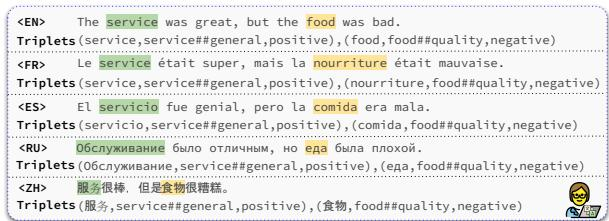
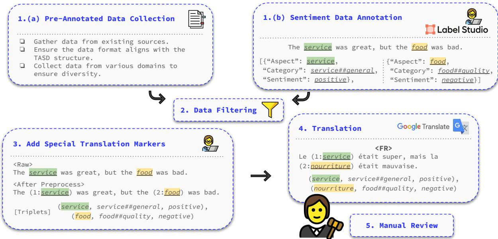
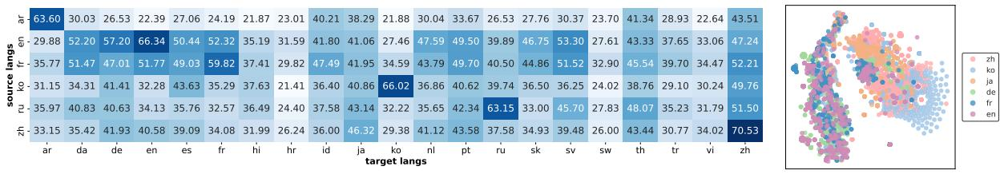
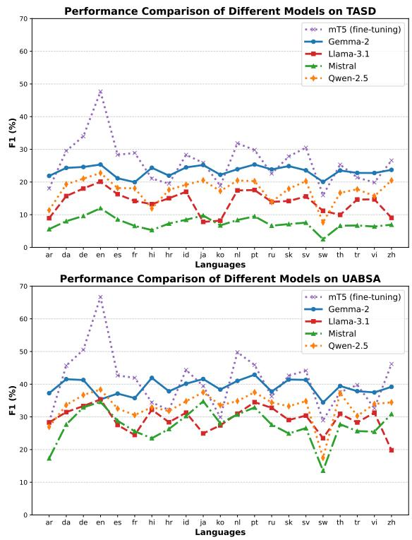
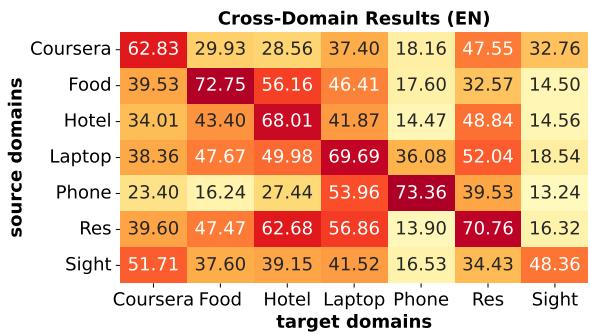
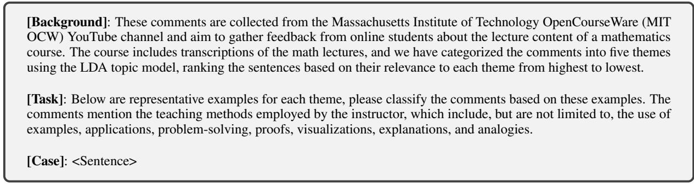
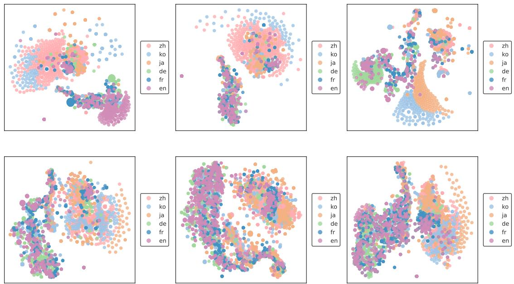
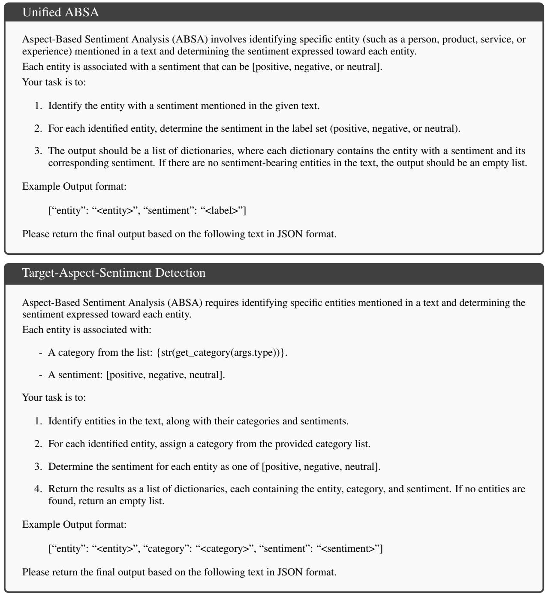
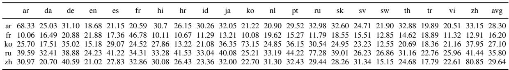
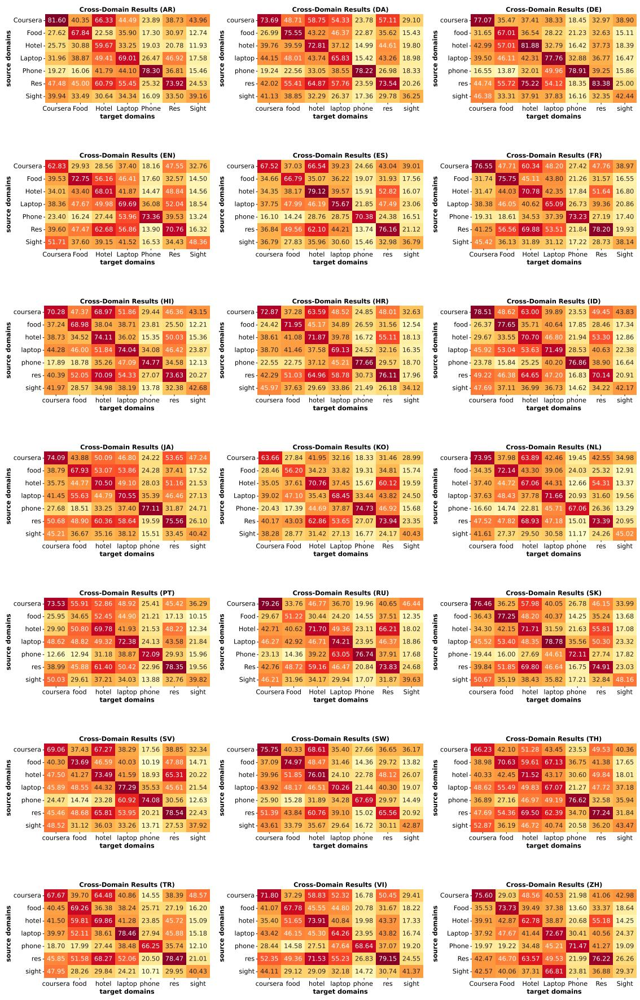

# M-ABSA: A Multilingual Dataset for Aspect-Based Sentiment Analysis

Chengyan Wu\*1,2, Bolei Ma\*3,4, Yihong Liu³,4, Zheyu Zhang⁵, Ningyuan Deng6, Yanshu Li7, Baolan Chen8, Yi Zhang3,9, Yun Xue†1,2, Barbara Plank3,4

1Guangdong Provincial Key Laboratory of Quantum Engineering and Quantum Materials

2School of Electronic Science and Engineering (School of Microelectronics), South China Normal University

3LMU Munich ⁴Munich Center for Machine Learning ⁵Technical University of Munich

6Renmin University of China 7Brown University 8ShanghaiTech University 9FAU Erlangen-Nuremberg

\*Equal contributions. Corresponding author.

{chengyan.wu, xueyun}@m.scnu.edu.cn, bolei.ma@lmu.de

## Abstract

Aspect-based sentiment analysis (ABSA) is a crucial task in information extraction and sentiment analysis, aiming to identify aspects with associated sentiment elements in text. However, existing ABSA datasets are predominantly English-centric, limiting the scope for multilingual evaluation and research. To bridge this gap, we present M-ABSA, a comprehensive dataset spanning 7 domains and 21 languages, making it the most extensive multilingual parallel dataset for ABSA to date. Our primary focus is on triplet extraction, which involves identifying aspect terms, aspect categories, and sentiment polarities. The dataset is constructed through an automatic translation process with human review to ensure quality. We perform extensive experiments using various baselines to assess performance and compatibility on M-ABSA. Our empirical findings highlight that the dataset enables diverse evaluation tasks, such as multilingual and multidomain transfer learning, and large language model evaluation, underscoring its inclusivity and its potential to drive advancements in multilingual ABSA research. 1

## 1 Introduction

Aspect-based sentiment analysis (ABSA) is a key task in fine-grained sentiment analysis, focusing on identifying opinions and sentiments associated with specific aspects. In recent years, this task has attracted considerable attention (Zhang and Liu, 2017; Peng et al., 2020). Since the complexity of sentiment variations across different aspects, several studies (Wan et al., 2020; Zhang et al., 2021b) have proposed using joint extraction of triplets from a sentence to tackle the challenges of finegrained sentiment analysis, which includes three elements: aspect term, aspect category, and sentiment polarity. Given a simple example sentence in Figure 1, “The service was great, but the food was bad.", the corresponding elements are (“service", “service##general", “positive") and (“food" “food##quality", “negative"), respectively.

  
Figure 1: Example parallel sentences from the multilingual ABSA dataset. The sentiment triplet includes three elements: aspect, category, and sentiment.

In general, most existing studies focus primarily on monolingual datasets. For example, the English datasets from the SemEval workshops (Pontiki et al., 2014, 2015, 2016), such as the Restaurant and Laptop datasets, have been extensively explored. However, this narrow focus overlooks the need for multilingual sentiment analysis in the real world. Recently, there have been efforts to extend ABSA datasets to multiple languages. For instance, the SemEval workshop actually provides multilingual versions, while the dataset for each language differs in content. Zhang et al. (2021a) construct a multilingual dataset by automatically translating the SemEval-2016 dataset (Pontiki et al., 2016), covering five languages for evaluation. However, there is no assessment of the translation quality and most importantly – the number of languages in this dataset is limited, preventing researchers from conducting a strictly controlled evaluation of the effectiveness of cross-lingual transfer. Moreover, this translated dataset only includes aspect terms and sentiment polarities, lacking the joint detection of aspect categories, which is crucial for ABSA, thereby limiting the scope of the evaluation. Therefore, a high-quality multilingual and parallel ABSA dataset is missing in the community.

To bridge this gap, this paper presents the M-ABSA dataset, which includes 21 languages and 7 distinct domains, making it the first comprehensive multilingual parallel ABSA dataset. Specifically, we use existing high-quality English datasets from multiple domains and construct a dataset (by manually annotating an English corpus) from another domain. These datasets are then automatically translated into 20 languages, followed by an efficient automatic data quality verification and manual inspection if necessary. To further investigate the quality of M-ABSA and unveil its possible usage in multilingual ABSA research, we conduct evaluations on M-ABSA under various settings, including zero-shot cross-lingual transfer, cross-domain transfer, and zero-shot prompting with large language models (LLMs). Our contributions are as follows:

• We present a high-quality multilingual parallel dataset for ABSA, covering 21 typologically diverse languages and 7 domains, ensuring its applicability in multilingual ABSA tasks for triplet extraction.

• We provide a feasible method of extending monolingual datasets to multiple languages with high quality by automatic translation, quality evaluation, and manual inspection.

• We investigate the robustness and applicability of M-ABSA by a comprehensive evaluation, including cross-lingual transfer, cross-domain transfer, and zero-shot prompting with LLMs. Our results highlight the potential of M-ABSA in future multilingual ABSA research.

## 2 Background and Related Work

## 2.1 UABSA and TASD Tasks

In the current work, we mainly cover two types of mainstream ABSA tasks, from UABSA to TASD.

Unified ABSA (UABSA) is a basic form of ABSA tasks. It extracts aspect terms and predicts their sentiment polarities (Li et al., 2019; Chen and Qian, 2020; Zhang et al., 2021b). It can also be formulated as an (aspect term, sentiment polarity) pair extraction problem (Zhang et al., 2021b). For the example “The service was great, but the food was bad.", it aims to extract two pairs: (service, positive) and (food, negative).

Target-Aspect-Sentiment Detection (TASD) is an extended task for UABSA with an additional aspect category, which belongs to a predefined category set. It aims to detect all (aspect term, aspect category, sentiment polarity) triplets for a given sentence (Wan et al., 2020; Zhang et al., 2021b). For the same example sentence in the previous paragraph, it should extract the triplets: (service, service##general, positive) and (food, food##quality, negative), where the “service##general" and “food##quality" correspond to the categories of the respective aspect terms.

## 2.2 Current Multilingual ABSA Datasets

Research in multilingual ABSA has been constrained by limited datasets, with most focusing on English. SemEval workshops introduced early datasets for restaurant and laptop reviews (Pontiki et al., 2014, 2015), later expanding to Chinese, Turkish, and Spanish (Pontiki et al., 2016). Other efforts, like GermEval-2017 for German (Wojatzki et al., 2017), ABSITA-2020 for Italian (De Mattei et al., 2020), SemEval-2023 for African languages (Muhammad et al., 2023), and Polish-ASTE (Lango et al., 2024), added linguistic diversity but often focused on sentence-level analysis. Recent datasets like ROAST extended coverage to two other low-resource languages, Hindi and Telugu, and incorporated review-level ABSA analysis across multiple domains (Chebolu et al., 2024b). Despite these advances, existing datasets lack broad domain coverage, linguistic variety, and parallelism essential for robust multilingual evaluation. Also, current datasets limit in standardization and diversity to make it possible for broader model robustness checks (Chebolu et al., 2023). There is a new multi-domain dataset (Cai et al., 2025), but the language is English. Therefore, broadening the variety of ABSA datasets is crucial for advancing both research and applications.

## 2.3 Methods for Multilingual ABSA

Early multilingual ABSA methods rely on supervised learning with annotated data, using translation systems and alignment algorithms for crosslingual label projection (Lin et al., 2014; Klinger and Cimiano, 2015; Lambert, 2015; Barnes et al., 2016). However, these methods struggle with scalability and translation quality (Zhou et al., 2015). Subsequent works leverage cross-lingual word embeddings trained on parallel corpora to align representations across languages, enabling languageagnostic ABSA (Barnes et al., 2016; Wang and Pan, 2018). Multilingual pre-trained language models further improved performance through fine-tuning and data augmentation (Xu et al., 2019; Phan et al. 2021). More recently, large language models have been explored for improving training data (Mai et al., 2024) and evaluating zero-shot multilingual ABSA (Wu et al., 2025). Although these models offer scalability, they still fall short of fine-tuned models in low-resource scenarios. In this work, we evaluate basic baselines on our curated multilingual dataset, establishing a new benchmark to support future ABSA research.

  
Figure 2: The construction process of the M-ABSA dataset.

## 3 Dataset Construction Process

This section outlines the process for constructing the M-ABSA dataset. Given the abundance of existing ABSA datasets in English and the scarcity in other languages, our primary goal is to collect English datasets from various domains and translate them into target languages to create a high-quality multilingual parallel ABSA dataset. Figure 2 illustrates the overall process.

The process begins with the collection of existing English datasets, which can follow two approaches: a) using pre-annotated datasets for ABSA triplet extraction tasks, or b) sourcing sentiment datasets that lack triplet-specific annotations and manually annotating them to fit the triplet format. For pre-annotated datasets, we evaluate label completeness and extract subsets suitable for our purposes. To enhance domain diversity, we may need to create new datasets by identifying suitable data sources for sentiment analysis and recruiting annotators to label them according to a predefined triplet schema, as in the second case. All collected datasets are balanced in size. Details of this data collection phase are provided in §4.

Once the datasets are ready, we automatically translate them into target languages, focusing on both sentence-level translations and entity-level translations. This approach aligns with previous relation extraction studies, such as those by Bassignana and Plank (2022) and Bassignana et al. (2023), and text generation tasks, such as Chen et al. (2022). Following machine translation, human reviewers check for errors and omissions. The quality of the translated datasets is then assessed. Further details on the translation and evaluation are outlined in §5.

## 4 Datasets

## 4.1 Collecting Existing Datasets

We first collect six existing annotated English ABSA datasets from multiple domains. Each dataset is introduced in the following.

Hotel. This dataset is based on TripAdvisor review data from Yin et al. (2017), featuring over 100K hotel reviews. Chebolu et al. (2024a) extended the dataset for the opinion aspect target sentiment (OATS) ² quadruple extraction task by annotating a subset of sentences. We select 2,147 annotated sentences from this subset.

Food. This dataset includes approximately 500K Amazon fine food reviews curated from a Kaggle competition. Chebolu et al. (2024a) leveraged this dataset for the OATS task. We select 2,136 annotated sentences from this collection.

Coursera. This dataset contains around 100K reviews from Coursera, focusing on course quality, content, comprehensiveness, etc, sourced from a Kaggle competition. Chebolu et al. (2024a) also employed this dataset for the OATS task, from which we select 2,156 annotated sentences.

Phone. This dataset, created by Zhou et al. (2023), focuses on the OATS task. It includes reviews from various e-commerce platforms, collected in mid-2021, covering 12 cellphone brands. We select a subset of 2,109 sentences.

Laptop. This dataset features reviews from the Amazon platform between 2017 and 2018, covering ten types of laptops across six brands (Cai et al. 2021). We select 2,122 sentences out of 4,076 review sentences.

Restaurant. This dataset contains customer reviews for restaurants. It is one of the domain datasets from the SemEval 2016 (Pontiki et al., 2016) and is constructed for TASD tasks with the aspect-based sentiment triplets. Although the dataset provides reviews for 5 languages including English, reviews are not parallel. We select 2,124 reviews from English to create our parallel dataset.

## 4.2 Constructing a New Dataset

In addition to the six existing annotated datasets discussed in §4.1, we develop a new dataset from a different domain to enhance the dataset's diversity.

Sight. The Sight dataset, introduced by Wang et al. (2023), consists of 15,784 comments on online math lectures from the Massachusetts Institute of Technology OpenCourseWare (MIT OCW) YouTube channel. These comments pertain to specific math lectures. While the original dataset provides sentence-level sentiment annotations, we extend it by annotating sentiment triplets. We select 1,986 sentences for this purpose.

Six annotators are invited for data annotation using Label Studio.3 Following the annotation guidelines from the SemEval 2016 Task 5 (Pontiki et al.,

2016), we provide a comprehensive guide document to introduce them to the topics, dataset, tool, and specific annotation requirements. We divide all the data into six subsets, with three annotators involved in each subset. Two annotators independently annotate a subset and another annotator resolves disagreements between the two annotators. Additional annotation details can be found in §A.

Following Kim and Klinger (2018); Mayhew et al. (2024), we report the inter-annotator agreement with F1 score for the annotated aspect terms and sentiment triplets. For F1, we use the results of the first annotator as the predictions and the results of the second annotator as the reference. The F1 score for aspect terms and sentiment triplets are 82.57% and 80.70%, respectively, reflecting a high level of agreement between two annotators (Kim and Klinger, 2018; Zhou et al., 2023).

## 4.3 Dataset Statistics and Characteristics

By grouping the sentences from each domain, we present our newly collected multi-domain English dataset for ASBA. Table 1 shows the key statistics across the seven domains. We ensure that each domain contained approximately 2,000 sentences to exclude the confounding factor of data size for cross-domain transfer (§6.4). The aspect counts vary across domains, with the Phone domain having the highest number. Notably, all datasets except the Phone domain include many implicit aspects – sentiment entities that are not explicitly mentioned in the sentence. Such implicit aspects are very frequent because many sentences contain indefinite pronouns like “it", which are marked as “NULL” and labeled with their corresponding categories and sentiments (Chebolu et al., 2023). The outlier – the Phone dataset – simply did not annotate such implicit aspects. §H presents the detailed aspect categories in each domain.

<table><tr><td>一</td><td></td><td colspan="2">Sentences</td><td colspan="2">一</td><td colspan="2">Aspects</td><td colspan="2">|Cat.</td></tr><tr><td>Dataset</td><td>Train</td><td>Dev</td><td>Test</td><td>All |</td><td>Train</td><td>Dev</td><td>Test</td><td></td><td>All | All</td></tr><tr><td>Cours.</td><td>1278</td><td>312</td><td>566</td><td>2156</td><td>1198 (423)</td><td>372 (113)</td><td>744 (263)</td><td>2314 (799)</td><td>30</td></tr><tr><td>Food</td><td>1278</td><td>336</td><td>522</td><td>2136</td><td>1075 (698)</td><td>338 (209)</td><td>742 (414)</td><td>2155 (1321)</td><td>13</td></tr><tr><td>Hotel</td><td>1255</td><td>308</td><td>584</td><td>2147</td><td>1631 (381)</td><td>354 (74)</td><td>975 (261)</td><td>2960 (716)</td><td>37</td></tr><tr><td>Laptop</td><td>1264</td><td>326</td><td>532</td><td>2122</td><td>1758 (392)</td><td>440 (88)</td><td>757 (147)</td><td>2955 (627)</td><td>114</td></tr><tr><td>Phone</td><td>1279</td><td>307</td><td>523</td><td>2109</td><td>2883 (0)</td><td>710 (0)</td><td>1217 (0)</td><td>4810 (0)</td><td>88</td></tr><tr><td>Res.</td><td>1264</td><td>316</td><td>544</td><td>2124</td><td>1989 (446)</td><td>507 (104)</td><td>799 (179)</td><td>3295 (729)</td><td>12</td></tr><tr><td>Sight</td><td>1181</td><td>281</td><td>524</td><td>1986</td><td>1378 (203)</td><td>346 (46)</td><td>836 (130)</td><td>2560 (379)</td><td>5</td></tr></table>

Table 1: Statistics of the English ABSA dataset before translation. In the aspects column, X (Y) represents the total number of aspects X, with Y denoting the number of implicit aspects.

## 5 Annotation Projection and Evaluation

## 5.1 Projection with Translation

We propose an effective yet straightforward method to project span-based annotations, specifically for aspect entities in ABSA tasks, to extensive languages. We use the Google Translate $\mathrm { \ A P I ^ { 4 } }$ to translate the English data to multiple languages while preserving the label classes including aspect categories and their associated sentiments in English.

Selecting Languages. We include 20 typologically diverse languages: Arabic (ar), Chinese (zh), Croatian (hr), Danish (da), Dutch (nl), French (fr), German (de), Hindi (hi), Indonesian (id), Japanese (ja), Korean (ko), Portuguese (pt), Russian (ru), Slovak (sk), Spanish (es), Swahili (sw), Swedish (sv), Thai (th), Turkish (tr), Vietnamese (vi). These languages are selected to ensure good coverage of languages from different language families, including Indo-European, Sino-Tibetan, Afro-Asiatic, and Austroasiatic, among others.

Preserved Translation. Similar to Zhang et al. (2021a), we add special aspect markers to surround the tokens (aspects) in a sentence before translation. Through extensive validation, we select “()" and ensure these markers are preserved after translation while tokens inside the markers can be correctly translated into the target language. In addition, within each surrounding marker, we add a number to denote its sequential order of appearance in the sentence, as shown in Figure 2. This setup allows us to easily project the labels to the target-language aspects after translation, without losing track of the correct order of aspects in the target language (the order of sentence components can vary in the target language compared with English).

Manual Review and Revision. After annotation projection to the 20 languages, the resulting multilingual dataset undergoes manual review to identify two primary error types: (1) non-translations: the original English aspect terms remain untranslated, and (2) omissions: aspect terms are missing in the translated text. Table 2 presents the error statistics across languages, showing that these errors constitute only a small fraction of the dataset, ensuring overall translation quality. For each identified error, the annotators then manually check and update the respective data based on Google Translate. Details of the proofreading process are provided in §C.

<table><tr><td>Dataset</td><td>non-translations (%)</td><td>omission (%)</td><td>ALL</td></tr><tr><td>Coursera</td><td>6234 (13.47%)</td><td>393 (0.85%)</td><td>46280</td></tr><tr><td>Food</td><td>7646 (17.75%)</td><td>369 (0.86%)</td><td>43100</td></tr><tr><td>Hotel</td><td>5600 (9.46%)</td><td>456 (0.77%)</td><td>59200</td></tr><tr><td>Laptop</td><td>9714 (16.44%)</td><td>375 (0.63%)</td><td>59100</td></tr><tr><td>Phone</td><td>5899 (6.13%)</td><td>437 (0.45%)</td><td>96200</td></tr><tr><td>Restaurant</td><td>8152 (12.37%)</td><td>283 (0.43%)</td><td>65900</td></tr><tr><td>Sight</td><td>9800 (19.14%)</td><td>398 (0.78%)</td><td>51200</td></tr></table>

Table 2: Statistics of non-translations and omissions in each dataset after translating English to all target languages. We report the sum over all target languages and also the percentage over the count of all aspects (ALL).

## 5.2 Automatic Evaluation of Translation Quality

We evaluate the translation quality for all 20 languages. Specifically, we randomly sample 100, 20, and 30 data items from the train, validation, and test set from each data domain for each language. We then concatenate the sampled items from all domains. This results in 1,050 items for each language $( 1 5 0 \times 7 = 1 , 0 5 0 )$ . Finally, we evaluate the translation quality for each language individually using the sampled items as a proxy from two perspectives: consistency and faithfulness, as discussed below.5

Consistency. Since we insert special aspect markers into the English data, this might influence the translation. Therefore, we want to ensure the translation is consistent with or without the special aspect markers. To do this, we translate the same 1,050 items from the English data to all target languages, without using the special aspect markers. Based on the new translations (translationw/o marker) and the sampled data $\left( \mathrm { t r a n s l a t i o n } _ { \mathrm { w / m a r k e r } } \right)$ for each language, we consider two metrics. 1) Aspect accuracy (Acc) measures the percentage of all aspects in the 1,050 items also presenting in translationw/o marker. 2) chrF++ (Popović, 2017) measures the characterbased translation quality using translationw/o marker as references and translationw/ marker as hypotheses.

Faithfulness. We also want to ensure our translations convey the same meanings as the source data in English. To do this, we back-translate the 1,050 items from each language to English. Then, we compare the back-translations with the original English data. Similar back-translation-based approaches have also been used to evaluate the translation quality or filter unreliable translations (Sobrevilla Cabezudo et al., 2019; Sekizawa et al., 2023). Our evaluation includes three metrics. 1) BERTScore (Zhang et al., 2020) measures how semantically similar the back-translations and the original English data are in the representation space. 2) SBERT (Reimers and Gurevych, 2019) also measures the semantic similarity as BERTScore. 3) BLEU (Papineni et al., 2002) measures the n-gram translation quality using the original English data as references and back-translations as hypotheses.

The results are shown in Table 3. We see that both Acc and chrF++ are high across languages, indicating good consistency. However, Acc is not perfect, suggesting adding special aspect markers will influence the translation of aspects to some degree. Similarly, high BERTScore, SBERT, and BLEU show that our datasets of languages other than English are faithful in keeping the same meanings as the original English. In summary, good consistency and faithfulness demonstrate the effectiveness of our method and guarantee the quality of our multilingual parallel dataset M-ABSA. We show additional details of translation quality evaluation in single domains and cross-domains in §F.

<table><tr><td>Lang.</td><td>Acc</td><td>chrF++</td><td>BERTScore</td><td>SBERT</td><td>BLEU</td></tr><tr><td>ar</td><td>68.44</td><td>86.58</td><td>95.66</td><td>90.81</td><td>53.97</td></tr><tr><td>da</td><td>77.82</td><td>93.69</td><td>96.88</td><td>95.30</td><td>68.51</td></tr><tr><td>de</td><td>81.77</td><td>91.16</td><td>95.93</td><td>92.27</td><td>54.30</td></tr><tr><td>es</td><td>76.92</td><td>92.51</td><td>96.04</td><td>92.39</td><td>58.26</td></tr><tr><td>fr</td><td>74.50</td><td>92.63</td><td>96.22</td><td>92.66</td><td>59.39</td></tr><tr><td>hi</td><td>79.50</td><td>89.36</td><td>95.89</td><td>92.40</td><td>56.00</td></tr><tr><td>hr</td><td>66.37</td><td>89.98</td><td>96.15</td><td>93.29</td><td>59.95</td></tr><tr><td>id</td><td>67.87</td><td>90.09</td><td>95.72</td><td>90.96</td><td>52.43</td></tr><tr><td>ja</td><td>80.25</td><td>78.59</td><td>94.52</td><td>88.89</td><td>39.16</td></tr><tr><td>ko</td><td>76.37</td><td>80.97</td><td>94.21</td><td>86.85</td><td>37.57</td></tr><tr><td>nl</td><td>75.40</td><td>91.21</td><td>96.05</td><td>92.53</td><td>57.90</td></tr><tr><td>pt</td><td>78.44</td><td>93.20</td><td>96.26</td><td>92.91</td><td>60.37</td></tr><tr><td>ru</td><td>66.19</td><td>89.73</td><td>95.39</td><td>90.39</td><td>50.09</td></tr><tr><td>sk</td><td>62.31</td><td>89.54</td><td>96.14</td><td>93.54</td><td>58.76</td></tr><tr><td>SV</td><td>78.96</td><td>92.93</td><td>96.83</td><td>94.66</td><td>67.04</td></tr><tr><td>SW</td><td>60.34</td><td>88.28</td><td>95.79</td><td>90.91</td><td>58.18</td></tr><tr><td>th</td><td>74.48</td><td>81.57</td><td>94.39</td><td>87.01</td><td>39.00</td></tr><tr><td>tr</td><td>68.04</td><td>89.21</td><td>95.23</td><td>89.97</td><td>48.53</td></tr><tr><td>vi</td><td>70.72</td><td>91.08</td><td>95.43</td><td>89.79</td><td>50.22</td></tr><tr><td>zh</td><td>81.24</td><td>77.20</td><td>94.91</td><td>89.16</td><td>43.96</td></tr><tr><td>Avg.</td><td>73.47</td><td>88.94</td><td>95.70</td><td>91.41</td><td>53.84</td></tr></table>

Table 3: Translation quality evaluation using different automatic metrics.

## 5.3 Human Evaluation of Translation Quality

In addition to the automatic evaluation, we randomly sampled 70 sentences in total (10 sentences per domain) for each of eight representative target languages (ar, de, es, hi, ja, ru, th, zh), covering four language families and seven scripts. For each language, we recruited three native speakers (with high proficiency in English) via Prolific6 and compensated them at an hourly rate of £9.

Each annotator received the English source sentences (with the special aspect markers removed) and the translations. They rated the system output on four task-agnostic dimensions widely used in MT evaluation: Grammar, Fluency, Adequacy, and Code-Switching, using a 5-scale rating from 1 (poor) to 5 (excellent), based on previous MT evaluation works (Chen et al., 2022). Additionally, given that aspect terms were also translated, we introduced a fifth evaluation dimension: Aspect Term Translation, also rated on a 5-point scale. Further details and examples of the human evaluation process are provided in §G.

We report the results of the human evaluation as average ratings for each language and average across all languages in Table 4. Overall, we observe strong human evaluation performance across all five dimensions, with particularly high ratings in Aspect Term Translation and Code-Switching. These results confirm that our translations are not only grammatically and semantically sound but also preserve critical task-specific information of the aspect terms, thereby supporting that M-ABSA is a high-quality benchmark for multilingual ABSA.

<table><tr><td>Lang.</td><td>Gram.</td><td>Flu. Adeq.</td><td></td><td>C.-Switch. Asp. Term</td></tr><tr><td>ar</td><td>4.04</td><td>3.98</td><td>4.33</td><td>4.72 4.63</td></tr><tr><td>de</td><td>4.30</td><td>4.22</td><td>4.68 4.98</td><td>4.82</td></tr><tr><td>es</td><td>4.03</td><td>3.66</td><td>4.36 4.63</td><td>4.77</td></tr><tr><td>hi</td><td>3.31</td><td>2.84</td><td>3.16 3.12</td><td>2.97</td></tr><tr><td>ja</td><td>3.09</td><td>2.93</td><td>4.01 3.77</td><td>3.76</td></tr><tr><td>ru</td><td>3.77</td><td>3.59</td><td>4.35 4.73</td><td>4.64</td></tr><tr><td>th</td><td>3.35</td><td>2.81</td><td>3.30 4.56</td><td>4.07</td></tr><tr><td>zh</td><td>4.09</td><td>3.85</td><td>4.23 4.58</td><td>4.47</td></tr><tr><td>Avg.</td><td>3.75</td><td>3.61</td><td>4.05</td><td>4.39 4.27</td></tr></table>

Table 4: Human evaluation scores (1–5, 1 is worst and 5 is best) averaged over eight languages.

## 6 Experiments and Results

## 6.1 Experimental Setups

Task Setups. As the main goal of the work is to provide a multilingual dataset with aspect triplets (aspect term, category, sentiment), we conduct the main experiments on the TASD task (triplet extraction). Also, our triplets contain subsets of sentiment pairs (aspect term, sentiment). Therefore, we also experiment on the UABSA (pairwise extraction) task and compare the results with TASD.

(a) TASD Results
<table><tr><td rowspan=1 colspan=9>Lang.CourseraFood HotelLaptopPhone Res. Sight Avg.</td></tr><tr><td rowspan=1 colspan=1>ar</td><td rowspan=1 colspan=1>11.95</td><td rowspan=1 colspan=1>17.21</td><td rowspan=1 colspan=1>18.08</td><td rowspan=1 colspan=1>18.73</td><td rowspan=1 colspan=1>16.97</td><td rowspan=1 colspan=1>29.88</td><td rowspan=1 colspan=1>13.39</td><td rowspan=1 colspan=1>18.03</td></tr><tr><td rowspan=1 colspan=1>da</td><td rowspan=1 colspan=1>23.18</td><td rowspan=1 colspan=1>27.81</td><td rowspan=1 colspan=1>18.41</td><td rowspan=1 colspan=1>30.84</td><td rowspan=1 colspan=1>21.27</td><td rowspan=1 colspan=1>52.20</td><td rowspan=1 colspan=1>29.93</td><td rowspan=1 colspan=1>29.52</td></tr><tr><td rowspan=1 colspan=1>de</td><td rowspan=1 colspan=1>28.74</td><td rowspan=1 colspan=1>34.33</td><td rowspan=1 colspan=1>32.03</td><td rowspan=1 colspan=1>27.77</td><td rowspan=1 colspan=1>27.31</td><td rowspan=1 colspan=1>57.20</td><td rowspan=1 colspan=1>28.52</td><td rowspan=1 colspan=1>33.99</td></tr><tr><td rowspan=1 colspan=1>es</td><td rowspan=1 colspan=1>23.71</td><td rowspan=1 colspan=1>23.83</td><td rowspan=1 colspan=1>36.77</td><td rowspan=1 colspan=1>22.46</td><td rowspan=1 colspan=1>20.55</td><td rowspan=1 colspan=1>50.44</td><td rowspan=1 colspan=1>23.56</td><td rowspan=1 colspan=1>28.33</td></tr><tr><td rowspan=1 colspan=1>fr</td><td rowspan=1 colspan=1>29.82</td><td rowspan=1 colspan=1>26.83</td><td rowspan=1 colspan=1>19.49</td><td rowspan=1 colspan=1>24.91</td><td rowspan=1 colspan=1>24.37</td><td rowspan=1 colspan=1>52.32</td><td rowspan=1 colspan=1>23.50</td><td rowspan=1 colspan=1>28.89</td></tr><tr><td rowspan=1 colspan=1>hi</td><td rowspan=1 colspan=1>13.42</td><td rowspan=1 colspan=1>22.36</td><td rowspan=1 colspan=1>22.19</td><td rowspan=1 colspan=1>23.41</td><td rowspan=1 colspan=1>21.48</td><td rowspan=1 colspan=1>35.19</td><td rowspan=1 colspan=1>10.38</td><td rowspan=1 colspan=1>21.06</td></tr><tr><td rowspan=1 colspan=1>hr</td><td rowspan=1 colspan=1>11.26</td><td rowspan=1 colspan=1>11.39</td><td rowspan=1 colspan=1>31.99</td><td rowspan=1 colspan=1>17.48</td><td rowspan=1 colspan=1>16.00</td><td rowspan=1 colspan=1>31.59</td><td rowspan=1 colspan=1>15.74</td><td rowspan=1 colspan=1>19.49</td></tr><tr><td rowspan=1 colspan=1>id</td><td rowspan=1 colspan=1>24.85</td><td rowspan=1 colspan=1>22.92</td><td rowspan=1 colspan=1>31.01</td><td rowspan=1 colspan=1>30.27</td><td rowspan=1 colspan=1>21.65</td><td rowspan=1 colspan=1>41.80</td><td rowspan=1 colspan=1>26.84</td><td rowspan=1 colspan=1>28.33</td></tr><tr><td rowspan=1 colspan=1>ja</td><td rowspan=1 colspan=1>16.58</td><td rowspan=1 colspan=1>26.26</td><td rowspan=1 colspan=1>25.30</td><td rowspan=1 colspan=1>22.22</td><td rowspan=1 colspan=1>26.72</td><td rowspan=1 colspan=1>41.06</td><td rowspan=1 colspan=1>20.87</td><td rowspan=1 colspan=1>25.86</td></tr><tr><td rowspan=1 colspan=1>ko</td><td rowspan=1 colspan=1>11.11</td><td rowspan=1 colspan=1>22.96</td><td rowspan=1 colspan=1>13.36</td><td rowspan=1 colspan=1>18.01</td><td rowspan=1 colspan=1>16.25</td><td rowspan=1 colspan=1>27.46</td><td rowspan=1 colspan=1>17.89</td><td rowspan=1 colspan=1>18.86</td></tr><tr><td rowspan=1 colspan=1>nl</td><td rowspan=1 colspan=1>27.86</td><td rowspan=1 colspan=1>25.27</td><td rowspan=1 colspan=1>26.30</td><td rowspan=1 colspan=1>33.54</td><td rowspan=1 colspan=1>30.20</td><td rowspan=1 colspan=1>47.59</td><td rowspan=1 colspan=1>27.20</td><td rowspan=1 colspan=1>31.85</td></tr><tr><td rowspan=2 colspan=1>ptru</td><td rowspan=1 colspan=1>30.57</td><td rowspan=1 colspan=1>22.83</td><td rowspan=1 colspan=1>30.51</td><td rowspan=1 colspan=1>26.63</td><td rowspan=1 colspan=1>22.69</td><td rowspan=1 colspan=1>49.50</td><td rowspan=1 colspan=1>26.78</td><td rowspan=1 colspan=1>29.79</td></tr><tr><td rowspan=1 colspan=1>19.38</td><td rowspan=1 colspan=1>23.36</td><td rowspan=1 colspan=1>20.57</td><td rowspan=1 colspan=1>18.37</td><td rowspan=1 colspan=1>20.06</td><td rowspan=1 colspan=1>39.89</td><td rowspan=1 colspan=1>16.44</td><td rowspan=1 colspan=1>22.58</td></tr><tr><td rowspan=4 colspan=1>skSVSWth</td><td rowspan=1 colspan=1>21.74</td><td rowspan=1 colspan=1>21.17</td><td rowspan=1 colspan=1>23.49</td><td rowspan=1 colspan=1>30.65</td><td rowspan=1 colspan=1>25.54</td><td rowspan=1 colspan=1>46.75</td><td rowspan=1 colspan=1>20.51</td><td rowspan=1 colspan=1>27.84</td></tr><tr><td rowspan=1 colspan=1>27.56</td><td rowspan=1 colspan=1>27.87</td><td rowspan=1 colspan=1>22.12</td><td rowspan=1 colspan=1>27.76</td><td rowspan=1 colspan=1>24.48</td><td rowspan=1 colspan=1>53.30</td><td rowspan=1 colspan=1>27.51</td><td rowspan=1 colspan=1>30.51</td></tr><tr><td rowspan=1 colspan=1>10.07</td><td rowspan=1 colspan=1>11.06</td><td rowspan=1 colspan=1>10.35</td><td rowspan=1 colspan=1>16.65</td><td rowspan=1 colspan=1>13.66</td><td rowspan=1 colspan=1>27.61</td><td rowspan=1 colspan=1>17.34</td><td rowspan=1 colspan=1>15.96</td></tr><tr><td rowspan=1 colspan=1>17.71</td><td rowspan=1 colspan=1>25.35</td><td rowspan=1 colspan=1>20.90</td><td rowspan=1 colspan=1>22.56</td><td rowspan=1 colspan=1>23.39</td><td rowspan=1 colspan=1>43.33</td><td rowspan=1 colspan=1>23.02</td><td rowspan=1 colspan=1>25.32</td></tr><tr><td rowspan=3 colspan=1>trvizh</td><td rowspan=1 colspan=1>17.62</td><td rowspan=1 colspan=1>16.77</td><td rowspan=1 colspan=1>17.71</td><td rowspan=1 colspan=1>20.88</td><td rowspan=1 colspan=1>18.55</td><td rowspan=1 colspan=1>37.65</td><td rowspan=1 colspan=1>19.39</td><td rowspan=1 colspan=1>21.37</td></tr><tr><td rowspan=1 colspan=1>10.19</td><td rowspan=1 colspan=1>19.83</td><td rowspan=1 colspan=1>15.69</td><td rowspan=1 colspan=1>19.59</td><td rowspan=1 colspan=1>15.86</td><td rowspan=1 colspan=1>33.06</td><td rowspan=1 colspan=1>24.84</td><td rowspan=1 colspan=1>19.87</td></tr><tr><td rowspan=1 colspan=1>18.17</td><td rowspan=1 colspan=1>24.98</td><td rowspan=1 colspan=2>24.45 22.55</td><td rowspan=1 colspan=1>26.57</td><td rowspan=1 colspan=1>47.24</td><td rowspan=1 colspan=1>24.18</td><td rowspan=1 colspan=1>26.59</td></tr><tr><td rowspan=1 colspan=1>en</td><td rowspan=1 colspan=6>48.36  48.8740.69 43.54 47.2466.34</td><td rowspan=1 colspan=1>36.72</td><td rowspan=1 colspan=1>47.68</td></tr></table>

(b) UABSA Results
<table><tr><td rowspan=1 colspan=9>Lang.CourseraFood HotelLaptopPhone Res. SightAvg.</td></tr><tr><td rowspan=1 colspan=1>ar</td><td rowspan=1 colspan=1>26.22</td><td rowspan=1 colspan=1>24.64</td><td rowspan=1 colspan=1>27.50</td><td rowspan=1 colspan=1>38.54</td><td rowspan=1 colspan=1>27.14</td><td rowspan=1 colspan=1>34.84</td><td rowspan=1 colspan=1>18.97</td><td rowspan=1 colspan=1>28.41</td></tr><tr><td rowspan=1 colspan=1>da</td><td rowspan=1 colspan=1>41.73</td><td rowspan=1 colspan=1>50.88</td><td rowspan=1 colspan=1>43.92</td><td rowspan=1 colspan=1>62.42</td><td rowspan=1 colspan=1>29.67</td><td rowspan=1 colspan=1>60.90</td><td rowspan=1 colspan=1>30.25</td><td rowspan=1 colspan=1>45.68</td></tr><tr><td rowspan=1 colspan=1>de</td><td rowspan=1 colspan=1>52.67</td><td rowspan=1 colspan=1>61.12</td><td rowspan=1 colspan=1>45.54</td><td rowspan=1 colspan=1>54.50</td><td rowspan=1 colspan=1>42.83</td><td rowspan=1 colspan=1>67.63</td><td rowspan=1 colspan=1>32.52</td><td rowspan=1 colspan=1>50.55</td></tr><tr><td rowspan=1 colspan=1>es</td><td rowspan=1 colspan=1>48.96</td><td rowspan=1 colspan=1>43.65</td><td rowspan=1 colspan=1>41.03</td><td rowspan=1 colspan=1>44.89</td><td rowspan=1 colspan=1>28.47</td><td rowspan=1 colspan=1>57.74</td><td rowspan=1 colspan=1>29.02</td><td rowspan=1 colspan=1>42.68</td></tr><tr><td rowspan=1 colspan=1>fr</td><td rowspan=1 colspan=1>48.92</td><td rowspan=1 colspan=1>41.43</td><td rowspan=1 colspan=1>34.08</td><td rowspan=1 colspan=1>48.65</td><td rowspan=1 colspan=1>33.98</td><td rowspan=1 colspan=1>54.59</td><td rowspan=1 colspan=1>26.96</td><td rowspan=1 colspan=1>41.94</td></tr><tr><td rowspan=1 colspan=1>hi</td><td rowspan=1 colspan=1>31.21</td><td rowspan=1 colspan=1>37.29</td><td rowspan=1 colspan=1>32.45</td><td rowspan=1 colspan=1>42.50</td><td rowspan=1 colspan=1>35.91</td><td rowspan=1 colspan=1>40.68</td><td rowspan=1 colspan=1>18.91</td><td rowspan=1 colspan=1>34.42</td></tr><tr><td rowspan=1 colspan=1>hr</td><td rowspan=1 colspan=1>29.15</td><td rowspan=1 colspan=1>19.46</td><td rowspan=1 colspan=1>35.25</td><td rowspan=1 colspan=1>39.18</td><td rowspan=1 colspan=1>24.08</td><td rowspan=1 colspan=1>53.31</td><td rowspan=1 colspan=1>24.50</td><td rowspan=1 colspan=1>32.13</td></tr><tr><td rowspan=1 colspan=1>id</td><td rowspan=1 colspan=1>46.39</td><td rowspan=1 colspan=1>47.91</td><td rowspan=1 colspan=1>39.51</td><td rowspan=1 colspan=1>60.73</td><td rowspan=1 colspan=1>32.85</td><td rowspan=1 colspan=1>50.07</td><td rowspan=1 colspan=1>31.10</td><td rowspan=1 colspan=1>44.37</td></tr><tr><td rowspan=1 colspan=1>ja</td><td rowspan=1 colspan=1>31.56</td><td rowspan=1 colspan=1>47.14</td><td rowspan=1 colspan=1>35.93</td><td rowspan=1 colspan=1>44.93</td><td rowspan=1 colspan=1>39.40</td><td rowspan=1 colspan=1>48.25</td><td rowspan=1 colspan=1>26.96</td><td rowspan=1 colspan=1>39.45</td></tr><tr><td rowspan=6 colspan=1>i0nlptruskSV</td><td rowspan=1 colspan=1>25.62</td><td rowspan=1 colspan=1>31.00</td><td rowspan=1 colspan=1>31.89</td><td rowspan=1 colspan=1>41.60</td><td rowspan=1 colspan=1>22.29</td><td rowspan=1 colspan=1>32.37</td><td rowspan=1 colspan=1>24.50</td><td rowspan=1 colspan=1>29.89</td></tr><tr><td rowspan=1 colspan=1>53.03</td><td rowspan=1 colspan=1>52.03</td><td rowspan=1 colspan=1>49.35</td><td rowspan=1 colspan=1>64.71</td><td rowspan=1 colspan=1>38.57</td><td rowspan=1 colspan=1>55.57</td><td rowspan=1 colspan=1>32.07</td><td rowspan=1 colspan=1>49.76</td></tr><tr><td rowspan=1 colspan=1>50.34</td><td rowspan=1 colspan=1>35.35</td><td rowspan=1 colspan=1>48.51</td><td rowspan=1 colspan=1>61.12</td><td rowspan=1 colspan=1>30.74</td><td rowspan=1 colspan=1>63.40</td><td rowspan=1 colspan=1>29.75</td><td rowspan=1 colspan=1>45.89</td></tr><tr><td rowspan=1 colspan=1>34.67</td><td rowspan=1 colspan=1>43.45</td><td rowspan=1 colspan=1>38.47</td><td rowspan=1 colspan=1>42.69</td><td rowspan=1 colspan=1>25.71</td><td rowspan=1 colspan=1>47.58</td><td rowspan=1 colspan=1>19.19</td><td rowspan=1 colspan=1>36.25</td></tr><tr><td rowspan=1 colspan=1>42.27</td><td rowspan=1 colspan=1>35.95</td><td rowspan=1 colspan=1>39.48</td><td rowspan=1 colspan=1>56.45</td><td rowspan=1 colspan=1>34.80</td><td rowspan=1 colspan=1>61.90</td><td rowspan=1 colspan=1>27.49</td><td rowspan=1 colspan=1>42.62</td></tr><tr><td rowspan=1 colspan=1>47.23</td><td rowspan=1 colspan=1>42.58</td><td rowspan=1 colspan=1>36.09</td><td rowspan=1 colspan=1>55.02</td><td rowspan=1 colspan=1>37.90</td><td rowspan=1 colspan=1>61.44</td><td rowspan=1 colspan=1>29.71</td><td rowspan=1 colspan=1>44.14</td></tr><tr><td rowspan=1 colspan=1>SW</td><td rowspan=1 colspan=1>25.61</td><td rowspan=1 colspan=1>19.83</td><td rowspan=1 colspan=1>22.79</td><td rowspan=1 colspan=1>34.34</td><td rowspan=1 colspan=1>24.90</td><td rowspan=1 colspan=1>46.10</td><td rowspan=1 colspan=1>25.95</td><td rowspan=1 colspan=1>28.93</td></tr><tr><td rowspan=1 colspan=1>th</td><td rowspan=1 colspan=1>35.11</td><td rowspan=1 colspan=1>32.81</td><td rowspan=1 colspan=1>37.20</td><td rowspan=1 colspan=1>44.00</td><td rowspan=1 colspan=1>34.51</td><td rowspan=1 colspan=1>49.30</td><td rowspan=1 colspan=1>29.09</td><td rowspan=1 colspan=1>37.57</td></tr><tr><td rowspan=1 colspan=1>tr</td><td rowspan=1 colspan=1>38.62</td><td rowspan=1 colspan=1>35.75</td><td rowspan=1 colspan=1>46.87</td><td rowspan=1 colspan=1>53.76</td><td rowspan=1 colspan=1>26.44</td><td rowspan=1 colspan=1>50.32</td><td rowspan=1 colspan=1>23.61</td><td rowspan=1 colspan=1>39.77</td></tr><tr><td rowspan=1 colspan=1>vi</td><td rowspan=1 colspan=1>28.38</td><td rowspan=1 colspan=1>31.82</td><td rowspan=1 colspan=1>25.44</td><td rowspan=1 colspan=1>40.76</td><td rowspan=1 colspan=1>23.61</td><td rowspan=1 colspan=1>44.28</td><td rowspan=1 colspan=1>31.12</td><td rowspan=1 colspan=1>32.63</td></tr><tr><td rowspan=1 colspan=1>zh</td><td rowspan=1 colspan=1>49.30</td><td rowspan=1 colspan=1>59.36</td><td rowspan=1 colspan=1>39.73</td><td rowspan=1 colspan=1>53.25</td><td rowspan=1 colspan=1>41.85</td><td rowspan=1 colspan=1>50.47</td><td rowspan=1 colspan=1>31.22</td><td rowspan=1 colspan=1>46.17</td></tr><tr><td rowspan=1 colspan=8>en   62.83  72.7568.01 69.69 73.3670.7648.36</td><td rowspan=1 colspan=1>66.68</td></tr></table>

Table 5: Main results with mT5 on TASD and UABSA tasks in English-centric zero-shot transfer fashion.

  
(a) Zero-shot performance using different source languages  
(b) T-SNE of 6 langs  
Figure 3: Zero-shot fine-tuning for TASD task on Resteraunt domain. (a): Cross-lingual performance; (b): T-SNE visualizations of the selected source languages in the test set of Restaurant domain.

Model. We use a generation model to address the implicit aspects in the dataset, due to the compatibility of our dataset for generative tasks. Specifically, we finetune mT5-base (Xue et al., 2021) on the M-ABSA dataset. The mT5-base is pretrained on a span-corruption variant of the masked language modeling objective, covering 101 languages, including all 21 languages in our dataset.

Evaluation Metric. We adopt Micro-F1 scores as the main evaluation metrics for all tasks. A prediction is correct if and only if all its predicted sentiment elements in the pair or triplet are correct. All the experimental results are reported using the average of 5 random seeds.

## 6.2 Cross-Lingual Transfer Results

Main Results. Table 5 shows our main results of zero-shot cross-lingual transfer (i.e., training on English, inference on all target languages) by finetuning the mT5 model on the TASD and UABSA tasks. We observe the following phenomenon: 1) Compared to triplet extraction (cf. Table 4(a)), pairwise extraction (cf. Table 4(b)) achieves better cross-lingual transfer performance across all domains. This indicates that introducing complex categories7 as sentiment elements presents a greater challenge for ABSA, as also shown by Zhang et al. (2021b). 2) On average, the performance of English exceeds that of the other languages. German (de) and Dutch (nl) achieve the highest scores of all languages other than English, with averages of 33.99% and 31.85% on the TASD task respectively. It is worth noting that German, Dutch, and English all belong to the West Germanic group of languages, which share structural and vocabulary similarities. In contrast, Swahili (sw), a Bantu language with relatively limited linguistic resources and distinct grammatical structures compared to more widely studied languages, emerges as the most challenging language, with an average performance of 15.96%. This suggests the model has lower transferability when handling languages with fewer resources, particularly those from non-Indo-European language families.

Impact of Source Language. We conduct additional experiments using five typologically diverse non-English source languages (zh, ko, ar, ru, fr), each with a different script, to examine their impact on TASD performance on the Restaurant dataset. In some cases, selecting a non-English source improves performance compared to English. As shown in Figure 3(a), cross-lingual transfer benefits when the target language is semantically close to the source (e.g., Chinese-to-Japanese outperforms English-to-Japanese), likely due to biases in cross-lingual models, which are predominantly trained on English. Using non-English sources helps mitigate this bias. However, Arabic presents a challenge, possibly due to its significant linguistic and typological differences from the other languages.

We use the t-SNE algorithm to visualize aspect term representations in 2-dimensional Euclidean space for six languages from the Restaurant dataset in Figure 3(b), revealing two clusters: (1) Chinese, Japanese, and Korean and (2) French, English, and German. These clusters align well with typological similarities in their respective language families. This visualization also aligns with the empirical results from 3(a) that transferring from linguistically similar languages can enhance performance. For instance, Chinese-to-Japanese and Korean yield improvements of 5.26% and 1.92% compared to Chinese-to-English, respectively. These findings highlight the importance of source language similarity in cross-lingual transfer.

In general, the results show that our M-ABSA dataset is a suitable multilingual dataset for evaluating the cross-lingual transfer abilities of models.

## 6.3 LLMs Zero-Shot Results

Additionally, we conduct extensive evaluations with the following open-weight LLMs on the dataset for the UABSA and TASD task, in a zeroshot prompting setting: Llama-3.1 8B (AI@Meta,

2024), Mistral 7B (Jiang et al., 2023), Gemma-2 9B (Team, 2024a), Qwen-2.5 7B (Team, 2024b). To test the cross-lingual generative ability of multilingual pre-trained models without direct crosslingual training data, we evaluate the zero-shot cross-lingual ABSA performance of LLMs based on prompt engineering. We show our prompts used in §E.

  
Figure 4: LLM zero-shot results vs mT5 fine-tuning results on TASD and UABSA. The results are averaged across 7 domains.

Figure 4 shows the zero-shot inference results of the LLMs. We also include the previous mT5 results (fine-tuning on English, inference on target languages) as a comparison. We observe some fluctuations, but the best-performing LLM, Gemma-2, can achieve performance comparable to the zeroshot fine-tuning results of mT5. When it comes to the task type, we notice that the performance on TASD is much lower than on UABSA, as also observed in the fine-tuning results (cf. Table 5). This further shows the challenge of the TASD task with triplet extraction and provides a potential for further finer-grained methods to achieve this task.

## 6.4 Cross-Domain Results

As M-ABSA contains multiple domains, it is interesting to investigate how a model performs when it is fine-tuned in one domain and tested in other domains. As the aspect categories of different domains are different, we only evaluate the UABSA task with the aspect term and sentiment tuples. We conduct cross-domain UABSA experiments on all seven domains in all languages with the results shown in Figure 11 in the Appendix. Figure 5 shows an example of the results on the English dataset.

  
Figure 5: An example of F1 scores of single-source cross-domain UABSA on M-ABSA (EN). Full results on all languages are shown in Figure 11 of Appendix.

We observe that transfer between similar domains exhibits positive transfer characteristics. For example, F1 scores from Restaurant to Hotel are second only to in-domain results, whereas transfer from Phone to Hotel yields the lowest performance. This can be explained by the fact that Restaurant and Hotel domains are both service-related and share common features. This suggests that additional data from similar domains can help mitigate data scarcity in the domain of interest.

## 7 Conclusion

We present M-ABSA, the most diverse multilingual parallel ABSA dataset to date, which includes 20 typologically different languages in addition to English and covers 7 different domains. Furthermore, we provide an efficient span-based annotation projection method together with minimal human review and revision, which can be easily adapted to work that extends existing monolingual datasets to multiple languages with high quality. Lastly, we conduct extensive experiments using M-ABSA including cross-lingual transfer, cross-domain transfer, and zero-shot prompting with LLMs. The results highlight the potential of our dataset for future multilingual ABSA research.

## 8 Limitations

We acknowledge that this work still has the following limitations:

Aspect-Based Sentiment Representation. The triplet extraction task TASD extracts aspect, category, and sentiment triplets from reviews, but incorporating the opinion element from ABSA could provide a more comprehensive understanding. However, defining the opinion element across domains is challenging, as it often consists of multiple nouns or complex phrases that complicate machine translation. Future work could explore integrating opinion elements to enhance both linguistic richness and translation accuracy.

Specialized Cross-Lingual ABSA Models. Our evaluation confirms that M-ABSA poses significant challenges, but we primarily rely on existing pipelines rather than designing a task-specific cross-lingual ABSA model. Future work should develop methods, such as recent knowledge and retrievel augmented approaches (Zhang et al., 2022, 2024), tailored to these token-level entity recognition tasks' linguistic diversity and structural complexities.

Translation Challenges for Long Phrases. Certain languages struggle with accurately translating long opinion phrases, leading to potential semantic shifts. Addressing these translation inconsistencies, particularly for languages with distinct morphosyntactic structures, is an open challenge for improving multilingual ABSA.

## 9 Ethical Considerations

Since we have introduced a new multilingual triplet extraction ABSA dataset, we address some potential ethical considerations in this section.

Dataset Source. We select the English datasets Coursera (Chebolu et al., 2024a), Food (Chebolu et al., 2024a), Hotel (Chebolu et al., 2024a), Laptop (Cai et al., 2021), Phone (Zhou et al., 2023), Restaurant (Pontiki et al., 2016), and Sight (Wang et al., 2023), and extend the multilingual sentiment analysis dataset using machine translation and manual verification. We ensure that this new dataset is intended solely for research purposes and should not be used for commercial purposes. Furthermore, the dataset construction strictly adheres to the intellectual property and privacy protection requirements of the original authors and is freely available for download from their official website.

Data Annotation. Before the annotation process, we fully informed the annotators about the nature and goals of the task and obtained their informed consent. All annotators are project partners and voluntarily joined as contributors. Additionally, all annotators provided explicit consent for the use of the collected data. During human evaluation of translation quality, we recruited external human participants from Prolific. All human evaluators were paid properly at an hourly rate of £9.

Risk Concerns. Constructing multilingual datasets using advanced machine translation engines does not raise any ethical concerns, as the process involves the automatic translation of publicly available textual data without any human involvement in altering the original meaning. Machine translation tools, such as those provided by commercial services (e.g., Google Translate), operate on publicly accessible models trained on large corpora, ensuring that the translation process is fair and does not introduce any bias or manipulation. Moreover, the dataset does not contain personally identifiable information or sensitive data, and the translation process does not involve any potentially ethically risky manual annotations.

Use of AI Assistants. The authors acknowledge the use of ChatGPT solely for correcting grammatical errors, enhancing the coherence of the final manuscript, and providing assistance with coding.

## Acknowledgments

We thank the members of the MaiNLP lab from LMU Munich for their constructive feedback. CW and YX are supported in part by the Guangdong Basic and Applied Basic Research Foundation under Grant 2023A1515011370, the National Natural Science Foundation of China (32371114), the Characteristic Innovation Projects of Guangdong Colleges and Universities (No. 2018KTSCX049), and the Guangdong Provincial Key Laboratory (No. 2023B1212060076). BP is supported by ERC Consolidator Grant DIALECT (101043235).

## References

AI@Meta. 2024. Llama 3.1 model card.

Jeremy Barnes, Patrik Lambert, and Toni Badia. 2016. Exploring distributional representations and machine translation for aspect-based cross-lingual sentiment classification. In Proceedings of COLING 2016, the 26th International Conference on Computational Linguistics: Technical Papers, pages 1613–1623, Osaka, Japan. The COLING 2016 Organizing Committee.

Elisa Bassignana, Filip Ginter, Sampo Pyysalo, Rob van der Goot, and Barbara Plank. 2023. Multi-CrossRE a multi-lingual multi-domain dataset for relation extraction. In Proceedings of the 24th Nordic Conference on Computational Linguistics (NoDaLiDa), pages 80–85, Tórshavn, Faroe Islands. University of Tartu Library.

Elisa Bassignana and Barbara Plank. 2022. CrossRE: A cross-domain dataset for relation extraction. In Findings of the Association for Computational Linguistics: EMNLP 2022, pages 3592–3604, Abu Dhabi, United Arab Emirates. Association for Computational Linguistics.

Hongjie Cai, Nan Song, Zengzhi Wang, Qiming Xie, Qiankun Zhao, Ke Li, Siwei Wu, Shijie Liu, Heqing Ma, Jianfei Yu, and Rui Xia. 2025. Memd-absa: a multi-element multi-domain dataset for aspect-based sentiment analysis. Language Resources and Evaluation.

Hongjie Cai, Rui Xia, and Jianfei Yu. 2021. Aspectcategory-opinion-sentiment quadruple extraction with implicit aspects and opinions. In Proceedings of the 59th Annual Meeting of the Association for Computational Linguistics and the 11th International Joint Conference on Natural Language Processing (Volume 1: Long Papers), pages 340–350, Online. Association for Computational Linguistics.

Siva Uday Sampreeth Chebolu, Franck Dernoncourt, Nedim Lipka, and Thamar Solorio. 2023. A review of datasets for aspect-based sentiment analysis. In Proceedings of the 13th International Joint Conference on Natural Language Processing and the 3rd Conference of the Asia-Pacific Chapter of the Association for Computational Linguistics (Volume 1: Long Papers), pages 611–628, Nusa Dua, Bali. Association for Computational Linguistics.

Siva Uday Sampreeth Chebolu, Franck Dernoncourt, Nedim Lipka, and Thamar Solorio. 2024a. OATS: A challenge dataset for opinion aspect target sentiment joint detection for aspect-based sentiment analysis. In Proceedings of the 2024 Joint International Conference on Computational Linguistics, Language Resources and Evaluation (LREC-COLING 2024), pages 12336–12347, Torino, Italia. ELRA and ICCL.

Siva Uday Sampreeth Chebolu, Franck Dernoncourt, Nedim Lipka, and Thamar Solorio. 2024b. Roast: Review-level opinion aspect sentiment target joint detection. arXiv preprint arXiv:2405.20274.

Yiran Chen, Zhenqiao Song, Xianze Wu, Danqing Wang, Jingjing Xu, Jiaze Chen, Hao Zhou, and Lei

Li. 2022. MTG: A benchmark suite for multilingual text generation. In Findings of the Association for Computational Linguistics: NAACL 2022, pages 2508–2527, Seattle, United States. Association for Computational Linguistics.

Zhuang Chen and Tieyun Qian. 2020. Relation-aware collaborative learning for unified aspect-based sentiment analysis. In Proceedings of the 58th Annual Meeting of the Association for Computational Linguistics, pages 3685–3694, Online. Association for Computational Linguistics.

Lorenzo De Mattei, Graziella De Martino, Andrea Iovine, Alessio Miaschi, Marco Polignano, Giulia Rambelli, et al. 2020. Ate absita@ evalita2020: Overview of the aspect term extraction and aspectbased sentiment analysis task. In CEUR WORK-SHOP PROCEEDINGS, volume 2765, pages 67–74. CEUR-WS.

Kawin Ethayarajh. 2019. How contextual are contextualized word representations? Comparing the geometry of BERT, ELMo, and GPT-2 embeddings. In Proceedings of the 2019 Conference on Empirical Methods in Natural Language Processing and the 9th International Joint Conference on Natural Language Processing (EMNLP-IJCNLP), pages 55–65, Hong Kong, China. Association for Computational Linguistics.

Albert Q. Jiang, Alexandre Sablayrolles, Arthur Mensch, Chris Bamford, Devendra Singh Chaplot, Diego de las Casas, Florian Bressand, Gianna Lengyel, Guillaume Lample, Lucile Saulnier, Lélio Renard Lavaud, Marie-Anne Lachaux, Pierre Stock, Teven Le Scao, Thibaut Lavril, Thomas Wang, Timothée Lacroix, and William El Sayed. 2023. Mistral 7b. Preprint, arXiv:2310.06825.

Amir Hossein Kargaran, Ayyoob Imani, François Yvon, and Hinrich Schuetze. 2023. GlotLID: Language identification for low-resource languages. In Findings of the Association for Computational Linguistics: EMNLP 2023, pages 6155–6218, Singapore. Association for Computational Linguistics.

Evgeny Kim and Roman Klinger. 2018. Who feels what and why? annotation of a literature corpus with semantic roles of emotions. In Proceedings of the 27th International Conference on Computational Linguistics, pages 1345–1359, Santa Fe, New Mexico, USA. Association for Computational Linguistics.

Roman Klinger and Philipp Cimiano. 2015. Instance selection improves cross-lingual model training for fine-grained sentiment analysis. In Proceedings of the Nineteenth Conference on Computational Natural Language Learning, pages 153–163, Beijing, China. Association for Computational Linguistics.

Patrik Lambert. 2015. Aspect-level cross-lingual sentiment classification with constrained SMT. In Proceedings of the 53rd Annual Meeting of the Association for Computational Linguistics and the 7th

International Joint Conference on Natural Language Processing (Volume 2: Short Papers), pages 781– 787, Beijing, China. Association for Computational Linguistics.

Marta Lango, Borys Naglik, Mateusz Lango, and Iwo Naglik. 2024. Polish-ASTE: Aspect-sentiment triplet extraction datasets for Polish. In Proceedings of the 2024 Joint International Conference on Computational Linguistics, Language Resources and Evaluation (LREC-COLING 2024), pages 12821–12828, Torino, Italia. ELRA and ICCL.

Xin Li, Lidong Bing, Piji Li, and Wai Lam. 2019. A unified model for opinion target extraction and target sentiment prediction. In Proceedings of the AAAI Conference on Artificial Intelligence, pages 6714— 6721.

Zheng Lin, Xiaolong Jin, Xueke Xu, Weiping Wang, Xueqi Cheng, and Yuanzhuo Wang. 2014. A crosslingual joint aspect/sentiment model for sentiment analysis. In Proceedings of the 23rd ACM International Conference on Conference on Information and Knowledge Management, CIKM'14, page 1089–1098, New York, NY, USA. Association for Computing Machinery.

Yihong Liu, Mingyang Wang, Amir Hossein Kargaran, Ayyoob ImaniGooghari, Orgest Xhelili, Haotian Ye, Chunlan Ma, François Yvon, and Hinrich Schütze. 2025. How transliterations improve crosslingual alignment. In Proceedings of the 31st International Conference on Computational Linguistics, pages 2417–2433, Abu Dhabi, UAE. Association for Computational Linguistics.

Weixing Mai, Zhengxuan Zhang, Yifan Chen, Kuntao Li, and Yun Xue. 2024. Geda: Improving training data with large language models for aspect sentiment triplet extraction. Knowledge-Based Systems, 301:112289.

Stephen Mayhew, Terra Blevins, Shuheng Liu, Marek Suppa, Hila Gonen, Joseph Marvin Imperial, Börje Karlsson, Peiqin Lin, Nikola Ljubešić, Lester James Miranda, Barbara Plank, Arij Riabi, and Yuval Pinter. 2024. Universal NER: A gold-standard multilingual named entity recognition benchmark. In Proceedings of the 2024 Conference of the North American Chapter of the Association for Computational Linguistics: Human Language Technologies (Volume 1: Long Papers), pages 4322–4337, Mexico City, Mexico. Association for Computational Linguistics.

Shamsuddeen Hassan Muhammad, Idris Abdulmumin, Seid Muhie Yimam, David Ifeoluwa Adelani, Ibrahim Said Ahmad, Nedjma Ousidhoum, Abinew Ali Ayele, Saif Mohammad, Meriem Beloucif, and Sebastian Ruder. 2023. SemEval-2023 task 12: Sentiment analysis for African languages (AfriSenti-SemEval). In Proceedings of the 17th International Workshop on Semantic Evaluation (SemEval-2023), pages 2319–2337, Toronto, Canada. Association for Computational Linguistics.

Kishore Papineni, Salim Roukos, Todd Ward, and Wei-Jing Zhu. 2002. Bleu: a method for automatic evaluation of machine translation. In Proceedings of the 40th Annual Meeting of the Association for Computational Linguistics, pages 311–318, Philadelphia, Pennsylvania, USA. Association for Computational Linguistics.

Adam Paszke, Sam Gross, Francisco Massa, Adam Lerer, James Bradbury, Gregory Chanan, Trevor Killeen, Zeming Lin, Natalia Gimelshein, Luca Antiga, Alban Desmaison, Andreas Kopf, Edward Yang, Zachary DeVito, Martin Raison, Alykhan Tejani, Sasank Chilamkurthy, Benoit Steiner, Lu Fang, Junjie Bai, and Soumith Chintala. 2019. Pytorch: An imperative style, high-performance deep learning library. In Advances in Neural Information Processing Systems 32, pages 8024–8035. Curran Associates, Inc.

Haiyun Peng, Lu Xu, Lidong Bing, Fei Huang, Wei Lu and Luo Si. 2020. Knowing what, how and why: A near complete solution for aspect-based sentiment analysis. Proceedings of the AAAI Conference on Artificial Intelligence, page 8600–8607.

Khoa Thi-Kim Phan, Duong Ngoc Hao, Dang Van Thin, and Ngan Luu-Thuy Nguyen. 2021. Exploring zeroshot cross-lingual aspect-based sentiment analysis using pre-trained multilingual language models. In 2021 International Conference on Multimedia Analysis and Pattern Recognition (MAPR), pages 1–6.

Maria Pontiki, Dimitris Galanis, Haris Papageorgiou, Ion Androutsopoulos, Suresh Manandhar, Mohammad AL-Smadi, Mahmoud Al-Ayyoub, Yanyan Zhao, Bing Qin, Orphée De Clercq, Véronique Hoste, Marianna Apidianaki, Xavier Tannier, Natalia Loukachevitch, Evgeniy Kotelnikov, Nuria Bel, Salud María Jiménez-Zafra, and Gülşen Eryiğit 2016. SemEval-2016 task 5: Aspect based sentiment analysis. In Proceedings of the 10th International Workshop on Semantic Evaluation (SemEval-2016), pages 19–30, San Diego, California. Association for Computational Linguistics.

Maria Pontiki, Dimitris Galanis, Haris Papageorgiou, Suresh Manandhar, and Ion Androutsopoulos. 2015. SemEval-2015 task 12: Aspect based sentiment analysis. In Proceedings of the 9th International Workshop on Semantic Evaluation (SemEval 2015), pages 486–495, Denver, Colorado. Association for Computational Linguistics.

Maria Pontiki, Dimitris Galanis, John Pavlopoulos, Harris Papageorgiou, Ion Androutsopoulos, and Suresh Manandhar. 2014. SemEval-2014 task 4: Aspect based sentiment analysis. In Proceedings of the 8th International Workshop on Semantic Evaluation (SemEval 2014), pages 27–35, Dublin, Ireland. Association for Computational Linguistics.

Maja Popović. 2017. chrF++: words helping character n-grams. In Proceedings of the Second Conference on Machine Translation, pages 612–618, Copen-

hagen, Denmark. Association for Computational Linguistics.

Nils Reimers and Iryna Gurevych. 2019. Sentence-BERT: Sentence embeddings using Siamese BERTnetworks. In Proceedings of the 2019 Conference on Empirical Methods in Natural Language Processing and the 9th International Joint Conference on Natural Language Processing (EMNLP-IJCNLP), pages 3982–3992, Hong Kong, China. Association for Computational Linguistics.

Philip Resnik, Bolei Ma, Alexander Hoyle, Pranav Goel, Rupak Sarkar, Maeve Gearing, Anna-Carolina Haensch, and Frauke Kreuter. 2024. Topic-oriented protocol for content analysis of text – a preliminary study. Unpublished manuscript.

Ryo Sekizawa, Nan Duan, Shuai Lu, and Hitomi Yanaka. 2023. Constructing multilingual code search dataset using neural machine translation. In Proceedings of the 61st Annual Meeting of the Association for Computational Linguistics (Volume 4: Student Research Workshop), pages 69–75, Toronto, Canada. Association for Computational Linguistics.

Marco Antonio Sobrevilla Cabezudo, Simon Mille, and Thiago Pardo. 2019. Back-translation as strategy to tackle the lack of corpus in natural language generation from semantic representations. In Proceedings of the 2nd Workshop on Multilingual Surface Realisation (MSR 2019), pages 94–103, Hong Kong, China. Association for Computational Linguistics.

Gemma Team. 2024a. Gemma 2: Improving open language models at a practical size. Preprint arXiv:2403.05530.

Qwen Team. 2024b. Qwen2.5: A party of foundation models.

Hai Wan, Yufei Yang, Jianfeng Du, Yanan Liu, Kunxun Qi, and Jeff Z. Pan. 2020. Target-aspect-sentiment joint detection for aspect-based sentiment analysis. Proceedings of the AAAI Conference on Artificial Intelligence, 34(05):9122–9129.

Rose Wang, Pawan Wirawarn, Noah Goodman, and Dorottya Demszky. 2023. SIGHT: A large annotated dataset on student insights gathered from higher education transcripts. In Proceedings of the 18th Workshop on Innovative Use of NLP for Building Educational Applications (BEA 2023), pages 315–351, Toronto, Canada. Association for Computational Linguistics.

Wenya Wang and Sinno Jialin Pan. 2018. Transitionbased adversarial network for cross-lingual aspect extraction. In Proceedings of the Twenty-Seventh International Joint Conference on Artificial Intelligence, IJCAI-18, pages 4475–4481. International Joint Conferences on Artificial Intelligence Organization.

Michael Wojatzki, Eugen Ruppert, Sarah Holschneider, Torsten Zesch, and Chris Biemann. 2017. Germeval

2017: Shared task on aspect-based sentiment in social media customer feedback. Proceedings of the GermEval, pages 1–12.

Thomas Wolf, Lysandre Debut, Victor Sanh, Julien Chaumond, Clement Delangue, Anthony Moi, Pierric Cistac, Tim Rault, Remi Louf, Morgan Funtowicz, Joe Davison, Sam Shleifer, Patrick von Platen, Clara Ma, Yacine Jernite, Julien Plu, Canwen Xu, Teven Le Scao, Sylvain Gugger, Mariama Drame, Quentin Lhoest, and Alexander Rush. 2020. Transformers: State-of-the-art natural language processing. In Proceedings of the 2020 Conference on Empirical Methods in Natural Language Processing: System Demonstrations, pages 38–45, Online. Association for Computational Linguistics.

Chengyan Wu, Bolei Ma, Zheyu Zhang, Ningyuan Deng, Yanqing He, and Yun Xue. 2025. Evaluating zero-shot multilingual aspect-based sentiment analysis with large language models. International Journal of Machine Learning and Cybernetics.

Hu Xu, Bing Liu, Lei Shu, and Philip Yu. 2019. BERT post-training for review reading comprehension and aspect-based sentiment analysis. In Proceedings of the 2019 Conference of the North American Chapter of the Association for Computational Linguistics: Human Language Technologies, Volume 1 (Long and Short Papers), pages 2324–2335, Minneapolis, Minnesota. Association for Computational Linguistics.

Linting Xue, Noah Constant, Adam Roberts, Mihir Kale, Rami Al-Rfou, Aditya Siddhant, Aditya Barua, and Colin Raffel. 2021. mt5: A massively multilingual pre-trained text-to-text transformer. In Proceedings of the 2021 Conference of the North American Chapter of the Association for Computational Linguistics: Human Language Technologies, NAACL-HLT 2021, Online, June 6-11, 2021, pages 483–498. Association for Computational Linguistics.

Yichun Yin, Yangqiu Song, and Ming Zhang. 2017. Document-level multi-aspect sentiment classification as machine comprehension. In Proceedings of the 2017 Conference on Empirical Methods in Natural Language Processing, pages 2044–2054, Copenhagen, Denmark. Association for Computational Linguistics.

Lei Zhang and Bing Liu. 2017. Sentiment Analysis and Opinion Mining, page 1152–1161. Springer Cham.

Tianyi Zhang, Varsha Kishore, Felix Wu, Kilian Q. Weinberger, and Yoav Artzi. 2020. Bertscore: Evaluating text generation with BERT. In 8th International Conference on Learning Representations, ICLR 2020, Addis Ababa, Ethiopia, April 26-30, 2020. OpenReview.net.

Wenxuan Zhang, Ruidan He, Haiyun Peng, Lidong Bing, and Wai Lam. 2021a. Cross-lingual aspectbased sentiment analysis with aspect term codeswitching. In Proceedings of the 2021 Conference on Empirical Methods in Natural Language Processing, pages 9220–9230, Online and Punta Cana, Dominican Republic. Association for Computational Linguistics.

Wenxuan Zhang, Xin Li, Yang Deng, Lidong Bing, and Wai Lam. 2021b. Towards generative aspect-based sentiment analysis. In Proceedings of the 59th Annual Meeting of the Association for Computational Linguistics and the 11th International Joint Conference on Natural Language Processing (Volume 2: Short Papers), pages 504–510, Online. Association for Computational Linguistics.

Zhengxuan Zhang, Zhihao Ma, Shaohua Cai, Jiehai Chen, and Yun Xue. 2022. Knowledge-enhanced dual-channel gcn for aspect-based sentiment analysis. Mathematics, 10(22).

Zhengxuan Zhang, Yin Wu, Yuyu Luo, and Nan Tang. 2024. MAR: Matching-augmented reasoning for enhancing visual-based entity question answering. In Proceedings of the 2024 Conference on Empirical Methods in Natural Language Processing, pages 1520–1530, Miami, Florida, USA. Association for Computational Linguistics.

Wei Zhao, Steffen Eger, Johannes Bjerva, and Isabelle Augenstein. 2021. Inducing language-agnostic multilingual representations. In Proceedings of \*SEM 2021: The Tenth Joint Conference on Lexical and Computational Semantics, pages 229–240, Online. Association for Computational Linguistics.

Junxian Zhou, Haiqin Yang, Yuxuan He, Hao Mou, and JunBo Yang. 2023. A unified one-step solution for aspect sentiment quad prediction. In Findings of the Association for Computational Linguistics: ACL 2023, pages 12249–12265, Toronto, Canada. Association for Computational Linguistics.

Xinjie Zhou, Xiaojun Wan, and Jianguo Xiao. 2015. Clopinionminer: Opinion target extraction in a crosslanguage scenario. IEEE/ACM Transactions on Audio, Speech, and Language Processing, 23(4):619– 630.

## A Annotation Process

As we describe in §4.1, for the Sight dataset, we need to manually annotate the aspect terms. The entire dataset construction process consists of the following steps:

Data Cleaning. Sentences with fewer than 6 valid tokens or consisting solely of symbols are filtered out. Duplicate sentences are then removed.

Sentence Language Purity Check. We use the LangID8 (Kargaran et al., 2023) toolkit to detect and remove non-English sentences. Specifically, the tool detects the top two candidate languages, and we calculate the probability difference between the two. If the difference exceeds 0.6, the language with the highest probability is assigned as the sentence's language. We then randomly sample approximately 2,000 sentences from the original dataset to construct the entire dataset.

Topic Modeling. For constructing the aspect categories, we apply LDA-based topic models to generate the clusters for the categories based on the input sentences, with manual checks on the generated topics, following this topic curation process (Resnik et al., 2024). Specifically, we initialize a granularity of 10 topics and then manually code the 10 topics, which are then reviewed by another annotator with domain experts.

Aspect Categories Coding. Once we get the topics, we input the sentence sets from each of the five categories (with the top 100 sentences per topic) into GPT-3.5, using 50-shot samples for each input, to let it code the topics. By using prompt engineering, we generate the aspect category mentioned in each sentence and classified them. Finally, we perform manual analysis and unify the categories into five distinct classes. For specific prompts, refer to Figure 6.

Multi-round Annotation. As described in Section 4.2, 6 annotators are invited for annotations and follow strict quality control procedures to ensure the quality of the annotations. Each sentence is annotated by three annotators: Annotator A, Annotator B, and Reviewer C. Annotators A and B check and modify each other's annotations, while Reviewer C resolves any disagreements between the annotations of A and B. Initially, Annotator A labels the entire sub-dataset, after which Annotator B reviews and makes corrections, followed by Reviewer C, who checks and balances the annotations of both A and B. During the annotation process, any newly emerged discrepancies are resolved through consultation with our NLP expert (Reviewer C). These experts are added to the annotation team for future reviews.

Annotation Consistency. As detailed in Section 4.2, for the annotated dataset obtained from Step 6, we use the F1 score to evaluate the consistency of the annotations throughout the entire process.

## B Annotation Guidelines

Following the annotation guidelines of SemEval 2016 (Pontiki et al., 2016), we have developed the annotation guidelines for the three fundamental sentiment elements of TASD and their corresponding outcomes for the Sight dataset. The annotators are project partners and experts in NLP. They are required to mark the texts according to the following guideline.

Aspect Categories. The aspect categories are defined and coded according to the step demonstrated in §A.

• Teaching\_Setup: Comments describing or mentioning the teaching setup of the lecture. The teaching setup includes aspects related to the blackboard, chalk, microphone or audio, volume, and camera or camera-related aspects (e.g., angle).

• Course\_General\_Feedback: Comments describing or mentioning overall feedback on the course, lecture, or video (experience, opinions).

• Instructor: Comments expressing evaluations of the instructor (speaker).

• Mathematical\_Related\_Concept: Comments describing or mentioning personal feelings or evaluations related to examples, concepts, explanations, or proofs within mathematical subjects.

• Other: Aspects with sentiment that do not fall under the categories listed above.

Aspect Terms. The aspect can be a specific entity, a common noun, or a multi-word term, indicating the opinion target in a sentence. Moreover, to provide more fine-grained information, we include three additional rules:

• Top-priority in labeling fine-grained aspects. For mathematical concept elements, such as in the example "Why should a1 and a2 both be perpendicular to the vector b?", each element—like a1, a2, and vector b—should be annotated individually, rather than annotating them as a whole. For mathematical equations, such as in the example “Can it be solved when you put $y = a \cos ( \theta ) ? ^ { \prime }$ , the entire equation should be annotated as a whole, as in the case of $y = a \cos ( \theta )$

  
Figure 6: The sentence classification process with GPT-3.5.

• Priority order of temporal logic. For sentences where emotional changes occur based on temporal order, we assign the emotion according to the most recent time point.

Sentiment Polarity. The sentiment polarity belongs to one of the sentiment label sets: {POS, NEU, NEG}, which stand for positive, neutral, and negative, respectively.

• NEU: Indicates a slight positive or slightly negative emotional tone towards a specific aspect, rather than describing objective facts. For example, a comment expressing personal confusion about mathematical concepts or reasoning processes.

• NEG: Indicates a strong negative emotional tone towards a specific aspect. For example, a comment expressing dissatisfaction with the course experience.

• POS: Indicates a strong positive emotional tone towards a specific aspect. For example, a comment expressing admiration for the speaker.

## C Manual Proofreading

We first perform translation by inserting special markers into the sentence, and then correct two types of errors: aspect translation errors and aspect omissions. Specifically, we use the original sentence without special markers for translation, and then identify the corresponding aspects to replace them at the appropriate positions.

Figure 8 presents two error correction examples. In the case of translation errors (where the aspect term remains unchanged before and after translation), as shown in Step 1, the term “place" is not correctly translated to its French counterpart “endroit" due to special markers. In Step 2, we retranslate the original sentence without special markers, and by consulting the Wikipedia knowledge base, we replace the misaligned “place" with the correct “endroit”.

For omission translations, as shown in Step 1, the aspect term “waiters"is misaligned during the translation into Russian, due to special markers causing the term to fall outside the marker range, leading to the loss of alignment information. In Step 2, we repeat the same process and replace the missing aspect term with the correct “Oèöèaí- TI”.

## D Experiment Details

During the experiments, we used the transformers (Wolf et al., 2020) and pytorch (Paszke et al., 2019) library for training the models. Figure 6 presents the hyperparameter settings of the mT5-base model used in the experiments. For all datasets, except for the Hotel dataset where training is set to 5 epochs, the number of epochs is set to 30. The learning rate and batch size are set to 3e-4 and 16, respectively, with a maximum of 2500 training steps, and the best model is selected based on the performance during the final 500 steps. Additionally, the model's dropout rate, Adam epsilon, and warmup factor are set to 0.1, 1e-6, and 0.1, respectively.

<table><tr><td>Parameter</td><td>Value</td></tr><tr><td>Epoch</td><td>[5, 30]</td></tr><tr><td>Batch size</td><td>16</td></tr><tr><td>Learning rate</td><td>3e-4</td></tr><tr><td>Hidden size</td><td>768</td></tr><tr><td>Dropout rate</td><td>0.1</td></tr><tr><td>Max steps</td><td>[2000, 2500]</td></tr><tr><td>Adam epsilon</td><td>1e-6</td></tr><tr><td>Warm factor</td><td>0.1</td></tr></table>

Table 6: Hyper-parameter settings for the mT5-base model.

## E Prompts for LLMs

We show both our prompts for the UABSA and TASD tasks in Figure 10. The prompts are developed based on previous work (Wu et al., 2025) on evaluating LLMs for UABSA tasks.

## F Details of Automatic Translation Quality Evaluation

To measure the chrF++ and BLEU scores, we use the sacrebleu package.9 To measure the BERTScore, we use the default model for English in bert\_score package, i.e., roberta-large.10 To measure the SBERT scores, we use the sentence-transformer package and the al1-MiniLM-L6-v2 model.1112

We also present the evaluation of translation quality in each domain separately as opposed to the aggregated evaluation conducted in §5.2. In addition to our actual dataset, we also show a naive random baseline – constructed by (1) randomly pairing up the new translation (translationw/o marker) and the original translation (translationw/ marker) in the target language for measuring consistency (Acc and chrF++) and (2) randomly pairing up backtranslation and original English data for measuring faithfulness (BERTScore, SBERT, and BLEU). Table 7-13 presents the results of each domain.

We observe that the scores of our actual dataset are much higher than the random baseline for most metrics, indicating good translation quality across domains. One exception is the BERTScore, where the random baselines also obtain relatively high scores. This is because the BERT model tends to assign high similarity even to the random word/sentence pairs (Ethayarajh, 2019; Zhao et al., 2021; Liu et al., 2025). Its counterpart, SBERT, is further fine-tuned in a contrastive way so that it can better differentiate matched pairs from random pairs. Therefore, we observe very low SBERT scores for the random baseline but high scores for our dataset, suggesting the translation in different languages is faithful in keeping the meaning of the original English data. To sum up, the translation quality is good across languages and domains.

## G Human Evaluation of Translation Quality

To assess translation quality beyond automatic metrics, we conducted a human evaluation of the sampled translations along five dimensions:

• Grammar: Is the sentence grammatically wellformed?

• Fluency: Does the sentence sound natural and idiomatic in the target language?

• Adequacy: Does the translation preserve the meaning of the original English sentence?

• Code-Switching: Does the translation avoid unnecessary mixing of English or other foreign words?

• Aspect Term Translation: Is the aspect term (originally marked in brackets) correctly and accurately translated?

Each dimension was rated on a 5-point Likert scale, from 1 (poor) to 5 (excellent).

Human annotators were recruited via Prolific¹3. To ensure quality, all annotators were required to be native speakers of the target language and have high proficiency in English. Annotation instructions were provided in English. We included explanations for each evaluation dimension.

Figure 7 shows a screenshot of the annotation interface, including the evaluation instructions and the rating interface for a sample sentence.

## H Detailed Aspect Categories

We present in this section the detailed aspect categories for each subset of the dataset, in addition to the ones we self-curate and present in the previous section (§A).

Coursera = [’assignments comprehensiveness', 'assignments quality', 'assignments quantity', 'assignments relatability', 'assignments workload', 'course comprehensiveness', 'course general', 'course quality', 'course relatability', 'course value', 'course workload', 'faculty comprehensiveness', 'faculty general', 'faculty relatability', 'faculty response', 'faculty value', 'grades general', 'material comprehensiveness', 'material quality', 'material quantity', 'material relatability', 'material workload', 'polarity negative', 'polarity neutral', 'polarity positive', 'presentation comprehensiveness', 'presentation quality', 'presentation quantity', 'presentation relatability', 'presentation workload']

## EN-DE translation quality evaluation

<table><tr><td colspan="4">In this study, you will evaluate the quality of machine-translated sentences. You will be shown 70 sentences translated from English into your native language, along with the original English versions. For each sentence, you will rate it on five aspects:</td></tr><tr><td colspan="4">Grammar – Is the sentence grammatically well-formed?</td></tr><tr><td colspan="4">Fluency – Does it sound natural and idiomatic?</td></tr><tr><td colspan="4">Adequacy – Does it preserve the meaning of the English source?</td></tr><tr><td colspan="4">Code-Switching – Does it avoid unnecessary use of English or other foreign words?</td></tr><tr><td colspan="4">Aspect Term Translation – Is the term in the bracket translated correctly in the sentence?</td></tr><tr><td colspan="4">Each question is rated from 1 (poor) to 5 (excellent). The task will take approximately 25- 35 minutes. You must be a native speaker of the target language to participate.</td></tr><tr><td colspan="4">* Indicates required question</td></tr><tr><td colspan="4">Before conducting the task, please enter your Prolific ID: *</td></tr><tr><td colspan="4">Your answer</td></tr><tr><td colspan="4">Sentence 1</td></tr><tr><td colspan="4">Source: This guy is awesome! Really enjoy the lectures.####[&#x27;NULL&#x27;, &#x27;lectures&#x27;]</td></tr><tr><td colspan="4">Target: Dieser Typ ist großartig! Die Vorlesungen gefallen mir wirklich gut.#### [&#x27;NULL&#x27;, &#x27;Vorlesungen&#x27;]</td></tr><tr><td colspan="4">1 2</td></tr><tr><td>Is the sentence grammatically</td><td>O</td><td>O</td><td>O</td><td>O</td></tr><tr><td>well-formed? Does it sound natural and</td><td>O</td><td>O</td><td>O</td><td>O</td></tr><tr><td>idiomatic? Does it preserve the meaning of</td><td>O</td><td>O</td><td>O</td><td>O</td></tr><tr><td>the English source? Does it avoid mixing English</td><td></td><td></td><td></td><td></td></tr><tr><td>or other foreign words unnecessarily?</td><td>O</td><td>O</td><td></td><td></td></tr><tr><td>Is the term in the bracket translated correctly in the</td><td>O</td><td>O</td><td>O</td><td>O</td></tr></table>

Figure 7: Screenshot of the annotation interface showing instructions and an example evaluation.

Food = ['amazon availability', 'amazon prices', 'food general', 'food prices', 'food quality', 'food recommendation', 'food style\_options', 'shipment delivery', 'shipment prices', 'shipment quality']

Hotel = ['facilities cleanliness', 'facilities comfort', 'facilities design\_features', 'facilities general', 'facilities miscellaneous', 'facilities prices', 'facilities quality', 'food\_drinks miscellaneous', 'food\_drinks prices', 'food\_drinks quality', 'food\_drinks style\_options', 'hotel cleanliness', 'hotel comfort', 'hotel design\_features', 'hotel general', 'hotel miscellaneous', 'hotel prices', 'hotel quality', 'location general', 'polarity positive', 'room\_amenities cleanliness', 'room\_amenities comfort', 'room\_amenities design\_features', 'room\_amenities general', 'room\_amenities prices', 'room\_amenities quality', 'rooms cleanliness', 'rooms comfort', 'rooms design\_features', 'rooms general', 'rooms miscellaneous', 'rooms prices', 'rooms quality’, 'service general’]

Laptop = ['battery#design\_features', 'battery#general', battery#operation\_performance', 'battery#quality', company#design\_features', 'company#general', 'company#operation\_performance','company#price', 'company#quality', 'cpu#design\_features', 'cpu#general', cpu#operation\_performance', 'cpu#price', 'display#design\_features', 'display#general', 'display#operation\_performance','display#price', 'display#quality', 'display#usability', 'fans&cooling#general', fans&cooling#operation\_performance', 'fans&cooling#quality', 'graphics#design\_features', 'graphics#general', 'graphics#operation\_performance', 'graphics#usability', 'hardware#design\_features', 'hardware#general', 'hardware#operation\_performance', 'hardware#quality', 'hardware#usability', 'hard\_disc#design\_features', 'hard disc#general'. 'hard disc#miscellaneous', 'hard\_disc#operation\_performance', 'hard\_disc#price' 'hard\_disc#quality', 'hard\_disc#usability', 'keyboard#design\_features', 'keyboard#general', 'keyboard#miscellaneous', 'keyboard#operation\_performance', 'keyboard#portability', 'keyboard#price', 'keyboard#quality', 'keyboard#usability', 'laptop#connectivity', 'laptop#design\_features', 'laptop#general', 'laptop#miscellaneous','laptop#operation\_performance', 'laptop#portability', 'laptop#price', 'laptop#quality', 'laptop#usability', 'memory#design\_features', 'memory#general', 'memory#operation\_performance', 'memory#quality', 'memory#usability', 'motherboard#quality', 'mouse#design\_features', 'mouse#general’, mouse#usability', 'multimedia\_devices#connectivity', multimedia devices#design features'. 'multimedia\_devices#general', 'multimedia\_devices#operation\_performance' 'multimedia\_devices#quality', 'optical\_drives#general', 'optical\_drives#usability', 'os#design\_features', 'os#general', 'os#miscellaneous', 'os#operation\_performance', os#price', 'os#quality', 'os#usability', 'out\_of\_scope#design\_features','out\_of\_scope#general', 'out\_of\_scope#operation\_performance', out\_of\_scope#usability', 'ports#connectivity', ports#design\_features', 'ports#general’, 'ports#operation\_performance', 'ports#portability', ports#quality', 'ports#usability', power\_supply#design\_features', 'power\_supply#general', power\_supply#operation\_performance', power\_supply#quality','shipping#general', 'shipping#operation\_performance', 'shipping#quality', 'software#design\_features', 'software#general', 'software#operation\_performance','software#portability', 'software#price', 'software#quality', 'software#usability', 'support#general','support#operation\_performance', 'support#price', 'support#quality', 'warranty#general']

Phone = [’After-sales Service#Exchange/Warranty/Return', 'Appearance Design#Aesthetics General','Appearance Design#Color','Appearance Design#Exterior Design Material','Appearance Design#Fuselage Size', 'Appearance Design#Grip Feeling', 'Appearance Design#Thickness','Appearance Design#Weight' 'Appearance Design#Workmanship and Texture', 'Audio/Sound#Tone quality', 'Audio/Sound#Volume and Speaker', 'Battery/Longevity#Battery Capacity', 'Battery/- Longevity#Battery Life', 'Battery/Longevity#Charging Method', 'Battery/Longevity#Charging Speed', 'Battery/Longevity#General','Battery/Longevity#Power Consumption Speed', 'Battery/Longevity#Standby Time', 'Branding/Marketing#Promotional Giveaways', 'Buyer Attitude#Loyalty', 'Buyer Attitude#Recommendable', 'Buyer Attitude#Repurchase and Churn Tendency'. 'Buyer Attitude#Shopping Experiences', 'Buyer Attitude#Shopping Willingness','Camera#Fill light' 'Camera#Front Camera', 'Camera#General', 'Camera#Rear Camera', 'Ease of Use#Audience Groups', 'Ease of Use#Easy to Use', 'Intelligent Assistant#Intelligent Assistant General', 'Key Design#General', 'Logis tics#Lost and Damaged', 'Logistics#Shipping Fee', 'Logistics#Speed', 'Logistics#general', 'Overall#Overall', 'Performance#General','Performance#Heat Generation', 'Performance#Running Speed', 'Price#Price'. 'Price#Value for Money', 'Product Accessories#Cell Phone Film', 'Product Accessories#Charger', 'Product Accessories#Charging Cable', 'Product Accessories#Headphones','Product Accessories#Phone Cases', 'Product Configuration#CPU', 'Product Configuration#Memory', 'Product Configuration#Operating Memory', 'Product Packaging#Completeness of Accessories','Product Packaging#General','Product Packaging#Instruction Manual','Product Packaging#Packaging Grade', 'Product Packaging#Packaging Materials','Product Quality#Cleanliness','ProductQuality#Dustproof', 'Product Quality#Fall Protection', 'Product Quality#General', 'Product Quality#Genuine Product', 'Product Quality#Water Resistant'. 'Screen#Clarity', 'Screen#General', 'Screen#Size', 'Security#Screen Unlock', 'Seller Service#Attitude', 'Seller Service#Inventory', 'Seller Service#Seller Expertise', 'Seller Service#Shipping', 'Seller Service#Timeliness of Seller Service', 'Shooting Functions#General', 'Shooting Functions#Pixel','Signal#Call Quality', 'Signal#Signal General', 'Signal#Signal of Mobile Network', 'Signal#Wifi Signal', 'Smart Connect#Bluetooth Connection', 'Smart Connect#Positioning and GPS', 'System#Application', 'System#Lock Screen Design', System#NFC','System#OperationSmoothness', System#Software Compatibility','System#System General','System#System Upgrade','System#UI Interface Aesthetics']

Sight = ['Course\_General\_Feedback', 'Instructor', 'Mathematical\_Related\_Concept', 'Other', 'Teaching\_Setup']

## I Additional Experimental Results

Figure 9 shows the T-SNE visualization of the test set for M-ABSA under all other domains apart from the restaurant we showed in the main paper.

In Table 14-19, we present cross-lingual results obtained with non-English source languages.

In Table 28-31, we present the detailed results of LLM evaluation.

In Figure 11, we present the additional crossdomain results of all languages.

Restaurant = ['ambience general', 'drinks prices', 'drinks quality', 'drinks style\_options', 'food general', 'food prices', 'food quality', 'food style\_options', 'location general', 'restaurant general', 'restaurant miscellaneous', ’restaurant prices’, 'service general’]

<table><tr><td></td><td>Raw</td><td>Translate</td></tr><tr><td>ErOr</td><td>&lt;EN&gt; Step 1: Still I would recommend this (1: place)</td><td>&lt;FR&gt; Je recommanderais quand même celui-ci(1: place)</td></tr><tr><td rowspan="4"></td><td>Step 2: Still I would recommend this place</td><td>Je recommanderais quand même ceci endroit</td></tr><tr><td>Correct: (&#x27;place&#x27;,&#x27;restaurant##general&#x27;,&#x27;positive&#x27;)</td><td>(&#x27;endroit&#x27;, &#x27;restaurant##general&#x27;, &#x27;positive&#x27;)</td></tr><tr><td>&lt;EN&gt;</td><td>&lt;RU&gt;</td></tr><tr><td>Step 1: The (1: waiters) are very experienced and helpful with pairing your drink choice to your</td><td>(1)             .</td></tr><tr><td rowspan="3">Omon</td><td>food tastes or vice versa. Step 2: The waitersare very experienced and</td><td>     </td></tr><tr><td>helpful with pairing your drink choice to your food tastes or vice versa.</td><td>        .</td></tr><tr><td>Correct: (&#x27;&#x27;, &#x27;service##general&#x27;, &#x27;positive&#x27;)</td><td>(&#x27;Oa&#x27;,&#x27;service##general&#x27;,&#x27;positive&#x27;)</td></tr></table>

Figure 8: The correcting process of the current multilingual ABSA dataset.

  
Figure 9: T-SNE Visualizations of the Test Set for M-ABSA under all other domains. Top: Coursera, Food, Hotel; Bottom: Laptop, Phone, Sight.

<table><tr><td rowspan="2">Lang.</td><td colspan="5">Random Baseline</td><td colspan="5">Our Dataset</td></tr><tr><td>Acc</td><td>chrF++</td><td>BERTScore</td><td>SBERT</td><td>BLEU</td><td>Acc</td><td>chrF++</td><td>BERTScore</td><td>SBERT</td><td>BLEU</td></tr><tr><td>ar</td><td>0.00</td><td>8.90</td><td>83.70</td><td>15.90</td><td>0.20</td><td>86.00</td><td>96.20</td><td>95.50</td><td>90.80</td><td>53.30</td></tr><tr><td>da</td><td>3.50</td><td>12.20</td><td>83.70</td><td>16.30</td><td>0.20</td><td>79.00</td><td>97.70</td><td>96.80</td><td>95.60</td><td>69.00</td></tr><tr><td>de</td><td>7.00</td><td>12.60</td><td>83.70</td><td>15.90</td><td>0.30</td><td>70.20</td><td>96.10</td><td>95.80</td><td>93.10</td><td>52.80</td></tr><tr><td>es</td><td>10.50</td><td>11.70</td><td>83.70</td><td>16.20</td><td>0.20</td><td>82.50</td><td>98.30</td><td>96.10</td><td>92.80</td><td>57.90</td></tr><tr><td>fr</td><td>5.30</td><td>11.60</td><td>83.70</td><td>16.00</td><td>0.20</td><td>75.40</td><td>97.40</td><td>96.30</td><td>94.10</td><td>59.20</td></tr><tr><td>hi</td><td>0.00</td><td>9.10</td><td>83.70</td><td>15.70</td><td>0.20</td><td>75.40</td><td>95.30</td><td>95.60</td><td>92.30</td><td>50.70</td></tr><tr><td>hr</td><td>3.50</td><td>10.60</td><td>83.60</td><td>15.80</td><td>0.20</td><td>57.90</td><td>93.60</td><td>96.10</td><td>93.30</td><td>59.30</td></tr><tr><td>id</td><td>5.30</td><td>13.40</td><td>83.70</td><td>15.80</td><td>0.20</td><td>75.40</td><td>95.20</td><td>95.40</td><td>88.40</td><td>48.10</td></tr><tr><td>ja</td><td>0.00</td><td>4.10</td><td>83.80</td><td>15.70</td><td>0.20</td><td>87.70</td><td>89.80</td><td>94.50</td><td>88.50</td><td>35.50</td></tr><tr><td>ko</td><td>0.00</td><td>4.00</td><td>83.80</td><td>15.70</td><td>0.20</td><td>79.00</td><td>91.20</td><td>93.90</td><td>85.90</td><td>33.40</td></tr><tr><td>nl</td><td>0.00</td><td>12.00</td><td>83.70</td><td>15.90</td><td>0.20</td><td>87.70</td><td>96.60</td><td>95.70</td><td>92.00</td><td>50.70</td></tr><tr><td>pt</td><td>0.00</td><td>11.50</td><td>83.70</td><td>15.80</td><td>0.20</td><td>86.00</td><td>95.70</td><td>96.10</td><td>92.10</td><td>56.20</td></tr><tr><td>ru</td><td>3.50</td><td>10.20</td><td>83.70</td><td>15.80</td><td>0.20</td><td>70.20</td><td>95.90</td><td>95.20</td><td>89.70</td><td>45.60</td></tr><tr><td>sk</td><td>0.00</td><td>9.90</td><td>83.60</td><td>16.10</td><td>0.20</td><td>68.40</td><td>93.80</td><td>96.10</td><td>93.90</td><td>58.80</td></tr><tr><td>SV</td><td>1.80</td><td>11.40</td><td>83.70</td><td>16.10</td><td>0.20</td><td>80.70</td><td>97.50</td><td>96.80</td><td>95.00</td><td>67.80</td></tr><tr><td>SW</td><td>0.00</td><td>12.50</td><td>83.70</td><td>15.20</td><td>0.20</td><td>61.40</td><td>93.50</td><td>95.60</td><td>92.50</td><td>57.30</td></tr><tr><td>th</td><td>17.50</td><td>7.50</td><td>83.60</td><td>15.70</td><td>0.20</td><td>79.00</td><td>91.30</td><td>94.20</td><td>86.80</td><td>34.50</td></tr><tr><td>tr</td><td>0.00</td><td>10.50</td><td>83.70</td><td>16.00</td><td>0.20</td><td>73.70</td><td>94.50</td><td>95.00</td><td>89.30</td><td>46.10</td></tr><tr><td>vi</td><td>1.80</td><td>10.10</td><td>83.70</td><td>16.40</td><td>0.20</td><td>71.90</td><td>95.40</td><td>95.10</td><td>89.60</td><td>46.10</td></tr><tr><td>zh</td><td>7.00</td><td>1.700</td><td>83.70</td><td>15.80</td><td>0.30</td><td>84.20</td><td>87.30</td><td>94.60</td><td>87.50</td><td>40.60</td></tr></table>

Table 7: Evaluation of Translation Quality of random baseline and our dataset on Food domain.

<table><tr><td></td><td colspan="5">Random Baseline</td><td colspan="6">Our Dataset</td></tr><tr><td>Lang.</td><td>Acc</td><td>chrF++</td><td>BERTScore</td><td>SBERT</td><td>BLEU</td><td>Acc</td><td>chrF++</td><td>BERTScore</td><td>SBERT</td><td></td><td>BLEU</td></tr><tr><td>ar</td><td>13.60</td><td>11.10</td><td>84.50</td><td>25.90</td><td>1.80</td><td>81.60</td><td></td><td>90.90</td><td>95.70</td><td>91.00</td><td>55.00</td></tr><tr><td>da</td><td>10.10</td><td>13.90</td><td>84.30</td><td>25.50</td><td>1.70</td><td>79.10</td><td>93.70</td><td></td><td>97.00</td><td>95.70</td><td>70.70</td></tr><tr><td>de</td><td>18.10</td><td>14.90</td><td>84.50</td><td>25.70</td><td>1.70</td><td>92.10</td><td>91.40</td><td></td><td>95.80</td><td>91.50</td><td>53.00</td></tr><tr><td>es</td><td>17.60</td><td>14.80</td><td>84.50</td><td>25.60</td><td>1.70</td><td>74.80</td><td>93.10</td><td></td><td>96.30</td><td>93.50</td><td>60.50</td></tr><tr><td>fr</td><td>18.80</td><td>14.20</td><td>84.40</td><td>25.40</td><td>1.80</td><td>75.00</td><td>94.30</td><td></td><td>96.20</td><td>92.90</td><td>59.20</td></tr><tr><td>hi</td><td>17.60</td><td>10.80</td><td>84.50</td><td>25.50</td><td>1.50</td><td>91.20</td><td>89.80</td><td></td><td>95.80</td><td>92.10</td><td>53.50</td></tr><tr><td>hr</td><td>8.80</td><td>13.10</td><td>84.40</td><td>25.50</td><td>1.70</td><td>80.80</td><td>91.80</td><td></td><td>96.10</td><td>93.20</td><td>59.50</td></tr><tr><td>id</td><td>10.30</td><td>15.40</td><td>84.40</td><td>25.50</td><td>1.60</td><td>69.80</td><td>91.60</td><td></td><td>95.90</td><td>91.50</td><td>54.60</td></tr><tr><td>ja</td><td>14.70</td><td>4.80</td><td>84.40</td><td>25.50</td><td>0.80</td><td>86.80</td><td>82.00</td><td></td><td>94.70</td><td>89.20</td><td>39.00</td></tr><tr><td>ko</td><td>16.80</td><td>5.90</td><td>84.50</td><td>25.10</td><td>1.60</td><td>88.80</td><td>84.10</td><td></td><td>94.40</td><td>87.60</td><td>35.40</td></tr><tr><td>nl</td><td>10.30</td><td>14.80</td><td>84.50</td><td>25.90</td><td>1.70</td><td>78.60</td><td>93.40</td><td></td><td>95.90</td><td>92.70</td><td>53.70</td></tr><tr><td>pt</td><td>12.00</td><td>13.80</td><td>84.40</td><td>25.50</td><td>1.60</td><td>75.20</td><td>93.90</td><td></td><td>96.30</td><td>92.90</td><td>61.10</td></tr><tr><td>ru</td><td>9.60</td><td>13.30</td><td>84.40</td><td>25.20</td><td>1.40</td><td>73.60</td><td>91.00</td><td></td><td>95.30</td><td>90.60</td><td>48.00</td></tr><tr><td>sk</td><td>9.60</td><td>11.80</td><td>84.40</td><td>25.60</td><td>1.50</td><td>62.40</td><td>92.40</td><td></td><td>96.30</td><td>93.70</td><td>62.40</td></tr><tr><td>SV</td><td>12.60</td><td>12.90</td><td>84.30</td><td>25.40</td><td>1.50</td><td>82.70</td><td>93.30</td><td></td><td>97.00</td><td>95.10</td><td>70.60</td></tr><tr><td>SW</td><td>11.10</td><td>14.70</td><td>84.40</td><td>25.60</td><td>1.60</td><td>69.80</td><td>90.00</td><td></td><td>95.80</td><td>91.60</td><td>57.90</td></tr><tr><td>th</td><td>27.60</td><td>9.40</td><td>84.50</td><td>24.70</td><td>0.80</td><td>91.30</td><td>84.80</td><td></td><td>94.60</td><td>87.40</td><td>38.30</td></tr><tr><td>tr</td><td>7.90</td><td>12.20</td><td>84.40</td><td>25.80</td><td>1.70</td><td>72.20</td><td>90.20</td><td></td><td>95.30</td><td>91.10</td><td>47.90</td></tr><tr><td>vi</td><td>12.70</td><td>12.00</td><td>84.40</td><td>25.50</td><td>1.20</td><td>76.20</td><td></td><td>92.50</td><td>95.60</td><td>90.40</td><td>50.40</td></tr><tr><td>zh</td><td>16.80</td><td>2.20</td><td>84.40</td><td>25.10</td><td>0.20</td><td>89.60</td><td></td><td>77.70</td><td>94.90</td><td>89.90</td><td>43.50</td></tr></table>

Table 8: Evaluation of Translation Quality of random baseline and our dataset on Hotel domain.

<table><tr><td></td><td colspan="6">Random Baseline</td><td colspan="4">Our Dataset</td></tr><tr><td>Lang.</td><td>Acc</td><td>chrF++</td><td>BERTScore</td><td>SBERT</td><td>BLEU</td><td>Acc</td><td>chrF++</td><td>BERTScore</td><td>SBERT</td><td>BLEU</td></tr><tr><td>ar</td><td>3.30</td><td>10.10</td><td>84.20</td><td>20.70</td><td>0.20</td><td>69.10</td><td>86.50</td><td>95.20</td><td>91.70</td><td>49.50</td></tr><tr><td>da</td><td>2.60</td><td>13.20</td><td>84.10</td><td>21.50</td><td>0.20</td><td>84.60</td><td>91.90</td><td>95.90</td><td>94.80</td><td>61.70</td></tr><tr><td>de</td><td>2.50</td><td>13.20</td><td>84.20</td><td>21.30</td><td>0.20</td><td>80.90</td><td>90.10</td><td>95.20</td><td>91.90</td><td>48.20</td></tr><tr><td>es</td><td>4.00</td><td>13.40</td><td>84.20</td><td>21.40</td><td>0.20</td><td>76.00</td><td>91.00</td><td>95.40</td><td>92.10</td><td>52.60</td></tr><tr><td>fr</td><td>3.40</td><td>12.70</td><td>84.10</td><td>21.40</td><td>0.20</td><td>77.50</td><td>91.80</td><td>95.70</td><td>93.10</td><td>56.80</td></tr><tr><td>hi</td><td>3.80</td><td>9.50</td><td>84.20</td><td>21.50</td><td>0.20</td><td>87.90</td><td>89.00</td><td>95.80</td><td>94.90</td><td>56.40</td></tr><tr><td>hr</td><td>2.60</td><td>12.10</td><td>84.20</td><td>21.30</td><td>0.20</td><td>76.10</td><td>87.10</td><td>95.50</td><td>93.10</td><td>54.10</td></tr><tr><td>id</td><td>1.90</td><td>13.40</td><td>84.10</td><td>21.00</td><td>0.20</td><td>73.40</td><td>86.60</td><td>95.30</td><td>92.00</td><td>50.60</td></tr><tr><td>ja</td><td>2.50</td><td>4.50</td><td>84.20</td><td>21.50</td><td>0.20</td><td>82.20</td><td>73.20</td><td>94.00</td><td>89.90</td><td>35.80</td></tr><tr><td>ko</td><td>4.50</td><td>5.00</td><td>84.20</td><td>21.60</td><td>0.20</td><td>87.90</td><td>77.10</td><td>93.60</td><td>86.40</td><td>31.90</td></tr><tr><td>nl</td><td>3.20</td><td>13.30</td><td>84.20</td><td>21.60</td><td>0.20</td><td>76.40</td><td>86.70</td><td>95.40</td><td>92.20</td><td>52.40</td></tr><tr><td>pt</td><td>1.30</td><td>12.40</td><td>84.10</td><td>20.80</td><td>0.20</td><td>76.60</td><td>91.30</td><td>95.50</td><td>93.60</td><td>55.10</td></tr><tr><td>ru</td><td>0.70</td><td>10.70</td><td>84.10</td><td>21.50</td><td>0.20</td><td>65.80</td><td>88.80</td><td>94.70</td><td>90.30</td><td>44.10</td></tr><tr><td>sk</td><td>1.90</td><td>10.90</td><td>84.20</td><td>21.70</td><td>0.20</td><td>65.60</td><td>85.60</td><td>95.40</td><td>93.50</td><td>52.30</td></tr><tr><td>SV</td><td>2.50</td><td>12.50</td><td>84.10</td><td>20.90</td><td>0.20</td><td>81.50</td><td>90.10</td><td>95.90</td><td>94.80</td><td>59.90</td></tr><tr><td>SW</td><td>3.80</td><td>13.30</td><td>84.10</td><td>21.20</td><td>0.20</td><td>67.50</td><td>83.50</td><td>95.30</td><td>92.10</td><td>54.30</td></tr><tr><td>th</td><td>1.40</td><td>8.30</td><td>84.10</td><td>21.50</td><td>0.20</td><td>64.60</td><td>75.10</td><td>94.00</td><td>87.90</td><td>36.10</td></tr><tr><td>tr</td><td>3.20</td><td>11.50</td><td>84.10</td><td>21.30</td><td>0.20</td><td>66.90</td><td>87.30</td><td>94.70</td><td>89.80</td><td>44.50</td></tr><tr><td>vi</td><td>4.30</td><td>10.40</td><td>84.10</td><td>21.40</td><td>0.20</td><td>69.50</td><td>87.90</td><td>94.90</td><td>89.50</td><td>45.00</td></tr><tr><td>zh</td><td>2.50</td><td>2.40</td><td>84.20</td><td>21.90</td><td>0.20</td><td>82.20</td><td>67.30</td><td>94.20</td><td>89.60</td><td>39.40</td></tr></table>

Table 9: Evaluation of Translation Quality of random baseline and our dataset on Laptop domain.

<table><tr><td rowspan="2"></td><td colspan="5">Random Baseline</td><td colspan="6">Our Dataset</td></tr><tr><td>Lang. Acc</td><td>chrF++</td><td>BERTScore</td><td>SBERT</td><td>BLEU</td><td>Acc</td><td>chrF++</td><td>BERTScore</td><td>SBERT</td><td></td><td>BLEU</td></tr><tr><td>ar</td><td>2.70</td><td>8.80</td><td>83.70</td><td>18.90</td><td>0.20</td><td>63.40</td><td>82.70</td><td></td><td>95.30</td><td>89.30</td><td>52.30</td></tr><tr><td>da</td><td>2.10</td><td>11.70</td><td>83.60</td><td>19.20</td><td>0.20</td><td>68.50</td><td>89.80</td><td></td><td>96.80</td><td>95.50</td><td>69.00</td></tr><tr><td>de</td><td>3.70</td><td>12.20</td><td>83.60</td><td>19.00</td><td>0.20</td><td>87.80</td><td>89.50</td><td></td><td>96.00</td><td>91.60</td><td>56.80</td></tr><tr><td>es</td><td>3.30</td><td>11.70</td><td>83.70</td><td>19.20</td><td>0.20</td><td>86.90</td><td>91.90</td><td></td><td>96.00</td><td>91.30</td><td>56.80</td></tr><tr><td>fr</td><td>2.70</td><td>11.60</td><td>83.60</td><td>19.00</td><td>0.20</td><td>78.40</td><td>88.80</td><td></td><td>95.90</td><td>91.50</td><td>60.60</td></tr><tr><td>hi</td><td>2.60</td><td>8.40</td><td>83.60</td><td>18.80</td><td>0.20</td><td>83.10</td><td>85.90</td><td></td><td>95.50</td><td>90.30</td><td>54.80</td></tr><tr><td>hr</td><td>2.10</td><td>11.10</td><td>83.60</td><td>19.30</td><td>0.20</td><td>60.30</td><td>87.60</td><td></td><td>95.90</td><td>92.40</td><td>60.40</td></tr><tr><td>id</td><td>3.20</td><td>13.30</td><td>83.70</td><td>19.20</td><td>0.20</td><td>64.30</td><td>85.40</td><td></td><td>95.10</td><td>88.80</td><td>47.20</td></tr><tr><td>ja</td><td>3.70</td><td>3.90</td><td>83.70</td><td>19.10</td><td>0.20</td><td>79.90</td><td>67.80</td><td></td><td>94.30</td><td>86.40</td><td>36.30</td></tr><tr><td>ko</td><td>4.20</td><td>4.70</td><td>83.70</td><td>19.60</td><td>0.20</td><td>86.20</td><td>76.00</td><td></td><td>94.00</td><td>85.50</td><td>34.70</td></tr><tr><td>nl</td><td>2.60</td><td>12.10</td><td>83.60</td><td>19.20</td><td>0.20</td><td>70.90</td><td>87.50</td><td></td><td>95.90</td><td>91.70</td><td>56.90</td></tr><tr><td>pt</td><td>2.60</td><td>11.50</td><td>83.70</td><td>19.20</td><td>0.20</td><td>82.50</td><td>90.80</td><td></td><td>95.90</td><td>92.40</td><td>56.20</td></tr><tr><td>ru</td><td>1.60</td><td>10.50</td><td>83.60</td><td>19.30</td><td>0.20</td><td>60.30</td><td>83.30</td><td></td><td>95.00</td><td>88.80</td><td>46.50</td></tr><tr><td>sk</td><td>2.10</td><td>9.70</td><td>83.60</td><td>19.20</td><td>0.20</td><td>58.20</td><td>88.80</td><td></td><td>96.10</td><td>93.00</td><td>61.40</td></tr><tr><td>SV</td><td>1.60</td><td>10.70</td><td>83.60</td><td>19.10</td><td>0.20</td><td>63.60</td><td>90.00</td><td></td><td>96.60</td><td>94.10</td><td>67.70</td></tr><tr><td>SW</td><td>3.70</td><td>12.40</td><td>83.60</td><td>18.80</td><td>0.20</td><td>49.20</td><td>80.00</td><td></td><td>95.50</td><td>88.90</td><td>57.40</td></tr><tr><td>th</td><td>4.90</td><td>8.00</td><td>83.60</td><td>19.00</td><td>0.30</td><td>74.50</td><td>70.90</td><td></td><td>94.10</td><td>84.70</td><td>35.40</td></tr><tr><td>tr</td><td>2.70</td><td>10.20</td><td>83.60</td><td>19.20</td><td>0.20</td><td>62.80</td><td>83.50</td><td></td><td>95.10</td><td>89.00</td><td>45.90</td></tr><tr><td>vi</td><td>3.30</td><td>9.50</td><td>83.60</td><td>19.60</td><td>0.20</td><td>60.60</td><td>85.50</td><td></td><td>94.80</td><td>87.00</td><td>42.90</td></tr><tr><td>zh</td><td>2.70</td><td>1.40</td><td>83.60</td><td>19.30</td><td>0.20</td><td>79.60</td><td>59.70</td><td></td><td>94.80</td><td>87.20</td><td>39.60</td></tr><tr><td>Lang.</td><td>Acc</td><td>chrF++</td><td>BERTScore</td><td>SBERT</td><td>BLEU</td><td>Acc</td><td>chrF++</td><td>BERTScore</td><td>SBERT</td><td></td><td>BLEU</td></tr><tr><td>ar</td><td>8.30</td><td>8.60</td><td>84.70</td><td>22.60</td><td>1.50</td><td>62.50</td><td>67.00</td><td></td><td>95.80</td><td>91.90</td><td>59.90</td></tr><tr><td>da</td><td>10.40</td><td>14.10</td><td>84.70</td><td>23.10</td><td></td><td>0.90 78.10</td><td></td><td>95.60</td><td>96.30</td><td>94.60</td><td>65.10</td></tr><tr><td>de</td><td>9.40</td><td>13.90</td><td>84.80</td><td>22.70</td><td>0.90</td><td>81.20</td><td>91.20</td><td></td><td>95.40</td><td>91.20</td><td>47.10</td></tr><tr><td>es</td><td>16.70</td><td>13.70</td><td>84.80</td><td>23.00</td><td>1.50</td><td>92.70</td><td>95.00</td><td></td><td>95.70</td><td>93.00</td><td>56.80</td></tr><tr><td>fr</td><td>13.50</td><td>13.60</td><td>84.70</td><td>22.20</td><td>1.20</td><td>84.40</td><td>94.70</td><td></td><td>95.90</td><td>91.30</td><td>55.60</td></tr><tr><td>hi</td><td>12.50</td><td>10.90</td><td>84.70</td><td>22.70</td><td>1.40</td><td>80.20</td><td>91.00</td><td></td><td>95.60</td><td>91.70</td><td>50.00</td></tr><tr><td>hr</td><td>12.50</td><td>12.50</td><td>84.80</td><td>23.10</td><td>1.90</td><td>75.00</td><td>92.20</td><td></td><td>95.80</td><td>93.50</td><td>58.90</td></tr><tr><td>id</td><td>5.20</td><td>15.60</td><td>84.50</td><td>22.40</td><td>2.00</td><td>67.70</td><td>92.80</td><td></td><td>95.30</td><td>90.80</td><td>47.60</td></tr><tr><td>ja</td><td>12.50</td><td>5.70</td><td>84.80</td><td>23.40</td><td>1.10</td><td>88.50</td><td>82.90</td><td></td><td>94.40</td><td>88.50</td><td>37.50</td></tr><tr><td>ko</td><td>7.30</td><td>6.30</td><td>84.90</td><td>22.10</td><td>1.10</td><td>57.30</td><td>80.90</td><td></td><td>94.00</td><td>84.00</td><td>32.00</td></tr><tr><td>nl</td><td>9.40</td><td>13.60</td><td>84.70</td><td>22.60</td><td>1.70</td><td>79.20</td><td>90.40</td><td></td><td>95.50</td><td>91.40</td><td>50.00</td></tr><tr><td>pt</td><td>10.40</td><td>13.30</td><td>84.80</td><td>22.60</td><td>1.80</td><td>85.40</td><td>94.50</td><td></td><td>96.00</td><td>93.10</td><td>57.10</td></tr><tr><td>ru</td><td>10.40</td><td>12.00</td><td>84.80</td><td>23.30</td><td>1.30</td><td>76.00</td><td>92.80</td><td></td><td>95.20</td><td>89.90</td><td>45.90</td></tr><tr><td>sk</td><td>12.50</td><td>11.20</td><td>84.80</td><td>23.20</td><td>1.70</td><td>76.00</td><td>91.50</td><td></td><td>95.70</td><td>93.20</td><td>55.90</td></tr><tr><td>SV</td><td>13.50</td><td>13.20</td><td>84.80</td><td>22.90</td><td>1.30</td><td>85.40</td><td>93.70</td><td></td><td>96.40</td><td>93.70</td><td>64.90</td></tr><tr><td>SW</td><td>6.20</td><td>14.20</td><td>84.80</td><td>22.60</td><td>1.60</td><td>58.30</td><td>89.70</td><td></td><td>95.20</td><td>89.40</td><td>50.90</td></tr><tr><td>th</td><td>14.60</td><td>10.30</td><td>84.60</td><td>22.40</td><td>1.40</td><td>81.20</td><td>83.10</td><td></td><td>94.40</td><td>85.90</td><td>34.70</td></tr><tr><td>tr</td><td>9.40</td><td>12.40</td><td>84.80</td><td>22.80</td><td>1.50</td><td>54.20</td><td>89.50</td><td></td><td>94.80</td><td>89.30</td><td>43.00</td></tr><tr><td>vi</td><td>9.40</td><td>11.80</td><td>84.80</td><td>23.10</td><td>1.40</td><td>75.00</td><td>92.90</td><td></td><td>95.00</td><td>89.20</td><td>40.70</td></tr><tr><td>zh</td><td>11.50</td><td>3.90</td><td>84.70</td><td>22.70</td><td>1.60</td><td>83.30</td><td></td><td>82.90</td><td>94.80</td><td>88.80</td><td>38.40</td></tr></table>

Table 10: Evaluation of Translation Quality of random baseline and our dataset on Restaurant domain.

Table 11: Evaluation of Translation Quality of random baseline and our dataset on Coursera domain.

<table><tr><td></td><td colspan="5">Random Baseline</td><td colspan="5">Our Dataset</td></tr><tr><td>Lang.</td><td>Acc</td><td>chrF++</td><td>BERTScore</td><td>SBERT</td><td>BLEU</td><td>Acc</td><td>chrF++</td><td>BERTScore</td><td>SBERT</td><td>BLEU</td></tr><tr><td>ar</td><td>5.80</td><td>10.10</td><td>82.70</td><td>14.60</td><td>1.50</td><td>72.30</td><td>93.10</td><td>96.10</td><td>89.60</td><td>56.30</td></tr><tr><td>da</td><td>2.20</td><td>12.00</td><td>82.70</td><td>15.10</td><td>2.20</td><td>79.60</td><td>96.00</td><td>97.70</td><td>95.10</td><td>72.20</td></tr><tr><td>de</td><td>7.30</td><td>12.80</td><td>82.80</td><td>15.30</td><td>1.50</td><td>80.30</td><td>94.30</td><td>96.70</td><td>93.20</td><td>59.90</td></tr><tr><td>es</td><td>6.60</td><td>12.60</td><td>82.80</td><td>14.90</td><td>1.70</td><td>77.90</td><td>95.10</td><td>96.40</td><td>91.50</td><td>62.80</td></tr><tr><td>fr</td><td>5.80</td><td>12.30</td><td>82.70</td><td>15.00</td><td>1.70</td><td>76.60</td><td>95.20</td><td>96.90</td><td>92.60</td><td>64.00</td></tr><tr><td>hi</td><td>3.60</td><td>10.20</td><td>82.80</td><td>14.90</td><td>1.60</td><td>78.10</td><td>92.70</td><td>96.30</td><td>91.90</td><td>59.70</td></tr><tr><td>hr</td><td>2.90</td><td>11.50</td><td>82.70</td><td>14.90</td><td>1.60</td><td>67.90</td><td>93.40</td><td>97.00</td><td>94.10</td><td>65.80</td></tr><tr><td>id</td><td>5.10</td><td>13.40</td><td>82.70</td><td>15.20</td><td>1.40</td><td>79.60</td><td>94.70</td><td>96.70</td><td>92.80</td><td>59.50</td></tr><tr><td>ja</td><td>5.20</td><td>4.90</td><td>82.80</td><td>14.20</td><td>1.20</td><td>84.40</td><td>85.90</td><td>95.00</td><td>89.90</td><td>45.10</td></tr><tr><td>ko</td><td>3.60</td><td>4.90</td><td>82.80</td><td>14.60</td><td>1.30</td><td>73.70</td><td>87.80</td><td>95.00</td><td>89.40</td><td>45.60</td></tr><tr><td>nl</td><td>5.10</td><td>11.90</td><td>82.70</td><td>14.70</td><td>1.50</td><td>82.50</td><td>95.30</td><td>97.00</td><td>93.70</td><td>65.80</td></tr><tr><td>pt</td><td>5.80</td><td>12.20</td><td>82.70</td><td>14.80</td><td>1.70</td><td>89.80</td><td>96.80</td><td>97.10</td><td>93.00</td><td>67.90</td></tr><tr><td>ru</td><td>5.10</td><td>11.10</td><td>82.70</td><td>14.90</td><td>1.50</td><td>65.70</td><td>92.50</td><td>96.30</td><td>92.70</td><td>57.00</td></tr><tr><td>sk</td><td>2.20</td><td>10.40</td><td>82.70</td><td>15.00</td><td>1.80</td><td>62.00</td><td>92.90</td><td>96.90</td><td>94.00</td><td>63.00</td></tr><tr><td>SV</td><td>3.60</td><td>12.00</td><td>82.60</td><td>15.10</td><td>2.30</td><td>81.80</td><td>95.00</td><td>97.70</td><td>94.90</td><td>71.00</td></tr><tr><td>SW</td><td>2.90</td><td>12.40</td><td>82.80</td><td>14.60</td><td>1.90</td><td>64.70</td><td>93.20</td><td>96.70</td><td>89.80</td><td>64.60</td></tr><tr><td>th</td><td>5.80</td><td>9.00</td><td>82.80</td><td>14.40</td><td>0.80</td><td>76.60</td><td>88.10</td><td>95.00</td><td>88.00</td><td>45.20</td></tr><tr><td>tr</td><td>6.60</td><td>11.20</td><td>82.70</td><td>14.80</td><td>1.60</td><td>76.60</td><td>92.80</td><td>95.90</td><td>90.20</td><td>54.00</td></tr><tr><td>vi</td><td>5.10</td><td>10.70</td><td>82.70</td><td>15.10</td><td>1.90</td><td>78.80</td><td>94.70</td><td>96.60</td><td>91.90</td><td>59.50</td></tr><tr><td>zh</td><td>5.80</td><td>3.40</td><td>82.70</td><td>14.90</td><td>1.40</td><td>86.10</td><td>88.20</td><td>95.80</td><td>91.40</td><td>50.60</td></tr><tr><td>ar</td><td>3.40</td><td>10.30</td><td>83.20</td><td>16.40</td><td>0.30</td><td>63.50</td><td>83.60</td><td>96.10</td><td>91.40</td><td>49.10</td></tr><tr><td>da</td><td>1.70</td><td>13.70</td><td>83.20</td><td>16.60</td><td>0.30</td><td>78.40</td><td>91.30</td><td>97.80</td><td>95.80</td><td>67.50</td></tr><tr><td>de</td><td>3.40</td><td>14.40</td><td>83.20</td><td>16.80</td><td>0.30</td><td>77.80</td><td>87.00</td><td>96.60</td><td>93.30</td><td>52.90</td></tr><tr><td>es</td><td>2.00</td><td>14.40</td><td>83.30</td><td>16.40</td><td>0.30</td><td>67.40</td><td>87.40</td><td>96.30</td><td>92.40</td><td>52.60</td></tr><tr><td>fr</td><td>4.20</td><td>14.40</td><td>83.20</td><td>16.80</td><td>0.30</td><td>67.40</td><td>88.50</td><td>96.70</td><td>93.10</td><td>55.10</td></tr><tr><td>hi</td><td>3.10</td><td>10.40</td><td>83.20</td><td>16.80</td><td>0.30</td><td>70.80</td><td>84.20</td><td>96.60</td><td>93.50</td><td>56.50</td></tr><tr><td>hr</td><td>2.00</td><td>13.20</td><td>83.20</td><td>16.90</td><td>0.30</td><td>58.70</td><td>85.70</td><td>96.70</td><td>93.50</td><td>54.70</td></tr><tr><td>id</td><td>3.40</td><td>15.20</td><td>83.20</td><td>17.00</td><td>0.30</td><td>61.00</td><td>85.10</td><td>96.20</td><td>92.40</td><td>49.50</td></tr><tr><td>ja</td><td>2.20</td><td>4.90</td><td>83.40</td><td>16.60</td><td>0.30</td><td>72.20</td><td>70.60</td><td>94.80</td><td>89.90</td><td>36.40</td></tr><tr><td>ko</td><td>2.50</td><td>5.50</td><td>83.40</td><td>16.50</td><td>0.30</td><td>67.40</td><td>72.60</td><td>94.60</td><td>89.20</td><td>36.10</td></tr><tr><td>nl</td><td>2.00</td><td>14.20</td><td>83.20</td><td>16.80</td><td>0.30</td><td>70.50</td><td>87.90</td><td>97.00</td><td>94.10</td><td>59.50</td></tr><tr><td>pt</td><td>3.90</td><td>13.80</td><td>83.30</td><td>16.60</td><td>0.30</td><td>70.70</td><td>89.60</td><td>96.80</td><td>93.30</td><td>57.30</td></tr><tr><td>ru</td><td>2.20</td><td>12.30</td><td>83.30</td><td>16.30</td><td>0.30</td><td>63.80</td><td>85.70</td><td>95.90</td><td>90.80</td><td>49.20</td></tr><tr><td>sk</td><td>1.40</td><td>12.10</td><td>83.30</td><td>16.50</td><td>0.30</td><td>58.40</td><td>84.50</td><td>96.40</td><td>93.40</td><td>54.40</td></tr><tr><td>SV</td><td>2.80</td><td>13.10</td><td>83.20</td><td>16.80</td><td>0.30</td><td>81.50</td><td>90.90</td><td>97.50</td><td>94.90</td><td>64.50</td></tr><tr><td>SW</td><td>2.80</td><td>14.70</td><td>83.20</td><td>17.00</td><td>0.30</td><td>58.40</td><td>85.50</td><td>96.40</td><td>92.10</td><td>54.70</td></tr><tr><td>th</td><td>7.30</td><td>9.60</td><td>83.40</td><td>16.70</td><td>0.30</td><td>69.10</td><td>76.00</td><td>94.50</td><td>88.40</td><td>36.60</td></tr><tr><td>tr</td><td>2.50</td><td>12.10</td><td>83.20</td><td>16.30</td><td>0.30</td><td>69.40</td><td>86.10</td><td>95.70</td><td>90.90</td><td>47.60</td></tr><tr><td>vi</td><td>4.20</td><td>11.70</td><td>83.20</td><td>16.70</td><td>0.30</td><td>69.90</td><td>88.00</td><td>96.00</td><td>90.90</td><td>50.30</td></tr><tr><td>zh</td><td>4.30</td><td>2.20</td><td>83.30</td><td>16.90</td><td>0.30</td><td>75.80</td><td>71.10</td><td>95.20</td><td>89.70</td><td>42.80</td></tr></table>

Table 12: Evaluation of Translation Quality of random baseline and our dataset on Sight domain.

Table 13: Evaluation of Translation Quality of random baseline and our dataset on Phone domain.

<table><tr><td></td><td>ar</td><td>da</td><td>de</td><td>en</td><td>es</td><td>fr</td><td>hi</td><td>hr</td><td>id</td><td>ja</td><td>ko</td><td>nl</td><td></td><td>pt</td><td>ru</td><td>sk</td><td>SV</td><td>SW</td><td>th</td><td>tr</td><td>vi</td><td>zh</td><td>avg</td></tr><tr><td>ar</td><td>38.81</td><td>24.26</td><td>32.37</td><td>17.85</td><td>20.90</td><td>18.93</td><td></td><td>27.63</td><td></td><td></td><td>24.89</td><td>16.70</td><td>21.51</td><td>21.07</td><td>27.22</td><td>24.58</td><td>28.40</td><td>19.49</td><td>28.85</td><td>22.60</td><td>20.82</td><td></td><td>24.48</td></tr><tr><td>fr</td><td>12.72</td><td>26.24</td><td>31.74</td><td>23.86</td><td>29.72</td><td>50.32</td><td>20.46 15.95</td><td>20.66</td><td>26.95 28.46</td><td>19.16</td><td>14.49</td><td>30.46</td><td>33.87</td><td></td><td>27.44</td><td>23.45</td><td>27.82</td><td>16.80</td><td>22.07</td><td>27.56</td><td>15.87</td><td>29.88 26.61</td><td>25.01</td></tr><tr><td>ko</td><td>22.16</td><td>26.90</td><td>31.24</td><td>31.76</td><td>21.97</td><td>21.34</td><td>20.58</td><td>12.64</td><td>30.33</td><td>32.22</td><td>47.51</td><td></td><td>23.73</td><td>26.55</td><td>28.23</td><td>30.2</td><td>26.68</td><td>14.20</td><td>26.87</td><td>24.34</td><td>24.89</td><td>32.80</td><td>26.53</td></tr><tr><td>ru</td><td>23.90</td><td>26.34</td><td>38.62</td><td>23.50</td><td>24.23</td><td>19.86</td><td>25.50</td><td>19.21</td><td>25.33</td><td>28.51</td><td>20.90</td><td>29.89</td><td>21.99</td><td></td><td>60.40</td><td>27.96</td><td>27.32</td><td>19.96</td><td>28.59</td><td>24.67</td><td>24.12</td><td>36.81</td><td>27.51</td></tr><tr><td>zh</td><td>21.00</td><td>31.61</td><td>29.94</td><td>18.42</td><td>30.97</td><td>19.56</td><td>18.09</td><td>18.74</td><td>24.66</td><td>34.98</td><td>20.27</td><td>29.10</td><td>27.37</td><td>31.71</td><td></td><td>25.83</td><td>32.74</td><td>22.17</td><td>26.73</td><td>26.96</td><td>21.94</td><td>62.70</td><td>27.40</td></tr></table>

Table 14: Cross-lingual TASD results on the Coursera dataset with non-English source languages.

<table><tr><td></td><td>ar</td><td>da</td><td>de</td><td>en</td><td>es</td><td>fr</td><td>hi</td><td>hr</td><td>id</td><td>ja</td><td>ko</td><td>nl</td><td>pt</td><td>ru</td><td>sk</td><td>SV</td><td>SW</td><td>th</td><td>tr</td><td>vi</td><td>zh</td><td>avg</td></tr><tr><td>ar</td><td>81.60</td><td>43.91</td><td>45.39</td><td>48.13</td><td>54.96</td><td>39.49</td><td>41.04</td><td>55.30</td><td>50.30</td><td>45.12</td><td>35.31</td><td>43.35</td><td>51.36</td><td>52.16</td><td>62.23</td><td>49.16</td><td>54.61</td><td>46.21</td><td>52.42</td><td>45.70</td><td>60.32</td><td>50.38</td></tr><tr><td>fr</td><td>38.84</td><td>58.48</td><td>69.38</td><td>62.37</td><td>60.80</td><td>76.55</td><td>41.84</td><td>61.26</td><td>63.07</td><td>41.19</td><td>36.25</td><td>56.70</td><td>67.06</td><td>64.83</td><td>61.82</td><td>65.41</td><td>39.02</td><td>40.57</td><td>62.26</td><td>48.06</td><td>60.38</td><td>56.01</td></tr><tr><td>ko</td><td>30.99</td><td>32.94</td><td>36.52</td><td>35.06</td><td>30.59</td><td>27.72</td><td>30.44</td><td>23.49</td><td>33.65</td><td>36.85</td><td>63.66</td><td>28.96</td><td>30.27</td><td>31.63</td><td>32.99</td><td>33.09</td><td>25.89</td><td>37.59</td><td>33.21</td><td>32.33</td><td>40.74</td><td>33.74</td></tr><tr><td>ru</td><td>27.17</td><td>34.79</td><td>55.84</td><td>33.43</td><td>44.82</td><td>41.58</td><td>36.36</td><td>36.60</td><td>33.50</td><td>40.77</td><td>33.86</td><td>38.37</td><td>31.59</td><td>79.26</td><td>43.54</td><td>43.77</td><td>25.30</td><td>39.91</td><td>41.11</td><td>40.11</td><td>52.69</td><td>40.68</td></tr><tr><td>zh</td><td>26.46</td><td>30.99</td><td>39.18</td><td>28.61</td><td>27.29</td><td>26.73</td><td>25.88</td><td>25.06</td><td>38.37</td><td>49.18</td><td>33.93</td><td>29.18</td><td>25.15</td><td>32.85</td><td>28.64</td><td>31.18</td><td>25.68</td><td>38.65</td><td>30.17</td><td>35.42</td><td>75.60</td><td>33.53</td></tr></table>

Table 15: Cross-lingual UABSA results on the Coursera dataset with non-English source languages.

<table><tr><td></td><td>ar</td><td>da</td><td>de</td><td>en</td><td>es</td><td>fr</td><td>hi</td><td>hr</td><td>id</td><td>ja</td><td>ko</td><td>nl</td><td>pt</td><td>ru</td><td>sk</td><td>SV</td><td>SW</td><td>th</td><td>tr</td><td>vi</td><td>zh</td><td>avg</td></tr><tr><td>ar</td><td>50.99</td><td>27.53</td><td>29.27</td><td>31.17</td><td>29.72</td><td>31.33</td><td>27.06</td><td>23.42</td><td>28.16</td><td>26.38</td><td>25.32</td><td>28.32</td><td>29.41</td><td>28.96</td><td>30.36</td><td>29.27</td><td>24.37</td><td>30.38</td><td>26.42</td><td>27.22</td><td>30.78</td><td>29.33</td></tr><tr><td>fr</td><td>25.37</td><td>32.42</td><td>36.41</td><td>38.24</td><td>38.38</td><td>47.38</td><td>27.06</td><td>22.59</td><td>31.67</td><td>30.85</td><td>24.66</td><td>36.79</td><td>37.23</td><td>34.45</td><td>32.15</td><td>33.98</td><td>25.16</td><td>32.44</td><td>25.16</td><td>29.11</td><td>33.10</td><td>32.12</td></tr><tr><td>ko</td><td>31.30</td><td>36.64</td><td>39.46</td><td>27.52</td><td>36.22</td><td>30.83</td><td>33.14</td><td>23.64</td><td>42.14</td><td>41.96</td><td>47.44</td><td>41.18</td><td>36.21</td><td>45.85</td><td>37.07</td><td>35.60</td><td>25.13</td><td>23.10</td><td>32.45</td><td>37.51</td><td>48.79</td><td>35.87</td></tr><tr><td>ru</td><td>23.10</td><td>23.89</td><td>25.00</td><td>26.11</td><td>25.71</td><td>25.00</td><td>23.26</td><td>23.73</td><td>24.37</td><td>24.05</td><td>23.73</td><td>24.68</td><td>26.27</td><td>34.44</td><td>26.42</td><td>26.11</td><td>22.78</td><td>25.95</td><td>23.73</td><td>24.37</td><td>25.95</td><td>25.17</td></tr><tr><td>zh</td><td>23.73</td><td>25.22</td><td>33.10</td><td>30.22</td><td>30.90</td><td>27.21</td><td>24.05</td><td>17.88</td><td>37.42</td><td>36.24</td><td>23.96</td><td>27.05</td><td>22.02</td><td>28.74</td><td>22.63</td><td>29.55</td><td>18.01</td><td>27.53</td><td>21.19</td><td>28.73</td><td>63.15</td><td>28.50</td></tr></table>

Table 16: Cross-lingual TASD results on the Food dataset with non-English source languages.

<table><tr><td></td><td>ar</td><td>da</td><td>de</td><td>en</td><td>es</td><td>fr</td><td>hi</td><td>hr</td><td>id</td><td>ja</td><td>ko</td><td>nl</td><td>pt</td><td>ru</td><td>sk</td><td>SV</td><td>SW</td><td></td><td>th</td><td>tr</td><td>vi</td><td>zh</td></tr><tr><td>ar</td><td>67.84</td><td>35.66</td><td>33.99</td><td>34.34</td><td>31.96</td><td>36.60</td><td>38.93</td><td>36.49</td><td>33.07</td><td>32.44</td><td>33.23</td><td>34.70</td><td>34.12</td><td>35.67</td><td>32.91</td><td>36.72</td><td>34.41</td><td>33.81</td><td>37.73</td><td></td><td>35.00 33.51</td><td>36.34</td></tr><tr><td>fr</td><td>40.59</td><td>57.07</td><td>56.33</td><td>53.08</td><td>58.65</td><td>75.75</td><td>46.48</td><td>36.55</td><td>55.96</td><td>45.00</td><td>36.65</td><td>50.19</td><td>52.63</td><td>56.59</td><td>54.97</td><td>55.43</td><td>39.56</td><td>46.98</td><td>46.56</td><td>51.61</td><td>46.40</td><td>50.62</td></tr><tr><td>ko</td><td>33.70</td><td>37.26</td><td>36.22</td><td>36.97</td><td>33.23</td><td>34.02</td><td>31.34</td><td>30.85</td><td>34.80</td><td>39.22</td><td>56.20</td><td>33.83</td><td>33.44</td><td>34.93</td><td>33.97</td><td>35.49</td><td>28.48</td><td>31.80</td><td>33.46</td><td>34.81</td><td>43.51</td><td>35.60</td></tr><tr><td>ru</td><td>34.91</td><td>40.28</td><td>42.90</td><td>42.45</td><td>38.56</td><td>38.12</td><td>37.50</td><td>30.01</td><td>39.84</td><td>37.03</td><td>33.83</td><td>39.47</td><td>43.00</td><td>51.22</td><td>38.88</td><td>40.82</td><td>34.25</td><td>42.37</td><td>38.11</td><td>38.45</td><td>41.67</td><td>39.22</td></tr><tr><td>zh</td><td>33.54</td><td>44.07</td><td>41.65</td><td>43.00</td><td>41.86</td><td>42.32</td><td>38.48</td><td>30.65</td><td>52.63</td><td>46.59</td><td>47.79</td><td>43.07</td><td>42.93</td><td>38.98</td><td>36.06</td><td>45.00</td><td>32.91</td><td>39.08</td><td>35.11</td><td>42.34</td><td>73.73</td><td>42.47</td></tr></table>

Table 17: Cross-lingual UABSA results on the Food dataset with non-English source languages.

  
Figure 10: Prompts for UABSA and TASD tasks.

  
Table 18: Cross-lingual TASD results on the Hotel dataset with non-English source languages.

<table><tr><td></td><td>ar</td><td>da</td><td>de</td><td>en</td><td>es</td><td>fr</td><td>hi</td><td>hr</td><td>id</td><td>ja</td><td>ko</td><td>nl</td><td>pt</td><td>ru</td><td>sk</td><td>SV</td><td>SW</td><td>th</td><td>tr</td><td>vi</td><td>zh</td><td>avg</td></tr><tr><td>ar</td><td>59.67</td><td>19.42</td><td>20.87</td><td>19.44</td><td>17.60</td><td>17.46</td><td>23.63</td><td>21.23</td><td>20.18</td><td>29.05</td><td>19.63</td><td>17.46</td><td>18.48</td><td>18.82</td><td>20.24</td><td>20.98</td><td>22.17</td><td>25.35</td><td>21.83</td><td>21.37</td><td>19.90</td><td>22.62</td></tr><tr><td>fr</td><td>28.62</td><td>43.55</td><td>52.33</td><td>49.45</td><td>48.77</td><td>70.78</td><td>42.03</td><td>34.51</td><td>32.27</td><td>34.77</td><td>37.42</td><td>50.11</td><td>42.40</td><td>42.54</td><td>42.68</td><td>35.12</td><td>32.11</td><td>34.54</td><td>28.82</td><td>31.54</td><td>41.33</td><td>40.75</td></tr><tr><td>ko</td><td>31.18</td><td>56.88</td><td>40.33</td><td>42.33</td><td>46.10</td><td>44.81</td><td>47.33</td><td>49.58</td><td>45.90</td><td>50.16</td><td>70.76</td><td>48.85</td><td>49.12</td><td>50.50</td><td>65.74</td><td>50.34</td><td>35.70</td><td>34.86</td><td>47.09</td><td>40.07</td><td>66.13</td><td>48.27</td></tr><tr><td>ru</td><td>32.33</td><td>57.16</td><td>48.55</td><td>32.78</td><td>58.30</td><td>54.53</td><td>55.32</td><td>55.60</td><td>52.33</td><td>50.97</td><td>53.08</td><td>48.70</td><td>54.60</td><td>71.70</td><td>57.80</td><td>54.24</td><td>35.13</td><td>39.86</td><td>56.70</td><td>46.96</td><td>59.10</td><td>51.23</td></tr><tr><td>zh</td><td>28.12</td><td>22.90</td><td>30.42</td><td>27.99</td><td>23.20</td><td>33.63</td><td>32.44</td><td>28.26</td><td>26.67</td><td>37.71</td><td>29.14</td><td>28.36</td><td>33.49</td><td>32.49</td><td>30.50</td><td>33.41</td><td>25.11</td><td>31.92</td><td>23.27</td><td>23.66</td><td>62.78</td><td>30.74</td></tr></table>

Table 19: Cross-lingual UABSA results on the Hotel dataset with non-English source languages.

<table><tr><td></td><td>ar</td><td>da</td><td>de</td><td>en</td><td>es</td><td>fr</td><td>hi</td><td>hr</td><td>id</td><td>ja</td><td>ko</td><td>nl</td><td>pt</td><td>ru</td><td>sk</td><td>SV</td><td>SW</td><td>th</td><td>tr</td><td>vi</td><td>zh</td><td>avg</td></tr><tr><td>ar</td><td>38.23</td><td>27.40</td><td>25.62</td><td>30.57</td><td>24.43</td><td>23.08</td><td>25.49</td><td>15.28</td><td>31.66</td><td>27.42</td><td>21.92</td><td>27.64</td><td>21.08</td><td>22.4</td><td>30.08</td><td>27.32</td><td>18.95</td><td></td><td>29.09</td><td>24.02</td><td>23.23</td><td>27.95 25.85</td></tr><tr><td>fr</td><td>23.70</td><td>27.15</td><td>27.76</td><td>32.91</td><td>30.59</td><td>37.33</td><td>19.68</td><td>16.50</td><td>27.54</td><td>25.11</td><td>22.49</td><td>29.53</td><td>30.39</td><td>24.53</td><td>28.61</td><td>26.81</td><td>13.88</td><td>28.36</td><td>22.91</td><td>21.25</td><td>27.21</td><td>25.92</td></tr><tr><td>ko</td><td>23.59</td><td>26.82</td><td>30.26</td><td>28.85</td><td>24.33</td><td>27.44</td><td>20.76</td><td>13.36</td><td>29.24</td><td>28.90</td><td>42.75</td><td>31.02</td><td>20.15</td><td>20.46</td><td>28.55</td><td>27.47</td><td>17.63</td><td>24.54</td><td>21.80</td><td>22.92</td><td>29.59</td><td>25.73</td></tr><tr><td>ru</td><td>19.52</td><td>24.61</td><td>28.59</td><td>27.07</td><td>21.24</td><td>23.70</td><td>23.51</td><td>13.61</td><td>23.14</td><td>25.31</td><td>17.42</td><td>23.32</td><td>21.58</td><td>39.07</td><td>22.85</td><td>26.18</td><td>13.73</td><td>26.74</td><td>18.32</td><td>21.29</td><td>25.62</td><td>23.16</td></tr><tr><td>zh</td><td>22.52</td><td>22.22</td><td>26.53</td><td>27.30</td><td>27.34</td><td>20.58</td><td>22.66</td><td>12.21</td><td>24.68</td><td>28.08</td><td>21.86</td><td>25.93</td><td>20.78</td><td>19.26</td><td>24.53</td><td>28.61</td><td>11.68</td><td>25.31</td><td>18.23</td><td>17.46</td><td>41.35</td><td>23.29</td></tr></table>

Table 20: Cross-lingual TASD results on the Laptop dataset with non-English source languages.

<table><tr><td></td><td>ar</td><td>da</td><td>de</td><td>en</td><td>es</td><td>fr</td><td>hi</td><td>hr</td><td>id</td><td>ja</td><td>ko</td><td>nl</td><td>pt</td><td>ru</td><td>sk</td><td>SV</td><td>SW</td><td></td><td>th</td><td>tr</td><td>vi</td><td>zh avg</td></tr><tr><td>ar</td><td>69.01</td><td>47.26</td><td>41.45</td><td>49.80</td><td>48.71</td><td>45.26</td><td>40.17</td><td>30.87</td><td>52.78</td><td>51.69</td><td>40.00</td><td>50.80</td><td>40.08</td><td>38.65</td><td>43.56</td><td>52.58</td><td>33.67</td><td>52.60</td><td>38.29</td><td>35.74</td><td>61.20</td><td>45.91</td></tr><tr><td>fr</td><td>39.61</td><td>47.58</td><td>52.59</td><td>59.22</td><td>40.38</td><td>65.09</td><td>35.48</td><td>30.45</td><td>44.77</td><td>44.19</td><td>39.65</td><td>55.33</td><td>53.68</td><td>37.97</td><td>41.54</td><td>50.72</td><td>30.61</td><td>42.19</td><td>40.62</td><td>37.68</td><td>52.63</td><td>44.86</td></tr><tr><td>ko</td><td>33.48</td><td>41.18</td><td>49.72</td><td>46.20</td><td>41.34</td><td>40.52</td><td>40.83</td><td>29.72</td><td>41.25</td><td>46.65</td><td>68.45</td><td>46.01</td><td>36.60</td><td>31.94</td><td>40.06</td><td>45.15</td><td>31.78</td><td>43.69</td><td>37.40</td><td>40.68</td><td>55.26</td><td>42.28</td></tr><tr><td>ru</td><td>39.85</td><td>55.03</td><td>50.79</td><td>47.87</td><td>48.22</td><td>47.86</td><td>51.39</td><td>33.5</td><td>48.96</td><td>48.69</td><td>39.71</td><td>50.81</td><td>50.86</td><td>74.21</td><td>46.62</td><td>54.11</td><td>34.93</td><td>49.7</td><td>43.13</td><td>43.74</td><td>59.86</td><td>48.56</td></tr><tr><td>zh</td><td>32.73</td><td>39.04</td><td>47.45</td><td>45.98</td><td>39.97</td><td>41.15</td><td>41.62</td><td>25.88</td><td>42.71</td><td>46.59</td><td>43.54</td><td>44.31</td><td>37.11</td><td>31.88</td><td>40.09</td><td>43.70</td><td>28.34</td><td>44.59</td><td>36.69</td><td>37.74</td><td>72.67</td><td>41.13</td></tr></table>

Table 21: Cross-lingual UABSA results on the Laptop dataset with non-English source languages.

<table><tr><td></td><td>ar</td><td>da</td><td>de</td><td>en</td><td>es</td><td>fr</td><td>hi</td><td>hr</td><td>id</td><td>ja</td><td>ko</td><td>nl</td><td>pt</td><td>ru</td><td>sk</td><td>SV</td><td>SW</td><td>th</td><td>tr</td><td>vi</td><td>zh</td><td>avg</td></tr><tr><td>ar</td><td>54.39</td><td>11.57</td><td>13.44</td><td>14.34</td><td>14.76</td><td>16.68</td><td>10.12</td><td>13.51</td><td>12.59</td><td>15.17</td><td>10.32</td><td>11.76</td><td>13.01</td><td>13.04</td><td>16.22</td><td>10.05</td><td>12.43</td><td>14.09</td><td>11.78</td><td>11.22</td><td>22.34</td><td>15.37</td></tr><tr><td>fr</td><td>11.02</td><td>16.57</td><td>16.93</td><td>14.48</td><td>19.82</td><td>43.44</td><td>10.33</td><td>12.32</td><td>11.91</td><td>10.31</td><td>11.01</td><td>16.80</td><td>17.16</td><td>14.22</td><td>15.66</td><td>15.29</td><td>10.77</td><td>12.03</td><td>12.57</td><td>10.124</td><td>13.22</td><td>15.05</td></tr><tr><td>ko</td><td>14.02</td><td>12.48</td><td>15.39</td><td>12.29</td><td>12.29</td><td>15.01</td><td>11.32</td><td>13.23</td><td>14.97</td><td>20.47</td><td>55.51</td><td>13.71</td><td>11.70</td><td>10.07</td><td>12.9</td><td>12.31</td><td>10.54</td><td>13.47</td><td>12.14</td><td>16.45</td><td>17.05</td><td>15.59</td></tr><tr><td>ru</td><td>13.14</td><td>11.15</td><td>16.18</td><td>13.25</td><td>13.46</td><td>19.54</td><td>10.77</td><td>11.02</td><td>14.46</td><td>19.76</td><td>10.08</td><td>11.05</td><td>14.21</td><td>63.16</td><td>11.33</td><td>10.47</td><td>11.86</td><td>19.70</td><td>11.71</td><td>15.12</td><td>24.10</td><td>16.45</td></tr><tr><td>zh</td><td>19.25</td><td>21.57</td><td>24.75</td><td>20.29</td><td>20.26</td><td>24.89</td><td>13.57</td><td>16.00</td><td>20.48</td><td>20.79</td><td>12.69</td><td>22.74</td><td>15.30</td><td>24.17</td><td>21.73</td><td>20.29</td><td>13.47</td><td>26.42</td><td>17.79</td><td>18.47</td><td>62.78</td><td>21.80</td></tr></table>

Table 22: Cross-lingual TASD results on the Phone dataset with non-English source languages.

<table><tr><td></td><td>ar</td><td>da</td><td>de</td><td>en</td><td>es</td><td>fr</td><td>hi</td><td>hr</td><td>id</td><td>ja</td><td>ko</td><td>nl</td><td>pt</td><td>ru</td><td>sk</td><td>SV</td><td>SW</td><td>th</td><td>tr</td><td>vi</td><td>zh</td><td>avg</td></tr><tr><td>ar</td><td>78.30</td><td>15.14</td><td>20.94</td><td>30.69</td><td>20.75</td><td>19.71</td><td>15.61</td><td>25.24</td><td>20.56</td><td>32.87</td><td>15.87</td><td>16.48</td><td>22.17</td><td>19.54</td><td>20.85</td><td>16.05</td><td>22.90</td><td>26.85</td><td>15.13</td><td>17.97</td><td>34.19</td><td>24.18</td></tr><tr><td>fr</td><td>32.13</td><td>35.60</td><td>41.88</td><td>35.93</td><td>55.22</td><td>73.23</td><td>34.78</td><td>32.39</td><td>35.19</td><td>36.40</td><td>29.40</td><td>38.32</td><td>55.18</td><td>36.48</td><td>41.21</td><td>38.30</td><td>30.28</td><td>42.38</td><td>30.92</td><td>25.58</td><td>51.06</td><td>39.61</td></tr><tr><td>ko</td><td>17.55</td><td>28.79</td><td>33.15</td><td>42.21</td><td>27.46</td><td>26.01</td><td>17.71</td><td>31.19</td><td>24.93</td><td>36.02</td><td>74.73</td><td>19.45</td><td>25.29</td><td>17.12</td><td>21.42</td><td>25.47</td><td>21.13</td><td>21.48</td><td>20.50</td><td>26.94</td><td>43.36</td><td>28.66</td></tr><tr><td>ru</td><td>38.55</td><td>34.36</td><td>47.82</td><td>41.64</td><td>35.98</td><td>41.50</td><td>31.35</td><td>23.55</td><td>39.11</td><td>40.38</td><td>24.55</td><td>37.27</td><td>37.69</td><td>76.74</td><td>23.95</td><td>36.95</td><td>29.06</td><td>40.78</td><td>31.99</td><td>39.09</td><td>57.95</td><td>39.16</td></tr><tr><td>zh</td><td>28.26</td><td>27.21</td><td>35.29</td><td>29.08</td><td>21.25</td><td>29.02</td><td>17.56</td><td>24.00</td><td>23.32</td><td>31.38</td><td>15.51</td><td>24.22</td><td>21.08</td><td>23.67</td><td>25.64</td><td>28.85</td><td>21.18</td><td>35.29</td><td>18.12</td><td>26.82</td><td>77.71</td><td>27.83</td></tr></table>

Table 23: Cross-lingual UABSA results on the Phone dataset with non-English source languages.

<table><tr><td></td><td>ar</td><td>da</td><td>de</td><td>en</td><td>es</td><td>fr</td><td>hi</td><td>hr</td><td>id</td><td>ja</td><td>ko</td><td>nl</td><td>pt</td><td>ru</td><td>sk</td><td>SV</td><td>SW</td><td>th</td><td>tr</td><td>vi</td><td>zh</td><td>avg</td></tr><tr><td>ar</td><td>63.60</td><td>30.03</td><td>26.53</td><td>22.39</td><td>27.06</td><td>24.19</td><td>21.87</td><td>23.01</td><td>40.21</td><td>38.29</td><td>21.88</td><td>30.04</td><td>33.67</td><td>26.53</td><td>27.76</td><td>30.37</td><td>23.70</td><td>41.34</td><td>28.93</td><td></td><td>22.64</td><td>43.51 30.84</td></tr><tr><td>fr</td><td>35.77</td><td>51.47</td><td>47.01</td><td>51.77</td><td>49.03</td><td>59.82</td><td>37.41</td><td>29.82</td><td>47.49</td><td>41.95</td><td>34.59</td><td>43.79</td><td>49.70</td><td>40.50</td><td>44.86</td><td>51.52</td><td>32.90</td><td>45.54</td><td>39.70</td><td>34.47</td><td>52.21</td><td>43.87</td></tr><tr><td>ko</td><td>31.15</td><td>34.31</td><td>41.41</td><td>32.28</td><td>43.63</td><td>35.29</td><td>37.63</td><td>21.41</td><td>36.40</td><td>40.86</td><td>66.02</td><td>36.86</td><td>40.62</td><td>39.74</td><td>36.50</td><td>36.25</td><td>24.02</td><td>38.76</td><td>29.10</td><td>30.24</td><td>49.76</td><td>37.25</td></tr><tr><td>ru</td><td>35.97</td><td>40.83</td><td>40.63</td><td>34.13</td><td>35.76</td><td>32.57</td><td>36.49</td><td>24.40</td><td>37.58</td><td>43.14</td><td>32.22</td><td>35.65</td><td>42.34</td><td>63.15</td><td>33.00</td><td>45.70</td><td>27.83</td><td>48.07</td><td>35.23</td><td>31.79</td><td>51.50</td><td>38.48</td></tr><tr><td>zh</td><td>33.15</td><td>35.42</td><td>41.93</td><td>40.58</td><td>39.09</td><td>34.08</td><td>31.99</td><td>26.24</td><td>36.00</td><td>46.32</td><td>29.38</td><td>41.12</td><td>43.58</td><td>37.58</td><td>34.93</td><td>39.48</td><td>26.00</td><td>43.44</td><td>30.77</td><td>34.02</td><td>70.53</td><td>37.89</td></tr></table>

Table 24: Cross-lingual TASD results on the Restaurant dataset with non-English source languages.

<table><tr><td></td><td>ar</td><td>da</td><td>de</td><td>en</td><td>es</td><td>fr</td><td>hi</td><td>hr</td><td>id</td><td>ja</td><td>ko</td><td>nl</td><td>pt</td><td>ru</td><td>sk</td><td>SV</td><td>SW</td><td>th</td><td>tr</td><td>vi</td><td>zh</td><td>avg</td></tr><tr><td>ar</td><td>73.92</td><td>46.25</td><td>40.88</td><td>38.77</td><td>35.49</td><td>36.11</td><td>38.59</td><td>39.23</td><td>46.95</td><td>52.63</td><td>32.11</td><td>40.41</td><td>39.22</td><td>41.65</td><td>41.09</td><td>47.77</td><td>39.53</td><td>57.29</td><td>36.29</td><td>32.86</td><td>52.85</td><td>43.33</td></tr><tr><td>fr</td><td>34.58</td><td>57.25</td><td>55.91</td><td>54.78</td><td>55.48</td><td>78.20</td><td>34.21</td><td>39.98</td><td>58.18</td><td>44.63</td><td>29.95</td><td>41.89</td><td>60.85</td><td>34.98</td><td>51.85</td><td>55.11</td><td>45.52</td><td>48.93</td><td>47.51</td><td>39.22</td><td>59.15</td><td>48.96</td></tr><tr><td>ko</td><td>40.93</td><td>46.39</td><td>50.73</td><td>39.98</td><td>47.57</td><td>40.52</td><td>40.31</td><td>37.07</td><td>44.76</td><td>49.48</td><td>73.94</td><td>43.66</td><td>48.27</td><td>45.67</td><td>42.29</td><td>48.96</td><td>32.20</td><td>48.03</td><td>39.54</td><td>35.72</td><td>51.74</td><td>45.13</td></tr><tr><td>ru</td><td>40.38</td><td>49.74</td><td>53.07</td><td>40.33</td><td>42.33</td><td>36.79</td><td>43.52</td><td>31.48</td><td>45.82</td><td>52.11</td><td>40.02</td><td>38.55</td><td>47.55</td><td>73.83</td><td>42.04</td><td>54.91</td><td>36.22</td><td>53.27</td><td>46.84</td><td>33.85</td><td>59.71</td><td>45.83</td></tr><tr><td></td><td>zh 35.89</td><td>39.98</td><td>43.69</td><td>42.66</td><td>34.45</td><td>35.12</td><td>31.20</td><td>28.45</td><td>38.16</td><td>50.46</td><td>34.15</td><td>42.14</td><td>42.11</td><td>36.44</td><td>37.29</td><td>42.37</td><td>33.52</td><td>46.59</td><td>34.86</td><td>32.73</td><td>78.96</td><td>40.06</td></tr><tr><td>ar</td><td>32.54</td><td>21.26</td><td>23.61</td><td>15.20</td><td>21.64</td><td>22.66</td><td>13.80</td><td>18.68</td><td>21.22</td><td>24.91</td><td>20.18</td><td>20.11</td><td>21.28</td><td>22.27</td><td>20.48</td><td>19.47</td><td>14.26</td><td>22.02</td><td>16.59</td><td></td><td>20.99 23.67</td><td>29.45</td></tr><tr><td>fr</td><td>18.99</td><td>25.47</td><td>26.13</td><td>15.98</td><td>27.09</td><td>38.14</td><td>18.18</td><td>22.35</td><td>27.65</td><td>24.95</td><td>19.91</td><td>25.23</td><td>23.59</td><td>19.45</td><td>23.03</td><td>24.44</td><td>20.01</td><td>25.74</td><td>20.89</td><td>28.52</td><td>23.84</td><td>23.79</td></tr><tr><td>ko</td><td>10.27</td><td>17.36</td><td>24.26</td><td>11.56</td><td>19.44</td><td>17.97</td><td>12.72</td><td>14.34</td><td>18.15</td><td>25.24</td><td>38.22</td><td>18.65</td><td>16.76</td><td>18.91</td><td>17.85</td><td>14.22</td><td>14.14</td><td>16.17</td><td>16.01</td><td>18.84</td><td>20.98</td><td>18.19</td></tr><tr><td>ru</td><td>22.20</td><td>25.55</td><td>31.54</td><td>16.78</td><td>30.20</td><td>27.02</td><td>17.14</td><td>23.33</td><td>27.99</td><td>23.57</td><td>17.59</td><td>26.76</td><td>27.78</td><td>40.65</td><td>24.93</td><td>29.96</td><td>17.23</td><td>23.17</td><td>20.40</td><td>25.96</td><td>25.09</td><td>24.99</td></tr><tr><td>zh</td><td>11.27</td><td>23.24</td><td>21.53</td><td>14.34</td><td>17.20</td><td>17.79</td><td>13.39</td><td>10.79</td><td>21.08</td><td>28.00</td><td>18.67</td><td>19.40</td><td>17.25</td><td>19.94</td><td>18.51</td><td>18.93</td><td>10.39</td><td>21.62</td><td>14.34</td><td>15.46</td><td>38.79</td><td>18.66</td></tr></table>

Table 25: Cross-lingual UABSA results on the Restaurant dataset with non-English source languages.

Table 26: Cross-lingual TASD results on the Sight dataset with non-English source languages.

<table><tr><td></td><td>ar</td><td>da</td><td>de</td><td>en</td><td>es</td><td>fr</td><td>hi</td><td>hr</td><td>id</td><td>ja</td><td>ko</td><td>nl</td><td>pt</td><td>ru</td><td>sk</td><td>SV</td><td>SW</td><td>th</td><td>tr</td><td></td><td>vi</td><td>zh avg</td></tr><tr><td>ar</td><td>39.16</td><td>29.89</td><td>31.25</td><td>25.78</td><td>28.36</td><td>31.79</td><td>21.82</td><td>23.49</td><td>27.91</td><td>35.59</td><td>30.05</td><td>30.50</td><td>28.23</td><td>31.51</td><td>28.43</td><td>27.24</td><td>26.54</td><td>32.16</td><td>24.82</td><td></td><td>29.59</td><td>31.33 29.31</td></tr><tr><td>fr</td><td>24.53</td><td>26.78</td><td>30.36</td><td>25.00</td><td>28.04</td><td>41.9</td><td>22.40</td><td>21.68</td><td>27.82</td><td>29.84</td><td>22.60</td><td>28.47</td><td>26.47</td><td>26.91</td><td>25.56</td><td>23.54</td><td>19.46</td><td>30.77</td><td>22.04</td><td>28.45</td><td>28.65</td><td>26.73</td></tr><tr><td>ko</td><td>14.40</td><td>17.87</td><td>21.87</td><td>16.74</td><td>23.22</td><td>19.64</td><td>14.23</td><td>15.33</td><td>18.17</td><td>19.50</td><td>40.43</td><td>20.67</td><td>19.61</td><td>18.06</td><td>18.38</td><td>17.22</td><td>14.98</td><td>17.84</td><td>16.80</td><td>19.89</td><td>22.44</td><td>19.39</td></tr><tr><td>ru</td><td>23.70</td><td>26.80</td><td>32.85</td><td>28.65</td><td>29.52</td><td>28.99</td><td>19.70</td><td>20.29</td><td>24.66</td><td>27.13</td><td>19.54</td><td>25.90</td><td>26.07</td><td>39.63</td><td>19.67</td><td>27.69</td><td>23.18</td><td>29.94</td><td>22.85</td><td>22.27</td><td>33.75</td><td>26.32</td></tr><tr><td>zh</td><td>20.86</td><td>25.66</td><td>29.86</td><td>25.72</td><td>24.75</td><td>24.98</td><td>22.14</td><td>18.75</td><td>25.90</td><td>37.25</td><td>27.25</td><td>29.70</td><td>25.55</td><td>26.15</td><td>25.55</td><td>23.09</td><td>18.82</td><td>31.94</td><td>19.72</td><td>21.78</td><td>42.42</td><td>26.09</td></tr></table>

Table 27: Cross-lingual UABSA results on the Sight dataset with non-English source languages.

(a) TASD Results
<table><tr><td>Lang.</td><td>Coursera</td><td>Food</td><td>Hotel</td><td>Laptop</td><td>Phone</td><td>Res.</td><td>Sight |</td><td> $\operatorname { A v g } .$ </td></tr><tr><td>ar</td><td>11.03</td><td>13.30</td><td>29.65</td><td>18.31</td><td>25.33</td><td>37.32</td><td>18.11</td><td>21.87</td></tr><tr><td>da</td><td>19.67</td><td>13.89</td><td>31.70</td><td>21.90</td><td>24.93</td><td>40.26</td><td>17.88</td><td>24.32</td></tr><tr><td>de</td><td>17.42</td><td>15.25</td><td>29.71</td><td>23.85</td><td>29.17</td><td>38.14</td><td>18.66</td><td>24.60</td></tr><tr><td>en</td><td>19.86</td><td>15.56</td><td>29.57</td><td>23.43</td><td>25.68</td><td>44.88</td><td>18.39</td><td>25.34</td></tr><tr><td>es</td><td>12.03</td><td>14.99</td><td>26.32</td><td>19.50</td><td>25.56</td><td>32.08</td><td>17.47</td><td>21.14</td></tr><tr><td>fr</td><td>13.88</td><td>12.91</td><td>23.24</td><td>19.36</td><td>21.51</td><td>31.17</td><td>17.57</td><td>19.95</td></tr><tr><td>hi</td><td>22.24</td><td>15.31</td><td>30.94</td><td>20.08</td><td>26.04</td><td>39.45</td><td>16.44</td><td>24.36</td></tr><tr><td>hr</td><td>18.94</td><td>11.75</td><td>29.31</td><td>18.27</td><td>21.98</td><td>35.86</td><td>17.46</td><td>21.94</td></tr><tr><td>id</td><td>20.94</td><td>15.79</td><td>29.04</td><td>21.10</td><td>25.30</td><td>42.18</td><td>16.96</td><td>24.47</td></tr><tr><td>ja</td><td>17.48</td><td>15.25</td><td>31.74</td><td>22.93</td><td>28.48</td><td>42.01</td><td>18.55</td><td>25.21</td></tr><tr><td>ko</td><td>16.98</td><td>11.52</td><td>27.89</td><td>19.05</td><td>25.67</td><td>36.59</td><td>17.87</td><td>22.22</td></tr><tr><td>nl</td><td>17.11</td><td>16.27</td><td>29.89</td><td>22.22</td><td>24.77</td><td>38.56</td><td>18.53</td><td>23.91</td></tr><tr><td>pt</td><td>21.90</td><td>15.14</td><td>32.92</td><td>23.78</td><td>26.22</td><td>38.71</td><td>18.81</td><td>25.35</td></tr><tr><td>ru</td><td>19.85</td><td>14.77</td><td>31.19</td><td>21.60</td><td>23.16</td><td>39.27</td><td>17.17</td><td>23.86</td></tr><tr><td>sk</td><td>22.69</td><td>14.07</td><td>32.66</td><td>22.85</td><td>23.31</td><td>39.90</td><td>18.55</td><td>24.86</td></tr><tr><td>SV</td><td>21.47</td><td>15.56</td><td>27.62</td><td>19.85</td><td>23.93</td><td>39.34</td><td>17.24</td><td>23.57</td></tr><tr><td>SW</td><td>18.38</td><td>13.07</td><td>22.98</td><td>15.32</td><td>22.59</td><td>32.95</td><td>15.04</td><td>20.05</td></tr><tr><td>th</td><td>22.07</td><td>14.30</td><td>28.72</td><td>20.99</td><td>26.05</td><td>35.27</td><td>17.33</td><td>23.53</td></tr><tr><td>tr</td><td>20.17</td><td>13.45</td><td>29.48</td><td>18.76</td><td>24.24</td><td>36.81</td><td>16.55</td><td>22.78</td></tr><tr><td>vi</td><td>21.11</td><td>11.93</td><td>29.05</td><td>20.40</td><td>22.52</td><td>36.93</td><td>17.35</td><td>22.76</td></tr><tr><td>zh</td><td>17.42</td><td>14.22</td><td>29.95</td><td>24.49</td><td>25.20</td><td>37.78</td><td>16.98</td><td>23.72</td></tr></table>

(b) UABSA Results
<table><tr><td>Lang.</td><td>Coursera</td><td>Food</td><td>Hotel</td><td>Laptop</td><td>Phone</td><td>Res.</td><td>Sight |</td><td> $\operatorname { A v g } .$ </td></tr><tr><td>ar</td><td>31.71</td><td>22.49</td><td>45.23</td><td>48.23</td><td>32.88</td><td>48.98</td><td>31.25</td><td>37.25</td></tr><tr><td>da</td><td>39.20</td><td>25.83</td><td>49.55</td><td>54.08</td><td>35.85</td><td>52.42</td><td>33.78</td><td>41.53</td></tr><tr><td>de</td><td>33.04</td><td>26.41</td><td>46.59</td><td>54.60</td><td>39.80</td><td>52.29</td><td>36.21</td><td>41.28</td></tr><tr><td>en</td><td>31.19</td><td>21.37</td><td>37.38</td><td>47.71</td><td>32.32</td><td>45.88</td><td>31.62</td><td>35.35</td></tr><tr><td>es</td><td>24.87</td><td>24.68</td><td>44.85</td><td>46.95</td><td>34.77</td><td>50.23</td><td>33.46</td><td>37.12</td></tr><tr><td>fr</td><td>28.11</td><td>23.98</td><td>43.38</td><td>46.15</td><td>31.15</td><td>46.06</td><td>31.40</td><td>35.75</td></tr><tr><td>hi</td><td>38.63</td><td>26.58</td><td>50.30</td><td>54.49</td><td>36.11</td><td>53.19</td><td>34.18</td><td>41.93</td></tr><tr><td>hr</td><td>36.31</td><td>22.22</td><td>45.66</td><td>44.36</td><td>33.63</td><td>49.18</td><td>33.46</td><td>37.83</td></tr><tr><td>id</td><td>34.77</td><td>26.79</td><td>47.22</td><td>53.54</td><td>35.45</td><td>50.23</td><td>33.12</td><td>40.16</td></tr><tr><td>ja</td><td>31.78</td><td>27.31</td><td>48.79</td><td>55.94</td><td>37.66</td><td>54.67</td><td>34.92</td><td>41.58</td></tr><tr><td>ko</td><td>30.29</td><td>23.72</td><td>43.31</td><td>52.15</td><td>36.93</td><td>49.84</td><td>32.30</td><td>38.36</td></tr><tr><td>nl</td><td>35.22</td><td>27.49</td><td>48.26</td><td>52.53</td><td>35.55</td><td>52.35</td><td>35.72</td><td>41.02</td></tr><tr><td>pt</td><td>41.62</td><td>26.48</td><td>50.27</td><td>54.29</td><td>37.27</td><td>54.98</td><td>35.37</td><td>42.90</td></tr><tr><td>ru</td><td>32.42</td><td>22.77</td><td>44.81</td><td>51.37</td><td>31.79</td><td>49.18</td><td>31.95</td><td>37.76</td></tr><tr><td>sk</td><td>37.72</td><td>24.34</td><td>50.76</td><td>53.22</td><td>34.46</td><td>52.92</td><td>36.61</td><td>41.43</td></tr><tr><td>SV</td><td>39.06</td><td>26.32</td><td>46.61</td><td>51.99</td><td>38.00</td><td>51.91</td><td>35.38</td><td>41.32</td></tr><tr><td>SW</td><td>30.12</td><td>22.94</td><td>38.41</td><td>44.29</td><td>31.88</td><td>41.80</td><td>31.45</td><td>34.41</td></tr><tr><td>th</td><td>37.76</td><td>23.67</td><td>46.97</td><td>48.44</td><td>34.91</td><td>50.23</td><td>34.20</td><td>39.45</td></tr><tr><td>tr</td><td>34.94</td><td>21.99</td><td>45.17</td><td>48.22</td><td>34.66</td><td>47.58</td><td>32.43</td><td>37.86</td></tr><tr><td>vi</td><td>35.43</td><td>23.79</td><td>43.92</td><td>45.02</td><td>33.17</td><td>47.93</td><td>33.16</td><td>37.49</td></tr><tr><td>zh</td><td>33.28</td><td>24.59</td><td>45.50</td><td>53.58</td><td>33.56</td><td>51.30</td><td>32.55</td><td>39.19</td></tr></table>

Table 28: Zero-shot results on the M-ABSA dataset with Gemma-2 model.

(a) TASD Results
<table><tr><td>Lang.</td><td>Coursera</td><td>Food</td><td>Hotel</td><td>Laptop</td><td>Phone</td><td>Res.</td><td>Sight |</td><td> $\operatorname { A v g } .$ </td></tr><tr><td>ar</td><td>9.56</td><td>6.42</td><td>12.88</td><td>9.53</td><td>9.79</td><td>6.63</td><td>7.70</td><td>8.93</td></tr><tr><td>da</td><td>12.62</td><td>9.62</td><td>23.93</td><td>15.65</td><td>12.46</td><td>25.54</td><td>10.08</td><td>15.7</td></tr><tr><td>de</td><td>14.68</td><td>12.60</td><td>28.28</td><td>16.07</td><td>13.92</td><td>25.54</td><td>14.97</td><td>18.01</td></tr><tr><td>en</td><td>11.82</td><td>14.33</td><td>29.12</td><td>19.59</td><td>13.62</td><td>38.22</td><td>14.05</td><td>20.11</td></tr><tr><td>es</td><td>12.20</td><td>9.96</td><td>24.29</td><td>14.50</td><td>11.50</td><td>28.02</td><td>13.41</td><td>16.27</td></tr><tr><td>fr</td><td>10.95</td><td>8.58</td><td>21.01</td><td>14.44</td><td>11.83</td><td>22.42</td><td>10.19</td><td>14.20</td></tr><tr><td>hi</td><td>11.02</td><td>7.40</td><td>20.90</td><td>16.62</td><td>11.80</td><td>13.37</td><td>11.43</td><td>13.22</td></tr><tr><td>hr</td><td>8.55</td><td>7.92</td><td>25.98</td><td>12.82</td><td>11.78</td><td>26.93</td><td>11.32</td><td>15.04</td></tr><tr><td>id</td><td>10.73</td><td>11.47</td><td>25.37</td><td>14.00</td><td>11.45</td><td>34.27</td><td>11.88</td><td>17.02</td></tr><tr><td>ja</td><td>6.84</td><td>6.36</td><td>10.13</td><td>13.91</td><td>9.49</td><td>4.56</td><td>3.35</td><td>7.81</td></tr><tr><td>ko</td><td>6.13</td><td>4.61</td><td>12.90</td><td>11.76</td><td>11.39</td><td>4.10</td><td>6.30</td><td>8.17</td></tr><tr><td>nl</td><td>10.62</td><td>12.05</td><td>26.81</td><td>15.51</td><td>12.49</td><td>30.57</td><td>13.94</td><td>17.43</td></tr><tr><td>pt</td><td>14.78</td><td>12.19</td><td>27.03</td><td>14.59</td><td>12.22</td><td>29.27</td><td>12.77</td><td>17.55</td></tr><tr><td>ru</td><td>13.33</td><td>7.92</td><td>24.21</td><td>16.02</td><td>11.14</td><td>13.37</td><td>11.42</td><td>13.92</td></tr><tr><td>sk</td><td>10.59</td><td>7.17</td><td>19.91</td><td>13.6</td><td>12.68</td><td>24.02</td><td>11.35</td><td>14.19</td></tr><tr><td>SV</td><td>11.47</td><td>9.58</td><td>23.85</td><td>12.84</td><td>12.84</td><td>26.48</td><td>11.95</td><td>15.57</td></tr><tr><td>SW</td><td>7.61</td><td>8.38</td><td>12.66</td><td>6.91</td><td>10.54</td><td>22.22</td><td>9.98</td><td>11.19</td></tr><tr><td>th</td><td>8.01</td><td>5.77</td><td>13.30</td><td>12.14</td><td>12.34</td><td>8.56</td><td>9.54</td><td>9.95</td></tr><tr><td>tr</td><td>9.94</td><td>8.27</td><td>23.63</td><td>13.83</td><td>11.59</td><td>24.04</td><td>11.19</td><td>14.64</td></tr><tr><td>vi</td><td>10.35</td><td>7.13</td><td>24.77</td><td>15.94</td><td>13.45</td><td>19.30</td><td>11.88</td><td>14.69</td></tr><tr><td>zh</td><td>9.88</td><td>9.15</td><td>7.05</td><td>8.98</td><td>9.34</td><td>10.63</td><td>8.27</td><td>9.04</td></tr></table>

(b) UABSA Results
<table><tr><td>Lang.</td><td>Coursera</td><td>Food</td><td>Hotel</td><td>Laptop</td><td>Phone</td><td>Res.</td><td>Sight |</td><td> $\operatorname { A v g } .$ </td></tr><tr><td>ar</td><td>21.32</td><td>16.63</td><td>31.86</td><td>40.67</td><td>26.07</td><td>38.16</td><td>23.33</td><td>28.29</td></tr><tr><td>da</td><td>29.70</td><td>19.40</td><td>37.01</td><td>39.56</td><td>29.67</td><td>37.35</td><td>27.55</td><td>31.46</td></tr><tr><td>de</td><td>28.64</td><td>18.93</td><td>37.81</td><td>46.43</td><td>30.11</td><td>39.32</td><td>31.94</td><td>33.31</td></tr><tr><td>en</td><td>31.19</td><td>21.37</td><td>37.38</td><td>47.71</td><td>32.32</td><td>45.88</td><td>31.62</td><td>35.35</td></tr><tr><td>es</td><td>21.74</td><td>15.38</td><td>32.61</td><td>34.02</td><td>25.29</td><td>34.73</td><td>28.88</td><td>27.52</td></tr><tr><td>fr</td><td>22.49</td><td>15.12</td><td>25.32</td><td>32.40</td><td>25.18</td><td>28.07</td><td>22.70</td><td>24.47</td></tr><tr><td>hi</td><td>28.05</td><td>16.45</td><td>36.71</td><td>45.97</td><td>29.01</td><td>39.71</td><td>29.47</td><td>32.20</td></tr><tr><td>hr</td><td>25.49</td><td>13.95</td><td>35.88</td><td>34.42</td><td>24.37</td><td>37.71</td><td>26.70</td><td>28.36</td></tr><tr><td>id</td><td>27.09</td><td>18.26</td><td>36.21</td><td>41.85</td><td>26.96</td><td>39.74</td><td>28.89</td><td>31.29</td></tr><tr><td>ja</td><td>18.73</td><td>15.59</td><td>25.53</td><td>39.44</td><td>24.92</td><td>28.80</td><td>21.56</td><td>24.94</td></tr><tr><td>ko</td><td>20.37</td><td>16.05</td><td>29.18</td><td>42.05</td><td>28.19</td><td>32.01</td><td>24.03</td><td>27.41</td></tr><tr><td>nl</td><td>26.86</td><td>17.68</td><td>33.75</td><td>41.24</td><td>28.85</td><td>38.98</td><td>29.53</td><td>30.98</td></tr><tr><td>pt</td><td>33.94</td><td>20.70</td><td>40.72</td><td>43.33</td><td>29.49</td><td>43.04</td><td>30.35</td><td>34.51</td></tr><tr><td>ru</td><td>29.60</td><td>18.22</td><td>36.32</td><td>45.38</td><td>27.53</td><td>42.77</td><td>29.47</td><td>32.76</td></tr><tr><td>sk</td><td>24.92</td><td>14.90</td><td>35.40</td><td>37.42</td><td>27.18</td><td>36.00</td><td>27.55</td><td>29.05</td></tr><tr><td>SV</td><td>25.67</td><td>17.81</td><td>35.12</td><td>36.40</td><td>30.58</td><td>37.99</td><td>29.17</td><td>30.39</td></tr><tr><td>SW</td><td>19.13</td><td>13.76</td><td>21.78</td><td>29.33</td><td>24.29</td><td>32.31</td><td>23.78</td><td>23.48</td></tr><tr><td>th</td><td>26.13</td><td>17.28</td><td>32.01</td><td>39.74</td><td>31.26</td><td>39.84</td><td>30.30</td><td>30.94</td></tr><tr><td>tr</td><td>25.24</td><td>15.35</td><td>32.99</td><td>37.11</td><td>26.71</td><td>35.47</td><td>25.26</td><td>28.30</td></tr><tr><td>vi</td><td>27.95</td><td>17.79</td><td>36.99</td><td>40.31</td><td>27.17</td><td>38.34</td><td>30.43</td><td>31.28</td></tr><tr><td>zh</td><td>18.38</td><td>10.53</td><td>17.30</td><td>30.00</td><td>23.42</td><td>17.40</td><td>21.40</td><td>19.78</td></tr></table>

Table 29: Zero-shot results on the M-ABSA dataset with Llama-3.1 model.

(a) TASD Results
<table><tr><td>Lang.</td><td>Coursera</td><td>Food</td><td>Hotel</td><td>Laptop</td><td>Phone</td><td>Res.</td><td>Sight |</td><td> $\operatorname { A v g } .$ </td></tr><tr><td>ar</td><td>9.37</td><td>1.79</td><td>4.94</td><td>2.55</td><td>2.58</td><td>11.55</td><td>6.32</td><td>5.59</td></tr><tr><td>da</td><td>11.28</td><td>3.58</td><td>11.26</td><td>3.56</td><td>2.61</td><td>17.39</td><td>6.46</td><td>8.02</td></tr><tr><td>de</td><td>11.63</td><td>4.12</td><td>10.94</td><td>8.00</td><td>6.12</td><td>16.76</td><td>9.68</td><td>9.61</td></tr><tr><td>en</td><td>16.13</td><td>6.77</td><td>19.11</td><td>3.45</td><td>2.71</td><td>27.03</td><td>8.64</td><td>11.98</td></tr><tr><td>es</td><td>6.64</td><td>5.60</td><td>14.24</td><td>3.96</td><td>2.02</td><td>19.92</td><td>7.50</td><td>8.55</td></tr><tr><td>fr</td><td>4.44</td><td>4.72</td><td>9.77</td><td>3.75</td><td>1.05</td><td>15.95</td><td>6.31</td><td>6.57</td></tr><tr><td>hi</td><td>5.46</td><td>3.33</td><td>6.41</td><td>1.73</td><td>2.95</td><td>10.53</td><td>6.65</td><td>5.29</td></tr><tr><td>hr</td><td>6.53</td><td>3.29</td><td>10.73</td><td>3.94</td><td>2.61</td><td>17.45</td><td>6.48</td><td>7.29</td></tr><tr><td>id</td><td>9.19</td><td>5.68</td><td>11.23</td><td>4.47</td><td>2.31</td><td>18.02</td><td>8.28</td><td>8.45</td></tr><tr><td>ja</td><td>8.15</td><td>3.97</td><td>11.22</td><td>11.80</td><td>4.55</td><td>18.91</td><td>9.69</td><td>9.76</td></tr><tr><td>ko</td><td>5.33</td><td>3.63</td><td>7.05</td><td>4.89</td><td>1.76</td><td>14.81</td><td>9.67</td><td>6.73</td></tr><tr><td>nl</td><td>8.14</td><td>5.44</td><td>11.77</td><td>6.10</td><td>2.89</td><td>16.44</td><td>7.81</td><td>8.37</td></tr><tr><td>pt</td><td>8.20</td><td>4.68</td><td>16.40</td><td>5.12</td><td>2.72</td><td>22.01</td><td>7.73</td><td>9.50</td></tr><tr><td>ru</td><td>3.96</td><td>4.89</td><td>6.32</td><td>3.29</td><td>1.07</td><td>18.59</td><td>8.26</td><td>6.63</td></tr><tr><td>sk</td><td>7.33</td><td>2.92</td><td>9.85</td><td>4.03</td><td>3.09</td><td>15.92</td><td>6.77</td><td>7.13</td></tr><tr><td>SV</td><td>9.74</td><td>3.25</td><td>9.19</td><td>3.65</td><td>2.74</td><td>17.66</td><td>6.75</td><td>7.57</td></tr><tr><td>SW</td><td>2.79</td><td>1.16</td><td>2.99</td><td>1.00</td><td>1.15</td><td>3.83</td><td>4.53</td><td>2.49</td></tr><tr><td>th</td><td>6.63</td><td>4.41</td><td>8.44</td><td>2.60</td><td>1.30</td><td>13.96</td><td>9.03</td><td>6.62</td></tr><tr><td>tr</td><td>6.71</td><td>3.30</td><td>7.52</td><td>4.07</td><td>3.74</td><td>13.91</td><td>7.63</td><td>6.70</td></tr><tr><td>vi</td><td>5.58</td><td>3.43</td><td>8.67</td><td>3.24</td><td>1.70</td><td>14.22</td><td>7.83</td><td>6.38</td></tr><tr><td>zh</td><td>5.10</td><td>2.78</td><td>9.27</td><td>3.32</td><td>2.33</td><td>17.01</td><td>8.78</td><td>6.94</td></tr></table>

(b) UABSA Results
<table><tr><td>Lang.</td><td>Coursera</td><td>Food</td><td>Hotel</td><td>Laptop</td><td>Phone</td><td>Res.</td><td>Sight |</td><td> $\operatorname { A v g } .$ </td></tr><tr><td>ar</td><td>21.37</td><td>9.42</td><td>16.70</td><td>18.31</td><td>9.94</td><td>26.68</td><td>18.74</td><td>17.31</td></tr><tr><td>da</td><td>29.25</td><td>14.97</td><td>36.13</td><td>32.56</td><td>24.51</td><td>34.27</td><td>21.99</td><td>27.67</td></tr><tr><td>de</td><td>29.68</td><td>19.73</td><td>38.02</td><td>44.75</td><td>29.46</td><td>42.28</td><td>26.47</td><td>32.91</td></tr><tr><td>en</td><td>29.44</td><td>23.43</td><td>37.85</td><td>46.75</td><td>28.93</td><td>47.51</td><td>28.24</td><td>34.60</td></tr><tr><td>es</td><td>19.00</td><td>18.26</td><td>37.81</td><td>35.14</td><td>24.73</td><td>41.77</td><td>24.95</td><td>28.81</td></tr><tr><td>fr</td><td>23.40</td><td>18.57</td><td>29.26</td><td>32.19</td><td>20.98</td><td>35.91</td><td>18.82</td><td>25.59</td></tr><tr><td>hi</td><td>24.96</td><td>14.89</td><td>30.80</td><td>30.39</td><td>18.75</td><td>27.76</td><td>16.63</td><td>23.45</td></tr><tr><td>hr</td><td>23.61</td><td>15.01</td><td>33.94</td><td>31.46</td><td>22.32</td><td>35.68</td><td>22.17</td><td>26.31</td></tr><tr><td>id</td><td>29.04</td><td>20.62</td><td>35.05</td><td>38.57</td><td>24.14</td><td>40.52</td><td>23.85</td><td>30.26</td></tr><tr><td>ja</td><td>28.47</td><td>21.05</td><td>42.55</td><td>44.31</td><td>30.36</td><td>47.00</td><td>29.59</td><td>34.76</td></tr><tr><td>ko</td><td>25.87</td><td>16.23</td><td>30.88</td><td>35.11</td><td>24.90</td><td>38.85</td><td>24.44</td><td>28.04</td></tr><tr><td>nl</td><td>31.03</td><td>18.88</td><td>36.43</td><td>42.40</td><td>22.97</td><td>39.14</td><td>24.29</td><td>30.73</td></tr><tr><td>pt</td><td>33.33</td><td>19.02</td><td>41.20</td><td>37.63</td><td>27.03</td><td>44.92</td><td>27.00</td><td>32.88</td></tr><tr><td>ru</td><td>24.56</td><td>16.67</td><td>31.62</td><td>36.80</td><td>22.85</td><td>36.96</td><td>23.87</td><td>27.62</td></tr><tr><td>sk</td><td>22.55</td><td>13.18</td><td>32.42</td><td>32.45</td><td>19.16</td><td>33.93</td><td>20.77</td><td>24.92</td></tr><tr><td>SV</td><td>26.06</td><td>15.52</td><td>35.89</td><td>31.75</td><td>22.09</td><td>34.52</td><td>20.09</td><td>26.56</td></tr><tr><td>SW</td><td>10.73</td><td>8.66</td><td>16.62</td><td>16.67</td><td>11.69</td><td>17.37</td><td>13.08</td><td>13.55</td></tr><tr><td>th</td><td>29.15</td><td>19.85</td><td>33.91</td><td>30.79</td><td>21.75</td><td>34.85</td><td>23.80</td><td>27.73</td></tr><tr><td>tr</td><td>27.75</td><td>16.11</td><td>31.53</td><td>31.16</td><td>21.23</td><td>32.62</td><td>19.18</td><td>25.65</td></tr><tr><td>vi</td><td>27.66</td><td>14.08</td><td>30.62</td><td>31.27</td><td>17.62</td><td>31.33</td><td>25.79</td><td>25.48</td></tr><tr><td>zh</td><td>26.62</td><td>16.93</td><td>38.47</td><td>42.31</td><td>24.94</td><td>41.97</td><td>24.97</td><td>30.89</td></tr></table>

Table 30: Zero-shot results on the M-ABSA dataset with Mistral model.

(a) TASD Results
<table><tr><td>Lang.</td><td>Coursera</td><td>Food</td><td>Hotel</td><td>Laptop</td><td>Phone</td><td>Res.</td><td>Sight |</td><td> $\operatorname { A v g } .$ </td></tr><tr><td>ar</td><td>12.41</td><td>4.08</td><td>11.53</td><td>7.79</td><td>6.34</td><td>25.20</td><td>12.24</td><td>11.37</td></tr><tr><td>da</td><td>17.70</td><td>7.85</td><td>27.49</td><td>15.08</td><td>14.87</td><td>39.14</td><td>13.01</td><td>19.31</td></tr><tr><td>de</td><td>15.48</td><td>9.49</td><td>27.10</td><td>18.29</td><td>17.16</td><td>41.29</td><td>18.32</td><td>21.02</td></tr><tr><td>en</td><td>17.48</td><td>9.90</td><td>28.47</td><td>21.61</td><td>18.21</td><td>47.66</td><td>15.99</td><td>22.76</td></tr><tr><td>es</td><td>13.36</td><td>7.41</td><td>24.35</td><td>15.19</td><td>11.75</td><td>39.95</td><td>15.03</td><td>18.15</td></tr><tr><td>fr</td><td>14.21</td><td>8.45</td><td>24.43</td><td>18.04</td><td>11.31</td><td>35.15</td><td>14.97</td><td>18.08</td></tr><tr><td>hi</td><td>2.93</td><td>8.07</td><td>9.72</td><td>10.42</td><td>4.49</td><td>36.21</td><td>11.55</td><td>11.91</td></tr><tr><td>hr</td><td>14.76</td><td>6.55</td><td>26.07</td><td>15.22</td><td>13.45</td><td>34.74</td><td>12.57</td><td>17.62</td></tr><tr><td>id</td><td>17.80</td><td>9.27</td><td>24.63</td><td>17.91</td><td>12.50</td><td>36.80</td><td>15.29</td><td>19.17</td></tr><tr><td>ja</td><td>11.19</td><td>7.15</td><td>25.54</td><td>19.11</td><td>17.46</td><td>45.21</td><td>17.95</td><td>20.52</td></tr><tr><td>ko</td><td>7.87</td><td>6.23</td><td>22.03</td><td>14.94</td><td>14.15</td><td>39.15</td><td>16.22</td><td>17.23</td></tr><tr><td>nl</td><td>19.13</td><td>8.53</td><td>25.95</td><td>18.29</td><td>14.88</td><td>41.73</td><td>14.82</td><td>20.48</td></tr><tr><td>pt</td><td>20.24</td><td>7.87</td><td>26.97</td><td>16.01</td><td>15.21</td><td>41.64</td><td>13.91</td><td>20.26</td></tr><tr><td>ru</td><td>4.95</td><td>7.45</td><td>18.19</td><td>12.88</td><td>5.43</td><td>37.02</td><td>11.37</td><td>13.90</td></tr><tr><td>sk</td><td>17.59</td><td>7.57</td><td>23.61</td><td>15.68</td><td>10.75</td><td>35.85</td><td>14.49</td><td>17.93</td></tr><tr><td>SV</td><td>16.48</td><td>9.52</td><td>28.87</td><td>15.08</td><td>15.30</td><td>41.04</td><td>15.52</td><td>20.26</td></tr><tr><td>SW</td><td>4.21</td><td>3.29</td><td>6.02</td><td>5.75</td><td>3.77</td><td>19.44</td><td>10.98</td><td>7.64</td></tr><tr><td>th</td><td>6.48</td><td>9.89</td><td>23.04</td><td>14.91</td><td>11.78</td><td>37.04</td><td>13.67</td><td>16.69</td></tr><tr><td>tr</td><td>14.48</td><td>7.70</td><td>23.38</td><td>14.71</td><td>10.39</td><td>37.38</td><td>16.45</td><td>17.78</td></tr><tr><td>vi</td><td>7.70</td><td>7.73</td><td>19.91</td><td>12.28</td><td>9.17</td><td>36.72</td><td>16.22</td><td>15.68</td></tr><tr><td>zh</td><td>11.02</td><td>9.30</td><td>26.86</td><td>18.44</td><td>18.66</td><td>43.45</td><td>15.79</td><td>20.50</td></tr></table>

(b) UABSA Results
<table><tr><td>Lang.</td><td>Coursera</td><td>Food</td><td>Hotel</td><td>Laptop</td><td>Phone</td><td>Res.</td><td>Sight |</td><td> $\operatorname { A v g } .$ </td></tr><tr><td>ar</td><td>21.59</td><td>17.48</td><td>27.81</td><td>39.94</td><td>24.07</td><td>38.46</td><td>19.26</td><td>26.94</td></tr><tr><td>da</td><td>29.51</td><td>17.83</td><td>44.61</td><td>41.69</td><td>30.18</td><td>45.37</td><td>26.27</td><td>33.64</td></tr><tr><td>de</td><td>33.60</td><td>21.42</td><td>43.74</td><td>48.38</td><td>33.08</td><td>45.92</td><td>30.74</td><td>36.70</td></tr><tr><td>en</td><td>33.50</td><td>21.97</td><td>41.44</td><td>51.42</td><td>34.09</td><td>54.01</td><td>32.13</td><td>38.37</td></tr><tr><td>es</td><td>19.61</td><td>18.94</td><td>41.79</td><td>42.72</td><td>30.67</td><td>45.98</td><td>28.04</td><td>32.54</td></tr><tr><td>fr</td><td>24.53</td><td>18.98</td><td>39.64</td><td>39.94</td><td>27.83</td><td>39.87</td><td>23.15</td><td>30.56</td></tr><tr><td>hi</td><td>31.68</td><td>20.45</td><td>38.61</td><td>45.90</td><td>27.48</td><td>43.16</td><td>23.29</td><td>32.94</td></tr><tr><td>hr</td><td>27.88</td><td>16.88</td><td>39.41</td><td>43.67</td><td>27.45</td><td>42.15</td><td>25.13</td><td>31.80</td></tr><tr><td>id</td><td>31.60</td><td>22.33</td><td>41.39</td><td>46.74</td><td>28.13</td><td>46.47</td><td>26.70</td><td>34.77</td></tr><tr><td>ja</td><td>27.97</td><td>23.41</td><td>43.86</td><td>51.76</td><td>37.90</td><td>49.22</td><td>28.65</td><td>37.54</td></tr><tr><td>ko</td><td>25.53</td><td>17.55</td><td>41.38</td><td>46.56</td><td>31.65</td><td>45.87</td><td>26.29</td><td>33.55</td></tr><tr><td>nl</td><td>31.98</td><td>19.20</td><td>42.41</td><td>46.37</td><td>28.49</td><td>46.78</td><td>28.63</td><td>34.84</td></tr><tr><td>pt</td><td>32.67</td><td>20.97</td><td>46.60</td><td>48.13</td><td>33.19</td><td>51.04</td><td>30.20</td><td>37.54</td></tr><tr><td>ru</td><td>32.41</td><td>17.43</td><td>40.87</td><td>45.97</td><td>30.62</td><td>48.62</td><td>24.98</td><td>34.41</td></tr><tr><td>sk</td><td>31.37</td><td>19.22</td><td>43.05</td><td>43.48</td><td>26.36</td><td>42.13</td><td>27.11</td><td>33.25</td></tr><tr><td>SV</td><td>31.33</td><td>18.96</td><td>45.97</td><td>43.66</td><td>28.17</td><td>47.92</td><td>27.71</td><td>34.82</td></tr><tr><td>SW</td><td>13.67</td><td>11.13</td><td>19.04</td><td>23.49</td><td>15.50</td><td>22.84</td><td>16.52</td><td>17.46</td></tr><tr><td>th</td><td>37.11</td><td>22.02</td><td>43.28</td><td>47.80</td><td>35.38</td><td>48.82</td><td>26.39</td><td>37.26</td></tr><tr><td>tr</td><td>25.31</td><td>17.67</td><td>39.37</td><td>41.08</td><td>25.81</td><td>41.00</td><td>21.80</td><td>30.29</td></tr><tr><td>vi</td><td>32.51</td><td>20.44</td><td>40.95</td><td>43.29</td><td>28.09</td><td>44.13</td><td>28.34</td><td>33.96</td></tr><tr><td>zh</td><td>27.30</td><td>18.87</td><td>40.34</td><td>45.29</td><td>33.52</td><td>47.02</td><td>28.72</td><td>34.44</td></tr></table>

Table 31: Zero-shot results on the M-ABSA dataset with Qwen-2.5 model.

  
Figure 11: Cross-domain results on all 21 languages.